# Cổ Thệ Chân Thuyên – Tập 6: Thực Chiến Biên 1 (Thực chiến 1 - 55)

> 55 ca thực chiến kinh điển đầu tiên kèm hình quẻ

Chi tiết 55 ca thực chiến với bối cảnh, ảnh bảng quẻ crop, phân tích Dụng thần, luận giải và phản hồi thực tế.

---

## THỰC CHIẾN 11: HỎI VỀ VIỆC THỤ TINH ỐNG NGHIỆM CÓ THÀNH CÔNG HAY KHÔNG

---

### 1. Bối cảnh & Câu hỏi

- **Bối cảnh chi tiết:** 
  Một cặp vợ chồng kết hôn đã lâu nhưng không thể có con tự nhiên. Cả hai người đều có dấu hiệu suy giảm chức năng sinh sản (thận hư theo Đông y, chất lượng tinh trùng và trứng kém theo Tây y). Họ đã trải qua 4 lần thụ tinh ống nghiệm (IVF) tại các bệnh viện lớn nhưng đều thất bại hoàn toàn. Mỗi chu kỳ làm IVF tiêu tốn chi phí lên đến hàng chục triệu đồng, tạo áp lực kinh tế và tinh thần nặng nề. Lần này họ chuẩn bị bước vào đợt làm IVF thứ năm kết hợp phương án mang thai hộ, đứng trước sự do dự rất lớn không biết có nên tiếp tục thử vận may hay dừng lại.
- **Tâm lý & Câu hỏi ẩn ý:** 
  Người hỏi mang tâm trạng vừa hy vọng vừa lo âu kiệt quệ sau nhiều lần thất bại, muốn biết đợt can thiệp y tế thụ tinh ống nghiệm và nhờ mang thai hộ lần này có cơ hội thành công hay không để đưa ra quyết định chi trả khoản tiền lớn.
- **Thời gian chiêm đoán:**
  - Dương lịch: Ngày 03 tháng 07 năm 2016, 13:38 (Giờ Bắc Kinh).
  - Can chi: Năm Bính Thân, tháng Giáp Ngọ, ngày Bính Tuất, giờ Ất Mùi.

---

### 2. Dữ kiện & Bảng quẻ Crop

- **Thời không chiêm nghiệm:**
  - Tháng Giáp Ngọ (Hỏa vượng, Thổ tướng, Kim hưu, Thủy tù, Mộc tử).
  - Ngày Bính Tuất (Thổ vượng, Hỏa mộ).
  - Tuần không: **Ngọ - Mùi** (Giáp Thân tuần trung, Ngọ Mùi không vong).
- **Thần sát:**
  - Tướng tinh: Ngọ
  - Hoa cái: Tuất
  - Dịch mã: Thân
  - Tai sát: Tý
  - Mưu tinh: Thìn
  - Đào hoa: Mão
  - Kiếp sát: Hợi
  - Lộc thần: Tị
  - Dương nhẫn: Ngọ
  - Văn xương: Thân
  - Thiên y: Tị
  - Thiên hỷ: Sửu
  - Quý nhân: Dậu, Hợi

- Dữ kiện bảng quẻ và các thông số chiêm đoán:
  - **Bảng 11.1** Đồ hình quẻ Thực chiến 11:
    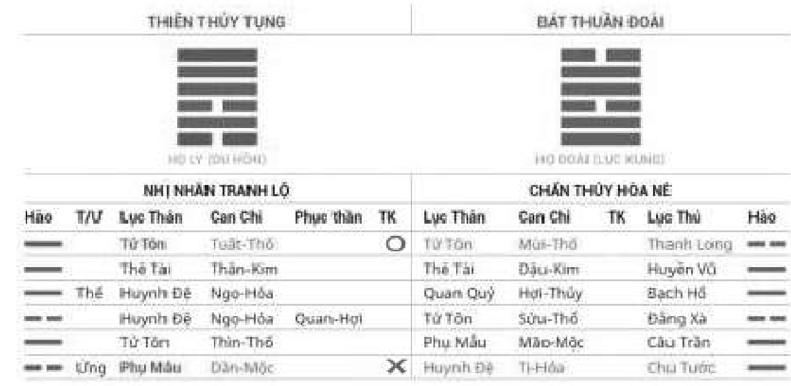

- **Cấu trúc Quẻ Dịch:**
  - **Quẻ chủ:** **Thiên Thủy Tụng** (Cung Ly, Họ Ly – Quẻ Du Hồn)  
    *Tượng quẻ:* Nhị Nhân Tranh Lộ (Hai người tranh đường – biểu thị tình trạng bế tắc, xung khắc ý kiến, việc giằng co khó thông suốt).
  - **Quẻ biến:** **Bát Thuần Đoài** (Cung Đoài, Họ Đoài – Quẻ Lục Xung)  
    *Tượng quẻ:* Chấn Thủy Hỏa Nê (Rơi vào đầm lầy – quẻ Lục Xung chủ sự việc diễn ra dồn dập, biến động nhanh chóng, thích hợp hành động tức thì trong ngắn hạn).

- **Bảng chi tiết Lục hào:**

| Hào | Thế/Ứng | Lục thân (Chủ) | Can Chi | Biến động | Lục thân (Biến) | Can Chi (Biến) | Thần sát / Phục | Lục thú |
|:---:|:---:|:---|:---|:---:|:---|:---|:---|:---|
| 6 | | Tử Tôn | Tuất - Thổ | **O (Động)** | Tử Tôn | Mùi - Thổ | Hoa cái, Nhật kiến | Thanh Long |
| 5 | | Thê Tài | Thân - Kim | tĩnh | Thê Tài | Dậu - Kim | Dịch mã, Văn xương | Huyền Vũ |
| 4 | **Thế** | Huynh Đệ | Ngọ - Hỏa | tĩnh | Quan Quỷ | Hợi - Thủy | Tướng tinh, Nguyệt kiến, Tuần không, Dương nhẫn | Bạch Hổ |
| 3 | | Huynh Đệ | Ngọ - Hỏa | tĩnh | Tử Tôn | Sửu - Thổ | Phục: Quan Quỷ Hợi Thủy | Đằng Xà |
| 2 | | Tử Tôn | Thìn - Thổ | tĩnh (Ám động) | Phụ Mẫu | Mão - Mộc | Mưu tinh (Nhật xung) | Câu Trần |
| 1 | **Ứng** | Phụ Mẫu | Dần - Mộc | **X (Động)** | Huynh Đệ | Tị - Hỏa | Đào hoa | Chu Tước |

---

### 3. Dụng thần & Loại quẻ

- **Phân loại quẻ:**
  - **Quẻ can thiệp y tế sinh sản hiện đại (IVF & Mang thai hộ):** Đòi hỏi sự kết hợp giữa kỹ thuật y khoa và phôi thai sinh nở.
  - **Quẻ việc cụ thể ngắn hạn:** Đương số đứng trước ngưỡng quyết định ký hợp đồng y tế và chuyển phôi ngay trong chu kỳ hiện tại.
- **Xác định Dụng thần:**
  1. **Dụng thần Con cái (Tử Tôn Tuất Thổ & Thìn Thổ):** Đại diện cho phôi thai, trứng thụ tinh và kết quả mang thai.
  2. **Dụng thần Y tế & Người mang thai hộ (Phụ Mẫu Dần Mộc ở hào Ứng):** Trong bối cảnh can thiệp mang thai hộ, hào Phụ Mẫu đại diện cho người mang thai thế và cơ sở y tế thực hiện thủ thuật cấy ghép.
  3. **Hào Thế (Huynh Đệ Ngọ Hỏa):** Đại diện cho chính đương số (người chi tiền, người thụ hưởng kết quả đứa trẻ).
  4. **Kỵ thần tiêu hao tài chính (Huynh Đệ Tị Hỏa biến ra mang Lộc thần):** Đại diện cho chi phí phẫu thuật và chăm sóc y tế rất đắt đỏ.

---

### 4. Luận giải chi tiết

Quẻ này thể hiện sự linh hoạt sâu sắc trong phương pháp luận Lục Hào khi áp dụng vào các vấn đề y học kỹ thuật cao thời hiện đại:

#### 1. Định vị và động thái của Dụng thần Tử Tôn
- **Hào 6 Tử Tôn Tuất Thổ minh động:** Tử Tôn Tuất Thổ lâm Nhật kiến phát động, mang Thanh Long là điềm hỷ khánh cát lành. Động biến Tử Tôn Mùi Thổ theo thường lý là "hóa thoái", biểu thị nếu kéo dài lê thê qua nhiều tháng năm thì hy vọng sẽ ngày một lụi tàn.
- **Cơ chế ngắn hạn không tính hóa thoái:** Trong việc ngắn hạn cấp bách, Tuất Thổ lâm Nhật lệnh phát động có lực lượng cực mạnh; hào biến Mùi Thổ lâm Tuần không, đến tiết tháng Mùi (khoảng cuối tháng 7) sẽ "xuất không điền thực", biến thành hào động hữu dụng tức thì. Do đó trong ngắn hạn đây là dấu hiệu kích hoạt thành công chứ không phải suy thoái.
- **Hào 2 Tử Tôn Thìn Thổ ám động:** Thìn Thổ được Nguyệt sinh, bị Nhật thần Tuất Thổ tương xung thành Ám động (*vượng tướng phùng xung tắc phát*), cùng hợp lực với Tuất Thổ trợ khởi nguồn khí con cái.

#### 2. Vai trò đặc thù của Hào Ứng Phụ Mẫu Dần Mộc
- **Phá vỡ góc nhìn sách vở cố định:** Thông thường Phụ Mẫu là Kỵ thần khắc Tử Tôn. Tuy nhiên trong thụ tinh nhân tạo và mang thai hộ, người mang thai hộ và đội ngũ bác sĩ chính là hào Phụ Mẫu. Đứa trẻ không thể tự nhiên ra đời nếu thiếu đi cơ thể người mang thai hộ.
- **Xu hướng sinh trợ hào Thế:** Hào 1 Phụ Mẫu Dần Mộc ở hào Ứng phát động không hướng vào việc khắc Tử Tôn, mà hướng thẳng vào việc **sinh trợ hào Thế Huynh Đệ Ngọ Hỏa** (Mộc sinh Hỏa). Điều này biểu thị người mang thai hộ và bệnh viện dốc lòng hợp tác, tác thành kết quả tốt đẹp cho người nhờ làm thủ thuật.
- **Động động tương liên:** Phụ Mẫu Dần Mộc (hào 1) và Tử Tôn Tuất Thổ (hào 6) cùng phát động, hình thành quan hệ tam hợp bán cục Dần - Ngọ - Tuất hướng về hào Thế Ngọ Hỏa, kéo cả phôi thai và người mang thai cùng quy tụ vào bản thân đương số.

#### 3. Chi phí tốn kém và tương hình Dần - Tị
- Hào 1 Phụ Mẫu Dần Mộc biến xuất **Huynh Đệ Tị Hỏa** mang Lộc thần và Thiên y. Huynh Đệ chủ hao tán, Lộc thần chủ tiền bạc, Dần và Tị phạm quan hệ tương hình. Tượng này phản ánh chính xác chi phí thủ thuật mang thai hộ vô cùng tốn kém và đòi hỏi sự chi tiêu lớn từ gia đình, khiến đương số phải đắn đo cân não.

#### 4. Khung thời gian then chốt (Thời không chiêm nghiệm)
- Lúc xem quẻ đã là cuối tháng 7 (sắp hết tháng Mùi). Chu Thần Bân nhận định thời cơ vàng chỉ còn lại trong khoảng 6 đến 7 ngày của tháng Mùi.
- Sang ngày 08 tháng 08 là tiết Lập Thu bước vào tháng Thân (Kim vượng), Thân Kim sẽ trực xung lệnh phá hào Phụ Mẫu Dần Mộc. Nếu Dần Mộc bị xung tán thì cơ sở mang thai hộ sẽ đổ vỡ, mất đi cầu nối sinh trợ cho hào Thế. Do đó, quẻ biến Lục Xung Bát Thuần Đoài thúc giục đương số phải hành động cấp tốc, quyết đoán trong chớp mắt.

---

### 5. Kết luận & Ứng kỳ thực tế

- **Lời giải đoán của Chu Thần Bân:**
  - Khẳng định đợt thụ tinh ống nghiệm và mang thai hộ lần này có cơ hội thành công khoảng 50% – một tỷ lệ rất cao đối với tiền sử 4 lần thất bại trước đó.
  - Yêu cầu đương số không được chần chừ, phải cấp tốc quay về Thâm Quyến trong vòng vài ngày cuối tháng Mùi trước ngày 08 tháng 08 để tiến hành thủ thuật chuyển phôi.
- **Phản hồi thực tế từ đương số:**
  - Đương số nghe theo lời khuyên, lập tức đáp máy bay về Thâm Quyến hoàn tất thủ tục và tiến hành cấy phôi trong tháng Mùi.
  - Kết quả kiểm tra y tế sau đó xác nhận: Quá trình phối hợp thụ tinh ống nghiệm đã thành công tốt đẹp, người mang thai hộ đã đậu thai an toàn.
- **Ứng kỳ chiêm nghiệm:**
  - Ứng vào những ngày cuối tháng Mùi (trước tiết Lập Thu ngày 08/08/2016), khi Tử Tôn Mùi Thổ xuất không điền thực và Phụ Mẫu Dần Mộc chưa bị tháng Thân xung phá.

---

### 6. Bài học tâm pháp & Quy tắc cốt lõi

- **Quy tắc trích dẫn:**
  - Trích dẫn Quy tắc phân định hào Phụ mẫu (mang thai hộ/cơ sở y tế) và Tử tôn khi chiêm đoán thụ tinh nhân tạo (*Cổ Thệ Chân Thuyên*, trang 118; `rule_index` mục 1).
- **Bài học tâm pháp thực chiến:**
  1. *Linh hoạt Dụng thần theo hoàn cảnh thực tế:* Khi xem xét các sự vụ y học sinh sản phức tạp, không được máy móc quy chụp "Phụ Mẫu khắc Tử Tôn là hung". Cần nhận diện Phụ Mẫu là phương tiện y tế/người mang thai hộ, nếu Phụ Mẫu sinh Thế tức là phương tiện đó đem lại thành quả cho người hỏi.
  2. *Quy luật hóa thoái trong ngắn hạn:* Hào mang Nhật lệnh phát động biến thoái trong sự việc ngắn hạn cấp bách không luận là suy giảm, mà luận là "hóa động", chỉ khi kéo dài dài hạn mới bộc lộ thuộc tính thoái lui.
  3. *Trọng khinh hoãn cấp và thời không bối cảnh:* Dự trắc thời điểm phải bám sát lịch tiết khí để cảnh báo khách hàng chớp lấy thời cơ trước khi lệnh tháng chuyển giao bất lợi.

## THỰC CHIẾN 12: ÔNG DƯƠNG HỎI VỀ LÝ DO DẪN ĐẾN VIỆC KHÓ SINH CON

---

### 1. Bối cảnh & Câu hỏi

- **Bối cảnh chi tiết:** 
  Ông Dương đã hơn 40 tuổi, kết hôn nhiều năm nhưng hai vợ chồng vẫn chưa thể sinh được một mụn con ruột. Họ đã nhận nuôi một đứa trẻ để tìm kiếm niềm vui gia đình và nuôi hy vọng "dẫn lộc" mang thai tự nhiên sau này. Tuy nhiên, mọi nỗ lực mang thai tự nhiên đều vô vọng. Họ đã chuyển sang thực hiện thụ tinh ống nghiệm (IVF) nhiều lần: phần lớn các lần đều thất bại, duy nhất có một lần phôi thai làm tổ thành công nhưng người vợ lại nhanh chóng bị sẩy thai trong thời gian ngắn.
- **Tâm lý & Câu hỏi ẩn ý:** 
  Đương số rơi vào trạng thái bối rối, hoang mang tột cùng, không rõ nguyên nhân vô sinh hiếm muộn xuất phát từ phía người chồng, người vợ, cả hai bên hay do sai sót kỹ thuật y khoa trong các quy trình IVF. Ông muốn thông qua quẻ Dịch để truy tìm căn nguyên cốt lõi và tìm ra giải pháp khả thi nhất.
- **Thời gian chiêm đoán:**
  - Dương lịch: Ngày 19 tháng 10 năm 2016, 16:38 (Giờ Bắc Kinh).
  - Can chi: Năm Bính Thân, tháng Mậu Tuất, ngày Giáp Tuất, giờ Nhâm Thân.

---

### 2. Dữ kiện & Bảng quẻ Crop

- **Thời không chiêm nghiệm:**
  - Tháng Mậu Tuất (Thổ vượng, Kim tướng, Hỏa hưu, Mộc tù, Thủy tuyệt).
  - Ngày Giáp Tuất (Thổ vượng, Hỏa mộ).
  - Tuần không: **Thân - Dậu** (Giáp Tuất tuần trung, Thân Dậu không vong).
- **Thần sát:**
  - Tướng tinh: Ngọ
  - Hoa cái: Tuất
  - Dịch mã: Thân
  - Tai sát: Tý
  - Mưu tinh: Thìn
  - Đào hoa: Mão
  - Kiếp sát: Hợi
  - Lộc thần: Dần
  - Dương nhẫn: Mão
  - Văn xương: Tị
  - Thiên y: Dậu
  - Thiên hỷ: Thìn
  - Quý nhân: Sửu, Mùi

- Dữ kiện bảng quẻ và các thông số chiêm đoán:
  - **Bảng 12.1** Đồ hình quẻ Thực chiến 12:
    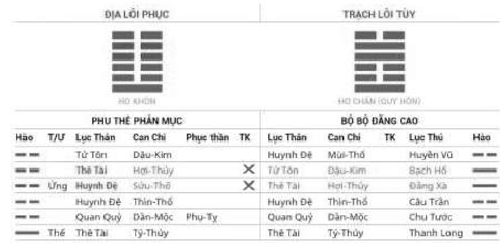

- **Cấu trúc Quẻ Dịch:**
  - **Quẻ chủ:** **Địa Lôi Phục** (Cung Khôn, Họ Khôn)  
    *Tượng quẻ:* Phụ Thê Phân Mục (Vợ chồng bất hòa, việc lặp đi lặp lại nhiều lần không dứt – phản ánh tiền sử làm IVF và thụ thai thất bại nhiều lần).
  - **Quẻ biến:** **Trạch Lôi Tùy** (Cung Chấn, Họ Chấn – Quẻ Quy Hồn)  
    *Tượng quẻ:* Bộ Bộ Đăng Cao (Tùy tùng bị động, việc phải thuận theo ngoại lực, không thể tự mình làm chủ thế cuộc).

- **Bảng chi tiết Lục hào:**

| Hào | Thế/Ứng | Lục thân (Chủ) | Can Chi | Biến động | Lục thân (Biến) | Can Chi (Biến) | Thần sát / Phục | Lục thú |
|:---:|:---:|:---|:---|:---:|:---|:---|:---|:---|
| 6 | | Tử Tôn | Dậu - Kim | tĩnh | Huynh Đệ | Mùi - Thổ | Tuần không, Thiên y | Huyền Vũ |
| 5 | | Thê Tài | Hợi - Thủy | **X (Động)** | Tử Tôn | Dậu - Kim | Kiếp sát | Bạch Hổ |
| 4 | **Ứng** | Huynh Đệ | Sửu - Thổ | **X (Động)** | Thê Tài | Hợi - Thủy | Quý nhân | Đằng Xà |
| 3 | | Huynh Đệ | Thìn - Thổ | tĩnh | Huynh Đệ | Thìn - Thổ | Mưu tinh, Thiên hỷ | Câu Trần |
| 2 | | Quan Quỷ | Dần - Mộc | tĩnh | Quan Quỷ | Dần - Mộc | Lộc thần, Phục: Phụ Mẫu Tị Hỏa | Chu Tước |
| 1 | **Thế** | Thê Tài | Tý - Thủy | tĩnh | Thê Tài | Tý - Thủy | Tai sát | Thanh Long |

---

### 3. Dụng thần & Loại quẻ

- **Phân loại quẻ:**
  - **Quẻ chẩn đoán y lý & tìm nguyên nhân sự việc:** Truy nguyên căn bệnh hiếm muộn của hai vợ chồng.
  - **Quẻ thân thế & sinh sản kết hợp:** Vừa xem khả năng thụ thai của gia đạo vừa định vị chướng ngại tạng phủ.
- **Xác định Dụng thần:**
  1. **Dụng thần Con cái (Tử Tôn Dậu Kim):** Xuất hiện tại hào 6 và hào biến của hào 5, đại diện cho phôi thai và sự thụ thai thành công.
  2. **Dụng thần Hệ thống sinh dục & Sức khỏe vợ chồng (Thê Tài Tý Thủy tại Thế & Thê Tài Hợi Thủy):** Đại diện cho dịch thể, buồng trứng, túi tinh và năng lực thụ thai tự nhiên.
  3. **Tạng phủ chướng ngại (Nhật Nguyệt Tuất Thổ & Hào Ứng Sửu Thổ):** Đại diện cho tạng Thận và kho chứa dịch sinh dục (tử cung, buồng trứng, túi tinh).

---

### 4. Luận giải chi tiết

Quẻ này là một mẫu mực kinh điển về chẩn đoán y lý Đông - Tây y kết hợp qua hệ thống tượng số Lục Hào:

#### 1. Cơ chế tượng quẻ Phục biến Tùy
- **Quẻ chủ Địa Lôi Phục:** Chủ về sự tái diễn, lặp đi lặp lại (*phục giả phản dã*). Đương số đã thực hiện thụ thai và làm IVF nhiều lần liên tục nhưng kết quả vẫn quay về con số không.
- **Quẻ biến Trạch Lôi Tùy (Quy hồn):** Chủ về sự bị động, phải nương nhờ người khác (*tùy tòng*). Đương số không thể tự chủ sinh sản tự nhiên mà buộc phải phó thác hoàn toàn vào can thiệp y tế nhân tạo.

#### 2. Chẩn đoán y lý: Phân biệt Thìn Thổ và Tuất Thổ định vị "Thận hư"
- **Quy luật hình thái cơ quan trong Lục Hào:**
  - **Thìn Thổ (Thủy khố):** Đại diện cho cơ quan dương tính, rỗng ở giữa và chứa chất lỏng dịch thể (như túi mật, dạ dày, bàng quang, ruột).
  - **Tuất Thổ (Hỏa khố):** Đại diện cho cơ quan âm tính, cấu trúc thể xốp (*hải miên thể*), đặc và nhiều vi mạch (như gan, lách, phổi, thận, tinh hoàn).
- **Nhật Nguyệt song trùng Tuất Thổ:** Cả Nhật kiến và Nguyệt kiến đều là Tuất Thổ đồng thời giáng lâm, biểu thị hai cơ quan đối xứng thể xốp trong cơ thể. Trong hệ tiết niệu - sinh dục, đó chính là **hai quả thận**.
- **Tuất Thổ khắc hãm hào Thế Thê Tài Tý Thủy:** Hào 1 Tý Thủy lâm Thanh Long (sắc dục, hạ bộ, cơ quan sinh dục) bị hai Tuất Thổ của Nhật Nguyệt khắc phạt nặng nề. Điều này chẩn đoán chính xác: Cả hai vợ chồng đều bị chứng **thận hư** theo Đông y (suy giảm chức năng tuyến sinh dục và thận theo Tây y), dẫn tới việc sinh nở tự nhiên hoàn toàn bế tắc.

#### 3. Chướng ngại vi mô tại Sửu Thổ và chất lượng tinh trùng - trứng
- **Hào 4 Huynh Đệ Sửu Thổ động:** Sửu Thổ là Kim khố (kho chứa Tử Tôn Kim), đại diện cho tử cung/buồng trứng ở nữ và túi tinh/tinh hoàn ở nam.
- **Sửu Thổ hợp khắc Tý Thủy:** Khắc có hợp không làm tổn thương hủy diệt tức thời mà gây ra sự tắc nghẽn, trì trệ (*thổ khắc thủy tắc lưu thông bất sướng*). Ống dẫn tinh và ống dẫn trứng kém lưu thông.
- **Sửu Thổ hóa Hợi Thủy mang Kiếp sát:** Xung khắc hào Văn Xương ngụ ý chất lượng tinh trùng và trứng kém, tính linh động và độ hoàn thiện sinh học không đạt tiêu chuẩn.

#### 4. Phân tích "Trọng khinh hoãn cấp" và lối thoát thụ tinh nhân tạo
- **Hồi phục tự nhiên quá dài hạn:** Muốn điều trị dứt điểm tình trạng thận hư và nâng cao chất lượng trứng/tinh trùng tự nhiên phải mất từ 1 đến vài năm.
- **Giải pháp ngắn hạn qua hào động:** Hào 4 Huynh Đệ Sửu Thổ (tập hợp nhân tạo nhiều tinh trùng - trứng) động biến Thê Tài Hợi Thủy (môi trường dịch lỏng), rồi Hợi Thủy động biến **Tử Tôn Dậu Kim**. Đây là chu trình mô phỏng hoàn hảo kỹ thuật thụ tinh trong ống nghiệm (IVF).
- **Hào biến Tử Tôn Dậu Kim lâm Tuần không:** Hào động hóa không là "động bất vi không", khi gặp năm tháng điền thực (năm Dậu hoặc tháng Dậu) thì cơ hội có con sẽ thành hiện thực.

#### 5. Cảnh báo hung triệu Bạch Hổ và nguy cơ sẩy thai
- Tử Tôn Dậu Kim lâm **Bạch Hổ** (chủ tang thương, mất mát, tai nạn máu me) và phát sinh quan hệ biến hóa với Hợi Thủy.
- Đây là dấu hiệu cảnh báo cực kỳ nghiêm trọng: Dù IVF có giúp phôi thai đậu thành công, nguy cơ sẩy thai, chết lưu hoặc sinh non do vỡ ối sớm vẫn rình rập rất cao nếu không có biện pháp dưỡng thai nghiêm ngặt.

---

### 5. Kết luận & Ứng kỳ thực tế

- **Lời giải đoán của Chu Thần Bân:**
  - Khẳng định nguyên nhân chính là do cả hai vợ chồng đều bị "thận hư", chất lượng tinh trùng và trứng kém khiến việc thụ thai tự nhiên không thể diễn ra.
  - Khuyên đương số không nên chờ đợi bồi bổ dài hạn mà nên tiếp tục can thiệp bằng phương pháp thụ tinh ống nghiệm (IVF). Thời điểm vàng để tiến hành chuyển phôi đạt tỷ lệ thành công cao nhất là vào năm Đinh Dậu (2017), đặc biệt là vào tháng 3 (tháng Mão xung không) và tháng 9 (tháng Dậu điền thực).
  - Cảnh báo bắt buộc phải có phác đồ an thai và bảo vệ thai nhi tối đa ngay từ ngày đầu đậu thai, vì hào Tử Tôn ngậm Bạch Hổ mang rủi ro sẩy thai rất lớn.
- **Phản hồi thực tế từ đương số:**
  - Đương số hoàn toàn xác nhận: Trước đó hai vợ chồng đã làm IVF đậu thai được một lần, nhưng chỉ sau thời gian ngắn thai nhi đã bị sẩy tự nhiên đúng như cảnh báo Bạch Hổ của quẻ. Hiện tại gia đình đã nhận nuôi một bé và chuẩn bị tinh thần cho chu kỳ IVF tiếp theo.
- **Ứng kỳ chiêm nghiệm:**
  - Cơ hội ứng nghiệm điền thực phôi thai vào năm Đinh Dậu (2017), tập trung vào hai tháng tiết khí Mão (tháng 3) và Dậu (tháng 9).

---

### 6. Bài học tâm pháp & Quy tắc cốt lõi

- **Quy tắc trích dẫn:**
  - Trích dẫn Quy tắc quẻ Địa Lôi Phục biến Trạch Lôi Tùy và cơ chế chẩn đoán nguyên nhân trở ngại sinh sản (*Cổ Thệ Chân Thuyên*, trang 126; `rule_index` mục 2).
- **Bài học tâm pháp thực chiến:**
  1. *Phân định cơ quan cơ thể qua đặc tính Thìn - Tuất Thổ:* Thìn Thổ đại diện cho nội tạng rỗng chứa dịch (dương), Tuất Thổ đại diện cho nội tạng đặc thể xốp (âm). Cặp Tuất Thổ tại Nhật Nguyệt chỉ thị rõ nét hai quả thận.
  2. *Tâm pháp "Trọng khinh hoãn cấp":* Phân định rõ việc trước mắt và việc lâu dài; khi tự nhiên bế tắc lâu dài, hào động chỉ ra con đường can thiệp kỹ thuật ngắn hạn để giải quyết mục tiêu cấp bách.
  3. *Tượng Bạch Hổ lâm Tử Tôn:* Là tín hiệu cảnh báo thai sản có biến cố huyết quang, chết yểu hoặc sẩy thai, đòi hỏi thầy Dịch phải đưa ra giải pháp phòng ngừa an thai thay vì chỉ dừng lại ở việc báo tin đậu thai.

## THỰC CHIẾN 13: MUA CĂN HỘ THƯƠNG MẠI TẠI PHẬT SƠN THIÊN ĐĂNG HỒ CÓ TỐT KHÔNG

---

### 1. Bối cảnh & Câu hỏi

- **Bối cảnh chi tiết:** 
  Đương số nhắm tới một căn hộ thương mại - dịch vụ (căn hộ chung cư officetel/thương mại) tại khu vực Thiên Đăng Hồ, thành phố Phật Sơn, tỉnh Quảng Đông. Căn hộ này có thiết kế thông tầng (duplex dạng "mua một tầng tặng một tầng"), giá bán chỉ bằng khoảng 70% so với nhà ở thông thường, không bị siết hạn chế mua bán. Tuy nhiên, loại hình căn hộ thương mại - dịch vụ có nhược điểm lớn: không thể nhập hộ khẩu, không có suất học cho con, tiền điện nước tính theo giá thương mại và thuế phí chuyển nhượng rất cao (gấp khoảng 3 lần nhà ở thông thường). Đương số đã chuẩn bị tiền đặt cọc vào tháng 9 năm 2016.
- **Tâm lý & Câu hỏi ẩn ý:** 
  Bề ngoài người hỏi nói là mua để cải thiện chỗ ở sinh hoạt, nhưng trong thâm tâm lại chất chứa nỗi sợ bị giảm giá, sợ "đu đỉnh" và mong muốn tài sản ít nhất phải giữ được giá trị vốn hoặc tăng giá như bất động sản nhà ở nói chung.
- **Thời gian chiêm đoán:**
  - Dương lịch: Ngày 11 tháng 09 năm 2016, 11:26 (Giờ Bắc Kinh).
  - Can chi: Năm Bính Thân, tháng Đinh Dậu, ngày Bính Thân, giờ Giáp Ngọ.

---

### 2. Dữ kiện & Bảng quẻ Crop

- **Thời không chiêm nghiệm:**
  - Tháng Đinh Dậu (Kim vượng, Thủy tướng, Thổ hưu, Hỏa tù, Mộc tử).
  - Ngày Bính Thân (Kim vượng, Thủy trường sinh).
  - Tuần không: **Thìn - Tị** (Giáp Ngọ tuần trung, Thìn Tị không vong).
- **Thần sát:**
  - Tướng tinh: Tý
  - Hoa cái: Thìn
  - Dịch mã: Dần
  - Tai sát: Ngọ
  - Mưu tinh: Tuất
  - Đào hoa: Dậu
  - Kiếp sát: Tị
  - Lộc thần: Tị
  - Dương nhẫn: Ngọ
  - Văn xương: Thân
  - Thiên y: Thân
  - Thiên hỷ: Thìn
  - Quý nhân: Dậu, Hợi

- Dữ kiện bảng quẻ và các thông số chiêm đoán:
  - **Bảng 13.1** Đồ hình quẻ Thực chiến 13:
    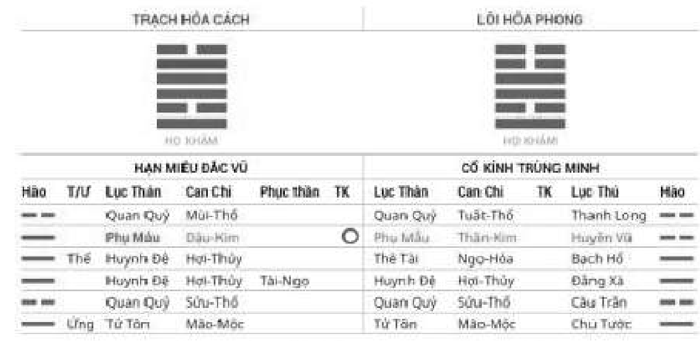

- **Cấu trúc Quẻ Dịch:**
  - **Quẻ chủ:** **Trạch Hỏa Cách** (Cung Khảm, Họ Khảm)  
    *Tượng quẻ:* Thuận Thiên Ứng Nhân (Thay đổi hoàn cảnh, thời thế đổi thay đột ngột – phản ánh chính sách thị trường bất động sản sắp có biến động bước ngoặt).
  - **Quẻ biến:** **Lôi Hỏa Phong** (Cung Khảm, Họ Khảm)  
    *Tượng quẻ:* Nhật Trung Tắc Trắc (Phong phú dư thừa – biểu thị nguồn cung và tồn kho căn hộ trên thị trường quá lớn, cung vượt cầu).

- **Bảng chi tiết Lục hào:**

| Hào | Thế/Ứng | Lục thân (Chủ) | Can Chi | Biến động | Lục thân (Biến) | Can Chi (Biến) | Thần sát / Phục | Lục thú |
|:---:|:---:|:---|:---|:---:|:---|:---|:---|:---|
| 6 | | Quan Quỷ | Mùi - Thổ | tĩnh | Quan Quỷ | Tuất - Thổ | | Thanh Long |
| 5 | | Phụ Mẫu | Dậu - Kim | **O (Động)** | Phụ Mẫu | Thân - Kim | Nguyệt kiến, Đào hoa, Quý nhân (Biến: Nhật kiến, Văn xương, Thiên y) | Huyền Vũ |
| 4 | **Thế** | Huynh Đệ | Hợi - Thủy | tĩnh | Thê Tài | Ngọ - Hỏa | Quý nhân | Bạch Hổ |
| 3 | | Huynh Đệ | Hợi - Thủy | tĩnh | Huynh Đệ | Hợi - Thủy | Phục: Thê Tài Ngọ Hỏa | Đằng Xà |
| 2 | | Quan Quỷ | Sửu - Thổ | tĩnh | Quan Quỷ | Sửu - Thổ | | Câu Trần |
| 1 | **Ứng** | Tử Tôn | Mão - Mộc | tĩnh | Tử Tôn | Mão - Mộc | Nguyệt phá, Nhật khắc | Chu Tước |

---

### 3. Dụng thần & Loại quẻ

- **Phân loại quẻ:**
  - **Quẻ chiêm trạch & đánh giá đầu tư tài sản thương mại:** Phân định giữa giá trị sử dụng (ở thực) và giá trị vốn đầu tư (giữ giá, sinh lời).
- **Xác định Dụng thần:**
  1. **Dụng thần Bảo toàn giá trị / Đầu tư (Tử Tôn Mão Mộc tại hào 1 Ứng):** Khi người hỏi mang tâm lý sợ mất giá, cầu sự an toàn vốn thì Tử Tôn (phúc thần sinh tài) là Dụng thần quyết định cát hung.
  2. **Dụng thần Chỗ ở / Nhu cầu ở thực (Phụ Mẫu Dậu Kim tại hào 5):** Đại diện cho thực thể căn nhà, môi trường cư ngụ sinh hoạt.
  3. **Hào Thế (Huynh Đệ Hợi Thủy tại hào 4):** Đại diện cho đương số và túi tiền của người đầu tư.

---

### 4. Luận giải chi tiết

Quẻ này là bài học thực tiễn kinh điển về việc định vị đúng tâm lý người hỏi để chọn Dụng thần, tránh nhầm lẫn giữa nhu cầu ở và nhu cầu bảo toàn vốn:

#### 1. Phân định tâm lý người hỏi: Nhu cầu ở thực hay Bảo toàn giá trị?
- Nếu thuần túy mua để ở thực, lấy **Phụ Mẫu Dậu Kim** làm Dụng thần. Phụ Mẫu lâm Nguyệt lệnh phát động sinh hào Thế Huynh Đệ Hợi Thủy, biểu thị ở ngắn hạn rất tốt, môi trường rộng rãi nhờ thiết kế thông tầng.
- Tuy nhiên, tâm lý thực sự của đại đa số người mua nhà là không chấp nhận việc vừa mua xong tài sản bị rớt giá hay "chôn vốn". Khi câu hỏi hướng vào việc "có thích hợp mua hay không" dưới góc độ giá trị tài sản, bắt buộc phải lấy **Tử Tôn Mão Mộc** làm Dụng thần.

#### 2. Nguyên tắc ưu tiên Dụng thần trước Hào Thế
- Hào 5 Phụ Mẫu Dậu Kim phát động đồng thời tác động lên hai đối tượng: vừa sinh hào Thế Hợi Thủy, vừa trực xung khắc phạt Dụng thần Tử Tôn Mão Mộc.
- Theo nguyên lý Lục Hào: Khi một hào động đồng thời tác động lên Thế và Dụng, thì **chiều tác động lên Dụng thần giữ vai trò định tính cát hung quyết định**, còn chiều tác động lên hào Thế chỉ là chi tiết bổ trợ. Do đó, việc Dậu Kim xung khắc Tử Tôn Mão Mộc định tính dứt khoát rằng: Đây là một thương vụ đầu tư thất bại và không thích hợp để mua.

#### 3. Tử Tôn Mão Mộc bị Nguyệt phá Nhật khắc và thực tế thị trường
- Hào 1 Tử Tôn Mão Mộc bị Nguyệt kiến Dậu Kim xung phá (Nguyệt phá), bị Nhật kiến Thân Kim khắc phạt (Nhật khắc), lại bị chính hào động Phụ Mẫu Dậu Kim lâm Đào hoa trực xung khắc hại.
- Thực tế tại khu vực Thiên Đăng Hồ: Căn hộ thương mại dịch vụ đang tồn kho rất nhiều, thanh khoản ảm đạm, người mua thưa thớt trái ngược với phân khúc nhà ở thông thường. Vì vậy tượng Tử Tôn Mão Mộc bị phá khắc hoàn toàn khớp với thực tế khách quan, không thể luận là "cực suy phản vượng".

#### 4. Đối sánh giữa Nhà ở dân cư (Kim) và Phi nhà ở (Mộc)
- Trong phép biện chứng Lục Hào, Mão Mộc đại diện cho căn hộ thương mại (phi nhà ở), đối lập trực xung với Dậu Kim (nhà ở dân cư có hộ khẩu).
- Cả Nhật lệnh (Thân Kim) và Nguyệt lệnh (Dậu Kim) đều mang hành Kim, biểu thị dòng tiền và nhu cầu phổ thông của xã hội chỉ đổ dồn vào nhà ở thông thường. Căn hộ thương mại Mão Mộc bị cả thị trường đào thải.

#### 5. Cơ chế quẻ Cách biến quẻ Phong và cảnh báo chính sách
- **Trạch Hỏa Cách:** Sự thay đổi chóng vánh của môi trường vĩ mô (*Cách giả, biến dã*).
- **Lôi Hỏa Phong:** "Phong" là phong phú, kết hợp hào Phụ Mẫu lâm Nhật Nguyệt chỉ lượng hàng tồn kho căn hộ cực lớn khiến giá nhà không thể ngóc đầu lên nổi.
- Hào 5 Phụ Mẫu Dậu Kim lâm Đào hoa xung khắc báo hiệu sắp có chính sách quản lý nhà đất mới được ban hành trong ngắn hạn làm thị trường đóng băng.

---

### 5. Kết luận & Ứng kỳ thực tế

- **Lời giải đoán của Chu Thần Bân:**
  - Khuyên đương số tuyệt đối không nên xuống tiền mua căn hộ thương mại Thiên Đăng Hồ vào lúc này. Dù căn hộ có thiết kế thông tầng ở thoải mái nhưng giá trị tài sản sẽ bị trói chặt, thanh khoản bế tắc và đối mặt với rủi ro rớt giá do thị trường sắp đổi chiều chính sách.
  - Nếu muốn bảo toàn và gia tăng giá trị vốn thì chỉ nên tập trung vào phân khúc nhà ở thông thường.
- **Phản hồi thực tế từ đương số:**
  - Nghe theo lời phân tích cặn kẽ, đương số đã kiềm chế và hủy bỏ kế hoạch đặt cọc trong tháng 9 năm 2016.
  - Đến tháng 10 năm 2016 (tháng Tuất), chính phủ đồng loạt ban hành chính sách thắt chặt và kiểm soát nghiêm ngặt thị trường bất động sản. Thị trường nhà đất toàn tỉnh Quảng Đông hạ nhiệt, phân khúc căn hộ thương mại - dịch vụ lập tức rơi vào trạng thái đóng băng hoàn toàn, người mua thoát hiểm ngoạn mục khỏi bẫy chôn vốn.
- **Ứng kỳ chiêm nghiệm:**
  - Ứng vào tháng 10 năm 2016 (tiết tháng Mậu Tuất), chỉ một tháng sau khi gieo quẻ, làn sóng chính sách kiểm soát bất động sản chính thức bùng nổ.

---

### 6. Bài học tâm pháp & Quy tắc cốt lõi

- **Quy tắc trích dẫn:**
  - Trích dẫn Quy tắc chiêm trạch mua căn hộ thương mại qua quẻ Trạch Hỏa Cách biến Lôi Hỏa Phong và đánh giá hào Phụ mẫu bị Nguyệt phá Nhật khắc (*Cổ Thệ Chân Thuyên*, trang 138; `rule_index` mục 3).
- **Bài học tâm pháp thực chiến:**
  1. *Định vị đúng bản chất Dụng thần:* Không để ngôn từ bề ngoài của khách hàng đánh lừa; khi tâm lý khách sợ giảm giá và cầu toàn tài chính, Tử Tôn (phúc thần giữ giá) bắt buộc phải là Dụng thần phán đoán.
  2. *Quy tắc Dụng thần ưu tiên hơn Thế hào:* Khi hào động vừa sinh Thế vừa khắc Dụng thì tính chất khắc Dụng thần quyết định bản chất cát hung của sự việc; sự sinh Thế chỉ là lợi ích nhỏ thứ yếu (ở thoải mái nhưng lỗ tiền).
  3. *Tượng quẻ Cách biến Phong:* Quẻ Cách báo hiệu chính sách vĩ mô đảo chiều; quẻ Phong cùng Phụ Mẫu lâm Nhật Nguyệt phản ánh quy luật cung cầu: tồn kho quá lớn thì giá cả tất phải trì trệ, không có động lực tăng trưởng.

## THỰC CHIẾN 14: HỎI VỀ SỐ XUẤT BẢN DO ÔNG NHẬM GIÚP ĐỠ CÓ PHẢI LÀ SỐ HỢP LỆ VÀ ĐÃ ĐƯỢC CỤC XUẤT BẢN PHÊ DUYỆT (CIP) HAY KHÔNG

---

### 1. Bối cảnh & Câu hỏi

- **Bối cảnh chi tiết:** 
  Một đồng môn giới thiệu Chu Thần Bân với một người tên là ông Nhậm làm việc tại đơn vị xuất bản, chuẩn bị xuất bản chính thức bộ sách *Cổ Thệ Chân Thuyên* tại Cát Lâm. Thủ tục kéo dài từ tháng 5 đến cuối tháng 9 năm 2016 vẫn chưa xong dù tác giả đã giao toàn bộ bản in và thanh toán đầy đủ phí biên tập hiệu đính. Cuối tháng 9, ông Nhậm gửi thông báo qua WeChat báo tin sách đã được phê duyệt, hẹn sau kỳ nghỉ Quốc khánh sẽ phát mã số sách. Tuy nhiên, văn bản thông báo lại mang danh nghĩa "Công ty Xuất bản Âm thanh và Hình ảnh" chứ không phải Nhà xuất bản sách giấy chính thống.
- **Tâm lý & Câu hỏi ẩn ý:** 
  Tác giả cảm nhận thấy sự mờ ám, nghi ngờ đối phương "giấu đầu lòi đuôi", toan tính dùng mã số xuất bản âm thanh/băng đĩa để đánh lận con đen nhằm hợp thức hóa sách in lậu (vi phạm pháp luật nếu đem phát hành thương mại). Tác giả gieo quẻ để thẩm định tính xác thực của số xuất bản và động cơ của đối tác.
- **Thời gian chiêm đoán:**
  - Dương lịch: Ngày 23 tháng 09 năm 2016, 17:13 (Giờ Bắc Kinh).
  - Can chi: Năm Bính Thân, tháng Đinh Dậu, ngày Mậu Thân, giờ Tân Dậu.

---

### 2. Dữ kiện & Bảng quẻ Crop

- **Thời không chiêm nghiệm:**
  - Tháng Đinh Dậu (Kim vượng, Thủy tướng, Thổ hưu, Hỏa tù, Mộc tử).
  - Ngày Mậu Thân (Kim vượng, Thủy trường sinh).
  - Tuần không: **Dần - Mão** (Giáp Thìn tuần trung, Dần Mão không vong).
- **Thần sát:**
  - Tướng tinh: Tý
  - Hoa cái: Thìn
  - Dịch mã: Dần
  - Tai sát: Ngọ
  - Mưu tinh: Tuất
  - Đào hoa: Dậu
  - Kiếp sát: Tị
  - Lộc thần: Tị
  - Dương nhẫn: Ngọ
  - Văn xương: Thân
  - Thiên y: Thân
  - Thiên hỷ: Thìn
  - Quý nhân: Sửu, Mùi

- Dữ kiện bảng quẻ và các thông số chiêm đoán:
  - **Bảng 14.1** Đồ hình quẻ Thực chiến 14:
    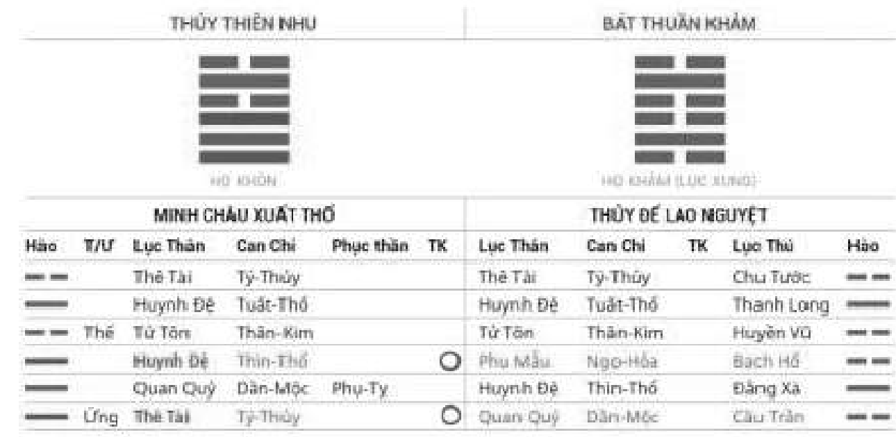

- **Cấu trúc Quẻ Dịch:**
  - **Quẻ chủ:** **Thủy Thiên Nhu** (Cung Khôn, Họ Khôn)  
    *Tượng quẻ:* Quân Tử Quang Hanh (Chờ đợi thời cơ, việc bị trì hoãn dây dưa qua nhiều tháng chưa có kết quả thực chất).
  - **Quẻ biến:** **Bát Thuần Khảm** (Cung Khảm, Họ Khảm – Quẻ Lục Xung)  
    *Tượng quẻ:* Hải Để Vớt Nguyệt (Trùng trùng gian nan, hiểm trở, quẻ Lục Xung chủ sự việc tan vỡ, đổ bể, bất thành).

- **Bảng chi tiết Lục hào:**

| Hào | Thế/Ứng | Lục thân (Chủ) | Can Chi | Biến động | Lục thân (Biến) | Can Chi (Biến) | Thần sát / Phục | Lục thú |
|:---:|:---:|:---|:---|:---:|:---|:---|:---|:---|
| 6 | | Thê Tài | Tý - Thủy | tĩnh | Thê Tài | Tý - Thủy | Tướng tinh | Chu Tước |
| 5 | | Huynh Đệ | Tuất - Thổ | tĩnh | Huynh Đệ | Tuất - Thổ | Mưu tinh | Thanh Long |
| 4 | **Thế** | Tử Tôn | Thân - Kim | tĩnh | Tử Tôn | Thân - Kim | Nhật kiến, Văn xương, Thiên y | Huyền Vũ |
| 3 | | Huynh Đệ | Thìn - Thổ | **O (Động)** | Phụ Mẫu | Ngọ - Hỏa | Hoa cái, Thiên hỷ (Biến: Dương nhẫn, Tai sát) | Bạch Hổ |
| 2 | | Quan Quỷ | Dần - Mộc | tĩnh | Huynh Đệ | Thìn - Thổ | Tuần không, Dịch mã, Phục: Phụ Mẫu Tị Hỏa | Đằng Xà |
| 1 | **Ứng** | Thê Tài | Tý - Thủy | **O (Động)** | Quan Quỷ | Dần - Mộc | Tướng tinh (Biến: Tuần không, Dịch mã) | Câu Trần |

---

### 3. Dụng thần & Loại quẻ

- **Phân loại quẻ:**
  - **Quẻ thẩm định tính chân thực của văn thư/pháp lý:** Kiểm tra tính hợp lệ của số xuất bản CIP.
  - **Quẻ sự vụ giao tế & phòng ngừa rủi ro lừa đảo:** Xem xét tâm can và động thái của đối tác trung gian.
- **Xác định Dụng thần:**
  1. **Dụng thần Văn thư & Mã số xuất bản (Phụ Mẫu):** Trong quẻ ẩn phục tại hào 2 (Phụ Mẫu Tị Hỏa) và xuất hiện ở hào biến của hào 3 (Phụ Mẫu Ngọ Hỏa).
  2. **Hào Thế (Tử Tôn Thân Kim):** Đại diện cho bản thân Chu Thần Bân; lâm Tử Tôn chủ sự cảnh giác, phòng bị, đề phòng hiểm họa.
  3. **Hào Ứng (Thê Tài Tý Thủy):** Đại diện cho bên phía ông Nhậm và cơ quan phát hành xuất bản.
  4. **Hào trợ lực (Huynh Đệ Thìn Thổ):** Đại diện cho người bạn đồng môn Lão Cố – người đứng ra làm cầu nối và kiểm soát tình hình.

---

### 4. Luận giải chi tiết

Quẻ này thể hiện sự ứng biến sắc bén trong việc bóc trần thủ đoạn lừa dối trong giao dịch xuất bản thông qua cấu trúc động biến của Lục Hào:

#### 1. Trực giác phòng thủ qua Hào Thế Tử Tôn Thân Kim lâm Huyền Vũ
- Hào 4 Tử Tôn Thân Kim giữ Thế lâm Nhật kiến: Bản thân tác giả có khí lực vững vàng, trí tuệ sáng suốt, không dễ bị lung lạc hay lừa gạt.
- Tử Tôn trì Thế chủ về **tâm lý phòng vệ, hóa giải tai ương**, không muốn vướng vào rắc rối pháp lý.
- Thần sát **Huyền Vũ** gắn với Thế hào phản ánh trực giác nhạy bén, tâm thế nghi ngờ có mưu mô mờ ám, dự cảm đối phương đang giăng một cái bẫy lớn sau những lời hứa hẹn hoa mỹ.

#### 2. Dấu hiệu gian trá: Hào Ứng phát động hóa Quỷ (Ứng hóa Quỷ)
- Hào 1 (Ứng) Thê Tài Tý Thủy phát động biến ra **Quan Quỷ Dần Mộc**: Đây là tượng *Ứng hóa Quỷ* kinh điển trong Lục Hào. Ứng là đối tác, biến ra Quỷ chứng tỏ đối phương nảy sinh tà tâm, mưu đồ giở trò bất chính để lừa gạt tiền bạc và lòng tin.
- Việc gửi thông báo dưới danh nghĩa "Công ty Xuất bản Âm thanh và Hình ảnh" chính là cái bẫy tráo khái niệm: dùng số xuất bản âm thanh giá rẻ, bất hợp pháp đối với sách in nhằm qua mặt tác giả.
- **Tình trạng của Quan Quỷ Dần Mộc:** Dần Mộc bị Nguyệt lệnh Dậu Kim khắc, Nhật lệnh Thân Kim xung (xung không), lâm trạng thái suy bại kiệt quệ. Đồng thời Dần Mộc trực xung hào Thế Thân Kim. Điều này chỉ ra: Thủ đoạn của đối phương rất vụng về, dễ bị bóc trần; tác giả kiên quyết cự tuyệt mọi phương thức lách luật phi pháp.

#### 3. Vai trò chế ước của Huynh Đệ Thìn Thổ (Lão Cố)
- Hào 3 Huynh Đệ Thìn Thổ bán hợp với hào Thế Thân Kim (Thân - Thìn hợp), đại diện cho người huynh đệ đồng môn Lão Cố tại Thượng Hải đã hết lòng giúp đỡ kết nối.
- Huynh Đệ Thìn Thổ phát động khắc chế Thê Tài Tý Thủy (Ứng), biến ra **Phụ Mẫu Ngọ Hỏa lâm Bạch Hổ** (hồi đầu sinh): Tượng trưng cho việc Lão Cố tận dụng các mối quan hệ với lãnh đạo cấp cao trong chính quyền để tạo áp lực mạnh mẽ lên phía ông Nhậm.
- Tác giả lập tức gọi điện cho Lão Cố để ra tối hậu thư: "Nếu không phải số xuất bản sách in chính thức có mã CIP chuẩn thì dứt khoát không làm". Áp lực này lập tức bẻ gãy ý đồ giở trò của đối phương.

#### 4. Quẻ Nhu biến quẻ Lục Xung Bát Thuần Khảm: Sự việc đổ vỡ hoàn toàn
- Quẻ chủ **Thủy Thiên Nhu**: Quẻ Nhu là chờ đợi, dây dưa từ tháng 5 đến tháng 9 không có tiến triển thực chất.
- Quẻ biến **Bát Thuần Khảm (Lục Xung)**: Quẻ biến Lục Xung chủ sự việc tan vỡ, hợp đồng hủy bỏ, không thành. Tượng quẻ khẳng định chắc chắn thương vụ xin số xuất bản này sẽ đổ bể, không thể đem lại mã số sách hợp lệ.

---

### 5. Kết luận & Ứng kỳ thực tế

- **Lời giải đoán của Chu Thần Bân:**
  - Khẳng định số xuất bản mà ông Nhậm thông báo là phi pháp (không phải số CIP hợp lệ của Cục Xuất Bản dành cho sách giấy), đối phương có mưu đồ lừa đảo đánh tráo khái niệm.
  - Dự báo thương vụ xuất bản này chắc chắn không thành công và sẽ giải tán theo đúng tượng Lục Xung. Tác giả chủ động dừng hợp tác và nhờ Lão Cố can thiệp để ngăn chặn thiệt hại.
- **Phản hồi thực tế từ đương số:**
  - Sau kỳ nghỉ Quốc khánh (tháng 10 năm 2016), Lão Cố gọi điện thông báo: Phía ông Nhậm thừa nhận không thể xin được số xuất bản sách in chính thức và thương vụ chính thức bị hủy bỏ.
  - Quẻ Lục Xung ứng nghiệm tuyệt đối: Sự việc tan vỡ nhưng tác giả bảo toàn được tính pháp lý và danh dự cho tác phẩm của mình.
- **Ứng kỳ chiêm nghiệm:**
  - Ứng vào tháng 10 năm 2016 (sau kỳ nghỉ Quốc khánh, tiết tháng Tuất xung Thìn), sự việc chính thức chấm dứt và giải tán.

---

### 6. Bài học tâm pháp & Quy tắc cốt lõi

- **Quy tắc trích dẫn:**
  - Trích dẫn Quy tắc thẩm định tính xác thực của số xuất bản/chứng nhận pháp lý qua hào Phụ mẫu và quẻ biến lục xung Bát Thuần Khảm (*Cổ Thệ Chân Thuyên*, trang 146; `rule_index` mục 4).
- **Bài học tâm pháp thực chiến:**
  1. *Ứng hào hóa Quỷ:* Trong hợp tác làm ăn, giao dịch giấy tờ, nếu hào Ứng phát động hóa Quỷ là điềm báo đối tác có dã tâm bất chính, lừa đảo hoặc đổi trắng thay đen.
  2. *Tử Tôn trì Thế lâm Huyền Vũ:* Đại diện cho tâm thức cảnh giác cao độ và trực giác linh mẫn của người dự trắc trước những cạm bẫy xã hội mờ ám.
  3. *Tượng quẻ biến Lục Xung:* Chiêm thư từ, hợp đồng, xuất bản mà gặp quẻ biến Lục Xung là biểu hiện của sự việc giải tán, hồ sơ bị bác bỏ, việc mưu cầu bất thành.

## THỰC CHIẾN 15: DIỄN BIẾN GẦN ĐÂY CỦA CỔ PHIẾU TRỌNG ĐIỂM

---

### 1. Bối cảnh & Câu hỏi

- **Bối cảnh chi tiết:** 
  Một nhà đầu tư chuyên nghiệp nắm giữ số lượng rất lớn một mã cổ phiếu trọng điểm trong danh mục. Tại thời điểm đầu tháng 10 năm 2016, thị trường chứng khoán Trung Quốc đang dao động ảm đạm quanh mốc 3000 điểm, tâm lý số đông trên thị trường bi quan và lo ngại suy thoái. Cổ phiếu của nhà đầu tư này đang có một khoản lợi nhuận nhỏ, nhưng trước diễn biến thị trường xấu, anh ta rơi vào tình trạng hoang mang muốn bán sạch ra ngay để chốt lời non vì sợ giá cổ phiếu lao dốc sẽ mất hết lãi.
- **Tâm lý & Câu hỏi ẩn ý:** 
  Đương số tìm gặp Chu Thần Bân tại Quảng Châu để hỏi về xu hướng ngắn hạn của cổ phiếu trọng điểm này: Có nên bán chốt lời ngay lúc này hay tiếp tục nắm giữ, và xu thế giá trong 20 ngày tới sẽ diễn biến ra sao?
- **Thời gian chiêm đoán:**
  - Dương lịch: Ngày 10 tháng 10 năm 2016, 00:40 (Giờ Bắc Kinh).
  - Can chi: Năm Bính Thân, tháng Mậu Tuất, ngày Ất Sửu, giờ Bính Tý.

---

### 2. Dữ kiện & Bảng quẻ Crop

- **Thời không chiêm nghiệm:**
  - Tháng Mậu Tuất (Thổ vượng, Kim tướng, Hỏa hưu, Mộc tù, Thủy tuyệt).
  - Ngày Ất Sửu (Thổ vượng, Kim khố).
  - Tuần không: **Tuất - Hợi** (Giáp Tý tuần trung, Tuất Hợi không vong).
- **Thần sát:**
  - Tướng tinh: Dậu
  - Hoa cái: Sửu
  - Dịch mã: Hợi
  - Tai sát: Mão
  - Mưu tinh: Mùi
  - Đào hoa: Ngọ
  - Kiếp sát: Dần
  - Lộc thần: Mão
  - Dương nhẫn: Dần
  - Văn xương: Ngọ
  - Thiên y: Dậu
  - Thiên hỷ: Thìn
  - Quý nhân: Thân, Tý

- Dữ kiện bảng quẻ và các thông số chiêm đoán:
  - **Bảng 15.1** Đồ hình quẻ Thực chiến 15:
    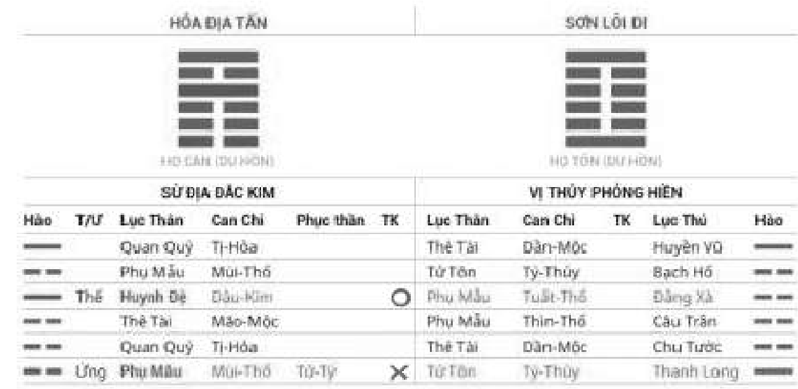

- **Cấu trúc Quẻ Dịch:**
  - **Quẻ chủ:** **Hỏa Địa Tấn** (Cung Càn, Họ Càn – Quẻ Du Hồn)  
    *Tượng quẻ:* Sư Địa Đắc Kim (Tiến bước không ngừng, mặt trời nhô lên khỏi mặt đất tỏa sáng – điềm báo xu thế giá đang ở vùng đáy bứt phá đi lên).
  - **Quẻ biến:** **Sơn Lôi Di** (Cung Tốn, Họ Tốn – Quẻ Du Hồn)  
    *Tượng quẻ:* Vị Thủy Phóng Hiên (Tự nuôi dưỡng, tích lũy nội lực vững chắc để chờ thời bung tỏa).

- **Bảng chi tiết Lục hào:**

| Hào | Thế/Ứng | Lục thân (Chủ) | Can Chi | Biến động | Lục thân (Biến) | Can Chi (Biến) | Thần sát / Phục | Lục thú |
|:---:|:---:|:---|:---|:---:|:---|:---|:---|:---|
| 6 | | Quan Quỷ | Tị - Hỏa | tĩnh | Thê Tài | Dần - Mộc | | Huyền Vũ |
| 5 | | Phụ Mẫu | Mùi - Thổ | tĩnh | Tử Tôn | Tý - Thủy | Mưu tinh | Bạch Hổ |
| 4 | **Thế** | Huynh Đệ | Dậu - Kim | **O (Động)** | Phụ Mẫu | Tuất - Thổ | Tướng tinh, Thiên y (Biến: Nguyệt kiến, Tuần không) | Đằng Xà |
| 3 | | Thê Tài | Mão - Mộc | tĩnh | Phụ Mẫu | Thìn - Thổ | Tai sát, Lộc thần | Câu Trần |
| 2 | | Quan Quỷ | Tị - Hỏa | tĩnh | Thê Tài | Dần - Mộc | | Chu Tước |
| 1 | **Ứng** | Phụ Mẫu | Mùi - Thổ | **X (Động)** | Tử Tôn | Tý - Thủy | Mưu tinh, Phục: Tử Tôn Tý Thủy (Biến: Quý nhân) | Thanh Long |

---

### 3. Dụng thần & Loại quẻ

- **Phân loại quẻ:**
  - **Quẻ chiêm tài chính & đầu tư cổ phiếu cá nhân:** Đánh giá vị thế nắm giữ cổ phiếu cụ thể của nhà đầu tư.
  - **Quẻ thời vận tài lộc ngắn hạn:** Xác định điểm mua/bán và biên độ lợi nhuận trong chu kỳ 20 ngày.
- **Xác định Dụng thần:**
  1. **Dụng thần Vị thế & Mức giá cổ phiếu (Phụ Mẫu Mùi Thổ & Tuất Thổ):** Đại diện cho lượng cổ phiếu đang nắm giữ và ngưỡng giá trên bảng điện tử.
  2. **Hào Thế (Huynh Đệ Dậu Kim):** Đại diện cho bản thân nhà đầu tư và dòng tiền chủ động giải ngân.
  3. **Nguyên thần sinh tài / Lực cầu thị trường (Tử Tôn Tý Thủy):** Đại diện cho sức mua gom của thị trường và độ an tâm đối với tài sản.

---

### 4. Luận giải chi tiết

Quẻ này minh họa nghệ thuật phân tích tượng Lục Hào trong đầu tư tài chính hiện đại, phá vỡ định kiến máy móc về việc "Huynh Đệ khắc Tài":

#### 1. Cơ chế tượng quẻ Du Hồn biến Du Hồn (Tấn biến Di)
- Quẻ chủ **Hỏa Địa Tấn**: Tấn là tiến bước, nhật xuất quang minh. Biểu thị cổ phiếu đang ở vùng giá vốn thấp và bước vào pha tăng trưởng mạnh.
- Tâm lý hoang mang của nhà đầu tư là do thị trường chung u ám, nhưng quẻ Tấn khẳng định cổ phiếu trọng điểm này có nội lực riêng biệt không phụ thuộc vào sự suy thoái chung.

#### 2. Phân định ý nghĩa Lục Thân trong giao dịch cổ phiếu
- Thông thường trong cầu tài, hào Huynh Đệ là thần cướp tài (hung). Nhưng khi xét về **chiến lược vị thế danh mục cổ phiếu**:
  - Hào Phụ Mẫu đại diện cho khối lượng cổ phiếu nắm giữ và mức giá sàn hỗ trợ.
  - Hào Ứng Phụ Mẫu Mùi Thổ ở hào 1 phát động sinh hào Thế Huynh Đệ Dậu Kim, chứng tỏ mức giá và vị thế mua hiện tại đang bảo vệ và tạo lợi nhuận tốt cho nhà đầu tư.
  - Mùi Thổ biến ra **Tử Tôn Tý Thủy mang Thanh Long**: Thể hiện lực cầu mua vào của thị trường rất vững chắc, vùng giá hiện tại hoàn toàn đáng tin cậy để yên tâm nắm giữ.

#### 3. Hào Thế động biến Phụ Mẫu hồi đầu sinh: Tín hiệu gia tăng tỷ trọng
- Hào 4 Thế Huynh Đệ Dậu Kim phát động biến ra **Phụ Mẫu Tuất Thổ** quay lại sinh cho chính hào Thế (Hồi đầu sinh).
- Nhìn từ chuỗi ngũ hành: Hào Ứng là Phụ Mẫu Mùi Thổ, hào biến của Thế là Phụ Mẫu Tuất Thổ. Mùi Thổ tiến lên Tuất Thổ chính là tượng **Tiến thần** của khối lượng và giá trị cổ phiếu.
- Ý nghĩa chiến lược: Quẻ không chỉ bảo nhà đầu tư "tiếp tục nắm giữ", mà còn khuyến nghị hành động quyết liệt là **mua gom gia tăng tỷ trọng** (*scale-in / mua nhồi lệnh*), bởi vì khối lượng cổ phiếu càng tăng thì lợi nhuận đem lại cho hào Thế càng lớn.

#### 4. Phụ Mẫu Tuất Thổ ngậm Nguyệt lệnh Tuần không: Khả năng test lại đỉnh cũ
- Hào biến Phụ Mẫu Tuất Thổ mang theo Nguyệt lệnh nhưng đang ở trạng thái **Tuần không**.
- Mang Nguyệt lệnh đại diện cho đỉnh giá đã từng đạt được trong quá khứ; lâm Tuần không biểu thị trong ngắn hạn đỉnh giá này sẽ được tái lập và công phá khi xuất không điền thực.
- Khung thời gian: Tháng Tuất kéo dài đến tiết Lập Đông (ngày 07 tháng 11 năm 2016), tức là còn khoảng 20 ngày vàng. Trong 20 ngày này cổ phiếu sẽ bứt phá mạnh mẽ, đem lại lợi nhuận vượt bậc.

---

### 5. Kết luận & Ứng kỳ thực tế

- **Lời giải đoán của Chu Thần Bân:**
  - Khẳng định vị thế cổ phiếu mà nhà đầu tư đang nắm giữ đang ở vùng đáy rất an toàn, lực cầu nâng đỡ mạnh.
  - Tuyệt đối không được bán non chốt lời; ngược lại phải lập tức mua gia tăng tỷ trọng cổ phiếu. Trong vòng 20 ngày tới (trước khi hết tháng Tuất), giá cổ phiếu sẽ tăng mạnh trở lại mốc đỉnh cũ.
- **Phản hồi thực tế từ đương số:**
  - Nghe theo lời cố vấn, nhà đầu tư không những không bán ra mà còn mạnh dạn mua thêm gia tăng tỷ trọng.
  - Đúng như dự đoán, ngay sau ngày 10 tháng 10 năm 2016, cổ phiếu này bước vào chuỗi tăng giá liên tục. Chỉ trong vài ngày ngắn ngủi, thị giá đã tăng hơn 10% mang lại lợi nhuận khổng lồ cho đương số. Đồng thời thị trường chung sau đó cũng bứt phá từ 3000 điểm lên vượt 3100 điểm.
- **Ứng kỳ chiêm nghiệm:**
  - Ứng nghiệm ngay trong trung tuần tháng 10 năm 2016 (tiết tháng Tuất), trong chu kỳ 20 ngày trước ngày 07/11/2016.

---

### 6. Bài học tâm pháp & Quy tắc cốt lõi

- **Quy tắc trích dẫn:**
  - Trích dẫn Quy tắc dự đoán xu thế biến động cổ phiếu qua quẻ Du hồn Hỏa Địa Tấn biến Sơn Lôi Di (*Cổ Thệ Chân Thuyên*, trang 152; `rule_index` mục 5).
- **Bài học tâm pháp thực chiến:**
  1. *Linh hoạt hóa tượng Lục Thân trong tài chính:* Hào Phụ Mẫu sinh Thế đại diện cho vùng giá hỗ trợ cứng và vị thế an toàn; không nên cứng nhắc coi Phụ Mẫu chỉ là áp lực bán.
  2. *Thế hào biến Hồi đầu sinh mang Tiến thần:* Biểu thị cơ hội vàng để gia tăng khối lượng nắm giữ (mua thêm vị thế), lợi nhuận sẽ nhân lên gấp bội.
  3. *Nguyệt lệnh lâm Tuần không:* Báo hiệu sự việc hoặc mức giá từng đạt được trong quá khứ sắp sửa quay trở lại và thành hiện thực khi đến thời điểm điền thực.

## THỰC CHIẾN 16: MANG NHIỀU ĐÔ LA MỸ NHẬP CẢNH CÓ BỊ KIỂM TRA KHÔNG

---

### 1. Bối cảnh & Câu hỏi

- **Bối cảnh chi tiết:** 
  Một đồng môn của Chu Thần Bân có vợ và con sang Mỹ du học. Người này thường xuyên phải bay sang Mỹ để thăm và đoàn tụ với gia đình. Theo quy định quản lý ngoại hối và xuất nhập cảnh quốc tế, việc mang số lượng tiền mặt ngoại tệ vượt mức quy định bắt buộc phải khai báo hải quan, nếu bị phát hiện kiểm tra không khai báo có thể bị tịch thu hoặc phạt nặng. Lần xuất cảnh này, anh ta muốn mang theo một lượng lớn tiền mặt đô la Mỹ (USD) vượt quá định mức cho phép.
- **Tâm lý & Câu hỏi ẩn ý:** 
  Đương số rơi vào tâm trạng vô cùng hồi hộp, hoang mang, sợ bị nhân viên hải quan sân bay tại Mỹ chặn lại soi chiếu hành lý và lập biên bản phạt. Anh ta tự gieo một quẻ Dịch nhưng thấy quẻ tĩnh lại có Quan Quỷ giữ Thế nên vô cùng sợ hãi, bèn tìm đến Chu Thần Bân để nhờ giải đoán xem lần này nhập cảnh có bị kiểm tra bắt giữ hay không.
- **Thời gian chiêm đoán:**
  - Dương lịch: Ngày 12 tháng 09 năm 2016, 17:34 (Giờ Bắc Kinh).
  - Can chi: Năm Bính Thân, tháng Đinh Dậu, ngày Đinh Dậu, giờ Kỷ Dậu.

---

### 2. Dữ kiện & Bảng quẻ Crop

- **Thời không chiêm nghiệm:**
  - Tháng Đinh Dậu (Kim vượng, Thủy tướng, Thổ hưu, Hỏa tù, Mộc tử).
  - Ngày Đinh Dậu (Kim vượng, Kim trường sinh/lâm quan).
  - Tuần không: **Thìn - Tị** (Giáp Dần tuần trung, Thìn Tị không vong).
- **Thần sát:**
  - Tướng tinh: Dậu
  - Hoa cái: Sửu
  - Dịch mã: Hợi
  - Tai sát: Mão
  - Mưu tinh: Mùi
  - Đào hoa: Ngọ
  - Kiếp sát: Dần
  - Lộc thần: Ngọ
  - Dương nhẫn: Tị
  - Văn xương: Dậu
  - Thiên y: Thân
  - Thiên hỷ: Thìn
  - Quý nhân: Dậu, Hợi

- Dữ kiện bảng quẻ và các thông số chiêm đoán:
  - **Bảng 16.1** Đồ hình quẻ Thực chiến 16:
    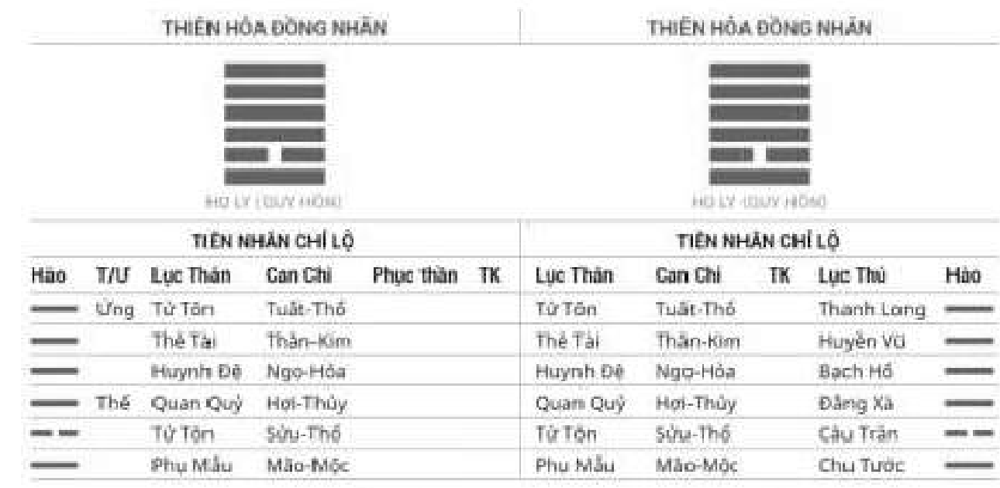

- **Cấu trúc Quẻ Dịch:**
  - **Quẻ chủ:** **Thiên Hỏa Đồng Nhân** (Cung Ly, Họ Ly – Quẻ Quy Hồn)  
    *Tượng quẻ:* Tiên Nhân Chỉ Lộ (Hòa đồng giữa đám đông, đồng hành cùng vạn người – biểu thị thủ tục hải quan áp dụng theo quy chế kiểm tra xác suất ngẫu nhiên thông thường, không bị lập chuyên án theo dõi riêng).
  - **Quẻ biến:** **Thiên Hỏa Đồng Nhân** (Quẻ Tĩnh thuần túy, không có hào minh động).

- **Bảng chi tiết Lục hào:**

| Hào | Thế/Ứng | Lục thân (Chủ) | Can Chi | Biến động | Lục thân (Biến) | Can Chi (Biến) | Thần sát / Phục | Lục thú |
|:---:|:---:|:---|:---|:---:|:---|:---|:---|:---|
| 6 | **Ứng** | Tử Tôn | Tuất - Thổ | tĩnh | Tử Tôn | Tuất - Thổ | Thanh Long |
| 5 | | Thê Tài | Thân - Kim | tĩnh | Thê Tài | Thân - Kim | Thiên y | Huyền Vũ |
| 4 | | Huynh Đệ | Ngọ - Hỏa | tĩnh | Huynh Đệ | Ngọ - Hỏa | Đào hoa, Lộc thần | Bạch Hổ |
| 3 | **Thế** | Quan Quỷ | Hợi - Thủy | tĩnh | Quan Quỷ | Hợi - Thủy | Dịch mã, Quý nhân | Đằng Xà |
| 2 | | Tử Tôn | Sửu - Thổ | tĩnh | Tử Tôn | Sửu - Thổ | Hoa cái | Câu Trần |
| 1 | | Phụ Mẫu | Mão - Mộc | tĩnh (Nhật phá) | Phụ Mẫu | Mão - Mộc | Tai sát (Nguyệt phá, Nhật phá) | Chu Tước |

---

### 3. Dụng thần & Loại quẻ

- **Phân loại quẻ:**
  - **Quẻ tâm thái & an nguy xuất hành:** Dự trắc tâm lý lo âu trước rủi ro bị thanh tra hải quan.
  - **Quẻ sự vụ ngắn hạn:** Chiêm đoán hành vi kiểm tra cụ thể tại cửa khẩu sân bay trong chuyến bay sắp tới.
- **Xác định Dụng thần:**
  1. **Dụng thần Trạm kiểm tra & Nhân viên an ninh (Phụ Mẫu Mão Mộc tại hào 1):** Đại diện cho thủ tục soi chiếu hành lý, cửa khẩu hải quan và giấy tờ pháp lý.
  2. **Hào Thế (Quan Quỷ Hợi Thủy tại hào 3):** Đại diện cho tâm trạng lo âu, nỗi sợ hãi bị bắt giữ của đương số.
  3. **Hào Ứng / Nơi đến bình an (Tử Tôn Tuất Thổ tại hào 6):** Nước Mỹ ở phương Tây Bắc, Tử Tôn là phúc thần chủ sự hanh thông, tiêu tai giải nạn.

---

### 4. Luận giải chi tiết

Quẻ này là bài học kinh điển về cách xử lý quẻ tĩnh có hào Nhật phá và giải mã tâm lý "Quan Quỷ trì Thế":

#### 1. Ý nghĩa tượng quẻ Quy Hồn Thiên Hỏa Đồng Nhân
- **Đồng Nhân là hòa nhập cùng đám đông:** Người hỏi mang tiền xuất cảnh chỉ là một hành khách bình thường giữa hàng ngàn hành khách trên chuyến bay quốc tế. Hải quan chỉ vận hành cơ chế kiểm tra ngẫu nhiên, không ai nhắm riêng vào anh ta (khác hoàn toàn nếu gặp quẻ Trạch Địa Tụy - tượng tụ tập rà soát gắt gao từng người).
- **Quẻ Quy Hồn:** Biểu thị trạng thái quy hồi bình an, xuất hành rồi sẽ thuận buồm xuôi gió trở về.

#### 2. Giải mã hiện tượng Hào 1 Phụ Mẫu Mão Mộc bị Nhật phá trong quẻ tĩnh
- **Quy tắc sự vụ ngắn hạn:** Trong việc ngắn hạn cấp bách, quẻ tĩnh nếu có hào bị Nhật xung thì hào đó mang ý nghĩa như một **hào độc phát** để định tính cát hung.
- **Phân biệt Ám động và Nhật phá:** Hào vượng tướng phùng xung mới thành Ám động. Ở đây Phụ Mẫu Mão Mộc tử tuyệt trong mùa thu kim vượng, vừa bị Nguyệt kiến Dậu Kim xung phá (Nguyệt phá), lại bị Nhật kiến Dậu Kim trực xung (Nhật phá). Mão Mộc bị đánh tan nát hoàn toàn, tương đương với một **hào động bị vô hiệu hóa**.
- **Ý nghĩa thực tiễn:** Phụ Mẫu Mão Mộc lâm Chu Tước là trạm kiểm soát hải quan xét hỏi; nay hào này bị Nhật phá triệt để nghĩa là trạm kiểm tra sẽ tê liệt hoặc bỏ qua, không tiến hành kiểm tra hành lý của đương số.

#### 3. Bản chất của Quan Quỷ Hợi Thủy trì Thế lâm Đằng Xà
- Đồng môn thấy Quan Quỷ trì Thế thì hốt hoảng nghĩ là sắp gặp tai họa lớn. Chu Thần Bân giải thích:
  - Trong quẻ tâm thái, Quan Quỷ trì Thế mà không có Thê Tài phát động sinh Quỷ, cũng không có hào động nào khắc Thế thì Quan Quỷ thuần túy phản ánh **nỗi sợ hãi tâm lý (*hư kinh vô quái*)**.
  - Đằng Xà chủ sự hoang mang, bồn chồn bất an do bản thân mang điều vi phạm quy định chứ thực tế không có tai họa giáng xuống.
- Việc Nhật Nguyệt Dậu Kim sinh hào Thế Quan Quỷ không được coi là "hào động sinh Quỷ", không thể tùy tiện quy chụp là đại họa.

#### 4. Tử Tôn Tuất Thổ tại hào Ứng – Nơi đến bình an
- Hào 6 (đỉnh quẻ, xuất ngoại biên giới) lâm Tử Tôn Tuất Thổ mang Thanh Long. Tuất Thổ thuộc phương Càn (Tây Bắc), tương ứng với vị trí địa lý của nước Mỹ so với Trung Quốc.
- Tử Tôn là cát thần, biểu thị khi đặt chân đến nước Mỹ sẽ an toàn tuyệt đối, gia đình đoàn tụ vui vẻ.

---

### 5. Kết luận & Ứng kỳ thực tế

- **Lời giải đoán của Chu Thần Bân:**
  - Khẳng định chuyến bay sang Mỹ lần này sẽ hoàn toàn trót lọt, hải quan cửa khẩu sẽ không kiểm tra hành lý hay tiền mặt của anh. Tâm lý sợ hãi chỉ là "thần hồn nát thần tính".
  - Nhắc nhở thêm: Kết quả quẻ này chỉ ứng nghiệm cho duy nhất chuyến đi lần này do tính chất ngắn hạn của tượng Nhật phá, tuyệt đối không được chủ quan mang quá mức quy định trong những lần sau.
- **Phản hồi thực tế từ đương số:**
  - Đương số lên máy bay sang Mỹ với tâm lý đã được giải tỏa. Khi làm thủ tục nhập cảnh tại sân bay Mỹ, anh ta đi qua cổng kiểm soát suôn sẻ mà không bị bất kỳ nhân viên hải quan nào gọi lại kiểm tra hành lý. Toàn bộ số tiền USD mang theo đều qua cửa khẩu trót lọt và an toàn.
- **Ứng kỳ chiêm nghiệm:**
  - Sự việc ứng nghiệm ngay trong ngày đương số làm thủ tục thông quan nhập cảnh Mỹ vào giữa tháng 9 năm 2016.

---

### 6. Bài học tâm pháp & Quy tắc cốt lõi

- **Quy tắc trích dẫn:**
  - Trích dẫn Quy tắc quẻ Quy hồn Thiên Hỏa Đồng Nhân và hào ám động khi dự đoán rủi ro kiểm tra hải quan/nhập cảnh ngoại tệ (*Cổ Thệ Chân Thuyên*, trang 158; `rule_index` mục 6).
- **Bài học tâm pháp thực chiến:**
  1. *Nguyên lý Nhật phá trong quẻ tĩnh ngắn hạn:* Hào suy nhược bị Nhật xung thành Nhật phá, có vai trò như hào độc phát bị vô hiệu hóa; nếu đó là Kỵ thần (như trạm kiểm tra) bị vô hiệu hóa thì sự việc chuyển nguy thành an.
  2. *Phân định Quan Quỷ trong quẻ tâm thái:* Quan Quỷ trì Thế không có hào động sinh trợ chỉ là sự lo lắng nội tâm giả tạo, không dẫn đến tai họa thực tế.
  3. *Tượng quẻ Đồng Nhân trong môi trường công cộng:* Biểu thị việc hòa lẫn an toàn giữa đám đông, vận hành theo cơ chế ngẫu nhiên thông thường chứ không bị kiểm soát chuyên biệt.

## THỰC CHIẾN 17: HỎI VIỆC THẢO LUẬN CHỦ ĐỀ TÔN GIÁO VỚI BẠN THÂN CÓ VẤN ĐỀ GÌ KHÔNG

---

### 1. Bối cảnh & Câu hỏi

- **Bối cảnh chi tiết:** 
  Một cán bộ lãnh đạo trong cơ quan chính phủ tham gia bữa tiệc thân mật cùng bạn bè thân thiết. Trong lúc cao hứng chén chú chén anh, anh ta đã tùy hứng thao thao bất tuyệt bàn luận về các chủ đề tôn giáo, huyền học và chuyện quỷ thần. Sau khi về nhà, anh ta chợt tỉnh ngộ và nhớ lại bài học nhãn tiền từ vụ bê bối Tất Phúc Kiếm (người dẫn chương trình truyền hình lỡ lời trong bữa tiệc riêng tư bị quay lén phát tán dẫn đến tiêu tan sự nghiệp). Là một công chức nhà nước đại diện cho bộ máy chính quyền, việc vi phạm kỷ luật phát ngôn và bày tỏ niềm tin tôn giáo là điều tối kỵ nghiêm trọng.
- **Tâm lý & Câu hỏi ẩn ý:** 
  Đương số rơi vào trạng thái hoảng loạn cực độ, nửa đêm thức giấc khóc lóc trong sợ hãi, lo lắng bạn bè trong bữa tiệc sẽ quay video tố giác lên tổ chức khiến bản thân bị kỷ luật mất chức. Anh ta gieo quẻ để hỏi xem những lời đã nói có gây ra rắc rối gì không và tương lai phải đối phó ra sao.
- **Thời gian chiêm đoán:**
  - Dương lịch: Ngày 11 tháng 09 năm 2016, 22:28 (Giờ Bắc Kinh).
  - Can chi: Năm Bính Thân, tháng Đinh Dậu, ngày Bính Thân, giờ Kỷ Hợi.

---

### 2. Dữ kiện & Bảng quẻ Crop

- **Thời không chiêm nghiệm:**
  - Tháng Đinh Dậu (Kim vượng, Thủy tướng, Thổ hưu, Hỏa tù, Mộc tử).
  - Ngày Bính Thân (Kim vượng, Thủy trường sinh).
  - Tuần không: **Thìn - Tị** (Giáp Ngọ tuần trung, Thìn Tị không vong).
- **Thần sát:**
  - Tướng tinh: Tý
  - Hoa cái: Thìn
  - Dịch mã: Dần
  - Tai sát: Ngọ
  - Mưu tinh: Tuất
  - Đào hoa: Dậu
  - Kiếp sát: Tị
  - Lộc thần: Tị
  - Dương nhẫn: Ngọ
  - Văn xương: Thân
  - Thiên y: Thân
  - Thiên hỷ: Thìn
  - Quý nhân: Dậu, Hợi

- Dữ kiện bảng quẻ và các thông số chiêm đoán:
  - **Bảng 17.1** Đồ hình quẻ Thực chiến 17:
    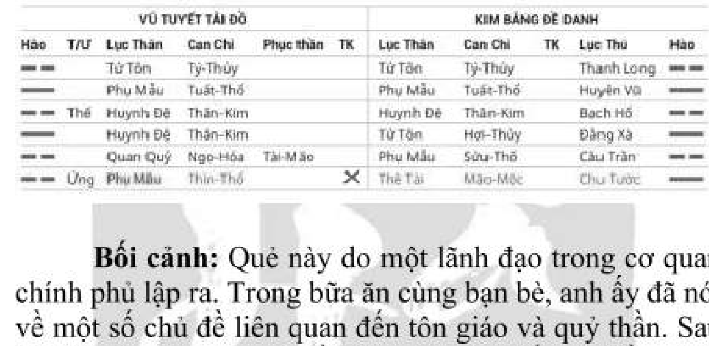

- **Cấu trúc Quẻ Dịch:**
  - **Quẻ chủ:** **Thủy Sơn Kiển** (Cung Đoài, Họ Đoài)  
    *Tượng quẻ:* Vũ Tuyết Tài Đồ (Đi trong mưa tuyết, đường đi hiểm trở gập ghềnh – phản ánh hành vi phát ngôn có rủi ro chính trị tiềm ẩn).
  - **Quẻ biến:** **Thủy Hỏa Ký Tế** (Cung Khảm, Họ Khảm)  
    *Tượng quẻ:* Kim Bảng Đề Danh (Mọi việc đã an bài xong xuôi, sự việc diễn ra tự nhiên; nếu là nguy cơ xấu thì nhắc nhở phải dừng lại, kiềm chế để bảo toàn an lành).

- **Bảng chi tiết Lục hào:**

| Hào | Thế/Ứng | Lục thân (Chủ) | Can Chi | Biến động | Lục thân (Biến) | Can Chi (Biến) | Thần sát / Phục | Lục thú |
|:---:|:---:|:---|:---|:---:|:---|:---|:---|:---|
| 6 | | Tử Tôn | Tý - Thủy | tĩnh | Tử Tôn | Tý - Thủy | Tướng tinh | Thanh Long |
| 5 | | Phụ Mẫu | Tuất - Thổ | tĩnh | Phụ Mẫu | Tuất - Thổ | Mưu tinh | Huyền Vũ |
| 4 | **Thế** | Huynh Đệ | Thân - Kim | tĩnh | Huynh Đệ | Thân - Kim | Nhật kiến, Văn xương, Thiên y, Quý nhân | Bạch Hổ |
| 3 | | Huynh Đệ | Thân - Kim | tĩnh | Tử Tôn | Hợi - Thủy | Nhật kiến, Văn xương, Thiên y, Quý nhân | Đằng Xà |
| 2 | | Quan Quỷ | Ngọ - Hỏa | tĩnh | Phụ Mẫu | Sửu - Thổ | Phục: Thê Tài Mão Mộc (Tai sát, Dương nhẫn) | Câu Trần |
| 1 | **Ứng** | Phụ Mẫu | Thìn - Thổ | **X (Động)** | Thê Tài | Mão - Mộc | Hoa cái, Thiên hỷ, Tuần không (Biến: Nguyệt phá) | Chu Tước |

---

### 3. Dụng thần & Loại quẻ

- **Phân loại quẻ:**
  - **Quẻ tâm thái & xử thế quan trường:** Giải tỏa khủng hoảng tâm lý sợ bị kỷ luật vì vạ miệng của người làm quan.
  - **Quẻ dự trắc tương tác bạn bè & phòng ngừa khẩu thiệt:** Đánh giá độ an toàn của các mối quan hệ giao tế.
- **Xác định Dụng thần:**
  1. **Hào Thế (Huynh Đệ Thân Kim tại hào 4):** Bản thân đương số – công chức cơ quan nhà nước nắm giữ quyền lực uy thế (Bạch Hổ).
  2. **Động triệu / Hào Ứng phát ngôn (Phụ Mẫu Thìn Thổ tại hào 1):** Lâm Chu Tước mang Thiên Hỷ, đại diện cho lời ăn tiếng nói, phát ngôn về tôn giáo huyền học trong bữa tiệc.
  3. **Hào biến (Thê Tài Mão Mộc):** Hồi đầu khắc Phụ Mẫu Thìn Thổ, chỉ thị sự kiềm chế và chấm dứt đề tài.

---

### 4. Luận giải chi tiết

Quẻ này là điển phạm sâu sắc về việc phân biệt giữa thực trạng hiện tại (qua Nhật Nguyệt) và xu hướng tương lai (qua Động triệu lâm Tuần không):

#### 1. Đánh giá hiện trạng qua Hào Thế: Lời đã nói không gây hậu quả
- Hào Thế Huynh Đệ Thân Kim lâm **Bạch Hổ**: Thể hiện đương số là người có quyền uy, làm việc trong cơ quan pháp luật/hành chính.
- Hào Thế được cả **Nhật kiến Thân Kim và Nguyệt kiến Dậu Kim trợ vượng cực mạnh** (tỷ hòa trợ thân), đồng thời lâm Quý nhân. Điều này chứng minh vòng tròn bạn bè có mặt trong bữa ăn đều là những người bạn tốt, cùng chí hướng, sẵn sàng bao bọc hỗ trợ chứ không có ai mang tâm địa tiểu nhân quay lén hay tố giác.
- Do đó, những lời đã lỡ phát ngôn trong bữa tiệc vừa qua hoàn toàn an toàn, không để lại bất kỳ di họa nào.

#### 2. Giải mã Động triệu: Hào 1 Phụ Mẫu Thìn Thổ lâm Chu Tước hóa Hồi đầu khắc
- **Ý nghĩa của Thìn Thổ lâm Chu Tước, Thiên Hỷ:** Chu Tước chủ khẩu thiệt ngôn luận, Thiên Hỷ chủ chốn vui chơi tụ họp. Thìn Thổ là mộ khố mang yếu tố tâm linh, đại diện cho chủ đề quỷ thần, tôn giáo mà đương số đã nói.
- **Thìn Thổ lâm Tuần không:** "Tuần không biểu thị chuyện tương lai chứ không phải hiện trạng". Động triệu này không mô tả hậu quả của bữa tiệc đã qua mà đưa ra **lời răn đe chỉ dẫn cho hành vi tương lai**.
- **Cơ chế Thê Tài Mão Mộc hồi đầu khắc Thìn Thổ:**
  - Phụ Mẫu Thìn Thổ vốn là nguyên thần sinh hào Thế Thân Kim. Nếu đương số không biết điểm dừng, tiếp tục bốc đồng nói về tôn giáo ở nơi công cộng thì nguyên thần sẽ bị hồi đầu khắc triệt tiêu, từ đó chuốc lấy họa lớn vào thân.
  - Ngược lại, tượng Thìn Thổ bị hồi đầu khắc chính là thông điệp bắt buộc: **Phải khóa miệng, chấm dứt hoàn toàn, không bao giờ bàn luận về chủ đề này nữa**. Khi đương số triệt để dập tắt đề tài tôn giáo thì nguyên nhân gây họa biến mất, bản thân sẽ vĩnh viễn an toàn.

#### 3. Ý nghĩa tượng quẻ Kiển biến Ký Tế
- Quẻ chủ **Thủy Sơn Kiển**: Đi trên đường núi hiểm trở, ám chỉ hành vi phát ngôn tùy tiện của công chức là tự đặt mình vào thế nguy hiểm.
- Quẻ biến **Thủy Hỏa Ký Tế**: Mọi việc đã hoàn tất, hãy để nó tự nhiên trôi qua như một bài học kinh nghiệm. Thông điệp cốt lõi là hãy thu mình lại, dừng hẳn hành vi nguy cơ thì mọi sóng gió sẽ tự động tan biến.

---

### 5. Kết luận & Ứng kỳ thực tế

- **Lời giải đoán của Chu Thần Bân:**
  - Khẳng định chắc chắn bữa tiệc vừa rồi hoàn toàn bình yên vô sự, bạn bè đều là người đáng tin cậy, tuyệt đối không có chuyện bị ghi âm hay tố giác lên cơ quan.
  - Đưa ra cảnh báo nghiêm khắc: Coi đây là một bài học đắt giá, tuyệt đối cấm kỵ việc tiếp tục nói về tôn giáo quỷ thần trong tương lai dù ở nơi công cộng hay riêng tư. Chỉ cần "khóa miệng" dừng lại thì quan lộ sẽ hoàn toàn hanh thông.
- **Phản hồi thực tế từ đương số:**
  - Đương số nghe xong như trút được gánh nặng nghìn cân, tâm lý hoàn toàn ổn định trở lại và không còn khóc lóc hoảng loạn.
  - Sau đó cuộc sống và công tác tại cơ quan diễn ra hoàn toàn bình thường, không hề có bất kỳ cuộc điều tra hay lời đồn đại nào xuất hiện, đúng như lời Chu Thần Bân đã giải đoán.
- **Ứng kỳ chiêm nghiệm:**
  - Sự việc êm thấm và yên ổn ngay sau thời điểm gieo quẻ trong tháng 9 năm 2016.

---

### 6. Bài học tâm pháp & Quy tắc cốt lõi

- **Quy tắc trích dẫn:**
  - Trích dẫn Quy tắc động triệu và hào Thế/Ứng khi dự đoán tranh luận quan điểm tôn giáo giữa bạn bè (*Cổ Thệ Chân Thuyên*, trang 164; `rule_index` mục 7).
- **Bài học tâm pháp thực chiến:**
  1. *Phân định Hiện trạng và Tương lai:* Nhật Nguyệt vượng tướng trợ Thế biểu thị chuyện quá khứ/hiện tại không có nguy hiểm; Động triệu lâm Tuần không đưa ra cảnh báo định hướng cho hành vi tương lai.
  2. *Tượng Chu Tước hóa hồi đầu khắc:* Khẩu thiệt gặp hồi đầu khắc là lời nhắc nhở nghiêm khắc phải biết kiềm chế phát ngôn; dừng nói đúng lúc là chìa khóa tiêu tai giải nạn.
  3. *Tâm pháp trị liệu tâm lý:* Thầy Dịch thực chiến cần phân tích rành mạch giữa nỗi sợ hoang tưởng và rủi ro thực tế, vừa giúp khách hàng giải tỏa nỗi sợ hãi tột cùng vừa chỉ ra lằn ranh đỏ để họ không phạm sai lầm thực sự.

## THỰC CHIẾN 18: NGÀY MAI ĐI XE MÁY ĐẾN HUYỆN THĂM BỐ MẸ VỢ, CÓ CẢNH SÁT GIAO THÔNG TRÊN ĐƯỜNG KHÔNG?

---

### 1. Bối cảnh & Câu hỏi

- **Bối cảnh chi tiết:** 
  Một người đệ tử của Chu Thần Bân chuẩn bị đi xe máy từ nhà về huyện để thăm bố mẹ vợ, vì người bố vợ đang bị bệnh nặng nằm viện. Tuy nhiên, anh ta lo ngại tuyến đường liên huyện có thể bị lực lượng Cảnh sát giao thông (CSGT) lập chốt chốt chặn, kiểm tra giấy tờ hoặc xử phạt người đi xe máy.
- **Tâm lý & Câu hỏi ẩn ý:** 
  Đương số gieo quẻ với tâm lý lo lắng việc vặt dọc đường: Liệu ngày mai xuất hành bằng xe máy có gặp CSGT chốt chặn kiểm tra hay không?
- **Thời gian chiêm đoán:**
  - Dương lịch: Ngày 14 tháng 09 năm 2016, 07:03 (Giờ Bắc Kinh).
  - Can chi: Năm Bính Thân, tháng Đinh Dậu, ngày Kỷ Hợi, giờ Mậu Thìn.

---

### 2. Dữ kiện & Bảng quẻ Crop

- **Thời không chiêm nghiệm:**
  - Tháng Đinh Dậu (Kim vượng, Thủy tướng, Thổ hưu, Hỏa tù, Mộc tử).
  - Ngày Kỷ Hợi (Thủy vượng, Mộc tướng).
  - Tuần không: **Thìn - Tị** (Giáp Ngọ tuần trung, Thìn Tị không vong).
- **Thần sát:**
  - Tướng tinh: Mão
  - Hoa cái: Mùi
  - Dịch mã: Tị
  - Tai sát: Dậu
  - Mưu tinh: Sửu
  - Đào hoa: Tý
  - Kiếp sát: Thân
  - Lộc thần: Ngọ
  - Dương nhẫn: Tị
  - Văn xương: Dậu
  - Thiên y: Thân
  - Thiên hỷ: Thìn
  - Quý nhân: Thân, Tý

- Dữ kiện bảng quẻ và các thông số chiêm đoán:
  - **Bảng 18.1** Đồ hình quẻ Thực chiến 18:
    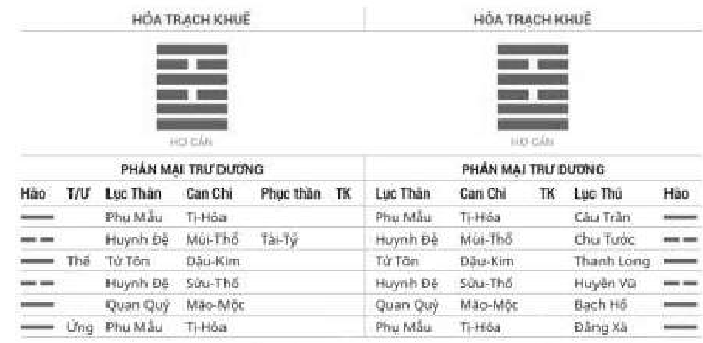

- **Cấu trúc Quẻ Dịch:**
  - **Quẻ chủ:** **Hỏa Trạch Khuê** (Cung Cấn, Họ Cấn)  
    *Tượng quẻ:* Phân Mại Trương Đương (Bất đồng ý kiến, chia rẽ, nghi kỵ – phản ánh sự băn khoăn trắc trở trong lòng).
  - **Quẻ biến:** **Hỏa Trạch Khuê** (Quẻ Tĩnh không có hào minh động).

- **Bảng chi tiết Lục hào:**

| Hào | Thế/Ứng | Lục thân (Chủ) | Can Chi | Biến động | Lục thân (Biến) | Can Chi (Biến) | Thần sát / Phục | Lục thú |
|:---:|:---:|:---|:---|:---:|:---|:---|:---|:---|
| 6 | | Phụ Mẫu | Tị - Hỏa | tĩnh (Ám động) | Phụ Mẫu | Tị - Hỏa | Dịch mã, Dương nhẫn, Tuần không (Nhật xung) | Câu Trần |
| 5 | | Huynh Đệ | Mùi - Thổ | tĩnh | Huynh Đệ | Mùi - Thổ | Hoa cái, Phục: Thê Tài Tý Thủy | Chu Tước |
| 4 | **Thế** | Tử Tôn | Dậu - Kim | tĩnh | Tử Tôn | Dậu - Kim | Nguyệt kiến, Tai sát, Văn xương | Thanh Long |
| 3 | | Huynh Đệ | Sửu - Thổ | tĩnh | Huynh Đệ | Sửu - Thổ | Mưu tinh | Huyền Vũ |
| 2 | | Quan Quỷ | Mão - Mộc | tĩnh | Quan Quỷ | Mão - Mộc | Tướng tinh | Bạch Hổ |
| 1 | **Ứng** | Phụ Mẫu | Tị - Hỏa | tĩnh (Ám động) | Phụ Mẫu | Tị - Hỏa | Dịch mã, Dương nhẫn, Tuần không (Nhật xung) | Đằng Xà |

---

### 3. Dụng thần & Loại quẻ

- **Phân loại quẻ:**
  - **Quẻ sự vụ hành trình ngắn hạn:** Xem rủi ro gặp cảnh sát giao thông khi di chuyển bằng xe máy.
  - **Quẻ chuyển di thông tin tiềm ẩn:** Bề ngoài hỏi chuyện đi đường nhỏ nhặt nhưng quẻ tượng âm thầm phát tín hiệu về đại biến của người thân.
- **Xác định Dụng thần:**
  1. **Dụng thần Xe cộ & CSGT kiểm tra (Phụ Mẫu Tị Hỏa tại hào 1 và hào 6):** Phụ Mẫu đại diện cho phương tiện giao thông (xe máy) và lực lượng chức năng kiểm soát giấy tờ.
  2. **Hào Thế (Tử Tôn Dậu Kim tại hào 4):** Đại diện cho bản thân người xuất hành; lâm Tử Tôn là phúc thần hộ mệnh, lại mang Nguyệt kiến.

---

### 4. Luận giải chi tiết

Quẻ này là điểm mở đầu cho một chuỗi chiêm nghiệm nổi tiếng về hiện tượng chuyển di thông tin trong Lục Hào:

#### 1. Định tính theo sự vụ giao thông thông thường
- Theo nguyên lý xem việc đi đường: Phụ Mẫu mang Dương nhẫn và Dịch mã đại diện cho phương tiện xe cộ di chuyển nhanh; nếu hào này động khắc Thế thì có nguy cơ gặp lực lượng cảnh sát kiểm tra.
- Tuy nhiên, hào Thế **Tử Tôn Dậu Kim lâm Nguyệt kiến** cực vượng, mang Thanh Long: Tử Tôn là phúc thần tiêu tai giải họa, Nguyệt lệnh nâng đỡ tuyệt đối nên có khí lực vô cùng kiên cố. Dù trên đường có gặp lực lượng CSGT thì họ cũng không thể bắt bẻ hay xử phạt được gì đương số. Về mặt sự vụ đi đường ngắn hạn, đây là quẻ bình an vô sự.

#### 2. Dấu hiệu dị thường: Hai hào Ám động cùng khắc Thế
- Quẻ này xuất hiện một cấu trúc vô cùng kỳ lạ: Cả hào 1 (Ứng - điểm xuất phát) và hào 6 (đỉnh quẻ - điểm đến) đều là **Phụ Mẫu Tị Hỏa**.
- Trong ngày Kỷ Hợi, Hợi Thủy trực xung hai Tị Hỏa. Tị Hỏa lâm Tuần không bị Nhật xung trở thành **xung không ám động**. Cả hai hào Phụ Mẫu Tị Hỏa đều mang Dịch mã và Dương nhẫn, cùng hướng mũi nhọn khắc phạt hào Thế Tử Tôn Dậu Kim.
- Hiện tượng hai hào ở hai đầu quẻ cùng ám động khắc Thế là tín hiệu vượt xa một vụ kiểm tra giao thông thông thường.

#### 3. Manh mối chuyển di thông tin: Điềm báo về người bố vợ
- Người hỏi xuất hành với mục đích chính là về quê thăm **bố vợ đang mang trọng bệnh**.
- Hào Phụ Mẫu Tị Hỏa mang Dương nhẫn (hình thương, mổ xẻ, bệnh tật cấp tính) và Dịch mã (biến động khẩn cấp), khắc hãm hào Thế. Tượng này chỉ thị rõ ràng: Quẻ Dịch dường như đã bỏ qua mối bận tâm vụn vặt về cảnh sát giao thông để cảnh báo một biến cố nguy kịch đang ập đến người bố vợ.
- Cảm nhận được sự bất thường và điềm hung hiểm khó lường sau khi nhìn thấy hai hào Tị Hỏa ám động, đệ tử lập tức quyết định gieo thêm một quẻ nữa (Thực chiến 19) để xác minh chân tướng.

---

### 5. Kết luận & Ứng kỳ thực tế

- **Lời giải đoán của Chu Thần Bân:**
  - Về mặt đi đường: Hào Thế mang Nguyệt lệnh Tử Tôn cực vượng nên chuyến đi bằng xe máy không có gì đáng ngại, không bị xử phạt giao thông.
  - Về mặt gia đạo: Cảnh báo sự xuất hiện bất thường của hai hào Phụ Mẫu Tị Hỏa ám động khắc Thế là điềm hung hiểm liên quan trực tiếp đến sức khỏe của bố vợ tại điểm đến, cần hết sức lưu tâm tình trạng bệnh tình của ông cụ.
- **Phản hồi thực tế từ đương số:**
  - Đương số cảm nhận thấy điềm báo nghiêm trọng nên chỉ 17 phút sau đã lập tức gieo lại quẻ thứ hai để làm rõ nguyên nhân.
- **Ứng kỳ chiêm nghiệm:**
  - Quẻ là bước đệm mở ra toàn bộ chuỗi diễn biến bi kịch của Thực chiến 19 diễn ra ngay trong ngày hôm sau.

---

### 6. Bài học tâm pháp & Quy tắc cốt lõi

- **Quy tắc trích dẫn:**
  - Trích dẫn Quy tắc xem gặp cảnh sát giao thông khi di chuyển bằng xe máy qua quẻ tĩnh Hỏa Trạch Khuê (*Cổ Thệ Chân Thuyên*, trang 170; `rule_index` mục 8).
- **Bài học tâm pháp thực chiến:**
  1. *Nguyên tắc "Tử Tôn lâm Nguyệt kiến trì Thế":* Trong các quẻ chiêm xuất hành ngắn hạn, hào Thế lâm Nguyệt kiến Tử Tôn là thần hộ mệnh tối cao, muôn sự bình an, không sợ bị tiểu nhân hay cơ quan chức năng làm khó.
  2. *Hiện tượng đa hào Ám động ở sơ hào và thượng hào:* Khi hai hào ở đầu và cuối quẻ đồng thời ám động khắc Thế, phải mở rộng nhãn quan vượt khỏi câu hỏi vụn vặt ban đầu để truy tìm biến cố tại điểm xuất phát hoặc điểm đến.
  3. *Tâm pháp nhận diện tín hiệu chuyển di thông tin:* Khi quẻ tượng xuất hiện năng lượng khắc phá quá mức so với quy mô của một sự việc nhỏ, đó là lúc Dịch lý đang cảnh báo đại sự sinh tử của thân nhân.

## THỰC CHIẾN 19: HỎI LẠI VỀ VIỆC ĐI ĐẾN HUYỆN CÓ GẶP CẢNH SÁT GIAO THÔNG KHÔNG

---

### 1. Bối cảnh & Câu hỏi

- **Bối cảnh chi tiết:** 
  Chỉ 17 phút sau khi gieo quẻ ở Thực chiến 18, người đệ tử vẫn chưa hoàn toàn yên tâm vì thấy quẻ trước có hai hào Phụ Mẫu Tị Hỏa ám động khắc Thế. Do băn khoăn và linh cảm có điều gì đó bất an, anh ta quyết định gieo lại quẻ thứ hai để hỏi rõ ngọn ngành xem chuyến đi xe máy về huyện thăm bố mẹ vợ ngày mai có thực sự an toàn và có gặp cảnh sát giao thông hay không.
- **Tâm lý & Câu hỏi ẩn ý:** 
  Người hỏi vẫn chấp niệm vào câu hỏi nhỏ nhặt về kiểm tra xe máy, nhưng trong tiềm thức đã bắt đầu dao động bởi linh cảm chẳng lành về tình hình gia đình và bệnh tình của bố vợ.
- **Thời gian chiêm đoán:**
  - Dương lịch: Ngày 14 tháng 09 năm 2016, 07:20 (Giờ Bắc Kinh).
  - Can chi: Năm Bính Thân, tháng Đinh Dậu, ngày Kỷ Hợi, giờ Mậu Thìn.

---

### 2. Dữ kiện & Bảng quẻ Crop

- **Thời không chiêm nghiệm:**
  - Tháng Đinh Dậu (Kim vượng, Thủy tướng, Thổ hưu, Hỏa tù, Mộc tử).
  - Ngày Kỷ Hợi (Thủy vượng, Mộc tướng).
  - Tuần không: **Thìn - Tị** (Giáp Ngọ tuần trung, Thìn Tị không vong).
- **Thần sát:**
  - Tướng tinh: Mão
  - Hoa cái: Mùi
  - Dịch mã: Tị
  - Tai sát: Dậu
  - Mưu tinh: Sửu
  - Đào hoa: Tý
  - Kiếp sát: Thân
  - Lộc thần: Ngọ
  - Dương nhẫn: Tị
  - Văn xương: Dậu
  - Thiên y: Thân
  - Thiên hỷ: Thìn
  - Quý nhân: Thân, Tý

- Dữ kiện bảng quẻ và các thông số chiêm đoán:
  - **Bảng 19.1** Đồ hình quẻ Thực chiến 19:
    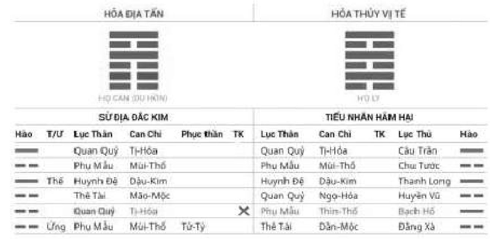

- **Cấu trúc Quẻ Dịch:**
  - **Quẻ chủ:** **Hỏa Địa Tấn** (Cung Càn, Họ Càn – Quẻ Du Hồn)  
    *Tượng quẻ:* Sư Địa Đắc Kim (Tiến triển, tiến bước – trong bối cảnh chiêm họa, quẻ Tấn báo hiệu sự tiến triển xấu thêm một bậc của căn bệnh cũ).
  - **Quẻ biến:** **Hỏa Thủy Vị Tế** (Cung Ly, Họ Ly)  
    *Tượng quẻ:* Tiểu Nhân Hãm Hại (Chưa xong, bấp bênh, đại biến chưa từng có sắp xảy ra).

- **Bảng chi tiết Lục hào:**

| Hào | Thế/Ứng | Lục thân (Chủ) | Can Chi | Biến động | Lục thân (Biến) | Can Chi (Biến) | Thần sát / Phục | Lục thú |
|:---:|:---:|:---|:---|:---:|:---|:---|:---|:---|
| 6 | | Quan Quỷ | Tị - Hỏa | tĩnh (Ám động) | Quan Quỷ | Tị - Hỏa | Dịch mã, Dương nhẫn, Tuần không (Nhật xung) | Câu Trần |
| 5 | | Phụ Mẫu | Mùi - Thổ | tĩnh | Phụ Mẫu | Mùi - Thổ | | Chu Tước |
| 4 | **Thế** | Huynh Đệ | Dậu - Kim | tĩnh | Huynh Đệ | Dậu - Kim | Nguyệt kiến, Tai sát, Văn xương | Thanh Long |
| 3 | | Thê Tài | Mão - Mộc | tĩnh | Quan Quỷ | Ngọ - Hỏa | Tướng tinh | Huyền Vũ |
| 2 | | Quan Quỷ | Tị - Hỏa | **X (Động)** | Phụ Mẫu | Thìn - Thổ | Dịch mã, Dương nhẫn (Biến: Hoa cái, Thiên hỷ, Tuần không) | Bạch Hổ |
| 1 | **Ứng** | Phụ Mẫu | Mùi - Thổ | tĩnh | Thê Tài | Dần - Mộc | Phục: Tử Tôn Tý Thủy | Đằng Xà |

---

### 3. Dụng thần & Loại quẻ

- **Phân loại quẻ:**
  - **Quẻ tái chiêm & hiện tượng chuyển di thông tin:** Điển phạm về việc quẻ Dịch tự động chuyển đổi tâm điểm từ việc nhỏ sang biến cố sinh tử của thân nhân.
  - **Quẻ đại họa & dự trắc bệnh tật cấp tính:** Nhận diện tai họa xuất huyết não đoạt mạng người cha.
- **Xác định Dụng thần:**
  1. **Hào Thế (Huynh Đệ Dậu Kim tại hào 4):** Đại diện cho bản thân người gieo quẻ; tiếp tục lâm Dậu Kim trì Thế như quẻ trước.
  2. **Hào Tai họa / Bệnh tật (Quan Quỷ Tị Hỏa tại hào 2 và hào 6):** Quan Quỷ lâm Hỏa, mang Bạch Hổ, Dương nhẫn và Dịch mã khắc thẳng vào hào Thế.
  3. **Nạn nhân thực tế (Phụ Mẫu Thìn Thổ):** Hào biến của Quan Quỷ Tị Hỏa, đại diện cho người cha (bố vợ).

---

### 4. Luận giải chi tiết

Quẻ này là một trong những minh chứng chấn động nhất trong *Cổ Thệ Chân Thuyên* về nguyên lý Chuyển di thông tin và quy luật Tái chiêm:

#### 1. Quy luật Tái chiêm: Từ Ám động nâng cấp lên Minh động
- Quẻ trước (Hỏa Trạch Khuê) và quẻ này đều có **Dậu Kim trì Thế**, và đều có **hai hào Tị Hỏa khắc Thế**.
- Ở quẻ trước, hai Tị Hỏa chỉ là Ám động. Nhưng đến quẻ này, một Tị Hỏa ở hào 2 đã bùng nổ thành **Minh động** thực sự, còn Tị Hỏa ở hào 6 tiếp tục là Ám động.
- Quy tắc tái chiêm chỉ rõ: Khi người hỏi chưa ngộ ra điềm báo mà gieo lại quẻ, quẻ sau sẽ nâng cấp từ trạng thái ngầm (ám động) thành trạng thái hiển lộ dứt khoát (minh động). Minh động này đại diện cho kết cục thực tế cuối cùng không thể đảo ngược.

#### 2. Mô hình "Quẻ Tai Họa" – Song Quỷ khắc Thế
- Cả hai hào Quan Quỷ Tị Hỏa (hào 2 minh động, hào 6 ám động) đều nhắm thẳng vào hào Thế Huynh Đệ Dậu Kim để khắc phạt. Đây là kết cấu **Song Quỷ hiệp kích khắc Thế**, mô hình tiêu biểu của một quẻ đại hung/tai họa.
- Quan Quỷ Tị Hỏa lâm **Bạch Hổ**: Bạch Hổ chủ về tang ma, tang phục, máu me và sự chết chóc.
- Mang theo **Dịch mã và Dương nhẫn**: Biểu thị biến cố xảy ra vô cùng đột ngột, hung hãn và có tính chất cấp cứu khẩn cấp.

#### 3. Bóc tách hiện tượng "Chuyển di thông tin" sang người bố vợ
- Người hỏi chỉ hỏi chuyện cảnh sát giao thông, tại sao lại xuất hiện Bạch Hổ Quỷ khắc Thế khủng khiếp như vậy?
- Chu Thần Bân chỉ ra sự chuyển di: Quẻ Dịch đã hoàn toàn phớt lờ chuyện đi đường vụn vặt để tập trung vào tai họa sinh tử đang cận kề của gia đình.
- Hào 2 Quan Quỷ Tị Hỏa phát động biến ra **Phụ Mẫu Thìn Thổ**: Quan Quỷ hóa Phụ Mẫu chỉ rõ nguồn cơn tai họa rơi trúng vào đối tượng Phụ Mẫu (người bố vợ mà anh ta định đi thăm).
- Phụ Mẫu Thìn Thổ lâm **Tuần không**: Thể hiện sự việc chưa phát tác vào buổi sáng lúc gieo quẻ, nhưng khi xuất không điền thực (trong vòng 1 - 2 ngày tới) thì đại họa sẽ chính thức bùng nổ.

#### 4. Chẩn đoán y lý: Xuất huyết não đột quỵ lần hai
- Hỏa đại diện cho hệ tuần hoàn máu và vùng đầu; Quan Quỷ Hỏa mang Bạch Hổ chính là bệnh **xuất huyết não** (vỡ mạch máu não).
- Quẻ chủ là **Hỏa Địa Tấn**: "Tấn" nghĩa là tiến lên, tiếp diễn một nấc thang mới. Người bố vợ trước đây đã từng bị đột quỵ nhẹ một lần; quẻ Tấn báo hiệu sự tiến triển của căn bệnh cũ: ông cụ sẽ bị đột quỵ xuất huyết não lần thứ hai dẫn đến liệt hoặc tử vong.

---

### 5. Kết luận & Ứng kỳ thực tế

- **Lời giải đoán của Chu Thần Bân:**
  - Khẳng định đây hoàn toàn không phải là quẻ xem chuyện cảnh sát giao thông bắt xe, mà là quẻ đại hung cảnh báo bố vợ sắp xảy ra biến cố sinh tử nghiêm trọng.
  - Dự báo người bố vợ sẽ bị xuất huyết não đột quỵ lần hai trong vòng 24 - 48 giờ tới, mang tính chất tang phục (Bạch Hổ).
- **Phản hồi thực tế từ đương số:**
  - Đúng như dự đoán kinh hoàng của quẻ tượng: Tối ngày hôm sau (ngày 15 tháng 9 năm 2016), người bố vợ đột ngột bị xuất huyết não cấp tính, rơi vào hôn mê sâu và đã qua đời ngay trong đêm.
  - Hiện tượng chuyển di thông tin và điềm báo tang phục của Bạch Hổ Quỷ hóa Phụ Mẫu đã ứng nghiệm chuẩn xác đến rợn người.
- **Ứng kỳ chiêm nghiệm:**
  - Biến cố xuất huyết não và tử vong diễn ra vào buổi tối ngày hôm sau (chưa đầy 36 giờ sau khi gieo quẻ).

---

### 6. Bài học tâm pháp & Quy tắc cốt lõi

- **Quy tắc trích dẫn:**
  - Trích dẫn Quy tắc tái chiêm và hiện tượng chuyển di thông tin: quẻ cảnh báo biến cố sinh tử của người thân thay vì việc nhỏ đi đường (*Cổ Thệ Chân Thuyên*, trang 174; `rule_index` mục 9).
- **Bài học tâm pháp thực chiến:**
  1. *Định luật Chuyển di thông tin trong Lục Hào:* Quẻ Dịch có linh tính tự nhiên; khi gia sự đứng trước đại nạn sinh tử cận kề, quẻ tượng sẽ tự động gạt bỏ câu hỏi vụn vặt thường nhật của đương số để ưu tiên phát tín hiệu báo động đỏ về đại sự sinh mệnh.
  2. *Quy luật tiến hóa từ Ám động sang Minh động khi Tái chiêm:* Tái chiêm trong sự hoài nghi làm lộ rõ hào minh động, minh động chính là bản án định đoạt kết cục cuối cùng.
  3. *Tượng Hỏa Quỷ lâm Bạch Hổ hóa Phụ Mẫu:* Là mật mã chẩn đoán chính xác chứng bệnh tai biến mạch máu não / xuất huyết não nguy kịch tính mạng của bậc phụ mẫu trưởng bối.

## THỰC CHIẾN 20: CHA VỢ CỦA TƯỞNG CHÍ TỰ GIEO QUẺ HỎI VỀ TUỔI THỌ

---

### 1. Bối cảnh & Câu hỏi

- **Bối cảnh chi tiết:** 
  Đây là quẻ gieo từ 3 năm trước (vào cuối năm 2013) do chính người cha vợ của Tưởng Chí (người đệ tử xuất hiện trong Thực chiến 18 và 19) tự mình gieo quẻ để hỏi về thọ mệnh của bản thân. Người cha vợ lúc này tuổi đã cao, có tiền sử bệnh tim mạch và huyết áp mạn tính, trong lòng muốn biết bản thân còn có thể sống được bao lâu để chuẩn bị tâm lý hậu sự.
- **Tâm lý & Câu hỏi ẩn ý:** 
  Người già tự chiêm thọ mạng với tâm thế trăn trở về giới hạn sinh mệnh trần thế: Tuổi thọ của bản thân ra sao, hạn lớn năm nào sẽ đến và phải phòng ngừa căn bệnh nào?
- **Thời gian chiêm đoán:**
  - Dương lịch: Ngày 25 tháng 12 năm 2013, 14:29 (Giờ Bắc Kinh).
  - Can chi: Năm Quý Tỵ, tháng Giáp Tý, ngày Ất Sửu, giờ Quý Mùi.

---

### 2. Dữ kiện & Bảng quẻ Crop

- **Thời không chiêm nghiệm:**
  - Tháng Giáp Tý (Thủy vượng, Mộc tướng, Kim hưu, Thổ tù, Hỏa tuyệt).
  - Ngày Ất Sửu (Thổ vượng, Kim khố).
  - Tuần không: **Tuất - Hợi** (Giáp Tý tuần trung, Tuất Hợi không vong).
- **Thần sát:**
  - Tướng tinh: Dậu
  - Hoa cái: Sửu
  - Dịch mã: Hợi
  - Tai sát: Mão
  - Mưu tinh: Mùi
  - Đào hoa: Ngọ
  - Kiếp sát: Dần
  - Lộc thần: Mão
  - Dương nhẫn: Dần
  - Văn xương: Ngọ
  - Thiên y: Hợi
  - Thiên hỷ: Mùi
  - Quý nhân: Thân, Tý

- Dữ kiện bảng quẻ và các thông số chiêm đoán:
  - **Bảng 20.1** Đồ hình quẻ Thực chiến 20:
    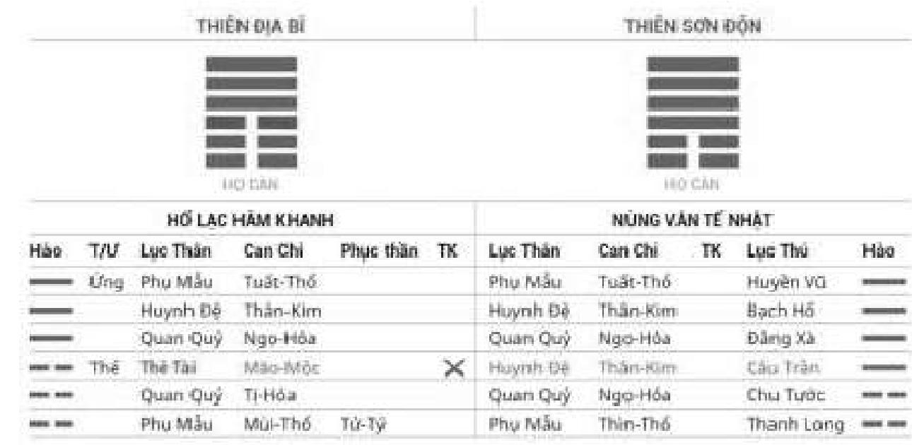

- **Cấu trúc Quẻ Dịch:**
  - **Quẻ chủ:** **Thiên Địa Bĩ** (Cung Càn, Họ Càn)  
    *Tượng quẻ:* Hổ Lạc Hãm Khanh (Hổ sa hố sâu, bế tắc hiểm nguy, trời đất không giao hòa – phản ánh sinh khí suy kiệt).
  - **Quẻ biến:** **Thiên Sơn Độn** (Cung Càn, Họ Càn)  
    *Tượng quẻ:* Nùng Vân Tế Nhật (Mây đen che khuất mặt trời, thoái lui, rút lui khỏi dương gian).

- **Bảng chi tiết Lục hào:**

| Hào | Thế/Ứng | Lục thân (Chủ) | Can Chi | Biến động | Lục thân (Biến) | Can Chi (Biến) | Thần sát / Phục | Lục thú |
|:---:|:---:|:---|:---|:---:|:---|:---|:---|:---|
| 6 | **Ứng** | Phụ Mẫu | Tuất - Thổ | tĩnh | Phụ Mẫu | Tuất - Thổ | Tuần không | Huyền Vũ |
| 5 | | Huynh Đệ | Thân - Kim | tĩnh | Huynh Đệ | Thân - Kim | Quý nhân | Bạch Hổ |
| 4 | | Quan Quỷ | Ngọ - Hỏa | tĩnh | Quan Quỷ | Ngọ - Hỏa | Đào hoa, Văn xương | Đằng Xà |
| 3 | **Thế** | Thê Tài | Mão - Mộc | **X (Động)** | Huynh Đệ | Thân - Kim | Tai sát, Lộc thần (Biến: Quý nhân) | Câu Trần |
| 2 | | Quan Quỷ | Tị - Hỏa | tĩnh | Quan Quỷ | Ngọ - Hỏa | | Chu Tước |
| 1 | | Phụ Mẫu | Mùi - Thổ | tĩnh | Phụ Mẫu | Thìn - Thổ | Mưu tinh, Thiên hỷ, Phục: Tử Tôn Tý Thủy | Thanh Long |

---

### 3. Dụng thần & Loại quẻ

- **Phân loại quẻ:**
  - **Quẻ thọ mệnh & sinh tử thân thế:** Chiêm đoán kỳ hạn tuổi thọ của chính bản thân người gieo.
  - **Quẻ định vị căn nguyên bệnh lý tử vong:** Truy tìm ổ bệnh dẫn đến thọ chung chính tẩm.
- **Xác định Dụng thần:**
  1. **Hào Thế / Thọ nguyên (Thê Tài Mão Mộc tại hào 3):** Đại diện cho sinh mệnh và tuổi thọ của đương số.
  2. **Khắc thần / Tuyệt mệnh thần (Huynh Đệ Thân Kim):** Hào biến quay lại chém gãy Thê Tài Mão Mộc (Hồi đầu khắc).
  3. **Vị trí bệnh căn (Phụ Mẫu Tuất Thổ tại hào 6 lâm Huyền Vũ):** Đỉnh đầu não, hệ mạch máu thần kinh vi mô.

---

### 4. Luận giải chi tiết

Quẻ này là mảnh ghép hoàn mỹ kết nối với Thực chiến 18 và 19, minh chứng năng lực định vị ứng kỳ thọ mệnh kỳ tài của Lục Hào:

#### 1. Hào Thế động hóa Hồi đầu khắc – Tuyệt chứng thọ mệnh
- Người già tự chiêm tuổi thọ lấy **Hào Thế** làm gốc rễ sinh mệnh. Trong quẻ này, hào Thế Thê Tài Mão Mộc phát động biến xuất **Huynh Đệ Thân Kim**.
- Huynh Đệ Thân Kim mang ngũ hành Kim quay đầu chặt đứt Thê Tài Mão Mộc (Kim khắc Mộc), đây chính là cách cục **Hào Thế hóa Hồi đầu khắc** kinh điển. Trong thuật chiêm thọ mệnh, hào Thế hóa hồi đầu khắc là điềm đại hung báo trước thọ nguyên có hạn, khó lòng thoát khỏi lưỡi hái tử thần.

#### 2. Quy tắc định vị Ứng kỳ Hồi đầu khắc đối với tuổi thọ
- Khi hào Thế bị biến hào hồi đầu khắc, thời khắc ứng hạn sinh tử được xác định qua hai giao điểm thời không then chốt:
  - **Thời điểm Khắc thần vượng tướng:** Huynh Đệ Thân Kim đắc lệnh tại năm Thân hoặc tháng Thân (Kim vượng cực điểm).
  - **Thời điểm Hào Thế suy tuyệt bị phá:** Hào Thế Thê Tài Mão Mộc lâm **Nguyệt phá** tại tháng Dậu (tháng 8 âm lịch) hoặc năm Dậu.
- Kết hợp cả hai dữ kiện: Hạn tử vong gần nhất và nguy hiểm nhất sẽ rơi trúng vào **năm Thân (Bính Thân 2016)**, đúng vào **tháng Dậu** (khi Thân Kim nắm lệnh năm và Dậu Kim xung phá hào Thế Mão Mộc).

#### 3. Bệnh lý chi tiết qua Hào 6 và Thần sát Huyền Vũ
- **Hào 6 (đỉnh quẻ):** Đại diện cho phần cao nhất của cơ thể người – đó chính là vùng đầu não.
- Hào 6 lâm **Phụ Mẫu Tuất Thổ mang Huyền Vũ**:
  - Huyền Vũ trong y lý Lục Hào đại diện cho hệ thần kinh, hệ thống mao mạch máu não vi mô và những căn bệnh tiềm ẩn khó nhìn thấy.
  - Phụ Mẫu Tuất Thổ là Hỏa khố (kho chứa hỏa). Trong quẻ có Quan Quỷ Ngọ Hỏa và Tị Hỏa, hỏa chủ về tim mạch, huyết áp và dòng máu nóng. Tuất Thổ chứa Hỏa Quỷ lâu năm biểu thị chứng xơ vữa động mạch não, tăng huyết áp mạn tính.
  - Khi hỏa khí bốc lên đầu não phát tác dữ dội, mạch máu não vi mô không chịu nổi sẽ bị vỡ ra, dẫn đến chứng **xuất huyết não / đột quỵ**.

#### 4. Tính liên đới xuyên suốt ba ca thực chiến (Thực chiến 18 - 19 - 20)
- Năm 2013, quẻ xem tuổi thọ của bố vợ đã chỉ rõ: Hạn chết sẽ đến vào **tháng Dậu năm Thân** do bệnh **mạch máu não** (Thực chiến 20).
- Đúng 3 năm sau, vào tháng Đinh Dậu năm Bính Thân (tháng 9 năm 2016), người con rể gieo quẻ đi thăm bố vợ thì quẻ Dịch chuyển di thông tin báo trước bố vợ đột quỵ xuất huyết não lần 2 (Thực chiến 18 và 19).
- Ngay trong đêm hôm sau, người bố vợ đã trút hơi thở cuối cùng, hoàn tất sự trùng khớp kỳ diệu của toàn bộ hệ thống Dịch lý!

---

### 5. Kết luận & Ứng kỳ thực tế

- **Lời giải đoán của Chu Thần Bân:**
  - Quẻ thọ mệnh năm 2013 đã định rõ: Thọ nguyên của người bố vợ sẽ chấm dứt vào tháng Dậu của năm Bính Thân (2016) do hào Thế Mão Mộc bị Huynh Đệ Thân Kim hồi đầu khắc và lâm Nguyệt phá.
  - Nguyên nhân tử vong là do bệnh xuất huyết mạch máu não (hào 6 Huyền Vũ Hỏa khố).
- **Phản hồi thực tế từ đương số:**
  - Hoàn toàn chính xác: Người bố vợ đã qua đời vào đúng tháng Đinh Dậu năm Bính Thân (ngày 15 tháng 9 năm 2016) do tái phát xuất huyết não đột quỵ, khớp chuẩn xác từng chi tiết với quẻ tuổi thọ đã gieo trước đó gần 3 năm.
- **Ứng kỳ chiêm nghiệm:**
  - Ứng nghiệm vào tháng Đinh Dậu năm Bính Thân (2016), đúng như hai điều kiện "khắc thần Thân Kim vượng tướng" và "hào Thế Mão Mộc bị Dậu xung phá".

---

### 6. Bài học tâm pháp & Quy tắc cốt lõi

- **Quy tắc trích dẫn:**
  - Trích dẫn Quy tắc chiêm thọ mệnh qua hào Thế hóa hồi đầu khắc và ứng kỳ Nguyệt phá/Thần sát Huyền Vũ chỉ bệnh mạch máu não (*Cổ Thệ Chân Thuyên*, trang 178; `rule_index` mục 10).
- **Bài học tâm pháp thực chiến:**
  1. *Hào Thế hóa Hồi đầu khắc trong chiêm thọ:* Là dấu hiệu thọ nguyên bị đứt đoạn; ứng kỳ tai nạn tính theo năm/tháng của khắc thần nắm lệnh hoặc khi hào Thế lâm Nguyệt phá.
  2. *Thần sát Huyền Vũ tại Thượng hào trong y lý:* Thượng hào lâm Huyền Vũ kết hợp Hỏa khố là chỉ báo chuyên biệt về bệnh mạch máu não, tai biến mạch máu não và hệ thần kinh trung ương.
  3. *Sự liên kết quẻ tượng đa tầng xuyên thời gian:* Các quẻ gieo ở các thời điểm khác nhau bởi những người khác nhau trong cùng một gia đạo đều đồng quy về một sự thật khách quan, minh chứng tính bất biến của quy luật nhân quả trong Dịch học.

---

## THỰC CHIẾN 01: HIỆN TẠI CÁI ĐANG PHÁT TRIỂN CÓ PHẢI LÀ THỨ KHÔNG TỐT?

---

### 1. Bối cảnh & Câu hỏi

- **Bối cảnh chi tiết:** 
  Một người đồng môn tình cờ sờ thấy trong ổ bụng có một khối cứng bất thường. Khối cứng này đã xuất hiện và tồn tại được một thời gian, khiến tâm lý đương số luôn luôn bất an, hoang mang lo sợ. Hôm nay người này đã đến bệnh viện khám nhưng lại không gặp được bác sĩ chuyên khoa phụ trách. Đương số quyết định sáng mai sẽ tiếp tục đi khám, tuy nhiên đêm hôm trước trong lòng vẫn bồn chồn lo lắng cực độ nên đã gieo một quẻ Dịch để dự trắc xu hướng phát triển của khối u này.
- **Tâm lý & Câu hỏi ẩn ý:** 
  Đương số lo sợ nhất là khối u trong bụng có thể là u ác tính (ung thư). Vì tính chất nhạy cảm và sự e ngại tâm lý, người này hỏi một cách rất tế nhị và kín đáo: *"Hiện tại cái đang phát triển có phải là thứ không tốt hay không?"* – nhưng thực chất tâm ý cốt lõi là muốn biết khối u này có nguy hiểm đến tính mạng hoặc là khối u ác tính hay không.
- **Thời gian chiêm đoán:**
  - Dương lịch: 18/04/2016, 01:20 (Giờ Bắc Kinh tương ứng: 28/11/2015, 17:48).
  - Can chi: Năm Ất Mùi, tháng Đinh Hợi, ngày Mậu Thân, giờ Tân Dậu.

---

### 2. Dữ kiện & Bảng quẻ Crop

- **Thời không chiêm nghiệm:**
  - Tháng Đinh Hợi (Thủy vượng, Mộc tướng, Hỏa tử, Thổ tuyệt).
  - Ngày Mậu Thân (Kim vượng, Thủy trường sinh).
  - Tuần không: **Dần - Mão** (Giáp Thìn tuần trung, Dần Mão không vong).
- **Thần sát:**
  - Tướng tinh: Tý
  - Hoa cái: Thìn
  - Dịch mã: Dần (Lâm Tuần không, sơ hào)
  - Tai sát: Ngọ
  - Mưu tinh: Tuất
  - Đào hoa: Dậu
  - Kiếp sát: Tỵ
  - Lộc thần: Tỵ
  - Dương nhẫn: Ngọ (Lâm hào Ứng)
  - Văn xương: Thân
  - Thiên y: Tuất (Lâm hào 5 Quan Quỷ)
  - Thiên hỷ: Mùi
  - Quý nhân: Sửu, Mùi

- Dữ kiện bảng quẻ và các thông số chiêm đoán:
  - **Bảng 1.1** Đồ hình quẻ Thực chiến 1:
    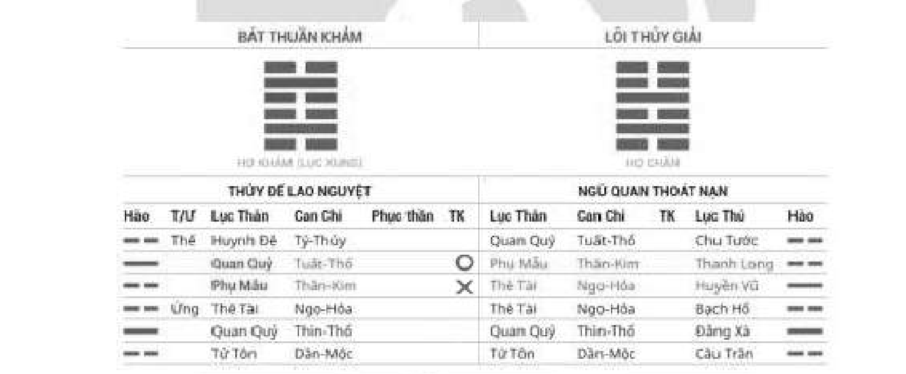

- **Cấu trúc Quẻ Dịch:**
  - **Quẻ chủ:** **Bát Thuần Khảm** (Cung Khảm, Họ Khảm – Quẻ Lục Xung)  
    *Tượng quẻ:* Thủy Để Lao Nguyệt (Mò trăng đáy nước – tâm trạng hoang mang, bất an, việc xảy ra đột ngột).
  - **Quẻ biến:** **Lôi Thủy Giải** (Cung Chấn, Họ Chấn)  
    *Tượng quẻ:* Ngũ Quan Thoát Nạn (Giải tỏa tai ách, tiêu tan hoạn nạn, nguy cơ dần được tháo gỡ).

- **Bảng chi tiết Lục hào:**

| Hào | Thế/Ứng | Lục thân (Chủ) | Can Chi | Biến động | Lục thân (Biến) | Can Chi (Biến) | Thần sát / Phục | Lục thú |
|:---:|:---:|:---|:---|:---:|:---|:---|:---|:---|
| 6 | **Thế** | Huynh Đệ | Tý - Thủy | tĩnh | Quan Quỷ | Tuất - Thổ | Tướng tinh | Chu Tước |
| 5 | | Quan Quỷ | Tuất - Thổ | **O (Động)** | Phụ Mẫu | Thân - Kim | Mưu tinh, Thiên y | Thanh Long |
| 4 | | Phụ Mẫu | Thân - Kim | **X (Động)** | Thê Tài | Ngọ - Hỏa | Văn xương, Nhật kiến | Huyền Vũ |
| 3 | **Ứng** | Thê Tài | Ngọ - Hỏa | tĩnh | Thê Tài | Ngọ - Hỏa | Dương nhẫn, Tai sát | Bạch Hổ |
| 2 | | Quan Quỷ | Thìn - Thổ | tĩnh | Quan Quỷ | Thìn - Thổ | Hoa cái | Đằng Xà |
| 1 | | Tử Tôn | Dần - Mộc | tĩnh (Ám động) | Tử Tôn | Dần - Mộc | Tuần không, Dịch mã | Câu Trận |

---

### 3. Dụng thần & Loại quẻ

- **Phân loại quẻ:**
  - **Quẻ chỉ định vị trí cụ thể (Khu vực ổ bụng):** Đương số chỉ định rõ một vùng cơ thể bất an (khối cứng sờ thấy ở bụng), do đó hào Ứng đại diện cho đối tượng/vị trí được chỉ định.
  - **Quẻ tâm thái & Vấn tật bệnh:** Bản chất câu hỏi là nỗi sợ hãi u ác tính (tâm thái lo âu cực độ).
  - **Quẻ Lục Xung biến quẻ Giải:** Lục Xung thể hiện ý niệm lo lắng bộc phát đột ngột, việc đi khám gấp rút phát sinh trong ngắn hạn; biến Lôi Thủy Giải là quẻ giải ách tiêu tai.

- **Xác định Dụng thần:**
  1. **Hào Thế (Huynh Đệ Tý Thủy):** Đại diện cho bản thân người gieo quẻ, thể trạng nguyên khí và sức đề kháng nội tại của cơ thể.
  2. **Hào Ứng (Thê Tài Ngọ Hỏa lâm Bạch Hổ):** Đóng vai trò là mục tiêu chỉ định – vị trí khối u ở vùng bụng mà đương số đang sờ thấy và lo sợ.
  3. **Kỵ thần bệnh tật / Nỗi sợ u ác tính (Quan Quỷ Tuất Thổ):** Đại diện cho bệnh biến ác tính, mầm mống ung thư hoặc tai họa thực thể làm tổn thương cơ thể.
  4. **Dụng thần bảo hộ & Thuốc chữa (Tử Tôn Dần Mộc):** Là thần giải tai trừ họa, khắc chế Quan Quỷ, bảo vệ sinh mệnh và tượng trưng cho y tế, thuốc men can thiệp.

---

### 4. Luận giải chi tiết

Quẻ này thể hiện tầng thứ phân tích cực kỳ tinh tế của Chu Thần Bản về mối quan hệ giữa **Điểm chỉ định (Hào Ứng)**, **Ý niệm then chốt (Hào động)** và **Sự chuyển di bệnh lý (Đạp kiều)**:

#### 1. Phân tích đối tượng chỉ định: Khối u vùng bụng (Hào Ứng)
- **Động cơ khám bệnh:** Hào Thế Huynh Đệ Tý Thủy bị hào Ứng Thê Tài Ngọ Hỏa trực tiếp tương xung (Tý - Ngọ xung). Hào Ứng là phương diện sự việc, mang theo Bạch Hổ (chủ bệnh tật, huyết quang, đau đớn). Sự xung khắc này thôi thúc đương số bất an phải đi bệnh viện.
- **Bản chất của Hào Ứng:**
  - Hào Ứng lâm **Thê Tài**, không lâm Quan Quỷ. Trong quy tắc chiêm bệnh của Cổ thệ, hào Ứng lâm Quan Quỷ mới là bệnh thực sự thành hình, còn lâm Thê Tài chỉ đại diện cho trạng thái **á khỏe mạnh** (*sub-health / sức khỏe suy giảm, rối loạn công năng*), chưa tiến triển thành bệnh tật nguy hiểm.
  - **Vượng suy của Thê Tài Ngọ Hỏa:** Bị Nguyệt lệnh Hợi Thủy khắc phạt, Nhật thần Thân Kim không sinh, lại lâm Tử Tuyệt suy nhược. Tài hào suy nhược thì nguyên khí bệnh tật không đủ, không thể sinh vượng cho Quan Quỷ.
  - **Vượng suy của Hào Thế Tý Thủy:** Được Nguyệt lệnh Đinh Hợi đồng hành tương trợ cực vượng, lại được Nhật thần Mậu Thân trường sinh tương sinh. Hào Thế vượng tướng tột cùng chứng tỏ sức đề kháng và chính khí của cơ thể vô cùng sung mãn, đủ sức kháng cự và triệt tiêu bất kỳ mầm bệnh nào ở hào Ứng.
- **Định vị cụ thể ở vùng bụng:**
  - Hào 3 là vị trí bụng dưới, tiểu phúc. Thê Tài Ngọ Hỏa mang **Dương nhẫn**, đồng thời hội tụ **Quý nhân** và **Thiên hỷ**.
  - Ngọ Hỏa chủ huyết, Dương nhẫn chủ khối tụ, huyết ứ, u xơ. Bạch Hổ chủ khối mảng cứng sờ thấy được.
  - Mang Quý nhân và Thiên hỷ tại hào 3 vùng bụng dưới là tín hiệu đặc trưng của **cơ quan sinh sản phụ khoa (tử cung)**.
  - *Kết luận phân nhánh 1:* Khối u ở bụng mà đương số sờ thấy thực chất là **u xơ tử cung** do huyết ứ lành tính, hoàn toàn không phải u ác tính, không gây nguy hiểm tính mạng.

#### 2. Gian hào minh động và cơ chế "Đạp kiều" (Bắc cầu chuyển dịch)
- **Gian hào là ngoại nhân:** Hào Thế - Ứng là nội nhân của sự việc, trong khi Gian hào (hào 4 và 5) nằm ngoài Thế - Ứng, đại diện cho những nguyên nhân ngoại lai hoặc bộ phận khác trên cơ thể mà đương số chưa hề ngờ tới.
- **Cấu trúc phát động liên hoàn:**
  - Hào 5 **Quan Quỷ Tuất Thổ** phát động, hóa xuất **Phụ Mẫu Thân Kim**.
  - Hào 4 **Phụ Mẫu Thân Kim** phát động, hóa xuất **Thê Tài Ngọ Hỏa**.
  - Đây chính là tượng **Đạp kiều (bắc cầu liên kết)**: Quan Quỷ Tuất Thổ thông qua trung gian Phụ Mẫu Thân Kim biến chuyển thành Thê Tài Ngọ Hỏa.
- **Đối chiếu ngang:** Hào biến Thê Tài Ngọ Hỏa (ở hào 4) đối chiếu ngang bằng thuộc tính với Thê Tài Ngọ Hỏa mang Bạch Hổ ở hào Ứng (hào 3). Cả hai đều liên quan mật thiết đến yếu tố Hỏa (máu huyết, hệ nội tiết phụ khoa).

#### 3. Vị trí nguy hiểm thực sự: Quan Quỷ hào 5 & Nguy cơ ở Tuyến vú
- **Nỗi sợ thực sự đã lộ diện:** Quan Quỷ Tuất Thổ phát động ở hào 5 chính là hiện thân cho nỗi lo lắng u ác tính. Khi Quỷ động, hiểm họa bệnh lý thực sự tồn tại trên cơ thể, nhưng **không nằm ở vị trí đương số chỉ định (bụng)** mà nằm ở vị trí của hào động.
- **Định vị Hào 5:**
  - Vị trí hào 5 đại diện cho vùng ngực, tim, phổi, tuyến vú.
  - Hào 5 lâm **Thanh Long**: Thanh Long chủ sắc thái, mạch máu lớn, ngực và tuyến vú.
  - Hào biến mang **Huyền Vũ**: Huyền Vũ cùng Thanh Long đại diện cho hệ thống tuần hoàn và tuyến dẫn. Thanh Long là mạch máu lớn, Huyền Vũ là vi mạch, mạch máu nhỏ và các nang tuyến ống dẫn sữa phân bố dạng mạng lưới chằng chịt.
- **Hai hình tượng quan trọng (Song tượng):**
  1. **Tích lũy lâu dài:** Quan Quỷ Tuất Thổ hóa Phụ Mẫu Thân Kim (Phụ mẫu chủ cửu viễn, tích tụ), cho thấy bệnh lý này là quá trình biến đổi mãn tính, tích lũy từ từ qua nhiều năm tháng mới cô đọng thành khối u.
  2. **Cơ quan đối xứng dạng cặp:** Hào 5 biến Phụ Mẫu Thân Kim, hào 4 cũng phát động Phụ Mẫu Thân Kim. Hiện tượng xuất hiện cặp đôi Thân Kim biểu thị một **cơ quan theo cặp đối xứng** trên cơ thể (như hai lá phổi hoặc hai bên tuyến vú). Kết hợp yếu tố Hỏa (nội tiết tố phụ khoa) và tuyến ống Huyền Vũ, quẻ loại trừ tim và phổi, trực tiếp khóa định mục tiêu vào **hai bên tuyến vú**.

#### 4. Thuốc giải & Xung đột nội tại (Tử Tôn Dần Mộc vs Phụ Mẫu Thân Kim)
- **Ám động của Dụng thần Tử Tôn:** 
  Hào 1 Tử Tôn Dần Mộc lâm Câu Trận, tuy lâm Tuần không nhưng bị Nhật thần Mậu Thân tương xung. Theo lý Dịch: *Không phùng xung tắc thực*, Tử Tôn Dần Mộc trở thành **Ám động**.
- **Ý nghĩa cứu trị:** Tử Tôn ám động ở hào sơ biểu thị rằng nếu hành động can thiệp ngay từ giai đoạn ban đầu (sơ hào), Tử Tôn sẽ khắc chế Quan Quỷ Tuất Thổ, triệt tiêu mầm mống ác tính từ trong trứng nước.
- **Nguy cơ tiềm ẩn:** Phụ Mẫu Thân Kim phát động khắc Dần Mộc (Thân - Dần tương xung tạo Phản ngâm ngầm). Điều này cảnh báo rằng cấu trúc cơ địa của đương số có xu hướng tích tụ tái phát, cản trở hiệu lực can thiệp triệt để. Do đó sau khi loại bỏ mầm bệnh ban đầu, vẫn bắt buộc phải tái khám định kỳ.

---

### 5. Phán đoán & Ứng kỳ

- **Phán đoán tổng kết:**
  1. **Khối u ở bụng (Mục tiêu chỉ định):** Hoàn toàn lành tính, chỉ là u xơ tử cung do ứ huyết phụ khoa thông thường. Cơ thể có sức đề kháng cực kỳ mạnh mẽ, khối u không có khả năng ác hóa, đương số không cần hoang mang lo lắng.
  2. **Nguy cơ thực sự (Mục tiêu hào động cảnh báo):** Khối u tiềm ẩn nguy hiểm thực sự nằm ở **tuyến vú**. Hiện tại khối tụ ở tuyến vú vẫn đang ở giai đoạn sơ khởi tích lũy (lành tính), nhưng cấu trúc quẻ cảnh báo nguy cơ biến chuyển ác tính trong tương lai nếu để kéo dài. Khuyên đương số cần lập tức đi tầm soát tuyến vú và thực hiện can thiệp sớm bằng thủ thuật xâm lấn tối thiểu hoặc điều trị bảo tồn.

- **Ứng kỳ dự trắc:**
  - **Tốc độ diễn tiến bệnh:** Quẻ biểu thị quá trình mãn tính, tiến triển chậm qua hào Phụ Mẫu. Năm Thân là giai đoạn tích lũy (Thân Kim), qua năm Dậu, đến **năm Tuất (khoảng 3 năm sau)** mới là thời điểm Quan Quỷ Tuất Thổ nắm quyền đắc thế phát tác ác tính.
  - **Thời điểm vàng can thiệp / phẫu thuật:** 
    Nên chọn thời điểm Tử Tôn Dần Mộc đắc trợ vượng khí hoặc thời điểm xung bế Quan Quỷ Tuất Thổ:
    - Tháng Hợi, tháng Tý: Thủy vượng sinh phù Mộc, tăng cường sức mạnh Tử Tôn.
    - Tháng Dần: Tử Tôn lâm trị, xung không đắc lực.
    - Tháng Thìn: Thìn Thổ xung khai phá tan Quan Quỷ Tuất Thổ.

---

### 6. Nghiệm chứng & Điểm mấu chốt

- **Nghiệm chứng thực tế:**
  - Hôm sau người đồng môn đi bệnh viện khám chuyên khoa phụ sản: Kết quả chẩn đoán khối u sờ thấy ở bụng dưới đúng là **u xơ tử cung**, kích thước vừa phải và hoàn toàn lành tính, không có gì đáng ngại.
  - Nghe theo lời khuyên của tác giả qua quẻ Dịch, người này lập tức đăng ký khám tầm soát tuyến vú: Kết quả chụp/siêu âm phát hiện chính xác có một **khối tụ nhỏ ở tuyến vú**, hiện tại 99% là u xơ lành tính.
  - Đương số đã xin ý kiến về thời điểm xử lý và được hướng dẫn chọn các tháng Thủy - Mộc vượng để tiến hành thủ thuật loại bỏ an toàn, triệt để.

- **Điểm mấu chốt lý thuyết (Core Rules):**
  1. **Quy tắc Quẻ chỉ định (Designated Target):** 
     Khi đương số hỏi chỉ định về một khối u cụ thể, hào Ứng đóng vai trò đối tượng chỉ định. Nếu hào Ứng chỉ lâm Thê Tài mang Bạch Hổ mà không lâm Quan Quỷ, đồng thời suy nhược trước Nhật Nguyệt, đó chỉ là trạng thái suy giảm sức khỏe hoặc tổn thương cục bộ lành tính, không phải đại họa ác tính.
  2. **Quy tắc chuyển di thông tin qua "Đạp kiều" (Bridge Transmission):** 
     Nỗi bất an thực sự (Quan Quỷ) nếu phát động ở Gian hào sẽ thông qua hào biến đối chiếu để phơi bày một vị trí bệnh lý khác ngoài tầm nhận thức của đương số. Sự liên kết từ Quan Quỷ hào 5 qua Phụ Mẫu hào 4 hóa Tài hào Ngọ Hỏa đã vạch trần mối liên hệ nội tiết giữa tử cung và tuyến vú.
  3. **Quy luật Cấp bách vs Quan trọng:** 
     Điều khẩn cấp trước mắt (khối u bụng gây lo sợ) lại là việc nhẹ, lành tính; điều quan trọng tiềm ẩn (u tuyến vú diễn tiến ngầm) mới là gốc rễ họa hại cần xử lý tận gốc từ sớm (*"Bệnh từ nông mà trị"*).
  4. **Tính thiện lương của Lục Hào:** 
     Một quẻ hung mang tính cảnh báo nguy hiểm chưa phát sinh thực chất lại là quẻ đại cát về mặt phòng ngừa, giúp đương số chặn đứng tai họa ngay từ trong trứng nước.

## Thực chiến 2: Hỏi về lợi và hại của việc tự chủ động điều chuyển sang làm giám đốc bộ phận bên ngoài

---

### 1. Bối cảnh & Câu hỏi

- **Người hỏi:** Một người đồng môn làm việc tại trụ sở chính của một định chế/công ty trong hệ thống tài chính, hiện đang giữ chức vụ cấp giám đốc bộ phận tại hội sở.
- **Bối cảnh sự việc:** Gần đây, người này có ý định muốn luân chuyển sang làm giám đốc ở một bộ phận kinh doanh/chi nhánh bên ngoài hội sở. Đối với con đường phát triển sự nghiệp cá nhân, đây là một quyết định khá quan trọng. Vì vậy, người này đã gieo một quẻ để hỏi về lợi và hại khi tự mình chủ động điều hành và thay đổi vị trí giám đốc bộ phận này.
- **Câu hỏi ban đầu:** Khi đến hỏi, người này không trình bày chi tiết mà chỉ hỏi đơn giản: *"Liệu việc điều chuyển này có tốt hay không?"*
- **Sự chuẩn xác hóa câu hỏi của Chu Thần Bản:**
  - Khi xem xét tượng quẻ, tác giả nhận thấy có điểm kỳ lạ: Hào Thế Thê Tài Tuất Thổ ở hào 6 (quẻ ngoại) đại diện cho bộ phận bên ngoài; hào sơ Thê Tài Mùi Thổ phát động ở quẻ nội đại diện cho bộ phận hiện tại. Hào sơ Phụ Mẫu Tý Thủy phát động hóa Thê Tài Mùi Thổ mang Mưu tinh, tạo thành tượng *biến hồi đầu khắc*.
  - Tác giả lập tức truy vấn làm rõ động cơ: *"Liệu đây có phải là kế hoạch điều chuyển mà anh đang tự mình chủ động sắp xếp không?"*
  - Người hỏi xác nhận hoàn toàn đúng là bản thân tự chủ động lên kế hoạch và thúc đẩy việc chuyển ra ngoài, chứ không phải bị cơ quan hay đồng nghiệp chèn ép buộc phải ra đi.
  - Từ sự thật khách quan này, câu hỏi được xác định chuẩn xác: **"Hỏi về lợi và hại của việc tự chủ động điều chuyển sang làm giám đốc bộ phận bên ngoài"**.

---

### 2. Dữ kiện & Bảng quẻ Crop

#### Dữ kiện thời gian & Can chi:
- **Thời gian gieo quẻ:** 2016-04-18, 28:09 (Giờ Bắc Kinh: Ngày 27 tháng 3 năm 2016, 23:02).
- **Can chi:** Năm Bính Thân, tháng Tân Mão, ngày Kỷ Dậu, giờ Giáp Tý.
- **Tuần không:** Dần Mão (Ngày Kỷ Dậu thuộc tuần Giáp Thìn, tuần không tại Dần - Mão; Nguyệt lệnh Mão Mộc lâm Không).
- **Nhật - Nguyệt phối hợp:** Tháng Mão xung Ngày Dậu (Mão Dậu tương xung trực diện — Nguyệt phá / Nhật xung).
- **Hệ thống Thần sát:**
  - **Tướng tinh:** Dậu
  - **Hoa cái:** Sửu
  - **Dịch mã:** Hợi
  - **Tai sát:** Mão
  - **Mưu tinh:** Mùi
  - **Đào hoa:** Ngọ
  - **Kiếp sát:** Dần
  - **Lộc thần:** Ngọ
  - **Dương nhẫn:** Tỵ
  - **Văn xương:** Dậu
  - **Thiên y:** Dần
  - **Thiên hỷ:** Tuất
  - **Quý nhân:** Thân, Tý

#### Bảng quẻ:
- **Quẻ chủ:** Bát Thuần Chấn (震為雷) — Họ Chấn, thuộc thể Quẻ Lục Xung. Tượng: *Kim Chung Dạ Tráng* (Chuông vàng gõ đêm vang xa).
- **Quẻ biến:** Lôi Địa Dự (雷地豫) — Họ Chấn, thuộc thể Quẻ Lục Hợp. Tượng: *Thanh Long Đắc Vị* (Rồng xanh gặp thời).
- **Hào động:** Hào 1 (sơ hào) Phụ Mẫu Tý Thủy phát động hóa Thê Tài Mùi Thổ (hồi đầu khắc).

- Dữ kiện bảng quẻ và các thông số chiêm đoán:
  - **Bảng 2.1** Đồ hình quẻ Thực chiến 2:
    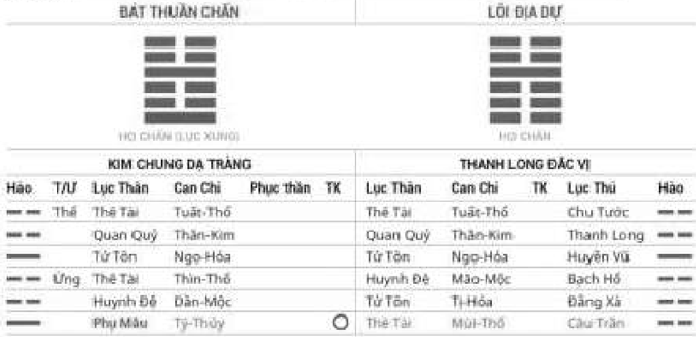

| Hào | T/Ứ | Lục Thân (Chủ) | Can Chi (Chủ) | Phục Thần | Biến động | Lục Thân (Biến) | Can Chi (Biến) | Lục Thú | Hào biến |
| :---: | :---: | :---: | :---: | :---: | :---: | :---: | :---: | :---: | :---: |
| 6 | **Thế** | Thê Tài | Tuất-Thổ | | | Thê Tài | Tuất-Thổ | Chu Tước | - - |
| 5 | | Quan Quỷ | Thân-Kim | | | Quan Quỷ | Thân-Kim | Thanh Long | - - |
| 4 | | Tử Tôn | Ngọ-Hỏa | | | Tử Tôn | Ngọ-Hỏa | Huyền Vũ | --- |
| 3 | **Ứng** | Thê Tài | Thìn-Thổ | | | Huynh Đệ | Mão-Mộc | Bạch Hổ | - - |
| 2 | | Huynh Đệ | Dần-Mộc | | | Tử Tôn | Tỵ-Hỏa | Đằng Xà | - - |
| 1 | | Phụ Mẫu | Tý-Thủy | | **O** | Thê Tài | Mùi-Thổ | Câu Trận | - - |

---

### 3. Dụng thần & Loại quẻ

- **Loại quẻ:**
  - Thể loại: **Lục Xung biến Lục Hợp** (Bát Thuần Chấn biến Lôi Địa Dự).
  - Bản chất sự việc: Quẻ sự tình kết hợp tâm tình / mưu cầu quy hoạch sự nghiệp, vị trí chức vụ trung và dài hạn.
- **Xác định Dụng thần:**
  - **Hào Thế (Thê Tài Tuất Thổ - Hào 6):** Đại diện cho bản thân người gieo quẻ, ngự ở quẻ ngoại hào 6 biểu thị vị trí tại bộ phận bên ngoài sau khi điều chuyển.
  - **Hào Phụ Mẫu Tý Thủy (Hào 1) hóa Thê Tài Mùi Thổ:** Đại diện cho vị trí công tác hiện tại, hợp đồng/chức danh tại trụ sở chính (quẻ nội) và hành vi chủ động từ bỏ để luân chuyển ra ngoài.
  - **Hào Quan Quỷ Thân Kim (Hào 5, lâm Thanh Long):** Đại diện cho chức vụ giám đốc và quyền lực sự nghiệp.
  - **Hào Tử Tôn Ngọ Hỏa (Hào 4, lâm Lộc Thần, Đào Hoa):** Làm nguyên thần trung gian sinh phù Hào Thế, đồng thời là hào bị xung kích bởi hào động Phụ Mẫu Tý Thủy.
  - **Hào Ứng (Thê Tài Thìn Thổ - Hào 3, lâm Bạch Hổ):** Đại diện cho môi trường mới tại bộ phận bên ngoài, đối tác và thế lực bản địa nơi đến (đối xung Thìn - Tuất với hào Thế).

---

### 4. Luận giải chi tiết

#### A. Ý nghĩa cấu trúc tượng quẻ: Lục Xung biến Lục Hợp
1. **Quy luật tổng quát:**
   - Quẻ Lục Xung chủ về sự biến động nhanh, đột ngột, chấn động ngắn hạn; đồng thời phản ánh hiện trạng trước đó từng có trục trặc hoặc không giữ được thế cân bằng tĩnh.
   - Quẻ Lục Hợp chủ về sự liên kết bền chặt, ổn định, xu thế lâu dài trong tương lai.
   - Thể quẻ *Lục Xung biến Lục Hợp* chỉ ra rằng: việc luân chuyển chức vụ giám đốc là một biến động mang tính giai đoạn (ngắn hạn), nhưng sau khi thay đổi, sự việc sẽ đi vào quỹ đạo ổn định lâu dài. Do đó, người luận đoán phải rạch ròi phân thành hai chiều không gian - thời gian:
     - **Ngắn hạn:** Xem xét thông qua biến hóa của hào động và các xung kích tương hỗ.
     - **Dài hạn:** Bỏ qua các xung động tức thời, tập trung xem xét tổ hợp Nhật - Nguyệt cố định tác động lên Hào Thế và Hào Ứng khi cục diện đã đi vào ổn định (Lục Hợp).

#### B. Nút thắt mấu chốt: "Chủ động từ bỏ" khác biệt với "Bị ép buộc loại bỏ"
1. **Hiện tượng hào 1 phát động:** Hào sơ Phụ Mẫu Tý Thủy lâm Câu Trận động hóa Thê Tài Mùi Thổ mang Mưu tinh (Mùi Thổ quay lại khắc Tý Thủy — Biến hồi đầu khắc).
2. **Nếu ở thế Bị động (bị chèn ép):**
   - Thê Tài Mùi Thổ mang Mưu tinh khắc Phụ Mẫu Tý Thủy sẽ mang ý nghĩa là đồng nghiệp ngấm ngầm lập mưu hãm hại, đè bẹp chỗ đứng hiện tại của anh ấy nhằm đẩy anh ấy ra ngoài.
   - Trong tình huống bị động mất chỗ dựa, Phụ Mẫu bị tổn thương sẽ hoàn toàn mất khả năng kích động hào Tử Tôn Ngọ Hỏa sinh Thế; hào Thế Tuất Thổ không được nhận sinh trợ, đây sẽ là quẻ đại hung (mất chức, mất quyền, buộc phải ra đi trong cay đắng).
3. **Khi ở thế Chủ động (tự nguyện quy hoạch):**
   - Việc Phụ Mẫu Tý Thủy hóa Thê Tài Mùi Thổ hồi đầu khắc được định nghĩa như một **tượng chỉnh thể**: *Tự nguyện từ bỏ chức vị cũ tại trụ sở chính*.
   - Mùi Thổ mang Mưu tinh thể hiện mưu kế, toan tính do chính bản thân đương số chủ động sắp xếp để từ bỏ đơn vị hiện tại chuyển ra ngoài.
   - Hào Thổ ở thế "Dưỡng tại Mùi" (trong vòng 12 cung Trường Sinh của Thổ), đại diện cho tâm lý toan tính nhưng vẫn còn đôi chút do dự, phân vân trước quyết định lớn.
   - Vì là hành động tự nguyện có chủ đích, biến hóa này trở thành "hào động hữu dụng": Tý Thủy động phát sinh xung kích vào hào 4 Tử Tôn Ngọ Hỏa (Tý Ngọ tương xung), kích hoạt Ngọ Hỏa vận động để sinh cho hào Thế Thê Tài Tuất Thổ.

#### C. Luận giải lợi ích trong ngắn hạn (Kích hoạt Tử Tôn Ngọ Hỏa)
1. **Trạng thái hào Tử Tôn Ngọ Hỏa:**
   - Tại Nguyệt lệnh Mão Mộc: được Nguyệt sinh trợ (Mộc sinh Hỏa).
   - Tại Nhật kiến Dậu Kim: không bị khắc phạt.
   - Tổng thể Ngọ Hỏa ở trạng thái vô cùng vượng tướng.
2. **Kích động sinh Thế:**
   - Phụ Mẫu Tý Thủy phát động xung động Tử Tôn Ngọ Hỏa, biến tĩnh thành động, khiến Ngọ Hỏa dốc toàn lực sinh trợ cho Hào Thế Thê Tài Tuất Thổ.
3. **Thần sát hội tụ tại Ngọ Hỏa:**
   - **Lộc Thần:** Ngọ là Lộc thần của ngày Kỷ Dậu. Tử Tôn lâm Lộc thần sinh Thế biểu thị mức lương bổng, đãi ngộ và lợi ích kinh tế tại bộ phận bên ngoài cao hơn rõ rệt so với ở trụ sở chính.
   - **Đào Hoa:** Ngọ là Đào hoa. Lâm Đào hoa sinh Thế biểu thị danh tiếng, vị thế xã hội và uy danh cá nhân được gia tăng; có triển vọng được nâng bậc/nửa cấp chức danh.
   - **Quý Nhân:** Ngọ không xung khắc với Quý nhân (Thân, Tý), chỉ ra rằng tuy anh ấy không leo lên vị trí cao nhất (tổng tài/tổng giám đốc), nhưng vị trí này rất có thực quyền và tiếng vang.
4. **Kết luận ngắn hạn:** Việc điều chuyển trong ngắn hạn mang lại thắng lợi rõ rệt về danh tiếng và đãi ngộ kinh tế.

#### D. Luận giải xu thế dài hạn: Bẫy phe phái nội bộ & Thế lực bản địa
Khi sự việc bước sang giai đoạn dài hạn (quẻ biến Lôi Địa Dự - Lục Hợp), các yếu tố xung động tạm thời chấm dứt, trạng thái sống còn của đương số phụ thuộc hoàn toàn vào cấu trúc quyền lực Nhật - Nguyệt và tương tác Thế - Ứng.

1. **Cấu trúc quyền lực phân hóa sâu sắc qua tổ hợp Nhật - Nguyệt:**
   - **Nguyệt lệnh (Tân Mão Mộc):** Tượng trưng cho tầng lớp lãnh đạo quyết định tối cao (Hội đồng quản trị, ban lãnh đạo cấp cao của tập đoàn tài chính).
   - **Nhật kiến (Kỷ Dậu Kim):** Tượng trưng cho nhóm quản lý điều hành trực tiếp hàng ngày, đồng nghiệp chuyên môn và lực lượng cán bộ kỹ thuật vận hành.
   - **Mão - Dậu tương xung trực tiếp:** Nguyệt lệnh và Nhật kiến tương xung dữ dội. Điều này vạch trần một thực tế khách quan tại tổ chức: Nội bộ công ty đang bị chia rẽ thành **hai phe phái / hai nhóm lợi ích hoàn toàn đối lập nhau**, bất đồng về đường lối, triết lý vận hành và lợi ích chiến lược, nội bộ không thể đoàn kết.

2. **Mối quan hệ giữa Hào Thế (Tuất Thổ) với hai phe:**
   - **Đối với Nhật Dậu Kim:** Hào Thế Thổ lâm cung Mộc dục tại Dậu (chủ về tình cảm, sự gần gũi thân thiết). Nhật kiến Dậu Kim đồng thời mang Văn xương và Tướng tinh (lực lượng kỹ thuật chủ chốt và điều hành thực tế). Về mặt quan hệ cá nhân, anh ấy rất thân thiết và đồng cảm với nhóm này.
   - **Đối với Nguyệt Mão Mộc:** Mão Mộc hợp Tuất Thổ (Lục hợp), nhưng đồng thời Mộc khắc Thổ — đây là tượng **"Trong Hợp có Khắc"** (Hợp tàng Khắc).
     - Nếu ứng xử khéo léo, đặt mình đúng vị trí cấp dưới tùng phục cấp trên: Sự khắc chế của Mão Mộc là sự quản lý danh chính ngôn thuận; khi đó **Hợp là chính, Khắc là phụ**, định tính là **"Hợp vượng"**, được ban lãnh đạo cấp cao bảo bọc che chở.
     - Nếu ứng xử sai lầm, để cảm xúc cá nhân lôi kéo mà ngả hẳn về phe Nhật kiến Dậu Kim: Vì Dậu Kim xung phá Mão Mộc, hành động đứng về phe Dậu Kim sẽ trực tiếp biến anh ấy thành đối tượng đối đầu với ban lãnh đạo cấp cao. Khi đó, **Khắc biến thành chính, Hợp biến thành phụ**, ban lãnh đạo tối cao sẽ âm thầm bài xích, giăng bẫy kìm hãm con đường tiến thân của anh ấy.

3. **Tương tác Hào Ứng: Cuộc đối đầu giữa "Địa đầu xà" và "Quá giang long":**
   - Hào Ứng là Thê Tài Thìn Thổ (lâm Bạch Hổ), đối diện xung trực tiếp với hào Thế Thê Tài Tuất Thổ (Thìn - Tuất tương xung).
   - Cả hai đều mang hành Thổ mang tính đối kháng:
     - Hào Thế (Tuất Thổ) là nhân sự từ hội sở điều chuyển xuống, mang tư thế **"Quá giang long"** (Rồng vượt sông - kẻ từ xa đến tiếp quản có năng lực mạnh).
     - Hào Ứng (Thìn Thổ) là nhân sự/thế lực hiện hữu tại chi nhánh/bộ phận bên ngoài, mang tư thế **"Địa đầu xà"** (Rắn bản địa - kẻ có rễ sâu và thế lực cục bộ tại địa phương).
   - Hai Thổ tương xung cảnh báo ngay khi tiếp quản đơn vị mới, anh ấy tất yếu vấp phải sự chống đối, bất hợp tác và xung đột văn hóa gay gắt từ thế lực địa phương cựu trào.
   - Hào Ứng Thìn Thổ đối diện với Huynh Đệ Mão Mộc (chính là tầng lớp lãnh đạo quyết định). Nếu đương số xung đột trực diện với lãnh đạo hoặc để thế lực địa phương liên kết với ban lãnh đạo chống lại mình, anh ấy sẽ rơi vào thế cô lập hoàn toàn.

---

### 5. Phán đoán & Ứng kỳ

#### A. Phán đoán tổng thể:
1. **Ngắn hạn (Đại cát):** Kế hoạch chủ động luân chuyển ra ngoài là hoàn toàn khả thi và có lợi. Anh ấy sẽ nhanh chóng nhận được quyết định bổ nhiệm, đạt được vị thế cao hơn (Đào hoa) và chế độ đãi ngộ, thu nhập tăng vọt (Lộc thần).
2. **Dài hạn (Ẩn tàng hung hiểm):**
   - Bản chất chuyển từ Chấn (Lục Xung) sang Dự (Lục Hợp) cho thấy sau giai đoạn biến động ban đầu sẽ đi vào ổn định.
   - Tuy nhiên, sự ổn định lâu dài phụ thuộc sống còn vào **nghệ thuật chọn phe**: Tuyệt đối không được thiên vị hay đứng về phía nhóm quản lý điều hành hàng ngày (Dậu Kim) dù có quan hệ thân thiết; bắt buộc phải giữ vững lập trường trung thành tuyệt đối với tầng lớp lãnh đạo quyết định tối cao (Nguyệt lệnh Mão Mộc) để duy trì thế Mão - Tuất hợp vượng.
   - Khi bước chân vào đơn vị mới, phải mềm mỏng hòa nhập, từng bước tháo gỡ sự đối kháng của thế lực "Địa đầu xà" bản xứ, tuyệt đối không được đối đầu trực diện ngay từ giai đoạn đầu.

#### B. Ứng kỳ:
- **Ứng kỳ ngắn hạn:** Ngay trong mùa xuân - tháng Mão năm Bính Thân (2016), việc điều động hoàn tất và quyền lợi mới lập tức được xác lập.
- **Ứng kỳ dài hạn:** Các khảo nghiệm về phe phái và sự ổn định sự nghiệp sẽ ứng nghiệm vào các năm/tháng địa chi Thìn - Tuất (kích động mâu thuẫn Thế - Ứng / Quá giang long đụng Địa đầu xà) hoặc năm/tháng Mão - Dậu (mâu thuẫn hai phe phái lãnh đạo bùng nổ đỉnh điểm).

---

### 6. Nghiệm chứng & Điểm mấu chốt

#### A. Nghiệm chứng lịch sử:
- Sau khi được Chu Thần Bản phân tích rạch ròi, người đồng môn vô cùng kinh ngạc và thừa nhận từng chi tiết:
  1. Bản thân chính là người chủ động xây dựng phương án và thúc đẩy việc luân chuyển này để tìm kiếm cơ hội bứt phá.
  2. Mức thu nhập, bổng lộc và quyền hạn tại bộ phận bên ngoài quả thực cao hơn hẳn so với vị trí giám đốc tại trụ sở chính.
  3. Trong thâm tâm anh ấy quả thực vẫn còn chút phân vân, toan tính do dự trước bước ngoặt mới (đúng với tượng Thổ dưỡng tại Mùi mang Mưu tinh).
  4. Người đồng môn tiếp thu trọn vẹn lời khuyên chiến lược về việc định vị lập trường chính trị nội bộ (đứng về phía ban lãnh đạo cấp cao Mão Mộc) và phương pháp ứng xử mềm dẻo với nhóm lợi ích bản địa ở đơn vị mới.

#### B. Điểm mấu chốt học thuật (Core Rules):
1. **Nguyên tắc "Chủ động" vs "Bị động" khi định tính hào động:**
   - Cùng là một hiện tượng hào động bị biến hồi đầu khắc (Phụ Mẫu Tý Thủy hóa Thê Tài Mùi Thổ khắc ngược), nhưng bản chất nội tình khác nhau sẽ định tính quẻ hoàn toàn trái ngược:
     - *Bị động:* Bị kẻ khác mưu hại, chỗ đứng sụp đổ -> **Quẻ Đại Hung**.
     - *Chủ động:* Bản thân tự nguyện từ bỏ vị trí cũ để mưu sự mới -> Hào động trở thành động lực kích hoạt toàn quẻ -> **Quẻ Cát**.
2. **Cơ chế phân tầng thời gian của "Lục Xung biến Lục Hợp":**
   - Lục Xung chỉ thị biến động tức thời trong ngắn hạn; Lục Hợp chỉ thị trạng thái an bài trong dài hạn.
   - Luận ngắn hạn: Căn cứ vào hào động và các xung kích tương hỗ.
   - Luận dài hạn: Gạt bỏ hào động, quay về phân tích tương quan gốc rễ giữa Hào Thế, Hào Ứng với tổ hợp cố định của Nhật và Nguyệt.
3. **Mô hình tổ hợp Nhật - Nguyệt chỉ định cơ cấu quyền lực doanh nghiệp:**
   - Trong quẻ hỏi về công ty/cơ quan: Nguyệt lệnh chỉ định tầng lớp lãnh đạo quyết định tối cao; Nhật kiến chỉ định nhóm điều hành, quản lý trực tiếp hàng ngày hoặc lực lượng chuyên môn.
   - Nhật - Nguyệt tương xung phản ánh sự phân hóa phe phái sâu sắc trong nội bộ tổ chức.
4. **Phép biện chứng "Trong Hợp có Khắc" (Mão Tuất hợp):**
   - Quan hệ giữa lãnh đạo cấp trên (Mão Mộc) và cấp dưới (Tuất Thổ) mang tính khắc phục tùng, nhưng bản chất là tương hợp gắn kết. Nếu cấp dưới biết phục tùng và đồng hành thì "Hợp là chính" (Hợp vượng); nếu phản nghịch hoặc đứng về phe đối lập thì "Khắc là chính", ắt chuốc lấy tai họa kìm hãm ngấm ngầm.
5. **Cặp hình tượng "Quá giang long" và "Địa đầu xà":**
   - Hai hào Thổ (Thế Tuất Thổ - Ứng Thìn Thổ) tương xung biểu thị sự xung đột tất yếu giữa người mới đến tiếp quản quyền lực và thế lực cựu trào sở tại. Cần dùng sách lược nhu thuận để đồng hóa thay vì đối kháng vũ lực.

## Thực chiến 3: Áp lực tâm lý lớn, không muốn đi làm nhưng không cam lòng nghỉ hưu nội bộ, hỏi có cơ hội điều chuyển sang nhóm kiểm tra giám sát không

### 1. Bối cảnh & Câu hỏi

- **Bối cảnh người hỏi**:
  - Người hỏi là một đồng môn của tác giả, hiện đang giữ chức Giám đốc chi nhánh ngân hàng thuộc hệ thống Ngân hàng Nông nghiệp tỉnh Cam Túc (cơ quan quản lý cao nhất là Hiệp hội Hợp tác Tín dụng tỉnh Cam Túc, thường gọi tắt là Tiết kiệm Liên Liên).
  - Do áp lực công việc kinh doanh và chỉ tiêu quá lớn, người này không còn muốn tiếp tục đi làm, tâm lý mệt mỏi, ngột ngạt.
  - Người hỏi không cam lòng chọn phương án nghỉ hưu nội bộ (nội thoái / thối nhị tuyến) vì cảm thấy thiệt thòi quyền lợi và mất thể diện.
  - Thời gian đến tuổi chính thức nghỉ hưu theo quy định của nhà nước còn đến 10 năm nữa, khoảng thời gian quá dài để cố gắng chịu đựng.
  - Nguyện vọng thực tế: Tìm kiếm một vị trí nhàn rỗi (hư chức, vị trí an dưỡng) để tĩnh tâm học hỏi thêm về văn hóa cổ truyền và nghiên cứu Chu Dịch / Lục Hào.
  - Mục tiêu hướng tới: Dưới Tiết kiệm Liên Liên có một "nhóm kiểm tra giám sát" (tuần thị / thanh tra giám sát), nơi các cán bộ lão thành chuẩn bị về hưu thường được chuyển sang ngồi để hưởng chế độ nhàn nhã, có đãi ngộ và danh phận nhưng không phải quản lý công việc sự vụ.
  - Người hỏi muốn nhờ một vị lãnh đạo cấp trên giúp đỡ để can thiệp sắp xếp sang nhóm thanh tra này sớm trước niên hạn.
  - Tiền sử chiêm bốc: Năm ngoái, một vị thầy phong thủy/bói dịch ở địa phương đã tính toán và kết luận rằng "không thể được".
- **Thời gian chiêm đoán**:
  - Dương lịch: 09:03 ngày 15 tháng 04 năm 2016.
  - Can chi: Năm Bính Thân, tháng Nhâm Thìn, ngày Đinh Mão, giờ Ất Tỵ.
  - Tiết khí: Tháng Thìn (sau Thanh Minh, trước Cốc Vũ).
  - Can chi ngày tháng: Tháng Thìn, ngày Đinh Mão.
  - Tuần không: Tuất, Hợi (tuần Giáp Tý).
- **Thần sát ngày Đinh Mão**:
  - Tướng tinh: Mão
  - Hoa Cái: Mùi
  - Dịch Mã: Tỵ
  - Tai Sát: Dậu
  - Mưu Tinh: Sửu
  - Đào Hoa: Tý
  - Kiếp Sát: Thân
  - Lộc Thần: Ngọ
  - Dương Đao: Tỵ
  - Văn Xương: Dậu
  - Thiên Y: Mão
  - Thiên Hỷ: Tuất
  - Quý Nhân: Dậu, Hợi
- **Câu hỏi chiêm đoán**:
  - Liệu bản thân có cơ hội được điều chuyển công tác sang nhóm kiểm tra giám sát hay không?

---

### 2. Dữ kiện & Bảng quẻ Crop

- Dữ kiện bảng quẻ và các thông số chiêm đoán:
  - **Bảng 3.1** Đồ hình quẻ Thực chiến 3:
    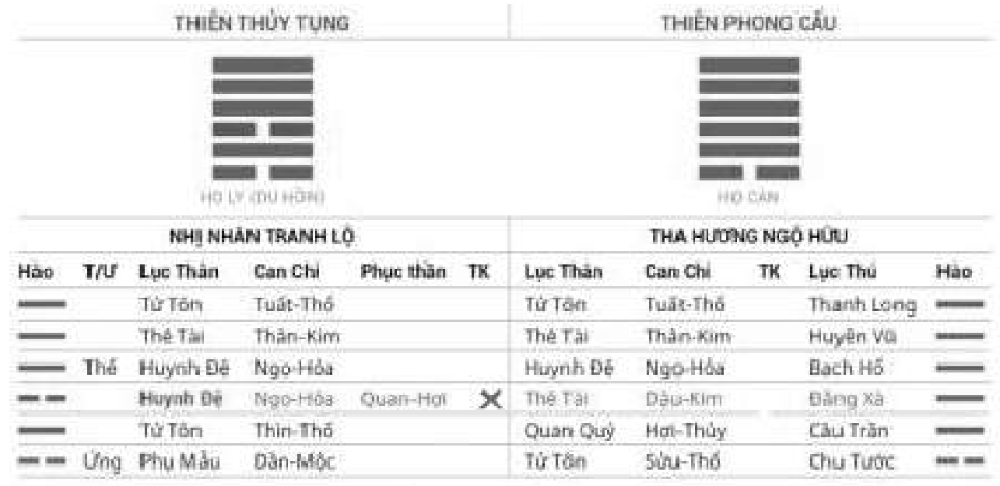

- **Quẻ chủ**: **THIÊN THỦY TỤNG** (Càn thượng, Khảm hạ).
  - Cung: Ly (Quẻ Du Hồn).
  - Tượng quẻ: *Nhị nhân tranh lộ* (Hai người tranh chấp một con đường; chủ về bất hòa, tranh chấp, cãi vã, môi trường ngột ngạt).
- **Quẻ biến**: **THIÊN PHONG CẤU** (Càn thượng, Tốn hạ).
  - Cung: Càn.
  - Tượng quẻ: *Tha hương ngộ hữu* (Nơi đất khách gặp lại bạn cũ).
- **Bảng lục hào chi tiết**:

| Hào | T/Ứ | Lục Thân (Chủ) | Can Chi (Chủ) | Phục Thần | Biến/Động | Lục Thân (Biến) | Can Chi (Biến) | Lục Thú | Trạng thái Nhật Nguyệt & Thần Sát |
| :---: | :---: | :---: | :---: | :---: | :---: | :---: | :---: | :---: | :--- |
| 6 | | Tử Tôn | Tuất-Thổ | | | Tử Tôn | Tuất-Thổ | Thanh Long | Nguyệt phá (Thìn xung), Nhật hợp (Mão hợp), lâm Tuần Không, Thiên Hỷ |
| 5 | | Thê Tài | Thân-Kim | | | Thê Tài | Thân-Kim | Huyền Vũ | Nguyệt sinh, Nhật thai/tuyệt, lâm Kiếp Sát |
| 4 | **Thế** | Huynh Đệ | Ngọ-Hỏa | | | Huynh Đệ | Ngọ-Hỏa | Bạch Hổ | Nguyệt hưu tù, Nhật sinh (Mão sinh Ngọ), lâm Lộc Thần |
| 3 | | Huynh Đệ | Ngọ-Hỏa | Quan Quỷ Hợi-Thủy | **X** | Thê Tài | Dậu-Kim | Đằng Xà | Phát động; phục Quan Quỷ Hợi Thủy (Tuần Không); biến Dậu Kim lâm Quý Nhân, Văn Xương, Tai Sát, Nguyệt hợp (Thìn Dậu), Nhật xung (Mão Dậu ám động) |
| 2 | | Tử Tôn | Thìn-Thổ | | | Quan Quỷ | Hợi-Thủy | Câu Trần | Lâm Nguyệt kiến |
| 1 | **Ứng** | Phụ Mẫu | Dần-Mộc | | | Tử Tôn | Sửu-Thổ | Chu Tước | Nguyệt hưu tù, Nhật vượng tỉ hòa |

---

### 3. Dụng thần & Loại quẻ

- **Phân loại quẻ**:
  - **Quẻ sự tình**: Hỏi về việc điều chuyển chức vụ, thuyên chuyển vị trí công tác trong cơ quan ngân hàng.
  - **Quẻ tâm thái**: Thể hiện trực tiếp áp lực tâm lý nặng nề, sự lo âu, mâu thuẫn đối nội đối ngoại và nguyện vọng giải tỏa gánh nặng.
  - **Quẻ chỉ đạo (Chỉ đạo quẻ)**: Khai mở lộ trình chiến lược thực tế khi con đường trực tiếp ban đầu bị phong tỏa hoàn toàn.
- **Xác định Dụng thần đa tầng**:
  - **Tầng 1 - Quan Quỷ (Chức vụ chính thức)**:
    - Vị trí thanh tra giám sát trên danh nghĩa vẫn là một vị trí có chức danh trong biên chế nhà nước, do đó xét về mặt chức vụ quy ước thì lấy Quan Quỷ làm đại diện.
    - Trong quẻ Tụng: Quan Quỷ Hợi Thủy không xuất hiện trên quẻ, phục tàng dưới Hào 3 Huynh Đệ Ngọ Hỏa, lại lâm Tuần Không (tuần Giáp Tý không Tuất Hợi).
  - **Tầng 2 - Tử Tôn (Bản chất an nhàn, dưỡng lão, buông bỏ áp lực)**:
    - Về mặt dịch lý: Tử Tôn là thần khắc Quan Quỷ, chủ về tước bỏ quyền hành thực tế, giải trừ chức trách gánh vác, đem lại tâm thái tiêu dao, an hưởng thái bình ("Tử tôn trì thế tuyệt ưu nghi").
    - Vì mục đích cốt lõi của người hỏi là "tìm vị trí nhàn rỗi để dưỡng già, trút bỏ áp lực", nên đơn vị mang tính chất bán nghỉ hưu này mang đặc trưng cốt lõi của Tử Tôn.
    - Hào 2 Tử Tôn Thìn Thổ: Đại diện cho nhóm kiểm tra giám sát nội bộ (đơn vị dưỡng lão trong hội sở).
    - Hào 6 Tử Tôn Tuất Thổ: Đại diện cho vị trí Cố vấn / Tư vấn ở các đơn vị bên ngoài (thoái nhị tuyến, vị trí bán nghỉ hưu).
  - **Tầng 3 - Phụ Mẫu (Lãnh đạo nâng đỡ, công văn giấy tờ điều động)**:
    - Hào 1 Phụ Mẫu Dần Mộc trì Ứng: Đại diện cho vị lãnh đạo cấp trên mà người hỏi cậy nhờ can thiệp, giúp đỡ điều chuyển.
  - **Tầng 4 - Hào Thế (Chủ quẻ)**:
    - Hào 4 Huynh Đệ Ngọ Hỏa trì Thế: Đại diện cho bản thân người hỏi.

---

### 4. Luận giải chi tiết

#### 4.1. Giải mã tâm thái và hiện trạng qua quẻ chủ Tụng và hào Thế
- **Tượng quẻ Thiên Thủy Tụng ("Nhị nhân tranh lộ")**:
  - Biểu thị môi trường công sở đầy rẫy sự bất hòa, quan điểm trái ngược, tranh chấp quyền lợi hoặc chỉ tiêu kinh doanh. Mọi giao dịch, vận hành đều gặp vướng mắc, cãi vã.
- **Hào Thế Huynh Đệ Ngọ Hỏa lâm Bạch Hổ**:
  - Bạch Hổ chủ về ưu sầu, phiền toái, nôn nóng và áp lực nội tâm ngột ngạt.
  - Huynh Đệ chủ về hao tài, cạnh tranh, tranh đoạt. Làm giám đốc chi nhánh ngân hàng nhưng người hỏi cảm thấy tinh thần kiệt quệ, mệt mỏi cùng cực.
- **Quẻ Tụng biểu thị giao tiếp khiếu nại**:
  - Quẻ Tụng chủ về biện giải, nói lý. Người hỏi thực tế đã từng tìm đến lãnh đạo cấp trên để phân trần, than thở về hoàn cảnh áp lực của mình ("Tôi gặp khó khăn quá lớn, công việc phiền phức, mọi người không hợp tác") nhằm xin được thuyên chuyển.

#### 4.2. Mối quan hệ Thế - Ứng và sự cản trở từ Gian hào
- **Hào Ứng Phụ Mẫu Dần Mộc (Lãnh đạo được nhờ cậy)**:
  - Ứng lâm Chu Tước, ngụ ý người có tiếng nói, có quyền ban hành văn bản.
  - Hào Ứng Phụ Mẫu Dần Mộc tương sinh cho hào Thế Huynh Đệ Ngọ Hỏa (Dần Mộc sinh Ngọ Hỏa), cho thấy vị lãnh đạo này có thiện chí, thật lòng muốn giúp đỡ người hỏi.
  - Tuy nhiên, Hào Ứng hoàn toàn tĩnh, không phát động: Lãnh đạo chỉ có lòng thương xót, che chở nhưng không có động thái can thiệp quyết liệt hay biến chuyển thực tế.
- **Sự ngăn cách nghiêm trọng từ Gian hào (Hào 3)**:
  - Giữa hào Ứng (hào 1) và hào Thế (hào 4) có gian hào phát động, cụ thể là hào 3 Huynh Đệ Ngọ Hỏa.
  - Gian hào phát động không sinh trợ Thế cũng không sinh Ứng, mà dựng lên một bức tường ngăn cách giữa người nhờ và người giúp.
  - Huynh Đệ tại gian hào chính là đồng nghiệp cùng cấp (các giám đốc chi nhánh, cán bộ đồng cấp khác).

#### 4.3. Động biến hào 3: Bị đối thủ dùng quan hệ và chính sách chiếm chỗ trước
- **Hào 3 Huynh Đệ Ngọ Hỏa phát động biến Thê Tài Dậu Kim**:
  - Hào 3 và Hào Thế cùng là Huynh Đệ Ngọ Hỏa: Tạo nên sự đối lập, cạnh tranh trực tiếp một-một giữa người hỏi và đồng nghiệp.
  - Hào biến Thê Tài Dậu Kim mang Thần sát:
    - **Lâm Quý Nhân**: Đồng nghiệp cũng đang vận tác mối quan hệ cấp trên ngầm rất mạnh mẽ.
    - **Lâm Văn Xương**: Văn Xương chủ về văn kiện, điều lệ, chính sách, quy chế chuẩn. Đồng nghiệp hoàn toàn phù hợp với tiêu chuẩn chính sách (thường chỉ người còn 3–5 năm nữa về hưu mới được chuyển sang nhóm thanh tra).
    - **Lâm Tai Sát**: Hành động quyết liệt, chớp thời cơ thần tốc.
- **Hiện trạng chiếm chỗ ngầm (Nguyệt hợp Nhật xung)**:
  - Dậu Kim hợp với Nguyệt lệnh Thìn Thổ (Thìn Dậu lục hợp), lại bị Nhật kiến Mão xung phá (Mão Dậu tương xung).
  - Nguyệt hợp Nhật xung tạo thành trạng thái **Ám động mang theo hiện trạng**: Vị trí dường như bề ngoài chưa công bố, nhưng thực tế bên trong đã có nhân sự khác âm thầm hoàn tất vận động và chiếm đoạt trước.
- **Bất lợi chí mạng của chủ quẻ**:
  - Chủ quẻ còn tới 10 năm nữa mới nghỉ hưu, hoàn toàn không đáp ứng chính sách quy chế (thiếu Văn Xương).
  - Thế hào bất động, trong khi gian hào Huynh Đệ phát động nhanh hơn, dùng cả quan hệ (Quý Nhân) lẫn tiêu chí hợp lệ (Văn Xương) để chiếm chỗ trước. Cửa vào nhóm thanh tra chính thức bị bít kín.

#### 4.4. Dụng thần Quan Quỷ Hợi Thủy phục tàng ngộ Không
- Quan Quỷ Hợi Thủy là biểu tượng chức danh thanh tra giám sát:
  - Nằm phục dưới hào 3 Huynh Đệ Ngọ Hỏa.
  - Phục thần lâm Tuần Không (không vong trong tuần Giáp Tý).
  - Quy tắc: *"Phục phùng Tuần Không thì chuyện mưu cầu coi như hư ảo, chức vụ tìm kiếm không thể đạt được"*. Lại bị gian hào đè lên bên trên, cho thấy chức danh này người hỏi không thể với tới.

#### 4.5. Phân tích ba tầng ý nghĩa của Tử Tôn Thìn Thổ (Nguyệt lệnh & Hào 2)
Tử Tôn Thìn Thổ tại Nguyệt lệnh và hiện diện ở Hào 2 mang 3 tầng biểu tượng chi tiết:
1. **Tầng lớp quyết định (Cấp trên chỉ đạo)**:
   - Thìn Thổ đối với Thế Ngọ Hỏa là hưu tù / tiết khí. Tầng lớp lãnh đạo quyết định không có sự hợp tác hay ưu ái tích cực đối với nguyện vọng vào nhóm thanh tra của người hỏi.
2. **Đội ngũ cấp dưới thực thi**:
   - Tử Tôn là cấp dưới. Thìn Thổ mang Văn Xương Quý Nhân nhưng lại tiết khí Thế hào, phản ánh thực tế việc quản lý nhân viên cấp dưới trong ngân hàng hiện tại vô cùng khó khăn, triển khai nghiệp vụ phức tạp tạo áp lực nặng nề cho người hỏi.
3. **Đơn vị dưỡng lão nội bộ (Nhóm thanh tra giám sát)**:
   - Hào 2 là trạch hào, quản việc nội bộ; Thổ chủ ổn định; Tử Tôn chủ an nhàn, dưỡng lão; bên trong hào 2 lại ẩn chứa Quan Quỷ Hợi Thủy đối ứng (có chức vụ, đãi ngộ tốt nhưng không phải trực tiếp quản việc kinh doanh).
   - Hào 3 động biến Thê Tài Dậu Kim lại hợp với Thìn Thổ (Thìn Dậu hợp): Minh chứng rõ ràng rằng đồng nghiệp ở gian hào đã câu kết và chiếm trọn vị trí nhóm thanh tra ở hào 2.

#### 4.6. Chiến lược đột phá từ Hào 6 Tử Tôn Tuất Thổ (Lối thoát quẻ chỉ đạo)
Tác giả không dừng lại ở kết luận tiêu cực mà phân tích sâu quẻ để tìm ra giải pháp thực tế:
- **Ý nghĩa đặc thù của Hào 6 Tử Tôn Tuất Thổ**:
  - So sánh vị trí quyền lực: Hào 5 đại diện cho vị trí cốt lõi, nắm thực quyền hành chính (như Thị trưởng, Giám đốc điều hành). Hào 6 là hào trên đỉnh, đại diện cho tầng lớp "Tư vấn", "Cố vấn" (như Chủ tịch Hội đồng Nhân dân hoặc chuyên gia cố vấn cao cấp), uy danh cao nhưng đã rời khỏi vòng xoáy điều hành trực tiếp.
  - Hào 6 là ngoại quái, đại diện cho các đơn vị bên ngoài (không phải nội bộ hội sở như Hào 2).
  - Vị trí này lâm Tử Tôn, cũng mang bản chất dưỡng lão, nhàn nhã, trút bỏ trách nhiệm quản lý.
- **Trạng thái "Nguyệt phá Nhật hợp" lâm Tuần Không**:
  - Hào 6 Tuất Thổ bị Nguyệt lệnh Thìn Thổ xung (Nguyệt phá), được Nhật kiến Mão Mộc hợp (Nhật hợp), đồng thời lâm Tuần Không.
  - Dịch lý: Nguyệt phá gặp Nhật hợp thì giữ được sự cân bằng thực chất; Tuần Không là "chỗ khuyết, vị trí đang để trống". Giống như bánh xe có lỗ trống thì đóng nêm vào được; nhà trống thì có thể dọn vào ở.
- **Mối liên hệ nhân quả giữa Hào 6 và Hào 3 động**:
  - Hào 3 Ngọ Hỏa lâm Đằng Xà phát động, Hào 6 Tuất Thổ lâm Thanh Long: Sự kết hợp Long – Xà phản ánh hai mặt nhân quả của cùng một sự việc.
  - Vị đồng nghiệp ở Hào 3 sau khi vận động thành công để bước vào nhóm thanh tra (Hào 2), họ buộc phải rời khỏi vị trí cũ của mình. Vị trí cũ mà họ từng ngồi trước đó chính là vị trí Cố vấn/Tư vấn ở Hào 6!
  - Khi đồng nghiệp bước lên Hào 2, chiếc ghế Cố vấn ở Hào 6 lập tức bị bỏ trống.
- **Cơ chế Tam Hợp Cục mở lối thoát hoàn hảo**:
  - Hào 1 Phụ Mẫu Dần Mộc (Ứng - Lãnh đạo) + Hào 4 Huynh Đệ Ngọ Hỏa (Thế - Người hỏi) + Hào 6 Tử Tôn Tuất Thổ (Ghế cố vấn bỏ trống) cấu thành **DẦN - NGỌ - TUẤT TAM HỢP HỎA CỤC**!
  - **Dần Mộc bán hợp Tuất Thổ**: Lãnh đạo (hào Ứng) hoàn toàn có đủ năng lực, thẩm quyền và thuận lợi để can thiệp sắp xếp người hỏi về vị trí Cố vấn bên ngoài này mà không bị gian hào cản trở.
  - **Ngọ Hỏa bán hợp Tuất Thổ**: Điều kiện hiện tại của bản thân người hỏi hoàn toàn tương thích, tự nhiên thuận lợi để tiếp nhận vị trí cố vấn ở Hào 6 mà không cần khiên cưỡng.

---

### 5. Phán đoán & Ứng kỳ

- **Phán đoán kết quả**:
  - **Mục tiêu 1 (Vào thẳng nhóm kiểm tra giám sát nội bộ ở hào 2)**: Khẳng định **hoàn toàn không thành công**. Nguyên nhân do chính sách không đáp ứng (còn tận 10 năm mới nghỉ hưu) và vị trí đã bị đồng nghiệp nhanh tay dùng quan hệ lẫn quy chế chiếm đoạt trước. Thầy bói năm ngoái phán không được là chuẩn xác đối với mục tiêu này.
  - **Mục tiêu 2 (Điều chỉnh sang vị trí Cố vấn / Tư vấn ở đơn vị ngoài ở hào 6)**: **Chắc chắn thành công**. Đây là phương án khả thi nhất, vừa trút bỏ được áp lực điều hành kinh doanh, vừa giữ nguyên đãi ngộ danh phận, đúng nguyện vọng an dưỡng để học văn hóa cổ truyền và Dịch học.
  - **Chiến lược lộ trình hai bước**: Trước mắt chuyển sang làm Cố vấn ở đơn vị bên ngoài; sau vài năm tích lũy thâm niên và tiệm cận độ tuổi quy định, bản thân sẽ tự nhiên đủ điều kiện để chuyển tiếp về nhóm kiểm tra giám sát nội bộ.
- **Ứng kỳ**:
  - Hào 6 Tử Tôn Tuất Thổ hiện lâm Tuần Không, gặp Nhật hợp.
  - Thời điểm ứng nghiệm: Ứng vào lúc xuất Tuần Không hoặc vào tháng Tuất, năm Tuất khi hào Tuất Thổ được điền thực; hoặc ngay khi đồng nghiệp hoàn tất thủ tục bàn giao chức vụ cũ để sang nhóm thanh tra, ghế Cố vấn chính thức trống thì thủ tục bổ khuyết sẽ được thực hiện trọn vẹn.

---

### 6. Nghiệm chứng & Điểm mấu chốt

- **Nghiệm chứng thực tế**:
  - Sau khi nghe tác giả phân tích tường tận quẻ dịch, người đồng môn đã hoàn toàn hiểu rõ nút thắt: Sở dĩ năm ngoái bị phán "không được" là vì đã nhắm thẳng vào vị trí bất khả thi.
  - Người này lập tức thay đổi kế hoạch, không cố chấp chen vào nhóm thanh tra giám sát nội bộ nữa, mà chủ động nhờ cấp trên sắp xếp vào vị trí cố vấn nhàn rỗi ở đơn vị ngoài theo đúng chỉ dẫn của tam hợp Dần - Ngọ - Tuất.
  - Kết quả giải tỏa hoàn toàn được áp lực tâm lý nặng nề, bảo toàn được quyền lợi và có thời gian thảnh thơi nghiên cứu văn hóa truyền thống.
- **Điểm mấu chốt kỹ pháp (Quy tắc cốt lõi)**:
  1. **Ý nghĩa hoán chuyển của Tử Tôn trong chiêm công việc**:
     - Xem thăng quan tiến chức, cầu quyền lực thì Tử Tôn là Kỵ thần (khắc Quan Quỷ).
     - Nhưng khi chiêm về "tìm chỗ an nhàn, dưỡng lão, buông bỏ áp lực quản lý sự vụ" thì Tử Tôn lại trở thành Hỷ thần / Dụng thần số một biểu thị sự giải thoát khỏi ưu tư và phiền toái.
  2. **Gian hào phát động và hiện trạng đối thủ chiếm chỗ**:
     - Gian hào nằm giữa Thế và Ứng là sự ngăn trở. Hào 3 Huynh Đệ động hóa Thê Tài lâm Quý Nhân và Văn Xương chỉ rõ đồng nghiệp vừa có quan hệ vừa hợp chính sách đã chiếm chỗ trước.
  3. **Tượng ám động từ Nguyệt hợp Nhật xung**:
     - Biến hào Dậu Kim hợp Nguyệt xung Nhật là ám động ngầm, phản ánh những vận tác nhân sự đang diễn ra ráo riết dưới bề mặt hành chính.
  4. **Phục thần phùng Tuần Không**:
     - Quan Quỷ Hợi Thủy phục tàng lâm Không vong biểu thị chiếc ghế thanh tra giám sát đối với người hỏi chỉ là ảo ảnh, không thể với tới.
  5. **Tâm thái quẻ qua quẻ Tụng và Thế hào Bạch Hổ**:
     - Tụng là tranh cãi, khiếu nại, môi trường đối kháng. Thế lâm Bạch Hổ phản ánh chân thực tâm trạng u uất, bế tắc tột độ của đương sự.
  6. **Kỹ pháp "Chỉ đạo quẻ" và Tam Hợp Cục mở lối thoát**:
     - Khi con đường trực tiếp (Thế - Ứng) bị gian hào chặn đứng, không nên máy móc phán một câu "hung / bại", mà cần tìm kiếm các hào có "khe hở" (Tuần Không, Nguyệt phá Nhật hợp).
     - Tam hợp cục Dần - Ngọ - Tuất nối liền lãnh đạo (Ứng), người hỏi (Thế) và vị trí trống (Hào 6), biến bế tắc thành thông suốt, mở ra giải pháp chiến lược tối ưu.
  7. **Biện chứng ngôi thứ Hào 5 và Hào 6**:
     - Hào 5 là trung tâm quyền lực điều hành trực tiếp; Hào 6 là vị trí tư vấn, thoái nhị tuyến, hoàn toàn phù hợp với nguyện vọng dưỡng lão sớm.

## Thực chiến 4: Đi khám răng ở Bệnh viện Lĩnh Nam có tốt không?

### 1. Bối cảnh & Câu hỏi

- **Bối cảnh người hỏi**:
  - Người hỏi gặp vấn đề bệnh lý về răng miệng: Phần lợi (nướu răng) bị sưng đỏ, viêm nhiễm gây đau nhức, răng hư tổn cần nhổ bỏ và thực hiện các biện pháp phục hình (trồng răng) để ổn định lâu dài.
  - Người hỏi có ý định đến Bệnh viện Lĩnh Nam để khám và điều trị vì cơ sở y tế này nằm ngay bên đường, thuận tiện cho việc đi lại.
  - Do băn khoăn về chất lượng khám chữa và kết quả can thiệp, người hỏi gieo quẻ hỏi xem việc đến Bệnh viện Lĩnh Nam điều trị có tốt không, bệnh tình diễn biến ra sao.
- **Thời gian chiêm đoán**:
  - Dương lịch: 07:14 ngày 18 tháng 04 năm 2016.
  - Can chi: Năm Bính Thân, tháng Nhâm Thìn, ngày Canh Ngọ, giờ Canh Thìn.
  - Tiết khí: Tháng Thìn (sau Thanh Minh, trước Cốc Vũ).
  - Can chi ngày tháng: Tháng Thìn, ngày Canh Ngọ.
  - Tuần không: Tuất, Hợi (tuần Giáp Tý).
- **Thần sát ngày Canh Ngọ**:
  - Tướng tinh: Ngọ
  - Hoa Cái: Tuất
  - Dịch Mã: Thân
  - Tai Sát: Tý
  - Mưu Tinh: Thìn
  - Đào Hoa: Mão
  - Kiếp Sát: Hợi
  - Lộc Thần: Thân
  - Dương Đao: Dậu
  - Văn Xương: Hợi
  - Thiên Y: Mão
  - Thiên Hỷ: Tuất
  - Quý Nhân: Dần, Ngọ
- **Câu hỏi chiêm đoán**:
  - Đi khám và chữa răng ở Bệnh viện Lĩnh Nam có tốt không? Phương án điều trị và xu hướng bệnh tình thế nào?

---

### 2. Dữ kiện & Bảng quẻ Crop

- Dữ kiện bảng quẻ và các thông số chiêm đoán:
  - **Bảng 4.1** Đồ hình quẻ Thực chiến 4:
    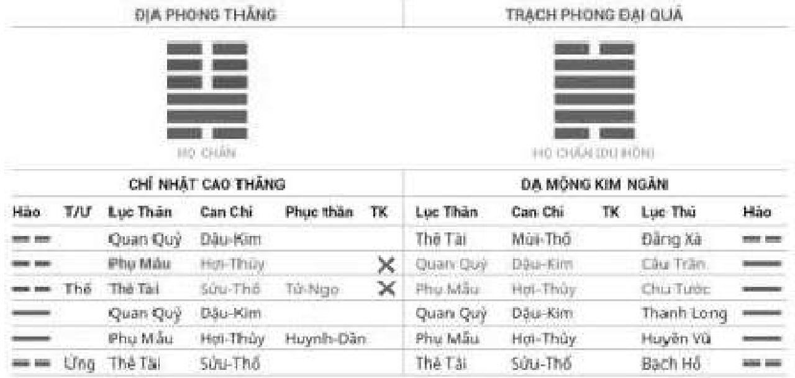

- **Quẻ chủ**: **ĐỊA PHONG THĂNG** (Khôn thượng, Tốn hạ).
  - Cung: Chấn.
  - Tượng quẻ: *Chỉ nhật cao thăng* (Chỉ ngày bay lên cao; biểu thị xu hướng không ngừng gia tăng, phát triển tiến lên).
- **Quẻ biến**: **TRẠCH PHONG ĐẠI QUÁ** (Đoài thượng, Tốn hạ).
  - Cung: Chấn (Quẻ Du Hồn).
  - Tượng quẻ: *Dạ mộng kim ngân* (Đêm nằm mơ thấy vàng bạc; quẻ Đại Quá chủ về quá tải, cột kèo cong oằn, nguy cơ tổn thất, hư hao).
- **Bảng lục hào chi tiết**:

| Hào | T/Ứ | Lục Thân (Chủ) | Can Chi (Chủ) | Phục Thần | Biến/Động | Lục Thân (Biến) | Can Chi (Biến) | Lục Thú | Trạng thái Nhật Nguyệt & Thần Sát |
| :---: | :---: | :---: | :---: | :---: | :---: | :---: | :---: | :---: | :--- |
| 6 | | Quan Quỷ | Dậu-Kim | | | Thê Tài | Mùi-Thổ | Đằng Xà | Tĩnh; Nguyệt hợp (Thìn Dậu), Nhật khắc (Ngọ khắc Dậu), lâm Dương Đao |
| 5 | | Phụ Mẫu | Hợi-Thủy | | **X** | Quan Quỷ | Dậu-Kim | Câu Trần | Phát động; lâm Tuần Không, Kiếp Sát, Văn Xương; Nguyệt khắc, Nhật hưu tù |
| 4 | **Thế** | Thê Tài | Sửu-Thổ | Tử Tôn Ngọ-Hỏa | **X** | Phụ Mẫu | Hợi-Thủy | Chu Tước | Phát động; phục Tử Tôn Ngọ Hỏa (Nhật kiến); Nguyệt tỉ hòa, Nhật sinh nhưng lâm Ngọ Sửu tương hại |
| 3 | | Quan Quỷ | Dậu-Kim | | | Quan Quỷ | Dậu-Kim | Thanh Long | Tĩnh; Nguyệt hợp, Nhật khắc, lâm Dương Đao |
| 2 | | Phụ Mẫu | Hợi-Thủy | Huynh Đệ Dần-Mộc | | Phụ Mẫu | Hợi-Thủy | Huyền Vũ | Tĩnh; lâm Tuần Không, Kiếp Sát, Văn Xương; phục Huynh Đệ Dần Mộc (Quý Nhân) |
| 1 | **Ứng** | Thê Tài | Sửu-Thổ | | | Thê Tài | Sửu-Thổ | Bạch Hổ | Tĩnh; Nguyệt tỉ hòa, Nhật sinh nhưng lâm tương hại |

---

### 3. Dụng thần & Loại quẻ

- **Phân loại quẻ**:
  - **Quẻ sự tình & tật bệnh**: Hỏi về hiệu quả và mức độ an toàn của việc khám chữa răng tại một bệnh viện cụ thể.
  - **Quẻ tâm thái**: Phản ánh nỗi lo âu về tình trạng viêm sưng kéo dài và nguy cơ tái phát mạn tính.
  - **Quẻ chỉ đạo (Chỉ đạo quẻ)**: Khai mở chiến lược chữa trị hai bước rõ ràng (xử lý cấp tính trước mắt, tìm bác sĩ chuyên khoa giỏi điều trị triệt để lâu dài).
- **Xác định Dụng thần đa tầng**:
  - **Tầng 1 - Hào Thế (Bản thân người bệnh & Thể trạng)**:
    - Hào 4 Thê Tài Sửu Thổ trì Thế: Đại diện cho bản thân người hỏi và thể trạng sức khỏe hiện tại.
    - Trong lý luận tật bệnh Lục Hào: Thê Tài trì Thế phản ánh tình trạng "á sức khỏe" (bán khỏe / sub-healthy), cơ thể chưa suy kiệt hoàn toàn nhưng tiềm ẩn mầm bệnh viêm nhiễm.
  - **Tầng 2 - Tượng bộ vị cơ thể (Răng và Lợi)**:
    - **Răng**: Thuộc ngũ hành **Kim** (chất xương, men răng cứng chắc).
    - **Lợi (nướu răng)**: Thuộc ngũ hành **Thổ** (mô thịt nâng đỡ và bao bọc chân răng).
    - **Sửu Thổ**: Là **Mộ khố của Kim** (chứa Tân Kim bên trong). Mô lợi chứa chân răng chính là hình tượng Sửu Thổ bao bọc Kim.
    - Hào Thế Sửu Thổ lâm Chu Tước: Chu Tước thuộc Hỏa, chủ về nhiệt chứng, sưng tấy, đỏ rực, viêm nhiễm. Đây là chứng viêm mô nướu / viêm quanh chân răng rõ rệt.
  - **Tầng 3 - Thầy thuốc, Thuốc men & Bệnh viện**:
    - **Tử Tôn**: Là thần y dược, bác sĩ, phương pháp điều trị giải tỏa bệnh tật ("Tử tôn trì thế tuyệt ưu nghi").
      - Tử Tôn Ngọ Hỏa phục tàng dưới Hào 4 Thế, đồng thời hiện diện tại Nhật kiến Canh Ngọ mang Thiên Ất Quý Nhân (Quý Nhân tại Dần, Ngọ).
    - **Bệnh viện (Nạp âm hào 6)**: Hào 6 nạp âm Tân Mùi Lộ Bàng Thổ, đại diện cho bệnh viện nằm ven đường lộ lớn (Bệnh viện Lĩnh Nam).
  - **Tầng 4 - Mầm bệnh & Nguy cơ ác tính hóa (Quan Quỷ)**:
    - Quan Quỷ Dậu Kim: Đại diện cho mầm độc, gốc rễ bệnh tật.
    - Hào 5 Phụ Mẫu Hợi Thủy động biến Quan Quỷ Dậu Kim mang Câu Trần: Câu Trần chủ sưng trướng, tích tụ mô tế bào, cảnh báo nguy cơ viêm xương hoặc khối u nếu không triệt tiêu tận gốc.

---

### 4. Luận giải chi tiết

#### 4.1. Giải mã thực trạng bệnh lý qua Hào Thế Sửu Thổ và Lục thú Chu Tước
- **Tượng "Á sức khỏe" (bán khỏe)**:
  - Thê Tài Sửu Thổ trì Thế thể hiện người hỏi hiện ở trạng thái "bán khỏe". Cơ thể không phát bệnh toàn thân nghiêm trọng nhưng bộ phận cục bộ đang có vấn đề hư tổn.
- **Tượng giải phẫu Lục Hào về răng miệng**:
  - Ngũ hành quy ước: Răng thuộc Kim (xương cốt, men răng), lợi dưới thuộc Thổ (mô mềm).
  - Sửu Thổ là mộ khố của Kim, trong lợi chứa men răng. Lợi chứa răng chính là hình tượng Sửu Thổ nạp Kim.
- **Chu Tước chủ viêm nhiễm sưng nóng**:
  - Hào Thế Sửu Thổ mang Chu Tước. Chu Tước là Hỏa thần, tượng trưng cho chứng nhiệt, sưng đỏ, xuất huyết hoặc viêm tấy mưng mủ ở chân răng.
  - Thực tế: Nướu răng đang bị viêm cấp tính, sưng tấy đau nhức. Theo nguyên tắc nha khoa, bắt buộc phải dùng thuốc tiêu viêm cho hạ sưng trước mới có thể tiến hành nhổ răng và cấy ghép.
- **Tượng quẻ Địa Phong Thăng**:
  - Quẻ Thăng chủ về sự tăng tiến, không ngừng dâng lên.
  - Điều này chỉ rõ tình trạng viêm sưng bán khỏe không tự mất đi mà đang liên tục leo thang, đòi hỏi phải can thiệp y tế kịp thời.

#### 4.2. Hiệu quả khám chữa tại Bệnh viện Lĩnh Nam qua Nhật kiến và Nạp âm
- **Nạp âm Hào 6 chỉ định cơ sở y tế**:
  - Hào 6 biến nạp âm Tân Mùi Lộ Bàng Thổ (đất bên đường).
  - Tượng trưng cho bệnh viện nằm ngay sát lề đường lớn. Người hỏi chọn đến Bệnh viện Lĩnh Nam là vì yếu tố tiện đường giao thông, thuận tiện đi lại chứ không phải chủ ý tìm kiếm cơ sở chuyên sâu từ trước (nếu là Thành Đầu Thổ mới là cố ý đến địa điểm kiên cố).
- **Nhật kiến Ngọ Hỏa mang Tử Tôn Quý Nhân tương sinh**:
  - Nhật lệnh Ngọ Hỏa là Tử Tôn (thần trị bệnh), lại lâm Thiên Ất Quý Nhân.
  - Hào Thế Sửu Thổ phục Tử Tôn Ngọ Hỏa, đồng thời được Nhật kiến Ngọ Hỏa tương sinh (Hỏa sinh Thổ).
  - Việc đến một bệnh viện có tiếng (Quý Nhân) để khám chữa chắc chắn đem lại hiệu quả thực tế; bác sĩ có chuyên môn xử lý được tình trạng viêm cấp tính.
- **Quy luật "Trong sinh kèm hại" (Ngọ Sửu tương hại)**:
  - Giữa Nhật kiến Ngọ Hỏa và Hào Thế Sửu Thổ tồn tại quan hệ **Tương Hại (Ngọ Sửu lục hại / xuyên hại)**.
  - "Trong sinh kèm hại" biểu thị hiệu quả điều trị không hoàn toàn hoàn mỹ:
    - Bệnh viện có thể tiêu viêm, nhổ được răng nhưng quá trình can thiệp vẫn kèm theo tổn thương phụ, gây đau nhức hoặc thao tác kỹ thuật chưa thật sự tối ưu.

#### 4.3. Nguy cơ mạn tính hóa qua Nguyệt lệnh và Kim Quỷ lâm Câu Trần
- **Hiện trạng qua Nguyệt lệnh Thìn Thổ**:
  - Nguyệt lệnh Thìn Thổ mang Thê Tài, khẳng định tình trạng bán khỏe đã kéo dài một thời gian.
  - Nguyệt lệnh Thìn Thổ lục hợp với Quan Quỷ Dậu Kim (Thìn Dậu hợp). Đây là yếu tố then chốt đáng lưu tâm.
- **Quan Quỷ Dậu Kim lâm Câu Trần ở Hào 5**:
  - Quan Quỷ là mầm bệnh tật. Dậu Kim tại hào 5 và hào biến đều mang Câu Trần.
  - Trong bệnh lý Lục Hào: Kim Quỷ mang Câu Trần đại biểu cho các khối u xơ, nang chân răng, viêm tủy xương hoặc sự tập hợp mô tế bào bất thường (nguy cơ biến chứng ác tính).
  - Hiện tại, Quan Quỷ Dậu Kim hóa xuất từ Hợi Thủy lâm Tuần Không: Mầm mống này đang ở trạng thái ngấm ngầm, chưa biến thành khối u ác tính ngay, người hỏi chưa cần hoảng loạn. Tuy nhiên, xu hướng bệnh lý đã bắt đầu chuyển hướng từ viêm nướu đơn thuần sang biến chứng mạn tính sâu hơn.

#### 4.4. Cơ chế "Thế hóa Thù Thần" và cấu trúc bắc cầu dẫn đến Quan Quỷ
- **Định lý "Thế hóa Thù Thần" trong tự chiêm bệnh**:
  - Hào 4 Thế Thê Tài Sửu Thổ phát động biến Phụ Mẫu Hợi Thủy.
  - Theo Quẻ ý phân tích pháp của Chu Thần Bản:
    - Khi tự xem bệnh cho mình, Thê Tài (thể trạng) là Dụng thần; Tử Tôn là Nguyên thần; Phụ Mẫu khắc chế Tử Tôn nên Phụ Mẫu là **Thù thần**.
    - Hào Thế phát động hóa Thù thần biểu thị bệnh này có tính chất dây dưa, kéo dài mạn tính, không thể một sớm một chiều chữa dứt điểm ngay được.
- **Cơ chế bắc cầu (nối cầu) hóa Quỷ**:
  - Hào 4 Thế Thê Tài Sửu Thổ động sinh hào biến Phụ Mẫu Hợi Thủy.
  - Hào 5 Phụ Mẫu Hợi Thủy lại động biến thành Quan Quỷ Dậu Kim.
  - Chuỗi chuyển hóa liên hoàn: Thế (Sửu Thổ) -> bắc cầu qua Phụ Mẫu (Hợi Thủy) -> dẫn thẳng về Quan Quỷ (Dậu Kim).
  - Tự mình rước Quỷ vào thân: Nếu chỉ chữa trị nửa vời rồi bỏ dở, sau một thời gian kéo dài, mầm bệnh tích tụ sẽ trực tiếp bộc phát thành mối họa Quan Quỷ lớn hơn.

#### 4.5. Điểm báo nguy từ Quẻ biến Trạch Phong Đại Quá
- **Ý nghĩa quẻ Đại Quá ("Đại giả quá dã")**:
  - Quẻ Đại Quá tượng trưng cho đòn nóc nhà cong oằn, chịu lực quá tải, chủ về tổn thất, hao hụt thực thể (mất răng, tổn thương xương hàm).
  - Hào Thế thông qua bắc cầu hóa Quỷ, quẻ biến lại xuất Đại Quá: Đây là điềm báo nghiêm khắc về nguy cơ thất bại hoặc tổn hại nếu chủ quan.
- **Trạng thái Tuần Không là lời cảnh báo thiện chí**:
  - Hào Phụ Mẫu Hợi Thủy hiện đang lâm Tuần Không.
  - Trạng thái Không vong giúp chặn đứng tạm thời chuỗi bắc cầu hóa Quỷ. Quẻ biến Đại Quá xuất hiện không phải để tuyên án bế tắc, mà đóng vai trò là một "lời nhắc nhở thiện chí" của dịch lý: Bệnh nhân bắt buộc phải điều trị dứt điểm tận gốc, tuyệt đối không được để dây dưa mạn tính.

---

### 5. Phán đoán & Ứng kỳ

- **Phán đoán kết quả**:
  - **Đến Bệnh viện Lĩnh Nam điều trị**: Hoàn toàn khả thi để thực hiện giai đoạn 1. Bệnh viện thuận đường, bác sĩ có Quý Nhân xử lý được việc tiêu viêm và nhổ bỏ chiếc răng hỏng.
  - **Mức độ triệt để**: Không thể chữa dứt điểm toàn bộ lộ trình tại đây do tồn tại "trong sinh kèm hại" và "Thế hóa Thù thần". Việc điều trị bắt buộc phải chia làm nhiều công đoạn (Phụ Mẫu kết nối Quan Quỷ đại diện cho việc phải điều trị nhiều lần).
  - **Chiến lược điều trị tối ưu**:
    - Giai đoạn 1: Đến Bệnh viện Lĩnh Nam nhổ răng hư và xử lý viêm nhiễm cấp tính trước mắt.
    - Giai đoạn 2: Sau khi nhổ răng, không được chủ quan dừng lại; cần tìm bác sĩ quen thuộc, có tay nghề kỹ thuật cao (hoặc nhờ chuyên gia uy tín giới thiệu) để phục hình trồng răng và làm sạch chân nướu triệt để, ngăn chặn hoàn toàn biến chứng về sau.
- **Ứng kỳ (Thời điểm chuyển biến)**:
  - Chuỗi bắc cầu xác định 3 địa chi then chốt: **Dậu, Tuất, Hợi**.
  - **Dự báo theo tháng**: Các tháng Dậu (tháng 8 âm / tháng 9 dương) đến tháng Hợi (tháng 10 âm / tháng 11 dương). Tuy nhiên mốc tháng quá ngắn do Hợi Thủy lâm Tuần Không chưa thể tích tụ ngay.
  - **Dự báo theo năm**: Giai đoạn từ năm Đinh Dậu (2017) qua Mậu Tuất (2018) đến Kỷ Hợi (2019).
    - Trong giai đoạn 2017–2019, nếu trước đó không chữa trị dứt điểm, bệnh nha chu/nướu răng sẽ âm thầm thoái hóa và chuyển biến xấu rõ rệt. Phải hoàn tất việc chữa trị tận gốc ngay từ đầu để triệt tiêu ứng kỳ hung họa này.

---

### 6. Nghiệm chứng & Điểm mấu chốt

- **Nghiệm chứng thực tế**:
  - Người hỏi xác nhận hoàn toàn chính xác thực trạng: Răng và nướu đang bị sưng viêm nghiêm trọng, đúng như tượng Sửu Thổ lâm Chu Tước.
  - Người hỏi nêu phương án xử lý: "Đến Bệnh viện Lĩnh Nam để nhổ răng trước, sau đó tìm các bệnh viện tốt hơn hoặc nhờ tác giả giới thiệu bác sĩ giỏi có được không?".
  - Tác giả Chu Thần Bản khẳng định: Phương án này hoàn toàn phù hợp và rất chính xác với quẻ dịch. Việc Phụ Mẫu kết nối với Quan Quỷ Dậu Kim chỉ rõ bệnh này bắt buộc phải can thiệp nhiều lần liên hoàn.
  - Tác giả căn dặn dứt khoát: Không nên tùy tiện tìm các bác sĩ phòng khám thông thường xử lý qua loa, mà phải tìm bác sĩ quen biết có tay nghề cao để hoàn tất điều trị triệt để trong một lộ trình chuẩn, giúp ngăn chặn vĩnh viễn các nguy cơ u xơ biến chứng phát sinh sau này.
- **Điểm mấu chốt kỹ pháp (Quy tắc cốt lõi)**:
  1. **Quy ước ngũ hành bộ vị cơ thể (Răng và Lợi)**:
     - Răng thuộc Kim; Lợi (nướu) thuộc Thổ. Sửu Thổ là Mộ khố của Kim, biểu thị nướu bọc chân răng. Sửu Thổ lâm Chu Tước là viêm nhiễm sưng tấy cấp tính.
  2. **Thê Tài trì Thế trong dự đoán tật bệnh**:
     - Thê Tài trì Thế chủ về trạng thái "bán khỏe" (sub-healthy), có mầm bệnh tích tụ nhưng chưa phát tác thấu đáo. Quẻ Thăng chỉ rõ mầm bệnh đang có xu hướng leo thang.
  3. **Kỹ pháp "Trong Sinh kèm Hại"**:
     - Nhật kiến Ngọ Hỏa sinh Thế hào Sửu Thổ (có hiệu quả can thiệp) nhưng Ngọ Sửu tương hại (kèm theo tác dụng phụ hoặc khuyết điểm kỹ thuật).
  4. **Nạp âm hào ứng chiếu địa điểm thực tế**:
     - Hào 6 nạp âm Tân Mùi Lộ Bàng Thổ đại diện cho bệnh viện nằm ngay mặt đường giao thông, phản ánh việc lựa chọn cơ sở khám chữa mang tính tiện đường đi lại.
  5. **Kim Quỷ lâm Câu Trần biểu thị biến chứng tế bào / khối u**:
     - Quan Quỷ Dậu Kim mang Câu Trần là dấu hiệu tích tụ tế bào, u bướu hoặc viêm tủy xương. Nhờ biến xuất hào Tuần Không nên chưa thành ác tính, đóng vai trò cảnh báo sớm.
  6. **Định lý "Thế hóa Thù Thần" và Cơ chế bắc cầu hóa Quỷ**:
     - Tự xem bệnh: Hào Thế phát động hóa Phụ Mẫu (Thù thần) chỉ bệnh tật dai dẳng kéo dài, nhiều đợt can thiệp.
     - Hào Thế (Sửu Thổ) thông qua Phụ Mẫu (Hợi Thủy) gián tiếp biến thành Quan Quỷ (Dậu Kim): Cơ chế bắc cầu cảnh báo bệnh sẽ trở nặng nếu điều trị nửa vời.
  7. **Ý nghĩa nhắc nhở của Quẻ biến Đại Quá ngộ Không**:
     - Quẻ Đại Quá (quá tải, tổn thất) kết hợp Tuần Không là lời cảnh báo thiện chí của tự nhiên, thúc đẩy đương sự phải hành động dứt điểm trước khi bước vào chu kỳ ứng hạn 2017–2019 (Dậu - Tuất - Hợi).

## Thực chiến 5: Hỏi về xu hướng bệnh tình của mẹ, việc ăn chay, niệm kinh, phóng sinh có giúp ích cho sức khỏe và kéo dài tuổi thọ của mẹ không

### 1. Bối cảnh / Câu hỏi

#### Thông tin thời gian & Can Chi
- **Thời điểm gieo quẻ**: 18 giờ 41 phút, ngày 21 tháng 8 năm 2016 (Giờ Bắc Kinh).
- **Can Chi**: Năm Bính Thân, tháng Bính Thân, ngày Ất Hợi, giờ Ất Dậu.
- **Tiết khí / Nguyệt lệnh**: Tháng Thân (Bính Thân).
- **Tuần không**: Thân, Dậu (Tuần Giáp Tuất).
- **Hệ thống Thần sát**:
  - Tướng tinh: Mão.
  - Hoa Cái: Mùi.
  - Dịch Mã: Tị.
  - Tai Sát: Dậu.
  - Mưu Tinh: Sửu.
  - Đào Hoa: Tý.
  - Kiếp Sát: Thân.
  - Lộc Thần: Mão.
  - Dương Nhẫn: Dần.
  - Văn Xương: Ngọ.
  - Thiên Y: Mùi.
  - Thiên Hỷ: Thìn.
  - Quý Nhân: Thân, Tý.

#### Bối cảnh đương sự & Thực trạng bệnh lý
- **Chủ thể hỏi quẻ**: Một nữ đồng môn bốc quẻ hỏi cho mẹ đẻ.
- **Bệnh cảnh lâm sàng**:
  - Mẹ mắc bệnh viêm khớp mãn tính lâu năm, thể trạng suy kiệt trầm trọng, gần như mất hoàn toàn sức lao động.
  - Biến chứng kèm theo: Huyết áp không ổn định (cao huyết áp), hệ thống tiêu hóa rối loạn, ăn uống mất hoàn toàn cảm giác ngon miệng.
  - Khả năng vận động suy thoái nặng, việc đi lại sinh hoạt cực kỳ khó khăn.
- **Nguồn cơn bất an**:
  - Năm trước (2015), một người bạn của cha cô (biết thuật xem tướng) từng nhận định thọ mệnh của mẹ cô chỉ còn khoảng 3 năm.
  - Người con gái luôn mang tâm lý lo sợ, hoang mang cao độ về tính mạng của mẹ.

#### Mục đích & Đa nghi vấn chiêm đoán
- **Nghi vấn 1 (Bệnh tình & Thọ mệnh)**: Xu hướng diễn biến bệnh tình thực tế của mẹ ra sao, thọ mệnh còn được bao lâu?
- **Nghi vấn 2 (Công đức hồi hướng)**: Bản thân người con nếu ăn chay, trì tụng kinh Địa Tạng và phóng sinh hồi hướng cho mẹ thì có giúp ích cho sức khỏe và kéo dài tuổi thọ của mẹ không?
- **Quy tắc bốc phệ về đa nghi vấn**:
  - Nguyên tắc dịch lý cổ bốc khuyên không nên gộp hai sự việc độc lập trong một quẻ (tốt nhất nên chia thành hai quẻ riêng).
  - Tuy nhiên, khi ý niệm thực tế khởi phát đồng thời, quẻ tượng tự nhiên hiển thị thông tin tích hợp thông minh để giải đáp thấu đáo cả hai vấn đề.

---

### 2. Dữ kiện & Bảng quẻ Crop

#### Bảng quẻ đối chiếu
- Dữ kiện bảng quẻ và các thông số chiêm đoán:
  - **Bảng 5.1** Đồ hình quẻ Thực chiến 5:
    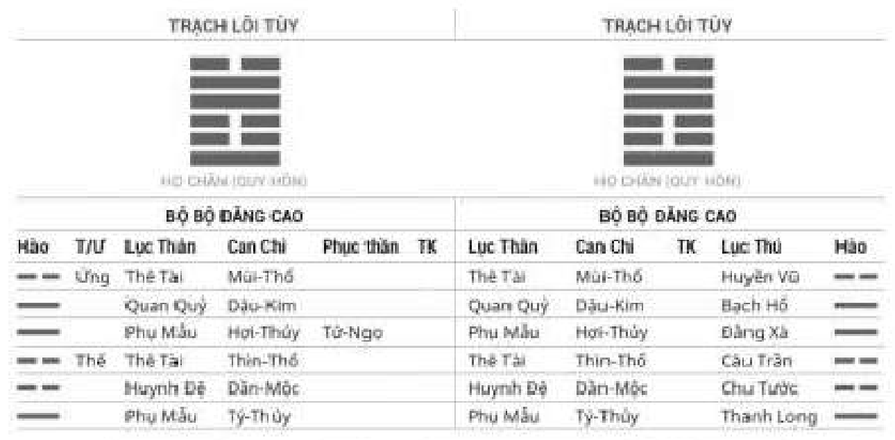

#### Thông số quẻ chi tiết
- **Quẻ chủ**: Trạch Lôi Tùy (Họ Chấn - Quy Hồn; Thoán từ tượng trưng: Bộ bộ đăng cao).
- **Quẻ biến**: Trạch Lôi Tùy (Quẻ Tĩnh, lục hào bất động).
- **Phối lục thân, can chi & lục thú**:
  - **Hào 6 (Ứng)**: Thê Tài Mùi-Thổ `- -` | Huyền Vũ (Hoa Cái, Thiên Y).
  - **Hào 5**: Quan Quỷ Dậu-Kim `---` | Bạch Hổ (Tai Sát, Tuần không).
  - **Hào 4**: Phụ Mẫu Hợi-Thủy `---` | Đằng Xà (Nhật lệnh, Trực nhật) | Phục thần: Tử Tôn Ngọ-Hỏa (Đào Hoa, Thiên Y).
  - **Hào 3 (Thế)**: Thê Tài Thìn-Thổ `- -` | Câu Trần (Thiên Hỷ).
  - **Hào 2**: Huynh Đệ Dần-Mộc `- -` | Chu Tước (Dương Nhẫn).
  - **Hào 1**: Phụ Mẫu Tý-Thủy `---` | Thanh Long (Quý Nhân, Đào Hoa).
- **Hào phục tàng**:
  - Phục thần Tử Tôn Ngọ Hỏa nấp dưới Hào 4 Phụ Mẫu Hợi Thủy.

---

### 3. Dụng thần & Loại quẻ

#### Phân loại quẻ
- **Quẻ tĩnh (Tĩnh quái)**: Quẻ không có hào động. Trong quẻ tĩnh, quẻ tượng và hào vị kiêm quản cả hiện trạng quá khứ lẫn xu hướng diễn biến tương lai.
- **Quẻ chiêm hộ (Thay mặt xem)**: Người con gái chủ động xem cho mẹ đẻ. Thuộc loại chiêm hộ chủ động, trực tiếp chọn lục thân tương ứng của đối tượng làm Dụng thần.

#### Xác định Dụng thần
- Xem cho mẹ đẻ: Chọn hào **Phụ Mẫu** làm Dụng thần.
- Quẻ xuất hiện hai hào Phụ Mẫu: Hào 1 Phụ Mẫu Tý Thủy và Hào 4 Phụ Mẫu Hợi Thủy.

#### Biện biệt Chân Dụng thần & Giả Dụng thần
- **Loại trừ Hào 1 Phụ Mẫu Tý Thủy (Giả Dụng thần)**:
  - *Mối liên hệ Nhật Nguyệt*: Tý Thủy không có bất kỳ tương tác nào với Nhật Nguyệt (không sinh, khắc, xung, hợp, mộ tàng); không ngự tại Thế hay Ứng; không có hào động tác động. Theo lý thuyết Dụng thần thật giả nâng cao, hào không liên quan Nhật Nguyệt là Giả Dụng thần, không phản ánh hiện thực.
  - *Vị trí cơ thể*: Hào 1 ở vị trí bàn chân, không phản ánh đúng cơ chế bệnh lý toàn thân.
  - *Thần sát*: Tuy mang Quý Nhân, Đào Hoa (có thể ám chỉ chỉ số huyết học bất thường), nhưng không phải là trọng tâm Dụng thần của sự việc.
- **Xác lập Hào 4 Phụ Mẫu Hợi Thủy (Chân Dụng thần)**:
  - *Quan hệ Nhật Nguyệt quyết định*: Hợi Thủy lâm **Nhật lệnh** (Đương nhật trực phù), đồng thời được Nguyệt lệnh Thân Kim tương sinh (ở thế Trường sinh). Sự liên kết chặt chẽ với Nhật Nguyệt chứng minh Hợi Thủy là Chân Dụng thần phản ánh hiện trạng bệnh lý.
  - *Vị trí cơ thể (Hào vị)*: Hào 4 thuộc trung tiêu (vùng giữa cơ thể), đại diện cho hệ thống tuần hoàn khí huyết và nội tiết. Bản chất viêm khớp mãn tính là rối loạn hệ thống miễn dịch/nội tiết, lan tỏa tổn thương sang huyết áp, tiêu hóa, gan mật.
  - *Vị trí quẻ*: Ngự giữa Thế và Ứng, nằm trọn trong trung tâm biến động của sự việc.

---

### 4. Luận giải

#### Bước 1: Xét vượng suy Dụng thần - Nghịch lý "Quá vượng thành hung"
- **Độ vượng tướng cực đoan**: Phụ Mẫu Hợi Thủy được tháng Thân tương sinh (Trường sinh) lại gặp ngày Hợi lâm trị. Dụng thần đạt trạng thái cực kỳ vượng tướng.
- **Đối chiếu thực tế sinh lý**:
  - Người khỏe mạnh hỏi quẻ thì Dụng thần vượng tướng là điềm cát lành.
  - Tuy nhiên, thực tế người mẹ đã suy kiệt trầm trọng, mất sức lao động, nhiều tạng phủ tổn thương.
  - Một bệnh nhân nguy kịch mà Dụng thần lại quá vượng trên Nhật Nguyệt là tượng bất thường ("vật cực tất phản"). Quá vượng trong xem bệnh nan y biểu thị tình trạng bệnh tật ứ trệ, thâm căn cố đế, sắp sụp đổ.
- **Quy luật đảo ngược Nguyên thần - Kỵ thần**:
  - Khi Dụng thần rơi vào trạng thái cực vượng, **Nguyên thần sinh trợ** lại trở thành độc dược đẩy sự việc vào chỗ quá tải, sụp đổ.
  - Ngược lại, **Kỵ thần khắc chế** lúc này đóng vai trò liều thuốc hạ hỏa, kiềm hãm bớt sự thái quá, biến thành nhân tố cải thiện và duy trì sự sống.

#### Bước 2: Phân tích Nguyên thần Quan Quỷ Dậu Kim - Cửa ải nguy hiểm
- **Vị trí & Thần sát**: Hào 5 Quan Quỷ Dậu Kim là Nguyên thần sinh Dụng thần Hợi Thủy, lâm Bạch Hổ, gặp Tuần không.
- **Tượng hung của Bạch Hổ Quỷ**: Bạch Hổ Quan Quỷ là đại biểu của bệnh nặng, suy sụp khí huyết, tai họa huyết quang và tang chế.
- **Trạng thái Giả không**: Dậu Kim đắc Nguyệt lệnh Thân Kim phù trợ nên thuộc dạng vượng tướng tuần không (Giả không).
- **Cơ chế bộc phát tai họa**:
  - Trong quẻ tĩnh, hào tĩnh vượng tướng vẫn ngấm ngầm tích lũy động lực tác động.
  - Đến năm Đinh Dậu (2017) xuất không bổ khuyết, Bạch Hổ Quan Quỷ Dậu Kim sẽ sinh mãnh liệt cho Phụ Mẫu Hợi Thủy vốn đã quá vượng.
  - Sự sinh trợ này đẩy Dụng thần vượt ngưỡng chịu đựng, khiến bệnh tình chuyển biến đại hung. Năm Dậu chính là một chướng ngại sinh tử lớn. Nếu vượt qua năm Dậu, đến năm Hợi lại là một cửa ải tiếp theo.

#### Bước 3: Phân tích Kỵ thần Thê Tài - Đánh giá hiệu quả việc ăn chay, tụng kinh, phóng sinh
- **Hào Thế Thê Tài Thìn Thổ (Câu Trần) - Ý niệm của người con gái**:
  - *Tượng người hỏi trì Thế*: Hào Thế chính là người con gái hỏi quẻ. Việc Kỵ thần Thê Tài trì Thế chứng minh phương pháp cô con gái khởi tâm (ăn chay, tụng kinh, phóng sinh) trên nguyên lý là đúng hướng vì có công năng khắc bớt sự quá vượng của Dụng thần.
  - *Tượng Câu Trần & Thìn Thổ*: Thìn Thổ chủ về thiền định, tôn giáo, y học cổ truyền. Câu Trần mang tính chất tiếp nhận địa khí, tương ứng chuẩn xác với hạnh nguyện Địa Tạng Vương Bồ Tát và nghi thức trì tụng Địa Tạng Kinh.
  - *Giới hạn hiệu lực thực tế*: Thê Tài Thìn Thổ ở tháng Thân ngày Hợi đều ở trạng thái suy bại hưu tù, lực khắc Thủy rất yếu. Do đó, việc con gái tự ăn chay niệm kinh thay mẹ chỉ có tác dụng hỗ trợ xoa dịu, không đủ mạnh để cải tử hoàn sinh căn bệnh nan y.
  - *Vai trò hợp trói hung thần*: Thìn Thổ nhị hợp với Quan Quỷ Dậu Kim (Thìn Dậu hợp). Lực hợp này giúp kiềm chế, trói giữ bớt hung sát của Bạch Hổ Quan Quỷ trong năm Dậu (2017), giúp người mẹ vượt qua thời khắc nguy nan.
- **Hào Ứng Thê Tài Mùi Thổ (Huyền Vũ, Thiên Y) - Giải pháp khách quan tối ưu**:
  - *Tượng ngoại tại & Tiến thần*: Hào Ứng đại diện cho phương pháp bên ngoài mà người con chưa rõ. Mùi Thổ là Tiến thần của Thìn Thổ, có hiệu năng hành động nổi bật.
  - *Thế Bán hợp tương dung*: Mùi Thổ tạo thế **Bán hợp** với Dụng thần Phụ Mẫu Hợi Thủy (trong tam hợp Hợi Mão Mùi). Bán hợp thể hiện sự hòa hợp, thích ứng trực tiếp với cơ thể người mẹ (trong khi Thìn Thổ không hề có quan hệ hợp với Hợi Thủy).
  - *Tượng y dược thực chứng*: Mùi Thổ mang sao **Thiên Y** và **Văn Xương**, biểu thị phương pháp y tế chuẩn xác, thầy giỏi thuốc đúng, kỹ thuật điều trị chuyên sâu.
  - *Bí pháp niệm kinh*: Vì Mùi Thổ bán hợp Dụng thần, nên **chính người mẹ tự mình niệm kinh, cầu nguyện** mới tạo ra sự cộng hưởng năng lượng mạnh nhất, vượt xa việc người con niệm hộ từ xa.
  - *Bí pháp phóng sinh loài thủy tộc*: Mùi Thổ lâm Huyền Vũ (chủ về Thủy, loài thủy sinh dưới nước). Do đó việc phóng sinh rùa đen hoặc các loài cá nước là đúng pháp nhất. Thê Tài là sinh hoạt thường nhật, khuyên nên phóng sinh đều đặn hàng ngày. Phóng sinh sinh vật sắp bị giết mổ (thấy máu trên thớt) giúp tiêu trừ sát khí của Bạch Hổ huyết quang.

#### Bước 4: Phân tích Phục thần Tử Tôn Ngọ Hỏa - Hào Tâm tư & Đề kháng nội sinh
- **Tâm tư giấu kín của người mẹ**:
  - Dưới hào 4 Phụ Mẫu Hợi Thủy phục tàng Tử Tôn Ngọ Hỏa (Đằng Xà, Đào Hoa, Thiên Y). Phục thần dưới Dụng thần là hào tâm tư của người mẹ.
  - Lâm Đằng Xà: Người mẹ trong lòng đầy âu lo, sợ hãi, hoang mang bất an.
  - Lâm Đào Hoa & Tử Tôn: Tử Tôn đại diện cho con cái, cháu chắt. Người mẹ đau đáu khôn nguôi vì con cháu, không nỡ từ biệt cõi đời.
  - Lâm Thiên Y: Tinh thần mong muốn sống khỏe vì con cháu chính là "phương thuốc tự thân" quý giá nhất.
- **Thực trạng suy kiệt ý chí**:
  - Tử Tôn Ngọ Hỏa hưu tù tại tháng Thân (tiết khí) và bị ngày Hợi khắc tuyệt. Điều này phản ánh người mẹ uống thuốc lâu ngày không khỏi nên đã dần cạn kiệt niềm tin và ý chí chiến đấu với bệnh tật.
- **Giải pháp tâm lý trị liệu**:
  - Con cái cần động viên, khích lệ, tạo dựng cho mẹ niềm tin vững chắc vào hiệu quả điều trị và tương lai gia đình.
  - Khi niềm tin được củng cố, Tử Tôn Ngọ Hỏa sẽ vượng lên, sinh trợ cho Hào Ứng Thê Tài Mùi Thổ (Ngọ Mùi nhị hợp), từ đó giúp các giải pháp thuốc men bên ngoài phát huy tối đa công hiệu.

---

### 5. Phán đoán & Ứng kỳ

#### Phán đoán định tính
- **Tiên lượng bệnh tật**: Cục diện rất nan giải và hung hiểm, bệnh viêm khớp và suy kiệt đa tạng không thể chữa khỏi dứt điểm. Dụng thần quá vượng báo hiệu gốc rễ sinh mệnh đã hư hao nghiêm trọng.
- **Đánh giá pháp tu tập**:
  - Việc ăn chay, niệm kinh, phóng sinh đều là các biện pháp Kỵ thần có lợi giúp hạ bớt sự quá vượng của Dụng thần.
  - Tác dụng thực tế: Giúp làm dịu cơn đau, hóa giải hung sát, duy trì sự ổn định tương đối và kéo dài thêm thọ mệnh trong một khoảng thời gian nhất định, chứ không thể kéo dài sinh mạng vô hạn.

#### Dự báo Ứng kỳ (Cửa ải sinh tử)
- **Cửa ải 1 - Năm Đinh Dậu (2017)**:
  - Năm Dậu khiến Nguyên thần Bạch Hổ Quan Quỷ Dậu Kim xuất không bổ khuyết, phát động sinh Dụng thần quá vượng, tạo nên biến cố nguy kịch đầu tiên.
  - Nhờ hào Thế Thìn Thổ hợp giữ Dậu Kim, nếu kiên trì hộ niệm và phóng sinh thì có thể vượt qua được năm Dậu.
- **Cửa ải 2 - Năm Kỷ Hợi (2019)**:
  - Nếu đã qua được năm Dậu, đến năm Hợi thì Thái Tuế lâm Dụng thần Hợi Thủy.
  - Năng lượng Thủy cực vượng trùng điệp sẽ kích hoạt trạng thái "quá vượng sụp đổ", đây là thời điểm sinh mệnh khó lòng chống đỡ tiếp.

---

### 6. Nghiệm chứng & Điểm mấu chốt

#### Nghiệm chứng thực tế
- **Thực tế thực hiện của đương sự**:
  - Người con gái sau khi gieo quẻ có thực hiện việc ăn chay và niệm kinh một thời gian.
  - Tuy nhiên, do niềm tin chưa đủ kiên định và tâm lý nản lòng nên thời gian duy trì không dài; việc phóng sinh loài thủy tộc cũng không được thực hiện như hướng dẫn.
- **Diễn biến thọ mệnh thực tế**:
  - Người mẹ đã cầm cự sống thêm được **2 năm rưỡi** kể từ ngày gieo quẻ (tháng 8/2016 đến đầu năm 2019 thì mất).
- **Độ chuẩn xác dịch lý**:
  - Người mẹ vượt qua năm Đinh Dậu (2017) và qua đời vào khoảng đầu năm Kỷ Hợi (2019).
  - Khoảng thời gian 2,5 năm khớp hoàn toàn với ứng kỳ phân tích: an toàn qua năm Dậu nhờ Thìn Dậu hợp, và dừng lại ở năm Hợi (năm Dụng thần thái quá).
  - Kết quả này cũng trùng khớp chính xác với dự ngôn của người bạn xem tướng từ năm trước (còn sống khoảng 3 năm).

#### Điểm mấu chốt kỹ pháp
1. **Phân biệt Thật Dụng thần & Giả Dụng thần**:
   - Khi quẻ xuất hiện nhiều hào cùng lục thân, chỉ hào nào có liên hệ tương tác trực tiếp với Nhật Nguyệt (lâm trị, sinh, khắc, xung, hợp, mộ) mới là Thật Dụng thần phản ánh đúng thực tế.
   - Hào cô lập với Nhật Nguyệt là Giả Dụng thần, dù mang cát tinh Quý Nhân cũng không được chọn làm trung tâm luận giải.
2. **Quy luật Dụng thần "Quá vượng thành hung" (Vật cực tất phản)**:
   - Trong bốc dịch xem bệnh nan y lâu ngày, Dụng thần lâm thế cực kỳ vượng tướng trên Nhật Nguyệt mà thực tế bệnh nhân đang suy kiệt là biểu hiện bất thường nghiêm trọng.
   - Khi Dụng thần quá vượng, Nguyên thần sinh trợ trở thành hung thần gây họa, trong khi Kỵ thần khắc bớt lại đóng vai trò phương tiện cứu nguy, điều hòa sinh mệnh.
3. **Mã hóa biểu tượng Thế Ứng và Lục thú**:
   - Hào Thế Câu Trần: Đại diện cho ý niệm chủ quan của người hỏi (nghi thức tiếp địa khí của kinh Địa Tạng).
   - Hào Ứng Huyền Vũ: Đại diện cho giải pháp tối ưu khách quan (phóng sinh sinh vật nước như rùa, cá), có liên kết bán hợp thích ứng với Dụng thần.
4. **Bí pháp Phục thần - Giải mã Hào Tâm tư**:
   - Hào tàng phục dưới Dụng thần phản ánh tâm tư sâu kín và rào cản tinh thần của đương sự.
   - Nỗi lo âu của người mẹ (Đằng Xà lo cho con cháu) làm hao tổn thuốc tự thân (Tử Tôn hưu tù). Khơi thông tâm lý và tiếp thêm niềm tin chính là điều kiện tiên quyết để ngoại dược phát huy công năng.

## Thực chiến 6: Hỏi về việc chuyển nhà vào cuối tháng có gây hại cho các thành viên trong gia đình không

### 1. Bối cảnh / Câu hỏi

#### Thông tin thời gian & Can Chi
- **Thời điểm gieo quẻ**: 18 giờ 41 phút, ngày 19 tháng 8 năm 2016.
- **Can Chi**: Năm Bính Thân, tháng Bính Thân, ngày Quý Dậu, giờ Tân Dậu.
- **Tiết khí / Nguyệt lệnh**: Tháng Thân (Bính Thân).
- **Tuần không**: Tuất, Hợi (Tuần Giáp Tý).
- **Hệ thống Thần sát**:
  - Tướng tinh: Dậu.
  - Hoa cái: Sửu.
  - Dịch mã: Hợi.
  - Tai họa (Tai sát): Mão.
  - Mưu tinh: Thân (Nguyệt lệnh).
  - Đào hoa: Ngọ.
  - Thiệt sát (Kiếp sát): Dần.
  - Lộc thần: Tý.
  - Dương nhẫn (Dương đao): Hợi.
  - Văn xương: Mão.
  - Thiên y: Thân (Nguyệt lệnh).
  - Thiên hỷ: Thìn.
  - Quý nhân: Mão, Tỵ.

#### Bối cảnh đương sự & Thực trạng nhà mới
- **Chủ thể hỏi quẻ**: Đương sự hỏi về dự định chuyển cả gia đình vào ở nhà mới vừa hoàn thiện sửa chữa vào cuối tháng 8 năm 2016.
- **Cơ cấu nhân khẩu gia đình**: Tổng cộng 6 thành viên cùng chung sống:
  - Hai đứa trẻ nhỏ: một bé sơ sinh 8 tháng tuổi và một bé 7 tuổi.
  - Hai vợ chồng gia chủ.
  - Bố mẹ già của gia chủ.
- **Hiện trạng môi trường căn nhà**:
  - Ngôi nhà vừa hoàn tất quá trình tu sửa, tân trang nội thất chưa đầy một tháng.
  - Toàn bộ không gian trong nhà vẫn còn nồng nặc mùi lạ, mùi sơn, hóa chất từ vật liệu xây dựng và nội thất gỗ mới dán keo ép.
- **Vấn đề băn khoăn & Nghi vấn cốt lõi**:
  - Việc dọn vào sinh sống ngay vào cuối tháng này có gây tổn hại đến sức khỏe, sinh mệnh hoặc mang lại tai họa bất trắc cho 6 thành viên trong gia đình hay không?

---

### 2. Dữ kiện & Bảng quẻ Crop

#### Bảng quẻ đối chiếu
- Dữ kiện bảng quẻ và các thông số chiêm đoán:
  - **Bảng 6.1** Đồ hình quẻ Thực chiến 6:
    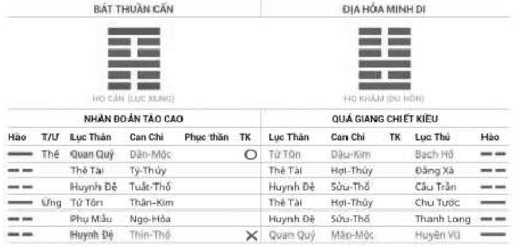

#### Thông số quẻ chi tiết
- **Quẻ chủ**: Bát Thuần Cấn (Cung Cấn - Lục xung; Thoán từ: Nhạn đoạt tào cao).
- **Quẻ biến**: Địa Hỏa Minh Di (Cung Khảm - Du hồn; Thoán từ: Quá giang chiết kiều).
- **Phối lục thân, can chi & lục thú**:
  - **Hào 6 (Thế)**: Quan Quỷ Dần-Mộc `---` [O] -> Tử Tôn Dậu-Kim `- -` | Bạch Hổ (Kiếp sát).
  - **Hào 5**: Thê Tài Tý-Thủy `- -` | Đằng Xà (Lộc thần).
  - **Hào 4**: Huynh Đệ Tuất-Thổ `- -` | Câu Trần (Tuần không).
  - **Hào 3 (Ứng)**: Tử Tôn Thân-Kim `---` | Chu Tước (Nguyệt lệnh, Mưu tinh, Thiên y).
  - **Hào 2**: Phụ Mẫu Ngọ-Hỏa `- -` | Thanh Long (Đào hoa).
  - **Hào 1**: Huynh Đệ Thìn-Thổ `- -` [X] -> Quan Quỷ Mão-Mộc `---` | Huyền Vũ (Thiên hỷ).
- **Hào động biến**:
  - Hào 6 Quan Quỷ Dần Mộc động hóa Tử Tôn Dậu Kim (Hồi đầu khắc, lâm Bạch Hổ).
  - Hào 1 Huynh Đệ Thìn Thổ động hóa Quan Quỷ Mão Mộc (Hồi đầu khắc, lâm Huyền Vũ).

---

### 3. Dụng thần & Loại quẻ

#### Phân loại quẻ
- **Quẻ an nguy gia trạch & phong thủy nhà ở**: Chiêm nghiệm sự tương tác giữa trường khí môi trường sống mới với sinh mệnh của toàn bộ gia quyến.
- **Quẻ chỉ đạo hành động (Chỉ đạo quái)**: Xem để quyết định có nên tiến hành một hành vi cụ thể (chuyển nhà) vào thời điểm định sẵn hay cần hoãn lại để phòng tránh hiểm họa.
- **Quẻ tai họa tiềm ẩn (Tai ách quái)**: Quẻ xuất hiện các tổ hợp khắc phá đặc thù từ Nhật Nguyệt, phản ánh mối nguy hiểm cấp tính đe dọa trực tiếp đến tính mạng và sức khỏe con người.

#### Xác định Dụng thần đa tầng
Vì câu hỏi mang tính bao quát cho cả nhà 6 người và căn nhà mới, Dụng thần được phân bổ theo nhiều lớp tương tác:
1. **Dụng thần bản thân & Gia quyến**: Hào Thế **Quan Quỷ Dần Mộc** tại Hào 6. Trong nghĩa hẹp, hào Thế đại diện cho chính gia chủ người hỏi; trong nghĩa rộng của quẻ an nguy trạch vận, hào Thế bao quát vận mệnh chung của cả gia đình.
2. **Dụng thần Trẻ nhỏ**: Hào **Tử Tôn** (Hào 3 Tử Tôn Thân Kim trì Ứng và Hào biến Tử Tôn Dậu Kim tại Hào 6). Đại diện cho hai đứa con (8 tháng tuổi và 7 tuổi).
3. **Dụng thần Người vợ & Khu vực phòng ngủ**: Hào **Huynh Đệ Thìn Thổ** tại Hào sơ. Thìn Thổ chủ về cung tình cảm, gia thất; tại hào sơ chủ về giường nằm, phòng ngủ riêng.
4. **Môi trường sát khí & Độc tố không khí**: Hào **Quan Quỷ Dần Mộc** và **Quan Quỷ Mão Mộc** (hành Mộc chủ phong, không khí, khí trường lưu chuyển trong trạch nội).

---

### 4. Luận giải

#### Bước 1: Ý nghĩa cấu trúc Quẻ chủ & Quẻ biến - Điềm báo hung hiểm
- **Quẻ chủ Bát Thuần Cấn (Lục xung)**:
  - Quẻ Lục xung phản ánh trung thực hiện trạng: gia đình đang trong trạng thái rục rịch, náo động, chuẩn bị dọn dẹp chuyển dời nhà cửa.
  - Lục xung cũng chỉ ra rằng tâm lý các thành viên đang bất an, khí trường xung tán, chưa tụ hội ổn định.
- **Quẻ biến Địa Hỏa Minh Di (Du hồn)**:
  - Cổ tịch định nghĩa: *"Minh Di giả, thương dã"* (Minh Di chủ về tổn thương, thương tích, tối tăm, ánh sáng mặt trời bị vùi dập dưới lòng đất).
  - Du hồn quái mang tính phiêu tán, bất định.
  - Thoán từ biểu tượng: *"Quá giang chiết kiều"* (Qua sông gãy cầu) - lâm vào thế tiến thoái lưỡng nan, rơi xuống vực sâu nguy nan.
  - Quẻ biến chỉ xu hướng kết quả tương lai: Nếu vội vã chuyển vào ở, hậu quả đón chờ cả nhà sau khi dọn đến sẽ là tổn thương nặng nề, cực kỳ nguy hiểm.
- **Quy nạp kinh nghiệm phong thủy cổ điển**:
  - Khi xem việc chuyển vào nhà mới tu sửa: Nếu bắt gặp **Bạch Hổ Quan Quỷ phát động**, đồng thời quẻ biến thành **Minh Di** hoặc biến thành **Tốn**, chắc chắn việc vào ở sẽ phát sinh đại sự chẳng lành, đặc biệt liên quan đến bệnh tật hiểm nghèo.

#### Bước 2: Phá vỡ bẫy tư duy "Quẻ tâm thái" - Nhận diện chân tướng "Quẻ tai họa"
- **Ngộ nhận thường gặp**:
  - Hào 6 Quan Quỷ Dần Mộc trì Thế phát động biến ra Tử Tôn Dậu Kim hồi đầu khắc.
  - Nếu xét theo "Quẻ tâm thái" hỏi về nỗi lo lắng đơn thuần: Quan Quỷ là ưu tư, biến Tử Tôn hồi đầu khắc tức là Tử Tôn khắc sạch Quỷ, tượng trưng cho nỗi lo được giải tỏa, trong lòng yên tâm, không đáng ngại.
- **Bóc trần sự thật bằng quy luật Nhật Nguyệt**:
  - Để phân biệt quẻ tâm thái với quẻ sự việc/tai họa, điều then chốt là phải quán sát sự phối hợp giữa Nhật Nguyệt với hào Thế.
  - **Tháng Bính Thân**: Thân Kim trực Nguyệt xung khắc kịch liệt hào Thế Dần Mộc, khiến Dần Mộc rơi vào thế **Nguyệt phá**.
  - **Ngày Quý Dậu**: Dậu Kim trực Nhật tiếp tục khắc phạt Dần Mộc tơi bời.
  - **Biến hào Dậu Kim**: Hào Thế Dần Mộc phát động lại hóa ra Tử Tôn Dậu Kim hồi đầu khắc, mà Dậu Kim này lại chính là **Nhật lệnh** nhập quẻ!
- **Định lý Quẻ tai họa (Tai ách chi quái)**:
  - Khi một hào Thế hoặc Dụng thần:
    1. Vừa bị Nguyệt lệnh khắc phá (Nguyệt phá).
    2. Vừa bị Nhật kiến khắc phạt.
    3. Lại vừa bị hào động hoặc biến hào mang Nhật Nguyệt hồi đầu khắc phạt trùng điệp.
  - Đây chính là cách cục **Tam trọng khắc sát** điển hình của một quẻ đại họa sát thân.
  - Kết hợp với tượng quẻ Minh Di và Bạch Hổ lâm Quỷ động, hoàn toàn không thể luận giải là sự "yên tâm", mà chính là **điềm báo tai họa đổ dồn, nguy hại khôn lường**.

#### Bước 3: Bạch Hổ Quan Quỷ & Bản chất ngũ hành Mộc - Giải mã căn bệnh hệ miễn dịch và khí độc Formaldehyde
- **Tượng Bạch Hổ Quan Quỷ - Bệnh về máu và miễn dịch**:
  - Bạch Hổ chủ về huyết quang, tai ương, chết chóc, tang chế. Bạch Hổ lâm Quan Quỷ là tượng của bệnh trọng, bệnh về hệ thống tuần hoàn máu và huyết dịch.
  - Nhẹ thì phát sinh dị ứng da liễu nặng, bệnh tự miễn như lupus ban đỏ.
  - Nặng thì biến chứng thành **bệnh ung thư máu (bệnh bạch cầu)**.
  - Thực tế phong thủy hiện đại: Nhà mới sửa chữa có quá nhiều vật liệu độc hại (sơn, keo công nghiệp, chất chống mối mọt). Những người thể trạng nhạy cảm, người già và trẻ nhỏ khi hít phải khí độc rất dễ bị sụp đổ hệ miễn dịch, kích hoạt bệnh bạch cầu.
- **Ngũ hành Mộc của Quan Quỷ - Tượng không khí ô nhiễm**:
  - Trong dịch học thời tiết, Mộc chủ về Phong (gió, không khí luân chuyển).
  - Trong môi trường công trình nhà ở tu sửa, ngũ hành Mộc của Quan Quỷ chính là đại biểu cho **khí trường ô nhiễm, chất độc hóa học bay hơi (formaldehyde, benzen, dung môi độc hại)**.
  - Mùi lạ nồng nặc trong nhà mới chính là hình thái vật chất hiện hữu của Quan Quỷ Mộc này.

#### Bước 4: Hào vị không gian trạch nội - Ô nhiễm bao trùm từ sàn giường tới trần nhà
- **Khí trường ô nhiễm phân bổ khắp nơi**:
  - Không chỉ có Hào 6 mang Quan Quỷ Dần Mộc, mà ngay tại Hào 1 (sơ hào) Huynh Đệ Thìn Thổ cũng động hóa ra Quan Quỷ Mão Mộc.
  - Hào 6 là đỉnh nóc nhà, tầng cao, không gian phía trên, bên ngoài trạch viện.
  - Hào 1 là nền đất, mặt sàn, không gian tầng dưới, bên trong phòng ngủ.
  - Cả hào 1 và hào 6 đều biến Quỷ, chứng tỏ toàn bộ không gian từ dưới lên trên, từ trong ra ngoài của căn nhà đều bị ô nhiễm bao trùm nghẹt thở.
- **Tiến thần Mão Mộc - Độc tố gia tăng tích tụ**:
  - Quan Quỷ Mão Mộc tại hào sơ chính là **Tiến thần** của Quan Quỷ Dần Mộc tại hào 6.
  - Tiến thần mang tính chất khuếch trương, tích tụ, độc tính ngày càng phát tác mạnh mẽ hơn chứ chưa hề có dấu hiệu suy giảm hay phân tán.

#### Bước 5: Phân tích đối tượng thương tổn trong gia đình
- **1. Chính gia chủ (Người hỏi quẻ)**:
  - Hào Thế Quan Quỷ Dần Mộc bị Nguyệt phá, Nhật khắc, hóa Nhật hồi đầu khắc.
  - Bản thân gia chủ nếu dọn vào ở sẽ bị suy kiệt sức khỏe đầu tiên, gánh chịu tai họa thể chất lẫn tinh thần.
- **2. Con trẻ trong nhà (Bé 8 tháng và Bé 7 tuổi)**:
  - Khẩu quyết bốc dịch: *"Tử tôn hóa Quỷ, Quỷ hóa Tử tôn mang Bạch Hổ, giai chủ tử tôn thụ thương"* (Tử tôn biến Quỷ, hay Quỷ biến Tử tôn lâm Bạch Hổ đều là điềm con cái bị thương tổn nặng nề).
  - Tại Hào 6, Quan Quỷ biến ra Tử Tôn Dậu Kim mang Bạch Hổ, hồi đầu khắc lại hào Thế. Tượng này ứng nghiệm tuyệt đối: Con trẻ sẽ là nạn nhân trực tiếp của ô nhiễm huyết học, nguy cơ mắc bệnh máu ác tính cực cao do đề kháng còn non nớt.
- **3. Người vợ & Khu vực phòng ngủ, giường nằm**:
  - Hào 1 Huynh Đệ Thìn Thổ động biến Quan Quỷ Mão Mộc hồi đầu khắc, lâm Huyền Vũ.
  - Trong nhà không có anh chị em ruột, Huynh Đệ Thìn Thổ (Thìn là cung tình cảm phu thê) đại diện cho người vợ.
  - Về hào vị kiến trúc: Hào 1 sát mặt đất nhất, tượng trưng cho **chiếc giường ngủ**.
  - Mối liên kết Lục hợp: Thìn Thổ hợp với Tử Tôn Dậu Kim (Thìn Dậu hợp). Điều này chỉ ra rằng chiếc giường ngủ này liên quan mật thiết đến con cái (giường ngủ của trẻ em hoặc phòng ngủ chính chung của vợ chồng và con).
  - Nguồn cơn ô nhiễm chính là từ vật liệu giường, tủ gỗ công nghiệp, nệm mút dán keo chứa hàm lượng formaldehyde cực lớn. Người vợ và con ngủ tại đây sẽ bị Quỷ Mão Mộc hồi đầu khắc phạt trực tiếp.

---

### 5. Phán đoán & Ứng kỳ

#### Phán đoán định tính
- **Kết luận dứt khoát**: **TUYỆT ĐỐI KHÔNG ĐƯỢC CHUYỂN NHÀ VÀO CUỐI THÁNG 8 NÀY!**
- Xu hướng sau khi dọn vào là cục diện quẻ Địa Hỏa Minh Di và Bạch Hổ Quan Quỷ: chắc chắn sẽ dẫn đến tai họa nghiêm trọng về sức khỏe cho cả 6 thành viên, trong đó con cái và người vợ đối mặt với nguy cơ bệnh máu, bệnh hệ miễn dịch nguy kịch.

#### Quy luật thời gian phân tán độc chất & Lộ trình Ứng kỳ an toàn
Căn cứ vào chu kỳ suy vượng của ngũ hành Quan Quỷ Mộc và Bạch Hổ Kim:
- **Tháng 8 (Tháng Bính Thân)**: Thời điểm hiện tại, nhà mới sửa chưa đầy một tháng, khí độc đậm đặc nhất.
- **Tháng 9 (Tháng Đinh Dậu)**: Dậu Kim mang Bạch Hổ, xung kích Mão Mộc, sát khí kim mộc giao chiến, vô cùng bất lợi.
- **Tháng 10 (Tháng Mậu Tuất)**: Tuất Thổ xung Thìn Thổ (hào sơ động), làm náo động khí trường giường ngủ, Quan Quỷ Mão Mộc được hợp vượng.
- **Tháng 11 (Tháng Kỷ Hợi)**: Hợi Thủy sinh Mộc Quỷ, đồng thời Bạch Hổ trường sinh, khí độc được tiếp dưỡng.
- **Tháng 1 & Tháng 2 năm sau (Tháng Dần & Tháng Mão năm Đinh Dậu 2017)**: Quan Quỷ Mộc đáo lâm mùa xuân đắc lệnh cực vượng. Khí trường ô nhiễm và sát khí đạt đến đỉnh điểm, người ở vào thời điểm này sẽ lập tức phát bệnh.
- **Tháng 3 âm lịch (Tháng Thìn 2017)**: Mộc Quỷ bắt đầu suy thoái, Tử Tôn Kim đắc địa khắc Quỷ. Tuy nhiên tháng này trùng với tiết Thanh Minh (khoảng tháng 4 dương lịch), tục dân gian kiêng kỵ chuyển nhà.
- **ỨNG KỲ AN TOÀN TUYỆT ĐỐI**:
  - Phải chờ qua hết mùa xuân năm 2017, bước sang **Tháng 5 Dương lịch năm 2017** (tức tháng Tỵ âm lịch, Tiết Lập Hạ).
  - Lúc này Hỏa vượng tiết bớt Mộc Quỷ, Kim suy thoái, căn nhà đã được bỏ trống và thông gió liên tục suốt 9 tháng. Toàn bộ dư lượng formaldehyde, keo độc và mùi hôi đã bay hơi triệt để. Khí trường đạt trạng thái bình hòa, chuyển nhà vào ở mới được bình an vô sự.

---

### 6. Nghiệm chứng & Điểm mấu chốt

#### Nghiệm chứng thực tế
- **Tính chất giải cứu của quẻ chỉ đạo**:
  - Quẻ bốc dịch này đóng vai trò như một lời cảnh báo sinh tử kịp thời cho gia chủ.
  - Nghe theo lời phân tích cặn kẽ và nghiêm khắc của tác giả, gia đình đã triệt để hủy bỏ kế hoạch dọn nhà vào cuối tháng 8/2016.
  - Gia chủ quyết định để trống căn nhà, mở toang tất cả các cửa sổ thông gió hàng ngày suốt nhiều tháng ròng, kiên nhẫn chờ đợi đến tận mùa hè năm sau (tháng 5/2017) mới chính thức chuyển đồ vào ở.
  - Nhờ sự cẩn trọng tuân thủ đúng quy luật dịch lý và khoa học môi trường, cả gia đình 6 người (đặc biệt là hai đứa trẻ nhỏ) đã tránh được một đại họa huyết quang và bệnh tật nan y chết người trong gang tấc.

#### Điểm mấu chốt kỹ pháp
1. **Quy tắc phân biệt Quẻ Tâm Thái và Quẻ Tai Họa (Tai ách quái)**:
   - Trong bốc dịch thông thường, hào Quan Quỷ trì Thế phát động hóa Tử Tôn hồi đầu khắc là tượng tiêu trừ ưu lo, trong lòng giải tỏa ("Quỷ hóa Tử tôn vô ưu lự").
   - Nhưng khi hào Thế Quan Quỷ đồng thời gặp **Tam trọng khắc sát**:
     + Bị Nguyệt phá (tháng Thân xung khắc).
     + Bị Nhật khắc (ngày Dậu khắc).
     + Hóa biến hào mang Nhật lệnh (Dậu Kim) hồi đầu khắc.
   - Thì tính chất tâm thái hoàn toàn bị triệt tiêu, lập tức chuyển hóa thành **Quẻ tai họa cực hung**. Tuyệt đối không được phép xem nhẹ.
2. **Quy nạp biểu tượng ngũ hành Mộc trong trạch vận hiện đại**:
   - Mộc chủ về Phong (gió, không khí lưu thông).
   - Trong phong thủy xem nhà mới tu sửa, Quan Quỷ Mộc lâm Bạch Hổ/Huyền Vũ là mã hóa chính xác của **khí trường ô nhiễm, khí độc bay hơi (formaldehyde, benzen, keo dán công nghiệp)**.
   - Hào biến Tiến thần (Dần Mộc tiến Mão Mộc) biểu thị độc tính đang trong chu kỳ tích tụ và bốc mùi mạnh mẽ.
3. **Mã hóa không gian bằng Hào vị**:
   - Hào 6 (đỉnh quẻ) = Nóc nhà, không gian trên cao, môi trường bên ngoài.
   - Hào 1 (đáy quẻ) = Mặt sàn, gạch lát, giường nằm của phòng ngủ.
   - Cả Hào 1 và Hào 6 cùng động hóa Quỷ chứng minh toàn bộ ngôi nhà từ trên xuống dưới đều nhiễm độc.
4. **Tượng pháp Bạch Hổ Quỷ biến Tử Tôn & Thìn Dậu Lục hợp**:
   - Quỷ hóa Tử Tôn mang Bạch Hổ: Điềm báo chuẩn xác về việc con cái bị nhiễm bệnh máu (ung thư máu/bạch cầu) hoặc tổn thương hệ miễn dịch do độc chất môi trường.
   - Hào sơ Huynh Đệ Thìn Thổ hợp Tử Tôn Dậu Kim: Chỉ ra điểm phát tán độc chất chủ yếu bắt nguồn từ giường ngủ đóng bằng ván ép của vợ chồng và con nhỏ.
5. **Tiêu chuẩn phong thủy an toàn cho nhà mới tu sửa**:
   - Nhà mới hoàn thiện nội thất bắt buộc phải để trống thông gió tối thiểu từ 6 tháng đến 9 tháng trước khi cho người già, phụ nữ mang thai hoặc trẻ nhỏ dọn vào sinh sống, nhằm tránh các di chứng miễn dịch không thể cứu vãn.

## Thực chiến 7: Ngừng sử dụng một loại thực phẩm chức năng có ảnh hưởng gì không

### 1. Bối cảnh / Câu hỏi

- **Đương sự & Hoàn cảnh phát sinh sự việc**:
  - Một người đệ tử (học trò của tác giả Chu Thần Bản) thường xuyên sử dụng nhiều loại thực phẩm chức năng (TPCN) của một thương hiệu nổi tiếng trong khoảng thời gian gần một năm.
  - Các sản phẩm đệ tử đang phối hợp sử dụng bao gồm: vitamin, dầu cá biển sâu và thực phẩm chức năng bảo vệ gan.
  - Động thái gần đây: Đương sự đi kiểm tra sức khỏe định kỳ nhưng các chỉ số sinh hóa máu không có dấu hiệu cải thiện khả quan.
  - Thắc mắc và câu hỏi đặt ra: "Liệu việc ngừng sử dụng một loại thực phẩm chức năng nào đó có gây ảnh hưởng tiêu cực gì đến sức khỏe hay không?"
- **Phân tích bản chất câu hỏi (Định hướng bốc dịch)**:
  - Câu hỏi thoạt nghe đơn giản là việc ngừng một loại TPCN, nhưng trên thực tế đây là một tổ hợp vấn đề phức tạp.
  - Trọng tâm quẻ dịch cần giải quyết: Trong số các loại thực phẩm chức năng đệ tử đang đồng thời sử dụng, loại nào thực sự phát huy tác dụng tốt, loại nào hoàn toàn vô dụng hoặc thậm chí gây tác dụng phụ bất lợi; từ đó đưa ra quyết sách chính xác loại nào cần ngừng và loại nào cần kiên trì dùng tiếp.
- **Thời gian chiêm bốc**:
  - Giờ Bắc Kinh: Ngày 5 tháng 8 năm 2016, hồi 18 giờ 41 phút.
  - Can chi: Năm Bính Thân, tháng Ất Mùi, ngày Kỷ Mùi, giờ Quý Dậu.
  - Tiết khí: Tháng Ất Mùi (cuối tiết Đại Thử, cận kề Lập Thu).
  - Nhật Nguyệt kiến: Tháng Mùi, ngày Kỷ Mùi (Tháng và Ngày cùng là Mùi Thổ).
  - Tuần không: Tý, Sửu (tuần Giáp Dần, Tý Sửu không vong).
- **Thần sát tra theo ngày Kỷ Mùi**:
  - Tướng tinh: Mão (tại Phục thần Thê Tài Mão Mộc hào 2)
  - Hoa cái: Mùi (tại cả Nguyệt lệnh và Nhật kiến)
  - Dịch mã: Tỵ
  - Tai sát: Dậu (tại giờ Quý Dậu và hào 6 Huynh Đệ Dậu Kim)
  - Mưu tinh: Sửu (tại hào 4 Phụ Mẫu Sửu Thổ ám động)
  - Đào hoa: Tý (tại Tuần không và hào biến Tử Tôn Tý Thủy)
  - Kiếp sát: Thân (tại Thái tuế Bính Thân và hào 3 Huynh Đệ Thân Kim)
  - Lộc thần: Ngọ (tại hào 2 Quan Quỷ Ngọ Hỏa)
  - Dương nhẫn: Tỵ
  - Văn xương: Dậu (tại giờ Quý Dậu và hào 6 Huynh Đệ Dậu Kim)
  - Thiên y: Ngọ (tại hào 2 Quan Quỷ Ngọ Hỏa)
  - Thiên hỷ: Sửu (tại hào 4 Phụ Mẫu Sửu Thổ)
  - Quý nhân: Thân, Tý (tại hào 3 Huynh Đệ Thân Kim và hào biến Tử Tôn Tý Thủy).

### 2. Dữ kiện & Bảng quẻ Crop

- **Can chi ngày giờ**: Tháng Ất Mùi, ngày Kỷ Mùi (Tuần không: Tý, Sửu).
- **Quẻ chủ**: Địa Sơn Khiêm (Họ Đoài).
  - Quẻ từ / Thoán ý: *Nhị nhân phân kim* (Hai người chia vàng).
- **Quẻ biến**: Sơn Lôi Di (Họ Tốn, Quẻ Du Hồn).
  - Quẻ từ / Thoán ý: *Vị Thủy điếu hiền* (Khương Tử Nha câu cá bên sông Vị chờ thời cơ).
- **Bảng quẻ chi tiết**:

| Hào | Thế / Ứng | Lục Thân | Can Chi | Phục Thần | Biến Lục Thân | Biến Can Chi | Lục Thú | Động / Tĩnh | Tuần Không |
|:---:|:---:|:---|:---|:---|:---|:---|:---|:---:|:---:|
| 6 | | Huynh Đệ | Dậu - Kim | | Thê Tài | Dần - Mộc | Câu Trần | `X` (Động) | |
| 5 | **Thế** | Tử Tôn | Hợi - Thủy | | Tử Tôn | Tý - Thủy | Chu Tước | `- -` (Tĩnh) | |
| 4 | | Phụ Mẫu | Sửu - Thổ | | Phụ Mẫu | Tuất - Thổ | Thanh Long | `- -` (Ám động) | **Không** |
| 3 | | Huynh Đệ | Thân - Kim | | Phụ Mẫu | Thìn - Thổ | Huyền Vũ | `O` (Động) | |
| 2 | **Ứng** | Quan Quỷ | Ngọ - Hỏa | Thê Tài Mão - Mộc | Thê Tài | Dần - Mộc | Bạch Hổ | `- -` (Tĩnh) | |
| 1 | | Phụ Mẫu | Thìn - Thổ | | Tử Tôn | Tý - Thủy | Đằng Xà | `X` (Động) | **Không** *(hào biến)* |

- **Tổ hợp Tam hợp cục đặc biệt trong quẻ**:
  - Hào 3 Huynh Đệ Thân Kim (minh động) phối hợp với Hào 1 biến Tử Tôn Tý Thủy (động biến) và Hào 1 Phụ Mẫu Thìn Thổ (minh động) cấu thành: **Tam hợp Thân - Tý - Thìn hóa Tử Tôn Tý Thủy cục**.
- **Hình ảnh Bảng quẻ crop**:
- Dữ kiện bảng quẻ và các thông số chiêm đoán:
  - **Bảng 7.1** Đồ hình quẻ Thực chiến 7:
    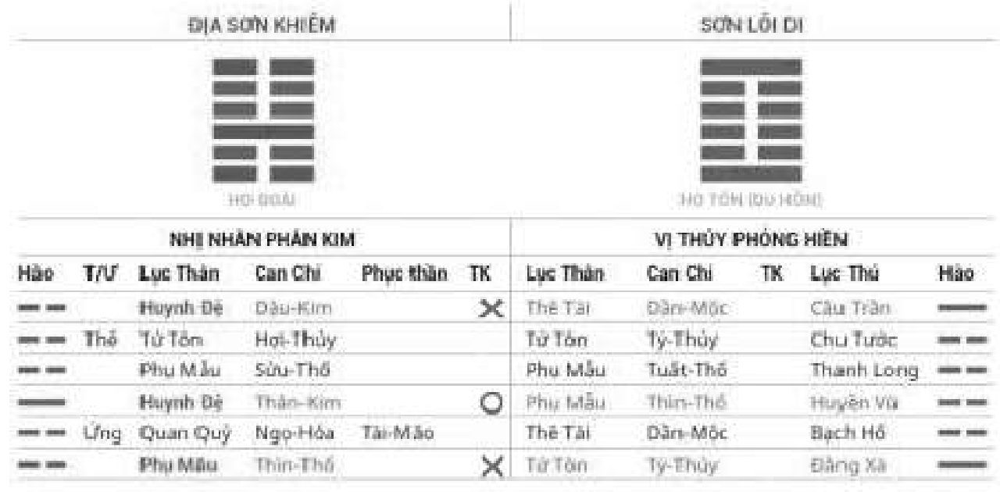

### 3. Dụng thần & Loại quẻ

- **Xác định Dụng thần đa tầng**:
  - **Hào Thế (Tử Tôn Hợi Thủy)**:
    - Đại diện cho bản thân người hỏi, phản ánh thể trạng và hiện trạng đang áp dụng liệu pháp chăm sóc sức khỏe / dùng TPCN.
    - Hào Tử Tôn đồng thời đại diện cho sức đề kháng, tính hiệu quả của phương pháp trị liệu và khả năng giải trừ bệnh tật.
  - **Hào Nguyên thần của Tử Tôn (Huynh Đệ Kim)**:
    - Kim sinh Thủy $\rightarrow$ Hào Huynh Đệ Kim chính là Nguyên thần trực tiếp sinh trợ cho Dụng thần Tử Tôn Thủy.
    - Đại diện cho các loại dược liệu, thuốc men, thực phẩm chức năng cụ thể mà đương sự đưa vào cơ thể.
    - Quẻ xuất hiện hai hào Huynh Đệ phát động (hào 3 Thân Kim và hào 6 Dậu Kim) $\rightarrow$ tượng trưng cho việc người hỏi đang đồng thời sử dụng nhiều loại sản phẩm TPCN khác nhau.
  - **Hào Quan Quỷ (Ngọ Hỏa lâm Ứng, hào 2)**:
    - Đại diện cho mầm bệnh, triệu chứng lâm sàng và các chỉ số xét nghiệm bất thường (bệnh lý liên quan đến hệ tuần hoàn và máu).
- **Phân loại quẻ**:
  - **Quẻ sự tình kết hợp quẻ tâm thái**: Vừa giải đáp băn khoăn lo lắng của đương sự về sức khỏe, vừa thẩm định tính đúng đắn của từng loại sản phẩm.
  - **Quẻ đa hào phát động**: Có 3 hào minh động (hào 1, 3, 6) và 1 hào ám động (hào 4), tạo nên sự chuyển hóa phức tạp giữa các cơ quan trong cơ thể.
  - **Biến quẻ Sơn Lôi Di (Du hồn)**: Báo hiệu sự dao động, biến chuyển trong việc phân bổ thuốc và các mối quan hệ tương tác với người cung cấp/tư vấn TPCN.

### 4. Luận giải

- **1. Chẩn đoán chính xác bệnh lý thực tế qua Hào Ứng và Bạch Hổ Quan Quỷ**:
  - Hào Ứng tọa hào 2 Quan Quỷ Ngọ Hỏa, lâm Bạch Hổ, đới Lộc thần và Thiên y:
    - *Ngũ hành Hỏa*: Chủ về tim, huyết mạch, hệ thống tuần hoàn và máu.
    - *Lục thú Bạch Hổ*: Tượng trưng cho huyết dịch, bệnh về máu, xuất huyết hoặc chỉ số máu dị thường.
    - *Thần sát Lộc thần*: Đại diện cho thực phẩm, dinh dưỡng, dịch chất béo dung nạp vào cơ thể.
    - *Sự kết hợp Hỏa Quỷ + Bạch Hổ + Lộc thần*: Không phải là bệnh viêm nhiễm thông thường hay bệnh hiểm nghèo ác tính (như ung thư máu/bạch cầu), mà biểu thị chính xác lượng mỡ và chất dinh dưỡng dư thừa tích tụ trong máu $\rightarrow$ bệnh lý **"Ba cao" (Tam cao: mỡ máu cao, huyết áp cao, cholesterol và triglyceride cao, hoặc axit uric/gút)**.
    - *Đối chứng y lý*: Tác giả phân biệt: nếu Bạch Hổ Hỏa Quỷ đới Dương nhẫn thì chủ về tổn thương thành mạch máu (cơ quan thực thể); ở đây đới Lộc thần là chủ về chất dịch trong máu (thực phẩm chuyển hóa thành mỡ máu).
  - Người hỏi thừa nhận ngay: Bản thân bị béo phì, các chỉ số triglyceride và cholesterol đều vượt ngưỡng rất cao, đồng thời có gan nhiễm mỡ.
- **2. Đánh giá tính chất mạn tính lâu năm và khả năng kháng thuốc**:
  - Quan Quỷ Ngọ Hỏa được cả Nguyệt lệnh Mùi Thổ và Nhật kiến Mùi Thổ tương hợp (Ngọ Mùi lục hợp):
    - Nguyệt lệnh quản quá khứ, Nhật lệnh quản hiện tại $\rightarrow$ Nguyệt Nhật cùng hợp Quan Quỷ chứng minh bệnh ba cao này đã hình thành từ lâu trong quá khứ và kéo dài liên tục đến hiện tại, là bệnh mạn tính thâm căn cố đế.
  - Hào Phụ Mẫu đại diện cho khả năng kháng thuốc (do Phụ Mẫu khắc chế Tử Tôn):
    - Cả tháng Mùi lẫn ngày Mùi đều là Phụ Mẫu Thổ nắm lệnh quyền tối cao $\rightarrow$ Phản ánh cơ thể có tính kháng thuốc cực mạnh, bệnh đã tích lũy thành "cố tật", không thể giải quyết triệt để trong một sớm một chiều.
- **3. Hiện trạng trị liệu suy kiệt của Hào Thế Tử Tôn Hợi Thủy**:
  - Hào Thế Tử Tôn Hợi Thủy bị cả Nguyệt lệnh Mùi Thổ lẫn Nhật kiến Mùi Thổ đồng thời khắc phạt nghiêm trọng (Thổ vượng khắc Thủy):
    - Thủy suy kiệt, bị kìm hãm hoàn toàn $\rightarrow$ Hiệu quả điều trị hiện thời rất thấp, cơ thể chưa hội đủ điều kiện để phục hồi hay đảo ngược các chỉ số máu trong ngắn hạn.
- **4. Sàng lọc hiệu lực của từng loại TPCN qua Nguyên thần Huynh Đệ Kim**:
  - **Loại 1: Huynh Đệ Dậu Kim (hào 6 động) - Vô dụng, gây tác dụng phụ, cần ngừng ngay**:
    - Hào 6 Dậu Kim động hóa Thê Tài Dần Mộc $\rightarrow$ **Động hóa Tuyệt** (Kim tuyệt tại Dần).
    - Khi Nguyên thần rơi vào trạng thái Tuyệt, khí lực hoàn toàn tiêu tán, không thể sinh trợ cho Hào Thế Tử Tôn Hợi Thủy $\rightarrow$ Đây là những sản phẩm hoàn toàn vô ích đối với cơ thể.
    - Hào 6 Dậu Kim xung khắc trực tiếp với Thê Tài Mão Mộc (phục thần dưới hào 2, Mão Mộc chủ về Can/Gan). Đệ tử cho biết đang dùng TPCN bảo vệ gan và dầu cá biển sâu:
      - *Phân tích y lý của Chu Thần Bản*: Người bị gan nhiễm mỡ thì chức năng gan vốn đã suy giảm, khả năng phân giải mỡ kém. Dầu cá biển sâu chứa hàm lượng lipid cao, nếu uống vào sẽ tạo gánh nặng chuyển hóa cực lớn cho gan (tương tự người bị gút tuyệt đối không được uống bột protein).
      - Do đó, TPCN bảo vệ gan và dầu cá biển sâu là sản phẩm xung khắc với tạng can, hóa Tuyệt vô công, cần phải lập tức ngừng sử dụng.
  - **Loại 2: Huynh Đệ Thân Kim (hào 3 động) - Hữu ích, cần kiên trì lâu dài**:
    - Hào 3 Thân Kim động hóa Phụ Mẫu Thìn Thổ (hóa hồi đầu sinh).
    - Thân Kim phối hợp cùng Hào 1 Phụ Mẫu Thìn Thổ (động biến Tử Tôn Tý Thủy) tạo thành: **Tam hợp Thân - Tý - Thìn hóa Tử Tôn Tý Thủy cục**.
    - Cục Tử Tôn Tý Thủy hình thành mang sức mạnh xung khắc thẳng vào Quan Quỷ Ngọ Hỏa (Tý Ngọ tương xung) $\rightarrow$ Có công năng thanh lọc huyết dịch, loại bỏ mỡ máu và đẩy lùi ba cao.
    - *Đặc điểm của Tam hợp cục trong dùng thuốc*:
      - Thứ nhất, đây là dòng sản phẩm kết hợp nhiều thành phần (thuốc phối hợp đa chất).
      - Thứ hai, tam hợp mang tính chất chu kỳ dài hạn, tác dụng diễn ra chậm rãi. Bản chất TPCN hàm lượng dược tính thấp, bắt buộc phải trải qua quá trình tích lũy lâu dài về lượng mới tạo ra bước nhảy vọt thay đổi về chất.
- **5. Lý giải nguyên nhân hiện tại chưa thấy hiệu quả (Ám động Sửu Thổ và Tuần không)**:
  - Cục Tử Tôn Tý Thủy hiện đang lâm **Tuần không** (tuần Giáp Dần, Tý Sửu không vong), báo hiệu năng lực trị liệu hiện thời còn đang ẩn tàng, chưa phát lộ ra ngoài.
  - Hào 4 Phụ Mẫu Sửu Thổ lâm Tuần không nhưng bị Nguyệt kiến và Nhật kiến Mùi Thổ tương xung $\rightarrow$ **Ám động (Xung khởi)**:
    - Phụ Mẫu Sửu Thổ ám động quay lại khắc chế Tử Tôn Tý Thủy cục, cản trở bước tiến đẩy lùi Quan Quỷ Ngọ Hỏa.
    - Đồng thời, Tử Tôn Tý Thủy cùng Phụ Mẫu Sửu Thổ tương hợp (Tý Sửu lục hợp) $\rightarrow$ Dược lực của TPCN bị Sửu Thổ lôi kéo, buộc phải ưu tiên điều trị vấn đề do Sửu Thổ đại diện trước, không còn đủ sức tấn công Hỏa Quỷ.
  - *Giải mã ý tượng tạng phủ của Tứ Thổ*:
    - **Tuất Thổ**: Cơ quan có kích thước lớn nhất trong cơ thể.
    - **Mùi Thổ**: Mộc khố, đại diện cho thể xốp / thể bông (cơ quan âm tính, đặc ruột, như phổi và gan).
    - **Thìn Thổ**: Thủy khố, đại diện cho cơ quan rỗng chứa chất lỏng (cơ quan dương tính, như dạ dày, ruột, bàng quang).
    - **Sửu Thổ**: Kim mộ, nằm ở hào 4 (khoang trung tiêu), kích thước nhỏ nhất $\rightarrow$ đại diện cho hạch bạch huyết, tuyến nội tiết nhỏ (như tuyến tụy, túi mật).
    - Sửu Thổ ám động biểu thị **rối loạn hệ nội tiết ngắn hạn** (tiết dịch mật và dịch tụy thất thường do chế độ ăn nhiều dầu mỡ, uống rượu).
    - *Cơ chế điều hòa toàn thân*: TPCN giống như Đông y, khi gặp chứng cấp tính/ngắn hạn (rối loạn nội tiết tụy - mật do Sửu Thổ ám động) thì Tý Thủy phải dồn sức hợp Sửu để ổn định nội tiết trước. Sau khi nội tiết bình ổn, TPCN mới rảnh tay giải quyết tận gốc mỡ máu và ba cao.

### 5. Phán đoán & Ứng kỳ

- **Phán đoán định tính**:
  - Căn bệnh ba cao và rối loạn mỡ máu là bệnh mạn tính lâu năm, không thể nôn nóng đòi hỏi kết quả tức thì.
  - Về việc sử dụng thực phẩm chức năng:
    - **Sản phẩm cần ngừng**: TPCN bảo vệ gan và dầu cá biển sâu (ứng với Hào 6 Huynh Đệ Dậu Kim hóa Tuyệt, khắc tạng can) $\rightarrow$ Ngừng ngay lập tức để giảm gánh nặng chuyển hóa cho gan và tránh lãng phí tài chính.
    - **Sản phẩm cần giữ**: Các sản phẩm hỗ trợ điều hòa huyết mạch, giảm mỡ máu (ứng với Hào 3 Thân Kim trong Tam hợp Tử Tôn Tý Thủy cục) $\rightarrow$ Phải kiên trì sử dụng liên tục trong thời gian dài.
  - Biến quẻ Sơn Lôi Di (Du hồn): Việc dùng thuốc cần có sự trao đổi, tái cấu trúc phối hợp với người tư vấn hoặc đơn vị cung cấp để điều chỉnh danh mục sản phẩm cho chuẩn xác.
- **Dự báo Ứng kỳ**:
  - Hiện tại Tử Tôn Tý Thủy đang lâm Tuần không, lại bị Sửu Thổ ám động ràng buộc, hiệu quả chưa thể hiện.
  - Thời điểm ứng nghiệm để các chỉ số máu cải thiện rõ rệt:
    - *Giai đoạn gần*: Đến **tháng Tý** (khoảng tháng 11 âm lịch năm 2016), khi Tý Thủy lâm lệnh thoát không, điền thực để xung kích khắc chế Quan Quỷ Ngọ Hỏa.
    - *Giai đoạn hoàn thiện triệt để*: Có thể phải kiên trì dùng đến **năm Tý** (năm Canh Tý 2020), khi lưu niên Tý Thủy nắm quyền thái tuế xung khử triệt để Quan Quỷ Ngọ Hỏa, các chỉ số máu mới hoàn toàn trở về trạng thái ổn định lâu dài.

### 6. Nghiệm chứng & Điểm mấu chốt

- **Nghiệm chứng thực tế khách quan**:
  - Người hỏi xác nhận toàn bộ phân tích bệnh lý là hoàn toàn chính xác: bản thân béo phì, bị gan nhiễm mỡ, chỉ số mỡ máu (cholesterol, triglyceride) cao trong thời gian dài.
  - Đúng là anh đang cùng lúc uống cả vitamin tổng hợp, dầu cá biển sâu và TPCN bổ gan.
  - Người hỏi hoàn toàn đồng thuận với giải đoán của tác giả: lập tức dừng các loại TPCN bổ gan và dầu cá gây hại cho gan, chỉ duy trì nhóm sản phẩm hỗ trợ làm sạch mạch máu và kiên trì sử dụng lâu dài theo đúng lộ trình tích lũy lượng - chất.
- **Điểm mấu chốt lý luận cốt lõi (Core Rules & Takeaways)**:
  1. **Tượng pháp chẩn đoán Hỏa Quỷ + Bạch Hổ + Lộc thần**:
     - Hỏa chủ tuần hoàn máu, Bạch Hổ chủ huyết dịch, Lộc thần chủ thực phẩm/dinh dưỡng. Khi tổ hợp này hội tụ tại hào Quan Quỷ, đây là tượng kinh điển của bệnh chuyển hóa dinh dưỡng trong máu ("Ba cao": mỡ máu, huyết áp, đường huyết, gút).
     - Phân biệt vi diệu: Quỷ đới Dương nhẫn là bệnh thực thể thành mạch máu; Quỷ đới Lộc thần là bệnh về thành phần chất dịch trong máu.
  2. **Nhật Nguyệt đồng lâm Phụ Mẫu khắc Thế Tử Tôn**:
     - Phụ Mẫu tượng trưng cho tính kháng thuốc (khắc Tử Tôn). Nhật Nguyệt cùng là Phụ Mẫu khắc phạt hào Thế cho thấy bệnh đã hóa thành cố tật lâu năm, sức kháng thuốc của cơ thể rất cao, báo trước quá trình điều trị nan giải, kéo dài.
  3. **Kỹ pháp sàng lọc Dược phẩm qua nhiều hào Nguyên thần**:
     - Khi đương sự dùng đồng thời nhiều loại thuốc, các hào Nguyên thần (Huynh Đệ Kim) trên quẻ đại diện cho từng nhóm sản phẩm.
     - Hào Huynh Đệ hóa Tuyệt (hào 6 Dậu Kim hóa Dần Mộc): Sản phẩm vô hiệu, khí lực suy bại, cần loại bỏ.
     - Hào Huynh Đệ đới Hồi đầu sinh và cấu thành Tam hợp cục (hào 3 Thân Kim): Sản phẩm có tác dụng dài lâu, là dòng phối hợp, cần kiên trì duy trì.
  4. **Quy luật Tam hợp cục trong hỗ trợ trị liệu**:
     - Tam hợp đại diện cho dược phẩm phối hợp đa chất và cơ chế tác dụng chậm, đòi hỏi thời gian tích lũy biến đổi từ lượng sang chất mới tạo nên chuyển biến căn bản.
  5. **Mô hình giải phẫu Tứ Thổ trong chẩn đoán Lục Hào**:
     - *Tuất Thổ*: Cơ quan lớn nhất trong cơ thể.
     - *Mùi Thổ*: Mộc khố, thể bông/thể xốp (cơ quan âm tính, đặc, như gan, phổi).
     - *Thìn Thổ*: Thủy khố, cơ quan rỗng chứa chất lỏng (cơ quan dương tính, như dạ dày, ruột, bàng quang).
     - *Sửu Thổ*: Kim mộ, cơ quan kích thước nhỏ nhất, vùng hạch bạch huyết, tuyến nội tiết (tụy, mật).
  6. **Cơ chế phân tán Dược lực (Ám động & Lục hợp)**:
     - Khi Tử Tôn hợp với hào Ám động (Tý Thủy hợp Sửu Thổ), dược lực bị điều động ưu tiên chữa trị triệu chứng cấp tính/rối loạn nội tiết trước mắt, dẫn đến chưa đủ lực khắc Quan Quỷ. Cần nắm rõ quy luật ưu tiên này để không phán đoán nhầm rằng thuốc vô tác dụng.

## Thực chiến 8: Đầu tư vào dự án này có sinh lời không

### 1. Bối cảnh / Câu hỏi

- **Đương sự & Vấn đề thắc mắc**:
  - Một vị đồng môn (học viên của tác giả Chu Thần Bản) đến xin tư vấn quẻ dịch về việc dự định đầu tư vào một dự án kinh doanh (có thể là hình thức góp vốn cổ phần hoặc tham gia một quỹ đầu tư tài chính).
  - Câu hỏi trọng tâm: Dự án đầu tư này liệu có mang lại lợi nhuận sinh lời hay không?
  - Bối cảnh thực tế lúc hỏi: Đương sự chưa chính thức rót vốn hay ký kết hợp đồng, dự án đang trong giai đoạn tiếp thị, kêu gọi góp vốn ngoài thị trường với sức hút rất lớn.
- **Thời gian chiêm bốc**:
  - Giờ Bắc Kinh: Ngày 8 tháng 11 năm 2012, hồi 02 giờ 38 phút rạng sáng.
  - Can chi: Năm Nhâm Thìn, tháng Tân Hợi, ngày Quý Dậu, giờ Quý Sửu.
  - Tiết khí: Tháng Tân Hợi (sau tiết Lập Đông).
  - Nhật Nguyệt kiến: Tháng Hợi, ngày Quý Dậu.
  - Tuần không: Tuất, Hợi (tuần Giáp Tý, Tuất Hợi không vong).
- **Thần sát tra theo ngày Quý Dậu**:
  - Tướng tinh: Dậu (tại Nhật kiến)
  - Hoa cái: Sửu (tại hào 1 Thê Tài Sửu Thổ và giờ Quý Sửu)
  - Dịch mã: Hợi (tại Nguyệt lệnh và hào 2 Phụ Mẫu Hợi Thủy)
  - Đào hoa: Ngọ (tại Phục thần Tử Tôn Ngọ Hỏa hào 4)
  - Lộc thần: Tý (tại hào 6 Phụ Mẫu Tý Thủy)
  - Dương nhẫn (Kình dương): Hợi (tại Nguyệt lệnh và hào 2 Phụ Mẫu Hợi Thủy)
  - Thiên y: Tuất (tại hào Thế Thê Tài Tuất Thổ)
  - Thiên hỷ: Mùi | Mưu tinh: Mùi | Kiếp sát: Dần | Tai sát: Mão | Văn xương: Mão | Quý nhân: Mão, Tỵ.

### 2. Dữ kiện & Bảng quẻ Crop

- **Can chi ngày giờ**: Tháng Tân Hợi, ngày Quý Dậu (Tuần không: Tuất, Hợi).
- **Quẻ chủ**: Thủy Phong Tĩnh (Họ Chấn, Cung Chấn) - Quẻ Tĩnh (cả 6 hào đều an tĩnh, không có hào động biến).
- **Quẻ từ / Thoán ý**: *Khô tĩnh sinh tuyền* (Giếng cạn khơi ra mạch suối trong).
- **Bảng quẻ chi tiết**:

| Hào | Thế / Ứng | Lục Thân | Can Chi | Phục Thần | Biến Lục Thân | Biến Can Chi | Lục Thú | Động / Tĩnh | Tuần Không |
|:---:|:---:|:---|:---|:---|:---|:---|:---|:---:|:---:|
| 6 | | Phụ Mẫu | Tý - Thủy | | *(tĩnh)* | | Bạch Hổ | `- -` (Âm) | |
| 5 | **Thế** | **Thê Tài** | **Tuất - Thổ** | | *(tĩnh)* | | Đằng Xà | `---` (Dương) | **Không** |
| 4 | | Quan Quỷ | Thân - Kim | Tử Tôn Ngọ - Hỏa | *(tĩnh)* | | Câu Trần | `- -` (Âm) | |
| 3 | | Quan Quỷ | Dậu - Kim | | *(tĩnh)* | | Chu Tước | `---` (Dương) | |
| 2 | **Ứng** | Phụ Mẫu | Hợi - Thủy | Huynh Đệ Dần - Mộc | *(tĩnh)* | | Thanh Long | `---` (Dương) | **Không** |
| 1 | | Thê Tài | Sửu - Thổ | | *(tĩnh)* | | Huyền Vũ | `- -` (Âm) | |

- **Hình ảnh Bảng quẻ crop**:
- Dữ kiện bảng quẻ và các thông số chiêm đoán:
  - **Bảng 8.1** Đồ hình quẻ Thực chiến 8:
    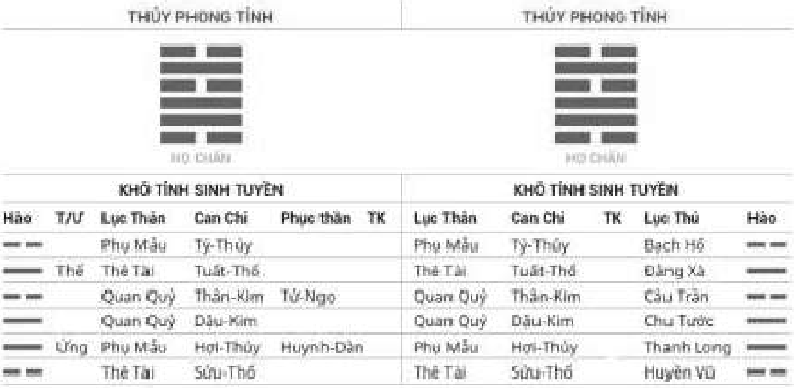

### 3. Dụng thần & Loại quẻ

- **Xác định Dụng thần**:
  - Mục đích chiêm bốc là cầu tài, thẩm định lợi nhuận đầu tư $\rightarrow$ Lấy hào **Thê Tài** làm Dụng thần.
  - Trong quẻ xuất hiện hai hào Thê Tài:
    - Hào 1: Thê Tài Sửu Thổ.
    - Hào 5: Thê Tài Tuất Thổ (tọa tại vị trí hào Thế).
  - *Quy tắc định Dụng thần*: Ưu tiên hàng đầu là hào nằm tại vị trí **Thế / Ứng**, đặc biệt trong quẻ tĩnh thì nguyên tắc này mang tính quyết định tuyệt đối.
  - Do đó: Chọn **Thê Tài Tuất Thổ (hào 5 trì Thế)** làm Dụng thần duy nhất.
- **Phân loại quẻ & Tính chất quẻ tượng**:
  - **Quẻ Tĩnh (Tĩnh quái)**: Quẻ lục hào an tĩnh, không có hào phát động biến hóa.
  - **Ý tượng quẻ Tĩnh (Thủy Phong Tĩnh)**:
    - Quẻ Tĩnh tượng trưng cho giếng nước, mang ý nghĩa về quy hoạch, giới hạn, ranh giới và khuôn khổ đóng.
    - Quẻ phản ánh hiện trạng lẫn xu thế tương lai: Dự án đầu tư này vốn có những rào cản và giới hạn pháp lý/quy trình nhất định; việc tham gia có thể dễ nhưng thoái vốn rút tiền không hề thuận lợi; thanh khoản kém, bị ràng buộc chặt chẽ vào thời hạn của dự án (tính chất của mô hình quỹ đóng hoặc hợp đồng hợp tác hạn định).
- **Quy trình phân tích quẻ Tĩnh**:
  1. Xem Dụng thần có giữ Thế hay không.
  2. Xem Dụng thần tạo tác động sinh khắc nào đối với hào Thế.
  3. Xem trạng thái vượng suy của hào Thế và Dụng thần dưới sự tác động của Nhật lệnh và Nguyệt lệnh.
  4. Xem Dụng thần có Nguyên thần trợ lực trên quẻ hay không (xác định trạng thái "hữu căn" hay "vô căn").

### 4. Luận giải

- **1. Thê Tài trì Thế và sự khác biệt giữa Ngắn hạn vs Trung - Dài hạn**:
  - Thoạt nhìn, Dụng thần Thê Tài Tuất Thổ trì Thế là điềm lành cho việc mưu cầu tài lộc, biểu thị tiền của nhập thân, có cơ hội thu về lợi nhuận.
  - Tuy nhiên, trong dự đoán Lục hào, cần phân định rạch ròi quy mô thời gian của sự việc:
    - *Nếu là đầu tư ngắn hạn* (như mua cổ phiếu lướt sóng ngắn ngày, giao dịch hàng hóa chớp nhoáng): Thê Tài trì Thế cho thấy đương sự hoàn toàn có thể thu được lợi nhuận trong ngắn hạn.
    - *Nếu là đầu tư trung và dài hạn* (dự án kinh doanh, quỹ đầu tư đa niên): Thê Tài trì Thế không đủ để bảo chứng cho kết quả chung cuộc nếu thiếu đi cội nguồn sinh dưỡng.
- **2. Yếu tố cốt tử: Dụng thần "Vô căn" (Thiếu hụt Nguyên thần trong quẻ tĩnh)**:
  - Nguyên thần sinh dưỡng cho Thê Tài Thổ là hào **Hỏa** (Tử Tôn).
  - Trong quẻ Thủy Phong Tĩnh: Hoàn toàn không có hào Tử Tôn Hỏa xuất hiện trên 6 hào (chỉ có Tử Tôn Ngọ Hỏa phục tàng dưới hào 4 Quan Quỷ Thân Kim).
  - *Nguyên tắc đặc thù của quẻ tĩnh*: Vị trí của Nguyên thần bắt buộc phải hiện diện ngay trên 6 hào của quẻ. Tuyệt đối không được lấy Nhật lệnh, Nguyệt lệnh hay các hào Phục thần để tính là Nguyên thần có sẵn của quẻ tĩnh.
  - Thiếu hào Hỏa trên quẻ đồng nghĩa với việc Dụng thần bị **"Vô căn"** (không có gốc rễ nguồn sinh).
  - *Hậu quả của Vô căn theo trường độ thời gian*:
    - Với việc ngắn hạn: Dụng thần vô căn không ảnh hưởng nghiêm trọng đến định tính cát hung.
    - Với việc trung và dài hạn (kéo dài nhiều năm): Nguyên thần đóng vai trò sinh mệnh sống còn, là dòng tiền liên tục chảy vào. Thiếu Nguyên thần thì dự án không thể duy trì sinh khí lâu dài, tất yếu cạn kiệt nguồn thu và đi đến thất bại.
- **3. Phân biệt sâu sắc giữa "Dụng thần trì Thế vô căn" và "Kỵ thần (Huynh Đệ) trì Thế"**:
  - Nếu quẻ xuất hiện Huynh Đệ trì Thế: Dự án từ đầu chí cuối hoàn toàn không có lợi nhuận, phá tài triệt để ngay từ những ngày đầu.
  - Nhưng ở đây Thê Tài vẫn trì Thế dù vô căn: Điều này chứng minh rằng **trong tiến trình đầu tư, dự án chắc chắn đã từng có những khoảng thời gian sinh lời thực tế**, đương sự từng có cơ hội thấy lợi nhuận. Chỉ vì vô căn nên lợi nhuận không duy trì được đến cuối cùng, biến kết cục thành thua lỗ.
- **4. Giải mã Tuần Không của Dụng thần Thê Tài Tuất Thổ**:
  - Hào Thế Thê Tài Tuất Thổ rơi vào Tuần không (tuần Giáp Tý không vong tại Tuất, Hợi):
    - Về mặt định tính cát hung: Tuần không trong quẻ tĩnh không mang tính phủ định tuyệt đối tài vận, không được suy diễn ngược một cách tùy tiện.
    - Về mặt đối quỹ hiện trạng: Tuần không phản ánh tại thời điểm gieo quẻ, khoản đầu tư chưa thực tế diễn ra, lợi nhuận và khả năng sinh lời chưa hiện hữu trên thực tế.
    - Về mặt cơ hội tương lai: Hào không đợi thực, đợi xung. Khi bước vào các tháng/năm Thìn (xung không) và Tuất (điền thực tuần không), hào Thê Tài sẽ thoát không $\rightarrow$ đây chính là thời điểm xuất hiện cơ hội khởi sắc để thu lợi nhuận ngắn hạn trong quá trình vận hành.
- **5. Nghệ thuật "Đối quỹ" hiện trạng dự án qua Hào Ứng và Nhật Nguyệt**:
  - Hào Ứng Phụ Mẫu Hợi Thủy đại diện cho dự án, hóa đơn và hợp đồng đầu tư:
    - Ứng lâm Tuần không: Xác nhận tại thời điểm xem quẻ, hợp đồng dự án chưa chính thức ký kết, tiền vốn chưa giải ngân.
    - Ứng hào đới Dương Nhẫn (Kình dương), Thanh Long, được Nguyệt kiến Hợi Thủy đồng hành lâm trị và Nhật lệnh Dậu Kim tương sinh: Hào Ứng cực kỳ vượng tướng, phản ánh hiện trạng thị trường bên ngoài đang quảng bá, chào bán dự án vô cùng sốt dẻo, tạo hiệu ứng đám đông mạnh mẽ khiến nhiều người tranh nhau rót vốn.
  - Hào Thế Thê Tài Tuất Thổ đối với Nhật Nguyệt:
    - Đối với Nguyệt lệnh Hợi Thủy là ở trạng thái Hưu tù.
    - Đối với Nhật lệnh Dậu Kim là bị tiết khí (Thổ sinh Kim), không quá vượng nhưng cũng không tử tuyệt.
    - Phản ánh thực chất khả năng sinh lời nội tại của dự án hiện thời còn rất mơ hồ, chưa hề có nền tảng vững chắc.

### 5. Phán đoán & Ứng kỳ

- **Phán đoán định tính chung cuộc**:
  - *Về kết cục dài hạn*: Đối với một khoản đầu tư trung và dài hạn, dự án **kết cục tất bại, cuối cùng không có lợi nhuận và sẽ dẫn đến tổn thất vốn nghiêm trọng** do Dụng thần hoàn toàn vô căn.
  - *Về diễn biến quá trình*: Trong giai đoạn đầu và giữa của chu kỳ đầu tư, dự án **sẽ có những khoảng thời gian mang lại lợi nhuận** nhờ Dụng thần Thê Tài trì Thế.
- **Quyết sách đầu tư**:
  - *Mô hình thoái vốn linh hoạt (Quỹ mở, cổ phiếu)*: Có thể tham gia đầu tư ngắn hạn; ngay khi dự án xuất hiện lợi nhuận thì phải lập tức kiên quyết tất toán, rút toàn bộ vốn và lãi ra ngoài.
  - *Mô hình giam vốn cố định (Quỹ đóng, hợp đồng kỳ hạn)*: Giống như tượng quẻ Tĩnh chỉ ra (quy hoạch, giới hạn đóng khung, giam vốn 2 đến 4 năm mới được rút), tuyệt đối **không nên đầu tư**. Bởi vì nhà đầu tư không thể thu hồi vốn giữa chừng khi có lãi, kết cục khi mãn hạn hợp đồng sẽ gánh chịu thua lỗ nặng nề.
- **Dự đoán Ứng kỳ**:
  - *Giai đoạn sinh lời ngắn hạn trong quá trình*: Vào các năm/tháng **Thìn** (xung xuất không) và **Tuất** (điền thực tuần không của hào Thế).
  - *Giai đoạn thoái trào và tổn thất chung cuộc*: Ứng vào cuối chu kỳ đầu tư trung - dài hạn (khi năng lượng sinh trợ suy kiệt, dự án bước vào giai đoạn quyết toán kết thúc).

### 6. Nghiệm chứng & Điểm mấu chốt

- **Nghiệm chứng thực tế khách quan**:
  - Dự án này trên thực tế đã được nhà đầu tư rót vốn từ năm 2012.
  - Đến đầu năm 2016 thì dự án chính thức khép lại (trải qua tổng cộng 4 năm $\rightarrow$ hoàn toàn đúng với tính chất đầu tư trung và dài hạn).
  - **Kết quả chung cuộc: Nhà đầu tư đã bị thua lỗ mất 2/3 tổng số vốn đầu tư ban đầu**.
  - **Diễn biến thực tế**: Hoàn toàn khớp nối với luận giải của quẻ dịch: trong suốt quá trình 4 năm đầu tư, đã từng có một khoảng thời gian dự án mang lại lợi nhuận rất tốt (khớp với Thê Tài trì Thế). Nhưng do đây là dự án có thời hạn cam kết khép kín, nhà đầu tư không thể rút vốn giữa chừng, rốt cuộc dòng tiền cạn kiệt và gánh chịu khoản lỗ nặng nề 2/3 vốn.
- **Điểm mấu chốt lý luận cốt lõi (Core Rules & Takeaways)**:
  1. **Quy tắc Nguyên thần trong Quẻ Tĩnh**:
     - Trong quẻ tĩnh, Nguyên thần bắt buộc phải xuất hiện hiển lộ trên 6 hào của quẻ mới được coi là có gốc ("hữu căn").
     - Nhật lệnh, Nguyệt lệnh hay các hào Phục thần không được tính là Nguyên thần của quẻ tĩnh. Quẻ tĩnh không có Nguyên thần trên 6 hào thì Dụng thần bị quy là "vô căn".
  2. **Phân biệt tính chất Vô Căn giữa Ngắn hạn và Dài hạn**:
     - Sự vụ ngắn hạn: Dụng thần vô căn không phá hỏng định tính cát hung, vẫn có thể mưu sự thành công trước mắt.
     - Sự vụ trung - dài hạn: Nguyên thần là mạch nguồn duy trì sinh mệnh của sự việc; vô căn tất yếu dẫn đến cạn kiệt và sụp đổ ở giai đoạn kết cục.
  3. **Phân biệt vi diệu: Dụng thần trì Thế vô căn vs Huynh Đệ trì Thế**:
     - *Huynh Đệ trì Thế*: Toàn bộ tiến trình từ đầu chí cuối chỉ toàn phá tài, không hề có lợi nhuận.
     - *Dụng thần trì Thế vô căn*: Tiến trình từng có giai đoạn sinh lời khả quan, nhưng chung cuộc vẫn đại bại mất tiền.
  4. **Ý tượng Quẻ Tĩnh trong dự đoán kinh doanh**:
     - Tượng của quẻ Tĩnh là khuôn khổ, ranh giới, quy hoạch và giới hạn ngặt nghèo; phản ánh mô hình kinh doanh thiếu thanh khoản, giam vốn dài hạn, khó cơ động thoái lui.
  5. **Kỹ pháp Đối quỹ hiện trạng qua Tuần Không và Thần Sát**:
     - Hào Thế và hào Ứng đồng thời lâm Tuần không: Báo hiệu sự việc mới ở giai đoạn trù tính, đôi bên chưa thực tế xuất vốn/ký kết.
     - Hào Ứng vượng tướng lâm Dương Nhẫn, Thanh Long, được Nhật Nguyệt sinh trợ: Vạch trần hiện trạng dự án bên ngoài đang được thổi phồng, tạo sức nóng tiếp thị và thu hút đám đông mạnh mẽ.

## Thực chiến 9: Lần thứ hai hỏi về việc đầu tư dự án có lợi nhuận hay không

### 1. Bối cảnh / Câu hỏi

- **Đương sự & Vấn đề thắc mắc**:
  - Người hỏi quẻ (học viên của tác giả Chu Thần Bản) đã từng gieo quẻ hỏi về dự án đầu tư vào ngày hôm trước (Thực chiến 8).
  - Tâm trạng chưa an định, ý niệm lo lắng về dự án vẫn thường trực trong tâm trí.
  - Sang ngày hôm sau tiếp tục gieo quẻ lần thứ hai để hỏi lại cùng một vấn đề: Dự án đầu tư này liệu có mang lại lợi nhuận sinh lời hay không?
- **Thời gian chiêm bốc**:
  - Giờ Bắc Kinh: Ngày 9 tháng 11 năm 2012, hồi 12 giờ 38 phút trưa.
  - Can chi: Năm Nhâm Thìn, tháng Tân Hợi, ngày Giáp Tuất, giờ Canh Ngọ.
  - Tiết khí: Tháng Tân Hợi (sau tiết Lập Đông).
  - Nhật Nguyệt kiến: Tháng Hợi, ngày Giáp Tuất.
  - Tuần không: Thân, Dậu (tuần Giáp Tuất, Thân Dậu không vong).
- **Thần sát tra theo ngày Giáp Tuất**:
  - Tướng tinh: Ngọ (lâm tại giờ Canh Ngọ và Hào 3 Quan Quỷ Ngọ Hỏa).
  - Hoa cái: Tuất (lâm tại Nhật kiến Giáp Tuất và Hào biến 5 Phụ Mẫu Tuất Thổ).
  - Dịch mã: Thân (lâm tại Hào biến 4 Huynh Đệ Thân Kim).
  - Tai sát: Tý (lâm tại Hào biến 1 & biến 6 Tử Tôn Tý Thủy).
  - Mưu tinh: Thìn (lâm tại Hào 2 Phụ Mẫu Thìn Thổ và Hào biến 3 Phụ Mẫu Thìn Thổ).
  - Đào hoa: Mão.
  - Kiếp sát: Hợi (lâm tại Nguyệt lệnh Tân Hợi và Hào 4 Tử Tôn Hợi Thủy).
  - Lộc thần: Dần (lâm tại Hào Thế Thê Tài Dần Mộc).
  - Dương nhẫn: Mão.
  - Thiên y: Tuất (lâm tại Nhật kiến Giáp Tuất).
  - Thiên hỷ: Mùi (lâm tại Hào 6 Phụ Mẫu Mùi Thổ).
  - Quý nhân: Sửu, Mùi (lâm tại Hào 6 Phụ Mẫu Mùi Thổ).

### 2. Dữ kiện & Bảng quẻ Crop

- **Can chi ngày giờ**: Tháng Tân Hợi, ngày Giáp Tuất (Tuần không: Thân, Dậu).
- **Quẻ chủ**: Trạch Thủy Khốn (Họ Đoài, Cung Đoài).
- **Quẻ biến**: Thủy Thiên Nhu (Họ Khôn, Cung Khôn).
- **Quẻ từ / Thoán ý**:
  - Quẻ chủ: *Thoát lung trừu sương* (Chim thoát khỏi lồng / cá gỡ lưới bay nhảy).
  - Quẻ biến: *Minh châu xuất thổ* (Ngọc sáng lộ khỏi bùn đất).
- **Bảng quẻ chi tiết**:

| Hào | Thế / Ứng | Lục Thân | Can Chi | Phục Thần | Biến Lục Thân | Biến Can Chi | Lục Thú | Động / Tĩnh | Tuần Không |
|:---:|:---:|:---|:---|:---|:---|:---|:---|:---:|:---:|
| 6 | | Phụ Mẫu | Mùi - Thổ | | Tử Tôn | Tý - Thủy | Huyền Vũ | `- -` (Âm tĩnh)* | |
| 5 | | Huynh Đệ | Dậu - Kim | | Phụ Mẫu | Tuất - Thổ | Bạch Hổ | `---` (Dương tĩnh) | **Không** |
| 4 | **Ứng** | Tử Tôn | Hợi - Thủy | | Huynh Đệ | Thân - Kim | Đằng Xà | `---` (Dương động O)* | **Biến Không** |
| 3 | | Quan Quỷ | Ngọ - Hỏa | | Phụ Mẫu | Thìn - Thổ | Câu Trần | `- -` (Âm động X) | |
| 2 | | Phụ Mẫu | Thìn - Thổ | | Thê Tài | Dần - Mộc | Chu Tước | `---` (Dương tĩnh) | |
| 1 | **Thế** | **Thê Tài** | **Dần - Mộc** | | Tử Tôn | Tý - Thủy | Thanh Long | `- -` (Âm động X) | |

*(Ghi chú hiệu đính: Trong bảng in sách gốc có lỗi in ấn đánh dấu 'O' ở hào 6 thay vì hào 4. Tuy nhiên theo nguyên lý biến quái Trạch Thủy Khốn sang Thủy Thiên Nhu và toàn bộ diễn giải phân tích của tác giả Chu Thần Bản, hào 4 Cửu tứ Tử Tôn Hợi Thủy động hóa Huynh Đệ Thân Kim, hào 3 Lục tam Quan Quỷ Ngọ Hỏa động hóa Phụ Mẫu Thìn Thổ, hào 1 Sơ lục Thê Tài Dần Mộc động hóa Tử Tôn Tý Thủy).*

- **Hình ảnh Bảng quẻ crop**:
- Dữ kiện bảng quẻ và các thông số chiêm đoán:
  - **Bảng 9.1** Đồ hình quẻ Thực chiến 9:
    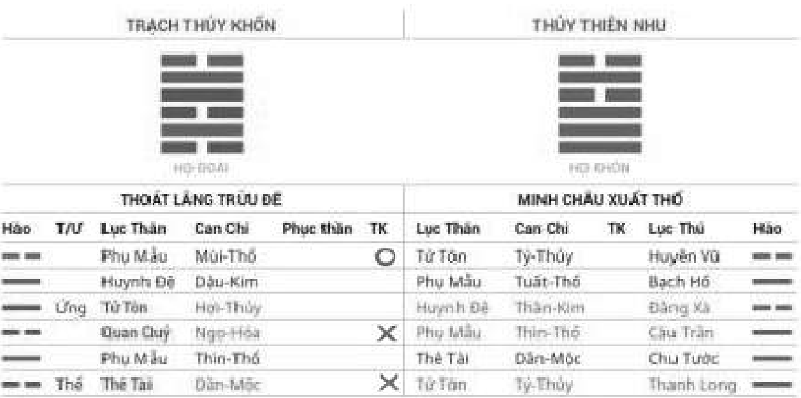

### 3. Dụng thần & Loại quẻ

- **Xác định Dụng thần**:
  - Mục đích chiêm bốc là cầu tài, thẩm định lợi nhuận đầu tư $\rightarrow$ Lấy hào **Thê Tài** làm Dụng thần.
  - Trong quẻ, **Thê Tài Dần Mộc (hào 1) trì Thế** phát động, lại đới Lộc thần của ngày Giáp $\rightarrow$ Đây là tiêu điểm Dụng thần duy nhất.
- **Phân loại quẻ & Tính chất quẻ tượng**:
  - **Quẻ Tái Chiêm (Hỏi lại lần 2)**:
    - Người hỏi vừa gieo quẻ ngày hôm trước, tâm niệm chưa dứt, sang hôm sau hỏi tiếp cùng sự việc.
    - Ý niệm chưa buông bỏ nên quẻ thứ hai vẫn là quẻ Tái chiêm.
  - **Ý tượng Quẻ chủ (Trạch Thủy Khốn)**:
    - Khốn mang tượng cùng quẫn, mệt mỏi, bế tắc, dòng nước bị cạn kiệt hoặc bị đầm bao bọc giam hãm.
    - Phản ánh hiện trạng dự án đang gặp khó khăn, bế tắc nội tại, không vận hành thuận lợi như quảng bá.
  - **Ý tượng Quẻ biến (Thủy Thiên Nhu)**:
    - Quẻ Nhu mang ý nghĩa chờ đợi (*Nhu dã, đãi dã*), thức ăn trên mây chờ mưa rơi, biểu thị xu hướng khách quan.
    - Đóng vai trò là **Quẻ chỉ dẫn (Chỉ đạo quái)**: Khuyên đương sự cần kiên nhẫn, chờ đợi thời cơ, tuyệt đối không được vội vã xuống tiền đầu tư vào dự án đang bế tắc.
- **Sự xuất hiện của hai hào Tử Tôn (Nguyên thần)**:
  - Tử Tôn là Nguyên thần sinh cho Thê Tài, đại diện cho phương tiện, công cụ sinh lợi, nguồn gốc dòng tiền.
  - Hào Ứng **Tử Tôn Hợi Thủy (hào 4)**: Đại diện cho dự án cụ thể được chỉ định, nguồn tiền kỳ vọng từ dự án này.
  - Hào Thế biến **Tử Tôn Tý Thủy (biến từ hào 1)**: Đại diện cho một dự án/kênh đầu tư khác do chính đương sự tự chủ động tìm kiếm.

### 4. Luận giải

- **1. Bản chất của Quẻ Tái Chiêm và Quy tắc giản lược Lục hào**:
  - *Định nghĩa Tái chiêm theo ý niệm*:
    - Thời gian cách biệt (cùng ngày hay sang ngày hôm sau) không phải là tiêu chí quyết định duy nhất.
    - Nếu đã buông bỏ ý niệm, vài ngày sau nảy sinh việc mới hỏi lại thì không phải tái chiêm.
    - Nếu tâm trí liên tục trăn trở, ý niệm chưa từng dứt, thì dù đã qua nửa đêm sang ngày hôm sau vẫn bị định tính là Tái chiêm.
  - *Quy tắc giải quẻ Tái chiêm*:
    - Thông tin quẻ tái chiêm mang tính vĩ mô, tổng quát, mạch lạc, tập trung cao độ vào **hào động và hào biến**.
    - Bỏ qua các chi tiết kỹ pháp vụn vặt: Không xét suy vượng chi tiết của Nhật Nguyệt, không xét Nhật phá, Nguyệt phá, hóa Nhật phá, hóa Nguyệt phá lên hào động và hào biến.
    - Trực tiếp nắm bắt "Điềm động" (sự tác động qua lại giữa các hào động, gian hào cản trở và hào biến định tính).
- **2. Tử Tôn Hợi Thủy tại hào Ứng và tính chất dự án đầu tư**:
  - Hào Ứng đại diện cho đối tác, dự án được chỉ định. Hào Ứng lâm Tử Tôn Hợi Thủy là cội nguồn sinh ra Thê Tài Dần Mộc trì Thế.
  - Hợi Thủy mang **Dương Nhẫn** và **Dịch Mã**: Ám chỉ dự án mang tính chất biến động, di chuyển, liên quan đến cạnh tranh quyết liệt hoặc ngành nghề cơ giới/vận tải/dài hạn.
  - Ngũ hành Thủy tượng trưng cho các khoản đầu tư dài hạn (Thủy là trường lưu thủy, chu kỳ dài; Hỏa tượng trưng cho đầu tư ngắn hạn).
  - Hào 4 Tử Tôn Hợi Thủy động hóa Huynh Đệ Thân Kim: Thân Kim vốn có thể là Nguyên thần sinh dưỡng cho Hợi Thủy (hồi đầu sinh).
- **3. Gian hào Quan Quỷ Ngọ Hỏa – Nút thắt "Nhân họa" chặt đứt mạch sinh tài**:
  - Gian hào là các hào nằm giữa Thế (hào 1) và Ứng (hào 4), ở đây gồm hào 2 và hào 3.
  - Hào 3 **Quan Quỷ Ngọ Hỏa phát động hóa Phụ Mẫu Thìn Thổ**:
    - Nằm án ngữ ngay tại gian hào giữa Hợi Thủy và Dần Mộc.
    - Hợi Thủy muốn sinh Dần Mộc, Dần Mộc hợp Hợi Thủy, nhưng Quan Quỷ Ngọ Hỏa phát động đã chặn đứng cầu nối dẫn truyền sinh khí.
  - *Ý tượng của hào động Quan Quỷ Ngọ Hỏa*:
    - Quan Quỷ là trở ngại, tai họa, mưu đồ bất chính.
    - Quan Quỷ Ngọ Hỏa lâm Tướng tinh, hóa Phụ Mẫu Thìn Thổ đới **Mưu Tinh** và **Quý Nhân**.
    - Biểu thị rõ nét yếu tố **"Nhân họa"**: Có người quyền thế hoặc đối tác quản lý ngấm ngầm giở trò quỷ quyệt, cố tình thiết lập rào cản, cài cắm bẫy mưu kế để ngăn chặn dòng tiền lợi nhuận.
    - Đương sự giao tiền vốn cho người khác quản lý sẽ hoàn toàn mất quyền kiểm soát.
- **4. Định tính Huynh Đệ Thân Kim – Từ phí dịch vụ biến thành Họa phá tài nặng nề**:
  - *Nếu không có gian hào Quan Quỷ phát động*:
    - Tử Tôn Hợi Thủy động hóa Huynh Đệ Thân Kim: Thân Kim sinh Hợi Thủy, Hợi Thủy sinh Dần Mộc. Dự án vẫn kiếm được lời.
    - Huynh Đệ Thân Kim đối xung với Thê Tài Dần Mộc chỉ biểu thị chi phí môi giới, hoa hồng dịch vụ cao (mất 20-30% cho bên trung gian).
    - Hợi Thủy hợp Dần Mộc là động quẩn chân: Ban đầu thu lợi chậm, nhưng lâu dài quẩn chân giải tỏa vẫn có lãi.
  - *Khi gian hào Quan Quỷ phát động định tính hung hiểm*:
    - Gian hào đã chặt đứt mạch sinh tài, biến dự án thành cạm bẫy bất lợi.
    - Hào biến Huynh Đệ Thân Kim bị định tính là **Kỵ thần phá tài thuần túy**.
    - Huynh Đệ Thân Kim đối xung khắc trực diện Thê Tài Dần Mộc (Thân Kim xung phá Dần Mộc, chọc thủng hào Thế), khiến việc sinh tài sụp đổ hoàn toàn.
    - Kinh nghiệm thực chiến của Chu Thần Bản: Tượng xung phá trực diện từ Kỵ thần biến ra này báo trước mức thua lỗ nặng nề, mất từ 40% đến 50% hoặc chí ít là một nửa số vốn đầu tư.
- **5. Nghệ thuật phân biệt hai hào Tử Tôn: Dự án chỉ định vs Dự án tự tìm**:
  - Tại sao Thê Tài Dần Mộc trì Thế lại động hóa Tử Tôn Tý Thủy?
    - Nếu suy diễn máy móc: Nghĩ rằng dự án ban đầu khó khăn rồi sau đó sinh lời $\rightarrow$ Sai lầm nghiêm trọng.
    - Tử Tôn Tý Thủy (nội động hóa xuất từ Thế) tạo nên thế **đối lập hoàn toàn** với Tử Tôn Hợi Thủy (ngoại động tại hào Ứng).
  - *Ngoại động (Ứng)* = Dự án do người khác giới thiệu, đã bị gian hào làm cho bế tắc, thất bại và thua lỗ.
  - *Nội động (Thế biến)* = Dự án khác do chính bản thân đương sự tự chủ động tìm tòi, nắm bắt quyền chủ động.
  - Quẻ chỉ ra: Nhận thấy dự án hiện tại đầy cạm bẫy nhân họa, đương sự nên chủ động từ bỏ dự án được giới thiệu, chuyển hướng tự mình tìm kiếm cơ hội khác.
- **6. Bản chất kỹ pháp: Tại sao không tính Phụ Mẫu Thìn Thổ bị Nhật phá?**:
  - Nếu là quẻ thường (không phải tái chiêm):
    - Hào biến Phụ Mẫu Thìn Thổ bị Nhật kiến Tuất xung $\rightarrow$ Thìn Thổ lâm Nhật phá.
    - Hào biến bị Nhật phá khiến hào động Quan Quỷ Ngọ Hỏa trở thành hào động vô công (vô dụng).
    - Hào cản trở vô dụng thì Hợi Thủy vẫn sinh được Dần Mộc, dự án vượt qua trở ngại để có lãi.
  - Nhưng vì đây là **Quẻ Tái Chiêm**:
    - Tin tức được đơn giản hóa tuyệt đối: Hào động và hào biến thể hiện trực tiếp bản chất sự việc, không xét tác động xung phá của Nhật Nguyệt lên hào biến.
    - Bỏ qua Nhật phá, gian hào Quan Quỷ phát huy 100% sức tàn phá, ngăn cách tuyệt đối dòng tiền và dẫn đến kết cục thất bại bi đát.

### 5. Phán đoán & Ứng kỳ

- **Phán đoán định tính chung cuộc**:
  - Dự án đầu tư được người khác giới thiệu này **kết cục chắc chắn thua lỗ nặng nề, không thể kiếm được lợi nhuận dài hạn**.
  - Thiệt hại ước tính rất lớn, mất ít nhất một nửa đến 2/3 tổng số vốn đầu tư do bị đối tác cài bẫy mưu kế và Kỵ thần Thân Kim xung phá.
  - Trong quá trình đầu tư, do Thê Tài Dần Mộc trì Thế đới Lộc thần, ban đầu có thể có thời điểm le lói lợi nhuận ngắn hạn, nhưng tiền bị giam giữ không thể rút ra.
- **Quyết sách đầu tư (Lời khuyên chiến lược)**:
  - Tuyệt đối **không nên mạo hiểm rót vốn vào dự án hiện tại**.
  - Cần tuân theo đạo quẻ **Thủy Thiên Nhu**: Kiên nhẫn chờ đợi, không vội vàng manh động.
  - Chủ động khảo sát, tìm kiếm các cơ hội đầu tư độc lập khác (ứng với tượng Thế hóa Tử Tôn Tý Thủy), tự mình nắm quyền quản lý thay vì giao phó tiền bạc cho người khác.
- **Dự đoán Ứng kỳ**:
  - Hào biến Huynh Đệ Thân Kim lâm Tuần không: Ứng kỳ phá tài xuất hiện khi Thân Kim điền thực hoặc xung khai.
  - Toàn bộ chu kỳ đầu tư dài hạn (ngũ hành Thủy) sẽ kết thúc trong thất bại khi bước vào cuối kỳ vận hành.

### 6. Nghiệm chứng & Điểm mấu chốt

- **Nghiệm chứng thực tế khách quan**:
  - Dự án được đương sự rót vốn đầu tư từ năm 2012.
  - Đến đầu năm 2016 thì dự án chính thức kết thúc (chu kỳ kéo dài 4 năm $\rightarrow$ đúng tính chất đầu tư dài hạn của Thủy).
  - **Kết quả chung cuộc**: Quá trình đầu tư từng có giai đoạn thu được lợi nhuận, nhưng kết cục cuối cùng **thua lỗ mất 2/3 tổng số vốn đầu tư**.
  - Thực tế ứng nghiệm chuẩn xác 100% với luận đoán: Vốn bị chiếm dụng, đối tác giở trò mưu tính (Quan Quỷ đới Mưu tinh) và Kỵ thần Thân Kim xung thủng Dần Mộc gây thiệt hại trên 50-60% vốn.
- **Điểm mấu chốt lý luận cốt lõi (Core Rules & Takeaways)**:
  1. **Định nghĩa chuẩn xác về Tái Chiêm**:
     - Tái chiêm không phụ thuộc cứng nhắc vào số ngày hay việc có qua đêm sang ngày hôm sau hay không.
     - Cốt lõi nằm ở **Ý niệm**: Chưa buông bỏ ý niệm, tâm trí còn trăn trở gieo lại thì vẫn là Tái chiêm; đã buông bỏ ý niệm thì dù hỏi lại vẫn tính là câu hỏi mới.
  2. **Kỹ pháp giải quẻ Tái Chiêm**:
     - Tin tức trong quẻ tái chiêm trở nên tổng quát, đơn giản hóa và mạch lạc.
     - Tập trung phân tích vào **hào động, hào biến và gian hào**.
     - Không xem xét các chi tiết vụn vặt như vượng suy suy bại quá tỉ mỉ, bỏ qua hóa Nhật phá, hóa Nguyệt phá của hào biến.
  3. **Tác hại chí mạng của Gian Hào**:
     - Khi Thế và Ứng có mối liên hệ sinh hợp (Tử Tôn sinh Tài), sự xuất hiện của Gian hào phát động (đặc biệt là Quan Quỷ) sẽ cắt đứt hoàn toàn nhịp cầu dẫn truyền năng lượng cát lành.
     - Biến quẩn chân ngắn hạn thành tắc nghẽn vĩnh viễn, chuyển hóa cát tượng thành hung tượng.
  4. **Gian Hào đới Thần Sát luận Nhân Họa**:
     - Quan Quỷ tại gian hào đới Tướng tinh, hóa Phụ Mẫu đới Mưu tinh và Quý nhân: Điềm báo chắc chắn có người giở trò quỷ quyệt, cố tình bày mưu cản trở dự án, tuyệt đối không được giao vốn cho người khác quản lý.
  5. **Quy tắc định tính Hào Biến theo Gian Hào**:
     - Nếu không có gian hào cản trở: Hào biến sinh cho Ứng chỉ là phí tổn dịch vụ môi giới.
     - Khi gian hào định tính bất lợi: Hào biến Huynh Đệ đối xung với hào Thế trở thành Kỵ thần phá tài hung hiểm nhất, trực tiếp đâm thủng túi tiền của người hỏi.
  6. **Phân biệt hai hào Tử Tôn cùng xuất hiện**:
     - Tử Tôn tại hào Ứng: Đại diện cho dự án được chỉ định bên ngoài (người khác giới thiệu).
     - Tử Tôn biến ra từ hào Thế: Đại diện cho sự lựa chọn chủ động của đương sự, tìm kiếm dự án mới độc lập.

## Thực chiến 10: Khoản phí của lớp đào tạo này có thể hoàn trả không?

### 1. Bối cảnh & Câu hỏi
- **Thời gian chiêm đoán**:
  - Giờ Bắc Kinh: 13:38 ngày 08/09/2016.
  - Can chi: Năm Bính Thân, tháng Đinh Dậu, ngày Quý Tỵ, giờ Kỷ Mùi.
  - Tuần không: Ngọ, Mùi (tuần Giáp Thân).
- **Thần sát**:
  - Tướng tinh: Dậu.
  - Hoa cái: Sửu.
  - Dịch mã: Hợi.
  - Tai sát: Mão.
  - Mưu tinh: Mùi.
  - Đào hoa: Ngọ.
  - Kiếp sát: Dần.
  - Lộc thần: Tý.
  - Dương nhẫn: Hợi.
  - Văn xương: Mão.
  - Thiên y: Thân.
  - Thiên hỷ: Thìn.
  - Quý nhân: Mão, Tỵ.
- **Bối cảnh sự việc**:
  - Đương sự là một đồng môn có điều kiện kinh tế khá giả, thường đăng ký tham gia nhiều lớp đào tạo về dịch lý bên ngoài.
  - Do đã học nhiều lớp, lần này mới học được khoảng 1/3 thời lượng thì nhận thấy nội dung giảng dạy tương tự các lớp trước, không có kiến thức mới.
  - Theo quy chế thông thường của các lớp đào tạo bên ngoài, học viên không được hoàn trả học phí sau khi đã tham gia học.
  - Tuy nhiên, người này quen biết nhiều giảng viên có uy tín trong giới, nên hy vọng có cơ hội thương lượng xin lại khoản phí.
- **Câu hỏi chiêm đoán**: Khoản học phí của lớp đào tạo này có thể hoàn trả được không? Tiền liệu có thể về tay hay không?

### 2. Dữ kiện & Bảng quẻ Crop
- **Quẻ chủ**: Lôi Thủy Giải (Cung Chấn - Ngũ quan thoát nạn).
  - Hào 6: Thê Tài Tuất Thổ (--), Lục thú: Bạch Hổ.
  - Hào 5 (Ứng): Quan Quỷ Thân Kim (--), Lục thú: Đăng Xà.
  - Hào 4: Tử Tôn Ngọ Hỏa (--- O), động hóa Thê Tài Sửu Thổ, Tuần không (Ngọ), Lục thú: Câu Trần.
  - Hào 3: Tử Tôn Ngọ Hỏa (--), Tuần không (Ngọ), Lục thú: Chu Tước.
  - Hào 2 (Thế): Thê Tài Thìn Thổ (---), Lục thú: Thanh Long.
  - Hào 1: Huynh Đệ Dần Mộc (--), Phục thần: Phụ Mẫu Tý Thủy, Lục thú: Huyền Vũ.
- **Quẻ biến**: Địa Thủy Sư (Cung Khảm - Quy Hồn, Mã đáo thành công).
  - Hào 6: Quan Quỷ Dậu Kim (--), Lục thú: Bạch Hổ.
  - Hào 5: Phụ Mẫu Hợi Thủy (--), Lục thú: Đăng Xà.
  - Hào 4 (Thế biến): Thê Tài Sửu Thổ (--), Lục thú: Câu Trần.
  - Hào 3: Tử Tôn Ngọ Hỏa (--), Lục thú: Chu Tước.
  - Hào 2: Thê Tài Thìn Thổ (---), Lục thú: Thanh Long.
  - Hào 1: Huynh Đệ Dần Mộc (--), Lục thú: Huyền Vũ.
- **Bảng quẻ đối chiếu**:
- Dữ kiện bảng quẻ và các thông số chiêm đoán:
  - **Bảng 10.1** Đồ hình quẻ Thực chiến 10:
    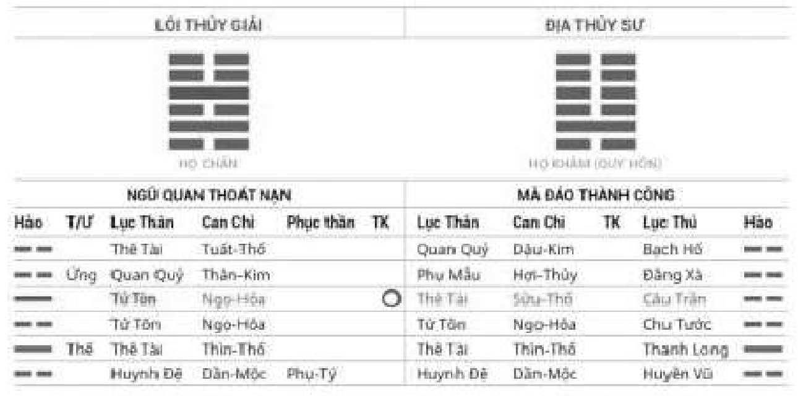

### 3. Dụng thần & Loại quẻ
- **Xác định Dụng thần**:
  - Chiêm hỏi về việc đòi lại tiền bạc, học phí hoàn trả -> Lấy hào Thê Tài làm Dụng thần.
  - Hiện tượng Dụng thần lưỡng hiện: Hào 6 có Thê Tài Tuất Thổ, Hào 2 có Thê Tài Thìn Thổ.
  - Chọn Thê Tài Thìn Thổ tại Hào 2 làm Dụng thần chính vì hào này trực tiếp trì Thế (đại diện cho bản thân người hỏi và tiền bạc quay về tay đương sự).
- **Phân loại quẻ**:
  - Quẻ sự tình: Dự đoán kết quả giải quyết một khoản tài chính cụ thể trong ngắn hạn.
  - Quẻ động: Hào 4 Tử Tôn Ngọ Hỏa độc phát, hóa Thê Tài Sửu Thổ.
  - Tính chất quẻ biến: Quẻ biến Địa Thủy Sư là quẻ Quy Hồn của cung Khảm, chủ về sự hồi quy, tiền bạc quay trở về.

### 4. Luận giải
- **Bước 1: Khảo sát vượng suy của Dụng thần qua lệnh Ngày và Tháng**:
  - Hào Thế Thê Tài Thìn Thổ được Nguyệt lệnh Đinh Dậu tương hợp (Thìn Dậu lục hợp).
  - Hào Thế Thê Tài Thìn Thổ được Nhật lệnh Quý Tỵ tương sinh (Tỵ Hỏa sinh Thìn Thổ).
  - Đánh giá bề ngoài: Hào Thế kiêm Dụng thần vừa được Nhật sinh vừa được Nguyệt hợp, ở trạng thái cực kỳ vượng tướng.
- **Bước 2: Phân tích cơ chế "Đối quy" (Đối quỹ) và nguy cơ "Quá vượng"**:
  - *Bẫy phân tích thông thường*: Hào động Tử Tôn Ngọ Hỏa sinh Thê Tài Thìn Thổ, kết hợp Nhật sinh Nguyệt hợp, nếu nhìn phiến diện dễ kết luận tiền sẽ đòi lại rất thuận lợi.
  - *Bản chất của trạng thái "Quá vượng"*:
    - Nếu trong thực tế, phía trung tâm đào tạo cự tuyệt hoàn toàn việc hoàn tiền, thái độ cứng rắn không chịu thương lượng, thì trạng thái "Nhật Nguyệt tương sinh tương hợp" sẽ hoàn toàn trái ngược với thực tế khách quan.
    - Khi hào Thế vượng tướng mà không thể đối quy (không khớp với hiện trạng thực tế), thì bị quy kết là "quá vượng / cực vượng".
    - Khi Dụng thần quá vượng trong sự việc ngắn hạn, tiền bạc sẽ bị trì hoãn vô thời hạn, thậm chí mất trắng không thể thu hồi.
  - *Xác lập quan hệ đối quy trong trường hợp cụ thể*:
    - Nguyệt lệnh Dậu Kim lâm Tướng tinh, Quý nhân: Đại diện cho nhân vật cốt cán, người sáng lập hoặc người có quyền quyết định cao nhất của cơ sở đào tạo. Nguyệt lệnh hợp hào Thế phản ánh mối quan hệ cá nhân tốt đẹp, có thể đối thoại hòa nhã.
    - Nhật lệnh Tỵ Hỏa lâm Quý nhân: Đại diện cho đội ngũ giảng viên hoặc nhân viên tiếp nhận trực tiếp. Nhật lệnh sinh hào Thế biểu thị nhân viên sẵn lòng hỗ trợ, lắng nghe và nhượng bộ.
    - Trong thực tế, người hỏi quen biết nhiều thầy và phía cơ sở đào tạo có thiện chí thương lượng tìm giải pháp, do đó sự tương sinh tương hợp của Nhật Nguyệt là "đối quy" chuẩn xác với thực tế khách quan.
    - Do có đối quy, hào động Tử Tôn Ngọ Hỏa sinh Thê Tài Thìn Thổ là sự sinh hợp bình thường, không phải "quá vượng", bảo đảm tiền có thể hoàn trả.
- **Bước 3: Ràng buộc Thiên La Địa Võng và giới hạn hào biến**:
  - *Tác động của lưới Thiên La*:
    - Chi Thìn tại hào Thế và chi Tỵ tại Nhật lệnh cùng thuộc phạm vi thần sát "Thiên La" (Thìn - Tỵ là Thiên La; Tuất - Hợi là Địa Võng).
    - Tượng Thiên La Địa Võng chủ về sự trói buộc, hạn chế và điều kiện khắt khe. Phía đối phương có thể nhượng bộ hoàn tiền, nhưng sự nhượng bộ này nhất định có điều kiện kèm theo, tuyệt đối không phải nhượng bộ vô điều kiện.
  - *Ý nghĩa hào biến*:
    - Hào 4 Tử Tôn Ngọ Hỏa động biến ra Thê Tài Sửu Thổ (hóa Thoái khí về Thổ ngũ hành, Sửu Thổ lâm Câu Trần).
    - Thê Tài Thìn Thổ tại hào Thế đại diện cho số tiền người hỏi yêu cầu ban đầu (hoàn trả 100%).
    - Thê Tài Sửu Thổ tại hào biến đại diện cho khoản tiền thực tế đối phương chấp thuận hoàn lại.
    - Sự chuyển dịch từ Thìn Thổ sang Sửu Thổ khẳng định giá trị tiền bạc hoàn trả bị sụt giảm, báo hiệu đối phương chỉ hoàn trả một phần chứ không hoàn lại toàn bộ.

### 5. Phán đoán & Ứng kỳ
- **Phán đoán kết quả**:
  - Học phí chắc chắn sẽ được hoàn trả một phần, không thể hoàn trả đầy đủ 100%.
  - Quá trình giải quyết diễn ra hòa nhã, đạt được thỏa thuận chung nhờ sự tương trợ của Quý nhân tại Nhật Nguyệt (các thầy và nhân viên tạo điều kiện).
  - Do ảnh hưởng của lưới Thiên La (Thìn, Tỵ) và hào biến Thê Tài Sửu Thổ, khoản phí hoàn lại bị khấu trừ một phần chi phí đào tạo tương ứng.
- **Ứng kỳ và định lượng**:
  - Hào động Tử Tôn Ngọ Hỏa lâm Tuần không, gặp Nhật lệnh Tỵ Hỏa sinh trợ, động không thành thực; xuất tuần không sẽ hoàn tất thủ tục hoàn phí.
  - Việc giải quyết diễn ra nhanh gọn trong khoảng thời gian ngắn của khóa học. Số tiền hoàn lại chiếm phần lớn (tương ứng với thời lượng 2/3 khóa học chưa tham gia).

### 6. Nghiệm chứng & Điểm mấu chốt
- **Nghiệm chứng thực tế**:
  - Sau khi thương lượng với trung tâm đào tạo, người đồng môn được chấp thuận hoàn trả chính xác **2/3 số tiền học phí** (do mới học 1/3 thời gian, trung tâm khấu trừ 1/3 và hoàn lại 2/3).
- **Điểm mấu chốt / Kỹ pháp cốt lõi**:
  - **Kỹ pháp Đối quy (Đối quỹ) để phân biệt Vượng thông thường và Quá vượng**:
    - Không thể vội vàng nhìn thấy hào được Nhật Nguyệt tương sinh tương hợp mà kết luận là đại cát.
    - Bắt buộc phải đối chiếu xem trạng thái Nhật Nguyệt sinh hợp đó có phù hợp với thực trạng quan hệ và thái độ của đối phương hay không. Nếu thực tế đối nghịch thì đó là "quá vượng" (chủ bế tắc, hung hại); nếu thực tế hòa nhã, hỗ trợ thì mới tính là sinh hợp bình thường (cát).
  - **Quy tắc giới hạn của Thiên La Địa Võng (Thìn, Tị, Tuất, Hợi)**:
    - Trong các quẻ chiêm về đàm phán tài chính, giao dịch, hợp đồng, khi xuất hiện các chi Thìn - Tỵ hoặc Tuất - Hợi, mọi sự thỏa hiệp đều mang tính có điều kiện và giới hạn, không có sự nhượng bộ tuyệt đối.
  - **Mô hình đối chiếu Hào Thế và Hào Biến định lượng mức hoàn trả**:
    - Thê Tài Thìn Thổ trì Thế thể hiện nguyện vọng hoàn phí toàn bộ của đương sự.
    - Động hào biến xuất Thê Tài Sửu Thổ thể hiện hạn mức giải ngân thực tế; sự biến đổi này là dấu hiệu then chốt báo trước việc khấu trừ tài chính.

---

## THỰC CHIẾN 21: DA Ở NGÓN CHÂN BỊ TỔN THƯƠNG, LO LẮNG LÀ BỆNH TIỂU ĐƯỜNG

---

### 1. Bối cảnh & Câu hỏi

- **Bối cảnh chi tiết:** 
  Một người quen của tác giả gặp tình trạng vùng da ở ngón chân thường xuyên bị trầy xước, tổn thương, ngứa ngáy dữ dội và lặp đi lặp lại kéo dài không dứt điểm. Do đương số có tiền sử chỉ số đường huyết tương đối cao, khi thấy vết loét ở đầu ngón chân dai dẳng mãi không lành, trong lòng vô cùng hoang mang, sợ rằng bản thân đã mắc biến chứng lở loét hoại tử của bệnh tiểu đường. Đương số đã quyết định gieo một quẻ Dịch để dự trắc xem tổn thương da này rốt cuộc là bệnh gì.
- **Tâm lý & Câu hỏi ẩn ý:** 
  Tâm lý đương số chìm trong nỗi sợ hãi tột cùng trước nguy cơ biến chứng tiểu đường (bàn chân tiểu đường hoại tử). Câu hỏi bề ngoài hỏi về vết loét da ngón chân, nhưng tâm ý cốt lõi bên trong là sự sợ hãi về bệnh tiểu đường: *"Vết thương da ở ngón chân này có phải là do bệnh tiểu đường gây ra hay không?"*.
- **Thời gian chiêm đoán:**
  - Dương lịch: 23/09/2016, 08:48 (Giờ Bắc Kinh).
  - Can chi: Năm Bính Thân, tháng Đinh Dậu, ngày Mậu Thân, giờ Bính Thìn.

---

### 2. Dữ kiện & Bảng quẻ Crop

- **Thời không chiêm nghiệm:**
  - Tháng Đinh Dậu (Kim vượng, Thủy tướng, Mộc tuyệt, Hỏa tử).
  - Ngày Mậu Thân (Kim vượng, Thủy trường sinh).
  - Tuần không: **Dần - Mão** (Giáp Thìn tuần trung, Dần Mão không vong).
- **Thần sát:**
  - Tướng tinh: Tý
  - Hoa cái: Thìn
  - Dịch mã: Dần (Lâm hào động, sơ hào/hào 6)
  - Tai sát: Ngọ
  - Mưu tinh: Tuất
  - Đào hoa: Dậu (Lâm Nguyệt lệnh)
  - Kiếp sát: Tỵ (Lâm hào Ứng)
  - Lộc thần: Tỵ (Lâm hào Ứng Quan Quỷ)
  - Dương nhẫn: Ngọ
  - Văn xương: Thân (Lâm Nhật kiến)
  - Thiên y: Thân
  - Thiên hỷ: Thìn
  - Quý nhân: Sửu, Mùi

- Dữ kiện bảng quẻ và các thông số chiêm đoán:
  - **Bảng 21.1: Quẻ Sơn Địa Bác biến Bát Thuần Khôn**
    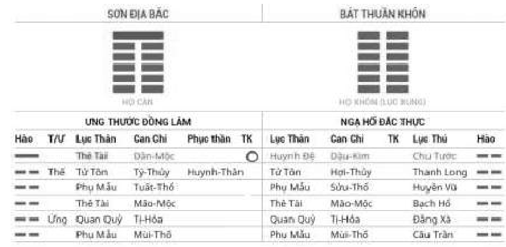

- **Cấu trúc Quẻ Dịch:**
  - **Quẻ chủ:** **Sơn Địa Bác** (Cung Cấn, Họ Cấn)  
    *Tượng quẻ:* Ưng Thước Đồng Lâm (Chim ưng cùng sẻ ở chung rừng – nguy hiểm rình rập, cần hết sức thận trọng).
  - **Quẻ biến:** **Bát Thuần Khôn** (Cung Khôn, Họ Khôn – Quẻ Lục Xung)  
    *Tượng quẻ:* Nga Hổ Đắc Thực (Hổ đói gặp mồi – sự việc biến động mau chóng, dứt điểm).

- **Bảng chi tiết Lục hào:**

| Hào | Thế/Ứng | Lục thân (Chủ) | Can Chi | Biến động | Lục thân (Biến) | Can Chi (Biến) | Thần sát / Phục | Lục thú |
|:---:|:---:|:---|:---|:---:|:---|:---|:---|:---|
| 6 | | Thê Tài | Dần - Mộc | **O (Động)** | Huynh Đệ | Dậu - Kim | Dịch mã, Tuần không | Chu Tước |
| 5 | **Thế** | Tử Tôn | Tý - Thủy | tĩnh | Tử Tôn | Hợi - Thủy | Tướng tinh (Phục Huynh Thân) | Thanh Long |
| 4 | | Phụ Mẫu | Tuất - Thổ | tĩnh | Phụ Mẫu | Sửu - Thổ | Mưu tinh | Huyền Vũ |
| 3 | | Thê Tài | Mão - Mộc | tĩnh | Thê Tài | Mão - Mộc | Tuần không | Bạch Hổ |
| 2 | **Ứng** | Quan Quỷ | Tỵ - Hỏa | tĩnh | Quan Quỷ | Tỵ - Hỏa | Lộc thần, Kiếp sát | Đằng Xà |
| 1 | | Phụ Mẫu | Mùi - Thổ | tĩnh | Phụ Mẫu | Mùi - Thổ | Quý nhân | Câu Trần |

---

### 3. Dụng thần & Loại quẻ

- **Phân loại quẻ:**
  - **Quẻ tâm thái (Vấn tật ách):** Đương số gieo quẻ trong trạng thái bất an cực độ trước nguy cơ bệnh nan y. Đặc trưng quẻ tâm trạng hiển hiện rõ rệt qua cấu trúc: Hào Thế lâm Tử Tôn (cầu mong an lành, giải trừ tai họa) và hào Ứng lâm Quan Quỷ (mối hoang mang sợ hãi bệnh tật).
  - **Quẻ chỉ định vị trí tổn thương:** Khảo sát tổn thương cục bộ tại vùng ngón chân.
- **Xác định Dụng thần:**
  1. **Hào Thế (Tử Tôn Tý Thủy):** Đại diện cho bản thân người hỏi, chính khí và sức đề kháng của cơ thể. Tử Tôn trì Thế là phúc thần giải ách.
  2. **Hào Ứng (Quan Quỷ Tỵ Hỏa lâm Đằng Xà):** Đại diện cho nỗi lo sợ cụ thể – căn bệnh tiểu đường. Quan Quỷ mang Lộc thần, Kiếp sát, Đằng Xà biểu thị sự ám ảnh về bệnh lý tuần hoàn máu nguy hiểm.
  3. **Hào động phát tác bệnh (Thê Tài Dần Mộc hào 6):** Đại diện cho triệu chứng thực thể phát tác tại ngón chân.
  4. **Thuốc men chữa trị (Huynh Đệ Dậu Kim):** Hào biến hồi đầu khắc Thê Tài Mộc, mang Nguyệt lệnh và Đào hoa, đại diện cho phương dược khắc chế vi khuẩn lở loét.

---

### 4. Luận giải chi tiết

Quẻ này là một trường hợp mẫu mực về phương pháp phân định bệnh lý giữa **nhiễm trùng vi khuẩn ngoài da** và **bệnh lý nội khoa chuyển hóa (tiểu đường)** trong Lục Hào:

#### 1. Cấu trúc quẻ tâm trạng và đối tượng lo sợ (Quan Quỷ Tỵ Hỏa)
- **Cơ cấu Thế - Ứng:** Hào Thế lâm Tử Tôn Tý Thủy, hào Ứng lâm Quan Quỷ Tỵ Hỏa. Khi trong lòng có nỗi lo lắng lớn, quẻ thường lập tức ứng hiện thành quẻ tâm trạng. Tử Tôn trì Thế chủ về tâm lý mong cầu bình an, giải tỏa ưu phiền.
- **Bản chất bệnh tiểu đường qua hào Tỵ Hỏa:** 
  - Bệnh tiểu đường thuộc về hệ thống tuần hoàn máu và huyết dịch chuyển hóa, do đó trong tượng dịch thuộc về hành Hỏa.
  - Quan Quỷ Tỵ Hỏa mang **Lộc thần** và **Kiếp sát**: Lộc thần chủ về ăn uống, bổng lộc dồi dào. Do đó bệnh tiểu đường được Chu Thần Bân định vị là *"bệnh của sự sung túc"* (phú quý bệnh), xuất phát từ chế độ dinh dưỡng dư thừa kéo dài.
  - Mang Đằng Xà thể hiện sự dây dưa, ám ảnh, lo âu khôn nguôi của đương số về chứng bệnh này.

#### 2. Phân tích hào động và định vị tổn thương ngón chân
- **Vị trí chi thể:** Trong tượng học Lục Hào, phần cuối cùng của thân thể (ngón tay, ngón chân) được đại diện bởi hào tận cùng: sơ hào (đầu ngón chân) hoặc hào 6 (đầu ngón chân, ngón tay). Ở đây hào 6 phát động, chỉ rõ vị trí bệnh biến nằm ở phần mút của chi thể (ngón chân).
- **Hào Mộc chủ về vi khuẩn và viêm loét:**
  - Hành Hỏa đại diện cho hiện tượng viêm, sưng tấy. Hành Mộc đại diện cho vi khuẩn, sự xâm nhập của vi sinh vật truyền nhiễm.
  - Khi hào Mộc mang **Chu Tước**, tượng trưng cho chứng lở loét, ngứa ngáy, viêm nhiễm ngoài da do vi khuẩn hoành hành bộc phát.
- **Tình trạng hào động Thê Tài Dần Mộc:**
  - Dần Mộc tuy lâm Tuần không, nhưng gặp ngày Mậu Thân trực xung. Theo nguyên lý Dịch học: *Không phùng xung tắc thực / Xung không tắc khởi*, Dần Mộc được xung thoát không trở thành động hào hữu lực, phản ánh vết thương ngứa ngáy đang phát tác thực tế.

#### 3. Điểm mấu chốt định tính: Có phải bệnh tiểu đường hay không?
- **Quy tắc liên kết động hào:** Muốn biết vết loét ở ngón chân có phải do bệnh tiểu đường gây ra hay không, then chốt là xem hào động Thê Tài Dần Mộc có sinh phù cho Quan Quỷ Tỵ Hỏa hay không:
  - Nếu Dần Mộc động sinh Quan Quỷ Tỵ Hỏa, mầm bệnh ngoài da trực tiếp nuôi dưỡng căn bệnh tiểu đường, chứng tỏ vết loét bắt nguồn từ biến chứng tiểu đường.
  - Nhưng trên thực tế, Thê Tài Dần Mộc động không sinh Quan Quỷ, mà lại biến xuất **Huynh Đệ Dậu Kim hồi đầu khắc** (Dần Mộc tuyệt xứ ở Dậu Kim).
- **Kết luận định tính:** Hào động không hướng về Quan Quỷ, vết loét ngón chân hoàn toàn độc lập với bệnh tiểu đường, chỉ đơn thuần là viêm nhiễm ngoài da do vi khuẩn.

#### 4. Phân tích phương dược và cơ chế điều trị
- **Tượng của Huynh Đệ Dậu Kim:**
  - Dậu Kim lâm Nguyệt lệnh, hồi đầu khắc Dần Mộc, chứng tỏ có phương dược đắc lực đủ sức khắc chế và tiêu diệt vi khuẩn lở loét.
  - Hành Kim chủ về da và phế mao; các loại thuốc bôi ngoài da, thuốc sát khuẩn, thuốc Tây y đều quy về hành Kim.
  - Dậu Kim mang **Đào hoa** và **Thiên hỷ**, biểu thị đây là một loại thuốc bôi nổi tiếng, có thương hiệu phổ biến trên thị trường.
- **Nguyên nhân tái phát dai dẳng:**
  - Dần Mộc tuyệt ở Dậu Kim, kim tuyệt ở Dần. Tượng này chỉ ra rằng nếu sử dụng liều lượng thuốc quá ít hoặc ngắt quãng thì độc tố vi khuẩn chưa được tiêu trừ triệt để, dễ dẫn đến lờn thuốc và tái phát.
  - Đương số trước đây mỗi khi thấy đỡ ngứa là lập tức dừng thuốc, khiến vi khuẩn lại sinh sôi, tạo thành vòng luẩn quẩn nhiều tháng không lành.

---

### 5. Kết luận & Ứng kỳ thực tế

- **Lời giải đoán & Khuyến nghị của Chu Thần Bân:**
  - Tác giả khẳng định dứt khoát: Vết thương ở ngón chân không phải do biến chứng tiểu đường gây ra, đương số không cần hoang mang lo sợ.
  - Tác giả tra hỏi đương số về loại thuốc đang dùng: Đương số cho biết có một loại thuốc bôi ngoài da rất nổi tiếng mua mang về từ Hồng Kông.
  - Tác giả chỉ dẫn cụ thể: Phải tiếp tục bôi loại thuốc bôi Hồng Kông này đều đặn mỗi ngày, kể cả khi triệu chứng ngứa ngáy đã thuyên giảm rõ rệt cũng tuyệt đối không được ngừng thuốc giữa chừng, nhằm tiêu diệt tận gốc vi khuẩn dưới da.
- **Phản hồi thực tế (Feedback):**
  - Đương số tuân thủ nghiêm ngặt chỉ dẫn, kiên trì bôi thuốc liên tục mỗi ngày.
  - Đến đầu tháng sau, đương số vui mừng báo tin: Vùng da ở ngón chân đã hoàn toàn bình phục, da non mọc lại nhẵn nhụi, chứng ngứa dai dẳng chấm dứt triệt để, không còn tái phát.
- **Ứng kỳ chiêm nghiệm:**
  - Ứng vào đầu tháng sau (tiết khí chuyển dịch sang tháng Hợi), khi Kim Mộc phân định rõ ràng và vết thương lành lặn hoàn toàn.

---

### 6. Bài học tâm pháp & Quy tắc cốt lõi

- **Quy tắc Lục Hào rút ra từ ca thực chiến (rule_index, trang 183):**
  1. *Quy tắc phân biệt bệnh tiểu đường và viêm nhiễm ngoài da:* Bệnh tiểu đường thuộc hành Hỏa mang Lộc thần (bệnh phú quý do ăn uống dư thừa); viêm nhiễm lở loét ngoài da thuộc hào Mộc lâm Chu Tước (vi khuẩn hoành hành).
  2. *Quy tắc xét tính liên đới nguyên nhân bệnh:* Một tổn thương chi thể chỉ gắn liền với bệnh nan y khi hào động đại diện cho tổn thương trực tiếp tương sinh cho Quan Quỷ. Nếu hào động biến hồi đầu khắc mà không sinh Quỷ, tổn thương đó là bệnh cục bộ ngoài da, không liên quan đến nan y.
  3. *Quy tắc định vị thuốc bôi ngoài da:* Thuốc bôi ngoài da thuộc Kim (khắc Mộc vi khuẩn). Mang Nguyệt lệnh, Đào hoa, Thiên hỷ là thuốc nổi tiếng có thương hiệu. Tượng tuyệt xứ cảnh báo việc dùng thuốc ngắt quãng sẽ làm mất tác dụng chữa trị tận gốc.
- **Bài học tâm pháp:**
  - Người luận quẻ cần phân biệt rạch ròi giữa nỗi sợ tâm lý của người hỏi (hào Quỷ) và thực tế bệnh lý (hào động). Định tính chuẩn xác ngay từ đầu giúp giải tỏa gánh nặng tâm lý khủng khiếp cho đương số, mở đường cho việc điều trị đúng hướng.

## THỰC CHIẾN 22: LỜI MỜI LÀM VIỆC BÁN THỜI GIAN TỪ ĐƠN VỊ NÀY, NÊN NHẬN HAY KHÔNG

---

### 1. Bối cảnh & Câu hỏi

- **Bối cảnh chi tiết:** 
  Một đệ tử của Chu Thần Bân hiện đang có công việc chính ổn định tại một nhà xuất bản. Gần đây, anh nhận được lời mời làm việc bán thời gian (làm thêm ngoài giờ) từ một đơn vị bên ngoài. Vì băn khoăn không biết công việc làm thêm này có phù hợp với bản thân hay không, có đem lại lợi ích thực tế hay lại gây phiền phức cản trở cho công việc chính, anh đã gieo quẻ Dịch để thỉnh giáo ý kiến định hướng.
- **Tâm lý & Câu hỏi ẩn ý:** 
  Đương số đứng trước cơ hội mở rộng thu nhập và kinh nghiệm, nhưng trong lòng phân vân lo ngại về rủi ro phát sinh từ một đơn vị mới chưa từng hợp tác. Câu hỏi cốt lõi: *"Có nên nhận lời mời làm việc bán thời gian từ đơn vị bên ngoài này hay không, và công việc đó mang lại xu hướng lợi hại ra sao?"*.
- **Thời gian chiêm đoán:**
  - Dương lịch: 15/11/2016, 21:33 (Giờ Bắc Kinh).
  - Can chi: Năm Bính Thân, tháng Kỷ Hợi, ngày Tân Sửu, giờ Kỷ Hợi.

---

### 2. Dữ kiện & Bảng quẻ Crop

- **Thời không chiêm nghiệm:**
  - Tháng Kỷ Hợi (Thủy vượng, Mộc tướng, Thổ tuyệt, Hỏa tuyệt).
  - Ngày Tân Sửu (Thổ vượng, Kim dưỡng).
  - Tuần không: **Thìn - Tỵ** (Giáp Ngọ tuần trung, Thìn Tỵ không vong).
- **Thần sát:**
  - Tướng tinh: Dậu
  - Hoa cái: Sửu (Lâm Nhật kiến, hào Ứng)
  - Dịch mã: Hợi (Lâm Nguyệt kiến, giờ chi)
  - Tai sát: Mão
  - Mưu tinh: Mùi
  - Đào hoa: Ngọ
  - Kiếp sát: Dần
  - Lộc thần: Dậu
  - Dương nhẫn: Thân (Lâm hào Thế)
  - Văn xương: Tý
  - Thiên y: Tuất (Lâm hào 6 Quan Quỷ động)
  - Thiên hỷ: Mùi
  - Quý nhân: Dần, Ngọ

- Dữ kiện bảng quẻ và các thông số chiêm đoán:
  - **Bảng 22.1: Quẻ Lôi Hỏa Phong biến Bát Thuần Ly**
    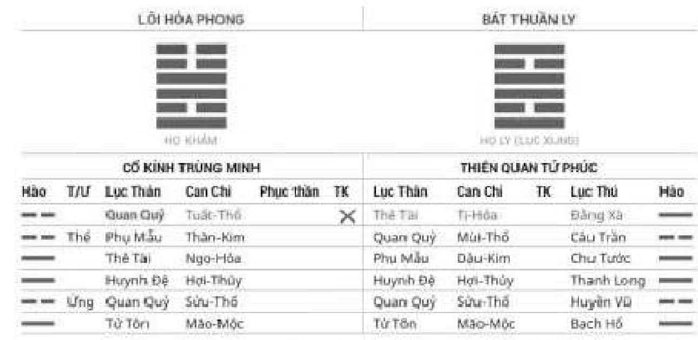

- **Cấu trúc Quẻ Dịch:**
  - **Quẻ chủ:** **Lôi Hỏa Phong** (Cung Khảm, Họ Khảm)  
    *Tượng quẻ:* Cổ Kính Trùng Minh (Gương cổ lại sáng – cơ hội mở ra, danh tiếng phục hồi).
  - **Quẻ biến:** **Bát Thuần Ly** (Cung Ly, Họ Ly – Quẻ Lục Xung)  
    *Tượng quẻ:* Thiên Quan Tứ Phúc (Trời ban phúc lành – việc diễn ra mau lẹ, ngắn hạn).

- **Bảng chi tiết Lục hào:**

| Hào | Thế/Ứng | Lục thân (Chủ) | Can Chi | Biến động | Lục thân (Biến) | Can Chi (Biến) | Thần sát / Phục | Lục thú |
|:---:|:---:|:---|:---|:---:|:---|:---|:---|:---|
| 6 | | Quan Quỷ | Tuất - Thổ | **X (Động)** | Thê Tài | Tỵ - Hỏa | Thiên y, Hóa Không | Đằng Xà |
| 5 | **Thế** | Phụ Mẫu | Thân - Kim | tĩnh | Quan Quỷ | Mùi - Thổ | Dương nhẫn | Câu Trần |
| 4 | | Thê Tài | Ngọ - Hỏa | tĩnh | Phụ Mẫu | Dậu - Kim | Đào hoa | Chu Tước |
| 3 | | Huynh Đệ | Hợi - Thủy | tĩnh | Huynh Đệ | Hợi - Thủy | Dịch mã, Nguyệt kiến | Thanh Long |
| 2 | **Ứng** | Quan Quỷ | Sửu - Thổ | tĩnh | Quan Quỷ | Sửu - Thổ | Nhật kiến, Hoa cái | Huyền Vũ |
| 1 | | Tử Tôn | Mão - Mộc | tĩnh | Tử Tôn | Mão - Mộc | Tai sát | Bạch Hổ |

---

### 3. Dụng thần & Loại quẻ

- **Phân loại quẻ:**
  - **Quẻ sự vụ lựa chọn & Định hướng công việc:** Khảo sát một lời mời cộng tác làm thêm từ bên ngoài, đánh giá tác động đối với bản thân và công việc hiện tại.
  - **Quẻ Nội - Ngoại phân biệt:** Phân định rõ ràng giữa môi trường cơ quan sở tại và đối tác bên ngoài.
- **Xác định Dụng thần:**
  1. **Hào Thế (Phụ Mẫu Thân Kim):** Đại diện cho đương số, đồng thời là biểu tượng cho năng lực chuyên môn, uy tín học thuật và vị trí công tác của anh tại cơ quan chính.
  2. **Đơn vị hiện tại (Quan Quỷ Sửu Thổ hào 2):** Đóng tại Nội quái, mang Nhật lệnh, đại diện cho nhà xuất bản – cơ quan chính nơi đương số đang làm việc.
  3. **Đơn vị bên ngoài mời làm thêm (Quan Quỷ Tuất Thổ hào 6):** Đóng tại Ngoại quái cao nhất, phát động, đại diện cho đơn vị mới mời làm thêm bán thời gian.
  4. **Hào biến Thê Tài Tỵ Hỏa:** Đại diện cho nguồn lợi ích thù lao, kinh nghiệm mở rộng từ công việc bán thời gian mang lại.

---

### 4. Luận giải chi tiết

Quẻ này cung cấp phương pháp luận cốt lõi về **phân biệt đơn vị nội bộ và ngoại bộ**, cùng nguyên lý giải đoán quẻ biến **Lục Xung** trong công sự ngắn hạn:

#### 1. Nguyên tắc phân định Đơn vị Nội bộ vs Đơn vị Ngoại bộ
- **Quy tắc không gian (Nội quái vs Ngoại quái):**
  - Khi xem về việc làm thêm bên ngoài mà vẫn duy trì công việc chính tại đơn vị cũ: Nội quái đại diện cho đơn vị hiện tại; Ngoại quái (đặc biệt là hào 6) đại diện cho đơn vị bên ngoài.
  - Các hào thuộc hành **Thổ** có tượng là nơi chốn, cơ quan, trụ sở. Trong quẻ có hai hào Thổ là Sửu Thổ (hào 2) và Tuất Thổ (hào 6).
- **Quy tắc thời gian (Hiện trạng vs Tương lai / Tuần không):**
  - Đơn vị hiện tại gắn liền với hiện trạng thực tế, do đó thường mang **Nhật lệnh, Nguyệt lệnh** hoặc trạng thái ám động. Ở đây hào 2 Quan Quỷ Sửu Thổ lâm Nhật kiến, mang Hoa cái, Văn xương, đại diện chính xác cho cơ quan xuất bản sách mà đương số đang công tác.
  - Đơn vị bên ngoài là lời mời mới, công việc chưa chính thức diễn ra, do đó gắn liền với thông tin **Tuần không** hoặc biến hóa chưa định hình. Hào 6 Quan Quỷ Tuất Thổ phát động hóa xuất Thê Tài Tỵ Hỏa rơi vào **Tuần không** (Thìn Tỵ không vong). Đây là bằng chứng không thể chối cãi xác định hào 6 chính là đối tác bên ngoài.

#### 2. Phân tích hào động hào 6: Lợi ích và cơ chế tác động lên Thế
- **Hồi đầu sinh tạo hào động hữu dụng:**
  - Hào 6 Quan Quỷ Tuất Thổ động hóa Thê Tài Tỵ Hỏa hồi đầu sinh. Hào động được biến hào hồi đầu sinh là hào động hữu lực, mang lại giá trị thực tế vững chắc.
  - Tuất Thổ thuộc Thổ sinh cho hào Thế Phụ Mẫu Thân Kim. Tỵ Hỏa biến hào mang thuộc tính tương hợp với Thế Thân Kim (Tỵ - Thân tương hợp).
- **Mở rộng kinh nghiệm và năng lực chuyên môn:**
  - Công việc bên ngoài sinh trợ cho Thế, cho thấy công việc làm thêm này hoàn toàn phù hợp với năng lực của đương số, giúp anh mở rộng thêm kinh nghiệm thực tế, nâng cao uy tín nghề nghiệp và gia tăng thu nhập.
- **Ràng buộc khó chịu từ "Tương hợp kiêm tương hình":**
  - Mối quan hệ giữa Tỵ Hỏa và Thân Kim là cách cục **vừa hợp vừa hình** (Tỵ Thân tương hình).
  - Điều này báo trước một chi tiết tế vi: Về mặt định tính chung thì công việc có lợi và đương số có thể đảm đương tốt, nhưng trong quá trình triển khai thực tế sẽ phát sinh những vướng mắc, bất tiện, ràng buộc hoặc áp lực khó chịu nhất định.

#### 3. Ý nghĩa quẻ biến Lục Xung và tính chất ngắn hạn
- **Dấu hiệu thời lượng:**
  - Hào 6 Quan Quỷ Tuất Thổ mang theo **Tai sát**, chủ về sự việc có tính chất đoản kỳ, gấp gáp.
  - Quẻ chủ Lôi Hỏa Phong biến thành quẻ Bát Thuần Ly – một quẻ **Lục Xung**.
- **Ý nghĩa kép của quẻ biến Lục Xung trong công việc:**
  - Nếu quẻ hung (Dụng thần bị thương tổn, hồi đầu khắc), biến Lục Xung báo hiệu sự việc đứt gánh giữa đường, bắt buộc phải dừng lại ngay.
  - Nếu quẻ cát (động hào tương sinh, hữu ích cho Thế), biến Lục Xung chỉ ra rằng sự việc này mang **tính chất ngắn hạn**, kết quả sẽ xuất hiện rất nhanh chóng.
  - Lời chỉ dẫn chiến lược: Đối với công việc này, chỉ nên coi là dự án làm thêm ngắn hạn; cần tranh thủ hoàn thành thật nhanh, dứt điểm gọn gàng; nếu kéo dài dây dưa thì cơ hội thuận lợi sẽ chấm dứt.

---

### 5. Kết luận & Ứng kỳ thực tế

- **Lời giải đoán & Khuyến nghị của Chu Thần Bân:**
  - Tác giả định tính rõ ràng: Công việc này hoàn toàn có thể nhận lời làm, vì nó mang lại lợi ích bồi dưỡng kinh nghiệm cho bản thân và có thêm nguồn thu nhập.
  - Cảnh báo trước: Quá trình làm sẽ có những bất tiện ràng buộc do Tỵ Thân tương hình, và bản chất công việc chỉ là ngắn hạn, nên làm nhanh giải quyết dứt điểm.
- **Phản hồi thực tế (Feedback):**
  - Sau khi nghe giải đoán, người đệ tử đã tự tin đồng ý nhận lời mời hợp tác từ đơn vị bên ngoài.
  - Tuy nhiên, khi mới bắt tay vào làm việc được vài ngày, anh cảm thấy trong lòng vẫn nảy sinh những băn khoăn về áp lực tiến độ, nên ít ngày sau đã tiếp tục lập quẻ để hỏi sâu hơn về xu hướng công việc.
- **Ứng kỳ chiêm nghiệm:**
  - Sự việc được tiếp nhận ngay trong tuần đó (tháng Hợi, ngày Sửu), mở đầu cho chuỗi thực tế tiếp theo.

---

### 6. Bài học tâm pháp & Quy tắc cốt lõi

- **Quy tắc Lục Hào rút ra từ ca thực chiến (rule_index, trang 189):**
  1. *Quy tắc phân biệt đơn vị nội bộ và ngoại bộ qua vị trí quái và Tuần không:* Khi hỏi về công việc làm thêm, Nội quái đại diện cho đơn vị hiện tại (thường mang Nhật Nguyệt lệnh của hiện trạng); Ngoại quái, đặc biệt hào 6, đại diện cho đơn vị bên ngoài (thường gắn với hào Tuần không hoặc biến hào chưa thực hiện).
  2. *Quy tắc Tương hợp kiêm tương hình:* Khi hào biến hợp với hào Thế nhưng lại mang quan hệ tương hình (như Tỵ hợp Thân), biểu thị công việc được việc, mang lại lợi ích nhưng quá trình thực hiện luôn đi kèm phiền toái, ràng buộc khó chịu.
  3. *Quy tắc quẻ biến Lục Xung trong công việc ngắn hạn:* Quẻ cát biến Lục Xung nhắc nhở phải đánh nhanh thắng nhanh, giải quyết công việc mau lẹ, không được để dây dưa kéo dài vì tính chất cơ hội chỉ tồn tại trong ngắn hạn.
- **Bài học tâm pháp:**
  - Phân định chuẩn xác không gian quẻ (Nội - Ngoại) là chìa khóa mở toang cánh cửa định vị mục tiêu khi người hỏi cùng lúc đối diện với nhiều môi trường công tác đan xen.

## THỰC CHIẾN 23: HỎI VỀ XU HƯỚNG CÔNG VIỆC CỦA VIỆC LÀM BÁN THỜI GIAN NÀY

---

### 1. Bối cảnh & Câu hỏi

- **Bối cảnh chi tiết:** 
  Sau khi nhận được lời luận đoán ở quẻ trước (Thực chiến 22), người đệ tử của Chu Thần Bân (vốn là một tác giả viết lách độc lập) đã đồng ý nhận lời làm việc bán thời gian cho đơn vị bên ngoài. Tuy nhiên, chỉ sau vài ngày bắt tay vào công việc thực tế, anh nhận thấy môi trường và quy trình làm việc phát sinh nhiều điểm vướng mắc, không hoàn toàn thuận lợi như mường tượng ban đầu. Cảm thấy bất an về con đường phía trước, anh đã quyết định gieo một quẻ Dịch mới để hỏi chuyên sâu về xu hướng phát triển tiếp theo của công việc bán thời gian này.
- **Tâm lý & Câu hỏi ẩn ý:** 
  Đương số gieo quẻ trong tâm trạng dao động và hoài nghi. Khi thực tế không như kỳ vọng, anh muốn thăm dò xem liệu công việc này có thể duy trì lâu dài và mang lại kết quả tốt hay sẽ gặp trở ngại đứt gánh. Câu hỏi cốt lõi: *"Xu hướng công việc bán thời gian này sắp tới sẽ phát triển ra sao, có tiếp tục duy trì ổn định được hay không?"*.
- **Thời gian chiêm đoán:**
  - Dương lịch: 21/11/2016, 17:01 (Giờ Bắc Kinh).
  - Can chi: Năm Bính Thân, tháng Kỷ Hợi, ngày Đinh Mùi, giờ Kỷ Dậu.

---

### 2. Dữ kiện & Bảng quẻ Crop

- **Thời không chiêm nghiệm:**
  - Tháng Kỷ Hợi (Thủy vượng, Mộc tướng, Thổ tuyệt, Hỏa tuyệt).
  - Ngày Đinh Mùi (Thổ vượng, Hỏa thoái khí).
  - Tuần không: **Dần - Mão** (Giáp Thìn tuần trung, Dần Mão không vong).
- **Thần sát:**
  - Tướng tinh: Mão (Lâm hào 6 Huynh Đệ)
  - Hoa cái: Mùi (Lâm Nhật kiến, hào 4 Ứng Thê Tài động)
  - Dịch mã: Tỵ (Lâm hào 5 Tử Tôn)
  - Tai sát: Dậu (Lâm giờ chi, Phục thần Quan Quỷ)
  - Mưu tinh: Sửu
  - Đào hoa: Tý (Lâm hào 1 Thế Phụ Mẫu)
  - Kiếp sát: Thân
  - Lộc thần: Ngọ (Lâm hào biến Tử Tôn)
  - Dương nhẫn: Tỵ
  - Văn xương: Dậu
  - Thiên y: Tuất
  - Thiên hỷ: Mùi (Lâm Nhật kiến, hào 4)
  - Quý nhân: Dậu, Hợi (Lâm Nguyệt kiến, giờ chi)

- Dữ kiện bảng quẻ và các thông số chiêm đoán:
  - **Bảng 23.1: Quẻ Phong Thiên Tiểu Súc biến Bát Thuần Càn**
    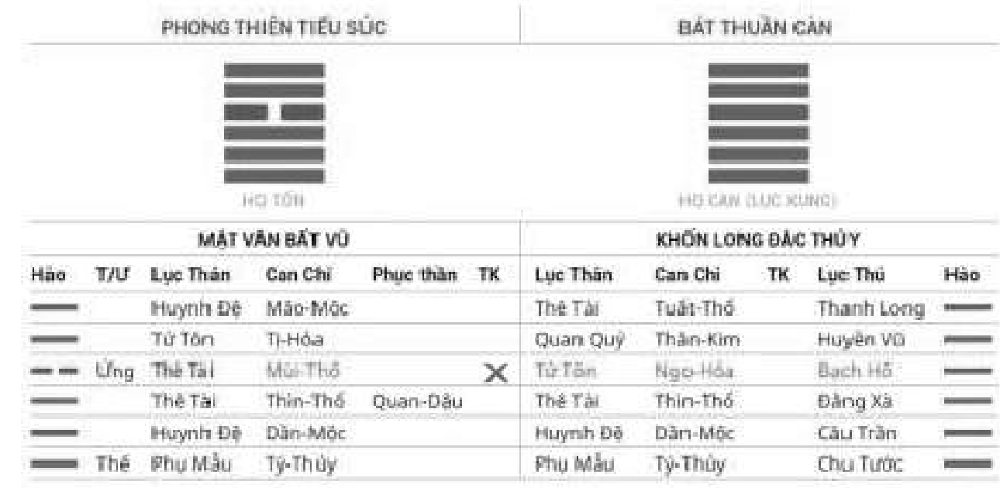

- **Cấu trúc Quẻ Dịch:**
  - **Quẻ chủ:** **Phong Thiên Tiểu Súc** (Cung Tốn, Họ Tốn)  
    *Tượng quẻ:* Mật vân bất vũ (Mây đen dày đặc nhưng chưa mưa – tích tụ chờ thời, trở ngại u uất).
  - **Quẻ biến:** **Bát Thuần Càn** (Cung Càn, Họ Càn – Quẻ Lục Xung)  
    *Tượng quẻ:* Cương kiện trung chính (Chuyển biến xung đột mau lẹ, khó duy trì bền lâu).

- **Bảng chi tiết Lục hào:**

| Hào | Thế/Ứng | Lục thân (Chủ) | Can Chi | Biến động | Lục thân (Biến) | Can Chi (Biến) | Thần sát / Phục | Lục thú |
|:---:|:---:|:---|:---|:---:|:---|:---|:---|:---|
| 6 | | Huynh Đệ | Mão - Mộc | tĩnh | Thê Tài | Tuất - Thổ | Tướng tinh, Tuần không | Thanh Long |
| 5 | | Tử Tôn | Tỵ - Hỏa | tĩnh | Quan Quỷ | Thân - Kim | Dịch mã, Dương nhẫn | Huyền Vũ |
| 4 | **Ứng** | Thê Tài | Mùi - Thổ | **X (Động)** | Tử Tôn | Ngọ - Hỏa | Nhật kiến, Hoa cái, Thiên hỷ | Bạch Hổ |
| 3 | | Thê Tài | Thìn - Thổ | tĩnh | Thê Tài | Thìn - Thổ | Phục Quan Dậu (Văn xương) | Đằng Xà |
| 2 | | Huynh Đệ | Dần - Mộc | tĩnh | Huynh Đệ | Dần - Mộc | Tuần không | Câu Trần |
| 1 | **Thế** | Phụ Mẫu | Tý - Thủy | tĩnh | Phụ Mẫu | Tý - Thủy | Đào hoa | Chu Tước |

---

### 3. Dụng thần & Loại quẻ

- **Phân loại quẻ:**
  - **Quẻ sự vụ / Quẻ tái chiêm (Hỏi xu hướng công việc):** Khảo sát xu thế biến động của công việc bán thời gian sau khi đã chính thức bắt tay vào làm.
  - **Quẻ quan hệ đối kháng Thế - Ứng:** Khảo sát áp lực từ môi trường làm việc tác động trực tiếp lên bản thân người hỏi.
- **Xác định Dụng thần:**
  1. **Hào Thế (Phụ Mẫu Tý Thủy lâm Chu Tước):** Đại diện cho bản thân người hỏi và năng lực sáng tác, bài viết chuyên môn (Phụ mẫu chủ về văn chương, tài liệu; Chu Tước và Đào hoa đều chủ về tác phẩm chữ nghĩa).
  2. **Hào Ứng (Thê Tài Mùi Thổ lâm Bạch Hổ):** Chỉ định đơn vị bên ngoài và công việc bán thời gian đang đảm nhận.
  3. **Hào biến (Tử Tôn Ngọ Hỏa):** Đại diện cho xu hướng biến hóa của công việc; hóa hợp với Mùi Thổ đồng thời xung trực diện vào hào Thế Tý Thủy.

---

### 4. Luận giải chi tiết

Quẻ này là một trường hợp kinh điển minh họa cho **phương pháp luận giải quẻ tái chiêm** và cơ chế tác động của **hóa quẩn chân (biến hợp)** cùng **hào Ứng động khắc Thế**:

#### 1. Dấu hiệu tiếp nhận công việc qua Ngoại quái động
- **Sự chuyển biến so với quẻ trước:** 
  - Ở quẻ 22, hào 6 phát động nhưng hóa không, biểu thị lời mời làm thêm mới chỉ là kế hoạch, công việc chưa chính thức bắt đầu.
  - Sang quẻ 23, hào Thổ ở Ngoại quái (hào 4 Thê Tài Mùi Thổ) phát động và mang **Nhật lệnh**. Theo nguyên tắc định vị công việc của Lục Hào: Ngoại quái động mang Nhật lệnh chứng minh đương số trên thực tế đã chính thức đồng ý và bắt tay vào triển khai công việc bán thời gian này.

#### 2. Thế - Ứng xung khắc: Áp lực công việc đè nặng
- **Cơ chế Ứng khắc Thế:**
  - Hào Ứng Thê Tài Mùi Thổ phát động trực tiếp khắc nhập vào hào Thế Phụ Mẫu Tý Thủy (Thổ khắc Thủy).
  - Khi hỏi về công việc, hào Ứng đại diện cho công việc, đơn vị đối tác. Việc hào Ứng động khắc Thế báo hiệu môi trường làm việc gây áp lực nặng nề, tạo ra gánh nặng tâm lý và sự mệt mỏi đè nén lên đương số.
- **Thần sát gia tăng tính chất nan giải:**
  - Hào Ứng Mùi Thổ mang **Bạch Hổ**: Bạch Hổ trong quẻ quan sự không chủ về binh đao hay tai nạn phẫu thuật, mà chủ về sự bực bội, khó chịu, than phiền, nhiều khúc mắc và rắc rối nảy sinh.
  - Mang **Hoa cái**: Chủ về tình thế thụ động, bất lực; các yêu cầu công việc đòi hỏi chuyên môn phức tạp nhưng không được hỗ trợ thỏa đáng, đẩy người làm vào thế bị động.
  - Mang **Thiên hỷ**: Ở vị trí này phản ánh các thông tin, yêu cầu bất ngờ từ phía đối tác áp đặt xuống khiến đương số lúng túng.

#### 3. Cơ chế "Hóa quẩn chân" (Biến hợp) và xung khắc tiềm ẩn
- **Mùi Thổ biến Ngọ Hỏa (Hóa hợp):**
  - Hào 4 Mùi Thổ động hóa xuất Ngọ Hỏa, tạo thành cục diện Ngọ - Mùi tương hợp, trong thuật ngữ Lục Hào gọi là **"hóa quẩn chân"** (hào biến hợp hào động làm kìm chân lực động).
  - Chu Thần Bân đúc kết 3 tầng ý nghĩa cốt lõi của hiện tượng quẩn chân (hóa quẩn chân, Nhật quẩn chân, động quẩn chân):
    1. *Tầng ý nghĩa thứ nhất:* Đại diện cho sự trì hoãn, kéo dài, tiến độ triển khai công việc diễn ra rất chậm chạp, ì ạch.
    2. *Tầng ý nghĩa thứ hai:* Đại diện cho thông tin phụ phát sinh ngoài dự kiến (thường ứng với gian hào hoặc hào không phải Thế/Ứng).
    3. *Tầng ý nghĩa thứ ba (Cấp độ hiện trạng):* Khi hào mang Nhật lệnh mà hóa quẩn chân, nó đại diện cho áp lực ở hiện trạng mới chỉ manh nha bắt đầu, áp lực thực sự chưa bộc lộ hết ngay mà sẽ phát tác dồn dập trong tương lai.
- **Hào biến Ngọ Hỏa trực xung hào Thế Tý Thủy:**
  - Biến hào Tử Tôn Ngọ Hỏa tuy hồi đầu sinh cho Mùi Thổ, nhưng bản thân Ngọ Hỏa lại trực xung hào Thế Phụ Mẫu Tý Thủy (Tý Ngọ tương xung).
  - Điều này chỉ rõ: Sự việc tuy lúc này chưa bùng phát căng thẳng cực độ, nhưng mầm mống mâu thuẫn đối kháng trực tiếp giữa đương số và đơn vị đang tích tụ, về sau ắt sẽ va chạm gay gắt.

#### 4. Quẻ biến Lục Xung liên tiếp: Điềm báo không thể lâu dài
- Quẻ chủ Phong Thiên Tiểu Súc biến sang **Bát Thuần Càn** – một quẻ **Lục Xung**.
- Đây là lần thứ hai liên tiếp xuất hiện quẻ biến Lục Xung (ở Thực chiến 22 biến Ly vi Hỏa Lục Xung, sang Thực chiến 23 lại biến Càn vi Thiên Lục Xung).
- *Nguyên tắc biến Lục Xung liên hoàn:* Khi một sự việc liên tục xuất hiện quẻ biến Lục Xung mà hào Dụng thần/Thế hào lại lâm thế bị khắc hại, đây là dấu hiệu chắc chắn khẳng định công việc bán thời gian này khó lòng duy trì lâu dài, chẳng bao lâu nữa sẽ xảy ra biến cố đổ vỡ hoặc phải dừng lại.

---

### 5. Kết luận & Ứng kỳ thực tế

- **Lời giải đoán & Khuyến nghị của Chu Thần Bân:**
  - Tác giả chỉ ra công việc này tiềm ẩn áp lực rất lớn, khối lượng sự vụ khó khăn gây bực bội (Bạch Hổ), đương số bị đẩy vào thế bị động (Hoa cái).
  - Vì liên tiếp hai quẻ đều biến Lục Xung và hào Ứng khắc Thế, công việc chắc chắn không thể kéo dài bền vững, khuyên đương số cần chuẩn bị tâm lý đón nhận biến động.
- **Phản hồi thực tế (Feedback):**
  - Sau khi nghe phân tích, người đệ tử nhận thấy quẻ này mang chiều hướng tiêu cực, hoàn toàn trái ngược với sự lạc quan ban đầu ở quẻ 22.
  - Vì trong lòng tràn đầy hoang mang và không cam tâm trước kết quả này, anh đã lập tức gieo tiếp một quẻ thứ ba (dẫn tới Thực chiến 24).
- **Ứng kỳ chiêm nghiệm:**
  - Ứng nghiệm vào các tháng sau đó khi khối lượng sự vụ dồn dập phát tác và xung đột bùng nổ, đúng như hào Ứng Mùi Thổ động khắc Tý Thủy và Ngọ xung Tý.

---

### 6. Bài học tâm pháp & Quy tắc cốt lõi

- **Quy tắc Lục Hào rút ra từ ca thực chiến (rule_index, trang 195):**
  1. *Quy tắc giải đoán quẻ tái chiêm về xu hướng công việc và phản hồi mối hoài nghi sâu kín:* Quẻ gieo lại (tái chiêm) mang tính khái quát cao hơn; nó không chỉ trả lời diễn biến chung mà tập trung phản hồi chính xác vào mối nghi ngại sâu kín nhất trong tâm thức người gieo.
  2. *Quy tắc 3 cấp độ ý nghĩa của hào quẩn chân (biến hợp):* Quẩn chân chủ về sự trì hoãn kéo dài; chủ về thông tin phát sinh ngoài lề; và ở cấp độ hiện trạng biểu thị áp lực chưa phát tác trọn vẹn tại thời điểm gieo mà sẽ dồn tụ bộc phát trong tương lai.
  3. *Quy tắc quẻ biến Lục Xung liên hoàn:* Khi hai quẻ liên tiếp cho cùng một sự việc đều biến Lục Xung mà hào Thế bị khắc, đây là chỉ dấu tuyệt đối khẳng định sự việc không thể tồn tại lâu dài, tất yếu sẽ giải tán.
- **Bài học tâm pháp:**
  - *Tâm pháp về việc gieo lại quẻ:* Quẻ đầu tiên với tâm ý tập trung cao độ luôn là quẻ chuẩn xác nhất. Không nên tùy tiện gieo quẻ liên tục khi tâm trí rối loạn. Việc gieo lại chỉ có giá trị khi đương số có một nghi vấn cụ thể chưa rõ từ quẻ trước cần làm sáng tỏ.

## THỰC CHIẾN 24: LẠI GIEO QUẺ HỎI VỀ XU HƯỚNG CÔNG VIỆC CỦA VIỆC LÀM BÁN THỜI GIAN NÀY

---

### 1. Bối cảnh & Câu hỏi

- **Bối cảnh chi tiết:** 
  Ngay sau khi nhận được lời luận đoán ở quẻ trước (Thực chiến 23), người đệ tử thấy quẻ Phong Thiên Tiểu Súc biến Bát Thuần Càn có hào Ứng Mùi Thổ khắc nhập hào Thế Tý Thủy, báo hiệu áp lực nặng nề và điềm báo không thể kéo dài. Trong lòng anh nảy sinh nỗi hoang mang tột độ: Anh biết quẻ xấu nhưng chưa thể hình dung nổi áp lực này cụ thể sẽ diễn ra ở những phương diện nào, tính chất công việc rốt cuộc sẽ ra sao. Để giải tỏa thắc mắc sâu kín đó, anh lập tức gieo tiếp một quẻ nữa (quẻ thứ ba trong chuỗi sự việc).
- **Tâm lý & Câu hỏi ẩn ý:** 
  Đương số rơi vào trạng thái bối rối, nửa tin nửa ngờ. Khi gieo ra quẻ này, thấy hào Thế và các hào trong quẻ liên hoàn tương sinh, anh tự cho rằng đây là một quẻ tốt. Câu hỏi thực chất là lời thỉnh giáo Chu Thần Bân: *"Áp lực ở quẻ trước rốt cuộc bắt nguồn từ đâu, và tại sao quẻ này trông có vẻ rất cát lợi nhưng bản chất thực sự là gì?"*.
- **Thời gian chiêm đoán:**
  - Dương lịch: 21/11/2016, 17:01 (Gieo nối tiếp trong cùng khung giờ với Thực chiến 23, Giờ Bắc Kinh).
  - Can chi: Năm Bính Thân, tháng Kỷ Hợi, ngày Đinh Mùi, giờ Kỷ Dậu.

---

### 2. Dữ kiện & Bảng quẻ Crop

- **Thời không chiêm nghiệm:**
  - Tháng Kỷ Hợi (Thủy vượng, Mộc tướng, Hỏa tuyệt, Thổ tuyệt).
  - Ngày Đinh Mùi (Thổ vượng, Hỏa thoái khí).
  - Tuần không: **Dần - Mão** (Giáp Thìn tuần trung, Dần Mão không vong).
- **Thần sát:**
  - Tướng tinh: Mão (Lâm hào 6 Quan Quỷ động, hào 2 Quan Quỷ)
  - Hoa cái: Mùi (Lâm Nhật kiến, hào Thế 4 Huynh Đệ động)
  - Dịch mã: Tỵ (Lâm hào 5 và sơ hào Ứng Phụ Mẫu động)
  - Tai sát: Dậu (Lâm giờ chi)
  - Mưu tinh: Sửu (Lâm hào 3 Huynh Đệ)
  - Đào hoa: Tý (Phục Thê Tài hào 5)
  - Kiếp sát: Thân (Phục Tử Tôn hào 3, biến hào 5)
  - Lộc thần: Ngọ (Lâm biến hào 4 Phụ Mẫu)
  - Dương nhẫn: Tỵ (Lâm hào 5 và sơ hào Phụ Mẫu động)
  - Văn xương: Dậu
  - Thiên y: Tuất (Lâm biến hào 6)
  - Thiên hỷ: Mùi (Lâm hào Thế)
  - Quý nhân: Dậu, Hợi (Lâm Nguyệt kiến, giờ chi)

- Dữ kiện bảng quẻ và các thông số chiêm đoán:
  - **Bảng 24.1: Quẻ Phong Trạch Trung Phu biến Lôi Thủy Giải**
    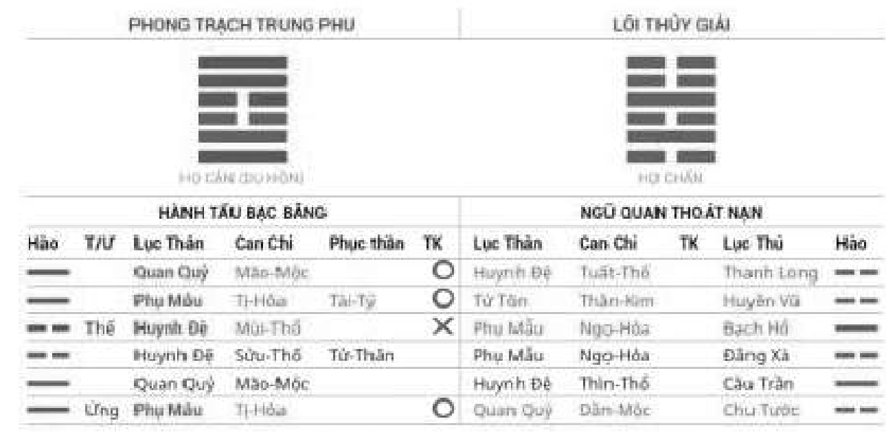

- **Cấu trúc Quẻ Dịch:**
  - **Quẻ chủ:** **Phong Trạch Trung Phu** (Cung Cấn, Họ Cấn – Quẻ Du Hồn)  
    *Tượng quẻ:* Hành Tẩu Bạc Băng (Đi trên băng mỏng – gượng gánh cẩn trọng, áp lực ngập đầu).
  - **Quẻ biến:** **Lôi Thủy Giải** (Cung Chấn, Họ Chấn)  
    *Tượng quẻ:* Ngũ Quan Thoát Nạn (Năm ải thoát nạn – tìm thấy lối thoát giải tỏa bế tắc).

- **Bảng chi tiết Lục hào:**

| Hào | Thế/Ứng | Lục thân (Chủ) | Can Chi | Biến động | Lục thân (Biến) | Can Chi (Biến) | Thần sát / Phục | Lục thú |
|:---:|:---:|:---|:---|:---:|:---|:---|:---|:---|
| 6 | | Quan Quỷ | Mão - Mộc | **O (Động)** | Huynh Đệ | Tuất - Thổ | Tướng tinh, Tuần không | Thanh Long |
| 5 | | Phụ Mẫu | Tỵ - Hỏa | **O (Động)** | Tử Tôn | Thân - Kim | Dịch mã, Dương nhẫn (Phục Tài Tý) | Huyền Vũ |
| 4 | **Thế** | Huynh Đệ | Mùi - Thổ | **X (Động)** | Phụ Mẫu | Ngọ - Hỏa | Nhật kiến, Hoa cái, Hồi đầu sinh | Bạch Hổ |
| 3 | | Huynh Đệ | Sửu - Thổ | tĩnh | Phụ Mẫu | Ngọ - Hỏa | Mưu tinh (Phục Tử Thân) | Đằng Xà |
| 2 | | Quan Quỷ | Mão - Mộc | tĩnh | Huynh Đệ | Thìn - Thổ | Tướng tinh, Tuần không | Câu Trần |
| 1 | **Ứng** | Phụ Mẫu | Tỵ - Hỏa | **O (Động)** | Quan Quỷ | Dần - Mộc | Dịch mã, Dương nhẫn, Hồi đầu sinh | Chu Tước |

---

### 3. Dụng thần & Loại quẻ

- **Phân loại quẻ:**
  - **Quẻ tam chiêm (Gieo lại lần 3):** Phân tích nguồn gốc sâu xa của áp lực công việc và giải mã sự mâu thuẫn giữa tượng cát bề ngoài với bản chất sự việc.
  - **Quẻ đa hào phát động:** Quẻ có tới 4 hào động (hào 1, 4, 5, 6), biểu thị sự tình biến động dồn dập, nhiều phương diện cùng tác động đồng thời.
- **Xác định Dụng thần:**
  1. **Hào Thế (Huynh Đệ Mùi Thổ lâm Bạch Hổ):** Đại diện cho bản thân người hỏi, gánh chịu toàn bộ trách nhiệm và áp lực công việc.
  2. **Các hào Phụ Mẫu (Tỵ Hỏa, Ngọ Hỏa):** Đại diện cho bài viết, tài liệu, bản thảo, hợp đồng và khối lượng công việc chữ nghĩa cần hoàn thành.
  3. **Các hào Quan Quỷ (Mão Mộc, Dần Mộc):** Đại diện cho bên giao việc, đơn vị bên ngoài và các yêu cầu chuyên môn áp đặt xuống.

---

### 4. Luận giải chi tiết

Quẻ này là bài học kinh điển về nguyên lý **"Sinh nhiều hóa sát – Quá vượng thành tai"** và cách nhìn nhận quẻ tái chiêm trong Lục Hào:

#### 1. Sự ngộ nhận bề ngoài của người hỏi
- **Cục diện đa hào tương sinh:**
  - Sơ hào Ứng Phụ Mẫu Tỵ Hỏa động hóa Dần Mộc hồi đầu sinh, sau đó sinh nhập cho hào Thế Mùi Thổ.
  - Hào 6 Quan Quỷ Mão Mộc động sinh hào 5 Phụ Mẫu Tỵ Hỏa, Tỵ Hỏa tiếp tục sinh cho hào Thế Mùi Thổ (liên hoàn sinh).
  - Hào Thế Huynh Đệ Mùi Thổ phát động lại biến Phụ Mẫu Ngọ Hỏa hồi đầu sinh.
- **Sự ngộ nhận:** Người đệ tử nhìn thấy toàn quẻ các hào động biến đều hướng về sinh phù hào Thế, hào Thế lại lâm Nhật kiến cực vượng, nên đinh ninh rằng đây là một quẻ đại cát, công việc sẽ vô cùng hanh thông và thu được nhiều lợi ích.

#### 2. Bản chất sâu xa: "Quá vượng thành gánh nặng áp lực quá tải"
- **Quy tắc Dịch lý: Sinh quá nhiều biến thành đòi hỏi dồn dập:**
  - Chu Thần Bân chỉ rõ: Trong quan hệ sự vụ công việc, hào Phụ Mẫu sinh Thế không phải lúc nào cũng là tiền tài hay sự giúp đỡ vô tư. Phụ Mẫu đại diện cho bài viết, dự án, văn kiện cần xử lý. Khi Phụ Mẫu sinh Thế, đó là tượng **"đối phương có nhu cầu bài viết cần bạn đáp ứng"**.
  - Nếu chỉ một hào sinh vừa phải, đó là công việc đền đáp xứng đáng. Nhưng khi xuất hiện quá nhiều hào Phụ Mẫu cùng lúc sinh Thế (cả hào 1, hào 5, hào biến 4), điều này đồng nghĩa với việc: **Nhu cầu từ đối tác đổ dồn về quá nhiều, vượt xa khả năng kham nổi của đương số!**
  - Hào Thế Mùi Thổ lâm Nhật kiến, lại được 3 tầng Hỏa liên tục thiêu đốt sinh trợ, rơi vào trạng thái **"Quá vượng"**. Quá vượng tức là gánh nặng chất chồng, bản thân bị vắt kiệt sức lực, không thể nào xoay xở kịp thời.

#### 3. Tượng của các thần sát và thuộc tính Phụ Mẫu
- **Phụ Mẫu Tỵ Hỏa lâm Dương Nhẫn:**
  - Hào 1 (Ứng) và hào 5 đều là Phụ Mẫu Tỵ Hỏa lâm **Dương Nhẫn**. Dương Nhẫn chủ về sự gắt gao, khắt khe, đòi hỏi tiêu chuẩn chuyên môn cực kỳ nghiêm ngặt và áp lực thời gian gấp rút.
  - Tỵ Hỏa là Thiên Văn tinh, chủ về bài viết đòi hỏi văn tài và hàm lượng trí tuệ cao.
  - Sơ hào lâm **Chu Tước** – tượng rõ rệt của câu chữ, bản thảo sách báo.
- **Phụ Mẫu Ngọ Hỏa lâm Lộc Thần:**
  - Đại diện cho những công việc sự vụ thường nhật, lắt nhắt không đòi hỏi chuyên môn cao nhưng lại chiếm dụng rất nhiều thời gian xử lý.
- **Nguồn gốc Quan Quỷ Mão Mộc thúc ép:**
  - Hào 6 Quan Quỷ Mão Mộc phát động sinh Tỵ Hỏa, tượng trưng cho phía lãnh đạo đơn vị liên tục giao việc, đốc thúc tiến độ không ngừng nghỉ.

#### 4. Ý nghĩa quẻ chủ Trung Phu biến Lôi Thủy Giải
- **Quẻ Trung Phu (Cung Cấn, Du Hồn - Hành tẩu bạc băng):**
  - Đi trên băng mỏng, phản ánh chính xác tình trạng đương số đang phải cắn răng gượng gánh, đi từng bước thận trọng đầy căng thẳng trước núi công việc ngập đầu.
- **Quẻ biến Lôi Thủy Giải (Ngũ quan thoát nạn):**
  - Quẻ Giải chủ về giải tỏa, cởi bỏ trói buộc, thoát khỏi tình thế bế tắc.
  - Báo hiệu trước: Dù hiện tại áp lực quá tải đang bủa vây, nhưng tình trạng này sẽ không kéo dài mãi mãi; đương số cuối cùng sẽ tìm được cách giải quyết để tự giải thoát cho chính mình (chủ động dừng lại hoặc điều chỉnh khối lượng việc).

---

### 5. Kết luận & Ứng kỳ thực tế

- **Lời giải đoán & Khuyến nghị của Chu Thần Bân:**
  - Tác giả vạch trần ảo tưởng về quẻ "cát bề ngoài": Đây không phải quẻ cát mà là quẻ báo hiệu tình trạng quá tải nghiêm trọng.
  - Áp lực từ quẻ 23 chính là việc đơn vị bán thời gian sẽ liên tục giao phó khối lượng bài viết khổng lồ, đòi hỏi tiêu chuẩn khắt khe (Dương Nhẫn) và phát sinh hàng loạt sự vụ vụn vặt, khiến đương số bận rộn đến mức nghẹt thở.
- **Phản hồi thực tế (Feedback):**
  - Chỉ ít ngày sau khi giải quẻ, thực tế diễn ra hoàn toàn trùng khớp với lời dự đoán:
  - Khối lượng bản thảo mà đơn vị bán thời gian bàn giao lớn ngoài sức tưởng tượng.
  - Đương số không chỉ phải viết bài mà còn bị cuốn vào xử lý các quy trình sự vụ nội bộ rắc rối của đơn vị, phải tự mình điều phối và tiếp xúc với nhiều khâu phức tạp.
  - Các công việc này đòi hỏi sự tập trung cao độ và không gian yên tĩnh, nhưng liên tục bị quấy rầy bởi các yêu cầu phát sinh, khiến suốt 2 tuần liền anh không thể hoàn thành trọn vẹn được bất cứ việc gì.
  - Nhận thấy công việc làm thêm đang bào mòn toàn bộ thời gian và sức lực của công việc chính, anh đã phải gieo tiếp quẻ thứ 4 (Thực chiến 25) để quyết định nên từ bỏ hay tiếp tục.
- **Ứng kỳ chiêm nghiệm:**
  - Ứng nghiệm ngay trong vòng 2 tuần tiếp theo kể từ ngày gieo quẻ (tháng Hợi).

---

### 6. Bài học tâm pháp & Quy tắc cốt lõi

- **Quy tắc Lục Hào rút ra từ ca thực chiến (rule_index, trang 201):**
  1. *Quy tắc quẻ tam chiêm và áp lực phát sinh ngoài dự kiến trong công việc bán thời gian:* Quẻ tam chiêm đi sâu bóc tách chi tiết nguyên nhân cốt lõi gây áp lực từ quẻ trước; làm rõ bản chất của mối quan hệ hợp tác vượt ra ngoài khuôn khổ thỏa thuận ban đầu.
  2. *Quy tắc "Sinh nhiều hóa sát – Quá vượng thành tai":* Trong đoán sự vụ, hào Dụng thần được sinh quá nhiều không phải là cát mà là gánh nặng. Sự sinh trợ từ Phụ Mẫu tượng trưng cho đòi hỏi, nhu cầu công việc từ phía đối tác. Quá nhiều hào sinh dồn về Thế hào lâm Nhật kiến tạo thành cục diện quá tải, kiệt quệ năng lực đáp ứng.
  3. *Quy tắc nhận diện tính chất công việc qua Thần sát:* Phụ Mẫu lâm Dương Nhẫn là công việc có tiêu chuẩn kỹ thuật khắt khe, đòi hỏi cao; lâm Lộc Thần là sự vụ hành chính thường nhật; lâm Chu Tước là công việc liên quan mật thiết đến văn bản, ấn phẩm sách báo.
- **Bài học tâm pháp:**
  - Đừng bao giờ máy móc cho rằng hào sinh Thế là luôn luôn tốt. Người học Dịch phải luôn đối chiếu tượng hào với thực tế cuộc sống: Được trao nhiều việc có thể là cơ hội, nhưng khi vượt quá ngưỡng chịu đựng thì đó chính là cạm bẫy của sự kiệt sức.

## THỰC CHIẾN 25: CÔNG VIỆC BÁN THỜI GIAN NHIỀU CHUYỆN VỤN VẶT, GIAO TIẾP NHÂN SỰ KHÓ KHĂN, MẤT NHIỀU THỜI GIAN VÀ CÔNG SỨC, NÊN TỪ BỎ HAY TIẾP TỤC

---

### 1. Bối cảnh & Câu hỏi

- **Bối cảnh chi tiết:** 
  Sau hai tuần kể từ các quẻ chiêm trước (Thực chiến 23 và 24), người đệ tử của Chu Thần Bân rơi vào tình trạng quá tải nghiêm trọng đúng như quẻ đã báo. Tại đơn vị làm việc bán thời gian, vô số việc vụn vặt và quy trình nội bộ phức tạp phát sinh liên tục. Công việc viết lách của anh đòi hỏi môi trường tuyệt đối tĩnh lặng và sự tập trung cao độ, nhưng thực tế anh liên tục bị quấy rầy bởi các khâu giao tiếp, điều phối nhân sự rắc rối. Suốt hai tuần ròng rã, anh không thể hoàn thành được bất kỳ công việc nào ra hồn, vừa kiệt quệ tâm sức vừa ảnh hưởng đến công việc chính tại nhà xuất bản.
- **Tâm lý & Câu hỏi ẩn ý:** 
  Đương số đứng trước ngã ba đường đầy bế tắc, cảm thấy bản thân bị trói buộc và mất tự do: *"Công việc bán thời gian này nhiều chuyện vụn vặt, giao tiếp nhân sự quá khó khăn, hao tâm tốn sức, vậy tôi nên từ bỏ ngay hay nên tiếp tục cố gắng?"*.
- **Thời gian chiêm đoán:**
  - Dương lịch: 29/11/2016, 17:01 (Giờ Bắc Kinh).
  - Can chi: Năm Bính Thân, tháng Kỷ Hợi, ngày Ất Mão, giờ Ất Dậu.

---

### 2. Dữ kiện & Bảng quẻ Crop

- **Thời không chiêm nghiệm:**
  - Tháng Kỷ Hợi (Thủy vượng, Mộc tướng, Thổ tuyệt, Hỏa tuyệt).
  - Ngày Ất Mão (Mộc vượng, Hỏa tướng).
  - Tuần không: **Tý - Sửu** (Giáp Dần tuần trung, Tý Sửu không vong).
- **Thần sát:**
  - Tướng tinh: Mão (Lâm Nhật kiến, hào 2)
  - Hoa cái: Mùi
  - Dịch mã: Tỵ (Lâm biến hào 6 Phụ Mẫu)
  - Tai sát: Dậu (Lâm giờ chi)
  - Mưu tinh: Sửu (Lâm biến hào 3, Tuần không)
  - Đào hoa: Tý (Lâm hào 1 Ứng Thê Tài, Tuần không)
  - Kiếp sát: Thân (Lâm hào 5 Tử Tôn)
  - Lộc thần: Mão (Lâm Nhật kiến)
  - Dương nhẫn: Dần (Lâm hào 2 Quan Quỷ)
  - Văn xương: Ngọ (Lâm hào Thế Phụ Mẫu)
  - Thiên y: Tuất (Lâm hào 6 Huynh Đệ động)
  - Thiên hỷ: Mùi
  - Quý nhân: Thân, Tý (Lâm hào 5 và hào 1)

- Dữ kiện bảng quẻ và các thông số chiêm đoán:
  - **Bảng 25.1: Quẻ Lôi Thiên Đại Tráng biến Hỏa Trạch Khuê**
    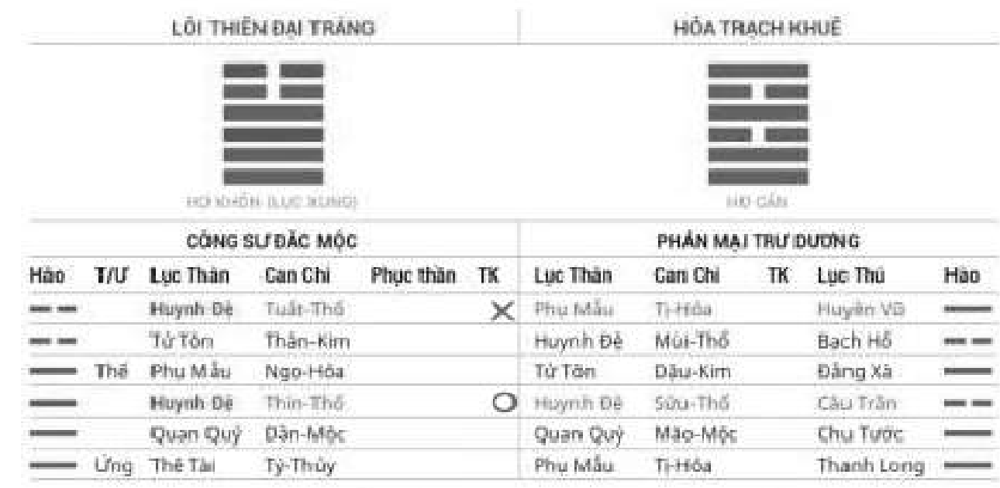

- **Cấu trúc Quẻ Dịch:**
  - **Quẻ chủ:** **Lôi Thiên Đại Tráng** (Cung Khôn, Họ Khôn – Quẻ Lục Xung)  
    *Tượng quẻ:* Công Sự Đắc Mộc (Làm việc gặp gỗ quý – vấn đề đã bộc lộ rõ rệt, xung đột đưa lên bàn nghị sự).
  - **Quẻ biến:** **Hỏa Trạch Khuê** (Cung Cấn, Họ Cấn)  
    *Tượng quẻ:* Phân Mai Thư Dương (Hai ngả rẽ chia ly – mâu thuẫn bất đồng, có nguy cơ đường ai nấy đi).

- **Bảng chi tiết Lục hào:**

| Hào | Thế/Ứng | Lục thân (Chủ) | Can Chi | Biến động | Lục thân (Biến) | Can Chi (Biến) | Thần sát / Phục | Lục thú |
|:---:|:---:|:---|:---|:---:|:---|:---|:---|:---|
| 6 | | Huynh Đệ | Tuất - Thổ | **X (Động)** | Phụ Mẫu | Tỵ - Hỏa | Thiên y (Mộ của Thế Ngọ Hỏa) | Huyền Vũ |
| 5 | | Tử Tôn | Thân - Kim | tĩnh | Huynh Đệ | Mùi - Thổ | Kiếp sát, Quý nhân | Bạch Hổ |
| 4 | **Thế** | Phụ Mẫu | Ngọ - Hỏa | tĩnh | Tử Tôn | Dậu - Kim | Văn xương | Đằng Xà |
| 3 | | Huynh Đệ | Thìn - Thổ | **O (Động)** | Huynh Đệ | Sửu - Thổ | Câu Trần, Hóa thoái, Tuần không | Câu Trần |
| 2 | | Quan Quỷ | Dần - Mộc | tĩnh | Quan Quỷ | Mão - Mộc | Dương nhẫn | Chu Tước |
| 1 | **Ứng** | Thê Tài | Tý - Thủy | tĩnh | Phụ Mẫu | Tỵ - Hỏa | Quý nhân, Đào hoa, Tuần không | Thanh Long |

---

### 3. Dụng thần & Loại quẻ

- **Phân loại quẻ:**
  - **Quẻ xử lý thế sự / Quyết định tiến thoái (Nên bỏ hay nên giữ):** Khảo sát cách giải quyết xung đột áp lực công việc và tìm hướng xử lý tối ưu.
  - **Quẻ Mộ khố & Gian hào:** Khảo sát trạng thái ràng buộc (nhập mộ) và rào cản nhân sự trung gian (gian hào).
- **Xác định Dụng thần:**
  1. **Hào Thế (Phụ Mẫu Ngọ Hỏa lâm Đằng Xà):** Đại diện cho bản thân người hỏi, tâm trạng bồn chồn lo âu và khối lượng bài viết đang phụ trách.
  2. **Hào 6 (Huynh Đệ Tuất Thổ lâm Huyền Vũ):** Ngoại quái tối cao, là hỏa khố (Mộ của hào Thế), đại diện cho sự giam giữ, ràng buộc khắt khe từ đơn vị bên ngoài.
  3. **Gian hào 3 (Huynh Đệ Thìn Thổ lâm Câu Trần):** Đại diện cho trở ngại ngăn cách giữa Thế và Ứng, cụ thể là khâu giao tiếp, điều phối nhân sự rắc rối tại đơn vị làm thêm.

---

### 4. Luận giải chi tiết

Quẻ này là bài giảng mẫu mực của Chu Thần Bân về nghệ thuật xử lý **hào nhập mộ**, tương tác của **gian hào hóa thoái** và tư duy giải quyết mâu thuẫn trong môi trường công sở:

#### 1. Quẻ chủ Lục Xung và quẻ biến Hỏa Trạch Khuê
- **Hiện trạng mâu thuẫn bộc lộ:**
  - Quẻ chủ Lôi Thiên Đại Tráng là quẻ **Lục Xung**. Khác với tính ngắn hạn khi chưa bắt đầu, ở đây sự việc đã diễn ra được hai tuần, quẻ Lục Xung biểu thị xung đột và bất cập đã bùng phát công khai, được đặt thẳng lên bàn cân đòi hỏi phải có giải pháp dứt điểm.
- **Tượng quẻ biến Khuê (Bất đồng, chia ly):**
  - Quẻ biến Hỏa Trạch Khuê chủ về sự trái ngược, quay lưng lại với nhau. Điều này báo hiệu xu thế dài hạn: Nếu hai bên không thể thỏa hiệp tháo gỡ vướng mắc, kết cục tất yếu sẽ là nói lời tạm biệt, chia tay đơn vị này.

#### 2. Cơ chế "Hào nhập mộ" – Sự ràng buộc giam giữ của đơn vị bên ngoài
- **Tuất Thổ là Mộ khố giam giữ hào Thế:**
  - Hào Thế Phụ Mẫu Ngọ Hỏa thuộc Hỏa; Huynh Đệ Tuất Thổ là hỏa khố. Hào 6 Huynh Đệ Tuất Thổ phát động khiến hào Thế Ngọ Hỏa **nhập mộ vào Tuất Thổ**.
  - Hào 6 ở vị trí ngoại quái cao nhất, đại diện cho đơn vị làm thêm bên ngoài. Việc hào 6 động tạo mộ giam cầm hào Thế phản ánh chính xác thực tế: Đơn vị bên ngoài dùng núi việc vụn vặt và yêu cầu ngặt nghèo giam giữ đương số, khiến anh bị tước đoạt hoàn toàn tự do và không gian riêng.
- **Định tính Mộ thật hay Mộ giả:**
  - Xét vượng suy hào Thế: Ngọ Hỏa ở tháng Hợi tuy bị khắc (Hợi mang Dương nhẫn tạo áp lực), nhưng được Nhật lệnh Mão Mộc (mang Lộc thần, Tướng tinh) tương sinh. Do đó hào Thế ở trạng thái bình hòa, không suy bại kiệt cùng.
  - Hào bình hòa nhập mộ là **mộ ràng buộc sự vụ** chứ không phải mộ hung hiểm nguy hại tính mạng. Lộc thần ở Nhật lệnh nhắc nhở: Công việc này vẫn mang lại nguồn thu nhập thiết thực và nâng cao vị thế (Tướng tinh), đó là động lực biến áp lực thành giá trị nếu vượt qua được.

#### 3. Hai phương thức "Xung mộ" để phá vỡ bế tắc
- Chu Thần Bân chỉ ra phương pháp giải quyết trạng thái nhập mộ (phá mộ):
  1. *Phương thức 1: Phá bỏ bức tường bao quanh (Giao tiếp thương lượng):* Trực tiếp đối thoại thẳng thắn với lãnh đạo đơn vị làm thêm, nêu rõ các khó khăn bất cập về quy trình nhân sự và khối lượng việc để yêu cầu điều chỉnh. Nếu họ đồng ý tháo gỡ, bức tường giam giữ tự khắc bị phá vỡ.
  2. *Phương thức 2: Tự mình nhảy ra khỏi bức tường (Chủ động từ bỏ):* Nếu đối phương cố chấp không chịu thay đổi, bản thân dứt khoát rút lui, đứng ngoài cuộc để giải phóng chính mình.

#### 4. Gian hào Huynh Đệ Thìn Thổ hóa thoái: Điềm báo đối tác nhượng bộ
- **Ý nghĩa của gian hào Huynh Đệ:**
  - Hào 3 Huynh Đệ Thìn Thổ nằm ở gian hào giữa Thế và Ứng, mang Câu Trần, biểu thị sự ngăn cách, chướng ngại và chậm trễ trong việc phối hợp. Thìn Thổ liên kết tam hợp với Quý nhân Thân - Tý, chỉ rõ nhóm nhân viên hành chính, nhân sự điều phối của đơn vị.
- **Hóa thoái thần (Thìn Thổ biến Sửu Thổ):**
  - Thìn Thổ phát động biến ra Huynh Đệ Sửu Thổ là cách cục **Hóa thoái thần**.
  - Thoái thần biểu thị sự co hẹp, giảm bớt, rút lui dần dần. Điều này mang lại một chỉ dấu vô cùng tích cực: Rào cản nhân sự và khối lượng công việc vụn vặt sẽ dần dần được cắt giảm. Phía đơn vị bên ngoài vì quý trọng năng lực của đương số nên sẽ chấp nhận thỏa hiệp, nhượng bộ, tái cấu trúc lại đầu mối giao việc để giảm áp lực cho anh.

---

### 5. Kết luận & Ứng kỳ thực tế

- **Lời giải đoán & Khuyến nghị của Chu Thần Bân:**
  - Tác giả đưa ra lời khuyên đầy biện chứng: *"Nếu anh có thể chịu đựng được thì hãy tiếp tục; nếu không chịu đựng được nữa thì đó chính là mộ. Nếu anh chịu đựng được và đối phương chịu nhượng bộ thì điều đó không còn gọi là mộ nữa!"*.
  - Khuyên đương số chủ động giao tiếp đề xuất giảm tải. Vì gian hào đã hóa thoái, đơn vị ắt sẽ chấp thuận thỏa hiệp. Giữ lại công việc này vẫn có lợi cho việc bồi dưỡng chuyên môn và tăng thu nhập.
- **Phản hồi thực tế (Feedback):**
  - Đương số làm theo lời khuyên, thẳng thắn bày tỏ ý định muốn dừng hợp tác vì không thể kham nổi khối lượng việc và sự phiền hà trong điều phối.
  - Đúng như tượng quẻ hóa thoái, phía đơn vị bán thời gian đánh giá rất cao năng lực văn tài hiếm có của anh, không muốn để anh rời đi nên đã lập tức đưa ra biện pháp nhượng bộ:
    1. Cắt giảm đáng kể khối lượng bài viết phát sinh ngoài hợp đồng.
    2. Chỉ định một đầu mối giao tiếp duy nhất, tinh giản toàn bộ quy trình sự vụ rườm rà để trả lại không gian yên tĩnh cho anh làm việc.
  - Nhờ đó, áp lực được hóa giải ngoạn mục, anh cảm thấy nhẹ nhõm và tiếp tục duy trì công việc thêm một thời gian.
- **Ứng kỳ chiêm nghiệm:**
  - Sự việc được giải tỏa ngay trong những ngày đầu tháng sau khi đối tác thực hiện điều chỉnh nhân sự.

---

### 6. Bài học tâm pháp & Quy tắc cốt lõi

- **Quy tắc Lục Hào rút ra từ ca thực chiến (rule_index, trang 207):**
  1. *Quy tắc quẻ Đại Tráng biến Khuê: Hào nhập mộ và xử lý xung đột nhân sự trong công tác:* Quẻ Lục Xung chuyển hóa thành quẻ Khuê báo hiệu mâu thuẫn công khai cần giải quyết dứt điểm trước khi dẫn đến đổ vỡ hoàn toàn.
  2. *Quy tắc bản chất Hào nhập mộ và hai cách "Phá mộ":* Nhập mộ trong công việc là biểu tượng của sự giam giữ, mất quyền chủ động và bị ràng buộc thời gian. Phá mộ bằng cách chủ động thương lượng thay đổi hiện trạng (phá tường) hoặc dứt khoát rút lui khỏi cuộc chơi (nhảy ra ngoài).
  3. *Quy tắc Gian hào hóa thoái thần:* Gian hào mang Huynh Đệ đại diện cho sự ngăn cách, thị phi và đầu mối nhân sự trung gian. Khi gian hào động hóa thoái thần, các trở ngại ngăn cách và sự vụ rườm rà sẽ tự động tiêu biến dần dần theo sự thỏa hiệp của đối tác.
- **Bài học tâm pháp:**
  - Quẻ Dịch không chỉ dự báo tương lai mà còn mở ra sách lược ứng biến thực tế. Người luận quẻ giỏi không khuyên bỏ hay giữ một cách giáo điều, mà chỉ rõ ngưỡng chịu đựng của đương số và cơ chế biến chuyển của đối tác để đương số nắm thế chủ động trong đàm phán.

## THỰC CHIẾN 26: TIẾP TỤC Ở LẠI ĐƠN VỊ CŨ TỐT HAY TÌM ĐƠN VỊ MỚI TỐT HƠN

---

### 1. Bối cảnh & Câu hỏi

- **Bối cảnh chi tiết:** 
  Đương số vừa tích cóp mua được một căn nhà tại thành phố để an cư lạc nghiệp. Trớ trêu thay, ngay sau khi mua nhà xong, anh lại nhận được quyết định điều động công tác từ cơ quan hiện tại, chuyển đến một chi nhánh làm việc ở rất xa căn nhà mới mua. Hằng ngày phải di chuyển quãng đường quá xa xôi khiến cuộc sống bị đảo lộn hoàn toàn. Đứng trước tình cảnh éo le này, anh nảy sinh ý định xin nghỉ việc ở đơn vị cũ để tìm một công việc mới gần nhà. Tuy nhiên, anh rất đắn đo lo sợ: nếu nóng vội từ chức mà chưa tìm được nơi tiếp nhận thì sẽ rơi vào cảnh thất nghiệp, hoặc chuyển sang nơi mới lại không tốt bằng nơi cũ.
- **Tâm lý & Câu hỏi ẩn ý:** 
  Tâm lý đương số giằng xé giữa sự ức chế với quyết định điều động của cơ quan và nỗi sợ rủi ro bấp bênh khi thay đổi công việc. Câu hỏi cốt lõi: *"Tiếp tục ở lại đơn vị cũ gánh chịu sự điều động tốt hơn, hay nên từ chức ra ngoài tìm đơn vị mới tốt hơn, và nếu đi thì thời điểm nào thích hợp nhất?"*.
- **Thời gian chiêm đoán:**
  - Dương lịch: 09/12/2016, 23:01 (Giờ Bắc Kinh).
  - Can chi: Năm Bính Thân, tháng Canh Tý, ngày Bính Dần, giờ Mậu Tý.

---

### 2. Dữ kiện & Bảng quẻ Crop

- **Thời không chiêm nghiệm:**
  - Tháng Canh Tý (Thủy vượng, Kim tướng, Mộc hưu, Hỏa thai, Thổ tuyệt).
  - Ngày Bính Dần (Mộc vượng, Hỏa trường sinh, Kim tuyệt).
  - Tuần không: **Tuất - Hợi** (Giáp Tý tuần trung, Tuất Hợi không vong).
- **Thần sát:**
  - Tướng tinh: Ngọ (Lâm hào 4 Phụ Mẫu)
  - Hoa cái: Tuất (Lâm hào 6 Huynh Đệ động, Tuần không)
  - Dịch mã: Thân (Lâm hào Thế Tử Tôn)
  - Tai sát: Tý (Lâm Nguyệt kiến, giờ chi)
  - Mưu tinh: Thìn
  - Đào hoa: Mão (Lâm hào Ứng Quan Quỷ động)
  - Kiếp sát: Hợi (Lâm Tuần không, biến hào 4 Thê Tài)
  - Lộc thần: Tỵ (Lâm hào 1 Phụ Mẫu)
  - Dương nhẫn: Ngọ (Lâm hào 4 Phụ Mẫu)
  - Văn xương: Thân (Lâm hào Thế)
  - Thiên y: Hợi
  - Thiên hỷ: Mùi (Lâm biến hào 6)
  - Quý nhân: Dậu, Hợi

- Dữ kiện bảng quẻ và các thông số chiêm đoán:
  - **Bảng 26.1: Quẻ Thiên Trạch Lý biến Trạch Lôi Tùy**
    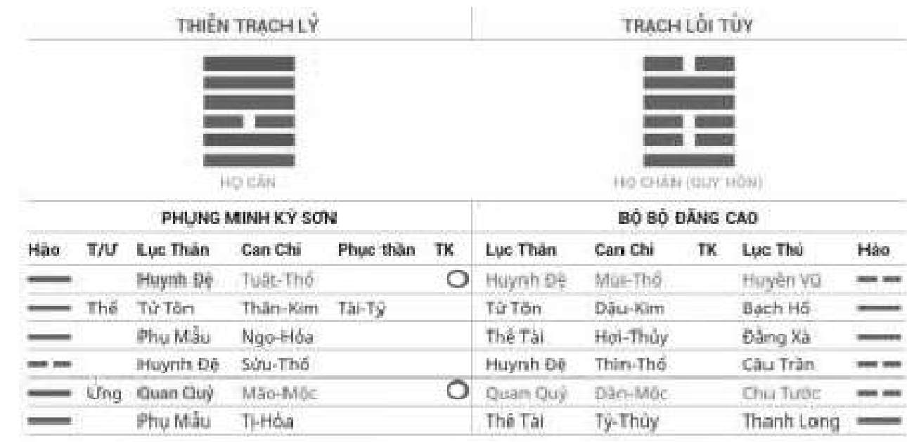

- **Cấu trúc Quẻ Dịch:**
  - **Quẻ chủ:** **Thiên Trạch Lý** (Cung Càn, Họ Càn)  
    *Tượng quẻ:* Phụng Minh Kỳ Sơn (Chim phượng hót núi Kỳ Sơn – chấp hành quy định hiện hữu, đi theo khuôn phép).
  - **Quẻ biến:** **Trạch Lôi Tùy** (Cung Chấn, Họ Chấn – Quẻ Quy Hồn)  
    *Tượng quẻ:* Bộ Bộ Đăng Cao (Từng bước lên cao – tùy thời biến chuyển, bị động theo hoàn cảnh ràng buộc hợp đồng).

- **Bảng chi tiết Lục hào:**

| Hào | Thế/Ứng | Lục thân (Chủ) | Can Chi | Biến động | Lục thân (Biến) | Can Chi (Biến) | Thần sát / Phục | Lục thú |
|:---:|:---:|:---|:---|:---:|:---|:---|:---|:---|
| 6 | | Huynh Đệ | Tuất - Thổ | **O (Động)** | Huynh Đệ | Mùi - Thổ | Hoa cái, Tuần không, Hóa thoái | Huyền Vũ |
| 5 | **Thế** | Tử Tôn | Thân - Kim | tĩnh | Tử Tôn | Dậu - Kim | Dịch mã, Văn xương, Nhật phá (Phục Tài Tý) | Bạch Hổ |
| 4 | | Phụ Mẫu | Ngọ - Hỏa | tĩnh | Thê Tài | Hợi - Thủy | Dương nhẫn, Tướng tinh | Đằng Xà |
| 3 | | Huynh Đệ | Sửu - Thổ | tĩnh | Huynh Đệ | Thìn - Thổ | | Câu Trần |
| 2 | **Ứng** | Quan Quỷ | Mão - Mộc | **O (Động)** | Quan Quỷ | Dần - Mộc | Đào hoa, Hóa thoái (Biến lâm Nhật) | Chu Tước |
| 1 | | Phụ Mẫu | Tỵ - Hỏa | tĩnh | Thê Tài | Tý - Thủy | Lộc thần | Thanh Long |

---

### 3. Dụng thần & Loại quẻ

- **Phân loại quẻ:**
  - **Quẻ so sánh chọn lựa (Tiến thoái lưỡng nan):** Đặt hai phương án lên bàn cân để đối chiếu lợi hại giữa việc ở lại đơn vị cũ và nhảy việc sang đơn vị mới.
  - **Quẻ đa hào phát động độc lập:** Hai hào động hoạt động riêng rẽ, không tạo liên động, đại diện cho hai hướng đi song song.
- **Xác định Dụng thần:**
  1. **Hào Thế (Tử Tôn Thân Kim):** Đại diện cho bản thân người hỏi, nguyện vọng cá nhân và năng lực hành động.
  2. **Đơn vị cũ (Hào 2 Ứng Quan Quỷ Mão Mộc):** Nằm ở Nội quái, biến Dần Mộc mang Nhật lệnh, đại diện cho cơ quan hiện tại nơi đương số đang công tác.
  3. **Đơn vị mới bên ngoài (Hào 6 Huynh Đệ Tuất Thổ):** Nằm ở Ngoại quái cao nhất, mang Tuần không, đại diện cho cơ hội việc làm mới bên ngoài chưa thành hình.

---

### 4. Luận giải chi tiết

Quẻ này cung cấp chuẩn mực lý luận sắc bén về **phương pháp giải quẻ lựa chọn bằng hai hào động độc lập**, cơ chế **Quan Quỷ hóa Thoái thần** và sự phân biệt sống còn giữa **Nhật phá** và **Ám động**:

#### 1. Nguyên tắc giải quẻ lựa chọn qua hai hào động độc lập
- **Không tạo liên động:** Trong các quẻ hỏi về sự lựa chọn (làm A hay làm B), nếu xuất hiện hai hào động đại diện cho hai đối tượng khác nhau, tuyệt đối không được luận chúng liên động với nhau (như Mão Mộc khắc Tuất Thổ). Hai hào này phải được khảo sát độc lập, mỗi hào tác động riêng biệt lên hào Thế để so sánh kết quả.
- **Phân định ranh giới Nội - Ngoại và Hiện trạng - Tương lai:**
  - *Đơn vị cũ:* Nằm tại Nội quái (hào 2 Quan Quỷ Mão Mộc động biến Quan Quỷ Dần Mộc). Biến hào Dần Mộc trực tiếp mang **Nhật lệnh** của ngày chiêm. Nhật lệnh là hiện trạng thực tế đang diễn ra, chứng minh hào 2 đại diện chính xác cho đơn vị sở tại.
  - *Đơn vị mới bên ngoài:* Nằm tại Ngoại quái tối cao (hào 6 Huynh Đệ Tuất Thổ phát động). Hào Tuất Thổ lâm **Tuần không** (Tuất Hợi không vong), chỉ rõ sự việc chưa diễn ra, đơn vị mới hiện thời người hỏi vẫn chưa tìm được.

#### 2. So sánh lợi hại giữa Đơn vị cũ và Đơn vị mới
- **Khảo sát Đơn vị cũ (Hào 2 Mão Mộc hóa Dần Mộc):**
  - Hào Quan Quỷ Mão Mộc động biến Quan Quỷ Dần Mộc là cách cục **Quan Quỷ Hóa thoái thần**. Trong công việc, Quan Quỷ hóa thoái chỉ ra rằng đơn vị hiện tại đang trên đà sa sút, quy mô hoặc cơ hội thăng tiến ngày càng đi xuống.
  - Đặc biệt, hào biến Quan Quỷ Dần Mộc mang thuộc tính **trực xung với hào Thế Tử Tôn Thân Kim** (Dần Thân tương xung). Sự xung khắc trực diện này phản ánh chính xác sự thật: Quyết định điều động công tác xa nhà của đơn vị cũ đối kháng kịch liệt với nguyện vọng của đương số, khiến anh vô cùng bất mãn và không thể chấp nhận được.
- **Khảo sát Đơn vị mới (Hào 6 Tuất Thổ hóa Mùi Thổ):**
  - Hào 6 Huynh Đệ Tuất Thổ thuộc Thổ, tương sinh cho hào Thế Tử Tôn Thân Kim (Thổ sinh Kim).
  - Hào đối tác bên ngoài sinh trợ cho Thế chứng minh chắc chắn rằng: Tìm đơn vị mới bên ngoài sẽ mang lại điều kiện làm việc tốt hơn, đãi ngộ và môi trường phù hợp hơn rất nhiều so với việc tiếp tục cam chịu ở đơn vị cũ.

#### 3. Phân biệt Tử Tôn Nhật Phá vs Ám Động: Chiến lược "Cưỡi bò tìm ngựa"
- **Tình trạng hào Thế Tử Tôn Thân Kim:**
  - Tử Tôn là thần khắc Quan, chủ về ý định từ chức, phá bỏ ràng buộc công việc.
  - Tuy nhiên, Thân Kim ở tháng Tý bị hưu tù, lại bị ngày Bính Dần trực xung. Một hào suy yếu mà bị Nhật xung thì không thể trở thành Ám động, mà rơi vào trạng thái **Nhật phá**.
  - *Nguyên tắc định tính:* Nếu hào Thế là Ám động, đương số có đủ thực lực và thời cơ để nộp đơn từ chức ngay lập tức. Nhưng ở đây là Nhật phá, biểu thị hiện tại nội lực chưa vững, cơ hội bên ngoài chưa thành hình (Tuất Thổ lâm Không), nếu bốc đồng nghỉ việc ngay sẽ rơi vào cảnh bế tắc, thất nghiệp.
- **Ứng kỳ của Quan Quỷ mang Nhật lệnh hóa thoái:**
  - Hào 2 Mão Mộc biến Dần Mộc tuy hóa thoái nhưng biến hào Dần Mộc đang mang Nhật lệnh, tức là lực tác động của đơn vị cũ vẫn còn rất mạnh ở hiện tại, chưa thể dứt điểm ngay. Phải đợi qua tiết **Lập Xuân** (tháng Dần năm sau) thì sức mạnh của cơ quan cũ mới chính thức thoái trào.
- **Kế sách hành động:**
  - Chu Thần Bân hiến kế sách: Áp dụng chiến lược *"Cưỡi bò tìm ngựa"*. Tạm thời tiếp tục nhẫn nại làm việc tại đơn vị cũ để lĩnh trọn tiền thưởng cuối năm và các chế độ đãi ngộ dịp Tết Nguyên Đán. Trong thời gian đó, âm thầm chuẩn bị hồ sơ, liên hệ tìm kiếm nhiều đơn vị mới (Tuất Thổ biến Mùi Thổ là hóa chúng – nên nộp hồ sơ nhiều nơi).

---

### 5. Kết luận & Ứng kỳ thực tế

- **Lời giải đoán & Khuyến nghị của Chu Thần Bân:**
  - Xu hướng tương lai: Nhất định phải rời bỏ đơn vị cũ để tìm đơn vị mới gần nhà, vì đơn vị mới sinh Thế còn đơn vị cũ hóa thoái và trực xung với Thế.
  - Thời điểm hành động: Tuyệt đối không được từ chức trước Tết Nguyên Đán (vì Thế lâm Nhật phá). Phải đợi qua tiết Lập Xuân năm sau, nhận đủ tiền thưởng Tết rồi mới hành động.
  - Ứng kỳ chuyển việc tối ưu: Rơi vào tháng Thìn (tháng 3 Âm lịch khi Thìn thổ xung không Tuất thổ), tháng Tỵ (tháng 4 Âm lịch khi Tỵ hỏa hợp Thân kim giải phá), hoặc thuận lợi nhất là vào mùa thu tháng Thân, Dậu (tháng 7, 8 Âm lịch) khi hào Thế Thân Kim đắc lệnh vượng tướng điền thực.
- **Phản hồi thực tế (Feedback):**
  - Đương số hoàn toàn thấu suốt lời khuyên, dẹp bỏ ý định từ chức bồng bột. Anh kiên nhẫn bám trụ tại đơn vị cũ cho đến hết năm, nhận trọn vẹn khoản tiền thưởng Tết xứng đáng.
  - Ra giêng sau tiết Lập Xuân, anh bắt đầu rải hồ sơ và đến tháng Thìn – Tỵ đã thuận lợi tìm được một công việc mới rất tốt ngay gần căn nhà mới mua, chính thức nộp đơn xin thôi việc tại đơn vị cũ một cách êm đẹp.
- **Ứng kỳ chiêm nghiệm:**
  - Ứng nghiệm vào mùa xuân năm sau (sau Tết Đinh Dậu, tiết Lập Xuân chuyển dịch qua các tháng Thìn - Tỵ).

---

### 6. Bài học tâm pháp & Quy tắc cốt lõi

- **Quy tắc Lục Hào rút ra từ ca thực chiến (rule_index, trang 215):**
  1. *Quy tắc so sánh chuyển việc qua hào Quan quỷ Thoái thần và ứng kỳ sau tiết Lập xuân:* Quẻ lựa chọn khảo sát hai hào động độc lập. Đơn vị cũ ở Nội quái Quan Quỷ hóa thoái báo hiệu sự sa sút; đơn vị mới ở Ngoại quái Thổ sinh Thế báo hiệu tương lai tươi sáng hơn.
  2. *Quy tắc phân biệt Tử Tôn Nhật phá và Ám động khi hỏi từ chức:* Tử Tôn trì Thế bị Nhật xung, nếu vượng tướng là Ám động có thể dứt áo ra đi ngay; nếu hưu tù là Nhật phá, tuyệt đối không được manh động mà phải chờ đợi bổ phá điền thực.
  3. *Quy tắc giải đoán hào biến mang Nhật lệnh hóa thoái:* Hào hóa thoái nhưng biến hào mang Nhật lệnh thì chưa thoái ngay tại thời điểm chiêm; bắt buộc phải đợi qua tiết khí chuyển giao (như tiết Lập Xuân) mới thực sự mất hiệu lực.
- **Bài học tâm pháp:**
  - Dịch lý không tách rời nhân tình thế thái. Một người tư vấn Lục Hào sắc sảo không chỉ nhìn thấy xu thế cát hung đơn thuần, mà còn phải biết chỉ dẫn đường đi nước bước thực tế cho thân chủ: Giữ gìn quyền lợi kinh tế trước mắt (thưởng Tết) trong khi âm thầm chuẩn bị cho bước nhảy vọt tương lai.

## THỰC CHIẾN 27: MUỐN PHÁT TRIỂN BẢN THÂN ĐỂ ỨNG TUYỂN VỊ TRÍ NHÂN SỰ

---

### 1. Bối cảnh & Câu hỏi

- **Bối cảnh chi tiết:** 
  Một đệ tử khác của Chu Thần Bân có ý định nâng cao năng lực chuyên môn của bản thân để chuyển hướng ứng tuyển vào vị trí quản lý nhân sự (HR). Nhận thấy đây là một bước ngoặt nghề nghiệp quan trọng giúp cải thiện thu nhập và mở rộng không gian thăng tiến, nhưng bản thân chưa từng đảm nhận vị trí quản lý tương tự trước đó, anh đã gieo một quẻ Dịch để thỉnh giáo xem hướng đi này có khả thi và có lợi cho tương lai hay không.
- **Tâm lý & Câu hỏi ẩn ý:** 
  Đương số khao khát bứt phá khỏi giới hạn công việc hiện tại, nhưng bên trong vẫn e dè trước sự thay đổi và lo ngại về khả năng thất bại trong quá trình phỏng vấn tuyển dụng. Câu hỏi cốt lõi: *"Việc chủ động phát triển bản thân để ứng tuyển vào vị trí nhân sự có phải là hướng đi đúng đắn mang lại triển vọng tốt đẹp hay không?"*.
- **Thời gian chiêm đoán:**
  - Dương lịch: 09/12/2016, 21:01 (Giờ Bắc Kinh).
  - Can chi: Năm Bính Thân, tháng Canh Tý, ngày Ất Sửu, giờ Đinh Hợi.

---

### 2. Dữ kiện & Bảng quẻ Crop

- **Thời không chiêm nghiệm:**
  - Tháng Canh Tý (Thủy vượng, Kim tướng, Mộc hưu, Hỏa thai, Thổ tuyệt).
  - Ngày Ất Sửu (Thổ vượng, Kim dưỡng).
  - Tuần không: **Tuất - Hợi** (Giáp Tý tuần trung, Tuất Hợi không vong).
- **Thần sát:**
  - Tướng tinh: Dậu (Lâm hào 3 Ứng Quan Quỷ)
  - Hoa cái: Sửu (Lâm Nhật kiến, hào 1 Thê Tài)
  - Dịch mã: Hợi (Lâm giờ chi, Tuần không, hào 2 Phụ Mẫu)
  - Tai sát: Mão (Lâm hào Thế Huynh Đệ động)
  - Mưu tinh: Mùi (Lâm hào 4 Thê Tài)
  - Đào hoa: Ngọ
  - Kiếp sát: Dần
  - Lộc thần: Mão (Lâm hào Thế Huynh Đệ)
  - Dương nhẫn: Dần
  - Văn xương: Ngọ
  - Thiên y: Hợi
  - Thiên hỷ: Mùi
  - Quý nhân: Thân, Tý (Lâm Nguyệt kiến, biến hào 6)

- Dữ kiện bảng quẻ và các thông số chiêm đoán:
  - **Bảng 27.1: Quẻ Bát Thuần Tốn biến Thủy Phong Tỉnh**
    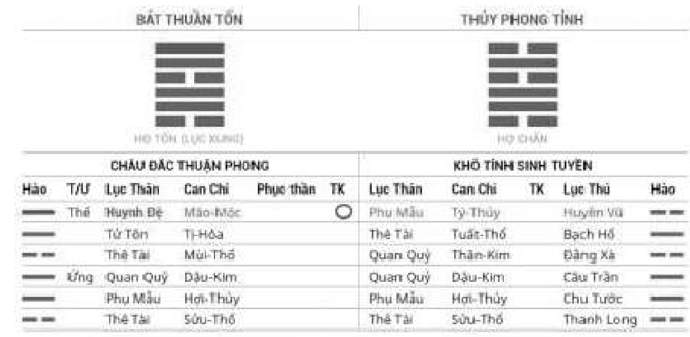

- **Cấu trúc Quẻ Dịch:**
  - **Quẻ chủ:** **Bát Thuần Tốn** (Cung Tốn, Họ Tốn – Quẻ Lục Xung)  
    *Tượng quẻ:* Châu Đắc Thuận Phong (Thuyền xuôi gió thuận – sự việc diễn biến bộc phát, cạnh tranh gấp gáp).
  - **Quẻ biến:** **Thủy Phong Tỉnh** (Cung Chấn, Họ Chấn)  
    *Tượng quẻ:* Khô Tỉnh Sinh Tuyền (Giếng cạn sinh suối – tích lũy dần dần, bị hạn chế bởi khuôn khổ cần kiên nhẫn khơi thông).

- **Bảng chi tiết Lục hào:**

| Hào | Thế/Ứng | Lục thân (Chủ) | Can Chi | Biến động | Lục thân (Biến) | Can Chi (Biến) | Thần sát / Phục | Lục thú |
|:---:|:---:|:---|:---|:---:|:---|:---|:---|:---|
| 6 | **Thế** | Huynh Đệ | Mão - Mộc | **O (Động)** | Phụ Mẫu | Tý - Thủy | Lộc thần, Tai sát (Hồi đầu sinh kiêm Hình) | Huyền Vũ |
| 5 | | Tử Tôn | Tỵ - Hỏa | tĩnh | Thê Tài | Tuất - Thổ | | Bạch Hổ |
| 4 | | Thê Tài | Mùi - Thổ | tĩnh | Quan Quỷ | Thân - Kim | Mưu tinh, Thiên hỷ | Đằng Xà |
| 3 | **Ứng** | Quan Quỷ | Dậu - Kim | tĩnh | Quan Quỷ | Dậu - Kim | Tướng tinh | Câu Trần |
| 2 | | Phụ Mẫu | Hợi - Thủy | tĩnh | Phụ Mẫu | Hợi - Thủy | Dịch mã, Thiên y, Tuần không | Chu Tước |
| 1 | | Thê Tài | Sửu - Thổ | tĩnh | Thê Tài | Sửu - Thổ | Nhật kiến, Hoa cái | Thanh Long |

---

### 3. Dụng thần & Loại quẻ

- **Phân loại quẻ:**
  - **Quẻ định hướng mưu cầu sự nghiệp / Phát triển bản thân:** Trọng tâm không nằm ở việc xét đoán một sự vụ ngắn hạn mà khảo sát con đường tích lũy năng lực lâu dài của đương số.
  - **Quẻ độc phát (Hào Thế độc động):** Toàn quẻ duy nhất hào Thế phát động, biểu thị biến chuyển cốt lõi hoàn toàn phụ thuộc vào hành động chủ quan của bản thân người hỏi.
- **Xác định Dụng thần:**
  1. **Hào Thế (Huynh Đệ Mão Mộc phát động biến Phụ Mẫu Tý Thủy):** Đại diện cho bản thân người hỏi, động lực tự nâng cấp và quá trình tích lũy học vấn, bằng cấp chuyên môn.
  2. **Hào Ứng (Quan Quỷ Dậu Kim lâm Tướng tinh):** Đại diện cho vị trí công việc quản lý nhân sự tại môi trường mục tiêu.
  3. **Biến hào Phụ Mẫu Tý Thủy (Nguyệt lệnh, Quý nhân):** Đại diện cho tri thức mới, chứng chỉ chuyên ngành và mạng lưới nâng đỡ trong tương lai.

---

### 4. Luận giải chi tiết

Quẻ này là một minh chứng sâu sắc về **nghệ thuật định hướng nghề nghiệp vượt lên trên tư duy thành bại thiển cận** trong Lục Hào:

#### 1. Trọng điểm hào Thế độc phát hóa hồi đầu sinh
- **Ý nghĩa của độc phát:** Trong quẻ chỉ có duy nhất một hào động, hào động đó nắm giữ linh hồn và định hướng phát triển của toàn bộ sự việc. Ở đây, chính hào Thế Huynh Đệ Mão Mộc phát động hóa xuất Phụ Mẫu Tý Thủy hồi đầu sinh (Thủy sinh Mộc).
- **Hồi đầu sinh là chỉ dấu chủ động bứt phá:**
  - Hào Thế tự mình phát động biến ra hào sinh trợ cho mình, khẳng định một chân lý: Muốn thay đổi tương lai, nhất định đương số phải **chủ động hành động**. Nếu thụ động ngồi chờ thời thì sẽ không bao giờ có sự chuyển biến.
  - Phụ Mẫu đại diện cho học vấn, đào tạo, chứng chỉ, văn bằng và tư duy nghiệp vụ. Thế biến Phụ Mẫu hồi đầu sinh mang thông điệp cốt lõi: **Việc đầu tư học tập nâng cao bản thân là hoàn toàn đúng đắn và mang lại lợi ích lâu dài to lớn**.

#### 2. Định hướng vượt qua nỗi sợ thành bại trước mắt
- **Hiện trạng quẻ chủ Lục Xung và hào Ứng Quan Quỷ:**
  - Quẻ chủ Bát Thuần Tốn là quẻ **Lục Xung**, báo hiệu việc ứng tuyển trước mắt sẽ có tính cạnh tranh rất cao, nhiều biến động khó lường.
  - Hào Ứng Quan Quỷ Dậu Kim tuy được Nhật Sửu sinh nhưng lại bị Nguyệt Tý hưu tù, xét về thời điểm hiện tại thì xác suất trúng tuyển ngay lập tức trong lần phỏng vấn đầu tiên là không cao.
- **Tư duy tâm pháp của Chu Thần Bân:**
  - Tác giả nhấn mạnh: Khi xem quẻ định hướng sự nghiệp, không nên dính mắc quá mức vào việc kỳ thi hay lần phỏng vấn trước mắt thành hay bại.
  - Hào biến Phụ Mẫu Tý Thủy lâm **Nguyệt lệnh** và mang **Quý nhân** là một chỉ dẫn mang tính chiến lược: Việc học tập và ứng tuyển lần này cực kỳ có lợi cho sự trưởng thành của đương số. Nếu không dám bước đi bước đầu tiên thì sẽ mãi mãi không có bước thứ hai. Kể cả lần ứng tuyển này chưa thành công, kinh nghiệm thực chiến đúc kết được sẽ là tiền đề vững chắc cho thắng lợi tiếp theo.

#### 3. Ý nghĩa "Tương sinh kiêm tương hình" (Tý hình Mão) và quẻ biến Thủy Phong Tỉnh
- **Mối quan hệ Vô lễ chi hình giữa Tý Thủy và Mão Mộc:**
  - Phụ Mẫu Tý Thủy tuy sinh cho Mão Mộc nhưng Tý - Mão lại mang quan hệ tương hình.
  - Tương hình biểu thị trong quá trình phát triển sẽ bộc lộ những khiếm khuyết nội tại cần phải tu sửa:
    1. *Vấn đề đãi ngộ (Lộc thần trì Thế bị hình):* Đương số có thể đang đặt kỳ vọng về mức lương và chế độ đãi ngộ ban đầu quá cao so với năng lực thực tế.
    2. *Vấn đề chuyên môn:* Kỹ năng quản lý nhân sự chuyên sâu của bản thân còn thiếu hụt, cần phải đào tạo bài bản.
    3. *Hạn chế về nhân mạch (Quẻ Tỉnh - Khô tỉnh sinh tuyền):* Quẻ biến là Thủy Phong Tỉnh – giếng nước bị giới hạn trong thành giếng. Năng lực và học vấn của anh không tồi (Văn xương, Đào hoa), nhưng điểm yếu chí mạng của anh trong ngành nhân sự là thiếu **mạng lưới quan hệ (nhân mạch)** và Quý nhân nâng đỡ.
- **Giải pháp tương lai (Tý Thủy hợp Nhật lệnh Sửu Thổ):**
  - Biến hào Tý Thủy tương hợp với Nhật kiến Sửu Thổ (Tý Sửu lục hợp). Hợp là liên kết bền vững trong tương lai.
  - Tác giả chỉ dẫn đương số cần xây dựng một bản kế hoạch dài hạn gồm 3 mũi nhọn:
    1. Hoàn thành các khóa học chứng chỉ nhân sự chuyên nghiệp để gia tăng giá trị chuyên môn (Phụ Mẫu sinh Thế).
    2. Tích cực tham gia các hội nhóm nghề nghiệp để mở rộng mạng lưới quan hệ nhân sự (khơi thông Quý nhân).
    3. Chủ động nộp hồ sơ phỏng vấn để cọ xát thực tế, rèn luyện bản lĩnh thương lượng.

---

### 5. Kết luận & Ứng kỳ thực tế

- **Lời giải đoán & Khuyến nghị của Chu Thần Bân:**
  - Khẳng định chủ trương nâng cao bản thân để chuyển sang ngành nhân sự là hướng đi hoàn toàn chính xác, mang lại lợi ích to lớn cho tương lai.
  - Khuyên đương số gạt bỏ nỗi sợ thất bại, tự tin đăng ký các khóa đào tạo chuyên ngành và mạnh dạn nộp hồ sơ ứng tuyển để tích lũy kinh nghiệm cọ xát.
  - Lưu ý trọng tâm cần khắc phục: Mở rộng mối quan hệ nhân mạch và điều chỉnh kỳ vọng đãi ngộ ban đầu cho phù hợp với giai đoạn học việc.
- **Phản hồi thực tế (Feedback):**
  - Đương số tiếp thu trọn vẹn lời khuyên, không còn ngần ngại hay lo sợ thất bại. Anh lập tức ghi danh tham gia khóa đào tạo chứng chỉ nhân sự chuyên sâu, đồng thời chủ động kết nối với các anh chị đi trước trong ngành.
  - Từng bước hoàn thiện năng lực theo đúng quy hoạch, anh đã tự tin ứng tuyển và xây dựng được nền tảng vững chắc cho sự nghiệp quản lý nhân sự sau này.
- **Ứng kỳ chiêm nghiệm:**
  - Diễn tiến thuận lợi qua các tháng tiếp theo (tháng Sửu khi Tý Sửu hợp hóa và sang năm Đinh Dậu khi Quan Quỷ đắc lệnh).

---

### 6. Bài học tâm pháp & Quy tắc cốt lõi

- **Quy tắc Lục Hào rút ra từ ca thực chiến (rule_index, trang 219):**
  1. *Quy tắc quẻ lục xung Bát Thuần Tốn biến Thủy Phong Tỉnh trong ứng tuyển vị trí quản lý nhân sự:* Hào Thế độc phát hóa Phụ Mẫu hồi đầu sinh là biểu tượng của sự chủ động tự cường. Bất chấp quẻ Lục Xung báo hiệu cạnh tranh gay gắt, việc nâng cấp bản thân là con đường cát lợi không thể đảo ngược.
  2. *Quy tắc giải đoán Tương sinh kiêm tương hình:* Khi hào biến vừa sinh vừa hình hào Thế, nó chỉ ra cơ hội phát triển luôn đi kèm với những hạn chế, thiếu sót nội tại (đòi hỏi đãi ngộ quá cao hoặc năng lực chuyên sâu chưa đủ) đòi hỏi phải trau dồi sửa đổi.
  3. *Quy tắc vượt lên trên sự thành bại ngắn hạn:* Trong quẻ định hướng đường đời, không câu nệ Dụng thần hưu tù trong một sự vụ cụ thể. Nếu hành động mang lại sự tích lũy kinh nghiệm và tri thức (Phụ Mẫu sinh Thế), đó là sự đầu tư tất thắng cho tương lai.
- **Bài học tâm pháp:**
  - Người thầy Lục Hào chân chính không làm thân chủ nản lòng trước một kết quả thi cử hay phỏng vấn nhất thời, mà dùng Dịch lý để thắp lên ngọn lửa tự tin, vạch ra lộ trình tích lũy trí tuệ và mở rộng nhân mạch giúp con người ta làm chủ vận mệnh của chính mình.

## THỰC CHIẾN 28: CHA VỢ BỊ XUẤT HUYẾT NÃO, SAU KHI PHẪU THUẬT LẦN ĐẦU LẠI XẢY RA XUẤT HUYẾT LẦN HAI, CÓ NÊN CHUYỂN ĐẾN BỆNH VIỆN CỦA VỢ ĐỂ PHẪU THUẬT KHÔNG

---

### 1. Bối cảnh & Câu hỏi

- **Bối cảnh chi tiết:** 
  Bố vợ của một người đệ tử của Chu Thần Bân không may bị xuất huyết não đột ngột trong tình trạng hết sức nguy kịch. Bệnh nhân đã được cấp cứu và thực hiện ca phẫu thuật mở hộp sọ lần đầu tiên tại bệnh viện địa phương. Tuy nhiên, chỉ một thời gian ngắn sau mổ, vết thương lại xảy ra biến chứng xuất huyết lần thứ hai, buộc các bác sĩ phải chỉ định phẫu thuật lần hai khẩn cấp. Nhận thấy người vợ vốn công tác trong ngành y dược và có mối quan hệ với một bệnh viện chuyên khoa tuyến trên có uy tín hơn, người đệ tử đứng trước quyết định sinh tử: Liệu nên tiếp tục để bố vợ phẫu thuật lần hai tại bệnh viện địa phương hiện tại hay gấp rút chuyển viện sang bệnh viện nơi vợ công tác để phẫu thuật?
- **Tâm lý & Câu hỏi ẩn ý:** 
  Gia đình đương số vô cùng hoang mang, sợ rằng tay nghề bác sĩ tại bệnh viện địa phương không đủ để xử lý triệt để, khiến bệnh nhân chịu cảnh tái phát nguy hiểm đến tính mạng, nhưng cũng lo ngại việc chuyển viện giữa lúc nguy kịch có thể phát sinh rủi ro. Câu hỏi cốt lõi: *"Có nên chuyển bố vợ đến bệnh viện nơi vợ công tác để thực hiện phẫu thuật lần hai hay không?"*.
- **Thời gian chiêm đoán:**
  - Dương lịch: 08/12/2016, 10:01 (Giờ Bắc Kinh).
  - Can chi: Năm Bính Thân, tháng Canh Tý, ngày Giáp Tý, giờ Kỷ Tỵ.

---

### 2. Dữ kiện & Bảng quẻ Crop

- **Thời không chiêm nghiệm:**
  - Tháng Canh Tý (Thủy vượng, Kim tướng, Mộc hưu, Hỏa thai, Thổ tuyệt).
  - Ngày Giáp Tý (Thủy vượng, Mộc tướng, Kim tử).
  - Tuần không: **Tuất - Hợi** (Giáp Tý tuần trung, Tuất Hợi không vong).
- **Thần sát:**
  - Tướng tinh: Tý (Lâm Nguyệt kiến, Nhật kiến, biến hào 1)
  - Hoa cái: Thìn
  - Dịch mã: Dần
  - Tai sát: Ngọ
  - Mưu tinh: Tuất
  - Đào hoa: Dậu (Lâm hào 3 và hào 4 Thê Tài động)
  - Kiếp sát: Tỵ (Lâm hào 6 Huynh Đệ, giờ chi)
  - Lộc thần: Dần
  - Dương nhẫn: Mão (Phục thần Phụ Mẫu hào 1)
  - Văn xương: Tỵ
  - Thiên y: Hợi (Lâm hào Thế Quan Quỷ)
  - Thiên hỷ: Mùi (Lâm hào 5 Ứng Tử Tôn động)
  - Quý nhân: Sửu, Mùi (Lâm sơ hào Tử Tôn động và hào 5 Tử Tôn động)

- Dữ kiện bảng quẻ và các thông số chiêm đoán:
  - **Bảng 28.1: Quẻ Hỏa Phong Đỉnh biến Phong Thiên Tiểu Súc**
    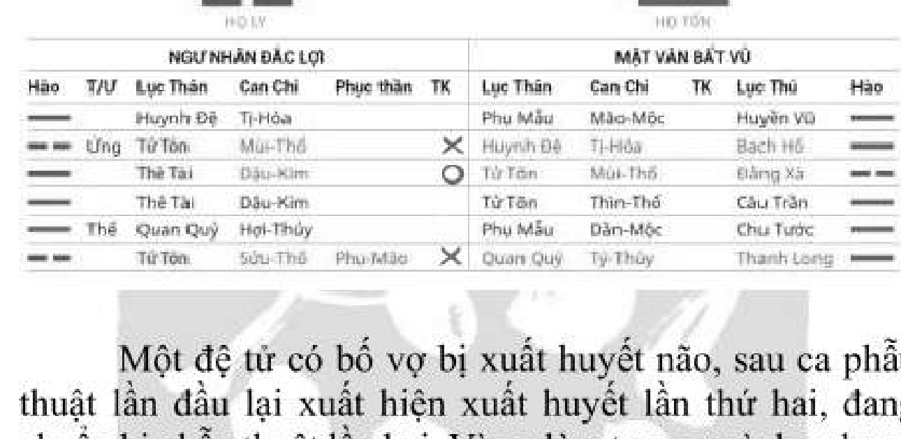

- **Cấu trúc Quẻ Dịch:**
  - **Quẻ chủ:** **Hỏa Phong Đỉnh** (Cung Ly, Họ Ly)  
    *Tượng quẻ:* Ngư Nhân Đắc Lợi (Vạc báu luyện ngọc – sự việc vô cùng hệ trọng, chuyển biến mang tính sinh tử).
  - **Quẻ biến:** **Phong Thiên Tiểu Súc** (Cung Tốn, Họ Tốn)  
    *Tượng quẻ:* Mật Vân Bất Vũ (Mây đen chưa mưa – bệnh viện hiện tại năng lực chuẩn bị chưa đủ, cần cải thiện phương án điều trị).

- **Bảng chi tiết Lục hào:**

| Hào | Thế/Ứng | Lục thân (Chủ) | Can Chi | Biến động | Lục thân (Biến) | Can Chi (Biến) | Thần sát / Phục | Lục thú |
|:---:|:---:|:---|:---|:---:|:---|:---|:---|:---|
| 6 | | Huynh Đệ | Tỵ - Hỏa | tĩnh | Phụ Mẫu | Mão - Mộc | Kiếp sát, Văn xương | Huyền Vũ |
| 5 | **Ứng** | Tử Tôn | Mùi - Thổ | **X (Động)** | Huynh Đệ | Tỵ - Hỏa | Bạch Hổ, Thiên hỷ, Quý nhân | Bạch Hổ |
| 4 | | Thê Tài | Dậu - Kim | **O (Động)** | Tử Tôn | Mùi - Thổ | Đào hoa, Hóa thoái | Đằng Xà |
| 3 | | Thê Tài | Dậu - Kim | tĩnh | Tử Tôn | Thìn - Thổ | Đào hoa | Câu Trần |
| 2 | **Thế** | Quan Quỷ | Hợi - Thủy | tĩnh | Phụ Mẫu | Dần - Mộc | Thiên y, Tuần không | Chu Tước |
| 1 | | Tử Tôn | Sửu - Thổ | **X (Động)** | Quan Quỷ | Tý - Thủy | Quý nhân (Phục Phụ Mão mang Nhẫn) | Thanh Long |

---

### 3. Dụng thần & Loại quẻ

- **Phân loại quẻ:**
  - **Quẻ đoán bệnh người thân & Lựa chọn y viện điều trị:** Khảo sát hiệu quả can thiệp y tế giữa bệnh viện địa phương và bệnh viện tuyến trên.
  - **Quẻ tích hợp đa hào động:** Quẻ xuất hiện 3 hào động (hào 1, 4, 5) để phân định hai hướng lựa chọn.
- **Xác định Dụng thần:**
  1. **Người bệnh (Bố vợ):** Phụ Mẫu Mão Mộc phục tàng dưới sơ hào Sửu Thổ, mang Dương nhẫn (tượng vết rạch phẫu thuật mở hộp sọ).
  2. **Căn bệnh xuất huyết não & Tâm lý âu lo:** Hào Thế Quan Quỷ Hợi Thủy (Thủy chủ về huyết dịch, tuần hoàn máu não; lâm Tuần không và Thiên y; Quỷ trì Thế cũng thể hiện tâm trạng lo lắng cao độ của người hỏi).
  3. **Bệnh viện địa phương hiện tại:** Sơ hào Tử Tôn Sửu Thổ (Nội quái, hóa Quan Quỷ Tý Thủy mang Nhật/Nguyệt lệnh).
  4. **Bệnh viện nơi vợ công tác:** Tổ hợp Ngoại quái gồm hào 4 Thê Tài Dậu Kim (Đào hoa Tài = vợ) và hào 5 Ứng Tử Tôn Mùi Thổ (Y dược tuyến trên).

---

### 4. Luận giải chi tiết

Quẻ này là mẫu mực tuyệt hảo về phương pháp **tích hợp đa hào động để so sánh hai phương án y tế** và nhận diện hiểm họa từ cách cục **Tử Tôn hóa Quỷ**:

#### 1. Kỹ thuật tích hợp đa hào động trong quẻ lựa chọn
- Câu hỏi đặt ra chỉ có 2 phương án (ở lại bệnh viện cũ hay sang bệnh viện của vợ), nhưng quẻ lại phát động 3 hào (hào 1, hào 4, hào 5).
- Chu Thần Bân vận dụng nguyên tắc: **Tích hợp các hào cùng phương vị ngoại quái**:
  - Hào 1 nằm ở Nội quái: Đại diện cho phương án bệnh viện địa phương sở tại.
  - Hào 4 Thê Tài Dậu Kim và hào 5 Tử Tôn Mùi Thổ đều nằm ở Ngoại quái: Đại diện cho một thể thống nhất là bệnh viện bên ngoài gắn liền với người vợ.

#### 2. Phân tích Bệnh viện địa phương: Hiểm họa "Tử Tôn hóa Quỷ"
- **Tượng của sơ hào Tử Tôn Sửu Thổ:**
  - Tử Tôn đại diện cho bệnh viện, thầy thuốc, phương pháp phẫu thuật; Sửu Thổ nằm ở sơ hào (tuyến cơ sở địa phương).
  - Bản thân Sửu Thổ thuộc Thổ, khắc Thủy của Quan Quỷ Hợi Thủy, cho thấy bác sĩ ở đây có khả năng tiến hành phẫu thuật để can thiệp ức chế dòng máu xuất huyết.
- **Cơ chế nguy hiểm chí mạng: Hóa Quan Quỷ Tý Thủy:**
  - Tử Tôn Sửu Thổ phát động **hóa xuất Quan Quỷ Tý Thủy** lâm cả Nhật lệnh lẫn Nguyệt lệnh (Tướng tinh cực vượng).
  - Trong phép đoán bệnh của Lục Hào, điều kiêng kỵ nhất là **"Tử Tôn hóa Quỷ"**. Tử Tôn là thuốc men cứu mạng mà lại biến thành Quỷ mầm bệnh, biểu thị rõ rệt: *Phẫu thuật xong lại đẻ ra biến chứng mới, bệnh cũ chưa dứt thì mầm họa khác lại phát sinh!*
  - Hiện thực đã chứng minh: Sau ca phẫu thuật đầu tiên, bệnh nhân lập tức bị xuất huyết não lần hai, đây chính là hình ảnh điển hình của việc Tử Tôn khắc Quỷ rồi lại biến thành Quỷ. Nếu tiếp tục phẫu thuật lần hai tại đây, nguy cơ tái phát đợt 3 hoặc để lại di chứng bại liệt, xuất huyết rỉ rả không dứt là điều khó tránh khỏi.

#### 3. Phân tích Bệnh viện của người vợ: Trị bệnh tận gốc
- **Nhận diện vai trò của người vợ (Thê Tài Dậu Kim mang Đào hoa):**
  - Hào 4 Thê Tài Dậu Kim mang Đào hoa, đại diện trực tiếp cho người vợ.
  - Theo bảng trường sinh 12 cung, Dậu Kim chính là vị trí Mộc dục của Hợi Thủy (hào Thế). Mộc dục là nơi chứa đựng tình cảm, sự yêu thương và tương trợ gia đình.
  - Dậu Kim động hóa Tử Tôn Mùi Thổ, kết nối chặt chẽ với hào 5 Ứng Tử Tôn Mùi Thổ. Đây là dấu hiệu người vợ dùng mối quan hệ và chuyên môn y dược để kết nối đến đội ngũ chuyên gia hàng đầu.
- **Sức mạnh triệt để của hào 5 Tử Tôn Mùi Thổ:**
  - Hào 5 là hào Quân vị, vị trí cao quý nhất của Ngoại quái, lại mang **Thiên hỷ** và **Quý nhân**, đại diện cho bệnh viện chuyên khoa tuyến trên có uy tín và trình độ kỹ thuật vượt trội.
  - Mùi Thổ phát động khắc chế triệt để Quan Quỷ Hợi Thủy, rồi hóa xuất Huynh Đệ Tỵ Hỏa trực xung trực khắc Quan Quỷ. Cơ chế này biểu thị: Đội ngũ bác sĩ tại đây có phương án phẫu thuật tối ưu, đủ khả năng xử lý triệt để nguyên nhân gây vỡ mạch máu, dập tắt mầm mống xuất huyết tận gốc rễ mà không lo tái phát.

---

### 5. Kết luận & Ứng kỳ thực tế

- **Lời giải đoán & Khuyến nghị của Chu Thần Bân:**
  - Tác giả phân tích sắc bén: Tại bệnh viện địa phương, tượng "Tử Tôn hóa Quỷ" báo trước nguy cơ biến chứng và tái phát xuất huyết lần nữa rất cao.
  - Khuyên đương số và gia đình dứt khoát làm thủ tục chuyển viện gấp sang bệnh viện chuyên khoa nơi người vợ công tác; tại đó có Quý nhân và chuyên môn y tế đắc lực sẽ phẫu thuật thành công mỹ mãn.
- **Phản hồi thực tế (Feedback):**
  - Nghe theo lời chỉ dẫn quyết đoán, gia đình lập tức thu xếp xe cứu thương chuyển bệnh nhân sang bệnh viện nơi người vợ công tác.
  - Tại đây, các bác sĩ chuyên khoa đầu ngành đã hội chẩn và thực hiện ca phẫu thuật mở sọ lần hai vô cùng chuẩn xác. Ổ xuất huyết được cầm máu hoàn toàn, không hề xảy ra thêm bất kỳ đợt tái phát nào.
  - Bệnh nhân hồi phục kỳ diệu, các chức năng thần kinh dần ổn định và bình an xuất viện trong niềm vui vỡ òa của cả gia đình.
- **Ứng kỳ chiêm nghiệm:**
  - Ứng nghiệm ngay trong những ngày sau khi chuyển viện và phẫu thuật thành công (tháng Tý ngày Sửu/Dần).

---

### 6. Bài học tâm pháp & Quy tắc cốt lõi

- **Quy tắc Lục Hào rút ra từ ca thực chiến (rule_index, trang 226):**
  1. *Quy tắc đoán bệnh người thân (Nhạc phụ) và quyết định chuyển viện phẫu thuật điều trị tận gốc:* Nhạc phụ lấy Phụ Mẫu làm Dụng thần (phục dưới sơ hào mang Dương nhẫn - vết mổ); Quan Quỷ Hợi Thủy đại diện cho chứng bệnh huyết dịch và nỗi lo âu.
  2. *Quy tắc nguy hiểm của tượng "Tử Tôn hóa Quỷ":* Tử Tôn đại diện cho can thiệp y tế/thuốc men, khi động hóa xuất Quan Quỷ mang Nhật Nguyệt lệnh, đó là điềm báo phẫu thuật gây biến chứng, bệnh tình tái phát hoặc xuất hiện di chứng nan giải.
  3. *Quy tắc tích hợp đa hào động ở Ngoại quái:* Khi số hào động nhiều hơn số phương án thực tế, các hào động cùng nằm ở Ngoại quái (Tài Dậu Kim và Tử Tôn Mùi Thổ) được gom lại thành một chỉnh thể liên hoàn đại diện cho nguồn lực bên ngoài (người vợ và bệnh viện tuyến trên).
- **Bài học tâm pháp:**
  - Đứng trước ranh giới sinh tử của người bệnh, người xem Dịch phải nhìn thấu bản chất biến dịch của từng động hào để đưa ra lời tư vấn quyết đoán, kịp thời giải cứu tính mạng con người.

## THỰC CHIẾN 29: KHỚP XƯƠNG CỦA CHÚ CÓ DẤU HIỆU BỊ PHÁ HỦY

---

### 1. Bối cảnh & Câu hỏi

- **Bối cảnh chi tiết:** 
  Người hỏi là một bác sĩ (đồng thời là học trò của Chu Thần Bân), đến thỉnh vấn về tình trạng bệnh tình của người chú (cậu ruột). Hai năm trước, người chú từng phẫu thuật khớp gối tại Đông Quan. Do bệnh nhân có tiền sử bệnh lý huyết dịch bẩm sinh và suy giảm miễn dịch, cộng với điều kiện cơ sở y tế địa phương thiếu thốn, sau ca mổ đã bị nhiễm trùng máu nghiêm trọng đe dọa trực tiếp đến tính mạng. Khi đó, nhờ quẻ Dịch định hướng, gia đình đã kịp thời chuyển viện sang Quảng Châu cấp cứu dập tắt nhiễm trùng máu và thực hiện ca mổ thứ hai thành công. Hai năm sau, trong một lần chụp phim kiểm tra định kỳ vùng đầu gối, các bác sĩ phát hiện có dấu hiệu hủy hoại cấu trúc khớp xương, nghi ngờ ổ viêm nhiễm cũ đang tái phát âm thầm phá hủy xương khớp.
- **Tâm lý & Câu hỏi ẩn ý:** 
  Người hỏi vốn có kiến thức y khoa nên rất lo lắng trước nguy cơ hoại tử xương và phản ứng đào thải miễn dịch tái phát nếu phải phẫu thuật lần nữa. Câu hỏi cốt lõi: *"Dấu hiệu phá hủy khớp xương của chú có nguy hiểm không, xu hướng bệnh tật sắp tới ra sao và có cần phải phẫu thuật can thiệp hay không?"*.
- **Thời gian chiêm đoán:**
  - Dương lịch: 06/12/2016, 07:01 (Giờ Bắc Kinh).
  - Can chi: Năm Bính Thân, tháng Kỷ Hợi, ngày Nhâm Tuất, giờ Giáp Thìn.

---

### 2. Dữ kiện & Bảng quẻ Crop

- **Thời không chiêm nghiệm:**
  - Tháng Kỷ Hợi (Thủy vượng, Mộc tướng, Thổ tuyệt, Hỏa tuyệt).
  - Ngày Nhâm Tuất (Thổ vượng, Hỏa mộ, Kim dưỡng).
  - Tuần không: **Tý - Sửu** (Giáp Dần tuần trung, Tý Sửu không vong).
- **Thần sát:**
  - Tướng tinh: Ngọ
  - Hoa cái: Tuất (Lâm Nhật kiến)
  - Dịch mã: Thân
  - Tai sát: Tý (Lâm sơ hào Phụ Mẫu động, Tuần không)
  - Mưu tinh: Thìn (Lâm hào 3, biến hào 2, giờ chi)
  - Đào hoa: Mão
  - Kiếp sát: Hợi (Lâm Nguyệt kiến)
  - Lộc thần: Hợi (Lâm Nguyệt kiến)
  - Dương nhẫn: Tý (Lâm sơ hào Phụ Mẫu động)
  - Văn xương: Dần (Lâm hào 2 Ứng Huynh Đệ động)
  - Thiên y: Tuất (Lâm Nhật kiến)
  - Thiên hỷ: Mùi (Lâm hào Thế Thê Tài)
  - Quý nhân: Mão, Tỵ (Lâm hào 6 Tử Tôn)

- Dữ kiện bảng quẻ và các thông số chiêm đoán:
  - **Bảng 29.1: Quẻ Hỏa Lôi Phệ Hạp biến Hỏa Thủy Vị Tế**
    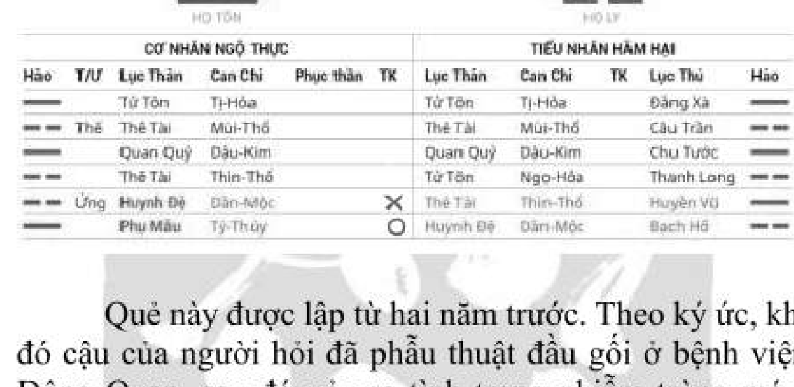

- **Cấu trúc Quẻ Dịch:**
  - **Quẻ chủ:** **Hỏa Lôi Phệ Hạp** (Cung Tốn, Họ Tốn)  
    *Tượng quẻ:* Cơ Nhân Ngộ Thực (Người đói gặp thức ăn – cắn hợp, cùng hội chẩn trao đổi kỹ lưỡng để tháo gỡ vấn đề).
  - **Quẻ biến:** **Hỏa Thủy Vị Tế** (Cung Ly, Họ Ly)  
    *Tượng quẻ:* Tiểu Nhân Hãm Hại (Chưa xong việc – nếu can thiệp sai lầm sẽ không đạt kết quả mong đợi, dễ nảy sinh biến chứng).

- **Bảng chi tiết Lục hào:**

| Hào | Thế/Ứng | Lục thân (Chủ) | Can Chi | Biến động | Lục thân (Biến) | Can Chi (Biến) | Thần sát / Phục | Lục thú |
|:---:|:---:|:---|:---|:---:|:---|:---|:---|:---|
| 6 | | Tử Tôn | Tỵ - Hỏa | tĩnh | Tử Tôn | Tỵ - Hỏa | Quý nhân | Đằng Xà |
| 5 | **Thế** | Thê Tài | Mùi - Thổ | tĩnh | Thê Tài | Mùi - Thổ | Thiên hỷ | Câu Trần |
| 4 | | Quan Quỷ | Dậu - Kim | tĩnh | Quan Quỷ | Dậu - Kim | | Chu Tước |
| 3 | | Thê Tài | Thìn - Thổ | tĩnh | Tử Tôn | Ngọ - Hỏa | Mưu tinh | Thanh Long |
| 2 | **Ứng** | Huynh Đệ | Dần - Mộc | **X (Động)** | Thê Tài | Thìn - Thổ | Văn xương, Mưu tinh | Huyền Vũ |
| 1 | | Phụ Mẫu | Tý - Thủy | **O (Động)** | Huynh Đệ | Dần - Mộc | Tuần không, Dương nhẫn, Tai sát | Bạch Hổ |

---

### 3. Dụng thần & Loại quẻ

- **Phân loại quẻ:**
  - **Quẻ đoán bệnh người thân trưởng bối (Chú/Cậu):** Khảo sát tổn thương khớp xương và đánh giá phương án can thiệp y tế ngoại khoa vs nội khoa.
  - **Quẻ liên hoàn động (Cơ chế Đạp kiều):** Hai hào động ở Nội quái bắc cầu dẫn động tạo thành chuyển biến then chốt.
- **Xác định Dụng thần:**
  1. **Người bệnh & Xương khớp:** Phụ Mẫu Tý Thủy ở sơ hào (Phụ Mẫu đại diện cho bậc chú bác, đồng thời ngũ hành tượng hình của Phụ Mẫu quy về hệ thống xương cốt của cơ thể).
  2. **Căn bệnh hiện tại:** Nhật kiến Tuất Thổ khắc chế Phụ Mẫu Tý Thủy (Tuất Thổ mang Thiên y).
  3. **Phương án phẫu thuật kỹ thuật:** Hào 2 Ứng Huynh Đệ Dần Mộc mang Văn Xương (thủ thuật chuyên môn dao kéo).
  4. **Biến chứng nguy cơ:** Biến hào Thê Tài Thìn Thổ (Mộ khố của Tý Thủy).

---

### 4. Luận giải chi tiết

Quẻ này là bài giảng đỉnh cao của Chu Thần Bân về cơ chế **"Đạp kiều / Nối cầu hóa Mộ"**, phân tích quan hệ giữa **Thiên Y thần sát** và biến chứng y khoa trong thực tế:

#### 1. Dụng thần Phụ Mẫu Tý Thủy lâm Tuần không: Hiện trạng ngắn hạn chưa nguy cấp
- **Tượng của Phụ Mẫu Tý Thủy:**
  - Phụ Mẫu đại diện cho người chú, đóng ở sơ hào (vị trí chi dưới, bàn chân và đầu gối). Tượng của Phụ Mẫu trong thân thể chính là xương cốt.
  - Tý Thủy được Nguyệt lệnh Hợi Thủy bồi đắp nguồn khí, nhưng tại thời điểm chiêm lại rơi vào **Tuần không** (Tý Sửu không vong).
- **Ý nghĩa Tuần không trong đoán tật bệnh:**
  - Chu Thần Bân chỉ rõ quy tắc vàng: Khi hỏi về bệnh nan y hoặc tái phát, nếu Dụng thần lâm **Tuần không**, điều đó có nghĩa là trong ngắn hạn căn bệnh chưa phát tác nguy hiểm tính mạng; tác động tiêu cực thực sự vẫn chưa ập đến. Người bệnh vẫn còn đủ thời gian vàng để cân nhắc lựa chọn phương án điều trị đúng đắn nhất.

#### 2. Cơ chế biến dịch "Đạp kiều / Nối cầu hóa Mộ" (Cực kỳ nguy hiểm)
- **Chuỗi liên hoàn phát động:**
  - Sơ hào Phụ Mẫu Tý Thủy phát động hóa xuất Huynh Đệ Dần Mộc.
  - Đồng thời, hào 2 Huynh Đệ Dần Mộc lại phát động hóa xuất Thê Tài Thìn Thổ.
- **Quy tắc Đạp kiều (Nối cầu):**
  - Tý Thủy thông qua trung gian Dần Mộc bắc cầu nối thẳng sang biến hào cuối cùng là **Thê Tài Thìn Thổ**.
  - Trong ngũ hành, Thìn Thổ chính là **Thủy khố** – Mộ khố của Tý Thủy!
  - Như vậy, thông qua cơ chế đạp kiều, Phụ Mẫu Tý Thủy đã tự biến mình **nhập vào Mộ khố (Nối cầu hóa Mộ)**!
  - *Ý nghĩa bệnh lý:* Nhập mộ là tượng của sự giam cầm, hôn mê, bế tắc hoặc rơi vào biến chứng nguy kịch. Nếu đi theo chuỗi liên hoàn này, việc điều trị sẽ dẫn thẳng đến một cạm bẫy biến chứng kinh hoàng, khiến cơ thể người bệnh rơi vào bế tắc không lối thoát.

#### 3. Tương tác với Thiên Y: Mổ xẻ sẽ xung phá Thiên Y
- **Hiện trạng bệnh mang Thiên Y:**
  - Nhật kiến Tuất Thổ trực tiếp khắc chế Dụng thần Tý Thủy, đại diện cho mầm bệnh hiện tại.
  - Điều may mắn là Nhật kiến Tuất Thổ lại mang **Thiên y tinh**. Theo quy tắc y lý Dịch học: *Bệnh mang Thiên y là bệnh có thuốc chữa, tương đối dễ khống chế*. Tổn thương xương hiện tại thực chất chỉ là viêm nhiễm vi thể, hoàn toàn có thể kiểm soát bằng nội khoa.
- **Hiểm họa từ biến hào Thìn Thổ xung Thiên Y:**
  - Hào 2 Huynh Đệ Dần Mộc mang **Văn xương tinh** và **Mưu tinh**. Văn xương đại diện cho kỹ thuật thủ thuật y khoa (phẫu thuật mổ xẻ); Mưu tinh là kế hoạch định sẵn của người cháu bác sĩ (dự định mổ nạo vét hoặc thay khớp).
  - Nhưng Huynh Đệ Dần Mộc lại biến ra **Thê Tài Thìn Thổ**, mà Thìn Thổ lại **trực xung với Nhật kiến Tuất Thổ mang Thiên y** (Thìn Tuất tương xung)!
  - *Định luật then chốt:* Khi xem bệnh, *hợp với Thiên y là dễ chữa, xung phá Thiên y thì cực kỳ khó chữa!*
  - Nếu gia đình quyết định dùng dao kéo phẫu thuật (Dần Mộc mang Văn xương), ca mổ sẽ trực tiếp xung phá Thiên y, biến một tổn thương nhẹ thành đại họa: kích hoạt phản ứng đào thải dữ dội, nhiễm trùng máu tái phát và hoại tử xương thật sự do hệ miễn dịch của người chú vốn cực kỳ suy yếu.

---

### 5. Kết luận & Ứng kỳ thực tế

- **Lời giải đoán & Khuyến nghị của Chu Thần Bân:**
  - Tác giả phân tích cặn kẽ: Tuyệt đối không được phẫu thuật mổ xẻ khớp gối cho người chú lần thứ ba.
  - Khẳng định tổn thương trên phim chụp không phải hoại tử ác tính lan rộng mà chỉ là phản ứng đào thải vi thể nhẹ. Hệ miễn dịch của bệnh nhân rất yếu, nếu mổ xẻ sẽ xung phá Thiên y, dẫn đến cơ chế nối cầu hóa Mộ gây biến chứng nhiễm trùng máu tái phát đe dọa sinh mạng.
  - Chỉ dẫn phác đồ: Chỉ cần điều trị bảo tồn nội khoa bằng các loại thuốc kháng viêm, kháng sinh thích hợp và nâng đỡ tổng trạng là ổ viêm sẽ tự tiêu biến.
- **Phản hồi thực tế (Feedback):**
  - Người cháu là bác sĩ sau khi nghe phân tích chuyên sâu đã hoàn toàn bị thuyết phục. Anh hủy bỏ toàn bộ kế hoạch phẫu thuật lại cho chú.
  - Bệnh nhân được chỉ định dùng thuốc chống viêm đặc hiệu và bồi bổ thể trạng.
  - Đúng như dự đoán, chỉ sau một liệu trình điều trị nội khoa ngắn, tình trạng sưng đau khớp gối biến mất hoàn toàn. Kết quả chụp kiểm tra lại cho thấy ổ viêm đã thoái lui, cấu trúc xương ổn định vững chắc, người chú bình phục hoàn toàn và đi lại bình thường mà không phải gánh chịu ca mổ oan nghiệt.
- **Ứng kỳ chiêm nghiệm:**
  - Ổ viêm được dập tắt ngay trong tháng đó bằng phác đồ thuốc chống viêm nội khoa.

---

### 6. Bài học tâm pháp & Quy tắc cốt lõi

- **Quy tắc Lục Hào rút ra từ ca thực chiến (rule_index, trang 232):**
  1. *Quy tắc phân tích biến chứng nhiễm trùng máu và hoại tử khớp xương sau phẫu thuật:* Dụng thần Phụ Mẫu lâm Tuần không báo hiệu trong ngắn hạn chưa nguy cấp, có thời gian lựa chọn giải pháp an toàn.
  2. *Quy tắc "Đạp kiều / Nối cầu hóa Mộ":* Khi một hào động qua một hào động trung gian biến ra mộ khố của chính nó, đó là cảnh báo nghiêm khắc về nguy cơ biến chứng y khoa hoặc sai lầm phác đồ dẫn đến bế tắc trầm trọng.
  3. *Quy tắc tương tác với Thiên Y:* Bệnh mang Thiên y thì có phương thuốc khống chế; nếu động hào hoặc biến hào tương xung với Thiên y (như Thìn xung Tuất Thiên y), đó là chỉ dấu tuyệt đối không được dùng biện pháp đó vì sẽ phá hỏng cơ hội chữa lành tự nhiên.
- **Bài học tâm pháp:**
  - Kết hợp nhuần nhuyễn giữa kiến thức y học hiện đại và lý luận Lục Hào giúp người đoán quẻ nhìn thấu ranh giới giữa việc "cần mổ" và "cấm kỵ mổ". Đôi khi giá trị lớn nhất của Dịch học không phải là tìm ra cách can thiệp, mà là ngăn chặn kịp thời những can thiệp y khoa thừa thãi gây chết người.

## THỰC CHIẾN 30: NGUYÊN NHÂN CỦA CƠN ĐAU LƯNG TÁI PHÁT

---

### 1. Bối cảnh & Câu hỏi

- **Bối cảnh chi tiết:** 
  Tác giả Chu Thần Bân bất ngờ bị một cơn đau thắt lưng dữ dội tái phát hành hạ. Trước đây, thi thoảng vùng lưng của anh cũng xuất hiện những cơn đau âm ỉ rồi tự khỏi sau vài ngày nghỉ ngơi. Tuy nhiên, ở lần tái phát này, mức độ đau đớn tăng vọt đột ngột, cơn đau buốt lan tỏa khiến việc cử động, đi lại, đứng ngồi đều vô cùng khó khăn, có nguy cơ phải nằm bẹp trên giường. Nhận thấy tính chất bất thường của cơn đau, tác giả đã tự mình gieo một quẻ Dịch để truy tìm căn nguyên sâu xa của bệnh lý.
- **Tâm lý & Câu hỏi ẩn ý:** 
  Tâm trạng lo lắng trước nguy cơ tổn thương cột sống nghiêm trọng ảnh hưởng đến khả năng sinh hoạt tự chủ. Câu hỏi cốt lõi: *"Căn nguyên thực sự của cơn đau lưng dữ dội tái phát lần này là gì, tổn thương nằm ở đâu và phương hướng điều trị y tế nào mới giải quyết triệt để được mầm bệnh?"*.
- **Thời gian chiêm đoán:**
  - Dương lịch: 25/12/2016, 08:24 (Giờ Bắc Kinh).
  - Can chi: Năm Bính Thân, tháng Canh Tý, ngày Tân Tỵ, giờ Nhâm Thìn.

---

### 2. Dữ kiện & Bảng quẻ Crop

- **Thời không chiêm nghiệm:**
  - Tháng Canh Tý (Thủy vượng, Kim tướng, Mộc hưu, Hỏa thai, Thổ tuyệt).
  - Ngày Tân Tỵ (Hỏa vượng, Kim trường sinh, Thủy tuyệt).
  - Tuần không: **Thân - Dậu** (Giáp Tuất tuần trung, Thân Dậu không vong).
- **Thần sát:**
  - Tướng tinh: Dậu (Lâm hào 4 Ứng Thê Tài, Tuần không)
  - Hoa cái: Sửu
  - Dịch mã: Hợi (Phục thần Quan Quỷ hào 3)
  - Tai sát: Mão (Phục thần Phụ Mẫu hào 1)
  - Mưu tinh: Mùi (Lâm hào 5 Tử Tôn)
  - Đào hoa: Ngọ (Lâm hào 2 Huynh Đệ)
  - Kiếp sát: Dần
  - Lộc thần: Dậu (Lâm hào 4 Ứng)
  - Dương nhẫn: Thân (Lâm hào 3 Thê Tài động, Tuần không)
  - Văn xương: Tý (Lâm Nguyệt kiến, biến hào 1 Quan Quỷ)
  - Thiên y: Hợi (Phục thần hào 3)
  - Thiên hỷ: Mùi (Lâm hào 5 Tử Tôn)
  - Quý nhân: Dần, Ngọ (Lâm hào 2)

- Dữ kiện bảng quẻ và các thông số chiêm đoán:
  - **Bảng 30.1: Quẻ Hỏa Sơn Lữ biến Bát Thuần Chấn**
    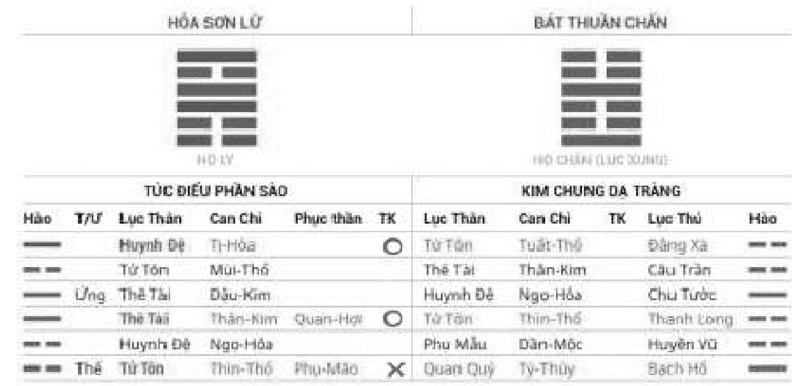

- **Cấu trúc Quẻ Dịch:**
  - **Quẻ chủ:** **Hỏa Sơn Lữ** (Cung Ly, Họ Ly – Quẻ Lục Hợp)  
    *Tượng quẻ:* Tức Điểu Phần Sào (Chim đỗ cháy tổ – sự việc lặp đi lặp lại, giằng co dai dẳng, bệnh cũ kéo dài).
  - **Quẻ biến:** **Bát Thuần Chấn** (Cung Chấn, Họ Chấn – Quẻ Lục Xung)  
    *Tượng quẻ:* Kim Chung Dạ Tràng (Chuông vàng đêm ngân – biến động bộc phát, lúc đau cấp tính lúc tạm dịu bớt mang tính chu kỳ).

- **Bảng chi tiết Lục hào:**

| Hào | Thế/Ứng | Lục thân (Chủ) | Can Chi | Biến động | Lục thân (Biến) | Can Chi (Biến) | Thần sát / Phục | Lục thú |
|:---:|:---:|:---|:---|:---:|:---|:---|:---|:---|
| 6 | | Huynh Đệ | Tỵ - Hỏa | **O (Động)** | Tử Tôn | Tuất - Thổ | Nhật kiến, Hóa mộ (Đập tan Hợp cục) | Đằng Xà |
| 5 | | Tử Tôn | Mùi - Thổ | tĩnh | Thê Tài | Thân - Kim | Mưu tinh, Thiên hỷ | Câu Trần |
| 4 | **Ứng** | Thê Tài | Dậu - Kim | tĩnh | Huynh Đệ | Ngọ - Hỏa | Tướng tinh, Lộc thần, Tuần không | Chu Tước |
| 3 | | Thê Tài | Thân - Kim | **O (Động)** | Tử Tôn | Thìn - Thổ | Dương nhẫn, Tuần không (Phục Quan Hợi) | Thanh Long |
| 2 | | Huynh Đệ | Ngọ - Hỏa | tĩnh | Phụ Mẫu | Dần - Mộc | Đào hoa, Quý nhân | Huyền Vũ |
| 1 | **Thế** | Tử Tôn | Thìn - Thổ | **X (Động)** | Quan Quỷ | Tý - Thủy | Bạch Hổ (Phục Phụ Mão mang Tai sát) | Bạch Hổ |

---

### 3. Dụng thần & Loại quẻ

- **Phân loại quẻ:**
  - **Quẻ tự chiêm vấn tật ách / Truy tìm nguyên nhân bệnh lý (Tầm nguyên bệnh tật):** Định vị chính xác cơ chế sinh lý bệnh, vị trí giải phẫu đốt sống tổn thương và phương cách can thiệp y tế hiệu quả.
  - **Quẻ Tam hợp cục hung hiểm:** Tam hợp Thân - Tý - Thìn hóa Quan Quỷ Thủy cục trói buộc chặt chẽ hào Thế.
- **Xác định Dụng thần:**
  1. **Hào Thế (Tử Tôn Thìn Thổ lâm Bạch Hổ):** Bản thân người hỏi, tư thế nằm trên giường bệnh và cấu trúc đốt sống thắt lưng.
  2. **Tam hợp cục Quan Quỷ (Thân - Tý - Thìn hóa Thủy lâm Bạch Hổ):** Căn bệnh mãn tính nguy hiểm, cơn đau thắt lưng dữ dội và tình trạng tủy dịch rò rỉ chèn ép thần kinh.
  3. **Hào cứu trợ y tế bên ngoài (Hào 6 Huynh Đệ Tỵ Hỏa mang Nhật lệnh hóa Tử Tôn Tuất Thổ):** Biểu tượng của can thiệp y tế bệnh viện bên ngoài, mang năng lực xung phá Tam hợp cục hung hiểm.

---

### 4. Luận giải chi tiết

Quẻ này là kiệt tác phân tích y lý Lục Hào của Chu Thần Bân, xác lập định luật bất hủ về **độ ưu tiên tuyệt đối của Tam hợp cục so với Nhật quẩn chân** và nghệ thuật **định vị đốt sống, giải mã thoát vị đĩa đệm**:

#### 1. Quẻ Lục Hợp biến Lục Xung trong bệnh lý mãn tính
- **Tính chất chu kỳ tái phát:**
  - Quẻ chủ Hỏa Sơn Lữ là quẻ **Lục Hợp**, tượng trưng cho bệnh đã tồn tại âm ỉ từ lâu, giằng co dây dưa nhiều tháng ngày.
  - Biến sang Bát Thuần Chấn là quẻ **Lục Xung**. Với bệnh cảm mạo cấp tính, Lục hợp biến Lục xung là điềm sắp lành; nhưng với bệnh cơ xương khớp mãn tính, Lục hợp biến Lục xung là biểu hiện của **tính chất chu kỳ**: bệnh đau dữ dội giằng co (hợp), sau đó tạm thuyên giảm (xung), rồi một thời gian sau lại bùng phát trở lại thành đợt mới.

#### 2. Định luật kinh điển: Tam hợp cục ưu tiên tuyệt đối so với Nhật quẩn chân
- **Hiện tượng Nhật quẩn chân:** Hào 3 Thê Tài Thân Kim phát động, gặp ngày Tân Tỵ tạo thành Tỵ - Thân tương hợp (Nhật bán hợp / Nhật quẩn chân). Nếu nhìn thiển cận, nhiều người sẽ cho rằng Thân Kim bị kìm chân không thể hành động.
- **Quy tắc ưu tiên tối thượng (rule_index, trang 242):**
  - Chu Thần Bân khẳng định dứt khoát: **Khi một hào vừa có thể hợp với Nhật thần (Nhật quẩn chân), vừa tham gia cấu thành Tam hợp cục trong quẻ, thì Tam hợp cục luôn luôn có quyền năng ưu tiên tuyệt đối!**
  - Sơ hào Thế Thìn Thổ động biến Quan Quỷ Tý Thủy; hào 3 Thân Kim động biến Tử Tôn Thìn Thổ. Cả ba yếu tố liên kết chặt chẽ tạo thành **Tam hợp cục Thân - Tý - Thìn hóa Quan Quỷ Thủy cục**.
  - Tam hợp cục này kéo theo hào Thế Thìn Thổ biến thành Quan Quỷ mang **Bạch Hổ**. Bạch Hổ Quỷ trong quẻ bệnh chủ về cơn đau đớn buốt nhói hành hạ tột cùng.
  - Sơ hào đại diện cho mặt đất, giường chiếu, tư thế nằm ngang thấp nhất. Hào Thế sơ hào biến Bạch Hổ Quỷ chỉ rõ: Cơn đau dữ dội khiến người bệnh bị mất khả năng đi lại, phải nằm liệt trên giường.

#### 3. Định vị giải phẫu y học: Cột sống thắt lưng & Thoát vị đĩa đệm
- **Trục 6 hào và cột sống:**
  - Hào 6, 5 đại diện cho đốt sống cổ và đốt sống ngực; hào sơ và hào 3 đại diện cho **các đốt sống thắt lưng (L1 - L5)**.
  - Thanh Long đại diện cho cột xương sống kéo dài. Hào 3 mang Thanh Long nhưng lâm Thân Kim Tuần không: Kim chủ về xương, Tuần không biểu thị tình trạng xốp xương, loãng xương, thiếu chất xương ở giữa cột sống thắt lưng.
  - Hào 3 phục Quan Quỷ Hợi Thủy mang Thiên y, Dịch mã bị ngày Tỵ trực xung (Ám động): Thủy chủ về hệ thần kinh, chỉ rõ có hiện tượng rễ thần kinh tủy sống đang bị chèn ép phát tác ngầm.
- **Tượng thoát vị đĩa đệm (Disc Herniation):**
  - Thìn Thổ trong ngũ hành là **Thủy khố (Kho chứa nước)**; nhân nhầy đĩa đệm và dịch tủy sống quy về hành Thủy.
  - Khi Thìn Thổ phát động biến ra Thủy, đó là hình ảnh **"kho nước bị nứt vỡ rò rỉ"** (tương tự bình gas bị xì van). Nhân nhầy đĩa đệm vốn nằm gọn trong khoang đốt sống Thìn Thổ, nay bị rách bao xơ thoát ra ngoài, lồi ra khỏi cấu trúc đốt sống chèn ép trực diện vào rễ thần kinh tọa.
  - Đặc biệt, trong quẻ xuất hiện **hai hào Thìn Thổ cùng biến động** (sơ hào Thế Thìn Thổ và biến hào của hào 3): Đây là chỉ dấu giải phẫu vô cùng chuẩn xác: **Đĩa đệm cột sống thắt lưng bị lồi (thoát vị) ra ở nhiều vị trí, nhiều tầng đốt sống khác nhau!**

#### 4. Hai phần của quẻ: Bệnh cảnh hung hiểm và Sách lược giải cứu từ bên ngoài
- **Phần thứ nhất (Sơ hào và hào 3):** Phác họa toàn bộ bệnh cảnh thoát vị đĩa đệm chèn ép thần kinh tạo thành hợp cục Quỷ Bạch Hổ. Nếu chỉ tự chữa trị ở nhà (dán cao, xoa bóp nội tại bằng Thìn Thổ sơ hào), hợp cục không thể phá, bệnh sẽ biến thành dị tật nằm liệt giường suốt đời.
- **Phần thứ hai (Hào 6 Huynh Đệ Tỵ Hỏa biến Tử Tôn Tuất Thổ):**
  - Hào 6 nằm ở Ngoại quái, mang Nhật lệnh, phát động hóa xuất **Tử Tôn Tuất Thổ**.
  - Tuất Thổ xung trực diện vào Thìn Thổ (Thìn Tuất tương xung). Nhờ có lực xung của Tuất Thổ từ bên ngoài, **Tam hợp cục Thân - Tý - Thìn bị đập tan hoàn toàn**, cứu nguy cho hào Thế Thìn Thổ thoát khỏi cục diện Bạch Hổ Quỷ!
  - Lời chỉ dẫn cứu mạng: Người bệnh tuyệt đối không được tự ý điều trị tại nhà theo kinh nghiệm dân gian; bắt buộc phải nhanh chóng đến bệnh viện chuyên khoa tuyến trên tiếp nhận phác đồ điều trị Tây y chính thống để phá tan mầm bệnh.

---

### 5. Kết luận & Ứng kỳ thực tế

- **Lời giải đoán & Khuyến nghị của Chu Thần Bân:**
  - Tác giả tự giải quẻ cho mình: Cơn đau thắt lưng dữ dội là do tổn thương thoái hóa đốt sống và đĩa đệm cột sống thắt lưng bị lồi ra ở nhiều tầng chèn ép dây thần kinh.
  - Nhận thấy hào 6 mang Nhật lệnh biến Tử Tôn Tuất Thổ xung phá hợp cục, tác giả lập tức dừng việc tự xoa bóp tại nhà, lập tức đến bệnh viện chuyên khoa xương khớp để chụp chiếu và điều trị.
- **Phản hồi thực tế (Feedback):**
  - Kết quả chụp cộng hưởng từ (MRI) tại bệnh viện cho kết luận chính xác 100% với tượng quẻ: **Bệnh nhân bị thoái hóa đốt sống và lồi đĩa đệm cột sống thắt lưng ở nhiều vị trí (đa tầng đốt sống L4-L5, L5-S1)**.
  - Được các bác sĩ áp dụng phác đồ điều trị vật lý trị liệu chuyên sâu kết hợp dùng thuốc kháng viêm giãn cơ (đúng như tượng Tử Tôn Tuất Thổ can thiệp từ bên ngoài), cơn đau thắt lưng của tác giả thuyên giảm nhanh chóng, thoát khỏi nguy cơ nằm liệt giường và khôi phục khả năng đi lại bình thường.
- **Ứng kỳ chiêm nghiệm:**
  - Ứng nghiệm ngay trong ngày đi khám bệnh viện và điều trị khỏi sau liệu trình chuyên khoa.

---

### 6. Bài học tâm pháp & Quy tắc cốt lõi

- **Quy tắc Lục Hào rút ra từ ca thực chiến (rule_index, trang 242):**
  1. *Quy tắc ưu tiên Tam hợp cục so với Nhật quẩn chân (Nhật bán hợp) và định vị đốt sống thắt lưng:* Tam hợp cục có độ ưu tiên quyết định tuyệt đối trong Lục Hào. Bất kể hào có xu hướng hợp Nhật (Nhật quẩn chân), khi hội đủ ba chi tam hợp trong quẻ thì Tam hợp cục tự động kích hoạt.
  2. *Quy tắc tượng "Thủy khố rò rỉ" trong thoát vị đĩa đệm:* Thìn Thổ là thủy khố biến thành Thủy, tượng trưng cho nhân nhầy đĩa đệm bị thoát vị lồi ra ngoài cấu trúc xương sống chèn ép rễ thần kinh. Đa hào Thìn Thổ phát động là thoát vị ở nhiều tầng đốt sống.
  3. *Quy tắc phá vỡ hợp cục để trị bệnh nan y:* Khi bệnh tật tạo thành Tam hợp cục Quan Quỷ Bạch Hổ, phương pháp cứu chữa duy nhất là dựa vào hào động ngoại quái (Tử Tôn xung phá một chi trong hợp cục), đại diện cho can thiệp y tế chính thống từ bên ngoài.
- **Bài học tâm pháp:**
  - Khi xem quẻ cho chính mình, người thực hành Dịch học phải giữ tâm trí tuyệt đối khách quan, không né tránh tượng xấu. Nhìn thẳng vào sự thật Tam hợp cục Quan Quỷ để kịp thời tìm đến sự trợ giúp y khoa chính thống là bài học đắt giá về sự kết hợp giữa Dịch lý và y học hiện đại.

---

## THỰC CHIẾN 31: Hỏi về dự án Phật giáo có ảnh hưởng đến triển vọng sự nghiệp của bản thân không

### 1. Bối cảnh & Câu hỏi

- **Bối cảnh chi tiết:** 
  Một người tín đồ Phật giáo có tâm nguyện muốn khởi xướng và phát triển một số dự án công ích gắn liền với Phật giáo. Đương số không đặt mục tiêu kiếm tiền hay mưu cầu lợi ích kinh tế cá nhân, mà mong muốn coi công việc này như một sự nghiệp cống hiến lâu dài của cuộc đời mình. Trước khi bắt tay vào triển khai thực tế, đương số đã gieo quẻ Dịch để dự trắc xu hướng phát triển và triển vọng của sự nghiệp này trong tương lai.
- **Tâm lý & Câu hỏi ẩn ý:** 
  Người hỏi có tâm lý thuần khiết hướng thiện, không màng danh lợi kim tiền nhưng trong lòng còn băn khoăn về tính khả thi, sự ổn định và cơ hội phát triển bền vững của dự án. Câu hỏi đặt ra là: *"Dự án Phật giáo này có ảnh hưởng đến triển vọng sự nghiệp của bản thân không, xu hướng sẽ diễn tiến ra sao?"*.
- **Thời gian chiêm đoán:**
  - Dương lịch: Ngày 31 tháng 12 năm 2016, 11 giờ 55 phút (Giờ Bắc Kinh).
  - Can chi: Năm Bính Thân, tháng Canh Tý, ngày Đinh Hợi, giờ Bính Ngọ.

---

### 2. Dữ kiện & Bảng quẻ Crop

- **Thời không chiêm nghiệm:**
  - Tháng Canh Tý (Thủy vượng, Mộc tướng, Kim hưu, Thổ tù, Hỏa tử).
  - Ngày Đinh Hợi (Thủy vượng, Mộc trường sinh).
  - Tuần không: **Ngọ, Mùi** (Giáp Thân tuần trung, Ngọ Mùi không vong).
- **Thần sát:**
  - Tướng tinh: Mão
  - Hoa cái: Mùi (Lâm Tuần không)
  - Dịch mã: Tỵ
  - Tai sát: Dậu
  - Mưu tinh: Sửu
  - Đào hoa: Tý (Lâm Nguyệt kiến, hào 5)
  - Kiếp sát: Thân (Lâm hào Ứng)
  - Lộc thần: Ngọ (Lâm Tuần không, hào 2)
  - Dương nhẫn: Tỵ
  - Văn Xương: Dậu
  - Thiên y: Hợi (Lâm Nhật kiến)
  - Thiên hỷ: Mùi (Lâm Tuần không)
  - Quý nhân: Dậu, Hợi (Nhật kiến lâm Quý nhân)

- Dữ kiện bảng quẻ và các thông số chiêm đoán:
  - **Bảng 31.1** Đồ hình quẻ Thực chiến 31:
    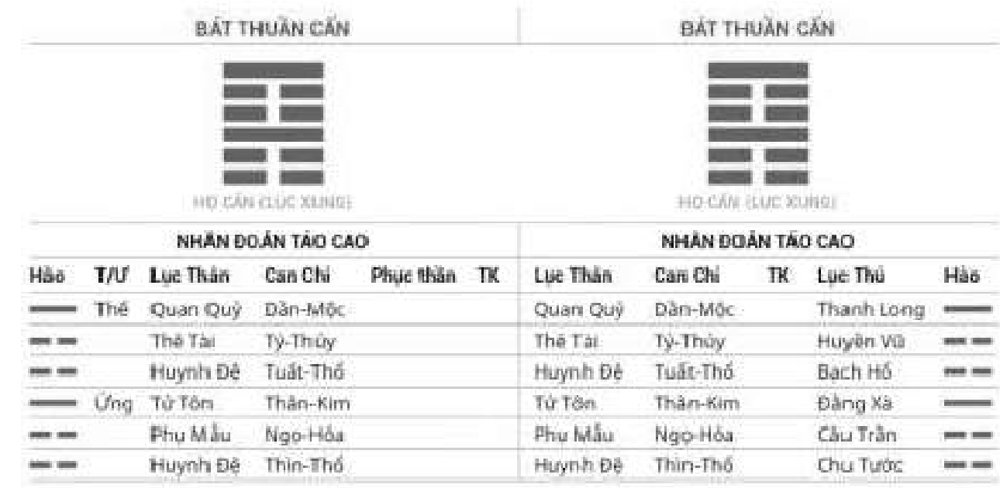

- **Cấu trúc Quẻ Dịch:**
  - **Quẻ chủ:** **Bát Thuần Cấn** (Cung Cấn, Họ Cấn – Quẻ Lục Xung, Tĩnh quẻ).
    *Tượng quẻ:* Nhân Đoán Táo Cao (Người gánh nồi cao – thế núi trùng điệp ngăn trở, hành sự phải vững chãi, kiên định từng bước).
  - **Quẻ biến:** Không có (Quẻ thuần tĩnh lục hào an tĩnh).

- **Bảng chi tiết Lục hào:**

| Hào | Thế/Ứng | Lục thân (Chủ) | Can Chi (Chủ) | Biến động | Lục thân (Biến) | Can Chi (Biến) | Thần sát / Phục | Lục thú |
|:---:|:---:|:---|:---|:---:|:---|:---|:---|:---|
| 6 | **Thế** | Quan Quỷ | Dần - Mộc | tĩnh | Quan Quỷ | Dần - Mộc | Thanh Long | Thanh Long |
| 5 | | Thê Tài | Tý - Thủy | tĩnh | Thê Tài | Tý - Thủy | Đào hoa, Nguyệt kiến | Huyền Vũ |
| 4 | | Huynh Đệ | Tuất - Thổ | tĩnh | Huynh Đệ | Tuất - Thổ | Bạch Hổ | Bạch Hổ |
| 3 | **Ứng** | Tử Tôn | Thân - Kim | tĩnh | Tử Tôn | Thân - Kim | Kiếp sát | Đằng Xà |
| 2 | | Phụ Mẫu | Ngọ - Hỏa | tĩnh | Phụ Mẫu | Ngọ - Hỏa | Tuần không, Lộc thần | Câu Trần |
| 1 | | Huynh Đệ | Thìn - Thổ | tĩnh | Huynh Đệ | Thìn - Thổ | Chu Tước | Chu Tước |

---

### 3. Dụng thần & Loại quẻ

- **Phân loại quẻ:**
  - **Quẻ vấn sự nghiệp dài hạn:** Đương số hỏi xem sự nghiệp có làm được không, xu hướng dài hạn ra sao. Sự nghiệp khác với việc cầu tài (vốn lấy Thê tài làm Dụng) và khác với việc nhận thầu một dự án công việc cụ thể ngắn hạn mang tính một lần (vốn lấy Phụ mẫu làm Dụng). Khi hỏi định vị sự nghiệp, hào **Quan Quỷ** giữ vai trò Dụng thần trung tâm.
  - **Quẻ tĩnh (Lục hào an tĩnh) & Quẻ Lục Xung:** Quẻ không có hào động, toàn bộ kết cấu tĩnh lặng nhưng lại mang bản chất tương xung nội tại giữa các cặp hào ứng đôi.
- **Xác định Dụng thần:**
  1. **Dụng thần cốt lõi (Quan Quỷ Dần Mộc trì Thế ở hào 6):** Đại diện cho bản thân sự nghiệp, địa vị, chức năng tổ chức và sự gắn kết của người hỏi với sự nghiệp Phật giáo.
  2. **Nguyên thần (Thê Tài Tý Thủy ở hào 5 và Nguyệt kiến):** Sinh trợ cho Dụng thần Quan Quỷ Dần Mộc, đại diện cho nguồn dinh dưỡng, cơ sở vật chất và nhân duyên hỗ trợ.
  3. **Kỵ thần (Tử Tôn Thân Kim ở hào 3 Ứng):** Khắc chế Quan Quỷ Dần Mộc, đại diện cho những trở ngại, sự thờ ơ hoặc các hoạt động tiêu tán năng lượng sự nghiệp.
  4. **Cừu thần (Huynh Đệ Tuất Thổ, Thìn Thổ):** Khắc Thê tài, sinh Tử tôn, đại diện cho sự tiêu hao chi phí và cản trở nguồn sinh trợ.

---

### 4. Luận giải chi tiết

Quẻ này là một trường hợp kinh điển minh giải hai chuyên đề lý thuyết quan trọng trong hệ thống Lục Hào Cổ Thệ: nhận định trạng thái "quá vượng" và giải mã tính hai mặt của quẻ Lục Xung.

#### 1. Định tính cơ bản của quẻ tĩnh: Dụng thần trì Thế có gốc rễ vững vàng
- Trong nguyên tắc luận giải quẻ tĩnh, tiêu chí then chốt hàng đầu là xác định xem Dụng thần hay Kỵ thần nắm giữ hào Thế. Tại đây, hào Thế lâm Quan Quỷ Dần Mộc chính là Dụng thần giữ Thế.
- Dụng thần Quan Quỷ Dần Mộc đắc lệnh: 
  - Tại Nguyệt lệnh Canh Tý được Tý Thủy sinh vượng.
  - Tại Nhật lệnh Đinh Hợi được Hợi Thủy tương sinh và hợp khởi (Hợi Dần lục hợp).
  - Bản thân hào Thế không bị Nhật phá, không bị Nguyệt phá, lại không lâm Tuần không.
- Hơn thế nữa, Dụng thần có gốc rễ nội tại vững chắc ngay trong nội bộ quẻ tượng: hào 5 Thê Tài Tý Thủy kề cận tương sinh cho hào Thế Dần Mộc. Cổ pháp quy định: chỉ có Nguyên thần hiện diện trong quẻ mới được tính là gốc rễ bền vững, Nguyên thần ở Nhật Nguyệt chỉ đại diện cho trợ lực ngoại cảnh thời không. Do đó, việc Dụng thần trì Thế đắc gốc là điềm cát lợi căn bản, khẳng định dự án này về mặt bản chất hoàn toàn có thể làm được và có triển vọng thành tựu.

#### 2. Phân biệt trạng thái "Quá vượng" và "Vượng tướng bình thường"
- Hào Thế Quan Quỷ Dần Mộc nhận được lực sinh dưỡng tột cùng từ cả Nhật và Nguyệt lệnh (Tý sinh, Hợi sinh hợp). Chu Thần Bân đặt ra câu hỏi học thuật then chốt: *Liệu hào Thế có rơi vào trạng thái "quá vượng" hay không?*
- Khái niệm "Quá vượng" trong Lục Hào: Một hào đắc lực sinh vượng tột cùng nhưng nếu không tương thích với thực trạng nền tảng thực tế sẽ chuyển hóa thành trạng thái ngưng trệ, "vật cực tất phản". Nếu rơi vào quá vượng, trong ngắn hạn dự án sẽ không có cơ sở thực thi, không thể gặt hái thành quả sớm mà phải mất nhiều năm bồi đắp nền tảng mới dần khởi sắc.
- Cơ chế đối chiếu thực tế: Nhật và Nguyệt đại diện cho hoàn cảnh hiện trạng khách quan:
  - Tháng Tý mang Đào hoa sinh Thế; ngày Hợi mang Quý nhân và Thiên y sinh hợp Thế. Điều này hàm ý các mối quan hệ xã hội, kinh tế, nhân duyên và sự trợ lực từ những người có uy tín.
  - Nếu đương số trong thực tế đã tích lũy sẵn các mối quan hệ xã hội tốt đẹp, có nguồn tài chính ổn định và nhận được sự hậu thuẫn từ quý nhân, thì lực sinh của Nhật Nguyệt phản ánh đúng thực tế, hào Thế là **vượng tướng bình thường**. Sự nghiệp sẽ nhanh chóng khởi động và phát triển thuận lợi.
  - Ngược lại, nếu thực tế người hỏi chỉ mới bắt đầu từ con số không, chưa có nguồn lực, thiếu vắng các mối liên kết xã hội thì quẻ tượng biểu thị sự bất cân xứng (quá vượng), báo hiệu chặng đường khởi đầu sẽ gặp nhiều khó khăn, đòi hỏi sự kiên trì lâu dài.

#### 3. Hai tầng ý nghĩa của quẻ Lục Xung trong chiêm đoán sự nghiệp
- Bát Thuần Cấn là quẻ Lục Xung. Thông thường trong quẻ cát, quẻ Lục Xung chủ sự việc diễn tiến nhanh chóng, mau đạt kết quả.
- Tuy nhiên, sự nghiệp là việc dài hạn của cả đời người, nên tính chất Lục Xung hàm chứa hai tầng nghĩa cần phân định theo hoàn cảnh thực tế:
  1. **Tính biến động và thăng trầm:** Sự nghiệp sẽ trải qua nhiều chu kỳ lúc thịnh lúc suy, lúc thuận lợi hanh thông, lúc ngưng trệ trì hoãn. Quá trình phát triển không đi theo đường thẳng mà biến động không ngừng.
  2. **Tính gián đoạn hoặc không kéo dài:** Nếu người làm sự nghiệp không có kế hoạch vận hành dài hạn, chỉ làm theo cảm hứng từng bước một, thì Lục Xung báo hiệu sự việc đạt được kết quả ban đầu nhưng khó duy trì bền vững theo thời gian.
- Trong trường hợp đương số coi đây là sự nghiệp cống hiến tâm huyết, có nguồn vốn tự thân tài trợ và không đặt nặng áp lực tài chính ngắn hạn, thì sự nghiệp vẫn được duy trì, và ý nghĩa Lục Xung chủ yếu thể hiện qua sự thăng trầm và thay đổi hình thức hoạt động theo từng giai đoạn.

---

### 5. Kết luận & Ứng kỳ thực tế

- **Lời giải đoán của Chu Thần Bân:**
  - Dự án Phật giáo này hoàn toàn có thể khởi sự và phát triển thành một sự nghiệp chân chính vì Dụng thần Quan Quỷ Dần Mộc trì Thế có gốc rễ vững bền.
  - Người hỏi cần chuẩn bị sẵn tâm lý đối diện với những đợt sóng biến động thăng trầm trong quá trình triển khai (đặc trưng của quẻ Lục Xung). Sự nghiệp này không thể kỳ vọng sự bình lặng êm ả, mà cần kiên định vượt qua những giai đoạn gián đoạn tạm thời.
  - Đương số cần chuẩn bị vững chắc nguồn lực tự thân và kết nối các mối quan hệ quý nhân (như điềm báo của Nhật Nguyệt) để tạo nền tảng vững vàng, tránh rơi vào bẫy ảo tưởng ngắn hạn.
- **Ứng kỳ chiêm nghiệm:**
  - Việc khởi sự bước đầu sẽ thuận lợi vào các năm Mộc - Hỏa nắm quyền (như các năm Dần, Mão, Tỵ, Ngọ) khi Dụng thần và đường sinh hóa đắc lệnh.
  - Các mốc thời gian xung hợp (tháng Dần xung khai Thân kim, tháng Hợi hợp khởi Dần mộc) là thời điểm quan trọng để mở rộng quy mô dự án.

---

### 6. Bài học tâm pháp & Quy tắc cốt lõi

- **Quy tắc trích dẫn từ Cổ Thệ Chân Thuyên:**
  - *Quy tắc phân biệt trạng thái "quá vượng" và "vượng tướng bình thường" qua đối chiếu Nhật Nguyệt với hiện trạng thực tế* (sách Cổ Thệ Chân Thuyên, trang 249): Nhật Nguyệt sinh trợ hào cực vượng chỉ là điềm cát nhanh chóng khi phù hợp với thực trạng nguồn lực của đương số; nếu thực tế chưa đủ nền tảng thì đó là điềm báo phải tích lũy dài hạn.
  - *Quy tắc hai tầng nghĩa của quẻ Lục xung (Bát Thuần Cấn) trong chiêm đoán sự nghiệp dài hạn* (sách Cổ Thệ Chân Thuyên, trang 251): Lục Xung trong việc ngắn hạn chủ nhanh đạt kết quả; trong sự nghiệp dài hạn chủ biến động thăng trầm hoặc khó duy trì nếu thiếu chiến lược vận hành dài hạn.
- **Tâm pháp giải đoán thực tế:**
  - Cần phân định chính xác Dụng thần theo bản chất câu hỏi: Dự án mang tính một lần lấy Phụ mẫu; mưu cầu lợi nhuận lấy Thê tài; sự nghiệp cống hiến gắn bó cuộc đời phải lấy Quan quỷ làm Dụng thần.
  - Mọi thông tin biểu tượng trong Lục Hào (can chi, lục thân, thần sát) đều mang tính bản chất chứ không bó hẹp ở một hiện tượng bề ngoài duy nhất. Người giải quẻ phải luôn lồng ghép biểu tượng vào đúng ngữ cảnh sống và điều kiện thực tế của đương số để đưa ra định hướng chính xác nhất.

## THỰC CHIẾN 32: Vợ đề nghị sửa căn nhà khác để ở, nên tiếp tục cho thuê hay sửa để ở?

### 1. Bối cảnh & Câu hỏi

- **Bối cảnh chi tiết:** 
  Đương số sở hữu một căn nhà phụ mua với mục đích đầu tư bất động sản và đang cho thuê dài hạn. Kế hoạch ban đầu rất rõ ràng: sau khi hết kỳ hạn cho thuê và kết thúc thời gian áp dụng chính sách giảm thuế chuyển nhượng bất động sản (còn khoảng 1-2 năm nữa), đương số sẽ bán căn nhà để thu hồi vốn và chốt lời. Tuy nhiên, đúng vào thời điểm khách thuê sắp hết hợp đồng trả lại nhà, người vợ lại thấy căn nhà này có diện tích rộng rãi hơn căn nhà hai vợ chồng đang ở, nên đề nghị chi tiền cải tạo, sửa sang lại nội thất để cả gia đình chuyển sang đó sinh sống. Đứng trước hai phương án đối lập, đương số rơi vào trạng thái bối rối, không biết nên kiên định kế hoạch cũ hay nghe theo lời vợ.
- **Tâm lý & Câu hỏi ẩn ý:** 
  Đương số vừa muốn tối ưu hóa lợi ích tài chính theo lộ trình đã vạch sẵn, vừa băn khoăn về tính cát hung và mức độ thuận tiện nếu nghe theo phương án sửa nhà của vợ. Câu hỏi đặt ra là: *"Vợ đề nghị sửa căn nhà khác để ở, nên tiếp tục cho thuê hay sửa để ở thì tốt hơn?"*.
- **Thời gian chiêm đoán:**
  - Dương lịch: Ngày 3 tháng 1 năm 2017, 12 giờ 46 phút (Giờ Bắc Kinh).
  - Can chi: Năm Bính Thân, tháng Canh Tý, ngày Canh Dần, giờ Nhâm Ngọ.

---

### 2. Dữ kiện & Bảng quẻ Crop

- **Thời không chiêm nghiệm:**
  - Tháng Canh Tý (Thủy vượng, Mộc tướng, Kim hưu, Thổ tù, Hỏa tử).
  - Ngày Canh Dần (Mộc vượng, Hỏa tướng).
  - Tuần không: **Ngọ, Mùi** (Giáp Thân tuần trung, Ngọ Mùi không vong).
- **Thần sát:**
  - Tướng tinh: Ngọ (Lâm Tuần không)
  - Hoa cái: Tuất (Hào 4)
  - Dịch mã: Thân
  - Tai sát: Tý (Lâm Nguyệt kiến, hào Thế)
  - Mưu tinh: Thìn (Lâm biến hào)
  - Đào hoa: Mão (Hào 3)
  - Kiếp sát: Hợi
  - Lộc thần: Thân (Phục dưới hào Thế)
  - Dương nhẫn: Dậu
  - Văn Xương: Hợi
  - Thiên y: Hợi
  - Thiên hỷ: Mùi (Lâm Tuần không, hào 1)
  - Quý nhân: Dần, Ngọ (Nhật kiến lâm Quý nhân)

- Dữ kiện bảng quẻ và các thông số chiêm đoán:
  - **Bảng 32.1** Đồ hình quẻ Thực chiến 32:
    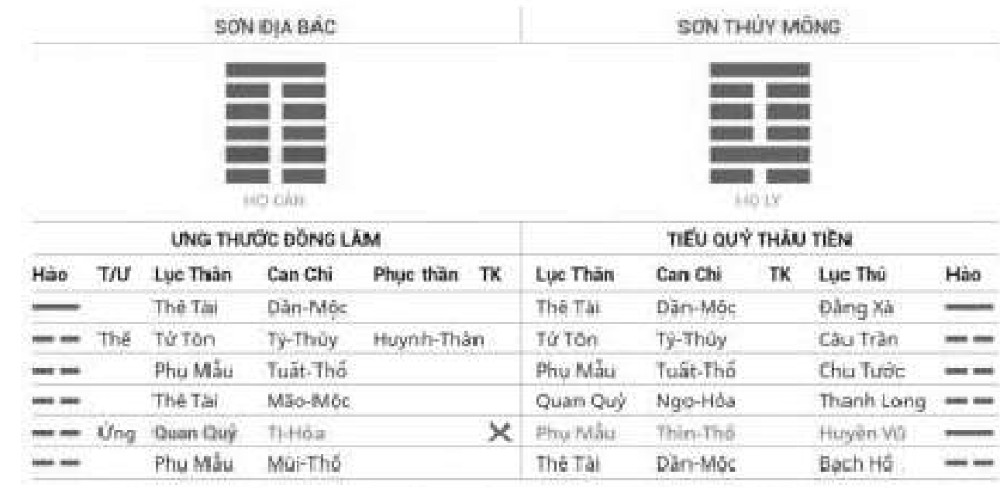

- **Cấu trúc Quẻ Dịch:**
  - **Quẻ chủ:** **Sơn Địa Bác** (Cung Càn, Họ Càn)  
    *Tượng quẻ:* Ưng Thước Đồng Lâm (Chim ưng cùng sẻ đậu chung rừng – tình thế phân vân, nền tảng cũ đang dần suy thoái hoặc chuyển giao).
  - **Quẻ biến:** **Sơn Thủy Mông** (Cung Ly, Họ Ly)  
    *Tượng quẻ:* Tiểu Quỷ Thâu Tiền (Quỷ nhỏ trộm tiền – biến thành mơ hồ, tiềm ẩn rủi ro thất thoát tài chính và hao tổn).

- **Bảng chi tiết Lục hào:**

| Hào | Thế/Ứng | Lục thân (Chủ) | Can Chi (Chủ) | Biến động | Lục thân (Biến) | Can Chi (Biến) | Thần sát / Phục | Lục thú |
|:---:|:---:|:---|:---|:---:|:---|:---|:---|:---|
| 6 | | Thê Tài | Dần - Mộc | tĩnh | Thê Tài | Dần - Mộc | Nhật kiến, Quý nhân | Đằng Xà |
| 5 | **Thế** | Tử Tôn | Tý - Thủy | tĩnh | Tử Tôn | Tý - Thủy | Nguyệt kiến, Tai sát / Phục Huynh Thân | Câu Trần |
| 4 | | Phụ Mẫu | Tuất - Thổ | tĩnh | Phụ Mẫu | Tuất - Thổ | Hoa cái | Chu Tước |
| 3 | | Thê Tài | Mão - Mộc | tĩnh | Quan Quỷ | Ngọ - Hỏa | Đào hoa / Biến Tuần không | Thanh Long |
| 2 | **Ứng** | Quan Quỷ | Tị - Hỏa | **X (Động)** | Phụ Mẫu | Thìn - Thổ | Kiếp sát, Mưu tinh | Huyền Vũ |
| 1 | | Phụ Mẫu | Mùi - Thổ | tĩnh | Thê Tài | Dần - Mộc | Tuần không, Thiên hỷ | Bạch Hổ |

---

### 3. Dụng thần & Loại quẻ

- **Phân loại quẻ:**
  - **Quẻ lựa chọn phương án đối chiếu:** So sánh giữa hai phương án hành động: (1) Giữ nguyên hiện trạng tiếp tục cho thuê vs (2) Chi tiền cải tạo sửa sang để dọn vào ở.
  - **Quẻ song hệ quy chiếu (Quẻ sự việc song hành Quẻ tâm thái):** 
    + Dưới góc độ quẻ sự việc: Đối chiếu tương quan sinh khắc giữa hào Thế và các đối tượng phương án.
    + Dưới góc độ quẻ tâm thái: Quan Quỷ đại diện cho mầm mống họa hại, lo âu, rủi ro; Tử Tôn đại diện cho sự an ổn, phúc lạc và cát lợi vô ưu.
- **Xác định Dụng thần:**
  1. **Phương án 1 (Tiếp tục cho thuê):** Hiện thân qua hào Thế **Tử Tôn Tý Thủy** lâm Nguyệt lệnh và lâm Câu Trần. Câu Trần chủ sự ổn định, thói quen lâu dài; Nguyệt lệnh chủ hiện trạng sẵn có từ quá khứ kéo dài đến hiện tại.
  2. **Phương án 2 (Sửa nhà để ở):** Hiện thân qua hào Ứng **Quan Quỷ Tị Hỏa** độc phát lâm Huyền Vũ hóa Phụ Mẫu Thìn Thổ mang Mưu tinh.
  3. **Yếu tố người vợ:** Thê Tài Dần Mộc phục tàng dưới hào Ứng, đồng thời lâm Nhật kiến mang Quý nhân.

---

### 4. Luận giải chi tiết

Quẻ này là mẫu mực giải đoán khi đứng trước ngã rẽ lựa chọn, kết hợp nhuần nhuyễn giữa hiện trạng thực tế và tâm pháp đối chiếu quẻ tượng.

#### 1. Định vị hai phương án qua hệ quy chiếu Quẻ Sự Việc và Quẻ Tâm Thái
- Chu Thần Bân phân tích: trong chiêm đoán Lục Hào, khi người hỏi đưa ra hai phương án lựa chọn, quẻ tượng thường phản ánh theo hai cách:
  - **Quẻ sự việc:** Biểu thị hai sự vật đối chiếu với hào Thế. Phương án nào sinh phù hào Thế là cát, phương án nào khắc phạt hoặc làm tổn hao hào Thế là hung.
  - **Quẻ tâm thái:** Lấy Tử Tôn làm thần an vui, thuận lợi; lấy Quan Quỷ làm thần lo lắng, tai ương. Phương án nào kích hoạt Quan Quỷ phát động thì phương án đó mang lại hiểm họa và rắc rối; phương án nào an vị tại Tử Tôn thì mang lại sự bình an.
- Trong quẻ này, hào Thế là **Tử Tôn Tý Thủy**, đắc Nguyệt lệnh tương trợ cực vượng:
  - Nguyệt lệnh đại diện cho trạng thái vốn đã định hình từ trước và kéo dài đến nay. Căn nhà này trước đây đã cho thuê và vận hành ổn định.
  - Hào Thế lâm Câu Trần chủ duy trì trật tự cũ, Tử Tôn chủ an tâm, không có tranh chấp hay hiểm họa. Do đó, phương án tiếp tục duy trì cho thuê hoàn toàn phù hợp với bản chất cát lợi của hào Thế.

#### 2. Giải mã động hào: Nguồn gốc đề xuất của người vợ
- Trong quẻ chỉ duy nhất hào 2 **Ứng Quan Quỷ Tị Hỏa** phát động (độc phát).
- Hào Ứng lâm Huyền Vũ: Huyền Vũ chủ sự việc bất ngờ nảy sinh, ý tưởng đột ngột xuất hiện ngoài kế hoạch ban đầu.
- Hào phục của hào Ứng chính là Thê Tài Dần Mộc, đồng thời Thê Tài Dần Mộc lâm Nhật kiến mang Quý nhân. Hào Thê tài đại diện cho người vợ. Như vậy, quẻ chỉ rõ: ý tưởng cải tạo nhà dọn vào ở hoàn toàn bắt nguồn từ sự bột phát chủ quan của người vợ.
- Hào Ứng mang Quan Quỷ lại phát động, trong quẻ tâm thái là điềm báo chắc chắn có vấn đề, kích hoạt rắc rối và bất an.

#### 3. Tượng sửa nhà và hiểm họa "Nhập Mộ Khố"
- Hào Ứng Quan Quỷ Tị Hỏa lâm **Văn Xương**: Văn Xương chủ về thiết kế, bản vẽ, bài trí và trang trí nội thất. Động hào mang Văn Xương chính là hình tượng công việc cải tạo, sửa sang nhà cửa.
- Quan Quỷ Tị Hỏa động biến ra **Phụ Mẫu Thìn Thổ**:
  - Phụ Mẫu đại diện cho nhà cửa, nơi cư trú.
  - Thìn Thổ mang **Mưu tinh**: biểu thị một kế hoạch có chủ đích rõ ràng nhằm chuyển cả gia đình vào ở.
  - Quan trọng hơn, Thìn Thổ chính là **Mộ khố** của hào Thế Tý Thủy (Thủy mộ tại Thìn). Hào Thế đại diện cho bản thân người hỏi và gia đình. Sửa nhà xong rồi dọn vào ở đồng nghĩa với việc tự "giam cầm" hoặc nhốt bản thân vào trong Mộ khố. Đây là tượng cực kỳ bất lợi, chủ sự bế tắc, tù túng và tai họa giam hãm.

#### 4. Nguy cơ sức khỏe từ "Hỏa Quỷ" và vật liệu cải tạo
- Hào động Quan Quỷ Tị Hỏa lâm **Kiếp sát**, thuộc hành Hỏa ("Hỏa Quỷ"). Trong y lý Lục Hào, Hỏa chủ về hệ tuần hoàn, máu huyết và tim mạch.
- Hào Quan Quỷ Tị Hỏa lại tương xung với **Thiên y** (Thiên y tại Hợi Thủy). Quan Quỷ xung phá Thiên y là điềm báo bệnh tật nguy hiểm xuất hiện do môi trường sống tạo nên.
- Chu Thần Bân đặc biệt cảnh báo: việc cải tạo nhà trong thời điểm này rất dễ dẫn đến rủi ro sử dụng phải vật liệu xây dựng, sơn sửa kém chất lượng chứa độc tố phát tán, gây ra các bệnh nghiêm trọng về máu (như bệnh bạch cầu).
- Về thời vận: Năm 2017 là năm Đinh Dậu, Dậu Kim hợp sinh cho Thìn Thổ mộ khố, đồng thời sinh vượng cho Quỷ khí tiềm tàng. Nếu vội vàng cải tạo và dọn vào ở sẽ chuốc lấy hậu quả khó lường.

---

### 5. Kết luận & Ứng kỳ thực tế

- **Lời giải đoán của Chu Thần Bân:**
  - Khuyên đương số tuyệt đối không nên nghe theo đề xuất của vợ để sửa nhà dọn vào ở.
  - Phải kiên định duy trì kế hoạch ban đầu: tiếp tục ký hợp đồng cho thuê nhà để giữ nguyên trạng thái an ổn (Tử Tôn Tý Thủy đắc Nguyệt lệnh). Đợi thêm 1-2 năm nữa khi hết thời hạn ưu đãi chính sách giảm thuế thì tiến hành bán căn nhà chốt lời theo đúng dự định.
- **Ứng kỳ chiêm nghiệm:**
  - Việc duy trì cho thuê tiếp tục mang lại nguồn thu ổn định trong các tháng Thủy - Mộc vượng.
  - Tránh được tai họa sức khỏe và tổn thất tài chính lớn nhờ từ bỏ ý định sửa nhà trong năm Đinh Dậu.

---

### 6. Bài học tâm pháp & Quy tắc cốt lõi

- **Quy tắc trích dẫn từ Cổ Thệ Chân Thuyên:**
  - *Quy tắc đối chiếu quẻ sự việc và quẻ tâm thái trong lựa chọn bất động sản (cho thuê tiếp hay sửa để ở)* (sách Cổ Thệ Chân Thuyên, trang 256): Khi đương số đứng trước hai ngả đường lựa chọn, quẻ sự việc dùng hào Thế so sánh lực sinh khắc giữa các phương án, còn quẻ tâm thái nhìn vào hào động Quan Quỷ (rủi ro, lo âu) hay Tử Tôn (an tâm, thuận lợi) để định đoạt phương án tối ưu.
- **Tâm pháp giải đoán thực tế:**
  - Cần truy nguyên nguồn gốc hào động: Hào Ứng mang Huyền Vũ lại phục Thê Tài Quý nhân cho thấy ý tưởng mới xuất phát từ người vợ, không phải chủ định ban đầu của người hỏi.
  - Tượng "Hào Thế nhập Mộ tại biến hào Phụ mẫu": Khi hỏi về nhà ở mà hào biến là Mộ khố của hào Thế, đó là điềm báo không nên chuyển đến nơi ở mới vì sẽ rơi vào thế bị vây hãm, ngột ngạt và ảnh hưởng xấu đến sinh khí toàn gia đình.
  - Hỏa Quỷ xung Thiên y là tín hiệu đặc thù cảnh báo môi trường sống ô nhiễm hoặc độc tố từ vật liệu xây dựng làm tổn thương hệ máu huyết.

## THỰC CHIẾN 33: Thảo luận việc lắp đặt thêm thang máy cho cư dân tòa nhà cũ

### 1. Bối cảnh & Câu hỏi

- **Bối cảnh chi tiết:** 
  Một chủ sở hữu căn hộ tại một khu tập thể chung cư cũ thuộc khu vực trường học trọng điểm ở thành phố Quảng Châu (Trung Quốc). Tại thị trường này, nhà tập thể cũ có thang máy có giá trị thương mại cao hơn khoảng 20% so với nhà thang bộ thông thường. Để nâng cao giá trị căn hộ và thuận tiện đi lại, đương số cùng một nhóm cư dân đã đứng ra vận động các hộ trong tòa nhà cùng đóng góp kinh phí lắp đặt thêm thang máy ngoài trời. Theo quy định địa phương, việc lắp đặt thang máy cho nhà cũ đòi hỏi phải thu thập chữ ký đồng thuận của ít nhất 80% số hộ dân và diện tích sở hữu. Trong quá trình triển khai, đương số gặp phải sự phản đối và bất hợp tác của một số chủ hộ, khiến tiến độ đình trệ. Đương số gieo quẻ để xem liệu có thể giải quyết trở ngại này để hoàn thành dự án hay không.
- **Tâm lý & Câu hỏi ẩn ý:** 
  Đương số đinh ninh rằng trở ngại lớn nhất duy nhất là sự bất hợp tác, khó tính của các hộ dân hàng xóm. Người hỏi muốn biết liệu có thể thuyết phục thành công các hộ này để lắp đặt thang máy hay không.
- **Thời gian chiêm đoán:**
  - Dương lịch: Ngày 3 tháng 1 năm 2017, 16 giờ 38 phút (Giờ Bắc Kinh).
  - Can chi: Năm Bính Thân, tháng Canh Tý, ngày Canh Dần, giờ Giáp Thân.

---

### 2. Dữ kiện & Bảng quẻ Crop

- **Thời không chiêm nghiệm:**
  - Tháng Canh Tý (Thủy vượng, Mộc tướng, Hỏa tử, Thổ tù).
  - Ngày Canh Dần (Mộc vượng, Kim tuyệt).
  - Tuần không: **Ngọ, Mùi** (Giáp Thân tuần trung, Ngọ Mùi không vong).
- **Thần sát:**
  - Tướng tinh: Ngọ (Lâm Tuần không)
  - Hoa cái: Tuất (Lâm biến hào)
  - Dịch mã: Thân
  - Tai sát: Tý (Lâm Nguyệt kiến, biến hào)
  - Mưu tinh: Thìn
  - Đào hoa: Mão (Hào 2 và hào 6)
  - Kiếp sát: Hợi
  - Lộc thần: Thân
  - Dương nhẫn: Dậu
  - Văn Xương: Hợi
  - Thiên y: Hợi
  - Thiên hỷ: Mùi (Lâm Tuần không, hào Thế)
  - Quý nhân: Dần, Ngọ (Nhật kiến lâm Quý nhân)

- Dữ kiện bảng quẻ và các thông số chiêm đoán:
  - **Bảng 33.1** Đồ hình quẻ Thực chiến 33:
    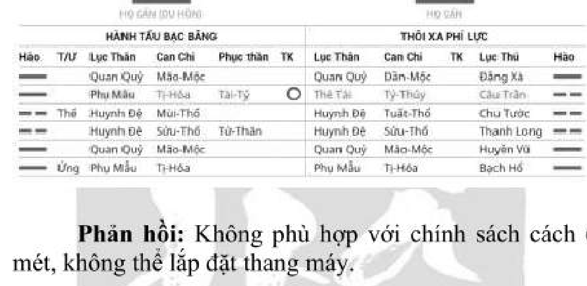

- **Cấu trúc Quẻ Dịch:**
  - **Quẻ chủ:** **Phong Trạch Trung Phu** (Cung Cấn, Họ Cấn – Quẻ Du Hồn)  
    *Tượng quẻ:* Hành Tẩu Bạc Băng (Đi trên băng mỏng – việc tiến hành đầy gian nan, phải cẩn trọng từng bước).
  - **Quẻ biến:** **Sơn Trạch Tổn** (Cung Cấn, Họ Cấn)  
    *Tượng quẻ:* Thời Xa Phí Lực (Đẩy xe tốn sức – biến thành quẻ Tổn, chủ thất thoát tiền bạc, hao tài tốn sức mà không thành).

- **Bảng chi tiết Lục hào:**

| Hào | Thế/Ứng | Lục thân (Chủ) | Can Chi (Chủ) | Biến động | Lục thân (Biến) | Can Chi (Biến) | Thần sát / Phục | Lục thú |
|:---:|:---:|:---|:---|:---:|:---|:---|:---|:---|
| 6 | | Quan Quỷ | Mão - Mộc | tĩnh | Quan Quỷ | Dần - Mộc | Đào hoa | Đằng Xà |
| 5 | | Phụ Mẫu | Tị - Hỏa | **O (Động)** | Thê Tài | Tý - Thủy | Mã tinh, Văn Xương / Phục Tài Tý | Câu Trần |
| 4 | **Thế** | Huynh Đệ | Mùi - Thổ | tĩnh | Huynh Đệ | Tuất - Thổ | Tuần không, Thiên hỷ | Chu Tước |
| 3 | | Huynh Đệ | Sửu - Thổ | tĩnh | Huynh Đệ | Sửu - Thổ | Phục Tử Thân | Thanh Long |
| 2 | | Quan Quỷ | Mão - Mộc | tĩnh | Quan Quỷ | Mão - Mộc | Đào hoa | Huyền Vũ |
| 1 | **Ứng** | Phụ Mẫu | Tị - Hỏa | tĩnh | Phụ Mẫu | Tị - Hỏa | Bạch Hổ | Bạch Hổ |

---

### 3. Dụng thần & Loại quẻ

- **Phân loại quẻ:**
  - **Quẻ dự án công trình kỹ thuật:** Khởi công lắp đặt thang máy, phê duyệt hồ sơ giấy phép xây dựng.
  - **Quẻ độc phát hồi đầu khắc:** Toàn quẻ chỉ duy nhất hào 5 phát động và bị biến hào khắc ngược lại.
- **Xác định Dụng thần:**
  1. **Dụng thần cốt lõi (Phụ Mẫu Tị Hỏa ở hào 5):** Đại diện cho bản thân công trình thang máy, giấy phép phê duyệt hành chính và quy chuẩn kỹ thuật.
  2. **Hào Thế (Huynh Đệ Mùi Thổ lâm Tuần không, Chu Tước):** Đại diện cho bản thân đương số - người đứng ra vận động, đàm phán, nói chuyện với cư dân (Chu Tước chủ ngôn ngữ, tranh biện).
  3. **Hào Ứng (Phụ Mẫu Tị Hỏa ở hào sơ lâm Bạch Hổ):** Đại diện cho các cư dân khác trong tòa nhà đang có ý kiến phàn nàn, phản đối.
  4. **Kỵ thần triệt tiêu công trình (Thê Tài Tý Thủy):** Biến hào ở hào 5 quay đầu khắc tuyệt Phụ Mẫu Tị Hỏa.

---

### 4. Luận giải chi tiết

Quẻ này là bài học kinh điển về việc bóc tách bản chất mâu thuẫn: phân biệt giữa hiện tượng bề ngoài (hào tĩnh) và nguyên nhân cốt lõi (hào động).

#### 1. Độc phát hồi đầu khắc và điềm báo quẻ biến "Sơn Trạch Tổn"
- Trong quẻ, duy nhất hào 5 **Phụ Mẫu Tị Hỏa** phát động, hóa xuất **Thê Tài Tý Thủy**.
- Tý Thủy mang Nguyệt lệnh đắc thế cực vượng, quay ngược lại khắc tuyệt Phụ Mẫu Tị Hỏa (Hồi đầu khắc).
- Phụ Mẫu Tị Hỏa vốn có xu hướng sinh vượng cho hào Thế Huynh Đệ Mùi Thổ, nhưng khi đã bị hồi đầu khắc thì bản thân nó bị triệt tiêu nguồn sinh khí, không còn năng lực sinh phù cho hào Thế.
- Về mặt quẻ biến: Quẻ biến là **Sơn Trạch Tổn**. Trong lý Dịch Cổ Thệ: hễ quẻ biến thành Tổn thì kết cục sau cùng chắc chắn là hao tổn, mất mát. Nếu cố chấp triển khai thì không những không thu được lợi ích gia tăng giá trị nhà mà còn chuốc lấy thua lỗ nặng nề, thậm chí đối mặt với tranh chấp bồi thường pháp lý.

#### 2. Định danh hình tượng thang máy qua Tinh sát và Lục thân
- Hào phát động Phụ Mẫu Tị Hỏa mang đầy đủ các dấu ấn biểu tượng đặc thù của công trình thang máy:
  - **Mã tinh:** Đại diện cho sự vận động di chuyển lên xuống liên tục.
  - **Phụ Mẫu:** Đại diện cho cơ sở vật chất, thiết bị máy móc, công trình kiến trúc.
  - **Văn Xương:** Đại diện cho kỹ thuật cơ điện, thiết kế thi công chuyên ngành.
  - **Lộc thần (tại ngày Canh):** Biểu thị giá trị kinh phí đầu tư lớn và tốn kém.
- Sự kết hợp này mô tả chính xác dự án thang máy kỹ thuật cao nhưng chi phí rất đắt đỏ. Khi hào này bị hồi đầu khắc, đó là điềm báo việc thi công cơ điện và pháp lý sẽ bị hủy bỏ giữa chừng.

#### 3. Phân định Hào Tĩnh và Hào Động: Trở ngại cốt lõi thực sự nằm ở đâu?
- Đương số băn khoăn nhất về sự bất hợp tác của các hộ cư dân láng giềng. Quẻ tượng phản ánh rất thực tế: hào sơ **Ứng Phụ Mẫu Tị Hỏa lâm Bạch Hổ**. Bạch Hổ chủ về sự hung hăng, phàn nàn, bất bình. Điều này xác nhận việc hàng xóm phản đối và phàn nàn là có thật.
- Tuy nhiên, Chu Thần Bân chỉ ra điểm mấu chốt: **Hào Ứng hoàn toàn an tĩnh (tĩnh hào)**. Trong quy tắc Lục Hào, hào tĩnh không thể là nguyên nhân chủ đạo quyết định sự sụp đổ của một sự việc. Sự phản đối của hàng xóm chỉ là hiện tượng bề ngoài, không phải là nút thắt chí mạng khiến dự án bất thành.
- Nút thắt cốt tử nằm ở hào 5 **Phụ Mẫu Tị Hỏa ĐỘNG**: Đây là cơ chế chính sách, pháp lý và quy chuẩn kỹ thuật cấp cao (hào 5 là ngôi vị quân vương, chính sách, quy hoạch). Chu Thần Bân nhận định nguyên nhân khiến không thể lắp thang máy là do vướng mắc một quy định chính sách mới mà đương số chưa hề nắm bắt.

#### 4. Khám phá quy chuẩn "Khoảng cách 6 mét" và nguy cơ bồi thường
- Nghe theo lời khuyên của Chu Thần Bân, đương số đã đến cơ quan quy hoạch để tra cứu lại chính sách hiện hành.
- Kết quả phát hiện chính quyền Quảng Châu vừa ban hành quy định quy chuẩn mới về việc cải tạo lắp đặt thang máy cho nhà cũ:
  - Nếu hố thang máy ảnh hưởng đến thông gió, ánh sáng của các hộ tầng thấp, phải đo khoảng cách tuyệt đối đến tòa nhà đối diện.
  - Quy định bắt buộc: khoảng cách tuyệt đối phải đạt tối thiểu **6 mét**. Nếu khoảng cách thực tế dưới 6 mét, chỉ cần duy nhất một hộ dân bỏ phiếu phản đối thì hộ đó có **quyền phủ quyết tuyệt đối** (veto), cơ quan quản lý sẽ đình chỉ cấp phép ngay lập tức.
- Khi đương số về đo đạc thực địa, toàn bộ khoảng cách tại vị trí dự kiến lắp thang chỉ đạt khoảng 5 mét, hoàn toàn vi phạm quy chuẩn 6 mét. Ngay cả khi cố tình thi công chui, các chủ hộ vắng mặt khi trở về hoàn toàn có quyền khởi kiện yêu cầu tháo dỡ cưỡng chế và đòi bồi thường số tiền khổng lồ (đúng như điềm báo hao tán của quẻ Tổn).

---

### 5. Kết luận & Ứng kỳ thực tế

- **Lời giải đoán của Chu Thần Bân:**
  - Khuyên đương số lập tức dừng dự án, từ bỏ ý định vận động lắp đặt thang máy.
  - Phụ Mẫu Tị Hỏa hóa Tý Thủy hồi đầu khắc là điềm báo từ bỏ dứt khoát. Nếu cố tình theo đuổi sẽ vi phạm pháp luật, bị phủ quyết hồ sơ và phải gánh chịu tổn thất tài chính nặng nề.
- **Phản hồi thực tế từ đương số:**
  - Do khoảng cách thực tế chỉ đạt 5 mét, không đáp ứng chính sách khoảng cách tối thiểu 6 mét của chính quyền thành phố, dự án đã chính thức bị đình chỉ và không thể lắp đặt thang máy.

---

### 6. Bài học tâm pháp & Quy tắc cốt lõi

- **Quy tắc trích dẫn từ Cổ Thệ Chân Thuyên:**
  - *Quy tắc độc phát hào Phụ mẫu bị hồi đầu khắc và điềm báo tổn thất của quẻ Sơn Trạch Tổn* (sách Cổ Thệ Chân Thuyên, trang 262): Hào Phụ mẫu độc phát bị hồi đầu khắc báo hiệu công trình kỹ thuật hoặc hồ sơ xin phép bị triệt tiêu tận gốc; quẻ biến Sơn Trạch Tổn định tính sự việc tất yếu dẫn tới hao tài, tốn của, tổn thất nặng nề nếu cố chấp tiến hành.
  - *Quy tắc phân định hào tĩnh (Ứng Phụ mẫu lâm Bạch Hổ) và hào động trong xác định trở ngại cốt lõi của dự án* (sách Cổ Thệ Chân Thuyên, trang 264): Hào tĩnh dù mang hung sát (Bạch Hổ) chỉ phản ánh hiện trạng phàn nàn cục bộ, không phải nguyên nhân quyết định; chỉ có hào động mới nắm giữ căn nguyên gốc rễ làm chuyển biến cát hung của toàn cục.
- **Tâm pháp giải đoán thực tế:**
  - Không để các mâu thuẫn bề ngoài làm sai lệch nhận định: Người hỏi thường bị cuốn vào những tranh cãi trước mắt (hàng xóm không ký tên), nhưng quẻ Dịch chỉ ra gốc rễ pháp lý (chính sách mới) mới là yếu tố quyết định sự thành bại.
  - Khi xem quẻ dự án có liên quan đến công quyền, vị trí hào 5 phát động luôn là tín hiệu cảnh báo về quy chuẩn nhà nước, tiêu chuẩn kỹ thuật hoặc giấy phép quy hoạch bắt buộc phải kiểm tra lại.

## THỰC CHIẾN 34: Hỏi về triệu chứng hồi hộp, tức ngực, chóng mặt, ợ hơi, đã nhập viện và chỉ chẩn đoán ra viêm thực quản trào ngược, bệnh viện đánh giá có thể là rối loạn thần kinh thực vật. Liệu triệu chứng là do tim, bệnh dạ dày hay rối loạn thần kinh thực vật?

### 1. Bối cảnh & Câu hỏi

- **Bối cảnh chi tiết:** 
  Một người đồng môn bất ngờ xuất hiện các triệu chứng cơ thể rất khó chịu và dồn dập: tim đập hồi hộp, tức ngực, đổ mồ hôi trộm, chóng mặt và liên tục ợ hơi suốt ngày đêm. Do quá hoang mang lo sợ bản thân mắc bệnh tim mạch nguy hiểm, đương số đã khẩn cấp nhập viện kiểm tra. Tuy nhiên, qua hàng loạt xét nghiệm chuyên sâu về hệ tim mạch, các bác sĩ không tìm thấy tổn thương thực thể nào ở tim. Bệnh viện chỉ chẩn đoán đương số bị viêm thực quản trào ngược dạng nhẹ. Dù vậy, tình trạng ợ hơi và hồi hộp tức ngực vẫn tiếp tục gia tăng. Sau đó, các bác sĩ nhận định có khả năng bệnh nhân mắc chứng rối loạn thần kinh thực vật (thường gặp trong hội chứng phản ứng căng thẳng tâm lý tiền mãn kinh hoặc suy nhược thần kinh trung ương). Uống thuốc an thần và bổ sung dinh dưỡng thì triệu chứng có phần thuyên giảm. Do vẫn còn hoang mang không rõ gốc rễ bệnh tật ở đâu, đương số đã gieo quẻ Dịch để tìm lời giải đáp.
- **Tâm lý & Câu hỏi ẩn ý:** 
  Đương số rơi vào vòng xoáy lo âu cực độ, nghi ngờ kết quả xét nghiệm của bệnh viện, không biết triệu chứng khó chịu xuất phát từ bệnh tim tiềm ẩn, bệnh dạ dày - thực quản hay thực sự do rối loạn hệ thần kinh thực vật.
- **Thời gian chiêm đoán:**
  - Dương lịch: Ngày 4 tháng 1 năm 2017, 18 giờ 30 phút (Giờ Bắc Kinh).
  - Can chi: Năm Bính Thân, tháng Canh Tý, ngày Tân Mão, giờ Đinh Dậu.

---

### 2. Dữ kiện & Bảng quẻ Crop

- **Thời không chiêm nghiệm:**
  - Tháng Canh Tý (Thủy vượng, Mộc tướng, Kim hưu, Thổ tù, Hỏa tử).
  - Ngày Tân Mão (Mộc vượng, Hỏa tướng).
  - Tuần không: **Ngọ, Mùi** (Giáp Thân tuần trung, Ngọ Mùi không vong).
- **Thần sát:**
  - Tướng tinh: Mão (Lâm Nhật kiến, hào 6 Quỷ động)
  - Hoa cái: Mùi (Lâm Tuần không, hào Thế)
  - Dịch mã: Tỵ
  - Tai sát: Dậu (Lâm giờ chi)
  - Mưu tinh: Sửu (Lâm hào 3 phát động)
  - Đào hoa: Tý (Lâm Nguyệt kiến, biến hào)
  - Kiếp sát: Thân (Lâm Dương nhẫn)
  - Lộc thần: Dậu
  - Dương nhẫn: Thân
  - Văn Xương: Tý
  - Thiên y: Hợi
  - Thiên hỷ: Mùi (Lâm Tuần không, hào Thế)
  - Quý nhân: Dần, Ngọ

- Dữ kiện bảng quẻ và các thông số chiêm đoán:
  - **Bảng 34.1** Đồ hình quẻ Thực chiến 34:
    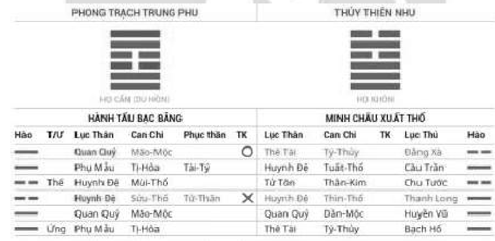

- **Cấu trúc Quẻ Dịch:**
  - **Quẻ chủ:** **Phong Trạch Trung Phu** (Cung Cấn, Họ Cấn – Quẻ Du Hồn)  
    *Tượng quẻ:* Hành Tẩu Bạc Băng (Đi trên băng mỏng – trạng thái bệnh tật kéo dài, tâm lý hoang mang lo sợ).
  - **Quẻ biến:** **Thủy Thiên Nhu** (Cung Khôn, Họ Khôn)  
    *Tượng quẻ:* Minh Châu Xuất Thổ (Ngọc sáng khỏi đất – quẻ Nhu chủ sự chờ đợi, phục hồi từ từ, không thể nóng vội).

- **Bảng chi tiết Lục hào:**

| Hào | Thế/Ứng | Lục thân (Chủ) | Can Chi (Chủ) | Biến động | Lục thân (Biến) | Can Chi (Biến) | Thần sát / Phục | Lục thú |
|:---:|:---:|:---|:---|:---:|:---|:---|:---|:---|
| 6 | | Quan Quỷ | Mão - Mộc | **O (Động)** | Thê Tài | Tý - Thủy | Nhật kiến, Tướng tinh | Đằng Xà |
| 5 | | Phụ Mẫu | Tị - Hỏa | tĩnh | Huynh Đệ | Tuất - Thổ | Phục Tài Tý | Câu Trần |
| 4 | **Thế** | Huynh Đệ | Mùi - Thổ | tĩnh | Tử Tôn | Thân - Kim | Tuần không, Hoa cái, Thiên hỷ | Chu Tước |
| 3 | | Huynh Đệ | Sửu - Thổ | **X (Động)** | Huynh Đệ | Thìn - Thổ | Mưu tinh / Phục Tử Thân | Thanh Long |
| 2 | | Quan Quỷ | Mão - Mộc | tĩnh | Quan Quỷ | Dần - Mộc | Nhật kiến | Huyền Vũ |
| 1 | **Ứng** | Phụ Mẫu | Tị - Hỏa | tĩnh | Thê Tài | Tý - Thủy | Bạch Hổ | Bạch Hổ |

---

### 3. Dụng thần & Loại quẻ

- **Phân loại quẻ:**
  - **Quẻ vấn tật bệnh phức hợp:** Phân tầng định vị căn nguyên giữa các hệ cơ quan nghi vấn: Hệ tim mạch, Hệ tiêu hóa (dạ dày - thực quản) và Hệ thần kinh trung ương/thần kinh thực vật.
  - **Quẻ đa hào phát động:** Hào 6 Quan Quỷ Mão Mộc động hóa hồi đầu sinh; hào 3 Huynh Đệ Sửu Thổ động hóa tiến.
- **Xác định Dụng thần & Phân vị cơ quan:**
  1. **Hào Thế (Huynh Đệ Mùi Thổ ở hào 4):** Đại diện cho bản thân người bệnh. Hào Thế lâm Tuần không, hưu tù tại tháng Tý, bị Nhật lệnh Mão Mộc khắc chế -> Thể trạng suy nhược, chính khí bất túc, sức đề kháng sụt giảm nghiêm trọng.
  2. **Cơ quan nghi vấn 1 - Tim mạch (Phụ Mẫu Tị Hỏa ở sơ hào lâm Bạch Hổ):** Hành Hỏa đại diện cho tim, Bạch Hổ chủ bệnh tật đau đớn.
  3. **Cơ quan nghi vấn 2 - Dạ dày & Thực quản (Huynh Đệ Sửu Thổ ở hào 3 phát động lâm Thanh Long hóa Thìn Thổ):** Hào 3 chủ vùng bụng, hành Thổ chủ tỳ vị, Thanh Long chủ ống tiêu hóa kéo dài.
  4. **Căn nguyên cốt lõi - Rối loạn thần kinh não bộ (Quan Quỷ Mão Mộc ở hào 6 lâm Đằng Xà):** Hào 6 chủ đầu não, hành Mộc chủ hệ thần kinh, Đằng Xà chủ rối loạn suy nghĩ và co thắt thần kinh.

---

### 4. Luận giải chi tiết

Quẻ này là đỉnh cao của phương pháp luận giải bệnh lý phức hợp trong Lục Hào Cổ Thệ: bóc tách chính xác từng tầng triệu chứng thực thể bề ngoài để tìm ra căn nguyên sâu xa trong hệ thần kinh thực vật.

#### 1. Loại trừ bệnh lý tim mạch thực thể (Hào sơ Phụ Mẫu Tị Hỏa)
- Người bệnh lo lắng nhất về bệnh tim do có các triệu chứng hồi hộp, tức ngực, đổ mồ hôi.
- Trong quẻ, **Phụ Mẫu Tị Hỏa** tại hào Ứng mang **Bạch Hổ**: Hành Hỏa tượng trưng cho tim, Bạch Hổ đại diện cho bệnh lý. Đây chính là phản chiếu nỗi lo lắng về bệnh tim của đương số.
- Tuy nhiên, Phụ Mẫu Tị Hỏa **hoàn toàn an tĩnh (tĩnh hào)**, không phát động. Hơn thế nữa, Tị Hỏa sinh phù hào Thế Mùi Thổ chứ không hề khắc phạt hào Thế.
- Chu Thần Bân kết luận: Hào đại diện cho tim không động và không khắc Thế, chứng tỏ **hệ tim mạch hoàn toàn không có tổn thương thực thể nguy hiểm**. Các triệu chứng hồi hộp, tức ngực chỉ là phản xạ thần kinh giả do cơ quan khác kích ứng tạo nên.

#### 2. Định vị bệnh lý bề ngoài: Viêm trào ngược dạ dày - thực quản (Hào 3 Sửu Thổ)
- Hào 3 **Huynh Đệ Sửu Thổ** phát động lâm **Thanh Long**, biến xuất **Huynh Đệ Thìn Thổ**:
  - Hào 3 trong đồ hình cơ thể đại diện cho vùng bụng, dạ dày và đoạn giữa đường tiêu hóa.
  - Sửu Thổ là Mộ khố của Lộc thần (kho chứa thức ăn), kết hợp với Thanh Long (Thanh Long chủ hình tượng thon dài, ống dẫn) chính là hình ảnh của **thực quản**.
  - Sửu Thổ phát động biến thành Thìn Thổ (khoang chứa thể tích lớn hơn) mô tả hiện tượng thức ăn và dịch vị từ dạ dày trào ngược lên thực quản.
- Tại sao đây chỉ là bệnh chứng thông thường? Huynh Đệ phát động tuy có xung phạt hào Thế, nhưng bản chất Huynh Đệ là thần sinh Tử Tôn (sinh thuốc, sinh sự hồi phục), do đó bệnh viêm thực quản trào ngược này chỉ là bệnh lý nhẹ bề ngoài, hoàn toàn có thể chữa trị ổn định bằng thuốc uống thông thường.

#### 3. Bóc tách căn nguyên cốt lõi: Rối loạn hệ thần kinh thực vật não bộ (Hào 6 Mão Mộc)
- Bệnh chứng thực sự nguy hiểm làm cho bệnh dai dẳng nằm ở hào 6: **Quan Quỷ Mão Mộc phát động lâm Đằng Xà**.
- Định vị vị trí cơ thể:
  - Hào 6 là đỉnh cao nhất của quẻ tượng, đại diện cho **vùng đầu, não bộ**.
  - Hành Mộc đại diện cho hệ thần kinh (trong Đông y, Can Mộc chủ sơ tiết, chi phối hệ thần kinh thực vật). Mão Mộc có hình tượng chia đôi đối xứng, biểu thị hai bán cầu đại não.
  - Hào phát động mang **Đằng Xà**: Đằng Xà chủ về lo âu quá mức, rối loạn cảm giác, căng thẳng tinh thần và suy nghĩ triền miên.
- Cơ chế hồi đầu sinh và Tý - Mão tương hình:
  - Quan Quỷ Mão Mộc phát động hóa xuất **Thê Tài Tý Thủy hồi đầu sinh**: Bệnh tật có nguồn sinh dưỡng liên tục, khiến nó bám rễ sâu sắc và rất khó thuyên giảm trong thời gian ngắn.
  - Mão Mộc lâm Nhật kiến, biến hào Tý Thủy lâm Nguyệt kiến. Động và biến đều nắm giữ Nhật Nguyệt lệnh, phản ánh đây là trạng thái căng thẳng, stress tâm lý diễn ra hàng ngày thường trực.
  - Hiện tượng **Tý - Mão tương hình**: Hình phạt lẫn nhau giữa Thủy và Mộc thể hiện sự rối loạn công năng sâu sắc, chính là chứng **rối loạn thần kinh thực vật mãn tính**.

#### 4. Cơ chế lan truyền phản xạ bệnh lý
- Vì sao rối loạn thần kinh thực vật lại gây ra hồi hộp tức ngực và trào ngược dạ dày?
  - Quan Quỷ Mão Mộc thuộc Mộc có tính sinh Hỏa: Mão Mộc kích hoạt sinh phù cho Tị Hỏa (tim), khiến tim bị kích thích đập nhanh, hồi hộp giả tạo.
  - Tị Hỏa và Sửu Thổ bán hợp: Tim, thực quản và dạ dày nằm kề cận nhau trong lồng ngực và khoang bụng trên, tạo ra hiện tượng cộng hưởng bệnh lý. Rối loạn xung thần kinh từ não bộ truyền xuống làm co bóp thực quản bất thường, gây ợ hơi và tạo áp lực lên vùng ngực.
- Quẻ biến là **Thủy Thiên Nhu**: Nhu chủ sự chờ đợi kiên trì. Rối loạn thần kinh thực vật là dạng bệnh suy nhược cơ năng, bắt buộc phải giải tỏa áp lực tâm lý, nghỉ ngơi tĩnh dưỡng và chờ đợi cơ thể tự điều hòa cân bằng lại, không thể nóng vội đòi khỏi ngay tức khắc.

---

### 5. Kết luận & Ứng kỳ thực tế

- **Lời giải đoán của Chu Thần Bân:**
  - Khẳng định tim hoàn toàn bình thường, không có bệnh hiểm nghèo, đương số hãy trút bỏ gánh nặng tâm lý hoang mang.
  - Viêm thực quản trào ngược chỉ là bệnh bề ngoài do hệ tiêu hóa bị kích ứng.
  - Căn nguyên thực sự 100% là do **rối loạn hệ thần kinh thực vật ở vùng đầu não** bắt nguồn từ việc suy nghĩ quá nhiều, căng thẳng stress kéo dài.
  - Khuyên đương số uống thuốc an thần, bổ sung canxi và khoáng chất, thư giãn tinh thần, tập luyện dưỡng sinh và kiên nhẫn chờ đợi (quẻ Nhu) để thần kinh dần phục hồi.
- **Phản hồi thực tế từ đương số:**
  - Sau khi uống thuốc điều trị rối loạn thần kinh thực vật kết hợp giải tỏa áp lực tâm lý, các triệu chứng hồi hộp tức ngực và chóng mặt đã giảm rõ rệt, chứng minh lời giải đoán của quẻ hoàn toàn chuẩn xác.

---

### 6. Bài học tâm pháp & Quy tắc cốt lõi

- **Quy tắc trích dẫn từ Cổ Thệ Chân Thuyên:**
  - *Quy tắc định vị căn nguyên bệnh lý phức hợp giữa tim, hệ tiêu hóa và rối loạn thần kinh thực vật* (sách Cổ Thệ Chân Thuyên, trang 272): Hào Phụ mẫu tĩnh lâm Hỏa chỉ triệu chứng phản xạ tim; hào Huynh đệ hào 3 lâm Thanh Long chỉ tổn thương ống tiêu hóa bề ngoài; chỉ có hào 6 Quan quỷ Mộc lâm Đằng Xà động hóa hồi đầu sinh mới là gốc rễ bệnh lý rối loạn thần kinh thực vật trung ương.
- **Tâm pháp giải đoán thực tế:**
  - Khi người bệnh nghi vấn nhiều cơ quan cùng lúc, phải phân biệt rạch ròi giữa "Bệnh triệu bề ngoài" (hào tĩnh hoặc Huynh đệ) và "Bệnh căn gốc rễ" (Quan quỷ phát động).
  - Phân tích tương sinh tương hình giữa các hào động (Mão Mộc sinh Tị Hỏa, Tý Mão tương hình) giải thích trọn vẹn cơ chế bệnh sinh học hiện đại: rối loạn trục thần kinh não - ruột (Brain-Gut Axis) và phản xạ giao cảm gây giả lập bệnh tim.

## THỰC CHIẾN 35: Hỏi về xu hướng gần đây của cổ phiếu Khai Nhuận

### 1. Bối cảnh & Câu hỏi

- **Bối cảnh chi tiết:** 
  Một người bạn của đương số may mắn mua được cổ phiếu mới phát hành (mã Khai Nhuận) khi vừa lên sàn chứng khoán. Cổ phiếu này sau khi chào sàn đã liên tục tăng trần kịch trần 6 đến 7 phiên liên tiếp. Theo thông lệ thị trường, khi cổ phiếu mới mở trần (không còn giữ được giá trần tuyệt đối), nhà đầu tư thường phải canh bán ngay trong phiên để bảo toàn lợi nhuận. Tuy nhiên, vào phiên mở trần ngày hôm trước, người này bận việc đột xuất nên không kịp theo dõi bảng điện tử. Đến khi về nhà kiểm tra thì thấy cổ phiếu đã đóng cửa dưới giá trần, biên độ dao động lớn. Thông thường sau phiên mở trần đầu tiên, phiên kế tiếp cổ phiếu rất dễ bị bán tháo giảm sâu 7-8%, rủi ro mất lãi rất lớn. Người này vô cùng sốt ruột và hoang mang, muốn bán toàn bộ ngay lúc mở cửa phiên sáng hôm sau để chốt lời, nên đã nhờ gieo quẻ dự đoán xu hướng.
- **Tâm lý & Câu hỏi ẩn ý:** 
  Tâm lý nhà đầu tư vô cùng căng thẳng, sợ cổ phiếu lao dốc giảm sàn làm bốc hơi toàn bộ thành quả. Câu hỏi đặt ra là: *"Xu hướng gần đây của cổ phiếu Khai Nhuận ra sao, ngày hôm sau có giảm mạnh không, có nên bán tháo ngay lập tức không?"*.
- **Thời gian chiêm đoán:**
  - Dương lịch: Ngày 6 tháng 1 năm 2017, 8 giờ 30 phút (Giờ Bắc Kinh - trước giờ mở cửa phiên giao dịch).
  - Can chi: Năm Bính Thân, tháng Tân Sửu, ngày Quý Tỵ, giờ Bính Thìn.

---

### 2. Dữ kiện & Bảng quẻ Crop

- **Thời không chiêm nghiệm:**
  - Tháng Tân Sửu (Thổ vượng, Kim tướng, Thủy hưu, Mộc tù, Hỏa tử).
  - Ngày Quý Tỵ (Hỏa vượng, Kim trường sinh).
  - Tuần không: **Ngọ, Mùi** (Giáp Thân tuần trung, Ngọ Mùi không vong).
- **Thần sát:**
  - Tướng tinh: Dậu (Hào biến thượng hào)
  - Hoa cái: Sửu (Lâm Nguyệt kiến, biến hào hào 4)
  - Dịch mã: Hợi (Lâm phục thần hào 4)
  - Tai sát: Mão (Lâm phục thần hào 2)
  - Mưu tinh: Mùi (Lâm Tuần không)
  - Đào hoa: Ngọ (Lâm Tuần không, hào Thế)
  - Kiếp sát: Dần
  - Lộc thần: Tý
  - Dương nhẫn: Hợi
  - Văn Xương: Mão
  - Thiên y: Tý
  - Thiên hỷ: Mùi (Lâm Tuần không)
  - Quý nhân: Mão, Tỵ (Nhật kiến lâm Quý nhân)

- Dữ kiện bảng quẻ và các thông số chiêm đoán:
  - **Bảng 35.1** Đồ hình quẻ Thực chiến 35:
    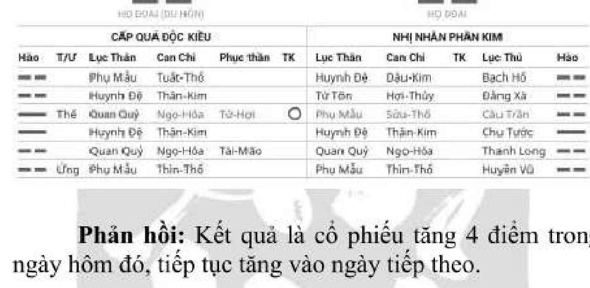

- **Cấu trúc Quẻ Dịch:**
  - **Quẻ chủ:** **Lôi Sơn Tiểu Quá** (Cung Đoài, Họ Đoài – Quẻ Du Hồn)  
    *Tượng quẻ:* Cấp Quả Độc Kiêu (Qua cầu ván độc – tình thế chênh vênh, bỏ lỡ đỉnh cao ngắn hạn nhưng vẫn còn cơ hội sửa sai bù đắp).
  - **Quẻ biến:** **Địa Sơn Khiêm** (Cung Đoài, Họ Đoài)  
    *Tượng quẻ:* Nhị Nhân Phân Kim (Hai người chia vàng – quẻ Khiêm chủ vị trí thấp, cảnh báo nguy cơ bán rẻ ở đáy).

- **Bảng chi tiết Lục hào:**

| Hào | Thế/Ứng | Lục thân (Chủ) | Can Chi (Chủ) | Biến động | Lục thân (Biến) | Can Chi (Biến) | Thần sát / Phục | Lục thú |
|:---:|:---:|:---|:---|:---:|:---|:---|:---|:---|
| 6 | | Phụ Mẫu | Tuất - Thổ | tĩnh | Huynh Đệ | Dậu - Kim | Bạch Hổ | Bạch Hổ |
| 5 | | Huynh Đệ | Thân - Kim | tĩnh | Tử Tôn | Hợi - Thủy | Đằng Xà | Đằng Xà |
| 4 | **Thế** | Quan Quỷ | Ngọ - Hỏa | **O (Động)** | Phụ Mẫu | Sửu - Thổ | Tuần không, Đào hoa / Phục Tử Hợi | Câu Trần |
| 3 | | Huynh Đệ | Thân - Kim | tĩnh | Huynh Đệ | Thân - Kim | Chu Tước | Chu Tước |
| 2 | | Quan Quỷ | Ngọ - Hỏa | tĩnh | Quan Quỷ | Ngọ - Hỏa | Tuần không, Đào hoa / Phục Tài Mão | Thanh Long |
| 1 | **Ứng** | Phụ Mẫu | Thìn - Thổ | tĩnh | Phụ Mẫu | Thìn - Thổ | Huyền Vũ | Huyền Vũ |

---

### 3. Dụng thần & Loại quẻ

- **Phân loại quẻ:**
  - **Quẻ dự trắc tài chính / Xu hướng cổ phiếu:** Đo lường biến động giá cả và thời điểm bán chốt lời tối ưu.
  - **Quẻ độc phát lâm Tuần không:** Hào Thế Quan Quỷ Ngọ Hỏa là hào duy nhất phát động trong toàn quẻ và đang rơi vào trạng thái không vong.
- **Xác định Dụng thần:**
  1. **Hào Thế (Quan Quỷ Ngọ Hỏa độc phát lâm Tuần không):** Đại diện cho hành động và tâm lý lo sợ của người cầm cổ phiếu.
  2. **Dụng thần giá cả & Xu hướng (Hào Phụ Mẫu):** Trong chiêm đoán thị trường chứng khoán, Phụ Mẫu đại diện cho mệnh giá, bảng giá và chứng chỉ cổ phiếu.
     - **Phụ Mẫu Sửu Thổ (Biến hào hào 4 mang Nguyệt lệnh):** Mức giá cũ đã hiện hữu trong quá khứ (khoảng 70-73 đồng).
     - **Phụ Mẫu Thìn Thổ (Hào Ứng tại sơ hào):** Mức giá xu hướng tương lai và giá trị mục tiêu mới của cổ phiếu.
  3. **Lợi nhuận tiềm ẩn (Thê Tài Mão Mộc phục tàng dưới hào 2):** Phi hào Ngọ Hỏa tuần không giúp Tài hào dễ dàng phát huy tác dụng.

---

### 4. Luận giải chi tiết

Quẻ này thể hiện tài tình phương pháp nắm bắt nhịp điệu thị trường tài chính thông qua cơ chế quẻ biến Khiêm và đối chiếu bước tiến thoái giữa các hào Phụ Mẫu.

#### 1. Tượng quẻ Tiểu Quá biến Khiêm: Cảnh báo "bán non ở đáy"
- Quẻ chủ là **Lôi Sơn Tiểu Quá**: Tiểu Quá chủ vượt quá một chút, hàm ý người hỏi vừa bỏ lỡ một đỉnh giá ngắn hạn trong phiên hôm qua. Tuy nhiên, quẻ Tiểu Quá cũng ngụ ý sai lầm nhỏ hoàn toàn có thể bù đắp và sửa chữa.
- Quẻ biến là **Địa Sơn Khiêm**: Khiêm là khiêm nhường, hạ thấp xuống. Trong ngữ cảnh giao dịch cổ phiếu, quẻ Khiêm là điềm báo bán tháo tại mức giá thấp nhất rồi sau đó đứng nhìn cổ phiếu tăng vọt trở lại (tương đương hiện tượng cắt lỗ ngay tại đáy hoặc chốt non sát đáy). Đây là lời cảnh báo nghiêm khắc: tuyệt đối không được hoảng loạn bán ra khi vừa mở cửa.

#### 2. Giải mã Hào Thế Quan Quỷ Ngọ Hỏa độc phát Tuần không
- Hào 4 Thế Quan Quỷ Ngọ Hỏa là động hào duy nhất trong quẻ (độc phát). Hào Thế mang Quan Quỷ chủ sự bất an, hoang mang tột cùng của người nắm giữ cổ phiếu.
- Hào Thế độc phát hóa **Phụ Mẫu Sửu Thổ**: 
  - Sửu Thổ mang Nguyệt lệnh: Nguyệt lệnh đại diện cho giá trị đã xảy ra trong quá khứ. Đương số nhìn thấy mức giá 73 đồng hôm qua và mức giá đóng cửa 70 đồng (đều là giá mang Nguyệt lệnh) nên tâm lý muốn bán ngay tại mức giá đã biết này để thu tiền về.
  - Tuy nhiên, hào Thế Ngọ Hỏa đang rơi vào **Tuần không**: Trong Lục Hào, hào động lâm Tuần không biểu thị hành động đó *chưa thực sự diễn ra*, người hỏi mới chỉ toan tính trong đầu chứ chưa bấm nút bán.

#### 3. Đối chiếu hai tầng giá cả: Phụ Mẫu Sửu Thổ vs Phụ Mẫu Thìn Thổ
- Trong chiêm cổ phiếu, hào Ứng đại diện cho xu thế vận động khách quan của thị trường. Hào Ứng là **Phụ Mẫu Thìn Thổ**.
- So sánh giữa Sửu Thổ (biến hào của Thế) và Thìn Thổ (hào Ứng):
  - Về quy luật tiến thoái của Địa chi ngũ hành: Sửu Thổ là thoái thần của Thìn Thổ, nghĩa là giá trị của Sửu Thổ thấp hơn nhiều so với giá trị của Thìn Thổ.
  - Khi hào Thế biến Sửu Thổ, nếu người này vội vàng bán ra thì chỉ bán được ở mức giá thấp (Sửu Thổ). Trong khi đó, xu thế tương lai của thị trường (hào Ứng Thìn Thổ) lại hướng tới mức giá cao hơn, mở ra một vùng đỉnh mới.
- Thêm vào đó, Thê Tài Mão Mộc phục dưới hào 2 Quan Quỷ Ngọ Hỏa. Phi hào Ngọ Hỏa đang lâm Tuần không ("phi không phục xuất"), tạo điều kiện cho nguồn lợi nhuận Thê tài thoát ra ngoài. Cổ phiếu trong ngắn hạn chắc chắn sẽ tiếp tục tăng giá, lực cầu vẫn rất mạnh.

#### 4. Định vị thời điểm chốt lời tối ưu
- Phiên giao dịch hôm đó là ngày **Quý Tỵ (Thứ Sáu)**: Tỵ Hỏa sinh Thổ nhưng chưa phải ngày vượng nhất của Thìn Thổ. Mở cửa ngày Thứ Sáu rất dễ có hiện tượng rung lắc rũ cung do nhà đầu tư nhỏ lẻ hoảng loạn bán tháo, các nhà tạo lập sẽ gom hết lượng hàng giá thấp này.
- Mốc thời gian Thìn Thổ đắc lệnh sinh vượng cực đại là các ngày **Thân và Dậu (Thứ Hai và Thứ Ba tuần kế tiếp)**:
  - Ngày Thân, Dậu (Kim vượng sinh Thủy, hợp hóa củng cố) là lúc giá cổ phiếu lập đỉnh cao mới.
  - Chu Thần Bân quyết đoán khuyên: Giữ vững tâm lý trong ngày Thứ Sáu, kiên nhẫn chờ sang Thứ Hai hoặc Thứ Ba tuần tới mới thực hiện lệnh bán chốt lời.

---

### 5. Kết luận & Ứng kỳ thực tế

- **Lời giải đoán của Chu Thần Bân:**
  - Tuyệt đối không được bán tháo cổ phiếu vào sáng Thứ Sáu (ngày Quý Tỵ) vì sẽ dính bẫy quẻ Khiêm (bán rẻ tại đáy).
  - Cổ phiếu vẫn còn xung lực tăng mạnh để đạt tới mốc giá mới của Phụ Mẫu Thìn Thổ. Hãy kiên nhẫn nắm giữ đến Thứ Hai và Thứ Ba tuần sau để bán được mức giá cao nhất.
- **Phản hồi thực tế từ thị trường:**
  - Sáng Thứ Sáu, đúng như dự báo, cổ phiếu mở cửa giảm khoảng 2% khiến nhiều nhà đầu tư hoảng loạn bán tháo. Lực cầu lớn lập tức hấp thụ toàn bộ và đẩy giá bật tăng 4% ngay trong ngày.
  - Sang phiên Thứ Hai tuần sau, cổ phiếu tiếp tục tăng mạnh 4-5%. Đến phiên Thứ Ba lại tiếp tục tăng cao. Người bạn đã bán chốt lời thành công vào Thứ Hai và Thứ Ba ở vùng giá đỉnh cao nhất, thu về mức lợi nhuận tối ưu so với việc bán vội sáng Thứ Sáu.

---

### 6. Bài học tâm pháp & Quy tắc cốt lõi

- **Quy tắc trích dẫn từ Cổ Thệ Chân Thuyên:**
  - *Quy tắc dự đoán xu hướng giá cổ phiếu qua quẻ biến Khiêm, hào Thế tuần không hóa thoái và định vị hào Ứng* (sách Cổ Thệ Chân Thuyên, trang 278): Quẻ biến Khiêm cảnh báo tâm lý bán rẻ sát đáy; hào Thế độc phát tuần không phản ánh ý định bán chưa thành hình; so sánh bậc giá giữa biến hào (Sửu thổ) và hào Ứng (Thìn thổ) giúp định vị chính xác xu hướng giá tương lai sẽ vượt đỉnh cũ.
- **Tâm pháp giải đoán thực tế:**
  - Phân tích tâm lý thị trường qua quẻ Dịch: Sự hoảng loạn của số đông (Thế lâm Quan quỷ Đào hoa tuần không) thường trùng khớp với thời điểm nhà tạo lập thị trường rung cây dọa khỉ để gom hàng giá rẻ.
  - Nắm bắt quy luật tiến thoái của Địa chi hào Phụ mẫu là chìa khóa vàng để định lượng biên độ giá cổ phiếu: Thoái thần chỉ mức giá quá khứ thấp hơn, Tiến thần chỉ vùng giá tương lai cao hơn.

## THỰC CHIẾN 36: Khoản tiền này hôm nay có thể về tài khoản không

### 1. Bối cảnh & Câu hỏi

- **Bối cảnh chi tiết:** 
  Chủ một doanh nghiệp đang chờ đợi một khoản tiền thanh toán đối tác chuyển về tài khoản công ty trong ngày. Vào đầu giờ chiều (khoảng 13 giờ), nhân viên kế toán báo lại vẫn chưa thấy ngân hàng báo có biến động số dư. Doanh nghiệp cần khoản tiền này để thực hiện tiếp lệnh chuyển tiền đối ứng cho các hoạt động tiếp theo trước giờ đóng cửa giao dịch liên ngân hàng (thường là 15 giờ chiều). Đương số đã gieo một quẻ Dịch để tra cứu xem khoản tiền này có kịp về tài khoản trong ngày hôm nay hay không.
- **Tâm lý & Câu hỏi ẩn ý:** 
  Người hỏi có tâm lý sốt ruột về một vụ việc tài chính sự vụ nhỏ phát sinh trong ngày, lo ngại hệ thống ngân hàng xử lý chậm làm gián đoạn kế hoạch thanh toán buổi chiều. Câu hỏi đặt ra là: *"Khoản tiền này hôm nay có thể về tài khoản không, thời điểm nào tiền về?"*.
- **Thời gian chiêm đoán:**
  - Dương lịch: Ngày 9 tháng 1 năm 2017, 13 giờ (Giờ Bắc Kinh).
  - Can chi: Năm Bính Thân, tháng Tân Sửu, ngày Bính Thân, giờ Ất Mùi.

---

### 2. Dữ kiện & Bảng quẻ Crop

- **Thời không chiêm nghiệm:**
  - Tháng Tân Sửu (Thổ vượng, Kim tướng, Thủy hưu, Mộc tù, Hỏa tử).
  - Ngày Bính Thân (Kim vượng, Thủy trường sinh).
  - Tuần không: **Thìn, Tỵ** (Giáp Ngọ tuần trung, Thìn Tỵ không vong).
- **Thần sát:**
  - Tướng tinh: Tý (Lâm biến hào hào 6)
  - Hoa cái: Thìn (Lâm Tuần không)
  - Dịch mã: Dần
  - Tai sát: Ngọ
  - Mưu tinh: Tuất (Lâm biến hào hào 5)
  - Đào hoa: Dậu
  - Kiếp sát: Tỵ (Lâm Tuần không, hào Ứng)
  - Lộc thần: Tỵ (Lâm Tuần không, hào Ứng)
  - Dương nhẫn: Ngọ
  - Văn Xương: Thân (Lâm Nhật kiến)
  - Thiên y: Tý (Lâm biến hào hào 6)
  - Thiên hỷ: Mùi (Lâm giờ chi, hào Thế)
  - Quý nhân: Dậu, Hợi

- Dữ kiện bảng quẻ và các thông số chiêm đoán:
  - **Bảng 36.1** Đồ hình quẻ Thực chiến 36:
    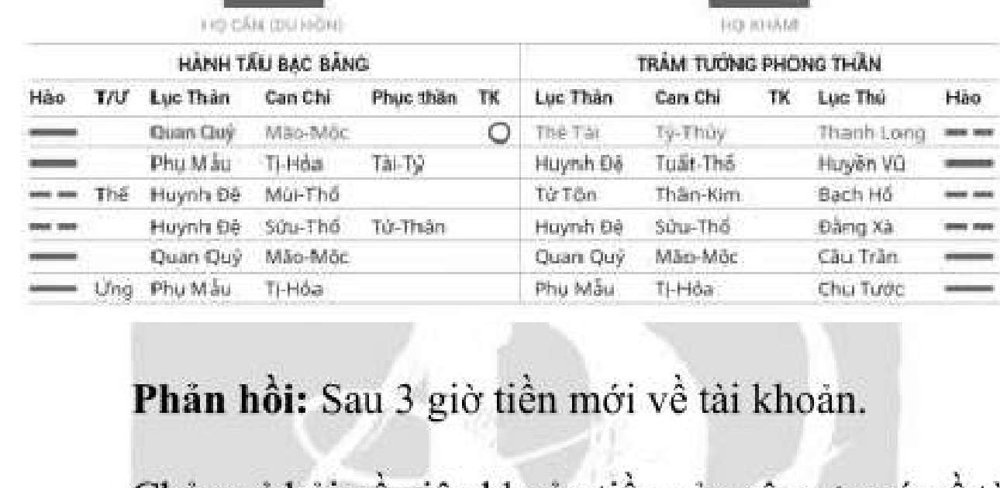

- **Cấu trúc Quẻ Dịch:**
  - **Quẻ chủ:** **Phong Trạch Trung Phu** (Cung Cấn, Họ Cấn – Quẻ Du Hồn)  
    *Tượng quẻ:* Hành Tẩu Bạc Băng (Đi trên băng mỏng – tâm trạng bồn chồn lo âu về việc luân chuyển tiền bạc).
  - **Quẻ biến:** **Thủy Trạch Tiết** (Cung Khảm, Họ Khảm)  
    *Tượng quẻ:* Trâm Tưởng Phòng Thân (Cài trâm phòng thân – quẻ Tiết chủ sự phòng bị, cảnh giác lẫn nhau trước hiểm họa rình rập).

- **Bảng chi tiết Lục hào:**

| Hào | Thế/Ứng | Lục thân (Chủ) | Can Chi (Chủ) | Biến động | Lục thân (Biến) | Can Chi (Biến) | Thần sát / Phục | Lục thú |
|:---:|:---:|:---|:---|:---:|:---|:---|:---|:---|
| 6 | | Quan Quỷ | Mão - Mộc | **O (Động)** | Thê Tài | Tý - Thủy | Tướng tinh, Thiên y | Thanh Long |
| 5 | | Phụ Mẫu | Tị - Hỏa | tĩnh | Huynh Đệ | Tuất - Thổ | Tuần không, Kiếp sát, Lộc thần / Phục Tài Tý | Huyền Vũ |
| 4 | **Thế** | Huynh Đệ | Mùi - Thổ | tĩnh | Tử Tôn | Thân - Kim | Thiên hỷ | Bạch Hổ |
| 3 | | Huynh Đệ | Sửu - Thổ | tĩnh | Huynh Đệ | Sửu - Thổ | Nguyệt kiến / Phục Tử Thân | Đằng Xà |
| 2 | | Quan Quỷ | Mão - Mộc | tĩnh | Quan Quỷ | Mão - Mộc | Câu Trần | Câu Trần |
| 1 | **Ứng** | Phụ Mẫu | Tị - Hỏa | tĩnh | Phụ Mẫu | Tị - Hỏa | Tuần không, Kiếp sát, Lộc thần | Chu Tước |

---

### 3. Dụng thần & Loại quẻ

- **Phân loại quẻ:**
  - **Quẻ cầu tài sự vụ ngắn hạn trong ngày:** Dự đoán khoản tiền cụ thể và thời khắc tài khoản báo có.
  - **Quẻ mang "Điềm báo khác" (Biệt triệu) cảnh báo rủi ro tài chính:** Hiện tượng người hỏi việc nhỏ nhưng quẻ xuất hiện hào động bất thường để báo động một nguy cơ tài chính trọng đại của doanh nghiệp.
- **Xác định Dụng thần:**
  1. **Dụng thần sự vụ nhỏ (Thông tin tiền về tài khoản trong ngày):** Hào Ứng **Phụ Mẫu Tị Hỏa** lâm Chu Tước. Phụ Mẫu chủ chứng từ ngân hàng, tin nhắn báo số dư; Chu Tước chủ thông tin liên lạc.
  2. **Dụng thần cảnh báo rủi ro lớn (Hào 6 Quan Quỷ Mão Mộc độc phát hóa Thê Tài Tý Thủy):** Tài Quỷ tương hỗ hóa rồi gián tiếp khắc phạt hào Thế Huynh Đệ Mùi Thổ.
  3. **Hào Thế (Huynh Đệ Mùi Thổ ở hào 4):** Đại diện cho bản thân chủ doanh nghiệp.

---

### 4. Luận giải chi tiết

Quẻ này là một trường hợp kinh điển minh chứng cho quy luật phân tầng thông tin của Lục Hào: giải quyết câu hỏi sự vụ trước mắt đồng thời cảnh báo điềm hung hiểm tiềm ẩn trong tương lai.

#### 1. Giải mã việc nhỏ: Thời điểm tiền về tài khoản trong ngày
- Đối với câu hỏi cụ thể *"khoản tiền hôm nay có về không và lúc nào về"*, hào Ứng **Phụ Mẫu Tị Hỏa lâm Chu Tước** giữ vai trò quyết định:
  - Phụ Mẫu kết hợp với Chu Tước chính là thông báo biến động số dư ngân hàng và chứng từ thanh toán.
  - Phụ Mẫu Tị Hỏa đắc Nhật lệnh Bính Thân (Bính hỏa tọa Thân, Tị Thân lục hợp) vốn rất vượng tướng, nhưng hiện tại đang rơi vào **Tuần không** (Thìn Tỵ không vong). Tuần không chỉ ra rằng tại thời điểm 13 giờ tiền vẫn chưa tới tài khoản.
  - Quy tắc ứng kỳ: *Không phùng xung tắc thực, phùng hợp tắc thực*. Đến **giờ Thân (từ 15 giờ đến 17 giờ chiều)**, Nhật lệnh và thời thần Thân Kim tương hợp bổ khuyết xuất không cho Tị Hỏa.
  - Do đó, Chu Thần Bân định vị: sau 15 giờ chiều (bước sang giờ Thân), tiền chắc chắn sẽ về tài khoản. Thực tế đúng sau 15 giờ, tài khoản công ty đã nhận được tiền nhưng đã quá giờ để làm lệnh chuyển đi tiếp trong ngày.

#### 2. Cơ chế "Việc nhỏ ẩn chứa điềm lớn" (Biệt triệu)
- Chu Thần Bân phân tích sâu sắc: Nếu chỉ đơn thuần xem tiền về hay không, hào 6 **Quan Quỷ Mão Mộc phát động hóa Thê Tài Tý Thủy** lại là một nghịch lý nếu xét theo lối luận thông thường.
  - Thê Tài ở quẻ biến được Quan Quỷ dẫn động để khắc phạt hào Thế Huynh Đệ Mùi Thổ. Đây không phải là "Tài khắc Thế" sinh lợi (Tài khắc Thế chủ được tiền), mà là sự chuyển hóa thông qua Quan Quỷ để gây áp lực tổn hại lên hào Thế.
  - Tại sao một việc nhỏ nhặt (tiền vài chục triệu về tài khoản) lại kích hoạt cả hào Quan Quỷ ở hào 6 phát động dữ dội như vậy?
- Cổ pháp chỉ rõ hai tình huống dẫn đến "Biệt triệu" khi hỏi việc nhỏ:
  1. *Tâm trí người hỏi phân tán:* Trong tiềm thức, người hỏi đang canh cánh nỗi lo về một sự kiện trọng đại khác của doanh nghiệp, quẻ lập tức nắm bắt ý niệm tiềm thức đó để phản hồi.
  2. *Quẻ chủ động báo động nguy cơ:* Sự việc người hỏi đặt ra quá nhỏ bé, thậm chí không đủ tầm vóc để định hình một quẻ Dịch; do đó linh tính của quẻ Dịch mượn cơ hội này để phát ra lời cảnh báo nghiêm khắc về một nguy cơ phá sản hoặc rủi ro pháp lý tài chính lớn mà chủ doanh nghiệp hoàn toàn chưa lường tới.

#### 3. Dấu hiệu nhận biết Điềm báo khác qua cấu trúc Hợp
- Trong Lục Hào Cổ Thệ, dấu hiệu nhận biết một "Điềm báo khác" nằm ở cấu trúc **Động biến mang Hợp**:
  - Biến hào **Thê Tài Tý Thủy** tạo thành quan hệ lục hợp chặt chẽ với Nguyệt lệnh **Tân Sửu** (Tý Sửu tương hợp).
  - Bất kỳ khi nào hào động hoặc biến hào tạo thành quan hệ tương hợp với Nhật Nguyệt lệnh (hoặc tam hợp cục), quẻ chắc chắn mang theo thông điệp cảnh báo sự kiện hệ trọng ngoài lề câu hỏi.
  - Biến hào Thê Tài Tý Thủy mang theo **Tướng tinh**: Tướng tinh đại diện cho dòng tiền huyết mạch, nguồn vốn nòng cốt mang tính sống còn của công ty.
  - Hiện tượng **Tài Quỷ tương hỗ hóa** (Quỷ động hóa Tài, Tài sinh Quỷ) là tượng trưng của những rắc rối pháp lý, tranh chấp hợp đồng hoặc đổ vỡ dòng tiền lớn phát sinh từ các giao dịch tài chính trọng điểm.

#### 4. Định vị chu kỳ nguy hiểm: Tam tháng Sửu - Dần - Mão
- Chu Thần Bân cảnh báo thời điểm rủi ro lớn này sẽ bùng phát trong chuỗi ba tháng liên tiếp:
  - **Tháng Sửu (hiện tại):** Tý Thủy hợp với Sửu Thổ, mầm mống rủi ro tài chính đang ngấm ngầm hình thành trong các hợp đồng hoặc thỏa thuận vay nợ.
  - **Tháng Dần (tháng kế tiếp):** Tháng Dần Mộc là giai đoạn chuyển tiếp, Mộc khí bắt đầu đắc lệnh làm lớn mạnh Quan Quỷ.
  - **Tháng Mão:** Quan Quỷ Mão Mộc nắm giữ lệnh tháng (trị Nguyệt kiến), lực khắc phạt đối với hào Thế Huynh Đệ Mùi Thổ đạt tới đỉnh điểm hung hiểm.
- Do đó, ba tháng liên hợp **Sửu – Dần – Mão** chính là giai đoạn doanh nghiệp phải đặc biệt thận trọng trong các giao dịch chuyển tiền lớn, thanh khoản tín dụng và các nghiệp vụ kinh doanh cốt lõi để phòng tránh nguy cơ tranh chấp pháp lý dẫn đến thiệt hại tài chính nặng nề.

---

### 5. Kết luận & Ứng kỳ thực tế

- **Lời giải đoán của Chu Thần Bân:**
  - *Về việc nhỏ trước mắt:* Khoản tiền sẽ về tài khoản vào giờ Thân (sau 15 giờ chiều) nhờ hào Ứng Phụ Mẫu Tị Hỏa xuất không hợp lực.
  - *Về lời cảnh báo trọng đại:* Quẻ mang điềm báo khác cảnh báo khẩn cấp về an toàn tài chính doanh nghiệp. Khuyên chủ doanh nghiệp phải lập tức rà soát lại các dòng vốn lớn, các cam kết bảo lãnh và thanh toán nợ nần trong tam tháng Sửu, Dần, Mão để ngăn ngừa tổn thất lớn.
- **Phản hồi thực tế từ đương số:**
  - Khoản tiền đúng là đã về tài khoản ngân hàng sau 15 giờ chiều (giờ Thân). Tuy nhiên do đã quá giờ giao dịch liên ngân hàng nên nhân viên không thể thực hiện lệnh chuyển tiếp cho đối tác trong ngày hôm đó.

---

### 6. Bài học tâm pháp & Quy tắc cốt lõi

- **Quy tắc trích dẫn từ Cổ Thệ Chân Thuyên:**
  - *Quy tắc phân tầng thông tin "việc nhỏ ẩn chứa điềm lớn" và cơ chế cảnh báo tài chính của quẻ tượng* (sách Cổ Thệ Chân Thuyên, trang 284): Khi hỏi về việc sự vụ vụn vặt mà quẻ xuất hiện hào động dữ dội mang Quan quỷ hoặc động biến mang hợp Nhật Nguyệt, đó là cơ chế linh tính của quẻ báo động một nguy cơ hệ trọng hơn mà chủ sự chưa nhận thức được.
- **Tâm pháp giải đoán thực tế:**
  - Hạn chế tối đa việc lạm dụng bốc quẻ cho những chuyện nhỏ nhặt thường ngày, vì tâm trí không tập trung dễ dẫn đến nhiễu loạn thông tin hoặc bị dẫn dắt vào các điềm báo ngoài lề.
  - Khi phát hiện biến hào lâm Tướng tinh lại tương hợp với Nguyệt lệnh, người thầy Dịch học phải có trách nhiệm mở rộng góc nhìn cảnh báo cho đương số về quản trị rủi ro dòng tiền vĩ mô thay vì chỉ chăm chăm trả lời câu hỏi cỏn con trước mắt.

## THỰC CHIẾN 37: Đệ tử hỏi về mẹ vừa hoàn thành phẫu thuật lại bị ngã, hiện đang được cấp cứu tại bệnh viện, có nguy hiểm không

### 1. Bối cảnh & Câu hỏi

- **Bối cảnh chi tiết:** 
  Một người đệ tử của Chu Thần Bân có mẹ già vừa trải qua một ca phẫu thuật tại bệnh viện. Khi ca mổ vừa hoàn thành và sức khỏe đang trong giai đoạn theo dõi hồi sức thì bà cụ không may bị trượt chân ngã chấn thương rất nặng. Cú ngã bất ngờ khiến tình trạng trở nên nguy kịch, bà cụ lập tức được các bác sĩ đưa vào phòng cấp cứu đặc biệt để hồi sức khẩn cấp. Trong tâm trạng bàng hoàng, hoảng loạn tột độ, người đệ tử đã gieo một quẻ Dịch để xem liệu mẹ mình có vượt qua cơn nguy kịch này hay không.
- **Tâm lý & Câu hỏi ẩn ý:** 
  Người con vô cùng sợ hãi trước nguy cơ mẹ tử vong sau cú ngã định mệnh. Câu hỏi cốt tử trong lòng là: *"Mẹ vừa phẫu thuật lại bị ngã đang cấp cứu tại bệnh viện, liệu có nguy hiểm đến tính mạng không, có qua khỏi được không?"*.
- **Thời gian chiêm đoán:**
  - Dương lịch: Ngày 24 tháng 2 năm 2017, 7 giờ 42 phút (Giờ Bắc Kinh).
  - Can chi: Năm Đinh Dậu, tháng Nhâm Dần, ngày Nhâm Ngọ, giờ Giáp Thìn.

---

### 2. Dữ kiện & Bảng quẻ Crop

- **Thời không chiêm nghiệm:**
  - Tháng Nhâm Dần (Mộc vượng, Hỏa tướng, Kim tuyệt, Thủy bệnh, Thổ tử).
  - Ngày Nhâm Ngọ (Hỏa vượng, Thổ đắc khí).
  - Tuần không: **Thân, Dậu** (Giáp Tuất tuần trung, Thân Dậu không vong).
- **Thần sát:**
  - Tướng tinh: Ngọ (Lâm Nhật kiến, hào Thế)
  - Hoa cái: Tuất
  - Dịch mã: Thân (Lâm Tuần không)
  - Tai sát: Tý
  - Mưu tinh: Thìn (Lâm giờ chi, hào 2)
  - Đào hoa: Mão
  - Kiếp sát: Hợi (Hào 5)
  - Lộc thần: Hợi (Hào 5)
  - Dương nhẫn: Tý
  - Văn Xương: Dần (Lâm Nguyệt kiến, hào sơ)
  - Thiên y: Sửu (Hào 4)
  - Thiên hỷ: Tuất
  - Quý nhân: Mão, Tỵ

- Dữ kiện bảng quẻ và các thông số chiêm đoán:
  - **Bảng 37.1** Đồ hình quẻ Thực chiến 37:
    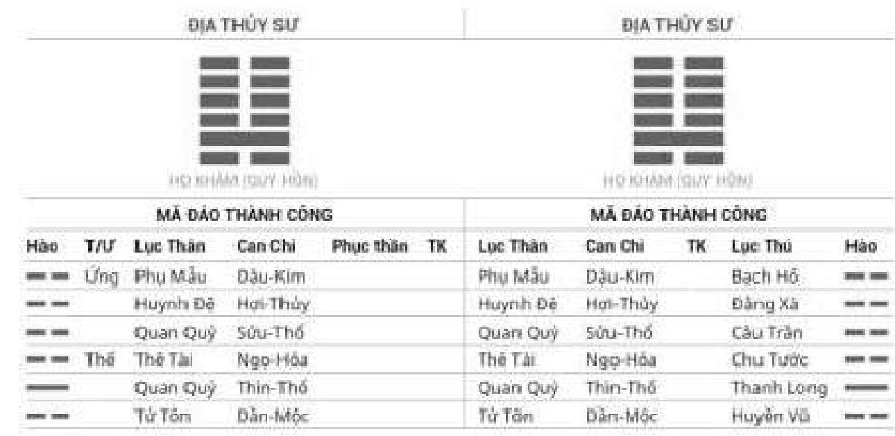

- **Cấu trúc Quẻ Dịch:**
  - **Quẻ chủ:** **Địa Thủy Sư** (Cung Khảm, Họ Khảm – Quẻ Quy Hồn, Tĩnh quẻ)  
    *Tượng quẻ:* Mã Đáo Thành Công (Ngựa đến thành công – quẻ Sư mang ý nghĩa truy tìm tận gốc nguồn cơn, điều động toàn lực cứu chữa).
  - **Quẻ biến:** Không có (Quẻ thuần tĩnh lục hào an tĩnh).

- **Bảng chi tiết Lục hào:**

| Hào | Thế/Ứng | Lục thân (Chủ) | Can Chi (Chủ) | Biến động | Lục thân (Biến) | Can Chi (Biến) | Thần sát / Phục | Lục thú |
|:---:|:---:|:---|:---|:---:|:---|:---|:---|:---|
| 6 | **Ứng** | Phụ Mẫu | Dậu - Kim | tĩnh | Phụ Mẫu | Dậu - Kim | Tuần không, Bạch Hổ | Bạch Hổ |
| 5 | | Huynh Đệ | Hợi - Thủy | tĩnh | Huynh Đệ | Hợi - Thủy | Kiếp sát, Lộc thần | Đằng Xà |
| 4 | | Quan Quỷ | Sửu - Thổ | tĩnh | Quan Quỷ | Sửu - Thổ | Thiên y | Câu Trần |
| 3 | **Thế** | Thê Tài | Ngọ - Hỏa | tĩnh | Thê Tài | Ngọ - Hỏa | Nhật kiến, Tướng tinh | Chu Tước |
| 2 | | Quan Quỷ | Thìn - Thổ | tĩnh | Quan Quỷ | Thìn - Thổ | Mưu tinh | Thanh Long |
| 1 | | Tử Tôn | Dần - Mộc | tĩnh | Tử Tôn | Dần - Mộc | Nguyệt kiến, Văn Xương | Huyền Vũ |

---

### 3. Dụng thần & Loại quẻ

- **Phân loại quẻ:**
  - **Quẻ hỏi thay người thân bị tai nạn cấp cứu:** Con hỏi cho mẹ ruột.
  - **Quẻ thuộc dạng "Thay mặt xem mất khống chế chủ động":** Người hỏi hoàn toàn không có quyền can thiệp vào chuyên môn y tế, mọi sinh tử đều phụ thuộc vào diễn tiến cấp cứu khách quan tại bệnh viện.
  - **Quẻ thuần tĩnh:** Sáu hào an tĩnh, không có hào động.
- **Xác định Dụng thần:**
  1. **Dụng thần cốt lõi (Phụ Mẫu Dậu Kim ở hào 6 Ứng):** Đại diện cho người mẹ đang được cấp cứu.
  2. **Kỵ thần (Thê Tài Ngọ Hỏa ở hào 3 Thế và Nhật kiến):** Khắc chế Phụ Mẫu Dậu Kim.
  3. **Nguyên thần (Quan Quỷ Sửu Thổ, Thìn Thổ):** Sinh dưỡng cho Phụ Mẫu Kim.

---

### 4. Luận giải chi tiết

Quẻ này là bài học kinh điển về tâm pháp định vị Dụng thần thật và vận dụng quy tắc Tuần không trong tình huống cấp cứu tính mạng khẩn cấp.

#### 1. Nhận diện Dụng thần thật và các dấu hiệu tương ứng thực tế
- Khi hỏi thay người thân, bước đầu tiên là xác định Dụng thần theo lục thân: con hỏi cho mẹ lấy hào Phụ Mẫu làm Dụng thần.
- Nhận định Dụng thần thật: Hào 6 Ứng lâm **Phụ Mẫu Dậu Kim**:
  - Hào Ứng là phương diện người khác, xuất hiện Phụ Mẫu mang **Bạch Hổ**. Bạch Hổ là hung sát chủ huyết quang, tai nạn thương tích, bệnh tật và cấp cứu. Điều này hoàn toàn khớp với thực tế người mẹ vừa bị ngã chảy máu đang phải cấp cứu.
  - Tác động của Nhật lệnh: Ngày **Nhâm Ngọ** thuộc Hỏa, trực tiếp khắc phạt Phụ Mẫu Dậu Kim. Nhật lệnh là Kỵ thần khắc Dụng thần phản ánh chính xác biến cố tai nạn đã xảy ra trong ngày hôm đó.
  - Nạp âm của ngày Nhâm Ngọ là **Dương Liễu Mộc**: cành liễu đung đưa trong gió, là hình tượng mất thăng bằng, lảo đảo không đứng vững dẫn tới té ngã.
  - Ngày Ngọ mang **Tai sát** và **Tướng tinh**: thể hiện mức độ xung kích dữ dội của cú ngã đối với thân thể suy yếu của người mẹ già sau phẫu thuật.

#### 2. Nguyên tắc giải đoán quẻ tĩnh trong dạng "Thay mặt xem"
- Chu Thần Bân giải thích nguyên lý nền tảng: Đối với quẻ tĩnh thông thường, người ta căn cứ vào tương tác giữa Dụng thần và hào Thế (như Dụng thần sinh Thế hay khắc Thế, Kỵ thần trì Thế hay Tử Tôn trì Thế) để luận cát hung.
- Tuy nhiên, trong dạng quẻ **thay mặt xem (hỏi thay người thân)**, hào Thế đại diện cho người hỏi chứ không phải người bệnh. Mọi quy tắc về hào Thế sinh khắc thông thường đều không được áp dụng. Tiêu chí duy nhất để định đoạt sinh tử là sự vượng suy khách quan của Dụng thần trước Nhật Nguyệt lệnh và các kinh nghiệm đặc thù trong thuật chiêm bệnh.

#### 3. Tâm pháp then chốt: Dụng thần lâm Tuần không trong cấp cứu tính mạng
- Xét theo vượng suy thông thường: Phụ Mẫu Dậu Kim bị Nguyệt lệnh Dần Mộc tuyệt khí, lại bị Nhật lệnh Ngọ Hỏa khắc phạt, thoạt nhìn như rơi vào tuyệt lộ tử địa.
- Tuy nhiên, điểm sinh tử then chốt của quẻ lại nằm ở việc: **Phụ Mẫu Dậu Kim đúng lúc rơi vào TUẦN KHÔNG (Thân Dậu không vong)**.
- Quy tắc vàng của Cổ Thệ Chân Thuyên khi chiêm đoán bệnh tật:
  - *Hỏi về bệnh tật cấp tính hoặc tai nạn cấp cứu, hễ Dụng thần rơi vào Tuần không thì tổn hại chỉ mang tính ngắn hạn (nạn tai tạm thời), không phải là họa sát thân lâu dài*.
  - Tuần không trong trường hợp này giống như "lá chắn" hư ảo: Kỵ thần Nhật lệnh Ngọ Hỏa tuy hung hãn khắc phạt nhưng Dậu Kim đang ở trạng thái không vong nên không tiếp nhận toàn bộ lực sát phạt trực diện. Nguy hiểm trước mắt dù vô cùng dữ dội nhưng sẽ nhanh chóng tiêu tan, sinh mạng của người mẹ được bảo toàn.

#### 4. Phân biệt sự linh hoạt của quy tắc Tuần không qua ví dụ thực tế
- Chu Thần Bân nhắc lại một bài học kinh nghiệm sâu sắc để tránh áp dụng máy móc:
  - Hai năm trước, một đồng môn có mẹ vợ bị ung thư di căn giai đoạn cuối, sau khi dùng thuốc kích thích thì suy kiệt miễn dịch và rơi vào hôn mê sâu. Bác sĩ báo nguy kịch, gia đình lúc đó không còn kỳ vọng cứu sống mà chỉ có tâm nguyện mong bà cụ tỉnh lại giây lát để dặn dò hậu sự. Khi gieo quẻ, Dụng thần cũng rơi vào Tuần không nhưng suy bại cùng cực. Trong bối cảnh đó, ý niệm là "mong tỉnh lại", Dụng thần Tuần không biểu thị ý nguyện đó rơi vào khoảng trống hư vô, không thể tỉnh lại được nữa và bà cụ đã qua đời.
  - Ngược lại, trong ca thực chiến này, người mẹ vừa phẫu thuật thành công, cú ngã chỉ là tai nạn ngoại cảnh bất ngờ, tâm niệm người con là "có nguy hiểm tính mạng không". Vì vậy, Dụng thần Tuần không mang ý nghĩa: hiểm họa cấp cứu chỉ là thoáng qua, không gây tử vong, người mẹ sẽ bình phục.

---

### 5. Kết luận & Ứng kỳ thực tế

- **Lời giải đoán của Chu Thần Bân:**
  - Khẳng định người mẹ sẽ tai qua nạn khỏi, ca cấp cứu sẽ thành công và không nguy hiểm đến tính mạng nhờ Dụng thần Phụ Mẫu Dậu Kim lâm Tuần không hóa giải lực sát thương.
  - Cần kiên nhẫn chăm sóc, sau khi qua cơn nguy kịch người mẹ sẽ nhanh chóng hồi phục và sớm được xuất viện.
- **Phản hồi thực tế từ đương số:**
  - Sau cấp cứu, bà cụ đã qua cơn nguy kịch, các chỉ số sinh tồn dần ổn định trở lại.
  - Người mẹ đã hồi phục tốt và chính thức được làm thủ tục xuất viện về nhà vào **ngày 3 tháng 3** (đúng mốc thời gian hồi phục thuận lợi sau khi qua tiết khí).

---

### 6. Bài học tâm pháp & Quy tắc cốt lõi

- **Quy tắc trích dẫn từ Cổ Thệ Chân Thuyên:**
  - *Quy tắc luận quẻ tĩnh hỏi thay người thân bị tai nạn cấp cứu qua Dụng thần lâm Bạch Hổ gặp Tuần không* (sách Cổ Thệ Chân Thuyên, trang 290): Khi hỏi thay người thân bị tai nạn nguy kịch, không dùng hào Thế để xét sinh khắc; Dụng thần lâm Bạch Hổ xác thực tai nạn thực tế, nhưng Dụng thần gặp Tuần không là điềm báo nạn tai ngắn hạn, sinh mạng được bảo toàn và sẽ bình phục.
- **Tâm pháp giải đoán thực tế:**
  - Phải phân biệt rõ rệt giữa quẻ tự xem và quẻ hỏi thay (thay mặt xem): Quẻ hỏi thay không thể cứng nhắc áp dụng quy tắc hào Thế.
  - Quy tắc Tuần không phải luôn luôn gắn liền với tâm niệm khởi phát ban đầu của người hỏi: Hỏi về sống chết trong tai nạn đột xuất thì Tuần không là cứu cánh thoát hiểm; hỏi việc mong mỏi một dấu hiệu cụ thể (như mong tỉnh lại) mà Tuần không thì lại là vô vọng.

## THỰC CHIẾN 38: Người phụ nữ Mỹ tự hỏi về hôn nhân, nên ly hôn hay duy trì

### 1. Bối cảnh & Câu hỏi

- **Bối cảnh chi tiết:** 
  Một phụ nữ người Mỹ gốc Hoa đang đối mặt với cuộc khủng hoảng hôn nhân nghiêm trọng. Người chồng có tật xấu khó bỏ là vô cùng ham mê cờ bạc đỏ đen, thường xuyên lén lút rút tiền tiết kiệm của gia đình mang đi nướng vào sới bạc. Ngoài ra, bản thân người phụ nữ này đang có một mối quan hệ tình cảm ngoài luồng với một người bạn trai mới. Đương số rất muốn lập tức ly hôn với người chồng bài bạc để danh chính ngôn thuận tiến tới hôn nhân và nương tựa vào người bạn trai này. Tuy nhiên, trước khi quyết định ký vào đơn ly dị, trong lòng đương số vẫn ngổn ngang trăm mối tơ vò, không biết liệu người bạn trai có thực sự đem lại hạnh phúc hay việc ly hôn ngay lúc này có đem lại kết quả tốt đẹp hay không, nên đã tìm đến Chu Thần Bân nhờ gieo quẻ định hướng.
- **Tâm lý & Câu hỏi ẩn ý:** 
  Người phụ nữ vừa muốn thoát khỏi cảnh chồng bài bạc, vừa muốn xác định xem người tình bên ngoài có phải bến đỗ an toàn để tái hôn, và thời điểm hiện tại ly hôn ngay hay tạm hoãn duy trì thì có lợi hơn cho bản thân. Câu hỏi đặt ra là: *"Nên ly hôn hay tiếp tục duy trì hôn nhân thì tốt hơn cho tôi?"*.
- **Thời gian chiêm đoán:**
  - Dương lịch: Ngày 16 tháng 3 năm 2017, 10 giờ 21 phút (Giờ Bắc Kinh).
  - Can chi: Năm Đinh Dậu, tháng Quý Mão, ngày Nhâm Dần, giờ Ất Tỵ.

---

### 2. Dữ kiện & Bảng quẻ Crop

- **Thời không chiêm nghiệm:**
  - Tháng Quý Mão (Mộc vượng, Hỏa tướng, Kim tuyệt, Thủy hưu, Thổ tử).
  - Ngày Nhâm Dần (Mộc vượng, Hỏa trường sinh).
  - Tuần không: **Thìn, Tỵ** (Giáp Ngọ tuần trung, Thìn Tỵ không vong).
- **Thần sát:**
  - Tướng tinh: Ngọ (Lâm hào Ứng phát động)
  - Hoa cái: Tuất (Hào 6)
  - Dịch mã: Thân (Hào 5)
  - Tai sát: Tý
  - Mưu tinh: Thìn (Lâm Tuần không, biến hào hào 2)
  - Đào hoa: Mão (Lâm Nguyệt kiến, biến hào hào 6)
  - Kiếp sát: Hợi (Hào 2)
  - Lộc thần: Hợi (Hào 2)
  - Dương nhẫn: Tý
  - Văn Xương: Dần (Lâm Nhật kiến)
  - Thiên y: Dần (Lâm Nhật kiến)
  - Thiên hỷ: Tuất (Hào 6)
  - Quý nhân: Mão, Tỵ (Nguyệt kiến lâm Quý nhân)

- Dữ kiện bảng quẻ và các thông số chiêm đoán:
  - **Bảng 38.1** Đồ hình quẻ Thực chiến 38:
    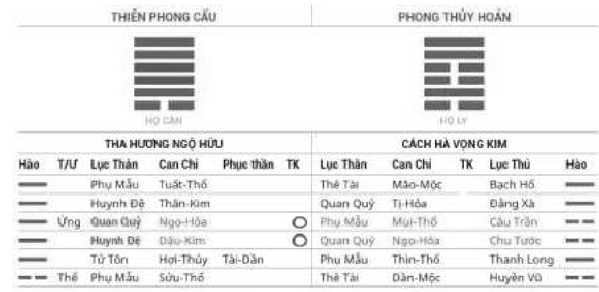

- **Cấu trúc Quẻ Dịch:**
  - **Quẻ chủ:** **Thiên Phong Cấu** (Cung Càn, Họ Càn)  
    *Tượng quẻ:* Tha Hương Ngộ Hữu (Đất khách gặp bạn – duyên kỳ ngộ bất ngờ, phong ba nổi sóng trong gia đạo).
  - **Quẻ biến:** **Phong Thủy Hoán** (Cung Ly, Họ Ly)  
    *Tượng quẻ:* Cách Hà Vọng Kim (Cách sông ngó vàng – biến thành quẻ Hoán chủ phân tán, ly tán, đường ai nấy đi).

- **Bảng chi tiết Lục hào:**

| Hào | Thế/Ứng | Lục thân (Chủ) | Can Chi (Chủ) | Biến động | Lục thân (Biến) | Can Chi (Biến) | Thần sát / Phục | Lục thú |
|:---:|:---:|:---|:---|:---:|:---|:---|:---|:---|
| 6 | | Phụ Mẫu | Tuất - Thổ | tĩnh | Thê Tài | Mão - Mộc | Hoa cái, Thiên hỷ | Bạch Hổ |
| 5 | | Huynh Đệ | Thân - Kim | tĩnh | Quan Quỷ | Tị - Hỏa | Dịch mã | Đằng Xà |
| 4 | **Ứng** | Quan Quỷ | Ngọ - Hỏa | **O (Động)** | Phụ Mẫu | Mùi - Thổ | Tướng tinh | Câu Trận |
| 3 | | Huynh Đệ | Dậu - Kim | **O (Động)** | Quan Quỷ | Ngọ - Hỏa | Đào hoa, Quý nhân | Chu Tước |
| 2 | | Tử Tôn | Hợi - Thủy | tĩnh | Phụ Mẫu | Thìn - Thổ | Kiếp sát, Lộc thần / Phục Tài Dần | Thanh Long |
| 1 | **Thế** | Phụ Mẫu | Sửu - Thổ | tĩnh | Thê Tài | Dần - Mộc | | Huyền Vũ |

---

### 3. Dụng thần & Loại quẻ

- **Phân loại quẻ:**
  - **Quẻ hôn nhân mang tính chọn lựa chiến lược:** Phân tích lợi hại giữa hai phương án: Ly hôn ngay lập tức vs Tạm thời duy trì hôn nhân.
  - **Quẻ đa hào phát động mang Gian hào:** Hào Ứng Quan Quỷ Ngọ Hỏa động hóa Phụ Mẫu Mùi Thổ; Gian hào Huynh Đệ Dậu Kim động hóa Quan Quỷ Ngọ Hỏa hồi đầu khắc.
- **Xác định Dụng thần:**
  1. **Hào Thế (Phụ Mẫu Sửu Thổ ở sơ hào lâm Huyền Vũ):** Đại diện cho bản thân người phụ nữ. Huyền Vũ chủ tâm lý kín đáo, che giấu mối quan hệ riêng và trong lòng vẫn nuôi hy vọng le lói đối phương thay đổi.
  2. **Hào Ứng (Quan Quỷ Ngọ Hỏa ở hào 4 lâm Câu Trận, Tướng tinh):** Đại diện cho người chồng bài bạc, hiện nắm giữ cương vị trụ cột kinh tế gia đình.
  3. **Gian hào ngoại lai (Huynh Đệ Dậu Kim ở hào 3 lâm Chu Tước, Đào hoa):** Đại diện cho người bạn trai bên ngoài mà đương số đang bí mật qua lại.

---

### 4. Luận giải chi tiết

Quẻ này là mẫu mực phân tích tâm pháp chiến lược đời thực trong Lục Hào Cổ Thệ: kết hợp nguyên tắc dịch lý "Động thủy biến chung" với nghệ thuật bảo toàn lợi ích tài chính của phụ nữ trong hôn nhân.

#### 1. Định vị phương án lựa chọn: Quan Quỷ sinh Thế vs Tử Tôn khắc Quỷ
- Chu Thần Bân phân tích quy tắc chung khi phụ nữ hỏi lựa chọn giữa ly hôn hay duy trì:
  - Nếu trong quẻ Tử Tôn phát động (thần khắc chế Quan Quỷ, thần tự do phóng khoáng) hoặc Tử Tôn sinh Thế thì ly hôn là giải pháp tối ưu mang lại giải thoát.
  - Ngược lại, nếu Quan Quỷ phát động trực tiếp tương sinh cho hào Thế thì duy trì hôn nhân trong hiện tại là sách lược có lợi nhất cho người phụ nữ.
- Trong quẻ này, hào Ứng **Quan Quỷ Ngọ Hỏa phát động trực tiếp tương sinh hào Thế Phụ Mẫu Sửu Thổ** (Hỏa sinh Thổ).
- Điều này đưa ra thông điệp nghịch lý thoạt nhìn khó hiểu: Người phụ nữ căm ghét người chồng cờ bạc và muốn ly hôn ngay, tại sao quẻ lại khuyên tạm thời duy trì hôn nhân?

#### 2. Nguyên lý "Động thủy biến chung" và chiến lược bảo toàn tài chính
- Chu Thần Bân giải mã tầng sâu của dịch lý qua nguyên tắc **"Động thủy biến chung" (Hào động chủ việc ban đầu, hào biến định đoạt kết cục sau cùng)**:
  - **Hào động (Ban đầu - Hiện tại):** Quan Quỷ Ngọ Hỏa đang sinh hào Thế Sửu Thổ. Xét về hành động tức thời trước mắt, giữ nguyên hôn nhân là thượng sách.
  - **Bản chất thực tế đằng sau lời khuyên:** Chu Thần Bân hỏi người phụ nữ: *"Hiện tại ai đang nắm quyền kiểm soát tài chính gia đình?"*. Đương số thừa nhận: *"Chồng tôi đang nắm giữ toàn bộ tài khoản và tài sản"*.
  - **Chiến lược đời thực:** Nếu người phụ nữ vội vàng đệ đơn ly hôn ngay lúc này, người chồng cờ bạc sẵn sàng tẩu tán tài sản, che giấu tiền bạc, kéo dài kiện tụng khiến đương số rơi vào cảnh "trắng tay", mất cả tình lẫn tiền. Việc hào Quan Quỷ sinh Thế mách bảo: hãy lấy cớ tật xấu bài bạc của chồng để đòi lại quyền quản lý tài chính, thu hồi tiền bạc nhà đất đứng tên mình càng nhiều càng tốt. Khi phụ nữ nắm chắc tài sản trong tay thì mới nắm đằng chuôi để tự quyết định số phận.
  - **Hào biến (Kết cục tương lai):** Quan Quỷ Ngọ Hỏa động biến ra **Phụ Mẫu Mùi Thổ**. Mùi Thổ tạo thành thế tương xung trực diện với hào Thế Phụ Mẫu Sửu Thổ (**Sửu - Mùi tương xung**). Thêm vào đó, quẻ biến là **Phong Thủy Hoán** (chủ ly tán, tan rã). Điều này khẳng định: trong tương lai dài hạn, hai vợ chồng chắc chắn sẽ đường ai nấy đi, người chồng không thể sửa đổi bản tính bài bạc và việc ly hôn là kết cục tất yếu không thể đảo ngược.

#### 3. Bóc tách mối quan hệ ngoài luồng qua Gian hào Huynh Đệ Dậu Kim
- Người phụ nữ nóng lòng muốn ly dị một phần vì muốn sớm tái hôn với người bạn trai mới. Quẻ tượng đã phơi bày toàn bộ sự thật qua Gian hào 3:
  - Gian hào (nằm giữa Thế và Ứng) là biểu tượng của người thứ ba xen vào giữa hai vợ chồng.
  - Hào 3 **Huynh Đệ Dậu Kim lâm Chu Tước, Đào hoa và Quý nhân**: Dậu Kim và hào Thế Sửu Thổ bán hợp (Tỵ Dậu Sửu tam hợp cục), mô tả chính xác mối quan hệ tình cảm lãng mạn, thân mật với người bạn trai bên ngoài.
  - Tuy nhiên, đây là hào **Huynh Đệ**, hoàn toàn không phải hào Quan Tinh chính vị. Huynh Đệ là lục thân khắc tài, tiêu hao, chỉ đại diện cho bạn bè, đối tác hoặc người tình vụng trộm nhất thời, không có tố chất của một người chồng danh chính ngôn thuận gánh vác gia đình.
- Điểm chí mạng của mối quan hệ này:
  - Hào 3 Huynh Đệ Dậu Kim phát động biến ra **Quan Quỷ Ngọ Hỏa hồi đầu khắc** (Ngọ Hỏa khắc Dậu Kim)!
  - Hào động bị biến hào quay ngược lại khắc tuyệt chính mình là tượng "tự mình chặt đứt đường lui", gặp áp lực là tự động rút êm.
  - Chu Thần Bân thẳng thắn cảnh báo: Người đàn ông này hoàn toàn không đáng tin cậy. Khi đối mặt với sóng gió hoặc đòi hỏi trách nhiệm gia đình thực sự, anh ta sẽ nhanh chóng tháo chạy, không thể đem lại bến đỗ bình yên cho cuộc đời đương số.

---

### 5. Kết luận & Ứng kỳ thực tế

- **Lời giải đoán của Chu Thần Bân:**
  - Khuyên đương số tuyệt đối không ly hôn vội vàng trong thời điểm hiện tại. Phải bình tĩnh tạm thời duy trì hôn nhân như một chiến lược hoãn binh để thu hồi tối đa quyền kiểm soát tài sản và dòng tiền gia đình vào tay mình.
  - Dứt khoát từ bỏ ảo tưởng nương tựa vào người bạn trai bên ngoài, vì quẻ báo trước người này sẽ sớm thoái lui do bị hồi đầu khắc.
  - Sau khi đã thu hồi đầy đủ tài sản và quyền tự chủ tài chính, lúc đó mới chính thức tiến hành thủ tục ly hôn theo đúng kết cục phân tán tự nhiên của quẻ Phong Thủy Hoán (Sửu Mùi tương xung).
- **Ứng nghiệm thực tế:**
  - Người phụ nữ nghe theo lời khuyên sáng suốt đã tạm gác lại việc nộp đơn, khôn khéo giành lại quyền quản lý tài chính từ tay người chồng cờ bạc, tránh được thảm cảnh mất trắng tài sản. Đồng thời, mối quan hệ với người bạn trai sau đó cũng nhanh chóng tan vỡ đúng như điềm báo hồi đầu khắc.

---

### 6. Bài học tâm pháp & Quy tắc cốt lõi

- **Quy tắc trích dẫn từ Cổ Thệ Chân Thuyên:**
  - *Quy tắc "Động thủy biến chung" và chiến lược trì hoãn bảo toàn tài chính trong chiêm đoán hôn nhân* (sách Cổ Thệ Chân Thuyên, trang 297): Hào động chỉ giai đoạn sách lược khởi đầu (Quan quỷ sinh Thế khuyên tạm duy trì); hào biến quyết định cục diện tất yếu dài hạn (biến Mùi thổ xung Thế báo kết cuộc ly tán); người giải quẻ phải biết kết hợp thực tế đời sống để tư vấn bước đi khôn ngoan nhất cho đương số.
- **Tâm pháp giải đoán thực tế:**
  - Gian hào động hóa hồi đầu khắc là tín hiệu giải mã người thứ ba: Huynh đệ lâm Đào hoa chỉ là người tình nhất thời, hóa Quỷ hồi đầu khắc báo hiệu sự phản bội, tự rút lui, không thể trở thành chỗ dựa trăm năm.
  - Đỉnh cao của giải quẻ Dịch không chỉ là phán đúng việc sẽ xảy ra, mà là vạch ra lộ trình hành động thực tế (Actionable Strategy) giúp đương số bảo vệ quyền lợi hợp pháp và hạnh phúc của bản thân.

## THỰC CHIẾN 39: Người phụ nữ Canada hỏi về xu hướng tình cảm với người đàn ông Anh

### 1. Bối cảnh & Câu hỏi

- **Bối cảnh chi tiết:** 
  Một phụ nữ sống tại Toronto (Canada) trong một chuyến bay quốc tế đã tình cờ làm quen với một người đàn ông quốc tịch Anh. Hai người nhanh chóng nảy sinh thiện cảm và tình cảm phát triển rất mau lẹ. Do khoảng cách địa lý xa xôi giữa hai bờ Đại Tây Dương, người phụ nữ đã chủ động mời người đàn ông bay sang Canada nghỉ dưỡng cùng mình một thời gian để cả hai có cơ hội tiếp xúc thực tế và đánh giá khả năng tiến tới mối quan hệ tình cảm lâu dài. Người đàn ông rất hào hứng nhận lời và đã vượt biển bay sang Canada. Tuy nhiên, trong thời gian cùng sinh sống, người phụ nữ bắt đầu cảm thấy đối phương có lối sống tẻ nhạt, ít nói, tính cách có phần khép kín và không thực sự hòa hợp với nhịp sống năng động của mình. Đương số đã gieo một quẻ Dịch để dự trắc xu hướng phát triển tình cảm giữa hai người.
- **Tâm lý & Câu hỏi ẩn ý:** 
  Dù bên ngoài miệng chê đối phương tẻ nhạt, nhưng trong lòng người phụ nữ vẫn đang cân nhắc chấp nhận người đàn ông này. Đương số muốn biết mối quan hệ tình cảm xuyên quốc gia này có đi đến đâu không, liệu có kết quả tốt đẹp hay không.
- **Thời gian chiêm đoán:**
  - Dương lịch: Ngày 6 tháng 3 năm 2017, 6 giờ 27 phút (Giờ Bắc Kinh).
  - Can chi: Năm Đinh Dậu, tháng Quý Mão, ngày Nhâm Thìn, giờ Quý Mão.

---

### 2. Dữ kiện & Bảng quẻ Crop

- **Thời không chiêm nghiệm:**
  - Tháng Quý Mão (Mộc vượng, Hỏa tướng, Kim tuyệt, Thủy hưu, Thổ tử).
  - Ngày Nhâm Thìn (Thổ vượng, Thủy đắc khố).
  - Tuần không: **Ngọ, Mùi** (Giáp Thân tuần trung, Ngọ Mùi không vong).
- **Thần sát:**
  - Tướng tinh: Tý (Hào 6)
  - Hoa cái: Thìn (Lâm Nhật kiến)
  - Dịch mã: Dần
  - Tai sát: Ngọ (Lâm Tuần không)
  - Mưu tinh: Tuất (Lâm hào 5 ám động)
  - Đào hoa: Dậu (Lâm biến hào hào 5)
  - Kiếp sát: Tỵ (Lâm hào Thế)
  - Lộc thần: Hợi (Lâm biến hào hào 4)
  - Dương nhẫn: Tý (Hào 6)
  - Văn Xương: Dần
  - Thiên y: Dần
  - Thiên hỷ: Tuất (Lâm hào 5 ám động)
  - Quý nhân: Mão, Tỵ (Nhật kiến lâm Quý nhân, hào Thế lâm Quý nhân)

- Dữ kiện bảng quẻ và các thông số chiêm đoán:
  - **Bảng 39.1** Đồ hình quẻ Thực chiến 39:
    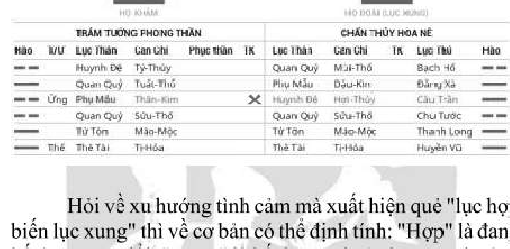

- **Cấu trúc Quẻ Dịch:**
  - **Quẻ chủ:** **Thủy Trạch Tiết** (Cung Khảm, Họ Khảm – Quẻ Lục Hợp)  
    *Tượng quẻ:* Trâm Tưởng Phong Thần (Cài trâm đón gió – khởi đầu gắn kết hòa hợp, duyên kỳ ngộ bất ngờ).
  - **Quẻ biến:** **Bát Thuần Đoài** (Cung Đoài, Họ Đoài – Quẻ Lục Xung)  
    *Tượng quẻ:* Chấn Thủy Hòa Nê (Khuấy nước trộn bùn – biến thành Lục Xung, tình cảm đổ vỡ, chia ly dứt khoát).

- **Bảng chi tiết Lục hào:**

| Hào | Thế/Ứng | Lục thân (Chủ) | Can Chi (Chủ) | Biến động | Lục thân (Biến) | Can Chi (Biến) | Thần sát / Phục | Lục thú |
|:---:|:---:|:---|:---|:---:|:---|:---|:---|:---|
| 6 | | Huynh Đệ | Tý - Thủy | tĩnh | Quan Quỷ | Mùi - Thổ | Tướng tinh, Dương nhẫn | Bạch Hổ |
| 5 | | Quan Quỷ | Tuất - Thổ | tĩnh (Ám động) | Phụ Mẫu | Dậu - Kim | Mưu tinh, Thiên hỷ | Đằng Xà |
| 4 | **Ứng** | Phụ Mẫu | Thân - Kim | **X (Động)** | Huynh Đệ | Hợi - Thủy | Kiếp sát, Lộc thần (Xung Quý nhân) | Câu Trận |
| 3 | | Quan Quỷ | Sửu - Thổ | tĩnh | Quan Quỷ | Sửu - Thổ | | Chu Tước |
| 2 | | Tử Tôn | Mão - Mộc | tĩnh | Tử Tôn | Mão - Mộc | Nguyệt kiến, Quý nhân | Thanh Long |
| 1 | **Thế** | Thê Tài | Tỵ - Hỏa | tĩnh | Thê Tài | Tỵ - Hỏa | Kiếp sát, Quý nhân | Huyền Vũ |

---

### 3. Dụng thần & Loại quẻ

- **Phân loại quẻ:**
  - **Quẻ vấn tình duyên / hôn nhân quốc tế:** Định vị tương tác tình cảm giữa hai đối tượng ở hai quốc gia khác nhau.
  - **Cấu trúc Quẻ Lục Hợp biến Lục Xung:** Điềm báo kinh điển của việc khởi đầu nồng thắm, kết cuộc chia lìa.
  - **Quẻ kết hợp Minh động và Ám động:** Minh động quyết định xu thế dài hạn tất yếu; Ám động phản ánh hành động nhất thời trong hiện tại.
- **Xác định Dụng thần:**
  1. **Hào Thế (Thê Tài Tỵ Hỏa ở sơ hào lâm Huyền Vũ, Quý nhân):** Đại diện cho người phụ nữ Canada. Hào Thế lâm Thê Tài mang Huyền Vũ biểu thị mong muốn trở thành bạn gái/vợ, trong lòng thực chất đã xiêu lòng và muốn gắn kết.
  2. **Hào Ứng (Phụ Mẫu Thân Kim ở hào 4 lâm Câu Trận phát động):** Đại diện cho người đàn ông Anh. Hào Ứng lâm Phụ Mẫu chủ sự quen biết lâu bền, tính cách trầm lặng, ít nói.
  3. **Dụng thần tình cảm & Suy nghĩ của người đàn ông (Quan Quỷ Tuất Thổ ở hào 5 ám động):** Thể hiện quyết định vượt biển sang Canada.

---

### 4. Luận giải chi tiết

Quẻ này là mẫu mực tinh tế phân tích quy luật phân định Minh động vs Ám động và giải mã chi tiết tâm lý xã hội qua thần sát "Xung Quý nhân".

#### 1. Định tính tổng thể: Quy luật "Lục hợp biến Lục xung" trong tình duyên
- Trong lý Dịch Cổ Thệ, khi xem về xu hướng tình cảm nam nữ mà gặp cấu trúc **Lục Hợp biến Lục Xung** (Thủy Trạch Tiết biến Bát Thuần Đoài) thì kết cục đã được định tính dứt khoát:
  - *Quẻ chủ Lục Hợp:* Biểu thị giai đoạn đầu hai bên gặp gỡ ngẫu nhiên nhưng rất tâm đầu ý hợp, trò chuyện vui vẻ, gắn kết nhanh chóng và cùng nhau lên kế hoạch gặp gỡ.
  - *Quẻ biến Lục Xung:* Biểu thị xu hướng dài hạn tất yếu sẽ tan rã, xung khắc quan điểm sống và dẫn tới chia tay dứt khoát không có kết quả.

#### 2. Phân định Ám động và Minh động: Hiện trạng vs Xu thế dài hạn
- **Ám động tại hào 5 (Quan Quỷ Tuất Thổ):**
  - Quan Quỷ Tuất Thổ được Nguyệt lệnh Quý Mão tương hợp (Mão Tuất lục hợp), đồng thời bị Nhật lệnh Nhâm Thìn tương xung (Thìn Tuất tương xung). Hào vượng bị xung hợp trở thành **Ám động**.
  - Ám động chỉ đại diện cho trạng thái nhất thời, hành động đang diễn ra trong hiện tại.
  - Tuất Thổ là Mộ khố của hào Thế Thê Tài Tỵ Hỏa (đại diện cho thành phố Toronto - nơi người phụ nữ cư ngụ). Quan Quỷ Tuất Thổ mang Mưu tinh và Thiên hỷ, ở ngôi vị hào 5 (hào đường xa, xuất ngoại vượt biển). Điều này phản ánh chính xác hiện trạng: người đàn ông đã quyết định vượt biển từ Anh sang Toronto để nghỉ mát cùng người phụ nữ.
  - Đối chiếu với hào 3 Quan Quỷ Sửu Thổ (Sửu Thổ là mộ khố của hào Ứng Thân Kim - tức London): Ban đầu người đàn ông có hai phương án: mời người phụ nữ sang London hoặc mình bay sang Toronto; cuối cùng anh ta thỏa hiệp chọn phương án bay sang Toronto (nên Tuất Thổ ám động).
- **Minh động tại hào Ứng (Phụ Mẫu Thân Kim):**
  - Khác với Ám động chỉ mang tính nhất thời, Minh động mới là yếu tố quyết định xu thế dài hạn của mối quan hệ.
  - Hào Ứng Phụ Mẫu Thân Kim phát động hóa xuất **Huynh Đệ Hợi Thủy**.
  - Về tương tác tính chất: Biến hào Huynh Đệ Hợi Thủy trực tiếp tương xung với hào Thế Thê Tài Tỵ Hỏa (**Tỵ - Hợi tương xung**).
  - Khi hào Ứng biến ra hào xung phạt hào Thế, quy tắc Lục Hào chỉ rõ: **Chính người đàn ông sẽ là bên chủ động nói lời chia tay và rời đi**, chứ không phải do người phụ nữ quyết định.

#### 3. Tâm pháp giải mã nguyên nhân chia tay: Chi tiết "Xung Quý nhân"
- Chu Thần Bân đi sâu bóc tách chi tiết nguyên nhân sâu xa vì sao người đàn ông chủ động rời đi:
  - Hào Thế của người phụ nữ là **Thê Tài Tỵ Hỏa lâm Quý Nhân**: Thực tế người phụ nữ này đang theo học ngành luật tại Toronto, sở hữu ngoại hình rất xinh đẹp, gia đình bề thế và thường xuyên tham dự các buổi yến tiệc ngoại giao của giới chính khách chính phủ (đặc trưng của tầng lớp xã hội thượng lưu).
  - Hào Ứng của người đàn ông biến thành **Huynh Đệ Hợi Thủy**: 
    + Hợi Thủy trực tiếp tương xung với Quý nhân Tỵ Hỏa, gọi là tượng **"Xung Quý nhân"**.
    + Trong thần sát Lục Hào: Lâm Quý nhân chủ thân phận cao quý, thượng lưu; còn Xung Quý nhân (kết hợp lâm Huynh Đệ) đại diện cho người bình thường, xuất thân bình dân, không thuộc tầng lớp tinh hoa.
  - Dù gia đình người đàn ông tại Anh có điều kiện kinh tế khá giả, nhưng bản thân anh ta không có sự nghiệp riêng, tính cách hướng nội khép kín, chỉ thích ở nhà đọc sách. Khi sang Toronto chứng kiến người yêu ngày ngày bận rộn giao thiệp với các chính khách cấp cao, anh ta cảm thấy bản thân quá nhỏ bé, bình thường, rơi vào mặc cảm tự ti sâu sắc và nhận thấy hai thế giới hoàn toàn lệch pha nhau. Chính nỗi tự ti này đã thôi thúc anh ta chủ động rút lui.

---

### 5. Kết luận & Ứng kỳ thực tế

- **Lời giải đoán của Chu Thần Bân:**
  - Khẳng định mối quan hệ tình cảm này sẽ nhanh chóng kết thúc vì tượng quẻ Lục hợp biến Lục xung.
  - Người đàn ông sẽ là người chủ động đề nghị chia tay do mặc cảm khác biệt về tầng lớp xã hội và lối sống.
- **Phản hồi thực tế từ đương số:**
  - Đúng tròn **một tuần sau khi gieo quẻ**, người đàn ông Anh đã thẳng thắn chủ động nói lời chia tay với người phụ nữ. Anh ta thừa nhận bản thân không thể thích nghi với phong cách sống thượng lưu, tiệc tùng ngoại giao của cô và cảm thấy mình chỉ là một người bình thường không xứng đáng với cô, sau đó đã thu xếp hành lý bay trở về nước Anh.

---

### 6. Bài học tâm pháp & Quy tắc cốt lõi

- **Quy tắc trích dẫn từ Cổ Thệ Chân Thuyên:**
  - *Quy tắc Lục hợp biến Lục xung và phân định Minh động vs Ám động trong dự đoán xu hướng tình duyên* (sách Cổ Thệ Chân Thuyên, trang 304): Quẻ Lục hợp biến Lục xung định tính khởi đầu hòa hợp kết cuộc tan rã; Ám động chỉ phản ánh hành động nhất thời trong hiện tại (vượt biển đến thăm), còn Minh động (hào Ứng biến hào xung Thế) quyết định xu thế dài hạn: đối phương sẽ chủ động dứt áo ra đi.
- **Tâm pháp giải đoán thực tế:**
  - Ý nghĩa thần sát "Xung Quý nhân": Kết hợp lục thân Huynh đệ với hiện tượng xung Quý nhân là chìa khóa then chốt giải mã tâm lý tự ti của người có xuất thân bình dân trước đối tượng thuộc giới thượng lưu xã hội.
  - Phân tích tâm lý thật đằng sau lời nói của đương số: Đương số miệng chê bai người yêu tẻ nhạt, nhưng hào Thế mang Huyền Vũ Thê tài cho thấy thâm tâm cô vẫn khao khát duy trì mối quan hệ; quẻ Dịch vạch trần sự thật khách quan không bị đánh lừa bởi cảm xúc chủ quan bề ngoài.

## THỰC CHIẾN 40: Con bị đau chân, đi xem tại bệnh viện chỉnh xương có hiệu quả không

### 1. Bối cảnh & Câu hỏi

- **Bối cảnh chi tiết:** 
  Con trai của Chu Thần Bân đang học lớp 9 (chuẩn bị thi chuyển cấp). Do tham gia các đợt rèn luyện thể lực môn điền kinh để đạt chuẩn kỳ thi thể thao của trường học, cậu bé không may bị chấn thương ở khớp đầu gối, sau đó biến chứng khiến khớp cổ chân bị trẹo và đau nhức dữ dội, đi lại tập tễnh khó khăn. Chu Thần Bân và vợ đã đưa con đến một bệnh viện chuyên khoa nắn chỉnh xương khớp nổi tiếng ở thành phố Quảng Châu để khám. Tại đây, bác sĩ kê rất nhiều loại thuốc uống và thuốc đắp ngoài, nhưng sau một thời gian kiên trì dùng thuốc, gia đình cảm thấy bệnh tình của con dậm chân tại chỗ, dường như không có chút tiến triển nào. Trong khi đó, mỗi tuần cháu vẫn phải chịu đau tham gia các buổi tập thể thao ở trường; nếu xin nghỉ thì nhà trường đòi hỏi quy trình rất phiền toái (phải có giấy xác nhận và chữ ký của bác sĩ điều trị vì sợ học sinh giả vờ chấn thương để trốn tập). Trước tình cảnh bế tắc, hai vợ chồng băn khoăn liệu tiếp tục điều trị tại bệnh viện chỉnh xương này có mang lại kết quả hay không.
- **Tâm lý & Câu hỏi ẩn ý:** 
  Người cha vừa xót con bị đau chân, vừa nghi ngờ trình độ và phương pháp trị liệu của bệnh viện chỉnh xương. Câu hỏi đặt ra là: *"Con bị đau chân, tiếp tục điều trị tại bệnh viện chỉnh xương này có hiệu quả hay không, có nên đổi bệnh viện khác?"*.
- **Thời gian chiêm đoán:**
  - Dương lịch: Ngày 22 tháng 2 năm 2017, 10 giờ 38 phút (Giờ Bắc Kinh).
  - Can chi: Năm Đinh Dậu, tháng Nhâm Dần, ngày Canh Thìn, giờ Tân Tỵ.

---

### 2. Dữ kiện & Bảng quẻ Crop

- **Thời không chiêm nghiệm:**
  - Tháng Nhâm Dần (Mộc vượng, Hỏa tướng, Kim tuyệt, Thủy bệnh, Thổ tử).
  - Ngày Canh Thìn (Thổ vượng, Kim đắc dưỡng).
  - Tuần không: **Thân, Dậu** (Giáp Tuất tuần trung, Thân Dậu không vong).
- **Thần sát:**
  - Tướng tinh: Tý (Lâm hào Thế phát động)
  - Hoa cái: Thìn (Lâm Nhật kiến, hào 3)
  - Dịch mã: Dần (Lâm Nguyệt kiến, hào 2)
  - Tai sát: Ngọ
  - Mưu tinh: Tuất (Hào biến hào 4)
  - Đào hoa: Dậu (Lâm Tuần không, phục thần hào 3)
  - Kiếp sát: Tỵ (Lâm giờ chi, hào 5)
  - Lộc thần: Thân (Lâm Tuần không)
  - Dương nhẫn: Dậu (Lâm Tuần không)
  - Văn Xương: Hợi (Lâm biến hào hào 2)
  - Thiên y: Sửu (Lâm biến hào hào Thế)
  - Thiên hỷ: Tuất
  - Quý nhân: Dần, Ngọ (Nguyệt kiến lâm Quý nhân)

- Dữ kiện bảng quẻ và các thông số chiêm đoán:
  - **Bảng 40.1** Đồ hình quẻ Thực chiến 40:
    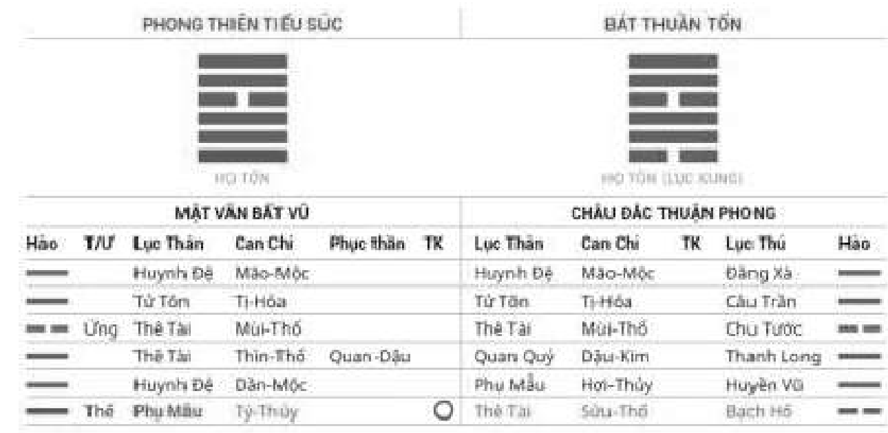

- **Cấu trúc Quẻ Dịch:**
  - **Quẻ chủ:** **Phong Thiên Tiểu Súc** (Cung Tốn, Họ Tốn)  
    *Tượng quẻ:* Mật Vân Bất Vũ (Mây đặc không mưa – dấu hiệu bế tắc, tích tụ trở ngại, việc điều trị chưa đem lại hiệu quả khả quan).
  - **Quẻ biến:** **Bát Thuần Tốn** (Cung Tốn, Họ Tốn – Quẻ Lục Xung)  
    *Tượng quẻ:* Châu Đắc Thuận Phong (Thuyền gặp gió xuôi – biến thành Lục Xung chủ sự phân tán, nên dứt khoát chấm dứt phương án điều trị hiện tại).

- **Bảng chi tiết Lục hào:**

| Hào | Thế/Ứng | Lục thân (Chủ) | Can Chi (Chủ) | Biến động | Lục thân (Biến) | Can Chi (Biến) | Thần sát / Phục | Lục thú |
|:---:|:---:|:---|:---|:---:|:---|:---|:---|:---|
| 6 | | Huynh Đệ | Mão - Mộc | tĩnh | Huynh Đệ | Mão - Mộc | | Đằng Xà |
| 5 | | Tử Tôn | Tị - Hỏa | tĩnh | Tử Tôn | Tị - Hỏa | Kiếp sát | Câu Trần |
| 4 | **Ứng** | Thê Tài | Mùi - Thổ | tĩnh | Thê Tài | Mùi - Thổ | | Chu Tước |
| 3 | | Thê Tài | Thìn - Thổ | tĩnh | Quan Quỷ | Dậu - Kim | Nhật kiến, Hoa cái / Phục Quan Dậu | Thanh Long |
| 2 | | Huynh Đệ | Dần - Mộc | tĩnh | Phụ Mẫu | Hợi - Thủy | Nguyệt kiến, Dịch mã, Quý nhân | Huyền Vũ |
| 1 | **Thế** | Phụ Mẫu | Tý - Thủy | **O (Động)** | Thê Tài | Sửu - Thổ | Tướng tinh, Thiên y | Bạch Hổ |

---

### 3. Dụng thần & Loại quẻ

- **Phân loại quẻ:**
  - **Quẻ hỏi thay mang tính chủ động điều khiển (Chủ động kiểm soát):** Cha mẹ hỏi bệnh cho con nhưng bản thân cha mẹ có toàn quyền quyết định lựa chọn cơ sở y tế (nếu thấy bệnh viện này không tốt thì chủ động đổi viện khác).
  - **Quẻ độc phát hào Thế bị hồi đầu khắc:** Hào Thế Phụ Mẫu Tý Thủy là động hào duy nhất phát động và bị biến hào Thê Tài Sửu Thổ khắc ngược lại.
- **Xác định Dụng thần:**
  1. **Dụng thần đối tượng (Tử Tôn Tị Hỏa ở hào 5 lâm Câu Trần):** Đại diện cho người con trai đang bị chấn thương ở chân.
  2. **Hào Thế đại diện cho quyền lựa chọn của cha mẹ (Phụ Mẫu Tý Thủy ở sơ hào lâm Bạch Hổ phát động):** Thể hiện quyết định can thiệp y tế chủ quan của phụ huynh.
  3. **Biến hào hồi đầu khắc (Thê Tài Sửu Thổ):** Lực cản trở, sự sai lầm trong lựa chọn dẫn tới vô hiệu hóa hiệu quả trị liệu.

---

### 4. Luận giải chi tiết

Quẻ này là bài giảng kinh điển phân biệt rạch ròi giữa hai phân nhánh của phương pháp "Thay mặt xem": dạng bị động mất kiểm soát và dạng chủ động điều khiển nhân quả.

#### 1. Cơ chế quẻ "Thay mặt xem mang tính chủ động điều khiển"
- Chu Thần Bân phân tích sâu sắc sự khác biệt bản chất:
  - Trong Thực chiến 37 (mẹ ngã cấp cứu), người con hoàn toàn bị động, không thể tự mình can thiệp y khoa; do đó hào Thế không được tham gia định tính cát hung cho Dụng thần.
  - Ngược lại, trong ca này, người cha đưa con đi khám nhưng **nắm toàn quyền chủ động quyết định**: chữa ở bệnh viện chỉnh xương này hay chuyển sang bệnh viện Tây y khác là do phụ huynh toàn quyền định đoạt.
  - Trong dạng quẻ chủ động điều khiển này, hành động của người hỏi can thiệp trực tiếp vào nhân quả của sự việc. Vì vậy, hào phát động sẽ **nhắm thẳng vào hào Thế để biểu thị sự đúng - sai của quyết định**: Nếu lựa chọn phương án đúng thì hào động sinh Thế; nếu chọn sai phương án thì hào động sẽ khắc phạt hào Thế hoặc bị hồi đầu khắc!

#### 2. Giải phẫu hào Thế Phụ Mẫu Tý Thủy độc phát bị Hồi đầu khắc
- Trong quẻ, duy nhất hào 1 Thế **Phụ Mẫu Tý Thủy phát động lâm Bạch Hổ**:
  - Bản thân người hỏi là cha mẹ (lục thân Phụ Mẫu). Tình cờ hào Thế chính là Phụ Mẫu Tý Thủy.
  - Hào Thế Tý Thủy động biến ra **Thê Tài Sửu Thổ**: 
    + Về ngũ hành: Sửu Thổ trực tiếp khắc tuyệt Tý Thủy (**Hồi đầu khắc**).
    + Về quan hệ chi tiết: Tý và Sửu lục hợp (khắc kèm hợp). Khắc kèm hợp trong dân gian gọi là tượng "quẩn chân", trói buộc bước đi. Quá trình điều trị diễn ra êm thấm, người nhà nhẫn nại tuân thủ phác đồ nhưng kết quả cuối cùng vẫn là sự bế tắc, vô hiệu.
  - Hào Thế đại diện cho quyết định đưa con đến bệnh viện chỉnh xương của cha mẹ. Việc hào Thế phát động bị hồi đầu khắc chứng minh một cách dứt khoát: **Quyết định đưa con đến bệnh viện chỉnh xương này là hoàn toàn sai lầm, điều trị sẽ không đem lại bất kỳ hiệu quả tích cực nào**.

#### 3. Đối chiếu thực trạng bệnh tật của con qua Dụng thần và Thần sát
- Xem xét hào **Tử Tôn Tị Hỏa tại hào 5**:
  - Thoạt nhìn, Tị Hỏa được Nguyệt lệnh Dần Mộc sinh phù, Nhật lệnh Thìn Thổ bình hòa, dường như đứa trẻ không có bệnh gì nghiêm trọng.
  - Nhưng đi sâu vào tầng đối ứng chi tiết: Tháng Dần đối với Tị Hỏa không phải tương sinh đơn thuần mà là **Tương hình (Dần - Tị tương hình)**. Dần Mộc là **Dịch mã** (chủ chạy bộ, vận động thể thao). Tương hình với Dịch mã chỉ ra nguồn cơn thương tích chính là do chạy bộ, luyện tập thể thao quá sức gây chấn thương.
  - Sự kết hợp giữa Nhật lệnh Thìn Thổ và Tử Tôn Tị Hỏa tạo thành thế **Thiên La** (Thìn Tị Thiên La; Tuất Hợi Địa Võng). Trong Lục Hào, Thiên La Địa Võng là biểu tượng của sự giam hãm, trói buộc, hạn chế vận động. Điều này khớp chính xác với việc chân của cháu bé bị đau co cứng, đi lại khó khăn.
  - Hào 2 Huynh Đệ Dần Mộc lâm **Huyền Vũ**: Mộc chủ gân cốt, Huyền Vũ chủ hệ thống kinh lạc thần kinh. Điều này định vị chấn thương nằm ở phần gân cơ và dây chằng (kinh lạc gân cốt), hoàn toàn không phải gãy xương hay tổn thương cấu trúc xương khớp nghiêm trọng. Do đó, việc đến "bệnh viện chỉnh xương" để nắn bóp và uống thuốc xương khớp là chữa sai hướng, không đúng bệnh.

#### 4. Điềm báo quẻ biến Lục Xung (Bát Thuần Tốn)
- Quẻ chủ là Phong Thiên Tiểu Súc (nghẽn tắc, tích tụ không thông), biến thành quẻ **Bát Thuần Tốn (quẻ Lục Xung)**.
- Trong y lý Lục Hào: Khi xem bệnh mà Dụng thần không vượng tướng vững vàng, quẻ biến Lục Xung là điềm báo tan rã, phân tán. Trong ngữ cảnh lựa chọn y tế, biến Lục Xung mách bảo phải lập tức **chấm dứt và từ bỏ phương án điều trị hiện tại**.
- May mắn là hào Thế động biến hợp, sự việc sai lầm vẫn đang trong tầm kiểm soát, chưa gây hậu quả di chứng nặng nề cho đứa trẻ, gia đình hoàn toàn có thể chủ động chuyển hướng can thiệp đúng đắn.

---

### 5. Kết luận & Ứng kỳ thực tế

- **Lời giải đoán của Chu Thần Bân:**
  - Chu Thần Bân dứt khoát nói với vợ: *"Đừng tiếp tục đưa con đến bệnh viện chỉnh xương này nữa, hoàn toàn không có hiệu quả đâu!"*.
  - Quyết định điều trị ở đây đã bị hồi đầu khắc và quẻ biến Lục Xung, chứng minh phác đồ này sai hướng. Nguồn gốc chấn thương là co thắt kinh lạc gân cơ do chạy bộ thể thao (Dần Tị tương hình), không phải bệnh lý thực thể ở xương.
  - Khuyên gia đình lập tức dừng thuốc của bệnh viện chỉnh xương, chuyển sang phương pháp vật lý trị liệu phục hồi chức năng gân cơ hoặc nghỉ ngơi để gân cốt tự tái tạo.
- **Phản hồi thực tế từ gia đình:**
  - Thực tế việc điều trị tại bệnh viện chỉnh xương suốt thời gian qua hoàn toàn không có hiệu quả, thuốc men không mang lại tác dụng giảm đau.
  - Sau khi nghe phân tích quẻ tượng, gia đình đã quyết định dừng hẳn việc khám chữa tại đây và tìm phương án điều trị khác.

---

### 6. Bài học tâm pháp & Quy tắc cốt lõi

- **Quy tắc trích dẫn từ Cổ Thệ Chân Thuyên:**
  - *Quy tắc xem quẻ hỏi thay mang tính chủ động điều khiển qua hào Thế Phụ mẫu độc phát bị hồi đầu khắc* (sách Cổ Thệ Chân Thuyên, trang 313): Khi người hỏi có toàn quyền quyết định lựa chọn thay mặt cho người thân, hào Thế đại diện cho quyết định chủ quan đó; hào Thế độc phát bị hồi đầu khắc là điềm báo lựa chọn sai lầm, phương án can thiệp hoàn toàn thất bại và vô hiệu.
- **Tâm pháp giải đoán thực tế:**
  - Phân biệt sâu sắc hai cơ chế "Thay mặt xem": Nếu bị động mất kiểm soát thì hào Thế không tham gia định tính; nếu chủ động kiểm soát nhân quả thì hào Thế độc phát chịu sự sinh khắc hồi đầu để báo trước tính đúng sai của quyết định.
  - Khám phá căn nguyên bệnh học qua tổ hợp thần sát: Dần Mộc Dịch mã hình Tử tôn chỉ chấn thương do chạy bộ thể thao; Thìn Tị Thiên La chỉ sự co cứng hạn chế vận động; Mộc lâm Huyền Vũ chỉ tổn thương gân cơ kinh lạc chứ không phải gãy xương.

---

## THỰC CHIẾN 41: CHÂN CỦA ĐỨA TRẺ ĐAU LÀ CHUYỆN GÌ

---

### 1. Bối cảnh & Câu hỏi

- **Bối cảnh chi tiết:** 
  Con nhỏ của một người đồng môn đột nhiên bị đau chân dữ dội, phần đầu gối và cơ bắp xung quanh có dấu hiệu sưng tấy, hạn chế vận động khiến đứa trẻ quấy khóc. Người mẹ vô cùng bất an, hoang mang lo sợ con mình mắc phải một chứng bệnh hiểm nghèo hoặc biến chứng xương khớp nghiêm trọng. Đương số quyết định gieo một quẻ Dịch để tìm hiểu rõ căn nguyên chứng bệnh và phương hướng điều trị.
- **Tâm lý & Câu hỏi ẩn ý:** 
  Người mẹ trong lòng rối bời, tâm lý chủ quan tràn ngập nỗi sợ hãi về bệnh biến nguy hiểm (Quan Quỷ). Câu hỏi bề ngoài là tìm hiểu nguyên nhân đau chân, nhưng ẩn ý sâu xa bên trong là giải tỏa nỗi hoang mang: liệu chân đứa trẻ đau có phải là chứng nan y ác tính hay không, và phải tìm ai để chữa trị dứt điểm?
- **Thời gian chiêm đoán:**
  - Dương lịch: Ngày 22 tháng 2 năm 2017, lúc 10:44 (Giờ Bắc Kinh).
  - Can chi: Năm Đinh Dậu, tháng Nhâm Dần, ngày Canh Thìn, giờ Tân Tị.

---

### 2. Dữ kiện & Bảng quẻ Crop

- **Thời không chiêm nghiệm:**
  - Tháng Nhâm Dần (Mộc vượng, Hỏa tướng, Thủy hưu, Kim tù, Thổ tử).
  - Ngày Canh Thìn (Thổ vượng sinh Kim, Thủy nhập mộ).
  - Tuần không: **Thân - Dậu** (Giáp Tuất tuần trung, Thân Dậu không vong).
- **Thần sát:**
  - Tướng tinh: Tý
  - Hoa cái: Thìn (Lâm Nhật kiến)
  - Dịch mã: Dần (Lâm Nguyệt kiến)
  - Tai sát: Ngọ
  - Mưu tinh: Tuất
  - Đào hoa: Dậu (Lâm Hào Ứng, Tuần không)
  - Kiếp sát: Tị
  - Lộc thần: Thân (Lâm Tuần không)
  - Dương nhẫn: Dậu (Lâm Hào Ứng, Tuần không)
  - Văn xương: Hợi
  - Thiên y: Sửu
  - Thiên hỷ: Tuất
  - Quý nhân: Dần, Tị
- Dữ kiện bảng quẻ và các thông số chiêm đoán:
  - **Bảng 41.1** Đồ hình quẻ Thực chiến 41:
    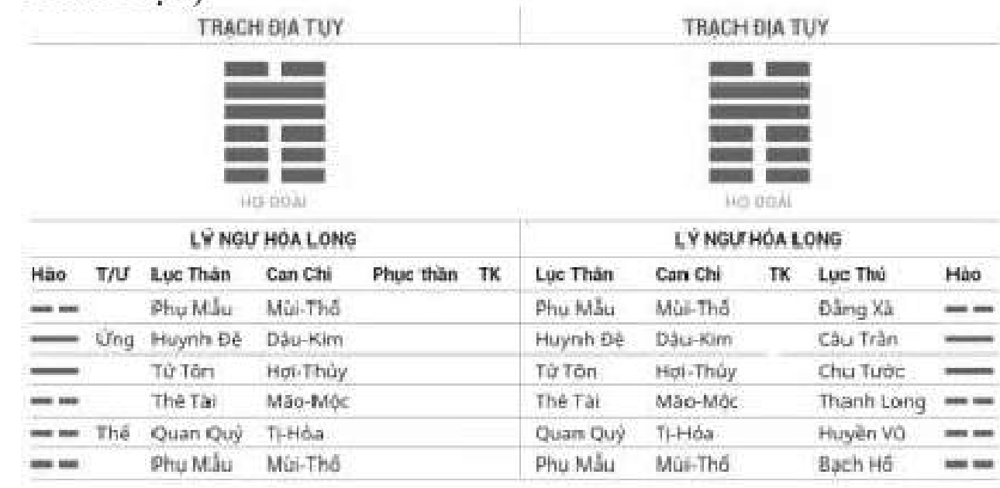
- **Cấu trúc Quẻ Dịch:**
  - **Quẻ chủ:** **Trạch Địa Tụy** (Cung Đoài, Họ Đoài – Toàn quẻ an tĩnh)  
    *Tượng quẻ:* Lý Ngư Hóa Long (Cá chép hóa rồng – sự việc định hướng sáng tỏ, hanh thông giải trừ).
  - **Quẻ biến:** Không có (Quẻ tĩnh).
- **Bảng chi tiết Lục hào:**

| Hào | Thế/Ứng | Lục thân (Chủ) | Can Chi | Biến động | Thần sát | Lục thú |
|:---:|:---:|:---|:---|:---:|:---|:---|
| 6 | | Phụ Mẫu | Mùi - Thổ | tĩnh | | Đằng Xà |
| 5 | **Ứng** | Huynh Đệ | Dậu - Kim | tĩnh (Tuần không) | Dương nhẫn, Đào hoa, Tuần không | Câu Trận |
| 4 | | Tử Tôn | Hợi - Thủy | tĩnh | Văn xương | Chu Tước |
| 3 | | Thê Tài | Mão - Mộc | tĩnh | | Thanh Long |
| 2 | **Thế** | Quan Quỷ | Tị - Hỏa | tĩnh | Quý nhân | Huyền Vũ |
| 1 | | Phụ Mẫu | Mùi - Thổ | tĩnh | | Bạch Hổ |

---

### 3. Dụng thần & Loại quẻ

- **Phân loại quẻ:**
  - **Quẻ thân quyến vấn tật (hỏi bệnh cho con nhỏ):** Bản chất sự việc là xem bệnh tình cho con cái, cần khảo sát tình trạng Tử Tôn hào.
  - **Quẻ tâm thái kiêm sự việc thực tế:** Người mẹ quá lo lắng nên tâm lý chủ quan phản ánh mạnh lên quẻ tượng, cần phân lập rạch ròi giữa nỗi lo chủ quan và hiện thực khách quan.
- **Xác định Dụng thần:**
  1. **Hào Thế (Quan Quỷ Tị Hỏa lâm Huyền Vũ):** Đại diện cho tâm lý chủ quan, nỗi hoang mang sợ hãi bệnh hiểm nghèo của người mẹ.
  2. **Hào Ứng (Huynh Đệ Dậu Kim lâm Câu Trận, Tuần không):** Đại diện cho thực tế khách quan của căn bệnh, đồng thời mang thông tin về phương thuốc và người chữa trị.
  3. **Hào Tử Tôn (Tử Tôn Hợi Thủy ở hào 4):** Đại diện cho thể trạng đứa trẻ. Tử Tôn được hào Ứng Huynh Đệ Dậu Kim tương sinh.
  4. **Quan Quỷ (Bệnh biến hiểm ác):** Không nắm lệnh, bị suy nhược và chỉ nằm ở vị trí tâm lý Thế hào.

---

### 4. Luận giải chi tiết

Quẻ Trạch Địa Tụy là một quẻ tĩnh mẫu mực minh giải sự tách bạch giữa tâm lý chủ quan của thân nhân và thực tế bệnh lý:

#### 1. Phân biệt tâm lý chủ quan (Thế lâm Quan Quỷ) và thực tế khách quan (Ứng lâm Huynh Đệ)
- **Quan Quỷ trì Thế mang Huyền Vũ:** Quan Quỷ đại diện cho tai họa, bệnh trọng, mối lo âu. Huyền Vũ chủ suy nghĩ u ám, ngờ vực, hoang mang. Người mẹ vì quá thương con nên sinh tâm lý hoảng loạn, sợ con bị liệt hoặc mắc bệnh hiểm nghèo. Do đó Quan Quỷ trì Thế ở đây phản ánh tâm trạng người hỏi chứ không phản ánh bệnh tật thực tế của đứa trẻ.
- **Hào Ứng Huynh Đệ Dậu Kim mang Câu Trận:** Hào Ứng là sự thực khách quan bên ngoài. Trong phép đoán bệnh của Lục Hào, Quan Quỷ chủ trọng bệnh nan y, còn Huynh Đệ chủ tiểu tật, thương tổn gân cốt cơ bắp thông thường. Hào Ứng lâm Huynh Đệ chỉ rõ chân đứa trẻ chỉ bị đau nhức cơ học bình thường, hoàn toàn không phải chứng bệnh nguy hiểm như người mẹ lo sợ.

#### 2. Phân tích nguyên nhân bệnh lý gân cốt qua ngũ hành tượng
- **Kim tượng cốt lạc, Thổ tượng cơ nhục:** Hào Ứng Dậu Kim đại diện cho kinh lạc, gân cốt và xương khớp. Hai hào Phụ Mẫu Mùi Thổ ở hào 1 và hào 6 đại diện cho cơ bắp, thịt. Thổ sinh Kim vượng, cơ bắp sưng phù chèn ép lên gân cốt khiến khớp đầu gối sưng to, cản trở việc đi lại của đứa trẻ.
- **Tử Tôn Hợi Thủy được sinh trợ:** Tử Tôn cư hào 4 đắc Nguyệt lệnh Nhâm Dần tương hợp, lại được hào Ứng Huynh Đệ Dậu Kim tương sinh. Đứa trẻ có nguyên khí vững vàng, bệnh chỉ ở bề mặt cơ nhục gân khớp, không tổn hại đến tạng phủ cốt tủy.

#### 3. Mật mã tuần không "Ngộ không tu bổ" và định vị thần y châm cứu
- **Huynh Đệ Dậu Kim lâm Tuần Không, Đào hoa, Dương nhẫn:**
  - Hào Ứng lâm Tuần không mang ý nghĩa then chốt: "Tuần không đắc bổ" – báo hiệu hiện tại đang thiếu khuyết một điều kiện then chốt, khi bổ sung được yếu tố này thì bệnh ắt tiêu tan.
  - Hào Huynh Đệ đại diện cho người quen, bạn bè thân thiết.
  - Đào hoa đại diện cho phái nữ.
  - Dương nhẫn Kim đại diện cho kim châm, thủ thuật châm cứu, đả thông kinh lạc.
- **Chỉ điểm thực tế:** Chu Thần Bân lập tức liên tưởng đến bác sĩ Trịnh ở Quảng Châu – một nữ bác sĩ quen biết rất thân thiết (Huynh Đệ + Đào hoa), tay nghề châm cứu trứ danh (Dương nhẫn Kim). Trước đó gia đình không nghĩ đến việc nhờ bác sĩ Trịnh vì ngỡ bà chỉ chuyên trị các ca bệnh nan y. Tượng Tuần không ở hào Ứng chính là lời nhắc: hãy mau chóng mời nữ bác sĩ châm cứu quen thuộc này tới chữa trị.

---

### 5. Kết luận & Ứng kỳ thực tế

- **Kết luận giải đoán:**
  - Động viên người mẹ an tâm: đứa trẻ chỉ bị trật gân, viêm sưng phần mềm ở khớp gối, hoàn toàn không có bệnh hiểm nghèo.
  - Khuyên gia đình nhanh chóng liên hệ với bác sĩ Trịnh để thực hiện châm cứu giải tỏa ứ trệ kinh lạc.
- **Phản hồi thực tế (Feedback):**
  - Gia đình lập tức mời bác sĩ Trịnh đến khám và châm cứu.
  - Ngay sau 2 lần châm cứu đầu tiên, đầu gối và chân đứa trẻ đã giảm sưng rõ rệt, bớt đau và bắt đầu cử động được.
  - Lần thứ ba kết hợp xoa bóp trị liệu và dùng thuốc bôi ngoài da, vết sưng hoàn toàn biến mất, đứa trẻ đi lại bình thường và khỏi hẳn.
- **Ứng kỳ chiêm nghiệm:**
  - Bệnh thuyên giảm thần tốc ngay trong ngày sau khi được châm cứu đúng phương pháp (ứng với tượng Dương nhẫn Kim đắc dụng, bổ khuyết tuần không).

---

### 6. Bài học tâm pháp & Quy tắc cốt lõi

- **Quy tắc trích dẫn từ Cổ Thệ Chân Thuyên:**
  - Trích dẫn rule_index (trang 318): *Quy tắc quẻ tĩnh đoán bệnh trẻ nhỏ và phân biệt tâm lý chủ quan (Thế lâm Quan Quỷ) với thực tế khách quan (Ứng lâm Huynh Đệ).*
- **Bài học kinh nghiệm thực chiến:**
  1. **Tách biệt Thế và Ứng trong quẻ thân nhân:** Khi người hỏi mang tâm lý hoảng loạn cực độ, hào Thế thường biến thành nơi dung nạp cảm xúc chủ quan (Quan Quỷ lâm Huyền Vũ). Muốn thấy sự thật khách quan phải nhìn vào hào Ứng và Dụng thần thực chất.
  2. **Tư duy Tuần không đắc bổ:** Hào lâm Tuần không trong dự trắc sự việc không chỉ là "không có", mà còn là dấu hiệu chỉ ra "mắt xích còn thiếu". Bổ sung đúng nhân tố đó (tìm đúng thầy thuốc) chính là chìa khóa mở nút thắt của toàn quẻ.
  3. **Tượng pháp tinh vi của thần sát kết hợp lục thân:** Hào Huynh Đệ (bạn bè) + Đào hoa (phụ nữ) + Dương nhẫn Kim (châm cứu) + Câu Trận (chuyên môn vững) phác họa sống động chân dung vị nữ bác sĩ quen thuộc ngoài đời thực.

## THỰC CHIẾN 42: CỬA HÀNG NÊN GIAO CHO CHA QUẢN LÝ HAY GIAO CHO CÔ CUNG QUẢN LÝ

---

### 1. Bối cảnh & Câu hỏi

- **Bối cảnh chi tiết:** 
  Một người đồng môn mở một cửa hàng kinh doanh, nhưng do thiếu hụt nhân lực chủ chốt nên khâu vận hành và quản lý gặp rất nhiều khó khăn, phát sinh nhiều bất cập. Đúng lúc đó, có một người bạn quen biết là cô Cung có nhã ý muốn nhận quản lý giúp. Đương số đứng trước ngã rẽ khó xử: một bên là người cha ruột, một bên là cô Cung. Cả hai người đều có thể giao phó, nhưng đương số không biết phương án nào sẽ thực sự giúp cửa hàng đi vào quỹ đạo ổn định.
- **Tâm lý & Câu hỏi ẩn ý:** 
  Đương số mang tâm lý phân vân, muốn tìm người thực sự đáng tin cậy để quán xuyến cửa hàng. Câu hỏi bề ngoài là lựa chọn nhân sự giữa cha và cô Cung, nhưng ý niệm sâu xa là thẩm định rủi ro: giao cho ai thì an tâm, không xảy ra thất thoát, mâu thuẫn hay trục trặc vận hành?
- **Thời gian chiêm đoán:**
  - Dương lịch: Ngày 28 tháng 1 năm 2017, lúc 03:21 (Giờ Bắc Kinh).
  - Can chi: Năm Bính Thân, tháng Tân Sửu, ngày Ất Mão, giờ Mậu Dần.

---

### 2. Dữ kiện & Bảng quẻ Crop

- **Thời không chiêm nghiệm:**
  - Tháng Tân Sửu (Thổ vượng, Kim tướng, Hỏa tuyệt, Thủy mộc suy).
  - Ngày Ất Mão (Mộc vượng, Thổ tử).
  - Tuần không: **Tý - Sửu** (Giáp Dần tuần trung, Tý Sửu không vong).
- **Thần sát:**
  - Tướng tinh: Mão (Lâm Nhật kiến)
  - Hoa cái: Mùi
  - Dịch mã: Tị
  - Tai sát: Dậu
  - Mưu tinh: Sửu (Lâm Nguyệt kiến, Tuần không)
  - Đào hoa: Tý (Lâm Tuần không)
  - Kiếp sát: Thân
  - Lộc thần: Mão (Lâm Nhật kiến)
  - Dương nhẫn: Dần
  - Văn xương: Ngọ
  - Thiên y: Tý (Lâm Tuần không)
  - Thiên hỷ: Mùi
  - Quý nhân: Thân, Tý
- Dữ kiện bảng quẻ và các thông số chiêm đoán:
  - **Bảng 42.1** Đồ hình quẻ Thực chiến 42:
    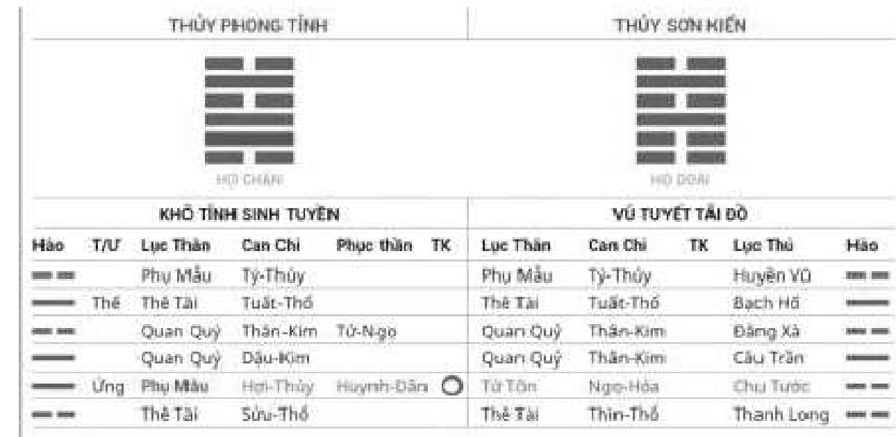
- **Cấu trúc Quẻ Dịch:**
  - **Quẻ chủ:** **Thủy Phong Tĩnh** (Cung Chấn, Họ Chấn)  
    *Tượng quẻ:* Khô Tĩnh Sinh Tuyền (Giếng cạn sinh suối – tình trạng hiện tại đang bế tắc, cần sắp xếp quy hoạch lại nhân sự).
  - **Quẻ biến:** **Thủy Sơn Kiển** (Cung Đoài, Họ Đoài)  
    *Tượng quẻ:* Vũ Tuyết Tải Đồ (Mưa tuyết đầy đường – mạo hiểm, trắc trở nếu hành động thiếu cẩn trọng).
- **Bảng chi tiết Lục hào:**

| Hào | Thế/Ứng | Lục thân (Chủ) | Can Chi | Biến động | Lục thân (Biến) | Can Chi (Biến) | Thần sát / Phục | Lục thú |
|:---:|:---:|:---|:---|:---:|:---|:---|:---|:---|
| 6 | | Phụ Mẫu | Tý - Thủy | tĩnh | Phụ Mẫu | Tý - Thủy | Tuần không, Đào hoa | Huyền Vũ |
| 5 | **Thế** | Thê Tài | Tuất - Thổ | tĩnh | Thê Tài | Tuất - Thổ | | Bạch Hổ |
| 4 | | Quan Quỷ | Thân - Kim | tĩnh | Quan Quỷ | Thân - Kim | Kiếp sát, Phục Tử-Ngọ | Đằng Xà |
| 3 | | Quan Quỷ | Dậu - Kim | tĩnh | Quan Quỷ | Thân - Kim | Tai sát | Câu Trận |
| 2 | **Ứng** | Phụ Mẫu | Hợi - Thủy | **O (Động)** | Tử Tôn | Ngọ - Hỏa | Văn xương, Phục Huynh-Dần | Chu Tước |
| 1 | | Thê Tài | Sửu - Thổ | tĩnh | Thê Tài | Thìn - Thổ | Tuần không, Mưu tinh | Thanh Long |

---

### 3. Dụng thần & Loại quẻ

- **Phân loại quẻ:**
  - **Quẻ lựa chọn (Tuyển trạch chiêm):** Đương số đứng trước hai phương án nhân sự độc lập (giao cho cha hay giao cho cô Cung).
  - **Quẻ sự việc kiêm tâm thái:** Cần định vị từng hào tương ứng với mỗi đối tượng và kiểm tra tính an tâm (Tử Tôn) hay phát sinh hiểm họa (Quan Quỷ).
- **Xác định Dụng thần:**
  1. **Phương án người cha (Hào Phụ Mẫu):** Lục thân Phụ Mẫu đại diện cho cha ruột. Trong quẻ có Phụ Mẫu Tý Thủy (hào 6) và Phụ Mẫu Hợi Thủy (hào 2 Ứng hào). Hào 2 Phụ Mẫu Hợi Thủy độc phát.
  2. **Phương án cô Cung (Hào Huynh Đệ hoặc Thê Tài):** Cô Cung là bạn bè (Huynh Đệ) hoặc phụ nữ (Thê Tài). Trong quẻ, Thê Tài Tuất Thổ trì Thế, Thê Tài Sửu Thổ lâm sơ hào, Huynh Đệ phục dưới hào 2. Cả Thê Tài và Huynh Đệ đều an tĩnh, không phát động.
  3. **Hào Thế (Thê Tài Tuất Thổ):** Đại diện cho bản thân chủ cửa hàng và lợi ích tài chính của cửa hàng.

---

### 4. Luận giải chi tiết

Quẻ này là một trường hợp kinh điển thể hiện phương pháp giải đoán quẻ lựa chọn đơn hào động:

#### 1. Cơ chế vận hành của quẻ lựa chọn (Tuyển trạch chiêm)
- **Độc lập định vị từng phương án:** Trong quẻ lựa chọn, các hào động thường phản ánh các phương án cụ thể rẽ nhánh. Nếu xuất hiện nhiều hào động, mỗi hào đại diện cho một phương án và tác động độc lập lên hào Thế (không xét tương tác chéo giữa các hào động).
- **Trường hợp chỉ có một hào động phát động:** Khi chỉ có một hào động, quẻ Dịch sẽ tập trung làm nổi bật bản chất của một phương án then chốt. Hào động đó biến ra cái gì sẽ quyết định phương án đó nên chọn hay nên tránh.

#### 2. Phân tích hào động Phụ Mẫu Hợi Thủy biến Tử Tôn Ngọ Hỏa
- **Định vị phương án người cha:** Hào 2 Phụ Mẫu Hợi Thủy phát động độc nhất trong toàn quẻ. Phụ Mẫu chính là người cha. Hào này phát động nắm quyền biến dịch.
- **Biến xuất Tử Tôn Ngọ Hỏa – Dấu hiệu của sự an tâm tuyệt đối:**
  - Mặc dù Phụ Mẫu Hợi Thủy không trực tiếp sinh phù cho Thế hào Thê Tài Tuất Thổ, nhưng điều then chốt nằm ở hào biến: **Hợi Thủy hóa xuất Tử Tôn Ngọ Hỏa**.
  - Trong tầng nghĩa tâm thái và thực tế quản lý, Tử Tôn là thần phúc đức, tượng trưng cho "vô ưu, yên tâm, thuận lợi, không có trục trặc". Ngược lại, nếu hào động biến thành Quan Quỷ thì mới là "có biến cố, sinh chuyện lo sợ, thất thoát".
  - Hào Phụ Mẫu của người cha hóa Tử Tôn khẳng định dứt khoát: phương án giao cho cha quản lý là phương án đáng tin cậy, giúp giải tỏa mọi nỗi lo âu, vận hành sẽ đi vào ổn định.

#### 3. Đối chiếu với phương án cô Cung & Tượng quẻ Kiển
- **Cô Cung an tĩnh không có thần bảo trợ:** Hào Thê Tài (phụ nữ) hay Huynh Đệ (bạn bè) đều an tĩnh, không có hào biến Tử Tôn che chở, cho thấy phương án này chưa có cơ sở bảo đảm sự yên tâm.
- **Biến quẻ Thủy Sơn Kiển:** Quẻ chủ Thủy Phong Tĩnh là mong muốn tái cơ cấu sắp xếp lại, nhưng biến sang Thủy Sơn Kiển mang tượng mạo hiểm, gian nan trắc trở. Nếu đưa ra quyết định thiếu chuẩn bị hoặc giao sai người, cửa hàng sẽ rơi vào thế hiểm bế tắc.

---

### 5. Kết luận & Ứng kỳ thực tế

- **Kết luận giải đoán:**
  - Chu Thần Bân chỉ ra rõ ràng: Lựa chọn giao cửa hàng cho cha quản lý là phương án an toàn và đáng tin cậy nhất vì hào Phụ Mẫu hóa xuất Tử Tôn (vô ưu).
  - Không nên mạo hiểm giao cho cô Cung vì tiềm ẩn nhiều khó khăn trắc trở (tượng quẻ Kiển).
- **Phản hồi thực tế (Feedback):**
  - Đương số do người cha bận rộn chưa sắp xếp được thời gian nên ban đầu vẫn đánh liều giao cửa hàng cho cô Cung thử sức (kết quả thất bại, phải xem tiếp Thực chiến 43).
  - Về sau khi tình hình kinh doanh rơi vào bế tắc, người cha buộc phải trực tiếp đến tiếp quản. Quả nhiên đúng như quẻ dự báo: cha vừa ra tay quản lý thì mọi việc lập tức đâu vào đấy, nề nếp ổn định.
- **Ứng kỳ chiêm nghiệm:**
  - Sự an tâm ứng nghiệm ngay thời điểm người cha tiếp quản cửa hàng (Tử Tôn Ngọ Hỏa nắm quyền).

---

### 6. Bài học tâm pháp & Quy tắc cốt lõi

- **Quy tắc trích dẫn từ Cổ Thệ Chân Thuyên:**
  - Trích dẫn rule_index (trang 323): *Quy tắc định vị và so sánh các hào động độc lập trong quẻ lựa chọn (quẻ tuyển trạch).*
- **Bài học kinh nghiệm thực chiến:**
  1. **Quy tắc biến Tử Tôn vs biến Quan Quỷ trong quẻ lựa chọn:** Không nhất thiết hào động phải sinh Thế mới là tốt. Khi câu hỏi ẩn chứa nỗi lo "có chuyện gì xảy ra không", hào đại diện cho phương án hóa Tử Tôn chính là bảo chứng vững chắc cho sự vô ưu, bình an; còn hóa Quan Quỷ là báo hiệu rắc rối, thất bại.
  2. **Đơn hào động trong quẻ tuyển trạch:** Quẻ Dịch vô cùng cô đọng, chỉ cần một hào độc phát chuyển hóa cũng đủ để định đoạt phương án tối ưu, người luận quẻ không được máy móc đòi hỏi phải có đủ hai hào động tương tranh.

## THỰC CHIẾN 43: GIAO CỬA HÀNG CHO CÔ CUNG QUẢN LÝ CÓ GẶP VẤN ĐỀ KHÔNG

---

### 1. Bối cảnh & Câu hỏi

- **Bối cảnh chi tiết:** 
  Sau khi gieo quẻ Thực chiến 42 để cân nhắc lựa chọn giữa người cha và cô Cung, đương số vẫn còn phân vân do người cha đang rất bận rộn và chưa thể sắp xếp thời gian tiếp quản ngay. Đương số rất muốn biết nếu tạm thời giao toàn bộ cửa hàng cho cô Cung quản lý thì liệu có xảy ra chuyện gì không ổn hay không, nên đã gieo tiếp một quẻ Dịch để truy vấn rủi ro cụ thể của phương án này.
- **Tâm lý & Câu hỏi ẩn ý:** 
  Đương số gieo quẻ với tâm lý lo âu, bất an, cần sự bảo đảm an toàn. Câu hỏi bề ngoài là "giao cho cô Cung quản lý có gặp vấn đề không", nhưng ý niệm sâu kín chính là quẻ tâm thái khảo sát rủi ro: liệu có thể an tâm giao phó cửa hàng hay sẽ chuốc lấy phiền toái, tổn thất?
- **Thời gian chiêm đoán:**
  - Dương lịch: Ngày 28 tháng 1 năm 2017, lúc 03:21 (Giờ Bắc Kinh).
  - Can chi: Năm Bính Thân, tháng Tân Sửu, ngày Ất Mão, giờ Mậu Dần.

---

### 2. Dữ kiện & Bảng quẻ Crop

- **Thời không chiêm nghiệm:**
  - Tháng Tân Sửu (Thổ vượng sinh Kim, Kim tướng, Thủy mộc suy).
  - Ngày Ất Mão (Mộc vượng, Mão xung Dậu).
  - Tuần không: **Tý - Sửu** (Giáp Dần tuần trung, Tý Sửu không vong).
- **Thần sát:**
  - Tướng tinh: Mão (Lâm Nhật kiến)
  - Hoa cái: Mùi
  - Dịch mã: Tị
  - Tai sát: Dậu (Lâm Hào Thế, Ám động)
  - Mưu tinh: Sửu (Lâm Nguyệt kiến, Tuần không)
  - Đào hoa: Tý (Lâm Tuần không)
  - Kiếp sát: Thân
  - Lộc thần: Mão (Lâm Nhật kiến)
  - Dương nhẫn: Dần
  - Văn xương: Ngọ
  - Thiên y: Tý (Lâm Tuần không)
  - Thiên hỷ: Mùi
  - Quý nhân: Thân, Tý
- Dữ kiện bảng quẻ và các thông số chiêm đoán:
  - **Bảng 43.1** Đồ hình quẻ Thực chiến 43:
    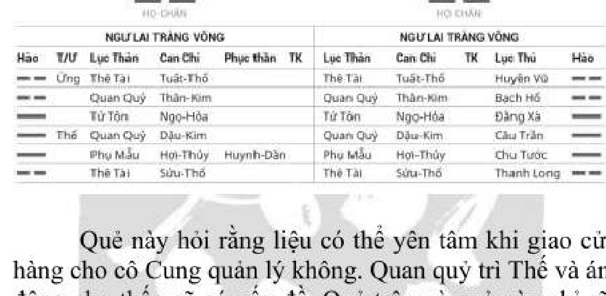
- **Cấu trúc Quẻ Dịch:**
  - **Quẻ chủ:** **Lôi Phong Hằng** (Cung Chấn, Họ Chấn – Toàn quẻ an tĩnh)  
    *Tượng quẻ:* Ngư Lai Tràng Vông (Cá vào lưới vướng víu – tình trạng duy trì luẩn quẩn, khó bứt phá).
  - **Quẻ biến:** Không có (Quẻ tĩnh).
- **Bảng chi tiết Lục hào:**

| Hào | Thế/Ứng | Lục thân (Chủ) | Can Chi | Biến động | Thần sát / Phục | Lục thú |
|:---:|:---:|:---|:---|:---:|:---|:---|
| 6 | **Ứng** | Thê Tài | Tuất - Thổ | tĩnh | | Huyền Vũ |
| 5 | | Quan Quỷ | Thân - Kim | tĩnh | Kiếp sát, Quý nhân | Bạch Hổ |
| 4 | | Tử Tôn | Ngọ - Hỏa | tĩnh | Văn xương | Đằng Xà |
| 3 | **Thế** | Quan Quỷ | Dậu - Kim | **Ám động** | Tai sát | Câu Trận |
| 2 | | Phụ Mẫu | Hợi - Thủy | tĩnh | Phục Huynh-Dần | Chu Tước |
| 1 | | Thê Tài | Sửu - Thổ | tĩnh | Tuần không, Mưu tinh | Thanh Long |

---

### 3. Dụng thần & Loại quẻ

- **Phân loại quẻ:**
  - **Quẻ tâm thái kiêm sự việc cụ thể:** Đương số hỏi với nỗi sợ "có xảy ra vấn đề không", bản chất là quẻ tâm thái tìm kiếm sự vô ưu hay họa hại.
  - **Quẻ ủy thác nhân sự kinh doanh:** Thẩm tra năng lực vận hành và mức độ an toàn của người được ủy quyền.
- **Xác định Dụng thần:**
  1. **Quan Quỷ (Thần lo âu, hiểm họa rủi ro):** Quan Quỷ Dậu Kim ngự tại hào 3 trì Thế.
  2. **Tử Tôn (Thần an tâm, bình an vô sự):** Tử Tôn Ngọ Hỏa ở hào 4, an tĩnh và bị tiết khí, không phát động cứu trợ Thế.
  3. **Hào Thế (Quan Quỷ Dậu Kim):** Đại diện cho bản thân đương số và thực trạng tiếp nhận kết quả ủy thác.

---

### 4. Luận giải chi tiết

Quẻ Lôi Phong Hằng thể hiện rõ quy luật vận hành của hào ám động trong quẻ tâm thái:

#### 1. Cơ chế Ám động của hào Quan Quỷ Dậu Kim trì Thế
- **Nguyên lý vượng tướng bị xung thành Ám động:**
  - Quan Quỷ Dậu Kim cư hào 3 lâm Thế, được Nguyệt lệnh Tân Sửu là Thổ vượng tương sinh nên bản thân rất hữu khí, vượng tướng.
  - Ngày chiêm đoán là ngày Ất Mão, Mão Mộc trực xung Dậu Kim. Theo định lý Lục Hào: hào suy nhược bị Nhật xung là "nhật phá" (bị phá tán vô dụng), nhưng hào vượng tướng có gốc được Nguyệt sinh mà bị Nhật xung thì trở thành **ÁM ĐỘNG** (phát động ngầm trong bóng tối).
- **Ý nghĩa hung triệu của Quan Quỷ ám động trì Thế:**
  - Trong quẻ tâm thái, Quan Quỷ chủ âu lo, trắc trở, phiền phức, tổn thất.
  - Quan Quỷ trì Thế vốn đã là điềm ôm nỗi bất an vào lòng, nay lại bị Ám động khiến năng lượng hung hiểm phát tác ngấm ngầm, dự báo chắc chắn sự việc sẽ nảy sinh biến cố, vận hành bế tắc, không thể nào yên tâm được.

#### 2. Tính chất quẻ Lôi Phong Hằng trong ủy thác quản lý
- **Tượng quẻ Hằng – Dây dưa bất biến không lối thoát:**
  - Hằng là duy trì, bình thường, kéo dài. Nhưng trong bối cảnh cửa hàng đang bế tắc cần cứu vãn, quẻ Hằng kết hợp Quan Quỷ trì Thế ám động báo hiệu rằng: nếu giao cho cô Cung, tình trạng trì trệ lộn xộn sẽ tiếp tục bị kéo dài dai dẳng mà không có bất kỳ bước chuyển biến hay cải thiện nào.
  - Câu Trận lâm Thế chủ sự chậm chạp, vướng mắc, dây dưa không dứt.

#### 3. Đối chiếu liên hoàn hai quẻ Thực chiến 42 và 43
- Hai quẻ được gieo cùng thời điểm nhưng cho ra hai góc nhìn bổ sung hoàn mỹ:
  - **Quẻ 42 (Hỏi lựa chọn giữa cha và cô Cung):** Hào Phụ Mẫu của người cha độc động hóa xuất Tử Tôn (tượng vô ưu, hanh thông, dẹp tan âu lo).
  - **Quẻ 43 (Hỏi riêng về việc giao cho cô Cung):** Quan Quỷ trì Thế ám động (tượng bất an, phát sinh trục trặc, rối ren).
- Sự đối ứng nhất quán này khẳng định nguyên tắc chuẩn xác của Lục Hào: giao cho cha thì yên ổn vạn sự lành, giao cho cô Cung thì chuốc lấy lo phiền.

---

### 5. Kết luận & Ứng kỳ thực tế

- **Kết luận giải đoán:**
  - Chu Thần Bân chỉ rõ: Tuyệt đối không thể yên tâm khi giao cho cô Cung quản lý. Việc ủy thác này sẽ phát sinh vấn đề và kéo dài sự bế tắc của cửa hàng.
- **Phản hồi thực tế (Feedback):**
  - Do chưa hiểu hết tính nghiêm trọng của quẻ Dịch và người cha lúc đó quá bận rộn, đương số vẫn đánh liều giao cửa hàng cho cô Cung quản lý.
  - Quả nhiên sau 2 đến 3 tháng tiếp quản, tình hình kinh doanh của cửa hàng hoàn toàn giẫm chân tại chỗ, không có chuyển biến tích cực nào, phát sinh nhiều bất cập.
  - Cuối cùng, cùng đường bí lối, đương số phải khẩn thiết nhờ cha đến quản lý. Người cha vừa ra tay tiếp quản thì cửa hàng lập tức đi vào quy củ nề nếp. Tuy nhiên do tuổi tác đã cao và sức khỏe có hạn, sau khi tình hình kinh doanh đi vào quỹ đạo ổn định, người cha đã bàn giao lại cho người khác quản lý tiếp.
- **Ứng kỳ chiêm nghiệm:**
  - Sự bế tắc và phát sinh vấn đề kéo dài liên tục trong suốt 2-3 tháng giao cho cô Cung (đúng với tính chất duy trì của quẻ Hằng và Quan Quỷ Dậu Kim ám động).

---

### 6. Bài học tâm pháp & Quy tắc cốt lõi

- **Quy tắc trích dẫn từ Cổ Thệ Chân Thuyên:**
  - Trích dẫn rule_index (trang 328): *Quy tắc giải đoán quẻ tĩnh Lôi Phong Hằng trong ủy thác quản lý kinh doanh.*
- **Bài học kinh nghiệm thực chiến:**
  1. **Quy tắc phân biệt Nhật Phá và Ám Động:** Khi nhật kiến xung một hào tĩnh, nhất định phải kiểm tra mức độ suy vượng dưới Nguyệt lệnh. Hào đắc sinh vượng tướng ngộ xung ắt biến thành Ám động, phát huy năng lực tác động mãnh liệt trong âm thầm.
  2. **Giải mã quẻ tâm thái có Quan Quỷ ám động:** Trong các câu hỏi "có chuyện gì xảy ra không", nếu Quan Quỷ động hoặc ám động trì Thế, câu trả lời chắc chắn là "có rắc rối lớn phát sinh", người hỏi không thể giữ được sự an tâm.
  3. **Sức mạnh minh chứng của Liên hoàn quẻ:** Khi nhiều quẻ được gieo trong cùng thời không về cùng một sự việc, các chỉ dấu quẻ tượng luôn đan cài logic và tôn vinh cùng một kết luận thực tế.

## THỰC CHIẾN 44: NỮ ĐỒNG TÍNH HỎI VỀ XU HƯỚNG TÌNH CẢM

---

### 1. Bối cảnh & Câu hỏi

- **Bối cảnh chi tiết:** 
  Một cô gái đồng tính nữ đến thỉnh vấn về xu hướng tình cảm của mình với người bạn gái cùng giới. Hai người đã gắn bó khăng khít bên nhau hơn hai năm, mối quan hệ vốn rất êm đềm. Tuy nhiên, thời gian gần đây, đối phương nghe bạn bè xung quanh đồn đại rằng cô gái có quan hệ tình cảm mập mờ bên ngoài. Dù cô gái một mực phủ nhận, đối phương vẫn nảy sinh nghi ngờ sâu sắc, khiến không khí giữa hai người trở nên vô cùng căng thẳng, mâu thuẫn bùng nổ dữ dội.
- **Tâm lý & Câu hỏi ẩn ý:** 
  Đương số gieo quẻ với tâm trạng oan ức, lo lắng và hoang mang. Câu hỏi bề ngoài là "xu hướng tình cảm tương lai ra sao và sự việc hiểu lầm này có ảnh hưởng lớn không", nhưng ẩn ý sâu xa là: liệu mối tình đồng giới sâu đậm này có vượt qua được sóng gió nghi kỵ để duy trì lâu dài hay sẽ dẫn tới đổ vỡ chia tay?
- **Thời gian chiêm đoán:**
  - Dương lịch: Ngày 13 tháng 1 năm 2015, lúc 17:10 (Giờ Bắc Kinh).
  - Can chi: Năm Giáp Ngọ, tháng Đinh Sửu, ngày Kỷ Sửu, giờ Quý Dậu.

---

### 2. Dữ kiện & Bảng quẻ Crop

- **Thời không chiêm nghiệm:**
  - Tháng Đinh Sửu (Thổ vượng, Kim tướng, Mộc suy, Hỏa tuyệt).
  - Ngày Kỷ Sửu (Thổ vượng, đắc Nhật Nguyệt đồng lâm).
  - Tuần không: **Ngọ - Mùi** (Giáp Thân tuần trung, Ngọ Mùi không vong).
- **Thần sát:**
  - Tướng tinh: Dậu (Lâm Hào Ứng, Động)
  - Hoa cái: Sửu (Lâm Nhật Nguyệt kiến)
  - Dịch mã: Hợi
  - Tai sát: Mão (Lâm Hào Thế)
  - Mưu tinh: Mùi (Lâm Tuần không)
  - Đào hoa: Ngọ (Lâm Hào biến hào Ứng, Tuần không)
  - Kiếp sát: Dần
  - Lộc thần: Ngọ (Lâm Tuần không)
  - Dương nhẫn: Tị (Lâm Hào 5, Động)
  - Văn xương: Dậu (Lâm Hào Ứng, Động)
  - Thiên y: Tý
  - Thiên hỷ: Mùi (Lâm Tuần không)
  - Quý nhân: Thân, Tý
- Dữ kiện bảng quẻ và các thông số chiêm đoán:
  - **Bảng 44.1** Đồ hình quẻ Thực chiến 44:
    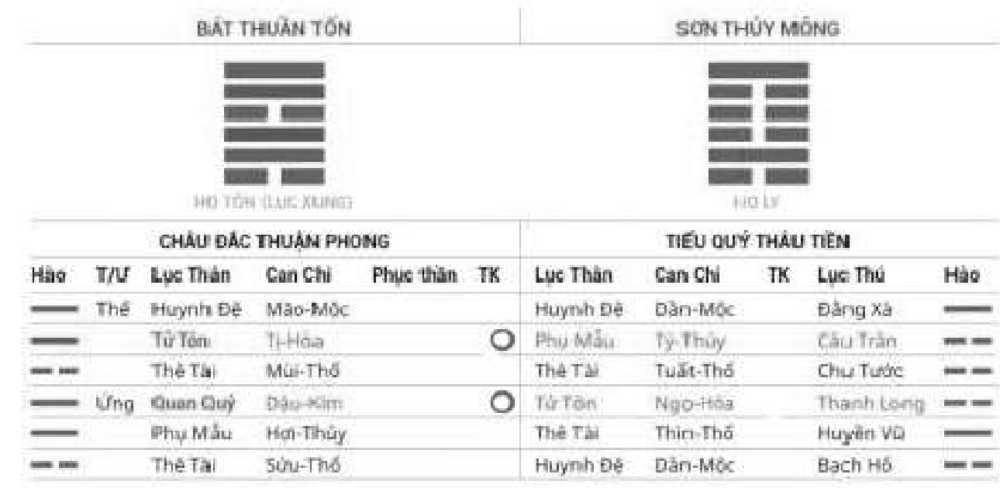
- **Cấu trúc Quẻ Dịch:**
  - **Quẻ chủ:** **Bát Thuần Tốn** (Cung Tốn, Họ Tốn – Quẻ Lục xung)  
    *Tượng quẻ:* Chậu Đặc Thuận Phong (Gặp gió thuận buồm – ban đầu thuận lợi nhưng Lục xung chủ biến cố nảy sinh đột ngột, dễ xung tán).
  - **Quẻ biến:** **Sơn Thủy Mông** (Cung Ly, Họ Ly)  
    *Tượng quẻ:* Tiểu Quỷ Thâu Tiền (Quỷ nhỏ trộm tiền – ám muội, tổn thất, mù mịt mông lung).
- **Bảng chi tiết Lục hào:**

| Hào | Thế/Ứng | Lục thân (Chủ) | Can Chi | Biến động | Lục thân (Biến) | Can Chi (Biến) | Thần sát / Tuần không | Lục thú |
|:---:|:---:|:---|:---|:---:|:---|:---|:---|:---|
| 6 | **Thế** | Huynh Đệ | Mão - Mộc | tĩnh | Huynh Đệ | Dần - Mộc | Tai sát | Đằng Xà |
| 5 | | Tử Tôn | Tị - Hỏa | **O (Động)** | Phụ Mẫu | Tý - Thủy | Dương nhẫn | Câu Trận |
| 4 | | Thê Tài | Mùi - Thổ | tĩnh | Thê Tài | Tuất - Thổ | Tuần không, Mưu tinh, Thiên hỷ | Chu Tước |
| 3 | **Ứng** | Quan Quỷ | Dậu - Kim | **O (Động)** | Tử Tôn | Ngọ - Hỏa | Tướng tinh, Văn xương (Hóa Hồi đầu khắc, Tuần không, Đào hoa, Lộc thần) | Thanh Long |
| 2 | | Phụ Mẫu | Hợi - Thủy | tĩnh | Thê Tài | Thìn - Thổ | Dịch mã | Huyền Vũ |
| 1 | | Thê Tài | Sửu - Thổ | tĩnh | Huynh Đệ | Dần - Mộc | Hoa cái (Lâm Nhật Nguyệt kiến) | Bạch Hổ |

---

### 3. Dụng thần & Loại quẻ

- **Phân loại quẻ:**
  - **Quẻ tình duyên đồng giới (Đồng tính luyến ái chiêm):** Chuyên đề định vị Dụng thần trong quan hệ tình cảm đồng tính đặc thù.
  - **Quẻ sự việc kiêm tâm thái:** Đánh giá xu hướng gắn kết lâu dài trước sóng gió nghi ngờ.
- **Xác định Dụng thần theo nguyên lý Âm Dương tương đối:**
  1. **Quy tắc phân vai Chủ động vs Bị động:** Trong tình cảm đồng tính, không căn cứ vào giới tính sinh học mà căn cứ vào tâm lý và vai vế thực tế:
     - Vai trò chủ động (mạnh mẽ, cương nghị, lấn lướt) quy về **Quan Quỷ**.
     - Vai trò bị động (nhu thuận, yếu thế, phục tùng) quy về **Thê Tài**.
  2. **Định vị Dụng thần trong quẻ:**
     - Đương số (người hỏi) lâm Hào Thế Huynh Đệ Mão Mộc bị Quan khắc, ở thế bị động, chịu oan ức (mang vai trò Thê Tài/bị động).
     - Đối phương lâm Hào Ứng Quan Quỷ Dậu Kim phát động khắc Thế, giữ thế chủ động và quyền quyết định trong mối quan hệ. Do đó, **Quan Quỷ Dậu Kim** chính là Dụng thần đại diện cho người bạn tình.
  3. **Kỵ thần:** Tử Tôn (khắc Quan Quỷ).
  4. **Nguyên thần:** Thê Tài (sinh Quan Quỷ).

---

### 4. Luận giải chi tiết

Quẻ này là bài giảng mẫu mực của Chu Thần Bân về kỹ pháp định vị Dụng thần đồng tính và bóc tách nhiều tầng sự kiện:

#### 1. Ý nghĩa của quẻ Lục xung (Bát Thuần Tốn) trong mối quan hệ lâu dài
- Hai người đã yêu nhau và chung sống êm đẹp hơn hai năm. Quẻ gieo ra lại là Bát Thuần Tốn (quẻ Lục xung).
- Lục xung trong trường hợp quan hệ đã bền chặt không có nghĩa là sự việc mới bắt đầu, mà biểu thị **biến cố nảy sinh đột ngột, chấn động bất ngờ làm rạn nứt cấu trúc bền vững**, khiến nguy cơ tan vỡ cận kề.

#### 2. Giải mã gian hào Tử Tôn Tị Hỏa động hóa hồi đầu khắc (Kẻ thứ ba tung tin đồn)
- Hào 5 Tử Tôn Tị Hỏa ngự tại gian hào (nằm giữa Thế và Ứng), lâm Câu Trận phát động. Gian hào đại diện cho người trung gian, bạn bè quen biết chen vào giữa hai người.
- Tử Tôn vốn là thần khắc Quan Quỷ, mang ý nghĩa tạo ra trở ngại, ngăn cách tình cảm. Tị Hỏa phát động tượng trưng cho bạn bè của đối phương gièm pha, tung tin đồn thất thiệt tố cáo đương số ngoại tình, khiến đối phương nghi ngờ dằn vặt.
- Tuy nhiên, **Tử Tôn Tị Hỏa hóa Phụ Mẫu Tý Thủy hồi đầu khắc**: Hào biến Tý Thủy hồi đầu khắc tuyệt Tị Hỏa, lại được Nhật Nguyệt Sửu Thổ tương hợp. Điều này báo hiệu kẻ tung tin đồn sẽ sớm bị triệt tiêu uy lực; sau 3 đến 4 tháng chân tướng sẽ sáng tỏ, mối nghi ngờ ngoại tình bị dập tắt và hai người sẽ không chia tay vì lý do đồn đại này.

#### 3. Dụng thần Ứng hào Quan Quỷ Dậu Kim hóa Hồi đầu khắc (Bản chất chia tay tất yếu)
- **Tầng quyết định cát hung:** Hào Ứng Quan Quỷ Dậu Kim phát động hóa ra **Tử Tôn Ngọ Hỏa** (hồi đầu khắc).
- Dụng thần lâm Hào Ứng tự động phát hóa hồi đầu khắc mang thông điệp dứt khoát: chính bản thân đối phương tự sinh tâm buông bỏ, chủ động muốn triệt tiêu mối quan hệ tình cảm này.
- Ngọ Hỏa lâm Tuần không, Đào hoa và Lộc thần: ý niệm chia tay đã nung nấu sẵn trong nội tâm đối phương (mang Huyền Vũ/ẩn tàng), chỉ chờ thời cơ xuất không hoặc gặp xung để bùng phát thành hành động dứt khoát.
- Thế hào Huynh Đệ Mão Mộc bị Quan khắc, lại lâm Đằng Xà: đương số rơi vào cảnh bất an, lo âu, hoàn toàn ở thế bị động đón nhận phán quyết từ đối phương.

#### 4. Tầng chi tiết: Tam hợp cục Tị Dậu Sửu
- Nhật Nguyệt Sửu Thổ cùng Tị Hỏa và Dậu Kim tạo thành Tị - Dậu - Sửu tam hợp Kim cục ở tầng chi tiết.
- Cục diện tam hợp này khắc họa rõ nét nền tảng tình cảm hai người đã gắn bó sâu sắc, ràng buộc chặt chẽ trong quá khứ hơn 2 năm qua, do đó việc tan vỡ là một tổn thương và tiếc nuối lớn.

---

### 5. Kết luận & Ứng kỳ thực tế

- **Kết luận giải đoán của Chu Thần Bân:**
  - Vụ việc nghi ngờ ngoại tình do bạn bè đối phương dựng chuyện sẽ được làm sáng tỏ và dẹp yên trong vòng 3-4 tháng (do hào gièm pha Tị Hỏa hóa hồi đầu khắc).
  - Tuy nhiên, xu hướng cốt lõi của mối tình này là không thể duy trì dài lâu. Bản chất đối phương đã có tâm lý muốn rời xa, chắc chắn chưa đầy một năm sau đối phương sẽ chủ động đưa ra lời chia tay.
- **Phản hồi thực tế (Feedback):**
  - Đúng như dự đoán, sau vài tháng điều tra và đối chất, đối phương đã hiểu rõ cô gái không hề có quan hệ ngoài luồng nào, mâu thuẫn nghi ngờ được tạm thời dàn xếp.
  - Thế nhưng, chưa đầy một năm sau, người bạn tình kia đột nhiên chủ động tuyên bố chia tay một cách lạnh lùng mà không đưa ra bất kỳ lý do cụ thể nào. Mối quan hệ chính thức tan vỡ hoàn toàn do đối phương tự nguyện rút lui.
- **Ứng kỳ chiêm nghiệm:**
  - Lời đồn tan biến sau 3-4 tháng (ứng với thời điểm Tý Thủy khắc Tị Hỏa).
  - Biến cố chia tay ứng vào cuối năm khi hào biến Tử Tôn Ngọ Hỏa xuất không phùng xung (đến tháng Tý xung Ngọ Hỏa), đối phương chính thức cắt đứt quan hệ.

---

### 6. Bài học tâm pháp & Quy tắc cốt lõi

- **Quy tắc trích dẫn từ Cổ Thệ Chân Thuyên:**
  - Trích dẫn rule_index (trang 331): *Quy tắc xác định Dụng thần âm dương (chủ động - Quan Quỷ / bị động - Thê Tài) trong tình cảm đồng tính nữ.*
- **Bài học kinh nghiệm thực chiến:**
  1. **Tư duy linh hoạt trong định vị Dụng thần hiện đại:** Không câu nệ giới tính sinh học trong các mối quan hệ đồng giới. Căn cứ vào tâm lý ứng xử thực tế: bên chủ động, lấn át là Dương (Quan Quỷ); bên yếu thế, nhu thuận là Âm (Thê Tài).
  2. **Bóc tách tầng sự kiện trung gian và kết cục bản chất:** Gian hào động hóa hồi đầu khắc chỉ là màn kịch phụ (sóng gió hiểu lầm nhất thời). Điểm tựa định đoạt sinh tử của mối quan hệ luôn nằm ở Dụng thần chính thể (Ứng hào hóa hồi đầu khắc).
  3. **Quy luật Hồi đầu khắc của Dụng thần trong hôn nhân/tình cảm:** Bất luận quẻ gì, khi đối phương (Ứng/Dụng) tự động hóa hồi đầu khắc thì đó là chỉ dấu đối phương tự triệt tiêu tình cảm, kết cục chia ly là điều không thể đảo ngược.

## THỰC CHIẾN 45: NGƯỜI PHỤ NỮ MỸ HỎI VỀ XU HƯỚNG DUY TRÌ TÌNH CẢM VỚI LUẬT SƯ NGƯỜI DO THÁI

---

### 1. Bối cảnh & Câu hỏi

- **Bối cảnh chi tiết:** 
  Một cô gái Mỹ gốc Hoa xuất thân từ gia đình rất giàu có đang hẹn hò với một nam luật sư người Do Thái. Cô gái bị thu hút mạnh mẽ bởi vẻ ngoài điển trai, lịch thiệp ban đầu của anh ta. Tuy nhiên, sau một thời gian qua lại, những mâu thuẫn sâu sắc bắt đầu bộc lộ. Gia đình cô gái kịch liệt phản đối vì nhận thấy tính cách người đàn ông này không đứng đắn, có nhiều hành vi mờ ám. Bản thân cô gái cũng dần nhận ra anh ta là người vô cùng tính toán, ích kỷ, lạnh lùng và hoàn toàn thiếu chân thành trong tình cảm. Khác với quy luật thông thường, trong mối quan hệ này cô luôn phải chủ động chiều chuộng và bao trọn mọi chi phí sinh hoạt. Dù nhiều lần muốn dứt bỏ nhưng mỗi khi cô đề cập chia tay, người đàn ông lại dùng lời lẽ đường mật quấn quýt níu kéo khiến cô mềm lòng, mối quan hệ dùng dằng suốt hai năm không dứt.
- **Tâm lý & Câu hỏi ẩn ý:** 
  Đương số vẫn còn vương vấn tình cảm nhưng nội tâm vô cùng bế tắc, đau khổ trước sự bất đồng tính cách và khác biệt văn hóa. Câu hỏi bề ngoài là "xu hướng duy trì tình cảm trong tương lai ra sao", nhưng thực chất là tìm kiếm phương hướng giải thoát: liệu có hy vọng cải thiện mối quan hệ này hay bắt buộc phải cắt đứt, và làm thế nào để chia tay an toàn mà không bị đối phương trả đũa?
- **Thời gian chiêm đoán:**
  - Dương lịch: Ngày 21 tháng 12 năm 2016, lúc 14:27 (Giờ Bắc Kinh).
  - Can chi: Năm Bính Thân, tháng Canh Tý, ngày Đinh Sửu, giờ Đinh Mùi.

---

### 2. Dữ kiện & Bảng quẻ Crop

- **Thời không chiêm nghiệm:**
  - Tháng Canh Tý (Thủy vượng, Kim tướng, Mộc đắc sinh, Hỏa thổ suy tuyệt).
  - Ngày Đinh Sửu (Thổ vượng, Sửu hợp Tý, Sửu khố).
  - Tuần không: **Thân - Dậu** (Giáp Tuất tuần trung, Thân Dậu không vong).
- **Thần sát:**
  - Tướng tinh: Dậu (Lâm Hào biến Thế, Tuần không)
  - Hoa cái: Sửu (Lâm Nhật kiến)
  - Dịch mã: Hợi (Lâm Hào biến Dụng thần)
  - Tai sát: Mão (Lâm Hào Thế, Động)
  - Mưu tinh: Mùi
  - Đào hoa: Ngọ
  - Kiếp sát: Dần
  - Lộc thần: Ngọ
  - Dương nhẫn: Tị (Lâm Hào 2 Dụng thần, Động)
  - Văn xương: Dậu (Lâm Hào biến Thế, Tuần không)
  - Thiên y: Hợi (Lâm Hào biến Dụng thần)
  - Thiên hỷ: Mùi
  - Quý nhân: Dậu, Hợi
- Dữ kiện bảng quẻ và các thông số chiêm đoán:
  - **Bảng 45.1** Đồ hình quẻ Thực chiến 45:
    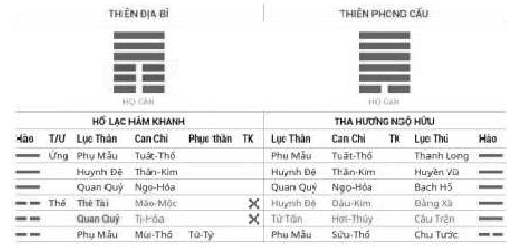
- **Cấu trúc Quẻ Dịch:**
  - **Quẻ chủ:** **Thiên Địa Bĩ** (Cung Càn, Họ Càn)  
    *Tượng quẻ:* Hổ Lạc Hàm Khanh (Hổ rơi hố sâu – bế tắc, trời đất không giao hòa, tiểu nhân đạo trưởng).
  - **Quẻ biến:** **Thiên Phong Cấu** (Cung Càn, Họ Càn)  
    *Tượng quẻ:* Tha Hương Ngộ Hữu (Nơi đất khách gặp bạn – cuộc tương phùng bất ngờ nhưng tượng Cấu chủ nữ tráng, khó bền chặt lâu dài).
- **Bảng chi tiết Lục hào:**

| Hào | Thế/Ứng | Lục thân (Chủ) | Can Chi | Biến động | Lục thân (Biến) | Can Chi (Biến) | Thần sát / Tuần không | Lục thú |
|:---:|:---:|:---|:---|:---:|:---|:---|:---|:---|
| 6 | **Ứng** | Phụ Mẫu | Tuất - Thổ | tĩnh | Phụ Mẫu | Tuất - Thổ | | Thanh Long |
| 5 | | Huynh Đệ | Thân - Kim | tĩnh | Huynh Đệ | Thân - Kim | Tuần không, Quý nhân | Huyền Vũ |
| 4 | | Quan Quỷ | Ngọ - Hỏa | tĩnh | Quan Quỷ | Ngọ - Hỏa | Đào hoa, Lộc thần | Bạch Hổ |
| 3 | **Thế** | Thê Tài | Mão - Mộc | **X (Động)** | Huynh Đệ | Dậu - Kim | Tai sát (Hóa Hồi đầu khắc, Phản ngâm, Tuần không, Tướng tinh) | Đằng Xà |
| 2 | | Quan Quỷ | Tị - Hỏa | **X (Động)** | Tử Tôn | Hợi - Thủy | Dương nhẫn (Hóa Hồi đầu khắc, Phản ngâm, Dịch mã, Thiên y, Quý nhân) | Câu Trận |
| 1 | | Phụ Mẫu | Mùi - Thổ | tĩnh | Phụ Mẫu | Sửu - Thổ | Phục Tử-Tý | Chu Tước |

---

### 3. Dụng thần & Loại quẻ

- **Phân loại quẻ:**
  - **Quẻ hôn nhân tình cảm xuyên quốc gia:** Khảo sát sự xung đột tính cách và vận mệnh lứa đôi giữa hai nền văn hóa.
  - **Quẻ sự việc kiêm tâm thái:** Giải mã hiện tượng quấn chân bế tắc và tìm kiếm giải pháp ứng biến.
- **Xác định Dụng thần:**
  1. **Quan Quỷ (Dụng thần đối phương):** Nữ hỏi về bạn trai lấy Quan Quỷ làm Dụng thần. Trong quẻ có Quan Quỷ Ngọ Hỏa (hào 4 tĩnh) và Quan Quỷ Tị Hỏa (hào 2 động). Quan Quỷ Tị Hỏa phát động nắm quyền biến dịch nên là Dụng thần định tính cốt lõi đại diện cho người luật sư Do Thái.
  2. **Hào Thế (Thê Tài Mão Mộc):** Đại diện cho bản thân cô gái người Mỹ gốc Hoa.
  3. **Hào Ứng (Phụ Mẫu Tuất Thổ):** Dụng thần chi tiết đối ứng, tạo thế Mão - Tuất tương hợp với Thế hào.
  4. **Kỵ thần:** Tử Tôn Hợi Thủy (khắc Quan Quỷ).
  5. **Nguyên thần:** Thê Tài Mão Mộc (sinh Quan Quỷ).

---

### 4. Luận giải chi tiết

Quẻ Thiên Địa Bĩ biến Thiên Phong Cấu chứa đựng những cấu trúc biến dịch vô cùng hiểm hóc:

#### 1. Cơ chế Hung Phản Ngâm và Hồi đầu khắc kép ở nội quái
- Cả hai hào động ở nội quái đều rơi vào trạng thái tương xung tương khắc dữ dội:
  - Hào 2 Quan Quỷ Tị Hỏa biến xuất Tử Tôn Hợi Thủy: Tị Hợi tương xung, Hợi Thủy hồi đầu khắc Tị Hỏa.
  - Hào 3 Thê Tài Mão Mộc biến xuất Huynh Đệ Dậu Kim: Mão Dậu tương xung, Dậu Kim hồi đầu khắc Mão Mộc.
- **Bản chất của Phản ngâm:** Phản ngâm chủ về sự việc trắc trở, dùng dằng, lặp đi lặp lại nhiều lần. Thực tế hai người đã nhiều lần chia tay rồi lại tái hợp trong suốt 2 năm qua.
- **Tính chất Hung Phản ngâm:** Khi hào động và hào biến vừa tương xung vừa bị hào biến **hồi đầu khắc**, đây là "Hung Phản ngâm" cực điểm. Nó báo hiệu rằng sự lặp đi lặp lại này không mang lại kết quả tốt đẹp mà chắc chắn sẽ dẫn tới tổn thất nặng nề, đổ vỡ và hủy diệt nếu tiếp tục duy trì.

#### 2. Thế hào Thê Tài Mão Mộc hóa Hồi đầu khắc (Tổn thương về phía bản thân)
- Hào Thế Thê Tài Mão Mộc phát động hóa ra Huynh Đệ Dậu Kim hồi đầu khắc.
- Điều này định tính dứt khoát: Nếu cô gái tiếp tục kéo dài mối quan hệ này (dù là làm bạn gái hay sau này tiến tới hôn nhân), bản thân cô sẽ phải gánh chịu những tổn thương nặng nề cả về tinh thần lẫn thể xác. Huynh Đệ Dậu Kim lâm Tuần không là điềm báo phá tài, mất mát tiền của vì người đàn ông này.
- May mắn là Huynh Đệ Dậu Kim đang lâm Tuần không: tai họa thực sự chưa giáng xuống trọn vẹn, cô gái hoàn toàn còn cơ hội thoát thân nếu kịp thời tỉnh ngộ buông tay.

#### 3. Dụng thần Quan Quỷ Tị Hỏa hóa Hồi đầu khắc (Bản chất đối phương tự buông xuôi)
- Người đàn ông luật sư (Quan Quỷ Tị Hỏa) tự phát động hóa Tử Tôn Hợi Thủy hồi đầu khắc.
- Điều này chứng minh rằng người đàn ông này không thể đồng hành lâu dài cùng cô gái, cuối cùng anh ta cũng sẽ tự buông tay hoặc từ bỏ cuộc hôn nhân này.

#### 4. Giải mã tượng "Mão Tuất Tương Hợp" – Cạm bẫy quấn chân
- Hào Thế Mão Mộc tương hợp với hào Ứng Phụ Mẫu Tuất Thổ, tạo thành "tượng quấn chân" (quấn quýt khó dứt).
- Người đàn ông này biết gia đình cô gái rất giàu có nên không muốn vuột mất mối lợi. Mỗi khi cô gái muốn chia tay, anh ta lại dùng mưu mẹo, lời lẽ ngon ngọt để níu kéo, khiến cô gái bị trói buộc ý chí.
- Bát tự của người này mang đặc tính Thương Quan, Thất Sát cực kỳ hiếu thắng, vị kỷ, không bao giờ nhận lỗi về mình mà luôn đổ lỗi cho người khác. Nếu cô gái trực tiếp đề nghị chia tay, anh ta chắc chắn sẽ nổi giận, trả thù hoặc quấy nhiễu dai dẳng.

#### 5. Kỹ pháp tâm pháp "Lấy lùi làm tiến" để phá thế kẹt
- Thấu suốt tâm lý đối phương qua quẻ tượng và Bát tự, Chu Thần Bân đã hiến kế cho cô gái một chiến lược tâm pháp xuất sắc:
  - Tuyệt đối không được chủ động nói lời chia tay trước để tránh kích động lòng tự ái và tính trả đũa của anh ta.
  - Hãy chủ động tạo khoảng cách, từ chối gặp mặt, tỏ thái độ lạnh nhạt nhưng không giải thích.
  - Khi người đàn ông giở thói quen cũ dùng chiêu "chia tay để đôi bên bình tĩnh lại" nhằm đe dọa, cô gái hãy lập tức "thuận nước đẩy thuyền", chấp thuận chia tay ngay tại chỗ. Đồng thời đóng vai người bị tổn thương, đổ toàn bộ nguyên nhân chia tay lên việc anh ta đã chủ động nói ra lời đó.

---

### 5. Kết luận & Ứng kỳ thực tế

- **Kết luận giải đoán:**
  - Chu Thần Bân khẳng định mối quan hệ này tuyệt đối không có tương lai, hai bên chỉ đem lại đau khổ cho nhau (nội quái hung phản ngâm, đôi bên cùng hóa hồi đầu khắc).
  - Khuyên đương số áp dụng kế sách "lấy lùi làm tiến" để chấm dứt dứt điểm mối quan hệ độc hại một cách an toàn.
- **Phản hồi thực tế (Feedback):**
  - Cô gái tuân thủ nghiêm ngặt chỉ dẫn. Khi người đàn ông lại giở trò đề nghị chia tay tạm thời, cô gái lập tức đồng ý dứt khoát.
  - Hai ngày sau, người đàn ông hoảng hốt hối hận vì mất đi người bao bọc tài chính, vội vàng tìm cô gái xin lỗi và đổ lỗi do say rượu.
  - Cô gái kiên quyết giữ vững lập trường, đẩy hết trách nhiệm: "Chính anh đã chủ động đề nghị chia tay, tôi vô cùng thất vọng và đau lòng, tôi không thể quay lại được nữa".
  - Người đàn ông vì chính miệng mình nói chia tay trước nên đuối lý, không thể phát tác cơn thịnh nộ hay trả đũa, đành phải ngậm ngùi chấp nhận rút lui. Cô gái chính thức thoát khỏi mối quan hệ độc hại trong êm đẹp.
- **Ứng kỳ chiêm nghiệm:**
  - Vụ việc chia tay diễn ra nhanh chóng và dứt điểm ngay khi cô gái vận dụng thành công kế sách, hóa giải thế quấn chân Mão - Tuất.

---

### 6. Bài học tâm pháp & Quy tắc cốt lõi

- **Quy tắc trích dẫn từ Cổ Thệ Chân Thuyên:**
  - Trích dẫn rule_index (trang 339): *Quy tắc giải đoán quẻ Thiên Địa Bĩ biến Thiên Phong Cấu trong mối quan hệ tình cảm xuyên quốc gia.*
- **Bài học kinh nghiệm thực chiến:**
  1. **Nhận diện Hung Phản ngâm trong dự trắc hôn nhân:** Phản ngâm chỉ sự dùng dằng lặp lại, nhưng phản ngâm kèm hồi đầu khắc ở cả Thế và Dụng là tín hiệu cảnh báo nguy hiểm tột độ – đôi bên càng cố chấp níu kéo thì vết thương tích tụ càng sâu sắc.
  2. **Tâm pháp hóa giải tượng Quấn chân (Hợp trói):** Khi hào Thế bị hào Ứng hợp trói trong một mối quan hệ độc hại, việc đối đầu trực diện thường chuốc lấy hậu quả khôn lường. Vận dụng nguyên lý "lấy lùi làm tiến", tương kế tựu kế là cảnh giới cao nhất của nhà chiêm bái để cứu người thoát hiểm.
  3. **Kết hợp Lục Hào và Bát Tự trong định hình nhân cách:** Dùng Bát tự để thấu suốt bản chất nội tâm ẩn sâu của đương sự, dùng Lục Hào để định vị thời điểm và xu thế chuyển động của sự việc.

## THỰC CHIẾN 46: CÔ GÁI NGƯỜI CANADA HỎI CÓ CƠ HỘI PHÁT TRIỂN VỚI CHÀNG TRAI TỐT NGHIỆP OXFORD KHÔNG

---

### 1. Bối cảnh & Câu hỏi

- **Bối cảnh chi tiết:** 
  Một cô gái quốc tịch Canada tình cờ quen biết một chàng trai xuất chúng từng tốt nghiệp Đại học Oxford danh giá. Mối quan hệ giữa hai người lúc bấy giờ chỉ dừng lại ở mức bạn bè xã giao gặp gỡ thoáng qua. Cô gái rất ấn tượng và rung động trước học thức, phong thái của chàng trai, mong muốn tìm hiểu xem liệu có cơ duyên phát triển mối quan hệ này lên nấc thang tình cảm lứa đôi hay không.
- **Tâm lý & Câu hỏi ẩn ý:** 
  Cô gái có tâm lý vừa hy vọng vừa e dè trước khoảng cách về học vấn và bối cảnh. Câu hỏi bề ngoài là "liệu có cơ hội phát triển tình cảm với chàng trai tốt nghiệp Oxford không", nhưng ẩn ý sâu xa là: đối phương có để ý đến mình không, và nếu có thì thời cơ phát triển quan hệ là khi nào để nắm bắt?
- **Thời gian chiêm đoán:**
  - Dương lịch: Ngày 21 tháng 12 năm 2016, lúc 13:27 (Giờ Bắc Kinh).
  - Can chi: Năm Bính Thân, tháng Canh Tý, ngày Đinh Sửu, giờ Đinh Mùi.

---

### 2. Dữ kiện & Bảng quẻ Crop

- **Thời không chiêm nghiệm:**
  - Tháng Canh Tý (Thủy vượng sinh Mộc, Kim tướng, Hỏa thổ suy tuyệt).
  - Ngày Đinh Sửu (Thổ vượng, Sửu hợp Tý).
  - Tuần không: **Thân - Dậu** (Giáp Tuất tuần trung, Thân Dậu không vong).
- **Thần sát:**
  - Tướng tinh: Dậu (Lâm Tuần không)
  - Hoa cái: Sửu (Lâm Nhật kiến)
  - Dịch mã: Hợi
  - Tai sát: Mão
  - Mưu tinh: Mùi
  - Đào hoa: Ngọ
  - Kiếp sát: Dần (Lâm Hào Thế)
  - Lộc thần: Ngọ
  - Dương nhẫn: Tị
  - Văn xương: Dậu (Lâm Tuần không)
  - Thiên y: Hợi
  - Thiên hỷ: Mùi
  - Quý nhân: Dậu, Hợi
- Dữ kiện bảng quẻ và các thông số chiêm đoán:
  - **Bảng 46.1** Đồ hình quẻ Thực chiến 46:
    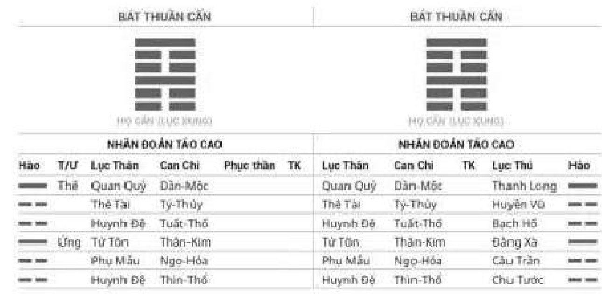
- **Cấu trúc Quẻ Dịch:**
  - **Quẻ chủ:** **Bát Thuần Cấn** (Cung Cấn, Họ Cấn – Quẻ Lục xung, toàn quẻ an tĩnh)  
    *Tượng quẻ:* Nhân Đoán Tào Cao (Người bị chôn chặt chân – ngưng trệ, dừng lại, khó tiến triển bền vững).
  - **Quẻ biến:** Không có (Quẻ tĩnh).
- **Bảng chi tiết Lục hào:**

| Hào | Thế/Ứng | Lục thân (Chủ) | Can Chi | Biến động | Thần sát / Tuần không | Lục thú |
|:---:|:---:|:---|:---|:---:|:---|:---|
| 6 | **Thế** | Quan Quỷ | Dần - Mộc | tĩnh | Kiếp sát | Thanh Long |
| 5 | | Thê Tài | Tý - Thủy | tĩnh | Lâm Nguyệt kiến | Huyền Vũ |
| 4 | | Huynh Đệ | Tuất - Thổ | tĩnh | | Bạch Hổ |
| 3 | **Ứng** | Tử Tôn | Thân - Kim | tĩnh | Tuần không | Đằng Xà |
| 2 | | Phụ Mẫu | Ngọ - Hỏa | tĩnh | Đào hoa, Lộc thần | Câu Trận |
| 1 | | Huynh Đệ | Thìn - Thổ | tĩnh | | Chu Tước |

---

### 3. Dụng thần & Loại quẻ

- **Phân loại quẻ:**
  - **Quẻ tình cảm sơ khởi (Vấn duyên khởi đầu quan hệ):** Khảo sát triển vọng chuyển hóa từ bạn bè xã giao sang tình yêu.
  - **Quẻ tĩnh Lục xung:** Toàn quẻ an tĩnh nhưng cấu trúc nội tại đối kháng trực xung.
- **Xác định Dụng thần:**
  1. **Quan Quỷ (Dụng thần bạn trai):** Nữ hỏi về bạn trai lấy Quan Quỷ làm Dụng thần. Trong quẻ có độc nhất một hào Quan Quỷ Dần Mộc ngự tại hào 6 trì Thế.
  2. **Dụng thần trì Thế (Quan Quỷ Dần Mộc lâm Thế):** Báo hiệu đối tượng thỉnh vấn đã gắn liền với bản thân, biểu thị cơ hội kết nối thực tế chắc chắn sẽ diễn ra.
  3. **Hào Ứng (Tử Tôn Thân Kim lâm Tuần không):** Đối diện Thế hào, Thân Kim trực xung Dần Mộc (Thế Ứng tương xung).

---

### 4. Luận giải chi tiết

Quẻ Bát Thuần Cấn an tĩnh trong thực tế chiêm nghiệm tình cảm ẩn chứa quy luật ứng nghiệm rất đặc thù:

#### 1. Quy luật Dụng thần trì Thế trong quẻ tĩnh
- Quẻ tĩnh xem tình duyên, khi Dụng thần Quan Quỷ Dần Mộc ngự ngay tại Hào Thế:
  - Hào Dần Mộc được Nguyệt lệnh Canh Tý tương sinh hữu khí, lại đắc Thanh Long cát thú phụ tá, không phạm Nguyệt phá.
  - Về mặt lý thuyết Lục Hào, Dụng thần trì Thế hữu khí chứng minh rằng cơ hội tình cảm là hoàn toàn có thật. Người đàn ông này chắc chắn sẽ chủ động tiếp cận và mở lời muốn tìm hiểu, phát triển quan hệ với đương số trong thời gian rất gần.

#### 2. Nghịch lý của quẻ Bát Thuần Cấn (Lục xung toàn quẻ tĩnh)
- **Tượng quẻ Cấn – Dừng lại và cách trở:** Cấn chủ về ngưng trệ, núi non trùng điệp ngăn cách, thiếu lực đẩy chủ động từ nội tâm để vượt qua rào cản.
- **Tác động triệt tiêu của Lục xung:** 
  - Trong dự đoán hôn nhân tình cảm, quẻ Lục xung là chỉ dấu tối kỵ của sự "thiếu bền vững, dễ xung tán, khó trường cửu".
  - Dù Dụng thần trì Thế mang lại cơ hội kết nối ban đầu, nhưng bản chất Lục xung biến cơ hội này thành một thời cơ cực kỳ ngắn ngủi, mong manh: chỉ có thể "tốc chiến tốc thắng", nếu không hành động quyết đoán ngay lập tức thì duyên phận sẽ tan biến nhanh như bọt nước.
- **Thế Ứng tương xung ngầm:** Thế Quan Quỷ Dần Mộc và Ứng Tử Tôn Thân Kim tương xung kịch liệt (Dần Thân tương xung, Tử Tôn khắc Quan Quỷ), dự báo sự bất đồng về định hướng hành động giữa hai người.

#### 3. Lời cảnh báo mang tính then chốt của Chu Thần Bân
- Dựa trên cơ chế "Lục xung kết hợp Dụng thần trì Thế", Chu Thần Bân phân tích rõ ràng hai tình huống thực tế cho cô gái:
  - *Tình huống 1:* Người đàn ông này sẽ rất nhanh chóng tìm đến cô gái (trong vòng khoảng một tuần) để bày tỏ mong muốn phát triển quan hệ. Nếu muốn thành, cô gái bắt buộc phải nắm bắt và thiết lập mối quan hệ ngay tại chỗ.
  - *Tình huống 2:* Nếu để xảy ra bất kỳ sự gián đoạn thời gian nào hoặc chần chừ do dự, quẻ Lục xung sẽ lập tức phát tác lực xung tán, cơ duyên sẽ trôi tuột và hai người sẽ vĩnh viễn không còn cơ hội tái hợp.

---

### 5. Kết luận & Ứng kỳ thực tế

- **Kết luận giải đoán:**
  - Chu Thần Bân khuyên cô gái phải tập trung chớp lấy thời cơ ngay khi chàng trai mở lời trong vài ngày tới; tuyệt đối không được chần chừ kéo dài thời gian.
- **Phản hồi thực tế (Feedback):**
  - Quả nhiên đúng như dự đoán, chỉ khoảng 1 tuần sau khi gieo quẻ, chàng trai tốt nghiệp Oxford đã chủ động tìm gặp cô gái và ngỏ ý muốn phát triển mối quan hệ tình cảm.
  - Tuy nhiên, đúng vào thời điểm bước ngoặt này, cô gái lại nhận một công việc đi công tác xa kéo dài từ 3 đến 4 tháng. Cô gái bèn nhắn lại với chàng trai: "Hãy đợi em đi công tác về rồi chúng ta sẽ tiếp tục tìm hiểu".
  - Kết cục: Hơn ba tháng sau khi cô gái hoàn thành chuyến công tác trở về, chàng trai đã tìm được người bạn gái khác để hẹn hò và hoàn toàn không còn liên lạc với cô nữa. Hai người chính thức chia tay và lướt qua nhau trong tiếc nuối.
- **Ứng kỳ chiêm nghiệm:**
  - Cơ hội xuất hiện ứng nghiệm ngay sau 1 tuần (Quan Quỷ trì Thế hữu khí).
  - Tình cảm tan rã ứng nghiệm sau 3-4 tháng gián đoạn công tác (ứng với lực xung tán của Bát Thuần Cấn Lục xung).

---

### 6. Bài học tâm pháp & Quy tắc cốt lõi

- **Quy tắc trích dẫn từ Cổ Thệ Chân Thuyên:**
  - Trích dẫn rule_index (trang 346): *Quy tắc quẻ tĩnh Bát Thuần Cấn lục xung trong dự đoán cơ hội phát triển quan hệ tình cảm.*
- **Bài học kinh nghiệm thực chiến:**
  1. **Nhận diện cơ hội ngắn hạn trong quẻ Lục xung có Dụng trì Thế:** Dụng thần trì Thế mang lại cánh cửa cơ hội thực tế, nhưng quẻ Lục xung cảnh báo cánh cửa đó sẽ đóng sập lại rất nhanh. Phải hành động chớp nhoáng, không có chỗ cho sự chần chừ hay trì hoãn thời gian.
  2. **Tượng pháp Cấn vi chỉ trong nhân sự lứa đôi:** Quẻ Cấn là núi chắn đường, khi có khoảng cách thời gian hoặc không gian xen vào (như chuyến công tác xa), quán tính tình cảm sẽ lập tức dừng lại và rẽ sang hướng khác.
  3. **Tương tác giữa Nhân định và Thiên mệnh:** Cơ hội Dịch học đã chỉ điểm rõ ràng nhưng quyết định chủ quan của đương sự (chủ động nhận chuyến công tác xa) đã vô tình kích hoạt trọn vẹn kết cục xung tán của quẻ tượng.

## THỰC CHIẾN 47: HỎI VỀ XU HƯỚNG VỤ KIỆN VỚI SỞ THUẾ BỜ ĐÔNG

---

### 1. Bối cảnh & Câu hỏi

- **Bối cảnh chi tiết:** 
  Chủ quẻ cùng chồng thành lập một công ty chuyên kinh doanh các sản phẩm thực phẩm chức năng tại Bắc Mỹ. Theo quy định hải quan ban đầu, thực phẩm chức năng không phải là dược phẩm nên được áp mức thuế suất ưu đãi thấp hơn rất nhiều. Hai năm trước, người chồng khi ngồi rảnh rỗi kiểm tra lại hóa đơn thuế đã phát hiện một khoản thuế thu chưa hợp lý nên tự ý nộp đơn xin hoàn thuế lên cơ quan thuế địa phương bờ Đông. Phía sở thuế cảm thấy bị soi xét và bực tức vì một khoản tiền nhỏ, nên đã mở cuộc thanh tra diện rộng công ty và đơn phương tái phân loại toàn bộ lô hàng thực phẩm chức năng thành dược phẩm. Phán quyết này không chỉ buộc công ty phải truy nộp số tiền thuế khổng lồ trong quá khứ mà còn phải gánh mức thuế dược phẩm hàng năm rất cao, đe dọa trực tiếp sự tồn vong của doanh nghiệp. Suốt hai năm ròng rã, công ty liên tục khiếu nại nhưng sở thuế chây ì, cố tình gây khó dễ. Người con trong gia đình theo học ngành luật đã đứng ra viện dẫn luật để tranh biện nhưng vẫn hoàn toàn bế tắc.
- **Tâm lý & Câu hỏi ẩn ý:** 
  Đương số vô cùng mệt mỏi, bất an, cảm giác bất lực trước sự chèn ép của cơ quan công quyền. Câu hỏi bề ngoài là "xu hướng vụ kiện tranh chấp với sở thuế bờ Đông ra sao", nhưng ẩn ý sâu xa là: liệu công ty có thoát được án phạt thuế oan nghiệt này không, và phải làm cách nào để buộc sở thuế rút lại quyết định bất công?
- **Thời gian chiêm đoán:**
  - Dương lịch: Ngày 21 tháng 12 năm 2016, lúc 15:41 (Giờ Bắc Kinh).
  - Can chi: Năm Bính Thân, tháng Canh Tý, ngày Đinh Sửu, giờ Mậu Thân.

---

### 2. Dữ kiện & Bảng quẻ Crop

- **Thời không chiêm nghiệm:**
  - Tháng Canh Tý (Thủy vượng, Kim tướng, Hỏa tuyệt bị trực xung phá).
  - Ngày Đinh Sửu (Thổ vượng, Sửu hợp Tý).
  - Tuần không: **Thân - Dậu** (Giáp Tuất tuần trung, Thân Dậu không vong).
- **Thần sát:**
  - Tướng tinh: Dậu (Lâm Tuần không)
  - Hoa cái: Sửu (Lâm Nhật kiến)
  - Dịch mã: Hợi
  - Tai sát: Mão
  - Mưu tinh: Mùi
  - Đào hoa: Ngọ (Lâm Hào Thế, Động)
  - Kiếp sát: Dần (Lâm Hào Ứng)
  - Lộc thần: Ngọ (Lâm Hào Thế, Động)
  - Dương nhẫn: Tị
  - Văn xương: Dậu (Lâm Tuần không)
  - Thiên y: Hợi
  - Thiên hỷ: Mùi
  - Quý nhân: Dậu, Hợi
- Dữ kiện bảng quẻ và các thông số chiêm đoán:
  - **Bảng 47.1** Đồ hình quẻ Thực chiến 47:
    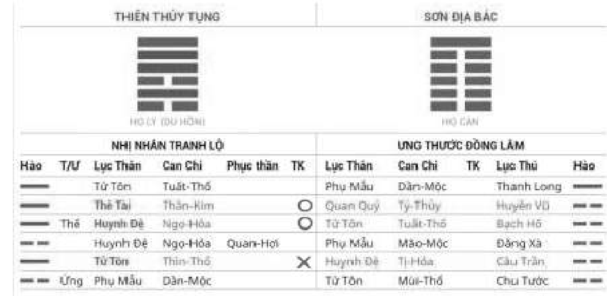
- **Cấu trúc Quẻ Dịch:**
  - **Quẻ chủ:** **Thiên Thủy Tụng** (Cung Ly, Họ Ly – Quẻ Du hồn)  
    *Tượng quẻ:* Nhị Nhân Tranh Lộ (Hai người tranh đường – tranh chấp, kiện tụng đối kháng gay gắt, tâm ý bồng bềnh bất an).
  - **Quẻ biến:** **Sơn Địa Bác** (Cung Càn, Họ Càn)  
    *Tượng quẻ:* Ưng Thước Đồng Lâm (Chim ưng chim sẻ cùng rừng – bóc tách từng lớp rõ ràng, sự thật sáng tỏ).
- **Bảng chi tiết Lục hào:**

| Hào | Thế/Ứng | Lục thân (Chủ) | Can Chi | Biến động | Lục thân (Biến) | Can Chi (Biến) | Thần sát / Tuần không | Lục thú |
|:---:|:---:|:---|:---|:---:|:---|:---|:---|:---|
| 6 | | Tử Tôn | Tuất - Thổ | tĩnh | Phụ Mẫu | Dần - Mộc | | Thanh Long |
| 5 | | Thê Tài | Thân - Kim | **O (Động)** | Quan Quỷ | Tý - Thủy | Tuần không, Quý nhân (Hóa Nguyệt lệnh) | Huyền Vũ |
| 4 | **Thế** | Huynh Đệ | Ngọ - Hỏa | **O (Động)** | Tử Tôn | Tuất - Thổ | Nguyệt phá, Lộc thần, Đào hoa | Bạch Hổ |
| 3 | | Huynh Đệ | Ngọ - Hỏa | tĩnh | Phụ Mẫu | Mão - Mộc | Phục Quan-Hợi | Đằng Xà |
| 2 | | Tử Tôn | Thìn - Thổ | **X (Động)** | Huynh Đệ | Tị - Hỏa | Hóa Hồi đầu sinh, Dương nhẫn | Câu Trận |
| 1 | **Ứng** | Phụ Mẫu | Dần - Mộc | tĩnh | Tử Tôn | Mùi - Thổ | Kiếp sát | Chu Tước |

---

### 3. Dụng thần & Loại quẻ

- **Phân loại quẻ:**
  - **Quẻ quan phi kiện tụng (Tranh chấp pháp lý với cơ quan thuế):** Chuyên đề khảo sát sự áp bức của quyền lực quan sai và phương pháp hóa giải.
  - **Quẻ Du hồn chuyển biến:** Tình trạng dây dưa kéo dài đang đi vào giai đoạn bóc tách phân định dứt điểm.
- **Xác định Dụng thần:**
  1. **Quan Quỷ Tý Thủy (Thần quan tụng, sở thuế):** Lâm Nguyệt lệnh, đồng thời là hào biến của Hào 5 Thê Tài Thân Kim. Đại diện cho sở thuế bờ Đông với quyền lực thanh tra và các chính sách siết chặt.
  2. **Hào Thế Huynh Đệ Ngọ Hỏa:** Đại diện cho chủ doanh nghiệp, lâm Bạch Hổ, bị Nguyệt lệnh Tý Thủy trực xung (lâm Nguyệt phá).
  3. **Tử Tôn (Phúc thần khắc Quan, dẹp tan kiện tụng):** 
     - Tử Tôn Sửu Thổ (lâm Nhật kiến).
     - Tử Tôn Thìn Thổ (hào 2 động hóa hồi đầu sinh).
     - Tử Tôn Tuất Thổ (hào 6 tĩnh và hào biến của Thế hào 4).
  4. **Kỵ thần:** Thê Tài Thân Kim (sinh Quan Quỷ).

---

### 4. Luận giải chi tiết

Quẻ Thiên Thủy Tụng biến Sơn Địa Bác là bức tranh toàn cảnh sống động về cuộc đấu tranh pháp lý kéo dài và chiến thuật xoay chuyển tình thế:

#### 1. Hiện trạng áp bức thể hiện qua quẻ Tụng và hào Thế lâm Nguyệt phá
- **Quẻ Thiên Thủy Tụng (Du hồn):** Phản ánh chính xác thực trạng hai năm qua hai bên tranh cãi không dứt về định nghĩa hàng hóa, vụ việc rơi vào thế bế tắc bồng bềnh không có hồi kết.
- **Hào Thế Huynh Đệ Ngọ Hỏa mang Bạch Hổ, bị Nguyệt phá:** Hào Thế đại diện cho chủ doanh nghiệp bị Nguyệt lệnh Quan Quỷ Tý Thủy trực xung phá tán. Tý Thủy Quan Quỷ mang quyền lực của cơ quan thuế đè ép dữ dội khiến đương số bức xúc, hoang mang và chịu tổn thất tinh thần nặng nề.

#### 2. Mưu đồ bắt bẻ của sở thuế qua Hào 5 Thê Tài Thân Kim hóa Quan Quỷ Tý Thủy
- Hào 5 Thê Tài Thân Kim lâm Tuần không, mang Huyền Vũ phát động hóa ra Quan Quỷ Tý Thủy (nắm Nguyệt lệnh):
  - Thân Kim là bệnh địa của Ngọ Hỏa. Việc Thân Kim mang Huyền Vũ (chủ mờ ám, mưu mẹo) hóa Quan Quỷ chỉ rõ: sở thuế vì cay cú vụ đòi hoàn thuế của người chồng nên đã cố tình bới lông tìm vết, mượn cớ thanh tra để gây khó dễ cho công ty.
  - Thân Kim lâm Tuần không báo hiệu sự chèn ép này đã diễn ra trong quá khứ và vẫn đang tiếp diễn ở hiện tại, tạo áp lực khống chế liên tục lên doanh nghiệp.

#### 3. Quá trình nâng cấp 3 tầng Thổ – Lộ trình giải quyết tranh chấp pháp lý
Trong quẻ xuất hiện 3 nấc thang của Tử Tôn (Thổ khắc Thủy) phản ánh quá trình đối phó thực tế:
- **Tầng 1 – Nhật lệnh Sửu Thổ:** Đại diện cho những lời giải trình ban đầu dựa trên các văn bản quy định của sở thuế. Sửu Thổ chỉ kìm hãm nhẹ sự ngang ngược của sở thuế nhưng hoàn toàn bất lực trong việc thay đổi cục diện.
- **Tầng 2 – Hào 2 Tử Tôn Thìn Thổ động hóa Huynh Đệ Tị Hỏa hồi đầu sinh:**
  - Thìn Thổ là bước tiến của Sửu Thổ. Đây là người con học luật đứng ra dùng kiến thức chuyên ngành để tranh biện với sở thuế.
  - Tuy nhiên Thìn Thổ nằm ở gian hào, lại sinh trợ cho Thê Tài Thân Kim (rồi Thân Kim lại sinh Tý Thủy Quan Quỷ), đồng thời Thìn - Tị mang tượng lưới giăng hạn chế. Kiến thức lý thuyết sách vở của người con chưa đủ độ già dặn thực tế, vô tình bị sở thuế bắt bẻ ngược lại, khiến cuộc tranh cãi càng thêm lúng túng.
- **Tầng 3 – Hào Thế Ngọ Hỏa phát động hóa Tử Tôn Tuất Thổ (Đòn quyết định):**
  - Đây là hạt nhân định đoạt cát hung của toàn quẻ! Hào Thế tự thân phát động hóa xuất **Tử Tôn Tuất Thổ**.
  - Tuất Thổ là loại Thổ dày dặn, hùng mạnh nhất, khố của Hỏa, lại đồng lâm Bạch Hổ dũng mãnh. Đây là biểu tượng của một **vị luật sư kỳ cựu, lão luyện và dày dạn kinh nghiệm thực chiến**.
  - Việc hào Thế hóa Tuất Thổ khẳng định dứt khoát: nếu mời một luật sư dày dạn kinh nghiệm ra tay can thiệp bằng các biện pháp pháp lý đanh thép, Tuất Thổ sẽ phát huy sức mạnh áp chế hoàn toàn Quan Quỷ Tý Thủy của sở thuế.

#### 4. Ý nghĩa quẻ biến Sơn Địa Bác
- Quẻ Bác mang hình tượng bóc tách từng lớp ("bóc vỏ bắp"): toàn bộ những điểm mập mờ, vô lý và sai phạm trong quyết định của sở thuế sẽ bị luật sư bóc trần triệt để trước ánh sáng công lý, buộc sở thuế phải lùi bước.

---

### 5. Kết luận & Ứng kỳ thực tế

- **Kết luận giải đoán:**
  - Chu Thần Bân chỉ dẫn rõ ràng: Không thể tiếp tục dùng kiến thức lý thuyết của người con để tranh cãi dây dưa. Bắt buộc phải thuê một luật sư thực chiến kỳ cựu (tượng Tuất Thổ) gửi thư luật sư chính thức mang tính răn đe pháp lý cao độ. Khi đó vụ kiện chắc chắn sẽ được dàn xếp thắng lợi.
- **Phản hồi thực tế (Feedback):**
  - Gia đình lập tức làm theo hướng dẫn, thuê một luật sư giàu kinh nghiệm gửi văn bản cảnh báo pháp lý chính thức tới sở thuế bờ Đông.
  - Dưới sức ép của các lập luận pháp lý đanh thép và chứng cứ xác thực, sở thuế không còn đường biện minh. Đến cuối tháng 3 (ngày Tuất), phía sở thuế bờ Đông đã chính thức rút lại quyết định và hủy bỏ việc truy thu, vụ án khép lại êm đẹp.
- **Ứng kỳ chiêm nghiệm:**
  - Vụ kiện được giải quyết dứt điểm vào ngày Tuất cuối tháng 3 (ngày Tuất xung khai Thìn Thổ và điền thực hào biến Tử Tôn Tuất Thổ), sở thuế chính thức rút đơn kiện.

---

### 6. Bài học tâm pháp & Quy tắc cốt lõi

- **Quy tắc trích dẫn từ Cổ Thệ Chân Thuyên:**
  - Trích dẫn rule_index (trang 351): *Quy tắc quẻ Du hồn Thiên Thủy Tụng biến Sơn Địa Bác trong tranh chấp kiện tụng thuế khóa.*
- **Bài học kinh nghiệm thực chiến:**
  1. **Quy luật tiến cấp của Dụng thần / Cứu thần:** Quan sát chuỗi biến hóa của ngũ hành (Sửu Thổ -> Thìn Thổ -> Tuất Thổ) để nhận diện các giai đoạn phát triển của sự việc, từ giải pháp sơ khai, giải pháp bán chuyên đến giải pháp chuyên nghiệp tối hậu.
  2. **Ý nghĩa Thế động hóa Tử Tôn trong quẻ quan phi:** Hào Thế dù bị Nguyệt phá hay chịu áp lực ngập đầu từ Quan Quỷ, nhưng chỉ cần hào Thế tự động hóa Tử Tôn hữu lực thì đó là dấu hiệu "hóa hiểm thành an", đương số sẽ nắm trong tay vũ khí tối thượng để lật ngược tình thế.
  3. **Tách bạch lý thuyết và thực chiến qua tượng pháp:** Thìn Thổ gian hào hóa hồi đầu sinh đại diện cho sách vở non nớt; Tuất Thổ hào Thế mang Bạch Hổ đại diện cho quyền lực pháp lý thực chiến đầy uy lực.

## THỰC CHIẾN 48: HỎI VỀ VIỆC SAU KHI QUA LẠI VỚI BẠN GÁI THÌ SỨC KHỎE VÀ SỰ NGHIỆP ĐỀU KHÔNG TỐT, NGHI NGỜ BẠN GÁI XUNG KHẮC VỚI MÌNH

---

### 1. Bối cảnh & Câu hỏi

- **Bối cảnh chi tiết:** 
  Một người đàn ông (đồng môn của Chu Thần Bân) sau một thời gian quen biết và hẹn hò với bạn gái thì nhận thấy thể trạng cơ thể có phần suy giảm, thường xuyên ốm vặt, đồng thời công việc làm ăn cũng liên tiếp gặp trục trặc, chỗ này bất lợi chỗ kia bế tắc. Thay vì nhìn nhận lại lối sống và năng lực bản thân, anh ta nảy sinh tâm lý hoài nghi sâu sắc, tự suy diễn rằng bạn gái có số "sát phu", mệnh xung khắc làm tổn hại đến vận trình của mình. Anh ta quả quyết: nếu quẻ Dịch xác nhận cô gái thực sự xung khắc, anh ta sẽ dứt khoát chia tay và không bao giờ tính chuyện cưới xin.
- **Tâm lý & Câu hỏi ẩn ý:** 
  Đương số mang tâm lý hoang mang, nghi hoặc cực độ nhưng thực chất ẩn chứa thói quen trốn tránh trách nhiệm, tìm cớ đổ lỗi cho người khác. Câu hỏi bề ngoài là "bạn gái có xung khắc với mình không", nhưng ẩn ý tâm lý là tìm kiếm một lý do hợp thức hóa để rũ bỏ mối quan hệ tình cảm.
- **Thời gian chiêm đoán:**
  - Dương lịch: Ngày 17 tháng 1 năm 2017, lúc 09:17 (Giờ Bắc Kinh).
  - Can chi: Năm Bính Thân, tháng Tân Sửu, ngày Giáp Thìn, giờ Kỷ Tị.

---

### 2. Dữ kiện & Bảng quẻ Crop

- **Thời không chiêm nghiệm:**
  - Tháng Tân Sửu (Thổ vượng, Kim tướng, Mộc suy, Thủy nhập khố).
  - Ngày Giáp Thìn (Thổ vượng, Thìn Dậu lục hợp).
  - Tuần không: **Dần - Mão** (Giáp Thìn tuần trung, Dần Mão không vong).
- **Thần sát:**
  - Tướng tinh: Tý
  - Hoa cái: Thìn (Lâm Nhật kiến)
  - Dịch mã: Dần (Lâm Tuần không)
  - Tai sát: Ngọ
  - Mưu tinh: Tuất (Lâm Hào Ứng, Động)
  - Đào hoa: Dậu (Lâm Hào biến hào Ứng)
  - Kiếp sát: Tị
  - Lộc thần: Dần (Lâm Tuần không)
  - Dương nhẫn: Mão (Lâm Hào Thế, Tuần không)
  - Văn xương: Tị
  - Thiên y: Tý
  - Thiên hỷ: Mùi
  - Quý nhân: Sửu, Mùi
- Dữ kiện bảng quẻ và các thông số chiêm đoán:
  - **Bảng 48.1** Đồ hình quẻ Thực chiến 48:
    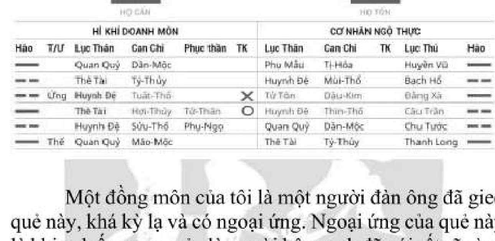
- **Cấu trúc Quẻ Dịch:**
  - **Quẻ chủ:** **Sơn Hỏa Bí** (Cung Cấn, Họ Cấn)  
    *Tượng quẻ:* Hỉ Khí Doanh Môn (Khí vui đầy cửa – bản chất sự việc vốn dĩ tốt đẹp, trang sức bên ngoài).
  - **Quẻ biến:** **Hỏa Lôi Phệ Hạp** (Cung Tốn, Họ Tốn)  
    *Tượng quẻ:* Cơ Nhân Ngộ Thực (Người đói gặp cơm – phải cắn nhai trở ngại để thông suốt, phân định rõ ràng).
- **Bảng chi tiết Lục hào:**

| Hào | Thế/Ứng | Lục thân (Chủ) | Can Chi | Biến động | Lục thân (Biến) | Can Chi (Biến) | Thần sát / Tuần không | Lục thú |
|:---:|:---:|:---|:---|:---:|:---|:---|:---|:---|
| 6 | | Quan Quỷ | Dần - Mộc | tĩnh | Phụ Mẫu | Tị - Hỏa | Tuần không, Lộc thần, Dịch mã | Huyền Vũ |
| 5 | | Thê Tài | Tý - Thủy | tĩnh | Huynh Đệ | Mùi - Thổ | Tướng tinh, Thiên y | Bạch Hổ |
| 4 | **Ứng** | Huynh Đệ | Tuất - Thổ | **X (Động)** | Tử Tôn | Dậu - Kim | Mưu tinh (Hóa Tử Tôn, Đào hoa) | Đằng Xà |
| 3 | | Thê Tài | Hợi - Thủy | **O (Động)** | Huynh Đệ | Thìn - Thổ | Phục Tử-Thân (Hóa Hồi đầu khắc, Nhật kiến) | Câu Trận |
| 2 | | Huynh Đệ | Sửu - Thổ | tĩnh | Quan Quỷ | Dần - Mộc | Phục Phụ-Ngọ, Quý nhân | Chu Tước |
| 1 | **Thế** | Quan Quỷ | Mão - Mộc | tĩnh | Thê Tài | Tý - Thủy | Tuần không, Dương nhẫn | Thanh Long |

---

### 3. Dụng thần & Loại quẻ

- **Phân loại quẻ:**
  - **Quẻ tâm thái nghi hoặc (Bản chất cốt lõi):** Giải tỏa mối nghi ngờ vô căn cứ về hiện tượng "khắc mệnh".
  - **Quẻ hôn nhân sự việc (Biểu hiện mở rộng):** Đánh giá thái độ trách nhiệm và tương lai gắn kết lứa đôi.
- **Xác định Dụng thần theo hai tầng nhận thức:**
  1. **Tầng bản chất – Quẻ Tâm thái (Nghi hoặc chiêm):**
     - **Quan Quỷ (Mối lo âu, bệnh tật, ngờ vực):** Quan Quỷ Mão Mộc cư hào 1 trì Thế lâm Dương nhẫn, Tuần không.
     - **Tử Tôn (Sự an tâm, vô hại, phúc đức):** Tử Tôn Dậu Kim (hào biến của Hào Ứng).
     - **Hào Ứng Huynh Đệ Tuất Thổ:** Đại diện cho người bạn gái hiện tại.
     - **Thê Tài Hợi Thủy (Nguyên thần của Quan Quỷ):** Nguồn gốc sinh ra nỗi sợ hãi và nghi kỵ.
  2. **Tầng mở rộng – Quẻ Hôn nhân sự việc:**
     - Hào Ứng Huynh Đệ Tuất Thổ đại diện cho người bạn gái đang hẹn hò.
     - Thê Tài Hợi Thủy đại diện cho tình trạng hôn nhân chung của anh ta.

---

### 4. Luận giải chi tiết

Quẻ Sơn Hỏa Bí biến Phệ Hạp là bài học kinh điển về việc bóc tách ám thị tâm lý khỏi sự thật khách quan của Dịch lý:

#### 1. Bóc tách bản chất cốt lõi qua Quẻ Tâm thái
Người đàn ông đặt ra hai mối nghi ngờ lớn: bạn gái khắc sự nghiệp và bạn gái khắc sức khỏe. Toàn quẻ có hai hào phát động giải đáp trọn vẹn cả hai mối nghi ngờ này một cách độc lập:
- **Giải mã nghi ngờ về Sự nghiệp (Hào Ứng Huynh Đệ Tuất Thổ động hóa Tử Tôn Dậu Kim):**
  - Hào Ứng đại diện cho người bạn gái, mang Tuất Thổ phát động hóa ra **Tử Tôn Dậu Kim**.
  - Trong phép đoán quẻ tâm thái, hào động hóa Tử Tôn là "tượng an tâm tuyệt đối, vô sự, bình an".
  - Tuất Thổ mang Dương nhẫn đại diện cho công việc, sự nghiệp đối ngoại. Hào bạn gái hóa Tử Tôn khẳng định rõ ràng: người bạn gái hoàn toàn không hề xung khắc hay đem lại bất kỳ rủi ro nào cho sự nghiệp của anh ta!
- **Giải mã nghi ngờ về Sức khỏe (Hào 3 Thê Tài Hợi Thủy động hóa Huynh Đệ Thìn Thổ hồi đầu khắc):**
  - Hào Thế Quan Quỷ Mão Mộc đại diện cho sức khỏe và nỗi lo bản thân.
  - Thê Tài Hợi Thủy là nguyên thần sinh trợ cho Quan Quỷ Mão Mộc (sinh ra mầm bệnh và sự nghi ngờ).
  - Điểm then chốt: **Thê Tài Hợi Thủy phát động tự hóa Huynh Đệ Thìn Thổ hồi đầu khắc**! Hào biến Thìn Thổ (lâm Nhật kiến) đã triệt tiêu hoàn toàn Hợi Thủy, cắt đứt tận gốc nguồn cung dưỡng của Quan Quỷ. Khi nguồn sinh Quan Quỷ bị bẻ gãy thì mối lo bệnh tật và sự nghi ngờ không còn đất sống, lòng người tự khắc phải an định.
- **Kết luận chân tướng bản chất:** Cả sức khỏe suy yếu lẫn sự nghiệp bế tắc của anh ta đều do nguyên nhân sinh hoạt, năng lực cá nhân, hoàn toàn không liên quan gì đến người bạn gái. Nỗi sợ "khắc mệnh" chỉ là sự hoang tưởng và ám thị lệch lạc của bản thân anh ta.

#### 2. Phân tích hệ quả nhân quả qua Quẻ Hôn nhân sự việc
Dù quẻ tượng minh oan cho người bạn gái, nhưng thái độ bội bạc của người đàn ông đã kích hoạt nghiệp quả hôn nhân trong quẻ:
- Hào Ứng Huynh Đệ Tuất Thổ hóa Tử Tôn Dậu Kim: Dậu Kim mang Đào hoa đối xung trực tiếp với hào Thế Quan Quỷ Mão Mộc (Mão Dậu tương xung, Tử Tôn khắc Quan Quỷ). Quẻ ý báo hiệu hai người chắc chắn sẽ chia tay vì đối phương không thể chấp nhận sự nghi kỵ vô lý này.
- Thê Tài Hợi Thủy (hôn nhân của anh ta) động hóa hồi đầu khắc: Biểu thị chính bản thân anh ta sau này sẽ gặp trắc trở nặng nề trong hôn nhân. Vì anh ta dễ dàng từ bỏ và đổ oan cho người yêu thương mình, nên quy luật nhân quả sẽ khiến cuộc hôn nhân tương lai của anh ta cũng bị người khác ruồng bỏ tương tự.

---

### 5. Kết luận & Ứng kỳ thực tế

- **Kết luận giải đoán:**
  - Chu Thần Bân chỉ rõ: Người bạn gái hoàn toàn vô tội, không hề có chuyện xung khắc mệnh số hay hãm hại sự nghiệp. Anh ta cần chấn chỉnh lại bản thân thay vì mê tín dị đoan rồi đổ lỗi cho người khác.
- **Phản hồi thực tế (Feedback):**
  - Do đệ tử ban đầu nhìn theo góc độ quẻ hôn nhân thấy xấu nên vô tình củng cố thêm nỗi nghi ngờ trong lòng người đàn ông. Bản thân anh ta vẫn giữ định kiến hẹp hòi, tin rằng bạn gái khắc mình.
  - Đến tháng 4 (tháng Thìn xung khai Tuất Thổ), hai người nảy sinh một trận cãi vã kịch liệt và người đàn ông đã chính thức nói lời chia tay. Mối tình tan vỡ hoàn toàn do sự cố chấp và định kiến hoang tưởng của anh ta tạo thành.
- **Ứng kỳ chiêm nghiệm:**
  - Hai người chia tay vào tháng 4 (tháng Thìn xung phá hào Ứng Tuất Thổ, điền thực hào biến Thìn Thổ), ứng nghiệm sự tan vỡ theo quẻ ý.

---

### 6. Bài học tâm pháp & Quy tắc cốt lõi

- **Quy tắc trích dẫn từ Cổ Thệ Chân Thuyên:**
  - Trích dẫn rule_index (trang 359): *Quy tắc phân biệt ám thị tâm lý 'khắc mệnh' với thực tế quẻ tượng qua quẻ Sơn Hỏa Bí biến Phệ Hạp.*
- **Bài học kinh nghiệm thực chiến:**
  1. **Quy tắc cắt đứt nguồn sinh Quan Quỷ trong quẻ tâm thái:** Khi hào động là nguyên thần của Quan Quỷ bị hào biến hồi đầu khắc, đó là điềm báo "cội rễ của tai ương và ngờ vực bị triệt hạ", sự việc thực tế hoàn toàn vô sự, an lành.
  2. **Bóc trần ám thị tâm lý hoang tưởng:** Nhà chiêm bái chân chính phải dùng lý lẽ khách quan của quẻ Dịch để đập tan sự mê tín và thói đổ lỗi "khắc mệnh", giúp đương sự nhận diện sự thật trần trụi.
  3. **Đạo lý Nhân Quả trong dự trắc Dịch học:** Tâm khởi niệm bất chính, phụ bạc ân tình thì quẻ tượng sẽ lập tức phác họa hồi chuông cảnh báo về bi kịch hôn nhân trong tương lai của chính kẻ đó.

## THỰC CHIẾN 49: ĐỆ TỬ TỰ XEM, LẦN NÀY BỊ ĐIỀU CHỈNH XUỐNG CHỨC (CHỈ CHƯA ĐẾN 25% LÀ KHÔNG BỊ GIÁNG CHỨC), HỎI TIẾP TỤC Ở LẠI ĐƠN VỊ HIỆN TẠI LIỆU CÒN CƠ HỘI PHÁT TRIỂN KHÔNG

---

### 1. Bối cảnh & Câu hỏi

- **Bối cảnh chi tiết:** 
  Một đệ tử của Chu Thần Bân làm việc tại một doanh nghiệp có vốn đầu tư độc lập. Do bối cảnh kinh tế vĩ mô suy thoái, công ty rơi vào giai đoạn khó khăn nghiêm trọng, buộc phải tiến hành tái cơ cấu quy mô lớn nhằm tinh giản biên chế và cắt giảm triệt để chi phí vận hành. Trong đợt thanh lọc nhân sự này, có tới hơn 3/4 nhân sự bị giáng chức hoặc điều chuyển (chưa đầy 25% giữ nguyên được vị trí). Người đệ tử cũng không tránh khỏi vòng xoáy chung và bị điều chỉnh giáng cấp. Mặc dù đây không phải là lỗi cá nhân mà là hệ quả từ sự khủng hoảng của doanh nghiệp, nhưng sự kiện này đã giáng một đòn nặng nề vào tâm lý của anh ta.
- **Tâm lý & Câu hỏi ẩn ý:** 
  Đương số rơi vào tâm trạng hụt hẫng, bất an và hoài nghi về tiền đồ sự nghiệp. Câu hỏi bề ngoài là "tiếp tục ở lại đơn vị hiện tại liệu còn cơ hội phát triển không", nhưng ẩn ý sâu xa là một quẻ đứng trước ngã rẽ lựa chọn: nếu ở lại không còn tương lai thì liệu có nên lập tức nộp đơn từ chức để ra ngoài tìm kiếm cơ hội mới hay không?
- **Thời gian chiêm đoán:**
  - Dương lịch: Ngày 20 tháng 3 năm 2017, lúc 13:49 (Giờ Bắc Kinh).
  - Can chi: Năm Đinh Dậu, tháng Quý Mão, ngày Bính Ngọ, giờ Ất Mùi.

---

### 2. Dữ kiện & Bảng quẻ Crop

- **Thời không chiêm nghiệm:**
  - Tháng Quý Mão (Mộc vượng nắm lệnh, Kim suy, Thủy hưu, Hỏa tướng, Thổ tử).
  - Ngày Bính Ngọ (Hỏa vượng, Tý Ngọ tương xung).
  - Tuần không: **Dần - Mão** (Giáp Thìn tuần trung, Dần Mão không vong).
- **Thần sát:**
  - Tướng tinh: Ngọ (Lâm Nhật kiến)
  - Hoa cái: Tuất (Lâm Hào biến hào 5)
  - Dịch mã: Thân
  - Tai sát: Tý
  - Mưu tinh: Thìn
  - Đào hoa: Mão (Lâm Hào Thế, Lâm Nguyệt kiến, Tuần không)
  - Kiếp sát: Hợi (Lâm Hào Ứng, Động)
  - Lộc thần: Tị
  - Dương nhẫn: Ngọ (Lâm Nhật kiến)
  - Văn xương: Thân
  - Thiên y: Dần (Lâm Tuần không)
  - Thiên hỷ: Tuất (Lâm Hào biến hào 5)
  - Quý nhân: Dậu, Hợi
- Dữ kiện bảng quẻ và các thông số chiêm đoán:
  - **Bảng 49.1** Đồ hình quẻ Thực chiến 49:
    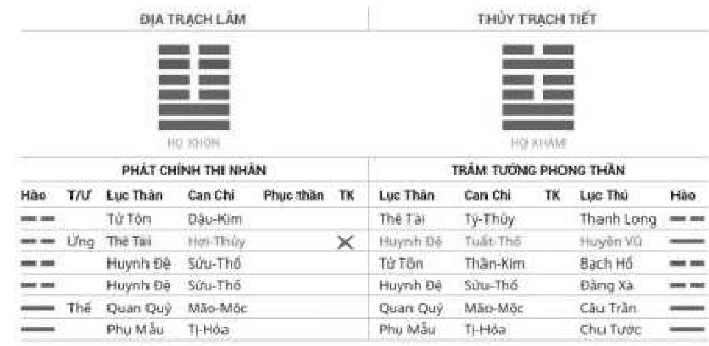
- **Cấu trúc Quẻ Dịch:**
  - **Quẻ chủ:** **Địa Trạch Lâm** (Cung Khôn, Họ Khôn)  
    *Tượng quẻ:* Phát Chính Thi Nhân (Thi hành chính sự, ban phát ân đức – đối mặt với thời điểm then chốt cần đưa ra lựa chọn).
  - **Quẻ biến:** **Thủy Trạch Tiết** (Cung Khảm, Họ Khảm – Quẻ Lục hợp)  
    *Tượng quẻ:* Trảm Tướng Phong Thần (Chém tướng phong thần – kiềm chế, tiết chế, hạn chế hành động mạo hiểm).
- **Bảng chi tiết Lục hào:**

| Hào | Thế/Ứng | Lục thân (Chủ) | Can Chi | Biến động | Lục thân (Biến) | Can Chi (Biến) | Thần sát / Tuần không | Lục thú |
|:---:|:---:|:---|:---|:---:|:---|:---|:---|:---|
| 6 | | Tử Tôn | Dậu - Kim | tĩnh | Thê Tài | Tý - Thủy | Quý nhân (Nguyệt phá) | Thanh Long |
| 5 | **Ứng** | Thê Tài | Hợi - Thủy | **X (Động)** | Huynh Đệ | Tuất - Thổ | Kiếp sát, Quý nhân (Hóa Hồi đầu khắc, Hoa cái, Thiên hỷ) | Huyền Vũ |
| 4 | | Huynh Đệ | Sửu - Thổ | tĩnh | Tử Tôn | Thân - Kim | Dịch mã, Văn xương | Bạch Hổ |
| 3 | | Huynh Đệ | Sửu - Thổ | tĩnh | Huynh Đệ | Sửu - Thổ | | Đằng Xà |
| 2 | **Thế** | Quan Quỷ | Mão - Mộc | tĩnh | Quan Quỷ | Mão - Mộc | Lâm Nguyệt kiến, Đào hoa, Tuần không | Câu Trận |
| 1 | | Phụ Mẫu | Tị - Hỏa | tĩnh | Phụ Mẫu | Tị - Hỏa | Lộc thần | Chu Tước |

---

### 3. Dụng thần & Loại quẻ

- **Phân loại quẻ:**
  - **Quẻ quan vận sự nghiệp:** Khảo sát cơ hội thăng tiến và triển vọng chức nghiệp sau biến cố giáng cấp.
  - **Quẻ lựa chọn chiến lược (Đi hay Ở):** Bóc tách đa chiều giữa phương án ở lại đơn vị cũ và phương án nhảy việc ra ngoài.
- **Xác định Dụng thần:**
  1. **Quan Quỷ (Dụng thần sự nghiệp chức vụ):** Quan Quỷ Mão Mộc cư hào 2 trì Thế, lâm Nguyệt lệnh.
  2. **Thê Tài Hợi Thủy (Nguyên thần của Quan Quỷ, cư hào Ứng):** Đại diện cho môi trường công ty hiện tại và nguồn dưỡng chất nuôi dưỡng quan vận.
  3. **Tử Tôn Dậu Kim (Hào 6):** Thần khắc Quan, mang Mưu tinh, đại diện cho phương án chủ động từ chức, nhảy việc ra ngoài.
  4. **Kỵ thần:** Huynh Đệ Tuất Thổ (hào biến của hào Ứng, hồi đầu khắc Thê Tài).

---

### 4. Luận giải chi tiết

Quẻ Địa Trạch Lâm biến Thủy Trạch Tiết là giảng đường mẫu mực của Chu Thần Bân về sự phân tầng thông tin giữa Động Hướng và Nhật Nguyệt:

#### 1. Nguyên lý phân tầng thông tin: Động Hướng vs Nhật Nguyệt
- **Ảo giác từ Nhật Nguyệt:** Hào Thế Quan Quỷ Mão Mộc được Nguyệt lệnh Quý Mão đồng hành tỷ hòa cực vượng. Nếu người xem quẻ thiếu kinh nghiệm sẽ vội kết luận: chức vị rất vượng, tiền đồ còn rộng mở.
- **Tâm pháp cốt lõi:** Động triệu và Nhật Nguyệt không nằm cùng một đẳng cấp phân tích!
  - **Nhật Nguyệt chỉ quá khứ và nền tảng hiện tại:** Nguyệt lệnh Mão Mộc vượng phản ánh vị trí thâm niên, sự tích lũy nguồn lực lâu năm của anh ta tại công ty trong quá khứ (lâm Đào hoa, Thiên hỷ). Nhưng Nhật kiến Ngọ Hỏa là "tử địa" của Mão Mộc (Mộc tử ư Ngọ) biểu thị năng lực chuyên môn thực chiến của anh ta hiện đã chạm trần, không còn đáp ứng được yêu cầu sinh tồn khốc liệt của công ty.
  - **Động triệu là kim chỉ nam cho tương lai:** Toàn quẻ độc nhất một hào động: Hào 5 Ứng hào Thê Tài Hợi Thủy phát động hóa **Huynh Đệ Tuất Thổ hồi đầu khắc**. Hợi Thủy là nguyên thần duy nhất sinh trợ cho Thế hào Mão Mộc. Nguyên thần bị hồi đầu khắc đồng nghĩa với nguồn sinh khí bị bẻ gãy tận gốc. Động triệu khẳng định dứt khoát: tại công ty hiện tại, anh ta hoàn toàn không còn bất kỳ cơ hội phát triển hay thăng tiến nào nữa!

#### 2. Lý do công ty tái cơ cấu và khả năng chịu đựng của đương số
- Thê Tài Hợi Thủy động hóa Huynh Đệ Tuất Thổ. Tuất Thổ là hỏa khố (khố của Lộc thần Tị và Dương nhẫn Ngọ). Công ty trong cơn bão khủng hoảng buộc phải cắt giảm tối đa, chỉ giữ lại những nhân sự có tính chuyên môn cao phù hợp với chiến lược "cứu hỏa" sinh tồn. Vị trí của anh ta không nằm trong nhóm ưu tiên này.
- Tuy nhiên, **Huynh Đệ Tuất Thổ tương hợp với Thế hào Quan Quỷ Mão Mộc (Mão Tuất lục hợp)**: Điều này cho thấy dù không còn cơ hội phát triển, việc công ty điều chuyển hay nếu sau này có chia tay thì cũng diễn ra trong hòa bình, theo cách mà anh ta hoàn toàn có thể chấp nhận được, không bị sa thải đột ngột một cách tàn nhẫn.

#### 3. Thẩm định phương án nhảy việc ra ngoài (Giải mã câu hỏi ẩn ý)
Người hỏi ngầm chứa ý định: nếu không còn cơ hội thì có nên nhảy việc ra ngoài ngay không? Quẻ tượng đã phơi bày toàn bộ viễn cảnh bên ngoài:
- Hào 6 Tử Tôn Dậu Kim đại diện cho việc từ chức ra ngoài (Tử Tôn khắc Quan = bỏ việc, Mưu tinh = toan tính cá nhân).
- Tuy nhiên, Tử Tôn Dậu Kim bị **Nguyệt phá** (Mão xung Dậu), lại bị Nhật kiến Ngọ Hỏa khắc phạt nặng nề. Hào đối vị Thê Tài Tý Thủy (nền tảng công việc mới bên ngoài) cũng bị Nhật Nguyệt xung phá và tiết khí.
- Chỉ dấu này cảnh báo: Môi trường kinh tế bên ngoài hiện tại vô cùng khắc nghiệt. Nếu anh ta bốc đồng từ chức ngay lập tức để lao ra ngoài tìm việc, chắc chắn sẽ không tìm được bến đỗ tốt, rơi vào cảnh thất nghiệp và khủng hoảng nghiêm trọng hơn.

#### 4. Thông điệp cốt lõi của quẻ biến Thủy Trạch Tiết (Lục hợp)
- Quẻ "Tiết" chủ về sự kiềm chế, tiết chế, tiết kiệm sức lực, tuyệt đối không được manh động bốc đồng.
- Quẻ biến thành Lục hợp chỉ ra chiến lược hành động chuẩn xác: Hãy chấp nhận sự thật là ở lại không còn cơ hội thăng tiến, nhưng tạm thời hãy kiềm chế cảm xúc bất mãn, nhẫn nhịn duy trì công việc hiện tại để bảo toàn thu nhập ổn định. Trong thời gian này cần âm thầm trau dồi chuyên môn, chờ đợi thời cơ thị trường bên ngoài ấm lên mới tính kế nhảy việc.

---

### 5. Kết luận & Ứng kỳ thực tế

- **Kết luận giải đoán:**
  - Chu Thần Bân khẳng định rõ: Ở lại đơn vị cũ chắc chắn không còn cơ hội phát triển thăng tiến nào nữa vì nguyên thần đã hóa hồi đầu khắc.
  - Tuy nhiên, khuyến nghị đệ tử tuyệt đối không được nộp đơn xin nghỉ việc lúc này. Hãy "tiết chế" nhẫn nại, tiếp tục làm việc bình thường để giữ nguồn thu nhập, âm thầm chuẩn bị nội lực và tìm kiếm cơ hội vững chắc trước khi chuyển đổi.
- **Phản hồi thực tế (Feedback):**
  - Người đệ tử sau khi nghe phân tích thấu đáo đã giải tỏa được cơn bức xúc nhất thời, từ bỏ ý định nghỉ việc trong giận dỗi.
  - Anh ta kiên nhẫn tiếp tục làm việc tại công ty trong tâm thế bình thản, đồng thời chủ động học tập nâng cao năng lực chuyên môn để chuẩn bị cho bước nhảy dài hạn trong tương lai.

---

### 6. Bài học tâm pháp & Quy tắc cốt lõi

- **Quy tắc trích dẫn từ Cổ Thệ Chân Thuyên:**
  - Trích dẫn rule_index (trang 369): *Quy tắc tách biệt tầng thông tin động hướng và tầng Nhật Nguyệt khi luận đoán quan vận sau biến cố giáng chức.*
- **Bài học kinh nghiệm thực chiến:**
  1. **Quy tắc bất khả xâm phạm về Phân tầng thông tin:** Động hướng phản ánh xu thế tương lai nội tại, Nhật Nguyệt chỉ phản ánh môi trường thời không và quá khứ. Tuyệt đối không bao giờ dùng sự vượng tướng của Nhật Nguyệt để phủ nhận hay khỏa lấp điềm hung của động triệu (đặc biệt là nguyên thần hồi đầu khắc).
  2. **Tư duy đón đầu câu hỏi ẩn ý:** Người chiêm bái tài ba luôn nhìn thấy tầng câu hỏi thứ hai đằng sau câu hỏi thứ nhất (ở lại không có tương lai -> vậy có nên ra ngoài không?) để đưa ra lời tư vấn chiến lược toàn vẹn nhất cho đương số.
  3. **Minh triết xử thế qua quẻ Thủy Trạch Tiết:** Khi thời vận bế tắc, "Tiết" (kiềm chế, tích lũy) chính là đại đạo bảo toàn sinh lực để chờ ngày phục hưng.

## THỰC CHIẾN 50: ĐỆ TỬ TỰ HỎI Ở LẠI BÊN CẠNH SẾP CÓ LỢI HAY RỜI XA SẾP ĐỂ LÀM VIỆC CÓ LỢI

---

### 1. Bối cảnh & Câu hỏi

- **Bối cảnh chi tiết:** 
  Một người đệ tử của Chu Thần Bân đang đứng trước ngã rẽ quan trọng trong quan hệ nhân sự với người sếp trực tiếp. Trước đây, mối quan hệ giữa hai người rất tốt đẹp, sếp tin tưởng và giao phó nhiều trọng trách. Tuy nhiên, gần đây bầu không khí bắt đầu có sự chuyển biến ngấm ngầm, sếp dường như không còn đặt trọn niềm tin vào anh ta như trước mà bắt đầu chú ý, nâng đỡ những đồng nghiệp khác. Đương số đứng trước hai ngã rẽ: tiếp tục ở lại làm việc sát cánh bên cạnh sếp, hay là chủ động rời xa tầm ảnh hưởng của sếp (hoặc chuyển sang bộ phận/đơn vị khác, hoặc nghỉ việc ra ngoài tìm chỗ dựa mới)?
- **Tâm lý & Câu hỏi ẩn ý:** 
  Đương số cảm thấy ngột ngạt, áp lực và bất an trước thái độ thay đổi của cấp trên. Câu hỏi bề ngoài là so sánh sự lợi hại giữa việc "ở lại bên cạnh sếp hay rời xa sếp làm việc", nhưng ẩn ý sâu xa là: liệu lòng tin của sếp có thể hàn gắn được không, và con đường nào thực sự mở ra tiền đồ công danh lâu dài?
- **Thời gian chiêm đoán:**
  - Dương lịch: Ngày 7 tháng 3 năm 2017, lúc 20:49 (Giờ Bắc Kinh).
  - Can chi: Năm Đinh Dậu, tháng Quý Mão, ngày Quý Tị, giờ Nhâm Tuất.

---

### 2. Dữ kiện & Bảng quẻ Crop

- **Thời không chiêm nghiệm:**
  - Tháng Quý Mão (Mộc vượng, Kim suy phạm Nguyệt phá, Hỏa tướng, Thủy hưu, Thổ tử).
  - Ngày Quý Tị (Hỏa vượng, Tị Hợi tương xung).
  - Tuần không: **Ngọ - Mùi** (Giáp Thân tuần trung, Ngọ Mùi không vong).
- **Thần sát:**
  - Tướng tinh: Dậu (Lâm Hào 5, Động, Nguyệt phá)
  - Hoa cái: Sửu (Lâm Hào 2, Động)
  - Dịch mã: Hợi (Lâm Hào Thế, Nhật phá)
  - Tai sát: Mão (Lâm Hào Ứng, Động)
  - Mưu tinh: Mùi (Lâm Tuần không)
  - Đào hoa: Ngọ (Lâm Tuần không)
  - Kiếp sát: Dần
  - Lộc thần: Tý
  - Dương nhẫn: Hợi (Lâm Hào Thế, Nhật phá)
  - Văn xương: Mão (Lâm Hào Ứng, Động)
  - Thiên y: Dần
  - Thiên hỷ: Tuất
  - Quý nhân: Mão (Lâm Hào Ứng), Tị
- Dữ kiện bảng quẻ và các thông số chiêm đoán:
  - **Bảng 50.1** Đồ hình quẻ Thực chiến 50:
    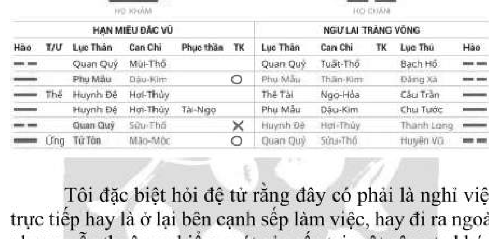
- **Cấu trúc Quẻ Dịch:**
  - **Quẻ chủ:** **Trạch Hỏa Cách** (Cung Khảm, Họ Khảm)  
    *Tượng quẻ:* Hạn Miêu Đắc Vũ (Mạ hạn gặp mưa – biến cách, thay đổi triệt để từ gốc rễ).
  - **Quẻ biến:** **Lôi Phong Hằng** (Cung Chấn, Họ Chấn)  
    *Tượng quẻ:* Ngư Lai Trang Võng (Cá vào lưới đan – duy trì lâu dài, tạm thời bình ổn không đổi).
- **Bảng chi tiết Lục hào:**

| Hào | Thế/Ứng | Lục thân (Chủ) | Can Chi | Biến động | Lục thân (Biến) | Can Chi (Biến) | Thần sát / Tuần không | Lục thú |
|:---:|:---:|:---|:---|:---:|:---|:---|:---|:---|
| 6 | | Quan Quỷ | Mùi - Thổ | tĩnh | Quan Quỷ | Tuất - Thổ | Tuần không, Mưu tinh | Bạch Hổ |
| 5 | | Phụ Mẫu | Dậu - Kim | **O (Động)** | Phụ Mẫu | Thân - Kim | Hóa Thoái thần, Tướng tinh (Nguyệt phá) | Đằng Xà |
| 4 | **Thế** | Huynh Đệ | Hợi - Thủy | tĩnh | Thê Tài | Ngọ - Hỏa | Dịch mã, Dương nhẫn (Nhật phá) | Câu Trận |
| 3 | | Huynh Đệ | Hợi - Thủy | tĩnh | Phụ Mẫu | Dậu - Kim | Phục Tài-Ngọ, Dịch mã, Dương nhẫn (Nhật phá) | Chu Tước |
| 2 | | Quan Quỷ | Sửu - Thổ | **X (Động)** | Huynh Đệ | Hợi - Thủy | Hoa cái (Hóa Nhật phá, Dịch mã) | Thanh Long |
| 1 | **Ứng** | Tử Tôn | Mão - Mộc | **O (Động)** | Quan Quỷ | Sửu - Thổ | Lâm Nguyệt kiến, Tai sát, Văn xương, Quý nhân | Huyền Vũ |

---

### 3. Dụng thần & Loại quẻ

- **Phân loại quẻ:**
  - **Quẻ lựa chọn phương án nhân sự sự nghiệp (Tuyển trạch chiêm):** So sánh giữa hai phương án: Ở lại bên cạnh sếp hay Rời xa sếp để làm việc.
  - **Quẻ biến đổi quan hệ lãnh đạo – nhân viên:** Khảo sát sự chuyển biến tâm lý tín nhiệm của cấp trên.
- **Xác định Dụng thần theo 2 nhóm phương án đối sánh:**
  1. **Phương án ở lại bên cạnh sếp (Nội quái biến động):**
     - Hào Ứng Tử Tôn Mão Mộc (cư hào 1) đại diện cho người sếp hiện tại.
     - Hào 2 Quan Quỷ Sửu Thổ động tạo cầu nối áp lực từ sếp.
  2. **Phương án rời xa sếp / Ra bên ngoài (Ngoại quái biến động):**
     - Hào 5 Phụ Mẫu Dậu Kim độc động tại ngoại quái đại diện cho cơ hội và môi trường độc lập bên ngoài.
  3. **Hào Thế Huynh Đệ Hợi Thủy:** Đại diện cho bản thân người đệ tử, lâm Dương nhẫn, Dịch mã, bị Nhật xung (Nhật phá).

---

### 4. Luận giải chi tiết

Quẻ Trạch Hỏa Cách biến Lôi Phong Hằng thể hiện sâu sắc phương pháp phân nhóm hào động trong quẻ lựa chọn đa biến:

#### 1. Cơ chế phân nhóm hào động trong quẻ lựa chọn
Toàn quẻ xuất hiện 3 hào động, nhưng về mặt bản chất chỉ quy về hai nhóm đại diện cho hai phương án:
- **Nhóm 1 – Nội quái đại diện cho nội bộ bên phía sếp:** Hào Ứng Tử Tôn Mão Mộc động biến Quan Quỷ Sửu Thổ, kết nối trực tiếp với hào 2 Quan Quỷ Sửu Thổ động biến Huynh Đệ Hợi Thủy. Đây là toàn bộ tiến trình biến đổi tâm lý và hành động của người sếp.
- **Nhóm 2 – Ngoại quái đại diện cho cơ hội bên ngoài:** Hào 5 Phụ Mẫu Dậu Kim độc động tại ngoại quái biến Phụ Mẫu Thân Kim, đối xung với Mão Mộc của sếp, đại diện cho môi trường công việc nằm ngoài sự kiểm soát của sếp.

#### 2. So sánh sinh khắc tác động lên Hào Thế: Ở lại bị khắc – Đi xa được sinh
- **Phía người sếp (Gây bất lợi gián tiếp):**
  - Ban đầu, Hợi Mão bán hợp, hào Ứng Mão Mộc mang Quý nhân: sếp vốn dĩ rất quý mến, bao dung và nâng đỡ đương số.
  - Tuy nhiên, Mão Mộc phát động hóa Quan Quỷ Sửu Thổ lâm Huyền Vũ: sếp bắt đầu nảy sinh tâm lý nghi kỵ, mưu tính ngầm, ánh nhìn dành cho đương số đã thay đổi hoàn toàn.
  - Quan Quỷ Sửu Thổ ở hào 2 phát động trực tiếp khắc phạt hào Thế Huynh Đệ Hợi Thủy. Đáng nói hơn, Sửu Thổ động lại hóa xuất một Huynh Đệ Hợi Thủy khác (đồng nghiệp): sếp bắt đầu chuyển sự chú ý, tin cậy và bổng lộc sang một đồng nghiệp khác của anh ta. Việc bị sếp soi xét trong khi đồng nghiệp được trọng dụng tạo ra áp lực đào thải ngột ngạt. Do đó, phương án ở lại bên cạnh sếp gián tiếp gây tổn hại lớn cho đương số.
- **Phía bên ngoài (Được sinh trợ cát lợi):**
  - Hào 5 Phụ Mẫu Dậu Kim ở ngoại quái động tương sinh mạnh mẽ cho Thế hào Huynh Đệ Hợi Thủy (Kim sinh Thủy).
  - Dù Dậu Kim hóa Thân Kim (hóa thoái), nhưng trong quẻ lựa chọn thì tính chất sinh khắc mang tính quyết định: ngoại quái sinh Thế chứng minh rằng rời xa sếp ra môi trường bên ngoài, anh ta sẽ gặp được quý nhân nâng đỡ, có nhiều không gian để phát huy năng lực chuyên môn (Dương nhẫn) mà không bị kìm kẹp.

#### 3. Cơ chế biến dịch: Quẻ Cách biến Hằng
- **Quẻ chủ Trạch Hỏa Cách:** Khẳng định sự biến đổi trong mối quan hệ cấp trên – cấp dưới đã thực sự diễn ra từ gốc rễ, niềm tin son sắt thuở ban đầu không thể nào cứu vãn hay khôi phục lại được.
- **Quẻ biến Lôi Phong Hằng:** 
  - Hào Thế Huynh Đệ Hợi Thủy lâm Nhật phá, hào 2 hóa xuất Hợi Thủy cũng lâm Nhật phá.
  - Quẻ Hằng mang ý nghĩa "duy trì, tạm thời không đổi". Điều này chỉ ra rằng: dù biết đi xa là có lợi, nhưng trong ngắn hạn tình hình chưa thể biến chuyển ngay lập tức, sóng gió mâu thuẫn sẽ tạm thời bình ổn lại trên bề mặt. Anh ta không nên bốc đồng bỏ đi ngay mà cần bình tĩnh duy trì trạng thái hiện tại.

---

### 5. Kết luận & Ứng kỳ thực tế

- **Kết luận giải đoán:**
  - Chu Thần Bân định đoạt dứt khoát: **Rời xa sếp để làm việc có lợi hơn nhiều so với ở lại bên cạnh sếp** vì bên ngoài sinh Thế, còn bên cạnh sếp thì bị Quan Quỷ khắc Thế và bị san sẻ quyền lợi cho đồng nghiệp.
  - Tuy nhiên, quẻ Cách biến Hằng khuyên rằng trong ngắn hạn chưa thể chuyển dịch ngay. Trước mắt nên chủ động giữ khoảng cách an toàn với sếp, tránh đứng quá gần để giảm bớt va chạm và áp lực, đồng thời âm thầm tìm kiếm cơ hội độc lập bên ngoài để khi thời cơ đến là chuyển hẳn.
- **Phản hồi thực tế (Feedback):**
  - Người đệ tử nhận định lời giải đoán vô cùng chuẩn xác với thực tế biến chuyển vi tế trong cơ quan. Anh ta đã chủ động điều chỉnh khoảng cách làm việc với sếp, không còn tranh đoạt sự chú ý, nhờ đó áp lực ngột ngạt giảm đi rõ rệt. Về sau anh ta đã tìm được cơ hội phát triển độc lập đúng như định hướng của quẻ Dịch.
- **Ứng kỳ chiêm nghiệm:**
  - Tình hình quan hệ bình ổn lại trong ngắn hạn (tượng quẻ Hằng) trước khi có cơ hội chuyển dịch lâu dài (tượng quẻ Cách).

---

### 6. Bài học tâm pháp & Quy tắc cốt lõi

- **Quy tắc trích dẫn từ Cổ Thệ Chân Thuyên:**
  - Trích dẫn rule_index (trang 377): *Quy tắc định đoạt đi hay ở bên cạnh lãnh đạo qua quẻ Trạch Hỏa Cách biến Lôi Phong Hằng.*
- **Bài học kinh nghiệm thực chiến:**
  1. **Nghệ thuật phân nhóm hào động trong quẻ lựa chọn phức hợp:** Khi quẻ xuất hiện nhiều hào động, phải quy nạp các hào động theo không gian (Nội quái = môi trường hiện tại; Ngoại quái = môi trường bên ngoài) và chuỗi liên kết (hào biến nối tiếp hào động) để xác định chính xác phương án sinh khắc với hào Thế.
  2. **Giải mã tâm lý lãnh đạo qua Lục Hào:** Hào Ứng đại diện cho cấp trên từ Tử Tôn (bao dung, ưu ái) hóa Quan Quỷ lâm Huyền Vũ (nghi ngờ, mưu tính, soi xét) là mật mã cảnh báo mối quan hệ đã bắt đầu bước vào giai đoạn rạn nứt nguy hiểm.
  3. **Đạo xử thế qua tượng Cách biến Hằng:** Thấy được sự đổi thay (Cách) để không ảo tưởng, nhưng hiểu được sự bình ổn tạm thời (Hằng) để không manh động làm hỏng đại cục.

---

## THỰC CHIẾN 51: HỌC LƯỢNG HỎI LIỆU NGƯỜI NÀY CÓ THỂ CHỮA KHỎI BỆNH ĐAU LƯNG VÀ CHÂN CỦA ANH ẤY KHÔNG?

---

### 1. Bối cảnh & Câu hỏi

- **Bối cảnh chi tiết:**
  Học Lượng (một đệ tử Lục Hào) có người quen gặp vấn đề nghiêm trọng về xương cốt thắt lưng và chi dưới, dẫn đến đau đớn dữ dội kéo dài. Người này từng thực hiện phẫu thuật điều trị nhưng sau đó bị tổn thương ảnh hưởng đến hệ thần kinh, khiến khả năng vận động suy giảm và những cơn đau nhức không dứt. Người bệnh đang tìm kiếm một phương pháp điều trị mới từ một bác sĩ chuyên khoa bên ngoài nhưng còn nhiều do dự, không biết liệu bác sĩ và phác đồ mới này có thực sự giải quyết được tận gốc rễ căn bệnh hay không. Do đó, Học Lượng đã đại diện gieo quẻ Dịch để dự trắc về năng lực trị liệu của vị thầy thuốc này.
- **Tâm lý & Câu hỏi ẩn ý:**
  Người hỏi hướng đến một đối tượng cụ thể ("người này" - vị bác sĩ điều trị được chỉ định) với mong muốn xác định dứt khoát khả năng chữa lành căn bệnh mãn tính hiểm nghèo. Câu hỏi bề ngoài chỉ là thăm dò hiệu quả của thầy thuốc, nhưng ẩn sâu bên trong là nỗi thống khổ vì căn bệnh xương khớp dai dẳng hành hạ suốt thời gian dài, cùng sự kỳ vọng mãnh liệt vào một giải pháp dứt điểm sau di chứng phẫu thuật.
- **Thời gian chiêm đoán:**
  - Dương lịch: Ngày 23 tháng 3 năm 2017, lúc 18 giờ 03 phút (Giờ Bắc Kinh).
  - Can chi: Năm Đinh Dậu, tháng Quý Mão, ngày Kỷ Dậu, giờ Quý Dậu.

---

### 2. Dữ kiện & Bảng quẻ Crop

- **Thời không chiêm nghiệm:**
  - Tháng Quý Mão (Mộc vượng, Hỏa tướng, Thổ tử, Kim tù, Thủy hưu).
  - Ngày Kỷ Dậu (Kim vượng, Mộc tuyệt, Thủy trường sinh).
  - Tuần không: **Dần, Mão** (Giáp Thìn tuần trung, Dần Mão không vong).
- **Thần sát:**
  - Tướng tinh: Dậu
  - Hoa cái: Sửu
  - Dịch mã: Hợi
  - Tai sát: Mão
  - Mưu tinh: Mùi
  - Đào hoa: Ngọ
  - Kiếp sát: Dần
  - Lộc thần: Ngọ
  - Dương nhẫn: Tị
  - Văn xương: Dậu
  - Thiên y: Dần (Lâm hào 2 Thế và hào 6)
  - Thiên hỷ: Tuất (Lâm hào 4 Huynh Đệ)
  - Quý nhân: Thân, Tý
- Dữ kiện bảng quẻ và đồ hình chiêm đoán:
  - **Bảng 51.1** Đồ hình quẻ Thực chiến 51:
    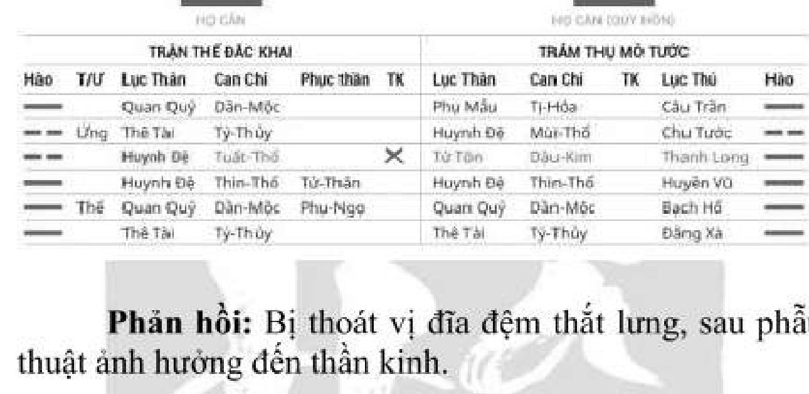
- **Cấu trúc Quẻ Dịch:**
  - **Quẻ chủ:** **Sơn Thiên Đại Súc** (Cung Cấn).  
    *Tượng quẻ:* Trận Thế Đắc Khai (Thế trận mở rộng, sự việc tích lũy lâu dài, bệnh lý đã ăn sâu vào bên trong cơ thể).
  - **Quẻ biến:** **Hỏa Thiên Đại Hữu** (Cung Càn, Quy Hồn).  
    *Tượng quẻ:* Trâm Thụ Môi Tước (Nhiều nguồn lực, tích lũy biến đổi từ lượng đến chất, nhiều phương pháp phối hợp).
- **Bảng chi tiết Lục hào:**

| Hào | Thế/Ứng | Lục thân (Chủ) | Can Chi | Biến động | Lục thân (Biến) | Can Chi (Biến) | Thần sát / Phục | Lục thú |
|:---:|:---:|:---|:---|:---:|:---|:---|:---|:---|
| 6 | | Quan Quỷ | Dần - Mộc | tĩnh | Phụ Mẫu | Tị - Hỏa | Kiếp sát, Thiên y, Tuần không | Câu Trần |
| 5 | **Ứng** | Thê Tài | Tý - Thủy | tĩnh | Huynh Đệ | Mùi - Thổ | Quý nhân | Chu Tước |
| 4 | | Huynh Đệ | Tuất - Thổ | **X (Động)** | Tử Tôn | Dậu - Kim | Thiên hỷ | Thanh Long |
| 3 | | Huynh Đệ | Thìn - Thổ | tĩnh | Phụ Mẫu | Thìn - Thổ | Phục Tử-Thân | Huyền Vũ |
| 2 | **Thế** | Quan Quỷ | Dần - Mộc | tĩnh | Quan Quỷ | Dần - Mộc | Kiếp sát, Thiên y, Tuần không, Phục Phụ-Ngọ | Bạch Hổ |
| 1 | | Thê Tài | Tý - Thủy | tĩnh | Thê Tài | Tý - Thủy | Quý nhân | Đằng Xà |

---

### 3. Dụng thần & Loại quẻ

- **Phân loại quẻ:**
  - **Quẻ vấn tật bệnh y dược:** Hỏi về khả năng thầy thuốc chữa khỏi bệnh cho người bệnh.
  - **Quẻ độc phát:** Quẻ chỉ có duy nhất hào 4 Huynh Đệ Tuất Thổ phát động, tuân theo cơ chế độc phát định vị "động sơ biến chung".
- **Xác định Dụng thần:**
  1. **Hào Thế (Quan Quỷ Dần Mộc lâm Bạch Hổ):** Đại diện cho người bệnh và triệu chứng bệnh lý đau nhức thắt lưng.
  2. **Dụng thần Y dược (Tử Tôn Dậu Kim):** Trong phép chiêm bệnh, Tử Tôn là thần trị liệu, y dược, bác sĩ cứu giúp. Quẻ chủ không hiển lộ Tử Tôn trên các hào chính, nhưng hào 4 Huynh Đệ Tuất Thổ động hóa xuất Tử Tôn Dậu Kim mang Nhật lệnh, đây chính là Dụng thần chân chính đại diện cho hiệu quả điều trị của bác sĩ.
  3. **Thầy thuốc được chỉ định (Huynh Đệ Tuất Thổ):** Là hào động sinh xuất Tử Tôn Dậu Kim, mang Thiên hỷ đại diện cho cơ sở khám chữa bệnh tư nhân bên ngoài.
  4. **Căn nguyên khí huyết / Tủy xương (Hào Ứng Thê Tài Tý Thủy):** Đại diện cho dịch thể, nguồn dưỡng chất nuôi dưỡng cơ thể, đồng thời là nguyên thần sinh trợ cho Quan Quỷ Dần Mộc.

---

### 4. Luận giải chi tiết

Quẻ này hàm chứa nhiều nút thắt kỹ thuật kinh điển của Lục Hào thực chiến, từ quy tắc hóa Nguyệt phá mang Nhật lệnh, đến cơ chế Quan Quỷ trì Thế trong bệnh mãn tính và biểu tượng chuyển hóa của quẻ Hỏa Thiên Đại Hữu:

#### 1. Cơ chế hào hóa Nguyệt phá mang Nhật lệnh (Dài hạn vs Ngắn hạn)
- Hào 4 Huynh Đệ Tuất Thổ phát động biến ra **Tử Tôn Dậu Kim**.
- Xét theo Nguyệt lệnh Quý Mão: Dậu Kim bị tháng Mão xung kích trực diện thành **Nguyệt phá**.
- Xét theo Nhật lệnh Kỷ Dậu: Dậu Kim đồng thời lâm **Nhật lệnh** trợ lực tối cao.
- **Quy tắc phân định cốt lõi:**
  - Nếu sự việc xem xét trong phạm vi ngắn hạn (kết thúc trong vòng một tháng), hào hóa Nguyệt phá được tính là phá tán, phế bỏ, không thể phát huy hiệu lực.
  - Nếu sự việc mang tính chất dài hạn (vượt quá một tháng), hào hóa Nguyệt phá mang Nhật lệnh lại được xác định là **hào động có tác dụng thực tế**, bởi Nhật lệnh nắm quyền lực trường cửu, sau khi qua tháng Mão thì trạng thái Nguyệt phá chấm dứt, hào biến sẽ phát huy trọn vẹn sức mạnh của Nhật lệnh.
  - Bệnh lý xương khớp thắt lưng sau phẫu thuật là một tiến trình mãn tính dài ngày, do đó Tử Tôn Dậu Kim hoàn toàn hữu dụng, khẳng định phương pháp điều trị của bác sĩ này có tác dụng thực tế.

#### 2. Quy tắc độc phát "Động sơ biến chung" và định vị Dụng thần
- Trong quẻ độc phát, hào động không phát sinh tác động sinh khắc trực tiếp tới hào Thế thì áp dụng nguyên lý:
  - **Hào động (Huynh Đệ Tuất Thổ):** Đại diện cho điểm khởi đầu của tiến trình (*động sơ*) – việc lựa chọn phòng khám, bắt đầu quá trình can thiệp. Huynh Đệ mang Thiên hỷ thể hiện cơ sở trị liệu có mở cửa hàng, dịch vụ bên ngoài.
  - **Hào biến (Tử Tôn Dậu Kim):** Đại diện cho kết cục sau cùng (*biến chung*) – kết quả trị liệu bằng y dược thực tế mang lại.
  - Tử Tôn mang Kim lâm Văn xương: Kim chủ về kim châm, thủ thuật kỹ thuật cao; đối chiếu Đông y là phương pháp **châm cứu, bấm huyệt**, đối chiếu Tây y là tiêm hoặc can thiệp ngoại khoa.

#### 3. Bệnh lý xương khớp: "Quỷ hào trì Thế, bệnh đới nhất sinh"
- **Định vị bệnh cảnh:**
  - Hào 2 là vị trí thắt lưng trên cơ thể.
  - Hào 2 Quan Quỷ Dần Mộc trì Thế lâm **Bạch Hổ**: Dần Mộc đại diện cho gân cốt, xương khớp; Bạch Hổ chủ về đau đớn kịch liệt; Quan Quỷ chủ bệnh biến. Tổ hợp này phản ánh chính xác bệnh lý đau nhức xương cốt vùng thắt lưng (thoát vị đĩa đệm).
  - Dần Mộc lâm Mã tinh: Mang tính động thái xê dịch, thể hiện hình ảnh nhân đĩa đệm bị lệch, lồi ra chèn ép vào dây thần kinh.
  - Dần Mộc mang **Thiên y**: Là dấu hiệu may mắn cho thấy bệnh này vẫn có khả năng chữa trị và kiềm chế được, chưa đến mức tuyệt chứng (khác với trường hợp Quan Quỷ mang Dương nhẫn xung Thiên y là bệnh nan y vô phương cứu chữa).
- **Bản chất mãn tính:**
  - Người xưa đúc kết: *"Quỷ hào trì Thế, bệnh đới nhất sinh"* (Quan Quỷ giữ hào Thế, bệnh tật mang theo suốt cả đời). Bệnh nhân có Quỷ trì Thế thường mắc các chứng bệnh mãn tính ăn sâu vào thể trạng như thoát vị đĩa đệm, tiểu đường, thoái hóa khớp, không thể nhổ cỏ tận gốc.

#### 4. Cơ chế kiềm chế mầm bệnh thay vì trừ tận gốc
- Hào 4 Huynh Đệ Tuất Thổ động hóa Tử Tôn Dậu Kim không trực tiếp khắc hào Thế Quan Quỷ Dần Mộc (nếu Tử Tôn khắc Thế thì bản thân người bệnh cũng chịu tổn thương nguyên khí).
- Huynh Đệ Tuất Thổ phát động trực tiếp **khắc chế hào Ứng Thê Tài Tý Thủy**:
  - Thê Tài Tý Thủy lâm Lộc thần mang Chu Tước: Thủy lâm Lộc thần tượng trưng cho huyết dịch, thể dịch nuôi dưỡng tủy xương; mang Chu Tước màu đỏ đại diện cho hệ thống tuần hoàn máu. Tý Thủy là nguyên thần sinh trợ cho Quan Quỷ Dần Mộc, là cội nguồn nuôi dưỡng bệnh căn phát triển.
  - Huynh Đệ Tuất Thổ khắc Tý Thủy đóng vai trò phong tỏa, cắt đứt nguồn dưỡng khí phát triển của bệnh tật.
  - Việc điều trị chỉ đạt mức **ngăn chặn sự tiến triển của bệnh lý**, giúp các triệu chứng ổn định, không để bệnh tái phát nặng hơn, chứ không thể biến mất hoàn toàn tổn thương nguyên bản ở thắt lưng.

#### 5. Tượng quẻ Hỏa Thiên Đại Hữu: Biến đổi từ lượng đến chất
- Quẻ chủ Sơn Thiên Đại Súc biểu thị bệnh đã tích tụ lâu dài ở tầng sâu. Quẻ biến **Hỏa Thiên Đại Hữu** mang hai tầng ý nghĩa thực chiến sâu sắc:
  1. **Chuyển biến từ lượng đến chất:** Trị liệu cần một khối lượng can thiệp rất lớn, trải qua nhiều liệu trình liên tục trong thời gian dài mới tạo ra bước ngoặt chuyển biến ổn định bệnh lý.
  2. **Phương pháp đa diện:** "Đại Hữu" nghĩa là phong phú, cần kết hợp nhiều phương pháp điều trị đồng thời hoặc tìm đến nhiều chuyên gia khác nhau (châm cứu, vật lý trị liệu, bấm huyệt) mới đạt được kết quả kiềm chế tối ưu.

---

### 5. Kết luận & Ứng kỳ thực tế

- **Phán đoán của tác giả:**
  - Định tính tổng thể là **có hiệu quả**, phương pháp điều trị và vị bác sĩ này có năng lực giúp cải thiện tình trạng bệnh.
  - Tuy nhiên mức độ thỏa mãn không thể dứt điểm ngay lập tức. Bệnh không thể trị dứt nọc do Quan Quỷ trì Thế, mà chỉ đạt trạng thái ổn định lâu dài.
  - Tiến trình trị liệu đòi hỏi thời gian dài và số lượng liệu trình rất lớn (tượng Đại Hữu biến lượng thành chất). Ban đầu hiệu quả chỉ ở mức bình thường, phải đợi qua thời điểm Nguyệt phá (hết tháng Mão) và tích lũy đủ liệu trình thì mới thấy rõ rệt.
- **Phản hồi thực tế từ đương số:**
  - Bệnh nhân chính xác bị thoát vị đĩa đệm thắt lưng, sau khi phẫu thuật đã để lại di chứng ảnh hưởng nặng nề đến dây thần kinh chi dưới.
  - Bệnh nhân đã tìm đến một phòng khám Đông y bên ngoài (đúng tượng Huynh Đệ Tuất Thổ mang Thiên hỷ) để châm cứu (đúng tượng Tử Tôn Dậu Kim mang Văn xương).
  - Sau 3 - 4 liệu trình đầu tiên, người bệnh cảm thấy có đỡ đôi chút nhưng chưa chuyển biến rõ nét.
  - Bác sĩ chuyên khoa tại đây cho biết bệnh nhân bắt buộc phải thực hiện trên 10 liệu trình liên tục thì mới tạo ra sự chuyển biến căn bản, với chi phí 1.000 tệ cho mỗi liệu trình. Điều này hoàn toàn khớp với dự trắc quẻ Đại Hữu cần tích lũy số lượng lớn.

---

### 6. Bài học tâm pháp & Quy tắc cốt lõi

- **Quy tắc trích dẫn cốt lõi:**
  1. *Quy tắc hào hóa Nguyệt phá mang Nhật lệnh: Phân biệt tác dụng ngắn hạn và dài hạn* (trang 382). Khi hào biến vừa bị Nguyệt phá vừa lâm Nhật lệnh, sự việc ngắn hạn trong tháng coi như hóa phá vô dụng; sự việc dài hạn vượt quá một tháng thì tính là hào mang Nhật lệnh hữu dụng.
  2. *Quy tắc độc phát định vị theo "động bắt đầu, biến kết thúc" (động sơ biến chung) khi xác định Dụng thần y dược* (trang 383). Trong quẻ độc phát, hào phát động là khởi điểm sự việc, hào biến thành là kết quả cứu cánh sau cùng.
  3. *Nguyên tắc Quan quỷ trì Thế trong chiêm bệnh: "Quỷ hào trì Thế, bệnh đới nhất sinh" và cơ chế kiềm chế bệnh mãn tính* (trang 385). Khi Quan Quỷ bám rễ tại hào Thế, bệnh lý thuộc diện mãn tính bám theo cơ thể suốt đời, đích đến của điều trị là kiềm chế và duy trì trạng thái ổn định chức năng.
  4. *Ý nghĩa quẻ Hỏa Thiên Đại Hữu trong trị liệu: Chuyển biến từ lượng đến chất và phương pháp điều trị đa diện* (trang 387). Quẻ Đại Hữu chỉ ra yêu cầu phải tích lũy liệu lượng điều trị lâu dài hoặc phối hợp nhiều giải pháp chuyên khoa.
- **Tâm pháp giải đoán thực tế:**
  - *"Đại đạo chí giản":* Tiến trình học Dịch trải qua ba giai đoạn: ban đầu thấy quẻ rất đơn giản; tiếp đó học nhiều quy tắc thì thấy quẻ ngày càng rối rắm phức tạp; cuối cùng khi tích lũy đủ kinh nghiệm thực chiến và thấu triệt bản chất, quẻ lại trở về trạng thái giản dị, nhìn thấu điểm mấu chốt một cách tự nhiên.
  - Khi xem quẻ bệnh, điều cốt tử là phân định ranh giới giữa bệnh cấp tính (có thể chữa dứt) và bệnh mãn tính (chỉ có thể kiềm chế), tránh đưa ra hứa hẹn sai lầm về việc "chữa khỏi hoàn toàn" khi quẻ đã mang tượng Quỷ trì Thế.

## THỰC CHIẾN 52: DỤNG CỤ ÉP TÓC BỊ MẤT, NGHI NGỜ BẠN HỌC CỦA CON TRAI LẤY ĐI

---

### 1. Bối cảnh & Câu hỏi

- **Bối cảnh chi tiết:**
  Một người phụ nữ (bạn của tác giả) bị thất lạc một dụng cụ ép tóc trong nhà. Trước đó không lâu, con trai của cô có dẫn một người bạn học về chơi và vào phòng ngủ riêng của mẹ. Sau khi người bạn học rời đi, cô phát hiện chiếc máy ép tóc không còn ở vị trí cũ. Trong lòng nảy sinh mối nghi ngờ rằng rất có thể người bạn học của con trai đã tiện tay lấy mất đồ vật này, nên cô đã gieo quẻ Dịch để xác minh thực hư sự việc.
- **Tâm lý & Câu hỏi ẩn ý:**
  Đương số mang tâm lý hoài nghi, phỏng đoán chủ quan về tư cách đạo đức của người khác trước một sự việc mất mát tài sản nhỏ nhặt thường nhật. Câu hỏi đặt ra nhằm giải tỏa nỗi ngờ vực: *"Có phải bạn học của con trai đã lấy trộm máy ép tóc hay không?"*.
- **Thời gian chiêm đoán:**
  - Dương lịch: Ngày 12 tháng 5 năm 2017, lúc 18 giờ 36 phút (Giờ Bắc Kinh).
  - Can chi: Năm Đinh Dậu, tháng Ất Tỵ, ngày Kỷ Hợi, giờ Quý Dậu.

---

### 2. Dữ kiện & Bảng quẻ Crop

- **Thời không chiêm nghiệm:**
  - Tháng Ất Tỵ (Hỏa vượng, Thổ tướng, Mộc hưu, Kim phế, Thủy tuyệt).
  - Ngày Kỷ Hợi (Thủy vượng, Mộc tướng, Kim hưu, Hỏa phế, Thổ tù).
  - Tuần không: **Thìn, Tỵ** (Giáp Ngọ tuần trung, Thìn Tỵ không vong).
- **Thần sát:**
  - Tướng tinh: Mão
  - Hoa cái: Mùi
  - Dịch mã: Tỵ (Lâm Nguyệt kiến, hào 2 và hào 6)
  - Tai sát: Dậu (Lâm hào 4 Thế)
  - Mưu tinh: Sửu
  - Đào hoa: Tý
  - Kiếp sát: Thân
  - Lộc thần: Ngọ
  - Dương nhẫn: Tỵ (Lâm Nguyệt kiến, hào 2 và hào 6)
  - Văn Xương: Dậu
  - Thiên y: Thìn
  - Thiên hỷ: Sửu
  - Quý nhân: Thân, Tý
- Dữ kiện bảng quẻ và đồ hình chiêm đoán:
  - **Bảng 52.1** Đồ hình quẻ Thực chiến 52:
    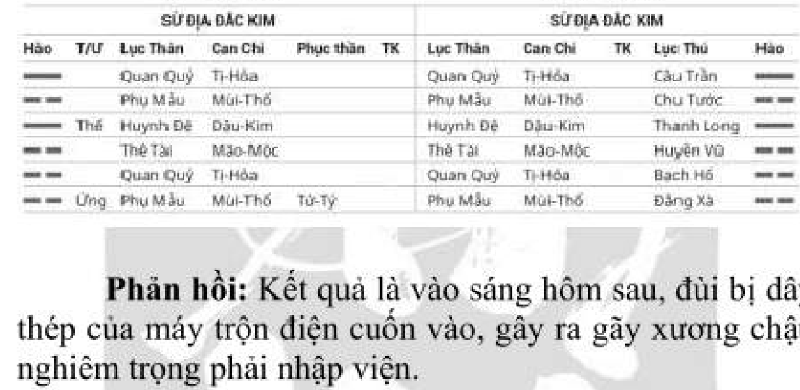
- **Cấu trúc Quẻ Dịch:**
  - **Quẻ chủ:** **Hỏa Địa Tấn** (Cung Càn, Du Hồn).  
    *Tượng quẻ:* Sứ Địa Đắc Kim (Đi vào đất hiểm mà gặp vàng, nhưng quẻ tĩnh lại có biến động ngầm dữ dội).
  - **Quẻ biến:** **Hỏa Địa Tấn** (Quẻ tĩnh không biến hào).  
    *Tượng quẻ:* Trạng thái tĩnh tại bề ngoài che giấu sự xung kích kịch liệt bên trong tầng thứ hào vị.
- **Bảng chi tiết Lục hào:**

| Hào | Thế/Ứng | Lục thân (Chủ) | Can Chi | Biến động | Lục thân (Biến) | Can Chi (Biến) | Thần sát / Phục | Lục thú |
|:---:|:---:|:---|:---|:---:|:---|:---|:---|:---|
| 6 | | Quan Quỷ | Tị - Hỏa | tĩnh (Ám động) | Quan Quỷ | Tị - Hỏa | Dương nhẫn, Dịch mã, Tuần không, Nguyệt kiến | Câu Trần |
| 5 | | Phụ Mẫu | Mùi - Thổ | tĩnh | Phụ Mẫu | Mùi - Thổ | Hoa cái | Chu Tước |
| 4 | **Thế** | Huynh Đệ | Dậu - Kim | tĩnh | Huynh Đệ | Dậu - Kim | Tai sát, Văn Xương | Thanh Long |
| 3 | | Thê Tài | Mão - Mộc | tĩnh | Thê Tài | Mão - Mộc | Tướng tinh | Huyền Vũ |
| 2 | | Quan Quỷ | Tị - Hỏa | tĩnh (Ám động) | Quan Quỷ | Tị - Hỏa | Dương nhẫn, Dịch mã, Tuần không, Nguyệt kiến | Bạch Hổ |
| 1 | **Ứng** | Phụ Mẫu | Mùi - Thổ | tĩnh | Phụ Mẫu | Mùi - Thổ | Phục Tử-Tý | Đằng Xà |

---

### 3. Dụng thần & Loại quẻ

- **Phân loại quẻ:**
  - **Bề mặt:** Quẻ tâm thái vấn thất vật (Nghi ngờ mất đồ do người khác trộm cắp).
  - **Thực chất cốt lõi:** **Quẻ tai họa khẩn cấp** phát động theo nguyên lý *"Tỵ khinh tựu trọng"* (Tránh nhẹ tìm nặng) của Dịch lý.
- **Xác định Dụng thần:**
  1. **Hào Thế (Huynh Đệ Dậu Kim lâm Thanh Long):** Đại diện trực tiếp cho bản thân người gieo quẻ (người phụ nữ).
  2. **Kỵ thần tai họa (Quan Quỷ Tị Hỏa ở hào 2 và hào 6):** Mang Dương nhẫn, Dịch mã, lâm Nguyệt kiến, bị Nhật thần Kỷ Hợi tương xung trở thành **Ám động**. Cả hai hào Quan Quỷ hung hãn đồng thời khắc phạt hào Thế Huynh Đệ Dậu Kim.
  3. **Tâm thái nghi ngờ (Quan Quỷ):** Nếu chỉ thuần túy là việc nghi ngờ mất đồ nhỏ, Quan Quỷ vượng động xác nhận có sự việc trộm cắp. Nhưng khi kết hợp thần sát hung bạo và cấu trúc khắc Thế, Quan Quỷ chuyển hóa bản chất thành tai họa huyết quang đe dọa trực tiếp đến tính mạng thân thể.

---

### 4. Luận giải chi tiết

Trường hợp thực chiến này là minh chứng đỉnh cao cho sự linh diệu của Lục Hào, khi Thần Dịch chủ động bỏ qua câu hỏi vụn vặt thường nhật để phát ra tín hiệu cảnh báo sinh tử cận kề:

#### 1. Quy tắc "Tỵ khinh tựu trọng" (Tránh nhẹ tìm nặng)
- Đương số chỉ hỏi về chiếc dụng cụ ép tóc trị giá nhỏ bị thất lạc, một việc hoàn toàn không đáng để vũ trụ đưa ra quẻ tượng mang cấp độ nghiêm trọng.
- Theo quy luật Dịch học: Khi người hỏi băn khoăn về một chuyện nhỏ nhặt không đáng kể, nhưng bản thân họ lại sắp sửa đối mặt với một **đại họa nguy hiểm cận kề**, quẻ tượng sẽ tự động kích hoạt cơ chế *"Tỵ khinh tựu trọng"*.
- Quẻ sẽ gác lại câu trả lời về việc mất đồ vụn vặt để trực tiếp hiển thị cấu trúc quẻ tai họa lớn, nhằm gióng lên hồi chuông cảnh báo khẩn cấp giúp đương số kịp thời đề phòng giữ gìn tính mạng và thân thể.

#### 2. Nhận diện cấu trúc quẻ tai họa thực thụ
- Quy tắc định vị quẻ tai họa trong Cổ thệ:
  - Quan Quỷ minh động hoặc ám động khắc thẳng vào hào Thế.
  - Hoặc hào Thế phát động hóa xuất Quan Quỷ hồi đầu khắc.
- Trong quẻ Hỏa Địa Tấn:
  - Cả hai hào Quan Quỷ Tị Hỏa (hào 2 và hào 6) đều lâm Nguyệt kiến Tỵ Hỏa cực vượng.
  - Ngày chiêm là ngày Kỷ Hợi, Hợi Thủy trực xung Tị Hỏa (*Tị - Hợi tương xung*).
  - Theo lý Dịch: Hào lâm Nguyệt lệnh vượng tướng mà bị Nhật thần xung kích thì không phải Nhật phá, mà trở thành **Ám động**.
  - Cả hai hào Quan Quỷ Tị Hỏa cùng lúc ám động phát lực, hợp sức giáng đòn khắc phạt mãnh liệt vào hào Thế Huynh Đệ Dậu Kim. Hào Thế lâm Kim bị song Hỏa thiêu đốt, rơi vào thế hung hiểm tột cùng.

#### 3. Tượng số thần sát: Giải mã hiểm họa từ thiết bị điện và máy móc
- **Tính chất của Quan Quỷ Tị Hỏa ám động:**
  - Tị Hỏa mang thuộc tính Hỏa: Hỏa tượng trưng cho sấm sét, ánh sáng, nhiệt năng, và đặc biệt là **dòng điện, thiết bị điện**.
  - Lâm **Dương nhẫn**: Dương nhẫn là thần sát hung bạo chủ về vật kim khí sắc nhọn, sự va đập tàn khốc, máy móc công nghiệp nặng cắt xẻ, cuốn nghiến.
  - Lâm **Dịch mã**: Dịch mã chủ về sự chuyển động cơ học nhanh, các trục quay, dây curoa, vòng xích liên tục truyền động năng.
  - Lâm **Kiếp sát**: Chủ về tai nạn thương tích, huyết quang bất ngờ không kịp trở tay.
- **Manh mối liên kết ý niệm:**
  - Tại sao quẻ tai họa lại xuất hiện ngay khi hỏi về máy ép tóc? Dụng cụ ép tóc chính là một thiết bị điện sinh nhiệt cầm tay. Ý niệm về "thiết bị điện" trong tâm trí người hỏi đã trở thành cây cầu dẫn đường để quẻ hiển lộ nguy cơ tai nạn liên quan trực tiếp đến nguồn điện và máy móc thiết bị điện lớn trong đời thực.
- **Định vị vị trí tổn thương trên cơ thể:**
  - Hào 2 là vị trí của đùi, háng, xương chậu và bộ phận hạ bàn cơ thể.
  - Quan Quỷ Tị Hỏa phát động tại hào 2 mang **Bạch Hổ**: Bạch Hổ chủ về huyết quang đổ máu, gãy xương, thương tật nghiêm trọng.
  - Sự kết hợp giữa hào 2, Bạch Hổ, Dương nhẫn và Hỏa ám động báo trước nguy cơ máy móc cơ điện cuốn nghiến gây gãy xương chậu và tổn thương đùi nghiêm trọng.

#### 4. Ứng kỳ thần tốc của hào Ám động
- Hào ám động có đặc tính phát tác cực kỳ mau lẹ, không chậm trễ như hào tĩnh hay hào minh động cần chờ tuần hoàn.
- Thời điểm ứng nghiệm thường xảy ra ngay trong ngày hôm sau, hoặc rơi vào các ngày Tỵ, Hợi (ngày trùng hoặc xung hợp với hào ám động).
- Ở đây chiêm ngày Hợi, ứng kỳ cảnh báo trực tiếp điểm rơi vào ngay sáng ngày hôm sau (ngày Canh Tý).

---

### 5. Kết luận & Ứng kỳ thực tế

- **Lời cảnh báo và định hướng phòng tránh:**
  - Quẻ khẳng định đây là quẻ tai họa khẩn cấp, bỏ qua việc truy tìm chiếc máy ép tóc.
  - Tác giả khuyến cáo đương số cần đặc biệt cẩn trọng tuyệt đối trong 1 - 2 ngày tới: hạn chế di chuyển ra ngoài (do Dịch mã), tránh xa các thiết bị điện lớn, máy móc công trình đang vận hành, và đề phòng sấm sét nếu trời mưa to.
- **Ứng kỳ thực tế rùng mình:**
  - Ngay sáng hôm sau, người phụ nữ có mặt tại một công trường xây dựng.
  - Trong lúc làm việc, chiếc đùi của cô vô tình bị dây thép kéo của một chiếc **máy trộn bê tông chạy bằng điện** cuốn chặt vào guồng quay.
  - Mặc dù các công nhân xung quanh đã kịp thời ngắt nguồn điện của máy trộn, nhưng lực kéo cuốn quá mạnh đã khiến cô bị **gãy xương chậu nghiêm trọng**.
  - Nạn nhân phải lập tức nhập viện cấp cứu phẫu thuật và nằm bất động điều trị suốt hơn hai đến ba tháng.

---

### 6. Bài học tâm pháp & Quy tắc cốt lõi

- **Quy tắc trích dẫn cốt lõi:**
  1. *Quy tắc "Tỵ khinh tựu trọng" (tránh nhẹ tìm nặng) của quẻ tượng: Bỏ qua việc nhỏ mất đồ để cảnh báo hiểm họa lớn* (trang 393). Khi chủ thể hỏi sự việc vụn vặt nhưng bản thân đứng trước nguy cơ sinh tử, quẻ Dịch sẽ ưu tiên phản ánh đại họa để cảnh báo người chiêm.
  2. *Đặc điểm nhận diện quẻ tai họa: Quan quỷ ám động/minh động khắc Thế hoặc Thế biến Quan quỷ hồi đầu khắc* (trang 393). Đây là tiêu chuẩn vàng định vị tai nạn, biến cố nghiêm trọng trong thực chiến Lục Hào.
  3. *Tượng số Quan quỷ Tị hỏa ám động mang Dương Nhận, Dịch Mã, Kiếp Sát: Cảnh báo tai nạn máy móc thiết bị điện* (trang 394). Tổ hợp Hỏa tinh, Dương nhẫn, Dịch mã phản ánh dòng điện cao áp, máy móc cơ khí vận hành tốc độ cao gây tổn thương thân thể.
- **Tâm pháp giải đoán thực tế:**
  - Người luận giải Lục Hào không được câu nệ một cách máy móc vào từng câu chữ của người hỏi. Khi thấy tín hiệu hung sát cực độ khắc Thế, phải lập tức nâng cao cảnh giác, chuyển dịch tiêu điểm sang việc bảo toàn an nguy tính mạng cho đương số.
  - Việc phòng ngừa tai họa đòi hỏi thầy Dịch phải có vốn sống phong phú và am hiểu thực tế đời thường, từ đó đưa ra những lời khuyên phòng ngừa cụ thể (như cách ứng xử an toàn với thiết bị điện công nghiệp, tránh trú sét), biến tri thức Dịch lý thành công cụ cứu người hữu hiệu.

## THỰC CHIẾN 53: ĐỆ TỬ TỰ HỎI VỀ SỰ THAY ĐỔI VẬN HẠN SAU 50 TUỔI

---

### 1. Bối cảnh & Câu hỏi

- **Bối cảnh chi tiết:**
  Một nữ đệ tử theo học Lục Hào của Chu Thần Bân, hiện đang ở độ tuổi ngoài 40, tự mình gieo quẻ Dịch để trắc nghiệm về vận trình cuộc đời sau mốc 50 tuổi. Thời vận là một phạm trù hết sức rộng lớn, đan xen đa dạng các mặt như công danh sự nghiệp, tài lộc, tình cảm gia đạo, sức khỏe và các mối quan hệ lục thân. Khác với Bát Tự thường tính toán dàn trải về con người qua các đại vận, Lục Hào vận hành theo cơ chế "sự kiện hóa vấn đề" – quy nạp toàn bộ giai đoạn dài hạn vào một biến cố hoặc nút thắt cốt lõi nhất có ảnh hưởng chi phối đến số mệnh.
- **Tâm lý & Câu hỏi ẩn ý:**
  Đương số mang tâm lý hoang mang, băn khoăn trước ngưỡng cửa nửa sau cuộc đời. Câu hỏi bề ngoài mang tính định hướng tổng quát: *"Sau 50 tuổi vận hạn sẽ biến chuyển ra sao, sự kiện nào là trọng đại nhất cần chú ý?"*, nhưng thực chất là nỗi lo âu tiềm ẩn về sự suy giảm sức khỏe và những ngã rẽ cuộc sống mà bản thân sắp phải đối mặt.
- **Thời gian chiêm đoán:**
  - Dương lịch: Ngày 15 tháng 4 năm 2017, lúc 09 giờ 29 phút (Giờ Bắc Kinh).
  - Can chi: Năm Đinh Dậu, tháng Giáp Thìn, ngày Nhâm Thân, giờ Ất Tỵ.

---

### 2. Dữ kiện & Bảng quẻ Crop

- **Thời không chiêm nghiệm:**
  - Tháng Giáp Thìn (Thổ vượng, Kim tướng, Hỏa hưu, Mộc tù, Thủy tử).
  - Ngày Nhâm Thân (Kim vượng, Thủy tướng, Thổ hưu, Mộc phế, Hỏa tuyệt).
  - Tuần không: **Tuất, Hợi** (Giáp Tý tuần trung, Tuất Hợi không vong).
- **Thần sát:**
  - Tướng tinh: Tý
  - Hoa cái: Thìn
  - Dịch mã: Dần
  - Tai sát: Ngọ
  - Mưu tinh: Tuất
  - Đào hoa: Dậu
  - Kiếp sát: Tỵ
  - Lộc thần: Hợi (Lâm hào 5 Ứng)
  - Dương nhẫn: Tý
  - Văn Xương: Dần
  - Thiên y: Mão (Lâm hào 2 Thế)
  - Thiên hỷ: Tuất
  - Quý nhân: Mão, Tị
- Dữ kiện bảng quẻ và đồ hình chiêm đoán:
  - **Bảng 53.1** Đồ hình quẻ Thực chiến 53:
    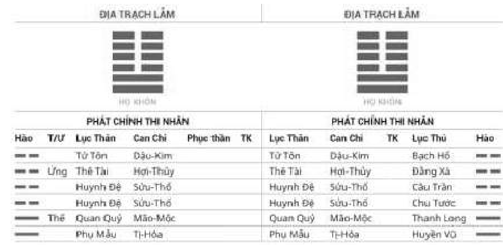
- **Cấu trúc Quẻ Dịch:**
  - **Quẻ chủ:** **Địa Trạch Lâm** (Cung Khôn).  
    *Tượng quẻ:* Phát Chính Thị Nhân (Đức lớn bao dung, giáo hóa muôn dân; quẻ tĩnh phản ánh song song hiện trạng hiện tại và xu thế tương lai dài hạn).
  - **Quẻ biến:** **Địa Trạch Lâm** (Quẻ tĩnh thuần nhất, không có hào động).  
    *Tượng quẻ:* Cục diện ổn định bề ngoài nhưng hàm chứa điểm giới hạn chuyển dịch then chốt ở bên trong các hào vị.
- **Bảng chi tiết Lục hào:**

| Hào | Thế/Ứng | Lục thân (Chủ) | Can Chi | Biến động | Lục thân (Biến) | Can Chi (Biến) | Thần sát / Phục | Lục thú |
|:---:|:---:|:---|:---|:---:|:---|:---|:---|:---|
| 6 | | Tử Tôn | Dậu - Kim | tĩnh | Tử Tôn | Dậu - Kim | Đào hoa | Bạch Hổ |
| 5 | **Ứng** | Thê Tài | Hợi - Thủy | tĩnh | Thê Tài | Hợi - Thủy | Tuần không, Lộc thần, Mã tính | Đằng Xà |
| 4 | | Huynh Đệ | Sửu - Thổ | tĩnh | Huynh Đệ | Sửu - Thổ | | Câu Trần |
| 3 | | Huynh Đệ | Sửu - Thổ | tĩnh | Huynh Đệ | Sửu - Thổ | | Chu Tước |
| 2 | **Thế** | Quan Quỷ | Mão - Mộc | tĩnh | Quan Quỷ | Mão - Mộc | Thiên y, Quý nhân, Tai sát | Thanh Long |
| 1 | | Phụ Mẫu | Tị - Hỏa | tĩnh | Phụ Mẫu | Tị - Hỏa | Kiếp sát, Quý nhân | Huyền Vũ |

---

### 3. Dụng thần & Loại quẻ

- **Phân loại quẻ:**
  - **Quẻ thời vận trường kỳ:** Xem biến cố cuộc đời trong quãng thời gian 20 - 30 năm sau mốc 50 tuổi.
  - **Quẻ tĩnh thuần nhất:** Hoàn toàn không có hào động, đòi hỏi phải dựa vào tương quan hào Thế, hào Ứng, Nhật Nguyệt lệnh và Nguyên thần để luận đoán.
- **Xác định Dụng thần:**
  1. **Hào Thế (Quan Quỷ Mão Mộc lâm Thanh Long):** Đại diện cho bản thân người gieo quẻ. Đương số là phụ nữ bình thường, không theo đuổi quan lộ chức quyền, nên Quan Quỷ không thể làm Dụng thần sự nghiệp công danh. Quan Quỷ trì Thế chỉ có thể ứng vào hai hướng: tình cảm hôn nhân hoặc bệnh tật sức khỏe.
  2. **Loại trừ phương diện tình duyên:** Đương số đã ly hôn từ vài năm trước, hiện sống độc thân và chưa có ý định tiến tới với ai; do đó không tồn tại điểm gãy đổ hay xung đột tình cảm lớn để quẻ phản ánh. Tiêu điểm duy nhất được quy về **vấn đề sức khỏe thể chất**. Quan Quỷ trì Thế chính là bệnh căn mãn tính tiềm tàng bám rễ.
  3. **Nguyên thần cứu tinh (Thê Tài Hợi Thủy ở hào Ứng):** Là nguồn thủy sinh dưỡng cho Mão Mộc, đại diện cho thể dịch, máu và nguồn dinh dưỡng nuôi can tạng. Hào này lâm Lộc thần nhưng đang rơi vào **Tuần không**, khiến nguồn sinh dưỡng bị gián đoạn.
  4. **Kỵ thần gây tổn thương (Nhật lệnh Thân Kim):** Khắc phạt Mão Mộc trực diện, đại diện cho sự bào mòn thể chất và sai lầm nghiêm trọng trong chế độ sinh hoạt hiện tại.

---

### 4. Luận giải chi tiết

Trường hợp thực chiến này là mẫu mực cho phương pháp luận đoán quẻ thời vận trường kỳ và sự kết hợp kỳ diệu giữa Dịch lý Lục Hào với Y học cổ truyền phương Đông:

#### 1. Quy tắc "Sự kiện hóa thời vận" trong Lục Hào
- Khi đoán vận hạn nhiều năm, Bát Tự thường dàn trải qua các cung mệnh, thập thần và đại vận, nhưng khó chỉ ra một biến cố cụ thể sát sườn.
- Điểm đặc sắc của Lục Hào là **biến thời vận thành sự kiện cụ thể**. Quẻ Dịch không trả lời chung chung mà cô đọng toàn bộ vận trình sau tuổi 50 vào đúng một mối đe dọa trọng tâm nhất: bệnh tật suy thoái ở tạng gan do thiếu hụt khí huyết.
- Nhận diện đúng nút thắt này giúp đương số tập trung toàn bộ nguồn lực để hóa giải, thay vì lo âu phân tán vào nhiều mặt khác nhau.

#### 2. Nguyên tắc trọng thị Nguyên thần trong quẻ tĩnh dài hạn
- Trong quẻ động, hào động nắm quyền năng biến hóa trực tiếp, có thể lướt qua vai trò của Nguyên thần. Nhưng trong **quẻ tĩnh xem việc dài hạn**, Nguyên thần là nhân tố quyết định sự sinh tồn và tính bền vững của hào Thế.
- Hào Thế Quan Quỷ Mão Mộc ở tháng Thìn chỉ còn chút dư khí hưu tù; sang ngày Thân lại bị Nhật thần tuyệt khắc, ở vào thế suy vi kiệt quệ, báo hiệu sức khỏe hiện tại đã chạm tới **điểm giới hạn xấu** (critical point).
- May mắn thay, quẻ có Nguyên thần Thê Tài Hợi Thủy ở hào 5 Ứng. Hợi Thủy là trường sinh của Mão Mộc, thể hiện bệnh này tuy thâm căn cố đế nhưng vẫn có giải pháp cứu vãn bền vững, có thể duy trì trạng thái ổn định lâu dài nếu biết cách bồi bổ.

#### 3. Chẩn đoán y lý sâu sắc: Can Mộc suy vi và hội chứng "Can bất tàng huyết"
- **Định vị tạng phủ:**
  - Hào 2 là vị trí hạ bàn, tạng phủ vùng bụng dưới. Mão Mộc đại diện cho Can (gan) và Đởm (mật).
  - Lâm Thanh Long: Thanh Long tượng trưng cho cây gỗ lớn sum suê, chủ về can khí. Mão Mộc lâm Thanh Long xác định đích danh bệnh nằm ở **lá gan**.
  - Lâm Đào hoa: Chủ về tính lây nhiễm, ám chỉ tiền sử nhiễm virus viêm gan. Quả nhiên đương số trước đây từng mắc bệnh gan, tuy đã tạm lắng nhưng tạng gan vẫn luôn ở trạng thái bán khỏe mạnh (sub-health).
- **Căn nguyên "Can bất tàng huyết" (Gan không chứa máu):**
  - Trong Đông y, can tàng huyết (gan là kho lưu trữ máu của toàn cơ thể).
  - Nguyên thần Thê Tài Hợi Thủy là Thủy dịch nuôi dưỡng Can Mộc. Tuy nhiên, Hợi Thủy hiện đang lâm **Tuần không**, tựa như dòng suối khô cạn không có nước để tưới mát cây cối.
  - Hợi Thủy tuần không thể hiện gan không nhận được máu, khí huyết trong gan khô kiệt, dẫn tới hội chứng can huyết hư tổn nghiêm trọng.
  - Theo quy luật ngũ hành tương sinh tương khắc trong Đông y (học thuyết được bác sĩ Trịnh truyền dạy): Can Mộc thiếu máu sẽ không sinh được Tâm Hỏa, dẫn đến **tim suy yếu, đánh trống ngực**; Tâm Hỏa suy không sinh được Tỳ Thổ, khiến dạ dày ruột hấp thu kém; Tỳ suy liên lụy đến Phế và cuối cùng phản phệ lại Thận Thủy, hình thành vòng xoáy bệnh lý tiêu cực.

#### 4. Quy tắc phân biệt Lộc thần và Dương nhẫn trong chẩn đoán y học
- Đây là bí pháp phân định tượng số cực kỳ tinh vi của Chu Thần Bân:
  - Hào Thủy lâm **Lộc thần**: Đại diện cho thể dịch lỏng, dung dịch sinh học, và đặc biệt là **huyết dịch (máu)**.
  - Hào Thủy lâm **Dương nhẫn**: Đại diện cho khí quan thực thể, mạch máu hữu hình, hoặc đường ống dẫn cơ thể (mạch máu, niệu quản, ống thận).
- Trong quẻ này, Thê Tài Hợi Thủy mang **Lộc thần** chứ không mang Dương nhẫn. Điều này khẳng định cơ quan thực thể (mạch máu hay ống thận) không bị tổn hại thực thể, mà căn nguyên thuần túy là **sự thiếu hụt chất lượng thể dịch và máu**. Bệnh nhân bị thiếu máu do thận thủy không đủ tạo huyết và can không chứa được máu.

#### 5. Vết xe đổ từ chế độ ăn kiêng giảm cân mù quáng
- Tại sao một người đang thiếu máu lại rơi vào điểm giới hạn nguy hiểm ở hiện tại?
- Manh mối nằm ở Nhật lệnh Thân Kim mang Văn Xương khắc Thế, kết hợp với hào mang Mưu tinh: Đương số có kế hoạch làm đẹp, tự thấy vóc dáng hơi đẫy đà nên quyết định ăn kiêng giảm cân cấp tốc.
- Chế độ giảm cân này hoàn toàn thiếu kiến thức khoa học: cắt bỏ toàn bộ chất béo, dầu mỡ, chỉ ăn rau củ và trái cây lặt vặt. Hệ quả là cơ thể thiếu hụt trầm trọng dưỡng chất, chuyển thành chứng chán ăn, biếng ăn, đẩy lá gan vốn đã suy nhược rơi vào tình trạng kiệt quệ khí huyết.

---

### 5. Kết luận & Ứng kỳ thực tế

- **Lời cảnh báo và giải pháp của tác giả:**
  - Cảnh báo trực diện: Nếu không chấn chỉnh ngay chế độ sinh hoạt, sau khi bước qua tuổi 50, chức năng gan sẽ suy sụp nghiêm trọng, biến chứng sang tim mạch và đe dọa trực tiếp đến tính mạng.
  - Lập tức bãi bỏ chế độ nhịn ăn giảm cân phi khoa học.
  - **Phương pháp dưỡng sinh tượng số Đông y:** Thê Tài Hợi Thủy tuy tuần không nhưng là giả không, tuân theo quy luật "Không tất điền thực". Hợi là quẻ Càn thuộc Thủy, tượng trưng cho loài heo (lợn); Thủy lâm Lộc thần chủ về nước canh hầm bổ dưỡng. Tác giả khuyên dùng **xương heo hầm đậu phộng** làm món canh bồi bổ thường xuyên nhằm điền thực Hợi Thủy, kích hoạt nguồn sinh huyết nuôi dưỡng can tạng Mão Mộc.
- **Phản hồi thực tế từ đương số:**
  - Nữ đệ tử vô cùng chấn động vì từng chi tiết được vạch trần chuẩn xác: cô quả thực từng mắc bệnh gan, gần đây thường xuyên bị hồi hộp, tim đập nhanh, huyết áp tụt thấp, kinh nguyệt không đều và vón cục thâm đen do khí huyết ứ trệ.
  - Cô thừa nhận bản thân đang ăn kiêng mù quáng đến mức nhìn thấy thức ăn là buồn nôn, mất hoàn toàn cảm giác ngon miệng.
- **Ứng kỳ chiêm nghiệm:**
  - Vận hạn hướng đến giai đoạn sau 50 tuổi. Nhờ được thức tỉnh đúng vào điểm giới hạn then chốt, đương số đã kịp thời thay đổi lối sống, bồi bổ khí huyết theo phương pháp điền thực tượng số, giúp bảo toàn sức khỏe và duy trì trạng thái ổn định chức năng tạng phủ qua mốc 50 tuổi.

---

### 6. Bài học tâm pháp & Quy tắc cốt lõi

- **Quy tắc trích dẫn cốt lõi:**
  1. *Quy tắc chiêm đoán thời vận dài hạn trong Lục Hào: 'Sự kiện hóa' vấn đề, tập trung vào biến động cốt lõi thay vì dàn trải* (trang 397). Dự trắc thời vận dài hạn không liệt kê vụn vặt mà tập trung truy tìm biến cố mang tính quyết định chi phối đường đời.
  2. *Nguyên tắc trọng thị Nguyên thần trong quẻ tĩnh xem sự việc dài hạn: Vai trò sinh dưỡng và tính bền vững* (trang 399). Quẻ tĩnh đoán việc trường kỳ xem trọng Nguyên thần; có Nguyên thần là có nguồn sinh dưỡng lâu bền và cơ hội hóa giải hoạn nạn.
  3. *Quy tắc phân biệt hào Thủy lâm Lộc thần (chất lỏng, máu) và lâm Dương Nhận (mạch máu, cơ quan thực thể) trong chẩn đoán y lý* (trang 402). Thủy lâm Lộc thần chỉ thể dịch huyết dịch lỏng; Thủy lâm Dương nhẫn chỉ mạch máu, khí quan hữu hình.
  4. *Phương pháp dưỡng sinh hóa giải theo tượng số: Điền thực Thê tài Hợi thủy tuần không để sinh dưỡng hào Thế Mão mộc* (trang 404). Ứng dụng quy luật tuần không điền thực thông qua món ăn dưỡng sinh hợp tượng số (canh xương heo đậu phộng) để bồi bổ chân khí.
- **Tâm pháp giải đoán thực tế:**
  - Người nghiên cứu Lục Hào đỉnh cao cần kết hợp nhuần nhuyễn giữa Dịch lý và Y lý. Sự tương thông giữa ngũ hành hào vị và cơ chế vận hành khí huyết tạng phủ Đông y giúp nâng tầm dự trắc từ phán đoán cát hung trừu tượng thành phương án cứu người thực tiễn.
  - Nhận diện đúng "điểm giới hạn" (critical point) trong quẻ tĩnh giúp đương số chuyển nguy thành an trước khi mầm bệnh bùng phát thành thảm họa ở tương lai.

## THỰC CHIẾN 54: CHUYẾN ĐI ĐẾN KINH MÔN, HỒ BẮC VÀO NGÀY MAI, LIỆU CÓ THỂ ĐÀM PHÁN THÀNH CÔNG VIỆC TRANG TRÍ ĐƯỜNG HẦM NÀY KHÔNG? HỢP ĐỒNG CÓ THỂ KÝ KẾT ĐƯỢC KHÔNG?

---

### 1. Bối cảnh & Câu hỏi

- **Bối cảnh chi tiết:**
  Một nhà thầu công trình chuẩn bị khởi hành chuyến đi công tác từ ngày hôm sau đến thành phố Kinh Môn, tỉnh Hồ Bắc để tham gia đàm phán thương thảo một gói thầu thi công trang trí đường hầm giao thông. Đây là dự án hạ tầng có giá trị kinh tế đáng kể, quy trình xét duyệt liên quan đến nhiều cơ quan hữu quan và chịu sự dòm ngó của nhiều đơn vị đối thủ cạnh tranh. Đương số rất nôn nóng muốn biết liệu chuyến đi này có đạt được thỏa thuận thương mại và đặt bút ký kết hợp đồng chính thức hay không.
- **Tâm lý & Câu hỏi ẩn ý:**
  Đương số mang tâm lý vừa kỳ vọng vừa phấp phỏng âu lo về các rào cản khách quan, sự cạnh tranh ngầm từ các đối thủ bản địa, cùng tính chất phức tạp trong đàm phán giá cả và điều khoản thi công. Câu hỏi đặt ra trực diện và dứt khoát: *"Chuyến đi đàm phán việc trang trí đường hầm tại Kinh Môn có thành công không? Hợp đồng có thể ký kết được không?"*.
- **Thời gian chiêm đoán:**
  - Dương lịch: Ngày 12 tháng 5 năm 2017, lúc 23 giờ 19 phút (Giờ Bắc Kinh).
  - Can chi: Năm Đinh Dậu, tháng Ất Tỵ, ngày Canh Tý (thời điểm đã bước qua giờ Tý sang ngày Canh Tý), giờ Bính Tý.

---

### 2. Dữ kiện & Bảng quẻ Crop

- **Thời không chiêm nghiệm:**
  - Tháng Ất Tỵ (Hỏa vượng, Thổ tướng, Mộc hưu, Kim phế, Thủy tuyệt).
  - Ngày Canh Tý (Thủy vượng, Mộc tướng, Kim hưu, Hỏa phế, Thổ tù).
  - Tuần không: **Thìn, Tỵ** (Giáp Ngọ tuần trung, Thìn Tỵ không vong).
- **Thần sát:**
  - Tướng tinh: Tý (Lâm Nhật lệnh)
  - Hoa cái: Thìn (Lâm hào 1 và hào biến của Thế)
  - Dịch mã: Dần
  - Tai sát: Ngọ (Lâm hào 2 Thế và hào 4)
  - Mưu tinh: Tuất (Lâm hào 6)
  - Đào hoa: Dậu
  - Kiếp sát: Tỵ (Lâm Nguyệt kiến, hào phụ)
  - Lộc thần: Thân (Lâm hào 3 và hào 5 Ứng)
  - Dương nhẫn: Dậu
  - Văn xương: Hợi
  - Thiên y: Thìn (Lâm hào 1 và hào biến của Thế)
  - Thiên hỷ: Sửu
  - Quý nhân: Dần, Ngọ (Lâm hào 2 Thế và hào 4)
- Dữ kiện bảng quẻ và đồ hình chiêm đoán:
  - **Bảng 54.1** Đồ hình quẻ Thực chiến 54:
    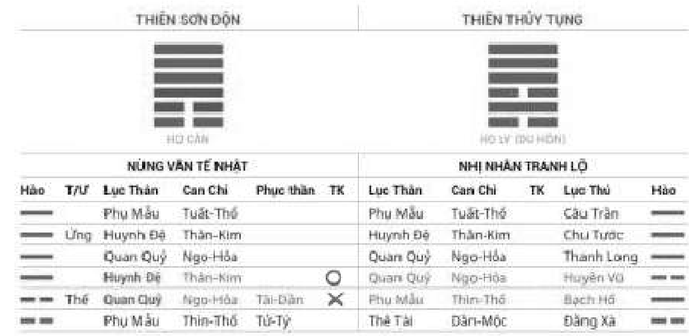
- **Cấu trúc Quẻ Dịch:**
  - **Quẻ chủ:** **Thiên Sơn Độn** (Cung Càn).  
    *Tượng quẻ:* Nùng Vân Tế Nhật (Mây dày che khuất mặt trời; hàm nghĩa quá trình chạy đôn chạy đáo, điều phối ngược xuôi, có sự thoái thác hoặc né tránh ban đầu từ đối tác).
  - **Quẻ biến:** **Thiên Thủy Tụng** (Cung Ly, Du Hồn).  
    *Tượng quẻ:* Nhị Nhân Tranh Lộ (Hai người cùng tranh một con đường; tượng trưng cho tiến trình thương thảo cam go, tranh biện điều khoản và sự cạnh tranh gay gắt).
- **Bảng chi tiết Lục hào:**

| Hào | Thế/Ứng | Lục thân (Chủ) | Can Chi | Biến động | Lục thân (Biến) | Can Chi (Biến) | Thần sát / Phục | Lục thú |
|:---:|:---:|:---|:---|:---:|:---|:---|:---|:---|
| 6 | | Phụ Mẫu | Tuất - Thổ | tĩnh | Phụ Mẫu | Tuất - Thổ | Mưu tinh | Câu Trần |
| 5 | **Ứng** | Huynh Đệ | Thân - Kim | tĩnh | Huynh Đệ | Thân - Kim | Lộc thần | Chu Tước |
| 4 | | Quan Quỷ | Ngọ - Hỏa | tĩnh | Quan Quỷ | Ngọ - Hỏa | Tai sát, Quý nhân | Thanh Long |
| 3 | | Huynh Đệ | Thân - Kim | **O (Động)** | Quan Quỷ | Ngọ - Hỏa | Lộc thần | Huyền Vũ |
| 2 | **Thế** | Quan Quỷ | Ngọ - Hỏa | **X (Động)** | Phụ Mẫu | Thìn - Thổ | Tai sát, Quý nhân, Phục Tài-Dần | Bạch Hổ |
| 1 | | Phụ Mẫu | Thìn - Thổ | tĩnh | Thê Tài | Dần - Mộc | Hoa cái, Thiên y, Tuần không, Phục Tử-Tý | Đằng Xà |

---

### 3. Dụng thần & Loại quẻ

- **Phân loại quẻ:**
  - **Quẻ cầu sự mưu sự thương mại:** Dự đoán về đàm phán hợp đồng kinh tế và tiến độ triển khai dự án công trình cụ thể.
  - **Quẻ đa động:** Có hai hào đồng thời phát động, gồm một hào ở gian hào (ngoại lực) và hào Thế tự thân phát động (nội lực chủ thể).
- **Xác định Dụng thần:**
  1. **Dụng thần Hợp đồng / Dự án (Phụ Mẫu):** Trong chiêm đoán mưu sự làm ăn, Phụ Mẫu đại diện cho hợp đồng pháp lý, văn bản thỏa thuận, giấy phép và công trình dự án cụ thể. Hào Thế động hóa xuất Phụ Mẫu Thìn Thổ, chính là hình ảnh hợp đồng được ký kết vào tay mình.
  2. **Hào Thế (Quan Quỷ Ngọ Hỏa lâm Bạch Hổ):** Đại diện cho bản thân nhà thầu đi đàm phán. Quan Quỷ trì Thế biểu thị chức vụ, trách nhiệm gánh vác dự án và áp lực công việc đè nặng.
  3. **Kỵ thần cạnh tranh / Trở lực gian hào (Huynh Đệ Thân Kim ở hào 3):** Nằm tại gian hào giữa Thế và Ứng. Huynh Đệ phát động đại diện cho đối thủ cạnh tranh ngáng đường, tranh giành mối làm ăn hoặc trở lực điều phối trung gian.

---

### 4. Luận giải chi tiết

Quẻ này cung cấp một ví dụ mẫu mực về cách phân định rạch ròi giữa "áp lực tiến trình" và "kết quả chung cuộc", giải mã chính xác cơ chế hào Thế nội động hóa Dụng thần:

#### 1. Quy tắc phân định Ngoại động và Nội động
- Quẻ xuất hiện hai hào phát động: Hào 3 Huynh Đệ Thân Kim và Hào 2 Quan Quỷ Ngọ Hỏa (hào Thế).
- **Hào động gian hào (Ngoại động):**
  - Hào 3 Huynh Đệ Thân Kim phát động tại gian hào, đóng vai trò là **ngoại lực khách quan**.
  - Huynh Đệ lâm Huyền Vũ chủ về sự tranh đoạt ngầm, đối thủ cạnh tranh xuất hiện gây trở ngại, làm cho tiến trình thương lượng bị gián đoạn và xuất hiện xung đột lợi ích.
- **Hào Thế phát động (Nội động):**
  - Hào Thế Quan Quỷ Ngọ Hỏa tự thân phát động là **nội động của chủ thể**.
  - Trong nguyên tắc Lục Hào, hào phát động của hào Thế mang tính chất quyết định tối thượng đối với thành bại của đương số, chi phối trực tiếp kết cục cuối cùng.

#### 2. Quy tắc hào Thế nội động biến Dụng thần: "Hóa Dụng thần ắt thành"
- Hào Thế Quan Quỷ Ngọ Hỏa phát động biến ra **Phụ Mẫu Thìn Thổ**.
- Định luật vàng trong Cổ thệ: Hào Thế nội động hóa Kỵ thần thì hỏng việc; hào Thế nội động hóa xuất Dụng thần thì **mưu sự tất thành**.
- Người hỏi đang băn khoăn về hợp đồng dự án (Dụng thần là Phụ Mẫu). Việc hào Thế tự mình hóa xuất Phụ Mẫu khẳng định dứt khoát rằng hợp đồng chắc chắn sẽ được ký kết thành công.
- Xét về trạng thái tuần không: Phụ Mẫu Thìn Thổ tuy đang lâm Tuần không trong tuần Giáp Ngọ, nhưng vì là hào biến do hào Thế nội động hóa ra, nên tính chất của nó là **giả không** (tuần không tạm thời), hoàn toàn không sợ Nguyệt phá hay Nhật phá. Khi gặp ngày giờ điền thực, Dụng thần sẽ phát huy trọn vẹn sức mạnh.

#### 3. Cơ chế đối thủ bị triệt hạ: Hồi đầu khắc ở gian hào
- Hào 3 Huynh Đệ Thân Kim tuy phát động hung hăng nhưng lại hóa xuất Quan Quỷ Ngọ Hỏa, tạo thành thế **Hồi đầu khắc** (*Hỏa khắc Kim*).
- Điều này phản ánh đối thủ cạnh tranh dù cố tình ngáng đường nhưng tự thân họ lại vướng phải khuyết điểm, không đủ năng lực pháp lý hoặc gặp sự cố bất lợi nên tự động bị loại bỏ.
- Hơn nữa, hào biến Ngọ Hỏa ở hào 3 đồng khí với hào Thế Quan Quỷ Ngọ Hỏa, cho thấy sự cản trở của đối thủ chỉ là một khúc quanh nhỏ trong tiến trình đàm phán chứ không thể cản bước hào Thế giành lấy hợp đồng.

#### 4. Biểu tượng cặp quẻ Thiên Sơn Độn biến Thiên Thủy Tụng
- **Quẻ chủ Thiên Sơn Độn:** Thể hiện hiện trạng ban đầu. Đương số phải bôn ba ngược xuôi, chạy vạy các mối quan hệ; đối tác có biểu hiện né tránh, trì hoãn hoặc chưa sẵn sàng chốt hợp đồng ngay từ đầu.
- **Quẻ biến Thiên Thủy Tụng:** Tượng Nhị Nhân Tranh Lộ (Hai người tranh đường) báo trước cuộc đàm phán sẽ diễn ra rất cam go, hai bên phải tranh luận gay gắt từng điều khoản, điều chỉnh lợi ích qua lại mới đạt được tiếng nói chung.

#### 5. Giải mã nghịch lý Ứng kỳ: Ám động vs Tuần không điền thực
- Một đệ tử trong học phái thắc mắc: Hào Thế Quan Quỷ Ngọ Hỏa bị Nhật lệnh Canh Tý xung kích trở thành ám động, tại sao không ký ngay vào ngày hôm sau mà lại kéo dài?
- Chu Thần Bân giải thích tâm pháp sâu sắc: Hào ám động không nhất thiết phải ứng nghiệm ngay vào ngày hôm sau. Trong quẻ này, then chốt kết quả nằm ở hào biến Phụ Mẫu Thìn Thổ đang lâm Tuần không.
- Tiến trình bắt buộc phải chờ đợi sự việc vận động cho đến khi **Thìn Thổ được điền thực**. Điền thực vào ngày Thìn chính là ứng kỳ chuẩn xác và tự nhiên nhất của quẻ tượng.

---

### 5. Kết luận & Ứng kỳ thực tế

- **Phán đoán của tác giả:**
  - Khẳng định chuyến đi Kinh Môn, Hồ Bắc chắc chắn sẽ đàm phán thành công và hợp đồng trang trí đường hầm nhất định sẽ được ký kết.
  - Cảnh báo tiến trình đàm phán sẽ không thể xong xuôi chớp nhoáng trong một hai ngày đầu, mà phải trải qua giằng co, tranh cãi điều khoản và giải quyết sự cạnh tranh từ đối thủ.
  - Xác định thời điểm ký hợp đồng chính thức rơi vào **ngày Thìn** (ngày điền thực hào Phụ Mẫu Thìn Thổ).
- **Phản hồi thực tế từ đương số:**
  - Quá trình đàm phán tại Kinh Môn diễn ra đầy trắc trở, đôi bên phải thương thảo lại nhiều hạng mục thiết kế và giá cả do có sự xuất hiện của một nhà thầu đối thủ chào giá cạnh tranh.
  - Đúng vào chiều **ngày Thìn**, mọi điều khoản được thống nhất mỹ mãn và hai bên đã chính thức ký kết hợp đồng thi công trang trí đường hầm.
- **Ứng kỳ chiêm nghiệm:**
  - Ứng nghiệm chuẩn xác vào buổi chiều ngày Thìn – đúng ngày điền thực hào biến Phụ Mẫu Thìn Thổ thoát khỏi trạng thái tuần không.

---

### 6. Bài học tâm pháp & Quy tắc cốt lõi

- **Quy tắc trích dẫn cốt lõi:**
  1. *Quy tắc phân định ngoại lực và kết quả: Hào động gian hào là trở lực cạnh tranh, hào Thế nội động quyết định thành bại* (trang 406). Hào động tại gian hào biểu thị trở lực hoặc bên thứ ba can thiệp; hào Thế nội động quyết định đích đến cuối cùng của chủ thể.
  2. *Quy tắc hào Thế nội động hóa Dụng thần Phụ mẫu: Hóa Dụng thần ắt thành công, tuần không giả không điền thực ứng kỳ* (trang 406). Hào Thế nội động hóa ra Dụng thần là quy luật tất thắng trong mưu sự; trạng thái tuần không của hào biến là giả không, báo trước thời điểm điền thực sẽ thành công.
  3. *Tượng quẻ Thiên Sơn Độn biến Thiên Thủy Tụng trong đàm phán, điều phối và ký kết hợp đồng công trình* (trang 407). Quẻ Độn chủ về điều phối bôn ba ngược xuôi; quẻ Tụng chủ về tranh luận, đàm phán gay gắt các điều khoản pháp lý.
- **Tâm pháp giải đoán thực tế:**
  - Khi đối diện với quẻ thương mại đa động phức tạp, người luận giải phải biết tách biệt giữa "áp lực tiến trình" và "kết quả cứu cánh". Sự xuất hiện của đối thủ (Huynh Đệ động) hay tranh cãi (quẻ Tụng) chỉ là thử thách trên đường đi, không được vội vàng phán hỏng việc khi hào Thế vẫn nắm chắc quyền năng hóa Dụng thần.
  - Nắm vững bản chất "Tuần không trong nội động là giả không": Giúp người xem xác định chính xác ứng kỳ điểm rơi theo ngày điền thực, không bị giao động bởi hiện tượng ám động ngắn hạn bề ngoài.

## THỰC CHIẾN 55: CÔNG AN TỰ XEM QUẺ LIỆU NGHI PHẠM GIẾT NGƯỜI CÓ THỂ BỊ BẮT KHÔNG

---

### 1. Bối cảnh & Câu hỏi

- **Bối cảnh chi tiết:**
  Bộ Công an Trung Quốc ban hành chỉ lệnh nghiêm ngặt quy định: mọi vụ án mạng giết người đều phải dốc toàn lực truy xét đến cùng; nếu địa phương để tồn đọng án mạng không phá được thì cán bộ phụ trách trực tiếp sẽ bị truy cứu trách nhiệm và xử lý kỷ luật nghiêm khắc. Một sĩ quan công an chịu trách nhiệm chính thụ lý một vụ trọng án giết người trên địa bàn đã tự mình gieo quẻ Dịch để dự trắc về khả năng truy bắt tên hung thủ nguy hiểm đang đào tẩu.
- **Tâm lý & Câu hỏi ẩn ý:**
  Đương số gánh chịu áp lực nghẹt thở từ mệnh lệnh cấp trên và nguy cơ bị giáng chức đè nặng lên sinh mệnh chính trị của bản thân. Ẩn sau câu hỏi bề nổi: *"Liệu ban chuyên án có thể bắt được nghi phạm giết người hay không?"* là nỗi khát khao muốn định vị chính xác: *"Nghi phạm hiện đang lẩn trốn ở phương hướng nào?"* và *"Số phận con đường quan lộ của bản thân sẽ ra sao trước vụ án sinh tử này?"*.
- **Thời gian chiêm đoán:**
  - Dương lịch: Ngày 03 tháng 4 năm 2016, lúc 10 giờ 02 phút (Giờ Bắc Kinh).
  - Can chi: Năm Bính Thân, tháng Tân Mão, ngày Ất Mão, giờ Tân Tỵ.

---

### 2. Dữ kiện & Bảng quẻ Crop

- **Thời không chiêm nghiệm:**
  - Tháng Tân Mão (Mộc vượng, Hỏa tướng, Thổ tử, Kim tù, Thủy hưu).
  - Ngày Ất Mão (Mộc vượng, Hỏa tướng, Thổ tử, Kim tù, Thủy hưu).
  - Tuần không: **Tý, Sửu** (Giáp Dần tuần trung, Tý Sửu không vong).
- **Thần sát:**
  - Tướng tinh: Mão (Lâm Nguyệt kiến, Nhật lệnh, hào 3)
  - Hoa cái: Mùi (Lâm hào 1 Thế)
  - Dịch mã: Tỵ (Lâm giờ Tỵ, hào 2)
  - Tai sát: Dậu
  - Mưu tinh: Sửu (Lâm Tuần không)
  - Đào hoa: Tý (Lâm Tuần không)
  - Kiếp sát: Thân (Lâm Thái tuế, hào 5, hào biến của hào 3)
  - Lộc thần: Mão (Lâm Nguyệt kiến, Nhật lệnh, hào 3)
  - Dương nhẫn: Dần
  - Văn xương: Ngọ (Lâm hào 4 Ứng)
  - Thiên y: Dần
  - Thiên hỷ: Tuất (Lâm hào 6)
  - Quý nhân: Thân, Tý
- Dữ kiện bảng quẻ và đồ hình chiêm đoán:
  - **Bảng 55.1** Đồ hình quẻ Thực chiến 55:
    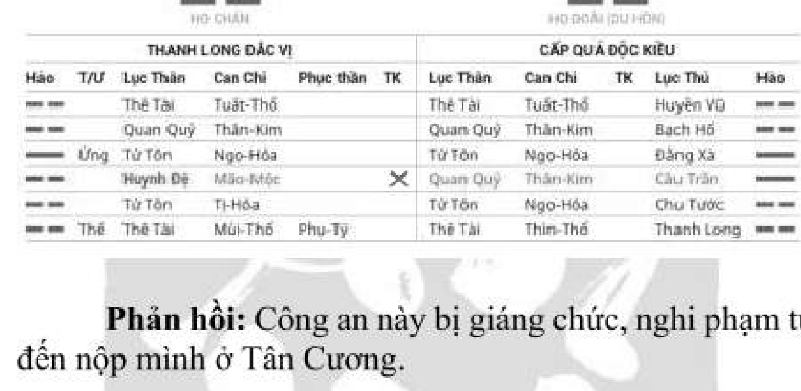
- **Cấu trúc Quẻ Dịch:**
  - **Quẻ chủ:** **Lôi Địa Dự** (Cung Chấn, Lục Hợp quẻ).  
    *Tượng quẻ:* Thanh Long Đắc Vị (Nhưng tính chất Lục Hợp trong án hình sự lại chủ về sự bế tắc, dây dưa trì trệ, vụ án chưa thể có tiến triển rõ ràng).
  - **Quẻ biến:** **Lôi Sơn Tiểu Quá** (Cung Đoài, Du Hồn).  
    *Tượng quẻ:* Cấp Quá Độc Kiều (Vội vã qua cầu độc mộc hiểm trở; hàm ý sai lầm nghiệp vụ hoặc thiếu sót dẫn đến việc bị kỷ luật điều chuyển công tác).
- **Bảng chi tiết Lục hào:**

| Hào | Thế/Ứng | Lục thân (Chủ) | Can Chi | Biến động | Lục thân (Biến) | Can Chi (Biến) | Thần sát / Phục | Lục thú |
|:---:|:---:|:---|:---|:---:|:---|:---|:---|:---|
| 6 | | Thê Tài | Tuất - Thổ | tĩnh | Thê Tài | Tuất - Thổ | Thiên hỷ | Huyền Vũ |
| 5 | | Quan Quỷ | Thân - Kim | tĩnh | Quan Quỷ | Thân - Kim | Kiếp sát, Quý nhân | Bạch Hổ |
| 4 | **Ứng** | Tử Tôn | Ngọ - Hỏa | tĩnh | Tử Tôn | Ngọ - Hỏa | Văn xương | Đằng Xà |
| 3 | | Huynh Đệ | Mão - Mộc | **X (Động)** | Quan Quỷ | Thân - Kim | Tướng tinh, Lộc thần, Nguyệt kiến, Nhật lệnh | Câu Trần |
| 2 | | Tử Tôn | Tị - Hỏa | tĩnh | Tử Tôn | Ngọ - Hỏa | Dịch mã | Chu Tước |
| 1 | **Thế** | Thê Tài | Mùi - Thổ | tĩnh | Thê Tài | Thìn - Thổ | Hoa cái, Phục Phụ-Tý | Thanh Long |

---

### 3. Dụng thần & Loại quẻ

- **Phân loại quẻ:**
  - **Quẻ hình sự truy bắt tội phạm:** Xem xét hành tung tội phạm và kết quả tác chiến của lực lượng trinh sát.
  - **Quẻ tai họa chức nghiệp tiềm ẩn:** Cấu trúc Nhật Nguyệt cùng hào động vượng khắc Thế cảnh báo nguy cơ kỷ luật giáng chức đối với bản thân người chiêm.
- **Xác định Dụng thần:**
  1. **Nghi phạm giết người đào tẩu (Quan Quỷ Thân Kim ở hào 5):** Hào 5 là ngôi tôn vị ở nơi xa; Quan Quỷ lâm Bạch Hổ chủ về hung ác, đổ máu; lâm Kiếp sát chủ về hành vi giết người cướp của; mang Quý nhân và Mã tinh ngụ ý kẻ phạm tội đã tẩu thoát đến vùng đất xa xôi bên ngoài.
  2. **Lực lượng truy bắt phá án (Tử Tôn Ngọ Hỏa ở hào 4 Ứng):** Trong thuật số truy bắt hình sự, Tử Tôn là thần bắt giữ, khắc chế Quan Quỷ, đại diện cho hoạt động điều tra, vây ráp của cơ quan công an.
  3. **Động lực sinh trợ lực lượng truy bắt (Huynh Đệ Mão Mộc ở hào 3 phát động):** Mão Mộc là nguyên thần sinh trợ Tử Tôn Ngọ Hỏa, nhưng hào này lại động hóa xuất Quan Quỷ Thân Kim hồi đầu khắc.
  4. **Hào Thế (Thê Tài Mùi Thổ ở hào sơ lâm Thanh Long):** Đại diện cho bản thân người sĩ quan công an. Hào Thế ở hào sơ chỉ phạm vi điều tra bị bó hẹp tại địa bàn sở tại.

---

### 4. Luận giải chi tiết

Chuyên án thực chiến này minh họa những tầng thứ luận giải uyên thâm về kỹ thuật giáp hào, thời hạn của tổ hợp Nhật Nguyệt cực vượng và cách nhận diện quẻ tai họa chức nghiệp:

#### 1. Nguyên tắc lấy Dụng khách quan trong chuyên án hình sự
- Khi trắc nghiệm việc truy bắt kẻ đào tẩu, không nên gò ép chỉ nhìn vào một hào đơn lẻ mà cần quan sát động hướng tổng thể của quẻ.
- Hào Ứng lâm Tử Tôn Ngọ Hỏa: Trọng tâm thông tin của quẻ đang hướng về hiệu quả tác chiến của lực lượng vây bắt.
- Hào Thế Thê Tài Mùi Thổ ở hào sơ liên kết với Tử Tôn Ngọ Hỏa (*Ngọ - Mùi tương hợp*): Cho thấy hướng trinh sát của ban chuyên án hiện chỉ xoay quanh địa bàn sở tại nơi xảy ra án mạng.
- Trong khi đó, hung thủ Quan Quỷ Thân Kim ở hào 5 mang Mã tinh đã cao chạy xa bay đến tỉnh ngoài, do đó lực lượng tại chỗ hoàn toàn không thể bắt giữ được đối tượng.

#### 2. Kỹ thuật "Giáp hào" định vị phương vị tẩu thoát
- Quan Quỷ Thân Kim tại hào 5 bị kẹp chặt ở giữa hai hào: Hào 4 Tử Tôn Ngọ Hỏa và Hào 6 Thê Tài Tuất Thổ. Đây chính là tượng **"Giáp hào"** kinh điển.
- Hai hào kẹp bên Dụng thần phản ánh hai ngả đường lựa chọn đối nghịch của kẻ đào tẩu:
  - Ngả thứ nhất (hướng Tử Tôn Ngọ Hỏa - phương Nam): Là nơi công an đang mai phục giăng lưới, nếu hắn chạy về đây thì tự đâm đầu vào lưới bắt.
  - Ngả thứ hai (hướng Thê Tài Tuất Thổ - phương Tây Bắc): Tuất Thổ sinh Kim, là con đường bảo toàn sinh lộ. Kẻ đào tẩu đã mưu mô chọn hướng này để lẩn trốn.
- Tuất Thổ đại diện cho **phương Tây Bắc**. Dự trắc khẳng định nghi phạm đã tháo chạy về hướng Tây Bắc xa xôi (thực tế hắn trốn sang tận vùng Tân Cương thuộc Tây Bắc Trung Quốc).

#### 3. Quy tắc giới hạn thời gian của tổ hợp đặc biệt Nhật Nguyệt
- Hào 3 Huynh Đệ Mão Mộc phát động, vừa lâm Nguyệt kiến vừa lâm Nhật lệnh, lại mang Lộc thần và Tướng tinh, sức mạnh mộc khí đạt đến đỉnh điểm.
- Hào này động biến ra Quan Quỷ Thân Kim hồi đầu khắc. Nhiều người cho rằng Mão Mộc vượng như vậy ắt không sợ Thân Kim khắc. Tuy nhiên, Chu Thần Bân chỉ rõ quy tắc cốt tử: **Sự nâng đỡ đặc biệt từ tổ hợp Nhật Nguyệt chỉ có hiệu lực tối đa trong ngắn hạn (khoảng 1 - 2 tháng đầu: tháng Mão, tháng Thìn)**.
- Trong thời gian ngắn này, Mão Mộc chưa sợ bị khắc nên còn duy trì sinh trợ Tử Tôn Ngọ Hỏa vây ráp; nếu cơ quan điều tra muốn bắt đối tượng thì bắt buộc phải hành động thần tốc trong vòng một tháng này.
- Khi thời gian kéo dài qua mùa hè và bước sang mùa thu (tháng Thân), hiệu lực của Nhật Nguyệt Mão Mộc tiêu tan hoàn toàn. Quy luật tự thân của hào biến phát tác: **Quan Quỷ Thân Kim quay lại khắc triệt hạ Huynh Đệ Mão Mộc**. Mão Mộc bị triệt hạ khiến Tử Tôn Ngọ Hỏa mất nguồn sinh, kế hoạch vây bắt phá sản hoàn toàn, vụ án chính thức rơi vào bế tắc.

#### 4. Nhận diện Quẻ tai họa chức nghiệp: Áp lực giáng chức
- Xét mối tương quan với hào Thế Thê Tài Mùi Thổ:
  - Nguyệt lệnh Mão Mộc và Nhật lệnh Mão Mộc đều mang Tướng tinh, đồng loạt giáng đòn khắc phạt trực diện vào hào Thế Mùi Thổ (*Nhật Nguyệt song khắc Thế*).
  - Hào 3 Huynh Đệ Mão Mộc phát động cũng khắc phạt hào Thế.
  - Đây là cấu trúc của **quẻ tai họa không điển hình**. Sức ép ngàn cân từ các cấp lãnh đạo dội xuống bắt buộc phải hoàn thành nhiệm vụ.
  - Khi hung thủ tẩu thoát không bắt được, quẻ tai họa lập tức phát tác vào sự nghiệp của người công an: bị truy cứu trách nhiệm quản lý, xử lý kỷ luật giáng chức và điều chuyển khỏi vị trí công tác.

#### 5. Chiêm nghiệm về "Quẻ cảm" và thiên phú trong học Dịch
- Khi gieo quẻ, một đồng môn đã lập tức khẳng định: "Không bắt được phạm nhân, kẻ này trốn về hướng Tây Bắc". Lời đoán đơn giản nhưng trúng đích hoàn toàn.
- Chu Thần Bân giải thích đây là sự thăng hoa của trực giác học Dịch: nhìn thấu ngay điểm mấu chốt (hào biến hồi đầu khắc triệt tiêu nguồn sinh của Tử Tôn, và hào Tuất Thổ kẹp phương Tây Bắc) mà không bị phân tâm bởi vô số chi tiết phụ trợ mâu thuẫn.

---

### 5. Kết luận & Ứng kỳ thực tế

- **Lời nhận định của tác giả:**
  - Khẳng định ban chuyên án địa phương không thể bắt được nghi phạm; hung thủ đã trốn thoát sang phương Tây Bắc xa xôi.
  - Nếu muốn bắt thì cơ hội duy nhất chỉ nằm trong vòng 1 tháng đầu; quá thời hạn này hào Mão Mộc hết hiệu lực trợ lực, việc truy bắt sẽ hoàn toàn bất lực.
  - Cảnh báo người công an đối diện với nguy cơ giáng cấp, điều chuyển chức vụ do cấu trúc quẻ tai họa khắc Thế.
- **Phản hồi thực tế từ đương số:**
  - Lực lượng công an địa bàn (tại Sơn Đông) rà soát liên tục nhưng hung thủ đã bốc hơi không dấu vết.
  - Nghi phạm quả nhiên đã trốn thoát đến tận khu tự trị Tân Cương ở viễn Tây Bắc. Sau đó, trước mạng lưới truy nã gắt gao trên các phương tiện truyền thông toàn quốc, tên này đã **tự ra đầu thú tại một đồn công an ở Tân Cương**, chứ ban chuyên án địa phương không bắt được.
  - Do để xảy ra án mạng tồn đọng không bắt được hung thủ theo đúng thời hạn quy định của Bộ Công an, vị sĩ quan này đã chính thức nhận quyết định **giáng chức và điều chuyển sang vị trí công tác khác**.
- **Ứng kỳ chiêm nghiệm:**
  - Vụ án bế tắc kéo dài qua mùa thu đúng thời điểm Mão Mộc mất lệnh bị Thân Kim hồi đầu khắc triệt để, ứng nghiệm việc hung thủ tự thú ở Tân Cương và bản thân nhận án kỷ luật điều chuyển công tác.

---

### 6. Bài học tâm pháp & Quy tắc cốt lõi

- **Quy tắc trích dẫn cốt lõi:**
  1. *Quy tắc lấy Dụng khách quan trong truy bắt tội phạm: Phân định Quan quỷ (kẻ đào tẩu) và Tử tôn (lực lượng truy bắt)* (trang 411). Trong án hình sự trinh sát, dựa vào động hướng của quẻ để phân định vị trí kẻ phạm tội và lực lượng điều tra.
  2. *Quy tắc giới hạn thời gian của tổ hợp đặc biệt Nhật Nguyệt: Hào Mão mộc hồi đầu khắc Thân kim mất dần trợ lực theo thời gian* (trang 413). Sự trợ giúp từ Nhật Nguyệt có thời hạn bảo trợ hữu hạn trong ngắn hạn; theo thời gian dài, quy luật tự thân của hào biến hồi đầu khắc sẽ nắm quyền định đoạt.
  3. *Nhận diện quẻ tai họa không điển hình: Nhật Nguyệt cùng hào động vượng khắc hào Thế gây giáng chức, điều chuyển* (trang 414). Nhật Nguyệt cùng hào động đồng loạt khắc Thế là dấu hiệu đại họa chức nghiệp, giáng cấp và kỷ luật hành chính.
  4. *Quy tắc 'Giáp hào' (kẹp hào) định vị phương hướng tẩu thoát và sự lựa chọn của kẻ phạm tội* (trang 417). Hai hào kẹp lấy Dụng thần phản ánh hai ngả đường lựa chọn đối nghịch và phương vị dịch chuyển của đối tượng.
- **Tâm pháp giải đoán thực tế:**
  - Đạo hạnh của người thầy Dịch nằm ở chỗ "biết lúc nào nên nói, lúc nào nên kín tiếng". Khi thấy quẻ tai họa giáng chức mà người hỏi không đề cập tới và sự việc không thể đảo ngược, việc giữ im lặng đúng mực là cách ứng xử nhân văn tránh gây hoang mang tiêu cực.
  - Rèn luyện năng lực chọn lọc trọng tâm thông tin: Tuyệt đối không phóng đại dàn trải mọi chi tiết mâu thuẫn trong quẻ, mà phải thiết lập trật tự ưu tiên rõ ràng (quẻ chính > điểm ẩn > hào đối vị) để tìm ra nước cờ ngắn nhất giải mã toàn cục.

---
