# Cổ Thệ Chân Thuyên – Tập 7: Thực Chiến Biên 2 (Thực chiến 56 - 128)

> 73 ca thực chiến chuyên sâu kèm hình quẻ

Chi tiết 73 ca thực chiến từ ca 56 đến 128 bao quát các lĩnh vực y tế, hôn nhân, thăng tiến và kiện tụng.

---

## THỰC CHIẾN 56: KHÔNG CÓ TRIỆU CHỨNG NHƯNG CÂN NẶNG ĐỘT NHIÊN GIẢM 20 CÂN, CƠ THỂ CÓ VẤN ĐỀ GÌ KHÔNG?

---

### 1. Bối cảnh & Câu hỏi

- **Bối cảnh chi tiết:** 
  Đương số nhận thấy trọng lượng cơ thể sụt giảm nghiêm trọng tới 20 cân (khoảng 10-12 kg) trong một khoảng thời gian ngắn mà bản thân hoàn toàn không cảm nhận được bất kỳ triệu chứng đau đớn, mệt mỏi hay khó chịu rõ rệt nào. Sự thay đổi thể trạng dị thường không rõ nguyên cớ khiến đương số vô cùng lo lắng, bèn đến tìm Chu Thần Bân xin gieo một quẻ Dịch để vấn trắc sức khỏe cơ thể.
- **Tâm lý & Câu hỏi ẩn ý:** 
  Tâm lý đương số hoang mang, bất an cực độ trước hiện tượng sụt cân phi lý. Dù miệng chỉ hỏi nhẹ nhàng: *"Cơ thể có vấn đề gì không?"*, nhưng ý niệm sâu kín bên trong là sự sợ hãi tột bậc về các chứng bệnh nan y nguy hiểm đến tính mạng (như ung thư, u ác tính, cường giáp hoặc các bệnh suy kiệt cấp tính).
- **Thời gian chiêm đoán:**
  - Dương lịch: Ngày 15 tháng 5 năm 2017, lúc 12 giờ 45 phút.
  - Can chi: Năm Đinh Dậu, tháng Ất Tỵ, ngày Nhâm Dần, giờ Bính Ngọ.

---

### 2. Dữ kiện & Bảng quẻ Crop

- **Thời không chiêm nghiệm:**
  - Tháng Ất Tỵ (Hỏa vượng, Thổ tướng, Kim trường sinh, Mộc hưu, Thủy tuyệt).
  - Ngày Nhâm Dần (Mộc vượng, Hỏa tướng, Thủy bệnh, Thổ tử, Kim tuyệt).
  - Tuần không: **Thìn, Tỵ** (Giáp Ngọ tuần trung, Thìn Tỵ không vong; Nguyệt lệnh Tỵ Hỏa lâm Tuần không).
- **Thần sát:**
  - Tướng tinh: Ngọ
  - Hoa cái: Tuất
  - Dịch mã: Thân
  - Tai sát: Tý
  - Mưu tinh: Thìn
  - Đào hoa: Mão
  - Kiếp sát: Hợi
  - Lộc thần: Hợi (Lâm hào Ứng Quan Quỷ)
  - Dương nhẫn: Tý
  - Văn xương: Dần (Lâm Nhật kiến)
  - Thiên y: Thìn
  - Thiên hỷ: Sửu (Lâm hào 2 Tử Tôn)
  - Quý nhân: Mão, Tỵ

- Dữ kiện bảng quẻ và các thông số chiêm đoán:
  - **Bảng 56.1** Đồ hình quẻ Thực chiến 56:
    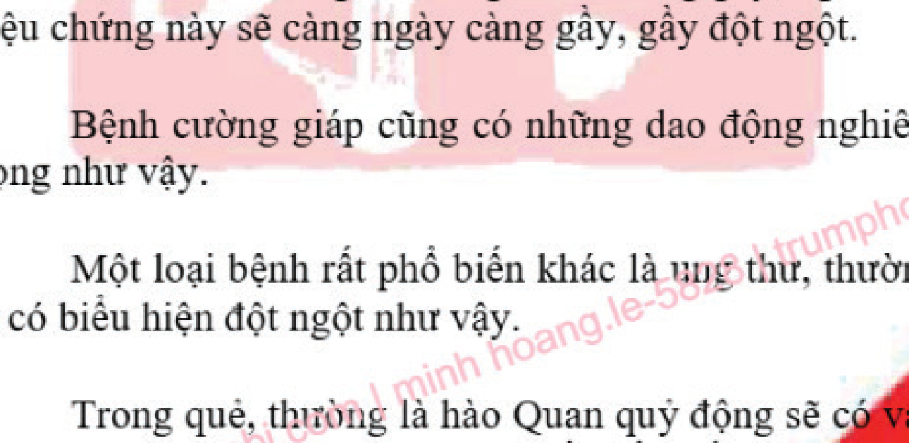

- **Cấu trúc Quẻ Dịch:**
  - **Quẻ chủ:** **Bát Thuần Ly** (Cung Ly – Quẻ Lục Xung)  
    *Tượng quẻ:* Hỏa Diễm Bát Phương (Lửa bốc tám phương, bệnh tình phát tác cấp tính, biến động mau lẹ, tâm trạng bồn chồn lo lắng bộc phát).
  - **Quẻ biến:** **Thiên Trạch Lý** (Cung Cấn)  
    *Tượng quẻ:* Lý Hổ Vĩ (Dẫm đuôi cọp, tình thế có nguy nan nhưng biết ứng xử thận trọng, có phương pháp điều trị kiểm soát thì hữu kinh vô hiểm).

- **Bảng chi tiết Lục hào:**

| Hào | Thế/Ứng | Lục thân (Chủ) | Can Chi | Biến động | Lục thân (Biến) | Can Chi (Biến) | Thần sát / Ghi chú | Lục thú |
|:---:|:---:|:---|:---|:---:|:---|:---|:---|:---|
| 6 | **Thế** | Huynh Đệ | Tị - Hỏa | tĩnh | Tử Tôn | Tuất - Thổ | Tuần không, Nguyệt kiến, Quý nhân | Bạch Hổ |
| 5 | | Tử Tôn | Mùi - Thổ | **X (Động)** | Thê Tài | Thân - Kim | Dịch mã, Nguyệt hợp Nhật xung (Hiện trạng) | Đằng Xà |
| 4 | | Thê Tài | Dậu - Kim | tĩnh | Huynh Đệ | Ngọ - Hỏa | Tướng tinh | Câu Trần |
| 3 | **Ứng** | Quan Quỷ | Hợi - Thủy | **O (Động)** | Tử Tôn | Sửu - Thổ | Kiếp sát, Lộc thần, Nguyệt phá Nhật hợp | Chu Tước |
| 2 | | Tử Tôn | Sửu - Thổ | **X (Động)** | Phụ Mẫu | Mão - Mộc | Thiên hỷ | Thanh Long |
| 1 | | Phụ Mẫu | Mão - Mộc | tĩnh | Huynh Đệ | Tị - Hỏa | Đào hoa, Quý nhân | Huyền Vũ |

---

### 3. Dụng thần & Loại quẻ

- **Phân loại quẻ:**
  - **Quẻ Tâm thái vấn tật bệnh:** Đương số hỏi cơ thể có vấn đề gì không khi thấy cân nặng sụt giảm dị thường; bản chất là tâm lý lo âu sợ hãi bệnh tật nan y. Trong quẻ tâm thái, **Quan Quỷ** đại diện cho mầm bệnh, tai họa và sự lo lắng bất an; **Tử Tôn** đại diện cho thuốc men, sinh khí, sự an tâm và khả năng trừ họa diệt quỷ.
  - **Quẻ Lục Xung biến Lý:** Lục Xung chủ sự việc bộc phát chớp nhoáng, phát bệnh cấp tính trong ngắn hạn nhưng mau chóng lộ rõ chân tướng để can thiệp.

- **Định vị Dụng thần & Đối tượng:**
  1. **Hào Thế (Huynh Đệ Tị Hỏa lâm Bạch Hổ):** Đại diện cho bản thân người hỏi. Tị Hỏa tuy lâm Nguyệt kiến nhưng rơi vào Tuần không, biểu thị thể trạng đang bị suy giảm thực chất (không phòng thủ tốt).
  2. **Ưu thần / Bệnh tật (Quan Quỷ Hợi Thủy lâm Ứng):** Mang Lộc thần, Kiếp sát, ngự tại hào 3 vị trí bụng dưới / đường tiêu hóa, chính là đầu mối bất thường khiến cân nặng sụt giảm.
  3. **Hỷ thần / Khắc Quỷ (Tử Tôn Mùi Thổ và Tử Tôn Sửu Thổ):** Là lực lượng bình an, giải độc trừ bệnh.
  4. **Hào biến Thê Tài Thân Kim (hào 5):** Thần sát Dịch mã, được Nguyệt hợp Tị Thân và Nhật xung Thân Dần, biểu thị hiện trạng chuyển hóa của cơ thể.

---

### 4. Luận giải chi tiết

Quẻ này là bài học mẫu mực về việc ứng dụng kiến thức y học thường thức kết hợp biện chứng Lục Hào, đặc biệt là cơ chế "Vật cực tất phản" khi có quá nhiều hào Tử Tôn cùng vây khắc Quan Quỷ:

#### 1. Y học thường thức đối chiếu tượng Lục Hào
- Chu Thần Bân đặt vấn đề: Người không đau yếu mà cân nặng đột nhiên giảm 20 cân, trong y học thông thường xuất hiện ở ba nhóm bệnh chính:
  - *Bệnh ung thư / khối u ác tính:* Thường hào Quan Quỷ hành Kim, Câu Trần hoặc Dịch mã kết khối phát động.
  - *Bệnh cường giáp / rối loạn miễn dịch:* Thường phát động ở các hào cao (hào 5 hoặc hào 6, vị trí cổ họng và đầu ngực).
  - *Bệnh tiểu đường:* Ăn nhiều nhưng sụt cân nhanh, gầy rộc đột ngột do cơ thể không chuyển hóa được đường trong máu.
- Đối chiếu vào quẻ:
  - Bệnh hào nằm ở hào 3 **Quan Quỷ Hợi Thủy**. Thủy không phải là Kim, không mang Câu Trần nên không phải khối u ác tính. Hào phát động ở hạ quái (hào 2 và hào 3) chứ không phải thượng quái nên không phải tuyến giáp.
  - Hợi Thủy lâm Chu Tước: Chu Tước chủ hỏa nhiệt, máu huyết, mạch máu; Thủy chủ chất lỏng, dịch cơ thể. Thủy mang Chu Tước chính là máu huyết trong cơ thể có nhiệt hoặc biến chất.
  - Hợi Thủy mang **Lộc thần**: Lộc thần chủ ăn uống, dinh dưỡng, tinh hoa ngũ cốc hấp thụ. Lộc thần lâm Thủy Quỷ mang Chu Tước phát động chỉ rõ vấn đề nằm ở sự chuyển hóa dinh dưỡng và đường huyết trong máu.

#### 2. Cơ chế "Quá mức sinh biến" (Vật cực tất phản)
- Thông thường trong quẻ tâm thái:
  - Tử Tôn động khắc Quan Quỷ là điềm tốt, tượng tiêu tai hết bệnh.
  - Quan Quỷ động mà hóa hồi đầu khắc (Hợi Thủy hóa Sửu Thổ) là "Quỷ táng vô ưu", không có họa hại lớn.
- Tuy nhiên tại quẻ này xuất hiện dị tượng đặc biệt:
  - Hào 3 Quan Quỷ Hợi Thủy phát động tự hóa Tử Tôn Sửu Thổ hồi đầu khắc.
  - Hào 2 Tử Tôn Sửu Thổ phát động trực tiếp khắc Quan Quỷ Hợi Thủy.
  - Hào 5 Tử Tôn Mùi Thổ phát động cùng xông vào vây khắc Hợi Thủy.
- Tổng cộng có tới **ba hào Thổ cùng phát động bao vây khắc phạt một hào Hợi Thủy**! Chu Thần Bân phân tích sâu sắc: Nếu cơ thể thực sự hoàn toàn khỏe mạnh không tỳ vết thì chỉ cần một hào Tử Tôn khắc Quỷ là đủ yên lòng. Khi xuất hiện tới ba hào Thổ vây khắc một hào Thủy thì lực lượng đã vượt quá mức cân bằng bình thường. Cái gì quá mức thì trở thành phản tác dụng (*vật cực tất phản*), biểu thị trong thời gian ngắn cơ thể chắc chắn đang xảy ra biến động vượt ngưỡng cực đoan, chỉ số nội tiết bị lệch pha dữ dội.

#### 3. Trạng thái Nhật Nguyệt và Hào biến mang hiện trạng
- Hào 5 **Tử Tôn Mùi Thổ** động hóa **Thê Tài Thân Kim**:
  - Thân Kim gặp Nguyệt lệnh Tỵ Hỏa lục hợp (Tỵ Thân hợp), lại bị Nhật kiến Dần Mộc tương xung (Dần Thân xung). Hiện tượng này không gọi là Nhật phá thông thường mà là "Nguyệt hợp Nhật xung" – tượng trưng cho một **hiện trạng khách quan đang diễn ra ngay lúc gieo quẻ**, có giá trị xác thực trong thời gian ngắn.
- Hào 3 **Quan Quỷ Hợi Thủy**:
  - Bị Nguyệt lệnh Tỵ Hỏa xung (Nguyệt phá), nhưng lại được Nhật kiến Dần Mộc lục hợp (Dần Hợi hợp). Đây là hiện tượng "Nguyệt phá Nhật hợp", đối lập hoàn chỉnh với hào biến Thân Kim. Cả hai thông tin đều hội tụ chỉ về hiện trạng: mầm bệnh đã phát tác thực tế trong cơ thể, chỉ số sinh hóa đang bị khuấy đảo dữ dội.

---

### 5. Kết luận & Ứng kỳ thực tế

- **Lời giải đoán của Chu Thần Bân:**
  - Khẳng định ngay với đương số: Cơ thể trong thời gian ngắn chắc chắn có vấn đề vượt ngưỡng, không thể chủ quan.
  - Loại trừ hoàn toàn u ác tính ung thư hay bệnh tuyến giáp; xác định trọng tâm vấn đề nằm ở hệ tuần hoàn máu và dinh dưỡng, cụ thể là **chỉ số đường huyết bất thường (bệnh tiểu đường)**. Khuyên đương số lập tức đi bệnh viện làm xét nghiệm máu tổng quát.
- **Phản hồi thực tế từ đương số:**
  - Sau khi đi bệnh viện kiểm tra chỉ số sinh hóa máu, kết quả xác nhận: **Chỉ số đường huyết (Glucose) cao gấp bốn lần giá trị bình thường**, bác sĩ chẩn đoán mắc bệnh tiểu đường thể cấp tính cần phác đồ điều trị lập tức.
- **Ứng kỳ chiêm nghiệm:**
  - Ứng nghiệm ngay trong ngày đi khám bệnh sau khi gieo quẻ, quẻ Lục xung báo hiệu sự việc lộ diện tức thì không trì hoãn.

---

### 6. Bài học tâm pháp & Quy tắc cốt lõi

- **Các quy tắc Lục Hào rút ra từ ca thực chiến:**
  - *Quy tắc quẻ Lục xung và hiện tượng Hào biến không xem là Nhật phá khi đoán bệnh cấp tính* (trích Cổ Thệ Chân Thuyên, trang 14): Khi hào biến đồng thời thụ Nguyệt hợp và Nhật xung, hoặc hào lâm Nguyệt phá mà Nhật hợp, đó là tiêu chí của hiện trạng đang tồn tại khách quan, không được coi là hào biến vô dụng hay phá tán hư hao.
  - *Quy tắc Vật cực tất phản trong quẻ Tâm thái:* Một hào Tử Tôn khắc Quỷ là điềm an; nhiều hào Tử Tôn cùng phát động vây khắc tàn bạo một hào Quỷ là tượng lực lượng đối kháng quá mức, chỉ số sinh học vượt ngưỡng bình thường.
- **Bài học kinh nghiệm trong tâm pháp giải đoán thực tế:**
  - Người luận dịch không được tách rời tri thức đời sống và y học thường thức. Phải biết kết hợp tượng Lục thân, Ngũ hành, Thần sát với triệu chứng lâm sàng cụ thể để định vị chính xác bệnh chứng (Thủy + Chu Tước + Lộc thần = dịch máu mang dinh dưỡng = bệnh đường huyết).

## THỰC CHIẾN 57: ĐỆ TỬ TỰ GIEO QUẺ HỎI VỀ XU HƯỚNG HỌC Y HỌC CỔ TRUYỀN

---

### 1. Bối cảnh & Câu hỏi

- **Bối cảnh chi tiết:** 
  Một người đệ tử của Chu Thần Bân vốn có trình độ Dịch học rất xuất sắc, đã xây dựng được danh tiếng và một mạng lưới quan hệ xã hội cao cấp nhờ thực lực chiêm đoán. Đồng thời, người này từ trước cũng có sẵn niềm đam mê và chút nền tảng về Đông y (Y học cổ truyền). Gần đây, đệ tử này nảy sinh ý định đầu tư thời gian mua sách vở tài liệu về tự học thêm y học cổ truyền để nâng cao chuyên môn, bèn tự gieo một quẻ Dịch để vấn trắc xu hướng phát triển và triển vọng tương lai của việc học này.
- **Tâm lý & Câu hỏi ẩn ý:** 
  Đương số tràn đầy hứng khởi muốn kiêm toàn cả hai lĩnh vực: vừa làm chuyên gia Dịch học, vừa trở thành danh y Đông y (*Nhất tiễn song điêu*). Câu hỏi đặt ra là xu hướng học y học cổ truyền sẽ ra sao, nhưng ẩn ý là muốn xem việc mở rộng thêm kỹ năng này có mang lại thành tựu rực rỡ và giá trị ứng dụng thực tiễn bền vững hay không.
- **Thời gian chiêm đoán:**
  - Dương lịch: Ngày 14 tháng 8 năm 2016, lúc 11 giờ 02 phút.
  - Can chi: Năm Bính Thân, tháng Bính Thân, ngày Mậu Thìn, giờ Mậu Ngọ.

---

### 2. Dữ kiện & Bảng quẻ Crop

- **Thời không chiêm nghiệm:**
  - Tháng Bính Thân (Kim vượng, Thủy tướng, Hỏa tuyệt, Thổ sinh, Mộc tuyệt).
  - Ngày Mậu Thìn (Thổ vượng, Kim tướng, Mộc suy, Thủy khố).
  - Tuần không: **Tuất, Hợi** (Giáp Tý tuần trung, Tuất Hợi không vong; hào 5 Quan Quỷ Tuất Thổ lâm Tuần không).
- **Thần sát:**
  - Tướng tinh: Tý (Lâm hào 1 và hào 6 Huynh Đệ)
  - Hoa cái: Thìn (Lâm Nhật kiến và hào 3 Quan Quỷ)
  - Dịch mã: Dần (Lâm hào Thế Tử Tôn)
  - Tai sát: Ngọ
  - Mưu tinh: Tuất (Lâm hào Ứng Quan Quỷ)
  - Đào hoa: Dậu
  - Kiếp sát: Tỵ
  - Lộc thần: Tỵ
  - Dương nhẫn: Ngọ
  - Văn xương: Thân (Lâm Nguyệt kiến và hào 4 Phụ Mẫu)
  - Thiên y: Mùi
  - Thiên hỷ: Thìn
  - Quý nhân: Sửu, Mùi

- Dữ kiện bảng quẻ và các thông số chiêm đoán:
  - **Bảng 57.1** Đồ hình quẻ Thực chiến 57:
    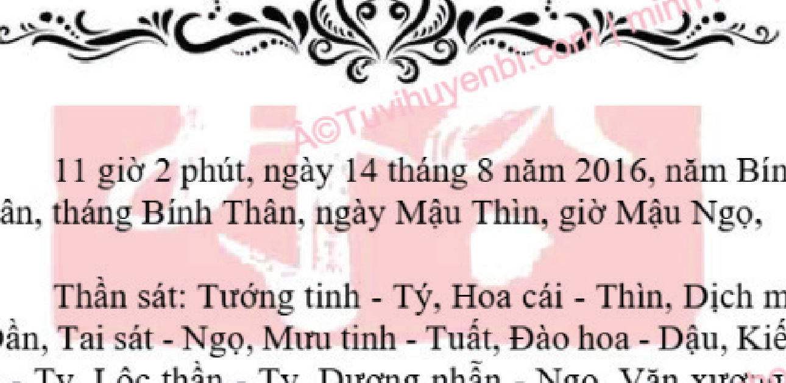

- **Cấu trúc Quẻ Dịch:**
  - **Quẻ chủ:** **Thủy Lôi Truân** (Cung Khảm)  
    *Tượng quẻ:* Khởi Điệp Sinh Thấu (Mầm non mới nhú còn non nớt, giai đoạn tích lũy ban đầu nhiều gian nan trắc trở, cần tập trung dồn sức).
  - **Quẻ biến:** **Thủy Sơn Kiển** (Cung Đoài)  
    *Tượng quẻ:* Bộ Bộ Nan Hành (Từng bước khó khăn, gặp chướng ngại trở lực trên đường tiến bước, đòi hỏi phải biết dừng lại đúng lúc).

- **Bảng chi tiết Lục hào:**

| Hào | Thế/Ứng | Lục thân (Chủ) | Can Chi | Biến động | Lục thân (Biến) | Can Chi (Biến) | Thần sát / Phục thần | Lục thú |
|:---:|:---:|:---|:---|:---:|:---|:---|:---|:---|
| 6 | | Huynh Đệ | Tý - Thủy | tĩnh | Huynh Đệ | Tý - Thủy | Tướng tinh | Chu Tước |
| 5 | **Ứng** | Quan Quỷ | Tuất - Thổ | tĩnh (Ám động) | Quan Quỷ | Tuất - Thổ | Tuần không, Mưu tinh, Nhật xung thành Ám động | Thanh Long |
| 4 | | Phụ Mẫu | Thân - Kim | tĩnh | Phụ Mẫu | Thân - Kim | Nguyệt kiến, Văn xương (Dụng thần kỹ năng) | Huyền Vũ |
| 3 | | Quan Quỷ | Thìn - Thổ | **X (Động)** | Phụ Mẫu | Thân - Kim | Hoa cái, Nhật kiến, Phục Thê Tài Ngọ Hỏa | Bạch Hổ |
| 2 | **Thế** | Tử Tôn | Dần - Mộc | tĩnh | Thê Tài | Ngọ - Hỏa | Dịch mã, Nguyệt phá, Nhật sinh | Đằng Xà |
| 1 | | Huynh Đệ | Tý - Thủy | **O (Động)** | Quan Quỷ | Thìn - Thổ | Tướng tinh | Câu Trần |

---

### 3. Dụng thần & Loại quẻ

- **Phân loại quẻ:**
  - **Quẻ Vấn học tập & Cầu kỹ năng nghề nghiệp:** Đương số hỏi về triển vọng học thêm một bộ môn tri thức mới.
  - **Cơ chế Dụng thần hai tầng:**
    - *Tầng 1 (Kỹ năng học thuật):* Lấy hào **Phụ Mẫu Thân Kim** mang thần sát Văn Xương làm Dụng thần đại diện cho tri thức, sách vở và trình độ tiếp thu.
    - *Tầng 2 (Bộ môn cụ thể):* Nguyên thần sinh Phụ Mẫu chính là hành Thổ (Quan Quỷ Thổ). Trong quẻ có hai hào Thổ đại diện cho hai môn học khác nhau đang giằng co thu hút tinh lực của đương số: **Quan Quỷ Tuất Thổ** (môn Y học cổ truyền mới dự định học) và **Quan Quỷ Thìn Thổ** (bộ môn Dịch học hiện tại đang tinh thông).

- **Định vị Dụng thần & Hào Thế:**
  1. **Hào Thế (Tử Tôn Dần Mộc):** Bản thân người đệ tử. Dần Mộc bị Nguyệt lệnh Thân Kim tương xung (Nguyệt phá), nhưng được Nhật kiến Thìn Thổ dưỡng và hào động Tý Thủy sinh trợ.
  2. **Dụng thần kỹ năng (Phụ Mẫu Thân Kim):** Lâm Nguyệt kiến, mang Văn Xương vô cùng vượng tướng.
  3. **Môn Y học cổ truyền (Hào 5 Ứng Quan Quỷ Tuất Thổ):** Mang Mưu tinh (kế hoạch, dự định), lâm Tuần không nhưng bị Nhật Thìn tương xung (xung không thành Ám động).
  4. **Môn Dịch học hiện tại (Hào 3 Quan Quỷ Thìn Thổ & Tam hợp Thủy cục):** Lâm Nhật kiến, động hóa Phụ Mẫu Thân Kim, kết hợp hào 1 Tý Thủy tạo thành Tam hợp Thân - Tý - Thìn sinh vượng hào Thế.

---

### 4. Luận giải chi tiết

Chu Thần Bân cùng người đệ tử đã tiến hành mổ xẻ quẻ tượng bằng tư duy hệ thống sắc bén, vạch rõ mâu thuẫn cốt tử giữa việc mở rộng học thuật và bảo toàn nguồn lực:

#### 1. Định vị kế hoạch học Y qua Hào Ứng Tuất Thổ
- Hào Ứng **Quan Quỷ Tuất Thổ** lâm Tuần không, mang thần sát **Mưu tinh**. Mưu tinh chủ mưu tính, hoạch định kế hoạch. Tuất Thổ bị Nhật lệnh Thìn Thổ trực xung phá không, trở thành **Ám động**.
- Ám động phản ánh việc đương số đã bắt đầu hành động gấp gáp: hào mang Thiên hỷ, ứng với việc anh ta vừa ra hiệu sách mua một lượng lớn sách y học cổ truyền kinh điển mang về nhà để chuẩn bị kế hoạch tự học miệt mài.
- Tuất Thổ sinh Phụ Mẫu Thân Kim: Việc học này về mặt lý thuyết có thể tiếp thu được tri thức cơ bản, bước đầu tích lũy được một số hiểu biết về Đông y.

#### 2. Xung đột căn bản giữa Hào Thế và Dụng thần Kỹ năng
- Trong nguyên lý chiêm đoán việc học kỹ năng:
  - Nếu Dụng thần Phụ Mẫu sinh Thế hoặc Thế sinh Dụng thần là điềm thuận lợi tiếp thu và ứng dụng.
  - Tại quẻ này, Dụng thần **Phụ Mẫu Thân Kim** lại trực tiếp **tương xung tương khắc Hào Thế Tử Tôn Dần Mộc** (Dần Thân tương xung, Kim khắc Mộc). Hào Thế lại đang lâm Nguyệt phá.
  - Quy tắc Cổ thệ chỉ rõ: Khi hỏi về việc học tập kỹ năng mà hào Thế bị Dụng thần xung khắc dữ dội, biểu thị quá trình học sẽ tạo ra áp lực tâm lý quá tải, sức lực không kham nổi, và kết cục sau cùng là **không thể đưa kỹ năng đó vào thực tế ứng dụng được**, rốt cuộc phải bỏ dở giữa chừng.

#### 3. Cục diện Tam hợp Thân - Tý - Thìn và Vấn đề "Nhất tâm nhị dụng"
- Quẻ có hào 1 **Huynh Đệ Tý Thủy** động biến Thìn Thổ, hào 3 **Quan Quỷ Thìn Thổ** động biến Thân Kim. Cùng với Nguyệt lệnh Thân Kim, quẻ tạo thành trọn vẹn **Tam hợp Thủy cục Thân – Tý – Thìn**:
  - Cục diện Tam hợp Huynh Đệ Tý Thủy cực vượng, mang thần sát Quý nhân và cung Mộc Dục (chủ tình cảm gắn kết, mạng lưới xã hội mở rộng).
  - Tam hợp Thủy cục này dồn toàn bộ nguồn năng lượng khổng lồ tương sinh trực tiếp cho **Hào Thế Tử Tôn Dần Mộc** (Thủy sinh Mộc).
  - Đây chính là hình tượng môn **Dịch học** mà người đệ tử đã dày công gây dựng: năng lực Dịch học xuất sắc đã tạo nên một mạng lưới quan hệ xã hội danh giá bao quanh anh ta, đem lại nguồn lợi ích thực tế và danh tiếng bền vững.
- Mâu thuẫn kịch liệt giữa hai hào Thổ:
  - Hào 5 **Tuất Thổ** (kế hoạch học Y) đối xung trực diện với hào 3 **Thìn Thổ** (cốt lõi của Tam hợp Dịch học).
  - Nếu đương số quyết tâm dồn thời gian và năng lượng theo đuổi Y học cổ truyền (kích hoạt Tuất Thổ xung Thìn), lập tức cấu trúc Tam hợp Thân - Tý - Thìn sẽ bị phá vỡ (*Tuất xung Thìn phá cục*).
  - Hệ quả tất yếu: Thời gian và tinh lực của một con người là có hạn. Dồn sức cho Đông y thì sẽ bỏ bê Dịch học, làm lung lay và tan rã mạng lưới nhân mạch quý báu đang sinh lợi cho mình. Đó chính là bi kịch "Một tâm hai dụng" (*Nhất tâm nhị dụng*), rốt cuộc cả hai đều lỡ dở.

---

### 5. Kết luận & Ứng kỳ thực tế

- **Lời đàm đạo và Quyết định của người đệ tử:**
  - Người đệ tử sau khi tự nhìn rõ cấu trúc tương xung giữa Tuất Thổ và Thìn Thổ trên bàn quẻ, lập tức ngộ ra chân lý và nói với Chu Thần Bân: *"Nhìn vào quẻ này, tôi biết ngay rằng học y học cổ truyền sẽ triệt tiêu ưu thế Dịch học hiện tại. Dịch học của tôi đang phát triển cực tốt, mang lại nền tảng quan hệ xã hội vững chắc. Nếu chia sẻ năng lượng sang Đông y, cuối cùng vừa không dùng được Đông y, vừa làm hỏng mạng lưới Dịch học đã dày công xây dựng. Vì vậy, tôi quyết định dứt khoát không học y nữa!"*
- **Nhận định và lời khen của Chu Thần Bân:**
  - Chu Thần Bân hết lời tán thưởng: Giải quẻ hoàn toàn chuẩn xác và quyết định vô cùng sáng suốt. Đứng trước sự giằng co giữa "cá và tay gấu", người trí tuệ phải biết dũng cảm buông bỏ để tập trung vào ưu thế cốt lõi.
- **Ứng kỳ chiêm nghiệm:**
  - Đương số dừng ngay kế hoạch tự học y khoa, thu hồi tinh lực tập trung 100% vào Dịch học ứng dụng, mạng lưới học thuật và quan hệ xã hội tiếp tục phát triển hưng thịnh.

---

### 6. Bài học tâm pháp & Quy tắc cốt lõi

- **Các quy tắc Lục Hào rút ra từ ca thực chiến:**
  - *Nguyên tắc phân chia tinh lực và thời gian (Nhất tâm nhị dụng) khi học thêm kỹ năng mới qua tượng quẻ Truân biến Kiển* (trích Cổ Thệ Chân Thuyên, trang 20): Khi quẻ xuất hiện hai Nguyên thần cùng sinh Dụng thần nhưng đối xung lẫn nhau (Tuất Thổ xung Thìn Thổ), phản ánh tình trạng tranh chấp thời gian và phân tán nguồn lực giữa hai định hướng học tập.
  - *Quy tắc Dụng thần xung khắc Hào Thế khi cầu kỹ năng:* Dụng thần Phụ Mẫu xung khắc hào Thế Tử Tôn biểu thị kỹ năng mới gây áp lực quá tải, học mà không thể hành, cuối cùng tất phải từ bỏ.
- **Bài học kinh nghiệm trong tâm pháp giải đoán thực tế:**
  - Lục Hào không chỉ dự trắc cát hung sự việc mà còn là công cụ hoạch định chiến lược cuộc đời. Phải biết nhận diện cục diện Tam hợp tương sinh hào Thế để giữ vững "nền tảng căn bản" (core competency), không để những mục tiêu phụ làm tan rã ưu thế cạnh tranh lớn nhất của bản thân.

## THỰC CHIẾN 58: HỎI TÌNH HÌNH TĂNG GIẢM GIÁ THAN CỐC TỐI NAY

---

### 1. Bối cảnh & Câu hỏi

- **Bối cảnh chi tiết:** 
  Một nhà đầu tư giao dịch hợp đồng tương lai hàng hóa (futures) đang theo dõi sát sao diễn biến thị trường than cốc. Vào phiên giao dịch tối ngày 03 tháng 07 năm 2017, trước giờ mở cửa phiên đêm, người này tự gieo một quẻ Dịch để dự trắc xu hướng tăng giảm của giá than cốc trong tối hôm đó.
- **Tâm lý & Câu hỏi ẩn ý:** 
  Đương số là người giao dịch hàng ngày, đã có sẵn phân tích kỹ thuật và kinh nghiệm thực chiến trên thị trường tài chính. Về mặt ý niệm chủ quan trước khi gieo quẻ, người này nhận định giá than cốc phiên tối nay sẽ điều chỉnh giảm. Đương số gieo quẻ với tâm thế muốn "xác chứng" xem nhận định kỹ thuật của mình có chính xác hay không, hoặc liệu có cơ hội kiếm lợi nhuận từ việc bán khống hay không.
- **Thời gian chiêm đoán:**
  - Dương lịch: Ngày 03 tháng 07 năm 2017.
  - Giờ Bắc Kinh: Giờ Canh Thân.
  - Can chi: Năm Đinh Dậu, tháng Bính Ngọ, ngày Quý Dậu, giờ Canh Thân.

---

### 2. Dữ kiện & Bảng quẻ Crop

- **Thời không chiêm nghiệm:**
  - Tháng Bính Ngọ (Hỏa vượng, Thổ tướng, Mộc hưu, Thủy tuyệt, Kim suy).
  - Ngày Quý Dậu (Kim vượng, Thủy tướng, Mộc tuyệt, Thổ hưu, Hỏa phế).
  - Tuần không: **Tuất, Hợi** (Giáp Tý tuần trung, Tuất Hợi không vong; hào 6 Thê Tài Tuất Thổ và hào 2 Phụ Mẫu Hợi Thủy lâm Tuần không).
- **Thần sát:**
  - Tướng tinh: Dậu (Lâm Nhật kiến và hào Thế Quan Quỷ)
  - Hoa cái: Sửu (Lâm hào 1 Thê Tài)
  - Dịch mã: Hợi (Lâm Tuần không và hào 2 Phụ Mẫu)
  - Tai sát: Mão
  - Mưu tinh: Mùi (Lâm hào biến Thê Tài)
  - Đào hoa: Ngọ (Lâm Nguyệt kiến và hào 4 Tử Tôn)
  - Kiếp sát: Dần (Lâm Phục thần Huynh Đệ)
  - Lộc thần: Tý
  - Dương nhẫn: Hợi (Lâm Tuần không)
  - Văn xương: Mão
  - Thiên y: Tỵ
  - Thiên hỷ: Sửu
  - Quý nhân: Mão, Tỵ

- Dữ kiện bảng quẻ và các thông số chiêm đoán:
  - **Bảng 58.1** Đồ hình quẻ Thực chiến 58:
    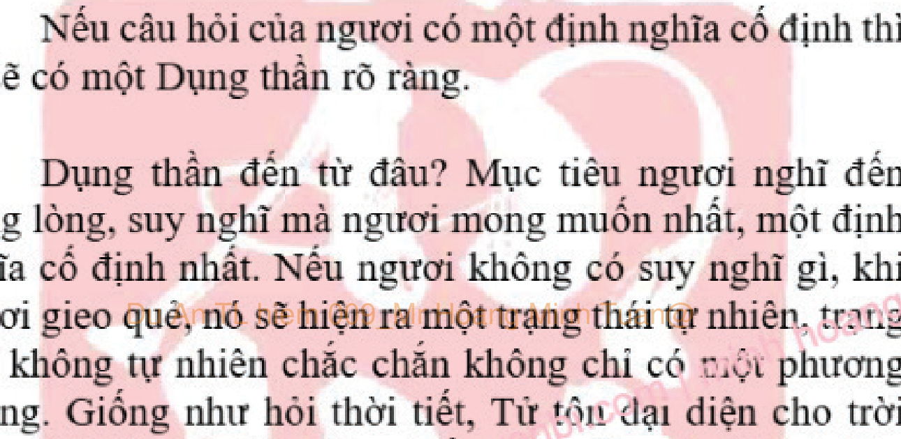

- **Cấu trúc Quẻ Dịch:**
  - **Quẻ chủ:** **Lôi Phong Hằng** (Cung Chấn)  
    *Tượng quẻ:* Nhật Nguyệt Thường Minh (Lâu dài, ổn định theo đà quán tính cũ, nhưng đang tích lũy năng lượng chờ biến động).
  - **Quẻ biến:** **Trạch Phong Đại Quá** (Cung Chấn – Quẻ Du Hồn)  
    *Tượng quẻ:* Đống Nhiêu Cột Yếu (Gánh vác quá tải, biến động vượt ngưỡng bình thường, nguy cơ lỡ nhịp cơ hội đầu tư).

- **Bảng chi tiết Lục hào:**

| Hào | Thế/Ứng | Lục thân (Chủ) | Can Chi | Biến động | Lục thân (Biến) | Can Chi (Biến) | Thần sát / Phục thần | Lục thú |
|:---:|:---:|:---|:---|:---:|:---|:---|:---|:---|
| 6 | **Ứng** | Thê Tài | Tuất - Thổ | tĩnh | Thê Tài | Mùi - Thổ | Tuần không | Bạch Hổ |
| 5 | | Quan Quỷ | Thân - Kim | **X (Động)** | Quan Quỷ | Dậu - Kim | Động hóa Tiến thần | Đằng Xà |
| 4 | | Tử Tôn | Ngọ - Hỏa | tĩnh | Phụ Mẫu | Hợi - Thủy | Nguyệt kiến, Đào hoa | Câu Trần |
| 3 | **Thế** | Quan Quỷ | Dậu - Kim | tĩnh | Quan Quỷ | Dậu - Kim | Nhật kiến, Tướng tinh | Chu Tước |
| 2 | | Phụ Mẫu | Hợi - Thủy | tĩnh | Phụ Mẫu | Hợi - Thủy | Tuần không, Dịch mã, Phục Huynh Dần Mộc | Thanh Long |
| 1 | | Thê Tài | Sửu - Thổ | tĩnh | Thê Tài | Sửu - Thổ | Hoa cái, Thiên hỷ | Huyền Vũ |

---

### 3. Dụng thần & Loại quẻ

- **Phân loại quẻ trong giao dịch tài chính:**
  Chu Thần Bân chỉ rõ trong thị trường tài chính phái sinh và chứng khoán có 3 loại hình quẻ cốt lõi, đòi hỏi phải xác định Dụng thần hoàn toàn khác nhau:
  1. *Quẻ Tự nhiên (Natural Hexagram):* Người gieo quẻ là người quan sát thuần túy đứng ngoài thị trường, không giữ vị thế mua/bán, tâm không yêu ghét tăng hay giảm. Lúc này không có Dụng thần đơn nhất, mà gán 6 thân cho 6 trạng thái tự nhiên của thị trường (Phụ Mẫu = bán tháo; Thê Tài = lợi nhuận/tăng giá; Huynh Đệ = tổn thất; Quan Quỷ = rung lắc biến động chấn động).
  2. *Quẻ Sự (Event Hexagram):* Người gieo đang trực tiếp nắm giữ hợp đồng hoặc cổ phiếu, hỏi tăng giảm là hỏi trực tiếp về túi tiền được - mất của mình. Đây là quẻ cầu tài thuần túy, bắt buộc lấy **Thê Tài** làm Dụng thần.
  3. *Quẻ Tâm thái (State-of-Mind Hexagram):* Người gieo không giữ vị thế nhưng có tâm lý được - mất, lo lắng bán hớ, hoặc đã có nhận định kỹ thuật chủ quan muốn dùng quẻ để xác chứng. Lúc này, **Quan Quỷ** đại diện cho sự trái với mong muốn, bất ngờ, lo lắng hoặc phán đoán sai lầm; **Tử Tôn** đại diện cho sự hài lòng, đi đúng nhận định chủ quan.
- **Định vị Dụng thần trong ca Thực chiến 58:**
  - Ca này thuộc **Quẻ Tâm thái mang tính định vị chủ quan**: Người hỏi đã phân tích kỹ thuật và chủ quan cho rằng giá than cốc tối nay sẽ giảm. Quẻ gieo ra nhằm kiểm chứng nhận định chủ quan này.
  - Hào phát động duy nhất trong quẻ là hào 5 **Quan Quỷ Thân Kim** động hóa **Quan Quỷ Dậu Kim** (Tiến thần).

---

### 4. Luận giải chi tiết

Qua ca thực chiến này, Chu Thần Bân giảng giải sâu sắc về cơ chế tâm lý ảnh hưởng đến quẻ tượng và cách biện chứng hào Quan Quỷ phát động:

#### 1. Góc nhìn Quẻ Tự nhiên: Trạng thái chấn động (Rung lắc)
- Nếu xét theo mô hình Quẻ Tự nhiên: Hào Quan Quỷ đại diện cho trạng thái chấn động, biến động rung lắc mạnh. Hào 5 Quan Quỷ Thân Kim động hóa Tiến thần Dậu Kim biểu thị lực rung lắc ngày càng tăng biên độ.
- Tùy vào xu thế lớn đang tăng hay giảm của thị trường: nếu đang trong sóng tăng thì đây là nhịp rung lắc hồi lưu (pullback); nếu đang trong sóng giảm thì đây là nhịp tạm nghỉ giữa chừng rồi tiếp tục giằng co.
- Tuy nhiên, Chu Thần Bân vạch rõ: Đối với những người giao dịch thực tế hàng ngày có phân tích kỹ thuật, hầu như không thể gieo ra Quẻ Tự nhiên thực sự, vì tâm thức của họ luôn bị chi phối bởi vị thế, kỳ vọng và nhận định chủ quan.

#### 2. Góc nhìn Quẻ Tâm thái: Lệch pha với nhận định chủ quan
- Vì đương số là nhà đầu tư chuyên nghiệp, trước khi gieo quẻ đã định hình trong đầu nhận định than cốc sẽ điều chỉnh giảm:
  - Khi tâm trí đã có một định nghĩa chủ quan (cho rằng giá giảm), quẻ tượng không còn là bức tranh khách quan vô tư nữa, mà trở thành sự phản chiếu mức độ ăn khớp giữa ý niệm chủ quan và thực tế khách quan.
  - Trong Quẻ Tâm thái:
    - Nếu quẻ hiện **Tử Tôn động**: Thực tế sẽ đi đúng với dự đoán chủ quan (giá giảm như tính toán), đem lại niềm vui và sự an tâm cho người hỏi.
    - Nếu quẻ hiện **Quan Quỷ động**: Thực tế sẽ đi **hoàn toàn trái ngược với mong muốn và định vị chủ quan**. Người hỏi phán đoán giá giảm, nhưng thực tế giá lại tăng mạnh hoặc biến động khốc liệt theo hướng ngược lại, khiến người hỏi thất vọng, lỡ cơ hội hoặc bị dừng lỗ.
- Tại quẻ này, hào 5 **Quan Quỷ Thân Kim** lâm Đằng Xà phát động hóa **Dậu Kim Tiến thần**:
  - Hóa Tiến thần biểu thị lực biến động ngược chiều càng lúc càng mạnh mẽ, không những không giảm mà còn bật tăng vượt ngoài dự liệu.
  - Quẻ biến là **Trạch Phong Đại Quá** (Du hồn): Tượng trưng cho sự "vượt quá tầm kiểm soát", biểu thị thị trường sẽ chạy lệch pha hoàn toàn so với nhận định ban đầu của đương số, khiến đương số bỏ lỡ cơ hội kiếm lời hoặc bị cuốn trôi nếu đi ngược chiều.

#### 3. Tâm pháp quản trị vốn và tâm lý trong đầu tư tài chính
- Chu Thần Bân đúc kết kinh nghiệm hơn 20 năm giao dịch:
  - Giao dịch tài chính là lĩnh vực khó đoán định nhất của Dịch học vì tâm lý con người thay đổi từng giây từng phút theo bảng điện tử. Khi tâm lý dao động quá lớn (đặt cược quá nhiều tiền, full tài khoản), tuyệt đối không được gieo quẻ vì quẻ sẽ phản chiếu sự hoảng loạn.
  - Muốn ứng dụng Dịch học vào đầu tư, tiên quyết phải có phương pháp quản trị vốn nghiêm ngặt (dưới 50% trong thị trường đi ngang, dưới 30% trong thị trường giảm), chỉ gieo quẻ khi tâm thế bình hòa để xác nhận tính khả thi của hệ thống giao dịch.

---

### 5. Kết luận & Ứng kỳ thực tế

- **Lời giải đoán của Chu Thần Bân:**
  - Nhận định chủ quan của đương số (rằng giá than cốc tối nay giảm) chắc chắn sẽ bị thị trường bác bỏ.
  - Hào Quan Quỷ hóa Tiến thần báo hiệu thị trường tối nay sẽ không giảm như mong đợi mà sẽ biến động dữ dội theo chiều hướng tăng hoặc rung lắc cực mạnh ngoài dự tính.
  - Lời khuyên: Tuyệt đối không được mở vị thế bán khống dựa trên nhận định chủ quan ban đầu, cần kiềm chế hành động để tránh rơi vào bẫy thị trường của quẻ Đại Quá.
- **Phản hồi thực tế từ đương số:**
  - Phiên giao dịch tối hôm đó, giá than cốc mở cửa và nhanh chóng tăng vọt, hoàn toàn trái ngược với nhận định kỹ thuật giảm giá trước đó của người hỏi. Nhờ có quẻ Dịch cảnh báo Quan Quỷ hóa Tiến thần, người này đã không vào lệnh bán khống, tránh được một cú thua lỗ nặng nề do đi ngược chiều thị trường.
- **Ứng kỳ chiêm nghiệm:**
  - Ứng nghiệm ngay trong phiên giao dịch tối ngày 03 tháng 07 năm 2017 (giờ Thân - Dậu sau khi gieo quẻ).

---

### 6. Bài học tâm pháp & Quy tắc cốt lõi

- **Các quy tắc Lục Hào rút ra từ ca thực chiến:**
  - *Quy tắc phân biệt Quẻ Sự và Quẻ Tâm thái trong dự đoán biến động tài chính, hàng hóa phái sinh* (trích Cổ Thệ Chân Thuyên, trang 31):
    + Nếu đang giữ tài sản/hợp đồng: Lấy Thê Tài làm Dụng thần (Quẻ Sự - cầu tài).
    + Nếu không giữ tài sản nhưng có định vị chủ quan hoặc tâm lý được - mất: Lấy Quan Quỷ và Tử Tôn làm Dụng thần (Quẻ Tâm thái). Quan Quỷ động báo hiệu kết quả ngược với kỳ vọng chủ quan; Tử Tôn động báo hiệu kết quả trùng khớp với dự tính.
  - *Quy tắc Hóa Tiến Thần của Quan Quỷ trong quẻ Tâm thái:* Quan Quỷ lâm Đằng Xà động hóa Tiến thần biểu thị mối lo ngại và sự sai lệch phán đoán sẽ leo thang mạnh mẽ, tuyệt đối không được bướng bỉnh chống lại xu thế.
- **Bài học kinh nghiệm trong tâm pháp giải đoán thực tế:**
  - Định vị Dụng thần không phụ thuộc vào câu từ phát ra nơi cửa miệng người hỏi, mà phụ thuộc vào trạng thái tâm thức sâu kín bên trong (*"Dụng thần đến từ mục tiêu ngươi nghĩ đến trong lòng"*). Phải phân tích rõ đương số đang ở tâm thế nào để chọn đúng lăng kính giải quẻ.

## THỰC CHIẾN 59: ĐẤU GIÁ CĂN NHÀ Ở THIỀN THÀNH, PHẬT SƠN CÓ THÀNH CÔNG KHÔNG?

---

### 1. Bối cảnh & Câu hỏi

- **Bối cảnh chi tiết:** 
  Một nhà đầu tư bất động sản muốn tham gia phiên đấu giá tư pháp để mua một căn nhà cũ tọa lạc tại quận Thiền Thành, thành phố Phật Sơn, tỉnh Quảng Đông. Bản thân người này không có hộ khẩu tại Phật Sơn. Vào thời điểm bấy giờ, chính quyền Phật Sơn đã áp dụng chính sách "hạn chế mua" (hạn cấu lệnh) đối với nhà ở thông thường (yêu cầu người ngoại tỉnh phải đóng bảo hiểm xã hội đủ 2 năm), nhưng theo quy chế pháp lý hiện hành lúc đó thì nhà đấu giá tư pháp không nằm trong diện bị hạn chế. Người này đã chuẩn bị đầy đủ vốn liếng và thủ tục, bèn tìm đến Chu Thần Bân xin gieo một quẻ Dịch để dự đoán xem liệu mình có đấu giá thành công căn nhà này hay không.
- **Tâm lý & Câu hỏi ẩn ý:** 
  Đương số rất tâm đắc với căn nhà ở khu vực trung tâm quận Thiền Thành và tin tưởng vào kẻ hở chính sách của nhà đấu giá tư pháp để sở hữu bất động sản. Câu hỏi trực tiếp là có đấu giá thành công hay không, nhưng ẩn ý bên trong là trắc nghiệm xem mức độ cạnh tranh có gay gắt không và có vướng mắc rủi ro pháp lý nào khiến thương vụ bất thành hay không.
- **Thời gian chiêm đoán:**
  - Dương lịch: Ngày 31 tháng 5 năm 2017, lúc 15 giờ 28 phút.
  - Giờ Bắc Kinh: Giờ Canh Thân.
  - Can chi: Năm Đinh Dậu, tháng Ất Tỵ, ngày Mậu Ngọ, giờ Canh Thân.

---

### 2. Dữ kiện & Bảng quẻ Crop

- **Thời không chiêm nghiệm:**
  - Tháng Ất Tỵ (Hỏa vượng, Thổ tướng, Kim trường sinh, Mộc hưu, Thủy tuyệt).
  - Ngày Mậu Ngọ (Hỏa vượng, Thổ tướng, Mộc tử, Thủy tuyệt, Kim suy).
  - Tuần không: **Tý, Sửu** (Giáp Dần tuần trung, Tý Sửu không vong; hào 1 Tử Tôn Sửu Thổ lâm Tuần không).
- **Thần sát:**
  - Tướng tinh: Ngọ (Lâm Nhật kiến)
  - Hoa cái: Tuất (Lâm hào biến Tử Tôn)
  - Dịch mã: Thân (Lâm Thời chi)
  - Tai sát: Tý
  - Mưu tinh: Thìn
  - Đào hoa: Mão (Lâm Phục thần Phụ Mẫu)
  - Kiếp sát: Hợi (Lâm Hào Thế Quan Quỷ)
  - Lộc thần: Tỵ (Lâm Nguyệt kiến và hào 6 Huynh Đệ)
  - Dương nhẫn: Ngọ (Lâm Nhật kiến)
  - Văn xương: Thân
  - Thiên y: Thìn
  - Thiên hỷ: Sửu (Lâm hào phi Tử Tôn)
  - Quý nhân: Sửu, Mùi

- Dữ kiện bảng quẻ và các thông số chiêm đoán:
  - **Bảng 59.1** Đồ hình quẻ Thực chiến 59:
    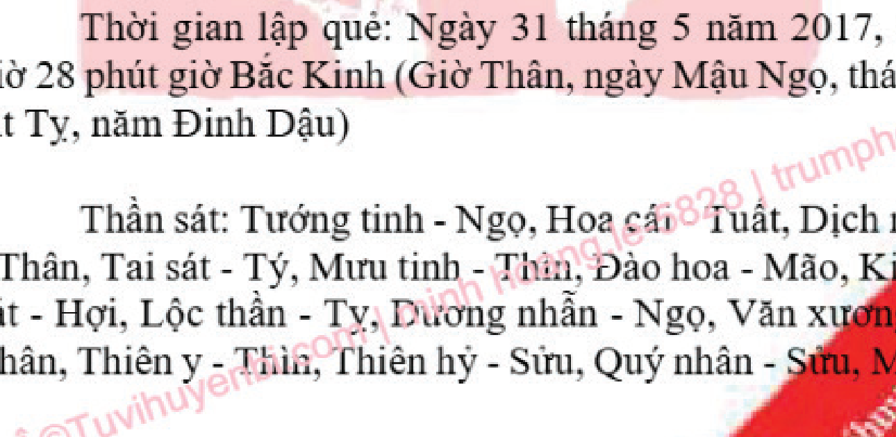

- **Cấu trúc Quẻ Dịch:**
  - **Quẻ chủ:** **Hỏa Phong Đỉnh** (Cung Ly)  
    *Tượng quẻ:* Đỉnh Trọng Đương Đầu (Cái đỉnh báu vững chắc, phẩm chất bất động sản rất tốt, vị trí đắc địa, tạo nên sức hút tranh mua cực lớn).
  - **Quẻ biến:** **Lôi Phong Hằng** (Cung Chấn)  
    *Tượng quẻ:* Nhật Nguyệt Thường Minh (Lâu dài không đổi; đương số cầm tiền đi mua nhưng kết cục vẫn giữ nguyên trạng thái cũ, không mua được).

- **Bảng chi tiết Lục hào:**

| Hào | Thế/Ứng | Lục thân (Chủ) | Can Chi | Biến động | Lục thân (Biến) | Can Chi (Biến) | Thần sát / Phục thần | Lục thú |
|:---:|:---:|:---|:---|:---:|:---|:---|:---|:---|
| 6 | | Huynh Đệ | Tị - Hỏa | **O (Động)** | Tử Tôn | Tuất - Thổ | Nguyệt kiến, Lộc thần | Chu Tước |
| 5 | **Ứng** | Tử Tôn | Mùi - Thổ | tĩnh | Thê Tài | Thân - Kim | Quý nhân | Thanh Long |
| 4 | | Thê Tài | Dậu - Kim | tĩnh | Huynh Đệ | Ngọ - Hỏa | | Huyền Vũ |
| 3 | | Thê Tài | Dậu - Kim | tĩnh | Thê Tài | Dậu - Kim | | Bạch Hổ |
| 2 | **Thế** | Quan Quỷ | Hợi - Thủy | tĩnh | Quan Quỷ | Hợi - Thủy | Kiếp sát, Nguyệt phá, Nhật tuyệt | Đằng Xà |
| 1 | | Tử Tôn | Sửu - Thổ | tĩnh | Tử Tôn | Sửu - Thổ | Tuần không, Thiên hỷ, Phục Phụ Mão Mộc | Câu Trần |

---

### 3. Dụng thần & Loại quẻ

- **Phân loại quẻ:**
  - **Quẻ Sự vấn mua bất động sản / Đấu giá tư pháp:** Đương số hỏi việc mua căn nhà cụ thể, lấy hào **Phụ Mẫu** làm Dụng thần đại diện cho bất động sản, giấy tờ nhà đất và quyền sở hữu.
- **Định vị Dụng thần & Phục thần:**
  1. **Dụng thần Phụ Mẫu Mão Mộc (Phục thần):** Tàng phục dưới hào 1 Tử Tôn Sửu Thổ.
     - *Xét Phục thần:* Phụ Mẫu Mão Mộc trên Nhật Nguyệt không bị Nhật phá, Nguyệt phá, cũng không rơi vào Tuần không.
     - *Xét Hào phi:* Hào phi Tử Tôn Sửu Thổ ngự tại hào 1 lại lâm **Tuần không**. Theo quy tắc Phục thần trong quẻ Sự: Hào phi lâm không vong là tượng "phi không phục xuất" (vỏ rỗng thì mầm trồi lên), biểu thị Dụng thần có cơ hội xuất hiện, trên danh nghĩa căn nhà hoàn toàn có thể mua được.
  2. **Hào Thế (Quan Quỷ Hợi Thủy):**
     - Đương số lâm Quan Quỷ vì đang ở tư cách người tham gia đấu giá (Quan Quỷ là Nguyên thần sinh Dụng thần Phụ Mẫu, biểu thị tư cách người đang xúc tiến giao dịch).
     - Hào Thế bị Nguyệt lệnh Tỵ Hỏa xung (Nguyệt phá), lại gặp Nhật kiến Ngọ Hỏa tuyệt địa, mang Kiếp sát lâm Đằng Xà. Hào Thế suy nhược cùng cực.
  3. **Đối thủ & Chính sách (Huynh Đệ Tị Hỏa mang Chu Tước):**
     - Huynh Đệ lâm Nguyệt kiến mang Lộc thần cực vượng phát động, trực tiếp xung khắc phá nát Hào Thế Quan Quỷ Hợi Thủy.

---

### 4. Luận giải chi tiết

Quẻ này là minh chứng kinh điển cho trình độ giải mã biểu tượng Lục Hào đỉnh cao của Chu Thần Bân, từ mức độ cạnh tranh thông thường đến việc nhìn thấu sự thay đổi chính sách vĩ mô của nhà nước:

#### 1. Luận giải tầng cơ bản: Cạnh tranh khốc liệt dẫn đến thất bại
- Quẻ chủ **Hỏa Phong Đỉnh**: Đỉnh là vật báu, tượng trưng căn nhà có vị trí và pháp lý hấp dẫn, thu hút rất nhiều nhà đầu tư sừng sỏ nhảy vào tranh mua.
- Nhật Nguyệt là Tỵ Hỏa và Ngọ Hỏa đều là đồng loại với hào 6 Huynh Đệ Tị Hỏa. Điều này biểu thị số lượng đối thủ cạnh tranh đông đảo và nguồn tài lực của họ cực kỳ hùng hậu.
- Hào 6 **Huynh Đệ Tị Hỏa** mang Chu Tước phát động:
  - Chu Tước chủ văn thư, miệng lưỡi, tiếng hô hào; trong bối cảnh đấu giá trực tuyến, đây chính là hình tượng **liên tục giơ bảng trả giá** và cạnh tranh giá công khai.
  - Hào Huynh Đệ mang Nguyệt lệnh phát động xông thẳng vào xung phá Hào Thế Quan Quỷ Hợi Thủy. Trong khi Hào Thế vừa lâm Nguyệt phá, vừa suy nhược, bị Huynh Đệ xung thẳng một đòn là tan vỡ hoàn toàn.
- Quẻ biến **Lôi Phong Hằng**: Hằng là lâu dài không đổi. Đương số vốn cầm tiền đi mua nhà, nhưng kết cục tình hình vẫn y nguyên không đổi, tức là vẫn cầm tiền ra về mà không sở hữu được căn nhà.

#### 2. Luận giải tầng nâng cao: Giải mã chính sách vĩ mô "Hạn chế mua" (Hạn cấu lệnh)
Chu Thần Bân đi sâu phân tích cấu trúc hào để giải mã cơ chế chính sách ẩn giấu:
- Vị trí địa lý của căn nhà: Phụ Mẫu Mão Mộc phục dưới sơ hào Tử Tôn Sửu Thổ mang Câu Trần. Sơ hào là tầng trệt/mặt đất, Câu Trần chủ công trình lâu năm; đây chính là khu phố cổ trung tâm quận Thiền Thành (trung tâm lâu đời nhất của thành phố Phật Sơn).
- Phạm vi tư cách mua nhà:
  - Hào Tử Tôn đại diện cho dòng tiền đầu tư và phạm vi đối tượng được phép tham gia. Ban đầu căn nhà nằm dưới Tử Tôn Sửu Thổ, tức nằm trong phạm vi được phép đấu giá mua.
  - Khi Huynh Đệ Tị Hỏa phát động, biến ra **Tử Tôn Tuất Thổ**:
    + Xét theo tiến thoái ngũ hành thổ: Tuất Thổ là Thoái thần so với Sửu Thổ, biểu thị **phạm vi đối tượng được mua bị thu hẹp đáng kể**.
    + Tuất là Mộ khố của Hỏa: Nghĩa là sau khi thu hẹp phạm vi, chính sách chỉ cho phép các đối tượng mang tính chất "Hỏa" (người có hộ khẩu bản địa Phật Sơn hoặc đóng bảo hiểm xã hội tại địa phương) tham gia.
    + Hào Thế của đương số là **Hợi Thủy**, hoàn toàn không thuộc tính Hỏa, nên bị loại trừ thẳng thừng ra khỏi Mộ khố Tuất Thổ!
  - Huynh Đệ mang Chu Tước biến Tử Tôn trực xung phá Thế: Chu Tước đại diện cho văn bản thông báo, sắc lệnh hành chính của cơ quan quản lý. Đây là biểu tượng hoàn hảo của **Chính sách hạn chế mua nhà (Hạn cấu lệnh)** đột ngột ban hành, trực tiếp tước đoạt quyền tham gia đấu giá của đương số!

---

### 5. Kết luận & Ứng kỳ thực tế

- **Lời giải đoán của Chu Thần Bân:**
  - Báo trước với đương số: Mức độ cạnh tranh cực kỳ khốc liệt và quẻ xuất hiện hình tượng rõ rệt của chính sách hạn chế mua nhà can thiệp loại trừ tư cách của người mua ngoại tỉnh. Đương số khó lòng sở hữu được căn nhà này.
- **Phản hồi thực tế từ đương số:**
  - Diễn biến chính sách nhanh đến mức kinh ngạc:
    + Ngay sau khi gieo quẻ 1-2 ngày, chính quyền Phật Sơn liên tiếp công bố văn bản khẩn cấp nâng cấp chính sách hạn chế mua nhà cũ đối với người ngoại tỉnh.
    + Chưa đầy một tuần sau, Cục Nhà đất và Quản lý Đô thị Phật Sơn tiếp tục ban hành văn bản quy định bổ sung: **Chính thức áp dụng hạn chế mua đối với cả nhà đấu giá tư pháp**, yêu cầu người tham gia đấu giá phải đáp ứng đầy đủ điều kiện về hộ khẩu và bảo hiểm xã hội như nhà ở thương mại.
  - Kết quả: Đương số lập tức bị tước quyền tham gia đấu giá, hồ sơ bị hủy tư cách, thương vụ hoàn toàn chấm dứt.
- **Ứng kỳ chiêm nghiệm:**
  - Ứng nghiệm chỉ trong vòng **1 tuần** sau ngày lập quẻ (trong tuần Giáp Dần, ứng vào các ngày Mùi, Thân công bố chính sách mới).

---

### 6. Bài học tâm pháp & Quy tắc cốt lõi

- **Các quy tắc Lục Hào rút ra từ ca thực chiến:**
  - *Quy tắc mã hóa chính sách vĩ mô và hình tượng tước quyền tham gia đấu giá bất động sản qua hào Huynh đệ mang Chu Tước biến Tử tôn* (trích Cổ Thệ Chân Thuyên, trang 40): Khi Huynh đệ mang Chu Tước lâm Nguyệt lệnh phát động biến Tử tôn Thoái thần (Sửu thoái sang Tuất) và trực xung Hào Thế, đó là điềm báo văn bản chính sách nhà nước siết chặt điều kiện, thu hẹp diện đối tượng được phép giao dịch và tước bỏ tư cách của người hỏi.
  - *Quy tắc Hào phi lâm không vong trong quẻ Sự:* Hào phi gặp Không vong thì Phục thần dễ xuất hiện; tuy nhiên việc thành hay bại cuối cùng vẫn do độ vượng suy của Hào Thế và sự tác động của Hào động quyết định.
- **Bài học kinh nghiệm trong tâm pháp giải đoán thực tế:**
  - Người luận giải Lục Hào phải có hiểu biết sâu sắc về pháp luật, chính sách kinh tế và cơ chế vận hành thị trường hiện đại. Khi quẻ xuất hiện dị tượng hào động xung Thế kèm thần thú Chu Tước, phải nhạy bén liên tưởng đến yếu tố văn bản pháp quy can thiệp chứ không đơn thuần chỉ là đối thủ trả giá cao hơn.

## THỰC CHIẾN 60: BỘ PHẬN SỬA CHỮA ĐIỆN TỬ NÀY CÓ THỂ SỬA ĐƯỢC BỆNH MÀN HÌNH MÁY TÍNH BỊ NHẤP NHÁY CỦA TÔI KHÔNG

---

### 1. Bối cảnh & Câu hỏi

- **Bối cảnh chi tiết:** 
  Máy tính cá nhân của đương số bị lỗi kỹ thuật nghiêm trọng: màn hình liên tục chớp giật nhấp nháy không thể sử dụng bình thường. Đương số tìm được một trung tâm / bộ phận sửa chữa điện tử chuyên dụng và băn khoăn không biết tay nghề ở đây có khắc phục triệt để được lỗi này hay không. Trước khi mang thiết bị đến sửa, đương số tự gieo một quẻ Dịch để dự trắc kết quả.
- **Tâm lý & Câu hỏi ẩn ý:** 
  Đương số mang tâm lý vừa lo lắng máy tính bị hỏng nặng tốn kém chi phí, vừa đắn đo về năng lực kỹ thuật của cơ sở sửa chữa được chỉ định. Câu hỏi mang tính lựa chọn rõ rệt: cơ sở này có đủ trình độ sửa dứt điểm lỗi nhấp nháy hay sẽ làm máy hỏng thêm hoặc phát sinh các lỗi kỹ thuật khác.
- **Thời gian chiêm đoán:**
  - Dương lịch: Ngày 17 tháng 6 năm 2017, lúc 11 giờ 36 phút.
  - Giờ Bắc Kinh: Giờ Nhâm Ngọ.
  - Can chi: Năm Đinh Dậu, tháng Bính Ngọ, ngày Ất Hợi, giờ Nhâm Ngọ.

---

### 2. Dữ kiện & Bảng quẻ Crop

- **Thời không chiêm nghiệm:**
  - Tháng Bính Ngọ (Hỏa vượng, Thổ tướng, Mộc hưu, Thủy tuyệt, Kim suy).
  - Ngày Ất Hợi (Thủy vượng, Mộc tướng, Kim hưu, Thổ tuyệt, Hỏa thai).
  - Tuần không: **Thân, Dậu** (Giáp Tuất tuần trung, Thân Dậu không vong; hào 5 Huynh Đệ Dậu Kim lâm Tuần không, hào biến Thân Kim lâm Tuần không).
- **Thần sát:**
  - Tướng tinh: Mão (Lâm Lộc thần)
  - Hoa cái: Mùi (Lâm hào 6 Phụ Mẫu)
  - Dịch mã: Tỵ
  - Tai sát: Dậu (Lâm hào 5 Huynh Đệ)
  - Mưu tinh: Sửu
  - Đào hoa: Tý
  - Kiếp sát: Thân
  - Lộc thần: Mão
  - Dương nhẫn: Dần (Lâm Hào Thế Thê Tài)
  - Văn xương: Ngọ (Lâm Nguyệt kiến, hào 3 Quan Quỷ)
  - Thiên y: Tỵ
  - Thiên hỷ: Sửu
  - Quý nhân: Thân, Tý

- Dữ kiện bảng quẻ và các thông số chiêm đoán:
  - **Bảng 60.1** Đồ hình quẻ Thực chiến 60:
    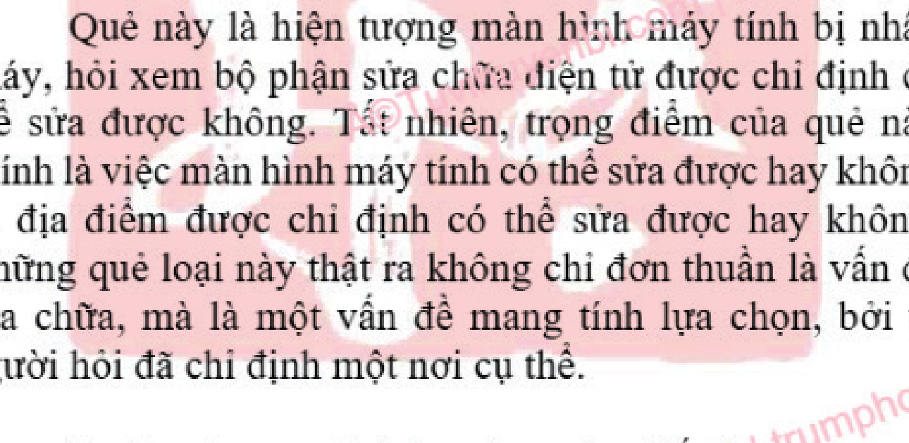

- **Cấu trúc Quẻ Dịch:**
  - **Quẻ chủ:** **Trạch Thủy Khốn** (Cung Đoài – Quẻ Lục Hợp)  
    *Tượng quẻ:* Tương Lục Cố Khốn (Bị vây hãm, trục trặc bế tắc; thiết bị gặp lỗi kỹ thuật khó chịu làm gián đoạn công việc).
  - **Quẻ biến:** **Thủy Địa Tỷ** (Cung Càn – Quẻ Quy Hồn)  
    *Tượng quẻ:* Thủy Địa Thân Mật (Hòa hợp tương trợ; quay trở về trạng thái ổn định, máy móc vận hành bình thường trở lại).

- **Bảng chi tiết Lục hào:**

| Hào | Thế/Ứng | Lục thân (Chủ) | Can Chi | Biến động | Lục thân (Biến) | Can Chi (Biến) | Thần sát / Ghi chú | Lục thú |
|:---:|:---:|:---|:---|:---:|:---|:---|:---|:---|
| 6 | | Phụ Mẫu | Mùi - Thổ | tĩnh | Tử Tôn | Tý - Thủy | Hoa cái | Huyền Vũ |
| 5 | | Huynh Đệ | Dậu - Kim | tĩnh | Phụ Mẫu | Tuất - Thổ | Tuần không, Tai sát | Bạch Hổ |
| 4 | **Ứng** | Tử Tôn | Hợi - Thủy | **O (Động)** | Huynh Đệ | Thân - Kim | Nhật kiến, hóa hồi đầu sinh (Thân Kim Tuần không giả) | Đằng Xà |
| 3 | | Quan Quỷ | Ngọ - Hỏa | tĩnh | Thê Tài | Mão - Mộc | Nguyệt kiến, Văn xương | Câu Trần |
| 2 | | Phụ Mẫu | Thìn - Thổ | **O (Động)** | Quan Quỷ | Tị - Hỏa | Hóa hồi đầu sinh (Tị Hỏa bị Nhật xung thành Ám động) | Chu Tước |
| 1 | **Thế** | Thê Tài | Dần - Mộc | tĩnh | Phụ Mẫu | Mùi - Thổ | Dương nhẫn, được Nhật Hợi sinh hợp | Thanh Long |

---

### 3. Dụng thần & Loại quẻ

- **Phân loại quẻ:**
  - **Quẻ Sự mang tính Lựa chọn & Đánh giá năng lực kỹ thuật:** Đương số hỏi chỉ định một địa điểm sửa chữa cụ thể xem có khắc phục được lỗi máy tính hay không.
  - Trong loại quẻ có đối tượng chỉ định:
    + **Hào Thế (Thê Tài Dần Mộc):** Đại diện cho bản thân người hỏi và lợi ích gắn liền với thiết bị.
    + **Hào Ứng (Tử Tôn Hợi Thủy):** Đại diện cho đối tượng được chỉ định (bộ phận kỹ thuật sửa chữa).
    + **Tử Tôn:** Đại diện cho phương thuốc, tay nghề kỹ thuật, giải pháp xử lý sự cố.
- **Định vị Dụng thần & Quan hệ sinh khắc:**
  1. Hào Ứng **Tử Tôn Hợi Thủy** lâm Nhật kiến cực vượng, phát động hóa **Huynh Đệ Thân Kim** hồi đầu sinh. Thân Kim tuy lâm Tuần không nhưng động biến không chân không (giả không), nguồn sinh dồi dào.
  2. Hào Ứng Tử Tôn Hợi Thủy sau khi phát động trực tiếp **tương sinh tương hợp Hào Thế Thê Tài Dần Mộc** (Thủy sinh Mộc, Dần Hợi lục hợp).
  3. Hào 2 **Phụ Mẫu Thìn Thổ** mang Chu Tước phát động hóa **Quan Quỷ Tị Hỏa** hồi đầu sinh, hình thành cấu trúc đối chiếu kỹ thuật.

---

### 4. Luận giải chi tiết

Chu Thần Bân đã phân tích ca quẻ này dưới lăng kính biện chứng giữa lý thuyết Lục Hào và hoàn cảnh thực tế khách quan:

#### 1. Động thái của Hào Ứng: Chỉ thị năng lực sửa chữa thành công
- Trong quẻ mang tính lựa chọn đối tượng phục vụ, hào Ứng phát động mang ý nghĩa quyết định:
  - Hào Ứng **Tử Tôn Hợi Thủy** lâm Nhật kiến phát động, mang thần sát Dương nhẫn và Đằng Xà: Dương nhẫn chủ kỹ thuật chuyên sâu, Đằng Xà chủ sự biến đổi tinh vi, thể hiện đây là đơn vị có tay nghề chuyên môn cao trong xử lý vi mạch điện tử.
  - Hào Ứng động hóa Huynh Đệ Thân Kim hồi đầu sinh: Thân Kim lâm Tuần không nhưng là hào biến nên được tính là "giả không", lực sinh trợ cho Hợi Thủy là chân thực.
  - Quan trọng nhất: Hào Ứng Hợi Thủy sau khi phát động quay sang **sinh vượng và lục hợp Hào Thế Thê Tài Dần Mộc**. Trong quẻ lựa chọn, đối tượng được chỉ định (hào Ứng) sinh trợ hào Thế là điềm báo chắc chắn đối tượng này mang lại kết quả tốt đẹp cho người hỏi. Bệnh màn hình nhấp nháy sẽ được thợ sửa chữa khắc phục triệt để.

#### 2. Hiện tượng Hào 2 Phụ Mẫu Thìn Thổ động và Lý luận "Thông tin đối chiếu"
- Quẻ có hào 2 **Phụ Mẫu Thìn Thổ** mang Chu Tước cũng phát động hóa Quan Quỷ Tị Hỏa hồi đầu sinh. Nếu xét theo quẻ thông thường, Thìn Thổ động sẽ khắc Hợi Thủy, cản trở việc cứu vớt máy tính. Nhưng tại sao Chu Thần Bân lại không kết luận như vậy?
- Chu Thần Bân đưa ra lý luận mẫu mực về **Thông tin đối chiếu (Đối chiếu tin tức)**:
  - Nếu trong thực tế người hỏi có sự so sánh giữa hai lựa chọn: ví dụ một bên là trung tâm sửa chữa chuyên nghiệp (hào Ứng Hợi Thủy), một bên là nhờ người quen hoặc bạn bè giới thiệu (hào 2 Thìn Thổ mang Chu Tước):
    + Hào Ứng sinh Thế: Nơi chuyên nghiệp sửa được.
    + Hào 2 khắc Ứng, hóa Quỷ Tị Hỏa lâm Nhật phá: Lựa chọn thứ hai không chuyên nghiệp, mang đi sửa ở đó sẽ thất bại hoặc làm máy phát sinh thêm lỗi khác. Hai hào động lúc này phản ánh hai phương án độc lập đối chiếu nhau chứ không tương tác triệt tiêu nhau.
  - Nếu trong thực tế chỉ có duy nhất một cửa hàng sửa chữa, không có phương án hai:
    + Thì hào Ứng Hợi Thủy giải quyết triệt để lỗi trước mắt (màn hình nhấp nháy).
    + Còn hào 2 Phụ Mẫu Thìn Thổ biến Quan Quỷ cảnh báo trong tương lai máy tính có thể tiềm ẩn một lỗi phần cứng khác phát sinh sau này.

---

### 5. Kết luận & Ứng kỳ thực tế

- **Lời giải đoán của Chu Thần Bân:**
  - Khẳng định bộ phận sửa chữa điện tử được chỉ định hoàn toàn có khả năng sửa được bệnh nhấp nháy màn hình. Đương số cứ yên tâm mang máy đến đó xử lý.
- **Phản hồi thực tế từ đương số:**
  - Đương số đem máy tính đến đúng trung tâm sửa chữa điện tử đã định. Thợ kỹ thuật tháo máy kiểm tra và sửa xong hoàn toàn lỗi nhấp nháy màn hình trong thời gian ngắn.
  - Chi phí sửa chữa rất hợp lý: Tổng cộng chỉ hết **60 tệ**. Máy tính hoạt động bình thường, màn hình hiển thị sắc nét trở lại.
- **Ứng kỳ chiêm nghiệm:**
  - Sửa xong ngay trong ngày Ất Hợi (hào Ứng lâm Nhật kiến chủ ứng nghiệm tức thì trong ngày).

---

### 6. Bài học tâm pháp & Quy tắc cốt lõi

- **Các quy tắc Lục Hào rút ra từ ca thực chiến:**
  - *Quy tắc tương quan giữa thông tin đối chiếu trong quẻ và thực tế khách quan khi sửa chữa thiết bị kỹ thuật* (trích Cổ Thệ Chân Thuyên, trang 48): Trong quẻ mang tính lựa chọn hoặc chỉ định đối tượng, nếu quẻ xuất hiện nhiều hào động xung đột nhau, cần đối chiếu với bối cảnh thực tế xem có tồn tại phương án so sánh hay không. Quẻ tượng là sự dẫn dắt của hiện thực, "quẻ lý thuận theo lý sự", không được gượng ép tương tác cơ học khi hai hào động đại diện cho hai thực thể đối chiếu tách biệt.
  - *Quy tắc Hào Ứng động sinh Thế trong quẻ lựa chọn dịch vụ:* Hào Ứng phát động hóa hồi đầu sinh rồi sinh nhập Hào Thế là tiêu chí bất biến của việc tìm đúng thầy đúng thợ, đối tác mang lại lợi ích và giải quyết triệt để vấn đề được giao phó.
- **Bài học kinh nghiệm trong tâm pháp giải đoán thực tế:**
  - Khi xem quẻ sự vụ đời sống (sửa chữa, hợp tác, khám bệnh), vị thế tương tác giữa Thế và Ứng là chìa khóa then chốt. Hào Ứng vượng tướng sinh Thế thì dù có gian hào hay hào khác động biến cũng chỉ là chi tiết phụ họa, không làm thay đổi cục diện cát lợi căn bản.

## THỰC CHIẾN 61: DIỄN ĐÀN LỤC HÀO TRÊN TIEBA CÓ HAI THÀNH VIÊN ĐỒNG THỜI ĐOÁN THẬT GIẢ CỦA CHU THẦN BÂN

---

### 1. Bối cảnh & Câu hỏi

- **Bối cảnh chi tiết:** 
  Chu Thần Bân lập một chuyên mục riêng và đăng các bài viết học thuật chuyên sâu trên diễn đàn Lục Hào thuộc Tieba (mạng xã hội Baidu Tieba Trung Quốc). Sự xuất hiện của một chuyên gia Lục Hào hàng đầu thu hút sự chú ý và tranh luận sôi nổi của cộng đồng mạng. Trong số đó, có hai thành viên tỏ ý hoài nghi về danh tính tác giả, bèn đồng thời cùng lập quẻ để trắc nghiệm xem: Người đang viết bài chuyên mục mang tên Chu Thần Bân kia rốt cuộc là "Chu Thần Bân thật" hay chỉ là kẻ mạo danh trên mạng. Một người lập quẻ bằng phương pháp thời gian (quẻ thời gian), người kia dùng phần mềm máy tính gieo tự động trên điện thoại.
- **Tâm lý & Câu hỏi ẩn ý:** 
  Tâm lý của cư dân mạng mang tính hiếu kỳ và ngờ vực. Trong môi trường ảo, thật giả lẫn lộn, họ muốn dùng kỹ thuật bói dịch để "bóc mẽ" hoặc "xác thực" thân phận của tác giả. Câu hỏi bề ngoài là trắc nghiệm Thật hay Giả khách quan, nhưng bên trong chứa đựng tâm thái và kỳ vọng chủ quan (muốn đối phương là chuyên gia thật để học hỏi, hoặc muốn đối phương là kẻ lừa đảo mạo danh để vạch trần).
- **Thời gian chiêm đoán:**
  - Dương lịch: Ngày 21 tháng 6 năm 2017, lúc 10 giờ 15 phút.
  - Giờ Bắc Kinh: Giờ Kỷ Tỵ.
  - Can chi: Năm Đinh Dậu, tháng Bính Ngọ, ngày Kỷ Mão, giờ Kỷ Tỵ.

---

### 2. Dữ kiện & Bảng quẻ Crop

- **Thời không chiêm nghiệm:**
  - Tháng Bính Ngọ (Hỏa vượng, Thổ tướng, Mộc hưu, Thủy tuyệt, Kim suy).
  - Ngày Kỷ Mão (Mộc vượng, Hỏa tướng, Thủy hưu, Kim tuyệt, Thổ tử).
  - Tuần không: **Thân, Dậu** (Giáp Tuất tuần trung, Thân Dậu không vong; hào 5 Huynh Đệ Dậu Kim lâm Tuần không, hào biến Thân Kim lâm Tuần không).
- **Thần sát:**
  - Tướng tinh: Mão (Lâm Nhật kiến, hào 3 Thê Tài)
  - Hoa cái: Mùi (Lâm hào 1 và hào 6 Phụ Mẫu)
  - Dịch mã: Tỵ (Lâm Thời chi, Hào Thế Quan Quỷ)
  - Tai sát: Dậu (Lâm hào 5 Huynh Đệ)
  - Mưu tinh: Sửu
  - Đào hoa: Tý
  - Kiếp sát: Thân
  - Lộc thần: Ngọ (Lâm Nguyệt kiến)
  - Dương nhẫn: Tỵ (Lâm Hào Thế Quan Quỷ)
  - Văn xương: Dậu (Lâm hào 5 Huynh Đệ)
  - Thiên y: Tỵ
  - Thiên hỷ: Sửu
  - Quý nhân: Thân, Tý

- Dữ kiện bảng quẻ và các thông số chiêm đoán:
  - **Bảng 61.1** Đồ hình quẻ Thực chiến 61:
    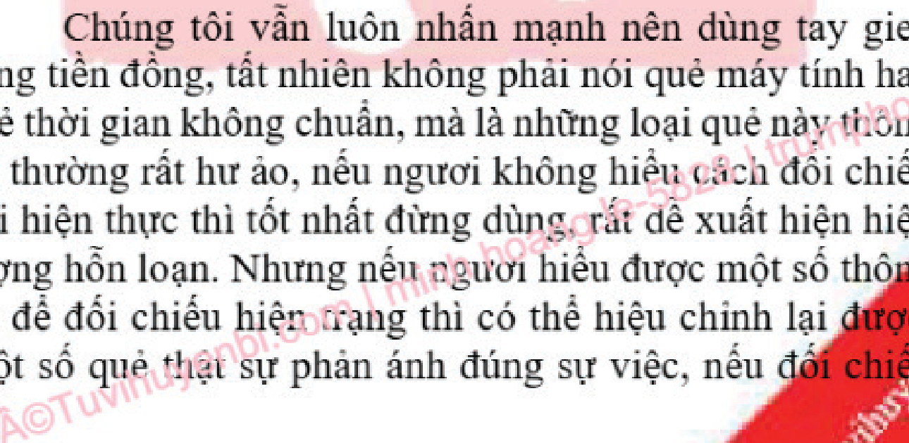

- **Cấu trúc Quẻ Dịch:**
  - **Quẻ chủ:** **Trạch Địa Tụy** (Cung Đoài)  
    *Tượng quẻ:* Ngư Ông Đắc Lợi (Tụ tập đám đông, bàn luận sôi nổi; các thành viên diễn đàn tụ họp bàn luận chuyên đề).
  - **Quẻ biến:** **Thiên Địa Bĩ** (Cung Càn – Quẻ Lục Hợp)  
    *Tượng quẻ:* Hổ Lạc Hãm Khương (Bế tắc, ngăn cách giữa người với người; sau khi làm sáng tỏ nghi ngờ thì hòa hợp kết nối bền chặt).

- **Bảng chi tiết Lục hào:**

| Hào | Thế/Ứng | Lục thân (Chủ) | Can Chi | Biến động | Lục thân (Biến) | Can Chi (Biến) | Thần sát / Ghi chú | Lục thú |
|:---:|:---:|:---|:---|:---:|:---|:---|:---|:---|
| 6 | | Phụ Mẫu | Mùi - Thổ | **X (Động)** | Phụ Mẫu | Tuất - Thổ | Hoa cái, động hóa Tiến thần | Câu Trần |
| 5 | **Ứng** | Huynh Đệ | Dậu - Kim | tĩnh (Ám động) | Huynh Đệ | Thân - Kim | Tuần không, Văn xương, Tai sát, Nhật xung thành Ám động | Chu Tước |
| 4 | | Tử Tôn | Hợi - Thủy | tĩnh | Quan Quỷ | Ngọ - Hỏa | | Thanh Long |
| 3 | | Thê Tài | Mão - Mộc | tĩnh | Thê Tài | Mão - Mộc | Nhật kiến, Tướng tinh | Huyền Vũ |
| 2 | **Thế** | Quan Quỷ | Tị - Hỏa | tĩnh | Quan Quỷ | Tị - Hỏa | Dương nhẫn, Dịch mã | Bạch Hổ |
| 1 | | Phụ Mẫu | Mùi - Thổ | tĩnh | Phụ Mẫu | Mùi - Thổ | Hoa cái | Đằng Xà |

---

### 3. Dụng thần & Loại quẻ

- **Phân loại quẻ:**
  - **Quẻ Tâm thái vấn Thật - Giả đối với nhân vật được chỉ định:** Đương số hỏi xem một nhân vật công chúng trên mạng là người thật hay kẻ giả mạo.
  - Trong quẻ vấn Thật - Giả:
    + Hào **Tử Tôn** đại diện cho cái "Thật" (chân thực, chính danh, bình thường, sự thật quang minh).
    + Hào **Quan Quỷ** đại diện cho cái "Giả" (dối trá, mờ ám, mạo danh, dị thường, tai họa).
    + Đối tượng được chỉ định để khảo sát là hào **Ứng** (người ở xa trên mạng internet): Trong quẻ này, hào 5 Huynh Đệ Dậu Kim chính là đại diện cho Chu Thần Bân.
- **Định vị Dụng thần & Chuỗi sinh hóa:**
  1. **Người được chỉ định (Hào 5 Huynh Đệ Dậu Kim):** Ngự tại hào 5 vị trí tôn quý, mang thần sát **Văn Xương** và linh thú **Chu Tước**, lâm Tuần không nhưng bị Nhật kiến Mão Mộc trực xung (xung không thành **Ám động**).
  2. **Hào sinh trợ (Hào 6 Phụ Mẫu Mùi Thổ):** Lâm Câu Trần phát động hóa Tiến thần Tuất Thổ, sinh vượng cho Huynh Đệ Dậu Kim.
  3. **Kết quả chân thực (Tử Tôn Hợi Thủy):** Được chuỗi Mùi Thổ động hóa Tuất Thổ -> sinh Dậu Kim (Ám động) -> sinh vượng Tử Tôn Hợi Thủy.

---

### 4. Luận giải chi tiết

Qua ca thực chiến đặc thù này, Chu Thần Bân truyền dạy những tâm pháp thâm sâu về việc sử dụng quẻ máy tính/quẻ thời gian và cơ chế tâm lý đảo chiều khi đoán việc Thật - Giả:

#### 1. Quan điểm về Quẻ máy tính và Quẻ thời gian
- Phái Dã Hạc Lục Hào luôn chủ trương gieo quẻ bằng tiền đồng bằng tay để kết nối ý niệm thuần khiết nhất. Tuy nhiên không hề bài xích cực đoan quẻ thời gian hay quẻ phần mềm điện thoại:
  - Trong tình huống bất khả kháng (đang đi tàu điện ngầm, đang họp, ở nơi công cộng không tiện lắc tiền đồng), việc khởi quẻ thời gian hoặc dùng phần mềm là phản ứng tự nhiên hợp cảnh hợp thời, thông tin vẫn linh ứng.
  - Nhược điểm chí mạng của quẻ máy tính/thời gian là thông tin thường mang tính **hư ảo**, dễ bị nhiễu loạn nếu người đoán không biết cách đối chiếu với hiện trạng thực tế. Chỉ người có trình độ đối chiếu hiện thực sắc bén mới có thể hiệu chỉnh và sử dụng hiệu quả loại quẻ này.

#### 2. Nhận diện nhân vật qua thần sát Văn Xương và Chu Tước
- Hào Ứng ngự tại hào 5 là **Huynh Đệ Dậu Kim**:
  - Mang linh thú **Chu Tước**: Chu Tước chủ văn tự, lời nói, đăng bài viết và tranh luận học thuật trên diễn đàn mạng internet.
  - Mang thần sát **Văn Xương**: Văn Xương là tinh hoa trí tuệ, chủ về tài năng thuật số, trình độ học thuật uyên bác và năng lực chuyên môn thực thụ.
  - Dậu Kim lâm Tuần không gặp Nhật Mão trực xung biến thành **Ám động**: Thể hiện nhân vật này đang hành động thực tế, liên tục đăng tải các bài luận chất lượng cao trên không gian mạng.

#### 3. Chuỗi sinh hóa chứng minh "Thật chứ không Giả"
- Hào 6 **Phụ Mẫu Mùi Thổ** phát động hóa **Tuất Thổ Tiến thần**: Phụ Mẫu đại diện cho bài viết, học thuyết, tài liệu thực chiến. Động hóa Tiến thần biểu thị kho tàng trước tác đồ sộ, ngày càng tiến bộ và thâm sâu.
- Phụ Mẫu Mùi Thổ (hóa Tuất Thổ) sinh trợ mạnh mẽ cho Huynh Đệ Dậu Kim (Ám động). Dậu Kim Ám động tiếp tục sinh cho hào 4 **Tử Tôn Hợi Thủy**.
- Chuỗi liên hoàn: *Phụ Mẫu động -> sinh Huynh Đệ (Ám động) -> sinh Tử Tôn*.
- Vì hào Tử Tôn được sinh vượng đến cực điểm, hoàn toàn lấn át Quan Quỷ Tị Hỏa lâm tĩnh tại hào 2, nên quẻ tượng khẳng định 100%: Người đang viết bài trên Tieba chính là **Chu Thần Bân thật**, một học giả chân tài thực học!

#### 4. Tâm pháp: Tâm thái chủ quan lấn át tính chất khách quan
- Chu Thần Bân đúc kết nguyên lý đỉnh cao khi đoán việc Thật - Giả:
  - Nếu người hỏi mang tâm lý chủ quan quá nặng (tha thiết mong đối phương là thật, hoặc cay cú muốn đối phương là kẻ lừa đảo bị lật tẩy), thì khái niệm Thật - Giả khách quan sẽ bị "cuốn xoắn" và bẻ cong theo tâm thái:
    - Nếu trong lòng tha thiết mong là Thật: Tử Tôn động = toại nguyện (là Thật); Quan Quỷ động = thất vọng (là Giả).
    - Nếu trong lòng nuôi ý muốn chứng minh là Giả (tìm cớ bới móc): Tử Tôn động = toại nguyện theo ý họ (là Giả); Quan Quỷ động = vỡ mộng, ngược ý họ (thực tế lại là Thật).
  - Do đó, người giải quẻ phải thấu thị tâm lý người hỏi trước khi kết luận hào Tử Tôn hay Quan Quỷ.

---

### 5. Kết luận & Ứng kỳ thực tế

- **Lời giải đoán của Chu Thần Bân:**
  - Khẳng định trên diễn đàn: Quẻ tượng có Văn Xương, Chu Tước và chuỗi Phụ sinh Huynh, Huynh sinh Tử Tôn vượng tướng. Người đang thảo luận và viết bài chuyên mục đích thực là Chu Thần Bân bằng xương bằng thịt, không có bất kỳ sự giả mạo hay mượn danh nào.
- **Phản hồi thực tế từ đương số:**
  - Hai thành viên gieo quẻ cùng cộng đồng diễn đàn Tieba sau khi đối chiếu văn phong, các ca thực chiến độc quyền và phong thái luận giải chuẩn xác đã hoàn toàn bị thuyết phục và thừa nhận đó chính là Chu Thần Bân chân truyền.
- **Ứng kỳ chiêm nghiệm:**
  - Ứng nghiệm ngay trong ngày Kỷ Mão trên diễn đàn thảo luận trực tuyến.

---

### 6. Bài học tâm pháp & Quy tắc cốt lõi

- **Các quy tắc Lục Hào rút ra từ ca thực chiến:**
  - *Nguyên tắc tâm thái chủ quan lấn át tính chất khách quan khi đoán sự việc Thật - Giả và hạn chế của quẻ thời gian, máy tính* (trích Cổ Thệ Chân Thuyên, trang 54): Trong quẻ tâm thái vấn Thật - Giả, khi nguyện vọng chủ quan đan xen với việc định tính khách quan, hào Tử Tôn và Quan Quỷ sẽ chuyển hóa theo cơ chế "toại nguyện" hay "trái ý". Cần bóc tách tâm lý thầm kín của người hỏi để định vị bản chất.
  - *Quy tắc Ám động của hào mang Văn Xương và Chu Tước:* Hào mang Văn Xương lâm Tuần không bị Nhật xung thành Ám động là biểu tượng của tài năng thực học đang phát tiết công khai trên văn đàn/mạng xã hội.
- **Bài học kinh nghiệm trong tâm pháp giải đoán thực tế:**
  - Không câu nệ hình thức lập quẻ nhưng phải nghiêm cẩn trong phép đối chiếu hiện thực. Với quẻ máy tính hoặc quẻ thời gian, chỉ khi các chi tiết quẻ tượng khớp với thần sát và ngữ cảnh thực tế thì mới lấy đó làm căn cứ luận quyết.

## THỰC CHIẾN 62: TRỜI MƯA LIÊN TỤC, NGÀY MAI CON TÔI THEO ÔNG NỘI LÁI XE VỀ NHÀ, LO LẮNG AN TOÀN TRÊN ĐƯỜNG

---

### 1. Bối cảnh & Câu hỏi

- **Bối cảnh chi tiết:** 
  Một học viên phái Nguyên Đạo (đồng môn của Chu Thần Bân) gặp phải tình huống trăn trở trong gia đình: Trời đổ mưa to kéo dài nhiều ngày không dứt, đường sá trơn trượt nguy hiểm. Đúng lúc đó, người con nhỏ của anh lại có kế hoạch theo ông nội (cha của người hỏi) tự lái xe hơi vượt đường xa để về quê. Trước điều kiện thời tiết mưa gió bất lợi, người cha vô cùng sốt ruột và lo lắng cho sự an nguy tính mạng của cả con lẫn cha mình trên đường đi, bèn lập một quẻ Dịch để dự trắc an toàn giao thông.
- **Tâm lý & Câu hỏi ẩn ý:** 
  Tâm lý người hỏi bất an, căng thẳng tột độ. Câu hỏi bề ngoài là hỏi về an toàn đường sá ngày mai, nhưng ẩn ý cốt lõi là nỗi sợ hãi tai nạn giao thông xe cộ, thương tật hoặc sự cố nghiêm trọng đe dọa tính mạng người thân ruột thịt.
- **Thời gian chiêm đoán:**
  - Dương lịch: Ngày 23 tháng 6 năm 2017, lúc 22 giờ 15 phút.
  - Giờ Bắc Kinh: Giờ Kỷ Hợi.
  - Can chi: Năm Đinh Dậu, tháng Bính Ngọ, ngày Tân Tỵ, giờ Kỷ Hợi.

---

### 2. Dữ kiện & Bảng quẻ Crop

- **Thời không chiêm nghiệm:**
  - Tháng Bính Ngọ (Hỏa vượng, Thổ tướng, Mộc hưu, Thủy tuyệt, Kim suy).
  - Ngày Tân Tỵ (Hỏa vượng, Thổ tướng, Kim trường sinh, Mộc hưu, Thủy tuyệt).
  - Tuần không: **Thân, Dậu** (Giáp Tuất tuần trung, Thân Dậu không vong; Phục thần Tử Tôn Thân Kim lâm Tuần không).
- **Thần sát:**
  - Tướng tinh: Dậu (Lâm Tuần không, Lộc thần)
  - Hoa cái: Sửu
  - Dịch mã: Hợi (Lâm Thời chi)
  - Tai sát: Mão
  - Mưu tinh: Mùi
  - Đào hoa: Ngọ (Lâm Nguyệt kiến, hào biến Phụ Mẫu)
  - Kiếp sát: Dần (Lâm Hào Thế Quan Quỷ)
  - Lộc thần: Dậu
  - Dương nhẫn: Thân (Lâm Tuần không)
  - Văn xương: Tý (Lâm hào 1 Thê Tài)
  - Thiên y: Tỵ (Lâm Nhật kiến)
  - Thiên hỷ: Sửu
  - Quý nhân: Dần, Ngọ (Lâm Hào Thế Dần Mộc và hào biến Phụ Mẫu Ngọ Hỏa)

- Dữ kiện bảng quẻ và các thông số chiêm đoán:
  - **Bảng 62.1** Đồ hình quẻ Thực chiến 62:
    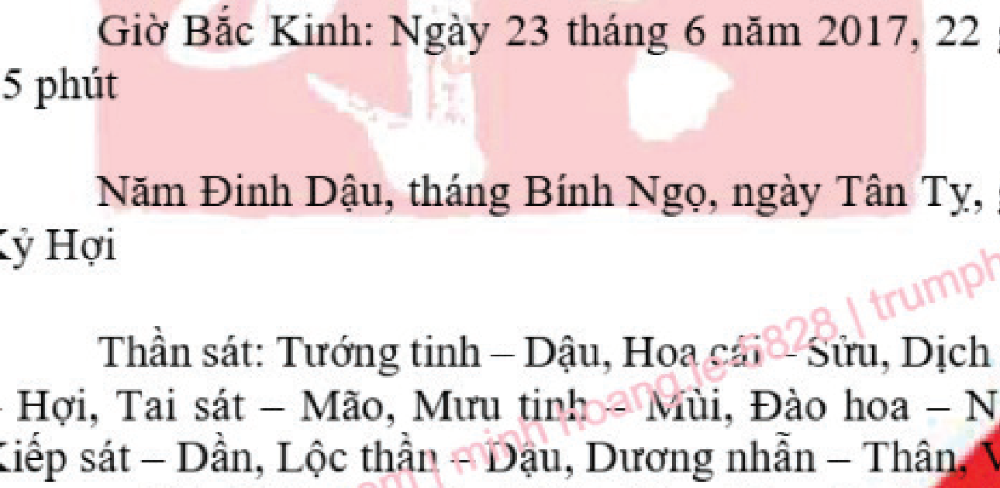

- **Cấu trúc Quẻ Dịch:**
  - **Quẻ chủ:** **Sơn Thiên Đại Súc** (Cung Cấn)  
    *Tượng quẻ:* Đồng Xa Xuất Hiền (Xe chở đồ nặng, tích lũy lo âu; người thân cùng ngồi chung một chiếc xe đi đường xa).
  - **Quẻ biến:** **Bát Thuần Cấn** (Cung Cấn – Quẻ Lục Xung)  
    *Tượng quẻ:* Trọng Sơn Quan Tỏa (Núi non trùng điệp ngăn cản hiểm họa; trong quẻ tâm thái, biến Lục Xung là điềm lành báo giải trừ mối lo, xua tan tai nạn).

- **Bảng chi tiết Lục hào:**

| Hào | Thế/Ứng | Lục thân (Chủ) | Can Chi | Biến động | Lục thân (Biến) | Can Chi (Biến) | Thần sát / Phục thần | Lục thú |
|:---:|:---:|:---|:---|:---:|:---|:---|:---|:---|
| 6 | | Quan Quỷ | Dần - Mộc | tĩnh | Quan Quỷ | Dần - Mộc | Quý nhân, Kiếp sát | Đằng Xà |
| 5 | **Ứng** | Thê Tài | Tý - Thủy | tĩnh | Thê Tài | Tý - Thủy | Nguyệt phá, Văn xương | Câu Trần |
| 4 | | Huynh Đệ | Tuất - Thổ | tĩnh | Huynh Đệ | Tuất - Thổ | | Chu Tước |
| 3 | | Huynh Đệ | Thìn - Thổ | tĩnh | Tử Tôn | Thân - Kim | Phục Tử Tôn Thân Kim (Tuần không, Dương nhẫn) | Thanh Long |
| 2 | **Thế** | Quan Quỷ | Dần - Mộc | **X (Động)** | Phụ Mẫu | Ngọ - Hỏa | Quý nhân, Kiếp sát, Phục Phụ Ngọ Hỏa, hóa tiết khí | Huyền Vũ |
| 1 | | Thê Tài | Tý - Thủy | **O (Động)** | Huynh Đệ | Thìn - Thổ | Nguyệt phá, Văn xương, hóa hồi đầu khắc | Bạch Hổ |

---

### 3. Dụng thần & Loại quẻ

- **Phân loại quẻ:**
  - **Quẻ Tâm thái vấn bình an đi đường xa:** Đương số gieo quẻ vì tâm lý lo âu trước thời tiết mưa lũ trắc trở. Bản chất quẻ là giải trừ lo âu, lấy **Quan Quỷ** làm Ưu thần (tai họa, hiểm nguy, tai nạn xe cộ), lấy **Tử Tôn** làm Hỷ thần (phúc thần bảo hộ, an toàn), lấy **Thê Tài** làm Nguyên thần sinh Quỷ (nguồn cơn tiếp sức cho tai họa).
- **Định vị Dụng thần & Tương tác động biến:**
  1. **Hào Thế (Quan Quỷ Dần Mộc):** Mang Quý nhân và Kiếp sát, phát động hóa **Phụ Mẫu Ngọ Hỏa** (hóa tiết khí, mộc sinh hỏa làm suy hao sinh lực của Quỷ).
  2. **Nguyên thần sinh Quỷ (Hào 1 Thê Tài Tý Thủy mang Bạch Hổ):** Bạch Hổ chủ huyết quang, tai nạn đổ máu; Tý Thủy lâm Nguyệt phá, phát động hóa **Huynh Đệ Thìn Thổ** hồi đầu khắc.
  3. **Quẻ biến Bát Thuần Cấn (Lục Xung):** Trong quẻ tâm thái, Lục Hợp chủ lo âu kết khối dai dẳng, còn Lục Xung chủ chấn động tan biến, lo âu tiêu tán tức thì.

---

### 4. Luận giải chi tiết

Chu Thần Bân đã trình bày một hệ thống lý luận mẫu mực về quẻ tâm thái, phân biệt rạch ròi giữa bình an trước mắt và nguy cơ tích lũy lâu dài:

#### 1. Cơ chế "Quỷ táng vô ưu" & Nguồn Quỷ bị triệt phá
- Trong quẻ tâm thái, Quan Quỷ động không nhất thiết là có thực họa:
  - Nếu Quan Quỷ động hóa Tử Tôn hồi đầu khắc, hoặc hóa Tuyệt, hóa Phá, hoặc hóa tiết khí: đều là điềm "Quỷ táng vô ưu" (mầm họa tiêu tan, không còn gì phải sợ hãi).
  - Hào sơ **Thê Tài Tý Thủy** mang Bạch Hổ là Nguyên thần trực tiếp sinh Quan Quỷ (nguồn gốc sinh ra hiểm họa giao thông):
    + Bản thân Tý Thủy đã bị Nguyệt lệnh Ngọ Hỏa tương xung (Nguyệt phá).
    + Tý Thủy phát động biến thành **Huynh Đệ Thìn Thổ** hồi đầu khắc mạnh mẽ.
    + Khi Nguyên thần sinh Quỷ bị dập tắt hoàn toàn, Quan Quỷ mất đi chỗ dựa năng lượng, không thể tác quái gây họa.
  - Hào Thế **Quan Quỷ Dần Mộc** phát động:
    + Động hóa Phụ Mẫu Ngọ Hỏa (Mộc sinh Hỏa tiết khí). Quỷ tự làm kiệt sức mình để sinh ra Phụ Mẫu.
    + Quẻ biến **Bát Thuần Cấn** là quẻ Lục Xung: Khẳng định mọi sóng gió lo sợ trong lòng người cha chỉ là hư kinh (sợ hão), trên thực tế chuyến đi sẽ thuận buồm xuôi gió, bình an vô sự.

#### 2. Biện giải chuyên sâu: "Động tất hữu nhân" – Tượng cảnh báo về lâu dài
- Chu Thần Bân đặt câu hỏi sâu sắc: Nếu chỉ đơn thuần để báo an toàn cho chuyến đi ngày mai, thì việc hào sơ Thê Tài Tý Thủy hóa hồi đầu khắc là đã đủ để định luận. Vậy tại sao Hào Thế Quan Quỷ Dần Mộc vẫn nhất quyết phải phát động?
- Đạo của Dịch là "Động tất hữu nhân" (động ắt có nguyên do sâu xa):
  - Hào sơ Thê Tài Tý Thủy lâm Bạch Hổ hóa Thìn Thổ chỉ đại diện cho tính chất **giai đoạn trước mắt**: chuyến đi ngày mai không có tai nạn.
  - Hào Thế Quan Quỷ Dần Mộc động hóa **Phụ Mẫu Ngọ Hỏa** mang Đào hoa và Quý nhân:
    + Phụ Mẫu đại diện cho xe cộ, đồng thời đại diện cho ông nội (bậc cha chú, trưởng bối).
    + Quỷ động hóa Phụ Mẫu gắn liền với hình ảnh ông nội lái xe.
    + Hào biến Phụ Mẫu Ngọ Hỏa lại đối xung trực diện với hào sơ Tý Thủy (Tý Ngọ tương xung): Đây là tượng xung đột lặp đi lặp lại nhiều lần trong chi tiết.
  - Ý nghĩa cảnh báo sâu xa: Việc để đứa cháu nhỏ ngồi xe cùng người ông lớn tuổi lái đường dài không chỉ diễn ra một lần này. Lần này mưa gió đi đường bình an, nhưng nếu gia đình chủ quan, biến điều này thành thói quen thường xuyên thì về lâu dài tiềm ẩn nguy cơ tai nạn rất cao.

---

### 5. Kết luận & Ứng kỳ thực tế

- **Lời giải đoán và Khuyến nghị của Chu Thần Bân:**
  - Khẳng định chắc nịch với người cha: Chuyến đi ngày mai hai ông cháu sẽ về đến nhà **an toàn tuyệt đối**, không cần phải lo lắng đứng ngồi không yên.
  - Lời khuyến nghị chiến lược: Về lâu dài, người ông đã có tuổi nên hạn chế tối đa việc tự lái xe đường dài, đặc biệt tuyệt đối tránh lái xe vào những tháng mưa rét mùa đông (tháng Hợi, tháng Tý) và những tháng Quan Quỷ lâm vượng (tháng Dần). Không nên để trẻ nhỏ thường xuyên đi nhờ xe của ông.
- **Phản hồi thực tế từ đương số:**
  - Ngày hôm sau, người ông lái xe đưa cháu về đến nhà bình an vô sự, hành trình suôn sẻ thuận lợi đúng như quẻ đoán.
- **Ứng kỳ chiêm nghiệm:**
  - Ứng nghiệm ngay trong ngày hôm sau (ngày Nhâm Ngọ).

---

### 6. Bài học tâm pháp & Quy tắc cốt lõi

- **Các quy tắc Lục Hào rút ra từ ca thực chiến:**
  - *Quy tắc giải trừ lo âu 'Quỷ táng vô ưu' trong quẻ tâm thái khi người thân đi đường xa thời tiết xấu* (trích Cổ Thệ Chân Thuyên, trang 57): Trong quẻ tâm thái, khi Nguyên thần của Quỷ động hóa hồi đầu khắc (nguồn Quỷ bị chặt đứt) kết hợp với quẻ biến Lục Xung, đó là dấu hiệu tuyệt đối của sự bình an, mối lo tự tan biến, hữu kinh vô hiểm.
  - *Quy tắc 'Động tất hữu nhân' và thông tin hai tầng:* Hào động thứ nhất giải quyết việc cục bộ trước mắt; hào động của Thế giải mã xu hướng tích lũy và cảnh báo hậu họa lâu dài.
- **Bài học kinh nghiệm trong tâm pháp giải đoán thực tế:**
  - Người xem quẻ không được dừng lại ở việc báo bình an nhất thời, mà phải nhìn thấu lời răn đe ẩn giấu của quẻ Dịch để đưa ra lời khuyên nhân sinh đúng đắn cho đương số (phòng ngừa rủi ro tuổi già lái xe đường dài).

## THỰC CHIẾN 63: CON THI VÀO TRƯỜNG TRUNG HỌC TRỌNG ĐIỂM CỦA THÀNH PHỐ, HỎI CÓ ĐỖ ĐƯỢC KHÔNG

---

### 1. Bối cảnh & Câu hỏi

- **Bối cảnh chi tiết:** 
  Một phụ huynh có con sắp bước vào kỳ thi tuyển sinh vào lớp 10 (chuyển cấp trung học phổ thông). Nguyện vọng lớn nhất của gia đình và đứa trẻ là thi đỗ vào ngôi trường trung học trọng điểm danh giá nhất của thành phố. Trước ngày thi, người cha/mẹ vô cùng bồn chồn lo lắng, bèn đến gặp Chu Thần Bân xin gieo một quẻ Dịch để dự trắc kết quả thi cử của con.
- **Tâm lý & Câu hỏi ẩn ý:** 
  Người hỏi mang tâm lý kỳ vọng tột bậc nhưng đồng thời chất chứa sự hoang mang, áp lực. Câu hỏi trực tiếp là con có đỗ vào trường trọng điểm không, nhưng ẩn ý bên trong là muốn kiểm tra thực lực thi cử của con liệu có đáp ứng được điểm chuẩn gắt gao của trường chuyên lớp chọn hay không.
- **Thời gian chiêm đoán:**
  - Dương lịch: Ngày 19 tháng 5 năm 2017, lúc 10 giờ 22 phút.
  - Giờ Bắc Kinh: Giờ Quý Tị.
  - Can chi: Năm Đinh Dậu, tháng Ất Tị, ngày Bính Ngọ, giờ Quý Tị.

---

### 2. Dữ kiện & Bảng quẻ Crop

- **Thời không chiêm nghiệm:**
  - Tháng Ất Tị (Hỏa vượng, Thổ tướng, Kim trường sinh, Mộc hưu, Thủy tuyệt).
  - Ngày Bính Ngọ (Hỏa cực vượng, Thổ tướng, Mộc tử, Kim bại tuyệt, Thủy tuyệt).
  - Tuần không: **Dần, Mão** (Giáp Thìn tuần trung, Dần Mão không vong; hào 2 Quan Quỷ Mão Mộc lâm Tuần không).
- **Thần sát:**
  - Tướng tinh: Ngọ (Lâm Nhật kiến)
  - Hoa cái: Tuất (Lâm hào biến Huynh Đệ)
  - Dịch mã: Thân (Lâm hào biến Tử Tôn)
  - Tai sát: Tý (Lâm Phục thần Thê Tài)
  - Mưu tinh: Thìn
  - Đào hoa: Mão (Lâm hào 2 Quan Quỷ, Tuần không)
  - Kiếp sát: Hợi
  - Lộc thần: Tị (Lâm Nguyệt kiến, hào 1 và hào 6 Phụ Mẫu)
  - Dương nhẫn: Ngọ (Lâm Nhật kiến)
  - Văn xương: Thân (Lâm hào biến Tử Tôn)
  - Thiên y: Thìn
  - Thiên hỷ: Sửu (Lâm hào 3 Huynh Đệ)
  - Quý nhân: Dậu, Hợi (Lâm Hào Thế Tử Tôn Dậu Kim)

- Dữ kiện bảng quẻ và các thông số chiêm đoán:
  - **Bảng 63.1** Đồ hình quẻ Thực chiến 63:
    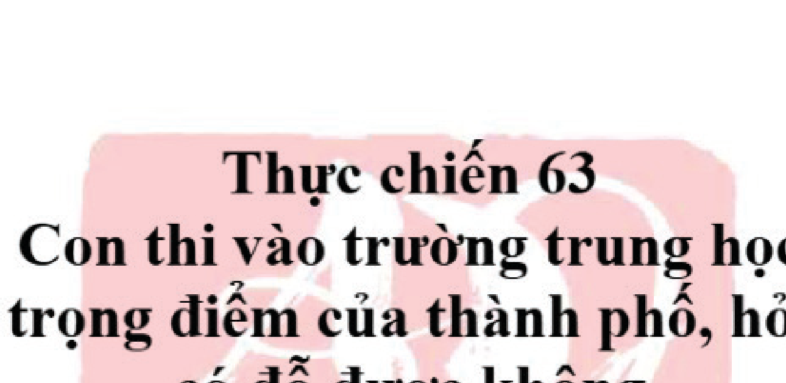

- **Cấu trúc Quẻ Dịch:**
  - **Quẻ chủ:** **Hỏa Trạch Khuê** (Cung Cấn)  
    *Tượng quẻ:* Hồ Giả Hổ Uy (Khuê là trái ngược, ly tán, bất đồng ý chí; thực tế thi cử và kỳ vọng ban đầu bị lệch pha nghiêm trọng).
  - **Quẻ biến:** **Thiên Trạch Lý** (Cung Cấn)  
    *Tượng quẻ:* Lý Hổ Vĩ (Dẫm đuôi cọp, kỳ thi có độ khó và áp lực cạnh tranh cực kỳ khắc nghiệt).

- **Bảng chi tiết Lục hào:**

| Hào | Thế/Ứng | Lục thân (Chủ) | Can Chi | Biến động | Lục thân (Biến) | Can Chi (Biến) | Thần sát / Phục thần | Lục thú |
|:---:|:---:|:---|:---|:---:|:---|:---|:---|:---|
| 6 | | Phụ Mẫu | Tị - Hỏa | tĩnh | Huynh Đệ | Tuất - Thổ | Nguyệt kiến, Lộc thần | Thanh Long |
| 5 | | Huynh Đệ | Mùi - Thổ | **X (Động)** | Tử Tôn | Thân - Kim | Phục Thê Tài Tý Thủy (Tai sát), hóa sinh xuất | Huyền Vũ |
| 4 | **Thế** | Tử Tôn | Dậu - Kim | tĩnh | Phụ Mẫu | Ngọ - Hỏa | Quý nhân, Đào hoa, Bạch Hổ, bị Nhật Nguyệt đồng khắc | Bạch Hổ |
| 3 | | Huynh Đệ | Sửu - Thổ | tĩnh | Huynh Đệ | Sửu - Thổ | Thiên hỷ | Đằng Xà |
| 2 | | Quan Quỷ | Mão - Mộc | tĩnh | Quan Quỷ | Mão - Mộc | Tuần không, Đào hoa | Câu Trần |
| 1 | **Ứng** | Phụ Mẫu | Tị - Hỏa | tĩnh | Phụ Mẫu | Tị - Hỏa | Nguyệt kiến, Lộc thần, Chu Tước (Trường học nguyện vọng) | Chu Tước |

---

### 3. Dụng thần & Loại quẻ

- **Phân loại quẻ xem hộ (Thay người khác xem):**
  Chu Thần Bân hệ thống hóa quy tắc phân loại đỉnh cao khi xem quẻ cho người thân:
  1. *Xem hộ có tính chủ động kiểm soát:* Người xin quẻ nắm trọn quyền ra quyết định (ví dụ: cha mẹ quyết định có mua nhà cho con không, có mở công ty cho con không) -> Lấy Hào Thế của người hỏi làm Dụng thần định đoạt cát hung.
  2. *Xem hộ có tính chủ động nhưng mất kiểm soát:* Người hỏi hoàn toàn không có quyền can thiệp vào diễn biến thực tế (ví dụ: con tự đi thi, vận mệnh phụ thuộc vào điểm số khách quan và sự định đoạt của phòng thi) -> **Thuần túy lấy người được hỏi làm Dụng thần, tức lấy Tử Tôn làm Dụng thần**, không lấy Thế.
- **Định vị Dụng thần trong ca Thực chiến 63:**
  - Dụng thần chính là **Tử Tôn Dậu Kim** ngự tại hào 4: Trùng hợp ngự tại Hào Thế vì quyền lợi và tâm tư của phụ huynh gắn kết máu thịt với con cái.
  - Phụ Mẫu đại diện cho trường học, điểm thi và giấy báo trúng tuyển. Hào 1 **Phụ Mẫu Tị Hỏa** mang Chu Tước tại hào Ứng đại diện cho trường trung học trọng điểm mà đứa trẻ nộp hồ sơ.

---

### 4. Luận giải chi tiết

Quẻ này là bài học mẫu mực về việc phân tích quẻ thi cử mang bản chất **Quẻ cạnh tranh** kết hợp khảo sát độ vượng suy thực tế của Dụng thần:

#### 1. Áp lực thi cử và sự suy kiệt của Dụng thần
- Dụng thần **Tử Tôn Dậu Kim**:
  - Tháng Tị là Hỏa vượng trường sinh, Ngày Bính Ngọ là Hỏa cực vượng mang Dương nhẫn.
  - Cả Nhật lẫn Nguyệt đều là Hỏa đồng thanh đồng khí lao vào **khắc phạt dữ dội Tử Tôn Dậu Kim** (Hỏa khắc Kim).
  - Tượng quẻ: Nhật Nguyệt là phụ huynh và trường học trọng điểm tạo nên một khối áp lực khổng lồ đè nặng lên tâm lý thí sinh. Đứa trẻ bước vào phòng thi với tâm lý căng thẳng tột độ, vượt quá sức chịu đựng.
  - Dụng thần mang **Bạch Hổ**: Bạch Hổ không phải thi vào trường quân đội thì chính là hình tượng thất bại, sầu não, buồn bã và phong độ thi cử sa sút thảm hại.

#### 2. Bản chất Quẻ Cạnh Tranh: Xuất hiện đối thủ chiếm chỗ trước
- Bề ngoài quẻ có hào 5 **Huynh Đệ Mùi Thổ** phát động: Mùi Thổ là Nguyên thần sinh Kim, nhìn thoáng qua tưởng chừng như có quý nhân sinh trợ giúp đỡ cho Dụng thần. Nhưng Chu Thần Bân cảnh báo: **Thi cử tuyển sinh bản chất là quẻ cạnh tranh suất học**, phải xét đến quy tắc đối thủ!
- Trong quẻ cạnh tranh:
  - Hào Huynh Đệ là đối thủ cạnh tranh. Những hào đồng loại ngũ hành với Dụng thần cũng chính là **đối thủ cạnh tranh**.
  - Huynh Đệ Mùi Thổ phát động hóa ra **Tử Tôn Thân Kim**:
    + Thân Kim cùng hành Kim với Dụng thần Dậu Kim -> Thân Kim chính là đối thủ cạnh tranh trực tiếp.
    + Thân Kim ngự ngay trên hào biến của hào động Mùi Thổ (nguyên tắc *"động động tương liên"*).
    + Do đó, ngôi trường trọng điểm (nguồn sinh Mùi Thổ) sẽ **ưu tiên tiếp nhận Tử Tôn Thân Kim trước**. Đối thủ Thân Kim nhanh chân hơn, chiếm mất chỉ tiêu tuyển sinh!
    + Thân Kim mang Văn Xương và Dịch Mã: Đối thủ có phong độ học lực và làm bài xuất sắc hơn hẳn con của đương số.
- Khi đối thủ vừa nhanh chân vừa chiếm ưu thế, trong khi Dụng thần Dậu Kim vừa mang Bạch Hổ vừa bị Nhật Nguyệt vây khắc, kết luận chắc chắn là **không thể đỗ vào trường trung học trọng điểm**.

#### 3. Phân tầng trường học trong chi tiết quẻ
- Chu Thần Bân phân tích chi tiết phụ:
  - Hào Ngọ Hỏa mang Dương nhẫn đại diện cho trường chuyên lớp chọn đứng đầu thành phố (vượt quá tầm với của đứa trẻ).
  - Hào Ứng **Phụ Mẫu Tị Hỏa** mang Lộc thần đại diện cho trường trung học phổ thông hạng phổ thông hoặc trường thấp hơn một bậc. Vì Tị Hỏa mang Lộc thần và có quan hệ trường sinh với Dậu Kim trong chi tiết, đứa trẻ sau khi trượt trường điểm vẫn có thể được một trường cấp ba bình thường tiếp nhận.

---

### 5. Kết luận & Ứng kỳ thực tế

- **Lời giải đoán của Chu Thần Bân:**
  - Khẳng định thẳng thắn với phụ huynh: Đứa trẻ không có cơ hội trúng tuyển vào trường trung học trọng điểm của thành phố.
  - Dự báo phong độ làm bài trong phòng thi sẽ bị áp lực đè nặng dẫn đến phát huy dưới sức, điểm số cách một khoảng so với ngưỡng điểm chuẩn kỳ vọng. Khuyên gia đình chuẩn bị sẵn tâm lý nộp hồ sơ vào trường tốp dưới.
- **Phản hồi thực tế từ đương số:**
  - Sau kỳ thi, kết quả điểm số công bố: Đứa trẻ làm bài phát huy rất kém, điểm thi thực tế **cách khá xa so với điểm chuẩn năm ngoái** của trường trọng điểm. Đứa trẻ chính thức trượt nguyện vọng trường điểm thành phố.
- **Ứng kỳ chiêm nghiệm:**
  - Ứng nghiệm vào kỳ công bố điểm thi và xét tuyển tuyển sinh lớp 10 vào tháng 6 năm 2017 (tháng Ngọ).

---

### 6. Bài học tâm pháp & Quy tắc cốt lõi

- **Các quy tắc Lục Hào rút ra từ ca thực chiến:**
  - *Quy tắc phân loại quẻ xem hộ: Chủ động kiểm soát so với Chủ động nhưng mất kiểm soát trong dự đoán thi cử* (trích Cổ Thệ Chân Thuyên, trang 62): Khi cha mẹ xem hộ kết quả thi cử cho con, vì không có quyền can thiệp vào phòng thi và kết quả điểm số nên bắt buộc thuần túy lấy Tử tôn làm Dụng thần.
  - *Quy tắc Quẻ Cạnh Tranh và hiện tượng Động động tương liên:* Trong các kỳ thi có tỷ lệ chọi (trung học trọng điểm, đại học, thi công chức), hào biến đồng loại ngũ hành với Dụng thần (Thân Kim vs Dậu Kim) là đối thủ cạnh tranh. Hào biến gắn liền với hào động sẽ "nhanh chân chiếm chỗ trước", cướp mất cơ hội của Dụng thần.
- **Bài học kinh nghiệm trong tâm pháp giải đoán thực tế:**
  - Không được nhìn thấy Nguyên thần phát động mà vội vàng đoán đỗ đạt. Phải phân định rõ bản chất sự việc là hợp tác, cầu an hay cạnh tranh sinh tử. Trong môi trường cạnh tranh, cái sinh cho ta cũng chính là cái sinh cho đối thủ, ai vượng tướng và nhanh chân hơn người đó sẽ thắng.

## THỰC CHIẾN 64: CON THI ĐẠI HỌC ĐIỂM CHỈ VỪA QUA NGƯỠNG ĐẠI HỌC LOẠI HAI (NHỊ BẢN), CÓ THỂ ĐỖ VÀO HỌC VIỆN CHÍNH PHÁP LOẠI A THUỘC NHỊ BẢN KHÔNG?

---

### 1. Bối cảnh & Câu hỏi

- **Bối cảnh chi tiết:** 
  Sau khi kết thúc kỳ thi tuyển sinh đại học quốc gia (Cao khảo) và có điểm thi chính thức, một phụ huynh đối mặt với bài toán điền nguyện vọng xét tuyển đầy cam go. Điểm số của con chỉ vừa vặn chạm ngưỡng sàn của hệ đại học loại hai (Nhị bản). Theo phân cấp đại học tại Trung Quốc, hệ Nhị bản chia làm loại A (các trường công lập có chất lượng đào tạo tốt, điểm chuẩn cao) và loại B. Gia đình rất khao khát cho con vào học tại Học viện Chính pháp (trường đại học chuyên ngành luật và tư pháp thuộc tốp A của Nhị bản). Dù điểm số chỉ ở mức mép sàn, phụ huynh vẫn muốn "liều một phen" điền nguyện vọng vào trường này, bèn đến xin Chu Thần Bân gieo quẻ Dịch để vấn trắc cơ hội trúng tuyển.
- **Tâm lý & Câu hỏi ẩn ý:** 
  Tâm lý phụ huynh ôm ấp hy vọng may mắn "vớt" được suất học ở trường danh tiếng dù điểm thi sát nút ngưỡng tối thiểu. Câu hỏi đặt ra là có cơ hội đỗ vào Học viện Chính pháp loại A hay không, và ẩn ý muốn thăm dò xem có nên mạo hiểm đặt cược nguyện vọng hoặc liệu có cơ hội nhờ vả quan hệ để con được trúng tuyển hay không.
- **Thời gian chiêm đoán:**
  - Dương lịch: Ngày 01 tháng 7 năm 2017, lúc 14 giờ 39 phút.
  - Giờ Bắc Kinh: Giờ Tân Mùi.
  - Can chi: Năm Đinh Dậu, tháng Bính Ngọ, ngày Kỷ Sửu, giờ Tân Mùi.

---

### 2. Dữ kiện & Bảng quẻ Crop

- **Thời không chiêm nghiệm:**
  - Tháng Bính Ngọ (Hỏa vượng, Thổ tướng, Mộc hưu, Thủy tuyệt, Kim suy).
  - Ngày Kỷ Sửu (Thổ vượng, Kim tướng, Hỏa hưu, Thủy khố, Mộc suy).
  - Tuần không: **Ngọ, Mùi** (Giáp Dần tuần trung, Ngọ Mùi không vong; Nguyệt lệnh Ngọ Hỏa lâm Tuần không; hào 1 và hào biến Huynh Đệ Mùi Thổ lâm Tuần không).
- **Thần sát:**
  - Tướng tinh: Dậu (Lâm Thái tuế, Văn xương)
  - Hoa cái: Sửu (Lâm Nhật kiến)
  - Dịch mã: Hợi
  - Tai sát: Mão (Lâm Hào Thế Quan Quỷ)
  - Mưu tinh: Mùi (Lâm Tuần không, hào 1 Huynh Đệ)
  - Đào hoa: Ngọ (Lâm Nguyệt kiến, Lộc thần, Tuần không)
  - Kiếp sát: Dần
  - Lộc thần: Ngọ
  - Dương nhẫn: Tị (Lâm hào 2 Phụ Mẫu)
  - Văn xương: Dậu
  - Thiên y: Tị
  - Thiên hỷ: Sửu
  - Quý nhân: Thân, Tý (Lâm hào 4 Tử Tôn và hào 6 Thê Tài)

- Dữ kiện bảng quẻ và các thông số chiêm đoán:
  - **Bảng 64.1** Đồ hình quẻ Thực chiến 64:
    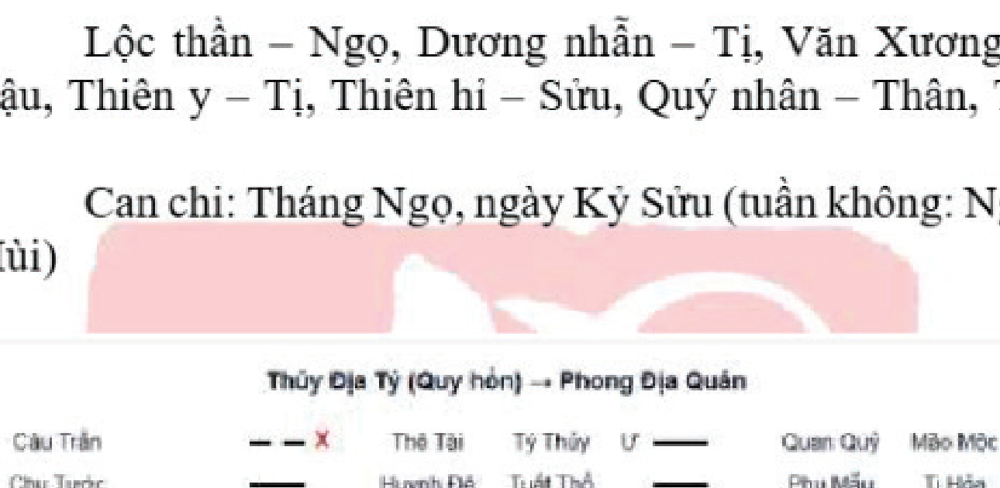

- **Cấu trúc Quẻ Dịch:**
  - **Quẻ chủ:** **Thủy Địa Tỷ** (Cung Càn – Quẻ Quy Hồn)  
    *Tượng quẻ:* Thủy Địa Thân Mật (Hòa hợp, nương tựa tìm kiếm cơ hội; phụ huynh tìm mọi cách để kết nối nguyện vọng trường cho con).
  - **Quẻ biến:** **Phong Địa Quán** (Cung Càn)  
    *Tượng quẻ:* Phong Hành Địa Thượng (Gió lướt trên mặt đất, xem xét trông ngóng thời thế từ xa; ngắm nhìn trường từ xa mà không với tới được).

- **Bảng chi tiết Lục hào:**

| Hào | Thế/Ứng | Lục thân (Chủ) | Can Chi | Biến động | Lục thân (Biến) | Can Chi (Biến) | Thần sát / Ghi chú | Lục thú |
|:---:|:---:|:---|:---|:---:|:---|:---|:---|:---|
| 6 | **Ứng** | Thê Tài | Tý - Thủy | **X (Động)** | Quan Quỷ | Mão - Mộc | Quý nhân, Nguyệt phá Nhật hợp, hóa sinh xuất | Câu Trần |
| 5 | | Huynh Đệ | Tuất - Thổ | tĩnh | Phụ Mẫu | Tị - Hỏa | | Chu Tước |
| 4 | | Tử Tôn | Thân - Kim | tĩnh | Huynh Đệ | Mùi - Thổ | Quý nhân (Hình tượng đứa con) | Thanh Long |
| 3 | **Thế** | Quan Quỷ | Mão - Mộc | tĩnh | Quan Quỷ | Mão - Mộc | Tai sát (Hình tượng phụ huynh) | Huyền Vũ |
| 2 | | Phụ Mẫu | Tị - Hỏa | tĩnh | Phụ Mẫu | Tị - Hỏa | Dương nhẫn, Thiên y | Bạch Hổ |
| 1 | | Huynh Đệ | Mùi - Thổ | tĩnh (Ám động) | Huynh Đệ | Mùi - Thổ | Tuần không, Mưu tinh, Nhật Sửu xung thành Ám động | Đằng Xà |

---

### 3. Dụng thần & Loại quẻ

- **Phân loại quẻ:**
  - **Quẻ Xem hộ có tính chủ động kiểm soát một phần (Điền nguyện vọng đại học):** Điểm thi đã có cố định, phụ huynh đang toàn quyền chủ động cân nhắc lựa chọn trường và quyết định chiến lược điền hồ sơ. Quẻ phản ánh trực tiếp sự tương tác giữa trường học mục tiêu và vị thế của người hỏi.
- **Định vị Dụng thần & Cấu trúc tương tác:**
  1. **Trường học mục tiêu (Hào 6 Ứng Thê Tài Tý Thủy mang Quý nhân):** Đại diện cho Học viện Chính pháp. Tý Thủy bị Nguyệt lệnh Ngọ Hỏa xung (Nguyệt phá), được Nhật kiến Sửu Thổ lục hợp (Tý Sửu hợp), phản ánh đúng hiện trạng điểm thi mép sàn mong manh.
  2. **Vị thế phụ huynh (Hào Thế Quan Quỷ Mão Mộc):** Mão Mộc ngự tại hào 3 mang Tai sát lâm Huyền Vũ.
  3. **Hào biến Quan Quỷ Mão Mộc (hào 6):** Cùng tên, cùng ngũ hành với Hào Thế, đóng vai trò hình tượng đối thủ cạnh tranh.
  4. **Đối thủ cản trở (Hào 1 Huynh Đệ Mùi Thổ Ám động):** Huynh Đệ Mùi Thổ lâm Tuần không gặp Nhật Sửu trực xung biến thành Ám động, lao vào khắc phạt hào động Thê Tài Tý Thủy.

---

### 4. Luận giải chi tiết

Chu Thần Bân tiến hành bóc tách thực tế tuyển sinh kết hợp cơ chế vận hành Lục Hào trong quẻ cạnh tranh chỉ tiêu đại học:

#### 1. Quy luật thường thức trong tuyển sinh đại học
- Khối ngành Chính pháp (Luật học, Khoa học Chính trị, Hành chính công) là ngành có sức hút xã hội rất lớn vì định hướng nghề nghiệp sau khi tốt nghiệp là thi công chức, làm việc tại viện kiểm sát, tòa án, cơ quan công quyền.
- Vì là ngành có nhu cầu tuyển dụng ổn định, Học viện Chính pháp không bao giờ thuộc nhóm "ngành lạnh" (ngành ế ẩm ít người học). Do đó, điểm chuẩn đầu vào của trường Nhị bản loại A này luôn duy trì ở mức cao, không có tiền lệ tự hạ điểm chuẩn xuống chạm đáy sàn để thí sinh vừa qua ngưỡng Nhị bản có thể "vớt" vào.

#### 2. Cơ chế "Động động tương liên" và sự thất thế của Hào Thế
- Trong quẻ, hào 6 **Thê Tài Tý Thủy** phát động hóa ra **Quan Quỷ Mão Mộc**:
  - Hào biến Quan Quỷ Mão Mộc và Hào Thế Quan Quỷ Mão Mộc hoàn toàn giống hệt nhau về lục thân và ngũ hành. Đây là sự đối chiếu trực tiếp giữa hai đối tượng: Hào Thế là phụ huynh đương số; Hào biến là các phụ huynh và thí sinh khác trong xã hội.
  - Trường học (Tý Thủy) sẽ ưu tiên kết nối và tuyển chọn ai trước?
    + Theo nguyên lý *"Động động tương liên"*, hào động Tý Thủy ưu tiên sinh và liên kết ngay với **hào biến Quan Quỷ Mão Mộc** nằm trên cùng trục động của nó.
    + Điều này biểu thị các thí sinh khác có điểm số cao hơn, nộp hồ sơ chuẩn xác hơn sẽ chiếm trọn các suất tuyển sinh trước.
- Quan hệ giữa Thê Tài Tý Thủy đối với Hào Thế Quan Quỷ Mão Mộc:
  - Bề ngoài Thủy sinh Mộc, nhưng trong ngũ hành chi tiết lại phạm vào **Tý Mão tương hình** (Vô lễ chi hình). Tương hình biểu thị sự gượng gạo, trắc trở, xung đột lợi ích và rơi vào thế hoàn toàn bị động.

#### 3. Đối thủ cạnh tranh Ám động chặn đứng nguồn lực
- Sơ hào **Huynh Đệ Mùi Thổ** lâm Tuần không, gặp Nhật kiến Kỷ Sửu trực xung thành **Ám động**:
  - Hào Huynh Đệ vốn là tượng đối thủ cạnh tranh trong thi cử. Mùi Thổ Ám động trực tiếp xuất hiện để khắc phạt Thê Tài Tý Thủy (Thổ khắc Thủy).
  - Tượng quẻ chỉ rõ: Số lượng thí sinh điểm cao hơn nộp hồ sơ quá đông (Huynh Đệ Ám động) đã chặn đứng cánh cửa xét tuyển, khiến nhà trường (Tý Thủy) không còn bất kỳ kẽ hở nào để có thể với tới Hào Thế Mão Mộc.

#### 4. Tâm pháp về việc "Chạy trường / Nhờ vả quan hệ"
- Chu Thần Bân bàn sâu về khả năng dùng quan hệ cá nhân:
  - Nếu gia đình muốn dùng tiền bạc, quan hệ ngoại giao để xin vào trường, quẻ sẽ chuyển sang phân tích theo hướng "Hóa giải".
  - Trong phép hóa giải, chỉ cần quẻ có tương sinh là mở ra một tia hy vọng. Tuy nhiên, cổ pháp đã dạy: *"Mưu sự tại nhân, thành sự tại thiên"*. Một khi khoảng cách điểm số thực tế quá xa và đối thủ cạnh tranh quá mạnh, các biện pháp hóa giải quan hệ cũng rất khó xoay chuyển càn khôn.

---

### 5. Kết luận & Ứng kỳ thực tế

- **Lời giải đoán và Khuyến nghị của Chu Thần Bân:**
  - Khuyên phụ huynh dứt khoát **từ bỏ ý định liều lĩnh nộp hồ sơ vào Học viện Chính pháp loại A**.
  - Nhận định: Cơ hội trúng tuyển trường này là cực kỳ mong manh, nguy cơ trượt trắng nguyện vọng là vô cùng lớn. Nên thực tế hóa nguyện vọng bằng cách chọn các trường Nhị bản loại B phù hợp với mức điểm sát sàn để đảm bảo chắc chắn có trường đại học theo học.
- **Phản hồi thực tế từ đương số:**
  - Gia đình tiếp thu phân tích sâu sắc của Chu Thần Bân, không mạo hiểm đăng ký vào Học viện Chính pháp nữa mà chuyển hướng nộp hồ sơ an toàn vào một trường đại học Nhị bản loại B, con đã trúng tuyển an toàn đúng nguyện vọng dự phòng.
- **Ứng kỳ chiêm nghiệm:**
  - Ứng nghiệm vào mùa xét tuyển đại học tháng 7 - tháng 8 năm 2017 (tháng Mùi - Thân).

---

### 6. Bài học tâm pháp & Quy tắc cốt lõi

- **Các quy tắc Lục Hào rút ra từ ca thực chiến:**
  - *Quy tắc dự đoán thi đại học sát ngưỡng điểm và bản chất 'Mưu sự tại nhân, thành sự tại thiên' của phương pháp hóa giải quan hệ* (trích Cổ Thệ Chân Thuyên, trang 73): Điểm số sát ngưỡng sàn thuộc thế yếu trong quẻ cạnh tranh. Dù có ý định vận dụng quan hệ hóa giải thì cơ hội thành công cũng phụ thuộc vào tương quan lực lượng thực tế, không thể mù quáng đặt cược tương lai con trẻ.
  - *Quy tắc Hào biến đồng loại với Hào Thế và hiện tượng Tương hình:* Khi hào biến giống hệt Hào Thế và nhận sinh trước qua cơ chế động động tương liên, đối thủ cạnh tranh sẽ được ưu tiên tiếp nhận trước; nếu hào động với Hào Thế còn phạm tương hình thì bản thân càng thêm bế tắc.
- **Bài học kinh nghiệm trong tâm pháp giải đoán thực tế:**
  - Tư vấn điền nguyện vọng thi cử đòi hỏi người luận dịch phải kết hợp tinh tường giữa quẻ tượng Lục Hào và quy chế tuyển sinh thực tế của xã hội. Biết tiến biết lui, khuyên đương số chọn giải pháp thực tế thay vì nuôi ảo tưởng viển vông.

## THỰC CHIẾN 65: CON THI VÀO TRƯỜNG TRUNG HỌC TRỌNG ĐIỂM, ĐẠT 711 ĐIỂM, HỎI CÓ CƠ HỘI TRÚNG TUYỂN KHÔNG?

---

### 1. Bối cảnh & Câu hỏi

- **Bối cảnh chi tiết:** 
  Một thí sinh tham dự kỳ thi tuyển sinh vào lớp 10 trung học phổ thông đạt mức điểm rất cao: 711 điểm. Mục tiêu số một của thí sinh và gia đình là trúng tuyển vào ngôi trường trung học trọng điểm danh tiếng hàng đầu. Tại thời điểm gieo quẻ, điểm thi của thí sinh đã được công bố chính thức, nhưng điểm chuẩn chuẩn y của trường trọng điểm vẫn chưa công bố và sẽ được quyết định trong vòng 1-2 ngày tới. Người cha mang tâm trạng hồi hộp đứng ngồi không yên đến nhờ Chu Thần Bân gieo một quẻ Dịch để trắc nghiệm xem với 711 điểm con mình có cơ hội đỗ vào trường trọng điểm hay không.
- **Tâm lý & Câu hỏi ẩn ý:** 
  Tâm lý phụ huynh căng thẳng tột cùng, vừa tự hào về mức điểm 711 rất cao của con, vừa phập phồng lo sợ điểm chuẩn trường điểm năm nay sẽ vọt lên cao hơn. Câu hỏi trực tiếp là có trúng tuyển không, nhưng ẩn ý là muốn biết điểm số 711 có đủ sức chạm ngưỡng chuẩn tuyển sinh hay sẽ bị trượt oan uổng.
- **Thời gian chiêm đoán:**
  - Dương lịch: Ngày 08 tháng 7 năm 2017, lúc 10 giờ 39 phút.
  - Giờ Bắc Kinh: Giờ Quý Tị.
  - Can chi: Năm Đinh Dậu, tháng Đinh Mùi, ngày Bính Thân, giờ Quý Tị.

---

### 2. Dữ kiện & Bảng quẻ Crop

- **Thời không chiêm nghiệm:**
  - Tháng Đinh Mùi (Thổ vượng, Kim tướng, Hỏa hưu, Mộc khố, Thủy suy cực).
  - Ngày Bính Thân (Kim vượng, Thủy trường sinh, Mộc tuyệt, Thổ hưu, Hỏa bệnh).
  - Tuần không: **Thìn, Tị** (Giáp Ngọ tuần trung, Thìn Tị không vong; hào 1 Phụ Mẫu Thìn Thổ lâm Tuần không).
- **Thần sát:**
  - Tướng tinh: Tý
  - Hoa cái: Thìn (Lâm hào 1 Phụ Mẫu, Tuần không)
  - Dịch mã: Dần (Lâm hào biến Thê Tài)
  - Tai sát: Ngọ (Lâm hào 2 Quan Quỷ)
  - Mưu tinh: Tuất
  - Đào hoa: Dậu (Lâm hào 6 Huynh Đệ, Quý nhân)
  - Kiếp sát: Tị (Lâm Lộc thần, Tuần không)
  - Lộc thần: Tị (Lâm Tuần không)
  - Dương nhẫn: Ngọ (Lâm hào 2 Quan Quỷ)
  - Văn xương: Thân (Lâm Nhật kiến, hào 3 Huynh Đệ)
  - Thiên y: Ngọ
  - Thiên hỷ: Sửu (Lâm hào 4 Phụ Mẫu)
  - Quý nhân: Dậu, Hợi (Lâm hào 6 Huynh Đệ và Hào Thế Tử Tôn)

- Dữ kiện bảng quẻ và các thông số chiêm đoán:
  - **Bảng 65.1** Đồ hình quẻ Thực chiến 65:
    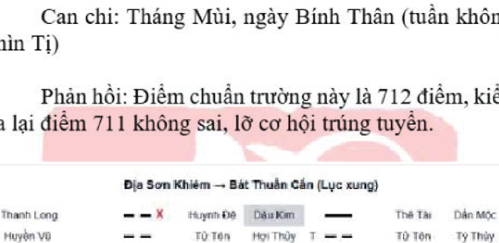

- **Cấu trúc Quẻ Dịch:**
  - **Quẻ chủ:** **Địa Sơn Khiêm** (Cung Đoài)  
    *Tượng quẻ:* Địa Trung Hữu Sơn (Trong đất có núi, khiêm nhường ẩn nhẫn; thực lực điểm số rất cao nhưng tình thế khách quan buộc phải lùi bước).
  - **Quẻ biến:** **Bát Thuần Cấn** (Cung Cấn – Quẻ Lục Xung)  
    *Tượng quẻ:* Trọng Sơn Quan Tỏa (Núi non hiểm trở chặn lối; biến Lục Xung chủ sự việc bị đứt gãy, phân rã, không thể kết duyên trúng tuyển).

- **Bảng chi tiết Lục hào:**

| Hào | Thế/Ứng | Lục thân (Chủ) | Can Chi | Biến động | Lục thân (Biến) | Can Chi (Biến) | Thần sát / Ghi chú | Lục thú |
|:---:|:---:|:---|:---|:---:|:---|:---|:---|:---|
| 6 | | Huynh Đệ | Dậu - Kim | **X (Động)** | Thê Tài | Dần - Mộc | Đào hoa, Quý nhân, Dịch mã (Dần Mộc), hóa Tuyệt, hóa Nhật phá | Thanh Long |
| 5 | **Thế** | Tử Tôn | Hợi - Thủy | tĩnh | Tử Tôn | Tý - Thủy | Quý nhân (Dụng thần thí sinh & Hào Thế phụ huynh) | Huyền Vũ |
| 4 | | Phụ Mẫu | Sửu - Thổ | tĩnh | Phụ Mẫu | Tuất - Thổ | Thiên hỷ | Bạch Hổ |
| 3 | | Huynh Đệ | Thân - Kim | tĩnh | Huynh Đệ | Thân - Kim | Nhật kiến, Văn xương | Đằng Xà |
| 2 | **Ứng** | Quan Quỷ | Ngọ - Hỏa | tĩnh | Quan Quỷ | Ngọ - Hỏa | Dương nhẫn, Tai sát, Thiên y, Phục Thê Tài Mão Mộc | Câu Trần |
| 1 | | Phụ Mẫu | Thìn - Thổ | tĩnh | Phụ Mẫu | Thìn - Thổ | Tuần không, Hoa cái | Chu Tước |

---

### 3. Dụng thần & Loại quẻ

- **Phân loại quẻ:**
  - **Quẻ Xem hộ con thi cử dạng Chủ động nhưng mất kiểm soát:** Điểm thi của thí sinh đã cố định (711 điểm), điểm chuẩn do hội đồng tuyển sinh quyết định độc lập, gia đình hoàn toàn không thể can thiệp. Theo nguyên tắc xem hộ mất kiểm soát, **Dụng thần bắt buộc là Tử Tôn Hợi Thủy**.
  - **Thế và Dụng thần hợp nhất:** Hào 5 Thế ngự Tử Tôn Hợi Thủy mang Quý nhân. Hào Thế trùng với Dụng thần thể hiện tình cảm ruột thịt và quyền lợi giữa cha mẹ và con cái gắn kết chặt chẽ làm một.
- **Định vị Dụng thần & Hào động sinh trợ:**
  1. **Dụng thần (Tử Tôn Hợi Thủy):** Ngự tại hào Thế vị trí ngũ hào tôn quý, được Nhật kiến Bính Thân trường sinh tương sinh.
  2. **Nguyên thần sinh Tử Tôn (Huynh Đệ Dậu Kim):** Ngự tại hào 6 phát động. Huynh Đệ là Nguyên thần sinh Dụng thần, nắm giữ chìa khóa quyết định việc trúng tuyển hay thất bại.
  3. **Hào biến (Thê Tài Dần Mộc):** Dậu Kim động biến Dần Mộc, mang thần sát Dịch mã.

---

### 4. Luận giải chi tiết

Quẻ này thể hiện tài năng chiêm đoán siêu việt của Chu Thần Bân khi kết hợp giữa phân tích biến động hào vô dụng và nghệ thuật thủ tượng "Hợp là gần" để ấn định chính xác độ lệch điểm số:

#### 1. Động thái của Nguyên thần: Hóa Tuyệt và Hóa Nhật phá
- Hào 6 **Huynh Đệ Dậu Kim** phát động sinh cho Dụng thần Tử Tôn Hợi Thủy. Nhìn sơ qua tưởng chừng Nguyên thần phát động là điềm trúng tuyển chắc chắn, nhưng Chu Thần Bân đi sâu phân tích hào biến:
  - Dậu Kim động biến **Dần Mộc**: Kim tuyệt tại Dần, đây là hiện tượng **Hóa Tuyệt**. Thông thường hóa tuyệt cần 3-4 tháng để bộc lộ hoàn toàn; trong khi việc tuyển sinh diễn ra ngay trong vòng 1-2 ngày, nếu chỉ xét hóa tuyệt thì chưa đủ cơ sở khẳng định hào động mất tác dụng.
  - Xét tác động của Nhật kiến: Nhật kiến **Bính Thân** trực xung hào biến **Dần Mộc** (Dần Thân tương xung).
    + Dần Mộc sinh vào tháng Đinh Mùi là tiết khí hưu tù suy kiệt.
    + Một hào suy nhược lại bị Nhật kiến trực xung thì chính là **Nhật phá**.
    + Quy tắc bất biến: Hào động mà hóa Nhật phá thì bị coi là **"Biến hỏng" (Hóa vô dụng)**. Hào động Dậu Kim bị hào biến kéo sụp đổ, mất hoàn toàn năng lực sinh trợ cho Dụng thần Tử Tôn Hợi Thủy.
  - Quẻ biến **Bát Thuần Cấn** là quẻ Lục Xung: Khẳng định sự việc sẽ bị gãy đổ, hy vọng vào trường trọng điểm tan thành mây khói. Tình thế cực kỳ nguy nan!

#### 2. Nghệ thuật thủ tượng: "Hợp là gần, Xung là xa" – Trượt đúng 1 điểm
- Điểm tinh hoa xuất thần nhất trong luận giải của Chu Thần Bân nằm ở mối quan hệ giữa hào biến và Dụng thần:
  - Hào biến **Dần Mộc** tuy bị Nhật phá (biến hỏng không sinh được), nhưng về mặt chi tiết: **Dần Mộc lại lục hợp với Dụng thần Tử Tôn Hợi Thủy** (Dần Hợi tương hợp).
  - Chu Thần Bân vận dụng tâm pháp thủ tượng cự ly:
    + *"Xung là rời xa, Hợp là tiếp cận cực kỳ gần"*.
    + Việc hào biến hợp Dụng thần biểu thị điểm số của thí sinh **tiếp cận sát sạt ngay mép ngưỡng điểm chuẩn**, chênh lệch chỉ trong đường tơ kẽ tóc!
  - Kết hợp với việc hào biến bị Nhật phá (không qua được ngưỡng), Chu Thần Bân lập tức hạ lời đoán chuẩn xác đến rợn người: **"Trường này cực kỳ nguy hiểm, con anh thiếu hụt so với điểm chuẩn đúng 1 đến 2 điểm!"**

---

### 5. Kết luận & Ứng kỳ thực tế

- **Lời giải đoán của Chu Thần Bân:**
  - Khẳng định ngay tại chỗ: Thí sinh không thể trúng tuyển vào trường trung học trọng điểm vì thiếu hụt điểm số sít sao đúng 1-2 điểm.
- **Phản hồi thực tế từ đương số:**
  - Lời đoán ứng nghiệm chớp nhoáng với tốc độ không tưởng:
    + Đúng **5 giây** sau khi Chu Thần Bân vừa dứt lời, người cha nhận được thông báo tra cứu điểm chuẩn chính thức của trường: Điểm chuẩn trúng tuyển công bố là **712 điểm**.
    + Thí sinh đạt **711 điểm**, **thiếu đúng 1 điểm duy nhất** để trúng tuyển!
    + Gia đình bàng hoàng lập tức làm đơn xin phúc khảo rà soát bài thi, nhưng kết quả phúc khảo xác nhận điểm 711 là hoàn toàn chính xác, chính thức trượt trường điểm trong gang tấc.
- **Định hướng chiến lược hậu sự:**
  - Người cha hỏi tiếp về việc chuyển hướng cho con vào học lớp hệ quốc tế để chuẩn bị đi du học.
  - Chu Thần Bân luận định: Bát tự đứa trẻ có Dương nhẫn, việc du học rất phù hợp để mở rộng tầm nhìn, nhưng sau khi hoàn thành du học nên định hướng về nước thi tuyển công chức vì con đường quan lộ hành chính mới là sở trường đỉnh cao của đương số. Gia đình đã quyết định nộp hồ sơ vào lớp quốc tế.
- **Ứng kỳ chiêm nghiệm:**
  - Ứng nghiệm tức thì trong ngày Bính Thân sau khi gieo quẻ 5 giây.

---

### 6. Bài học tâm pháp & Quy tắc cốt lõi

- **Các quy tắc Lục Hào rút ra từ ca thực chiến:**
  - *Quy tắc hào Hợp biểu thị cự ly tiếp cận sít sao và hiện tượng trượt điểm số trong gang tấc (1-2 điểm)* (trích Cổ Thệ Chân Thuyên, trang 78): Khi hào biến bị Nhật phá biến hỏng nhưng lại tương hợp với Dụng thần, đó là hình tượng của sự tiếp cận cực hạn, phản ánh kết quả thi cử chênh lệch sát nút đúng 1 điểm so với điểm chuẩn.
  - *Quy tắc Hào biến lâm Nhật phá là vô dụng biến:* Khi sự việc diễn ra trong ngắn hạn (1-2 ngày), hào biến bị Nhật xung trong trạng thái hưu tù thì trở thành Nhật phá, triệt tiêu hoàn toàn tác dụng sinh vượng của hào động.
- **Bài học kinh nghiệm trong tâm pháp giải đoán thực tế:**
  - Phải biết kết hợp nhuần nhuyễn giữa định tính cát hung (Nhật phá = thất bại) và thủ tượng chi tiết (Lục hợp = khoảng cách sít sao). Đỉnh cao của Dịch học là đọc ra được từng điểm số chênh lệch cụ thể khiến người hỏi phải tâm phục khẩu phục, đồng thời mở ra lối thoát chiến lược (hướng đi du học) cho tương lai của đương số.

---

## THỰC CHIẾN 66: XEM QUẺ THAY CON GÁI VỀ VIỆC XIN VISA DU HỌC, TRỌNG ĐIỂM CẦN CHÚ Ý NHỮNG VẤN ĐỀ GÌ

---

### 1. Bối cảnh & Câu hỏi

- **Bối cảnh chi tiết:** 
  Một gia đình có con gái sức học ở trường chỉ ở mức trung bình. Nhận thấy môi trường học tập trong nước quá căng thẳng và áp lực thi cử đè nặng từ cấp tiểu học đến trung học cơ sở, cha mẹ quyết định chuyển hướng cho con gái sang nước ngoài du học ngay từ bậc trung học phổ thông để giảm bớt gánh nặng tâm lý. Tuy nhiên, trong dòng họ và gia đình trước đây chưa từng có ai xuất cảnh, hoàn toàn không có kinh nghiệm làm thủ tục quốc tế.
  Phía đối tác nước ngoài đã hoàn tất mọi thủ tục tiếp nhận: trường học đã cấp giấy báo nhập học, đã thu học phí một năm, và phía bạn bè cũng đã hỗ trợ thu xếp xong người giám hộ hợp pháp tại bản địa. Tuy nhiên, khâu mấu chốt quyết định là xin thị thực (visa) tại các cơ quan ngoại giao trong nước vẫn chưa hoàn thành. Trước đó, vào dịp giáp Tết (tháng 1 năm 2017), gia đình từng thuê một công ty du lịch nộp hồ sơ xin visa du lịch sang Canada cho cả 3 người để khảo sát trường nhưng đã bị từ chối cấp thị thực toàn bộ với lý do bị nghi ngờ có xu hướng di cư.
  Gia đình chuẩn bị hồ sơ du học khá gấp gáp, đến tận tháng 3 mới bắt đầu làm thủ tục, thời gian quá ngắn so với quy chuẩn thông thường (cần ít nhất 6 tháng đến 1 năm tích lũy dòng tiền). Người cha lo lắng hồ sơ bị từ chối lần thứ hai nên đã gieo quẻ hỏi Chu Thần Bân.
- **Tâm lý & Câu hỏi ẩn ý:** 
  Đương số mang tâm trạng vô cùng âu lo, sợ hãi vết xe đổ bị đánh trượt visa trước đó sẽ lặp lại, khiến toàn bộ kế hoạch học tập của con bị đổ bể và lãng phí thời gian. Câu hỏi bề ngoài là tìm hiểu những điểm trọng yếu cần lưu tâm, nhưng nội hàm cốt lõi là muốn biết rõ hồ sơ hiện tại có lỗ hổng nào khiến viên chức xét duyệt nghi ngờ và liệu có thể bổ cứu để xin visa thành công hay không.
- **Thời gian chiêm đoán:**
  - Dương lịch: Tháng 3 năm 2017.
  - Can chi: Tháng Quý Mão, ngày Nhâm Thìn (Tuần không: Ngọ, Mùi).

---

### 2. Dữ kiện & Bảng quẻ Crop

- **Thời không chiêm nghiệm:**
  - Tháng Quý Mão (Mộc vượng, Hỏa tướng, Thổ tử, Kim tù, Thủy hưu).
  - Ngày Nhâm Thìn (Thổ vượng, Thủy nhập khố).
  - Tuần không: Ngọ, Mùi (Giáp Thân tuần trung).
- **Thần sát:**
  - Tướng tinh: Tý
  - Hoa cái: Thìn (Lâm Nhật kiến)
  - Dịch mã: Dần
  - Tai sát: Ngọ (Lâm Tuần không)
  - Mưu tinh: Tuất
  - Đào hoa: Dậu (Lâm hào Thế)
  - Kiếp sát: Tị (Lâm hào 2 Phụ mẫu động)
  - Lộc thần: Hợi (Lâm hào 5)
  - Dương nhẫn: Tý
  - Văn xương: Dần
  - Thiên y: Mão (Lâm Nguyệt kiến)
  - Thiên hỷ: Thìn (Lâm Nhật kiến)
  - Quý nhân: Mão, Tị (Tị lâm hào 2 động)

- Dữ kiện bảng quẻ và các thông số chiêm đoán:
  - **Bảng 66.1** Đồ hình quẻ Thực chiến 66:
    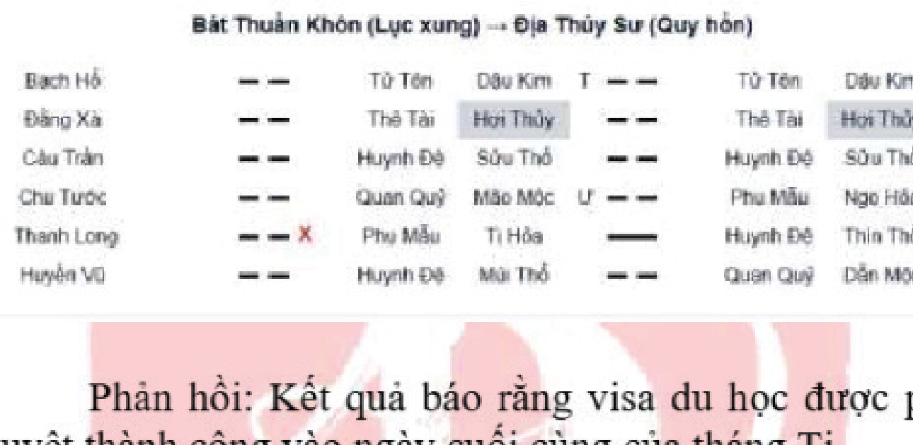

- **Cấu trúc Quẻ Dịch:**
  - **Quẻ chủ:** **Bát Thuần Khôn** (Cung Khôn, Họ Khôn – Quẻ Lục Xung)  
    *Tượng quẻ:* Địa thế khôn, vạn vật tư sinh; tuy nhiên quẻ Lục xung báo hiệu việc xuất cảnh phát sinh gấp gáp, tâm lý hoang mang xáo trộn, hồ sơ nộp vội vàng đối mặt với nhiều va chạm xung đột từ khâu thẩm định.
  - **Quẻ biến:** **Địa Thủy Sư** (Cung Khảm, Họ Khảm – Quẻ Quy Hồn)  
    *Tượng quẻ:* Địa Thủy Sư tượng trưng cho việc dụng binh, truy nguyên tận gốc, đòi hỏi tính quy củ nghiêm ngặt, chuyên sâu và chuyên nghiệp hóa cao độ để xử lý triệt để căn nguyên khó khăn.

- **Bảng chi tiết Lục hào:**

| Hào | Thế/Ứng | Lục thân (Chủ) | Can Chi | Biến động | Lục thân (Biến) | Can Chi (Biến) | Thần sát / Phục | Lục thú |
|:---:|:---:|:---|:---|:---:|:---|:---|:---|:---|
| 6 | **Thế** | Tử Tôn | Dậu - Kim | tĩnh | Tử Tôn | Dậu - Kim | Đào hoa | Bạch Hổ |
| 5 | | Thê Tài | Hợi - Thủy | tĩnh | Thê Tài | Hợi - Thủy | Lộc thần | Đằng Xà |
| 4 | | Huynh Đệ | Sửu - Thổ | tĩnh | Huynh Đệ | Sửu - Thổ | | Câu Trần |
| 3 | **Ứng** | Quan Quỷ | Mão - Mộc | tĩnh | Quan Quỷ | Mão - Mộc | Nguyệt kiến, Thiên y, Quý nhân | Chu Tước |
| 2 | | Phụ Mẫu | Tị - Hỏa | **X (Động)** | Huynh Đệ | Thìn - Thổ | Quý nhân, Kiếp sát, Trường sinh | Thanh Long |
| 1 | | Huynh Đệ | Mùi - Thổ | tĩnh | Quan Quỷ | Dần - Mộc | Tuần không | Huyền Vũ |

---

### 3. Dụng thần & Loại quẻ

- **Phân loại quẻ:**
  - **Quẻ việc cụ thể & Xem thay có quyền kiểm soát chủ động:** Đây là quẻ cha mẹ xem việc làm thủ tục du học thay cho con gái. Mọi giấy tờ, hồ sơ, chiến lược tài chính đều do cha mẹ tự tay hoạch định và chi trả, do đó thuộc dạng xem thay có quyền kiểm soát trực tiếp.
  - **Hợp nhất Dụng thần:** Hào Thế đại diện cho cha mẹ người hỏi mang Tử Tôn Dậu Kim, đồng thời Tử Tôn cũng chính là lục thân đại diện cho con gái. Hào Thế và Dụng thần hợp nhất tại hào 6, phản ánh sự đồng tâm nhất trí và quyền kiểm soát chặt chẽ đối với tiến trình sự việc.
- **Xác định Dụng thần & Hệ thống tinh thần:**
  1. **Dụng thần cốt lõi (Tử Tôn Dậu Kim):** Đại diện cho bản thân người con gái và cơ hội xuất ngoại học tập, đồng thời là đối tượng thụ hưởng kết quả thị thực.
  2. **Kỵ thần cản trở hồ sơ (Phụ Mẫu Tị Hỏa):** Đại diện cho văn bản, hồ sơ thủ tục, giấy tờ thị thực cùng các yêu cầu xét duyệt khắt khe từ cơ quan lãnh sự. Hào này phát động khắc chế trực tiếp hào Thế Tử Tôn Dậu Kim.
  3. **Nguyên thần sinh trợ (Huynh Đệ Sửu Thổ, Thìn Thổ):** Đại diện cho các yếu tố bổ trợ, bạn bè giúp đỡ và giải pháp kỹ thuật hàn gắn hồ sơ.
  4. **Cừu thần gián tiếp (Quan Quỷ Mão Mộc):** Nắm lệnh Nguyệt kiến, sinh trợ cho Hỏa khí của Kỵ thần Phụ Mẫu.

---

### 4. Luận giải chi tiết

Quẻ này là mẫu mực kinh điển về phân tích "thông tin hậu nghiệm" và cơ chế phát hiện sai sót thủ tục thông qua hình tượng hào động:

#### 1. Nguyên nhân bất lợi từ Bạch Hổ trì Thế và hào Thế bị khắc
- Hào Thế Tử Tôn Dậu Kim cư tại hào 6 lâm Bạch Hổ: Hào 6 là hào tối cao, tượng trưng cho biên giới quốc gia, phương xa, nước ngoài. Dậu Kim mang Đào hoa lâm Bạch Hổ tại hào ngoại quốc thể hiện rõ tỳ vết: gia đình chưa từng có lịch sử xuất cảnh, hộ chiếu trắng trơn, lại từng bị lãnh sự quán Canada đóng dấu từ chối thị thực vào đầu năm 2017 do hồ sơ sơ sài. Dấu ấn bị từ chối này lưu trữ vĩnh viễn trên hệ thống dữ liệu ngoại giao, trở thành một rào cản tiêu cực nặng nề (Bạch Hổ chủ hung tin, trở ngại đã hiện hữu).
- Hào 2 Phụ Mẫu Tị Hỏa phát động khắc trực tiếp hào Thế Tử Tôn Dậu Kim: Bình thường trong quẻ đoán việc, Dụng thần bị hào động khắc thương là tượng thất bại. Tuy nhiên, quẻ này đương số chủ động hỏi *"trọng điểm cần chú ý những vấn đề gì để phòng ngừa"*, tức là quẻ mang tính chất tầm soát và đề phòng. Tượng hào khắc Thế chính là quẻ chỉ ra chính xác điểm nghẽn then chốt khiến hồ sơ bị từ chối nếu không thay đổi.

#### 2. Giải mã các tầng lớp thông tin trên hào Phụ Mẫu Tị Hỏa
- **Tị Hỏa mang Lộc thần gặp Kiếp sát:** Tị Hỏa là Lộc thần của ngày (hoặc tương quan tài chính), nhưng lại đồng thời lâm Kiếp sát. Điều này chỉ rõ lỗ hổng lớn nhất nằm ở **chứng từ dòng tiền tài chính**. Gia đình nộp hồ sơ vội vàng, đem gom một khoản tiền lớn nạp đột ngột vào sổ tiết kiệm trong thời gian ngắn để làm chứng nhận số dư. Viên chức xét duyệt nhìn vào sẽ nghi ngờ đây là tiền đi vay mượn tạm thời nhằm đối phó chứ không phản ánh đúng năng lực kinh tế thực tế.
- **Tị Hỏa mang Quý nhân:** Chỉ ra lỗ hổng thứ hai nằm ở **giấy tờ xác thực thân phận và công việc**. Hồ sơ chứng minh công tác, thu nhập của phụ huynh và thư giới thiệu được làm cẩu thả, thời gian công tác ngắn hoặc nội dung trùng lặp máy móc, thiếu tính chân thực.
- **Tị Hỏa là Trường sinh của Dậu Kim nhưng lại quay lại khắc Dậu Kim:** Tượng trưng cho **tính lâu dài và liên tục**. Cơ quan xét duyệt visa đòi hỏi chứng từ dòng tiền phải có sao kê biến động ổn định từ 2 đến 3 năm trở lên, giấy xác nhận công tác phải có thâm niên vững chắc, chứng minh gia đình có nguồn thu nhập dồi dào duy trì bền vững trong suốt nhiều năm học tập tại nước ngoài.

#### 3. Thiên La Địa Võng và Thông tin hậu nghiệm bổ cứu (Hào biến Thìn Thổ)
- Tị Hỏa động biến Huynh Đệ Thìn Thổ: Trong mệnh lý và dịch học, Tị gặp Thìn gọi là cung vị **Thiên La**. Điều này biểu thị hồ sơ bị rơi vào khung kiểm soát nghiêm ngặt của quy chế lãnh sự quán, nếu không đáp ứng đúng chuẩn mực khắt khe thì sẽ bị từ chối.
- Tuy nhiên, Phụ Mẫu Tị Hỏa động hóa xuất Huynh Đệ Thìn Thổ mang theo Nhật lệnh. Thìn Thổ là hào biến, trên phương diện cơ chế vận động lại quay trở lại sinh trợ và hợp khởi cho hào Thế Tử Tôn Dậu Kim (Thìn Dậu tương hợp, Thổ sinh Kim). 
- Đây chính là **thông tin hậu nghiệm cốt lõi**: Khởi đầu hào động vạch ra trở ngại thực tế (Tị Hỏa khắc Dậu Kim), nhưng kết cục hào biến lại mở ra lối thoát cứu vãn (Thìn Thổ sinh Thế). Điều này khẳng định hồ sơ hoàn toàn có thể cứu vãn và thông qua, với điều kiện bắt buộc là phải có giải pháp bổ cứu chuẩn mực, giải trình minh bạch lý do bị trượt visa lần trước và tái cấu trúc lại toàn bộ hồ sơ tài chính.

#### 4. Ý nghĩa quẻ biến Địa Thủy Sư: Lời chỉ dẫn tìm kiếm chuyên gia
- Quẻ chủ Bát Thuần Khôn biến sang Địa Thủy Sư. Quẻ Sư tượng trưng cho tính kỷ luật của quân đội, sự chuyên sâu, chuyên môn hóa cao độ. 
- Chu Thần Bân nhận định quẻ tượng từ bi mách bảo rằng: gia đình không thể tự ý làm mò mẫm hay giao phó cho các đơn vị du lịch thông thường, mà bắt buộc phải thuê các đơn vị tư vấn visa du học chuyên nghiệp – những người có năng lực nghiên cứu sâu sắc tâm lý viên chức lãnh sự và am hiểu quy trình giải trình hồ sơ tồn đọng.

---

### 5. Kết luận & Ứng kỳ thực tế

- **Lời đoán và khuyến nghị của Chu Thần Bân:**
  - Khẳng định visa du học hoàn toàn có cơ hội được cấp nếu gia đình chấp nhận bổ cứu hồ sơ theo đúng chỉ dẫn của quẻ tượng.
  - Yêu cầu đương số không được tiếc chi phí, cần lập tức tìm đến công ty dịch vụ visa du học có uy tín và năng lực chuyên sâu nhất để lập lại toàn bộ phương án chứng minh tài chính dài hạn (sao kê luân chuyển tài khoản nhiều năm) và văn bản giải trình thỏa đáng về lần trượt visa trước đó.
- **Phản hồi thực tế (Feedback):**
  - Gia đình làm theo lời khuyên, tìm được một đơn vị chuyên nghiệp hàng đầu xử lý visa du học với mức phí dịch vụ trọn gói là 1.6 vạn tệ. Đơn vị này đã hỗ trợ rà soát, hoàn thiện bộ hồ sơ tài chính nhiều năm và nộp văn bản giải trình chi tiết lên cơ quan ngoại giao.
- **Ứng kỳ chiêm nghiệm:**
  - Hào Phụ Mẫu Tị Hỏa chủ về việc xét duyệt hồ sơ. Đến ngày cuối cùng của tháng Tị (tháng 4 âm lịch), khi Tị Hỏa đắc lệnh hoàn tất toàn bộ quy trình kiểm tra thẩm định, gia đình nhận được thông báo visa du học của con gái đã được phê duyệt thành công.

---

### 6. Bài học tâm pháp & Quy tắc cốt lõi

- **Quy tắc trích dẫn (Rule Index p.80):**
  *Quy tắc quẻ Lục xung biến Quy hồn trong xem thị thực du học và phân tích thông tin hậu nghiệm (hồ sơ, người giám hộ).*
- **Tâm pháp giải đoán thực chiến:**
  1. *Phân biệt quẻ Cát hung thông thường và Quẻ tìm kiếm điểm yếu phòng ngừa:* Trong quẻ hỏi về việc cần chú ý phòng tránh điều gì, hào động khắc Thế không vội kết luận là đại hung thất bại, mà đó là sự hiển lộ của điểm nghẽn hồ sơ giúp người hỏi biết chỗ sai để sửa chữa.
  2. *Cơ chế Thông tin hậu nghiệm qua Hào biến:* Hào động thể hiện thực trạng bế tắc trước mắt mang tính định tính, nhưng nếu hào biến chuyển hóa thành ngũ hành tương sinh tương hợp với hào Thế, điều đó chứng minh sự việc sau khi tiến hành biện pháp bổ cứu đúng đắn sẽ lật ngược tình thế thành công.
  3. *Ngũ hành kết hợp Thần sát để định danh sự vật:* Hỏa chủ văn thư gấp gáp; Lộc thần lâm Kiếp sát chỉ tài chính có vấn đề; Trường sinh chỉ tính liên tục lâu dài; Quý nhân chỉ chức danh thân phận; Thiên La chỉ khuôn khổ quy chế pháp lý. Sự phối hợp chuẩn xác giữa Lục hào và Thần sát đem lại khả năng tái hiện chi tiết thực tế sống động.

## THỰC CHIẾN 67: TRUNG TÂM DU HỌC ĐƯỢC GIỚI THIỆU YÊU CẦU PHÍ DỊCH VỤ LÀM VISA DU HỌC 1.6 VẠN, CHỌN HỌ CÓ PHÙ HỢP KHÔNG HAY NÊN TÌM ĐƠN VỊ KHÁC

---

### 1. Bối cảnh & Câu hỏi

- **Bối cảnh chi tiết:** 
  Sau khi nhận được lời tư vấn từ Chu Thần Bân ở quẻ Thực chiến 66 (khuyên cần tìm công ty chuyên nghiệp giải trình lại hồ sơ tài chính nhiều năm để cứu vãn việc xin visa du học cho con gái), gia đình đương số được bạn bè giới thiệu một công ty trung gian chuyên làm visa du học có tiếng. Đơn vị này sau khi nghiên cứu hồ sơ đã đưa ra mức phí dịch vụ trọn gói là 1.6 vạn NDT (16.000 tệ). 
  Gia đình cảm thấy mức chi phí này quá đắt đỏ so với việc làm visa du lịch trước đây (các công ty du lịch chỉ thu khoảng 3.000 tệ, chênh lệch tới 13.000 tệ). Mặc dù trước đó từng bị từ chối visa do thuê công ty du lịch làm ẩu, nhưng trước khoản tiền lớn, người cha lại nảy sinh tâm lý tiếc tiền và dao động, muốn tìm các đơn vị làm visa giá rẻ khác ngoài thị trường.
- **Tâm lý & Câu hỏi ẩn ý:** 
  Đương số mang tâm trạng do dự không quyết, nghi hoặc về giá cả, không hài lòng với mức báo giá 1.6 vạn. Câu hỏi đặt ra là xem đơn vị được giới thiệu này có phù hợp để ký hợp đồng hay không, nhưng thâm tâm thực chất đang muốn tìm kiếm một đơn vị dịch vụ du lịch bên ngoài với chi phí rẻ hơn để thay thế.
- **Thời gian chiêm đoán:**
  - Dương lịch: Ngày 15 tháng 3 năm 2017, lúc 21:15 (Giờ Bắc Kinh).
  - Can chi: Năm Đinh Dậu, tháng Quý Mão, ngày Tân Sửu, giờ Kỷ Hợi (Tuần không: Thìn, Tị).

---

### 2. Dữ kiện & Bảng quẻ Crop

- **Thời không chiêm nghiệm:**
  - Tháng Quý Mão (Mộc vượng, Hỏa tướng, Thổ hưu, Kim tù, Thủy suy).
  - Ngày Tân Sửu (Thổ vượng, Kim đắc dưỡng, Mộc hưu).
  - Tuần không: Thìn, Tị (Giáp Ngọ tuần trung).
- **Thần sát:**
  - Tướng tinh: Dậu
  - Hoa cái: Sửu (Lâm Nhật kiến)
  - Dịch mã: Hợi (Lâm thời chi)
  - Tai sát: Mão (Lâm Nguyệt kiến)
  - Mưu tinh: Mùi (Lâm hào Thế)
  - Đào hoa: Ngọ (Lâm hào Ứng)
  - Kiếp sát: Dần
  - Lộc thần: Dậu
  - Dương nhẫn: Thân
  - Văn xương: Tý (Phục thần dưới hào Thế)
  - Thiên y: Dần
  - Thiên hỷ: Tuất (Lâm hào 6 động)
  - Quý nhân: Dần, Ngọ (Lâm hào Ứng)

- Dữ kiện bảng quẻ và các thông số chiêm đoán:
  - **Bảng 67.1** Đồ hình quẻ Thực chiến 67:
    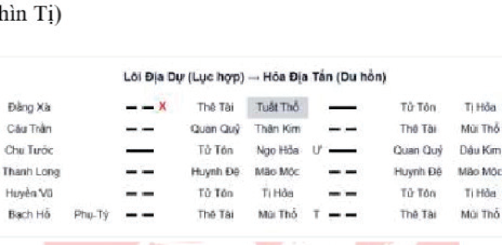

- **Cấu trúc Quẻ Dịch:**
  - **Quẻ chủ:** **Lôi Địa Dự** (Cung Chấn, Họ Chấn – Quẻ Lục Hợp)  
    *Tượng quẻ:* Dự nghĩa là do dự, chần chừ, chậm trễ; phản ánh chính xác trạng thái tâm lý dùng dằng, chưa dứt khoát đưa ra quyết định lựa chọn đơn vị dịch vụ.
  - **Quẻ biến:** **Hỏa Địa Tấn** (Cung Càn, Họ Càn – Quẻ Du Hồn)  
    *Tượng quẻ:* Tấn là tiến lên, hướng về phía trước; kết hợp Du hồn biểu thị ý niệm của người hỏi đang trôi dạt, không muốn dừng lại ở phương án hiện tại mà muốn tìm kiếm đơn vị khác bên ngoài.

- **Bảng chi tiết Lục hào:**

| Hào | Thế/Ứng | Lục thân (Chủ) | Can Chi | Biến động | Lục thân (Biến) | Can Chi (Biến) | Thần sát / Phục | Lục thú |
|:---:|:---:|:---|:---|:---:|:---|:---|:---|:---|
| 6 | | Thê Tài | Tuất - Thổ | **X (Động)** | Tử Tôn | Tị - Hỏa | Thiên hỷ | Đằng Xà |
| 5 | | Quan Quỷ | Thân - Kim | tĩnh | Thê Tài | Mùi - Thổ | Dương nhẫn | Câu Trần |
| 4 | **Ứng** | Tử Tôn | Ngọ - Hỏa | tĩnh | Quan Quỷ | Dậu - Kim | Đào hoa, Quý nhân | Chu Tước |
| 3 | | Huynh Đệ | Mão - Mộc | tĩnh | Huynh Đệ | Mão - Mộc | Nguyệt kiến, Tai sát | Thanh Long |
| 2 | | Tử Tôn | Tị - Hỏa | tĩnh | Tử Tôn | Tị - Hỏa | Tuần không | Huyền Vũ |
| 1 | **Thế** | Thê Tài | Mùi - Thổ | tĩnh | Thê Tài | Mùi - Thổ | Mưu tinh / Phục Phụ Mẫu Tý Thủy | Bạch Hổ |

---

### 3. Dụng thần & Loại quẻ

- **Phân loại quẻ:**
  - **Quẻ việc cụ thể kết hợp tâm thái:** Đánh giá năng lực của đơn vị cung cấp dịch vụ được chỉ định và thẩm định phương án thuê đơn vị ngoài.
- **Xác định Dụng thần & Hệ thống tinh thần:**
  1. **Hào Thế (Thê Tài Mùi Thổ):** Đại diện cho bản thân người hỏi, tâm lý cân nhắc tài chính và mục tiêu xin visa du học (Mùi Thổ là Mộc khố, Mộc chủ văn hóa, học vấn).
  2. **Hào Ứng (Tử Tôn Ngọ Hỏa):** Đại diện cho đơn vị làm visa du học chuyên nghiệp được bạn bè giới thiệu (đòi phí 1.6 vạn). Trong Lục Hào, Hỏa chủ dịch vụ trung gian; Tử Tôn chủ năng lực thực chất, giải quyết trở ngại; lâm Chu Tước, Đào hoa, Quý nhân chủ thương hiệu uy tín, nổi tiếng.
  3. **Hào 6 phát động (Thê Tài Tuất Thổ):** Đại diện cho đơn vị làm visa bên ngoài (công ty du lịch giá rẻ). Tuất Thổ là Hỏa khố (Hỏa chủ du lịch).
  4. **Hào tâm niệm (Phục thần Phụ Mẫu Tý Thủy):** Nằm dưới hào Thế, xung trực tiếp hào Ứng Tử Tôn Ngọ Hỏa (Tý Ngọ tương xung), phản ánh nội tâm bài xích, không muốn hợp tác với đơn vị 1.6 vạn vì chê đắt.

---

### 4. Luận giải chi tiết

Quẻ này là bài học kinh điển về việc định vị đối tượng qua Lục hào, giải mã tâm thái người hỏi và xác lập ranh giới giữa quy luật "Tương hình" và lý thuyết "Tương phù" cổ đại:

#### 1. Tâm thái do dự và ý niệm xung Ứng của đương sự
- Quẻ chủ Lôi Địa Dự thể hiện thực trạng tâm lý đang do dự, chưa thể quyết đoán.
- Hào Thế Thê Tài Mùi Thổ lâm Bạch Hổ, cư tại hào dưỡng: Bạch Hổ chủ sự bực dọc, không hài lòng về mặt tài chính (phí 1.6 vạn quá cao). Trạng thái dưỡng chủ sự ngờ vực, ấp ủ ý định tìm kiếm đối tác khác.
- Dưới hào Thế phục tàng Phụ Mẫu Tý Thủy lâm Văn Xương: Đây là hào tâm niệm thầm kín. Tý Thủy xung trực tiếp hào Ứng Tử Tôn Ngọ Hỏa (Tý Ngọ tương xung). Thế mang tâm niệm xung Ứng biểu thị rõ ràng trong lòng người cha đang muốn gạt bỏ đơn vị này, không muốn bỏ ra 1.6 vạn.

#### 2. Nhận diện năng lực thực chất của đơn vị được giới thiệu (Hào Ứng)
- Hào Ứng mang Tử Tôn Ngọ Hỏa: Trong dự đoán sự vụ, Hỏa đại diện cho ngành dịch vụ, trung gian. Tử Tôn đại diện cho năng lực chuyên môn thực thụ (nếu là đơn vị lừa đảo hoặc giả mạo thì sẽ lâm Quan Quỷ).
- Ngọ Hỏa lâm Chu Tước, Đào hoa, Quý nhân: Đơn vị có tiếng tăm lớn trong ngành, được bạn bè tin cậy tiến cử, có quan hệ xã hội tốt.
- Tương quan vượng suy: Ngọ Hỏa sinh vào tháng Mão là vượng tướng, gặp ngày Sửu không bị tổn thương suy bại. Hào Ứng Ngọ Hỏa sinh cho hào Thế Mùi Thổ (Ngọ Mùi tương hợp, Hỏa sinh Thổ). Điều này khẳng định đơn vị này hoàn toàn có đủ năng lực chuyên môn và thiện chí giải quyết thành công visa du học cho con gái, chỉ vì đương số tiếc tiền nên họ ở trạng thái tĩnh.

#### 3. Bản chất của đơn vị du lịch giá rẻ bên ngoài (Hào 6 động)
- Hào 6 Thê Tài Tuất Thổ phát động hóa Tử Tôn Tị Hỏa: Đây là tín hiệu về một đơn vị dịch vụ khác xuất hiện ngoài đơn vị chính đã chỉ định. Hào 6 lâm Thiên hỷ – chủ sự náo nhiệt, vui chơi giải trí, biểu thị rõ các công ty thuộc lĩnh vực du lịch lữ hành có kiêm dịch vụ làm visa.
- Thực tế gia đình từng tính toán: visa làm qua trung tâm du học tốn 1.6 vạn, trong khi qua công ty du lịch làm trọn gói chỉ khoảng 3.000 tệ, tiết kiệm được 1.3 vạn tệ. Nhưng câu hỏi đặt ra là đơn vị giá rẻ này có làm được việc hay không?

#### 4. Phủ nhận lý thuyết "Tương phù" cổ đại – Xác lập nguyên lý "Tương hình"
- Theo sách cổ, hào 6 Thê Tài Tuất Thổ cùng ngũ hành Thổ với hào Thế Thê Tài Mùi Thổ sẽ được luận là "Tương phù" (giúp đỡ lẫn nhau). Nếu theo thuyết này, công ty du lịch giá rẻ sẽ giúp được việc cho đương sự.
- Chu Thần Bân khẳng định dứt khoát: **Trong Lục Hào không tồn tại quan hệ "tương phù", chỉ tồn tại quan hệ "Tương hình"**.
- Tuất Thổ và Mùi Thổ cấu thành thế cục **Tương hình** (Mùi Tuất tương hình). Một khi đã là tương hình thì mang bản chất tổn hại, xung đột, tiêu cực. Do đó, công ty du lịch giá rẻ bên ngoài hoàn toàn không có khả năng giải quyết visa du học, nếu tiếp tục giao hồ sơ cho họ thì chắc chắn thất bại.
- Xét về Mộ khố: 
  + Hào Thế Mùi Thổ là **Mộc khố** – Mộc chủ văn hóa, giáo dục, học tập (đúng mục đích xin visa du học).
  + Hào 6 Tuất Thổ là **Hỏa khố** – Hỏa chủ du lịch, tiêu khiển giải trí (chỉ làm được visa du lịch đơn thuần). 
- Sự khác biệt về bản chất ngành nghề khiến công ty du lịch không thể xử lý hồ sơ du học phức tạp từng bị từ chối thị thực.

---

### 5. Kết luận & Ứng kỳ thực tế

- **Lời đoán và khuyến nghị của Chu Thần Bân:**
  - Khuyên đương số tuyệt đối không được tham rẻ mà chọn các công ty du lịch bên ngoài, vì tiết kiệm 1.3 vạn tệ sẽ phá hỏng toàn bộ tương lai học tập của con cái.
  - Phải dứt khoát ký hợp đồng với đơn vị làm visa du học chuyên nghiệp 1.6 vạn (hào Ứng Ngọ Hỏa), bởi chỉ có đơn vị này mới có năng lực thực sự (Tử Tôn vượng sinh Thế) để đưa hồ sơ đến đích thành công.
- **Phản hồi thực tế (Feedback):**
  - Đương số nghe theo lời khuyên, từ bỏ ý định tìm công ty du lịch giá rẻ, chấp nhận chi 1.6 vạn tệ để công ty chuyên nghiệp xử lý hồ sơ.
- **Ứng kỳ chiêm nghiệm:**
  - Kết quả hoàn toàn ứng nghiệm như Thực chiến 66 đã tiên lượng: đến ngày cuối cùng của tháng Tị, hồ sơ visa du học của con gái đã được Đại sứ quán phê duyệt thành công.

---

### 6. Bài học tâm pháp & Quy tắc cốt lõi

- **Quy tắc trích dẫn (Rule Index p.91):**
  *Quy tắc quẻ Dự và cơ chế nhận diện đơn vị môi giới dịch vụ qua hào Ứng, phủ nhận quy tắc tương phù.*
- **Tâm pháp giải đoán thực chiến:**
  1. *Phủ nhận triệt để quy tắc Tương phù giữa các chi Thổ:* Giữa Thìn, Tuất, Sửu, Mùi không có hiện tượng phù trợ cùng loại, mà chủ yếu là quan hệ Tương hình (Sửu - Tuất - Mùi) hoặc Tương xung (Thìn - Tuất, Sửu - Mùi). Gặp tương hình phải luận là phá tổn, trở ngại.
  2. *Giải mã tâm lý qua Phục thần dưới hào Thế:* Phục thần lâm Văn Xương mang hành Thủy xung hào Ứng chỉ rõ ý định chủ quan của đương sự đang muốn chống đối, bài trừ phương án được chỉ định.
  3. *Phân biệt tính chất sự việc qua Mộ khố của Thổ:* Cùng là hào Thổ nhưng Mộc khố (Mùi) đại diện cho học vấn, trong khi Hỏa khố (Tuất) đại diện cho du lịch lữ hành. Định vị chính xác tính chất mộ khố giúp phân định đúng phạm vi ngành nghề ngoài đời thực.

## THỰC CHIẾN 68: CON CÓ THỂ ĐẠT ĐƯỢC 645 ĐIỂM KHÔNG?

---

### 1. Bối cảnh & Câu hỏi

- **Bối cảnh chi tiết:** 
  Sau khi gia đình nộp hồ sơ xin visa du học qua công ty chuyên nghiệp (ở Thực chiến 67), theo thông lệ sau 30 ngày (khoảng ngày 20 tháng 4 năm 2017) sẽ có kết quả phê duyệt. Tuy nhiên, thủ tục thẩm định bị kéo dài hơn dự kiến, đến tận cuối tháng 5 năm 2017 vẫn chưa có hồi âm. 
  Thời hạn đăng ký nguyện vọng kỳ thi tuyển sinh vào trung học phổ thông (cấp ba) tại địa phương đã cận kề. Kế hoạch ban đầu của gia đình là nếu xin được visa du học thì kỳ thi cấp ba trong nước chỉ thi mang tính thủ tục; nhưng nếu visa trượt thì con bắt buộc phải thi đỗ vào một trường cấp ba trọng điểm chất lượng cao. Sức học của con gái vốn chỉ ở mức trung bình, hai lần thi thử trước đó điểm số đều thấp. Để vào được ngôi trường trọng điểm như ý muốn, con gái phải đạt mức điểm chuẩn là 645 điểm. Người cha vô cùng sốt ruột liền gieo quẻ hỏi Chu Thần Bân xem con có thể thi đạt 645 điểm hay không.
- **Tâm lý & Câu hỏi ẩn ý:** 
  Đương số rơi vào tình thế tiến thoái lưỡng nan: visa du học chờ đợi mòn mỏi chưa có kết quả, trong khi kỳ thi tuyển sinh trong nước đã đến sát nút. Câu hỏi bề ngoài là hỏi về một con số điểm cụ thể (645 điểm), nhưng nội tâm là sự kỳ vọng thái quá nhằm tìm kiếm sự an tâm trong trạng thái khủng hoảng và bế tắc.
- **Thời gian chiêm đoán:**
  - Dương lịch: Ngày 27 tháng 5 năm 2017, lúc 00:19 (Giờ Bắc Kinh).
  - Can chi: Năm Đinh Dậu, tháng Ất Tị, ngày Giáp Dần, giờ Giáp Tý (Tuần không: Tý, Sửu).

---

### 2. Dữ kiện & Bảng quẻ Crop

- **Thời không chiêm nghiệm:**
  - Tháng Ất Tị (Hỏa vượng, Thổ tướng, Kim trường sinh, Thủy tuyệt, Mộc hưu).
  - Ngày Giáp Dần (Mộc lâm Lộc vượng, Hỏa đắc sinh, Kim tuyệt).
  - Tuần không: Tý, Sửu (Giáp Dần tuần trung).
- **Thần sát:**
  - Tướng tinh: Ngọ
  - Hoa cái: Tuất
  - Dịch mã: Thân
  - Tai sát: Tý (Lâm Tuần không)
  - Mưu tinh: Thìn (Lâm hào biến của hào 3)
  - Đào hoa: Mão (Lâm hào Ứng)
  - Kiếp sát: Hợi (Lâm hào 3 và hào 5)
  - Lộc thần: Dần (Lâm Nhật kiến)
  - Dương nhẫn: Mão (Lâm hào Ứng)
  - Văn xương: Tị (Lâm Nguyệt kiến)
  - Thiên y: Thìn
  - Thiên hỷ: Sửu (Lâm hào Thế động, lâm Tuần không)
  - Quý nhân: Sửu, Mùi (Sửu lâm hào Thế động)

- Dữ kiện bảng quẻ và các thông số chiêm đoán:
  - **Bảng 68.1** Đồ hình quẻ Thực chiến 68:
    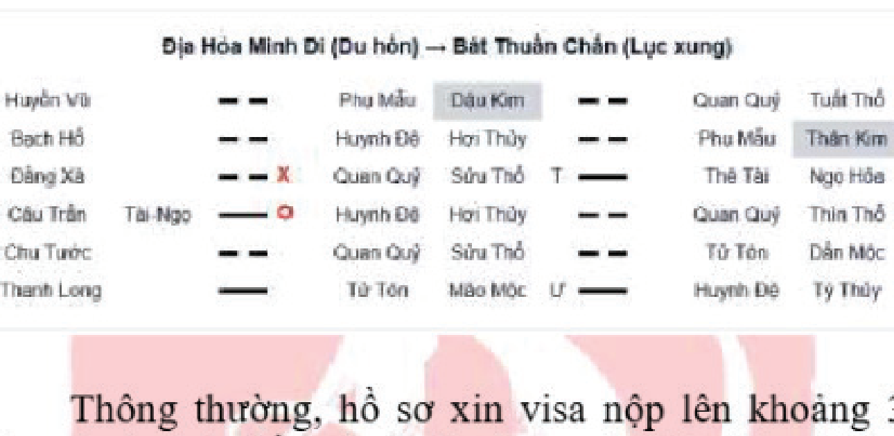

- **Cấu trúc Quẻ Dịch:**
  - **Quẻ chủ:** **Địa Hỏa Minh Di** (Cung Khảm, Họ Khảm – Quẻ Du Hồn)  
    *Tượng quẻ:* Minh Di là mặt trời lặn vào lòng đất, ánh sáng bị che khuất, thương tổn tai ách; kết hợp Du hồn thể hiện tâm lý hoang mang, dao động bất định, kỳ vọng điểm số quá cao xa rời thực tế năng lực.
  - **Quẻ biến:** **Bát Thuần Chấn** (Cung Chấn, Họ Chấn – Quẻ Lục Xung)  
    *Tượng quẻ:* Chấn là sấm động kinh hoàng, biến Lục xung báo hiệu mục tiêu điểm số định sẵn sẽ nhanh chóng tan vỡ, kế hoạch thi cử gặp cú sốc lớn.

- **Bảng chi tiết Lục hào:**

| Hào | Thế/Ứng | Lục thân (Chủ) | Can Chi | Biến động | Lục thân (Biến) | Can Chi (Biến) | Thần sát / Phục | Lục thú |
|:---:|:---:|:---|:---|:---:|:---|:---|:---|:---|
| 6 | | Phụ Mẫu | Dậu - Kim | tĩnh | Quan Quỷ | Tuất - Thổ | | Huyền Vũ |
| 5 | | Huynh Đệ | Hợi - Thủy | tĩnh | Phụ Mẫu | Thân - Kim | Kiếp sát | Bạch Hổ |
| 4 | **Thế** | Quan Quỷ | Sửu - Thổ | **X (Động)** | Thê Tài | Ngọ - Hỏa | Tuần không, Thiên hỷ, Quý nhân | Đằng Xà |
| 3 | | Huynh Đệ | Hợi - Thủy | **O (Động)** | Quan Quỷ | Thìn - Thổ | Kiếp sát / Phục Thê Tài Ngọ Hỏa | Câu Trần |
| 2 | | Quan Quỷ | Sửu - Thổ | tĩnh | Tử Tôn | Dần - Mộc | Tuần không, Thiên hỷ, Quý nhân | Chu Tước |
| 1 | **Ứng** | Tử Tôn | Mão - Mộc | tĩnh | Huynh Đệ | Tý - Thủy | Đào hoa, Dương nhẫn | Thanh Long |

---

### 3. Dụng thần & Loại quẻ

- **Phân loại quẻ:**
  - **Quẻ xem thay mất quyền chủ động kiểm soát:** Điểm số bài thi của con gái hoàn toàn phụ thuộc vào khả năng làm bài thực tế của thí sinh, cha mẹ không thể can thiệp hay định đoạt, do đó trực tiếp lấy lục thân Tử Tôn làm Dụng thần.
  - **Quẻ đa tầng hai dòng chảy sự kiện:** Quẻ vừa phản ánh việc thi cử trong nước của con (mất quyền kiểm soát), vừa phản ánh tiến trình lo thủ tục visa du học của cha mẹ (có quyền kiểm soát).
- **Xác định Dụng thần & Hệ thống tinh thần:**
  1. **Dụng thần cốt lõi (Tử Tôn Mão Mộc):** Cư hào Ứng (hào 1), đại diện cho người con gái và điểm số thành tích thực tế.
  2. **Nguyên thần sinh trợ (Huynh Đệ Hợi Thủy):** Cư hào 3 phát động, đại diện cho lực đẩy điểm số và sự nỗ lực làm bài.
  3. **Hào điểm số kế hoạch chỉ định (Quan Quỷ Thìn Thổ):** Hào biến của hào 3, mang Mưu tinh – đại diện cho mức điểm 645 điểm và ngôi trường cấp ba tương ứng với mức điểm đó.
  4. **Hào Thế (Quan Quỷ Sửu Thổ động hóa Thê Tài Ngọ Hỏa):** Đại diện cho hành động lo liệu phương án dự phòng xuất ngoại của cha mẹ.

---

### 4. Luận giải chi tiết

Quẻ này thể hiện nghệ thuật phân tách hai mặt của cùng một sự việc và cơ chế giải mã điểm số qua tương tác biến dịch:

#### 1. Dụng thần và sự bế tắc của điểm số thi cử trong nước
- Dụng thần Tử Tôn Mão Mộc tại hào Ứng lâm Đào hoa, Dương nhẫn: Sinh vào tháng Tị là tiết khí hưu tù, tuy có ngày Dần trợ khí nhưng lại ở trạng thái tĩnh. Muốn con gái thi bứt phá đạt được mức điểm cao chót vót 645 điểm thì bắt buộc Nguyên thần Huynh Đệ Hợi Thủy phải cực vượng và sinh trợ mạnh mẽ cho Dụng thần.
- Nguyên thần Huynh Đệ Hợi Thủy ở hào 3 phát động: Vốn dĩ phát động có xu hướng sinh trợ cho Tử Tôn Mão Mộc, nhưng Hợi Thủy lại biến ra Quan Quỷ Thìn Thổ.
- Thìn Thổ là hào biến quay đầu khắc ngược lại Hợi Thủy (**Hồi đầu khắc**). Đồng thời, Hợi Thủy sinh vào tháng Tị lâm Tuyệt địa, lại gặp Kiếp sát, bị hào biến Thìn Thổ khắc chế nặng nề. Do đó, Nguyên thần hoàn toàn bị đứt đoạn, không thể sinh trợ cho Tử Tôn Mão Mộc.

#### 2. Cơ chế Mưu tinh định vị con số và Thoái thần bẻ gãy điểm số
- Hào 3 Huynh Đệ Hợi Thủy động hóa Quan Quỷ Thìn Thổ mang **Mưu tinh**: Mưu tinh chủ mưu tính, kế hoạch định sẵn. Ở đây chỉ rõ chỉ tiêu 645 điểm đã định trước để đỗ vào trường cấp ba chỉ định.
- Thìn Thổ hồi đầu khắc Nguyên thần chứng minh kế hoạch đạt 645 điểm hoàn toàn thất bại.
- Quan hệ Thoái thần giữa hào Thế và Hào điểm số: Hào Thế Quan Quỷ Sửu Thổ phát động. Trong địa chi học, Sửu Thổ chính là **Thoái thần** của Thìn Thổ (Thìn thoái về Sửu).
- Sửu Thổ thoái thần phát động đồng thời tham gia khắc chế Nguyên thần Huynh Đệ Hợi Thủy. Điều này truyền tải thông điệp thực tế tàn khốc: con gái không những không thể đạt được 645 điểm, mà điểm số thi thực tế sẽ bị tụt dốc rất sâu, ngay cả các mức điểm thấp hơn nhiều cũng không thể với tới.

#### 3. Hai phương án song hành – Điềm báo cát tường từ hào Thế hồi đầu sinh
- Chu Thần Bân giải mã cấu trúc quẻ dựa trên thực tế gia đình đang chuẩn bị song song hai phương án: vừa thi cấp ba vừa xin visa du học.
- Hào Ứng đại diện cho đứa trẻ tự mình thi cử (mất quyền kiểm soát, kết quả bi đát); nhưng hào Thế lại đại diện cho cha mẹ đang chủ động chạy vạy thủ tục visa (có toàn quyền kiểm soát).
- Hào Thế Quan Quỷ Sửu Thổ phát động hóa Thê Tài Ngọ Hỏa: Đây là tượng **Hồi đầu sinh** (Ngọ Hỏa sinh Sửu Thổ). Sửu Thổ mang Quý nhân và Thiên hỷ phát động ở ngoại quái (nước ngoài).
- Thiên hỷ chủ tin vui hỷ khánh, Quý nhân chủ có người quyền quý giúp đỡ, Hồi đầu sinh chủ hành động của người nhà mang lại kết quả mỹ mãn. 
- Ứng kỳ hồi đầu sinh tại hào Ngọ: Báo trước rằng đến tháng Ngọ (tháng 5 âm lịch), tin vui lớn về visa du học nước ngoài sẽ chính thức báo về, giải thoát cho con gái khỏi áp lực trường lớp trong nước.

---

### 5. Kết luận & Ứng kỳ thực tế

- **Lời đoán và khuyến nghị của Chu Thần Bân:**
  - Khẳng định chắc chắn con gái tuyệt đối không thể thi đạt mức 645 điểm, thậm chí điểm thi thực tế sẽ thấp hơn kỳ vọng rất nhiều.
  - Tuy nhiên cha mẹ không cần quá đau lòng, bởi hào Thế hồi đầu sinh mang Thiên hỷ báo hiệu phương án du học do gia đình tự lo liệu sẽ thành công rực rỡ vào tháng Ngọ.
- **Phản hồi thực tế (Feedback):**
  - Người cha nghe giải đoán nhận ra kỳ vọng 645 điểm là ảo tưởng, bèn lập tức hạ thấp mục tiêu xuống và gieo tiếp quẻ Thực chiến 69 để hỏi xem liệu con có thể đạt 640 điểm hay không.
  - Kết quả thi thực tế sau đó con gái chỉ đạt 629 điểm (kém xa mức 645 điểm). Và đúng vào tháng Ngọ, visa du học nước ngoài đã được cấp thuận lợi.

---

### 6. Bài học tâm pháp & Quy tắc cốt lõi

- **Quy tắc trích dẫn (Rule Index p.97):**
  *Quy tắc quẻ Du hồn biến Lục xung và phân tích điểm số thi cử qua mức độ suy vượng của hào Tử tôn.*
- **Tâm pháp giải đoán thực chiến:**
  1. *Ý nghĩa hình thái Du hồn biến Lục xung:* Quẻ Du hồn thể hiện tâm lý hoang mang, định mức mục tiêu xa vời phi thực tế. Biến quẻ Lục xung báo hiệu sự việc sụp đổ chớp nhoáng, mộng tưởng tan vỡ.
  2. *Phương pháp phân tích quẻ đa tầng (Hai mặt tay trái - tay phải):* Trong cùng một quẻ hỏi, cần phân tách rõ yếu tố người hỏi không kiểm soát được (hào Ứng - điểm thi của con) và yếu tố người hỏi tự tay đạo diễn kiểm soát được (hào Thế - visa của cha mẹ) để đưa ra bức tranh toàn cảnh chính xác.
  3. *Mưu tinh và cơ chế Thoái thần trong định lượng:* Chi mang Mưu tinh đại diện cho mốc điểm số kế hoạch. Khi hào mang Mưu tinh hồi đầu khắc Nguyên thần, đồng thời bị Thoái thần khắc tiếp, điều đó khẳng định chắc chắn điểm thi sẽ sụt giảm nghiêm trọng.

## THỰC CHIẾN 69: CON CÓ THỂ ĐẠT ĐƯỢC 640 ĐIỂM KHÔNG?

---

### 1. Bối cảnh & Câu hỏi

- **Bối cảnh chi tiết:** 
  Sau khi nhận được lời giải đoán từ quẻ Thực chiến 68 vào rạng sáng ngày 27 tháng 5 năm 2017 khẳng định con gái tuyệt đối không thể thi đạt mức 645 điểm, người cha hiểu rằng mục tiêu vào ngôi trường cấp ba top 1 đã tan vỡ. 
  Để tìm kiếm một phương án trường học khác an toàn hơn trong hệ thống công lập địa phương, đến tối cùng ngày (lúc 20:25), người cha quyết định hạ kỳ vọng điểm số xuống một nấc và gieo quẻ hỏi tiếp: Liệu con gái có thể thi đạt được 640 điểm để nộp hồ sơ vào trường thuộc nhóm 2 hay không.
- **Tâm lý & Câu hỏi ẩn ý:** 
  Đương số vẫn chưa thoát khỏi tâm lý lo âu và kỳ vọng thái quá, cố gắng bám víu vào con số 640 điểm như chiếc phao cứu sinh cuối cùng cho kỳ thi trong nước, trong bối cảnh kết quả visa du học nước ngoài vẫn đang bặt vô âm tín.
- **Thời gian chiêm đoán:**
  - Dương lịch: Ngày 27 tháng 5 năm 2017, lúc 20:25 (Giờ Bắc Kinh).
  - Can chi: Năm Đinh Dậu, tháng Ất Tị, ngày Giáp Dần, giờ Giáp Tuất (Tuần không: Tý, Sửu).

---

### 2. Dữ kiện & Bảng quẻ Crop

- **Thời không chiêm nghiệm:**
  - Tháng Ất Tị (Hỏa vượng, Thổ tướng, Kim trường sinh, Thủy tuyệt, Mộc hưu).
  - Ngày Giáp Dần (Mộc đắc Lộc vượng, Hỏa tướng, Kim tuyệt).
  - Tuần không: Tý, Sửu (Giáp Dần tuần trung).
- **Thần sát:**
  - Tướng tinh: Ngọ
  - Hoa cái: Tuất (Lâm hào 4)
  - Dịch mã: Thân
  - Tai sát: Tý (Lâm hào Thế động, lâm Tuần không)
  - Mưu tinh: Thìn
  - Đào hoa: Mão (Lâm hào 3 động)
  - Kiếp sát: Hợi
  - Lộc thần: Dần (Lâm hào 6 động, lâm Nhật kiến)
  - Dương nhẫn: Mão (Lâm hào 3 động)
  - Văn xương: Tị (Lâm hào Ứng, lâm Nguyệt kiến)
  - Thiên y: Thìn
  - Thiên hỷ: Sửu
  - Quý nhân: Sửu, Mùi (Mùi lâm hào 1)

- Dữ kiện bảng quẻ và các thông số chiêm đoán:
  - **Bảng 69.1** Đồ hình quẻ Thực chiến 69:
    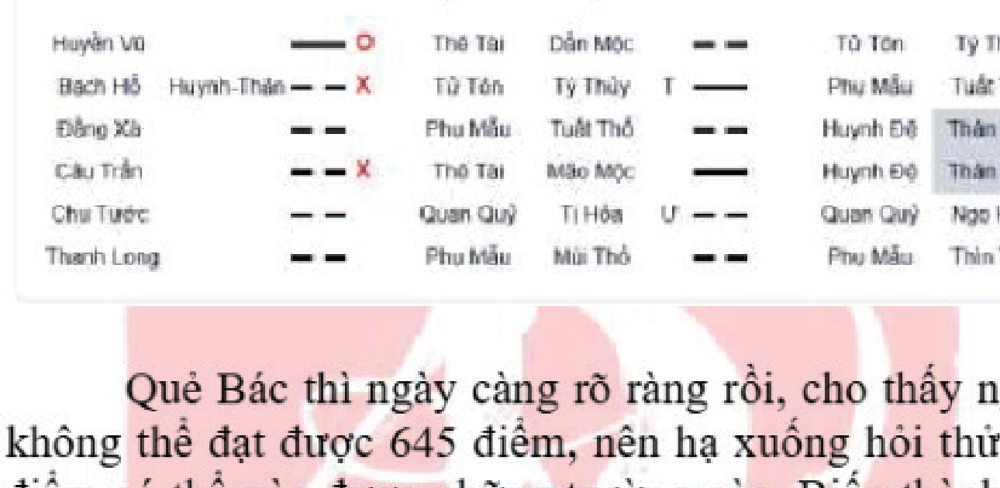

- **Cấu trúc Quẻ Dịch:**
  - **Quẻ chủ:** **Sơn Địa Bác** (Cung Càn, Họ Càn)  
    *Tượng quẻ:* Bác nghĩa là bóc mòn, rụng rơi, tiêu điều suy sụp; báo hiệu thành tích thi cử và kỳ vọng trong nước tiếp tục bị bào mòn nghiêm trọng.
  - **Quẻ biến:** **Thủy Sơn Kiển** (Cung Đoài, Họ Đoài)  
    *Tượng quẻ:* Kiển nghĩa là gian nan, hiểm trở, hành hiểm; biểu thị việc đặt cược vào mốc 640 điểm để nộp trường trong nước là vô cùng mạo hiểm và lành ít dữ nhiều.

- **Bảng chi tiết Lục hào:**

| Hào | Thế/Ứng | Lục thân (Chủ) | Can Chi | Biến động | Lục thân (Biến) | Can Chi (Biến) | Thần sát / Phục | Lục thú |
|:---:|:---:|:---|:---|:---:|:---|:---|:---|:---|
| 6 | | Thê Tài | Dần - Mộc | **O (Động)** | Tử Tôn | Tý - Thủy | Lộc thần, Nhật kiến | Huyền Vũ |
| 5 | **Thế** | Tử Tôn | Tý - Thủy | **X (Động)** | Phụ Mẫu | Tuất - Thổ | Tuần không, Tai sát / Phục Huynh Đệ Thân Kim | Bạch Hổ |
| 4 | | Phụ Mẫu | Tuất - Thổ | tĩnh | Huynh Đệ | Thân - Kim | Hoa cái | Đằng Xà |
| 3 | | Thê Tài | Mão - Mộc | **X (Động)** | Huynh Đệ | Thân - Kim | Đào hoa, Dương nhẫn | Câu Trần |
| 2 | **Ứng** | Quan Quỷ | Tị - Hỏa | tĩnh | Quan Quỷ | Ngọ - Hỏa | Nguyệt kiến, Văn xương | Chu Tước |
| 1 | | Phụ Mẫu | Mùi - Thổ | tĩnh | Phụ Mẫu | Thìn - Thổ | Quý nhân | Thanh Long |

---

### 3. Dụng thần & Loại quẻ

- **Phân loại quẻ:**
  - **Quẻ việc cụ thể xem thay con thi cử:** Khảo sát năng lực đạt điểm chuẩn 640 điểm và định hướng hai phương án học tập trong nước và xuất ngoại.
- **Xác định Dụng thần & Hệ thống tinh thần:**
  1. **Dụng thần cốt lõi (Tử Tôn Tý Thủy):** Trì Thế tại hào 5, đại diện cho bản thân con gái và mức điểm số bài thi thực tế.
  2. **Hào Ứng (Quan Quỷ Tị Hỏa):** Lâm Nguyệt kiến, Chu Tước, Văn Xương tinh – đại diện cho kết quả khảo hạch, thành tích chính thức và học vị.
  3. **Hệ thống Phụ Mẫu (Phụ Mẫu Tuất Thổ hào 4 và Phụ Mẫu Mùi Thổ hào 1):** Đại diện cho các trường trung học phổ thông trong nước đang xem xét nộp hồ sơ.
  4. **Hai hào Thê Tài phát động (Hào 3 Thê Tài Mão Mộc và Hào 6 Thê Tài Dần Mộc):** Là Nguyên thần sinh trợ cho Quan Quỷ Tị Hỏa (thành tích), đại diện cho hai kênh tạo ra tư cách học tập:
     - Hào 3 (Nội quái): Kênh thi tuyển sinh trong nước.
     - Hào 6 (Ngoại quái): Kênh xin visa đi du học nước ngoài.

---

### 4. Luận giải chi tiết

Quẻ này là minh chứng sắc bén cho quy tắc "Dụng thần động hóa hồi đầu khắc lâm Bạch Hổ" và phương pháp phân tách Nội quái - Ngoại quái trong xử lý quẻ đa tầng:

#### 1. Dụng thần động hóa Phụ Mẫu hồi đầu khắc lâm Bạch Hổ
- Hào Thế mang Dụng thần Tử Tôn Tý Thủy lâm Bạch Hổ: Tý Thủy hiện tại lâm Tuần không, sinh vào tháng Tị lâm Tuyệt địa, ngày Dần tiết khí, là trạng thái cực kỳ hưu tù suy nhược. Hào lâm Tuần không biểu thị kỳ thi chưa diễn ra.
- Tử Tôn Tý Thủy phát động biến ra Phụ Mẫu Tuất Thổ: Tuất Thổ là hào biến quay đầu khắc ngược lại Dụng thần (**Hồi đầu khắc**). Lại thêm lâm Bạch Hổ (Bạch Hổ chủ thảm bại, hung tin).
- Trong dự đoán thi cử, Dụng thần suy kiệt lại động hóa Phụ Mẫu hồi đầu khắc lâm Bạch Hổ là điềm báo chắc chắn: điểm thi sẽ rớt thảm hại, mốc 640 điểm hoàn toàn không thể đạt được.

#### 2. Phân tích hào Ứng – Thành tích thi cử và các trường học
- Hào Ứng Quan Quỷ Tị Hỏa mang Nguyệt kiến, Chu Tước và Văn Xương tinh: Chu Tước chủ văn bút, thi cử; Văn Xương chủ điểm số và học vấn. Hào Ứng chính là đại diện cho kết quả thành tích thi tuyển.
- Phụ Mẫu Thổ đại diện cho trường học. Trong quẻ có Phụ Mẫu Tuất Thổ và Phụ Mẫu Mùi Thổ, đại diện cho hai trường học khác nhau trong nước. Quan Quỷ Tị Hỏa là Nguyên thần sinh Phụ Mẫu Thổ, nghĩa là phải có thành tích thi thì mới bước chân được vào các trường này.
- Hai hào Thê Tài (Dần Mộc và Mão Mộc) phát động chính là Nguyên thần sinh cho Quan Quỷ Tị Hỏa, đại diện cho các phương thức khác nhau để giành lấy tư cách vào trường.

#### 3. Đối chiếu Nội quái và Ngoại quái: Bế tắc trong nước và Lối thoát nước ngoài
- **Hào 3 Thê Tài Mão Mộc (Nội quái – Việc trong nước):** 
  Phát động biến ra Huynh Đệ Thân Kim (**Hồi đầu khắc**). Mão Mộc bị Thân Kim bẻ gãy, hoàn toàn mất khả năng sinh trợ cho Quan Quỷ Tị Hỏa ở hào Ứng. Điều này khẳng định tư cách tuyển sinh và thi cử trong nước thất bại nặng nề, điểm số không thể đáp ứng yêu cầu.
- **Hào 6 Thê Tài Dần Mộc (Ngoại quái – Việc nước ngoài):** 
  Hào 6 là hào tối cao đại diện cho biên giới, nước ngoài. Dần Mộc phát động biến ra Tử Tôn Tý Thủy. Ở đây, hào biến Tý Thủy quay trở lại sinh vượng cho Thê Tài Dần Mộc (**Hồi đầu sinh**), tiếp sức cho Dần Mộc sinh Quan Quỷ Tị Hỏa.
  Điều này báo hiệu: con đường xuất ngoại du học vô cùng hanh thông. Chỉ cần visa nước ngoài được duyệt thì không cần điểm thi trong nước vẫn đàng hoàng có chỗ học tập danh giá.

#### 4. Cơ chế Ứng kỳ giải không
- Hào biến Tử Tôn Tý Thủy hiện tại lâm Tuần không. Đến tháng Ngọ (tháng 6 dương lịch), Ngọ Hỏa lâm Nguyệt lệnh tương xung Tý Thủy (Tý Ngọ tương xung), làm cho Tý Thủy **Xung xuất tuần không**.
- Khi xuất không, Tý Thủy sinh vượng Dần Mộc, kích hoạt toàn bộ dòng chảy thành công ở ngoại quái. Do đó quẻ ngầm mách bảo: Sang tháng 6, kết quả visa du học nước ngoài sẽ có tin vui chính thức.

---

### 5. Kết luận & Ứng kỳ thực tế

- **Lời đoán và khuyến nghị của Chu Thần Bân:**
  - Khẳng định con gái không thể thi đạt mức 640 điểm, kết quả thi trong nước sẽ rất kém, không thể đỗ vào các trường công lập điểm cao.
  - Tuy nhiên, gia đình không cần lo lắng vì cửa du học nước ngoài (hào 6 động hóa sinh) rất sáng, sang tháng 6 (tháng Ngọ) visa chắc chắn sẽ thông qua.
- **Phản hồi thực tế (Feedback):**
  - Thực tế khi công bố điểm thi, con gái chỉ đạt vỏn vẹn **629 điểm** (kém xa mức 640 điểm và kỳ vọng 660 điểm ban đầu của gia đình), chỉ vừa ngấp nghé chạm đợt tuyển sớm của một trường cấp ba bình thường ở Quảng Châu.
- **Ứng kỳ chiêm nghiệm:**
  - Đúng vào tháng 6 (tháng Ngọ), thông báo phê duyệt visa du học từ Đại sứ quán gửi về, hoàn tất thắng lợi kế hoạch xuất ngoại cho con gái.

---

### 6. Bài học tâm pháp & Quy tắc cốt lõi

- **Quy tắc trích dẫn (Rule Index p.103):**
  *Quy tắc quẻ Bác biến Kiển: Dụng thần động hóa Phụ mẫu hồi đầu khắc lâm Bạch Hổ khi thi tuyển sinh.*
- **Tâm pháp giải đoán thực chiến:**
  1. *Hồi đầu khắc lâm Bạch Hổ định đoạt kết quả thi cử:* Dụng thần Tử Tôn động hóa Phụ Mẫu hồi đầu khắc kèm theo Bạch Hổ là tượng tiêu vong điểm số, phản ánh bài thi làm rất tệ, điểm thực tế tụt xa so với kỳ vọng.
  2. *Quy tắc phân vùng Nội quái – Ngoại quái:* Hào động ở nội quái (hào 1, 2, 3) biểu thị sự việc diễn ra trong nước; hào động ở ngoại quái (hào 4, 5, 6) biểu thị sự việc diễn ra ở nước ngoài. Hai hào cùng loại phát động nhưng một bên hóa khắc (nội), một bên hóa sinh (ngoại) giúp phân định rõ nơi nào bế tắc, nơi nào mở lối.
  3. *Nguyên tắc Xung không định Ứng kỳ:* Hào biến lâm Tuần không không thể phát huy tác dụng ngay; thời điểm Nguyệt lệnh tương xung (tháng Ngọ xung Tý) sẽ kích hoạt năng lượng của hào biến, tạo ra bước ngoặt thành công thực tế.

## THỰC CHIẾN 70: HỎI CON GÁI THI VÀO TRUNG HỌC CƠ SỞ CÓ ĐỖ VÀO TRƯỜNG TRUNG HỌC SỐ 3 ĐÃ CHỈ ĐỊNH KHÔNG

---

### 1. Bối cảnh & Câu hỏi

- **Bối cảnh chi tiết:** 
  Sau kỳ thi tuyển sinh trung học, kết quả bài thi của con gái được công bố: con chỉ đạt 629 điểm, không đạt ngay cả mức điểm chuẩn tối thiểu 631 điểm của các trường công lập bình thường. Ngày hôm sau là hạn chót để phụ huynh và học sinh hoàn thành việc điền nguyện vọng phân bổ trường học.
  Gia đình quyết định thử vận may lần cuối cùng, muốn đăng ký vào trường Trung học số 3 – một ngôi trường trọng điểm có tiếng tại địa phương. Năm trước, điểm chuẩn vào trường này dao động khoảng 639 điểm (cao hơn điểm số thực tế của con gái tới 10 điểm). Phụ huynh mang tâm lý: nếu ngay cả trường Trung học số 3 này mà không đỗ thì gia đình cũng không ưng ý bất kỳ trường cấp ba nào khác tại địa phương. Người cha liền gieo quẻ hỏi Chu Thần Bân: Liệu con gái với mức điểm 629 này có thể đỗ vào trường Trung học số 3 đã chỉ định hay không?
- **Tâm lý & Câu hỏi ẩn ý:** 
  Đương số ở vào thế chân tường, tâm trạng vừa tuyệt vọng vừa nuôi ảo tưởng cầu may, cố chấp bấu víu vào một cơ hội mong manh để cứu vãn việc học trong nước, trong khi kết quả visa du học nước ngoài vẫn đang chờ đợi mòn mỏi.
- **Thời gian chiêm đoán:**
  - Dương lịch: Ngày 20 tháng 6 năm 2017, lúc 11:25 (Giờ Bắc Kinh).
  - Can chi: Năm Đinh Dậu, tháng Bính Ngọ, ngày Mậu Dần, giờ Mậu Ngọ (Tuần không: Thân, Dậu).

---

### 2. Dữ kiện & Bảng quẻ Crop

- **Thời không chiêm nghiệm:**
  - Tháng Bính Ngọ (Hỏa vượng, Thổ tướng, Mộc hưu, Kim tù, Thủy tuyệt/phá).
  - Ngày Mậu Dần (Mộc đắc Lộc vượng, Hỏa trường sinh, Kim tuyệt).
  - Tuần không: Thân, Dậu (Giáp Tuất tuần trung).
- **Thần sát:**
  - Tướng tinh: Ngọ (Lâm Nguyệt kiến, thời chi)
  - Hoa cái: Tuất (Lâm hào Thế)
  - Dịch mã: Thân (Lâm Tuần không)
  - Tai sát: Tý (Lâm hào 5 động, lâm Nguyệt phá)
  - Mưu tinh: Thìn (Lâm hào 3)
  - Đào hoa: Mão
  - Kiếp sát: Hợi
  - Lộc thần: Tị (Phục thần dưới hào 5)
  - Dương nhẫn: Thìn (Lâm hào 3)
  - Văn xương: Thân (Lâm Tuần không)
  - Thiên y: Tị
  - Thiên hỷ: Sửu
  - Quý nhân: Sửu, Mùi

- Dữ kiện bảng quẻ và các thông số chiêm đoán:
  - **Bảng 70.1** Đồ hình quẻ Thực chiến 70:
    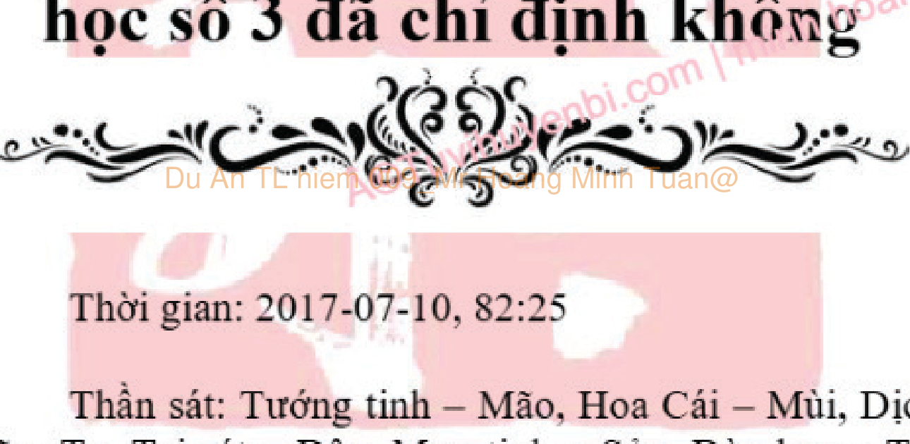

- **Cấu trúc Quẻ Dịch:**
  - **Quẻ chủ:** **Sơn Lôi Di** (Cung Tốn, Họ Tốn – Quẻ Du Hồn)  
    *Tượng quẻ:* Di nghĩa là dưỡng dục, nuôi nấng; kết hợp Du hồn phản ánh tâm lý gia đình đang trôi nổi bất định, kỳ vọng viển vông vào một điều may rủi không có cơ sở thực tế.
  - **Quẻ biến:** **Phong Lôi Ích** (Cung Tốn, Họ Tốn)  
    *Tượng quẻ:* Ích là gia tăng, thêm lợi, gió sấm tăng cường sinh khí; mang thông điệp đại cát vượt lên trên bế tắc cục bộ.

- **Bảng chi tiết Lục hào:**

| Hào | Thế/Ứng | Lục thân (Chủ) | Can Chi | Biến động | Lục thân (Biến) | Can Chi (Biến) | Thần sát / Phục | Lục thú |
|:---:|:---:|:---|:---|:---:|:---|:---|:---|:---|
| 6 | | Huynh Đệ | Dần - Mộc | tĩnh | Huynh Đệ | Mão - Mộc | Nhật kiến | Huyền Vũ |
| 5 | | Phụ Mẫu | Tý - Thủy | **X (Động)** | Tử Tôn | Tị - Hỏa | Nguyệt phá, Tai sát / Phục Tử Tôn Tị Hỏa | Bạch Hổ |
| 4 | **Thế** | Thê Tài | Tuất - Thổ | tĩnh | Thê Tài | Mùi - Thổ | Hoa cái | Đằng Xà |
| 3 | | Thê Tài | Thìn - Thổ | tĩnh | Thê Tài | Thìn - Thổ | Mưu tinh, Dương nhẫn / Phục Quan Quỷ Dậu Kim | Câu Trần |
| 2 | | Huynh Đệ | Dần - Mộc | tĩnh | Huynh Đệ | Dần - Mộc | Nhật kiến | Chu Tước |
| 1 | **Ứng** | Phụ Mẫu | Tý - Thủy | tĩnh | Phụ Mẫu | Tý - Thủy | Nguyệt phá, Tai sát | Thanh Long |

---

### 3. Dụng thần & Loại quẻ

- **Phân loại quẻ:**
  - **Quẻ việc cụ thể xem thay con thi cử:** Khảo sát khả năng trúng tuyển vào một trường học cụ thể được chỉ định sẵn (Trường Trung học số 3).
- **Xác định Dụng thần & Hệ thống tinh thần:**
  1. **Dụng thần cốt lõi (Phụ Mẫu Tý Thủy):** Cư hào 5 phát động, đại diện cho học bạ, giấy báo trúng tuyển và chính ngôi trường Trung học số 3 được chỉ định.
  2. **Hào Thế (Thê Tài Tuất Thổ):** Đại diện cho bản thân phụ huynh người hỏi.
  3. **Hào biến (Tử Tôn Tị Hỏa):** Tuyệt địa của Dụng thần Tý Thủy.
  4. **Hào Ứng (Phụ Mẫu Tý Thủy):** Cư hào 1 lâm Nguyệt phá, tái khẳng định môi trường học tập trong nước bị sụp đổ.

---

### 4. Luận giải chi tiết

Quẻ này là bài học mẫu mực về cơ chế "Phụ Mẫu động hóa tuyệt lâm Bạch Hổ" và khả năng nhìn thấu thông điệp đa tầng của quẻ Dịch khi quẻ biến đối nghịch với quẻ chủ:

#### 1. Cơ chế Phụ Mẫu động hóa tuyệt lâm Bạch Hổ
- Dụng thần Phụ Mẫu Tý Thủy cư hào 5 phát động:
  - Sinh vào tháng Ngọ: Tý Thủy bị Nguyệt kiến Ngọ Hỏa xung phá dữ dội (**Nguyệt phá**), lâm Tai sát.
  - Ngày Mậu Dần: Dần Mộc tiết khí của Thủy, khiến Tý Thủy lâm vào trạng thái suy kiệt hoàn toàn.
- Tý Thủy phát động biến ra Tử Tôn Tị Hỏa:
  - Theo quy luật Trường sinh 12 cung của ngũ hành, Thủy trường sinh tại Thân và lâm **Tuyệt địa tại Tị**. Do đó, Tý Thủy động biến Tị Hỏa được định danh là **Động hóa tuyệt** (hào động tự đưa mình vào cõi diệt vong, chấm dứt hoàn toàn).
  - Tý Thủy lại lâm **Bạch Hổ**: Bạch Hổ chủ hung tin, mất mát, bị loại trừ dứt khoát.
- Phụ Mẫu đại diện cho trường học chỉ định. Hào Phụ Mẫu vừa Nguyệt phá, vừa động hóa tuyệt, lại lâm Bạch Hổ, là thông điệp dứt khoát: **Cánh cửa vào trường Trung học số 3 bị đóng chặt 100%**, hoàn toàn không có bất kỳ cơ hội may rủi hay ngoại lệ nào.

#### 2. Giải mã nghịch lý Quẻ biến "Phong Lôi Ích" – Thông điệp xuất cảnh vượt tầm
- Nếu trường học chỉ định không thể đỗ, điểm thi lại kém, tại sao quẻ biến lại là **Phong Lôi Ích** (Ích mang ý nghĩa thêm lợi, hỷ khánh, tràn đầy sinh khí)?
- Chu Thần Bân giải mã tầng thứ sâu xa của quẻ Dịch:
  - Quẻ tượng không bị giới hạn trong câu hỏi nhỏ hẹp và bế tắc của người hỏi. Tượng quẻ liên tục phát đi tín hiệu thức tỉnh đương số: Việc trượt trường Trung học số 3 không phải là tai họa, mà là sự giải thoát.
  - Quẻ biến thành Ích chính là ngầm báo tin vui lớn: Việc nộp hồ sơ xin visa du học ra nước ngoài đã thành công! Con đường xuất ngoại mới thực sự là "Ích" – mở ra tương lai xán lạn và phù hợp hơn ngàn lần cho đứa trẻ so với việc cố chen chân vào trường cấp ba trong nước.

---

### 5. Kết luận & Ứng kỳ thực tế

- **Lời đoán và khuyến nghị của Chu Thần Bân:**
  - Khẳng định dứt khoát con gái không thể đỗ vào trường Trung học số 3 đã định. Phụ huynh không nên nuôi hy vọng hão huyền hay tìm cách chạy chọt vô ích.
  - Tuy nhiên, khuyên gia đình hãy chuẩn bị tâm lý đón tin vui, bởi vì việc xin thị thực xuất cảnh du học nước ngoài sắp có kết quả thắng lợi (tượng quẻ Ích).
- **Phản hồi thực tế (Feedback):**
  - Con gái chính thức không đỗ vào trường Trung học số 3 (điểm chuẩn 639 điểm, con chỉ đạt 629 điểm).
- **Ứng kỳ chiêm nghiệm:**
  - Đúng như tượng quẻ Ích dự báo, chỉ ít ngày sau (vào ngày cuối cùng của tháng Tị âm lịch, như quẻ Thực chiến 71 phản hồi), visa du học nước ngoài đã được Đại sứ quán phê duyệt và cấp phát thành công.

---

### 6. Bài học tâm pháp & Quy tắc cốt lõi

- **Quy tắc trích dẫn (Rule Index p.107):**
  *Quy tắc hào Phụ mẫu động hóa tuyệt lâm Bạch Hổ khi chọn trường chỉ định và quẻ đa tầng báo tin xuất ngoại.*
- **Tâm pháp giải đoán thực chiến:**
  1. *Quy tắc Động hóa tuyệt lâm Bạch Hổ:* Khi chiêm đoán việc chọn trường, xin việc hoặc mưu cầu công danh, Dụng thần lâm Nguyệt phá lại động hóa Tuyệt địa kèm theo Bạch Hổ là điềm báo chắc chắn đối tượng chỉ định bị loại bỏ triệt để, không còn khả năng cứu vãn.
  2. *Tâm pháp Quẻ chuyển tầng báo tin đại cuộc:* Khi người hỏi đặt câu hỏi trong trạng thái bế tắc quẩn quanh, quẻ Dịch thường trả lời dứt khoát kết quả cục bộ (hung), đồng thời quẻ biến hé lộ chuyển biến của đại cuộc (cát). Người giải quẻ phải có tầm nhìn bao quát toàn bộ tiến trình sự kiện để định hướng cho đương sự.

## THỰC CHIẾN 71: CON GÁI THI VÀO TRƯỜNG CẤP BA ĐỊA PHƯƠNG, CÓ NÊN NHỜ NGƯỜI LO LÓT QUAN HỆ KHÔNG

---

### 1. Bối cảnh & Câu hỏi

- **Bối cảnh chi tiết:** 
  Sau khi kết quả thi tuyển sinh công bố con gái chỉ đạt 629 điểm (không đỗ vào trường Trung học số 3 như quẻ Thực chiến 70 đã dự báo), trong khi thủ tục xét duyệt visa du học nước ngoài vẫn tiếp tục bị kéo dài chưa có hồi âm chính thức.
  Gia đình rơi vào trạng thái sốt ruột cùng cực và tính đến phương án xấu nhất: nếu visa du học chẳng may bị từ chối, con gái sẽ rơi vào cảnh không có trường cấp ba chất lượng để học tập. Để đón đầu tình huống này, người cha nảy sinh ý định chủ động tìm kiếm các mối quan hệ quyền thế quen biết tại địa phương để "chạy trường", lo lót một suất tuyển sinh trái tuyến vào một trường cấp ba trọng điểm. Tuy nhiên, việc chạy chọt quan hệ đòi hỏi chi phí tiền bạc rất lớn và tiềm ẩn rủi ro pháp lý, khiến đương số vô cùng phân vân. Người cha bèn tìm đến Chu Thần Bân gieo quẻ hỏi: "Có nên nhờ người lo lót quan hệ để xin trường cho con gái không?".
- **Tâm lý & Câu hỏi ẩn ý:** 
  Đương số mang tâm lý hoang mang, mất bình tĩnh, sốt ruột và lo sợ mất phương hướng, muốn dùng tiền bạc và quan hệ để "mua sự an toàn" trước mắt cho con, dù bản thân chưa thực sự muốn từ bỏ giấc mơ du học.
- **Thời gian chiêm đoán:**
  - Dương lịch: Ngày 10 tháng 7 năm 2017, lúc 08:50 (Giờ Bắc Kinh).
  - Can chi: Năm Đinh Dậu, tháng Ất Tị, ngày Ất Mão, giờ Đinh Sửu (Tuần không: Tý, Sửu).

---

### 2. Dữ kiện & Bảng quẻ Crop

- **Thời không chiêm nghiệm:**
  - Tháng Ất Tị (Hỏa vượng, Thổ tướng, Kim trường sinh, Mộc hưu, Thủy tuyệt).
  - Ngày Ất Mão (Mộc đắc Lộc vượng, Hỏa tướng, Kim tuyệt).
  - Tuần không: Tý, Sửu (Giáp Dần tuần trung).
- **Thần sát:**
  - Tướng tinh: Mão (Lâm Nhật kiến, lâm hào biến)
  - Hoa cái: Mùi (Lâm hào 6 động)
  - Dịch mã: Tị (Lâm Nguyệt kiến, lâm hào biến của hào Thế)
  - Tai sát: Dậu (Lâm hào 5)
  - Mưu tinh: Sửu (Lâm thời chi, lâm Tuần không)
  - Đào hoa: Tý (Lâm Tuần không)
  - Kiếp sát: Thân
  - Lộc thần: Mão (Lâm Nhật kiến, lâm hào biến)
  - Dương nhẫn: Dần (Lâm hào Thế động)
  - Văn xương: Ngọ (Lâm hào 3)
  - Thiên y: Thìn (Lâm hào 2)
  - Thiên hỷ: Sửu (Lâm Tuần không)
  - Quý nhân: Thân, Tý (Tý lâm Tuần không)

- Dữ kiện bảng quẻ và các thông số chiêm đoán:
  - **Bảng 71.1** Đồ hình quẻ Thực chiến 71:
    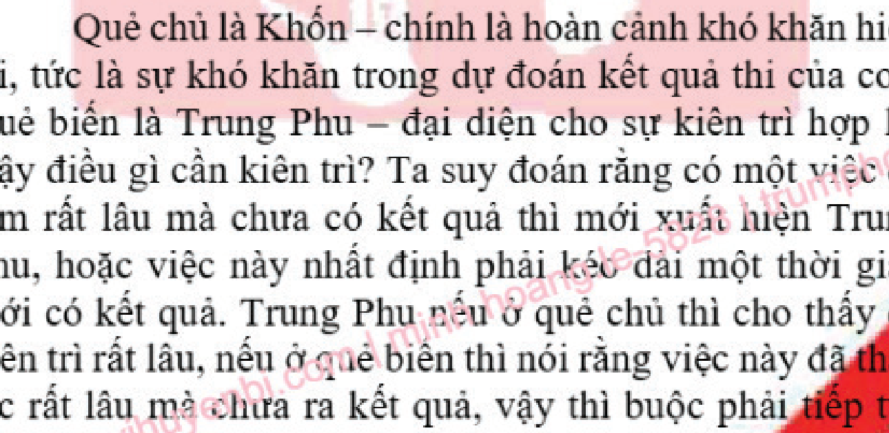

- **Cấu trúc Quẻ Dịch:**
  - **Quẻ chủ:** **Trạch Thủy Khốn** (Cung Đoài, Họ Đoài – Quẻ Lục Hợp)  
    *Tượng quẻ:* Khốn là bế tắc, cùng quẫn, chim vào lồng, nước chảy dưới đầm; phản ánh tình thế tiến thoái lưỡng nan, bế tắc và lo âu cao độ của gia đình đương số.
  - **Quẻ biến:** **Phong Trạch Trung Phu** (Cung Cấn, Họ Cấn – Quẻ Du Hồn)  
    *Tượng quẻ:* Trung Phu là thành tín, tín nghĩa, kiên trì giữ vững niềm tin nội tại; quẻ biến Trung Phu chỉ rõ có một việc lớn đã thao tác từ rất lâu, đang trong giai đoạn chờ đợi gay cấn và bắt buộc phải tiếp tục kiên trì, không được nóng vội.

- **Bảng chi tiết Lục hào:**

| Hào | Thế/Ứng | Lục thân (Chủ) | Can Chi | Biến động | Lục thân (Biến) | Can Chi (Biến) | Thần sát / Phục | Lục thú |
|:---:|:---:|:---|:---|:---:|:---|:---|:---|:---|
| 6 | | Phụ Mẫu | Mùi - Thổ | **X (Động)** | Thê Tài | Mão - Mộc | Hoa cái | Huyền Vũ |
| 5 | | Huynh Đệ | Dậu - Kim | tĩnh | Quan Quỷ | Tị - Hỏa | Tai sát | Bạch Hổ |
| 4 | **Ứng** | Tử Tôn | Hợi - Thủy | **O (Động)** | Phụ Mẫu | Mùi - Thổ | Kiếp sát | Đằng Xà |
| 3 | | Quan Quỷ | Ngọ - Hỏa | tĩnh | Phụ Mẫu | Sửu - Thổ | Văn xương | Câu Trần |
| 2 | | Phụ Mẫu | Thìn - Thổ | tĩnh | Thê Tài | Mão - Mộc | Thiên y | Chu Tước |
| 1 | **Thế** | Thê Tài | Dần - Mộc | **X (Động)** | Quan Quỷ | Tị - Hỏa | Dương nhẫn | Thanh Long |

---

### 3. Dụng thần & Loại quẻ

- **Phân loại quẻ:**
  - **Quẻ việc cụ thể thẩm định hành vi chủ quan:** Có nên nhờ người lo lót quan hệ chạy trường hay không.
  - **Quẻ phản ánh sự lệch hướng ý niệm:** Người hỏi đặt câu hỏi chạy trường trong nước, nhưng quẻ tượng lại phơi bày đại cuộc của hồ sơ xuất cảnh du học nước ngoài.
- **Xác định Dụng thần & Hệ thống tinh thần:**
  1. **Nhóm hào Thế (Thê Tài Dần Mộc động hóa Quan Quỷ Tị Hỏa):** Đại diện cho hành động chủ quan của gia đình trong việc chạy vọt quan hệ tại địa phương.
  2. **Nhóm hào Ứng (Tử Tôn Hợi Thủy động) kết hợp Hào 6 (Phụ Mẫu Mùi Thổ động):** Đại diện cho con gái và hồ sơ thủ tục xuất cảnh.
  3. **Tam hợp cục Hợi Mão Mùi hóa Mộc cục:** Biểu thị tiến trình phê duyệt hồ sơ thị thực du học nước ngoài đang đi vào hồi kết viên mãn.

---

### 4. Luận giải chi tiết

Quẻ này là bài học kinh điển về cảnh báo "Hào Thế hóa Quỷ", cơ chế giải mã tâm lý lệch hướng và ứng dụng Tam hợp cục trong dự đoán sự vụ:

#### 1. Cảnh báo hung hiểm từ tượng "Hào Thế hóa Quỷ"
- Hào Thế Thê Tài Dần Mộc ngụ tại nội quái (việc trong nước) phát động biến ra Quan Quỷ Tị Hỏa:
  - Tị Hỏa lâm Dịch mã (Mã tinh chủ chạy vạy, bôn ba khắp nơi). Tượng hào Thế mang Dương nhẫn động hóa Quỷ mang Dịch mã phản ánh đúng ý định của người cha: đang chuẩn bị đôn đáo ngược xuôi đem tiền đi lo lót, chạy vạy các cửa quan hệ.
  - Tuy nhiên, trong Lục Hào, hào Thế biến ra Quan Quỷ được gọi là **Hào Thế hóa Quỷ**. Nếu việc nên làm thì hào Thế phải biến Hồi đầu sinh hoặc biến Tử Tôn an lành. Đằng này Thế hóa Quỷ chủ tai họa, thị phi, phiền toái quấn thân, tiền mất tật mang.
- Chu Thần Bân dẫn giải kinh nghiệm thực chiến: Khi đương sự hỏi có nên nhờ người chạy chọt hay không mà gặp hào Thế hóa Quỷ thì tuyệt đối **KHÔNG ĐƯỢC ĐỘNG**. Nếu án binh bất động, sự việc sẽ tự qua đi êm đẹp; nếu hấp tấp manh động chạy chọt, người ngoài sẽ nhìn vào nghi ngờ, từ chỗ không có chuyện biến thành có chuyện, tự rước vạ vào thân.

#### 2. Quẻ biến "Phong Trạch Trung Phu" – Mệnh lệnh kiên trì
- Quẻ biến xuất hiện Phong Trạch Trung Phu: Trung Phu chủ tín nghĩa và sự kiên trì lâu dài.
- Trong thực tế, việc thi cử trong nước đã xong điểm, không thể là đối tượng cần "kiên trì". Đối tượng duy nhất đang cần kiên trì chính là hồ sơ xin visa du học nước ngoài đã nộp nhiều tháng qua đang chờ duyệt.
- Quẻ tượng ngầm phát đi thông điệp nghiêm khắc: Đừng nóng vội, đừng manh động rẽ ngang, hãy giữ vững niềm tin và tiếp tục kiên trì chờ đợi kết quả visa.

#### 3. Tam hợp cục Hợi – Mão – Mùi: Con đường xuất ngoại tất thắng
- Xem xét nhóm hào Ứng và hào ngoại quái:
  - Hào 4 (Ứng) Tử Tôn Hợi Thủy phát động (đại diện cho con gái).
  - Hào 6 Phụ Mẫu Mùi Thổ phát động (đại diện cho giấy tờ văn thư ngoại quốc).
  - Hào 6 động biến xuất Thê Tài Mão Mộc (lâm Nhật lệnh, Tướng tinh, Lộc thần).
  - Ba hào tương hợp cấu thành **Tam hợp cục Hợi – Mão – Mùi hóa Thê Tài Mộc cục**.
- Ý nghĩa Tam hợp cục:
  - Thê Tài là Nguyên thần sinh Quan Quỷ (tư cách sinh thành tích/học vị). Thê Tài động ở nội quái (hào 1) chỉ tư cách học trong nước (bị hóa Quỷ thất bại). Thê Tài động ở ngoại quái cấu thành Tam hợp cục chỉ tư cách học tập ở nước ngoài.
  - Tam hợp cục mang Lộc thần (Mão Mộc): Chi phí du học nước ngoài tốn kém gấp nhiều lần học trong nước nên mới mang Lộc thần.
  - Trong các sự việc ngắn hạn, Tam hợp cục vững chắc không luận hồi đầu khắc. Tam hợp cục có Tử Tôn, đắc khí vượng của Nhật lệnh, báo hiệu chắc chắn hồ sơ visa du học sẽ thành công mỹ mãn.

---

### 5. Kết luận & Ứng kỳ thực tế

- **Lời đoán và khuyến nghị của Chu Thần Bân:**
  - Khuyên người cha dứt khoát **DỪNG NGAY** ý định nhờ người chạy trường cấp ba trong nước. Nếu manh động mang tiền đi lo lót chắc chắn sẽ gặp họa, bị lừa gạt hoặc gây rắc rối khôn lường (Thế hóa Quỷ).
  - Yêu cầu gia đình giữ tâm thế bình tĩnh ("tĩnh quan kỳ biến"), kiên trì chờ đợi vài ngày nữa, bởi vì visa du học nước ngoài chắc chắn được thông qua (Tam hợp cục hóa Mộc).
- **Phản hồi thực tế (Feedback) & Ứng kỳ:**
  - Người cha nghe theo lời Chu Thần Bân, hủy bỏ toàn bộ kế hoạch chạy chọt quan hệ.
  - Đúng như quẻ dự báo, vào **ngày cuối cùng của tháng Ất Tị**, gia đình chính thức nhận được thông báo từ Đại sứ quán: Visa du học của con gái đã được phê duyệt thành công! Không cần tốn tiền chạy trường trong nước, con gái đường hoàng chuẩn bị hành lý sang nước ngoài nhập học.

---

### 6. Bài học tâm pháp & Quy tắc cốt lõi

- **Quy tắc trích dẫn (Rule Index p.111):**
  *Quy tắc quẻ Khốn biến Trung Phu khi hỏi lo lót quan hệ chạy trường và sự lệch hướng ý niệm của đương sự.*
- **Tâm pháp giải đoán thực chiến:**
  1. *Quy tắc Hào Thế hóa Quỷ khi hỏi việc nhờ vả:* Bất luận hỏi việc gì, hào Thế phát động hóa Quan Quỷ là lời cảnh báo tối hậu: "Bất động thì vô sự, động tất sinh tai". Đương sự cần án binh bất động để tránh họa thị phi.
  2. *Giải mã Quẻ biến Trung Phu khi ý niệm chệch hướng:* Khi đương số vì sốt ruột mà đặt câu hỏi lệch khỏi dòng chảy sự kiện chính, quẻ biến Trung Phu nhắc nhở việc gốc rễ đang làm đã sắp gặt hái thành quả, phải giữ vững sơ tâm kiên trì đến cùng.
  3. *Sức mạnh Tam hợp cục trong sự vụ ngắn hạn:* Tam hợp cục tập hợp đầy đủ Dụng thần và hào biến đắc lệnh mang lại năng lượng vô cùng kiên cố, chứng minh sự việc dù có diễn tiến chậm chạp nhưng kết quả cuối cùng chắc chắn thắng lợi vẻ vang.

## THỰC CHIẾN 72: MỘT ĐỆ TỬ HỎI VỢ NGÀY MAI PHẪU THUẬT THÔNG LIÊN THẤT CÓ BÌNH AN KHÔNG

---

### 1. Bối cảnh & Câu hỏi

- **Bối cảnh chi tiết:** 
  Vợ của một đệ tử thân cận vừa mới sinh con xong. Do thể trạng sau sinh suy nhược, người vợ có dấu hiệu bị trầm cảm nhẹ. Trong quá trình đi khám kiểm tra sức khỏe tổng quát, các bác sĩ tình cờ phát hiện tim của cô có dị tật bẩm sinh: chứng thông liên thất (xuất hiện một lỗ thủng nhỏ ở vách ngăn giữa hai tâm thất của tim). 
  Mặc dù đây là một ca phẫu thuật không quá phức tạp trong chuyên khoa tim mạch và tỷ lệ rủi ro thấp, nhưng việc đụng chạm dao kéo phẫu thuật mở ngực trên một người mẹ vừa mới sinh con luôn tiềm ẩn nguy cơ xuất hiện biến chứng bất ngờ. Ngày mai ca mổ sẽ diễn ra tại bệnh viện, người chồng vô cùng lo lắng cho an nguy tính mạng của người bạn đời nên đã gieo quẻ hỏi Chu Thần Bân xem liệu ca phẫu thuật ngày mai có bình an hay không.
- **Tâm lý & Câu hỏi ẩn ý:** 
  Đương số mang tâm lý bất an, lo lắng cao độ cho sức khỏe và sinh mạng của vợ; mong muốn biết chắc chắn ca phẫu thuật có diễn ra thuận lợi, có phát sinh tai biến nguy hiểm tính mạng hay không.
- **Thời gian chiêm đoán:**
  - Dương lịch: Ngày 25 tháng 7 năm 2017, lúc 21:17 (Giờ Bắc Kinh).
  - Can chi: Năm Đinh Dậu, tháng Đinh Mùi, ngày Quý Sửu, giờ Quý Hợi (Tuần không: Dần, Mão).

---

### 2. Dữ kiện & Bảng quẻ Crop

- **Thời không chiêm nghiệm:**
  - Tháng Đinh Mùi (Thổ vượng, Hỏa tướng, Kim đắc dưỡng, Mộc nhập khố, Thủy suy/tuyệt).
  - Ngày Quý Sửu (Thổ vượng, Kim nhập khố, Mộc suy).
  - Tuần không: Dần, Mão (Giáp Thìn tuần trung).
- **Thần sát:**
  - Tướng tinh: Dậu (Lâm hào 4 động)
  - Hoa cái: Sửu (Lâm Nhật kiến)
  - Dịch mã: Hợi (Lâm thời chi, lâm hào biến của hào 3)
  - Tai sát: Mão (Lâm Tuần không)
  - Mưu tinh: Mùi (Lâm hào Thế, lâm Nguyệt kiến)
  - Đào hoa: Ngọ
  - Kiếp sát: Dần (Lâm hào Ứng, lâm Tuần không)
  - Lộc thần: Tý (Lâm hào 1)
  - Dương nhẫn: Hợi
  - Văn xương: Mão (Lâm Tuần không)
  - Thiên y: Ngọ
  - Thiên hỷ: Sửu (Lâm Nhật kiến)
  - Quý nhân: Mão, Tị (Tị lâm hào 6)

- Dữ kiện bảng quẻ và các thông số chiêm đoán:
  - **Bảng 72.1** Đồ hình quẻ Thực chiến 72:
    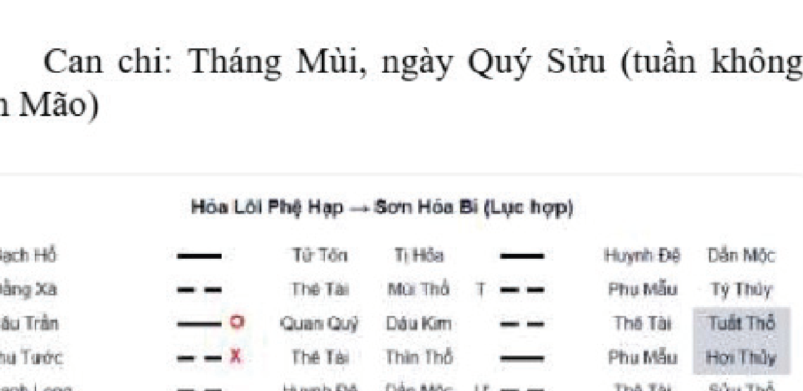

- **Cấu trúc Quẻ Dịch:**
  - **Quẻ chủ:** **Hỏa Lôi Phệ Hạp** (Cung Tốn, Họ Tốn)  
    *Tượng quẻ:* Phệ Hạp nghĩa là cắn hợp, loại bỏ trở ngại, thấu suốt thông tin; tượng trưng cho hành động phẫu thuật dao kéo y khoa để vá lành khiếm khuyết cơ thể.
  - **Quẻ biến:** **Sơn Hỏa Bí** (Cung Cấn, Họ Cấn – Quẻ Lục Hợp)  
    *Tượng quẻ:* Bí là trang hoàng, chỉnh sửa bên ngoài; quẻ biến Lục Hợp chủ sự ràng buộc dính dấp, khó dứt điểm, báo hiệu tuy ca mổ thành công nhưng các vấn đề sức khỏe mạn tính khác sẽ còn kéo dài dai dẳng.

- **Bảng chi tiết Lục hào:**

| Hào | Thế/Ứng | Lục thân (Chủ) | Can Chi | Biến động | Lục thân (Biến) | Can Chi (Biến) | Thần sát / Phục | Lục thú |
|:---:|:---:|:---|:---|:---:|:---|:---|:---|:---|
| 6 | | Tử Tôn | Tị - Hỏa | tĩnh | Huynh Đệ | Dần - Mộc | Quý nhân | Bạch Hổ |
| 5 | **Thế** | Thê Tài | Mùi - Thổ | **Ám động** | Phụ Mẫu | Tý - Thủy | Nguyệt kiến, Mưu tinh | Đằng Xà |
| 4 | | Quan Quỷ | Dậu - Kim | **O (Động)** | Thê Tài | Tuất - Thổ | Tướng tinh | Câu Trần |
| 3 | | Thê Tài | Thìn - Thổ | **X (Động)** | Phụ Mẫu | Hợi - Thủy | | Chu Tước |
| 2 | **Ứng** | Huynh Đệ | Dần - Mộc | tĩnh | Thê Tài | Sửu - Thổ | Kiếp sát, Tuần không | Thanh Long |
| 1 | | Phụ Mẫu | Tý - Thủy | tĩnh | Huynh Đệ | Mão - Mộc | Lộc thần | Huyền Vũ |

---

### 3. Dụng thần & Loại quẻ

- **Phân loại quẻ:**
  - **Quẻ việc cụ thể hỏi thay người thân:** Xem bệnh tật và phẫu thuật của vợ, tuy mất quyền chủ động kiểm soát y khoa nhưng lợi ích sinh mạng của vợ gắn liền mật thiết với người hỏi.
- **Xác định Dụng thần & Hệ thống tinh thần:**
  1. **Dụng thần chủ quan cốt lõi (Thê Tài Mùi Thổ):** Trì Thế tại hào 5, đại diện cho bản thân người vợ và sự an nguy sinh mạng gắn kết với tâm lý người chồng.
  2. **Dụng thần khách quan – Ổ bệnh (Huynh Đệ Dần Mộc):** Cư hào Ứng (hào 2) lâm Tuần không, đại diện cho chính khiếm khuyết lỗ hổng thông liên thất ở buồng tim.
  3. **Hào Quan Quỷ Dậu Kim phát động:** Đại diện cho bệnh biến tổng thể, nguy cơ tai biến y khoa.
  4. **Hệ thống các hào Thê Tài khác (Thìn Thổ động và Tuất Thổ biến):** Đại diện cho các mặt bệnh lý khác trên cơ thể người vợ (hệ sinh sản sau sinh và nguy cơ khối u/tăng sinh).

---

### 4. Luận giải chi tiết

Quẻ này là mẫu mực về kỹ thuật phân định Dụng thần chủ quan - khách quan, giải mã Ám động vượng tướng và nguyên lý "Tránh nhẹ nói nặng" của quẻ Dịch:

#### 1. Định tính ca phẫu thuật: Bình an nhờ Hào Thế Thê Tài Mùi Thổ Ám động vượng tướng
- Trong lý luận Lục Hào truyền thống, xem bình an thường lấy Tử Tôn làm Dụng thần. Nhưng trong quẻ này, hào 6 Tử Tôn Tị Hỏa ở trạng thái tĩnh; nếu chỉ nhìn hào tĩnh thì không nắm bắt được động thái biến chuyển mãnh liệt của sự việc.
- Hệ thống của Chu Thần Bân khẳng định: **Hào Thế và hào Ứng mới là gốc rễ của sự việc**. Hào Thế Thê Tài Mùi Thổ đại diện trực tiếp cho người vợ. Người chồng hỏi cho vợ thì phúc họa của vợ gắn liền với bản thân mình.
- Thê Tài Mùi Thổ lâm Nguyệt kiến (tháng Mùi) là cực vượng, gặp Nhật kiến Sửu Thổ tương xung (Sửu Mùi tương xung).
- Hào đắc Nguyệt lệnh vượng tướng mà bị Nhật xung thì không gọi là Nhật phá, mà gọi là **Ám động** (động lực tiềm ẩn trong trạng thái vượng tướng đỉnh cao). Dụng thần vượng tướng ám động khẳng định dứt khoát: **Ca phẫu thuật ngày mai hoàn toàn bình an, thuận lợi, không có nguy hiểm đến tính mạng**.

#### 2. Nhận diện hình thái dị tật "Thông liên thất" qua hào Ứng
- Hào Ứng Huynh Đệ Dần Mộc cư hào 2 đại diện cho ổ bệnh phẫu thuật:
  - Dần Mộc lâm **Tuần không**: "Không" chính là trống rỗng, khuyết thiếu, thủng lỗ. Điều này tái hiện hoàn hảo dị tật thông liên thất – một lỗ thủng nhỏ ở vách tim.
  - Dần Mộc mang **Kiếp sát**: "Phàm sát tất đình", biểu thị sự tắc nghẽn, làm dòng tuần hoàn của máu qua buồng tim bị cản trở.
  - Dần Mộc mang Dương nhẫn, thuộc thể Mộc: Tim là cơ quan tuần hoàn có tính đàn hồi dạng xốp, phù hợp với tượng của Mộc.
  - Hào Thế Thê Tài Mùi Thổ là **Mộ khố** của Dần Mộc: Ổ bệnh này nằm chìm sâu trong cơ thể người vợ từ bẩm sinh mà bản thân cô hoàn toàn không hay biết, mãi gần đây tình cờ đi khám mới phát hiện.
  - Dần Mộc tại tháng Mùi, ngày Sửu là hưu tù suy bại: Chứng tỏ đây là tổn thương bẩm sinh nhẹ, không phải bệnh nan y nguy cấp.

#### 3. Quy luật "Tránh nhẹ nói nặng" – Cảnh báo hai mặt bệnh lý tiềm ẩn
- Tại sao một ca tiểu phẫu bình an lại xuất hiện tới ba hào động liên quan đến Thê Tài?
- Chu Thần Bân giải mã: Quẻ Dịch có đặc tính **"Tránh nhẹ nói nặng"**. Khi ca phẫu thuật tim mạch không gây nguy hiểm tính mạng, quẻ tượng lập tức chuyển hướng để cảnh báo đương số về những nguy cơ bệnh tật khác nghiêm trọng hơn trên cơ thể người vợ:
  - **Hào 3 Thê Tài Thìn Thổ động hóa Phụ Mẫu Hợi Thủy lâm Chu Tước:** Thìn Thổ là Thủy khố, tượng trưng cho hệ sinh sản, phần phụ của phụ nữ. Chu Tước chủ viêm nhiễm, phát sốt. Đây là dấu hiệu của chứng viêm nhiễm hệ sinh sản hoặc rò rỉ dịch sau sinh (kèm theo chứng trầm cảm suy nghĩ nhiều). Thìn Thổ động hóa Phụ Mẫu (Dụng hóa Cừu) là tượng bệnh mạn tính kéo dài khó dứt.
  - **Hào 4 Quan Quỷ Dậu Kim động hóa Thê Tài Tuất Thổ lâm Câu Trần:** Kim chủ vật chất cứng rắn, Câu Trần chủ tích tụ sưng phù, khối u, tăng sinh mô mềm. Hào Quan Quỷ phát động mang Câu Trần biến Thê Tài chỉ rõ nguy cơ xuất hiện khối u xơ, polyp, sỏi hoặc phì đại mô mềm ở một cơ quan khác trên cơ thể cần đi khám chuyên khoa để tầm soát sớm.
- **Quẻ biến Sơn Hỏa Bí (Lục Hợp):** Hai hào động Thìn Thổ và Dậu Kim tương hợp (Thìn Dậu lục hợp), quẻ biến lại là quẻ Lục hợp. Tượng Lục hợp chủ sự dính líu, dây dưa không dứt. Điều này báo trước: ca mổ tim tuy êm đẹp, nhưng việc điều trị phục hồi sức khỏe tổng thể và các bệnh lý mạn tính sau sinh của người vợ sẽ là một quá trình dài ngày, cần kiên trì chăm sóc.

---

### 5. Kết luận & Ứng kỳ thực tế

- **Lời đoán và khuyến nghị của Chu Thần Bân:**
  - Khẳng định chắc chắn ca phẫu thuật thông liên thất ngày mai sẽ diễn ra suôn sẻ, mẹ tròn con vuông, không có biến cố nguy hiểm tính mạng (hào Thế vượng tướng ám động).
  - Khuyên người chồng chú ý kiểm tra tương thích thuốc giảm đau, kháng sinh sau mổ để tránh tác dụng phụ.
  - Nhắc nhở sau ca mổ cần đưa vợ đi tầm soát kỹ hai vấn đề: viêm nhiễm hệ sinh sản/tiết niệu sau sinh (Thìn thổ) và kiểm tra các khối u xơ, polyp tăng sinh mô mềm (Dậu kim hóa Tuất thổ).
- **Phản hồi thực tế (Feedback):**
  - Ca phẫu thuật thông liên thất ngày hôm sau diễn ra vô cùng thuận lợi và thành công tốt đẹp.
  - Đúng như dự báo của quẻ biến Lục hợp, sau đó người vợ phải tiếp tục điều trị lâu dài các chứng viêm phụ khoa sau sinh và theo dõi các chỉ số sức khỏe định kỳ.

---

### 6. Bài học tâm pháp & Quy tắc cốt lõi

- **Quy tắc trích dẫn (Rule Index p.117):**
  *Nguyên tắc chọn Dụng thần chủ quan và khách quan trong phẫu thuật tim (thông liên thất) và tượng hào biến Lục hợp.*
- **Tâm pháp giải đoán thực chiến:**
  1. *Nguyên tắc Dụng thần chủ quan qua hào Thế:* Khi xem bệnh cho người thân mà tính mạng của họ gắn liền với hạnh phúc bản thân, hào Thế mang lục thân tương ứng (Thê Tài Mùi Thổ) chính là Dụng thần chủ quan tối cao để định đoạt phúc họa sinh tử.
  2. *Quy tắc Ám động vs Nhật phá:* Hào tĩnh bị Nhật xung chỉ thành Nhật phá khi hưu tù suy kiệt. Khi hào đắc lệnh Nguyệt kiến cực vượng bị Nhật xung, hào sẽ hóa thành Ám động mang năng lượng hành động thần tốc và cát lợi.
  3. *Tâm pháp "Tránh nhẹ nói nặng" của quẻ Dịch:* Khi sự việc đương sự hỏi vốn không nguy hiểm, quẻ tượng sẽ mượn các hào động khác để cảnh báo những nguy cơ tiềm ẩn lớn hơn ngoài phạm vi câu hỏi. Người chiêm đoán phải có nhãn quan bao quát để đưa ra lời khuyên y khoa hoàn chỉnh.

## THỰC CHIẾN 73: CON GÁI MỘT ĐỆ TỬ Ở NỘI MÔNG SÁNG NAY KHÔNG ĐẾN TRƯỜNG, SAU ĐỂ LẠI THƯ NÓI KHÔNG MUỐN HỌC NỮA VÀ BỎ NHÀ RA ĐI. HỎI CON GÁI ĐÃ ĐI ĐÂU, ĐANG Ở VỚI AI, PHƯƠNG HƯỚNG Ở ĐÂU.

---

### 1. Bối cảnh & Câu hỏi

- **Bối cảnh chi tiết:** 
  Con gái của một đệ tử ở Nội Mông năm nay bước vào lớp 12 – năm học bản lề quyết định kỳ thi đại học. Vào ngày tựu trường trở lại lớp học sau kỳ nghỉ hè, sáng sớm cô bé rời nhà đi học như thường lệ. Tuy nhiên, đến khoảng 11 giờ trưa, giáo viên chủ nhiệm gọi điện hốt hoảng báo tin cô bé hoàn toàn không có mặt tại lớp. 
  Gia đình hốt hoảng kiểm tra phòng riêng thì bàng hoàng phát hiện một bức thư do cô bé để lại, nói rằng mình chán ngán việc học tập, không muốn tiếp tục đến trường nữa và quyết định bỏ nhà ra đi. Qua dò hỏi gấp các bạn học cùng lớp, phụ huynh manh nha suy đoán có thể con gái đã bỏ trốn cùng bạn trai, nhưng hoàn toàn không biết bạn trai đó là ai, ở đâu, gia cảnh thế nào, thậm chí không có bất kỳ số điện thoại hay phương thức liên lạc nào. Người cha rơi vào hoảng loạn tột độ liền liên hệ Chu Thần Bân gieo quẻ hỏi gấp: Con gái đã đi đâu, đang ở với ai và phương hướng tìm kiếm ở đâu?
- **Tâm lý & Câu hỏi ẩn ý:** 
  Đương số mang tâm lý sợ hãi, bàng hoàng, lo lắng con gái bị dụ dỗ lừa gạt hoặc gặp hiểm nguy tính mạng; mong muốn lần ra tung tích, phương hướng và đối tượng đi cùng để giải cứu con trở về.
- **Thời gian chiêm đoán:**
  - Dương lịch: Ngày 13 tháng 8 năm 2017, lúc 10:20 (Giờ Bắc Kinh).
  - Can chi: Năm Đinh Dậu, tháng Mậu Thân, ngày Nhâm Thân, giờ Ất Tị (Tuần không: Tuất, Hợi).

---

### 2. Dữ kiện & Bảng quẻ Crop

- **Thời không chiêm nghiệm:**
  - Tháng Mậu Thân (Kim đắc Lộc vượng, Thủy trường sinh, Mộc tuyệt, Hỏa hưu/tù).
  - Ngày Nhâm Thân (Kim vượng, Thủy trường sinh, Mộc tuyệt).
  - Tuần không: Tuất, Hợi (Giáp Tý tuần trung).
- **Thần sát:**
  - Tướng tinh: Tý (Lâm hào biến của hào 5)
  - Hoa cái: Thìn (Lâm hào 1)
  - Dịch mã: Dần (Lâm hào biến của hào Ứng)
  - Tai sát: Ngọ (Lâm hào 2)
  - Mưu tinh: Tuất (Lâm Tuần không, lâm hào biến của hào 4)
  - Đào hoa: Dậu
  - Kiếp sát: Tị (Lâm hào 5 động, lâm thời chi)
  - Lộc thần: Hợi (Lâm Tuần không)
  - Dương nhẫn: Tý (Lâm hào biến của hào 5)
  - Văn xương: Dần
  - Thiên y: Mùi (Lâm hào 4)
  - Thiên hỷ: Thìn (Lâm hào 1)
  - Quý nhân: Mão, Tị (Mão lâm hào Ứng; Tị lâm hào 5 động)

- Dữ kiện bảng quẻ và các thông số chiêm đoán:
  - **Bảng 73.1** Đồ hình quẻ Thực chiến 73:
    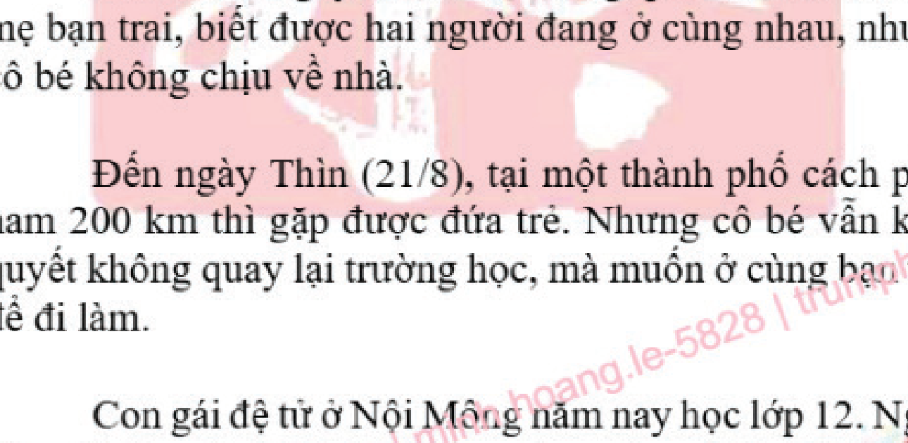

- **Cấu trúc Quẻ Dịch:**
  - **Quẻ chủ:** **Phong Sơn Tiệm** (Cung Cấn, Họ Cấn – Quẻ Quy Hồn)  
    *Tượng quẻ:* Tiệm là tuần tự, biến chuyển từ từ từng bước; chỉ rõ tâm lý chán học và ý định bỏ nhà ra đi của con gái đã nhen nhóm tích tụ từ lâu (nửa năm đến một năm trước) chứ không phải do bốc đồng bột phát nhất thời.
  - **Quẻ biến:** **Sơn Địa Bác** (Cung Càn, Họ Càn)  
    *Tượng quẻ:* Bác là bóc tách, bóc mòn, truy vết rà soát đến tận cùng; phản ánh hành động truy tìm tung tích khẩn trương của gia đình.

- **Bảng chi tiết Lục hào:**

| Hào | Thế/Ứng | Lục thân (Chủ) | Can Chi | Biến động | Lục thân (Biến) | Can Chi (Biến) | Thần sát / Phục | Lục thú |
|:---:|:---:|:---|:---|:---:|:---|:---|:---|:---|
| 6 | **Ứng** | Quan Quỷ | Mão - Mộc | tĩnh | Quan Quỷ | Dần - Mộc | Quý nhân | Bạch Hổ |
| 5 | | Phụ Mẫu | Tị - Hỏa | **O (Động)** | Thê Tài | Tý - Thủy | Quý nhân, Kiếp sát / Phục Thê Tài Tý Thủy | Đằng Xà |
| 4 | | Huynh Đệ | Mùi - Thổ | tĩnh | Huynh Đệ | Tuất - Thổ | Thiên y | Câu Trần |
| 3 | **Thế** | Tử Tôn | Thân - Kim | **O (Động)** | Quan Quỷ | Mão - Mộc | Nguyệt kiến, Nhật kiến | Chu Tước |
| 2 | | Phụ Mẫu | Ngọ - Hỏa | tĩnh | Phụ Mẫu | Tị - Hỏa | Tai sát | Thanh Long |
| 1 | | Huynh Đệ | Thìn - Thổ | tĩnh | Huynh Đệ | Mùi - Thổ | Hoa cái, Thiên hỷ | Huyền Vũ |

---

### 3. Dụng thần & Loại quẻ

- **Phân loại quẻ:**
  - **Quẻ việc cụ thể truy tìm người mất tích:** Xác định tung tích, đối tượng đi cùng, phương hướng và khoảng cách địa lý khi trẻ vị thành niên bỏ nhà ra đi.
- **Xác định Dụng thần & Hệ thống tinh thần:**
  1. **Dụng thần cốt lõi (Tử Tôn Thân Kim):** Trì Thế tại hào 3, lâm Nhật Nguyệt kiến cực vượng, đại diện cho bản thân cô con gái.
  2. **Đối tượng đi cùng (Quan Quỷ Mão Mộc):** Là hào biến của hào Thế, lâm Đào hoa, Quý nhân – đại diện cho người bạn trai.
  3. **Đầu mối và phương hướng (Phụ Mẫu Tị Hỏa):** Cư hào 5 ngoại quái phát động lâm Quý nhân, Kiếp sát – đại diện cho trưởng bối bên phía bạn trai và phương vị địa lý hướng Nam.

---

### 4. Luận giải chi tiết

Quẻ này là bài học mẫu mực về thuật truy tìm tông tích qua Lục hào, cơ chế nhận diện người đi cùng và phương pháp xác định phương hướng cự ly địa lý:

#### 1. Nhận diện người đi cùng: Con gái bỏ trốn cùng bạn trai
- Hào Thế mang Dụng thần Tử Tôn Thân Kim lâm Chu Tước: Chu Tước chủ thư tín, văn tự, ám chỉ chính xác bức thư cô bé để lại trước khi bỏ đi.
- Hào Thế phát động biến ra Quan Quỷ Mão Mộc:
  - Hào Thế biến Quan Quỷ: Về mặt tâm thái phản ánh sự bất an, lo lắng tột cùng của cha mẹ.
  - Về mặt sự vụ: Quan Quỷ Mão Mộc mang Quý nhân và Đào hoa. Trong quẻ tình cảm nam nữ, Quan Quỷ lâm Đào hoa và Quý nhân chính là hình tượng chuẩn xác của **người bạn trai**.
  - Dụng thần Tử Tôn Thân Kim kết dính chặt chẽ với hào biến Quan Quỷ Mão Mộc: Chứng minh chắc chắn con gái và bạn trai đang hành động như một thể thống nhất, hai người đã rủ nhau cùng bỏ trốn.

#### 2. Đầu mối lần theo dấu vết: Trưởng bối nhà bạn trai (Hào 5 Phụ Mẫu Tị Hỏa)
- Tử Tôn Thân Kim phát động tương hợp và kích hoạt Phụ Mẫu Tị Hỏa ở hào 5 (Tị Thân tương hợp).
- Phụ Mẫu Tị Hỏa mang **Quý nhân**: Quý nhân là con người cụ thể có thể liên hệ; Phụ Mẫu đại diện cho phụ huynh, trưởng bối. Manh mối then chốt để tìm kiếm bắt buộc phải xuất phát từ cha mẹ, người lớn trong gia đình cậu bạn trai!
- Phụ Mẫu Tị Hỏa mang **Kiếp sát**: Cổ thư có câu *"Gặp Kiếp ắt dừng"*, tức là khi đi đến địa điểm có Phụ Mẫu Tị Hỏa thì hai đứa trẻ sẽ dừng chân tá túc.
- Chiến thuật tác chiến: Cần gấp rút thông qua bạn bè, thầy cô để tra cứu số điện thoại của cậu bạn trai, từ đó liên hệ khẩn cấp với phụ huynh bên phía nhà trai để chặn đầu.

#### 3. Định vị phương hướng: Hướng Nam chắc chắn
- Hào 5 Phụ Mẫu Tị Hỏa phát động: Tị Hỏa thuộc phương Nam.
- Tị Hỏa động biến Thê Tài Tý Thủy: Tý Thủy gặp xung bởi Ngọ Hỏa cũng quy về phương Nam.
- Cấu trúc hào vị trong không gian: Hào 5 thuộc ngoại quái (thượng quái). Theo quan niệm phương vị Dịch lý cổ truyền, Nam là trên (ngoại quái), Bắc là dưới (nội quái). Hào 5 phát động khẳng định trục di chuyển kiên quyết là **phương Nam**.

#### 4. Định vị cự ly và không gian di chuyển: Cách 200 km ngoài thành phố
- Hào 5 là hào lộ trình, đại diện cho đường sá thiên lý bên ngoài đô thị:
  - Nếu đứa trẻ còn ẩn náu trong nội thành thì hào nội quái (hào 1, 2, 3) phải động. Đằng này hào 5 ngoại quái động chứng tỏ cô bé đã theo bạn trai vượt ra khỏi ranh giới thành phố.
  - Hào 6 (hào biên ải tối cao) ở trạng thái tĩnh: Chứng tỏ chưa đi quá xa đến mức vượt biên giới hay đi xa hàng ngàn cây số. Hào 5 chỉ cự ly trung bình liên tỉnh lân cận, ước tính khoảng 100 đến 200 km.

---

### 5. Kết luận & Ứng kỳ thực tế

- **Lời đoán và khuyến nghị của Chu Thần Bân:**
  - Khẳng định 100% con gái đã bỏ trốn cùng bạn trai, hiện hai đứa đang ở cùng nhau bình an vô sự.
  - Phương hướng truy tìm duy nhất là **phương Nam**, ra ngoài thành phố khoảng 100 - 200 km.
  - Yêu cầu gia đình không được tìm kiếm mù quáng, mà phải tìm mọi cách lấy thông tin liên lạc của cha mẹ cậu bạn trai ở phương Nam để nhờ họ phối hợp giữ người.
- **Phản hồi thực tế (Feedback) & Ứng kỳ:**
  - Gia đình làm đúng theo chỉ dẫn: Ngay ngày hôm sau, gia đình liên hệ được với cha mẹ của cậu bạn trai và xác nhận đúng là hai đứa trẻ đang ở cùng nhau.
  - Đến ngày Thìn (ngày 21 tháng 8, ứng hợp Thiên hỷ và Hoa cái tại hào 1), tại một thành phố cách Nội Mông **200 km về phương Nam**, người cha đã tìm gặp được con gái! 
  - Hai đứa trẻ thuê phòng trọ tính đi làm thuê cùng nhau. Dù cô bé kiên quyết không muốn quay lại trường học, nhưng mục tiêu tìm thấy con gái bình an đã hoàn tất trọn vẹn.

---

### 6. Bài học tâm pháp & Quy tắc cốt lõi

- **Quy tắc trích dẫn (Rule Index p.126):**
  *Quy tắc xác định phương hướng, cự ly và người đi cùng khi trẻ vị thành niên bỏ nhà ra đi qua quẻ Tiệm biến Bác.*
- **Tâm pháp giải đoán thực chiến:**
  1. *Quy tắc nhận diện nhân tình qua Hào Thế biến Quan Quỷ:* Dụng thần Tử Tôn trì Thế biến Quan Quỷ kèm theo Đào hoa và Quý nhân là chỉ dấu tuyệt đối về việc con cái đi theo người yêu/bạn trai.
  2. *Phương pháp định vị cự ly qua Hào vị:* Hào nội quái động chỉ phạm vi trong nhà/trong thành phố; hào 5 động chỉ đường lộ liên tỉnh ngoài đô thị (vài trăm km); hào 6 động mới là phương xa ngàn dặm.
  3. *Tâm pháp "Gặp Kiếp ắt dừng" và định hướng phương vị:* Hào Phụ Mẫu lâm Kiếp sát là điểm dừng chân cư trú. Chi của hào động kết hợp vị trí quái thượng định vị chính xác trục phương Nam.

## THỰC CHIẾN 74: MỘT ĐỆ TỬ Ở THÂM QUYẾN: THAI NHI TÁM THÁNG ĐƯỢC CHẨN ĐOÁN NÃO ÚNG THỦY NGHIÊM TRỌNG, VỢ TỰ GIEO QUẺ HỎI CON CÒN CỨU ĐƯỢC KHÔNG?

---

### 1. Bối cảnh & Câu hỏi

- **Bối cảnh chi tiết:** 
  Một đệ tử thân tín của Chu Thần Bân ở Thâm Quyến trong năm 2017 gặp nhiều trắc trở, gia đạo liên tiếp xảy ra chuyện bất an. Người vợ đang mang thai đứa con thứ hai đến tháng thứ 8 (thai đã lớn, cận kề ngày sinh nở). Trong một chuyến đi công tác xa, người chồng nhận được điện thoại hốt hoảng của vợ báo tin: khi đi siêu âm kiểm tra thai kỳ định kỳ, bác sĩ phát hiện thai nhi bị chứng não úng thủy cực kỳ nghiêm trọng.
  Người chồng lập tức đáp chuyến bay khẩn cấp về Thâm Quyến đưa vợ vào bệnh viện chuyên khoa hàng đầu để hội chẩn lại. Kết quả kiểm tra y khoa hoàn toàn trùng khớp và vô cùng bi quan: khối lượng dịch não tủy tích tụ quá lớn, não bộ thai nhi bị chèn ép tổn thương nghiêm trọng, nguy cơ thai chết lưu trong bụng mẹ cực kỳ cao, nếu không can thiệp kịp thời sẽ đe dọa trực tiếp đến tính mạng của người mẹ. Người mẹ mang nặng đẻ đau suốt 8 tháng ròng rã, đau đớn không cam tâm chấp nhận sự thật nghiệt ngã, liền tự tay gieo quẻ hỏi Chu Thần Bân: "Con còn có cơ hội cứu được hay không?".
- **Tâm lý & Câu hỏi ẩn ý:** 
  Đương số mang tâm lý tuyệt vọng, đau đớn đến xé lòng; không muốn tin vào kết luận của bệnh viện và cố gắng níu kéo một tia hy vọng mong manh nhất từ dự đoán học để xem liệu có phép màu y học nào giữ lại được đứa con hay không.
- **Thời gian chiêm đoán:**
  - Dương lịch: Ngày 22 tháng 8 năm 2017, lúc 16:16 (Giờ Bắc Kinh).
  - Can chi: Năm Đinh Dậu, tháng Mậu Thân, ngày Tân Tị, giờ Bính Thân (Tuần không: Thân, Dậu).

---

### 2. Dữ kiện & Bảng quẻ Crop

- **Thời không chiêm nghiệm:**
  - Tháng Mậu Thân (Kim đắc Lộc vượng, Thủy trường sinh, Mộc tuyệt/phá, Hỏa hưu).
  - Ngày Tân Tị (Hỏa tướng, Kim trường sinh, Mộc suy).
  - Tuần không: Thân, Dậu (Giáp Tuất tuần trung).
- **Thần sát:**
  - Tướng tinh: Dậu (Lâm hào Ứng, lâm Tuần không)
  - Hoa cái: Sửu (Lâm hào 4)
  - Dịch mã: Hợi (Lâm hào 5 ám động)
  - Tai sát: Mão
  - Mưu tinh: Mùi
  - Đào hoa: Ngọ (Lâm hào Thế động)
  - Kiếp sát: Dần (Lâm hào 1 Tử Tôn)
  - Lộc thần: Dậu (Lâm hào Ứng, lâm Tuần không)
  - Dương nhẫn: Thân (Lâm Nguyệt kiến, thời chi, hào biến của hào Thế)
  - Văn xương: Tý
  - Thiên y: Mùi
  - Thiên hỷ: Thìn (Lâm hào 2 động)
  - Quý nhân: Dần, Ngọ (Dần lâm hào 1 Tử Tôn; Ngọ lâm hào Thế động)

- Dữ kiện bảng quẻ và các thông số chiêm đoán:
  - **Bảng 74.1** Đồ hình quẻ Thực chiến 74:
    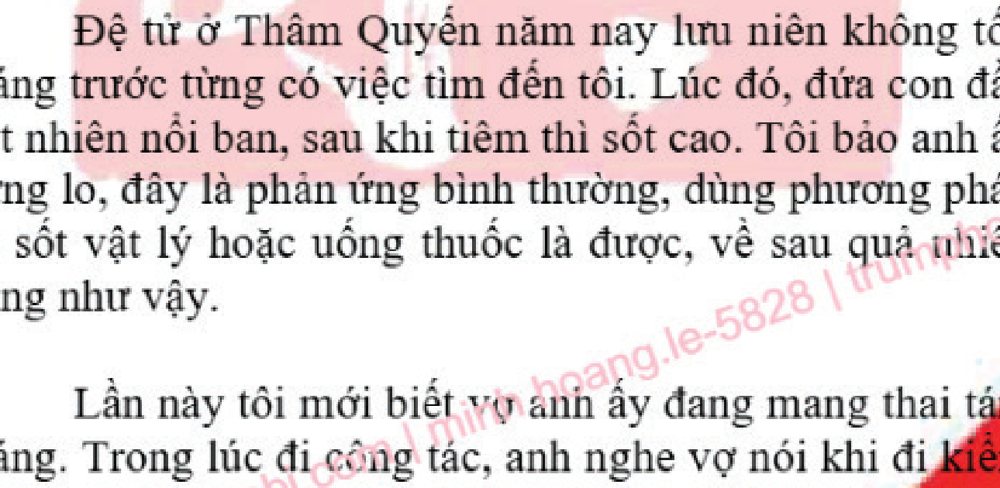

- **Cấu trúc Quẻ Dịch:**
  - **Quẻ chủ:** **Địa Thủy Sư** (Cung Khảm, Họ Khảm – Quẻ Quy Hồn)  
    *Tượng quẻ:* Sư là dấy binh, truy nguyên căn bản, khảo sát tận cùng cội rễ; phản ánh thực tế người mẹ dù đã nhận chẩn đoán xấu của bệnh viện nhưng vẫn không cam lòng, cố gắng truy tìm đến tận cùng cơ hội cứu vãn.
  - **Quẻ biến:** **Địa Sơn Khiêm** (Cung Đoài, Họ Đoài)  
    *Tượng quẻ:* Khiêm là nhún nhường, quy ẩn, chấp nhận số phận; quẻ Quy Hồn biến Khiêm báo trước kết cục đau buồn không thể cưỡng lại, người mẹ buộc phải nén đau thương buông tay.

- **Bảng chi tiết Lục hào:**

| Hào | Thế/Ứng | Lục thân (Chủ) | Can Chi | Biến động | Lục thân (Biến) | Can Chi (Biến) | Thần sát / Phục | Lục thú |
|:---:|:---:|:---|:---|:---:|:---|:---|:---|:---|
| 6 | **Ứng** | Phụ Mẫu | Dậu - Kim | tĩnh | Phụ Mẫu | Dậu - Kim | Tướng tinh, Lộc thần, Tuần không | Đằng Xà |
| 5 | | Huynh Đệ | Hợi - Thủy | **Ám động** | Huynh Đệ | Hợi - Thủy | Dịch mã | Câu Trần |
| 4 | | Quan Quỷ | Sửu - Thổ | tĩnh | Quan Quỷ | Sửu - Thổ | Hoa cái | Chu Tước |
| 3 | **Thế** | Thê Tài | Ngọ - Hỏa | **X (Động)** | Phụ Mẫu | Thân - Kim | Đào hoa, Quý nhân | Thanh Long |
| 2 | | Quan Quỷ | Thìn - Thổ | **O (Động)** | Thê Tài | Ngọ - Hỏa | Thiên hỷ | Huyền Vũ |
| 1 | | Tử Tôn | Dần - Mộc | tĩnh | Quan Quỷ | Thìn - Thổ | Kiếp sát, Quý nhân | Bạch Hổ |

---

### 3. Dụng thần & Loại quẻ

- **Phân loại quẻ:**
  - **Quẻ việc cụ thể xem sinh tử nguy nan của thai nhi:** Người mẹ tự gieo quẻ, cơ thể thai nhi và người mẹ gắn liền làm một thể thống nhất.
- **Xác định Dụng thần & Hệ thống tinh thần:**
  1. **Dụng thần cốt lõi (Tử Tôn Dần Mộc):** Cư sơ hào (hào 1), đại diện cho thai nhi 8 tháng tuổi trong bụng mẹ.
  2. **Hào Thế (Thê Tài Ngọ Hỏa):** Cư hào 3 phát động, đại diện cho bản thân người mẹ. Dần Mộc là Trường sinh của Ngọ Hỏa (thai nhi đã hình thành lâu trong bụng).
  3. **Kỵ thần sát phạt (Phụ Mẫu Thân Kim và Dậu Kim):** Ngũ hành Kim khắc Mộc, đại diện cho tai ách và sự diệt vong của thai nhi.
  4. **Ổ bệnh não úng thủy (Quan Quỷ Thìn Thổ động kết hợp Phụ Mẫu Dậu Kim hào 6):** Biểu thị hiện tượng ứ nước nghiêm trọng tại khoang sọ não.
  5. **Nguyên thần dinh dưỡng (Huynh Đệ Hợi Thủy):** Cư hào 5, nguồn thủy sinh Mộc nuôi dưỡng sự sống thai nhi.

---

### 4. Luận giải chi tiết

Quẻ này là điển hình đau xót về việc phối hợp hung sát chí mạng (Bạch Hổ, Nguyệt phá, Tam hình) và cơ chế "Hào Thế hóa Kỵ xung Dụng" trong định đoạt sinh tử:

#### 1. Dấu hiệu hung hiểm tận cùng của Dụng thần Tử Tôn Dần Mộc
- Dụng thần Tử Tôn Dần Mộc cư sơ hào: Sơ hào là hào thấp nhất, đại diện cho phần bụng dưới, tử cung, bào thai.
- Dần Mộc lâm **Bạch Hổ**: Trong bói dịch bệnh tật, Bạch Hổ lâm Dụng thần là hung tinh chủ huyết quang, tử vong, tang tóc thảm thương.
- Dần Mộc bị **Nguyệt phá**: Tháng Thân xung phá Dần Mộc dữ dội (Dần Thân tương xung phá). Hào lâm Nguyệt phá là điềm báo cơ thể rạn nứt, suy bại không còn sinh khí.
- Cấu thành thế cục **Tam hình (Dần – Tị – Thân)**: Tháng Thân, ngày Tị cùng với Tử Tôn Dần Mộc tạo thành tổ hợp hình sát chí mạng. Tam hình tuy là chi tiết nhưng khi hội tụ cùng Bạch Hổ và Nguyệt phá thì khẳng định đứa trẻ đang ở vào ranh giới tử sinh nguy kịch.

#### 2. Cơ chế Hào Thế động hóa Kỵ thần xung Dụng thần – Mệnh lệnh đình chỉ thai
- Hào Thế Thê Tài Ngọ Hỏa đại diện cho người mẹ phát động biến ra Phụ Mẫu Thân Kim.
- Trong phép đoán tự sự, hào Thế phát động biến ra Kỵ thần là điềm hung hại (Dụng – Kỵ tương hóa).
- Đứa bé đang nằm trong bụng mẹ, mẹ và con là một thể thống nhất. Hào Thế phát động hóa ra Phụ Mẫu Thân Kim – mà Thân Kim chính là Kỵ thần của Tử Tôn Dần Mộc, lại mang Nhật Nguyệt xung khắc thẳng vào Dần Mộc (Thân xung khắc Dần).
- Tượng "Thế hóa Kỵ xung Dụng thần" chính là hành động bất đắc dĩ của người mẹ: **Buộc phải đưa ra quyết định phẫu thuật lấy đứa trẻ ra khỏi bụng (đình chỉ thai nghén, dẫn lưu sinh non)**.
- Phụ Mẫu Thân Kim tuy hiện tại lâm Tuần không, nhưng đắc Nguyệt lệnh; hiện tại đã là ngày 22/8 (cuối tháng Thân), quẻ chỉ rõ trong vòng ít ngày tới trước khi hết tháng Thân bắt buộc phải tiến hành thủ thuật dẫn lưu để cứu lấy người mẹ.

#### 3. Giải mã bệnh lý "Não úng thủy" và sự đứt gãy nguồn sống
- Hào 6 (đỉnh đầu, sọ não) có Phụ Mẫu Dậu Kim là Kỵ thần riêng của thai nhi (Kim chủ xương sọ cứng).
- Hào 2 có Quan Quỷ Thìn Thổ phát động: Thìn Thổ là Thủy khố (kho chứa nước). Quan Quỷ Thìn Thổ và Phụ Mẫu Dậu Kim ở hào 6 tương hợp mật thiết (Thìn Dậu lục hợp). Tượng kho nước liên kết gắn chặt với sọ não chính là hình ảnh chân thực của **chứng não úng thủy**.
- Độc hại hơn, Quan Quỷ Thìn Thổ phát động liền quay sang khắc chế Huynh Đệ Hợi Thủy ở hào 5 (Thổ khắc Thủy). Huynh Đệ Hợi Thủy vốn là Nguyên thần sinh cho Tử Tôn Dần Mộc (nguồn dưỡng chất truyền qua dây rốn nuôi thai). Khi Hợi Thủy bị chặn đứng, nguồn dinh dưỡng nuôi đứa trẻ bị cắt đứt hoàn toàn. Đứa trẻ vừa bị úng thủy phá hủy não bộ, vừa bị cạn kiệt sinh dưỡng, hoàn toàn vô phương cứu chữa.

---

### 5. Kết luận & Ứng kỳ thực tế

- **Lời đoán và khuyến nghị của Chu Thần Bân:**
  - Chu Thần Bân đau lòng kết luận: Thai nhi mắc bệnh hiểm nghèo vô phương cứu chữa, tuyệt đối không thể giữ lại.
  - Khuyên người mẹ và gia đình phải nén đau thương chấp nhận định mệnh nghiệt ngã, lập tức tuân thủ chỉ định của bệnh viện nhập viện làm thủ thuật đình chỉ thai nghén càng sớm càng tốt, tránh để thai chết lưu gây băng huyết nguy hiểm đến tính mạng người mẹ.
- **Phản hồi thực tế (Feedback) & Ứng kỳ:**
  - Nhận thấy không còn cơ hội cứu vãn, gia đình gạt nước mắt làm thủ tục nhập viện.
  - Đúng **ngày hôm sau vào giờ Ngọ** (ngày Nhâm Ngọ, ứng vào hào Thế Thê Tài Ngọ Hỏa phát động), người vợ đã được đưa vào phòng phẫu thuật để thực hiện thủ thuật đình chỉ thai nghén (dẫn lưu thai nhi 8 tháng ra ngoài).

---

### 6. Bài học tâm pháp & Quy tắc cốt lõi

- **Quy tắc trích dẫn (Rule Index p.133):**
  *Quy tắc Dụng thần sơ hào lâm Bạch Hổ, Nguyệt phá và Dần Tị Thân tam hình khi đoán bệnh thai nhi hiểm nghèo.*
- **Tâm pháp giải đoán thực chiến:**
  1. *Tổ hợp tử thần trong đoán thai sản:* Dụng thần Tử Tôn cư sơ hào gặp Nguyệt phá, lại đồng thời lâm Bạch Hổ và dính Tam hình Dần - Tị - Thân là điềm báo tử biệt tuyệt đối, sinh mạng thai nhi đã chấm dứt.
  2. *Tượng Thế hóa Kỵ xung Dụng:* Người mẹ (hào Thế) phát động hóa Kỵ thần xung phá đứa con (Dụng thần) thể hiện sự can thiệp nhân tạo của người mẹ nhằm trục xuất thai nhi ra khỏi cơ thể (phẫu thuật dẫn lưu, đình chỉ thai).
  3. *Mô tả bệnh học qua Dịch tượng:* Kim hào ở đỉnh đầu (hào 6) kết hợp Thủy khố Thìn Thổ phát động tương hợp tái hiện chính xác bệnh chứng não úng thủy. Hào bệnh phát động diệt trừ Nguyên thần là dấu hiệu cạn kiệt sinh lực, y học bó tay.

## THỰC CHIẾN 75: TỰ XEM LẦN NÀY CÓ THĂNG CHỨC ĐƯỢC KHÔNG

---

### 1. Bối cảnh & Câu hỏi

- **Bối cảnh chi tiết:** 
  Một đệ tử của Chu Thần Bân đang đứng trước cơ hội được cất nhắc thăng tiến lên vị trí lãnh đạo mới trong đợt kiện toàn nhân sự ngắn hạn tại cơ quan (kết quả sẽ ngã ngũ chỉ trong vòng vài ngày đến nửa tháng). 
  Tại đơn vị, vị trí chức vụ này không chỉ có một mình đương số mà còn có các đồng nghiệp khác có năng lực tương đương cùng tham gia ứng tuyển và cạnh tranh gay gắt. Đương số rất khao khát có được vị trí này nhưng trong lòng đầy bất an trước động thái của các đối thủ nội bộ, bèn tự mình gieo quẻ hỏi Chu Thần Bân: "Lần này bản thân có được thăng chức hay không?".
- **Tâm lý & Câu hỏi ẩn ý:** 
  Đương số mang tâm lý khao khát công danh bổng lộc, mong muốn khẳng định vị thế bản thân, nhưng đồng thời hoang mang lo sợ đối thủ cạnh tranh ngầm thao túng sau lưng để cướp mất cơ hội bổ nhiệm.
- **Thời gian chiêm đoán:**
  - Dương lịch: Ngày 3 tháng 8 năm 2017, lúc 16:40 (Giờ Bắc Kinh).
  - Can chi: Năm Đinh Dậu, tháng Đinh Mùi, ngày Nhâm Tuất, giờ Mậu Thân (Tuần không: Tý, Sửu).

---

### 2. Dữ kiện & Bảng quẻ Crop

- **Thời không chiêm nghiệm:**
  - Tháng Đinh Mùi (Thổ vượng, Hỏa tướng, Kim đắc dưỡng, Mộc nhập khố, Thủy suy/tuyệt).
  - Ngày Nhâm Tuất (Thổ vượng, Hỏa nhập khố, Kim đắc sinh, Thủy nhập khố).
  - Tuần không: Tý, Sửu (Giáp Dần tuần trung).
- **Thần sát:**
  - Tướng tinh: Ngọ (Lâm hào 4 Quan Quỷ)
  - Hoa cái: Tuất (Lâm hào Thế, lâm Nhật kiến)
  - Dịch mã: Thân (Lâm hào 5, lâm thời chi)
  - Tai sát: Tý (Lâm hào 1, lâm Tuần không)
  - Mưu tinh: Thìn (Lâm hào Ứng ám động)
  - Đào hoa: Mão
  - Kiếp sát: Hợi
  - Lộc thần: Hợi
  - Dương nhẫn: Tý (Lâm hào 1, lâm Tuần không)
  - Văn xương: Dần (Lâm hào 2)
  - Thiên y: Ngọ (Lâm hào 4 Quan Quỷ)
  - Thiên hỷ: Sửu (Lâm Tuần không)
  - Quý nhân: Mão, Tị

- Dữ kiện bảng quẻ và các thông số chiêm đoán:
  - **Bảng 75.1** Đồ hình quẻ Thực chiến 75:
    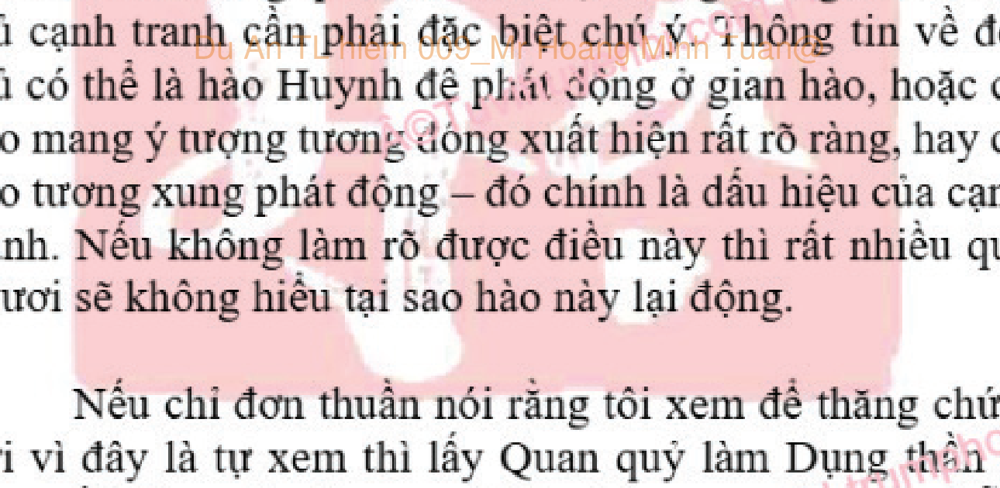

- **Cấu trúc Quẻ Dịch:**
  - **Quẻ chủ:** **Bát Thuần Càn** (Cung Càn, Họ Càn – Quẻ Lục Xung, Quẻ Tĩnh)  
    *Tượng quẻ:* Càn là Trời, cương kiện, quyền lực tối cao; tuy nhiên quẻ Lục Xung tĩnh báo hiệu sự việc diễn ra gấp gáp, ngắn hạn, cuộc cạnh tranh diễn biến chớp nhoáng và đối đầu nảy lửa.
  - **Quẻ biến:** **Bát Thuần Càn** (Quẻ tĩnh không biến hào)  
    *Tượng quẻ:* Càn vi Thiên giữ nguyên cấu trúc, biểu thị tính chất tĩnh tại của các hào minh động nhưng ẩn chứa hào ám động quyết định then chốt.

- **Bảng chi tiết Lục hào:**

| Hào | Thế/Ứng | Lục thân (Chủ) | Can Chi | Biến động | Lục thân (Biến) | Can Chi (Biến) | Thần sát / Phục | Lục thú |
|:---:|:---:|:---|:---|:---:|:---|:---|:---|:---|
| 6 | **Thế** | Phụ Mẫu | Tuất - Thổ | tĩnh | Phụ Mẫu | Tuất - Thổ | Hoa cái, Nhật kiến | Bạch Hổ |
| 5 | | Huynh Đệ | Thân - Kim | tĩnh | Huynh Đệ | Thân - Kim | Dịch mã | Đằng Xà |
| 4 | | Quan Quỷ | Ngọ - Hỏa | tĩnh | Quan Quỷ | Ngọ - Hỏa | Tướng tinh, Thiên y | Câu Trần |
| 3 | **Ứng** | Phụ Mẫu | Thìn - Thổ | **Ám động** | Phụ Mẫu | Thìn - Thổ | Mưu tinh | Chu Tước |
| 2 | | Thê Tài | Dần - Mộc | tĩnh | Thê Tài | Dần - Mộc | Văn xương | Thanh Long |
| 1 | | Tử Tôn | Tý - Thủy | tĩnh | Tử Tôn | Tý - Thủy | Dương nhẫn, Tai sát, Tuần không | Huyền Vũ |

---

### 3. Dụng thần & Loại quẻ

- **Phân loại quẻ:**
  - **Quẻ việc cụ thể tự xem thăng tiến công danh (Quẻ cạnh tranh chức quyền):** Cạnh tranh vị trí bổ nhiệm giữa nhiều ứng viên nội bộ trong cơ quan.
- **Xác định Dụng thần & Hệ thống tinh thần:**
  1. **Dụng thần cốt lõi (Quan Quỷ Ngọ Hỏa):** Cư hào 4 lâm Tướng tinh, Thiên y – đại diện cho chức vụ, vị trí lãnh đạo và quyền lực được bổ nhiệm.
  2. **Hào Thế (Phụ Mẫu Tuất Thổ):** Trì hào 6, đại diện cho bản thân người hỏi. Tuất Thổ là Mộ khố của Ngọ Hỏa, biểu thị lòng khao khát cháy bỏng muốn đoạt lấy vị trí này.
  3. **Hào Ứng (Phụ Mẫu Thìn Thổ):** Cư hào 3, đại diện cho đối thủ cạnh tranh trực tiếp cùng đơn vị.

---

### 4. Luận giải chi tiết

Quẻ này là bài học kinh điển về nhận diện tính chất quẻ cạnh tranh, cơ chế "Hào Ứng ám động tương xung hào Thế" và dấu hiệu hung hại của Bạch Hổ trì Thế:

#### 1. Bản chất quẻ cạnh tranh thăng chức
- Chu Thần Bân nhấn mạnh: Khi đoán quẻ thăng chức, tuyệt đối không được xem xét đơn lẻ. Đại đa số việc thăng chức bổ nhiệm đều phải trải qua quá trình cạnh tranh khốc liệt giữa nhiều ứng viên.
- Trong quẻ cạnh tranh:
  - Hào Thế Phụ Mẫu Tuất Thổ đại diện cho bản thân.
  - Hào Ứng Phụ Mẫu Thìn Thổ đại diện cho đối thủ cạnh tranh. Cả hai cùng mang lục thân Phụ Mẫu (đồng loại), cùng hành Thổ, tạo nên thế đối đầu trực diện kinh điển nhất.
- Dụng thần Quan Quỷ Ngọ Hỏa lâm Tướng tinh cư hào 4: Sinh vào tháng Mùi là tương hợp (Ngọ Mùi lục hợp), ngày Tuất là nhập Mộ. Quan Quỷ đắc khí vượng tướng, theo lý thông thường Ngọ Hỏa sinh Thế Phụ Mẫu Tuất Thổ (Hỏa sinh Thổ, Ngọ Tuất bán hợp), ngỡ như đương số nắm chắc phần thắng. Nhưng thực tế lại bị một biến số ngầm lật ngược hoàn toàn thế cờ.

#### 2. Cơ chế quyết định: Hào Ứng Phụ Mẫu Thìn Thổ Ám động tương xung hào Thế
- Xem xét hào Ứng Phụ Mẫu Thìn Thổ:
  - Thìn Thổ sinh vào tháng Đinh Mùi (Thổ đắc lệnh cực vượng).
  - Gặp ngày Nhâm Tuất: Nhật kiến Tuất Thổ tương xung Thìn Thổ (Thìn Tuất tương xung).
  - Một hào đắc lệnh vượng tướng mà bị Nhật xung thì **không phải là Nhật phá, mà chính là Ám động** (vận động ngầm, phát động ngấm ngầm với sức mạnh ghê gớm).
- Ý nghĩa thực chiến của hào Ứng Ám động:
  - Hào Ứng đại diện cho đối thủ cạnh tranh. Hào Ứng ám động mang Mưu tinh biểu thị: đối thủ cạnh tranh đã âm thầm lên kế hoạch mưu tính, vận động hành lang ngầm từ phía sau lưng mà đương số không hề hay biết!
  - Thìn Thổ ám động tương xung trực diện vào hào Thế Phụ Mẫu Tuất Thổ (Thìn Tuất tương xung phá). Động tượng ám động xung Thế là đòn chí mạng: **Đối thủ cạnh tranh ngấm ngầm ra tay xung phá, cướp mất chức vị trên tay đương số!**
- Trong Lục Hào, định tính cát hung của quẻ phải dựa vào động tượng. Dù quẻ toàn hào tĩnh nhưng có một hào ám động thì hào ám động đó nắm quyền chi phối toàn bộ kết cục. Do đó, chức quan Quan Quỷ Ngọ Hỏa sẽ bị đối thủ Thìn Thổ đoạt lấy, đương số thất bại thảm hại.

#### 3. Điềm báo oán thán từ tượng "Bạch Hổ trì Thế"
- Hào Thế Phụ Mẫu Tuất Thổ lâm **Bạch Hổ**:
  - Nếu là người trong quân đội, cảnh sát, võ quan cầu thăng tiến thì Bạch Hổ trì Thế còn có thể chấp nhận.
  - Đối với cán bộ, công chức hành chính thông thường cầu quan, Bạch Hổ trì Thế là điềm cực xấu: chủ tai họa, bất mãn, ấm ức, kêu than oán trách khôn nguôi.
  - Tượng Bạch Hổ lâm Thế chỉ rõ: sau khi bị đối thủ hẫng tay trên cướp mất chức vụ, đương số sẽ rơi vào trạng thái phẫn uất, bất bình oán thán đơn vị.

---

### 5. Kết luận & Ứng kỳ thực tế

- **Lời đoán và khuyến nghị của Chu Thần Bân:**
  - Khẳng định dứt khoát lần này đương số **KHÔNG THỂ THĂNG CHỨC**.
  - Cảnh báo rõ ràng nguyên nhân thất bại: Đối thủ cạnh tranh (hào Ứng Thìn Thổ) đã ngầm vận động hành lang, đi trước một bước và đoạt lấy vị trí bổ nhiệm (Ám động xung Thế). Đương số cần chuẩn bị tâm lý đón nhận kết quả không như ý, tránh oán thán thị phi (Bạch Hổ trì Thế).
- **Phản hồi thực tế (Feedback):**
  - Đúng như quẻ dự đoán, khi cơ quan công bố quyết định bổ nhiệm nhân sự, chức vụ đó đã được trao cho đối thủ cạnh tranh của đương số; bản thân người hỏi bị gạt ra ngoài trong nỗi ấm ức bất bình tột cùng.
  - Do chưa hiểu thấu đáo quẻ lý vì sao Quan Quỷ sinh Thế mà vẫn trượt, người này sau đó đã tiếp tục lập quẻ Thực chiến 76 để mượn thân xem lại.

---

### 6. Bài học tâm pháp & Quy tắc cốt lõi

- **Quy tắc trích dẫn (Rule Index p.141):**
  *Quy tắc hào Ứng ám động tương xung hào Thế (Thìn Tuất tương xung) trong quẻ Bát Thuần Càn đoán thăng chức.*
- **Tâm pháp giải đoán thực chiến:**
  1. *Quy luật quẻ cạnh tranh công danh:* Cầu chức tước luôn đi kèm cạnh tranh. Khi hào Ứng (đối thủ) ám động hoặc minh động tương xung hào Thế (bản thân), đó là tín hiệu khẳng định đối thủ sẽ đoạt chức, đương số thất bại.
  2. *Sức mạnh chi phối của Ám động trong quẻ tĩnh:* Trong quẻ tĩnh, hào đắc lệnh bị Nhật xung sẽ hóa thành Ám động. Ám động mang tính chất ngấm ngầm, bất ngờ, phá vỡ toàn bộ cục diện sinh trợ bề mặt để định đoạt kết quả thực tế.
  3. *Tượng Bạch Hổ trì Thế trong cầu quan:* Văn chức cầu công danh kỵ nhất Bạch Hổ lâm Thế; Bạch Hổ báo trước kết cục không thành cùng tâm lý oán hận, bất bình sâu sắc.

---

## THỰC CHIẾN 76: KHÔNG BIẾT QUAN TINH SINH HÀO THẾ HAY SINH HÀO ỨNG, BẢN THÂN NHẬP QUẺ TỰ XEM LẠI MỘT QUẺ

### 1. Bối cảnh & Câu hỏi
- **Bối cảnh chi tiết:**
  - Một vị đệ tử đang trong quá trình cạnh tranh thăng chức vào vị trí công danh quan trọng. Ở quẻ trước đó gieo hỏi về việc thăng quan, quẻ tượng xuất hiện các tín hiệu phức tạp khiến người này không phân biệt rõ Quan tinh đang sinh cho hào Thế của mình hay đang sinh cho hào Ứng của đối thủ cạnh tranh.
  - Mang tâm trạng băn khoăn và hy vọng, vị đệ tử quyết định tự mình nhập quẻ gieo lại (tái chiêm) để làm rõ cát hung và giải tỏa nghi vấn xem bản thân có thể giành được chức vị thăng tiến hay không.
- **Thời gian chiêm đoán:**
  - Dương lịch: Ngày 03 tháng 08 năm 2017, lúc 16:40 (Giờ Bắc Kinh).
  - Can chi: Năm Đinh Dậu, tháng Đinh Mùi, ngày Nhâm Tuất, giờ Mậu Thân.
- **Tâm lý & Câu hỏi ẩn ý:**
  - Đương số băn khoăn tột độ về việc công danh thuộc về mình hay đối thủ. Vì không đọc thấu thông điệp quẻ trước, đương số gieo lại quẻ với kỳ vọng tìm kiếm sự xác quyết rõ ràng rằng Quan tinh sẽ phò trợ cho bản thân.

### 2. Dữ kiện & Bảng quẻ Crop
- **Thời không chiêm nghiệm:**
  - Tháng Đinh Mùi (Thổ vượng, Hỏa hưu, Kim tướng).
  - Ngày Nhâm Tuất (Thổ vượng, Kim đới táo khí, Mộc hưu).
  - Tuần không: **Tý - Sửu** (Giáp Dần tuần trung).
- **Thần sát:**
  - Tướng tinh: Ngọ
  - Hoa cái: Tuất
  - Dịch mã: Thân
  - Tai sát: Tý
  - Mưu tinh: Thìn
  - Đào hoa: Mão
  - Kiếp sát: Hợi
  - Lộc thần: Hợi
  - Dương nhẫn: Tý
  - Văn xương: Dần
  - Thiên y: Ngọ
  - Thiên hỷ: Sửu
  - Quý nhân: Mão, Tị
- **Dữ liệu bảng quẻ và hình ảnh thực chứng:**
  - **Bảng 76.1** Đồ hình quẻ Thực chiến 76:
    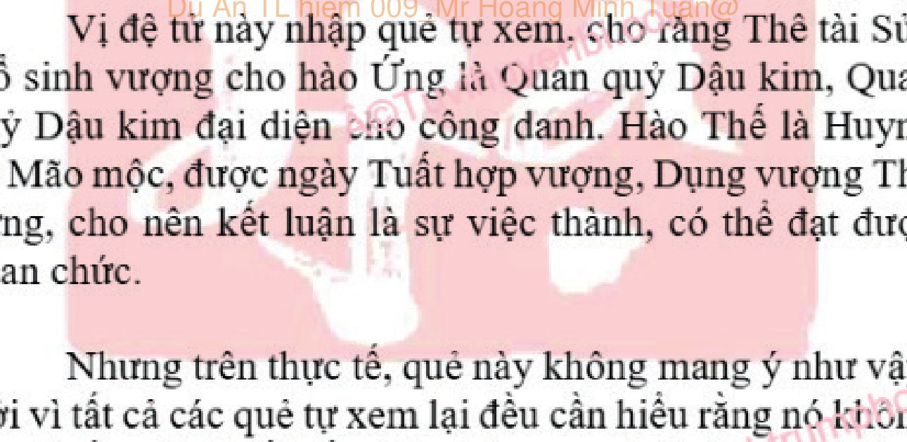
- **Cấu trúc Quẻ Dịch:**
  - **Quẻ chủ:** **Bát Thuần Tốn** (Cung Tốn, Thuần Tốn vi Phong - Quẻ Lục Xung).
  - **Quẻ biến:** **Phong Thiên Tiểu Súc** (Cung Tốn).
  - **Phục thần:** Không có hào phục hiển lộ.
- **Bảng chi tiết Lục hào:**

| Hào | Thế/Ứng | Lục thân (Chủ) | Can Chi (Chủ) | Động/Tĩnh | Biến hào (Lục thân) | Biến hào (Can Chi) | Thần sát / Phục | Lục thú |
|:---:|:---:|:---|:---|:---:|:---|:---|:---|:---|
| 6 | **Thế** | Huynh Đệ | Mão Mộc | tĩnh | Huynh Đệ | Mão Mộc | Đào hoa, Quý nhân | Bạch Hổ |
| 5 | | Tử Tôn | Tị Hỏa | tĩnh | Tử Tôn | Tị Hỏa | Quý nhân | Đằng Xà |
| 4 | | Thê Tài | Mùi Thổ | tĩnh | Thê Tài | Mùi Thổ | Nguyệt kiến | Câu Trần |
| 3 | **Ứng** | Quan Quỷ | Dậu Kim | tĩnh | Thê Tài | Thìn Thổ | Thái tuế | Chu Tước |
| 2 | | Phụ Mẫu | Hợi Thủy | tĩnh | Huynh Đệ | Dần Mộc | Kiếp sát, Lộc thần | Thanh Long |
| 1 | | Thê Tài | Sửu Thổ | **X (Động)** | Phụ Mẫu | Tý Thủy | Tuần không, Thiên hỷ | Huyền Vũ |

### 3. Dụng thần & Loại quẻ
- **Phân loại quẻ:**
  - **Quẻ cầu quan tiến chức:** Xem về danh vị, thăng tiến công danh sự nghiệp trong cơ quan, tổ chức.
  - **Quẻ tái chiêm (quẻ tự xem lại):** Lập lại quẻ khi quẻ ban đầu chưa rõ ràng, tâm thức tập trung giải tỏa một mối nghi vấn chuyên biệt chưa có câu trả lời.
  - **Quẻ Lục Xung biến quẻ Tiểu Súc:** Tượng việc cạnh tranh diễn ra gấp gáp, xáo trộn nhanh chóng, nhưng quẻ biến tụ lại thành Tiểu Súc (ngăn trở nhỏ, tích lũy tạm dừng).
- **Định vị Dụng thần cốt lõi:**
  - **Dụng thần:** **Quan Quỷ Dậu Kim** (tại hào 3, hào Ứng) đại diện cho chức vụ, quyền lực và cơ hội thăng tiến.
  - **Hào Thế:** **Huynh Đệ Mão Mộc** (tại hào 6 lâm Bạch Hổ) đại diện cho bản thân người gieo quẻ.
  - **Hào Ứng:** **Quan Quỷ Dậu Kim** đóng tại hào Ứng, đại diện cho đối thủ cạnh tranh trực diện.
  - **Nguyên thần của Dụng:** Thê Tài Sửu Thổ (phát động tại hào sơ).

### 4. Luận giải chi tiết
#### 1. Sai lầm kinh điển của người đoán khi áp dụng máy móc "Dụng vượng Thế hưng"
- Vị đệ tử tự phân tích theo lối mòn: Thấy hào 1 Thê Tài Sửu Thổ phát động sinh cho Quan Quỷ Dậu Kim (Dụng thần vượng). Hào Thế Huynh Đệ Mão Mộc lại được Nhật thần Tuất Thổ tương hợp (Mão Tuất nhị hợp hữu tình), cho rằng "Thế hưng Dụng vượng" là ắt đoạt được chức quan.
- Chu Thần Bân chỉ rõ: Lối luận giải này mắc sai lầm nghiêm trọng vì bỏ quên ngữ cảnh của quẻ tái chiêm và bản chất động hướng của quẻ.

#### 2. Hai đặc tính cơ bản của quẻ tái chiêm (quẻ xem lại)
- **Thông tin thô lược hóa:** Quẻ gieo lại không còn hiển thị đầy đủ chi tiết đa tầng như quẻ ban đầu, mà sẽ cô đọng biểu tượng thành các nét phác thảo thô sơ, tập trung toàn lực vào trục động biến then chốt.
- **Giải tỏa trực tiếp nghi vấn của quẻ trước:** Quẻ thứ hai xuất hiện cốt để trả lời trực tiếp cho câu hỏi chưa có lời đáp ở quẻ thứ nhất: *"Quan tinh sinh Thế hay sinh Ứng?"*.
- Quẻ trả lời dứt khoát qua động hào: Thê Tài Sửu Thổ độc phát chỉ sinh cho hào 3 Quan Quỷ Dậu Kim đóng tại hào Ứng, hoàn toàn không sinh cho hào Thế Mão Mộc. Hướng năng lượng dồn trọn vào hào Ứng, xác lập chức vụ thuộc về đối phương.

#### 3. Dấu hiệu Bạch Hổ lâm Thế hai lần liên tiếp
- Trong quẻ trước, hào Phụ Mẫu ám động đã chỉ ra dấu hiệu đối thủ cạnh tranh thắng thế, sau đó xuất hiện Bạch Hổ lâm Thế biểu thị sự buồn bực, than phiền và oán trách của bản thân.
- Sang quẻ tái chiêm này, Bạch Hổ một lần nữa cư ngụ tại hào Thế Huynh Đệ Mão Mộc.
- Quy tắc nghiệm chứng: Quẻ Dịch không bao giờ ngẫu nhiên để hung thần Bạch Hổ cư ngụ tại Thế hào qua hai lần lập quẻ liên tiếp. Bạch Hổ hai lần lâm Thế là biểu tượng kiên cố chỉ ra kết cục đương số ắt rơi vào tình cảnh thất bại, buồn bực và than oán.

#### 4. Quan hệ hào Thế và hào Ứng: Xung khắc kịch liệt
- Hào Thế Huynh Đệ Mão Mộc và hào Ứng Quan Quỷ Dậu Kim tạo thành cục diện Mão - Dậu trực xung kịch liệt. Hào Ứng mang Quan Quỷ Dậu Kim đắc Thái tuế Đinh Dậu hỗ trợ, lại được Thê Tài Sửu Thổ phát động sinh vượng, cho thấy đối thủ cạnh tranh có thực lực áp đảo và có quý nhân hậu thuẫn mạnh mẽ. Hào Thế bị hào Ứng tương xung khắc phạt, thể hiện sự thua cuộc hoàn toàn trong cuộc đua quyền lực.

### 5. Kết luận & Ứng kỳ thực tế
- **Lời giải đoán của Chu Thần Bân:**
  - Khẳng định quẻ này báo điềm thất bại, chức vị không thuộc về người gieo mà đã lọt vào tay đối thủ cạnh tranh. Hào Thế lâm Bạch Hổ hai lần là điềm báo buồn bã, bất mãn.
- **Phản hồi thực tế (Feedback):**
  - Đúng như dự đoán, kết quả công bố sau đó xác nhận người khác (đối thủ cạnh tranh) đã chính thức được thăng chức, đương số vuột mất cơ hội.
- **Ứng kỳ chiêm nghiệm:**
  - Sự việc ngã ngũ nhanh chóng trong kỳ hạn xem xét bổ nhiệm của cơ quan.

### 6. Bài học tâm pháp & Quy tắc cốt lõi
- **Quy tắc Lục Hào rút ra:**
  - *Quy tắc luận đoán quẻ tự xem lại (tái chiêm): Thông tin thô lược hóa, tập trung giải tỏa trực diện nghi vấn chưa rõ của quẻ trước và nhận diện Bạch Hổ lâm Thế hai lần* (trích Cổ Thệ Chân Thuyên tập 2, trang 148).
  - Không được áp dụng rập khuôn công thức "Dụng vượng Thế hưng" trong quẻ tái chiêm mà phải bám sát trục giải quyết nghi vấn cốt lõi.
- **Tâm pháp giải đoán thực tế:**
  - Khi một thông tin hung sát như Bạch Hổ lâm Thế xuất hiện lặp lại ở cả hai quẻ độc lập, đó là tín hiệu xác quyết không thể đảo ngược về trạng thái cảm xúc oán trách, thất vọng của người hỏi.
  - Phải phân định rạch ròi vị trí của Quan tinh nằm ở hào Thế hay hào Ứng; hào động sinh cho hào nào thì quyền lợi thuộc về chủ thể đó.

## THỰC CHIẾN 77: XEM NGƯỜI HÀNG XÓM – CHỊ DÂU MANG THAI LÀ TRAI HAY GÁI

### 1. Bối cảnh & Câu hỏi
- **Bối cảnh chi tiết:**
  - Một người hàng xóm đến nhờ xem giúp tình hình mang thai của người chị dâu trong gia đình. Người hỏi muốn biết thai nhi trong bụng chị dâu rốt cuộc là con trai hay con gái.
  - Đây là câu hỏi thuần túy mang tính xác định giới tính thai nhi, không hỏi về sức khỏe hay ngày giờ dự sinh.
- **Thời gian chiêm đoán:**
  - Dương lịch: Ngày 04 tháng 09 năm 2017, lúc 03:55.
  - Can chi: Tháng Dần, ngày Đinh Tị (Tuần không: Tý Sửu).
- **Tâm lý & Câu hỏi ẩn ý:**
  - Người hỏi tò mò về giới tính thai nhi của người thân hàng xóm. Tâm lý thuần nhất, tập trung duy nhất vào một nghi vấn nhị phân: *"Sinh trai hay sinh gái?"*.

### 2. Dữ kiện & Bảng quẻ Crop
- **Thời không chiêm nghiệm:**
  - Tháng Dần (Mộc vượng, Hỏa tướng).
  - Ngày Đinh Tị (Hỏa vượng, Thổ tướng, Kim tuyệt).
  - Tuần không: **Tý - Sửu** (Giáp Tuất tuần trung).
- **Thần sát:**
  - Tướng tinh: Dậu
  - Hoa cái: Sửu
  - Dịch mã: Hợi
  - Tai sát: Mão
  - Mưu tinh: Mùi
  - Đào hoa: Ngọ
  - Kiếp sát: Dần
  - Lộc thần: Ngọ
  - Dương nhẫn: Tị
  - Văn xương: Dậu
  - Thiên y: Sửu
  - Thiên hỷ: Tuất
  - Quý nhân: Dậu, Hợi
- **Dữ liệu bảng quẻ và hình ảnh thực chứng:**
  - **Bảng 77.1** Đồ hình quẻ Thực chiến 77:
    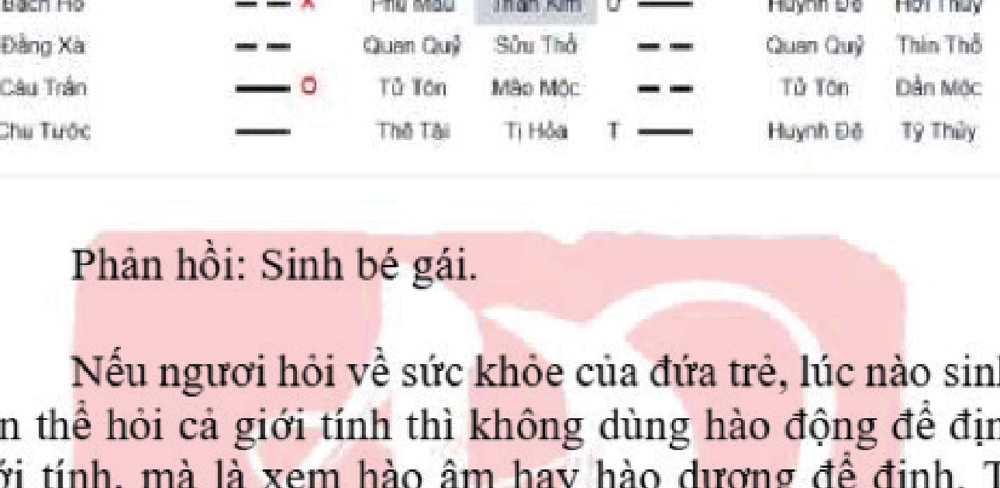
- **Cấu trúc Quẻ Dịch:**
  - **Quẻ chủ:** **Thủy Trạch Tiết** (Cung Khảm, Lục hợp).
  - **Quẻ biến:** **Trạch Lôi Tùy** (Cung Chấn, Quy hồn).
  - **Phục thần:** Không có.
- **Bảng chi tiết Lục hào:**

| Hào | Thế/Ứng | Lục thân (Chủ) | Can Chi (Chủ) | Động/Tĩnh | Biến hào (Lục thân) | Biến hào (Can Chi) | Thần sát / Phục | Lục thú |
|:---:|:---:|:---|:---|:---:|:---|:---|:---|:---|
| 6 | | Huynh Đệ | Tý Thủy | tĩnh | Quan Quỷ | Mùi Thổ | Tuần không | Thanh Long |
| 5 | | Quan Quỷ | Tuất Thổ | tĩnh | Phụ Mẫu | Dậu Kim | Thiên hỷ | Huyền Vũ |
| 4 | **Ứng** | Phụ Mẫu | Thân Kim | **X (Động)** | Huynh Đệ | Hợi Thủy | Dịch mã, Quý nhân | Bạch Hổ |
| 3 | | Quan Quỷ | Sửu Thổ | tĩnh | Quan Quỷ | Thìn Thổ | Tuần không, Hoa cái | Đằng Xà |
| 2 | | Tử Tôn | Mão Mộc | **O (Động)** | Tử Tôn | Dần Mộc | Tai sát, Kiếp sát | Câu Trần |
| 1 | **Thế** | Thê Tài | Tị Hỏa | tĩnh | Huynh Đệ | Tý Thủy | Nhật kiến, Dương nhẫn | Chu Tước |

### 3. Dụng thần & Loại quẻ
- **Phân loại quẻ:**
  - **Quẻ sinh sản thai sản (Sinh dựng chiêm):** Chuyên đề xác định giới tính thai nhi.
  - **Quẻ thuần túy vấn trai gái:** Câu hỏi đơn nhất không kèm theo sức khỏe, ngày sinh hay nguy cơ sinh sản.
- **Định vị Dụng thần cốt lõi:**
  - Trong phép đoán thuần túy sinh trai hay gái, **không xem Thế/Ứng**, không phụ thuộc vào mối quan hệ thân sơ giữa người gieo và sản phụ (người ngoài hay người thân đều bình đẳng).
  - Dụng thần trực tiếp là hào động, và ưu tiên tuyệt đối hào **Tử Tôn phát động**.
  - Hào 2 **Tử Tôn Mão Mộc** phát động chính là hạt nhân định tính giới tính thai nhi.

### 4. Luận giải chi tiết
#### 1. Nguyên lý cơ bản của Dã Hạc Lão Nhân về thuật đoán sinh trai gái
- Điều kiện tiên quyết: Câu hỏi phải tuyệt đối thuần túy chỉ hỏi sinh trai hay gái.
- Quy tắc biến hóa âm dương của hào động:
  - Dương động hóa âm: Tượng sinh con gái.
  - Âm động hóa dương: Tượng sinh con trai.
- Xử lý đa hào phát động theo vị trí không gian:
  - Hai hào động: Thông thường xem hào bên trên.
  - Ba hào động: Xem hào ở giữa.
  - Hơn ba hào động: Quẻ quá hỗn loạn, cần gieo lại.
- Quy tắc quẻ tĩnh và định chính sai sót trong *Tăng San Bốc Dịch*:
  - Nếu quẻ tĩnh không hào động: Xét quẻ bao (sơ hào và lục hào).
  - Bao dương (sơ hào và lục hào đều là dương hào): Dương bao âm $\rightarrow$ sinh con gái.
  - Bao âm (sơ hào và lục hào đều là âm hào): Âm bao dương $\rightarrow$ sinh con trai.
  - Sách cổ *Tăng San Bốc Dịch* do sơ suất khắc bản in đời xưa đã viết ngược phần này.
  - Nếu không thành quẻ bao: Xét hào Tử Tôn tĩnh (Tử Tôn dương sinh trai, Tử Tôn âm sinh gái).

#### 2. Cơ chế ưu tiên hào Tử Tôn động khi có nhiều hào phát động
- Trong quẻ này xuất hiện 2 hào động:
  - Hào 4 Phụ Mẫu Thân Kim (âm động X hóa dương Hợi Thủy). Nếu máy móc theo quy tắc "hai hào động xem hào trên", hào 4 âm hóa dương sẽ đoán là sinh con trai.
  - Hào 2 Tử Tôn Mão Mộc (dương động O hóa âm Dần Mộc).
- Chu Thần Bân xác lập chuẩn tắc:
  - Khi xuất hiện nhiều hào động mà trong đó có **hào Tử Tôn phát động**, nguyên tắc bản chất của Lục thân Tử Tôn (chủ con cái) cao hơn nguyên tắc vị trí hình thức (trên/dưới).
  - Bất luận hào Tử Tôn nằm ở hào trên hay hào dưới, đều trực tiếp lấy hào Tử Tôn làm căn cứ định tính duy nhất.
- Tại quẻ này: Hào 2 Tử Tôn Mão Mộc là dương hào phát động hóa thoái thành Dần Mộc (hóa âm). Dương động hóa âm xác quyết là **sinh con gái**.

### 5. Kết luận & Ứng kỳ thực tế
- **Lời giải đoán của Chu Thần Bân:**
  - Khẳng định sản phụ sẽ sinh bé gái dựa trên hào Tử Tôn Mão Mộc dương động hóa âm.
- **Phản hồi thực tế (Feedback):**
  - Người hàng xóm sau đó phản hồi: Chị dâu đã sinh nở thuận lợi và em bé chào đời chính xác là một bé gái.
- **Ứng kỳ chiêm nghiệm:**
  - Ứng nghiệm chuẩn xác tại thời điểm sinh nở của sản phụ.

### 6. Bài học tâm pháp & Quy tắc cốt lõi
- **Quy tắc Lục Hào rút ra:**
  - *Quy tắc chiêm đoán thuần túy sinh trai hay gái: Động tĩnh âm dương hóa hợp, cơ chế ưu tiên hào Tử tôn động và đính chính sai sót quẻ bao trong cổ tịch Tăng San Bốc Dịch* (trích Cổ Thệ Chân Thuyên tập 2, trang 152).
- **Tâm pháp giải đoán thực tế:**
  - Trong quẻ đoán thai sản thuần túy, không cần phân biệt Thế Ứng hay người gieo quẻ là ai, quẻ chỉ chạy theo quy luật vận động của hào động.
  - Đặt bản chất Lục thân (Tử Tôn) lên trên hình thức vị trí (hào trên/hào dưới) khi xử lý đa hào động, giúp loại trừ triệt để sai số do máy móc câu nệ sách vở.

## THỰC CHIẾN 78: MỘT ĐỆ TỬ Ở CHIẾT GIANG HỎI VỀ VIỆC SINH CON – DO THÁNG 8 KHÔNG CÓ NGÀY TỐT, VỢ TỰ CHIÊM XEM NẾU MỔ SINH SỚM VÀO CUỐI THÁNG 7 THÌ CÓ TỐT HƠN KHÔNG

### 1. Bối cảnh & Câu hỏi
- **Bối cảnh chi tiết:**
  - Một đệ tử ở Chiết Giang chuẩn bị đón con đầu lòng bằng phương pháp phẫu thuật mổ bắt con. Thầy Chu Thần Bân đã căn dặn phải tuyệt đối tuân thủ chỉ định của bác sĩ chuyên khoa: phải khám thai định kỳ và xác định ngưỡng an toàn thai kỳ trước khi bàn đến việc chọn ngày lành.
  - Bác sĩ chuyên khoa kết luận thai nhi chỉ có thể phẫu thuật mổ an toàn sau ngày 09 tháng 08. Khi người chồng đối chiếu lịch số trong khoảng 10 ngày sau thời điểm này thì không tìm được ngày nào thực sự đại cát.
  - Người vợ mang tâm trạng bồn chồn, lo lắng thái quá, thấy cuối tháng 7 có ngày tốt theo lịch số liền tự mình gieo quẻ hỏi xem liệu mổ bắt con sớm vào cuối tháng 7 thì có tốt hơn cho hai mẹ con hay không.
- **Thời gian chiêm đoán:**
  - Dương lịch: Ngày 21 tháng 07 năm 2017, lúc 12:24 (Giờ Bắc Kinh).
  - Can chi: Năm Đinh Dậu, tháng Đinh Mùi, ngày Kỷ Dậu, giờ Canh Ngọ.
- **Tâm lý & Câu hỏi ẩn ý:**
  - Người vợ sợ hãi tháng 8 không có ngày đẹp sẽ ảnh hưởng vận mệnh đứa trẻ, tâm lý nôn nóng muốn can thiệp y khoa sớm trái với chỉ định an toàn sinh học của bác sĩ.

### 2. Dữ kiện & Bảng quẻ Crop
- **Thời không chiêm nghiệm:**
  - Tháng Đinh Mùi (Thổ vượng, Mộc khố, Hỏa thoái khí).
  - Ngày Kỷ Dậu (Kim vượng, Thủy trường sinh).
  - Tuần không: **Dần - Mão** (Giáp Thìn tuần trung).
- **Thần sát:**
  - Tướng tinh: Dậu
  - Hoa cái: Sửu
  - Dịch mã: Hợi
  - Tai sát: Mão
  - Mưu tinh: Mùi
  - Đào hoa: Ngọ
  - Kiếp sát: Dần
  - Lộc thần: Ngọ
  - Dương nhẫn: Tị
  - Văn xương: Dậu
  - Thiên y: Ngọ
  - Thiên hỷ: Sửu
  - Quý nhân: Thân, Tý
- **Dữ liệu bảng quẻ và hình ảnh thực chứng:**
  - **Bảng 78.1** Đồ hình quẻ Thực chiến 78:
    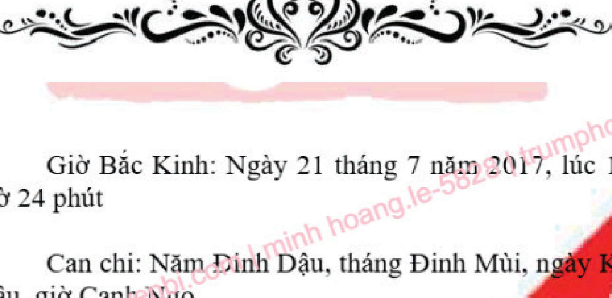
- **Cấu trúc Quẻ Dịch:**
  - **Quẻ chủ:** **Bát Thuần Chấn** (Cung Chấn - Quẻ Lục Xung).
  - **Quẻ biến:** **Địa Trạch Lâm** (Cung Khôn).
  - **Phục thần:** Không có.
- **Bảng chi tiết Lục hào:**

| Hào | Thế/Ứng | Lục thân (Chủ) | Can Chi (Chủ) | Động/Tĩnh | Biến hào (Lục thân) | Biến hào (Can Chi) | Thần sát / Phục | Lục thú |
|:---:|:---:|:---|:---|:---:|:---|:---|:---|:---|
| 6 | **Thế** | Thê Tài | Tuất Thổ | tĩnh | Quan Quỷ | Dậu Kim | Mộ khố của Ngọ | Câu Trần |
| 5 | | Quan Quỷ | Thân Kim | tĩnh | Phụ Mẫu | Hợi Thủy | Quý nhân | Chu Tước |
| 4 | | Tử Tôn | Ngọ Hỏa | **O (Động)** | Thê Tài | Sửu Thổ | Đào hoa, Thiên y, Lộc thần | Thanh Long |
| 3 | **Ứng** | Thê Tài | Thìn Thổ | tĩnh | Thê Tài | Sửu Thổ | | Huyền Vũ |
| 2 | | Huynh Đệ | Dần Mộc | **X (Động)** | Huynh Đệ | Mão Mộc | Tuần không, Kiếp sát | Bạch Hổ |
| 1 | | Phụ Mẫu | Tý Thủy | tĩnh | Tử Tôn | Tị Hỏa | Quý nhân | Đằng Xà |

### 3. Dụng thần & Loại quẻ
- **Phân loại quẻ:**
  - **Quẻ trắc thai sản & phẫu thuật mổ sinh:** Hỏi về sự an nguy của thai nhi và người mẹ khi can thiệp sinh sớm.
  - **Quẻ sự việc bất ngờ phát sinh ngắn hạn:** Bát Thuần Chấn (Lục Xung) thể hiện sự việc nảy sinh ngoài kế hoạch ban đầu; biến Địa Trạch Lâm yêu cầu phải nhanh chóng quyết định dứt khoát.
- **Định vị Dụng thần cốt lõi:**
  - **Dụng thần thai nhi:** **Tử Tôn Ngọ Hỏa** (hào 4) mang Đào hoa, Thiên y và Lộc thần.
  - **Hào Thế người mẹ:** **Thê Tài Tuất Thổ** (hào 6). Đáng chú ý, Tuất Thổ chính là Hỏa khố (Mộ khố của Dụng thần Tử Tôn Ngọ Hỏa) – tượng người mẹ đang mang thai nhi ẩn chứa trong ổ bụng.
  - **Kỵ thần khắc Thế:** **Huynh Đệ Dần Mộc** hóa Mão Mộc (lâm Bạch Hổ).

### 4. Luận giải chi tiết
#### 1. Cơ chế gãy đổ chuỗi tương sinh: Dụng thần hóa phá
- Bề ngoài cấu trúc động: Hào 2 Huynh Đệ Dần Mộc sinh hào 4 Tử Tôn Ngọ Hỏa, rồi Tử Tôn Ngọ Hỏa sinh hào Thế Thê Tài Tuất Thổ (tượng Mộc sinh Hỏa, Hỏa sinh Thổ – chuỗi liên hoàn tương sinh hoàn mỹ).
- Tuy nhiên, điểm thắt chí tử xuất hiện ở hào biến của Dụng thần:
  - Hào 4 Tử Tôn Ngọ Hỏa phát động biến xuất Thê Tài Sửu Thổ bị Nguyệt lệnh Mùi Thổ tương xung thành **Nguyệt phá** (đồng thời hưu tù phùng phá).
  - Khi Dụng thần động hóa phá, bản thân Dụng thần bị suy bại nặng nề và mất toàn bộ năng lực làm cầu nối tương sinh cho hào Thế.

#### 2. Kỵ thần độc phát trực xung khắc Thế: Hiểm họa của sản phụ
- Do Tử Tôn Ngọ Hỏa bị hóa phá cắt đứt dòng truyền khí, hào 2 Huynh Đệ Dần Mộc không còn chuyển hóa năng lượng sang Hỏa được nữa.
- Huynh Đệ Dần Mộc động hóa Tiến thần Mão Mộc mang theo hung thần **Bạch Hổ**, đổi hướng công kích trực tiếp vào hào Thế Thê Tài Tuất Thổ (Mộc khắc Thổ).
- Dần Mộc hiện lâm Tuần không nên mầm bệnh chưa phát tác lúc mang thai. Nếu mổ sớm vào cuối tháng 7, khi xuất không ứng nghiệm, Bạch Hổ Mộc vượng sẽ gây thương tổn nặng nề cho người mẹ:
  - Tượng viêm nhiễm nặng, xuất huyết phẫu thuật.
  - Mộc chủ về thần kinh, tư tưởng kết hợp Bạch Hổ chủ về oán thán u uất: Nguy cơ cao dẫn tới hội chứng **trầm cảm nặng sau sinh**.

#### 3. Tác hại đối với sự phát triển của thai nhi
- Dụng thần Tử Tôn Ngọ Hỏa động hóa phá: Báo hiệu thể trạng đứa trẻ bị khiếm khuyết nếu ép chào đời trước kỳ hạn sinh học.
- Huynh Đệ Dần Mộc là đất Trường sinh của Ngọ Hỏa, nhưng mang Bạch Hổ dây dưa ràng buộc không sinh: Đứa trẻ sinh non sẽ mắc các chứng bệnh mãn tính kéo dài về sau liên quan đến hệ gan mật, gân cốt, hệ thần kinh và suy giảm miễn dịch do các cơ quan chưa hoàn thiện.

### 5. Kết luận & Ứng kỳ thực tế
- **Lời giải đoán & Khuyến nghị của Chu Thần Bân:**
  - Tuyệt đối ngăn cấm việc tự ý mổ bắt con vào cuối tháng 7. Khẳng định mổ sớm chỉ vì chọn ngày đẹp là hành vi phản tự nhiên, vừa hủy hoại sức khỏe đứa trẻ vừa khiến người mẹ gánh chịu di chứng trầm cảm và viêm nhiễm.
  - Khuyên gia đình phải kiên nhẫn chờ qua mốc an toàn y khoa (sau ngày 09 tháng 08) do bác sĩ chỉ định.
  - Chu Thần Bân đã xem xét kỹ lưỡng và chọn giúp ngày tốt nhất trong khung an toàn: **Ngày 09 tháng 08 năm 2017**.
- **Phản hồi thực tế (Feedback):**
  - Gia đình nghe theo lời khuyên của Chu Thần Bân, hủy bỏ ý định mổ non trong tháng 7 và chờ đến đúng ngày 09 tháng 08 mới tiến hành phẫu thuật.
- **Ứng kỳ chiêm nghiệm:**
  - Ca mổ diễn ra an toàn, mẹ tròn con vuông, tránh được hiểm họa tai biến phẫu thuật.

### 6. Bài học tâm pháp & Quy tắc cốt lõi
- **Quy tắc Lục Hào rút ra:**
  - *Quy tắc chọn ngày sinh mổ sớm: Dụng thần Tử tôn hóa Nhật phá, Nguyên thần chuyển hóa thành cừu thần và kiêng kỵ can thiệp mổ sinh trái chỉ định y khoa* (trích Cổ Thệ Chân Thuyên tập 2, trang 157).
- **Tâm pháp giải đoán thực tế:**
  - Thuật số chọn ngày sinh không bao giờ được phép vượt lên trên chuẩn mực an toàn y học hiện đại. Thầy Dịch phải có trách nhiệm đạo đức cảnh báo đương số không được vì mê tín ngày giờ mà làm hại sinh mệnh.
  - Cơ chế "đứt gãy liên hoàn sinh": Khi hào trung gian bị hóa phá, chuỗi tương sinh lập tức chuyển hóa thành chuỗi tương khắc nguy hiểm.

## THỰC CHIẾN 79: MỘT NGƯỜI BỊ KHỞI TỐ VÌ VỤ ÁN RÚT TIỀN MẶT TỪ MÁY POS VÀ BỊ KẾT ÁN TÙ GIAM Ở PHIÊN SƠ THẨM, VỢ ANH TA HỎI LIỆU PHIÊN PHÚC THẨM CÓ CƠ HỘI LẬT ÁN, TUYÊN VÔ TỘI HAY KHÔNG?

### 1. Bối cảnh & Câu hỏi
- **Bối cảnh chi tiết:**
  - Một người đàn ông bị cơ quan chức năng bắt giữ và khởi tố vì liên quan đến vụ án rút tiền mặt trái phép qua máy POS. Trong thực tế, anh ta bị các đối tượng lừa đảo lợi dụng máy POS để trục lợi rồi đổ tội thay.
  - Dù gia đình đã thu thập và cung cấp tài liệu chứng cứ ngoại phạm, phiên tòa sơ thẩm vẫn phán quyết có tội và tuyên án tù giam.
  - Người vợ vô cùng phẫn uất, tin tưởng tuyệt đối chồng mình bị oan sai nên cùng người thân, trưởng bối trong dòng họ ráo riết chuẩn bị hồ sơ kháng cáo, chạy đôn đáo khắp nơi như Tòa án, Viện kiểm sát, Ban tiếp dân để nộp đơn khiếu kiện. Trước thềm phiên phúc thẩm, người vợ gieo quẻ hỏi liệu có cơ hội lật án và được tuyên vô tội hay không.
- **Thời gian chiêm đoán:**
  - Dương lịch: Ngày 09 tháng 07 năm 2017, lúc 10:32 sáng (Giờ Bắc Kinh).
  - Can chi: Năm Đinh Dậu, tháng Đinh Mùi, ngày Đinh Dậu, giờ Ất Tị.
- **Tâm lý & Câu hỏi ẩn ý:**
  - Đương số (người vợ) mang tâm lý nung nấu quyết tâm rửa oan cho chồng, câu hỏi tuy hỏi về người chồng nhưng thực chất phản ánh toàn bộ nỗ lực đấu tranh khiếu kiện của chính đương số và gia đình.

### 2. Dữ kiện & Bảng quẻ Crop
- **Thời không chiêm nghiệm:**
  - Tháng Đinh Mùi (Thổ vượng, Mộc khố, Kim tướng).
  - Ngày Đinh Dậu (Kim vượng, Mộc tuyệt).
  - Tuần không: **Thìn - Tị** (Giáp Ngọ tuần trung).
- **Thần sát:**
  - Tướng tinh: Dậu
  - Hoa cái: Sửu
  - Dịch mã: Hợi
  - Tai sát: Mão
  - Mưu tinh: Mùi
  - Đào hoa: Ngọ
  - Kiếp sát: Dần
  - Lộc thần: Ngọ
  - Dương nhẫn: Tị
  - Văn xương: Dậu
  - Thiên y: Ngọ
  - Thiên hỷ: Sửu
  - Quý nhân: Dậu, Hợi
- **Dữ liệu bảng quẻ và hình ảnh thực chứng:**
  - **Bảng 79.1** Đồ hình quẻ Thực chiến 79:
    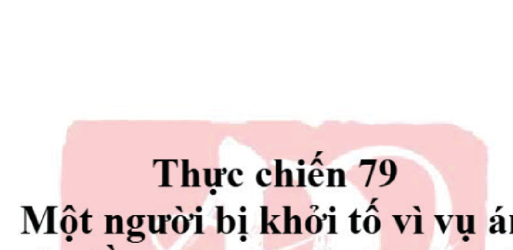
- **Cấu trúc Quẻ Dịch:**
  - **Quẻ chủ:** **Phong Sơn Tiệm** (Cung Cấn, Quy hồn).
  - **Quẻ biến:** **Phong Thiên Tiểu Súc** (Cung Tốn).
  - **Phục thần:** Hào 5 Phụ Mẫu Tị Hỏa phục tàng Thê Tài Tý Thủy.
- **Bảng chi tiết Lục hào:**

| Hào | Thế/Ứng | Lục thân (Chủ) | Can Chi (Chủ) | Động/Tĩnh | Biến hào (Lục thân) | Biến hào (Can Chi) | Thần sát / Phục | Lục thú |
|:---:|:---:|:---|:---|:---:|:---|:---|:---|:---|
| 6 | **Ứng** | Quan Quỷ | Mão Mộc | tĩnh (Nhật phá) | Quan Quỷ | Mão Mộc | Tai sát | Thanh Long |
| 5 | | Phụ Mẫu | Tị Hỏa | tĩnh | Phụ Mẫu | Tị Hỏa | Phục Tài Tý, Tuần không | Huyền Vũ |
| 4 | | Huynh Đệ | Mùi Thổ | tĩnh | Huynh Đệ | Mùi Thổ | Nguyệt kiến, Mưu tinh | Bạch Hổ |
| 3 | **Thế** | Tử Tôn | Thân Kim | tĩnh | Huynh Đệ | Thìn Thổ | Dịch mã | Đằng Xà |
| 2 | | Phụ Mẫu | Ngọ Hỏa | **X (Động)** | Quan Quỷ | Dần Mộc | Lộc thần, Đào hoa | Câu Trần |
| 1 | | Huynh Đệ | Thìn Thổ | **X (Động)** | Thê Tài | Tý Thủy | Tuần không | Chu Tước |

### 3. Dụng thần & Loại quẻ
- **Phân loại quẻ:**
  - **Quẻ quan phi tố tụng (Tố tụng hình sự):** Trắc nghiệm khả năng hủy án sơ thẩm, cải án vô tội trong phiên phúc thẩm.
  - **Quẻ đại diện chủ động kiểm soát:** Vợ thay mặt chồng hỏi, nhưng bản thân người vợ và thân thích là chủ thể trực tiếp chạy vạy khiếu nại (chủ động kiểm soát tiến trình), do đó hệ thống động biến có hai trục: nhắm vào người chồng (Dụng thần thông thường) và nhắm vào hào Thế (chủ thể hành động).
- **Định vị Dụng thần cốt lõi:**
  - **Dụng thần người chồng:** **Quan Quỷ Mão Mộc** (hào 6, hào Ứng).
  - **Hào Thế đại diện gia đình khiếu nại:** **Tử Tôn Thân Kim** (hào 3). Tử Tôn là thần khắc chế Quan Quỷ, đại diện cho ý chí đòi công lý, xóa bỏ tội danh.

### 4. Luận giải chi tiết
#### 1. Trục phân tích 1: Hiện trạng và cơ hội lật án của người chồng (Quan Quỷ Mão Mộc)
- **Hình tượng giam cầm trong ngục tối:** Quan Quỷ Mão Mộc lâm Nguyệt kiến Mùi Thổ. Trong ngũ hành, Mùi là Mộc khố (Mộ khố của Mộc). Dụng thần Mão Mộc nhập Mộ tại Nguyệt lệnh, biểu tượng xác thực cho việc người chồng hiện đang bị giam hãm mất tự do trong nhà lao.
- **Dụng thần nhập Mộ phùng phá:** Tháng Mùi Mão Mộc ở trạng thái hưu tù, lại bị Nhật kiến Đinh Dậu trực xung mãnh liệt (Mão - Dậu tương xung). Hào suy bị xung hóa thành **Nhật phá**.
- Trong phép đoán tố tụng, Dụng thần của đương sự vừa nhập Mộ vừa bị Nhật phá thì mọi cơ hội đảo ngược tình thế trong ngắn hạn hoàn toàn tan biến.

#### 2. Trục phân tích 2: Nỗ lực khiếu nại của gia đình và hiện tượng "Quá vượng (Vật cực tất phản)"
- **Chuỗi động hào liên hoàn sinh Thế:**
  - Hào 2 Phụ Mẫu Ngọ Hỏa phát động sinh hào 1 Huynh Đệ Thìn Thổ.
  - Huynh Đệ Thìn Thổ phát động sinh hào Thế Tử Tôn Thân Kim.
  - Đồng thời, Tử Tôn Thân Kim được Nguyệt kiến Mùi Thổ tương sinh, được Nhật kiến Dậu Kim tỷ hòa tương trợ.
- **Bẫy quá vượng trên bình diện quẻ lý và thực tiễn:**
  - Về lý luận: Khi hào Thế được cả Nhật lệnh, Nguyệt lệnh cùng toàn bộ hệ thống động hào dốc toàn lực tương sinh mà không có hào tiết khí hay hào khắc, năng lượng dồn nén đến mức cực đại sẽ kích hoạt quy luật *"Vật cực tất phản"*.
  - Tiêu chuẩn đối chiếu thực tế: Nhật Nguyệt và hào động sinh dồn dập biểu thị sự trợ lực tuyệt đối, nhưng trên thực tế gia đình đi gõ cửa khắp nơi đều bị từ chối, cơ quan chức năng giữ nguyên quan điểm kết tội. Sự bất đối xứng nghiêm trọng giữa hiện trạng thực tế và thông tin sinh phù trong quẻ chính là dấu hiệu xác quyết của trạng thái **Quá vượng**.
  - Kết cục của quá vượng là sự tê liệt công năng trong ngắn hạn: Toàn bộ nỗ lực kháng cáo của gia đình trở nên vô vọng, không thể sinh ra bất kỳ hiệu ứng pháp lý tích cực nào.

### 5. Kết luận & Ứng kỳ thực tế
- **Lời giải đoán của Chu Thần Bân:**
  - Khẳng định phiên phúc thẩm không có cơ hội lật ngược bản án để tuyên vô tội. Người chồng vẫn phải chịu án phạt giam giữ.
  - Quẻ biến Phong Thiên Tiểu Súc chỉ ra con đường khiếu oan còn kéo dài dằng dặc, không thể giải quyết trong ngắn hạn.
- **Phản hồi thực tế (Feedback):**
  - Trưởng bối và thân thích không ngừng tìm kiếm quan hệ và khiếu kiện tại ban tiếp dân nhưng đều vô hiệu.
  - Đến tháng 08 năm 2017, lịch mở phiên phúc thẩm bất ngờ bị hủy bỏ; bản án sơ thẩm có hiệu lực thi hành và người chồng bị chuyển thẳng vào trại giam chấp hành hình phạt tù.
- **Ứng kỳ chiêm nghiệm:**
  - Ứng vào tháng 8 (tháng Thân), khi phiên phúc thẩm chính thức bị bác bỏ.

### 6. Bài học tâm pháp & Quy tắc cốt lõi
- **Quy tắc Lục Hào rút ra:**
  - *Quy tắc quẻ đại diện chủ động kiểm soát trong tố tụng: Dụng thần nhập Mộ phùng phá và hiện tượng quá vượng (vật cực tất phản) khi liên hào sinh Thế* (trích Cổ Thệ Chân Thuyên tập 2, trang 165).
- **Tâm pháp giải đoán thực tế:**
  - Trong các quẻ đại diện mang tính chủ động kiểm soát, phải đồng thời theo dõi cả hai quỹ đạo: trạng thái tĩnh tại của đương sự (Dụng thần) và hành vi thực tế của người đại diện (hào Thế).
  - Phải tỉnh táo trước các quẻ có vô số lực tương sinh đổ dồn vào Thế/Dụng; nếu hiện thực cuộc sống đang bế tắc mà quẻ lại "đại cát sinh vượng", đó chính là bẫy quá vượng dẫn đến thất bại thực tế.

## THỰC CHIẾN 80: BUỔI SÁNG PHỎNG VẤN XIN VIỆC CÓ THÀNH CÔNG KHÔNG VÀI NGÀY NỮA CÓ PHẢN HỒI RÕ RÀNG KHÔNG

### 1. Bối cảnh & Câu hỏi
- **Bối cảnh chi tiết:**
  - Một người đi phỏng vấn xin việc vào một đơn vị cụ thể vào buổi sáng. Sau khi kết thúc buổi phỏng vấn, đương số mang tâm trạng hồi hộp và băn khoăn muốn biết ngay kết quả.
  - Người này gieo quẻ hỏi hai ý liên hoàn trong thời gian ngắn: Liệu cuộc phỏng vấn có thành công hay không, và trong vòng vài ngày tới có nhận được phản hồi rõ ràng từ đơn vị tuyển dụng hay không.
- **Thời gian chiêm đoán:**
  - Dương lịch: Ngày 25 tháng 09 năm 2017, lúc 10:26 (Giờ Bắc Kinh).
  - Can chi: Năm Đinh Dậu, tháng Kỷ Dậu, ngày Ất Mão, giờ Tân Tị.
- **Tâm lý & Câu hỏi ẩn ý:**
  - Tâm trạng nôn nóng, sốt ruột mong chờ kết quả ngắn hạn trong vài ngày. Câu hỏi bị giới hạn trong khung thời gian cực ngắn ("vài ngày nữa có phản hồi không"), mang tính chất của một việc bất ngờ phát sinh ngắn hạn.

### 2. Dữ kiện & Bảng quẻ Crop
- **Thời không chiêm nghiệm:**
  - Tháng Kỷ Dậu (Kim vượng, Mộc hưu tuyệt, Thủy tướng).
  - Ngày Ất Mão (Mộc vượng, Kim đới xung, Thổ hưu).
  - Tuần không: **Tý - Sửu** (Giáp Dần tuần trung).
- **Thần sát:**
  - Tướng tinh: Mão
  - Hoa cái: Mùi
  - Dịch mã: Tị
  - Tai sát: Dậu
  - Mưu tinh: Sửu
  - Đào hoa: Tý
  - Kiếp sát: Thân
  - Lộc thần: Mão
  - Dương nhẫn: Dần
  - Văn xương: Ngọ
  - Thiên y: Thân
  - Thiên hỷ: Thìn
  - Quý nhân: Thân, Tý
- **Dữ liệu bảng quẻ và hình ảnh thực chứng:**
  - **Bảng 80.1** Đồ hình quẻ Thực chiến 80:
    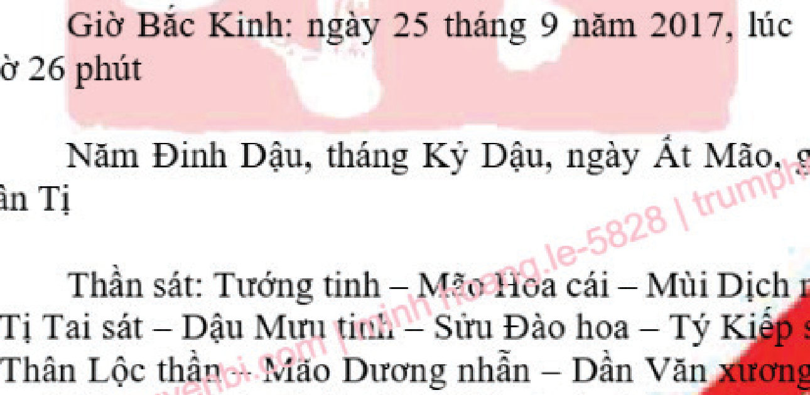
- **Cấu trúc Quẻ Dịch:**
  - **Quẻ chủ:** **Bát Thuần Cấn** (Cung Cấn, Bát thuần - Quẻ Lục Xung).
  - **Quẻ biến:** **Sơn Lôi Di** (Cung Tốn, Du hồn).
  - **Phục thần:** Không hiển lộ.
- **Bảng chi tiết Lục hào:**

| Hào | Thế/Ứng | Lục thân (Chủ) | Can Chi (Chủ) | Động/Tĩnh | Biến hào (Lục thân) | Biến hào (Can Chi) | Thần sát / Phục | Lục thú |
|:---:|:---:|:---|:---|:---:|:---|:---|:---|:---|
| 6 | **Thế** | Quan Quỷ | Dần Mộc | tĩnh | Quan Quỷ | Dần Mộc | Dương nhẫn | Huyền Vũ |
| 5 | | Thê Tài | Tý Thủy | tĩnh | Thê Tài | Tý Thủy | Tuần không, Đào hoa, Quý nhân | Bạch Hổ |
| 4 | | Huynh Đệ | Tuất Thổ | tĩnh | Huynh Đệ | Tuất Thổ | | Đằng Xà |
| 3 | **Ứng** | Tử Tôn | Thân Kim | **O (Động)** | Huynh Đệ | Thìn Thổ | Kiếp sát, Thiên y, Quý nhân | Câu Trần |
| 2 | | Phụ Mẫu | Ngọ Hỏa | tĩnh | Quan Quỷ | Dần Mộc | Văn xương | Chu Tước |
| 1 | | Huynh Đệ | Thìn Thổ | **X (Động)** | Thê Tài | Tý Thủy | Thiên hỷ | Thanh Long |

### 3. Dụng thần & Loại quẻ
- **Phân loại quẻ:**
  - **Quẻ cầu việc mưu sự ngắn hạn:** Xem về ứng tuyển, phỏng vấn xin việc tại một cơ quan cụ thể.
  - **Quẻ có giới hạn thời gian gấp gáp:** Khung thời gian định tính chỉ gói gọn trong vài ngày tới.
- **Định vị Dụng thần cốt lõi:**
  - Tiêu chuẩn chọn Dụng thần giữa Phụ mẫu (đơn vị tuyển dụng) và Quan quỷ (công việc, chức vụ): Theo nguyên tắc đạo pháp tự nhiên, hào nào ngự tại vị trí quan trọng (Thế, Ứng hoặc phát động) và có Thần sát hỗ trợ thì hào đó là Dụng thần.
  - Phụ Mẫu Ngọ Hỏa nằm tại hào 2 tĩnh tại, không lâm Thế Ứng. Ngược lại, Quan Quỷ Dần Mộc đóng tại hào 6 chính là hào Thế, lại mang Dương nhẫn (thần sát đại diện cho đơn vị và công việc).
  - Do đó Quan Quỷ Dần Mộc vừa là hào Thế vừa là Dụng thần cốt lõi của quẻ.

### 4. Luận giải chi tiết
#### 1. Thông tin hiện trạng qua sự chi phối của Nhật Nguyệt
- Nguyệt lệnh Kỷ Dậu xung khắc Quan Quỷ Dần Mộc: Phản ánh bối cảnh quá khứ của người hỏi gặp nhiều trở ngại, khó tìm được công việc như ý.
- Nhật kiến Ất Mão cùng hành Mộc tỷ hòa, đồng thời lâm Lộc thần, Quan quỷ Mão mộc đắc Nhật kiến: Báo hiệu hiện tại có cơ hội mở ra, xuất hiện thông tin tuyển dụng từ các đồng nghiệp cùng ngành nghề.
- Tuy nhiên Nhật Nguyệt chỉ phản ánh bối cảnh và hiện trạng, tầng thứ cao hơn quyết định thành bại là động triệu của quẻ.

#### 2. Cạm bẫy Tam Hợp Cục trong sự việc ngắn hạn
- Hào 1 Huynh Đệ Thìn Thổ động biến Thê Tài Tý Thủy, hào 3 Tử Tôn Thân Kim động biến Huynh Đệ Thìn Thổ:
  - Thân Kim (hào 3) phối hợp với Thìn Thổ (hào 1) và hào biến Tý Thủy hình thành **Tam hợp Thân - Tý - Thìn hóa Thê Tài Tý Thủy cục**.
  - Tý Thủy cục trực tiếp tương sinh cho hào Thế kiêm Dụng thần Quan Quỷ Dần Mộc. Bề ngoài đây là cục diện thuận lợi, dễ khiến người mới học đoán rằng công việc chắc chắn thành công và mang lại lợi ích.
- Sai lầm kinh điển và bản chất của Tam Hợp Cục:
  - Tam hợp cục có tính tích lũy thời gian, cần độ trễ thời gian đủ dài mới dần dần ngưng tụ và phát huy uy lực bền vững (tương tự như các ví dụ trong *Tăng San Bốc Dịch* phải trải qua thời gian dài mới ứng nghiệm thăng chức).
  - Tương tự quy luật Hóa tiến / Hóa thoái, trong sự việc ngắn hạn gấp gáp (vài ngày), tam hợp cục chưa kịp thành hình và thiếu hiệu lực thực thi.
  - Thê Tài Tý Thủy cục lại lâm Tuần không, biểu thị trong vài ngày tới cơ hội và thông tin phản hồi vẫn ở trạng thái trống rỗng.

#### 3. Triển vọng trung dài hạn và hệ thống ngoại lệ Dụng thần khắc Thế
- Triển vọng trung dài hạn: Về mặt chi tiết, tam hợp Tý Thủy cục sinh Quan Quỷ Dần Mộc cho thấy hướng đi này vẫn có triển vọng tốt nếu kiên trì. Đến tháng 12 (tháng Tý) hoặc khi thời gian trôi qua đủ lâu, tam hợp cục thành hình sẽ mang lại công việc thuận lợi và thu nhập ổn định.
- Mở rộng tâm pháp: Dụng thần khắc Thế theo trục thời gian ngắn hạn vs trung/dài hạn:
  - Thông thường Dụng khắc Thế là hung trong trung dài hạn, nhưng tồn tại các ngoại lệ cát lợi bất kể ngắn hay dài hạn: Tài khắc Thế là có tài; Hành nhân khắc Thế thì người mau về; Lo lắng mà Tử tôn khắc Thế là yên tâm; Thuốc men Tử tôn khắc Thế là đúng thuốc; Đoán bệnh Tử tôn khắc Thế là khỏi bệnh.
  - Riêng trong ngắn hạn, chỉ cần Thế vượng Dụng có khí thì Dụng thần khắc Thế lại là điềm lành nhanh chóng (như mất điện thoại, Phụ mẫu khắc Thế thì nhanh tìm lại).
- Quy tắc Tuần không theo thời hạn:
  - Cầu quan ngắn hạn mà Tử tôn tuần không: Vài ngày tới có thể trúng tuyển; nhưng dài hạn khi nhậm chức dễ nảy sinh rắc rối vì khi xuất không Tử tôn sẽ khắc Quan.

### 5. Kết luận & Ứng kỳ thực tế
- **Lời giải đoán của Chu Thần Bân:**
  - Khẳng định trong vài ngày tới sẽ không có bất kỳ phản hồi rõ ràng nào từ đơn vị tuyển dụng do tam hợp cục chưa thành hình và Tý Thủy lâm không.
  - Khuyên đương số không nên nản lòng, tiếp tục tìm kiếm, về trung dài hạn (từ tháng Tý trở đi) cơ hội tốt sẽ mở ra.
- **Phản hồi thực tế (Feedback):**
  - Đúng như dự đoán, sau buổi phỏng vấn hoàn toàn bặt vô âm tín, không có bất kỳ hồi đáp hay thư phản hồi nào trong những ngày tiếp theo.
- **Ứng kỳ chiêm nghiệm:**
  - Ứng nghiệm sự bế tắc và im lặng hoàn toàn trong ngắn hạn.

### 6. Bài học tâm pháp & Quy tắc cốt lõi
- **Quy tắc Lục Hào rút ra:**
  - *Cạm bẫy Tam Hợp Cục trong sự việc ngắn hạn: Điều kiện thời gian tích lũy để thành cục và các trường hợp ngoại lệ cát lợi của Dụng thần khắc Thế* (trích Cổ Thệ Chân Thuyên tập 2, trang 173).
- **Tâm pháp giải đoán thực tế:**
  - Không bao giờ được phép đồng nhất quy luật của quẻ trung dài hạn với quẻ ngắn hạn. Tam hợp cục và hóa tiến/thoái đòi hỏi thời gian tích lũy để phát huy tác dụng.
  - Phân định rạch ròi giữa bản chất câu hỏi ngắn hạn (kết quả phỏng vấn vài ngày) với diễn biến dài hạn của sự nghiệp để tránh đoán sai cát hung thực tế.

## THỰC CHIẾN 81: XEM CHUYỂN TRƯỜNG CHO CON TRAI ĐANG HỌC LỚP 10 HIỆN TẠI CÓ TỐT HƠN HAY Ở LẠI TRƯỜNG CŨ THÌ TỐT HƠN

### 1. Bối cảnh & Câu hỏi
- **Bối cảnh chi tiết:**
  - Một đồng môn ở Quảng Đông có con trai đang học lớp 10 trung học phổ thông. Ngôi trường con trai đang theo học hiện tại không phải là trường trọng điểm tốt nhất trong thành phố.
  - Khi thời gian chỉ còn hai năm nữa là bước vào kỳ thi đại học mang tính bước ngoặt, người cha đã chủ động liên hệ được một trường chuyên có chất lượng cao hơn trong thành phố. Tuy nhiên, người cha còn nhiều băn khoăn: lo ngại con chuyển trường sẽ không thích nghi được dẫn đến sa sút, trong khi ở trường cũ con vẫn đang học khá tốt và thành tích nằm trong nhóm dẫn đầu.
  - Người cha gieo quẻ hỏi xem việc chuyển trường cho con có tốt hơn không hay tiếp tục ở lại trường cũ.
- **Thời gian chiêm đoán:**
  - Dương lịch: Ngày 25 tháng 09 năm 2017, lúc 10:00 (Giờ Bắc Kinh).
  - Can chi: Năm Đinh Dậu, tháng Kỷ Dậu, ngày Ất Mão, giờ Tân Tỵ.
- **Tâm lý & Câu hỏi ẩn ý:**
  - Người cha mang tâm lý cầu toàn, lo lắng cho tương lai lâu dài của con; do dự giữa sự ổn định êm đềm trước mắt (ngắn hạn) và sự bứt phá nâng cao năng lực học thuật thực chất (dài hạn).

### 2. Dữ kiện & Bảng quẻ Crop
- **Thời không chiêm nghiệm:**
  - Tháng Kỷ Dậu (Kim vượng, Mộc hưu phùng xung, Hỏa hưu).
  - Ngày Ất Mão (Mộc vượng, Kim đới xung, Thủy tương sinh).
  - Tuần không: **Tý - Sửu** (Giáp Dần tuần trung).
- **Thần sát:**
  - Tướng tinh: Mão
  - Hoa cái: Mùi
  - Dịch mã: Tỵ
  - Tai sát: Dậu
  - Mưu tinh: Sửu
  - Đào hoa: Tý
  - Kiếp sát: Thân
  - Lộc thần: Mão
  - Dương nhẫn: Dần
  - Văn xương: Ngọ
  - Thiên y: Thân
  - Thiên hỷ: Thìn
  - Quý nhân: Thân, Tý
- **Dữ liệu bảng quẻ và hình ảnh thực chứng:**
  - **Bảng 81.1** Đồ hình quẻ Thực chiến 81:
    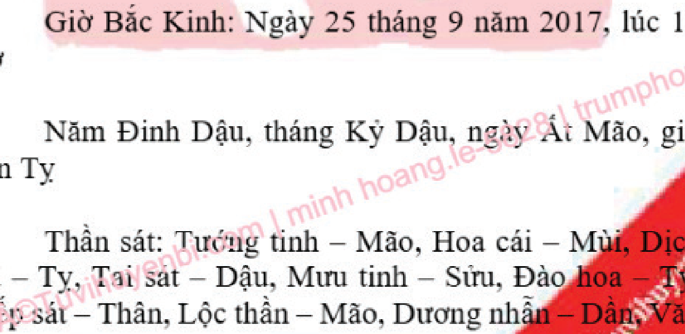
- **Cấu trúc Quẻ Dịch:**
  - **Quẻ chủ:** **Sơn Phong Cổ** (Cung Tốn, Quy hồn, quẻ tĩnh).
  - **Quẻ biến:** **Sơn Phong Cổ** (quẻ tĩnh).
  - **Phục thần:** Hào 5 Phụ Mẫu Tý Thủy phục tàng **Tử Tôn Tỵ Hỏa** (Tử-Tỵ).
- **Bảng chi tiết Lục hào:**

| Hào | Thế/Ứng | Lục thân (Chủ) | Can Chi (Chủ) | Động/Tĩnh | Biến hào (Lục thân) | Biến hào (Can Chi) | Thần sát / Phục | Lục thú |
|:---:|:---:|:---|:---|:---:|:---|:---|:---|:---|
| 6 | **Ứng** | Huynh Đệ | Dần Mộc | tĩnh | Huynh Đệ | Dần Mộc | Dương nhẫn | Huyền Vũ |
| 5 | | Phụ Mẫu | Tý Thủy | tĩnh | Phụ Mẫu | Tý Thủy | Phục Tử-Tỵ (Quý nhân, Dịch mã), Tuần không, Đào hoa, Quý nhân | Bạch Hổ |
| 4 | | Thê Tài | Tuất Thổ | tĩnh | Thê Tài | Tuất Thổ | | Đằng Xà |
| 3 | **Thế** | Quan Quỷ | Dậu Kim | tĩnh (Ám động) | Quan Quỷ | Dậu Kim | Tai sát | Câu Trần |
| 2 | | Phụ Mẫu | Hợi Thủy | tĩnh | Phụ Mẫu | Hợi Thủy | Dương nhẫn | Chu Tước |
| 1 | | Thê Tài | Sửu Thổ | tĩnh | Thê Tài | Sửu Thổ | Tuần không, Mưu tinh | Thanh Long |

### 3. Dụng thần & Loại quẻ
- **Phân loại quẻ:**
  - **Quẻ học tập thi cử & chọn trường:** Định hướng tương lai học tập và chuẩn bị thi đại học cho con cái.
  - **Quẻ tĩnh mang ý nghĩa kép:** Phản ánh hiện trạng đồng thời biểu thị xu hướng tương lai; quẻ Cổ là biểu tượng của sự chủ động cải cách, biến đổi và đổi mới hiện trạng.
- **Định vị Dụng thần cốt lõi:**
  - **Dụng thần đứa con:** **Tử Tôn Tỵ Hỏa** (mang Quý nhân, Dịch mã) tàng phục dưới hào 5 Phụ Mẫu Tý Thủy.
  - **Hào Thế người cha:** **Quan Quỷ Dậu Kim** (hào 3) lâm Câu Trần, đắc Nguyệt kiến, bị Nhật kiến Ất Mão trực xung trở thành **Ám động** (tượng người cha đang tích cực hành động chạy vạy tìm kiếm trường mới).
  - **Trường học hiện tại:** Phụ Mẫu Tý Thủy (hào 5).
  - **Trường học dự kiến chuyển tới:** Phụ Mẫu Hợi Thủy (hào 2 mang Chu Tước và Dương nhẫn).

### 4. Luận giải chi tiết
#### 1. Định vị hai ngôi trường qua tượng quẻ và Phục thần
- Phụ Mẫu Tý Thủy (hào 5): Bên dưới ẩn chứa Dụng thần Tử Tôn Tỵ Hỏa. Tượng đứa trẻ hiện đang ngồi học bên trong ngôi trường này, do đó Phụ Mẫu Tý Thủy chính là trường học hiện tại.
- Phụ Mẫu Hợi Thủy (hào 2): Mang Chu Tước (thành tích học tập cao) và Dương nhẫn (tính chất chuyên môn sâu). Hào Thế Quan Quỷ Dậu Kim ám động sinh cho Phụ Mẫu Hợi Thủy, biểu thị người cha đang chủ động hướng về ngôi trường chuyên môn này để chuyển trường cho con.

#### 2. Thuyết Tàng - Phục cách tân: Cát lợi ngắn hạn của trường hiện tại
- Lý thuyết Tàng - Phục cách tân của Chu Thần Bân:
  - Nếu Dụng thần tàng phục mà bản thân bị Tuần không hoặc Nguyệt phá thì rơi vào suy bại triệt để.
  - Nếu Dụng thần tàng phục không bị không phá, mà **Phi thần đè lên bị Tuần không** thì trong ngắn hạn Dụng thần được giải phóng, lộ diện phát huy tác dụng tốt lành $\rightarrow$ mang lại cát lợi ngắn hạn.
- Ứng vào quẻ: Phi thần Phụ Mẫu Tý Thủy lâm Tuần không, giải phóng Dụng thần Tử Tôn Tỵ Hỏa. Thêm vào đó, Nhật lệnh Ất Mão tương sinh cho Tử Tôn Tỵ Hỏa.
  - Điều này giải thích chính xác hiện trạng đứa trẻ ở trường cũ đang học rất tốt, tiếp thu nhẹ nhàng và đứng trong nhóm đầu lớp.

#### 3. Bất lợi dài hạn tại trường cũ và tính tất yếu của việc chuyển trường
- Giới hạn của Phi thần tuần không: Phi thần tuần không chỉ đảm bảo cát lợi trong ngắn hạn, không đại diện cho lợi ích dài hạn. Về dài hạn để thi đại học, bắt buộc phải căn cứ vào Nhật Nguyệt và Thần sát:
  - Nguyệt lệnh Kỷ Dậu xung phá Nhật lệnh Ất Mão: Cho thấy phương pháp và năng lực đào tạo của trường cũ (Mão Mộc là Lộc thần - tính chất nghiệp dư) không đủ sức duy trì tính cạnh tranh lâu dài trước ngưỡng cửa đại học lớn (Nguyệt kiến Dậu Kim).
  - Tà thần Bạch Hổ đè lên hào Tử Tôn Tỵ Hỏa: Bạch Hổ chủ về mệt mỏi, áp lực, bế tắc và oán thán. Càng về sau, đứa trẻ học ở trường cũ sẽ càng đuối sức và chán nản.
- Giá trị thực chất của trường mới:
  - Hào Ứng Huynh Đệ Dần Mộc mang Dương nhẫn đại diện cho tri thức chuyên sâu từ trường mới. Dần Mộc tương hợp với Phụ Mẫu Hợi Thủy (trường mới).
  - Dần Mộc sinh Tử Tôn Tỵ Hỏa (tuy có quan hệ tương hình nhẹ, báo hiệu việc rèn luyện tiếp thu kiến thức chuyên môn sẽ vất vả, khó khăn hơn ban đầu), nhưng bản chất là sinh dưỡng thực chất, giúp nâng tầm thực lực học tập của con lên tầm cao mới để chuẩn bị cho kỳ thi đại học.

### 5. Kết luận & Ứng kỳ thực tế
- **Lời giải đoán & Khuyến nghị của Chu Thần Bân:**
  - Khẳng định hiện tại ở trường cũ con học tốt chỉ là hiện tượng ngắn hạn; về lâu dài trường cũ không đủ sức bật và dễ khiến con rơi vào mệt mỏi, oán thán do Bạch Hổ ám hại.
  - Quyết liệt khuyến nghị người cha nên dứt khoát chuyển trường cho con càng sớm càng tốt để kịp hòa nhập và rèn luyện kiến thức chuyên sâu cho kỳ thi đại học sau 2 năm.
- **Phản hồi thực tế (Feedback):**
  - Người cha đồng tình sâu sắc với phân tích, xóa bỏ sự ngập ngừng do dự và nhanh chóng hoàn tất thủ tục chuyển trường cho con trai.
- **Ứng kỳ chiêm nghiệm:**
  - Ứng nghiệm vào thời điểm đầu học kỳ lớp 10, quyết định chuyển trường thành công.

### 6. Bài học tâm pháp & Quy tắc cốt lõi
- **Quy tắc Lục Hào rút ra:**
  - *Quy tắc Tàng - Phục cách tân và phân biệt cát hung ngắn hạn - dài hạn: Phi thần tuần không giải phóng Phục thần và ảnh hưởng của Tà thần Bạch Hổ trong học nghiệp* (trích Cổ Thệ Chân Thuyên tập 2, trang 181).
- **Tâm pháp giải đoán thực tế:**
  - Phải phân biệt rõ ranh giới giữa cát hung ngắn hạn và xu hướng dài hạn: Phi thần tuần không chỉ giải quyết cái lợi trước mắt; dài hạn phải soi xét thấu đáo tương quan Nhật Nguyệt và Thần sát (như Tà thần Bạch Hổ).
  - Không được e ngại quan hệ tương hình khi bản chất ngũ hành vẫn là tương sinh; sự rèn luyện gian khổ (Dần hình Tỵ) chính là con đường tất yếu để tôi luyện nhân tài.

## THỰC CHIẾN 82: XEM CON GÁI HÔM NAY PHẪU THUẬT CÓ THUẬN LỢI KHÔNG

### 1. Bối cảnh & Câu hỏi
- **Bối cảnh chi tiết:**
  - Người lập quẻ là người cha, đang cùng con gái sinh sống tại Canada. Địa điểm này có độ chênh lệch 12 múi giờ so với giờ Bắc Kinh tại Trung Quốc.
  - Cô con gái có một khối u lành tính nằm trong đốt sống cổ, đang chèn ép hệ thống dây thần kinh vận động tứ chi. Lịch phẫu thuật bóc tách khối u đã được bệnh viện ấn định thực hiện ngay trong ngày.
  - Người cha gieo quẻ với tâm nguyện thuần túy muốn biết ca phẫu thuật của con gái hôm nay có diễn ra thuận lợi, an toàn hay không.
- **Thời gian chiêm đoán:**
  - Dương lịch: Ngày 10 tháng 10 năm 2017, lúc 06:26 sáng thứ Ba (Giờ địa phương tại Canada).
  - Can chi: Năm Đinh Dậu, tháng Canh Tuất, ngày Canh Ngọ (giờ địa phương).
- **Tâm lý & Câu hỏi ẩn ý:**
  - Tâm trạng người cha vô cùng lo âu, thấp thỏm vì vị trí phẫu thuật ở đốt sống cổ liên quan trực tiếp đến tính mạng và nguy cơ liệt tứ chi; tha thiết mong cầu sự bình an cho ca phẫu thuật.

### 2. Dữ kiện & Bảng quẻ Crop
- **Thời không chiêm nghiệm:**
  - Tháng Canh Tuất (Thổ vượng, Hỏa khố, Mộc suy).
  - Ngày Canh Ngọ (Hỏa vượng, Thổ tướng, Kim bại).
  - Tuần không: **Tuất - Hợi** (Giáp Tý tuần trung).
- **Thần sát:**
  - Tướng tinh: Ngọ
  - Hoa cái: Tuất
  - Dịch mã: Thân
  - Tai sát: Tý
  - Mưu tinh: Thìn
  - Đào hoa: Mão
  - Kiếp sát: Hợi
  - Lộc thần: Thân
  - Dương nhẫn: Dậu
  - Văn xương: Hợi
  - Thiên y: Dậu
  - Thiên hỷ: Thìn
  - Quý nhân: Dần, Ngọ
- **Dữ liệu bảng quẻ và hình ảnh thực chứng:**
  - **Bảng 82.1** Đồ hình quẻ Thực chiến 82:
    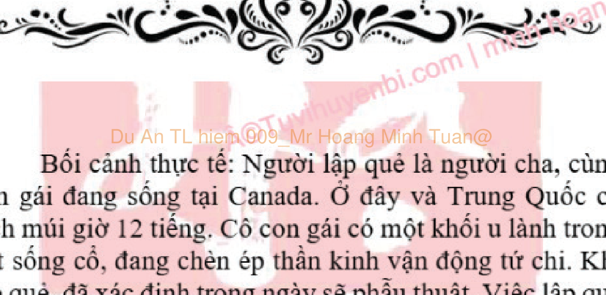
- **Cấu trúc Quẻ Dịch:**
  - **Quẻ chủ:** **Bát Thuần Ly** (Cung Ly, Bát thuần - Quẻ Lục Xung).
  - **Quẻ biến:** **Hỏa Sơn Lữ** (Cung Cấn).
  - **Phục thần:** Không hiển lộ.
- **Bảng chi tiết Lục hào:**

| Hào | Thế/Ứng | Lục thân (Chủ) | Can Chi (Chủ) | Động/Tĩnh | Biến hào (Lục thân) | Biến hào (Can Chi) | Thần sát / Phục | Lục thú |
|:---:|:---:|:---|:---|:---:|:---|:---|:---|:---|
| 6 | **Thế** | Huynh Đệ | Tị Hỏa | tĩnh | Huynh Đệ | Tị Hỏa | | Đằng Xà |
| 5 | | Tử Tôn | Mùi Thổ | tĩnh | Tử Tôn | Mùi Thổ | | Câu Trần |
| 4 | | Thê Tài | Dậu Kim | tĩnh | Thê Tài | Dậu Kim | Dương nhẫn, Thiên y | Chu Tước |
| 3 | **Ứng** | Quan Quỷ | Hợi Thủy | tĩnh | Thê Tài | Thân Kim | Tuần không, Kiếp sát, Văn xương | Thanh Long |
| 2 | | Tử Tôn | Sửu Thổ | tĩnh | Huynh Đệ | Ngọ Hỏa | | Huyền Vũ |
| 1 | | Phụ Mẫu | Mão Mộc | **O (Động)** | Tử Tôn | Thìn Thổ | Đào hoa, Nguyệt phá (ở hào biến) | Bạch Hổ |

### 3. Dụng thần & Loại quẻ
- **Phân loại quẻ:**
  - **Quẻ y đạo & phẫu thuật trị bệnh:** Dự đoán mức độ an toàn và thành bại của ca phẫu thuật ngoại khoa.
  - **Quẻ việc cụ thể ngắn hạn:** Hỏi về kết quả ca mổ diễn ra ngay trong ngày.
- **Định vị Dụng thần cốt lõi:**
  - **Tiêu chuẩn chọn Dụng thần:** Trong quẻ xuất hiện Phụ Mẫu Mão Mộc động biến Tử Tôn Thìn Thổ, đồng thời quẻ chủ có hai hào Tử Tôn (Mùi Thổ và Sửu Thổ).
  - Phủ định thói quen sai lầm "động lấy động" coi hào biến Tử Tôn Thìn Thổ làm Dụng thần (sẽ ngộ nhận thành Dụng kỵ hóa lẫn nhau).
  - Hai điều kiện để lấy hào biến làm Dụng thần: (1) Hào động nằm tại Thế hoặc Ứng, hoặc (2) Quẻ chủ hoàn toàn không có hào Dụng thần. Vì ở đây hào động ở hào sơ (không phải Thế Ứng) và quẻ chủ có sẵn Tử Tôn, nên bắt buộc phải chọn Dụng thần trong quẻ chủ.
  - So sánh giữa Tử Tôn Mùi Thổ và Sửu Thổ: **Tử Tôn Mùi Thổ** (hào 5) có quan hệ nhị hợp chặt chẽ với Nhật lệnh Ngọ Hỏa (Ngọ Mùi tương hợp), được Nhật sinh phù hữu tình, nên Tử Tôn Mùi Thổ chính là Dụng thần duy nhất.

### 4. Luận giải chi tiết
#### 1. Quy tắc quan niệm thời gian theo ý niệm trong Lục Hào
- Sự khác biệt căn bản giữa Lục Hào và Bát Tự:
  - Bát tự phụ thuộc vào thời điểm thụ khí bẩm sinh nên bắt buộc phải quy đổi chính xác giờ mặt trời thực tại địa phương.
  - Lục Hào khởi phát từ ý niệm tương thông giữa tâm thức người gieo và người luận đoán. Độ chính xác của quẻ tượng thuận ứng theo múi giờ mà tâm ý của họ đã định hình (dù là giờ Bắc Kinh hay giờ địa phương Canada). Nếu người hỏi không biết gì về lệch múi giờ thì quẻ vẫn chạy theo múi giờ của người luận giải đang xem.

#### 2. Cơ chế Kỵ thần độc phát hóa Nguyệt phá: Hóa giải tai họa
- Phân tích động triệu: Hào sơ Phụ Mẫu Mão Mộc (kỵ thần khắc hại Tử Tôn) phát động mang theo Bạch Hổ (biểu tượng của đao kéo, mổ xẻ, phẫu thuật).
- Thoạt nhìn, kỵ thần Bạch Hổ phát động là điềm đại hung cho ca phẫu thuật. Nhưng then chốt nằm ở hào biến:
  - Hào biến là **Tử Tôn Thìn Thổ** bị Nguyệt kiến Tuất Thổ trực xung thành **Nguyệt phá** (Thìn - Tuất tương xung).
  - Khi hào biến bị Nguyệt phá, hào động Phụ Mẫu Mão Mộc bị "kéo theo" hóa phá, rơi vào trạng thái vô lực, mất hoàn toàn công năng khắc phạt Dụng thần.
  - Quy tắc: Kỵ thần độc phát hóa Nguyệt phá biến thành hào vô dụng, nguy cơ bị triệt tiêu hoàn toàn, biến hiểm thành an cho Dụng thần Tử Tôn.

#### 3. Phân tầng cát hung và chi tiết: Cảnh báo ngân hàng máu
- Ở tầng định tính cát hung: Phụ Mẫu Mão Mộc hóa phá không khắc Dụng thần Tử Tôn Mùi Thổ, ca phẫu thuật tuyệt đối an toàn.
- Ở tầng phân tích chi tiết: Phụ Mẫu Mão Mộc mang Đào hoa kết hợp Bạch Hổ (chủ về huyết, xuất huyết) biến Tử Tôn:
  - Điềm báo ca mổ liên quan đến lượng máu và chảy máu; Chu Thần Bân dặn người nhà chú ý kiểm tra nhóm máu và lượng máu dự trữ của bệnh viện để phòng ngừa phát sinh xuất huyết tăng.
  - Tuy nhiên vì là "hóa phá" nên chỉ là hiện tượng phụ nhỏ nhặt, không ảnh hưởng đến đại cục.

### 5. Kết luận & Ứng kỳ thực tế
- **Lời giải đoán của Chu Thần Bân:**
  - Trấn an người cha không cần lo lắng, khẳng định ca mổ của con gái sẽ tiến triển vô cùng thuận lợi và thành công. Chỉ cần lưu ý dặn bác sĩ chuẩn bị chu đáo lượng máu dự trữ.
- **Phản hồi thực tế (Feedback):**
  - Ca phẫu thuật bóc tách khối u ở đốt sống cổ diễn ra hoàn toàn suôn sẻ, khối u được lấy ra an toàn, các dây thần kinh vận động được bảo toàn nguyên vẹn.
- **Ứng kỳ chiêm nghiệm:**
  - Ứng nghiệm ngay trong ngày chiêm đoán (10/10/2017).

### 6. Bài học tâm pháp & Quy tắc cốt lõi
- **Quy tắc Lục Hào rút ra:**
  - *Quy tắc quan niệm thời gian theo ý niệm trong Lục Hào và tiêu chuẩn chọn Dụng thần khi xuất hiện hào biến mang lục thân của Dụng thần* (trích Cổ Thệ Chân Thuyên tập 2, trang 189).
  - *Quy tắc kỵ thần độc phát hóa Nguyệt phá: Hào kỵ mất tác dụng chuyển thành cát lợi cho Dụng thần trong chiêm đoán phẫu thuật y khoa* (trích Cổ Thệ Chân Thuyên tập 2, trang 193).
- **Tâm pháp giải đoán thực tế:**
  - Không máy móc lấy hào biến làm Dụng thần trừ khi nó ngự tại Thế Ứng hoặc quẻ chủ không có Dụng thần.
  - Nắm vững cơ chế "Kỵ thần hóa phá": Khi hào khắc Dụng thần phát động mà biến ra hào phùng phá, cái hung tự tiêu biến thành cái cát lớn cho người hỏi.

## THỰC CHIẾN 83: ĐỒNG MÔN THAY MẶT GIEO QUẺ

### 1. Bối cảnh & Câu hỏi
- **Bối cảnh chi tiết:**
  - Cùng ngày diễn ra ca đại phẫu thuật bóc tách khối u cột sống cổ của con gái người đồng môn ở Canada (trong Thực chiến 82).
  - Trong nhóm học tập Lục Hào, khi xem quẻ trước đó, một số đồng môn thấy hào động biến ra Tử Tôn lâm Bạch Hổ liền hoang mang suy diễn là "Dụng kỵ hỗ hóa", cho rằng quẻ rất hung hiểm và bàn tán xôn xao gây hoang mang, bất an.
  - Một người bạn đồng môn vì quá lo lắng và thương xót cho hoàn cảnh của người bạn (đây là đứa con gái duy nhất) nên đã sốt sắng tự mình thay mặt gieo một quẻ Dịch để xem tình hình phẫu thuật của đứa bé có bình an hay không.
- **Thời gian chiêm đoán:**
  - Dương lịch: Ngày 10 tháng 10 năm 2017, lúc 19:40 (Giờ Bắc Kinh).
  - Can chi: Năm Đinh Dậu, tháng Canh Tuất, ngày Canh Ngọ, giờ Bính Tuất.
- **Tâm lý & Câu hỏi ẩn ý:**
  - Tâm trạng lo âu, bồn chồn thay cho người khác. Đây là quẻ khởi sinh từ tâm trạng bất an tột độ của người thứ ba (quẻ tâm trạng / quẻ tâm tính).

### 2. Dữ kiện & Bảng quẻ Crop
- **Thời không chiêm nghiệm:**
  - Tháng Canh Tuất (Thổ vượng, Mộc suy, Hỏa khố).
  - Ngày Canh Ngọ (Hỏa vượng, Thổ tướng, Kim bại).
  - Tuần không: **Tuất - Hợi** (Giáp Tý tuần trung).
- **Thần sát:**
  - Tướng tinh: Ngọ
  - Hoa cái: Tuất
  - Dịch mã: Thân
  - Tai sát: Tý
  - Mưu tinh: Thìn
  - Đào hoa: Mão
  - Kiếp sát: Hợi
  - Lộc thần: Thân
  - Dương nhẫn: Dậu
  - Văn xương: Hợi
  - Thiên y: Dậu
  - Thiên hỷ: Thìn
  - Quý nhân: Dần, Ngọ
- **Dữ liệu bảng quẻ và hình ảnh thực chứng:**
  - **Bảng 83.1** Đồ hình quẻ Thực chiến 83:
    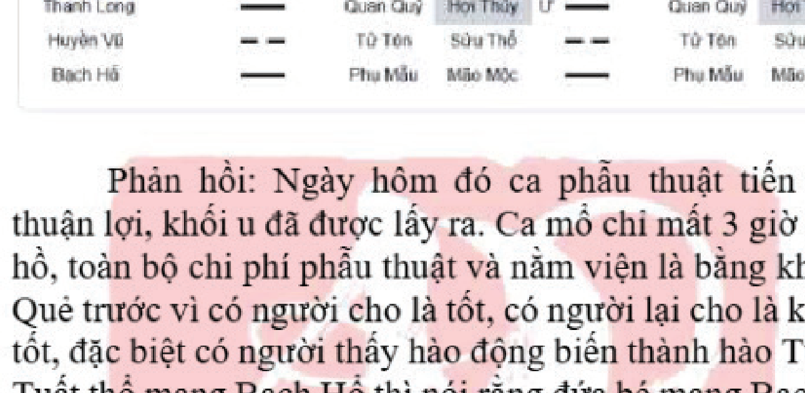
- **Cấu trúc Quẻ Dịch:**
  - **Quẻ chủ:** **Bát Thuần Ly** (Cung Ly, Bát thuần - Quẻ Lục Xung).
  - **Quẻ biến:** **Thiên Hỏa Đồng Nhân** (Cung Càn, Quy hồn).
  - **Phục thần:** Không hiển lộ.
- **Bảng chi tiết Lục hào:**

| Hào | Thế/Ứng | Lục thân (Chủ) | Can Chi (Chủ) | Động/Tĩnh | Biến hào (Lục thân) | Biến hào (Can Chi) | Thần sát / Phục | Lục thú |
|:---:|:---:|:---|:---|:---:|:---|:---|:---|:---|
| 6 | **Thế** | Huynh Đệ | Tị Hỏa | tĩnh | Tử Tôn | Tuất Thổ | | Đằng Xà |
| 5 | | Tử Tôn | Mùi Thổ | **X (Động)** | Thê Tài | Thân Kim | | Câu Trần |
| 4 | | Thê Tài | Dậu Kim | tĩnh | Huynh Đệ | Ngọ Hỏa | Dương nhẫn, Thiên y | Chu Tước |
| 3 | **Ứng** | Quan Quỷ | Hợi Thủy | tĩnh | Quan Quỷ | Hợi Thủy | Tuần không, Kiếp sát, Văn xương | Thanh Long |
| 2 | | Tử Tôn | Sửu Thổ | tĩnh | Tử Tôn | Sửu Thổ | | Huyền Vũ |
| 1 | | Phụ Mẫu | Mão Mộc | tĩnh | Phụ Mẫu | Mão Mộc | Đào hoa | Bạch Hổ |

### 3. Dụng thần & Loại quẻ
- **Phân loại quẻ:**
  - **Quẻ tâm trạng (Quẻ tâm tính) do người ngoài thay mặt gieo:** Khởi phát từ sự lo âu, bất an của đương số dành cho người khác.
  - Phàm là quẻ tâm trạng thì người ngoài hoàn toàn có thể thay mặt nhau gieo quẻ; quy luật vận hành của quẻ sẽ phản chiếu cơ chế giải tỏa tâm lý lo lắng.
- **Định vị Dụng thần cốt lõi:**
  - Trong quẻ tâm trạng, không áp dụng máy móc quy tắc chọn Dụng thần như quẻ sự việc thông thường.
  - **Hào Quan Quỷ:** Đại diện cho mối lo âu, nguy cơ tai họa, rủi ro phẫu thuật.
  - **Hào Tử Tôn:** Thần phúc đức, giải trừ ưu tư phiền muộn, khắc chế Quan Quỷ.

### 4. Luận giải chi tiết
#### 1. Cơ chế biểu thị tâm lý của Quẻ Lục Xung
- Trong hệ thống lý luận Lục Hào về quẻ tâm trạng:
  - Quẻ Lục Xung: Tượng của sự "xung tán", đánh tan lo âu, tức là thông tin báo điềm **yên tâm**, tai qua nạn khỏi.
  - Quẻ Lục Hợp: Tượng của sự dây dưa, níu kéo, bế tắc, biểu thị thông tin **không yên tâm**, nỗi lo còn kéo dài.
- Quẻ chủ Bát Thuần Ly là quẻ Lục Xung, ngay từ quẻ chủ đã phát đi tín hiệu xác quyết rằng mối lo âu của đồng môn sẽ được xung tán hoàn toàn.

#### 2. Tử tôn phát động chế ngự Quan quỷ Kiếp sát
- Hào Ứng **Quan Quỷ Hợi Thủy** mang hung sát Kiếp sát đại diện cho mối nguy hiểm của ca phẫu thuật; đồng thời mang Văn xương biểu thị phẫu thuật ngoại khoa. Quan Quỷ Hợi Thủy lâm Tuần không phản ánh hiện trạng lúc gieo quẻ ca mổ vẫn chưa tiến hành xong.
- Động triệu quyết định định tính:
  - Hào 5 **Tử Tôn Mùi Thổ** phát động biến ra Thê Tài Thân Kim (hào động hữu dụng).
  - Tử Tôn Mùi Thổ phát động trực xung khắc chế Quan Quỷ Hợi Thủy (Thổ khắc Thủy).
  - Cơ chế "Tử tôn khắc Quan quỷ": Tử tôn là phúc thần, chuyên khắc chế Quan quỷ (mầm họa và lo âu). Tử tôn hữu dụng phát động khắc tiêu trừ Quan quỷ mang Kiếp sát mang ý nghĩa đập tan mọi hiểm họa, chuyển hóa nỗi lo thành sự bình an tuyệt đối.

### 5. Kết luận & Ứng kỳ thực tế
- **Lời giải đoán của Chu Thần Bân:**
  - Khẳng định quẻ báo điềm hoàn toàn yên tâm, mọi người trong nhóm không cần hoang mang lo lắng; ca phẫu thuật của cháu bé chắc chắn sẽ thành công tốt đẹp.
- **Phản hồi thực tế (Feedback):**
  - Ca phẫu thuật trong ngày diễn ra vô cùng thuận lợi, các bác sĩ chỉ mất đúng 3 giờ đồng hồ để bóc tách trọn vẹn khối u mà không gây bất kỳ di chứng nào.
  - Toàn bộ chi phí phẫu thuật và viện phí được chính phủ Canada và bảo hiểm y tế chi trả toàn bộ (chi phí bằng không).
- **Ứng kỳ chiêm nghiệm:**
  - Ứng nghiệm trọn vẹn trong vòng 3 giờ phẫu thuật cùng ngày.

### 6. Bài học tâm pháp & Quy tắc cốt lõi
- **Quy tắc Lục Hào rút ra:**
  - *Quy tắc quẻ tâm trạng do người ngoài thay mặt gieo: Ý nghĩa trấn an của quẻ Lục xung và tác dụng của Tử tôn phát động khắc trừ Quan quỷ mang Kiếp sát* (trích Cổ Thệ Chân Thuyên tập 2, trang 197).
- **Tâm pháp giải đoán thực tế:**
  - Nhận diện đúng bản chất của "quẻ tâm trạng": Khi tâm thức người hỏi ngập tràn âu lo cho người thân/bạn bè, quẻ Dịch sẽ chuyển hóa sang mô hình giải tỏa tâm lý (Lục xung là an, Tử tôn chế Quỷ là cát).
  - Không nhầm lẫn giữa quẻ việc cụ thể và quẻ tâm trạng để tránh rơi vào bẫy phân tích rập khuôn, dẫn đến phán đoán sai lệch bản chất quẻ.

## THỰC CHIẾN 84: ANH HỌ CỦA MỘT ĐỆ TỬ DANH GIA TỰ GIEO QUẺ HỎI VỀ TÀI VẬN KINH DOANH

### 1. Bối cảnh & Câu hỏi
- **Bối cảnh chi tiết:**
  - Anh họ của một đệ tử xuất thân từ danh gia vọng tộc tự mình gieo quẻ hỏi về tài vận làm ăn kinh doanh buôn bán (dự định mở quán kinh doanh dịch vụ).
  - Đương số muốn biết triển vọng kinh doanh sắp tới liệu có sinh lời, phát tài hay không.
- **Thời gian chiêm đoán:**
  - Dương lịch: Năm 2017, lúc 18:18 (Giờ Bắc Kinh).
  - Can chi: Năm Bính Thân, tháng Canh Tý, ngày Mậu Tý, giờ Tân Dậu.
- **Tâm lý & Câu hỏi ẩn ý:**
  - Tâm trạng kỳ vọng cao vào dự án đầu tư kinh doanh, muốn kiểm chứng dòng tiền và khả năng sinh lợi nhuận trước khi xuống tiền mở rộng mặt bằng.

### 2. Dữ kiện & Bảng quẻ Crop
- **Thời không chiêm nghiệm:**
  - Tháng Canh Tý (Thủy vượng cực độ, Hỏa tuyệt, Thổ hưu).
  - Ngày Mậu Tý (Thủy vượng, Hỏa tuyệt, Thổ suy).
  - Tuần không: **Ngọ - Mùi** (Giáp Thân tuần trung).
- **Thần sát:**
  - Tướng tinh: Tý
  - Hoa cái: Thìn
  - Dịch mã: Dần
  - Tai sát: Ngọ
  - Mưu tinh: Tuất
  - Đào hoa: Dậu
  - Kiếp sát: Tị
  - Lộc thần: Tị
  - Dương nhẫn: Ngọ
  - Văn xương: Thân
  - Thiên y: Hợi
  - Thiên hỷ: Mùi
  - Quý nhân: Sửu, Mùi
- **Dữ liệu bảng quẻ và hình ảnh thực chứng:**
  - **Bảng 84.1** Đồ hình quẻ Thực chiến 84:
    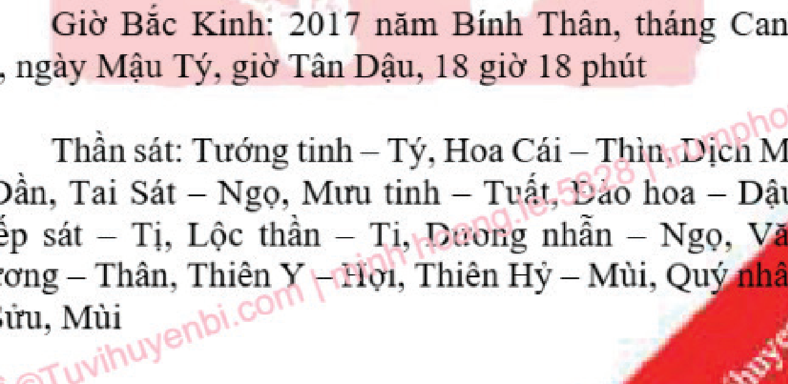
- **Cấu trúc Quẻ Dịch:**
  - **Quẻ chủ:** **Sơn Hỏa Bí** (Cung Cấn, Quẻ Lục Hợp).
  - **Quẻ biến:** **Phong Sơn Tiệm** (Cung Cấn, Quy hồn).
  - **Phục thần:** Hào 3 Thê Tài Hợi Thủy phục tàng Tử Tôn Thân Kim; Hào 2 Huynh Đệ Sửu Thổ phục tàng Phụ Mẫu Ngọ Hỏa.
- **Bảng chi tiết Lục hào:**

| Hào | Thế/Ứng | Lục thân (Chủ) | Can Chi (Chủ) | Động/Tĩnh | Biến hào (Lục thân) | Biến hào (Can Chi) | Thần sát / Phục | Lục thú |
|:---:|:---:|:---|:---|:---:|:---|:---|:---|:---|
| 6 | | Quan Quỷ | Dần Mộc | tĩnh | Quan Quỷ | Mão Mộc | Dịch mã | Chu Tước |
| 5 | | Thê Tài | Tý Thủy | **X (Động)** | Phụ Mẫu | Tị Hỏa | Tướng tinh, Đắc Nhật Nguyệt | Thanh Long |
| 4 | **Ứng** | Huynh Đệ | Tuất Thổ | tĩnh | Huynh Đệ | Mùi Thổ | Mưu tinh | Huyền Vũ |
| 3 | | Thê Tài | Hợi Thủy | tĩnh | Tử Tôn | Thân Kim | Phục Tử-Thân, Thiên y | Bạch Hổ |
| 2 | | Huynh Đệ | Sửu Thổ | tĩnh | Phụ Mẫu | Ngọ Hỏa | Phục Phụ-Ngọ, Quý nhân | Đằng Xà |
| 1 | **Thế** | Quan Quỷ | Mão Mộc | **O (Động)** | Huynh Đệ | Thìn Thổ | Hoa cái | Câu Trần |

### 3. Dụng thần & Loại quẻ
- **Phân loại quẻ:**
  - **Quẻ cầu tài & kinh doanh thương mại:** Xem tài vận kinh doanh buôn bán trung - dài hạn (từ nửa năm trở lên).
  - **Quẻ tự hỏi tự sự:** Đương số tự hỏi cho chính hoạt động đầu tư của mình.
- **Định vị Dụng thần cốt lõi:**
  - **Dụng thần tài vận:** **Thê Tài Tý Thủy** (hào 5 phát động) đại diện cho tiền tài, vốn liếng, dòng tiền và lợi nhuận bán hàng.
  - **Hào Thế bản thân:** **Quan Quỷ Mão Mộc** (hào 1 phát động).
  - **Kỵ thần khắc Tài:** Hào Huynh Đệ.

### 4. Luận giải chi tiết
#### 1. Dụng thần động hóa tuyệt: Sự thật không thể cứu vãn bởi Nhật Nguyệt
- Bề ngoài quẻ: Dụng thần Thê Tài Tý Thủy lâm cả Nhật kiến và Nguyệt kiến Tý Thủy, được Nhật Nguyệt trợ vượng đến cực điểm. Hào Thế Quan Quỷ Mão Mộc cũng được Nhật Nguyệt tương sinh vượng tướng. Người học thông thường dễ ngộ nhận đây là quẻ kinh doanh phát tài lớn.
- Chu Thần Bân chỉ rõ quy tắc cốt lõi:
  - Nhật Nguyệt chỉ phản ánh hiện trạng (trước đây hoặc hiện tại đương số có tiền, kinh doanh việc khác có lời), không quyết định định tính cát hung của sự việc tương lai.
  - Động triệu mới quyết định định tính: Thê Tài Tý Thủy phát động biến xuất **Phụ Mẫu Tị Hỏa**. Trong ngũ hành trường sinh, Thủy tuyệt tại Tị $\rightarrow$ đây là **Dụng thần động hóa tuyệt**.
  - Tính tuyệt đối của động hóa tuyệt trong kinh doanh: Hóa tuyệt trong việc kinh doanh là cái chết tất yếu. Động hóa tuyệt không cần thời gian dài như tam hợp cục hay hóa tiến/thoái (vốn cần vài tháng), mà chỉ trong vòng một tháng là đã làm cho đương số khánh kiệt, lâm vào ngõ cụt.
  - Ý nghĩa tượng quẻ: Thê Tài hóa tuyệt nghĩa là dòng khách hàng biến mất, nguồn cung ứng hàng hóa đứt gãy, tốc độ quay vòng vốn tắc nghẽn, dẫn tới phá sản.

#### 2. Hào Thế động hóa kỵ thần: Tự mình chuốc họa phá sản
- Hào 1 hào Thế Quan Quỷ Mão Mộc phát động biến xuất **Huynh Đệ Thìn Thổ**:
  - Huynh Đệ là kỵ thần chuyên cướp Tài, khắc hại Thê Tài.
  - Hào Thế động hóa kỵ thần (Thế hóa kỵ) là biểu tượng đương số tự mình đưa ra các quyết định sai lầm, tự chôn vùi sự nghiệp và chuốc lấy cảnh phá tài nặng nề.
  - Hơn nữa, Thê Tài Tý Thủy đã hóa tuyệt nên hoàn toàn không sinh cho hào Thế Mão Mộc; người kinh doanh thậm chí không được trải qua giai đoạn có lãi ban đầu mà lập tức đối diện phá tài triệt để.

#### 3. Tượng phá tài mặt bằng qua hào Thổ và quẻ biến Tiệm
- Hào biến của Thế là Huynh Đệ Thìn Thổ (hành Thổ): Thổ đại diện cho bất động sản, mặt bằng kinh doanh, cửa hàng thuê mướn. Thế biến ra Thổ kỵ thần chỉ rõ nguồn gốc phá tài then chốt đến từ **tiền thuê mặt bằng**.
- Quẻ biến là **Phong Sơn Tiệm** (tiến dần từng bước): Tượng như "nước ấm nấu ếch", từng tháng từng tháng bị tiền thuê mặt bằng bào mòn cạn kiệt nguồn vốn, không cách nào dứt ra được.

### 5. Kết luận & Ứng kỳ thực tế
- **Lời giải đoán của Chu Thần Bân:**
  - Cảnh báo dứt khoát rằng công việc kinh doanh này sẽ thất bại hoàn toàn, Dụng thần hóa tuyệt và Thế hóa kỵ là điềm phá sản nhanh chóng trong vòng một tháng, bị gánh nặng tiền thuê mặt bằng nhấn chìm.
- **Phản hồi thực tế (Feedback):**
  - Đúng như dự đoán, mở cửa kinh doanh chưa đầy một tháng đã buộc phải tuyên bố đóng cửa.
  - Tổng số tiền thua lỗ trước sau lên tới gần 1 triệu nhân dân tệ. Cho đến tận tháng 10 năm sau vẫn phải cắn răng trả tiền thuê nhà hàng tháng theo hợp đồng mặt bằng không thể hủy bỏ.
- **Ứng kỳ chiêm nghiệm:**
  - Phá sản chỉ sau chưa đầy một tháng kể từ ngày mở quán.

### 6. Bài học tâm pháp & Quy tắc cốt lõi
- **Quy tắc Lục Hào rút ra:**
  - *Quy tắc Dụng thần và hào Thế động hóa tuyệt/hóa kỵ trong kinh doanh: Tính chất tuyệt đối không bị hóa giải bởi Nhật Nguyệt vượng tướng và tượng phá tài mặt bằng* (trích Cổ Thệ Chân Thuyên tập 2, trang 201).
- **Tâm pháp giải đoán thực tế:**
  - Đừng bao giờ bị mê hoặc bởi vẻ bề ngoài vượng tướng của Nhật Nguyệt; trong quẻ cầu tài kinh doanh, một khi Dụng thần động hóa tuyệt hoặc Thế động hóa kỵ thần thì kết cục phá sản là điều tất yếu.
  - Phân tích chi tiết ngũ hành của hào biến (Thổ là mặt bằng) và quẻ biến (Tiệm là hao mòn kéo dài) để chỉ ra chính xác nguyên nhân cụ thể dẫn đến phá sản trong đời sống thương trường.

## THỰC CHIẾN 85: VỊ QUAN TO QUÝ NHÂN NÀY NHỜ CHỌN NGÀY SINH CON TRAI, NHƯNG LẠI CHIA LÀM HAI LẦN THANH TOÁN, RỐT CUỘC LÀ NGHĨ GÌ?

### 1. Bối cảnh & Câu hỏi
- **Bối cảnh chi tiết:**
  - Chu Thần Bân có mối quan hệ quen biết với một vị quan to quý nhân (người thuộc tầng lớp thượng lưu, địa vị xã hội cao). Trước đây vị quan to này từng giới thiệu bạn bè đến nhờ Chu Thần Bân chọn ngày sinh cho con, lúc thanh toán thù lao rất dứt khoát và sòng phẳng.
  - Lần này con dâu của chính vị quan to sắp sinh con trai (cháu nội đích tôn của ông), ông đích thân nhờ Chu Thần Bân chọn ngày sinh. Vì đã biết rõ mức biểu phí trước đó, vị quan to nhắn tin nói sẽ chuyển khoản cho thầy Chu, nhưng lại chỉ chuyển một phần trước rồi nhắn thêm: "Hôm nay tài khoản có hạn mức rồi, mai tôi chuyển phần còn lại".
  - Hành động chia làm hai lần thanh toán khác ngày bất thường khiến Chu Thần Bân suy ngẫm: Người cấp cao khi giao tiếp thường rất tế nhị, trọng tình cảm và "lấy tâm đối tâm". Hành động này chứng tỏ đối phương đang có tâm tư ẩn ý khó nói.
  - Chu Thần Bân quyết định lập quẻ Dịch để giải mã tâm lý và động cơ ẩn kín của vị quý nhân nhằm có cách ứng xử tinh tế, bảo toàn mối quan hệ tri kỷ đôi bên cùng có lợi.
- **Thời gian chiêm đoán:**
  - Dương lịch: Năm 2017, lúc 10:57 sáng (Giờ Bắc Kinh).
  - Can chi: Năm Đinh Dậu, tháng Canh Tuất, ngày Canh Dần, giờ Tân Tỵ.
- **Tâm lý & Câu hỏi ẩn ý:**
  - Chu Thần Bân muốn thấu hiểu tâm lý sâu kín của khách hàng cấp cao: Tại sao đối phương lại chia tiền làm hai lần thanh toán? Liệu có phải đang gợi ý muốn giảm giá hay thử thách sự tinh tế của người thầy?

### 2. Dữ kiện & Bảng quẻ Crop
- **Thời không chiêm nghiệm:**
  - Tháng Canh Tuất (Thổ vượng, Mộc tuyệt, Kim đới hưu).
  - Ngày Canh Dần (Mộc vượng, Hỏa sinh, Kim tuyệt).
  - Tuần không: **Ngọ - Mùi** (Giáp Thân tuần trung).
- **Thần sát:**
  - Tướng tinh: Ngọ
  - Hoa cái: Tuất
  - Dịch mã: Thân
  - Tai sát: Tý
  - Mưu tinh: Thìn
  - Đào hoa: Mão
  - Kiếp sát: Hợi
  - Lộc thần: Thân
  - Dương nhẫn: Dậu
  - Văn xương: Hợi
  - Thiên y: Dậu
  - Thiên hỷ: Thìn
  - Quý nhân: Dần, Ngọ
- **Dữ liệu bảng quẻ và hình ảnh thực chứng:**
  - **Bảng 85.1** Đồ hình quẻ Thực chiến 85:
    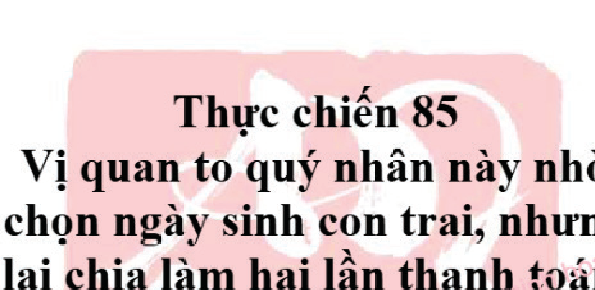
- **Cấu trúc Quẻ Dịch:**
  - **Quẻ chủ:** **Địa Sơn Khiêm** (Cung Đoài).
  - **Quẻ biến:** **Bát Thuần Cấn** (Cung Cấn, Bát thuần - Quẻ Lục Xung).
  - **Phục thần:** Hào 2 Quan Quỷ Ngọ Hỏa phục tàng **Thê Tài Mão Mộc** (Tài-Mão).
- **Bảng chi tiết Lục hào:**

| Hào | Thế/Ứng | Lục thân (Chủ) | Can Chi (Chủ) | Động/Tĩnh | Biến hào (Lục thân) | Biến hào (Can Chi) | Thần sát / Phục | Lục thú |
|:---:|:---:|:---|:---|:---:|:---|:---|:---|:---|
| 6 | | Huynh Đệ | Dậu Kim | **X (Động)** | Thê Tài | Dần Mộc | Dương nhẫn, Thiên y | Đằng Xà |
| 5 | **Thế** | Tử Tôn | Hợi Thủy | tĩnh | Tử Tôn | Tý Thủy | Kiếp sát, Văn xương | Câu Trần |
| 4 | | Phụ Mẫu | Sửu Thổ | tĩnh | Phụ Mẫu | Tuất Thổ | | Chu Tước |
| 3 | | Huynh Đệ | Thân Kim | tĩnh (Ám động) | Huynh Đệ | Thân Kim | Dịch mã, Lộc thần | Thanh Long |
| 2 | **Ứng** | Quan Quỷ | Ngọ Hỏa | tĩnh | Quan Quỷ | Ngọ Hỏa | Phục Tài-Mão (Đào hoa), Tuần không, Tướng tinh, Quý nhân | Huyền Vũ |
| 1 | | Phụ Mẫu | Thìn Thổ | tĩnh | Phụ Mẫu | Thìn Thổ | Mưu tinh, Thiên hỷ | Bạch Hổ |

### 3. Dụng thần & Loại quẻ
- **Phân loại quẻ:**
  - **Quẻ độc tâm thuật & giao tiếp xã hội:** Giải mã tâm lý, ý tứ tế nhị của đối tác, quý nhân cấp cao trong quan hệ thâm giao.
  - **Quẻ quan hệ ứng xử đôi bên:** Khảo sát tương tác giữa hào Thế (bản thân) và hào Ứng (quý nhân).
- **Định vị Dụng thần cốt lõi:**
  - **Hào Ứng Quan Quỷ Ngọ Hỏa:** Đại diện cho vị quan to quý nhân (mang Tướng tinh, Quý nhân thể hiện địa vị quyền uy).
  - **Hào Thế Tử Tôn Hợi Thủy:** Đại diện cho Chu Thần Bân.
  - **Hai hào Huynh Đệ (Thân Kim và Dậu Kim):** Đại diện cho hai khoản tiền thanh toán chi trả từ phía vị quan to sinh cho hào Thế.

### 4. Luận giải chi tiết
#### 1. Đọc vị thân phận và tâm tư bí mật qua hào Ứng lâm Huyền Vũ
- Quẻ chủ Địa Sơn Khiêm: Tượng quan hệ đôi bên còn mới mẻ, chưa đạt mức hoàn toàn cởi mở, tin cậy sâu sắc.
- Hào Ứng mang Quan Quỷ Ngọ Hỏa, đắc Tướng tinh và Quý nhân: Thể hiện đúng thân phận quan to quyền uy, quý phái của đối phương.
- Hào Ứng lâm hung thần **Huyền Vũ**: Huyền Vũ chủ về sự ám muội, kín đáo, ẩn ý trong lòng $\rightarrow$ xác quyết vị quan to thật sự đang có tâm tư tế nhị, không phải đơn thuần là lý do kỹ thuật "ngân hàng kẹt hạn mức".
- Phục thần Thê Tài Mão Mộc mang Đào hoa ẩn dưới hào Ứng: Đào hoa tài đại diện cho tiền bạc chuyển khoản thanh toán. Tâm tư của ông ta xoay quanh câu chuyện chi phí chọn ngày sinh.

#### 2. Hai hào Huynh đệ đại diện cho hai khoản chi trả và ước muốn giảm giá
- Hào Huynh Đệ mang ý nghĩa hao tổn tiền bạc của đối phương, đồng thời hành Kim sinh Thủy cho hào Thế Tử Tôn Hợi Thủy (tiền vào túi người xem). Quẻ xuất hiện hai hào Huynh Đệ Kim tượng trưng chính xác cho hai khoản tiền chia đợt:
  - Hào 3 Huynh Đệ Thân Kim mang Lộc thần, đắc Nguyệt sinh, bị Nhật xung thành **Ám động**: Đại diện cho khoản tiền lớn đầu tiên đã chuyển khoản trong ngày.
  - Hào 6 Huynh Đệ Dậu Kim phát động: Đại diện cho khoản tiền thứ hai hẹn chuyển vào ngày mai.
- Tâm tư bí mật của vị quý nhân: Phục thần Thê Tài Mão Mộc dưới hào Ứng xung trực diện Huynh Đệ Dậu Kim (Mão - Dậu tương xung). Ý tứ sâu kín là: Đối phương mong muốn hào Huynh Đệ Dậu Kim bị xung tiêu biến, tức là **mong muốn không phải trả khoản tiền thứ hai**.
- Nguyên nhân tâm lý: Trước kia là việc của bạn bè thì chi trả theo giá thị trường sòng phẳng; nay là việc riêng gia đình mình, ông muốn Chu Thần Bân có sự ưu đãi riêng thể hiện sự trân trọng địa vị của ông. Người cấp cao coi trọng thể diện, không bao giờ mở lời mặc cả xin bớt tiền, mà dùng cách nói "hạn mức tài khoản" để thử thách sự nhạy cảm của người thầy.

#### 3. Cơ chế hào biến Thê Tài Dần Mộc: Hợp Thế và Trường sinh tạo kết cuộc viên mãn
- Hào 6 Huynh Đệ Dậu Kim phát động biến xuất **Thê Tài Dần Mộc**:
  - Động khởi biến chung: Ban đầu muốn không trả khoản hai, nhưng hào biến lại hiện ra Thê Tài Dần Mộc, biểu thị vẫn có một phần tiền được thanh toán sau khi giảm trừ.
  - Dần Mộc tương hợp lục hợp với hào Thế Tử Tôn Hợi Thủy (Dần Hợi hợp): Tượng trưng Chu Thần Bân vui lòng chấp nhận mức chi phí ưu đãi này (chủ động giảm giá).
  - Dần Mộc là đất **Trường sinh** của Quan Quỷ Ngọ Hỏa (hào Ứng), đồng thời bán hợp với Ngọ Hỏa: Vị quý nhân thấy mức giá được giảm thể hiện sự tôn trọng đặc biệt dành cho mình, liền vô cùng hài lòng và xác lập ý định gắn bó, thỉnh giáo lâu dài (Trường sinh).

### 5. Kết luận & Ứng kỳ thực tế
- **Hành động & Khuyến nghị của Chu Thần Bân:**
  - Thấu hiểu trọn vẹn tâm ý, Chu Thần Bân chủ động nhắn tin thông báo sẽ dành trọn 3 ngày ưu tiên tối đa chọn ngày sinh cho cháu nội của quý nhân.
  - Đồng thời chủ động tuyên bố miễn giảm 3.800 tệ phần tiền còn lại, chỉ thu mức phí nội bộ hữu nghị dành riêng cho đệ tử thân cận.
- **Phản hồi thực tế (Feedback):**
  - Vị quan to cực kỳ phấn khởi, tâm đắc vì tìm được người tri kỷ thấu hiểu lòng mình.
  - Ông lập tức chuyển khoản ngay số tiền còn lại và khẳng định về sau sẽ duy trì quan hệ lâu dài, thường xuyên thỉnh giáo thầy Chu.
- **Ứng kỳ chiêm nghiệm:**
  - Ứng nghiệm ngay lập tức qua tin nhắn và giao dịch chuyển khoản trong ngày.

### 6. Bài học tâm pháp & Quy tắc cốt lõi
- **Quy tắc Lục Hào rút ra:**
  - *Độc tâm thuật qua quẻ tượng trong giao tiếp quan hệ xã hội: Phân tích tâm lý tế nhị của quý nhân qua hào Ứng lâm Huyền Vũ, hai hào Huynh đệ và hào biến tương hợp Trường sinh* (trích Cổ Thệ Chân Thuyên tập 2, trang 209).
- **Tâm pháp giải đoán thực tế:**
  - Đỉnh cao của Dịch học không chỉ là đoán sự việc thành bại mà là "Độc tâm thuật" – thấu hiểu nhân tâm, đọc vị tâm lý ẩn kín của con người qua từng chuyển động của hào Dịch.
  - Trong giao tiếp với tầng lớp thượng lưu tinh hoa, phải "lấy tâm đối tâm", nhìn ra những tín hiệu gián tiếp để ứng xử hào hiệp, nhường nhịn lợi ích nhỏ nhằm thu hoạch niềm tin lớn và thiết lập mối quan hệ bền vững, đôi bên cùng thắng.

---

## THỰC CHIẾN 86: MUA NHÀ LẤY TÊN MÌNH TỐT, HAY LẤY TÊN NGƯỜI THÂN TỐT

---

### 1. Bối cảnh & Câu hỏi

- **Bối cảnh chi tiết:** 
  Đương số là một doanh nhân đã khởi nghiệp và định cư tại Canada, gia đình cũng đã chuyển sang sinh sống cùng. Về tình trạng cư trú, bản thân người này đã có thân phận/quốc tịch Canada, trong khi những người thân trong gia đình thì chưa có quốc tịch. Đương số có kế hoạch mua bất động sản để an cư, nhưng trong lòng luôn canh cánh nỗi lo: nếu đứng tên bản thân mua nhà, lỡ công việc kinh doanh và dòng vốn làm ăn gặp trục trặc hoặc phát sinh tranh chấp pháp lý, thuế vụ thì tài sản nhà đất có thể bị liên lụy, tịch biên hoặc phong tỏa.
- **Tâm lý người hỏi & Câu hỏi ẩn ý:** 
  Người hỏi mang tâm trạng băn khoăn giữa hai phương án an toàn tài sản. Nội dung câu hỏi đặt ra: *"Mua nhà lấy tên mình tốt, hay lấy tên người thân thì tốt hơn?"* – Ý niệm ẩn chứa bên dưới không chỉ là việc chọn ai đứng tên đơn thuần, mà là muốn tìm một giải pháp tách biệt rủi ro kinh doanh ra khỏi khối bất động sản gia đình nhằm bảo toàn tài sản.
- **Thời gian chiêm đoán:**
  - Dương lịch: 30/10/2017, 13:57 (Giờ Bắc Kinh).
  - Can chi: Năm Đinh Dậu, tháng Canh Tuất, ngày Canh Dần, giờ Quý Mùi.

---

### 2. Dữ kiện & Bảng quẻ Crop

- **Thời không chiêm nghiệm:**
  - Tháng Canh Tuất (Thổ vượng, Kim tướng, Hỏa mộ, Thủy tuyệt).
  - Ngày Canh Dần (Mộc vượng, Hỏa tướng).
  - Tuần không: **Ngọ - Mùi** (Giáp Thân tuần trung, Ngọ Mùi không vong).
- **Thần sát:**
  - Tướng tinh: Ngọ
  - Hoa cái: Tuất
  - Dịch mã: Thân
  - Tai sát: Tý
  - Mưu tinh: Thìn
  - Đào hoa: Mão
  - Kiếp sát: Hợi
  - Lộc thần: Thân
  - Dương nhẫn: Dậu
  - Văn xương: Hợi
  - Thiên y: Dậu
  - Thiên hỷ: Thìn
  - Quý nhân: Dần, Ngọ

- Dữ kiện bảng quẻ và các thông số chiêm đoán:
  - **Bảng 86.1** Đồ hình quẻ Thực chiến 86:
    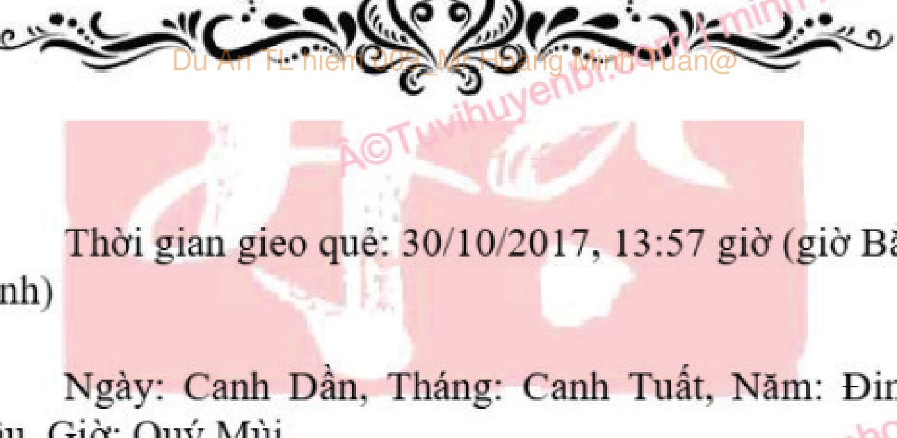

- **Cấu trúc Quẻ Dịch:**
  - **Quẻ chủ:** **Bát Thuần Ly** (Cung Ly, Họ Ly – Quẻ Lục Xung)  
    *Tượng quẻ:* Hỏa dực minh lưỡng (Hai ngọn lửa cùng sáng, sự việc phát sinh đột ngột, tâm trạng bức bách, lo âu).
  - **Quẻ biến:** **Hỏa Trạch Khuê** (Cung Cấn, Họ Cấn)  
    *Tượng quẻ:* Gia nhân trắc trở, tương phản hỗ tương, hai bên cách trở trái ngược ý nguyện ban đầu.

- **Bảng chi tiết Lục hào:**

| Hào | Thế/Ứng | Lục thân (Chủ) | Can Chi (Chủ) | Động/Tĩnh | Lục thân (Biến) | Can Chi (Biến) | Thần sát / Ghi chú | Lục thú |
|:---:|:---:|:---|:---|:---:|:---|:---|:---|:---|
| 6 | **Thế** | Huynh Đệ | Tỵ - Hỏa | tĩnh | Huynh Đệ | Tỵ - Hỏa | Lâm hào Thế | Đằng Xà |
| 5 | | Tử Tôn | Mùi - Thổ | tĩnh | Tử Tôn | Mùi - Thổ | Tuần không | Câu Trận |
| 4 | | Thê Tài | Dậu - Kim | tĩnh | Thê Tài | Dậu - Kim | Dương nhẫn, Thiên y | Chu Tước |
| 3 | **Ứng** | Quan Quỷ | Hợi - Thủy | **O (Động)** | Tử Tôn | Sửu - Thổ | Kiếp sát, Văn xương | Thanh Long |
| 2 | | Tử Tôn | Sửu - Thổ | **X (Động)** | Phụ Mẫu | Mão - Mộc | | Huyền Vũ |
| 1 | | Phụ Mẫu | Mão - Mộc | tĩnh | Huynh Đệ | Tỵ - Hỏa | Đào hoa | Bạch Hổ |

---

### 3. Dụng thần & Loại quẻ

- **Phân loại quẻ:**
  - **Quẻ lựa chọn nhị phân (Đứng tên mình vs Đứng tên người thân):** Cần phân định rõ vai trò của hào Thế (chính mình) và hào Ứng (đối phương / người thân khác).
  - **Quẻ sự tình bất động sản & pháp lý:** Hào Phụ Mẫu đại diện cho văn thư, khế ước, giấy tờ chủ quyền nhà đất; hào Quan Quỷ đại diện cho mối lo tranh chấp, kiện tụng, ràng buộc kinh doanh.
- **Định vị hệ thống Dụng thần:**
  1. **Hào Thế (Huynh Đệ Tỵ Hỏa):** Đại diện cho bản thân người hỏi và năng lực đầu tư tài chính của cá nhân.
  2. **Hào Ứng (Quan Quỷ Hợi Thủy):** Đại diện cho người khác – ở đây là người thân trong gia đình được nhắm đến để đứng tên thay thế. Đồng thời Hợi Thủy trực tiếp tương xung hào Thế, mang tâm bệnh lo âu.
  3. **Hào Phụ Mẫu (Mão Mộc lâm Đào hoa):** Dụng thần sự vụ đại diện cho văn bản khế ước, giấy tờ quyền sở hữu nhà đất. Mộc chủ văn thư, Phụ Mẫu chủ giấy tờ, lại lâm Đào hoa (văn thư rực rỡ) biểu thị rõ ràng thủ tục pháp lý bất động sản.
  4. **Tử Tôn (Sửu Thổ):** Đại diện cho phương án hóa giải lo âu, an tâm, khắc chế tai họa Quan Quỷ.

---

### 4. Luận giải chi tiết

#### 1. Cơ chế đối chiếu nhị phân Thế - Ứng trong quẻ chọn người đứng tên
- Trong quẻ hỏi lựa chọn giữa bản thân và người thân, quẻ tượng thiết lập phép đối chiếu chặt chẽ:
  - Hào Thế Tỵ Hỏa đại diện cho bản thân. Nhật kiến Dần Mộc sinh hào Thế Tỵ Hỏa, Dần Mộc lâm Lộc thần, cho thấy công việc kinh doanh hiện tại của đương số đang vận hành thuận lợi, sinh lời và có vốn tích lũy. Tuy nhiên, Dần hình Tỵ (Dần Tỵ tương hình) thể hiện áp lực kinh doanh không dám bung hết toàn lực vì sợ rủi ro đè nặng.
  - Hào Ứng Quan Quỷ Hợi Thủy phát động trực xung hào Thế (Tỵ - Hợi tương xung). Hào Ứng là "người khác" (người thân), hào xung hào Thế cũng là đối lập với bản thân. Mọi thông tin đại diện cho người khác và sự lo lắng tranh chấp kinh doanh đều tập trung tại hào Ứng.

#### 2. Tầng thứ nhất: Bề mặt an tâm của phương án người thân đứng tên
- Hào Ứng Quan Quỷ Hợi Thủy phát động hóa ra **Tử Tôn Sửu Thổ hồi đầu khắc**:
  - Quan Quỷ là mối lo lắng, tranh chấp pháp lý. Khi Quan Quỷ bị Tử Tôn hồi đầu khắc, tượng trưng cho việc sự lo lắng được dập tắt, phương án này có thể mang lại sự an tâm.
  - Hợi Thủy mang thông tin người thân, khi chuyển hóa thành Sửu Thổ khắc Quỷ nghĩa là: nếu để người thân đứng tên, tài sản sẽ tách rời khỏi tư cách pháp nhân kinh doanh của bản thân, không còn lo bị chủ nợ hay cơ quan thuế truy thu nếu làm ăn gặp nạn.
  - Xét riêng tầng này, để người thân đứng tên là phương án hoàn toàn hợp lý về mặt lý thuyết.

#### 3. Tầng thứ hai: Cơ chế "Đạp kiều" và cái bẫy liên hoàn của hào biến
- Tuy nhiên, trong quẻ còn có hào 2 **Tử Tôn Sửu Thổ phát động hóa Phụ Mẫu Mão Mộc hồi đầu khắc**:
  - Hào biến ở hào 3 là Tử Tôn Sửu Thổ, và hào 2 cũng chính là Tử Tôn Sửu Thổ. Đây là hiện tượng đồng vị tương thông, hào 2 phát động để giải thích bản chất thực sự của Tử Tôn Sửu Thổ ở hào 3.
  - Cơ chế "Đạp kiều" (bắc cầu liên kết): Tử Tôn Sửu Thổ nối thẳng đến Phụ Mẫu Mão Mộc. Phụ Mẫu Mão Mộc chính là giấy tờ, thủ tục pháp lý nhà đất.
  - **Hiện tượng "Tằm ăn dâu, chim đậu sau":** Hào Ứng Quan Quỷ Hợi Thủy bị Tử Tôn Sửu Thổ khắc (tưởng như thoát nạn), nhưng chính Tử Tôn Sửu Thổ lại bị Phụ Mẫu Mão Mộc ở hào 2 hồi đầu khắc! Khi công cụ giải quyết vấn đề (Tử Tôn Sửu Thổ) bị thương tổn và suy sụp thì sự an tâm ban đầu chỉ là ảo ảnh.
  - Hào 2 lâm **Huyền Vũ**: Huyền Vũ chủ mờ ám, những khó khăn ẩn khuất không lường trước được. Phụ Mẫu Mão Mộc mang Đào hoa bị Huyền Vũ can thiệp, phản ánh các vướng mắc cực lớn về chính sách bất động sản, giấy tờ pháp lý và các khoản thuế phát sinh bất ngờ.

#### 4. Ý nghĩa quẻ biến Hỏa Trạch Khuê
- Quẻ Bát Thuần Ly biến Hỏa Trạch Khuê:
  - "Khuê" là trái ý, phản bội, trắc trở, sinh ra khoảng cách xa cách.
  - Tượng quẻ cho thấy nếu cố tình lách luật dùng tên người thân chưa có quốc tịch để mua nhà, đương số sẽ rơi từ chiếc bẫy này sang một cái bẫy khác còn tồi tệ hơn, cuối cùng hoàn toàn đi ngược lại mục đích bảo toàn ban đầu.

---

### 5. Kết luận & Ứng kỳ thực tế

- **Lời giải đoán & Khuyến nghị của Chu Thần Bân:**
  - Về mặt lý thuyết kinh doanh, tách tên tài sản cho người thân là phương án giúp giải tỏa áp lực.
  - Tuy nhiên, quẻ cảnh báo sâu sắc rằng: dùng tên người thân chưa có quốc tịch tại Canada sẽ vấp phải rào cản chính sách nhà đất cực kỳ nghiêm ngặt và gánh chịu chi phí phát sinh vô cùng nặng nề.
  - Khuyên đương số dứt khoát từ bỏ ý định để người thân đứng tên, chấp nhận duy trì hiện trạng hoặc tính toán phương án minh bạch khác, tránh tự đưa mình vào rắc rối pháp lý.
- **Phản hồi thực tế (Feedback):**
  - Sau khi nghe giải đoán, đương số đã đi tham vấn ý kiến các chuyên gia pháp lý và bạn bè tại Canada.
  - Kết quả xác thực: Chính phủ Canada áp dụng chính sách siết chặt đối với người mua nhà không có quốc tịch; nếu người thân chưa có quốc tịch đứng tên mua nhà sẽ bị áp thuế bổ sung rất nặng (tăng thêm khoảng 15% đến 20% giá trị căn nhà), đồng thời thủ tục chứng minh nguồn tiền và đăng ký quyền sở hữu vô cùng khắt khe, phức tạp.
  - Đương số đã quyết định hủy bỏ phương án để người thân đứng tên mua nhà đúng như cảnh báo của quẻ Hỏa Trạch Khuê.
- **Ứng kỳ chiêm nghiệm:**
  - Ứng nghiệm ngay lập tức trong quá trình tìm hiểu chính sách pháp lý thực tế tại nước sở tại.

---

### 6. Bài học tâm pháp & Quy tắc cốt lõi

- **Trích dẫn quy tắc cốt lõi:**
  - *Quy tắc quẻ nhị phân và đối chiếu Thế Ứng khi chọn người đứng tên tài sản bất động sản* (trích Cổ Thệ Chân Thuyên Thực Chiến Biên 2, trang 214).
- **Tâm pháp giải đoán thực chiến:**
  1. **Định vị đối tượng nhị phân:** Khi quẻ hỏi về việc chọn lựa giữa bản thân và người khác, hào Thế đại diện cho ta, hào Ứng hoặc hào tương xung với hào Thế đại diện cho người khác. Cần quan sát động thái sinh khắc hướng về bên nào để định hướng lợi hại.
  2. **Nhận diện liên hoàn hồi đầu khắc:** Không bao giờ được dừng lại ở một cặp hồi đầu khắc đơn lập. Khi một hào biến lại xuất hiện đồng vị ở một hào động khác và tiếp tục bị hồi đầu khắc ("Tằm ăn dâu, chim đậu sau"), đó là dấu hiệu của giải pháp bề ngoài tưởng cứu vãn nhưng bên trong lại phát sinh cạm bẫy mới nghiêm trọng hơn.
  3. **Tượng Thần Sát kết hợp Lục Thú:** Phụ Mẫu lâm Đào hoa chỉ đích danh giấy tờ văn thư; lâm Huyền Vũ chỉ những khoản chi phí ngầm, rào cản chính sách ẩn giấu mà đương số chưa nắm rõ trước khi ra quyết định.

## THỰC CHIẾN 87: ĐỒNG MÔN XEM QUẺ HỎI CỬA HÀNG THƯƠNG MẠI NÀY CÓ THÍCH HỢP ĐỂ ĐẦU TƯ KHÔNG

---

### 1. Bối cảnh & Câu hỏi

- **Bối cảnh chi tiết:** 
  Một người đồng môn đang xem xét việc xuống tiền mua một mặt bằng cửa hàng thương mại (shophouse / bất động sản bán lẻ). Khoản đầu tư bất động sản thương mại đòi hỏi lượng vốn lớn và thời gian nắm giữ kéo dài nhiều năm. Đương số đứng trước quyết định lớn, tâm trí băn khoăn không biết vị trí mặt bằng này sau khi hoàn thiện và bàn giao có tiềm năng tăng giá và khả năng cho thuê tốt hay không.
- **Tâm lý người hỏi & Câu hỏi ẩn ý:** 
  Người hỏi mang tâm trạng do dự, ngập ngừng chưa dám quyết đoán. Câu hỏi đặt ra: *"Cửa hàng thương mại này có thích hợp để đầu tư không?"* – Bản chất câu hỏi không chỉ là ngắn hạn có lời hay không, mà là mức giá hiện tại có phải là vùng đáy hợp lý để mua vào, và về lâu dài có tạo ra dòng tiền cho thuê ổn định cùng sự gia tăng giá trị vốn hay không.
- **Thời gian chiêm đoán:**
  - Dương lịch: 11/12/2017, 01:04 (Giờ Bắc Kinh).
  - Can chi: Năm Đinh Dậu, tháng Canh Tuất, ngày Kỷ Mão, giờ Giáp Tý.

---

### 2. Dữ kiện & Bảng quẻ Crop

- **Thời không chiêm nghiệm:**
  - Tháng Canh Tuất (Thổ vượng, Mão Tuất lục hợp).
  - Ngày Kỷ Mão (Mộc vượng, Mão Tuất hợp).
  - Tuần không: **Thân - Dậu** (Giáp Tuất tuần trung, Thân Dậu không vong).
- **Thần sát:**
  - Tướng tinh: Mão (Lâm Nhật kiến, hào 3)
  - Hoa cái: Mùi (Lâm hào Thế)
  - Dịch mã: Tỵ
  - Tai sát: Dậu (Lâm Tuần không)
  - Mưu tinh: Sửu
  - Đào hoa: Tý
  - Kiếp sát: Thân (Lâm Tuần không, hào 5)
  - Lộc thần: Ngọ (Lâm hào Ứng)
  - Dương nhẫn: Tỵ
  - Văn xương: Dậu
  - Thiên y: Dậu
  - Thiên hỷ: Thìn
  - Quý nhân: Thân, Tý

- Dữ kiện bảng quẻ và các thông số chiêm đoán:
  - **Bảng 87.1** Đồ hình quẻ Thực chiến 87:
    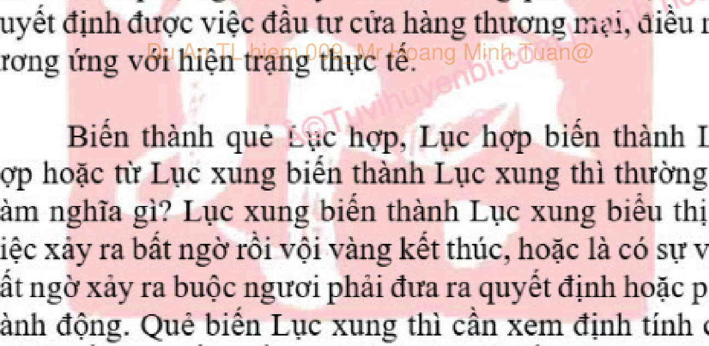

- **Cấu trúc Quẻ Dịch:**
  - **Quẻ chủ:** **Lôi Địa Dự** (Cung Chấn, Họ Chấn – Quẻ Lục Hợp)  
    *Tượng quẻ:* Do dự không quyết, tâm trạng phân vân đứng trước ngã rẽ đầu tư.
  - **Quẻ biến:** **Hỏa Sơn Lữ** (Cung Cấn, Họ Cấn – Quẻ Lục Hợp)  
    *Tượng quẻ:* Lữ khách tha hương, du hành quan sát, khuyên nên đi khảo sát nhiều nơi chứ không nên dừng chân tại chỗ.

- **Bảng chi tiết Lục hào:**

| Hào | Thế/Ứng | Lục thân (Chủ) | Can Chi (Chủ) | Động/Tĩnh | Lục thân (Biến) | Can Chi (Biến) | Thần sát / Phục | Lục thú |
|:---:|:---:|:---|:---|:---:|:---|:---|:---|:---|
| 6 | | Thê Tài | Tuất - Thổ | **X (Động)** | Tử Tôn | Tỵ - Hỏa | Nguyệt kiến hợp Nhật | Câu Trận |
| 5 | | Quan Quỷ | Thân - Kim | tĩnh | Thê Tài | Mùi - Thổ | Tuần không, Kiếp sát, Quý nhân | Chu Tước |
| 4 | **Ứng** | Tử Tôn | Ngọ - Hỏa | tĩnh | Quan Quỷ | Dậu - Kim | Lộc thần | Thanh Long |
| 3 | | Huynh Đệ | Mão - Mộc | **X (Động)** | Quan Quỷ | Thân - Kim | Tướng tinh, Nhật kiến | Huyền Vũ |
| 2 | | Tử Tôn | Tỵ - Hỏa | tĩnh | Tử Tôn | Ngọ - Hỏa | Dịch mã, Dương nhẫn | Bạch Hổ |
| 1 | **Thế** | Thê Tài | Mùi - Thổ | tĩnh | Thê Tài | Thìn - Thổ | Hoa cái (Phục Phụ Mẫu Tý Thủy) | Đằng Xà |

---

### 3. Dụng thần & Loại quẻ

- **Phân loại quẻ:**
  - **Quẻ đầu tư tài chính / Bất động sản thương mại:** Phân định tính chất mua vào (bắt đáy) và khả năng sinh lời dài hạn.
  - **Quẻ chỉ định mục tiêu cụ thể kết hợp thông tin đối chiếu:** Hào Ứng đại diện cho cửa hàng được chỉ định xem xét; hào biến và hào động ngoại vi phản ánh phương án so sánh ở phương xa.
- **Định vị hệ thống Dụng thần:**
  1. **Dụng thần số một của quẻ đầu tư mua vào (Tử Tôn Ngọ Hỏa lâm hào Ứng):** Chu Thần Bân phát kiến quy tắc cốt lõi: hỏi có nên mua vào đầu tư hay không, Dụng thần tiên quyết phải là **hào Tử Tôn**. Tử Tôn vượng đại diện cho việc mua đúng vùng đáy giá trị, an toàn giữ vốn và sẽ tăng trưởng trong tương lai. Hào Ứng là Tử Tôn Ngọ Hỏa lâm Lộc thần, đại diện cho kỳ vọng sinh lời của mặt bằng chỉ định.
  2. **Hào Thế (Thê Tài Mùi Thổ):** Đại diện cho bản thân người đầu tư và dòng vốn thực tế bỏ ra.
  3. **Nguyên thần của Dụng thần (Huynh Đệ Mão Mộc):** Là gốc rễ nuôi dưỡng Tử Tôn Ngọ Hỏa.
  4. **Kỵ thần (Phụ Mẫu):** Đại diện cho chi phí hao mòn, rủi ro pháp lý và sự ế ẩm không ai thuê mướn.

---

### 4. Luận giải chi tiết

#### 1. Ý nghĩa quẻ Lục hợp biến Lục hợp và định tính sự việc
- Quẻ chủ **Lôi Địa Dự** là Lục hợp, mang nghĩa "do dự", phản ánh trung thực trạng thái tâm lý chần chừ, chưa dám xuống cọc của đương số tại thời điểm gieo quẻ.
- Quẻ biến **Hỏa Sơn Lữ** cũng là Lục hợp. Trong cổ pháp, Lục hợp biến Lục hợp thường coi là cát, nhưng Chu Thần Bân đính chính: nếu định tính cát thì giữ lâu dài, nhưng nếu định tính hung thì Lữ là "du hành, đi lại quan sát", báo hiệu nên dừng lại, đi khảo sát thị trường ở nhiều nơi khác chứ tuyệt đối không được chốt mua mặt bằng này.

#### 2. Phân tích Nguyên thần Huynh Đệ Mão Mộc và hồi đầu khắc dài hạn
- Hào 3 **Huynh Đệ Mão Mộc phát động hóa Quan Quỷ Thân Kim hồi đầu khắc**:
  - Hướng tác động định tính: Huynh Đệ Mão Mộc là Nguyên thần sinh cho Dụng thần Tử Tôn Ngọ Hỏa (Mộc sinh Hỏa). Bề ngoài, Mão Mộc lâm Nhật kiến, lại được Nguyệt lệnh Tuất Thổ hợp vượng, trông như vô cùng sung mãn, tạo cảm giác dự án đang có sức hút mạnh mẽ.
  - Thực chất biến hóa: Huynh Đệ Mão Mộc hóa ra Quan Quỷ Thân Kim là **hồi đầu khắc**. Đối với việc ngắn hạn vài ngày thì Nhật Nguyệt vượng tướng có thể chống đỡ, nhưng đầu tư cửa hàng thương mại kéo dài nhiều năm. Trong sự việc dài hạn, hào biến hồi đầu khắc là bản án kết liễu gốc rễ: Nguyên thần bị chặt đứt, biến thành phế thần vô dụng, không thể tiếp tục sinh dưỡng Tử Tôn Ngọ Hỏa!
  - Cơn sốt giá hay sự phồn vinh ban đầu chỉ là ảo ảnh nhất thời; về lâu dài mặt bằng sẽ rơi vào cảnh hoang vắng, mất khả năng sinh lời.
  - Ở tầng chi tiết đối với hào Thế: Quan Quỷ Thân Kim biến ra từ Mão Mộc là cung Trường sinh của hào Thế Thê Tài Mùi Thổ. Quan Quỷ trường sinh vào bản thân nghĩa là gánh nặng tài chính, áp lực trả lãi và nỗi muộn phiền do dự án này gây ra sẽ kéo dài đằng đẵng không dứt.

#### 3. Đối chiếu Thế Ứng và điềm báo cửa hàng ở phương xa
- Tại hào 6, **Thê Tài Tuất Thổ phát động hóa Tử Tôn Tỵ Hỏa hồi đầu sinh**:
  - Thê Tài hóa Tử Tôn hồi đầu sinh chính là hình tượng thu lợi nhuận lớn, dòng tiền dồi dào. Nhưng đây có phải là cửa hàng đang hỏi không?
  - Cửa hàng đang hỏi đã được khóa định tại trục **Thế (Thê Tài Mùi Thổ) – Ứng (Tử Tôn Ngọ Hỏa)**.
  - Động biến tại hào 6 gồm **Thê Tài Tuất Thổ** và **Tử Tôn Tỵ Hỏa** tạo nên một cặp phản chiếu đối xứng hoàn hảo với trục Thế Ứng:
    - Thê Tài Tuất Thổ đối chiếu với Thê Tài Mùi Thổ ở hào Thế.
    - Tử Tôn Tỵ Hỏa đối chiếu với Tử Tôn Ngọ Hỏa ở hào Ứng.
  - Sự xuất hiện đối chiếu này là **điềm báo khác**: Cửa hàng kiếm được tiền không phải là cửa hàng chỉ định trước mắt, mà là một mặt bằng thương mại khác ở phương xa (hào 6 là vị trí xa xôi, ngoại biên).
  - Phương vị cửa hàng sinh lời: Tuất Thổ tại hào 6, Tỵ Hỏa biến ra bị Hợi Thủy tương xung, Tuất Hợi liên thể chỉ phương Tây Bắc hoặc phương Bắc chếch Tây. Cửa hàng ở khu vực xa đó mới chính là nơi có tiềm năng đầu tư đích thực.
- Tổ hợp Lục thú **Câu Trận (hào 6) và Huyền Vũ (hào 3)**:
  - Phản ánh hai mặt của một quyết sách: một mặt vạch trần cửa hàng chỉ định sẽ bị mất giá (Huyền Vũ chủ lừa dối, kỳ vọng hão huyền), mặt khác chỉ rõ cửa hàng ở phương xa mới đem lại dòng tiền vững chắc (Câu Trận).

---

### 5. Kết luận & Ứng kỳ thực tế

- **Lời giải đoán & Khuyến nghị của Chu Thần Bân:**
  - Định tính quẻ là bất lợi: Cửa hàng thương mại hiện tại không có giá trị đầu tư dài hạn, không nên mua vào.
  - Nếu muốn đầu tư, hãy làm theo tượng quẻ Lữ: đi khảo sát thêm các dự án khác ở khu vực xa hơn (vùng ven hoặc phương Tây Bắc/Bắc), ở đó mới có cơ hội sinh lời thực chất.
- **Phản hồi thực tế (Feedback):**
  - Đương số đã không nghe theo lời khuyên, vẫn quyết định xuống tiền mua cửa hàng chỉ định này.
  - Sau hai năm khi dự án bàn giao: Vị trí thực tế rất xấu, đường sá luồng gió không thuận tiện, hoàn toàn không có khách thuê. Đương số muốn bán cắt lỗ nhưng thị trường đóng băng, giá bán lại giảm tới 25% so với giá gốc mua ban đầu. Không bán được, cuối cùng đành ngậm ngùi cho thuê giá rẻ mạt chỉ thu về vỏn vẹn khoảng 6 vạn tệ/năm, hoàn toàn thất bại so với kỳ vọng ban đầu.
  - Trái lại, các khu cửa hàng ở xa hơn mà trước đó đương số từng đi xem và đem ra so sánh thì sau khi bàn giao lại cực kỳ đắt khách, giá trị vốn tăng mạnh, giá thuê tăng cao và thanh khoản rất tốt.
- **Ứng kỳ chiêm nghiệm:**
  - Ứng vào **năm Bính Thân (2016)** khi Quan Quỷ Thân Kim điền thực Tuần không, trực tiếp khắc chết Nguyên thần Huynh Đệ Mão Mộc, bộc lộ toàn bộ sự thất bại của thương vụ đầu tư.

---

### 6. Bài học tâm pháp & Quy tắc cốt lõi

- **Trích dẫn quy tắc cốt lõi:**
  - *Quy tắc phân biệt lãi vốn và dòng tiền cho thuê qua hào Tử Tôn và Thê Tài trong đầu tư cửa hàng thương mại* (trích Cổ Thệ Chân Thuyên Thực Chiến Biên 2, trang 222).
- **Tâm pháp giải đoán thực chiến:**
  1. **Tử Tôn là Dụng thần số một trong quẻ mua vào đầu tư:** Khác với cổ pháp chỉ chăm chăm nhìn hào Tài, Chu Thần Bân đúc kết rằng mua vào là hành vi bắt đáy; chỉ khi hào Tử Tôn vượng tướng và an lành thì mức giá mua mới thực sự an toàn và có tiềm năng sinh sôi. Thê Tài chỉ đại diện cho việc hiện tại có chút tiền quay vòng, không bảo chứng cho giá trị đầu tư dài hạn.
  2. **Phân biệt sự việc ngắn hạn và dài hạn:** Nhật Nguyệt sinh trợ hào động chỉ có tác dụng che mắt trong ngắn hạn (tạo nên cơn sốt ảo). Trong các thương vụ dài hạn nhiều năm, hào biến hồi đầu khắc sẽ phát huy sức mạnh triệt tiêu tối hậu, không thể lấy Nhật Nguyệt vượng tướng để bao biện.
  3. **Giải mã thông tin đối chiếu qua quẻ Lữ:** Khi quẻ xuất hiện cặp hào đối chiếu ngang hàng với Thế Ứng, quẻ tượng đang dùng phương pháp so sánh thực nghiệm để chỉ đường cho đương số. Quẻ Lữ khuyên hãy đi nhiều nơi mở rộng tầm nhìn, đừng để tầm nhìn bị giam hãm trong một ô cửa hẹp trước mắt.

## THỰC CHIẾN 88: CÔ LẠC HỎI VỀ NHÂN DUYÊN VỚI NGƯỜI NÀY

---

### 1. Bối cảnh & Câu hỏi

- **Bối cảnh chi tiết:** 
  Cô Lạc tuổi ngoài 40, là mẹ đơn thân nuôi một con gái hơn mười tuổi. Cô đang trong mối quan hệ tình cảm với một người đàn ông khoảng 60 tuổi vừa nghỉ hưu. Hai người chênh lệch nhau gần 20 tuổi, đây là dạng hôn nhân trung niên từng trải: người phụ nữ tìm kiếm chỗ dựa che chở cho hai mẹ con và một danh phận chính thức, trong khi người đàn ông tìm kiếm người bầu bạn chăm sóc tuổi già và nhu cầu tình cảm. Người đàn ông này sở hữu thẻ xanh, có con trai định cư ở nước ngoài, kinh tế vững vàng và có triển vọng bảo lãnh định cư. Hai người đã yêu nhau và sống chung được một năm.
- **Tâm lý người hỏi & Câu hỏi ẩn ý:** 
  Dù đã sống chung như vợ chồng suốt một năm, người đàn ông vẫn tuyệt nhiên không đề cập đến chuyện kết hôn hay đăng ký kết hôn chính thức. Cô Lạc đứng ngồi không yên: sợ tiếp tục chờ đợi sẽ chôn vùi thanh xuân, nhưng lại tiếc nuối điều kiện kinh tế và cơ hội định cư tốt của đối phương nếu buông tay. Cô tìm đến Chu Thần Bân hỏi: *"Giữa tôi và người này có nhân duyên kết thành vợ chồng không? Đối phương thực chất đang toan tính điều gì?"*
- **Thời gian chiêm đoán:**
  - Dương lịch: 18/11/2017, 12:37 (Giờ Bắc Kinh).
  - Can chi: Năm Đinh Dậu, tháng Tân Hợi, ngày Kỷ Dậu, giờ Canh Ngọ.

---

### 2. Dữ kiện & Bảng quẻ Crop

- **Thời không chiêm nghiệm:**
  - Tháng Tân Hợi (Thủy vượng, Mộc tướng, Hỏa tuyệt, Thổ tù).
  - Ngày Kỷ Dậu (Kim vượng, Thủy tướng, Dậu Kim hình Dậu Kim).
  - Tuần không: **Dần - Mão** (Giáp Thìn tuần trung, Dần Mão không vong).
- **Thần sát:**
  - Tướng tinh: Dậu (Lâm Nhật kiến, hào 3 phục)
  - Hoa cái: Sửu (Lâm hào Thế)
  - Dịch mã: Hợi (Lâm Nguyệt kiến, hào 3)
  - Tai sát: Mão (Lâm Tuần không, hào 1, hào 6)
  - Mưu tinh: Mùi (Hào 4)
  - Đào hoa: Ngọ (Lâm giờ)
  - Kiếp sát: Dần (Lâm Tuần không)
  - Lộc thần: Ngọ
  - Dương nhẫn: Tỵ (Lâm hào Ứng)
  - Văn xương: Dậu
  - Thiên y: Tuất
  - Thiên hỷ: Mùi
  - Quý nhân: Thân, Tỵ (Hào Ứng lâm Quý nhân)

- Dữ kiện bảng quẻ và các thông số chiêm đoán:
  - **Bảng 88.1** Đồ hình quẻ Thực chiến 88:
    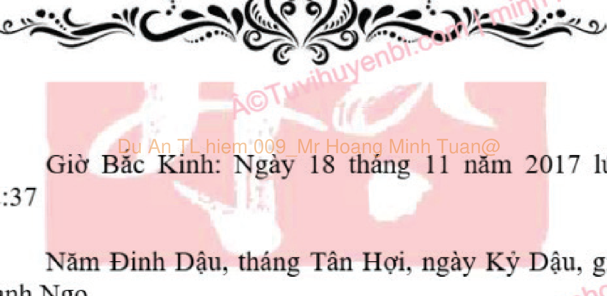

- **Cấu trúc Quẻ Dịch:**
  - **Quẻ chủ:** **Phong Hỏa Gia Nhân** (Cung Tốn, Họ Tốn)  
    *Tượng quẻ:* "Gia nhân" là người trong một nhà, phản ánh hiện trạng hai người đã dọn về sống chung dưới một mái nhà vô cùng thân mật.
  - **Quẻ biến:** **Sơn Phong Cổ** (Cung Tốn, Họ Tốn – Quẻ Quy Hồn)  
    *Tượng quẻ:* "Cổ" là sự việc đình trệ, hủ bại phát sinh vấn đề; đồng thời chủ về hành động chủ động xử lý mầm họa, khuyên người hỏi phải dứt khoát đối diện giải quyết rốt ráo.

- **Bảng chi tiết Lục hào:**

| Hào | Thế/Ứng | Lục thân (Chủ) | Can Chi (Chủ) | Động/Tĩnh | Lục thân (Biến) | Can Chi (Biến) | Thần sát / Phục | Lục thú |
|:---:|:---:|:---|:---|:---:|:---|:---|:---|:---|
| 6 | | Huynh Đệ | Mão - Mộc | tĩnh | Huynh Đệ | Dần - Mộc | Tuần không, Tai sát | Câu Trận |
| 5 | **Ứng** | Tử Tôn | Tỵ - Hỏa | **O (Động)** | Phụ Mẫu | Tý - Thủy | Dương nhẫn, Quý nhân | Chu Tước |
| 4 | | Thê Tài | Mùi - Thổ | tĩnh | Thê Tài | Tuất - Thổ | Mưu tinh, Thiên hỷ | Thanh Long |
| 3 | | Phụ Mẫu | Hợi - Thủy | tĩnh | Quan Quỷ | Dậu - Kim | Nguyệt kiến, Dịch mã (Phục Quan Quỷ Dậu) | Huyền Vũ |
| 2 | **Thế** | Thê Tài | Sửu - Thổ | **X (Động)** | Phụ Mẫu | Hợi - Thủy | Hoa cái | Bạch Hổ |
| 1 | | Huynh Đệ | Mão - Mộc | **O (Động)** | Thê Tài | Sửu - Thổ | Tuần không, Tai sát | Đằng Xà |

---

### 3. Dụng thần & Loại quẻ

- **Phân loại quẻ:**
  - **Quẻ tình cảm nhân duyên trung niên:** Xem xét ý định kết hôn thực chất của đối phương và tiền đồ mối quan hệ.
  - **Quẻ phân định đa Dụng thần (Hào Ứng vs Hào Quan Quỷ):** Phân biệt rạch ròi giữa người đang hẹn hò chỉ định và người chồng danh chính ngôn thuận trong tương lai.
- **Định vị hệ thống Dụng thần:**
  1. **Hào Ứng (Tử Tôn Tỵ Hỏa):** Đại diện cho người bạn trai 60 tuổi được chỉ định hỏi. Tử Tôn khắc Quan Quỷ là tượng không muốn gánh vác trách nhiệm làm chồng, không muốn bước vào khuôn khổ hôn nhân.
  2. **Hào Quan Quỷ (Dậu Kim lâm Nhật kiến):** Dụng thần tượng trưng cho người chồng pháp lý thực sự của cô Lạc. Quan Quỷ không nằm ở hào Ứng mà ẩn phục dưới hào 3 Phụ Mẫu Hợi Thủy.
  3. **Hào Thế (Thê Tài Sửu Thổ):** Đại diện cho cô Lạc – người phụ nữ ôm hy vọng tìm kiếm mái ấm gia đình.
  4. **Hào Phụ Mẫu (Hợi Thủy, Tý Thủy):** Đại diện cho hôn ước, giấy đăng ký kết hôn, danh phận pháp lý.

---

### 4. Luận giải chi tiết

#### 1. Sự tách biệt then chốt giữa hào Ứng và hào Quan Quỷ
- Khi phụ nữ hỏi về hôn nhân:
  - Nếu đối phương sẵn sàng kết hôn và có duyên làm vợ chồng, hào Ứng và hào Quan Quỷ sẽ dung hợp làm một thể hoặc có quan hệ tương sinh tương hợp chặt chẽ.
  - Ở quẻ này, hào Ứng là **Tử Tôn Tỵ Hỏa**. Tử Tôn chính là Khắc thần của Quan Quỷ. Người đàn ông lâm Tử Tôn thể hiện tâm lý phản kháng hôn nhân, thích tự do tự tại, từ chối ràng buộc gia đình.
  - Thêm vào đó, Quan Quỷ Dậu Kim (chồng thực sự) phục dưới hào 3 Phụ Mẫu Hợi Thủy mang thân phận Nguyệt kiến, trong khi hào Ứng Tỵ Hỏa lại trực xung với Hợi Thủy (Tỵ - Hợi tương xung). Điều này chứng minh dứt khoát: **người đàn ông đang sống chung này hoàn toàn không phải là người chồng tương lai của cô Lạc**.

#### 2. Tâm lý người đàn ông: Thích vụng trộm lén lút, né tránh danh phận
- Ban đầu, hào Ứng Tử Tôn Tỵ Hỏa sinh hào Thế Thê Tài Sửu Thổ (Tỵ Dậu Sửu tam hợp cục bán hợp): người đàn ông vẫn đối xử tốt, cung cấp điều kiện vật chất và muốn duy trì cuộc sống chung.
- Tuy nhiên, hào Ứng phát động hóa ra **Phụ Mẫu Tý Thủy hồi đầu khắc**:
  - Khi mối quan hệ đi đến bước ngoặt đòi hỏi kết hôn, anh ta sẽ rút lui và dập tắt kỳ vọng.
  - Bản chất của thân phận mới mà anh ta muốn nhận là **Phụ Mẫu Tý Thủy**: Tý Thủy lục hợp với hào Thế Sửu Thổ, nhưng Tý Thủy mang Đào hoa, nạp âm "Giản Hạ Thủy" (nguồn nước ngầm chảy lén lút trong lòng đất). Hợp mà không danh chính ngôn thuận, lại mang nước ngầm Đào hoa, chỉ rõ: anh ta chỉ muốn cô Lạc làm người tình nhân lén lút, chung sống không hôn thú để hưởng thụ sự chăm sóc mà không phải chia sẻ tài sản hay chịu trách nhiệm pháp lý.

#### 3. Quẻ chỉ đạo: Hào Thế phát động xung phá thế bế tắc
- Cô Lạc là người phụ nữ đàng hoàng cần danh phận cho con gái, tuyệt đối không chấp nhận kiếp sống tình nhân mờ ám.
- Hào Thế **Thê Tài Sửu Thổ phát động biến Phụ Mẫu Hợi Thủy**:
  - Hợi Thủy mang Nguyệt kiến, trực xung hào Ứng Tử Tôn Tỵ Hỏa.
  - Nguyệt kiến nhập hào biến xung Ứng mang tính chất **quẻ chỉ đạo**: Chu Thần Bân khẳng định quẻ Dịch đang hối thúc cô Lạc phải chủ động ngửa bài, thẳng thắn chất vấn người đàn ông về chuyện hôn nhân. Nếu đối phương từ chối, phải dứt khoát chia tay chứ không được dùng dằng kéo dài.
  - Quẻ biến là **Sơn Phong Cổ**: Cổ là hành động bài trừ hủ bại, khuyên người hỏi phải hành động mau lẹ để tự giải thoát.

#### 4. Bằng chứng người thứ ba: Huynh Đệ Mão Mộc biến Thê Tài Sửu Thổ
- Tại hào 1, **Huynh Đệ Mão Mộc phát động hóa Thê Tài Sửu Thổ**:
  - Huynh Đệ Mão Mộc sinh cho hào Ứng Tử Tôn Tỵ Hỏa, đồng thời trực tiếp khắc hào Thế Thê Tài Sửu Thổ.
  - Hào biến của Mão Mộc lại chính là **Thê Tài Sửu Thổ** – một người phụ nữ có vị thế y hệt hào Thế.
  - Bức tranh vạch trần: Người đàn ông này ở bên ngoài vẫn đang lén lút qua lại với một người phụ nữ khác. Người phụ nữ kia cũng đang cung phụng tình cảm cho anh ta, khiến anh ta tự mãn và càng không có lý do để ký giấy kết hôn ràng buộc với cô Lạc. Sự chen ngang của bên thứ ba đang ngấm ngầm gây tổn thương sâu sắc cho hào Thế.

---

### 5. Kết luận & Ứng kỳ thực tế

- **Lời giải đoán & Khuyến nghị của Chu Thần Bân:**
  - Vạch trần sự thật: Người đàn ông không bao giờ có ý định cưới cô làm vợ, anh ta chỉ muốn một mối quan hệ bạn tình sống chung thoải mái, và sau lưng cô vẫn có đối tượng phụ nữ khác.
  - Khuyên cô Lạc không nên ảo tưởng về giấc mộng định cư cùng đối phương; hãy lập tức chủ động nói chuyện thẳng thắn rõ ràng. Nếu người đó không cam kết thời hạn kết hôn cụ thể thì hãy dứt khoát chia tay để bảo toàn phẩm giá và thời gian của bản thân.
- **Phản hồi thực tế (Feedback):**
  - Cô Lạc sau khi nghe phân tích đã lấy hết can đảm đối thoại trực tiếp với người bạn trai, yêu cầu ấn định ngày đăng ký kết hôn.
  - Đúng như quẻ dự báo, người đàn ông tìm đủ mọi lý do thoái thác, viện cớ con cái ở nước ngoài chưa đồng ý và thủ tục định cư phức tạp, kiên quyết từ chối kết hôn.
  - Nhận rõ chân tướng đối phương chỉ muốn lợi dụng sống chung lén lút, cô Lạc đã dứt khoát thu dọn đồ đạc, dắt con gái rời đi và chấm dứt hoàn toàn mối quan hệ.
- **Ứng kỳ chiêm nghiệm:**
  - Ứng nghiệm ngay trong tháng Hợi khi hào biến Phụ Mẫu Hợi Thủy nắm Nguyệt lệnh phát huy uy lực xung phá hào Ứng.

---

### 6. Bài học tâm pháp & Quy tắc cốt lõi

- **Trích dẫn quy tắc cốt lõi:**
  - *Quy tắc quẻ Gia Nhân biến Cổ và định hướng dứt khoát giải thoát thanh xuân trong hôn nhân nhân duyên* (trích Cổ Thệ Chân Thuyên Thực Chiến Biên 2, trang 233).
- **Tâm pháp giải đoán thực chiến:**
  1. **Phân biệt hào Ứng và hào Quan Quỷ:** Trong quẻ nữ hỏi hôn nhân, hào Ứng là đối tượng đang hẹn hò cụ thể, hào Quan Quỷ là người chồng tương lai. Nếu hào Ứng lâm Tử Tôn (khắc Quỷ) và khắc chế/xung đột với vị trí Quan Quỷ, đối tượng đó vĩnh viễn không thể trở thành người phối ngẫu danh chính ngôn thuận.
  2. **Giải mã Nạp âm và Đào hoa:** Thần sát Đào hoa kết hợp với nạp âm Thủy (Giản Hạ Thủy – nước ngầm) là tượng trưng của mối quan hệ tình cảm vụng trộm, không dám công khai ra ánh sáng.
  3. **Ý nghĩa quẻ chỉ đạo:** Hào Thế mang Nguyệt lệnh phát động xung phá hào Ứng không phải là hiện trạng sẵn có mà là tiếng chuông cảnh tỉnh của quẻ Dịch, thúc giục đương số hành động dứt khoát (quẻ Cổ) để chấm dứt sự mập mờ có hại.

## THỰC CHIẾN 89: ĐỒNG MÔN HỎI VỀ VIỆC MỔ LẤY THAI, CHỌN GIỜ NGỌ NGÀY MAI CÓ TỐT KHÔNG? ĐỨA TRẺ CÓ AN TOÀN KHÔNG?

---

### 1. Bối cảnh & Câu hỏi

- **Bối cảnh chi tiết:** 
  Một người đồng môn học Lục Hào hiếm muộn con cái nhiều năm. Trước đây người này từng nhờ Chu Thần Bân bói quẻ và xem Tứ Trụ; theo lời khuyên phong thủy cải vận, gia đình đã nhận nuôi một đứa trẻ để kích hoạt trường khí cầu tự. Quả nhiên sau đó người vợ mang thai và sinh được một bé trai ruột đầu lòng. Đến nay, người vợ tiếp tục mang thai đứa con thứ hai và chuẩn bị mổ lấy thai tại bệnh viện.
- **Tâm lý người hỏi & Câu hỏi ẩn ý:** 
  Đương số vừa muốn chủ động chọn giờ sinh tốt nhất theo Bát tự cho con, lại vừa mang tâm lý phập phồng lo âu về sự an toàn tính mạng của thai nhi trong phòng mổ. Người này gộp chung hai mối bận tâm vào một lần gieo: *"Mổ lấy thai chọn giờ Ngọ ngày mai có tốt không? Đứa trẻ có được an toàn bình an không?"* – Đây là quẻ câu hỏi kép điển hình (hỏi thời điểm can thiệp nhân tạo và hỏi an nguy sinh sản).
- **Thời gian chiêm đoán:**
  - Dương lịch: 29/09/2017, 10:34 (Giờ Bắc Kinh).
  - Can chi: Năm Đinh Dậu, tháng Kỷ Dậu, ngày Kỷ Mùi, giờ Kỷ Tỵ.

---

### 2. Dữ kiện & Bảng quẻ Crop

- **Thời không chiêm nghiệm:**
  - Tháng Kỷ Dậu (Kim vượng, Thủy tướng, Thổ hưu, Mộc tù, Hỏa tử).
  - Ngày Kỷ Mùi (Thổ vượng, Kim tướng, Hỏa hưu).
  - Tuần không: **Tý - Sửu** (Giáp Dần tuần trung, Tý Sửu không vong).
- **Thần sát:**
  - Tướng tinh: Mão (Hào 6)
  - Hoa cái: Mùi (Lâm Nhật kiến, hào 4)
  - Dịch mã: Tỵ (Hào 5)
  - Tai sát: Dậu (Lâm Nguyệt kiến)
  - Mưu tinh: Sửu (Lâm Tuần không)
  - Đào hoa: Tý (Lâm Tuần không, hào 1)
  - Kiếp sát: Thân (Hào biến hào 3)
  - Lộc thần: Ngọ (Hào biến hào 2)
  - Dương nhẫn: Tỵ (Hào 5)
  - Văn xương: Dậu
  - Thiên y: Thân
  - Thiên hỷ: Thìn (Lâm hào Thế)
  - Quý nhân: Thân, Tý (Hào 1 lâm Quý nhân)

- Dữ kiện bảng quẻ và các thông số chiêm đoán:
  - **Bảng 89.1** Đồ hình quẻ Thực chiến 89:
    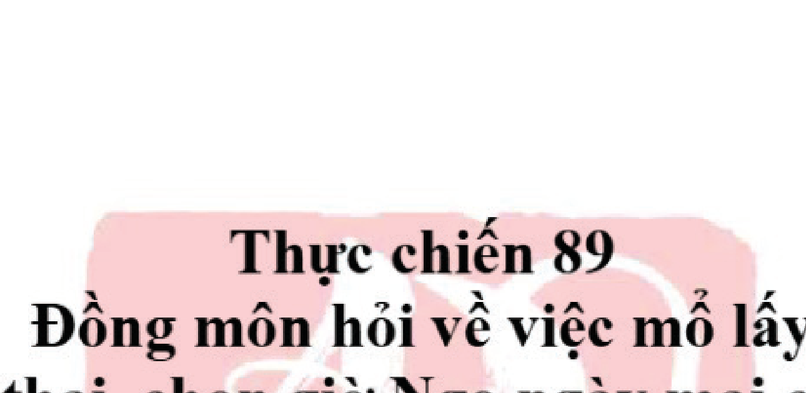

- **Cấu trúc Quẻ Dịch:**
  - **Quẻ chủ:** **Phong Lôi Ích** (Cung Tốn, Họ Tốn)  
    *Tượng quẻ:* "Ích" là thêm lợi, tăng tiến phúc lộc. Phản ánh đúng phúc báo của đương số: từ chỗ hiếm muộn nay tiếp tục sinh thêm con thứ hai, liên tục gia tăng niềm vui.
  - **Quẻ biến:** **Phong Sơn Tiệm** (Cung Cấn, Họ Cấn – Quẻ Quy Hồn)  
    *Tượng quẻ:* "Tiệm" là tiệm tiến, phát triển chậm rãi từng bước, ảnh hưởng mưa dầm thấm lâu chứ không phải biến cố cấp bách tức thời.

- **Bảng chi tiết Lục hào:**

| Hào | Thế/Ứng | Lục thân (Chủ) | Can Chi (Chủ) | Động/Tĩnh | Lục thân (Biến) | Can Chi (Biến) | Thần sát / Phục | Lục thú |
|:---:|:---:|:---|:---|:---:|:---|:---|:---|:---|
| 6 | **Ứng** | Huynh Đệ | Mão - Mộc | tĩnh | Huynh Đệ | Mão - Mộc | Tướng tinh | Câu Trận |
| 5 | | Tử Tôn | Tỵ - Hỏa | tĩnh | Tử Tôn | Tỵ - Hỏa | Dịch mã, Dương nhẫn | Chu Tước |
| 4 | | Thê Tài | Mùi - Thổ | tĩnh | Thê Tài | Mùi - Thổ | Nhật kiến, Hoa cái | Thanh Long |
| 3 | **Thế** | Thê Tài | Thìn - Thổ | **X (Động)** | Quan Quỷ | Thân - Kim | Thiên hỷ (Phục Quan Quỷ Dậu) | Huyền Vũ |
| 2 | | Huynh Đệ | Dần - Mộc | tĩnh | Tử Tôn | Ngọ - Hỏa | | Bạch Hổ |
| 1 | | Phụ Mẫu | Tý - Thủy | **O (Động)** | Thê Tài | Thìn - Thổ | Tuần không, Đào hoa, Quý nhân | Đằng Xà |

---

### 3. Dụng thần & Loại quẻ

- **Phân loại quẻ:**
  - **Quẻ câu hỏi kép (Hỏi việc chọn giờ & Hỏi an nguy thai sản):** Quẻ phá vỡ lối đoán đơn tuyến thông thường; cấu trúc quẻ tự động chia tách cơ chế phản hồi cho từng câu hỏi riêng biệt.
  - **Quẻ can thiệp thời vận nhân tạo:** Xem xét tác động giữa ý chí chủ quan con người và quy luật sinh nở tự nhiên.
- **Định vị hệ thống Dụng thần:**
  1. **Hào Tử Tôn (Tỵ Hỏa tại hào 5):** Dụng thần đại diện cho đứa trẻ và sự an nguy tính mạng trong quá trình vượt cạn.
  2. **Hào Thế (Thê Tài Thìn Thổ):** Đại diện cho người hỏi và ý chí chủ quan muốn can thiệp chọn giờ sinh mổ.
  3. **Tam hợp Phụ Mẫu cục (Thân – Tý – Thìn):** Đại diện cho dữ liệu ngày giờ sinh (Bát tự), văn thư, chứng chỉ khai sinh và tác động can thiệp nhân tạo dài hạn.

---

### 4. Luận giải chi tiết

#### 1. Nguyên lý quẻ câu hỏi kép: Phân tách hai kênh thông tin
- Chu Thần Bân nhấn mạnh: đối với người mới học, chỉ nên hỏi một việc đơn nhất để quẻ xuất hiện Dụng thần chính thống. Khi hỏi gộp hai câu hỏi:
  - Một câu mang tính chất **trước mắt, tức thời** (an toàn khi mổ ngày mai).
  - Một câu mang tính chất **lâu dài, định mệnh** (chọn giờ Ngọ ngày mai để đặt lá số Bát tự cho cả đời đứa trẻ).
- Quẻ tượng không dùng một tuyến đơn độc mà chia tách:
  - Quẻ biến **Phong Sơn Tiệm** (tiến triển chậm chạp, lâu dài) không dùng để trả lời việc mổ trong vài giờ ngày mai, mà khóa chặt vào câu hỏi Bát tự giờ sinh có ảnh hưởng thế nào đến tương lai đứa trẻ.

#### 2. Kênh thứ nhất: Sự an toàn của đứa trẻ trong ca sinh nở
- Dụng thần đứa trẻ là **Tử Tôn Tỵ Hỏa tại hào 5**:
  - Tử Tôn Tỵ Hỏa hoàn toàn **tĩnh**, không động.
  - Hào không tự hóa hồi đầu khắc, không hóa thoái, không hóa tuyệt, cũng không bị các hào động khác độc lập phát động xung khắc.
  - Quy tắc thực chiến: Trong sự việc vượt cạn sinh mổ hiện đại, xác suất rủi ro y khoa vốn rất thấp; khi hào Tử Tôn tĩnh lặng bình ổn thì đó là dấu hiệu đứa trẻ hoàn toàn an toàn, ca phẫu thuật diễn ra bình thường, mẹ tròn con vuông.

#### 3. Kênh thứ hai: Can thiệp chọn giờ Ngọ và tam hợp cục Phụ Mẫu Tý Thủy
- Tại hào 3, hào Thế **Thê Tài Thìn Thổ phát động hóa Quan Quỷ Thân Kim**:
  - Hào Thế lâm **Huyền Vũ**: Huyền Vũ chủ toan tính chủ quan, toan tính riêng tư của đương số trong việc chọn lựa giờ mổ.
- Tại hào 1, **Phụ Mẫu Tý Thủy phát động hóa Thê Tài Thìn Thổ**:
  - Hào 1 (Tý Thủy), hào 3 biến (Thân Kim) và hào Thế (Thìn Thổ) liên kết tạo thành **Tam hợp cục Thân – Tý – Thìn hóa Thủy** (Cục Phụ Mẫu Tý Thủy).
  - Ý nghĩa Phụ Mẫu Tý Thủy lâm Đào hoa: Phụ Mẫu là giấy tờ khai sinh, văn số; Đào hoa là thông tin định danh cá nhân. Tam hợp cục xuất phát từ hào Thế chính là hành vi nhân tạo gán ghép giờ sinh Bát tự vào đứa trẻ.
- Tác động của cục Thủy đối với đứa trẻ:
  - Cục Phụ Mẫu Tý Thủy vượng thịnh khắc chế trực diện **Tử Tôn Tỵ Hỏa** (Thủy khắc Hỏa).
  - Tam hợp cục chủ về sự việc liên kết bền chặt, kéo dài đằng đẵng (khớp với ý nghĩa quẻ biến Tiệm).
  - Tý Thủy hiện lâm **Tuần không**: nghĩa là trước mắt lúc sinh nở, việc chọn giờ này chưa bộc lộ tai hại tức thời (đứa trẻ sinh ra vẫn khỏe mạnh). Nhưng sau này khi điền thực Tuần không, việc khiên cưỡng ép giờ sinh nhân tạo sẽ tạo nên sự xung khắc vận mệnh âm ỉ, gây bất lợi cho sự phát triển lâu dài của đứa con.

---

### 5. Kết luận & Ứng kỳ thực tế

- **Lời giải đoán & Khuyến nghị của Chu Thần Bân:**
  - Về sự an toàn: Đứa trẻ sinh ra hoàn toàn bình an vô sự, ca mổ ngày mai sẽ thành công tốt đẹp, không cần phải lo lắng.
  - Về việc chọn giờ: Giờ Ngọ ngày mai không phải là giờ tốt lành tự nhiên; việc cố tình can thiệp mổ lấy thai vào giờ đó sẽ gieo mầm khắc phạt dài hạn cho đứa trẻ sau này. Khuyên nên để quá trình chuyển dạ diễn ra thuận tự nhiên hoặc theo chỉ định chuyên môn của bác sĩ.
- **Phản hồi thực tế (Feedback):**
  - Người đồng môn do trình độ Lục Hào chưa thấu suốt lý lẽ "quẻ câu hỏi kép", khi nhìn thấy tam hợp cục Phụ Mẫu Tý Thủy phát động khắc Tử Tôn Tỵ Hỏa đã hoảng loạn hiểu lầm theo lối tư duy một chiều, tưởng rằng đứa trẻ sắp gặp đại nạn nguy hiểm tính mạng trong ca mổ.
  - Do quá sợ hãi và mất bình tĩnh trước quẻ Phong Lôi Ích, người này đã không tin vào sự an toàn trước mắt và vội vã gieo tiếp một quẻ thứ hai ngay sau đó (dẫn đến quẻ Thực chiến 90 tiếp theo).
- **Ứng kỳ chiêm nghiệm:**
  - An toàn tức thì trong ngày mổ tiếp theo; hệ lụy chọn giờ sinh là tiến trình Tiệm tiến âm thầm nhiều năm sau.

---

### 6. Bài học tâm pháp & Quy tắc cốt lõi

- **Trích dẫn quy tắc cốt lõi:**
  - *Quy tắc phân biệt an nguy thai sản và hệ lụy dài hạn của việc can thiệp nhân tạo chọn giờ sinh mổ* (trích Cổ Thệ Chân Thuyên Thực Chiến Biên 2, trang 241).
- **Tâm pháp giải đoán thực chiến:**
  1. **Giải mã quẻ câu hỏi kép:** Khi người hỏi lồng ghép hai vấn đề (ngắn hạn cấp bách và dài hạn tiềm tàng), quẻ Dịch sẽ dùng quẻ biến và hào thế/hào động để phân tầng. Không được đem động tượng của việc dài hạn áp đặt bừa bãi làm điềm hung của việc trước mắt.
  2. **Tử Tôn tĩnh là bình an:** Trong dự đoán thai sản hiện đại, hào Tử Tôn không phát động, không lâm tuyệt địa hồi đầu khắc thì mặc định là mẹ tròn con vuông.
  3. **Can thiệp nhân tạo qua hào Thế lâm Huyền Vũ:** Hào Thế mang Huyền Vũ phát động hợp thành Kỵ thần khắc Dụng thần biểu thị chính hành động can thiệp chủ quan, toan tính phong thủy khiên cưỡng của con người là nguồn gốc tạo nên xung khắc vận mệnh cho con trẻ.

## THỰC CHIẾN 90: KHÔNG NHÌN RÕ ĐƯỢC QUẺ TRƯỚC, GIEO LẠI QUẺ XEM VIỆC SINH NỞ, NGƯỜI MẸ VÀ ĐỨA TRẺ CÓ BÌNH AN KHÔNG

---

### 1. Bối cảnh & Câu hỏi

- **Bối cảnh chi tiết:** 
  Sau khi gieo quẻ thứ nhất (Thực chiến 89) xem về việc mổ lấy thai, người đồng môn nhìn thấy hào Thế phát động hợp thành Tam hợp cục Phụ Mẫu Tý Thủy khắc chế hào Tử Tôn Tỵ Hỏa. Do chưa thấu triệt phương pháp giải đoán "quẻ câu hỏi kép", người này hoảng hốt lầm tưởng rằng đứa con sắp chào đời gặp đại hạn hung hiểm tính mạng. Tâm trạng bấn loạn cực độ khiến anh ta không thể an lòng, lập tức cầm đồng xu gieo lại quẻ thứ hai chỉ sau đó 6 phút.
- **Tâm lý người hỏi & Câu hỏi ẩn ý:** 
  Người hỏi mang tâm lý sợ hãi tột cùng, muốn gạt bỏ toàn bộ các câu hỏi rườm rà về ngày giờ hay số mệnh để tập trung vào mục tiêu duy nhất cốt tử: *"Người mẹ và đứa con trong quá trình phẫu thuật sinh mổ ngày mai có được bình an, mẹ tròn con vuông không?"*
- **Thời gian chiêm đoán:**
  - Dương lịch: 29/09/2017, lúc 10:40 (Giờ Bắc Kinh).
  - Can chi: Năm Đinh Dậu, tháng Kỷ Dậu, ngày Kỷ Mùi, giờ Kỷ Tỵ.

---

### 2. Dữ kiện & Bảng quẻ Crop

- **Thời không chiêm nghiệm:**
  - Tháng Kỷ Dậu (Kim vượng, Thủy tướng, Hỏa tuyệt).
  - Ngày Kỷ Mùi (Thổ vượng, Mùi Thổ xung Sửu Thổ).
  - Tuần không: **Tý - Sửu** (Giáp Dần tuần trung, Tý Sửu không vong).
- **Thần sát:**
  - Tướng tinh: Mão (Lâm hào Thế)
  - Hoa cái: Mùi (Lâm Nhật kiến, hào 4)
  - Dịch mã: Tỵ (Hào 5)
  - Tai sát: Dậu (Lâm Nguyệt kiến, hào Ứng)
  - Mưu tinh: Sửu (Lâm Tuần không, hào 1)
  - Đào hoa: Tý (Lâm Tuần không)
  - Kiếp sát: Thân (Hào biến hào 5)
  - Lộc thần: Ngọ (Hào biến hào 4)
  - Dương nhẫn: Tỵ (Hào 5)
  - Văn xương: Dậu
  - Thiên y: Thân
  - Thiên hỷ: Thìn
  - Quý nhân: Thân, Tý (Hào biến hào 1 lâm Quý nhân)

- Dữ kiện bảng quẻ và các thông số chiêm đoán:
  - **Bảng 90.1** Đồ hình quẻ Thực chiến 90:
    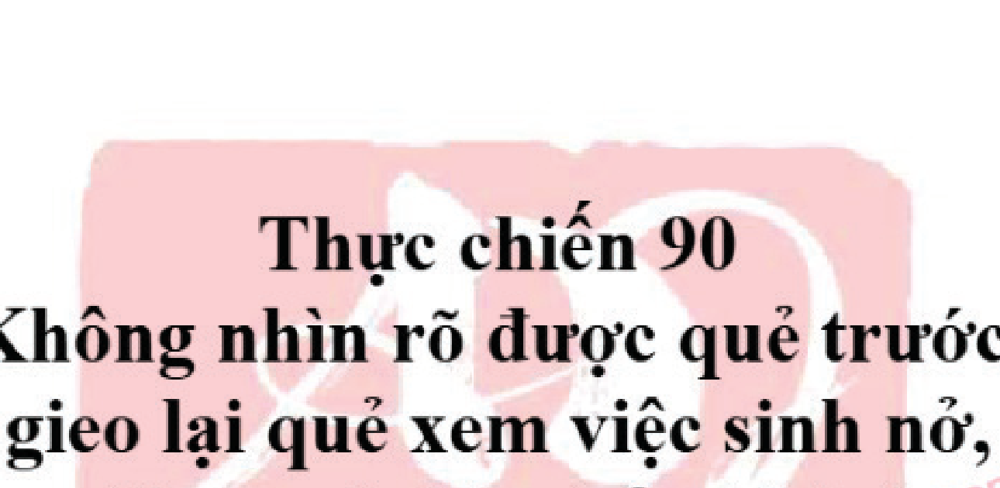

- **Cấu trúc Quẻ Dịch:**
  - **Quẻ chủ:** **Bát Thuần Tốn** (Cung Tốn, Họ Tốn – Quẻ Lục Xung)  
    *Tượng quẻ:* Phong hành vô trở, nhưng là Lục xung chủ về sự việc bộc phát gấp gáp, tâm trạng chao đảo lo âu.
  - **Quẻ biến:** **Bát Thuần Càn** (Cung Càn, Họ Càn – Quẻ Lục Xung)  
    *Tượng quẻ:* Cương kiện thuần túy; quẻ Lục xung biến Lục xung chủ về "vội đến vội đi", tình huống vượt cạn diễn ra thần tốc và kết thúc chóng vánh trong ngắn hạn.

- **Bảng chi tiết Lục hào:**

| Hào | Thế/Ứng | Lục thân (Chủ) | Can Chi (Chủ) | Động/Tĩnh | Lục thân (Biến) | Can Chi (Biến) | Thần sát / Ghi chú | Lục thú |
|:---:|:---:|:---|:---|:---:|:---|:---|:---|:---|
| 6 | **Thế** | Huynh Đệ | Mão - Mộc | tĩnh | Thê Tài | Tuất - Thổ | Tướng tinh | Câu Trận |
| 5 | | Tử Tôn | Tỵ - Hỏa | tĩnh | Quan Quỷ | Thân - Kim | Dịch mã, Dương nhẫn | Chu Tước |
| 4 | | Thê Tài | Mùi - Thổ | **X (Động)** | Tử Tôn | Ngọ - Hỏa | Nhật kiến, Hoa cái (hóa Lộc thần) | Thanh Long |
| 3 | **Ứng** | Quan Quỷ | Dậu - Kim | tĩnh | Thê Tài | Thìn - Thổ | Nguyệt kiến, Tai sát, Văn xương | Huyền Vũ |
| 2 | | Phụ Mẫu | Hợi - Thủy | tĩnh | Huynh Đệ | Dần - Mộc | | Bạch Hổ |
| 1 | | Thê Tài | Sửu - Thổ | **X (Động)** | Phụ Mẫu | Tý - Thủy | Tuần không, Mưu tinh | Đằng Xà |

---

### 3. Dụng thần & Loại quẻ

- **Phân loại quẻ:**
  - **Quẻ an nguy thai sản tái chiêm:** Tập trung duy nhất vào sự an toàn tính mạng của sản phụ và thai nhi.
  - **Quẻ Lục xung biến Lục xung:** Xem xét tốc độ ứng nghiệm và tiến trình phẫu thuật sinh mổ.
- **Định vị hệ thống Dụng thần:**
  1. **Hào Tử Tôn (Tỵ Hỏa tại hào 5 và Ngọ Hỏa tại hào 4 biến):** Dụng thần đại diện cho thai nhi sắp chào đời.
  2. **Hào Thê Tài (Mùi Thổ tại hào 4):** Dụng thần đại diện cho sản phụ (người vợ sinh nở).
  3. **Hào Phụ Mẫu (Tý Thủy tại hào biến 1, Hợi Thủy tại hào 2):** Kỵ thần của thai sản; đồng thời mang thông tin biệt chiêm về trưởng bối trong gia tộc.

---

### 4. Luận giải chi tiết

#### 1. Nguyên lý "Sinh sản hỷ xung" và quẻ Lục xung biến Lục xung
- Cổ pháp Lục Hào đúc kết nguyên tắc bất di bất dịch: *"Sinh sản hỷ xung, xung tắc dịch sản"* (Xem sinh nở rất mừng gặp Lục xung, vì xung tượng trưng cho việc thai nhi nhanh chóng rời khỏi tử cung người mẹ để ra ngoài).
- Quẻ **Bát Thuần Tốn** biến **Bát Thuần Càn** là cấu trúc **Lục xung biến Lục xung**:
  - Không thể luận theo việc mưu sự thông thường là tan vỡ hay thất bại.
  - Trong thai sản mổ đẻ, Lục xung biến Lục xung biểu thị trạng thái "vội đến vội đi": ca phẫu thuật sẽ được tiến hành rất nhanh gọn, thời gian chuyển dạ và lấy thai hoàn tất cấp tốc trong thời gian ngắn, không bị dây dưa nguy hiểm.

#### 2. Tượng "Mẹ ôm lấy con" và hồi đầu sinh đại cát
- Tại hào 4, **Thê Tài Mùi Thổ phát động biến ra Tử Tôn Ngọ Hỏa**:
  - Thê Tài đại diện cho người mẹ, Tử Tôn đại diện cho đứa con.
  - Thê Tài Mùi Thổ động hóa Tử Tôn Ngọ Hỏa là tượng **"người mẹ mang theo đứa trẻ"** – hình ảnh người mẹ ẵm bồng con thơ thiêng liêng.
  - Về mặt ngũ hành: Tử Tôn Ngọ Hỏa sinh Thê Tài Mùi Thổ là **hồi đầu sinh**, lại thêm **Ngọ Mùi lục hợp** (hóa hợp hữu tình).
  - Đây là điềm đại cát tường: khẳng định chắc chắn 100% người mẹ mẹ tròn, con vuông, không có bất kỳ tổn hại hay biến chứng nguy hiểm nào về mặt tính mạng.

#### 3. Trục trặc thao tác ban đầu qua hào 1 phát động
- Tại hào 1, **Thê Tài Sửu Thổ phát động biến Phụ Mẫu Tý Thủy**:
  - Sửu Thổ và Mùi Thổ trực xung đối kháng (Sửu Mùi tương xung).
  - Sửu Thổ mang tính chất phản phục, báo trước trong quá trình phẫu thuật sinh mổ sẽ gặp một vài trục trặc kỹ thuật nhỏ, sự cố gián đoạn hoặc thao tác phải xử lý lặp lại, khiến ê-kíp mổ và người nhà có đôi chút căng thẳng ban đầu.
  - Tuy nhiên, do hào 4 Mùi Thổ lâm Nhật kiến vượng tướng lại hóa hồi đầu sinh, nên mọi trục trặc ở hào 1 đều được khắc phục dễ dàng, kết quả cuối cùng vẫn là viên mãn.

#### 4. Giải mã "Điềm báo khác" (Biệt chiêm) về người cậu bệnh nặng
- Hào 1 Thê Tài Sửu Thổ biến ra **Phụ Mẫu Tý Thủy**:
  - Đây là hiện tượng động hóa hợp (Tý Sửu tương hợp), lại mang Quý nhân và Tuần không.
  - Phụ Mẫu chủ về trưởng bối lớn tuổi. Chu Thần Bân giải thích: người gieo quẻ dù ý thức chỉ hỏi về vợ con, nhưng tiềm thức vẫn kết nối sâu xa với vận mệnh gia tộc.
  - Người cậu ruột của đương số vốn bị ung thư vòm họng cách đây 2-3 năm; quẻ tượng tiềm ẩn điềm báo người cậu sẽ gặp đại nạn bệnh tật vào cuối năm. Thời điểm ứng nghiệm trùng khớp tuyệt đối vào **tháng Tân Hợi, ngày Mão, giờ Sửu**: người cậu đã trút hơi thở cuối cùng vì bệnh ung thư tái phát.

---

### 5. Kết luận & Ứng kỳ thực tế

- **Lời giải đoán & Khuyến nghị của Chu Thần Bân:**
  - Trấn an người đồng môn: ca mổ chắc chắn an toàn cho cả hai mẹ con, không có gì phải hoảng loạn. Quá trình mổ có thể có chút gián đoạn hoặc trục trặc thao tác nhỏ ban đầu nhưng sẽ vượt qua nhanh chóng.
  - Nhắc nhở thêm: gia đình cần lưu tâm chăm sóc sức khỏe của trưởng bối trong họ (người cậu đang mắc bệnh hiểm nghèo) vào dịp cuối năm.
- **Phản hồi thực tế (Feedback):**
  - Quá trình mổ lấy thai thực tế diễn ra đúng như quẻ dự báo: ban đầu có phát sinh trục trặc kỹ thuật nhỏ khiến ca mổ phải điều chỉnh, nhưng sau đó diễn ra cực kỳ thuận lợi và mau lẹ. Đứa trẻ chào đời an toàn, khỏe mạnh; sản phụ hồi phục tốt, các chỉ số hậu phẫu hoàn toàn bình thường.
  - Về người cậu: đến đúng tháng Hợi, ngày Mão, giờ Sửu, người cậu đã qua đời vì bệnh ung thư vòm họng.
- **Ứng kỳ chiêm nghiệm:**
  - Ứng nghiệm ca sinh mổ ngay ngày hôm sau; ứng nghiệm tang sự người cậu vào tháng Hợi cùng năm.

---

### 6. Bài học tâm pháp & Quy tắc cốt lõi

- **Trích dẫn quy tắc cốt lõi:**
  - *Quy tắc Sinh sản hỷ xung: Lục xung biến Lục xung và ứng kỳ thuận lợi trong giải đoán ca mổ sinh con* (trích Cổ Thệ Chân Thuyên Thực Chiến Biên 2, trang 249).
- **Tâm pháp giải đoán thực chiến:**
  1. **Sinh sản hỷ xung:** Không bao giờ được đánh đồng Lục xung trong quẻ thai sản với sự đổ vỡ. Lục xung biến Lục xung trong sản khoa là dấu hiệu sinh nhanh, thoát nạn, vượt cạn an toàn trong thời gian ngắn nhất.
  2. **Tượng Thê Tài hóa Tử Tôn hồi đầu sinh:** Là biểu tượng kinh điển của tình mẫu tử sum vầy, mẹ tròn con vuông, bảo chứng an toàn tuyệt đối cho cả sản phụ và sơ sinh.
  3. **Nhận diện điềm báo khác qua hào hóa hợp:** Khi một hào động hóa hợp (đặc biệt lâm Phụ Mẫu và Quý nhân) không khớp với dòng tự sự chính của câu hỏi, đó là dấu ấn của tiềm thức mang thông tin biến cố sức khỏe của trưởng bối trong gia tộc.

## THỰC CHIẾN 91: ÔNG NỘI BỎ NHÀ RA ĐI, HỎI ĐANG Ở ĐÂU

---

### 1. Bối cảnh & Câu hỏi

- **Bối cảnh chi tiết:** 
  Ông nội của người hỏi tuổi cao lại mắc bệnh hiểm nghèo nan y. Sau đợt điều trị tại bệnh viện trở về nhà, ông cụ mang tâm lý bi quan cùng cực, nhiều lần than thở không muốn con cháu phải tốn kém tiền bạc thuốc men vì mình nữa, thà bỏ đi ra ngoài chết bờ chết bụi. Đến nửa đêm hôm kia, lợi dụng lúc cả nhà ngủ say, ông cụ đã lặng lẽ mở cửa bỏ nhà đi mất tích. Gia đình chờ đợi ròng rã suốt hơn một ngày đêm vẫn bặt vô âm tín, hoang mang lo sợ ông cụ kiệt sức hoặc gặp nạn nơi đồng không mông quạnh.
- **Tâm lý người hỏi & Câu hỏi ẩn ý:** 
  Người cháu trong tâm trạng lo sốt vó, chạy vạy khắp nơi tìm kiếm nhưng không biết bắt đầu từ đâu. Ý niệm đầu tiên bật ra trong đầu lúc này không phải là phân vân có tìm được hay không, mà là cấp bách định vị tọa độ: *"Ông nội bỏ nhà đi thì hiện giờ đang ở phương nào, nơi chốn ra sao để người nhà đi tìm về?"*
- **Thời gian chiêm đoán:**
  - Dương lịch: 02/11/2017, 14:50 (Giờ Bắc Kinh).
  - Can chi: Năm Đinh Dậu, tháng Canh Tuất, ngày Quý Tỵ, giờ Kỷ Mùi.

---

### 2. Dữ kiện & Bảng quẻ Crop

- **Thời không chiêm nghiệm:**
  - Tháng Canh Tuất (Thổ vượng, Hỏa mộ, Thủy tuyệt).
  - Ngày Quý Tỵ (Hỏa vượng, Tỵ Dậu hợp Kim).
  - Tuần không: **Ngọ - Mùi** (Giáp Thân tuần trung, Ngọ Mùi không vong).
- **Thần sát:**
  - Tướng tinh: Dậu (Hào biến hào 3)
  - Hoa cái: Sửu (Hào biến hào 1)
  - Dịch mã: Hợi (Hào biến hào 2)
  - Tai sát: Mão
  - Mưu tinh: Mùi (Lâm Tuần không, lâm giờ)
  - Đào hoa: Ngọ (Lâm Tuần không, hào 3)
  - Kiếp sát: Dần (Hào 1, hào 6)
  - Lộc thần: Tý (Hào 5)
  - Dương nhẫn: Hợi
  - Văn xương: Mão
  - Thiên y: Dậu
  - Thiên hỷ: Thìn (Hào 2)
  - Quý nhân: Mão, Tỵ (Lâm Nhật kiến)

- Dữ kiện bảng quẻ và các thông số chiêm đoán:
  - **Bảng 91.1** Đồ hình quẻ Thực chiến 91:
    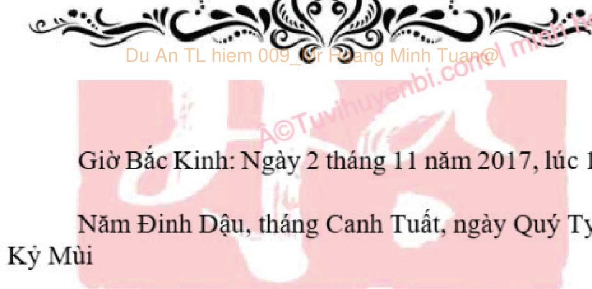

- **Cấu trúc Quẻ Dịch:**
  - **Quẻ chủ:** **Sơn Thủy Mông** (Cung Ly, Họ Ly)  
    *Tượng quẻ:* "Mông" là mông muội, mờ mịt, tăm tối không rõ phương hướng; phản ánh chính xác tình trạng người nhà hoàn toàn mù tịt về tung tích của ông cụ.
  - **Quẻ biến:** **Sơn Phong Cổ** (Cung Tốn, Họ Tốn – Quẻ Quy Hồn)  
    *Tượng quẻ:* "Cổ" là việc cần khẩn trương khắc phục; biểu thị gia đình phải chủ động ra tay, khẩn cấp triển khai hành động tìm kiếm trải thảm chứ không được thụ động ngồi chờ.

- **Bảng chi tiết Lục hào:**

| Hào | Thế/Ứng | Lục thân (Chủ) | Can Chi (Chủ) | Động/Tĩnh | Lục thân (Biến) | Can Chi (Biến) | Thần sát / Phục | Lục thú |
|:---:|:---:|:---|:---|:---:|:---|:---|:---|:---|
| 6 | | Phụ Mẫu | Dần - Mộc | tĩnh | Phụ Mẫu | Dần - Mộc | Kiếp sát | Bạch Hổ |
| 5 | | Quan Quỷ | Tý - Thủy | tĩnh | Quan Quỷ | Tý - Thủy | Lộc thần | Đằng Xà |
| 4 | **Thế** | Tử Tôn | Tuất - Thổ | tĩnh | Tử Tôn | Tuất - Thổ | Nguyệt kiến (Phục Tử Tôn Dậu) | Câu Trận |
| 3 | | Huynh Đệ | Ngọ - Hỏa | **X (Động)** | Thê Tài | Dậu - Kim | Tuần không, Đào hoa, Mưu tinh | Chu Tước |
| 2 | | Tử Tôn | Thìn - Thổ | tĩnh | Quan Quỷ | Hợi - Thủy | Thiên hỷ | Thanh Long |
| 1 | **Ứng** | Phụ Mẫu | Dần - Mộc | tĩnh | Tử Tôn | Sửu - Thổ | Kiếp sát, Dịch mã | Huyền Vũ |

---

### 3. Dụng thần & Loại quẻ

- **Phân loại quẻ:**
  - **Quẻ tìm người thân thất lạc:** Xem xét vị trí không gian, cự ly khoảng cách và phương hướng cụ thể.
  - **Quẻ hiện trạng không gian:** Trả lời trực tiếp câu hỏi "đang ở đâu" dựa vào hào vị và hào động dẫn truyền thông tin.
- **Định vị hệ thống Dụng thần:**
  1. **Hào Phụ Mẫu (Dần Mộc tại hào 1 và hào 6):** Dụng thần đại diện cho ông nội. Hào 1 lâm Ứng là vị trí thực tế của ông cụ.
  2. **Hào Thế (Tử Tôn Tuất Thổ):** Đại diện cho người cháu và gia đình đang nỗ lực tìm kiếm.
  3. **Hào Huynh Đệ (Ngọ Hỏa tại hào 3):** Hào phát động làm trung gian truyền dẫn tin tức, đại diện cho bạn bè, anh em họ hàng cùng thế hệ hỗ trợ tìm kiếm.

---

### 4. Luận giải chi tiết

#### 1. Định vị không gian: Ông cụ không đi xa, chỉ quanh quẩn địa phương
- Chu Thần Bân đúc kết tư duy tìm người thất lạc:
  - Khi người vừa mới bỏ đi trong 1–2 ngày, tâm lý người nhà không phải hỏi "có tìm được không" mà là muốn biết "đang ở đâu". Quẻ gieo theo ý niệm đầu tiên này thuần túy cung cấp tọa độ địa lý.
  - Dụng thần **Phụ Mẫu Dần Mộc** xuất hiện ở **hào sơ (hào 1)**: Hào sơ là hào thấp nhất, đại diện cho phạm vi cơ sở, địa phương gần nhà, không phải nơi xa xôi cách trở.
  - Hào Thế Tử Tôn Tuất Thổ và Dụng thần Phụ Mẫu Dần Mộc có mối quan hệ bán hợp (Dần – Tuất bán hợp Hỏa cục): khoảng cách giữa nơi ông cụ trú ngụ và nhà người hỏi rất gần, chỉ trong cự ly ngắn quanh vùng.
  - Phương vị của Dần Mộc: chỉ phương **Đông hoặc Đông Bắc**.

#### 2. Thần sát gắn liền với tình trạng ông cụ
- Dụng thần Phụ Mẫu Dần Mộc lâm **Kiếp sát**: phản ánh trên thân thể ông cụ đang mang trọng bệnh nguy hiểm, cơ thể suy kiệt gặp nạn.
- Dần Mộc lâm **Dịch mã**: biểu thị ông cụ đã thực sự đi ra khỏi nhà (xuất hành).
- Dần Mộc lâm **Huyền Vũ**: Huyền Vũ chủ mờ mịt, lén lút, trốn tránh; phản ánh hành vi lén lút bỏ nhà ra đi trong đêm tối và hiện thời gia đình chưa nắm được tung tích.

#### 3. Động hào Huynh Đệ Ngọ Hỏa: Chìa khóa mang lại tin tức
- Trong toàn quẻ chỉ có duy nhất **hào 3 Huynh Đệ Ngọ Hỏa phát động**:
  - Hướng tác động: Huynh Đệ Ngọ Hỏa phát động tương sinh trực tiếp cho hào Thế **Tử Tôn Tuất Thổ** (Hỏa sinh Thổ). Động hào sinh Thế là điềm lành báo trước gia đình sẽ sớm nhận được tin tức cứu vãn.
  - Huynh Đệ lâm **Chu Tước** và **Đào hoa**: Chu Tước chủ về khẩu thiệt, thông tin liên lạc, gọi điện thoại, dán tờ rơi tìm người; Đào hoa chủ về phát tán thông tin công khai.
  - Huynh Đệ lâm **Mưu tinh**: chỉ các kế hoạch huy động lực lượng. Người hỏi nên lập tức liên hệ với bạn bè, anh em họ hàng cùng trang lứa, nhờ họ tủa đi các hướng xung quanh dò hỏi.
- Liên kết Tam hợp cục Dần – Ngọ – Tuất:
  - Hào 1 (Dần Mộc - ông nội), hào 3 (Ngọ Hỏa - anh em họ hàng) và hào 4 Thế (Tuất Thổ - người nhà) khép lại thành một **tam giác khép kín**: ông cụ chỉ đi lang thang trong phạm vi không gian giữa nhà mình và địa bàn sinh sống của người thân bạn bè.

#### 4. Phê phán lối bói gượng ép hậu nghiệm và khẳng định "Tư duy tiền sự kiện"
- Chu Thần Bân nhấn mạnh phương pháp khoa học của Lục Hào:
  - Trước khi sự việc xảy ra, người thầy chỉ có thể định tính phương hướng (Đông/Đông Bắc), cự ly (rất gần, khoảng 1–2 km trong vùng) và đối tượng trợ lực (nhờ anh em cùng thế hệ).
  - Không thể thêu dệt thần thánh hóa trước sự việc như: "ông cụ đang ở trại lợn bên hồ nước". Những ai khoác lác đoán được chi tiết đó trước sự việc chỉ là kẻ dối trá; mọi chi tiết ly kỳ chỉ là do người ta gán ghép sau khi sự việc đã diễn ra (hậu nghiệm).

---

### 5. Kết luận & Ứng kỳ thực tế

- **Lời giải đoán & Khuyến nghị của Chu Thần Bân:**
  - Khẳng định ông cụ không đi xa, vẫn đang ở quanh quẩn trong khu vực địa phương (bán kính rất gần khoảng 1 cây số, hướng Đông hoặc Đông Bắc).
  - Hối thúc gia đình lập tức huy động anh em họ hàng, bạn bè (hào Huynh Đệ) chia nhau rà soát trải thảm theo hướng Đông/Đông Bắc; chắc chắn sẽ sớm nhận được tin tức lành đem ông cụ về an toàn.
- **Phản hồi thực tế (Feedback):**
  - Chiều hôm đó vào **giờ Thân**, gia đình đã tìm thấy ông cụ tại một trang trại nuôi heo nằm cạnh hồ nước trữ nước, cách nhà chỉ vỏn vẹn đúng 1 km!
  - Hoàn cảnh tìm thấy: Ông cụ đi bộ suốt đêm mệt lả và đói lịm, bèn ghé vào trang trại nuôi heo tìm đồ ăn. Chủ trang trại heo tình cờ lại là bạn quen biết của người em họ của người hỏi (chuẩn hào Huynh Đệ), nhận ra ngay ông cụ trong nhà bạn mình nên đã lập tức gọi điện báo tin cho gia đình đến đón về chăm sóc.
- **Ứng kỳ chiêm nghiệm:**
  - Ứng nghiệm ngay vào **giờ Thân** chiều cùng ngày: Thân Kim xung khai Dụng thần Phụ Mẫu Dần Mộc (Dần Thân tương xung bộc lộ tung tích tức thì).

---

### 6. Bài học tâm pháp & Quy tắc cốt lõi

- **Trích dẫn quy tắc cốt lõi:**
  - *Quy tắc khoanh vùng không gian và định hướng tìm người thất lạc qua ngũ hành quẻ biến và hào tượng* (trích Cổ Thệ Chân Thuyên Thực Chiến Biên 2, trang 254).
- **Tâm pháp giải đoán thực chiến:**
  1. **Tư duy ý niệm đầu tiên trong quẻ tìm đồ/tìm người:** Khi sự việc vừa phát sinh, ý niệm đầu tiên luôn là "đang ở đâu" (quẻ hiện trạng không gian). Chỉ khi tìm kiếm lâu ngày tuyệt vọng mới chuyển thành quẻ cát hung "có tìm được không".
  2. **Định vị khoảng cách qua hào vị:** Hào sơ (hào 1) đại diện cho phạm vi cận kề, khu vực bản địa gần nhà; hào càng cao khoảng cách càng xa xôi. Hào Dụng thần bán hợp với hào Thế khẳng định mục tiêu ở trong bán kính gần.
  3. **Tư duy tiền sự kiện vs Hậu nghiệm:** Người giải đoán chân chính phải nắm chắc đại cục, định đúng phương hướng, thời gian và phạm vi khoanh vùng để hành động thực tế mang lại kết quả, kiên quyết bài trừ thói thêu dệt chi tiết thần quyền vô căn cứ.

## THỰC CHIẾN 92: DO ÁP LỰC CÔNG VIỆC LỚN, MUỐN RÚT KHỎI VỊ TRÍ HIỆN TẠI, XIN LÃNH ĐẠO ĐIỀU CHỈNH VỊ TRÍ CÔNG TÁC. HỎI LẦN ĐIỀU CHỈNH NÀY CÓ LỢI CHO MÌNH KHÔNG, CÓ THỂ ĐẠT ĐƯỢC MỤC TIÊU MONG MUỐN KHÔNG?

---

### 1. Bối cảnh & Câu hỏi

- **Bối cảnh chi tiết:** 
  Một người đồng môn học Lục Hào đang đảm nhận một vị trí công tác chịu áp lực vô cùng nặng nề. Tính chất công việc tại đơn vị hiện tại đòi hỏi chuyên môn cao, thường xuyên phải đi lại bôn ba, giải quyết nhiều mối quan hệ thị phi phức tạp khiến đầu óc lúc nào cũng căng thẳng không phút nào ngơi nghỉ. Nhận thấy sức khỏe và tinh thần bị bào mòn, người này chủ động làm đơn xin cấp trên cho rút lui khỏi vị trí hiện tại để điều chuyển sang một bộ phận hoặc đơn vị khác an nhàn hơn.
- **Tâm lý người hỏi & Câu hỏi ẩn ý:** 
  Người hỏi đứng trước tâm lý giằng xé rất thực tế: một mặt muốn thoát khỏi áp lực nghẹt thở của vị trí cũ, mặt khác lại canh cánh nỗi lo sau khi rút lui liệu phúc lợi đãi ngộ có bị cắt giảm quá sâu hay không, hoặc chuyển sang nơi mới liệu có lại rơi vào cảnh vất vả tương tự hay không. Câu hỏi đặt ra: *"Lần điều chỉnh công tác này có lợi cho bản thân không? Có đạt được mục tiêu mong muốn (giảm áp lực, giữ được mức đãi ngộ chấp nhận được) không?"*
- **Thời gian chiêm đoán:**
  - Dương lịch: 02/11/2017, 16:50 (Giờ Bắc Kinh).
  - Can chi: Năm Đinh Dậu, tháng Canh Tuất, ngày Quý Tỵ, giờ Canh Thân.

---

### 2. Dữ kiện & Bảng quẻ Crop

- **Thời không chiêm nghiệm:**
  - Tháng Canh Tuất (Thổ vượng, Tuất Thổ xung Thìn Thổ tạo Nguyệt phá).
  - Ngày Quý Tỵ (Hỏa vượng, Tỵ Hỏa xung Hợi Thủy tạo Nhật phá).
  - Tuần không: **Ngọ - Mùi** (Giáp Thân tuần trung, Ngọ Mùi không vong).
- **Thần sát:**
  - Tướng tinh: Dậu (Hào 6)
  - Hoa cái: Sửu (Hào 4)
  - Dịch mã: Hợi (Hào 5)
  - Tai sát: Mão (Hào biến hào 2)
  - Mưu tinh: Mùi (Lâm Tuần không)
  - Đào hoa: Ngọ (Hào biến hào 4, lâm Tuần không)
  - Kiếp sát: Dần (Hào 2)
  - Lộc thần: Tý (Hào 1)
  - Dương nhẫn: Hợi (Hào 5)
  - Văn xương: Mão
  - Thiên y: Dậu
  - Thiên hỷ: Thìn (Lâm hào Thế)
  - Quý nhân: Mão, Tỵ (Nhật kiến lâm Quý nhân)

- Dữ kiện bảng quẻ và các thông số chiêm đoán:
  - **Bảng 92.1** Đồ hình quẻ Thực chiến 92:
    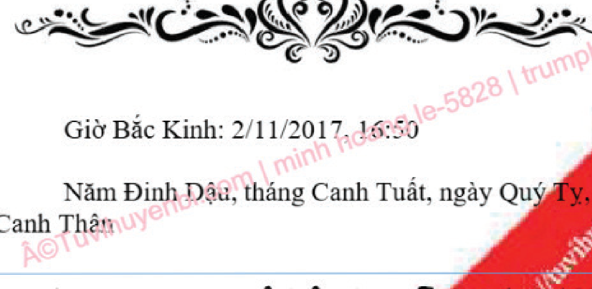

- **Cấu trúc Quẻ Dịch:**
  - **Quẻ chủ:** **Địa Thiên Thái** (Cung Khôn, Họ Khôn – Quẻ Lục Hợp)  
    *Tượng quẻ:* Thái bình thông thuận, gắn kết hòa hảo; chứng tỏ công việc trước nay về cơ bản vẫn vận hành tốt đẹp, việc xin rút lui là hoàn toàn do nguyện vọng chủ động của cá nhân chứ không phải bị cơ quan kỷ luật hay sa thải.
  - **Quẻ biến:** **Lôi Trạch Quy Muội** (Cung Đoài, Họ Đoài – Quẻ Quy Hồn)  
    *Tượng quẻ:* "Quy Muội" là người con gái đi lấy chồng, muốn gả cho ai thì gả; tượng trưng cho sự toại nguyện, cầu được ước thấy, đạt được mục tiêu mong muốn.

- **Bảng chi tiết Lục hào:**

| Hào | Thế/Ứng | Lục thân (Chủ) | Can Chi (Chủ) | Động/Tĩnh | Lục thân (Biến) | Can Chi (Biến) | Thần sát / Phục | Lục thú |
|:---:|:---:|:---|:---|:---:|:---|:---|:---|:---|
| 6 | **Ứng** | Tử Tôn | Dậu - Kim | tĩnh | Huynh Đệ | Tuất - Thổ | Tướng tinh, Thiên y | Bạch Hổ |
| 5 | | Thê Tài | Hợi - Thủy | tĩnh (Nhật phá) | Tử Tôn | Thân - Kim | Dịch mã, Dương nhẫn (Nhật phá) | Đằng Xà |
| 4 | | Huynh Đệ | Sửu - Thổ | **X (Động)** | Phụ Mẫu | Ngọ - Hỏa | Hoa cái (hóa Tuần không, Đào hoa) | Câu Trận |
| 3 | **Thế** | Huynh Đệ | Thìn - Thổ | **O (Động)** | Huynh Đệ | Sửu - Thổ | Nguyệt phá, Thiên hỷ (hóa Thoái thần) | Chu Tước |
| 2 | | Quan Quỷ | Dần - Mộc | tĩnh | Quan Quỷ | Mão - Mộc | Kiếp sát (Phục Phụ Mẫu Tỵ Hỏa) | Thanh Long |
| 1 | | Thê Tài | Tý - Thủy | tĩnh | Phụ Mẫu | Tý - Thủy | Lộc thần | Huyền Vũ |

---

### 3. Dụng thần & Loại quẻ

- **Phân loại quẻ:**
  - **Quẻ điều chuyển công tác & giải tỏa áp lực:** Phân định tính chất đơn vị cũ và đơn vị mới tiếp nhận.
  - **Quẻ biến dịch cấu trúc bắc cầu:** Sử dụng phương pháp liên kết chuỗi hào để tìm ra thực thể đơn vị đích đến.
- **Định vị hệ thống Dụng thần:**
  1. **Hào Thế (Huynh Đệ Thìn Thổ):** Đại diện cho bản thân người hỏi.
  2. **Đơn vị hiện tại (Phụ Mẫu Tỵ Hỏa ẩn phục hào 2):** Đại diện cho cơ quan hiện tại nơi đương số đang chịu áp lực nặng nề.
  3. **Đơn vị mới tiếp nhận (Phụ Mẫu Ngọ Hỏa biến ra tại hào 4):** Đích đến điều chuyển công tác được tìm ra qua kỹ thuật "Bắc cầu xu hướng biến".
  4. **Quan Quỷ (Dần Mộc tại hào 2):** Khắc hào Thế, đại diện cho áp lực công việc và trách nhiệm đè nặng.

---

### 4. Luận giải chi tiết

#### 1. Bóc tách cội nguồn áp lực tại vị trí công tác hiện tại
- Tại hào 2, **Quan Quỷ Dần Mộc** tĩnh khắc hào Thế Huynh Đệ Thìn Thổ:
  - Dần Mộc là vị trí Bệnh địa của Thổ, thể hiện chức vụ công tác hiện tại khiến đương số mệt mỏi, bất mãn và kiệt quệ.
  - Quan Quỷ Dần Mộc lâm **Kiếp sát**, liên đới với hào 5 Thê Tài Hợi Thủy mang **Dương nhẫn, Dịch mã** bị Nhật phá: phản ánh đương sự phải bôn ba chạy vạy khắp nơi, dính líu vào nhiều mối quan hệ thị phi phức tạp không dứt.
  - Ẩn dưới Quan Quỷ Dần Mộc là **Phụ Mẫu Tỵ Hỏa** (lâm Nhật kiến): Tỵ Hỏa ứng với sao Thiên Văn trong tử vi, tượng trưng cho công việc đòi hỏi trí não hoạt động căng thẳng liên tục. Thìn Tỵ hợp thành lưới Thiên La, giam hãm người hỏi trong sự ngột ngạt. Vì vậy, việc xin rút lui là hoàn toàn chuẩn xác.

#### 2. Kỹ thuật độc môn "Bắc cầu xu hướng biến"
- Chu Thần Bân giải mã cấu trúc động biến phi thường của quẻ:
  - Hào 3 Thế **Huynh Đệ Thìn Thổ phát động hóa Huynh Đệ Sửu Thổ**: Thìn Thổ hóa Sửu Thổ là tượng Thoái thần, biểu thị hành động chủ động lùi một bước, xin rút khỏi cương vị hiện thời.
  - Trong khi đó, tại hào 4, **Huynh Đệ Sửu Thổ lại phát động hóa ra Phụ Mẫu Ngọ Hỏa**.
  - Nhận diện chiếc cầu nối: Hào biến của hào 3 là Sửu Thổ, và hào động ở hào 4 cũng chính là Sửu Thổ. Cùng là Huynh Đệ Sửu Thổ đóng vai trò **"nhịp cầu trung gian"** (Bắc cầu xu hướng biến), dẫn truyền dòng năng lượng từ hào Thế Thìn Thổ bắc thẳng sang thực thể đích: **Phụ Mẫu Ngọ Hỏa**!
  - Kết luận: Phụ Mẫu Tỵ Hỏa (hào 2) là đơn vị cũ; **Phụ Mẫu Ngọ Hỏa (hào 4 biến)** chính là đơn vị mới mà đương số sẽ được điều chuyển đến tiếp nhận.

#### 3. So sánh đối chiếu đơn vị mới và đơn vị cũ
- Đơn vị mới **Phụ Mẫu Ngọ Hỏa**:
  - Ngọ Hỏa trong cung hoàng đạo/tử vi đại diện cho sao **Thiên Phúc** – biểu tượng của sự hưởng phúc, an nhàn, dưỡng lão thảnh thơi.
  - Phụ Mẫu Ngọ Hỏa lâm **Đào hoa**: môi trường làm việc có cảnh quan đẹp đẽ, thoáng đãng, mang tính chất thư giãn, giải trí.
  - Nhịp cầu Sửu Thổ nạp âm Lộ Bàng Thổ (đất ven đường), tượng trưng cho hành lang giao thông hoặc hành lang sinh thái; kết hợp hào Đào hoa Ngọ Hỏa chỉ đích danh: **Ban quản lý khu du lịch sinh thái**!
- Điểm đánh đổi thực tế:
  - Phụ Mẫu Ngọ Hỏa trực xung với **Lộc thần Tý Thủy** (Tý Ngọ tương xung): báo trước nguồn thu nhập, tiền thưởng hay đãi ngộ kinh tế ở nơi mới sẽ giảm nhẹ so với đơn vị cũ.
  - Sửu Thổ và Ngọ Hỏa tương hại, Sửu Thổ và Thìn Thổ tương hình: vị trí địa lý của đơn vị mới có chút bất tiện về mặt đi lại, cung đường di chuyển hơi xa xôi.

#### 4. Quy tắc tâm pháp về sinh khắc bắc cầu
- Chu Thần Bân đính chính sai lầm phổ biến của người học:
  - Trong quẻ lý chính thống, ở tầng định tính cát hung không tồn tại khái niệm "bắc cầu rồi quay đầu sinh khắc hào Thế". Bắc cầu thuần túy thuộc về **Quái ý pháp** (phương pháp tượng quẻ) nhằm truy tìm danh tính Lục thân chuyển tiếp.
  - Tuy nhiên, ở **tầng chi tiết sự vụ**, Phụ Mẫu Ngọ Hỏa mang hành Hỏa sinh phù cho hào Thế Thìn Thổ (Hỏa sinh Thổ), củng cố kết luận chuyển sang đơn vị mới là lựa chọn vô cùng đúng đắn và đem lại sự an lạc cho thân tâm, chuẩn xác với tượng cát tường của quẻ biến **Lôi Trạch Quy Muội**.

---

### 5. Kết luận & Ứng kỳ thực tế

- **Lời giải đoán & Khuyến nghị của Chu Thần Bân:**
  - Khẳng định lãnh đạo sẽ chấp thuận nguyện vọng điều chuyển công tác, kết quả đạt được như ý nguyện (quẻ Quy Muội).
  - Đơn vị mới là nơi thanh nhàn, tính chất như đi dưỡng lão, áp lực tiêu biến hoàn toàn; chỉ cần chấp nhận thực tế đãi ngộ tài chính sẽ giảm nhẹ đôi chút và đường đi lại hơi xa hơn. Khuyên giữ mối quan hệ ôn hòa với lãnh đạo mới để an hưởng công việc nhẹ nhàng.
- **Phản hồi thực tế (Feedback):**
  - Vào đúng **tháng Tân Hợi**, quyết định điều động chính thức được ban hành.
  - Đương số được điều chuyển về công tác tại **Ban quản lý một Khu du lịch sinh thái** (đúng tượng Phụ Mẫu Ngọ Hỏa lâm Đào hoa và hành lang sinh thái Sửu Thổ bắc cầu).
  - Công việc vô cùng nhẹ nhàng, thư thái, ngày ngày đi làm dưỡng sức như đi dưỡng lão, tâm trí hoàn toàn trút bỏ được gánh nặng áp lực nghẹt thở trước kia; mức thu nhập có giảm đôi chút nhưng hoàn toàn xứng đáng với sự thảnh thơi nhận được.
- **Ứng kỳ chiêm nghiệm:**
  - Hào Thế Thìn Thổ bị Nguyệt phá, cần xuất phá; Phụ Mẫu Ngọ Hỏa lâm Tuần không, cần xung không (tháng Tý) hoặc tiến khí (tháng Hợi). Ứng nghiệm chuẩn xác vào **tháng Tân Hợi** khi lệnh điều động được ký.

---

### 6. Bài học tâm pháp & Quy tắc cốt lõi

- **Trích dẫn quy tắc cốt lõi:**
  - *Phương pháp 'Bắc cầu xu hướng biến' và tượng quẻ Quy Muội trong giải đoán thuyên chuyển công tác giảm áp lực* (trích Cổ Thệ Chân Thuyên Thực Chiến Biên 2, trang 263).
- **Tâm pháp giải đoán thực chiến:**
  1. **Phương pháp "Bắc cầu xu hướng biến":** Khi hai hào động độc lập không có liên hệ bề mặt nhưng xuất hiện hào biến của hào này trùng khớp ngũ hành lục thân với hào động của hào kia, hãy sử dụng hào trung gian làm cầu nối để xâu chuỗi mạch chuyển dịch của đối tượng (từ vị trí cũ sang vị trí mới).
  2. **Ý nghĩa quẻ Quy Muội:** Khi người hỏi mang theo ước nguyện chủ quan cầu toại ý, quẻ Quy Muội (cô gái gả chồng) là biểu tượng số một của việc đạt thành ý nguyện, chuyển hóa từ thế bị động sang toại lòng.
  3. **Phân định ranh giới giữa Định tính và Chi tiết:** Kỹ thuật bắc cầu thuộc Quái ý pháp phục vụ cho việc đọc tượng và bóc tách chi tiết; không được tùy tiện dùng sinh khắc bắc cầu để đảo lộn các quy tắc định tính cát hung gốc rễ.

## THỰC CHIẾN 93: MỘT CỔ PHIẾU NÀO ĐÓ CÓ THỂ MUA VÀO KHÔNG

---

### 1. Bối cảnh & Câu hỏi

- **Bối cảnh chi tiết:** 
  Một đệ tử của Chu Thần Bân là nhà đầu tư chuyên nghiệp trên thị trường chứng khoán, thường xuyên ứng dụng dịch lý Lục Hào để hỗ trợ ra quyết định giao dịch. Trong quá trình sàng lọc thị trường, người này phát hiện một mã cổ phiếu cụ thể đang được các chuyên gia phân tích và phương tiện truyền thông tài chính đánh giá cao. Nhận thấy giá cổ phiếu đã điều chỉnh và có dấu hiệu tạo đáy, người này nảy sinh ý định mua vào để đón đầu đợt tăng giá.
- **Tâm lý người hỏi & Câu hỏi ẩn ý:** 
  Người hỏi mang tâm lý háo hức bắt đáy, vừa muốn chớp cơ hội sinh lời nhanh vừa lo ngại rủi ro mua hớ hoặc bị chôn vốn trong bối cảnh thị trường biến động khôn lường. Câu hỏi đặt ra: *"Mã cổ phiếu chỉ định này hiện tại có thể mua vào được không?"* – Bản chất câu hỏi là định vị vùng giá hiện tại đã an toàn chưa và triển vọng sinh lời thực chất của cổ phiếu này sau khi xuống tiền.
- **Thời gian chiêm đoán:**
  - Dương lịch: 28/07/2017, 13:28 (Giờ Bắc Kinh).
  - Can chi: Năm Đinh Dậu, tháng Đinh Mùi, ngày Bính Thìn, giờ Ất Mùi.

---

### 2. Dữ kiện & Bảng quẻ Crop

- **Thời không chiêm nghiệm:**
  - Tháng Đinh Mùi (Thổ vượng, Hỏa tướng, Kim hưu, Mộc mộ, Thủy tuyệt).
  - Ngày Bính Thìn (Thổ vượng, Thìn Dậu lục hợp).
  - Tuần không: **Tý - Sửu** (Giáp Dần tuần trung, Tý Sửu không vong).
- **Thần sát:**
  - Tướng tinh: Tý (Lâm Tuần không, hào 5 phục)
  - Hoa cái: Thìn (Lâm Nhật kiến, hào 1)
  - Dịch mã: Dần
  - Tai sát: Ngọ (Hào 2)
  - Mưu tinh: Tuất
  - Đào hoa: Dậu (Hào biến hào 3 lâm Quý nhân)
  - Kiếp sát: Tỵ (Hào 5)
  - Lộc thần: Tỵ (Hào 5)
  - Dương nhẫn: Ngọ (Hào 2)
  - Văn xương: Thân (Lâm hào Thế)
  - Thiên y: Ngọ
  - Thiên hỷ: Sửu (Lâm Tuần không)
  - Quý nhân: Dậu, Hợi

- Dữ kiện bảng quẻ và các thông số chiêm đoán:
  - **Bảng 93.1** Đồ hình quẻ Thực chiến 93:
    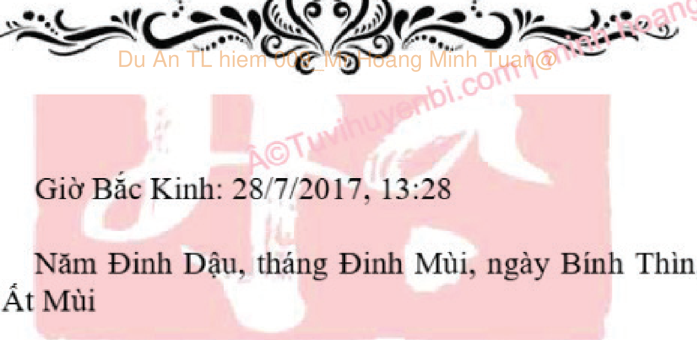

- **Cấu trúc Quẻ Dịch:**
  - **Quẻ chủ:** **Phong Sơn Tiệm** (Cung Cấn, Họ Cấn – Quẻ Quy Hồn)  
    *Tượng quẻ:* "Tiệm" là tiệm tiến, phát triển dần dà từng bước; phản ánh thị trường đang diễn biến chậm rãi, nhà đầu tư đã mất nhiều thời gian kiên nhẫn quan sát chờ đón nhịp vào lệnh.
  - **Quẻ biến:** **Phong Địa Quán** (Cung Cấn, Họ Cấn)  
    *Tượng quẻ:* "Quán" là quan sát, đứng ngoài ngắm nhìn; mang tính chất **quẻ chỉ đạo** khuyên nhà đầu tư chỉ nên khoanh tay đứng ngoài quan sát, tuyệt đối không được mở vị thế mua vào.

- **Bảng chi tiết Lục hào:**

| Hào | Thế/Ứng | Lục thân (Chủ) | Can Chi (Chủ) | Động/Tĩnh | Lục thân (Biến) | Can Chi (Biến) | Thần sát / Phục | Lục thú |
|:---:|:---:|:---|:---|:---:|:---|:---|:---|:---|
| 6 | **Ứng** | Quan Quỷ | Mão - Mộc | tĩnh | Quan Quỷ | Mão - Mộc | | Thanh Long |
| 5 | | Phụ Mẫu | Tỵ - Hỏa | tĩnh | Phụ Mẫu | Tỵ - Hỏa | Kiếp sát, Lộc thần (Phục Thê Tài Tý) | Huyền Vũ |
| 4 | | Huynh Đệ | Mùi - Thổ | tĩnh | Huynh Đệ | Mùi - Thổ | Nguyệt kiến | Bạch Hổ |
| 3 | **Thế** | Tử Tôn | Thân - Kim | **O (Động)** | Quan Quỷ | Mão - Mộc | Văn xương (hóa Tuyệt, hóa Quỷ) | Đằng Xà |
| 2 | | Phụ Mẫu | Ngọ - Hỏa | tĩnh | Phụ Mẫu | Tỵ - Hỏa | Tai sát, Dương nhẫn, Thiên y | Câu Trận |
| 1 | | Huynh Đệ | Thìn - Thổ | tĩnh | Huynh Đệ | Mùi - Thổ | Nhật kiến, Hoa cái | Chu Tước |

---

### 3. Dụng thần & Loại quẻ

- **Phân loại quẻ:**
  - **Quẻ đầu tư chứng khoán / Mua vào bắt đáy:** Phân định khả năng sinh lợi nhuận và mức độ an toàn của nguồn vốn giải ngân.
  - **Quẻ chỉ đạo chiến lược đầu tư:** Cảnh báo bẫy tâm lý và nguy cơ kẹt vốn trong giao dịch tài chính.
- **Định vị hệ thống Dụng thần:**
  1. **Dụng thần số một của quẻ mua vào (Tử Tôn Thân Kim tại hào 3 Thế):** Chu Thần Bân khẳng định hành vi mua vào bắt đáy bắt buộc phải lấy hào Tử Tôn làm Dụng thần cốt lõi. Tử Tôn là nguồn cội sinh Tài, đại diện cho việc tài sản chạm đáy an toàn và tiềm năng sinh sôi.
  2. **Hào Ứng (Quan Quỷ Mão Mộc):** Đại diện cho mã cổ phiếu cụ thể được chỉ định phân tích.
  3. **Hào Thế (Tử Tôn Thân Kim):** Đại diện cho chủ thể giao dịch (nhà đầu tư).

---

### 4. Luận giải chi tiết

#### 1. Nguyên lý Dụng thần Tử Tôn trong hành vi mua vào đầu tư
- Chu Thần Bân đính chính quan điểm sai lầm của một số môn phái khác:
  - Cổ pháp thường lấy Thê Tài làm Dụng thần hoặc lấy Huynh Đệ (đại diện cho sự giảm giá) để xem mua vào. Chu Thần Bân vạch trần: Huynh Đệ động chỉ là hiện tượng giá giảm, nhưng trong đầu tư "không mua khi giá đang rơi"; mua khi Huynh Đệ động rất dễ bắt phải dao rơi ở lưng chừng núi rồi tiếp tục sụt giảm sâu.
  - Khi chưa mua, điều cốt tử là xem giá đã tạo đáy vững chắc hay chưa; chỉ khi **hào Tử Tôn vượng tướng** thì việc bắt đáy mới thực sự an toàn và sau đó giá mới có lực đẩy đi lên. Vì vậy, hào Tử Tôn là Dụng thần duy nhất có giá trị định tính cho hành vi giải ngân mua vào.

#### 2. Cơ chế "Động thủy biến chung": Khởi đầu ngọt ngào, kết cục tai họa
- Trong toàn quẻ chỉ có duy nhất hào Thế **Tử Tôn Thân Kim phát động biến Quan Quỷ Mão Mộc**:
  - Hào Thế Tử Tôn Thân Kim phát động: Thể hiện đương số vô cùng chủ động, quyết tâm muốn mua vào cổ phiếu này. Hào Thân Kim lâm Văn Xương cho thấy người này có sự tính toán, phân tích kỹ thuật rất bài bản.
  - Nguyên lý "Động thủy biến chung" (Hào động là khởi đầu, hào biến là hồi kết):
    - **Khởi đầu (Hào động Thân Kim):** Bước sang tháng Thân (tháng tiếp theo), Thân Kim nắm lệnh trị nguyệt vượng khí; giá cổ phiếu sẽ có một nhịp tăng nhẹ ngắn hạn, đem lại chút lợi nhuận ban đầu khiến nhà đầu tư phấn khởi tưởng mình đã bắt trúng đáy.
    - **Kết cục (Hào biến Mão Mộc):** Tử Tôn biến Quan Quỷ, Thế biến Quan Quỷ (lại lâm Tuyệt địa tại Mão). Trong quẻ tài chính đầu tư, điều tối kỵ nhất là **Tài hóa Quỷ** hoặc **Tử Tôn/Thế hóa Quỷ**! Quan Quỷ là cạm bẫy, rủi ro, tổn thất, kiện tụng hoặc bị chôn vốn. Điều này khẳng định sau nhịp tăng ngắn ngủi ban đầu, cổ phiếu sẽ đảo chiều lao dốc không phanh, nhấn chìm toàn bộ vốn liếng của nhà đầu tư vào thua lỗ nặng nề.

#### 3. Bẫy truyền thông và ý nghĩa quẻ biến Phong Địa Quán
- Tại hào 6, hào Ứng **Quan Quỷ Mão Mộc**:
  - Ứng đại diện cho mã cổ phiếu chỉ định. Hào Ứng lâm Quan Quỷ mang theo Đào hoa và Quý nhân: Đào hoa là thông tin rực rỡ, Quý nhân là sự bảo chứng của chuyên gia, truyền thông và các tổ chức tài chính. Thực chất đây là chiếc bẫy PR tạo sóng ảo nhằm thu hút nhà đầu tư nhỏ lẻ nhảy vào ôm hàng.
  - Quẻ biến là **Phong Địa Quán**: "Quán" là đứng ngoài quan sát với tâm thế tĩnh lặng. Quẻ Dịch đưa ra thông điệp chỉ đạo đanh thép: *"Lợi nhỏ chớ tham!"*. Nếu vì tham chút lợi nhuận cỏn con trước mắt trong tháng Thân mà lao vào mua, nhà đầu tư sẽ bị kẹp chặt vốn không lối thoát và buộc phải cắt lỗ đứt ruột ("tự chém vào đùi") khi cổ phiếu đổ đèo.

---

### 5. Kết luận & Ứng kỳ thực tế

- **Lời giải đoán & Khuyến nghị của Chu Thần Bân:**
  - Khuyên người đệ tử dứt khoát không được mua vào mã cổ phiếu này.
  - Cảnh báo rõ: cổ phiếu này chỉ có thể nhích nhẹ trong tháng Thân nhưng sang tháng Dậu sẽ sụp đổ rất mạnh; nếu tham lợi nhỏ nhảy vào sẽ bị kẹp cứng tài khoản và chịu tổn thất nặng nề. Hãy tuân thủ tượng quẻ Quán: đứng ngoài thị trường quan sát.
- **Phản hồi thực tế (Feedback):**
  - Người đệ tử vì tiếc cơ hội và tự tin vào kỹ thuật cá nhân nên đã không nghe lời khuyên, quyết định xuống tiền mua cổ phiếu.
  - Diễn biến thực tế khớp từng chi tiết với quẻ Dịch:
    - Trong tháng Thân: cổ phiếu có nhích tăng nhẹ đúng như tính chất hào Thân Kim trị nguyệt.
    - Sang tháng Dậu (tháng 9 dương lịch): cổ phiếu bất ngờ quay đầu cắm đầu giảm thảm khốc, lao dốc không phanh.
    - Kết cục: toàn bộ khoản tiền đầu tư bị thua lỗ nặng nề, đương số bị kẹt vốn nghiêm trọng và cuối cùng buộc phải cắn răng cắt lỗ nặng đúng như lời Chu Thần Bân đã cảnh báo.
- **Ứng kỳ chiêm nghiệm:**
  - Tăng nhẹ trong **tháng Thân** (ứng hào động Thân Kim vượng); sụt giảm cực mạnh trong **tháng Dậu** (ứng hào biến Quan Quỷ phát tác họa hại).

---

### 6. Bài học tâm pháp & Quy tắc cốt lõi

- **Trích dẫn quy tắc cốt lõi:**
  - *Quy tắc quẻ Tiệm biến Quán trong đầu tư chứng khoán: Cảnh giác bẫy lợi nhỏ và nguy cơ kẹt vốn cắt lỗ* (trăng 273).
- **Tâm pháp giải đoán thực chiến:**
  1. **Tử Tôn là Dụng thần tiên quyết của mua vào:** Hành vi bắt đáy đầu tư chỉ an toàn khi hào Tử Tôn vượng tướng và không bị tổn thương. Hào Huynh Đệ động chỉ là hiện tượng giảm giá bề nổi, bắt đáy theo Huynh Đệ là tự rước họa bắt dao rơi.
  2. **Tử Tôn/Thế hóa Quan Quỷ là đại kỵ đầu tư:** Trong mọi quyết định giải ngân tài chính, hào Thế hoặc hào Dụng thần Tử Tôn phát động hóa Quan Quỷ là lời cảnh báo đắt giá về bẫy kẹt vốn và nguy cơ phá hủy tài khoản. Khởi đầu dù có chút lợi nhuận ảo (động thủy) nhưng kết cục chắc chắn là thảm bại (biến chung).
  3. **Tâm pháp "Lợi nhỏ chớ tham" qua quẻ Quán:** Khi quẻ biến là Phong Địa Quán, thông điệp tối cao là đứng ngoài quan sát. Người làm chủ thị trường tài chính phải biết kiềm chế lòng tham, không đánh đổi vài phần trăm lợi nhuận ngắn hạn để rước lấy rủi ro cháy tài khoản dài hạn.

## THỰC CHIẾN 94: PHỎNG VẤN NGÀY MAI CÓ THÀNH CÔNG KHÔNG, NẾU ĐẾN LÀM THÌ CÓ TỐT KHÔNG?

---

### 1. Bối cảnh & Câu hỏi

- **Bối cảnh chi tiết:** 
  Một người đang trong quá trình tìm kiếm việc làm và đã nhận được lịch hẹn phỏng vấn tuyển dụng vào một cơ quan/doanh nghiệp cụ thể vào ngày mai. Người này chưa từng làm việc tại đây, thông tin về chế độ đãi ngộ nội bộ và môi trường làm việc chỉ nắm được qua các kênh tuyển dụng bên ngoài. Đương số rất kỳ vọng vào đợt tuyển dụng này nhưng đồng thời cũng nộp hồ sơ thăm dò ở một số nơi khác.
- **Tâm lý người hỏi & Câu hỏi ẩn ý:** 
  Người hỏi mang tâm lý vừa hồi hộp muốn biết kết quả đậu rớt ngay ngày mai, lại vừa toan tính xa xôi về tiền đồ tương lai nếu được nhận vào làm. Đương số đặt câu hỏi kép lồng ghép: *"Phỏng vấn ngày mai có thành công không? Nếu đến đó làm thì môi trường và đãi ngộ có tốt cho mình không?"*
- **Thời gian chiêm đoán:**
  - Dương lịch: 14/11/2017, 15:05 (Giờ Bắc Kinh).
  - Can chi: Năm Đinh Dậu, tháng Tân Hợi, ngày Ất Tỵ, giờ Giáp Thân.

---

### 2. Dữ kiện & Bảng quẻ Crop

- **Thời không chiêm nghiệm:**
  - Tháng Tân Hợi (Thủy vượng, Mộc tướng, Hỏa tuyệt, Thổ tù).
  - Ngày Ất Tỵ (Hỏa vượng, Tỵ Hợi trực xung tạo Ám động/Nguyệt phá).
  - Tuần không: **Dần - Mão** (Giáp Thìn tuần trung, Dần Mão không vong).
- **Thần sát:**
  - Tướng tinh: Dậu
  - Hoa cái: Sửu (Hào 2)
  - Dịch mã: Hợi (Lâm hào Thế)
  - Tai sát: Mão (Hào 1)
  - Mưu tinh: Mùi (Hào biến hào 5)
  - Đào hoa: Ngọ (Hào 4)
  - Kiếp sát: Dần (Hào biến hào 2, lâm Tuần không)
  - Lộc thần: Mão (Hào 1, lâm Tuần không)
  - Dương nhẫn: Dần
  - Văn xương: Ngọ
  - Thiên y: Tuất (Lâm hào Ứng)
  - Thiên hỷ: Mùi
  - Quý nhân: Thân, Tý (Hào 5 lâm Quý nhân)

- Dữ kiện bảng quẻ và các thông số chiêm đoán:
  - **Bảng 94.1** Đồ hình quẻ Thực chiến 94:
    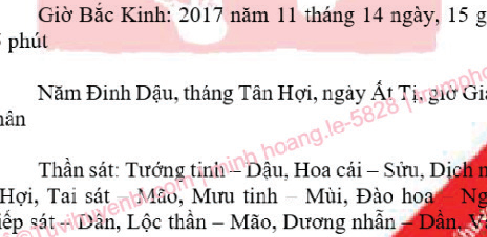

- **Cấu trúc Quẻ Dịch:**
  - **Quẻ chủ:** **Thiên Hỏa Đồng Nhân** (Cung Càn, Họ Càn – Quẻ Quy Hồn)  
    *Tượng quẻ:* "Đồng Nhân" là ở giữa đám đông, hòa đồng với muôn người; phản ánh đương số chỉ là một ứng viên bình thường trong số rất đông người đến nộp hồ sơ, không có quan hệ nâng đỡ đặc biệt hay sở trường nổi bật để được ưu tiên.
  - **Quẻ biến:** **Hỏa Thiên Đại Hữu** (Cung Càn, Họ Càn – Quẻ Quy Hồn)  
    *Tượng quẻ:* "Đại Hữu" là có rất nhiều, sở hữu dồi dào; mang hàm ý xu thế mở: phía trước đương số sẽ có rất nhiều cơ hội, nhiều đơn vị khác để lựa chọn ứng tuyển chứ không dừng lại ở một nơi duy nhất.

- **Bảng chi tiết Lục hào:**

| Hào | Thế/Ứng | Lục thân (Chủ) | Can Chi (Chủ) | Động/Tĩnh | Lục thân (Biến) | Can Chi (Biến) | Thần sát / Ghi chú | Lục thú |
|:---:|:---:|:---|:---|:---:|:---|:---|:---|:---|
| 6 | **Ứng** | Tử Tôn | Tuất - Thổ | tĩnh | Huynh Đệ | Tỵ - Hỏa | Thiên y | Huyền Vũ |
| 5 | | Thê Tài | Thân - Kim | **O (Động)** | Tử Tôn | Mùi - Thổ | Quý nhân (Nhật hợp, hóa Hồi đầu sinh) | Bạch Hổ |
| 4 | | Huynh Đệ | Ngọ - Hỏa | tĩnh | Thê Tài | Dậu - Kim | Đào hoa, Văn xương | Đằng Xà |
| 3 | **Thế** | Quan Quỷ | Hợi - Thủy | tĩnh (Ám động) | Tử Tôn | Thìn - Thổ | Nguyệt kiến, Dịch mã (Nhật xung Ám động) | Câu Trận |
| 2 | | Tử Tôn | Sửu - Thổ | **X (Động)** | Phụ Mẫu | Dần - Mộc | Hoa cái (hóa Tuần không, Hồi đầu khắc) | Chu Tước |
| 1 | | Phụ Mẫu | Mão - Mộc | tĩnh | Quan Quỷ | Tý - Thủy | Tuần không, Tai sát, Lộc thần | Thanh Long |

---

### 3. Dụng thần & Loại quẻ

- **Phân loại quẻ:**
  - **Quẻ câu hỏi kép (Hỏi phỏng vấn đậu không & Hỏi vào làm có tốt không):** Phân định ranh giới giữa đơn vị chỉ định trước mắt và các cơ hội tiềm năng trong tương lai.
  - **Quẻ cơ hội việc làm đa mục tiêu:** Giải mã cấu trúc tương hỗ giữa hai quẻ Quy hồn tương hỗ Đồng Nhân và Đại Hữu.
- **Định vị hệ thống Dụng thần:**
  1. **Hào Thế (Quan Quỷ Hợi Thủy):** Đại diện cho bản thân người hỏi; lâm Quan Quỷ mang Nguyệt lệnh thể hiện nguyện vọng tìm kiếm chức nghiệp cháy bỏng.
  2. **Hào Ứng (Tử Tôn Tuất Thổ):** Khóa định đơn vị phỏng vấn chỉ định vào ngày mai.
  3. **Hệ thống hào Tử Tôn đối chiếu (Sửu Thổ hào 2, Mùi Thổ hào 5 biến):** Đại diện cho các đơn vị tuyển dụng khác trong tương lai.

---

### 4. Luận giải chi tiết

#### 1. Định vị đơn vị phỏng vấn ngày mai: Điềm báo thất bại và "bẫy cơ cấu ngầm"
- Trong quẻ mang tính chỉ định một cơ quan phỏng vấn cụ thể, trọng tâm lập tức khóa tại trục **Thế – Ứng**:
  - Hào Ứng là **Tử Tôn Tuất Thổ**: Tử Tôn là thần khắc Quan Quỷ. Một cơ quan tuyển dụng mà hào Ứng lại lâm Tử Tôn (khắc chức nghiệp) biểu thị thái độ của đơn vị này là từ chối, không có nhu cầu tiếp nhận đương số.
  - Về sinh khắc: Hào Ứng Tuất Thổ trực tiếp khắc hào Thế Quan Quỷ Hợi Thủy (Thổ khắc Thủy). Tượng khắc Thế khẳng định hai việc: **phỏng vấn không thành công**, và nếu có gượng ép vào làm thì môi trường cũng vô cùng khắc nghiệt, không có lợi cho bản thân (trả lời trọn vẹn cả 2 câu hỏi!).
- Giải mã tâm niệm nội bộ của cơ quan qua Thần sát Huyền Vũ:
  - Hào Ứng lâm **Huyền Vũ**: chủ sự mờ ám, toan tính bí mật bên trong mà người ngoài không thể biết.
  - Tâm niệm của hào Ứng Tuất Thổ chính là **Huynh Đệ Tỵ Hỏa** (Tuất là Mộ khố của Tỵ Hỏa). Tỵ Hỏa lâm Nhật kiến lại mang **Quý nhân**: chứng minh cơ quan này thực chất đã có sẵn ứng viên "con ông cháu cha" được cơ cấu ngầm từ trước.
  - Tỵ Hỏa và hào Thế Hợi Thủy trực xung đối kháng: đương số hoàn toàn không phải là người họ muốn tuyển; buổi phỏng vấn ngày mai chỉ là thủ tục hình thức để hợp thức hóa kết quả.

#### 2. Quẻ Đại Hữu và bức tranh đối chiếu các đơn vị tương lai
- Quẻ chủ **Đồng Nhân** biến quẻ **Đại Hữu**: Chu Thần Bân giải mã: "Đại Hữu" là có rất nhiều; quẻ báo trước sau lần phỏng vấn hỏng này, đương số sẽ có rất nhiều cơ hội tại các đơn vị khác.
- Sự xuất hiện đối chiếu của các hào Thổ:
  - Hào Ứng là **Tử Tôn Tuất Thổ**.
  - Hào 2 là **Tử Tôn Sửu Thổ phát động**.
  - Hào 5 phát động hóa ra **Tử Tôn Mùi Thổ**.
  - Sự đối chiếu tam Thổ (Tuất – Sửu – Mùi) khẳng định quẻ Dịch đang mở rộng tầm nhìn, vẽ ra chân dung hai đơn vị khác mà đương số sẽ nộp hồ sơ trong tương lai:
    - **Đơn vị thứ nhất (Hào 2 Tử Tôn Sửu Thổ biến Phụ Mẫu Dần Mộc):** Nằm ở nội quái (khu vực nội đô gần nhà). Hào Thế Hợi Thủy lục hợp với Dần Mộc: cho thấy đây là công việc đúng chuyên môn, đương số rất yêu thích muốn vào. Tuy nhiên, Sửu Thổ hóa Dần Mộc là **hồi đầu khắc**, lại khắc hào Thế: báo trước đơn vị này nếu thi đỗ thì cũng chỉ làm được một thời gian ngắn rồi phải nghỉ, không bền vững.
    - **Đơn vị thứ hai (Hào 5 Thê Tài Thân Kim biến Tử Tôn Mùi Thổ):** Nằm ở ngoại quái (khu vực xa hơn, ngoại thành). Thân Kim động hóa Mùi Thổ là **hồi đầu sinh**, đồng thời Thân Kim phát động tương sinh trực tiếp cho hào Thế **Quan Quỷ Hợi Thủy** (Kim sinh Thủy). Đây là dấu hiệu cơ quan này sẽ nhiệt tình đón nhận đương số, công việc ổn định lâu dài và chế độ đãi ngộ rất tốt.

#### 3. Ý nghĩa hào Thế Ám động
- Hào Thế **Quan Quỷ Hợi Thủy** lâm Nguyệt kiến, bị Nhật lệnh Tỵ Hỏa trực xung thành **Ám động**:
  - Ám động là sự vận động ngấm ngầm, hối thúc đương số không được bi quan bỏ cuộc sau thất bại ngày mai. Hãy nhanh chóng tiếp tục rải hồ sơ tìm việc, bởi vì cánh cửa tương lai tại đơn vị hào 5 đang rộng mở chờ đón.

---

### 5. Kết luận & Ứng kỳ thực tế

- **Lời giải đoán & Khuyến nghị của Chu Thần Bân:**
  - Khẳng định thẳng thắn: buổi phỏng vấn ngày mai chắc chắn thất bại, cơ quan đó đã cơ cấu người quen nội bộ, không nên ôm hy vọng hay tiếc nuối.
  - Khuyên đương số giữ vững tinh thần, tiếp tục nộp hồ sơ ứng tuyển vào các cơ quan khác (đúng tượng quẻ Đại Hữu); đặc biệt ưu tiên những đơn vị ở xa hoặc thuộc khối doanh nghiệp/nhà nước quy củ (tượng hào 5 Thân Kim Bạch Hổ sinh Thế) vì ở đó mới là nơi gắn bó phát triển sự nghiệp lâu dài.
- **Phản hồi thực tế (Feedback):**
  - Kết quả buổi phỏng vấn ngày hôm sau: Đương số chính thức nhận thông báo không trúng tuyển đúng như quẻ đã tiên liệu.
- **Ứng kỳ chiêm nghiệm:**
  - Ứng nghiệm kết quả thất bại ngay ngày Tỵ tiếp theo.

---

### 6. Bài học tâm pháp & Quy tắc cốt lõi

- **Trích dẫn quy tắc cốt lõi:**
  - *Quy tắc giải đoán quẻ câu hỏi kép (phỏng vấn và đãi ngộ) qua cấu trúc hai quẻ Quy hồn tương hỗ Đồng Nhân và Đại Hữu* (trang 287).
- **Tâm pháp giải đoán thực chiến:**
  1. **Hào Ứng lâm Tử Tôn khắc Thế là điềm phỏng vấn hỏng:** Trong quẻ cầu chức, hào Ứng đại diện cho nhà tuyển dụng. Nếu Ứng mang Tử Tôn khắc Thế, đơn vị đó không có ý định nhận người và môi trường đó hoàn toàn xung khắc với sự phát triển của bản thân.
  2. **Giải mã ứng viên ngầm qua Mộ khố và Thần sát:** Khi hào Ứng lâm Mộ khố của hào khác mang Quý nhân (như Tuất mộ Tỵ mang Quý nhân), đó là dấu vết của việc cơ cấu nhân sự nội bộ, người ngoài không có cơ hội chen chân.
  3. **Quẻ Đại Hữu và hào Thế ám động:** Thất bại trước mắt là tiền đề mở ra cơ hội lớn hơn phía sau. Khi quẻ chủ là Đồng Nhân (bình thường) biến Đại Hữu (nhiều lựa chọn), hào Thế ám động thôi thúc hành động liên tục để đón bắt cơ hội thực sự tại các hào động sinh Thế.

## THỰC CHIẾN 95: CẢI CÁCH THỂ CHẾ – NGƯỜI NÀY HỎI VỊ TRÍ CỦA MÌNH SẼ LÀ THỰC QUYỀN HAY LÀ HƯ CHỨC

---

### 1. Bối cảnh & Câu hỏi

- **Bối cảnh chi tiết:** 
  Đương số là một cán bộ lãnh đạo trung kiên đang công tác trong một cơ quan nhà nước bước vào giai đoạn thực hiện đề án cải cách thể chế sâu rộng (tái cấu trúc, sáp nhập phòng ban, tinh giản biên chế). Trong đợt cải cách này, vị trí lãnh đạo của ông về cơ bản vẫn được bảo đảm duy trì, không lo bị miễn nhiệm hay sa thải. Tuy nhiên, cơ cấu tổ chức mới sẽ phân bổ lại nhân sự: hoặc điều chuyển lên cơ quan cấp trên, hoặc giữ lại điều hành tại đơn vị cấp dưới.
- **Tâm lý người hỏi & Câu hỏi ẩn ý:** 
  Người hỏi mang tâm lý trăn trở sâu sắc về bản chất của chiếc ghế sắp ngồi: sợ bị cấp trên "vinh thăng" điều lên cơ quan bề trên nhận một chức vụ hàm cấp nghe rất oai phong nhưng thực chất lại bị cô lập, không có thực quyền quản lý ngân sách và con người (hư chức). Câu hỏi đặt ra: *"Sau cuộc cải cách thể chế này, vị trí công tác mới của tôi sẽ là nắm thực quyền hay chỉ là hư chức hữu danh vô thực?"*
- **Thời gian chiêm đoán:**
  - Dương lịch: 18/11/2017, 18:05 (Giờ Bắc Kinh).
  - Can chi: Năm Đinh Dậu, tháng Tân Hợi, ngày Kỷ Dậu, giờ Quý Dậu.

---

### 2. Dữ kiện & Bảng quẻ Crop

- **Thời không chiêm nghiệm:**
  - Tháng Tân Hợi (Thủy vượng, Mộc tướng, Hỏa tuyệt, Thổ tù).
  - Ngày Kỷ Dậu (Kim vượng, Dậu Kim trực xung Mão Mộc).
  - Tuần không: **Dần - Mão** (Giáp Thìn tuần trung, Dần Mão không vong).
- **Thần sát:**
  - Tướng tinh: Dậu (Lâm Nhật kiến, lâm giờ)
  - Hoa cái: Sửu (Hào 2)
  - Dịch mã: Hợi (Lâm Nguyệt kiến, hào 3)
  - Tai sát: Mão (Lâm hào Thế)
  - Mưu tinh: Mùi
  - Đào hoa: Ngọ
  - Kiếp sát: Dần (Hào 6)
  - Lộc thần: Ngọ
  - Dương nhẫn: Tỵ
  - Văn xương: Dậu
  - Thiên y: Tuất (Lâm hào Ứng)
  - Thiên hỷ: Mùi
  - Quý nhân: Thân, Tý (Hào 5)

- Dữ kiện bảng quẻ và các thông số chiêm đoán:
  - **Bảng 95.1** Đồ hình quẻ Thực chiến 95:
    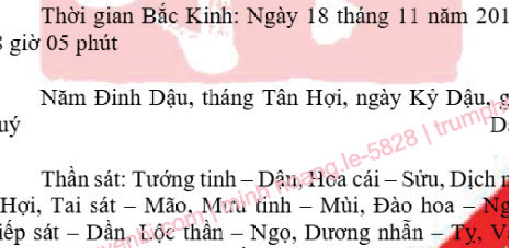

- **Cấu trúc Quẻ Dịch:**
  - **Quẻ chủ:** **Sơn Hỏa Bí** (Cung Cấn, Họ Cấn – Quẻ Lục Hợp)  
    *Tượng quẻ:* "Bí" là trang hoàng, tu sức bên ngoài, lễ tiết xã giao lịch thiệp; phản ánh tính chất công việc mang tính ngoại giao, quan hệ ứng xử, đồng thời khuyên người hỏi cần khéo léo dùng nghệ thuật giao tiếp xã giao để vận động cho vị trí của mình.
  - **Quẻ biến:** **Sơn Hỏa Bí** (Quẻ Tĩnh / Bất biến quẻ, Lục hợp)  
    *Tượng quẻ:* Thế quẻ tĩnh lặng gắn kết; chứng tỏ vị thế cán bộ trong cơ quan rất vững vàng, toàn bộ bức tranh phân định hư thực nằm ẩn hiện trong quan hệ giữa các tầng hào Quan Quỷ.

- **Bảng chi tiết Lục hào:**

| Hào | Thế/Ứng | Lục thân (Chủ) | Can Chi (Chủ) | Động/Tĩnh | Lục thân (Biến) | Can Chi (Biến) | Thần sát / Phục | Lục thú |
|:---:|:---:|:---|:---|:---:|:---|:---|:---|:---|
| 6 | | Quan Quỷ | Dần - Mộc | tĩnh | Quan Quỷ | Dần - Mộc | Tuần không, Kiếp sát (Nguyệt hợp) | Câu Trận |
| 5 | | Thê Tài | Tý - Thủy | tĩnh | Thê Tài | Tý - Thủy | Quý nhân | Chu Tước |
| 4 | **Ứng** | Huynh Đệ | Tuất - Thổ | tĩnh | Huynh Đệ | Tuất - Thổ | Thiên y | Thanh Long |
| 3 | | Thê Tài | Hợi - Thủy | tĩnh | Thê Tài | Hợi - Thủy | Nguyệt kiến, Dịch mã (Phục Tử Tôn Thân) | Huyền Vũ |
| 2 | | Huynh Đệ | Sửu - Thổ | tĩnh | Huynh Đệ | Sửu - Thổ | Hoa cái (Phục Phụ Mẫu Ngọ) | Bạch Hổ |
| 1 | **Thế** | Quan Quỷ | Mão - Mộc | tĩnh (Ám động) | Quan Quỷ | Mão - Mộc | Tai sát (Nhật xung Ám động) | Đằng Xà |

---

### 3. Dụng thần & Loại quẻ

- **Phân loại quẻ:**
  - **Quẻ cải cách thể chế & phân định hư thực chức vụ:** Xem xét bản chất quyền lực (thực quyền điều hành vs hư hàm danh nghĩa).
  - **Quẻ tĩnh có hào Ám động chỉ đạo:** Nhận diện hai ngả rẽ bổ nhiệm cán bộ qua hệ thống nhị vị Quan Quỷ.
- **Định vị hệ thống Dụng thần:**
  1. **Hào Quan Quỷ (Dần Mộc hào 6 và Mão Mộc hào 1):** Dụng thần đại diện cho chức vụ và quyền lực lãnh đạo. Trong quẻ xuất hiện đồng thời hai hào Quan Quỷ tương ứng với hai phương án điều động.
  2. **Hào Thế (Quan Quỷ Mão Mộc):** Đại diện cho bản thân người hỏi tại vị trí trực tiếp gắn liền với thân thể.
  3. **Hào Ứng (Huynh Đệ Tuất Thổ):** Đại diện cho cơ cấu phân bổ phòng ban trong đề án cải cách mới.

---

### 4. Luận giải chi tiết

#### 1. Tiêu chí Lục Hào phân định Hư chức và Thực quyền
- Chu Thần Bân đúc kết hệ thống tiêu chí kinh điển để phân định thực quyền hay hư chức trong bổ nhiệm công quyền:
  - **Tiêu chí Hư - Thực:** Hào lâm **Tuần không** chủ về Hư (hư danh, hư chức, vô quyền); hào bị **Xung không / Ám động** chủ về Thực (thực quyền, hành động cụ thể, quyền lực thực chất).
  - **Tiêu chí Chính - Phó:** Nhóm **Tứ chính** (Tý, Ngọ, Mão, Dậu) đại diện cho chức Chính/Trưởng; nhóm **Tứ sinh** (Dần, Thân, Tỵ, Hợi) đại diện cho chức Phó.
  - **Tiêu chí Cấp trên - Cấp dưới:** Hào 6 ở đỉnh cao đại diện cho cơ quan cấp trên bộ ngành; hào sơ (hào 1) ở đáy đại diện cho cơ quan thực thi cấp dưới địa phương.

#### 2. Đối chiếu hai ngả đường bổ nhiệm qua cặp bài trùng Quan Quỷ
- Trong quẻ xuất hiện hai hào Quan Quỷ cùng nắm vượng khí, đại diện cho hai kịch bản điều chuyển:
  - **Phương án khách quan (Quan Quỷ Dần Mộc tại hào 6):**
    - Dần Mộc ở hào 6: Cơ quan cấp trên.
    - Dần Mộc lâm **Tuần không**: Điển hình của **Hư chức** (chức vị hàm cấp, ban bệ cố vấn không có quyền lực điều hành cụ thể).
    - Dần Mộc thuộc Tứ sinh: Đại diện cho chức **Phó**.
    - Dần Mộc được Nguyệt kiến Hợi Thủy tương hợp sinh vượng: Cho thấy theo tiến trình sắp xếp tự nhiên khách quan của tổ chức, ông có xác suất rất cao sẽ được cất nhắc lên cơ quan cấp trên giữ một chức Phó mang tính hư hàm.
  - **Phương án chủ quan (Quan Quỷ Mão Mộc tại hào 1 Thế):**
    - Mão Mộc ở hào 1: Cơ quan cơ sở cấp dưới địa phương.
    - Mão Mộc bị Nhật kiến Dậu Kim trực xung thành **xung không, Ám động**: Điển hình của **Thực quyền** (nắm quyền điều hành thực tế, giải quyết công việc cụ thể).
    - Mão Mộc thuộc Tứ chính: Đại diện cho chức **Chính/Trưởng**.
    - Hào Thế Quan Quỷ Mão Mộc Ám động: Ám động mang tính chất **quẻ chỉ đạo**, thôi thúc hành động chủ quan. Quẻ Dịch mách nước: nếu đương số chủ động tranh thủ, ông hoàn toàn có thể giành lấy vị trí chức Trưởng nắm trọn thực quyền ở đơn vị cấp dưới!

#### 3. Tượng "Nhất chính đa phó" của hào Ứng Huynh Đệ Tuất Thổ
- Hào Ứng là **Huynh Đệ Tuất Thổ**:
  - Huynh Đệ đại diện cho số đông, đồng cấp, nhiều người cùng gánh vác.
  - Trong cải cách thể chế, hào Ứng lâm Huynh Đệ thể hiện cơ cấu tổ chức mới có xu hướng **"Nhất chính đa phó"** (một vị trí trưởng nhưng có quá nhiều cấp phó chia sẻ quyền hạn). Nếu không chủ động tranh thủ, đương số sẽ bị xếp vào nhóm "đa phó" này, chức quyền bị phân tán và biến thành hư hàm.

#### 4. Ý nghĩa quẻ Sơn Hỏa Bí: Nghệ thuật vận động xã giao
- Quẻ chủ và quẻ biến đều là **Sơn Hỏa Bí**:
  - "Bí" là vẻ đẹp trang nhã bên ngoài, chủ về lễ nghi, giao tế, tiếp khách lịch thiệp. Khác với quẻ Phệ Hạp (tranh chấp sòng phẳng), quẻ Bí khuyên đương số không nên thụ động ngồi chờ cấp trên xếp đặt, cũng không nên đòi hỏi gay gắt, mà phải khéo léo dùng các buổi gặp gỡ xã giao tế nhị, tiếp xúc lịch thiệp với lãnh đạo có thẩm quyền để bày tỏ nguyện vọng muốn về địa phương gánh vác thực tế.
  - Làm được điều đó, năng lượng Ám động của hào Thế Mão Mộc sẽ được kích hoạt trọn vẹn, giúp đương số biến nguy thành cơ, nắm giữ thực quyền vững chắc.

---

### 5. Kết luận & Ứng kỳ thực tế

- **Lời giải đoán & Khuyến nghị của Chu Thần Bân:**
  - Vạch rõ thực trạng: Nếu để mọi việc diễn biến tự nhiên, tổ chức sẽ điều động ông lên cơ quan cấp trên giữ chức phó hữu danh vô thực (hư chức Tuần không của hào 6 Dần Mộc).
  - Khuyên đương số lập tức hành động: Hãy tận dụng tượng quẻ Sơn Hỏa Bí (giao tiếp xã giao lịch thiệp, thăm hỏi lãnh đạo chủ chốt) để chủ động bày tỏ nguyện vọng xin được phân công về cơ quan cấp dưới đảm nhận vị trí người đứng đầu (chức chính thực quyền Mão Mộc tại hào Thế).
- **Phản hồi thực tế (Feedback):**
  - Nhận được lời giải đoán xác đáng, đương số đã chủ động vận dụng nghệ thuật ngoại giao khéo léo, tiếp cận các cấp lãnh đạo có thẩm quyền để trình bày nguyện vọng cống hiến ở cơ sở.
  - Kết quả đúng như mong đợi: Đương số đã được phê duyệt quyết định giữ chức vụ Trưởng đơn vị tại cấp dưới, nắm trọn thực quyền quản lý và điều hành sau đợt cải cách thể chế, tránh được chiếc bẫy "vinh thăng hư chức" của tổ chức.
- **Ứng kỳ chiêm nghiệm:**
  - Quyết định bổ nhiệm thực quyền được hiện thực hóa ngay sau khi quá trình vận động giao tế hoàn tất.

---

### 6. Bài học tâm pháp & Quy tắc cốt lõi

- **Trích dẫn quy tắc cốt lõi:**
  - *Quy tắc phân định thực quyền và hư chức trong cải cách thể chế qua hào Quan Quỷ ám động và Huynh đệ 'nhất chính đa phó'* (trích Cổ Thệ Chân Thuyên Thực Chiến Biên 2, trang 304).
- **Tâm pháp giải đoán thực chiến:**
  1. **Quy tắc phân định Thực quyền vs Hư chức:**
     - *Hư chức:* Lâm Tuần không, thuộc Tứ sinh (Dần Thân Tỵ Hợi - chức phó), nằm ở hào cao (cơ quan bề trên), lâm Lộc thần (hưởng lương an nhàn).
     - *Thực quyền:* Bị Xung không / Ám động, thuộc Tứ chính (Tý Ngọ Mão Dậu - chức chính), nằm ở hào cơ sở, nắm quyền lực điều hành cụ thể.
  2. **Tượng "Nhất chính đa phó" của hào Huynh Đệ:** Khi hào vị cơ quan mới lâm Huynh Đệ, cần cảnh giác nguy cơ bị phân tán quyền lực thành chức phó đông người; phải nhìn vào hào Thế để tìm giải pháp bứt phá.
  3. **Ý nghĩa quẻ chỉ đạo của hào Ám động:** Ám động không chỉ là hiện trạng mà là cơ hội chủ quan do quẻ Dịch trao tặng. Kết hợp với quái ý quẻ Bí (giao tế lịch thiệp), người chiêm đoán phải biết chuyển hóa lời quẻ thành hành động thực tế khôn ngoan để làm chủ vận mệnh chính trị của mình.

---

## THỰC CHIẾN 96: ĐỨA TRẺ NHÀ HỌ HẠ HAY QUẤY KHÓC, CÓ PHẢI ĐÃ XUNG PHẠM ĐẾN TỔ TIÊN ĐÃ KHUẤT KHÔNG?

---

### 1. Bối cảnh & Câu hỏi

- **Bối cảnh chi tiết:** 
  Một người đồng môn ở Thâm Quyến liên hệ nhờ Chu Thần Bân giúp đỡ sự việc của gia đình người thân đang sống tại Bắc Kinh. Đứa trẻ nhà họ Hạ vừa mới sinh không lâu nhưng thường xuyên quấy khóc dữ dội cả ngày lẫn đêm, đặc biệt cứ sau 12 giờ đêm là quấy khóc không ngớt, thậm chí có những biểu hiện sợ hãi hoảng loạn như nhìn thấy ảo giác. Người nhà khi xem Bát tự của đứa trẻ thấy có sự xung khắc rõ rệt giữa trụ giờ và trụ năm. Dựa vào quan niệm dân gian truyền khẩu rằng trẻ nhỏ khóc đêm thường do xung phạm đến hương linh người thân đã khuất (như ông bà nội, ông bà ngoại), họ nghi ngờ đứa trẻ đã phạm xung với tổ tiên hoặc do bài vị thờ cúng trong nhà đặt không đúng vị trí. Họ dự định làm lễ cầu cúng, thắp hương tạ lỗi tổ tiên để giải hạn.
- **Tâm lý & Câu hỏi ẩn ý:** 
  Gia đình vừa hoang mang lo lắng cho sức khỏe của đứa trẻ, vừa mang nặng tâm lý e ngại yếu tố tâm linh huyền bí quấy nhiễu. Câu hỏi đặt ra bề ngoài là: *"Đứa trẻ hay quấy khóc có phải đã xung phạm đến tổ tiên đã khuất không?"*, nhưng ẩn ý thực chất bên trong là muốn xác định rõ nguyên nhân gốc rễ: liệu có phải do quỷ thần tác quái hay do bệnh lý thực thể, và việc làm lễ cúng bái tổ tiên có giải quyết được dứt điểm tình trạng này hay không.
- **Thời gian chiêm đoán:**
  - Dương lịch: Ngày 14 tháng 11 năm 2017, lúc 13 giờ 05 phút (Giờ Bắc Kinh).
  - Can chi: Năm Đinh Dậu, tháng Tân Hợi, ngày Ất Tị, giờ Quý Mùi.

---

### 2. Dữ kiện & Bảng quẻ Crop

- **Thời không chiêm nghiệm:**
  - Tháng Tân Hợi (Thủy vượng, Mộc tướng, Kim hưu, Thổ tù, Hỏa tuyệt).
  - Ngày Ất Tị (Hỏa vượng, Thổ tướng, Kim hưu, Thủy tù, Mộc tuyệt).
  - Tuần không: **Dần - Mão** (Giáp Thìn tuần trung, Dần Mão không vong).
- **Thần sát đầy đủ:**
  - Tướng tinh: Dậu
  - Hoa cái: Sửu
  - Dịch mã: Hợi (Lâm Nguyệt kiến, hào Ứng)
  - Tai sát: Mão (Lâm Tuần không, Lộc thần)
  - Mưu tinh: Mùi (Lâm Thiên hỷ)
  - Đào hoa: Ngọ (Lâm Văn xương, phục thần Tử Tôn)
  - Kiếp sát: Dần (Lâm Tuần không, Dương nhẫn)
  - Lộc thần: Mão
  - Dương nhẫn: Dần
  - Văn xương: Ngọ
  - Thiên y: Tuất (Lâm hào Thế)
  - Thiên hỷ: Mùi
  - Quý nhân: Thân, Tý

- Dữ kiện bảng quẻ và các thông số chiêm đoán:
  - **Bảng 96.1** Đồ hình quẻ Thực chiến 96:
    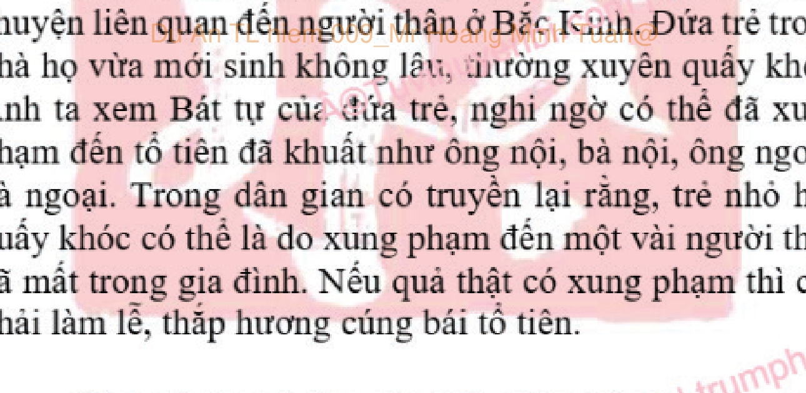

- **Cấu trúc Quẻ Dịch:**
  - **Quẻ chủ:** **Thủy Phong Tỉnh** (Cung Chấn, Họ Chấn – Quẻ tĩnh).  
    *Tượng quẻ:* Trọng Khiếu Tỉnh Hạc (Khát nước tìm giếng – tình cảnh bế tắc, khu vực môi trường sống cố định, khó di chuyển thay đổi).
  - **Quẻ biến:** Quẻ tĩnh không có hào minh động (Thủy Phong Tỉnh bất biến).

- **Bảng chi tiết Lục hào:**

| Hào | Thế/Ứng | Lục thân (Chủ) | Can Chi | Biến động | Lục thân (Biến) | Can Chi (Biến) | Thần sát / Phục | Lục thú |
|:---:|:---:|:---|:---|:---:|:---|:---|:---|:---|
| 6 | | Phụ Mẫu | Tý - Thủy | tĩnh | Phụ Mẫu | Tý - Thủy | Quý nhân | Huyền Vũ |
| 5 | **Thế** | Thê Tài | Tuất - Thổ | tĩnh | Thê Tài | Tuất - Thổ | Thiên y | Bạch Hổ |
| 4 | | Quan Quỷ | Thân - Kim | tĩnh | Quan Quỷ | Thân - Kim | Quý nhân (Phục Tử Tôn Ngọ Hỏa) | Đằng Xà |
| 3 | | Quan Quỷ | Dậu - Kim | tĩnh | Quan Quỷ | Dậu - Kim | Tướng tinh | Câu Trận |
| 2 | **Ứng** | Phụ Mẫu | Hợi - Thủy | tĩnh (Ám động) | Phụ Mẫu | Hợi - Thủy | Nguyệt kiến, Dịch mã (Phục Huynh Dần Mộc) | Chu Tước |
| 1 | | Thê Tài | Sửu - Thổ | tĩnh | Thê Tài | Sửu - Thổ | Hoa cái | Thanh Long |

---

### 3. Dụng thần & Loại quẻ

- **Phân loại quẻ:**
  - **Quẻ vấn nghi vấn / tâm linh huyền học:** Xem xét có sự can thiệp của yếu tố phi thực thể, quỷ thần hay tổ tiên đã khuất đối với cuộc sống của người còn sống hay không.
  - **Quẻ tĩnh tâm thái & Vấn tật bệnh trẻ nhỏ:** Quẻ phản ánh sự bất an, lo sợ của gia đình; xem xét trạng thái sức khỏe thể chất và tinh thần của trẻ nhỏ sơ sinh.
- **Xác định Dụng thần:**
  1. **Dụng thần đứa trẻ (Tử Tôn Ngọ Hỏa):** Đại diện trực tiếp cho em bé mới sinh. Trong quẻ, Tử Tôn Ngọ Hỏa không xuất hiện trên mặt quẻ mà ẩn tàng dưới hào 4 Quan Quỷ Thân Kim, mang sao Đào hoa và Văn xương.
  2. **Hào tượng tổ tiên đã khuất (Phụ Mẫu Hợi Thủy):** Hào Ứng Phụ Mẫu Hợi Thủy đại diện cho người bề trên, tổ tiên đã mất. Hào này lâm Nguyệt kiến, bị Nhật thần Tị Thổ tương xung thành Ám động.
  3. **Hào tượng tà khí / vật chất tối (Quan Quỷ Thân Kim):** Phi thần hào 4 Quan Quỷ Thân Kim lâm Đằng Xà đè nặng lên Dụng thần Tử Tôn Ngọ Hỏa, biểu thị trường khí quấy nhiễu vô hình.

---

### 4. Luận giải chi tiết

Quẻ này thể hiện tầng thứ phân tích sâu sắc của Chu Thần Bân giữa hiện tượng bề ngoài và bản chất cốt lõi:

#### 1. Khảo sát hào Phụ Mẫu Ám động: Có xung phạm tổ tiên không?
- **Hiện tượng Ám động:** Hào Ứng Phụ Mẫu Hợi Thủy đắc Nguyệt lệnh tương trợ cực vượng, lại bị Nhật thần Ất Tị trực tiếp tương xung (Tị - Hợi tương xung). Hào vượng tướng gặp Nhật xung không bị phá mà trở thành **Ám động**.
- **Ý nghĩa của Hợi Thủy Ám động:**
  - Hào Ứng là phương diện sự việc được hỏi. Việc Phụ Mẫu Hợi Thủy ám động xác nhận rằng mối liên hệ với tổ tiên quả thực có rung động, không phải hoàn toàn vô can.
  - Phụ Mẫu Hợi Thủy lâm Nguyệt kiến, Nguyệt kiến đại diện cho dấu vết quá khứ, tiền nhân xa xưa.
  - Phụ Mẫu tàng chứa Huynh Đệ Dần Mộc lâm Tuần không, biểu thị trạng thái hư ảo, phi vật thể – hoàn toàn tương ứng với hình thái tồn tại của hương linh tổ tiên đã khuất.
  - Sự đối xung Tị - Hợi giữa Nhật thần và hào Ứng phản ánh sự không tương hợp về trường khí giữa gia đình đứa trẻ và bài vị/tổ tiên, trùng khớp với hiện tượng Bát tự có trụ giờ xung trụ năm.
- **Vì sao không phải nguyên nhân trực tiếp khiến trẻ quấy khóc?**
  - Để cấu thành tai họa do xung phạm tổ tiên trực tiếp, hào Phụ Mẫu phải khắc phạt trực tiếp Dụng thần Tử Tôn.
  - Ở đây, Tử Tôn Ngọ Hỏa đang ẩn tàng (phục thần), không lộ diện trên mặt quẻ để chịu sự khắc phạt trực tiếp từ Phụ Mẫu Hợi Thủy.
  - Về ngũ hành: Phụ Mẫu là Hợi Thủy, Tử Tôn là Ngọ Hỏa. Quan hệ Thủy - Hỏa ở đây là khắc chứ không phải trực xung (Tý mới xung Ngọ, Hợi xung Tị). Nếu thực sự có sự xung phạm tàn phá chí mạng thì Tử Tôn phải là Tị Hỏa hoặc Phụ Mẫu phải là Tý Thủy.
  - Do đó, quẻ chỉ ra rằng: Giữa đứa trẻ và tổ tiên tuy có sự bài xích trường khí nhẹ do vị trí bài vị hoặc Bát tự, nhưng đó hoàn toàn không phải là nguyên nhân chính khiến đứa trẻ quấy khóc đêm ngày.

#### 2. Định vị nguyên nhân thực sự: Tử Tôn Ngọ Hỏa phục tàng bị Phi thần đè nén
- **Vị trí và đặc điểm của Dụng thần Tử Tôn:**
  - Tử Tôn Ngọ Hỏa phục dưới hào 4 Quan Quỷ Thân Kim. Mang theo sao Đào hoa và Văn xương. Trẻ nhỏ sơ sinh thường mang tượng Tử Tôn lâm Đào hoa.
  - Tử Tôn ẩn tàng biểu thị sinh khí của đứa trẻ đang bị che lấp, bị chèn ép, không được thoải mái phát tiết ra ngoài.
- **Tác động của Phi thần Quan Quỷ Thân Kim:**
  - Phi thần phía trên là Quan Quỷ Thân Kim đè nặng trực tiếp lên Tử Tôn Ngọ Hỏa.
  - Quan Quỷ lâm **Đằng Xà**: Đằng Xà chủ về kinh sợ, hoảng loạn, quái dị, giấc ngủ chập chờn, bất an quấy khóc.
  - Quan Quỷ Thân Kim mang sao **Quý nhân**: Quý nhân lâm Quỷ chủ về lực lượng vô hình, tà khí thuộc phạm trù "vật chất tối" quấy rầy.
  - Đây chính là cội nguồn của hiện tượng quấy khóc: Đứa trẻ bị một luồng khí trường bất tịnh hoặc tà khí vô hình đè nén làm cho kinh sợ, hoảng loạn mỗi đêm.

#### 3. Trường khí dị biệt và tính chất không gian của Quẻ Tỉnh
- **Sự tách biệt trường khí:**
  - Quan Quỷ Thân Kim (tà khí) có mộ khố tại Sửu Thổ (hào sơ Thanh Long), thuộc kim khố.
  - Phụ Mẫu Hợi Thủy (tổ tiên) lại thuộc thủy cục, nạp khố ở Thìn hoặc tọa ở Tuất.
  - Hai trường khí này hoàn toàn độc lập, không cùng một nguồn gốc. Điều này khẳng định dứt khoát: tà khí đè nén đứa trẻ không liên quan đến tổ tiên gia đình.
- **Tượng quẻ Thủy Phong Tỉnh:**
  - Quẻ Tỉnh là giếng nước, có đặc tính cố định, bất biến tại một tọa độ không gian nhất định.
  - Tượng giếng nước biểu thị nguồn khí trường bất lợi này chỉ khu trú cố định tại một vị trí cụ thể trong căn nhà hoặc trong căn phòng ngủ nơi đặt nôi của đứa trẻ.
  - Quẻ Tỉnh cũng cảnh báo việc tìm kiếm người giải quyết bằng huyền thuật thông âm sẽ gặp nhiều giới hạn, khó tìm được thầy thực sự có năng lực tháo gỡ.

---

### 5. Kết luận & Ứng kỳ thực tế

- **Lời giải đoán & Khuyến nghị của Chu Thần Bân:**
  - Việc đứa trẻ quấy khóc không phải do tổ tiên đã khuất quở phạt hay oán hận, không cần thiết phải làm lễ cầu cúng tạ lỗi tốn kém vô ích.
  - Nguyên nhân chính là do khí trường bất tịnh tại phòng ngủ đè nén khiến đứa trẻ hoảng sợ.
  - **Phương pháp hóa giải thực tế:** Áp dụng nguyên lý của quẻ Tỉnh (giếng nước cố định): Cho đứa trẻ tạm thời rời khỏi "vị trí giếng", chuyển sang ngủ ở phòng khác hoặc đưa về nhà người thân ở tạm một thời gian. Khi thoát khỏi trường khí cố định đó, đứa trẻ sẽ tự nhiên hết quấy khóc.
  - Kiểm tra lại bài vị tổ tiên trong nhà, tránh để bài vị đối diện cửa phòng ngủ hoặc sát vách phòng đứa trẻ để giảm bớt sự bài xích trường khí.
- **Ứng kỳ chiêm nghiệm & Phản hồi:**
  - Gia đình làm theo lời khuyên, không tổ chức cúng bái rườm rà mà thay đổi vị trí giường ngủ và tạm đưa đứa trẻ sang nhà người thân chăm sóc. Đứa trẻ lập tức ngủ ngon giấc, dứt hẳn tình trạng quấy khóc hoảng sợ nửa đêm.

---

### 6. Bài học tâm pháp & Quy tắc cốt lõi

- **Quy tắc trích dẫn từ sách:**
  - *Quy tắc quẻ tĩnh phân biệt bệnh thực thể và xung phạm quỷ thần đối với trẻ nhỏ quấy khóc* (trích dẫn `rule_index`, trang 312).
- **Tâm pháp giải đoán thực chiến:**
  1. **Nguyên tắc "Y học đi trước, Huyền học theo sau":** Khi trẻ nhỏ quấy khóc, người dự đoán trước hết phải hỏi đương số đã đưa đi khám chuyên khoa nhi chưa. Chỉ khi y khoa xác nhận cơ thể không có bệnh lý thực thể mới bắt đầu xem xét đến các yếu tố phong thủy, khí trường và huyền học.
  2. **Phân biệt rạch ròi giữa Xung khắc trường khí và Tai họa trực tiếp:** Hào Phụ Mẫu ám động chỉ phản ánh sự bất hòa trường khí quá khứ (khớp Bát tự), nhưng nếu Dụng thần không lộ ra để chịu khắc và không có quan hệ trực xung thì tuyệt đối không được võ đoán là tổ tiên gây họa.
  3. **Tượng quẻ Tỉnh trong ứng dụng phong thủy:** Quẻ Tỉnh đại diện cho sự cố định của hoàn cảnh địa lý. Khi gặp quẻ Tỉnh mà có hung sát đè nén, biện pháp xử lý đơn giản và hiệu nghiệm nhất là thay đổi vị trí không gian sống ("rời khỏi miệng giếng").

## THỰC CHIẾN 97: HỎI LẦN NÀY CÓ CƠ HỘI ĐƯỢC THĂNG CHỨC KHÔNG?

---

### 1. Bối cảnh & Câu hỏi

- **Bối cảnh chi tiết:** 
  Một người đang công tác tại cơ quan nhà nước / đơn vị doanh nghiệp lớn chuẩn bị bước vào đợt điều chỉnh, bổ nhiệm và đề bạt nhân sự định kỳ. Đương số muốn biết trong đợt bình bầu, xét duyệt lần này bản thân có cơ hội được cất nhắc lên vị trí chức vụ mới hay không.
- **Tâm lý & Câu hỏi ẩn ý:** 
  Đương số quan tâm sâu sắc đến tiền đồ sự nghiệp nhưng mang tâm trạng sốt ruột và hoài nghi về cơ hội của mình trong đợt này. Câu hỏi chứa hai từ khóa then chốt: "thăng chức" (mục tiêu cốt lõi) và "lần này" (yếu tố thời điểm giới hạn cụ thể). Đây là dạng quẻ sự vụ đặc chỉ thời gian: không chỉ hỏi liệu bản thân cả đời có được làm quan/thăng quan không, mà trọng tâm là đợt điều chỉnh nhân sự hiện tại có thành công hay không.
- **Thời gian chiêm đoán:**
  - Dương lịch: Ngày 17 tháng 11 năm 2017, lúc 08 giờ 05 phút (Giờ Bắc Kinh).
  - Can chi: Năm Đinh Dậu, tháng Tân Hợi, ngày Mậu Thân, giờ Bính Thìn.

---

### 2. Dữ kiện & Bảng quẻ Crop

- **Thời không chiêm nghiệm:**
  - Tháng Tân Hợi (Thủy vượng, Mộc tướng, Kim hưu, Thổ tù, Hỏa tuyệt).
  - Ngày Mậu Thân (Kim vượng, Thủy tướng, Thổ hưu, Hỏa tù, Mộc tuyệt).
  - Tuần không: **Dần - Mão** (Giáp Thìn tuần trung, Dần Mão không vong).
- **Thần sát đầy đủ:**
  - Tướng tinh: Tý (Lâm hào 5 Thê Tài)
  - Hoa cái: Thìn
  - Dịch mã: Dần (Lâm Tuần không, hào 6 Quan Quỷ)
  - Tai sát: Ngọ (Lâm hào biến Phụ Mẫu)
  - Mưu tinh: Tuất (Lâm hào 4 Huynh Đệ)
  - Đào hoa: Dậu
  - Kiếp sát: Tị
  - Lộc thần: Tị
  - Dương nhẫn: Ngọ
  - Văn xương: Thân (Lâm Nhật kiến, hào biến Tử Tôn)
  - Thiên y: Tuất
  - Thiên hỷ: Mùi
  - Quý nhân: Sửu, Mùi

- Dữ kiện bảng quẻ và các thông số chiêm đoán:
  - **Bảng 97.1** Đồ hình quẻ Thực chiến 97:
    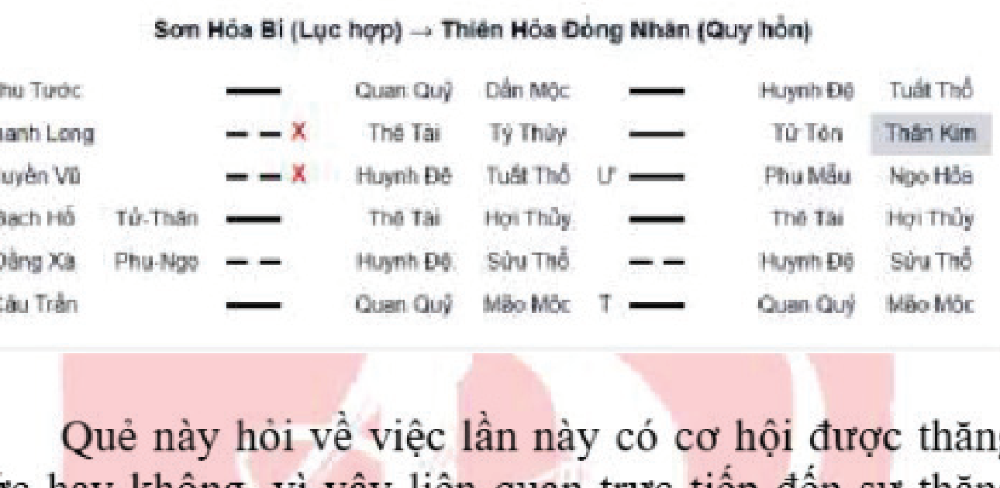

- **Cấu trúc Quẻ Dịch:**
  - **Quẻ chủ:** **Sơn Hỏa Bí** (Cung Cấn, Họ Cấn – Quẻ Lục hợp).  
    *Tượng quẻ:* Quang minh văn sức, trang sức bề ngoài, biểu thị cần phải tăng cường giao tiếp, ngoại giao, liên hệ khéo léo với cấp trên và các phòng ban.
  - **Quẻ biến:** **Thiên Hỏa Đồng Nhân** (Cung Càn, Họ Càn – Quẻ Quy hồn).  
    *Tượng quẻ:* Đồng nhân vu dã, "ta có người khác cũng có", biểu thị quỹ đạo phổ biến của số đông đồng nghiệp cùng thâm niên.

- **Bảng chi tiết Lục hào:**

| Hào | Thế/Ứng | Lục thân (Chủ) | Can Chi | Biến động | Lục thân (Biến) | Can Chi (Biến) | Thần sát / Phục | Lục thú |
|:---:|:---:|:---|:---|:---:|:---|:---|:---|:---|
| 6 | | Quan Quỷ | Dần - Mộc | tĩnh (Ám động) | Huynh Đệ | Tuất - Thổ | Dịch mã, Tuần không | Chu Tước |
| 5 | | Thê Tài | Tý - Thủy | Động (Hồi đầu sinh) | Tử Tôn | Thân - Kim | Tướng tinh (Biến Văn xương) | Thanh Long |
| 4 | **Ứng** | Huynh Đệ | Tuất - Thổ | Động (Hồi đầu sinh) | Phụ Mẫu | Ngọ - Hỏa | Mưu tinh (Biến Tai sát, Nhẫn) | Huyền Vũ |
| 3 | | Thê Tài | Hợi - Thủy | tĩnh | Thê Tài | Hợi - Thủy | Nguyệt kiến (Phục Tử Thân) | Bạch Hổ |
| 2 | | Huynh Đệ | Sửu - Thổ | tĩnh | Huynh Đệ | Sửu - Thổ | Quý nhân (Phục Phụ Ngọ) | Đằng Xà |
| 1 | **Thế** | Quan Quỷ | Mão - Mộc | tĩnh | Quan Quỷ | Mão - Mộc | Tuần không | Câu Trận |

---

### 3. Dụng thần & Loại quẻ

- **Phân loại quẻ:**
  - **Quẻ sự vụ đặc chỉ:** Vừa hỏi mục tiêu thăng chức (Quan Quỷ), vừa ấn định phạm vi hạn định trong "lần này".
  - **Quẻ cạnh tranh chức nghiệp:** Có sự tham gia của đối thủ cạnh tranh ngầm (Huynh Đệ) và sự so sánh giữa hai hào Quan Quỷ trong quẻ.
- **Xác định Dụng thần:**
  1. **Dụng thần cốt lõi (Quan Quỷ Mão Mộc):** Trì tại hào Thế. Là chức vị mong cầu. Mão Mộc được Nguyệt kiến Hợi Thủy sinh, bị Nhật kiến Thân Kim khắc, trạng thái bình hòa; hiện đang ngộ Tuần không.
  2. **Hào tượng đối thủ cạnh tranh hiển lộ (Quan Quỷ Dần Mộc):** Hào 6 Quan Quỷ Dần Mộc đắc Nguyệt hợp (Hợi - Dần lục hợp), bị Nhật Thân trực tiếp xung (Dần - Thân tương xung) trở thành Ám động. Hào này cũng đại diện cho ứng viên cạnh tranh đang hành động trước.
  3. **Nguyên thần sinh Dụng (Thê Tài Tý Thủy):** Hào 5 Thê Tài động hóa Tử Tôn Thân Kim hồi đầu sinh, là nguồn lực thúc đẩy thăng tiến.
  4. **Kỵ thần cản trở (Huynh Đệ Tuất Thổ tại hào Ứng):** Hào Ứng là phương diện sự việc "lần này", lâm Huynh Đệ Tuất Thổ động hóa Phụ Mẫu Ngọ Hỏa hồi đầu sinh, lâm Huyền Vũ – tượng trưng đối thủ cạnh tranh ngầm trong nội bộ.

---

### 4. Luận giải chi tiết

Quẻ này là một mẫu mực về phân tích phân tầng giữa "kết cục dài hạn" và "kết quả ngắn hạn của lần này":

#### 1. Thế trì Quan Quỷ lâm Tuần không: Thăng chức là xu thế tất yếu nhưng chưa phải lúc này
- Hào Thế Quan Quỷ Mão Mộc đắc vị trì Thế. Trong Dịch lý, Dụng thần nhập hào Thế là dấu hiệu thông tin mang tính đặc chỉ cao nhất, khẳng định đương số có căn cơ và chắc chắn sẽ đạt được chức vị.
- Tuy nhiên, Mão Mộc đang ngộ **Tuần không**, lại ở trạng thái tĩnh. Hào Thế tĩnh gặp Tuần không biểu thị: tại thời điểm hiện tại, vị trí đó vẫn còn trống đối với đương số, bản thân chưa với tới được, chưa chín muồi.
- Quẻ biến là **Thiên Hỏa Đồng Nhân**: Tượng quẻ chỉ rõ đây là lộ trình mà đa số nhân sự có năng lực và thâm niên tương đương đều sẽ trải qua ("người có thì ta cũng sẽ có"). Do đó việc được thăng tiến chỉ là vấn đề thời gian, đến khi hào Mão Mộc xuất không, điền thực (như năm Mão, hoặc khi nguyên thần Tý Thủy vượng) thì tất sẽ được bổ nhiệm.

#### 2. Giải mã hào Ứng Huynh Đệ Tuất Thổ: Rào cản cốt lõi của "lần này"
- Đương số hỏi rõ "lần này có cơ hội không", do đó hào Ứng mang trọng trách phản ánh trực tiếp kết quả của "lần này".
- Hào Ứng là **Huynh Đệ Tuất Thổ**: Trong quẻ cầu quan sự nghiệp, Huynh Đệ là thần cướp đoạt tài lộc, chuyên khắc Thê Tài (nguyên thần của Quan) và đại diện cho đồng nghiệp cạnh tranh ngang hàng.
- Huynh Đệ Tuất Thổ lâm **Huyền Vũ**: Biểu thị mối quan hệ bề ngoài thì xưng hô anh em đồng chí thân thiện, nhưng bên trong lại âm thầm toan tính, ngấm ngầm cạnh tranh quyền lợi sau lưng.
- Hào Ứng động hóa **Phụ Mẫu Ngọ Hỏa** (Hồi đầu sinh): Đối thủ cạnh tranh này có lực lượng hậu thuẫn gia tăng, động biến thành thế vượng.
- Tuất Thổ tương hợp với hào Thế Mão Mộc (Mão - Tuất lục hợp): Khi Dụng thần Thế không đủ vượng mà lại bị hào Huynh Đệ đến hợp thì không phải là tương hợp cát tường, mà là thế bị níu kéo, kìm kẹp, làm cho vướng víu không tiến lên được.
- Đồng thời, hào biến Phụ Mẫu Ngọ Hỏa có xu thế xung khắc với nguyên thần Thê Tài Tý Thủy ở hào 5 (Tý - Ngọ trực xung), phản ánh động thái của đối thủ ngầm gây nhiễu loạn cơ hội tài trợ và nguồn lực thăng tiến của đương số.

#### 3. Cơ chế Động động tương liên và Tượng quẻ Bí
- Hào 5 Thê Tài Tý Thủy phát động hóa Thân Kim hồi đầu sinh, bản chất là nguyên thần sinh trợ cho Quan Quỷ. Nhưng sinh cho ai trước?
  - Hào Thế Quan Quỷ Mão Mộc ở trạng thái **tĩnh**.
  - Hào 6 Quan Quỷ Dần Mộc ở trạng thái **Ám động** (Nguyệt hợp Nhật xung, tuy tuần không nhưng là ám động).
  - Theo nguyên lý "động động tương liên", hào động trong ngắn hạn sẽ ưu tiên tương tác, truyền dẫn khí lực cho hào phát động trước. Do đó, nguồn lực tài trợ và cơ hội trong đợt này đã bị hào Quan Quỷ Dần Mộc (đối thủ đi trước) tiếp cận và thụ hưởng.
- Quẻ chủ là **Sơn Hỏa Bí**: Quẻ Bí chủ về trang hoàng, hình thức, giao tiếp đối ngoại. Trong việc thăng quan, quẻ Bí chỉ ra rằng muốn đắc vị thì phải tích cực giao lưu, báo cáo, tiếp xúc với lãnh đạo cấp trên.
- Hào 6 Dần Mộc ám động cho thấy đối thủ đã sớm chủ động thực hiện các bước ngoại giao, tranh thủ chiếm thế thượng phong trước. Trong khi đó, hào Thế của đương số hoàn toàn tĩnh lặng, thụ động chờ đợi, rơi vào thế tụt lại phía sau.

---

### 5. Kết luận & Ứng kỳ thực tế

- **Lời giải đoán & Khuyến nghị của Chu Thần Bân:**
  - Cơ hội thăng chức trong "lần này" cực kỳ mong manh. Đối thủ cạnh tranh ngầm trong nội bộ đã chủ động đi trước một bước và chiếm ưu thế quyết định.
  - Về dài hạn, đương số nhất định sẽ được thăng chức vì Thế trì Dụng thần (sớm muộn cũng đạt được theo quỹ đạo chung của quẻ Đồng Nhân).
  - **Khuyến nghị sách lược:** Nếu muốn vớt vát cơ hội ngay trong đợt này, đương số không thể tiếp tục ngồi yên thụ động (hào Thế tĩnh) mà buộc phải chủ động hành động, tích cực tiếp xúc, đề đạt nguyện vọng và giải trình điều kiện của bản thân lên các cấp quản lý theo đúng tính chất của quẻ Bí.
- **Ứng kỳ chiêm nghiệm & Phản hồi:**
  - Thực tế diễn ra đúng như dự đoán: Trong đợt điều chỉnh nhân sự lần đó, đương số không được thăng chức. Vị trí đề bạt đã thuộc về một người đồng nghiệp khác (người vốn ngoài mặt rất thân thiết nhưng đã âm thầm vận động trước).

---

### 6. Bài học tâm pháp & Quy tắc cốt lõi

- **Quy tắc trích dẫn từ sách:**
  - *Quy tắc hào động hồi đầu sinh và quẻ Lục hợp biến Quy hồn trong việc thăng chức* (trích dẫn `rule_index`, trang 321).
- **Tâm pháp giải đoán thực chiến:**
  1. **Phân biệt rạch ròi giữa Quẻ chung và Quẻ đặc chỉ thời điểm:** Khi câu hỏi có giới từ "lần này", hào Ứng và các biến động tức thời phản ánh kết quả ngắn hạn của sự kiện hiện tại, trong khi Thế trì Dụng thần phản ánh tố chất và xu thế chung lâu dài.
  2. **Nhận diện đối thủ cạnh tranh qua hào Huynh Đệ lâm Huyền Vũ:** Trong môi trường công sở, Huynh Đệ động mà lâm Huyền Vũ là biểu tượng của sự cạnh tranh ngầm, bằng mặt không bằng lòng, ngoài mặt là đồng nghiệp nhưng sau lưng ngấm ngầm tranh đoạt chức vị.
  3. **Nguyên lý "Động động tương liên" trong phân phối nguồn lực:** Khi có nhiều hào nhận sinh, hào nào phát động hoặc ám động sẽ được ưu tiên đón nhận sinh khí trước các hào tĩnh. Người chủ động hành động luôn chiếm được tiên cơ so với người thụ động ngồi chờ.

## THỰC CHIẾN 98: HỎI CÓ NÊN TIẾP TỤC HỢP TÁC VỚI MỘT KỸ THUẬT VIÊN KHÔNG?

---

### 1. Bối cảnh & Câu hỏi

- **Bối cảnh chi tiết:** 
  Đương số là người đứng đầu một doanh nghiệp sản xuất kinh doanh. Trước đây, công ty từng cộng tác với một chuyên viên kỹ thuật tay nghề giỏi và người này đã đem lại nhiều thành quả, lợi ích thực tế cho doanh nghiệp. Sau một thời gian, chuyên viên kỹ thuật này xin nghỉ việc để tự ra ngoài khởi nghiệp nhưng không may thất bại. Hiện tại, người chủ doanh nghiệp có ý định ngỏ lời mời chuyên viên này quay trở lại làm việc để tiếp tục phụ trách phát triển mảng kỹ thuật. Tuy nhiên, một số nhân sự quản lý cấp cao trong ban lãnh đạo công ty lại kịch liệt phản đối, cho rằng người này có tư tâm quá lớn, tham lợi trước mắt, sợ rằng khi nhận lại sẽ gây bất ổn hoặc mang lại rủi ro cho công ty.
- **Tâm lý & Câu hỏi ẩn ý:** 
  Người chủ công ty một mặt quý trọng năng lực chuyên môn, mặt khác bị dao động mạnh mẽ bởi những cảnh báo tiêu cực từ ban giám đốc, sinh tâm lý hoài nghi và lo sợ. Bề ngoài câu hỏi là: *"Có nên tiếp tục hợp tác với kỹ thuật viên này không?"*, nhưng thực chất trọng tâm trong tâm thức là một quẻ tâm thái: liệu người này có đúng là tham lợi và quay lại sẽ gây họa cho công ty như các quản lý cảnh báo hay không, và việc tái hợp tác có mang lại kết quả tốt đẹp hay không.
- **Thời gian chiêm đoán:**
  - Can chi: Tháng Bính Tuất, ngày Ất Dậu (Giờ chiêm không ghi nhận).
  - Tuần không: **Ngọ - Mùi** (Giáp Thân tuần trung, Ngọ Mùi không vong).

---

### 2. Dữ kiện & Bảng quẻ Crop

- **Thời không chiêm nghiệm:**
  - Tháng Bính Tuất (Thổ vượng, Kim tướng, Hỏa hưu, Mộc tù, Thủy tuyệt).
  - Ngày Ất Dậu (Kim vượng, Thủy tướng, Thổ hưu, Hỏa tù, Mộc tuyệt).
  - Tuần không: **Ngọ - Mùi**.
- **Thần sát đầy đủ:**
  - Tướng tinh: Dậu (Lâm Nhật kiến, phục thần Quan Quỷ tại hào Thế)
  - Hoa cái: Sửu
  - Dịch mã: Hợi
  - Tai sát: Mão (Lâm Lộc thần, hào Ứng)
  - Mưu tinh: Mùi (Lâm Tuần không, hào 4 Thê Tài)
  - Đào hoa: Ngọ (Lâm Tuần không, hào biến Tử Tôn)
  - Kiếp sát: Dần (Lâm Dương nhẫn, hào 2 Huynh Đệ)
  - Lộc thần: Mão
  - Dương nhẫn: Dần
  - Văn xương: Ngọ (Lâm Tuần không)
  - Thiên y: Dậu
  - Thiên hỷ: Thìn (Lâm hào Thế Thê Tài Thìn Thổ)
  - Quý nhân: Thân, Tý

- Dữ kiện bảng quẻ và các thông số chiêm đoán:
  - **Bảng 98.1** Đồ hình quẻ Thực chiến 98:
    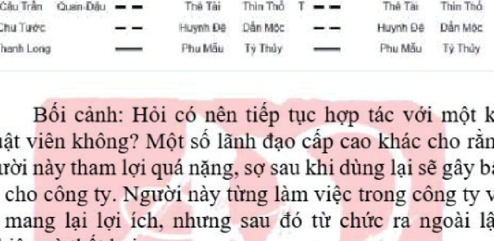

- **Cấu trúc Quẻ Dịch:**
  - **Quẻ chủ:** **Phong Lôi Ích** (Cung Tốn, Họ Tốn).  
    *Tượng quẻ:* Phong lôi tăng ích. Tượng quẻ phản ánh chính xác lịch sử thực tế: sự hợp tác trong quá khứ đã thực sự mang lại nhiều lợi nhuận và sự phát triển cho công ty.
  - **Quẻ biến:** **Thiên Lôi Vô Vọng** (Cung Tốn, Họ Tốn – Quẻ Lục xung).  
    *Tượng quẻ:* Vô vọng là không vọng cầu, không cưỡng cầu, sự việc diễn ra tự nhiên, không thành việc nhưng cũng không sinh họa.

- **Bảng chi tiết Lục hào:**

| Hào | Thế/Ứng | Lục thân (Chủ) | Can Chi | Biến động | Lục thân (Biến) | Can Chi (Biến) | Thần sát / Phục | Lục thú |
|:---:|:---:|:---|:---|:---:|:---|:---|:---|:---|
| 6 | **Ứng** | Huynh Đệ | Mão - Mộc | tĩnh (Ám động) | Thê Tài | Tuất - Thổ | Lộc thần, Tai sát | Huyền Vũ |
| 5 | | Tử Tôn | Tị - Hỏa | tĩnh | Quan Quỷ | Thân - Kim | | Bạch Hổ |
| 4 | | Thê Tài | Mùi - Thổ | Động (Tuần không) | Tử Tôn | Ngọ - Hỏa | Mưu tinh (Biến Đào hoa, Văn xương) | Đằng Xà |
| 3 | **Thế** | Thê Tài | Thìn - Thổ | tĩnh | Thê Tài | Thìn - Thổ | Thiên hỷ (Phục Quan Dậu, Tướng tinh) | Câu Trận |
| 2 | | Huynh Đệ | Dần - Mộc | tĩnh | Huynh Đệ | Dần - Mộc | Kiếp sát, Dương nhẫn | Chu Tước |
| 1 | | Phụ Mẫu | Tý - Thủy | tĩnh | Phụ Mẫu | Tý - Thủy | Quý nhân | Thanh Long |

---

### 3. Dụng thần & Loại quẻ

- **Phân loại quẻ:**
  - **Quẻ tâm thái kết hợp sự vụ nhân sự:** Khởi phát từ sự bất an, lo lắng về đạo đức và rủi ro thiệt hại kinh tế khi tuyển dụng lại nhân sự cũ.
  - **Quẻ lựa chọn hợp tác:** Xem xét xu hướng quan hệ giữa người chủ doanh nghiệp và đối tác kỹ thuật.
- **Xác định Dụng thần:**
  1. **Đối tượng được hỏi (Hào Ứng Huynh Đệ Mão Mộc):** Đại diện cho người kỹ thuật viên cụ thể đang được cân nhắc. Hào này đắc Nguyệt hợp (Mão - Tuất hợp), bị Nhật kiến Dậu Kim trực tiếp xung (Mão - Dậu tương xung) trở thành Ám động.
  2. **Nỗi lo sợ & Rủi ro (Quan Quỷ Dậu Kim):** Không lộ trên mặt quẻ mà phục tàng dưới hào Thế Thê Tài Thìn Thổ, lâm Nhật kiến và Tướng tinh.
  3. **Đương số & Lời mời của công ty (Hào Thế Thê Tài Thìn Thổ):** Đại diện cho vị thế của doanh nghiệp hiện tại và mức đãi ngộ do đương số đưa ra.
  4. **Bên thứ ba cạnh tranh nhân tài (Hào 4 Thê Tài Mùi Thổ):** Hào phát động ở giữa hào Thế và hào Ứng, đại diện cho một đơn vị khác cũng đang tìm cách tiếp cận người kỹ thuật viên.

---

### 4. Luận giải chi tiết

Quẻ này làm sáng tỏ phương pháp giải mã tâm lý và động thái cạnh tranh nhân sự ngầm:

#### 1. Giải mã quẻ tâm thái: Nỗi lo "tham lợi mang họa" có thật hay không?
- **Nguồn gốc nỗi lo:** Dưới hào Thế Thê Tài Thìn Thổ tàng chứa **Quan Quỷ Dậu Kim**, đắc Nhật kiến trợ vượng. Trong quẻ tâm thái, Quan Quỷ phục dưới Thế chính là tâm niệm lo âu, hồ nghi của người hỏi về việc nhân sự cũ quay về sẽ sinh chuyện quấy phá.
- **Bản chất thực tế của đối phương:**
  - Hào Ứng chỉ định người kỹ thuật viên lại mang lục thân **Huynh Đệ Mão Mộc**. Trong quẻ tâm thái, Huynh Đệ là nguyên thần sinh Tử Tôn (phúc thần chuyên chế phục Quan Quỷ).
  - Đặc biệt, Huynh Đệ Mão Mộc đắc Nguyệt hợp, bị Nhật xung thành Ám động, tạo ra thế tương xung trực diện với phục thần Quan Quỷ Dậu Kim dưới hào Thế.
  - Lục thân Huynh Đệ và động thái xung Quỷ này là minh chứng rõ ràng: Người kỹ thuật viên hoàn toàn không có dã tâm vụ lợi hay mưu đồ phá hoại như các cấp quản lý nghi ngại. Mối lo sợ của ban lãnh đạo thuần túy là định kiến chủ quan, không hề tồn tại trên thực tế.

#### 2. Thế lâm Câu Trận gặp Ứng lâm Huyền Vũ Ám động: Diễn biến vượt ngoài dự liệu
- Hào Thế lâm **Câu Trận**: Câu Trận chủ sự chậm chạp, trì trệ, lối mòn suy nghĩ bảo thủ. Đương số cứ đinh ninh rằng việc mời người này quay lại chỉ phụ thuộc vào quyết định của mình (chỉ cần gọi một cuộc điện thoại là đối phương sẽ đồng ý).
- Hào Ứng lâm **Huyền Vũ** Ám động: Huyền Vũ chủ sự việc kín đáo, diễn biến ngầm, bất ngờ vượt ngoài tầm kiểm soát và dự đoán của bản thân. Điềm báo người kỹ thuật viên sẽ có lựa chọn bất ngờ mà người hỏi không ngờ tới.

#### 3. Cơ chế Động động tương liên và Cuộc chiến đãi ngộ (Thìn Thổ vs Mùi Thổ)
- Về quẻ lý thông thường, Huynh Đệ Mão Mộc ám động sẽ có xu hướng khắc hào Thế Thê Tài Thìn Thổ (người kỹ thuật viên chịu sự tiếp nhận của công ty).
- Tuy nhiên, trên mặt quẻ xuất hiện hào 4 **Thê Tài Mùi Thổ** minh động:
  - Theo nguyên lý "động động tương liên", hào Ứng Mão Mộc ám động lập tức bắt nhịp và tương tác với hào phát động Thê Tài Mùi Thổ (tạo thành bán hợp Mão - Mùi).
  - So sánh hai hào Thê Tài:
    + Hào Thế Thê Tài Thìn Thổ bị Nguyệt phá (Tuất xung Thìn), đại diện cho mức đãi ngộ cũ hoặc điều kiện bị giới hạn.
    + Hào 4 Thê Tài Mùi Thổ là **Tiến thần** của thổ cục đối với Thìn Thổ, lại động hóa Tử Tôn Ngọ Hỏa hồi đầu sinh. Điều này phản ánh rõ nét: có một doanh nghiệp thứ ba đã chìa tay ra trước, đưa ra mức thù lao, chế độ đãi ngộ cao hơn hẳn.
  - Mão Mộc bán hợp với Mùi Thổ thay vì hướng về Thìn Thổ, chứng tỏ người kỹ thuật viên đã bị đơn vị khác thu hút và nhanh chóng đầu quân cho bên đó.
- Quẻ chủ **Ích** biến **Vô Vọng** (Lục xung): Biến quẻ Lục xung Vô Vọng chỉ ra rằng việc hợp tác không thành, không cần phải cưỡng cầu hay nuối tiếc. Doanh nghiệp của đương số tuy không đón được người này nhưng cũng không chịu bất kỳ thiệt hại hay tổn thất nào.

---

### 5. Kết luận & Ứng kỳ thực tế

- **Lời giải đoán & Khuyến nghị của Chu Thần Bân:**
  - Nỗi lo về việc người kỹ thuật viên tham lợi gây hại cho công ty là hoàn toàn không có căn cứ. Đối phương là người làm chuyên môn đàng hoàng.
  - Tuy nhiên, đương số sẽ không thể tuyển dụng lại người này, bởi vì một đơn vị khác đã đưa ra chế độ đãi ngộ và môi trường làm việc hấp dẫn hơn và đã thuyết phục được anh ta.
  - Khuyên đương số thuận theo tự nhiên (quẻ Vô Vọng), không nên bận tâm hay cố chấp lôi kéo, vì sự việc này không gây bất kỳ thiệt hại nào cho hoạt động hiện tại của công ty.
- **Ứng kỳ chiêm nghiệm & Phản hồi:**
  - Khi người chủ công ty liên hệ lại, người kỹ thuật viên đã chân thành thông báo rằng anh vừa mới ký kết hợp đồng nhận việc tại một doanh nghiệp khác với mức lương thưởng và điều kiện rất tốt, do đó không thể quay về cộng tác như trước.

---

### 6. Bài học tâm pháp & Quy tắc cốt lõi

- **Quy tắc trích dẫn từ sách:**
  - *Quy tắc phân biệt tâm thái đối tác qua quẻ Phong Lôi Ích biến Thiên Lôi Vô Vọng* (trang 332, rule_index).
- **Tâm pháp giải đoán thực chiến:**
  1. **Giải mã thực chất nghi ngại qua Quẻ tâm thái:** Khi người hỏi mang định kiến và lo sợ về nhân phẩm đối tác, hãy truy tìm phục thần Quan Quỷ dưới Thế và đối chiếu với Lục thân của hào Ứng. Hào Ứng lâm Huynh Đệ (sinh Tử Tôn, xung Quỷ) là tiêu chí khẳng định đối tác trong sạch, nỗi lo chỉ là ảo tưởng.
  2. **Ý nghĩa Thế Câu Trận - Ứng Huyền Vũ động:** Nhắc nhở người đoán quẻ rằng thực tế khách quan thường đi ngược lại kịch bản chủ quan trong đầu của đương số.
  3. **Phân tích cạnh tranh thị trường bằng Tiến thần và Bán hợp cục:** Sự xuất hiện của hai hào Thê Tài (hào Thế tĩnh suy và gian hào động hóa hồi đầu sinh) là mô hình kinh điển phản ánh sự chênh lệch về mức độ đãi ngộ giữa hai nhà tuyển dụng trên thương trường.

## THỰC CHIẾN 99: HỎI CÓ THỂ VÀO ĐƯỢC ĐƠN VỊ QUỐC DOANH NÀY KHÔNG

---

### 1. Bối cảnh & Câu hỏi

- **Bối cảnh chi tiết:** 
  Một thí sinh tham gia kỳ thi tuyển dụng vào một cơ quan, doanh nghiệp quốc doanh lớn. Quy trình tuyển dụng của đơn vị gồm 3 vòng: vòng 1 lọc hồ sơ ban đầu, vòng 2 phỏng vấn chuyên môn loại trực tiếp, và vòng 3 là thẩm tra lý lịch nhân sự (background check). Thí sinh này đã xuất sắc vượt qua cả 2 vòng thi chuyên môn đầu tiên và được đưa vào danh sách ứng viên đạt chuẩn. Tuy nhiên, ở vòng thứ 3 (thẩm tra lý lịch), thí sinh vô cùng lo sợ vì trong hồ sơ cá nhân trước đây từng có một số tì vết, khiếm khuyết nhỏ. Đương số sợ rằng quá trình điều tra lý lịch sẽ phơi bày khiếm khuyết này và khiến mình bị đơn vị đánh trượt ở bước cuối cùng.
- **Tâm lý & Câu hỏi ẩn ý:** 
  Bề ngoài người hỏi đặt câu hỏi theo thể thức sự vụ: *"Có thể vào được đơn vị quốc doanh này không?"*. Nhưng thực tế, câu hỏi không xuất phát từ tâm thế bình thản đi thi, mà xuất phát từ nỗi hoang mang, sợ hãi tột cùng về việc hồ sơ lý lịch có khiếm khuyết bị phát hiện. Đây thực chất là một **quẻ tâm thái** hỏi về nỗi lo âu tai họa ("liệu vết gợn lý lịch có hủy hoại cơ hội được nhận việc không?").
- **Thời gian chiêm đoán:**
  - Dương lịch: Ngày 01 tháng 04 năm 2017, lúc 19 giờ 08 phút (Giờ Bắc Kinh).
  - Can chi: Năm Đinh Dậu, tháng Quý Mão, ngày Mậu Ngọ, giờ Nhâm Tuất.

---

### 2. Dữ kiện & Bảng quẻ Crop

- **Thời không chiêm nghiệm:**
  - Tháng Quý Mão (Mộc vượng, Hỏa tướng, Thủy hưu, Thổ tù, Kim tuyệt).
  - Ngày Mậu Ngọ (Hỏa vượng, Thổ tướng, Mộc hưu, Kim tù, Thủy tuyệt).
  - Tuần không: **Tý - Sửu** (Giáp Thân tuần trung, Tý Sửu không vong).
- **Thần sát đầy đủ:**
  - Tướng tinh: Ngọ (Lâm Nhật kiến, Dương nhẫn)
  - Hoa cái: Tuất (Lâm giờ chiêm)
  - Dịch mã: Thân
  - Tai sát: Tý (Lâm Tuần không, hào sơ Thê Tài)
  - Mưu tinh: Thìn (Lâm hào 3 Huynh Đệ)
  - Đào hoa: Mão (Lâm Nguyệt kiến)
  - Kiếp sát: Hợi (Lâm hào 4 Thê Tài)
  - Lộc thần: Tị (Lâm phục thần Phụ Mẫu dưới hào 2)
  - Dương nhẫn: Ngọ (Lâm Nhật kiến)
  - Văn xương: Thân
  - Thiên y: Dần (Lâm hào Ứng Quan Quỷ)
  - Thiên hỷ: Tuất
  - Quý nhân: Sửu (Lâm Tuần không, hào biến), Mùi (Lâm hào 6 Huynh Đệ)

- Dữ kiện bảng quẻ và các thông số chiêm đoán:
  - **Bảng 99.1** Đồ hình quẻ Thực chiến 99:
    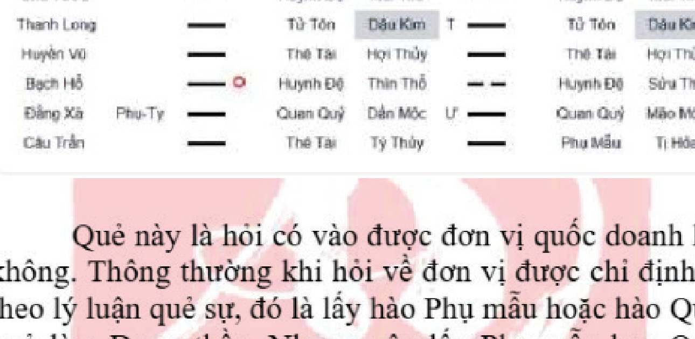

- **Cấu trúc Quẻ Dịch:**
  - **Quẻ chủ:** **Trạch Thiên Quải** (Cung Càn, Họ Càn).  
    *Tượng quẻ:* Quải dã, khuyết dã, quyết dã. Tượng quẻ phản ánh chính xác thực trạng hồ sơ có khuyết điểm, thiếu sót đang chờ sự quyết định dứt khoát.
  - **Quẻ biến:** **Bát Thuần Đoài** (Cung Đoài, Họ Đoài – Quẻ Lục xung).  
    *Tượng quẻ:* Đoài vi trạch, hai đầm nước liền nhau, hoan hỉ nói cười. Quẻ Lục xung chủ về sự việc kết thúc chóng vánh, giải tỏa áp lực tâm lý trong chớp mắt.

- **Bảng chi tiết Lục hào:**

| Hào | Thế/Ứng | Lục thân (Chủ) | Can Chi | Biến động | Lục thân (Biến) | Can Chi (Biến) | Thần sát / Phục | Lục thú |
|:---:|:---:|:---|:---|:---:|:---|:---|:---|:---|
| 6 | | Huynh Đệ | Mùi - Thổ | tĩnh | Huynh Đệ | Mùi - Thổ | Quý nhân | Chu Tước |
| 5 | **Thế** | Tử Tôn | Dậu - Kim | tĩnh | Tử Tôn | Dậu - Kim | Nguyệt phá, Nhật khắc | Thanh Long |
| 4 | | Thê Tài | Hợi - Thủy | tĩnh | Thê Tài | Hợi - Thủy | Kiếp sát | Huyền Vũ |
| 3 | | Huynh Đệ | Thìn - Thổ | Động | Huynh Đệ | Sửu - Thổ | Mưu tinh (Biến Quý nhân, Tuần không) | Bạch Hổ |
| 2 | **Ứng** | Quan Quỷ | Dần - Mộc | tĩnh | Quan Quỷ | Mão - Mộc | Thiên y (Phục Phụ Mẫu Tị Hỏa, Lộc thần) | Đằng Xà |
| 1 | | Thê Tài | Tý - Thủy | tĩnh (Ám động) | Phụ Mẫu | Tị - Hỏa | Tai sát, Tuần không | Câu Trận |

---

### 3. Dụng thần & Loại quẻ

- **Phân loại quẻ:**
  - **Quẻ tâm thái thuần túy (Cấu trúc Hỷ thần - Ưu thần):** Quẻ phản ánh nỗi kinh sợ, bất an của đương số trước nguy cơ bị loại vì khiếm khuyết lý lịch ở bước kiểm tra cuối cùng.
  - **Sự chuyển hóa từ quẻ sự vụ sang quẻ tâm thái:** Khác với việc gieo quẻ trước kỳ thi để xem kết quả chuyên môn, ở đây thí sinh đã thi đỗ 2 vòng chuyên môn và sự lo sợ tâm lý mới là nguồn phát động quẻ tượng.
- **Xác định Dụng thần:**
  1. **Ưu thần (Mối lo âu, hiểm họa - Quan Quỷ Dần Mộc):** Nằm tại hào Ứng. Đại diện cho nỗi lo sợ hồ sơ bị điều tra ra lỗi dẫn tới việc bị loại.
  2. **Hỷ thần (Sự bình an, hoan hỉ - Tử Tôn Dậu Kim):** Trì tại hào Thế. Là phúc thần giải trừ hoạn nạn.
  3. **Quỷ nguyên (Nguồn tiếp dưỡng lo âu - Thê Tài Tý Thủy):** Hào sơ Thê Tài Tý Thủy lâm Tuần không, bị Nhật kiến Ngọ Hỏa trực xung thành Ám động. Trong quẻ tâm thái, Tài sinh Quỷ chính là mầm mống nuôi dưỡng tai họa phát sinh.
  4. **Cứu tinh triệt hạ Quỷ nguyên (Huynh Đệ Thìn Thổ):** Hào 3 Huynh Đệ Thìn Thổ phát động, mang lực khắc chế dứt khoát hào Thê Tài Tý Thủy.

---

### 4. Luận giải chi tiết

Quẻ này là bài học kinh điển về sự phân định giữa lý giải bề mặt theo quẻ sự vụ và bản chất chiều sâu của quẻ tâm thái:

#### 1. Bế tắc của lối luận theo Quẻ sự thông thường
- Nếu người dự đoán máy móc coi đây là một quẻ sự việc:
  - Hào Thế Tử Tôn Dậu Kim vừa bị Nguyệt kiến Mão Mộc trực xung (Nguyệt phá), vừa bị Nhật kiến Ngọ Hỏa khắc phạt (Nhật khắc). Hào Thế suy kiệt, không có chút sinh khí nào.
  - Hào Dụng thần đơn vị Quan Quỷ Dần Mộc tuy được Thê Tài Tý Thủy ám động sinh, nhưng Thê Tài lại bị Huynh Đệ Thìn Thổ động khắc, nguồn sinh bị chặt đứt.
  - Nếu kết luận theo logic quẻ sự, đương số chắc chắn thất bại, bị loại khỏi đơn vị quốc doanh. Nhưng thực tế thí sinh lại trúng tuyển hoàn toàn suôn sẻ! Sai lầm chết người này xuất phát từ việc xác định sai loại hình quẻ.

#### 2. Giải mã cơ chế Quẻ tâm thái: Chặt đứt Quỷ nguyên
- **Bản chất tâm lý khi gieo quẻ:** Đương số đã chắc suất về mặt năng lực thi tuyển sau 2 vòng loại; nỗi bất an duy nhất chỉ là việc điều tra lý lịch cá nhân có làm hỏng việc hay không. Do đó, tâm niệm phát khởi là quẻ tâm thái lo âu hoạn nạn.
- **Trọng tâm xoay quanh Ưu thần:** Trong quẻ tâm thái, sự chú ý không nằm ở hào Thế tĩnh suy hay vượng, mà toàn bộ động triệu của quẻ đều tập trung xung quanh **Ưu thần Quan Quỷ Dần Mộc**:
  - Hào sơ Thê Tài Tý Thủy là **Quỷ nguyên** (nguồn sinh ra Quỷ), bị Nhật xung ám động, ban đầu tạo ra nguy cơ kích hoạt tai họa (nỗi lo hồ sơ vỡ lở).
  - Nhưng ngay trong quẻ, hào 3 **Huynh Đệ Thìn Thổ** phát động, xuất hiện như một cứu tinh trực tiếp khắc phạt hào Thê Tài Tý Thủy.
  - Khi Quỷ nguyên bị chặn đứng và khắc phục hoàn toàn, Quan Quỷ Dần Mộc rơi vào trạng thái cô lập, không còn nguồn tiếp dưỡng để tác quái. Nỗi sợ hãi của đương số lập tức bị triệt tiêu tận gốc.

#### 3. Tượng quẻ Quải biến Đoài (Lục xung)
- Quẻ chủ là **Trạch Thiên Quải**: Quẻ Quải có nghĩa là khiếm khuyết, thiếu sót. Hiện trạng hồ sơ lý lịch của đương số đúng là có tì vết, khiếm khuyết thật sự như tượng quẻ mô tả.
- Quẻ biến là **Bát Thuần Đoài** (Quẻ Lục xung):
  - Đoài vi duyệt, tượng trưng cho niềm vui, sự hoan hỉ, nói cười nhẹ nhõm.
  - Quẻ Lục xung trong quẻ tâm thái mang ý nghĩa giải tỏa cực nhanh: Mọi áp lực, lo lắng dồn nén bấy lâu nay lập tức tiêu tan như mây khói, biến cố được khép lại trong êm đẹp.

---

### 5. Kết luận & Ứng kỳ thực tế

- **Lời giải đoán & Khuyến nghị của Chu Thần Bân:**
  - Nỗi lo lắng về hồ sơ lý lịch là không cần thiết. Đơn vị quốc doanh trong quá trình xác minh lý lịch sẽ không làm khó hoặc các khiếm khuyết đó không đủ để cấu thành lý do loại bỏ ứng viên.
  - Khẳng định chắc chắn đương số sẽ vượt qua vòng thẩm tra lý lịch và được chính thức tiếp nhận vào công tác tại đơn vị quốc doanh.
- **Ứng kỳ chiêm nghiệm & Phản hồi:**
  - Vài ngày sau khi có kết quả thẩm tra, đơn vị quốc doanh chính thức gửi thông báo trúng tuyển. Đương số hoàn thành thủ tục nhập ngạch và ký hợp đồng lao động suôn sẻ đúng như dự đoán.

---

### 6. Bài học tâm pháp & Quy tắc cốt lõi

- **Quy tắc trích dẫn từ sách:**
  - *Quy tắc thi tuyển đơn vị quốc doanh chỉ định qua quẻ Trạch Thiên Quải biến Bát Thuần Đoài* (trang 341, rule_index).
- **Tâm pháp giải đoán thực chiến:**
  1. **Phân biệt cảnh giới Quẻ sự và Quẻ tâm thái qua nguồn gốc câu hỏi:** Không được chỉ nghe từ ngữ bề ngoài ("có vào được không") mà phải nắm bắt tâm thế của người hỏi. Khi người hỏi đang ở trong hoàn cảnh lo sợ một rủi ro cụ thể (như chờ duyệt lý lịch), quẻ luôn phản ánh tâm thái ưu hoạn.
  2. **Quy tắc triệt tiêu Quỷ nguyên trong quẻ tâm thái:** Trong quẻ tâm thái, chỉ cần nguồn sinh của Quan Quỷ (Tài hào) bị động hào khắc chế hoặc lâm tuyệt địa, thì dù hào Thế có suy nhược, nguy nan cũng tự khắc tiêu tan, biến hung thành cát.
  3. **Ý nghĩa quẻ Lục xung đối với giải tỏa tâm lý:** Gặp quẻ biến Lục xung trong quẻ tâm thái là điềm đại cát cho tâm trạng: mây đen tan biến mau chóng, tinh thần thanh thản, mọi sự hanh thông.

## THỰC CHIẾN 100: MỘT ĐƠN VỊ PHẢI TINH GIẢN BIÊN CHẾ, HỎI NÊN TIẾP TỤC CÔNG VIỆC HIỆN TẠI HAY ĐI LÀM TỔ TRƯỞNG TỔ KỶ LUẬT CỦA ĐƠN VỊ?

---

### 1. Bối cảnh & Câu hỏi

- **Bối cảnh chi tiết:** 
  Một người đồng môn đang công tác tại cơ quan nhà nước / đơn vị sự nghiệp bước vào giai đoạn cơ cấu lại tổ chức và tinh giản biên chế. Đương số vốn đang giữ một vị trí lãnh đạo chuyên môn, nay do sáp nhập và tinh giản bộ máy nên phải đứng trước sự lựa chọn điều chuyển:
  1. *Phương án 1:* Tiếp tục ở lại làm công tác chuyên môn nghiệp vụ tại cơ sở, nhưng không còn giữ chức vụ lãnh đạo như trước do cắt giảm biên chế quản lý.
  2. *Phương án 2:* Chuyển sang làm Tổ trưởng tổ kỷ luật của đơn vị – đây là một vị trí có thực quyền thanh tra, giám sát nội bộ.
  Người cha của đương số khuyên con nên chọn phương án 2 (làm tổ trưởng kỷ luật) để nắm giữ quyền lực. Trong khi đó, bản thân đương số lại thiên về phương án 1 (muốn giữ công việc chuyên môn thuần túy). Đương số lập quẻ để quyết định hướng đi tốt nhất cho tương lai.
- **Tâm lý & Câu hỏi ẩn ý:** 
  Đương số băn khoăn, mâu thuẫn giữa ý kiến gia đình và sở thích cá nhân; lo ngại về tiền đồ bấp bênh thời kỳ tinh giản bộ máy: liệu nên bảo thủ chuyên môn an toàn hay mạo hiểm bước vào vị trí kiểm tra kỷ luật đầy va chạm quyền lực.
- **Thời gian chiêm đoán:**
  - Dương lịch: Ngày 03 tháng 01 năm 2018, lúc 19 giờ 20 phút (Giờ Bắc Kinh).
  - Can chi: Năm Đinh Dậu, tháng Nhâm Tý, ngày Ất Mùi, giờ Bính Tuất.

---

### 2. Dữ kiện & Bảng quẻ Crop

- **Thời không chiêm nghiệm:**
  - Tháng Nhâm Tý (Thủy vượng, Mộc tướng, Kim hưu, Thổ tù, Hỏa tuyệt).
  - Ngày Ất Mùi (Thổ vượng, Kim tướng, Hỏa hưu, Mộc tù, Thủy tuyệt).
  - Tuần không: **Thìn - Tị** (Giáp Ngọ tuần trung, Thìn Tị không vong).
- **Thần sát đầy đủ:**
  - Tướng tinh: Mão (Lâm Lộc thần)
  - Hoa cái: Mùi (Lâm Nhật kiến)
  - Dịch mã: Tị (Lâm hào sơ Thê Tài, ngộ Tuần không)
  - Tai sát: Dậu (Lâm Thái tuế)
  - Mưu tinh: Sửu (Lâm hào 3 Quan Quỷ)
  - Đào hoa: Tý (Lâm Nguyệt kiến)
  - Kiếp sát: Thân (Lâm Quý nhân, hào 4 Phụ Mẫu)
  - Lộc thần: Mão
  - Dương nhẫn: Dần (Lâm hào biến Tử Tôn)
  - Văn xương: Ngọ
  - Thiên y: Hợi (Lâm hào biến Huynh Đệ)
  - Thiên hỷ: Mùi (Lâm Nhật kiến)
  - Quý nhân: Thân (Lâm hào 4), Tý (Lâm Nguyệt kiến)

- Dữ kiện bảng quẻ và các thông số chiêm đoán:
  - **Bảng 100.1** Đồ hình quẻ Thực chiến 100:
    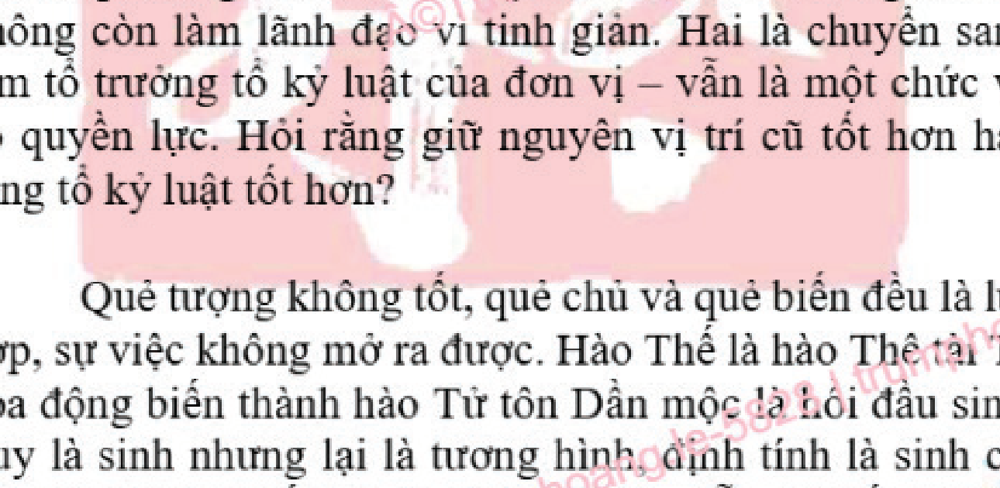

- **Cấu trúc Quẻ Dịch:**
  - **Quẻ chủ:** **Thủy Trạch Tiết** (Cung Khảm, Họ Khảm – Quẻ Lục hợp).  
    *Tượng quẻ:* Tiết dã, tiết chế, hạn chế. Trong cảnh tinh giản biên chế, biên độ lựa chọn bị thu hẹp đáng kể.
  - **Quẻ biến:** **Trạch Thủy Khốn** (Cung Đoài, Họ Đoài – Quẻ Lục hợp).  
    *Tượng quẻ:* Khốn dã, bế tắc, vướng mắc, khó luân chuyển. Cấu trúc Lục hợp biến Lục hợp biểu thị sự trói buộc cố định, khi đã vào vị trí nào sẽ bị ghìm chân tại đó rất lâu.

- **Bảng chi tiết Lục hào:**

| Hào | Thế/Ứng | Lục thân (Chủ) | Can Chi | Biến động | Lục thân (Biến) | Can Chi (Biến) | Thần sát / Phục | Lục thú |
|:---:|:---:|:---|:---|:---:|:---|:---|:---|:---|
| 6 | | Huynh Đệ | Tý - Thủy | tĩnh | Quan Quỷ | Mùi - Thổ | Nguyệt kiến, Đào hoa, Quý nhân | Huyền Vũ |
| 5 | | Quan Quỷ | Tuất - Thổ | tĩnh | Phụ Mẫu | Dậu - Kim | | Bạch Hổ |
| 4 | **Ứng** | Phụ Mẫu | Thân - Kim | Động | Huynh Đệ | Hợi - Thủy | Kiếp sát, Quý nhân (Biến Thiên y) | Đằng Xà |
| 3 | | Quan Quỷ | Sửu - Thổ | tĩnh | Thê Tài | Ngọ - Hỏa | Mưu tinh | Câu Trận |
| 2 | | Tử Tôn | Mão - Mộc | tĩnh | Quan Quỷ | Thìn - Thổ | Tướng tinh, Lộc thần | Chu Tước |
| 1 | **Thế** | Thê Tài | Tị - Hỏa | Động (Tuần không) | Tử Tôn | Dần - Mộc | Dịch mã, Tuần không (Biến Dương nhẫn) | Thanh Long |

---

### 3. Dụng thần & Loại quẻ

- **Phân loại quẻ:**
  - **Quẻ trắc tuyển phương án công tác:** Lựa chọn giữa hai ngã rẽ sự nghiệp trong giai đoạn tinh giản biên chế.
- **Xác định Dụng thần & Đối chiếu hai phương án:**
  1. **Phương án 1 (Nội quái động / Hào Thế Thê Tài Tị Hỏa):** Đại diện cho ý nguyện của bản thân và hiện trạng chuyên môn — tiếp tục ở lại làm công việc kỹ thuật nghiệp vụ tại tuyến cơ sở (hào sơ).
  2. **Phương án 2 (Ngoại quái động / Hào Ứng Phụ Mẫu Thân Kim):** Đại diện cho ý kiến của người cha và phương án chuyển hướng bộ phận — sang nhận chức vụ Tổ trưởng tổ kỷ luật của đơn vị (hào 4).
  3. **Hào biến định tính:**
     - Hào Thế Tị Hỏa động hóa Tử Tôn Dần Mộc (**Hồi đầu sinh kiêm Tương hình**).
     - Hào Ứng Thân Kim động hóa Huynh Đệ Hợi Thủy (**Tiết khí hóa Huynh Đệ**).

---

### 4. Luận giải chi tiết

Quẻ này thể hiện kỹ thuật phân vai tinh tế giữa hai hào động trong một bài toán lựa chọn nghề nghiệp:

#### 1. Định vị hai phương án qua cấu trúc Nội - Ngoại và Thế - Ứng
- **Nội quái phát động (Hào Thế Thê Tài Tị Hỏa):**
  - Hào Thế thuộc nội quái, đại diện cho bản thân đương số và hiện trạng công việc đang đảm trách.
  - Thê Tài Tị Hỏa lâm Văn tinh chuyên môn, ngộ Tuần không nhưng trì Thế phát động, phản ánh ý định thực chất của đương số là muốn tiếp tục duy trì mảng kỹ thuật chuyên sâu.
  - Vị trí hào 1 đại diện cho tuyến cơ sở, bộ phận tác nghiệp trực tiếp.
- **Ngoại quái phát động (Hào Ứng Phụ Mẫu Thân Kim):**
  - Hào Ứng thuộc ngoại quái, lại mang lục thân **Phụ Mẫu** lâm Quý nhân. Phụ Mẫu đại diện chính xác cho người cha của đương số, phản ánh lời khuyên định hướng của người cha.
  - Phụ Mẫu Thân Kim mang tính sát phạt của Kim, nằm ở hào 4 (cấp bậc quản lý trung gian), tương ứng với vị trí Tổ trưởng tổ kỷ luật nắm quyền kiểm tra, giám sát.

#### 2. Phân tích cát hung: Hồi đầu sinh vs Hóa Huynh Đệ
- **Đánh giá Phương án làm Tổ trưởng tổ kỷ luật (Hào Ứng Phụ Mẫu Thân Kim động biến Huynh Đệ Hợi Thủy):**
  - Trong sự nghiệp và quan lộ, tối kỵ hào động biến xuất **Huynh Đệ**. Huynh Đệ bị Quan Quỷ khắc chế, là tượng bị động, chịu áp lực tứ phía, dễ bị cô lập hoặc biến thành vật thế thân khi có biến cố.
  - Tính cách đương số vốn thuần chất trí thức thư sinh, quen làm việc với kỹ thuật chuyên môn chứ không có sở trường về quan hệ chính trị, thủ đoạn hành chính hay sự cứng rắn cần thiết trong công tác kỷ luật.
  - Nếu đảm nhận vị trí tổ trưởng kỷ luật, đương số sẽ rơi vào tình thế "trên ép xuống, dưới chống lên", không tạo được sự hài lòng của lãnh đạo mà còn rước lấy oán hận của đồng nghiệp, cuối cùng bế tắc và phải rút lui trong thế thất bại.
- **Đánh giá Phương án tiếp tục làm chuyên môn (Hào Thế Thê Tài Tị Hỏa động biến Tử Tôn Dần Mộc):**
  - Hào Thế động biến Tử Tôn Dần Mộc là **Hồi đầu sinh**: Về căn bản đại cục là cát lợi, bảo đảm an toàn sinh kế, chuyên môn được nuôi dưỡng vững vàng.
  - Tuy nhiên, Dần Mộc và Tị Hỏa cấu thành quan hệ **Tương hình**:
    + Làm việc ở tuyến cơ sở (hào 1) sẽ rất vất vả, nhiều việc sự vụ vụn vặt, áp lực lao động hàng ngày lớn.
    + Tử Tôn Dần Mộc mang Dương Nhẫn và bị Kiếp sát xung: Sẽ khó tránh khỏi va chạm thị phi nhỏ lẻ với một số kẻ tiểu nhân xung quanh.
    + Dù vậy, điểm mấu chốt là chuyên môn được bảo toàn, giữ được cái gốc bình an.

#### 3. Cấu trúc Lục hợp biến Lục hợp (Tiết biến Khốn)
- Quẻ chủ là **Thủy Trạch Tiết**: Tiết chế, hạn chế. Trong hoàn cảnh tinh giản biên chế, dư địa lựa chọn đã bị thu hẹp tối đa.
- Quẻ biến là **Trạch Thủy Khốn**: Khốn đốn, bó buộc, giam chân tại chỗ.
- Cả quẻ chủ và quẻ biến đều là **Lục hợp**: Đây là dấu hiệu của sự định hình cố định lâu dài. Khi đã chọn một trong hai phương án, đương số sẽ gắn chặt vào vị trí đó trong nhiều năm, rất khó có cơ hội luân chuyển hay đổi hướng lần thứ hai.
- So sánh hai cái "Khốn": Bị trói buộc ở mảng chuyên môn (được Hồi đầu sinh) vẫn an toàn và giữ được sự nghiệp hơn rất nhiều so với bị khốn đốn ở vị trí kỷ luật (hóa Huynh Đệ) đầy cạm bẫy hiểm nguy.

---

### 5. Kết luận & Ứng kỳ thực tế

- **Lời giải đoán & Khuyến nghị của Chu Thần Bân:**
  - Khuyên đương số tuyệt đối không nghe theo lời cha để sang làm tổ trưởng tổ kỷ luật. Tính cách thư sinh và thiếu bản lĩnh hành chính sẽ biến vị trí này thành thảm họa sự nghiệp.
  - Nên kiên định lựa chọn phương án ở lại làm công tác chuyên môn tại tuyến cơ sở. Chấp nhận công việc ban đầu sẽ vất vả, áp lực, đối mặt với nhiều chuyện vụn vặt và khó thăng tiến ngay, nhưng sẽ giữ được sự ổn định bền vững lâu dài.
- **Ứng kỳ chiêm nghiệm & Phản hồi:**
  - Đương số nghe theo lời khuyên của Chu Thần Bân, từ chối chức tổ trưởng tổ kỷ luật và chọn ở lại mảng chuyên môn cơ sở. 
  - Thực tế sau đó, người khác được cử vào thay thế làm tổ trưởng tổ kỷ luật đã gặp vô vàn sóng gió thị phi, quan hệ nội bộ căng thẳng tột độ và không thể trụ vững ở vị trí này. Đương số nhờ ở lại chuyên môn nên công việc duy trì ổn định, an toàn vượt qua giai đoạn tinh giản.

---

### 6. Bài học tâm pháp & Quy tắc cốt lõi

- **Quy tắc trích dẫn từ sách:**
  - *Quy tắc Lục hợp biến Lục hợp khi tinh giản biên chế và lựa chọn chức vụ* (trang 348, rule_index).
- **Tâm pháp giải đoán thực chiến:**
  1. **Kỹ thuật phân chia vai diễn giữa Thế - Ứng và Nội - Ngoại trong quẻ lựa chọn:** Nội quái (Thế) biểu thị ý chí bản thân và hiện trạng quen thuộc; Ngoại quái (Ứng Phụ Mẫu) biểu thị ý kiến gia đình và định hướng môi trường mới.
  2. **Tác hại của Hóa Huynh Đệ trong đường sự nghiệp:** Khi hào động đại diện cho một chức vụ mà hóa ra Huynh Đệ, đó là biểu hiện của sự bị động, mất quyền kiểm soát, dễ chuốc lấy áp lực và thất bại.
  3. **Biện chứng giữa Hồi đầu sinh và Tương hình:** Được hồi đầu sinh là được bảo toàn đại cục căn bản, nhưng vướng tương hình ở sơ hào nhắc nhở đương số phải chuẩn bị tâm lý đương đầu với gian nan vụn vặt ở tuyến cơ sở.
  4. **Cơ chế Lục hợp biến Lục hợp:** Báo hiệu một thế cờ cố định, ít biến động luân chuyển, một khi đã an bài thì khó lòng xoay chuyển.

## THỰC CHIẾN 101: ĐỒNG MÔN ĐỘT NHIÊN BỊ MỘT CÔ GÁI MẠNH MẼ THEO ĐUỔI, NHẬP QUẺ ĐỂ XEM XU THẾ

---

### 1. Bối cảnh & Câu hỏi

- **Bối cảnh chi tiết:** 
  Một người em đồng môn của Chu Thần Bân đang trong tình trạng độc thân (trước đó từng chia tay bạn gái cũ và hiện sống một mình). Đột nhiên, có một cô gái xuất hiện và chủ động theo đuổi chàng trai một cách vô cùng quyết liệt, mãnh liệt. Cô gái không hề giữ kẽ hay e thẹn theo kiểu truyền thống mà trực tiếp bày tỏ tình cảm, nói thẳng không giấu giếm: *"Em rất thích anh, em muốn làm vợ anh!"*. Đứng trước sự vồ vập bất ngờ này, một người sư huynh thân thiết đã chủ động nhập vai lập quẻ để trắc nghiệm xu thế tình cảm và xem mối quan hệ này thực chất diễn biến ra sao.
- **Tâm lý & Câu hỏi ẩn ý:** 
  Người nam vừa bất ngờ, xao xuyến trước sự tấn công dồn dập của đối phương, vừa sinh tâm lý hoang mang, e ngại: Liệu tình cảm này có chân thực không, cô gái có mục đích gì ẩn giấu phía sau hay không, và hai người có nên tiến tới hôn nhân hay không.
- **Thời gian chiêm đoán:**
  - Dương lịch: Ngày 08 tháng 01 năm 2018, lúc 19 giờ 20 phút (Giờ Bắc Kinh).
  - Can chi: Năm Đinh Dậu, tháng Quý Sửu, ngày Canh Tý, giờ Bính Tuất.

---

### 2. Dữ kiện & Bảng quẻ Crop

- **Thời không chiêm nghiệm:**
  - Tháng Quý Sửu (Thổ vượng, Kim tướng, Hỏa hưu, Mộc tù, Thủy tuyệt).
  - Ngày Canh Tý (Thủy vượng, Mộc tướng, Kim hưu, Thổ tù, Hỏa tuyệt).
  - Tuần không: **Thìn - Tị** (Giáp Ngọ tuần trung, Thìn Tị không vong).
- **Thần sát đầy đủ:**
  - Tướng tinh: Tý (Lâm Nhật kiến, hào sơ Phụ Mẫu Tý Thủy)
  - Hoa cái: Thìn (Lâm hào 3 Thê Tài Thìn Thổ, ngộ Tuần không)
  - Dịch mã: Dần (Lâm hào Ứng Huynh Đệ Dần Mộc)
  - Tai sát: Ngọ (Lâm hào biến Tử Tôn Ngọ Hỏa)
  - Mưu tinh: Tuất (Lâm hào biến Thê Tài Tuất Thổ)
  - Đào hoa: Dậu (Lâm Thái tuế, hào 4 Quan Quỷ)
  - Kiếp sát: Tị (Lâm hào 6 Tử Tôn Tị Hỏa, ngộ Tuần không)
  - Lộc thần: Thân (Lâm phục thần Quan Quỷ dưới hào Thế)
  - Dương nhẫn: Dậu (Lâm hào 4 Quan Quỷ)
  - Văn xương: Hợi
  - Thiên y: Tý (Lâm Nhật kiến)
  - Thiên hỷ: Mùi (Lâm hào Thế Thê Tài Mùi Thổ)
  - Quý nhân: Dần (Lâm hào Ứng), Ngọ

- Dữ kiện bảng quẻ và các thông số chiêm đoán:
  - **Bảng 101.1** Đồ hình quẻ Thực chiến 101:
    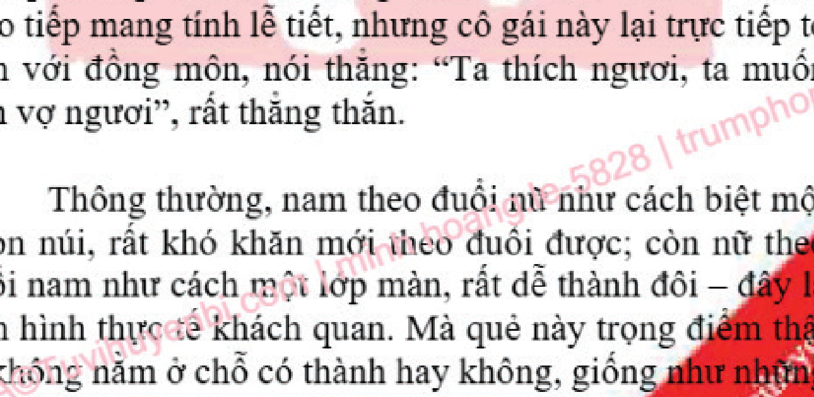

- **Cấu trúc Quẻ Dịch:**
  - **Quẻ chủ:** **Hỏa Lôi Phệ Hạp** (Cung Tốn, Họ Tốn).  
    *Tượng quẻ:* Phệ hạp dã, cắn hợp, trực tiếp thẳng thắn, không nghi thức màu mè. Phản ánh chân thực cách cô gái trực diện tấn công tỏ tình không cần giấu giếm.
  - **Quẻ biến:** **Lôi Địa Dự** (Cung Chấn, Họ Chấn – Quẻ Lục hợp).  
    *Tượng quẻ:* Dự dã, hoan duyệt, vui vẻ, thuận theo tự nhiên; đồng thời mang nghĩa dự bị, tạm hoãn, dự phòng rủi ro.

- **Bảng chi tiết Lục hào:**

| Hào | Thế/Ứng | Lục thân (Chủ) | Can Chi | Biến động | Lục thân (Biến) | Can Chi (Biến) | Thần sát / Phục | Lục thú |
|:---:|:---:|:---|:---|:---:|:---|:---|:---|:---|
| 6 | | Tử Tôn | Tị - Hỏa | Động (Tuần không) | Thê Tài | Tuất - Thổ | Kiếp sát (Biến Mưu tinh) | Đằng Xà |
| 5 | **Thế** | Thê Tài | Mùi - Thổ | tĩnh | Quan Quỷ | Thân - Kim | Thiên hỷ (Phục Quan Thân, Lộc) | Câu Trận |
| 4 | | Quan Quỷ | Dậu - Kim | tĩnh | Tử Tôn | Ngọ - Hỏa | Đào hoa, Dương nhẫn | Chu Tước |
| 3 | | Thê Tài | Thìn - Thổ | tĩnh | Huynh Đệ | Mão - Mộc | Hoa cái, Tuần không | Thanh Long |
| 2 | **Ứng** | Huynh Đệ | Dần - Mộc | tĩnh | Tử Tôn | Tị - Hỏa | Dịch mã, Quý nhân (Phục Tử Tị) | Huyền Vũ |
| 1 | | Phụ Mẫu | Tý - Thủy | Động | Thê Tài | Mùi - Thổ | Tướng tinh, Thiên y (Biến hồi khắc) | Bạch Hổ |

---

### 3. Dụng thần & Loại quẻ

- **Phân loại quẻ:**
  - **Quẻ hôn nhân tình cảm:** Trắc nghiệm nhân duyên, xu thế phát triển khi người nữ chủ động theo đuổi người nam.
  - **Kỹ thuật nhập quẻ thay thế:** Sư huynh đồng môn nhập vai người em để tra cứu bản chất thực sự của sự việc.
- **Xác định Dụng thần:**
  1. **Đương số (nam giới):** Hào Thế Thê Tài Mùi Thổ (tàng phục Quan Quỷ Thân Kim).
  2. **Cô gái theo đuổi (nữ giới):** Hào Ứng Huynh Đệ Dần Mộc (lâm Dịch mã, Huyền Vũ, tàng phục Tử Tôn Tị Hỏa).
  3. **Tượng thành đôi (Thê Tài trì Thế):** Hào Thế hợp nhất với Dụng thần Thê Tài, biểu thị kết cục sống chung, thành đôi rất nhanh.
  4. **Đối tượng hôn nhân lý tưởng thật sự:** Hào biến Thê Tài Tuất Thổ (sinh bởi Tử Tôn Tị Hỏa hào 6).

---

### 4. Luận giải chi tiết

Quẻ này thể hiện tài tình của Chu Thần Bân trong việc phân tích tâm thái thầm kín và giải mã những bí mật ẩn sau lời tỏ tình đường đột:

#### 1. Sự hòa hợp tâm thái và khả năng thành đôi tất yếu
- **Ý niệm thầm kín qua Hào phục thần đối vị:**
  - Dưới hào Ứng Huynh Đệ Dần Mộc tàng phục **Tử Tôn Tị Hỏa**: Tử Tôn là cội nguồn sinh Tài (người vợ), chứng tỏ trong sâu thẳm tâm niệm, cô gái tha thiết muốn trở thành vợ của chàng trai.
  - Dưới hào Thế Thê Tài Mùi Thổ tàng phục **Quan Quỷ Thân Kim**: Trong quan hệ nam nữ, Quan Quỷ đại diện cho người chồng. Điều này bộc lộ tâm lý người nam cũng đang rung động và sẵn sàng đón nhận sự theo đuổi này.
- **Tâm niệm tương sinh:** Tị Hỏa sinh Thổ, Thân Kim hợp Tị Hỏa. Đôi bên tâm ý tương thông.
- **Cơ chế nữ truy nam và quẻ biến Lục hợp:** Dân gian có câu "nam truy nữ cách sơn, nữ truy nam cách sa". Thê Tài trì Thế lại biến quẻ **Lôi Địa Dự** (Lục hợp), biểu thị nếu thuận theo tự nhiên thì việc hai người thành đôi và dọn về sống chung chỉ là chuyện trong gang tấc.

#### 2. Cảnh báo người này không phải đối tượng hôn nhân lý tưởng
- Mặc dù việc đến với nhau rất dễ, quẻ Dịch lại tập trung cảnh báo vào tính chất dài hạn của mối quan hệ qua hào 6 phát động:
  - Hào 6 **Tử Tôn Tị Hỏa** động hóa **Thê Tài Tuất Thổ**: Đây là hào động mang tính định hướng, chỉ đạo của quẻ.
  - Thê Tài Tuất Thổ hoàn toàn khác biệt với Thê Tài Mùi Thổ tại hào Thế. Điều này chỉ rõ: Trong tương lai, sẽ có một đối tượng kết hôn khác (đại diện bởi Tuất Thổ) phù hợp với chàng trai hơn cô gái này rất nhiều.
  - Tử Tôn Tị Hỏa hào 6 đang ngộ **Tuần không**: Điềm báo người bạn đời lý tưởng thực sự hiện tại vẫn chưa xuất hiện trên thực tế, đương số cần kiên nhẫn chờ đợi.

#### 3. Bóc trần động cơ bí mật của cô gái: Hào sơ Phụ Mẫu Tý Thủy phát động
- **Thế lâm Câu Trận, Ứng lâm Huyền Vũ:**
  - Hào Thế lâm Câu Trận chủ sự mộc mạc, suy nghĩ đơn giản.
  - Hào Ứng cô gái lâm Huyền Vũ chủ sự mờ ám, toan tính bí mật, có điều giấu giếm mà người nam hoàn toàn không hay biết.
- **Giải mã Hào sơ Phụ Mẫu Tý Thủy động biến Thê Tài Mùi Thổ:**
  - Hào sơ nằm ở gốc rễ hào Ứng, lâm **Bạch Hổ**: Bạch Hổ chủ về tang thương, đau buồn, đổ vỡ kịch liệt.
  - Phụ Mẫu Tý Thủy đại diện cho mối quan hệ tình cảm sâu nặng, gắn bó lâu năm trong quá khứ của cô gái. Hào sơ động hóa Mùi Thổ là hồi đầu khắc (tự hủy diệt), chỉ rõ cô gái vừa mới trải qua một cuộc chia tay đau đớn, đổ vỡ cay đắng với bạn trai cũ.
  - Việc cô gái đột ngột lao vào tấn công, tỏ tình quyết liệt với người đồng môn thực chất là hành vi phản ứng tâm lý tiêu cực: hoặc muốn nhanh chóng tìm người lấp chỗ trống để khỏa lấp nỗi cô đơn, hoặc muốn lợi dụng mối quan hệ mới để trả đũa bạn trai cũ.
  - Tý Thủy còn là đất Thai của Hỏa (Tử Tôn), cảnh báo những dây dưa phức tạp về mặt ân oán tình cảm hoặc hậu quả chưa giải quyết dứt điểm từ mối tình cũ.

#### 4. Ý nghĩa sâu xa của Quẻ Dự (Lôi Địa Dự)
- Quẻ Dự không chỉ mang nghĩa "hoan hỷ, vui vẻ", mà trong Chu Dịch còn mang ý nghĩa **"Dự bị"**, **"Dự phòng"**, tức là phải biết tạm hoãn lại, bình tĩnh quan sát.
- Quẻ chỉ dẫn người nam không nên vì thấy gái theo đuổi mà vội vã nhận lời sống chung ngay, cần phải dừng lại một nhịp, giữ sự tỉnh táo để tránh rơi vào bẫy tâm lý của đối phương.

---

### 5. Kết luận & Ứng kỳ thực tế

- **Lời giải đoán & Khuyến nghị của Chu Thần Bân:**
  - Khẳng định nếu đồng ý thì hai người sẽ về ở với nhau ngay lập tức (quẻ Lục hợp).
  - Tuy nhiên, khuyên người đồng môn tuyệt đối không nên vội vàng nhận lời. Cô gái này tiếp cận không xuất phát từ tình yêu thuần khiết mà mang nặng tổn thương và toan tính từ mối tình cũ vừa đổ vỡ.
  - Cô gái này không phải người vợ tương lai tốt. Khuyên nên "hoãn lại" theo tượng quẻ Dự, giữ khoảng cách bạn bè và chờ đợi người phù hợp thực sự xuất hiện sau này.
- **Ứng kỳ chiêm nghiệm & Phản hồi:**
  - Người đồng môn sau khi nghe lời khuyên đã bình tĩnh lại, không vội vàng nhận lời mà âm thầm tìm hiểu thêm qua bạn bè chung. Kết quả hoàn toàn trùng khớp: Cô gái quả thực vừa mới chia tay bạn trai cũ sau 4 năm mặn nồng trong uất ức và đang muốn tìm bạn trai mới cấp tốc để trả thù người cũ. Chàng trai may mắn thoát khỏi một cuộc tình đầy rắc rối và tổn thương.

---

### 6. Bài học tâm pháp & Quy tắc cốt lõi

- **Quy tắc trích dẫn từ sách:**
  - *Quy tắc tình duyên nữ chủ động theo đuổi nam qua quẻ Hỏa Lôi Phệ Hạp biến Lôi Địa Dự* (trang 354, rule_index).
- **Tâm pháp giải đoán thực chiến:**
  1. **Đọc Hào tâm niệm để thấu thị tình cảm:** Xem phục thần dưới hào Thế và Ứng để biết được tâm tư thầm kín thực sự của mỗi bên mà lời nói bên ngoài không thể hiện.
  2. **Giải mã hào động chỉ đạo trong quẻ hôn nhân:** Khi hào Dụng thần hiện tại (Mùi Thổ) khác biệt với hào Thê Tài được sinh bởi hào động tuần không (Tuất Thổ), đó là thông điệp chỉ rõ đối tượng kết hôn lý tưởng nằm ở tương lai chứ không phải người hiện tại.
  3. **Cảnh giác với mô hình Thế Câu Trận - Ứng Huyền Vũ:** Khi đối phương vồ vập bất thường mà lâm Huyền Vũ, luôn có những uẩn khúc tâm lý hoặc toan tính cá nhân bị che đậy.
  4. **Ý nghĩa triết lý của Quẻ Dự:** Vui vẻ nhưng phải đi liền với phòng bị; trước những cám dỗ dễ dãi, biết "tạm hoãn" chính là trí tuệ bảo vệ bản thân.

## THỰC CHIẾN 102: ANH HỌ BÁN NHÀ ĐẤT NHỎ, NGƯỜI MUA DO DỰ CẢ MỘT BUỔI TỐI, LUÔN LO LẮNG VẤN ĐỀ PHÁP LÝ. HỎI THAY ANH HỌ: NGƯỜI NÀY CÓ MUA NHÀ KHÔNG?

---

### 1. Bối cảnh & Câu hỏi

- **Bối cảnh chi tiết:** 
  Một người anh họ của đồng môn muốn bán một căn nhà thuộc diện "nhà đất nhỏ" (tiểu sản quyền – loại hình bất động sản có vướng mắc về mặt giấy tờ sở hữu hoặc quy chuẩn pháp lý). Có một khách hàng tìm đến xem nhà và tỏ ý rất muốn mua, nhưng người này ngồi do dự, dây dưa suốt cả một buổi tối, liên tục bày tỏ sự lo lắng về thủ tục chuyển nhượng và tính pháp lý của căn nhà. Cuối buổi, người mua nói sẽ về nhà suy nghĩ thêm một đêm rồi mới trả lời. Người anh họ rất sốt ruột muốn bán nhanh. Người em đồng môn có mặt tại đó liền chủ động dùng kỹ thuật "nhập vai" để gieo quẻ hỏi thay anh họ xem vị khách này rốt cuộc có mua nhà hay không.
- **Tâm lý & Câu hỏi ẩn ý:** 
  Người bán thì nôn nóng muốn giải phóng tài sản; người mua thì đắn đo, sợ rủi ro pháp lý; còn người gieo quẻ thì muốn biết chắc chắn giao dịch có diễn ra hay khách hàng sẽ bỏ đi tìm căn nhà khác.
- **Thời gian chiêm đoán:**
  - Dương lịch: Ngày 24 tháng 10 năm 2017, lúc 21 giờ 08 phút (Giờ Bắc Kinh).
  - Can chi: Năm Đinh Dậu, tháng Canh Tuất, ngày Giáp Thân, giờ Ất Hợi.

---

### 2. Dữ kiện & Bảng quẻ Crop

- **Thời không chiêm nghiệm:**
  - Tháng Canh Tuất (Thổ vượng, Kim tướng, Hỏa hưu, Mộc tù, Thủy tuyệt).
  - Ngày Giáp Thân (Kim vượng, Thủy tướng, Thổ hưu, Hỏa tù, Mộc tuyệt).
  - Tuần không: **Ngọ - Mùi** (Giáp Thân tuần trung, Ngọ Mùi không vong).
- **Thần sát đầy đủ:**
  - Tướng tinh: Tý (Lâm hào sơ Tử Tôn Tý Thủy)
  - Hoa cái: Thìn (Lâm hào Thế Phụ Mẫu Thìn Thổ)
  - Dịch mã: Dần (Lâm hào 2 Thê Tài Dần Mộc)
  - Tai sát: Ngọ (Lâm Tuần không)
  - Mưu tinh: Tuất (Lâm Nguyệt kiến, hào biến Phụ Mẫu Tuất Thổ)
  - Đào hoa: Dậu (Lâm hào 4 Huynh Đệ Dậu Kim)
  - Kiếp sát: Tị (Lâm hào Ứng Quan Quỷ Tị Hỏa)
  - Lộc thần: Dần (Lâm hào 2 Thê Tài)
  - Dương nhẫn: Mão
  - Văn xương: Tị (Lâm hào Ứng)
  - Thiên y: Dậu (Lâm hào 4)
  - Thiên hỷ: Thìn (Lâm hào Thế)
  - Quý nhân: Sửu, Mùi (Lâm Tuần không, hào 5 Phụ Mẫu Mùi Thổ)

- Dữ kiện bảng quẻ và các thông số chiêm đoán:
  - **Bảng 102.1** Đồ hình quẻ Thực chiến 102:
    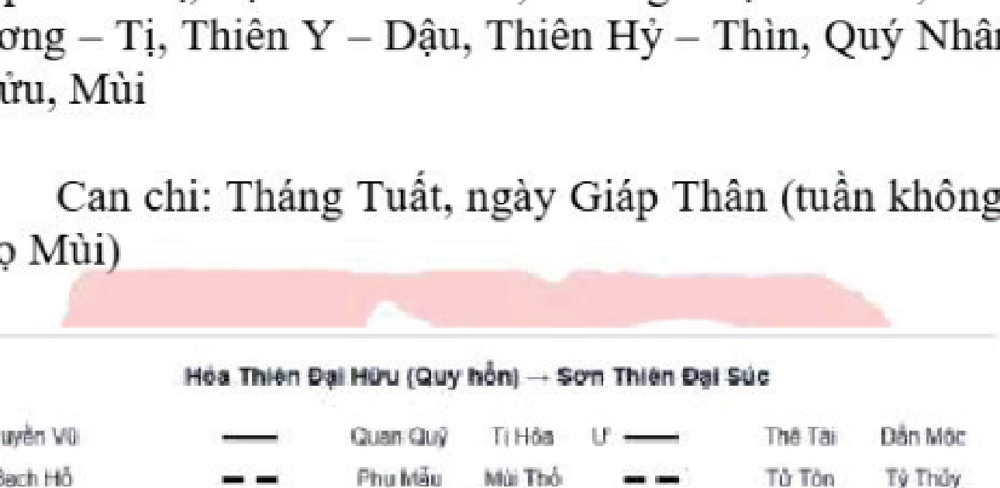

- **Cấu trúc Quẻ Dịch:**
  - **Quẻ chủ:** **Hỏa Thiên Đại Hữu** (Cung Càn, Họ Càn – Quẻ Quy hồn).  
    *Tượng quẻ:* Đại hữu dã, sở hữu lớn, có nhiều phương án và nhiều sự lựa chọn so sánh.
  - **Quẻ biến:** **Sơn Thiên Đại Súc** (Cung Cấn, Họ Cấn).  
    *Tượng quẻ:* Đại súc dã, tích tụ lớn, lắng đọng, dừng lại để tích lũy; sau khi cân nhắc nhiều nơi thì dừng lại chốt phương án.

- **Bảng chi tiết Lục hào:**

| Hào | Thế/Ứng | Lục thân (Chủ) | Can Chi | Biến động | Lục thân (Biến) | Can Chi (Biến) | Thần sát / Phục | Lục thú |
|:---:|:---:|:---|:---|:---:|:---|:---|:---|:---|
| 6 | **Ứng** | Quan Quỷ | Tị - Hỏa | tĩnh | Thê Tài | Dần - Mộc | Kiếp sát, Văn xương | Huyền Vũ |
| 5 | | Phụ Mẫu | Mùi - Thổ | tĩnh (Tuần không) | Tử Tôn | Tý - Thủy | Quý nhân | Bạch Hổ |
| 4 | | Huynh Đệ | Dậu - Kim | Động (Hồi đầu sinh) | Phụ Mẫu | Tuất - Thổ | Đào hoa, Thiên y (Biến Mưu tinh) | Đằng Xà |
| 3 | **Thế** | Phụ Mẫu | Thìn - Thổ | tĩnh (Nguyệt phá) | Phụ Mẫu | Thìn - Thổ | Hoa cái, Thiên hỷ | Câu Trận |
| 2 | | Thê Tài | Dần - Mộc | tĩnh (Nhật phá) | Thê Tài | Dần - Mộc | Dịch mã, Lộc thần | Chu Tước |
| 1 | | Tử Tôn | Tý - Thủy | tĩnh | Tử Tôn | Tý - Thủy | Tướng tinh | Thanh Long |

---

### 3. Dụng thần & Loại quẻ

- **Phân loại quẻ:**
  - **Quẻ giao dịch bất động sản:** Hỏi về việc mua bán nhà đất nhỏ.
  - **Quẻ trắc nghiệm kỹ thuật nhập vai:** Ca thực chiến kinh điển về hiện tượng "nhập nhầm vai" (nhầm lẫn chủ thể hào Thế) trong dự đoán Lục Hào.
- **Xác định Dụng thần & Khủng hoảng nhập vai:**
  - *Ý định ban đầu:* Người gieo muốn nhập vào thân người anh họ (người bán nhà). Nếu là người bán, Dụng thần cầu tài là Thê Tài Dần Mộc, nhà cửa là Phụ Mẫu Thìn Thổ.
  - *Thực tế quẻ tượng:* Quẻ phản ánh chính xác tâm thức người mua đang đứng trước nhiều lựa chọn (Hỏa Thiên Đại Hữu). Người gieo quẻ trong vô thức đã bị ám ảnh bởi sự do dự của người mua nên đã **nhập vào thân người mua**.
  - *Dụng thần của người mua:* Hào Thế Phụ Mẫu Thìn Thổ (căn nhà đang xem xét mua), hào Ứng Quan Quỷ Tị Hỏa (nỗi lo lắng về rủi ro pháp lý).

---

### 4. Luận giải chi tiết

Quẻ này là bài học đắt giá về sự nhầm lẫn chủ thể khi lập quẻ thay cho người khác:

#### 1. Sự sai lầm khi phán đoán theo góc nhìn người bán
- Người sư huynh đinh ninh rằng mình đã nhập vào người anh họ (người bán):
  - Nhìn thấy hào Thế Phụ Mẫu Thìn Thổ bị Nguyệt kiến Tuất Thổ trực xung (Nguyệt phá), suy kiệt vô khí.
  - Hào 4 Huynh Đệ Dậu Kim (người mua) động hóa Phụ Mẫu Tuất Thổ hồi đầu sinh. Dậu Kim tuy hợp hào Thế Thìn Thổ, nhưng Thìn Thổ bị Nguyệt phá nên thành thế hợp níu kéo, suy nhược; mặt khác Dậu Kim lại kết nối chặt chẽ với Phụ Mẫu Tuất Thổ ở hào biến (Tuất xung phá Thìn).
  - Về phương diện tiền bạc: Thê Tài Dần Mộc bị Nhật kiến Thân Kim trực xung (Nhật phá), lại bị Huynh Đệ Dậu Kim khắc chế gay gắt.
  - Từ đó, sư huynh kết luận đanh thép: Giao dịch thất bại hoàn toàn! Người mua chê nhà yếu kém và sẽ chuyển sang mua căn nhà khác (hướng về Phụ Mẫu Tuất Thổ).
- **Thực tế bất ngờ:** Ngay ngày hôm sau, người mua liên hệ lại và xuống tiền đặt cọc mua đứt căn nhà của người anh họ! Dự đoán ban đầu hoàn toàn sai lệch so với thực tế.

#### 2. Chu Thần Bân giải mã: Nhập lầm vào thân người mua
- Khi đệ tử thắc mắc vì sao quẻ đoán không mua mà thực tế lại mua ngay, Chu Thần Bân lập tức chỉ ra điểm mấu chốt: **Người gieo quẻ đã nhập sai thân phận!**
- **Chứng cứ quẻ tượng Hỏa Thiên Đại Hữu:**
  - Quẻ Đại Hữu chủ về sự sở hữu lớn, nắm giữ nhiều nguồn lực, đứng trước vô số sự lựa chọn phong phú.
  - Chu Thần Bân hỏi người em: *"Anh họ ngươi có nhiều căn nhà để bán không?"* – Người em đáp: *"Anh họ chỉ có duy nhất một căn nhà này thôi"*.
  - Nếu người bán chỉ có một căn nhà thì tuyệt đối không thể ứng với quẻ tượng "Đại Hữu"! Quẻ Đại Hữu chỉ có thể là hình ảnh thực tế của **người mua** – người mua đang cầm tiền và đang đi khảo sát, so sánh rất nhiều căn nhà khác nhau trên thị trường.
  - Do người em ngồi nghe người mua đắn đo cả buổi tối, tâm trí bị hút trọn vào trạng thái của người mua, nên khi khởi quẻ, ý niệm vô thức đã đồng hóa thành người mua mà không hề hay biết.

#### 3. Luận giải chính xác theo tâm thế Người mua
- Khi đặt hào Thế Phụ Mẫu Thìn Thổ vào vị trí người mua:
  - Đây là một **quẻ tâm thái** của người mua: "Tôi có nhiều lựa chọn (Đại Hữu), có nên mua căn nhà này không, pháp lý có sao không?"
  - Hào Ứng Quan Quỷ Tị Hỏa biểu thị sự lo lắng về giấy tờ pháp lý của nhà đất nhỏ.
  - Hào 4 Huynh Đệ Dậu Kim phát động (nguyên thần sinh Tử Tôn Tý Thủy ở hào sơ), dập tắt ưu tư, chuyển hóa thành sự an tâm.
  - Quẻ biến **Sơn Thiên Đại Súc**: Sau khi đi xem xét, tích lũy thông tin khắp nơi (Đại Súc), người mua nhận ra những căn nhà khác giá quá cao hoặc vị trí không thuận tiện bằng căn này. Cuối cùng, người mua quyết định dừng sự lựa chọn lại và chốt mua căn nhà của người anh họ.

---

### 5. Kết luận & Ứng kỳ thực tế

- **Lời giải đoán chuẩn xác của Chu Thần Bân:**
  - Quẻ tượng không phải quẻ người bán mà là quẻ tâm thái của người mua.
  - Người mua sau khi về nhà cân nhắc, so sánh với các lựa chọn khác thì thấy căn nhà này là tối ưu nhất, do đó đã giải tỏa được lo âu pháp lý và quyết định xuống tiền mua.
- **Ứng kỳ chiêm nghiệm & Phản hồi:**
  - Đúng sáng ngày hôm sau, người mua chủ động liên lạc lại với người anh họ và tiến hành ký hợp đồng đặt cọc mua căn nhà đất nhỏ đúng như logic thực tế.

---

### 6. Bài học tâm pháp & Quy tắc cốt lõi

- **Quy tắc trích dẫn từ sách:**
  - *Quy tắc nhập vai người thân và giải đoán mua bán nhà đất nhỏ qua quẻ Quy hồn biến Đại Súc* (trang 364, rule_index).
- **Tâm pháp giải đoán thực chiến:**
  1. **Hiểm họa "Nhập sai vai" khi chiêm bốc:** Tâm niệm là gốc rễ của quẻ Dịch. Khi hỏi thay người khác, nếu tâm trí bị ám thị quá mạnh bởi một nhân vật thứ ba (đối tác, người mua), quẻ sẽ lập tức phản ánh trường khí của nhân vật đó thay vì đối tượng ban đầu.
  2. **Dùng Hiện thực khách quan để kiểm chứng Quẻ chủ:** Tượng quẻ chủ (Hỏa Thiên Đại Hữu - nhiều lựa chọn) phải đối chiếu với thực tế của đương số (chỉ có 1 căn nhà) để nhận biết ngay mình đã định vị sai nhân vật giữ hào Thế.
  3. **Ý nghĩa chuỗi quẻ Đại Hữu biến Đại Súc:** Đại Hữu là khảo sát diện rộng, nhiều phương án so sánh; Đại Súc là gom tụ, tích lũy, lắng đọng đưa ra quyết định cuối cùng.

## THỰC CHIẾN 103: ĐỆ TỬ TIỂU TRƯƠNG Ở CHIẾT GIANG SẮP TỚI TÌM BÁC SĨ TRỊNH ĐỂ ĐIỀU TRỊ CHỨNG CAO HUYẾT ÁP BẨM SINH, QUÁI THÂN HỎI HIỆU QUẢ ĐIỀU TRỊ NHƯ THẾ NÀO?

---

### 1. Bối cảnh & Câu hỏi

- **Bối cảnh chi tiết:** 
  Một người đệ tử tên Tiểu Trương ở Chiết Giang mắc chứng cao huyết áp do di truyền từ nhỏ. Tình trạng bệnh đặc biệt nguy kịch: chỉ số huyết áp tâm thu thường xuyên lên tới mức báo động 220 mmHg, huyết áp tâm trương dao động quanh mức 140–145 mmHg. Bệnh nhân từng nhiều lần phải nhập viện cấp cứu, các bệnh viện lớn đều xếp vào dạng cao huyết áp cấp độ 1 đặc biệt nguy hiểm và yêu cầu người nhà phải ký cam kết chịu hoàn toàn rủi ro tử vong mới cho xuất viện. Đương sự đã uống đủ các loại thuốc hạ áp ngoại nhập đắt tiền nhất tại địa phương nhưng huyết áp không hề suy giảm. Nghe danh bác sĩ Trịnh (một danh y châm cứu), Tiểu Trương chuẩn bị lặn lội đến nhờ chữa trị. Chu Thần Bân đích thân thực hiện kỹ thuật "nhập quái thân" vào bản thân Tiểu Trương để lập quẻ dự đoán xem hiệu quả điều trị của bác sĩ Trịnh sẽ ra sao.
- **Tâm lý & Câu hỏi ẩn ý:** 
  Người bệnh tuyệt vọng sau nhiều năm chữa trị tây y bất thành, chỉ kỳ vọng huyết áp có thể hạ xuống dưới mức 200 hay 180 mmHg là đã mãn nguyện. Chu Thần Bân muốn kiểm chứng năng lực y thuật của bác sĩ Trịnh và cơ chế chuyển hóa bệnh lý của Đông y châm cứu qua Lục Hào.
- **Thời gian chiêm đoán:**
  - Dương lịch: Ngày 23 tháng 09 năm 2017, lúc 09 giờ 38 phút (Giờ Bắc Kinh).
  - Can chi: Năm Đinh Dậu, tháng Kỷ Dậu, ngày Quý Sửu, giờ Đinh Tị.

---

### 2. Dữ kiện & Bảng quẻ Crop

- **Thời không chiêm nghiệm:**
  - Tháng Kỷ Dậu (Kim vượng, Thủy tướng, Thổ hưu, Hỏa tù, Mộc tuyệt).
  - Ngày Quý Sửu (Thổ vượng, Kim tướng, Hỏa hưu, Mộc tù, Thủy tuyệt).
  - Tuần không: **Dần - Mão** (Giáp Thìn tuần trung, Dần Mão không vong).
- **Thần sát đầy đủ:**
  - Tướng tinh: Dậu (Lâm Nguyệt kiến, hào 4 Huynh Đệ)
  - Hoa cái: Sửu (Lâm Nhật kiến, hào biến Phụ Mẫu Sửu Thổ)
  - Dịch mã: Hợi
  - Tai sát: Mão (Lâm Tuần không, Văn xương, Quý nhân)
  - Mưu tinh: Mùi (Lâm hào 5 Phụ Mẫu)
  - Đào hoa: Ngọ
  - Kiếp sát: Dần (Lâm Tuần không, hào 2 Thê Tài)
  - Lộc thần: Tý (Lâm hào sơ Tử Tôn)
  - Dương nhẫn: Hợi
  - Văn xương: Mão
  - Thiên y: Thân
  - Thiên hỷ: Thìn (Lâm hào Thế Phụ Mẫu)
  - Quý nhân: Mão (Tuần không), Tị (Lâm hào Ứng Quan Quỷ)

- Dữ kiện bảng quẻ và các thông số chiêm đoán:
  - **Bảng 103.1** Đồ hình quẻ Thực chiến 103:
    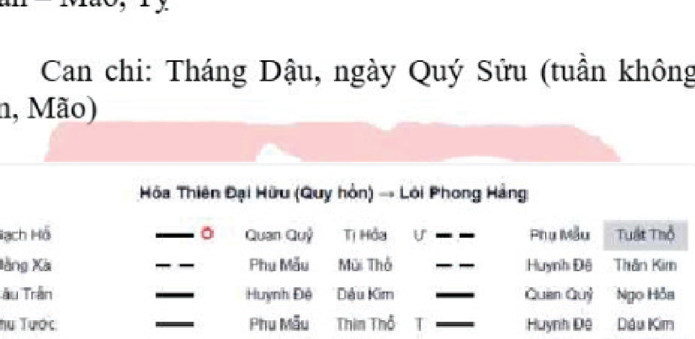

- **Cấu trúc Quẻ Dịch:**
  - **Quẻ chủ:** **Hỏa Thiên Đại Hữu** (Cung Càn, Họ Càn – Quẻ Quy hồn).  
    *Tượng quẻ:* Đại hữu dã, sở hữu lớn, thử qua vô số biện pháp, thuốc men và bệnh viện khác nhau.
  - **Quẻ biến:** **Lôi Phong Hằng** (Cung Chấn, Họ Chấn).  
    *Tượng quẻ:* Hằng dã, trường cửu, duy trì trạng thái cân bằng ổn định, không tái phát.

- **Bảng chi tiết Lục hào:**

| Hào | Thế/Ứng | Lục thân (Chủ) | Can Chi | Biến động | Lục thân (Biến) | Can Chi (Biến) | Thần sát / Phục | Lục thú |
|:---:|:---:|:---|:---|:---:|:---|:---|:---|:---|
| 6 | **Ứng** | Quan Quỷ | Tị - Hỏa | Động (Hóa Mộ) | Phụ Mẫu | Tuất - Thổ | Quý nhân (Biến Mưu tinh) | Bạch Hổ |
| 5 | | Phụ Mẫu | Mùi - Thổ | tĩnh | Huynh Đệ | Thân - Kim | Mưu tinh | Đằng Xà |
| 4 | | Huynh Đệ | Dậu - Kim | tĩnh | Quan Quỷ | Ngọ - Hỏa | Nguyệt kiến, Tướng tinh | Câu Trận |
| 3 | **Thế** | Phụ Mẫu | Thìn - Thổ | tĩnh | Huynh Đệ | Dậu - Kim | Thiên hỷ | Chu Tước |
| 2 | | Thê Tài | Dần - Mộc | tĩnh (Tuần không) | Tử Tôn | Hợi - Thủy | Kiếp sát, Tuần không | Thanh Long |
| 1 | | Tử Tôn | Tý - Thủy | Động (Hồi đầu khắc) | Phụ Mẫu | Sửu - Thổ | Lộc thần (Biến Hoa cái, Nhật) | Huyền Vũ |

---

### 3. Dụng thần & Loại quẻ

- **Phân loại quẻ:**
  - **Quẻ dự đoán y học trị liệu:** Xem xét hiệu quả điều trị của một phương pháp y khoa đặc thù (châm cứu) đối với căn bệnh mãn tính hiểm nghèo.
  - **Kỹ thuật nhập quái thân:** Tác giả Chu Thần Bân tự nhập tâm thức vào người bệnh để khởi quẻ.
- **Xác định Dụng thần:**
  1. **Người bệnh (Tiểu Trương):** Hào Thế Phụ Mẫu Thìn Thổ (lâm Chu Tước, Thiên hỷ).
  2. **Bệnh chứng (Cao huyết áp bẩm sinh):** Hào 6 Quan Quỷ Tị Hỏa lâm Bạch Hổ.
     - Hỏa đại diện cho huyết dịch, máu nóng.
     - Bạch Hổ đại diện cho huyết quản, mạch máu.
     - Vị trí hào 6 là đỉnh cao nhất của đồ hình quẻ, biểu thị áp lực huyết dịch dâng cao cực độ ở phần đầu (huyết áp 220 mmHg).
  3. **Bác sĩ Trịnh & Phương pháp châm cứu:** Hào Ứng Quan Quỷ Tị Hỏa động hóa Phụ Mẫu Tuất Thổ.
  4. **Thuốc hạ áp điều trị cũ tại địa phương:** Hào sơ Tử Tôn Tý Thủy động hóa Phụ Mẫu Sửu Thổ hồi đầu khắc.

---

### 4. Luận giải chi tiết

Quẻ này là một trường hợp kinh điển phản ánh sống động các cơ chế y lý qua ngôn ngữ Lục Hào:

#### 1. Sự đối ứng chính xác kỳ diệu giữa Quẻ tượng và Thực tế bệnh lý
- **Đặc trưng của bệnh chứng:** Quan Quỷ Tị Hỏa ngự tại đỉnh hào 6, mang theo Bạch Hổ. Hỏa là máu, Bạch Hổ là huyết quản, hào 6 là vòm đầu đỉnh cao. Hình tượng này lột tả chân thực trạng thái áp lực máu dồn dập căng thẳng lên thành mạch não – hoàn toàn trùng khớp với mức huyết áp 220 mmHg cấp cứu.
- **Sự thất bại của phác đồ điều trị cũ:**
  - Hào sơ Tử Tôn Tý Thủy phát động khắc Quan Quỷ Tị Hỏa: Tử Tôn là thuốc men trị bệnh, Thủy khắc Hỏa chính là cơ chế của thuốc tân dược hạ huyết áp.
  - Tuy nhiên, Tử Tôn Tý Thủy lại động hóa **Phụ Mẫu Sửu Thổ** (lâm Nhật kiến) – đây là thế **Hồi đầu khắc** chí mạng! Hào dược liệu tự bị khắc diệt.
  - Hào sơ đại diện cho vùng đất sở tại (địa phương Chiết Giang). Điều này phản ánh chính xác thực tế: Đương sự đã uống toàn bộ những loại thuốc hạ áp nhập khẩu tốt nhất và đắt tiền nhất tại các bệnh viện địa phương, nhưng thuốc chỉ có tác dụng tạm thời rồi mất hẳn hiệu lực (hồi đầu khắc), bệnh không suy giảm.
- **Quẻ chủ Hỏa Thiên Đại Hữu:** "Đại Hữu" biểu thị bệnh nhân đã thử qua vô số bệnh viện, phương thuốc, giáo sư chuyên khoa khác nhau trong suốt nhiều năm nhưng hoàn toàn bế tắc.

#### 2. Cơ chế châm cứu khống chế bệnh tà: Động mà Hóa Mộ
- Hào 6 Quan Quỷ Tị Hỏa (bệnh tà, hỏa khí bốc cao) phát động hóa **Phụ Mẫu Tuất Thổ**:
  - Trong ngũ hành biến dịch, Tuất là Mộ khố của Hỏa (Hỏa Mộ tại Tuất). Đây là mô hình **Động mà Hóa Mộ**.
  - Bệnh khí Quan Quỷ Tị Hỏa phát động lập tức bị thu nạp, nhốt chặt vào bên trong Mộ khố Tuất Thổ. Ngọn lửa bốc cao của huyết áp bị phong tỏa, hạ nhiệt và khống chế hoàn toàn.
  - Đồng thời, hào biến Phụ Mẫu Tuất Thổ thuộc thổ cục, quay lại tương trợ, sinh vượng cho hào Thế Phụ Mẫu Thìn Thổ. Điều này cho thấy liệu pháp châm cứu không những dập tắt được hỏa tà mà còn giúp bồi bổ chính khí, nâng cao thể trạng của người bệnh.
  - Đây là hào động mang tính chỉ đạo dứt khoát: Tiểu Trương nhất định phải đến nhờ bác sĩ Trịnh châm cứu, huyết áp chắc chắn sẽ được kiểm soát an toàn.

#### 3. Ý nghĩa Quẻ biến Lôi Phong Hằng: Giữ vững trạng thái ổn định lâu dài
- Quẻ biến là **Lôi Phong Hằng**: Hằng chủ về hằng cửu, duy trì thăng bằng, bền vững theo thời gian.
- Trong phép đoán bệnh: Nếu quẻ định tính là hung thì quẻ Hằng là bệnh tật đeo bám mãi không dứt; nhưng một khi định tính là cát lợi (hỏa tà bị hóa Mộ khống chế) thì quẻ Hằng báo hiệu một tin vui lớn: Sau khi huyết áp được châm cứu kéo hạ xuống, chỉ số sẽ duy trì ổn định bền bỉ, không bị trồi sụt hay tái phát vọt lên trở lại.

---

### 5. Kết luận & Ứng kỳ thực tế

- **Lời giải đoán & Khuyến nghị của Chu Thần Bân:**
  - Khẳng định Tiểu Trương đến gặp bác sĩ Trịnh là hoàn toàn đúng đắn. Phương pháp châm cứu sẽ kiểm soát được chứng cao huyết áp bẩm sinh nguy hiểm này, đưa huyết áp từ vùng nguy kịch trở về mức an toàn ổn định.
- **Ứng kỳ chiêm nghiệm & Phản hồi thực tế chấn động:**
  - Tiểu Trương lặn lội tới phòng khám của bác sĩ Trịnh. Trước điều trị, huyết áp đo thực tế là **220 / 145 mmHg**.
  - Chỉ sau **2 liệu trình châm cứu** (kéo dài khoảng 20 ngày), huyết áp tâm thu đã giảm thần kỳ xuống mức **135 mmHg**, huyết áp tâm trương trở về hoàn toàn bình thường!
  - Chu Thần Bân cùng Tiểu Trương đi dạo phố, thử vào ngẫu nhiên các hiệu thuốc tây ven đường để đo kiểm tra, các kết quả đo được đều dao động ổn định trong khoảng 130 – 150 mmHg.
  - Một tuần sau khi trở về quê nhà Chiết Giang, Tiểu Trương đo lại nhiều lần trước bữa ăn đều duy trì quanh mức **130 mmHg**. Đặc biệt hơn nữa, đợt châm cứu đả thông kinh lạc này còn đồng thời giải quyết triệt để chứng gan nhiễm mỡ và tình trạng thiếu máu cục bộ ở thận đã tồn tại nhiều năm.

---

### 6. Bài học tâm pháp & Quy tắc cốt lõi

- **Quy tắc trích dẫn từ sách:**
  - *Quy tắc dự đoán hiệu quả y học châm cứu đối với bệnh cao huyết áp mãn tính* (trang 370, rule_index).
- **Tâm pháp giải đoán thực chiến:**
  1. **Hình tượng hóa triệu chứng bệnh lý qua vị trí hào và lục thân:** Hỏa lâm Bạch Hổ tại hào 6 là tượng chuẩn xác nhất của chứng cao huyết áp kịch phát ở vùng đầu não.
  2. **Nhận diện cơ chế thuốc men mất tác dụng:** Tử Tôn động hóa Phụ Mẫu hồi đầu khắc ở hào sơ là hình tượng kinh điển của thuốc tây y tại địa phương bị lờn thuốc, mất dần hoạt tính trị liệu.
  3. **Cơ chế Động hóa Mộ trong tiêu trừ bệnh tà:** Quan Quỷ động hóa Mộ là bệnh khí bị thu giữ vào kho, tiêu biểu cho liệu pháp y học đặc trị có khả năng chế ngự và khóa chặt căn nguyên gây bệnh.
  4. **Quy tắc ứng dụng Quẻ Hằng trong tiên lượng:** Quẻ Hằng đại diện cho tính chất duy trì; khi kết hợp với hào động cát lợi, nó khẳng định sự phục hồi sức khỏe sẽ duy trì bền bỉ dài lâu.

## THỰC CHIẾN 104: HỎI BÁC SĨ TRỊNH GIÚP ĐỆ TỬ TIỂU ĐỀ Ở SƠN ĐÔNG CHÂM CỨU CHỮA CHỨNG SƯNG ĐAU ĐẦU GỐI LÂU NGÀY, MỘT LẦN CÓ THẬT SỰ CHỮA KHỎI KHÔNG?

---

### 1. Bối cảnh & Câu hỏi

- **Bối cảnh chi tiết:** 
  Một người đệ tử tên Tiểu Đề ở Sơn Đông nhân chuyến công tác tại Quảng Châu đã đến thăm Chu Thần Bân. Tiểu Đề mắc chứng viêm màng hoạt dịch khớp gối nghiêm trọng kéo dài nhiều tháng: cả hai đầu gối sưng to, đau đớn dữ dội khiến việc đi lại vô cùng khó khăn. Trước đó ở quê nhà, anh đã trải qua một đợt châm cứu hơn 10 lần (chi phí 2.000 tệ) nhưng hoàn toàn không có tiến triển. Khi cùng ngồi ăn cơm với danh y châm cứu Trịnh tiên sinh, bác sĩ Trịnh khuyên Tiểu Đề hãy ở lại thêm một ngày để ông châm cứu điều trị cho. Bác sĩ Trịnh khẳng định tự tin: *"Chỉ cần một lần châm cứu là giải quyết xong"*.
  Mặt khác, bản thân Chu Thần Bân lúc bấy giờ (46 tuổi) cũng đang bị hành hạ bởi chứng đau buốt khớp gối mỗi khi lên xuống cầu thang do thói quen thích mặc quần đùi lộ gối nhiễm phong thấp từ mùa thu năm trước. Chu Thần Bân nửa tin nửa ngờ về lời khẳng định "chữa một lần là khỏi", liền gieo quẻ vừa để hỏi cho đệ tử Tiểu Đề, vừa muốn thử nghiệm cho chính bản thân mình.
- **Tâm lý & Câu hỏi ẩn ý:** 
  Bệnh nhân hoài nghi sâu sắc trước một căn bệnh viêm khớp mãn tính dai dẳng: Liệu thuật châm cứu có thực sự thần kỳ đến mức "chỉ một lần duy nhất" có thể chữa khỏi dứt điểm hay không?
- **Thời gian chiêm đoán:**
  - Dương lịch: Ngày 01 tháng 10 năm 2017, lúc 20 giờ 11 phút (Giờ Bắc Kinh).
  - Can chi: Năm Đinh Dậu, tháng Kỷ Dậu, ngày Tân Dậu, giờ Mậu Tuất.

---

### 2. Dữ kiện & Bảng quẻ Crop

- **Thời không chiêm nghiệm:**
  - Năm Đinh Dậu, Tháng Kỷ Dậu, Ngày Tân Dậu: Cả ba trụ Năm, Tháng, Ngày đều lâm **Dậu Kim** (Kim khí vượng cực độ, túc sát chi khí cực thịnh).
  - Tuần không: **Tý - Sửu** (Giáp Ngọ tuần trung, Tý Sửu không vong).
- **Thần sát đầy đủ:**
  - Tướng tinh: Dậu (Lâm Thái tuế, Nguyệt kiến, Nhật kiến, Lộc thần)
  - Hoa cái: Sửu (Lâm Tuần không)
  - Dịch mã: Hợi
  - Tai sát: Mão
  - Mưu tinh: Mùi (Lâm hào 6 Thê Tài)
  - Đào hoa: Ngọ (Lâm hào Thế Tử Tôn Ngọ Hỏa, Quý nhân)
  - Kiếp sát: Dần (Lâm hào 2 Huynh Đệ)
  - Lộc thần: Dậu
  - Dương nhẫn: Thân (Lâm hào 5 Quan Quỷ, Thiên y)
  - Văn xương: Tý (Lâm hào Ứng Phụ Mẫu Tý Thủy, Tuần không)
  - Thiên y: Thân
  - Thiên hỷ: Thìn (Lâm hào 3 Thê Tài)
  - Quý nhân: Dần, Ngọ (Lâm hào Thế)

- Dữ kiện bảng quẻ và các thông số chiêm đoán:
  - **Bảng 104.1** Đồ hình quẻ Thực chiến 104:
    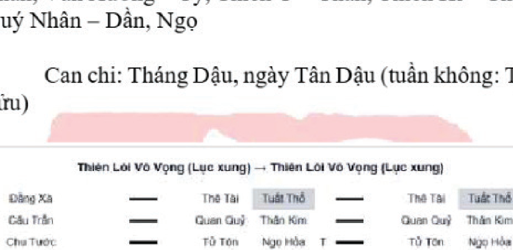

- **Cấu trúc Quẻ Dịch:**
  - **Quẻ chủ:** **Thiên Lôi Vô Vọng** (Cung Tốn, Họ Tốn – Quẻ tĩnh Lục xung).  
    *Tượng quẻ:* Vô vọng dã, không vọng tưởng, tự nhiên giải trừ; quẻ Lục xung chủ về lực xung tán bệnh tà cấp tốc, đả thông ứ trệ kinh lạc trong chốc lát.
  - **Quẻ biến:** Quẻ tĩnh không có hào minh động (Thiên Lôi Vô Vọng bất biến).

- **Bảng chi tiết Lục hào:**

| Hào | Thế/Ứng | Lục thân (Chủ) | Can Chi | Biến động | Lục thân (Biến) | Can Chi (Biến) | Thần sát / Phục | Lục thú |
|:---:|:---:|:---|:---|:---:|:---|:---|:---|:---|
| 6 | | Thê Tài | Tuất - Thổ | tĩnh | Thê Tài | Tuất - Thổ | Mưu tinh | Đằng Xà |
| 5 | | Quan Quỷ | Thân - Kim | tĩnh | Quan Quỷ | Thân - Kim | Dương nhẫn, Thiên y | Câu Trận |
| 4 | **Thế** | Tử Tôn | Ngọ - Hỏa | tĩnh | Tử Tôn | Ngọ - Hỏa | Quý nhân, Đào hoa | Chu Tước |
| 3 | | Thê Tài | Thìn - Thổ | tĩnh | Thê Tài | Thìn - Thổ | Thiên hỷ | Thanh Long |
| 2 | | Huynh Đệ | Dần - Mộc | tĩnh | Huynh Đệ | Dần - Mộc | Kiếp sát, Quý nhân | Huyền Vũ |
| 1 | **Ứng** | Phụ Mẫu | Tý - Thủy | tĩnh | Phụ Mẫu | Tý - Thủy | Văn xương, Tuần không | Bạch Hổ |

---

### 3. Dụng thần & Loại quẻ

- **Phân loại quẻ:**
  - **Quẻ dự đoán y học châm cứu / Quẻ tĩnh tâm thái vấn tật:** Trắc nghiệm hiệu quả của một liệu pháp châm cứu đặc thù đối với bệnh lý cơ xương khớp kinh niên.
  - **Quẻ "Nhất tiễn song điêu":** Khởi quẻ hỏi cho đệ tử nhưng đồng thời giải tỏa băn khoăn cho chính căn bệnh đầu gối của tác giả Chu Thần Bân.
- **Xác định Dụng thần:**
  1. **Hiệu quả trị liệu / Bác sĩ (Tử Tôn Ngọ Hỏa):** Trì tại hào Thế. Tử Tôn là phúc thần tiêu trừ bệnh tật, lâm Quý nhân biểu thị y thuật cao minh mang lại sự an tâm tuyệt đối.
  2. **Bệnh chứng sưng đau khớp gối (Phụ Mẫu Tý Thủy tại hào Ứng):**
     - Vị trí hào sơ: Đại diện cho vùng cẳng chân, đầu gối và bàn chân (khu vực thấp nhất của cơ thể).
     - Lục thân Phụ Mẫu: Đại diện cho chứng bệnh phong thấp tích tụ lâu ngày, dai dẳng.
     - Bạch Hổ: Biểu tượng của đau nhức cấp tính, sưng tấy dữ dội.
     - Tuần không: Biểu thị hiện tượng "hư phù", tích tụ dịch màng hoạt dịch làm đầu gối sưng phồng lên.

---

### 4. Luận giải chi tiết

Quẻ này là một mẫu mực sáng tạo đặc sắc về việc phá vỡ giáo điều sách vở cổ điển trong việc luận giải quẻ Lục xung hỏi bệnh:

#### 1. Biện chứng phá bỏ định kiến "Cửu bệnh phùng xung tất tử"
- Sách cổ truyền khẩu quy tắc: *"Cửu bệnh phùng xung tất tử, cận bệnh phùng xung tức dũ"* (Bệnh lâu ngày gặp quẻ Lục xung thì chết, bệnh mới gặp Lục xung thì khỏi).
- Nếu máy móc áp dụng câu khẩu quyết này vào ca của Tiểu Đề (bệnh sưng khớp gối đã kéo dài nhiều tháng, là "cửu bệnh"), ắt sẽ hoang mang cho rằng bệnh nhân gặp đại nạn hoặc tàn phế.
- Tuy nhiên, Chu Thần Bân chỉ rõ: Câu hỏi thực chất ở đây không phải hỏi về tuổi thọ sinh mệnh, mà hỏi về **hiệu năng của thủ thuật châm cứu một lần**. Quẻ Lục xung mang năng lượng phân tán cực mạnh, biểu thị kỹ thuật châm cứu có khả năng xung kích, làm tan biến ổ dịch viêm màng hoạt dịch và trục xuất phong thấp hàn tà ra khỏi ổ khớp ngay lập tức.

#### 2. Tử Tôn trì Thế trong Quẻ tĩnh: Điềm báo "An tâm" trọn vẹn
- Trong quẻ tĩnh, hào Thế Tử Tôn Ngọ Hỏa có căn bản vững vàng, đắc vị, lâm Quý nhân.
- Theo quy tắc quẻ tĩnh của Cổ Thệ Chân Thuyên: Hào Thế lâm Tử Tôn không bị hình xung khắc hại là tiêu chí khẳng định người bệnh hoàn toàn có thể an tâm, phương pháp trị liệu được chọn là vô cùng chính xác và đem lại hiệu quả triệt để.

#### 3. Sự ứng đối giải phẫu bệnh học kỳ tài qua Lục hào
- Hào sơ Phụ Mẫu Tý Thủy lâm Bạch Hổ ngộ Tuần không:
  - Hào 1 là khớp chân, đầu gối.
  - Phụ Mẫu mang hành Thủy chủ bệnh thấp tà tích tụ lâu ngày; mang Văn xương là bệnh lý phức tạp đòi hỏi tay nghề kỹ thuật cao mới xử lý được.
  - Bạch Hổ chủ về những cơn đau buốt nhức nhối; Tuần không đại diện cho hiện tượng tràn dịch khớp gối sưng phù (bên trong rỗng tích dịch).
  - Tý Thủy ở hào Ứng trực xung với hào Thế Tử Tôn Ngọ Hỏa (Tý - Ngọ tương xung): Cơn đau khớp gối thường xuyên dội lên kịch liệt khiến người bệnh mất ăn mất ngủ.

---

### 5. Kết luận & Ứng kỳ thực tế

- **Lời giải đoán của Chu Thần Bân:**
  - Khẳng định liệu pháp châm cứu của bác sĩ Trịnh chắc chắn sẽ chữa khỏi dứt điểm chứng sưng đau đầu gối kinh niên chỉ trong một lần duy nhất.
- **Ứng kỳ chiêm nghiệm & Phản hồi thực tế kinh ngạc:**
  - **Với đệ tử Tiểu Đề:** Bác sĩ Trịnh tiến hành châm cứu trong khoảng 2 giờ đồng hồ kết hợp bôi thuốc thảo dược. Sau 3 ngày tháo thuốc, đầu gối hết đau hoàn toàn. Một tuần sau, ổ dịch viêm tiêu biến, hai đầu gối hết sưng và đi lại bình thường hoàn toàn.
  - **Với chính Chu Thần Bân:** Thấy quẻ ứng nghiệm phi thường, Chu Thần Bân lập tức nhờ bác sĩ Trịnh châm cứu chữa hai đầu gối bị đau phong thấp khi lên xuống cầu thang. Bác sĩ Trịnh châm kim dày đặc cả hai chân và hai lòng bàn tay đúng một lần duy nhất. Sau 3 ngày, cơn đau biến mất vĩnh viễn, lên xuống cầu thang hoàn toàn bình thường cho đến tận nhiều năm sau.
  - **Hiệu ứng lan tỏa:** Cuối năm đó, cha vợ Chu Thần Bân bị chóng mặt kinh niên do đi bộ và mẹ ruột bị ho viêm phổi kéo dài cũng đều được bác sĩ Trịnh châm cứu 1-2 lần là dứt điểm hoàn toàn.

---

### 6. Bài học tâm pháp & Quy tắc cốt lõi

- **Quy tắc trích dẫn từ sách:**
  - *Quy tắc quẻ Lục xung tĩnh đối với châm cứu đặc trị bệnh khớp gối kinh niên* (trang 375, rule_index).
- **Tâm pháp giải đoán thực chiến:**
  1. **Linh hoạt áp dụng Cửu bệnh phùng xung:** Khi hỏi về hiệu quả của một liệu pháp y khoa công phạt tà khí (như châm cứu, phẫu thuật bóc tách), quẻ Lục xung biểu thị tốc độ giải tỏa bệnh tà mau lẹ, tuyệt đối không được đánh đồng với điềm hung tử biệt.
  2. **Giải mã triệu chứng sưng phù bằng Tuần không:** Hào bệnh (Phụ Mẫu Thủy) lâm Tuần không phản ánh sự phù nề, ứ trệ dịch thể tại các mô sụn khớp (trạng thái hư phù).
  3. **Tử Tôn trì Thế trong quẻ vấn bệnh tĩnh:** Khẳng định sự ứng nghiệm của thầy thuốc và thuốc men, mang lại sự bình an tuyệt đối cho người hỏi.

## THỰC CHIẾN 105: QUẺ PHỤ THÊ HỎI VỀ XU HƯỚNG CHÂM CỨU CỦA ĐỆ TỬ QUẢNG ĐÔNG TÊN TIỂU NGHIÊM ĐANG ĐIỀU TRỊ

---

### 1. Bối cảnh & Câu hỏi

- **Bối cảnh chi tiết:** 
  Một người đệ tử ở Quảng Đông tên là Tiểu Nghiêm mắc chứng bệnh phong thấp trầm kha kéo dài hơn 20 năm. Dưới góc độ y học hiện đại, bệnh tình của Tiểu Nghiêm vô cùng phức tạp và nan giải, biểu hiện thương tổn nghiêm trọng tại 3 vị trí trọng yếu trên cơ thể:
  1. *Vùng đầu:* Chứng phong thấp lâu năm bốc lên gây đau đầu, hoa mắt, chóng mặt kinh niên dữ dội.
  2. *Vùng thắt lưng:* Đốt sống thắt lưng bị tổn thương phong thấp nặng dẫn đến rạn nứt xương, bệnh viện chỉ định bắt buộc phải phẫu thuật mổ mở để bắt vít cố định cột sống.
  3. *Vùng chân:* Khớp mắt cá chân bị phong thấp hàn tà tàn phá dẫn đến biến dạng khớp, đi lại khập khiễng đau đớn.
  Ngoài ra, bệnh nhân còn kèm theo viêm loét dạ dày kinh niên và gan nhiễm mỡ. Tiểu Nghiêm tìm đến danh y Trịnh để cầu cứu phương pháp châm cứu. Bác sĩ Trịnh khẳng định tự tin: Vết nứt xương sống chỉ cần châm cứu hai ba lần là có thể tự liền lại mà không cần mổ bắt vít, các chứng đau đầu và mắt cá chân cũng sẽ được điều chỉnh dứt điểm. Chu Thần Bân tiến hành nhập thể vào Tiểu Nghiêm để lập quẻ dự đoán xu hướng và hiệu quả của đợt điều trị châm cứu này.
- **Tâm lý & Câu hỏi ẩn ý:** 
  Căn bệnh phong thấp 20 năm đã hủy hoại thể xác người bệnh; sự hoài nghi về việc châm cứu có thể làm liền xương nứt đốt sống và khôi phục mắt cá chân biến dạng mà không cần phẫu thuật thôi thúc việc lập quẻ tìm kiếm câu trả lời của Dịch lý.
- **Thời gian chiêm đoán:**
  - Dương lịch: Ngày 30 tháng 11 năm 2017, lúc 20 giờ 30 phút (Giờ Bắc Kinh).
  - Can chi: Năm Đinh Dậu, tháng Tân Hợi, ngày Tân Dậu, giờ Mậu Tuất.

---

### 2. Dữ kiện & Bảng quẻ Crop

- **Thời không chiêm nghiệm:**
  - Tháng Tân Hợi (Thủy vượng, Mộc tướng, Kim hưu, Thổ tù, Hỏa tuyệt).
  - Ngày Tân Dậu (Kim vượng, Thủy tướng, Thổ hưu, Hỏa tù, Mộc tuyệt).
  - Tuần không: **Tý - Sửu** (Giáp Dần tuần trung, Tý Sửu không vong).
- **Thần sát đầy đủ:**
  - Tướng tinh: Dậu (Lâm Nhật kiến, hào 4 Huynh Đệ, Lộc thần)
  - Hoa cái: Sửu (Lâm Tuần không)
  - Dịch mã: Hợi (Lâm Nguyệt kiến)
  - Tai sát: Mão
  - Mưu tinh: Mùi (Lâm hào 5 Phụ Mẫu)
  - Đào hoa: Ngọ (Lâm hào biến Quan Quỷ Ngọ Hỏa)
  - Kiếp sát: Dần (Lâm hào 2 Thê Tài Dần Mộc)
  - Lộc thần: Dậu
  - Dương nhẫn: Thân (Lâm hào biến Huynh Đệ Thân Kim)
  - Văn xương: Tý (Lâm hào sơ Tử Tôn Tý Thủy, Tuần không)
  - Thiên y: Tuất (Lâm hào biến Phụ Mẫu Tuất Thổ)
  - Thiên hỷ: Mùi (Lâm hào 5 Phụ Mẫu Mùi Thổ)
  - Quý nhân: Dần, Ngọ

- Dữ kiện bảng quẻ và các thông số chiêm đoán:
  - **Bảng 105.1** Đồ hình quẻ Thực chiến 105:
    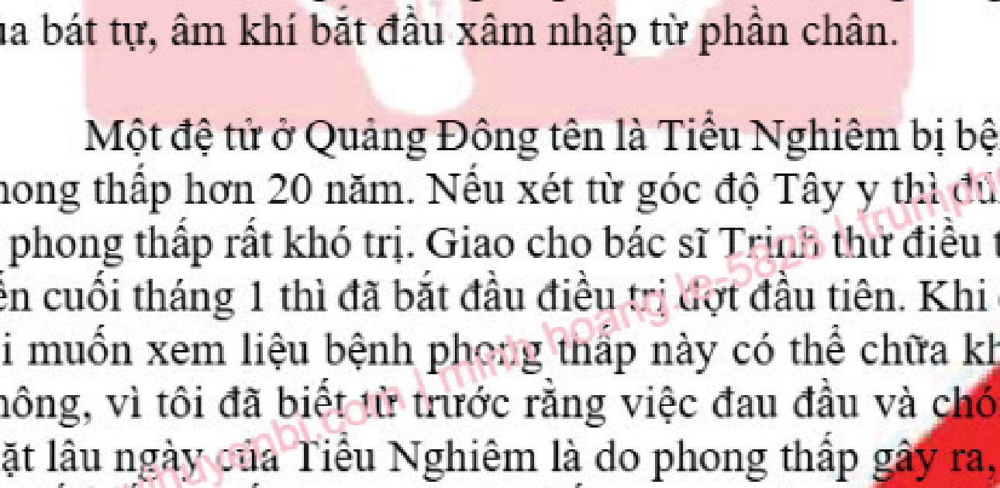

- **Cấu trúc Quẻ Dịch:**
  - **Quẻ chủ:** **Hỏa Thiên Đại Hữu** (Cung Càn, Họ Càn – Quẻ Quy hồn).  
    *Tượng quẻ:* Đại hữu dã, có nhiều chỗ; phản ánh trung thực hiện trạng cơ thể có nhiều ổ bệnh phân bố khắp nơi từ đầu đến chân.
  - **Quẻ biến:** **Lôi Thủy Giải** (Cung Chấn, Họ Chấn).  
    *Tượng quẻ:* Giải dã, giải tỏa, đả thông ứ trệ, tiêu trừ bế tắc; tượng trưng cho kinh lạc toàn thân được khai thông, bệnh tật tiêu tán.

- **Bảng chi tiết Lục hào:**

| Hào | Thế/Ứng | Lục thân (Chủ) | Can Chi | Biến động | Lục thân (Biến) | Can Chi (Biến) | Thần sát / Phục | Lục thú |
|:---:|:---:|:---|:---|:---:|:---|:---|:---|:---|
| 6 | **Ứng** | Quan Quỷ | Tị - Hỏa | Động (Hóa Mộ) | Phụ Mẫu | Tuất - Thổ | Biến Thiên y (Dương nhẫn) | Đằng Xà |
| 5 | | Phụ Mẫu | Mùi - Thổ | tĩnh | Huynh Đệ | Thân - Kim | Mưu tinh, Thiên hỷ | Câu Trận |
| 4 | | Huynh Đệ | Dậu - Kim | tĩnh | Quan Quỷ | Ngọ - Hỏa | Nhật kiến, Tướng tinh, Lộc | Chu Tước |
| 3 | **Thế** | Phụ Mẫu | Thìn - Thổ | Động (Hồi đầu sinh) | Quan Quỷ | Ngọ - Hỏa | Nhật hợp (Biến Đào hoa) | Thanh Long |
| 2 | | Thê Tài | Dần - Mộc | tĩnh | Phụ Mẫu | Thìn - Thổ | Kiếp sát, Quý nhân | Huyền Vũ |
| 1 | | Tử Tôn | Tý - Thủy | Động (Tuần không) | Thê Tài | Dần - Mộc | Văn xương, Tuần không | Bạch Hổ |

---

### 3. Dụng thần & Loại quẻ

- **Phân loại quẻ:**
  - **Quẻ dự đoán y học châm cứu nan y:** Xem xét quá trình điều trị chứng phong thấp toàn thân kéo dài 20 năm kèm biến chứng tổn thương xương khớp nghiêm trọng.
  - **Kỹ thuật nhập thể đồng môn:** Chu Thần Bân định tâm nhập vai vào cơ thể Tiểu Nghiêm để gieo quẻ.
- **Xác định Dụng thần & Định vị 3 ổ bệnh chính qua 3 hào động:**
  1. **Ổ bệnh vùng đầu (Hào 6 Quan Quỷ Tị Hỏa lâm Đằng Xà động biến Phụ Mẫu Tuất Thổ):** Hào 6 là phần đầu cao nhất, Quan Quỷ động biểu thị chứng đau đầu chóng mặt kinh niên.
  2. **Ổ bệnh vùng cột sống thắt lưng (Hào 3 Phụ Mẫu Thìn Thổ trì Thế lâm Thanh Long động biến Quan Quỷ Ngọ Hỏa):** Hào 3 là vùng thắt lưng, Thanh Long là trục xương sống uốn lượn; Thìn Thổ là thủy khố đọng thấp khí; rạn nứt xương sống.
  3. **Ổ bệnh vùng mắt cá chân (Hào sơ Tử Tôn Tý Thủy lâm Bạch Hổ động biến Thê Tài Dần Mộc):** Hào sơ là bàn chân, mắt cá chân; Bạch Hổ là sưng tấy biến dạng xương khớp do phong thấp hàn tà xâm nhập từ dưới đất lên.

---

### 4. Luận giải chi tiết

Quẻ này là một kiệt tác về sự kết hợp giữa giải phẫu cơ thể học, Bát tự và cơ chế Đông y qua mô hình Lục Hào:

#### 1. Sự phân bổ kỳ diệu của 3 hào động tương ứng 3 ổ bệnh
Trong quẻ này, không có sự liên kết dây chuyền giữa các hào động thông thường, mà **ba hào động trực tiếp định vị chính xác 3 khu vực bệnh lý** trên thân thể:
- **Hào sơ Bạch Hổ Tử Tôn Tý Thủy (Mắt cá chân):**
  - Hào 1 là phần thấp nhất – cẳng chân và mắt cá chân. Bạch Hổ động chủ về biến dạng, đau buốt dữ dội.
  - Tử Tôn Tý Thủy động hóa Thê Tài Dần Mộc: Tử Tôn là thần dược dập tắt Quan Quỷ, động hóa hữu ích chứng tỏ phương pháp châm cứu tại vùng chân đã khống chế được phong thấp hàn tà, chặn đứng đà biến dạng khớp.
  - *Tương ứng Bát tự:* Trụ giờ của Tiểu Nghiêm là Thất sát. Do đặc thù công việc quản lý đường cao tốc miền núi, đương sự thường ngủ qua đêm ở những trạm làm việc âm u giữa rừng, từng nhiều lần mộng thấy tà khí. Khí lạnh âm hàn đã xâm nhập trực tiếp từ bàn chân (hào sơ) đi lên suốt 20 năm.
- **Hào 3 Thanh Long Phụ Mẫu Thìn Thổ trì Thế (Đốt sống thắt lưng):**
  - Hào 3 nằm ở giữa thân thể, tương ứng với vùng eo và thắt lưng.
  - Lâm **Thanh Long**: Thanh Long uốn lượn chính là hình tượng của trục cột sống rồng nâng đỡ cơ thể con người.
  - Phụ Mẫu Thìn Thổ là Thủy khố – kho chứa nước, phản ánh thấp khí ẩm hàn tích tụ dày đặc tại các đốt sống thắt lưng gây mục rỗng, rạn nứt xương.
  - Hào Thế Thìn Thổ động hóa Quan Quỷ Ngọ Hỏa là **Hồi đầu sinh**: Trong quẻ hỏi bệnh, khi hào Thế được hồi đầu sinh và Quan Quỷ đóng vai trò nguyên thần của Thổ, điều này báo hiệu sinh khí của xương khớp được phục hồi mạnh mẽ, bệnh chứng đi vào ổn định.
  - Đặc biệt, Phụ Mẫu Thìn Thổ đắc **Nhật kiến Tân Dậu tương hợp** (Thìn - Dậu lục hợp): Tương hợp là tượng gắn kết, liền lạc lại với nhau! Đây là bằng chứng thép của Dịch lý xác nhận vết rạn nứt đốt sống sẽ tự liền lại một cách kỳ diệu mà không cần đến phẫu thuật mổ bắt vít.
- **Hào 6 Đằng Xà Quan Quỷ Tị Hỏa (Vùng đầu não):**
  - Hào 6 là đỉnh đầu. Quan Quỷ Tị Hỏa phát động mang Dương nhẫn (máu huyết ứ trệ) gây chứng đau đầu, choáng váng kinh niên.
  - Quan Quỷ Tị Hỏa động hóa **Phụ Mẫu Tuất Thổ**: Hỏa động hóa Mộ khố tại Tuất! Bệnh tà trên đầu bị thu gom, khóa chặt vào Mộ khố, đồng thời Tuất Thổ sinh trợ cho Thế Thìn Thổ. Cơn đau đầu chóng mặt bị dập tắt hoàn toàn.

#### 2. Quẻ Lôi Thủy Giải và Cơ chế "Tuần hoàn tổng thể"
- Quẻ chủ là **Hỏa Thiên Đại Hữu**: Bệnh tà xuất hiện nhiều nơi ("Đại Hữu" bệnh chứng).
- Quẻ biến là **Lôi Thủy Giải**: "Giải" là giải tỏa, giải trừ, đả thông bế tắc.
- Trong Đông y châm cứu, khi các huyệt đạo trọng yếu được khai thông, luồng chân khí sẽ vận hành khắp kinh lạc tạo nên cơ chế **"Tuần hoàn tổng thể"**:
  - Không những 3 ổ bệnh chính (đầu, lưng, mắt cá) được chữa lành,
  - Mà những chứng bệnh nội tạng mãn tính khác của bệnh nhân bao gồm **bệnh viêm loét dạ dày** và **gan nhiễm mỡ** cũng vô hình trung được cơ thể tự điều tiết phục hồi và tiêu trừ triệt để.

---

### 5. Kết luận & Ứng kỳ thực tế

- **Lời giải đoán của Chu Thần Bân:**
  - Cả 3 bệnh chứng lớn của Tiểu Nghiêm đều sẽ được chữa khỏi nhờ thuật châm cứu của bác sĩ Trịnh theo đúng tinh thần của quẻ Giải.
  - Khẳng định phần xương cột sống bị nứt sẽ tự liền lại rất nhanh, tuyệt đối không cần phẫu thuật bắt vít nguy hiểm.
- **Ứng kỳ chiêm nghiệm & Phản hồi thực tế chấn động:**
  - Tiểu Nghiêm trải qua **2 liệu trình châm cứu** của bác sĩ Trịnh:
    + Chứng đau đầu, chóng mặt hành hạ suốt 20 năm biến mất hoàn toàn.
    + Phần đốt sống thắt lưng bị nứt rạn đã tự liền lại chỉ trong vài ngày đúng như dự đoán của bác sĩ Trịnh, không cần phẫu thuật.
    + Khớp mắt cá chân hết đau nhức, phần xương biến dạng dần dần hồi phục trở lại hình thái bình thường.
    + Đáng kinh ngạc hơn cả, theo cơ chế tuần hoàn tổng thể, căn bệnh đau dạ dày kinh niên và gan nhiễm mỡ của Tiểu Nghiêm cũng đồng thời tự khỏi, cơ thể nhẹ nhõm, khỏe mạnh hoàn toàn.

---

### 6. Bài học tâm pháp & Quy tắc cốt lõi

- **Quy tắc trích dẫn từ sách:**
  - *Quy tắc quẻ Giải và cơ chế tuần hoàn tổng thể trong điều trị châm cứu phong thấp mãn tính* (trang 380, rule_index).
- **Tâm pháp giải đoán thực chiến:**
  1. **Định vị bệnh lý đa ổ thương tổn qua các hào động:** Khi cơ thể mắc nhiều bệnh chứng, mỗi hào động sẽ tương ứng với một vùng giải phẫu cụ thể (hào 1 là mắt cá/bàn chân, hào 3 là thắt lưng/cột sống, hào 6 là đầu não).
  2. **Thanh Long tại hào 3 và hiện tượng Liền xương nhờ Nhật hợp:** Thanh Long là trục xương sống; hào Thế Phụ Mẫu tượng xương cốt đắc Nhật kiến tương hợp là biểu tượng chuẩn xác của xương gãy/nứt tự liền gắn kết.
  3. **Động hóa Mộ dập tắt bệnh tà vùng đầu:** Hào 6 Quan Quỷ động hóa Mộ khố là phương pháp giải phóng áp lực và tiêu trừ tận gốc chứng đau đầu mãn tính.
  4. **Triết lý Quẻ Giải và Tuần hoàn tổng thể trong Đông y:** Cơ thể là một mạng lưới thống nhất; khi châm cứu đả thông kinh lạc theo quẻ Giải, sinh khí lưu chuyển sẽ tự động chữa lành các bệnh lý liên đới trong ngũ tạng mà không cần tác động riêng rẽ.

---

## THỰC CHIẾN 106: ĐỆ TỬ HỒ NAM LÀ TIỂU TIÊU TỰ XEM QUẺ HỎI HIỆU QUẢ TRỊ LIỆU BỆNH PARKINSON TẠI QUẢNG CHÂU BẰNG CHÂM CỨU

---

### 1. Bối cảnh & Câu hỏi

- **Bối cảnh chi tiết:**
  - Tiểu Tiêu là một đệ tử người Hồ Nam của Chu Thần Bân. Anh mắc chứng bệnh Parkinson đã ròng rã 10 năm, nhưng chỉ mới được các bệnh viện chẩn đoán chính xác vài năm gần đây.
  - Ban đầu khi khởi phát, các cơ sở y tế không nghĩ đến hội chứng Parkinson nên điều trị chệch hướng. Đến khi triệu chứng bộc lộ rõ rệt thì bệnh đã chuyển nặng: khởi đầu từ chân phải run rẩy, sau đó lan sang tay phải run mất kiểm soát, cơ mặt bị đơ cứng, cơ cổ co cứng, giọng nói nhỏ dần do cơ kiểm soát thanh quản thoái hóa, chữ viết tay ngày càng thu nhỏ lại.
  - Tiểu Tiêu đã áp dụng đủ phương thức điều trị từ Tây y đến Trung y kết hợp tại Quảng Đông và Hồ Nam nhưng tiên lượng rất bi quan. Các bác sĩ dự đoán người bệnh chỉ có thể duy trì được từ 10 đến tối đa 15 năm trước khi suy kiệt cơ bắp.
  - Tình cờ biết được bác sĩ Trịnh tại Quảng Châu có liệu pháp châm cứu đặc thù và từng chữa trị thành công một ca Parkinson, Tiểu Tiêu quyết định tham vấn và tự gieo một quẻ Dịch để dự trắc về hiệu quả thực tế của phương pháp này.
- **Tâm lý & Câu hỏi ẩn ý:**
  - Đương sự đứng trước áp lực sinh tử của một căn bệnh thoái hóa thần kinh nan y. Tâm lý sâu kín vừa khao khát được chữa khỏi dứt điểm, vừa thực tế mong mỏi tìm được liệu pháp khống chế và làm thuyên giảm các triệu chứng run giật, co cứng đang hành hạ thân thể.
  - Nội dung câu hỏi cụ thể: *"Bác sĩ Trịnh tại Quảng Châu trị liệu Parkinson bằng châm cứu có hiệu quả không, có thể chữa khỏi bệnh hay không?"*
- **Thời gian chiêm đoán:**
  - Giờ Bắc Kinh: Ngày 31 tháng 10 năm 2017, 01:52.
  - Can chi: Năm Đinh Dậu, tháng Canh Tuất, ngày Tân Mão, giờ Kỷ Sửu.

---

### 2. Dữ kiện & Bảng quẻ Crop

- **Thời không chiêm nghiệm:**
  - Tháng Canh Tuất (Thổ vượng, sinh trợ Kim, khắc chế Thủy, lâm Nguyệt kiến).
  - Ngày Tân Mão (Mộc vượng, xung khắc Dậu Kim, lâm Nhật kiến).
  - Tuần không: **Ngọ - Mùi** (Giáp Thân tuần trung, Ngọ Mùi không vong).
- **Thần sát đầy đủ:**
  - Tướng tinh: Mão
  - Hoa cái: Mùi
  - Dịch mã: Tị
  - Tai sát: Dậu
  - Mưu tinh: Sửu
  - Đào hoa: Tý
  - Kiếp sát: Thân
  - Lộc thần: Dậu
  - Dương nhẫn: Thân
  - Văn xương: Tý
  - Thiên y: Dậu
  - Thiên hỷ: Thìn
  - Quý nhân: Dần, Ngọ

- Dữ kiện bảng quẻ và các thông số chiêm đoán:
  - **Bảng 106.1** Đồ hình quẻ Thực chiến 106:
    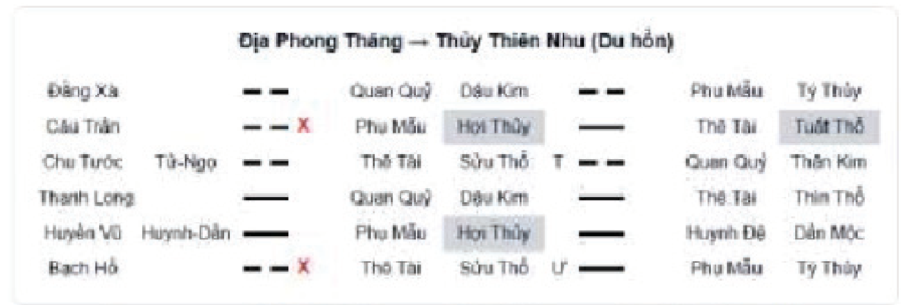

- **Cấu trúc Quẻ Dịch:**
  - **Quẻ chủ:** **Địa Phong Thăng** (Cung Chấn, Họ Chấn)  
    *Ý nghĩa quẻ:* Thăng tiến, đi lên. Trong bệnh lý, quẻ Thăng mang tượng bệnh tình có xu hướng tiếp tục gia tăng, triệu chứng tích lũy nặng nề nếu phương pháp điều trị không đúng đắn.
  - **Quẻ biến:** **Thủy Thiên Nhu** (Cung Côn, Họ Côn – Quẻ Du Hồn)  
    *Ý nghĩa quẻ:* Chờ đợi, cần kiên nhẫn tích lũy và nuôi dưỡng, không thể nóng vội đòi hỏi kết quả tức thì.

- **Bảng chi tiết Lục hào:**

| Hào | Thế/Ứng | Lục thân (Chủ) | Can Chi | Biến động | Lục thân (Biến) | Can Chi (Biến) | Thần sát / Phục | Lục thú |
|:---:|:---:|:---|:---|:---:|:---|:---|:---|:---|
| 6 | | Quan Quỷ | Dậu - Kim | tĩnh (Ám động) | Phụ Mẫu | Tý - Thủy | Tai sát, Thiên y, Lộc thần | Đằng Xà |
| 5 | | Phụ Mẫu | Hợi - Thủy | **X (Động)** | Thê Tài | Tuất - Thổ | | Câu Trần |
| 4 | **Thế** | Thê Tài | Sửu - Thổ | tĩnh | Quan Quỷ | Thân - Kim | Mưu tinh | Chu Tước |
| 3 | | Quan Quỷ | Dậu - Kim | tĩnh (Ám động) | Thê Tài | Thìn - Thổ | Tai sát, Thiên y, Lộc thần | Thanh Long |
| 2 | | Phụ Mẫu | Hợi - Thủy | tĩnh | Huynh Đệ | Dần - Mộc | Phục Huynh Đệ Dần Mộc | Huyền Vũ |
| 1 | **Ứng** | Thê Tài | Sửu - Thổ | **X (Động)** | Phụ Mẫu | Tý - Thủy | Bạch Hổ | Bạch Hổ |

*(Ghi chú phục thần: Hào 4 Thế phục Tử Tôn Ngọ Hỏa lâm Tuần không; hào 2 phục Huynh Đệ Dần Mộc).*

---

### 3. Dụng thần & Loại quẻ

- **Phân loại quẻ:**
  - Quẻ sự việc cụ thể kết hợp vấn bệnh nan y và khảo sát hiệu quả của một liệu trình y tế chuyên biệt (châm cứu tại Quảng Châu).
  - Quẻ có yếu tố tâm thái sâu sắc phản ánh qua cơ chế đối vị và hào tâm niệm ẩn tàng.
- **Định vị hệ thống Dụng thần cốt lõi:**
  - **Dụng thần Bệnh tật (Kỵ thần):** **Quan Quỷ Dậu Kim** tại hào 3 và hào 6. Đây là hiện thân trực tiếp của mầm bệnh thoái hóa thần kinh Parkinson.
  - **Dụng thần Bản thân (Hào Thế):** **Thê Tài Sửu Thổ** tại hào 4. Sửu Thổ là Kim khố (kho mộ chứa Kim), thể hiện nỗ lực chủ quan của đương sự muốn bao bọc, kiềm chế và giam giữ mầm mống Quan Quỷ Kim.
  - **Dụng thần Y tế & Nơi chỉ định (Hào Ứng):** **Thê Tài Sửu Thổ** tại hào 1, đại diện cho bác sĩ Trịnh và cơ sở điều trị châm cứu tại Quảng Châu.
  - **Hào tâm niệm 1 (Khao khát chữa khỏi dứt điểm):** **Tử Tôn Ngọ Hỏa** phục tàng dưới hào Thế, nhưng lâm **Tuần không**.
  - **Hào tâm niệm 2 (Hy vọng làm thuyên giảm, thoái lui triệu chứng):** **Quan Quỷ Thân Kim** (hào đối vị biến ra ở bên phải hào Thế trong quẻ Nhu).

---

### 4. Luận giải chi tiết

Quẻ này là một mẫu mực kinh điển về kỹ thuật phân tích điểm bệnh phát tác ngầm và cơ chế hóa hợp triệt tiêu nguồn sinh bệnh:

#### 1. Định vị điểm bệnh qua hai hào Quan Quỷ Dậu Kim ám động
- Trong quẻ xuất hiện hai hào **Quan Quỷ Dậu Kim** tại hào 3 và hào 6:
  - Cả hai hào Dậu Kim đều được Nguyệt lệnh Canh Tuất tương sinh mạnh mẽ (Thổ sinh Kim), do đó ở vào trạng thái vượng tướng.
  - Ngày chiêm là **Tân Mão**, Mão Mộc trực xung Dậu Kim (*Tân Mão xung Dậu*). Hào vượng tướng mà bị Nhật thần xung phá thì không bị tán mà hóa thành **Ám động**.
- **Ý nghĩa bệnh lý học Lục Hào:**
  - Ám động phản ánh điểm bệnh đang phát tác dữ dội ngấm ngầm bên trong cơ thể, các triệu chứng run giật đang biểu hiện thường trực.
  - **Hào 3 lâm Thanh Long:** Hào 3 chủ về chi dưới, Thanh Long chủ về hình thể lớn hơn -> đại diện cho điểm bệnh phát tác ở **chân phải**.
  - **Hào 6 lâm Đằng Xà:** Hào 6 chủ về phần trên đầu chi, Đằng Xà chủ về uốn lượn, co giật co rút -> đại diện cho điểm bệnh phát tác ở **tay phải**.
  - Hai điểm bệnh ám động này phản ánh chính xác triệu chứng thực tế: chân phải run trước, sau đó tay phải run theo mất kiểm soát.

#### 2. Phân tích hào tâm niệm kép (Khao khát khỏi bệnh vs Thực tế thuyên giảm)
- **Tâm niệm thứ nhất (Chữa khỏi dứt điểm):**
  - Đương số ôm ấp hy vọng điều trị triệt để căn bệnh. Mong muốn này được thể hiện qua hào **Tử Tôn Ngọ Hỏa** (khắc Quan Quỷ, thần trừ bệnh) phục tàng dưới hào Thế Sửu Thổ.
  - Tuy nhiên, Tử Tôn Ngọ Hỏa rơi vào **Tuần không** (tuần Giáp Thân, Ngọ Mùi không vong). Tâm niệm lâm Tuần không biểu thị mong ước chữa khỏi hoàn toàn là điều bất khả thi trong thực tế y khoa.
- **Tâm niệm thứ hai (Làm dịu và thuyên giảm triệu chứng):**
  - Nhìn sang hào đối vị tương ứng của hào Thế trong quẻ biến Thủy Thiên Nhu, xuất hiện hào **Quan Quỷ Thân Kim**.
  - Thân Kim là **Thoái thần** của Dậu Kim (Dậu thoái về Thân). Điều này biểu thị tâm niệm thứ hai rất thực tế của người bệnh: nếu không thể khỏi hoàn toàn thì chỉ cần bệnh tình thoái lui, giảm biên độ run giật và làm chậm tốc độ thoái hóa.

#### 3. Phản tỉnh phương pháp điều trị quá khứ: Hào 5 Phụ Mẫu Hợi Thủy hồi đầu khắc
- Hào 5 **Phụ Mẫu Hợi Thủy** phát động, hóa xuất **Thê Tài Tuất Thổ**.
- Thê Tài Tuất Thổ lâm **Nguyệt kiến** quay đầu khắc phạt Phụ Mẫu Hợi Thủy (*Hồi đầu khắc*).
- **Cơ chế dịch lý:**
  - Phụ Mẫu tượng trưng cho phương án y tế, thuốc men và liệu trình can thiệp. Hào 5 biến Tuất Thổ hồi đầu khắc cho thấy các biện pháp trị liệu trước đây tại Hồ Nam và Quảng Đông hoàn toàn thất bại.
  - Nguyệt kiến Tuất Thổ khắc chết Hợi Thủy, đồng thời Nguyệt lệnh Tuất Thổ lại quay sang sinh dưỡng cho Quan Quỷ Dậu Kim. Chính vì phương pháp kiểm soát trước đây bị phá vỡ nên Quan Quỷ Dậu Kim mới liên tục được bồi đắp nguồn sinh, khiến bệnh chuyển nặng, đúng với hình tượng quẻ **Địa Phong Thăng** (bệnh thăng tiến).

#### 4. Cơ chế cứu trị thần kỳ: Hào Ứng Động hóa hợp triệt tiêu nguyên thần
- Hào 1 **Thê Tài Sửu Thổ (Ứng)** phát động, hóa xuất **Phụ Mẫu Tý Thủy**:
  - Hào Ứng đại diện cho phương pháp châm cứu tại Quảng Châu. Hào lâm **Bạch Hổ** – Bạch Hổ chủ huyết quang, đau đớn, sắc nhọn, biểu thị liệu pháp châm kim sâu, dùng kim Mai Hoa châm chích dẫn máu gây đau đớn cục bộ.
  - Bình thường, Thê Tài Sửu Thổ là đất sinh dưỡng cho Quan Quỷ Dậu Kim (nguyên thần sinh bệnh). Nếu Sửu Thổ động sinh Kim thì bệnh ắt trầm trọng hơn.
  - Nhưng ở đây, **Sửu Thổ động hóa ra Tý Thủy hình thành Lục Hợp (Tý Sửu tương hợp)**. Đây là quy tắc **Động hóa hợp (Hóa trói buộc)**.
  - Khi hào động biến ra hào tương hợp với bản thân, hào động bị trói chặt chân tay, mất đi khả năng phát động sinh khắc đối với các hào khác trong quẻ. Nguồn dưỡng chất Thổ sinh Kim bị chặn đứng hoàn toàn.
- **Hệ quả dây chuyền:**
  - Quan Quỷ Dậu Kim vốn dĩ chỉ ở trạng thái **Ám động**. Ám động là lực tác động mang tính tạm thời, muốn duy trì lâu dài bắt buộc phải có nguyên thần sinh vượng liên tục.
  - Nay nguyên thần Sửu Thổ đã bị Tý Thủy hợp trói, Quan Quỷ Dậu Kim mất đi gốc rễ nuôi dưỡng. Khi nguồn sinh cạn kiệt, hai hào Dậu Kim ám động sẽ suy yếu dần, cuối cùng bị Nhật thần Mão Mộc xung tán tan biến.
  - Do đó, phương pháp châm cứu tại Quảng Châu đóng vai trò là chiếc khóa sinh học, phong tỏa triệt để đà tiến triển của mầm bệnh.

---

### 5. Kết luận & Ứng kỳ thực tế

- **Lời kết luận và khuyến nghị của Chu Thần Bân:**
  - Bệnh Parkinson không thể chữa khỏi dứt điểm (Tử Tôn phùng Không), nhưng phương pháp châm cứu của bác sĩ Trịnh tại Quảng Châu sẽ mang lại hiệu quả khống chế kỳ diệu.
  - Cần chuyển đổi ngay phương pháp từ phác đồ cũ (tổ hợp Tuất - Hợi thất bại) sang phác đồ châm cứu mới (tổ hợp Tý - Sửu hóa hợp).
  - Khuyên Tiểu Tiêu tuyệt đối kiên nhẫn, chấp nhận đau đớn bước đầu (Bạch Hổ) vì đây là liệu pháp trì hoãn và kiểm soát hữu hiệu nhất.
- **Ứng kỳ chiêm nghiệm:**
  - Trong phép đoán chi tiết, hiện tượng **Động hóa hợp** tượng trưng cho việc sự ứng nghiệm chưa phát sinh ngay lập tức tại thời điểm gieo quẻ (cuối tháng 10), cần trải qua thời gian thích ứng.
  - Ngày 13 sau khi trở về từ Bắc Kinh, Tiểu Tiêu chính thức tiếp nhận liệu trình châm cứu của bác sĩ Trịnh.
- **Phản hồi thực tế (Feedback):**
  - Đến liệu trình thứ hai và thứ ba, hiệu quả phục hồi diễn ra ngoài mong đợi: cơ bắp toàn thân được thả lỏng rõ rệt, sắc mặt chuyển từ đơ xám sang hồng hào.
  - Dây thanh quản phục hồi khả năng phát âm, giọng nói của Tiểu Tiêu dần dần lớn lên và trở lại bình thường như người khỏe mạnh. Hiện tượng run giật ở tay và chân giảm thiểu rõ rệt, chỉ còn xuất hiện với biên độ rất nhỏ và thưa thớt.

---

### 6. Bài học tâm pháp & Quy tắc cốt lõi

- **Quy tắc trích dẫn cốt lõi:**
  - *Quy tắc xác định điểm bệnh qua Quan Quỷ ám động và cơ chế khống chế bệnh qua hào hóa hợp triệt tiêu nguyên thần* (trang 387, Sách Cổ Thệ Chân Thuyên tập 2).
  - *Quy tắc phân tích ý niệm kép (hào tâm niệm ẩn tàng vs hào đối vị) trong dự đoán bệnh nan y mãn tính* (trang 388).
- **Tâm pháp giải đoán thực chiến:**
  - **Triệt tiêu nguyên thần quý hơn khắc phạt trực tiếp:** Khi đối mặt với các căn bệnh thoái hóa nan y không thể tiêu diệt bằng Tử Tôn khắc Quỷ, cơ chế hóa hợp để khóa chặt nguyên thần sinh bệnh chính là chìa khóa vàng kéo dài sự sống.
  - **Nhận diện cơ thể phân khu qua Lục thần và hào vị:** Hào 3 (hạ chi, chân) kết hợp Thanh Long biểu thị cơ quan vận động lớn phía dưới; hào 6 (thượng chi, tay/đầu) kết hợp Đằng Xà biểu thị sự co giật co rút cơ bắp vùng trên.
  - **Tôn trọng thực tế khoa học qua hào tượng:** Lục Hào chân chính không bao giờ huyễn hoặc nói chữa khỏi những bệnh y học thế giới chưa trị được; sự xuất hiện của Tử Tôn phùng Không và Thoái thần Thân Kim phản ánh chính xác ranh giới giữa mong muốn chủ quan và khả năng thực tế khách quan.

## THỰC CHIẾN 107: VÌ SAO TIỂU TRƯƠNG ĐẾN TÌM

---

### 1. Bối cảnh & Câu hỏi

- **Bối cảnh chi tiết:**
  - Tiểu Trương là một người bạn thân quen của tác giả Chu Thần Bân. Tháng 3 năm trước, mẹ của Tiểu Trương phát hiện mắc chứng ung thư trực tràng giai đoạn cuối, các tế bào ác tính đã di căn rộng sang gan và phổi.
  - Lúc bấy giờ, Tiểu Trương từng đem bệnh án đến nhờ tác giả tư vấn hướng điều trị. Tuy nhiên, do thời điểm đó Chu Thần Bân quá bận rộn nên chỉ trao đổi sơ lược về quy trình và chi phí. Tiểu Trương có nhiều mối quan hệ xã hội và nhiều sự lựa chọn nên quyết định đưa mẹ đi tiếp cận các phác đồ y tế ở nơi khác thay vì theo hướng tư vấn của Chu Thần Bân.
  - Bẵng đi một thời gian đến tháng 1 năm sau, Tiểu Trương bất ngờ nhắn một tin WeChat ngắn gọn: *"Thầy Chu lúc nào rảnh, con qua thầy ngồi chơi một lát"*, hoàn toàn không đề cập đến mục đích hay nội dung cụ thể.
- **Tâm lý & Câu hỏi ẩn ý:**
  - Đương số ngỏ lời thăm hỏi bâng quơ xã giao nhưng ẩn chứa tâm sự nặng nề, khó giãi bày trực tiếp qua tin nhắn.
  - Tác giả tự lập một quẻ Dịch theo phương pháp Xạ phúc / Dò xét tâm ý để đoán định: *"Tiểu Trương đột ngột hẹn gặp nhằm mục đích gì? Chuyện này có liên quan đến việc gì và có lợi hay hại?"*
- **Thời gian chiêm đoán:**
  - Giờ Bắc Kinh: Năm Mậu Tuất, tháng Quý Sửu, ngày Ất Mão, giờ Ất Dậu (Dương lịch: Tháng 1 năm 2018).
  - Can chi: Tháng Sửu, ngày Ất Mão.

---

### 2. Dữ kiện & Bảng quẻ Crop

- **Thời không chiêm nghiệm:**
  - Tháng Quý Sửu (Thổ vượng, sinh Kim, khắc Thủy, lâm Nguyệt lệnh).
  - Ngày Ất Mão (Mộc vượng, xung Dậu Kim, lâm Nhật kiến).
  - Tuần không: **Tý - Sửu** (Giáp Dần tuần trung, Tý Sửu không vong).
- **Thần sát đầy đủ:**
  - Tướng tinh: Mão
  - Hoa cái: Mùi
  - Dịch mã: Tị
  - Tai sát: Dậu
  - Mưu tinh: Sửu
  - Đào hoa: Tý
  - Kiếp sát: Thân
  - Lộc thần: Mão
  - Dương nhẫn: Dần
  - Văn xương: Ngọ
  - Thiên y: Tý
  - Thiên hỷ: Mùi
  - Quý nhân: Thân, Tý

- Dữ kiện bảng quẻ và các thông số chiêm đoán:
  - **Bảng 107.1** Đồ hình quẻ Thực chiến 107:
    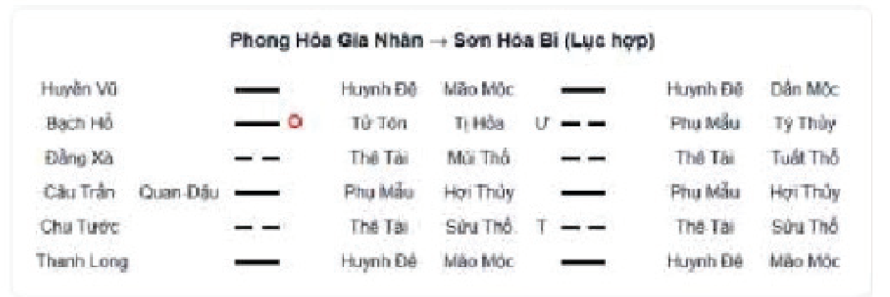

- **Cấu trúc Quẻ Dịch:**
  - **Quẻ chủ:** **Phong Hỏa Gia Nhân** (Cung Tốn, Họ Tốn)  
    *Ý nghĩa quẻ:* Gia Nhân chủ về việc nội bộ trong gia đình, người thân ruột thịt trong nhà.
  - **Quẻ biến:** **Sơn Hỏa Bí** (Cung Cấn, Họ Cấn – Quẻ Lục Hợp)  
    *Ý nghĩa quẻ:* Bí chủ về văn vẻ, trao đổi, giao tiếp trực tiếp mặt đối mặt; quẻ biến Lục Hợp tượng trưng cho mối quan hệ hòa thuận, thiện ý và gắn kết.

- **Bảng chi tiết Lục hào:**

| Hào | Thế/Ứng | Lục thân (Chủ) | Can Chi | Biến động | Lục thân (Biến) | Can Chi (Biến) | Thần sát / Phục | Lục thú |
|:---:|:---:|:---|:---|:---:|:---|:---|:---|:---|
| 6 | | Huynh Đệ | Mão - Mộc | tĩnh | Huynh Đệ | Dần - Mộc | Tướng tinh, Lộc thần | Huyền Vũ |
| 5 | **Ứng** | Tử Tôn | Tị - Hỏa | **O (Động)** | Phụ Mẫu | Tý - Thủy | Bạch Hổ, Dịch mã | Bạch Hổ |
| 4 | | Thê Tài | Mùi - Thổ | tĩnh | Thê Tài | Tuất - Thổ | Hoa cái, Thiên hỷ | Đằng Xà |
| 3 | | Phụ Mẫu | Hợi - Thủy | tĩnh | Phụ Mẫu | Hợi - Thủy | Phục Quan Quỷ Dậu Kim | Câu Trần |
| 2 | **Thế** | Thê Tài | Sửu - Thổ | tĩnh | Thê Tài | Sửu - Thổ | Tuần không, Nguyệt kiến | Chu Tước |
| 1 | | Huynh Đệ | Mão - Mộc | tĩnh | Huynh Đệ | Mão - Mộc | Tướng tinh, Lộc thần | Thanh Long |

*(Ghi chú phục thần: Hào 3 Phụ Mẫu Hợi Thủy phục Quan Quỷ Dậu Kim).*

---

### 3. Dụng thần & Loại quẻ

- **Phân loại quẻ:**
  - Quẻ tâm thái, quẻ xạ phúc dò xét ý định của người khác (sự tình vi hà lai - vì sao đến tìm).
  - Quẻ liên hệ nhân sự kết hợp vấn bệnh người thân qua tượng quẻ gia đạo.
- **Định vị hệ thống Dụng thần:**
  - **Quẻ tượng chủ đạo:** **Phong Hỏa Gia Nhân** – Định vị ngay mục tiêu câu chuyện bắt buộc phải thuộc về phạm vi người thân ruột thịt trong gia đình của Tiểu Trương.
  - **Dụng thần Người mẹ:** **Phụ Mẫu Hợi Thủy** tại hào 3.
  - **Dụng thần Khối u di căn (Bệnh tật):** **Quan Quỷ Dậu Kim** phục tàng dưới Phụ Mẫu Hợi Thủy mang **Câu Trần**.
  - **Dụng thần Phương pháp điều trị & Ý đồ đối phương (Hào Ứng):** **Tử Tôn Tị Hỏa** tại hào 5 phát động lâm **Bạch Hổ**.
  - **Dụng thần Bản thân tác giả (Hào Thế):** **Thê Tài Sửu Thổ** tại hào 2.

---

### 4. Luận giải chi tiết

Quẻ này thể hiện tài hoa xạ phúc sắc sảo của Chu Thần Bân thông qua việc xâu chuỗi tượng quẻ Gia Nhân, hào phục ám động và biến hào hồi đầu khắc:

#### 1. Định vị đối tượng và nguyên nhân qua tượng quẻ Gia Nhân
- Khi gieo quẻ hỏi về nguyên do một người tìm gặp, quẻ chủ xuất hiện **Phong Hỏa Gia Nhân**:
  - Tượng quẻ Gia Nhân chỉ thị rõ rệt: vấn đề Tiểu Trương muốn trao đổi chắc chắn không phải việc làm ăn kinh doanh bên ngoài hay công việc cá nhân của cậu ấy, mà tuyệt đối liên quan đến **người thân ruột thịt trong nhà**.
  - Kết hợp với bối cảnh trước đó Tiểu Trương từng tham vấn bệnh tình của mẹ, tác giả lập tức xác định cậu ấy đến tìm vì vấn đề bệnh hiểm nghèo của người mẹ.

#### 2. Nhận diện khối u ác tính qua Quan Quỷ Dậu Kim phục lâm Câu Trần
- Tại hào 3, hào **Phụ Mẫu Hợi Thủy** đại diện cho mẹ của Tiểu Trương:
  - Hào này bị Nguyệt lệnh Quý Sửu khắc phạt (Thổ khắc Thủy), lâm vào thế suy nhược không được trợ lực.
  - Dưới hào Phụ Mẫu Hợi Thủy phục tàng hào **Quan Quỷ Dậu Kim** lâm **Câu Trần**.
- **Tính chất bệnh lý của Quan Quỷ:**
  - Ngũ hành Kim chủ về sự cô đọng, rắn chắc, vôi hóa; Thần thú Câu Trần chủ về sưng tấy, u bướu, khối tụ, trì trệ. Do đó, Quan Quỷ Dậu Kim lâm Câu Trần là hình ảnh kinh điển của **khối u ác tính (ung thư)**.
  - Quan Quỷ Dậu Kim được Nguyệt lệnh Sửu Thổ tương sinh (vượng), lại bị Nhật kiến Ất Mão trực tiếp xung phá (*Mão xung Dậu*). Theo quy tắc: Hào vượng phùng xung hóa thành **Ám động**.
  - Việc Quan Quỷ Dậu Kim ám động phục tàng dưới hào người mẹ biểu thị khối u ung thư đang âm thầm phát triển di căn dữ dội, cắn xé sinh lực của người bệnh.

#### 3. Phương pháp điều trị thất bại: Tử Tôn Tị Hỏa hóa Hồi đầu khắc lâm Bạch Hổ
- Tại hào 5 (hào Ứng, đại diện cho Tiểu Trương và hành động của cậu ấy):
  - Hào **Tử Tôn Tị Hỏa** phát động. Trong chiêm bệnh, Tử Tôn đại diện cho thuốc men, phác đồ điều trị và biện pháp y tế can thiệp.
  - Hào động Tị Hỏa lâm **Bạch Hổ**. Bạch Hổ chủ về tai ương, đau đớn, tang tóc, oán than và huyết quang phẫu thuật.
  - Điều cốt tử nhất là Tử Tôn Tị Hỏa động biến ra **Phụ Mẫu Tý Thủy**. Tý Thủy quay ngược lại khắc phạt Tị Hỏa (**Hồi đầu khắc**).
- **Ý nghĩa biến dịch:**
  - Tử Tôn động hóa Hồi đầu khắc lâm Bạch Hổ chỉ ra một sự thật đau lòng: Toàn bộ các phác đồ y tế, hóa trị nhắm đích mà Tiểu Trương tự lựa chọn điều trị cho mẹ ở nơi khác trong suốt thời gian qua đã **hoàn toàn thất bại**.
  - Biện pháp y tế bị khắc chế, thất bại này mang lại nỗi đau đớn cùng cực (Bạch Hổ) và bế tắc bơ vơ cho gia đình.
  - Hơn nữa, Tử Tôn Tị Hỏa phát động tương xung với Phụ Mẫu Hợi Thủy (Tị - Hợi xung), cho thấy chính các can thiệp hóa trị nặng nề đã tác động tiêu cực, làm cơ thể người mẹ suy kiệt nghiêm trọng.

#### 4. Phân tích lợi hại đối với người xem (Hào Thế)
- Tiểu Trương đến gặp tác giả mang lại điềm tốt hay xấu?
  - Tử Tôn Tị Hỏa tuy hóa hồi đầu khắc, nhưng bản thân hành Hỏa của nó lại chủ động tương sinh cho hào Thế **Thê Tài Sửu Thổ** (Tị Hỏa sinh Sửu Thổ).
  - Sự thất bại trong phác đồ điều trị của cậu ấy (hồi đầu khắc) lại mở đường cho sự tin tưởng quay trở lại tìm kiếm lời khuyên từ tác giả.
  - Quẻ biến **Sơn Hỏa Bí** là quẻ Lục Hợp, chủ về cuộc gặp gỡ thân tình, trò chuyện cởi mở để tháo gỡ gút thắt. Cuộc gặp này hoàn toàn mang ý nghĩa thiện chí, chân thành và tôn trọng.

---

### 5. Kết luận & Ứng kỳ thực tế

- **Lời phán đoán của Chu Thần Bân:**
  - Tiểu Trương chủ động liên lạc đến gặp không phải vì việc gì khác mà chính là do bệnh ung thư của mẹ cậu ấy đã lâm vào bước đường cùng, các biện pháp điều trị trước đó hoàn toàn thất bại và cậu ấy đang cần tìm một phương án cầu cứu.
  - Tác giả dự liệu trước tình thế để chuẩn bị tâm lý đón tiếp và phân tích thấu đáo cho bạn.
- **Ứng kỳ và Phản hồi thực tế (Feedback):**
  - Ngay tối hôm đó, tác giả chủ động nhắn tin hỏi thăm xem có việc gì khó khăn thì Tiểu Trương lập tức giãi bày toàn bộ sự thật đau lòng:
    - Mẹ cậu ấy sau khi phát hiện ung thư trực tràng di căn gan và phổi đã trải qua liên tiếp **12 đợt hóa trị nhắm trúng đích**, nhưng hoàn toàn không mang lại hiệu quả nào. Ngược lại, ổ bệnh còn ăn sâu và lan rộng hơn.
    - Ổ bệnh ác tính nằm sát cửa hậu môn đã hoại tử, làm mục nát toàn bộ cơ vòng khiến người mẹ bị sa trực tràng hoàn toàn, mất khả năng tự chủ bài tiết, mỗi ngày đại tiểu tiện không thành hình rỉ ra mấy chục lần.
    - Phía bệnh viện lớn đề nghị phương án khẩn cấp: làm đại phẫu thuật cắt bỏ toàn bộ trực tràng, khoét bỏ toàn bộ hậu môn và cả tử cung (nghi ngờ đã di căn), sau đó tiếp tục hóa trị diện rộng.
    - Tiểu Trương vô cùng bàng hoàng, đau xót và mất phương hướng nên muốn sang nhờ thầy Chu lập một quẻ xem việc phẫu thuật cắt bỏ này có thực hiện được hay không.

---

### 6. Bài học tâm pháp & Quy tắc cốt lõi

- **Quy tắc trích dẫn cốt lõi:**
  - *Quy tắc quẻ Gia Nhân và hào Tử Tôn hóa Phụ Mẫu hồi đầu khắc lâm Bạch Hổ khi dự đoán thất bại điều trị của người thân* (trang 393, Sách Cổ Thệ Chân Thuyên tập 2).
- **Tâm pháp giải đoán thực chiến:**
  - **Bắt mạch ý đồ qua Tượng quẻ chủ:** Khi người khác ngỏ ý gặp gỡ mà không nói lý do, tượng quẻ chủ là la bàn định hướng phạm vi sự việc. Quẻ Gia Nhân định vị chắc chắn vào chuyện nội bộ người thân, loại bỏ hoàn toàn các phỏng đoán về kinh doanh hay xã giao bên ngoài.
  - **Tử Tôn hồi đầu khắc lâm Bạch Hổ trong y tế:** Tử Tôn là thuốc men, bác sĩ, biện pháp can thiệp. Hóa hồi đầu khắc là thuốc phản tác dụng, phác đồ thất bại; lâm Bạch Hổ là nỗi đau đớn, thương tổn thể xác và nỗi oán than của người bệnh khi trị liệu sai lầm.
  - **Kim tàng Câu Trần ám động là khối u ung thư:** Ngũ hành Kim (khối rắn) kết hợp thần sát Câu Trần (sưng phù, u bướu) tại hào phục vượng tướng phùng xung (ám động) là tín hiệu chuẩn xác nhận diện mầm bệnh ung thư đang di căn ngầm.

## THỰC CHIẾN 108: MẸ TIỂU TRƯƠNG BỊ UNG THƯ RUỘT GIAI ĐOẠN CUỐI ĐÃ DI CĂN, PHỤ THÂN LẬP QUẺ HỎI NẾU LÀM PHẪU THUẬT CẮT BỎ TOÀN BỘ HẬU MÔN – TRỰC TRÀNG THÌ SẼ THẾ NÀO

---

### 1. Bối cảnh & Câu hỏi

- **Bối cảnh chi tiết:**
  - Mẹ của Tiểu Trương mắc chứng ung thư trực tràng giai đoạn cuối, tế bào ung thư đã di căn diện rộng sang gan và phổi. Sau 12 đợt hóa trị nhắm trúng đích thất bại, khối u ác tính ăn sâu làm hoại tử mục nát cơ vòng hậu môn, khiến bà bị sa trực tràng nặng nề, đại tiểu tiện mất tự chủ hoàn toàn, mỗi ngày rỉ phân lỏng mấy chục lần.
  - Các bác sĩ tại bệnh viện lớn đưa ra chỉ định khẩn cấp: làm đại phẫu thuật khoét bỏ toàn bộ hậu môn, cắt bỏ toàn bộ trực tràng và nạo vét tử cung (nghi ngờ đã di căn), đồng thời đặt hậu môn nhân tạo ở thành bụng rồi tiếp tục hóa trị liều cao.
  - Tuy nhiên, Chu Thần Bân nắm rất rõ một quy tắc bất di bất dịch của bác sĩ Trịnh (chuyên gia châm cứu gia truyền): phương pháp châm cứu độc môn bước đầu tiên là đại hoạt huyết trục ứ, nếu bệnh nhân từng trải qua đại phẫu có vết thương hở lớn thì nguy cơ xuất huyết ồ ạt dẫn đến tử vong, do đó bác sĩ Trịnh **tuyệt đối từ chối tiếp nhận bất kỳ ai đã từng làm đại phẫu thuật**.
  - Nếu gia đình đồng ý cho mổ, cơ hội tiếp cận liệu pháp châm cứu của bác sĩ Trịnh sẽ vĩnh viễn khép lại. Đứng trước lằn ranh sinh tử, gia đình Tiểu Trương nhờ Chu Thần Bân gieo quẻ định đoạt.
- **Tâm lý & Câu hỏi ẩn ý:**
  - Gia đình người bệnh vô cùng hoang mang, sợ hãi trước viễn cảnh người mẹ phải chịu một ca đại phẫu cắt bỏ tàn khốc trên một thân xác đã kiệt quệ sau hóa trị.
  - Tác giả Chu Thần Bân gieo quẻ với tâm niệm **Phụ thân lập quẻ (Chiêm hộ đồng vị)**: hòa nhập hoàn toàn tâm thức của mình vào vị trí của người bệnh như thể chính đương số tự gieo, hỏi rõ: *"Nếu chấp nhận làm đại phẫu thuật cắt bỏ toàn bộ hậu môn và trực tràng thì hiệu quả điều trị sẽ ra sao, có cứu được tính mạng hay không?"*
- **Thời gian chiêm đoán:**
  - Dương lịch: Ngày 23 tháng 01 năm 2018, 20:44.
  - Giờ Bắc Kinh: Năm Đinh Dậu, tháng Quý Sửu, ngày Ất Mão, giờ Bính Tuất.

---

### 2. Dữ kiện & Bảng quẻ Crop

- **Thời không chiêm nghiệm:**
  - Tháng Quý Sửu (Thổ vượng, sinh Kim, khắc Thủy, lâm Nguyệt lệnh).
  - Ngày Ất Mão (Mộc vượng, xung Dậu Kim, khắc Thổ, lâm Nhật kiến).
  - Tuần không: **Tý - Sửu** (Giáp Dần tuần trung, Tý Sửu không vong).
- **Thần sát đầy đủ:**
  - Tướng tinh: Mão
  - Hoa cái: Mùi
  - Dịch mã: Tị
  - Tai sát: Dậu
  - Mưu tinh: Sửu
  - Đào hoa: Tý
  - Kiếp sát: Thân
  - Lộc thần: Mão
  - Dương nhẫn: Dần
  - Văn xương: Ngọ
  - Thiên y: Tý
  - Thiên hỷ: Mùi
  - Quý nhân: Thân, Tý

- Dữ kiện bảng quẻ và các thông số chiêm đoán:
  - **Bảng 108.1** Đồ hình quẻ Thực chiến 108:
    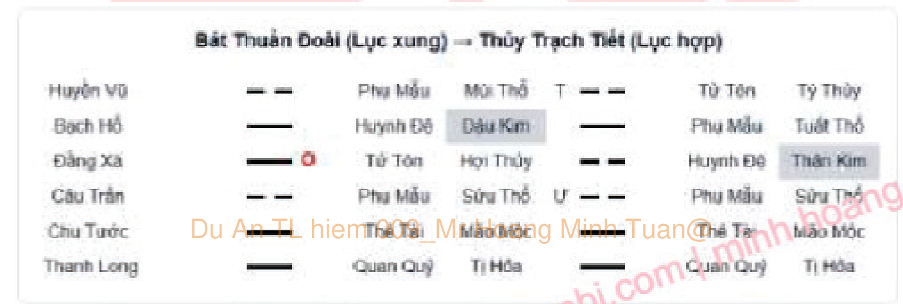

- **Cấu trúc Quẻ Dịch:**
  - **Quẻ chủ:** **Bát Thuần Đoài** (Cung Đoài, Họ Đoài – Quẻ Lục Xung)  
    *Ý nghĩa quẻ:* Đoài là khuyết thiếu, hủy hoại, dao kéo kim loại; quẻ Lục Xung biểu thị tâm trạng xung đột dữ dội, quyết định gấp gáp, tình thế nguy cấp trước mắt.
  - **Quẻ biến:** **Thủy Trạch Tiết** (Cung Khảm, Họ Khảm – Quẻ Lục Hợp)  
    *Ý nghĩa quẻ:* Tiết là tiết chế, chừng mực, ngưng đọng lại; quẻ biến Lục Hợp chỉ thị mệnh lệnh chiến lược: cần phải dừng lại, trì hoãn, không được tiến hành đại phẫu thuật một cách vội vã.

- **Bảng chi tiết Lục hào:**

| Hào | Thế/Ứng | Lục thân (Chủ) | Can Chi | Biến động | Lục thân (Biến) | Can Chi (Biến) | Thần sát / Phục | Lục thú |
|:---:|:---:|:---|:---|:---:|:---|:---|:---|:---|
| 6 | **Thế** | Phụ Mẫu | Mùi - Thổ | tĩnh | Tử Tôn | Tý - Thủy | Hoa cái, Thiên hỷ, Nguyệt phá | Huyền Vũ |
| 5 | | Huynh Đệ | Dậu - Kim | tĩnh (Ám động) | Phụ Mẫu | Tuất - Thổ | Tai sát | Bạch Hổ |
| 4 | | Tử Tôn | Hợi - Thủy | **O (Động)** | Huynh Đệ | Thân - Kim | Dương nhẫn, Kiếp sát | Đằng Xà |
| 3 | **Ứng** | Phụ Mẫu | Sửu - Thổ | tĩnh | Phụ Mẫu | Sửu - Thổ | Nguyệt kiến, Tuần không, Mưu tinh | Câu Trần |
| 2 | | Thê Tài | Mão - Mộc | tĩnh | Thê Tài | Mão - Mộc | Tướng tinh, Lộc thần, Nhật kiến | Chu Tước |
| 1 | | Quan Quỷ | Tị - Hỏa | tĩnh | Quan Quỷ | Tị - Hỏa | Dịch mã | Thanh Long |

---

### 3. Dụng thần & Loại quẻ

- **Phân loại quẻ:**
  - Quẻ chiêm hộ đồng vị (phụ thân lập quẻ) định đoạt phẫu thuật và khảo sát cơ hội sống còn trong bệnh lý ung thư hiểm nghèo.
  - Quẻ biến hóa cấu trúc: **Lục Xung biến Lục Hợp** – mô hình chuyển đổi hành động kinh điển.
- **Định vị hệ thống Dụng thần:**
  - **Dụng thần Sinh mệnh người bệnh (Hào Thế):** **Phụ Mẫu Mùi Thổ** tại hào 6. Mang trọng trách đại diện cho sinh mệnh và nguyên khí của người mẹ.
  - **Dụng thần Phương án đại phẫu thuật bên ngoài (Ngoại quái):** **Tử Tôn Hợi Thủy** phát động tại hào 4 mang **Dương Nhận**.
  - **Dụng thần Trị liệu châm cứu bác sĩ Trịnh (Nội quái):** **Quan Quỷ Tị Hỏa** tại sơ hào lâm **Thanh Long**.

---

### 4. Luận giải chi tiết

Quẻ này là đỉnh cao phân tích chiến lược can thiệp y tế thông qua sự đối lập giữa hai luồng năng lượng trong và ngoài quẻ:

#### 1. Mệnh lệnh sống còn từ cấu trúc "Lục xung biến Lục hợp"
- Quẻ chủ là **Bát Thuần Đoài** (Quẻ Lục Xung):
  - Phản ánh tình trạng cấp bách, gia đình đang ở thế chân tường và vội vã muốn lao vào ca đại phẫu thuật cắt bỏ trực tràng theo chỉ định của bệnh viện.
- Quẻ biến là **Thủy Trạch Tiết** (Quẻ Lục Hợp):
  - Trong phép đoán Lục Hào, quẻ Lục Xung biến Lục Hợp mang ý nghĩa: việc ban đầu đang gấp gáp, hỗn loạn, xung đột gay gắt thì về sau cần phải **ngưng lại, hòa hoãn, bảo lưu và trì hoãn**.
  - Tiết là tiết chế, kiềm chế. Tượng quẻ Lục Hợp khuyên đương sự: **Tuyệt đối không được vội vàng đưa người bệnh lên bàn đại phẫu thuật**, phải hoãn lại để tìm kiếm một con đường khác.

#### 2. Phân tích phương án đại phẫu: Hào 4 Tử Tôn Hợi Thủy mang Dương Nhận
- Tại hào 4, hào **Tử Tôn Hợi Thủy** phát động:
  - Tử Tôn Hợi Thủy lâm **Dương Nhận** (dấu hiệu của dao kéo, phẫu thuật, mổ xẻ rạch thịt).
  - Hào động Hợi Thủy hóa xuất **Huynh Đệ Thân Kim** hồi đầu sinh; đồng thời tại hào 5, **Huynh Đệ Dậu Kim** được Nguyệt Sửu sinh, Nhật Mão xung thành **Ám động** tiếp tục sinh phù cho Hợi Thủy.
  - Hiện tượng hai hào Kim (Thân Kim và Dậu Kim) cùng dốc sức sinh vượng cho Hợi Thủy biểu thị hai giai đoạn phẫu thuật hoặc kết hợp phẫu thuật cắt bỏ ổ bệnh trực tràng với hóa trị xử lý di căn gan phổi.
- **Khuyết tật chết người của phương án phẫu thuật:**
  - Nhìn vào mối quan hệ với hào Thế: Hào Thế **Phụ Mẫu Mùi Thổ** bị Nguyệt lệnh Sửu Thổ xung phá (**Nguyệt phá**), lại bị Nhật kiến Ất Mão khắc phạt (**Nhật khắc**). Thể trạng người bệnh đã suy kiệt tận cùng, sinh mạng như ngọn đèn trước gió.
  - Tử Tôn Hợi Thủy tuy mang danh là Tử Tôn (thuốc men, y tế), nhưng hành Thủy của nó hoàn toàn **không thể tương sinh cho hào Thế Mùi Thổ** (Thổ khắc Thủy, Thủy không sinh Thổ). Một biện pháp can thiệp dao kéo tàn khốc mà không tiếp thêm được chút sinh khí nào cho hào Thế thì chỉ làm tiêu hao nốt chút hơi tàn của người bệnh.
  - Hơn nữa, nếu mổ cắt bỏ thì lập tức vi phạm điều cấm kỵ của bác sĩ Trịnh, người bệnh sẽ mất vĩnh viễn cơ hội được châm cứu phục hồi. Do đó, Chu Thần Bân khẳng định đại phẫu chỉ là ngõ cụt.

#### 3. Cửa sinh duy nhất: Quan Quỷ Tị Hỏa tại sơ hào mang Thanh Long
- Trong nội quái, tại sơ hào có **Quan Quỷ Tị Hỏa**:
  - Hào sơ là vị trí ban đầu, nội quái đại diện cho phòng khám tư nhân của bác sĩ Trịnh. Hào lâm **Thanh Long** (chủ về y thuật cao minh, sinh khí, hồi sinh).
  - Quan Quỷ Tị Hỏa được Nhật kiến Ất Mão tương sinh (Mộc sinh Hỏa). Điểm mấu chốt quyết định là: **Hành Hỏa của Tị Hỏa chủ động tương sinh cho hào Thế Phụ Mẫu Mùi Thổ** (Hỏa sinh Thổ)!
- **Nghịch lý Dịch học sâu sắc:**
  - Tử Tôn (dao kéo bệnh viện lớn) bề ngoài là cứu chữa nhưng thực chất không sinh Thế; trong khi Quan Quỷ Tị Hỏa (bác sĩ Trịnh tại phòng khám tư) tuy mang danh Quan Quỷ nhưng lại là yếu tố duy nhất mang năng lượng ngũ hành sinh dưỡng, bồi bổ nguyên khí trực tiếp cho hào Thế đang lâm cảnh Nguyệt phá Nhật khắc.
  - Chu Thần Bân nhìn thấu: dù hào Thế cực kỳ suy bại nhưng chỉ cần có nguồn năng lượng Hỏa sinh Thổ tiếp sức liên tục thì sinh mệnh vẫn có cơ hội xoay chuyển cờ tàn, kéo dài sự sống.

---

### 5. Kết luận & Ứng kỳ thực tế

- **Lời kết luận và khuyến nghị của Chu Thần Bân:**
  - Khuyên gia đình kiên quyết gác lại kế hoạch đại phẫu thuật, coi phẫu thuật là hạ sách đường cùng không nên chạm tới.
  - Ngay lập tức đưa người mẹ đến diện kiến bác sĩ Trịnh để kiểm tra và tiếp nhận phác đồ châm cứu trục ứ độc môn.
- **Quá trình điều trị và Nghiệm chứng thần kỳ (Feedback):**
  - Hôm sau, gia đình đưa người mẹ đến phòng khám: Bác sĩ Trịnh bắt mạch thấy mạch vi tế sắp tuyệt, toàn thân da khô héo như da chết, gan thận thiếu máu nghiêm trọng, hai chân phù nề ấn vào lõm sâu không thể đàn hồi. Lần đầu châm cứu kim không cắm nổi vì chân không còn huyết khí.
  - Bác sĩ Trịnh kiên trì thực hiện liệu trình liên hoàn: châm cứu, xoa bóp khai thông kinh lạc kết hợp thực dưỡng nghiêm ngặt.
  - **Sau đêm điều trị đầu tiên (4 tiếng châm cứu):** Số lần đi vệ sinh giảm từ 7-8 lần/đêm xuống còn đúng 3 lần.
  - **Sau lần điều trị thứ hai (ngày thứ 8):** Số lần vệ sinh ban đêm chỉ còn 1-2 lần, phân lỏng bắt đầu cô đọng thành từng viên nhỏ. Vùng hậu môn trực tràng hoại tử lở loét ngừng chảy mủ, bắt đầu đóng vảy và tái tạo biểu mô từ bên trong.
  - **Sau lần điều trị thứ ba:** Người bệnh ngủ một mạch từ tối đến sáng không thức giấc. Vùng da mặt và lưng từ trạng thái khô bốc vảy, vàng trắng chuyển sang mịn màng; các huyệt châm cứu trên lưng gom độc tố thành mảng đen để trục xuất ra ngoài. Chân hết phù, ấn vào đàn hồi bật trở lại ngay lập tức.
  - **Buổi điều trị thứ năm:** Cơ thể tự kích hoạt cơ chế đào thải tự nhiên, người mẹ tống ra ngoài qua đường đại tiện một khối chất thải ung thư màu đen cực to và rắn chắc (ổ bệnh tích tụ lâu ngày do hóa trị). Sau khi tống khối u ra ngoài, sắc mặt sáng bừng hồng hào.
  - Cả gia đình từ hố sâu tuyệt vọng đã tìm lại được niềm tin và nụ cười. Các ổ di căn gan phổi giảm thiểu rõ rệt, sinh mệnh thoát khỏi tình trạng nguy kịch trước mắt.

---

### 6. Bài học tâm pháp & Quy tắc cốt lõi

- **Quy tắc trích dẫn cốt lõi:**
  - *Quy tắc chuyển hóa từ Lục xung sang Lục hợp: Trì hoãn đại phẫu thuật khi đối mặt với bệnh lý ung thư hiểm nghèo* (trang 397, Sách Cổ Thệ Chân Thuyên tập 2).
  - *Quy tắc phụ thân lập quẻ (chiêm hộ đồng vị) trong dự đoán sinh tử* (trang 398).
- **Tâm pháp giải đoán thực chiến:**
  - **Lục Xung hóa Lục Hợp là lệnh bài đình chiến:** Khi dự đoán phẫu thuật hoặc hành động nguy hiểm, quẻ xuất hiện Lục xung biến Lục hợp tuyệt đối không được manh động; phải lập tức hạ nhiệt, đình chỉ quyết định để bảo toàn nguyên khí.
  - **Vượt qua định kiến danh xưng Lục thân:** Không thể máy móc thấy Tử Tôn là tốt, Quan Quỷ là xấu. Tử Tôn mang Dương Nhận không sinh Thế chính là dao kéo làm hại thân; Quan Quỷ tương sinh cho hào Thế lại chính là vị cứu tinh tiếp dưỡng sinh lực cho sinh mệnh đang tàn lụi.
  - **Tâm pháp Phụ thân lập quẻ:** Khi người thân quá bấn loạn không thể tự chiêm nghiệm, người thầy phải nhập tâm đại diện lập quẻ đồng vị, lấy hào Thế làm sinh mệnh đương số để cân đo từng phân lượng sinh khắc cứu người.

## THỰC CHIẾN 109: VỢ CỦA ĐỆ TỬ THƯỢNG HẢI LÀ CÔ TIỂU CHÂU ĐẾN THĂM, LẠI PHÁT BỆNH NGAY TẠI PHÒNG VĂN HÓA. BỆNH GÌ? NGUYÊN NHÂN GÌ? ĐỂ CÔ ẤY TỰ GIEO QUẺ

---

### 1. Bối cảnh & Câu hỏi

- **Bối cảnh chi tiết:**
  - Vợ của một đệ tử ở Thượng Hải là cô Tiểu Châu đến Quảng Châu để tham dự một hội nghị công tác. Người đệ tử Thượng Hải rất tôn kính và ngưỡng mộ Chu Thần Bân nên đặc biệt dặn dò vợ phải tranh thủ ghé thăm thầy tại phòng văn hóa.
  - Vừa đến nơi ngồi trò chuyện được một lát, cô Tiểu Châu đột ngột phát bệnh cấp tính ngay tại chỗ: hoảng loạn tột độ, tim đập thình thịch dữ dội, lồng ngực bồn chồn khó thở, cảm giác có một luồng khí lạnh ngắt từ dưới bụng xốc ngược lên đầu làm cho đầu váng mắt hoa, hai bàn tay lạnh toát không còn chút huyết sắc.
  - Thực tế sáng hôm đó cô đã cảm thấy bất an và phải vào bệnh viện tại địa phương để đo điện tâm đồ, bác sĩ kết luận nhịp tim tăng nhanh bất thường nghi ngờ rối loạn thần kinh thực vật hoặc triệu chứng tiền mãn kinh và kê đơn thuốc uống. Tuy nhiên khi đến phòng văn hóa thì triệu chứng bùng phát dữ dội hơn, sắc mặt tái xanh nhợt nhạt, hai môi trắng bệch, ánh mắt đờ đẫn hơi trợn ngược như bị hút cạn sinh khí.
  - Nhận thấy biểu hiện dị thường vượt quá mức độ thông thường của bệnh nội tiết, Chu Thần Bân liền bảo cô thử niệm *Lục Tự Đại Minh Chú* (Om Mani Padme Hum) và uống một cốc nước nóng; sau khi niệm chú thì tim cô bớt hoảng loạn nhưng vẫn bồn chồn. Để làm rõ thực chất căn nguyên và mức độ thương tổn, tác giả yêu cầu cô tự tay gieo một quẻ Dịch.
- **Tâm lý & Câu hỏi ẩn ý:**
  - Đương sự đang trải qua cơn kinh hoàng về thể xác và tinh thần, bối rối không hiểu vì sao cơ thể mình suy sụp đột ngột đến vậy.
  - Mục đích lập quẻ do Chu Thần Bân chủ động định hướng: *"Rốt cuộc cô ấy đang mắc bệnh gì? Nguyên nhân thực sự bắt nguồn từ đâu (bệnh lý nội tiết thể xác hay có sự can thiệp của tà khí quỷ thần)?"*
- **Thời gian chiêm đoán:**
  - Giờ Bắc Kinh: Ngày 27 tháng 01 năm 2018, 15:11.
  - Can chi: Năm Đinh Dậu, tháng Quý Sửu, ngày Kỷ Mùi, giờ Nhâm Thân.

---

### 2. Dữ kiện & Bảng quẻ Crop

- **Thời không chiêm nghiệm:**
  - Tháng Quý Sửu (Thổ vượng, sinh Kim, khắc Thủy, lâm Nguyệt lệnh).
  - Ngày Kỷ Mùi (Thổ vượng, xung Sửu Thổ, lâm Nhật kiến).
  - Tuần không: **Tý - Sửu** (Giáp Thân tuần trung, Tý Sửu không vong).
- **Thần sát đầy đủ:**
  - Tướng tinh: Mão
  - Hoa cái: Mùi
  - Dịch mã: Tị
  - Tai sát: Dậu
  - Mưu tinh: Sửu
  - Đào hoa: Tý
  - Kiếp sát: Thân
  - Lộc thần: Ngọ
  - Dương nhẫn: Tị
  - Văn xương: Dậu
  - Thiên y: Tý
  - Thiên hỷ: Mùi
  - Quý nhân: Thân, Tý

- Dữ kiện bảng quẻ và các thông số chiêm đoán:
  - **Bảng 109.1** Đồ hình quẻ Thực chiến 109:
    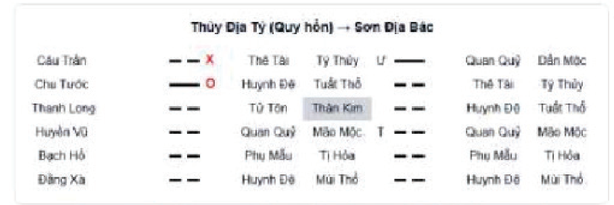

- **Cấu trúc Quẻ Dịch:**
  - **Quẻ chủ:** **Thủy Địa Tỷ** (Cung Khảm, Họ Khảm – Quẻ Quy Hồn)  
    *Ý nghĩa quẻ:* Tỷ là gần gũi, gắn bó, nương tựa; đặc biệt quẻ Quy Hồn trong chiêm bệnh tật và tâm linh biểu thị hồn phách không định, thần trí phiêu tán, có sự vương vấn của tà khí, vong linh bám theo người sống.
  - **Quẻ biến:** **Sơn Địa Bác** (Cung Càn, Họ Càn)  
    *Ý nghĩa quẻ:* Bác là rơi rụng, bóc mòn, suy thoái; biểu thị nguyên khí cơ thể đang bị gặm nhấm, hao mòn nghiêm trọng.

- **Bảng chi tiết Lục hào:**

| Hào | Thế/Ứng | Lục thân (Chủ) | Can Chi | Biến động | Lục thân (Biến) | Can Chi (Biến) | Thần sát / Phục | Lục thú |
|:---:|:---:|:---|:---|:---:|:---|:---|:---|:---|
| 6 | **Ứng** | Thê Tài | Tý - Thủy | **X (Động)** | Quan Quỷ | Dần - Mộc | Tuần không, Đào hoa, Quý nhân, Thiên y | Câu Trần |
| 5 | | Huynh Đệ | Tuất - Thổ | **O (Động)** | Thê Tài | Tý - Thủy | | Chu Tước |
| 4 | | Quan Quỷ | Thân - Kim | tĩnh | Huynh Đệ | Tuất - Thổ | Kiếp sát, Quý nhân (phục Tử Tôn Thân Kim) | Thanh Long |
| 3 | **Thế** | Quan Quỷ | Mão - Mộc | tĩnh | Quan Quỷ | Mão - Mộc | Tướng tinh | Huyền Vũ |
| 2 | | Phụ Mẫu | Tị - Hỏa | tĩnh | Phụ Mẫu | Tị - Hỏa | Dịch mã, Dương nhẫn | Bạch Hổ |
| 1 | | Huynh Đệ | Mùi - Thổ | tĩnh | Huynh Đệ | Mùi - Thổ | Hoa cái, Thiên hỷ, Nhật kiến | Đằng Xà |

*(Ghi chú phục thần: Hào 4 phục Tử Tôn Thân Kim).*

---

### 3. Dụng thần & Loại quẻ

- **Phân loại quẻ:**
  - Quẻ vấn bệnh nan y cấp tính kết hợp khảo sát căn nguyên tâm linh (tà khí vong linh vs bệnh lý thực thể).
  - Quẻ có hào Thế lâm Quan Quỷ (tự thân mang bệnh).
- **Định vị hệ thống Dụng thần:**
  - **Dụng thần Bản thân & Bệnh trạng (Hào Thế):** **Quan Quỷ Mão Mộc** tại hào 3 trì Thế lâm **Huyền Vũ**. Mão Mộc đại diện cho hệ thần kinh kinh lạc; Huyền Vũ chủ về tà khí, âm u, ám muội, kinh hoàng và quỷ thần.
  - **Dụng thần Điểm bệnh thứ hai & Cầu nối bệnh lý:** **Huynh Đệ Tuất Thổ** tại hào 5 phát động lâm **Chu Tước** (chủ về viêm nhiễm vùng ngực, tim đập nhanh).
  - **Dụng thần Ổ bệnh u nang & Vong linh bám theo:** **Thê Tài Tý Thủy** tại hào 6 phát động lâm **Câu Trần**, **Đào hoa**, **Quý nhân** và **Tuần không**.
  - **Nguyên thần sinh trợ Quan Quỷ Mão Mộc:** Thủy hào (Tý Thủy), cội nguồn kích hoạt triệu chứng phát tác dữ dội.

---

### 4. Luận giải chi tiết

Quẻ này là một án lệ vô cùng đặc sắc phân lập rõ ràng giữa bệnh lý thực thể (u nang tuyến vú, rối loạn thần kinh thực vật) và hiện tượng tâm linh tà khí bám thân thông qua cơ chế bắc cầu hào động:

#### 1. Nhận diện rối loạn thần kinh thực vật qua Quan Quỷ Mão Mộc trì Thế
- Tại hào 3, hào Thế lâm **Quan Quỷ Mão Mộc**:
  - Trong phép phân vùng cơ thể và ngũ hành y học Lục Hào: hành **Mộc** chủ về Can đảm, chủ về hệ thống gân cốt, kinh lạc và mạng lưới dây thần kinh.
  - Quan Quỷ Mão Mộc trì Thế cho thấy bản thân người hỏi đang trực tiếp gánh chịu sự chi phối của mầm bệnh thần kinh.
  - Mão Mộc ở hào 3 bị Nguyệt lệnh Quý Sửu và Nhật kiến Kỷ Mùi toàn là Thổ khô khắc tiết, không được Nhật Nguyệt sinh trợ (hào Thế suy nhược). Trong chiêm bệnh, hào Thế lâm Quan Quỷ mà không vượng tướng là điềm báo cơ thể bị động, năng lực miễn dịch và tự điều chỉnh sinh học suy kiệt nặng, bệnh phát tác thành chứng nan y khó chữa.
  - Kết hợp với tượng quẻ chủ **Thủy Địa Tỷ là quẻ Quy Hồn**, hào Thế lâm **Huyền Vũ** (chủ sợ hãi, u uất, thần trí bất định) và hào sơ lâm **Đằng Xà** (chủ co thắt mạch máu, co giật thần kinh), quẻ phản ánh chính xác triệu chứng rối loạn thần kinh thực vật và tiền mãn kinh đang hành hạ người bệnh.

#### 2. Cơ chế bắc cầu hào động: Huynh Đệ Tuất Thổ dẫn Thê Tài Tý Thủy hóa Quan Quỷ Dần Mộc
- Quan sát hai hào động ở ngoại quái:
  - Hào 5 **Huynh Đệ Tuất Thổ** phát động, hóa xuất **Thê Tài Tý Thủy**.
  - Hào 6 **Thê Tài Tý Thủy (Ứng)** phát động, hóa xuất **Quan Quỷ Dần Mộc**.
- **Ý nghĩa cấu trúc bắc cầu (liên hoàn động):**
  - Huynh Đệ Tuất Thổ phát động mang theo tính chất hướng về hào Thế Mão Mộc (Mão - Tuất tương hợp). Đây là hiện tượng **Động mà hướng hợp Thế**.
  - Khi một hào động đến hợp hào Thế, nếu Thế vượng thì được trợ lực; nhưng nếu Thế hưu tù suy nhược thì hào động này đóng vai trò kéo tụt hào Thế xuống sâu hơn trong vũng lầy bệnh tật.
  - Huynh Đệ Tuất Thổ không đứng độc lập mà hóa ra Thê Tài Tý Thủy, tiếp nối với hào 6 Tý Thủy động biến ra Quan Quỷ Dần Mộc. Chu Thần Bân xác định: Hào Huynh Đệ Tuất Thổ chính là **cầu nối thông tin**, mang thêm một nguồn năng lượng bệnh lý khác bên ngoài tác động dồn dập vào, làm cho chứng rối loạn thần kinh thực vật của cô ấy bùng phát dữ dội vượt bậc so với người bình thường.

#### 3. Bệnh lý thực thể: U nang tuyến vú vùng ngực
- Xem xét bản chất hào Huynh Đệ Tuất Thổ và Thê Tài Tý Thủy:
  - Huynh Đệ Tuất Thổ ở hào 5 (vị trí ngực, tim phổi) lâm **Chu Tước** (chủ về viêm nhiễm, nóng sốt, kích ứng).
  - Hào biến Thê Tài Tý Thủy mang **Đào hoa** (chủ về tuyến nội tiết, sinh dục, bầu ngực).
  - Trước đây cô từng mổ vách liên nhĩ, thời điểm đó tác giả đã đoán cô có u nang tuyến vú:
    - Trong Lục Hào, u nang là sự tích tụ dịch ứ trệ (hành Thủy). Thê Tài Tý Thủy lại lâm **Tuần không**. Thủy hào lâm Không chính là hình ảnh rỗng bên trong, dịch thể sưng phù bọng nước tích tụ tạo thành nang (như các ca tràn dịch khớp gối, u nang bọc nước).
    - Hào Huynh Đệ phát động thường đại diện cho u bướu **lành tính**; nhưng vì nó tạo cầu nối biến ra **Quan Quỷ Dần Mộc** nên u nang này có nguy cơ biến chứng chuyển hóa thành khối u ác tính.
    - Hiện tại Tý Thủy đang Tuần không nên khối u vẫn tạm thời lành tính và chưa phát tác ác tính; Chu Thần Bân dự báo đến năm Canh Tý (2020), khi Tý Thủy xuất không điền thực thì cần đặc biệt đề phòng u nang ác hóa.
  - Về mặt y học hiện đại, rối loạn thần kinh thực vật và u nang tuyến vú đều có chung nguồn gốc sâu xa từ sự rối loạn trục nội tiết tố nữ, hai bệnh lý này tương tác làm khuếch đại triệu chứng của nhau.

#### 4. Hiện tượng tâm linh dị thường: Tà khí nữ vong bám thân
- Bên cạnh bệnh lý thực thể, tại sao hào Quan Quỷ Dần Mộc sinh ra từ Tý Thủy lại lâm **Quý nhân**?
  - Bệnh tật u bướu ác hóa thông thường chỉ lâm hung sát hoặc Thiên y, hiếm khi mang Quý nhân.
  - Kết hợp với việc Thê Tài Tý Thủy mang **Đào hoa** (tượng người nữ), **Quý nhân** (quý nhân nữ), và quẻ chủ là **Thủy Địa Tỷ (Quẻ Quy Hồn)** lâm **Huyền Vũ**:
    - Quẻ Quy Hồn chủ về linh hồn phiêu bạt, người cõi âm vương vấn người sống.
    - Huyền Vũ chủ về âm tà, ma quỷ vô hình.
    - Ánh mắt trợn ngược, sắc mặt trắng bệch mất sinh khí, hoảng loạn đột ngột khi bước vào không gian phòng văn hóa.
  - Chu Thần Bân đưa ra nhận định táo bạo: Trên người cô Tiểu Châu ngoài u nang nội tiết, chắc chắn đang có **một vong linh phụ nữ (nữ vong) bám theo quấy nhiễu**, hút cạn dương khí khiến hệ thần kinh thực vật suy sụp hoàn toàn.

---

### 5. Kết luận & Ứng kỳ thực tế

- **Lời kết luận và khuyến nghị của Chu Thần Bân:**
  - Khẳng định người bệnh có hai căn nguyên cùng lúc:
    1. Về thực thể: Bệnh rối loạn thần kinh thực vật do mất cân bằng nội tiết gắn liền với đa u nang tuyến vú vùng ngực (cần theo dõi chặt chẽ phòng ngừa biến chứng đến năm Canh Tý 2020).
    2. Về tâm linh: Có vong linh bám thân (tà khí nữ vong) làm trầm trọng thêm cơn hoảng loạn phát tác cấp tính.
  - Khuyên đương số nhờ bác sĩ Trịnh – người có khả năng nhìn thấu âm dương – kiểm tra trực tiếp và làm pháp giải tỏa phần âm trước khi dùng y thuật điều trị cơ thể.
- **Xác nhận từ Bác sĩ Trịnh và Diễn biến thực tế (Feedback):**
  - Bác sĩ Trịnh sau khi quan sát chính diện và góc nghiêng của cô Tiểu Châu liền lập tức khẳng định: *"Trên người cô quả thật có một cái bóng đen của vong linh đang bám riết theo sau gáy và lưng"*.
  - Bác sĩ Trịnh yêu cầu mua tiền vàng mã để làm lễ gia truyền: dùng nghi thức mời vong xuất khỏi thân thể, giao tiền vàng cho vong linh rời đi thanh thản trong hòa bình, tuyệt đối không dùng bùa chú trấn áp hay tiêu diệt.
  - **Trải nghiệm của người bệnh:** Ngay khoảnh khắc bác sĩ Trịnh bắt đầu làm phép kéo vong linh ra khỏi cơ thể, cô Tiểu Châu đột ngột cảm thấy trái tim đập dồn dập cực mạnh một hồi như có luồng lực giằng xé tống ra ngoài, sau đó toàn thân nhẹ bẫng, hơi ấm từ từ lan tỏa xuống bàn tay và bàn chân.
  - Sau buổi lễ, sắc mặt cô hồng hào trở lại, triệu chứng hoảng loạn biến mất hoàn toàn, nhịp tim ổn định trở lại mức bình thường. Bác sĩ Trịnh khẳng định tà khí đã được trục xuất triệt để, sau này sẽ không còn gây rối loạn thần kinh của cô nữa.

---

### 6. Bài học tâm pháp & Quy tắc cốt lõi

- **Quy tắc trích dẫn cốt lõi:**
  - *Quy tắc quẻ Quy hồn lâm Quan Quỷ Huyền Vũ và phân biệt tà khí quỷ thần với bệnh lý u nang thực thể* (trang 407, Sách Cổ Thệ Chân Thuyên tập 2).
- **Tâm pháp giải đoán thực chiến:**
  - **Phân biệt Quỷ thần và Thực bệnh:** Khi chiêm bệnh gặp quẻ Quy Hồn, hào Thế lâm Quan Quỷ Huyền Vũ kết hợp các sao Đào hoa, Quý nhân kỳ lạ, người đoán quẻ phải có nhãn quan bao quát để nhận diện yếu tố tà khí âm giới can thiệp, không được bó hẹp tư duy thuần túy trong triệu chứng y khoa.
  - **Kỹ thuật bắc cầu hào động (Động hóa cầu nối):** Khi một hào động sinh/hợp hào khác rồi tiếp tục hóa ra một hào động kế tiếp, đó là chuỗi mắt xích liên hoàn biểu thị nhiều bệnh lý cộng hưởng hoặc nguyên nhân này kích hoạt nguyên nhân khác làm bệnh trở nên hiểm nghèo.
  - **Thủy lâm Tuần không là phù thũng u nang:** Ngũ hành Thủy đại diện cho chất lỏng dịch thể; Thủy hào lâm Không phản ánh tình trạng tích dịch rỗng trong các tổ chức tế bào, tạo nên hiện tượng u bọc, u nang hoặc phù nề mô mềm.
  - **Tôn trọng ranh giới khoa học và huyền thuật:** Người học Lục Hào chân chính phân định rành mạch đâu là bệnh cần bác sĩ Tây y mổ xẻ/nội tiết, đâu là chứng u nang cần theo dõi hạn kỳ năm tháng, và đâu là hiện tượng tâm linh cần nghi lễ tiễn vong; xử lý đúng gốc rễ mới đem lại bình an toàn vẹn cho đương số.

## THỰC CHIẾN 110: ỦY THÁC CHÁU TRAI LO CÔNG VIỆC CHO CHÁU GÁI, TRƯỚC ĐÓ BỆNH VIỆN THÀNH PHỐ NƠI CHÁU TRAI LÀM NÓI KHÔNG THỂ GIÚP, HIỆN CHUYỂN SANG TÌM BỆNH VIỆN QUẬN, HỎI CÔNG VIỆC CỦA CHÁU GÁI CÓ THÀNH KHÔNG

---

### 1. Bối cảnh & Câu hỏi

- **Bối cảnh chi tiết:**
  - Một người đàn ông lớn tuổi đứng ra gánh vác việc lo biên chế công tác cho người cháu gái của mình. 
  - Trước đó, ông đã liên hệ nhờ cậy người cháu trai (vốn đang công tác tại một bệnh viện lớn cấp thành phố) tìm cách xin việc cho cháu gái vào bệnh viện thành phố. Tuy nhiên, bệnh viện thành phố yêu cầu thủ tục rất khắt khe, người cháu trai báo tin rằng không thể giúp đỡ được ở tuyến này.
  - Không nản lòng, người chú quyết định chuyển hướng sang nhờ vả các mối quan hệ để xin cho cháu gái vào làm việc tại bệnh viện cấp quận.
  - Đứng trước ngã rẽ này, ông chủ động lập một quẻ Dịch để chiêm đoán xem: liệu xin vào bệnh viện quận có thành công hay không.
- **Tâm lý & Câu hỏi ẩn ý:**
  - Tâm lý người hỏi đầy âu lo, chạy vạy lo toan nhiều nơi cho con cháu; bệnh viện thành phố vốn là nguyện vọng 1 đã tạm bế tắc, bệnh viện quận là phương án dự phòng nhưng chưa biết kết quả ra sao.
  - Câu hỏi trọng tâm: *"Xin việc cho cháu gái tại bệnh viện quận có được thuận lợi và thành công hay không?"*
- **Thời gian chiêm đoán:**
  - Giờ Bắc Kinh: Ngày 29 tháng 07 năm 2017, 16:04.
  - Can chi: Năm Đinh Dậu, tháng Đinh Mùi, ngày Đinh Tị, giờ Mậu Thân.

---

### 2. Dữ kiện & Bảng quẻ Crop

- **Thời không chiêm nghiệm:**
  - Tháng Đinh Mùi (Thổ vượng, sinh Kim, khắc Thủy, lâm Nguyệt lệnh).
  - Ngày Đinh Tị (Hỏa vượng, sinh Thổ, khắc Kim, lâm Nhật kiến).
  - Tuần không: **Tý - Sửu** (Giáp Tuất tuần trung, Tý Sửu không vong).
- **Thần sát đầy đủ:**
  - Tướng tinh: Dậu
  - Hoa cái: Sửu
  - Dịch mã: Hợi
  - Tai sát: Mão
  - Mưu tinh: Mùi
  - Đào hoa: Ngọ
  - Kiếp sát: Dần
  - Lộc thần: Ngọ
  - Dương nhẫn: Tị
  - Văn xương: Dậu
  - Thiên y: Ngọ
  - Thiên hỷ: Sửu
  - Quý nhân: Dậu, Hợi

- Dữ kiện bảng quẻ và các thông số chiêm đoán:
  - **Bảng 110.1** Đồ hình quẻ Thực chiến 110:
    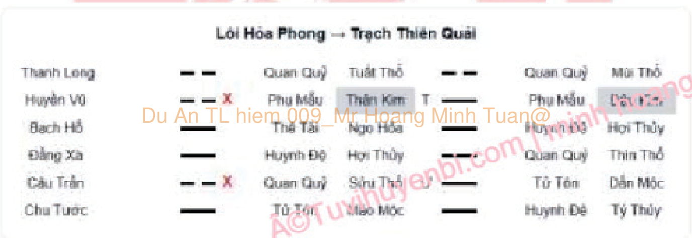

- **Cấu trúc Quẻ Dịch:**
  - **Quẻ chủ:** **Lôi Hỏa Phong** (Cung Khảm, Họ Khảm)  
    *Ý nghĩa quẻ:* Phong là thịnh đại, dồi dào, phong phú, nhiều hướng, nhiều cơ hội cùng lúc triển khai.
  - **Quẻ biến:** **Trạch Thiên Quải** (Cung Càn, Họ Càn)  
    *Ý nghĩa quẻ:* Quải là quyết đoán, khuyết thiếu, có vết tích chưa trọn vẹn trong một lộ trình cụ thể nhưng không làm thay đổi định tính thành bại chung cuộc.

- **Bảng chi tiết Lục hào:**

| Hào | Thế/Ứng | Lục thân (Chủ) | Can Chi | Biến động | Lục thân (Biến) | Can Chi (Biến) | Thần sát / Phục | Lục thú |
|:---:|:---:|:---|:---|:---:|:---|:---|:---|:---|
| 6 | | Quan Quỷ | Tuất - Thổ | tĩnh | Quan Quỷ | Mùi - Thổ | | Thanh Long |
| 5 | **Thế** | Phụ Mẫu | Thân - Kim | **X (Động)** | Phụ Mẫu | Dậu - Kim | Tướng tinh, Văn xương, Quý nhân (Dậu) | Huyền Vũ |
| 4 | | Thê Tài | Ngọ - Hỏa | tĩnh | Huynh Đệ | Hợi - Thủy | Đào hoa, Lộc thần, Thiên y | Bạch Hổ |
| 3 | | Huynh Đệ | Hợi - Thủy | tĩnh | Quan Quỷ | Thìn - Thổ | Dịch mã, Quý nhân | Đằng Xà |
| 2 | **Ứng** | Quan Quỷ | Sửu - Thổ | **X (Động)** | Tử Tôn | Dần - Mộc | Hoa cái, Thiên hỷ, Tuần không | Câu Trần |
| 1 | | Tử Tôn | Mão - Mộc | tĩnh | Huynh Đệ | Tý - Thủy | Tai sát | Chu Tước |

*(Ghi chú: Hào 5 Thế Phụ Mẫu Thân Kim động hóa Phụ Mẫu Dậu Kim là Hóa Tiến Thần; Hào 2 Ứng Quan Quỷ Sửu Thổ động hóa Tử Tôn Dần Mộc là Hồi Đầu Khắc).*

---

### 3. Dụng thần & Loại quẻ

- **Phân loại quẻ:**
  - Quẻ chiêm hộ nghiệp vụ xin việc làm công chức/đơn vị sự nghiệp nhà nước (bệnh viện).
  - Quẻ thuộc loại **Chiêm hộ chủ động mang tính kiểm soát (Thay mặt xem chủ động có quyền khống chế)**.
- **Định vị hệ thống Dụng thần:**
  - **Bản chất Chiêm hộ có kiểm soát:** Người hỏi quẻ (chú) là người trực tiếp nắm quyền tài phán, điều phối quan hệ, bỏ tiền bạc công sức chạy việc; người cháu gái hoàn toàn thụ động chờ đợi kết quả, không có quyền quyết định. Do đó, toàn bộ quẻ tượng và động cơ thành bại quy tụ trực tiếp vào **Hào Thế (Phụ Mẫu Thân Kim)** chứ không phân lập cứng nhắc vào hào Tử Tôn Mão Mộc.
  - **Dụng thần Công việc mục tiêu (Hào Thế):** **Phụ Mẫu Thân Kim** tại hào 5 phát động. Phụ Mẫu đại diện cho thư mời nhận việc, hợp đồng lao động, biên chế bệnh viện.
  - **Dụng thần Bệnh viện quận chỉ định (Hào Ứng):** **Quan Quỷ Sửu Thổ** tại hào 2 phát động lâm **Câu Trần** và **Tuần không**.

---

### 4. Luận giải chi tiết

Quẻ này là một án lệ mẫu mực minh giải học thuyết "Chiêm hộ có kiểm soát" và quy tắc "Nội ngoại đồng động" của Lục Hào phái Dã Hạc do Chu Thần Bân đúc kết:

#### 1. Phân loại chuẩn xác loại hình Chiêm hộ (Thay mặt xem)
Chu Thần Bân chỉ ra sự phân hóa vi tế của việc xem hộ trong Lục Hào:
- **Thay mặt xem bị động:** Người khác nhờ gieo hộ, người gieo không có ý niệm riêng -> Xem như chính người nhờ tự gieo.
- **Thay mặt xem chủ động mất kiểm soát:** Người hỏi lo lắng cho người khác nhưng bản thân không có quyền can thiệp vào hành vi/quyết định của họ (ví dụ: xem hộ việc làm ăn của anh em ruột đã ra ở riêng) -> Phải lấy lục thân người đó làm Dụng thần (lấy Huynh Đệ, không lấy Tài).
- **Thay mặt xem chủ động có kiểm soát:** Người hỏi chủ động gieo quẻ và chính bản thân họ là người chi phối, thao túng toàn bộ tiến trình thực hiện (ví dụ: cha mẹ chọn trường cho con nhỏ; người chú chạy vạy tìm việc cho cháu gái) -> Quẻ tượng hội tụ về **Hào Thế**.
- Người cháu trai được nhờ giúp đỡ cũng thuộc cùng "phe hành động" với người chú (cùng một nhóm lợi ích tác nghiệp), nên quyền chủ đạo tối cao vẫn phản ánh qua hào Thế.

#### 2. Nhận diện cánh cửa bệnh viện quận bị đóng: Hào Ứng hóa Hồi đầu khắc
- Tại hào 2 (hào Ứng, đại diện cho bệnh viện quận mà người hỏi đang nhắm tới):
  - Hào **Quan Quỷ Sửu Thổ** phát động, lâm **Tuần không**.
  - Sửu Thổ động biến ra **Tử Tôn Dần Mộc** (Dần Mộc quay lại khắc phạt Sửu Thổ – **Hồi đầu khắc**).
- **Cơ chế dịch lý:**
  - Quan Quỷ vốn dĩ là chức vị, công việc; Sửu Thổ là nguồn nguyên thần tương sinh cho hào Thế Phụ Mẫu Thân Kim. Nếu Sửu Thổ hóa sinh vượng thì việc xin vào bệnh viện quận sẽ thành.
  - Nhưng ở đây Sửu Thổ vừa lâm Tuần không, lại động hóa Hồi đầu khắc triệt tiêu chính mình. Điều này báo hiệu chắc chắn: **Phương án bệnh viện quận hoàn toàn bất thành, không thể tiếp nhận cháu gái**.
  - Hơn nữa, hồi đầu khắc ở đây không hẳn là bệnh viện quận từ chối gay gắt, mà phản ánh thực tế: phía người nhà sẽ chủ động từ bỏ, không tha thiết theo đuổi tuyến quận này nữa.

#### 3. Bí pháp "Nội ngoại đồng động": Bản thân hóa Tiến thần rực rỡ
- Mấu chốt then chốt nhất của quẻ nằm ở hiện tượng **Nội ngoại đồng động**:
  - **Ngoại động (tác động bên ngoài):** Hào 2 Ứng Quan Quỷ Sửu Thổ động hóa hồi đầu khắc -> Đại diện cho **Quá trình** quanh co, phương án cụ thể ban đầu bị gãy đổ.
  - **Nội động (tự thân biến hóa):** Hào 5 Thế **Phụ Mẫu Thân Kim** tự thân phát động, hóa xuất **Phụ Mẫu Dậu Kim** -> Đây là hiện tượng **Hóa Tiến Thần**.
- **Quy tắc vàng về Nội ngoại đồng động:**
  - Quy tắc này **chỉ áp dụng duy nhất đối với Hào Mục Tiêu (Dụng thần hoặc hào Thế)**. Hào thông thường không tồn tại khái niệm nội ngoại đồng động.
  - Trong cấu trúc nội ngoại đồng động: **Ngoại động chủ về Quá trình, Nội động quyết định Kết cục**.
  - Dù ngoại động có trắc trở, đổ vỡ (Ứng hóa phế) nhưng hào Thế tự thân phát động hóa Tiến Thần vượng tướng tột bậc. Hóa Tiến Thần biểu thị bước tiến nhảy vọt, địa vị nâng cao, cơ hội mở rộng không ngừng.
  - Phụ Mẫu Thân Kim hóa Dậu Kim lâm Tướng tinh, Văn xương, Quý nhân thể hiện việc nhận việc chắc chắn thành công rực rỡ tại một đơn vị thậm chí còn danh giá hơn bệnh viện quận.

#### 4. Tượng quẻ Phong: Đa tuyến song hành – "Ăn lại cỏ cũ"
- Quẻ chủ là **Lôi Hỏa Phong**: Phong là phong phú, nhiều mối quan hệ, nhiều cánh cửa cùng mở.
- Tượng Phụ Mẫu Thân Kim hóa Dậu Kim là "hóa chúng" (nhiều đơn vị cùng xuất hiện). Người chú không chỉ dồn một mũi nhọn vào bệnh viện quận mà đồng thời vẫn duy trì tác động ở tuyến bệnh viện thành phố.
- Khi bệnh viện quận gãy gánh (Ứng hóa khắc), chính bước hóa Tiến Thần đưa tiến trình quay trở lại "ăn cỏ cũ" – tái kích hoạt thành công quan hệ ở **bệnh viện thành phố**, nơi cháu trai đang công tác.

---

### 5. Kết luận & Ứng kỳ thực tế

- **Lời kết luận và khuyến nghị của Chu Thần Bân:**
  - Bệnh viện quận không được, không cần tốn thêm công sức vào hướng này.
  - Toàn cục quẻ đại cát, công việc của cháu gái chắc chắn được giải quyết suôn sẻ và đắc lợi nhờ hào Thế hóa Tiến Thần.
  - Khuyên người hỏi kiên trì triển khai đa tuyến, quay trở lại tập trung nguồn lực tác động vào bệnh viện thành phố thì việc lớn ắt thành.
- **Ứng kỳ và Phản hồi thực tế (Feedback):**
  - Quả đúng như quẻ dự trắc, hướng bệnh viện quận sau đó gặp vướng mắc về chỉ tiêu nên gia đình chủ động dừng lại.
  - Đến **tháng 8 (tháng Thân/Dậu Kim vượng ứng kỳ Tiến thần)**, nhờ các mối liên hệ của người cháu trai và sự vận động tích cực của gia đình, người cháu gái đã chính thức được tiếp nhận vào làm việc suôn sẻ tại **bệnh viện cấp thành phố** (đúng nguyện vọng ban đầu).

---

### 6. Bài học tâm pháp & Quy tắc cốt lõi

- **Quy tắc trích dẫn cốt lõi:**
  - *Quy tắc chiêm hộ và hào Thế hóa Tiến thần trong nghiệp vụ xin việc làm công chức/bệnh viện* (trang 417, Sách Cổ Thệ Chân Thuyên tập 2).
  - *Quy tắc nội ngoại đồng động: Chỉ áp dụng đối với Dụng thần hoặc hào Thế, hào thường không tồn tại nội ngoại đồng động* (trang 423).
- **Tâm pháp giải đoán thực chiến:**
  - **Phân biệt Chiêm hộ có kiểm soát:** Khi người hỏi là chủ thể chi phối tài lực, quyền quyết định thì hào Thế là trung tâm phản ánh vận mệnh sự việc; không máy móc bắt bẻ vai vế của người được hỏi hộ.
  - **Ngoại động là Quá trình, Nội động là Kết cục:** Khi gặp quẻ có cả hào ngoài tác động lẫn hào Thế tự động hóa Tiến thần/Thoái thần, ngoại động trắc trở chỉ là khúc quanh tạm thời, nội biến Tiến thần khẳng định thắng lợi cuối cùng.
  - **Phạm vi áp dụng của Nội ngoại đồng động:** Tuyệt đối ghi nhớ quy luật Lục Hào: chỉ có Dụng thần hoặc hào Thế mới được hưởng cơ chế luận giải nội ngoại đồng động; các hào tạp khác không có tư cách này.
  - **Tượng Hóa Tiến thần trong sự nghiệp:** Phụ Mẫu hóa Tiến thần là dấu hiệu tối cát cho hợp đồng, chứng chỉ, văn bằng, biên chế cơ quan công quyền, báo hiệu tiền đồ ngày càng thăng tiến vững chắc.

## THỰC CHIẾN 111: NỮ HỎI VỀ XU HƯỚNG TÌNH CẢM VỚI BẠN TRAI TUỔI SỬU

---

### 1. Bối cảnh & Câu hỏi

- **Bối cảnh chi tiết:**
  - Một cô gái trẻ người Hoa đang sinh sống và làm việc tại Toronto (Canada), quê nhà vốn ở Vancouver. Cô có mối quan hệ yêu đương đã hơn một năm với một chàng trai tuổi Sửu.
  - Vì bản thân cô gái đã bước vào độ tuổi 28 – 29, độ tuổi mà áp lực lập gia đình đè nặng, nên mục tiêu bước vào mối quan hệ này của cô là xác định tiến tới hôn nhân bền vững.
  - Tuy nhiên, trong suốt hơn một năm bên nhau, cả hai người chưa bao giờ ngồi lại nói chuyện thẳng thắn hay có bất kỳ cam kết chính thức nào về chuyện cưới xin. Phía bạn trai tỏ ra mập mờ, chỉ cảm thấy đối phương "ở bên nhau cũng được". Nhận thấy sự lừng khừng không rõ ràng của bạn trai trong khi tuổi xuân đang trôi qua, cô gái quyết định tìm đến Chu Thần Bân xin gieo một quẻ Dịch để xem xu hướng tương lai của mối quan hệ.
- **Tâm lý & Câu hỏi ẩn ý:**
  - Tâm trạng người nữ vừa chân thành, tha thiết yêu thương vừa thấp thỏm bất an; muốn biết thực tâm người bạn trai có muốn cưới mình làm vợ hay chỉ xem đây là một cuộc tình tạm bợ.
  - Câu hỏi trọng tâm: *"Xu hướng tình cảm giữa tôi và người bạn trai tuổi Sửu sẽ ra sao? Hai người có thể đi đến hôn nhân hay không?"*
- **Thời gian chiêm đoán:**
  - Giờ Bắc Kinh: Ngày 22 tháng 01 năm 2018, 15:50.
  - Can chi: Năm Đinh Dậu, tháng Quý Sửu, ngày Giáp Dần, giờ Nhâm Thân.

---

### 2. Dữ kiện & Bảng quẻ Crop

- **Thời không chiêm nghiệm:**
  - Tháng Quý Sửu (Thổ vượng, sinh Kim, lâm Nguyệt lệnh).
  - Ngày Giáp Dần (Mộc vượng, lâm Nhật kiến, Lộc thần tại Dần).
  - Tuần không: **Tý - Sửu** (Giáp Dần tuần trung, Tý Sửu không vong).
- **Thần sát đầy đủ:**
  - Tướng tinh: Ngọ
  - Hoa cái: Tuất
  - Dịch mã: Thân
  - Tai sát: Tý
  - Mưu tinh: Thìn
  - Đào hoa: Mão
  - Kiếp sát: Hợi
  - Lộc thần: Dần
  - Dương nhẫn: Mão
  - Văn xương: Tị
  - Thiên y: Tý
  - Thiên hỷ: Mùi
  - Quý nhân: Sửu, Mùi

- Dữ kiện bảng quẻ và các thông số chiêm đoán:
  - **Bảng 111.1** Đồ hình quẻ Thực chiến 111:
    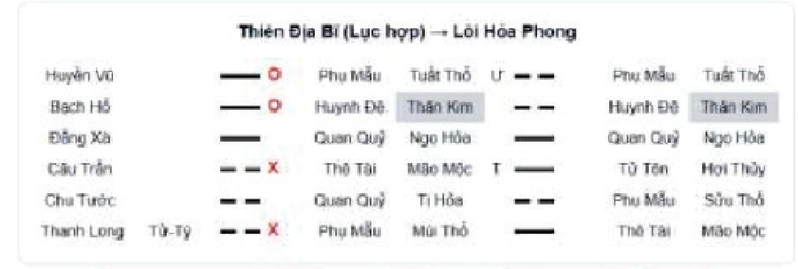

- **Cấu trúc Quẻ Dịch:**
  - **Quẻ chủ:** **Thiên Địa Bĩ** (Cung Càn, Họ Càn – Quẻ Lục Hợp)  
    *Ý nghĩa quẻ:* Bĩ là bế tắc, âm dương không giao hòa, trời đất xa cách; tuy mang danh nghĩa là quẻ Lục Hợp (bề ngoài gắn bó) nhưng bản chất là mỗi người nhìn về một hướng, tư tưởng ngăn cách nghìn trùng.
  - **Quẻ biến:** **Lôi Hỏa Phong** (Cung Khảm, Họ Khảm)  
    *Ý nghĩa quẻ:* Phong là dồi dào, phong phú, có nhiều sự lựa chọn mới; lời khuyên chiến lược là không nên "treo cổ trên một cành cây", hãy mở lòng đón nhận cơ hội khác.

- **Bảng chi tiết Lục hào:**

| Hào | Thế/Ứng | Lục thân (Chủ) | Can Chi | Biến động | Lục thân (Biến) | Can Chi (Biến) | Thần sát / Phục | Lục thú |
|:---:|:---:|:---|:---|:---:|:---|:---|:---|:---|
| 6 | **Ứng** | Phụ Mẫu | Tuất - Thổ | **O (Động)** | Phụ Mẫu | Tuất - Thổ | Hoa cái, Phục ngâm | Huyền Vũ |
| 5 | | Huynh Đệ | Thân - Kim | **O (Động)** | Huynh Đệ | Thân - Kim | Dịch mã, Phục ngâm, Thiên Cô | Bạch Hổ |
| 4 | | Quan Quỷ | Ngọ - Hỏa | tĩnh | Quan Quỷ | Ngọ - Hỏa | Tướng tinh | Đằng Xà |
| 3 | **Thế** | Thê Tài | Mão - Mộc | **X (Động)** | Tử Tôn | Hợi - Thủy | Đào hoa, Dương nhẫn | Câu Trần |
| 2 | | Quan Quỷ | Tị - Hỏa | tĩnh | Phụ Mẫu | Sửu - Thổ | Văn xương, Quý nhân (Sửu) | Chu Tước |
| 1 | | Phụ Mẫu | Mùi - Thổ | **X (Động)** | Thê Tài | Mão - Mộc | Thiên hỷ, Quý nhân (phục Tử Tôn Tị Hỏa) | Thanh Long |

*(Ghi chú: Hào 3 Thế Mão Mộc hóa Hợi Thủy kết hợp hào 1 Mùi Thổ động tạo thành Tam hợp Hợi – Mão – Mùi Mộc cục; Hào 6 Ứng Tuất Thổ động sinh hào 5 Thân Kim động khắc Thế).*

---

### 3. Dụng thần & Loại quẻ

- **Phân loại quẻ:**
  - Quẻ tình cảm, hôn nhân đại sự.
  - Quẻ có cả Thế và Ứng cùng động (trọng tâm chuyển dịch hoàn toàn vào trục Thế - Ứng theo kinh điển Hoàng Kim Sách).
- **Định vị hệ thống Dụng thần:**
  - **Dụng thần Người nữ (Hào Thế):** **Thê Tài Mão Mộc** tại hào 3 phát động lâm **Câu Trần**. Việc người nữ trì Thê Tài chứng tỏ cô đã tự đặt mình vào vị trí người yêu chính thức, mong muốn trở thành người vợ danh chính ngôn thuận; Câu Trần chủ sự chân thành, mộc mạc, gắn bó lâu dài.
  - **Dụng thần Người bạn trai tuổi Sửu (Hào Ứng):** **Phụ Mẫu Tuất Thổ** tại hào 6 phát động lâm **Huyền Vũ**. Do Dụng thần Quan Quỷ trong quẻ đều tĩnh (Tị Hỏa và Ngọ Hỏa tĩnh), trong khi hào Ứng phát động nên hành vi thực tế của đối phương được quy nạp trọn vẹn vào hào Ứng.
  - **Kỵ thần cản trở hôn nhân:** **Huynh Đệ Thân Kim** tại hào 5 phát động mang **Bạch Hổ** và **Thiên Cô tinh** (chủ tư tưởng độc thân, khắc chế Thê Tài Mão Mộc).

---

### 4. Luận giải chi tiết

Quẻ này là một kiệt tác phân tích tâm lý nhân vật ẩn tàng và bóc tách hai luồng năng lượng độc lập qua kỹ thuật Tam hợp cục đối lập:

#### 1. Bản chất quẻ Thiên Địa Bĩ: Bế tắc trong lớp vỏ bọc Lục Hợp
- Quẻ chủ là **Thiên Địa Bĩ** thuộc quẻ Lục Hợp:
  - Thông thường người học sơ cơ thấy quẻ Lục Hợp liền vội đoán tình cảm gắn bó sắt son. Nhưng Chu Thần Bân chỉ rõ: Bĩ nghĩa là bế tắc, trời ở trên cao ngạo nghễ, đất ở dưới thấp câm nín, khí trời không hạ, khí đất không thăng, âm dương cắt đứt giao tiếp.
  - Hai người tuy vẫn đang duy trì quan hệ yêu đương (hình thức Lục Hợp), nhưng mỗi bên theo đuổi một mục đích trái ngược, tâm tư bị ngăn cách bởi bức tường vô hình, không hề có tiếng nói chung về tương lai.

#### 2. Giải mã tâm lý bạn trai: Hào Ứng Tuất Thổ hóa Phục ngâm lâm Huyền Vũ
- Tại hào 6 (hào Ứng, đại diện bạn trai):
  - Hào **Phụ Mẫu Tuất Thổ** phát động, hóa xuất chính nó (**Phụ Mẫu Tuất Thổ**). Đây là hiện tượng **Phục ngâm (tự hóa)**.
  - Phục ngâm chủ về rên rỉ, u uất, dày vò nội tâm kéo dài, bế tắc không lối thoát.
  - Hào Ứng lại lâm **Huyền Vũ**. Trong khi hào Thế lâm Câu Trần (bộc trực, chân thành ở bề mặt) thì Huyền Vũ chủ về sự giấu giếm, bí mật đen tối, có ẩn tình sâu kín không bao giờ chịu hé răng chia sẻ.
- **Tại sao lại lâm Phụ Mẫu?**
  - Phụ Mẫu đại diện cho cha mẹ, gia đình gốc. Phục ngâm lâm Phụ Mẫu báo hiệu: Nỗi khổ sở, u uất sâu kín của người bạn trai bắt nguồn trực tiếp từ **bi kịch gia đình của cha mẹ anh ta**.
  - Cha mẹ anh ta từng đổ vỡ, ly hôn, tạo nên vết thương tâm lý chí mạng khiến anh ta sợ hãi và ác cảm tột cùng với thiết chế hôn nhân.
- **Tác động triệt tiêu tình cảm:**
  - Hào 6 Phụ Mẫu Tuất Thổ phát động sinh dưỡng cho hào 5 **Huynh Đệ Thân Kim** lâm **Bạch Hổ**.
  - Trong Tử Vi Đẩu Số và thần sát, cung Thân mang sao **Thiên Cô** (chủ về sống cô độc, lẻ loi một mình). Huynh Đệ lâm Bạch Hổ Thiên Cô biểu thị ý niệm: *"Tôi quyết tâm sống một đời độc thân, không bao giờ kết hôn"*.
  - Hào 5 Huynh Đệ Thân Kim lại là Kỵ thần quay đầu trực tiếp khắc phạt hào Thế Thê Tài Mão Mộc (Kim khắc Mộc). Nỗi ám ảnh gia đình (Tuất Thổ) sinh ra tư tưởng độc thân (Thân Kim) đã bóp chết hoàn toàn hy vọng kết hôn của cô gái.

#### 3. Tương lai chân chính của người nữ: Tam hợp cục Hợi – Mão – Mùi
- Quan sát luồng năng lượng thứ hai xoay quanh hào Thế:
  - Hào 3 Thế **Thê Tài Mão Mộc** động hóa **Tử Tôn Hợi Thủy**.
  - Hào 1 **Phụ Mẫu Mùi Thổ** phát động hóa **Thê Tài Mão Mộc**.
  - Ba hào kết hợp tạo thành **Tam hợp cục Hợi – Mão – Mùi Mộc cục** vững chắc.
- **Cơ chế dịch lý định vị bến đỗ mới:**
  - Tam hợp hóa Mộc cục vượng tướng, củng cố hào Thế Thê Tài Mão Mộc. Điều này khẳng định trong tương lai cô gái nhất định sẽ tìm được bến đỗ bình yên và trở thành người vợ danh chính ngôn thuận của một người đàn ông khác.
  - Tại sao là người khác? Vì tam hợp cục gắn kết hào Thế với **Phụ Mẫu Mùi Thổ** (ở hào 1), hoàn toàn đối lập và bài trừ **Phụ Mẫu Tuất Thổ** (ở hào 6 của người bạn trai hiện tại).
  - **Hào 1 Phụ Mẫu Mùi Thổ** là Mộ khố của Mão Mộc (chủ về nhà cửa, quê hương gốc), lại nằm ở hào sơ (vị trí xa xứ quay về nguồn cội). Quê hương cô gái là Vancouver. Chu Thần Bân nhìn ra: Người chồng tương lai của cô sẽ xuất hiện khi cô trở về thăm quê nhà Vancouver, chứ không phải ở Toronto đất khách.
  - Hai bên hào Thế được giáp bởi **Quan Quỷ Tị Hỏa** (hào 2) và **Quan Quỷ Ngọ Hỏa** (hào 4), cả hai đều được Nhật kiến Giáp Dần tương sinh (Dần Mộc sinh Hỏa). Tượng quẻ biến **Lôi Hỏa Phong** cho thấy tương lai sau khi qua tháng Sửu hưu tù, bước sang vận Dần Mộc, cô gái sẽ có rất nhiều cơ hội tốt để lựa chọn những người đàn ông ưu tú khác.

---

### 5. Kết luận & Ứng kỳ thực tế

- **Lời kết luận và khuyến nghị của Chu Thần Bân:**
  - Khẳng định người bạn trai tuổi Sửu tuyệt đối sẽ không bao giờ kết hôn với cô gái do anh ta có vết thương tâm lý nặng nề từ cha mẹ và quyết tâm theo chủ nghĩa độc thân.
  - Khuyên cô gái dùng chuyện "đòi cưới" làm **hòn đá thử vàng**: hãy hẹn gặp và yêu cầu câu trả lời dứt khoát về hôn nhân; nếu anh ta lảng tránh thì nên lập tức dứt khoát chia tay để bảo toàn thanh xuân.
  - Khuyên cô nên thu xếp trở về quê hương Vancouver một chuyến, vì lương duyên đích thực đang chờ đón cô ở nơi đó (ứng Phụ Mẫu Mùi Thổ).
- **Phản hồi thực tế từ đương số (Feedback):**
  - Nghe lời thầy, cô gái hẹn bạn trai đi ăn tối và đặt vấn đề nghiêm túc về kế hoạch cưới hỏi.
  - Chàng trai lập tức lộ rõ tâm can, nghẹn ngào thừa nhận: Vì bố mẹ anh ta ly hôn từ nhỏ, gia đình tan nát đã gieo vào đầu anh nỗi khiếp sợ hôn nhân. Anh thú nhận: *"Anh rất yêu em, rất muốn ở bên em suốt đời, nhưng anh kiên quyết không bao giờ đăng ký kết hôn hay tổ chức đám cưới"*.
  - Nhận thấy sự thật đúng từng chi tiết như lời quẻ giải đoán, cô gái tuy đau đớn tột cùng nhưng đã kiên quyết dứt khoát nói lời chia tay ngay trong đêm hôm đó để tìm kiếm hạnh phúc đích thực cho cuộc đời mình.

---

### 6. Bài học tâm pháp & Quy tắc cốt lõi

- **Quy tắc trích dẫn cốt lõi:**
  - *Quy tắc quẻ Bĩ lục hợp bế tắc trong hôn nhân tình cảm và định vị nhân duyên tương lai qua Nhật kiến* (trang 429, Sách Cổ Thệ Chân Thuyên tập 2).
- **Tâm pháp giải đoán thực chiến:**
  - **Cảnh giác với quẻ Lục Hợp Thiên Địa Bĩ:** Không được thấy Lục Hợp là vội khen cát; quẻ Bĩ là tượng trời đất không giao, ngoài mặt êm đềm nhưng bên trong bế tắc tột cùng, ý chí hai bên triệt tiêu lẫn nhau.
  - **Hào Ứng Phục ngâm lâm Huyền Vũ:** Đại diện cho nỗi khổ tâm giấu kín của đối phương; khi phục ngâm sinh Kỵ thần lâm Bạch Hổ Thiên Cô, đó là quyết tâm sống độc thân không thỏa hiệp.
  - **Kỹ thuật phân lập hai khối năng lượng độc lập:** Trong quẻ có nhiều hào động, phải khéo léo bóc tách: một chuỗi động thuộc về người bạn trai (Tuất Thổ sinh Thân Kim), một chuỗi Tam hợp cục thuộc về bản thân người nữ (Hợi – Mão – Mùi); hai hệ thống này không dung nạp nhau, biểu thị sự chia ly tất yếu để mở ra lối thoát mới.
  - **Hào sơ Mộ khố là quê hương nguồn cội:** Hào 1 lâm Phụ Mẫu Mùi Thổ là Mộ khố của hào Thế Mão Mộc, định vị chính xác địa lý nhân duyên chuyển dịch từ nơi đất khách (Toronto) quay về quê hương bản quán (Vancouver).

## THỰC CHIẾN 112: MỘT THƯƠNG NHÂN HỎI VỀ VIỆC BỘ Y TẾ YÊU CẦU DỪNG LƯU HÀNH MỘT LOẠI THUỐC CỦA NHÀ MÁY

---

### 1. Bối cảnh & Câu hỏi

- **Bối cảnh chi tiết:**
  - Một thương nhân người Canada gốc Hoa sở hữu doanh nghiệp sản xuất và phân phối các sản phẩm thuốc Đông y dạng hạt chiết xuất thảo mộc thiên nhiên. Doanh nghiệp có hai cơ sở sản xuất: một nhà máy ở miền Tây và một nhà máy ở miền Đông Canada.
  - Gần đây phát sinh một sự cố: Một bệnh nhân sau khi sử dụng một loại thuốc dạng hạt của công ty thì cảm thấy hồi hộp, tim đập nhanh và đến bệnh viện kiểm tra. Các bác sĩ Tây y tại bệnh viện lập tức quy chụp nguyên nhân do dùng thuốc Đông y, đồng thời gửi báo cáo lên Bộ Y tế. Phía bệnh viện kiểm nghiệm phát hiện trong thuốc có một số thành phần tồn dư hoạt chất tương tự như tân dược.
  - Bộ Y tế Canada lập tức phát văn bản cảnh báo và yêu cầu nhà máy ở miền Tây phải ngừng lưu hành khẩn cấp loại thuốc này để thẩm tra với nghi vấn công ty cố tình trộn tân dược vào thuốc Đông y.
  - Phía thương nhân giải thích rằng thuốc chiết xuất tự nhiên luôn có một tỷ lệ tồn dư thực vật đặc thù tự nhiên mang cấu trúc tương đồng chứ công ty tuyệt đối không cố ý pha trộn; tuy nhiên Bộ Y tế vẫn cứng rắn gây sức ép.
  - Thương nhân tìm đến Chu Thần Bân xin gieo một quẻ Dịch để tìm hướng xử lý khủng hoảng. Anh chia sẻ rằng nếu phải dừng loại thuốc này thì thiệt hại doanh thu không đáng kể vì sản phẩm bán chậm, nhưng điều anh lo sợ nhất là hiệu ứng dây chuyền: việc đình chỉ công khai sẽ làm hoen ố uy tín thương hiệu, khiến bệnh nhân và khách hàng đổ xô đến đòi bồi thường, thậm chí kéo sập toàn bộ doanh nghiệp.
- **Tâm lý & Câu hỏi ẩn ý:**
  - Đương số đứng trước tâm lý hoang mang, lo sợ khủng hoảng truyền thông và pháp lý leo thang mất kiểm soát; do dự giữa hai phương án: nhẫn nhịn "dĩ hòa vi quý" làm theo lệnh dừng thuốc, hay quyết liệt đấu tranh pháp lý.
  - Câu hỏi trọng tâm: *"Trước việc Bộ Y tế yêu cầu dừng lưu hành thuốc của nhà máy, doanh nghiệp nên ứng phó và xử lý ra sao để tránh tổn thất dây chuyền?"*
- **Thời gian chiêm đoán:**
  - Giờ Bắc Kinh: Ngày 31 tháng 10 năm 2017, 09:49 sáng.
  - Can chi: Năm Đinh Dậu, tháng Canh Tuất, ngày Tân Mão, giờ Quý Tị.

---

### 2. Dữ kiện & Bảng quẻ Crop

- **Thời không chiêm nghiệm:**
  - Tháng Canh Tuất (Thổ vượng, sinh Kim, lâm Nguyệt lệnh).
  - Ngày Tân Mão (Mộc vượng, xung Dậu Kim, lâm Nhật kiến).
  - Tuần không: **Ngọ - Mùi** (Giáp Thân tuần trung, Ngọ Mùi không vong).
- **Thần sát đầy đủ:**
  - Tướng tinh: Mão
  - Hoa cái: Mùi
  - Dịch mã: Tị
  - Tai sát: Dậu
  - Mưu tinh: Sửu
  - Đào hoa: Tý
  - Kiếp sát: Thân
  - Lộc thần: Dậu
  - Dương nhẫn: Thân
  - Văn xương: Tý
  - Thiên y: Dậu
  - Thiên hỷ: Thìn
  - Quý nhân: Dần, Ngọ

- Dữ kiện bảng quẻ và các thông số chiêm đoán:
  - **Bảng 112.1** Đồ hình quẻ Thực chiến 112:
    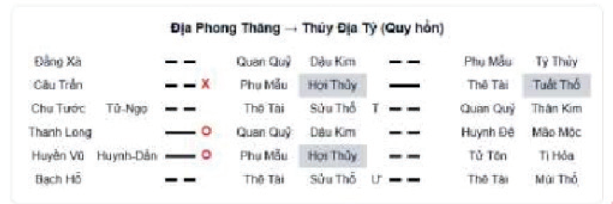

- **Cấu trúc Quẻ Dịch:**
  - **Quẻ chủ:** **Địa Phong Thăng** (Cung Chấn, Họ Chấn)  
    *Ý nghĩa quẻ:* Thăng là thăng tiến, đi lên, mở rộng; trong bối cảnh tranh chấp rắc rối, tượng quẻ Thăng chỉ thị khủng hoảng đang trong đà **leo thang dữ dội**, tầm ảnh hưởng và thiệt hại có xu hướng mở rộng quy mô.
  - **Quẻ biến:** **Thủy Địa Tỷ** (Cung Khảm, Họ Khảm – Quẻ Quy Hồn)  
    *Ý nghĩa quẻ:* Tỷ là gắn bó, thân cận, nhưng thực chất là sự **"quan tâm, theo dõi sát sao"** từ dư luận và cơ quan công quyền; sự việc trở nên phức tạp khiến các bên không thể dứt ra được.

- **Bảng chi tiết Lục hào:**

| Hào | Thế/Ứng | Lục thân (Chủ) | Can Chi | Biến động | Lục thân (Biến) | Can Chi (Biến) | Thần sát / Phục | Lục thú |
|:---:|:---:|:---|:---|:---:|:---|:---|:---|:---|
| 6 | | Quan Quỷ | Dậu - Kim | tĩnh (Ám động) | Phụ Mẫu | Tý - Thủy | Tai sát, Thiên y, Lộc thần | Đằng Xà |
| 5 | | Phụ Mẫu | Hợi - Thủy | **X (Động)** | Thê Tài | Tuất - Thổ | Nguyệt kiến | Câu Trần |
| 4 | **Thế** | Thê Tài | Sửu - Thổ | tĩnh | Quan Quỷ | Thân - Kim | Mưu tinh, Dương nhẫn (phục Tử Tôn Ngọ Hỏa) | Chu Tước |
| 3 | | Quan Quỷ | Dậu - Kim | **O (Động)** | Huynh Đệ | Mão - Mộc | Tai sát, Thiên y, Lộc thần | Thanh Long |
| 2 | | Phụ Mẫu | Hợi - Thủy | **O (Động)** | Tử Tôn | Tị - Hỏa | Dịch mã (phục Huynh Đệ Dần Mộc) | Huyền Vũ |
| 1 | **Ứng** | Thê Tài | Sửu - Thổ | tĩnh | Thê Tài | Mùi - Thổ | Tuần không | Bạch Hổ |

*(Ghi chú: Quẻ có hào 3 và hào 2 minh động, hào 5 minh động, hào 6 ám động; hào 2 và hào 3 là Phản ngâm hào nội).*

---

### 3. Dụng thần & Loại quẻ

- **Phân loại quẻ:**
  - Quẻ ứng phó sự cố thương mại, xử lý khủng hoảng truyền thông và pháp lý doanh nghiệp.
  - Quẻ có cấu trúc động lực đa tầng: Quan Quỷ (vấn đề, thanh tra) sinh Phụ Mẫu (nhà máy, giấy phép) biến Tử Tôn (vũ khí pháp lý đối kháng).
- **Định vị hệ thống Dụng thần:**
  - **Dụng thần Bản thân doanh nghiệp & Tài chính (Hào Thế):** **Thê Tài Sửu Thổ** tại hào 4 lâm Chu Tước.
  - **Dụng thần Nguồn cơn khủng hoảng & Khiếu nại pháp lý:** Hai hào **Quan Quỷ Dậu Kim** (hào 6 ám động và hào 3 minh động) lâm **Tai sát** và **Thiên y**.
  - **Dụng thần Cơ sở sản xuất & Dây chuyền thuốc (Phụ Mẫu):** Hai hào **Phụ Mẫu Hợi Thủy** (hào 5 và hào 2) đại diện cho hai nhà máy ở miền Tây và miền Đông.
  - **Dụng thần Giải pháp cứu cánh tối thượng:** **Tử Tôn Tị Hỏa** (hào biến từ Phụ Mẫu Hợi Thủy tại hào 2), hiện thân của lực lượng luật sư chuyên nghiệp và báo cáo kiểm định khoa học độc lập.

---

### 4. Luận giải chi tiết

Quẻ này là một mẫu mực tuyệt hảo về nghệ thuật truy nguyên chuỗi truyền dẫn động năng trong Lục Hào: từ triệu chứng khiếu nại, lan tỏa tới nhà máy, và tìm ra chìa khóa hóa giải ở hào biến cuối cùng:

#### 1. Nhận diện nguy cơ lan rộng qua hai hào Quan Quỷ Dậu Kim
- Trong quẻ xuất hiện hai hào **Quan Quỷ Dậu Kim** kẹp hai bên hào Thế:
  - Hào 3 **Quan Quỷ Dậu Kim** phát động (minh động).
  - Hào 6 **Quan Quỷ Dậu Kim** được Nguyệt Canh Tuất sinh vượng, bị Nhật Tân Mão xung phá hóa thành **Ám động**.
- **Ý nghĩa hai Quan Quỷ:**
  - Cả hai hào Dậu Kim đều mang theo **Thiên y** và **Tai sát** – đây là tổ hợp điển hình của sự cố y tế và tranh chấp liên quan đến bác sĩ, bệnh nhân và dược phẩm.
  - Hai hào Quan Quỷ cùng tác động báo hiệu: Rắc rối không chỉ dừng lại ở một nơi, mà có tới **hai nguồn cơn khủng hoảng** cùng lúc nhắm vào doanh nghiệp.
- **Mục tiêu tấn công của Quan Quỷ:**
  - Hai hào Quan Quỷ Dậu Kim không trực tiếp xung khắc hào Thế Thê Tài Sửu Thổ, mà cả hai cùng đồng loạt hướng năng lượng vào việc **tương sinh cho hai hào Phụ Mẫu Hợi Thủy** (Kim sinh Thủy).
  - Doanh nghiệp sản xuất dược phẩm lấy hào Phụ Mẫu làm dây chuyền công xưởng, giấy phép lưu hành và thương hiệu nhà máy. Việc Quan Quỷ sinh Phụ Mẫu biểu thị: Các khiếu nại y tế đang trực tiếp tấn công và làm xáo trộn nghiêm trọng hoạt động của các nhà máy sản xuất.

#### 2. Định vị hai nhà máy: Miền Tây và Miền Đông cùng gặp họa
- Doanh nghiệp có hai nhà máy, ứng đúng với hai hào **Phụ Mẫu Hợi Thủy** phát động:
  - **Hào 5 Phụ Mẫu Hợi Thủy:** Hào 5 thuộc ngoại quái, quẻ Càn/Khảm phương Tây Bắc, ứng với **nhà máy ở miền Tây** – nơi đang trực tiếp nhận thông báo dừng lưu hành thuốc đầu tiên.
  - **Hào 3 Quan Quỷ Dậu Kim biến ra Huynh Đệ Mão Mộc:** Mão Mộc thuộc phương chính Đông, báo hiệu rắc rối sẽ tiếp tục lan sang **nhà máy ở miền Đông**.
- Chu Thần Bân cảnh báo ngay: Nếu thương nhân chọn cách nhượng bộ, âm thầm chấp nhận đóng cửa loại thuốc ở nhà máy miền Tây để "dĩ hòa vi quý", Bộ Y tế sẽ được đà lấn tới và lập tức ra văn bản đình chỉ tiếp các loại thuốc tương tự tại nhà máy miền Đông. Đúng với tượng quẻ **Địa Phong Thăng** (khủng hoảng leo thang) và quẻ biến **Thủy Địa Tỷ** (bị thanh tra săm soi ráo riết).

#### 3. Chuỗi quy nạp năng lượng: Nút thắt Tử Tôn Tị Hỏa (Thuê luật sư)
- Làm thế nào để hóa giải sự việc? Quan sát hai biến hào của Phụ Mẫu Hợi Thủy:
  - **Hào 5 Phụ Mẫu Hợi Thủy động hóa Thê Tài Tuất Thổ:** Hóa ra Thê Tài lâm Nguyệt lệnh quay đầu khắc phạt (*Hồi đầu khắc*). Tượng trưng cho việc nếu có phương án đối phó chuẩn xác thì sóng gió ở nhà máy miền Tây cuối cùng sẽ tự động lắng xuống trong êm đẹp.
  - **Hào 2 Phụ Mẫu Hợi Thủy động hóa Tử Tôn Tị Hỏa:** Đây chính là **tử huyệt xoay chuyển tình thế**.
- **Cơ chế dịch lý của Tử Tôn Tị Hỏa:**
  - Chuỗi động lực: Quan Quỷ sinh Phụ Mẫu, Phụ Mẫu động biến ra Tử Tôn Tị Hỏa. Toàn bộ năng lượng của các hào động đều hội tụ và quy nạp về đích đến cuối cùng là **Tử Tôn Tị Hỏa**.
  - Trong phép đoán Lục Hào, Tử Tôn là thần khắc chế Quan Quỷ (Hỏa khắc Kim). Khi Quan Quỷ là cơ quan công quyền chèn ép và rắc rối pháp lý thì Tử Tôn mang vũ khí sắc bén chính là **lực lượng luật sư chuyên nghiệp**.
  - Tử Tôn Tị Hỏa mang khí thế quyết liệt, đại diện cho việc sử dụng kênh biện hộ pháp lý chính thống, thuê chuyên gia độc lập và dùng công văn pháp luật để phản kích.
  - Đặc biệt, **Tử Tôn Tị Hỏa chủ động tương sinh cho hào Thế Thê Tài Sửu Thổ** (Tị Hỏa sinh Sửu Thổ). Điều này khẳng định: Con đường duy nhất bảo vệ được tài chính, uy tín và mạng sống của doanh nghiệp là phải dứt khoát áp dụng vũ khí pháp lý (Tử Tôn), kiên quyết không được nhẫn nhịn quy phục.

---

### 5. Kết luận & Ứng kỳ thực tế

- **Lời kết luận và khuyến nghị của Chu Thần Bân:**
  - Khẳng định khủng hoảng chắc chắn sẽ lan từ nhà máy miền Tây sang nhà máy miền Đông nếu chủ doanh nghiệp tiếp tục thỏa hiệp.
  - Yêu cầu lập tức đăng bài tuyên bố chính thức trên website công ty để đính chính sự thật, làm rõ Bộ Y tế chưa điều tra toàn diện đã vội vã ra văn bản gây thiệt hại cho doanh nghiệp.
  - Khẩn cấp thuê hãng luật sư danh tiếng và gửi mẫu sang các phòng kiểm nghiệm độc lập uy tín hàng đầu tại Mỹ và Canada để lấy chứng thư khoa học chứng minh tồn dư thảo mộc tự nhiên, sẵn sàng khởi kiện Bộ Y tế ra tòa án.
- **Diễn biến thực tế và Kết quả (Feedback):**
  - Ban đầu sau khi nghe tư vấn, vì tâm lý ngại va chạm nên thương nhân vẫn tự ý làm theo lệnh dừng thuốc ở nhà máy miền Tây. Quả nhiên đúng như Chu Thần Bân tiên liệu, chỉ ít ngày sau Bộ Y tế Canada tiếp tục gửi văn bản đòi đình chỉ thêm các sản phẩm khác ở nhà máy miền Đông.
  - Rơi vào chân tường, thương nhân bừng tỉnh nhận ra sự chính xác của quẻ Dịch. Anh lập tức thực hiện trọn vẹn phác đồ của Chu Thần Bân:
    - Thuê ngay tổ chức kiểm định dược phẩm độc lập hàng đầu tại Mỹ và Canada thẩm định, đưa ra báo cáo khoa học khẳng định thành phần tồn dư là tự nhiên của dược liệu.
    - Giao toàn bộ hồ sơ cho một văn phòng luật sư sừng sỏ, chính thức gửi văn bản pháp lý cảnh báo khởi kiện Bộ Y tế Canada vì hành vi ra văn bản thiếu căn cứ làm tổn hại doanh nghiệp.
  - **Kết cục đảo chiều ngoạn mục:** Nhận thấy doanh nghiệp có đầy đủ chứng cứ khoa học vững chắc và quyết tâm kiện đến cùng, phía Bộ Y tế lập tức xuống nước vì biết rõ lý lẽ của mình không đủ sức thuyết phục trước tòa. Các quan chức cấp cao của Bộ chủ động đứng ra điều đình, thu hồi lại các thông cáo báo chí bất lợi, hai bên dàn xếp êm đẹp và vụ việc chính thức khép lại trong hòa bình.

---

### 6. Bài học tâm pháp & Quy tắc cốt lõi

- **Quy tắc trích dẫn cốt lõi:**
  - *Quy tắc xử lý khủng hoảng pháp lý và đình chỉ lưu hành dược phẩm: Quy nạp năng lượng về hào Tử Tôn Dương Nhận (luật sư)* (trang 437, Sách Cổ Thệ Chân Thuyên tập 2).
- **Tâm pháp giải đoán thực chiến:**
  - **Nhận diện nguy cơ dây chuyền qua đa Quan Quỷ:** Trong quẻ thương mại nếu xuất hiện hai hào Quan Quỷ cùng động (nhất là một minh một ám), sự cố tuyệt đối không phải đơn lẻ mà chắc chắn sẽ nổ ra ở hai mắt xích, hai chi nhánh hoặc hai vùng địa lý khác nhau.
  - **Kỹ thuật quy nạp năng lượng hào biến (Tụ năng lượng):** Khi hào động không trực tiếp sinh khắc Thế, phải dò theo chuỗi mắt xích liên hoàn để tìm hào biến cuối cùng. Hào biến mang Tử Tôn sinh Thế và khắc Quỷ chính là chìa khóa giải pháp độc nhất vô nhị.
  - **Tử Tôn là vũ khí pháp lý:** Trong các tranh chấp với cơ quan thanh tra hoặc thể chế công quyền (Quan Quỷ), Tử Tôn đại diện cho sự thật, bằng chứng khách quan, luật sư biện hộ và công luận; phải dũng cảm kích hoạt Tử Tôn thì Quan Quỷ mới tự động thoái lui.
  - **Hiểm họa của thái độ thỏa hiệp mù quáng:** Khi quẻ mang tượng Thăng (leo thang) và Tỷ (soi mói), sự nhượng bộ nhu nhược chỉ làm đối phương lấn tới; chỉ có phản kích bằng cơ chế khoa học pháp lý chuẩn mực mới bảo vệ được toàn vẹn sinh mệnh doanh nghiệp.

## THỰC CHIẾN 113: VÌ MÁY MÓC CỦA CÔNG TY MÌNH KHÔNG ỔN ĐỊNH, GIÁM ĐỐC CÔNG TY MÁY BAY KHÔNG NGƯỜI LÁI CHIÊM QUẺ HỎI CÓ NÊN MẠO HIỂM HẸN KHÁCH HÀNG THỬ BAY HAY KHÔNG

---

### 1. Bối cảnh & Câu hỏi

- **Bối cảnh chi tiết:**
  - Ca thực chiến này do dịch hữu Nguyên Đạo cung cấp cho Chu Thần Bân. Đương số là giám đốc một công ty công nghệ sản xuất máy bay không người lái (drone).
  - Công ty đang đứng trước một cơ hội thương mại lớn: Khách hàng tiềm năng yêu cầu tổ chức một buổi bay trình diễn thực tế trên không trung để kiểm tra tính năng trước khi quyết định ký hợp đồng đặt mua số lượng lớn.
  - Tuy nhiên, bộ phận kỹ thuật phát hiện hệ thống máy móc của thiết bị bay bên mình chưa thực sự ổn định, cụ thể là hệ thống cấp nguồn điện và pin chập chờn, có nguy cơ mất điện đột ngột giữa không trung làm máy bay rơi tự do.
  - Vị giám đốc rơi vào thế tiến thoái lưỡng nan cực kỳ gay cấn:
    1. Nếu mạo hiểm nhận lời bay thử mà máy bay bị mất nguồn rơi vỡ trước mặt khách hàng thì uy tín tan tành, thương vụ đổ bể hoàn toàn.
    2. Nếu chần chừ từ chối bay thử thì một công ty đối thủ cạnh tranh trực tiếp sẽ chớp lấy cơ hội bay thử trước và cướp mất hợp đồng béo bở.
- **Tâm lý & Câu hỏi ẩn ý:**
  - Tâm trạng đương số giằng xé giữa lòng tham và nỗi sợ hãi; lo âu bất an tột cùng (quẻ tâm thái).
  - Câu hỏi trọng tâm: *"Trước việc máy móc thiết bị chưa ổn định, có nên mạo hiểm hẹn khách hàng bay thử nghiệm hay không? Nếu không bay thì đối thủ cạnh tranh có thành công giành mất hợp đồng không?"*
- **Thời gian chiêm đoán:**
  - Giờ Bắc Kinh: Ngày 06 tháng 02 năm 2018, 16:04.
  - Can chi: Năm Mậu Tuất, tháng Giáp Dần, ngày Kỷ Tị, giờ Nhâm Thân.

---

### 2. Dữ kiện & Bảng quẻ Crop

- **Thời không chiêm nghiệm:**
  - Tháng Giáp Dần (Mộc vượng, lâm Nguyệt kiến).
  - Ngày Kỷ Tị (Hỏa vượng, sinh Thổ, hình Dần, lâm Nhật kiến).
  - Tuần không: **Tuất - Hợi** (Giáp Tý tuần trung, Tuất Hợi không vong).
- **Thần sát đầy đủ:**
  - Tướng tinh: Dậu
  - Hoa cái: Sửu
  - Dịch mã: Hợi
  - Tai sát: Mão
  - Mưu tinh: Mùi
  - Đào hoa: Ngọ
  - Kiếp sát: Dần
  - Lộc thần: Ngọ
  - Dương nhẫn: Tị
  - Văn xương: Dậu
  - Thiên y: Sửu
  - Thiên hỷ: Tuất
  - Quý nhân: Thân, Tý

- Dữ kiện bảng quẻ và các thông số chiêm đoán:
  - **Bảng 113.1** Đồ hình quẻ Thực chiến 113:
    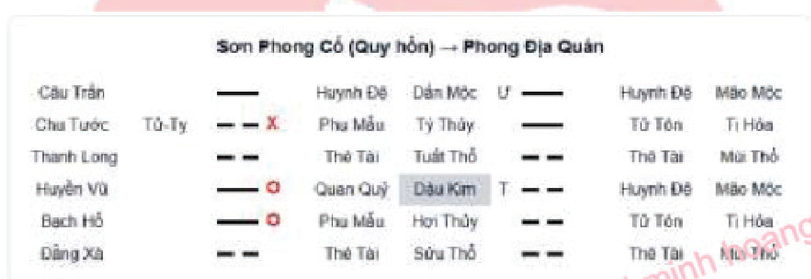

- **Cấu trúc Quẻ Dịch:**
  - **Quẻ chủ:** **Sơn Phong Cổ (Quy hồn)** (Cung Tốn, Họ Tốn)  
    *(Lưu ý đối chiếu văn bản: Đồ hình in trong sách gốc ghi nhận quẻ Sơn Phong Cổ biến Phong Địa Quán; trong văn bản phân tích luận giải, Chu Thần Bân đi sâu vào cấu trúc tâm thái quẻ Sơn Thủy Mông biến Địa Sơn Khiêm kết hợp liên thông tượng quẻ Cổ - Quán để lột tả toàn diện tâm lý giằng xé và hiện trường bay thử).*
    - *Ý nghĩa tượng Cổ:* Cổ là sự cố, mối mọt, hỏng hóc cơ khí ngấm ngầm bên trong thiết bị; quẻ Quy Hồn chỉ thị sự việc bế tắc, tâm thần bất an, tiến thoái lưỡng nan.
  - **Quẻ biến:** **Phong Địa Quán** (Cung Càn, Họ Càn)  
    - *Ý nghĩa tượng Quán:* Quán là quan sát, đứng ngoài nhìn ngắm, bảo lưu thái độ chờ xem đối phương hành động chứ không nên trực tiếp nhảy vào vòng xoáy.

- **Bảng chi tiết Lục hào (Đồ hình Sơn Phong Cổ biến Phong Địa Quán):**

| Hào | Thế/Ứng | Lục thân (Chủ) | Can Chi | Biến động | Lục thân (Biến) | Can Chi (Biến) | Thần sát / Phục | Lục thú |
|:---:|:---:|:---|:---|:---:|:---|:---|:---|:---|
| 6 | **Ứng** | Huynh Đệ | Dần - Mộc | tĩnh | Huynh Đệ | Mão - Mộc | Nguyệt kiến, Kiếp sát | Câu Trần |
| 5 | | Phụ Mẫu | Tý - Thủy | **X (Động)** | Tử Tôn | Tị - Hỏa | Quý nhân (phục Tử Tôn Tị Hỏa) | Chu Tước |
| 4 | | Thê Tài | Tuất - Thổ | tĩnh | Thê Tài | Mùi - Thổ | Tuần không, Thiên hỷ | Thanh Long |
| 3 | **Thế** | Quan Quỷ | Dậu - Kim | **O (Động)** | Huynh Đệ | Mão - Mộc | Tướng tinh, Văn xương, Tự hóa xung khắc | Huyền Vũ |
| 2 | | Phụ Mẫu | Hợi - Thủy | **O (Động)** | Tử Tôn | Tị - Hỏa | Dịch mã, Tuần không | Bạch Hổ |
| 1 | | Thê Tài | Sửu - Thổ | tĩnh | Thê Tài | Mùi - Thổ | Hoa cái, Thiên y | Đằng Xà |

*(Bảng đối chiếu cấu trúc tâm thái song song Mông biến Khiêm: Hào Thế Tử Tôn Tuất Thổ lâm Tuần không; hào Ứng Phụ Mẫu Dần Mộc lâm Nguyệt kiến khắc Thế; hào gian Tử Tôn Thìn Thổ động hóa Huynh Đệ Ngọ Hỏa hồi đầu sinh).*

---

### 3. Dụng thần & Loại quẻ

- **Phân loại quẻ:**
  - Quẻ tâm thái điển hình (vấn sự lo âu, hiểm họa công nghệ và thăm dò hoạt động của đối thủ cạnh tranh).
  - Quẻ có hào Thế lâm Tuần không kết hợp cơ chế bắc cầu Lục thần nhận diện đối thủ.
- **Định vị hệ thống Dụng thần:**
  - **Dụng thần Bản thân & Nỗi lo tự thân (Hào Thế):** Hào Thế đại diện cho tâm thái của vị giám đốc. Trong quẻ tâm thái, hào Thế lâm Tuần không biểu thị trong ngắn hạn không thể an tâm, mối lo cơ khí mất điện là có thật.
  - **Dụng thần Sự cố thiết bị bay (Hào Ứng / Phụ Mẫu):** Phụ Mẫu đại diện cho thiết bị máy móc, phương tiện bay; hào lâm Nguyệt kiến khắc Thế biểu thị hiểm họa kỹ thuật đang đe dọa sự nghiệp của doanh nghiệp.
  - **Dụng thần Buổi thử nghiệm của đối thủ cạnh tranh:** Hào Tử Tôn đối lập (hoặc hào Phụ Mẫu ngoại vị) kết hợp tổ hợp Lục thần Câu Trần – Huyền Vũ.

---

### 4. Luận giải chi tiết

Quẻ này là một án lệ xuất sắc thể hiện tâm pháp "Đọc quẻ chính là đọc tâm" và kỹ thuật "Bắc cầu Lục thần Câu Trần – Huyền Vũ" để bóc tách hành vi của đối thủ thương trường:

#### 1. Đọc thấu tâm can: Hai tầng âu lo của người giám đốc
Chu Thần Bân chỉ ra một vị giám đốc khi đứng trước cơ hội này thực chất chỉ lo lắng đúng hai điều:
- **Nỗi lo thứ nhất:** Nếu mình mạo hiểm mang máy bay đi bay thử, hệ thống nguồn điện chập chờn sẽ khiến drone rơi tự do làm nhục nhã công ty.
- **Nỗi lo thứ hai:** Nếu mình án binh bất động, đối thủ mang máy bay đi thử nghiệm mà thành công rực rỡ thì khách hàng sẽ ký hợp đồng với họ, mình mất trắng thị trường.

#### 2. Phân tích hào Thế: Tuyệt đối không được mạo hiểm
- **Tín hiệu cảnh báo từ hào Thế:**
  - Hào Thế lâm **Tuần không**: Trong quẻ tâm thái hỏi việc ngắn hạn, Tử Tôn (thần an tâm) lâm Không thì không thể an tâm; hào Thế lâm Không biểu thị việc mạo hiểm này chắc chắn sẽ dẫn đến thất bại, không có điểm tựa.
  - Hào Ứng (đại diện cho buổi thử nghiệm bay) lâm **Dần Mộc được Nguyệt kiến**: Dần Mộc cực vượng trực tiếp khắc phạt hào Thế. Điều này chỉ rõ: Sự cố mất nguồn điện kỹ thuật là hiện thực khách quan đang đè bẹp thiết bị; nếu đem đi bay thử thì sự cố này sẽ trực tiếp biến thành thảm họa rơi máy bay.
  - Chu Thần Bân kết luận dứt khoát: **Canh bạc này tuyệt đối không thể đánh, hễ mạo hiểm là cầm chắc 100% thất bại rơi máy bay**.

#### 3. Bí pháp "Bắc cầu Lục thần" (Câu Trần – Huyền Vũ): Đối thủ tự chuốc lấy thất bại
- Khi vị giám đốc quyết định không bay, số phận của đối thủ cạnh tranh sẽ ra sao?
- **Nhận diện buổi bay của đối thủ qua hào động:**
  - Trong quẻ xuất hiện một hào Tử Tôn/Phụ Mẫu phát động tại gian hào, đối chiếu với hào Thế. Đây là biểu tượng của một "sự kiện làm cho người hỏi an tâm" nhưng thuộc về đối tượng bên ngoài.
  - Quan sát sự liên kết giữa **Câu Trần và Huyền Vũ**:
    - Câu Trần chủ về biểu hiện bên ngoài, hiện trường công khai, đối thủ trực tiếp.
    - Huyền Vũ chủ về nội tình bí mật, ẩn tàng.
    - Hai thần sát Câu Trần và Huyền Vũ tạo thành một cặp bài trùng tương ứng (một trong một ngoài, cùng mô tả một bản thể sự kiện).
- **Cơ chế bắc cầu nhận diện thất bại:**
  - Hào động đại diện cho đối thủ bắc cầu qua hào Huynh Đệ rồi biến ra hào bị **Nguyệt phá** hoặc **Hồi đầu khắc**.
  - Tại hào 6 Phụ Mẫu Dần Mộc (lâm Câu Trần) biến hồi đầu khắc; hào động thông qua chuỗi truyền dẫn biến thành hào hóa Phá.
  - Ý nghĩa Dịch lý tuyệt luân: Buổi thử nghiệm bay của công ty đối thủ sau khi tiến hành cũng sẽ gặp sự cố kỹ thuật nghiêm trọng và **kết thúc trong thất bại ê chề**.
  - Vị giám đốc không cần phải lo lắng việc đối thủ giành mất hợp đồng. Chỉ cần mình kiên nhẫn đứng ngoài quan sát (tượng quẻ Phong Địa Quán), đối thủ sẽ tự nhảy vào hố chôn và tự loại mình khỏi cuộc chơi.

---

### 5. Kết luận & Ứng kỳ thực tế

- **Lời kết luận và khuyến nghị của Chu Thần Bân:**
  - Khuyên vị giám đốc kiên quyết **từ chối hoặc trì hoãn buổi hẹn bay thử**, tuyệt đối không được đánh cược sự nghiệp vào thiết bị đang lỗi nguồn điện.
  - Khẳng định đối thủ cạnh tranh có tham gia bay thử trước cũng chắc chắn thất bại, không thể cướp được hợp đồng.
  - Doanh nghiệp nên tranh thủ thời gian này quay về xưởng tập trung khắc phục triệt để lỗi cơ khí và nguồn điện, bảo toàn uy tín để đợi thời cơ chín muồi.
- **Nghiệm chứng thực tế (Feedback):**
  - Vị giám đốc nghe theo lời khuyên của quẻ Dịch, lấy lý do kỹ thuật để từ chối buổi bay thử nghiệm với khách hàng.
  - Ngay sau đó, công ty đối thủ cạnh tranh hào hứng nhận lời khách hàng và đưa máy bay của họ ra bay thử nghiệm trước.
  - **Kết quả đúng như thần đoán:** Giữa buổi trình diễn, máy bay không người lái của công ty đối thủ bất ngờ gặp sự cố kỹ thuật nghiêm trọng và rơi thẳng xuống đất trước sự chứng kiến thất vọng của đối tác khách hàng.
  - Nhờ tránh được vết xe đổ, công ty của vị giám đốc vừa giữ được uy tín danh dự, vừa có thêm thời gian hoàn thiện sản phẩm và sau đó tiếp tục đàm phán hợp đồng trong thế chủ động.

---

### 6. Bài học tâm pháp & Quy tắc cốt lõi

- **Quy tắc trích dẫn cốt lõi:**
  - *Quy tắc quẻ Cổ bắc cầu thông tin qua tổ hợp Lục thần (Câu Trần - Huyền Vũ) để nhận diện thất bại của đối thủ cạnh tranh* (trang 446, Sách Cổ Thệ Chân Thuyên tập 2).
- **Tâm pháp giải đoán thực chiến:**
  - **Đọc quẻ là đọc tâm:** Trong quẻ tâm thái, người đoán quẻ phải thấu thị được hai nỗi sợ đối lập của thân chủ (sợ mình hỏng việc vs sợ người khác thành công) để bóc tách từng hào động ứng với từng mối lo.
  - **Tuần không đảo ngược ý niệm an tâm:** Trong việc ngắn hạn, Tử Tôn lâm Tuần không là điềm báo không thể an lòng; hào Thế lâm Không phùng Nguyệt khắc là cảnh báo đỏ cấm kỵ hành động mạo hiểm.
  - **Kỹ thuật bắc cầu Lục thần Câu Trần – Huyền Vũ:** Tổ hợp Câu Trần (hiện trường lộ diện) và Huyền Vũ (nguy cơ tiềm ẩn) kết nối các hào động giúp người giải quẻ mở rộng tầm nhìn xuyên qua quẻ tượng để định vị chính xác hành vi và kết cục thất bại của bên thứ ba đối lập trên thương trường.
  - **Nghệ thuật "Tọa sơn quan hổ đấu":** Gặp quẻ có hào Ứng khắc Thế và hào biến của đối thủ hóa phá/khắc, thượng sách là giữ quẻ Quán (đứng xem), để đối thủ vội vàng thể hiện rồi tự sụp đổ, biến nguy thành cơ hội vàng cho mình.

## THỰC CHIẾN 114: CÙNG BẠN ĐI DẠO PHỐ, PHÁT HIỆN MẤT VÍ THẺ, HỎI CÓ THẬT LÀ BỊ MẤT KHÔNG

---

### 1. Bối cảnh & Câu hỏi

- **Bối cảnh chi tiết:**
  - Một học viên Lục Hào của Chu Thần Bân đi dạo phố cùng bạn bè vào buổi sáng. Gần đến giờ quay về, anh sờ vào túi thì giật mình phát hiện chiếc ví đựng thẻ cá nhân đã không cánh mà bay.
  - Trong ví không có tiền mặt hay tài sản quý giá, cũng không có căn cước công dân hay thẻ ngân hàng quan trọng, mà chỉ chứa các loại thẻ phụ như thẻ xe buýt, thẻ tàu điện ngầm và thẻ ra vào cơ quan. Nếu thực sự mất thì hậu quả cũng không nghiêm trọng vì có thể làm thủ tục cấp lại dễ dàng.
  - Theo quán tính suy đoán, anh đinh ninh mình đã bỏ quên ví tại tiệm thức ăn nhanh McDonald’s lúc ghé vào ăn uống, dạo chơi cùng người bạn. Anh lập tức quay trở lại cửa hàng tìm kiếm nhưng nhân viên báo không thấy.
  - Sau khi trở về văn phòng công ty, trong lòng vẫn băn khoăn nửa tin nửa ngờ, anh tự tay gieo một quẻ Dịch để chiêm nghiệm xem chiếc ví thẻ có thực sự bị thất lạc hay rơi mất ở bên ngoài hay không.
- **Tâm lý & Câu hỏi ẩn ý:**
  - Tâm lý tiếc nuối đồ dùng quen thuộc và tò mò muốn ứng dụng Dịch học thực chiến; tâm trạng bối rối do nghi ngờ trí nhớ của mình nhưng không đến mức kinh sợ hoảng loạn vì đây là việc nhỏ.
  - Câu hỏi trọng tâm: *"Chiếc ví thẻ có thực sự bị rơi mất ngoài đường không? Có thể tìm lại được hay không và hiện nó đang ở đâu?"*
- **Thời gian chiêm đoán:**
  - Giờ Bắc Kinh: Ngày 08 tháng 03 năm 2018, 08:41 sáng.
  - Can chi: Năm Mậu Tuất, tháng Ất Mão, ngày Kỷ Hợi, giờ Mậu Thìn.

---

### 2. Dữ kiện & Bảng quẻ Crop

- **Thời không chiêm nghiệm:**
  - Tháng Ất Mão (Mộc vượng, xung Dậu Kim, lâm Nguyệt lệnh).
  - Ngày Kỷ Hợi (Thủy vượng, tương hợp Dần Mộc, lâm Nhật kiến).
  - Tuần không: **Thìn - Tị** (Giáp Ngọ tuần trung, Thìn Tị không vong).
- **Thần sát đầy đủ:**
  - Tướng tinh: Mão
  - Hoa cái: Mùi
  - Dịch mã: Tị
  - Tai sát: Dậu
  - Mưu tinh: Sửu
  - Đào hoa: Tý
  - Kiếp sát: Thân
  - Lộc thần: Ngọ
  - Dương nhẫn: Tị
  - Văn xương: Dậu
  - Thiên y: Dần
  - Thiên hỷ: Tuất
  - Quý nhân: Thân, Tý

- Dữ kiện bảng quẻ và các thông số chiêm đoán:
  - **Bảng 114.1** Đồ hình quẻ Thực chiến 114:
    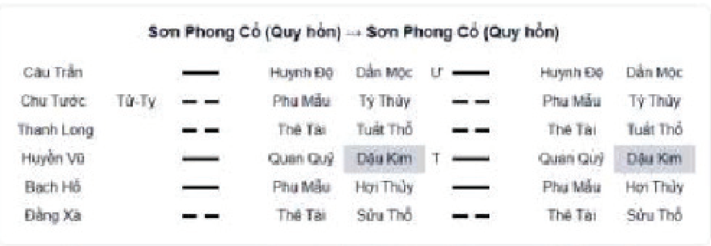

- **Cấu trúc Quẻ Dịch:**
  - **Quẻ chủ:** **Sơn Phong Cổ (Quy hồn)** (Cung Tốn, Họ Tốn – Quẻ Thuần Tĩnh)  
    *Ý nghĩa quẻ:* Cổ là sự việc có dấu hiệu trục trặc, nhầm lẫn; quẻ thuần tĩnh không một hào phát động, chỉ thị tính ổn định, cố định của vật thể, không hề có sự dịch chuyển biến động ra ngoài tầm kiểm soát.
  - **Quẻ biến:** Không có quẻ biến (Quẻ tĩnh giữ nguyên trạng thái gốc).

- **Bảng chi tiết Lục hào:**

| Hào | Thế/Ứng | Lục thân (Chủ) | Can Chi | Biến động | Lục thân (Biến) | Can Chi (Biến) | Thần sát / Phục | Lục thú |
|:---:|:---:|:---|:---|:---:|:---|:---|:---|:---|
| 6 | **Ứng** | Huynh Đệ | Dần - Mộc | tĩnh | | | Thiên y, Hợp Nhật | Câu Trần |
| 5 | | Phụ Mẫu | Tý - Thủy | tĩnh | | | Đào hoa, Quý nhân (phục Tử Tôn Tị Hỏa) | Chu Tước |
| 4 | | Thê Tài | Tuất - Thổ | tĩnh | | | Thiên hỷ | Thanh Long |
| 3 | **Thế** | Quan Quỷ | Dậu - Kim | tĩnh | | | Nguyệt phá, Tai sát, Văn xương | Huyền Vũ |
| 2 | | Phụ Mẫu | Hợi - Thủy | tĩnh | | | Nhật kiến, Xung Dịch mã | Bạch Hổ |
| 1 | | Thê Tài | Sửu - Thổ | tĩnh | | | Hoa cái, Mưu tinh | Đằng Xà |

*(Ghi chú: Toàn quẻ thuần tĩnh; Hào 2 Phụ Mẫu Hợi Thủy lâm Nhật kiến vượng tướng; Hào 3 Thế Quan Quỷ Dậu Kim bị Nguyệt phá).*

---

### 3. Dụng thần & Loại quẻ

- **Phân loại quẻ:**
  - Quẻ tầm vật thất lạc (tìm đồ đạc giấy tờ bỏ quên).
  - Phân định ranh giới giữa **Quẻ sự việc cụ thể** và **Quẻ tâm thái**.
- **Định vị hệ thống Dụng thần:**
  - **Bản chất loại quẻ:** Vật bị mất là thẻ đi xe, thẻ ra vào cơ quan, không chứa tiền bạc lớn hay tài liệu cơ mật, người hỏi không lâm vào trạng thái hoảng loạn lo âu tột độ. Do đó Chu Thần Bân định vị đây là **Quẻ sự việc thuần túy**, không phải quẻ tâm thái ám.
  - **Dụng thần Đồ vật (Ví thẻ, giấy tờ):** Hào **Phụ Mẫu**. Trong quẻ có Phụ Mẫu Tý Thủy (hào 5) và Phụ Mẫu Hợi Thủy (hào 2). Hào 2 **Phụ Mẫu Hợi Thủy** lâm **Nhật kiến** vượng tướng vượt trội nên được xác lập làm Dụng thần duy nhất.
  - **Dụng thần Bản thân người hỏi (Hào Thế):** **Quan Quỷ Dậu Kim** tại hào 3 lâm Huyền Vũ, bị **Nguyệt phá**.

---

### 4. Luận giải chi tiết

Quẻ này là bài học kinh điển khai sáng về việc áp dụng quy tắc "Dụng vượng Thế hưng" trong việc nhỏ và phương pháp định vị không gian qua quẻ tĩnh:

#### 1. Thấu triệt bản chất: Quẻ sự việc vs Quẻ tâm thái
- Khi người mới học nhìn thấy hào Thế lâm **Quan Quỷ Dậu Kim** trong quẻ tĩnh, rất dễ lúng túng rơi vào hai cái bẫy tư duy:
  - Nếu xem là quẻ tâm thái: Quan Quỷ (thần lo âu) giữ Thế bị Nguyệt lệnh Mão Mộc xung phá (*Nguyệt phá*). Kỵ thần lo âu bị phá tan nghĩa là điềm báo an tâm, ví thẻ không mất.
  - Nếu xem là quẻ sự việc: Dụng thần Phụ Mẫu Hợi Thủy lâm Nhật kiến là vượng, nhưng hào Thế Quan Quỷ Dậu Kim bị Nguyệt phá là không hưng. Theo giáo điều "Dụng vượng Thế hưng", Thế không hưng thì sự việc thất bại (ví thẻ mất thật không tìm lại được).
- **Chu Thần Bân đập tan mâu thuẫn bằng tâm pháp:**
  - Phải căn cứ vào mức độ nghiêm trọng thực tế của câu hỏi: Nếu mất ví chứa hàng chục triệu đồng, sổ đỏ hoặc hộ chiếu sắp bay ra nước ngoài thì mức độ lo sợ cực cao, quẻ sẽ tự động kích hoạt tính chất tâm thái.
  - Ở đây chỉ mất thẻ giao thông lặt vặt (mất thì làm lại), tâm lý người hỏi rất bình thản, do đó quẻ hiển thị khách quan quy luật của **Quẻ sự việc**.

#### 2. Giải mã quy tắc "Dụng vượng Thế hưng" trong việc nhỏ
Chu Thần Bân đúc kết một bí pháp nền tảng chưa từng có trong sách cổ:
- Điều kiện hào Thế phải hưng trong quy tắc "Dụng vượng Thế hưng" là đại diện cho **lợi ích cốt tử và tổn hại nghiêm trọng của bản thân**.
- Toàn bộ các ví dụ trong *Tăng San Bốc Dịch* đều yêu cầu Thế phải hưng vì thời cổ người ta chỉ lập quẻ cho **Đại sự** (công danh thi cử, thăng quan tiến chức, tính mạng bệnh tật, buôn bán lớn). Đại sự mà Thế không hưng thì bản thân không hưởng được phước lợi, nên việc ắt bại.
- Ngược lại, đối với **Việc nhỏ vụn vặt (Tiểu sự)**: như mua mớ rau, mất cái thẻ xe buýt, việc thành hay bại không làm suy suyển vận mệnh hay gây tổn hại thực chất cho bản thân, thì **Hào Thế có hưng hay không hoàn toàn không ảnh hưởng đến kết cục**.
- Trong việc nhỏ, chỉ cần **Dụng thần vượng tướng** là xu thế sự việc tất thành. Ở đây Dụng thần Phụ Mẫu Hợi Thủy lâm Nhật kiến vượng tột bậc, khẳng định chiếc ví thẻ hoàn toàn nguyên vẹn, không hề bị thất lạc hay tiêu hủy.

#### 3. Bóc tách ảo tưởng chủ quan và định vị thực tế tại phòng ngủ
- **Nguyên nhân người hỏi tìm kiếm sai hướng:**
  - Hào Thế **Quan Quỷ Dậu Kim** lâm **Huyền Vũ**: Huyền Vũ chủ về sự ám muội, u mê, trí nhớ sai lệch, chủ quan nhận định chệch hướng.
  - Hào Ứng **Huynh Đệ Dần Mộc** lâm **Câu Trần**: Huynh Đệ là người bạn đi cùng dạo phố; Dần Mộc tương hợp với Hợi Thủy.
  - Tổ hợp Huyền Vũ (Thế) và Câu Trần (Ứng) phản ánh: Bản thân anh ta chủ quan đinh ninh rằng việc mất ví có liên quan trực tiếp đến buổi đi dạo phố ăn uống với người bạn (hào Ứng). Vì vậy anh ta mới cuống cuồng chạy đến McDonald’s rồi lục lọi khắp công ty để tìm kiếm bên ngoài.
- **Không gian thực tế của chiếc ví thẻ:**
  - Dụng thần **Phụ Mẫu Hợi Thủy** ngự tại **Hào 2** thuộc **Nội quái** (nội quái là trong nhà riêng; hào 2 là cung vị phòng ngủ, giường chiếu).
  - Phụ Mẫu Hợi Thủy xung với Dịch mã Tị Hỏa, lại là quẻ tĩnh bất động: Biểu thị đồ vật hoàn toàn không có sự dịch chuyển ra ngoài đường sá, nó chưa từng được mang ra khỏi nhà.
  - Chiếc ví thẻ vẫn đang nằm yên vị trong phòng ngủ tại gia đình, ngay bên cạnh giường nằm của đương số.

---

### 5. Kết luận & Ứng kỳ thực tế

- **Lời kết luận và khuyến nghị của Chu Thần Bân:**
  - Khẳng định 100% chiếc ví thẻ không bị mất ngoài phố hay cửa hàng ăn uống; mọi suy đoán về việc rơi ở McDonald’s đều là ảo giác do Huyền Vũ gây ra.
  - Khuyên đương số không cần tìm kiếm nhọc công ở công ty hay ngoài đường; cứ yên tâm làm việc, tối về nhà vào thẳng phòng ngủ tìm quanh khu vực giường nằm là sẽ thấy.
- **Phản hồi thực tế từ đương số (Feedback):**
  - Người học viên sau khi nghe thầy phân tích liền dừng việc tìm kiếm ở văn phòng.
  - Tối hôm đó trở về nhà, anh bước vào phòng ngủ kiểm tra khu vực đầu giường: Quả nhiên phát hiện chiếc ví thẻ đang nằm im lìm ngay sát mép giường. Sáng nay khi thay quần áo đi chơi, anh đã để quên ví trên giường mà cứ ngỡ mình đã nhét vào túi quần mang theo.

---

### 6. Bài học tâm pháp & Quy tắc cốt lõi

- **Quy tắc trích dẫn cốt lõi:**
  - *Quy tắc phân biệt quẻ sự việc và quẻ tâm thái khi tìm đồ thất lạc: Định vị nội quái phòng ngủ qua quẻ tĩnh* (trang 454, Sách Cổ Thệ Chân Thuyên tập 2).
- **Tâm pháp giải đoán thực chiến:**
  - **Phân định Việc lớn vs Việc nhỏ trong quy tắc Dụng vượng Thế hưng:** Không được áp dụng máy móc giáo điều; với đại sự liên quan lợi hại sinh tử thì Thế bắt buộc phải hưng; với tiểu sự lặt vặt thường nhật thì chỉ cần Dụng thần vượng tướng là đủ định tính thành tựu.
  - **Quẻ tĩnh nội quái là bảo vật trong nhà:** Đồ vật thất lạc rơi vào quẻ tĩnh, Dụng thần lâm hào 2 nội quái là tín hiệu chắc chắn đồ vật chưa từng rời khỏi phòng ngủ; hào tĩnh xung Dịch mã là tượng bất di bất dịch.
  - **Hào Thế lâm Huyền Vũ cảnh báo trí nhớ sai lầm:** Khi tìm đồ mà Thế lâm Quan Quỷ Huyền Vũ, mọi nhận định của đương sự ("tôi nhớ chắc chắn để ở quán ăn", "tôi làm rơi ngoài đường") đều là sai lầm; người đoán quẻ phải tin vào hào tượng chứ không được tin vào lời khai của thân chủ.

## THỰC CHIẾN 115: HỎI VỀ KỲ THI QUỐC GIA TƯ PHÁP VỪA THI XONG CÓ ĐẬU KHÔNG?

---

### 1. Bối cảnh & Câu hỏi

- **Bối cảnh chi tiết:**
  - Kỳ thi tư pháp quốc gia là một trong những kỳ sát hạch ngặt nghèo và khốc liệt nhất, quyết định trực tiếp tư cách hành nghề luật sư, thẩm phán hoặc kiểm sát viên. Đối với thí sinh, kết quả kỳ thi là bước ngoặt sinh tử cho con đường sự nghiệp và chén cơm manh áo tương lai.
  - Ngay sau khi hoàn thành buổi thi cuối cùng, một thí sinh mang tâm trạng hồi hộp khôn nguôi đã đến gặp các học viên Lục Hào nhờ gieo quẻ dự đoán: Liệu kỳ thi tư pháp vừa trải qua có trúng tuyển đậu đạt hay không.
  - Sau khi quẻ hiện ra, thấy xuất hiện hào Thế Huynh Đệ Hợi Thủy động hóa Quan Quỷ Thìn Thổ quay đầu khắc (hào Thế hóa Quỷ hồi đầu khắc), thí sinh vô cùng bối rối và thừa nhận bản thân đang run sợ, cực kỳ căng thẳng.
  - Một số học viên cho rằng vì thí sinh quá căng thẳng làm cho quẻ bị "biến dạng", phản ánh trạng thái tâm lý sợ hãi chứ không phản ánh sự việc, nên khuyên thí sinh nghỉ ngơi để gieo lại. Tuy nhiên Chu Thần Bân đã tiến hành phân tích thấu đáo thực chất giữa quẻ sự việc và quẻ phản ứng căng thẳng.
- **Tâm lý & Câu hỏi ẩn ý:**
  - Tâm lý người hỏi vô cùng căng thẳng, áp lực đè nặng sau nhiều tháng ngày ôn luyện gian khổ; khao khát cháy bỏng được cầm trên tay tấm chứng chỉ hành nghề tư pháp danh giá.
  - Câu hỏi trọng tâm: *"Kỳ thi quốc gia tư pháp vừa thi xong có trúng tuyển đỗ đạt hay không?"*
- **Thời gian chiêm đoán:**
  - Giờ Bắc Kinh: Ngày 22 tháng 09 năm 2017, 10:40 sáng.
  - Can chi: Năm Đinh Dậu, tháng Kỷ Dậu, ngày Nhâm Tý, giờ Ất Tị.

---

### 2. Dữ kiện & Bảng quẻ Crop

- **Thời không chiêm nghiệm:**
  - Tháng Kỷ Dậu (Kim vượng, sinh Thủy, lâm Nguyệt lệnh).
  - Ngày Nhâm Tý (Thủy vượng, lâm Nhật kiến, Dương nhẫn tại Tý).
  - Tuần không: **Dần - Mão** (Giáp Thìn tuần trung, Dần Mão không vong).
- **Thần sát đầy đủ:**
  - Tướng tinh: Tý
  - Hoa cái: Thìn
  - Dịch mã: Dần
  - Tai sát: Ngọ
  - Mưu tinh: Tuất
  - Đào hoa: Dậu
  - Kiếp sát: Tị
  - Lộc thần: Hợi
  - Dương nhẫn: Tý
  - Văn xương: Dần
  - Thiên y: Thân
  - Thiên hỷ: Thìn
  - Quý nhân: Mão, Tị

- Dữ kiện bảng quẻ và các thông số chiêm đoán:
  - **Bảng 115.1** Đồ hình quẻ Thực chiến 115:
    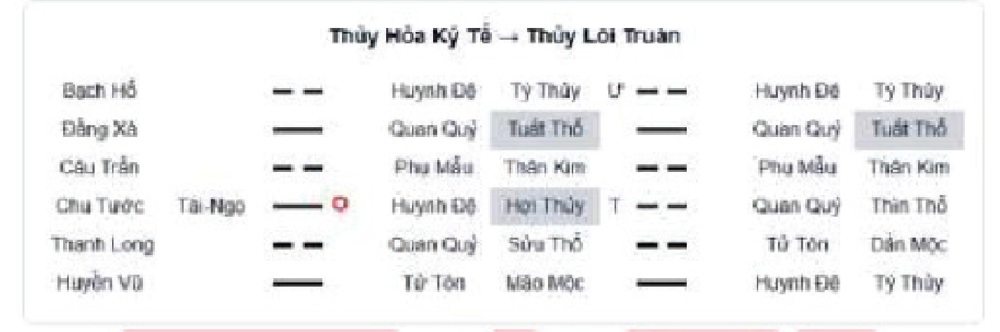

- **Cấu trúc Quẻ Dịch:**
  - **Quẻ chủ:** **Thủy Hỏa Ký Tế** (Cung Khảm, Họ Khảm)  
    *Ý nghĩa quẻ:* Ký Tế là sự việc đã hoàn tất, cuộc thi đã kết thúc; các hào âm dương đắc vị nhưng hào động phá vỡ thế cân bằng.
  - **Quẻ biến:** **Thủy Lôi Truân** (Cung Khảm, Họ Khảm)  
    *Ý nghĩa quẻ:* Truân là gian nan, vất vả, khởi đầu trắc trở chưa thể hanh thông ngay được.

- **Bảng chi tiết Lục hào:**

| Hào | Thế/Ứng | Lục thân (Chủ) | Can Chi | Biến động | Lục thân (Biến) | Can Chi (Biến) | Thần sát / Phục | Lục thú |
|:---:|:---:|:---|:---|:---:|:---|:---|:---|:---|
| 6 | **Ứng** | Huynh Đệ | Tý - Thủy | tĩnh | Huynh Đệ | Tý - Thủy | Tướng tinh, Dương nhẫn, Nhật kiến | Bạch Hổ |
| 5 | | Quan Quỷ | Tuất - Thổ | tĩnh | Quan Quỷ | Tuất - Thổ | Mưu tinh | Đằng Xà |
| 4 | | Phụ Mẫu | Thân - Kim | tĩnh | Phụ Mẫu | Thân - Kim | Thiên y | Câu Trần |
| 3 | **Thế** | Huynh Đệ | Hợi - Thủy | **O (Động)** | Quan Quỷ | Thìn - Thổ | Lộc thần, Hoa cái, Thiên hỷ (phục Thê Tài Ngọ Hỏa) | Chu Tước |
| 2 | | Quan Quỷ | Sửu - Thổ | tĩnh | Tử Tôn | Dần - Mộc | | Thanh Long |
| 1 | | Tử Tôn | Mão - Mộc | tĩnh | Huynh Đệ | Tý - Thủy | Tuần không, Quý nhân | Huyền Vũ |

*(Ghi chú: Hào 3 Thế Huynh Đệ Hợi Thủy độc phát hóa Quan Quỷ Thìn Thổ hồi đầu khắc; Hào 4 Phụ Mẫu Thân Kim lâm Nguyệt vượng nhưng tĩnh).*

---

### 3. Dụng thần & Loại quẻ

- **Phân loại quẻ:**
  - Quẻ thi cử công danh, sát hạch chứng chỉ quốc gia (Đại sự sự nghiệp).
  - Quẻ độc phát tại hào Thế: **Hào Thế hóa Quỷ hồi đầu khắc**.
- **Định vị hệ thống Dụng thần:**
  - **Dụng thần Bảng điểm & Chứng chỉ trúng tuyển:** Hào **Phụ Mẫu Thân Kim** tại hào 4.
  - **Dụng thần Bản thân người dự thi (Hào Thế):** **Huynh Đệ Hợi Thủy** tại hào 3 độc phát lâm Chu Tước.
  - **Kỵ thần cản trở bản thân:** Hào biến **Quan Quỷ Thìn Thổ** (Mộ khố Thổ) quay đầu khắc phạt hào Thế.

---

### 4. Luận giải chi tiết

Quẻ này là một án lệ học thuật sâu sắc của Chu Thần Bân nhằm phân biệt rạch ròi giữa "Quẻ sự việc cụ thể" và "Quẻ biến dạng do phản ứng căng thẳng tột độ", đồng thời minh giải hiện tượng Dụng vượng Thế suy trong thi cử:

#### 1. Bác bỏ giả thuyết "Quẻ biến dạng do căng thẳng"
Một số học viên thấy hào Thế hóa Quan Quỷ hồi đầu khắc và nghe đương số bảo "tôi run sợ quá" liền vội kết luận quẻ bị sai lệch do tâm lý hoảng loạn:
- Chu Thần Bân chỉ rõ quy luật hiếm hoi của **Quẻ hiện trạng do phản ứng căng thẳng**:
  - Hiện tượng này chỉ xuất hiện trong những tình huống **đe dọa trực tiếp đến sinh tử, đại nạn trước mắt hoặc bệnh dịch chết người** (ví dụ: mẹ nghi mắc ung thư ác tính, năm 2003 con sốt cao giữa tâm dịch SARS sợ bị lây nhiễm làm run tay gieo quẻ).
  - Những trường hợp sợ chết khiếp đó mới đủ xung lực bóp méo hình thái quẻ Dịch.
  - Còn kỳ thi tư pháp, dẫu thi trượt thì cùng lắm là thi lại lần sau, không hề mất đi tính mạng hay gia sản; do đó mức độ căng thẳng chưa bao giờ đạt tới ngưỡng bóp méo quẻ tượng.
  - Hơn nữa, quẻ phản ứng căng thẳng thường mang dấu ấn của Nhật Nguyệt chỉ thị rõ rệt, ở quẻ này hoàn toàn không có. Do đó, đây là **Quẻ sự việc chuẩn mực phản ánh trung thực kết quả thi cử**.

#### 2. Thế cục tử huyệt: "Dụng thần vượng mà Hào Thế suy"
- **Xét Dụng thần Phụ Mẫu Thân Kim:**
  - Phụ Mẫu đại diện cho bài thi, điểm số và giấy chứng nhận tư pháp.
  - Phụ Mẫu Thân Kim được Nguyệt lệnh Kỷ Dậu tương trợ đồng hành (vượng), tại Nhật kiến Nhâm Tý thì không vượng không suy, tổng thể ở vào thế **Vượng tướng**.
  - Dụng thần vượng biểu thị tính chất kỳ thi: Kỳ thi diễn ra nghiêm túc, đề thi chuẩn mực, vẫn có chỉ tiêu trúng tuyển và có nhiều thí sinh khác đỗ đạt rạng rỡ.
- **Xét Hào Thế Huynh Đệ Hợi Thủy:**
  - Hào Thế là hiện thân của chính bản thân người dự thi. Kỳ thi tư pháp là sự việc trọng đại liên quan trực tiếp đến công danh, do đó bắt buộc phải đáp ứng tiêu chuẩn khắt khe của quy tắc **"Dụng vượng Thế hưng"**.
  - Nhưng trong quẻ, hào Thế Huynh Đệ Hợi Thủy tự thân phát động, hóa xuất **Quan Quỷ Thìn Thổ**. Thìn Thổ là Mộ khố của Thủy, quay ngược lại khắc phạt tàn khốc hào Thế (**Hồi đầu khắc**).
  - Vừa bị Hồi đầu khắc, vừa rơi vào thế **Hào Thế hóa Quỷ**.
- **Ý nghĩa Dịch lý:**
  - Đây là hình mẫu kinh điển của **Dụng vượng mà Thế suy**: Kỳ thi có người đỗ (Dụng vượng), nhưng bản thân đương sự thì cầm chắc thất bại (Thế suy hóa Quỷ).
  - Tượng Thế hóa Quỷ hồi đầu khắc lâm Chu Tước báo hiệu bài thi bị chấm điểm thấp, tranh cãi vướng mắc và kết quả thi trượt không thể cứu vãn.

#### 3. Nhất quán hai góc nhìn: Quẻ sự việc và Quẻ tâm thái
- Chu Thần Bân phân tích đa chiều:
  - Nếu xét thuần túy theo **Quẻ sự việc**: Dụng vượng Thế suy -> Định tính chắc chắn là **Không trúng tuyển**.
  - Nếu xét theo **Quẻ tâm thái**: Nỗi lo lắng sợ hãi của đương số là có thật. Hào Thế hóa Quỷ hồi đầu khắc biểu thị nỗi lo âu thất bại sẽ biến thành hiện thực đau đớn, tự đâm nhát dao làm tổn thương tinh thần và tiền đồ của bản thân.
  - Dù đứng ở góc độ nào, kết luận chung cuộc đều hoàn toàn đồng quy: **Kỳ thi quốc gia tư pháp này không đỗ**.

---

### 5. Kết luận & Ứng kỳ thực tế

- **Lời kết luận của Chu Thần Bân:**
  - Khẳng định quẻ phản ánh trung thực kết quả thi cử chứ không hề bị biến dạng; đương số không thể thi đậu kỳ thi tư pháp lần này.
  - Do các học viên tại hiện trường vẫn phân vân lo ngại tâm lý thí sinh quá bấn loạn, Chu Thần Bân cho phép thí sinh ngồi uống nước nghỉ ngơi 10 phút để ổn định tâm thần hoàn toàn rồi tiến hành gieo quẻ thứ hai (tái chiêm) nhằm kiểm chứng tính chuẩn xác tuyệt đối của Lục Hào (diễn biến tiếp theo ở Thực chiến 116).
- **Ứng kỳ chiêm nghiệm:**
  - Đúng như quẻ dự đoán qua hình tượng Thế hóa Quỷ hồi đầu khắc, khi bộ Tư pháp công bố điểm chuẩn và danh sách trúng tuyển quốc gia, thí sinh này đã chính thức **thi trượt**, điểm số không đủ điều kiện xét cấp chứng chỉ hành nghề tư pháp.

---

### 6. Bài học tâm pháp & Quy tắc cốt lõi

- **Quy tắc trích dẫn cốt lõi:**
  - *Quy tắc Dụng thần vượng mà Thế suy trong thi cử tư pháp: Phân biệt hào Thế hóa Quỷ hồi đầu khắc và nguyên tắc tái chiêm* (trang 463, Sách Cổ Thệ Chân Thuyên tập 2).
- **Tâm pháp giải đoán thực chiến:**
  - **Nhận thức đúng về Quẻ hiện trạng căng thẳng:** Không được lạm dụng khái niệm "tâm lý căng thẳng làm sai quẻ"; quẻ bóp méo hình thái chỉ xảy ra trong các đại nạn nguy hiểm đến tính mạng cận kề, thi cử trượt đỗ thông thường không đủ lực lượng làm méo mó quẻ tượng.
  - **Dụng vượng Thế suy trong thi cử:** Phụ Mẫu vượng chỉ báo hiệu kỳ thi chuẩn mực và có người đỗ; nhưng hào Thế bị hồi đầu khắc hoặc hóa Quỷ thì bản thân nhất định phải chịu cảnh trượt vỏ chuối, không thể lấy cái vượng của Dụng thần để gỡ gạc cho cái suy bại của hào Thế.
  - **Nguyên tắc Tái chiêm khi tâm thức dao động:** Khi người hỏi quá bấn loạn hoặc các học viên còn tranh cãi về trạng thái tâm thức, phương pháp cho nghỉ ngơi 10 – 15 phút tĩnh tâm rồi gieo lại quẻ thứ hai là bài học kinh nghiệm thực tế quý báu để đối chiếu dịch lý và thuyết phục nhân tâm.

---

## THỰC CHIẾN 116: ĐỢI 10 PHÚT SAU MỚI LẬP QUẺ

### 1. Bối cảnh & Câu hỏi

- **Bối cảnh chi tiết:**
  - Ngay trước ca này (Thực chiến 115), một học viên vừa hoàn thành kỳ thi tư pháp quốc gia và lập quẻ đầu tiên lúc 10:40 sáng ngày 22/09/2017 (quẻ Thủy Hỏa Ký Tế biến Thủy Lôi Truân), xuất hiện hào Thế Huynh Đệ Hợi Thủy động hóa Quan Quỷ Thìn Thổ hồi đầu khắc. Đồng môn cùng xem quẻ cho rằng người hỏi đang bị hoảng loạn tâm lý tột độ khiến quẻ bị "biến dạng" thành quẻ hiện trạng phản ứng căng thẳng, bèn khuyên người này ngồi nghỉ tĩnh tâm 10 phút để ổn định tâm thần rồi mới lập lại quẻ.
  - Đúng 10 phút sau, lúc 10:54 sáng, người này tiến hành gieo quẻ lần thứ hai để dự đoán kết quả kỳ thi tư pháp quốc gia.
- **Thời gian chiêm đoán:**
  - Dương lịch: Ngày 22 tháng 9 năm 2017, lúc 10 giờ 54 phút sáng.
  - Giờ Bắc Kinh: Ngày 22 tháng 9 năm 2017, 10:54.
  - Can chi: Năm Đinh Dậu, tháng Kỷ Dậu, ngày Nhâm Tý, giờ Ất Tỵ.
- **Tâm lý người hỏi & Nội dung câu hỏi:**
  - Tâm lý người hỏi đang chịu áp lực nặng nề vì kỳ thi tư pháp quốc gia là bước ngoặt quyết định chén cơm manh áo và cơ hội phát triển sự nghiệp pháp lý.
  - Câu hỏi trọng tâm: Kỳ thi tư pháp quốc gia vừa thi xong rốt cuộc có thi đậu hay không?

### 2. Dữ kiện & Bảng quẻ Crop

- **Thời không chiêm nghiệm & Thần sát:**
  - Tháng Kỷ Dậu (Kim vượng, Mộc tuyệt, Thủy tướng).
  - Ngày Nhâm Tý (Thủy vượng, Hỏa tử).
  - Tuần không: Dần - Mão (Giáp Thìn tuần trung, Dần Mão không vong).
  - Hệ thống Thần sát: Tướng tinh – Tý, Hoa cái – Thìn, Dịch mã – Dần, Tai sát – Ngọ, Mưu tinh – Tuất, Đào hoa – Dậu, Kiếp sát – Tị, Lộc thần – Hợi, Dương nhẫn – Tý, Văn xương – Dần, Thiên y – Thân, Thiên hỷ – Thìn, Quý nhân – Mão, Tị.
- Dữ kiện bảng quẻ và đồ hình dự trắc:
  - **Bảng 116.1** Đồ hình quẻ Thực chiến 116:
    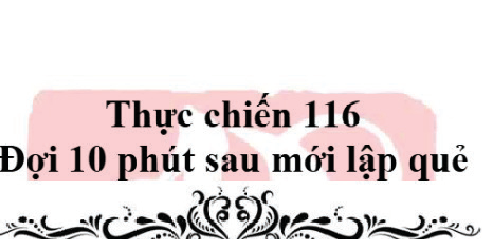
- **Cấu trúc Quẻ Dịch:**
  - Quẻ chủ: **Phong Thủy Hoán** (Cung Ly, họ Ly) – Quẻ tĩnh.
  - Quẻ biến: **Phong Thủy Hoán** (Giữ nguyên đồ hình quẻ tĩnh).
  - Tượng quẻ: Hoán giả ly dã, sóng gió trôi dạt, mây tan nước chảy, hào khí phân tán.
- **Bảng chi tiết Lục hào:**

| Hào | Thế/Ứng | Lục thân | Can Chi | Trạng thái | Lục thú | Thần sát | Biến hào |
|:---:|:---:|:---|:---|:---:|:---|:---|:---|
| 6 | | Phụ Mẫu | Mão Mộc | Tĩnh | Bạch Hổ | Quý nhân, Nguyệt phá, Tuần không | Phụ Mẫu Mão Mộc |
| 5 | **Thế** | Huynh Đệ | Tị Hỏa | Tĩnh | Đằng Xà | Kiếp sát, Quý nhân | Huynh Đệ Tị Hỏa |
| 4 | | Tử Tôn | Mùi Thổ | Tĩnh | Câu Trần | | Tử Tôn Mùi Thổ (Phục Thê Tài Dậu) |
| 3 | | Huynh Đệ | Ngọ Hỏa | Tĩnh | Chu Tước | Tai sát, Nhật phá | Huynh Đệ Ngọ Hỏa (Phục Quan Quỷ Hợi) |
| 2 | **Ứng** | Tử Tôn | Thìn Thổ | Tĩnh | Thanh Long | Hoa cái, Thiên hỷ | Tử Tôn Thìn Thổ |
| 1 | | Phụ Mẫu | Dần Mộc | Tĩnh | Huyền Vũ | Dịch mã, Văn xương, Tuần không | Phụ Mẫu Dần Mộc |

### 3. Dụng thần & Loại quẻ

- **Phân loại quẻ:**
  - Quẻ việc cụ thể (Dự đoán thành bại kỳ thi tư pháp quốc gia).
  - Thuộc thể loại quẻ tĩnh thuần túy không có hào phát động.
- **Định vị Dụng thần cốt lõi:**
  - Thi cử lấy hào **Phụ Mẫu** làm Dụng thần đại diện cho bài thi, bảng điểm và giấy báo trúng tuyển.
  - Quẻ xuất hiện hai hào Phụ Mẫu: hào sơ Phụ Mẫu Dần Mộc và hào 6 Phụ Mẫu Mão Mộc.
  - Định vị **Chân Dụng Thần**: Chu Thần Bân xác định hào 6 **Phụ Mẫu Mão Mộc lâm Bạch Hổ** chính là Chân Dụng Thần đích thực của kỳ thi này, vì:
    1. Mang đầy đủ dấu hiệu bệnh chứng của Dụng thần: Vừa lâm Nguyệt phá (tháng Dậu Kim trực xung), vừa lâm Tuần không (Dần Mão không vong).
    2. Phù hợp tuyệt đối với tính chất thực tế: Kỳ thi tư pháp quốc gia là kỳ thi cấp cao nhất của hệ thống tư pháp, mang tính quyền lực tối thượng và chính quy của nhà nước. Hào 6 là hào vị tối cao trong cấu trúc Lục hào, tương ứng với cấp bậc quốc gia; kết hợp Lục thú Bạch Hổ tượng trưng cho cơ quan công quyền, tòa án và tư pháp.
  - Hào Thế Huynh Đệ Tị Hỏa đại diện cho bản thân người dự thi.
  - Kỵ thần: Thê Tài Dậu Kim (phục dưới hào 4). Nguyên thần: Quan Quỷ Hợi Thủy (phục dưới hào 3).

### 4. Luận giải chi tiết

- **Tầng thứ suy bại của Dụng thần Phụ Mẫu Mão Mộc:**
  - Hào Phụ Mẫu Mão Mộc ở hào 6 là hào tĩnh, bị Nguyệt lệnh Kỷ Dậu tương xung trực diện thành Nguyệt phá. Trong ngày Nhâm Tý lại thuộc tuần Giáp Thìn, lâm Tuần không.
  - Vừa phá vừa không, hào Dụng thần suy bại kiệt cùng, hoàn toàn mất đi sinh khí và năng lực tác động cát lợi.
- **Quan hệ Dụng thần sinh Thế trong quẻ tĩnh:**
  - Về mặt lý thuyết ngũ hành thuần túy, Phụ Mẫu Mão Mộc có mối quan hệ tương sinh với hào Thế Huynh Đệ Tị Hỏa (Mộc sinh Hỏa).
  - Tuy nhiên, quy tắc cốt lõi của Lục Hào chỉ rõ: Hào tĩnh muốn sinh được hào Thế thì bản thân hào đó phải không suy bại trước Nhật Nguyệt. Ở đây Phụ Mẫu Mão Mộc đã rơi vào cảnh Nguyệt phá lẫn Không vong, tức là một cái cây đã mục rỗng từ gốc rễ, không còn bất kỳ lực lượng nào để sinh phù hào Thế Tị Hỏa. Tượng này định vị chắc chắn thi cử thất bại.
- **Tín hiệu đồng nghiệp qua hào Huynh Đệ Ngọ Hỏa:**
  - Hào 3 Huynh Đệ Ngọ Hỏa ở quẻ nội lâm Chu Tước, gặp ngày Nhâm Tý bị trực xung (Tý Ngọ tương xung).
  - Trong tháng Dậu Kim, Hỏa ở trạng thái hưu tù suy nhược, nên khi bị Nhật thần xung thì biến thành Nhật phá.
  - Hào Huynh Đệ đại diện cho bạn bè, đồng môn cùng dự thi. Huynh Đệ bị Nhật phá biểu thị một bức tranh thực tế: không chỉ riêng bản thân người hỏi bị trượt, mà phần lớn đồng nghiệp, bạn bè cùng tham gia đợt thi tư pháp đợt này cũng đều chung kết cục thi trượt.

### 5. Kết luận & Ứng kỳ thực tế

- **Kết luận của Chu Thần Bân:**
  - Phán đoán dứt khoát không thể thi đậu kỳ thi tư pháp quốc gia lần này.
  - Cảnh báo học viên rằng quẻ này rất dễ phân tích nếu giữ tâm thái khách quan, nhưng vì đồng môn bị ảnh hưởng tâm lý từ quẻ trước (nghĩ rằng nghỉ 10 phút sẽ ra quẻ tốt) nên đã gượng ép gán ghép ý niệm chủ quan mong cầu đậu, dẫn đến nhận định sai lầm.
- **Phản hồi thực tế (Feedback):**
  - Hai tháng sau kỳ thi (khoảng tháng Hợi/Tý), cơ quan khảo thí công bố kết quả chính thức: Thí sinh không đạt điểm chuẩn, thi trượt.
- **Ứng kỳ chiêm nghiệm:**
  - Thời điểm ứng nghiệm là 2 tháng sau ngày lập quẻ, khi kết quả công bố thực tế đúng vào các tháng Hợi, Tý (thủy vượng khắc diệt hỏa khí hào Thế và phá Mộc).

### 6. Bài học tâm pháp & Quy tắc cốt lõi

- **Quy tắc Lục Hào rút ra:**
  - *Quy tắc định vị Chân Dụng Thần trong thi cử tư pháp cấp quốc gia qua hào vị tối cao (hào 6) và Lục thú Bạch Hổ* (Cổ Thệ Chân Thuyên, Thực chiến biên 2, trang 468, rule_index): Khi trong quẻ có nhiều hào cùng lục thân, phải dựa vào đẳng cấp thực tế của sự việc (kỳ thi cấp quốc gia ứng hào 6 tối cao) và thần thú tương ứng (Bạch Hổ chủ cơ quan tư pháp/quyền lực) để khóa định đúng Chân Dụng Thần.
  - *Nguyên tắc Dụng thần suy bại không thể sinh Thế trong quẻ tĩnh*: Dù có quan hệ tương sinh trên danh nghĩa, nhưng Dụng thần ngộ Nguyệt phá và Tuần không thì triệt để vô lực, không thể trợ giúp hào Thế.
- **Bài học tâm pháp giải đoán:**
  - Tuyệt đối không được mang tâm lý chủ quan hoặc định kiến từ quẻ trước áp đặt vào quẻ sau khi lập lại quẻ. Dịch lý phản ánh trung thực quy luật khách quan, người giải quẻ phải công tâm bóc tách từng thông số thay vì tự ru ngủ mình bằng hy vọng hão huyền.

## THỰC CHIẾN 117: VÌ BÁN HỘ THUỐC NHẬP KHẨU MÀ BỊ CẢNH SÁT TRIỆU TẬP THẨM VẤN, HỎI CÁT HUNG

### 1. Bối cảnh & Câu hỏi

- **Bối cảnh chi tiết:**
  - Một đồng môn có người quen cần mua thuốc ung thư nhập khẩu từ nước ngoài, nhờ anh mua hộ vài loại thuốc đặc trị. Do có kênh lấy hàng xách tay/nhập khẩu, anh nhận lời mua hộ và hưởng chút tiền chênh lệch hoa hồng trung gian (tổng giá trị thuốc khoảng 10.000 tệ, lợi nhuận chênh lệch chỉ vài ngàn tệ).
  - Không may, công ty chuyên làm dịch vụ mua hộ hàng nhập khẩu này bị cơ quan công an điều tra và niêm phong. Khi rà soát sổ sách chứng từ dược phẩm nhập khẩu, cơ quan công an đã truy vết ra anh và phát lệnh triệu tập anh lên trụ sở công an để phối hợp điều tra thẩm vấn.
- **Thời gian chiêm đoán:**
  - Dương lịch: Ngày 16 tháng 1 năm 2018, lúc 15 giờ 32 phút chiều.
  - Giờ Bắc Kinh: Ngày 16 tháng 1 năm 2018, 15:32.
  - Can chi: Năm Đinh Dậu, tháng Quý Sửu, ngày Mậu Thân, giờ Canh Thân.
- **Tâm lý người hỏi & Nội dung câu hỏi:**
  - Tâm lý người hỏi vô cùng hoang mang, sợ hãi trước nguy cơ dính líu pháp luật và bị giam giữ.
  - Câu hỏi trọng tâm: Việc bị công an triệu tập thẩm vấn này cát hung thế nào, bản thân có gặp tai họa vòng lao lý hay không?

### 2. Dữ kiện & Bảng quẻ Crop

- **Thời không chiêm nghiệm & Thần sát:**
  - Tháng Quý Sửu (Thổ vượng, Thủy suy, Kim đới khí).
  - Ngày Mậu Thân (Kim vượng sinh Thủy, Thân xung Dần).
  - Tuần không: Dần - Mão (Giáp Thìn tuần trung, Dần Mão không vong).
  - Hệ thống Thần sát: Tướng tinh – Tý, Hoa cái – Thìn, Dịch mã – Dần, Tai sát – Ngọ, Mưu tinh – Tuất, Đào hoa – Dậu, Kiếp sát – Tị, Lộc thần – Tị, Dương nhẫn – Ngọ, Văn xương – Thân, Thiên y – Tý, Thiên hỷ – Mùi, Quý nhân – Sửu, Mùi.
- Dữ kiện bảng quẻ và đồ hình dự trắc:
  - **Bảng 117.1** Đồ hình quẻ Thực chiến 117:
    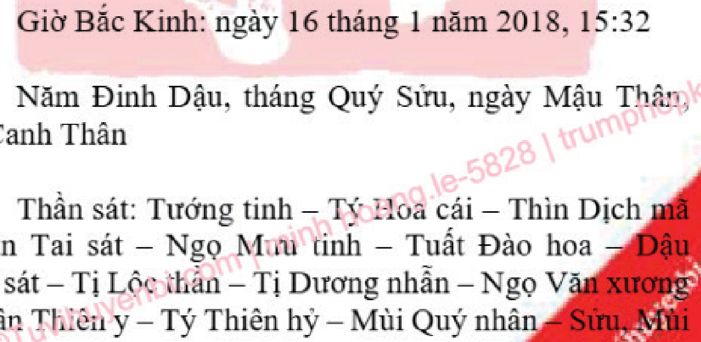
- **Cấu trúc Quẻ Dịch:**
  - Quẻ chủ: **Bát Thuần Ly** (Cung Ly, họ Ly) – Quẻ Lục xung thuần túy.
  - Quẻ biến: **Bát Thuần Ly** (Quẻ tĩnh giữ nguyên).
  - Tượng quẻ: Ly vi Hỏa, ánh sáng rực rỡ nhưng cũng chủ về thị phi hỏa thiêu, quẻ Lục xung báo hiệu sự việc xung động dữ dội, không thể bình an êm thấm.
- **Bảng chi tiết Lục hào:**

| Hào | Thế/Ứng | Lục thân | Can Chi | Trạng thái | Lục thú | Thần sát | Biến hào |
|:---:|:---:|:---|:---|:---:|:---|:---|:---|
| 6 | **Thế** | Huynh Đệ | Tị Hỏa | Tĩnh | Chu Tước | Kiếp sát, Lộc thần | Huynh Đệ Tị Hỏa |
| 5 | | Tử Tôn | Mùi Thổ | Tĩnh | Thanh Long | Thiên hỷ, Quý nhân | Tử Tôn Mùi Thổ |
| 4 | | Thê Tài | Dậu Kim | Tĩnh | Huyền Vũ | Đào hoa | Thê Tài Dậu Kim |
| 3 | **Ứng** | Quan Quỷ | Hợi Thủy | Tĩnh | Bạch Hổ | | Quan Quỷ Hợi Thủy |
| 2 | | Tử Tôn | Sửu Thổ | Tĩnh | Đằng Xà | Nguyệt kiến, Quý nhân | Tử Tôn Sửu Thổ |
| 1 | | Phụ Mẫu | Mão Mộc | Tĩnh | Câu Trần | Tuần không | Phụ Mẫu Mão Mộc |

### 3. Dụng thần & Loại quẻ

- **Phân loại quẻ:**
  - Quẻ quan phi hình sự / quẻ tâm thái an nguy sinh mạng và tự do thân thể.
  - Bản chất quan phi có hai dạng: dân sự và hình sự. Đây là vụ việc cơ quan công quyền (công an) chủ động điều tra, khởi tố công tố, đương sự đứng ở vị trí bị cáo/đối tượng thẩm vấn. Vì vậy, Quan Quỷ không phải Dụng thần mang lại lợi lộc mà là hiện thân của tai họa, ngục tù và kỵ thần gây hại.
- **Định vị Dụng thần cốt lõi:**
  - **Quan Quỷ Hợi Thủy** ở hào 3 (Ứng) lâm Bạch Hổ đại diện cho cơ quan công an, án phạt hình sự và vòng lao lý.
  - Hào **Thế Huynh Đệ Tị Hỏa** ở hào 6 lâm Chu Tước đại diện cho bản thân người hỏi đang vướng vào miệng lưỡi thị phi tranh chấp.
  - Hào Phúc thần **Tử Tôn** (Sửu Thổ ở hào 2 và Mùi Thổ ở hào 5) đều ở trạng thái tĩnh, không phát động để khắc chế Quan Quỷ, nên năng lực giải cứu bị vô hiệu hóa.

### 4. Luận giải chi tiết

- **Quy tắc định tính quẻ tĩnh và lực lượng của Quan Quỷ Hợi Thủy:**
  - Áp dụng nguyên tắc "3 bước phân tích quẻ tĩnh": Hào tĩnh muốn tác động sinh khắc hào Thế thì phải được Nhật hoặc Nguyệt sinh phù và tổng thể không suy bại.
  - Trong quẻ này, Quan Quỷ Hợi Thủy tuy bị Nguyệt lệnh Quý Sửu khắc, nhưng lại được Nhật thần Mậu Thân trường sinh tương sinh (Thân Kim sinh Hợi Thủy). Được một bên Nhật thần sinh phù nên Quan Quỷ có lực, tổng thể không hề suy bại.
  - Do có đủ lực lượng, Quan Quỷ Hợi Thủy trực tiếp thi hành quyền xung khắc đối với hào Thế Huynh Đệ Tị Hỏa (Thủy khắc Hỏa, Tị Hợi tương xung).
- **Hào Thế lâm Chu Tước đối đầu Quan Quỷ lâm Bạch Hổ:**
  - Hào Thế Huynh Đệ Tị Hỏa lâm Chu Tước biểu thị đương sự đang dính líu đến khẩu thiệt, điều tra thẩm vấn.
  - Quan Quỷ ở hào Ứng lâm Bạch Hổ biểu thị thế lực đối diện là cơ quan điều tra hình sự với uy lực trấn áp mạnh mẽ. Thế bị Ứng khắc, Huynh Đệ bị Quan Quỷ khắc là điềm hung hiểm khó tránh.
- **Sự thiếu sót về kiến thức pháp lý và kinh nghiệm xã hội:**
  - Chu Thần Bân ban đầu suy luận rằng số tiền thuốc chỉ 10.000 tệ, lợi nhuận vài ngàn tệ, nếu quy vào tội kinh doanh trái phép thì mức độ vi phạm nhỏ, cùng lắm xử phạt vi phạm hành chính.
  - Tuy nhiên, kinh nghiệm xã hội và quy định pháp luật thực tế lại vô cùng khắt khe: Thuốc chữa bệnh nhập khẩu từ nước ngoài dù là thuốc thật được cấp phép ở nước ngoài, nhưng nếu chưa được cơ quan y tế nội địa cấp phép lưu hành thì đều bị pháp luật quy về tội danh "buôn bán thuốc giả" – một tội danh hình sự rất nặng.
  - Do luật sư đồng môn được giới thiệu cũng thiếu kinh nghiệm chuyên sâu về án dược phẩm nên đã nhận định chủ quan, khiến người hỏi thả lỏng mất cảnh giác, không chuẩn bị phương án pháp lý đúng đắn.

### 5. Kết luận & Ứng kỳ thực tế

- **Kết luận của Chu Thần Bân:**
  - Ngay khi lập quẻ, Chu Thần Bân đã cảnh báo: "Chuyện này xem ra tránh không khỏi rồi", chắc chắn sẽ bị quan phi hình sự đe dọa.
  - Khuyên đương sự phải khẩn trương tìm kiếm sự hỗ trợ pháp lý chuyên sâu từ luật sư giỏi để tìm hướng giảm nhẹ.
- **Phản hồi thực tế (Feedback):**
  - Ngay chiều hôm đó công an đã tìm tới. Đến tháng 2 năm 2018 (bước sang tháng Giáp Dần), đương số chính thức bị cơ quan điều tra tạm giữ hình sự, sau một thời gian mới được giải quyết cho bảo lãnh tại ngoại.
- **Ứng kỳ chiêm nghiệm:**
  - Tháng Sửu Thủy còn bị thổ khắc kìm chế. Sang tháng Dần (tháng 2 dương lịch), hình thành tổ hợp Dần - Thân - Tị - Hợi tứ xung kích hoạt, Quan Quỷ Hợi Thủy đắc trường sinh tại Thân và hợp cục, tai họa hình ngục bộc phát đúng tháng Dần.

### 6. Bài học tâm pháp & Quy tắc cốt lõi

- **Quy tắc Lục Hào rút ra:**
  - *Quy tắc phân định Quan phi dân sự và Quan phi hình sự trong Lục Hào* (Cổ Thệ Chân Thuyên, Thực chiến biên 2, trang 472, rule_index): Quan phi dân sự lấy Quan Quỷ làm Dụng thần sự vụ (Quan vượng sinh bên nào bên đó thắng, Quan trì Thế thì mình thắng); Quan phi hình sự (công quyền tố tụng) lấy Quan Quỷ làm kỵ thần tai họa, hình phạt (Quan khắc Thế hoặc trì Thế là điềm hung họa lao lý).
  - *Quy tắc định tính quẻ tĩnh: Dụng thần được Nhật Nguyệt sinh phù tác động xung khắc hào Thế* (Cổ Thệ Chân Thuyên, Thực chiến biên 2, trang 474, rule_index): Trong quẻ tĩnh, Dụng thần chỉ cần được một trong hai (Nhật hoặc Nguyệt) sinh phù và không suy bại thì hoàn toàn có đủ quyền sinh khắc đối với hào Thế.
- **Bài học tâm pháp giải đoán:**
  - Thuật xem quẻ không thể tách rời sự am hiểu quy luật vận hành và luật pháp thực tế của xã hội. Nếu người dự đoán chỉ nhìn hình thức bên ngoài của quẻ tượng mà không nắm rõ ranh giới pháp lý hình sự và dân sự, sẽ rất dễ đưa ra khuyến nghị thiếu chuẩn xác trong việc ứng phó với khủng hoảng thực tế.

## THỰC CHIẾN 118: NGÀY MAI ĐẾN CÔNG AN THÌ THẾ NÀO

### 1. Bối cảnh & Câu hỏi

- **Bối cảnh chi tiết:**
  - Tiếp nối diễn biến của Thực chiến 117: Ngay trong chiều ngày 16/01/2018, cơ quan công an đã trực tiếp tìm đến đương số và để lại giấy hẹn triệu tập, yêu cầu đúng ngày hôm sau phải có mặt tại cơ quan công an để phối hợp điều tra về vụ việc thuốc ung thư nhập khẩu.
  - Sau khi công an rời đi, lúc 16:26 chiều cùng ngày, người này tiếp tục gieo quẻ thứ hai để hỏi về diễn biến và hậu quả của buổi làm việc với cơ quan công an vào ngày mai.
- **Thời gian chiêm đoán:**
  - Dương lịch: Ngày 16 tháng 1 năm 2018, lúc 16 giờ 26 phút chiều.
  - Giờ Bắc Kinh: Ngày 16 tháng 1 năm 2018, 16:26.
  - Can chi: Năm Đinh Dậu, tháng Quý Sửu, ngày Mậu Thân, giờ Canh Thân.
- **Tâm lý người hỏi & Nội dung câu hỏi:**
  - Tâm lý người hỏi nuôi hy vọng ngày mai lên làm việc phối hợp khai báo là sẽ kết thúc êm thấm, công an không triệu tập nữa thì coi như tai qua nạn khỏi.
  - Câu hỏi trọng tâm: Ngày mai đến cơ quan công an làm việc thì kết quả thế nào, có bị giữ lại hay được bình an trở về?

### 2. Dữ kiện & Bảng quẻ Crop

- **Thời không chiêm nghiệm & Thần sát:**
  - Tháng Quý Sửu (Thổ vượng, Mộc suy, Kim tướng).
  - Ngày Mậu Thân (Kim vượng sinh Thủy, Thân Kim xung Dần Mộc).
  - Tuần không: Dần - Mão (Giáp Thìn tuần trung, Dần Mão không vong).
  - Hệ thống Thần sát: Tướng tinh – Tý, Hoa cái – Thìn, Dịch mã – Dần, Tai sát – Ngọ, Mưu tinh – Tuất, Đào hoa – Dậu, Kiếp sát – Tị, Lộc thần – Tị, Dương nhẫn – Ngọ, Văn xương – Thân, Thiên y – Tý, Thiên hỷ – Mùi, Quý nhân – Sửu, Mùi.
- Dữ kiện bảng quẻ và đồ hình dự trắc:
  - **Bảng 118.1** Đồ hình quẻ Thực chiến 118:
    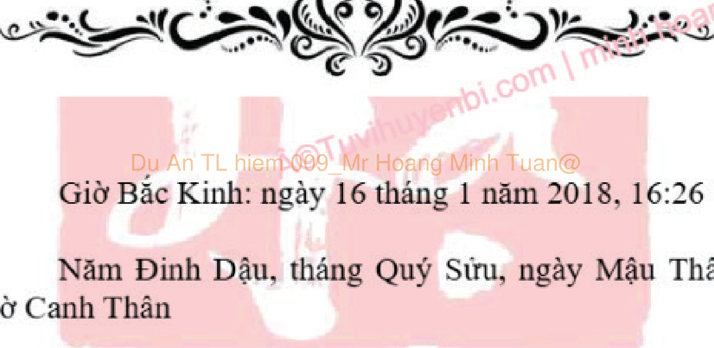
- **Cấu trúc Quẻ Dịch:**
  - Quẻ chủ: **Hỏa Thủy Vị Tế** (Cung Ly, họ Ly) – Quẻ tĩnh có hào sơ ám động.
  - Quẻ biến: **Hỏa Thủy Vị Tế** (Giữ nguyên đồ hình quẻ tĩnh).
  - Tượng quẻ: Vị Tế là việc chưa xong, chưa thành, mâu thuẫn kéo dài dở dang, báo hiệu tai họa chưa thể kết thúc mà còn dây dưa phức tạp.
- **Bảng chi tiết Lục hào:**

| Hào | Thế/Ứng | Lục thân | Can Chi | Trạng thái | Lục thú | Thần sát | Biến hào |
|:---:|:---:|:---|:---|:---:|:---|:---|:---|
| 6 | **Ứng** | Huynh Đệ | Tị Hỏa | Tĩnh | Chu Tước | Kiếp sát, Lộc thần | Huynh Đệ Tị Hỏa |
| 5 | | Tử Tôn | Mùi Thổ | Tĩnh | Thanh Long | Thiên hỷ, Quý nhân | Tử Tôn Mùi Thổ |
| 4 | | Thê Tài | Dậu Kim | Tĩnh | Huyền Vũ | Đào hoa | Thê Tài Dậu Kim |
| 3 | **Thế** | Huynh Đệ | Ngọ Hỏa | Tĩnh | Bạch Hổ | Dương nhẫn, Tai sát (Phục Quan Quỷ Hợi) | Huynh Đệ Ngọ Hỏa |
| 2 | | Tử Tôn | Thìn Thổ | Tĩnh | Đằng Xà | Hoa cái | Tử Tôn Thìn Thổ |
| 1 | | Phụ Mẫu | Dần Mộc | **Ám động** | Câu Trần | Dịch mã, Tuần không (bị Nhật Thân xung) | Phụ Mẫu Dần Mộc |

### 3. Dụng thần & Loại quẻ

- **Phân loại quẻ:**
  - Quẻ quan phi hình sự kết hợp thể loại **quẻ chỉ đạo (hướng dẫn hành động)**.
- **Định vị Dụng thần cốt lõi:**
  - Hào **Thế Huynh Đệ Ngọ Hỏa** lâm Bạch Hổ, Dương nhẫn đại diện cho bản thân đương số đang chịu áp lực tâm lý cực độ và đối diện tai họa hình ngục. Dưới hào Thế có **Quan Quỷ Hợi Thủy** phục tàng, báo hiệu hiểm họa lao lý đã âm thầm bám chặt vào thân.
  - Hào sơ **Phụ Mẫu Dần Mộc** lâm Câu Trần, Tuần không, bị Nhật thần Mậu Thân xung bừng khởi thành **Ám động** sinh hào Thế Ngọ Hỏa.
  - Hào Ứng Huynh Đệ Tị Hỏa lâm Chu Tước đại diện cho đường dây liên đới bên ngoài.

### 4. Luận giải chi tiết

- **Ý nghĩa quẻ tượng Hỏa Thủy Vị Tế:**
  - Vị Tế biểu thị việc lớn chưa xong. Trong dự đoán cát hung quan phi, quẻ Vị Tế khẳng định ngày mai tuyệt đối không thể kết thúc êm thấm như đương sự kỳ vọng. Hiện tại chưa giải quyết được, và tương lai sự việc vẫn còn tiếp diễn tiêu cực.
- **Cơ chế quẻ chỉ đạo qua Phụ Mẫu Dần Mộc ám động sinh Thế:**
  - Người hỏi thấy hào Phụ Mẫu ám động sinh Thế thì tưởng lầm là điềm lành vô sự. Nhưng Chu Thần Bân chỉ ra đây là "Quẻ chỉ đạo (hướng dẫn)": quẻ đưa ra thông điệp mách nước đường hướng thoát nạn.
  - Hào Phụ Mẫu đại diện cho đồ vật, hàng hóa, giấy tờ hoặc người lớn tuổi/trưởng bối. Hào sơ là vị trí nội bộ, tự gia, tư nhân.
  - Thông điệp chỉ đạo của quẻ:
    1. Về mặt lời khai: Khi làm việc với cơ quan điều tra, phải khai báo rằng số thuốc nhập khẩu đó là đồ dùng cho bản thân (tự sử dụng) hoặc mua giúp người nhà, bạn bè điều trị bệnh, tuyệt đối không được nhận là mua đi bán lại để kiếm lợi nhuận kinh doanh.
    2. Về mặt trợ lực: Phải khẩn trương nhờ người lớn tuổi có vai vế trong dòng họ (trưởng bối - Phụ Mẫu) đứng ra điều phối, can thiệp giúp đỡ về mặt pháp lý và quan hệ xã hội.
- **Phân định mục tiêu điều tra trực tiếp vs gián tiếp:**
  - Trong quẻ, Quan Quỷ Hợi Thủy phục dưới Thế nhưng xung kích trực tiếp vào Huynh Đệ Tị Hỏa ở hào Ứng chứ không trực diện xung hào Thế Ngọ Hỏa.
  - Mục tiêu săn lùng thật sự của cơ quan công an là đường dây buôn lậu lớn ở hào Ứng: bao gồm Thê Tài Dậu Kim lâm Đào hoa và Huyền Vũ (chứng cứ giao dịch tài chính phi pháp lớn mờ ám ngầm bên dưới).
  - Bản thân đương sự chỉ liên quan đến Nhật lệnh Thân Kim (Dịch mã trung gian), tức công an điều tra đường dây lớn rồi tiện đường quét qua anh. Ban đầu công an không xem anh là trọng điểm vì số lượng quá nhỏ.
- **Hậu quả của sự hiểu sai và thái độ bất hợp tác:**
  - Do ngộ nhận và nghe lời tư vấn chủ quan, đương số tưởng là chuyện nhỏ nên đã trốn tránh, nhiều lần không chịu đến trụ sở công an theo giấy triệu tập.
  - Thái độ bất hợp tác này khiến cán bộ điều tra bức xúc, biến vụ việc từ chỗ chỉ yêu cầu phối hợp làm rõ thành lệnh bắt giữ cưỡng chế. Đến khi bị bắt, đương sự lại thành thật khai nhận toàn bộ việc hưởng tiền chênh lệch buôn bán, khiến cơ quan điều tra lập tức kết luận tội buôn bán thuốc giả và áp dụng biện pháp tạm giam hình sự.

### 5. Kết luận & Ứng kỳ thực tế

- **Kết luận của Chu Thần Bân:**
  - Quẻ Vị Tế khẳng định việc không thể kết thúc trong ngày mai. Đương sự bắt buộc phải nghiêm túc làm việc, tìm giải pháp từ phía trưởng bối và định hình lời khai hợp lý để tự bảo vệ.
- **Phản hồi thực tế (Feedback):**
  - Đương sự không tuân thủ triệu tập. Đến ngày 13-14 tháng 2 năm 2018, công an tìm đến tận nhà giải đi và ra quyết định tạm giữ hình sự vì tội buôn bán thuốc giả cùng thái độ bất hợp tác.
  - Sau khi bị giam, gia đình phải cậy nhờ trưởng bối ra mặt điều phối và thuê luật sư can thiệp mạnh mẽ, anh mới được bảo lãnh tại ngoại.
- **Ứng kỳ chiêm nghiệm:**
  - Ứng kỳ bộc phát vào giữa tháng 2 (tháng Giáp Dần). Hào Phụ Mẫu Dần Mộc đắc lệnh tháng Dần trùng phùng, kích hoạt cả việc trưởng bối ra tay cứu viện lẫn kết cục bị bắt giữ hình sự do thế Dần - Thân tương xung kịch liệt.

### 6. Bài học tâm pháp & Quy tắc cốt lõi

- **Quy tắc Lục Hào rút ra:**
  - *Quy tắc quẻ chỉ đạo (hướng dẫn) qua hào Phụ Mẫu ám động trong quẻ Hỏa Thủy Vị Tế* (Cổ Thệ Chân Thuyên, Thực chiến biên 2, trang 479, rule_index): Khi gặp quẻ dở dang mang điềm hung nhưng có hào ám động sinh Thế, đó là lời chỉ dẫn thiên cơ về phương án thoát hiểm (hào Phụ Mẫu ở hào sơ chỉ dẫn khai báo hàng tự dùng cá nhân hoặc nhờ cậy trưởng bối can thiệp).
  - *Quy tắc phân biệt mục tiêu điều tra trực tiếp và gián tiếp qua hào Thế, hào Ứng và thần sát Đào hoa, Huyền Vũ* (Cổ Thệ Chân Thuyên, Thực chiến biên 2, trang 482, rule_index): Nhìn vào phương hướng tác động của Quan Quỷ và thần sát: Quan Quỷ nhắm vào hào Ứng mang Tài lâm Huyền Vũ, Đào hoa là mục tiêu triệt phá đầu não; hào Thế mang Dịch mã trung gian chỉ là đối tượng liên đới, nếu biết cách ứng xử khéo léo sẽ tránh được tai ương.
- **Bài học tâm pháp giải đoán:**
  - Khi đối diện với cơ quan công quyền, tuyệt đối không được có tâm lý chống đối hoặc coi thường lệnh triệu tập. Người xem quẻ phải nhận thức sâu sắc rằng quẻ chỉ đạo chỉ phát huy tác dụng khi con người hành động đúng theo sự khai sáng của quẻ, nếu cố tình đi ngược lại sẽ chuốc lấy họa lao tù.

## THỰC CHIẾN 119: HỎI: LẦN NÀY CÓ BẮT ĐƯỢC TÊN SÁT NHÂN HỌ ĐỖ KHÔNG?

### 1. Bối cảnh & Câu hỏi

- **Bối cảnh chi tiết:**
  - Tháng 11 năm 2011, một học viên của Chu Thần Bân là sĩ quan cảnh sát hình sự đang thụ lý điều tra chuyên án truy bắt một tên sát nhân đặc biệt nguy hiểm họ Đỗ đào tẩu nhiều năm. Khi đơn vị bắt đầu dò tìm được một vài manh mối mới hoặc triển khai cao điểm truy quét, người cảnh sát này đã gieo quẻ để dự trắc kết quả chuyên án.
- **Thời gian chiêm đoán:**
  - Dương lịch: Ngày 3 tháng 11 năm 2011, lúc 16 giờ 14 phút chiều.
  - Giờ Bắc Kinh: Ngày 3 tháng 11 năm 2011, 16:14.
  - Can chi: Năm Tân Mão, tháng Mậu Tuất, ngày Nhâm Tuất.
- **Tâm lý người hỏi & Nội dung câu hỏi:**
  - Tâm lý người chiến sĩ công an đầy tinh thần trách nhiệm và quyết tâm truy bắt kẻ thủ ác đưa ra trước ánh sáng pháp lý.
  - Câu hỏi trọng tâm: Lần triển khai này rốt cuộc có bắt được tên sát nhân họ Đỗ đang trốn nã hay không?

### 2. Dữ kiện & Bảng quẻ Crop

- **Thời không chiêm nghiệm & Thần sát:**
  - Tháng Mậu Tuất (Thổ vượng nắm lệnh).
  - Ngày Nhâm Tuất (Thổ vượng, Tuất thổ đồng khí).
  - Tuần không: Tý - Sửu (Giáp Dần tuần trung, Tý Sửu không vong).
  - Hệ thống Thần sát: Sửu thổ mang Dương nhẫn, Tai sát (trọng án đào tẩu hung hãn).
- Dữ kiện bảng quẻ và đồ hình dự trắc:
  - **Bảng 119.1** Đồ hình quẻ Thực chiến 119:
    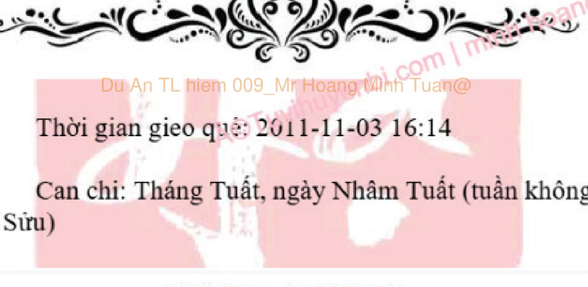
- **Cấu trúc Quẻ Dịch:**
  - Quẻ chủ: **Lôi Hỏa Phong** (Cung Khảm, họ Khảm) – Biểu tượng sấm chớp rền vang, khí thế lớn nhưng bên trong biến động mạnh.
  - Quẻ biến: **Trạch Thiên Quải** (Cung Càn) – Quải là quyết đoán, dứt khoát loại trừ cái ác.
  - Hào động: Hào 2 (Ứng) Quan Quỷ Sửu Thổ phát động; Hào 5 (Thế) Phụ Mẫu Thân Kim phát động.
- **Bảng chi tiết Lục hào:**

| Hào | Thế/Ứng | Lục thân | Can Chi | Trạng thái | Lục thú | Thần sát | Biến hào |
|:---:|:---:|:---|:---|:---:|:---|:---|:---|
| 6 | | Quan Quỷ | Tuất Thổ | Tĩnh | Bạch Hổ | Nguyệt kiến, Nhật kiến | Quan Quỷ Mùi Thổ |
| 5 | **Thế** | Phụ Mẫu | Thân Kim | **Động** | Đằng Xà | | Phụ Mẫu Dậu Kim (**Tiến thần**) |
| 4 | | Thê Tài | Ngọ Hỏa | Tĩnh | Câu Trần | | Huynh Đệ Hợi Thủy |
| 3 | | Huynh Đệ | Hợi Thủy | Tĩnh | Chu Tước | | Quan Quỷ Thìn Thổ |
| 2 | **Ứng** | Quan Quỷ | Sửu Thổ | **Động** | Thanh Long | Tuần không, Tai sát, Dương nhẫn | Tử Tôn Dần Mộc (**Hồi đầu khắc**) |
| 1 | | Tử Tôn | Mão Mộc | Tĩnh | Huyền Vũ | | Huynh Đệ Tý Thủy |

### 3. Dụng thần & Loại quẻ

- **Phân loại quẻ:**
  - Quẻ hình sự chuyên án tầm nã tội phạm đào tẩu.
- **Định vị Dụng thần cốt lõi:**
  - Trong nghiệp vụ truy bắt kẻ phạm tội, tên tội phạm đào tẩu lấy hào **Quan Quỷ** làm Dụng thần.
  - Hào 2 (Ứng) **Quan Quỷ Sửu Thổ** lâm Tuần không, mang Dương nhẫn và Tai sát: Dương nhẫn biểu thị đối tượng phạm tội giết người man rợ, manh động; lâm Tuần không phản ánh hiện trạng hắn đang lẩn trốn biệt tăm vô tích, che giấu thân phận không để lộ tung tích.
  - Hào **Thế Phụ Mẫu Thân Kim** đại diện cho viên cảnh sát phụ trách thụ lý án và công tác hồ sơ quản lý dữ liệu truy nã.
  - Hào bắt giữ khắc Quan Quỷ là **Tử Tôn Dần Mộc** (hào biến tại hào 2).

### 4. Luận giải chi tiết

- **Cơ chế Quan Quỷ lâm Không hóa Hồi đầu khắc:**
  - Quan Quỷ Sửu Thổ ở hào Ứng phát động mang Tuần không, nhưng lại biến ra Tử Tôn Dần Mộc quay đầu khắc lại (Dần Mộc khắc Sửu Thổ).
  - Quy tắc cốt lõi: Hào Quan Quỷ hóa hồi đầu khắc thì tội phạm đào tẩu chắc chắn sẽ sa lưới pháp luật (hoặc do sai lầm để lộ hành tung bị bắt, hoặc tự đầu thú quy án). Dù hiện tại lâm Không tạm thời chưa thấy mặt, nhưng tương lai tuyệt đối không thể trốn thoát.
- **Phân định chủ thể bắt giữ qua quan hệ Thân - Dần xung:**
  - Chu Thần Bân lưu ý cảnh sát gieo quẻ: Kẻ sát nhân nhất định sẽ bị bắt, nhưng công trạng bắt giữ trực tiếp không thuộc về bản thân anh.
  - Lý do: Hào biến trực tiếp khắc Quan Quỷ là Tử Tôn Dần Mộc, trong khi hào Thế là Phụ Mẫu Thân Kim. Thân Kim và Dần Mộc hình thành thế tương xung (Dần Thân tương xung), biểu thị lực lượng bắt giữ có thân phận, đơn vị và địa bàn hoàn toàn khác biệt (công an ngoại tỉnh hoặc thế hệ trinh sát khác đảm nhận).
- **Ý nghĩa hào Thế hóa Tiến thần và Bán hợp cục:**
  - Hào Thế Phụ Mẫu Thân Kim động hóa Phụ Mẫu Dậu Kim là tượng **Hóa Tiến Thần**. Phụ Mẫu chủ về giấy tờ, hồ sơ lưu trữ, dữ liệu thông tin và mạng lưới nghiệp vụ.
  - Hóa Tiến thần chỉ ra rằng người cảnh sát này cần liên tục phân loại, cập nhật, số hóa và mở rộng trao đổi dữ liệu tội phạm lên hệ thống toàn quốc.
  - Khi Phụ Mẫu Thân Kim tiến hóa thành Dậu Kim, Dậu Kim sẽ tạo thành thế Bán hợp Kim cục với Quan Quỷ Sửu Thổ (Tỵ Dậu Sửu tam hợp cục). Sự kết nối thông tin dữ liệu ngày càng dày đặc chính là mấu chốt giăng lưới bủa vây kẻ thủ ác.
- **Hình tượng người phá án qua Thanh Long và Tử Tôn Dần Mộc:**
  - Hào biến bắt tội phạm là Tử Tôn Dần Mộc lâm Thanh Long tại hào Ứng. Thanh Long thuộc mộc, Dần thuộc mộc, báo hiệu người trực tiếp lập công bắt giữ mang họ Mộc (họ Lý 李 cấu tạo từ Mộc và Tử).

### 5. Kết luận & Ứng kỳ thực tế

- **Kết luận của Chu Thần Bân:**
  - Tên sát nhân họ Đỗ chắc chắn sẽ bị bắt quy án; bản thân người hỏi có công lao củng cố hồ sơ cơ sở dữ liệu mở rộng (hào Thế hóa Tiến thần), nhưng không phải là người trực tiếp còng tay hắn.
- **Phản hồi thực tế (Feedback):**
  - Tên Đỗ sau khi gây án đã trốn sang ngoại tỉnh, đổi họ thay tên. Năm 2005 thi đỗ vào Đại học Khoa học Quốc phòng, phục vụ trong quân ngũ và thăng tiến đến chức sĩ quan cấp phó doanh.
  - Đến năm 2017 (năm Đinh Dậu - tròn 6 năm sau quẻ bốc năm 2011), khi đang nghỉ phép tổ chức đám cưới tại Quảng Châu, nhờ hệ thống dữ liệu quốc gia liên thông đối chiếu, công an Quảng Châu đã ập vào bắt giữ giải về quy án.
  - Lúc bắt được tên tội phạm, người cảnh sát gieo quẻ đã nghỉ hưu nhiều năm. Lực lượng điều tra đương nhiệm trực tiếp bắt giữ gồm Trưởng phòng và Phó trưởng phòng Cảnh sát hình sự đều mang họ Lý.
- **Ứng kỳ chiêm nghiệm:**
  - Ứng nghiệm vào đúng **năm Đinh Dậu (2017)**: Năm Dậu ứng đúng hào biến Phụ Mẫu Dậu Kim (Tiến thần) nhập lệnh, kết hợp Bán hợp Dậu - Sửu khóa chặt Quan Quỷ, đưa vụ án chấn động ra ánh sáng.

### 6. Bài học tâm pháp & Quy tắc cốt lõi

- **Quy tắc Lục Hào rút ra:**
  - *Quy tắc tầm nã tội phạm: Quan Quỷ lâm không hóa hồi đầu khắc và hào Thế hóa Tiến thần mở rộng mạng lưới thông tin* (Cổ Thệ Chân Thuyên, Thực chiến biên 2, trang 485, rule_index): Quan Quỷ lâm không hóa Tử Tôn hồi đầu khắc khẳng định kẻ đào tẩu tất bại lộ sa lưới; hào Thế hóa Tiến thần phản ánh công cuộc xây dựng hệ thống dữ liệu nghiệp vụ lâu dài tạo tiền đề cho thắng lợi chung.
  - *Quy tắc phân định chủ thể bắt giữ qua hào xung/khắc*: Khi hào khắc Dụng thần (Tử Tôn) xung với hào Thế (Phụ Mẫu), kết quả bắt giữ sẽ do đơn vị khác hoặc người kế nhiệm thực hiện, không phải công trạng riêng của đương số.
- **Bài học tâm pháp giải đoán:**
  - Dự đoán hình sự cần phân biệt rạch ròi giữa kết quả vụ án và công lao cá nhân. Hào Thế hóa Tiến thần là bài học sâu sắc về sự tận tụy cống hiến âm thầm: xây dựng nền móng cơ sở dữ liệu nghiệp vụ vững chắc thì dù bản thân đã nghỉ hưu, bánh xe công lý vẫn sẽ vận hành chuẩn xác theo quẻ tượng đã định.

## THỰC CHIẾN 120: BỎ LỠ HUY CHƯƠNG VÀNG ĐẦU TIÊN, THÀNH TÍCH CỦA ĐOÀN THỂ THAO TRUNG QUỐC TẠI THẾ VẬN HỘI MÙA ĐÔNG PYEONGCHANG

### 1. Bối cảnh & Câu hỏi

- **Bối cảnh chi tiết:**
  - Tháng 2 năm 2018, Thế vận hội mùa đông Pyeongchang diễn ra tại Hàn Quốc. Sau 3 ngày thi đấu đầu tiên, đoàn thể thao Trung Quốc gặp nhiều bất lợi và liên tiếp đánh mất cơ hội giành huy chương vàng ở các nội dung sở trường truyền thống.
  - Một người bạn rất say mê theo dõi các đại hội thể thao quốc tế đã chủ động gieo quẻ để hỏi về tiền đồ thi đấu và thành tích chung cuộc của đoàn thể thao nước nhà tại kỳ đại hội này.
- **Thời gian chiêm đoán:**
  - Dương lịch: Ngày 12 tháng 2 năm 2018, lúc 17 giờ 49 phút chiều.
  - Giờ Bắc Kinh: Ngày 12 tháng 2 năm 2018, 17:49.
  - Can chi: Năm Mậu Tuất, tháng Giáp Dần, ngày Ất Hợi, giờ Ất Dậu.
- **Tâm lý người hỏi & Nội dung câu hỏi:**
  - Người hỏi mang tâm lý cổ động viên nhiệt thành, chứa đựng đầy đủ trạng thái yêu ghét, kỳ vọng mãnh liệt nhưng cũng đầy âu lo trước làn sóng thiên vị và môi trường thi đấu khắc nghiệt tại nước chủ nhà.
  - Câu hỏi trọng tâm: Thành tích chung cuộc của đoàn thể thao Trung Quốc tại Thế vận hội mùa đông Pyeongchang sẽ ra sao?

### 2. Dữ kiện & Bảng quẻ Crop

- **Thời không chiêm nghiệm & Thần sát:**
  - Tháng Giáp Dần (Mộc vượng xung Thân Kim).
  - Ngày Ất Hợi (Thủy vượng, Hợi xung Tị Hỏa).
  - Tuần không: Thân - Dậu (Giáp Tuất tuần trung, Thân Dậu không vong).
  - Hệ thống Thần sát: Tướng tinh – Mão, Hoa cái – Mùi, Dịch mã – Tỵ, Tai sát – Dậu, Mưu tinh – Sửu, Đào hoa – Tý, Kiếp sát – Thân, Lộc thần – Mão, Dương nhẫn – Dần, Văn xương – Ngọ, Thiên y – Sửu, Thiên hỷ – Tuất, Quý nhân – Thân, Tý.
- Dữ kiện bảng quẻ và đồ hình dự trắc:
  - **Bảng 120.1** Đồ hình quẻ Thực chiến 120:
    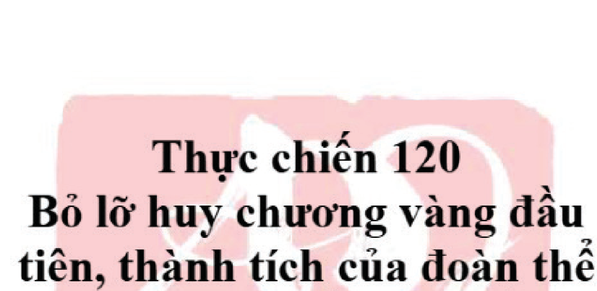
- **Cấu trúc Quẻ Dịch:**
  - Quẻ chủ: **Phong Sơn Tiệm** (Cung Cấn, họ Cấn) – Quẻ tĩnh có hào 5 ám động.
  - Quẻ biến: **Phong Sơn Tiệm** (Giữ nguyên đồ hình quẻ tĩnh).
  - Tượng quẻ: Tiệm vi tiến dã, núi trên có cây phát triển từ từ, việc cát hay hung đều tiệm tiến tuần tự từng bước.
- **Bảng chi tiết Lục hào:**

| Hào | Thế/Ứng | Lục thân | Can Chi | Trạng thái | Lục thú | Thần sát | Biến hào |
|:---:|:---:|:---|:---|:---:|:---|:---|:---|
| 6 | **Ứng** | Quan Quỷ | Mão Mộc | Tĩnh | Huyền Vũ | Lộc thần, Tướng tinh | Quan Quỷ Mão Mộc |
| 5 | | Phụ Mẫu | Tị Hỏa | **Ám động** | Bạch Hổ | Dịch mã (bị Nhật Hợi xung) | Phụ Mẫu Tị Hỏa |
| 4 | | Huynh Đệ | Mùi Thổ | Tĩnh | Đằng Xà | Hoa cái | Huynh Đệ Mùi Thổ |
| 3 | **Thế** | Tử Tôn | Thân Kim | Tĩnh | Câu Trần | **Nguyệt phá**, **Tuần không**, Kiếp sát, Quý nhân | Tử Tôn Thân Kim |
| 2 | | Phụ Mẫu | Ngọ Hỏa | Tĩnh | Chu Tước | | Phụ Mẫu Ngọ Hỏa |
| 1 | | Huynh Đệ | Thìn Thổ | Tĩnh | Thanh Long | | Huynh Đệ Thìn Thổ |

### 3. Dụng thần & Loại quẻ

- **Phân loại quẻ:**
  - Biến thể của **quẻ tâm thái** trong thi đấu thể thao đối kháng quốc tế.
  - Người hỏi là khán giả hâm mộ mang tâm lý chủ quan yêu ghét rõ rệt: Nếu đội nhà thành công đoạt huy chương thì lòng vui sướng (Tử Tôn vượng), nếu thất bại tủi hổ thì ưu tư phiền muộn (Quan Quỷ động hoặc Tử Tôn bị thương tổn).
- **Định vị Dụng thần cốt lõi:**
  - Hào **Thế Tử Tôn Thân Kim** đại diện cho niềm hy vọng, tâm trạng hoan hỷ và thành tích huy chương vàng mong ước.
  - Hào 5 **Phụ Mẫu Tị Hỏa** lâm Bạch Hổ đại diện cho nội dung tranh huy chương vàng nóng bỏng trong ngày, đồng thời đại diện cho yếu tố trọng tài giám sát (ở gian hào).
  - Hào Ứng **Quan Quỷ Mão Mộc** lâm Huyền Vũ đại diện cho thế lực đối thủ và những mưu tính ám muội phía nước chủ nhà.

### 4. Luận giải chi tiết

- **Sự sụp đổ của hào Thế Tử Tôn Thân Kim ngộ Nguyệt phá:**
  - Trong quẻ tâm thái, Tử Tôn trì Thế vốn là cát tướng (Hỷ thần nhập Thế). Tuy nhiên, điểm tử huyệt chí mạng là Tử Tôn Thân Kim bị Nguyệt lệnh Giáp Dần trực diện tương xung thành **Nguyệt phá** (Dần Thân tương xung), đồng thời lại lâm **Tuần không**.
  - Nguyệt phá khiến hào Thế bị phá nát hoàn toàn sinh khí. Hỷ thần bị vỡ nát biến thành điềm báo sầu bi, khẳng định kỳ vọng thành tích sẽ bị sụp đổ nặng nề, người xem sẽ rơi vào tâm trạng thất vọng tột độ.
- **Phụ Mẫu Tị Hỏa ám động lâm Bạch Hổ khắc Thế:**
  - Hào 5 Phụ Mẫu Tị Hỏa bị Nhật thần Ất Hợi xung bừng khởi thành **Ám động**. Ám động mang tính chất ứng việc tức thời, diễn ra ngay trong ngày lập quẻ.
  - Tị Hỏa ám động lại quay đầu khắc thẳng vào hào Thế Tử Tôn Thân Kim (Hỏa khắc Kim), đi kèm Bạch Hổ mang theo năng lượng tang thương, oán thán. Tượng này chỉ rõ ngay trong ngày thi đấu hôm đó, nội dung tranh huy chương vàng trọng điểm sẽ thất bại thê thảm.
- **Tượng quẻ Phong Sơn Tiệm và tiến trình thất bại tuần tự:**
  - Thế vận hội kéo dài hơn nửa tháng, lúc lập quẻ mới trôi qua 3 ngày. Quẻ Tiệm chủ về sự tình diễn tiến từ từ từng bước theo thời gian.
  - Vì hào Thế Tử Tôn bị Nguyệt phá xuyên suốt cả tháng Dần, nên thất bại không chỉ dừng lại ở trận đấu trong ngày, mà tất cả các nội dung thi đấu diễn ra tuần tự những ngày tiếp theo đều lần lượt thất bại, từng tin tức truyền về đều là nỗi thất vọng dồn dập.
- **Tác động của thần sát và yếu tố trọng tài:**
  - Hào Thế Tử Tôn Thân Kim mang Kiếp sát (chạm trán rào cản bất lợi và đối thủ cạnh tranh gay gắt); Quý nhân lâm Không và Phá (mất đi sự ủng hộ, bị khán giả sở tại quay lưng, la ó phản đối).
  - Phụ Mẫu Tị Hỏa ở gian hào là vị trí trung gian của trọng tài. Phụ Mẫu lâm Bạch Hổ khắc Thế phản ánh việc các môn chấm điểm kỹ thuật (trượt băng nghệ thuật, trượt băng tốc độ) bị tổ trọng tài xử ép, cố tình chấm điểm thấp.

### 5. Kết luận & Ứng kỳ thực tế

- **Kết luận của Chu Thần Bân:**
  - Đoàn thể thao Trung Quốc sẽ trải qua một kỳ Thế vận hội mùa đông thất bát nặng nề; không chỉ bỏ lỡ nội dung trong ngày mà toàn bộ chiến dịch sẽ liên tiếp chuốc lấy thất bại tuần tự do hào Thế ngộ Nguyệt phá kiệt cùng.
- **Phản hồi thực tế (Feedback):**
  - Khép lại kỳ Thế vận hội mùa đông Pyeongchang 2018, đoàn thể thao Trung Quốc chỉ giành được duy nhất 1 tấm huy chương vàng, thiết lập mức thành tích thấp kỷ lục trong vòng 20 năm trở lại đây.
- **Ứng kỳ chiêm nghiệm:**
  - Ứng kỳ trải dài xuyên suốt tháng Giáp Dần: Suốt toàn bộ thời gian diễn ra Thế vận hội trong tháng Dần, hào Thế Tử Tôn Thân Kim liên tục bị Nguyệt phá chèn ép, chuỗi thất bại diễn tiến đúng quy luật của quẻ Phong Sơn Tiệm.

### 6. Bài học tâm pháp & Quy tắc cốt lõi

- **Quy tắc Lục Hào rút ra:**
  - *Quy tắc quẻ tâm thái thể thao: Tử Tôn trì Thế ngộ Nguyệt phá, Phụ Mẫu ám động khắc Thế định vị thất bại* (Cổ Thệ Chân Thuyên, Thực chiến biên 2, trang 490, rule_index): Trong dự đoán thể thao mang tính yêu ghét tâm thái, dù Tử Tôn trì Thế nhưng hễ ngộ Nguyệt phá và Tuần không thì hào Hỷ thần đã biến chất thành đại hung; Phụ Mẫu ám động lâm Bạch Hổ khắc Thế định đoạt trận quyết đấu trong ngày thất bại hoàn toàn.
  - *Ý nghĩa tượng quẻ Tiệm trong sự kiện nhiều ngày*: Quẻ Tiệm định vị tiến trình tuần tự tiệm tiến; khi hào Thế suy hoại, chuỗi kết quả tiêu cực sẽ diễn ra đều đặn từng ngày cho đến khi kết thúc toàn bộ giải đấu.
- **Bài học tâm pháp giải đoán:**
  - Khi xem quẻ tâm thái, tuyệt đối không được nhìn thấy Tử Tôn trì Thế bề ngoài mà vội phán đoán lạc quan. Nhật Nguyệt là cán cân sinh sát tối cao; chỉ cần Dụng thần/Thế hào ngộ Nguyệt phá thì mọi hy vọng đều tan thành mây khói.

## THỰC CHIẾN 121: TRỢ LÝ BÁC SĨ GIEO QUẺ: LẦN TRƯỚC ĐỘT NHIÊN NGẤT XỈU TRONG PHÒNG ĐIỀU TRỊ, LIỆU CÒN CÓ THỂ QUAY LẠI KHÔNG?

### 1. Bối cảnh & Câu hỏi

- **Bối cảnh chi tiết:**
  - Một vị bác sĩ do khối lượng bệnh nhân quá đông nên đã tuyển thêm một trợ lý y tế về phụ trách chuyên môn. Tuy nhiên, ngay trong ngày đầu tiên đi làm, người trợ lý vừa bước chân vào phòng điều trị được khoảng 10 phút thì đột ngột mất hoàn toàn tri giác, ngã quỵ xuống đất khiến đầu va đập mạnh mà không hề có bất kỳ dấu hiệu bệnh lý hay tai nạn báo trước.
  - Sau khi đưa trợ lý về nghỉ ngơi, vị bác sĩ vô cùng hoang mang vì hiện tượng ngất xỉu quá kỳ lạ, nghi ngờ liệu phong thủy phòng khám có điều gì hung hiểm, xung khắc khí trường khiến người mới đến không thể dung nạp. Bác sĩ yêu cầu trợ lý gieo quẻ để truy tìm nguyên nhân thực sự và xem liệu có thể tiếp tục quay lại làm việc được hay không.
- **Thời gian chiêm đoán:**
  - Dương lịch: Ngày 24 tháng 2 năm 2018, lúc 16 giờ 18 phút chiều.
  - Giờ Bắc Kinh: Ngày 24 tháng 2 năm 2018, 16:18.
  - Can chi: Năm Mậu Tuất, tháng Giáp Dần, ngày Đinh Hợi, giờ Mậu Thân.
- **Tâm lý người hỏi & Nội dung câu hỏi:**
  - Tâm lý hoang mang, sợ hãi trước nguy cơ phòng khám vướng phong thủy xấu hoặc cơ thể bị tà khí xâm nhập.
  - Câu hỏi trọng tâm: Nguyên nhân thực sự của cơn ngất xỉu bất thường là gì, liệu bản thân có thể an toàn quay lại phòng điều trị tiếp tục làm việc hay không?

### 2. Dữ kiện & Bảng quẻ Crop

- **Thời không chiêm nghiệm & Thần sát:**
  - Tháng Giáp Dần (Mộc vượng nắm lệnh).
  - Ngày Đinh Hợi (Thủy vượng, Hợi sinh Mộc, hợp Dần, xung khắc Tị Hỏa).
  - Tuần không: Ngọ - Mùi (Giáp Thân tuần trung, Ngọ Mùi không vong).
  - Hệ thống Thần sát: Tướng tinh – Mão, Hoa cái – Mùi, Dịch mã – Tỵ, Tai sát – Dậu, Mưu tinh – Sửu, Đào hoa – Tý, Kiếp sát – Thân, Lộc thần – Ngọ, Dương nhẫn – Tỵ, Văn xương – Dậu, Thiên y – Sửu, Thiên hỷ – Tuất, Quý nhân – Dậu, Hợi.
- Dữ kiện bảng quẻ và đồ hình dự trắc:
  - **Bảng 121.1** Đồ hình quẻ Thực chiến 121:
    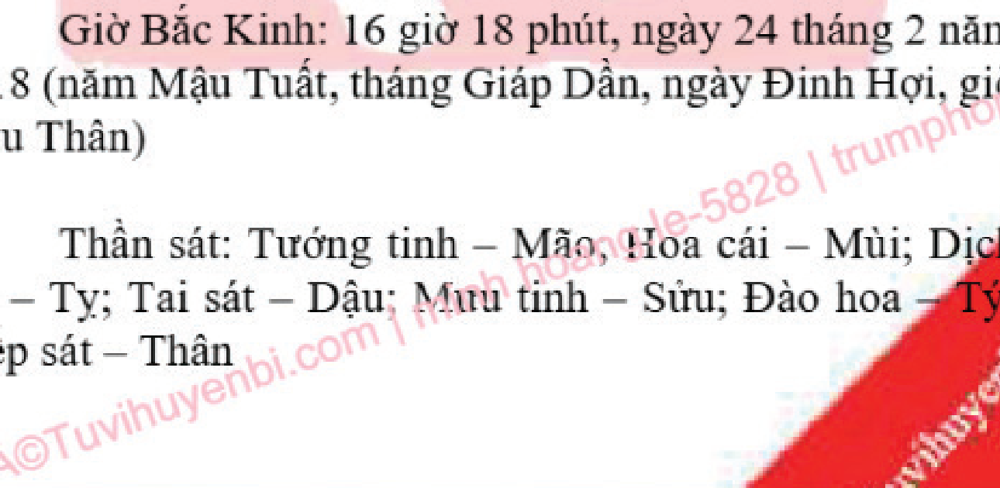
- **Cấu trúc Quẻ Dịch:**
  - Quẻ chủ: **Thủy Trạch Tiết** (Cung Khảm, họ Khảm) – Quẻ Lục hợp.
  - Quẻ biến: **Bát Thuần Đoài** (Cung Đoài, họ Đoài) – Quẻ Lục xung.
  - Cấu trúc chuyển dịch: **Lục hợp biến Lục xung** – Điềm báo sự bế tắc, ràng buộc ngột ngạt ban đầu sẽ nhanh chóng bị xung phá và giải tỏa dứt điểm.
  - Hào động: Hào 4 (Ứng) Phụ Mẫu Thân Kim phát động; Hào 1 (Thế) Thê Tài Tị Hỏa ám động.
- **Bảng chi tiết Lục hào:**

| Hào | Thế/Ứng | Lục thân | Can Chi | Trạng thái | Lục thú | Thần sát | Biến hào |
|:---:|:---:|:---|:---|:---:|:---|:---|:---|
| 6 | | Huynh Đệ | Tý Thủy | Tĩnh | Thanh Long | Đào hoa | Quan Quỷ Mùi Thổ |
| 5 | | Quan Quỷ | Tuất Thổ | Tĩnh | Huyền Vũ | Thiên hỷ | Phụ Mẫu Dậu Kim |
| 4 | **Ứng** | Phụ Mẫu | Thân Kim | **Động** | Bạch Hổ | Kiếp sát | Huynh Đệ Hợi Thủy |
| 3 | | Quan Quỷ | Sửu Thổ | Tĩnh | Đằng Xà | Thiên y, Mưu tinh | Quan Quỷ Sửu Thổ |
| 2 | | Tử Tôn | Mão Mộc | Tĩnh | Câu Trần | Tướng tinh | Tử Tôn Mão Mộc |
| 1 | **Thế** | Thê Tài | Tị Hỏa | **Ám động** | Chu Tước | Dịch mã, **Dương nhẫn** (bị Nhật Hợi xung) | Thê Tài Tị Hỏa |

### 3. Dụng thần & Loại quẻ

- **Phân loại quẻ:**
  - Quẻ truy tìm nguyên nhân bệnh chứng thực tế kết hợp giải tỏa nghi ngờ phong thủy môi trường làm việc.
- **Định vị Dụng thần cốt lõi:**
  - Hào **Thế Thê Tài Tị Hỏa** lâm Chu Tước, mang Dương nhẫn đại diện cho bản thân người trợ lý. Trong dự đoán sức khỏe, Thê Tài trì Thế biểu thị tình trạng cơ thể bán khỏe mạnh (sub-health), tiềm ẩn nguy cơ bệnh mẫn cảm.
  - Hào Ứng **Phụ Mẫu Thân Kim** lâm Bạch Hổ kẹp giữa hai hào Quan Quỷ (Tuất Thổ ở hào 5 và Sửu Thổ ở hào 3) đại diện cho môi trường phòng khám và nguồn cơn phát tác độc tố ngoại lai.
  - Hào biến **Huynh Đệ Hợi Thủy** là lực lượng hóa giải xung tán ách tắc.

### 4. Luận giải chi tiết

- **Cơ chế Lục hợp biến Lục xung – Chìa khóa giải quyết vấn đề:**
  - Quẻ chủ Thủy Trạch Tiết là quẻ Lục hợp: Tiết là tiết chế, ngột ngạt, giam hãm khí trường khiến người bệnh tức thở ngất lịm. Nếu Lục hợp biến Lục hợp thì bệnh chứng sẽ dây dưa nguy hiểm.
  - Nhưng ở đây biến sang Bát Thuần Đoài là quẻ Lục xung: Chu Thần Bân khẳng định sự hạn chế bế tắc này sẽ nhanh chóng bị xung phá triệt để. Mọi lo lắng về phong thủy xấu vĩnh viễn được xóa bỏ hoàn toàn.
- **Phân định cơ địa dị ứng bẩm sinh qua Thê Tài Tị Hỏa lâm Dương nhẫn:**
  - Hào Thế Thê Tài Tị Hỏa lâm Chu Tước: Thê Tài sinh Quỷ chủ thể trạng mẫn cảm; Chu Tước và hành Hỏa chủ về phản ứng dị ứng sưng nhiệt hô hấp.
  - Quy tắc phân biệt bẩm sinh và hậu thiên: Bệnh mang Dương nhẫn là bệnh cơ địa bẩm sinh di truyền; bệnh mang Lộc thần là bệnh phát sinh do lối sống môi trường hậu thiên. Hào Thế mang Dương nhẫn xác định trợ lý này vốn có cơ địa dị ứng bẩm sinh từ nhỏ.
  - Hào Thế bị Nhật thần Đinh Hợi xung bừng khởi thành Ám động: chứng tỏ cơ địa dị ứng bẩm sinh đột nhiên bị ngoại cảnh kích hoạt bộc phát dữ dội.
- **Tổ hợp Tam hình Dần - Tị - Thân và vật thể gây dị ứng:**
  - Hào Ứng Phụ Mẫu Thân Kim phát động mang Bạch Hổ (tai họa bộc phát) và Kiếp sát. Hào Ứng kẹp giữa 2 hào Quan Quỷ chính là vị trí phát sinh tai biến.
  - Thân Kim phát động kết hợp với Nguyệt kiến Giáp Dần Mộc và hào Thế Tị Hỏa ám động cấu thành thế **Tam hình Dần - Tị - Thân**.
  - Nguyệt kiến Dần Mộc đại diện cho thực vật hoa cỏ trong quá khứ là nguồn dị ứng cố hữu. Phụ Mẫu Thân Kim lâm Dịch mã đại diện cho một vật thể có thể di chuyển mới được mang vào phòng điều trị. Khi vật này xuất hiện, Tam hình lập tức khép lại, gây tắc nghẽn hô hấp khiến trợ lý ngã quỵ trong 10 phút.
- **Nhận diện chính xác chậu hoa mẫu đơn và biện pháp xử lý:**
  - Phụ Mẫu Thân Kim biến ra Huynh Đệ Hợi Thủy mang Quý nhân và Bạch Hổ: Chu Thần Bân tra hỏi và phát hiện trước Tết, một người bạn làm quan/lãnh đạo của bác sĩ đã tặng một chậu hoa mẫu đơn đại đóa để trong phòng.
  - Mẫu đơn nở hoa tỏa hương thơm và lượng phấn hoa cực đậm trong không gian kín, kích hoạt chính xác cơ địa dị ứng của trợ lý.
  - Hào biến Huynh Đệ Hợi Thủy (Thủy khắc Tị Hỏa, xung giải thế hợp của Thân Kim, biến Lục hợp thành Lục xung): Giải pháp chỉ đơn giản là bưng chậu hoa mẫu đơn ra khỏi phòng khám và mở toang cửa sổ thông gió. Bản thân Chu Thần Bân tuổi Hợi, ứng đúng vai trò người bạn Huynh Đệ Hợi Thủy chỉ điểm giải tỏa khúc mắc.

### 5. Kết luận & Ứng kỳ thực tế

- **Kết luận của Chu Thần Bân:**
  - Khẳng định 100% không phải do phong thủy xấu; nguyên nhân thuần túy là dị ứng phấn hoa mẫu đơn do Tam hình kích hoạt. Chỉ cần di dời chậu hoa và thông gió là trợ lý có thể an tâm quay lại làm việc bình thường.
- **Phản hồi thực tế (Feedback):**
  - Vị bác sĩ lập tức mang chậu mẫu đơn chuyển đi nơi khác và mở cửa thông gió toàn bộ phòng điều trị.
  - Ngay ngày hôm sau, người trợ lý trở lại phòng khám làm việc, tinh thần tỉnh táo, hoàn toàn khỏe mạnh bình thường và không còn tái diễn bất kỳ cơn ngất xỉu nào nữa.
- **Ứng kỳ chiêm nghiệm:**
  - Sự việc được giải quyết thần tốc ngay ngày hôm sau (ngày Mậu Tý), hoàn toàn ứng nghiệm với cơ chế giải phóng của quẻ Lục xung.

### 6. Bài học tâm pháp & Quy tắc cốt lõi

- **Quy tắc Lục Hào rút ra:**
  - *Quy tắc giải trừ ách tắc Lục hợp biến Lục xung và ứng cơ Tam hình Dần - Tị - Thân do dị ứng thực vật* (Cổ Thệ Chân Thuyên, Thực chiến biên 2, trang 495, rule_index): Quẻ Lục hợp biến Lục xung là minh chứng định đoạt việc rắc rối bế tắc sẽ được hóa giải triệt để nhờ hành động xung khai; Tam hình Dần - Tị - Thân kích hoạt bởi hào Phụ Mẫu lâm Dịch mã chỉ ra vật thể thực vật ngoại lai di chuyển gây dị ứng cấp tính.
  - *Quy tắc phân biệt bệnh bẩm sinh và hậu thiên qua Dương nhẫn vs Lộc Thần*: Hào Thế lâm Dương nhẫn chủ về thể chất khiếm khuyết di truyền từ gốc; hào Thế lâm Lộc thần chủ về bệnh phát sinh từ hoàn cảnh môi trường sống tích lũy.
- **Bài học tâm pháp giải đoán:**
  - Tuyệt đối không sa đà vào mê tín phong thủy khi gặp những biến cố bất thường. Người luận giải Lục Hào phải có tư duy khoa học biện chứng, kết hợp nhuần nhuyễn giữa dịch lý chuẩn mực và quan sát thực tế để truy tìm nguyên nhân vật chất cụ thể, từ đó đưa ra giải pháp hóa giải chuẩn xác nhất.

## THỰC CHIẾN 122: THAY MẶT MỘT ĐỆ TỬ Ở HỒNG KÔNG HỎI VỀ TÌNH TRẠNG SỨC KHỎE (QUẺ PHỤ THÂN)

### 1. Bối cảnh & Câu hỏi

- **Bối cảnh chi tiết:**
  - Vào đêm 13 tháng 4 năm 2018 tại Thượng Hải, Chu Thần Bân cùng một học viên lớn tuổi người Hồng Kông (hơn 50 tuổi) và một vị thầy châm cứu y học cổ truyền người Mông Cổ (pháp sư Viễn Quan) cùng dự tiệc tối.
  - Qua quan sát sắc diện, thần thái và hành vi, vị thầy châm cứu đã nghiêm túc cảnh báo học viên Hồng Kông rằng bệnh tim của ông đã ở mức cực kỳ nghiêm trọng (khoảng giai đoạn 3), có nguy cơ cao xảy ra nhồi máu cơ tim cấp tính trong thời gian ngắn đe dọa tính mạng.
  - Khi trở về khách sạn lúc nửa đêm, Chu Thần Bân đã sử dụng phương pháp "quẻ phụ thân" (nhập thể thức vào cơ thể học viên Hồng Kông tại thời điểm gieo) để gieo quẻ dự đoán thực trạng sức khỏe và kiểm chứng mức độ nguy hiểm thực tế.
- **Thời gian chiêm đoán:**
  - Dương lịch: Ngày 13 tháng 4 năm 2018, lúc 23 giờ 10 phút đêm.
  - Giờ Bắc Kinh: Ngày 13 tháng 4 năm 2018, 23:10.
  - Can chi: Năm Mậu Tuất, tháng Bính Thìn, ngày Bính Tý, giờ Mậu Tý.
- **Tâm lý người hỏi & Nội dung câu hỏi:**
  - Tâm lý đầy lo lắng trước lời cảnh báo nhồi máu cơ tim cấp tính của thầy thuốc chuyên môn.
  - Câu hỏi trọng tâm: Tình trạng tim mạch và sức khỏe của học viên Hồng Kông có nguy kịch như lời cảnh báo không, trong thời gian ngắn có nguy cơ nhồi máu cơ tim nguy hiểm đến tính mạng hay không?

### 2. Dữ kiện & Bảng quẻ Crop

- **Thời không chiêm nghiệm & Thần sát:**
  - Tháng Bính Thìn (Thổ vượng nắm lệnh).
  - Ngày Bính Tý (Thủy vượng, Tý Thủy trực xung Ngọ Hỏa).
  - Tuần không: Thân - Dậu (Giáp Tuất tuần trung, Thân Dậu không vong).
  - Hệ thống Thần sát: Tướng tinh – Tý, Hoa cái – Thìn, Dịch mã – Dần, Tai sát – Ngọ, Mưu tinh – Tuất, Đào hoa – Dậu, Kiếp sát – Tị, Lộc thần – Tị, Dương nhẫn – Ngọ, Văn xương – Thân, Thiên y – Mão, Thiên hỷ – Tuất, Quý nhân – Dậu, Hợi.
- Dữ kiện bảng quẻ và đồ hình dự trắc:
  - **Bảng 122.1** Đồ hình quẻ Thực chiến 122:
    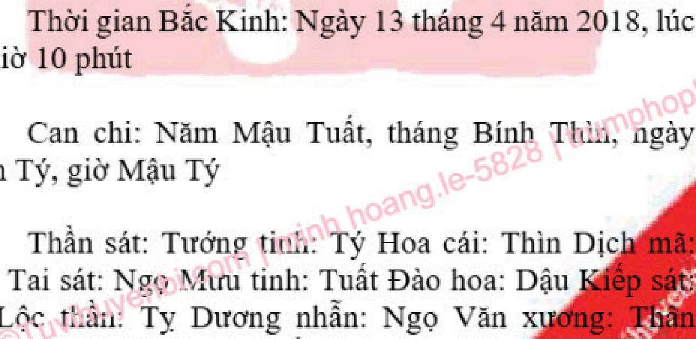
- **Cấu trúc Quẻ Dịch:**
  - Quẻ chủ: **Thiên Địa Bĩ** (Cung Càn, họ Càn) – Quẻ Lục hợp.
  - Quẻ biến: **Hỏa Địa Tấn** (Cung Càn, họ Càn) – Quẻ Du hồn.
  - Tượng quẻ: Bĩ là bế tắc, thiên địa bất giao, tuần hoàn khí huyết không thông; Tấn là tiến lên, thâm nhập sâu dần; Du hồn chủ thần khí bất định, bệnh trạng mạn tính dây dưa.
  - Hào động: Hào 5 Huynh Đệ Thân Kim phát động.
- **Bảng chi tiết Lục hào:**

| Hào | Thế/Ứng | Lục thân | Can Chi | Trạng thái | Lục thú | Thần sát | Biến hào |
|:---:|:---:|:---|:---|:---:|:---|:---|:---|
| 6 | **Ứng** | Phụ Mẫu | Tuất Thổ | Tĩnh | Thanh Long | Thiên hỷ, Mưu tinh, **Nguyệt phá** | Quan Quỷ Tị Hỏa |
| 5 | | Huynh Đệ | Thân Kim | **Động** | Huyền Vũ | **Tuần không**, Văn xương | Phụ Mẫu Mùi Thổ (**Hồi đầu sinh**) |
| 4 | | Quan Quỷ | Ngọ Hỏa | Tĩnh | Bạch Hổ | **Dương nhẫn**, Tai sát, **Nhật phá** | Huynh Đệ Dậu Kim |
| 3 | **Thế** | Thê Tài | Mão Mộc | Tĩnh | Đằng Xà | Thiên y | Thê Tài Mão Mộc |
| 2 | | Quan Quỷ | Tị Hỏa | Tĩnh | Câu Trần | Kiếp sát, Lộc thần | Quan Quỷ Tị Hỏa |
| 1 | | Phụ Mẫu | Mùi Thổ | Tĩnh | Chu Tước | (Phục Tử Tôn Tý Thủy) | Phụ Mẫu Mùi Thổ |

### 3. Dụng thần & Loại quẻ

- **Phân loại quẻ:**
  - Quẻ chiêm đoán bệnh chứng thông qua phương pháp **Quẻ phụ thân (nhập thể thức)**.
- **Định vị Dụng thần cốt lõi:**
  - Do Chu Thần Bân nhập tâm thức vào học viên tại thời điểm gieo quẻ, hào **Thế Thê Tài Mão Mộc** đại diện trực tiếp cho cơ thể người bệnh.
  - Thê Tài trì Thế kẹp giữa hai hào Quan Quỷ (Tị Hỏa ở hào 2 và Ngọ Hỏa ở hào 4): Thê Tài sinh Quỷ biểu thị thể trạng đang ở trạng thái cận bệnh lý / bán khỏe mạnh (sub-health). Hành Mộc trong dòng Thủy biểu thị tuần hoàn máu xuất hiện nhiều tạp chất, cặn bẩn kết tủa làm dòng máu chảy chậm chạp, tạo nên tượng quẻ Bĩ (bế tắc không thông).
  - Đối tượng khảo sát nhồi máu cơ tim: Hào 4 **Quan Quỷ Ngọ Hỏa** lâm Bạch Hổ, mang Dương nhẫn đại diện cho cơ quan tim và biến chứng nhồi máu cơ tim cấp.
  - Nguy cơ ngắn hạn phát động: Hào 5 **Huynh Đệ Thân Kim** động lâm Huyền Vũ, mang Văn xương khắc hào Thế Mão Mộc.

### 4. Luận giải chi tiết

- **Biện chứng Dương Nhẫn vs Lộc Thần trong chiêm bệnh:**
  - Quy tắc phân biệt của Chu Thần Bân: Hào bệnh mang Dương nhẫn đại diện cho tổn thương thực thể ở một cơ quan cụ thể (tim, phổi); hào bệnh mang Lộc thần đại diện cho sự mất cân bằng khí hóa, chỉ số sinh hóa máu.
  - Hào 4 Quan Quỷ Ngọ Hỏa mang Dương nhẫn và Bạch Hổ: Ngọ Hỏa là tim, Dương nhẫn là cơ quan thực thể tim, Bạch Hổ chủ về huyết dịch nhồi máu. Điều này chứng minh người này thực sự có bệnh lý thực thể ở quả tim.
  - Tuy nhiên, điểm mấu chốt là Quan Quỷ Ngọ Hỏa bị Nhật thần Bính Tý trực xung, trong tháng Thìn thuộc trạng thái hưu tù, nên bị **Nhật phá**. Nhật phá khẳng định dứt khoát: trong thời gian ngắn tới, người này tuyệt đối KHÔNG có nguy cơ xảy ra nhồi máu cơ tim cấp tính nguy hiểm tính mạng.
- **Tổn thương cơ tim qua hào Ứng Phụ Mẫu Tuất Thổ:**
  - Tuất Thổ là hỏa khố (mộ khố của Ngọ Hỏa), tượng trưng cho lớp cơ bao bọc quả tim (cơ tim). Tuất Thổ bị Nguyệt lệnh Thìn Thổ xung thành Nguyệt phá, phản ánh cơ tim đã bị tổn thương mạn tính lâu năm (tương hợp với hào Thế Thê Tài Mão Mộc ở trạng thái bán khỏe mạnh).
- **Vấn đề thực sự cần chú ý: Khí phổi và máy trợ thở qua hào 5 Thân Kim:**
  - Động triệu duy nhất trong quẻ là hào 5 Huynh Đệ Thân Kim phát động khắc hào Thế Mão Mộc. Hào 5 là ngực/phổi, hành Kim là phổi và hệ hô hấp, Huyền Vũ chủ về mao mạch, khí quản.
  - Thân Kim mang Văn xương (kỹ thuật, máy móc nhân tạo) chứ không mang Dương nhẫn. Điều này phản ánh khí phổi có vấn đề và đang chịu sự chi phối của thiết bị kỹ thuật nhân tạo (máy trợ thở).
  - Thân Kim động hóa Phụ Mẫu Mùi Thổ hồi đầu sinh (Mùi Thổ tương hợp Quan Quỷ Ngọ Hỏa), quẻ biến Hỏa Địa Tấn (thâm nhập sâu dần).
  - Ý nghĩa bệnh lý: Người này mắc chứng ngưng thở khi ngủ nặng và hoàn toàn phụ thuộc vào máy trợ thở cơ học. Việc lạm dụng máy trợ thở kỹ thuật số lâu dài làm mất dần phản xạ hô hấp tự nhiên của các cơ hô hấp. Tình trạng này kéo dài sẽ ngày càng thâm nhập sâu (quẻ Tấn) và lâu dần sẽ ảnh hưởng liên đới trực tiếp đến hoạt động của cơ tim (bệnh tâm phế).
- **Tính chất bệnh mạn tính qua hào Huynh Đệ khắc Thế:**
  - Hào khắc Thế là Huynh Đệ chứ không phải Quan Quỷ. Quy tắc Lục Hào chỉ rõ: Huynh Đệ khắc Thế là bệnh mạn tính thông thường lành tính, có thể kiểm soát và không gây nguy hiểm tính mạng cấp bách.

### 5. Kết luận & Ứng kỳ thực tế

- **Kết luận của Chu Thần Bân:**
  - Khẳng định người này không có nguy cơ nhồi máu cơ tim cấp tính trong ngắn hạn (Quan Quỷ Ngọ Hỏa ngộ Nhật phá).
  - Nhắc nhở người bệnh vấn đề nguy hại lớn nhất hiện tại là chứng ngưng thở khi ngủ và việc phụ thuộc quá mức vào máy trợ thở kỹ thuật số đang làm teo biến chức năng hô hấp tự nhiên, lâu dài sẽ thâm nhập làm suy giảm cơ tim.
- **Phản hồi thực tế (Feedback):**
  - Người học viên Hồng Kông bình an vô sự, hoàn toàn không xảy ra bất kỳ cơn nhồi máu cơ tim nào như vị thầy châm cứu cảnh báo.
  - Người này xác nhận mình mắc chứng ngừng thở khi ngủ nghiêm trọng suốt nhiều năm qua, mỗi đêm bắt buộc phải gắn máy trợ thở cơ học (thiết bị kỹ thuật Văn xương) mới có thể duy trì giấc ngủ.
- **Ứng kỳ chiêm nghiệm:**
  - Trong suốt thời gian ngắn sau đó và thời gian dài tiếp theo, không có biến cố tim mạch cấp tính, hoàn toàn chuẩn xác với định vị hào Quan Quỷ Ngọ Hỏa lâm Nhật phá.

### 6. Bài học tâm pháp & Quy tắc cốt lõi

- **Quy tắc Lục Hào rút ra:**
  - *Phương pháp gieo quẻ phụ thân (nhập thể) và phân biệt Dương Nhẫn (bệnh cơ quan thực thể) với Lộc Thần (khí hóa/chỉ số máu)* (Cổ Thệ Chân Thuyên, Thực chiến biên 2, trang 504, rule_index): Phương pháp nhập thể biến người gieo quẻ thành đại diện trực tiếp của đương số; Dương nhẫn định vị tổn thương giải phẫu cơ quan thực thể (tim, phổi), Lộc thần định vị trạng thái khí hóa và chỉ số huyết học.
  - *Quy tắc Quan Quỷ ngộ Nhật phá trong chiêm bệnh cấp tính*: Quan Quỷ mang Bạch Hổ ngộ Nhật phá trong quẻ hỏi nguy cơ đột quỵ chứng tỏ mối họa cấp tính vô lực tác quái trong ngắn hạn.
  - *Phân biệt tính chất bệnh qua lục thân khắc Thế*: Hào Huynh Đệ khắc Thế đại diện cho bệnh mạn tính thông thường; hào Quan Quỷ khắc Thế mới là bệnh hiểm nghèo ác tính.
- **Bài học tâm pháp giải đoán:**
  - Khi bốc dịch y lý, không được để phán đoán cảm quan bên ngoài làm phân tâm. Phải bóc tách từng thông số Dịch học: phân biệt rạch ròi giữa tổn thương cơ quan thực thể (Dương nhẫn) và sự can thiệp của thiết bị cơ học kỹ thuật (Văn xương, Kim hào), từ đó chỉ ra gốc rễ điều trị chân thực nhất.

## THỰC CHIẾN 123: DOANH NGHIỆP VÀ VỤ KIỆN VỚI CƠ QUAN CHÍNH PHỦ GIÁM SÁT, NÊN XỬ LÝ THẾ NÀO

### 1. Bối cảnh & Câu hỏi

- **Bối cảnh chi tiết:**
  - Một doanh nhân người bạn từ nước ngoài trở về tìm gặp Chu Thần Bân để xin ý vấn chiến lược xử lý một cuộc khủng hoảng pháp lý: Doanh nghiệp sản xuất của anh ở hải ngoại vừa bị cơ quan chính phủ giám sát chuyên ngành đăng thông báo công khai chỉ trích vi phạm quy trình thao tác kỹ thuật, gây ảnh hưởng nghiêm trọng đến danh dự và doanh số sản phẩm.
  - Doanh nghiệp đã ủy thác luật sư tiến hành điều tra độc lập và thu thập chứng cứ chứng minh cơ quan giám sát đã kiểm tra tắc trách, phát ngôn sai sự thật vô căn cứ. Doanh nghiệp bèn thuê luật sư chuẩn bị khởi kiện cơ quan giám sát ra tòa đòi bồi thường tổn thất kinh tế.
  - Tuy nhiên, phía cơ quan công quyền cố tình dây dưa, liên tục thay đổi chiêu bài trì hoãn không chịu đưa ra câu trả lời dứt khoát. Người bạn phân vân: Nên tiếp tục cứng rắn thuê luật sư đưa vụ việc ra tòa đối đầu, hay nên chọn giải pháp ngồi lại đàm phán hòa giải?
- **Thời gian chiêm đoán:**
  - Dương lịch: Ngày 22 tháng 4 năm 2018, lúc 17 giờ 03 phút chiều.
  - Giờ Bắc Kinh: Ngày 22 tháng 4 năm 2018, 17:03.
  - Can chi: Năm Mậu Tuất, tháng Bính Thìn, ngày Giáp Thân, giờ Quý Dậu.
- **Tâm lý người hỏi & Nội dung câu hỏi:**
  - Tâm lý do dự, giằng xé giữa sự phẫn nộ muốn đòi lại công lý bằng kiện tụng và sự thận trọng lo ngại đụng độ bộ máy công quyền.
  - Câu hỏi trọng tâm: Nên cứng rắn đưa cơ quan giám sát ra tòa kiện tụng hay nên chọn phương án thương lượng hòa giải?

### 2. Dữ kiện & Bảng quẻ Crop

- **Thời không chiêm nghiệm & Thần sát:**
  - Tháng Bính Thìn (Thổ vượng nắm lệnh).
  - Ngày Giáp Thân (Kim vượng, Thân Tý Thìn tam hợp, Thân Tỵ lục hợp).
  - Tuần không: Ngọ - Mùi (Giáp Thân tuần trung, Ngọ Mùi không vong).
  - Hệ thống Thần sát: Tướng tinh – Tý, Hoa cái – Thìn, Dịch mã – Dần, Tai sát – Ngọ, Mưu tinh – Tuất, Đào hoa – Dậu, Kiếp sát – Tị, Lộc thần – Dần, Dương nhẫn – Mão, Văn xương – Tị, Thiên y – Mão, Thiên hỷ – Tuất, Quý nhân – Sửu, Mùi.
- Dữ kiện bảng quẻ và đồ hình dự trắc:
  - **Bảng 123.1** Đồ hình quẻ Thực chiến 123:
    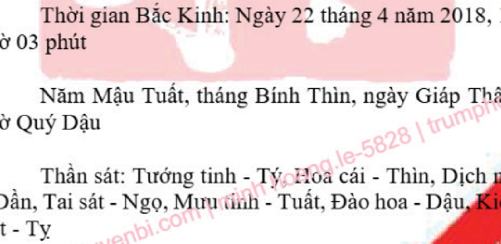
- **Cấu trúc Quẻ Dịch:**
  - Quẻ chủ: **Hỏa Thiên Đại Hữu** (Cung Càn, họ Càn) – Quẻ Quy hồn.
  - Quẻ biến: **Bát Thuần Cấn** (Cung Cấn, họ Cấn) – Quẻ Lục xung.
  - Tượng quẻ: Đại Hữu là bao hàm nhiều thứ (nhiều lựa chọn); Cấn vi Sơn là đình chỉ dừng lại; Lục xung chủ xung đột đổ vỡ nếu đối đầu cứng rắn.
  - Cấu trúc hào động: Hào 1 Tử Tôn Tý Thủy động; Hào 2 Thê Tài Dần Mộc động; Hào 4 Huynh Đệ Dậu Kim động.
- **Bảng chi tiết Lục hào:**

| Hào | Thế/Ứng | Lục thân | Can Chi | Trạng thái | Lục thú | Thần sát | Biến hào |
|:---:|:---:|:---|:---|:---:|:---|:---|:---|
| 6 | **Ứng** | Quan Quỷ | Tị Hỏa | Tĩnh | Huyền Vũ | Kiếp sát, Văn xương | Thê Tài Dần Mộc |
| 5 | | Phụ Mẫu | Mùi Thổ | Tĩnh | Bạch Hổ | Tuần không, Quý nhân | Tử Tôn Tý Thủy |
| 4 | | Huynh Đệ | Dậu Kim | **Động** | Đằng Xà | Đào hoa | Phụ Mẫu Tuất Thổ |
| 3 | **Thế** | Phụ Mẫu | Thìn Thổ | Tĩnh | Câu Trần | Nguyệt kiến, Hoa cái | Huynh Đệ Thân Kim |
| 2 | | Thê Tài | Dần Mộc | **Động** | Chu Tước | Dịch mã, Lộc thần | Quan Quỷ Ngọ Hỏa (**Tuần không**, Tai sát) |
| 1 | | Tử Tôn | Tý Thủy | **Động** | Thanh Long | Tướng tinh | Phụ Mẫu Thìn Thổ (**Hồi đầu khắc**) |

### 3. Dụng thần & Loại quẻ

- **Phân loại quẻ:**
  - **Quẻ lựa chọn (Hai đầu hào Thế cùng phát động)**.
  - Nhận diện cách cục: Hào Thế Phụ Mẫu Thìn Thổ tọa tại hào 3 (tĩnh), kẹp chính giữa bởi hai hào động: hào 2 (Thê Tài Dần Mộc) ở phía dưới và hào 4 (Huynh Đệ Dậu Kim) ở phía trên. Đây là kết cấu kinh điển của quẻ lựa chọn do tự thân đương sự quyết định phương hướng hành động.
- **Định vị Dụng thần cốt lõi:**
  - Hào **Thế Phụ Mẫu Thìn Thổ** ở hào 3 đại diện cho trụ sở chính / tổng thể doanh nghiệp. Hào Thế đắc Nguyệt kiến Thìn Thổ, lại được Nhật Thân hợp cục tam hợp, thế lực cực kỳ vượng tướng (doanh nghiệp có lý lẽ đanh thép, không có sai phạm).
  - Hào Ứng **Quan Quỷ Tị Hỏa** đại diện cho cơ quan chính phủ giám sát và bản thân vụ kiện. Hào Ứng Tị Hỏa sinh hào Thế Thìn Thổ (Hỏa sinh Thổ), biểu thị ngay từ đầu vụ kiện thực tế đang có lợi cho doanh nghiệp.
  - **Nhánh lựa chọn A (Hào 2):** Thê Tài Dần Mộc động hóa Quan Quỷ Ngọ Hỏa – Đại diện cho con đường dùng tiền thuê luật sư kiện tụng đối đầu ra tòa.
  - **Nhánh lựa chọn B (Hào 4):** Huynh Đệ Dậu Kim động hóa Phụ Mẫu Tuất Thổ – Đại diện cho con đường đàm phán thông qua tổ chức trung gian hòa giải.

### 4. Luận giải chi tiết

- **Biện chứng so sánh hai nhánh lựa chọn:**
  - **Nhánh A – Kiện tụng đối đầu (Hào 2 Thê Tài Dần Mộc):**
    + Thê Tài Dần Mộc mang Lộc thần (tiền bạc), lâm Chu Tước (kiện tụng tranh chấp), biến ra Quan Quỷ Ngọ Hỏa mang Tai sát: Đây chính là việc xuất tiền thuê luật sư đâm đơn kiện chính quyền ra tòa.
    + Tác động: Dần Mộc phát động trực tiếp khắc hào Thế Phụ Mẫu Thìn Thổ (Mộc khắc Thổ). Quan Quỷ Ngọ Hỏa hóa ra là mầm mống họa tai mới. Nếu chọn con đường này, doanh nghiệp sẽ trực tiếp bị tổn thương nặng nề.
    + Hào 1 Tử Tôn Tý Thủy động sinh Dần Mộc, biến Phụ Mẫu Thìn Thổ ở hào sơ (đại diện cho công ty con, chi nhánh bên dưới). Nếu kiện đến cùng, cơ quan giám sát tuy chịu nhận lỗi sai ban đầu, nhưng họ nắm quyền quản lý nhà nước sẽ quay sang thanh tra bới lông tìm vết các chi nhánh cấp dưới, gián tiếp hủy hoại sự tồn vong của cả tập đoàn.
  - **Nhánh B – Hòa giải qua trung gian (Hào 4 Huynh Đệ Dậu Kim):**
    + Hào 4 Huynh Đệ Dậu Kim phát động biến Phụ Mẫu Tuất Thổ (Tuất Thổ đồng hành Thổ tăng thêm lực lượng cho hào Thế Thìn Thổ).
    + Dậu Kim tạo thế Bán hợp Kim cục với Quan Quỷ Tị Hỏa ở hào Ứng (Tỵ Dậu bán hợp). Điều này chỉ ra việc nhờ một tổ chức trung gian có uy tín và mối liên hệ mật thiết với cơ quan chính phủ giám sát đứng ra điều đình.
    + Lựa chọn này giúp cơ quan công quyền giữ được thể diện, hai bên tìm được lối thoát êm thấm để chính quyền âm thầm gỡ bỏ thông báo, doanh nghiệp vừa bảo toàn thương hiệu vừa tránh được đòn trả đũa thanh tra.
- **Nguyên lý cốt lõi "Dân không tranh với quan":**
  - Chu Thần Bân nhấn mạnh bài học ngàn đời: Bất luận ở phương Đông hay phương Tây, quy luật xã hội luôn là "Dân không tranh với quan". Cơ quan giám sát dù có chỗ sơ suất nhưng họ nắm cán dao quyền lực.
  - Nếu doanh nghiệp cứng rắn dồn họ vào chân tường, họ có thể xin lỗi một việc nhỏ nhưng sẽ dùng trăm ngàn quyền lực khác để soi mói triệt hạ. Lựa chọn hòa giải thông qua trung gian Dậu Kim là thượng sách bảo toàn sinh mệnh doanh nghiệp.

### 5. Kết luận & Ứng kỳ thực tế

- **Kết luận của Chu Thần Bân:**
  - Khuyên đương số tuyệt đối không được chọn nhánh hào 2 (thuê luật sư kiện ra tòa đối đầu); bắt buộc phải chọn nhánh hào 4 (tìm tổ chức trung gian uy tín liên hệ với cơ quan chính phủ để thương lượng hòa giải dĩ hòa vi quý).
- **Phản hồi thực tế (Feedback):**
  - Người bạn tiếp thu trọn vẹn lời khuyên, dừng kế hoạch kiện tụng và ủy thác một tổ chức trung gian có tiếng nói sang đàm phán hòa giải.
  - Phía cơ quan chính phủ đã vui vẻ chấp nhận, lặng lẽ gỡ bỏ bài viết chỉ trích công khai, vụ việc khép lại êm thấm mà không để lại hậu họa cho doanh nghiệp.
- **Ứng kỳ chiêm nghiệm:**
  - Vụ tranh chấp được giải quyết dứt điểm ngay sau khi triển khai phương án đàm phán trung gian, giải trừ hoàn toàn nguy cơ kiện tụng kéo dài.

### 6. Bài học tâm pháp & Quy tắc cốt lõi

- **Quy tắc Lục Hào rút ra:**
  - *Quy tắc nhận diện quẻ lựa chọn: Hai đầu hào Thế cùng phát động và nguyên lý 'Dân không tranh với quan'* (Cổ Thệ Chân Thuyên, Thực chiến biên 2, trang 516, rule_index): Khi hai hào kẹp hai bên hào Thế cùng phát động, quẻ xác định hai phương án tự chủ hành động; phải phân tích đa tầng tương tác sinh khắc lên hào Thế để chọn con đường sinh tồn tối ưu.
  - *Quy tắc Ứng Quan sinh Thế trong xung đột hành chính*: Khi hào Ứng Quan Quỷ sinh Thế, bản thân đang chiếm ưu thế; tuyệt đối không manh động phát động Thê Tài lâm Chu Tước biến Quỷ khắc Thế mà tự chuốc lấy họa diệt thân.
- **Bài học tâm pháp giải đoán:**
  - Người dự đoán Dịch học đỉnh cao không chỉ tính chuyện thắng thua lý lẽ trên mặt giấy, mà phải thấu suốt cán cân quyền lực thực tế ngoài xã hội. Thắng một vụ kiện nhỏ mà mất đi môi trường sinh tồn kinh doanh là thất bại lớn nhất; biết nhẫn nhường hòa giải đúng lúc mới là trí tuệ chân chính.

## THỰC CHIẾN 124: HỎI NGƯỜI LỰA CHỌN HÀNG ĐẦU TRONG LÒNG CÓ THÍCH HỢP LÀM NHÂN DUYÊN HAY KHÔNG

### 1. Bối cảnh & Câu hỏi

- **Bối cảnh chi tiết:**
  - Một cô gái trẻ có điều kiện rất ưu tú đang rơi vào trạng thái bối rối tột độ trước chuyện tình cảm: Cùng một lúc có tới 3-4 người đàn ông ngỏ lời yêu và mong muốn tiến tới hôn nhân.
  - Chu Thần Bân khuyên cô nên định tâm suy nghĩ xem ai là đối tượng mình có cảm tình nhất (sự lựa chọn hàng đầu trong lòng) thì chỉ tập trung gieo một quẻ duy nhất hỏi về người đó, tránh suy nghĩ phân tán làm loạn quẻ tượng.
  - Đối tượng hàng đầu này còn trẻ, diện mạo khôi ngô tuấn tú, gia cảnh giàu có bề thế khiến cô gái rất vừa ý. Khi cô gieo quẻ đến lần thứ hai, một đồng tiền bất ngờ rơi xuống sàn nhà, cùng lúc đó chiếc tivi trong nhà hàng đang phát cảnh một cặp đôi cãi vã kịch liệt rồi chia tay (ngoại ứng đứt đoạn, phân ly).
- **Thời gian chiêm đoán:**
  - Dương lịch: Ngày 22 tháng 4 năm 2018, lúc 19 giờ 03 phút tối.
  - Giờ Bắc Kinh: Ngày 22 tháng 4 năm 2018, 19:03.
  - Can chi: Năm Mậu Tuất, tháng Bính Thìn, ngày Giáp Thân, giờ Giáp Tuất.
- **Tâm lý người hỏi & Nội dung câu hỏi:**
  - Tâm lý say đắm, kỳ vọng vào một hình mẫu bạn trai hoàn hảo (đẹp trai, nhà giàu).
  - Câu hỏi trọng tâm: Người bạn trai lựa chọn hàng đầu này có thích hợp để kết duyên làm vợ chồng lâu dài hay không?

### 2. Dữ kiện & Bảng quẻ Crop

- **Thời không chiêm nghiệm & Thần sát:**
  - Tháng Bính Thìn (Thổ vượng nắm lệnh).
  - Ngày Giáp Thân (Kim vượng sinh Thủy, Thân xung Dần).
  - Tuần không: Ngọ - Mùi (Giáp Thân tuần trung, Ngọ Mùi không vong).
  - Hệ thống Thần sát: Tướng tinh – Tý, Hoa cái – Thìn, Dịch mã – Dần, Tai sát – Ngọ, Mưu tinh – Tuất, Đào hoa – Dậu, Kiếp sát – Tị, Lộc thần – Dần, Dương nhẫn – Mão, Văn xương – Tị, Thiên y – Mão, Thiên hỷ – Tuất, Quý nhân – Sửu, Mùi.
- Dữ kiện bảng quẻ và đồ hình dự trắc:
  - **Bảng 124.1** Đồ hình quẻ Thực chiến 124:
    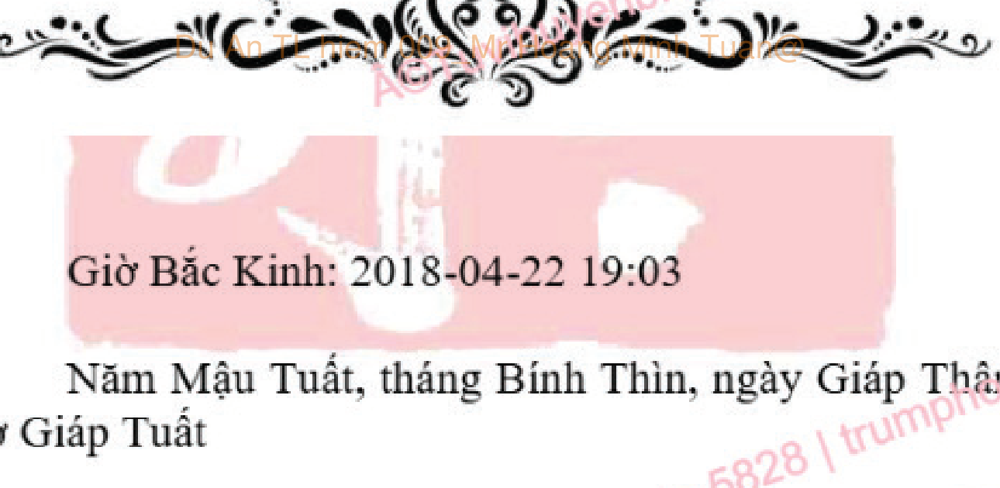
- **Cấu trúc Quẻ Dịch:**
  - Quẻ chủ: **Địa Sơn Khiêm** (Cung Đoài, họ Đoài) – Núi ẩn dưới đất, biểu tượng khởi đầu khiêm nhường hoặc sự việc mới manh nha chưa lộ diện.
  - Quẻ biến: **Thủy Sơn Kiển** (Cung Đoài, họ Đoài) – Kiển là hiểm nạn, trắc trở, què quặt gập ghềnh khó đi.
  - Hào động: Hào 5 (Thế) Tử Tôn Hợi Thủy phát động.
- **Bảng chi tiết Lục hào:**

| Hào | Thế/Ứng | Lục thân | Can Chi | Trạng thái | Lục thú | Thần sát | Biến hào |
|:---:|:---:|:---|:---|:---:|:---|:---|:---|
| 6 | | Huynh Đệ | Dậu Kim | Tĩnh | Huyền Vũ | Đào hoa | Tử Tôn Tý Thủy |
| 5 | **Thế** | Tử Tôn | Hợi Thủy | **Động** | Bạch Hổ | | Phụ Mẫu Tuất Thổ (**Hồi đầu khắc**, Thiên hỷ, Mưu tinh) |
| 4 | | Phụ Mẫu | Sửu Thổ | Tĩnh | Đằng Xà | Quý nhân | Huynh Đệ Thân Kim |
| 3 | | Huynh Đệ | Thân Kim | Tĩnh | Câu Trần | Nhật kiến | Huynh Đệ Thân Kim |
| 2 | **Ứng** | Quan Quỷ | Ngọ Hỏa | Tĩnh | Chu Tước | **Tuần không**, Tai sát (Phục Thê Tài Mão) | Quan Quỷ Ngọ Hỏa |
| 1 | | Phụ Mẫu | Thìn Thổ | Tĩnh | Thanh Long | Nguyệt kiến, Hoa cái | Phụ Mẫu Thìn Thổ |

### 3. Dụng thần & Loại quẻ

- **Phân loại quẻ:**
  - Nữ mệnh chiêm vấn hôn nhân / xem xét đối tượng kết hôn lâu dài.
- **Định vị Dụng thần cốt lõi:**
  - Nữ hỏi nhân duyên lấy hào **Quan Quỷ** làm Dụng thần đại diện cho người nam.
  - Hào 2 (Ứng) **Quan Quỷ Ngọ Hỏa** lâm Tuần không, mang Chu Tước, Tai sát đại diện cho người bạn trai trong mộng. Dưới hào Ứng có phục tàng Thê Tài Mão Mộc mang Đào hoa (Mão sinh Ngọ), phản ánh trong lòng người nam này thực sự có ý đồ muốn tán tỉnh tiếp cận và phát triển quan hệ tình cảm.
  - Hào **Thế Tử Tôn Hợi Thủy** ở hào 5 lâm Bạch Hổ đại diện cho bản thân cô gái và tư cách bước vào hôn nhân.

### 4. Luận giải chi tiết

- **Hiện trạng mối quan hệ và suy bại của Quan Quỷ:**
  - Quẻ Địa Sơn Khiêm: tượng trưng cho sự tình mới chỉ chớm nở. Chu Thần Bân đoán hai người chưa chính thức xác lập quan hệ người yêu, cô gái thừa nhận mới chỉ cảm nhận đối phương đang theo đuổi.
  - Quan Quỷ Ngọ Hỏa ở hào Ứng lâm Tuần không, trong tháng Thìn thuộc trạng thái hưu tù suy nhược, rơi vào cảnh "chân không", báo hiệu duyên phận hư ảo không có thực chất bền vững.
- **Hiểm họa chí mạng: Hào Thế hóa Hồi đầu khắc mang Bạch Hổ:**
  - Điểm hung hiểm tột cùng của quẻ: Hào Thế Tử Tôn Hợi Thủy tự thân phát động hóa ra Phụ Mẫu Tuất Thổ quay đầu khắc lại (Thổ khắc Thủy).
  - Quy tắc Lục Hào: Trong hôn nhân, hào Thế là gốc rễ thân thể; hễ Thế động hóa hồi đầu khắc thì kết cục chắc chắn là sự tổn thương thê thảm cho bản thân.
  - Hào Thế lại lâm **Bạch Hổ**: Bạch Hổ là hung thần chủ về tai họa, đổ máu, bệnh tật, thương tích và oán hận khôn nguôi. Điềm báo này chỉ rõ nếu cố chấp theo đuổi, tổn thất không chỉ dừng lại ở sự đau khổ tình cảm mà còn đe dọa trực tiếp đến tính mạng, sức khỏe và sự an toàn thân thể của cô gái.
- **Bí pháp Mộ khố của Quan Quỷ – Hiểm họa sống chung:**
  - Hào biến Phụ Mẫu Tuất Thổ chính là **Mộ khố của Quan Quỷ Ngọ Hỏa** (Hỏa mộ tại Tuất). Phụ Mẫu đại diện cho nhà cửa, nơi ăn chốn ở; mộ khố của Quan Quỷ chính là tư gia, không gian sống chung của người nam sau hôn nhân.
  - Hào Thế động hóa mộ khố Quan Quỷ hồi đầu khắc Thế mang Bạch Hổ: Tượng trưng cho việc một khi cô gái chấp nhận dọn về sống chung dưới một mái nhà với người đàn ông này, cô đã tự bước chân vào "mộ khố" sát phạt.
  - Chu Thần Bân khẳng định người nam này mang khí số khắc thê nặng nề đối với riêng cô gái. Khi ở chung một chỗ, cô gái sẽ liên tục gặp tai nạn, bệnh tật hành hạ hoặc bị ngược đãi bạo lực gia đình.
- **Ngoại ứng và đối chiếu tướng mạo:**
  - Ngoại ứng đồng tiền rơi xuống đất ("đứt xích") và hình ảnh tivi chiếu cảnh cãi vã chia tay đồng bộ cảnh báo sự đổ vỡ tan tành.
  - Khi xem ảnh chụp tĩnh, người nam trông bảnh bao; nhưng khi xem video quay cử chỉ động thái, Chu Thần Bân phát hiện ánh mắt người nam sắc lạnh, hung dữ như mắt sói – một dấu hiệu nhân tướng học điển hình của kẻ có khuynh hướng bạo lực tàn nhẫn ẩn giấu.

### 5. Kết luận & Ứng kỳ thực tế

- **Kết luận của Chu Thần Bân:**
  - Khuyên cô gái kiên quyết từ bỏ người này ngay lập tức; tuyệt đối không nhận lời làm bạn gái hay bàn tính chuyện hôn nhân để tránh rước họa vào thân.
- **Phản hồi thực tế (Feedback):**
  - Cô gái và mẹ nghe xong vô cùng kinh hãi, lập tức nghe theo lời khuyên, cắt đứt hoàn toàn ý định tìm hiểu người đàn ông này, bảo toàn bình an cho bản thân.
  - Sau bữa ăn (khoảng 30 phút sau), cô chuyển sang gieo quẻ thứ hai để hỏi về đối tượng tiếp theo (bác sĩ nha khoa).
- **Ứng kỳ chiêm nghiệm:**
  - Quyết định dừng lại kịp thời ngay tại thời điểm lập quẻ, ứng nghiệm lời cảnh báo giải trừ tai họa trước khi bước vào chung sống.

### 6. Bài học tâm pháp & Quy tắc cốt lõi

- **Quy tắc Lục Hào rút ra:**
  - *Quy tắc Nữ vấn hôn nhân: Mộ khố của Quan Quỷ hồi đầu khắc hào Thế mang Bạch Hổ báo hiệu nguy hại khi sống chung* (Cổ Thệ Chân Thuyên, Thực chiến biên 2, trang 525, rule_index): Khi hào Thế phát động hóa ra Phụ Mẫu là mộ khố của Quan Quỷ hồi đầu khắc Thế lại lâm Bạch Hổ, đó là dấu hiệu tuyệt đối về nguy cơ bạo lực gia đình, thương tích và tai họa thể xác một khi hai người dọn về sống chung.
  - *Ý nghĩa ngoại ứng trong bốc dịch*: Đồng tiền rơi gãy quẻ kết hợp tín hiệu ngoại cảnh chia ly là điềm báo tương thông phản ánh sự bế tắc của mối duyên.
- **Bài học tâm pháp giải đoán:**
  - Người luận quẻ hôn nhân phải có dũng khí cảnh báo sự thật, không vì vẻ ngoài giàu sang, tuấn tú của đối phương mà xuề xòa tán thành. Thấy hào Thế hóa hồi đầu khắc mang Bạch Hổ thì phải kiên quyết can gián đương số dừng bước, cứu một người thoát khỏi vũng lầy hôn nhân bi kịch.

## THỰC CHIẾN 125: HỎI BÁC SĨ NHA KHOA CÓ PHÙ HỢP NHÂN DUYÊN HAY KHÔNG

### 1. Bối cảnh & Câu hỏi

- **Bối cảnh chi tiết:**
  - Tiếp nối diễn biến tại bàn ăn tối ngày 22/04/2018 tại Thượng Hải: Sau khi Chu Thần Bân chỉ ra người lựa chọn thứ nhất mang hung tướng và khuyên cô gái từ bỏ (Thực chiến 124), mọi người tiếp tục dùng bữa để tĩnh tâm. Khoảng 25 phút sau (lúc 19:26), cô gái dâng lên ý niệm về người lựa chọn thứ hai trong lòng: một vị bác sĩ nha khoa đang theo đuổi cô rất nhiệt tình.
  - Người nha sĩ này đã ngoài 40 tuổi, trong khi cô gái mới ngoài 30 tuổi, chênh lệch nhau hơn 10 tuổi. Ngay khi cô gái thốt lên cảm nghĩ chê đối phương "quá già", Chu Thần Bân quan sát thấy người mẹ ngồi bên cạnh đang dùng răng cắn tách một cọng rau muống già khó nhai và bỏ sang mép đĩa không ăn, chỉ nuốt những phần rau non (ngoại ứng chỉ rõ phụ huynh không thể "nuốt trôi" / phản đối người con rể lớn tuổi này).
- **Thời gian chiêm đoán:**
  - Dương lịch: Ngày 22 tháng 4 năm 2018, lúc 19 giờ 26 phút tối.
  - Giờ Bắc Kinh: Ngày 22 tháng 4 năm 2018, 19:26.
  - Can chi: Năm Mậu Tuất, tháng Bính Thìn, ngày Giáp Thân, giờ Giáp Tuất.
- **Tâm lý người hỏi & Nội dung câu hỏi:**
  - Tâm lý e ngại khoảng cách tuổi tác (quá già) nhưng phân vân trước sự săn đón nhiệt thành của người nha sĩ.
  - Câu hỏi trọng tâm: Vị bác sĩ nha khoa này có thích hợp để kết duyên làm vợ chồng lâu dài hay không?

### 2. Dữ kiện & Bảng quẻ Crop

- **Thời không chiêm nghiệm & Thần sát:**
  - Tháng Bính Thìn (Thổ vượng nắm lệnh).
  - Ngày Giáp Thân (Kim vượng sinh Thủy, Thân xung Dần).
  - Tuần không: Ngọ - Mùi (Giáp Thân tuần trung, Ngọ Mùi không vong).
  - Hệ thống Thần sát: Tướng tinh – Tý, Hoa cái – Thìn, Dịch mã – Dần, Tai sát – Ngọ, Mưu tinh – Tuất, Đào hoa – Dậu, Kiếp sát – Tị, Lộc thần – Dần, Dương nhẫn – Mão, Văn xương – Tị, Thiên y – Mão, Thiên hỷ – Tuất, Quý nhân – Sửu, Mùi.
- Dữ kiện bảng quẻ và đồ hình dự trắc:
  - **Bảng 125.1** Đồ hình quẻ Thực chiến 125:
    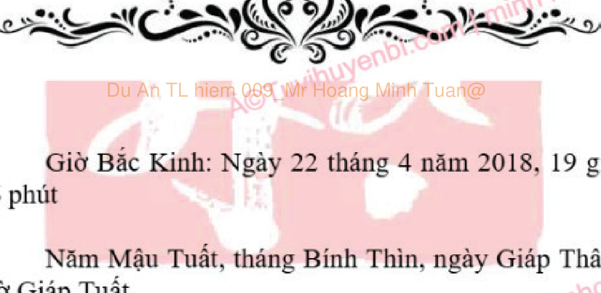
- **Cấu trúc Quẻ Dịch:**
  - Quẻ chủ: **Phong Thiên Tiểu Súc** (Cung Tốn, họ Tốn) – Tiểu súc là tích lũy nhỏ, biểu thị hai bên mới tiếp xúc chưa sâu đậm, lực lượng gắn kết chưa đủ lớn.
  - Quẻ biến: **Thiên Thủy Tụng** (Cung Ly, họ Ly) – Quẻ Du hồn. Tụng là bất đồng tranh cãi, Du hồn là tâm trí phiêu bạt bất định, khó thành gia thất bền vững.
  - Hào động: Hào 1 (Thế) Phụ Mẫu Tý Thủy động; Hào 3 Thê Tài Thìn Thổ động; Hào 4 (Ứng) Thê Tài Mùi Thổ động.
- **Bảng chi tiết Lục hào:**

| Hào | Thế/Ứng | Lục thân | Can Chi | Trạng thái | Lục thú | Thần sát | Biến hào |
|:---:|:---:|:---|:---|:---:|:---|:---|:---|
| 6 | | Huynh Đệ | Mão Mộc | Tĩnh | Huyền Vũ | Dương nhẫn | Thê Tài Tuất Thổ |
| 5 | | Tử Tôn | Tị Hỏa | Tĩnh | Bạch Hổ | Kiếp sát, Văn xương | Quan Quỷ Thân Kim |
| 4 | **Ứng** | Thê Tài | Mùi Thổ | **Động** | Đằng Xà | **Tuần không**, Quý nhân | Tử Tôn Ngọ Hỏa (**Tuần không**, Tai sát) |
| 3 | | Thê Tài | Thìn Thổ | **Động** | Câu Trần | Nguyệt kiến, Hoa cái (Phục Quan Dậu) | Tử Tôn Ngọ Hỏa (**Tuần không**, Tai sát) |
| 2 | | Huynh Đệ | Dần Mộc | Tĩnh | Chu Tước | Dịch mã, Lộc thần | Thê Tài Thìn Thổ |
| 1 | **Thế** | Phụ Mẫu | Tý Thủy | **Động** | Thanh Long | Tướng tinh | Huynh Đệ Dần Mộc |

### 3. Dụng thần & Loại quẻ

- **Phân loại quẻ:**
  - Nữ mệnh chiêm vấn hôn nhân / khảo sát đối tượng lựa chọn thứ hai.
- **Định vị Dụng thần cốt lõi:**
  - Hào Ứng **Thê Tài Mùi Thổ** đại diện cho vị bác sĩ nha khoa. Thê Tài là Nguyên thần sinh Quan Quỷ, đại diện cho ý nguyện chủ động theo đuổi muốn biến cô gái thành người yêu/vợ.
  - Hào **Thế Phụ Mẫu Tý Thủy** ở hào sơ đại diện cho bản thân cô gái.
  - Hào 3 Thê Tài Thìn Thổ mang Câu Trần, phục Quan Quỷ Dậu Kim mang Đào hoa: đại diện cho một đối tượng thứ ba khác mà cô gái đã tiếp xúc quen biết thân mật từ trước.

### 4. Luận giải chi tiết

- **Hiện trạng tiếp xúc và sự nhiệt tình của đối phương:**
  - Quẻ chủ Phong Thiên Tiểu Súc: Chu Thần Bân nhận định hai người tiếp xúc qua lại chưa nhiều.
  - Hào Ứng Thê Tài Mùi Thổ phát động khắc hào Thế Phụ Mẫu Tý Thủy: Ứng động khắc Thế chứng tỏ người bác sĩ nha khoa rất tích cực, chủ động theo đuổi và bày tỏ tình cảm nồng nhiệt.
- **Hào biến định đoạt kết cục vô duyên vợ chồng (Động sơ biến chung):**
  - Nguyên lý nền tảng của Lục Hào: Hào động khởi phát quá trình, hào biến quyết định kết cục sau cùng.
  - Hào Ứng Thê Tài Mùi Thổ động hóa ra **Tử Tôn Ngọ Hỏa**: Ngọ Hỏa tương xung trực diện với hào Thế Phụ Mẫu Tý Thủy (Tý Ngọ tương xung).
  - Hào biến của đối phương quay lại xung khắc hào Thế là bằng chứng tất định: Dù giai đoạn đầu anh ta săn đón nhiệt tình đến đâu thì kết cục cuối cùng giữa hai người vẫn là vô duyên, không thể nào thành đôi vợ chồng.
- **Hào Thế hóa Huynh Đệ: Duy trì quan hệ bạn bè tri kỷ lâu dài:**
  - Hào Thế Phụ Mẫu Tý Thủy tự thân phát động biến ra **Huynh Đệ Dần Mộc**.
  - Huynh Đệ chủ về tình bạn bè đồng môn, đồng liêu, tri kỷ; Huynh Đệ khắc Tài (từ chối mối quan hệ lứa đôi vợ chồng).
  - Tuy nhiên, Dần Mộc lại tạo thế Bán hợp với Ngọ Hỏa (Dần Ngọ bán hợp) và Dần Mộc chính là đất Trường sinh của Ngọ Hỏa.
  - Ý nghĩa chuyển hóa quan hệ: Hai người tuy không có duyên làm vợ chồng, nhưng nếu giữ vững ranh giới bạn bè bình thường thì lại vô cùng hòa thuận, tương trợ và duy trì tình bạn tốt đẹp, bền lâu.
- **Ngoại ứng phụ huynh phản đối và đối tượng thứ ba:**
  - Ngoại ứng cọng rau già khó nuốt của người mẹ phản ánh chính xác thực tế: Cha mẹ cô gái kịch liệt phản đối mối quan hệ này vì người đàn ông quá già.
  - Hào 3 Thê Tài Thìn Thổ (đối tượng thứ ba) cũng động biến Tử Tôn Ngọ Hỏa xung Thế: Chu Thần Bân chỉ ra một người bạn nam khác đang qua lại thân mật với cô gái cũng hoàn toàn vô duyên, quẻ tượng đồng thời phủ định cả hai đối tượng.

### 5. Kết luận & Ứng kỳ thực tế

- **Kết luận của Chu Thần Bân:**
  - Khẳng định vị bác sĩ nha khoa không thể trở thành chồng (kết cục vô duyên, cha mẹ phản đối vì quá già); nhưng khuyên nên giữ mối quan hệ bạn bè bình thường thì rất lâu dài và tốt đẹp.
- **Phản hồi thực tế (Feedback):**
  - Người mẹ ngồi cạnh lập tức lên tiếng xác nhận: Cha cô gái phản đối kịch liệt vì người nha sĩ quá lớn tuổi, bản thân bà mẹ cũng không ưng thuận.
  - Cô gái nghe theo lời khuyên, dừng việc tìm hiểu yêu đương và chuyển sang quan hệ bạn bè giao thiệp với vị bác sĩ, mối quan hệ diễn ra rất thoải mái, tốt đẹp.
- **Ứng kỳ chiêm nghiệm:**
  - Mối quan hệ được giải tỏa tâm lý ngay trong thực tế, duy trì tình bạn thuần túy bền vững đúng như quẻ định vị hào Thế hóa Huynh Đệ.

### 6. Bài học tâm pháp & Quy tắc cốt lõi

- **Quy tắc Lục Hào rút ra:**
  - *Quy tắc gieo quẻ liên tiếp khi phân vân nhân duyên: Hào biến quyết định kết cục và hào Thế hóa Huynh Đệ duy trì quan hệ bạn bè* (Cổ Thệ Chân Thuyên, Thực chiến biên 2, trang 531, rule_index): Khi có nhiều người theo đuổi, cần gieo riêng từng quẻ để ý niệm thuần nhất; Hào biến của hào Ứng xung hào Thế định vị kết cục vô duyên vợ chồng; hào Thế hóa Huynh Đệ bán hợp hào biến chỉ đường duy trì tình bạn lâu dài.
  - *Nguyên tắc Động sơ biến chung*: Hào động chỉ ra khởi đầu hăng hái, hào biến mới là đích đến sau cùng; không vì hào Ứng động sinh/khắc ban đầu mà ngộ nhận kết quả chung cuộc.
- **Bài học tâm pháp giải đoán:**
  - Nhân duyên trên đời muôn hình vạn trạng, không thành duyên vợ chồng thì làm bạn bè tri kỷ. Dịch học là đạo lý nhân sinh giúp con người định vị đúng đắn vị trí của từng mối quan hệ, giữ gìn phúc duyên và sự thanh thản trong tâm hồn.

---

## THỰC CHIẾN 126: HỎI VỀ MỘT LUẬT SƯ DO THÁI TỪNG QUEN TRƯỚC ĐÂY, LIỆU CÓ PHÙ HỢP ĐỂ KẾT HÔN HAY KHÔNG

### 1. Bối cảnh & Câu hỏi
- **Bối cảnh chi tiết:**
  Đương số là một cô gái từng có thời gian quen biết và tìm hiểu một luật sư người Do Thái. Trong quá trình gắn bó trước đây, vì tính cách của người đàn ông này khá ích kỷ nên hai người đã nảy sinh mâu thuẫn và quyết định chia tay. Tuy nhiên sau khi chia tay, người đàn ông này vẫn luôn dành tình cảm sâu sắc cho cô, không ngừng theo đuổi và bày tỏ mong muốn nối lại tình xưa. Bản thân cô gái trong lòng cũng còn tình cảm và những rung động nhất định đối với anh ta. Hiện tại cô cảm thấy các cơ hội lựa chọn đối tượng kết hôn của mình không còn nhiều, do đó cô đã gieo quẻ hỏi Chu Thần Bân xem nếu tiếp tục qua lại với người đàn ông Do Thái này thì liệu có phù hợp để tiến tới hôn nhân hay không.
- **Tâm lý & Câu hỏi ẩn ý:**
  Đương số mang tâm lý băn khoăn, giằng xé giữa tình cảm còn vương vấn và nỗi ám ảnh bị tổn thương do tính cách ích kỷ của đối phương trong quá khứ. Câu hỏi ẩn ý không chỉ dừng lại ở việc người nam có chân thành hay không, mà trọng tâm là: Nếu chấp nhận quay lại và kết hôn, liệu cuộc sống chung sau này có mang lại hạnh phúc hay lại tái diễn bi kịch tổn thương cũ?
- **Thời gian chiêm đoán:**
  - Dương lịch: Ngày 22 tháng 04 năm 2018.
  - Giờ Bắc Kinh: 20:05.
  - Can chi: Năm Mậu Tuất, tháng Bính Thìn, ngày Giáp Thân, giờ Giáp Tuất.

### 2. Dữ kiện & Bảng quẻ Crop
- **Thời không chiêm nghiệm:**
  - Tháng Bính Thìn (Thổ vượng, Thủy mộ, Kim dưỡng, Mộc suy, Hỏa tướng).
  - Ngày Giáp Thân (Kim vượng, Thủy trường sinh, Mộc tuyệt).
  - Tuần không: **Ngọ - Mùi** (Giáp Thân tuần trung, Ngọ Mùi không vong).
- **Thần sát:**
  - Tướng tinh: Tý
  - Hoa cái: Thìn
  - Dịch mã: Dần
  - Tai sát: Ngọ (Lâm Tuần không)
  - Mưu tinh: Tuất
  - Đào hoa: Dậu
  - Kiếp sát: Tị
  - Lộc thần: Dần
  - Dương nhẫn: Mão
  - Văn xương: Tị
  - Thiên y: Mão
  - Thiên hỷ: Tuất
  - Quý nhân: Sửu, Mùi (Hào 1 Phụ Mẫu Mùi Thổ lâm Quý nhân, Tuần không)

- Dữ kiện đồ hình bảng quẻ và các thông số chiêm đoán:
  - **Bảng 126.1** Đồ hình quẻ Thực chiến 126:
    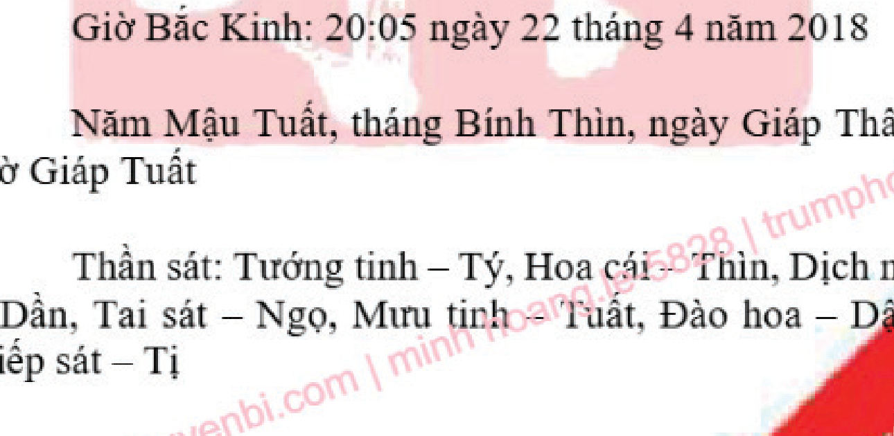

- **Cấu trúc Quẻ Dịch:**
  - **Quẻ chủ:** **Sơn Địa Bác** (Cung Càn, Ngũ thế quái).  
    *Tượng quẻ:* Bác giả lạc dã (Bóc lột, rơi rụng – ví như bóc từng lớp vỏ của bắp ngô, phần hạt còn lại không còn bao nhiêu, biểu thị các cơ hội và sự lựa chọn kết hôn của đương số hiện tại đã thu hẹp đáng kể).
  - **Quẻ biến:** **Hỏa Địa Tấn** (Cung Càn, Du hồn quái).  
    *Tượng quẻ:* Tiến dã (Tiến lên, phát triển, hiển lộ ra ngoài).

- **Bảng chi tiết Lục hào:**

| Hào | Thế/Ứng | Lục thân (Chủ) | Can Chi | Biến động | Lục thân (Biến) | Can Chi (Biến) | Thần sát / Phục | Lục thú |
|:---:|:---:|:---|:---|:---:|:---|:---|:---|:---|
| 6 | | Thê Tài | Dần - Mộc | tĩnh | Quan Quỷ | Tị - Hỏa | Dịch mã, Lộc thần | Huyền Vũ |
| 5 | **Thế** | Tử Tôn | Tý - Thủy | tĩnh | Phụ Mẫu | Mùi - Thổ | Phục Huynh Thân Kim, Tướng tinh | Bạch Hổ |
| 4 | | Phụ Mẫu | Tuất - Thổ | **O (Động)** | Huynh Đệ | Dậu - Kim | Nguyệt phá, Mưu tinh, Thiên hỷ | Đằng Xà |
| 3 | | Thê Tài | Mão - Mộc | tĩnh | Thê Tài | Mão - Mộc | Dương nhẫn, Thiên y | Câu Trần |
| 2 | **Ứng** | Quan Quỷ | Tị - Hỏa | tĩnh | Quan Quỷ | Tị - Hỏa | Kiếp sát, Văn xương | Chu Tước |
| 1 | | Phụ Mẫu | Mùi - Thổ | tĩnh | Phụ Mẫu | Mùi - Thổ | Tuần không, Quý nhân | Thanh Long |

### 3. Dụng thần & Loại quẻ
- **Phân loại quẻ:**
  - **Quẻ vấn duyên phận hôn nhân lâu dài:** Nữ hỏi về việc tiến tới hôn nhân với người yêu cũ.
  - **Quẻ việc cụ thể kết hợp tâm thái:** Vừa xem thực chất mối quan hệ cát hung, vừa phản ánh nỗi âu lo tổn thương tâm lý của người hỏi.
- **Định vị hệ thống Lục thân:**
  - **Dụng thần cốt lõi:** **Quan Quỷ Tị Hỏa** tại hào 2 (lâm hào Ứng) – đại diện cho người bạn trai cũ, luật sư Do Thái.
  - **Hào Thế:** **Tử Tôn Tý Thủy** tại hào 5 – đại diện cho bản thân đương số.
  - **Kỵ thần hôn nhân:** **Tử Tôn Tý Thủy** (lại chính là hào Thế của đương số).
  - **Nguyên thần sinh Quan Quỷ:** Thê Tài Dần Mộc (hào 6) và Thê Tài Mão Mộc (hào 3).
  - **Kỵ thần khắc hào Thế:** **Phụ Mẫu Tuất Thổ** (hào 4 phát động) và Nguyệt kiến Thìn Thổ.

### 4. Luận giải chi tiết

#### 4.1. Thực trạng mối quan hệ: Ý nghĩa của Tử Tôn trì Thế
- Trong phép chiêm hôn nhân của nữ giới, Quan Quỷ là Dụng thần phu quân, Tử Tôn là thần khắc Quan, đóng vai trò Kỵ thần hàng đầu.
- Khi nữ hỏi về hôn nhân mà **Tử Tôn trì Thế**, đó là dấu hiệu phản ánh khách quan hiện trạng: tình cảm bị ngăn trở, xung đột hoặc hai bên hiện tại đang trong tình trạng chia tay.
- Hào Thế Tử Tôn Tý Thủy lâm Bạch Hổ thể hiện bản thân đương số từng phải chịu nhiều ấm ức, tổn thương tâm lý sâu sắc và sự bức bối dồn nén từ cuộc tình này.

#### 4.2. Tình cảm đôi bên và triển vọng hôn nhân bề ngoài
- Hào Ứng mang **Quan Quỷ Tị Hỏa**: Vào tháng Thìn tuy hưu tù, nhưng được Nhật kiến Giáp Thân tương hợp (Tị Thân lục hợp mang khí sinh vượng). Điều này chứng minh người đàn ông này rất yêu thương cô gái, trước sau vẫn một lòng theo đuổi và có mong muốn kết hôn thực sự.
- Trong hào Ứng Quan Quỷ Tị Hỏa có phục tàng Thê Tài Dần Mộc (ở hào 6), cho thấy hình bóng người nữ luôn in sâu trong tâm trí người nam.
- Bản thân cô gái (hào Thế Tý Thủy) đối với Quan Quỷ Tị Hỏa không có sự xung khắc trực tiếp, biểu thị trong thâm tâm cô vẫn còn cảm xúc quyến luyến đối phương.

#### 4.3. Dấu vết tổn thương quá khứ qua trục Nhật Nguyệt
- Khi hai người còn bên nhau trước đây:
  - Hào Thế Tý Thủy bị Nguyệt kiến Thìn Thổ khắc chế, nhưng Thìn Thổ lại bán hợp với Tý Thủy.
  - Thìn Thổ mang Đào hoa đại diện cho sắc tình và cảm xúc; đồng thời Thìn Thổ cùng với Quan Quỷ Tị Hỏa tạo thành thế Thiên La (Thìn Tị vi Thiên La). Điều này chỉ ra rằng khuyết điểm tính cách ích kỷ của đối phương từng tạo thành sự trói buộc, giam hãm nội tâm khiến cô gái bị tổn thương tình cảm. Tuy nhiên vì có bán hợp nên cô gái vẫn có thể chấp nhận và bao dung được phần nào khuyết điểm đó.
  - Nhật kiến Thân Kim sinh trợ hào Thế Tý Thủy. Thân Kim mang Văn Xương và Kiếp sát, đại diện cho đồng nghiệp cùng cơ quan. Trong môi trường làm việc chung, người đàn ông này có năng lực chuyên môn tốt và từng giúp đỡ cô giải quyết nhiều khó khăn vướng mắc.
  - Sự kết hợp giữa Thân Kim (Nhật kiến), Thìn Thổ (Nguyệt kiến) và Tý Thủy (Hào Thế) hội thành tam hợp **Thân - Tý - Thìn Tử Tôn Thủy cục**. Sự vượng khởi của cục diện Tử Tôn kỵ thần này chứng minh một cách tất yếu rằng trước đây họ nhất định phải đi đến kết cục chia tay.

#### 4.4. Động thái then chốt: Động không vi phá và Cặp Tiến thần song trùng đối ứng
- Trong quẻ xuất hiện hào động duy nhất tại hào 4: **Phụ Mẫu Tuất Thổ phát động hóa Huynh Đệ Dậu Kim**.
- **Nguyên lý Động không vi phá:** Phụ Mẫu Tuất Thổ tuy bị Nguyệt kiến Thìn Thổ trực xung thành Nguyệt phá, nhưng theo quy tắc Lục Hào phái Dã Hạc, hào có phát động thì không bị coi là chân phá. Động hào vẫn phát huy đầy đủ công năng sinh khắc và biến ra Huynh Đệ Dậu Kim có lực thực sự.
- **Hiện tượng Tiến thần song trùng đối ứng:**
  - Hào động Phụ Mẫu Tuất Thổ đối ứng với Nguyệt kiến Thìn Thổ: Tuất Thổ là Tiến thần của Thìn Thổ (vòng tứ mộ Thìn -> Tuất theo trục đối xứng).
  - Hào biến Huynh Đệ Dậu Kim đối ứng với Nhật kiến Thân Kim: Dậu Kim là Tiến thần của Thân Kim.
  - Cả hào động và hào biến đều cấu thành quan hệ Tiến thần so sánh đối ứng với Nhật Nguyệt lệnh. Trạng thái cùng nhau tiến tới này là một tín hiệu đặc biệt: Báo hiệu sự việc trong quá khứ sẽ tái diễn lại một lần nữa, nhưng mức độ ảnh hưởng và tổn hại lần này sẽ nhân lên với quy mô mở rộng hơn nhiều.

#### 4.5. Cơ chế Mộ khố của Quan Quỷ khắc Thế khi sống chung
- Phụ Mẫu Tuất Thổ chính là **Mộ khố của Quan Quỷ Tị Hỏa** (Hỏa mộ tại Tuất).
- Trong nhân sự hôn nhân, Mộ khố của Quan Quỷ đại diện cho nơi chốn cư trú, căn nhà riêng của người đàn ông. Một khi hai người tiến tới hôn nhân thì tất yếu sẽ về sống chung dưới một mái nhà.
- Điểm quyết định cát hung của quẻ nằm ở chỗ: Phụ Mẫu Tuất Thổ (mộ khố của Quan Quỷ) phát động trực tiếp hồi đầu sinh Huynh Đệ Dậu Kim và phát xạ lực Thổ khắc chế thẳng vào hào Thế Tử Tôn Tý Thủy.
- Khi sống chung sau kết hôn, nơi ở và bản thân người nam sẽ tạo nên sự khắc chế nặng nề đối với người nữ.
- Đặc biệt, hào Thế mang **Bạch Hổ** (chủ bệnh tật, huyết quang, tai họa, áp lực tinh thần khủng khiếp). Do đó, sự khắc chế này sẽ biến thành bệnh tật, sự tổn thương thân thể, tai ương hoặc thị phi nghiêm trọng đổ dồn lên đầu đương số.

### 5. Kết luận & Ứng kỳ thực tế
- **Lời giải đoán của Chu Thần Bân:**
  - Chu Thần Bân khẳng định người đàn ông này quả thực rất yêu cô và muốn cưới cô, việc hai người tái hợp và kết hôn trên thực tế là hoàn toàn có khả năng xảy ra.
  - Tuy nhiên, thầy nghiêm khắc cảnh báo đương số tuyệt đối không nên quay lại và không nên kết hôn với người này. Quẻ đã chỉ rõ định tính hung họa: Một khi bước vào đời sống hôn nhân và về ở chung một nhà, bản thân cô sẽ phải gánh chịu sự khắc hại to lớn, mang lại bệnh tật, tai ách và sự hủy hoại tinh thần sâu sắc hơn nhiều so với lần tổn thương trước.
- **Phản hồi thực tế (Feedback):**
  - Đương số hoàn toàn thừa nhận sự việc: trước đây hai người đã chia tay vì tính cách người nam ích kỷ, nhưng hiện tại anh ta vẫn theo đuổi tha thiết và bản thân cô cũng dao động.
  - Nhận được lời phân tích thấu đáo về nguy cơ sống chung bị khắc hại, cô gái đã thấu suốt bản chất mối quan hệ và đưa ra quyết định dứt khoát dừng lại, tránh bước vào vết xe đổ hôn nhân bất hạnh.

### 6. Bài học tâm pháp & Quy tắc cốt lõi
- **Quy tắc Nữ vấn hôn nhân – Mộ khố Quan Quỷ khắc Thế (trang 538):**
  Khi nữ giới chiêm đoán về hôn nhân, nếu xuất hiện hào Mộ khố của Quan Quỷ khắc chế hào Thế thì đây là biểu tượng cho thấy sau khi kết hôn và về sống chung một nhà, đối phương (hoặc phong thủy nơi ở chung) sẽ khắc chế, đem lại tổn thương, bệnh tật, tai họa và sự đè nén nặng nề cho người phụ nữ. Nếu hào Thế lại lâm Bạch Hổ thì tai họa huyết quang bệnh tật càng thêm trầm trọng.
- **Quy tắc Động không vi phá (trang 534):**
  Hào động dù bị Nguyệt kiến tương xung lâm Nguyệt phá, nhưng có động thì không bị phá hủy hoàn toàn. Hào động vẫn có khả năng biến ra hào mới mang đầy đủ năng lực định tính cát hung quyết định cục diện quẻ.
- **Quy tắc Cặp Tiến thần song trùng đối ứng (trang 534, 537):**
  Khi hào động và hào biến cùng tạo thành quan hệ Tiến thần đối ứng với Nhật Nguyệt (Tuất tiến Thìn, Dậu tiến Thân), đó là tượng trưng cho việc sự việc trong quá khứ sẽ lặp lại với tốc độ gia tăng và mức độ tổn thất, xung sát mở rộng.
- **Quy tắc Hào Thế lâm Tử Tôn phản ánh hiện trạng chia tay (trang 535):**
  Trong chiêm bói tình cảm hôn nhân, hào Thế lâm Tử Tôn kỵ thần thường không phải là nguyên nhân tương lai mà là tấm gương phản chiếu khách quan tình trạng hai người hiện tại đã chia tay hoặc đang có khoảng cách lớn.

## THỰC CHIẾN 127: HỎI NGƯỜI ĐÀN ÔNG PHÁP NÀY CÓ THÍCH HỢP KẾT HÔN HAY KHÔNG

### 1. Bối cảnh & Câu hỏi
- **Bối cảnh chi tiết:**
  Ngay sau khi hỏi về người luật sư Do Thái ở quẻ 126 khoảng 17 phút, đương số tiếp tục gieo quẻ thứ hai để hỏi về một người bạn học cũ mang quốc tịch Pháp. Người đàn ông này hiện sinh sống và làm việc trong ngành công nghệ thông tin (IT) tại châu Âu, trong khi cô gái đang sinh sống tại châu Mỹ. Về ngoại hình, người này có diện mạo tương đối xấu xí, không có vẻ phong độ hay anh tuấn, nhưng lại rất tài giỏi về chuyên môn và có tình cảm sâu nặng với cô, luôn tha thiết theo đuổi mong muốn cưới cô làm vợ. Bản thân cô gái thường tâm sự với cha mẹ rằng nếu sau này không tìm được ai khác tốt hơn thì sẽ chấp nhận lấy anh ta. Tức là trong thâm tâm, cô luôn coi người đàn ông Pháp này là một "phương án dự bị" (phương án B).
- **Tâm lý & Câu hỏi ẩn ý:**
  Đương số mang tâm lý "đứng núi này trông núi nọ", ba lòng hai ý, không chuyên nhất. Cô không muốn bỏ lỡ một người đàn ông đối xử tốt với mình nhưng cũng không cam tâm chấp nhận một người có ngoại hình không như ý. Câu hỏi bề ngoài là "Có thích hợp kết hôn hay không?", nhưng ẩn ý bên trong là: "Nếu tôi tiếp tục giữ người này làm phương án dự phòng thì anh ta có chờ đợi tôi mãi không, và nếu lấy anh ta thì cuộc sống của tôi sẽ như thế nào?".
- **Thời gian chiêm đoán:**
  - Dương lịch: Ngày 22 tháng 04 năm 2018.
  - Giờ Bắc Kinh: 20:22.
  - Can chi: Năm Mậu Tuất, tháng Bính Thìn, ngày Giáp Thân, giờ Giáp Tuất.

### 2. Dữ kiện & Bảng quẻ Crop
- **Thời không chiêm nghiệm:**
  - Tháng Bính Thìn (Thổ vượng, Thủy mộ, Kim dưỡng, Mộc suy, Hỏa tướng).
  - Ngày Giáp Thân (Kim vượng, Thủy trường sinh, Mộc tuyệt).
  - Tuần không: **Ngọ - Mùi** (Giáp Thân tuần trung, Ngọ Mùi không vong).
- **Thần sát:**
  - Tướng tinh: Tý (Lâm hào 1 Tử Tôn phát động)
  - Hoa cái: Thìn (Lâm hào 3 Phụ Mẫu hào Ứng phát động)
  - Dịch mã: Dần
  - Tai sát: Ngọ (Tuần không, tại hào biến của hào Ứng và hào 4)
  - Mưu tinh: Tuất (Lâm hào Thế)
  - Đào hoa: Dậu
  - Kiếp sát: Tị
  - Lộc thần: Dần
  - Dương nhẫn: Mão
  - Văn xương: Tị
  - Thiên y: Mão
  - Thiên hỷ: Tuất (Lâm hào Thế)
  - Quý nhân: Sửu, Mùi (Hào biến Phụ Mẫu Mùi Thổ lâm Quý nhân, Tuần không)

- Dữ kiện đồ hình bảng quẻ và các thông số chiêm đoán:
  - **Bảng 127.1** Đồ hình quẻ Thực chiến 127:
    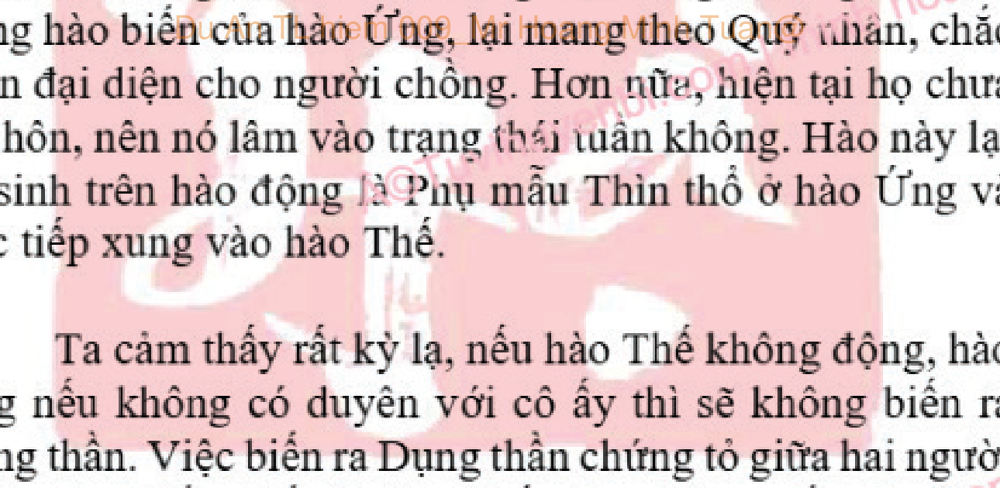

- **Cấu trúc Quẻ Dịch:**
  - **Quẻ chủ:** **Bát Thuần Càn** (Cung Càn, Quẻ Lục Xung thuần dương).  
    *Tượng quẻ:* Thiên biến vạn hóa, va chạm mãnh liệt, sự việc diễn ra dồn dập hoặc hai bên thường xuyên có xung động, bất định.
  - **Quẻ biến:** **Trạch Thủy Khốn** (Cung Đoài, Quẻ Lục Hợp).  
    *Tượng quẻ:* Khốn dã, cùng dã (Bế tắc, vướng mắc, bị ràng buộc, tiến thoái lưỡng nan).

- **Bảng chi tiết Lục hào:**

| Hào | Thế/Ứng | Lục thân (Chủ) | Can Chi | Biến động | Lục thân (Biến) | Can Chi (Biến) | Thần sát / Phục | Lục thú |
|:---:|:---:|:---|:---|:---:|:---|:---|:---|:---|
| 6 | **Thế** | Phụ Mẫu | Tuất - Thổ | **O (Động)** | Phụ Mẫu | Mùi - Thổ | Tuần không (biến), Mưu tinh, Thiên hỷ | Huyền Vũ |
| 5 | | Huynh Đệ | Thân - Kim | tĩnh | Huynh Đệ | Dậu - Kim | Nhật kiến, Đào hoa (biến) | Bạch Hổ |
| 4 | | Quan Quỷ | Ngọ - Hỏa | tĩnh | Tử Tôn | Hợi - Thủy | Tuần không, Tai sát | Đằng Xà |
| 3 | **Ứng** | Phụ Mẫu | Thìn - Thổ | **O (Động)** | Quan Quỷ | Ngọ - Hỏa | Nguyệt kiến, Hoa cái, Tuần không (biến) | Câu Trần |
| 2 | | Thê Tài | Dần - Mộc | tĩnh | Phụ Mẫu | Thìn - Thổ | Dịch mã, Lộc thần | Chu Tước |
| 1 | | Tử Tôn | Tý - Thủy | **O (Động)** | Thê Tài | Dần - Mộc | Tướng tinh | Thanh Long |

### 3. Dụng thần & Loại quẻ
- **Phân loại quẻ:**
  - **Quẻ vấn hôn nhân & duyên phận đối tượng cụ thể:** Nữ hỏi về người đàn ông Pháp có thích hợp để kết hôn hay không.
  - **Quẻ chuyển dịch từ Lục Xung sang Lục Hợp:** Khởi đầu nhiều biến động, trắc trở, xung đột khoảng cách nhưng kết quả biến thành lục hợp gắn bó bền chặt.
- **Định vị Dụng thần:**
  - **Dụng thần đặc biệt:** **Quan Quỷ Ngọ Hỏa ký sinh tại hào biến của hào Ứng** (hào 3 Phụ Mẫu Thìn Thổ động hóa Quan Quỷ Ngọ Hỏa).
  - Không lấy Quan Quỷ Ngọ Hỏa tĩnh ở hào 4 làm Dụng thần, bởi vì Dụng thần xuất hiện ngay từ hào biến của hào Ứng (đối phương), lại mang Quý nhân và tương hợp với hào biến của hào Thế.
  - **Hào Thế:** **Phụ Mẫu Tuất Thổ** tại hào 6 phát động hóa Phụ Mẫu Mùi Thổ – đại diện cho bản thân cô gái và tâm tư biến động khôn lường.
  - **Hào Ứng:** **Phụ Mẫu Thìn Thổ** tại hào 3 phát động hóa Quan Quỷ Ngọ Hỏa – đại diện cho người đàn ông Pháp.
  - **Kỵ thần:** **Tử Tôn Tý Thủy** tại hào 1 phát động hóa Thê Tài Dần Mộc – mang nguy cơ giải thể mối duyên nếu trì hoãn quá lâu.

### 4. Luận giải chi tiết

#### 4.1. Ngoại ứng kỳ diệu: Bé gái gặm đùi vịt và phúc báo cuộc sống
- Ngay trong khoảnh khắc cô gái gieo quẻ tại bàn ăn, có một hiện tượng ngoại ứng phát sinh: Một bé gái sau khi mải chơi đói bụng đã chạy đến chụp lấy một chiếc đùi vịt to và ngồi gặm một cách ngon lành, say sưa.
- Chu Thần Bân lập tức nắm bắt ngoại ứng khách quan này để chỉ ra:
  - Bé gái đại diện cho nữ giới (chính là đương số).
  - Hành động gặm đùi vịt biểu thị sự no đủ, được cung phụng ăn ngon mặc đẹp, được chăm sóc chiều chuộng đến nơi đến chốn.
  - Điều này ứng nghiệm rằng nếu ở bên người đàn ông Pháp này, đương số sẽ được đối phương yêu chiều hết mực, chăm lo chu đáo về đời sống vật chất và tinh thần, cuộc sống sẽ vô cùng thoải mái và vui vẻ.

#### 4.2. Cơ chế Dụng thần ký sinh tại hào biến và Tượng thành sự
- Tại sao biết hai người thực sự có duyên và hôn nhân có thể thành?
  - Hào Ứng Phụ Mẫu Thìn Thổ mang Câu Trần (chủ bộc trực, công khai, không che giấu) phát động biến ra **Quan Quỷ Ngọ Hỏa**. Điều này thể hiện thái độ của người nam: bề ngoài chân thành, luôn bày tỏ rõ ràng ý định muốn cưới cô làm vợ.
  - Nếu hào Ứng không có duyên với cô gái thì tuyệt đối sẽ không động biến ra Dụng thần Quan Quỷ.
  - Hào Thế Phụ Mẫu Tuất Thổ phát động biến ra **Phụ Mẫu Mùi Thổ**.
  - **Động đầu biến cuối – Hai hào biến Lục Hợp:** Hào biến của Thế là Mùi Thổ và hào biến của Ứng là Ngọ Hỏa tạo thành thế **Ngọ - Mùi Lục Hợp**!
  - Cả hai bên đều phát động và hai hào biến sau cùng tương hợp chặt chẽ với nhau. Đây là tượng quẻ tất thành trong thuật chiêm hôn nhân của Lục Hào cổ pháp.

#### 4.3. Tâm lý "Phương án dự bị" bộc lộ qua Hào Thế
- Nguyên nhân khiến hôn sự hiện tại chưa thành không nằm ở người nam mà xuất phát hoàn toàn từ bản thân cô gái:
  - Hào Thế lâm **Huyền Vũ** (chủ toan tính kín đáo, suy nghĩ thầm kín trong lòng).
  - Hào Thế Phụ Mẫu Tuất Thổ động hóa Phụ Mẫu Mùi Thổ: Thổ biến Thổ, tâm lý biến đổi liên tục, không chuyên nhất, ba lòng hai ý, lúc thế này lúc thế khác.
  - Tuất Thổ ở hào Thế xung với Thìn Thổ ở hào Ứng (Thìn - Tuất tương xung), khiến quan hệ giữa hai người luôn trong tình trạng khi xa khi gần, mập mờ bất định.
  - Thực tế phản ánh cô gái luôn coi người đàn ông này là "phương án dự phòng", chỉ khi nào không tìm được người khác hoàn hảo hơn mới tính đến anh ta vì chê anh ta ngoại hình không đẹp.

#### 4.4. Giới hạn ứng kỳ: Nguy cơ mất trắng sau năm Canh Tý (2020)
- Chu Thần Bân nghiêm khắc cảnh báo đương số không thể mãi mãi giữ đối phương làm phương án dự bị.
- Tại sao lại có giới hạn thời gian?
  - Trong quẻ, hào 1 **Tử Tôn Tý Thủy** phát động biến ra Thê Tài Dần Mộc. Tử Tôn Tý Thủy là kỵ thần trực tiếp xung khắc Quan Quỷ Ngọ Hỏa (Tý Ngọ tương xung).
  - Hào 1 Tử Tôn Tý Thủy kết hợp cùng Nhật kiến Thân Kim và hào Ứng Phụ Mẫu Thìn Thổ tạo thành **Tam hợp Thân - Tý - Thìn Thủy cục** (Tử Tôn cục mang Quý nhân).
  - Tử Tôn mang Quý nhân tại tam hợp cục là biểu tượng của việc sinh con đẻ cái và lập gia đình mới.
  - Vì hai người cách trở địa lý (chàng ở châu Âu - Thìn Thổ, nàng ở châu Mỹ - Tuất Thổ), nếu cô gái tiếp tục dùng dằng kéo dài thì người nam sẽ bén duyên tại địa phương, kết hôn với người phụ nữ khác và sinh con.
  - **Ứng kỳ giới hạn:** Tam hợp Thủy cục ứng nghiệm khi gặp năm Tý (2020) hoặc năm Sửu (2021). Hiện tại đang là năm Mậu Tuất (2018), thời gian cho cô gái chỉ còn đúng 2 năm. Sau năm Canh Tý (2020), người đàn ông này sẽ thành gia lập thất với người khác, cô sẽ mất hoàn toàn phương án dự bị này.

#### 4.5. Nguyên tắc nền tảng Lục Hào phái Dã Hạc: Hóa không bất vi chân không
- Một vấn đề học thuật mấu chốt được giải mã: Cả hai hào biến Quan Quỷ Ngọ Hỏa và Phụ Mẫu Mùi Thổ đều lâm **Tuần không** (ngày Giáp Thân tuần không Ngọ Mùi). Liệu hai bên đều hóa không có phải là điềm báo "vô duyên", hôn nhân rỗng tuếch không thành?
- Chu Thần Bân khẳng định nguyên tắc bất di bất dịch của phái Dã Hạc:
  - **Động không vi không, Biến không vi không:** Trong tầng định tính cát hung, hào có phát động biến ra hào lâm Không không bị coi là chân không (rỗng thật).
  - Chân không (tĩnh mà hưu tù lâm không) mới thực sự là vô duyên, thất bại. Còn hào động hóa không chỉ là biểu hiện sự việc tạm thời chưa tới thời điểm điền thực.
  - Khi gặp thời xuất không, điền thực (như gặp tháng ngày Ngọ, Mùi), năng lực tương hợp sẽ lập tức hiển lộ và thúc đẩy sự việc thành công trọn vẹn.

### 5. Kết luận & Ứng kỳ thực tế
- **Lời giải đoán của Chu Thần Bân:**
  - Thầy kết luận người đàn ông Pháp này là một đối tượng rất tốt và rất thích hợp để kết hôn. Ở bên anh ta, cô gái sẽ có cuộc sống sung túc, được chăm sóc chiều chuộng như "mỗi ngày được gặm đùi vịt".
  - Hôn sự này hoàn toàn có thể thành công nhanh chóng nếu cô gái dẹp bỏ tâm lý đứng núi này trông núi nọ.
  - Thầy đưa ra mốc giới hạn ứng kỳ nghiêm ngặt: Phải quyết định trước năm Canh Tý (2020). Nếu qua năm 2020 mà vẫn dùng dằng thì người nam sẽ lấy vợ khác tại châu Âu và cô gái sẽ mất trắng cơ hội.
- **Phản hồi thực tế (Feedback):**
  - Những người có mặt và gia đình đương số vô cùng chấn động trước lời đoán trúng tim đen. Cha mẹ cô xác nhận đúng là cô luôn nói với gia đình rằng anh ta là phương án dự bị vì ngoại hình xấu, nhưng là người có tài và đối xử rất tốt với cô.
  - Bản thân cô gái thừa nhận hoàn toàn tâm lý không chuyên nhất của mình và được định hướng rõ ràng về ngã rẽ cuộc đời.

### 6. Bài học tâm pháp & Quy tắc cốt lõi
- **Nguyên tắc cốt lõi Lục Hào phái Dã Hạc – Hóa không bất vi chân không (trang 546):**
  Trong quy trình định tính cát hung của Lục Hào phái Dã Hạc, hào động hóa không hoặc hào biến lâm không tuyệt đối không bị coi là chân không. Động và biến đều có lực, trạng thái không vong chỉ mang ý nghĩa ứng kỳ chưa tới; khi xuất không điền thực thì cát hung lập tức ứng nghiệm rõ ràng.
- **Quy tắc Dụng thần ký sinh tại hào biến của hào Ứng (trang 540):**
  Khi Dụng thần phu quân không nằm ở hào tĩnh thông thường mà xuất hiện ở hào biến do hào Ứng phát động sinh ra, đây là dấu hiệu đối phương thực tâm muốn gắn kết và chủ động tạo ra cơ duyên kết hôn với đương số.
- **Quy tắc Ngoại ứng đứa trẻ gặm đùi vịt (trang 540, 542):**
  Hiện tượng ngoại ứng phát sinh đồng thời ngay lúc gieo quẻ là thông điệp trực quan sống động của tự nhiên, giúp người luận quẻ nắm bắt được bản chất phúc báo và chất lượng cuộc sống thực tế của đương số trong mối quan hệ.
- **Quy tắc Giới hạn ứng kỳ Tam hợp Tử Tôn Thủy cục (trang 545):**
  Khi kỵ thần Tử Tôn hợp thành tam hợp cục cùng hào Ứng và Nhật lệnh, nó báo hiệu sự việc đối phương sẽ xây dựng tổ ấm và sinh con với người khác tại ứng kỳ của cục diện (năm Tý - Sửu), từ đó vạch ra thời hạn tối hậu cho người hỏi.

## THỰC CHIẾN 128: CÓ THỂ XIN ĐƯỢC VIỆC Ở ĐƠN VỊ A KHÔNG

### 1. Bối cảnh & Câu hỏi
- **Bối cảnh chi tiết:**
  Đương số là một thanh niên sống tại Bắc Kinh, vừa mới tốt nghiệp đại học và đang bước vào giai đoạn tìm kiếm việc làm đầu đời. Trong số các cơ quan và doanh nghiệp tuyển dụng, anh đặc biệt nhắm tới đơn vị A (một cơ quan/doanh nghiệp có yêu cầu tuyển chọn rất cao và danh giá). Để thăm dò triển vọng việc làm tại đây, vào trung tuần tháng 3 năm 2018, anh đã đến nhờ Chu Thần Bân gieo quẻ hỏi xem bản thân có thể được nhận vào làm việc ở đơn vị A hay không.
- **Tâm lý & Câu hỏi ẩn ý:**
  Đương số mang tâm lý một lòng hướng về đơn vị A, xem đây là mục tiêu duy nhất và ưu tiên tuyệt đối. Anh kiên định và cố chấp theo đuổi đơn vị này đến mức sẵn sàng bỏ qua mọi cơ hội nộp hồ sơ vào các đơn vị khác. Câu hỏi bề ngoài là "Có thể xin được việc ở đơn vị A không?", nhưng câu hỏi ẩn ý và bài học sâu xa phản ánh: Liệu sự kiên trì theo đuổi một mục tiêu vượt quá năng lực thực tế có mang lại kết quả tốt đẹp, hay sẽ biến thành sự bảo thủ dẫn tới nguy cơ đánh mất những cơ hội nghề nghiệp phù hợp hơn?
- **Thời gian chiêm đoán:**
  - Dương lịch: Ngày 12 tháng 03 năm 2018.
  - Giờ Bắc Kinh: 16:57.
  - Can chi: Năm Mậu Tuất, tháng Ất Mão, ngày Quý Mão, giờ Canh Thân.

### 2. Dữ kiện & Bảng quẻ Crop
- **Thời không chiêm nghiệm:**
  - Tháng Ất Mão (Mộc vượng, Hỏa tướng, Thủy hưu, Kim tù, Thổ tử – khắc Thổ cực vượng).
  - Ngày Quý Mão (Mộc vượng, đồng lâm Nguyệt kiến, Thổ tuyệt).
  - Tuần không: **Thìn - Tị** (Ngày Quý Mão thuộc tuần Giáp Ngọ, Thìn Tị không vong). Hào 1 Phụ Mẫu Tị Hỏa và hào 5 Phụ Mẫu Tị Hỏa đều lâm Tuần không.
- **Thần sát:**
  - Tướng tinh: Mão (Lâm hào 2 và hào 6 Quan Quỷ Mão Mộc, đồng lâm Nhật Nguyệt)
  - Hoa cái: Mùi (Lâm hào Thế Huynh Đệ Mùi Thổ)
  - Dịch mã: Tị (Lâm hào 1 Ứng và hào 5 Phụ Mẫu Tị Hỏa, lâm Tuần không)
  - Tai sát: Dậu
  - Mưu tinh: Sửu (Lâm hào 3 Huynh Đệ Sửu Thổ)
  - Đào hoa: Tý
  - Kiếp sát: Thân
  - Lộc thần: Tý
  - Dương nhẫn: Hợi (trong văn bản có đề cập thêm góc nhìn sao Dương nhẫn liên hệ đại diện công việc/đơn vị)
  - Văn xương: Mão (Lâm hào 2 và hào 6 Quan Quỷ Mão Mộc)
  - Thiên y: Dần
  - Thiên hỷ: Tuất
  - Quý nhân: Mão, Tị (Mão Quý nhân lâm Quan Quỷ hào 2 & 6; Tị Quý nhân lâm Phụ Mẫu hào 1 & 5)

- Dữ kiện đồ hình bảng quẻ và các thông số chiêm đoán:
  - **Bảng 128.1** Đồ hình quẻ Thực chiến 128:
    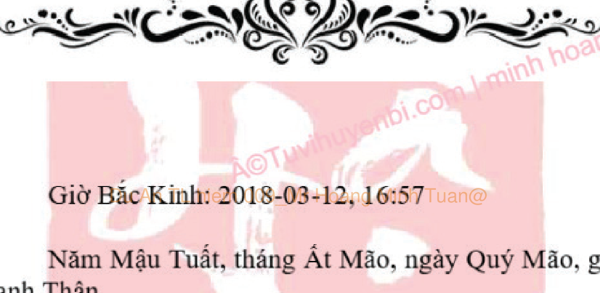

- **Cấu trúc Quẻ Dịch:**
  - **Quẻ chủ:** **Phong Trạch Trung Phu** (Cung Cấn, Du hồn quái).  
    *Tượng quẻ:* Trung phu giả tín dã (Lòng thành tín, kiên định, sự cố chấp một mực theo đuổi đơn vị A, coi đó là ưu tiên duy nhất không chịu thay đổi bất chấp hoàn cảnh bất lợi).
  - **Quẻ biến:** **Phong Trạch Trung Phu** (Quẻ tĩnh – lục hào an tĩnh, không có hào phát động).  
    *Tượng quẻ:* Duy trì nguyên trạng, sự việc hoàn toàn phụ thuộc vào thế lực tương tác của Nhật Nguyệt lệnh lên các hào tĩnh và thể trạng của hào Thế.

- **Bảng chi tiết Lục hào:**

| Hào | Thế/Ứng | Lục thân (Chủ) | Can Chi | Biến động | Lục thân (Biến) | Can Chi (Biến) | Thần sát / Phục | Lục thú |
|:---:|:---:|:---|:---|:---:|:---|:---|:---|:---|
| 6 | | Quan Quỷ | Mão - Mộc | tĩnh | Quan Quỷ | Mão - Mộc | Tướng tinh, Văn Xương, Quý nhân, Nhật Nguyệt | Bạch Hổ |
| 5 | | Phụ Mẫu | Tị - Hỏa | tĩnh | Phụ Mẫu | Tị - Hỏa | Dịch mã, Quý nhân, Tuần không (Phục Tài Tý Thủy) | Đằng Xà |
| 4 | **Thế** | Huynh Đệ | Mùi - Thổ | tĩnh | Huynh Đệ | Mùi - Thổ | Hoa cái | Câu Trần |
| 3 | | Huynh Đệ | Sửu - Thổ | tĩnh | Huynh Đệ | Sửu - Thổ | Mưu tinh (Phục Tử Thân Kim) | Chu Tước |
| 2 | | Quan Quỷ | Mão - Mộc | tĩnh | Quan Quỷ | Mão - Mộc | Tướng tinh, Văn Xương, Quý nhân, Nhật Nguyệt | Thanh Long |
| 1 | **Ứng** | Phụ Mẫu | Tị - Hỏa | tĩnh | Phụ Mẫu | Tị - Hỏa | Tuần không, Dịch mã, Quý nhân | Huyền Vũ |

### 3. Dụng thần & Loại quẻ
- **Phân loại quẻ:**
  - **Quẻ cầu chức, tìm việc làm:** Người mới tốt nghiệp hỏi về khả năng được tuyển dụng vào một cơ quan/đơn vị cụ thể.
  - **Quẻ tĩnh (Lục hào an tĩnh):** Quẻ không có hào động, điểm cốt lõi là phân định trọng điểm thông tin giữa các hào tĩnh và đánh giá trực tiếp sự sinh khắc của Nhật Nguyệt lệnh đối với hào Thế và Dụng thần.
- **Cuộc tranh luận và định vị Dụng thần:**
  - **Vấn đề lưỡng nan Dụng thần trong cầu chức:**
    - Khi chiêm đoán việc làm ở một đơn vị cụ thể, Dụng thần có thể lấy linh hoạt: hoặc lấy **Phụ Mẫu** đại diện cho đơn vị/cơ quan, hoặc lấy **Quan Quỷ** đại diện cho công việc/chức vụ.
    - Hào Ứng là **Phụ Mẫu Tị Hỏa**: đại diện cho đơn vị A. Đồng môn sơ cơ thấy Phụ Mẫu Tị Hỏa được Nhật Nguyệt Mão Mộc tương sinh vượng tướng, lại sinh cho hào Thế Huynh Đệ Mùi Thổ nên vội vàng kết luận việc xin việc sẽ thành công tốt đẹp.
    - Tuy nhiên, trong quẻ này trọng điểm định tính cát hung không nằm ở sự sinh phù của Phụ Mẫu, mà nằm ở vị thế thực tế của **Quan Quỷ Mão Mộc** và thể trạng nguy khốn của **Hào Thế Huynh Đệ Mùi Thổ**.
  - **Hệ thống Lục thân cốt lõi:**
    - **Dụng thần công việc / Kỵ thần sát phạt:** **Quan Quỷ Mão Mộc** tại hào 2 và hào 6 – đồng lâm Nhật kiến và Nguyệt kiến, cực vượng.
    - **Dụng thần cơ quan / Quý nhân nâng đỡ:** **Phụ Mẫu Tị Hỏa** tại hào 1 (hào Ứng) và hào 5 – mang Dịch mã, Quý nhân, lâm Tuần không.
    - **Hào Thế:** **Huynh Đệ Mùi Thổ** tại hào 4 – đại diện cho bản thân người xin việc, lâm Hoa cái, suy kiệt trầm trọng.
    - **Kỵ thần khắc Thế:** Nguyệt kiến Mão Mộc, Nhật kiến Mão Mộc và Quan Quỷ Mão Mộc.

### 4. Luận giải chi tiết

#### 4.1. Ảo tượng "Quý nhân nâng đỡ ngầm" qua Phụ Mẫu Tị Hỏa
- Xét về hào Ứng **Phụ Mẫu Tị Hỏa**:
  - Hào 1 Phụ Mẫu Tị Hỏa lâm hào Ứng (đơn vị A). Sơ hào đại diện cho nội bộ bên trong, mang **Huyền Vũ** (chủ âm thầm, ngấm ngầm, không công khai), lại mang **Quý nhân**.
  - Điều này phản ánh rất chân thực bối cảnh thực tế: Trong nội bộ đơn vị A, quả thực có trưởng bối hoặc người chống lưng quen biết đang ngầm ra sức nâng đỡ, hỗ trợ để đương số có thể bước chân vào đơn vị này.
  - Tháng Mão và ngày Mão (Mộc) đều sinh vượng cho Phụ Mẫu Tị Hỏa. Nhật Nguyệt đại diện cho ban lãnh đạo, tầng lớp quyết sách của cơ quan. Được Nhật Nguyệt sinh nghĩa là cấp lãnh đạo cơ quan cũng chấp thuận chủ trương tuyển dụng.
  - Hào Tị Hỏa dù lâm Tuần không, nhưng được Nhật Nguyệt đồng sinh nên là "vượng tướng phùng không", không bị coi là chân không.
  - Chính vì thấy Phụ Mẫu Tị Hỏa vượng lại sinh cho hào Thế Huynh Đệ Mùi Thổ, đồng môn đã rập khuôn máy móc cho rằng có người chống lưng sinh Thế thì chắc chắn trúng tuyển như nước chảy thành dòng.

#### 4.2. Trọng điểm thông tin quyết định: Nhật Nguyệt đồng thời khắc hào Thế
- Sai lầm chí mạng của người đoán quẻ là chỉ thấy Phụ Mẫu sinh Thế mà bỏ qua trọng điểm thông tin quan trọng bậc nhất trong thuật Lục Hào:
  - **Quy tắc vàng:** Khi một hào – đặc biệt là hào Thế hoặc Dụng thần – bị **cả Nhật kiến và Nguyệt kiến đồng thời tương khắc**, điều đó biểu thị người hoặc sự việc đó hiện tại đang rơi vào tình cảnh cực kỳ tồi tệ, chịu áp lực khủng khiếp và suy bại hoàn toàn.
  - Hào Thế Huynh Đệ Mùi Thổ sinh vào tháng Mão là đất Tử, ngày Mão là đất Tuyệt; lại bị Nguyệt kiến Ất Mão trực khắc, Nhật kiến Quý Mão trực khắc (song Mão khắc Mùi).
  - Hào Thế đã suy tàn, thương tích đầy mình đến cực điểm. Khi hào Thế không còn sinh khí, nó hoàn toàn mất đi khả năng tiếp nhận bất kỳ sự sinh trợ nào từ hào Phụ Mẫu bên ngoài.

#### 4.3. Cơ chế "Tai quái phi điển hình" trong quẻ tĩnh
- Chu Thần Bân giải mã cơ chế hung họa cốt lõi:
  - Nếu định vị Quan Quỷ Mão Mộc làm Dụng thần đại diện cho công việc: Quan Quỷ Mão Mộc đồng lâm với Nhật Nguyệt nên đạt đến đỉnh điểm của sức mạnh.
  - Quan Quỷ khắc hào Thế. Bình thường hỏi việc ngắn hạn nếu hào Thế vượng thì Quan Quỷ khắc Thế vẫn có thể thành sự (nhậm chức chịu áp lực công việc). Nhưng ở đây, hào Thế Huynh Đệ Mùi Thổ lại bị Nhật Nguyệt đồng thời khắc kiệt, trở thành thế **Dụng thần cực vượng khắc hào Thế cực suy**!
  - Trong lý thuyết Lục Hào, hiện tượng Nhật Nguyệt và Dụng thần cùng khắc Thế được gọi là **"Tai quái"** (quẻ tai họa).
  - Quẻ tai quái chính tông thường đòi hỏi Dụng thần phát động khắc Thế. Tuy nhiên trong quẻ tĩnh, hào Quan Quỷ Mão Mộc tĩnh đồng lâm Nhật Nguyệt nên mang sức sát phạt tương đương hào động, trực tiếp trấn áp hào Thế. Đây chính là thể thức **"Tai quái phi điển hình trong quẻ tĩnh"**.
  - Dù có quý nhân nội bộ nâng đỡ ở vòng hồ sơ, nhưng khi bước vào sát hạch thực tế (Quan Quỷ kiểm tra năng lực), hào Thế suy bại không thể vượt qua nổi sự cạnh tranh khốc liệt và tiêu chuẩn khắt khe của đơn vị, tất yếu dẫn đến kết cục bị loại bỏ.

#### 4.4. Tượng quẻ Phong Trạch Trung Phu: Cố chấp mù quáng và "Tiểu tai họa"
- Ý nghĩa thâm sâu của tượng quẻ **Trung Phu**:
  - Trung Phu là biểu tượng của lòng thành tín tuyệt đối, sự kiên trì cố định không lay chuyển.
  - Áp vào tâm lý đương số: Dù đơn vị A có yêu cầu tuyển dụng rất cao, lượng đối thủ cạnh tranh quá đông, bản thân chưa đủ năng lực và ưu thế nổi bật, nhưng anh vẫn một mực coi trọng và dồn toàn bộ hy vọng vào đơn vị này. Thà vì đơn vị A mà chờ đợi, quyết không chọn nộp đơn vào các doanh nghiệp khác – đây chính là hình ảnh điển hình của "Trung Phu".
  - Chu Thần Bân cảnh báo: Sự kiên trì này xét về lâu dài chính là một loại **"tiểu tai họa"**. Bởi vì quá đắm chìm và cố chấp theo đuổi một mục tiêu không thuộc về mình, đương số đã tự tay tước đoạt cơ hội của chính mình, bỏ lỡ rất nhiều cơ hội việc làm khác thực sự phù hợp với năng lực bản thân ngoài xã hội.

### 5. Kết luận & Ứng kỳ thực tế
- **Lời giải đoán của Chu Thần Bân:**
  - Chu Thần Bân kết luận dứt khoát: Đương số không thể xin được việc vào đơn vị A. Dù có người ngầm hỗ trợ ở giai đoạn đầu, nhưng cục diện "tai quái phi điển hình" và thế Nhật Nguyệt song khắc hào Thế sẽ khiến anh bị đánh trượt khi bước vào vòng sát hạch trực tiếp.
  - Thầy khuyến nghị đương số cần nhanh chóng thức tỉnh, từ bỏ sự cố chấp mù quáng với đơn vị A để kịp thời nộp hồ sơ vào các đơn vị khác phù hợp hơn, tránh để sự chậm trễ biến thành "tiểu tai họa" thất nghiệp kéo dài.
- **Phản hồi thực tế (Feedback):**
  - Đương số nộp hồ sơ thi tuyển vào đơn vị A. Giai đoạn đầu quả nhiên nhờ có người quen nội bộ giúp đỡ nên anh thuận lợi vượt qua vòng sơ khảo thứ nhất.
  - Tuy nhiên, khi bước vào **vòng sát hạch/phỏng vấn thứ hai**, trước áp lực cạnh tranh khốc liệt và yêu cầu chuyên môn thực tế, anh đã chính thức **bị đánh loại (không được tuyển dụng)**, hoàn toàn khớp với lời cảnh báo của quẻ tượng.

### 6. Bài học tâm pháp & Quy tắc cốt lõi
- **Quy tắc Tai quái phi điển hình trong quẻ tĩnh (trang 551):**
  Trong quẻ tĩnh, khi Nhật kiến, Nguyệt kiến và Dụng thần Quan Quỷ đồng thời tương khắc hào Thế, khiến hào Thế lâm vào cảnh suy bại cùng cực thì cấu thành thế "tai quái" phi điển hình. Đây là điềm báo đại hung cho các việc mưu cầu thi cử, tuyển dụng, chức vụ; sự việc chắc chắn thất bại do bản thân không kham nổi áp lực và yêu cầu thực tế.
- **Quy tắc Phân định Dụng thần Phụ Mẫu và Quan Quỷ khi cầu chức (trang 549, 550, 553):**
  Khi chiêm đoán việc làm, không được cứng nhắc chỉ nhìn vào hào Phụ Mẫu (đơn vị) vượng sinh Thế mà vội đoán thành công. Tiên quyết phải kiểm tra thể trạng hào Thế: Nếu hào Thế bị Nhật Nguyệt đồng thời khắc phạt (trọng điểm suy bại), thì mọi sự sinh trợ của Phụ Mẫu hay sự giúp đỡ ngầm của quý nhân đều trở nên vô nghĩa, phải lấy mâu thuẫn khắc Thế làm chuẩn định tính cát hung.
- **Ý nghĩa tượng quẻ Phong Trạch Trung Phu – Bỏ lỡ cơ hội do cố chấp (trang 552):**
  Tượng quẻ Trung Phu trong bối cảnh chọn việc phản ánh tâm lý trung thành, cố chấp duy nhất với một mục tiêu bất chấp sự chênh lệch năng lực. Người luận quẻ cần tinh tế chỉ ra "tiểu tai họa" tiềm ẩn: sự kiên trì sai chỗ sẽ dẫn tới việc bỏ lỡ các thời cơ nghề nghiệp quý giá khác.
- **Tầm quan trọng của kinh nghiệm thực chiến và nắm bắt trọng điểm thông tin (trang 550):**
  Lục Hào không phải là sự cộng trừ sách vở đơn giản. Trước hai luồng thông tin đối lập (Phụ Mẫu sinh Thế vs Nhật Nguyệt khắc Thế), chỉ có kinh nghiệm thực chiến dày dạn và tư duy biện chứng mới giúp người chiêm đoán nhận diện chính xác đâu là thông tin trọng điểm chi phối toàn cục, tránh rơi vào cái bẫy định tính sai lầm.

---
