# Cổ Thệ Chân Thuyên – Tập 8: Thực Chiến Biên 3 (Thực chiến 129 - 196)

> 67 ca thực chiến cao cấp kèm hình quẻ

Chi tiết 67 ca thực chiến từ ca 129 đến 196 (trừ ca 173 khuyết số trong sách gốc) luận đoán tài chính và vận hạn.

---

## THỰC CHIẾN 129: CÓ THỂ NHẬN ĐƯỢC CÔNG VIỆC TẠI ĐƠN VỊ B HAY KHÔNG?

---

### 1. Bối cảnh & Câu hỏi

- **Bối cảnh chi tiết:**
  Đương số là một người cầu chức, trước đó đã chiêm đoán về việc ứng tuyển vào đơn vị A (vào ngày 12 tháng 3 năm 2018). Vì quá tha thiết mong muốn vào đơn vị A, đương số đã tiêu tốn hơn nửa tháng để chờ đợi và hy vọng, nửa tháng còn lại loay hoay tìm kiếm các cơ hội khác nhưng đều bỏ lỡ. Thời gian trôi qua hơn một tháng, đến ngày 18 tháng 4 năm 2018, nhận thấy cơ hội tại đơn vị A đã vuột mất, đương số quyết định chuyển hướng, khóa mục tiêu mới vào việc ứng tuyển công việc tại đơn vị B và gieo quẻ dự trắc.
- **Tâm lý & Câu hỏi ẩn ý:**
  Đương số đang ở trong tâm trạng sốt ruột và tiếc nuối vì đã lỡ mất nhiều cơ hội tốt trong tháng trước. Câu hỏi trực tiếp là: *"Có thể nhận được công việc tại đơn vị B hay không?"*, nhưng ẩn sâu trong nội tâm là nỗi băn khoăn: liệu đơn vị B có thực sự là bến đỗ thích hợp, hay bản thân vẫn tiếc nuối cơ hội ở đơn vị A và coi đơn vị B chỉ là phương án thay thế tạm thời.
- **Thời gian chiêm đoán:**
  - Dương lịch: Ngày 18 tháng 04 năm 2018, lúc 15 giờ 44 phút (Giờ Bắc Kinh).
  - Can chi: Năm Mậu Tuất, tháng Bính Thìn, ngày Canh Thìn, giờ Giáp Thân.

---

### 2. Dữ kiện & Bảng quẻ Crop

- **Thời không chiêm nghiệm:**
  - Tháng Bính Thìn (Thổ vượng, Mộc suy, Thủy nhập mộ).
  - Ngày Canh Thìn (Thổ vượng, Thân Dậu Tuần không).
  - Tuần không: **Thân, Dậu** (Giáp Tuất tuần trung, Thân Dậu không vong).
- **Thần sát:**
  - Tướng tinh: Tý
  - Hoa cái: Thìn (Lâm Nguyệt kiến, Nhật thần)
  - Dịch mã: Dần (Lâm hào 6 Quan Quỷ)
  - Tai sát: Ngọ
  - Mưu tinh: Tuất (Lâm hào 4 Huynh Đệ, bị Nguyệt phá)
  - Đào hoa: Dậu (Lâm Tuần không, Dương nhẫn)
  - Kiếp sát: Tị (Lâm sơ hào Phụ Mẫu)
  - Lộc thần: Thân (Lâm Tuần không)
  - Dương nhẫn: Dậu
  - Văn Xương: Hợi (Lâm hào biến Thê Tài)
  - Thiên y: Mão (Lâm hào 2 Quan Quỷ)
  - Thiên hỉ: Tuất
  - Quý nhân: Dần, Ngọ
- Bảng quẻ tượng và đồ hình chiêm đoán:
  - **Hình 129:** Đồ hình quẻ Thực chiến 129
    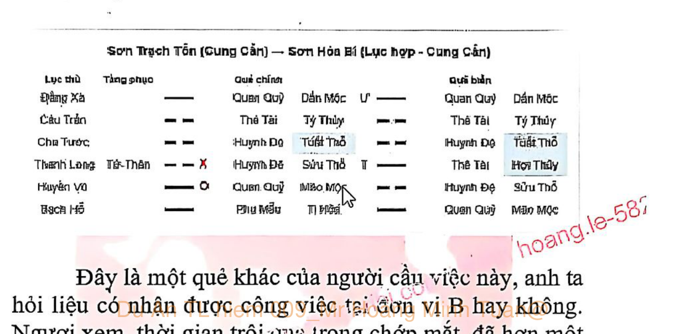
- **Cấu trúc Quẻ Dịch:**
  - **Quẻ chủ:** **Sơn Trạch Tổn** (Cung Cấn)  
    *Tượng quẻ:* Tổn hạ ích thượng, tổn kỷ ích nhân; phản ánh hiện trạng tổn thất cơ hội, bản thân đã bỏ lỡ vị trí tốt nhất.
  - **Quẻ biến:** **Sơn Hỏa Bí** (Cung Cấn – Quẻ Lục Hợp)  
    *Tượng quẻ:* Quang minh thông đạt, văn sức lễ nghi; quẻ biến Lục Hợp chủ về sự trì hoãn, giao tế mang tính hình thức, không đi đến gắn kết thực chất dài lâu.
- **Bảng chi tiết Lục hào:**

| Hào | Thế/Ứng | Lục thân (Chủ) | Can Chi | Biến động | Lục thân (Biến) | Can Chi (Biến) | Thần sát / Phục thần | Lục thú |
|:---:|:---:|:---|:---|:---:|:---|:---|:---|:---|
| 6 | **Ứng** | Quan Quỷ | Dần - Mộc | tĩnh | Quan Quỷ | Dần - Mộc | Dịch mã, Quý nhân | Đằng Xà |
| 5 | | Thê Tài | Tý - Thủy | tĩnh | Thê Tài | Tý - Thủy | Tướng tinh | Câu Trần |
| 4 | | Huynh Đệ | Tuất - Thổ | tĩnh | Huynh Đệ | Tuất - Thổ | Mưu tinh, Thiên hỉ, Nguyệt phá | Chu Tước |
| 3 | **Thế** | Huynh Đệ | Sửu - Thổ | **X (Động)** | Thê Tài | Hợi - Thủy | [Phục: Tử Tôn Thân Kim] Văn Xương, Dịch mã | Thanh Long |
| 2 | | Quan Quỷ | Mão - Mộc | **O (Động)** | Huynh Đệ | Sửu - Thổ | Thiên y, Mưu tinh, Đào hoa xung | Huyền Vũ |
| 1 | | Phụ Mẫu | Tị - Hỏa | tĩnh | Phụ Mẫu | Tị - Hỏa | Kiếp sát | Bạch Hổ |

---

### 3. Dụng thần & Loại quẻ

- **Phân loại quẻ:**
  - Quẻ cầu chức, vấn sự nghiệp công việc tại đơn vị cụ thể (Quẻ sự việc).
  - Quẻ có cấu trúc song Quan Quỷ phản ánh sự chuyển đổi mục tiêu và tâm lý so sánh giữa hai đơn vị tuyển dụng.
- **Định vị Dụng thần cốt lõi:**
  - Hỏi về chức nghiệp và đơn vị tuyển dụng, lấy hào **Quan Quỷ** làm Dụng thần chính. Trong quẻ xuất hiện hai hào Quan Quỷ:
    1. **Quan Quỷ Dần Mộc (hào 6, hào Ứng):** Ở vị trí cao tột cùng, lâm Quý nhân và Dịch mã, đại diện cho đơn vị A – mục tiêu lý tưởng ban đầu mà đương số từng khao khát nhưng đã để lỡ.
    2. **Quan Quỷ Mão Mộc (hào 2 phát động):** Mang theo Mưu tinh, Huyền Vũ, Đào hoa và Dương nhẫn bị xung, đại diện cho đơn vị B – đơn vị phát sinh từ tính toán mưu lược sau này. Do đó, Dụng thần của câu hỏi về đơn vị B chính là **Quan Quỷ Mão Mộc** ở hào 2.
- **Kỵ thần, Nguyên thần, Cừu thần:**
  - Nguyên thần của Dụng thần: Thê Tài Tý Thủy (hào 5) và Thê Tài Hợi Thủy (hào biến của Thế).
  - Kỵ thần: Tử Tôn Thân Kim (phục tàng dưới hào Thế Sửu Thổ, lâm Tuần không).

---

### 4. Luận giải chi tiết

#### 1. Phân biệt hai hào Quan Quỷ: Đơn vị chỉ định vs Đơn vị phát sinh mang Mưu tinh
- **Vị thế hào Ứng:** Bình thường hào Ứng lâm Quan Quỷ Dần Mộc chính là đơn vị chỉ định. Nhưng ở đây Quan Quỷ Mão Mộc ở hào 2 lại phát động minh động.
- **Đặc trưng Mưu tinh và Huyền Vũ:** Quan Quỷ Mão Mộc lâm Mưu tinh, chứng minh đây không phải mục tiêu được định hình từ đầu mà là đơn vị phát sinh thông qua mưu tính tìm kiếm thay thế. Hào 2 ở vị trí thấp, lại mang Huyền Vũ chủ sự nhỏ bé, biểu thị đơn vị B có quy mô không lớn, điều kiện làm việc ở mức trung bình.
- **Xung Đào hoa và xung Dương nhẫn:** Mão Mộc bị Tuần không xung (Thân Dậu tuần trung), mang tính chất danh tiếng phổ thông và yêu cầu nghiệp vụ chuyên môn ở mức bình thường.

#### 2. Cơ chế "Dụng thần khắc Thế" trong sự việc ngắn hạn
- **Quy tắc khắc Thế:** Khi chiêm đoán sự việc ngắn hạn, Dụng thần phát động khắc hào Thế biểu thị sự việc đến nhanh chóng ("khắc Thế giả khoái", trong ngắn hạn có duyên thành tựu).
- **Điều kiện hào Thế chịu khắc:** Hào Thế Huynh Đệ Sửu Thổ lâm tháng Thìn ngày Thìn được tỷ hòa phù trợ cực vượng. Nhờ hào Thế vượng tướng sung mãn nên đủ sức đảm đương sự khắc chế của Dụng thần Quan Quỷ Mão Mộc. Do đó, về mặt tuyển dụng trước mắt, đơn vị B chắc chắn sẽ nhận đương số.

#### 3. Hào Thế phát động và tâm hướng thực tế của đương số
- **Thế động biến Thê Tài Hợi Thủy:** Hào Thế Sửu Thổ phát động hóa ra Thê Tài Hợi Thủy. Hợi Thủy lâm Văn Xương và Dịch mã, đồng thời tạo thành mối quan hệ lục hợp với Quan Quỷ Dần Mộc (Dần Hợi hợp).
- **Bản chất tâm lý:** Dù đơn vị B tuyển dụng, tâm ý của đương số vẫn hướng về đơn vị A (Quan Quỷ Dần Mộc ở hào 6). Đơn vị B chỉ được coi như bệ phóng tạm thời.
- **Quẻ biến Lục Hợp (Sơn Hỏa Bí):** Quẻ biến Lục Hợp chủ về sự trì hoãn, khách khí, từ chối khéo léo. Điều này cho thấy sau khi trúng tuyển, đương số có thể sẽ chần chừ không đi báo danh, hoặc làm một thời gian ngắn rồi nhảy việc sang nơi tốt hơn.

---

### 5. Kết luận & Ứng kỳ thực tế

- **Lời giải đoán & Khuyến nghị của Chu Thần Bân:**
  - Đương số chắc chắn sẽ được đơn vị B tuyển dụng trong ngắn hạn vì Dụng thần động khắc hào Thế vượng tướng.
  - Tuy nhiên, đương số sẽ không làm việc lâu dài tại đây vì ánh mắt luôn hướng lên cao (hướng về hào 6 Quan Quỷ Dần Mộc). Đơn vị B chỉ thích hợp làm bệ phóng trung chuyển.
- **Ứng kỳ chiêm nghiệm:**
  - Kết quả trúng tuyển ứng nghiệm vào khoảng từ ngày Tuất (Mão Tuất tương hợp hào động) đến ngày Sửu (hào Thế Sửu Thổ trị nhật).
- **Phản hồi thực tế (Feedback):**
  - Đương số xác nhận dự đoán hoàn toàn chuẩn xác: thực tế đơn vị B đã đồng ý tuyển dụng, nhưng đương số phân vân không biết có nên đến làm tạm hay không, và sau đó đã gieo tiếp một quẻ nữa để xin chỉ dẫn.

---

### 6. Bài học tâm pháp & Quy tắc cốt lõi

- **Quy tắc cốt lõi (Core Rules):**
  - *Quy tắc phân biệt hai hào Quan Quỷ chỉ định đơn vị và đơn vị phát sinh mang Mưu tinh trong cầu chức ngắn hạn* (trích Cổ Thệ Chân Thuyên, trang 12-14): Khi quẻ xuất hiện cả Quan Quỷ ở hào Ứng và Quan Quỷ phát động mang Mưu tinh, hào mang Mưu tinh đại diện cho cơ hội mới phát sinh ngoài kế hoạch ban đầu.
  - *Quy tắc Dụng thần khắc Thế trong chiêm việc ngắn hạn:* Dụng thần động khắc Thế là điềm báo việc thành mau lẹ, với điều kiện tiên quyết là hào Thế phải vượng tướng để gánh chịu được lực khắc.
- **Bài học tâm pháp:**
  - Sự biến dịch của hào Thế (Thế động hóa Hợi Thủy hợp Dần Mộc) tiết lộ nguyện vọng sâu kín và hành vi thực tế của đương số: dù việc trước mắt thành công nhưng lòng người vẫn hướng về mục tiêu cao hơn.

## THỰC CHIẾN 130: TRƯỚC TIÊN ĐẾN LÀM VIỆC Ở ĐƠN VỊ B CÓ TỐT KHÔNG?

---

### 1. Bối cảnh & Câu hỏi

- **Bối cảnh chi tiết:**
  Sau khi nhận được thông báo trúng tuyển từ đơn vị B (đúng như dự trắc ở Thực chiến 129), đương số rơi vào trạng thái băn khoăn lưỡng lự. Một mặt, đương số không đánh giá cao đơn vị B và lo sợ nếu nhận lời đi làm thì sau này sẽ bỏ lỡ cơ hội ứng tuyển vào các đơn vị tốt hơn. Mặt khác, nếu từ chối đơn vị B thì hiện tại lại chưa có đơn vị nào khác mời tuyển dụng. Ngày 27 tháng 4 năm 2018, đương số gieo quẻ để xin định hướng: *"Trước tiên đến làm việc ở đơn vị B có tốt không?"*.
- **Tâm lý & Câu hỏi ẩn ý:**
  Tâm lý do dự điển hình của người tìm việc: muốn dùng đơn vị B làm bước đệm tạm thời nhưng sợ bị ràng buộc, vừa muốn có chỗ làm ngay vừa muốn đợi cơ hội lý tưởng. Quẻ hỏi về tính chất lợi hại và chiến lược hành động thích hợp nhất trước mắt.
- **Thời gian chiêm đoán:**
  - Dương lịch: Ngày 27 tháng 04 năm 2018, lúc 21 giờ 09 phút (Giờ Bắc Kinh).
  - Can chi: Năm Mậu Tuất, tháng Bính Thìn, ngày Kỷ Sửu, giờ Ất Hợi.

---

### 2. Dữ kiện & Bảng quẻ Crop

- **Thời không chiêm nghiệm:**
  - Tháng Bính Thìn (Thổ vượng, Mộc suy, Thủy nhập mộ).
  - Ngày Kỷ Sửu (Thổ vượng, Kim đắc dưỡng, Ngọ Mùi Tuần không).
  - Tuần không: **Ngọ, Mùi** (Giáp Thân tuần trung, Ngọ Mùi không vong).
- **Thần sát:**
  - Tướng tinh: Dậu (Lâm hào Thế Huynh Đệ)
  - Hoa cái: Sửu (Lâm Nhật thần, hào biến Phụ Mẫu)
  - Dịch mã: Hợi
  - Tai sát: Mão (Lâm hào 3 Thê Tài)
  - Mưu tinh: Mùi (Lâm hào Ứng Phụ Mẫu, hào 5 Phụ Mẫu)
  - Đào hoa: Ngọ (Lâm Tuần không, Lộc thần)
  - Kiếp sát: Dần
  - Lộc thần: Ngọ
  - Dương nhẫn: Tị (Lâm hào 2 và hào 6 Quan Quỷ)
  - Văn Xương: Dậu (Lâm hào Thế)
  - Thiên y: Mão
  - Thiên hỉ: Tuất
  - Quý nhân: Thân, Tý
- Bảng quẻ tượng và đồ hình chiêm đoán:
  - **Hình 130:** Đồ hình quẻ Thực chiến 130
    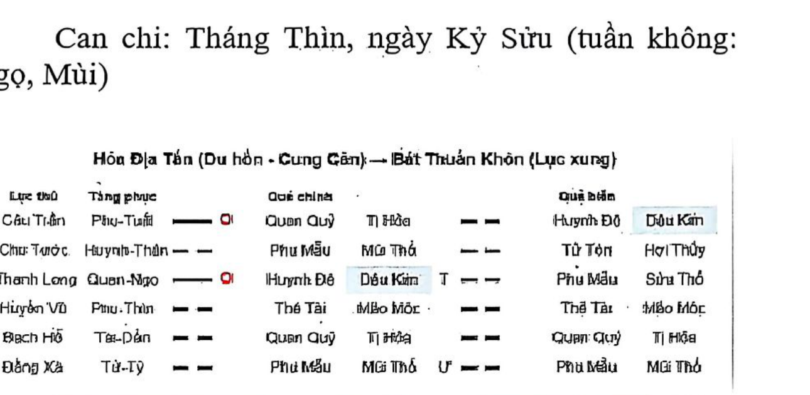
- **Cấu trúc Quẻ Dịch:**
  - **Quẻ chủ:** **Hỏa Địa Tấn** (Du hồn – Cung Cấn)  
    *Tượng quẻ:* Nhật xuất cao sơn, tiến bộ thăng tiến; phản ánh tiến trình tìm kiếm việc làm đã có bước tiến triển cụ thể (đã có đơn vị tiếp nhận).
  - **Quẻ biến:** **Bát Thuần Khôn** (Cung Khôn – Quẻ Lục Xung)  
    *Tượng quẻ:* Nhu thuận dưỡng dục; quẻ biến Lục Xung mang ý nghĩa kết thúc, giải tán, sự việc mau chóng phân rã.
- **Bảng chi tiết Lục hào:**

| Hào | Thế/Ứng | Lục thân (Chủ) | Can Chi | Biến động | Lục thân (Biến) | Can Chi (Biến) | Thần sát / Phục thần | Lục thú |
|:---:|:---:|:---|:---|:---:|:---|:---|:---|:---|
| 6 | | Quan Quỷ | Tị - Hỏa | **O (Động)** | Huynh Đệ | Dậu - Kim | Dương nhẫn [Phục: Phụ Mẫu Tuất Thổ] | Câu Trần |
| 5 | | Phụ Mẫu | Mùi - Thổ | tĩnh | Tử Tôn | Hợi - Thủy | Tuần không, Mưu tinh [Phục: Huynh Đệ Thân Kim] | Chu Tước |
| 4 | **Thế** | Huynh Đệ | Dậu - Kim | **O (Động)** | Phụ Mẫu | Sửu - Thổ | Tướng tinh, Văn Xương [Phục: Quan Quỷ Ngọ Hỏa] | Thanh Long |
| 3 | | Thê Tài | Mão - Mộc | tĩnh | Thê Tài | Mão - Mộc | Tai sát, Thiên y [Phục: Phụ Mẫu Thìn Thổ] | Huyền Vũ |
| 2 | | Quan Quỷ | Tị - Hỏa | tĩnh | Quan Quỷ | Tị - Hỏa | Dương nhẫn [Phục: Tử Tôn Dần Mộc] | Bạch Hổ |
| 1 | **Ứng** | Phụ Mẫu | Mùi - Thổ | tĩnh (Ám động) | Phụ Mẫu | Mùi - Thổ | Tuần không, Mưu tinh (Xung khởi) | Đằng Xà |

---

### 3. Dụng thần & Loại quẻ

- **Phân loại quẻ:**
  - Quẻ chiêm đoán lợi hại và định hướng hành vi (Quẻ chỉ đạo).
  - Cấu trúc quẻ chứa đồng thời hai tầng thông tin: lợi ích ngắn hạn trước mắt và xu thế phát triển trung - dài hạn.
- **Định vị Dụng thần cốt lõi:**
  - **Đơn vị hiện tại (Đơn vị B):** Hào Ứng Phụ Mẫu Mùi Thổ ở sơ hào. Hào này lâm Tuần không, bị Nhật thần Kỷ Sửu tương xung trở thành **Ám động** (không phùng xung tắc thực), lại mang Mưu tinh và sinh hào Thế Dậu Kim.
  - **Đơn vị và công việc lý tưởng dài hạn:** Nằm trong cục diện Tam hợp Tị – Dậu – Sửu: hào Phụ Mẫu Sửu Thổ (hào biến của Thế) đại diện cho đơn vị lý tưởng cuối cùng; hào Quan Quỷ Tị Hỏa (hào 6 động mang Dương nhẫn) đại diện cho công việc yêu thích.
- **Kỵ thần, Nguyên thần:**
  - Hào Thế Huynh Đệ Dậu Kim mang Văn Xương là trung tâm kết nối toàn bộ cục diện sự nghiệp.

---

### 4. Luận giải chi tiết

#### 1. Ý nghĩa quẻ biến Lục Xung trong thế cục việc làm tạm bợ
- **Nguyên lý Lục Xung:** Khi quẻ đã xác định tính chất sự việc là tạm thời, không bền vững, quẻ biến Lục Xung báo hiệu sự kết thúc mau lẹ.
- **Hai khả năng diễn tiến:** Hoặc là đương số không đến đơn vị B làm việc; hoặc đến làm nhưng thời gian gắn bó rất ngắn ngủi rồi sẽ rời đi. Quẻ biến Lục Xung khẳng định đơn vị B chỉ là trạm dừng chân ngắn hạn, không phải nơi gắn bó lâu dài.

#### 2. Lợi ích ngắn hạn qua hào Ứng Ám động sinh Thế
- **Ứng hào Phụ Mẫu Mùi Thổ ám động:** Phụ Mẫu đại diện cho danh phận hợp đồng và chế độ đãi ngộ cơ bản. Mùi Thổ ám động sinh phù cho hào Thế Huynh Đệ Dậu Kim.
- **Ý nghĩa chỉ đạo:** Trong ngắn hạn, việc đến đơn vị B đem lại lợi ích thiết thực: có thu nhập, có chức danh và tích lũy kinh nghiệm thực tế. Hào Ứng ám động đóng vai trò ngoại lực trợ giúp, rất thích hợp để làm bàn đạp phát triển.

#### 3. Tam hợp cục Tị – Dậu – Sửu: Điềm báo phát triển trung và dài hạn
- **Cấu trúc Tam hợp:** Hào 6 Quan Quỷ Tị Hỏa động hợp với hào Thế Huynh Đệ Dậu Kim động, biến ra Phụ Mẫu Sửu Thổ lâm Nhật lệnh. Ba hào hội tụ thành Tam hợp Kim cục lấy hào Thế làm trung tâm.
- **Bản chất thời gian của Tam hợp cục:** Tam hợp cục trong chiêm việc ngắn hạn biểu thị sự chậm chạp, trì trệ, không thể ứng nghiệm ngay. Nó thuộc về tầng "tin tức điềm báo khác" – tức là viễn cảnh trung và dài hạn (phải chờ từ nửa năm đến một năm sau).
- **Ý nghĩa sự nghiệp:** Đơn vị lý tưởng (Sửu Thổ) và công việc mong ước (Tị Hỏa) đều hội tụ về hào Thế Dậu Kim mang Văn Xương. Điều này chứng minh đương số nhất định sẽ đạt được công việc lý tưởng bằng chính năng lực thực tế, nhưng cần có thời gian tích lũy. Nếu vội vàng từ chối đơn vị B để ngồi chờ thì trong ngắn hạn sẽ rơi vào cảnh bế tắc.

---

### 5. Kết luận & Ứng kỳ thực tế

- **Lời giải đoán & Khuyến nghị của Chu Thần Bân:**
  - Khuyên đương số **nên đến làm việc tại đơn vị B trước mắt**. Đây là quyết định có lợi trong ngắn hạn, giúp duy trì thu nhập và tạo bàn đạp kinh nghiệm.
  - Sau khi vào làm, hãy kiên nhẫn chờ đợi thời cơ chín muồi của Tam hợp cục (khoảng nửa năm đến một năm sau) để chuyển dịch sang đơn vị lý tưởng.
- **Ứng kỳ chiêm nghiệm:**
  - Ngắn hạn: Vào làm tại đơn vị B ngay trong tháng Thìn hoặc tháng Tị.
  - Trung và dài hạn: Tam hợp cục thành tựu vào năm Sửu hoặc các tháng Tị, Dậu, Sửu tiếp theo khi cục diện hoàn tất.

---

### 6. Bài học tâm pháp & Quy tắc cốt lõi

- **Quy tắc cốt lõi (Core Rules):**
  - *Quy tắc quẻ biến Lục Xung trong định tính bất lợi* (trích Cổ Thệ Chân Thuyên, trang 21-22): Khi tính chất sự việc là tạm bợ, quẻ biến Lục Xung là biểu tượng kết thúc và phân rã sớm.
  - *Quy tắc Tam hợp cục đối với sự việc ngắn hạn:* Tam hợp cục đại diện cho tiến trình chậm chạp trung - dài hạn; trong ngắn hạn không thể nóng vội đòi hỏi kết quả ngay lập tức.
- **Bài học tâm pháp:**
  - Phân tầng thông tin giữa "bước đệm hiện tại" (hào Ứng ám động sinh Thế) và "mục tiêu tương lai" (Tam hợp cục): Biết tận dụng hoàn cảnh trước mắt để nuôi dưỡng mục tiêu lớn phía sau.

## THỰC CHIẾN 131: MẸ BỊ BỆNH CHÂN, UỐNG THUỐC NÀY CÓ HIỆU QUẢ KHÔNG?

---

### 1. Bối cảnh & Câu hỏi

- **Bối cảnh chi tiết:**
  Một đồng môn của Chu Thần Bân có mẹ bị bệnh chân mãn tính kéo dài nhiều năm, đã thăm khám nhiều bệnh viện và danh y nhưng không thuyên giảm, ảnh hưởng nặng nề đến sinh hoạt và khả năng lao động. Gần đây người con tìm được một phương thuốc mới và dự định cho mẹ sử dụng. Trước khi dùng thuốc, người này gieo quẻ hỏi: *"Hiện tại bệnh chân của mẹ uống thuốc này có hiệu quả không?"*.
- **Tâm lý & Câu hỏi ẩn ý:**
  Người con hết lòng hiếu thảo nhưng cũng vô cùng thận trọng, lo ngại thuốc không hợp sẽ làm bệnh tình của mẹ nặng thêm. Câu hỏi dùng chữ "uống thuốc" (chất lỏng) thay vì "ăn thuốc", phản ánh chính xác hình thái y dược được sử dụng.
- **Thời gian chiêm đoán:**
  - Dương lịch: Năm Đinh Dậu, tháng Nhâm Tý, ngày Nhâm Ngọ, giờ Canh Tuất.
  - Can chi: Năm Đinh Dậu, tháng Nhâm Tý, ngày Nhâm Ngọ, giờ Canh Tuất.

---

### 2. Dữ kiện & Bảng quẻ Crop

- **Thời không chiêm nghiệm:**
  - Tháng Nhâm Tý (Thủy vượng, Kim tướng, Mộc hưu, Hỏa suy, Thổ tuyệt).
  - Ngày Nhâm Ngọ (Hỏa vượng, Tý Ngọ tương xung, Thân Dậu Tuần không).
  - Tuần không: **Thân, Dậu** (Giáp Tuất tuần trung, Thân Dậu không vong).
- **Thần sát:**
  - Tướng tinh: Ngọ (Lâm Nhật thần, hào 2 Quan Quỷ)
  - Hoa cái: Tuất
  - Dịch mã: Thân (Lâm Tuần không, hào 3 Huynh Đệ)
  - Tai sát: Tý (Lâm Nguyệt kiến, Dương nhẫn)
  - Mưu tinh: Thìn (Lâm sơ hào Phụ Mẫu)
  - Đào hoa: Mão
  - Kiếp sát: Hợi (Lâm Lộc thần, Thiên y, hào Thế Tử Tôn)
  - Lộc thần: Hợi
  - Dương nhẫn: Tý
  - Văn Xương: Dần
  - Thiên y: Hợi
  - Thiên hỉ: Mùi
  - Quý nhân: Mão, Tị
- Bảng quẻ tượng và đồ hình chiêm đoán:
  - **Hình 131:** Đồ hình quẻ Thực chiến 131
    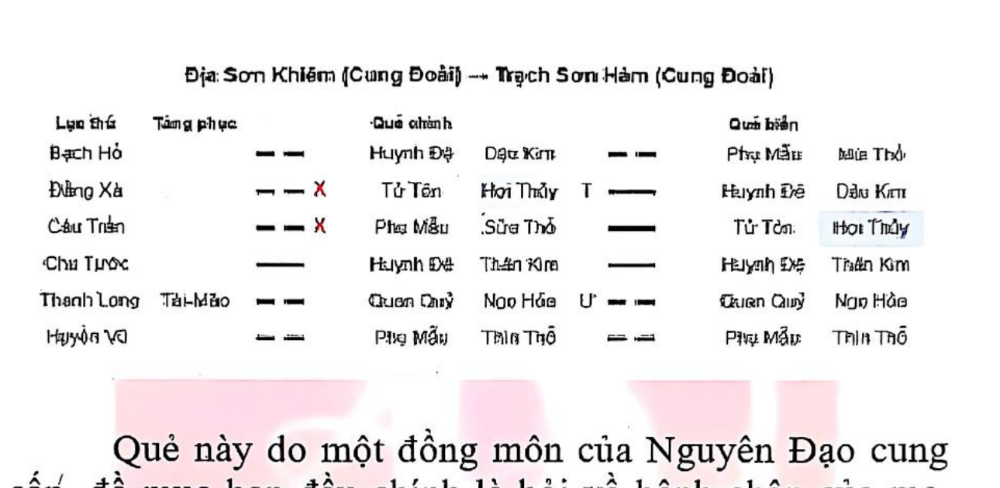
- **Cấu trúc Quẻ Dịch:**
  - **Quẻ chủ:** **Địa Sơn Khiêm** (Cung Đoài)  
    *Tượng quẻ:* Địa trung hữu sơn, khiêm tốn thoái nhượng; biểu thị việc trị liệu mới chỉ ở bước khởi đầu căn bản, bệnh trạng tiềm ẩn nhiều tầng lớp.
  - **Quẻ biến:** **Trạch Sơn Hàm** (Cung Đoài)  
    *Tượng quẻ:* Nam nữ cảm ứng, khuếch tán lan tỏa; biểu thị bệnh lý có xu hướng lan rộng ra nhiều cơ quan khác nhau trên cơ thể.
- **Bảng chi tiết Lục hào:**

| Hào | Thế/Ứng | Lục thân (Chủ) | Can Chi | Biến động | Lục thân (Biến) | Can Chi (Biến) | Thần sát / Phục thần | Lục thú |
|:---:|:---:|:---|:---|:---:|:---|:---|:---|:---|
| 6 | | Huynh Đệ | Dậu - Kim | tĩnh | Phụ Mẫu | Mùi - Thổ | Tuần không | Bạch Hổ |
| 5 | **Thế** | Tử Tôn | Hợi - Thủy | **X (Động)** | Huynh Đệ | Dậu - Kim | Lộc thần, Thiên y, Kiếp sát | Đằng Xà |
| 4 | | Phụ Mẫu | Sửu - Thổ | **X (Động)** | Tử Tôn | Hợi - Thủy | Hóa Dụng thần / Cầu nối | Câu Trần |
| 3 | | Huynh Đệ | Thân - Kim | tĩnh | Huynh Đệ | Thân - Kim | Dịch mã, Tuần không | Chu Tước |
| 2 | **Ứng** | Quan Quỷ | Ngọ - Hỏa | tĩnh | Quan Quỷ | Ngọ - Hỏa | Tướng tinh, Nhật kiến [Phục: Thê Tài Mão Mộc] | Thanh Long |
| 1 | | Phụ Mẫu | Thìn - Thổ | tĩnh | Phụ Mẫu | Thìn - Thổ | Mưu tinh | Huyền Vũ |

---

### 3. Dụng thần & Loại quẻ

- **Phân loại quẻ:**
  - **Đại chiêm (Chiêm đoán thay người khác):** Thuộc dạng **Đại chiêm chủ động có quyền kiểm soát và quyết định** (người con đích thân tìm thuốc, bưng thuốc và có quyền quyết định cho mẹ uống hay dừng lại).
- **Định vị Dụng thần cốt lõi:**
  - **Người mẹ:** Hào **Phụ Mẫu Sửu Thổ** (hào 4 phát động).
  - **Thuốc trị bệnh:** Hào **Tử Tôn Hợi Thủy** (hào Thế phát động).
- **Kỵ thần, Nguyên thần:**
  - Hào Huynh Đệ Dậu Kim (lâm Tuần không) là Nguyên thần sinh cho Tử Tôn Hợi Thủy, đồng thời là hào biến của Thế.

---

### 4. Luận giải chi tiết

#### 1. Lý luận Đại chiêm chủ động có quyền kiểm soát
- **Phân loại Đại chiêm:** Nếu đại chiêm mất quyền can thiệp (như con gái tự chọn chồng), hào Thế không đóng vai trò chi phối. Ngược lại, khi người hỏi có toàn quyền quyết định (bưng thuốc cho mẹ), quẻ xuất hiện cơ chế sinh khắc trực tiếp lên hào Thế để xác định quyết định đó là đúng hay sai.
- **Hào Thế hóa Hồi đầu sinh:** Hào Thế Tử Tôn Hợi Thủy động hóa Huynh Đệ Dậu Kim hồi đầu sinh. Thế được sinh chứng tỏ quyết định chuẩn bị thuốc của người con là hoàn toàn đúng đắn và đem lại kết quả tốt lành.

#### 2. Tượng hào Tử Tôn Hợi Thủy lâm Lộc thần – Thuốc sắc Đông y
- **Ý nghĩa hình tượng:** Hợi thuộc hành Thủy (chất lỏng), lâm Lộc thần (chủ đồ ăn thức uống nạp vào cơ thể), lâm Thiên y (chủ y dược). Đây chính là hình tượng đặc trưng của **thuốc sắc Đông y** dạng nước uống.
- **Hồi đầu sinh:** Tử Tôn là thần giải bệnh, được Huynh Đệ Dậu Kim hồi đầu sinh, khẳng định công hiệu của thang thuốc là có thực.

#### 3. Cơ chế "Đạp kiều" (Bắc cầu) hóa giải tương hỗ hóa kỵ
- **Hiện tượng bề mặt:** Phụ Mẫu Sửu Thổ động hóa Tử Tôn Hợi Thủy thoạt nhìn là "Dụng thần hóa Kỵ thần" (tương hỗ hóa kỵ).
- **Cơ chế bắc cầu thực tế:** Phụ Mẫu Sửu Thổ hóa Tử Tôn Hợi Thủy làm cầu nối liên thông tới hào Thế Tử Tôn Hợi Thủy, rồi từ đó dẫn xuất ra Huynh Đệ Dậu Kim lâm **Tuần không**.
- **Ý nghĩa Tuần không:** Khi hỏi bệnh tật, cơ chế chuyển hóa dẫn tới hào Tuần không biểu thị trong ngắn hạn bệnh chứng sẽ tiêu tan nhanh chóng, người bệnh sớm hồi phục vận động.

#### 4. Cảnh báo bệnh lý qua quẻ Khiêm biến Hàm
- **Khiêm biến Hàm:** Khiêm là bắt đầu căn bản, Hàm là lan tỏa rộng khắp. Bệnh chân thuyên giảm nhanh nhưng cơ thể người mẹ còn nhiều căn bệnh tiềm ẩn ở các cơ quan khác (hiệu ứng thùng gỗ). Thuốc này đáp ứng rất tốt hiệu quả trước mắt nhưng việc điều trị tận gốc vẫn cần một lộ trình lâu dài.

---

### 5. Kết luận & Ứng kỳ thực tế

- **Lời giải đoán & Khuyến nghị của Chu Thần Bân:**
  - Khẳng định thuốc sắc này có hiệu quả rất tốt đối với chứng bệnh chân của mẹ trong ngắn hạn, khuyên nên kiên trì cho mẹ uống.
  - Cảnh báo người nhà không nên chủ quan vì thể trạng người mẹ còn nhiều vấn đề sức khỏe khác cần kết hợp bồi bổ điều trị đồng bộ.
- **Phản hồi thực tế (Feedback):**
  - Người mẹ uống thuốc chỉ sau vài ngày đã có chuyển biến kỳ diệu: chân đỡ đau rõ rệt, có thể tự xuống giường đi lại và làm một số công việc vặt nhẹ nhàng trong nhà.

---

### 6. Bài học tâm pháp & Quy tắc cốt lõi

- **Quy tắc cốt lõi (Core Rules):**
  - *Quy tắc phân loại Đại chiêm khi hỏi bệnh người thân* (trích Cổ Thệ Chân Thuyên, trang 31-32): Phân biệt rõ Đại chiêm chủ động có quyền kiểm soát (xét sinh khắc hào Thế) và Đại chiêm mất quyền kiểm soát (chỉ thuần túy xét Dụng thần).
  - *Ý nghĩa tượng hào Tử Tôn hành Thủy mang Lộc thần* (trích Cổ Thệ Chân Thuyên, trang 29-30): Kết hợp Ngũ hành (Thủy = chất lỏng) và Thần sát (Lộc thần = ăn uống) để định vị chính xác hình thái thuốc sắc Đông y.
- **Bài học tâm pháp:**
  - Cơ chế bắc cầu chuyển dịch hào động giúp nhận diện sâu sắc tiến trình chuyển hóa bệnh lý từ nguy sang an, tránh kết luận vội vã khi thấy Dụng thần động hóa Kỵ thần.

## THỰC CHIẾN 132: NỮ HỎI VỀ VIỆC THÍCH MỘT NGƯỜI ĐÀN ÔNG, NHƯNG NGƯỜI NÀY KHÔNG THÍCH PHỤ NỮ, HỎI LIỆU CÓ THỂ ĐẾN VỚI NHAU KHÔNG

---

### 1. Bối cảnh & Câu hỏi

- **Bối cảnh chi tiết:**
  Một đồng môn tại Vũ Hán cung cấp quẻ chiêm đặc biệt: một cô gái đem lòng yêu thích sâu sắc một người đàn ông và mong muốn theo đuổi anh ta. Tuy nhiên, người đàn ông này lại có xu hướng tính dục đồng giới (không thích phụ nữ). Cô gái ôm hy vọng tình cảm chân thành của mình có thể làm lay chuyển đối phương nên đã gieo quẻ hỏi: *"Liệu cuối cùng có thể đến với nhau và kết hôn được hay không?"*.
- **Tâm lý & Câu hỏi ẩn ý:**
  Tâm lý si tình, mù quáng nhưng đầy bất an của người phụ nữ. Đương số mong mỏi một phép màu thay đổi bản tính của đối phương, nhưng quẻ tượng đã phơi bày chân thực sự bế tắc trong thực tế.
- **Thời gian chiêm đoán:**
  - Dương lịch: Ngày 24 tháng 04 năm 2018, lúc 11 giờ 40 phút (Giờ Bắc Kinh).
  - Can chi: Năm Mậu Tuất, tháng Bính Thìn, ngày Bính Tuất, giờ Giáp Ngọ.

---

### 2. Dữ kiện & Bảng quẻ Crop

- **Thời không chiêm nghiệm:**
  - Tháng Bính Thìn (Thổ vượng, Mộc suy, Thủy tuyệt).
  - Ngày Bính Tuất (Thổ vượng, Thìn Tuất tương xung, Ngọ Mùi Tuần không).
  - Tuần không: **Ngọ, Mùi** (Giáp Thân tuần trung, Ngọ Mùi không vong).
- **Thần sát:**
  - Tướng tinh: Ngọ (Lâm Tuần không, Dương nhẫn, hào Thế Quan Quỷ)
  - Hoa cái: Tuất (Lâm Nhật thần, hào 6 Phụ Mẫu)
  - Dịch mã: Thân (Lâm hào 3 và hào 5 Huynh Đệ)
  - Tai sát: Tý
  - Mưu tinh: Thìn (Lâm Nguyệt kiến, hào sơ Phụ Mẫu)
  - Đào hoa: Mão (Lâm hào biến Thê Tài)
  - Kiếp sát: Hợi
  - Lộc thần: Tị
  - Dương nhẫn: Ngọ
  - Văn Xương: Thân
  - Thiên y: Mão
  - Thiên hỉ: Tuất
  - Quý nhân: Dậu, Hợi
- Bảng quẻ tượng và đồ hình chiêm đoán:
  - **Hình 132:** Đồ hình quẻ Thực chiến 132
    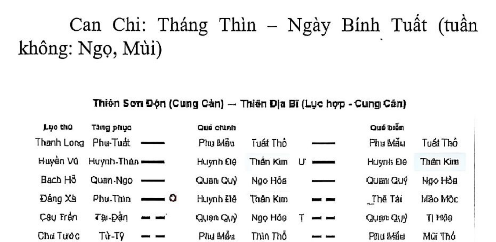
- **Cấu trúc Quẻ Dịch:**
  - **Quẻ chủ:** **Thiên Sơn Độn** (Cung Cấn)  
    *Tượng quẻ:* Độn thoái tị nạn; biểu thị hiện trạng người nam chủ động né tránh, thoái lui trước tình cảm của cô gái.
  - **Quẻ biến:** **Thiên Địa Bĩ** (Cung Cấn – Quẻ Lục Hợp)  
    *Tượng quẻ:* Thiên địa bất giao, bế tắc bất thông; biểu thị hai bên không có sự giao hòa tình cảm thực chất, bế tắc vĩnh viễn.
- **Bảng chi tiết Lục hào:**

| Hào | Thế/Ứng | Lục thân (Chủ) | Can Chi | Biến động | Lục thân (Biến) | Can Chi (Biến) | Thần sát / Phục thần | Lục thú |
|:---:|:---:|:---|:---|:---:|:---|:---|:---|:---|
| 6 | | Phụ Mẫu | Tuất - Thổ | tĩnh | Phụ Mẫu | Tuất - Thổ | Hoa cái, Nhật kiến [Phục: Phụ Mẫu Tuất Thổ] | Thanh Long |
| 5 | **Ứng** | Huynh Đệ | Thân - Kim | tĩnh | Huynh Đệ | Thân - Kim | Dịch mã, Văn Xương [Phục: Huynh Đệ Thân Kim] | Huyền Vũ |
| 4 | | Quan Quỷ | Ngọ - Hỏa | tĩnh | Quan Quỷ | Ngọ - Hỏa | Tướng tinh, Dương nhẫn, Tuần không [Phục: Quan Quỷ Ngọ Hỏa] | Bạch Hổ |
| 3 | | Huynh Đệ | Thân - Kim | **O (Động)** | Thê Tài | Mão - Mộc | Dịch mã, Văn Xương, Đào hoa [Phục: Phụ Mẫu Thìn Thổ] | Đằng Xà |
| 2 | **Thế** | Quan Quỷ | Ngọ - Hỏa | tĩnh | Quan Quỷ | Tị - Hỏa | Tuần không, Tướng tinh, Dương nhẫn [Phục: Thê Tài Dần Mộc] | Câu Trần |
| 1 | | Phụ Mẫu | Thìn - Thổ | tĩnh (Ám động) | Phụ Mẫu | Mùi - Thổ | Mưu tinh, Nguyệt kiến (Xung khởi) [Phục: Tử Tôn Tý Thủy] | Chu Tước |

---

### 3. Dụng thần & Loại quẻ

- **Phân loại quẻ:**
  - Quẻ vấn tình duyên hôn nhân đặc biệt (Quẻ sự việc có rào cản tính dục phức tạp).
- **Định vị Dụng thần cốt lõi:**
  - Nữ hỏi về người nam, lấy **Quan Quỷ** làm Dụng thần. Nhưng trong quẻ, hào Thế lại lâm **Quan Quỷ Ngọ Hỏa** (lâm Tuần không).
  - Hào Ứng **Huynh Đệ Thân Kim** đại diện cho người đàn ông được hỏi (mang Huyền Vũ chủ những bí mật thầm kín về giới tính không muốn công khai).
  - Gian hào **Huynh Đệ Thân Kim (hào 3)** phát động: Yếu tố cản trở then chốt đứng chắn giữa Thế và Ứng.

---

### 4. Luận giải chi tiết

#### 1. Tượng Độn biến Bĩ – Sự né tránh và bế tắc không tương thông
- **Quẻ Độn:** Người nữ theo đuổi, người nam tìm cách lẩn tránh (Độn dã).
- **Quẻ Bĩ:** Quẻ Lục hợp nhưng mang ý nghĩa bế tắc bế tắc, âm dương không giao hòa, trời đất xa cách muôn trùng. Hai người vốn dĩ thuộc về hai thế giới khác nhau, không có kênh kết nối tình cảm tự nhiên.

#### 2. Gian hào Huynh Đệ Thân Kim hóa Đào hoa Tài – Người tình đồng tính ngăn cách
- **Gian hào ngăn cách:** Huynh Đệ Thân Kim ở hào 3 phát động ngăn giữa hào Thế (hào 2) và hào Ứng (hào 5). Huynh Đệ chủ tình bạn bè, khắc phạt Thê Tài (từ chối xem cô gái là đối tượng yêu đương).
- **Biến xuất Thê Tài Mão Mộc mang Đào hoa:** Trong mối quan hệ đồng tính nam, vẫn có sự phân vai nam - nữ. Gian hào Huynh Đệ Thân Kim động hóa Thê Tài Mão Mộc mang Đào hoa chính là người bạn tình đồng giới đóng vai trò phái nữ của người nam này. Mối liên kết này tạo thành rào cản kiên cố khiến cô gái hoàn toàn không có cơ hội chen chân.

#### 3. Thế lâm Quan Quỷ Tuần không – Nguy cơ hôn nhân hình thức có danh vô thực
- **Thế lâm Quan Quỷ không vong:** Đương số khao khát có được người chồng, nhưng Quan Quỷ lâm Tuần không vĩnh viễn không thể lấp đầy về mặt tình cảm chân thực.
- **Cảnh báo hôn nhân bình phong:** Trong xã hội tồn tại những cuộc hôn nhân đồng tính che mắt thiên hạ (hôn nhân hình thức). Nếu người nam có đồng ý kết hôn thì đó chỉ là vỏ bọc danh nghĩa nhằm đối phó gia đình, hoàn toàn không có đời sống vợ chồng thực chất, cuối cùng chỉ mang lại đau khổ cho người phụ nữ.

---

### 5. Kết luận & Ứng kỳ thực tế

- **Lời giải đoán & Khuyến nghị của Chu Thần Bân:**
  - Khẳng định hai người hoàn toàn không có duyên phận tình cảm chân chính.
  - Cảnh báo cô gái không nên tiếp tục theo đuổi trong mù quáng; nếu người này có chấp nhận kết hôn thì đó chỉ là cuộc hôn nhân giả tạo "có danh vô thực", bản thân sẽ phải chịu đựng sự cô độc và bất hạnh cả đời.
- **Ứng kỳ chiêm nghiệm:**
  - Sự bế tắc hiện rõ ngay từ thời điểm chiêm đoán; không có cơ hội phát triển tình cảm trong tương lai.

---

### 6. Bài học tâm pháp & Quy tắc cốt lõi

- **Quy tắc cốt lõi (Core Rules):**
  - *Quy tắc Nữ vấn hôn nhân với người nam đồng tính* (trích Cổ Thệ Chân Thuyên, trang 41-45): Tượng quẻ Độn biến Bĩ và Gian hào Huynh Đệ động hóa Đào hoa Tài phản ánh chân thực rào cản tính dục và sự ngăn cách bởi người tình đồng giới.
  - *Quy tắc Dụng thần lâm Thế ngộ Tuần không trong hôn nhân:* Biểu tượng của mối quan hệ hữu danh vô thực, sống chung nhưng không có sự kết nối tâm hồn và sinh lý.
- **Bài học tâm pháp:**
  - Người luận dịch cần thấu suốt hiện thực đời sống xã hội đa chiều; không máy móc thấy quẻ biến Lục Hợp mà đoán thành đôi, phải nhìn thấu bản chất của quẻ Bĩ và sự cản trở của Gian hào.

## THỰC CHIẾN 133: CHÁU GÁI ĐỘT NHIÊN MẤT TÍCH, HỎI CÔ ẤY ĐANG Ở ĐÂU, CHỒNG CÔ ẤY CÓ ĐÁNG NGHI HAY KHÔNG

---

### 1. Bối cảnh & Câu hỏi

- **Bối cảnh chi tiết:**
  Một người bạn của Chu Thần Bân có cô cháu gái tại Quảng Châu đột ngột mất tích suốt hai ngày không rõ tung tích, điện thoại tắt máy hoàn toàn. Trước đó, cô cháu gái này từng kiên quyết kết hôn với một người đàn ông bất chấp sự phản đối kịch liệt từ toàn bộ dòng họ. Sau khi kết hôn, người chồng bộc lộ tính bạo lực, thường xuyên mắng chửi đánh đập khiến gia đình người vợ vô cùng căm ghét. Khi cháu gái mất tích, người chồng lại tỏ ra bình thản ngồi ở nhà, nói rằng vợ mình quen thói bỏ đi như vậy. Gia đình bên ngoại nghi ngờ người chồng đã âm mưu hãm hại cô gái rồi ngụy tạo vụ mất tích.
- **Tâm lý & Câu hỏi ẩn ý:**
  Người hỏi mang tâm lý nghi ngờ tột độ về một án mạng do người chồng dàn dựng, đồng thời hoang mang tột độ về an nguy tính mạng của cháu gái: *"Cháu gái đột nhiên mất tích hiện ở đâu, có nguy hiểm tính mạng không, người chồng có đáng nghi hay không?"*.
- **Thời gian chiêm đoán:**
  - Dương lịch: Ngày 28 tháng 04 năm 2018, lúc 10 giờ 32 phút (Giờ Bắc Kinh).
  - Can chi: Năm Mậu Tuất, tháng Bính Thìn, ngày Canh Dần, giờ Tân Tị.

---

### 2. Dữ kiện & Bảng quẻ Crop

- **Thời không chiêm nghiệm:**
  - Tháng Bính Thìn (Thổ vượng, Mộc có khí, Thủy suy mộ).
  - Ngày Canh Dần (Mộc vượng, Dần Thân tương xung, Ngọ Mùi Tuần không).
  - Tuần không: **Ngọ, Mùi** (Giáp Thân tuần trung, Ngọ Mùi không vong).
- **Thần sát:**
  - Tướng tinh: Ngọ (Lâm Tuần không, hào Thế Thê Tài)
  - Hoa cái: Tuất (Lâm hào biến Quan Quỷ)
  - Dịch mã: Thân
  - Tai sát: Tý (Lâm hào biến Huynh Đệ)
  - Mưu tinh: Thìn (Lâm Nguyệt kiến, hào 2 Quan Quỷ)
  - Đào hoa: Mão
  - Kiếp sát: Hợi (Lâm hào 5 Huynh Đệ)
  - Lộc thần: Thân
  - Dương nhẫn: Dậu (Lâm hào Ứng Phụ Mẫu)
  - Văn Xương: Hợi
  - Thiên y: Mão
  - Thiên hỉ: Tuất
  - Quý nhân: Dần, Ngọ (Lâm sơ hào Tử Tôn, hào Thế Thê Tài)
- Bảng quẻ tượng và đồ hình chiêm đoán:
  - **Hình 133:** Đồ hình quẻ Thực chiến 133
    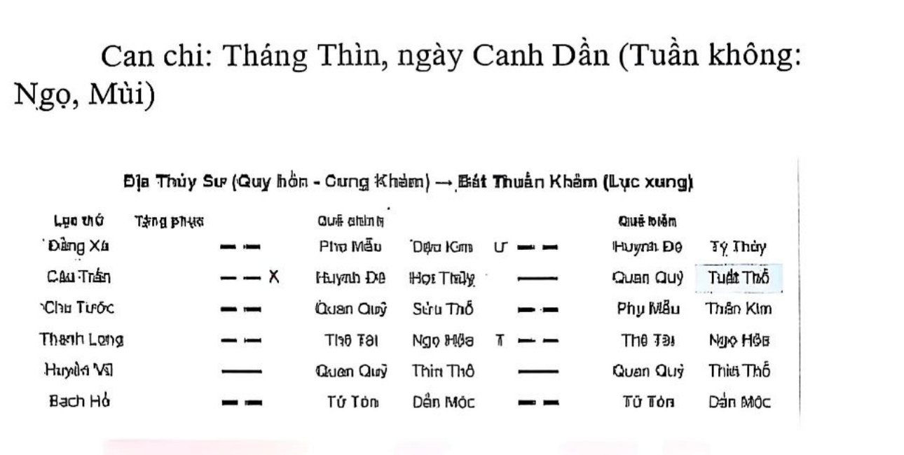
- **Cấu trúc Quẻ Dịch:**
  - **Quẻ chủ:** **Địa Thủy Sư** (Quy hồn – Cung Khảm)  
    *Tượng quẻ:* Hưng sư động chúng, truy cùng diệt tận; phản ánh tâm thế muốn điều tra tường tận gốc rễ sự việc, không bỏ qua bất kỳ nghi vấn nào.
  - **Quẻ biến:** **Bát Thuần Khảm** (Cung Khảm – Quẻ Lục Xung)  
    *Tượng quẻ:* Trùng trùng hiểm trở, gian nan khốn khó; biểu thị nạn nhân đang lâm vào hoàn cảnh nguy hiểm khốn đốn, việc tìm kiếm cần tiến hành khẩn cấp.
- **Bảng chi tiết Lục hào:**

| Hào | Thế/Ứng | Lục thân (Chủ) | Can Chi | Biến động | Lục thân (Biến) | Can Chi (Biến) | Thần sát / Phục thần | Lục thú |
|:---:|:---:|:---|:---|:---:|:---|:---|:---|:---|
| 6 | **Ứng** | Phụ Mẫu | Dậu - Kim | tĩnh | Huynh Đệ | Tý - Thủy | Dương nhẫn | Đằng Xà |
| 5 | | Huynh Đệ | Hợi - Thủy | **X (Động)** | Quan Quỷ | Tuất - Thổ | Kiếp sát, Văn Xương, Quý nhân, Hồi đầu khắc | Câu Trần |
| 4 | | Quan Quỷ | Sửu - Thổ | tĩnh | Phụ Mẫu | Thân - Kim | | Chu Tước |
| 3 | **Thế** | Thê Tài | Ngọ - Hỏa | tĩnh | Thê Tài | Ngọ - Hỏa | Tướng tinh, Tuần không, Quý nhân | Thanh Long |
| 2 | | Quan Quỷ | Thìn - Thổ | tĩnh | Quan Quỷ | Thìn - Thổ | Nguyệt kiến, Mưu tinh | Huyền Vũ |
| 1 | | Tử Tôn | Dần - Mộc | tĩnh | Tử Tôn | Dần - Mộc | Nhật kiến, Quý nhân, Bạch Hổ | Bạch Hổ |

---

### 3. Dụng thần & Loại quẻ

- **Phân loại quẻ:**
  - Quẻ truy tìm người mất tích kết hợp thẩm tra nghi án hình sự.
- **Định vị Dụng thần cốt lõi:**
  - **Cháu gái mất tích:** Hào **Tử Tôn Dần Mộc** ở sơ hào (vị trí con cháu, hậu bối).
  - **Người chồng bị tình nghi:** Hào **Huynh Đệ Hợi Thủy** ở hào 5 (mang Quý nhân, tương hợp với Tử Tôn Dần Mộc, đồng thời khắc hào Thế Thê Tài Ngọ Hỏa – đại diện gia đình bên ngoại).
- **Kỵ thần:** Quan Quỷ Tuất Thổ (hào biến của Huynh Đệ Hợi Thủy, đại diện cho âm mưu tội ác bị nghi ngờ).

---

### 4. Luận giải chi tiết

#### 1. Độc phát hào 5 và sự sụp đổ của "Thuyết âm mưu"
- **Huynh Đệ Hợi Thủy động hóa Hồi đầu khắc:** Quẻ chỉ có duy nhất hào 5 Huynh Đệ Hợi Thủy phát động biến thành Quan Quỷ Tuất Thổ hồi đầu khắc.
- **Cơ chế tự cắt đường lui:** Quan Quỷ Tuất Thổ là hào biến quay lại khắc chính bản vị Huynh Đệ Hợi Thủy. Theo nguyên lý Lục Hào nâng cao: hào biến tự khắc chính mình tức là tự triệt tiêu đường lui. Nếu người chồng thực sự mưu tính hãm hại vợ thì Quỷ hào phải khắc Dụng thần Tử Tôn; ở đây Quỷ hào lại tự khắc bản thân người chồng, chứng minh cái gọi là "âm mưu hãm hại" hoàn toàn do gia đình tự suy diễn gán ghép, không có căn cứ thực tế.
- **Nguyệt phá của hào biến:** Quan Quỷ Tuất Thổ bị Nguyệt kiến Thìn Thổ tương xung thành Nguyệt phá, càng khẳng định âm mưu không hề tồn tại ở hiện tại.

#### 2. Thẩm định sinh mệnh: Tử Tôn Dần Mộc an toàn tính mạng
- **Vượng tướng của Dụng thần:** Tử Tôn Dần Mộc lâm Nhật kiến Canh Dần sinh trợ đắc lệnh, trong tháng Thìn vẫn bảo lưu sinh khí mùa xuân. Do đó Chu Thần Bân khẳng định chắc chắn 100% cháu gái **không nguy hiểm đến tính mạng**.
- **Nguy cơ hiện hữu:** Tử Tôn mang Bạch Hổ và Kiếp sát, lại bị xung Lộc thần Thân Kim. Điều này báo hiệu cô gái đang gặp nạn về thể chất: bị bệnh tật hành hạ, kiệt sức và đối mặt với tình trạng đói khát, thiếu nước uống trầm trọng ở nơi hoang vắng.

#### 3. Định vị phương hướng tìm kiếm nạn nhân
- **Vị trí địa lý:** Tử Tôn Dần Mộc ở sơ hào cho thấy nạn nhân vẫn loanh quanh trong phạm vi địa phương (nội thành hoặc ngoại ô Quảng Châu), chưa đi xa khỏi thành phố.
- **Phương vị Tuất - Hợi:** Động triệu tại hào 5 Câu Trần Hợi Thủy biến Tuất Thổ. Câu Trần là Thổ (đồi núi), Hợi là Thủy (sông suối). Góc kẹp Tuất – Hợi chỉ rõ phương vị **Tây Bắc và Bắc** của địa phương, nơi có địa hình đồi núi tiếp giáp nguồn nước.

---

### 5. Kết luận & Ứng kỳ thực tế

- **Lời giải đoán & Khuyến nghị của Chu Thần Bân:**
  - Khẳng định người chồng hoàn toàn vô can, không hề có âm mưu sát hại vợ.
  - Cháu gái tính mạng an toàn nhưng đang bị đói khát, suy kiệt tại vùng đồi núi phía Tây Bắc hoặc Bắc Quảng Châu. Khuyên gia đình phải lập tức đến đồn công an trình báo để lực lượng chức năng định vị tọa độ vệ tinh điện thoại kịp thời ứng cứu.
- **Ứng kỳ chiêm nghiệm:**
  - Việc tìm kiếm phải tiến hành khẩn trương trong vòng 1-2 ngày trước khi đương số kiệt sức.

---

### 6. Bài học tâm pháp & Quy tắc cốt lõi

- **Quy tắc cốt lõi (Core Rules):**
  - *Quy tắc hào động hóa hồi đầu khắc trong phá giải nghi án* (trích Cổ Thệ Chân Thuyên, trang 51-52): Khi đối tượng bị tình nghi động hóa Quan Quỷ nhưng lại bị chính Quan Quỷ quay đầu khắc phạt (và lâm Nguyệt phá), đó là tượng tự cắt đường lui, chứng minh âm mưu không thành lập.
  - *Quy tắc quẻ Sư quy hồn biến Khảm lục xung:* Phản ánh tâm lý truy cứu nguồn cơn của người hỏi và tình trạng hiểm trở khẩn cấp của người bị nạn.
- **Bài học tâm pháp:**
  - Người đoán dịch phải giữ tâm bình thản khách quan, không bị cuốn theo định kiến yêu ghét của thân nhân để quy kết sai lầm cho người vô tội.

## THỰC CHIẾN 134: TÔI XEM NGƯỜI PHỤ NỮ NÀY CÓ NGUY HIỂM TÍNH MẠNG HAY KHÔNG

---

### 1. Bối cảnh & Câu hỏi

- **Bối cảnh chi tiết:**
  Sau khi giải quẻ Thực chiến 133 cho người dì của cô gái mất tích, Chu Thần Bân quay trở về văn phòng làm việc. Với tinh thần trách nhiệm học thuật cao độ và sự cẩn trọng đối với sinh mệnh con người, ông tự cảm thấy cần phải kiểm chứng lại nhận định của mình. Vì bản thân không quen biết trực tiếp cô gái và vụ việc liên quan đến nghi án hình sự nghiêm trọng (nghi ngờ người chồng mưu hại), nếu phán đoán sai sẽ dẫn đến hậu quả tai hại cho gia đình họ. Do đó, vào lúc 13h06 cùng ngày 28 tháng 4 năm 2018, Chu Thần Bân đã tự mình gieo một quẻ: *"Tôi xem người phụ nữ này có nguy hiểm tính mạng hay không?"*.
- **Tâm lý & Câu hỏi ẩn ý:**
  Tâm lý của Chu Thần Bân là sự lo lắng, trăn trở chân thành của một bậc thức giả trước sinh mệnh của một cô gái trẻ mới ngoài 20 tuổi. Quẻ gieo xuất phát thuần túy từ nỗi bất an trong tâm trí, là một quẻ tâm thái điển hình.
- **Thời gian chiêm đoán:**
  - Dương lịch: Ngày 28 tháng 04 năm 2018, lúc 13 giờ 06 phút (Giờ Bắc Kinh).
  - Can chi: Năm Mậu Tuất, tháng Bính Thìn, ngày Canh Dần, giờ Quý Mùi.

---

### 2. Dữ kiện & Bảng quẻ Crop

- **Thời không chiêm nghiệm:**
  - Tháng Bính Thìn (Thổ vượng, Mộc có khí, Kim suy).
  - Ngày Canh Dần (Mộc vượng, Kim lâm Tuyệt địa, Ngọ Mùi Tuần không).
  - Tuần không: **Ngọ, Mùi** (Giáp Thân tuần trung, Ngọ Mùi không vong).
- **Thần sát:**
  - Tướng tinh: Ngọ
  - Hoa cái: Tuất (Lâm hào biến Huynh Đệ)
  - Dịch mã: Thân
  - Tai sát: Tý (Lâm hào biến Thê Tài)
  - Mưu tinh: Thìn (Lâm Nguyệt kiến, hợp Dậu Kim)
  - Đào hoa: Mão (Lâm hào Thế Quan Quỷ)
  - Kiếp sát: Hợi (Lâm hào 5 Thê Tài)
  - Lộc thần: Thân
  - Dương nhẫn: Dậu (Lâm hào 6 Tử Tôn)
  - Văn Xương: Hợi
  - Thiên y: Mão
  - Thiên hỉ: Tuất
  - Quý nhân: Dần, Ngọ
- Bảng quẻ tượng và đồ hình chiêm đoán:
  - **Hình 134:** Đồ hình quẻ Thực chiến 134
    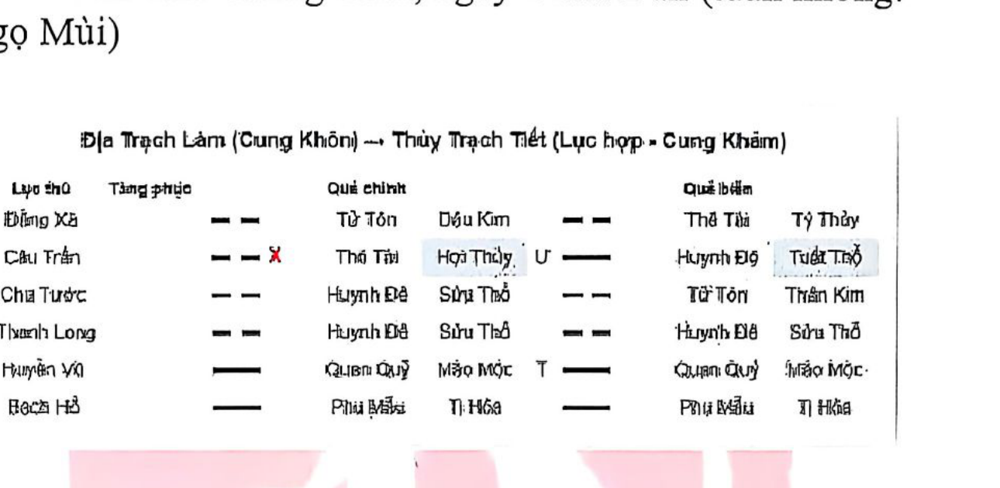
- **Cấu trúc Quẻ Dịch:**
  - **Quẻ chủ:** **Địa Trạch Lâm** (Cung Khôn)  
    *Tượng quẻ:* Trực diện đối diện sự việc, giám sát đốc thúc, phải tìm hiểu đến nơi đến chốn.
  - **Quẻ biến:** **Thủy Trạch Tiết** (Cung Khảm – Quẻ Lục Hợp)  
    *Tượng quẻ:* Tiết chế chờ đợi; quẻ biến Lục Hợp trong quẻ tâm thái biểu thị nỗi lo lắng chưa thể giải tỏa hoàn toàn trong tức khắc, vẫn cần thời gian theo dõi.
- **Bảng chi tiết Lục hào:**

| Hào | Thế/Ứng | Lục thân (Chủ) | Can Chi | Biến động | Lục thân (Biến) | Can Chi (Biến) | Thần sát / Phục thần | Lục thú |
|:---:|:---:|:---|:---|:---:|:---|:---|:---|:---|
| 6 | | Tử Tôn | Dậu - Kim | tĩnh | Thê Tài | Tý - Thủy | Dương nhẫn, Lâm Tuyệt tại Nhật | Đằng Xà |
| 5 | **Ứng** | Thê Tài | Hợi - Thủy | **X (Động)** | Huynh Đệ | Tuất - Thổ | Kiếp sát, Văn Xương, Quý nhân, Hồi đầu khắc | Câu Trần |
| 4 | | Huynh Đệ | Sửu - Thổ | tĩnh | Tử Tôn | Thân - Kim | | Chu Tước |
| 3 | | Huynh Đệ | Sửu - Thổ | tĩnh | Huynh Đệ | Sửu - Thổ | | Thanh Long |
| 2 | **Thế** | Quan Quỷ | Mão - Mộc | tĩnh | Quan Quỷ | Mão - Mộc | Thiên y, Đào hoa | Huyền Vũ |
| 1 | | Phụ Mẫu | Tị - Hỏa | tĩnh | Phụ Mẫu | Tị - Hỏa | | Bạch Hổ |

---

### 3. Dụng thần & Loại quẻ

- **Phân loại quẻ:**
  - **Quẻ tâm thái thuần túy (Tự chiêm giải tỏa lo âu):** Tác giả khởi quẻ xuất phát từ nỗi bất an chủ quan về an nguy tính mạng và nghi vấn âm mưu.
- **Định vị Dụng thần cốt lõi:**
  - **Hào Thế Quan Quỷ Mão Mộc (mang Huyền Vũ):** Đại diện cho nỗi lo lắng, nghi ngờ âm mưu thầm kín trong lòng tác giả.
  - **Nguyên thần của Quan Quỷ Thế (Thê Tài Hợi Thủy ở hào 5 phát động):** Nguồn cơn nuôi dưỡng sự lo âu.
  - **Người phụ nữ mất tích:** Hào **Tử Tôn Dậu Kim** ở hào 6 mang Dương nhẫn, Đằng Xà (đối tượng được quan tâm khảo sát thực tế).

---

### 4. Luận giải chi tiết

#### 1. Cơ chế đứt gãy mạch sinh trong Quẻ tâm thái
- **Nguyên thần động hóa Hồi đầu khắc:** Hào 5 Thê Tài Hợi Thủy phát động với mục tiêu sinh cho hào Thế Quan Quỷ Mão Mộc. Tuy nhiên, Hợi Thủy lại biến xuất Huynh Đệ Tuất Thổ hồi đầu khắc chế bản thân.
- **Tiêu tan mối nghi ngờ:** Khi Nguyên thần của Quan Quỷ phát động nhưng hóa thành vô dụng (bị hồi đầu khắc tuyệt), chuỗi cung cấp năng lượng cho nỗi lo âu bị cắt đứt hoàn toàn. Theo quy tắc quẻ tâm thái: điều khiến tác giả lo lắng (nguy hiểm tính mạng hoặc bị chồng mưu hại) là **hoàn toàn không có thật**.

#### 2. Định vị thực trạng cô gái qua hào 6 Tử Tôn Dậu Kim
- **Vượng suy trước Nhật Nguyệt:** Tử Tôn Dậu Kim được Nguyệt kiến Thìn Thổ tương hợp sinh vượng (sinh mệnh không mất), nhưng lại lâm **Tuyệt địa** tại Nhật kiến Dần, xung Lộc thần Thân Kim.
- **Ý nghĩa tuyệt khí:** Tuyệt lộc thần biểu thị tình trạng cạn kiệt thức ăn và nước uống ("tuyệt lương"). Hào 6 ở vị trí trên đỉnh cao nhất của quẻ, lại mang Đằng Xà và Dương nhẫn, biểu thị cô gái đang hoảng loạn, sợ hãi, chịu đói rét trên đỉnh núi cao hiểm trở.

#### 3. Tượng quẻ biến Lục Hợp (Thủy Trạch Tiết)
- **Ý nghĩa Lục Hợp:** Khác với Lục Xung báo hiệu sự giải tỏa ngay lập tức, quẻ biến Lục Hợp cho thấy sự việc vẫn còn dây dưa, người thân vẫn chưa thể an lòng ngay trong ngày mà phải chờ đợi thêm 2 ngày nữa mới có kết quả cứu viện.

---

### 5. Kết luận & Ứng kỳ thực tế

- **Lời giải đoán của Chu Thần Bân:**
  - Tác giả hoàn toàn trút bỏ gánh nặng tâm lý: chắc chắn cô gái không bị chồng hãm hại và không nguy hiểm đến tính mạng.
  - Nạn nhân đang bị mắc kẹt đói khát trên vùng núi cao hiểm trở, cần sớm được giải cứu.
- **Ứng kỳ chiêm nghiệm & Phản hồi thực tế (Feedback):**
  - Đến **ngày Thìn (30/04/2018, hai ngày sau khi chiêm quẻ)**, đúng lúc Nguyệt kiến lâm trị hợp Dậu Kim và xung khai Tuất Thổ, cô gái đã được tìm thấy tại vùng núi Bạch Vân thuộc phía Tây Bắc ngoại ô Quảng Châu!
  - **Sự thật vụ việc:** Cô gái mắc bệnh phụ khoa tái phát, lại vừa bị thất bại nặng nề trong hợp tác kinh tế làm ăn nên quẫn trí bỏ lên núi định tự vẫn. Sau một đêm đói lả, rét buốt và bị muỗi rừng cắn, cô hối hận không muốn chết nữa nhưng kiệt sức không đi nổi. May mắn sáng hôm đó có một người làm nông lên núi phát hiện, dìu xuống và gọi xe cấp cứu 120 cùng công an đến trợ giúp.

---

### 6. Bài học tâm pháp & Quy tắc cốt lõi

- **Quy tắc cốt lõi (Core Rules):**
  - *Quy tắc chuyển hóa Quẻ tâm thái* (trích Cổ Thệ Chân Thuyên, trang 58): Khi Nguyên thần của Quan Quỷ phát động hóa hồi đầu khắc (hóa vô dụng), mạch sinh cho nỗi lo lắng bị triệt tiêu, khẳng định điều lo sợ không tồn tại trong thực tế.
  - *Quy tắc Lục Hợp và Lục Xung trong quẻ tâm thái:* Quẻ biến Lục Xung chủ sự an tâm giải tỏa nhanh chóng; quẻ biến Lục Hợp chủ sự lo lắng còn tiếp diễn, phải kiên nhẫn chờ đợi ứng kỳ.
- **Bài học tâm pháp:**
  - Phân định rõ ràng giữa quẻ sự việc và quẻ tâm thái dựa trên tâm niệm khởi phát: khi người gieo ôm nỗi lo sợ áp đảo, quẻ sẽ tự động chuyển hóa cấu trúc để giải mã trạng thái tâm thức.

## THỰC CHIẾN 135: VỢ ĐỀ NGHỊ LY HÔN, KHÔNG MUỐN LY HÔN, HỎI XU HƯỚNG HÔN NHÂN RA SAO

---

### 1. Bối cảnh & Câu hỏi

- **Bối cảnh chi tiết:**
  Một người đàn ông tìm đến xin chiêm đoán về tình trạng hôn nhân nguy cấp. Người vợ chủ động đệ đơn yêu cầu ly hôn và kiên quyết không muốn tiếp tục chung sống. Bản thân người chồng hoàn toàn không cam lòng, vô cùng đau khổ và tha thiết muốn níu kéo cuộc hôn nhân này. Người chồng gieo quẻ hỏi: *"Vợ đề nghị ly hôn, tôi không muốn ly hôn, hỏi xu hướng hôn nhân tương lai ra sao?"*.
- **Tâm lý & Câu hỏi ẩn ý:**
  Người chồng mang tâm lý hoảng loạn, sợ hãi trước viễn cảnh đổ vỡ gia đình. Dù ngoài mặt hỏi về xu hướng sự việc, sâu thẳm tâm can là nỗi kinh hoàng trước viễn cảnh bị vợ bỏ, tạo nên một quẻ tâm thái ngầm mãnh liệt.
- **Thời gian chiêm đoán:**
  - Dương lịch: Ngày 04 tháng 12 năm 2017, lúc 13 giờ 53 phút (Giờ Bắc Kinh).
  - Can chi: Năm Đinh Dậu, tháng Tân Hợi, ngày Ất Sửu, giờ Quý Mùi.

---

### 2. Dữ kiện & Bảng quẻ Crop

- **Thời không chiêm nghiệm:**
  - Tháng Tân Hợi (Thủy vượng, Mộc tướng, Hỏa tuyệt, Thổ suy).
  - Ngày Ất Sửu (Thổ vượng, Kim đắc dưỡng, Tuất Hợi Tuần không).
  - Tuần không: **Tuất, Hợi** (Giáp Tý tuần trung, Tuất Hợi không vong).
- **Thần sát:**
  - Tướng tinh: Dậu (Lâm Thái tuế)
  - Hoa cái: Sửu (Lâm Nhật thần, hào 3 Huynh Đệ)
  - Dịch mã: Hợi (Lâm Nguyệt kiến, Tuần không)
  - Tai sát: Mão (Lâm Lộc thần, hào 2 Quan Quỷ)
  - Mưu tinh: Mùi (Lâm Thiên hỉ, giờ Mùi)
  - Đào hoa: Ngọ (Lâm Văn Xương, hào 4 Phụ Mẫu)
  - Kiếp sát: Dần (Lâm Dương nhẫn, hào biến Quan Quỷ)
  - Lộc thần: Mão
  - Dương nhẫn: Dần
  - Văn Xương: Ngọ
  - Thiên y: Tuất (Lâm Tuần không, hào 6 Huynh Đệ)
  - Thiên hỉ: Mùi
  - Quý nhân: Thân (Lâm hào Thế Tử Tôn)
- Bảng quẻ tượng và đồ hình chiêm đoán:
  - **Hình 135:** Đồ hình quẻ Thực chiến 135
    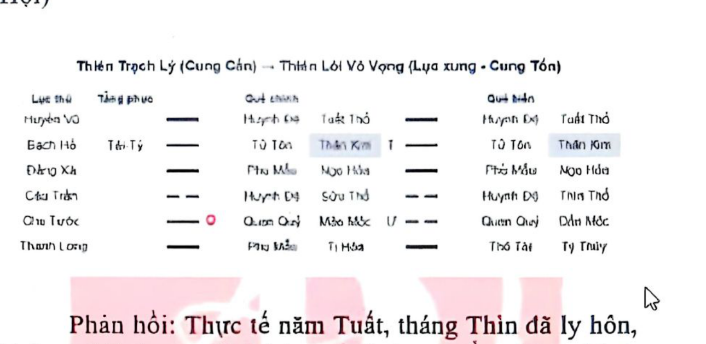
- **Cấu trúc Quẻ Dịch:**
  - **Quẻ chủ:** **Thiên Trạch Lý** (Cung Cấn)  
    *Tượng quẻ:* Lý dã lễ dã, lý do điều ước; phản ánh hôn nhân đang vướng vào các cam kết, thỏa thuận hoặc tranh chấp pháp lý trước tòa.
  - **Quẻ biến:** **Thiên Lôi Vô Vọng** (Cung Tốn – Quẻ Lục Xung)  
    *Tượng quẻ:* Vô vọng bất vọng; quẻ biến Lục Xung trong hôn nhân là biểu tượng của sự tan rã, chia lìa dứt khoát không thể hàn gắn.
- **Bảng chi tiết Lục hào:**

| Hào | Thế/Ứng | Lục thân (Chủ) | Can Chi | Biến động | Lục thân (Biến) | Can Chi (Biến) | Thần sát / Phục thần | Lục thú |
|:---:|:---:|:---|:---|:---:|:---|:---|:---|:---|
| 6 | | Huynh Đệ | Tuất - Thổ | tĩnh | Huynh Đệ | Tuất - Thổ | Tuần không, Thiên y | Huyền Vũ |
| 5 | **Thế** | Tử Tôn | Thân - Kim | tĩnh | Tử Tôn | Thân - Kim | Quý nhân [Phục: Thê Tài Tý Thủy (Đào hoa)] | Bạch Hổ |
| 4 | | Phụ Mẫu | Ngọ - Hỏa | tĩnh | Phụ Mẫu | Ngọ - Hỏa | Văn Xương, Đào hoa | Đằng Xà |
| 3 | | Huynh Đệ | Sửu - Thổ | tĩnh | Huynh Đệ | Thìn - Thổ | Hoa cái, Nhật kiến | Câu Trần |
| 2 | **Ứng** | Quan Quỷ | Mão - Mộc | **O (Động)** | Quan Quỷ | Dần - Mộc | Tai sát, Lộc thần (Hóa thoái) | Chu Tước |
| 1 | | Phụ Mẫu | Tị - Hỏa | tĩnh | Thê Tài | Tý - Thủy | | Thanh Long |

---

### 3. Dụng thần & Loại quẻ

- **Phân loại quẻ:**
  - **Quẻ tâm thái ngầm (Hidden State-of-Mind):** Dù đề mục là việc ly hôn, nhưng tâm nguyện chủ quan của người chồng là tha thiết không muốn ly hôn, biến quẻ thành cấu trúc tâm thái đối kháng giữa mong muốn chủ quan và sự biến động khách quan.
- **Định vị Dụng thần cốt lõi:**
  - Dụng thần quẻ sự việc: **Thê Tài Tý Thủy** phục tàng dưới hào Thế Tử Tôn Thân Kim, không hiện trên bề mặt quẻ (cho thấy người vợ đã dứt tình, không còn hiện diện trong tổ ấm).
  - Cấu trúc Quẻ tâm thái ngầm:
    - **Hào Thế Tử Tôn Thân Kim:** Đại diện cho nguyện vọng chủ quan mong muốn an yên, gìn giữ gia đình của người chồng.
    - **Hào Ứng Quan Quỷ Mão Mộc phát động:** Đại diện cho tai họa nghịch ý – sự việc diễn tiến trái ngược hoàn toàn với tâm nguyện của đương số (tức việc ly hôn trở thành hiện thực).

---

### 4. Luận giải chi tiết

#### 1. Cơ chế nhận diện Quẻ tâm thái ngầm
- **Dụng thần sự việc ẩn tàng:** Khi hỏi việc hôn nhân mà hào Thê Tài lại phục tàng không xuất hiện, trong khi trục Thế - Ứng lại hiển lộ rõ rệt cấu trúc "Thế lâm Tử Tôn, Ứng lâm Quan Quỷ động", quẻ đã tự động chuyển hóa thành quẻ tâm thái ngầm.
- **Quan Quỷ phát động chủ nghịch ý:** Trong quẻ tâm thái, Quan Quỷ động là điềm báo điều lo sợ nhất sẽ xảy ra. Người chồng sợ ly hôn mà Quan Quỷ lại phát động, điều đó báo hiệu kết cục ly hôn là không thể đảo ngược.

#### 2. Quy tắc tối quan trọng: "Không luận tiến thoái trong quẻ tâm thái"
- **Hiện tượng thoái thần:** Quan Quỷ Mão Mộc phát động hóa Quan Quỷ Dần Mộc (Mão biến Dần là hóa thoái thần).
- **Phá vỡ cách hiểu máy móc:** Trong quẻ sự việc thông thường, Quan Quỷ hóa thoái biểu thị tai họa tiêu tan, đối phương nhượng bộ. Nhưng trong quẻ tâm thái, **hoàn toàn không có khái niệm tiến thoái**! Quan Quỷ đã động là tai họa nghịch ý chắc chắn xảy ra, không hề suy suyển.
- **Tác dụng thực tế của hóa thoái:** Hiện tượng hóa thoái không làm thay đổi định tính kết quả mà chỉ có giá trị dùng để xác định **kỳ hạn ứng nghiệm (ứng kỳ)**.

#### 3. Quẻ biến Thiên Lôi Vô Vọng (Lục Xung)
- **Tượng chia lìa:** Quẻ chủ Thiên Trạch Lý biến quẻ Lục Xung Thiên Lôi Vô Vọng. Lục Xung chủ sự phân rã mau chóng ("ly thì ly thôi"), biểu thị duyên phận vợ chồng đã cạn kiệt, mọi nỗ lực níu kéo đều vô ích.

---

### 5. Kết luận & Ứng kỳ thực tế

- **Lời giải đoán của Chu Thần Bân:**
  - Khẳng định cuộc hôn nhân chắc chắn sẽ tan vỡ bằng bản án ly hôn, đương số không thể cứu vãn.
- **Ứng kỳ chiêm nghiệm (Lý luận phân nhánh nhị phân):**
  - Quẻ gieo năm Đinh Dậu, kỳ hạn chính rơi vào **năm Mậu Tuất** (năm Tuất tương hợp Mão Mộc, xung khai Thìn Thổ).
  - Kỳ hạn chi tiết chia thành hai nhánh đối xung (nhị phân âm dương): rơi vào tháng Thìn hoặc tháng Tuất của năm Tuất.
- **Phản hồi thực tế (Feedback):**
  - Đến **tháng Thìn năm Mậu Tuất (2018)**, hai vợ chồng đã chính thức hoàn tất thủ tục ly hôn tại tòa án. Nguyên nhân thực sự không phải do người thứ ba mà do áp lực nợ nần kinh tế và nạn bạo hành gia đình kéo dài.

---

### 6. Bài học tâm pháp & Quy tắc cốt lõi

- **Quy tắc cốt lõi (Core Rules):**
  - *Quy tắc Quẻ tâm thái ngầm trong giải đoán ly hôn* (trích Cổ Thệ Chân Thuyên, trang 68-70): Khi tâm niệm người hỏi sợ hãi nghịch cảnh, quẻ chuyển sang tâm thái ngầm; Quan Quỷ động báo hiệu nghịch cảnh thành hiện thực.
  - *Nguyên tắc "Không luận tiến thoái trong quẻ tâm thái":* Hào Quan Quỷ động dù hóa thoái thần vẫn giữ nguyên hiệu lực tác họa, chỉ dùng tiến thoái để định thời điểm ứng kỳ.
  - *Lý luận phân nhánh nhị phân đối xung của ứng kỳ:* Một kỳ hạn chính phân hóa thành hai kỳ hạn chi tiết đối xung nhau (Thái cực sinh Lưỡng nghi: năm Tuất ứng vào tháng Thìn).
- **Bài học tâm pháp:**
  - Cần tỉnh táo nhận diện tâm thức lo sợ ẩn kín của đương số để áp dụng đúng hệ quy chiếu tâm thái ngầm, tránh phán đoán sai lầm khi thấy Quan Quỷ hóa thoái.

## THỰC CHIẾN 136: HỎI CÓ VƯỢT QUA ĐƯỢC KỲ THI VIẾT CỦA ĐƠN VỊ TUYỂN DỤNG KHÔNG?

---

### 1. Bối cảnh & Câu hỏi

- **Bối cảnh chi tiết:**
  Vợ của người hỏi tham gia kỳ thi tuyển dụng vào một doanh nghiệp. Kỳ thi gồm hai vòng: vòng phỏng vấn và vòng thi viết trên máy tính. Người này đã nhờ cậy mối quan hệ nội bộ cấp cao từ trước, do đó vòng một phỏng vấn đã dễ dàng vượt qua thuận lợi. Tuy nhiên, vòng hai là thi viết trắc nghiệm tính điểm tự động bằng máy móc, lãnh đạo nội bộ đã cảnh báo trước: *"Phải tự ôn tập cẩn thận, thi viết máy chấm điểm rõ ràng, nếu điểm quá thấp không đạt chuẩn thì quen biết ai cũng không thể cứu giúp được"*. Sau khi thi viết xong, người vợ cảm thấy bài làm của mình rất tệ, sợ điểm số bết bát sẽ làm hỏng việc nên người chồng đã lập quẻ hỏi: *"Liệu có vượt qua được kỳ thi viết của đơn vị tuyển dụng không?"*.
- **Tâm lý & Câu hỏi ẩn ý:**
  Đây là tâm lý lo sợ phát sinh sự cố bất ngờ ngoài dự kiến trong một sự việc vốn dĩ có xác suất thành công rất cao nhờ quan hệ nâng đỡ.
- **Thời gian chiêm đoán:**
  - Dương lịch: Ngày 21 tháng 04 năm 2018, lúc 18 giờ 10 phút (Giờ Bắc Kinh tương ứng: 17 giờ 09 phút).
  - Can chi: Năm Mậu Tuất, tháng Bính Thìn, ngày Quý Mùi, giờ Tân Dậu.

---

### 2. Dữ kiện & Bảng quẻ Crop

- **Thời không chiêm nghiệm:**
  - Tháng Bính Thìn (Thổ vượng, Mộc có khí, Thủy suy).
  - Ngày Quý Mùi (Thổ vượng, Mộc nhập mộ, Thân Dậu Tuần không).
  - Tuần không: **Thân, Dậu** (Giáp Tuất tuần trung, Thân Dậu không vong).
- **Thần sát:**
  - Tướng tinh: Mão (Lâm hào Ứng Tử Tôn)
  - Hoa cái: Mùi (Lâm Nhật thần, hào 6 Quan Quỷ)
  - Dịch mã: Tị
  - Tai sát: Dậu (Lâm Tuần không, hào 5 Phụ Mẫu)
  - Mưu tinh: Sửu (Lâm hào 2 Quan Quỷ phát động)
  - Đào hoa: Thân (Lâm Tuần không, Kiếp sát)
  - Kiếp sát: Thân
  - Lộc thần: Tý
  - Dương nhẫn: Hợi (Lâm hào 3 và hào 4 Huynh Đệ)
  - Văn Xương: Mão (Lâm Thiên y, Quý nhân)
  - Thiên y: Mão
  - Thiên hỉ: Tuất
  - Quý nhân: Mão, Tị
- Bảng quẻ tượng và đồ hình chiêm đoán:
  - **Hình 136:** Đồ hình quẻ Thực chiến 136
    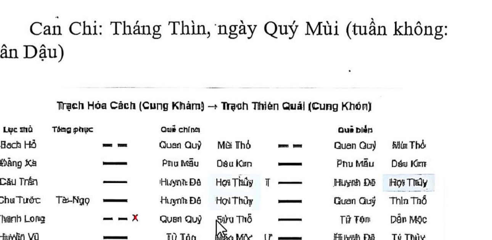
- **Cấu trúc Quẻ Dịch:**
  - **Quẻ chủ:** **Trạch Hỏa Cách** (Cung Khảm)  
    *Tượng quẻ:* Cải biến cải cách; biểu thị tình hình thi cử phát sinh trục trặc bất ngờ làm thay đổi tâm lý.
  - **Quẻ biến:** **Trạch Thiên Quái** (Cung Khôn)  
    *Tượng quẻ:* Quyết đoán khuyết tổn; kết quả bài làm quả thực có khiếm khuyết điểm số.
- **Bảng chi tiết Lục hào:**

| Hào | Thế/Ứng | Lục thân (Chủ) | Can Chi | Biến động | Lục thân (Biến) | Can Chi (Biến) | Thần sát / Phục thần | Lục thú |
|:---:|:---:|:---|:---|:---:|:---|:---|:---|:---|
| 6 | | Quan Quỷ | Mùi - Thổ | tĩnh | Quan Quỷ | Mùi - Thổ | Hoa cái, Nhật kiến | Bạch Hổ |
| 5 | | Phụ Mẫu | Dậu - Kim | tĩnh | Phụ Mẫu | Dậu - Kim | Tuần không, Tai sát | Đằng Xà |
| 4 | | Huynh Đệ | Hợi - Thủy | tĩnh | Huynh Đệ | Hợi - Thủy | Dương nhẫn | Câu Trần |
| 3 | **Thế** | Huynh Đệ | Hợi - Thủy | tĩnh | Huynh Đệ | Hợi - Thủy | Dương nhẫn [Phục: Thê Tài Ngọ Hỏa] | Chu Tước |
| 2 | | Quan Quỷ | Sửu - Thổ | **X (Động)** | Tử Tôn | Dần - Mộc | Mưu tinh, Hồi đầu khắc | Thanh Long |
| 1 | **Ứng** | Tử Tôn | Mão - Mộc | tĩnh | Huynh Đệ | Tý - Thủy | Tướng tinh, Văn Xương, Thiên y, Quý nhân | Huyền Vũ |

---

### 3. Dụng thần & Loại quẻ

- **Phân loại quẻ:**
  - **Quẻ tâm thái (Phát sinh từ việc có xác suất lớn):** Nhờ có mối quan hệ nội bộ bảo đảm, việc trúng tuyển vốn là sự việc có xác suất rất cao (trên 90%). Nỗi lo thi viết chỉ là tâm lý sợ phát sinh tình huống ngoài ý muốn, do đó quẻ hiển lộ theo logic quẻ tâm thái.
- **Định vị Dụng thần cốt lõi:**
  - **Hào 2 Quan Quỷ Sửu Thổ phát động:** Đại diện cho nỗi lo sợ thi trượt, sợ bài làm quá kém bị đánh trượt.
  - **Hào biến Tử Tôn Dần Mộc:** Thần giải ưu, đóng vai trò khắc phạt triệt tiêu nỗi lo lắng.

---

### 4. Luận giải chi tiết

#### 1. Sự đối lập giữa góc nhìn Quẻ sự việc và Quẻ tâm thái
- **Nếu luận theo quẻ sự việc:** Quan Quỷ đại diện cho công việc chức vị. Quan Quỷ Sửu Thổ động hóa Tử Tôn Dần Mộc hồi đầu khắc tức là công việc bị khắc nát, đồng nghĩa với việc thi trượt, mất việc.
- **Nếu luận theo quẻ tâm thái:** Quan Quỷ Sửu Thổ đại diện cho mối bận tâm lo lắng. Quan Quỷ động hóa Tử Tôn hồi đầu khắc tức là nỗi lo lắng bị khắc phục triệt để, báo hiệu điềm lành: bài thi tuy kém nhưng vẫn vượt qua được cửa ải!

#### 2. Quyết định luận giải dựa vào bối cảnh xác suất thực tế
- **Phân biệt xác suất lớn và xác suất nhỏ:**
  - Nếu là thí sinh tự do thi công chức nhà nước không quen biết ai, việc đỗ là xác suất nhỏ, tâm lý thường bình thản "được thì tốt không được thì thôi", quẻ sẽ là quẻ sự việc.
  - Ở đây là doanh nghiệp tư nhân/liên doanh, lại có quan hệ cấp cao can thiệp, việc vào làm là việc xác suất lớn, kỳ thi viết chỉ là thủ tục hợp thức hóa. Nỗi lo lắng ở đây mang tính cục bộ phát sinh.
- **Giải mã thần sát hào động:** Quan Quỷ Sửu Thổ mang Mưu tinh và Đào hoa, phản ánh chính xác kết quả bài thi viết điểm số không cao (ôn tập không chuyên nghiệp). Nhưng nhờ hóa Tử Tôn hồi đầu khắc nên khiếm khuyết đó không đủ để làm lật ngược kết quả chung cuộc.

---

### 5. Kết luận & Ứng kỳ thực tế

- **Lời giải đoán của Chu Thần Bân:**
  - Khẳng định bài thi viết tuy điểm không cao nhưng rốt cuộc người vợ vẫn vượt qua được kỳ thi và trúng tuyển thuận lợi vào đơn vị nhờ sự nâng đỡ của quan hệ sẵn có.
- **Phản hồi thực tế (Feedback):**
  - Người vợ sau đó đã nhận được thông báo trúng tuyển chính thức vào công ty đúng như dự đoán.

---

### 6. Bài học tâm pháp & Quy tắc cốt lõi

- **Quy tắc cốt lõi (Core Rules):**
  - *Quy tắc phân biệt Quẻ sự việc và Quẻ tâm thái dựa vào bối cảnh xác suất xã hội* (trích Cổ Thệ Chân Thuyên, trang 76-78): Trong các sự việc có xác suất thành công lớn (có quan hệ nâng đỡ), sự lo lắng phát sinh giữa chừng biến quẻ thành quẻ tâm thái; Quan Quỷ hóa hồi đầu khắc là điềm lành cát khánh.
  - *Tầm quan trọng của tri thức và kinh nghiệm xã hội:* Luận quẻ không thể tách rời bối cảnh ngành nghề và mối quan hệ thực tế của người hỏi.
- **Bài học tâm pháp:**
  - Cùng một đồ hình hào động (Quan hóa Tử hồi đầu khắc), nếu cứng nhắc áp dụng công thức sự việc sẽ đoán sai hoàn toàn thành thất bại; chỉ khi nắm vững bối cảnh tâm lý mới nhìn ra chân tướng thành công.

## THỰC CHIẾN 137: NỮ HỎI CÓ THỂ KẾT HÔN VỚI NGƯỜI NÀO ĐÓ HAY KHÔNG?

---

### 1. Bối cảnh & Câu hỏi

- **Bối cảnh chi tiết:**
  Một đồng môn khác cung cấp quẻ chiêm: một người phụ nữ hỏi về mối quan hệ với một người đàn ông cụ thể, muốn biết liệu hai người có thể tiến tới hôn nhân hay không. Quẻ gieo được có đồ hình hào quẻ hoàn toàn trùng khớp với Thực chiến 136 (cùng là Trạch Hỏa Cách biến Trạch Thiên Quái), chỉ khác biệt về thời gian Nhật Nguyệt chiêm đoán. Người đồng môn này vô cùng bối rối không biết nên luận giải theo quẻ sự việc hay quẻ tâm thái.
- **Tâm lý & Câu hỏi ẩn ý:**
  Người hỏi muốn biết tương lai hôn nhân với đối tượng đang tìm hiểu. Tùy thuộc vào giai đoạn tình cảm thực tế (mới quen tìm hiểu hay đã gắn bó sâu sắc) mà tâm niệm bên trong câu hỏi sẽ mang bản chất hoàn toàn khác biệt.
- **Thời gian chiêm đoán:**
  - Dương lịch: Ngày 16 tháng 05 năm 2018, lúc 08 giờ 10 phút (Giờ Bắc Kinh).
  - Can chi: Năm Mậu Tuất, tháng Đinh Tỵ, ngày Mậu Thân, giờ Bính Thìn.

---

### 2. Dữ kiện & Bảng quẻ Crop

- **Thời không chiêm nghiệm:**
  - Tháng Đinh Tỵ (Hỏa vượng, Thổ tướng, Kim trường sinh, Thủy tuyệt).
  - Ngày Mậu Thân (Kim vượng, Thủy đắc sinh, Dần Mão Tuần không).
  - Tuần không: **Dần, Mão** (Giáp Thìn tuần trung, Dần Mão không vong).
- **Thần sát:**
  - Tướng tinh: Tý
  - Hoa cái: Thìn (Lâm Thiên y)
  - Dịch mã: Dần (Lâm Tuần không, hào biến Tử Tôn)
  - Tai sát: Ngọ (Lâm Dương nhẫn)
  - Mưu tinh: Tuất
  - Đào hoa: Dậu (Lâm hào 5 Phụ Mẫu)
  - Kiếp sát: Tỵ (Lâm Nguyệt kiến, Lộc thần)
  - Lộc thần: Tỵ
  - Dương nhẫn: Ngọ
  - Văn Xương: Thân (Lâm Nhật thần)
  - Thiên y: Thìn
  - Thiên hỉ: Sửu (Lâm hào 2 Quan Quỷ)
  - Quý nhân: Sửu, Mùi (Lâm hào 2 và hào 6 Quan Quỷ)
- Bảng quẻ tượng và đồ hình chiêm đoán:
  - **Hình 137:** Đồ hình quẻ Thực chiến 137
    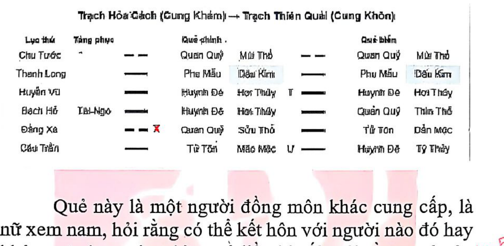
- **Cấu trúc Quẻ Dịch:**
  - **Quẻ chủ:** **Trạch Hỏa Cách** (Cung Khảm)  
    *Tượng quẻ:* Cải cách biến đổi; phản ánh mối quan hệ đang đứng trước bước ngoặt hoặc phát sinh biến cố.
  - **Quẻ biến:** **Trạch Thiên Quái** (Cung Khôn)  
    *Tượng quẻ:* Quyết đoán dứt khoát, khuyết thiếu; báo hiệu sự việc có khiếm khuyết khó thành vẹn toàn.
- **Bảng chi tiết Lục hào:**

| Hào | Thế/Ứng | Lục thân (Chủ) | Can Chi | Biến động | Lục thân (Biến) | Can Chi (Biến) | Thần sát / Phục thần | Lục thú |
|:---:|:---:|:---|:---|:---:|:---|:---|:---|:---|
| 6 | | Quan Quỷ | Mùi - Thổ | tĩnh | Quan Quỷ | Mùi - Thổ | Quý nhân | Chu Tước |
| 5 | | Phụ Mẫu | Dậu - Kim | tĩnh | Phụ Mẫu | Dậu - Kim | Đào hoa | Thanh Long |
| 4 | **Thế** | Huynh Đệ | Hợi - Thủy | tĩnh | Huynh Đệ | Hợi - Thủy | Nguyệt phá | Huyền Vũ |
| 3 | | Huynh Đệ | Hợi - Thủy | tĩnh | Quan Quỷ | Thìn - Thổ | Nguyệt phá [Phục: Tử Tôn Ngọ Hỏa] | Bạch Hổ |
| 2 | | Quan Quỷ | Sửu - Thổ | **X (Động)** | Tử Tôn | Dần - Mộc | Thiên hỉ, Quý nhân, Hồi đầu khắc | Đằng Xà |
| 1 | **Ứng** | Tử Tôn | Mão - Mộc | tĩnh | Huynh Đệ | Tý - Thủy | Tuần không | Câu Trần |

---

### 3. Dụng thần & Loại quẻ

- **Phân loại quẻ:**
  - Chu Thần Bân phân tích quẻ này theo hai trường hợp đối lập dựa trên mức độ quan hệ thực tế giữa hai người:
    - **Trường hợp 1 (Quẻ sự việc - Xác suất thấp):** Hai người mới trong giai đoạn tìm hiểu, chưa có cam kết chắc chắn.
    - **Trường hợp 2 (Quẻ tâm thái - Xác suất cao):** Hai người đã yêu nhau lâu năm, tình cảm sâu đậm, đã tính chuyện trăm năm nhưng vừa phát sinh biến cố rạn nứt.
- **Định vị Dụng thần:**
  - Trong quẻ sự việc: Dụng thần là hào **Quan Quỷ Sửu Thổ** (hào 2 phát động).
  - Hào Ứng **Tử Tôn Mão Mộc** lâm Tuần không: Thái độ của đối phương không tha thiết việc kết hôn.

---

### 4. Luận giải chi tiết

#### 1. Luận giải theo hướng Quẻ sự việc (Giai đoạn tìm hiểu)
- **Quan Quỷ Sửu Thổ hóa Hồi đầu khắc:** Hào 2 Quan Quỷ Sửu Thổ động hóa Tử Tôn Dần Mộc hồi đầu khắc. Về mặt định tính sự việc, Dụng thần bị khắc tuyệt là điềm báo đại hung, không thể tiến tới hôn nhân với người nam này.
- **Tượng hào Ứng:** Hào Ứng lâm Tử Tôn Mão Mộc (Tử Tôn là thần khắc Quan, chủ sự cự tuyệt hôn nhân), lại lâm Tuần không, chứng tỏ người đàn ông này trong lòng chưa từng có ý định cưới cô gái làm vợ.
- **Động động tương liên – Kết hôn với người khác:** Hào biến Tử Tôn Dần Mộc lại tương hợp với hào Thế Huynh Đệ Hợi Thủy (Dần Hợi lục hợp). Điều này cho thấy sau khi chia tay người này, cô gái sẽ kết hôn với một người đàn ông khác trong tương lai.

#### 2. Luận giải theo hướng Quẻ tâm thái (Đã yêu sâu đậm phát sinh biến số)
- **Bản chất tâm lý:** Nếu hai bên đã coi nhau là vợ chồng suốt nhiều năm nhưng gần đây phát sinh cãi vã, quẻ Cách biểu thị biến cố ngoài dự kiến.
- **Quan Quỷ hóa hồi đầu khắc:** Quan Quỷ là nỗi lo sợ chia tay. Quan Quỷ bị Tử Tôn hồi đầu khắc biểu thị nỗi lo lắng được tháo gỡ, hai người sau sóng gió lại làm hòa và kết hôn.

#### 3. Tiêu chuẩn quyết định: Đọc thấu tâm niệm người gieo
- **Tâm niệm quyết định quẻ lý:** Sự khác biệt cốt lõi giữa quẻ sự việc và quẻ tâm thái không nằm ở công thức sách vở mà nằm ở **tâm niệm** của người hỏi tại thời điểm khởi quẻ.
- **Cảm quẻ và kinh nghiệm sống:** Người đoán dịch phải thấu hiểu bối cảnh xác suất thực tế của sự việc để đặt đúng hệ quy chiếu, đó chính là tinh hoa "đọc thấu lòng người" của Lục Hào Dã Hạc.

---

### 5. Kết luận & Ứng kỳ thực tế

- **Lời giải đoán của Chu Thần Bân:**
  - Nếu thực tế hai người mới ở giai đoạn tìm hiểu sơ khởi thì kết luận dứt khoát: **không thể kết hôn**, mối quan hệ sẽ tan vỡ vì Quan Quỷ bị hồi đầu khắc và hào Ứng lâm Tử Tôn.
  - Cô gái tương lai sẽ kết hôn với người đàn ông khác thông qua mối quan hệ tương hợp của hào biến Dần Mộc với hào Thế Hợi Thủy.

---

### 6. Bài học tâm pháp & Quy tắc cốt lõi

- **Quy tắc cốt lõi (Core Rules):**
  - *Quy tắc phân biệt Quẻ sự việc và Quẻ tâm thái dựa vào tâm niệm và xác suất* (trích Cổ Thệ Chân Thuyên, trang 83-84): Cùng một cấu trúc quẻ tượng, nếu sự việc ở xác suất thấp (mới tìm hiểu) thì xem theo quẻ sự việc; nếu ở xác suất cao (yêu lâu phát sinh biến cố) thì chuyển hóa thành quẻ tâm thái.
  - *Cảnh giới "Đọc thấu tâm niệm con người":* Cốt lõi cao nhất của Lục Hào phái Dã Hạc là cảm quẻ sâu sắc, xuyên thấu qua tâm lý và bản tính con người để định hình quẻ biến.
- **Bài học tâm pháp:**
  - Luận đoán Lục Hào không được câu nệ hình thức; phải luôn truy vấn thực trạng bối cảnh để phân định đúng bản chất tâm thức của đương số.

## THỰC CHIẾN 138: TỰ XEM KHI NÀO CÓ THAI

---

### 1. Bối cảnh & Câu hỏi

- **Bối cảnh chi tiết:**
  Một cô gái trẻ mới kết hôn muốn biết về chuyện con cái nên đã tự mình gieo quẻ hỏi: *"Khi nào bản thân sẽ có thai?"*. Người đồng môn tiếp nhận quẻ thấy quẻ hoàn toàn tĩnh, không có hào phát động, lại xuất hiện hai hào Tử Tôn với trạng thái đối lập: một hào bị Nguyệt phá Tuần không, một hào lại lâm Nguyệt kiến vượng tướng. Người đồng môn băn khoăn không biết chọn hào nào làm Dụng thần chính xác.
- **Tâm lý & Câu hỏi ẩn ý:**
  Tâm lý mong mỏi con cái của người phụ nữ mới bước vào đời sống hôn nhân, muốn biết thời điểm thụ thai cụ thể trong tương lai gần.
- **Thời gian chiêm đoán:**
  - Dương lịch: Ngày 10 tháng 04 năm 2018, lúc 15 giờ 10 phút (Giờ Bắc Kinh).
  - Can chi: Năm Mậu Tuất, tháng Bính Thìn, ngày Nhâm Thân, giờ Mậu Thân.

---

### 2. Dữ kiện & Bảng quẻ Crop

- **Thời không chiêm nghiệm:**
  - Tháng Bính Thìn (Thổ vượng, Mộc có khí, Thủy nhập mộ).
  - Ngày Nhâm Thân (Kim vượng, Thủy trường sinh, Tuất Hợi Tuần không).
  - Tuần không: **Tuất, Hợi** (Giáp Tý tuần trung, Tuất Hợi không vong).
- **Thần sát:**
  - Tướng tinh: Tý (Lâm Dương nhẫn)
  - Hoa cái: Thìn (Lâm Nguyệt kiến, hào 2 Tử Tôn)
  - Dịch mã: Dần (Lâm hào Ứng Phụ Mẫu, Văn Xương)
  - Tai sát: Ngọ (Lâm hào 3 và hào 4 Huynh Đệ)
  - Mưu tinh: Tuất (Lâm hào 6 Tử Tôn)
  - Đào hoa: Dậu
  - Kiếp sát: Tị (Lâm Quý nhân)
  - Lộc thần: Hợi (Lâm Tuần không, phục thần Quan Quỷ)
  - Dương nhẫn: Tý
  - Văn Xương: Dần
  - Thiên y: Mão (Lâm Quý nhân)
  - Thiên hỉ: Tuất (Lâm Tuần không, Nguyệt phá)
  - Quý nhân: Mão, Tị
- Bảng quẻ tượng và đồ hình chiêm đoán:
  - **Hình 138:** Đồ hình quẻ Thực chiến 138
    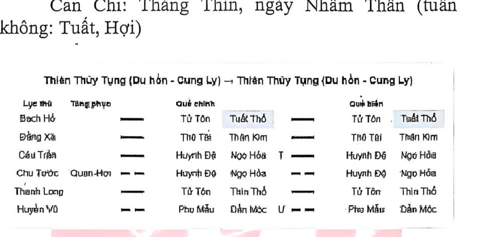
- **Cấu trúc Quẻ Dịch:**
  - **Quẻ chủ:** **Thiên Thủy Tụng** (Du hồn – Cung Ly, Quẻ Tĩnh)  
    *Tượng quẻ:* Bất hòa tranh chấp, du hồn bất định; tuy nhiên đây là quẻ tĩnh thuần túy dùng xét sự việc hiện trạng và tương lai.
  - **Quẻ biến:** Quẻ tĩnh không đổi (**Thiên Thủy Tụng**).
- **Bảng chi tiết Lục hào:**

| Hào | Thế/Ứng | Lục thân (Chủ) | Can Chi | Biến động | Lục thân (Biến) | Can Chi (Biến) | Thần sát / Phục thần | Lục thú |
|:---:|:---:|:---|:---|:---:|:---|:---|:---|:---|
| 6 | | Tử Tôn | Tuất - Thổ | tĩnh | Tử Tôn | Tuất - Thổ | Tuần không, Nguyệt phá, Bạch Hổ, Mưu tinh, Thiên hỉ | Bạch Hổ |
| 5 | | Thê Tài | Thân - Kim | tĩnh | Thê Tài | Thân - Kim | Nhật kiến | Đằng Xà |
| 4 | **Thế** | Huynh Đệ | Ngọ - Hỏa | tĩnh | Huynh Đệ | Ngọ - Hỏa | Tai sát | Câu Trần |
| 3 | | Huynh Đệ | Ngọ - Hỏa | tĩnh | Huynh Đệ | Ngọ - Hỏa | [Phục: Quan Quỷ Hợi Thủy (Tuần không, Lộc thần)] | Chu Tước |
| 2 | | Tử Tôn | Thìn - Thổ | tĩnh | Tử Tôn | Thìn - Thổ | Nguyệt kiến, Hoa cái | Thanh Long |
| 1 | **Ứng** | Phụ Mẫu | Dần - Mộc | tĩnh (Ám động) | Phụ Mẫu | Dần - Mộc | Dịch mã, Văn Xương (Xung khởi) | Huyền Vũ |

---

### 3. Dụng thần & Loại quẻ

- **Phân loại quẻ:**
  - Quẻ tĩnh vấn thai sản con cái (Hiện tượng Dụng thần lưỡng hiện đối ứng thời gian).
- **Định vị Dụng thần cốt lõi:**
  - Xem thai sản lấy **Tử Tôn** làm Dụng thần. Trong quẻ xuất hiện hai hào Tử Tôn:
    1. **Tử Tôn Tuất Thổ (hào 6):** Lâm Nguyệt phá, Tuần không, mang Bạch Hổ.
    2. **Tử Tôn Thìn Thổ (hào 2):** Lâm Nguyệt kiến vượng tướng, mang Thanh Long, Hoa cái.

---

### 4. Luận giải chi tiết

#### 1. Kỹ pháp bóc tách Dụng thần lưỡng hiện đối ứng thời gian
- **Tử Tôn Tuất Thổ (hào 6) – Thông tin quá khứ và cảnh báo tương lai:**
  - Hào Tuất Thổ bị Nguyệt kiến Thìn tương xung (Nguyệt phá), lại ngộ Tuần không và mang theo Bạch Hổ (chủ huyết quang, tổn hại).
  - Về quá khứ: Phản ánh biến cố từng mang thai nhưng bị sảy thai hoặc nạo phá thai trước đây vào năm/tháng Tuất hoặc Thìn.
  - Về tương lai: Đến tháng Tuất (tháng 9 âm lịch, khi Tuần không được điền thực và Nguyệt phá được bổ phá), thai phụ cần đặc biệt chú ý giữ gìn sức khỏe, đề phòng xuất huyết thiếu máu hoặc bất trắc trong thai kỳ.
- **Tử Tôn Thìn Thổ (hào 2) – Thông tin thực tại:**
  - Hào Thìn Thổ lâm Nguyệt kiến cực vượng, mang Thanh Long (chủ hỷ khánh, sinh sôi). Đây chính là Dụng thần đại diện cho hiện tại: báo hiệu **ngay trong tháng Thìn này đã thụ thai**!

#### 2. Dấu hiệu thụ thai qua hào Ứng Phụ Mẫu Dần Mộc Ám động
- **Phụ Mẫu Dần Mộc chịu xung của Nhật thần:** Dần Mộc ở hào sơ bị Nhật thần Nhâm Thân tương xung. Trong tháng Thìn (mùa xuân), Dần Mộc vẫn có khí, gặp xung trở thành **Ám động**.
- **Ý nghĩa sinh hoạt vợ chồng:** Hào Phụ Mẫu đại diện cho việc mang thai và sinh sản. Phụ Mẫu hào Ứng ám động chứng minh vợ chồng vừa mới có hành vi ân ái gần đây ("ngư thủy chi hoan"), tạo nên biến động thụ thai ngay trong thời gian ngắn trước mắt.

---

### 5. Kết luận & Ứng kỳ thực tế

- **Lời giải đoán của Chu Thần Bân:**
  - Khẳng định cô gái **hiện tại đã có thai ngay trong tháng Thìn này**, khuyên nên sớm đến bệnh viện kiểm tra y tế để xác nhận.
  - Đồng thời dặn dò đến tháng Tuất (tháng 9 âm lịch) cần hết sức cẩn thận chăm sóc dưỡng thai, đề phòng biến chứng dinh dưỡng và huyết dịch.
- **Phản hồi thực tế (Feedback):**
  - Đúng hai ngày sau khi chiêm quẻ, cô gái đến bệnh viện kiểm tra sức khỏe tổng quát thì vô cùng kinh ngạc khi bác sĩ thông báo cô **đã mới mang thai được vài ngày** (vì chưa tới chu kỳ kinh nguyệt tiếp theo nên bản thân hoàn toàn không hay biết).

---

### 6. Bài học tâm pháp & Quy tắc cốt lõi

- **Quy tắc cốt lõi (Core Rules):**
  - *Quy tắc Dụng thần lưỡng hiện đối ứng thời gian quá khứ - hiện tại* (trích Cổ Thệ Chân Thuyên, trang 87-91): Khi hai hào Dụng thần cùng xuất hiện trong quẻ tĩnh, hào mang hung sát phá không thường biểu thị biến cố trong quá khứ hoặc hiểm họa tương lai khi điền thực; hào lâm Nhật Nguyệt vượng tướng đại diện cho hiện trạng thực tế đang diễn ra.
  - *Ý nghĩa hào Ám động chỉ thị hành vi gần nhất:* Hào Phụ Mẫu ám động biểu thị quan hệ vợ chồng vừa mới phát sinh dẫn đến kết quả thụ thai trước mắt.
- **Bài học tâm pháp:**
  - Dự trắc thai sản cần phân biệt tinh tế giữa thông tin quá khứ, hiện tại và tương lai trên đồ hình quẻ tĩnh; không vội vàng đoán tương lai xa khi Dụng thần vượng tướng đã lâm ngay lệnh tháng hiện tại.

---

## THỰC CHIẾN 139: VỢ MANG THAI TUẦN THỨ TÁM, THAI ĐỘT NGỘT NGỪNG PHÁT TRIỂN, HỎI NGUYÊN NHÂN VÀ XU HƯỚNG

---

### 1. Bối cảnh & Câu hỏi

- **Bối cảnh chi tiết:** 
  Vợ của một người đồng môn đang mang thai vừa đúng tuần thứ tám thì xảy ra biến cố thai đột ngột ngừng phát triển (tim thai đột ngột ngừng đập). Trong giai đoạn tam cá nguyệt đầu tiên (ba tháng đầu thai kỳ), rủi ro sản khoa luôn ở mức rất cao với các tình trạng nguy hiểm như thai ngoài tử cung, thai ngừng phát triển hoặc thai nhi thiếu hụt dưỡng chất. Trước đó, suốt hai tháng đầu mọi chỉ số thăm khám đều hoàn toàn bình thường. Đột nhiên người chồng hoảng hốt liên lạc với Chu Thần Bân báo tin dữ: tim thai bất ngờ dừng đập và bác sĩ chỉ định nếu tình trạng kéo dài sẽ phải hút thai. Bệnh viện đưa ra hướng xử lý trước mắt là theo dõi sát trong một tuần; nếu sau một tuần tái khám tim thai vẫn không đập lại thì bắt buộc phải làm thủ thuật nạo phá thai.
- **Tâm lý & Câu hỏi ẩn ý:** 
  Đương số bàng hoàng, đau xót và hoang mang tột độ trước nguy cơ mất đi đứa con đầu lòng. Người chồng hỏi hai ý chính: nguyên nhân dẫn đến tình trạng thai ngừng phát triển là gì và xu hướng diễn biến sắp tới ra sao. Sâu thẳm trong nội tâm là nỗi lo sợ liệu có yếu tố tâm linh, âm khí quấy phá hay không, đồng thời vẫn le lói tia hy vọng mong manh rằng tim thai chỉ ngừng tạm thời rồi sẽ đập trở lại.
- **Thời gian chiêm đoán:**
  - Dương lịch: Ngày 01 tháng 05 năm 2018, lúc 18 giờ 53 phút (Giờ Bắc Kinh).
  - Can chi: Năm Mậu Tuất, tháng Bính Thìn, ngày Quý Tỵ, giờ Tân Dậu.

---

### 2. Dữ kiện & Bảng quẻ Crop

- **Thời không chiêm nghiệm:**
  - Tháng Bính Thìn (Thổ vượng, Mộc suy, Thủy nhập mộ).
  - Ngày Quý Tỵ (Hỏa vượng, Thủy tuyệt).
  - Tuần không: **Ngọ, Mùi** (Giáp Thân tuần trung, Ngọ Mùi không vong).
- **Thần sát:**
  - Tướng tinh: Dậu
  - Hoa cái: Sửu
  - Dịch mã: Hợi
  - Tai sát: Mão
  - Mưu tinh: Mùi (Lâm hào Thế và hào Ứng)
  - Đào hoa: Ngọ
  - Kiếp sát: Dần
  - Lộc thần: Tý (Lâm hào biến Tử Tôn)
  - Dương nhẫn: Hợi
  - Văn xương: Mão
  - Thiên y: Mão
  - Thiên hỷ: Tuất
  - Quý nhân: Mão, Tỵ
- Dữ kiện bảng quẻ và các thông số chiêm đoán:
  - **Hình 139:** Đồ hình quẻ Thực chiến 139
    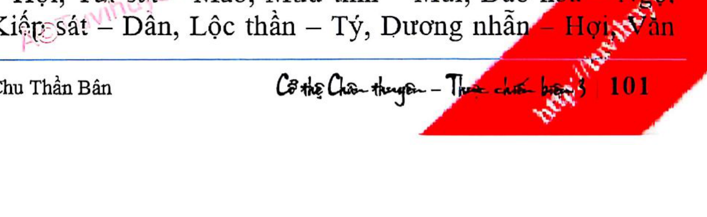
- **Cấu trúc Quẻ Dịch:**
  - **Quẻ chủ:** **Phong Địa Quán** (Cung Càn)  
    *Tượng quẻ:* Quan sát, chờ đợi xem xét; phản ánh chính xác trạng thái hiện tại bệnh viện yêu cầu quan sát theo dõi trong vòng một tuần để kiểm tra tim thai có đập lại hay ngừng vĩnh viễn.
  - **Quẻ biến:** **Phong Lôi Ích** (Cung Tốn)  
    *Tượng quẻ:* Tăng ích, có lợi về lâu dài; chỉ ra xu thế định tính tương lai, bề ngoài mất con là hung sự đau buồn, nhưng thực chất tránh được hiểm họa lớn hơn cho cả mẹ lẫn con vì phôi thai vốn mang khiếm khuyết nặng nề.
- **Bảng chi tiết Lục hào:**

| Hào | Thế/Ứng | Lục thân (Chủ) | Can Chi | Biến động | Lục thân (Biến) | Can Chi (Biến) | Thần sát / Phục thần | Lục thú |
|:---:|:---:|:---|:---|:---:|:---|:---|:---|:---|
| 6 | | Thê Tài | Mão - Mộc | tĩnh | Thê Tài | Mão - Mộc | [Phục: Phụ Mẫu Tuất Thổ] Tai sát, Văn xương, Thiên y, Quý nhân | Bạch Hổ |
| 5 | | Quan Quỷ | Tỵ - Hỏa | tĩnh | Quan Quỷ | Tỵ - Hỏa | [Phục: Huynh Đệ Thân Kim] Quý nhân | Đằng Xà |
| 4 | **Thế** | Phụ Mẫu | Mùi - Thổ | tĩnh | Phụ Mẫu | Mùi - Thổ | [Phục: Quan Quỷ Ngọ Hỏa] Mưu tinh, Tuần không | Câu Trần |
| 3 | | Thê Tài | Mão - Mộc | tĩnh | Phụ Mẫu | Thìn - Thổ | [Phục: Phụ Mẫu Thìn Thổ] Tai sát, Văn xương, Thiên y, Quý nhân | Chu Tước |
| 2 | | Quan Quỷ | Tỵ - Hỏa | tĩnh | Thê Tài | Dần - Mộc | [Phục: Thê Tài Dần Mộc] Kiếp sát, Quý nhân | Thanh Long |
| 1 | **Ứng** | Phụ Mẫu | Mùi - Thổ | **X (Động)** | Tử Tôn | Tý - Thủy | [Phục: Tử Tôn Tý Thủy] Mưu tinh, Tuần không, Lộc thần biến | Huyền Vũ |

---

### 3. Dụng thần & Loại quẻ

- **Phân loại quẻ:**
  - Quẻ sản dục, vấn an nguy thai nhi và sinh mệnh con cái (Quẻ sự việc kết hợp quẻ tâm thái).
  - Quẻ có hào Ứng phát động đối ứng với hào Thế phản ánh mối liên hệ mật thiết giữa thể chất người mẹ và sự tác động của ngoại giới.
- **Định vị Dụng thần cốt lõi:**
  - Chiêm đoán về con cái, thai nhi: lấy hào **Tử Tôn** làm Dụng thần. Trong quẻ, Tử Tôn Tý Thủy phục tàng dưới sơ hào Phụ Mẫu Mùi Thổ, đồng thời xuất hiện tại hào biến do chính sơ hào Phụ Mẫu Mùi Thổ phát động hóa ra.
  - Kỵ thần: Hào **Phụ Mẫu Mùi Thổ** (Thổ khắc Thủy, khắc chế tước đoạt sinh khí Tử Tôn).
  - Nguyên thần: Thê Tài Mão Mộc (hào 3 và hào 6) và Kim hào (sinh Thủy).

---

### 4. Luận giải chi tiết

#### 1. Cơ chế biến dịch "Dụng - Kỵ tương hóa" (Phụ mẫu hóa Tử tôn)
- **Tượng diệt vong trong Cổ thệ:** Hào Ứng Phụ Mẫu Mùi Thổ phát động hóa ra Tử Tôn Tý Thủy. Trong sách *Tăng San Bốc Dịch* đã đúc kết quy tắc: vấn sự con cái mà gặp Phụ Mẫu hóa Tử Tôn thì cơ bản là *"trăm phần không còn một đường sống"*. Kỵ thần tự thân biến xuất Dụng thần tạo thành thế hồi đầu khắc trực tiếp, mầm sống vừa hé lộ đã bị Thổ khí vùi dập tiêu tan.
- **Tác động của Nhật Nguyệt lệnh:** Tử Tôn Tý Thủy lâm tháng Thìn là Thủy nhập mộ suy kiệt; lâm ngày Tỵ là đất tuyệt địa. Dụng thần suy nhược đến cùng cực, hoàn toàn không có điểm tựa sinh phù.
- **Trạng thái Tuần không:** Phụ Mẫu Mùi Thổ phát động nhưng lâm Tuần không. Hiện tại trong tuần chưa thấy rõ kết quả, song một khi xuất không hoặc bị xung khai vào ngày Sửu thì hung họa lập tức bộc phát trọn vẹn.

#### 2. Nhận diện dấu vết của "Vật chất tối" (Âm tà / Vong linh can nhiễu)
- **Huyền Vũ kết hợp Thổ động:** Dấu hiệu tác động của vật chất tối trong Lục Hào thường biểu hiện qua hào Thổ động hoặc Quan Quỷ động mang Bạch Hổ, Huyền Vũ. Tại đây, sơ hào Phụ Mẫu Mùi Thổ mang Huyền Vũ phát động chính là tượng năng lượng âm tà, quỷ khí u ám xâm nhập quấy phá.
- **Tượng đối ứng giữa Thế và Ứng:** Hào Thế Phụ Mẫu Mùi Thổ đại diện cho cơ thể người mẹ ở dương gian. Hào Ứng cũng là Phụ Mẫu Mùi Thổ, tạo nên sự đối ứng tương đồng về hình tượng con người. Nhưng nếu hào Thế là người sống bằng xương bằng thịt thì hào Ứng lại lâm Tuần không.
- **Bản chất của tượng Không:** Tượng Tuần không ở đây giống như hình ảnh một cái giếng rỗng – có thực thể nhưng bên trong trống rỗng vô hình. Trong không gian nhận thức thị giác và thính giác của người bình thường, năng lượng từ chiều không gian khác không thể nhìn thấy hay chạm tới, do đó thể hiện qua trạng thái Tuần không. Sự kết hợp giữa hào Thổ, Huyền Vũ và Tuần không chỉ thị một thực thể âm linh (vật chất tối) đang bám riết vào thân thể người mẹ làm tổn thương thai khí.

#### 3. Ý nghĩa xu thế qua Quẻ biến Phong Lôi Ích
- Quẻ Quán đại diện cho việc hiện tại chỉ có thể nằm yên quan sát theo dõi y tế. Quẻ biến Ích chỉ ra bản chất xu thế lâu dài: việc ngừng thai tuy gây đau buồn trước mắt nhưng xét về bản chất lại là điều có ích. Phôi thai vốn dĩ đã chịu tổn thương nghiêm trọng bẩm sinh do khí huyết suy đồi và âm tà can nhiễu, nếu cố giữ sinh ra ắt sẽ mang dị tật nặng nề gây đại họa cho cả gia đình. Do đó sảy thai tự nhiên là quy luật đào thải bảo vệ sinh mệnh người mẹ.

---

### 5. Kết luận & Ứng kỳ thực tế

- **Lời giải đoán & Khuyến nghị của Chu Thần Bân:**
  - Khuyên người đồng môn giữ vững tâm lý, không nên quá bi lụy vì thai nhi không thể giữ được.
  - Dự báo tim thai sẽ không đập lại, trong vòng năm đến sáu ngày tới (rơi vào ngày Tý hoặc ngày Sửu xung phá tuần không) bệnh viện sẽ xác nhận kết quả và phải làm thủ thuật hút nạo.
  - Cảnh báo cơ thể người mẹ có dấu hiệu bị âm khí, tà khí bám theo gây trở ngại sản khoa, cần tìm thầy có khả năng thông âm giải trừ sau khi hồi phục sức khỏe.
- **Phản hồi thực tế (Feedback):**
  - Năm sáu ngày sau đi tái khám tại bệnh viện, các bác sĩ xác nhận tim thai hoàn toàn ngừng đập, người vợ phải nhập viện làm thủ thuật nạo thai.
  - Khoảng một tháng sau khi sức khỏe hồi phục, hai vợ chồng đến Quảng Châu. Chu Thần Bân giới thiệu họ đến gặp một vị pháp sư am hiểu đạo pháp. Vừa gặp mặt, vị pháp sư lập tức nhận diện chính xác trên người cô vợ đang có vong linh bám theo quấy phá đúng như quẻ Dịch đã chỉ ra.
- **Ứng kỳ chiêm nghiệm:**
  - Hào Phụ Mẫu Mùi Thổ lâm Tuần không động hóa Tử Tôn Tý Thủy, ứng kỳ rơi vào ngày Sửu (xung khai Mùi Thổ xuất không) và ngày Tý (Tử Tôn lâm trị), chính xác trong khoảng 6 ngày sau khi gieo quẻ.

---

### 6. Bài học tâm pháp & Quy tắc cốt lõi

- **Quy tắc Lục Hào rút ra:**
  - Trích dẫn quy tắc: *Quy tắc quẻ đoán thai nhi ngừng phát triển (thai đình) do âm tà/vật chất tối và suy nhược tinh khí của cha mẹ* (sách Cổ Thệ Chân Thuyên, trang 94, rule_index).
  - Quy tắc Dụng - Kỵ tương hóa trong vấn con cái: Phụ Mẫu hóa Tử Tôn là tuyệt tượng, mầm sống bị kỵ thần bóp nghẹt từ trong trứng nước.
  - Cơ chế nhận diện vật chất tối qua tượng quẻ: Hào Thổ động mang Huyền Vũ hoặc Bạch Hổ kết hợp trạng thái Tuần không biểu thị thực thể vô hình từ không gian khác can nhiễu vào thực tại.
- **Bài học tâm pháp giải đoán:**
  - Người luận dịch cần nhìn thấu hai mặt của họa và phúc: Biến quẻ Phong Lôi Ích dạy rằng có những mất mát trước mắt thực chất là sự giải thoát khỏi tai ương khôn lường về sau (*"Trong cái rủi có cái may, sảy thai cũng là mệnh"*).

## THỰC CHIẾN 140: U TUYẾN VÚ LÀ DO VẬT CHẤT TỐI GÂY NÊN SAO?

---

### 1. Bối cảnh & Câu hỏi

- **Bối cảnh chi tiết:** 
  Một nữ đồng môn bị u tuyến vú kéo dài nhiều năm, khối u theo thời gian ngày càng to dần lên khiến cô vô cùng lo âu. Đây là bệnh lý phổ biến ở phụ nữ nhưng có nguy cơ chuyển biến xấu thành ung thư vú. Vì tâm lý e ngại bệnh viện, đương số liên tục trì hoãn việc đi khám chuyên sâu. Khoảng tháng ba và đầu tháng tư năm 2018, cô từng nhờ Chu Thần Bân chuyển ảnh chụp chân dung và mô tả bệnh lý cho bác sĩ Trịnh (một thầy thuốc người dân tộc Miêu có khả năng đặc dị thông âm và đạo thuật). Bác sĩ Trịnh sau khi xem ảnh đã nghiêm khắc cảnh báo: *"Cái này sẽ trở thành khối u ác tính đấy, mau chóng đến bệnh viện kiểm tra, nếu có thể xử lý thì xử lý ngay, nếu không sẽ rất nhanh chuyển ác"*. Tuy nhiên khi đi khám sơ bộ chưa thấy ác tính, cô lại muốn chờ bác sĩ danh tiếng nên chần chừ hơn một tháng. Đến cuối tháng 4/2018 tại Thượng Hải, cô gieo quẻ hỏi liệu khối u này có phải do vật chất tối (tà khí, âm vong) bám vào gây nên hay không.
- **Tâm lý & Câu hỏi ẩn ý:** 
  Đương số sợ hãi u ác tính nhưng lại né tránh đối diện thực tế y khoa, bấu víu vào suy nghĩ do bị vong linh hoặc năng lượng vô hình bám theo làm bệnh khó lành. Câu hỏi bề ngoài là về tâm linh, nhưng cốt lõi thực chất là muốn biết bản chất khối u nguy hiểm đến mức độ nào và có phải ung thư hay không.
- **Thời gian chiêm đoán:**
  - Dương lịch: Ngày 23 tháng 04 năm 2018, lúc 19 giờ 10 phút (Giờ Bắc Kinh).
  - Can chi: Năm Mậu Tuất, tháng Bính Thìn, ngày Ất Dậu, giờ Bính Tuất.

---

### 2. Dữ kiện & Bảng quẻ Crop

- **Thời không chiêm nghiệm:**
  - Tháng Bính Thìn (Thổ vượng, Kim tướng).
  - Ngày Ất Dậu (Kim vượng, Lâm Tướng tinh).
  - Tuần không: **Ngọ, Mùi** (Giáp Thân tuần trung, Ngọ Mùi không vong).
- **Thần sát:**
  - Tướng tinh: Dậu (Lâm Nhật kiến)
  - Hoa cái: Sửu
  - Dịch mã: Hợi
  - Tai sát: Mão
  - Mưu tinh: Mùi (Lâm Tuần không, hào biến Thê Tài)
  - Đào hoa: Ngọ (Lâm Tuần không, hào Thế)
  - Kiếp sát: Dần
  - Lộc thần: Mão
  - Dương nhẫn: Dần (Lâm hào 2 Huynh Đệ)
  - Văn Xương: Ngọ (Lâm hào Thế)
  - Thiên y: Mão
  - Thiên hỷ: Tuất (Lâm hào 6)
  - Quý nhân: Thân (hào 5), Tý (hào sơ)
- **Ngoại ứng:** Khi lắc quẻ lần thứ hai, cây bút ghi chép đột nhiên lăn vào vùng lắc quẻ.
- Dữ kiện bảng quẻ và các thông số chiêm đoán:
  - **Hình 140:** Đồ hình quẻ Thực chiến 140
    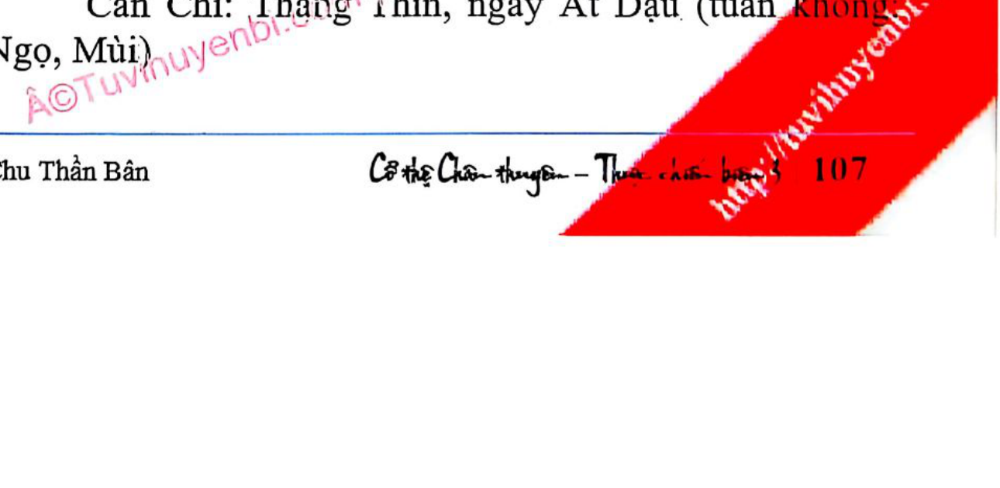
- **Cấu trúc Quẻ Dịch:**
  - **Quẻ chủ:** **Thiên Lôi Vô Vọng** (Cung Tốn – Quẻ Lục Xung)  
    *Tượng quẻ:* Vô vọng chi tai, tai bay vạ gió, bất an bất chợt; quẻ Lục xung chủ hiện trạng, báo hiệu vật chất tối trước mắt không tồn tại, chỉ do tâm lý bồn chồn hoang mang.
  - **Quẻ biến:** **Hỏa Lôi Phệ Hạp** (Cung Tốn)  
    *Tượng quẻ:* Cắn đứt chướng ngại, dùng hình phạt/dao kéo loại bỏ dị vật; chỉ ra phương hướng hành động phải quyết đoán can thiệp y khoa để loại trừ triệt để ổ bệnh.
- **Bảng chi tiết Lục hào:**

| Hào | Thế/Ứng | Lục thân (Chủ) | Can Chi | Biến động | Lục thân (Biến) | Can Chi (Biến) | Thần sát / Phục thần | Lục thú |
|:---:|:---:|:---|:---|:---:|:---|:---|:---|:---|
| 6 | | Thê Tài | Tuất - Thổ | tĩnh | Tử Tôn | Tỵ - Hỏa | Hoa cái, Thiên hỷ | Huyền Vũ |
| 5 | | Quan Quỷ | Thân - Kim | **O (Động)** | Thê Tài | Mùi - Thổ | Quý nhân | Bạch Hổ |
| 4 | **Thế** | Tử Tôn | Ngọ - Hỏa | tĩnh | Quan Quỷ | Dậu - Kim | Đào hoa, Văn Xương, Tuần không | Đằng Xà |
| 3 | | Thê Tài | Thìn - Thổ | tĩnh | Thê Tài | Thìn - Thổ | Nguyệt kiến | Câu Trần |
| 2 | | Huynh Đệ | Dần - Mộc | tĩnh | Huynh Đệ | Dần - Mộc | Kiếp sát, Lộc thần, Dương nhẫn | Chu Tước |
| 1 | **Ứng** | Phụ Mẫu | Tý - Thủy | tĩnh | Phụ Mẫu | Tý - Thủy | Quý nhân | Thanh Long |

---

### 3. Dụng thần & Loại quẻ

- **Phân loại quẻ:**
  - Quẻ nghi vấn tâm linh kết hợp vấn tật bệnh thực thể (Quẻ sự việc lồng ghép quẻ tâm thái).
  - Quẻ có cấu trúc phân định rạch ròi giữa đối tượng chỉ định nghi vấn và hào phát động cảnh báo bệnh lý thực sự.
- **Định vị Dụng thần cốt lõi:**
  - Đối tượng chỉ định nghi vấn (Vật chất tối / Tà khí): Hào **Ứng Phụ Mẫu Tý Thủy**.
  - Bản thân người hỏi: Hào **Thế Tử Tôn Ngọ Hỏa**.
  - Hiểm họa bệnh lý thực thể: Hào 5 **Quan Quỷ Thân Kim** lâm Bạch Hổ phát động.

---

### 4. Luận giải chi tiết

#### 1. Loại trừ nghi vấn vật chất tối qua trạng thái Hào Ứng
- **Hào Ứng an tĩnh:** Người hỏi chỉ định vật chất tối làm mục tiêu, nên hào Ứng Phụ Mẫu Tý Thủy đại diện cho tà khí. Tuy nhiên hào Ứng hoàn toàn an tĩnh, lâm Thanh Long. Nếu thực sự có vong linh hay tà khí quấy phá thì hào Ứng bắt buộc phải phát động hung bạo. Hào Ứng tĩnh chứng tỏ hiện tại không hề có vật chất tối bám vào cơ thể.
- **Hào Thế lâm Tử Tôn:** Bản thân người hỏi được Tử Tôn Ngọ Hỏa trì Thế. Tử Tôn là phúc thần xua đuổi tà khí. Việc hào Thế lâm Tuần không chỉ phản ánh tâm trạng bất an, lo sợ mơ hồ chứ không phải bị tà nhập.

#### 2. Hiểm họa bệnh lý thực thể: Quan Quỷ hào 5 phát động
- **Vị trí lồng ngực và u ác tính:** Quẻ không chỉ trả lời câu hỏi trực tiếp mà còn phơi bày sự thật then chốt: Hào 5 Quan Quỷ Thân Kim lâm Bạch Hổ phát động. Hào 5 đại diện cho vùng ngực, tuyến vú. Thân Kim chủ chất cứng cô đọng, u hạch kết tụ. Quan Quỷ mang Bạch Hổ là tượng kinh điển của bệnh ác tính (ung thư). Đây là minh chứng u tuyến vú đang ác hóa thành ung thư vú.
- **Cơ chế hồi đầu sinh và giai đoạn sơ khởi:** Quan Quỷ Thân Kim hóa xuất Thê Tài Mùi Thổ là hồi đầu sinh. Tuy nhiên, Thê Tài Mùi Thổ hiện đang lâm Tuần không. Mùi Thổ chưa ra khỏi tuần không nên chưa thể sinh vượng cho Quan Quỷ ngay. Điều này báo trước bệnh mới bắt đầu bước vào giai đoạn sớm, chưa di căn sâu. Phải đợi đến tháng Sửu xung không hoặc năm Sửu điền thực thì bệnh mới tiến triển nặng.
- **Mối liên hệ với hào Thế:** Thê Tài Mùi Thổ do Quỷ hóa ra có quan hệ lục hợp với hào Thế Ngọ Hỏa (Ngọ Mùi hợp). Nhờ đó, cơ thể người bệnh hiện tại vẫn còn đủ khả năng dung nạp, chưa bị suy kiệt, vẫn còn cơ hội vàng để điều trị.

#### 3. Giải mã ngoại ứng cây bút lăn và phương thuốc giải cứu
- **Hiện tượng cây bút lăn:** Khi lắc lần thứ hai, cây bút lăn vào bàn gieo quẻ khiến đương số tưởng là tà khí xâm nhập. Chu Thần Bân giải mã đây là điềm lành (cát triệu) tương ứng với hào 2 Huynh Đệ Dần Mộc lâm Chu Tước (bút, giấy mực, văn tự, nghề viết sách giảng dạy).
- **Chu Thần Bân là cứu tinh kết nối:** Hào 2 Huynh Đệ Dần Mộc mang Dương nhẫn và Quý nhân, là đất Trường sinh của Thế Ngọ Hỏa. Dần Mộc nhị hợp với Hợi Thủy (tuổi Hợi của tác giả Chu Thần Bân, người sống bằng nghề viết lách). Đây chính là chỉ dẫn tâm linh: tìm đến thầy Chu để nhận định hướng y khoa.
- **Tác dụng khắc chế bệnh tật:** Dần Mộc xung khắc Quan Quỷ Thân Kim (Dần Thân tương xung), đóng vai trò then chốt làm suy yếu ổ bệnh, mở đường cho việc trị liệu thành công.

---

### 5. Kết luận & Ứng kỳ thực tế

- **Lời giải đoán & Khuyến nghị của Chu Thần Bân:**
  - Khẳng định u tuyến vú hoàn toàn không phải do vật chất tối hay tà khí gây ra.
  - Cảnh báo khối u đang thực sự bước vào giai đoạn chuyển hóa ác tính (ung thư vú giai đoạn sớm), đúng như lời cảnh báo ban đầu của bác sĩ Trịnh.
  - Yêu cầu đương số không được chần chừ tìm kiếm danh y nổi tiếng nữa mà phải lập tức đến bệnh viện làm sinh thiết chọc hút và chuẩn bị phẫu thuật cắt bỏ ổ bệnh.
- **Phản hồi thực tế (Feedback):**
  - Đương số nghe lời khuyên lập tức đến bệnh viện làm kiểm tra chuyên sâu và chọc hút sinh thiết.
  - Kết quả giải phẫu bệnh xác nhận chính xác là ung thư vú, rất may mắn là bệnh mới vừa chớm chuyển sang ác tính ở giai đoạn rất sớm. Nhờ phát hiện kịp thời qua quẻ Dịch nên đã kịp thời phẫu thuật bảo tồn thành công.
- **Ứng kỳ chiêm nghiệm:**
  - Ổ bệnh Quan Quỷ Thân Kim hóa Thê Tài Mùi Thổ lâm Tuần không, báo hiệu giai đoạn phát triển ác tính còn trong tầm kiểm soát trước khi bước sang tháng Sửu hoặc năm Sửu.

---

### 6. Bài học tâm pháp & Quy tắc cốt lõi

- **Quy tắc Lục Hào rút ra:**
  - Trích dẫn quy tắc: *Quy tắc phân biệt bệnh lý thực thể (u khối) và nghi vấn tâm linh tà khí qua hào Quan Quỷ, Câu Trần và Bạch Hổ* (sách Cổ Thệ Chân Thuyên, trang 100, rule_index).
  - Phân định hư và thực: Hào Ứng đại diện nghi vấn tâm linh nếu an tĩnh thì sự việc vô thực; hào động ở gian hào phát động lâm Bạch Hổ mới là hiểm họa bệnh lý có thật.
  - Nghệ thuật kết hợp ngoại ứng với thần sát: Chu Tước lâm Huynh Đệ chỉ cây bút lăn và người thầy trí thức cứu mạng.
- **Bài học tâm pháp giải đoán:**
  - Quẻ Dịch không chỉ trả lời câu hỏi thiển cận của đương số mà phản ánh điều đương số thực sự cần biết: Đừng để nỗi sợ mơ hồ về thế giới tâm linh làm lu mờ hiểm họa bệnh lý nhãn tiền (*"Tránh hư trị thực, nhìn thẳng vào gốc rễ y khoa"*).

## THỰC CHIẾN 141: HỎI ĐIỀU TRỊ CHÂM CỨU CỦA NGUYỆN QUAN PHÁP SƯ CÓ HIỆU QUẢ KHÔNG?

---

### 1. Bối cảnh & Câu hỏi

- **Bối cảnh chi tiết:** 
  Tiếp nối diễn biến sau ca thực chiến 140, nữ đồng môn sau khi phát hiện khối u tuyến vú có nguy cơ ác hóa đã được giới thiệu đến một vị pháp sư tại Thượng Hải có khả năng trị liệu bằng châm cứu. Đương số rất hy vọng phương pháp châm cứu cổ truyền có thể làm tiêu tán khối u mà không cần đụng chạm dao kéo phẫu thuật. Cô đã đóng trước toàn bộ chi phí cho nhiều liệu trình châm cứu. Đến buổi trị liệu thứ ba, cô tình cờ gặp một người phụ nữ lớn tuổi (mẹ của một đồng môn khác, vốn là bác sĩ Tây y đến nhờ pháp sư xem khớp gối). Vị bác sĩ này sau khi xem qua đã khuyên cô nên nhanh chóng đến bệnh viện kiểm tra chuyên sâu, kết quả sinh thiết xác nhận ung thư vú giai đoạn đầu. Vị pháp sư khi biết tin đã lập tức hoàn trả toàn bộ tiền điều trị. Quẻ này được gieo vào thời điểm trước khi bắt đầu châm cứu để hỏi xem phương pháp của pháp sư có hiệu quả không.
- **Tâm lý & Câu hỏi ẩn ý:** 
  Đương số sợ phẫu thuật cắt bỏ tuyến vú, mang tâm lý kỳ vọng vào phương pháp trị liệu bảo tồn tâm linh/châm cứu của pháp sư. Câu hỏi trực tiếp: *"Điều trị châm cứu của vị pháp sư có hiệu quả không?"*, nhưng ẩn ý cốt lõi là tìm kiếm một phác đồ tối ưu để loại bỏ căn bệnh nan y.
- **Thời gian chiêm đoán:**
  - Dương lịch: Ngày 24 tháng 04 năm 2018, lúc 16 giờ 10 phút (Giờ Bắc Kinh).
  - Can chi: Năm Mậu Tuất, tháng Bính Thìn, ngày Bính Tuất, giờ Bính Thân.

---

### 2. Dữ kiện & Bảng quẻ Crop

- **Thời không chiêm nghiệm:**
  - Tháng Bính Thìn (Thổ vượng, Mộc suy).
  - Ngày Bính Tuất (Thổ vượng, Thìn Tuất tương xung kích vượng Thổ khí).
  - Tuần không: **Ngọ, Mùi** (Giáp Thân tuần trung, Ngọ Mùi không vong).
- **Thần sát:**
  - Tướng tinh: Ngọ (Lâm Tuần không, hào biến Tử Tôn)
  - Hoa cái: Tuất (Lâm Nhật kiến, hào 4 Thê Tài)
  - Dịch mã: Thân
  - Tai sát: Tý (Lâm hào 5 Phụ Mẫu)
  - Mưu tinh: Thìn (Lâm Nguyệt kiến)
  - Đào hoa: Mão
  - Kiếp sát: Hợi (Lâm hào 2 Phụ Mẫu)
  - Lộc thần: Tỵ (Lâm hào biến Tử Tôn)
  - Dương nhẫn: Ngọ (Lâm Tuần không)
  - Văn Xương: Thân
  - Thiên y: Mão
  - Thiên hỷ: Tuất
  - Quý nhân: Dậu (Lâm hào Thế), Hợi (Lâm hào 2)
- Dữ kiện bảng quẻ và các thông số chiêm đoán:
  - **Hình 141:** Đồ hình quẻ Thực chiến 141
    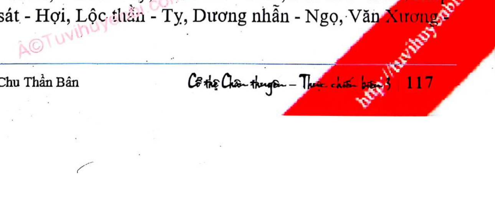
- **Cấu trúc Quẻ Dịch:**
  - **Quẻ chủ:** **Sơn Phong Cổ** (Cung Tốn – Quẻ Quy Hồn)  
    *Tượng quẻ:* Trùng tích, có sự cố hư hỏng cần sửa chữa; phản ánh hành động có chủ đích, đương số chủ động tìm kiếm các giải pháp trị liệu để đối phó với căn bệnh.
  - **Quẻ biến:** **Thiên Địa Bĩ** (Cung Càn – Quẻ Lục Hợp)  
    *Tượng quẻ:* Bế tắc, bất thông, trời đất không giao hòa; chỉ ra xu thế phương pháp châm cứu không mang lại hiệu quả thông suốt như kỳ vọng.
- **Bảng chi tiết Lục hào:**

| Hào | Thế/Ứng | Lục thân (Chủ) | Can Chi | Biến động | Lục thân (Biến) | Can Chi (Biến) | Thần sát / Phục thần | Lục thú |
|:---:|:---:|:---|:---|:---:|:---|:---|:---|:---|
| 6 | **Ứng** | Huynh Đệ | Dần - Mộc | tĩnh | Thê Tài | Tuất - Thổ | Dịch mã | Thanh Long |
| 5 | | Phụ Mẫu | Tý - Thủy | **X (Động)** | Quan Quỷ | Thân - Kim | [Phục: Tử Tôn Tỵ Hỏa] Tai sát | Huyền Vũ |
| 4 | | Thê Tài | Tuất - Thổ | **X (Động)** | Tử Tôn | Ngọ - Hỏa | Hoa cái, Thiên hỷ, Nhật kiến, Nguyệt phá | Bạch Hổ |
| 3 | **Thế** | Quan Quỷ | Dậu - Kim | **O (Động)** | Huynh Đệ | Mão - Mộc | Quý nhân, Thiên y | Đằng Xà |
| 2 | | Phụ Mẫu | Hợi - Thủy | **O (Động)** | Tử Tôn | Tỵ - Hỏa | Kiếp sát, Quý nhân | Câu Trần |
| 1 | | Thê Tài | Sửu - Thổ | tĩnh | Thê Tài | Mùi - Thổ | Tuần không | Chu Tước |

---

### 3. Dụng thần & Loại quẻ

- **Phân loại quẻ:**
  - Quẻ vấn y dược, khảo sát hiệu quả của phương pháp trị liệu cụ thể (Quẻ sự việc).
  - Quẻ có cấu trúc đa hào động hai bên hào Thế phản ánh các phương án lựa chọn điều trị khác nhau.
- **Định vị Dụng thần cốt lõi:**
  - Thầy thuốc được chỉ định (Pháp sư): Hào **Ứng Huynh Đệ Dần Mộc** mang Quý nhân.
  - Bản thân người bệnh: Hào **Thế Quan Quỷ Dậu Kim** (Quan Quỷ trì Thế chứng tỏ đang mang mầm mống ung thư u hạch).
  - Phương pháp trị liệu y học (Thuốc men, y thuật): Hào **Tử Tôn** do các hào phát động hóa ra.

---

### 4. Luận giải chi tiết

#### 1. Triệu chứng bệnh lý qua Hào Thế
- Hào Thế Quan Quỷ Dậu Kim mang Đằng Xà phát động. Kim chủ u cục, kết hạch cứng, Đằng Xà chủ dị vật biến dị. Điều này xác thực sự hiện diện của khối u ung thư vú trên cơ thể người bệnh.
- Hào Thế Dậu Kim động biến Huynh Đệ Mão Mộc tạo thành cục diện tương xung phản ngâm (Mão Dậu tương xung). Trong xem bệnh, Thế động biến phản ngâm chỉ sự phản phúc, dây dưa nhiều lần nhưng cuối cùng biến thành Huynh Đệ là điềm lành phục hồi nguyên khí.

#### 2. Đối chiếu các phương pháp trị liệu (Hào 2 vs Hào 4)
- **Phương án 1 - Châm cứu của Pháp sư (Hào 2 Phụ Mẫu Hợi Thủy):**
  - Hào 2 là vị trí hạ hào (ở gần, địa phương Thượng Hải). Pháp sư tuổi Hợi nên Phụ Mẫu Hợi Thủy đại diện cho y thuật châm cứu của ông.
  - Hợi Thủy phát động hóa Tử Tôn Tỵ Hỏa mang Lộc thần. Trong y học Lục Hào, Tử Tôn mang Lộc thần đại diện cho phương pháp điều trị bảo tồn, không xâm lấn (châm cứu, dùng thuốc nhẹ).
  - Tuy nhiên, Hợi Thủy không tương sinh cho hào Thế Dậu Kim. Hơn nữa Hợi Thủy biến Tỵ Hỏa lại là phản ngâm (Tỵ Hợi tương xung). Hiện tượng phản ngâm này chỉ sự thay đổi qua lại: đưa tiền trước rồi lại hoàn tiền sau, điều trị vài lần rồi dừng lại vì không đem lại hiệu quả thực chất.
- **Phương án 2 - Phẫu thuật ngoại khoa chính quy (Hào 4 Thê Tài Tuất Thổ):**
  - Hào 4 Thê Tài Tuất Thổ phát động hóa ra Tử Tôn Ngọ Hỏa.
  - Ngọ Hỏa mang Bạch Hổ và Dương nhẫn. Dương nhẫn kết hợp Bạch Hổ là tượng dao kéo phẫu thuật xâm lấn ngoại khoa tại bệnh viện chuyên khoa.
  - Tử Tôn Ngọ Hỏa này khắc chế Quan Quỷ Dậu Kim, loại bỏ tận gốc ổ bệnh ung thư. Tử Tôn Ngọ Hỏa hiện lâm Tuần không và Tuất Thổ lâm Nguyệt phá, biểu thị phương pháp phẫu thuật này người bệnh chưa bắt đầu áp dụng nhưng là kim chỉ nam tối ưu.

#### 3. Định vị bác sĩ phương Nam (Hào 5 Phụ Mẫu Tý Thủy)
- Hào 5 Phụ Mẫu Tý Thủy động biến Quan Quỷ Thân Kim: Hào 5 ở vị trí thượng hào (phương xa, hướng Nam – bác sĩ Trịnh ở Quảng Châu). Bác sĩ Trịnh chuyên dùng châm cứu điều trị các ca bệnh nan y giai đoạn muộn (hào 5-6 là hậu kỳ). Trong khi đó bệnh của đương số ở hào 3 (giai đoạn sớm), do đó phương án thích hợp nhất không phải châm cứu mà là phẫu thuật cắt bỏ ổ bệnh ở bệnh viện.

---

### 5. Kết luận & Ứng kỳ thực tế

- **Lời giải đoán & Khuyến nghị của Chu Thần Bân:**
  - Châm cứu của vị pháp sư không mang lại hiệu quả chữa lành khối u, quá trình điều trị sẽ gặp phản phúc và gián đoạn.
  - Quẻ chỉ dẫn bắt buộc phải chuyển hướng sang phẫu thuật ngoại khoa (Tử Tôn Ngọ Hỏa lâm Bạch Hổ, Dương nhẫn) tại bệnh viện chuyên khoa để cắt bỏ triệt để khối u giai đoạn đầu.
- **Phản hồi thực tế (Feedback):**
  - Sau ba buổi châm cứu không có tiến triển, đương số được bác sĩ khuyên đi khám và phát hiện ung thư vú giai đoạn một.
  - Vị pháp sư khi biết kết quả ung thư đã hoàn trả toàn bộ học phí và tiền ba buổi trị liệu (ứng nghiệm chính xác tượng phản ngâm của Hợi Thủy biến Tỵ Hỏa).
  - Đương số đã tiến hành phẫu thuật cắt bỏ khối u tại bệnh viện Tây y thành công, sức khỏe hồi phục hoàn toàn.
- **Ứng kỳ chiêm nghiệm:**
  - Sự việc phản phúc diễn ra ngay trong vòng 3 lần châm cứu; phẫu thuật được tiến hành khi Tử Tôn Ngọ Hỏa xuất không xung khai.

---

### 6. Bài học tâm pháp & Quy tắc cốt lõi

- **Quy tắc Lục Hào rút ra:**
  - Trích dẫn quy tắc: *Quy tắc hào Ứng làm Dụng thần thầy thuốc/phương pháp trị liệu và định hướng phẫu thuật y khoa chính quy* (sách Cổ Thệ Chân Thuyên, trang 109, rule_index).
  - Phân biệt phương pháp trị liệu qua thần sát: Tử Tôn lâm Lộc thần là bảo tồn, Tử Tôn lâm Dương nhẫn kết hợp Bạch Hổ là phẫu thuật ngoại khoa.
  - Cơ chế phản ngâm trong chiêm nghiệm thực tế: Hào Thế và hào động cùng phản ngâm dự báo sự thay đổi phác đồ và việc hoàn trả tiền bạc.
- **Bài học tâm pháp giải đoán:**
  - Y đạo và Bốc đạo tương thông: Quẻ tượng có khả năng phân tầng giai đoạn bệnh lý (sơ kỳ, trung kỳ, hậu kỳ) để chỉ dẫn phương pháp điều trị trúng đích nhất, tránh việc cố chấp dùng sai liệu pháp dẫn đến lỡ mất thời cơ vàng (*"Đúng bệnh đúng thuốc, đúng thời đúng pháp"*).

## THỰC CHIẾN 142: BÁC SĨ XEM QUẺ CHO BỆNH NHÂN TIM MẠCH

---

### 1. Bối cảnh & Câu hỏi

- **Bối cảnh chi tiết:** 
  Một vị bác sĩ chuyên khoa tim mạch (đồng môn theo học Lục Hào với Chu Thần Bân), vốn là thầy thuốc Tây y có nhiều năm kinh nghiệm lâm sàng và uy tín lớn tại địa phương, tiếp nhận một ca bệnh nhân mắc bệnh tim mạch rất nghiêm trọng. Sau khi thăm khám và kê đơn thuốc theo đúng phác đồ quy chuẩn của bệnh viện, vị bác sĩ dựa trên trực giác nghề nghiệp nhạy bén cảm thấy có điều gì đó bất an về diễn biến bệnh lý của người này. Ông bèn tự mình gieo một quẻ Dịch để dự trắc xu hướng bệnh tình rồi đăng lên nhóm học thuật. Chu Thần Bân nhìn thấy quẻ đã lập tức cùng vị bác sĩ mổ xẻ phân tích chi tiết.
- **Tâm lý & Câu hỏi ẩn ý:** 
  Vị bác sĩ băn khoăn liệu phác đồ thuốc hiện tại có thực sự kiểm soát được căn bệnh nguy hiểm này không, hay ẩn sâu bên trong là một cơn nguy kịch tim mạch cấp tính sắp bùng phát ngoài tầm kiểm soát của phác đồ điều trị bề mặt.
- **Thời gian chiêm đoán:**
  - Dương lịch: Ngày 18 tháng 05 năm 2018, lúc 12 giờ 21 phút (Giờ Bắc Kinh).
  - Can chi: Năm Mậu Tuất, tháng Đinh Tỵ, ngày Canh Tuất, giờ Nhâm Ngọ.

---

### 2. Dữ kiện & Bảng quẻ Crop

- **Thời không chiêm nghiệm:**
  - Tháng Đinh Tỵ (Hỏa vượng, Thổ tướng, Thủy tuyệt).
  - Ngày Canh Tuất (Thổ vượng, Kim suy).
  - Tuần không: **Dần, Mão** (Giáp Thìn tuần trung, Dần Mão không vong).
- **Thần sát:**
  - Tướng tinh: Ngọ (Lâm hào Ứng)
  - Hoa cái: Tuất (Lâm Nhật kiến, hào 5)
  - Dịch mã: Thân (Lâm hào 4 Phụ Mẫu)
  - Tai sát: Tý (Lâm hào Thế)
  - Mưu tinh: Thìn (Lâm hào 2)
  - Đào hoa: Mão (Lâm Tuần không)
  - Kiếp sát: Hợi (Lâm hào biến Huynh Đệ)
  - Lộc thần: Thân (Lâm hào 4)
  - Dương nhẫn: Dậu (Lâm hào biến Phụ Mẫu)
  - Văn Xương: Hợi
  - Thiên y: Thìn
  - Thiên hỷ: Sửu
  - Quý nhân: Dần, Ngọ (hào Ứng)
- Dữ kiện bảng quẻ và các thông số chiêm đoán:
  - **Hình 142:** Đồ hình quẻ Thực chiến 142
    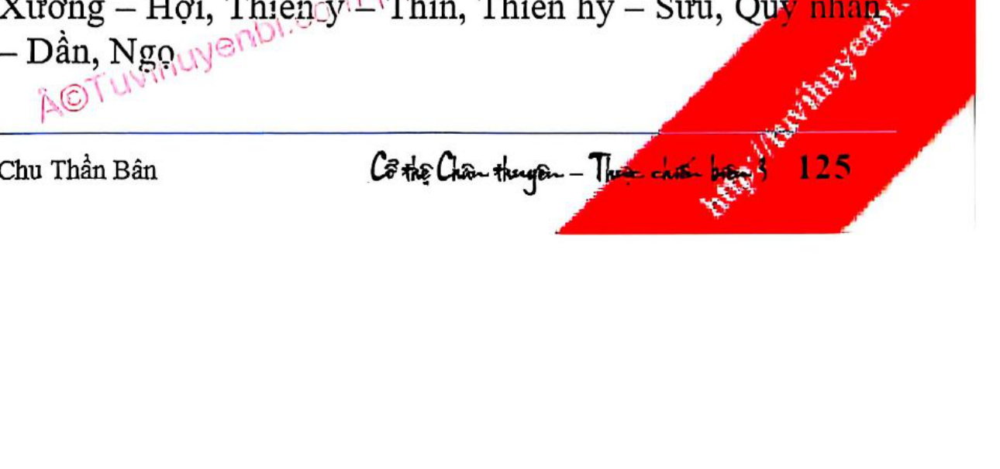
- **Cấu trúc Quẻ Dịch:**
  - **Quẻ chủ:** **Bát Thuần Khảm** (Cung Khảm – Quẻ Lục Xung)  
    *Tượng quẻ:* Thủy Để Lao Nguyệt, hiểm trở trùng trùng; Lục xung biểu thị bệnh tình bộc phát đột ngột, nguy cấp, đòi hỏi biện pháp cấp cứu khẩn trương.
  - **Quẻ biến:** **Trạch Phong Đại Quá** (Cung Chấn – Quẻ Du Hồn)  
    *Tượng quẻ:* Đại Quá tất hữu tổn, rầm xà quá tải uốn cong gãy đổ; dự báo xu thế vô cùng nguy kịch, sinh mệnh bệnh nhân bị tổn hại nghiêm trọng.
- **Bảng chi tiết Lục hào:**

| Hào | Thế/Ứng | Lục thân (Chủ) | Can Chi | Biến động | Lục thân (Biến) | Can Chi (Biến) | Thần sát / Phục thần | Lục thú |
|:---:|:---:|:---|:---|:---:|:---|:---|:---|:---|
| 6 | **Thế** | Huynh Đệ | Tý - Thủy | tĩnh | Quan Quỷ | Mùi - Thổ | Tai sát | Đằng Xà |
| 5 | | Quan Quỷ | Tuất - Thổ | tĩnh | Phụ Mẫu | Dậu - Kim | Hoa cái | Câu Trần |
| 4 | | Phụ Mẫu | Thân - Kim | **X (Động)** | Huynh Đệ | Hợi - Thủy | Dịch mã, Lộc thần | Chu Tước |
| 3 | **Ứng** | Thê Tài | Ngọ - Hỏa | **X (Động)** | Phụ Mẫu | Dậu - Kim | Tướng tinh, Quý nhân | Thanh Long |
| 2 | | Quan Quỷ | Thìn - Thổ | tĩnh | Huynh Đệ | Hợi - Thủy | Mưu tinh, Thiên y | Huyền Vũ |
| 1 | | Tử Tôn | Dần - Mộc | tĩnh | Quan Quỷ | Sửu - Thổ | Tuần không, Quý nhân | Bạch Hổ |

---

### 3. Dụng thần & Loại quẻ

- **Phân loại quẻ:**
  - Bác sĩ gieo quẻ thay cho bệnh nhân xa lạ không quen biết (Đại chiêm y khoa lâm sàng).
  - Quẻ có cấu trúc xung khắc đối kháng giữa bác sĩ (hào Thế) và căn bệnh (hào Ứng).
- **Định vị Dụng thần cốt lõi:**
  - Quy tắc chọn Dụng khi bác sĩ xem cho bệnh nhân: Hào **Ứng** đại diện cho bệnh nhân hoặc căn bệnh của bệnh nhân.
  - Hào **Thế Huynh Đệ Tý Thủy**: Đại diện cho bản thân bác sĩ và năng lực y dược chế ngự.
  - Căn bệnh tim mạch: Hào **Ứng Thê Tài Ngọ Hỏa** bị hào Thế Tý Thủy trực tiếp tương khắc. Hỏa chủ tâm tạng, huyết mạch; Ngọ Hỏa phát động đại diện cho căn bệnh nguy hiểm phát sinh tại tim.

---

### 4. Luận giải chi tiết

#### 1. Cơ chế đối vị "Bác sĩ khắc bệnh" và định vị bệnh tim
- Trong lý luận Lục Hào khi thầy thuốc chiêm bệnh, hào Thế khắc hào Ứng không phải là khắc hãm người bệnh mà là bác sĩ dùng y thuật chế phục căn bệnh (*"Khắc giả vi chế"*).
- Hào Thế Huynh Đệ Tý Thủy (Thủy) xung khắc hào Ứng Thê Tài Ngọ Hỏa (Hỏa). Ngọ Hỏa thuộc Hỏa đại diện cho tim mạch và hệ tuần hoàn máu. Ngọ Hỏa lâm hào Ứng phát động chỉ thị bệnh biến xuất phát từ tim.

#### 2. Độ ăn sâu của bệnh lý: Ngọ Hỏa biến Phụ Mẫu Dậu Kim
- Hào Ứng Thê Tài Ngọ Hỏa phát động biến xuất Phụ Mẫu Dậu Kim mang Dương nhẫn.
- Trong mạch máu (Hỏa) xuất hiện dị vật cô đọng kết tụ (Kim), lại mang Dương nhẫn chỉ huyết khối gây tắc nghẽn động mạch vành trực tiếp. Đây là dạng bệnh lý cơ chất đã ăn sâu, tổn thương cấu trúc mạch máu nghiêm trọng chứ không còn là rối loạn chức năng thông thường.

#### 3. Phác đồ điều trị bị lệch tầng: Phụ Mẫu Thân Kim động hóa Nguyệt phá
- Hào 4 Phụ Mẫu Thân Kim phát động sinh hào Thế Huynh Đệ Tý Thủy. Phụ Mẫu Thân Kim đại diện cho phương thuốc và phác đồ điều trị của bệnh viện. Thuốc sinh Thế cho thấy đơn thuốc hiện tại có tác dụng hỗ trợ bác sĩ làm dịu và ức chế triệu chứng bệnh trong ngắn hạn.
- Tuy nhiên, Phụ Mẫu Thân Kim động hóa Huynh Đệ Hợi Thủy. Hợi Thủy lâm tháng Tỵ bị Nguyệt kiến trực xung thành **Nguyệt phá** (*động nhi hóa phá, đồ lao vô công*). Nghĩa là phương thuốc này sau một thời gian ngắn phát huy tác dụng sẽ bị phá hủy hiệu lực hoàn toàn.
- **Sự lệch pha giữa thuốc và bệnh:** Phương thuốc can thiệp ở tầng Thân Kim, trong khi bệnh lý tổn thương đã ăn sâu vào tầng Dậu Kim mang Dương nhẫn. Biện pháp điều trị hiện tại chỉ giải quyết phần ngọn bề mặt, không chạm tới gốc rễ bệnh căn.

---

### 5. Kết luận & Ứng kỳ thực tế

- **Lời giải đoán & Khuyến nghị của Chu Thần Bân:**
  - Bệnh tình của bệnh nhân cực kỳ nguy hiểm, phác đồ dùng thuốc hiện tại chỉ có tác dụng ức chế triệu chứng tạm thời, hoàn toàn không trị được tận gốc.
  - Cảnh báo bệnh nhân sẽ tái phát cơn nguy kịch tim mạch cấp tính khi Ngọ Hỏa và Dậu Kim đắc lệnh vượng tướng – tức từ tháng Ngọ đến tháng Dậu (từ tháng 6 đến tháng 9 âm lịch).
- **Phản hồi thực tế (Feedback):**
  - Vị bác sĩ chuyên khoa tim mạch lập tức bày tỏ sự tán đồng và thán phục sâu sắc. Ông xác nhận phân tích từ quẻ Dịch hoàn toàn trùng khớp với nhận định chuyên môn lâm sàng: bệnh nhân bị tổn thương mạch vành quá sâu, thuốc kê đơn chỉ mang tính tạm thời cầm cự, nguy cơ đột tử tái phát là rất cao.
- **Ứng kỳ chiêm nghiệm:**
  - Ứng kỳ hung hiểm rơi vào các tháng Ngọ, Mùi, Thân, Dậu khi căn bệnh Ngọ Hỏa và biến hào Dậu Kim nắm lệnh làm tổn thương sinh mệnh.

---

### 6. Bài học tâm pháp & Quy tắc cốt lõi

- **Quy tắc Lục Hào rút ra:**
  - Trích dẫn quy tắc: *Quy tắc bác sĩ gieo quẻ hộ bệnh nhân không quen biết qua hào Ứng và dự báo cơn nguy kịch tim mạch cấp* (sách Cổ Thệ Chân Thuyên, trang 116, rule_index).
  - Quy tắc định vị Dụng thần trong y khoa: Bác sĩ xem cho bệnh nhân lạ lấy hào Ứng làm bệnh nhân/bệnh chứng; Thế khắc Ứng biểu thị y thuật chế ngự bệnh tật.
  - Cơ chế hào phương dược động hóa Nguyệt phá: cảnh báo thuốc mất tác dụng sau thời gian ngắn, bệnh lý ăn sâu hơn năng lực điều trị hiện thời.
- **Bài học tâm pháp giải đoán:**
  - Lục Hào là công cụ hỗ trợ lâm sàng đắc lực: Dù không có kiến thức y khoa chuyên sâu, người luận dịch vẫn có thể thông qua đồ hình sinh khắc biến hóa để nhìn thấu độ nông sâu của bệnh lý và sự tương thích của phác đồ điều trị (*"Dịch lý thông y lý, quẻ tượng thấy trước nguy cơ"*).

## THỰC CHIẾN 143: BỊ ỦY BAN KIỂM TRA KỶ LUẬT ĐƠN VỊ LẬP ÁN ĐIỀU TRA, HỎI KẾT QUẢ

---

### 1. Bối cảnh & Câu hỏi

- **Bối cảnh chi tiết:** 
  Một cán bộ trung tầng tại một cơ quan đơn vị do có sai phạm trong công tác nên đã bị Ủy ban kiểm tra kỷ luật của đơn vị chính thức lập án điều tra. Đương sự đứng ngồi không yên, tìm đến Chu Thần Bân để xin một quẻ dự trắc xem kết quả của vụ việc điều tra này sẽ đi về đâu.
- **Tâm lý & Câu hỏi ẩn ý:** 
  Người hỏi đặt câu hỏi: *"Tôi muốn biết kết quả của chuyện này sẽ ra sao?"*. Để giải mã chuẩn xác, Chu Thần Bân nhấn mạnh cần thâm nhập vào tầng sâu tâm lý của đương sự. Trong bối cảnh sai phạm công vụ nội bộ cơ quan, tình huống xấu nhất được xác định là bị kỷ luật, giáng chức từ chức danh chuyên viên cao cấp xuống chuyên viên cấp một và cắt tiền thưởng hiệu suất; hoàn toàn không có nguy cơ vi phạm pháp luật hình sự hay bị bắt tù đày. Do đó, điều đương sự lo sợ nhất là bị mất chức, và điều mong mỏi nhất là giữ được chức vị. Đây thực chất là một quẻ hỏi về công danh chức vụ (quẻ sự việc), chứ không phải quẻ tâm thái cầu bình an thân mạng.
- **Thời gian chiêm đoán:**
  - Can chi: Tháng Mùi, ngày Quý Dậu.
  - Tuần không: **Tuất, Hợi** (Giáp Tý tuần trung, Tuất Hợi không vong).

---

### 2. Dữ kiện & Bảng quẻ Crop

- **Thời không chiêm nghiệm:**
  - Tháng Mùi (Thổ vượng, Mộc suy nhập mộ).
  - Ngày Quý Dậu (Kim vượng, Mộc tuyệt).
  - Tuần không: **Tuất, Hợi**.
- **Thần sát:**
  - Tướng tinh: Dậu (Lâm Nhật kiến, hào Thế)
  - Hoa cái: Sửu (Lâm hào 4)
  - Dịch mã: Hợi (Lâm Tuần không, hào 5)
  - Tai sát: Mão (Lâm hào Ứng)
  - Mưu tinh: Mùi (Lâm Nguyệt kiến, hào sơ)
  - Đào hoa: Ngọ
  - Kiếp sát: Dần
  - Lộc thần: Tý
  - Dương nhẫn: Hợi
  - Văn xương: Mão
  - Thiên y: Ngọ
  - Thiên hỷ: Sửu
  - Quý nhân: Mão (hào Ứng), Tỵ (hào 2)
- Dữ kiện bảng quẻ và các thông số chiêm đoán:
  - **Hình 143:** Đồ hình quẻ Thực chiến 143
    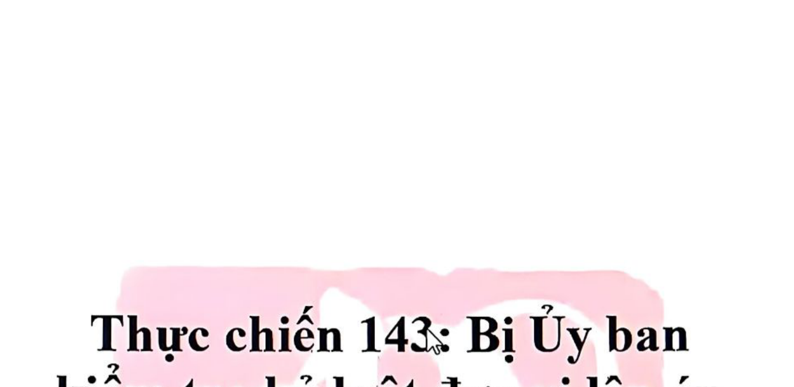
- **Cấu trúc Quẻ Dịch:**
  - **Quẻ chủ:** **Bát Thuần Khôn** (Cung Khôn – Quẻ Lục Xung)  
    *Tượng quẻ:* Toàn quẻ sáu hào thuần âm an tĩnh; quẻ tĩnh Lục xung chủ về sự việc mau chóng tiêu tan, mâu thuẫn giải tán, không kết tụ thành đại họa hình sự.
  - **Quẻ biến:** **Bát Thuần Khôn** (Quẻ tĩnh không biến).
- **Bảng chi tiết Lục hào:**

| Hào | Thế/Ứng | Lục thân (Chủ) | Can Chi | Biến động | Lục thân (Biến) | Can Chi (Biến) | Thần sát / Phục thần | Lục thú |
|:---:|:---:|:---|:---|:---:|:---|:---|:---|:---|
| 6 | **Thế** | Tử Tôn | Dậu - Kim | tĩnh | Tử Tôn | Dậu - Kim | Tướng tinh, Nhật kiến | Bạch Hổ |
| 5 | | Thê Tài | Hợi - Thủy | tĩnh | Thê Tài | Hợi - Thủy | Dịch mã, Dương nhẫn, Tuần không | Đằng Xà |
| 4 | | Huynh Đệ | Sửu - Thổ | tĩnh | Huynh Đệ | Sửu - Thổ | Hoa cái, Thiên hỷ | Câu Trần |
| 3 | **Ứng** | Quan Quỷ | Mão - Mộc | tĩnh (Nhật phá) | Quan Quỷ | Mão - Mộc | Tai sát, Văn xương, Quý nhân | Chu Tước |
| 2 | | Phụ Mẫu | Tỵ - Hỏa | tĩnh | Phụ Mẫu | Tỵ - Hỏa | Quý nhân | Thanh Long |
| 1 | | Huynh Đệ | Mùi - Thổ | tĩnh | Huynh Đệ | Mùi - Thổ | Mưu tinh, Nguyệt kiến | Huyền Vũ |

---

### 3. Dụng thần & Loại quẻ

- **Phân loại quẻ:**
  - Quẻ sự việc cầu giữ chức vụ công danh (không phải quẻ tâm thái).
  - Chu Thần Bân phân tích: nếu đối mặt nguy cơ ngồi tù thì an nguy tính mạng là trên hết, lúc đó mới lấy Tử Tôn trì Thế làm cát (quẻ tâm thái). Nhưng ở đây đương sự chỉ đối mặt nguy cơ giáng chức, nên mục tiêu cốt lõi là giữ chức vị.
- **Định vị Dụng thần cốt lõi:**
  - Chức vụ, vị trí công tác: Hào **Ứng Quan Quỷ Mão Mộc** làm Dụng thần.
  - Bản thân người hỏi: Hào **Thế Tử Tôn Dậu Kim**.

---

### 4. Luận giải chi tiết

#### 1. Sự sai lầm kinh điển của lối đoán khuôn mẫu
- Nhiều người học Lục Hào khi thấy quẻ này thường mắc bẫy máy móc: nhìn thấy Tử Tôn trì Thế, Quan Quỷ bị Nhật phá bèn vội vàng phán là *"yên tâm, bình an vô sự"*.
- Lối suy đoán đó sai lầm vì không hiểu thực tế xã hội. Đương sự không hề có nguy cơ ngồi tù, điều họ muốn là giữ ghế. Khi Quan Quỷ làm Dụng thần chức vụ mà bị Nhật phá tan tành, lại bị hào Thế Tử Tôn khắc phạt thì chức vụ chắc chắn bị tước bỏ.

#### 2. Định tính Dụng thần Quan Quỷ Mão Mộc lâm Nhật phá
- Quan Quỷ Mão Mộc cư hào 3 lâm hào Ứng. Vào tháng Mùi, Mộc lâm hưu tù nhập mộ suy nhược. Lại bị Nhật thần Quý Dậu xung trực diện (Mão Dậu tương xung).
- Hào suy nhược bị Nhật xung trở thành **chân Nhật phá**. Quan vị bị phá tan nát, phản ánh việc Ủy ban kiểm tra kỷ luật sau khi điều tra xác thực sai phạm sẽ ra quyết định bãi miễn, giáng chức của đương sự.
- Hào Thế Tử Tôn Dậu Kim mang Bạch Hổ lâm Nhật kiến: Tử Tôn là thần tước quan bãi chức, Thế lâm Tử Tôn vượng tướng thể hiện chính bản thân đương sự phải gánh chịu quyết định kỷ luật về mặt chức vụ sự nghiệp.

#### 3. Tác dụng giải ách của Quẻ tĩnh Lục xung
- Điểm mấu chốt là toàn quẻ là **Bát Thuần Khôn** – quẻ tĩnh Lục xung.
- Quy tắc Cổ thệ chỉ rõ: Quẻ lục xung an tĩnh chủ sự việc mau chóng tan rã, giải tán êm thấm, không phát triển dây dưa thành họa lớn. Điều này chứng minh đương sự sẽ không bị truy cứu trách nhiệm pháp lý hình sự, không bị khai trừ hay vướng vào cảnh lao tù, sự việc kết thúc ở mức xử lý nội bộ.

---

### 5. Kết luận & Ứng kỳ thực tế

- **Lời giải đoán & Khuyến nghị của Chu Thần Bân:**
  - Khẳng định chức vụ hiện tại không thể giữ nổi, chắc chắn sẽ bị xử lý kỷ luật giáng chức và cắt giảm thu nhập thưởng hiệu suất.
  - An ủi đương sự yên tâm rằng vụ việc chỉ dừng lại ở mức kỷ luật hành chính nội bộ của đơn vị, hoàn toàn không có nguy cơ lao lý hay mất việc.
- **Phản hồi thực tế (Feedback):**
  - Sau khi kết thúc quá trình điều tra, Ủy ban kiểm tra kỷ luật đã ra quyết định: Giáng chức đương sự từ chuyên viên cao cấp xuống chuyên viên cấp một, đồng thời hủy bỏ toàn bộ tiền thưởng hiệu suất công tác trong năm đó.
  - Sự việc êm thấm khép lại đúng như quẻ tĩnh Lục xung đã chỉ báo.
- **Ứng kỳ chiêm nghiệm:**
  - Sự việc ngã ngũ ngay trong tháng Mùi khi Quan Quỷ Mão Mộc nhập mộ lâm phá.

---

### 6. Bài học tâm pháp & Quy tắc cốt lõi

- **Quy tắc Lục Hào rút ra:**
  - Trích dẫn quy tắc: *Quy tắc quẻ tĩnh Bát Thuần Khôn lục xung giải trừ nguy cơ lao lý hình sự khi bị Ủy ban kỷ luật điều tra* (sách Cổ Thệ Chân Thuyên, trang 124, rule_index).
  - Phân biệt bản chất Quẻ sự việc vs Quẻ tâm thái: Phải dựa trên giới hạn rủi ro thực tế của đương số trong xã hội để định vị Dụng thần (*"Ý niệm quyết định Dụng thần"*).
  - Ý nghĩa quẻ tĩnh Lục xung: Sự việc xung tán nhanh chóng, hóa giải nguy cơ đại họa kéo dài.
- **Bài học tâm pháp giải đoán:**
  - Đỉnh cao của nghệ thuật đoán quẻ là đọc thấu tâm can con người: Không thể bám cứng nhắc vào khuôn mẫu sách vở mà phải thấu hiểu quy luật vận hành xã hội để xác định đúng điều người hỏi thực sự cầu (*"Đoán quẻ là đoán lòng người, thấu lý sự mới thấu Dịch lý"*).

## THỰC CHIẾN 144: CÔNG TY SỬA NHÀ THU DƯ TIỀN CÓ THỂ LẤY LẠI KHÔNG

---

### 1. Bối cảnh & Câu hỏi

- **Bối cảnh chi tiết:** 
  Một người đồng môn thuê một công ty thi công sửa chữa nhà ở. Trong quá trình thanh quyết toán, chủ nhà phát hiện công ty sửa nhà đã thu vượt số tiền thực tế – tính các khoản chi phí cao hơn hợp đồng và kê khống các hạng mục vật tư, công việc vốn dĩ không hề thi công. Đối với những phần việc không làm, theo nguyên tắc bên nhận thầu bắt buộc phải hoàn trả lại tiền. Tuy nhiên sau khi công trình hoàn tất, công ty sửa nhà lại tìm mọi cách thoái thác, từ chối trả lại số tiền dôi dư. Đương sự phải cất công thu thập chứng từ, hóa đơn và dữ liệu công trình để đối chất. Đứng trước sự cù nhầy của phía nhà thầu, người này gieo quẻ hỏi liệu có thể lấy lại được số tiền bị thu dư hay không.
- **Tâm lý & Câu hỏi ẩn ý:** 
  Bản chất của sự việc này là một vụ tranh chấp tài chính và mâu thuẫn lợi ích gay gắt chứ không đơn thuần là chiêm cầu tài. Đương sự vô cùng bức xúc vì bị lừa dối, lo sợ bị quỵt tiền, muốn biết vụ tranh chấp này sẽ giải quyết ra sao và tiền có thực sự quay về túi mình hay không.
- **Thời gian chiêm đoán:**
  - Can chi: Tháng Dậu, ngày Đinh Sửu.
  - Tuần không: **Thân, Dậu** (Giáp Tuất tuần trung, Thân Dậu không vong).

---

### 2. Dữ kiện & Bảng quẻ Crop

- **Thời không chiêm nghiệm:**
  - Tháng Dậu (Kim vượng, Lâm Nguyệt kiến).
  - Ngày Đinh Sửu (Kim nhập mộ, Thổ vượng).
  - Tuần không: **Thân, Dậu**.
- **Thần sát:**
  - Tướng tinh: Dậu (Lâm Nguyệt kiến, hào Thế)
  - Hoa cái: Sửu (Lâm Nhật kiến, hào sơ)
  - Dịch mã: Hợi (Lâm hào 2)
  - Tai sát: Mão
  - Mưu tinh: Mùi
  - Đào hoa: Ngọ
  - Kiếp sát: Dần (Lâm hào Ứng)
  - Lộc thần: Ngọ
  - Dương nhẫn: Tỵ (Lâm hào biến Tử Tôn)
  - Văn Xương: Dậu (Lâm hào Thế)
  - Thiên y: Thân
  - Thiên hỷ: Thìn
  - Quý nhân: Dậu (hào Thế), Hợi (hào 2)
- Dữ kiện bảng quẻ và các thông số chiêm đoán:
  - **Hình 144:** Đồ hình quẻ Thực chiến 144
    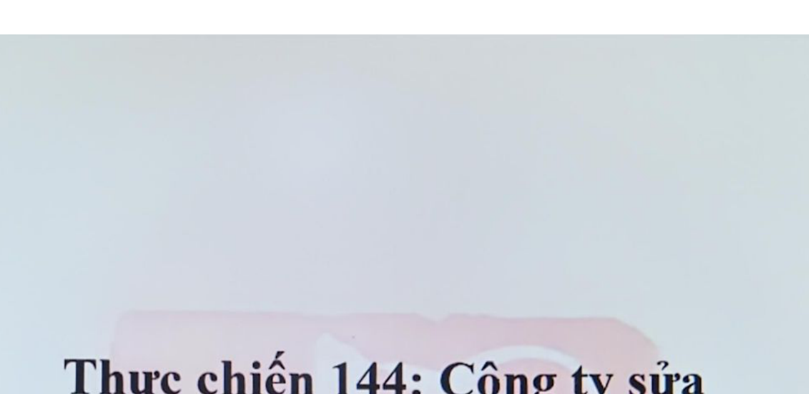
- **Cấu trúc Quẻ Dịch:**
  - **Quẻ chủ:** **Sơn Phong Cổ** (Cung Tốn – Quẻ Quy Hồn)  
    *Tượng quẻ:* Trùng tích, có sự cố hư hỏng cần xử lý; phản ánh hiện trạng đương số đang chủ động đứng ra vạch trần sai phạm, đối chất với công ty để giải quyết tranh chấp.
  - **Quẻ biến:** **Bát Thuần Tốn** (Cung Tốn – Quẻ Lục Xung)  
    *Tượng quẻ:* Thuận phong tiếp tục, nhưng biến Lục xung chủ về quá trình tranh cãi xung đột dữ dội, cuối cùng sẽ xung phá tan rã mâu thuẫn để chấm dứt sự việc.
- **Bảng chi tiết Lục hào:**

| Hào | Thế/Ứng | Lục thân (Chủ) | Can Chi | Biến động | Lục thân (Biến) | Can Chi (Biến) | Thần sát / Phục thần | Lục thú |
|:---:|:---:|:---|:---|:---:|:---|:---|:---|:---|
| 6 | **Ứng** | Huynh Đệ | Dần - Mộc | tĩnh | Huynh Đệ | Mão - Mộc | Kiếp sát, Quý nhân | Thanh Long |
| 5 | | Phụ Mẫu | Tý - Thủy | **X (Động)** | Tử Tôn | Tỵ - Hỏa | [Phục: Tử Tôn Tỵ Hỏa] | Huyền Vũ |
| 4 | | Thê Tài | Tuất - Thổ | tĩnh | Thê Tài | Mùi - Thổ | Mưu tinh | Bạch Hổ |
| 3 | **Thế** | Quan Quỷ | Dậu - Kim | tĩnh | Quan Quỷ | Dậu - Kim | Tướng tinh, Văn Xương, Quý nhân, Nguyệt kiến, Tuần không | Đằng Xà |
| 2 | | Phụ Mẫu | Hợi - Thủy | tĩnh | Phụ Mẫu | Hợi - Thủy | Dịch mã, Quý nhân | Câu Trần |
| 1 | | Thê Tài | Sửu - Thổ | tĩnh | Thê Tài | Sửu - Thổ | Hoa cái, Nhật kiến | Chu Tước |

---

### 3. Dụng thần & Loại quẻ

- **Phân loại quẻ:**
  - Quẻ tranh chấp tài chính và giải quyết phiền phức mâu thuẫn (Quẻ sự việc kết hợp quẻ tâm thái).
  - Quẻ độc phát (duy nhất một hào động), áp dụng nguyên lý *"Động đầu biến cuối"* trong cấu trúc tự sự của Lục Hào.
- **Định vị Dụng thần cốt lõi:**
  - Bản thân người hỏi: Hào **Thế Quan Quỷ Dậu Kim** (Quan Quỷ trì Thế chỉ thị hiện trạng đang vướng vào rắc rối, tranh chấp gay gắt).
  - Đối phương (Phía thi công): Hào **Ứng Huynh Đệ Dần Mộc** mang Kiếp sát (chủ trở ngại, cản trở, chiếm đoạt hao tổn tài chính).
  - Tiến trình giải quyết: Hào 5 **Phụ Mẫu Tý Thủy** phát động là điểm khởi đầu rắc rối; Hào biến **Tử Tôn Tỵ Hỏa** là kết quả giải quyết chung cuộc.

---

### 4. Luận giải chi tiết

#### 1. Logic quẻ độc phát "Động đầu biến cuối"
- Trong các quẻ tranh chấp giải quyết rắc rối, nếu hào động không tác động trực tiếp lên hào Thế hay hào Tài thì cần xét theo logic *"Động đầu biến cuối"*: Hào động đại diện cho giai đoạn khởi phát và diễn biến của sự việc; hào biến đại diện cho kết cục sau cùng.
- **Hào động khởi đầu rắc rối (Phụ Mẫu Tý Thủy):** Phụ Mẫu Tý Thủy mang Huyền Vũ phát động. Huyền Vũ chủ hành vi gian lận ngầm, sửa đổi che giấu số liệu thi công phía sau lưng khách hàng. Tý Thủy tương xung với Lộc thần Ngọ Hỏa, biểu thị việc ăn bớt tiền bạc trong dự toán vật tư. Phụ Mẫu động khắc Tử Tôn cho thấy giai đoạn đầu gặp muôn vàn khó khăn, bên thi công chối quanh, tranh cãi bất phân thắng bại.
- **Hào biến kết cục giải quyết (Tử Tôn Tỵ Hỏa):** Quá trình tranh chấp cuối cùng hóa xuất Tử Tôn Tỵ Hỏa. Tử Tôn là phúc thần dẹp tan Quan Quỷ (dập tắt tranh chấp mâu thuẫn). Tỵ Hỏa mang Dương nhẫn và Quý nhân, biểu thị việc giải quyết sẽ nhờ vào cấp quản lý có thẩm quyền ra quyết định cao hơn của công ty can thiệp xử lý công minh.

#### 2. Cơ chế Tam hợp chi tiết Tỵ - Dậu - Sửu
- Hào biến Tử Tôn Tỵ Hỏa kết hợp với hào Thế Quan Quỷ Dậu Kim và Nhật thần Đinh Sửu tạo thành cục diện **Tam hợp Kim cục** (Tỵ – Dậu – Sửu).
- Tam hợp ở đây mang ý nghĩa chi tiết: Để lấy lại tiền, người hỏi không thể chỉ làm việc với nhân viên thi công trực tiếp mà phải liên tục khiếu nại qua nhiều tầng nấc, kết nối từ tầng thực thi lên đến ban lãnh đạo cao cấp của công ty sửa nhà. Chỉ khi kết nối đủ các mắt xích này thì mới phá vỡ được thế bế tắc.

#### 3. Bản chất của giả tuyệt và Quẻ biến Lục xung
- Nhiều người thấy Tý Thủy hóa Tỵ Hỏa cho là hóa tuyệt. Chu Thần Bân chỉ rõ: Hào biến là kết quả sau cùng trong logic động đầu biến cuối nên việc lâm tuyệt chỉ đại diện cho trạng thái hiện tại chưa xảy ra (*giả tuyệt*), đến thời điểm thích hợp sẽ thành tựu.
- Quẻ biến Bát Thuần Tốn là quẻ Lục xung: Sự việc sau thời gian dài bế tắc sẽ được giải quyết dứt điểm thông qua xung phá.

---

### 5. Kết luận & Ứng kỳ thực tế

- **Lời giải đoán & Khuyến nghị của Chu Thần Bân:**
  - Khẳng định người đồng môn chắc chắn sẽ lấy lại được số tiền bị thu dư.
  - Hướng dẫn phương pháp: Phải kiên trì khiếu nại vượt cấp lên ban lãnh đạo cao nhất của công ty, cung cấp đầy đủ chứng cứ số liệu thì sự việc mới được giải quyết công bằng.
  - Dự báo thời gian ứng nghiệm: Quá trình sẽ kéo dài tương đối lâu, phải đợi đến tháng Hợi mới thu hồi được tiền.
- **Phản hồi thực tế (Feedback):**
  - Đương sự đã kiên trì gửi đơn khiếu nại, phản ánh lên lãnh đạo cấp cao của công ty sửa nhà. Cấp trên vào cuộc kiểm tra sổ sách và xác nhận đội thi công làm sai lệch chứng từ.
  - Đúng vào tháng Hợi, công ty đã chính thức chuyển khoản trả lại toàn bộ số tiền thu dư cho chủ nhà. Vụ việc kéo dài hơn hai tháng từ tháng Dậu đến tháng Hợi mới kết thúc.
- **Ứng kỳ chiêm nghiệm:**
  - Hào biến Tử Tôn Tỵ Hỏa ứng vào tháng Hợi: Tháng Hợi trực tiếp tương xung hào biến Tỵ Hỏa (*hào biến phùng xung tắc ứng*), đồng thời xung phá cục diện Tam hợp trói buộc, giải phóng khoản tiền bị chiếm giữ.

---

### 6. Bài học tâm pháp & Quy tắc cốt lõi

- **Quy tắc Lục Hào rút ra:**
  - Trích dẫn quy tắc: *Quy tắc đòi lại tiền tài chính qua quẻ biến Lục xung và ứng kỳ giải quyết tranh chấp kéo dài* (sách Cổ Thệ Chân Thuyên, trang 132, rule_index).
  - Tâm pháp quẻ độc phát "Động đầu biến cuối": Hào động là gian nan lúc khởi sự, hào biến là kết quả viên mãn khi kết thúc.
  - Bản chất giả tuyệt / giả phá của hào biến: Khi hào biến là cứu tinh kết quả, trạng thái tuyệt chỉ là độ trễ thời gian chứ không làm mất đi hiệu lực chung cuộc.
- **Bài học tâm pháp giải đoán:**
  - Phân tích tranh chấp dựa trên tầng nấc tổ chức: Quẻ tượng Tam hợp chỉ ra con đường giải quyết không nằm ở đối đầu với kẻ dưới quyền mà phải đưa lên cấp quyết định cao nhất (*"Nhìn thấu cấu trúc quyền lực qua Lục Hào để tìm lối thoát tranh chấp"*).

## THỰC CHIẾN 145: QUỐC KHÁNH ĐƯA MẸ CÙNG VỀ QUÊ VỢ NGHỈ NGƠI CÓ LỢI HAY HẠI

---

### 1. Bối cảnh & Câu hỏi

- **Bối cảnh chi tiết:** 
  Nhân dịp kỳ nghỉ lễ Quốc khánh dài ngày (khoảng một đến hai tuần), tác giả Chu Thần Bân có kế hoạch đưa mẹ ruột cùng về quê vợ để nghỉ ngơi, đi dạo và hít thở không khí trong lành. Vì người mẹ tuổi cao lại mắc nhiều chứng bệnh mãn tính, tác giả vô cùng lo lắng liệu mẹ có thích nghi được với thời tiết khí hậu quê vợ hay không, sợ việc đi lại đường xa mệt mỏi sẽ làm bệnh tình của bà tái phát hoặc trở nặng. Để thận trọng trước chuyến đi, tác giả đã tự mình gieo một quẻ Dịch để dự trắc xem việc đưa mẹ về quê có lợi hay có hại.
- **Tâm lý & Câu hỏi ẩn ý:** 
  Tấm lòng hiếu thảo muốn đưa mẹ đi nghỉ dưỡng thay đổi không khí, nhưng nội tâm trĩu nặng âu lo về sức khỏe và sự an nguy của đấng sinh thành trong một chuyến xuất hành ngắn hạn.
- **Thời gian chiêm đoán:**
  - Can chi: Tháng Dậu, ngày Bính Tý.
  - Tuần không: **Thân, Dậu** (Giáp Tuất tuần trung, Thân Dậu không vong).

---

### 2. Dữ kiện & Bảng quẻ Crop

- **Thời không chiêm nghiệm:**
  - Tháng Dậu (Kim vượng, Lâm Tuần không).
  - Ngày Bính Tý (Thủy vượng, Lâm Tướng tinh).
  - Tuần không: **Thân, Dậu**.
- **Thần sát:**
  - Tướng tinh: Tý (Lâm Nhật kiến)
  - Hoa cái: Thìn
  - Dịch mã: Dần
  - Tai sát: Ngọ (Lâm hào biến Phụ Mẫu)
  - Mưu tinh: Tuất
  - Đào hoa: Dậu (Lâm hào Thế)
  - Kiếp sát: Tỵ (Lâm hào 2)
  - Lộc thần: Tỵ
  - Dương nhẫn: Ngọ
  - Văn Xương: Thân
  - Thiên y: Thân
  - Thiên hỷ: Thìn
  - Quý nhân: Dậu (hào Thế), Hợi (hào 5)
- Dữ kiện bảng quẻ và các thông số chiêm đoán:
  - **Hình 145:** Đồ hình quẻ Thực chiến 145
    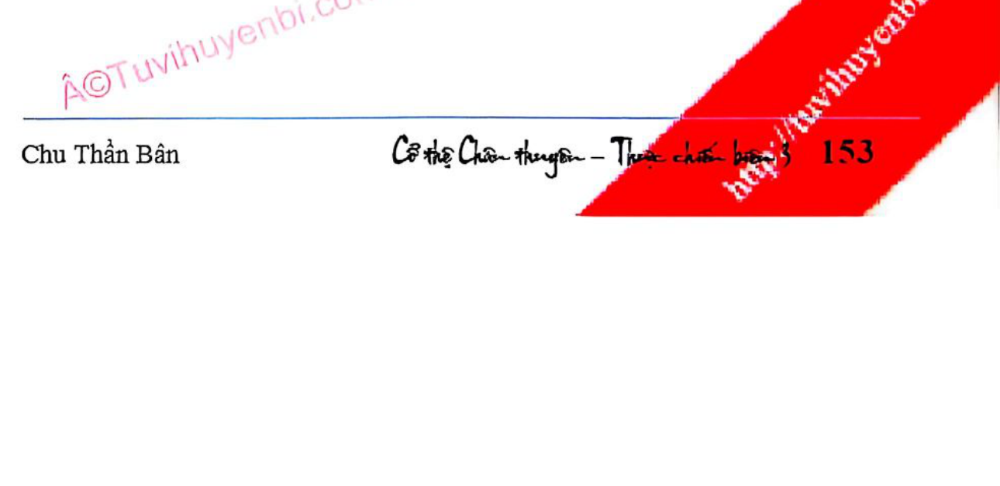
- **Cấu trúc Quẻ Dịch:**
  - **Quẻ chủ:** **Bát Thuần Khôn** (Cung Khôn – Quẻ Lục Xung)  
    *Tượng quẻ:* Nhu thuận tùy thời, khởi đầu có sự xáo trộn; Lục xung chủ việc dự định dễ bị xung tán, biến đổi đột ngột.
  - **Quẻ biến:** **Lôi Địa Dự** (Cung Chấn – Quẻ Lục Hợp)  
    *Tượng quẻ:* Dự bị, chậm trễ, giữ lại; quẻ biến Lục hợp chủ về việc người và sự việc bị lưu giữ lại, đình trệ không thể cất bước xuất hành.
- **Bảng chi tiết Lục hào:**

| Hào | Thế/Ứng | Lục thân (Chủ) | Can Chi | Biến động | Lục thân (Biến) | Can Chi (Biến) | Thần sát / Phục thần | Lục thú |
|:---:|:---:|:---|:---|:---:|:---|:---|:---|:---|
| 6 | **Thế** | Tử Tôn | Dậu - Kim | tĩnh | Huynh Đệ | Tuất - Thổ | Đào hoa, Nguyệt kiến, Quý nhân, Tuần không | Thanh Long |
| 5 | | Thê Tài | Hợi - Thủy | tĩnh | Tử Tôn | Thân - Kim | Quý nhân | Huyền Vũ |
| 4 | | Huynh Đệ | Sửu - Thổ | **X (Động)** | Phụ Mẫu | Ngọ - Hỏa | Tai sát, Dương nhẫn | Bạch Hổ |
| 3 | **Ứng** | Quan Quỷ | Mão - Mộc | tĩnh | Quan Quỷ | Mão - Mộc | Dịch mã | Đằng Xà |
| 2 | | Phụ Mẫu | Tỵ - Hỏa | tĩnh | Phụ Mẫu | Tỵ - Hỏa | Kiếp sát, Lộc thần | Câu Trần |
| 1 | | Huynh Đệ | Mùi - Thổ | tĩnh | Huynh Đệ | Mùi - Thổ | | Chu Tước |

---

### 3. Dụng thần & Loại quẻ

- **Phân loại quẻ:**
  - Quẻ xuất hành ngắn hạn kết hợp vấn an nguy sức khỏe người thân (Quẻ sự việc ngắn hạn).
  - Quẻ có hào Thế lâm thượng hào và duy nhất một hào phát động mang thần sát hung hiểm.
- **Định vị Dụng thần cốt lõi:**
  - Bản thân người hỏi: Hào **Thế Tử Tôn Dậu Kim** ở hào 6 (Tử Tôn chủ bình an cát tường, ở hào 6 là tượng hướng ngoại xuất hành).
  - Đối tượng người mẹ và chuyến đi: Hào **Phụ Mẫu** (hào 2 Phụ Mẫu Tỵ Hỏa và hào biến Phụ Mẫu Ngọ Hỏa).
  - Hào động trung gian: Hào 4 **Huynh Đệ Sửu Thổ** phát động hóa hồi đầu sinh.

---

### 4. Luận giải chi tiết

#### 1. Bề ngoài tương sinh nhưng ẩn tàng "Nhật bãi" trong việc ngắn hạn
- Hào 4 Huynh Đệ Sửu Thổ phát động sinh cho hào Thế Tử Tôn Dậu Kim. Sửu Thổ lại biến Phụ Mẫu Ngọ Hỏa sinh ngược lại Sửu Thổ (hồi đầu sinh). Bề ngoài đây là tượng rất đẹp: con đưa mẹ đi chơi, mẹ khỏe mạnh bình an.
- Tuy nhiên, trong lý luận Lục Hào về sự việc ngắn hạn (kỳ nghỉ chỉ 7-8 ngày), xuất hiện hiện tượng **"Tam bãi"** (Động bãi, Hóa bãi, Nhật bãi). Tại đây, hào động Huynh Đệ Sửu Thổ bị Nhật thần Bính Tý tương hợp (Tý Sửu lục hợp) -> phạm vào **Nhật bãi** (*hào động bị Nhật thần trói buộc kìm chân*).
- Trong sự việc ngắn hạn, phạm Nhật bãi là **thật bãi** – kế hoạch xuất hành chắc chắn sẽ bị một biến cố đột ngột cản trở và hủy bỏ hoàn toàn, không thể lên đường.

#### 2. Nguồn gốc cản trở: Điềm tang ma trưởng bối (Bạch Hổ lâm Phụ Mẫu bị Nhật phá)
- Vì sao chuyến đi bị hủy bỏ? Nguyên nhân bắt buộc phải nằm trong hào động duy nhất của quẻ:
  - Hào 4 Huynh Đệ Sửu Thổ mang **Bạch Hổ** phát động. Bạch Hổ là hung thần chủ về bệnh nặng, tang ma, huyết quang và tang chế tử vong.
  - Sửu Thổ động hóa ra **Phụ Mẫu Ngọ Hỏa**. Phụ Mẫu đại diện cho bậc trưởng bối sinh thành (cha mẹ, ông bà).
  - Hào biến Phụ Mẫu Ngọ Hỏa bị Nhật thần Tý Thủy trực tiếp tương xung (**Nhật phá**).
- Phụ Mẫu mang Bạch Hổ lại bị Nhật phá là hình tượng kinh điển của việc **đình kiêng** (trong nhà có đại tang trưởng bối qua đời đột ngột khiến mọi công việc, xuất hành đều phải gác lại để thủ hiếu).

#### 3. Cảnh báo và dự cảm thực tế
- Nhìn thấy Phụ Mẫu Ngọ Hỏa hóa phá mang Bạch Hổ, Chu Thần Bân nhận định điềm xấu tang ma sẽ ứng vào bậc trưởng bối trong nhà. Tác giả lập tức dặn dò mẹ chú ý sức khỏe, đồng thời đặc biệt lưu tâm đến bà ngoại (đã ngoài 90 tuổi, sức khỏe suy kiệt nặng, thần trí lúc mê lúc tỉnh).

---

### 5. Kết luận & Ứng kỳ thực tế

- **Lời giải đoán của Chu Thần Bân:**
  - Dự định đưa mẹ về quê vợ dịp Quốc khánh chắc chắn bị hủy bỏ do vướng phải trở ngại đột xuất ("Nhật bãi").
  - Quẻ báo trước trong gia đình sắp có tang sự của bậc trưởng bối già yếu (bà ngoại).
- **Phản hồi thực tế (Feedback):**
  - Đúng vào tháng 9 năm đó, bà ngoại Chu Thần Bân (hơn 90 tuổi) trong một buổi sáng đang ngồi ăn cơm, thức ăn còn ngậm trong miệng thì nhẹ nhàng trút hơi thở cuối cùng tạ thế (một cái chết êm ái, thanh thản theo phúc báo tuổi già).
  - Theo phong tục tập quán địa phương, khi thân mẫu ruột qua đời, con gái (mẹ của tác giả) phải chịu đại tang trực hệ và trong năm đó tuyệt đối không được bước chân vào nhà người khác.
  - Do đó, kế hoạch đưa mẹ về quê vợ hoàn toàn bị hủy bỏ đúng như quẻ đã tiên tri.
- **Ứng kỳ chiêm nghiệm:**
  - Sự việc tang chế ứng nghiệm ngay trong tháng 9 (sau khi gieo quẻ không lâu), đúng vào thời điểm Ngọ Hỏa bị xung phá.

---

### 6. Bài học tâm pháp & Quy tắc cốt lõi

- **Quy tắc Lục Hào rút ra:**
  - Trích dẫn quy tắc: *Quy tắc xuất hành bị cản trở do hào Huynh Đệ động hóa Phụ Mẫu hồi đầu sinh ứng với biến cố tang ma bất ngờ* (sách Cổ Thệ Chân Thuyên, trang 143, rule_index).
  - Quy tắc "Tam bãi" trong việc ngắn hạn: Sự việc diễn ra trong vài ngày nếu gặp Nhật bãi là thật bãi, sự việc lập tức bị đình trệ kìm giữ.
  - Nhận diện điềm tang chế (đình kiêng): Phụ Mẫu mang Bạch Hổ bị Nhật phá chỉ sự ra đi đột ngột của bậc trưởng bối trong gia tộc.
- **Bài học tâm pháp giải đoán:**
  - Đừng để hình thức sinh hợp bề ngoài đánh lừa: Hào động hồi đầu sinh sinh Thế nhìn qua tưởng cát, nhưng khi lồng ghép thần sát Bạch Hổ và bối cảnh ngắn hạn mới vỡ lẽ ra đại sự tang thương (*"Trong sinh có khắc, trong cát tàng hung, thần sát vạch trần chân tướng"*).

## THỰC CHIẾN 146: NỬA CUỐI NĂM, ANH TRAI CÓ THỂ ĐƯỢC ĐIỀU ĐỘNG ĐẾN CỤC XX CỦA HUYỆN LÀM CỤC TRƯỞNG KHÔNG?

---

### 1. Bối cảnh & Câu hỏi

- **Bối cảnh chi tiết:** 
  Một người em gieo quẻ hỏi thay cho anh trai mình (đại chiêm). Người anh vốn là cán bộ công chức có quá trình tích lũy công tác và thâm niên vững vàng, việc được thăng tiến lên chức danh Cục trưởng trong huyện là xu thế tất yếu đã chín muồi. Tuy nhiên, người em muốn biết cụ thể: trong nửa cuối năm, anh trai có cơ hội được điều động bổ nhiệm giữ chức Cục trưởng tại một đơn vị cụ thể – Cục XX của huyện – hay không. Đây là trường hợp điển hình của *"Chỉ định chiêm"* (chiêm đoán có chỉ định một địa phương/cơ quan mục tiêu cụ thể).
- **Tâm lý & Câu hỏi ẩn ý:** 
  Đương số không hỏi chung chung là có làm cục trưởng được không, mà nhắm thẳng vào Cục XX – nơi có vị trí địa lý thuận lợi và quyền hạn quản lý màu mỡ hơn. Tâm lý kỳ vọng người thân sẽ cập bến đơn vị lý tưởng nhất.
- **Thời gian chiêm đoán:**
  - Can chi: Tháng Thân, ngày Đinh Tỵ.
  - Tuần không: **Tý, Sửu** (Giáp Tuất tuần trung, Tý Sửu không vong).

---

### 2. Dữ kiện & Bảng quẻ Crop

- **Thời không chiêm nghiệm:**
  - Tháng Thân (Kim vượng, Thủy trường sinh).
  - Ngày Đinh Tỵ (Hỏa vượng, Tỵ Thân lục hợp).
  - Tuần không: **Tý, Sửu**.
- **Thần sát:**
  - Tướng tinh: Dậu (Lâm hào động Huynh Đệ)
  - Hoa cái: Sửu (Lâm Tuần không)
  - Dịch mã: Hợi
  - Tai sát: Mão
  - Mưu tinh: Mùi (Lâm hào 5)
  - Đào hoa: Ngọ
  - Kiếp sát: Dần (Lâm hào 2)
  - Lộc thần: Ngọ
  - Dương nhẫn: Tỵ (Lâm Nhật kiến, hào Ứng)
  - Văn xương: Dậu (Lâm hào động Huynh Đệ)
  - Thiên y: Mùi
  - Thiên hỷ: Thìn (Lâm hào Thế)
  - Quý nhân: Dậu (hào 4), Hợi
- Dữ kiện bảng quẻ và các thông số chiêm đoán:
  - **Hình 146:** Đồ hình quẻ Thực chiến 146
    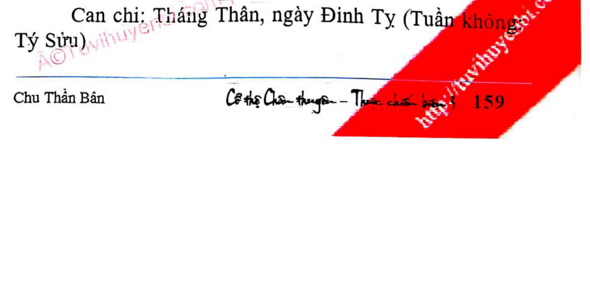
- **Cấu trúc Quẻ Dịch:**
  - **Quẻ chủ:** **Hỏa Thiên Đại Hữu** (Cung Càn – Quẻ Quy Hồn)  
    *Tượng quẻ:* Thuận thiên y thời, có nhiều sự lựa chọn; phản ánh hiện trạng cơ hội chức nghiệp dồi dào, người anh có quyền lực và nhiều phương án bổ nhiệm.
  - **Quẻ biến:** **Sơn Thiên Đại Súc** (Cung Cấn)  
    *Tượng quẻ:* Tích súc to lớn, việc đã chín muồi; quẻ biến Đại Súc khẳng định việc thăng quan tiến chức đã đủ độ chín, chắc chắn thành tựu mỹ mãn.
- **Bảng chi tiết Lục hào:**

| Hào | Thế/Ứng | Lục thân (Chủ) | Can Chi | Biến động | Lục thân (Biến) | Can Chi (Biến) | Thần sát / Phục thần | Lục thú |
|:---:|:---:|:---|:---|:---:|:---|:---|:---|:---|
| 6 | **Ứng** | Quan Quỷ | Tỵ - Hỏa | tĩnh | Thê Tài | Dần - Mộc | [Phục: Phụ Mẫu Tuất Thổ] Dương nhẫn, Nhật kiến | Thanh Long |
| 5 | | Phụ Mẫu | Mùi - Thổ | tĩnh | Tử Tôn | Tý - Thủy | [Phục: Huynh Đệ Thân Kim] Mưu tinh | Huyền Vũ |
| 4 | | Huynh Đệ | Dậu - Kim | **O (Động)** | Phụ Mẫu | Tuất - Thổ | [Phục: Quan Quỷ Ngọ Hỏa] Tướng tinh, Văn xương, Quý nhân | Bạch Hổ |
| 3 | **Thế** | Phụ Mẫu | Thìn - Thổ | tĩnh | Phụ Mẫu | Thìn - Thổ | [Phục: Phụ Mẫu Thìn Thổ] Hoa cái, Thiên hỷ | Đằng Xà |
| 2 | | Thê Tài | Dần - Mộc | tĩnh | Thê Tài | Dần - Mộc | [Phục: Thê Tài Dần Mộc] Kiếp sát | Câu Trần |
| 1 | | Tử Tôn | Tý - Thủy | tĩnh | Tử Tôn | Tý - Thủy | [Phục: Tử Tôn Tý Thủy] Tuần không | Chu Tước |

---

### 3. Dụng thần & Loại quẻ

- **Phân loại quẻ:**
  - Đại chiêm (xem thay anh trai) kết hợp Chỉ định chiêm (chỉ định Cục XX cụ thể).
  - Dạng đại chiêm chủ động mất kiểm soát (người em hỏi dò thông tin, không thể can thiệp vào quyết định bổ nhiệm của tổ chức).
- **Định vị Dụng thần cốt lõi:**
  - Người anh trai: Hào **Huynh Đệ Dậu Kim** ở hào 4 phát động.
  - Quan vị Cục trưởng chung: Hào **Ứng Quan Quỷ Tỵ Hỏa** mang Thanh Long, lâm Nhật kiến, hợp Nguyệt kiến cực vượng.
  - Địa phương / Đơn vị chỉ định (Cục XX): Hào **Thế Phụ Mẫu Thìn Thổ** (Phụ Mẫu và Thổ hào đại diện cho cơ quan, địa phương).

---

### 4. Luận giải chi tiết

#### 1. Khẳng định chắc chắn thăng chức Cục trưởng
- Hào Ứng Quan Quỷ Tỵ Hỏa mang Dương nhẫn, lâm Nhật kiến, lại đắc Nguyệt hợp (Tỵ Thân lục hợp) cực kỳ vượng tướng. Đây là điềm báo quan vị đã nắm chắc trong tay, chức Cục trưởng nhất định có được.
- Quẻ Đại Hữu biến Đại Súc chỉ ra cơ hội phong phú và việc bổ nhiệm đã chín muồi.

#### 2. Phân hóa địa bàn chỉ định: Hào Thế Thìn Thổ vs Hào biến Tuất Thổ
- Trong quẻ hỏi thay có yếu tố chỉ định cơ quan: Hào Thế và hào Ứng tạo thành thể thống nhất (quan hệ Rồng – Rắn giữa Thanh Long và Đằng Xà). Hào Ứng là quan vị chỉ định, hào Thế Phụ Mẫu Thìn Thổ là vị trí địa lý của Cục XX được chỉ định.
- Hãy quan sát hào động của người anh: Huynh Đệ Dậu Kim phát động hóa Phụ Mẫu Tuất Thổ (hồi đầu sinh). Về lý, Dậu Kim được Tuất Thổ sinh là việc tốt, người anh đắc chức quyền.
- **Điểm đối chiếu then chốt:** Huynh Đệ Dậu Kim kết nối với Phụ Mẫu Tuất Thổ, hoàn toàn không kết nối hay tương sinh tương hợp với Phụ Mẫu Thìn Thổ (Cục XX chỉ định) ở hào Thế! Thìn và Tuất lại là tương xung (Thìn Tuất tương xung). Điều này chỉ ra người anh được bổ nhiệm làm Cục trưởng tại một đơn vị khác (Tuất Thổ), chứ không phải đơn vị mục tiêu (Thìn Thổ).

#### 3. Tâm trạng Bạch Hổ lâm Huynh Đệ
- Hào động Huynh Đệ Dậu Kim mang Bạch Hổ phát động hóa Tuất Thổ tương hại (Tuất Dậu tương hại).
- Bạch Hổ chủ sự không vui trọn vẹn, có chút uất ức bất mãn. Ý nghĩa là: Dù được thăng chức Cục trưởng nhưng vì không được về đơn vị mong muốn nên người anh trong lòng vẫn có phần tiếc nuối, không thực sự mãn nguyện.

---

### 5. Kết luận & Ứng kỳ thực tế

- **Lời giải đoán & Khuyến nghị của Chu Thần Bân:**
  - Khẳng định người anh chắc chắn sẽ được bổ nhiệm làm Cục trưởng trong nửa cuối năm.
  - Tuy nhiên, vị trí bổ nhiệm không phải là Cục XX như nguyện vọng ban đầu, mà sẽ được điều động sang lãnh đạo một Cục khác trong huyện.
- **Phản hồi thực tế (Feedback):**
  - Kết quả đúng như dự đoán: Người anh không đắc cử vị trí Cục trưởng Cục XX mục tiêu, nhưng sau đó đã chính thức nhận quyết định điều động làm Cục trưởng tại một đơn vị ban ngành khác trong huyện.
- **Ứng kỳ chiêm nghiệm:**
  - Quyết định bổ nhiệm được ban hành trong nửa cuối năm, ứng vào các tháng Thổ – Kim đắc lệnh khi Dậu Kim và Tuất Thổ tương sinh hoàn tất.

---

### 6. Bài học tâm pháp & Quy tắc cốt lõi

- **Quy tắc Lục Hào rút ra:**
  - Trích dẫn quy tắc: *Quy tắc cầu quan chức cho người thân (Huynh Đệ) và sự phân hóa vị trí địa lý bổ nhiệm ngoài chỉ định* (sách Cổ Thệ Chân Thuyên, trang 149, rule_index).
  - Phương pháp phân tích Chỉ định chiêm: Phải phân biệt rõ thông tin của nơi được chỉ định (hào Thế) và thông tin đối chiếu với nơi chỉ định (hào biến của Dụng thần).
  - Nếu Dụng thần hóa ra hào Phụ Mẫu khác tương xung với Phụ Mẫu chỉ định: chắc chắn nhận nhiệm vụ tại địa phương khác.
- **Bài học tâm pháp giải đoán:**
  - Tách bạch giữa Danh vị và Địa điểm: Quan vị có thể vượng tướng thành tựu nhưng địa bàn công tác lại phân hóa; người luận dịch phải nắm vững kỹ thuật đối chiếu hai hào Phụ Mẫu để tránh phán đoán nhầm lẫn giữa chức danh và cơ quan bổ nhiệm (*"Quan chức thành tựu, địa giới đổi dời"*).

## THỰC CHIẾN 147: LỢI VÀ HẠI CỦA VIỆC BÁN NHÀ NHỎ ĐỔI NHÀ LỚN (QUẢNG CHÂU NĂM 2012)

---

### 1. Bối cảnh & Câu hỏi

- **Bối cảnh chi tiết:** 
  Vào năm 2012 tại Quảng Châu, chính quyền thành phố bắt đầu thực thi chính sách siết chặt hạn chế mua bán bất động sản. Một người đồng môn đang sở hữu một căn nhà nhỏ, đứng trước áp lực học hành của con cái và nhu cầu sinh hoạt gia đình, rất muốn bán căn nhà nhỏ hiện tại để dồn tiền mua một căn nhà lớn hơn ở khu vực trung tâm (khu học đường). Tuy nhiên tại thời điểm đó, thị trường bất động sản đang có dấu hiệu chững lại, đương sự vô cùng do dự và bất an. Người này lo sợ rằng nếu bán nhà nhỏ xong rồi mua nhà lớn mà giá nhà tiếp tục lao dốc thì sẽ lâm vào cảnh thua lỗ nặng nề; còn nếu giữ lại nhà nhỏ thì an toàn hơn. Trong trạng thái đắn đo do dự, người này đã gieo quẻ hỏi Chu Thần Bân về lợi và hại của việc bán nhà nhỏ đổi nhà lớn.
- **Tâm lý & Câu hỏi ẩn ý:** 
  Tâm lý giằng xé giữa lòng tham gia tăng tài sản và nỗi sợ hãi rủi ro thị trường suy thoái. Câu hỏi hỏi về "Lợi và hại", nhưng sâu thẳm trong lòng là tìm kiếm một điểm tựa niềm tin để đưa ra quyết định tài chính mang tính bước ngoặt của cả đời người.
- **Thời gian chiêm đoán:**
  - Can chi: Tháng Thân, ngày Nhâm Tý (tuần không: Dần, Mão).
  - Địa điểm & Thời điểm: Thành phố Quảng Châu, năm 2012.

---

### 2. Dữ kiện & Bảng quẻ Crop

- **Thời không chiêm nghiệm:**
  - Tháng Thân (Kim vượng, Lâm Nguyệt kiến).
  - Ngày Nhâm Tý (Thủy vượng, Dương nhẫn, Lâm Tướng tinh).
  - Tuần không: **Dần, Mão** (Giáp Thìn tuần trung, Dần Mão không vong).
- **Thần sát:**
  - Tướng tinh: Tý (Lâm Nhật kiến)
  - Hoa cái: Thìn
  - Dịch mã: Dần (Lâm Tuần không, hào biến Phụ Mẫu)
  - Tai sát: Ngọ
  - Mưu tinh: Tuất (Lâm hào biến Tử Tôn)
  - Đào hoa: Dậu (Lâm hào 4 Thê Tài)
  - Kiếp sát: Tỵ (Lâm hào Thế)
  - Lộc thần: Hợi (Lâm hào Ứng)
  - Dương nhẫn: Tý
  - Văn xương: Dần (Lâm Tuần không)
  - Thiên y: Mùi (Lâm hào 5)
  - Thiên hỷ: Thìn
  - Quý nhân: Mão (hào sơ), Tỵ (hào Thế)
- Dữ kiện bảng quẻ và các thông số chiêm đoán:
  - **Hình 147:** Đồ hình quẻ Thực chiến 147
    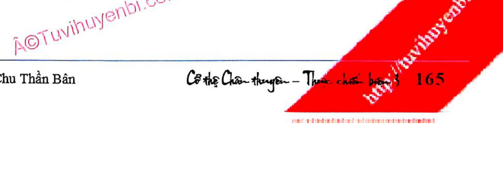
- **Cấu trúc Quẻ Dịch:**
  - **Quẻ chủ:** **Bát Thuần Ly** (Cung Ly – Quẻ Lục Xung)  
    *Tượng quẻ:* Hỏa phát quang minh, quyết định bốc đồng dứt khoát ban đầu; Lục xung chủ hành động nhanh, chớp thời cơ trong ngắn hạn.
  - **Quẻ biến:** **Sơn Hỏa Bí** (Cung Cấn – Quẻ Lục Hợp)  
    *Tượng quẻ:* Quang minh thông đạt, định hình hòa hợp bền vững; quẻ biến Lục hợp chủ về việc tài sản sau khi cơ cấu sẽ ổn định gia tăng giá trị lâu dài, nhưng nếu chần chừ bàn bạc quá nhiều sẽ rơi vào bế tắc đình trệ.
- **Bảng chi tiết Lục hào:**

| Hào | Thế/Ứng | Lục thân (Chủ) | Can Chi | Biến động | Lục thân (Biến) | Can Chi (Biến) | Thần sát / Phục thần | Lục thú |
|:---:|:---:|:---|:---|:---:|:---|:---|:---|:---|
| 6 | **Thế** | Huynh Đệ | Tỵ - Hỏa | tĩnh | Phụ Mẫu | Dần - Mộc | Kiếp sát, Quý nhân | Bạch Hổ |
| 5 | | Tử Tôn | Mùi - Thổ | tĩnh | Quan Quỷ | Tý - Thủy | Thiên y | Đằng Xà |
| 4 | | Thê Tài | Dậu - Kim | **O (Động)** | Tử Tôn | Tuất - Thổ | Đào hoa, Nguyệt kiến | Câu Trần |
| 3 | **Ứng** | Quan Quỷ | Hợi - Thủy | tĩnh | Quan Quỷ | Hợi - Thủy | Lộc thần | Chu Tước |
| 2 | | Tử Tôn | Sửu - Thổ | tĩnh | Tử Tôn | Sửu - Thổ | | Thanh Long |
| 1 | | Phụ Mẫu | Mão - Mộc | tĩnh | Phụ Mẫu | Mão - Mộc | Dịch mã, Văn xương, Quý nhân, Tuần không | Huyền Vũ |

---

### 3. Dụng thần & Loại quẻ

- **Phân loại quẻ:**
  - Quẻ giao dịch bất động sản hoán đổi song diện (vừa Bán nhà vừa Mua nhà).
  - Quẻ có hào Tài phát động xung kích hào Phụ Mẫu an tĩnh lâm Tuần không.
- **Định vị Dụng thần cốt lõi:**
  - Quy tắc bất biến trong giao dịch nhà đất:
    * **Bán nhà:** Dùng gạch ngói đổi lấy tiền mặt -> Lấy hào **Thê Tài** làm Dụng thần.
    * **Mua nhà:** Dùng tiền mặt đổi lấy gạch ngói nơi ở -> Lấy hào **Phụ Mẫu** làm Dụng thần.
  - Trong quẻ này:
    * Hào 4 **Thê Tài Dậu Kim** phát động đại diện cho việc bán căn nhà nhỏ hiện hữu.
    * Sơ hào **Phụ Mẫu Mão Mộc** đại diện cho căn nhà lớn ở trung tâm định mua mới.

---

### 4. Luận giải chi tiết

#### 1. Tượng Bán nhà nhỏ thu hồi vốn lớn
- Hào 4 Thê Tài Dậu Kim mang Câu Trần (bất động sản) phát động hóa Tử Tôn Tuất Thổ mang Mưu tinh (kế hoạch bán nhà cũ).
- Thê Tài Dậu Kim đắc Nguyệt kiến, động hóa hồi đầu sinh biểu thị kế hoạch bán căn nhà nhỏ sẽ tiến hành rất nhanh chóng và thu về một lượng tiền mặt lớn đúng như mong đợi.

#### 2. Tượng Mua nhà mới và cơ chế xung kích "Động xung tĩnh tắc khởi"
- Hào sơ Phụ Mẫu Mão Mộc mang Quý nhân, Đào hoa, Văn xương. Sơ hào đại diện cho khu vực trung tâm thành phố (khu Việt Tú, quận trung tâm Quảng Châu). Hào Phụ Mẫu mang Đào hoa Quý nhân là biểu tượng của giấy chứng nhận quyền sở hữu (sổ đỏ) và nhà thuộc khu học đường chất lượng cao phục vụ con cái.
- Phụ Mẫu Mão Mộc hiện đang lâm **Tuần không** (vì người hỏi chưa bỏ tiền ra mua nên chưa thuộc về mình).
- **Cơ chế xung khai tuần không:** Hào Thê Tài Dậu Kim phát động trực tiếp tương xung sơ hào Phụ Mẫu Mão Mộc (Mão Dậu tương xung). Trong lý Dịch: *"Động xung tĩnh tắc khởi, xung không tắc thực"*. Nghĩa là dùng chính dòng tiền bán căn nhà cũ (Dậu Kim) để điền thực và kích hoạt căn nhà mới (Mão Mộc) bừng tỉnh dậy.
- **Nhà mới sinh Thế đại cát:** Mão Mộc sau khi được kích hoạt sẽ quay lại tương sinh mạnh mẽ cho hào Thế Huynh Đệ Tỵ Hỏa (Mộc sinh Hỏa). Căn nhà mới tương sinh hào Thế là điềm báo đại cát đại lợi, mang lại tài lộc và phúc trạch lâu dài cho gia chủ.

#### 3. Mối liên kết Mão Tuất hợp và cảnh báo Lục xung biến Lục hợp
- Hào biến Tử Tôn Tuất Thổ nhị hợp với Phụ Mẫu Mão Mộc (Mão Tuất lục hợp). Điều này chứng minh căn nhà cũ (Tuất Thổ) chính là gốc rễ nền tảng tài chính để sinh ra căn nhà mới (Mão Mộc); không bán nhà cũ thì không thể có nhà mới.
- **Thời cơ vàng trong quẻ Xung:** Quẻ chủ Lục xung biểu thị cơ hội ngắn hạn xuất hiện chớp nhoáng, phải quyết định mau lẹ. Nếu chần chừ bàn bạc qua lại với vợ hay người thân sẽ biến thành Lục hợp (trì trệ, quẻ Bĩ), vuột mất cơ hội vàng.

---

### 5. Kết luận & Ứng kỳ thực tế

- **Lời giải đoán & Khuyến nghị của Chu Thần Bân:**
  - Khẳng định việc bán nhà nhỏ đổi nhà lớn là đại cát, chắc chắn có lợi lớn và sinh lời vượt bậc.
  - Thúc giục đương sự phải hành động quyết đoán ngay lập tức trong tháng 8/2012, tuyệt đối không bàn bạc dây dưa làm lỡ mất thời cơ ngắn hạn của quẻ Xung.
- **Phản hồi thực tế (Feedback):**
  - Đương sự nghe lời thầy Chu, lập tức dứt khoát bán nhà nhỏ và gom tiền chốt mua ngay căn nhà lớn ở khu học đường trung tâm ngay trong tháng 8/2012.
  - Đúng hai tháng sau (tháng 10/2012), thị trường bất động sản Quảng Châu bùng nổ cơn sốt giá dữ dội. Căn nhà khu học đường mà người đồng môn mua đã tăng giá phi mã gấp nhiều lần, mang lại khối tài sản khổng lồ khiến đương số vô cùng mãn nguyện.
- **Ứng kỳ chiêm nghiệm:**
  - Giao dịch hoàn tất ngay trong tháng Thân khi Dậu Kim phát động xung Mão Mộc; tài sản bùng nổ vào tháng Tuất (tháng 10/2012) khi Tuất Thổ hợp Mão Mộc đắc lệnh.

---

### 6. Bài học tâm pháp & Quy tắc cốt lõi

- **Quy tắc Lục Hào rút ra:**
  - Trích dẫn quy tắc: *Quy tắc hoán đổi bất động sản bán nhà nhỏ mua nhà lớn qua cấu trúc quẻ Lục xung biến Lục hợp* (sách Cổ Thệ Chân Thuyên, trang 155, rule_index).
  - Phân định bản chất Dụng thần bất động sản: Bán nhà lấy hào Thê Tài làm Dụng thần, Mua nhà lấy hào Phụ Mẫu làm Dụng thần.
  - Cơ chế "Động xung không tắc thực": Hào Tài phát động xung kích hào Phụ Mẫu lâm không là tượng dùng dòng tiền hiện thực hóa việc mua bất động sản mới.
- **Bài học tâm pháp giải đoán:**
  - Chu Dịch là môn học về xu thế và nắm bắt thời cơ: Quẻ Lục xung biến Lục hợp dạy rằng cơ hội lớn chỉ đến trong tích tắc; người có trí tuệ phải biết phá vỡ sự do dự để hành động quyết đoán trước khi cánh cửa cơ hội khép lại (*"Chớp thời cơ trong quẻ Xung, hưởng an cư trong quẻ Hợp"*).

## THỰC CHIẾN 148: BÁC SĨ GIEO QUẺ THAY CHO BỆNH NHÂN NGUY KỊCH

---

### 1. Bối cảnh & Câu hỏi

- **Bối cảnh chi tiết:** 
  Một vị bác sĩ (vốn là người mới bắt đầu học môn Lục Hào) nghe tin trong bệnh viện nơi mình làm việc có một ca bệnh nhân đang rơi vào tình trạng nguy kịch tột độ, tình hình thập tử nhất sinh và bệnh viện đang chuẩn bị sắp xếp mổ cấp cứu. Vị bác sĩ này không phải là bác sĩ điều trị trực tiếp và hoàn toàn không hề quen biết bệnh nhân. Với lòng trắc ẩn nghề nghiệp và sự tò mò học thuật về khả năng dự trắc sinh tử của Chu Dịch, ông đã tự mình gieo một quẻ để xem sinh mệnh của người bệnh nguy kịch này sẽ ra sao.
- **Tâm lý & Câu hỏi ẩn ý:** 
  Người hỏi mang tâm thái muốn kiểm chứng xem liệu y học và phẫu thuật có thể cứu vãn được mạng sống của bệnh nhân hay không, tiên lượng sinh tử của một người xa lạ trước ngưỡng cửa tử thần.
- **Thời gian chiêm đoán:**
  - Can chi: Tháng Tỵ, ngày Tân Dậu.
  - Tuần không: **Tý, Sửu** (Giáp Dần tuần trung, Tý Sửu không vong).

---

### 2. Dữ kiện & Bảng quẻ Crop

- **Thời không chiêm nghiệm:**
  - Tháng Tỵ (Hỏa vượng, Kim trường sinh).
  - Ngày Tân Dậu (Kim vượng, Mộc tuyệt).
  - Tuần không: **Tý, Sửu**.
- **Thần sát:**
  - Tướng tinh: Dậu (Lâm Nhật kiến, hào 4)
  - Hoa cái: Sửu (Lâm Tuần không, hào 2)
  - Dịch mã: Hợi (Lâm hào Ứng)
  - Tai sát: Mão (Lâm hào sơ Phụ Mẫu)
  - Mưu tinh: Mùi (Lâm hào 5)
  - Đào hoa: Ngọ
  - Kiếp sát: Dần
  - Lộc thần: Dậu (Lâm hào 4)
  - Dương nhẫn: Thân
  - Văn Xương: Tý
  - Thiên y: Thìn
  - Thiên hỷ: Sửu
  - Quý nhân: Dần, Ngọ
- Dữ kiện bảng quẻ và các thông số chiêm đoán:
  - **Hình 148:** Đồ hình quẻ Thực chiến 148
    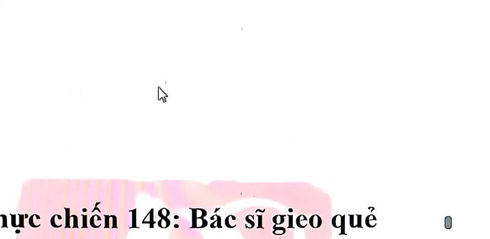
- **Cấu trúc Quẻ Dịch:**
  - **Quẻ chủ:** **Bát Thuần Ly** (Cung Ly – Quẻ Lục Xung)  
    *Tượng quẻ:* Toàn quẻ an tĩnh nhưng có hào bị Nhật phá; Ly vi hỏa, ngọn lửa bùng cháy dữ dội rồi tắt lịm; Lục xung chủ về sự việc diễn ra mau chóng, tan rã đột ngột, sinh mệnh đến hồi kết thúc trong chớp mắt.
  - **Quẻ biến:** **Bát Thuần Ly** (Quẻ tĩnh không biến).
- **Bảng chi tiết Lục hào:**

| Hào | Thế/Ứng | Lục thân (Chủ) | Can Chi | Biến động | Lục thân (Biến) | Can Chi (Biến) | Thần sát / Phục thần | Lục thú |
|:---:|:---:|:---|:---|:---:|:---|:---|:---|:---|
| 6 | **Thế** | Huynh Đệ | Tỵ - Hỏa | tĩnh | Huynh Đệ | Tỵ - Hỏa | Nguyệt kiến | Đằng Xà |
| 5 | | Tử Tôn | Mùi - Thổ | tĩnh | Tử Tôn | Mùi - Thổ | Mưu tinh | Câu Trần |
| 4 | | Thê Tài | Dậu - Kim | tĩnh | Thê Tài | Dậu - Kim | Tướng tinh, Lộc thần, Nhật kiến | Chu Tước |
| 3 | **Ứng** | Quan Quỷ | Hợi - Thủy | tĩnh (Nguyệt phá) | Quan Quỷ | Hợi - Thủy | Dịch mã | Thanh Long |
| 2 | | Tử Tôn | Sửu - Thổ | tĩnh | Tử Tôn | Sửu - Thổ | Hoa cái, Thiên hỷ, Tuần không | Huyền Vũ |
| 1 | | Phụ Mẫu | Mão - Mộc | tĩnh (Nhật phá) | Phụ Mẫu | Mão - Mộc | Tai sát | Bạch Hổ |

---

### 3. Dụng thần & Loại quẻ

- **Phân loại quẻ:**
  - Bác sĩ gieo quẻ thay cho bệnh nhân nguy kịch xa lạ không quen biết (Đại chiêm y khoa lâm sàng).
  - Quẻ giải quyết nghi vấn học thuật cốt lõi: Hào Ứng lâm Quan Quỷ là người bệnh hay căn bệnh?
- **Định vị Dụng thần cốt lõi:**
  - Khi người xem không quen biết bệnh nhân: Hào **Ứng** đại diện cho người bệnh.
  - Hào **Thế Huynh Đệ Tỵ Hỏa**: Đại diện cho bác sĩ gieo quẻ và đội ngũ y bác sĩ toàn bệnh viện.
  - Phương pháp phẫu thuật cứu chữa: Sơ hào **Phụ Mẫu Mão Mộc** mang Bạch Hổ.

---

### 4. Luận giải chi tiết

#### 1. Định tính Hào Ứng Quan Quỷ: Người bệnh hay Căn bệnh?
- Chu Thần Bân giải mã một nghi vấn học thuật lớn: Nếu là người bệnh tự gieo quẻ, Quan Quỷ lâm Thế thường đại diện cho căn bệnh (Tử Tôn khắc Quan Quỷ là bệnh khỏi). Nhưng khi bác sĩ hoặc người thứ ba xem thay cho một bệnh nhân xa lạ không có định vị lục thân cụ thể, thì hào **Ứng Quan Quỷ chính là hình ảnh đại diện cho NGƯỜI BỆNH** đang oằn mình gánh chịu tai họa bệnh tật.
- Hào Ứng Quan Quỷ Hợi Thủy cư hào 3, lâm tháng Tỵ bị Nguyệt kiến trực xung (Tỵ Hợi tương xung). Hợi Thủy bị xung trong mùa Hỏa vượng trở thành **chân Nguyệt phá**. Nguyệt phá lâm thân người bệnh là điềm báo sinh mệnh suy bại tột cùng, nguyên khí cạn kiệt, không còn khả năng cứu vãn. Dù có Nhật thần Dậu Kim tương sinh bề ngoài nhưng Nhật thần lại bận xung phá hào sơ Mão Mộc, không thể cứu sống Hợi Thủy.

#### 2. Động triệu hào sơ: Phẫu thuật lâm Nhật phá
- Nhiều người nhìn quẻ cho là quẻ tĩnh không có động triệu. Chu Thần Bân chỉ ra động triệu then chốt nằm ở sơ hào **Phụ Mẫu Mão Mộc**.
- Mão Mộc lâm tháng Tỵ là hưu tù, gặp ngày Tân Dậu bị Nhật thần trực xung (Mão Dậu xung) biến thành **chân Nhật phá**.
- **Ý nghĩa y khoa của Bạch Hổ Phụ Mẫu:** Phụ Mẫu Mão Mộc mang Bạch Hổ là biểu tượng của dao kéo phẫu thuật (Mão Mộc chủ khai mở, phá rạch như mổ ngực, mở sọ). Khi Phụ Mẫu Mão Mộc bị Nhật phá, phương tiện phẫu thuật này bị phá hủy hoàn toàn. Hào Phụ Mẫu bị phá không thể sinh cho hào Thế Huynh Đệ Tỵ Hỏa, chứng tỏ bác sĩ không thể tiến hành phẫu thuật, hoặc phẫu thuật không kịp triển khai trước khi bệnh nhân tử vong.

#### 3. Tượng Quẻ Bát Thuần Ly Lục xung
- Quẻ Bát Thuần Ly là quẻ Lục xung: Sự việc diễn biến mau chóng tột độ, sinh mệnh người bệnh tan rã nhanh như ngọn đèn cạn dầu trước gió lớn.

---

### 5. Kết luận & Ứng kỳ thực tế

- **Lời giải đoán của Chu Thần Bân:**
  - Bệnh nhân chắc chắn không qua khỏi, sinh mệnh sẽ chấm dứt trong thời gian cực ngắn.
  - Ca mổ cấp cứu dự kiến sẽ không kịp tiến hành hoặc hoàn toàn bất lực trước lưỡi hái tử thần.
- **Phản hồi thực tế (Feedback):**
  - Đúng như dự đoán của quẻ, bệnh nhân nguy kịch đã qua đời vào ngay ngày hôm sau khi gieo quẻ.
  - Bệnh viện chưa kịp sắp xếp và đưa bệnh nhân vào phòng mổ thì người này đã trút hơi thở cuối cùng.
- **Ứng kỳ chiêm nghiệm:**
  - Ứng kỳ diễn ra chưa đầy 24 giờ sau khi gieo quẻ (vào ngày hôm sau), đúng với tính chất tan rã thần tốc của quẻ Lục xung và trạng thái Nguyệt phá của hào Ứng.

---

### 6. Bài học tâm pháp & Quy tắc cốt lõi

- **Quy tắc Lục Hào rút ra:**
  - Trích dẫn quy tắc: *Quy tắc định tính hào Ứng là bệnh nhân hay bệnh chứng khi lâm Nguyệt phá trong quẻ xem bệnh nguy kịch* (sách Cổ Thệ Chân Thuyên, trang 164, rule_index).
  - Phân định rạch ròi Quan Quỷ lâm Thế (bệnh tật trong tự chiêm) vs Quan Quỷ lâm Ứng (người bệnh trong đại chiêm xa lạ).
  - Nhận diện hào phẫu thuật: Phụ Mẫu lâm Bạch Hổ bị Nhật phá chỉ sự thất bại hoặc không kịp can thiệp ngoại khoa trước khi sinh mệnh lụi tàn.
- **Bài học tâm pháp giải đoán:**
  - Tìm kiếm động triệu trong quẻ an tĩnh: Một quẻ tưởng như an tĩnh nhưng ẩn chứa hào bị Nguyệt phá và Nhật phá chính là nơi chứa đựng thông tin then chốt nhất của sự việc (*"Tĩnh trung hữu động, phá xứ kiến hung"*).

---

## THỰC CHIẾN 149: BÁC SĨ LẠI THAY NGƯỜI KHÁC XEM QUẺ CHO BỆNH NHÂN NGUY KỊCH

---

### 1. Bối cảnh & Câu hỏi

- **Bối cảnh chi tiết:**
  Một bác sĩ trực tiếp điều trị cho một bệnh nhân đang trong cơn nguy kịch trước đó đã gieo một quẻ thứ nhất. Quẻ đầu là quẻ tĩnh, hào Ứng lâm Quan Quỷ Hợi Thủy bị Nguyệt phá Nhật sinh, nhưng trong quẻ có Phụ Mẫu Mão Mộc bị Nhật phá khiến người xem phân vân, bất an. Để có thêm dữ liệu phán đoán trước khi quyết định phẫu thuật, vị bác sĩ này lập tiếp quẻ thứ hai là Phong Sơn Tiệm. Bác sĩ và bệnh nhân không hề có quan hệ huyết thống hay thân thích, người xem thuần túy đại diện cho bên cứu chữa đối diện ranh giới sinh tử.
- **Tâm lý & Câu hỏi ẩn ý:**
  Tâm lý băn khoăn, lo lắng sâu sắc về mạng sống của người bệnh. Nội dung câu hỏi ẩn ý là: *"Bệnh nhân nguy kịch này liệu có thể qua khỏi cơn thập tử nhất sinh không? Ca phẫu thuật sắp tới có cơ may cứu sống được tính mạng hay không?"*
- **Thời gian chiêm đoán:**
  - Dương lịch: Chiêm đoán vào tháng Tỵ năm Mậu Tuất (năm 2018).
  - Can chi: Năm Mậu Tuất, tháng Đinh Tỵ, ngày Tân Dậu (tuần không: Tý - Sửu).

---

### 2. Dữ kiện & Bảng quẻ Crop

- **Thời không chiêm nghiệm:**
  - Tháng Đinh Tỵ (Hỏa vượng, Mộc hưu tù, Kim trường sinh).
  - Ngày Tân Dậu (Kim vượng cực điểm, Mão Mộc ngộ xung).
  - Tuần không: **Tý - Sửu** (Giáp Dần tuần trung, Tý Sửu không vong).
- **Thần sát:**
  - Tướng tinh: Dậu (Lâm Nhật kiến)
  - Hoa Cái: Sửu (Lâm Tuần không, hào sơ)
  - Dịch mã: Hợi
  - Tai sát: Mão (Lâm hào Ứng Quan Quỷ)
  - Mưu tinh: Mùi (Lâm hào 4)
  - Đào hoa: Ngọ (Lâm hào 2)
  - Kiếp sát: Dần
  - Lộc thần: Dậu (Lâm Nhật kiến)
  - Dương nhẫn: Thân (Lâm hào Thế)
  - Văn Xương: Tỵ (Lâm Nguyệt kiến, hào 5)
  - Thiên y: Thìn (Lâm hào sơ)
  - Thiên hỷ: Sửu (Lâm Tuần không)
  - Quý nhân: Dần, Ngọ

- Dữ kiện bảng quẻ và các thông số chiêm đoán:
  - **Bảng 149.1** Đồ hình quẻ Thực chiến 149:
    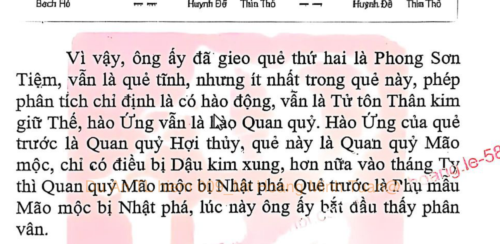

- **Cấu trúc Quẻ Dịch:**
  - **Quẻ chủ:** **Phong Sơn Tiệm** (Quy hồn – Cung Cấn, Quẻ thuần tĩnh)  
    *Tượng quẻ:* Phúc lộc dần dần tích lũy, nhưng trong việc cấp bách nguy nan thì quẻ tĩnh biểu thị sự bế tắc, diễn biến sự việc phụ thuộc chặt chẽ vào lực xung khắc định tính của Nhật Nguyệt.
  - **Quẻ biến:** **Phong Sơn Tiệm** (Quy hồn – Cung Cấn).

- **Bảng chi tiết Lục hào:**

| Hào | Thế/Ứng | Lục thân (Chủ) | Can Chi | Biến động | Lục thân (Biến) | Can Chi (Biến) | Thần sát / Phục | Lục thú |
|:---:|:---:|:---|:---|:---:|:---|:---|:---|:---|
| 6 | **Ứng** | Quan Quỷ | Mão - Mộc | tĩnh | Quan Quỷ | Mão - Mộc | Tai sát, Nhật phá | Đằng Xà |
| 5 | | Phụ Mẫu | Tỵ - Hỏa | tĩnh | Phụ Mẫu | Tỵ - Hỏa | Nguyệt kiến, Văn Xương, Phục Tài-Tỵ | Câu Trần |
| 4 | | Huynh Đệ | Mùi - Thổ | tĩnh | Huynh Đệ | Mùi - Thổ | Mưu tinh | Chu Tước |
| 3 | **Thế** | Tử Tôn | Thân - Kim | tĩnh | Tử Tôn | Thân - Kim | Dương nhẫn | Thanh Long |
| 2 | | Phụ Mẫu | Ngọ - Hỏa | tĩnh | Phụ Mẫu | Ngọ - Hỏa | Đào hoa, Quý nhân | Huyền Vũ |
| 1 | | Huynh Đệ | Thìn - Thổ | tĩnh | Huynh Đệ | Thìn - Thổ | Thiên y, Hoa cái | Bạch Hổ |

---

### 3. Dụng thần & Loại quẻ

- **Phân loại quẻ:**
  - **Quẻ xem bệnh cho người khác không thân thuộc:** Người xem là bác sĩ điều trị, không có quan hệ ruột thịt hay bạn bè thân thích với bệnh nhân, do đó lấy hào Ứng làm Dụng thần đại diện cho người bệnh.
  - **Quẻ tĩnh định tính sinh tử:** Quẻ không có hào minh động, tính chất cát hung sinh tử quy về tác động tương tác của Nhật Nguyệt lên hào Dụng thần.
- **Xác định Dụng thần:**
  1. **Dụng thần cốt lõi (Hào Ứng Quan Quỷ Mão Mộc):** Đại diện cho bản thân bệnh nhân (không phải đại diện cho mầm bệnh).
  2. **Hào Thế Tử Tôn Thân Kim:** Đại diện cho bác sĩ gieo quẻ, đồng thời là y thuật và phương pháp phẫu thuật can thiệp.
  3. **Kỵ thần phá diệt sinh mệnh:** Nhật thần Tân Dậu xung khắc trực diện Mão Mộc, tạo thành thế Nhật phá hung hiểm tột bực.

---

### 4. Luận giải chi tiết

Quẻ này là án lệ mẫu mực minh giải nguyên lý định vị Dụng thần trong y khoa và quy tắc định tính của Nhật phá trong quẻ tĩnh:

#### 1. Định vị hào Ứng lâm Quan Quỷ làm bệnh nhân
- Khi xem quẻ bệnh tật cho người khác, nếu người đó có quan hệ thân thuộc rõ ràng thì định vị theo Lục thân (cha mẹ lấy Phụ Mẫu, con cái lấy Tử Tôn, vợ chồng lấy Thê Tài/Quan Quỷ).
- Nhưng khi người xem là bác sĩ khám chữa bệnh, hoặc người ngoài xa lạ không có mối liên hệ riêng tư, thì đối tượng luôn được quy nạp vào hào Ứng.
- Nếu hào Ứng lâm Quan Quỷ thì Quan Quỷ đại diện cho con người của bệnh nhân chứ không phải đại diện cho chứng bệnh. Người giải quẻ tuyệt đối không được nhầm lẫn Quan Quỷ là bệnh tật để rồi luận rằng Quan Quỷ bị khắc phá là bệnh khỏi.

#### 2. Cơ chế định tính của Nhật phá trong quẻ thuần tĩnh
- Quẻ Phong Sơn Tiệm là quẻ tĩnh, hoàn toàn không có hào minh động. Theo định luật Lục Hào, khi không có hào động phát tác thì hào bị Nhật phá nắm quyền định tính cát hung tối cao.
- Xét hào Ứng Quan Quỷ Mão Mộc:
  - Ở tháng Tỵ: Mộc ở trạng thái hưu tù, sinh khí suy kiệt.
  - Ở ngày Tân Dậu: Dậu Kim là chính xung của Mão Mộc. Một hào suy nhược hưu tù lại bị Nhật thần lâm Tướng tinh xung kích mãnh liệt thì lập tức trở thành **Nhật phá** chân thực.
  - Mão Mộc lâm hào Ứng đại diện cho sinh mệnh người bệnh bị Nhật phá định tính, báo hiệu cấu trúc sinh tồn của bệnh nhân đã hoàn toàn sụp đổ ngay trong ngày chiêm đoán.

#### 3. Đối chiếu biện chứng giữa hai quẻ liên tiếp
- Ở quẻ thứ nhất, hào Ứng Quan Quỷ Hợi Thủy bị Nguyệt phá Nhật sinh, tổng thể là suy yếu nhưng có hào Phụ Mẫu Mão Mộc bị Nhật phá định tính phụ trợ.
- Sang quẻ thứ hai Phong Sơn Tiệm, Mão Mộc chuyển sang ngự ngay tại hào Ứng và trực tiếp ngộ Nhật phá. Cả hai quẻ đều hội tụ về một thông điệp thống nhất: Hào đại diện cho người bệnh đã bị Nhật phá hủy hoại, không còn cơ hội xoay chuyển.

---

### 5. Kết luận & Ứng kỳ thực tế

- **Lời giải đoán của Chu Thần Bân:**
  Hào Ứng lâm Quan Quỷ Mão Mộc đại diện cho bệnh nhân bị Nhật phá định tính trực tiếp trong quẻ tĩnh. Tình trạng bệnh nhân vô cùng hung hiểm, chắc chắn sẽ xảy ra biến cố sinh tử ngay trong ngày, không thể cứu vãn.
- **Phản hồi thực tế (Feedback):**
  Ngay trong ngày Tân Dậu hôm đó, bệnh tình của bệnh nhân đột ngột chuyển biến xấu dữ dội, rơi vào hôn mê sâu. Sang ngày hôm sau (ngày Nhâm Tuất), chưa kịp đưa lên bàn phẫu thuật thì bệnh nhân đã qua đời.
- **Ứng kỳ chiêm nghiệm:**
  Ứng nghiệm hung biến ngay trong ngày Tân Dậu gặp Nhật phá, và ngày hôm sau Nhâm Tuất tạ thế.

---

### 6. Bài học tâm pháp & Quy tắc cốt lõi

- **Trích dẫn quy tắc sách (Rule Index):**
  *Quy tắc xem quẻ hộ bệnh nhân nguy kịch: Định vị hào Ứng lâm Quan Quỷ làm bệnh nhân và tác dụng định tính của Nhật phá* (Sách Cổ Thệ Chân Thuyên Thực Chiến Biên, trang 169).
- **Tâm pháp giải đoán thực tế:**
  1. **Quy tắc định vị người bệnh không thân thuộc:** Bác sĩ xem quẻ cho bệnh nhân lạ phải lấy hào Ứng làm Dụng thần. Hào Ứng lâm Quan Quỷ thì Quan Quỷ đồng nhất với sinh mệnh bệnh nhân, không được coi Quan Quỷ là mầm bệnh.
  2. **Quyền năng định tính của Nhật phá:** Trong quẻ tĩnh, hào bị Nhật phá mang lực sát thương định tính dứt khoát. Dụng thần hưu tù ngộ Nhật phá thì tai họa giáng xuống ngay trong ngày chiêm nghiệm.
  3. **Phân biệt hiện tượng và định tính:** Hào tĩnh bị Nguyệt phá chỉ phản ánh hiện tượng suy vi, chưa đủ lực định đoạt kết cục dứt điểm nếu chưa có hào động hoặc Nhật phá phối hợp can thiệp.

## THỰC CHIẾN 150 – NGÀY 7 THÁNG 6, BẦU CỬ TẠI TỈNH ONTARIO: ĐẢNG TỰ DO CẦM QUYỀN VÀ ĐẢNG BẢO THỦ ĐỐI LẬP, AI THẮNG?

---

### 1. Bối cảnh & Câu hỏi

- **Bối cảnh chi tiết:**
  Cuộc bầu cử nghị viện cấp tỉnh tại Ontario (Canada) được ấn định diễn ra vào ngày 7 tháng 6 năm 2018. Tại thời điểm đó, đảng Tự do đang là đảng cầm quyền lãnh đạo chính phủ, còn đảng Bảo thủ là phe đối lập lớn nhất đang cạnh tranh quyết liệt. Một đồng môn sinh sống tại Canada là người ủng hộ nhiệt thành và đã tham gia đảng Bảo thủ, tự mình gieo quẻ để dự đoán kết quả cuộc đối đầu chính trị giữa hai đảng phái này.
- **Tâm lý & Câu hỏi ẩn ý:**
  Người gieo quẻ có xu hướng chính trị rõ ràng, ủng hộ tuyệt đối cho đảng Bảo thủ và khao khát đảng mình giành chiến thắng để lật đổ chính quyền đương nhiệm. Câu hỏi ẩn ý là: *"Liệu đảng Bảo thủ mà tôi ủng hộ có đánh bại được đảng Tự do cầm quyền để giành thắng lợi trong cuộc bầu cử ngày 7 tháng 6 hay không?"*
- **Thời gian chiêm đoán:**
  - Dương lịch: 11/05/2018 lúc 18:10 (Giờ Bắc Kinh).
  - Can chi: Năm Mậu Tuất, tháng Đinh Tỵ, ngày Quý Mão, giờ Tân Dậu.

---

### 2. Dữ kiện & Bảng quẻ Crop

- **Thời không chiêm nghiệm:**
  - Tháng Đinh Tỵ (Hỏa vượng, Thổ tướng, Kim trường sinh).
  - Ngày Quý Mão (Mộc vượng, Hỏa tướng).
  - Tuần không: **Thìn - Tỵ** (Giáp Ngọ tuần trung, Thìn Tỵ không vong).
- **Thần sát:**
  - Tướng tinh: Mão (Lâm Nhật kiến, hào 3)
  - Hoa cái: Mùi (Lâm hào Thế)
  - Dịch mã: Tỵ (Lâm Nguyệt kiến, hào 2 động)
  - Tai sát: Dậu (Lâm giờ chi)
  - Mưu tinh: Sửu
  - Đào hoa: Tý
  - Kiếp sát: Thân (Lâm hào 5 Quan Quỷ)
  - Lộc thần: Tý
  - Dương nhẫn: Hợi
  - Văn Xương: Mão (Lâm Nhật kiến)
  - Thiên y: Thìn (Lâm hào biến)
  - Thiên hỷ: Sửu
  - Quý nhân: Mão, Tỵ

- Dữ kiện bảng quẻ và các thông số chiêm đoán:
  - **Bảng 150.1** Đồ hình quẻ Thực chiến 150:
    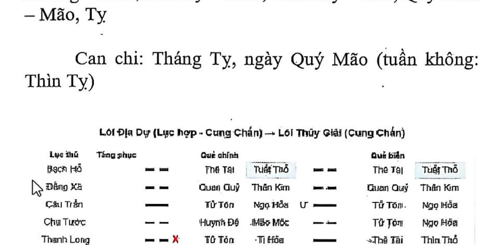

- **Cấu trúc Quẻ Dịch:**
  - **Quẻ chủ:** **Lôi Địa Dự** (Lục hợp – Cung Chấn)  
    *Tượng quẻ:* Dự duyệt hoan hỷ, lòng người hướng về sự đổi mới; quẻ Lục hợp biểu thị sự đồng lòng liên kết và kỳ vọng xã hội lớn lao.
  - **Quẻ biến:** **Lôi Thủy Giải** (Cung Chấn)  
    *Tượng quẻ:* Giải tỏa hoạn nạn, tháo gỡ bế tắc; báo hiệu sự giải thể của bộ máy cầm quyền cũ và giải phóng cục diện bế tắc.

- **Bảng chi tiết Lục hào:**

| Hào | Thế/Ứng | Lục thân (Chủ) | Can Chi | Biến động | Lục thân (Biến) | Can Chi (Biến) | Thần sát / Phục | Lục thú |
|:---:|:---:|:---|:---|:---:|:---|:---|:---|:---|
| 6 | | Thê Tài | Tuất - Thổ | tĩnh | Thê Tài | Tuất - Thổ | | Bạch Hổ |
| 5 | | Quan Quỷ | Thân - Kim | tĩnh | Quan Quỷ | Thân - Kim | Kiếp sát | Đằng Xà |
| 4 | **Ứng** | Tử Tôn | Ngọ - Hỏa | tĩnh | Tử Tôn | Ngọ - Hỏa | | Câu Trần |
| 3 | | Huynh Đệ | Mão - Mộc | tĩnh | Huynh Đệ | Mão - Mộc | Tướng tinh, Văn Xương, Nhật kiến | Chu Tước |
| 2 | | Tử Tôn | Tỵ - Hỏa | **X (Động)** | Thê Tài | Thìn - Thổ | Dịch mã, Nguyệt kiến, Tuần không | Thanh Long |
| 1 | **Thế** | Thê Tài | Mùi - Thổ | tĩnh | Huynh Đệ | Dần - Mộc | Hoa cái, Mưu tinh, Phục Phụ-Tý | Huyền Vũ |

---

### 3. Dụng thần & Loại quẻ

- **Phân loại quẻ:**
  - **Quẻ tâm thái dự đoán thi đấu / bầu cử có định vị chủ quan:** Khi người hỏi có lập trường yêu ghét và thiên hướng chính trị dứt khoát, quẻ phản ánh tính chân thực theo định vị tâm lý chủ quan.
- **Xác định Dụng thần:**
  1. **Phe mình ủng hộ (Đảng Bảo thủ):** Đại diện bởi hào Thế Thê Tài Mùi Thổ và thần tương trợ Tử Tôn Tỵ Hỏa phát động.
  2. **Phe đối lập (Đảng Tự do cầm quyền):** Hào Ứng và hào Quan Quỷ Thân Kim (tượng trưng cho quyền lực thống trị bị công kích).
  3. **Thần quyết định thắng bại:** Hào 2 Tử Tôn Tỵ Hỏa phát động lâm Nguyệt kiến sinh hào Thế (sự ứng nghiệm kỳ vọng chủ quan).

---

### 4. Luận giải chi tiết

Quẻ này là bài giảng kinh điển của Chu Thần Bân về phương pháp giải mã các cuộc thi đấu thể thao, bầu cử chính trị và đầu tư tài chính qua lăng kính định vị chủ quan:

#### 1. Nguyên lý định vị chủ quan trong quẻ bầu cử và thi đấu
- Trong các quẻ đối kháng, khi người gieo quẻ có xu hướng tình cảm mãnh liệt:
  - Phe mình yêu thích, ủng hộ luôn được đại diện bởi hào **Tử Tôn** (kỳ vọng thuận lòng).
  - Phe mình không thích, phe đối thủ hoặc kết quả bất ngờ gây sốc được đại diện bởi hào **Quan Quỷ**.
  - Nếu Tử Tôn phát động vượng tướng: Định vị chủ quan đúng đắn, phe mình ủng hộ giành chiến thắng.
  - Nếu Quan Quỷ phát động hoặc vượng tướng: Định vị chủ quan sai lầm, đối thủ tạo nên cú sốc bất ngờ lật ngược tình thế.

#### 2. Phân tích động thái của hào 2 Tử Tôn Tỵ Hỏa
- Trong quẻ Lôi Địa Dự, duy nhất chỉ có hào 2 Tử Tôn Tỵ Hỏa phát động:
  - Tỵ Hỏa lâm **Nguyệt kiến**, đắc sinh khí tột bậc, là hào động nắm quyền năng định đoạt tuyệt đối chiều hướng cát hung của toàn quẻ.
  - Tử Tôn đại diện cho phe mà người gieo quẻ đặt trọn niềm tin (Đảng Bảo thủ). Khi Tử Tôn phát động, tức là xu thế thắng lợi thuộc về đảng này.
  - Hào động hóa **Thê Tài Thìn Thổ**: Hào biến Thìn Thổ tuy lâm Tuần không, nhưng đây là hào biến trong quẻ xem việc tương lai có thời hạn ấn định (ngày 7/6). Tuần không của hào biến chỉ là trạng thái chưa đến ngày ứng kỳ, không phải là hào động vô dụng.
  - Tử Tôn Tỵ Hỏa phát động sinh trợ mãnh liệt cho hào Thế Thê Tài Mùi Thổ (Hỏa sinh Thổ), củng cố vững chắc nền tảng thắng lợi của đảng Bảo thủ. Đồng thời Tử Tôn mang năng lực khắc chế Quan Quỷ, tước đoạt quyền lực cai trị của đảng Tự do đương nhiệm.

#### 3. Tương quan quẻ Lục hợp biến Giải
- Quẻ chủ Lôi Địa Dự là quẻ Lục hợp, mang ý nghĩa sự liên kết rộng rãi của các tầng lớp cử tri ủng hộ đảng đối lập.
- Biến sang Lôi Thủy Giải là tượng tiêu tan ách tắc, giải trừ quyền lực của đảng cầm quyền cũ để thiết lập một trật tự quản trị mới.

---

### 5. Kết luận & Ứng kỳ thực tế

- **Lời giải đoán của Chu Thần Bân:**
  Tử Tôn Tỵ Hỏa vượng động sinh Thế là dấu hiệu chắc chắn đảng Bảo thủ sẽ giành chiến thắng trong cuộc bầu cử ngày 7 tháng 6.
- **Phản hồi thực tế (Feedback):**
  Sau ngày 20 tháng 5 năm 2018 (hơn 2 tuần trước ngày bầu cử chính thức), đảng Tự do cầm quyền nhận thấy các chỉ số thăm dò và tỷ lệ ủng hộ suy sụp nghiêm trọng, không còn hy vọng lật ngược tình thế, nên đã công khai tuyên bố thừa nhận thất bại trước cuộc bầu cử! Kết quả ngày 07/06/2018, đảng Bảo thủ thắng cử áp đảo, chính thức nắm quyền lãnh đạo tỉnh Ontario.
- **Ứng kỳ chiêm nghiệm:**
  Thế trận an bài ngay từ hạ tuần tháng 5 (sau ngày 20/5) và chiến thắng được xác lập chính thức vào ngày 07/06/2018 (tháng Ngọ).

---

### 6. Bài học tâm pháp & Quy tắc cốt lõi

- **Trích dẫn quy tắc sách (Rule Index):**
  *Quy tắc gieo quẻ bầu cử chính trị: Phân định Thế Ứng theo tâm lý ủng hộ và tác dụng của Tử Tôn phát động* (Sách Cổ Thệ Chân Thuyên Thực Chiến Biên, trang 173).
- **Tâm pháp giải đoán thực tế:**
  1. **Định vị tâm thái trong thi đấu và bầu cử:** Khi người hỏi có lập trường rõ rệt, Tử Tôn đại diện cho bên mình ủng hộ hoặc kỳ vọng của số đông; Tử Tôn vượng động là điềm báo bên mình ủng hộ ắt thắng.
  2. **Hào biến lâm Tuần không trong việc có kỳ hạn:** Hào biến lâm không vong trong việc tương lai chỉ đóng vai trò chốt chặn thời gian (ứng kỳ xuất không), không làm mất đi năng lực tác động định tính của hào động lâm Nhật Nguyệt.
  3. **Ứng dụng linh hoạt sang thị trường tài chính:** Quy luật định vị chủ quan qua Tử Tôn (kỳ vọng thị trường tăng) và Quan Quỷ (cú sốc giảm điểm ngoài dự tính) là vũ khí lợi hại trong phân tích dự đoán chứng khoán, ngoại hối.

## THỰC CHIẾN 151: VỪA NHẬN ĐƯỢC TIN TỨC, ĐẢNG TỰ DO CẦM QUYỀN TỰ THỪA NHẬN SẼ KHÔNG GIÀNH CHIẾN THẮNG TRONG CUỘC BẦU CỬ, LẠI HỎI ĐẢNG BẢO THỦ VÀ TÂN ĐẢNG AI CHIẾM ƯU THẾ LỚN HƠN TRONG CUỘC BẦU CỬ

---

### 1. Bối cảnh & Câu hỏi

- **Bối cảnh chi tiết:**
  Sau khi đảng Tự do cầm quyền tại Ontario công khai tự thừa nhận sẽ thất bại trong kỳ bầu cử ngày 7 tháng 6 năm 2018, đối thủ truyền kiếp lớn nhất đã chính thức rút lui khỏi cuộc đua giành vị trí dẫn đầu. Tuy nhiên, trên chính trường lúc này xuất hiện một đối thủ cạnh tranh mới nổi là Tân Đảng (New Democratic Party - NDP, một lực lượng chính trị mới). Người hỏi (vốn là đảng viên đảng Bảo thủ) lập tiếp quẻ thứ hai để so sánh ưu thế cạnh tranh trực tiếp giữa đảng Bảo thủ và Tân Đảng xem bên nào giành được nhiều ghế hơn để thành lập chính phủ đa số.
- **Tâm lý & Câu hỏi ẩn ý:**
  Đương số vẫn giữ nguyên lập trường đảng viên đảng Bảo thủ, nhưng lo ngại Tân Đảng sẽ nhân cơ hội đảng Tự do sụp đổ để hút phiếu và đe dọa vị thế cầm quyền của đảng mình. Câu hỏi cốt lõi: *"Giữa đảng Bảo thủ và Tân Đảng, bên nào chiếm ưu thế lớn hơn, giành được nhiều phiếu bầu hơn để cầm quyền?"*
- **Thời gian chiêm đoán:**
  - Dương lịch: 30/05/2018 lúc 20:10 (Giờ Bắc Kinh).
  - Can chi: Năm Mậu Tuất, tháng Đinh Tỵ, ngày Nhâm Tuất, giờ Canh Tuất.

---

### 2. Dữ kiện & Bảng quẻ Crop

- **Thời không chiêm nghiệm:**
  - Tháng Đinh Tỵ (Hỏa vượng, Thổ tướng).
  - Ngày Nhâm Tuất (Thổ vượng, Hỏa khố, xung Thìn Thổ tạo ám động).
  - Tuần không: **Tý - Sửu** (Giáp Dần tuần trung, Tý Sửu không vong).
- **Thần sát:**
  - Tướng tinh: Ngọ (Lâm hào Thế)
  - Hoa Cái: Tuất (Lâm Nhật kiến, hào 6)
  - Dịch mã: Thân (Lâm hào 5 Quan Quỷ)
  - Tai sát: Tý (Lâm hào Ứng)
  - Mưu tinh: Thìn (Lâm hào 3 ám động)
  - Đào hoa: Mão (Lâm hào biến)
  - Kiếp sát: Hợi
  - Lộc thần: Hợi
  - Dương nhẫn: Tý (Lâm Tuần không, hào Ứng)
  - Văn Xương: Dần (Lâm hào 2 động)
  - Thiên y: Thìn (Lâm hào 3)
  - Thiên hỷ: Sửu (Lâm Tuần không)
  - Quý nhân: Mão, Tỵ

- Dữ kiện bảng quẻ và các thông số chiêm đoán:
  - **Bảng 151.1** Đồ hình quẻ Thực chiến 151:
    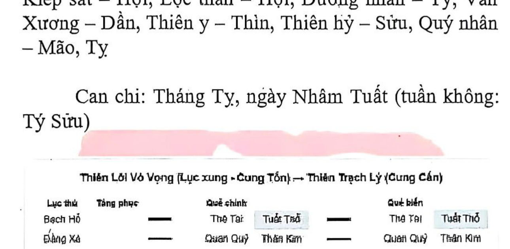

- **Cấu trúc Quẻ Dịch:**
  - **Quẻ chủ:** **Thiên Lôi Vô Vọng** (Lục xung – Cung Tốn)  
    *Tượng quẻ:* Vô Vọng dã, hành sự chân thực không vọng động, thế trận cạnh tranh trực diện không có biến số hỗn loạn ngoài ý muốn.
  - **Quẻ biến:** **Thiên Trạch Lý** (Cung Cấn)  
    *Tượng quẻ:* Lý dã, thực thi theo đúng quy củ và cam kết; báo hiệu cử tri sẽ thực hiện lời hứa bỏ phiếu theo đúng định hướng đã cam kết từ trước.

- **Bảng chi tiết Lục hào:**

| Hào | Thế/Ứng | Lục thân (Chủ) | Can Chi | Biến động | Lục thân (Biến) | Can Chi (Biến) | Thần sát / Phục | Lục thú |
|:---:|:---:|:---|:---|:---:|:---|:---|:---|:---|
| 6 | | Thê Tài | Tuất - Thổ | tĩnh | Thê Tài | Tuất - Thổ | Hoa Cái, Nhật kiến | Bạch Hổ |
| 5 | | Quan Quỷ | Thân - Kim | tĩnh | Quan Quỷ | Thân - Kim | Dịch mã | Đằng Xà |
| 4 | **Thế** | Tử Tôn | Ngọ - Hỏa | tĩnh | Tử Tôn | Ngọ - Hỏa | Tướng tinh | Câu Trần |
| 3 | | Thê Tài | Thìn - Thổ | tĩnh (Ám động) | Thê Tài | Sửu - Thổ | Mưu tinh, Thiên y | Chu Tước |
| 2 | | Huynh Đệ | Dần - Mộc | **X (Động)** | Huynh Đệ | Mão - Mộc | Văn Xương, Đào hoa, Quý nhân | Thanh Long |
| 1 | **Ứng** | Phụ Mẫu | Tý - Thủy | tĩnh | Tử Tôn | Tỵ - Hỏa | Tai sát, Dương nhẫn, Tuần không | Huyền Vũ |

---

### 3. Dụng thần & Loại quẻ

- **Phân loại quẻ:**
  - **Quẻ tái chiêm so sánh thế lực đa đảng trong bầu cử chính trị:** Thay đổi đối tượng so sánh khi đối thủ cũ bị loại, phân định ưu thế giữa hai lực lượng mới.
- **Xác định Dụng thần:**
  1. **Đảng Bảo thủ (bên mình ủng hộ):** Hào Thế Tử Tôn Ngọ Hỏa lâm Tướng tinh.
  2. **Tân Đảng (đối thủ mới nổi):** Hào 5 Quan Quỷ Thân Kim lâm Dịch mã.
  3. **Cử tri và lá phiếu bầu:** Hào 2 Huynh Đệ Dần Mộc động hóa Tiến thần Mão Mộc (đại diện cho khối cử tri ủng hộ) và Hào 3 Thê Tài Thìn Thổ ám động (nguồn lực ủng hộ).

---

### 4. Luận giải chi tiết

Quẻ này là bài học mẫu mực về nghệ thuật phân tích so sánh hai thế lực trong bầu cử đa đảng và cơ chế triệt nguồn sinh của đối thủ:

#### 1. Định vị hai đối thủ sau khi cục diện thay đổi
- Đối thủ cũ (Đảng Tự do) đã tự nhận thua, mục tiêu so sánh chuyển sang Tân Đảng.
- Người gieo quẻ vẫn là đảng viên đảng Bảo thủ nên thiên hướng tâm lý không đổi:
  - Đảng Bảo thủ được đại diện bởi hào Thế **Tử Tôn Ngọ Hỏa**.
  - Tân Đảng trở thành đối thủ cạnh tranh quyền lực nên được đại diện bởi **Quan Quỷ Thân Kim**.

#### 2. Tác động của quẻ biến Thiên Trạch Lý
- Quẻ chủ Vô Vọng biến Lý: Lý là lễ nghi, quy ước, thực hiện theo cam kết.
- Tượng quẻ chỉ ra rằng cử tri đã cam kết ủng hộ ai thì sẽ giữ đúng lời hứa bỏ phiếu cho người đó, tiến trình bầu cử diễn ra hoàn toàn theo kế hoạch.

#### 3. Cơ chế Huynh Đệ hóa Tiến thần sinh Thế và triệt hạ nguồn sinh của Quan Quỷ
- **Huynh Đệ Dần Mộc động hóa Tiến thần Huynh Đệ Mão Mộc:**
  - Huynh Đệ đại diện cho quần chúng cử tri, nhân dân. Dần Mộc hóa Mão Mộc là hóa Tiến thần, biểu thị số lượng cử tri ủng hộ tăng vọt mạnh mẽ.
  - Hào biến Mão Mộc mang **Đào hoa** và **Quý nhân**: Đào hoa tượng trưng cho những tờ phiếu bầu in chữ viết tay trang trọng. Cử tri dồn dập bỏ phiếu mang lại nguồn sinh trợ trực tiếp cho hào Thế Tử Tôn Ngọ Hỏa (Mộc sinh Hỏa).
- **Hào 3 Thê Tài Thìn Thổ ám động (bị Nhật Tuất xung trong tháng Tỵ có khí):**
  - Thìn Thổ sinh Quan Quỷ Thân Kim, biểu thị Tân Đảng cũng nhận được sự ủng hộ gia tăng từ một bộ phận cử tri rời bỏ đảng Tự do.
  - Tuy nhiên, Huynh Đệ Dần Mộc phát động không chỉ sinh Thế mà còn khắc hãm Thê Tài Thìn Thổ. Dần Mộc phát động đã chặn đứng dòng sinh trợ của Thìn Thổ hướng về Thân Kim, cắt đứt nguồn lực của Tân Đảng!
  - Cử tri chỉ được chọn một đảng, khi dòng phiếu đã dồn về đảng Bảo thủ thì Tân Đảng không thể nào cạnh tranh nổi vị thế dẫn đầu.

---

### 5. Kết luận & Ứng kỳ thực tế

- **Lời giải đoán của Chu Thần Bân:**
  Đảng Bảo thủ chiếm ưu thế áp đảo hoàn toàn, chắc chắn giành được hơn 50% số ghế trong nghị viện để nắm quyền thành lập chính phủ. Tân Đảng tuy số ghế có tăng mạnh nhưng không thể cản bước chiến thắng của đảng Bảo thủ.
- **Phản hồi thực tế (Feedback):**
  Kết quả cuộc bầu cử ngày 7 tháng 6 diễn ra đúng như dự đoán: Đảng Bảo thủ thắng lớn rực rỡ, giành đa số ghế tuyệt đối trong nghị viện các tỉnh (vượt 50% tổng số ghế). Số ghế của Tân Đảng cũng tăng gấp đôi so với nhiệm kỳ trước nhờ hút phiếu từ đảng Tự do cầm quyền cũ. Đảng Tự do thảm bại nặng nề chỉ giữ được vỏn vẹn 7 ghế.
- **Ứng kỳ chiêm nghiệm:**
  Ứng nghiệm chính xác vào ngày bầu cử 07/06/2018.

---

### 6. Bài học tâm pháp & Quy tắc cốt lõi

- **Trích dẫn quy tắc sách (Rule Index):**
  *Quy tắc tái chiêm bầu cử đa đảng: So sánh thế lực đảng phái qua quẻ lục xung Thiên Lôi Vô Vọng biến Lý* (Sách Cổ Thệ Chân Thuyên Thực Chiến Biên, trang 181).
- **Tâm pháp giải đoán thực tế:**
  1. **Quy tắc tái chiêm khi thay đổi đối thủ:** Khi đối thủ cũ bị loại, đối tượng mới xuất hiện lập tức được quy nạp vào hào Quan Quỷ, trong khi hào Thế Tử Tôn tiếp tục đại diện cho phe mình ủng hộ.
  2. **Huynh Đệ hóa Tiến thần kiêm tiệt đoạn:** Động hào vừa tương sinh cho hào Thế của mình, vừa khắc chế Nguyên thần của phe đối lập, tạo nên cục diện áp đảo tuyệt đối một chiều.
  3. **Ý nghĩa hào mang Đào hoa và Quý nhân:** Trong quẻ bầu cử, Đào hoa và Quý nhân là biểu trưng đặc thù của những lá phiếu bầu cử quy tụ về hào Thế.

## THỰC CHIẾN 152 – HIỆN TẠI CÓ NÊN TẠM THỜI BÁN RA CỔ PHIẾU DÀI HẠN ĐỂ TRÁNH RỦI RO KHÔNG?

---

### 1. Bối cảnh & Câu hỏi

- **Bối cảnh chi tiết:**
  Chu Thần Bân là một nhà đầu tư có bề dày kinh nghiệm trên 20 năm trên thị trường tài chính. Ông luôn duy trì một chiến lược quản trị vốn nghiêm ngặt: luôn nắm giữ một phần cổ phiếu dài hạn (khoảng 30% danh mục vốn, giữ trên 2 năm từ nguồn lợi nhuận tích lũy của đợt thị trường bò trước). Vào cuối tháng 5 năm 2018, các chỉ số chứng khoán quốc tế như Dow Jones của Mỹ và Hang Seng của Hồng Kông xuất hiện tín hiệu quay đầu suy yếu; trong khi đó chỉ số A-shares Thượng Hải trong nước dao động chao đảo dù các nhà phân tích liên tục tung hô thị trường đã chạm đáy và sắp bùng nổ sóng tăng giá mới.
- **Tâm lý & Câu hỏi ẩn ý:**
  Đứng trước nguy cơ rủi ro sụt giảm mang tính hệ thống, Chu Thần Bân băn khoăn liệu có nên phá lệ bán ra danh mục cổ phiếu dài hạn để bảo toàn vốn hay không. Nếu bán sai ở đáy thì chi phí mua lại rất đắt, nhưng nếu tiếp tục ôm giữ mà thị trường rơi vào thảm họa sụp đổ thì tài sản sẽ bị bào mòn nặng nề. Câu hỏi cốt lõi: *"Hiện tại có nên tạm thời bán ra cổ phiếu dài hạn để tránh rủi ro không?"*
- **Thời gian chiêm đoán:**
  - Dương lịch: Cuối tháng 5 năm 2018 (giờ Ất Tỵ).
  - Can chi: Năm Mậu Tuất, tháng Đinh Tỵ, ngày Nhâm Tuất, giờ Ất Tỵ.

---

### 2. Dữ kiện & Bảng quẻ Crop

- **Thời không chiêm nghiệm:**
  - Tháng Đinh Tỵ (Hỏa vượng, Kim trường sinh tương hình tương khắc).
  - Ngày Nhâm Tuất (Thổ vượng, sinh trợ hào Thế Thân Kim).
  - Tuần không: **Tý - Sửu** (Giáp Dần tuần trung, Tý Sửu không vong).
- **Thần sát:**
  - Tướng tinh: Ngọ (Lâm hào 2 động)
  - Hoa cái: Tuất (Lâm Nhật kiến, hào biến)
  - Dịch mã: Thân (Lâm hào Thế)
  - Tai sát: Tý (Lâm hào biến)
  - Mưu tinh: Thìn (Lâm hào sơ động)
  - Đào hoa: Mão (Lâm Phục thần)
  - Kiếp sát: Hợi (Lâm hào 4)
  - Lộc thần: Hợi
  - Dương nhẫn: Tý
  - Văn xương: Dần (Lâm hào biến)
  - Thiên y: Thìn (Lâm hào sơ)
  - Thiên hỷ: Sửu
  - Quý nhân: Mão, Tỵ

- Dữ kiện bảng quẻ và các thông số chiêm đoán:
  - **Bảng 152.1** Đồ hình quẻ Thực chiến 152:
    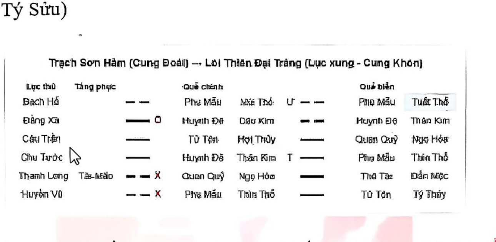

- **Cấu trúc Quẻ Dịch:**
  - **Quẻ chủ:** **Trạch Sơn Hàm** (Cung Đoài)  
    *Tượng quẻ:* Cảm ứng nhạy bén, tâm trạng nhạy cảm trước biến động bất an của thị trường tài chính.
  - **Quẻ biến:** **Lôi Thiên Đại Tráng** (Lục xung – Cung Khôn)  
    *Tượng quẻ:* Chấn động mạnh mẽ, quẻ Lục xung báo hiệu biến cố kịch liệt, thời gian cơ hội tốt chỉ tồn tại ngắn ngủi tạm thời.

- **Bảng chi tiết Lục hào:**

| Hào | Thế/Ứng | Lục thân (Chủ) | Can Chi | Biến động | Lục thân (Biến) | Can Chi (Biến) | Thần sát / Phục | Lục thú |
|:---:|:---:|:---|:---|:---:|:---|:---|:---|:---|
| 6 | **Ứng** | Phụ Mẫu | Mùi - Thổ | tĩnh | Phụ Mẫu | Tuất - Thổ | | Bạch Hổ |
| 5 | | Huynh Đệ | Dậu - Kim | **O (Động)** | Huynh Đệ | Thân - Kim | | Đằng Xà |
| 4 | | Tử Tôn | Hợi - Thủy | tĩnh | Quan Quỷ | Ngọ - Hỏa | Kiếp sát, Lộc thần | Câu Trần |
| 3 | **Thế** | Huynh Đệ | Thân - Kim | tĩnh | Phụ Mẫu | Thìn - Thổ | Dịch mã | Chu Tước |
| 2 | | Quan Quỷ | Ngọ - Hỏa | **X (Động)** | Thê Tài | Dần - Mộc | Tướng tinh, Phục Tài-Mão | Thanh Long |
| 1 | | Phụ Mẫu | Thìn - Thổ | **X (Động)** | Tử Tôn | Tý - Thủy | Mưu tinh, Thiên y, Ám động | Huyền Vũ |

---

### 3. Dụng thần & Loại quẻ

- **Phân loại quẻ:**
  - **Quẻ đầu tư tài chính dài hạn & Quản lý danh mục rủi ro chu kỳ:** Phân tích quỹ đạo vận động giá cổ phiếu và xác định thời điểm rút vốn.
- **Xác định Dụng thần:**
  1. **Hào Thế Huynh Đệ Thân Kim:** Bản thân nhà đầu tư và vị thế vốn dài hạn đang nắm giữ.
  2. **Hào Phụ Mẫu:** Đại diện cho giá trị cổ phiếu, chứng thư sở hữu. Hào Nhật kiến Phụ Mẫu Tuất Thổ sinh Thế chứng tỏ mức giá hiện tại vẫn đang mang lại sự an toàn.
  3. **Hào Quan Quỷ Ngọ Hỏa:** Rủi ro sụp giá, mối hiểm họa sụt giảm sâu của thị trường.
  4. **Hào Tử Tôn Tý Thủy:** Cơ hội chốt lời, thoát hàng thanh khoản an toàn theo mong muốn.

---

### 4. Luận giải chi tiết

Quẻ này là đỉnh cao nghệ thuật phân tích quỹ đạo biến động chứng khoán dựa trên sự phối hợp giữa vị trí hào và trục thời gian của Chu Thần Bân:

#### 1. Đánh giá vị thế hào Thế qua Nhật Nguyệt lệnh
- Hào Thế Huynh Đệ Thân Kim được Nhật kiến Tuất Thổ tương sinh; Nguyệt lệnh Đinh Tỵ mang trường sinh nhưng đồng thời tạo thế khắc hợp.
- Sự khắc hợp này phản ánh đúng thực tế: Danh mục vốn dài hạn đang chịu sự suy giảm giá trị bị động theo chu kỳ thị trường gấu, nhưng mức độ sụt giảm rất chậm và mức lỗ chưa tới 10%, hoàn toàn nằm trong giới hạn kiểm soát. Hào Thế đắc Nhật sinh Nguyệt hợp nên nền tảng gốc vốn cực kỳ vững chắc.

#### 2. Phân tích quỹ đạo biến động từ hào sơ đến hào 5 theo trục thời gian
- **Hào sơ Phụ Mẫu Thìn Thổ động (kiêm ám động do Nhật Tuất xung) hóa Tử Tôn Tý Thủy:**
  - Hào sơ là điểm khởi đầu của quỹ đạo (thời gian trước mắt vài ngày tới). Ám động kết hợp quẻ biến Lục xung báo hiệu một cơ hội ngắn ngủi chớp nhoáng (ngày Tý điền thực).
  - Thị trường sẽ có nhịp kéo xanh hồi phục trong 2-3 ngày, tạo điều kiện thuận lợi nhất để bán rút vốn ở vùng giá tốt. Đây là cơ hội duy nhất để hành động; nếu bỏ lỡ thì rủi ro sẽ ập đến.
- **Hào 2 Quan Quỷ Ngọ Hỏa động hóa Thê Tài Dần Mộc (hồi đầu sinh):**
  - Dần Mộc là trường sinh của Ngọ Hỏa, tiếp sức cho Quan Quỷ bùng phát sức mạnh khắc phá hào Thế Thân Kim.
  - Hào 2 ứng với trục thời gian tháng Ngọ và tháng Mùi (tháng 6 và tháng 7). Đây là đợt lao dốc dữ dội và kéo dài của thị trường. Hào Ứng Phụ Mẫu Mùi Thổ mang Bạch Hổ (thoái thần của Tuất Thổ) báo hiệu giá cổ phiếu sẽ bị cắt giảm thê thảm khiến nhà đầu tư cực kỳ khó chịu.
- **Hào 5 Huynh Đệ Dậu Kim hóa Thoái thần Huynh Đệ Thân Kim:**
  - Ứng vào trục thời gian tháng Thân và tháng Dậu (tháng 8 và tháng 9).
  - Hào Huynh Đệ thoái thần cho thấy biên độ giảm giá thu hẹp dần, lực bán tháo suy kiệt, thị trường bước vào giai đoạn thanh khoản thấp để từ từ tạo đáy kỹ thuật.

---

### 5. Kết luận & Ứng kỳ thực tế

- **Lời giải đoán và hành động của Chu Thần Bân:**
  Nắm bắt ngay nhịp hồi phục 2-3 ngày ngắn hạn ở hào sơ để quyết liệt bán chốt lời 70% danh mục cổ phiếu dài hạn. Đồng thời cảnh báo các nhà đầu tư đề phòng rủi ro sụt giảm nghiêm trọng của thị trường vào tháng 6 và tháng 7.
- **Phản hồi thực tế (Feedback):**
  Trong 3 ngày tiếp theo, ông đã tận dụng nhịp tăng giá ngắn hạn để bán thoát 70% vị thế cổ phiếu. Sau đó từ giữa tháng 6/2018 trở đi, chỉ số Thượng Hải lao dốc thẳng đứng từ mốc trên 3100 điểm xuống dưới 2750 điểm (mất hơn 10% chỉ số), hàng loạt cổ phiếu rơi vào tình trạng giảm giá thê thảm đúng như quẻ đã báo trước.
- **Ứng kỳ chiêm nghiệm:**
  Thoát hàng thành công ở đỉnh ngắn hạn trong vài ngày; tháng Ngọ - Mùi bùng phát sụp đổ; tháng Thân - Dậu bước vào chu kỳ mài đáy.

---

### 6. Bài học tâm pháp & Quy tắc cốt lõi

- **Trích dẫn quy tắc sách (Rule Index):**
  *Quy tắc dự đoán xu thế cổ phiếu dài hạn và phân tích quỹ đạo biến động qua hào sơ ám động* (Sách Cổ Thệ Chân Thuyên Thực Chiến Biên, trang 186).
- **Tâm pháp giải đoán thực tế:**
  1. **Trục thời gian tuần tự theo hào vị:** Hào sơ là biến động tức thời trong vài ngày ngắn hạn, các hào vị phía trên ứng với các tháng tiếp nối trong chu kỳ tài chính trung và dài hạn.
  2. **Biện chứng giữa nhịp hồi ngắn hạn và xu thế dài hạn:** Hào sơ ám động hóa Tử Tôn là "pha kéo hồi ngắn hạn" trong một xu thế sụt giảm lớn, nhà đầu tư phải tận dụng nhịp hồi để thoát hàng dứt khoát trước khi bão tố ập đến.
  3. **Tâm pháp quản lý vốn trong đầu tư:** Chỉ giao dịch bằng lợi nhuận tích lũy từ thị trường bò, kiên quyết cắt giảm danh mục khi tín hiệu chu kỳ nguy hại xuất hiện.

## THỰC CHIẾN 153 – LÃNH ĐẠO SẮP XẾP, HỎI CÓ NÊN TIẾP NHẬN CÔNG VIỆC CỦA ĐỒNG NGHIỆP HAY KHÔNG

---

### 1. Bối cảnh & Câu hỏi

- **Bối cảnh chi tiết:**
  Vợ của một đồng môn đang công tác tại một cơ quan đơn vị. Một nhân viên cùng đơn vị nộp đơn xin nghỉ việc, lãnh đạo có ý định điều chuyển và giao toàn bộ phần công việc dang dở của người đó cho cô tiếp nhận. Cô có quyền nhận hoặc khéo léo từ chối, nhưng đứng trước sự sắp xếp của cấp trên, bản thân cảm thấy băn khoăn không biết đây là cơ hội phát triển hay gánh nặng tai ương.
- **Tâm lý & Câu hỏi ẩn ý:**
  Tâm lý phân vân giữa việc làm hài lòng lãnh đạo để tìm kiếm cơ hội thăng tiến và nỗi sợ hãi bị quá tải công việc, rước lấy phiền toái. Câu hỏi cốt lõi: *"Lãnh đạo sắp xếp như vậy, tôi có nên tiếp nhận công việc của đồng nghiệp hay không?"*
- **Thời gian chiêm đoán:**
  - Dương lịch: 06/06/2018, 06:10 sáng (Giờ Bắc Kinh).
  - Can chi: Năm Mậu Tuất, tháng Mậu Ngọ, ngày Kỷ Tỵ, giờ Mậu Thìn.

---

### 2. Dữ kiện & Bảng quẻ Crop

- **Thời không chiêm nghiệm:**
  - Tháng Mậu Ngọ (Hỏa vượng, Thổ tướng).
  - Ngày Kỷ Tỵ (Hỏa vượng, Tỵ xung Hợi làm ám động).
  - Tuần không: **Tuất - Hợi** (hào Ứng Quan Quỷ Hợi Thủy lâm không).
- **Thần sát:**
  - Tướng tinh: Dậu
  - Hoa Cái: Sửu
  - Dịch mã: Hợi (Lâm hào Ứng)
  - Tai sát: Mão
  - Mưu tinh: Mùi
  - Đào hoa: Ngọ
  - Kiếp sát: Dần
  - Lộc thần: Ngọ (Lâm Nguyệt kiến)
  - Dương nhẫn: Tỵ (Lâm Nhật kiến, hào Thế)
  - Văn Xương: Dậu
  - Thiên Y: Tỵ (Lâm hào Thế)
  - Thiên Hỷ: Sửu
  - Quý nhân: Thân, Tý

- Dữ kiện bảng quẻ và các thông số chiêm đoán:
  - **Bảng 153.1** Đồ hình quẻ Thực chiến 153:
    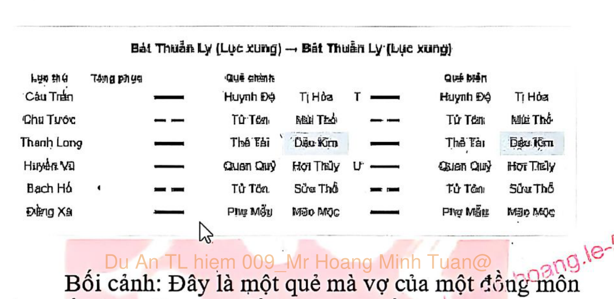

- **Cấu trúc Quẻ Dịch:**
  - **Quẻ chủ:** **Bát Thuần Ly** (Cung Ly – Quẻ Lục Xung, Quẻ thuần tĩnh)  
    *Tượng quẻ:* Hỏa quang rực rỡ nhưng xung tán, công việc áp lực căng thẳng như ngồi trên đống lửa, biến động và xung đột tiềm tàng.
  - **Quẻ biến:** **Bát Thuần Ly** (Cung Ly – Quẻ Lục Xung).

- **Bảng chi tiết Lục hào:**

| Hào | Thế/Ứng | Lục thân (Chủ) | Can Chi | Biến động | Lục thân (Biến) | Can Chi (Biến) | Thần sát / Phục | Lục thú |
|:---:|:---:|:---|:---|:---:|:---|:---|:---|:---|
| 6 | **Thế** | Huynh Đệ | Tỵ - Hỏa | tĩnh | Huynh Đệ | Tỵ - Hỏa | Dương nhẫn, Thiên Y, Nhật kiến | Câu Trần |
| 5 | | Tử Tôn | Mùi - Thổ | tĩnh | Tử Tôn | Mùi - Thổ | Mưu tinh | Chu Tước |
| 4 | | Thê Tài | Dậu - Kim | tĩnh | Thê Tài | Dậu - Kim | Tướng tinh, Văn Xương | Thanh Long |
| 3 | **Ứng** | Quan Quỷ | Hợi - Thủy | tĩnh (Ám động) | Quan Quỷ | Hợi - Thủy | Dịch mã, Tuần không | Huyền Vũ |
| 2 | | Tử Tôn | Sửu - Thổ | tĩnh | Tử Tôn | Sửu - Thổ | Hoa cái, Thiên Hỷ | Bạch Hổ |
| 1 | | Phụ Mẫu | Mão - Mộc | tĩnh | Phụ Mẫu | Mão - Mộc | Tai sát | Đằng Xà |

---

### 3. Dụng thần & Loại quẻ

- **Phân loại quẻ:**
  - **Quẻ quyết định công việc / sự nghiệp thuộc phạm trù trung dài hạn:** Đánh giá hệ quả của việc tiếp nhận nhiệm vụ kéo dài trong tổ chức.
- **Xác định Dụng thần:**
  1. **Dụng thần sự nghiệp / Công việc mới:** Hào 3 Quan Quỷ Hợi Thủy lâm Ứng.
  2. **Hào Thế Huynh Đệ Tỵ Hỏa:** Bản thân đương số, sức chịu tải công việc.
  3. **Tương quan cách cục:** Dụng thần khắc Thế (Quan Quỷ Hợi Thủy ám động xung khắc hào Thế Huynh Đệ Tỵ Hỏa).

---

### 4. Luận giải chi tiết

Quẻ này là bài học kinh điển về việc phân biệt bản chất ngắn hạn và trung dài hạn trong cách cục Dụng thần khắc Thế của Chu Thần Bân:

#### 1. Phân biệt bản chất ngắn hạn và trung dài hạn trong cách cục Dụng thần khắc Thế
- Trong bói Dịch, quy tắc "Dụng thần khắc Thế" có sự phân hóa tầng thứ sâu sắc:
  - **Sự việc ngắn hạn (xảy ra một lần):** Ví dụ như tìm ví tiền, tìm sổ hộ khẩu, tìm chìa khóa bị mất. Khi đó nếu Dụng thần phát động khắc hào Thế mà hào Thế vượng tướng thì đồ vật sẽ nhanh chóng tìm về tay, đây lại là điềm lành.
  - **Sự việc trung và dài hạn (kéo dài theo thời gian):** Ví dụ như nhận công việc, đảm nhiệm chức vụ, hôn nhân. Một công việc khi đã tiếp nhận thì ít nhất phải gánh vác trong nửa năm đến nhiều năm. Trong sự việc trung dài hạn, Dụng thần khắc Thế tuyệt đối là hung triệu, biểu thị áp lực nặng nề, lao tâm khổ tứ, bị công việc đè nén kiệt sức.

#### 2. Phân tích hào 3 Quan Quỷ Hợi Thủy ám động lâm Huyền Vũ
- Quan Quỷ Hợi Thủy ngự tại hào Ứng, lâm Tuần không, bị Nhật thần Tỵ Hỏa xung là **Ám động**.
- Ám động tương đương với hào động, trực tiếp xung khắc mãnh liệt vào hào Thế Huynh Đệ Tỵ Hỏa. Điều này cho thấy công việc này sẽ rất nhanh chóng bị cấp trên đẩy sang tay đương số.
- Quan Quỷ mang **Huyền Vũ**: Huyền Vũ chủ sự mờ ám, khuất tất, những cạm bẫy và khó khăn tiềm ẩn mà người ngoài không thể nhìn thấy bằng mắt thường. Công việc người tiền nhiệm để lại chứa đầy rắc rối tồn đọng và sai phạm ngầm.
- Dù hào Thế Tỵ Hỏa lâm Nhật kiến vượng tướng (cho thấy về mặt năng lực ngắn hạn thì có thể tạm thời tiếp nhận), nhưng đây thuần túy là "chậu than hồng", không mang lại sự thăng tiến bổng lộc nào mà chỉ đem lại áp lực khổng lồ vượt quá sức chịu đựng.

---

### 5. Kết luận & Ứng kỳ thực tế

- **Lời giải đoán của Chu Thần Bân:**
  Tuyệt đối không nên nhận công việc này! Đây là chiếc bẫy công sở mang lại áp lực khổng lồ và gánh nặng mờ ám từ sai sót của người trước để lại.
- **Phản hồi thực tế (Feedback):**
  Đương số nghe theo lời khuyên của Chu Thần Bân, đã khéo léo tìm lý do từ chối tiếp nhận công việc đó. Sau đó, lãnh đạo giao công việc này cho một đồng nghiệp khác. Quả nhiên người đồng nghiệp này sau khi nhận việc liên tục gặp rắc rối, bị cấp trên khiển trách và rơi vào khủng hoảng vì vô số vấn đề sai phạm cũ không thể giải quyết nổi.
- **Ứng kỳ chiêm nghiệm:**
  Quyết định từ chối giúp hóa giải tai họa công sở ngay trong tháng Ngọ.

---

### 6. Bài học tâm pháp & Quy tắc cốt lõi

- **Trích dẫn quy tắc sách (Rule Index):**
  *Quy tắc từ chối tiếp nhận công việc của đồng nghiệp qua quẻ Bát Thuần Ly và Quan Quỷ ám động mang Huyền Vũ* (Sách Cổ Thệ Chân Thuyên Thực Chiến Biên, trang 200).
- **Tâm pháp giải đoán thực tế:**
  1. **Định vị tính chất thời gian của sự việc:** Luôn xác định rạch ròi bản chất ngắn hạn hay trung dài hạn của câu hỏi trước khi kết luận cách cục Dụng thần khắc Thế.
  2. **Ý nghĩa của Quan Quỷ lâm Huyền Vũ:** Biểu thị công việc tiềm ẩn sai phạm cũ, cạm bẫy khuất tất và áp lực vô hình từ cấp trên.
  3. **Trí tuệ biết từ chối trong sự nghiệp:** Trong quan trường và công sở, không phải nhiệm vụ nào lãnh đạo giao cũng là cơ hội; quẻ Dịch giúp nhìn thấu bản chất "miếng thịt mỡ" hay "chậu than hồng" để chủ động phòng tránh rủi ro.

## THỰC CHIẾN 154 – TIỂU DIỆP THI ĐẠI HỌC CÓ ĐẠT ĐƯỢC 442 ĐIỂM KHÔNG? CÓ PHẦN LO LẮNG

---

### 1. Bối cảnh & Câu hỏi

- **Bối cảnh chi tiết:**
  Kỳ thi tuyển sinh đại học vừa kết thúc, một thí sinh tên là Tiểu Diệp (người thân của một đồng môn) đang hồi hộp chờ đợi công bố điểm số chính thức. Điểm mục tiêu cần đạt là 442 điểm để trúng tuyển vào nguyện vọng then chốt. Cả gia đình vô cùng hồi hộp, bất an nên người thân đã gieo quẻ hỏi xem điểm thi của Tiểu Diệp có đạt được mốc 442 điểm hay không.
- **Tâm lý & Câu hỏi ẩn ý:**
  Tâm lý lo âu tột cùng trước kỳ thi mang tính bước ngoặt đời người; ẩn ý câu hỏi là điểm thi thực tế có làm vơi đi nỗi sợ hãi hay mang lại sự thất vọng cay đắng.
- **Thời gian chiêm đoán:**
  - Dương lịch: 02/07/2018 lúc 12:10 (Giờ Bắc Kinh).
  - Can chi: Năm Mậu Tuất, tháng Mậu Ngọ, ngày Tân Tỵ, giờ Giáp Ngọ.

---

### 2. Dữ kiện & Bảng quẻ Crop

- **Thời không chiêm nghiệm:**
  - Tháng Mậu Ngọ (Hỏa vượng, Kim suy bại).
  - Ngày Tân Tỵ (Hỏa vượng, Tỵ Dậu bán hợp).
  - Tuần không: **Thân - Dậu** (hào Thế Huynh Đệ Dậu Kim lâm không vong).
- **Thần sát:**
  - Tướng tinh: Dậu (Lâm hào Thế)
  - Hoa cái: Sửu
  - Dịch mã: Hợi
  - Tai sát: Mão (Lâm hào 3 động)
  - Mưu tinh: Mùi (Lâm hào 1 và hào 5)
  - Đào hoa: Ngọ (Lâm Nguyệt kiến, giờ chi)
  - Kiếp sát: Dần
  - Lộc thần: Dậu (Lâm hào Thế)
  - Dương nhẫn: Thân (Lâm Tuần không)
  - Văn xương: Tỵ (Lâm Nhật kiến, hào 2 động, hào 6)
  - Thiên y: Tỵ (Lâm Nhật kiến)
  - Thiên hỷ: Sửu
  - Quý nhân: Dần, Ngọ

- Dữ kiện bảng quẻ và các thông số chiêm đoán:
  - **Bảng 154.1** Đồ hình quẻ Thực chiến 154:
    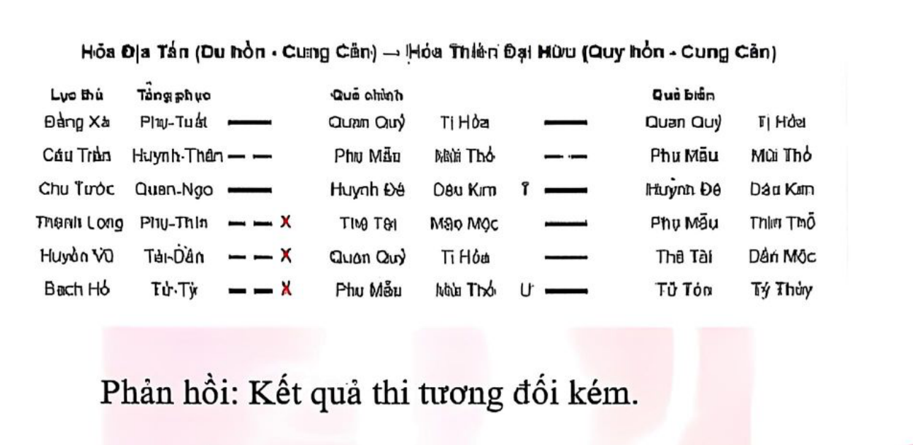

- **Cấu trúc Quẻ Dịch:**
  - **Quẻ chủ:** **Hỏa Địa Tấn** (Du hồn – Cung Cấn)  
    *Tượng quẻ:* Tâm thần bất định, dao động hoang mang, tiến thoái lưỡng nan trước tương lai thi cử.
  - **Quẻ biến:** **Hỏa Thiên Đại Hữu** (Quy hồn – Cung Cấn)  
    *Tượng quẻ:* Đại Hữu thu hoạch, sự việc quay về quỹ đạo cốt lõi; dù có trắc trở nhưng kết quả cuối cùng vẫn nằm trong phạm vi có thể chấp nhận được.

- **Bảng chi tiết Lục hào:**

| Hào | Thế/Ứng | Lục thân (Chủ) | Can Chi | Biến động | Lục thân (Biến) | Can Chi (Biến) | Thần sát / Phục | Lục thú |
|:---:|:---:|:---|:---|:---:|:---|:---|:---|:---|
| 6 | | Quan Quỷ | Tỵ - Hỏa | tĩnh | Quan Quỷ | Tỵ - Hỏa | Văn xương, Thiên y, Nhật kiến, Phục Phụ-Tuất | Đằng Xà |
| 5 | | Phụ Mẫu | Mùi - Thổ | tĩnh | Phụ Mẫu | Mùi - Thổ | Mưu tinh, Phục Huynh-Thân | Câu Trần |
| 4 | **Thế** | Huynh Đệ | Dậu - Kim | tĩnh | Huynh Đệ | Dậu - Kim | Tướng tinh, Lộc thần, Tuần không, Phục Quan-Ngọ | Chu Tước |
| 3 | | Thê Tài | Mão - Mộc | **X (Động)** | Phụ Mẫu | Thìn - Thổ | Tai sát, Phục Phụ-Thìn | Thanh Long |
| 2 | | Quan Quỷ | Tỵ - Hỏa | **X (Động)** | Thê Tài | Dần - Mộc | Văn xương, Thiên y, Kiếp sát, Phục Tài-Dần | Huyền Vũ |
| 1 | **Ứng** | Phụ Mẫu | Mùi - Thổ | **X (Động)** | Tử Tôn | Tý - Thủy | Mưu tinh, Phục Tử-Tý | Bạch Hổ |

---

### 3. Dụng thần & Loại quẻ

- **Phân loại quẻ:**
  - **Quẻ tâm thái lo âu kết hợp dự đoán điểm số thi cử (Du hồn biến Quy hồn):** Đánh giá mức độ đạt điểm chuẩn và khả năng giải tỏa nỗi sợ hãi.
- **Xác định Dụng thần:**
  1. **Thí sinh Tiểu Diệp:** Hào Thế Huynh Đệ Dậu Kim (lâm Tuần không).
  2. **Điểm số mục tiêu (442 điểm):** Hào 1 Phụ Mẫu Mùi Thổ lâm Ứng mang Mưu tinh.
  3. **Nỗi lo lắng điểm kém:** Quan Quỷ Tỵ Hỏa phát động khắc Thế.
  4. **Niềm an tâm kỳ vọng:** Tử Tôn Tý Thủy.

---

### 4. Luận giải chi tiết

Quẻ này là bài giảng sâu sắc của Chu Thần Bân về cơ chế hào biến ngộ Nguyệt phá và quan hệ khắc trung hữu hợp trong thi cử:

#### 1. Sự sụp đổ của hào 1 Phụ Mẫu Mùi Thổ mang Mưu tinh
- Hào 1 Phụ Mẫu Mùi Thổ mang **Mưu tinh** đại diện cho điểm số kế hoạch dự kiến (442 điểm). Hào Phụ Mùi Thổ ngự tại hào Ứng phát động sinh cho hào Thế Huynh Đệ Dậu Kim. Xét về lý thuyết thông thường, đây là điềm lành báo hiệu điểm thi đạt như ý.
- Tuy nhiên, Phụ Mẫu Mùi Thổ lại động hóa ra **Tử Tôn Tý Thủy** bị Nguyệt lệnh Ngọ Hỏa xung là **Nguyệt phá**!
- Theo định luật Lục Hào: Hào động mà biến ra hào bị Nguyệt phá thì trở thành **Hào động vô dụng**. Kỳ vọng điểm số 442 sinh Thế bị gãy đổ hoàn toàn.

#### 2. Phân tích chuỗi động hào khắc Thế bán hợp
- Khi hào 1 bị vô hiệu hóa, quẻ chuyển sang chịu sự chi phối của 2 hào động còn lại:
  - Hào 3 Thê Tài Mão Mộc phát động sinh hào 2 Quan Quỷ Tỵ Hỏa; Quan Quỷ Tỵ Hỏa phát động trực tiếp khắc hào Thế Huynh Đệ Dậu Kim. Điều này lập tức định tính: Kết quả thi không tốt, không đạt được kỳ vọng của gia đình.
- **Khắc trung hữu hợp làm giảm nhẹ mức độ thiệt hại:**
  - Quan Quỷ Tỵ Hỏa tuy khắc hào Thế Dậu Kim, nhưng giữa Tỵ và Dậu lại cấu thành quan hệ **Bán hợp** (Tỵ Dậu bán hợp Kim cục). Khắc mà có hợp biểu thị chi tiết rằng tuy điểm thi kém nhưng không đến mức thảm họa tuyệt vọng, thí sinh và gia đình vẫn có thể chấp nhận được.
  - Đồng thời, Hào 3 Thê Tài Mão Mộc động biến Phụ Mẫu Thìn Thổ lại tạo thế **Lục hợp** với hào Thế Dậu Kim (Thìn Dậu hợp). Văn bằng và điểm số thực tế vẫn giữ được mối liên kết cơ bản với bản thân, vẫn có hướng đi cứu vãn.

#### 3. Tượng quẻ Du hồn biến Quy hồn
- Quẻ chủ Hỏa Địa Tấn (Du hồn) biến Hỏa Thiên Đại Hữu (Quy hồn): Phản ánh tâm lý lúc đầu hoang mang chao đảo cực độ, nhưng sau khi điểm số công bố thì tâm trạng dần ổn định trở lại vì kết quả vẫn nằm trong ngưỡng chịu đựng được.

---

### 5. Kết luận & Ứng kỳ thực tế

- **Lời giải đoán của Chu Thần Bân:**
  Điểm thi không thể đạt tới mốc 442 điểm, kết quả thi tương đối kém so với mong đợi ban đầu, nhưng không đến mức quá tồi tệ mà vẫn nằm trong giới hạn có thể chấp nhận được.
- **Phản hồi thực tế (Feedback):**
  Điểm thi đại học công bố sau đó tương đối kém, không chạm tới con số 442 điểm như kỳ vọng của gia đình đúng như quẻ đã báo trước.
- **Ứng kỳ chiêm nghiệm:**
  Ứng nghiệm chính xác vào ngày công bố điểm thi trong tháng Ngọ năm Mậu Tuất.

---

### 6. Bài học tâm pháp & Quy tắc cốt lõi

- **Trích dẫn quy tắc sách (Rule Index):**
  *Quy tắc dự đoán điểm thi đại học qua quẻ Du hồn biến Quy hồn và quan hệ bán hợp giữa Quan Quỷ với hào Thế* (Sách Cổ Thệ Chân Thuyên Thực Chiến Biên, trang 205).
- **Tâm pháp giải đoán thực tế:**
  1. **Động hóa Nguyệt phá làm tiêu tan nguồn sinh:** Khi hào Dụng thần mang kỳ vọng phát động mà hào biến ngộ Nguyệt phá thì toàn bộ công năng tương sinh sụp đổ, nhường quyền định tính cho các hào động khác.
  2. **Quan hệ Khắc trung hữu hợp:** Khắc mà có hợp biểu thị tuy gặp trở ngại, kết quả không như ý nhưng sự việc không rơi vào bế tắc tuyệt lộ, người trong cuộc vẫn tìm thấy lối thoát dung hòa.
  3. **Ý nghĩa Du hồn biến Quy hồn trong thi cử:** Phản ánh tâm lý ban đầu chao đảo hoang mang tột cùng, nhưng sau cùng sự việc vẫn hạ cánh an toàn trong một giới hạn thực tế chấp nhận được.

## THỰC CHIẾN 155 – HÓA ĐƠN ĐỂ TRÊN BÀN BIẾN ĐI ĐÂU MẤT

---

### 1. Bối cảnh & Câu hỏi

- **Bối cảnh chi tiết:**
  Một đồng môn tại Bắc Kinh để tờ hóa đơn tài chính quan trọng ngay trên mặt bàn làm việc, nhưng sau đó tìm kiếm xung quanh thì không thấy đâu. Người này vừa mới phát hiện mất nên lập tức gieo quẻ để truy tìm vị trí của tờ hóa đơn.
- **Tâm lý & Câu hỏi ẩn ý:**
  Tâm lý hoang mang, nghi ngờ liệu mình có làm rơi mất ra ngoài hay bị ai vô tình cầm nhầm; câu hỏi cốt lõi là: *"Hóa đơn để trên bàn đã biến đi đâu mất?"*
- **Thời gian chiêm đoán:**
  - Dương lịch: 29/06/2018 lúc 13:15 (Giờ Bắc Kinh).
  - Can chi: Năm Mậu Tuất, tháng Mậu Ngọ, ngày Nhâm Thìn, giờ Đinh Mùi.

---

### 2. Dữ kiện & Bảng quẻ Crop

- **Thời không chiêm nghiệm:**
  - Tháng Mậu Ngọ (Hỏa vượng, Thổ tướng).
  - Ngày Nhâm Thìn (Thổ vượng, Thủy nhập khố).
  - Tuần không: **Ngọ - Mùi** (hào Thế Thê Tài Mùi Thổ lâm không).
- **Thần sát:**
  - Tướng tinh: Tý (Lâm hào sơ)
  - Hoa cái: Thìn (Lâm Nhật kiến, hào 3 động)
  - Dịch mã: Dần (Lâm hào 2)
  - Tai sát: Ngọ (Lâm Nguyệt kiến)
  - Mưu tinh: Tuất
  - Đào hoa: Dậu (Lâm hào 4)
  - Kiếp sát: Tỵ (Lâm hào 6)
  - Lộc thần: Hợi (Lâm hào biến)
  - Dương nhẫn: Tý (Lâm hào sơ)
  - Văn xương: Dần (Lâm hào 2)
  - Thiên y: Tỵ (Lâm hào 6)
  - Thiên hỷ: Sửu (Lâm hào biến)
  - Quý nhân: Mão, Tỵ

- Dữ kiện bảng quẻ và các thông số chiêm đoán:
  - **Bảng 155.1** Đồ hình quẻ Thực chiến 155:
    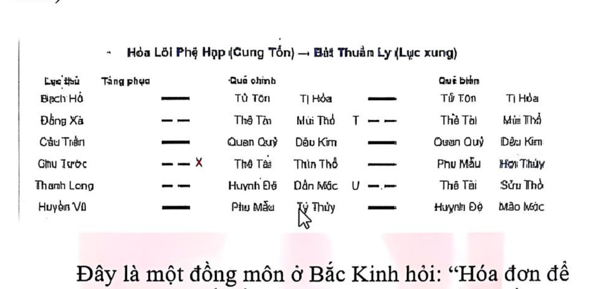

- **Cấu trúc Quẻ Dịch:**
  - **Quẻ chủ:** **Hỏa Lôi Phệ Hạp** (Cung Tốn)  
    *Tượng quẻ:* Phệ Hạp cắn hợp, có vật cản trở kẹp ở giữa, trao đổi giao tiếp tháo gỡ vướng mắc.
  - **Quẻ biến:** **Bát Thuần Ly** (Cung Ly – Quẻ Lục Xung)  
    *Tượng quẻ:* Quang minh hiển lộ, sự việc nhanh chóng được làm sáng tỏ.

- **Bảng chi tiết Lục hào:**

| Hào | Thế/Ứng | Lục thân (Chủ) | Can Chi | Biến động | Lục thân (Biến) | Can Chi (Biến) | Thần sát / Phục | Lục thú |
|:---:|:---:|:---|:---|:---:|:---|:---|:---|:---|
| 6 | | Tử Tôn | Tỵ - Hỏa | tĩnh | Tử Tôn | Tỵ - Hỏa | Kiếp sát, Thiên y | Bạch Hổ |
| 5 | **Thế** | Thê Tài | Mùi - Thổ | tĩnh | Thê Tài | Mùi - Thổ | Tuần không | Đằng Xà |
| 4 | | Quan Quỷ | Dậu - Kim | tĩnh | Quan Quỷ | Dậu - Kim | Đào hoa | Câu Trần |
| 3 | | Thê Tài | Thìn - Thổ | **X (Động)** | Phụ Mẫu | Hợi - Thủy | Hoa cái, Nhật kiến | Chu Tước |
| 2 | **Ứng** | Huynh Đệ | Dần - Mộc | tĩnh | Thê Tài | Sửu - Thổ | Dịch mã, Văn xương | Thanh Long |
| 1 | | Phụ Mẫu | Tý - Thủy | tĩnh | Huynh Đệ | Mão - Mộc | Tướng tinh, Dương nhẫn | Huyền Vũ |

---

### 3. Dụng thần & Loại quẻ

- **Phân loại quẻ:**
  - **Quẻ hiện trạng tìm kiếm đồ vật thất lạc (phản ánh vị trí không gian thực tế):** Khác với quẻ cát hung trừu tượng, quẻ hiện trạng miêu tả trực tiếp nơi chốn và trạng thái đồ vật đang bị che khuất.
- **Xác định Dụng thần:**
  1. **Hóa đơn thất lạc:** Hào biến Phụ Mẫu Hợi Thủy (do hào 3 Thê Tài Thìn Thổ động hóa ra).
  2. **Hướng tìm kiếm sai lầm của người hỏi:** Hào Thế Thê Tài Mùi Thổ lâm Tuần không ngộ Đằng Xà.
  3. **Vị trí thực tế cất giấu đồ vật:** Hào 3 Thê Tài Thìn Thổ (Thủy khố) lâm Chu Tước và Nhật kiến.

---

### 4. Luận giải chi tiết

Quẻ này là bài giảng mẫu mực của Chu Thần Bân về nghệ thuật nhận diện quẻ hiện trạng và kỹ pháp ghép nối tượng quẻ với không gian thực địa:

#### 1. Nhận diện quẻ hiện trạng và định vị sai lầm tại hào Thế
- Khi vừa phát hiện mất đồ lập tức gieo quẻ, tâm niệm phản ánh thẳng vào thực trạng vị trí của vật thay vì hỏi cát hung có tìm thấy hay không.
- Hào Thế Thê Tài Mùi Thổ lâm **Tuần không**, ngự tại hào 5, mang **Đằng Xà**:
  - Địa chi Thổ tại Mùi là trạng thái **Dưỡng** (chủ sự nghi ngờ, hoang mang, dao động).
  - Hào 5 ở ngoại quái biểu thị người hỏi đang nghi ngờ mình làm rơi mất ở bên ngoài và đang tìm kiếm theo hướng hoàn toàn sai lầm.

#### 2. Định vị hình tượng tờ hóa đơn qua hào biến Phụ Mẫu Hợi Thủy
- Hào 3 Thê Tài Thìn Thổ động hóa ra **Phụ Mẫu Hợi Thủy**:
  - Hào Phụ Mẫu vốn đại diện cho văn thư, chứng từ, giấy tờ.
  - Phụ Mẫu Hợi Thủy lâm **Chu Tước**: Chu Tước là văn bút, giấy tờ có chữ viết tay hoặc in ấn.
  - Hợi Thủy lâm **Lộc thần**: Thể hiện chứng từ có giá trị tài chính, tiền bạc.
  - Hợi Thủy mang **Văn Xương**: Biểu trưng của văn bản in ấn chuẩn mực. Hội tụ đầy đủ các yếu tố trên, khẳng định chắc chắn Phụ Mẫu Hợi Thủy chính là tờ hóa đơn bị thất lạc.

#### 3. Ghép nối không gian thực tế với hào 3 Thê Tài Thìn Thổ
- Hóa đơn Phụ Mẫu Hợi Thủy động hóa từ Thê Tài Thìn Thổ, tức là hóa đơn đang nằm cùng một vị trí với Thìn Thổ:
  - Thìn Thổ đắc **Nhật kiến**, là **Mộ khố của Thủy** (Thủy khố). Khố chính là nơi bao bọc, cất giữ, kẹp chặt đồ vật khiến mắt thường không nhìn thấy được.
  - Thìn Thổ mang Chu Tước (sách vở) và Đào hoa (văn chương, tình cảm).
  - Ghép nối với không gian mặt bàn làm việc: Thìn Thổ chính là kẹp tài liệu chuyên dụng, chồng sách vở, hoặc tờ hóa đơn đang bị kẹp lẫn vào bên trong một cuốn sách (thậm chí là sách văn học, tiểu thuyết tình cảm) để ngay trên bàn học! Hóa đơn hoàn toàn không bị mất ra ngoài.

---

### 5. Kết luận & Ứng kỳ thực tế

- **Lời giải đoán của Chu Thần Bân:**
  Hóa đơn không hề bị đánh mất ra bên ngoài. Người hỏi đang tìm kiếm sai hướng theo cảm tính mơ hồ (hào Thế lâm không). Hãy lật tìm ngay trong các cuốn sách, kẹp tài liệu để trên mặt bàn học (Thìn Thổ Thủy khố lâm Chu Tước).
- **Phản hồi thực tế (Feedback):**
  Người hỏi lập tức kiểm tra lại các chồng sách và kẹp tài liệu để trên bàn làm việc, quả nhiên tìm thấy tờ hóa đơn bị kẹp chặt bên trong một cuốn sách ngay trên bàn học đúng như quẻ đã chỉ dẫn!
- **Ứng kỳ chiêm nghiệm:**
  Tìm lại được đồ vật ngay tức khắc trong ngày Nhâm Thìn.

---

### 6. Bài học tâm pháp & Quy tắc cốt lõi

- **Trích dẫn quy tắc sách (Rule Index):**
  *Quy tắc tìm đồ vật thất lạc qua quẻ hiện trạng Phệ Hạp biến Ly và phương pháp ghép nối tượng quẻ với không gian thực tế* (Sách Cổ Thệ Chân Thuyên Thực Chiến Biên, trang 208).
- **Tâm pháp giải đoán thực tế:**
  1. **Nhận diện quẻ hiện trạng:** Khi quẻ lập ngay thời điểm phát hiện thất lạc, các hào động và hào biến phản ánh chính xác vị trí vật lý và trạng thái bị che khuất của đồ vật.
  2. **Hào Thế lâm Tuần không chỉ hướng tìm sai:** Hào Thế lâm không vong hoặc ngộ Đằng Xà chỉ ra tâm lý hoang mang và phương hướng tìm kiếm hiện tại của đương số là hoàn toàn trật lấc.
  3. **Kỹ năng dịch tượng quẻ sang đồ vật thực tế:** Mộ khố (Thìn Thổ) kết hợp Chu Tước (sách vở, văn bút) là biểu tượng kinh điển của ngăn kẹp tài liệu hoặc sách vở che giấu văn thư.

## THỰC CHIẾN 156: CÓ NÊN NHẢY VIỆC TỪ ĐƠN VỊ TRONG HỆ THỐNG SANG CÔNG TY TƯ VẤN BÊN NGOÀI KHÔNG

---

### 1. Bối cảnh & Câu hỏi

- **Bối cảnh chi tiết:**
  Mở đầu chuỗi 3 ca thực chiến liên hoàn của một đồng môn đang công tác ổn định tại một đơn vị trong hệ thống nhà nước (biên chế thể chế). Đương số nhận được cơ hội mời gọi từ một công ty tư vấn bên ngoài thị trường, đứng trước lựa chọn bước ngoặt sự nghiệp thay đổi nửa đời còn lại. Do tâm lý do dự giằng xé, người này đã liên tiếp gieo 3 quẻ Dịch để thỉnh giáo Chu Thần Bân.
- **Tâm lý & Câu hỏi ẩn ý:**
  Khao khát bứt phá tìm kiếm thu nhập và danh vọng bên ngoài nhưng đầy sợ hãi trước sự bấp bênh khi rời khỏi vòng an toàn của nhà nước. Câu hỏi cốt lõi: *"Có nên nhảy việc từ đơn vị trong hệ thống sang công ty tư vấn bên ngoài hay không?"*
- **Thời gian chiêm đoán:**
  - Dương lịch: 29/06/2018 lúc 21:28 (Giờ Bắc Kinh).
  - Can chi: Năm Mậu Tuất, tháng Mậu Ngọ, ngày Nhâm Thìn, giờ Tân Hợi.

---

### 2. Dữ kiện & Bảng quẻ Crop

- **Thời không chiêm nghiệm:**
  - Tháng Mậu Ngọ (Hỏa vượng, Thủy suy tuyệt, Tý Thủy bị xung Nguyệt phá).
  - Ngày Nhâm Thìn (Thổ vượng, khắc Thủy).
  - Tuần không: **Ngọ - Mùi** (hào Ứng Thê Tài Mùi Thổ lâm không).
- **Thần sát:**
  - Tướng tinh: Tý (Lâm hào Thế)
  - Hoa Cái: Thìn (Lâm Nhật kiến, hào 3)
  - Dịch mã: Dần (Lâm hào 2 động)
  - Tai sát: Ngọ (Lâm Nguyệt kiến, Tuần không)
  - Mưu tinh: Tuất
  - Đào hoa: Dậu
  - Kiếp sát: Tỵ (Lâm hào 5)
  - Lộc thần: Hợi (Lâm giờ chi)
  - Dương Nhận: Tý (Lâm hào Thế)
  - Văn Xương: Dần (Lâm hào 2 động)
  - Thiên Y: Tỵ
  - Thiên Hỷ: Sửu (Lâm hào biến)
  - Quý nhân: Mão, Tỵ

- Dữ kiện bảng quẻ và các thông số chiêm đoán:
  - **Bảng 156.1** Đồ hình quẻ Thực chiến 156:
    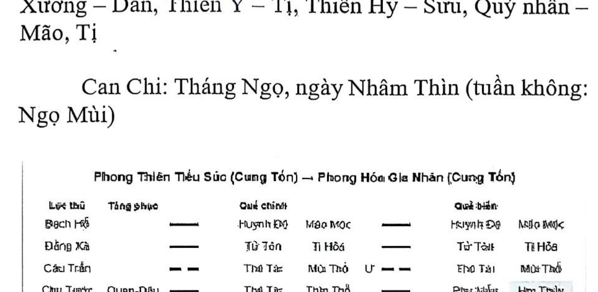

- **Cấu trúc Quẻ Dịch:**
  - **Quẻ chủ:** **Phong Thiên Tiểu Súc** (Cung Tốn)  
    *Tượng quẻ:* Súc tích chưa đủ, mưa dầm chưa tới ("Mật vân bất vũ"), điều kiện nội tại chưa chín muồi, hành động quá vội vàng sẽ chuốc lấy hỏng việc.
  - **Quẻ biến:** **Phong Hỏa Gia Nhân** (Cung Tốn)  
    *Tượng quẻ:* Người trong nhà, quay về nhà cũ, nên an định giữ vững vị trí trong nội bộ thể chế gia đình/đơn vị hiện tại.

- **Bảng chi tiết Lục hào:**

| Hào | Thế/Ứng | Lục thân (Chủ) | Can Chi | Biến động | Lục thân (Biến) | Can Chi (Biến) | Thần sát / Phục | Lục thú |
|:---:|:---:|:---|:---|:---:|:---|:---|:---|:---|
| 6 | | Huynh Đệ | Mão - Mộc | tĩnh | Huynh Đệ | Mão - Mộc | | Bạch Hổ |
| 5 | | Tử Tôn | Tỵ - Hỏa | tĩnh | Tử Tôn | Tỵ - Hỏa | Kiếp sát | Đằng Xà |
| 4 | **Ứng** | Thê Tài | Mùi - Thổ | tĩnh | Thê Tài | Mùi - Thổ | Tuần không | Câu Trần |
| 3 | | Thê Tài | Thìn - Thổ | tĩnh | Phụ Mẫu | Hợi - Thủy | Hoa Cái, Nhật kiến, Phục Quan-Dậu | Chu Tước |
| 2 | | Huynh Đệ | Dần - Mộc | **O (Động)** | Thê Tài | Sửu - Thổ | Dịch mã, Văn Xương | Thanh Long |
| 1 | **Thế** | Phụ Mẫu | Tý - Thủy | tĩnh | Huynh Đệ | Mão - Mộc | Tướng tinh, Dương Nhẫn, Nguyệt phá | Huyền Vũ |

---

### 3. Dụng thần & Loại quẻ

- **Phân loại quẻ:**
  - **Quẻ lựa chọn sự nghiệp / Chuyển dịch môi trường công tác:** Đánh giá tính khả thi và rủi ro khi từ bỏ biên chế nhà nước sang khối tư nhân.
- **Xác định Dụng thần:**
  1. **Đơn vị tư vấn bên ngoài:** Hào Ứng Thê Tài Mùi Thổ lâm Tuần không (tượng trưng cho môi trường mới chưa có nền tảng vững chắc).
  2. **Bản thân sau khi nhảy sang đơn vị mới:** Hào Thế Phụ Mẫu Tý Thủy (ngộ Nguyệt phá, Nhật khắc, lâm Huyền Vũ).
  3. **Gian hào ngăn trở và tổn thất kinh tế:** Hào 2 Huynh Đệ Dần Mộc động hóa Thê Tài Sửu Thổ.

---

### 4. Luận giải chi tiết

Quẻ này là án lệ mở màn cho chuỗi phân tích sự nghiệp chuyển việc sâu sắc của Chu Thần Bân:

#### 1. Tượng quẻ chủ Tiểu Súc biến Gia Nhân
- Quẻ chủ Phong Thiên Tiểu Súc đại diện cho sự chuẩn bị chưa đầy đủ, điều kiện tích lũy còn non nớt mà đã vội vã muốn đưa ra quyết định ảnh hưởng đến cả nửa đời sau.
- Quẻ biến Phong Hỏa Gia Nhân mang nghĩa "người trong nhà", "quay về nhà". Nhà ở đâu? Chính là đơn vị hiện tại đang công tác. Đang muốn rời nhà ra đi mà quẻ biến lại chỉ thị phải ở yên trong nhà, thông điệp quẻ tượng vô cùng rõ ràng: Tạm thời không nên nhảy việc.

#### 2. Sự suy bại cùng cực của hào Thế Phụ Mẫu Tý Thủy
- Hào Thế Phụ Mẫu Tý Thủy lâm **Huyền Vũ**: Huyền Vũ đại diện cho tư tưởng độc lập, toan tính chủ quan của bản thân.
- Phụ Mẫu Tý Thủy đại diện cho chính mình sau khi nhảy việc ra bên ngoài. Đáng ngại thay:
  - Tý Thủy bị Nguyệt lệnh Ngọ Hỏa xung là **Nguyệt phá**.
  - Tý Thủy lại bị Nhật kiến Thìn Thổ khắc chế.
  - Bản thân rơi vào trạng thái suy bại đặc biệt, hoàn toàn không có thực lực và khả năng để thích nghi với môi trường cạnh tranh khốc liệt tại công ty tư vấn bên ngoài.

#### 3. Cảnh báo cản trở từ gian hào Huynh Đệ Dần Mộc
- Hào 2 Huynh Đệ Dần Mộc phát động đóng vai trò **Gian hào** ngăn cách giữa hào Thế và hào Ứng.
- Dần Mộc khắc hãm hào Ứng Thê Tài Mùi Thổ, mang theo Lộc thần. Điều này cảnh báo nếu dứt áo ra đi, đương số sẽ gánh chịu tổn thất tài chính rất lớn, mất đi quyền lợi thâm niên và chế độ đãi ngộ ổn định tại đơn vị nhà nước.
- Hào 2 Dần Mộc hóa Thê Tài Sửu Thổ xung khai tuần không của Mùi Thổ, cho thấy các điều kiện níu kéo của đơn vị hiện tại sẽ cản trở, khiến việc nhảy việc khó lòng thực hiện thuận lợi.

---

### 5. Kết luận & Ứng kỳ thực tế

- **Lời giải đoán của Chu Thần Bân:**
  Tạm thời tuyệt đối không được nhảy việc! Điều kiện chưa chín muồi, hào Thế suy bại ra ngoài sẽ gục ngã, quẻ Gia Nhân khuyên phải ở yên trong cơ quan hiện tại.
- **Phản hồi thực tế (Feedback):**
  Đương số nhận thấy sự phân tích chuẩn xác, quyết định tạm hoãn việc nộp đơn từ chức.
- **Ứng kỳ chiêm nghiệm:**
  Tránh được bước đi sai lầm ngay trong tháng Ngọ năm Mậu Tuất.

---

### 6. Bài học tâm pháp & Quy tắc cốt lõi

- **Trích dẫn quy tắc sách (Rule Index):**
  *Quy tắc xem nhảy việc qua tượng quẻ Gia Nhân và cảnh báo trở ngại từ các gian hào phát động* (Sách Cổ Thệ Chân Thuyên Thực Chiến Biên, trang 215).
- **Tâm pháp giải đoán thực tế:**
  1. **Tượng quẻ Gia Nhân trong vấn sự nghiệp:** Khi xem chuyện rời đi mà gặp quẻ biến Gia Nhân thì phương châm tối thượng là ở yên tại chỗ, không nên ly hương ly cơ quan.
  2. **Hào Thế ngộ Nguyệt phá lâm Huyền Vũ:** Phản ánh ảo tưởng chủ quan vượt quá năng lực thực tế; khi bản thân suy bại thì mọi thay đổi môi trường đều dẫn tới khủng hoảng.
  3. **Tác dụng của gian hào phát động mang Lộc thần:** Báo hiệu những rào cản thủ tục hành chính và cái giá tổn thất tài chính quá đắt phải trả nếu cố tình nhảy việc.

## THỰC CHIẾN 157 – LẠI XEM CÓ NÊN NHẢY VIỆC HAY KHÔNG

---

### 1. Bối cảnh & Câu hỏi

- **Bối cảnh chi tiết:**
  Sau quẻ đầu tiên (Thực chiến 156), tâm lý đương số vẫn chưa yên ổn. Sáng ngày hôm sau (30/06/2018), người này lại tiếp tục gieo quẻ thứ hai để dò xét thêm. Nỗi bất mãn với cấp trên tại đơn vị hiện tại (cảm giác bị chèn ép, không được trọng dụng) vẫn thôi thúc ý định rời bỏ thể chế sang công ty tư vấn bên ngoài.
- **Tâm lý & Câu hỏi ẩn ý:**
  Đương số giằng xé giữa cái khổ bị chèn ép ở cơ quan cũ và cái khổ rủi ro bấp bênh ở công ty tư vấn mới. Câu hỏi cốt lõi: *"Rủi ro ra bên ngoài liệu có nguy hiểm hơn việc tiếp tục ở lại chịu đựng hay không?"*
- **Thời gian chiêm đoán:**
  - Dương lịch: 30/06/2018, 06:30 sáng (Giờ Bắc Kinh).
  - Can chi: Năm Mậu Tuất, tháng Mậu Ngọ, ngày Quý Tỵ, giờ Ất Mão.

---

### 2. Dữ kiện & Bảng quẻ Crop

- **Thời không chiêm nghiệm:**
  - Tháng Mậu Ngọ (Hỏa vượng, Thổ tướng).
  - Ngày Quý Tỵ (Hỏa vượng, Tỵ xung Hợi làm Nhật phá).
  - Tuần không: **Ngọ - Mùi**.
- **Thần sát:**
  - Tướng tinh: Dậu (Lâm hào 3 và hào 6)
  - Hoa cái: Sửu (Lâm hào Thế và hào Ứng)
  - Dịch mã: Hợi (Lâm hào 2 và hào 5)
  - Tai sát: Mão (Lâm giờ chi)
  - Mưu tinh: Mùi (Lâm Tuần không)
  - Đào hoa: Ngọ (Lâm Nguyệt kiến, Tuần không)
  - Kiếp sát: Dần
  - Lộc thần: Tý (Lâm hào biến)
  - Dương nhẫn: Hợi (Lâm hào 2 và hào 5)
  - Văn xương: Mão
  - Thiên y: Tỵ (Lâm Nhật kiến)
  - Thiên hỷ: Sửu (Lâm hào Thế)
  - Quý nhân: Mão

- Dữ kiện bảng quẻ và các thông số chiêm đoán:
  - **Bảng 157.1** Đồ hình quẻ Thực chiến 157:
    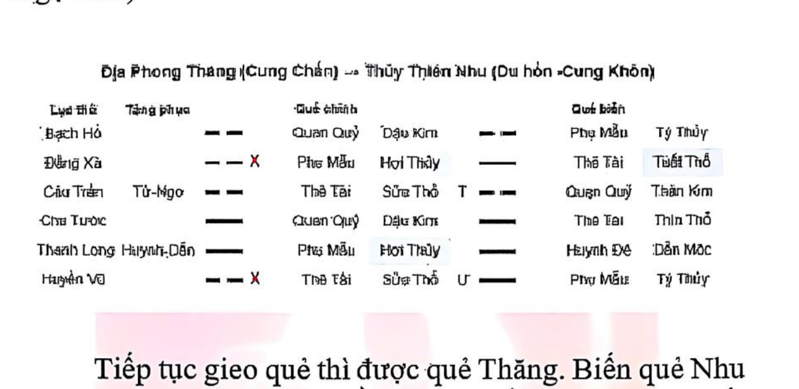

- **Cấu trúc Quẻ Dịch:**
  - **Quẻ chủ:** **Địa Phong Thăng** (Cung Chấn)  
    *Tượng quẻ:* Tiến bước đi lên, khát vọng thăng tiến đổi mới môi trường làm việc.
  - **Quẻ biến:** **Thủy Thiên Nhu** (Du hồn – Cung Khôn)  
    *Tượng quẻ:* Chờ đợi thời cơ ("Nhu dã, đãi dã"), tâm trạng Du hồn trôi dạt bất định, điềm báo bắt buộc phải kiên nhẫn chờ đợi, án binh bất động.

- **Bảng chi tiết Lục hào:**

| Hào | Thế/Ứng | Lục thân (Chủ) | Can Chi | Biến động | Lục thân (Biến) | Can Chi (Biến) | Thần sát / Phục | Lục thú |
|:---:|:---:|:---|:---|:---:|:---|:---|:---|:---|
| 6 | | Quan Quỷ | Dậu - Kim | tĩnh | Phụ Mẫu | Tý - Thủy | Tướng tinh | Bạch Hổ |
| 5 | | Phụ Mẫu | Hợi - Thủy | **X (Động)** | Thê Tài | Tuất - Thổ | Dịch mã, Dương nhẫn, Nhật phá | Đằng Xà |
| 4 | **Thế** | Thê Tài | Sửu - Thổ | tĩnh | Quan Quỷ | Thân - Kim | Hoa cái, Thiên hỷ, Phục Tử-Ngọ | Câu Trần |
| 3 | | Quan Quỷ | Dậu - Kim | tĩnh | Thê Tài | Thìn - Thổ | Tướng tinh | Chu Tước |
| 2 | | Phụ Mẫu | Hợi - Thủy | tĩnh | Huynh Đệ | Dần - Mộc | Dịch mã, Dương nhẫn, Phục Huynh-Dần | Thanh Long |
| 1 | **Ứng** | Thê Tài | Sửu - Thổ | **X (Động)** | Phụ Mẫu | Tý - Thủy | Hoa cái, Thiên hỷ | Huyền Vũ |

---

### 3. Dụng thần & Loại quẻ

- **Phân loại quẻ:**
  - **Quẻ so sánh rủi ro hai môi trường (Nội bộ vs Ngoại bộ) qua quẻ Du hồn biến Nhu:** Đặt lên bàn cân mức độ an toàn giữa đơn vị hiện tại và doanh nghiệp bên ngoài.
- **Xác định Dụng thần:**
  1. **Môi trường nội bộ cơ quan hiện tại:** Hào Thế Thê Tài Sửu Thổ và hào 1 Thê Tài Sửu Thổ lâm Ứng.
  2. **Môi trường công ty tư vấn bên ngoài:** Hào 5 Phụ Mẫu Hợi Thủy động hóa Thê Tài Tuất Thổ.
  3. **Tâm niệm mong mỏi của bản thân:** Hào Tử Tôn Ngọ Hỏa phục dưới hào Thế.

---

### 4. Luận giải chi tiết

Quẻ này là bài học sâu sắc của Chu Thần Bân về phương pháp so sánh hai luồng rủi ro: rủi ro kiểm soát được bên trong và rủi ro mất kiểm soát bên ngoài:

#### 1. Tượng quẻ biến Thủy Thiên Nhu (Du hồn)
- Quẻ Thăng biến Thủy Thiên Nhu mang lời khuyên cốt tử: Phải biết chờ đợi thời cơ ("Nhu dã, đãi dã").
- Là quẻ Du hồn, phản ánh tâm lý đương số đang trôi dạt bất định, "đứng núi này trông núi nọ". Tượng quẻ chỉ rõ nếu vội vã manh động sẽ gặp hiểm nguy giữa dòng nước lớn.

#### 2. So sánh hai luồng rủi ro giữa Nội bộ và Ngoại bộ
- **Rủi ro môi trường bên ngoài (Hào 5 Phụ Mẫu Hợi Thủy động hóa Thê Tài Tuất Thổ):**
  - Hào 5 ở ngoại quái đại diện cho đơn vị tư vấn bên ngoài.
  - Phụ Mẫu Hợi Thủy ở tháng Ngọ hưu tù, ngày Quý Tỵ xung là **Nhật phá**. Hào động bị Nhật phá phản ánh việc nhảy sang đơn vị bên ngoài là một dự định chưa hề định hình vững chắc.
  - Đáng sợ hơn, Hợi Thủy động hóa Thê Tài Tuất Thổ là **Hồi đầu khắc**! Ra ngoài làm việc tức là tự mình chặt đứt đường lui, công việc không thể kéo dài lâu, sớm muộn cũng bị đào thải hoặc đổ vỡ. Đây là rủi ro mang tính hủy diệt, nằm ngoài tầm kiểm soát của bản thân!
- **Rủi ro môi trường nội bộ cơ quan cũ (Hào sơ Thê Tài Sửu Thổ động hóa Phụ Mẫu Tý Thủy):**
  - Hào Thế Thê Tài Sửu Thổ đắc Nhật Tỵ Nguyệt Ngọ tương sinh cực kỳ vượng tướng, nền tảng sinh tồn vững như bàn thạch.
  - Hào sơ Sửu Thổ động hóa Phụ Mẫu Tý Thủy mang Lộc thần, Đào hoa, lâm Huyền Vũ; Tý Thủy xung khắc Tử Tôn Ngọ Hỏa (phục dưới hào Thế). Điều này phản ánh thực trạng ở cơ quan: bản thân cảm thấy bị lãnh đạo gài bẫy, chèn ép, đãi ngộ và danh phận không được như ý nguyện.
  - Tuy nhiên, Phụ Mẫu Tý Thủy và hào Thế Sửu Thổ là quan hệ **Lục hợp** (Tý Sửu hợp). Sự ấm ức, chèn ép trong nội bộ thể chế nhà nước là thứ mà bản thân hoàn toàn có thể nhẫn nhịn và gánh vác được!

---

### 5. Kết luận & Ứng kỳ thực tế

- **Lời giải đoán của Chu Thần Bân:**
  Giữa hai cái khổ, hãy chọn cái khổ kiểm soát được. Rủi ro ra ngoài tư nhân là không thể kiểm soát; sự chèn ép trong nội bộ chỉ cần nhẫn nại một chút là vẫn an toàn. Tuyệt đối không được manh động nhảy việc lúc này.
- **Phản hồi thực tế (Feedback):**
  Đương số hoàn toàn tỉnh ngộ, nhận ra rủi ro khủng khiếp ngoài thị trường tư vấn, tiếp tục nhẫn nại ở lại cơ quan công tác.
- **Ứng kỳ chiêm nghiệm:**
  Bài học kiên nhẫn chờ thời ứng nghiệm trong suốt giai đoạn tiếp theo.

---

### 6. Bài học tâm pháp & Quy tắc cốt lõi

- **Trích dẫn quy tắc sách (Rule Index):**
  *Quy tắc so sánh rủi ro nội bộ và ngoại bộ khi chuyển việc qua quẻ Địa Phong Thăng biến Thủy Thiên Nhu Du hồn* (Sách Cổ Thệ Chân Thuyên Thực Chiến Biên, trang 221).
- **Tâm pháp giải đoán thực tế:**
  1. **So sánh rủi ro kiểm soát được và rủi ro không thể kiểm soát:** Trong quyết định chức nghiệp, người giải quẻ phải phân định rạch ròi: áp lực nội bộ là thứ gánh vác được nhờ gốc rễ vượng tướng, trong khi phiêu lưu bên ngoài là rủi ro mất kiểm soát hủy hoại tiền đồ.
  2. **Hào động ngộ Nhật phá hóa hồi đầu khắc:** Tượng trưng cho sự việc bên ngoài vừa bấp bênh chưa định hình, vừa tự cắt đứt đường lùi an toàn của bản thân.
  3. **Tâm pháp quẻ Nhu và Du hồn:** Nhu là chờ đợi, Du hồn là tâm lý dao động; khi gặp tượng này cần án binh bất động để tránh sai lầm chết người.

## THỰC CHIẾN 158 – LẠI XEM CÓ NÊN NHẢY VIỆC HAY KHÔNG

---

### 1. Bối cảnh & Câu hỏi

- **Bối cảnh chi tiết:**
  Quẻ thứ ba chốt hạ trong chuỗi tái chiêm liên tiếp 3 ngày (29/6, 30/6, 1/7/2018) của cùng một người về quyết định nhảy việc. Dù đã được Chu Thần Bân khuyên can 2 lần, đương số trong lòng vẫn còn bứt rứt không yên, sáng ngày 01/07/2018 lại tiếp tục gieo quẻ lần thứ ba để tìm kiếm một cơ hội le lói cuối cùng.
- **Tâm lý & Câu hỏi ẩn ý:**
  Tâm lý lo âu tích tụ, rối trí vì quá trăn trở; ẩn ý câu hỏi là liệu có bất kỳ khe cửa hẹp nào để dứt áo ra đi ngay bây giờ không, hay bắt buộc phải dừng bước hoàn toàn?
- **Thời gian chiêm đoán:**
  - Dương lịch: 01/07/2018, 08:30 sáng (Giờ Bắc Kinh).
  - Can chi: Năm Mậu Tuất, tháng Mậu Ngọ, ngày Giáp Ngọ, giờ Mậu Thìn.

---

### 2. Dữ kiện & Bảng quẻ Crop

- **Thời không chiêm nghiệm:**
  - Tháng Mậu Ngọ (Hỏa vượng cực điểm, Tý Thủy bị Nguyệt phá).
  - Ngày Giáp Ngọ (Hỏa vượng, Tý Thủy bị Nhật phá).
  - Tuần không: **Thìn - Tỵ**.
- **Thần sát:**
  - Tướng tinh: Ngọ (Lâm Nhật Nguyệt)
  - Hoa cái: Tuất (Lâm hào Ứng)
  - Dịch mã: Thân (Lâm hào 4)
  - Tai sát: Tý (Lâm hào sơ và hào 6)
  - Mưu tinh: Thìn (Lâm hào 3, Tuần không)
  - Đào hoa: Mão (Lâm hào biến)
  - Kiếp sát: Hợi
  - Lộc thần: Dần (Lâm hào Thế)
  - Dương nhẫn: Mão
  - Văn xương: Tỵ (Lâm hào biến, Tuần không)
  - Thiên y: Tỵ (Lâm Tuần không)
  - Thiên hỷ: Sửu
  - Quý nhân: Sửu, Mùi (Lâm hào biến)

- Dữ kiện bảng quẻ và các thông số chiêm đoán:
  - **Bảng 158.1** Đồ hình quẻ Thực chiến 158:
    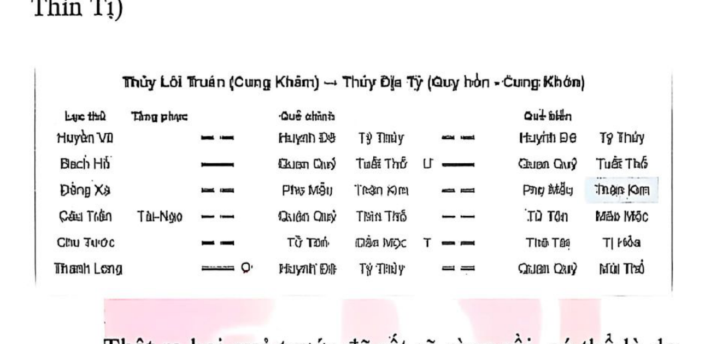

- **Cấu trúc Quẻ Dịch:**
  - **Quẻ chủ:** **Thủy Lôi Truân** (Cung Khảm)  
    *Tượng quẻ:* Truân dã, nan dã, tích tụ gian nan trắc trở, dồn nén nỗi bất mãn tâm lý lâu ngày trong công việc.
  - **Quẻ biến:** **Thủy Địa Tỷ** (Quy hồn – Cung Khôn)  
    *Tượng quẻ:* Tỷ dã, thân thiện nương tựa, gắn bó quay về tập thể ("Quy hồn"), điềm báo phải dựa vào đơn vị hiện tại, "cưỡi lừa tìm ngựa" chuẩn bị lực lượng.

- **Bảng chi tiết Lục hào:**

| Hào | Thế/Ứng | Lục thân (Chủ) | Can Chi | Biến động | Lục thân (Biến) | Can Chi (Biến) | Thần sát / Phục | Lục thú |
|:---:|:---:|:---|:---|:---:|:---|:---|:---|:---|
| 6 | | Huynh Đệ | Tý - Thủy | tĩnh | Huynh Đệ | Tý - Thủy | Tai sát | Huyền Vũ |
| 5 | **Ứng** | Quan Quỷ | Tuất - Thổ | tĩnh | Quan Quỷ | Tuất - Thổ | Hoa cái | Bạch Hổ |
| 4 | | Phụ Mẫu | Thân - Kim | tĩnh | Phụ Mẫu | Thân - Kim | Dịch mã | Đằng Xà |
| 3 | | Quan Quỷ | Thìn - Thổ | tĩnh | Tử Tôn | Mão - Mộc | Tuần không, Mưu tinh, Phục Tài-Ngọ | Câu Trần |
| 2 | **Thế** | Tử Tôn | Dần - Mộc | tĩnh | Thê Tài | Tỵ - Hỏa | Lộc thần | Chu Tước |
| 1 | | Huynh Đệ | Tý - Thủy | **O (Động)** | Quan Quỷ | Mùi - Thổ | Tai sát, Quý nhân | Thanh Long |

---

### 3. Dụng thần & Loại quẻ

- **Phân loại quẻ:**
  - **Quẻ chốt hạ chuỗi tái chiêm chuyển nghiệp (Truân biến Tỷ Quy hồn):** Định đoạt dứt khoát hướng đi sự nghiệp qua lăng kính chuỗi quẻ liên hoàn.
- **Xác định Dụng thần:**
  1. **Ý định từ chức, rời đi:** Hào Thế Tử Tôn Dần Mộc (Tử Tôn khắc Quan, chủ ý muốn từ quan bỏ việc).
  2. **Đơn vị hiện tại:** Hào Ứng Quan Quỷ Tuất Thổ lâm Bạch Hổ (môi trường ngột ngạt, cấp trên nghiêm khắc).
  3. **Đơn vị tư vấn bên ngoài:** Hào biến Quan Quỷ Mùi Thổ ở hào sơ (Mộ khố của Mộc).
  4. **Cầu nối hành động:** Hào 1 Huynh Đệ Tý Thủy phát động.

---

### 4. Luận giải chi tiết

Quẻ này là bài giảng kết thúc chuỗi 3 ca thực chiến chuyển việc, đúc kết nguyên tắc động hào hợp Nguyệt lệnh và tư duy chuỗi tái chiêm của Chu Thần Bân:

#### 1. Tượng quẻ Truân biến Tỷ
- Quẻ Truân chủ về sự dồn nén, tích tụ bất mãn.
- Quẻ biến Tỷ là quẻ **Quy hồn**, mang thông điệp cốt lõi: Hãy an định nương tựa vào tập thể hiện tại, chưa thể bứt phá ra đi, cần nhẫn nại "cưỡi lừa tìm ngựa", thu thập thông tin và tích lũy thực lực.

#### 2. Cơ chế sụp đổ của hào 1 Huynh Đệ Tý Thủy
- Hào 1 Huynh Đệ Tý Thủy phát động sinh hào Thế Tử Tôn Dần Mộc. Dù ở tháng Ngọ ngày Ngọ bị xung kích, nhưng động tất có nguyên do.
- Tuy nhiên, Tý Thủy động hóa **Quan Quỷ Mùi Thổ hồi đầu khắc**! Nguồn sinh cho ý định từ chức bị chính hào biến bẻ gãy hoàn toàn. Hào động biến hồi đầu khắc trở thành phế hào, cây cầu hành động sụp đổ.

#### 3. Quan Quỷ Mùi Thổ là Mộ khố giam hãm hào Thế
- Mùi Thổ là **Mộ khố của Mộc**. Hào Thế Tử Tôn Dần Mộc lao vào Mùi Thổ tức là tự chui đầu vào rọ, bị giam hãm trói buộc trong công ty tư vấn mới.
- Mùi Thổ nằm ở hào sơ: Biểu thị sang đơn vị mới phải bắt đầu từ bậc thang thấp nhất, làm lại từ con số không, mất sạch toàn bộ tích lũy kinh nghiệm và vị thế trước đây.

#### 4. Nguyên tắc Động hào hợp Nguyệt lệnh / Nhật lệnh phong tỏa thời gian
- Hào biến Quan Quỷ Mùi Thổ hợp với Nguyệt lệnh Ngọ Hỏa và Nhật lệnh Ngọ Hỏa (**Ngọ Mùi lục hợp**).
- Hào biến hợp Nhật Nguyệt tạo thành trạng thái bị trói buộc ("nhật bạn", "nguyệt bạn"). Điều này phong tỏa mọi chuyển động thực tế trong ít nhất 3 đến 4 tháng tới (hết các tháng Ngọ, Mùi, Thân, Dậu). Nếu cố tình manh động nhảy việc trong 4 tháng này, tai họa sẽ lập tức giáng xuống.

---

### 5. Kết luận & Ứng kỳ thực tế

- **Lời giải đoán của Chu Thần Bân:**
  Cả 3 quẻ liên hoàn cùng chỉ về một kết luận duy nhất: Tuyệt đối không được nhảy việc! Phải thực hiện chiến lược "cưỡi lừa tìm ngựa", ở lại đơn vị cũ nén đau chịu đựng, âm thầm chuẩn bị kỹ càng, ít nhất phải chờ qua 4 tháng sau khi thời cơ chín muồi mới tính tiếp.
- **Phản hồi thực tế (Feedback):**
  Đương số hoàn toàn tâm phục khẩu phục trước sự nhất quán của cả 3 quẻ Dịch, từ bỏ hoàn toàn ý định nhảy việc liều lĩnh, tiếp tục cống hiến tại cơ quan hiện tại.
- **Ứng kỳ chiêm nghiệm:**
  Giữ vững vị trí ổn định trong suốt 4 tháng tiếp theo đúng như lời dặn.

---

### 6. Bài học tâm pháp & Quy tắc cốt lõi

- **Trích dẫn quy tắc sách (Rule Index):**
  *Quy tắc chuỗi tái chiêm nhảy việc qua Thủy Lôi Truân biến Thủy Địa Tỷ và nguyên tắc động hào hợp Nguyệt lệnh* (Sách Cổ Thệ Chân Thuyên Thực Chiến Biên, trang 228).
- **Tâm pháp giải đoán thực tế:**
  1. **Tính nhất quán của chuỗi tái chiêm:** Dù đương số gieo bao nhiêu quẻ vì lo âu, thông tin cốt lõi của quẻ Dịch vẫn luôn hội tụ về một bản chất duy nhất, chỉ là mở rộng các góc nhìn chi tiết khác nhau.
  2. **Hào biến nhập Mộ khố của Thế:** Cảnh báo sự trói buộc, giam cầm và mất quyền tự chủ khi bước chân vào môi trường mới.
  3. **Quy tắc động hào hợp Nguyệt lệnh phong tỏa thời gian:** Động hào hoặc hào biến được Nhật Nguyệt tương hợp là tượng bị trói buộc tạm thời, định ra khoảng thời gian cấm kỵ tuyệt đối không được manh động.

---

## THỰC CHIẾN 159: NỮ HỎI CÓ NÊN TIẾP TỤC PHÁT TRIỂN VỚI BẠN TRAI KHÔNG

### 1. Bối cảnh & Câu hỏi

- **Bối cảnh chi tiết:**
  - Một cô gái trẻ người nước ngoài tìm đến Chu Thần Bân để xin chiêm đoán về mối quan hệ với người bạn trai hiện tại.
  - Hai người đã quen nhau và tìm hiểu được một khoảng thời gian, nhưng quá trình hẹn hò nảy sinh một số mâu thuẫn nhỏ và va chạm trong giao tiếp do khoảng cách địa lý (yêu xa).
  - Gần đây, người bạn trai bất ngờ nói với cô một câu khiến cô vô cùng chạnh lòng: *"Tuy anh rất thích em, nhưng anh cũng lo rằng chúng ta sẽ không thể đi đến cuối cùng"*.
  - Lời nói thẳng thắn này khiến cô gái bị tổn thương tâm lý sâu sắc, hoang mang nghi ngờ đối phương đã thay lòng đổi dạ hoặc không còn tha thiết với mối quan hệ, nên quyết định gieo quẻ hỏi xem có nên tiếp tục phát triển với người này hay không.
- **Tâm lý & Câu hỏi ẩn ý:**
  - Bề ngoài hỏi về việc có nên tiếp tục hay dừng lại mối quan hệ hiện tại, nhưng ẩn sâu bên trong là nỗi bất an: liệu đối phương có thật lòng yêu mình không, hay đã có người khác, và bản thân có đang lãng phí tình cảm vào một mối quan hệ vô vọng hay không.
- **Thời gian chiêm đoán:**
  - Dương lịch: Ngày 13 tháng 9 năm 2018.
  - Giờ Bắc Kinh: 01:57 (Giờ Quý Sửu).
  - Can chi: Năm Mậu Tuất, tháng Tân Dậu, ngày Mậu Thân, giờ Quý Sửu.

### 2. Dữ kiện & Bảng quẻ Crop

- **Thời không chiêm nghiệm:**
  - Tháng Tân Dậu (Kim vượng, Thủy tướng, Hỏa tử, Mộc tuyệt, Thổ hưu).
  - Ngày Mậu Thân (Kim vượng, Thủy trường sinh, Hỏa bệnh, Mộc tuyệt).
  - Tuần không: **Dần - Mão** (Giáp Thìn tuần trung, Dần Mão không vong).
- **Thần sát:**
  - Tướng tinh: Tý
  - Hoa cái: Thìn
  - Dịch mã: Dần (Lâm Tuần không)
  - Tai sát: Ngọ
  - Mưu tinh: Tuất
  - Đào hoa: Dậu (Lâm Nguyệt kiến)
  - Kiếp sát: Tị
  - Lộc thần: Tị
  - Dương nhẫn: Ngọ
  - Văn xương: Thân (Lâm Nhật kiến)
  - Thiên y: Thân
  - Thiên hỷ: Thìn
  - Quý nhân: Sửu, Mùi
- Dữ kiện bảng quẻ và các thông số chiêm đoán:
  - **Bảng 159.1** Đồ hình quẻ Thực chiến 159:
    
- **Cấu trúc Quẻ Dịch:**
  - **Quẻ chủ:** **Lôi Hỏa Phong** (Cung Khảm) – Tượng quẻ: Phong phú, thịnh đại, nhiều người theo đuổi, sự tình rối ren nhiều mối.
  - **Quẻ biến:** **Địa Hỏa Minh Di** (Du hồn - Cung Khảm) – Tượng quẻ: Tổn thương ánh sáng, rơi vào tăm tối, tinh thần bất an trôi dạt, điềm báo nguy cơ rạn nứt hoặc cạm bẫy lừa dối.
- **Bảng chi tiết Lục hào:**

| Hào | Thế/Ứng | Lục thân (Chủ) | Can Chi | Biến động | Lục thân (Biến) | Can Chi (Biến) | Thần sát / Phục | Lục thú |
|:---:|:---:|:---|:---|:---:|:---|:---|:---|:---|
| 6 | | Quan Quỷ | Tuất - Thổ | tĩnh | Phụ Mẫu | Dậu - Kim | Mưu tinh | Chu Tước |
| 5 | **Thế** | Phụ Mẫu | Thân - Kim | tĩnh | Huynh Đệ | Hợi - Thủy | Nhật kiến, Văn xương, Thiên y | Thanh Long |
| 4 | | Thê Tài | Ngọ - Hỏa | **O (Động)** | Quan Quỷ | Sửu - Thổ | Tai sát, Dương nhẫn | Huyền Vũ |
| 3 | | Huynh Đệ | Hợi - Thủy | tĩnh | Huynh Đệ | Hợi - Thủy | | Bạch Hổ |
| 2 | **Ứng** | Quan Quỷ | Sửu - Thổ | tĩnh | Quan Quỷ | Sửu - Thổ | Quý nhân (phục Quan Quỷ Thìn Thổ) | Đằng Xà |
| 1 | | Tử Tôn | Mão - Mộc | tĩnh | Tử Tôn | Mão - Mộc | Tuần không | Câu Trần |

### 3. Dụng thần & Loại quẻ

- **Phân loại quẻ:**
  - **Quẻ chỉ định đối tượng cụ thể (Chỉ định chi chiêm):** Đương số hỏi về người bạn trai cụ thể đã quen biết một thời gian, do đó hào Ứng đại diện trực tiếp cho đối tượng được chỉ định.
  - **Quẻ hôn nhân tình cảm kết hợp khảo sát nguy cơ tương lai:** Vấn đề hôn nhân của nữ mệnh luôn lấy hào Quan Quỷ làm Dụng thần xuyên suốt từ giai đoạn tìm hiểu đến kết hôn.
  - **Cơ chế "Bỏ nhẹ lấy nặng" (Xử lý thông tin ưu tiên):** Quẻ không chỉ phản ánh mâu thuẫn nhỏ trước mắt mà mở rộng tầm nhìn để cảnh báo một biến cố trọng đại đe dọa sự an nguy tình cảm của đương số trong tương lai gần.
- **Xác định Dụng thần:**
  - **Dụng thần bạn trai chỉ định:** Hào 2 **Quan Quỷ Sửu Thổ** lâm Ứng, đại diện cho người bạn trai hiện tại.
  - **Dụng thần đối tượng mới phát sinh:** Hào biến **Quan Quỷ Sửu Thổ** tại hào 4 do Thê Tài Ngọ Hỏa độc phát hóa xuất, đại diện cho một người nam giới khác đang xen vào cuộc sống của đương số.
  - **Hào Thế (Phụ Mẫu Thân Kim):** Đại diện cho bản thân cô gái, đang ở trạng thái cực vượng đắc Nhật kiến và Nguyệt lệnh tương trợ.

### 4. Luận giải chi tiết

#### 1. Hiện trạng phản ánh qua Quẻ chủ và hào Thế Ứng
- **Quẻ chủ Lôi Hỏa Phong và đào hoa vượng:** Trong quẻ xuất hiện tới 3 hào Quan Quỷ (Tuất Thổ hào 6, Sửu Thổ hào biến, Sửu Thổ hào 2), kết hợp quẻ Phong chủ về sự thịnh vượng, phong phú. Điều này phản ánh thực tế đương số là cô gái trẻ đẹp, xuất thân gia đình giàu có, xung quanh có rất nhiều người theo đuổi tán tỉnh.
- **Hào Thế lâm Phụ Mẫu Thân Kim:** Việc hào Thế lâm Phụ Mẫu biểu thị hai người đã quen biết và duy trì mối quan hệ được một thời gian nhất định, không phải vừa mới gặp gỡ.
- **Thực tâm của người bạn trai hiện tại (Hào Ứng Quan Quỷ Sửu Thổ):**
  - Hào Ứng hoàn toàn tĩnh, không phát động hung triệu. Điều này chứng tỏ người bạn trai không hề có ý định thay đổi hay tạo ra biến cố tiêu cực; mối quan hệ giữa hai người vẫn đang vận hành theo quỹ đạo ban đầu.
  - Hào Ứng Sửu Thổ sinh cho hào Thế Thân Kim, đồng thời Sửu Thổ còn là mộ khố của Thân Kim. Theo lý Dịch, hào Ứng sinh Thế và là khố của Thế biểu thị người nam này thực sự trân trọng, ghi khắc hình bóng cô gái trong lòng và thật lòng yêu mến cô.
  - **Căn nguyên câu nói gây tổn thương:** Hào Ứng Sửu Thổ mang Đằng Xà (chủ lo âu, bất an, ám ảnh). Bên dưới tàng phục Quan Quỷ Thìn Thổ tương hợp với Nguyệt lệnh Dậu Kim. Thìn Thổ biểu thị cho năm 2012 (năm Thìn). Đối chiếu thực tế, anh này từng có một mối tình yêu xa sâu đậm vào khoảng năm 2012 nhưng thất bại, để lại vết thương tâm lý nặng nề. Do hiện tại cũng đang yêu xa với đương số, anh ta sợ vết xe đổ lặp lại nên mới thật thà bộc bạch nỗi lo của mình, hoàn toàn không phải vì hết yêu hay chán ghét cô gái.

#### 2. Nguy cơ thực sự từ Hào động Thê Tài Ngọ Hỏa
- **Cơ chế phân tách hai hào Quan Quỷ Sửu Thổ:**
  - Quẻ xuất hiện hai Quan Quỷ Sửu Thổ: một ở hào Ứng (bạn trai hiện tại) và một ở hào 4 do Thê Tài Ngọ Hỏa phát động biến ra. Đây là tín hiệu rõ ràng về sự xuất hiện của đối tượng thứ hai.
  - Hào 4 Thê Tài Ngọ Hỏa phát động độc phát, trực tiếp tiến hành hình khắc hào Thế Phụ Mẫu Thân Kim (Hỏa khắc Kim). Trong quẻ tình cảm hôn nhân, hào động khắc Thế là tượng hung hiểm, chủ về bị đối phương công kích, gây tổn thương hoặc đem lại bất lợi.
- **Nhận diện chân dung người theo đuổi mới:**
  - Hào Ngọ Hỏa mang **Huyền Vũ**: Huyền Vũ chủ mờ ám, ban đêm, tư lợi, động cơ không thuần khiết. Kẻ này tiếp cận đương số không xuất phát từ tình cảm chân thành mà có toan tính riêng (nhắm vào gia thế giàu có hoặc sắc đẹp).
  - Hào Ngọ Hỏa mang **Dương Nhẫn** và **Tai Sát**: Dương Nhẫn chủ công cụ sắc nhọn, thiết bị điện tử, điện thoại (Hỏa chủ thông tin liên lạc, điện tín). Kết hợp Huyền Vũ (ban đêm), tạo thành hình tượng: kẻ này thường xuyên dùng điện thoại nhắn tin tán tỉnh dồn dập vào lúc đêm muộn (giờ Tý, từ 23h đến 1h sáng).
  - Tác động khắc Thế vượng: Khi hào Thế vượng tướng gặp hào khắc, trong ngắn hạn thể hiện sự theo đuổi mãnh liệt, tấn công dồn dập; nhưng về lâu dài, sự tương khắc ắt dẫn tới tai họa.

#### 3. Quẻ biến Địa Hỏa Minh Di và quy tắc "Bỏ nhẹ lấy nặng"
- **Ý nghĩa quẻ Minh Di:** Minh Di là quẻ Du hồn, mang tượng tổn thương ánh sáng, đau khổ u uất. Nếu đương số vì sự săn đón ngọt ngào của kẻ mới mà lạnh nhạt với bạn trai hiện tại, cô sẽ rơi vào cái bẫy tình cảm nguy hiểm và chuốc lấy tổn thương nghiêm trọng.
- **Phê phán cách áp dụng máy móc quy tắc "Dụng vượng Thế hưng":** Chu Thần Bân nhấn mạnh không thể nhìn nhận đơn giản rằng Ngọ Hỏa sinh Quan Quỷ Sửu Thổ là Dụng vượng rồi kết luận quẻ cát. Khi quẻ đã có động hào trực tiếp khắc Thế và quẻ biến thành Minh Di mang đại hung tượng, tầng thứ sinh khắc trực tiếp lên hào Thế nắm quyền quyết định tối thượng. Quẻ đã bỏ qua mâu thuẫn nhỏ không đáng kể với bạn trai hiện tại để cảnh báo đại nạn tình cảm sắp giáng xuống nếu cô gái sa ngã vào mối quan hệ mờ ám ban đêm.

### 5. Kết luận & Ứng kỳ thực tế

- **Kết luận và khuyến nghị của Chu Thần Bân:**
  - Người bạn trai hiện tại là người thật lòng, lời nói lo lắng xuất phát từ bóng ma quá khứ (yêu xa năm 2012), không nên vì giận dỗi mà cắt đứt mối lương duyên này.
  - Cảnh báo nghiêm khắc: Cô gái phải lập tức cắt đứt liên lạc với kẻ đang theo đuổi nhắn tin ban đêm, tuyệt đối không được dây dưa để tránh tự đưa mình vào thảm cảnh tổn thương tâm lý và mất mát tình cảm.
- **Phản hồi thực tế từ đương số (Feedback):**
  - Khi nghe Chu Thần Bân miêu tả hình tượng kẻ nhắn tin nửa đêm bằng điện thoại, cô gái vô cùng kinh ngạc và xác nhận: Gần đây quả thực có một chàng trai trẻ đẹp mã đang theo đuổi cô ráo riết, đêm nào cũng nhắn tin tỏ tình lúc 12h - 1h sáng.
  - Cô cũng xác nhận bạn trai hiện tại từng có mối tình yêu xa cay đắng vào năm 2012 đúng như phân tích.
  - Cô gái hiểu rõ chân tướng sự việc, cam kết chấm dứt ngay mọi tiếp xúc với đối tượng tán tỉnh ban đêm và quay lại vun đắp cho mối quan hệ với bạn trai hiện tại.
- **Ứng kỳ chiêm nghiệm:**
  - Hào Ứng Sửu Thổ tĩnh đợi xung, mối quan hệ chính thống được duy trì ổn định. Nguy cơ tiềm ẩn từ hào Ngọ Hỏa lâm Tai Sát Huyền Vũ bị chặn đứng kịp thời ngay trong tháng Dậu ngày Thân.

### 6. Bài học tâm pháp & Quy tắc cốt lõi

- **Quy tắc trích dẫn từ Cổ Thệ Chân Thuyên:**
  - *Quy tắc Nữ vấn tình cảm/hôn nhân: Định vị Quan Quỷ làm Dụng thần, ý nghĩa hào động hồi đầu sinh và biểu tượng tổn thương của quẻ Du hồn Minh Di* (trang 232).
- **Tâm pháp giải đoán thực tế:**
  1. **Quy tắc thống nhất Dụng thần trong tình cảm:** Nữ hỏi về đối tượng nam giới (dù mới quen, bạn tình hay tiến tới hôn nhân) đều nhất quán lấy Quan Quỷ làm Dụng thần; không phân chia vụn vặt làm mất đi tính hệ thống.
  2. **Nguyên lý "Xem cái này mà ứng cái kia" (Bỏ nhẹ lấy nặng):** Quẻ Dịch vận hành bằng trí tuệ siêu việt, tự động ưu tiên cảnh báo biến cố có tác động mang tính sinh tử, then chốt đối với vận mệnh của đương số, thay vì chỉ trả lời câu hỏi vụn vặt trước mắt.
  3. **Tư duy khách quan đối chiếu hiện trạng:** Đọc thông tin từ biểu hiện khách quan của quẻ rồi đối chiếu với thực tế, không được dùng định kiến chủ quan ép quẻ phải trả lời theo ý muốn của mình.
  4. **Cơ chế hào khắc Thế:** Trong xem tình cảm, một hào động khắc Thế mang theo lục thú hung (Huyền Vũ, Dương Nhẫn, Tai Sát) biểu thị sự tấn công mang động cơ đen tối, dù ban đầu có vẻ là sự theo đuổi cuồng nhiệt nhưng kết cục luôn là tổn thương và cạm bẫy.

## THỰC CHIẾN 160: NỮ HỎI VỀ XU HƯỚNG TÌNH CẢM VỚI BẠN TRAI LÀ BÁC SĨ

### 1. Bối cảnh & Câu hỏi

- **Bối cảnh chi tiết:**
  - Sau khi chứng kiến người bạn thân được Chu Thần Bân giải đoán quẻ tình cảm vô cùng chuẩn xác ở Thực chiến 159, một cô gái khác cũng nhờ Chu Thần Bân xem giúp về chuyện tình cảm của mình.
  - Cô gái này đang trong mối quan hệ yêu đương với một nam bác sĩ được một thời gian khá dài.
  - Giữa hai người là tình trạng yêu xa, sống ở hai thành phố khác nhau nên thường xuyên phải di chuyển qua lại để thăm nom, gặp gỡ.
  - Do khoảng cách địa lý và đặc thù công việc bận rộn của bạn trai là bác sĩ, cô gái cảm thấy tương lai mối quan hệ có nhiều điểm mơ hồ, muốn biết xu hướng tình cảm sau này sẽ tiến triển ra sao, có thể đi đến hôn nhân bền vững hay không.
- **Tâm lý & Câu hỏi ẩn ý:**
  - Nỗi băn khoăn liệu sự hy sinh thời gian, công sức đi lại thăm nom trong cảnh yêu xa có đem lại kết quả tốt đẹp hay cuối cùng chỉ là sự lãng phí thanh xuân.
- **Thời gian chiêm đoán:**
  - Dương lịch: Ngày 13 tháng 9 năm 2018.
  - Giờ Bắc Kinh: 19:36 (Giờ Nhâm Tuất).
  - Can chi: Năm Mậu Tuất, tháng Tân Dậu, ngày Mậu Thân, giờ Nhâm Tuất.

### 2. Dữ kiện & Bảng quẻ Crop

- **Thời không chiêm nghiệm:**
  - Tháng Tân Dậu (Kim vượng, Thủy tướng, Hỏa tử, Mộc tuyệt, Thổ hưu).
  - Ngày Mậu Thân (Kim vượng, Thủy trường sinh, Hỏa bệnh, Mộc tuyệt).
  - Tuần không: **Dần - Mão** (Giáp Thìn tuần trung, Dần Mão không vong).
- **Thần sát:**
  - Tướng tinh: Tý
  - Hoa cái: Thìn (Lâm hào Thế)
  - Dịch mã: Dần (Lâm Tuần không)
  - Tai sát: Ngọ
  - Mưu tinh: Tuất
  - Đào hoa: Dậu (Lâm hào Ứng)
  - Kiếp sát: Tị
  - Lộc thần: Tị
  - Dương nhẫn: Ngọ
  - Văn xương: Thân (Lâm Nhật kiến)
  - Thiên y: Thân
  - Thiên hỷ: Thìn
  - Quý nhân: Sửu, Mùi
- Dữ kiện bảng quẻ và các thông số chiêm đoán:
  - **Bảng 160.1** Đồ hình quẻ Thực chiến 160:
    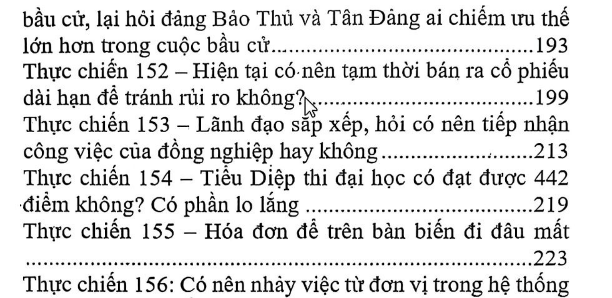
- **Cấu trúc Quẻ Dịch:**
  - **Quẻ chủ:** **Hỏa Sơn Lữ** (Cung Ly) – Tượng quẻ: Khách trọ lữ hành, phiêu bạt bất định, qua lại nhiều lần giữa hai nơi.
  - **Quẻ biến:** **Lôi Sơn Tiểu Quá** (Du hồn - Cung Đoài) – Tượng quẻ: Sai sót nhỏ, vượt quá giới hạn đôi chút, hao tổn thời gian công sức nhưng có thể khắc phục bổ cứu.
- **Bảng chi tiết Lục hào:**

| Hào | Thế/Ứng | Lục thân (Chủ) | Can Chi | Biến động | Lục thân (Biến) | Can Chi (Biến) | Thần sát / Phục | Lục thú |
|:---:|:---:|:---|:---|:---:|:---|:---|:---|:---|
| 6 | | Huynh Đệ | Tị - Hỏa | **O (Động)** | Tử Tôn | Tuất - Thổ | Kiếp sát, Lộc thần | Chu Tước |
| 5 | | Tử Tôn | Mùi - Thổ | tĩnh | Thê Tài | Thân - Kim | | Thanh Long |
| 4 | **Ứng** | Thê Tài | Dậu - Kim | tĩnh | Huynh Đệ | Ngọ - Hỏa | Đào hoa, Nguyệt kiến | Huyền Vũ |
| 3 | | Thê Tài | Thân - Kim | tĩnh | Thê Tài | Thân - Kim | Nhật kiến, Thiên y (phục Quan Hợi Thủy) | Bạch Hổ |
| 2 | | Huynh Đệ | Ngọ - Hỏa | tĩnh | Huynh Đệ | Ngọ - Hỏa | Tai sát, Dương nhẫn | Đằng Xà |
| 1 | **Thế** | Tử Tôn | Thìn - Thổ | tĩnh | Tử Tôn | Thìn - Thổ | Hoa cái, Thiên hỷ (phục Phụ Mão Mộc) | Câu Trần |

### 3. Dụng thần & Loại quẻ

- **Phân loại quẻ:**
  - **Quẻ chỉ định đối tượng kết hợp vấn hôn nhân:** Nữ hỏi về xu hướng tình cảm với bạn trai cụ thể đã quen biết một thời gian.
  - **Quẻ Dụng thần phục tàng chuyển vị:** Quẻ chủ, quẻ biến và Nhật Nguyệt đều không xuất hiện hào Quan Quỷ lộ diện, chỉ có Quan Quỷ Hợi Thủy phục tàng tại hào 3.
  - **Quẻ mang thông tin chỉ dẫn hành vi (Chỉ đạo chi chiêm):** Hào động không chỉ báo trước kết quả cát hung đơn thuần mà đưa ra định hướng chiến lược ứng xử cho bản thân đương số.
- **Xác định Dụng thần:**
  - **Bạn trai chỉ định:** Hào 4 **Thê Tài Dậu Kim** lâm Ứng mang Đào Hoa. Dù lâm Thê Tài nhưng là hào Ứng đối đãi, lại là Thê Tài (nguyên thần sinh Quan Quỷ, mang ý nghĩa người chồng dự khuyết), nên đóng vai trò đại diện cho người bạn trai bác sĩ hiện tại.
  - **Người chồng đích thực tương lai:** Hào **Quan Quỷ Hợi Thủy** phục tàng dưới hào 3 Thê Tài Thân Kim (được Nhật kiến nâng đỡ).
  - **Hào Thế (Tử Tôn Thìn Thổ):** Đại diện cho đương số, lâm Câu Trần và Hoa cái.

### 4. Luận giải chi tiết

#### 1. Hiện trạng phản ánh qua Quẻ chủ Hỏa Sơn Lữ
- **Tượng quẻ Lữ:** Quẻ Lữ mang hình tượng người lữ khách đi xa, tạm trú quán trọ. Đặc tính của quẻ Lữ là sự di chuyển lặp đi lặp lại nhiều lần. Kết hợp với quẻ gốc thuộc Lục hợp, điều này phản ánh chính xác hiện trạng hai người yêu xa, quen nhau đã lâu và thường xuyên phải đi lại giữa hai thành phố để gặp gỡ nhau.
- **Quẻ biến Lôi Sơn Tiểu Quá:** Khác với quẻ biến Minh Di (đại hung, tổn thương) ở Thực chiến 159, quẻ biến Tiểu Quá chủ về "sai lầm nhỏ", tiêu tốn chút ít thời gian công sức nhưng không đến mức gây nguy hiểm sinh mạng. Nó báo hiệu rằng việc duy trì mối quan hệ này chỉ là sự lãng phí thanh xuân và công sức, không mang lại kết quả lớn.

#### 2. Định vị bạn trai bác sĩ và người chồng tương lai
- **Sự đối lập giữa Hào Ứng và Phục thần Quan Quỷ:**
  - Hào Ứng Thê Tài Dậu Kim đại diện cho người bạn trai bác sĩ hiện tại.
  - Tuy nhiên, hào Quan Quỷ Hợi Thủy (chồng thực sự) lại không phục tàng dưới hào Ứng Dậu Kim mà lại phục dưới hào 3 Thê Tài Thân Kim.
  - Thân Kim và Dậu Kim là hai đối tượng Thê Tài khác nhau. Điều này chứng minh một cách dứt khoát: Người bạn trai bác sĩ này hoàn toàn không phải là người chồng tương lai của cô gái. Mối quan hệ này chỉ có mở đầu mà không có kết thúc (hữu thủy vô chung).
- **Hiện tượng đào hoa nhiều mối:** Cả Nguyệt kiến (Dậu Kim) và Nhật kiến (Thân Kim) đều là Thê Tài (đối tượng tình cảm dự khuyết), cho thấy cô gái cũng có nhiều người để ý, không thiếu cơ hội lựa chọn.

#### 3. Động triệu hào 6 và Cơ chế "Thông tin chỉ đạo" phân tầng
- **Hào 6 Huynh Đệ Tị Hỏa động hóa Tử Tôn Tuất Thổ (Hỏa nhập mộ):**
  - **Tầng thứ nhất - Chỉ đạo hành vi cho bản thân đương số (Sinh Thế):**
    - Người gieo quẻ là đương số, quẻ Dịch phát ra thông tin chỉ đạo là để người hỏi tiếp thu và điều chỉnh hành vi, chứ không phải để chỉ đạo bạn trai (người không xem quẻ).
    - Hào động Huynh Đệ Tị Hỏa sinh cho hào Thế Tử Tôn Thìn Thổ. Huynh Đệ đại diện cho bạn bè bình thường.
    - Quẻ đưa ra lời khuyên: Đương số không nên tự trói buộc mình vào một mối quan hệ không có tương lai. Hãy mở rộng giao lưu, kết bạn bè bình thường bên ngoài ("cưỡi lừa tìm ngựa"). Từ việc có nhiều bạn bè tốt, dần dần sẽ chuyển hóa thành đối tượng tình cảm phù hợp, rồi từ đó mới tìm ra người chồng đích thực (Thê Tài Thân Kim mang phục thần Quan Quỷ Hợi Thủy).
  - **Tầng thứ hai - Phân tích tâm thái của người bạn trai (Hào Ứng mang Huyền Vũ):**
    - Hào Ứng Thê Tài Dậu Kim mang Huyền Vũ (chủ tâm cơ, toan tính riêng, không thuần khiết). Bên trong đối ứng với Huynh Đệ Ngọ Hỏa.
    - Điều này vạch trần tâm lý của người bạn trai bác sĩ: Anh ta cũng không xem cô gái là duy nhất, bản thân anh ta cũng đang "cưỡi lừa tìm ngựa", có những mối quan hệ bạn bè khác giới khác bên ngoài và tìm kiếm cơ hội khác.
  - **Tầng thứ ba - Chi tiết khắc hào Ứng:**
    - Huynh Đệ Tị Hỏa động khắc hào Ứng Thê Tài Dậu Kim: Ở tầng chi tiết sâu hơn, sự can thiệp của người thứ ba hoặc hoàn cảnh bên ngoài sẽ khiến mối quan hệ này tan rã. Tị Hỏa là thoái thần của Ngọ Hỏa, cho thấy sự xuất hiện của các đối tượng thay thế sẽ làm đổ vỡ tình cảm hai bên.

#### 4. Tử Tôn trì Thế lâm Câu Trần
- **Tâm thái của đương số:**
  - Hào Thế Tử Tôn Thìn Thổ mang Câu Trần. Câu Trần chủ chậm chạp, ngây thơ, mơ hồ.
  - Tử Tôn chủ sự đơn thuần, vô tư, không có tâm cơ. Cô gái hoàn toàn không nhận biết được sự toan tính và những mối quan hệ ngầm của đối phương, trong lòng hoàn toàn mù mờ.
  - Cổ ngữ định chế: *"Tử Tôn trì Thế, duyên phận khó thành"* trong quẻ vấn hôn nhân, là chỉ dấu việc gắn bó lâu dài với người này sẽ không đi tới hôn nhân.

### 5. Kết luận & Ứng kỳ thực tế

- **Lời giải đoán và khuyến nghị của Chu Thần Bân:**
  - Khẳng định mối quan hệ với người bạn trai bác sĩ không thể tiến tới hôn nhân, chỉ là tình cảm có đầu không có cuối.
  - Khuyên cô gái không nên tiếp tục lãng phí quá nhiều thời gian, tâm sức và thanh xuân cho mối quan hệ yêu xa này.
  - Cần tỉnh táo nhận diện thực tế, áp dụng chiến lược mở rộng giao thiệp bạn bè bên ngoài để chủ động tìm kiếm bến đỗ hôn nhân thực sự, tránh việc đến khi đối phương chia tay thì bản thân rơi vào thế trắng tay, chịu tổn thất tuổi xuân.
- **Phản hồi thực tế từ đương số (Feedback):**
  - Đương số thừa nhận mối quan hệ yêu xa quả thực rất mệt mỏi, bản thân luôn cảm thấy đối phương có những khoảng cách tâm lý khó chạm tới.
  - Cô gái nhận ra lời khuyên của Chu Thần Bân là vô cùng thấu tình đạt lý, quyết định điều chỉnh tâm thái, không còn quá kỳ vọng vào người bạn trai này và mở rộng các mối quan hệ xã hội.
- **Ứng kỳ chiêm nghiệm:**
  - Quẻ biến Tiểu Quá thể hiện sự chuyển dịch nhẹ nhàng. Mối quan hệ dần nhạt phai theo thời gian mà không gây ra biến cố chấn động hay tổn thương quá nặng nề.

### 6. Bài học tâm pháp & Quy tắc cốt lõi

- **Quy tắc trích dẫn từ Cổ Thệ Chân Thuyên:**
  - *Quy tắc quẻ Lữ biến Tiểu Quá trong tình cảm: Tượng khách trọ phiêu bạt và giới hạn phát triển quan hệ* (trang 251).
- **Tâm pháp giải đoán thực tế:**
  1. **Kỹ thuật xử lý Dụng thần khi Quan Quỷ phục tàng:** Khi quẻ không có Quan Quỷ, hào Ứng là đối tượng được chỉ định. Nếu hào Ứng lâm Thê Tài (nguyên thần sinh Quan Quỷ) lại đắc Đào Hoa và Nhật Nguyệt thì hào Ứng chính là người bạn trai hiện tại (vai trò dự khuyết).
  2. **Nguyên lý phân tầng tư duy (Layered Thinking):** Một hào động có thể mang nhiều ý nghĩa ở các tầng thứ khác nhau:
     - Tầng định tính (Thông tin chỉ đạo): Sinh hào Thế, chỉ dẫn người hỏi phương thức hành động tối ưu.
     - Tầng chi tiết: Khắc hào Ứng, phản ánh diễn biến khách quan và nguyên nhân dẫn đến đổ vỡ của đối phương.
  3. **Ý nghĩa hào nhập mộ trong thông tin chỉ đạo:** Huynh Đệ Tị Hỏa hóa mộ Tuất Thổ không xem là hào động hỏng mà là mật mã chỉ dẫn khuyên người hỏi nên chuyển hướng tìm kiếm nhân duyên từ nguồn bạn bè bên ngoài.
  4. **Đối sánh Lục thú:** Phối hợp Thế lâm Câu Trần (ngây thơ, mù mờ) với Ứng lâm Huyền Vũ (tâm cơ, mờ ám) để bóc tách sự chênh lệch tâm lý và mức độ chân thành giữa hai bên trong tình yêu.

## THỰC CHIẾN 161: HỎI VỀ SỰ AN TOÀN ĐI VỀ CỦA CHỒNG RA NƯỚC NGOÀI CÔNG TÁC

### 1. Bối cảnh & Câu hỏi

- **Bối cảnh chi tiết:**
  - Chồng của đương số nhận lệnh đi công tác nước ngoài dài ngày, địa điểm đến là khu vực Trung Đông.
  - Trung Đông vốn là khu vực địa chính trị vô cùng phức tạp, thường xuyên xảy ra chiến sự, xung đột vũ trang và tiềm ẩn nhiều nguy cơ khủng bố bất ổn. Các chuyến bay qua không phận khu vực lân cận cũng có nguy cơ rủi ro cao.
  - Người vợ ở nhà đứng ngồi không yên, tâm trạng bồn chồn lo lắng tột độ, sợ chồng mình gặp phải bất trắc hoặc nguy hiểm đến tính mạng trên đường đi cũng như chiều về, nên đã gieo quẻ Dịch để cầu hỏi về sự an nguy của chồng.
- **Tâm lý & Câu hỏi ẩn ý:**
  - Nỗi sợ hãi tột cùng về an nguy tính mạng của người thân nơi chiến địa hiểm trở; tâm lý cầu mong một lời khẳng định bình an để giải tỏa áp lực đè nặng trong lòng.
- **Thời gian chiêm đoán:**
  - Dương lịch: Ngày 20 tháng 6 năm 2018.
  - Giờ Bắc Kinh: 13:42 (Giờ Kỷ Mùi).
  - Can chi: Năm Mậu Tuất, tháng Mậu Ngọ, ngày Quý Mùi, giờ Kỷ Mùi.

### 2. Dữ kiện & Bảng quẻ Crop

- **Thời không chiêm nghiệm:**
  - Tháng Mậu Ngọ (Hỏa vượng, Thổ tướng, Mộc hưu, Kim tù, Thủy tuyệt).
  - Ngày Quý Mùi (Thổ vượng, Hỏa dư khí, Kim mộ, Mộc dưỡng).
  - Tuần không: **Thân - Dậu** (Giáp Tuất tuần trung, Thân Dậu không vong).
- **Thần sát:**
  - Tướng tinh: Mão
  - Hoa cái: Mùi (Lâm Nhật kiến, hào 6 và hào 1)
  - Dịch mã: Tị (Lâm hào Thế)
  - Tai sát: Dậu (Lâm Tuần không, hào Ứng)
  - Mưu tinh: Sửu
  - Đào hoa: Tý
  - Kiếp sát: Thân (Lâm Tuần không)
  - Lộc thần: Tý
  - Dương nhẫn: Hợi (Lâm hào 4)
  - Văn xương: Mão
  - Thiên y: Tị (Lâm hào Thế)
  - Thiên hỷ: Sửu
  - Quý nhân: Mão, Tị (Lâm hào Thế và hào 3)
- Dữ kiện bảng quẻ và các thông số chiêm đoán:
  - **Bảng 161.1** Đồ hình quẻ Thực chiến 161:
    
- **Cấu trúc Quẻ Dịch:**
  - **Quẻ chủ:** **Trạch Địa Tụy** (Cung Đoài) – Tượng quẻ: Tụ hội, quy tụ về một điểm, tập trung vào một mục tiêu chỉ định duy nhất.
  - **Quẻ biến:** **Trạch Sơn Hàm** (Cung Đoài) – Tượng quẻ: Giao cảm, lan tỏa rộng khắp, đi lại nhiều nơi, du ngoạn rong chơi.
- **Bảng chi tiết Lục hào:**

| Hào | Thế/Ứng | Lục thân (Chủ) | Can Chi | Biến động | Lục thân (Biến) | Can Chi (Biến) | Thần sát / Phục | Lục thú |
|:---:|:---:|:---|:---|:---:|:---|:---|:---|:---|
| 6 | | Phụ Mẫu | Mùi - Thổ | tĩnh | Phụ Mẫu | Mùi - Thổ | Hoa cái, Nhật kiến | Bạch Hổ |
| 5 | **Ứng** | Huynh Đệ | Dậu - Kim | tĩnh | Huynh Đệ | Dậu - Kim | Tuần không, Tai sát | Đằng Xà |
| 4 | | Tử Tôn | Hợi - Thủy | tĩnh | Tử Tôn | Hợi - Thủy | Dương nhẫn | Câu Trần |
| 3 | | Thê Tài | Mão - Mộc | **X (Động)** | Huynh Đệ | Thân - Kim | Tướng tinh, Văn xương, Quý nhân | Chu Tước |
| 2 | **Thế** | Quan Quỷ | Tị - Hỏa | tĩnh | Quan Quỷ | Ngọ - Hỏa | Dịch mã, Thiên y, Quý nhân | Thanh Long |
| 1 | | Phụ Mẫu | Mùi - Thổ | tĩnh | Phụ Mẫu | Thìn - Thổ | Hoa cái, Nhật kiến | Huyền Vũ |

### 3. Dụng thần & Loại quẻ

- **Phân loại quẻ:**
  - **Quẻ tâm thái ưu hoạn (Lấy tâm lý lo âu làm trục chính):** Người vợ xuất phát từ nỗi lo sợ tai nạn tính mạng của chồng nơi chiến sự Trung Đông để gieo quẻ, không phải hỏi về sự vụ khách quan bình thường.
  - **Quẻ xuất hành viễn phương:** Khảo sát sự di chuyển, hành trình đi và về của người thân ở phương xa.
- **Xác định Dụng thần:**
  - **Hào Quan Quỷ Tị Hỏa trì Thế:** Đóng vai trò song trùng:
    1. Là hiện thân cho nỗi lo âu, ưu hoạn, khiếp sợ trong lòng người vợ.
    2. Về mặt hình tượng đối tượng: Lâm Dịch Mã, Quý Nhân, Thanh Long, biểu thị người chồng đang bôn ba công tác nước ngoài.
  - **Nguyên thần của ưu hoạn:** Hào 3 **Thê Tài Mão Mộc** phát động (Mộc sinh Hỏa, nguồn tiếp năng lượng cho nỗi lo Quan Quỷ).
  - **Hào biến khắc diệt ưu hoạn:** Hào biến **Huynh Đệ Thân Kim** hồi đầu khắc Thê Tài Mão Mộc.

### 4. Luận giải chi tiết

#### 1. Biện giải về quy tắc "Vợ không nên tự xem cho chồng" của Dã Hạc
- Cổ nhân Dã Hạc từng cảnh báo: Vợ xem cho chồng rất dễ nhầm lẫn vì Quan Quỷ vừa đại diện cho chồng, vừa đại diện cho sự lo lắng; Quan Quỷ phát động không biết là chồng vượng hay nỗi lo vượng.
- Chu Thần Bân khai mở tâm pháp: Cần dựa vào tâm thái xuất phát điểm của người hỏi:
  - Nếu hỏi về việc bình thường (như tài vận, thăng chức thông thường không kèm hoảng loạn), Quan Quỷ thuần túy là người chồng.
  - Nếu hỏi trong bối cảnh hiểm nguy, tai ương, chiến sự với tâm lý hoảng loạn lo sợ tai nạn rình rập, thì Quan Quỷ chính là hiện thân của **sự lo lắng ưu hoạn**.

#### 2. Cơ chế "Nguyên thần bị hồi đầu khắc" định đoạt cát hung
- **Động triệu độc phát:** Toàn quẻ duy nhất có hào 3 Thê Tài Mão Mộc phát động, hóa xuất Huynh Đệ Thân Kim.
- **Hồi đầu khắc chặt đứt nguồn tai họa:**
  - Huynh Đệ Thân Kim quay lại khắc trừng phạt Thê Tài Mão Mộc (Kim khắc Mộc).
  - Thê Tài Mão Mộc chính là nguyên thần sinh trợ cho Quan Quỷ Tị Hỏa. Khi nguyên thần bị hồi đầu khắc diệt, nguồn dưỡng khí của Quan Quỷ bị cắt đứt hoàn toàn.
  - Trong hệ thống quẻ tâm thái Lục Hào: *"Quan Quỷ vô khí hoặc nguyên thần bị tổn thương thì điều lo lắng ắt không thành hiện thực"*. Do đó, mối nguy hiểm tai nạn mà người vợ lo sợ hoàn toàn bị tiêu trừ, không thể phát sinh trong thực tế.
- **Giải tỏa nghi vấn về Tuần không và Nhật Nguyệt:**
  - Người học thông thường hay thắc mắc: Huynh Đệ Thân Kim lâm Tuần không, lại bị Nguyệt lệnh Ngọ Hỏa khắc, liệu có khắc nổi Mão Mộc không?
  - Chu Thần Bân khẳng định nguyên lý cốt lõi của Dã Hạc: **Động biến là tầng thứ nhất, vĩnh viễn lớn hơn Nhật Nguyệt**. Hào biến hồi đầu khắc là nội tại biến dịch trực tiếp, không bị phụ thuộc vào Tuần không hay sự sinh khắc của Nhật Nguyệt thông thường. Động triệu đã hình thành hồi đầu khắc thì kết luận an toàn được xác lập ngay lập tức.

#### 3. Quẻ biến Trạch Sơn Hàm: Chuyển dịch từ chỉ định sang du ngoạn
- **Ý nghĩa cặp quẻ Tụy - Hàm:**
  - Quẻ chủ **Trạch Địa Tụy**: Tụy là "xuất thần bạt tụy", tụ tập, khóa chặt vào một điểm duy nhất. Ban đầu chuyến công tác chỉ xác định một địa điểm khảo sát duy nhất tại Trung Đông.
  - Quẻ biến **Trạch Sơn Hàm**: Hàm là cảm ứng, lan tỏa, phiêu lưu du ngoạn khắp nơi.
  - Sự chuyển hóa từ Tụy sang Hàm tiết lộ: Người chồng không những hoàn thành công việc an toàn ở điểm đến Trung Đông, mà sau đó hành trình còn được mở rộng, thuận đường ghé thăm nhiều địa điểm khác để du lịch, ngắm cảnh.

### 5. Kết luận & Ứng kỳ thực tế

- **Lời giải đoán của Chu Thần Bân:**
  - Khẳng định chắc chắn người chồng đi lại bình an vô sự, mọi lo lắng của người vợ chỉ là nỗi sợ hão huyền do tâm lý bất an tạo nên.
  - Dự đoán thêm: Sau khi hoàn thành công việc tại điểm đến ban đầu ở Trung Đông, người chồng sẽ thuận đường chuyển hướng đi du ngoạn ở những địa điểm khác rồi mới trở về.
- **Phản hồi thực tế từ đương số (Feedback):**
  - Chuyến công tác diễn ra tuyệt đối suôn sẻ và an toàn, không gặp bất kỳ hiểm nguy nào.
  - Đúng như dự trắc của quẻ Hàm: Sau khi hoàn thành xong nhiệm vụ tại một quốc gia Trung Đông, người chồng đã thuận tiện bay sang Nam Âu, du ngoạn khám phá Hy Lạp một chuyến rồi mới trở về nước trong sự bình an, hạnh phúc của gia đình.
- **Ứng kỳ chiêm nghiệm:**
  - Ứng nghiệm trọn vẹn trong tháng Ngọ ngày Mùi; an toàn tuyệt đối suốt hành trình đi lẫn về.

### 6. Bài học tâm pháp & Quy tắc cốt lõi

- **Quy tắc trích dẫn từ Cổ Thệ Chân Thuyên:**
  - *Quy tắc xuất hành viễn phương: Phân biệt an nguy tính mạng qua Tử Tôn trì Thế/động và tương hợp Tị Thân trong quẻ Tụy biến Hàm* (trang 262).
- **Tâm pháp giải đoán thực tế:**
  1. **Quy tắc phân định bản chất Quan Quỷ:** Trong quẻ vợ hỏi về chồng, điểm mấu chốt là xác định người hỏi có mang tâm lý lo âu thái quá hay không. Nếu có lo âu cực độ về tai nạn/tính mạng, phải lập tức khởi động lăng kính quẻ tâm thái để giải đoán.
  2. **Nguyên lý Động biến tối thượng:** Trong phán đoán cát hung, động biến là quy tắc số một chi phối cục diện. Động biến hồi đầu khắc nguyên thần của Quan Quỷ là ấn chứng thép cho thấy tai họa bị triệt tiêu, không bị rào cản bởi Tuần không hay Nhật Nguyệt sinh khắc thông thường.
  3. **Biến dịch quẻ tượng Tụy biến Hàm:** Sự chuyển hóa từ quẻ Tụy (tập trung 1 điểm) sang quẻ Hàm (lan tỏa khắp nơi) là chìa khóa dự trắc sự thay đổi lộ trình từ công vụ đơn thuần sang kết hợp du lịch ngắm cảnh.

## THỰC CHIẾN 162: CHỒNG BỊ TRẦM CẢM NẶNG ĐÃ MẤT TÍCH 13 NGÀY, VỢ XEM QUẺ HỎI CÁT HUNG CỦA CHỒNG

### 1. Bối cảnh & Câu hỏi

- **Bối cảnh chi tiết:**
  - Một người phụ nữ rơi vào hoàn cảnh bi kịch gia đình: Chồng của cô mắc chứng trầm cảm cực kỳ nghiêm trọng, đột nhiên bỏ nhà ra đi và mất tích không để lại bất kỳ tung tích nào.
  - Gia đình và người thân đã tỏa đi tìm kiếm khắp nơi suốt 13 ngày đêm trong vô vọng, tâm trạng kiệt quệ và tuyệt vọng.
  - Người bị trầm cảm nặng có khuynh hướng tự sát rất cao; việc mất tích kéo dài gần nửa tháng khiến người vợ linh cảm điều chẳng lành. Trong cơn hoảng loạn, cô đã gieo quẻ Dịch để cầu hỏi về sự an nguy và sống chết của chồng. Quẻ này sau đó được một đồng môn mang đến thỉnh giáo Chu Thần Bân.
- **Tâm lý & Câu hỏi ẩn ý:**
  - Nỗi sợ hãi tột đỉnh trước nguy cơ người chồng đã tự vẫn hoặc gặp đại nạn vong mạng; sự giằng xé giữa hy vọng mong manh và nỗi tuyệt vọng cùng cực.
- **Thời gian chiêm đoán:**
  - Dương lịch: Ngày 3 tháng 9 năm 2018.
  - Giờ Bắc Kinh: 20:39 (Giờ Nhâm Tuất).
  - Can chi: Năm Mậu Tuất, tháng Canh Thân, ngày Mậu Tuất, giờ Nhâm Tuất.

### 2. Dữ kiện & Bảng quẻ Crop

- **Thời không chiêm nghiệm:**
  - Tháng Canh Thân (Kim vượng, Thủy tướng, Thổ hưu, Hỏa bệnh, Mộc tuyệt).
  - Ngày Mậu Tuất (Thổ vượng, Kim tướng, Hỏa mộ, Thủy dưỡng, Mộc tử).
  - Tuần không: **Thìn - Tị** (Giáp Ngọ tuần trung, Thìn Tị không vong).
- **Thần sát:**
  - Tướng tinh: Ngọ
  - Hoa cái: Tuất (Lâm Nhật kiến, hào biến hào 6)
  - Dịch mã: Thân (Lâm Nguyệt kiến)
  - Tai sát: Tý
  - Mưu tinh: Thìn (Lâm Tuần không)
  - Đào hoa: Mão
  - Kiếp sát: Hợi
  - Lộc thần: Tị (Lâm Tuần không, hào 6 và hào 2)
  - Dương nhẫn: Ngọ
  - Văn xương: Thân
  - Thiên y: Mùi
  - Thiên hỷ: Thìn
  - Quý nhân: Sửu, Mùi
- Dữ kiện bảng quẻ và các thông số chiêm đoán:
  - **Bảng 162.1** Đồ hình quẻ Thực chiến 162:
    
- **Cấu trúc Quẻ Dịch:**
  - **Quẻ chủ:** **Hỏa Địa Tấn** (Du hồn - Cung Càn) – Tượng quẻ: Du hồn bất định, phiêu bạt mất phương hướng, tinh thần lang bạt, mở rộng tìm kiếm.
  - **Quẻ biến:** **Lôi Địa Dự** (Lục hợp - Cung Chấn) – Tượng quẻ: Lục hợp u uất, do dự đau đớn, tai họa kết tụ không tan, mây đen che phủ tâm trí.
- **Bảng chi tiết Lục hào:**

| Hào | Thế/Ứng | Lục thân (Chủ) | Can Chi | Biến động | Lục thân (Biến) | Can Chi (Biến) | Thần sát / Phục | Lục thú |
|:---:|:---:|:---|:---|:---:|:---|:---|:---|:---|
| 6 | | Quan Quỷ | Tị - Hỏa | **O (Động)** | Phụ Mẫu | Tuất - Thổ | Lộc thần, Tuần không (phục Phụ Tuất Thổ) | Chu Tước |
| 5 | | Phụ Mẫu | Mùi - Thổ | tĩnh | Huynh Đệ | Thân - Kim | Thiên y, Quý nhân (phục Huynh Thân Kim) | Thanh Long |
| 4 | **Thế** | Huynh Đệ | Dậu - Kim | tĩnh | Quan Quỷ | Ngọ - Hỏa | (phục Quan Ngọ Hỏa) | Huyền Vũ |
| 3 | | Thê Tài | Mão - Mộc | tĩnh | Thê Tài | Mão - Mộc | Đào hoa (phục Phụ Thìn Thổ) | Bạch Hổ |
| 2 | | Quan Quỷ | Tị - Hỏa | tĩnh | Quan Quỷ | Tị - Hỏa | Tuần không, Lộc thần (phục Tài Dần Mộc) | Đằng Xà |
| 1 | **Ứng** | Phụ Mẫu | Mùi - Thổ | tĩnh | Phụ Mẫu | Mùi - Thổ | Câu Trần, Thiên y (phục Tử Tý Thủy) | Câu Trần |

### 3. Dụng thần & Loại quẻ

- **Phân loại quẻ:**
  - **Quẻ tâm thái ưu hoạn sinh tử cực độ:** Khác với các quẻ hỏi thăm sức khỏe thông thường, ca này người chồng trầm cảm nặng đã mất tích 13 ngày, người vợ mang tâm lý hoảng loạn và linh cảm hung tin tột cùng.
  - **Quẻ Du hồn biến Lục hợp:** Tượng du hồn trôi nổi lạc lối biến thành Lục hợp khóa chặt tai họa đau thương.
- **Xác định Dụng thần:**
  - **Quan Quỷ Tị Hỏa:** Đóng vai trò là biểu tượng của đại họa, nỗi kinh hoàng và nguy cơ tử vong đè nặng lên gia đình.
  - **Hào Thế (Huynh Đệ Dậu Kim):** Đại diện cho người vợ – người gánh chịu hậu quả bi thảm cuối cùng của sự việc.
  - **Hào biến Phụ Mẫu Tuất Thổ:** Hỏa hào nhập mộ khố tại hào 6, lâm Nhật kiến, mang mật mã chỉ dẫn nơi chôn cất/tử vong.

### 4. Luận giải chi tiết

#### 1. Bẻ gãy sai lầm suy luận "Dụng thần vượng nhập mộ là giả mộ"
- Vị đồng môn thắc mắc: Nếu xem theo quẻ sự vụ, Quan Quỷ Tị Hỏa đại diện cho chồng, được Nguyệt lệnh Thân Kim tương hợp nên xem là vượng tướng. Hào 6 động hóa Tuất Thổ là hóa mộ; theo lý thuyết Tam Mộ thông thường thì *"Vượng giả mộ vi giả mộ"* (vượng nhập mộ chỉ là tạm thời, sẽ xuất mộ trở về), tại sao người chồng lại chết?
- Chu Thần Bân chỉ rõ gốc rễ sai lầm:
  - Đây là **quẻ tâm thái ưu hoạn**, không phải quẻ sự vụ thông thường. Người trầm cảm nặng mất tích 13 ngày thì trong tâm người vợ chỉ toàn nỗi lo sợ tự sát và đại nạn.
  - Trong quẻ tâm thái ưu hoạn, quẻ biến Lục hợp (**Lôi Địa Dự**) là điềm cực hung: ưu tư kết tụ, tai họa đông cứng, bóng tối bi kịch không thể tan biến.

#### 2. Cơ chế "Quan Quỷ động khắc hào Thế" – Tai họa giáng xuống đầu người gieo
- **Tác động sát phạt lên hào Thế:**
  - Hào 6 Quan Quỷ Tị Hỏa phát động mang năng lượng Hỏa cực mạnh khắc chế thẳng vào hào Thế Huynh Đệ Dậu Kim (Kim bị Hỏa khắc).
  - Dù xem cho bản thân hay xem cho người thân ruột thịt, **hào Thế luôn là người tiếp nhận kết quả cuối cùng**. Khi chồng tự vẫn qua đời, người chịu đòn giáng đau đớn, tổn thương tinh thần và gánh nặng bi kịch lớn nhất chính là người vợ (hào Thế).
  - Tượng Quan Quỷ động khắc Thế là cấu trúc của **quẻ tai họa**. Nỗi lo sợ kinh hoàng nhất của người vợ đã biến thành sự thật tàn khốc.

#### 3. Hào hỏa nhập mộ khố và Mật mã chỉ dẫn vị trí cứu hộ
- **Động hóa mộ khố:** Hào 6 Quan Quỷ Tị Hỏa động hóa Phụ Mẫu Tuất Thổ (Hỏa nhập mộ tại Tuất). Đây là tượng người rơi vào cõi chết, nhập quan tài, chôn vùi dưới lòng đất.
- **Giải mã không gian và phương vị (Nam Bắc quan):**
  - Quẻ Tấn ngoại quái Ly (Hỏa) ở trên: Theo Thái Cực đồ cổ đại (trên Nam dưới Bắc), hào 6 Hỏa động chỉ rõ phương vị ở **phía Nam**.
  - Tị Hỏa là phía Nam lệch Đông. Hào động xem theo "gặp vượng", hào biến xem theo "gặp xung": Hào biến Tuất Thổ bị xung là Thìn Thổ, kết hợp tạo thành phương vị **Đông Nam**.
  - Hào 6 là hào trên cùng, đại diện cho nơi xa xôi, ngoại ô (xa nhà).
  - Tuất Thổ lâm Nhật kiến, thổ của đồng ruộng, cây cối nông nghiệp (cánh đồng ngô).
  - Khi gieo quẻ, Quan Quỷ Tị Hỏa lâm **Tuần không**: "Quỷ chưa hiện hình", tức là vào thời điểm gieo quẻ người chồng có thể chưa tắt thở hoàn toàn, còn đang hôn mê hoặc thoi thóp. Nếu người nhà hiểu quẻ và cấp tốc tìm kiếm ngay theo phương vị chỉ dẫn phía Nam/Đông Nam nơi đồng ruộng xa xôi thì có cơ may cứu sống. Nhưng để qua ngày Ngọ (hết tuần không, Hỏa vượng thực khố) thì bi kịch đã thành định mệnh.

### 5. Kết luận & Ứng kỳ thực tế

- **Lời giải đoán của Chu Thần Bân:**
  - Nhận định người chồng gặp đại nạn hung hiểm khó qua khỏi; chỉ ra phương vị tìm kiếm ở phía Nam cách xa nhà, nơi đồng ruộng gò đất.
- **Phản hồi thực tế từ đương số (Feedback):**
  - Đến **ngày Ngọ**, lực lượng tìm kiếm đã phát hiện thi thể của người chồng tại một **cánh đồng ngô**, cách nhà về **phía Nam khoảng 7 - 8 km**.
  - Người chồng đã tự sát chết trong cô độc giữa cánh đồng ngô hoang vắng, kết thúc bi kịch đau thương.
- **Ứng kỳ chiêm nghiệm:**
  - Hào động Quan Quỷ Tị Hỏa lâm Tuần không, đến ngày Ngọ điền thực xuất không, tai họa chính thức lộ diện toàn phần và thi thể được tìm thấy. Khoảng cách 7-8 km ứng với số sinh thành của Hỏa (7) và Mộc/Thổ (8).

### 6. Bài học tâm pháp & Quy tắc cốt lõi

- **Quy tắc trích dẫn từ Cổ Thệ Chân Thuyên:**
  - *Quy tắc người thân mất tích trầm cảm: Dụng thần phục tàng lâm Tuyệt khố, quẻ Du hồn biến Lục hợp định vị sự sống còn* (trang 271).
- **Tâm pháp giải đoán thực tế:**
  1. **Nhận diện quẻ tâm thái qua tính chất sự việc:** Đừng máy móc áp dụng công thức "vượng giả mộ vi giả mộ" của quẻ sự vụ vào trường hợp đương số đang hoảng loạn vì bệnh nhân trầm cảm nặng mất tích dài ngày. Bản chất sự việc quyết định loại quẻ.
  2. **Tượng Lục hợp trong quẻ ưu hoạn:** Khác với xem cầu tài cầu hôn (Lục hợp là tốt), trong quẻ xem tai họa ưu hoạn thì Lục hợp là hung triệu tối cao, chủ về sự ràng buộc của tai ương, bế tắc không lối thoát.
  3. **Quan Quỷ khắc Thế là tai họa tột cùng:** Hào động mang tính sát phạt giáng vào hào Thế chứng minh người hỏi sẽ phải gánh chịu nỗi đau mất mát to lớn.
  4. **Kỹ thuật định vị không gian qua hào quẻ:** Kết hợp tầng thứ hào (hào 6 là nơi xa), ngũ hành quẻ (Hỏa là phương Nam), biến hào xung hợp để khóa chặt bán kính và đặc điểm địa hình cứu nạn thực tế.

## THỰC CHIẾN 163: HỎI VỀ VỤ BÊ BỐI CỦA HỌC THÀNH ĐƯỢC PHƠI BÀY TRÊN MẠNG LÀ THẬT HAY GIẢ

### 1. Bối cảnh & Câu hỏi

- **Bối cảnh chi tiết:**
  - Vào đầu tháng 8 năm 2018, khi Chu Thần Bân có chuyến công tác tại Bắc Kinh, một người đồng môn đã đến gặp và thỉnh giáo về một vụ bê bối chấn động đang lan truyền với tốc độ chóng mặt trên mạng xã hội Trung Quốc.
  - Vụ việc liên quan đến một nhân vật tôn giáo có vị thế tối cao bị tố cáo có hành vi lạm dụng quyền lực, xâm hại tình dục nhiều nữ đệ tử và sai phạm tài chính nghiêm trọng.
  - Khi hỏi, người đồng môn không tiết lộ danh tính nhân vật mà chỉ hỏi chung chung: *"Những thông tin tố cáo bê bối được phơi bày trên mạng rốt cuộc là thật hay giả?"*.
  - Người hỏi là một tín đồ Phật giáo thuần thành, trong tâm lý vô cùng sùng kính tôn giáo nên tha thiết hy vọng đây chỉ là tin đồn thất thiệt, là đòn thù vu khống của kẻ xấu nhằm bôi nhọ Phật giáo.
- **Tâm lý & Câu hỏi ẩn ý:**
  - Tâm lý phòng vệ và thiên kiến chủ quan rõ rệt: Không muốn tin vào sự tha hóa của bậc tôn túc; mong cầu một quẻ Dịch chứng minh tin đồn trên mạng là giả để bảo vệ đức tin cá nhân.
- **Thời gian chiêm đoán:**
  - Dương lịch: Ngày 1 tháng 8 năm 2018.
  - Giờ Bắc Kinh: 17:07 (Giờ Bính Tuất).
  - Can chi: Năm Mậu Tuất, tháng Kỷ Mùi, ngày Ất Sửu, giờ Bính Tuất.

### 2. Dữ kiện & Bảng quẻ Crop

- **Thời không chiêm nghiệm:**
  - Tháng Kỷ Mùi (Thổ vượng, Hỏa dư khí, Kim tướng, Mộc khố, Thủy tuyệt).
  - Ngày Ất Sửu (Thổ vượng, Kim tướng, Thủy dư khí, Hỏa mộ).
  - Tuần không: **Tuất - Hợi** (Giáp Tý tuần trung, Tuất Hợi không vong).
- **Thần sát:**
  - Tướng tinh: Dậu (Lâm hào Ứng)
  - Hoa cái: Sửu (Lâm Nhật kiến, hào 1)
  - Dịch mã: Hợi (Lâm Tuần không, hào 2)
  - Tai sát: Mão (Lâm hào Thế)
  - Mưu tinh: Mùi (Lâm Nguyệt kiến, hào 4)
  - Đào hoa: Ngọ
  - Kiếp sát: Dần
  - Lộc thần: Mão (Lâm hào Thế)
  - Dương nhẫn: Dần
  - Văn xương: Ngọ
  - Thiên y: Ngọ
  - Thiên hỷ: Sửu (Lâm Nhật kiến, hào 1)
  - Quý nhân: Thân, Tý
- Dữ kiện bảng quẻ và các thông số chiêm đoán:
  - **Bảng 163.1** Đồ hình quẻ Thực chiến 163:
    
- **Cấu trúc Quẻ Dịch:**
  - **Quẻ chủ:** **Bát Thuần Tốn** (Lục xung - Cung Tốn) – Tượng quẻ: Gió lớn thổi dồn dập, dư luận mạng xã hội bùng nổ, sự việc xung đột kịch liệt phơi bày ra ánh sáng.
  - **Quẻ biến:** **Phong Hỏa Gia Nhân** (Cung Tốn) – Tượng quẻ: Gia nhân trở về nhà, bãi chức quy ẩn, rời bỏ cương vị quyền lực về với chốn riêng tư.
- **Bảng chi tiết Lục hào:**

| Hào | Thế/Ứng | Lục thân (Chủ) | Can Chi | Biến động | Lục thân (Biến) | Can Chi (Biến) | Thần sát / Phục | Lục thú |
|:---:|:---:|:---|:---|:---:|:---|:---|:---|:---|
| 6 | **Thế** | Huynh Đệ | Mão - Mộc | tĩnh | Huynh Đệ | Mão - Mộc | Lộc thần, Tai sát | Huyền Vũ |
| 5 | | Tử Tôn | Tị - Hỏa | tĩnh | Tử Tôn | Tị - Hỏa | | Bạch Hổ |
| 4 | | Thê Tài | Mùi - Thổ | tĩnh (Ám động) | Thê Tài | Mùi - Thổ | Mưu tinh, Nguyệt kiến | Đằng Xà |
| 3 | **Ứng** | Quan Quỷ | Dậu - Kim | tĩnh | Phụ Mẫu | Hợi - Thủy | Tướng tinh | Câu Trần |
| 2 | | Phụ Mẫu | Hợi - Thủy | **O (Động)** | Thê Tài | Sửu - Thổ | Tuần không, Dịch mã | Chu Tước |
| 1 | | Thê Tài | Sửu - Thổ | **X (Động)** | Huynh Đệ | Mão - Mộc | Hoa cái, Thiên hỷ, Nhật kiến | Thanh Long |

### 3. Dụng thần & Loại quẻ

- **Phân loại quẻ:**
  - **Quẻ thẩm định tin tức thật/giả:** Phán đoán tính xác thực của thông tin lan truyền trên truyền thông và mạng xã hội.
  - **Quẻ tâm thái mang thiên kiến chủ quan:** Người hỏi có định kiến và mong muốn chủ quan sâu sắc (mong tin đồn là giả), làm biến đổi cơ chế định vị Dụng thần thật/giả thông thường.
- **Xác định Dụng thần:**
  - **Quy tắc thật/giả khi có thiên kiến chủ quan:**
    - Khách quan không thiên kiến: Tử Tôn là thật, Quan Quỷ là tin giả/vu khống.
    - Có thiên kiến chủ quan (mong muốn là giả): Hào **Tử Tôn** đại diện cho "ước muốn thành sự thật" (tức tin giả); còn hào **Quan Quỷ** đại diện cho điều người hỏi sợ hãi/không muốn xảy ra nhất (tức tin tố cáo là **SỰ THẬT**).
  - **Đối tượng bị tố cáo:** Hào 3 **Quan Quỷ Dậu Kim** lâm Ứng mang Câu Trần.
  - **Chân tướng sự việc:** Sự vượng tướng và nguồn sinh trợ của Quan Quỷ Dậu Kim định đoạt tính chân thực của vụ bê bối.

### 4. Luận giải chi tiết

#### 1. Trực giác tượng quẻ và hình tượng "Lão hòa thượng đầu trọc"
- Khi vừa nhìn bảng quẻ, dù người hỏi chưa nói đối tượng là ai, Chu Thần Bân liền hỏi ngay: *"Người này có phải là một người đầu trọc, một vị hòa thượng không?"*.
- **Cơ sở tượng pháp độc đáo:**
  - Hào Ứng chỉ đối tượng đang bị dư luận nhắm tới: **Quan Quỷ Dậu Kim** lâm **Câu Trần**.
  - Kim là kim loại, cứng rắn, sáng bóng, không có tóc bao phủ -> biểu tượng của **đầu trọc**.
  - Câu Trần chủ người già, thâm niên, cổ kính. Dậu Kim lâm Câu Trần là hình tượng kinh điển của một **vị lão hòa thượng cao niên**.
  - Người hỏi sững sờ kinh ngạc vì sự chuẩn xác đến từng chi tiết hình tướng của Dịch lý.

#### 2. Phân tích tâm thái người hỏi qua Hào Thế
- Hào Thế Huynh Đệ Mão Mộc mang **Huyền Vũ**. Huynh Đệ là nguyên thần của Tử Tôn, Huyền Vũ chủ sự hoài nghi, che đậy, không muốn đối diện sự thật.
- Điều này phản ánh chính xác tâm lý người đồng môn: Trong lòng tràn đầy định kiến, nghi ngờ tính xác thực của tin tức, tha thiết mong đây chỉ là mưu mô thêu dệt nhằm công kích tôn giáo.

#### 3. Ám động hào 4 Thê Tài Mùi Thổ: Chìa khóa phá tan nghi vấn
- **Ảo giác thoạt nhìn:**
  - Hào 1 Thê Tài Sửu Thổ động hóa Mão Mộc hồi đầu khắc.
  - Hào 2 Phụ Mẫu Hợi Thủy động hóa Sửu Thổ tự chặt đường lui.
  - Một số người học vội vàng kết luận các hào động vô dụng nên tin tức là giả.
- **Chân tướng từ Ám động:**
  - Hào 4 **Thê Tài Mùi Thổ** lâm Nguyệt kiến, nguyên khí cực vượng. Ngày gieo quẻ là ngày Ất Sửu, Sửu Thổ trực tiếp xung Mùi Thổ (*Sửu Mùi tương xung*).
  - Hào vượng tướng phùng xung lập tức chuyển thành **Ám động**!
  - Thê Tài Mùi Thổ ám động sinh trợ mạnh mẽ cho hào Ứng **Quan Quỷ Dậu Kim** (Thổ sinh Kim).
  - Thê Tài là nguyên thần của Quan Quỷ, đại diện cho sắc dục, tiền bạc và đàn bà. Sự ám động sinh Quỷ khẳng định chắc nịch: **Hành vi dâm ô, trục lợi tài chính là hoàn toàn có thật!**

#### 4. Hiện tượng "Tì vết chồng chất" qua 5 tầng Thê Tài
- Chu Thần Bân nhấn mạnh nguyên lý xã hội học và tâm lý học quyền lực: Đối với một nhân vật nắm quyền lực tôn giáo tối cao, giấy không thể gói được lửa; một khi đã lộ ra sai phạm thì chắc chắn không phải một vụ đơn lẻ mà là cả một chuỗi sai phạm kéo dài.
- Toàn quẻ hội tụ tới **5 chữ Thổ** (Mùi ám động hào 4, Sửu động hào 1, Sửu biến hào 2, Sửu Nhật kiến, Mùi Nguyệt kiến) đều mang bản chất Thê Tài tương tác sinh trợ Quan Quỷ.
- Đây là bằng chứng không thể chối cãi về hiện tượng **"tì vết chồng chất"**: nhân vật này đã phạm phải vô số sai phạm nghiêm trọng về sắc giới và quản lý dòng tiền đen trong suốt thời gian dài.

#### 5. Quẻ biến Phong Hỏa Gia Nhân: Điềm báo "Thoát vị"
- Quẻ chủ Bát Thuần Tốn (Lục xung) thể hiện thông tin bị bùng nổ công khai trên diện rộng.
- Quẻ biến **Phong Hỏa Gia Nhân**: "Gia Nhân" nghĩa là người nhà quay về nhà. Trong bối cảnh quan chức hoặc lãnh đạo tôn giáo, quẻ Gia Nhân báo trước việc người này sẽ bị tước bỏ mọi chức vụ, quyền lực công quyền, buộc phải "thoát vị", bãi miễn chức vụ để trở về làm thứ dân.

### 5. Kết luận & Ứng kỳ thực tế

- **Lời kết luận của Chu Thần Bân:**
  - Khẳng định 100% vụ bê bối lan truyền trên mạng là **hoàn toàn có thật**, không hề có chuyện vu khống.
  - Nhân vật này tì vết chồng chất, phạm giới nghiêm trọng cả về quan hệ nam nữ lẫn tiền bạc, sắp tới sẽ bị cách chức và mất hết địa vị tôn giáo.
- **Phản hồi thực tế từ dòng thời sự lịch sử (Feedback):**
  - **Ngày 1/8/2018** (đúng ngày gieo quẻ): Hai vị đô giám chùa Long Tuyền Bắc Kinh công bố bản báo cáo dài 95 trang tố cáo sư trụ trì Thích Học Thành (đương kim Chủ tịch Hiệp hội Phật giáo Trung Quốc) lạm dụng tình dục nhiều nữ tu sĩ và biển thủ công quỹ hàng chục triệu tệ.
  - **Ngày 23/8/2018**: Cục Tôn giáo Quốc gia Trung Quốc ra thông cáo chính thức xác nhận các nội dung tố cáo Học Thành nhắn tin quấy rối tình dục và vi phạm giới luật là hoàn toàn đúng sự thật.
  - Cùng ngày 23/8/2018, Học Thành phải từ chức Chủ tịch Hiệp hội Phật giáo Phúc Kiến.
  - **Ngày 24/8/2018**: Học Thành chính thức bị bãi nhiệm chức vụ Trụ trì (phương trượng) chùa Long Tuyền Bắc Kinh, ứng nghiệm hoàn hảo quẻ "Gia Nhân thoát vị".
- **Ứng kỳ chiêm nghiệm:**
  - Sự việc bùng nổ ngay trong tháng Mùi ngày Sửu và hoàn tất việc xử lý kỷ luật, bãi chức trong vòng 23 ngày của tháng Thân kế tiếp.

### 6. Bài học tâm pháp & Quy tắc cốt lõi

- **Quy tắc trích dẫn từ Cổ Thệ Chân Thuyên:**
  - *Quy tắc phân biệt tin đồn thật giả trên không gian mạng: Quẻ Lục xung Tốn vi Phong biến Gia Nhân và vai trò của Chu Tước/Phụ Mẫu* (trang 280).
- **Tâm pháp giải đoán thực tế:**
  1. **Quy tắc quẻ Thật/Giả có định kiến chủ quan:** Khi người hỏi mang nặng mong muốn cá nhân (hy vọng tin là giả), Dụng thần hoán đổi vị trí: Tử Tôn đại diện cho ý nguyện thành tựu, Quan Quỷ đắc sinh đại diện cho việc điều không mong muốn trở thành hiện thực khách quan.
  2. **Kỹ thuật nhận diện Ám động then chốt:** Không để các hào động thoái bộ hay hồi đầu khắc đánh lừa; một hào ám động đắc lệnh phùng xung (Mùi Thổ) có sức mạnh xung thiên sinh Quan Quỷ, định đoạt bản chất sự việc.
  3. **Tượng pháp Lục thú và Ngũ hành đặc thù:** Kết hợp Ngũ hành Kim (sáng bóng, trọc) và Lục thú Câu Trần (già cả, tôn túc) để vẽ nên chân dung chân thực của đối tượng trong thế giới thực.
  4. **Tâm pháp khách quan của người giải quẻ:** Dù bản thân là đệ tử quy y Tam Bảo, người hành Dịch chân chính phải giữ lòng trung thực tuyệt đối trước quẻ tượng, không để tình cảm tôn giáo làm sai lệch chân lý Dịch học.

## THỰC CHIẾN 164: CUỐI THÁNG 5 ĐÃ HOÀN THÀNH THỦ TỤC NGHỈ VIỆC, HỎI CÔNG TY CÓ THỰC HIỆN CAM KẾT PHÁT TIỀN THƯỞNG VÀ LƯƠNG THÁNG 13 VÀO NGÀY 15/6 KHÔNG

### 1. Bối cảnh & Câu hỏi

- **Bối cảnh chi tiết:**
  - Một nhân viên văn phòng đã nộp đơn xin thôi việc và hoàn tất mọi thủ tục bàn giao, chính thức chấm dứt hợp đồng lao động vào cuối tháng 5 năm 2018.
  - Theo chế độ và thỏa thuận thôi việc, công ty còn nợ người này một khoản tiền thưởng hiệu quả công việc và tháng lương thứ 13, cam kết sẽ giải ngân thanh toán dứt điểm vào kỳ lương ngày 15 tháng 6.
  - Do bản thân đã rời khỏi công ty, không còn là nhân sự chính thức, lại chứng kiến trên thị trường có nhiều doanh nghiệp tìm cách thoái thác, trừ bớt hoặc quỵt luôn các khoản phúc lợi hồi tố của nhân viên cũ, người này nảy sinh tâm lý bất an, sợ công ty sẽ bội tín không thanh toán đúng cam kết nên đã gieo quẻ Dịch cầu hỏi.
- **Tâm lý & Câu hỏi ẩn ý:**
  - Tâm lý "chim sợ cành cong": Băn khoăn, lo lắng một sự cố có xác suất nhỏ (công ty lật lọng quỵt tiền) sẽ xảy ra với mình; muốn tìm kiếm sự an tâm tâm lý trước ngày hẹn nhận tiền.
- **Thời gian chiêm đoán:**
  - Dương lịch: Ngày 5 tháng 6 năm 2018.
  - Giờ Bắc Kinh: 10:07 (Giờ Đinh Tỵ).
  - Can chi: Năm Mậu Tuất, tháng Đinh Tỵ, ngày Mậu Thìn, giờ Đinh Tỵ.

### 2. Dữ kiện & Bảng quẻ Crop

- **Thời không chiêm nghiệm:**
  - Tháng Đinh Tỵ (Hỏa vượng, Thổ tướng, Mộc hưu, Kim trường sinh, Thủy tuyệt).
  - Ngày Mậu Thìn (Thổ vượng, Kim tướng, Hỏa dư khí, Thủy khố, Mộc suy).
  - Tuần không: **Tuất - Hợi** (Giáp Tý tuần trung, Tuất Hợi không vong).
- **Thần sát:**
  - Tướng tinh: Tý
  - Hoa cái: Thìn (Lâm Nhật kiến)
  - Dịch mã: Dần
  - Tai sát: Ngọ (Lâm hào 4)
  - Mưu tinh: Tuất (Lâm Tuần không, hào Ứng)
  - Đào hoa: Dậu
  - Kiếp sát: Tỵ (Lâm Nguyệt kiến)
  - Lộc thần: Tỵ (Lâm Nguyệt kiến)
  - Dương nhẫn: Ngọ (Lâm hào 4)
  - Văn xương: Thân (Lâm hào 5)
  - Thiên y: Thìn (Lâm Nhật kiến)
  - Thiên hỷ: Sửu (Lâm hào 2)
  - Quý nhân: Sửu, Mùi (Lâm hào 2)
- Dữ kiện bảng quẻ và các thông số chiêm đoán:
  - **Bảng 164.1** Đồ hình quẻ Thực chiến 164:
    
- **Cấu trúc Quẻ Dịch:**
  - **Quẻ chủ:** **Thiên Hỏa Đồng Nhân** (Quẻ tĩnh - Quy hồn - Cung Ly) – Tượng quẻ: Hòa đồng cùng mọi người, việc mang tính đại chúng, phổ biến, xác suất xảy ra cao, thuận theo lẽ thường.
  - **Quẻ biến:** Quẻ tĩnh không có hào minh động, giữ nguyên tượng Thiên Hỏa Đồng Nhân.
- **Bảng chi tiết Lục hào:**

| Hào | Thế/Ứng | Lục thân (Chủ) | Can Chi | Biến động | Lục thân (Biến) | Can Chi (Biến) | Thần sát / Phục | Lục thú |
|:---:|:---:|:---|:---|:---:|:---|:---|:---|:---|
| 6 | **Ứng** | Tử Tôn | Tuất - Thổ | tĩnh (Ám động) | Tử Tôn | Tuất - Thổ | Tuần không, Mưu tinh | Chu Tước |
| 5 | | Thê Tài | Thân - Kim | tĩnh | Thê Tài | Thân - Kim | Văn xương | Thanh Long |
| 4 | | Huynh Đệ | Ngọ - Hỏa | tĩnh | Huynh Đệ | Ngọ - Hỏa | Tai sát, Dương nhẫn | Huyền Vũ |
| 3 | **Thế** | Quan Quỷ | Hợi - Thủy | tĩnh | Quan Quỷ | Hợi - Thủy | Tuần không, Nguyệt phá, Nhật khắc | Bạch Hổ |
| 2 | | Tử Tôn | Sửu - Thổ | tĩnh | Tử Tôn | Sửu - Thổ | Thiên hỷ, Quý nhân | Đằng Xà |
| 1 | | Phụ Mẫu | Mão - Mộc | tĩnh | Phụ Mẫu | Mão - Mộc | (phục Phụ Mão Mộc) | Câu Trần |

### 3. Dụng thần & Loại quẻ

- **Phân loại quẻ:**
  - **Quẻ tâm thái ưu hoạn (Vì lo mà xem):** Bản chất của câu hỏi không phải là tranh chấp pháp lý đòi nợ 50/50, mà là việc đã có thỏa thuận hành chính rõ ràng (xác suất nhận tiền rất cao), người hỏi chỉ vì lo lắng vu vơ mà gieo quẻ.
  - **Quẻ tĩnh xét sinh khắc Nhật Nguyệt và Ám động:** Quẻ thuần tĩnh không minh động, khảo sát tương tác của hào Thế và động thái ám động từ Nhật thần.
- **Xác định Dụng thần:**
  - **Chân Dụng thần (Nỗi lo lắng của bản thân):** Hào 3 **Quan Quỷ Hợi Thủy** trì Thế. Trong quẻ vì lo mà xem, Quan Quỷ đại diện cho mối lo công ty không trả tiền.
  - **Thần giải ưu trừ họa:** Hào 6 **Tử Tôn Tuất Thổ** lâm Ứng, đắc Nhật thần Thìn Thổ tương xung thành Ám động.
  - **Hào Thê Tài Thân Kim (Hào 5):** Thể hiện nguồn tài chính thực tế, đắc Nhật sinh trường sinh tại Nguyệt lệnh.

### 4. Luận giải chi tiết

#### 1. Sai lầm kinh điển của lối đoán công thức máy móc
- Một đồng môn khi xem quẻ này đã kết luận sai lầm rằng: Hào Thế Quan Quỷ Hợi Thủy bị Nguyệt phá (tháng Tỵ xung Hợi), lại bị Nhật khắc (ngày Thìn khắc Hợi), lâm Tuần không, rơi vào trạng thái cực suy bại; hào 5 Thê Tài Thân Kim dù muốn sinh cũng không sinh nổi Thế, nên người này chắc chắn bị quỵt tiền.
- Chu Thần Bân vạch trần sai lầm: Đó là lối xem quẻ máy móc, chỉ biết áp công thức bề nổi mà không thấu hiểu **nhân tâm** và **bản chất xác suất thực tế của sự việc**.

#### 2. Nắm bắt nhân tâm: Nhận diện "Chân Dụng thần"
- Cốt lõi tâm pháp của Dã Hạc lão nhân là: *"Điều nằm trong tâm của người hỏi mới là chân Dụng thần"*.
- **Phân tích bản chất sự việc:**
  - Khoản tiền thưởng và lương tháng 13 là quyền lợi hợp pháp, đã hoàn tất thủ tục bàn giao và có cam kết ngày trả cụ thể. Trong thực tế đời sống, việc công ty chi trả đúng hẹn là sự việc mang **xác suất lớn (đại xác suất)**, còn rủi ro quỵt nợ chỉ là **xác suất nhỏ (tiểu xác suất)**.
  - Người hỏi gieo quẻ là do tâm lý lo sợ biến cố xác suất nhỏ xảy ra, nên đây hoàn toàn là một **quẻ tâm thái ưu hoạn**.
- **Cơ chế Quan Quỷ trì Thế bị Nguyệt phá Nhật khắc:**
  - Trong quẻ tâm thái, Quan Quỷ đại diện cho nỗi lo sợ tai họa.
  - Hào Thế Quan Quỷ Hợi Thủy bị Nguyệt lệnh Tỵ Hỏa xung phá (**Nguyệt phá**), lại bị Nhật thần Mậu Thìn đè nén (**Nhật khắc**).
  - Khi biểu tượng của sự lo lắng bị phá nát và khắc chế đến tận cùng, điều đó đồng nghĩa với việc: **Nỗi lo sợ hoàn toàn không có thực, nguy cơ bị quỵt tiền bị triệt tiêu 100%!**

#### 3. Tác động của Ám động Tử Tôn Tuất Thổ
- Hào 6 Tử Tôn Tuất Thổ đắc khí vượng của mùa hè thu, gặp Nhật thần Thìn Thổ trực tiếp tương xung (*Thìn Tuất tương xung*).
- Hào phùng xung hóa thành **Ám động**!
- Tử Tôn là thần phúc đức, khắc chế Quan Quỷ. Ám động Tử Tôn phát lực giáng đòn quyết định tiêu diệt Quan Quỷ Hợi Thủy, đảm bảo một kết cục viên mãn, bình an.

#### 4. Quẻ tượng Thiên Hỏa Đồng Nhân – Tính phổ quát của đại chúng
- Tượng quẻ **Thiên Hỏa Đồng Nhân**: "Đồng nhân vu dã" – hòa đồng cùng mọi người, tính tập thể, đại chúng.
- Hàm nghĩa dịch lý: Sự việc diễn ra theo đúng quy luật thông thường của số đông. Phần lớn mọi người nghỉ việc đều được nhận đủ tiền theo luật thì đương số cũng đương nhiên được nhận đủ như mọi người, không có lý do gì để trở thành ngoại lệ bất hạnh.

### 5. Kết luận & Ứng kỳ thực tế

- **Lời kết luận của Chu Thần Bân:**
  - Khuyên người hỏi trút bỏ hoàn toàn gánh nặng lo âu; công ty chắc chắn sẽ giữ đúng cam kết, chi trả sòng phẳng toàn bộ tiền lương tháng 13 và tiền thưởng.
- **Phản hồi thực tế từ đương số (Feedback):**
  - Đúng ngày **15 tháng 6 năm 2018**, tài khoản ngân hàng của người hỏi nhận được đầy đủ 100% số tiền lương tháng 13 và tiền thưởng như công ty đã hứa, không bị cắt giảm dù chỉ một đồng.
- **Ứng kỳ chiêm nghiệm:**
  - Ứng nghiệm chuẩn xác vào kỳ phát lương ngày 15/6 (tháng Mậu Ngọ), đúng thời điểm cam kết mà không gặp bất kỳ trở ngại nào.

### 6. Bài học tâm pháp & Quy tắc cốt lõi

- **Quy tắc trích dẫn từ Cổ Thệ Chân Thuyên:**
  - *Quy tắc quẻ tĩnh Đồng Nhân trong tài chính hồi tố: Hào Tài Dậu kim hưu tù nhưng đắc Nhật sinh hợp định đoạt ứng kỳ trả lương thưởng* (trang 288).
- **Tâm pháp giải đoán thực tế:**
  1. **Quy tắc "Nắm bắt nhân tâm" để định vị Chân Dụng thần:** Trước khi mở bảng quẻ, phải tự đặt mình vào hoàn cảnh của đương số để hiểu thấu động cơ gieo quẻ: Người này thực sự cầu tài sản hay chỉ đang tìm kiếm sự giải tỏa cho nỗi bất an tâm lý?
  2. **Phân biệt việc Đại xác suất vs Tiểu xác suất:** Đối với những sự việc mà thông lệ xã hội vốn có xác suất thành công áp đảo, câu hỏi đặt ra thường mang tính chất quẻ tâm thái (lo sợ xác suất nhỏ).
  3. **Tâm pháp Nguyệt phá Nhật khắc trong quẻ tâm thái:** Khác với quẻ cầu sự (hào Thế bị phá khắc là đại hung), trong quẻ vì lo mà xem thì hào Thế Quan Quỷ bị Nguyệt phá Nhật khắc lại là điềm đại cát tối cao, báo hiệu sự giải thoát hoàn toàn khỏi bóng đen lo âu.
  4. **Ý nghĩa biểu trưng của quẻ Đồng Nhân:** Quẻ Đồng Nhân là biểu tượng của tính phổ biến, số đông; gặp quẻ này khi lo sợ rủi ro cá nhân là chỉ dấu sự việc sẽ vận hành an toàn theo chuẩn mực đại chúng.

## THỰC CHIẾN 165: HỎI VIỆC ĐẦU TƯ TÀI CHÍNH: KHOẢN TIỀN ĐẦU TƯ QUA ỨNG DỤNG ĐIỆN THOẠI “ĐOÀN CHO VAY TRỰC TUYẾN” CÓ THỂ THU HỒI ĐƯỢC CẢ VỐN LẪN LÃI KHÔNG

### 1. Bối cảnh & Câu hỏi

- **Bối cảnh chi tiết:**
  - Vào giữa năm 2018, thị trường tài chính cho vay ngang hàng (P2P Lending) tại Trung Quốc bùng nổ làn sóng khủng hoảng dây chuyền ("sấm sét P2P"). Hàng loạt ứng dụng tài chính và sàn giao dịch cho vay trực tuyến liên tiếp sụp đổ, vỡ nợ hoặc chủ sàn ôm tiền tháo chạy, khiến hàng triệu nhà đầu tư rơi vào cảnh tán gia bại sản.
  - Đương số đã trót rót một khoản tiền đầu tư đáng kể qua ứng dụng điện thoại mang tên “Đoàn cho vay trực tuyến” (tức sàn P2P Đoàn Đới Võng - Tuandai).
  - Trước làn sóng phá sản rầm rộ của các sàn cho vay trực tuyến trên khắp cả nước, người này hoang mang tột độ, đứng ngồi không yên, lo sợ nền tảng mình tham gia cũng sắp sập bẫy và bốc hơi toàn bộ tài sản. Do đó, đương số đã gieo quẻ Dịch để hỏi xem khoản tiền đầu tư này có thể thu hồi được trọn vẹn cả gốc lẫn lãi hay không.
- **Tâm lý & Câu hỏi ẩn ý:**
  - Tâm lý sợ hãi mất trắng toàn bộ tài sản tích lũy; sự hoài nghi sâu sắc về tính thanh khoản và đạo đức của nền tảng tài chính trực tuyến trong tâm bão khủng hoảng.
- **Thời gian chiêm đoán:**
  - Dương lịch: Ngày 13 tháng 8 năm 2018.
  - Giờ Bắc Kinh: 18:27 (Giờ Kỷ Dậu).
  - Can chi: Năm Mậu Tuất, tháng Canh Thân, ngày Đinh Sửu, giờ Kỷ Dậu.

### 2. Dữ kiện & Bảng quẻ Crop

- **Thời không chiêm nghiệm:**
  - Tháng Canh Thân (Kim vượng, Thủy tướng, Thổ hưu, Hỏa bệnh, Mộc tuyệt).
  - Ngày Đinh Sửu (Thổ vượng, Kim tướng, Hỏa suy, Thủy dư khí, Mộc khố suy).
  - Tuần không: **Thân - Dậu** (Giáp Tuất tuần trung, Thân Dậu không vong).
- **Thần sát:**
  - Tướng tinh: Dậu (Lâm Tuần không, giờ Kỷ Dậu)
  - Hoa cái: Sửu (Lâm Nhật kiến)
  - Dịch mã: Hợi
  - Tai sát: Mão (Lâm phục thần hào 2)
  - Mưu tinh: Mùi
  - Đào hoa: Ngọ (Lâm hào Thế và hào 2)
  - Kiếp sát: Dần
  - Lộc thần: Ngọ (Lâm hào Thế và hào 2)
  - Dương nhẫn: Tỵ
  - Văn xương: Dậu
  - Thiên y: Mùi
  - Thiên hỷ: Thìn (Lâm hào Ứng)
  - Quý nhân: Dậu, Hợi
- Dữ kiện bảng quẻ và các thông số chiêm đoán:
  - **Bảng 165.1** Đồ hình quẻ Thực chiến 165:
    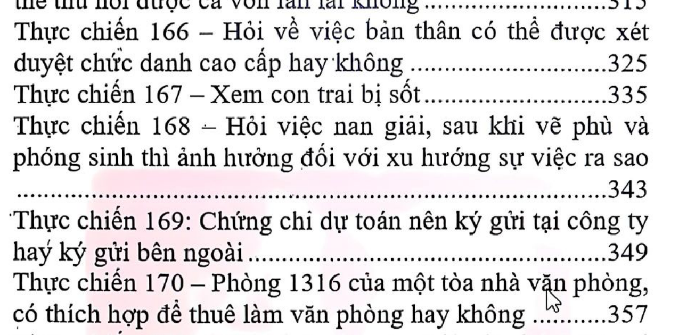
- **Cấu trúc Quẻ Dịch:**
  - **Quẻ chủ:** **Lôi Sơn Tiểu Quá** (Du hồn - Cung Đoài) – Tượng quẻ: Vượt quá giới hạn, sai lầm nhỏ, bước vào vùng rủi ro, tâm ý bất an.
  - **Quẻ biến:** **Thiên Sơn Độn** (Cung Cấn) – Tượng quẻ: Thoái lui, trốn tránh, bảo toàn lực lượng, rút lui kịp thời để tránh tai họa.
- **Bảng chi tiết Lục hào:**

| Hào | Thế/Ứng | Lục thân (Chủ) | Can Chi | Biến động | Lục thân (Biến) | Can Chi (Biến) | Thần sát / Phục | Lục thú |
|:---:|:---:|:---|:---|:---:|:---|:---|:---|:---|
| 6 | | Phụ Mẫu | Tuất - Thổ | **X (Động)** | Phụ Mẫu | Tuất - Thổ | Thanh Long, Mưu tinh | Thanh Long |
| 5 | | Huynh Đệ | Thân - Kim | **X (Động)** | Huynh Đệ | Thân - Kim | Tuần không, Nguyệt kiến | Huyền Vũ |
| 4 | **Thế** | Quan Quỷ | Ngọ - Hỏa | tĩnh | Quan Quỷ | Ngọ - Hỏa | Lộc thần, Đào hoa (phục Tử Hợi Thủy) | Bạch Hổ |
| 3 | | Huynh Đệ | Thân - Kim | tĩnh | Huynh Đệ | Thân - Kim | Tuần không, Nguyệt kiến | Đằng Xà |
| 2 | | Quan Quỷ | Ngọ - Hỏa | tĩnh | Quan Quỷ | Ngọ - Hỏa | Lộc thần, Đào hoa (phục Tài Mão Mộc) | Câu Trần |
| 1 | **Ứng** | Phụ Mẫu | Thìn - Thổ | tĩnh | Phụ Mẫu | Thìn - Thổ | Thiên hỷ | Chu Tước |

### 3. Dụng thần & Loại quẻ

- **Phân loại quẻ:**
  - **Quẻ đầu tư tài chính rủi ro cao (P2P Lending):** Vấn đề tài chính trên không gian mạng kết hợp quẻ tâm thái ưu hoạn khi thị trường chung sụp đổ.
  - **Quẻ chỉ định chi chiêm đối chiếu song trùng:** Đối tượng được hỏi là một nền tảng cụ thể (“Đoàn cho vay trực tuyến”), hào Ứng làm tiêu điểm chỉ định.
  - **Quẻ ngoại quái phục ngâm:** Hai hào động ngoại quái (hào 5 và 6) động hóa chính mình, tượng trưng cho tiếng rên xiết đau khổ do tác động của ngoại cảnh vĩ mô.
- **Xác định Dụng thần:**
  - **Nền tảng đầu tư chỉ định (“Đoàn cho vay trực tuyến”):** Hào 1 **Phụ Mẫu Thìn Thổ** lâm Ứng.
  - **Tâm lý lo âu của đương số:** Hào 4 **Quan Quỷ Ngọ Hỏa** trì Thế mang Bạch Hổ, Lộc thần và Đào hoa (mạng Internet).
  - **Vốn và lãi ở tầng chi tiết:** Hào **Thê Tài Mão Mộc** phục tàng dưới hào 2 Quan Quỷ Ngọ Hỏa.
  - **Nguy cơ phá tài ngoại lai:** Cặp hào động ngoại quái **Phụ Mẫu Tuất Thổ** hóa Tuất Thổ và **Huynh Đệ Thân Kim** hóa Thân Kim.

### 4. Luận giải chi tiết

#### 1. Ngoại quái phục ngâm và Bối cảnh sụp đổ P2P
- Ngoại quái Chấn biến Càn tạo thành cách cục **Ngoại quái phục ngâm** (hào 6 Tuất Thổ hóa Tuất Thổ, hào 5 Thân Kim hóa Thân Kim).
- Phục ngâm chủ rên xiết, đau đớn, nghẹn ngào. Nội phục ngâm là đau đớn tự thân, Ngoại phục ngâm là sóng gió từ môi trường bên ngoài giáng xuống. Điều này phản ánh hoàn hảo cơn bão sụp đổ hàng loạt của các sàn P2P trên cả nước đang gây chấn động tâm lý toàn xã hội.
- Trên quẻ không lộ diện Thê Tài, Tài hào Mão Mộc lại lâm Tuyệt địa ở Nguyệt lệnh Thân Kim. Những dấu hiệu này khiến người học thông thường dễ kết luận vội vàng rằng tiền bạc đã tan thành mây khói.

#### 2. Cơ chế phân tách cặp Thế Ứng và cặp Động hào (Kỹ thuật so sánh chỉ định)
- Chu Thần Bân giải mã cấu trúc thông tin phi thường của quẻ tượng:
  - **Trục sự việc được chỉ định:** Đương số hỏi đích danh ứng dụng “Đoàn cho vay trực tuyến”. Hào Ứng Phụ Mẫu Thìn Thổ là sàn giao dịch được chỉ định, đối ứng với hào Thế Quan Quỷ Ngọ Hỏa.
  - Điều kỳ diệu là: **Cả hào Thế và hào Ứng đều hoàn toàn TĨNH, không hề phát động hung triệu!** Điều này chứng minh ứng dụng được chỉ định hiện tại vẫn vận hành bình thường, chưa xảy ra biến cố sập sàn, nguy cơ mất tiền trước mắt chưa thành hình.
  - **Trục động triệu ngoại lai:** Cặp hào động nằm ở hào 5 (Huynh Đệ Thân Kim) và hào 6 (Phụ Mẫu Tuất Thổ). Đây là một cặp Phụ Mẫu - Huynh Đệ đối ứng song song với cặp Thế Ứng bên dưới:
    - Phụ Mẫu Tuất Thổ đối ứng với Phụ Mẫu Thìn Thổ (hai thời điểm hoặc hai nền tảng đầu tư khác nhau).
    - Huynh Đệ Thân Kim phát động chủ về phá tài, hao tổn vốn liếng.

#### 3. Quy tắc "Bỏ nhẹ giữ nặng" và Thông tin cảnh báo tương lai
- **Quẻ Dịch bỏ cái không rủi ro, chỉ ra cái có rủi ro:**
  - Đối với khoản đầu tư hiện tại ở “Đoàn cho vay trực tuyến”, quẻ khẳng định không có vấn đề gì, sẽ thu hồi an toàn.
  - Nhưng quẻ không dừng lại ở đó. Nó nhìn thấy lòng tham của đương số: Nếu thu hồi được vốn lãi lần này một cách dễ dàng, người này rất có thể sẽ tiếp tục dốc vốn vào các sàn P2P khác hoặc tái đầu tư lần tiếp theo.
  - Huynh Đệ Thân Kim lâm Nguyệt kiến (quá khứ đã từng chơi), lâm Tuần không (tương lai sắp sửa tái diễn).
  - Phụ Mẫu Tuất Thổ là lần đầu tư kế tiếp. Nếu đương số tiếp tục chơi ở lần sau (hoặc tham gia các nền tảng lãi suất cao khác), chắc chắn sẽ dính trọn bẫy phá tài (Huynh Đệ Thân Kim phát động).

#### 4. Quẻ biến Thiên Sơn Độn – Tối thượng sách: Rút lui trốn chạy
- Quẻ chủ **Lôi Sơn Tiểu Quá**: Sai sót nhỏ, mạo hiểm chút ít, vẫn còn trong tầm kiểm soát có thể cứu vãn.
- Quẻ biến **Thiên Sơn Độn**: Độn là thoái lui, chạy trốn, dứt khoát rút lui khỏi cuộc chơi nguy hiểm.
- Đây là lời cảnh báo thiện ý tối thượng của quẻ Dịch: Sau khi thu hồi được toàn bộ vốn lẫn lãi của khoản này, phải lập tức "Độn" – rút toàn bộ tiền về tài khoản ngân hàng, chấm dứt vĩnh viễn việc đầu tư tài chính online P2P, nếu không thì tai họa mất trắng ở lần sau là điều không thể tránh khỏi.

### 5. Kết luận & Ứng kỳ thực tế

- **Lời kết luận của Chu Thần Bân:**
  - Khẳng định khoản đầu tư vào “Đoàn cho vay trực tuyến” lần này an toàn tuyệt đối, sẽ thu hồi trọn vẹn cả vốn lẫn lãi.
  - Đưa ra lời cảnh báo sinh tử: Ngay khi nhận lại tiền, phải lập tức dừng ngay mọi hoạt động đầu tư tài chính qua mạng, tuyệt đối không được tham lam tái đầu tư hoặc rót vốn vào các dự án P2P khác kẻo chuốc lấy cảnh trắng tay.
- **Phản hồi thực tế từ đương số (Feedback):**
  - Người hỏi vô cùng bất ngờ trước nhận định này. Đúng **1 tháng sau**, vào ngày **Thân kim điền không** (khi hào Huynh Đệ Thân Kim mãn tuần không), toàn bộ tiền gốc và lãi từ ứng dụng “Đoàn cho vay trực tuyến” đã được giải ngân về tài khoản ngân hàng đầy đủ không thiếu một xu.
  - Nghe theo lời khuyên của Chu Thần Bân, đương số đã rút sạch toàn bộ vốn liếng, không bao giờ tham gia P2P nữa.
  - Về sau, đến tháng 3 năm 2019, nền tảng “Đoàn cho vay trực tuyến” (Tuandai) chính thức bị cơ quan công an Đông Quản khởi tố điều tra vì tội huy động vốn trái phép, toàn bộ sàn bị đóng băng, hàng trăm nghìn nhà đầu tư mất trắng hàng chục tỷ nhân dân tệ. Nhờ quẻ Độn chỉ đường, đương số đã thoát nạn trong gang tấc!
- **Ứng kỳ chiêm nghiệm:**
  - Ứng nghiệm thu hồi tiền vào ngày Thân kim xuất không điền thực (tháng Thân ngày Thân).

### 6. Bài học tâm pháp & Quy tắc cốt lõi

- **Quy tắc trích dẫn từ Cổ Thệ Chân Thuyên:**
  - *Quy tắc đầu tư tài chính P2P qua mạng: Hào Tài lâm Tuyệt địa, quẻ Tiểu Quá biến Độn báo trước nguy cơ thất thoát toàn bộ vốn* (trang 293).
- **Tâm pháp giải đoán thực tế:**
  1. **Kỹ thuật phân tách đối tượng trong Quẻ chỉ định:** Khi hỏi về một dự án cụ thể, hào Ứng là đối tượng chỉ định. Nếu Thế Ứng tĩnh lặng mà hào động phát sinh ở các vị trí đối ứng khác, phải hiểu rằng sự việc hiện tại an toàn, quẻ đang cảnh báo rủi ro ở các dự án khác hoặc lần đầu tư tiếp theo.
  2. **Nguyên lý "Bỏ nhẹ lấy nặng" trong tài chính:** Quẻ Dịch không chỉ trả lời câu hỏi thiển cận trước mắt mà nhìn thấu chuỗi hành vi của đương số; tự động phát tín hiệu cảnh báo tại điểm nghẽn nguy hiểm nhất trong tương lai.
  3. **Tâm pháp giải mã quẻ Độn:** Trong đầu tư tài chính mạo hiểm, xuất hiện quẻ Độn là mệnh lệnh rút quân khẩn cấp; "tam thập lục kế, tẩu vi thượng sách", giữ được tiền về tay là phải lập tức rời bỏ thị trường.
  4. **Giải mã Huynh Đệ lâm Nguyệt kiến và Tuần không:** Lâm Nguyệt kiến là thói quen đầu tư trong quá khứ, lâm Tuần không là hành vi sắp sửa tái diễn trong tương lai dẫn đến nguy cơ phá tài.

## THỰC CHIẾN 166: HỎI VỀ VIỆC BẢN THÂN CÓ THỂ ĐƯỢC XÉT DUYỆT CHỨC DANH CAO CẤP HAY KHÔNG

### 1. Bối cảnh & Câu hỏi

- **Bối cảnh chi tiết:**
  - Một giảng viên đại học trẻ tuổi, tài năng tìm đến thỉnh giáo Chu Thần Bân để hỏi về việc xét duyệt chức danh nghề nghiệp chuyên môn cao cấp (Phó giáo sư / Giáo sư) trong đợt bình xét của nhà trường.
  - Về các tiêu chí phần cứng quy định: Giảng viên này sở hữu hồ sơ vô cùng hoàn hảo và nổi bật: công trình nghiên cứu khoa học xuất sắc, giờ giảng vượt định mức, uy tín giảng dạy cao, lại vừa vinh dự được nhà trường tuyển chọn vào danh sách cử đi nước ngoài đào tạo nâng cao trình độ.
  - Do các tiêu chuẩn định lượng đều đạt mức tối đa, bản thân người này tin chắc rằng đợt xét duyệt lần này chỉ là thủ tục hành chính hình thức, nắm chắc phần thắng trong tay. Tuy nhiên, trước ngày hội đồng bỏ phiếu, anh ta vẫn gieo một quẻ Dịch để xác nhận lại.
- **Tâm lý & Câu hỏi ẩn ý:**
  - Tâm lý tự tin nắm chắc phần thắng ("đại xác suất thành công"); gieo quẻ chỉ xuất phát từ một chút băn khoăn vu vơ về nguy cơ xuất hiện sự cố hy hữu ("tiểu xác suất thất bại").
- **Thời gian chiêm đoán:**
  - Dương lịch: Ngày 8 tháng 9 năm 2018.
  - Giờ Bắc Kinh: 08:27 (Giờ Bính Thìn).
  - Can chi: Năm Mậu Tuất, tháng Tân Dậu, ngày Quý Mão, giờ Bính Thìn.

### 2. Dữ kiện & Bảng quẻ Crop

- **Thời không chiêm nghiệm:**
  - Tháng Tân Dậu (Kim vượng, Thủy tướng, Thổ hưu, Hỏa tử, Mộc tuyệt).
  - Ngày Quý Mão (Mộc vượng, Hỏa tướng, Thủy hưu, Kim thai, Thổ tử).
  - Tuần không: **Thìn - Tị** (Giáp Ngọ tuần trung, Thìn Tị không vong).
- **Thần sát:**
  - Tướng tinh: Mão (Lâm Nhật kiến)
  - Hoa cái: Mùi (Lâm hào Ứng)
  - Dịch mã: Tị (Lâm Tuần không)
  - Tai sát: Dậu (Lâm Nguyệt kiến, hào 5)
  - Mưu tinh: Sửu
  - Đào hoa: Tý (Lâm hào 1)
  - Kiếp sát: Thân
  - Lộc thần: Tị (Lâm Tuần không)
  - Dương nhẫn: Hợi (Lâm hào 4)
  - Văn xương: Mão (Lâm Nhật kiến)
  - Thiên y: Thân
  - Thiên hỷ: Thìn (Lâm Tuần không, hào Thế)
  - Quý nhân: Mão, Tị (Lâm Nhật kiến và Tuần không)
- Dữ kiện bảng quẻ và các thông số chiêm đoán:
  - **Bảng 166.1** Đồ hình quẻ Thực chiến 166:
    
- **Cấu trúc Quẻ Dịch:**
  - **Quẻ chủ:** **Trạch Lôi Tùy** (Quẻ tĩnh - Quy hồn - Cung Chấn) – Tượng quẻ: Tùy thuận, bị động, thuận theo sự sắp đặt của người khác, đánh mất quyền chủ động định đoạt.
  - **Quẻ biến:** Quẻ tĩnh không có hào minh động, giữ nguyên thể Trạch Lôi Tùy.
- **Bảng chi tiết Lục hào:**

| Hào | Thế/Ứng | Lục thân (Chủ) | Can Chi | Biến động | Lục thân (Biến) | Can Chi (Biến) | Thần sát / Phục | Lục thú |
|:---:|:---:|:---|:---|:---:|:---|:---|:---|:---|
| 6 | **Ứng** | Thê Tài | Mùi - Thổ | tĩnh | Thê Tài | Mùi - Thổ | Hoa cái, Bạch Hổ | Bạch Hổ |
| 5 | | Quan Quỷ | Dậu - Kim | tĩnh (Ám động) | Quan Quỷ | Dậu - Kim | Nguyệt kiến, Tai sát | Đằng Xà |
| 4 | | Phụ Mẫu | Hợi - Thủy | tĩnh | Phụ Mẫu | Hợi - Thủy | Dương nhẫn (phục Tử Ngọ Hỏa) | Câu Trần |
| 3 | **Thế** | Thê Tài | Thìn - Thổ | tĩnh | Thê Tài | Thìn - Thổ | Tuần không, Thiên hỷ | Chu Tước |
| 2 | | Huynh Đệ | Dần - Mộc | tĩnh | Huynh Đệ | Dần - Mộc | | Thanh Long |
| 1 | | Phụ Mẫu | Tý - Thủy | tĩnh | Phụ Mẫu | Tý - Thủy | Đào hoa | Huyền Vũ |

### 3. Dụng thần & Loại quẻ

- **Phân loại quẻ:**
  - **Quẻ xét duyệt chức danh học thuật:** Khác với thi cử lấy bằng làm quan thời xưa (Quan Quỷ làm Dụng), chức danh nghề nghiệp hiện đại mang tính tư cách, chứng nhận học thuật nên lấy hào **Phụ Mẫu** làm Dụng thần.
  - **Quẻ tâm thái: Việc đại xác suất lo ngại tiểu xác suất:** Đương số nắm ưu thế áp đảo, tâm lý cho rằng đỗ là tất yếu, quẻ phản ánh góc khuất của sự lo ngại ngầm.
  - **Quẻ tĩnh xét sinh khắc và đối sánh Thế Ứng:** Khảo sát sự tương tác ngầm giữa Ám động của hội đồng và sự cạnh tranh nhân sự giữa hào Thế và hào Ứng.
- **Xác định Dụng thần:**
  - **Dụng thần chức danh cao cấp:** Hào 4 **Phụ Mẫu Hợi Thủy** (nằm tại gian hào, mang Dương Nhẫn).
  - **Hội đồng xét duyệt cấp trên:** Hào 5 **Quan Quỷ Dậu Kim** lâm Nguyệt kiến, đắc Nhật xung thành Ám động.
  - **Kỵ thần cản trở chức danh:** Hào **Thê Tài Thìn Thổ** (Thổ khắc Thủy) lâm hào Thế.
  - **Đối thủ cạnh tranh ngầm:** Hào 6 **Thê Tài Mùi Thổ** lâm Ứng mang Bạch Hổ.

### 4. Luận giải chi tiết

#### 1. Cạm bẫy ảo giác "Dụng vượng Thế hưng"
- **Góc nhìn máy móc nông cạn:**
  - Hào 5 Quan Quỷ Dậu Kim lâm Nguyệt kiến, bị Nhật thần Mão Mộc xung thành Ám động sinh cho Dụng thần Phụ Mẫu Hợi Thủy (Dụng thần vượng tướng).
  - Hào Thế Thê Tài Thìn Thổ được Nguyệt kiến Dậu Kim tương hợp sinh phù.
  - Người học thiếu kinh nghiệm sẽ vội vàng phán: "Dụng vượng Thế hưng, chắc chắn được phong hàm chức danh cao cấp".
- **Chu Thần Bân chỉ ra sự thật phũ phàng:**
  - Nếu chỉ nhìn vào công thức mà không xét bối cảnh xã hội và tâm thái thực tế thì chắc chắn đoán sai.
  - Trong quẻ sự vụ: **Kỵ thần Thê Tài trì Thế** (Thìn Thổ khắc Hợi Thủy). Một khi Kỵ thần đã ngự trị tại bản thân mình (hào Thế), đó là dấu hiệu của sự tự triệt tiêu thành quả, việc cầu danh tất bại.

#### 2. Cơ chế "Việc đại xác suất gặp Quan Quỷ ám động"
- Khi một sự việc mà bản thân người hỏi nắm chắc 99% phần thắng (điều kiện phần cứng hoàn hảo) mà xuất hiện **Quan Quỷ ám động** (Dậu Kim bị ngày Mão xung), thì Quan Quỷ lập tức biến thành **mầm mống rắc rối và biến cố bất ngờ**.
- Quan Quỷ lâm Nguyệt kiến đại diện cho hội đồng xét duyệt cấp trên, cho ban lãnh đạo ra quyết định. Ám động cho thấy hội đồng đang có những toan tính, điều chỉnh ngầm ngoài tầm kiểm soát của đương số.

#### 3. Bóc tách "Quy luật chia bánh" và Đối thủ Bạch Hổ thâm niên
- **Yếu tố con người trong xét duyệt chức danh:**
  - Chu Thần Bân phân tích sâu sắc tâm lý học tổ chức: Việc xét duyệt chức danh ở các trường đại học không thuần túy là cuộc thi đếm điểm phần cứng, mà là bài toán cân bằng lợi ích chính trị và quan hệ nhân sự nội bộ.
  - Đương số còn trẻ nhưng đã được chọn đi nước ngoài bồi dưỡng – đây là một "miếng bánh" phúc lợi rất lớn mà cả trường chỉ có vài suất. Trong mắt hội đồng, người trẻ đã hưởng quyền lợi đi nước ngoài thì không thể thâu tóm nốt cả suất chức danh cao cấp đợt này.
- **Đối sánh Thế - Ứng vạch trần chân tướng:**
  - Hào Thế là Thê Tài Thìn Thổ (đương số - trẻ tuổi, lâm Chu Tước).
  - Hào Ứng là **Thê Tài Mùi Thổ** mang **Bạch Hổ**. Bạch Hổ chủ về sự già cả, người cũ, thâm niên lâu năm.
  - Hào Ứng Thê Tài Mùi Thổ đã ra tay "chiếm đoạt" mất suất chức danh của đương số. Hội đồng cấp trên đã quyết định dùng cơ chế "ưu tiên thâm niên" để trao chức danh cho một giảng viên lớn tuổi sắp về hưu, gạt bỏ hồ sơ của người trẻ.

#### 4. Ý nghĩa quẻ Trạch Lôi Tùy
- Tượng quẻ **Trạch Lôi Tùy**: "Tùy" nghĩa là tùy thuộc, thuận theo người khác.
- Quẻ báo trước đương số hoàn toàn bị động, quyền quyết định đã bị người khác nắm giữ, đành phải ngậm ngùi chấp nhận sự an bài bất công của tập thể.

### 5. Kết luận & Ứng kỳ thực tế

- **Lời kết luận của Chu Thần Bân:**
  - Khẳng định đợt xét duyệt chức danh này đương số sẽ **bị đánh trượt**, không được thông qua.
  - Nguyên nhân không phải do năng lực kém mà do hội đồng cơ cấu nhường suất cho người có thâm niên lớn tuổi hơn.
  - Chu Thần Bân an ủi: Đương số chuẩn bị ra nước ngoài học tập nâng cao, chuyến đi này có giá trị lâu dài cho sự nghiệp, việc trượt chức danh lần này không ảnh hưởng tiêu cực đến tiền đồ tương lai.
- **Phản hồi thực tế từ đương số (Feedback):**
  - Đúng như lời đoán, kết quả bỏ phiếu của hội đồng được công bố: Đương số chính thức **bị trượt chức danh cao cấp**.
  - Lý do hậu trường đúng như quẻ chỉ ra: Nhà trường đã ưu tiên phân bổ chỉ tiêu chức danh cho một phó giáo sư lớn tuổi chuẩn bị nghỉ hưu để ghi nhận cống hiến trọn đời, còn đương số được hứa hẹn sẽ xét duyệt ở các đợt tiếp theo sau khi hoàn thành khóa tu nghiệp ở nước ngoài trở về.
- **Ứng kỳ chiêm nghiệm:**
  - Kết quả công bố ngay trong tháng Tân Dậu, ứng nghiệm chuẩn xác vào kỳ họp hội đồng xét duyệt mùa thu năm 2018.

### 6. Bài học tâm pháp & Quy tắc cốt lõi

- **Quy tắc trích dẫn từ Cổ Thệ Chân Thuyên:**
  - *Quy tắc xét duyệt chức danh cao cấp trong quẻ tĩnh Trạch Lôi Tùy: Phụ Mẫu trì Thế đắc Nguyệt sinh và tương tác Thế Ứng thuận theo tự nhiên* (trang 303).
- **Tâm pháp giải đoán thực tế:**
  1. **Tâm pháp "Đọc thẳng vào lòng người":** Đỉnh cao của nghệ thuật bói dịch không phải là áp đặt công thức chết mà là thấu suốt bối cảnh xã hội, tâm lý đương số và các quy luật ngầm chi phối sự việc trong đời thực.
  2. **Nhận diện cạm bẫy Kỵ thần trì Thế:** Khi Phụ Mẫu là Dụng thần, việc Thê Tài trì Thế là dấu hiệu bản thân tự gặp lực cản nội tại, dù Dụng thần có vượng tướng qua Ám động thì cơ hội vẫn vụt khỏi tầm tay.
  3. **Tượng pháp Bạch Hổ đối chiếu tuổi tác:** Trong cạnh tranh chức danh, hào Ứng lâm Bạch Hổ đại diện cho yếu tố "thâm niên lâu năm", "người già lấn át người trẻ", phản ánh quy luật cân bằng lợi ích trong bộ máy hành chính.
  4. **Tư duy linh hoạt giữa Quẻ sự vụ và Quẻ tâm thái:** Nắm chắc mối quan hệ giữa biến số xác suất lớn và rủi ro xác suất nhỏ để không bị các hào ám động đánh lừa chiều hướng cát hung.

## THỰC CHIẾN 167: XEM CON TRAI BỊ SỐT

### 1. Bối cảnh & Câu hỏi

- **Bối cảnh chi tiết:**
  - Con trai nhỏ của một người đồng môn bất ngờ phát sốt cao, kèm theo triệu chứng mệt mỏi, khó chịu khiến người cha vô cùng lo lắng.
  - Trong lúc chăm sóc và theo dõi nhiệt độ của con tại nhà, người cha đã gieo một quẻ Dịch để chiêm đoán xem bệnh tình của cháu bé diễn tiến ra sao, khi nào thì hạ sốt và liệu có nguy hiểm gì tới sức khỏe hay không.
- **Tâm lý & Câu hỏi ẩn ý:**
  - Tâm lý sốt ruột, lo âu của cha mẹ khi con thơ phát bệnh đột ngột; mong muốn biết chính xác thời điểm hạ nhiệt và căn nguyên bệnh lý thực sự để có hướng chăm sóc đúng đắn.
- **Thời gian chiêm đoán:**
  - Dương lịch: Ngày 17 tháng 9 năm 2018.
  - Giờ Bắc Kinh: 11:48 (Giờ Bính Ngọ).
  - Can chi: Năm Mậu Tuất, tháng Tân Dậu, ngày Nhâm Tý, giờ Bính Ngọ.

### 2. Dữ kiện & Bảng quẻ Crop

- **Thời không chiêm nghiệm:**
  - Tháng Tân Dậu (Kim vượng, Thủy tướng, Thổ hưu, Hỏa tử, Mộc tuyệt).
  - Ngày Nhâm Tý (Thủy vượng, Kim tướng, Mộc hưu, Hỏa thai, Thổ tuyệt).
  - Tuần không: **Dần - Mão** (Giáp Thìn tuần trung, Dần Mão không vong).
- **Thần sát:**
  - Tướng tinh: Tý (Lâm Nhật kiến)
  - Hoa cái: Thìn (Lâm hào biến hào 2)
  - Dịch mã: Dần (Lâm Tuần không)
  - Tai sát: Ngọ (Lâm giờ Bính Ngọ)
  - Mưu tinh: Tuất
  - Đào hoa: Dậu (Lâm Nguyệt kiến, hào Thế)
  - Kiếp sát: Tị (Lâm hào 2)
  - Lộc thần: Hợi (Lâm hào 5)
  - Dương nhẫn: Tý (Lâm Nhật kiến)
  - Văn xương: Dần (Lâm Tuần không)
  - Thiên y: Thân
  - Thiên hỷ: Thìn (Lâm hào biến hào 2)
  - Quý nhân: Mão, Tị (Lâm hào 3 và hào 2)
- Dữ kiện bảng quẻ và các thông số chiêm đoán:
  - **Bảng 167.1** Đồ hình quẻ Thực chiến 167:
    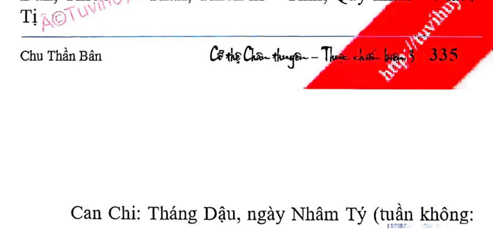
- **Cấu trúc Quẻ Dịch:**
  - **Quẻ chủ:** **Bát Thuần Khôn** (Lục xung - Cung Khôn) – Tượng quẻ: Bệnh mới phát gặp Lục xung chủ nhanh tan biến; bệnh thế cấp bách nhưng chóng hồi phục.
  - **Quẻ biến:** **Địa Thủy Sư** (Quy hồn - Cung Khảm) – Tượng quẻ: Truy cứu nguồn gốc, phân tích nguyên nhân sâu xa, nhắc nhở phòng ngừa chủ động.
- **Bảng chi tiết Lục hào:**

| Hào | Thế/Ứng | Lục thân (Chủ) | Can Chi | Biến động | Lục thân (Biến) | Can Chi (Biến) | Thần sát / Phục | Lục thú |
|:---:|:---:|:---|:---|:---:|:---|:---|:---|:---|
| 6 | **Thế** | Tử Tôn | Dậu - Kim | tĩnh | Tử Tôn | Dậu - Kim | Nguyệt kiến, Đào hoa, Bạch Hổ | Bạch Hổ |
| 5 | | Thê Tài | Hợi - Thủy | tĩnh | Thê Tài | Hợi - Thủy | Lộc thần | Đằng Xà |
| 4 | | Huynh Đệ | Sửu - Thổ | tĩnh | Huynh Đệ | Sửu - Thổ | | Câu Trần |
| 3 | **Ứng** | Quan Quỷ | Mão - Mộc | tĩnh | Phụ Mẫu | Ngọ - Hỏa | Tuần không, Nguyệt phá, Quý nhân | Chu Tước |
| 2 | | Phụ Mẫu | Tị - Hỏa | **X (Động)** | Huynh Đệ | Thìn - Thổ | Kiếp sát, Quý nhân | Thanh Long |
| 1 | | Huynh Đệ | Mùi - Thổ | tĩnh | Quan Quỷ | Dần - Mộc | | Huyền Vũ |

### 3. Dụng thần & Loại quẻ

- **Phân loại quẻ:**
  - **Quẻ y bói (Chiêm tật bệnh trẻ nhỏ):** Vấn bệnh cho con cái, áp dụng triệt để nguyên lý "Cận bệnh phùng xung tắc dũ" của Dã Hạc.
  - **Quẻ có hiệu lực theo lịch tháng (Nguyệt lịch hiệu lực quẻ):** Sự việc cấp tính diễn ra trong phạm vi ngắn ngày của tháng Dậu, Dụng thần đắc lệnh tháng chi phối toàn cục.
  - **Quẻ cảnh báo tạng phủ và thông tin phòng bệnh tương lai:** Quẻ không chỉ định tính hạ sốt mà vạch trần căn nguyên bệnh học tiềm ẩn trong hệ tiêu hóa của trẻ.
- **Xác định Dụng thần:**
  - **Dụng thần đứa con trai:** Hào 6 **Tử Tôn Dậu Kim** trì Thế, đắc Nguyệt kiến cực vượng, lâm Bạch Hổ (trạng thái đang phát bệnh sốt).
  - **Kỵ thần gây bệnh:** Hào 2 **Phụ Mẫu Tị Hỏa** độc phát hóa Huynh Đệ Thìn Thổ.
  - **Bệnh căn viêm nhiễm:** Hào 3 **Quan Quỷ Mão Mộc** lâm Chu Tước, Nguyệt phá và Tuần không.

### 4. Luận giải chi tiết

#### 1. Định tính cát hung: "Lục xung cận bệnh tức dũ" và Quẻ hiệu lực theo tháng
- **Nguyên lý cận bệnh gặp Lục xung:**
  - Quẻ chủ **Bát Thuần Khôn** là quẻ thuần âm Lục xung. Cổ pháp Dã Hạc định chế: *"Bệnh mới phát gặp quẻ Lục xung thì nhanh khỏi"*, do xung khí làm giải tán uất nhiệt, tà khí tiêu tan thần tốc.
- **Dụng thần đắc Nguyệt kiến – Quẻ hiệu lực theo tháng:**
  - Tử Tôn Dậu Kim trì Thế lâm chính Nguyệt kiến tháng Tân Dậu, nguyên khí sung mãn đến cực điểm.
  - Cơn sốt của trẻ nhỏ là việc cấp tính trong vài ngày, chắc chắn kết thúc ngay trong tháng Dậu. Với sức mạnh của Nguyệt kiến lâm Dụng thần, Tử Tôn Dậu Kim không hề sợ hãi sự khắc phạt từ hào 2 Phụ Mẫu Tị Hỏa.
  - Đến các ngày Hợi (Thủy khắc phá Tị Hỏa) hoặc ngày Tuất (xung phá Thìn Thổ) thì hỏa nhiệt bị dập tắt, cơn sốt sẽ hoàn toàn lui hẳn sau 2 - 3 ngày.

#### 2. Chẩn đoán bệnh lý tạng phủ qua Tượng quẻ và Lục thú
- Chu Thần Bân khai thác sâu sắc các chi tiết dịch lý để tìm ra căn nguyên sinh bệnh:
  - **Bệnh lý "Nội nhiệt ngoại hàn" (Cảm phong nhiệt trên nền thấp nhiệt tiêu hóa):**
    - Hào 2 Phụ Mẫu Tị Hỏa lâm **Thanh Long**: Hào 2 là vị trí ruột, hệ tiêu hóa; Tị Hỏa chủ tiểu trường; Thanh Long chủ tuần hoàn dinh dưỡng ăn uống.
    - Tị Hỏa động hóa **Huynh Đệ Thìn Thổ**: Thìn là thủy khố (kho chứa nước, khoang rỗng chứa dịch), tượng trưng cho cấu trúc ống ruột của đại tràng và tiểu tràng. Tị Hỏa kết hợp Thìn Thổ chỉ rõ chứng **thấp nhiệt tích tụ ở đường tiêu hóa**.
    - Tị Hỏa là đất trường sinh của Kim, lại mang Lộc thần ngoại quái: Chứng thấp nhiệt đường ruột này đã tích tụ từ lâu ngày do thói quen ăn uống đồ ngọt, đồ béo hoặc ăn uống thất thường.
  - **Tác nhân ngoại cảm xâm nhập:**
    - Hào 5 Thê Tài Hợi Thủy mang Lộc thần ở ngoại quái biểu thị việc trẻ ăn phải đồ lạnh gây nhiễm lạnh từ bên ngoài (ngoại hàn).
    - Sự mất cân bằng "trong nhiệt ngoài hàn" khiến sức đề kháng suy giảm, tạo cơ hội cho vi khuẩn/virus cảm mạo thừa cơ xâm nhập đường hô hấp.
  - **Triệu chứng ho và viêm:**
    - Hào Thế Tử Tôn Dậu Kim lâm **Bạch Hổ**: Hành Kim chủ thanh âm, phế khí; Bạch Hổ chủ ho khan, thở dốc, tiếng gầm. Đây là hình tượng đứa trẻ bị **ho và viêm đường hô hấp**.
    - Quan Quỷ Mão Mộc mang **Chu Tước**: Chu Tước chủ viêm đỏ, sốt cao; Mão Mộc lâm Nguyệt phá cho thấy tình trạng viêm nhiễm cấp tính đang diễn ra nhưng căn cơ nông, dễ khống chế.

#### 3. Quẻ biến Địa Thủy Sư – Cảnh báo phòng bệnh chủ động
- Quẻ biến **Địa Thủy Sư**: "Sư" mang hàm nghĩa xuất quân truy cứu, tìm kiếm căn nguyên gốc rễ.
- **Lời cảnh báo tương lai từ động biến mang hợp:**
  - Hào 2 Phụ Mẫu Tị Hỏa hóa Huynh Đệ Thìn Thổ tuy là hào động bình thường nhưng tiềm ẩn tính chất tương lai qua thế tương hợp (Thìn Dậu hợp).
  - Quẻ Dịch đưa ra lời chỉ dẫn chiến lược: Việc hạ sốt chỉ là giải quyết phần ngọn trước mắt. Cha mẹ phải **chủ động truy cứu** và triệt để điều chỉnh lại chế độ ăn uống, thanh nhiệt đường ruột cho trẻ. Nếu thấy hạ sốt mà chủ quan bỏ mặc thì trong tương lai gần, chứng thấp nhiệt tiêu hóa sẽ tiếp tục tái phát biến chứng thành bệnh phức tạp hơn, lúc đó gia đình sẽ rơi vào thế **bị động** phải đưa con vào bệnh viện để bác sĩ truy cứu bệnh án.

### 5. Kết luận & Ứng kỳ thực tế

- **Lời giải đoán của Chu Thần Bân:**
  - Khẳng định cháu bé không có gì nguy hiểm, bệnh tình là cảm mạo phong nhiệt do thấp nhiệt đường tiêu hóa kết hợp nhiễm lạnh gây sốt và ho.
  - Cơn sốt sẽ lui hẳn sau 2 đến 3 ngày (khi bước sang ngày Hợi hoặc Tuất).
  - Nhắc nhở người cha sau khi con hết sốt phải chú trọng thanh lọc tiêu hóa, kiêng đồ ăn cay nóng, dầu mỡ và đồ lạnh để chặn đứng nguy cơ tái phát.
- **Phản hồi thực tế từ đương số (Feedback):**
  - Cháu bé được đưa đi khám bác sĩ nhi khoa, chẩn đoán đúng là bị sốt do viêm đường hô hấp trên trên nền rối loạn tiêu hóa nhẹ, có kèm theo ho đúng như Chu Thần Bân miêu tả.
  - Sau đúng **2 ngày**, cháu bé đã hạ sốt hoàn toàn, thể trạng hồi phục vui chơi trở lại bình thường.
  - Người cha vô cùng khâm phục tài chẩn bệnh qua Lục Hào và lập tức điều chỉnh chế độ ăn uống thanh đạm cho con.
- **Ứng kỳ chiêm nghiệm:**
  - Ứng kỳ thoái nhiệt chuẩn xác trong vòng 2-3 ngày của tháng Tân Dậu, đúng chu kỳ "Lục xung cận bệnh tức dũ".

### 6. Bài học tâm pháp & Quy tắc cốt lõi

- **Quy tắc trích dẫn từ Cổ Thệ Chân Thuyên:**
  - *Quy tắc trị liệu bệnh sốt trẻ nhỏ: 'Lục xung cận bệnh tức dũ' và hào Tử Tôn lâm Nguyệt phá định vị thời điểm thoái nhiệt* (trang 313).
- **Tâm pháp giải đoán thực tế:**
  1. **Quy tắc "Cận bệnh phùng xung tắc dũ":** Khi chiêm bệnh mới phát sinh, gặp quẻ Lục xung là điềm đại cát báo bệnh tật tiêu tán mau chóng, không nên quá lo sợ trước các hào động hình khắc.
  2. **Tâm pháp Quẻ hiệu lực theo tháng:** Khi Dụng thần nắm lệnh tháng và sự việc mang tính chất ngắn hạn, Dụng thần đắc vượng khí tuyệt đối của Nguyệt kiến sẽ miễn nhiễm trước sự công phá của Kỵ thần độc phát.
  3. **Y lý Lục Hào trong chẩn đoán tạng phủ:** Kết hợp hào vị (hào 2 là ruột), ngũ hành hào động (Tị Hỏa là nhiệt), biến hào (Thìn Thổ là kho chứa nước) và lục thú (Thanh Long) để truy vết chính xác cơ chế bệnh sinh "nội nhiệt ngoại cảm, thấp nhiệt đường ruột".
  4. **Tư duy chủ động vs bị động qua quẻ Sư:** Phân biệt ý nghĩa quẻ biến để hướng dẫn đương số hành động phòng ngừa từ sớm, biến quẻ Dịch thành công cụ bảo vệ sức khỏe thiết thực.

## THỰC CHIẾN 168: HỎI VIỆC NAN GIẢI, SAU KHI VẼ PHÙ VÀ PHÓNG SINH THÌ ẢNH HƯỞNG ĐỐI VỚI XU HƯỚNG SỰ VIỆC RA SAO

### 1. Bối cảnh & Câu hỏi

- **Bối cảnh chi tiết:**
  - Một người đồng môn vướng vào một vụ việc vô cùng nan giải, rắc rối đã phát sinh thành sự thật khách quan và bắt đầu gây ra những hệ lụy tiêu cực đè nặng lên cuộc sống.
  - Ở bình diện thực tế, mọi phương án xử lý thông thường đều đã đi vào ngõ cụt; đương số không còn bất kỳ không gian hay đòn bẩy hành chính/quan hệ nào để can thiệp xoay chuyển cục diện, gần như chỉ còn biết phó mặc cho số phận định đoạt.
  - Trong tình cảnh bế tắc cùng cực, người này đã tìm đến các phương pháp tâm linh truyền thống của văn hóa Á Đông: nhờ đạo sĩ vẽ phù chú giải ách, thành tâm lễ Phật sám hối và tiến hành đại lễ phóng sinh (chọn các loài thủy tộc phù hợp với tượng quẻ để phóng thích cứu mạng).
  - Sau khi hoàn thành trọn vẹn các nghi thức vẽ phù và phóng sinh, người này đã gieo một quẻ Dịch để thỉnh vấn: Liệu những nỗ lực tâm linh phi thực tế đó có thực sự tạo ra tác động tích cực nào giúp xoay chuyển quỹ đạo của vụ việc nan giải này hay không.
- **Tâm lý & Câu hỏi ẩn ý:**
  - Tâm lý hoang mang xen lẫn hy vọng mong manh: Liệu pháp thuật tâm linh, phúc đức phóng sinh có thực sự phát huy công năng nhiệm màu hay chỉ là sự an ủi tâm lý viển vông trước cơn bão tố cuộc đời.
- **Thời gian chiêm đoán:**
  - Dương lịch: Ngày 21 tháng 9 năm 2018.
  - Giờ Bắc Kinh: 13:20 (Giờ Ất Mùi).
  - Can chi: Năm Mậu Tuất, tháng Tân Dậu, ngày Bính Thìn, giờ Ất Mùi.

### 2. Dữ kiện & Bảng quẻ Crop

- **Thời không chiêm nghiệm:**
  - Tháng Tân Dậu (Kim vượng, Thủy tướng, Thổ hưu, Hỏa tử, Mộc tuyệt).
  - Ngày Bính Thìn (Thổ vượng, Kim tướng, Hỏa dư khí, Thủy khố, Mộc suy).
  - Tuần không: **Tý - Sửu** (Giáp Dần tuần trung, Tý Sửu không vong).
- **Thần sát:**
  - Tướng tinh: Tý (Lâm Tuần không, hào 6 và hào 1)
  - Hoa cái: Thìn (Lâm Nhật kiến, hào 3)
  - Dịch mã: Dần (Lâm hào Thế)
  - Tai sát: Ngọ
  - Mưu tinh: Tuất (Lâm hào Ứng)
  - Đào hoa: Dậu (Lâm Nguyệt kiến)
  - Kiếp sát: Tị (Lâm hào biến hào 1)
  - Lộc thần: Tị (Lâm hào biến hào 1)
  - Dương nhẫn: Ngọ (Lâm phục thần hào 3)
  - Văn xương: Thân (Lâm hào 4)
  - Thiên y: Thân (Lâm hào 4)
  - Thiên hỷ: Thìn (Lâm Nhật kiến, hào 3)
  - Quý nhân: Dậu, Hợi
- Dữ kiện bảng quẻ và các thông số chiêm đoán:
  - **Bảng 168.1** Đồ hình quẻ Thực chiến 168:
    
- **Cấu trúc Quẻ Dịch:**
  - **Quẻ chủ:** **Thủy Lôi Truân** (Cung Khảm) – Tượng quẻ: Gian nan lúc khởi đầu, sương mù dày đặc, vạn sự ngưng trệ, tụ tập rắc rối.
  - **Quẻ biến:** **Thủy Trạch Tiết** (Lục hợp - Cung Khảm) – Tượng quẻ: Tiết chế, kiềm tỏa, có chừng có mực, sự việc dần đi vào khuôn khổ kiểm soát.
- **Bảng chi tiết Lục hào:**

| Hào | Thế/Ứng | Lục thân (Chủ) | Can Chi | Biến động | Lục thân (Biến) | Can Chi (Biến) | Thần sát / Phục | Lục thú |
|:---:|:---:|:---|:---|:---:|:---|:---|:---|:---|
| 6 | | Huynh Đệ | Tý - Thủy | tĩnh | Huynh Đệ | Tý - Thủy | Tuần không, Tướng tinh | Thanh Long |
| 5 | **Ứng** | Quan Quỷ | Tuất - Thổ | tĩnh (Nhật phá) | Quan Quỷ | Tuất - Thổ | Mưu tinh, Nhật phá | Huyền Vũ |
| 4 | | Phụ Mẫu | Thân - Kim | tĩnh | Phụ Mẫu | Thân - Kim | Văn xương, Thiên y | Bạch Hổ |
| 3 | | Quan Quỷ | Thìn - Thổ | tĩnh | Quan Quỷ | Sửu - Thổ | Hoa cái, Thiên hỷ, Nhật kiến (phục Tài Ngọ Hỏa) | Đằng Xà |
| 2 | **Thế** | Tử Tôn | Dần - Mộc | **X (Động)** | Tử Tôn | Mão - Mộc | Dịch mã | Câu Trần |
| 1 | | Huynh Đệ | Tý - Thủy | tĩnh | Thê Tài | Tị - Hỏa | Tuần không, Kiếp sát, Lộc thần | Chu Tước |

### 3. Dụng thần & Loại quẻ

- **Phân loại quẻ:**
  - **Quẻ nghiệm chứng công hiệu của pháp thuật tâm linh (Vẽ phù, phóng sinh):** Thẩm định tác động thực tế của các giải pháp tôn giáo / phi thực tế đối với vận trình của một vụ việc bế tắc.
  - **Quẻ tâm thái kết hợp hóa giải tai ương:** Khảo sát sự triệt tiêu đối kháng giữa thần phúc đức (Tử Tôn) và thần tai họa (Quan Quỷ).
- **Xác định Dụng thần:**
  - **Dụng thần biện pháp hóa giải (Phù chú, phóng sinh):** Hào 2 **Tử Tôn Dần Mộc** trì Thế. Tử Tôn là phúc thần, tượng trưng cho y dược, công đức phóng sinh và pháp lực trừ tà.
  - **Thần tai họa / Rắc rối nan giải:** Hào 5 **Quan Quỷ Tuất Thổ** lâm Ứng mang Huyền Vũ.
  - **Cơ chế chuyển hóa công hiệu:** Động thái **Tiến thần** của Tử Tôn Dần Mộc hóa Mão Mộc đối kháng với trạng thái **Nhật phá** của Quan Quỷ Tuất Thổ.

### 4. Luận giải chi tiết

#### 1. Góc nhìn khoa học của Chu Thần Bân về "Biện pháp phi thực tế"
- Chu Thần Bân luận giải sâu sắc: Khi sự việc đã an bài trong thực tế và không còn đòn bẩy trần thế nào can thiệp được, con người tìm đến văn hóa truyền thống (vẽ phù, niệm Phật, bố thí, phóng sinh).
- Quẻ Dịch không thiên vị, không mê tín cũng không bài xích; nó phản ánh trung thực, khách quan năng lượng tương tác giữa hành vi của đương số và sự việc: Liệu biện pháp hóa giải có công hiệu không? Rắc rối có thu hẹp lại không?

#### 2. Tử Tôn hóa Tử Tôn (Tiến thần) – Bằng chứng công hiệu gia tăng
- **Động triệu độc nhất tại hào Thế:**
  - Hào 2 Tử Tôn Dần Mộc trì Thế phát động, hóa xuất **Tử Tôn Mão Mộc**.
  - Dần Mộc hóa Mão Mộc là **Tiến thần** kinh điển trong Lục Hào (*Tử Tôn hóa Tử Tôn*).
  - Phương pháp mà đương số dùng để tự cứu mình chính là tích đức phóng sinh và dùng phù chú (đều quy về thuộc tính Tử Tôn giải ách).
  - Hiện tượng Tử Tôn lâm Thế hóa Tiến thần khẳng định đanh thép: **Các biện pháp hóa giải mà đương số thực hiện đã kích hoạt năng lượng phúc đức cực mạnh, công hiệu ngày càng tăng tiến và phát huy tác dụng rõ rệt!**

#### 3. Cặp Lục thú Biểu - Lý và Hiện tượng Quan Quỷ bị "Nhật phá"
- **Cơ chế liên kết Biểu - Lý qua Câu Trần và Huyền Vũ:**
  - Hào Thế Tử Tôn mang **Câu Trần** (tượng bên ngoài, hữu hình – các nghi thức vẽ phù, nghi lễ phóng sinh cụ thể đã thực hiện).
  - Hào Ứng Quan Quỷ mang **Huyền Vũ** (tượng bên trong, vô hình – rắc rối ngầm, sự nan giải vô hình đang đe dọa đương số).
  - Hai hào lập thành cặp lục thú tương giao biểu - lý, chứng minh hành vi bên ngoài đã tác động trực tiếp vào bản chất bên trong của sự việc.
- **Đòn giáng quyết định: Quan Quỷ Tuất Thổ lâm Nhật phá:**
  - Hào 5 Quan Quỷ Tuất Thổ ở vào tháng Tân Dậu là hưu tù vô khí.
  - Ngày gieo quẻ là ngày Bính Thìn, Thìn Thổ trực tiếp xung Tuất Thổ (*Thìn Tuất tương xung*).
  - Theo luật Dịch: Hào hưu tù vô khí gặp Nhật thần xung khắc gọi là **Nhật phá**!
  - Quan Quỷ là đại diện cho rắc rối, hiểm họa. Khi Quan Quỷ bị Nhật phá, căn cơ của tai họa đã bị bẻ gãy hoàn toàn. Rắc rối bắt đầu tan rã, thu hẹp phạm vi ảnh hưởng và từng bước tiêu biến.

#### 4. Quẻ biến Thủy Trạch Tiết: Đi vào vòng cương tỏa
- Quẻ chủ Thủy Lôi Truân thể hiện sự khởi đầu ngột ngạt, bế tắc, đầy gian nan.
- Quẻ biến **Thủy Trạch Tiết**: "Tiết" là tiết chế, ước thúc, có chừng mực.
- Tuy quẻ biến thuộc Lục hợp báo hiệu hậu quả của sự việc vẫn cần thời gian để thu dọn hoàn toàn, nhưng quẻ Tiết khẳng định sự việc đã được kiềm tỏa trong tầm kiểm soát, không còn khả năng bùng phát gây hại cho đương số.

### 5. Kết luận & Ứng kỳ thực tế

- **Lời giải đoán của Chu Thần Bân:**
  - Khẳng định các biện pháp tâm linh (vẽ phù, phóng sinh) đã phát huy hiệu quả thực sự đối với xu hướng phát triển của sự việc.
  - Rắc rối nan giải đã bị phá vỡ căn cơ (Quan Quỷ Nhật phá), áp lực đang thu hẹp lại từng ngày; đương số sẽ từng bước thoát khỏi vòng xoáy hiểm nguy.
- **Phản hồi thực tế từ đương số (Feedback):**
  - Sau một thời gian ngắn kể từ buổi phóng sinh, tình hình căng thẳng của vụ việc bắt đầu hạ nhiệt bất ngờ.
  - Phía đối phương và các yếu tố gây cản trở dần rút lui hoặc mềm mỏng thỏa hiệp. Vụ việc nan giải từng bước được giải quyết trong êm đẹp mà không để lại hậu quả nghiêm trọng nào như lo sợ ban đầu.
- **Ứng kỳ chiêm nghiệm:**
  - Hiệu quả hóa giải ứng nghiệm tức thì ngay trong ngày Bính Thìn khi Quan Quỷ bị kích phá và Tử Tôn tiến thần nắm quyền.

### 6. Bài học tâm pháp & Quy tắc cốt lõi

- **Quy tắc trích dẫn từ Cổ Thệ Chân Thuyên:**
  - *Quy tắc nghiệm chứng biện pháp hóa giải tâm linh (vẽ phù, phóng sinh): Tử Tôn hóa Tử Tôn (Tiến thần) đối ứng Quan Quỷ bị Nhật phá* (trang 320).
- **Tâm pháp giải đoán thực tế:**
  1. **Quy tắc kiểm chứng biện pháp hóa giải qua Tiến thần:** Khi đương số áp dụng các biện pháp giải trừ tai ách (phóng sinh, y dược, phong thủy, phù chú), hào Tử Tôn trì Thế hóa Tiến thần là tín hiệu xác nhận tối cao cho thấy phương pháp đang phát huy tác dụng tích cực lũy tiến.
  2. **Ý nghĩa Nhật phá của Quan Quỷ trong hóa giải ưu hoạn:** Khác với việc xem cầu quan cầu tài (Quan Quỷ Nhật phá là hỏng), trong quẻ giải trừ rắc rối ưu hoạn thì Quan Quỷ bị Nhật phá là phúc lành lớn, chủ về tai họa bị triệt tiêu tận gốc rễ.
  3. **Phối hợp Lục thú Biểu - Lý (Câu Trần - Huyền Vũ):** Sử dụng cặp lục thú tương ứng để liên kết giữa hành động cứu giải cụ thể ở thế giới hữu hình với sự biến chuyển của mối nguy ngầm trong thế giới vô hình.
  4. **Thái độ khoa học đối với văn hóa tâm linh:** Dịch học dùng hệ thống quẻ tượng khách quan để lượng hóa và kiểm chứng hiệu quả của các nghi thức tâm linh, giúp đương số tránh rơi vào mê tín mù quáng hoặc hoài nghi cực đoan.

---

## THỰC CHIẾN 169: CHỨNG CHỈ DỰ TOÁN NÊN KÝ GỬI TẠI CÔNG TY HAY KÝ GỬI BÊN NGOÀI

---

### 1. Bối cảnh & Câu hỏi

- **Bối cảnh chi tiết:** 
  Một đồng môn sở hữu chứng chỉ dự toán công trình xây dựng. Trong ngành xây dựng và bất động sản, các doanh nghiệp bắt buộc phải có đủ số lượng chứng chỉ định mức và dự toán theo quy định pháp lý để duy trì tư cách pháp nhân hoạt động và tham gia đấu thầu. Nếu chứng chỉ ban đầu do chính công ty đứng tên làm thủ tục xin cấp, doanh nghiệp thường giữ chặt hồ sơ và không dễ dàng cho nhân viên rút ra ký gửi nơi khác. Tuy nhiên, một số loại chứng chỉ vẫn có thể đem ký gửi cho các đơn vị bên ngoài để hưởng mức thù lao hàng năm hấp dẫn hơn. Đương số đứng trước ngã rẽ lựa chọn phân vân giữa hai phương án.
- **Tâm lý & Câu hỏi ẩn ý:** 
  Đương số muốn biết: *"Chứng chỉ dự toán của mình nên ký gửi tại công ty hiện tại thì hợp, hay ký gửi cho công ty bên ngoài thì có lợi hơn?"* Tâm lý vừa muốn tối ưu hóa nguồn thu nhập bên ngoài, vừa e ngại các ràng buộc pháp lý và quy định khắt khe từ phía đơn vị chủ quản.
- **Thời gian chiêm đoán:**
  - Dương lịch: 18/09/2018, 06:40 sáng (Giờ Bắc Kinh).
  - Can chi: Năm Mậu Tuất, tháng Tân Dậu, ngày Quý Sửu, giờ Ất Mão.

---

### 2. Dữ kiện & Bảng quẻ Crop

- **Thời không chiêm nghiệm:**
  - Tháng Tân Dậu (Kim vượng, Thủy tướng, Mộc tù, Hỏa tử, Thổ hưu).
  - Ngày Quý Sửu (Thổ vượng, đới kim khố, dư khí Thủy).
  - Tuần không: **Dần - Mão** (Giáp Thìn tuần trung, Dần Mão không vong).
- **Thần sát:**
  - Tướng tinh: Dậu (Lâm Nguyệt kiến, hào 3 động)
  - Hoa cái: Sửu (Lâm Nhật kiến, hào sơ)
  - Dịch mã: Hợi (Lâm hào 2 Ứng Phụ Mẫu)
  - Tai sát: Mão (Lâm Tuần không, giờ chi)
  - Mưu tinh: Mùi
  - Đào hoa: Ngọ
  - Kiếp sát: Dần (Lâm Tuần không)
  - Lộc thần: Tý (Lâm hào 6 Phụ Mẫu)
  - Dương nhẫn: Hợi (Lâm hào 2 Ứng Phụ Mẫu)
  - Văn xương: Mão (Lâm Tuần không)
  - Thiên y: Thân (Lâm hào 4 Quan Quỷ)
  - Thiên hỷ: Thìn
  - Quý nhân: Mão, Tỵ

- Bảng quẻ tượng và dữ kiện chiêm đoán:
  - **Bảng 169.1** Đồ hình quẻ Thực chiến 169:
    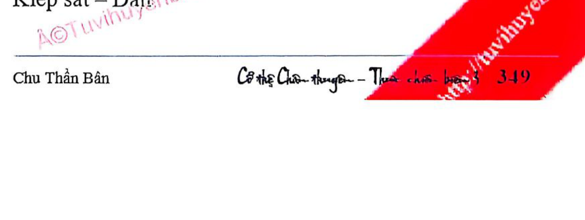

- **Cấu trúc Quẻ Dịch:**
  - **Quẻ chủ:** **Thủy Phong Tỉnh** (Cung Chấn)  
    *Tượng quẻ:* Trật tự ngăn nắp, khuôn phép quy củ giếng nước. Mang biểu tượng của sự trói buộc, giam giữ trong khuôn khổ nhất định, tự mình quy hoạch nhưng bị giới hạn không gian cựa quậy.
  - **Quẻ biến:** **Bát Thuần Khảm** (Cung Khảm – Quẻ Lục Xung)  
    *Tượng quẻ:* Hiểm trở trùng điệp, xung tán giải trừ. Trong quẻ lựa chọn việc ngắn hạn, biến Lục xung chỉ dấu sự việc có tính dứt khoát hoặc chỉ báo việc không nên cưỡng cầu thay đổi.

- **Bảng chi tiết Lục hào:**

| Hào | Thế/Ứng | Lục thân (Chủ) | Can Chi | Biến động | Lục thân (Biến) | Can Chi (Biến) | Thần sát / Phục | Lục thú |
|:---:|:---:|:---|:---|:---:|:---|:---|:---|:---|
| 6 | | Phụ Mẫu | Tý - Thủy | tĩnh | Phụ Mẫu | Tý - Thủy | Lộc thần | Bạch Hổ |
| 5 | **Thế** | Thê Tài | Tuất - Thổ | tĩnh | Thê Tài | Tuất - Thổ | Mưu tinh | Đằng Xà |
| 4 | | Quan Quỷ | Thân - Kim | tĩnh | Quan Quỷ | Thân - Kim | Thiên y, Phục Tử-Ngọ | Câu Trần |
| 3 | | Quan Quỷ | Dậu - Kim | **O (Động)** | Tử Tôn | Ngọ - Hỏa | Tướng tinh, Nguyệt kiến | Chu Tước |
| 2 | **Ứng** | Phụ Mẫu | Hợi - Thủy | tĩnh | Thê Tài | Thìn - Thổ | Dương nhẫn, Dịch mã, Phục Huynh-Dần | Thanh Long |
| 1 | | Thê Tài | Sửu - Thổ | tĩnh | Huynh Đệ | Dần - Mộc | Hoa cái, Nhật kiến | Huyền Vũ |

---

### 3. Dụng thần & Loại quẻ

- **Phân loại quẻ:**
  - **Quẻ lựa chọn (Đối chiếu hai phương án):** Bản chất quẻ là cân nhắc giữa hai đơn vị tiếp nhận chứng chỉ: ở lại công ty hiện tại hay chuyển dịch sang công ty bên ngoài.
  - **Đặc trưng Nội - Ngoại quái:** Nội quái đại diện cho đơn vị hiện tại, hoàn cảnh sở tại; Ngoại quái đại diện cho môi trường bên ngoài, việc chuyển dịch hoặc nhảy việc.
- **Xác định Dụng thần:**
  1. **Dụng thần cốt lõi (Phụ Mẫu Hợi Thủy):** Chứng chỉ dự toán là giấy tờ, văn bằng chuyên môn nên lấy hào Phụ Mẫu làm Dụng thần. Hào 2 Phụ Mẫu Hợi Thủy lâm Ứng mang **Dương nhẫn** chính là hiện thân chuẩn xác của chứng chỉ kỹ thuật chuyên ngành có giá trị pháp lý cao.
  2. **Nguyên thần đại diện đơn vị tiếp nhận (Quan Quỷ):** Quan Quỷ sinh Phụ Mẫu, tượng trưng cho cơ quan, công ty ký hợp đồng và nuôi dưỡng giá trị của chứng chỉ.
     - **Quan Quỷ Dậu Kim (Hào 3 nội quái):** Đại diện cho **công ty hiện tại** (thuộc nội quái sở tại).
     - **Quan Quỷ Thân Kim (Hào 4 ngoại quái):** Đại diện cho **công ty bên ngoài** (thuộc ngoại quái tha hương).
  3. **Kỵ thần cản trở (Tử Tôn Ngọ Hỏa):** Hào biến khắc hãm Quan Quỷ, cản trở nguồn sinh trợ chứng chỉ.

---

### 4. Luận giải chi tiết

Quẻ này là bài học kinh điển của Chu Thần Bân về phương pháp giải mã quẻ lựa chọn khi Dụng thần tĩnh nhưng Nguyên thần phát động:

#### 1. Định vị hai thực thể lựa chọn qua Nguyên thần
- Trong quẻ không có hai hào Phụ Mẫu đồng phát động để trực tiếp đối chiếu Dụng thần. Thay vào đó, hào **Quan Quỷ Dậu Kim** tại nội quái phát động.
- Quan Quỷ là nguồn sinh dưỡng cho Phụ Mẫu (chứng chỉ). Việc ký gửi ở đâu chính là lựa chọn nguồn cội nuôi dưỡng chứng chỉ.
- Phân định rõ ràng:
  - Quan Quỷ Dậu Kim nằm ở nội quái (hào 3) biểu thị công ty hiện tại.
  - Quan Quỷ Thân Kim nằm ở ngoại quái (hào 4) biểu thị công ty bên ngoài.
  - Quan Quỷ Thân Kim hoàn toàn tĩnh lặng, không có động hướng tiếp nhận hay tương tác với Dụng thần Phụ Mẫu Hợi Thủy. Ngược lại, Quan Quỷ Dậu Kim tại nội quái phát động mạnh mẽ, cho thấy công ty hiện tại chủ động can thiệp sâu sắc vào số phận của chứng chỉ.

#### 2. Nghịch lý giữa Hồi đầu khắc và Sức mạnh Nhật Nguyệt
- Hào 3 Quan Quỷ Dậu Kim động hóa **Tử Tôn Ngọ Hỏa** (hồi đầu khắc).
- **Xu hướng dài hạn:** Hào động hóa hồi đầu khắc biểu thị về lâu dài, công ty hiện tại sẽ không còn là nơi sinh dưỡng tốt cho chứng chỉ, lợi ích suy giảm, thậm chí gây bức bối chèn ép cho bản thân đương số.
- **Tác động ngắn hạn:** Quan Quỷ Dậu Kim lâm **Nguyệt kiến**, lại được Nhật thần Quý Sửu sinh trợ cực kỳ vượng tướng. Theo định luật cốt lõi của Lục Hào: *Hào lâm Nhật Nguyệt vượng tướng tột bậc thì không sợ hào biến hồi đầu khắc trong giai đoạn đương lệnh*. 
- Do đó trong thời gian ngắn trước mắt, Quan Quỷ Dậu Kim vẫn nắm trọn quyền năng sinh dưỡng Phụ Mẫu Hợi Thủy, tức là mối duyên ràng buộc giữa công ty hiện tại và chứng chỉ này đang ở trạng thái vô cùng chặt chẽ, không thể lay chuyển.

#### 3. Tượng quẻ Thủy Phong Tỉnh và bối cảnh thực tế
- Quẻ chủ **Thủy Phong Tỉnh** mang tượng giếng nước bị bó hẹp trong thành giếng, biểu thị sự trói buộc, hạn chế không gian dịch chuyển. Đương số như người bị khóa chân trong khuôn khổ quy chế của cơ quan.
- Kết hợp với việc công ty hiện tại (Dậu Kim) đắc lệnh nắm giữ quyền lực tuyệt đối, nếu đơn vị kiên quyết không trả chứng chỉ, đương số hoàn toàn không có cơ sở pháp lý hay vị thế để rút chứng chỉ ra ngoài.
- Dù đương số có mong muốn chủ quan chuyển ra ngoài (ngoại quái), nhưng hào ngoại Quan Quỷ Thân Kim không động, chứng chỉ không có cầu nối dịch chuyển sang bên ngoài.

---

### 5. Kết luận & Ứng kỳ thực tế

- **Lời giải đoán của Chu Thần Bân:**
  - Về mặt mong muốn cá nhân: Ký gửi ra bên ngoài về lâu dài là tốt hơn vì công ty hiện tại hóa hồi đầu khắc, tương lai đãi ngộ không còn duy trì.
  - Về mặt thực tế khách quan: Công ty hiện tại đắc Nguyệt kiến sinh trợ, có sức mạnh ràng buộc tuyệt đối. Quẻ Tỉnh cho thấy đương số bị trói buộc quy chế, công ty sẽ "giữ cứng" chứng chỉ không cho chuyển đi.
  - Kết luận: Không thể rút chứng chỉ ra ngoài, bắt buộc phải tiếp tục ký gửi tại công ty hiện tại trong giai đoạn này.
- **Phản hồi thực tế (Feedback):**
  - Đương số xác nhận công ty hiện tại kiên quyết từ chối cho rút chứng chỉ. Doanh nghiệp cần chứng chỉ dự toán này để đăng ký tư cách dự thầu và tham gia các kỳ thẩm định công trình trọng điểm.
  - Đương số hoàn toàn không thể làm thủ tục chuyển dịch, đành phải tiếp tục để chứng chỉ tại công ty sở tại đúng như quẻ đã báo trước.
- **Ứng kỳ chiêm nghiệm:** Sự việc ứng nghiệm tức thời ngay trong tháng Dậu - tháng Tuất khi khí Kim Thổ đương quyền, công ty thực thi quyền hạn giữ chứng chỉ.

---

### 6. Bài học tâm pháp & Quy tắc cốt lõi

- **Trích dẫn quy tắc sách (Rule Index):**
  - *Quy tắc so sánh quẻ lựa chọn qua tương quan nội ngoại quái và hào Phụ Mẫu lâm Dương Nhẫn* (Sách Cổ Thệ Chân Thuyên Thực Chiến Biên 3, trang 326).
- **Tâm pháp giải đoán thực tế:**
  1. **Phương pháp mượn Nguyên thần so sánh đối tượng:** Khi hỏi quẻ lựa chọn hai phương án mà Dụng thần không phân chia hai hào động, hãy quan sát các hào Nguyên thần. Nguyên thần chính là cội nguồn của phương án (giống như chọn bạn đời quan sát các hào sinh Dụng). Hào nội đại diện cho thực thể hiện tại, hào ngoại đại diện cho thực thể bên ngoài.
  2. **Biện chứng giữa Nhật Nguyệt vượng và Hào biến hồi đầu khắc:** Hào lâm Nhật Nguyệt đắc thế cực vượng thì tạm thời phong tỏa tác hại của hồi đầu khắc trong ngắn hạn. Người giải quẻ phải phân tách rành mạch: ngắn hạn do Nhật Nguyệt định đoạt, dài hạn do hào biến chi phối.
  3. **Kết hợp tượng quẻ với hoàn cảnh thể chế:** Tượng quẻ Tỉnh (trói buộc, giếng nước) kết hợp thực tế quản lý nhân sự cho thấy quy chế công ty có tính cưỡng chế, không thể chỉ nhìn vào ý muốn chủ quan của người gieo quẻ.

## THỰC CHIẾN 170: PHÒNG 1316 CỦA MỘT TÒA NHÀ VĂN PHÒNG, CÓ THÍCH HỢP ĐỂ THUÊ LÀM VĂN PHÒNG HAY KHÔNG

---

### 1. Bối cảnh & Câu hỏi

- **Bối cảnh chi tiết:** 
  Một đồng môn tại Sơn Đông đang tìm kiếm địa điểm mới để chuyển văn phòng làm việc. Văn phòng hiện tại của anh này vốn có trường khí phong thủy bất ổn, ẩm thấp u ám (tồn tại âm khí xấu) mà chính Chu Thần Bân trước đó đã từng đến khảo sát thực địa và chỉ ra. Do những ảnh hưởng tiêu cực từ nơi làm việc cũ, đương số rất sốt sắng tìm một địa điểm mới để thay đổi cục diện. Anh ta để mắt tới căn phòng số 1316 nằm trong một tòa cao ốc văn phòng hạng sang hỗn hợp (trong tòa nhà có cả khách sạn 5 sao cao cấp).
- **Tâm lý & Câu hỏi ẩn ý:** 
  Đương số gieo quẻ hỏi: *"Phòng 1316 của tòa nhà văn phòng này có thích hợp để thuê làm văn phòng hay không?"* Tâm lý đương số rất mong muốn chuyển đến nơi sang trọng này để rũ bỏ vận xui tại văn phòng cũ, nhưng cần sự thẩm định của Dịch học trước khi ký hợp đồng thuê dài hạn.
- **Thời gian chiêm đoán:**
  - Dương lịch: 27/09/2018, 15:38 (Giờ Bắc Kinh).
  - Can chi: Năm Mậu Tuất, tháng Tân Dậu, ngày Nhâm Tuất, giờ Mậu Thân.

---

### 2. Dữ kiện & Bảng quẻ Crop

- **Thời không chiêm nghiệm:**
  - Tháng Tân Dậu (Kim vượng, Thủy tướng, Thổ hưu).
  - Ngày Nhâm Tuất (Thổ vượng, Hỏa khố).
  - Tuần không: **Tý - Sửu** (Giáp Dần tuần trung, Tý Sửu không vong).
- **Thần sát:**
  - Tướng tinh: Ngọ
  - Hoa cái: Tuất (Lâm Nhật kiến)
  - Dịch mã: Thân (Lâm giờ chi)
  - Tai sát: Tý (Lâm Tuần không)
  - Mưu tinh: Thìn
  - Đào hoa: Mão
  - Kiếp sát: Hợi
  - Lộc thần: Hợi
  - Dương nhẫn: Tý (Lâm Tuần không)
  - Văn Xương: Dần
  - Thiên y: Thân
  - Thiên hỷ: Thìn
  - Quý nhân: Mão, Tỵ

- Bảng quẻ tượng và dữ kiện chiêm đoán:
  - **Bảng 170.1** Đồ hình quẻ Thực chiến 170:
    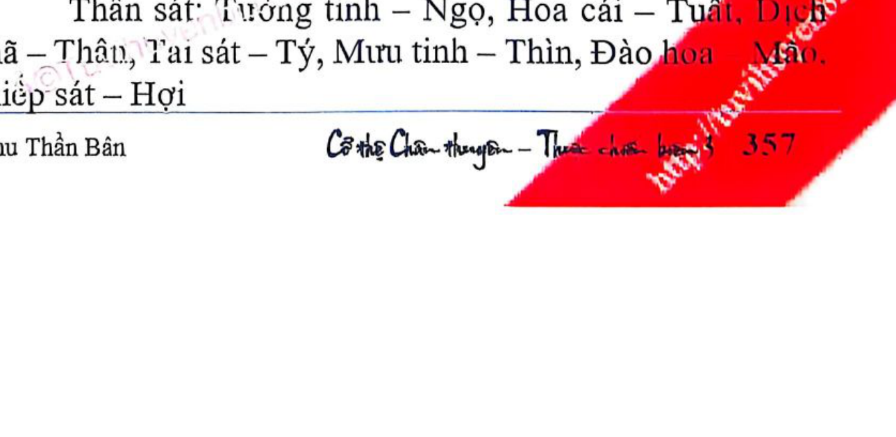

- **Cấu trúc Quẻ Dịch:**
  - **Quẻ chủ:** **Địa Hỏa Minh Di** (Cung Khảm – Quẻ Du Hồn)  
    *Tượng quẻ:* Nhật Nhập Địa Trung (Mặt trời lặn dưới lòng đất, ánh sáng bị che khuất). Phản ánh trạng thái u ám, tổn thương, khí trường âm lãnh của văn phòng hiện tại.
  - **Quẻ biến:** **Sơn Hỏa Bí** (Cung Cấn – Quẻ Lục Hợp)  
    *Tượng quẻ:* Quang Minh Thông Đạt nhưng cần văn sức bề ngoài. Biến Lục hợp trong bối cảnh quẻ bất lợi mang thông điệp nên trì hoãn, bàn bạc lại, không nên vội vã chốt hợp đồng.

- **Bảng chi tiết Lục hào:**

| Hào | Thế/Ứng | Lục thân (Chủ) | Can Chi | Biến động | Lục thân (Biến) | Can Chi (Biến) | Thần sát / Phục | Lục thú |
|:---:|:---:|:---|:---|:---:|:---|:---|:---|:---|
| 6 | | Phụ Mẫu | Dậu - Kim | **X (Động)** | Tử Tôn | Dần - Mộc | Nguyệt kiến, Mưu tinh, Thiên hỷ | Bạch Hổ |
| 5 | | Huynh Đệ | Hợi - Thủy | tĩnh | Huynh Đệ | Tý - Thủy | Lộc thần | Đằng Xà |
| 4 | **Thế** | Quan Quỷ | Sửu - Thổ | tĩnh | Quan Quỷ | Tuất - Thổ | Tuần không | Câu Trần |
| 3 | | Huynh Đệ | Hợi - Thủy | tĩnh | Huynh Đệ | Hợi - Thủy | Phục Thê Tài | Chu Tước |
| 2 | | Quan Quỷ | Sửu - Thổ | tĩnh | Quan Quỷ | Sửu - Thổ | Tuần không | Thanh Long |
| 1 | **Ứng** | Tử Tôn | Mão - Mộc | tĩnh | Tử Tôn | Mão - Mộc | Quý nhân, Đào hoa, Nguyệt phá, Nhật hợp | Huyền Vũ |

---

### 3. Dụng thần & Loại quẻ

- **Phân loại quẻ:**
  - **Quẻ chỉ định địa điểm cụ thể:** Đương số đã nhắm đích danh phòng 1316 tại tòa cao ốc văn phòng để thẩm định thuê.
  - **Quẻ thân thế & Môi trường kinh doanh:** Đánh giá sự tương tác giữa trường khí văn phòng mới với bản thân chủ sự (hào Thế).
- **Xác định Dụng thần:**
  1. **Hào Thế (Quan Quỷ Sửu Thổ lâm Tuần không):** Đại diện cho bản thân đương số và hiện trạng tại văn phòng cũ. Quan Quỷ giữ Thế lâm Câu Trần thể hiện sự lo âu, bế tắc, bệnh căn phong thủy đè nặng. Lâm Tuần không chỉ báo ảnh hưởng xấu này vẫn đang kéo dài chưa dứt.
  2. **Hào Ứng (Tử Tôn Mão Mộc):** Đại diện cho mong muốn tìm giải pháp tháo gỡ (Tử Tôn chế Quan Quỷ). Tử Tôn Mão Mộc bị Nguyệt phá nhưng được Nhật hợp, phản ánh tâm trạng đang tích cực tìm kiếm phương án giải cứu phong thủy.
  3. **Dụng thần phòng 1316 (Phụ Mẫu Dậu Kim tại hào 6):** Phụ Mẫu chủ về phòng ốc, văn phòng, bất động sản. Hào 6 nằm ở vị trí cao nhất của ngoại quái, mang theo Thiên hỷ (khách sạn sang trọng) và Mưu tinh (dự định kế hoạch), chính là phòng 1316 trong tòa cao ốc chỉ định.

---

### 4. Luận giải chi tiết

Chu Thần Bân giải mã các tầng thứ không gian và biểu tượng thần sát cực kỳ chuẩn xác:

#### 1. Hiện trạng văn phòng cũ qua Quẻ chủ Minh Di và Hào Thế
- Quẻ chủ **Địa Hỏa Minh Di** là quẻ Du hồn. Du hồn chủ tâm trí dao động, bất định, trôi nổi, nôn nóng muốn thoát ly hoàn cảnh hiện tại. Minh Di mang tượng ánh sáng bị vùi dập, u tối, khớp chuẩn xác với nhận định thực địa của Chu Thần Bân rằng văn phòng hiện tại có trường khí âm u, tà khí quấy nhiễu.
- Hào 4 **Quan Quỷ Sửu Thổ** giữ Thế mang Câu Trần: Quan Quỷ là mối lo, là ám khí; Câu Trần là sự trì trệ bám dính. Sửu Thổ lâm Tuần không cho thấy tác động âm khí này vẫn còn ám ảnh đương số trong tương lai nếu không có biện pháp dứt điểm.

#### 2. Nhận diện phòng 1316 qua Hào 6 Phụ Mẫu Dậu Kim
- Hào 6 **Phụ Mẫu Dậu Kim** phát động: Ngoại quái là phương hướng dịch chuyển ra bên ngoài. Hào 6 ở vị trí tối thượng, lâm Nguyệt kiến vượng tướng, mang Mưu tinh (kế hoạch dự tính) và Thiên hỷ (biểu tượng của dịch vụ cao cấp, khách sạn 5 sao đi kèm trong tòa nhà). Điều này chứng minh hào 6 chính là hiện thân của phòng 1316 tại tòa cao ốc sang trọng mà đương số đang hướng tới.
- Hào động biến **Tử Tôn Dần Mộc**: Việc chuyển đến phòng 1316 là một trong những phương án giải quyết (Tử Tôn) mà đương số kỳ vọng sẽ giải tỏa bế tắc phong thủy cũ.

#### 3. Cạm bẫy Bạch Hổ và sự bất hòa khí giữa Phòng và Chủ sự
- Dù phòng 1316 có vẻ ngoài hào nhoáng nhưng xét về tương tác Dịch lý:
  - Phụ Mẫu Dậu Kim (hành Kim) đối với hào Thế Quan Quỷ Sửu Thổ (hành Thổ): Kim làm hao tiết khí của Thổ, Dậu Kim hoàn toàn **không sinh phù** cho hào Thế Sửu Thổ.
  - Điểm hung hại chí mạng: Phụ Mẫu Dậu Kim lâm **Bạch Hổ**. Trong thuật Lục Hào chọn nơi cư trú hoặc địa điểm kinh doanh mới: *Nếu đối tượng chỉ định mang Bạch Hổ, hoặc hào Thế mang Bạch Hổ, tuyệt đối không được lựa chọn*. Bạch Hổ chủ về tai họa, hung hiểm, huyết quang, tranh chấp pháp lý và sự phá hoại ngầm.
- Thuê một văn phòng lâm Bạch Hổ và tiết khí bản thân sẽ dẫn đến việc vừa tốn chi phí đắt đỏ vừa chuốc thêm tai họa mới, hoàn toàn không đạt được mục đích cải thiện trường khí.

#### 4. Ý nghĩa quẻ biến Lục Hợp (Sơn Hỏa Bí)
- Quẻ biến là **Sơn Hỏa Bí** (quẻ Lục hợp).
- Trong quy tắc Cổ Thệ: Nếu bản chất sự việc là việc không nên làm, việc gặp hung hại thì quẻ biến Lục hợp mang ý nghĩa **"trì hoãn, tạm dừng, bàn bạc lại"**. Nó khuyên đương số nên đàm phán lại, hoãn việc ký kết để tìm kiếm phương án bất động sản khác thích hợp hơn.

---

### 5. Kết luận & Ứng kỳ thực tế

- **Lời giải đoán của Chu Thần Bân:**
  - Phòng 1316 trong tòa nhà văn phòng cao cấp tuy đẹp đẽ bên ngoài nhưng phong thủy bên trong tàng ẩn hung hiểm lớn (mang Bạch Hổ).
  - Phòng mới không sinh trợ cho hào Thế mà còn gây hao tổn nguyên khí, dọn đến chỉ rước thêm rắc rối và tổn thất tài chính.
  - Khuyên đương số dứt khoát không thuê phòng 1316, tạm hoãn kế hoạch ký kết và tiếp tục khảo sát các tòa nhà văn phòng khác.
- **Phản hồi thực tế (Feedback):**
  - Đương số tuân thủ lời khuyên của Chu Thần Bân, quyết định dừng đàm phán hợp đồng thuê phòng 1316.
  - Sau đó một thời gian, đương số tìm được một địa điểm văn phòng khác có phong thủy hài hòa, sinh vượng bản thân và vận hành kinh doanh thuận lợi.
- **Ứng kỳ chiêm nghiệm:** Sự việc được ngăn chặn kịp thời ngay trong tháng Dậu - Tuất, tránh được tổn thất hợp đồng thuê văn phòng dài hạn.

---

### 6. Bài học tâm pháp & Quy tắc cốt lõi

- **Trích dẫn quy tắc sách (Rule Index):**
  - *Quy tắc định vị không gian văn phòng chỉ định và ý nghĩa quẻ Du hồn biến Lục hợp (Bí)* (Sách Cổ Thệ Chân Thuyên Thực Chiến Biên 3, trang 333).
- **Tâm pháp giải đoán thực tế:**
  1. **Cấm kỵ Bạch Hổ khi chuyển dịch không gian:** Khi chọn văn phòng, nhà ở, cửa hàng hoặc nhà xưởng mới, nếu hào ngoại đại diện cho địa điểm chuyển đến mang Bạch Hổ, hoặc hào Thế mang Bạch Hổ, đó là dấu hiệu tuyệt đối tránh xa. Nơi đó ắt chứa mầm mống họa hại, tranh chấp khốc liệt.
  2. **Định vị đối tượng qua Hào động có thông tin đặc thù:** Không nên rập khuôn máy móc rằng hễ quẻ chỉ định là phải lấy hào Ứng. Khi hào động ở ngoại quái mang đầy đủ thông số thực địa (hào 6 vị trí trên cao, Mưu tinh chủ kế hoạch, Thiên hỷ chủ cao ốc khách sạn), chính hào động đó mới là chân tướng của mục tiêu.
  3. **Biện chứng quẻ biến Lục hợp khi gặp hung triệu:** Quẻ Lục hợp không phải lúc nào cũng là cát tường. Gặp sự việc sai lầm, quẻ Lục hợp chính là sợi dây ghìm lại, báo hiệu cần đình trệ, hòa hoãn để suy xét lại quyết định.

## THỰC CHIẾN 171: CẢI CÁCH CÔNG TY, HỎI NÊN Ở LẠI ĐƠN VỊ CẤP HAI GẦN NHÀ, HAY VỀ LẠI ĐƠN VỊ TỔNG CÁCH XA NHÀ THÌ TỐT HƠN

---

### 1. Bối cảnh & Câu hỏi

- **Bối cảnh chi tiết:** 
  Một đồng môn làm việc theo diện cắm chốt (phái cử công tác) tại một đơn vị cấp hai trực thuộc tổng công ty. Gần đây, doanh nghiệp tiến hành cải cách cơ cấu tổ chức và nhân sự. Nhóm cán bộ cắm chốt như đương số đứng trước hai sự lựa chọn:
  1. Tiếp tục ở lại đơn vị cấp hai: Chuyển toàn bộ hồ sơ hành chính, quản lý nhân sự về trực thuộc hẳn cho cấp hai. Ưu điểm nổi bật là đơn vị này nằm rất gần nhà, vô cùng thuận tiện cho việc chăm sóc gia đình và con nhỏ, nhưng nhược điểm là mức đãi ngộ và thu nhập có thể không cao.
  2. Trở về tổng công ty: Được phân bổ công việc tại trụ sở chính. Lợi thế là mức lương thưởng, đãi ngộ có cơ hội nâng cao và danh chính ngôn thuận ở cơ quan đầu não, nhưng nhược điểm lớn là trụ sở tổng công ty cách nhà rất xa, việc đi lại khó khăn và không thể cáng đáng việc gia đình cùng vợ.
- **Tâm lý & Câu hỏi ẩn ý:** 
  Đương số băn khoăn: *"Nên ở lại đơn vị cấp hai gần nhà hay trở về tổng công ty cách xa nhà thì tốt hơn?"* Tâm lý vừa muốn nâng cao đãi ngộ kinh tế tại tổng bộ, vừa muốn chu toàn việc gia đình, nuôi dạy con cái tại đơn vị gần nhà.
- **Thời gian chiêm đoán:**
  - Dương lịch: 29/09/2018, 09:28 sáng (Giờ Bắc Kinh).
  - Can chi: Năm Mậu Tuất, tháng Tân Dậu, ngày Giáp Tý, giờ Kỷ Tỵ.

---

### 2. Dữ kiện & Bảng quẻ Crop

- **Thời không chiêm nghiệm:**
  - Tháng Tân Dậu (Kim vượng, Thủy tướng, Thổ hưu).
  - Ngày Giáp Tý (Thủy vượng, Mộc tướng, Kim hưu).
  - Tuần không: **Tuất - Hợi** (Giáp Tý tuần trung, Tuất Hợi không vong).
- **Thần sát:**
  - Tướng tinh: Tý (Lâm Nhật kiến, hào sơ Thê Tài)
  - Hoa cái: Thìn (Lâm hào 3 Huynh Đệ)
  - Dịch mã: Dần (Lâm hào 2 Quan Quỷ)
  - Tai sát: Ngọ
  - Mưu tinh: Tuất (Lâm Tuần không)
  - Đào hoa: Dậu (Lâm Nguyệt kiến, hào 5 Tử Tôn Thế)
  - Kiếp sát: Tỵ (Lâm giờ chi, hào phục 2 Phụ Mẫu)
  - Lộc thần: Dần (Lâm hào 2 Quan Quỷ)
  - Dương nhẫn: Mão
  - Văn xương: Tỵ (Lâm giờ chi)
  - Thiên y: Thân
  - Thiên hỷ: Thìn (Lâm hào 3 Huynh Đệ)
  - Quý nhân: Sửu, Mùi (Lâm hào biến 4 và hào 6)

- Bảng quẻ tượng và dữ kiện chiêm đoán:
  - **Bảng 171.1** Đồ hình quẻ Thực chiến 171:
    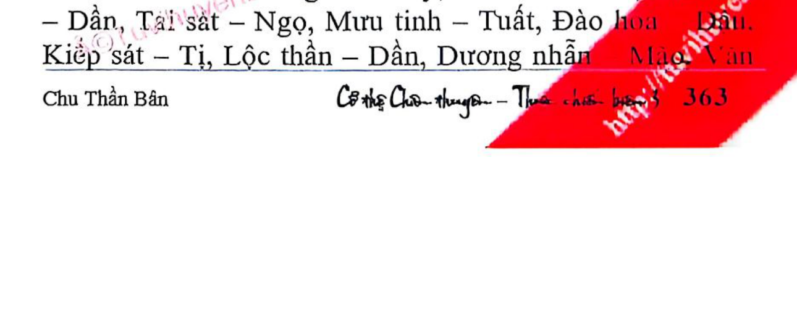

- **Cấu trúc Quẻ Dịch:**
  - **Quẻ chủ:** **Trạch Thiên Quái** (Cung Khôn)  
    *Tượng quẻ:* Quyết dứt, thiếu sót, quyết đoán giải quyết tồn đọng. Báo hiệu cục diện cần phải phân định rạch ròi, dứt khoát đưa ra sự lựa chọn trước cải cách.
  - **Quẻ biến:** **Địa Thiên Thái** (Cung Khôn – Quẻ Lục Hợp)  
    *Tượng quẻ:* Thái bình, thông suốt, an định lâu dài. Nếu chọn đúng con đường sẽ giữ được sự ổn định bền vững, thái hòa cho cuộc sống và công việc.

- **Bảng chi tiết Lục hào:**

| Hào | Thế/Ứng | Lục thân (Chủ) | Can Chi | Biến động | Lục thân (Biến) | Can Chi (Biến) | Thần sát / Phục | Lục thú |
|:---:|:---:|:---|:---|:---:|:---|:---|:---|:---|
| 6 | | Huynh Đệ | Mùi - Thổ | tĩnh | Tử Tôn | Dậu - Kim | Quý nhân | Huyền Vũ |
| 5 | **Thế** | Tử Tôn | Dậu - Kim | **O (Động)** | Thê Tài | Hợi - Thủy | Đào hoa, Nguyệt kiến | Bạch Hổ |
| 4 | | Thê Tài | Hợi - Thủy | **O (Động)** | Huynh Đệ | Sửu - Thổ | Tuần không | Đằng Xà |
| 3 | | Huynh Đệ | Thìn - Thổ | tĩnh | Huynh Đệ | Thìn - Thổ | Hoa cái, Thiên hỷ | Câu Trần |
| 2 | **Ứng** | Quan Quỷ | Dần - Mộc | tĩnh | Quan Quỷ | Dần - Mộc | Lộc thần, Dịch mã, Phục Phụ-Tỵ | Chu Tước |
| 1 | | Thê Tài | Tý - Thủy | tĩnh | Thê Tài | Tý - Thủy | Tướng tinh, Nhật kiến | Thanh Long |

---

### 3. Dụng thần & Loại quẻ

- **Phân loại quẻ:**
  - **Quẻ lựa chọn (Đối chiếu hai phương án nơi làm việc):** Cân nhắc giữa việc ở lại đơn vị cấp hai (hiện tại, gần nhà) hay quay về tổng công ty (mới, xa nhà).
  - **Phân định Nội - Ngoại quái:** Nội quái (Càn - Kim) biểu thị công việc hiện tại, địa bàn gần nhà; Ngoại quái (Đoài biến Khôn) phát động biểu thị xu hướng thay đổi dịch chuyển ra bên ngoài (tổng công ty).
- **Xác định Dụng thần:**
  1. **Đơn vị hiện tại (Cấp hai gần nhà - Thê Tài Tý Thủy tại hào sơ):** Hào sơ thuộc nội quái, lâm Nhật kiến, mang Tướng tinh, đại diện cho thực tại đang hiện hữu, vị trí gần nhà.
  2. **Đơn vị lựa chọn thay đổi (Tổng công ty - Thê Tài Hợi Thủy tại hào 5 biến ra):** Hào 5 là vị trí tôn quý (quân vị), đại diện cho tổng bộ; Hợi Thủy lâm Tuần không và mang ý niệm đi xa (chưa xảy ra).
  3. **Hào Thế (Tử Tôn Dậu Kim tại hào 5):** Thể hiện lập trường, hành động và tư tưởng của bản thân đương số. Thế lâm Nguyệt kiến phát động mang theo Bạch Hổ.
  4. **Quan Quỷ Dần Mộc (Hào 2 Ứng):** Đại diện cho chức nghiệp, cơ hội phát triển sự nghiệp và nguồn thu nhập ổn định (lâm Lộc thần).

---

### 4. Luận giải chi tiết

Trọng tâm của ca thực chiến này nằm ở phương pháp giải mã cơ chế **Bắc cầu (Đạp kiều / Liên hoàn hóa sinh)** kết hợp với ý nghĩa thực tiễn gia đình:

#### 1. Phân định hai đơn vị qua cặp Thê Tài Tý Thủy và Hợi Thủy
- Trong quẻ xuất hiện hai hào Thê Tài:
  - **Thê Tài Tý Thủy ở hào sơ:** Nằm ở đáy nội quái, lại đắc **Nhật kiến**, mang **Tướng tinh**. Nhật kiến chủ "hiện tại, đang tồn tại", hào sơ gần nhà. Đây chính là công việc cắm chốt tại đơn vị cấp hai hiện thời. Nơi này tuy chức vị bình dị nhưng có vai trò then chốt (Tướng tinh), được đồng nghiệp và cấp trên tin cậy.
  - **Thê Tài Hợi Thủy ở hào 5:** Nằm ở quân vị (vị trí tổng hành dinh), do hào Thế Tử Tôn Dậu Kim động hóa ra, lại lâm **Tuần không**. Tuần không chủ "tương lai, chưa xảy ra", mang tính chất chuẩn bị xuất ngoại đi xa. Đây chính là viễn cảnh chuyển về tổng công ty.

#### 2. Kỹ pháp Đạp kiều (Bắc cầu) giải mã kết cục nếu về Tổng công ty
- Hào 5 Thế Tử Tôn Dậu Kim động hóa **Thê Tài Hợi Thủy**; đồng thời hào 4 Thê Tài Hợi Thủy lại động hóa **Huynh Đệ Sửu Thổ**.
- Chu Thần Bân nhấn mạnh nguyên lý Đạp kiều:
  - Tuyệt đối không được hiểu máy móc rằng Dậu Kim bắc cầu qua Hợi Thủy rồi được Sửu Thổ "hồi đầu sinh". Bắc cầu là phương tiện diễn dịch trạng thái biến hóa, **không áp dụng quy tắc hồi đầu sinh/khắc**.
  - Kết cục thực sự của phép bắc cầu: Hào Thế Dậu Kim thông qua Hợi Thủy bắc cầu hóa thành **Huynh Đệ Sửu Thổ**.
- Đánh giá kết cục này:
  - **Bắc cầu hóa Mộ:** Sửu Thổ là mộ khố của Dậu Kim. Hào Thế hóa Mộ nghĩa là tự chôn mình vào bế tắc, rơi vào trạng thái bị giam hãm, mất quyền tự chủ, bị bó buộc tay chân trong guồng máy tổng bộ.
  - **Bắc cầu biến Huynh Đệ:** Hỏi về sự nghiệp công danh mà hào Thế biến thành Huynh Đệ là đại kỵ. Huynh Đệ đại diện cho sự cạnh tranh, đám đông chèn ép và bị Quan Quỷ Dần Mộc khắc phạt. Về tổng bộ sẽ rơi vào môi trường đấu đá nhân sự phức tạp, bản thân bị cô lập, không có vị trí tốt.
  - **Thế lâm Bạch Hổ phát động:** Muốn thay đổi công việc mà hào Thế phát động lâm Bạch Hổ, lại hóa Mộ biến Huynh Đệ là điềm cực xấu, chủ về áp lực khốc liệt, thị phi và hao tổn nguyên khí.

#### 3. Thông tin ngoại cảnh: Ảnh hưởng tiêu cực đến con cái
- Một phát hiện tinh tế phi phàm của Chu Thần Bân:
  - Hào Thế Tử Tôn Dậu Kim phát động lâm **Đào hoa**, Tử Tôn chính là biểu tượng của **con cái**.
  - Nếu đương số về tổng công ty (xa nhà), trách nhiệm nuôi dạy con đổ dồn hết lên vai người vợ.
  - Tử Tôn Dậu Kim mang Đào hoa, lâm Bạch Hổ lại hóa Mộ (Sửu Thổ): Bạch Hổ chủ huyết quang, bệnh tật; Hóa Mộ chủ viện phí, nằm viện.
  - Điều này cảnh báo rõ ràng: Nếu cha đi làm xa nhà lâu ngày, con nhỏ thiếu sự chăm sóc chu toàn của cha sẽ dễ đau ốm, bệnh tật nghiêm trọng đến mức phải nhập viện điều trị.

#### 4. Giá trị của việc ở lại Đơn vị cấp hai
- Tại đơn vị cấp hai (Thê Tài Tý Thủy):
  - Hào Tý Thủy lâm Nhật kiến, mang Tướng tinh, không bị biến động hay tổn thương.
  - Thê Tài Tý Thủy chính là Nguyên thần sinh dưỡng cho sự nghiệp (Quan Quỷ Dần Mộc). Dần Mộc tại hào 2 lại lâm **Lộc thần**, chứng tỏ ở lại đơn vị cấp hai thì công việc vẫn ổn định, có bổng lộc đều đặn và không bị xáo trộn cuộc sống gia đình.

---

### 5. Kết luận & Ứng kỳ thực tế

- **Lời giải đoán của Chu Thần Bân:**
  - Về tổng công ty: Bề ngoài ngỡ là lên cơ quan đầu não, nhưng thực chất vào nơi đấu đá (biến Huynh Đệ), bị giam hãm mất tự do (hóa Mộ), lại mang Bạch Hổ áp lực nặng nề. Đặc biệt còn gây họa cho con cái (Tử Tôn lâm Bạch Hổ hóa Mộ dễ sinh bệnh nhập viện).
  - Ở lại đơn vị cấp hai: Gần nhà, chăm sóc tốt cho vợ con, công việc đắc Nhật kiến mang Tướng tinh, Lộc thần vững vàng.
  - Khuyên đương số: **Tuyệt đối không về tổng công ty, dứt khoát chọn ở lại đơn vị cấp hai**.
- **Phản hồi thực tế (Feedback):**
  - Đương số nghe lời phân tích thấu tình đạt lý, nhất là mối lo ngại về sức khỏe và sự an toàn của con nhỏ, đã dứt khoát quyết định làm thủ tục xin ở lại hẳn đơn vị cấp hai.
  - Cuộc sống gia đình và công việc sau đó duy trì trạng thái êm ấm, thuận hòa đúng như quẻ biến **Địa Thiên Thái** (Thái bình thịnh vượng).
- **Ứng kỳ chiêm nghiệm:** Sự việc được định đoạt ngay trong đợt cải cách tháng Dậu năm Mậu Tuất, giữ vững vị trí tại đơn vị sở tại.

---

### 6. Bài học tâm pháp & Quy tắc cốt lõi

- **Trích dẫn quy tắc sách (Rule Index):**
  - *Quy tắc liên hoàn hóa sinh trong quẻ cải cách nhân sự và ý nghĩa quẻ biến Thái* (Sách Cổ Thệ Chân Thuyên Thực Chiến Biên 3, trang 339).
- **Tâm pháp giải đoán thực tế:**
  1. **Quy tắc chuẩn xác về kỹ pháp Bắc cầu (Đạp kiều):** Khi hai hào liên tiếp phát động tạo thành chuỗi mắt xích (A động hóa B, B động hóa C), ta lấy hào đầu A bắc cầu sang C để tìm ra lục thân và ngũ hành kết cục. Tuyệt đối không được luận hồi đầu sinh/khắc trong phép bắc cầu, mà chỉ luận: Bắc cầu hóa Mộ, Bắc cầu biến Huynh Đệ/Tử Tôn...
  2. **Cấm kỵ hào Thế phát động mang Bạch Hổ:** Trong các quẻ cầu danh, mưu sự hoặc chuyển đổi môi trường sống, hào Thế lâm Bạch Hổ phát động mà không được hồi đầu sinh thì tuyệt đối không nên manh động thay đổi; thay đổi ắt chuốc lấy hung họa.
  3. **Tầm nhìn bao quát vượt khỏi câu hỏi bề mặt:** Người hỏi chỉ hỏi về lợi ích công việc, nhưng dịch giả phải nhìn thấu các mối liên hệ nhân sinh. Nhìn thấy Tử Tôn lâm Đào hoa hóa Mộ đới Bạch Hổ để nhắc nhở nguy cơ bệnh tật của con trẻ là đỉnh cao của sự thấu cảm và trách nhiệm trong Dịch học.

## THỰC CHIẾN 172: XEM QUẺ THẮNG BẠI CỦA ĐỘI TUYỂN BÓNG RỔ NỮ TRUNG QUỐC

---

### 1. Bối cảnh & Câu hỏi

- **Bối cảnh chi tiết:** 
  Một đệ tử theo học Lục Hào của Chu Thần Bân thường ngày giúp người khác xem quẻ thì độ chuẩn xác rất cao, nhưng khi tự gieo quẻ chiêm đoán cho bản thân lại thường xuyên bị sai lệch. Trong thời gian diễn ra giải đấu thể thao, anh này theo dõi trận đấu bóng rổ của đội tuyển nữ Trung Quốc và nổi hứng muốn trổ tài trước mặt gia đình. Trước khi gieo quẻ, anh ta lớn tiếng tuyên bố với cha mẹ vợ và con cái: *"Tôi có thể đoán trước được kết quả trận đấu này, không tin thì để tôi gieo quẻ đoán thử cho mọi người xem, bảo đảm chuẩn xác trăm phần trăm!"*
- **Tâm lý & Câu hỏi ẩn ý:** 
  Đương số gieo quẻ hỏi: *"Đội tuyển bóng rổ nữ Trung Quốc trận này có thắng hay không?"* Đằng sau câu hỏi không phải là sự quan tâm thuần túy đối với thể thao, mà là tâm lý hiếu thắng, khoe khoang, muốn biểu diễn khả năng học Dịch để lấy oai với người thân. Kết quả đương số tự đoán là đội nhà thắng lớn, nhưng thực tế thi đấu đội tuyển Trung Quốc lại bại trận cay đắng.
- **Thời gian chiêm đoán:**
  - Dương lịch: 26/09/2018, 18:39 (Giờ Bắc Kinh).
  - Can chi: Năm Mậu Tuất, tháng Tân Dậu, ngày Tân Dậu, giờ Đinh Dậu (Tam Dậu tề tụ).

---

### 2. Dữ kiện & Bảng quẻ Crop

- **Thời không chiêm nghiệm:**
  - Tháng Tân Dậu, Ngày Tân Dậu (Kim khí cực vượng, Thủy tướng, Mộc tuyệt, Hỏa tử).
  - Tuần không: **Tý - Sửu** (Giáp Ngọ tuần trung, Tý Sửu không vong).
- **Thần sát:**
  - Tướng tinh: Dậu (Lâm Nguyệt kiến, Nhật kiến, giờ chi)
  - Hoa cái: Sửu (Lâm Tuần không)
  - Dịch mã: Hợi
  - Tai sát: Mão (Nguyệt phá, Nhật phá)
  - Mưu tinh: Mùi (Lâm hào Thế phát động)
  - Đào hoa: Ngọ
  - Kiếp sát: Dần (Lâm hào 2 Ứng)
  - Lộc thần: Dậu (Lâm Nguyệt kiến, Nhật kiến, hào 4 Quan Quỷ)
  - Dương nhẫn: Thân (Lâm hào biến của Thế)
  - Văn xương: Tý (Lâm hào sơ Phụ Mẫu, Tuần không)
  - Thiên y: Thân (Lâm hào biến)
  - Thiên hỷ: Thìn (Lâm hào 3 Thê Tài)
  - Quý nhân: Dần, Ngọ (Dần lâm hào Ứng)

- Bảng quẻ tượng và dữ kiện chiêm đoán:
  - **Bảng 172.1** Đồ hình quẻ Thực chiến 172:
    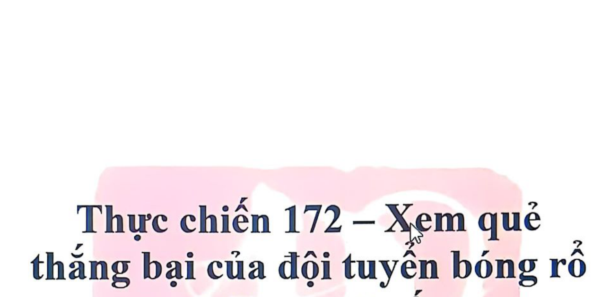

- **Cấu trúc Quẻ Dịch:**
  - **Quẻ chủ:** **Hỏa Lôi Phệ Hạp** (Cung Tốn)  
    *Tượng quẻ:* Cắn đứt chướng ngại, nghiến răng trừng phạt. Trong bối cảnh tâm lý biểu diễn, Phệ Hạp tượng trưng cho sự bế tắc trong nhận thức, chướng ngại do tư tâm che mờ tuệ nhãn.
  - **Quẻ biến:** **Thiên Lôi Vô Vọng** (Cung Tốn – Quẻ Lục Xung)  
    *Tượng quẻ:* Vô vọng (không được vọng tưởng, ảo vọng tiêu tan). Quẻ biến Lục xung đánh tan mọi toan tính khoe khoang, khiến kết quả thực tế đi ngược lại hoàn toàn so với ảo tưởng chủ quan.

- **Bảng chi tiết Lục hào:**

| Hào | Thế/Ứng | Lục thân (Chủ) | Can Chi | Biến động | Lục thân (Biến) | Can Chi (Biến) | Thần sát / Phục | Lục thú |
|:---:|:---:|:---|:---|:---:|:---|:---|:---|:---|
| 6 | | Tử Tôn | Tỵ - Hỏa | tĩnh | Thê Tài | Tuất - Thổ | Kiếp sát | Đằng Xà |
| 5 | **Thế** | Thê Tài | Mùi - Thổ | **X (Động)** | Quan Quỷ | Thân - Kim | Mưu tinh, Dương nhẫn (ở hào biến) | Câu Trần |
| 4 | | Quan Quỷ | Dậu - Kim | tĩnh | Tử Tôn | Ngọ - Hỏa | Nguyệt kiến, Nhật kiến, Lộc thần | Chu Tước |
| 3 | | Thê Tài | Thìn - Thổ | tĩnh | Thê Tài | Thìn - Thổ | Thiên hỷ | Thanh Long |
| 2 | **Ứng** | Huynh Đệ | Dần - Mộc | tĩnh | Huynh Đệ | Dần - Mộc | Quý nhân, Tuyệt xứ | Huyền Vũ |
| 1 | | Phụ Mẫu | Tý - Thủy | tĩnh | Phụ Mẫu | Tý - Thủy | Tuần không, Văn xương | Bạch Hổ |

*(Ghi chú: Quẻ chủ Phệ Hạp chỉ có hào 5 Lục Ngũ âm hào phát động biến thành Cửu Ngũ dương hào của quẻ Càn, biến thành ngoại quái Càn nội quái Chấn là Thiên Lôi Vô Vọng).*

---

### 3. Dụng thần & Loại quẻ

- **Phân loại quẻ:**
  - **Quẻ tâm thái (Ý niệm bất thuần / Tâm quẻ):** Đây không phải là quẻ chiêm sự việc khách quan mà là quẻ phản ánh chân dung tâm lý méo mó của người gieo.
  - **Nguyên lý lệch hướng thông tin:** Khi người hỏi mang tâm cầu danh, khoe mẽ, phô trương trước mặt người khác, "thần cơ" của Lục Hào lập tức chuyển hóa từ mô tả trận đấu sang bóc trần sự ngạo mạn và sai lầm chủ quan của chính dịch giả.
- **Xác định Dụng thần:**
  1. **Hào Thế (Thê Tài Mùi Thổ phát động):** Đại diện cho người gieo quẻ và ý đồ chủ quan. Mùi Thổ mang Mưu tinh phát động lâm Câu Trần biểu thị suy nghĩ toan tính, cố chấp với định kiến của bản thân.
  2. **Hào biến (Quan Quỷ Thân Kim mang Dương Nhẫn):** Hào Thế động hóa Quan Quỷ chủ về tự mình rước lấy ưu phiền, thất bại, bẽ mặt. Mang Dương Nhẫn ngụ ý một cú sốc tinh thần, vết thương tự ái do bị thực tế phản bác.
  3. **Hào Ứng (Huynh Đệ Dần Mộc lâm Huyền Vũ):** Huyền Vũ chủ về sự mờ ám, tư tâm, dối trá, bất chính. Động cơ gieo quẻ mang đậm tính "Huyền Vũ" khiến đối tượng chiêm đoán bị khúc xạ hoàn toàn.

---

### 4. Luận giải chi tiết

Chu Thần Bân đã nhìn thấu cốt tủy của quẻ ngay khi đệ tử đưa ra đồ hình chiêm đoán:

#### 1. Tại sao xem cho người khác chuẩn mà xem cho mình lại sai?
- Khi xem cho người khác: Người dịch đứng ở vị thế khách quan, vô tư vô cầu, không có lợi ích được mất cá nhân đan xen, tâm trí thanh tịnh như mặt nước hồ thu, phản chiếu chính xác tượng quẻ khách quan.
- Khi tự xem cho mình hoặc biểu diễn: Lòng ham danh vọng, tính hiếu thắng, mong muốn được tán dương trỗi dậy. Đệ tử tuyên bố chắc nịch với bố mẹ vợ và con cái rằng mình đoán chuẩn 100%, tức là đã áp đặt ý muốn chủ quan lên trời đất trước khi đồng xu kịp rơi xuống bàn.

#### 2. Cơ chế Quẻ tâm thái bóc trần hiện thực biểu diễn
- Quẻ dịch không vận hành theo kiểu máy móc để chiều lòng người khoe khoang. Ngay khi ý niệm bất thuần phát khởi, quẻ lập tức đóng cánh cửa dự báo tương lai khách quan lại, mà mở ra tấm gương soi chiếu nội tâm:
  - Hào Thế **Thê Tài Mùi Thổ** phát động: Mùi Thổ lâm **Câu Trần**, chủ về sự trì trệ, bảo thủ, cố chấp trong phán đoán.
  - Hào Thế hóa **Quan Quỷ Thân Kim**: Thay vì biến ra cát lợi, hào Thế lại tự biến thành Quan Quỷ. Quan Quỷ là nỗi lo sợ, xấu hổ, mất mặt. Thân Kim lại là **Dương nhẫn** (lưỡi dao sắc), tượng trưng cho việc tự cầm dao cứa vào danh dự của chính mình.
  - Quẻ biến **Thiên Lôi Vô Vọng**: Tên quẻ đã nói lên tất cả – "Vô Vọng" nghĩa là chớ có vọng tưởng, chớ mơ mộng hão huyền. Quẻ Lục xung nổ tung, đánh vỡ tan tành sự tự tin ngông cuồng của đương số trước gia đình.

#### 3. Ý nghĩa của Lục thú Huyền Vũ
- Chu Thần Bân chỉ rõ: Cầm quẻ lên để khoe khoang, để đạt mục đích lấy le hoặc trục lợi bất chính đều bị quy vào trạng thái **"mang Huyền Vũ"**.
- Hào Ứng lâm Huyền Vũ phản ánh môi trường thông tin bị che mờ bởi mây đen tư tâm. Khi tâm người không chính trực, quẻ dịch sẽ dẫn dắt người đoán đi vào ngõ cụt của sự sai lầm để thức tỉnh lương tri.

---

### 5. Kết luận & Ứng kỳ thực tế

- **Lời giải đoán của Chu Thần Bân:**
  - Vừa nhìn quẻ, thầy Chu không hề bàn đến tỷ số trận đấu mà chất vấn thẳng: *"Có phải trước khi gieo, anh đã khoe khoang với cha mẹ vợ và con cái rằng mình đoán chắc chắn trúng không?"*
  - Khẳng định quẻ này hoàn toàn là quẻ phản ánh nhận định sai lầm của bản thân, kết quả thực tế chắc chắn ngược lại với dự đoán chủ quan.
- **Phản hồi thực tế (Feedback):**
  - Đệ tử kinh ngạc thừa nhận toàn bộ sự thật: Đúng là trước trận đấu đã khoe mẽ trước cả nhà.
  - Kết quả trận bóng rổ: Đội tuyển nữ Trung Quốc thi đấu thất bại, đệ tử tự chuốc lấy sự bẽ bàng trước mặt gia đình đúng như hào Thế hóa Quan Quỷ lâm Dương Nhẫn.
- **Ứng kỳ chiêm nghiệm:** Ứng nghiệm ngay trong buổi tối diễn ra trận đấu ngày 26/09/2018.

---

### 6. Bài học tâm pháp & Quy tắc cốt lõi

- **Trích dẫn quy tắc sách (Rule Index):**
  - *Cấm kỵ tâm thái khoe khoang và hiện tượng quẻ phản ánh tâm lý biểu diễn thay vì thực tế khách quan* (Sách Cổ Thệ Chân Thuyên Thực Chiến Biên 3, trang 347).
- **Tâm pháp giải đoán thực tế:**
  1. **Đạo học Dịch dĩ vô tư vi bản:** Học Dịch là để thông đạt lẽ trời đất, thấu suốt nhân tình, giúp đời giúp người. Tuyệt đối cấm kỵ việc đem Dịch thuật làm công cụ mua danh chuộc tiếng, khoe tài trước đám đông hoặc cá cược thắng thua.
  2. **Tâm không chính, quẻ bất ứng:** Khi trong lòng khởi phát tư tâm ("mang Huyền Vũ"), từ trường của tâm niệm sẽ làm nhiễu loạn sự giao cảm của quẻ. Quẻ khi ấy không còn là quẻ sự việc mà trở thành quẻ răn đe tâm thái.
  3. **Tự thanh lọc bản thân trước khi gieo quẻ:** Chu Thần Bân truyền thụ tâm pháp: *"Trước khi xem quẻ cho người, tuyệt đối không nghĩ đến bất kỳ lợi ích nào cho bản thân, hoàn toàn buông bỏ chính mình. Xem xong cũng không bận tâm thiệt hơn, được mất."* Đó mới là tâm thái chân chính của bậc đại sư Lục Hào.

## THỰC CHIẾN 174: ỐNG KHÓI NHÀ HÀNG BỊ TẮC NGHIÊM TRỌNG, ẢNH HƯỞNG LỚN ĐẾN VIỆC KINH DOANH. BA CÔNG TY CHUYÊN LÀM SẠCH ỐNG KHÓI ĐỀU KHÔNG TÌM RA NGUYÊN NHÂN. HỎI VẤN ĐỀ CỦA ỐNG KHÓI THỰC SỰ NẰM Ở ĐÂU

---

### 1. Bối cảnh & Câu hỏi

- **Bối cảnh chi tiết:** 
  Một đồng môn rất am hiểu phong thủy, Bát tự và Lục hào đứng ra hỗ trợ người nhà lên phương án mở một nhà hàng ẩm thực tại tầng hai của một trung tâm thương mại lớn ở Hàng Châu. Trước khi thi công hoàn thiện, anh ta từng gửi bản vẽ bố cục phong thủy cho Chu Thần Bân xem xét. Thầy Chu lúc đó đã cảnh báo trước rằng khu vực bếp ăn sẽ phát sinh sự cố. Đúng vào ngày khai trương nhà hàng, một biến cố nghiêm trọng xảy ra: toàn bộ hệ thống ống hút khói của bếp ăn bị tắc nghẽn hoàn toàn, khói mù mịt không thể thoát ra ngoài mà bị trào ngược trở lại. Đối với nhà hàng ăn uống, sự cố này gây tê liệt toàn bộ dây chuyền nấu nướng, đe dọa sinh mệnh kinh doanh trong khi tiền mặt bằng, nhân công và chi phí vận hành mỗi ngày rất đắt đỏ. Gia đình đã khẩn cấp thuê liên tiếp ba công ty chuyên nghiệp chuyên về dịch vụ thông rửa, làm sạch ống khói đến khảo sát. Cả ba đơn vị sau khi tháo lắp kiểm tra đường ống bên trong quán đều khẳng định ống hoàn toàn sạch sẽ, không có dị vật bám tắc, và đều bó tay không tìm ra nguyên nhân.
- **Tâm lý & Câu hỏi ẩn ý:** 
  Đương số rơi vào thế bế tắc cực độ, bất đắc dĩ phải gieo quẻ khẩn thiết hỏi Chu Thần Bân: *"Vấn đề thực sự của ống khói nằm ở đâu? Tại sao ba công ty chuyên nghiệp đều không tìm ra nguyên nhân?"*
- **Thời gian chiêm đoán:**
  - Dương lịch: 02/10/2018, 20:09 tối (Giờ Bắc Kinh).
  - Can chi: Năm Mậu Tuất, tháng Tân Dậu, ngày Đinh Mão, giờ Canh Tuất.

---

### 2. Dữ kiện & Bảng quẻ Crop

- **Thời không chiêm nghiệm:**
  - Tháng Tân Dậu (Kim vượng, Mộc tuyệt, Thủy tướng, Thổ hưu).
  - Ngày Đinh Mão (Mộc vượng, đới Hỏa khí, tương xung Nguyệt kiến).
  - Tuần không: **Tuất - Hợi** (Giáp Tý tuần trung, Tuất Hợi không vong).
- **Thần sát:**
  - Tướng tinh: Mão (Lâm Nhật kiến, hào 2 Quan Quỷ Thế)
  - Hoa cái: Mùi
  - Dịch mã: Tỵ (Lâm hào sơ Phụ Mẫu)
  - Tai sát: Dậu (Lâm Nguyệt kiến, hào 6 Tử Tôn)
  - Mưu tinh: Sửu (Lâm hào 3, 4 Huynh Đệ)
  - Đào hoa: Tý
  - Kiếp sát: Thân (Lâm hào biến 4)
  - Lộc thần: Ngọ
  - Dương nhẫn: Tỵ (Lâm hào sơ Phụ Mẫu)
  - Văn xương: Dậu (Lâm Nguyệt kiến)
  - Thiên y: Thân
  - Thiên hỷ: Thìn (Lâm hào biến 3)
  - Quý nhân: Dậu, Hợi (Hợi lâm hào 5 Ứng phát động, Dậu lâm hào 6)

- Bảng quẻ tượng và dữ kiện chiêm đoán:
  - **Bảng 174.1** Đồ hình quẻ Thực chiến 174:
    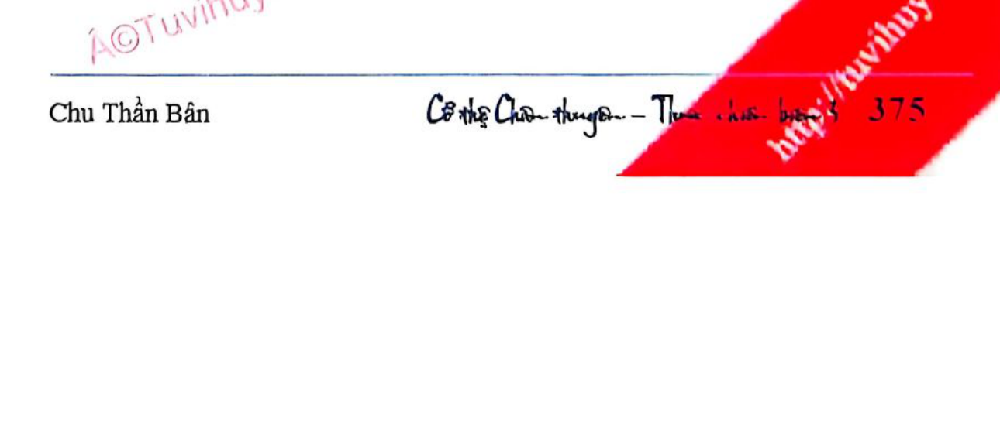

- **Cấu trúc Quẻ Dịch:**
  - **Quẻ chủ:** **Địa Trạch Lâm** (Cung Khôn)  
    *Tượng quẻ:* Việc lớn ập đến trước mắt, khủng hoảng trực diện cần giải quyết khẩn cấp. Quẻ Lâm nằm ở quẻ chủ báo hiệu sự cố đang trực tiếp đe dọa sinh tồn của quán ăn, không thể chần chừ.
  - **Quẻ biến:** **Thủy Lôi Truân** (Cung Khảm)  
    *Tượng quẻ:* Truân chuyên, tích tụ, ứ đọng không thông. Tượng trưng cho luồng khí khói bị tích tụ dồn nén lại trong lòng ống, nếu không giải tỏa sẽ làm đình trệ toàn bộ sự nghiệp kinh doanh.

- **Bảng chi tiết Lục hào:**

| Hào | Thế/Ứng | Lục thân (Chủ) | Can Chi | Biến động | Lục thân (Biến) | Can Chi (Biến) | Thần sát / Phục | Lục thú |
|:---:|:---:|:---|:---|:---:|:---|:---|:---|:---|
| 6 | | Tử Tôn | Dậu - Kim | tĩnh | Thê Tài | Tý - Thủy | Nguyệt kiến, Tai sát, Quý nhân | Thanh Long |
| 5 | **Ứng** | Thê Tài | Hợi - Thủy | **X (Động)** | Huynh Đệ | Tuất - Thổ | Tuần không, Quý nhân | Huyền Vũ |
| 4 | | Huynh Đệ | Sửu - Thổ | tĩnh | Tử Tôn | Thân - Kim | Mưu tinh | Bạch Hổ |
| 3 | | Huynh Đệ | Sửu - Thổ | tĩnh | Huynh Đệ | Thìn - Thổ | Mưu tinh | Đằng Xà |
| 2 | **Thế** | Quan Quỷ | Mão - Mộc | **O (Động)** | Quan Quỷ | Dần - Mộc | Nhật kiến, Tướng tinh, Nguyệt phá | Câu Trần |
| 1 | | Phụ Mẫu | Tỵ - Hỏa | tĩnh | Thê Tài | Tý - Thủy | Dương nhẫn, Dịch mã | Chu Tước |

---

### 3. Dụng thần & Loại quẻ

- **Phân loại quẻ:**
  - **Quẻ tâm thái & Truy tìm sự cố kỹ thuật vật lý:** Tìm nguyên nhân hỏng hóc, bế tắc của công trình kiến trúc và hệ thống thiết bị.
  - **Quy tắc định vị sự cố (Quan Quỷ vi vấn đề):** Trong quẻ tìm lỗi, Quan Quỷ ở đâu thì vấn đề, trục trặc phát sinh tại đó.
- **Xác định Dụng thần:**
  1. **Dụng thần ống khói & Hướng thoát khí (Quan Quỷ Mão Mộc tại hào 2 Thế):** Khói là thể khí (phong khí), trong ngũ hành mộc chủ về phong khí. Ống thoát khí mang bản chất hành Mộc. Hào Thế Quan Quỷ Mão Mộc phát động chính là hiện thân trực diện của đường ống khói gặp sự cố.
  2. **Nguyên thần lưu thông của luồng khí (Thê Tài Hợi Thủy tại hào 5 Ứng):** Thủy chủ về tính lưu động, lưu thông của dòng khí và chất lỏng. Hợi Thủy sinh Mão Mộc, biểu thị sự vận hành thông suốt của luồng khí thoát.
  3. **Kỵ thần gây tắc nghẽn (Huynh Đệ Tuất Thổ ở hào biến):** Thổ khắc Thủy, đất ngăn chặn dòng nước chảy, tượng trưng cho sự bít tắc, cản trở đường lưu thông.

---

### 4. Luận giải chi tiết

Phân tích của Chu Thần Bân là tuyệt đỉnh mẫu mực về việc kết hợp sâu sắc giữa Dịch lý trừu tượng với cấu trúc không gian kiến trúc thực tế:

#### 1. Định vị sự cố và tượng tắc nghẽn qua Lục hào
- Hào Thế **Quan Quỷ Mão Mộc** phát động: Quan Quỷ mang vấn đề, hành Mộc là phong khí dẫn khói. Mão Mộc lâm Nhật kiến nhưng bị Nguyệt lệnh Dậu Kim xung phá (vừa đắc lệnh ngày vừa bị lệnh tháng xung chấn động), phát động lâm **Câu Trần** (chủ trì trệ, vướng mắc).
- Hào Ứng **Thê Tài Hợi Thủy** phát động động hóa **Huynh Đệ Tuất Thổ**: Hợi Thủy là dòng lưu thông, bị Tuất Thổ hồi đầu khắc chế. Thổ chặn Thủy là hình ảnh kinh điển của **sự tắc nghẽn giao thông/luồng khí**. Thủy là Nguyên thần của Mộc bị bức tử khiến luồng khí khói không có đường thoát.

#### 2. Vì sao ba công ty chuyên nghiệp không tìm ra nguyên nhân?
- Nếu nguyên nhân tắc nghẽn nằm ngay trong đường ống riêng của nhà hàng (nội quái, hào 2), các chuyên gia tháo ống ra sẽ thấy ngay cặn dầu mỡ hoặc vật cản. Việc ba công ty dày dạn kinh nghiệm đều khẳng định ống sạch sẽ chứng tỏ: **Vấn đề không nằm ở đường ống riêng của quán!**
- Giải mã hiện tượng hai hào Quan Quỷ hành Mộc:
  - Hào 2 Quan Quỷ Mão Mộc động hóa **Quan Quỷ Dần Mộc** (Thoái thần).
  - Xuất hiện cùng lúc hai Quan Quỷ hành Mộc tượng trưng cho **hai hệ thống đường ống khói khác nhau** cùng tồn tại và tác động lẫn nhau.
  - Nhà hàng đặt tại tầng hai của trung tâm thương mại. Trong khu phức hợp mua sắm, các nhà hàng xung quanh đều có ống thoát khói và thường được đấu nối chung vào một trục ống dẫn khói tổng (hệ thống ống khói dùng chung).

#### 3. Cơ chế trào ngược khí qua hào vị không gian (Hào 2 và Hào 5)
- **Hào 2 (Nội quái):** Vị trí tầng thấp, sàn nhà, vị trí bếp nấu ăn. Quan Quỷ Mão Mộc lâm Câu Trần tại đây thể hiện bếp là nơi phát sinh khói và chịu trận hậu quả.
- **Hào 5 (Ngoại quái):** Vị trí trên cao, trần nhà, đường ống trục chính của tòa nhà. Tại hào 5, Thê Tài Hợi Thủy lâm **Huyền Vũ** (chủ khuất tất, ngầm ẩn, nơi dùng chung mờ ám) động hóa Huynh Đệ Tuất Thổ.
- Sự cố thực địa: Do các nhà hàng lân cận cùng xả khói vào trục ống khói dùng chung tại tầng trên (hào 5), tiết diện ống chung không đủ lớn hoặc áp suất khí thải trong trục chung quá mạnh, đã tạo ra áp lực nén đẩy ngược luồng khói trở lại bếp của nhà hàng ở tầng dưới (hào 2). Hiện tượng khói trào ngược xảy ra hoàn toàn do **xung đột áp suất ở trục ống dùng chung**, chứ không phải do đường ống riêng bị nghẹt.
- Quẻ biến **Thủy Lôi Truân**: Truân là tích tụ dồn ứ, khói từ các ống khói tụ lại một chỗ làm bít kín đường ra.

---

### 5. Kết luận & Ứng kỳ thực tế

- **Lời giải đoán của Chu Thần Bân:**
  - Khẳng định đường ống riêng của nhà hàng không hỏng, ba công ty kiểm tra trong quán là sai hướng.
  - Vấn đề nằm ở **hệ thống ống khói dùng chung** của trung tâm thương mại bị xung đột áp suất và tích tụ khí từ các gian hàng khác.
  - Hướng dẫn giải pháp: Yêu cầu đội kỹ thuật kiểm tra ngay điểm đấu nối với trục ống chung của tòa nhà và lập tức thi công tách một đường ống thoát khói độc lập riêng biệt đưa thẳng ra ngoài trời.
- **Phản hồi thực tế (Feedback):**
  - Đương số chỉ đạo các chuyên viên kỹ thuật chuyển hướng kiểm tra trục ống khói dùng chung của tòa nhà. Sau hai ngày rà soát, họ xác nhận chính xác trục chung bị quá tải áp suất khiến khói trào ngược.
  - Nhà hàng đã lập tức lắp đặt một đường ống dẫn khói độc lập riêng biệt. Vừa hoàn thành đường ống mới, toàn bộ khói bếp lập tức được hút sạch sẽ, sự cố tắc nghẽn được triệt để giải quyết 100%, nhà hàng hoạt động suôn sẻ.
- **Ứng kỳ chiêm nghiệm:** Sự việc được tháo gỡ hoàn toàn sau đúng 2 ngày khảo sát và khắc phục (ngày Kỷ Tỵ - Canh Ngọ khi hỏa khí thông suốt, xung khai bế tắc).

---

### 6. Bài học tâm pháp & Quy tắc cốt lõi

- **Trích dẫn quy tắc sách (Rule Index):**
  - *Quy tắc định vị điểm tắc nghẽn công trình thiết bị qua hào vị (hào 2, hào 5) và Lục thú (Câu Trần, Huyền Vũ)* (Sách Cổ Thệ Chân Thuyên Thực Chiến Biên 3, trang 349).
- **Tâm pháp giải đoán thực tế:**
  1. **Xem quẻ phải gắn liền với tri thức thực tế khách quan:** Nếu không hiểu nguyên lý cơ điện, kiến trúc thương mại và hiện tượng trào ngược áp suất ống khói, người học Dịch sẽ dễ phán bừa là có dị vật trong ống hoặc ma quỷ quấy phá. Dịch học là công cụ rọi sáng quy luật thực tế, người đoán quẻ bắt buộc phải có vốn sống và hiểu biết thực tiễn.
  2. **Biện chứng hào vị không gian trong kiến trúc:** Hào 2 chủ về bếp núc, sàn thấp, điểm xuất phát; Hào 5 chủ về trần nhà, trục kỹ thuật chính trên cao, hệ thống hạ tầng chung của tòa nhà. Kết hợp hào 2 và hào 5 cho phép quét sạch toàn bộ lát cắt không gian công trình.
  3. **Phân biệt Lục thú định tính vật cản:** Câu Trần chủ về vật cản hữu hình, đất đá bám dính cục bộ; Huyền Vũ chủ về sự cố ngầm ẩn, luồng khí/chất lỏng lưu thông bất minh tại hệ thống công cộng dùng chung.

## THỰC CHIẾN 175: NAM HỎI ĐỐI TƯỢNG NÀY CÓ THỂ THÀNH HAY KHÔNG

---

### 1. Bối cảnh & Câu hỏi

- **Bối cảnh chi tiết:** 
  Một nam thanh niên đang trong giai đoạn tìm hiểu, hẹn hò với một cô gái. Mối quan hệ giữa hai người đã tiến triển đến mức độ gắn bó sâu sắc, gần gũi, nhưng trước ngưỡng cửa hôn nhân lại phát sinh những băn khoăn, nghi ngại về sự hòa hợp lâu dài và khả năng đi đến bến bờ hạnh phúc lứa đôi. Đương số muốn nhờ Dịch học soi tỏ nhân duyên tiền định để quyết định việc trăm năm.
- **Tâm lý & Câu hỏi ẩn ý:** 
  Đương số gieo quẻ hỏi thẳng: *"Tôi quen đối tượng bạn gái này liệu có thể thành vợ chồng được hay không?"* Tâm lý vừa tha thiết muốn tiến tới hôn nhân, vừa phấp phỏng âu lo trước những trắc trở, biến động tình cảm và những mối quan hệ lựa chọn xung quanh.
- **Thời gian chiêm đoán:**
  - Dương lịch: 07/11/2017, 07:30 sáng (Giờ Bắc Kinh).
  - Can chi: Năm Đinh Dậu, tháng Canh Tuất, ngày Mậu Tuất, giờ Bính Thìn.

---

### 2. Dữ kiện & Bảng quẻ Crop

- **Thời không chiêm nghiệm:**
  - Tháng Canh Tuất, Ngày Mậu Tuất (Thổ khí cực vượng, Kim tướng, Thủy tuyệt, Mộc tù).
  - Tuần không: **Thìn - Tỵ** (Giáp Ngọ tuần trung, Thìn Tỵ không vong).
- **Thần sát:**
  - Tướng tinh: Ngọ (Lâm hào 4 Ứng Tử Tôn)
  - Hoa cái: Tuất (Lâm Nhật Nguyệt kiến, hào 6 Thê Tài)
  - Dịch mã: Thân (Lâm hào 5 Quan Quỷ)
  - Tai sát: Tý
  - Mưu tinh: Thìn (Lâm Tuần không, giờ chi)
  - Đào hoa: Mão (Lâm hào 3 Huynh Đệ phát động)
  - Kiếp sát: Hợi (Lâm hào biến 2 Phụ Mẫu)
  - Lộc thần: Tỵ (Lâm Tuần không, hào 2 phát động)
  - Dương nhẫn: Ngọ (Lâm hào 4 Ứng)
  - Văn xương: Thân (Lâm hào 5 Quan Quỷ)
  - Thiên y: Dậu (Lâm Thái tuế, hào biến 3 Quan Quỷ)
  - Thiên hỷ: Thìn (Lâm Tuần không)
  - Quý nhân: Sửu, Mùi (Mùi lâm hào sơ Thế)

- Bảng quẻ tượng và dữ kiện chiêm đoán:
  - **Bảng 175.1** Đồ hình quẻ Thực chiến 175:
    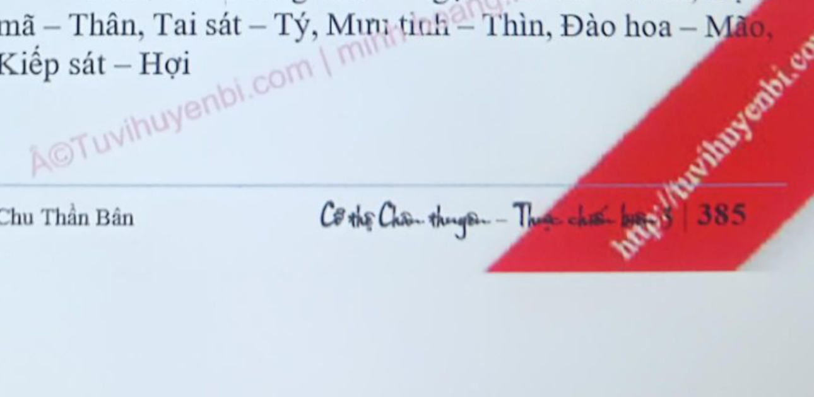

- **Cấu trúc Quẻ Dịch:**
  - **Quẻ chủ:** **Lôi Địa Dự** (Cung Chấn – Quẻ Lục Hợp)  
    *Tượng quẻ:* Hân hoan vui vẻ, hòa hợp gắn kết. Dự là quẻ Lục hợp, mang bản chất của sự thu hút ái tình mãnh liệt và duyên nợ tương giao khăng khít ban đầu.
  - **Quẻ biến:** **Lôi Phong Hằng** (Cung Chấn)  
    *Tượng quẻ:* Hằng cửu, bền bỉ, lâu dài. Trong hôn nhân, quẻ Hằng là biểu tượng kinh điển của đạo vợ chồng gắn kết trăm năm, không bao giờ thay đổi.

- **Bảng chi tiết Lục hào:**

| Hào | Thế/Ứng | Lục thân (Chủ) | Can Chi | Biến động | Lục thân (Biến) | Can Chi (Biến) | Thần sát / Phục | Lục thú |
|:---:|:---:|:---|:---|:---:|:---|:---|:---|:---|
| 6 | | Thê Tài | Tuất - Thổ | tĩnh | Thê Tài | Tuất - Thổ | Nhật Nguyệt kiến, Hoa cái | Chu Tước |
| 5 | | Quan Quỷ | Thân - Kim | tĩnh | Quan Quỷ | Thân - Kim | Dịch mã, Văn xương | Thanh Long |
| 4 | **Ứng** | Tử Tôn | Ngọ - Hỏa | tĩnh | Tử Tôn | Ngọ - Hỏa | Tướng tinh, Dương nhẫn | Huyền Vũ |
| 3 | | Huynh Đệ | Mão - Mộc | **X (Động)** | Quan Quỷ | Dậu - Kim | Đào hoa, Hồi đầu xung khắc | Bạch Hổ |
| 2 | | Tử Tôn | Tỵ - Hỏa | **X (Động)** | Phụ Mẫu | Hợi - Thủy | Tuần không, Lộc thần, Hồi đầu xung khắc | Đằng Xà |
| 1 | **Thế** | Thê Tài | Mùi - Thổ | tĩnh | Thê Tài | Sửu - Thổ | Quý nhân, Phục Phụ-Tỵ | Câu Trần |

---

### 3. Dụng thần & Loại quẻ

- **Phân loại quẻ:**
  - **Quẻ hôn nhân tình cảm (Nam chiêm hôn):** Khảo sát khả năng thành đôi giữa nam đương số và bạn gái.
  - **Quẻ có đối chiếu hiện trạng và lựa chọn:** Phân biệt giữa người yêu hiện tại, đối tượng kết hôn và cơ hội tình cảm bên ngoài.
- **Xác định Dụng thần:**
  1. **Dụng thần kết quả hôn nhân / Vị trí người vợ (Thê Tài Mùi Thổ giữ Thế):** Nam hỏi vợ lấy Thê Tài làm Dụng thần. Thê Tài Mùi Thổ lâm Câu Trần giữ Thế biểu thị người nữ đã đi sâu vào đời sống của đương số, quan hệ đã thân mật như vợ chồng hoặc đang chung sống.
  2. **Dụng thần đối tượng bạn gái chỉ định (Tử Tôn Ngọ Hỏa tại hào 4 Ứng):** Tử Tôn là Nguyên thần sinh Thê Tài, đại diện cho thân phận người bạn gái đang hẹn hò. Ứng lâm Tử Tôn Ngọ Hỏa tĩnh tại, mang Tướng tinh, là đối tượng chính thức được nhắm tới.
  3. **Đối tượng tình cảm lựa chọn khác (Tử Tôn Tỵ Hỏa tại hào 2 phát động):** Tử Tôn lâm Tuần không phát động, đại diện cho một mối duyên khác tiềm ẩn hoặc sự so sánh trong tâm tưởng.
  4. **Kỵ thần cản trở (Huynh Đệ Mão Mộc mang Bạch Hổ, Đào hoa):** Huynh Đệ phát động khắc phạt Thê Tài, mang theo Bạch Hổ và Đào hoa báo hiệu tranh chấp ghen tuông, sóng gió tình trường.

---

### 4. Luận giải chi tiết

Đây là một ca thực chiến thượng thừa có tỷ lệ đoán sai lên tới 90% đối với người mới học Lục Hào, được Chu Thần Bân giải mã bằng kỹ pháp dung hợp hiện trạng và tâm lý:

#### 1. Cạm bẫy phân tích sơ cấp dẫn đến kết luận sai (Tỷ lệ sai 90%)
- **Góc nhìn máy móc sơ cấp:**
  - Người mới học quan sát thấy chuỗi hào động: Hào 3 **Huynh Đệ Mão Mộc** sinh hào 2 **Tử Tôn Tỵ Hỏa**, Tỵ Hỏa sinh hào Thế **Thê Tài Mùi Thổ** — ngỡ là chuỗi liên hoàn tương sinh tuyệt đẹp.
  - Nhưng ngay lập tức phát hiện: Mão Mộc động hóa Quan Quỷ Dậu Kim (hồi đầu xung khắc); Tỵ Hỏa động hóa Phụ Mẫu Hợi Thủy (hồi đầu xung khắc). Cả hai hào động đều lâm **Phản ngâm** (xung khắc lẫn nhau).
  - Chuỗi tương sinh bị chính hào biến phá nát, Nguyên thần Tử Tôn Tỵ Hỏa bị hồi đầu khắc làm tiêu tan động lực sinh cho Thê Tài Mùi Thổ. Thêm vào đó, hào 3 Huynh Đệ lâm Bạch Hổ động hóa Quan Quỷ chủ sự chia rẽ kịch liệt.
  - Từ đó, 90% người học sẽ quả quyết kết luận: *"Quan hệ ban đầu tốt đẹp, nhưng sau nhiều lần trắc trở hợp tan sẽ chia tay dứt khoát, không thể thành vợ chồng!"*

#### 2. Chân tướng thực tế: Tại sao trắc trở mà cuối cùng vẫn cưới?
- Trên thực tế, đôi bạn trẻ quả thực trải qua nhiều phen xung đột, tan hợp đôi ba lần, nhưng **kết cục cuối cùng vẫn đi đến hôn nhân trọn vẹn**.
- Chu Thần Bân giải mã bí mật tâm pháp cao cấp:
  - **Sự đối chiếu giữa hai hào Tử Tôn (Một động - Một tĩnh):**
    * Tử Tôn Ngọ Hỏa lâm hào 4 Ứng: Hoàn toàn tĩnh lặng, kiên định, không bị bất kỳ biến động hay tổn thương nào. Đây mới chính là người bạn gái đích thực được xác định gắn bó dài lâu.
    * Tử Tôn Tỵ Hỏa lâm hào 2: Phát động nhưng lâm Tuần không, hóa hồi đầu khắc. Đây là đối tượng tình cảm khác bên ngoài hoặc một cơ hội dao động tư tưởng trong lòng đương số.
  - **Hồi đầu khắc mang ý nghĩa triệt tiêu lựa chọn cạnh tranh:**
    * Khi Tử Tôn Tỵ Hỏa bị Phụ Mẫu Hợi Thủy hồi đầu khắc, điều đó có nghĩa là **mối quan hệ bên ngoài kia bị dập tắt, đối tượng phân vân bị loại bỏ hoàn toàn**!
    * Nhờ cơ hội tình cảm bên ngoài bị triệt tiêu, đương số không còn "đứng núi này trông núi nọ", dồn trọn tâm trí quay về với người bạn gái chính thức (Tử Tôn Ngọ Hỏa).
  - **Ý nghĩa của tượng Phản ngâm:**
    * Hai hào động biến tương xung phản ngâm chỉ báo quá trình diễn biến sẽ có sự lặp đi lặp lại, gián đoạn, mâu thuẫn đôi phen (hợp rồi tan, tan rồi lại hợp), chứ không quyết định tính chất chung cuộc của hôn nhân.
  - **Bảo chứng từ cấu trúc Quẻ Dịch:**
    * Quẻ chủ **Lôi Địa Dự** (Lục hợp) biến **Lôi Phong Hằng** (Hằng cửu bền vững). Quẻ Lục hợp kết hợp với quẻ Hằng là điềm báo sắt son của mối lương duyên trăm năm, vượt qua thử thách để xây dựng tổ ấm bền chặt.

---

### 5. Kết luận & Ứng kỳ thực tế

- **Lời giải đoán của Chu Thần Bân:**
  - Con đường tình cảm giữa hai người ắt phải trải qua sóng gió, mâu thuẫn lặp đi lặp lại do có sự xuất hiện của đối tượng khác làm dao động hoặc do tính cách khắc khẩu (phản ngâm).
  - Tuy nhiên, đối tượng ngoài luồng sẽ tự khắc tiêu biến (Tử Tôn Tỵ Hỏa hóa tuyệt thoái khắc), mối duyên gốc rễ với người bạn gái hiện tại (Tử Tôn Ngọ Hỏa và Thê Tài Mùi Thổ trì Thế) vô cùng bền vững.
  - Kết luận: **Vượt qua giông bão thử thách, hai người chắc chắn sẽ cưới nhau làm vợ chồng**.
- **Phản hồi thực tế (Feedback):**
  - Đồng môn xác nhận đúng như lời thầy Chu chỉ dẫn: Trong quá trình yêu đương, đôi bên có đôi lần chia tay hụt do hiểu lầm và dao động tình cảm bên ngoài.
  - Sau những biến cố sàng lọc, họ càng thấu hiểu và trân trọng nhau hơn. Cuối cùng, hai người đã chính thức tổ chức đám cưới, chung sống hạnh phúc đúng như quẻ Lôi Phong Hằng báo trước.
- **Ứng kỳ chiêm nghiệm:** Sự việc kết hôn ứng nghiệm sau khi trải qua các chu kỳ lặp lại (phản ngâm), bước vào giai đoạn an định của quẻ Hằng.

---

### 6. Bài học tâm pháp & Quy tắc cốt lõi

- **Trích dẫn quy tắc sách (Rule Index):**
  - *Cạm bẫy quẻ Lục hợp trong hôn nhân và tác động phá hủy của Huynh Đệ lâm Bạch Hổ động hóa Quan Quỷ* (Sách Cổ Thệ Chân Thuyên Thực Chiến Biên 3, trang 358).
- **Tâm pháp giải đoán thực tế:**
  1. **Đọc hiểu hiện trạng là chìa khóa mở khóa quẻ lý:** Đừng bao giờ giải quẻ trên một tờ giấy trắng biệt lập. Phải luôn đối chiếu tượng quẻ với bối cảnh thực tế: đương số có đối tượng lựa chọn nào khác không? Tâm lý có đang phân vân nhiều mối không? Đọc hiểu lòng người chính là đỉnh cao của thuật Dịch.
  2. **Biện chứng Động - Tĩnh trong quẻ đa hào:** Khi trong quẻ có nhiều hào cùng lục thân, hào tĩnh đại diện cho thực thể ổn định hiện hữu, hào động đại diện cho nhân tố biến động phát sinh. Hào biến hồi đầu khắc không phải lúc nào cũng là hung; nếu nó khắc bỏ nhân tố phá hoại hoặc khắc bỏ sự phân tâm thì ngược lại đó là đại cát.
  3. **Phân biệt bản chất của Phản ngâm:** Phản ngâm chủ về "sự việc lặp đi lặp lại, khúc khuỷu quanh co", chứ không đồng nghĩa với "thất bại triệt để". Trong hôn nhân, phản ngâm là bài trắc nghiệm lòng chung thủy trước khi chạm tay tới hạnh phúc vĩnh cửu.

## THỰC CHIẾN 176: BÁNH TRÀ PHỔ NHĨ BỊ NGHI MỐC, HỎI TRÀ CÓ MỐC KHÔNG NHƯNG QUẺ LẠI XUẤT HIỆN TRIỆU CHỨNG HUNG

---

### 1. Bối cảnh & Câu hỏi

- **Bối cảnh chi tiết:** 
  Một đồng môn được người quen tặng một bánh trà Phổ Nhĩ cổ thụ quý giá. Dân gian thường truyền tai nhau rằng "trà Phổ Nhĩ càng để lâu càng quý, lưu giữ hàng chục năm không hỏng", nhưng thực tế điều kiện bảo quản đòi hỏi phải cực kỳ khô ráo, vô trùng và tuyệt đối tránh ẩm ướt; nếu môi trường có độ ẩm cao thì bất cứ loại trà nào cũng sẽ phát sinh nấm mốc. Vì xem bánh trà là vật phẩm quý báu, đương số không nỡ uống nhiều, mỗi tuần chỉ dám bẻ một ít pha đúng một lần. Vài ngày trước, có người bạn thân đến nhà chơi, đương số hào phóng bẻ một miếng trà ngon tặng bạn mang về thưởng thức. Hôm sau, người bạn gọi điện thông báo: trà hình như đã bị mốc hỏng, khuyên đương số tuyệt đối không được uống tiếp mà hãy mau chóng vứt đi vì nấm mốc chứa độc tố vi khuẩn nguy hại.
- **Tâm lý & Câu hỏi ẩn ý:** 
  Đương số nửa tin nửa ngờ, tiếc của và hoang mang, bèn gieo quẻ hỏi: *"Bánh trà phổ nhĩ này có thật sự bị mốc hay không?"* Người hỏi chỉ nghĩ đây là một câu hỏi việc nhỏ đời thường kiểm tra chất lượng đồ ăn, nhưng khi quẻ hiện lên lại xuất hiện tượng hung hiểm dị thường khiến đương số bàng hoàng sợ hãi.
- **Thời gian chiêm đoán:**
  - Can chi: Năm Mậu Tuất, tháng Nhâm Tuất, ngày Canh Thìn, giờ Canh Thìn.
  - Ngày Canh Thìn, tháng Nhâm Tuất (Thìn Tuất tương xung).

---

### 2. Dữ kiện & Bảng quẻ Crop

- **Thời không chiêm nghiệm:**
  - Tháng Nhâm Tuất, Ngày Canh Thìn (Thổ khí cực vượng, Thìn Tuất tương xung, Kim tướng, Thủy tù tuyệt).
  - Tuần không: **Thân - Dậu** (Giáp Tuất tuần trung, Thân Dậu không vong).
- **Thần sát:**
  - Tướng tinh: Tý
  - Hoa cái: Thìn (Lâm Nhật kiến, giờ chi)
  - Dịch mã: Dần (Lâm hào phục 2)
  - Tai sát: Ngọ
  - Mưu tinh: Tuất (Lâm Nguyệt kiến, hào biến 6)
  - Đào hoa: Dậu (Lâm Tuần không, hào 3, 5 Quan Quỷ)
  - Kiếp sát: Tỵ
  - Lộc thần: Thân (Lâm Tuần không, hào biến 3, 5)
  - Dương nhẫn: Dậu (Lâm Tuần không)
  - Văn xương: Hợi (Lâm hào 2, hào 4 Phụ Mẫu)
  - Thiên y: Dậu (Lâm Tuần không)
  - Thiên hỷ: Thìn (Lâm Nhật kiến, giờ chi)
  - Quý nhân: Dần, Ngọ (Ngọ lâm hào biến của 2 và 4)

- Bảng quẻ tượng và dữ kiện chiêm đoán:
  - **Bảng 176.1** Đồ hình quẻ Thực chiến 176:
    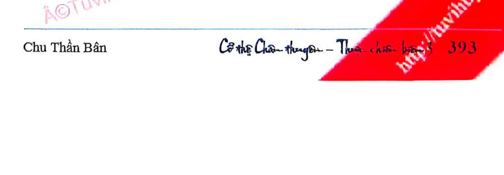

- **Cấu trúc Quẻ Dịch:**
  - **Quẻ chủ:** **Trạch Phong Đại Quá** (Cung Chấn – Quẻ Du Hồn)  
    *Tượng quẻ:* Đại quá tất tổn, cột kèo cong oằn, gánh nặng quá mức chịu tải. Đối với vật phẩm thực phẩm để lâu, Đại Quá là biểu tượng trực diện của việc "để quá thời hạn bảo quản", biến chất, quá mức chịu đựng của môi trường.
  - **Quẻ biến:** **Thiên Sơn Độn** (Cung Cấn)  
    *Tượng quẻ:* Thoái lui, ẩn nấp, lánh xa, vứt bỏ. Đối với thực phẩm nhiễm độc nấm mốc, quẻ Độn là lời cảnh báo khẩn cấp: phải lập tức vứt bỏ, tránh xa nguồn độc tố, không được luyến tiếc.

- **Bảng chi tiết Lục hào:**

| Hào | Thế/Ứng | Lục thân (Chủ) | Can Chi | Biến động | Lục thân (Biến) | Can Chi (Biến) | Thần sát / Phục | Lục thú |
|:---:|:---:|:---|:---|:---:|:---|:---|:---|:---|
| 6 | | Thê Tài | Mùi - Thổ | **X (Động)** | Thê Tài | Tuất - Thổ | Mưu tinh, Nguyệt kiến | Đằng Xà |
| 5 | | Quan Quỷ | Dậu - Kim | tĩnh | Quan Quỷ | Thân - Kim | Tuần không, Đào hoa, Dương nhẫn | Câu Trần |
| 4 | **Thế** | Phụ Mẫu | Hợi - Thủy | tĩnh | Tử Tôn | Ngọ - Hỏa | Văn xương | Chu Tước |
| 3 | | Quan Quỷ | Dậu - Kim | tĩnh | Quan Quỷ | Thân - Kim | Tuần không, Đào hoa, Dương nhẫn | Thanh Long |
| 2 | | Phụ Mẫu | Hợi - Thủy | **O (Động)** | Tử Tôn | Ngọ - Hỏa | Văn xương, Phục Huynh-Dần | Huyền Vũ |
| 1 | **Ứng** | Thê Tài | Sửu - Thổ | tĩnh | Thê Tài | Thìn - Thổ | Thiên hỷ, Hoa cái | Bạch Hổ |

---

### 3. Dụng thần & Loại quẻ

- **Phân loại quẻ:**
  - **Quẻ thẩm định vật phẩm (Kiểm tra chất lượng thực phẩm):** Xem bánh trà phổ nhĩ có bị ẩm mốc biến chất hay không.
  - **Hiện tượng Quẻ vượt cấp (Tiểu sự kiến đại hung):** Hỏi về sự việc vi mô đời thường nhưng quẻ lại xuất hiện cấu trúc đại hung sát phạt.
- **Xác định Dụng thần:**
  1. **Dụng thần vật phẩm trà & Nước uống (Phụ Mẫu Hợi Thủy):** Phụ Mẫu chủ về đồ vật, thức uống; Hợi Thủy mang Văn xương là dòng nước trà tinh khiết dùng để pha uống. Hào 4 Phụ Mẫu Hợi Thủy trì Thế mang Chu Tước biểu thị bản thân đang đun nước nóng pha trà uống thường kỳ.
  2. **Kỵ thần nấm mốc biến chất (Thê Tài Mùi Thổ phát động):** Thổ khắc Thủy. Thổ đại diện cho thời gian lưu cữu lâu ngày, sinh ra nấm mốc, vi khuẩn hữu cơ xâm nhập nguồn nước.
  3. **Hào Thế (Phụ Mẫu Hợi Thủy tại hào 4):** Đại diện cho sinh mệnh và sức khỏe của đương số khi trực tiếp tiêu thụ sản phẩm trà này.

---

### 4. Luận giải chi tiết

Trọng tâm của ca thực chiến này là cơ chế giải mã **hiện tượng việc nhỏ xuất hiện đại hung triệu** mà Chu Thần Bân đã đúc kết thành quy tắc kinh điển:

#### 1. Hiện thực hóa nấm mốc qua sự bùng nổ của Thổ khí
- Ngũ hành Thổ tượng trưng cho đất cát, bụi bặm, và sự ẩm mốc hữu cơ qua thời gian dài tích tụ. Trà pha bằng nước thuộc Thủy (Phụ Mẫu Hợi Thủy). Khi Thổ khắc Thủy, đó là hình ảnh nấm mốc, độc tố vi khuẩn xâm chiếm làm ô nhiễm nguồn nước trà.
- Xem xét uy lực của Kỵ thần:
  - Hào 6 **Thê Tài Mùi Thổ** phát động hóa **Thê Tài Tuất Thổ** (Tiến thần).
  - Quẻ gieo vào tháng Tuất, ngày Thìn: Cả Nhật kiến Thìn Thổ lẫn Nguyệt kiến Tuất Thổ đều thuộc Thổ, lại tương xung nhau làm bùng phát mãnh liệt khí Thổ. Hào động Mùi Thổ hóa Tuất Thổ lâm Nguyệt lệnh đắc thế tột đỉnh.
  - Một hào Kỵ thần Thổ mang đầy uy lực của Nhật Nguyệt phát động hung hãn khắc thẳng vào hào Thế **Phụ Mẫu Hợi Thủy** và hào 2 Phụ Mẫu Hợi Thủy!
- Quẻ chủ **Trạch Phong Đại Quá**: "Đại quá" nghĩa là quá mức, bánh trà đã để quá lâu trong môi trường có ẩm khí, nấm mốc độc hại đã sinh sôi vượt ngưỡng an toàn.

#### 2. Vì sao người hỏi lại hoảng hốt nghi ngờ tai họa cho Cha Mẹ?
- Khi thấy hào Phụ Mẫu Hợi Thủy bị Nhật Nguyệt cùng hào động Thổ khắc tuyệt, lại xuất hiện quẻ Đại Quá Du hồn biến Thiên Sơn Độn hung hiểm, đương số hoảng loạn nghĩ rằng:
  *"Tôi chỉ hỏi một mẩu trà mốc, việc nhỏ như vậy cớ sao lại xuất hiện đại hung quẻ? Phải chăng quẻ không nói về trà mà hào Phụ Mẫu này đang báo điềm cha mẹ tôi sắp gặp đại nạn sinh tử?"*
- Đây chính là sự ngộ nhận phổ biến của người học Dịch khi chưa nắm vững tâm pháp quẻ vượt cấp: Hễ thấy việc nhỏ mà quẻ hiện đại hung liền hoang mang suy diễn vượt cấp sang tai họa gia đình.

#### 3. Chân tướng quẻ vượt cấp: Cảnh báo nguy cơ tích tụ bệnh tật
- Chu Thần Bân giải mã: Quẻ không hề nói về cha mẹ. Đại hung ở đây chính là **lời cảnh báo sức khỏe của bản thân đương số**:
  - Hào Thế Phụ Mẫu Hợi Thủy lâm Chu Tước: Chu Tước là lửa đun, Hợi Thủy là nước trà. Bản thân đương số "mỗi tuần uống một lần", tức là đều đặn đưa nấm mốc chứa vi khuẩn độc hại (Aflatoxin...) vào cơ thể.
  - Nếu tiếp tục uống định kỳ loại trà nhiễm khuẩn này, chất độc tích tụ lâu ngày sẽ dẫn đến bệnh tật hiểm nghèo, ung thư nội tạng (hào Thế bị Thổ khắc diệt).
  - Vì vậy, Lục Hào phát tín hiệu "Đại hung" để đánh thức đương số, ngăn chặn một thảm họa sức khỏe tiềm ẩn!
  - Quẻ biến **Thiên Sơn Độn**: "Độn" là thoái lui, lánh xa. Quẻ dạy rằng phải dứt khoát vứt bỏ bánh trà mốc đi, không được tiếc của mà rước họa sát thân.

---

### 5. Kết luận & Ứng kỳ thực tế

- **Lời giải đoán của Chu Thần Bân:**
  - Khẳng định 100% bánh trà đã bị nấm mốc biến chất nghiêm trọng, không còn là trà quý mà đã thành nguồn độc tố.
  - Quẻ hiện đại hung là cảnh báo nguy cơ hủy hoại sức khỏe bản thân nếu tiếp tục uống, tuyệt đối không phải điềm báo tai họa của cha mẹ.
  - Yêu cầu đương số: **Lập tức đem toàn bộ bánh trà phổ nhĩ vứt vào sọt rác, tránh xa mầm bệnh (quẻ Độn)**.
- **Phản hồi thực tế (Feedback):**
  - Đương số nghe lời giải thích khoa học và thấu đáo, liền kiểm tra kỹ lại bánh trà dưới ánh sáng mạnh thì phát hiện sâu bên trong các thớ trà đã lan đầy mốc trắng và sợi nấm li ti.
  - Đương số dứt khoát đem vứt bỏ toàn bộ bánh trà, thoát khỏi hiểm họa ngộ độc độc tố nấm mốc dài hạn.
- **Ứng kỳ chiêm nghiệm:** Sự việc hóa giải hung tai ngay trong ngày Canh Thìn tháng Nhâm Tuất nhờ hành động vứt bỏ trà kịp thời.

---

### 6. Bài học tâm pháp & Quy tắc cốt lõi

- **Trích dẫn quy tắc sách (Rule Index):**
  - *Quy tắc quẻ tiểu sự xuất hiện đại hung triệu: Cơ chế cảnh báo tai họa vượt cấp của quẻ Du hồn Đại Quá* (Sách Cổ Thệ Chân Thuyên Thực Chiến Biên 3, trang 365).
- **Tâm pháp giải đoán thực tế:**
  1. **Hiểu đúng hiện tượng "Việc nhỏ hiện đại hung":** Khi câu hỏi chỉ là việc sinh hoạt thường nhật mà quẻ xuất hiện triệu chứng đại hung khắc Thế, không được hoang mang suy diễn sang việc lớn của người thân. Đó chính là cơ chế cảnh báo vượt cấp của Dịch học: tính chất vật chất sự việc có thể nhỏ, nhưng hậu quả tiềm ẩn đối với tính mạng, sức khỏe của đương số lại vô cùng khôn lường.
  2. **Tượng quẻ Đại Quá và Độn trong ẩm thực:** Gặp quẻ Đại Quá biểu thị thực phẩm đã quá hạn sử dụng, quá ngưỡng an toàn vi sinh; gặp quẻ Độn là mệnh lệnh phải triệt thoái, vứt bỏ, tránh xa, tuyệt đối không dung túng giữ lại.
  3. **Định vị Dụng thần nhất quán với ý niệm ban đầu:** Hỏi trà thì hào Phụ Mẫu là trà nước, không được vì thấy hào bị khắc mà tự ý chuyển đổi Dụng thần sang cha mẹ khi chưa có dữ kiện xác thực.

## THỰC CHIẾN 177: DO QUẺ TRƯỚC MÀ NGHI NGỜ CHA MẸ GẶP TAI HỌA, HỎI LIỆU CÓ THỂ HIỆN CHA MẸ GẶP NẠN HAY KHÔNG

---

### 1. Bối cảnh & Câu hỏi

- **Bối cảnh chi tiết:** 
  Sau khi gieo quẻ Thực chiến 176 để hỏi về việc bánh trà Phổ Nhĩ có bị mốc hay không, kết quả xuất hiện quẻ hung hiểm cực độ (Trạch Phong Đại Quá biến Thiên Sơn Độn, Kỵ thần Thổ mang uy lực Nhật Nguyệt phát động khắc tuyệt Thế hào Phụ Mẫu Hợi Thủy). Người gieo quẻ vô cùng kinh sợ, trong đầu nảy sinh mối hoài nghi và suy diễn vượt cấp: việc hỏi một bánh trà nhỏ nhặt cớ sao lại xuất hiện đại hung triệu? Liệu có phải Dụng thần Phụ Mẫu trong quẻ trước không đại diện cho trà, mà là thiên cơ đang ngầm cảnh báo cha mẹ của mình sắp sửa gặp đại nạn sinh tử hay tai ương bất trắc? Nỗi sợ hãi và ám ảnh tâm lý bóp nghẹt tâm can khiến đương số đứng ngồi không yên.
- **Tâm lý & Câu hỏi ẩn ý:** 
  Ngay trong buổi chiều cùng ngày, đương số lập tức gieo tiếp quẻ thứ hai khẩn thiết hỏi Chu Thần Bân: *"Do quẻ trước xuất hiện hung triệu, tôi nghi ngờ cha mẹ sắp gặp tai họa, hỏi quẻ trước liệu có phải thể hiện cha mẹ tôi gặp nạn hay không?"* Tâm lý đương số hoàn toàn bị chi phối bởi sự hoang mang cực độ, nỗi sợ hãi tột cùng và tâm lý "thần hồn nát thần tính".
- **Thời gian chiêm đoán:**
  - Dương lịch: 28/10/2018 (cùng ngày với Thực chiến 176).
  - Can chi: Năm Mậu Tuất, tháng Nhâm Tuất, ngày Canh Thìn, giờ Ất Dậu.

---

### 2. Dữ kiện & Bảng quẻ Crop

- **Thời không chiêm nghiệm:**
  - Tháng Nhâm Tuất, Ngày Canh Thìn (Thổ khí cực vượng, Thìn Tuất tương xung, Kim tướng, Thủy tù).
  - Tuần không: **Thân - Dậu** (Giáp Tuất tuần trung, Thân Dậu không vong).
- **Thần sát:**
  - Tướng tinh: Tý (Lâm hào biến 6)
  - Hoa cái: Thìn (Lâm Nhật kiến, hào biến 3)
  - Dịch mã: Dần (Lâm hào biến 2)
  - Tai sát: Ngọ (Lâm hào phục 3)
  - Mưu tinh: Tuất (Lâm Nguyệt kiến, hào biến 5)
  - Đào hoa: Dậu (Lâm Tuần không, hào 6 Phụ Mẫu, giờ chi)
  - Kiếp sát: Tỵ
  - Lộc thần: Thân (Lâm Tuần không, hào biến 4 Phụ Mẫu)
  - Dương nhẫn: Dậu (Lâm Tuần không, hào 6)
  - Văn xương: Hợi (Lâm hào 3, 5 Huynh Đệ phát động)
  - Thiên y: Dậu (Lâm Tuần không, hào 6)
  - Thiên hỷ: Thìn (Lâm Nhật kiến)
  - Quý nhân: Dần, Ngọ

- Bảng quẻ tượng và dữ kiện chiêm đoán:
  - **Bảng 177.1** Đồ hình quẻ Thực chiến 177:
    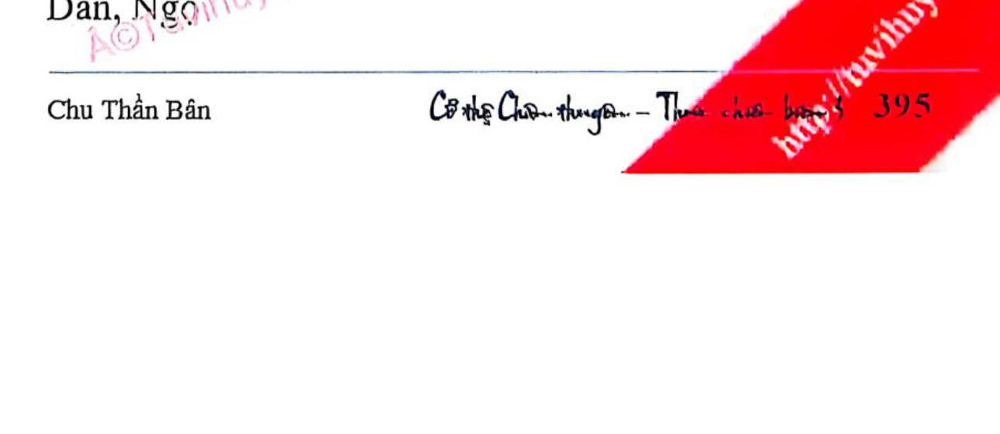

- **Cấu trúc Quẻ Dịch:**
  - **Quẻ chủ:** **Địa Hỏa Minh Di** (Cung Khảm – Quẻ Du Hồn)  
    *Tượng quẻ:* Mặt trời lặn dưới lòng đất, bóng tối bao trùm, thương tích hoang mang. Phản ánh chân thực trạng thái tâm lý dao động, bất an, sợ hãi bóng ma vô hình trong tâm trí của đương số (quẻ Du hồn).
  - **Quẻ biến:** **Thủy Lôi Truân** (Cung Khảm)  
    *Tượng quẻ:* Tích tụ gian nan, mầm bệnh tích lũy nếu không dứt khoát loại bỏ nguyên nhân.

- **Bảng chi tiết Lục hào:**

| Hào | Thế/Ứng | Lục thân (Chủ) | Can Chi | Biến động | Lục thân (Biến) | Can Chi (Biến) | Thần sát / Phục | Lục thú |
|:---:|:---:|:---|:---|:---:|:---|:---|:---|:---|
| 6 | | Phụ Mẫu | Dậu - Kim | tĩnh | Huynh Đệ | Tý - Thủy | Tuần không, Đào hoa, Dương nhẫn, Thiên y | Đằng Xà |
| 5 | | Huynh Đệ | Hợi - Thủy | **X (Động)** | Quan Quỷ | Tuất - Thổ | Văn xương, Nguyệt kiến (ở hào biến) | Câu Trần |
| 4 | **Thế** | Quan Quỷ | Sửu - Thổ | tĩnh | Phụ Mẫu | Thân - Kim | Mộ khố của Phụ Mẫu Dậu Kim | Chu Tước |
| 3 | | Huynh Đệ | Hợi - Thủy | **O (Động)** | Quan Quỷ | Thìn - Thổ | Văn xương, Nhật kiến (ở hào biến), Phục Tài-Ngọ | Thanh Long |
| 2 | | Quan Quỷ | Sửu - Thổ | tĩnh | Tử Tôn | Dần - Mộc | | Huyền Vũ |
| 1 | **Ứng** | Tử Tôn | Mão - Mộc | tĩnh | Huynh Đệ | Tý - Thủy | Nguyệt phá, Nhật hợp | Bạch Hổ |

---

### 3. Dụng thần & Loại quẻ

- **Phân loại quẻ:**
  - **Quẻ tâm thái sinh ra do nghi tâm sợ hãi (Tâm quẻ):** Quẻ gieo ra do bóng ma tâm lý từ quẻ trước ám ảnh, không xuất phát từ một sự kiện khách quan có thật bên ngoài.
  - **Quẻ thẩm định chân giả Dụng thần:** Phân định xem thông tin hung triệu thực sự nhắm vào ai: cha mẹ hay chính bản thân đương số và vấn đề vệ sinh thực phẩm.
- **Xác định Dụng thần:**
  1. **Dụng thần cha mẹ (Phụ Mẫu Dậu Kim tại hào 6):** Hỏi về cha mẹ lấy Phụ Mẫu làm Dụng thần. Hào 6 Phụ Mẫu Dậu Kim lâm Tuần không, đắc Nguyệt sinh Nhật hợp.
  2. **Hào Thế (Quan Quỷ Sửu Thổ tại hào 4):** Quan Quỷ trì Thế chủ về tâm trạng lo âu, hoảng hốt, bất an. Sửu Thổ chính là **Mộ khố của Phụ Mẫu Dậu Kim**, phản ánh chính xác tâm lý đương số đang giam hãm nỗi lo lắng về sự an nguy của cha mẹ trong lòng.
  3. **Hai hào động giáp Thế (Huynh Đệ Hợi Thủy tại hào 3 và hào 5):** Kẹp hai bên hào Thế, đại diện cho thực trạng pha trà nước của hai phần bánh trà.

---

### 4. Luận giải chi tiết

Chu Thần Bân giải mã lớp lớp hoang mang, vạch trần chân tướng ảo ảnh tâm lý bằng kỹ pháp Dịch học thâm sâu:

#### 1. Định vị chân tướng Dụng thần Cha Mẹ: Đại cát vô tai
- Khi hỏi: *"Liệu cha mẹ có gặp tai họa không?"*, ta xem xét hào **Phụ Mẫu Dậu Kim** ở hào 6:
  - Phụ Mẫu Dậu Kim nằm ở vị trí hào 6 hoàn toàn tĩnh lặng.
  - Tháng Nhâm Tuất: Tuất Thổ sinh Dậu Kim; Ngày Canh Thìn: Thìn Thổ sinh Dậu Kim, lại tạo thành **Thìn Dậu Lục Hợp**. Dụng thần được cả Nhật lẫn Nguyệt đồng sinh vượng tướng tuyệt đỉnh.
  - Dù lâm Tuần không, nhưng đây là "Động bất không, Vượng bất không", xuất không sẽ càng thêm vượng.
  - Đặc biệt: Cả hai hào động trong quẻ (hào 3 và hào 5 Huynh Đệ Hợi Thủy) hoàn toàn **không hề khắc hãm hay tác động tiêu cực đến Phụ Mẫu Dậu Kim**.
- Kết luận đanh thép: Hào Phụ Mẫu cực vượng không thương tổn, **cha mẹ đương số hoàn toàn bình an vô sự, tuyệt đối không có bất kỳ tai họa nào**! Mối nghi ngờ cha mẹ gặp nạn hoàn toàn là ảo tưởng sinh ra từ sự sợ hãi vô căn cứ.

#### 2. Kỹ pháp độc môn phái Dã Hạc: Cơ chế "Giáp Thế" của hai hào động
- Nếu không phải tai họa của cha mẹ, vậy hai hào động trong quẻ nói lên điều gì?
- Trong quẻ, hào 3 và hào 5 đều là **Huynh Đệ Hợi Thủy phát động**, nằm ở hai vị trí kẹp chặt lấy hào Thế Quan Quỷ Sửu Thổ ở hào 4. Đây chính là thế trận **"Giáp Thế"**:
  - Hào 5 Huynh Đệ Hợi Thủy động hóa **Quan Quỷ Tuất Thổ** (hồi đầu khắc).
  - Hào 3 Huynh Đệ Hợi Thủy động hóa **Quan Quỷ Thìn Thổ** (hồi đầu khắc).
  - Hai hào Huynh Đệ Hợi Thủy đều là hào Thủy mang Văn xương (tượng nước pha trà).
  - Tại sao lại xuất hiện hai hào Thủy bị Thổ Quan Quỷ hồi đầu khắc?
    * **Hào 3:** Đại diện cho phần bánh trà giữ lại ở nhà tự pha uống.
    * **Hào 5 (Ngoại quái):** Đại diện cho phần bánh trà đã bẻ đưa cho bạn mang về nhà pha uống.
- Cả hai phần trà khi mang đi pha nước (Hợi Thủy) đều biến thành **Quan Quỷ hồi đầu khắc** (Tuất Thổ và Thìn Thổ):
  - Khẳng định 100%: Dù là phần trà ở nhà hay phần trà tặng bạn, toàn bộ bánh trà đều đã bị nhiễm khuẩn, nấm mốc độc hại (Quan Quỷ Thổ) ăn sâu vào chất lượng trà!

#### 3. Bản chất Quẻ Du Hồn Minh Di và Quẻ Truân
- Quẻ chủ **Địa Hỏa Minh Di** (quẻ Du hồn): Minh Di là tổn thương, Du hồn là tâm thần bất định. Đương số như người đi đêm thấy bóng cây ngỡ ma quỷ, tự dọa dẫm chính mình.
- Quẻ biến **Thủy Lôi Truân**: Truân là tích tụ. Nếu không tỉnh ngộ, tiếp tục tiếc của uống trà mốc thì độc tố vi khuẩn sẽ tích tụ dần trong người sinh bệnh nan y (nước hóa Quan Quỷ khắc chính mình).
- Giải pháp hóa giải: Hào Thủy hóa Quan Quỷ quay lại khắc Thủy. Chỉ cần **đổ bỏ nước trà, vứt toàn bộ bánh trà vào thùng rác**, thì Hợi Thủy tiêu tán, Quan Quỷ nấm mốc tự khắc bị tiêu diệt, tâm bệnh cũng lập tức tan biến!

---

### 5. Kết luận & Ứng kỳ thực tế

- **Lời giải đoán của Chu Thần Bân:**
  - Khẳng định chắc nịch: Cha mẹ mạnh khỏe bình an, không có bất kỳ tai nạn hay hiểm họa nào. Nỗi lo của đương số chỉ là quẻ tâm thái sinh ra do "thần hồn nát thần tính".
  - Quẻ một lần nữa xác nhận: Toàn bộ bánh trà phổ nhĩ (cả phần tặng bạn lẫn phần giữ ở nhà) đều đã bị mốc biến chất nguy hiểm.
  - Khuyên đương số trút bỏ hoàn toàn gánh nặng lo lắng cho cha mẹ, lập tức vứt bỏ bánh trà để dứt điểm mầm họa.
- **Phản hồi thực tế (Feedback):**
  - Đương số thở phào nhẹ nhõm, gạt bỏ hoàn toàn nỗi sợ hãi ám ảnh. Cha mẹ đương số sau đó vẫn hoàn toàn khỏe mạnh, an khang, không gặp bất cứ sự cố nào.
  - Đương số dứt khoát đem vứt bỏ toàn bộ bánh trà mốc, tâm an thân thái đúng như dự đoán của Chu Thần Bân.
- **Ứng kỳ chiêm nghiệm:** Nỗi lo tan biến ngay trong ngày Canh Thìn giờ Ất Dậu khi được thầy Chu khai mở chân tướng.

---

### 6. Bài học tâm pháp & Quy tắc cốt lõi

- **Trích dẫn quy tắc sách (Rule Index):**
  - *Nguyên tắc giải đoán quẻ sinh ra từ nghi tâm sợ hãi (tâm quẻ) và phân định chân giả Dụng thần* (Sách Cổ Thệ Chân Thuyên Thực Chiến Biên 3, trang 367).
- **Tâm pháp giải đoán thực tế:**
  1. **Quy tắc phân định quẻ do nghi tâm (Tâm quẻ):** Khi người hỏi gieo quẻ vì bị ám ảnh, hoảng loạn từ một quẻ hung trước đó, dịch giả phải bình tĩnh kiểm tra Dụng thần thực tế. Nếu Dụng thần đắc Nhật Nguyệt sinh trợ vượng tướng, không bị hào động khắc thương, thì hung triệu đó thuần túy là hình chiếu của nỗi sợ hãi nội tâm, không phải thực tế khách quan.
  2. **Kỹ pháp "Giáp Thế" độc môn:** Khi hai hào động kẹp hai bên hào Thế có cùng một bản chất động biến (ở đây là Thủy động hóa Thổ Quan Quỷ hồi đầu khắc), chúng phản ánh hai mặt của cùng một sự việc mà đương số đang trực tiếp nắm giữ và chịu trách nhiệm giải quyết.
  3. **Tâm thái vững vàng của người dẫn dắt Dịch học:** Người thầy bói giỏi không chỉ biết đoán đúng sự việc, mà còn phải là một điểm tựa tâm lý vững chắc, biết cách đập tan ảo tưởng sợ hãi của đương số, đưa họ từ bóng tối u mê của quẻ Minh Di trở về với ánh sáng của lý trí và khoa học thực tiễn.

## THỰC CHIẾN 178: XEM CHÌA KHÓA XE HƠI BỊ MẤT Ở ĐÂU, CÓ TÌM ĐƯỢC KHÔNG

---

### 1. Bối cảnh & Câu hỏi

- **Bối cảnh chi tiết:** 
  Một đồng môn lái xe ô tô về nhà vào buổi tối, đậu xe cẩn thận vào gara rồi đi lên nhà nghỉ ngơi. Đến sáng hôm sau khi chuẩn bị đi làm thì tá hỏa phát hiện chiếc chìa khóa xe hơi không cánh mà bay. Tìm kiếm khắp các vị trí quen thuộc như bàn làm việc, túi áo, móc treo chìa khóa đều không thấy tăm hơi. Vì cần xe di chuyển gấp và lo lắng chìa khóa rơi mất bên ngoài bị kẻ gian nhặt được, đương số liền chụp ảnh quẻ gieo được đăng lên nhóm học tập Dịch học để nhờ các bạn đồng môn và Chu Thần Bân trợ giúp.
- **Tâm lý & Câu hỏi ẩn ý:** 
  Đương số sốt ruột hỏi: *"Chìa khóa xe hơi của tôi bị mất ở đâu, liệu có tìm lại được không?"* Tâm lý vừa hoang mang không biết rơi ở dọc đường hay thất lạc trong nhà, vừa hy vọng tìm thấy ngay để kịp công việc.
- **Thời gian chiêm đoán:**
  - Dương lịch: 15/10/2018, 10:09 sáng (Giờ Bắc Kinh).
  - Can chi: Năm Mậu Tuất, tháng Nhâm Tuất, ngày Canh Thìn, giờ Tân Tỵ.

---

### 2. Dữ kiện & Bảng quẻ Crop

- **Thời không chiêm nghiệm:**
  - Tháng Nhâm Tuất, Ngày Canh Thìn (Thổ khí cực vượng, Thìn Tuất tương xung, Kim tướng, Hỏa hưu).
  - Tuần không: **Thân - Dậu** (Giáp Tuất tuần trung, Thân Dậu không vong).
- **Thần sát:**
  - Tướng tinh: Tý
  - Hoa cái: Thìn (Lâm Nhật kiến, hào biến 2)
  - Dịch mã: Dần (Lâm hào biến sơ Thê Tài)
  - Tai sát: Ngọ (Lâm hào biến 3, 4)
  - Mưu tinh: Tuất (Lâm Nguyệt kiến, hào biến 6)
  - Đào hoa: Dậu (Lâm Tuần không, hào 5)
  - Kiếp sát: Tỵ (Lâm hào sơ Quan Quỷ phát động, giờ chi)
  - Lộc thần: Thân (Lâm Tuần không, hào biến 5)
  - Dương nhẫn: Dậu (Lâm Tuần không, hào 5)
  - Văn xương: Hợi (Lâm hào 4 Tử Tôn)
  - Thiên y: Dậu (Lâm Tuần không)
  - Thiên hỷ: Thìn (Lâm Nhật kiến)
  - Quý nhân: Dần, Ngọ (Dần lâm hào biến sơ Thê Tài, Ngọ lâm hào biến 3, 4)

- Bảng quẻ tượng và dữ kiện chiêm đoán:
  - **Bảng 178.1** Đồ hình quẻ Thực chiến 178:
    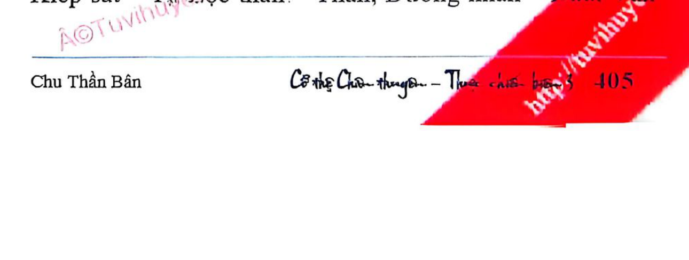

- **Cấu trúc Quẻ Dịch:**
  - **Quẻ chủ:** **Bát Thuần Đoài** (Cung Đoài – Quẻ Lục Xung)  
    *Tượng quẻ:* Đoài vi Trạch, sự việc vừa mới xảy ra, cảm giác mất mát tức thời. Quẻ Lục xung trong quẻ tìm đồ vật thất lạc báo hiệu sự việc ứng nghiệm rất nhanh, đồ vật sẽ sớm lộ diện.
  - **Quẻ biến:** **Thiên Thủy Tụng** (Cung Ly – Quẻ Du Hồn)  
    *Tượng quẻ:* Tranh cãi, bàn luận xôn xao. Ứng nghiệm việc đương số đăng quẻ lên nhóm chat đồng môn khiến mọi người sôi nổi mổ xẻ, tranh luận về vị trí của chiếc chìa khóa.

- **Bảng chi tiết Lục hào:**

| Hào | Thế/Ứng | Lục thân (Chủ) | Can Chi | Biến động | Lục thân (Biến) | Can Chi (Biến) | Thần sát / Phục | Lục thú |
|:---:|:---:|:---|:---|:---:|:---|:---|:---|:---|
| 6 | **Thế** | Phụ Mẫu | Mùi - Thổ | **X (Động)** | Phụ Mẫu | Tuất - Thổ | Mưu tinh, Nguyệt kiến | Đằng Xà |
| 5 | | Huynh Đệ | Dậu - Kim | tĩnh | Huynh Đệ | Thân - Kim | Tuần không, Dương nhẫn, Đào hoa | Câu Trần |
| 4 | | Tử Tôn | Hợi - Thủy | tĩnh | Quan Quỷ | Ngọ - Hỏa | Văn xương | Chu Tước |
| 3 | **Ứng** | Phụ Mẫu | Sửu - Thổ | tĩnh | Quan Quỷ | Ngọ - Hỏa | Quý nhân (ở biến) | Thanh Long |
| 2 | | Thê Tài | Mão - Mộc | tĩnh | Phụ Mẫu | Thìn - Thổ | Nhật hợp | Huyền Vũ |
| 1 | | Quan Quỷ | Tị - Hỏa | **O (Động)** | Thê Tài | Dần - Mộc | Kiếp sát, Giờ chi | Bạch Hổ |

*(Ghi chú: Hào biến sơ Thê Tài Dần Mộc mang Quý nhân và Dịch mã).*

---

### 3. Dụng thần & Loại quẻ

- **Phân loại quẻ:**
  - **Quẻ tìm đồ vật thất lạc (Thất vật chiêm):** Định vị tọa độ và không gian chứa đồ vật bị đánh rơi.
  - **Quẻ hiện trạng (Miêu tả hiện trường):** Trọng tâm của quẻ là chỉ rõ chiếc chìa khóa hiện đang nằm ở vị trí nào trong thực tế khách quan.
- **Xác định Dụng thần:**
  1. **Dụng thần chìa khóa (Phụ Mẫu Mùi Thổ tại hào 6 Thế):** Phụ Mẫu chủ về giấy tờ, chìa khóa, phụ tùng xe cộ. Hào 6 Phụ Mẫu Mùi Thổ giữ Thế phát động chính là chiếc chìa khóa thất lạc. Hào Thế lâm **Đằng Xà** mang tượng uốn khúc, cuộn kẹt, nằm lọt thỏm trong khe hẹp ngóc ngách khó thấy.
  2. **Nguyên thần khởi phát sự việc (Quan Quỷ Tỵ Hỏa tại hào sơ):** Hỏa sinh Thổ, là nguồn gốc phát sinh động tác làm rơi chìa khóa.
  3. **Người tìm kiếm trợ giúp (Thê Tài Dần Mộc tại hào biến sơ):** Hào biến mang Thê Tài, đại diện cho người vợ. Dần Mộc lại lâm **Quý nhân** và Dịch mã, ngụ ý người vợ chính là quý nhân di chuyển đi tìm lại đồ vật.

---

### 4. Luận giải chi tiết

Phân tích của Chu Thần Bân là bài học mẫu mực về phương pháp kết hợp linh hoạt giữa Lục Hào tượng số với trình tự hành vi sinh hoạt thực tế:

#### 1. Loại trừ không gian: Mất bên ngoài hay mất trong nhà?
- Dịch giả bắt buộc phải nắm chắc bối cảnh thực tế: Đương số đã lái xe về nhà, cất xe vào gara an toàn rồi mới lên phòng, sáng hôm sau mới tìm chìa. Điều này loại trừ khả năng rơi chìa ngoài đường. Chìa khóa chắc chắn **100% đang nằm trong nhà**.
- Trong quẻ xuất hiện hình thái **Nội ngoại đồng động**: Hào sơ (nội quái) động và Hào 6 (ngoại quái) động.
- Sự kết hợp hào vị không gian Cao - Thấp:
  - Hào sơ đại diện cho vị trí thấp nhất: mặt đất, sàn nhà, khu vực tháo giày dép ở cửa ra vào.
  - Hào 6 đại diện cho vị trí cao nhất: trên cao, nóc tủ, tầng trên cùng.

#### 2. Tái hiện quá trình thất lạc qua chuỗi hào động
- **Bước 1: Rơi ở vị trí thấp (Hào sơ phát động):**
  - Hào sơ **Quan Quỷ Tỵ Hỏa** phát động lâm **Bạch Hổ**. Bạch Hổ chủ về sự cẩu thả, bất cẩn, đồng thời chủ về bụi bẩn, đồ dơ.
  - Vị trí hào sơ lâm Bạch Hổ chính là khu vực giày dép ở cửa ra vào. Khi đi làm về, lúc cúi người xuống tháo giày, do bất cẩn (Bạch Hổ), chiếc chìa khóa xe đã vô tình tuột khỏi túi rơi tọt vào trong **chiếc hộp đựng giày**.
- **Bước 2: Di chuyển lên vị trí cao (Hào 6 phát động):**
  - Quan Quỷ Tỵ Hỏa (hào sơ) sinh cho **Phụ Mẫu Mùi Thổ** (hào 6). Động tác tháo giày ở dưới sàn nhà đã kéo theo vật dịch chuyển lên trên.
  - Chiếc hộp đựng giày sau đó được nhấc lên và cất lên **nóc tủ trên cao** (vị trí tối thượng của hào 6).
  - Hào 6 Phụ Mẫu Mùi Thổ động hóa **Phụ Mẫu Tuất Thổ**:
    * Thổ hóa Thổ mang ý nghĩa vị trí đồ vật đã bị xê dịch.
    * Đồng thời thể hiện trên nóc tủ có hai đồ vật bằng nhau: Phụ Mẫu Tuất Thổ (đôi giày/hộp giày) và Phụ Mẫu Mùi Thổ (chiếc chìa khóa).
    * Hào Thế lâm **Đằng Xà**: Chiếc chìa khóa đang nằm uốn lọt thỏm trong góc kẹt của hộp giày trên nóc tủ!

#### 3. Định vị người tìm ra chiếc chìa khóa
- Hào sơ Quan Quỷ Tỵ Hỏa động hóa **Thê Tài Dần Mộc**.
- Trong Lục Hào, Thê Tài đại diện cho **người vợ**. Hào Thê Tài Dần Mộc lại lâm **Quý nhân** (quý nhân tương trợ) và **Dịch mã** (chủ di chuyển, lục lọi tìm kiếm).
- Điều này truyền đạt một thông điệp rõ ràng: Bản thân người chồng vụng về sẽ khó tìm ra, nhưng nếu người vợ cẩn thận, tỉ mỉ ra tay lục soát thì chắc chắn sẽ tìm thấy chiếc chìa khóa ngay lập tức.

---

### 5. Kết luận & Ứng kỳ thực tế

- **Lời giải đoán của Chu Thần Bân:**
  - Khẳng định chiếc chìa khóa không mất ra ngoài mà đang ở ngay trong nhà.
  - Vị trí cụ thể: Nằm ở **chỗ trên cao (nóc tủ)**, trong đồ vật liên quan đến giày dép (hộp đựng giày) do lúc cởi giày bất cẩn làm rơi vào rồi tiện tay cất lên nóc tủ.
  - Khuyên đương số: **Hãy nhờ người vợ đi tìm trên nóc tủ** vì vợ mang Quý nhân Thê Tài sẽ nhanh chóng phát hiện ra.
- **Phản hồi thực tế (Feedback):**
  - Đương số nói cho vợ nghe manh mối của thầy Chu. Người vợ liền bắc ghế kiểm tra nóc tủ đựng đồ trên cao, mở các hộp giày ra kiểm tra.
  - Quả nhiên, người vợ đã tìm thấy chiếc chìa khóa xe hơi nằm gọn lỏn bên trong một chiếc hộp đựng giày đặt trên nóc tủ đúng như từng chi tiết quẻ đã báo!
- **Ứng kỳ chiêm nghiệm:** Tìm lại được chìa khóa ngay trong buổi trưa ngày Canh Thìn (giờ Tỵ - Ngọ khi hỏa sinh thổ đắc lệnh).

---

### 6. Bài học tâm pháp & Quy tắc cốt lõi

- **Trích dẫn quy tắc sách (Rule Index):**
  - *Quy tắc tìm kiếm đồ vật thất lạc: Kết hợp quẻ hiện trạng với bối cảnh thực tế và hào Thế lâm Đằng Xà* (Sách Cổ Thệ Chân Thuyên Thực Chiến Biên 3, trang 376).
- **Tâm pháp giải đoán thực tế:**
  1. **Quẻ tìm đồ là quẻ hiện trạng:** Đừng đặt nặng câu hỏi "được hay mất" mang tính trừu tượng, mà hãy tập trung giải mã "đồ đang ở đâu". Khi đã định vị đúng tọa độ không gian thực tế, việc tìm thấy là kết quả tất yếu.
  2. **Biện chứng Hào vị Cao - Thấp trong kiến trúc:** Hào sơ chủ sàn nhà, mặt đất, nơi bắt đầu; Hào 6 chủ trần nhà, nóc tủ, tầng gác cao. Kết hợp hào sơ sinh hào 6 phản ánh hành động đưa đồ từ dưới sàn cất lên chỗ cao.
  3. **Lục thú Đằng Xà và Bạch Hổ trong đời sống:** Bạch Hổ chủ sự cẩu thả và đồ dơ bẩn (giày dép); Đằng Xà chủ sự ngóc ngách, khe kẹt, uốn khúc. Thấu hiểu thuộc tính Lục thú giúp hình dung sống động từng ngóc ngách của hiện trường.

---

## THỰC CHIẾN 179: PHÓ VIỆN TRƯỞNG XEM ĐIỆN THOẠI BỊ MẤT CÓ TÌM LẠI ĐƯỢC KHÔNG

---

### 1. Bối cảnh & Câu hỏi

- **Bối cảnh chi tiết:** 
  Một vị phó viện trưởng nhà trẻ sơ ý để quên hoặc đánh rơi chiếc điện thoại di động tại khuôn viên cơ quan. Sau khi tìm kiếm khắp nơi không thấy, đương số vô cùng lo lắng vì trong điện thoại có nhiều tài liệu và danh bạ liên lạc quan trọng. Trong nội bộ nhà trẻ, giữa vị phó viện trưởng này và viện trưởng vốn có mối quan hệ đối đầu, bất hòa ngấm ngầm từ trước.
- **Tâm lý & Câu hỏi ẩn ý:** 
  Đương số nghi ngờ rằng chiếc điện thoại không phải bị rơi mất ra ngoài mà rất có thể đã bị người có mâu thuẫn đối đầu trong đơn vị nhặt được và cố tình ém nhẹm, không chịu trả lại. Đương sự gieo quẻ hỏi với câu hỏi cốt lõi: *"Điện thoại bị mất liệu có tìm lại được hay không?"*
- **Thời gian chiêm đoán:**
  - Dương lịch: 14/12/2017 lúc 18 giờ 14 phút (Giờ Bắc Kinh).
  - Can chi: Năm Đinh Dậu, tháng Nhâm Tý, ngày Ất Hợi, giờ Ất Dậu.

---

### 2. Dữ kiện & Bảng quẻ Crop

- **Thời không chiêm nghiệm:**
  - Tháng Nhâm Tý (Thủy vượng, Kim tướng, Mộc hưu, Hỏa tử, Thổ tuyệt).
  - Ngày Ất Hợi (Thủy vượng tương trợ).
  - Tuần không: **Thân - Dậu** (Giáp Tuất tuần trung, Thân Dậu không vong).
- **Thần sát:**
  - Tướng tinh: Mão
  - Hoa cái: Mùi
  - Dịch mã: Tỵ
  - Tai sát: Dậu (Lâm hào biến Phụ Mẫu Dậu Kim)
  - Mưu tinh: Sửu
  - Đào hoa: Tý (Lâm hào Thế Huynh Đệ Tý Thủy)
  - Kiếp sát: Thân (Lâm hào 4 Phụ Mẫu Thân Kim)
  - Lộc thần: Mão
  - Dương nhẫn: Dần
  - Văn xương: Ngọ (Lâm hào Ứng Thê Tài Ngọ Hỏa)
  - Thiên y: Hợi
  - Thiên hỷ: Mùi
  - Quý nhân: Thân, Tý (Hào Thế lâm Quý nhân Tý Thủy)

- Dữ kiện bảng quẻ và các thông số chiêm đoán:
  - **Bảng 179.1** Đồ hình quẻ Thực chiến 179:
    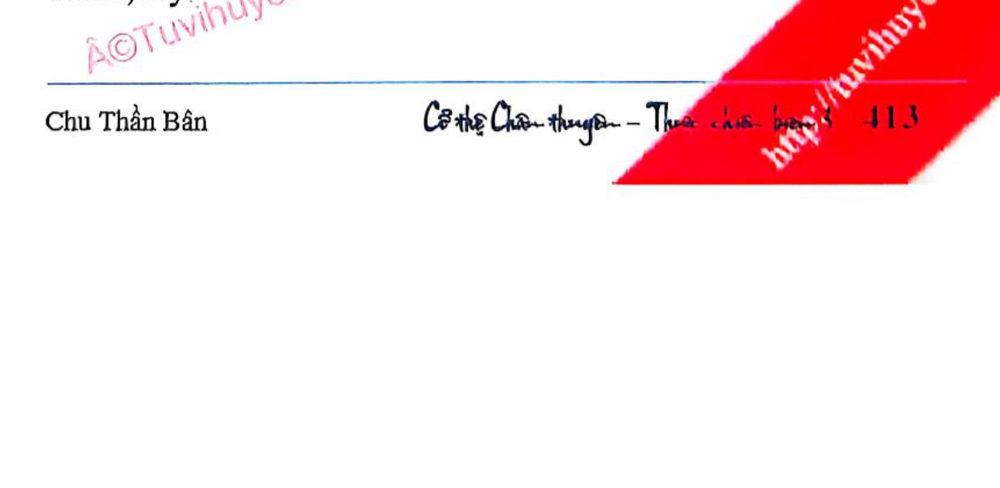

- **Cấu trúc Quẻ Dịch:**
  - **Quẻ chủ:** **Bát Thuần Khảm** (Cung Khảm, Họ Khảm – Quẻ Lục Xung)  
    *Tượng quẻ:* Thủy Để Lao Nguyệt (Mò trăng đáy nước – biểu thị sự việc đột ngột phát sinh, mất đồ bất ngờ, tâm trạng hoang mang).
  - **Quẻ biến:** **Thủy Phong Tỉnh** (Cung Chấn, Họ Chấn)  
    *Tượng quẻ:* Châu Trĩ Tỉnh Để (Ngọc chìm đáy giếng – vật quý đang nằm yên một chỗ chưa lộ ra, dần dần múc nước sẽ thấy).

- **Bảng chi tiết Lục hào:**

| Hào | Thế/Ứng | Lục thân (Chủ) | Can Chi (Chủ) | Động/Tĩnh | Lục thân (Biến) | Can Chi (Biến) | Thần sát / Phục | Lục thú |
|:---:|:---:|:---|:---|:---:|:---|:---|:---|:---|
| 6 | **Thế** | Huynh Đệ | Mậu Tý - Thủy | tĩnh | Huynh Đệ | Mậu Tý - Thủy | Đào hoa, Quý nhân, Nguyệt kiến | Huyền Vũ |
| 5 | | Quan Quỷ | Mậu Tuất - Thổ | tĩnh | Quan Quỷ | Mậu Tuất - Thổ | | Bạch Hổ |
| 4 | | Phụ Mẫu | Mậu Thân - Kim | tĩnh | Phụ Mẫu | Mậu Thân - Kim | Kiếp sát, Quý nhân, Tuần không | Đằng Xà |
| 3 | **Ứng** | Thê Tài | Mậu Ngọ - Hỏa | **X (Động)** | Phụ Mẫu | Tân Dậu - Kim | Văn xương, Nguyệt phá, Biến Tuần không, Tai sát | Chu Tước |
| 2 | | Quan Quỷ | Mậu Thìn - Thổ | tĩnh | Huynh Đệ | Tân Hợi - Thủy | | Câu Trần |
| 1 | | Tử Tôn | Mậu Dần - Mộc | tĩnh | Quan Quỷ | Tân Sửu - Thổ | Dương nhẫn | Thanh Long |

---

### 3. Dụng thần & Loại quẻ

- **Phân loại quẻ:**
  - **Quẻ cầu vật thất lạc (Việc cụ thể):** Xem điện thoại bị mất có tìm lại được không.
  - **Quẻ tâm thái & Nghi vấn nhân sự:** Người hỏi mang tâm lý nghi ngờ có kẻ đối đầu trong cơ quan cố tình nhặt giấu đồ của mình.
- **Định vị Dụng thần cốt lõi:**
  - Điện thoại di động là công cụ liên lạc, truyền tải thông tin, thư tín, thuộc hào **Phụ Mẫu**. 
  - Trong quẻ chủ, hào 4 Phụ Mẫu Thân Kim lâm Tuần không. 
  - Đặc biệt, hào 3 Thê Tài Ngọ Hỏa độc phát, hóa xuất **Phụ Mẫu Dậu Kim** (lâm Tuần không). Hào biến Phụ Mẫu Dậu Kim chính là Dụng thần cốt lõi phản ánh tung tích chiếc điện thoại.
  - **Hào Thế (Huynh Đệ Tý Thủy):** Đại diện cho người hỏi (phó viện trưởng).
  - **Hào Ứng (Thê Tài Ngọ Hỏa):** Đại diện cho đối phương trong cơ quan (viện trưởng nhà trẻ).

---

### 4. Luận giải chi tiết

#### 1. Biện chính hào động phùng Nguyệt phá theo tông chỉ Dã Hạc
- Quan điểm truyền thống thông thường cho rằng hào 3 Thê Tài Ngọ Hỏa bị Nguyệt kiến Tý Thủy tương xung là **Nguyệt phá**, lại bị Nhật thần Hợi Thủy khắc, nên bị coi là suy bại vô lực, không thể tác động đến hào khác.
- Tuy nhiên, Chu Thần Bân dẫn giải tông pháp cốt lõi của Dã Hạc Thần Thư: Hào động dù bị Nhật phá hay Nguyệt phá thì bản thân nó vẫn phát động hữu hiệu, không hề bị triệt tiêu năng lực vận động; điều cấm kỵ nhất chỉ là **hào biến bị Nhật Nguyệt phá dẫn đến chân phá**. Ở đây, hào biến Phụ Mẫu Dậu Kim không hề bị Nhật Nguyệt tương xung phá hại, do đó hào động Thê Tài Ngọ Hỏa vẫn là một **hào động hữu dụng**.

#### 2. Ý nghĩa Tuần không của Hào Động và Hào Biến
- Hào Phụ Mẫu Dậu Kim do Ngọ Hỏa biến ra rơi vào **Tuần không** (Thân - Dậu không vong).
- Theo lý Lục Hào thực chiến: Khi hào động hoặc hào biến lâm Tuần không, ở phương diện cát hung không xem là "chân không" (không vong hoàn toàn vô hiệu), mà ở cấp độ sự việc nó phản ánh trạng thái hiện tại: *"hiện tại chưa nhìn thấy, đang bị che giấu khuất mắt"*. Hào động Ngọ Hỏa bị Nguyệt phá biểu thị hành vi giấu đồ chưa bộc lộ ra ánh sáng. Cả hai đều chỉ hiện tượng tạm thời trong hiện tại, sau này xuất không sẽ lộ rõ.

#### 3. Cơ chế Xung Khởi hào Thế
- Thê Tài Ngọ Hỏa độc phát xung thẳng vào hào Thế Huynh Đệ Tý Thủy (Tý - Ngọ tương xung).
- Xét vượng suy của hào Thế: Huynh Đệ Tý Thủy lâm Nguyệt kiến Tý Thủy, lại được Nhật thần Hợi Thủy đồng khí tương trợ, vượng tướng tột bậc.
- Theo quy tắc biến dịch: Hào suy nhược phùng xung là **Xung Tán** (mất mát, tiêu tan); hào vượng tướng phùng xung là **Xung Khởi** (được đánh thức, kích hoạt mạnh mẽ). Vì hào Thế cực vượng nên khi bị hào động mang Dụng thần Phụ Mẫu xung tới, hào Thế được kích hoạt tiếp nhận đồ vật, báo hiệu chắc chắn điện thoại sẽ quay trở về với chủ nhân.

#### 4. Phân tích tâm lý và nhân vật thực tế
- Hào Thế Huynh Đệ Tý Thủy lâm **Huyền Vũ**: Huyền Vũ chủ tâm tư kín đáo, nhiều suy nghĩ thầm kín, ngờ vực.
- Hào Ứng Thê Tài Ngọ Hỏa đối lập trực tiếp với hào Thế, đóng vai trò viện trưởng đối đầu. Tuy nhiên, viện trưởng (Ngọ Hỏa) bị Nguyệt phá, khí trường thời gian suy kiệt, trong khi phó viện trưởng (Tý Thủy) đắc Nguyệt lệnh cực vượng. Điều này chỉ ra rằng dù đối phương có ý định giở trò ém nhẹm chiếc điện thoại thì cũng bất thành vì khí trường không ủng hộ.
- Ngọ Hỏa động hóa Phụ Mẫu Dậu Kim lâm Tuần không: Thể hiện hành động nhặt được điện thoại rồi cất giấu vào một góc kín (ngăn kéo bàn làm việc). Việc Ngọ Hỏa lâm Chu Tước chứ không lâm Huyền Vũ chứng minh ban đầu không phải cố tình trộm cắp, mà là tình cờ nhặt được, sau đó do mâu thuẫn cá nhân nên mới giữ lại để gây khó dễ.

---

### 5. Kết luận & Ứng kỳ thực tế

- **Lời giải đoán của Chu Thần Bân:**
  - Chiếc điện thoại chắc chắn sẽ tìm lại được, không bị mất mát ra ngoài xã hội.
  - Đồ vật đang nằm trong tay người có hiềm khích tại cơ quan, nhưng đối phương không thể giữ lâu vì hào biến Dụng thần sẽ xuất hiện khi điền thực tuần không.
- **Phản hồi thực tế từ đương số:**
  - Đúng như dự đoán, phó viện trưởng sơ ý để quên điện thoại ở cơ quan. Viện trưởng nhà trẻ (người vốn có xích mích với phó viện trưởng) nhặt được đã lén cất vào ngăn kéo bàn làm việc, định bụng giấu luôn để phó viện trưởng phải chịu ấm ức.
  - Vài ngày sau, vợ của viện trưởng đến cơ quan định nạp tiền điện thoại cho chồng thì tình cờ mở ngăn kéo ra thấy một chiếc điện thoại lạ. Hỏi ra mới biết là của phó viện trưởng. Mặc dù viện trưởng đã dặn vợ không được nói, nhưng người vợ lại vô tình lỡ miệng tiết lộ cho phó viện trưởng biết chuyện chiếc điện thoại đang nằm trong ngăn kéo của viện trưởng.
  - Nghe được tin, vị phó viện trưởng lập tức sang phòng viện trưởng đòi lại đồ, viện trưởng đành phải trả lại chiếc điện thoại trong ngượng ngùng.
- **Ứng kỳ chiêm nghiệm:**
  - Ứng kỳ tìm lại vật ứng vào các ngày điền thực hoặc xung không: ngày Dậu (điền thực Dụng thần Phụ Mẫu Dậu Kim), ngày Mão (xung khai tuần không Dậu Kim, hợp khởi Tuất Thổ) hoặc ngày Ngọ xung phá.

---

### 6. Bài học tâm pháp & Quy tắc cốt lõi

- **Các quy tắc Lục Hào rút ra từ ca thực chiến:**
  - *Trích dẫn:* Quy tắc tìm đồ vật thất lạc qua hào Dụng thần Thê Tài và quẻ lục hợp (trang 383, `rule_index`).
  - *Quy tắc Hào động phùng Nguyệt phá:* Phân biệt rạch ròi giữa hào tĩnh và hào động. Hào động phùng phá vẫn giữ nguyên khả năng sinh khắc xung hợp với hào khác, chỉ cần hào biến không bị chân phá.
  - *Quy tắc Động/Biến phùng Không:* Trong việc luận cát hung sự tình, động hóa không hoặc hào động lâm không không coi là chân không, mà chỉ là chỉ dấu thời gian ứng kỳ hoặc trạng thái che giấu tạm thời.
  - *Quy tắc Xung Khởi vs Xung Tán:* Hào Thế vượng tướng gặp hào mang Dụng thần tương xung là tượng được kích hoạt, đồ vật tìm đến người; chỉ khi Thế hào suy tuyệt phùng xung mới là đồ vật tan biến.
- **Bài học kinh nghiệm trong tâm pháp giải đoán thực tế:**
  - Phải phối hợp nhịp nhàng giữa tượng quẻ khách quan và bối cảnh tâm lý nhân sự thực tế. Khi hào Thế lâm Huyền Vũ nghi ngờ nội bộ, sự tương phản vượng suy giữa Thế (Nguyệt kiến) và Ứng (Nguyệt phá) lập tức hé lộ kết cục: chính nghĩa thắng áp đảo, mưu toan nhỏ mọn của đối thủ sẽ tự động bị lộ tẩy.

## THỰC CHIẾN 180: XEM MỘ BÀ NỘI CÓ GÂY BẤT LỢI CHO CON CHÁU HAY KHÔNG

---

### 1. Bối cảnh & Câu hỏi

- **Bối cảnh chi tiết:** 
  Một vị học viên đồng môn cảm thấy gia đạo và vận khí của con cháu gần đây có những điều trắc trở, bất an. Đương số nảy sinh mối nghi ngờ rằng liệu phong thủy âm trạch phần mộ của bà nội có gặp phải vấn đề phong thủy xấu, sụt lở hay bị tác động bất lợi nào từ ngoại cảnh hay không.
- **Tâm lý & Câu hỏi ẩn ý:** 
  Đương sự mang tâm lý hoang mang, vừa sợ phong thủy mộ bà nội quấy nhiễu con cháu, vừa muốn xác định rõ nguyên nhân gốc rễ để tìm cách hóa giải. Người này tự gieo quẻ hỏi với chủ đề: *"Mộ bà nội có gây bất lợi cho con cháu đời sau hay không?"*
- **Thời gian chiêm đoán:**
  - Can chi: Năm Mậu Tuất, tháng Nhâm Tuất, ngày Tân Tị, giờ Nhâm Thìn (Giờ Bắc Kinh).

---

### 2. Dữ kiện & Bảng quẻ Crop

- **Thời không chiêm nghiệm:**
  - Tháng Nhâm Tuất (Thổ vượng, Kim tướng, Hỏa hưu, Thủy tù, Mộc tử).
  - Ngày Tân Tị (Hỏa vượng, Kim trường sinh).
  - Tuần không: **Thân - Dậu** (Giáp Tuất tuần trung, Thân Dậu không vong).
- **Thần sát:**
  - Tướng tinh: Dậu
  - Hoa cái: Sửu
  - Dịch mã: Hợi
  - Tai sát: Mão
  - Mưu tinh: Mùi
  - Đào hoa: Ngọ
  - Kiếp sát: Dần
  - Lộc thần: Dậu
  - Dương nhẫn: Thân (Lâm Phục thần Huynh Đệ Thân Kim)
  - Văn xương: Tý (Lâm hào Thế Tử Tôn Tý Thủy)
  - Thiên y: Dậu
  - Thiên hỷ: Thìn
  - Quý nhân: Dần, Ngọ

- Dữ kiện bảng quẻ và các thông số chiêm đoán:
  - **Bảng 180.1** Đồ hình quẻ Thực chiến 180:
    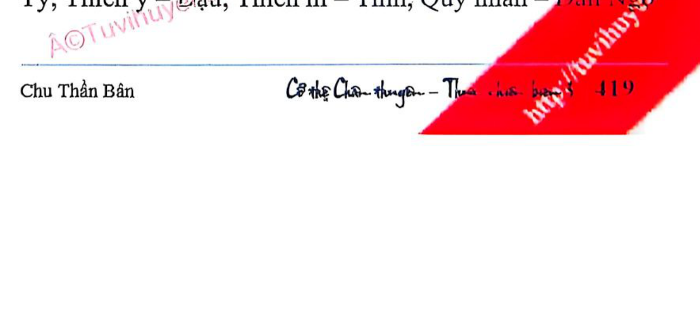

- **Cấu trúc Quẻ Dịch:**
  - **Quẻ chủ:** **Sơn Địa Bác** (Cung Cấn, Họ Cấn)  
    *Tượng quẻ:* Bào Lạc Điêu Tàn (Bóc tách, hao mòn – biểu thị hiện trạng bên ngoài phần mộ có thể có dấu hiệu bong tróc, sụt lún nhẹ; hoặc tâm lý đương số đang từng bước bóc tách tìm hiểu sự thật).
  - **Quẻ biến:** **Sơn Thủy Mông** (Cung Ly, Họ Ly)  
    *Tượng quẻ:* Khởi Mông Khai Đạo (Mông muội, chưa tỏ lối thoát – biểu thị việc nhận ra có nghi vấn nhưng bản thân chưa thể tự giải quyết, tình thế lúng túng).

- **Bảng chi tiết Lục hào:**

| Hào | Thế/Ứng | Lục thân (Chủ) | Can Chi (Chủ) | Động/Tĩnh | Lục thân (Biến) | Can Chi (Biến) | Thần sát / Phục | Lục thú |
|:---:|:---:|:---|:---|:---:|:---|:---|:---|:---|
| 6 | | Thê Tài | Bính Dần - Mộc | tĩnh | Thê Tài | Bính Dần - Mộc | Kiếp sát, Phục Phụ Mẫu Tuất Thổ | Đằng Xà |
| 5 | **Thế** | Tử Tôn | Bính Tý - Thủy | tĩnh | Tử Tôn | Bính Tý - Thủy | Văn xương, Phục Huynh Đệ Thân Kim | Câu Trần |
| 4 | | Phụ Mẫu | Bính Tuất - Thổ | tĩnh | Phụ Mẫu | Bính Tuất - Thổ | Nguyệt kiến, Phục Quan Quỷ Ngọ Hỏa | Chu Tước |
| 3 | | Thê Tài | Ất Mão - Mộc | tĩnh | Quan Quỷ | Mậu Ngọ - Hỏa | Tai sát, Phục Phụ Mẫu Thìn Thổ | Thanh Long |
| 2 | **Ứng** | Quan Quỷ | Ất Tị - Hỏa | **X (Động)** | Phụ Mẫu | Mậu Thìn - Thổ | Nhật kiến, Biến Nguyệt phá | Huyền Vũ |
| 1 | | Phụ Mẫu | Ất Mùi - Thổ | tĩnh | Thê Tài | Mậu Dần - Mộc | Mưu tinh, Phục Tử Tôn Tý Thủy | Bạch Hổ |

---

### 3. Dụng thần & Loại quẻ

- **Phân loại quẻ:**
  - **Quẻ phong thủy âm trạch (Việc cụ thể):** Xem xét cát hung của phần mộ gia tiên.
  - **Quẻ tâm thái & Nghi vấn phúc họa:** Đương số băn khoăn về mối nguy hại tiềm ẩn đối với bản thân và thế hệ sau.
- **Định vị Dụng thần cốt lõi:**
  - **Hào Phụ Mẫu:** Đại diện cho phần mộ tổ tiên, nơi an nghỉ của bậc trưởng bối.
  - **Hào Tử Tôn (ở đây là Tử Tôn Tý Thủy trì Thế):** Đại diện cho bản thân người hỏi và con cháu đời sau.
  - **Hào Quan Quỷ (Quan Quỷ Ất Tị Hỏa lâm Ứng):** Đại diện cho tai họa, sát khí phát sinh từ ngôi mộ chỉ định (mộ bà nội).

---

### 4. Luận giải chi tiết

#### 1. Cấu trúc Thế Tử – Ứng Quan và động thái hào Ứng
- Hào Thế Tử Tôn Tý Thủy đối lập với hào Ứng Quan Quỷ Tị Hỏa tạo thành thế *"Thế Tử - Ứng Quan"*. Đây là bố cục điển hình của quẻ chiêm nghi, phản ánh tâm trạng lo lắng tai họa (Quan Quỷ) rình rập đe dọa đến phúc phận của con cháu (Tử Tôn).
- Hào Ứng Quan Quỷ Tị Hỏa phát động hóa ra **Phụ Mẫu Thìn Thổ**. Nếu hào biến này vượng tướng thành hình thì đồng nghĩa với việc ngôi mộ của bà nội (Phụ Mẫu Thìn Thổ) thực sự tích tụ sát khí, sinh ra Quan Quỷ tác hại đến con cháu.

#### 2. Cơ chế Động Hóa Phá triệt tiêu tai họa
- Tuy nhiên, xem xét dưới Nguyệt lệnh Nhâm Tuất: Phụ Mẫu Thìn Thổ bị Nguyệt kiến Tuất Thổ trực tiếp tương xung (Thìn - Tuất tương xung), rơi vào trạng thái **Nguyệt phá** (chân phá).
- Theo định luật biến dịch của Lục Hào: Hào động hóa tuyệt hoặc hóa Nguyệt phá thì toàn bộ lực tác động của hào động ban đầu bị vô hiệu hóa hoàn toàn (*Động hóa phá tán, sự bất thành tai*). Tai họa từ Quan Quỷ Tị Hỏa đã bị phá tan ngay tại hào biến Phụ Mẫu Thìn Thổ, chứng minh ngôi mộ bà nội hoàn toàn vô hại, không hề gây bất lợi cho con cháu đời sau.

#### 3. Phát hiện ngôi mộ thứ hai từ Gian hào Phụ Mẫu Tuất Thổ
- Khi mối nghi ngờ ở mộ bà nội (Phụ Mẫu Thìn Thổ) đã được giải trừ, một thông tin chi tiết quan trọng khác lại hiện rõ trong quẻ:
  - Tại hào 4 (Gian hào), xuất hiện **Phụ Mẫu Tuất Thổ** lâm Nguyệt kiến, mang tính chất Thổ vượng cực điểm.
  - Phụ Mẫu Tuất Thổ trực tiếp khắc chế hào Thế Tử Tôn Tý Thủy (Tuất Thổ khắc Tý Thủy).
- Phụ Mẫu Thìn Thổ và Phụ Mẫu Tuất Thổ cùng hành Thổ nhưng đối xung dữ dội. Trong phép đoán âm trạch, đây là chỉ dấu phản ánh sự tồn tại của **hai phần mộ trưởng bối khác nhau**. Ngôi mộ bà nội (Thìn Thổ) đã hóa giải vô hại, nhưng ngôi mộ của một vị trưởng bối khác (Tuất Thổ – cụ thể là mộ ông nội) lại đang mang Nguyệt lệnh khắc phạt con cháu.
- Do Phụ Mẫu Tuất Thổ là hào tĩnh, chỉ khắc theo khí của Nguyệt kiến chứ không phát động, nên mức độ ảnh hưởng bất lợi này chỉ ở mức độ có hạn, không gây nên biến cố đột ngột nghiêm trọng.

#### 4. Ý nghĩa chuyển biến Bác sang Mông
- Quẻ Bác chuyển sang quẻ Mông: Đương số đã bóc tách được một lớp nghi vấn (lo cho mộ bà nội), nhưng lại rơi vào thế mông muội (quẻ Mông) vì tuy phát hiện ra nguyên nhân nằm ở một phần mộ tổ tiên khác, bản thân lại không rõ tung tích hay cách thức xử lý cụ thể.

---

### 5. Kết luận & Ứng kỳ thực tế

- **Lời giải đoán của Chu Thần Bân:**
  - Khẳng định chắc chắn: Ngôi mộ của bà nội hoàn toàn an ổn, không hề có bất kỳ sát khí hay tác động tiêu cực nào đến con cháu đời sau.
  - Cảnh báo chi tiết: Vấn đề bất lợi nhỏ trong dòng họ thực chất xuất phát từ một ngôi mộ tổ tiên khác (mộ ông nội), tuy nhiên ảnh hưởng chỉ mang tính cục bộ, không đáng lo ngại.
- **Phản hồi thực tế từ đương số:**
  - Vị học viên nhận được kết quả nhưng trong lòng vẫn chưa thực sự an tâm tuyệt đối, vẫn muốn xác nhận lại một lần nữa bằng một quẻ thứ hai vài ngày sau đó (dẫn đến Thực chiến 181).

---

### 6. Bài học tâm pháp & Quy tắc cốt lõi

- **Các quy tắc Lục Hào rút ra từ ca thực chiến:**
  - *Trích dẫn:* Quy tắc xem mộ phần tổ tiên và tác động cát hung tới hào con cháu qua quẻ tĩnh (trang 388, `rule_index`).
  - *Quy tắc Động hóa Nguyệt phá:* Hào Quan Quỷ phát động nhưng hóa xuất hào Phụ Mẫu bị Nguyệt phá thì tai ương tiêu biến, mối nghi ngờ vô căn cứ.
  - *Quy tắc Đa Phụ Mẫu phân định âm trạch:* Khi chiêm hỏi một ngôi mộ cụ thể mà trong quẻ xuất hiện nhiều hào Phụ Mẫu cùng hành đối xung, cần phân tách rõ đâu là ngôi mộ được chỉ định (hào biến/hào Ứng) và đâu là ngôi mộ ngoại lai chưa được quan tâm (Gian hào/hào tĩnh mang Nguyệt lệnh).
- **Bài học kinh nghiệm trong tâm pháp giải đoán thực tế:**
  - Người xem bói thường bị chi phối bởi định kiến chủ quan (chỉ chăm chăm nhìn vào ngôi mộ bà nội mà mình biết rõ). Người luận đoán sắc sảo phải nhìn thấu cả các hào tĩnh liên quan để vạch trần điểm mù nhận thức của đương số.

## THỰC CHIẾN 181: LẠI HỎI MỘ BÀ NỘI CÓ GÂY BẤT LỢI CHO CON CHÁU HAY KHÔNG

---

### 1. Bối cảnh & Câu hỏi

- **Bối cảnh chi tiết:** 
  Một tuần sau khi gieo quẻ Thực chiến 180, người học viên đồng môn vẫn còn mối băn khoăn trăn trở trong lòng. Mặc dù quẻ trước đã chỉ ra mộ bà nội không có vấn đề gì nhưng vì trong tâm vẫn chưa hoàn toàn giải tỏa được nỗi nghi ngại về vận khí gia đạo và con cháu, người này quyết định gieo lại một quẻ nữa để tái xác nhận.
- **Tâm lý & Câu hỏi ẩn ý:** 
  Đương số mang tâm lý hoang mang, nửa tin nửa ngờ, muốn kiểm chứng lại lần thứ hai xem liệu phần mộ bà nội có thực sự không gây bất lợi cho con cháu đời sau hay không: *"Lại hỏi mộ bà nội có gây bất lợi cho con cháu hay không?"*
- **Thời gian chiêm đoán:**
  - Can chi: Năm Mậu Tuất, tháng Nhâm Tuất, ngày Mậu Tý, giờ Nhâm Tuất (Giờ Bắc Kinh).
  - Tuần không: **Ngọ - Mùi** (Giáp Thân tuần trung, Ngọ Mùi không vong).

---

### 2. Dữ kiện & Bảng quẻ Crop

- **Thời không chiêm nghiệm:**
  - Tháng Nhâm Tuất (Thổ vượng, Kim tướng, Hỏa hưu, Thủy tù, Mộc tử).
  - Ngày Mậu Tý (Thủy vượng, Hỏa tuyệt).
  - Tuần không: **Ngọ - Mùi**.
- **Thần sát:**
  - Tướng tinh: Tý (Lâm Nhật thần)
  - Hoa cái: Thìn
  - Dịch mã: Dần
  - Tai sát: Ngọ (Lâm hào 4 Phụ Mẫu Ngọ Hỏa)
  - Mưu tinh: Tuất (Lâm Nguyệt kiến, hào 6 Huynh Đệ Tuất Thổ)
  - Đào hoa: Dậu
  - Kiếp sát: Tị (Lâm hào 1 Phụ Mẫu Tị Hỏa)
  - Lộc thần: Tị
  - Dương nhẫn: Ngọ (Lâm hào 4 Phụ Mẫu Ngọ Hỏa)
  - Văn xương: Thân (Lâm hào Thế Tử Tôn Thân Kim)
  - Thiên y: Dậu
  - Thiên hỷ: Thìn
  - Quý nhân: Sửu, Mùi (Lâm hào 3 Huynh Đệ Sửu Thổ)

- Dữ kiện bảng quẻ và các thông số chiêm đoán:
  - **Bảng 181.1** Đồ hình quẻ Thực chiến 181:
    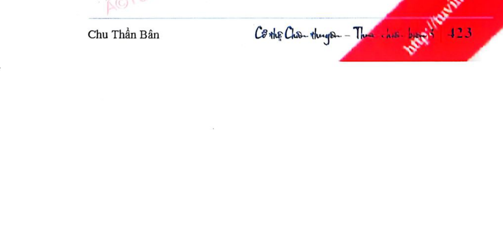

- **Cấu trúc Quẻ Dịch:**
  - **Quẻ chủ:** **Thiên Trạch Lý** (Cung Cấn, Họ Cấn – Quẻ tĩnh)  
    *Tượng quẻ:* Hổ Hạc Huynh Đệ, Lý Hành Chính Đạo (Hành xử đúng theo cam kết, thực hiện điều đã định trước – phản ánh việc đương số từ lúc gieo quẻ đầu đã dự tính sau một tuần sẽ gieo lại để xác nhận, nay thực hiện đúng dự định đó).
  - **Quẻ biến:** Quẻ tĩnh không có hào biến phát động minh động.

- **Bảng chi tiết Lục hào:**

| Hào | Thế/Ứng | Lục thân (Chủ) | Can Chi (Chủ) | Động/Tĩnh | Lục thân (Biến) | Can Chi (Biến) | Thần sát / Phục | Lục thú |
|:---:|:---:|:---|:---|:---:|:---|:---|:---|:---|
| 6 | | Huynh Đệ | Nhâm Tuất - Thổ | tĩnh | Huynh Đệ | Nhâm Tuất - Thổ | Mưu tinh, Nguyệt kiến | Chu Tước |
| 5 | **Thế** | Tử Tôn | Nhâm Thân - Kim | tĩnh | Tử Tôn | Nhâm Thân - Kim | Văn xương, Phục Thê Tài Canh Tý Thủy | Thanh Long |
| 4 | | Phụ Mẫu | Nhâm Ngọ - Hỏa | **Ám động** | Phụ Mẫu | Nhâm Ngọ - Hỏa | Tai sát, Dương nhẫn, Tuần không phùng Nhật xung | Huyền Vũ |
| 3 | | Huynh Đệ | Đinh Sửu - Thổ | tĩnh | Huynh Đệ | Đinh Sửu - Thổ | Quý nhân | Bạch Hổ |
| 2 | **Ứng** | Quan Quỷ | Đinh Mão - Mộc | tĩnh | Quan Quỷ | Đinh Mão - Mộc | | Đằng Xà |
| 1 | | Phụ Mẫu | Đinh Tị - Hỏa | tĩnh | Phụ Mẫu | Đinh Tị - Hỏa | Lộc thần, Kiếp sát | Câu Trần |

---

### 3. Dụng thần & Loại quẻ

- **Phân loại quẻ:**
  - **Quẻ phong thủy âm trạch (Tái chiêm):** Hỏi lại lần thứ hai về phần mộ tổ tiên nhằm tái xác nhận nghi vấn.
  - **Quẻ tâm thái kiểm chứng:** Đương số muốn giải tỏa nỗi lo ngại tai họa ảnh hưởng đến phúc khí con cháu.
- **Định vị Dụng thần cốt lõi:**
  - **Hào Tử Tôn (Tử Tôn Thân Kim trì Thế):** Đại diện cho bản thân người hỏi và dòng dõi con cháu đời sau.
  - **Hào Quan Quỷ (Quan Quỷ Mão Mộc tại hào 2 - Ứng):** Đại diện cho tai họa, sát khí từ ngôi mộ chỉ định (mộ bà nội).
  - **Hào Phụ Mẫu:** Đại diện cho âm trạch phần mộ. Trong quẻ có Phụ Mẫu Tị Hỏa và Phụ Mẫu Ngọ Hỏa.

---

### 4. Luận giải chi tiết

#### 1. Ý nghĩa tượng quẻ Thiên Trạch Lý và việc Tái chiêm
- Quẻ **Thiên Trạch Lý** tượng trưng cho việc thực hiện, thi hành những gì đã định sẵn, quy ước hoặc dự tính trong tâm. 
- Chu Thần Bân chỉ ra: Sự xuất hiện của quẻ Lý chứng minh ngay từ lúc gieo quẻ lần đầu (TC 180), người này đã nuôi ý định sẽ gieo tiếp một quẻ thứ hai sau một tuần để đối chiếu. Đúng như quy luật tâm thức, hành động gieo lại này chính là sự thực thi trọn vẹn dự định ban đầu.

#### 2. Phân tích Thế hào và Ứng hào
- Hào Thế lâm **Tử Tôn Thân Kim**: Được Nguyệt kiến Tuất Thổ tương sinh, lại không lâm không vong, không bị xung phá, bản chất hào Thế rất vững vàng, tượng trưng cho con cháu có phúc khí che chở.
- Hào Ứng **Quan Quỷ Mão Mộc**: Là đối tượng chỉ định nghi vấn (mộ bà nội). Quan Quỷ Mão Mộc hoàn toàn tĩnh, lại ở vào tháng Tuất hưu tù bị hợp (Mão Tuất lục hợp), không hề phát động sinh khắc hào Thế. Điều này tái khẳng định dứt khoát: **Ngôi mộ bà nội hoàn toàn vô hại, không hề quấy nhiễu con cháu**.

#### 3. Bí pháp Ám động: Phụ Mẫu Ngọ Hỏa lâm Huyền Vũ khắc Thế
- Thoạt nhìn là quẻ tĩnh, nhưng hào 4 **Phụ Mẫu Ngọ Hỏa** rơi vào Tuần không (Ngọ Mùi không vong) và bị Nhật thần **Mậu Tý** tương xung (Tý - Ngọ tương xung).
- Theo quy tắc Lục Hào: Hào hưu tù lâm Tuần không gặp Nhật xung là **Xung Không**, kích hoạt thành **Ám động**. 
- Phụ Mẫu Ngọ Hỏa ám động lập tức phát huy tác dụng tương khắc trực tiếp vào hào Thế Tử Tôn Thân Kim (Ngọ Hỏa khắc Thân Kim). Đương số nhìn thấy điểm này liền rơi vào trạng thái cực kỳ hoang mang, ngỡ rằng mộ bà nội quả thực có hại.
- Tuy nhiên, Chu Thần Bân giải mã tầng sâu:
  - Phụ Mẫu Ngọ Hỏa nằm ở **Gian hào** (hào 4, khoảng giữa Thế và Ứng), không phải ở hào Ứng (đối tượng chỉ định bà nội).
  - Ngọ Hỏa lâm **Huyền Vũ**: Huyền Vũ chủ sự mờ ám, không rõ ràng, vô danh, giấu kín, không ai hay biết.
  - Do đó, hào Phụ Mẫu Ngọ Hỏa lâm Huyền Vũ ám động khắc Thế chính là đại diện cho một **ngôi mộ vô danh, tổ mộ không rõ nguồn gốc tông tích** đang gây trở ngại cho con cháu, chứ tuyệt nhiên không phải ngôi mộ bà nội rõ ràng kia!

#### 4. Tính liên kết thống nhất giữa hai quẻ (Liên hoàn chiêm)
- Chu Thần Bân nhấn mạnh nguyên lý tái chiêm: Cách nhau một tuần gieo lại cùng một việc thì phải kết hợp chặt chẽ cả hai quẻ, không thể xem rời rạc.
  - Quẻ thứ nhất (TC 180): Sơn Địa Bác biến Sơn Thủy Mông. Mộ bà nội (hóa Nguyệt phá) không hại, nhưng Gian hào Phụ Mẫu Tuất Thổ lâm Nguyệt khắc Thế, báo hiệu có một phần mộ tổ tiên khác gây bất lợi, biến sang Mông (mông muội, không rõ tung tích).
  - Quẻ thứ hai (TC 181): Thiên Trạch Lý. Tái khẳng định mộ bà nội (Ứng hào tĩnh) vô hại, còn Gian hào Phụ Mẫu Ngọ Hỏa lâm Huyền Vũ ám động khắc Thế, chỉ thẳng đó là ngôi mộ vô danh bị thất lạc.

---

### 5. Kết luận & Ứng kỳ thực tế

- **Lời giải đoán của Chu Thần Bân:**
  - Hai quẻ đồng quy nhất lý: Mộ bà nội hoàn toàn bình an vô sự.
  - Thứ gây ảnh hưởng bất lợi đến con cháu thực chất là **mộ của ông nội** – một ngôi mộ vô danh bị thất lạc nhiều năm, không có bia mộ đánh dấu và hiện tại gia đình hoàn toàn không biết nằm ở đâu.
  - Vì quẻ trước biến Mông và quẻ này lâm Huyền Vũ, việc tìm kiếm theo cách thức thông thường là vô phương giải quyết.
- **Phản hồi thực tế từ đương số:**
  - Nghe Chu Thần Bân phân tích, đương số bàng hoàng nhận ra sự trùng khớp kỳ lạ: Trước đây khi ông nội mất, thời thế khó khăn nên an táng vội vã không lập bia mộ, đến nay con cháu hoàn toàn không biết phần mộ ông nội ở vị trí nào; trong khi mộ bà nội thì xây cất đàng hoàng, rõ ràng địa chỉ.
  - Nỗi băn khoăn về mộ bà nội được trút bỏ, nhưng bài toán tìm lại mộ ông nội trở thành vấn đề nan giải vì đã thất lạc qua nhiều thập kỷ.
- **Điển cố chiêm nghiệm mở rộng:**
  - Chu Thần Bân chia sẻ kinh nghiệm thực tế về một ca tìm tổ mộ thất lạc tương tự ở Thuận Đức (Quảng Đông): Nhờ cơ duyên huyền diệu (thông qua môi giới tâm linh và hình ảnh một con cào cào/châu chấu lớn bất ngờ xuất hiện nhảy dẫn đường qua các bụi cỏ), gia đình đã tìm lại được vị trí chính xác ngôi mộ ông nội đã thất lạc từ lâu.

---

### 6. Bài học tâm pháp & Quy tắc cốt lõi

- **Các quy tắc Lục Hào rút ra từ ca thực chiến:**
  - *Trích dẫn:* Quy tắc tái chiêm xem mộ phần và nguyên lý hào động biến hồi đầu sinh khắc (trang 392, `rule_index`).
  - *Quy tắc Tái chiêm liên hoàn:* Khi một người gieo lại quẻ để xác nhận cùng một sự việc, hai quẻ không hề mâu thuẫn mà là sự bổ sung, làm sâu sắc thêm chi tiết còn ẩn tàng ở quẻ trước.
  - *Quy tắc Ám động phùng Không:* Hào lâm Tuần không gặp Nhật xung trở thành Xung Không khởi động, nếu hưu tù vẫn phát sinh lực ám động tác động ngắn hạn.
  - *Phân biệt Vị trí hào và Lục thú:* Gian hào lâm Huyền Vũ biểu thị yếu tố ẩn khuất, người ngoài cuộc, hoặc sự vật vô danh chưa xác định; đối lập với Hào Ứng đại diện cho đối tượng chỉ danh rõ ràng.
- **Bài học kinh nghiệm trong tâm pháp giải đoán thực tế:**
  - Không được hoảng hốt trước việc hào ám động khắc Thế. Cần phải truy vết căn cội: Hào khắc Thế là ai? Mang lục thú gì? Nằm ở vị trí nào? Việc phân biệt rạch ròi giữa hào Ứng (đối tượng đương số hỏi) và Gian hào lâm Huyền Vũ (đối tượng vô danh nằm ngoài suy tính) chính là đỉnh cao phân tầng thông tin trong Lục Hào cổ thệ.

## THỰC CHIẾN 182: DÙNG ĐỒNG XU HIỆN ĐẠI TỰ GIEO QUẺ HỎI VỀ HÔN NHÂN CÓ LY HÔN HAY KHÔNG

---

### 1. Bối cảnh & Câu hỏi

- **Bối cảnh chi tiết:** 
  Một người đàn ông phát hiện người vợ của mình gần đây có quan hệ bất chính với người đàn ông khác bên ngoài. Cuộc hôn nhân rơi vào khủng hoảng trầm trọng do có kẻ thứ ba chen chân phá hoại. Bản thân người chồng vẫn còn nặng lòng, tha thiết muốn duy trì mái ấm gia đình và không muốn ly hôn, nhưng người vợ dường như đã thay lòng đổi dạ và muốn dứt áo ra đi.
- **Tâm lý & Câu hỏi ẩn ý:** 
  Đương số rơi vào tâm trạng đau đớn, hoang mang, vừa muốn níu kéo vợ vừa sợ hôn nhân tan vỡ. Anh ta tự dùng 3 đồng xu hiện đại để gieo quẻ hỏi Chu Thần Bân: *"Hôn nhân liệu cuối cùng có ly hôn hay không?"*
- **Thời gian chiêm đoán:**
  - Dương lịch: Ngày 02 tháng 10 năm 2018, lúc 10 giờ 43 phút (Giờ Bắc Kinh).
  - Can chi: Năm Mậu Tuất, tháng Tân Dậu, ngày Đinh Mão, giờ Ất Tị.
  - Tuần không: **Tuất - Hợi** (Giáp Tý tuần trung, Tuất Hợi không vong).

---

### 2. Dữ kiện & Bảng quẻ Crop

- **Thời không chiêm nghiệm:**
  - Tháng Tân Dậu (Kim vượng, Thủy tướng, Thổ hưu, Hỏa tù, Mộc tuyệt).
  - Ngày Đinh Mão (Mộc vượng, Hỏa tướng).
  - Tuần không: **Tuất - Hợi**.
- **Thần sát:**
  - Tướng tinh: Mão (Lâm Nhật thần)
  - Hoa cái: Mùi (Lâm hào 5 Tử Tôn Mùi Thổ)
  - Dịch mã: Tị (Lâm hào 6 Huynh Đệ Tị Hỏa)
  - Tai sát: Dậu (Lâm Nguyệt kiến, hào 4 Thê Tài Dậu Kim)
  - Mưu tinh: Sửu
  - Đào hoa: Tý
  - Kiếp sát: Thân (Lâm hào biến Thê Tài Thân Kim)
  - Lộc thần: Ngọ (Lâm hào Thế Huynh Đệ Ngọ Hỏa)
  - Dương nhẫn: Tị (Lâm hào 6 Huynh Đệ Tị Hỏa)
  - Văn xương: Dậu
  - Thiên y: Thân
  - Thiên hỷ: Thìn (Lâm hào 2 Tử Tôn Thìn Thổ)
  - Quý nhân: Dậu, Hợi (Dậu Kim lâm hào 4 Thê Tài, Hợi Thủy phục dưới Thế)

- Dữ kiện bảng quẻ và các thông số chiêm đoán:
  - **Bảng 182.1** Đồ hình quẻ Thực chiến 182:
    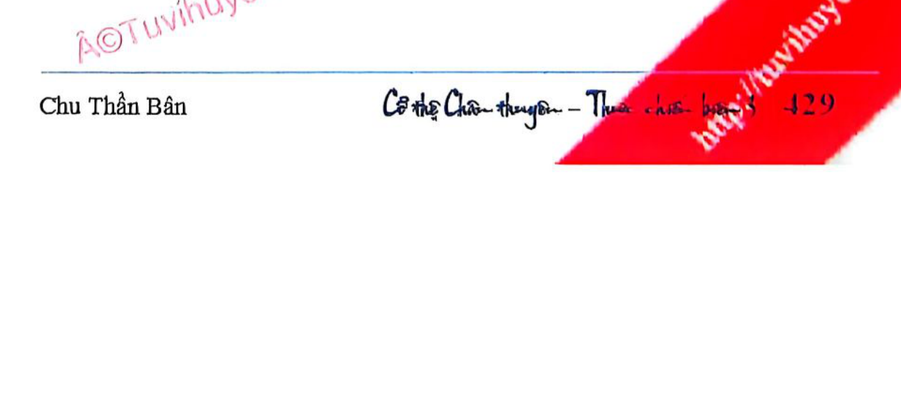

- **Cấu trúc Quẻ Dịch:**
  - **Quẻ chủ:** **Hỏa Thủy Vị Tế** (Cung Ly, Họ Ly)  
    *Tượng quẻ:* Nhu Hạc Thất Thao, Tiểu Hồ Ngật Tế (Chưa xong, dở dang, âm dương thất vị – phản ánh sự bất hòa sâu sắc, khủng hoảng hôn nhân chưa thể an bài).
  - **Quẻ biến:** **Lôi Thủy Giải** (Cung Chấn, Họ Chấn)  
    *Tượng quẻ:* Lôi Vũ Tác Giải, Hoạn Nạn Tiêu Tan (Giải tỏa, hóa giải – biểu thị vấn đề không hoàn toàn tuyệt vọng, có hỷ có ưu, có cơ hội tháo gỡ nếu biết phương pháp hành động).

- **Bảng chi tiết Lục hào:**

| Hào | Thế/Ứng | Lục thân (Chủ) | Can Chi (Chủ) | Động/Tĩnh | Lục thân (Biến) | Can Chi (Biến) | Thần sát / Phục | Lục thú |
|:---:|:---:|:---|:---|:---:|:---|:---|:---|:---|
| 6 | **Ứng** | Huynh Đệ | Kỷ Tị - Hỏa | **O (Động)** | Tử Tôn | Canh Tuất - Thổ | Dịch mã, Dương nhẫn, Biến Tuần không phùng Nhật hợp | Thanh Long |
| 5 | | Tử Tôn | Kỷ Mùi - Thổ | tĩnh | Thê Tài | Canh Thân - Kim | Hoa cái | Huyền Vũ |
| 4 | | Thê Tài | Kỷ Dậu - Kim | **Ám động** | Huynh Đệ | Canh Ngọ - Hỏa | Nguyệt kiến, Tai sát, Quý nhân, Văn xương, Phùng Nhật xung | Bạch Hổ |
| 3 | **Thế** | Huynh Đệ | Mậu Ngọ - Hỏa | tĩnh | Huynh Đệ | Mậu Ngọ - Hỏa | Lộc thần, Phục Quan Quỷ Kỷ Hợi Thủy (Tuần không) | Đằng Xà |
| 2 | | Tử Tôn | Mậu Thìn - Thổ | tĩnh | Tử Tôn | Mậu Thìn - Thổ | Thiên hỷ | Câu Trần |
| 1 | | Phụ Mẫu | Mậu Dần - Mộc | tĩnh | Phụ Mẫu | Mậu Dần - Mộc | | Chu Tước |

---

### 3. Dụng thần & Loại quẻ

- **Phân loại quẻ:**
  - **Quẻ hôn nhân & Tình cảm (Việc cụ thể):** Nam nhân hỏi về quan hệ vợ chồng và nguy cơ đổ vỡ gia đình.
  - **Quẻ tâm thái & Hóa giải khủng hoảng:** Đương số muốn biết tương lai hôn nhân và tìm kiếm giải pháp cứu vãn.
- **Định vị Dụng thần cốt lõi:**
  - Nam hỏi về vợ (dù kết hôn hay ly hôn, muốn ly hôn hay không muốn ly hôn): Lấy hào **Thê Tài** làm Dụng thần. Ở đây Dụng thần là **Thê Tài Kỷ Dậu Kim** tại hào 4.
  - **Hào Thế (Huynh Đệ Mậu Ngọ Hỏa):** Đại diện cho bản thân người chồng.
  - **Hào Ứng (Huynh Đệ Kỷ Tị Hỏa):** Cùng hành Hỏa với hào Thế, lâm hào 6 ngoại quái phát động – đại diện cho **tình địch / người đàn ông thứ ba** đang chen chân vào mối quan hệ.

---

### 4. Luận giải chi tiết

#### 1. Định nghĩa Dụng thần trong chiêm đoán Ly hôn
- Chu Thần Bân giải thích tâm pháp nền tảng: Khi người nam hỏi ly hôn nhưng **bản thân không muốn ly hôn**, nếu Thê Tài suy nhược thì dù không muốn cũng buộc phải ly hôn; nếu Thê Tài vượng tướng thì tình duyên chưa đứt, vẫn còn cơ hội duy trì.
- Ở đây, Thê Tài Dậu Kim đắc Nguyệt kiến, lâm Quý nhân, lại bị Nhật thần Mão Mộc tương xung thành **Ám động** (vượng phùng xung vi Ám động), cho thấy người vợ năng lực mạnh mẽ, tâm tư dao động quyết liệt nhưng khí trường bản thể vẫn rất vượng, chưa đến mức tuyệt tự tuyệt duyên.

#### 2. Hiện tượng Động Động Tương Liên giữa Vợ và Tình địch
- Hào 6 Huynh Đệ Tị Hỏa (kẻ thứ ba) phát động, lâm Dương nhẫn, biểu thị hành vi công khai, quyết liệt chen vào.
- Xét quan hệ ngũ hành giữa tình địch và vợ:
  - Tình địch là **Tị Hỏa**, vợ là **Dậu Kim**. Tị và Dậu kết thành thế **Bán hợp Kim cục** (Tị Dậu bán hợp).
  - Tình địch phát động (minh động), vợ lại phùng Nhật xung biến thành (ám động). Hai hào động tương hỗ tạo nên tượng *"Động động tương liên"*, chứng tỏ giữa vợ và người đàn ông kia đang có sự gắn kết tình cảm mật thiết, hòa hợp ái ân, thậm chí vợ đang nghiêng hẳn về phía người thứ ba.
- Huynh Đệ Tị Hỏa hóa ra Tử Tôn Tuất Thổ lâm Tuần không, nhưng lại được Nhật thần Mão Mộc hợp (Mão Tuất lục hợp). Động triệu có Nhật hợp báo hiệu mưu đồ lấn tới của kẻ thứ ba chưa lập tức ngã ngũ ngay mà là một xu thế sẽ phát tác trong tương lai gần.

#### 3. Bất lợi của hào Thế và Trách nhiệm của người chồng
- Hào Thế Huynh Đệ Ngọ Hỏa hoàn toàn **tĩnh**, lâm Lộc thần nhưng thụ động ngồi yên. Trong cuộc đối đầu tình cảm, kẻ thứ ba (Tị Hỏa) đang chủ động tấn công, trong khi người chồng (Ngọ Hỏa) chỉ biết đứng nhìn trong bất lực, khiến tình thế ngày càng rơi vào thế bị động nguy ngập.
- Tượng quẻ biến là **Giải**: Giải là cởi mở, tháo gỡ. Quẻ Giải mang tính chất *"hỷ ưu tham bán"* (vừa mừng vừa lo): có vấn đề trục trặc thì mới cần giải quyết, nhưng đồng thời khẳng định cơ hội hóa giải vẫn còn trong tay nếu biết nắm bắt.

#### 4. Phương án Hóa giải thông qua Cơ chế Chuyển hóa Lục hào
Chu Thần Bân vạch ra lộ trình giải cứu hôn nhân bằng hành động thực tế:
- **Thế hào phải phát động:** Người chồng không được buông xuôi thụ động mà phải chủ động "động" lên, dùng tình cảm chân thành để giành giật lại trái tim người vợ từ tay tình địch.
- **Vận dụng hào 2 Tử Tôn Thìn Thổ (Con cái & Cầu nối gia đình):**
  - Thìn Thổ lục hợp với Thê Tài Dậu Kim (Thìn Dậu hợp Kim): Tình cảm đối với con cái là điểm yếu và sợi dây trói buộc tâm lý lớn nhất của người vợ.
  - Khi đưa yếu tố con cái (Tử Tôn Thìn Thổ) vào cuộc: Tình địch Tị Hỏa sẽ sinh Thìn Thổ, Thìn Thổ lại sinh Dậu Kim (Hỏa sinh Thổ, Thổ sinh Kim). Cơ chế này chuyển hóa mũi nhọn tương khắc của tình địch thành vòng tuần hoàn tương sinh, làm Thê Tài thêm vượng.
  - Đồng thời, Thìn Thổ xung phá Tuất Thổ (hào biến của tình địch Tị Hỏa), cắt đứt động cơ tiến tới của kẻ thứ ba.

---

### 5. Kết luận & Ứng kỳ thực tế

- **Lời giải đoán và Lời khuyên của Chu Thần Bân:**
  - Hôn nhân đang đứng bên bờ vực thẳm do vợ đã phải lòng người khác và hai bên đang qua lại mật thiết.
  - Tuy nhiên, quẻ biến là Giải, cơ hội chưa mất hết. Bí quyết sống còn là người chồng phải từ bỏ thái độ cam chịu, chủ động đứng lên bảo vệ mái ấm, dùng tình nghĩa vợ chồng và đặc biệt là sợi dây tình cảm con cái để thức tỉnh lương tri của người vợ.
  - Nhấn mạnh triết lý: *"Mưu sự tại nhân, thành sự tại thiên"*. Yếu tố cốt lõi nhất của hôn nhân là sự rung cảm chân thành của trái tim con người, không thể cậy nhờ bùa chú hay ngoại lực mê tín.
- **Phản hồi thực tế từ đương số:**
  - Quẻ dùng đồng xu hiện đại đã phản ánh chân thực đến kinh ngạc từng ngóc ngách của mối quan hệ tay ba. Người chồng thừa nhận vợ đang say đắm nhân tình và bản thân anh ta đã quá thụ động bấy lâu nay.
  - Nghe theo lời khuyên của Chu Thần Bân, anh quyết tâm thay đổi thái độ để níu giữ gia đình, đồng thời xin được gieo lại một quẻ bằng tiền cổ để xem xét kỹ hơn xu hướng tiến triển tiếp theo (dẫn tới Thực chiến 183).

---

### 6. Bài học tâm pháp & Quy tắc cốt lõi

- **Các quy tắc Lục Hào rút ra từ ca thực chiến:**
  - *Trích dẫn:* Quy tắc tự gieo quẻ bằng đồng xu hiện đại và phân định thông tin tâm thái (trang 398, `rule_index`).
  - *Quy tắc Dụng thần Ly hôn:* Nam xem ly hôn luôn lấy Thê Tài làm Dụng thần bất kể chủ động hay bị động. Vượng là duyên chưa đứt hoặc thuận tình; suy là đổ vỡ.
  - *Tượng Động Động Tương Liên:* Hào minh động kết hợp với hào ám động mang thế Bán hợp/Lục hợp phản ánh mối liên kết tư thông, đồng lõa hoặc đồng điệu sâu sắc ngoài đời thực.
  - *Cơ chế Hóa giải bằng Thông quan Lục Thân:* Dùng hào Tử Tôn (con cái) làm cầu nối tương sinh thông quan để triệt tiêu thế khắc phạt của Huynh Đệ đối với Thê Tài.
- **Bài học kinh nghiệm trong tâm pháp giải đoán thực tế:**
  - Công cụ gieo quẻ (đồng xu hiện đại hay tiền cổ) chỉ là phương tiện trung gian; điều quyết định độ chuẩn xác chính là sự chí thành và tập trung tâm niệm của đương số vào thời khắc gieo quẻ.
  - Đoán bói hôn nhân không phải để tuyên án tử hình một mối quan hệ, mà là tìm ra điểm nghẽn phong thủy tâm lý để chỉ đường cứu vãn cho người trong cuộc.

## THỰC CHIẾN 183: TỰ GIEO QUẺ BẰNG TIỀN CỔ HỎI HÔN NHÂN CÓ LY HÔN HAY KHÔNG

---

### 1. Bối cảnh & Câu hỏi

- **Bối cảnh chi tiết:** 
  Sau khi gieo quẻ Thực chiến 182 bằng đồng xu hiện đại được 18 ngày, người đàn ông vẫn đang trong giai đoạn bế tắc trầm trọng về chuyện tình cảm vợ chồng. Dù được Chu Thần Bân khuyên phải chủ động hành động để níu giữ trái tim người vợ nhưng trong thực tế, anh ta vẫn chưa có những bước chuyển biến căn bản, hai vợ chồng chỉ giao tiếp cầm chừng bên ngoài.
- **Tâm lý & Câu hỏi ẩn ý:** 
  Đương số trong lòng vô cùng đau khổ, dằn vặt khôn xiết. Nhằm kiểm chứng lại tính chuẩn xác của lần gieo trước và xem xu hướng hôn nhân sắp tới bằng công cụ truyền thống chuẩn mực, anh ta đã dùng 3 đồng tiền cổ tự gieo lại quẻ hỏi: *"Hôn nhân rốt cuộc có ly hôn hay không?"*
- **Thời gian chiêm đoán:**
  - Dương lịch: 20/10/2018 lúc 16 giờ 30 phút (Giờ Bắc Kinh).
  - Can chi: Năm Mậu Tuất, tháng Nhâm Tuất, ngày Ất Dậu, giờ Giáp Thân.
  - Tuần không: **Ngọ - Mùi** (Giáp Thân tuần trung, Ngọ Mùi không vong).

---

### 2. Dữ kiện & Bảng quẻ Crop

- **Thời không chiêm nghiệm:**
  - Tháng Nhâm Tuất (Thổ vượng, Kim tướng, Hỏa hưu, Thủy tù, Mộc tuyệt).
  - Ngày Ất Dậu (Kim vượng, Mộc tuyệt).
  - Tuần không: **Ngọ - Mùi**.
- **Thần sát:**
  - Tướng tinh: Dậu (Lâm Nhật thần)
  - Hoa cái: Sửu
  - Dịch mã: Hợi
  - Tai sát: Mão
  - Mưu tinh: Mùi
  - Đào hoa: Ngọ
  - Kiếp sát: Dần (Lâm hào 2 và hào 6 Huynh Đệ Dần Mộc)
  - Lộc thần: Mão
  - Dương nhẫn: Dần (Lâm hào 2 và hào 6 Huynh Đệ Dần Mộc)
  - Văn xương: Ngọ
  - Thiên y: Dậu
  - Thiên hỷ: Thìn (Lâm hào 3 Thê Tài Thìn Thổ)
  - Quý nhân: Thân, Tý (Lâm hào 5 Phụ Mẫu Tý Thủy)

- Dữ kiện bảng quẻ và các thông số chiêm đoán:
  - **Bảng 183.1** Đồ hình quẻ Thực chiến 183:
    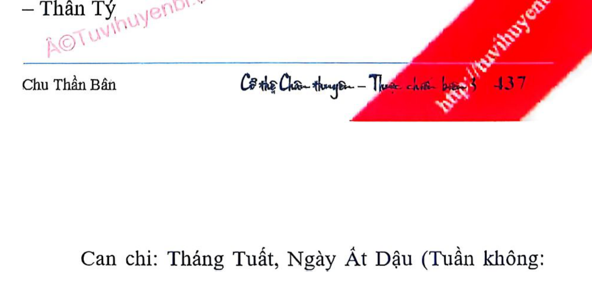

- **Cấu trúc Quẻ Dịch:**
  - **Quẻ chủ:** **Sơn Lôi Di** (Quẻ Du Hồn – Cung Tốn, Họ Tốn)  
    *Tượng quẻ:* Cố Khẩu Tham Bão, Lạc Hoa Phiêu Thủy (Giao tiếp ngoài miệng, chỉ giữ thể diện bề ngoài – biểu thị việc giao tiếp vợ chồng chỉ dừng lại ở đãi bôi hời hợt, chưa chạm đến thực chất giải quyết mâu thuẫn).
  - **Quẻ biến:** **Sơn Thiên Đại Súc** (Cung Cấn, Họ Cấn)  
    *Tượng quẻ:* Trữ Súc Đãi Thời, Đình Trệ Bất Tiến (Tích tụ, kìm nén, đình trệ – báo hiệu xu thế tương lai sẽ rơi vào trạng thái bế tắc ngưng trệ, hoàn toàn bị động).

- **Bảng chi tiết Lục hào:**

| Hào | Thế/Ứng | Lục thân (Chủ) | Can Chi (Chủ) | Động/Tĩnh | Lục thân (Biến) | Can Chi (Biến) | Thần sát / Phục | Lục thú |
|:---:|:---:|:---|:---|:---:|:---|:---|:---|:---|
| 6 | | Huynh Đệ | Bính Dần - Mộc | tĩnh | Huynh Đệ | Bính Dần - Mộc | Kiếp sát, Dương nhẫn | Huyền Vũ |
| 5 | | Phụ Mẫu | Bính Tý - Thủy | tĩnh | Phụ Mẫu | Bính Tý - Thủy | Quý nhân, Phục Tử Tôn Tân Tị Hỏa | Bạch Hổ |
| 4 | **Thế** | Thê Tài | Bính Tuất - Thổ | tĩnh | Thê Tài | Bính Tuất - Thổ | Nguyệt kiến | Đằng Xà |
| 3 | | Thê Tài | Canh Thìn - Thổ | **X (Động)** | Thê Tài | Giáp Thìn - Thổ | Thiên hỷ, Nhật hợp (Thìn Dậu hợp), Phục Quan Quỷ Tân Dậu Kim | Câu Trần |
| 2 | | Huynh Đệ | Canh Dần - Mộc | **X (Động)** | Huynh Đệ | Giáp Dần - Mộc | Kiếp sát, Dương nhẫn, Hóa Phục ngâm | Chu Tước |
| 1 | **Ứng** | Phụ Mẫu | Canh Tý - Thủy | tĩnh | Phụ Mẫu | Giáp Tý - Thủy | Quý nhân | Thanh Long |

---

### 3. Dụng thần & Loại quẻ

- **Phân loại quẻ:**
  - **Quẻ hôn nhân & Tình cảm (Tái chiêm kiểm chứng):** Nam hỏi về nguy cơ ly hôn sau một thời gian áp dụng phương án hòa giải.
  - **Quẻ tâm thái & Xu thế biến dịch:** Xem xét sự chuyển biến tâm lý giữa tiền cổ và tiền hiện đại.
- **Định vị Dụng thần cốt lõi:**
  - **Hào Thế (Thê Tài Bính Tuất Thổ):** Lâm Nguyệt kiến. Do là nam hỏi vợ mà Thế lâm Thê Tài, phản ánh trạng thái hiện tại hai người vẫn còn danh nghĩa hôn nhân vợ chồng, người vợ vẫn đang gắn liền với cuộc đời anh ta.
  - **Kỵ thần (Huynh Đệ Canh Dần Mộc):** Hào 2 phát động khắc Thế Thê Tài Tuất Thổ.
  - **Hào 3 Thê Tài Canh Thìn Thổ phát động:** Cùng hành Thổ nhưng Thìn Tuất đối xung trực diện với hào Thế – đóng vai trò đối thủ cạnh tranh tình cảm / tình địch (tương đương hào 6 Huynh Đệ Tị Hỏa ở quẻ trước).

---

### 4. Luận giải chi tiết

#### 1. Sự trùng khớp kỳ diệu giữa Quẻ Tiền Cổ và Quẻ Tiền Hiện Đại
- Chu Thần Bân so sánh đối chiếu sâu sắc giữa quẻ gieo bằng tiền hiện đại (TC 182) và tiền cổ (TC 183):
  - Cả hai quẻ đều bộc lộ cùng một bản chất sự việc: Kỵ thần phát động khắc Dụng thần, kẻ thứ ba tiếp tục can dự phá hoại hạnh phúc, hào Thế rơi vào thế bị động.
  - Điều này đập tan định kiến cho rằng dùng đồng xu hiện đại thì quẻ không linh; thực tế chứng minh quẻ đồng xu hiện đại ở TC 182 bắt trúng thông tin không sai một mảy may.

#### 2. Tượng quẻ Du Hồn "Sơn Lôi Di" và sự bế tắc giao tiếp
- Quẻ chủ là **Sơn Lôi Di** (quẻ Du hồn): "Di" là nuôi dưỡng, là cái miệng. Trong hôn nhân, tượng quẻ Di phản ánh việc người chồng và người vợ sau 18 ngày qua chỉ dừng lại ở sự giao tiếp bề ngoài, nói chuyện đối phó đãi bôi, chưa hề có một hành động thực chất nào đi sâu vào nội tâm để hàn gắn rạn nứt. 
- Thái độ chần chừ, không chịu chủ động "động" lên của người chồng đã khiến mối quan hệ ngày càng chuyển biến xấu.

#### 3. Bí pháp Phục Ngâm nội quái: Nỗi đau đớn xâu xé tâm can
- Trong quẻ, hào 2 Huynh Đệ Canh Dần Mộc động biến ra Giáp Dần Mộc; hào 3 Thê Tài Canh Thìn Thổ động biến ra Giáp Thìn Thổ. Hào động biến ra chính nó gọi là **Phục Ngâm**.
- Đây là tượng phục ngâm ở nội quái: Nội phục ngâm chủ sự dằn vặt, đau đớn, u uất, rên rỉ nghẹn ngào từ trong thâm tâm của đương số.
- Về động thái:
  - Huynh Đệ Canh Dần Mộc lâm Chu Tước, Dương nhẫn phát động khắc mạnh vào hào Thế Thê Tài Tuất Thổ.
  - Thê Tài Canh Thìn Thổ (tình địch cạnh tranh) phát động xung thẳng vào hào Thế Tuất Thổ (Thìn Tuất tương xung).
  - Hai hào 2 và hào 3 phát động liên tiếp tạo nên tượng *"Động động tương liên"*, giống hệt như thế liên kết giữa Tị Hỏa và Dậu Kim ở quẻ trước: Kẻ thứ ba và các yếu tố ngoại cảnh đang không ngừng công kích, xé nát tâm can người chồng.

#### 4. Quẻ biến "Đại Súc" và Nguy cơ bị động toàn diện
- Quẻ biến thành **Sơn Thiên Đại Súc**: Đại Súc là kìm nén, ngưng trệ, bế tắc lớn. Nếu người chồng cứ tiếp tục ôm thái độ giao tiếp đãi bôi ngoài mặt mà không đánh thẳng vào điểm mấu chốt tình cảm, cuộc hôn nhân sẽ bị chôn vùi trong bế tắc, cơ hội cứu vãn sẽ hoàn toàn tiêu tan.
- Tuy nhiên, vì ở quẻ đầu tiên biến quẻ Giải (còn có cơ hội hóa giải), Chu Thần Bân khuyên đương số: Cánh cửa hy vọng chưa khép lại hoàn toàn, nhưng nếu không lập tức hành động để giành lại vợ thì kết cục đổ vỡ là điều không thể tránh khỏi.

---

### 5. Kết luận & Ứng kỳ thực tế

- **Lời giải đoán của Chu Thần Bân:**
  - Khẳng định tính chuẩn xác tuyệt đối của cả hai quẻ: Người vợ và nhân tình vẫn đang ngấm ngầm qua lại, người chồng thì đau đớn tột cùng nhưng hành động thực tế lại quá yếu ớt, chỉ dám nói chuyện ngoài mặt.
  - Quẻ biến Đại Súc là lời cảnh báo nghiêm khắc: Thời gian cứu vãn không còn nhiều. Đương số phải lập tức chấm dứt sự ngập ngừng, dốc toàn lực bằng hành động cụ thể để giành lại trái tim người vợ trước khi mối quan hệ vợ - nhân tình chuyển sang giai đoạn không thể đảo ngược.
- **Phản hồi thực tế từ đương số:**
  - Đương số hoàn toàn thán phục trước bức tranh tâm lý chuẩn xác đến nghẹn lòng mà quẻ chỉ ra. Anh thừa nhận suốt 18 ngày qua vì sợ hãi nên chỉ dám bóng gió ngoài mặt, khiến bản thân đêm nào cũng mất ngủ, đau khổ dằn vặt như quẻ Phục ngâm mô tả.
  - Nhờ sự phân tích thấu đáo, anh nhận ra việc gieo quẻ không phải để ngồi chờ số phận mà là động lực thúc đẩy bản thân phải dũng cảm đối mặt để hành động.

---

### 6. Bài học tâm pháp & Quy tắc cốt lõi

- **Các quy tắc Lục Hào rút ra từ ca thực chiến:**
  - *Trích dẫn:* Quy tắc so sánh quẻ tiền cổ và tiền hiện đại trong việc đoán xu hướng hôn nhân (trang 405, `rule_index`).
  - *Quy tắc Tiền cổ vs Tiền hiện đại:* Độ linh nghiệm của quẻ không phụ thuộc vào chất liệu đồng tiền (cổ hay kim), mà nằm ở năng lượng cảm ứng và tâm niệm của người gieo vào thời điểm phát động.
  - *Ý nghĩa Phục Ngâm nội quái:* Hào động biến ra chính nó tại nội quái là dấu hiệu chắc chắn của nỗi thống khổ nội tâm, sự bế tắc, dằn vặt khôn xiết của đương số.
  - *Tượng Du Hồn biến Đại Súc:* Biểu thị từ sự lang thang giao tiếp hời hợt chuyển sang trạng thái bế tắc ngưng trệ hoàn toàn; là lời cảnh báo về sự trả giá của thái độ thụ động trốn tránh.
- **Bài học kinh nghiệm trong tâm pháp giải đoán thực tế:**
  - Người luận quẻ bậc thầy phải biết dùng quẻ để giải phẫu tâm lý con người. Khi khách hàng bế tắc, đừng chỉ phán một câu "ly hôn hay không", mà phải chỉ cho họ thấy rõ căn nguyên vì sao họ đau khổ (Phục ngâm), vì sao họ thất bại (Di - hời hợt), và hậu quả nếu tiếp tục buông xuôi (Đại Súc). Đó chính là giá trị khai sáng nhân tâm của Dịch học thực chiến.

## THỰC CHIẾN 184: TỰ XEM XÉT TÌNH HÌNH CỔ PHIẾU TRONG NGÀY

---

### 1. Bối cảnh & Câu hỏi

- **Bối cảnh chi tiết:** 
  Một học viên đầu tư tài chính đang nắm giữ một mã cổ phiếu trên thị trường chứng khoán. Do trước đó thị trường sụt giảm, mã cổ phiếu này đã bị kẹt hàng tương đối sâu khiến đương số chịu nhiều áp lực tâm lý. Vào tối ngày 19/10/2018, đương số muốn biết biến động giá của mã cổ phiếu này trong ngày giao dịch hôm sau sẽ diễn biến ra sao.
- **Tâm lý & Câu hỏi ẩn ý:** 
  Đương số nôn nóng muốn biết liệu cổ phiếu có hồi phục để giảm bớt thua lỗ hay không, tự gieo quẻ với câu hỏi hạn định thời gian trong phiên: *"Tự xem xét tình hình cổ phiếu trong ngày ngày mai ra sao?"*
- **Thời gian chiêm đoán:**
  - Dương lịch: 19/10/2018 lúc 20 giờ 09 phút (Giờ Bắc Kinh).
  - Can chi: Năm Mậu Tuất, tháng Nhâm Tuất, ngày Giáp Thân, giờ Giáp Tuất.
  - Tuần không: **Ngọ - Mùi** (Giáp Thân tuần trung, Ngọ Mùi không vong).

---

### 2. Dữ kiện & Bảng quẻ Crop

- **Thời không chiêm nghiệm:**
  - Tháng Nhâm Tuất (Thổ vượng, Kim tướng, Hỏa hưu, Thủy tù, Mộc tuyệt).
  - Ngày Giáp Thân (Kim vượng, Thủy trường sinh, Mộc tuyệt).
  - Tuần không: **Ngọ - Mùi**.
- **Thần sát:**
  - Tướng tinh: Tý (Lâm hào Thế Phụ Mẫu Tý Thủy)
  - Hoa cái: Thìn (Lâm hào 3 Thê Tài Thìn Thổ)
  - Dịch mã: Dần (Lâm hào 2 Huynh Đệ Dần Mộc)
  - Tai sát: Ngọ
  - Mưu tinh: Tuất (Lâm Nguyệt kiến)
  - Đào hoa: Dậu
  - Kiếp sát: Tị (Lâm hào 5 Tử Tôn Tị Hỏa)
  - Lộc thần: Dần (Lâm hào 2 Huynh Đệ Dần Mộc)
  - Dương nhẫn: Mão (Lâm hào 6 Huynh Đệ Mão Mộc)
  - Văn xương: Tị (Lâm hào 5 Tử Tôn Tị Hỏa)
  - Thiên y: Dậu
  - Thiên hỷ: Thìn (Lâm hào 3 Thê Tài Thìn Thổ)
  - Quý nhân: Sửu, Mùi (Lâm hào 4 Thê Tài Mùi Thổ và hào biến Thê Tài Sửu Thổ)

- Dữ kiện bảng quẻ và các thông số chiêm đoán:
  - **Bảng 184.1** Đồ hình quẻ Thực chiến 184:
    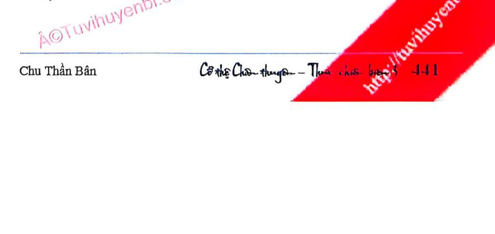

- **Cấu trúc Quẻ Dịch:**
  - **Quẻ chủ:** **Phong Thiên Tiểu Súc** (Cung Tốn, Họ Tốn)  
    *Tượng quẻ:* Mật Vân Bất Vũ, Hanh Thông Tiểu Hạn (Mây dày mà chưa mưa, tích tụ nhỏ, hồi phục cục bộ – biểu thị biên độ tăng giá có giới hạn, chưa đủ sức đảo chiều toàn diện).
  - **Quẻ biến:** **Phong Trạch Trung Phu** (Quẻ Du Hồn – Cung Cấn, Họ Cấn)  
    *Tượng quẻ:* Hạc Minh Tại Âm, Thành Tín Đãi Thời (Giữ vững lòng tin, kiên định nắm giữ – cho thấy dù có phiên hồi phục mạnh cũng chưa thể chốt lời thoát hàng, phải tiếp tục nắm giữ).

- **Bảng chi tiết Lục hào:**

| Hào | Thế/Ứng | Lục thân (Chủ) | Can Chi (Chủ) | Động/Tĩnh | Lục thân (Biến) | Can Chi (Biến) | Thần sát / Phục | Lục thú |
|:---:|:---:|:---|:---|:---:|:---|:---|:---|:---|
| 6 | | Huynh Đệ | Tân Mão - Mộc | tĩnh | Huynh Đệ | Tân Mão - Mộc | Dương nhẫn | Huyền Vũ |
| 5 | | Tử Tôn | Tân Tị - Hỏa | tĩnh | Tử Tôn | Tân Tị - Hỏa | Văn xương, Kiếp sát | Bạch Hổ |
| 4 | **Ứng** | Thê Tài | Tân Mùi - Thổ | tĩnh | Thê Tài | Tân Mùi - Thổ | Tuần không, Quý nhân | Đằng Xà |
| 3 | | Thê Tài | Giáp Thìn - Thổ | **O (Động)** | Thê Tài | Đinh Sửu - Thổ | Hoa cái, Thiên hỷ, Phục Quan Quỷ Tân Dậu Kim | Câu Trần |
| 2 | | Huynh Đệ | Giáp Dần - Mộc | tĩnh | Huynh Đệ | Đinh Mão - Mộc | Lộc thần, Dịch mã | Chu Tước |
| 1 | **Thế** | Phụ Mẫu | Giáp Tý - Thủy | tĩnh | Tử Tôn | Đinh Tị - Hỏa | Tướng tinh | Thanh Long |

---

### 3. Dụng thần & Loại quẻ

- **Phân loại quẻ:**
  - **Quẻ cầu tài chứng khoán (Việc cụ thể trong ngày):** Khảo sát biến động giá cổ phiếu trong một phiên giao dịch ngắn hạn.
  - **Quẻ vị thế nắm giữ:** Đương số đã ôm cổ phiếu từ trước, mong cầu giá tăng để giảm lỗ.
- **Định vị Dụng thần cốt lõi:**
  - Nắm giữ cổ phiếu cầu tài: Lấy **Thê Tài** làm Dụng thần (cổ phiếu tăng là sinh Tài, giảm là tổn Tài).
  - Trong quẻ có hào Ứng Thê Tài Mùi Thổ (lâm Tuần không) và hào 3 **Thê Tài Giáp Thìn Thổ** độc phát. Vì hỏi việc ngắn hạn trong ngày, hào động **Thê Tài Giáp Thìn Thổ** đóng vai trò Dụng thần trọng tâm dẫn dắt dòng tiền.
  - **Hào Thế (Phụ Mẫu Giáp Tý Thủy):** Đại diện cho bản thân người đầu tư và vị thế tài khoản đang nắm giữ.

---

### 4. Luận giải chi tiết

#### 1. Bí pháp "Tài lai khắc Thế tất hoạch tài" trong cầu tài đoản kỳ
- Thông thường, hào Kỵ thần hoặc hào khác khắc Thế bị coi là điềm hung. Tuy nhiên, trong phép bói Cầu Tài Ngắn Hạn (như xem cổ phiếu trong ngày hoặc vài ngày), quy tắc đặc thù chỉ rõ: **Tài hào khắc Thế lại là điềm có tiền của tìm đến mình**.
- Điều kiện cốt lõi để Tài khắc Thế phát huy cát lợi: Hào Thế phải được Nhật hoặc Nguyệt sinh phù để có đủ nội lực "gánh tài" (thân vượng nhận tài).
  - Hào Thế Phụ Mẫu Tý Thủy bị Nguyệt kiến Tuất Thổ khắc chế (phản ánh trạng thái thực tế: cổ phiếu trước đó rơi sâu khiến tài khoản bị kẹt hàng nặng nề).
  - Nhưng hào Thế lại được **Nhật thần Giáp Thân sinh phù** (Thân Kim sinh Tý Thủy, đắc trường sinh). Nhờ có sinh phù từ Nhật thần, hào Thế đủ sức gánh vác tài lộc.
  - Do đó, hào động Thê Tài Thìn Thổ khắc Thế chính là điềm báo: **Giá cổ phiếu trong ngày chắc chắn sẽ tăng mạnh đem lại lợi nhuận**.

#### 2. Phân tầng thời gian phiên giao dịch: Buổi sáng vs Buổi chiều
- Hiện tượng Thê Tài Thìn Thổ động hóa Sửu Thổ: Ở việc dài hạn thì luận là "Hóa thoái", nhưng đối với việc ngắn hạn xem phiên giao dịch trong ngày thì **không luận thoái thần mà luận theo trình tự thời gian biến động**:
  - **Hào động Thê Tài Thìn Thổ (Phiên sáng):** Thìn Thổ với hào Thế Tý Thủy tạo thành thế **Thân Tý Thìn Bán hợp** (Thìn hợp Tý). Bán hợp biểu thị mức tăng giá buổi sáng diễn ra êm ả, tăng nhẹ đến vừa phải, đem lại tâm lý hài lòng cho nhà đầu tư.
  - **Hào biến Thê Tài Sửu Thổ (Phiên chiều):** Sửu Thổ lâm Quý nhân, kết hợp với hào Thế Tý Thủy tạo thành thế **Lục hợp** (Tý Sửu lục hợp chặt chẽ). Mức độ liên kết Lục hợp sâu sắc và viên mãn hơn Bán hợp rất nhiều. Điều này báo hiệu phiên chiều dòng tiền bùng nổ dữ dội, mức tăng vượt trội hoàn toàn so với phiên sáng.

#### 3. Ý nghĩa tượng quẻ Phong Thiên Tiểu Súc biến Phong Trạch Trung Phu
- **Tiểu Súc:** Mưa chưa rơi hẳn, chỉ là tích lũy nhỏ, sóng hồi phục kỹ thuật ngắn hạn.
- **Trung Phu:** Giữ vững niềm tin, kiên định giữ cổ phiếu.
- Tổng hòa hai tượng quẻ cho thấy: Dù phiên hôm nay cổ phiếu có bật tăng rực rỡ thì cũng chỉ là nhịp hồi trong xu hướng lớn, mức tăng chưa đủ bù đắp khoản lỗ kẹt hàng trước đó để nhà đầu tư chốt lời thoát vị thế. Do đó, sách lược sau phiên tăng điểm vẫn là tiếp tục kiên trì nắm giữ.

---

### 5. Kết luận & Ứng kỳ thực tế

- **Lời giải đoán của Chu Thần Bân:**
  - Khẳng định giá cổ phiếu trong ngày hôm đó sẽ tăng rất tốt.
  - Phiên sáng mở cửa tăng vừa phải, tạo tâm lý tích cực.
  - Phiên chiều lực cầu bùng nổ cực mạnh, giá sẽ tăng vọt vượt bậc (kịch trần/tăng trần).
  - Tuy nhiên, không nên vội mừng mà bán tháo ra ngay vì vị thế kẹt hàng vốn sâu, quẻ Trung Phu khuyên nên tiếp tục kiên trì nắm giữ vị thế.
- **Phản hồi thực tế từ đương số:**
  - Diễn biến phiên giao dịch hoàn toàn khớp với từng chi tiết phân tích:
    + Buổi sáng, giá cổ phiếu tăng nhẹ từ tốn, đương số cảm thấy khá hài lòng.
    + Đến buổi chiều, bất ngờ một lượng tiền lớn ồ ạt đổ vào kéo cổ phiếu tăng vọt thẳng lên mức **kịch trần (tăng trần)**, mang lại niềm vui bất ngờ cho toàn bộ cổ đông.
  - Đương số vô cùng khâm phục việc Lục Hào có thể phân định rạch ròi biến động giá giữa phiên sáng (Bán hợp) và phiên chiều (Lục hợp tăng trần).

---

### 6. Bài học tâm pháp & Quy tắc cốt lõi

- **Các quy tắc Lục Hào rút ra từ ca thực chiến:**
  - *Trích dẫn:* Quy tắc đo lường biến động cổ phiếu trong ngày qua hào Phụ Mẫu và Tử Tôn ám động (trang 409, `rule_index`).
  - *Quy tắc Tài lai khắc Thế:* Trong cầu tài ngắn hạn, hào Tài khắc hào Thế là tượng tiền tài tự tìm tới tay, với điều kiện tiên quyết là hào Thế phải được ít nhất một bên Nhật hoặc Nguyệt sinh phù.
  - *Quy tắc Không luận Tiến/Thoái trong chiêm nhật hạn:* Khi chiêm đoán sự việc gói gọn trong ngày, hào động và hào biến không xem là tiến thần thoái thần thông thường, mà phân định thành hai nửa chu kỳ thời gian (sáng và chiều, trước và sau).
  - *Phân cấp độ tâm lý qua Hợp cục:* Bán hợp biểu thị sự hài lòng cục bộ (tăng điểm vừa); Lục hợp biểu thị sự viên mãn đỉnh điểm (tăng trần kịch biên độ).
- **Bài học kinh nghiệm trong tâm pháp giải đoán thực tế:**
  - Chiêm đoán thị trường tài chính hiện đại đòi hỏi khả năng bóc tách thời không cực kỳ linh hoạt. Phải nắm vững ranh giới giữa cát hung toàn cục (quẻ chủ Tiểu Súc biến Trung Phu – vẫn bị kẹt hàng dài hạn) và biến động vi mô (hào động hào biến – tăng trần trong phiên) để vừa giúp đương số hưởng niềm vui ngắn hạn, vừa giữ được sự tỉnh táo chiến lược dài hạn.

## THỰC CHIẾN 185: XEM MỘT MÃ CỔ PHIẾU CÓ THỂ THAM GIA HAY KHÔNG

---

### 1. Bối cảnh & Câu hỏi

- **Bối cảnh chi tiết:** 
  Một sư huynh đồng môn đang nghiên cứu một mã cổ phiếu tiềm năng trên thị trường tài chính. Nhận thấy mã cổ phiếu này có những tín hiệu kỹ thuật đáng chú ý nhưng chưa dám chắc chắn về xu hướng thực sự của dòng tiền lớn, người này băn khoăn liệu có nên giải ngân mua vào ở thời điểm hiện tại hay không.
- **Tâm lý & Câu hỏi ẩn ý:** 
  Đương số muốn tìm kiếm cơ hội sinh lời ngắn hạn nhưng sợ rơi vào cạm bẫy kẹt hàng, gieo quẻ hỏi Chu Thần Bân: *"Mã cổ phiếu này liệu có thể tham gia mua vào đầu tư hay không?"*
- **Thời gian chiêm đoán:**
  - Dương lịch: Ngày 07 tháng 4 năm 2018, lúc 12 giờ 16 phút (Giờ Bắc Kinh).
  - Can chi: Năm Mậu Tuất, tháng Bính Thìn, ngày Kỷ Tị, giờ Canh Ngọ.
  - Tuần không: **Tuất - Hợi** (Giáp Tý tuần trung, Tuất Hợi không vong).

---

### 2. Dữ kiện & Bảng quẻ Crop

- **Thời không chiêm nghiệm:**
  - Tháng Bính Thìn (Thổ vượng, Kim tướng, Mộc hưu, Thủy tù, Hỏa thực).
  - Ngày Kỷ Tị (Hỏa vượng, Kim trường sinh, Mộc hưu).
  - Tuần không: **Tuất - Hợi**.
- **Thần sát:**
  - Tướng tinh: Dậu
  - Hoa cái: Sửu
  - Dịch mã: Hợi (Lâm hào biến Huynh Đệ Hợi Thủy)
  - Tai sát: Mão
  - Mưu tinh: Mùi
  - Đào hoa: Ngọ (Lâm Phục thần Thê Tài Ngọ Hỏa)
  - Kiếp sát: Dần (Lâm hào Thế Tử Tôn Dần Mộc)
  - Lộc thần: Ngọ
  - Dương nhẫn: Tị (Lâm Nhật thần)
  - Văn xương: Dậu
  - Thiên y: Mão
  - Thiên hỷ: Tuất (Lâm hào Ứng Quan Quỷ Tuất Thổ)
  - Quý nhân: Thân, Tý (Lâm hào 4 Phụ Mẫu Thân Kim, hào 1 và hào 6 Huynh Đệ Tý Thủy)

- Dữ kiện bảng quẻ và các thông số chiêm đoán:
  - **Bảng 185.1** Đồ hình quẻ Thực chiến 185:
    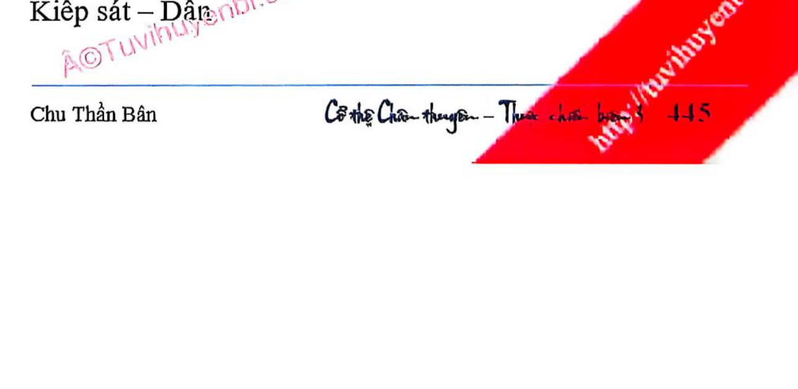

- **Cấu trúc Quẻ Dịch:**
  - **Quẻ chủ:** **Thủy Lôi Truân** (Cung Khảm, Họ Khảm)  
    *Tượng quẻ:* Vạn Vật Sơ Sinh, Truân Chiên Nan Tiến (Manh nha khởi đầu, áp lực tích lũy kìm nén – phản ánh áp lực chốt lời và phân phối ngầm đang âm thầm tích tụ).
  - **Quẻ biến:** **Trạch Lôi Tùy** (Quẻ Quy Hồn – Cung Chấn, Họ Chấn)  
    *Tượng quẻ:* Tùy Ba Trục Lưu, Khốn Bất Đắc Thoát (Chạy theo sau, bị động lệ thuộc, chôn vốn – đầu tư ngắn hạn tối kỵ biến Tùy vì biểu thị rơi vào thế kẹt hàng bị động).

- **Bảng chi tiết Lục hào:**

| Hào | Thế/Ứng | Lục thân (Chủ) | Can Chi (Chủ) | Động/Tĩnh | Lục thân (Biến) | Can Chi (Biến) | Thần sát / Phục | Lục thú |
|:---:|:---:|:---|:---|:---:|:---|:---|:---|:---|
| 6 | | Huynh Đệ | Mậu Tý - Thủy | tĩnh | Quan Quỷ | Đinh Mùi - Thổ | Quý nhân | Câu Trần |
| 5 | **Ứng** | Quan Quỷ | Mậu Tuất - Thổ | tĩnh | Phụ Mẫu | Đinh Dậu - Kim | Tuần không, Thiên hỷ | Chu Tước |
| 4 | | Phụ Mẫu | Mậu Thân - Kim | **X (Động)** | Huynh Đệ | Đinh Hợi - Thủy | Quý nhân, Biến Tuần không phùng Nhật xung (Ám động), Dịch mã | Thanh Long |
| 3 | | Quan Quỷ | Canh Thìn - Thổ | tĩnh | Quan Quỷ | Canh Thìn - Thổ | Nguyệt kiến, Phục Thê Tài Bính Ngọ Hỏa | Huyền Vũ |
| 2 | **Thế** | Tử Tôn | Canh Dần - Mộc | tĩnh | Tử Tôn | Canh Dần - Mộc | Kiếp sát | Bạch Hổ |
| 1 | | Huynh Đệ | Canh Tý - Thủy | tĩnh | Huynh Đệ | Canh Tý - Thủy | Quý nhân | Đằng Xà |

---

### 3. Dụng thần & Loại quẻ

- **Phân loại quẻ:**
  - **Quẻ đầu tư tài chính / phái sinh / chứng khoán (Việc cụ thể):** Xem mã cổ phiếu có thích hợp để giải ngân mua vào hay không.
  - **Quẻ nhận diện cạm bẫy:** Phân biệt cơ hội sinh lời và nguy cơ rủi ro bị kẹt vốn.
- **Định vị Dụng thần cốt lõi:**
  - Khi hỏi về cổ phiếu hoặc hàng hóa tương lai có thể tham gia/đầu tư được không: Không xem hào Thê Tài mà lấy **Tử Tôn** làm Dụng thần (Tử Tôn là nguồn sinh tài, là tài nguyên và sự an toàn vốn).
  - Ở đây Dụng thần là **Tử Tôn Canh Dần Mộc** trì Thế (hào 2).
  - **Kỵ thần:** **Phụ Mẫu Mậu Thân Kim** (hào 4 phát động khắc Tử Tôn).
  - **Nguyên thần:** **Huynh Đệ Đinh Hợi Thủy** (hào biến do Thân Kim hóa xuất).

---

### 4. Luận giải chi tiết

#### 1. Định tính tổng thể: Kỵ thần độc phát khắc Thế Dụng thần
- Hào 2 Tử Tôn Canh Dần Mộc trì Thế làm Dụng thần đầu tư.
- Hào 4 **Phụ Mẫu Mậu Thân Kim** độc phát xung khắc trực diện vào hào Thế Dụng thần Tử Tôn Dần Mộc (Thân Kim khắc Dần Mộc, Dần Thân thiên xung địa kích). 
- Kỵ thần phát động khắc thẳng vào bản thân và lợi nhuận đầu tư là điềm hung hiển nhiên, định tính dứt khoát: **Mã cổ phiếu này tuyệt đối không thể tham gia mua vào**.

#### 2. Bí pháp Hào Biến Tuần không phùng Nhật xung hóa Ám động
- Phụ Mẫu Thân Kim động hóa xuất **Huynh Đệ Đinh Hợi Thủy**, bị Nhật thần Kỷ Tị trực tiếp tương xung (Tị - Hợi tương xung).
- Xét quy tắc thông thường trong tháng Thìn: Hào bị Nhật xung tưởng chừng là Nhật phá. Nếu hào biến Hợi Thủy bị Nhật phá (chân phá) thì Phụ Mẫu Thân Kim sẽ mất đi thực lực khắc hại hào Thế, mở ra cơ hội ngắn hạn giảm rồi dài hạn tăng.
- Tuy nhiên, trong tuần Giáp Tý, **Tuất và Hợi lâm Tuần không**. Hào lâm Tuần không phùng Nhật xung không xem là phá mà là **Xung Không**, kích hoạt trở thành **Ám động** hữu dụng!
- Hào biến hóa Ám động tương trợ cho gốc rễ hào động, khiến Phụ Mẫu Thân Kim bảo toàn trọn vẹn sức mạnh xung sát mãnh liệt vào hào Thế Tử Tôn Dần Mộc. Điều này cảnh báo nhà đầu tư: Nếu nóng vội nhảy vào mua ngay sẽ lập tức "trúng chiêu", dính ngay bẫy giảm giá sâu.

#### 3. Ý nghĩa tượng quẻ Truân biến Tùy
- **Quẻ Truân:** Mầm mống của sự gian truân, áp lực bán tháo tích tụ ngầm.
- **Quẻ Tùy (Quy hồn):** Tùy là chạy theo đuôi, lệ thuộc, bị dắt mũi. Trong giao dịch ngắn hạn, xuất hiện quẻ Tùy hoặc quẻ Lục hợp là chỉ dấu đáng sợ nhất, đồng nghĩa với việc tiền vốn bị giam lỏng, tài khoản bị kẹp chặt không thể rút lui.

#### 4. Kỹ thuật bóc tách Sóng thị trường: Định tính vs Phân tích vi mô
Chu Thần Bân truyền thụ tâm pháp phân tích biến động giá theo từng cung bậc ngày giao dịch:
- Dù xu hướng tổng thể trong 2 tuần là giảm giá liên tục tạo đáy mới (định tính), nhưng đường giá không bao giờ rơi thẳng đứng mà luôn vận động theo mô hình sóng dao động zíc-zắc (giảm một nhịp rồi hồi phục kỹ thuật, sau đó lại giảm tiếp).
- **Vùng Giảm giá (Kỵ thần vượng khí):**
  + Ngày Mùi (Thổ sinh Kim trợ kỵ) và ngày Thân (Kỵ thần Phụ Mẫu Thân Kim lâm trị): Giá cổ phiếu lao dốc dữ dội (đại giảm).
  + Ngày Tị: Tị Thân lục hợp kích khởi lực khắc của Kỵ thần, đà giảm lại tái diễn.
  + Ngày Dậu: Đồng khí Kim với Phụ Mẫu, quán tính giảm giá duy trì.
- **Vùng Hồi phục kỹ thuật (Nguyên thần và Dụng thần vượng khí):**
  + Ngày Hợi (Nguyên thần Huynh Đệ Hợi Thủy): Nguồn sinh kích hoạt, giá ngừng rơi và hồi phục nhẹ.
  + Ngày Dần và Mão (Dụng thần Tử Tôn Dần Mộc và Mão Mộc vượng): Tiếp nối nhịp hồi phục sau kỳ nghỉ cuối tuần, tạo ra sóng hồi kỹ thuật rõ rệt.

---

### 5. Kết luận & Ứng kỳ thực tế

- **Lời giải đoán của Chu Thần Bân:**
  - Khuyến nghị dứt khoát không tham gia mua mã cổ phiếu này vì kỵ thần xung sát rất mạnh, quẻ Tùy báo hiệu cạm bẫy kẹt hàng chôn vốn.
  - Cảnh báo thị trường sẽ liên tục giảm giá theo từng nhịp sóng trong 2 tuần kế tiếp.
- **Phản hồi thực tế từ đương số:**
  - Vị sư huynh ghi chép nhật ký theo dõi biểu đồ thực tế suốt 2 tuần sau đó: Đúng như quẻ dự báo, cổ phiếu liên tục sụt giảm phá đáy.
  - Diễn biến từng ngày chuẩn xác đến từng bước sóng:
    + Cổ phiếu **giảm rất mạnh vào các ngày Mùi và Thân**.
    + Xuất hiện **nhịp hồi phục kỹ thuật vào các ngày Hợi, Dần, Mão**.
    + Bước sang **ngày Tị lại tiếp tục cắm đầu giảm sâu**.
  - Nhờ không mua vào, đương số đã tránh được một cú thua lỗ nặng nề.

---

### 6. Bài học tâm pháp & Quy tắc cốt lõi

- **Các quy tắc Lục Hào rút ra từ ca thực chiến:**
  - *Trích dẫn:* Quy tắc nhận diện cạm bẫy cổ phiếu qua quẻ Lục xung biến Tuyệt và hào Phục thần (trang 413, `rule_index`).
  - *Quy tắc Dụng thần Đầu tư:* Xem xét việc tham gia đầu tư/mua mới cổ phiếu, phái sinh luôn lấy hào Tử Tôn làm Dụng thần (chủ an toàn vốn và nguồn sinh lợi nhuận), không xem hào Thê Tài.
  - *Quy tắc Xung Không biến Ám động:* Hào biến lâm Không phùng Nhật xung biến thành Ám động hữu hiệu, duy trì trọn vẹn năng lực khắc phạt của hào động.
  - *Tối kỵ Quẻ Tùy trong đầu tư ngắn hạn:* Giao dịch ngắn hạn biến Tùy hoặc Lục hợp là biểu tượng của thế bị động và sa lầy kẹt lệnh.
  - *Quy luật Sóng Nguyên - Kỵ - Dụng:* Phân định ngày tăng giảm dựa trên sự luân chuyển vượng suy giữa Kỵ thần (vùng rơi giá) và Nguyên thần/Dụng thần (vùng hồi phục kỹ thuật).
- **Bài học kinh nghiệm trong tâm pháp giải đoán thực tế:**
  - Mục đích tối thượng của Kinh Dịch không phải là chấp nhận số phận mà là **"Xu cát tị hung"** (tìm lành tránh dữ). Biết trước quẻ hung giúp ta né đòn hiểm; hiểu rõ quy luật sóng giúp nhà đầu tư đang kẹt hàng biết chọn đúng ngày hồi phục (Hợi, Dần, Mão) để hạ tỷ trọng thoát hàng, biến thế bị động thành thế chủ động giảm thiểu rủi ro.

## THỰC CHIẾN 186: CHIỀU RA NGOÀI BỊ MUỖI ĐỐT VÀI CHỖ, HỎI CÓ BỊ LÂY SỐT XUẤT HUYẾT KHÔNG

---

### 1. Bối cảnh & Câu hỏi

- **Bối cảnh chi tiết:** 
  Vào tháng 10 năm 2018, tại thành phố Quảng Châu bất ngờ bùng phát một số ca nhiễm bệnh sốt xuất huyết do muỗi vằn truyền bệnh. Ban quản lý khu dân cư đã đến từng hộ gia đình phát tờ rơi cảnh báo dịch bệnh và hướng dẫn phun thuốc diệt muỗi. Chiều hôm đó, một người bạn của Chu Thần Bân đi đón con tan học ở trường; do khu vực này rậm rạp nhiều muỗi nên anh bị muỗi đốt vài nốt nổi mẩn đỏ ở tay chân. Vì biết sốt xuất huyết là bệnh truyền nhiễm qua đường máu rất nguy hiểm, có thể gây tụt tiểu cầu cấp tính đe dọa tính mạng, anh vô cùng hoảng sợ.
- **Tâm lý & Câu hỏi ẩn ý:** 
  Đương sự mang tâm lý lo sợ tột độ, bất an về sức khỏe của bản thân, vội vã gieo quẻ hỏi Chu Thần Bân: *"Mấy vết muỗi đốt này có khiến mình bị lây nhiễm sốt xuất huyết hay không?"*
- **Thời gian chiêm đoán:**
  - Dương lịch: 19/10/2018 lúc 20 giờ 17 phút (Giờ Bắc Kinh).
  - Can chi: Năm Mậu Tuất, tháng Nhâm Tuất, ngày Giáp Thân, giờ Giáp Tuất.
  - Tuần không: **Ngọ - Mùi** (Giáp Thân tuần trung, Ngọ Mùi không vong).

---

### 2. Dữ kiện & Bảng quẻ Crop

- **Thời không chiêm nghiệm:**
  - Tháng Nhâm Tuất (Thổ vượng, Kim tướng, Hỏa hưu, Thủy tù, Mộc tuyệt).
  - Ngày Giáp Thân (Kim vượng, Thủy trường sinh, Mộc tuyệt).
  - Tuần không: **Ngọ - Mùi**.
- **Thần sát:**
  - Tướng tinh: Tý
  - Hoa cái: Thìn (Lâm hào 2 Tử Tôn Thìn Thổ)
  - Dịch mã: Dần (Lâm hào 1 Phụ Mẫu Dần Mộc, phùng Nhật xung là Nhật phá)
  - Tai sát: Ngọ (Lâm hào Thế Huynh Đệ Ngọ Hỏa)
  - Mưu tinh: Tuất (Lâm Nguyệt kiến, hào biến Tử Tôn Tuất Thổ)
  - Đào hoa: Dậu (Lâm hào biến Thê Tài Dậu Kim)
  - Kiếp sát: Tị (Lâm hào 6 Huynh Đệ Tị Hỏa)
  - Lộc thần: Dần (Lâm hào 1 Phụ Mẫu Dần Mộc)
  - Dương nhẫn: Mão
  - Văn xương: Tị (Lâm hào 6 Huynh Đệ Tị Hỏa)
  - Thiên y: Dậu (Lâm hào biến Thê Tài Dậu Kim)
  - Thiên hỷ: Thìn (Lâm hào 2 Tử Tôn Thìn Thổ)
  - Quý nhân: Sửu, Mùi (Lâm hào 5 Tử Tôn Mùi Thổ, hào biến Tử Tôn Sửu Thổ)

- Dữ kiện bảng quẻ và các thông số chiêm đoán:
  - **Bảng 186.1** Đồ hình quẻ Thực chiến 186:
    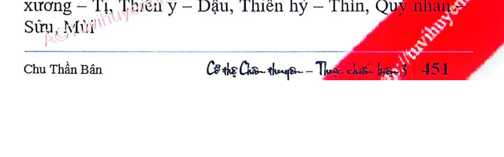

- **Cấu trúc Quẻ Dịch:**
  - **Quẻ chủ:** **Hỏa Thủy Vị Tế** (Cung Ly, Họ Ly)  
    *Tượng quẻ:* Nhu Hạc Thất Thao, Tiểu Hồ Ngật Tế (Chưa yên ổn, tâm lý hoang mang, trạng thái lo sợ dịch bệnh chưa rõ ràng).
  - **Quẻ biến:** **Lôi Phong Hằng** (Cung Chấn, Họ Chấn)  
    *Tượng quẻ:* Nhật Nguyệt Thường Minh, Cửu Trường Ổn Định (Bền vững, lâu dài, an định – báo hiệu về sau sức khỏe tổng thể sẽ bình ổn, tai qua nạn khỏi không nguy hiểm tính mạng).

- **Bảng chi tiết Lục hào:**

| Hào | Thế/Ứng | Lục thân (Chủ) | Can Chi (Chủ) | Động/Tĩnh | Lục thân (Biến) | Can Chi (Biến) | Thần sát / Phục | Lục thú |
|:---:|:---:|:---|:---|:---:|:---|:---|:---|:---|
| 6 | **Ứng** | Huynh Đệ | Kỷ Tị - Hỏa | **O (Động)** | Tử Tôn | Canh Tuất - Thổ | Kiếp sát, Văn xương, Động hóa Mộ | Huyền Vũ |
| 5 | | Tử Tôn | Kỷ Mùi - Thổ | tĩnh | Thê Tài | Canh Thân - Kim | Tuần không, Quý nhân | Bạch Hổ |
| 4 | | Thê Tài | Kỷ Dậu - Kim | tĩnh | Huynh Đệ | Canh Ngọ - Hỏa | Thiên y, Đào hoa | Đằng Xà |
| 3 | **Thế** | Huynh Đệ | Mậu Ngọ - Hỏa | **X (Động)** | Thê Tài | Tân Dậu - Kim | Tuần không, Tai sát, Phục Quan Quỷ Kỷ Hợi Thủy | Câu Trần |
| 2 | | Tử Tôn | Mậu Thìn - Thổ | tĩnh | Quan Quỷ | Tân Hợi - Thủy | Hoa cái, Thiên hỷ | Chu Tước |
| 1 | | Phụ Mẫu | Mậu Dần - Mộc | tĩnh | Tử Tôn | Tân Sửu - Thổ | Lộc thần, Dịch mã, Nhật phá (phùng Nhật Thân xung) | Thanh Long |

---

### 3. Dụng thần & Loại quẻ

- **Phân loại quẻ:**
  - **Quẻ tâm thái phòng dịch bệnh lây nhiễm:** Người hỏi băn khoăn lo lắng dịch sốt xuất huyết xâm nhập cơ thể.
  - **Quẻ an nguy sức khỏe & Bất trắc ngoại cảnh:** Khảo sát các nguy cơ tiềm ẩn tác động đến thân thể trong tương lai gần.
- **Định vị Dụng thần cốt lõi:**
  - **Hào Quan Quỷ:** Đại diện cho bệnh tật, mầm bệnh virus nguy hiểm. Trong quẻ Quan Quỷ không hiện trên hào chính mà phục tàng dưới hào Thế: **Quan Quỷ Kỷ Hợi Thủy phục tàng**. Thủy chủ huyết dịch, biểu thị nỗi lo về bệnh liên quan đến đường máu (sốt xuất huyết).
  - **Hào Thế (Huynh Đệ Mậu Ngọ Hỏa):** Đại diện cho bản thân người hỏi.
  - **Hào Ứng (Huynh Đệ Kỷ Tị Hỏa):** Đại diện cho tác nhân muỗi đốt bên ngoài.

---

### 4. Luận giải chi tiết

#### 1. Định tính nguy cơ sốt xuất huyết: Huyền Vũ lâm Huynh Đệ Tị Hỏa
- Trong phép đoán bệnh tâm thái: Muốn xác định có mắc dịch bệnh hay không phải xem hào Quan Quỷ có phát động khắc Thế hay không. Trong quẻ này, toàn bộ quẻ chủ và quẻ biến không hề có Quan Quỷ phát động; Quan Quỷ Hợi Thủy chỉ phục tàng dưới hào Thế, chứng minh mầm bệnh chưa hề xâm nhập vào cơ thể, chỉ là mối lo sợ thầm kín trong tâm tưởng đương số.
- Giải mã hào Ứng Huynh Đệ Kỷ Tị Hỏa lâm **Huyền Vũ**:
  - Huyền Vũ tượng trưng cho loài côn trùng nhỏ bay lượn, muỗi, ruồi, bọ gậy.
  - Hào 6 ngoại quái phát động chỉ sự việc xảy ra ở ngoài đường khi đi đón con tan học (hóa Tử Tôn Tuất Thổ – trường học của con).
  - Huynh Đệ Tị Hỏa xung thẳng vào Quan Quỷ Hợi Thủy (nỗi sợ bệnh), đồng thời Huynh Đệ là Nguyên thần sinh Tử Tôn (khắc Quỷ). Tị Hỏa lại động hóa Tuất Thổ là **Động hóa Mộ**.
  - Nếu là muỗi mang virus truyền bệnh thì hào phát động bắt buộc phải là hào Quan Quỷ; ở đây hào động lại là hào Huynh Đệ mang Huyền Vũ, khẳng định chắc nịch: **Đây chỉ là con muỗi thường ngoài đường cắn, hoàn toàn không mang virus sốt xuất huyết**.

#### 2. Bí mật tai họa bất ngờ: Động triệu tại hào Thế biến Thê Tài Dậu Kim
- Dù giải tỏa được nỗi lo sốt xuất huyết, Chu Thần Bân lập tức phát hiện nguy cơ bất trắc khác từ chính hào Thế:
  - Hào Thế Huynh Đệ Mậu Ngọ Hỏa phát động, lâm **Tuần không** (chưa phát sinh ngay), lâm **Câu Trần**.
  - Hào Thế động hóa xuất **Thê Tài Tân Dậu Kim**: Dậu Kim mang **Thiên y** (thuốc men, khám bệnh), mang **Đào hoa**, lại là Nguyên thần sinh cho Quan Quỷ Hợi Thủy.
  - Đối chiếu với hào 1 Phụ Mẫu Dần Mộc: Dần Mộc lâm **Lộc thần** (chủ ăn uống, ẩm thực) và **Dịch mã** (đi lại ngoài đường), lại bị Nhật thần Giáp Thân xung thành Nhật phá.
- Chu Thần Bân xâu chuỗi thông tin: Dần Mộc Lộc thần bị phá + Thế Ngọ Hỏa hóa Dậu Kim mang Thiên y -> Báo hiệu nguy cơ sức khỏe sắp tới không phải do muỗi đốt, mà xuất phát từ việc **ra ngoài ăn nhậu đêm khuya** (Lộc Mã), dẫn tới va chạm với vật cứng thuộc Kim (ngã, trẹo xương) gây sưng tấy (Câu Trần), buộc phải đi viện khám chữa (Thiên y).

#### 3. Ý nghĩa Đào hoa và Thiên y: Chiếu chụp hình ảnh y tế
- Tại sao Thê Tài Dậu Kim vừa mang Thiên y vừa mang Đào hoa?
  - Thiên y là bác sĩ, bệnh viện.
  - Đào hoa chủ hình ảnh, phản chiếu, dung mạo, sự lộ ra ánh sáng.
  - Trong y học hiện đại, sự kết hợp giữa **Thiên y + Đào hoa + Hành Kim** chính là hình tượng chuẩn xác của việc: **Đi bệnh viện chiếu chụp phim X-quang / siêu âm xương khớp**!

---

### 5. Kết luận & Ứng kỳ thực tế

- **Lời giải đoán và Cảnh báo của Chu Thần Bân:**
  - Khẳng định 100% không bị lây nhiễm sốt xuất huyết, muỗi đốt chỉ là vết ngứa ngoài da không đáng ngại.
  - Cảnh báo nghiêm khắc: Vận khí những ngày tới rất xấu về việc ăn uống tiệc tùng. Khuyên đương số tuyệt đối hạn chế ra ngoài ăn đêm, uống rượu với bạn bè để tránh rắc rối trẹo chân va đập thương tật.
- **Phản hồi thực tế từ đương số:**
  - Đương số hoàn toàn không bị sốt xuất huyết đúng như dự báo.
  - Tuy nhiên, vì thói quen nghiện ăn đêm cùng nhóm bạn, sau 2 ngày nhịn ở nhà, đến tối ngày thứ ba bạn bè réo gọi rủ nhậu, anh không kiềm lòng được bèn đi tiếp.
  - Nhớ lời thầy dặn, anh cẩn thận không ăn đồ cứng hay xương xẩu. Nhưng rượu vào quá chén, lúc nửa đêm về nhà leo cầu thang, anh sơ ý trượt chân ngã lộn nhào ở bậc tam cấp! Cú ngã đập mạnh vào góc cầu thang (vật cứng hành Kim) khiến cổ chân bị trẹo nặng, sưng phù một cục rất to (Câu Trần).
  - Ngay hôm sau anh phải vào bệnh viện (Thiên y) chụp phim X-quang kiểm tra xương (Đào hoa). May mắn quẻ biến Lôi Phong Hằng (bình ổn) nên xương không bị gãy nứt, chỉ bị giãn dây chằng và tổn thương mô mềm, phải dán cao và nằm bất động điều trị nhiều ngày.

---

### 6. Bài học tâm pháp & Quy tắc cốt lõi

- **Các quy tắc Lục Hào rút ra từ ca thực chiến:**
  - *Trích dẫn:* Quy tắc định tính bệnh dịch truyền nhiễm cấp tính qua hào Tử Tôn trì Thế và Huynh Đệ (trang 419, `rule_index`).
  - *Quy tắc Định tính Bệnh truyền nhiễm:* Quan Quỷ không phát động mà chỉ phục tàng thì mầm dịch chưa nhập thể. Hào Ứng lâm Huynh Đệ phát động là nguyên thần sinh Tử Tôn, muỗi đốt không mang độc tố.
  - *Huyền Vũ trong tự nhiên vi mô:* Lâm hào lục biểu thị côn trùng nhỏ bay lượn (ruồi, muỗi, bọ hung, côn trùng đốt).
  - *Tượng Thiên y kết hợp Đào hoa:* Trong chẩn đoán y tế hiện đại, Thiên y lâm Đào hoa là tượng đặc trưng của kỹ thuật chẩn đoán hình ảnh (chụp X-quang, chụp CT, nội soi, siêu âm).
  - *Tâm pháp Động triệu đa tầng:* Người hỏi về việc A (muỗi đốt), nhưng quẻ xuất hiện hào Thế phát động lại chỉ sang việc B (tai nạn ăn nhậu). Người xem bói chân chính không được hạn chế tầm nhìn ở câu hỏi ban đầu mà phải bao quát toàn bộ động triệu để cứu giúp đương số tránh họa.
- **Bài học kinh nghiệm trong tâm pháp giải đoán thực tế:**
  - Vận mệnh có sự chỉ dẫn thần kỳ: Quẻ đã cảnh báo trước nhưng bản tính con người (thói quen ăn nhậu, sự ham vui) thường khiến họ tự bước chân vào hiểm cảnh. Dẫu vậy, lời khuyên của người luận quẻ đã giúp họ đề phòng phần nào, giảm thiểu đại nạn (gãy xương) thành tiểu nạn (trẹo chân giãn dây chằng).

## THỰC CHIẾN 187: BỆNH VIÊM MŨI DỊ ỨNG 20 NĂM, LẦN NÀY CHẢY MŨI MÃI KHÔNG DỨT, LIỆU CÓ CHUYỂN THÀNH UNG THƯ KHÔNG

---

### 1. Bối cảnh & Câu hỏi

- **Bối cảnh chi tiết:** 
  Một người bạn đồng môn có tiền sử mắc chứng bệnh viêm mũi dị ứng kinh niên đã hơn 20 năm. Thông thường mỗi khi thời tiết thay đổi hoặc gặp dị nguyên, anh thường hắt hơi, sổ mũi liên tục khoảng 8 đến 10 ngày rồi tự khỏi. Tuy nhiên, đợt phát bệnh lần này khởi phát từ dịp nghỉ lễ Quốc khánh (đầu tháng 10) đã kéo dài ròng rã suốt một tháng mà nước mũi vẫn chảy ròng ròng không dứt, kèm theo cảm giác nặng đầu khó chịu.
- **Tâm lý & Câu hỏi ẩn ý:** 
  Đương số rơi vào tâm trạng hoảng loạn, sợ hãi tột cùng vì triệu chứng khác lạ kéo dài bất thường. Anh lo sợ căn bệnh mãn tính 20 năm nay đã biến chứng ác tính chuyển thành ung thư (ung thư vòm họng/ung thư mũi). Quá đỗi hoang mang, anh gieo quẻ khẩn thiết hỏi Chu Thần Bân: *"Bệnh viêm mũi dị ứng 20 năm, lần này chảy mũi mãi không dứt, liệu có chuyển thành ung thư hay không?"*
- **Thời gian chiêm đoán:**
  - Dương lịch: 31/10/2018 lúc 15 giờ 17 phút (Giờ Bắc Kinh).
  - Can chi: Năm Mậu Tuất, tháng Nhâm Tuất, ngày Bính Thân, giờ Bính Thân.
  - Tuần không: **Thìn - Tị** (Giáp Ngọ tuần trung, Thìn Tị không vong).

---

### 2. Dữ kiện & Bảng quẻ Crop

- **Thời không chiêm nghiệm:**
  - Tháng Nhâm Tuất (Thổ vượng, Kim tướng, Hỏa hưu, Thủy tù, Mộc tuyệt).
  - Ngày Bính Thân (Kim vượng, Thủy trường sinh, Hỏa hưu, Mộc tuyệt).
  - Tuần không: **Thìn - Tị**.
- **Thần sát:**
  - Tướng tinh: Tý
  - Hoa cái: Thìn (Lâm Tuần không, Thiên hỷ)
  - Dịch mã: Dần (Lâm Phục thần Huynh Đệ Canh Dần Mộc)
  - Tai sát: Ngọ (Lâm Phục thần Tử Tôn Bính Ngọ Hỏa, hào biến Tử Tôn Ngọ Hỏa)
  - Mưu tinh: Tuất (Lâm Nguyệt kiến, hào biến Thê Tài Tuất Thổ)
  - Đào hoa: Dậu (Lâm hào 3 và hào 5 Quan Quỷ Dậu Kim)
  - Kiếp sát: Tị (Lâm Tuần không, Lộc thần, hào biến Tử Tôn Tị Hỏa)
  - Lộc thần: Tị (Lâm Tuần không)
  - Dương nhẫn: Ngọ (Lâm hào biến Tử Tôn Ngọ Hỏa)
  - Văn xương: Thân (Lâm Nhật thần)
  - Thiên y: Dậu (Lâm hào 3 và hào 5 Quan Quỷ Dậu Kim)
  - Thiên hỷ: Thìn
  - Quý nhân: Dậu, Hợi (Dậu Kim lâm Quan Quỷ, Hợi Thủy lâm Thế hào 4 và hào 2)

- Dữ kiện bảng quẻ và các thông số chiêm đoán:
  - **Bảng 187.1** Đồ hình quẻ Thực chiến 187:
    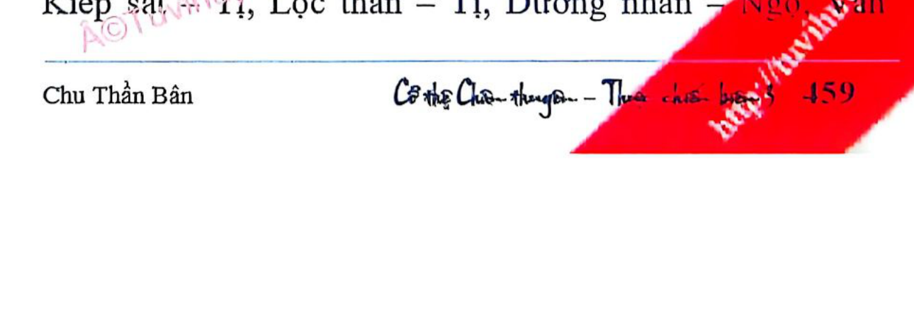

- **Cấu trúc Quẻ Dịch:**
  - **Quẻ chủ:** **Trạch Phong Đại Quá** (Quẻ Du Hồn – Cung Chấn, Họ Chấn)  
    *Tượng quẻ:* Đống Nhiêu Họa Khởi, Đại Quá Tất Tổn (Cột kèo cong oằn, sự việc quá đà tất sinh tổn hại – phản ánh căn bệnh mãn tính 20 năm tích tụ đã tiến triển đến giai đoạn thâm căn cố đế, vượt qua giới hạn tự cân bằng của cơ thể).
  - **Quẻ biến:** **Thiên Trạch Lý** (Cung Cấn, Họ Cấn)  
    *Tượng quẻ:* Lý Hành Chính Đạo, Cẩn Thận Hành Sự (Thực hiện tuần tự, điều dưỡng đúng phép quy chuẩn).

- **Bảng chi tiết Lục hào:**

| Hào | Thế/Ứng | Lục thân (Chủ) | Can Chi (Chủ) | Động/Tĩnh | Lục thân (Biến) | Can Chi (Biến) | Thần sát / Phục | Lục thú |
|:---:|:---:|:---|:---|:---:|:---|:---|:---|:---|
| 6 | | Thê Tài | Đinh Mùi - Thổ | **X (Động)** | Thê Tài | Nhâm Tuất - Thổ | Nguyệt kiến lâm hào biến | Thanh Long |
| 5 | | Quan Quỷ | Đinh Dậu - Kim | tĩnh | Quan Quỷ | Nhâm Thân - Kim | Đào hoa, Thiên y, Quý nhân | Huyền Vũ |
| 4 | **Thế** | Phụ Mẫu | Đinh Hợi - Thủy | tĩnh | Tử Tôn | Nhâm Ngọ - Hỏa | Bạch Hổ, Quý nhân, Phục Tử Tôn Bính Ngọ Hỏa | Bạch Hổ |
| 3 | | Quan Quỷ | Tân Dậu - Kim | **O (Động)** | Thê Tài | Đinh Sửu - Thổ | Đào hoa, Thiên y, Quý nhân | Đằng Xà |
| 2 | | Phụ Mẫu | Tân Hợi - Thủy | tĩnh | Huynh Đệ | Đinh Mão - Mộc | Quý nhân, Phục Huynh Đệ Canh Dần Mộc | Câu Trần |
| 1 | **Ứng** | Thê Tài | Tân Sửu - Thổ | **X (Động)** | Tử Tôn | Đinh Tị - Hỏa | Biến Tuần không (Tị Hỏa), Kiếp sát, Lộc thần | Chu Tước |

---

### 3. Dụng thần & Loại quẻ

- **Phân loại quẻ:**
  - **Quẻ tâm thái chẩn đoán bệnh tật hiểm nghèo:** Khảo sát nguy cơ bệnh mãn tính biến chứng thành ung thư ác tính.
  - **Quẻ y lý Đông y toàn diện:** Bóc tách căn nguyên bệnh lý liên tạng phủ và ngũ quan.
- **Định vị Dụng thần cốt lõi:**
  - **Hào Quan Quỷ (Quan Quỷ Dậu Kim):** Đại diện cho mầm bệnh, khối u ác tính và nỗi lo sợ ung thư.
  - **Hào Thế (Phụ Mẫu Đinh Hợi Thủy):** Lâm Bạch Hổ, đại diện cho bản thân người bệnh đang chịu đựng dày vò thể xác.
  - **Tam hợp cục Quan Quỷ (Tị - Dậu - Sửu):** Đóng vai trò hạt nhân mô tả bệnh trạng mãn tính 20 năm.

---

### 4. Luận giải chi tiết

#### 1. Định nghĩa tâm thái: "Quan Động Sinh Thế" giải trừ nỗi lo Ung thư
- Trong phép đoán bệnh hiểm nghèo qua quẻ tâm thái: Nếu Quan Quỷ vượng động khắc Thế thì đó là điềm hung hiểm tột cùng, báo hiệu bệnh ác tính đe dọa tính mạng (ung thư thực sự).
- Tuy nhiên, trong quẻ này xảy ra hiện tượng đặc thù:
  - Hào 1 Thê Tài Sửu Thổ phát động, hào 3 Quan Quỷ Dậu Kim phát động, hào biến Tử Tôn Tị Hỏa lâm sơ hào -> Ba yếu tố kết hợp thành **Tam hợp Kim cục Quan Quỷ (Tị - Dậu - Sửu)** cực vượng.
  - Cục Tam hợp Quan Quỷ Dậu Kim mang hành Kim vượng, trực tiếp **tương sinh cho hào Thế Phụ Mẫu Đinh Hợi Thủy** (Kim sinh Thủy).
- Chu Thần Bân giải mã quy tắc cốt lõi: *"Quan động sinh Thế, hữu ưu vô hiểm"*. Khi hào Quan Quỷ phát động hoặc kết cục sinh Thế trong quẻ tâm thái, nó biểu thị đương số có nỗi lo lắng triền miên, bệnh tật làm hao tốn tâm trí nhưng tuyệt nhiên **không có hiểm họa chết người hay biến chứng ung thư ác tính**. Khẳng định chắc nịch: Xác suất chuyển thành ung thư vòm họng là cực thấp.

#### 2. Giải phẫu Bệnh lý Viêm xoang qua tượng Lục hào
- Dù loại trừ được ung thư, nhưng quẻ chủ **Trạch Phong Đại Quá** (Đại quá tất tổn) cảnh báo căn bệnh đang ở giai đoạn rất sâu, đã hình thành tổn thương thực thể (polyp khoang mũi, viêm xoang mãn tính cố định dạng Kim cục cứng chắc).
- **Hào 1 Thê Tài Tân Sửu Thổ lâm Chu Tước:**
  - Vị trí hào 1 quẻ Đại Quá biểu thị cơ quan ngũ quan tiếp xúc phía dưới khuôn mặt, đại diện cho **Mũi**.
  - Chu Tước chủ hỏa nhiệt, sưng tấy, phát viêm. Mũi phát viêm gây chảy nước mũi và hắt hơi liên tục không dứt.
- **Hào 6 Thê Tài Đinh Mùi Thổ động hóa Thê Tài Tuất Thổ:**
  - Hào 6 ở vị trí tối cao, đại diện cho **Vùng đầu não**.
  - Thê Tài Mùi Thổ động xung trực tiếp vào Thê Tài Sửu Thổ (Sửu - Mùi tương xung). Mũi (Sửu Thổ) bị xung động liên tục từ vùng đầu (Mùi Thổ) khiến bệnh viêm mũi tái phát lặp đi lặp lại không thể dứt điểm.

#### 3. Bóc tách 3 nguyên nhân sâu xa từ hệ thống Đầu não và Mắt
Chu Thần Bân vận dụng y lý dịch học đối chiếu sâu sắc:
- **Thê Tài Mùi Thổ (Mộc khố):** Mộc chủ can phong, dây thần kinh. Vùng đầu là nơi quy tụ thần kinh, Mùi Thổ khố biểu thị **Suy nhược thần kinh kinh niên, đau đầu mất ngủ**.
- **Thê Tài Tuất Thổ (Hỏa khố lâm Nguyệt kiến):** Hỏa chủ huyết dịch, tim mạch. Tuất Thổ hỏa khố trên đầu biểu thị **Rối loạn tuần hoàn mạch máu não lâu năm**.
- **Tượng Thổ hóa Thổ (Mùi Thổ biến Tuất Thổ):** Cơ quan có đôi trên mặt nằm phía trên mũi chính là **Đôi mắt**. Suy nhược thần kinh và mạch máu não kéo dài đã ảnh hưởng trực tiếp đến thị lực, khiến hai mắt có dấu hiệu mờ đục (đục thủy tinh thể nhẹ).
- Kết luận chẩn đoán: Bệnh chảy nước mũi dai dẳng thực chất chỉ là "phần ngọn"; "phần gốc" nằm ở sự mất cân bằng nghiêm trọng của hệ mạch máu não, suy nhược thần kinh và thị lực vùng đầu gây nên hiệu ứng kích ứng liên hoàn tai - mũi - họng.

#### 4. Phê phán lối trị bệnh cục bộ và Đề xuất "Thuyết Thùng Gỗ" Đông Y
- Chu Thần Bân chỉ ra sai lầm của y học hiện đại khi "đau đầu trị đầu, đau mũi trị mũi", chỉ chăm chăm cắt polyp hoặc xịt thuốc co mạch tại chỗ mà không chữa toàn cục.
- Đưa ra định hướng điều trị theo **Triết lý Đông Y & Thuyết Thùng Gỗ**:
  - Cơ thể là một chỉnh thể hữu cơ. Muốn khỏi bệnh phải bồi bổ những chỗ khuyết thiếu nhất (thần kinh, mạch máu não) để thiết lập lại thế cân bằng động.
  - Đông y cho phép cơ thể "sống chung hòa bình" với trạng thái bán khỏe mạnh. Khi âm dương khí huyết được điều hòa cân bằng, ổ viêm tại xoang mũi sẽ tự khắc được phong tỏa ổn định lâu dài.

---

### 5. Kết luận & Ứng kỳ thực tế

- **Lời giải đoán của Chu Thần Bân:**
  - Khẳng định 100% không phải là bệnh ung thư vòm họng, đương số hoàn toàn có thể trút bỏ gánh nặng sợ hãi tâm lý.
  - Vạch rõ 3 bệnh nền tiềm ẩn vùng đầu: Suy nhược thần kinh, thiểu năng tuần hoàn máu não và mắt mờ có dấu hiệu đục thủy tinh thể.
  - Khuyên dùng phương pháp điều dưỡng tổng thể của Đông y để cân bằng thể trạng thay vì lạm dụng phẫu thuật can thiệp cục bộ.
- **Phản hồi thực tế từ đương số:**
  - Đương số kinh ngạc tột độ thừa nhận cả 3 điểm chẩn đoán của Chu Thần Bân đều **đúng chính xác từng chi tiết**:
    + Anh bị mất ngủ suy nhược thần kinh nặng nhiều năm qua.
    + Thường xuyên bị đau đầu do thiếu máu não.
    + Gần đây hai mắt mờ đi rõ rệt, đi khám mắt bác sĩ đã cảnh báo giai đoạn đầu của đục thủy tinh thể.
  - Sau khi biết chắc chắn không bị ung thư, tâm lý anh hoàn toàn giải tỏa. Anh đã chuyển hướng sang dùng thuốc bắc điều dưỡng khí huyết toàn thân, tình trạng chảy nước mũi sau đó đã thuyên giảm rõ rệt và đi vào ổn định.

---

### 6. Bài học tâm pháp & Quy tắc cốt lõi

- **Các quy tắc Lục Hào rút ra từ ca thực chiến:**
  - *Trích dẫn:* Quy tắc phân biệt bệnh kinh niên và biến chứng ác tính ung thư qua hào Quan Quỷ lâm Bạch Hổ (trang 427, `rule_index`).
  - *Quy tắc Quan Động Sinh Thế trong Bệnh tật:* Quan Quỷ dù vượng động hoặc kết thành Tam hợp cục nhưng sinh cho hào Thế thì chỉ là bệnh mãn tính gây lo âu phiền toái, tuyệt đối không phải bệnh hiểm nghèo chết người (ung thư).
  - *Phân vị Ngũ quan qua Lục hào:* Hào sơ lâm Sửu Thổ tượng trưng cho mũi; hào lục lâm Mùi Thổ tượng trưng cho đỉnh đầu não; Thổ hóa Thổ tại thượng quái tượng trưng cho đôi mắt.
  - *Ý nghĩa Mộ khố vùng đầu:* Mộc khố (Mùi Thổ) chủ hệ thần kinh; Hỏa khố (Tuất Thổ) chủ hệ thống mạch máu não.
- **Bài học kinh nghiệm trong tâm pháp giải đoán thực tế:**
  - Một quẻ bói bệnh tật chuẩn mực phải vươn tầm thành một buổi chẩn đoán y lý toàn diện. Người thầy Lục Hào không chỉ trả lời câu hỏi sợ hãi nhất thời của bệnh nhân, mà phải nhìn xuyên thấu qua các mối liên hệ hào động để chỉ ra mạng lưới bệnh lý liên đới, từ đó hướng dẫn người bệnh phương pháp điều trị thuận theo tự nhiên và cân bằng sinh thái cơ thể.

## THỰC CHIẾN 188: ĐÃ KẾT HÔN, ĐỘT NHIÊN SAY MÊ MỘT NGƯỜI ĐÀN ÔNG

---

### 1. Bối cảnh & Câu hỏi

- **Bối cảnh chi tiết:** 
  Một người phụ nữ đã có gia đình êm ấm, cuộc sống hôn nhân vốn bình lặng bỗng nhiên rơi vào một biến cố tâm lý dữ dội: Cô đột nhiên say mê, cuồng si một người đàn ông khác vừa mới quen biết. Nỗi nhớ nhung mãnh liệt khiến cô mất ăn mất ngủ, ngày đêm bần thần không yên. Dù bản thân chưa hề đi quá giới hạn hay có hành vi lén lút ngoài đời thực, nhưng những ý nghĩ tội lỗi và sự rung động ngoài luồng này khiến cô vô cùng giằng xé, đau khổ và tự trách bản thân sâu sắc.
- **Tâm lý & Câu hỏi ẩn ý:** 
  Đương sự vừa xấu hổ vừa bế tắc, tìm đến Chu Thần Bân trút bầu tâm sự. Cô khẳng định mình không phải là người phụ nữ lăng loàn buông thả nhưng không hiểu vì sao lại rơi vào ma chướng này, khẩn thiết cầu vấn: *"Làm thế nào để thoát ra khỏi sự rối ren và đau khổ tình cảm này?"*
- **Thời gian chiêm đoán:**
  - Can chi: Ngày Bính Ngọ, tháng Quý Hợi, giờ Nhâm Thìn (Giờ Bắc Kinh).
  - Tuần không: **Dần - Mão** (Giáp Thìn tuần trung, Dần Mão không vong).

---

### 2. Dữ kiện & Bảng quẻ Crop

- **Thời không chiêm nghiệm:**
  - Tháng Quý Hợi (Thủy vượng, Mộc tướng, Kim hưu, Thổ tù, Hỏa tuyệt).
  - Ngày Bính Ngọ (Hỏa vượng, Thổ tướng).
  - Tuần không: **Dần - Mão**.
- **Thần sát:**
  - Tướng tinh: Ngọ (Lâm Nhật thần, hào biến Quan Quỷ Ngọ Hỏa)
  - Hoa cái: Tuất (Lâm hào biến Phụ Mẫu Tuất Thổ, Thiên y)
  - Dịch mã: Thân (Lâm hào biến Huynh Đệ Thân Kim, Văn xương)
  - Tai sát: Tý
  - Mưu tinh: Thìn
  - Đào hoa: Mão (Lâm hào 3 và hào 6 Thê Tài Mão Mộc, Tuần không)
  - Kiếp sát: Hợi (Lâm Nguyệt kiến, hào biến Tử Tôn Hợi Thủy)
  - Lộc thần: Tị (Lâm hào 2 và hào 5 Quan Quỷ Tị Hỏa)
  - Dương nhẫn: Ngọ (Lâm Nhật thần)
  - Văn xương: Thân
  - Thiên y: Tuất
  - Thiên hỷ: Mùi (Lâm hào Thế Phụ Mẫu Mùi Thổ)
  - Quý nhân: Dậu, Hợi (Hợi Thủy lâm Nguyệt kiến, Dậu Kim lâm hào biến)

- Dữ kiện bảng quẻ và các thông số chiêm đoán:
  - **Bảng 188.1** Đồ hình quẻ Thực chiến 188:
    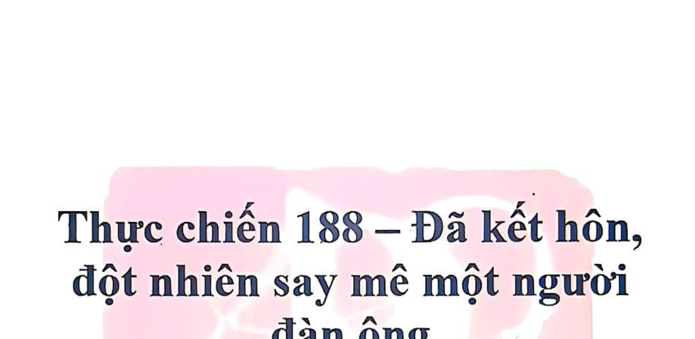

- **Cấu trúc Quẻ Dịch:**
  - **Quẻ chủ:** **Phong Địa Quán** (Cung Cấn, Họ Cấn)  
    *Tượng quẻ:* Quán Khán Bất Động, Quán Triệt Nhân Tâm (Quan sát, đứng nhìn từ xa, do dự chưa hành động – biểu thị trạng thái người phụ nữ mới chỉ thầm thương trộm nhớ, đứng nhìn chứ chưa dám bước chân vào hành động thực tế).
  - **Quẻ biến:** **Thiên Phong Cấu** (Cung Cấn, Họ Cấn)  
    *Tượng quẻ:* Phong Hành Thiên Hạ, Bất Kỳ Nhi Ngộ (Gặp gỡ bất ngờ, tình cảm ngoài luồng đột khởi – "Nữ tráng vật dụng thủ nữ", báo hiệu mối duyên kỳ ngộ bất thường làm lung lay trật tự gia đình).

- **Bảng chi tiết Lục hào:**

| Hào | Thế/Ứng | Lục thân (Chủ) | Can Chi (Chủ) | Động/Tĩnh | Lục thân (Biến) | Can Chi (Biến) | Thần sát / Phục | Lục thú |
|:---:|:---:|:---|:---|:---:|:---|:---|:---|:---|
| 6 | | Thê Tài | Tân Mão - Mộc | tĩnh | Phụ Mẫu | Nhâm Tuất - Thổ | Đào hoa, Tuần không, Phục Phụ Mẫu Bính Tuất Thổ | Thanh Long |
| 5 | | Quan Quỷ | Tân Tị - Hỏa | tĩnh | Huynh Đệ | Nhâm Thân - Kim | Lộc thần, Nguyệt phá, Phục Huynh Đệ Bính Thân Kim | Huyền Vũ |
| 4 | **Thế** | Phụ Mẫu | Ất Mùi - Thổ | **X (Động)** | Quan Quỷ | Nhâm Ngọ - Hỏa | Thiên hỷ, Động hóa Hồi đầu sinh kiêm Lục hợp, Phục Quan Quỷ Bính Ngọ Hỏa | Bạch Hổ |
| 3 | | Thê Tài | Ất Mão - Mộc | **X (Động)** | Huynh Đệ | Tân Dậu - Kim | Đào hoa, Tuần không, Động hóa Hồi đầu khắc, Phục Phụ Mẫu Canh Thìn Thổ | Đằng Xà |
| 2 | | Quan Quỷ | Ất Tị - Hỏa | **X (Động)** | Tử Tôn | Tân Hợi - Thủy | Lộc thần, Nguyệt phá, Động hóa Hồi đầu khắc kiêm Phản ngâm, Phục Tử Tôn Canh Dần Mộc | Câu Trần |
| 1 | **Ứng** | Phụ Mẫu | Ất Sửu - Thổ | tĩnh | Phụ Mẫu | Tân Sửu - Thổ | Phục Tử Tôn Canh Tý Thủy | Chu Tước |

---

### 3. Dụng thần & Loại quẻ

- **Phân loại quẻ:**
  - **Quẻ tình cảm ngoài luồng & Hôn nhân giằng xé:** Khảo sát cơn bão cảm xúc đột ngột bùng phát sau hôn nhân.
  - **Quẻ tâm thái hóa giải ma chướng:** Định hướng phân biệt Thiện duyên và Ác duyên để giải thoát tâm lý.
- **Định vị Dụng thần cốt lõi:**
  - Nữ hỏi về đàn ông / tình cảm: Lấy hào **Quan Quỷ** làm Dụng thần.
  - Trong quẻ xuất hiện 2 đối tượng Quan Quỷ hành Hỏa phản ánh mâu thuẫn nội tâm sâu sắc:
    + **Quan Quỷ Ngọ Hỏa (Hào biến của Thế):** Lâm Nhật kiến – đại diện cho **Người chồng hiện tại**.
    + **Quan Quỷ Tị Hỏa (Hào 2 phát động):** Lâm Nguyệt phá – đại diện cho **Người đàn ông bên ngoài** khiến cô say mê.
  - **Hào Thế (Phụ Mẫu Ất Mùi Thổ):** Đại diện cho bản thân người phụ nữ đang giằng xé.

---

### 4. Luận giải chi tiết

#### 1. Khai thị tâm pháp: Sự say mê đột khởi và Túc duyên tiền kiếp
- Chu Thần Bân mở đầu bằng lời khai thị nhân sinh sâu sắc: Việc một người đã kết hôn đột nhiên nảy sinh cảm xúc say mê điên cuồng với một người khác giới không nhất thiết là biểu hiện của sự suy đồi đạo đức. 
- Về mặt bản chất tâm linh, đó rất có thể là **tàn dư của một mối duyên nợ sâu nặng từ tiền kiếp** trỗi dậy. Tuy nhiên, sự xuất hiện của nó ở kiếp này đóng vai trò một bài khảo nghiệm (ma chướng), và quyết định của đương số sẽ định hình tương lai là Thiện duyên hay Ác duyên.

#### 2. Phân biệt rạch ròi giữa Thiện Duyên và Ác Duyên
Quẻ Dịch phân tầng thông tin vô cùng minh triết qua động thái của 2 hào Quan Quỷ:
- **Thiện Duyên thực sự – Người chồng hiện tại (Quan Quỷ Ngọ Hỏa):**
  - Hào Thế Phụ Mẫu Ất Mùi Thổ phát động hóa ra **Quan Quỷ Nhâm Ngọ Hỏa**.
  - Ngọ Hỏa lâm Nhật kiến, mang tính chất hiện thực bền vững đang bảo hộ cuộc đời cô.
  - Xét về ngũ hành sinh khắc: Ngọ Hỏa sinh Mùi Thổ (Hỏa sinh Thổ), đồng thời Ngọ Mùi kết thành thế **Lục hợp** (Ngọ Mùi tương hợp).
  - Tượng *"Hóa Hồi Đầu Sinh kiêm Lục Hợp"* là minh chứng hùng hồn: Người chồng hiện tại là người luôn bao bọc, chở che, hết mực yêu thương và gắn kết keo sơn với cô. Đây chính là **Thiện duyên trọn vẹn trong kiếp này** mà cô có phúc phận đón nhận.
- **Ác Duyên / Ma chướng phá hoại – Người đàn ông say mê bên ngoài (Quan Quỷ Tị Hỏa):**
  - Quan Quỷ Ất Tị Hỏa tại hào 2 phát động nhưng bị Nguyệt kiến Hợi Thủy trực tiếp tương xung (**Nguyệt phá**), chứng minh mối quan hệ này ngoài đời thực hoàn toàn chưa hề bắt đầu, mới chỉ tồn tại trong ảo tưởng đơn phương của cô.
  - Tị Hỏa phát động hóa xuất **Tử Tôn Tân Hợi Thủy**: Hợi Thủy khắc Tị Hỏa (Thủy khắc Hỏa), Tị Hợi thiên xung địa kích. Đây là tượng **"Hóa Hồi Đầu Khắc kiêm Phản Ngâm"**!
  - Hợi Thủy lâm Quý nhân biểu thị người đàn ông kia là người có phẩm hạnh, bản thân anh ta cũng đã có gia đình riêng và nhất định sẽ cự tuyệt tình cảm ngoài luồng. Nếu cô cố tình theo đuổi, ngọn lửa si mê này sẽ lập tức bị dội một gáo nước lạnh (hóa khắc), dẫn đến sự bẽ bàng, tổn thương danh dự và cay đắng tột cùng.

#### 3. Cảnh báo "Hiệu ứng cánh bướm" từ hào 3 Thê Tài Mão Mộc
- Hào 3 Thê Tài Ất Mão Mộc lâm Đào hoa phát động hóa xuất **Huynh Đệ Tân Dậu Kim** (Động hóa Hồi đầu khắc, Mão Dậu tương xung).
- Thê Tài Mão Mộc chính là người vợ hợp pháp của người đàn ông bên ngoài kia. Việc hào này hóa hồi đầu khắc cảnh báo: Nếu đương số mù quáng lao vào mối quan hệ này, cô sẽ vô tình châm ngòi phá nát một mái ấm gia đình khác, lôi cả những người vô tội vào vòng xoáy khổ đau và thù hận.

#### 4. Ý nghĩa tượng quẻ Quán biến Cấu và Cơ hội chỉnh sửa kịp thời
- Quẻ chủ **Phong Địa Quán**: Chỉ mới dừng lại ở việc quan sát, đứng từ xa ngắm nghía, chưa có hành động sai trái thực tế.
- Quẻ biến **Thiên Phong Cấu**: Cơn gió lạ gặp gỡ thoáng qua bất ngờ, nếu kịp thời nhận thức thì gió sẽ tự tan biến.
- Chu Thần Bân nhấn mạnh: Vì sự việc đang ở giai đoạn "chưa bắt đầu" (chưa đến mức Tiểu quá hay Đại quá), việc quay đầu là bờ, chỉnh sửa nhận thức ngay lập tức sẽ giúp triệt tiêu hoàn toàn mầm mống tội lỗi, bảo vệ trọn vẹn hạnh phúc gia đình.

---

### 5. Kết luận & Ứng kỳ thực tế

- **Lời giải đoán và Khuyên nhủ của Chu Thần Bân:**
  - Giúp đương số cởi bỏ mặc cảm tội lỗi về mặt tâm lý: Xác nhận đây chỉ là dư âm duyên nợ kiếp trước trỗi dậy quấy nhiễu tâm trí.
  - Vạch rõ con đường: Cuộc hôn nhân hiện tại với người chồng (hóa Hồi đầu sinh kiêm Lục hợp) chính là bến đỗ bình an và thiện duyên đích thực. Ngược lại, người đàn ông bên ngoài (hóa Hồi đầu khắc) là ma chướng ác duyên, nếu chạm vào sẽ chỉ nhận lấy sự cự tuyệt và cay đắng.
  - Khuyên đương số dùng lý trí để cắt đứt mọi suy nghĩ tơ tưởng, kiên định vun đắp cho mái ấm gia đình hiện tại.
- **Phản hồi thực tế từ đương số:**
  - Lời giải đoán của Chu Thần Bân như một hồi chuông cảnh tỉnh, đánh trúng tâm can và giải tỏa hoàn toàn khối u uất bế tắc trong lòng người phụ nữ.
  - Cô nhận ra sự mù quáng nguy hiểm của bản thân và hiểu được tình thương bao la của người chồng. Ngay sau buổi luận quẻ, cô đã hoàn toàn buông bỏ hình bóng người đàn ông kia, quay trở về toàn tâm toàn ý chăm lo cho gia đình, giữ vững mái ấm hạnh phúc vẹn tròn.

---

### 6. Bài học tâm pháp & Quy tắc cốt lõi

- **Các quy tắc Lục Hào rút ra từ ca thực chiến:**
  - *Trích dẫn:* Quy tắc tình cảm ngoài luồng đột khởi qua quẻ Phong Địa Quán biến Thiên Phong Cấu (trang 435, `rule_index`).
  - *Phân định Thiện Duyên vs Ác Duyên:* Hào Quan Quỷ hóa Hồi đầu sinh kiêm Lục hợp là thiện duyên nâng đỡ cuộc đời; Hào Quan Quỷ hóa Hồi đầu khắc kiêm Phản ngâm là ác duyên ma chướng mang lại tai họa.
  - *Ý nghĩa Nguyệt phá của Hào động:* Biểu thị sự việc còn ở trạng thái manh nha trong tâm tưởng, chưa bộc lộ ra ngoài đời thực, là thời điểm vàng để can thiệp hóa giải.
  - *Tâm pháp Cứu nhân độ thế trong Tình cảm:* Luận quẻ hôn nhân ngoại luồng không phải để phán xét luân thường đạo lý một cách giáo điều, mà là dùng Dịch lý để soi sáng nhân duyên, giúp đương số nhìn thấy trước kết cục bi kịch của ác duyên mà tự giác quay về với thiện đạo.
- **Bài học kinh nghiệm trong tâm pháp giải đoán thực tế:**
  - Người thầy Lục Hào chân chính phải thấu suốt cả Dịch lý lẫn Tâm lý học nhân sinh. Biết xoa dịu nỗi đau mặc cảm của thân chủ, dùng tuệ nhãn phân định rõ ràng giữa "phút say nắng kiếp trước" và "trách nhiệm sống kiếp này" để kịp thời kéo một con người bên bờ vực lầm lỡ trở về với bến bờ hạnh phúc thực tại.

---

## THỰC CHIẾN 189: QUAN HỆ VỚI CẬU

---

### 1. Bối cảnh & Câu hỏi

- **Bối cảnh chi tiết:** 
  Một nữ đồng môn tìm đến Chu Thần Bân gieo quẻ hỏi về mối quan hệ đang rạn nứt nghiêm trọng với người cậu ruột của mình. Trong hơn mười năm qua, người cậu này luôn đóng vai trò là đại quý nhân, là ân nhân dẫn dắt và chỉ dạy cho cô bước vào thương trường kinh doanh bất động sản. Cả hai gia đình đều tham gia đầu tư phát triển bất động sản, phía gia đình người cậu có quy mô tài sản lớn hơn nhiều. Tuy nhiên, khi chính sách nhà nước về bất động sản bị siết chặt, thị trường đóng băng khiến dòng tiền của cả hai bên đều rơi vào tình trạng căng thẳng cùng cực. Phía gia đình người cậu (đặc biệt là con cái của cậu) đã khơi mào tranh chấp kinh tế, cáo buộc cô mập mờ tài chính và nợ tiền họ mà không có bất kỳ chứng cứ xác đáng nào. Mặc dù cô đã chủ động cung cấp đầy đủ chứng từ chứng minh sự minh bạch của bản thân, phía gia đình người cậu vẫn không chấp nhận, tiếp tục lan truyền thông tin sai lệch gây tổn hại danh dự.
- **Tâm lý & Câu hỏi ẩn ý:** 
  Đương số day dứt suốt một thời gian dài vì truyền thống "uống nước nhớ nguồn" và sự hàm ơn sâu sắc với người cậu ruột. Dù quan hệ đã xấu đi rất nhiều, trong lòng cô vẫn không muốn trở mặt, tha thiết tìm kiếm cơ hội hòa giải và hàn gắn tình cảm gia tộc. Câu hỏi đặt ra là xu hướng quan hệ với cậu sẽ phát triển thế nào và có khả năng hòa giải được hay không.
- **Thời gian chiêm đoán:**
  - Dương lịch: Ngày 16 tháng 11 năm 2018, 16:24.
  - Giờ Bắc Kinh: Ngày 16/11/2018, 16:24.
  - Can chi: Năm Mậu Tuất, tháng Quý Hợi, ngày Nhâm Tý, giờ Mậu Thân.

---

### 2. Dữ kiện & Bảng quẻ Crop

- **Thời không chiêm nghiệm:**
  - Tháng Quý Hợi: Thủy vượng, Mộc tướng, Kim hưu, Thổ tù, Hỏa tử.
  - Ngày Nhâm Tý: Thủy cực vượng, kiêm Đế vượng/Dương nhẫn.
  - Tuần không: **Dần, Mão** (Tuần Giáp Thìn, Dần Mão không vong).
- **Thần sát:**
  - Tướng tinh: Tý
  - Hoa cái: Thìn
  - Dịch mã: Dần (Lâm Tuần không)
  - Tai sát: Ngọ
  - Mưu tinh: Tuất
  - Đào hoa: Dậu
  - Kiếp sát: Tỵ
  - Lộc thần: Hợi
  - Dương nhẫn: Tý
  - Văn xương: Dần
  - Thiên y: Tuất
  - Thiên hỷ: Mùi
  - Quý nhân: Mão, Tỵ

- Dữ kiện bảng quẻ và các thông số chiêm đoán:
  - **Bảng 189.1** Đồ hình quẻ Thực chiến 189:
    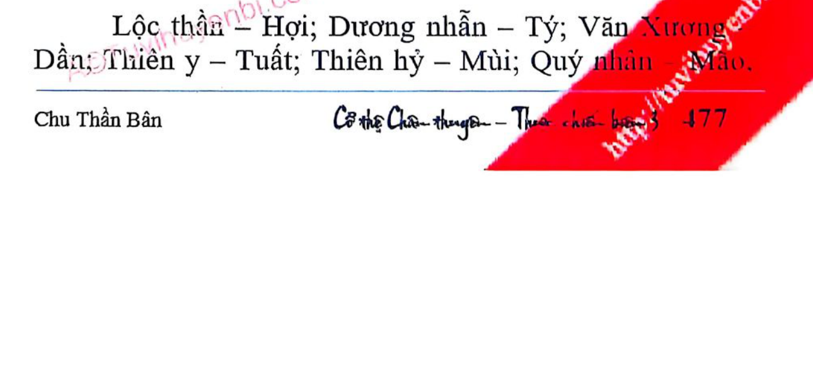

- **Cấu trúc Quẻ Dịch:**
  - **Quẻ chủ:** **Trạch Phong Đại Quá** (Cung Chấn, Quẻ Du Hồn)  
    *Tượng quẻ:* Đống nạo (Cột nhà cong võng – gánh nặng quá mức chịu đựng, mâu thuẫn vượt ngưỡng giới hạn, quan hệ đổ vỡ).
  - **Quẻ biến:** **Bát Thuần Khảm** (Cung Khảm, Quẻ Lục Xung)  
    *Tượng quẻ:* Trùng trùng trắc trở, quan hệ đối nhân xử thế gặp Lục xung là điềm báo phân ly, xung đột không thể dung hòa, đôi bên tan rã mỗi người một ngả.

- **Bảng chi tiết Lục hào:**

| Hào | Thế/Ứng | Lục thân (Chủ) | Can Chi | Biến động | Lục thân (Biến) | Can Chi (Biến) | Thần sát / Phục | Lục thú |
|:---:|:---:|:---|:---|:---:|:---|:---|:---|:---|
| 6 | | Thê Tài | Mùi - Thổ | tĩnh | Phụ Mẫu | Tý - Thủy | Thiên hỷ | Bạch Hổ |
| 5 | | Quan Quỷ | Dậu - Kim | tĩnh | Thê Tài | Tuất - Thổ | Đào hoa, Thiên y | Đằng Xà |
| 4 | **Thế** | Phụ Mẫu | Hợi - Thủy | **O (Động)** | Quan Quỷ | Thân - Kim | Lộc thần (phục Tử Tôn Ngọ Hỏa) | Câu Trần |
| 3 | | Quan Quỷ | Dậu - Kim | **O (Động)** | Tử Tôn | Ngọ - Hỏa | Đào hoa, Tai sát | Chu Tước |
| 2 | | Phụ Mẫu | Hợi - Thủy | tĩnh | Thê Tài | Thìn - Thổ | Lộc thần (phục Huynh Đệ Dần Mộc) | Thanh Long |
| 1 | **Ứng** | Thê Tài | Sửu - Thổ | tĩnh | Huynh Đệ | Dần - Mộc | Tuần không (Dần) (phục Phụ Mẫu Tý Thủy) | Huyền Vũ |

---

### 3. Dụng thần & Loại quẻ

- **Phân loại quẻ:**
  - **Quẻ việc chỉ định người cụ thể kết hợp giải quyết xung đột kinh tế:** Đương số hỏi về quan hệ với một cá nhân/gia đình cụ thể trong bối cảnh tranh chấp tài chính họ hàng.
  - **Quẻ Du hồn biến Lục xung:** Biểu thị trạng thái tâm lý bất định, dao động chới với; biến Lục xung báo hiệu sự việc tất yếu dẫn tới cắt đứt quan hệ qua lại, không thể duy trì hợp tác.

- **Định vị Dụng thần cốt lõi:**
  1. **Hào Thế (Phụ Mẫu Hợi Thủy):** Đại diện cho bản thân nữ đương số. Hào Thế mang Lộc thần, phục tàng Tử Tôn Ngọ Hỏa.
  2. **Hào Ứng (Thê Tài Sửu Thổ):** Đại diện cho phía gia đình người cậu. 
     - Bình thường bề trên lấy Phụ Mẫu làm Dụng thần, nhưng trong quẻ có 2 hào Phụ Mẫu Hợi Thủy, một hào đã lâm Thế (chính đương số), hào còn lại không động. Hiện hai bên đang mâu thuẫn gay gắt nên không thể cùng cư trên hào Phụ Mẫu.
     - Đương số chỉ định một đối tượng tranh chấp cụ thể, do đó hào Ứng là đại diện cho đối phương. Hào Ứng Thê Tài Sửu Thổ phục tàng Phụ Mẫu Tý Thủy (Tướng tinh) biểu thị thân phận người cậu bề trên ẩn chứa trong gia đình đó. Thổ là nơi tập hợp nhiều yếu tố, thể hiện mâu thuẫn xuất phát từ cả tập thể gia đình cậu (con cái cậu thúc đẩy).
  3. **Kỵ thần / Nguồn gốc xung đột (Thê Tài Sửu Thổ khắc Phụ Mẫu Hợi Thủy):** Hào Ứng khắc hào Thế chỉ rõ phía gia đình người cậu là bên chủ động gây áp lực, khơi mào công kích.
  4. **Tác nhân trung gian (Quan Quỷ Dậu Kim & Tử Tôn Ngọ Hỏa):** Đại diện cho các yếu tố bên thứ ba có thể tham gia chuyển hóa hoặc làm đệm đỡ mâu thuẫn.

---

### 4. Luận giải chi tiết

#### 1. Động cơ xung đột và bản chất phía gia đình người cậu
- **Bản chất hào Ứng lâm Huyền Vũ:** Hào Ứng Thê Tài Sửu Thổ mang Huyền Vũ ngụ ý hành vi mờ ám, toan tính riêng tư trong bóng tối, chủ động vu khống và gây khó dễ. Hào Thế mang Câu Trần biểu thị sự việc phơi bày ngoài sáng, đương số ngay thẳng minh bạch.
- **Nguyên nhân sâu xa từ dòng tiền tắc nghẽn:** Sửu Thổ là kim khố (kho vàng mộ của Kim), Kim trong quẻ đóng vai Quan Quỷ (tai họa, rắc rối). Đối vị của Sửu Thổ là Huynh Đệ Dần Mộc mang Lộc thần (chủ hao tổn tài chính). Gia đình người cậu kinh doanh bất động sản quy mô lớn, vốn vay dân gian nhiều, gặp chính sách siết chặt khiến thanh khoản cạn kiệt. Nhu cầu tiền mặt cấp bách khiến họ bất chấp đạo lý, cố tình đòi tiền vô cớ để cứu vãn dòng tiền của mình.

#### 2. Cơ chế suy vượng đối chiếu thực tế và hiện tượng Hào Thế thái vượng
- **Phân tích bề mặt:** Hào Thế Phụ Mẫu Hợi Thủy lâm Nguyệt kiến, lại được Nhật kiến Nhâm Tý trợ vượng. Bề ngoài hào Thế cực kỳ cường vượng.
- **Kiểm chứng thực tế:** Nếu Hợi Thủy thực sự là vượng tướng cát lợi thì ngành kinh doanh bất động sản của cô hiện tại phải cực kỳ thuận buồm xuôi gió. Nhưng thực tế thị trường bất động sản đóng băng, cô cũng đang lao đao vì thiếu hụt dòng tiền. Sự bất tương thích giữa suy vượng quẻ và thực tế chứng minh hào Thế đang rơi vào trạng thái **thái vượng** (vượng quá hóa thành tai bệnh, u uất tích tụ).
- **Nguy cơ khi hào Thế phát động:** Hào Thế Phụ Mẫu Hợi Thủy động hóa Quan Quỷ Thân Kim (hồi đầu sinh). Nếu đương số tự mình phát động (trực tiếp ra mặt đối chất, giải thích hay đôi co), sự sinh trợ của Thân Kim càng đẩy hào Thế vào trạng thái thái vượng cực độ, biến một hiểu lầm kinh tế nhỏ thành kiện tụng thù hằn lớn, cắt đứt vĩnh viễn đường lui.

#### 3. Chiến lược "Thần giữ cửa hóa sát" qua hào 3 Quan Quỷ Dậu Kim
- **Đặc điểm hào 3 phát động:** Hào 3 Quan Quỷ Dậu Kim phát động hóa Tử Tôn Ngọ Hỏa (hồi đầu khắc). 
- **Cơ chế hóa giải:** Mặc dù Kim sinh Thủy, nhưng Dậu Kim bị Tử Tôn Ngọ Hỏa hồi đầu khắc phạt dữ dội nên lực sinh cho hào Thế bị triệt tiêu trên thực tế, chỉ còn cái bóng danh nghĩa. Nhờ đó, hào Thế không bị nhận thêm trợ sinh, tránh được họa thái vượng.
- **Nhận diện đối tượng thứ ba:**
  - Quan Quỷ Dậu Kim mang Đào hoa: đại diện cho người chồng của nữ đương số.
  - Tử Tôn Ngọ Hỏa mang Dương nhẫn, Thiên hỷ: đại diện cho cơ quan, pháp nhân công ty của cô.
  - Hào 3 Quan Quỷ đóng vai trò như một **"thần giữ cửa hóa sát"**, đứng ở tuyến giữa làm vùng đệm hứng chịu toàn bộ áp lực và sóng gió từ phía gia đình người cậu.

---

### 5. Kết luận & Ứng kỳ thực tế

- **Lời giải đoán của Chu Thần Bân:**
  1. Quẻ chủ Đại Quá biến quẻ Khảm Lục xung là điềm báo quan hệ đã gãy đổ qua ngưỡng, không thể duy trì sự hòa thuận ấm êm như trước. Nguyện vọng hòa giải chủ quan của cô (Tử Tôn Ngọ Hỏa phục tàng hợp Ứng Sửu Thổ) khó lòng thành hiện thực trước thực tế khắc nghiệt.
  2. Tuyệt đối không được tự mình đứng ra đối chất hay dàn xếp trực tiếp với người cậu và các con của ông.
  3. Phải lập tức lùi về sau, ủy thác việc đàm phán tài chính cho chồng hoặc ban pháp chế công ty đứng ra giải quyết dứt khoát trên phương diện thủ tục pháp lý. Chỉ có cách để bên thứ ba làm đệm đỡ thì mới bảo toàn được bản thân và kiểm soát được hậu quả.
- **Phản hồi thực tế (Feedback):**
  - Đương số thấu hiểu lời khuyên, quyết định không trực tiếp gặp mặt hay tranh cãi với người nhà cậu nữa.
  - Cô giao toàn bộ việc thanh lý tài chính và đối soát hợp đồng cho chồng và luật sư công ty phụ trách xử lý độc lập, nhờ đó giải phóng được gánh nặng tâm lý đè nặng nhiều tháng qua.
- **Ứng kỳ chiêm nghiệm:**
  - Sự việc dừng ở mức phân minh tài chính qua văn bản pháp lý, hai bên chính thức chấm dứt quan hệ hợp tác kinh doanh đúng như tượng quẻ Lục xung phân tán.

---

### 6. Bài học tâm pháp & Quy tắc cốt lõi

- **Quy tắc Lục Hào rút ra:**
  1. **Định vị Dụng thần linh hoạt qua hào Ứng (trang 446):** Khi người hỏi chỉ định một đối tượng cụ thể có mâu thuẫn đối kháng trực diện, dù đối tượng là bậc trên vẫn phải linh hoạt lấy hào Ứng làm đại diện, không được rập khuôn gán ghép vào hào Phụ Mẫu khi hào Phụ Mẫu đã trùng với vị trí hào Thế.
  2. **Đối chiếu thực tế nhận diện hào thái vượng (trang 446):** Một hào được Nhật Nguyệt sinh trợ tưởng như cực vượng nhưng nếu hoàn cảnh thực tế của đương số hoàn toàn trái ngược (thị trường đình trệ), hào đó mang bệnh lý thái vượng. Động hào tiếp tục sinh phù sẽ chuyển hóa thành hiểm họa kéo dài.
  3. **Chiến lược "Thần giữ cửa hóa sát" (trang 452):** Khi bản thân (hào Thế) đang ở tâm bão xung đột, cần tìm kiếm hào trung gian động hóa hồi đầu khắc (Quan Quỷ hóa Tử Tôn) để làm vùng đệm chịu áp lực thay cho mình, triệt tiêu xung lực hung hiểm.
- **Tâm pháp giải đoán:**
  - Dịch học phản ánh quy luật khách quan của nhân quả, không chiều theo mong muốn chủ quan của con người. Người giải quẻ chân chính không huyễn hoặc về một sự hòa hợp viển vông khi quẻ đã hiện thế Đại Quá biến Lục xung, mà phải chỉ ra phương án giảm thiểu thiệt hại tối ưu nhất cho đương số.

## THỰC CHIẾN 190: HỎI VỀ KHU ĐẤT XÂY DỰNG ĐANG ĐẦU TƯ TẠI NHÀ

---

### 1. Bối cảnh & Câu hỏi

- **Bối cảnh chi tiết:** 
  Một học viên làm nghề phát triển bất động sản lái xe đưa Chu Thần Bân đi thị sát một công trình xây dựng quy mô lớn do người cha của anh tiếp nhận đầu tư. Khu đất dự án có quy mô thiết kế hơn 30 tầng nổi và nhiều tầng hầm, đòi hỏi nguồn vốn đầu tư khổng lồ. Con hẻm dẫn vào công trường rất hẹp, chỉ vừa một thân xe. Khi xe của hai người vừa dừng lại ở cổng công trường thì lập tức có nhiều xe khác bám sát phía sau nối đuôi chạy vào, gây nên cảnh tắc nghẽn giao thông cục bộ không lối thoát. Nguồn gốc khu đất bắt đầu từ một cấp dưới cũ của người cha: khi thị trường địa ốc sôi động, người này không có thực lực tài chính nhưng liều lĩnh vay mượn dân gian lãi suất cao để gom đất đấu giá. Khi chính sách tín dụng đột ngột siết chặt, dự án dở dang cạn kiệt thanh khoản, người cấp dưới đứng trước bờ vực vỡ nợ đã gán toàn bộ cổ phần dự án cho người cha (vốn là chủ nợ lớn nhất) để cấn trừ nợ. Nhận lại dự án dang dở chưa đổ mái, trong bối cảnh luật quy định công trình chưa xong phần thô đổ sàn mái thì không được phép mở bán, gia đình anh buộc phải liên tục gom vốn rót thêm để duy trì công trường.
- **Tâm lý & Câu hỏi ẩn ý:** 
  Nội bộ gia đình nảy sinh chia rẽ và lo âu tột độ. Người con nhận thấy rủi ro quá lớn, lo sợ dự án là "cái hố không đáy" chôn vùi toàn bộ cơ nghiệp gia đình tích lũy bao năm. Ngược lại, người cha vì tâm lý tiếc của và hy vọng thu hồi vốn nên khăng khăng đòi tiếp tục vay mượn rót tiền để hoàn thành đổ nóc rồi mở bán. Người con bèn gieo quẻ để xác định rõ việc tiếp tục rót tiền vào khu đất này liệu có thu hồi được vốn hay sẽ chuốc lấy đại họa phá sản.
- **Thời gian chiêm đoán:**
  - Dương lịch: Ngày 16 tháng 11 năm 2018, 21:24.
  - Giờ Bắc Kinh: 16/11/2018, 21:24.
  - Can chi: Năm Mậu Tuất, tháng Quý Hợi, ngày Nhâm Tý, giờ Tân Hợi.

---

### 2. Dữ kiện & Bảng quẻ Crop

- **Thời không chiêm nghiệm:**
  - Tháng Quý Hợi: Thủy vượng, Mộc tướng, Kim hưu, Thổ tù, Hỏa tử.
  - Ngày Nhâm Tý: Thủy cực vượng, kiêm Dương nhẫn, Tướng tinh.
  - Tuần không: **Dần, Mão** (Tuần Giáp Thìn, Dần Mão không vong).
- **Thần sát:**
  - Tướng tinh: Tý
  - Hoa cái: Thìn
  - Dịch mã: Dần (Lâm Tuần không)
  - Tai sát: Ngọ
  - Mưu tinh: Tuất
  - Đào hoa: Dậu
  - Kiếp sát: Tỵ
  - Lộc thần: Hợi
  - Dương nhẫn: Tý
  - Văn xương: Dần
  - Thiên y: Tuất
  - Thiên hỷ: Mùi
  - Quý nhân: Mão, Tỵ

- Dữ kiện bảng quẻ và các thông số chiêm đoán:
  - **Bảng 190.1** Đồ hình quẻ Thực chiến 190:
    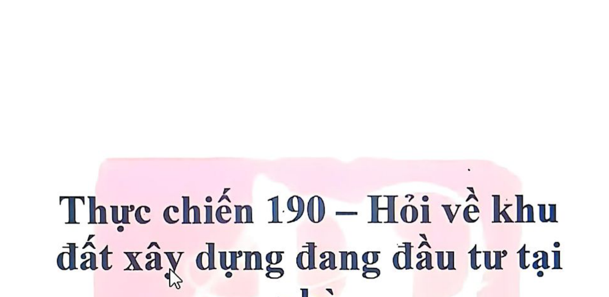

- **Cấu trúc Quẻ Dịch:**
  - **Quẻ chủ:** **Thủy Sơn Kiển** (Cung Đoài)  
    *Tượng quẻ:* Tiến thoái lưỡng nan, bước đi khập khiễng trên đường núi hiểm trở, tiến bước ắt gặp nạn sâu. Điềm báo công việc lâm vào cảnh bế tắc, nghẽn dòng như hiện trạng chiếc xe kẹt cứng trong ngõ hẹp.
  - **Quẻ biến:** **Trạch Phong Đại Quá** (Cung Chấn, Quẻ Du Hồn)  
    *Tượng quẻ:* Cột nhà cong gãy vì gánh vác quá tải, đầu tư vượt quá giới hạn chịu đựng của thực lực tài chính, nguy cơ sụp đổ hoàn toàn cấu trúc tài sản.

- **Bảng chi tiết Lục hào:**

| Hào | Thế/Ứng | Lục thân (Chủ) | Can Chi | Biến động | Lục thân (Biến) | Can Chi (Biến) | Thần sát / Phục | Lục thú |
|:---:|:---:|:---|:---|:---:|:---|:---|:---|:---|
| 6 | | Tử Tôn | Tý - Thủy | tĩnh | Phụ Mẫu | Mùi - Thổ | Tướng tinh, Dương nhẫn | Bạch Hổ |
| 5 | | Phụ Mẫu | Tuất - Thổ | tĩnh | Huynh Đệ | Dậu - Kim | Mưu tinh, Thiên y | Đằng Xà |
| 4 | **Thế** | Huynh Đệ | Thân - Kim | **X (Động)** | Tử Tôn | Hợi - Thủy | Kiếp sát (Lộc thần Hợi) | Câu Trần |
| 3 | | Huynh Đệ | Thân - Kim | tĩnh | Huynh Đệ | Dậu - Kim | Kiếp sát | Chu Tước |
| 2 | | Quan Quỷ | Ngọ - Hỏa | **X (Động)** | Tử Tôn | Hợi - Thủy | Tai sát (phục Thê Tài Mão Mộc) | Thanh Long |
| 1 | **Ứng** | Phụ Mẫu | Thìn - Thổ | tĩnh | Phụ Mẫu | Sửu - Thổ | Hoa cái | Huyền Vũ |

---

### 3. Dụng thần & Loại quẻ

- **Phân loại quẻ:**
  - **Quẻ chiêm bói đầu tư tài chính bất động sản:** Mục tiêu tối thượng của việc rót vốn kinh doanh là sinh lợi nhuận hoặc bảo toàn vốn đầu tư.
  - **Quẻ Kiển biến Đại Quá:** Trạng thái chủ là gian nan hiểm trở (Kiển), biến thành tổn thất nặng nề do gánh vác quá ngưỡng chịu đựng (Đại Quá).

- **Định vị Dụng thần cốt lõi:**
  1. **Dụng thần cầu tài (Thê Tài Mão Mộc):** Đại diện cho lợi nhuận, dòng tiền thu hồi từ dự án bất động sản.
     - Trong toàn bộ quẻ chủ không lộ hào Thê Tài, duy nhất chỉ có Thê Tài Mão Mộc phục tàng dưới hào 2 Quan Quỷ Ngọ Hỏa.
     - Thê Tài Mão Mộc lâm **Tuần không** trong tuần Giáp Thìn.
  2. **Hào Ứng (Phụ Mẫu Thìn Thổ):** Đại diện cho khu đất xây dựng và bản thân công trình dự án. Hào Ứng lâm Huyền Vũ, đóng vai trò là Thủy khố (kho chứa Thủy).
  3. **Nguyên thần sinh Tài / Dòng vốn đầu tư (Tử Tôn Hợi Thủy & Tử Tôn Tý Thủy):** Đại diện cho tiền vốn lưu động, nguồn tiền mặt rót vào dự án.
  4. **Hào Thế (Huynh Đệ Thân Kim):** Đại diện cho gia đình người hỏi, chủ thể đang trực tiếp gánh chịu rủi ro và nỗ lực huy động các kênh tài chính.

---

### 4. Luận giải chi tiết

#### 1. Nguyên lý "Phục tàng ngộ Tuần không" và bản chất phi lợi nhuận
- **Thế phục của Dụng thần:** Thê Tài Mão Mộc không xuất hiện trên quẻ, ẩn phục dưới phi thần Quan Quỷ Ngọ Hỏa.
- **Án lệ Tăng San Bốc Dịch:** Sách *Tăng San Bốc Dịch* khẳng định nguyên tắc bất di bất dịch: *Dụng thần phục tàng mà lại lâm Tuần không hoặc Nguyệt phá thì trăm sự bất thành, tuyệt đối không có hy vọng thu hoạch lợi nhuận.*
- **Ý nghĩa thực tế:** Dự án này ngay từ ban đầu đã mang suất vốn đầu tư quá cao, chi phí tài chính vay mượn chồng chất. Việc kỳ vọng dự án có lãi là điều không tưởng, thậm chí mục tiêu "chỉ cầu thu hồi vốn" cũng bị triệt tiêu vì Tài tinh hoàn toàn vắng bóng và rơi vào chân không.

#### 2. Tượng hào Ứng Phụ Mẫu Thìn Thổ lâm Huyền Vũ – Cái hố không đáy
- **Đặc tính Thủy khố:** Trong ngũ hành, Thìn Thổ là mộ khố của Thủy (Thủy khố). 
- **Sức hút dòng vốn:** Nguồn vốn đầu tư trong quẻ chính là Tử Tôn Hợi Thủy và Tử Tôn Tý Thủy. Khi hào Ứng Phụ Mẫu Thìn Thổ là kho Thủy, nó sở hữu năng lực nuốt trọn vô tận mọi dòng tiền Tử Tôn rót vào mà không để lại bất kỳ phản hồi kinh tế nào.
- **Huyền Vũ là ẩn số khôn lường:** Hào Ứng mang Huyền Vũ tượng trưng cho cạm bẫy mờ ám, những chi phí ngầm phát sinh không thể dự đoán được. Bất kỳ khoản tiền nào ném vào khu đất này đều biến mất tăm tích trong hố đen tài chính.

#### 3. Hai nhánh động hào và mục đích rót vốn
- **Hào 2 Quan Quỷ Ngọ Hỏa động hóa Tử Tôn Hợi Thủy (hồi đầu khắc):**
  - Quan Quỷ Ngọ Hỏa mang Tai sát, đại diện cho rào cản chính sách hiện thời (nhà chưa đổ mái thì bị cấm mở bán).
  - Ngọ Hỏa là phi thần đè nặng lên Thê Tài Mão Mộc. Ngọ Hỏa bị Tử Tôn Hợi Thủy hồi đầu khắc, tượng trưng cho toan tính rót tiền vào để hoàn thành phần thô đổ sàn mái, qua đó dỡ bỏ chiếc "nắp đậy" chính sách nhằm đưa dự án ra thị trường. Tuy nhiên, Thê Tài Mão Mộc sau khi lộ ra vẫn lâm Tuần không, nghĩa là dù có đổ xong mái thì thanh khoản thị trường đóng băng vẫn khiến nhà không thể bán được.
- **Hào 4 Huynh Đệ Thân Kim Thế động hóa Tử Tôn Hợi Thủy:**
  - Hào Thế Thân Kim mang Kiếp sát, Văn xương. Văn xương tượng trưng cho các nghiệp vụ tài chính, vay mượn ngân hàng và dân gian. 
  - Đương số và gia đình đang dùng uy tín và mạng lưới quan hệ để vét cạn tiền bạc rót vào công trình nhằm tìm kiếm đường thoát.

#### 4. Cơ chế hào Tử Tôn "Thái vượng" nghịch cảnh thực tế
- **Trạng thái trên quẻ:** Tử Tôn Hợi Thủy lâm Nguyệt kiến, Tử Tôn Tý Thủy lâm Nhật kiến, lại có hai hào động hóa xuất Hợi Thủy. Xét thuần túy ngũ hành, Thủy hào ở mức cực vượng.
- **Đối chiếu thực tế khách quan:** Muốn xác định một hào có phải vượng cát hay không, bắt buộc phải đối chiếu với môi trường thực tế. Thực tế thị trường bất động sản lúc này bị siết chặt tín dụng chưa từng có, tiền mặt của các doanh nghiệp nhỏ vô cùng khan hiếm. Hiện thực hoàn toàn nghịch đảo với trạng thái vượng của Thủy hào.
- **Bản chất thái vượng bệnh lý:** Khi thực tế không có tiền mà quẻ lại hiện Thủy cực vượng, đó là trạng thái thái vượng tiêu cực. Càng rót tiền vào thì tiền càng biến thành gánh nặng tổn thất, đúng như tên quẻ Đại Quá – đầu tư quá ngưỡng cho phép dẫn đến sụp đổ.

---

### 5. Kết luận & Ứng kỳ thực tế

- **Lời giải đoán của Chu Thần Bân:**
  1. Khu đất dự án này là một cái hố không đáy, tuyệt đối không được tiếp tục đem tài sản tích lũy của gia đình rót thêm vào. Tiếp tục rót tiền một cách mù quáng sẽ dẫn đến kết cục chôn vùi toàn bộ sản nghiệp gia tộc.
  2. Việc hoàn thành đổ mái chỉ giải quyết được hình thức ngắn hạn, không thay đổi được thực tế thị trường không có người mua (Thê Tài ngộ Không).
  3. Phương án an toàn nhất: Tuyệt đối dừng việc bỏ tiền túi; nếu muốn duy trì dự án, phải tìm kiếm cổ đông thứ ba tham gia góp vốn hoặc nhượng bớt cổ phần để chuyển giao rủi ro cho người khác gánh vác.
  4. Phải kiên nhẫn chờ đợi tín hiệu nới lỏng chính sách thực tế từ vĩ mô mới xem xét bước đi tiếp theo.
- **Phản hồi thực tế (Feedback):**
  - Người con sau khi được Chu Thần Bân phân tích chi tiết đã kiên quyết thuyết phục người cha dừng việc thế chấp tài sản vay nợ để rót thêm vốn vào khu đất.
  - Gia đình chuyển hướng tìm kiếm đối tác tái cơ cấu, giữ thế phòng thủ bảo toàn nguồn vốn còn lại của gia đình trước làn sóng vỡ nợ bất động sản.
- **Ứng kỳ chiêm nghiệm:**
  - Hào Quan Quỷ Ngọ Hỏa động bị Nhật phá, cần thời điểm "bổ phá" để ứng nghiệm (năm Hợi hoặc các tháng Tỵ, Ngọ mùa hè năm sau). Trước tháng 2 năm Kỷ Hợi tuyệt đối án binh bất động; chỉ khi bước sang giữa năm Kỷ Hợi (tháng 5-6), nếu thanh khoản vĩ mô thực sự tan băng thì mới cân nhắc tái khởi động.

---

### 6. Bài học tâm pháp & Quy tắc cốt lõi

- **Quy tắc Lục Hào rút ra:**
  1. **Dụng thần phục tàng ngộ Tuần không trong chiêm tài (trang 459):** Theo kinh điển *Tăng San Bốc Dịch*, trong quẻ cầu tài đầu tư, nếu Dụng thần Thê Tài ẩn tàng mà gặp Tuần không hoặc Nguyệt phá thì khẳng định 100% dự án không thể sinh lời, bất kể các hào động khác biến chuyển ra sao.
  2. **Tượng hào Ứng Thủy khố lâm Huyền Vũ (trang 462):** Khi hào Ứng đại diện cho đối tượng đầu tư đóng vai trò là mộ khố của nguyên thần (Thìn Thổ là Thủy khố hút cạn Thủy) lại lâm thần sát Huyền Vũ, đây là dấu hiệu đặc trưng của cạm bẫy tài chính, hút cạn kiệt mọi nguồn vốn lưu động mà không để lại vết tích.
  3. **Nguyên lý kiểm chứng hào thái vượng (trang 461):** Hào lâm Nhật Nguyệt chỉ được coi là vượng tốt khi tương thích với thực trạng thị trường. Nếu thị trường cạn tiền mà hào Tử Tôn lại vượng tột cùng thì đó là tượng thái vượng mang họa, đầu tư quá độ ắt gãy đổ cơ nghiệp.
- **Tâm pháp giải đoán:**
  - Người kinh doanh thường mắc bẫy tâm lý "chi phí chìm" (sunk cost fallacy): vì đã lỡ đầu tư nên cố sống cố chết rót thêm để mong hòa vốn. Nhà Dịch học phải có cái nhìn tỉnh táo, dùng quẻ tượng để chỉ rõ lằn ranh sinh tử, can gián đương số kịp thời cắt lỗ trước miệng hố không đáy.

## THỰC CHIẾN 191: ỨNG TUYỂN GIÁM ĐỐC THƯƠNG HIỆU CỦA CÔNG TY TRUYỀN THÔNG CÓ THÀNH CÔNG KHÔNG

---

### 1. Bối cảnh & Câu hỏi

- **Bối cảnh chi tiết:** 
  Một học viên đồng môn tìm đến Chu Thần Bân gieo quẻ hỏi về việc ứng tuyển vị trí Giám đốc thương hiệu tại một công ty truyền thông quy mô lớn. Đây là một tập đoàn truyền thông thương hiệu lớn có tầm ảnh hưởng sâu rộng, tiêu chuẩn tuyển chọn nhân sự vô cùng khắt khe với nhiều vòng sát hạch gắt gao. Vị trí Giám đốc thương hiệu là chức danh quản lý cấp cao mà rất nhiều ứng viên sáng giá cùng nhắm tới, tạo nên một cuộc cạnh tranh gay gắt.
- **Tâm lý & Câu hỏi ẩn ý:** 
  Bản thân đương số ôm ấp kỳ vọng rất lớn vào cơ hội này. Anh nhận thức rõ đây là một bệ phóng sự nghiệp lý tưởng, nhưng đồng thời trong lòng cũng chất chứa nhiều nỗi lo lắng, bất an trước tỷ lệ chọi khốc liệt và những biến số khó lường trong nội bộ doanh nghiệp. Câu hỏi đặt ra là việc ứng tuyển vị trí Giám đốc thương hiệu này liệu có thành công hay không.
- **Thời gian chiêm đoán:**
  - Dương lịch: Ngày 23 tháng 10 năm 2018, 15:30.
  - Giờ Bắc Kinh: Ngày 23/10/2018, 15:30.
  - Can chi: Năm Mậu Tuất, tháng Nhâm Tuất, ngày Mậu Tý, giờ Canh Thân.

---

### 2. Dữ kiện & Bảng quẻ Crop

- **Thời không chiêm nghiệm:**
  - Tháng Nhâm Tuất: Thổ vượng, Kim tướng, Hỏa hưu, Mộc tù, Thủy tử.
  - Ngày Mậu Tý: Thủy vượng, Thổ đắc khí.
  - Tuần không: **Ngọ, Mùi** (Tuần Giáp Thân, Ngọ Mùi không vong).
- **Thần sát:**
  - Tướng tinh: Tý
  - Hoa cái: Thìn
  - Dịch mã: Dần
  - Tai sát: Ngọ (Lâm Tuần không)
  - Mưu tinh: Tuất
  - Đào hoa: Dậu
  - Kiếp sát: Tỵ
  - Lộc thần: Tỵ
  - Dương nhẫn: Ngọ (Lâm Tuần không)
  - Văn xương: Thân
  - Thiên y: Dậu
  - Thiên hỷ: Thìn
  - Quý nhân: Sửu, Mùi
- Dữ kiện bảng quẻ và các thông số chiêm đoán:
  - **Bảng 191.1** Đồ hình quẻ Thực chiến 191:
    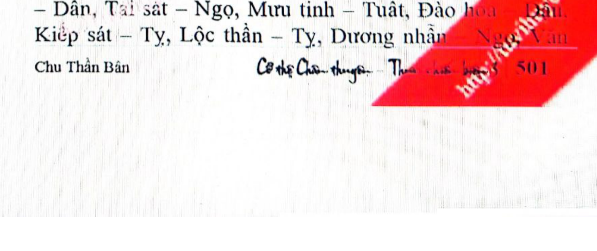
- **Cấu trúc Quẻ Dịch:**
  - **Quẻ chủ:** **Địa Trạch Lâm** (Cung Khôn)  
    *Tượng quẻ:* Tiến sát đến việc, đối mặt với thử thách, việc cần phải trực diện đương đầu giải quyết.
  - **Quẻ biến:** **Trạch Thủy Khốn** (Cung Đoài, Quẻ Lục Hợp)  
    *Tượng quẻ:* Nước cạn kiệt dưới đầm, rơi vào cảnh ngột ngạt bế tắc, vướng mắc khó khăn không tìm thấy lối thoát.
- **Bảng chi tiết Lục hào:**

| Hào | Thế/Ứng | Lục thân (Chủ) | Can Chi | Biến động | Lục thân (Biến) | Can Chi (Biến) | Thần sát / Phục | Lục thú |
|:---:|:---:|:---|:---|:---:|:---|:---|:---|:---|
| 6 | | Tử Tôn | Dậu - Kim | tĩnh | Huynh Đệ | Mùi - Thổ | Quý nhân, Tuần không (Mùi) | Chu Tước |
| 5 | **Ứng** | Thê Tài | Hợi - Thủy | **X (Động)** | Tử Tôn | Dậu - Kim | Đào hoa, Thiên y | Thanh Long |
| 4 | | Huynh Đệ | Sửu - Thổ | **X (Động)** | Thê Tài | Hợi - Thủy | Quý nhân | Huyền Vũ |
| 3 | | Huynh Đệ | Sửu - Thổ | tĩnh | Phụ Mẫu | Ngọ - Hỏa | Quý nhân, Tai sát, Dương nhẫn (Ngọ) | Bạch Hổ |
| 2 | **Thế** | Quan Quỷ | Mão - Mộc | tĩnh | Huynh Đệ | Thìn - Thổ | Hoa cái, Thiên hỷ | Đằng Xà |
| 1 | | Phụ Mẫu | Tỵ - Hỏa | **O (Động)** | Quan Quỷ | Dần - Mộc | Kiếp sát, Lộc thần, Dịch mã (Dần) | Câu Trần |

---

### 3. Dụng thần & Loại quẻ

- **Phân loại quẻ:**
  - **Quẻ việc chỉ định cầu chức, ứng tuyển việc làm:** Người hỏi chỉ đích danh một công ty truyền thông và vị trí quản lý cụ thể.
  - **Quẻ Lâm biến Khốn Lục hợp:** Gặp việc phải đối diện nhưng biến thành quẻ Khốn Lục hợp là điềm báo sự việc dây dưa, bế tắc và vướng phải trở ngại khó vượt qua.
- **Định vị Dụng thần cốt lõi:**
  1. **Dụng thần công việc (Quan Quỷ Mão Mộc Thế):** Hào Thế giữ Quan Quỷ Mão Mộc đại diện cho vị trí công việc mà đương số khao khát đạt được. Hào Thế đắc vị trí trung chính nội quái.
  2. **Hào Ứng (Thê Tài Hợi Thủy):** Đại diện cho công ty truyền thông chỉ định.
  3. **Kỵ thần / Gian hào cản trở (Huynh Đệ Sửu Thổ):** Nằm ở hào 4 (gian hào giữa Thế và Ứng), mang Huyền Vũ phát động đại diện cho đối thủ cạnh tranh luồn lách ngầm.
  4. **Tổ hợp động hào thứ ba (Phụ Mẫu Tỵ Hỏa biến Quan Quỷ Dần Mộc):** Tượng trưng cho quy trình xét duyệt và một chức danh hoặc cơ hội việc làm khác can thiệp vào tiến trình.

---

### 4. Luận giải chi tiết

#### 1. Bẫy ảo tưởng từ hào Ứng sinh Thế
- **Tín hiệu thuận lợi bề ngoài:** Hào Ứng Thê Tài Hợi Thủy phát động hóa Tử Tôn Dậu Kim (hồi đầu sinh). Hợi Thủy sau khi vượng lại quay sang sinh phù cho hào Thế Quan Quỷ Mão Mộc. Theo lý thông thường, Ứng sinh Thế, Tài sinh Quan là tượng công ty mở rộng vòng tay tiếp nhận người hỏi, tỷ lệ trúng tuyển tưởng như cầm chắc trong tay.
- **Trở ngại chết người:** Quẻ không chỉ có một hào động mà xuất hiện ba hào động có giá trị tác động qua lại. Khi có nhiều hào động, quy luật sinh khắc liên hoàn sẽ làm đảo lộn hoàn toàn cấu trúc ban đầu.

#### 2. Quy tắc Gian hào Huynh Đệ phát động lâm Huyền Vũ
- **Vị trí và tính chất gian hào:** Hào 4 Huynh Đệ Sửu Thổ nằm ở vị trí gian hào (khoảng giữa hào Thế ở ngôi 2 và hào Ứng ở ngôi 5). Gian hào phát động tượng trưng cho chướng ngại vật ngáng đường ngay giữa lộ trình.
- **Huyền Vũ chủ mưu toan ngầm:** Huynh Đệ là cừu thần chuyên khắc đoạt Thê Tài. Sửu Thổ phát động mang Huyền Vũ biểu thị những đối thủ cạnh tranh dùng mưu mô luồn lách, sử dụng các mối quan hệ "cửa sau" để can thiệp ngầm. 
- **Biến hào tiết lộ đối tượng chen ngang:** Huynh Đệ Sửu Thổ động hóa ra Thê Tài Hợi Thủy, mang tính chất ngũ hành y hệt hào Ứng Thê Tài Hợi Thủy. Điều này phản ánh hai khả năng: một là nội bộ công ty chỉ định đã âm thầm xếp người khác vào thế chỗ; hai là có một công ty khác đang nhòm ngó lôi kéo đương số, tạo nên sự phân tâm gây nghẽn dòng tuyển dụng.

#### 3. Tổ hợp liên hoàn Hỏa Thổ khắc đoạt chức vụ
- **Liên hoàn động hào:** Hào 1 Phụ Mẫu Tỵ Hỏa phát động kết hợp với Hào 4 Huynh Đệ Sửu Thổ tạo thành liên minh Hỏa Thổ tương sinh cực mạnh. Dòng năng lượng này dồn sức khắc chế tàn khốc hào Ứng Thê Tài Hợi Thủy, cắt đứt hoàn toàn nguồn sinh của Hợi Thủy dành cho hào Thế Mão Mộc.
- **Quan Quỷ Dần Mộc cướp đoạt ghế:** Hào 1 Phụ Mẫu Tỵ Hỏa động hóa ra Quan Quỷ Dần Mộc (mang Dịch mã). Dần Mộc mang sức mạnh lấy đi công việc của Mão Mộc (Thế). Đối thủ cạnh tranh nhờ sự nâng đỡ của Phụ Mẫu (hồ sơ, thẩm quyền cấp trên) đã chiếm đoạt mất cơ hội của người hỏi.
- **Tượng quẻ biến Trạch Thủy Khốn Lục hợp:** Dù có trải qua bao nhiêu nỗ lực, kết quả cuối cùng vẫn là vướng vào quẻ Khốn Lục hợp – sự trói buộc bế tắc, không thể chạm tay vào mục tiêu.

---

### 5. Kết luận & Ứng kỳ thực tế

- **Lời giải đoán của Chu Thần Bân:**
  1. Quẻ tượng thực chất không sáng sủa như vẻ bề ngoài. Dù ứng viên rất xuất sắc nhưng phía sau có đối thủ cạnh tranh luồn lách qua các mối quan hệ ngầm, chức vụ này khó lòng đạt được.
  2. Sự việc sẽ rơi vào tình trạng chậm trễ, dây dưa và cuối cùng dẫn đến bế tắc đúng như tượng quẻ Khốn.
- **Phản hồi thực tế (Feedback):**
  - Đương số bước vào các vòng phỏng vấn với tâm thế thận trọng. Vòng một trôi qua êm đẹp. Vòng hai phỏng vấn nghiệp vụ vô cùng hóc búa nhưng anh cũng xuất sắc vượt qua. Đến vòng ba là thẩm tra lý lịch cũng hoàn tất suôn sẻ. Cả ba vòng đều thuận lợi tưởng chừng chức vụ đã nằm trong túi.
  - Tuy nhiên, sau khi kết thúc mọi quy trình, anh chờ đợi mòn mỏi suốt nhiều ngày đến tận ngày 8 tháng 11 vẫn không thấy công ty truyền thông gửi thư bổ nhiệm chính thức.
- **Ứng kỳ chiêm nghiệm:**
  - Sự bặt vô âm tín sau ba vòng phỏng vấn xuất sắc ứng nghiệm đúng tượng gian hào Huyền Vũ thao túng và quẻ Khốn bế tắc, buộc đương số phải gieo tiếp quẻ thực chiến 192 để truy tìm nguyên do.

---

### 6. Bài học tâm pháp & Quy tắc cốt lõi

- **Quy tắc Lục Hào rút ra:**
  1. **Quy tắc Gian hào Huynh Đệ phát động lâm Huyền Vũ (trang 467):** Khi cầu chức mà gian hào Huynh Đệ phát động mang thần sát Huyền Vũ, khẳng định chắc chắn có đối thủ cạnh tranh ngầm sử dụng thủ đoạn quan hệ phi chính thức để cướp đoạt cơ hội, dù hào Ứng có sinh Thế cũng bị gián đoạn giữa chừng.
  2. **Quy tắc tổ hợp động liên hoàn khắc đoạt Dụng thần (trang 467):** Khi nhiều hào động cùng xuất hiện, không được vội vàng kết luận theo hào Ứng sinh Thế đơn lẻ. Phải xâu chuỗi chuỗi động liên hoàn (Tỵ Hỏa sinh Sửu Thổ khắc Hợi Thủy, hóa Dần Mộc đoạt Mão Mộc) để nhận diện bức tranh đa chiều thực tế.
- **Tâm pháp giải đoán:**
  - Đừng để vẻ ngoài hào nhoáng của các vòng phỏng vấn thuận lợi ru ngủ lý trí. Trong Lục Hào, hào biến và gian hào phản ánh dòng ngầm dưới đáy biển sâu. Khi quẻ đã chỉ ra gian hào tác quái và biến Khốn, sự thuận lợi ban đầu chỉ là khúc dạo đầu của một màn trì hoãn có toan tính.

## THỰC CHIẾN 192: CÓ THỂ NHẬN ĐƯỢC THƯ THÔNG BÁO TUYỂN DỤNG TỪ CÔNG TY TRUYỀN THÔNG HAY KHÔNG

---

### 1. Bối cảnh & Câu hỏi

- **Bối cảnh chi tiết:** 
  Tiếp nối diễn biến sau Thực chiến 191. Vị đồng môn sau khi hoàn thành xuất sắc cả ba vòng thi tuyển (vòng một, vòng hai chuyên môn áp lực cao và vòng ba thẩm tra lý lịch) tại công ty truyền thông lớn, bắt đầu bước vào giai đoạn chờ đợi văn bản tuyển dụng chính thức. Theo thông lệ, sau khi đạt kết quả điều tra lý lịch thì thông báo tuyển dụng sẽ được gửi đi trong vòng vài ngày. Thế nhưng từ cuối tháng 10 kéo dài đến tận ngày 8 tháng 11 năm 2018, công ty vẫn hoàn toàn im lặng, không có bất kỳ phản hồi hay động thái nào.
- **Tâm lý & Câu hỏi ẩn ý:** 
  Sự chờ đợi kéo dài trong vô vọng khiến đương số rơi vào tâm trạng hoang mang, sốt ruột và hoài nghi tột độ. Anh lo sợ đã có biến cố bất ngờ xảy ra sau cánh gà cản trở cơ hội của mình. Vì vậy, anh tìm đến Chu Thần Bân gieo thêm một quẻ để hỏi rõ: "Liệu có thể nhận được thư thông báo tuyển dụng từ công ty truyền thông hay không?"
- **Thời gian chiêm đoán:**
  - Dương lịch: Ngày 08 tháng 11 năm 2018, 16:24.
  - Giờ Bắc Kinh: Ngày 08/11/2018, 16:24.
  - Can chi: Năm Mậu Tuất, tháng Quý Hợi, ngày Giáp Thìn, giờ Nhâm Thân.

---

### 2. Dữ kiện & Bảng quẻ Crop

- **Thời không chiêm nghiệm:**
  - Tháng Quý Hợi: Thủy vượng, Mộc tướng, Kim hưu, Thổ tù, Hỏa tử.
  - Ngày Giáp Thìn: Thổ vượng, Thủy khố.
  - Tuần không: **Dần, Mão** (Tuần Giáp Thìn, Dần Mão không vong).
- **Thần sát:**
  - Tướng tinh: Tý
  - Hoa cái: Thìn
  - Dịch mã: Dần (Lâm Tuần không)
  - Tai sát: Ngọ
  - Mưu tinh: Tuất
  - Đào hoa: Dậu
  - Kiếp sát: Tỵ
  - Lộc thần: Dần (Lâm Tuần không)
  - Dương nhẫn: Mão (Lâm Tuần không)
  - Văn xương: Tỵ
  - Thiên y: Tuất
  - Thiên hỷ: Dậu
  - Quý nhân: Sửu, Mùi
- Dữ kiện bảng quẻ và các thông số chiêm đoán:
  - **Bảng 192.1** Đồ hình quẻ Thực chiến 192:
    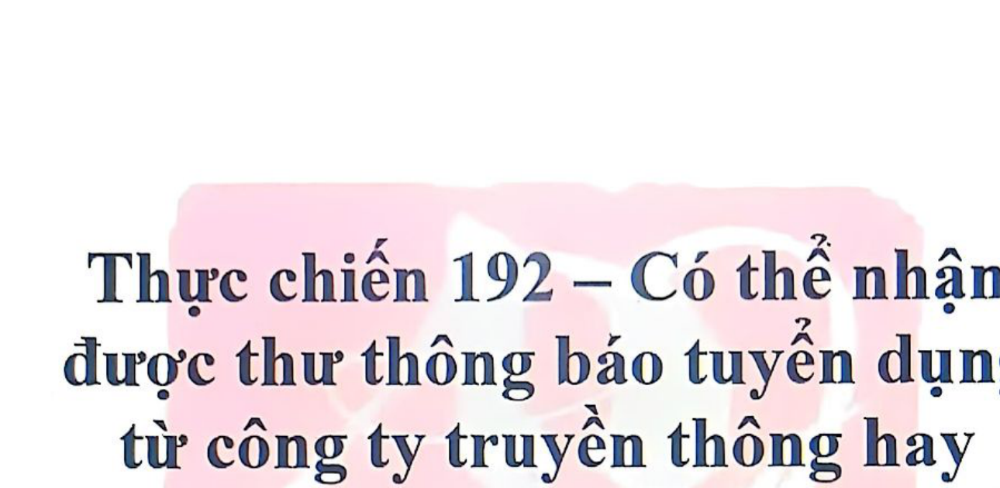
- **Cấu trúc Quẻ Dịch:**
  - **Quẻ chủ:** **Địa Lôi Phục** (Cung Khôn, Quẻ Lục Hợp)  
    *Tượng quẻ:* Phục giả phản dã, sự việc lặp đi lặp lại, quay lại điểm xuất phát, dây dưa chờ đợi không có tiến triển mới.
  - **Quẻ biến:** **Hỏa Trạch Khuê** (Cung Cấn)  
    *Tượng quẻ:* Hai ngọn lửa và đầm nước trái chiều, tượng của sự chia lìa, quay lưng, bất hòa, không có duyên phận gắn kết.
- **Bảng chi tiết Lục hào:**

| Hào | Thế/Ứng | Lục thân (Chủ) | Can Chi | Biến động | Lục thân (Biến) | Can Chi (Biến) | Thần sát / Phục | Lục thú |
|:---:|:---:|:---|:---|:---:|:---|:---|:---|:---|
| 6 | | Tử Tôn | Dậu - Kim | **X (Động)** | Phụ Mẫu | Tỵ - Hỏa | Đào hoa, Thiên hỷ | Huyền Vũ |
| 5 | | Thê Tài | Hợi - Thủy | tĩnh | Huynh Đệ | Mùi - Thổ | Nguyệt lệnh, Quý nhân (Mùi) | Bạch Hổ |
| 4 | **Ứng** | Huynh Đệ | Sửu - Thổ | **X (Động)** | Tử Tôn | Dậu - Kim | Quý nhân | Đằng Xà |
| 3 | | Huynh Đệ | Thìn - Thổ | tĩnh | Huynh Đệ | Sửu - Thổ | Hoa cái, Nhật lệnh | Câu Trần |
| 2 | | Quan Quỷ | Dần - Mộc | **X (Động)** | Quan Quỷ | Mão - Mộc | Dịch mã, Lộc thần, Tuần không (phục Phụ Mẫu Tỵ Hỏa) | Chu Tước |
| 1 | **Thế** | Thê Tài | Tý - Thủy | tĩnh | Phụ Mẫu | Tỵ - Hỏa | Tướng tinh | Thanh Long |

---

### 3. Dụng thần & Loại quẻ

- **Phân loại quẻ:**
  - **Thế lưỡng nan giữa Quẻ tâm thái và Quẻ sự việc:** Người hỏi đang trong trạng thái lo âu cực độ tìm kiếm sự an tâm (quẻ tâm thái), đồng thời việc hỏi lại nhắm vào một văn bản cụ thể là thư tuyển dụng (quẻ sự việc).
  - **Quẻ Phục Lục hợp biến Khuê:** Trạng thái chủ là chờ đợi lặp lại (Phục), biến thành sự chia lìa vô duyên (Khuê).
- **Định vị Dụng thần cốt lõi:**
  1. **Xét theo Quẻ tâm thái:** 
     - Dụng thần là Tử Tôn Dậu Kim (hỷ thần giải tỏa lo âu).
     - Hào Thế Thê Tài Tý Thủy (nơi an định tâm thần).
  2. **Xét theo Quẻ sự việc:** 
     - Dụng thần công việc là Quan Quỷ Dần Mộc động biến Quan Quỷ Mão Mộc (hóa Tiến thần mang Dương nhẫn).
     - Dụng thần văn thư thông báo là Phụ Mẫu Tỵ Hỏa (phục tàng dưới hào 2 và lộ ra ở hào biến).
  3. **Hào Ứng (Huynh Đệ Sửu Thổ):** Đại diện cho phía công ty truyền thông đang trì hoãn.

---

### 4. Luận giải chi tiết

#### 1. Xung đột tín hiệu giữa Tam hợp cục và quẻ biến Hỏa Trạch Khuê
- **Cục diện tam hợp Tử Tôn:** 
  Hào 4 Huynh Đệ Sửu Thổ và hào 6 Tử Tôn Dậu Kim phát động, kết hợp với Phụ Mẫu Tỵ Hỏa ở hào biến tạo thành tam hợp Kim cục: **Tỵ – Dậu – Sửu hợp hóa Dậu Kim**. Kim cục sinh cho hào Thế Thê Tài Tý Thủy.
- **Nếu giải theo quẻ tâm thái:** Tam hợp Tử Tôn sinh Thế thường mang ý nghĩa giải tỏa ưu tư, biểu hiện rằng rốt cuộc đương số sẽ nhận được tin tức mong muốn để trút bỏ gánh nặng. Tuy nhiên, Tử Tôn Dậu Kim lại lâm **Huyền Vũ** – chủ về sự mờ ám, không minh bạch, thời gian không xác định.
- **Lời phán quyết từ quẻ biến:** Quẻ biến là **Hỏa Trạch Khuê**. Trong Dịch học, Khuê là tượng của sự chia lìa, quay lưng chống đối. Bất luận là chia lìa bị động (công ty đổi ý hủy tuyển) hay chia lìa chủ động (đương số từ chối không đến), kết cục tất yếu vẫn là **"vô duyên"**. Mọi dấu hiệu cát lành từ tam hợp đều bị tượng chia rẽ của quẻ Khuê vô hiệu hóa.

#### 2. Định vị Quẻ sự việc – Quan Quỷ hóa Tiến thần báo hiệu cơ hội mới
- **Chu Thần Bân quyết định chọn góc nhìn quẻ sự việc:** 
  Khi xuất hiện sự bất nhất giữa cấu trúc hào và tượng quẻ biến, thực tế khách quan của sự việc phải được đặt lên hàng đầu.
- **Hành trình của Quan Quỷ Dần Mộc:**
  - Hào 2 Quan Quỷ Dần Mộc phát động hóa Quan Quỷ Mão Mộc (hóa Tiến thần).
  - Cả Dần Mộc và Mão Mộc đều lâm Tuần không, nhưng Dần Mộc được Nguyệt lệnh Hợi Thủy tương hợp (hợp khởi).
  - Hào biến Quan Quỷ Mão Mộc mang theo **Dương nhẫn** – biểu thị một chức vị công việc mới có thực quyền và tính chất vững vàng.
- **Bản chất điềm báo:** 
  Quan Quỷ chen vào giữa phát động báo hiệu trong thời gian mòn mỏi chờ đợi thư từ công ty truyền thông, sẽ có một cơ hội việc làm hoàn toàn mới xuất hiện. Đương số sẽ chuyển hướng sang cơ hội mới này thay vì tiếp tục gắn bó với công ty truyền thông cũ.

#### 3. Sự đối nghịch bản chất giữa Kim cục và Mộc hào
- Tam hợp Tử Tôn Dậu Kim vượng khắc chế trực diện Quan Quỷ Dần Mộc và Mão Mộc. 
- Sự tương khắc dữ dội giữa cục Kim và hào Mộc là nguyên nhân sâu xa dẫn đến quẻ biến Hỏa Trạch Khuê. Công ty truyền thông kia cuối cùng sẽ không có duyên phận gắn kết với người hỏi, mở đường cho một ngã rẽ công việc khác tiến vào.

---

### 5. Kết luận & Ứng kỳ thực tế

- **Lời giải đoán của Chu Thần Bân:**
  1. Giữa đương số và công ty truyền thông hoàn toàn vô duyên, đúng như tượng quẻ Khuê chia lìa. Thư thông báo tuyển dụng chính thức sẽ không được gửi đến theo kỳ vọng ban đầu.
  2. Không nên tiếp tục chờ đợi trong vô vọng làm lỡ dở thời cơ. Trong lúc này, chắc chắn sẽ có một cơ hội việc làm khác (Quan Quỷ Dần Mộc hóa Mão Mộc Tiến thần) xuất hiện đón nhận anh.
- **Phản hồi thực tế (Feedback):**
  - Công ty truyền thông tiếp tục bặt vô âm tín, không hề có thư mời chính thức.
  - Đúng như lời Chu Thần Bân dự báo, trong vòng hai tuần tiếp theo, đương số nhận được lời mời phỏng vấn từ một đơn vị sự nghiệp nhà nước có uy tín.
- **Ứng kỳ chiêm nghiệm:**
  - Sự việc ứng nghiệm trọn vẹn vào nửa cuối tháng 11, khi cơ hội việc làm mới xuất hiện thế chỗ hoàn toàn mục tiêu cũ, dẫn thẳng tới bối cảnh gieo quẻ Thực chiến 193.

---

### 6. Bài học tâm pháp & Quy tắc cốt lõi

- **Quy tắc Lục Hào rút ra:**
  1. **Phân biệt Quẻ tâm thái và Quẻ sự việc (trang 470):** Khi quẻ có sự giằng co giữa Tam hợp Tử Tôn sinh Thế và quẻ biến mang tượng phân ly (Hỏa Trạch Khuê), không được sa đà vào quẻ tâm thái để đưa ra lời hứa hẹn hão huyền. Phải căn cứ vào quẻ biến và hào Quan Quỷ sự việc để định tính chuẩn xác.
  2. **Ý nghĩa quẻ biến Hỏa Trạch Khuê (trang 470):** Trong chiêm đoán nhân duyên, hợp tác hay tuyển dụng, quẻ biến thành Khuê là dấu hiệu sắt đá của việc đôi bên bất đồng đường lối, đứt gãy quan hệ hoặc lỡ dở lương duyên.
- **Tâm pháp giải đoán:**
  - Nhà Dịch học chân chính phải đủ dũng khí nhìn xuyên qua lớp sương mù của tam hợp cục. Khi quẻ biến đã lộ rõ chữ "Khuê", đó là lúc định mệnh đã an bài việc chia ly. Dứt khoát buông bỏ cái cũ chính là chiếc chìa khóa duy nhất để đón nhận cơ hội Tiến thần đang mở ra ở phía trước.

## THỰC CHIẾN 193: CHỌN ĐẾN CÔNG TY TRUYỀN THÔNG HAY ĐƠN VỊ SỰ NGHIỆP THÌ TỐT HƠN

---

### 1. Bối cảnh & Câu hỏi

- **Bối cảnh chi tiết:** 
  Sau quẻ Thực chiến 192 đúng hai tuần (từ ngày 08 đến ngày 20 tháng 11 năm 2018), đương số nhận lời mời phỏng vấn vị trí Giám đốc tại một đơn vị sự nghiệp nhà nước. Đơn vị này đánh giá rất cao năng lực và hồ sơ của anh, quy trình làm việc diễn ra nhanh chóng đến kinh ngạc: chỉ trong vòng một tuần đã hoàn tất toàn bộ hồ sơ tuyển dụng, ban hành thông báo trúng tuyển chính thức với mức lương thưởng đúng như thỏa thuận, hẹn đầu tháng 12 đến nhận việc. Điều này hoàn toàn trái ngược với định kiến thông thường cho rằng đơn vị nhà nước thủ tục rườm rà còn tư nhân nhanh gọn. Cùng lúc đó, công ty truyền thông danh tiếng (nơi anh kỳ vọng nhất) vẫn chưa phát thư tuyển dụng.
- **Tâm lý & Câu hỏi ẩn ý:** 
  Đương số đứng trước thế tiến thoái lưỡng nan: một bên là đơn vị sự nghiệp nhà nước thủ tục rõ ràng, ổn định và trân trọng mình; một bên là công ty truyền thông lớn đãi ngộ hấp dẫn nhưng chưa có quyết định cuối cùng. Anh loay hoay không biết lựa chọn bến đỗ nào sẽ mang lại tương lai rực rỡ hơn. Vì thế, anh đến nhờ Chu Thần Bân gieo quẻ định hướng.
- **Thời gian chiêm đoán:**
  - Dương lịch: Ngày 22 tháng 11 năm 2018, 18:24.
  - Giờ Bắc Kinh: Ngày 22/11/2018, 18:24.
  - Can chi: Năm Mậu Tuất, tháng Quý Hợi, ngày Mậu Ngọ, giờ Tân Dậu.

---

### 2. Dữ kiện & Bảng quẻ Crop

- **Thời không chiêm nghiệm:**
  - Tháng Quý Hợi: Thủy vượng, Mộc tướng, Kim hưu, Thổ tù, Hỏa tuyệt.
  - Ngày Mậu Ngọ: Hỏa vượng, Tướng tinh, Dương nhẫn.
  - Tuần không: **Tý, Sửu** (Tuần Giáp Dần, Tý Sửu không vong).
- **Thần sát:**
  - Tướng tinh: Ngọ
  - Hoa cái: Tuất
  - Dịch mã: Thân
  - Tai sát: Tý (Lâm Tuần không)
  - Mưu tinh: Thìn
  - Đào hoa: Mão
  - Kiếp sát: Hợi
  - Lộc thần: Tỵ
  - Dương nhẫn: Ngọ
  - Văn xương: Thân
  - Thiên y: Tuất
  - Thiên hỷ: Mùi
  - Quý nhân: Sửu, Mùi
- Dữ kiện bảng quẻ và các thông số chiêm đoán:
  - **Bảng 193.1** Đồ hình quẻ Thực chiến 193:
    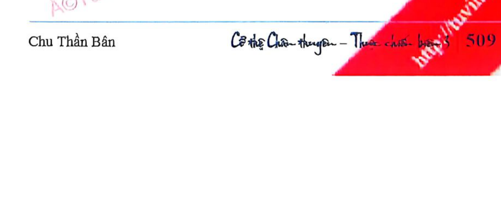
- **Cấu trúc Quẻ Dịch:**
  - **Quẻ chủ:** **Trạch Sơn Hàm** (Cung Đoài)  
    *Tượng quẻ:* Giao cảm, lan tỏa muôn phương, rải hồ sơ tìm việc nhiều nơi, khắp nơi đều có lời mời và cơ hội rộng mở.
  - **Quẻ biến:** **Thiên Hỏa Đồng Nhân** (Cung Ly, Quẻ Quy Hồn)  
    *Tượng quẻ:* Đồng lòng cùng người, quy thuận tập thể lớn, tìm về môi trường có tôn ti trật tự văn minh.
- **Bảng chi tiết Lục hào:**

| Hào | Thế/Ứng | Lục thân (Chủ) | Can Chi | Biến động | Lục thân (Biến) | Can Chi (Biến) | Thần sát / Phục | Lục thú |
|:---:|:---:|:---|:---|:---:|:---|:---|:---|:---|
| 6 | **Ứng** | Phụ Mẫu | Mùi - Thổ | **X (Động)** | Phụ Mẫu | Tuất - Thổ | Thiên hỷ, Quý nhân (hóa Tiến thần) | Chu Tước |
| 5 | | Huynh Đệ | Dậu - Kim | tĩnh | Huynh Đệ | Thân - Kim | Đào hoa, Dịch mã (Thân) | Thanh Long |
| 4 | | Tử Tôn | Hợi - Thủy | tĩnh | Quan Quỷ | Ngọ - Hỏa | Kiếp sát, Nguyệt lệnh | Huyền Vũ |
| 3 | **Thế** | Huynh Đệ | Thân - Kim | tĩnh | Tử Tôn | Hợi - Thủy | Dịch mã, Văn xương | Bạch Hổ |
| 2 | | Quan Quỷ | Ngọ - Hỏa | tĩnh | Phụ Mẫu | Sửu - Thổ | Tướng tinh, Dương nhẫn, Nhật lệnh (phục Thê Tài Mão Mộc) | Đằng Xà |
| 1 | | Phụ Mẫu | Thìn - Thổ | **X (Động)** | Thê Tài | Mão - Mộc | Mưu tinh (hóa Hồi đầu khắc) | Câu Trần |

---

### 3. Dụng thần & Loại quẻ

- **Phân loại quẻ:**
  - **Quẻ định hướng lựa chọn đối sánh song phương:** Đương số đứng giữa hai công ty cụ thể (công ty truyền thông và đơn vị sự nghiệp nhà nước).
  - **Quẻ Hàm biến Đồng Nhân Quy hồn:** Cơ hội tiếp cận nhiều nơi nhưng cuối cùng phải quy tụ về nơi có sự đồng lòng chính đạo.
- **Định vị Dụng thần cốt lõi:**
  1. **Hào Thế (Huynh Đệ Thân Kim):** Đại diện cho bản thân người hỏi. Hào Thế mang Dịch mã và Văn xương, thụ nhận sinh lực từ hai hào Phụ Mẫu phát động.
  2. **Đối tượng 1 - Đơn vị sự nghiệp nhà nước (Hào 6 Phụ Mẫu Mùi Thổ Ứng):** Phát động hóa Phụ Mẫu Tuất Thổ (hóa Tiến thần).
  3. **Đối tượng 2 - Công ty truyền thông (Hào 1 Phụ Mẫu Thìn Thổ):** Phát động hóa Thê Tài Mão Mộc (hóa Hồi đầu khắc).

---

### 4. Luận giải chi tiết

#### 1. Quy tắc định vị đối sánh song phương qua hai hào Phụ Mẫu
- **Bản chất hai nguồn sinh:** Trong quẻ, cả hai hào phát động là Hào 6 Phụ Mẫu Mùi Thổ và Hào 1 Phụ Mẫu Thìn Thổ đều mang hành Thổ, cùng sinh trợ cho hào Thế Huynh Đệ Thân Kim. Điều này chứng minh cả hai nơi đều đưa ra lời mời làm việc, mở ra hai lối rẽ sự nghiệp.
- **Phân định rõ ranh giới tốt xấu:** Dù cùng sinh Thế, nhưng chiều hướng biến hóa của hai hào lại trái ngược hoàn toàn: một hào hóa Tiến thần, một hào hóa Hồi đầu khắc.

#### 2. Nhận diện Đơn vị sự nghiệp qua Hào 6 Phụ Mẫu Mùi Thổ hóa Tiến thần
- **Dấu hiệu hiện thực đã xác lập:** Hào Ứng Phụ Mẫu Mùi Thổ liên kết mật thiết với Quan Quỷ Ngọ Hỏa lâm Nhật lệnh. Quan Quỷ mang Nhật lệnh khẳng định đây là công việc đã được phê duyệt dứt khoát, hiện hữu trong thực tế. Đồng thời Mùi Thổ tương xung Sửu Thổ đang lâm Tuần không, báo hiệu lời mời tuyển dụng đã phá vỡ thế chờ đợi rỗng tuếch để bước vào giai đoạn hành động thực tế.
- **Đặc trưng tổ chức nhà nước:** Hào mang liên hệ với Dương Nhẫn của Ngọ Hỏa và Bạch Hổ – những dấu hiệu điển hình của cơ quan công quyền, đơn vị sự nghiệp nằm trong hệ thống thể chế.
- **Sức mạnh Hóa Tiến thần:** Phụ Mẫu Mùi Thổ động hóa Phụ Mẫu Tuất Thổ gọi là **Tiến thần**. Hóa Tiến thần biểu thị nền tảng sự nghiệp ngày càng vững chắc, có lộ trình thăng tiến lâu dài, đóng vai trò bàn đạp kiên cố để đưa sự nghiệp leo lên những nấc thang cao hơn.

#### 3. Nhận diện Công ty truyền thông qua Hào 1 Phụ Mẫu Thìn Thổ hóa Hồi đầu khắc
- **Dấu hiệu việc chưa định hình:** Phụ Mẫu Thìn Thổ ẩn chứa Quan Quỷ Tỵ Hỏa bị Nguyệt phá (tháng Hợi xung phá). Nguyệt phá chứng minh công việc ở công ty truyền thông này đến nay vẫn chưa được phê duyệt chính thức, danh phận còn treo lơ lửng.
- **Đặc trưng doanh nghiệp tư nhân:** Quan Quỷ Tỵ Hỏa mang Lộc thần, phản ánh mức thu nhập cao, đãi ngộ ban đầu hấp dẫn của khối doanh nghiệp tư nhân. Hào nằm ở ngôi sơ quái, biểu thị vị trí địa lý gần nơi cư trú hơn.
- **Hiểm họa Hồi đầu khắc:** Phụ Mẫu Thìn Thổ động hóa ra Thê Tài Mão Mộc, bị Mão Mộc quay lại **Hồi đầu khắc** dữ dội. Hồi đầu khắc là tượng có đầu không có đuôi. Nếu bước chân vào công ty truyền thông, dù có vào được thì giữa chừng cũng sẽ xảy ra mâu thuẫn dẫn đến sa thải, cắt giảm đãi ngộ hoặc đứt gánh giữa đường.

---

### 5. Kết luận & Ứng kỳ thực tế

- **Lời giải đoán của Chu Thần Bân:**
  1. Đơn vị sự nghiệp nhà nước (Hào Ứng hóa Tiến thần) là phương án ưu việt bền vững về lâu dài, mang lại sự ổn định và tích lũy thăng tiến bài bản.
  2. Công ty truyền thông (Hào sơ hóa Hồi đầu khắc) tiềm ẩn rủi ro bội tín và bất ổn cực lớn, vào làm nửa chừng ắt gặp sóng gió. Đương số cần dứt khoát chọn đơn vị sự nghiệp.
- **Phản hồi thực tế (Feedback):**
  - Đúng tròn một ngày sau khi gieo quẻ (vừa vặn tròn một tháng từ ngày phỏng vấn đầu tiên), công ty truyền thông bất ngờ gửi thư thông báo tuyển dụng.
  - Tuy nhiên, nội dung thư khiến đương số vô cùng bức xúc: công ty không bổ nhiệm chức danh Giám đốc thương hiệu như cam kết ban đầu, mà giáng xuống làm **Phó giám đốc thương hiệu**, đồng thời chế độ đãi ngộ cũng bị cắt giảm một bậc tương ứng.
- **Ứng kỳ chiêm nghiệm:**
  - Hiện tượng hạ cấp tuyển dụng và nuốt lời cam kết đã ứng nghiệm chính xác vào tượng Phụ Mẫu Thìn Thổ động hóa Hồi đầu khắc. Sự thất vọng này đẩy đương số vào việc gieo tiếp quẻ Thực chiến 194.

---

### 6. Bài học tâm pháp & Quy tắc cốt lõi

- **Quy tắc Lục Hào rút ra:**
  1. **Quy tắc định vị đối sánh song phương trong quẻ chọn việc (trang 474):** Khi xuất hiện hai hào Phụ Mẫu cùng động sinh Thế, phải dựa vào thần sát (Dương Nhẫn vs Lộc thần), trạng thái Nhật Nguyệt (Nhật lệnh vs Nguyệt phá) và hướng biến dịch (Tiến thần vs Hồi đầu khắc) để bóc tách rõ bản chất của từng tổ chức.
  2. **Tiến thần là bảo chứng của tương lai bền vững (trang 475):** Trong chiêm đoán chức nghiệp, hào sinh Thế hóa Tiến thần luôn đại diện cho sự phát triển từ từ nhưng trường tồn, là lựa chọn tối ưu hơn hẳn những hào mang đãi ngộ cao nhưng lâm thế Hồi đầu khắc.
- **Tâm pháp giải đoán:**
  - Phù hoa trước mắt không bằng căn cơ vững bền. Người phán quẻ không được để mức lương ban đầu làm mờ mắt, mà phải phân định rõ thế đứng của từng hào. Chọn nơi trân trọng mình và có thế Tiến thần chính là thuận theo thiên đạo.

## THỰC CHIẾN 194: NHẬN ĐƯỢC OFFER TỪ CÔNG TY TRUYỀN THÔNG, NHƯNG BỊ HẠ CẤP TUYỂN DỤNG. HỎI TIẾP: NÊN ĐẾN CÔNG TY TRUYỀN THÔNG HAY ĐẾN ĐƠN VỊ SỰ NGHIỆP THÌ TỐT HƠN?

---

### 1. Bối cảnh & Câu hỏi

- **Bối cảnh chi tiết:** 
  Tiếp nối Thực chiến 193. Đúng một ngày sau quẻ trước, công ty truyền thông danh tiếng cuối cùng đã gửi thư mời nhận việc đến đương số sau một tháng ròng rã trì hoãn. Tuy nhiên, thư tuyển dụng lại giáng một đòn bất ngờ vào lòng tự trọng của ứng viên: chức danh cam kết ban đầu là Giám đốc thương hiệu bị hạ xuống thành Phó giám đốc thương hiệu, mức lương thưởng đãi ngộ cũng bị cắt giảm một bậc tương ứng. Trong khi đó, đơn vị sự nghiệp nhà nước vẫn nhiệt tình chờ đón anh vào vị trí Giám đốc với chế độ đãi ngộ trọn vẹn như đã hứa.
- **Tâm lý & Câu hỏi ẩn ý:** 
  Đương số rơi vào trạng thái ấm ức, phẫn nộ và hụt hẫng vì bị bội tín, nhưng ánh hào quang của một tập đoàn truyền thông lớn vẫn khiến anh vương vấn, chưa nỡ dứt tình. Anh băn khoăn liệu có nên nhẫn nhịn chấp nhận làm phó chức để vào tập đoàn lớn hay dứt khoát chuyển sang đơn vị sự nghiệp. Dù biết việc gieo quẻ liên tục cho cùng một vấn đề là điều kiêng kỵ ("sự bất quá tam"), vì quá bối rối, anh vẫn khẩn cầu Chu Thần Bân gieo thêm một quẻ nữa để định đoạt.
- **Thời gian chiêm đoán:**
  - Dương lịch: Ngày 23 tháng 11 năm 2018, 17:37.
  - Giờ Bắc Kinh: Ngày 23/11/2018, 17:37.
  - Can chi: Năm Mậu Tuất, tháng Quý Hợi, ngày Kỷ Mùi, giờ Quý Dậu.

---

### 2. Dữ kiện & Bảng quẻ Crop

- **Thời không chiêm nghiệm:**
  - Tháng Quý Hợi: Thủy vượng, Mộc tướng, Kim hưu, Thổ tù, Hỏa tuyệt.
  - Ngày Kỷ Mùi: Thổ vượng, Hoa cái, Thiên hỷ.
  - Tuần không: **Tý, Sửu** (Tuần Giáp Dần, Tý Sửu không vong).
- **Thần sát:**
  - Tướng tinh: Mão
  - Hoa cái: Mùi
  - Dịch mã: Tỵ
  - Tai sát: Dậu
  - Mưu tinh: Sửu (Lâm Tuần không)
  - Đào hoa: Tý (Lâm Tuần không)
  - Kiếp sát: Thân
  - Lộc thần: Ngọ
  - Dương nhẫn: Tỵ
  - Văn xương: Dậu
  - Thiên y: Tuất
  - Thiên hỷ: Mùi
  - Quý nhân: Thân, Tý
- Dữ kiện bảng quẻ và các thông số chiêm đoán:
  - **Bảng 194.1** Đồ hình quẻ Thực chiến 194:
    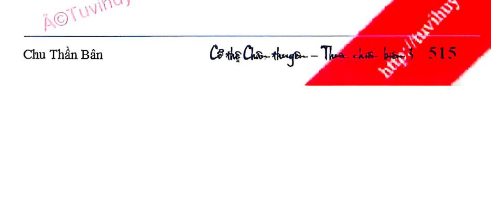
- **Cấu trúc Quẻ Dịch:**
  - **Quẻ chủ:** **Thiên Lôi Vô Vọng** (Cung Tốn, Quẻ Lục Xung)  
    *Tượng quẻ:* Không làm điều càn dở, không nuôi ảo vọng viển vông, hành động sai lầm ắt chuốc lấy tai họa bất ngờ.
  - **Quẻ biến:** **Hỏa Địa Tấn** (Cung Cấn, Quẻ Du Hồn)  
    *Tượng quẻ:* Mặt trời mọc lên khỏi mặt đất, tiến lên ánh sáng, nhưng quẻ Du Hồn cảnh tỉnh tâm trí bất định, cần sớm quyết đoán dứt khoát.
- **Bảng chi tiết Lục hào:**

| Hào | Thế/Ứng | Lục thân (Chủ) | Can Chi | Biến động | Lục thân (Biến) | Can Chi (Biến) | Thần sát / Phục | Lục thú |
|:---:|:---:|:---|:---|:---:|:---|:---|:---|:---|
| 6 | | Thê Tài | Tuất - Thổ | tĩnh | Tử Tôn | Tỵ - Hỏa | Thiên y | Câu Trần |
| 5 | | Quan Quỷ | Thân - Kim | **O (Động)** | Thê Tài | Mùi - Thổ | Quý nhân, Kiếp sát (hóa hồi đầu sinh) | Chu Tước |
| 4 | **Thế** | Tử Tôn | Ngọ - Hỏa | tĩnh | Quan Quỷ | Dậu - Kim | Lộc thần | Thanh Long |
| 3 | | Thê Tài | Thìn - Thổ | tĩnh | Huynh Đệ | Mão - Mộc | Tướng tinh (Mão) | Huyền Vũ |
| 2 | | Huynh Đệ | Dần - Mộc | tĩnh | Tử Tôn | Tỵ - Hỏa | Dịch mã, Dương nhẫn (Tỵ) | Bạch Hổ |
| 1 | **Ứng** | Phụ Mẫu | Tý - Thủy | **O (Động)** | Thê Tài | Mùi - Thổ | Đào hoa, Quý nhân, Tuần không (hóa hồi đầu khắc) | Đằng Xà |

---

### 3. Dụng thần & Loại quẻ

- **Phân loại quẻ:**
  - **Quẻ lựa chọn so sánh thiệt hơn sau khi nhận offer:** Đương số đã nắm trong tay cả hai văn bản trúng tuyển, cần định đoạt quyết định cuối cùng.
  - **Quẻ Vô Vọng Lục xung biến Tấn Du hồn:** Ban đầu gặp Lục xung biểu thị sự bực bội, xung đột tâm lý muốn giải tán; biến Tấn Du hồn khuyên răn nên hướng về con đường thăng tiến quang minh chính đại.
- **Định vị Dụng thần cốt lõi:**
  1. **Hào Thế (Tử Tôn Ngọ Hỏa):** Đại diện cho bản thân người hỏi. Hào Thế mang Lộc thần biểu thị tài năng và tư cách độc lập.
  2. **Đối tượng 1 - Công ty truyền thông bội tín (Hào 1 Phụ Mẫu Tý Thủy Ứng):** Động hóa Thê Tài Mùi Thổ (hồi đầu khắc), lâm Tuần không.
  3. **Đối tượng 2 - Đơn vị sự nghiệp nhà nước (Hào 5 Quan Quỷ Thân Kim):** Động hóa Thê Tài Mùi Thổ (hồi đầu sinh), mang Quý nhân.

---

### 4. Luận giải chi tiết

#### 1. Sự phân định rạch ròi qua hai nhánh Hồi đầu sinh vs Hồi đầu khắc
- **Bản chất công ty truyền thông qua Hào 1 Phụ Mẫu Tý Thủy:**
  - Phụ Mẫu Tý Thủy ở hào Ứng phát động nhưng lại rơi vào **Tuần không**. Tuần không là sự rỗng tuếch, lời hứa không có thực chất, danh không xứng với thực.
  - Tý Thủy động hóa Thê Tài Mùi Thổ (lâm Nhật kiến) quay lại **Hồi đầu khắc** tàn khốc. Hồi đầu khắc kết hợp với Tuần không biểu thị sự bội ước, tráo trở và tự triệt tiêu uy tín của công ty truyền thông. Đương số nếu cố bước vào sẽ chịu cảnh chèn ép, hạ nhục và sớm muộn cũng bị đào thải.
- **Bản chất đơn vị sự nghiệp qua Hào 5 Quan Quỷ Thân Kim:**
  - Hào 5 ở ngôi quân vị tôn quý, mang Quan Quỷ Thân Kim là **Quý nhân**.
  - Quan Quỷ Thân Kim phát động hóa Thê Tài Mùi Thổ (lâm Nhật kiến) **Hồi đầu sinh**. Hồi đầu sinh biểu thị sự nuôi dưỡng, nâng đỡ và nguồn lực hậu thuẫn dồi dào. 
  - Đơn vị sự nghiệp mang lại môi trường ổn định, được cấp trên bảo bọc, lộ trình sự nghiệp ngày càng quang minh đắc địa.

#### 2. Nguyên lý Quỹ đạo sự việc và Văn hóa doanh nghiệp
- **Sự thật đằng sau hành vi hạ cấp tuyển dụng:**
  Một tập đoàn truyền thông quy mô lớn đã phỏng vấn sát hạch qua 3 vòng, đã đồng ý chức vụ Giám đốc thương hiệu theo đúng quy trình, nhưng sau một tháng trì hoãn lại tự ý đổi thành Phó giám đốc. Điều này cho thấy nội bộ có sự thao túng mờ ám: hoặc có phe cánh cấp cao nhét người thân tín vào ghế chính, hoặc lãnh đạo tùy tiện lật lọng. 
- **Quy luật nhân quả của quỹ đạo:**
  Chu Thần Bân đúc kết nguyên lý Dịch học sâu sắc: **"Khởi đầu trắc trở, tương lai ắt vấp váp"**. Nếu một mối quan hệ công việc ngay từ lúc khởi đầu đã dây dưa, lề mề, bất tín và coi thường ứng viên thì văn hóa doanh nghiệp đó đã mục ruỗng. Quỹ đạo trắc trở này chắc chắn sẽ tiếp diễn trong suốt quá trình công tác sau này.
- **Tầm nhìn của bậc trí giả:**
  "Người hiểu rõ Dịch lý thì không cần đoán quẻ." Chỉ cần quan sát hành vi thực tế giữa hai nơi: một bên trân trọng, quyết đoán, giữ đúng lời hứa; một bên lề mề, bội ước, tráo trở hạ cấp – thì kết quả được mất đã rõ như ban ngày. Quẻ tượng Vô Vọng biến Tấn chỉ là tấm gương phản chiếu lại chân lý hiển nhiên đó mà thôi.

---

### 5. Kết luận & Ứng kỳ thực tế

- **Lời giải đoán của Chu Thần Bân:**
  1. Dứt khoát từ bỏ công ty truyền thông. Tuyệt đối không được vì danh tiếng bên ngoài mà cam chịu làm phó chức, bởi quỹ đạo bất hảo này chắc chắn sẽ dẫn đến bi kịch công việc sau này.
  2. Lập tức đến nhận việc tại đơn vị sự nghiệp nhà nước. Đây là nơi có Quý nhân phù trợ, hào hóa hồi đầu sinh mang lại sự nghiệp thăng tiến vững vàng và tâm lý thanh thản.
- **Phản hồi thực tế (Feedback):**
  - Đương số bừng tỉnh sau lời phân tích thấu đáo của Chu Thần Bân. Anh xóa bỏ hoàn toàn sự vướng bận với công ty truyền thông, chủ động từ chối offer hạ cấp.
  - Anh hoàn tất hồ sơ đến nhận chức Giám đốc tại đơn vị sự nghiệp nhà nước theo đúng kế hoạch đầu tháng 12.
- **Ứng kỳ chiêm nghiệm:**
  - Tại đơn vị sự nghiệp, công việc của anh diễn ra thuận buồm xuôi gió, được đồng nghiệp và lãnh đạo hết lòng hỗ trợ đúng như tượng Quan Quỷ Thân Kim hóa hồi đầu sinh.

---

### 6. Bài học tâm pháp & Quy tắc cốt lõi

- **Quy tắc Lục Hào rút ra:**
  1. **Nguyên lý quỹ đạo sự việc và văn hóa doanh nghiệp (trang 479):** Bất kỳ sự việc nào khởi đầu hỗn loạn, chậm trễ và bội tín thì toàn bộ chuỗi phát triển tương lai đều bị chi phối bởi quỹ đạo hung hại đó. Đây là định luật nhất quán giữa Dịch lý, phong thủy và hành vi thực tế.
  2. **Quy tắc "Sự bất quá tam" trong gieo quẻ (trang 477):** Không nên liên tục gieo quá nhiều quẻ cho cùng một việc. Khi việc đã rõ ràng, người học Dịch phải dùng trí tuệ Dịch lý và sự am hiểu nhân tình thế thái để hành động, không ỷ lại bói toán vô độ.
- **Tâm pháp giải đoán:**
  - Tướng do tâm sinh, sự do đức tạo. Doanh nghiệp không giữ chữ tín thì không có tương lai; người cầu chức không giữ sự tôn nghiêm của bản thân thì khó thành đại nghiệp. Dứt khoát chọn con đường chính đạo là tâm pháp tối thượng của người dùng Dịch.

## THỰC CHIẾN 195: CON HỌC HÀNH BỰC BỘI BẤT AN, HỎI ĐI DU HỌC HAY HỌC TRONG NƯỚC THÌ TỐT HƠN

---

### 1. Bối cảnh & Câu hỏi

- **Bối cảnh chi tiết:** 
  Một phụ huynh tìm đến Chu Thần Bân giãi bày nỗi lo lắng sâu sắc về đứa con trai đang học lớp 9 (chuẩn bị thi chuyển cấp lên trung học phổ thông). Do tính chất cạnh tranh khốc liệt của kỳ thi cấp ba, giáo viên và nhà trường liên tục áp đặt chỉ tiêu thành tích gắt gao, cộng với khối lượng bài vở khổng lồ đè nặng khiến đứa trẻ không thể thích nghi. Tâm lý của con bắt đầu rơi vào khủng hoảng: trở nên cáu gắt, oán trách, bực bội và bất an triền miên. Trạng thái tâm lý tiêu cực kéo theo điểm số sụt giảm nghiêm trọng so với thời điểm mới vào năm học. Gia đình có nền tảng tài chính vững vàng, đủ điều kiện chi trả cho con du học phương Tây.
- **Tâm lý & Câu hỏi ẩn ý:** 
  Cha mẹ vô cùng xót xa khi thấy con bị bóp nghẹt dưới áp lực thi cử trong nước, lo sợ để lâu sẽ phát sinh tâm bệnh. Tuy nhiên, họ cũng băn khoăn liệu cho con xuất ngoại khi còn ở độ tuổi vị thành niên có thực sự an toàn và giải quyết được gốc rễ vấn đề hay không. Câu hỏi đặt ra là một bài toán định hướng: "Nên cho con đi du học hay tiếp tục học trong nước thì tốt hơn?"
- **Thời gian chiêm đoán:**
  - Dương lịch: Ngày 16 tháng 10 năm 2016, 10:22.
  - Giờ Bắc Kinh: Ngày 16/10/2016, 10:22.
  - Can chi: Năm Bính Thân, tháng Mậu Tuất, ngày Tân Mùi, giờ Quý Tỵ.

---

### 2. Dữ kiện & Bảng quẻ Crop

- **Thời không chiêm nghiệm:**
  - Tháng Mậu Tuất: Thổ vượng, Kim tướng, Hỏa hưu, Thủy tù, Mộc tử.
  - Ngày Tân Mùi: Thổ vượng, Mộc khố.
  - Tuần không: **Tuất, Hợi** (Tuần Giáp Tý, Tuất Hợi không vong).
- **Thần sát:**
  - Tướng tinh: Mão
  - Hoa cái: Mùi
  - Dịch mã: Tỵ
  - Tai sát: Dậu
  - Mưu tinh: Sửu
  - Đào hoa: Tý
  - Kiếp sát: Thân
  - Lộc thần: Dậu
  - Dương nhẫn: Thân
  - Văn xương: Tý
  - Thiên y: Dậu
  - Thiên hỷ: Thìn
  - Quý nhân: Dần, Ngọ
- Dữ kiện bảng quẻ và các thông số chiêm đoán:
  - **Bảng 195.1** Đồ hình quẻ Thực chiến 195:
    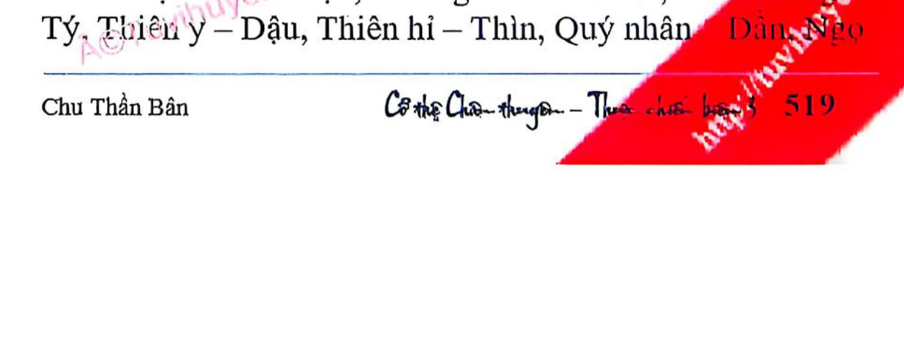
- **Cấu trúc Quẻ Dịch:**
  - **Quẻ chủ:** **Hỏa Sơn Lữ** (Cung Ly)  
    *Tượng quẻ:* Lữ thứ tha hương, người lữ khách bôn ba nơi đất khách quê người, chim đậu cành xa, điềm báo rời xa quê hương bản quán để lập thân.
  - **Quẻ biến:** **Lôi Hỏa Phong** (Cung Khảm)  
    *Tượng quẻ:* Phong thịnh, phong phú dồi dào, nhiều sự lựa chọn rộng mở, tương lai sáng lạn tràn trề sinh khí.
- **Bảng chi tiết Lục hào:**

| Hào | Thế/Ứng | Lục thân (Chủ) | Can Chi | Biến động | Lục thân (Biến) | Can Chi (Biến) | Thần sát / Phục | Lục thú |
|:---:|:---:|:---|:---|:---:|:---|:---|:---|:---|
| 6 | | Huynh Đệ | Tỵ - Hỏa | **O (Động)** | Tử Tôn | Tuất - Thổ | Dịch mã, Tuần không (Tuất) (hóa Mộ) | Đằng Xà |
| 5 | | Tử Tôn | Mùi - Thổ | tĩnh | Thê Tài | Thân - Kim | Hoa cái, Nhật lệnh | Câu Trần |
| 4 | **Ứng** | Thê Tài | Dậu - Kim | tĩnh | Huynh Đệ | Ngọ - Hỏa | Tai sát, Lộc thần, Thiên y | Chu Tước |
| 3 | | Thê Tài | Thân - Kim | tĩnh | Quan Quỷ | Hợi - Thủy | Kiếp sát, Dương nhẫn (phục Quan Quỷ Hợi Thủy) | Thanh Long |
| 2 | | Huynh Đệ | Ngọ - Hỏa | tĩnh | Tử Tôn | Sửu - Thổ | Quý nhân | Huyền Vũ |
| 1 | **Thế** | Tử Tôn | Thìn - Thổ | **X (Động)** | Phụ Mẫu | Mão - Mộc | Thiên hỷ, Nguyệt phá (phục Phụ Mẫu Mão Mộc) | Bạch Hổ |

---

### 3. Dụng thần & Loại quẻ

- **Phân loại quẻ:**
  - **Quẻ định hướng lựa chọn giáo dục tương lai cho con cái:** Phân định thiệt hơn giữa hai lộ trình học tập (trong nước vs du học nước ngoài).
  - **Quẻ Lữ biến Phong:** Ban đầu bôn ba xa xứ (Lữ), chuyển hóa thành chân trời mới phồn thịnh, đầy ắp cơ hội phát triển vững chắc (Phong).
- **Định vị Dụng thần cốt lõi:**
  1. **Dụng thần tổng quát (Hào Tử Tôn):** Xem việc con cái lấy hào Tử Tôn làm Dụng thần. Quẻ xuất hiện 3 hào Tử Tôn.
  2. **Dụng thần học trong nước (Hào sơ Tử Tôn Thìn Thổ Thế):** 
     - Con cái chưa thành niên chịu sự định hướng trực tiếp từ người lớn, số phận gắn liền ruột thịt nên lấy hào sơ Tử Tôn Thìn Thổ lâm Thế làm đại diện.
     - Nằm ở ngôi sơ (nội quái, vị trí trong cùng nhất) đại diện cho môi trường giáo dục trong nước.
  3. **Dụng thần xuất ngoại du học (Hào 6 Tử Tôn Tuất Thổ biến từ Huynh Đệ Tỵ Hỏa):** 
     - Nằm ở ngôi lục (ngoại quái, vị trí ngoài cùng nhất) đại diện cho phương trời hải ngoại xa xôi.
  4. **Kỵ thần học vấn (Phụ Mẫu Mão Mộc):** Hồi đầu khắc phạt hào Thế Thìn Thổ, biểu thị áp lực thi cử và bệnh lý học đường.

---

### 4. Luận giải chi tiết

#### 1. Nguy cơ trầm cảm học đường nếu tiếp tục học trong nước
- **Thực trạng hào Thế bị tổn thương:** 
  Hào sơ Tử Tôn Thìn Thổ lâm Bạch Hổ, bị Nguyệt kiến Mậu Tuất xung phá thành **Nguyệt phá**. Bạch Hổ chủ sự bực dọc, phẫn uất, oán thán và hành vi mất kiểm soát. Điều này tương thích hoàn toàn với tâm lý khủng hoảng, cắn rứt của đứa trẻ hiện tại.
- **Hồi đầu khắc – Bệnh lý tiềm tàng:**
  - Hào sơ Thìn Thổ phát động hóa Phụ Mẫu Mão Mộc quay lại **Hồi đầu khắc**. Phụ Mẫu là bài vở, trường lớp, áp lực thi cử. Sự hồi đầu khắc này khẳng định áp lực giáo dục trong nước đang trực tiếp hủy hoại tinh thần của con.
  - Hiện tại bị Nguyệt phá nên tai họa chưa phát tác toàn phần (mới dừng ở mức bực bội bất an). Khi đến kỳ "bổ phá", lực khắc phạt sẽ giáng xuống mãnh liệt. Thìn Thổ đại diện cho tư duy, nhận thức và giấc ngủ; kết hợp với Bạch Hổ và Thiên y cảnh báo nguy cơ suy nhược thần kinh, mất ngủ kéo dài, thậm chí tiến triển thành bệnh hưng cảm hoặc trầm cảm phân liệt (Chu Thần Bân liên hệ dẫn chứng thực tế trường hợp năm 2014 của con gái đồng môn Bắc Kinh từng phát bệnh tâm lý tương tự vì áp lực trường chuyên lớp chọn).
  - Hào Ứng Chu Tước Thê Tài Dậu Kim xung khắc Phụ Mẫu Mão Mộc cũng phản ánh điểm số học tập sẽ tụt dốc không phanh nếu tiếp tục gượng ép.

#### 2. Kỹ thuật đối sánh Nội quái vs Ngoại quái
- **Nguyên lý không gian Dịch học:** Nội quái đại diện cho nội địa (trong nước), Ngoại quái đại diện cho xuất ngoại (nước ngoài).
- **Cặp hào đối sánh:** 
  Hào sơ Tử Tôn Thìn Thổ ở nội quái đối sánh trực diện với Tử Tôn Tuất Thổ ở hào lục ngoại quái. Cả hai cùng hành Thổ và tạo thành cặp tương xung Thìn – Tuất. Sự tương phản này tạo nên một phép đối sánh rõ ràng giữa hai lựa chọn: ở lại chịu khắc phạt hay xuất ngoại tìm đường sống?

#### 3. Cơ chế "Tiên nhân chỉ lộ" và phán quyết xuất ngoại
- **Động hóa Mộ mang thông tin chỉ đạo:**
  Hào 6 Huynh Đệ Tỵ Hỏa phát động biến ra Tử Tôn Tuất Thổ (hóa Mộ). Trong Lục Hào, hào động hóa Mộ lại đắc Nguyệt kiến sinh trợ không phải ngẫu nhiên, mà đây chính là thông tin chỉ dẫn đặc biệt do quẻ tượng ban tặng – cổ nhân gọi là **"Tiên nhân chỉ lộ"** (ngón tay thần chỉ đường).
- **Huynh Đệ sinh trợ hào Thế:**
  Huynh Đệ Tỵ Hỏa ở quẻ chủ phát động sinh vượng mạnh mẽ cho hào Thế Tử Tôn Thìn Thổ. Điều này minh chứng dứt khoát rằng con đường du học sẽ hồi sinh thể chất và tinh thần của con, mang lại lối thoát viên mãn cho cả gia đình.
- **Dấu hiệu người thân đi kèm:**
  Huynh Đệ mang **Dịch mã** (Tỵ Hỏa) – biểu thị hành trình bay xa qua đại dương. Hào Huynh Đệ chủ tình thân bè bạn, chỉ dẫn giải pháp tốt nhất là phụ huynh (mẹ hoặc cha) cùng xuất ngoại đi theo để chăm sóc, đồng hành cùng con nơi đất khách.
- **Phương vị Bắc Mỹ:**
  Tuất Thổ thuộc phương Tây Bắc. Tính từ lãnh thổ Trung Quốc theo đường cong địa cầu, hướng Tây Bắc qua châu Âu chính là vùng trời Bắc Mỹ (Hoa Kỳ và Canada). Quẻ biến ra Lôi Hỏa Phong ngụ ý gia đình sẽ có rất nhiều trường học và môi trường giáo dục phong phú để lựa chọn.

---

### 5. Kết luận & Ứng kỳ thực tế

- **Lời giải đoán của Chu Thần Bân:**
  1. Tuyệt đối không để con tiếp tục theo học chương trình thi cử gò bó trong nước, nếu cố ép ắt sẽ biến thành tâm bệnh trầm cảm khôn lường.
  2. Quyết đoán đưa con đi du học tại khu vực Bắc Mỹ (Mỹ hoặc Canada), đồng thời mẹ hoặc người thân nên đi cùng để làm chỗ dựa tinh thần cho đứa trẻ.
- **Phản hồi thực tế (Feedback):**
  - Gia đình phụ huynh lập tức hành động, đi khảo sát thực tế hàng loạt trường trung học uy tín tại bờ Đông, bờ Tây nước Mỹ và các thành phố Vancouver, Toronto của Canada (đúng như tượng quẻ Phong đa dạng).
  - Cuối cùng, gia đình quyết định chọn một trường trung học chất lượng cao tại Canada, người mẹ trực tiếp sang định cư chăm sóc con.
- **Ứng kỳ chiêm nghiệm:**
  - Sau hơn 2 năm sinh sống và học tập tại Canada, phản hồi thực tế vô cùng mỹ mãn: đứa trẻ thích nghi tuyệt vời, tâm tính trở nên vui vẻ, phóng khoáng, thoát hoàn toàn khỏi bóng ma áp lực, thậm chí còn vươn lên thành học sinh xuất sắc của trường.

---

### 6. Bài học tâm pháp & Quy tắc cốt lõi

- **Quy tắc Lục Hào rút ra:**
  1. **Kỹ thuật đối sánh Nội quái vs Ngoại quái (trang 486):** Khi đứng trước bài toán xuất ngoại hay ở lại trong nước, phân định rạch ròi qua vị trí nội quái (hào sơ) và ngoại quái (hào lục). Sự tương phản của hai hào cùng tính chất sẽ chỉ rõ cán cân cát hung của môi trường sống.
  2. **Cơ chế "Tiên nhân chỉ lộ" (trang 488):** Động hào hóa Mộ được Nguyệt sinh mang Dịch mã đóng vai trò như ngọn hải đăng chỉ đường từ bi của Dịch học, cung cấp lời giải tối ưu cho những bế tắc của nhân sinh.
- **Tâm pháp giải đoán:**
  - Giáo dục đích thực là nuôi dưỡng tâm hồn và nhân cách, không phải là cuộc đua thành tích mù quáng. Bậc làm cha mẹ và người học Dịch phải có tâm từ bi, kịp thời nhìn thấy dấu hiệu "hồi đầu khắc" để giải phóng con cái khỏi xiềng xích áp lực, đưa con đến bến đỗ phong thịnh hợp với thiên tính của mình.

## THỰC CHIẾN 196: CỔ PHIẾU NÀY TRONG NĂM NAY CÓ TĂNG VỌT KHÔNG

---

### 1. Bối cảnh & Câu hỏi

- **Bối cảnh chi tiết:** 
  Một học viên đồng môn đang nắm giữ một khối lượng lớn cổ phiếu của một doanh nghiệp niêm yết trên thị trường chứng khoán. Thời điểm đó, trên thị trường lan truyền rầm rộ tin đồn về một thương vụ thâu tóm và tái cơ cấu tài sản chấn động, thậm chí giới đầu tư còn đồn thổi có sự tham gia của vị tỷ phú giàu nhất nước. Nhờ hiệu ứng tin đồn thúc đẩy dòng tiền đầu cơ ồ ạt đổ vào, mã cổ phiếu này đã tăng mạnh 20% đến gần 30% so với vùng giá mua ban đầu. Dù đã đạt được mức sinh lời rất hấp dẫn, thị trường vẫn tiếp tục truyền tai nhau những kỳ vọng phi thực tế rằng cổ phiếu này chắc chắn sẽ nhân đôi, thậm chí nhân ba trong thời gian tới.
- **Tâm lý & Câu hỏi ẩn ý:** 
  Đương số bị lòng tham và tâm lý sợ bỏ lỡ cơ hội (FOMO) chi phối mạnh mẽ. Dù đã có lãi lớn, anh vẫn không muốn chốt lời sớm vì sợ mất ăn nhịp tăng phi mã tiếp theo. Mang theo ảo tưởng về một đợt tăng trần dữ dội, anh tìm gặp Chu Thần Bân để hỏi: "Mã cổ phiếu này trong năm nay liệu có tăng vọt không?"
- **Thời gian chiêm đoán:**
  - Dương lịch: Ngày 02 tháng 11 năm 2016, 10:10.
  - Giờ Bắc Kinh: Ngày 02/11/2016, 10:10.
  - Can chi: Năm Bính Thân, tháng Mậu Tuất, ngày Mậu Tý, giờ Đinh Tỵ.

---

### 2. Dữ kiện & Bảng quẻ Crop

- **Thời không chiêm nghiệm:**
  - Tháng Mậu Tuất: Thổ vượng, Kim tướng, Hỏa hưu, Thủy tử.
  - Ngày Mậu Tý: Thủy vượng, Tướng tinh.
  - Tuần không: **Ngọ, Mùi** (Tuần Giáp Thân, Ngọ Mùi không vong).
- **Thần sát:**
  - Tướng tinh: Tý
  - Hoa cái: Thìn
  - Dịch mã: Dần
  - Tai sát: Ngọ (Lâm Tuần không)
  - Mưu tinh: Tuất
  - Đào hoa: Dậu
  - Kiếp sát: Tỵ
  - Lộc thần: Tỵ
  - Dương nhẫn: Ngọ (Lâm Tuần không)
  - Vong thần: Hợi
  - Văn xương: Thân
  - Thiên y: Dậu
  - Thiên hỷ: Thìn
  - Quý nhân: Sửu, Mùi (Mùi lâm Tuần không)
- Dữ kiện bảng quẻ và các thông số chiêm đoán:
  - **Bảng 196.1** Đồ hình quẻ Thực chiến 196:
    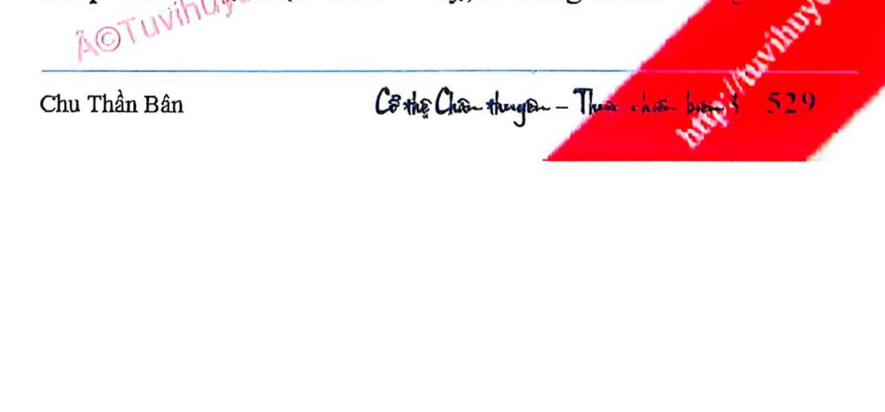
- **Cấu trúc Quẻ Dịch:**
  - **Quẻ chủ:** **Địa Trạch Lâm** (Cung Khôn)  
    *Tượng quẻ:* Đã chạm đến ngưỡng tới hạn, thời gian không còn nhiều, chuông cảnh báo vang lên đòi hỏi người hỏi phải ra quyết định ngay lập tức.
  - **Quẻ biến:** **Bát Thuần Khôn** (Cung Khôn, Quẻ Lục Xung)  
    *Tượng quẻ:* Đất bằng sụp đổ, chấn động chia lìa, biến Lục Xung trong đầu tư tài chính là lời cảnh báo khẩn thiết giục giã nhà đầu tư phải nhanh chóng thoát hàng.
- **Bảng chi tiết Lục hào:**

| Hào | Thế/Ứng | Lục thân (Chủ) | Can Chi | Biến động | Lục thân (Biến) | Can Chi (Biến) | Thần sát / Phục | Lục thú |
|:---:|:---:|:---|:---|:---:|:---|:---|:---|:---|
| 6 | | Tử Tôn | Dậu - Kim | tĩnh | Tử Tôn | Dậu - Kim | Đào hoa, Thiên y | Chu Tước |
| 5 | **Ứng** | Thê Tài | Hợi - Thủy | tĩnh | Thê Tài | Hợi - Thủy | Vong thần, Nhật sinh | Thanh Long |
| 4 | | Huynh Đệ | Sửu - Thổ | tĩnh | Huynh Đệ | Sửu - Thổ | Quý nhân | Huyền Vũ |
| 3 | | Huynh Đệ | Sửu - Thổ | tĩnh | Quan Quỷ | Mão - Mộc | Quý nhân | Bạch Hổ |
| 2 | **Thế** | Quan Quỷ | Mão - Mộc | **O (Động)** | Phụ Mẫu | Tỵ - Hỏa | Kiếp sát, Lộc thần (Tỵ) | Đằng Xà |
| 1 | | Phụ Mẫu | Tỵ - Hỏa | **O (Động)** | Huynh Đệ | Mùi - Thổ | Kiếp sát, Lộc thần, Quý nhân (Mùi tuần không) | Câu Trần |

---

### 3. Dụng thần & Loại quẻ

- **Phân loại quẻ:**
  - **Quẻ đầu tư tài chính chứng khoán:** Đương số đã nắm giữ cổ phiếu, hỏi về tiềm năng tăng giá và điểm thoái lui dòng vốn.
  - **Quẻ Lâm biến Khôn Lục xung:** Tình huống đã đến điểm giới hạn tột cùng (Lâm), quẻ biến Lục xung báo hiệu thị trường sắp đảo chiều đổ vỡ bất ngờ.
- **Định vị Dụng thần cốt lõi:**
  1. **Quy tắc phân biệt Dụng thần cổ phiếu (trang 495):**
     - Nếu *chưa mua cổ phiếu*: Lấy hào **Tử Tôn** làm Dụng thần (đại diện cho quyết định rót vốn đầu tư).
     - Nếu *đã mua cổ phiếu rồi*: Lợi nhuận và giá trị tài sản gắn chặt trực tiếp vào hào **Thê Tài** (Dụng thần tài vận).
  2. **Dụng thần tài vận (Thê Tài Hợi Thủy ở Hào 5 Ứng):** 
     - Mang Vong thần, được Nhật kiến trợ sinh.
     - **Trọng điểm then chốt:** Thê Tài Hợi Thủy là **hào tĩnh**, hoàn toàn không phát động. Đây là minh chứng tuyệt đối khẳng định: **Cổ phiếu hoàn toàn không có khả năng tăng vọt**.
  3. **Hào Thế (Quan Quỷ Mão Mộc):** Đại diện cho vị thế nắm giữ của nhà đầu tư, đang phát động biến ra mầm mống bất lợi.

---

### 4. Luận giải chi tiết

#### 1. Bản chất hào Dụng thần tĩnh và sự đối xung Tỵ – Hợi
- **Thê Tài tĩnh triệt tiêu đà tăng:** Một sự việc muốn bùng nổ vượt bậc bắt buộc Dụng thần phải phát động vượng tướng. Ở đây Thê Tài Hợi Thủy đứng yên bất động, chứng tỏ dòng tiền đẩy giá đã cạn kiệt, giấc mơ cổ phiếu tăng vọt nhân đôi nhân ba chỉ là ảo tưởng do tin đồn tạo ra.
- **Xung khắc áp lực bán:** Đối xung trực diện với Thê Tài Hợi Thủy là Hào 1 Phụ Mẫu Tỵ Hỏa. Nếu Hợi Thủy đại diện cho đà tăng thì Tỵ Hỏa đại diện cho áp lực bán tháo và sụt giá. Việc Phụ Mẫu Tỵ Hỏa phát động mãnh liệt trong khi Thê Tài Hợi Thủy bất động báo hiệu lực bán chốt lời của các tay to sắp tràn ngập nhấn chìm thị trường.

#### 2. Cơ chế Kiều tiếp liên động (bắc cầu) và hiểm họa "Tùy Quỷ nhập mộ"
- **Động hướng của hào Thế:** Hào 2 Quan Quỷ Mão Mộc giữ hào Thế phát động hóa Phụ Mẫu Tỵ Hỏa. Phụ Mẫu chủ về sự trì trệ, đè nặng và kéo lùi nhịp tăng.
- **Cơ chế bắc cầu qua Hào sơ:**
  - Hào Thế Quan Quỷ Mão Mộc động biến Phụ Mẫu Tỵ Hỏa.
  - Đồng thời, Hào 1 Phụ Mẫu Tỵ Hỏa cũng tự mình phát động biến ra Huynh Đệ Mùi Thổ.
  - Hai hào Tỵ Hỏa cùng một tính chất ngũ hành đóng vai trò chiếc cầu nối (**kiều tiếp liên động**), dẫn dắt dòng năng lượng của hào Thế Quan Quỷ Mão Mộc kết nối thẳng vào Huynh Đệ Mùi Thổ.
- **Tùy Quỷ nhập mộ – Kịch bản giam lỏng dòng vốn:**
  - Trong ngũ hành, Mùi Thổ chính là **Mộ khố** của Quan Quỷ Mão Mộc.
  - Hào Thế Quan Quỷ thông qua bắc cầu mà rơi thẳng vào Mộ khố của chính mình, thuật ngữ Lục Hào gọi là hiện tượng **"Tùy Quỷ nhập mộ"** (theo Quỷ vào mộ).
  - Trong đầu tư tài chính, "nhập mộ" là điềm báo đáng sợ nhất: biểu thị trạng thái bị kẹp hàng nặng nề, tài khoản bị giam lỏng, dòng vốn tê liệt hoàn toàn và phải gánh chịu mức lỗ ngày càng trầm trọng mà không thể thoát ra.

#### 3. Quẻ biến Lục xung trong tài chính – Lời chỉ dẫn từ bi tối hậu
- **Ý nghĩa quẻ biến Lục xung (trang 498):** 
  Trong chiêm bói giao dịch chứng khoán, nếu quẻ biến là Lục hợp thì biểu thị bị cầm tù, dính chặt không buông; ngược lại, nếu quẻ biến là **Lục xung** thì đó là một cơ hội thoát hiểm hiếm hoi.
- **Lời cảnh báo từ bi:** Quẻ Lâm biến Bát Thuần Khôn Lục xung là chỉ dẫn từ bi mà Trời Đất ban cho: thời cơ đã đến lằn ranh đỏ, vũ trụ thúc giục nhà đầu tư phải lập tức bán sạch, chốt lời dứt khoát để bảo toàn vốn trước khi cơn bão bán tháo ập xuống quét sạch thành quả.

---

### 5. Kết luận & Ứng kỳ thực tế

- **Lời giải đoán của Chu Thần Bân:**
  1. Cổ phiếu không có bất kỳ cơ hội nào để tăng vọt như lời đồn. Đà tăng 30% hiện tại đã là đỉnh giới hạn của nhịp sóng này.
  2. Phải lập tức bán hết toàn bộ cổ phiếu đang nắm giữ, chốt lời rút vốn ra khỏi thị trường ngay tức khắc. Nếu chần chừ do dự, chắc chắn sẽ bị kẹt vốn đau đớn theo thế "Tùy Quỷ nhập mộ".
- **Ứng kỳ chiêm nghiệm & Thực tế lịch sử:**
  - Đúng đầu tháng 11 năm 2016 (từ ngày 06 đến ngày 10 tháng 11, khi bước sang tháng Hợi), cổ phiếu chạm đỉnh tuyệt đối ở mức **23 đồng/cổ phiếu** rồi lập tức đảo chiều lao dốc dữ dội.
  - Từ sau cú sập đầu tháng 11/2016, cổ phiếu trượt dài liên miên qua suốt các năm 2017, 2018 và cho đến thời điểm Chu Thần Bân viết lại án lệ này.
  - Giá cổ phiếu từ đỉnh 23 đồng đã giảm sâu mất 2/3 giá trị, chỉ còn dao động lay lắt quanh mốc **10 đồng** (chưa vượt nổi 11 đồng). Những người ôm mộng nhân đôi nhân ba và không kịp thoát hàng đều bị chôn vùi toàn bộ tài sản đúng như tượng "Tùy Quỷ nhập mộ".

---

### 6. Bài học tâm pháp & Quy tắc cốt lõi

- **Quy tắc Lục Hào rút ra:**
  1. **Phân biệt Dụng thần cổ phiếu đã mua vs chưa mua (trang 495):** Chưa mua thì Tử Tôn là Dụng thần (hành động đầu tư); đã mua rồi thì Thê Tài là Dụng thần duy nhất. Thê Tài không động thì tuyệt đối không có chuyện tăng vọt.
  2. **Cơ chế kiều tiếp liên động và Tùy Quỷ nhập mộ (trang 497):** Khi hào Thế biến thành hào khác, mà hào đó lại phát động ở vị trí khác dẫn nhập vào Mộ khố, đây là chiếc cầu tử thần dẫn dòng vốn của nhà đầu tư vào hố chôn kẹt hàng.
  3. **Ý nghĩa quẻ biến Lục xung trong đầu tư (trang 498):** Quẻ biến Lục xung là lời cảnh báo khẩn cấp đòi hỏi phải lập tức cắt đứt vị thế, thoát hàng bảo toàn vốn và lợi nhuận.
- **Tâm pháp giải đoán:**
  - Bản chất của đầu tư tài chính (chứng khoán, tiền tệ kỹ thuật số) là kiểm soát rủi ro và quản trị lòng tham. Chu Thần Bân đúc kết kinh nghiệm 26 năm chinh chiến thị trường: *"Tiền kiếm không bao giờ hết, nhưng thua lỗ thì có thể mất sạch."* Khi có lợi nhuận từ 20-30%, hãy học cách chốt lời đưa vốn về mức an toàn. Người học Dịch biết nhìn thấy quẻ biến Lục xung để dứt khoát buông bỏ lòng tham thì mới có thể đứng vững trên thương trường sinh tử.

---
