# Giải Đáp Nghi Vấn Trong Tăng San Bốc Dịch Bình Thích

## Chương 3: Nghi vấn về hào Thông quan và phân biệt Kiêm đoán - Chuyên đoán

- **Lý luận nền tảng về hào Thông quan**: Trong tương tác sinh khắc Lục Hào, khi Kỵ thần phát động khắc thương Dụng thần, sự hiện diện và phát động của hào Thông quan tạo ra nhịp cầu chuyển tiếp, biến thế tương khắc trực xung thành chuỗi tương sinh liên tục ($\text{Kỵ thần} \to \text{Thông quan} \to \text{Dụng thần}$).
  - Trong ngũ hành: Thổ khắc Thủy, nếu có Kim động sẽ tạo thành thế liên tục tương sinh $\text{Thổ sinh Kim} \to \text{Kim sinh Thủy}$, triệt tiêu sát khí bức bách của Thổ.
  - Một hào Thông quan đơn lẻ vẫn có khả năng chuyển hóa và thông quan đồng thời cho hai hào Kỵ thần cùng hành cùng phát động, miễn là Dụng thần có căn khí tự thân vững vàng.

- **Quy tắc "Nguyệt hợp là vượng" của Dụng thần**: Dụng thần hoặc Phục thần được Nguyệt kiến tương hợp thì được xác lập là đắc khí vượng tướng, sở hữu nội lực tự thân mạnh mẽ.
  - Điển hình: Tử Tôn Hợi thủy gặp tháng Dần được lục hợp ($D\hat{a}n \text{ hợp } H\text{ợ}i$), dù hưu tù hay phục tàng vẫn được tính là vượng tướng hữu khí.
  - "Dụng thần có khí có thể chống lại thiên binh vạn mã": Khi Dụng thần tự thân đắc khí, nó có sức đề kháng cao trước áp lực của Kỵ thần nhiều tầng.

- **Phân định phương pháp luận giữa Kiêm đoán và Chuyên đoán**: Quy chuẩn giải đoán một quẻ lưu niên (kiêm đoán) khác biệt căn bản với một quẻ lập ra để chuyên hỏi về một sự vụ cụ thể (chuyên đoán).
  - Quẻ lưu niên lấy cát hung của hào Thế làm trung tâm tối thượng; việc tra cứu vận hạn của thân nhân (như con cái) chỉ là kiêm đoán thứ yếu.
  - Trong kiêm đoán, trọng tâm tuyệt đối đặt tại Dụng thần; không đòi hỏi Nguyên thần phải vượng tướng toàn mỹ hay hào Thông quan phải vô khuyết.
  - Trong chuyên đoán (chuyên hỏi bệnh tật, sinh tử), Nguyên thần giữ vai trò then chốt sinh tử; nếu Dụng thần vô khí, khắc nhiều sinh ít thì Nguyên thần cũng không thể cứu giải.
  - Tâm niệm khi gieo quẻ quyết định thần cơ: Gieo một quẻ kiêm hỏi nhiều việc khác với việc gieo từng quẻ nối tiếp cho từng việc riêng biệt.

- **Minh chứng đồ quẻ chiêm (Hình 1)**: Sơ đồ quẻ phản ánh tương tác hào động, biến hóa sinh khắc và ứng kỳ thực tế.
  - **Hình 1.** Sơ đồ quẻ Quy Muội biến Càn
    - 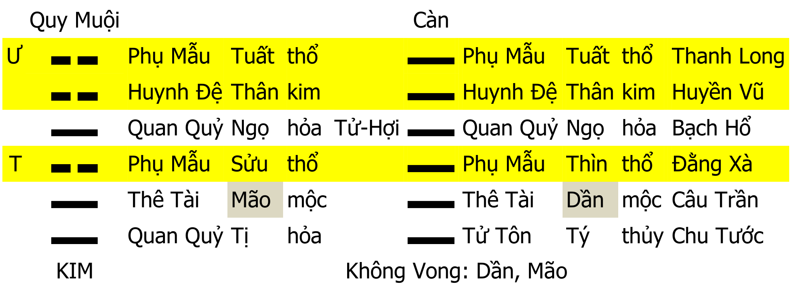
    - **Hình này chứng minh điều gì**
      - Minh chứng cấu trúc quẻ Lôi Trạch Quy Muội biến Càn Vi Thiên: Kỵ thần Phụ Mẫu Sửu thổ (hào 3) và Tuất thổ (hào 6) lưỡng động khắc Tử Tôn Hợi thủy phục tàng tại hào 4, được hào 5 Huynh Đệ Thân kim phát động thông quan hóa sát.
      - Chứng minh luận điểm sâu sắc của Đại sư Vương Hổ Ứng: Trong quẻ lưu niên kiêm đoán, hào Thông quan Thân kim dù lâm mùa xuân hưu tù, Nguyệt phá, Nhật khắc vẫn chuyển hóa thành công sát khí của hai tầng Phụ Mẫu Thổ, che chở cho Dụng thần Tử Tôn Hợi thủy đắc Nguyệt hợp vượng tướng.
    - **Từ đâu mà thấy được**
      - Nhật nguyệt: Ngày Bính Ngọ, tháng Dần (Tuần không: Dần, Mão).
      - Hào 3 Phụ Mẫu Sửu thổ động hóa Thìn thổ (Đằng Xà), hào 6 Phụ Mẫu Tuất thổ động (Thanh Long) cùng phát động khắc Thủy.
      - Hào 5 Huynh Đệ Thân kim động (Huyền Vũ) đóng vai trò trung gian thông quan Thổ sinh Kim, Kim sinh Thủy.
      - Hào 4 Quan Quỷ Ngọ hỏa có Phục thần Tử Tôn Hợi thủy, được Nguyệt kiến Dần mộc tương hợp ($D\hat{a}n \text{ hợp } H\text{ợ}i$).

### Quy tắc Hào Thông quan và Phép phân biệt Kiêm đoán - Chuyên đoán

- **Định nghĩa và cơ chế vận hành của Hào Thông quan**:
  - Hào Thông quan là hào trung gian đứng giữa hai ngũ hành tương khắc, nhận lực sinh từ kẻ khắc và truyền lực sinh sang kẻ bị khắc.
  - Công thức dẫn hóa: Khi Kỵ thần khắc Dụng thần, nếu hào sinh Dụng thần (cũng là hào được Kỵ thần sinh) phát động, quan hệ chuyển đổi thành $\text{Kỵ thần} \xrightarrow{\text{sinh}} \text{Thông quan} \xrightarrow{\text{sinh}} \text{Dụng thần}$.
  - Sức chịu tải của Thông quan: Trong cấu trúc quẻ động, một hào Thông quan duy nhất có thể tiếp nhận và phân lưu năng lượng từ hai hào Kỵ thần cùng loại, ngăn chặn sự xâm phạm trực tiếp vào Dụng thần.

- **Tiêu chí Dụng thần và Nguyên thần theo hình thái chiêm bốc**:
  - Đối với hình thái Chuyên đoán (chuyên xem một người hoặc một việc):
    - Đòi hỏi cả Dụng thần và Nguyên thần đều phải có căn khí hoặc không bị tổn thương nghiêm trọng.
    - Nếu Dụng thần hưu tù suy bại mà Nguyên thần lại lâm Mộ, Tuyệt, Nguyệt phá, Nhật khắc thì hung họa khó tránh.
  - Đối với hình thái Kiêm đoán (quẻ tổng quát, quẻ lưu niên):
    - Trọng điểm duy nhất là kiểm tra xem Dụng thần có khí hay không; không đòi hỏi các chuỗi mắt xích phụ trợ phải hoàn hảo.
    - Chỉ cần Dụng thần đắc khí (được Nguyệt lệnh sinh phù hoặc tương hợp), bản thân nó đủ sức đề kháng các xung động ngoại cảnh.
    - Nguyên thần và hào Thông quan trong quẻ kiêm đoán chủ yếu phản ánh trạng thái hoàn cảnh (thủ tượng) chứ không nắm quyền quyết định sinh tử cát hung của đối tượng kiêm hỏi.

### Ví dụ 1: Xem con trai sắp gặp hung trong quẻ lưu niên (Quẻ Quy Muội biến Càn)

- **Đề bài**: Một người gieo quẻ lưu niên xem vận trình trong năm vào ngày Bính Ngọ tháng Dần. Khi cầm quẻ đến hỏi, người này bày tỏ nỗi lo lắng tột cùng vì con trai được dự báo sắp gặp hung họa. Hơn 80 dự trắc sư Lục Hào danh tiếng đương thời đều đồng loạt phán đoán người con trai sẽ gặp đại hung, duy chỉ có Đại sư Vương Hổ Ứng khẳng định người con bình an vô sự.
- **Dữ kiện**
  - Thời gian: Ngày Bính Ngọ, tháng Dần (Tuần không: Dần, Mão).
  - Quẻ chủ: Lôi Trạch Quy Muội (thuộc cung Đoài).
  - Quẻ biến: Bát Thuần Càn (thuộc cung Càn).
  - Biến động các hào:
    - Hào 1: Quan Quỷ Tị hỏa động biến Tử Tôn Tý thủy (Chu Tước).
    - Hào 2: Thê Tài Mão mộc động biến Thê Tài Dần mộc (Câu Trần).
    - Hào 3: Phụ Mẫu Sửu thổ (Thế) động biến Phụ Mẫu Thìn thổ (Đằng Xà).
    - Hào 4: Quan Quỷ Ngọ hỏa tĩnh, phục tàng Tử Tôn Hợi thủy (Bạch Hổ).
    - Hào 5: Huynh Đệ Thân kim động biến Huynh Đệ Thân kim (Huyền Vũ).
    - Hào 6: Phụ Mẫu Tuất thổ (Ứng) động biến Phụ Mẫu Tuất thổ (Thanh Long).
  - Sơ đồ quẻ: Tra cứu chi tiết tại **Hình 1** ở trên.
  - Nhìn vào:
    - Hào Dụng thần: Xem con cái lấy Tử Tôn làm Dụng thần. Tử Tôn Hợi thủy phục tàng tại hào 4 dưới Quan Quỷ Ngọ hỏa, được Nguyệt kiến Dần mộc lục hợp ($D\hat{a}n \text{ hợp } H\text{ợ}i$). Hào 1 lại động biến xuất thêm Tử Tôn Tý thủy.
    - Hào Kỵ thần: Phụ Mẫu là Kỵ thần khắc Tử Tôn. Trong quẻ có hai hào Phụ Mẫu lưỡng động: hào 3 Sửu thổ hóa Thìn thổ (tiến thần) và hào 6 Tuất thổ động.
    - Hào Thông quan / Nguyên thần: Huynh Đệ Thân kim tại hào 5 phát động, đứng ở vị thế trung gian giữa Thổ và Thủy. Xét theo thời lệnh, Thân kim vào mùa xuân bị tiết khí hưu tù, bị Nguyệt kiến Dần mộc xung thành Nguyệt phá, lại bị Nhật thần Ngọ hỏa khắc thương.
- **Quy tắc áp dụng**
  - Quy tắc Nguyệt hợp là vượng: Hào nhận được tương hợp của Nguyệt kiến thì được định tính là vượng tướng hữu khí, có nội lực tự vệ kiên cường.
  - Quy tắc Hào Thông quan: Hào động nhận khí sinh từ Kỵ thần và truyền dẫn sinh cho Dụng thần ($\text{Thổ sinh Kim} \to \text{Kim sinh Thủy}$), hóa giải sự bức hại trực diện.
  - Quy tắc phân biệt Kiêm đoán và Chuyên đoán: Quẻ lưu niên trọng Thế; khi xem kiêm việc của con cái, chỉ cần Dụng thần hữu khí là có thể chế ngự được Kỵ thần, không câu nệ suy vượng hưu tù của Nguyên thần hay Thông quan.
- **Lời giải**
  - **Bước 1**: Nhận định căn khí của Dụng thần Tử Tôn qua tương tác với Nguyệt kiến.
    - Căn cứ: Học thuyết "Nguyệt hợp là vượng" của Vương Hổ Ứng bình thích.
    - Nhìn vào: Hào 4 phục thần Tử Tôn Hợi thủy tương hợp chặt chẽ với Nguyệt kiến Dần mộc ($D\hat{a}n \text{ hợp } H\text{ợ}i$). Do được Nguyệt hợp nên Tử Tôn thực chất rất vượng, bản thân có đầy đủ sinh khí để tự bảo vệ.
  - **Bước 2**: Xác định vai trò chuyển hóa của hào Thông quan Huynh Đệ Thân kim.
    - Căn cứ: Thần cơ hiển lộ tại hào động; cơ chế liên tục tương sinh của hào Thông quan.
    - Nhìn vào: Hai hào Phụ Mẫu Sửu thổ và Tuất thổ đồng phát động, nhưng hào 5 Huynh Đệ Thân kim cũng phát động. Năng lượng của Thổ động tự nhiên tiết sang Kim, rồi từ Kim động chuyển hóa phù trợ cho Thủy, hình thành vòng tuần hoàn tương sinh liên hoàn.
  - **Bước 3**: Vận dụng nguyên lý Kiêm đoán trong quẻ lưu niên để định đoạt cát hung.
    - Căn cứ: Phân định ranh giới giữa quẻ lưu niên (kiêm đoán) và quẻ chuyên sự (chuyên đoán tật ách).
    - Nhìn vào: Đây là quẻ lưu niên lấy hào Thế làm chủ thể, việc xem con cái chỉ là kiêm đoán phát sinh. Khi kiêm đoán, chỉ cần Dụng thần đắc khí ("có khí có thể chống lại thiên binh vạn mã") là đủ bảo đảm an toàn tính mạng; tình trạng Thân kim bị Nguyệt phá Nhật khắc chỉ là chi tiết hoàn cảnh bên lề chứ không thể làm đảo lộn tính mạng của người con.
- **Đối thoại giải đáp nghi vấn**:
  - **Hỏi**: Tử Tôn hợp vượng có thể hiểu, nhưng hai thổ đến khắc, một Huynh sao có thể thông quan? Hơn nữa Huynh Đệ ở mùa xuân hưu tù, Nguyệt phá, Nhật khắc, đã bị tổn thương gốc rễ, sao có thể thông quan? Tôi có thể hiểu như thế này hay không: Quẻ niên vận, khi xem vượng suy biểu thị tình trạng ngay lúc đó, ngay lúc gieo quẻ người không sao, như vậy tình trạng của Nguyên thần cho biết sẽ tốt đẹp, do đó mà không sao?
  - **Đáp**: Quẻ này mấu chốt là Tử Tôn được Nguyệt hợp mà được vượng, nếu không biết thuyết Nguyệt hợp vượng thì rất khó lý giải điểm này.
  - **Hỏi**: Nguyệt hợp là vượng thì tôi có thể hiểu. Nhưng đoán con cháu là chuyện lâu dài, vẫn phải xem Nguyên thần chứ, có phải là tôi phân tích về Nguyên thần không thích hợp? Hơn nữa Dụng thần vượng tướng, nhưng Nguyên thần bị thương, đó cũng là không cát chứ? Ở tình huống kiêm đoán, chỉ xem Dụng thần, những cái khác như Nguyên thần có thể lấy tượng phải không?
  - **Đáp**: Đây không phải là tình huống đoán suốt đời của con cái, mà là đoán từ trong quẻ lưu niên. Vì vậy trọng điểm tại Dụng thần, nếu chỉ chuyên dự đoán bệnh tật của con cái thì Nguyên thần rất quan trọng.
  - **Hỏi**: Thân kim động mà thông quan hào Phụ Mẫu khắc Tử Tôn, trong quẻ Phụ Mẫu lưỡng động mà chỉ có một Thân kim thông quan, xin hỏi một Thân kim này có thể thông quan hai thổ khắc thủy hay không?
  - **Đáp**: Vấn đề này đã có người hỏi, đây là quẻ lưu niên, quẻ lưu niên lấy cát hung của hào Thế làm trung tâm, không phải là hào Tử Tôn, nhưng lúc đó người xem quẻ nói con ông ta sắp gặp hung, do đó mới bảo tôi phán đoán. Nếu quẻ này chỉ chuyên đoán cát hung của đứa con thì cách xem sẽ khác. Mức độ phán đoán của chuyên đoán và kiêm đoán là khác nhau. Chỉ cần Dụng thần có khí thì có thể chống lại thiên binh vạn mã, nhưng nếu hỏi cát hung của con cái mà Dụng thần vô khí, khắc nhiều sinh ít thì Nguyên thần cũng không thể cứu. Phán đoán của lần gieo quẻ thứ nhất và lần gieo quẻ thứ hai có sự khác biệt vi diệu. Một quẻ đoán nhiều việc, việc chính có sự khác biệt về mức độ so với việc kiêm hỏi. Hỏi xong một việc, lại hỏi một việc khác, phán đoán Dụng thần suy vượng của quẻ gieo ra cũng có sự khác biệt.
- **Kết quả**: Thực tế trong năm lưu niên đó, người con trai hoàn toàn bình an vô sự, không hề gặp phải bất kỳ tai họa nào. Phán đoán độc lập của Đại sư Vương Hổ Ứng ứng nghiệm chuẩn xác, đập tan phán đoán sai lệch của hơn 80 dự trắc sư đương thời.
- **Kiểm tra lại**:
  - Sai lầm của 80 dự trắc sư: Đánh đồng quẻ lưu niên kiêm đoán với quẻ chuyên đoán bệnh tật, máy móc nhìn thấy hai hào Phụ Mẫu Thổ khắc Thủy, thấy Nguyên thần Thân kim Nguyệt phá Nhật khắc liền vội vàng phán hung tử.
  - Sự chuẩn xác của Vương Hổ Ứng: Nắm vững quy tắc "Nguyệt hợp là vượng" ($D\hat{a}n \text{ hợp } H\text{ợ}i$ giúp Tử Tôn tự thân hữu khí) và thấu suốt bản chất của kiêm đoán (Dụng thần hữu khí thì chế ngự được quần khắc thông qua hào Thông quan phát động).

## Chương 9: Nghi vấn về Tham hợp quên sinh và Độc phát định ứng kỳ

- **Bản chất của quy tắc "Tham hợp quên sinh" và "Bị hợp không sinh"**:
  - Hào động khi phát động mà biến ra hào tương hợp (động hóa hợp) thì bị hào biến trói buộc chặt chẽ, mất đi công năng sinh khắc đối với các hào khác trong quẻ.
  - Về mặt bản chất động thái, hào biến câu thúc hào động khiến hào động rơi vào thế bị trói ("bị hợp không sinh"); danh xưng "tham hợp quên sinh" là thuật ngữ chuyên môn ước lệ được lưu truyền từ kinh điển cổ tịch.
  - Điều kiện để phục hồi năng lực tương sinh: Bắt buộc phải chờ đến thời điểm (ngày, giờ, tháng) xuất hiện địa chi tương xung với hào biến để "xung khai hào hợp", cởi bỏ trói buộc cho hào động.

- **Tiêu chí Độc phát định ứng kỳ (Thần triệu cơ ư động)**:
  - Một hào độc phát duy nhất trong quẻ là trung tâm phát lộ cơ trời ("thần cơ"), nắm giữ toàn bộ tiến trình biến hóa cát hung và định chuẩn thời điểm ứng kỳ.
  - Khi xuất hiện hào độc phát, người dự đoán phải tập trung toàn bộ tiêu điểm vào động thái sinh khắc, xung hợp của hào động đó, không bị phân tán hoặc câu nệ vào các hào tĩnh Nguyệt phá như các quy tắc tĩnh thông thường.

- **Quy tắc chọn Dụng thần khi có nhiều hào đồng hiện (Dụng thần đa hiện)**:
  - Khi quẻ xuất hiện nhiều hào cùng đại diện cho Dụng thần, nguyên tắc ưu tiên hàng đầu là chọn hào vượng tướng nhất (được Nguyệt kiến, Nhật thần trợ phù hoặc lâm Nguyệt, lâm Nhật) làm Dụng thần chân chính.
  - Hào Dụng thần lâm Nguyệt kiến nắm giữ lệnh tháng có đủ nguyên khí chống chọi với tai họa, làm gốc rễ sinh mệnh để xem xét cát hung.

- **Cơ chế Ám động trong quẻ Lục xung**:
  - Quẻ Lục xung tuy có tượng tản nhanh (chủ bệnh gần mau khỏi), nhưng nếu có hào tĩnh lâm Tuần Không bị Nhật thần tương xung thì sẽ khởi phát thành Ám động.
  - Ám động mang sát khí của Kỵ thần sẽ âm thầm khắc phạt Dụng thần dữ dội, khiến bệnh tình trầm trọng ngoài dự liệu và làm trì hoãn hiệu lực tán bệnh của quẻ Lục xung.

- **Minh chứng đồ quẻ chiêm (Hình 2)**: Sơ đồ quẻ phản ánh tương tác hào động, biến hóa sinh khắc và ứng kỳ thực tế.
  - **Hình 2.** Sơ đồ quẻ Càn biến Phong Thiên Tiểu Súc
    - 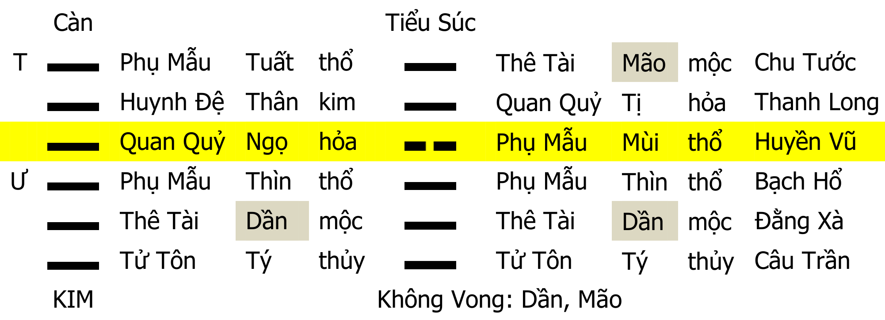
    - **Hình này chứng minh điều gì**
      - Minh họa trực quan cách cục một hào độc phát: Hào 4 Quan Quỷ Ngọ hỏa phát động hóa Phụ Mẫu Mùi thổ, tạo thành thế Lục hợp động hóa hợp ($Ngọ - Mùi \text{ hợp}$) khiến Nguyên thần Ngọ hỏa rơi vào tình trạng "tham hợp quên sinh" không thể trợ lực cho Dụng thần.
      - Làm rõ nguyên nhân bệnh tình nguy kịch do Hào 2 Thê Tài Dần mộc lâm Không bị Nhật xung thành Ám động khắc Dụng thần Phụ Mẫu Thìn thổ, và minh chứng cơ chế định ứng kỳ lành bệnh vào ngày Sửu xung khai Mùi thổ ($Sửu \text{ xung } Mùi$).
    - **Từ đâu mà thấy được**
      - Hào 4 Ngọ hỏa mang vạch dương động (`━━`), biến thành vạch âm tĩnh `━ ━` Phụ Mẫu Mùi thổ của quẻ Tiểu Súc, cấu thành quan hệ địa chi lục hợp giữa hào động và hào biến.
      - Hào 2 Thê Tài Dần mộc gặp Tuần Không (tuần Giáp Thìn: Dần, Mão không) bị Nhật thần Mậu Thân xung trực diện ($Thân \text{ xung } Dần$), phát động khắc trực tiếp Hào 3 Phụ Mẫu Thìn thổ lâm Nguyệt kiến.

### Ví dụ 2: Xem bệnh gần của cha, tham hợp quên sinh (Quẻ Càn biến Tiểu Súc)

- **Đề bài**: Vào ngày Mậu Thân tháng Thìn, có người đến xin bốc quẻ xem về bệnh mới phát (bệnh gần) của cha. Người này băn khoăn rằng Bát Thuần Càn vốn là quẻ Lục xung (cổ pháp định "bệnh gần gặp xung tất khỏi"), nhưng cha mình thực tế lại bệnh nặng nguy kịch; người đó muốn biết nguyên nhân sâu xa và phán đoán chính xác ngày nào bệnh mới thuyên giảm khỏi hẳn.
- **Dữ kiện**
  - Can chi: Ngày Mậu Thân, tháng Thìn.
  - Tuần không: Dần, Mão (tuần Giáp Thìn).
  - Quẻ chủ: Bát Thuần Càn (thuộc Càn kim, quẻ Lục xung).
  - Quẻ biến: Phong Thiên Tiểu Súc (Càn biến Tốn thượng quái).
  - Hào động: Hào 4 Quan Quỷ Ngọ hỏa động hóa Phụ Mẫu Mùi thổ (độc phát).
  - Sơ đồ quẻ: (Tham chiếu Hình 2) alt="Sơ đồ quẻ" />
  - Nhìn vào:
    - Hào 6: Phụ Mẫu Tuất thổ, lâm Chu Tước, an tĩnh, bị Nguyệt kiến Thìn thổ tương xung thành Nguyệt phá.
    - Hào 5: Huynh Đệ Thân kim, lâm Thanh Long, an tĩnh, đồng hành cùng Nhật thần Thân kim (lâm Nhật kiến).
    - Hào 4: Quan Quỷ Ngọ hỏa, lâm Huyền Vũ, phát động độc phát, biến Phụ Mẫu Mùi thổ, tạo thế Ngọ Mùi tương hợp.
    - Hào 3: Phụ Mẫu Thìn thổ (Ứng), lâm Bạch Hổ, an tĩnh, gặp Nguyệt kiến Thìn thổ trợ vượng (lâm Nguyệt kiến).
    - Hào 2: Thê Tài Dần mộc, lâm Đằng Xà, an tĩnh trong Tuần Không, bị Nhật thần Thân kim xung kích thành Ám động.
    - Hào 1: Tử Tôn Tý thủy, lâm Câu Trần, an tĩnh.
- **Quy tắc áp dụng**
  - *Quy tắc Dụng thần đa hiện*: Khi trong quẻ có nhiều hào Dụng thần (Phụ Mẫu Thìn thổ, Tuất thổ, Mùi thổ), phải chọn hào vượng tướng nhất được Nhật Nguyệt sinh phù hoặc lâm Nguyệt kiến làm Dụng thần.
  - *Quy tắc Ám động trong Tuần Không*: Hào an tĩnh gặp Không Vong bị Nhật thần tương xung thì xung khởi thành Ám động, có đầy đủ lực lượng sinh khắc như hào minh động.
  - *Quy tắc Tham hợp quên sinh (Bị hợp không sinh)*: Hào động hóa hào biến tương hợp thì lực lượng bị trói buộc, mất khả năng tương sinh cho Dụng thần.
  - *Quy tắc Xung khai định ứng kỳ*: Hào bị hợp trói buộc chỉ có thể phát huy tác dụng tương sinh khi đến ngày địa chi tương xung với hào biến để giải tỏa trói buộc.
  - *Tiêu chuẩn Độc phát định ứng kỳ (Thần triệu cơ ư động)*: Một hào độc phát nắm giữ trung tâm thần cơ biến hóa, ứng kỳ phải định theo động thái xung hợp của hào độc phát, không câu nệ vào hào tĩnh Nguyệt phá.
- **Lời giải**
  - **Bước 1**: Tuyển chọn Dụng thần chân chính
    - Căn cứ: Xem bệnh cho cha lấy hào Phụ Mẫu làm Dụng thần. Quẻ có Phụ Mẫu Tuất thổ (hào 6), Phụ Mẫu Thìn thổ (hào 3), và Phụ Mẫu Mùi thổ (hào 4 biến). Hào Tuất thổ bị tháng Thìn xung phá thành Nguyệt phá; hào Thìn thổ lâm Nguyệt kiến đắc lệnh chí vượng.
    - Nhìn vào: Hào 3 Phụ Mẫu Thìn thổ lâm Nguyệt kiến Bạch Hổ, được chọn làm Dụng thần đại diện cho người cha.
  - **Bước 2**: Xác định nguồn cơn bệnh tình nguy kịch
    - Căn cứ: Quẻ tuy là Lục xung nhưng sát khí của Kỵ thần phát tác dữ dội. Hào 2 Thê Tài Dần mộc là Kỵ thần khắc Phụ Mẫu thổ ($Mộc \text{ khắc } Thổ$). Dần mộc ngộ Tuần Không bị Nhật thần Mậu Thân xung kích ($Thân \text{ xung } Dần$) hóa thành Ám động, trực tiếp khắc phạt hào 3 Phụ Mẫu Thìn thổ.
    - Nhìn vào: Hào 2 Thê Tài Dần mộc Đằng Xà ám động dấy lên hung họa, khắc thương Dụng thần Thìn thổ khiến bệnh tình trở nặng.
  - **Bước 3**: Phân tích sự đình trệ tương sinh của Nguyên thần
    - Căn cứ: Hào 4 Quan Quỷ Ngọ hỏa độc phát vốn là Nguyên thần của Thổ ($Ngọ \text{ hỏa sinh } Thổ$). Theo lý thông thường, Kỵ thần Dần mộc ám động sẽ sinh Nguyên thần Ngọ hỏa, rồi Ngọ hỏa sinh Dụng thần Thìn thổ tạo thế liên hoàn tương sinh ("hai sinh"). Tuy nhiên, Ngọ hỏa động hóa ra Phụ Mẫu Mùi thổ, mà Ngọ và Mùi kết thành Lục hợp ($Ngọ - Mùi \text{ hợp}$). Hào biến Mùi thổ trói chặt Ngọ hỏa khiến Ngọ hỏa "tham hợp quên sinh", không thể cứu trợ Thìn thổ.
    - Nhìn vào: Hào 4 Ngọ hỏa động hóa Mùi thổ, hào động bị hào biến hợp trú chặt chẽ, chuỗi tương sinh bị đứt gãy hoàn toàn.
  - **Bước 4**: Xác định chuẩn xác ngày khỏi bệnh
    - Căn cứ: Muốn khôi phục lực sinh của Ngọ hỏa để chế hóa mộc khí cứu Thìn thổ, bắt buộc phải đợi đến ngày địa chi xung phá hào biến Mùi thổ. Ngày Sửu tới đây tương xung với Mùi thổ ($Sửu \text{ xung } Mùi$). Khi Mùi thổ bị xung tán mối hợp, Ngọ hỏa lập tức thoát khỏi trói buộc để tiếp nhận mộc khí tương sinh cho Thìn thổ, tà khí tiêu tán.
    - Nhìn vào: Hào biến Mùi thổ tại hào 4 và địa chi Sửu tương xung, ứng kỳ giải ách định chuẩn vào ngày Sửu.
- **Đối thoại giải đáp nghi vấn**:
  - *Nghi vấn 1 (Cơ chế Tham hợp quên sinh so với Bị hợp không sinh)*:
    - *Người hỏi thắc mắc*: Thiên kim phú nói "Tham sinh tham hợp, hình xung khắc hại đều vong". Hào biến có thể sinh khắc xung hợp hào động, còn hào động không thể sinh khắc xung hợp hào biến. Bản chất động hóa hợp là hào biến hợp trói hào động, khiến hào động rơi vào thế bị động. Vậy dùng cách nói "bị hợp không sinh" có chuẩn xác và hợp lý hơn "tham hợp quên sinh"?
    - *Vương Hổ Ứng phân tích*: "Bị hợp không sinh" và "tham hợp quên sinh" thực chất chỉ là hai góc độ biểu đạt của cùng một bản chất sự vật. Hợp bản chất là "vướng chân", bị vướng chân thì không thể sinh Dụng thần; khi gặp ngày xung khai hào hợp thì lập tức thông suốt sinh Dụng. Danh từ "tham hợp quên sinh" là thuật ngữ chuyên môn kinh điển đã lưu truyền hàng ngàn năm trong thuật số, việc sử dụng là tôn trọng quy ước thuật ngữ cổ truyền.
  - *Nghi vấn 2 (Độc phát định ứng kỳ so với Hào tĩnh Nguyệt phá)*:
    - *Người hỏi thắc mắc*: Khi xem bệnh của cha, tại sao chọn Dụng thần Thìn thổ mà không chọn Tuất thổ Nguyệt phá? Trong cuốn "Tế Thuyết Lục Hào Dự Trắc Học", thầy từng chỉ rõ nếu hai Dụng thần đều an tĩnh thì phải chọn hào Nguyệt phá làm ứng kỳ?
    - *Vương Hổ Ứng phân tích*: Thông thường khi các hào tĩnh thì chọn hào Nguyệt phá để định ứng kỳ (đợi ngày thực phá hoặc hợp phá). Nhưng quẻ này có kết cấu đặc thù: một hào độc phát duy nhất (Ngọ hỏa phát động). Trọng tâm và thần cơ của toàn quẻ tập trung toàn bộ ở hào độc phát theo nguyên lý "Thần triệu cơ ư động". Vì thế, ứng kỳ phải xác định theo hào độc phát, tuyệt đối không câu nệ rập khuôn vào hào tĩnh Nguyệt phá.
- **Kết quả**:
  - Lời đoán: Đến ngày Sửu, khi Mùi thổ bị xung khai giải tỏa hợp trói cho Ngọ hỏa, bệnh tình của cha sẽ hoàn toàn bình phục.
  - Thực chứng: Đúng đến ngày Sửu, người cha khỏi bệnh hoàn toàn.
- **Kiểm tra lại**:
  - Đối chiếu thực tiễn với lý số: Đúng ngày Sửu ($Sửu \text{ xung } Mùi$), lực trói của Mùi thổ tan rã, Ngọ hỏa giải phóng toàn bộ hỏa khí để dẫn hóa mộc khí từ Dần mộc ám động sinh trợ vững chắc cho Phụ Mẫu Thìn thổ. Tượng quẻ Lục xung "bệnh gần gặp xung tất khỏi" được ứng nghiệm viên mãn nhờ chìa khóa mở hợp của ngày Sửu.

## Chương 10: Nghi vấn về 5 loại Nguyên thần và khẩu thiệt hành trình

### Lý luận về 5 loại Nguyên thần và bản chất khái niệm "tự thân vượng tướng"
- **Năm loại Nguyên thần có năng lực tương sinh Dụng thần theo cổ thư**:
  - *Trường hợp 1*: Nguyên thần vượng tướng, hoặc lâm Nhật Nguyệt, hoặc được Nhật Nguyệt hào động sinh phù.
  - *Trường hợp 2*: Nguyên thần phát động hóa hồi đầu sinh, hoặc phát động hóa Tiến thần.
  - *Trường hợp 3*: Nguyên thần gặp Trường Sinh, Đế Vượng tại Nhật thần.
  - *Trường hợp 4*: Cả Nguyên thần và Kỵ thần đồng thời phát động trong quẻ (tạo thế liên tục tương sinh: Kỵ thần sinh Nguyên thần, Nguyên thần sinh Dụng thần).
  - *Trường hợp 5*: Nguyên thần vượng tướng phát động nhưng gặp Tuần Không, hoặc phát động hóa Tuần Không (đợi đến kỳ xuất Không sẽ sinh Dụng thần).
- **Nghi vấn học thuật về mệnh đề "tự thân vượng tướng" trong cổ thư**:
  - Người hỏi thắc mắc về tính logic trong mệnh đề: "Nguyên thần vượng tướng, hoặc lâm Nhật Nguyệt, hoặc được Nhật Nguyệt hào động sinh phù".
  - Nếu đã liệt kê hai trường hợp lâm Nhật Nguyệt và được Nhật Nguyệt / hào động sinh phù, thì trường hợp đầu tiên "tự thân vượng tướng" dựa vào đâu để vượng khi một hào không thể tự phát sinh vượng khí ngoài thời lệnh và động hào.
  - Hiện tượng dùng từ tương tự cũng xuất hiện trong *Tăng San Bốc Dịch* và *Bốc Phệ Chính Tông* khi mô tả Dụng thần và Kỵ thần mà không có phần giải thích thấu đáo.
- **Minh định học thuật của Vương Hổ Ứng lão sư**:
  - Cách hành văn và biểu đạt của cổ nhân trong các thư tịch cổ có phần ước lệ và thiếu chặt chẽ về mặt logic ngữ nghĩa.
  - Quy tắc bản chất: Khái niệm "Nguyên thần tự thân vượng tướng" thực chất chỉ là **Nguyên thần lâm Nhật Nguyệt** (lâm Nguyệt kiến hoặc lâm Nhật thần).
  - Bản chất ngũ hành Lục Hào: Suy vượng của hào bắt buộc phải dựa trên cơ sở Nhật kiến, Nguyệt kiến hoặc sự tương sinh của hào động; không tồn tại trạng thái tự thân vượng độc lập tách rời sinh khắc.

- **Minh định quẻ Giải biến Quy Muội về tương tác Huynh Đệ lâm Chu Tước**:
  - Hào sơ Huynh Đệ Dần mộc phát động lâm Chu Tước, gặp Không Vong: Biểu thị khẩu thiệt tranh chấp giữa đường nhưng Không Vong chủ hư kinh (sợ bóng sợ gió), người xem chỉ chứng kiến chứ không trực tiếp vướng vào kiện cáo.
  - Hào Thế Thê Tài Thìn thổ bị Huynh Đệ động khắc: Báo hiệu hao tổn tài vật, đồ dùng mang theo người (thực tế máy tính xách tay bị hỏng giữa đường).
  - Khẩu quyết xuất Không định kỳ khắc Thế: Dù hiện tại Không Vong không thể khắc Thế, nhưng nếu có việc quan trọng cần xuất Không thì vẫn ứng kỳ, song quẻ sự vụ ngắn ngày lấy tượng lúc gieo làm trọng.
  - **Hình 3.** Sơ đồ quẻ Giải biến Quy Muội
    - 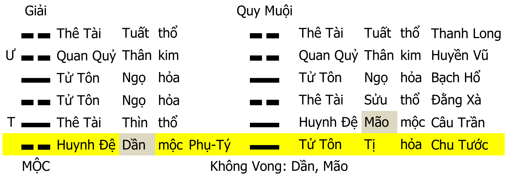
    - **Hình này chứng minh điều gì**
      - Hào sơ Huynh Đệ Dần mộc phát động lâm Chu Tước, gặp Tuần Không tại lệnh tháng, hóa Tử Tôn Tị hỏa, khắc hào Thế Thê Tài Thìn thổ, chứng minh điềm báo khẩu thiệt giữa đường nhưng là việc của người khác (sợ bóng sợ gió) chứ đương số không trực tiếp xung đột.
      - Hào Thế Thê Tài Thìn thổ bị Huynh Đệ động khắc chứng minh điềm báo tổn hao tài vật, hành lý mang theo (máy tính xách tay bị hỏng hóc).
    - **Từ đâu mà thấy được**
      - Quẻ chính Lôi Thủy Giải biến Lôi Trạch Quy Muội, gieo ngày Bính Ngọ tháng Dần (Tuần Không: Dần, Mão).
      - Hào sơ Huynh Đệ Dần mộc phát động lâm Chu Tước, gặp Tuần Không tại lệnh tháng, hóa Tử Tôn Tị hỏa.
      - Hào 2 Thê Tài Thìn thổ trì Thế được Nhật thần Ngọ hỏa sinh nhưng bị Nguyệt kiến Dần mộc khắc, suy vượng tương đương.

### Ví dụ 3: Học trò Nhật Bản xem chuyến đi sang Trung Quốc (Quẻ Giải biến Quy Muội)
- **Đề bài**: Vào ngày Bính Ngọ tháng Dần, học trò người Nhật Bản của Vương Hổ Ứng lão sư có kế hoạch sang Trung Quốc, đến nhờ thầy gieo quẻ dự đoán cát hung cho chuyến đi.
- **Dữ kiện**
  - Ngày gieo quẻ: Ngày Bính Ngọ, tháng Dần.
  - Tuần Không: Tuần Giáp Thìn $\rightarrow$ Dần mộc, Mão mộc lâm Tuần Không.
  - Quẻ chủ: Lôi Thủy Giải; Quẻ biến: Lôi Trạch Quy Muội.
  - Hào động: Hào sơ Huynh Đệ Dần mộc phát động biến Tử Tôn Tị hỏa.
  - Sơ đồ quẻ: (Tham chiếu Hình 3) alt="Sơ đồ quẻ" />
  - Nhìn vào:
    - Hào 2 Thê Tài Thìn thổ trì Thế, lâm Câu Trần.
    - Hào sơ Huynh Đệ Dần mộc lâm Chu Tước, phát động khắc Thế, phục tàng Phụ Mẫu Tý thủy, động hóa Tử Tôn Tị hỏa.
    - Dần mộc lâm Nguyệt kiến đồng thời lâm Tuần Không.
    - Bảng nạp giáp quẻ Giải biến Quy Muội:
      | Hào vị | Lôi Thủy Giải (Chủ) | Biến hóa | Lôi Trạch Quy Muội (Biến) | Lục thú |
      | :---: | :--- | :---: | :--- | :--- |
      | 6 | ▅▅  ▅▅ Thê Tài Tuất thổ | | ▅▅  ▅▅ Thê Tài Tuất thổ | Thanh Long |
      | 5 (Ứng) | ▅▅  ▅▅ Quan Quỷ Thân kim | | ▅▅  ▅▅ Quan Quỷ Thân kim | Huyền Vũ |
      | 4 | ▅▅▅▅▅ Tử Tôn Ngọ hỏa | | ▅▅▅▅▅ Tử Tôn Ngọ hỏa | Bạch Hổ |
      | 3 | ▅▅  ▅▅ Tử Tôn Ngọ hỏa | | ▅▅  ▅▅ Thê Tài Sửu thổ | Đằng Xà |
      | 2 (Thế) | ▅▅▅▅▅ Thê Tài Thìn thổ | | ▅▅▅▅▅ Huynh Đệ Mão mộc | Câu Trần |
      | 1 | ▅▅  ▅▅ Huynh Đệ Dần mộc (Phục: Tý thủy) | ○ | ▅▅▅▅▅ Tử Tôn Tị hỏa | Chu Tước |
- **Quy tắc áp dụng**
  - *Quy tắc xác định Dụng thần xuất hành*: Xem cát hung cho chính mình khi đi xa lấy hào Thế làm trung tâm để định an nguy họa phúc.
  - *Tượng vị trí hào sơ (Cước lực)*: Sơ hào đại diện cho cước lực (bàn chân, bước khởi đầu, phương tiện giao thông ban đầu rời bến/sân bay).
  - *Tượng Huynh Đệ lâm Chu Tước phát động*: Huynh Đệ chủ tranh chấp, bất hòa; Chu Tước chủ khẩu thiệt, tiếng cãi cọ thị phi; phát động khắc Thế chủ va chạm hoặc khẩu thiệt nhắm vào bản thân.
  - *Tượng Không Vong trong dự đoán khẩu thiệt*: Hào động lâm Tuần Không thì không có lực thực tế để khắc hại Thế; đồng thời Không Vong mang ý nghĩa biểu tượng là "hư kinh" (sợ bóng sợ gió, chuông reo báo động hão, kinh hãi vô căn cứ). Vì thế khẩu thiệt không phải do mình gây ra hay nhắm vào mình, mà là giữa đường chứng kiến người khác cãi vã.
  - *Tượng Thê Tài trì Thế bị khắc*: Thê Tài đại diện cho tiền tài, tư trang, đồ đạc mang theo; Thế Tài bị hào động khắc thương biểu thị tài vật, hành lý cá nhân tất bị hao tổn, hư hỏng.
- **Lời giải**
  - **Bước 1**: Đánh giá an nguy tổng quan của người hỏi qua hào Thế
    - Căn cứ: Bản thân đi xa lấy hào Thế Thê Tài Thìn thổ làm Dụng thần.
    - Nhìn vào: Hào 2 Thê Tài Thìn thổ trì Thế.
    - Phân tích: Thìn thổ bị Nguyệt kiến Dần mộc khắc, nhưng đồng thời được Nhật thần Ngọ hỏa tương sinh. Nguyệt khắc Nhật sinh tạo thành trạng thái suy vượng quân bình (tương đương), thân thể người hỏi không gặp nguy hiểm sinh tử, chuyến đi về cơ bản bình an.
  - **Bước 2**: Định vị khẩu thiệt trên lộ trình di chuyển
    - Căn cứ: Hào sơ là cước lực (phương tiện, chặng đầu lộ trình); Huynh Đệ lâm Chu Tước phát động chủ về việc phát sinh cãi cọ, khẩu thiệt.
    - Nhìn vào: Hào sơ Huynh Đệ Dần mộc động biến Tị hỏa, lâm Chu Tước.
    - Phân tích: Ngay chặng đầu khởi hành (từ sân bay di chuyển vào thành phố) ắt gặp chuyện tranh cãi ồn ào.
  - **Bước 3**: Ứng dụng quy tắc Không Vong giải mã chủ thể khẩu thiệt
    - Căn cứ: Quy tắc Không Vong giải trừ tai ách và thủ tượng "hư kinh" (sợ bóng sợ gió).
    - Nhìn vào: Ngày Bính Ngọ tuần Giáp Thìn thì Dần mộc lâm Tuần Không.
    - Phân tích: Dần mộc tuy động khắc Thế nhưng lâm Không Vong nên không khắc được Thế; Không lại chủ sợ bóng sợ gió, nên không phải bản thân người hỏi phát sinh tranh chấp với người khác, mà là trên đường đi gặp cảnh người khác xảy ra khẩu thiệt, thị phi làm mình giật mình kinh sợ.
  - **Bước 4**: Phán đoán tổn thất tài vật, hành lý
    - Căn cứ: Thê Tài chủ đồ vật, tiền của; hào Thế Tài chịu sự phát động khắc thương của hào Huynh Đệ.
    - Nhìn vào: Hào Thế Thê Tài Thìn thổ bị Huynh Đệ Dần mộc phát động khắc chế.
    - Phán đoán: Tuy người không bị thương và không dính vào thị phi, nhưng tượng Thê Tài bị khắc tất ứng vào việc đồ đạc, tư trang mang theo người bị tổn hại, hư hỏng.
- **Đối thoại giải đáp nghi vấn**:
  - **Hỏi**: Tôi chưa hiểu chỗ Huynh Đệ Không mà không khắc hào Thế. Hiện tại Không thì không khắc hào Thế, nhưng khi xuất Không thì chẳng phải sẽ quay lại khắc hào Thế hay sao?
  - **Đáp (Vương Hổ Ứng lão sư)**: Huynh Đệ lâm Chu Tước động, biểu thị khẩu thiệt. Nếu khắc Thế thì có khả năng phát sinh xung đột với chính mình. Nhưng ở đây hào gặp Tuần Không nên không thể khắc. Mặt khác, Không Vong lại biểu thị tượng "sợ bóng sợ gió" (hư kinh). Vì vậy, đây không phải là chuyện khẩu thiệt của mình, mà chỉ là giữa đường gặp phải người khác cãi cọ phát sinh khẩu thiệt khiến mình lo sợ hão huyền mà thôi.
- **Kết quả**:
  - Về khẩu thiệt lộ trình: Khi người học trò đáp máy bay xuống sân bay và ngồi xe taxi di chuyển vào trong thành phố, người tài xế taxi đã phát sinh cãi cọ, khẩu thiệt gay gắt với người đi đường khác. Người học trò chỉ ngồi trên xe chứng kiến sự việc (đúng tượng hư kinh, việc của người khác, tại vị trí cước lực xe cộ).
  - Về tài vật hư hỏng: Trong thời gian lưu lại Trung Quốc, chiếc máy tính xách tay (laptop) người học trò mang theo bên mình đã bị trục trặc, hư hỏng (đúng tượng Thê Tài trì Thế bị hào Huynh Đệ động khắc).
- **Kiểm tra lại**:
  - Khẩu thiệt xảy ra trên phương tiện di chuyển ban đầu (taxi) ứng nghiệm hoàn toàn với hào sơ (cước lực) lâm Chu Tước phát động.
  - Việc không dính dáng trực tiếp vào bản thân người hỏi ứng nghiệm tuyệt đối với hào Huynh Đệ lâm Tuần Không chủ "hư kinh", không thực khắc Thế.
  - Tổn hại máy tính xách tay ứng nghiệm với hào Thế Thê Tài Thìn thổ chịu lực khắc từ hào Huynh Đệ động. Toàn bộ các mối quan hệ Lý và Tượng khớp hoàn toàn với thực tế.

## Nghi vấn thực chứng: Tiến thần, Thoái thần và phán đoán bệnh tật

- **Nguyên lý phân định Lý và Tượng trong chiêm bệnh**: Lý (ngũ hành sinh khắc, vượng tướng hưu tù, động biến) giữ vai trò chủ đạo quyết định 70% cát hung sinh tử; Tượng (lục thân, lục thú, hào vị, quái cung, mộ tuyệt) chiếm 30% dùng để miêu tả triệu chứng bệnh lý và hoàn cảnh nhập viện.
- **Phương pháp thẩm định căn cơ Dụng thần trước khi định cát hung**: Phán đoán sinh khắc không thể chỉ nhìn một điểm cục bộ mà phải thẩm định tổng hợp căn cơ Dụng thần.
  - Căn cơ thể hiện qua tương quan với Nguyệt kiến và Nhật thần: có đắc lệnh, được sinh phù hay bị khắc phạt, hưu tù, lâm Mộ Tử Tuyệt.
  - Dụng thần không có căn cơ (vừa bị Nguyệt khắc, vừa lâm Tử Tuyệt ở Nhật) lại gặp Kỵ thần phát động thì nguy nan khó cứu.
- **Tiêu chí Kỵ thần độc phát lâm Nguyệt kiến**: Trong quẻ chỉ duy nhất một hào phát động gọi là hào độc phát, là nơi cơ trời phát lộ then chốt ("thần triệu cơ ở động").
  - Kỵ thần độc phát lại lâm Nguyệt kiến nhập hào thì sát khí cực thịnh, tai họa giáng xuống ngay trong tháng lâm lệnh.
- **Quy tắc Tiến thần hóa Tuần Không**: Hào phát động hóa Tiến thần dù gặp Tuần Không vẫn không thể xem là không tiến.
  - Trạng thái Không Vong chỉ tạm thời làm chậm lực tác động trong hiện tại ("hóa Không tạm thời không thể khắc/sinh").
  - Khi xuất Không (đến ngày/tháng trị chi biến), lực tác động của Tiến thần sẽ bộc phát trọn vẹn để định đoạt ứng kỳ.
- **Quy tắc Cận bệnh phùng Không (Bệnh gần gặp Không)**: Trong các quẻ chiêm về bệnh mới phát sinh gần đây, tượng Không Vong là điềm lành tối cao ("bệnh gần gặp Không liền khỏi bệnh").
  - Phán đoán bệnh gần gặp Không chuyên dùng Tượng, không câu nệ sinh khắc ngũ hành suy vượng của Dụng thần.
  - Dụng thần tự lâm Tuần Không hoặc động hóa Tuần Không đều là thông tin cát tường, chủ bệnh tật tiêu tán.
- **Mâu thuẫn biện chứng giữa Cận bệnh phùng Không và Quẻ Lục hợp / Thoái thần**: Bệnh gần tối kỵ gặp quẻ Lục hợp và Nguyên thần hóa Thoái thần.
  - Bệnh gần gặp Không thì trước mắt qua khỏi cơn nguy kịch, được xuất viện.
  - Quẻ Lục hợp chủ sự việc kết tụ dây dưa, biến chứng thành bệnh mãn tính kéo dài.
  - Nguyên thần động hóa Thoái thần ($Thìn \to Sửu$) báo hiệu nguyên khí cơ thể ngày một suy sụp, thuốc thang mất dần công hiệu.
  - Sự kết hợp giữa Lục hợp và Thoái thần dẫn đến kết cục tử vong khi gặp kỳ xung phá Dụng thần.
- **Thủ tượng bệnh lý đa tầng kết hợp Hào vị, Bát quái và Lục thú**:
  - Quẻ cung Khôn phối hợp hào 4 chủ về cơ quan tỳ vị, dạ dày.
  - Hào Mộ khố của Dụng thần động lâm Bạch Hổ (chủ huyết) hóa Phụ Mẫu (bệnh viện) là tượng xuất huyết dạ dày cấp tính phải nhập viện.
  - Hào 2 Quan Quỷ lâm Câu Trần (chủ sưng trướng, tích tụ) phối ngũ hành Mộc (Dần mộc chủ can mật) chỉ rõ bệnh lý gan to, xơ gan hoặc sỏi mật.

### Ví dụ 4: Xem bệnh của vợ uống thuốc có khỏi không, Huynh hóa Tiến thần (Quẻ Lâm biến Thái)
- **Đề bài**: Ngày Quý Mão tháng Sửu, người chồng gieo quẻ hỏi xem vợ đang ốm nặng uống thuốc liệu có qua khỏi được không.
- **Dữ kiện**
  - Can chi ngày tháng: Ngày Quý Mão, tháng Sửu.
  - Tuần Không: Tuần Giáp Ngọ (Thìn, Tị lâm Không Vong).
  - Quẻ chủ: Địa Trạch Lâm (quẻ cung Khôn).
  - Quẻ biến: Địa Thiên Thái (quẻ cung Khôn).
  - Hào động: Hào 3 Huynh Đệ Sửu thổ phát động hóa Huynh Đệ Thìn thổ (Tiến thần).
  - Sơ đồ quẻ:
    - Sơ đồ quẻ: (Tham chiếu Hình 4) alt="Sơ đồ quẻ" />
  - Nhìn vào:
    - Hào 5 (Ứng): Thê Tài Hợi thủy (Đằng Xà) là Dụng thần, lâm hào Ứng chủ thuốc men, y dược.
    - Hào 3: Huynh Đệ Sửu thổ (Chu Tước) động hóa Huynh Đệ Thìn thổ (Tiến thần lâm Tuần Không).
    - Nguyệt kiến Sửu thổ khắc phạt Dụng thần Thê Tài Hợi thủy.
    - Nhật thần Mão mộc không sinh phù Hợi thủy, Hợi thủy lâm Tử tại Mão mộc.
- **Minh chứng đồ quẻ chiêm (Hình 4)**: Sơ đồ quẻ phản ánh tương tác hào động, biến hóa sinh khắc và ứng kỳ thực tế.
  - **Hình 4.** Sơ đồ quẻ Lâm biến Thái
    - 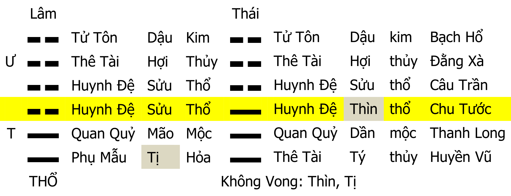
    - **Hình này chứng minh điều gì**
      - Hào Huynh Đệ Sửu thổ phát động hóa Huynh Đệ Thìn thổ là tượng Tiến thần; dù hóa Tuần Không vẫn không thể xem là không tiến, định kỳ ứng nghiệm vào ngày xuất Không Thìn thổ.
      - Kỵ thần độc phát lâm Nguyệt kiến nhập hào khắc hại Dụng thần Thê Tài Hợi thủy suy kiệt, báo hiệu hung triệu không thể cứu chữa.
    - **Từ đâu mà thấy được**
      - Hào 3 Huynh Đệ Sửu thổ động hóa Thìn thổ (Thìn lâm Tuần Không theo tuần Giáp Ngọ).
      - Hào 5 Dụng thần Thê Tài Hợi thủy bị Nguyệt kiến Sửu thổ khắc, ở đất Tử tại Nhật thần Mão mộc, không được sinh phù.
- **Quy tắc áp dụng**
  - *Phương pháp thẩm định căn cơ Dụng thần trước khi định cát hung*: Xem bệnh trước tiên phải xét căn cơ của Dụng thần (được sinh phù hay bị khắc tuyệt, nhập Mộ Tử Tuyệt).
  - *Tiêu chí Độc phát định ứng kỳ*: Một hào động độc phát là trọng tâm thần cơ ("thần triệu cơ ở động"), Kỵ thần độc phát nắm quyền sinh sát.
  - *Quy tắc Tiến thần hóa Tuần Không*: Hào động hóa Tiến thần gặp Không Vong vẫn chủ tiến, xuất Không định kỳ ứng nghiệm.
  - *Nguyên tắc phối hợp đa tổ hợp thông tin*: Phán đoán cát hung và ứng kỳ không dựa vào một yếu tố đơn lẻ mà kết hợp đồng thời nguyệt kiến, xuất Không và nhập Mộ.
- **Lời giải**
  - **Bước 1**: Thẩm định căn cơ và tình trạng Dụng thần Thê Tài Hợi thủy
    - Căn cứ: Lấy Thê Tài làm Dụng thần xem bệnh cho vợ; kiểm tra vị trí hào và tương quan Nhật Nguyệt.
    - Nhìn vào: Hào 5 Thê Tài Hợi thủy lâm hào Ứng. Hào Ứng là y dược, cho thấy người bệnh đã và đang dùng thuốc. Tuy nhiên, Hợi thủy bị Nguyệt kiến Sửu thổ khắc chế, Nhật thần Mão mộc không sinh phù mà làm tiết khí ($Hợi \to Mão$), lại lâm đất Tử tại Mão. Dụng thần hoàn toàn mất căn cơ sinh tồn.
  - **Bước 2**: Xét động thái của Kỵ thần Huynh Đệ Sửu thổ độc phát hóa Tiến thần
    - Căn cứ: Tiêu chí độc phát và quy tắc Tiến thần.
    - Nhìn vào: Trong quẻ duy nhất hào 3 Huynh Đệ Sửu thổ phát động (độc phát). Hào này lại lâm Nguyệt kiến Sửu thổ nhập hào, phát động hóa Huynh Đệ Thìn thổ là hóa Tiến thần, báo hiệu hung sát tăng tiến mãnh liệt.
  - **Bước 3**: Giải mã biến hào Tuần Không và quyết định thời điểm tử vong
    - Căn cứ: Quy tắc Tiến thần hóa Tuần Không và Mộ khố của Dụng thần.
    - Nhìn vào: Hào biến Thìn thổ lâm Tuần Không (tuần Giáp Ngọ Không tại Thìn, Tị). Huynh Đệ hóa Không nên tạm thời chưa phát lực khắc ngay. Đợi đến ngày Giáp Thìn xuất Không, Huynh Đệ Thìn thổ phát huy toàn bộ sức mạnh khắc tiệt Thê Tài. Đồng thời, Thìn thổ chính là Mộ khố của Thủy (Thê Tài nhập Mộ), ứng kỳ trùng khớp tại ngày Thìn.
- **Đối thoại giải đáp nghi vấn**:
  - *Người hỏi*: "Thê Tài Nguyệt khắc, Tử ở Nhật, bệnh bất trị, theo thầy thì có thông tin ung thư hay không? Kỵ thần độc phát, lâm Nguyệt phát động khắc Dụng, tượng không thể cứu chữa, sách dùng Tiến thần, ở đây hóa ra Thìn thổ là Tuần Không phải chăng là chủ ứng kỳ? Bởi vì Thìn cũng là Mộ khố của Dụng thần?"
  - *Vương Hổ Ứng lão sư giải đáp*: "Khi phán đoán, trước tiên phải xem căn cơ của Dụng thần, sau đó lại xem cát hung. Dụng thần lâm hào Ứng, Ứng là y dược, chứng tỏ đã uống thuốc. Nhưng Dụng thần Nguyệt khắc, Nhật không sinh phù, Tử ở Nhật, đồng thời Huynh Đệ phát động khắc Dụng thần, Kỵ thần độc phát, thần triệu cơ ở động, nhất định không tốt đẹp. Huynh Đệ Sửu thổ lâm Nguyệt nhập hào có thể ứng ngay trong tháng đó, Huynh Đệ hóa Không tạm thời không thể khắc, cần phải xuất Không mới có thể khắc được Tài, vì vậy phải ứng tại ngày Thìn, đương nhiên ngày Thìn cũng là lúc Tài nhập Mộ. Khi phán đoán cát hung của một vấn đề hay phán đoán ứng kỳ, không phải chỉ xem một điểm mà phải kết hợp nhiều tổ hợp thông tin, nếu không thì tỷ lệ chính xác không cao."
- **Kết quả**: Dã Hạc phán đoán: Dù có thuốc tiên cũng khó cứu, người vợ ắt chết vào ngày Giáp Thìn. Quả nhiên người vợ tử vong đúng ngày Giáp Thìn xuất Không.
- **Kiểm tra lại**: Đối chiếu ngày Giáp Thìn: hào biến Thìn thổ xuất Không thực hiện trọn vẹn lực khắc của Tiến thần; đồng thời là ngày Dụng thần Thê Tài Hợi thủy nhập Mộ khố; diễn ra trọn trong tháng Sửu là tháng Kỵ thần lâm Nguyệt nắm quyền.

### Ví dụ 5: Xem bệnh gần của cha, Phụ Mẫu động hóa Tiến thần (Quẻ Tụy hóa Bĩ)
- **Đề bài**: Ngày Quý Dậu tháng Mão, người con gieo quẻ xem về bệnh mới phát (bệnh gần) của cha mình xem lành dữ ra sao.
- **Dữ kiện**
  - Can chi ngày tháng: Ngày Quý Dậu, tháng Mão.
  - Tuần Không: Tuần Giáp Tý (Tuất, Hợi lâm Không Vong).
  - Quẻ chủ: Trạch Địa Tụy (quẻ cung Đoài).
  - Quẻ biến: Thiên Địa Bĩ (quẻ Lục hợp, thuộc cung Càn).
  - Hào động: Hào 6 Phụ Mẫu Mùi thổ phát động hóa Phụ Mẫu Tuất thổ (Tiến thần).
  - Sơ đồ quẻ:
    - Sơ đồ quẻ: (Tham chiếu Hình 5) alt="Sơ đồ quẻ" />
  - Nhìn vào:
    - Hào 6: Phụ Mẫu Mùi thổ (Bạch Hổ) là Dụng thần đại diện cho cha, động hóa Phụ Mẫu Tuất thổ (Tiến thần).
    - Hào biến Tuất thổ lâm Tuần Không theo tuần Giáp Tý của ngày Quý Dậu.
    - Hào 3: Thê Tài Mão mộc lâm Nguyệt kiến, xung hào 5 Dậu kim Nhật thần (ám động) hoặc khắc Phụ Mẫu Mùi thổ.
    - Quẻ biến là Thiên Địa Bĩ, thuộc loại quẻ Lục hợp.
- **Minh chứng đồ quẻ chiêm (Hình 5)**: Sơ đồ quẻ phản ánh tương tác hào động, biến hóa sinh khắc và ứng kỳ thực tế.
  - **Hình 5.** Quẻ Tụy hóa Bĩ
    - 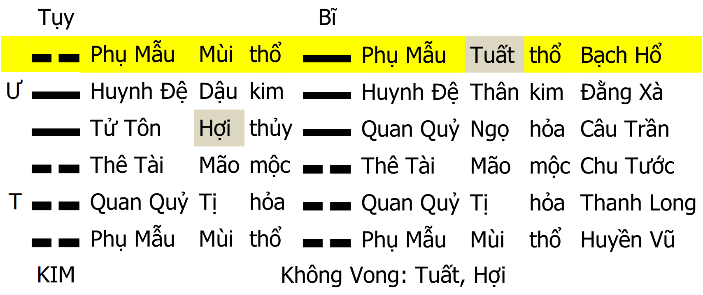
    - **Hình này chứng minh điều gì**
      - Dụng thần Phụ Mẫu Mùi thổ động hóa Tiến thần Tuất thổ lâm Tuần Không; trong phép đoán bệnh gần ("Cận bệnh phùng Không"), Dụng thần hóa Không là tượng cát khỏi bệnh mà không câu nệ sinh khắc suy vượng.
      - Định kỳ khỏi bệnh ứng vào ngày Giáp Tuất khi hào biến xuất Không.
    - **Từ đâu mà thấy được**
      - Hào 6 Phụ Mẫu Mùi thổ động hóa Tuất thổ (Tuất lâm Tuần Không theo tuần Giáp Tý của ngày Quý Dậu).
      - Quẻ chiêm cho bệnh mới phát (bệnh gần) của cha nên áp dụng trọn vẹn tượng lý Cận bệnh phùng Không.
- **Quy tắc áp dụng**
  - *Quy tắc Cận bệnh phùng Không (Bệnh gần gặp Không)*: Cổ pháp định rõ bệnh gần gặp Không thì lành, bệnh lâu gặp Không thì nguy; không lấy sinh khắc ngũ hành thông thường để định cát hung.
  - *Tượng Dụng thần hóa Không*: Dụng thần tự lâm Không hoặc động hóa Không trong bệnh gần là điềm bệnh tình tan biến, không cần cứu xét suy vượng.
  - *Xuất Không định ứng kỳ khỏi bệnh*: Hào biến hóa Không thì ngày xuất Không chính là thời điểm bình phục.
- **Lời giải**
  - **Bước 1**: Xác định tính chất bệnh trạng và Dụng thần
    - Căn cứ: Hỏi bệnh cho cha lấy Phụ Mẫu làm Dụng thần; bối cảnh là bệnh mới phát sinh gần đây (bệnh gần).
    - Nhìn vào: Hào 6 Phụ Mẫu Mùi thổ là Dụng thần.
  - **Bước 2**: Xét động thái Dụng thần hóa Tiến thần gặp Tuần Không
    - Căn cứ: Phép Cận bệnh phùng Không và quy tắc hào biến hóa Không.
    - Nhìn vào: Hào 6 Phụ Mẫu Mùi thổ phát động hóa Phụ Mẫu Tuất thổ là hóa Tiến thần. Xét ngày Quý Dậu (tuần Giáp Tý), Tuất thổ lâm Tuần Không. Với bệnh gần, Dụng thần động hóa Không là tượng mầm bệnh tiêu biến vào hư không.
  - **Bước 3**: Xác định ứng kỳ lành bệnh
    - Căn cứ: Quy tắc xuất Không trị sự.
    - Nhìn vào: Hào biến Tuất thổ lâm Không, đợi đến ngày Giáp Tuất xuất Không thì khí thế Tiến thần của Dụng thần viên mãn, bệnh tình dứt điểm hoàn toàn.
- **Đối thoại giải đáp nghi vấn**:
  - *Người hỏi*: "Quẻ này hóa lục hợp, hào 3 Mão mộc ám động khắc Phụ Mẫu, bệnh này về sau phải nặng thêm chứ?"
  - *Vương Hổ Ứng lão sư giải đáp*: "Bệnh gần gặp Không thì không lấy sinh khắc để phán đoán cát hung, mà là dùng tượng để phán đoán. Dụng thần Không, hoặc hóa Không đều là thông tin tốt đẹp, không cần xem suy vượng của Dụng thần."
- **Kết quả**: Dã Hạc đoán: Mùi thổ Phụ Mẫu động hóa Tiến thần, Tuất lâm Tuần Không, bệnh gần gặp Không liền khỏi bệnh, đến ngày Giáp Tuất xuất Không ắt khỏi bệnh. Thực tế người cha khỏi hẳn bệnh vào ngày Giáp Tuất.
- **Kiểm tra lại**: Đối chiếu kết quả thực chứng: Trong quẻ bệnh gần, tượng Không Vong vượt lên trên các quy tắc sinh khắc thông thường của Nguyệt kiến Mão mộc và hào ám động khắc hại.

### Ví dụ 6: Nữ xem bệnh đồng nghiệp xuất huyết dạ dày (Quẻ Thái biến Quy Muội)
- **Đề bài**: Ngày Đinh Sửu tháng Dậu, một người phụ nữ nhờ Vương Hổ Ứng lão sư xem giúp bệnh tình của người đồng nghiệp cùng cơ quan đang phải cấp cứu.
- **Dữ kiện**
  - Can chi ngày tháng: Ngày Đinh Sửu, tháng Dậu.
  - Tuần Không: Tuần Giáp Tuất (Thân, Dậu lâm Không Vong).
  - Quẻ chủ: Địa Thiên Thái (quẻ Lục hợp, thuộc cung Khôn).
  - Quẻ biến: Lôi Trạch Quy Muội (quẻ thuộc cung Đoài).
  - Hào động:
    - Hào 4 Huynh Đệ Sửu thổ động biến Phụ Mẫu Ngọ hỏa.
    - Hào 3 (Thế) Huynh Đệ Thìn thổ động biến Huynh Đệ Sửu thổ (Thoái thần).
    - Hào 1 Thê Tài Tý thủy động biến Phụ Mẫu Tị hỏa.
  - Sơ đồ quẻ:
    - Sơ đồ quẻ: (Tham chiếu Hình 6) alt="Sơ đồ quẻ" />
  - Nhìn vào:
    - Hào 6 (Ứng): Tử Tôn Dậu kim (Thanh Long) là Dụng thần đại diện đồng nghiệp; lâm Nguyệt kiến, nhập Mộ tại Nhật thần Sửu thổ, lâm Tuần Không.
    - Hào 4: Huynh Đệ Sửu thổ (Bạch Hổ) là Mộ khố của Dụng thần, động hóa Phụ Mẫu Ngọ hỏa (bệnh viện). Quẻ thuộc cung Khôn, hào 4 chủ dạ dày.
    - Hào 3 (Thế): Huynh Đệ Thìn thổ (Đằng Xà) là Nguyên thần sinh Dụng thần, động hóa Huynh Đệ Sửu thổ (Thoái thần).
    - Hào 2: Quan Quỷ Dần mộc phục Phụ Mẫu Tị hỏa (Câu Trần) là Cừu thần; Dần mộc chủ can mật, Câu Trần chủ sưng trướng.
- **Minh chứng đồ quẻ chiêm (Hình 6)**: Sơ đồ quẻ phản ánh tương tác hào động, biến hóa sinh khắc và ứng kỳ thực tế.
  - **Hình 6.** Quẻ Thái biến Quy Muội
    - 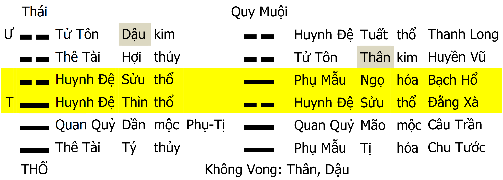
    - **Hình này chứng minh điều gì**
      - Dụng thần lâm Tuần Không trong bệnh gần thì trước mắt xuất viện khỏi bệnh, nhưng quẻ chủ Lục hợp và Nguyên thần động hóa Thoái thần là tượng bệnh chuyển thành mãn tính, cơ thể suy kiệt dần.
      - Tổ hợp tượng quẻ đa tầng (cung Khôn + hào 4 + Bạch Hổ huyết tích + Phụ Mẫu viện) định danh chính xác chứng xuất huyết dạ dày nhập viện; Cừu thần Dần mộc lâm Câu Trần tại hào 2 định danh chứng bệnh gan mật (gan to, xơ gan).
      - Ứng kỳ tử vong chuẩn xác vào tháng Mão năm Đinh Sửu: năm Sửu là năm Dụng thần nhập Mộ và Nguyên thần hóa thoái; tháng Mão là tháng xung phá Dụng thần Dậu kim.
    - **Từ đâu mà thấy được**
      - Hào Ứng Tử Tôn Dậu kim nhập Mộ tại Nhật thần Sửu thổ, lâm Tuần Không.
      - Hào 4 Sửu thổ lâm Bạch Hổ động hóa Phụ Mẫu Ngọ hỏa; hào 3 Thìn thổ động hóa Sửu thổ (Thoái thần); hào 2 Dần mộc lâm Câu Trần.
- **Quy tắc áp dụng**
  - *Quy tắc định Dụng thần đồng nghiệp*: Xem bệnh đồng nghiệp hoặc người ngoài không thân thuộc lấy hào Ứng làm Dụng thần.
  - *Tượng nhập Mộ là nhập viện*: Hào Dụng thần nhập Mộ tại Nhật thần hoặc Mộ khố động hóa Phụ Mẫu là tượng nằm viện điều trị.
  - *Quy tắc Lục hợp trong chiêm bệnh*: Bệnh gần tối kỵ gặp quẻ Lục hợp ("Cận bệnh phùng Hợp tắc triền miên"); lục hợp chủ kết tụ dây dưa, bệnh mới phát tất chuyển thành mãn tính.
  - *Tượng Nguyên thần hóa Thoái thần*: Nguyên thần sinh Dụng thần động hóa Thoái thần là tượng nguyên khí cơ thể tiêu hao suy kiệt, khó phục hồi trường kỳ.
  - *Quy tắc định kỳ Bệnh gần gặp Hợp*: Bệnh gần gặp quẻ Lục hợp thì đến tháng xung phá Dụng thần sẽ gặp nguy hiểm tính mạng.
- **Lời giải**
  - **Bước 1**: Xác định Dụng thần và nhận định tình trạng nhập viện
    - Căn cứ: Đoán bệnh đồng nghiệp lấy hào Ứng làm Dụng thần; tượng Dụng thần nhập Mộ.
    - Nhìn vào: Hào 6 (Ứng) Tử Tôn Dậu kim là Dụng thần. Dậu kim lâm Nguyệt kiến là vượng tướng. Gặp ngày Sửu là nhập Mộ tại Nhật thần, biểu thị đồng nghiệp đã nhập viện cấp cứu.
  - **Bước 2**: Chẩn đoán nguyên nhân bệnh lý qua tổ hợp hào vị, lục thú và quẻ cung
    - Căn cứ: Quái cung Khôn chủ tỳ vị; hào 4 chủ dạ dày; Bạch Hổ chủ huyết; Phụ Mẫu chủ bệnh viện.
    - Nhìn vào: Quẻ chủ Địa Thiên Thái thuộc cung Khôn, Khôn chủ tỳ vị dạ dày; hào 4 trên thân thể chủ vùng dạ dày. Hào 4 Huynh Đệ Sửu thổ là Mộ khố của Dụng thần Dậu kim, lâm Bạch Hổ động hóa Phụ Mẫu Ngọ hỏa. Do đó kết luận bệnh nhân bị xuất huyết dạ dày cấp tính phải vào bệnh viện.
  - **Bước 3**: Phán đoán khả năng phục hồi trước mắt qua Cận bệnh phùng Không
    - Căn cứ: Quy tắc Cận bệnh phùng Không.
    - Nhìn vào: Dụng thần Tử Tôn Dậu kim lâm Tuần Không (tuần Giáp Tuất Không tại Thân, Dậu), lại được Nguyệt kiến Dậu kim vượng tướng trợ lực. Là bệnh gần gặp Không nên trước mắt tai qua nạn khỏi, bệnh nhân điều trị có chuyển biến tốt và được xuất viện về nhà.
  - **Bước 4**: Phán đoán hậu vận lâu dài qua quẻ Lục hợp, Thoái thần và Cừu thần
    - Căn cứ: Bệnh gần kỵ Lục hợp; Nguyên thần hóa Thoái thần; Cừu thần lâm Câu Trần.
    - Nhìn vào: Quẻ chủ Địa Thiên Thái là quẻ Lục hợp, chủ bệnh tật dây dưa không dứt, chuyển thành bệnh mãn tính. Nguyên thần hào 3 Huynh Đệ Thìn thổ động hóa Huynh Đệ Sửu thổ là hóa Thoái thần, báo hiệu nguyên khí cơ thể ngày càng suy nhược trầm trọng. Ngoài ra, Cừu thần Quan Quỷ Dần mộc lâm Câu Trần tại hào 2: Dần mộc chủ can mật, Câu Trần chủ sưng trướng, báo trước bệnh nhân có bệnh ngầm nghiêm trọng về gan mật (gan to, xơ gan hoặc sỏi mật).
  - **Bước 5**: Quyết định thời điểm ứng kỳ tử vong
    - Căn cứ: Ứng kỳ theo năm nhập Mộ / Thoái thần và tháng xung phá Lục hợp.
    - Nhìn vào: Ứng vào năm Đinh Sửu vì Sửu là năm Dụng thần nhập Mộ và Nguyên thần hóa thoái. Ứng vào tháng Mão vì tháng Mão xung phá Dụng thần Dậu kim (xung khai Lục hợp, dứt tuyệt sinh cơ).
- **Đối thoại giải đáp nghi vấn**:
  - *Người hỏi*: "Quẻ này cũng là bệnh gần gặp Không, thì khỏi bệnh. Nhưng bởi vì Nguyên thần hóa thoái, lại quẻ chính lục hợp, sau này tất thành bệnh mãn tính, cơ thể từ từ suy nhược. Kết quả là ở tháng Mão năm Sửu qua đời vì chứng gan to. Ví dụ của Dã Hạc tuy không phải là Nguyên thần hóa thoái, lại có Kỵ thần ám động đến khắc, chẳng lẽ không nghiêm trọng bằng quẻ này ư?"
  - *Vương Hổ Ứng lão sư giải đáp*: "Quẻ đó của Dã Hạc cũng hóa lục hợp, kết quả sau đó ra sao thì chúng ta không được biết, nhưng hóa lục hợp thông thường sẽ xuất hiện vấn đề. Bệnh gần gặp Không, xung và hợp là vấn đề mâu thuẫn."
- **Kết quả**:
  - Phán đoán của Vương Hổ Ứng: Người đồng nghiệp qua khỏi đợt cấp cứu xuất huyết dạ dày và được xuất viện; tuy nhiên cơ thể sẽ suy nhược dần thành bệnh mãn tính, đến tháng Mão năm Đinh Sửu sẽ chết vì bệnh gan to.
  - Thực chứng ngoài đời: Đồng nghiệp sau khi xuất viện vì xuất huyết dạ dày thì sức khỏe suy sụp dần, đúng tháng Mão năm Đinh Sửu đã qua đời vì bệnh gan to.
- **Kiểm tra lại**:
  - Khớp nối chính xác giữa thực chứng và tượng quẻ:
    - Bệnh gần gặp Không: Qua khỏi giai đoạn cấp tính, xuất viện về nhà.
    - Cung Khôn + Hào 4 + Bạch Hổ + Hóa Phụ: Đúng chứng xuất huyết dạ dày nằm viện.
    - Hào 2 Dần mộc + Câu Trần: Đúng chứng bệnh gan to / xơ gan.
    - Năm Đinh Sửu tháng Mão: Đúng năm Dụng thần nhập Mộ, Nguyên thần thoái thần; đúng tháng Mão xung phá Dụng thần Dậu kim.

## Nghi vấn thực chứng: Tiến thần cầu tài, Phục thần và Thế phá cầu tài

- **Thần cơ phát lộ tại hào động độc phát trong chiêm tài**: Hào động độc phát là hạt nhân then chốt biểu lộ thiên cơ của toàn quẻ. Khi trong quẻ có một hào phát động thì mọi biến hóa, cơ duyên cát hung và ứng kỳ đều quy tụ tại hào đó; các quan niệm câu nệ vào hào tĩnh Nguyệt phá, Tuần Không hay hào động bị Nhật xung là "tán" đều là sai lầm trong thực chiến Lục Hào.

- **Quy tắc lấy Hào biến làm Dụng thần khi cầu tài nhờ quý nhân**: Trong sự vụ đi yết kiến quý nhân để cầu tài lộc, mục tiêu mưu cầu là thông qua quyền lực và sự giúp đỡ của quý nhân để sinh ra tiền của. Khi Quan Quỷ độc phát sinh Thế là quý nhân nâng đỡ ta, Quan Quỷ động hóa Thê Tài là quý nhân ban tài lộc cho ta. Do đó, hào biến Thê Tài chính là nguồn tài thực chất, đóng vai trò Dụng thần chủ đạo để định cát hung và xác lập ứng kỳ.

- **Phân biệt Ám động và Minh động trong quẻ Lục xung**:
  - Quẻ Lục xung vốn mang tượng bất ổn định, tan rã và không thể duy trì dài lâu đối với các mưu sự kinh doanh, thuê mướn mặt bằng trường kỳ.
  - Hào tĩnh bị Nhật thần tương xung chỉ được coi là ám động khi bản thân có khí vượng tướng; nếu hào suy nhược bị Nguyệt lệnh khắc phạt, Nhật thần không sinh phù thì lực ám động hoàn toàn yếu ớt, không thể sinh trợ Dụng thần.
  - Ngược lại, chỉ có minh động độc phát với thần cơ hội tụ mới đủ sức tạo ra tài lộc thực chất.

- **Bản chất Tham hợp quên sinh và ứng kỳ xung khai Phục thần**: Nguyên thần của Dụng thần dù đắc khí nhưng nếu lâm vào thế tương hợp với Nhật thần thì rơi vào tượng "tham hợp quên sinh", tạm thời bị trói buộc không thể phát tiết sinh trợ Dụng thần. Theo khẩu quyết cổ thư *Hoàng Kim Sách* ("Hào phùng lục hợp, tu đãi xung khai"), bắt buộc phải đợi đến ngày hoặc giờ có địa chi tương xung để xung khai hào hợp thì Nguyên thần mới thông suốt và chuyển hóa sinh lực cho Dụng thần.

- **Phân định ranh giới Cận kỳ và Viễn kỳ đối với hào Thế Nhật phá trong chiêm tài**:
  - Phụ Mẫu trì Thế là tượng bận rộn, vất vả, lao tâm khổ tứ; lâm Nhật phá thì mức độ nhọc nhằn, bôn ba càng gia tăng bội phần.
  - Trong dự đoán cầu tài ngắn hạn (cận kỳ vài ngày trước mắt): Tài vượng khắc Thế thì tiền bạc chủ động tìm đến tay ta ("Tài lai khắc Thế cụ giai hỷ"), không hề e ngại hào Thế bị Nhật phá; Thế phá ở đây chỉ đóng vai trò mô tả hoàn cảnh kiếm tiền vất vả cực nhọc.
  - Trong dự đoán tài vận trọn đời (viễn kỳ): Hào Thế đại diện cho bản thân và thọ mệnh. Phụ Mẫu trì Thế Nhật phá bị Thê Tài vượng tướng khắc phạt là điềm hung hiểm tột cùng, chủ về suốt đời lao lực vì tiền tài, thân thể suy kiệt, tài đến hại thân và đoản thọ.

### Ví dụ 7: Xem yết kiến quý nhân để cầu tài, hào biến sinh Thế (Quẻ Đoài biến Giải)

- **Đề bài**: Xem về việc đi yết kiến quý nhân (người có chức quyền) để cầu tài lộc. Người hỏi nghi vấn: Trong quẻ, hào Thê Tài Mão mộc tĩnh lâm Tuần Không, Nguyệt phá, lại bị Huynh Đệ Dậu kim khắc chế; hào sơ Quan Quỷ Tị hỏa phát động tuy sinh Thế nhưng bị Nhật thần Hợi thủy xung (cho là bị xung tán) và động hóa Dần mộc lâm Tuần Không, vậy dựa vào cơ sở nào mà Dã Hạc lão sư đoán ngày Giáp Dần sẽ được tiền của và như ý? Vì sao lấy hào biến Dần mộc làm Dụng thần?

- **Dữ kiện**
  - Ngày tháng, can chi: Ngày Tân Hợi, tháng Dậu.
  - Tuần không: Dần, Mão (tuần Giáp Thìn).
  - Quẻ chủ: Đoài Vi Trạch (Lục xung quái); Quẻ biến: Lôi Thủy Giải.
  - Hào phát động: Hào sơ Quan Quỷ Tị hỏa phát động hóa Thê Tài Dần mộc.
  - Sơ đồ quẻ: (Tham chiếu Hình 7) alt="Sơ đồ quẻ" />
  - Nhìn vào: Hào sơ Tị hỏa động hóa Dần mộc, hào 6 Mùi thổ trì Thế, hào 2 Mão mộc nguyệt phá tuần không.

- **Minh chứng đồ quẻ chiêm (Hình 7)**: Sơ đồ quẻ phản ánh tương tác hào động, biến hóa sinh khắc và ứng kỳ thực tế.
  - **Hình 7.** Quẻ Đoài biến Giải
    - 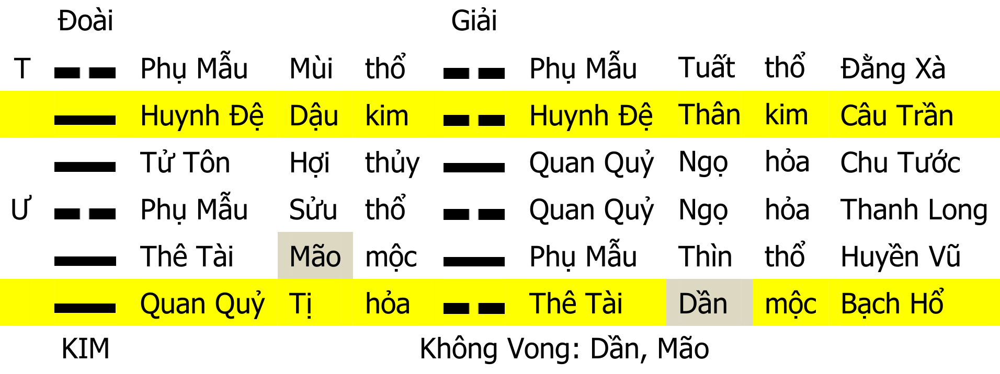
    - **Hình này chứng minh điều gì**
      - Chứng minh hào độc phát Quan Quỷ Tị hỏa động hóa Thê Tài Dần mộc, hình thành chuỗi truyền dẫn: Hào biến Thê Tài Dần mộc sinh Quan Quỷ Tị hỏa, Quan Quỷ Tị hỏa sinh hào Thế Phụ Mẫu Mùi thổ.
      - Chứng minh chân lý "Thần triệu cơ hồ động, bất luận xung tán": Hào động bị Nhật xung không phải là tán mà là thần cơ phát động; hào biến Dần mộc lâm Tuần Không định ra ứng kỳ ngày Giáp Dần xuất Không đắc tài.
      - Chứng minh quy tắc lấy hào biến làm Dụng thần: Chiêm tài nhờ quý nhân thì Quan sinh Thế là quý nhân giúp ta, Quan hóa Tài là quý nhân đem tài đến cho ta.
    - **Từ đâu mà thấy được**
      - Hào sơ Tị hỏa mang dấu hiệu phát động lâm Bạch Hổ, chuyển hóa thành hào sơ quẻ Giải là Thê Tài Dần mộc.
      - Bảng tuần không chỉ rõ Dần và Mão lâm Không; hào biến Dần mộc xuất Không vào ngày Dần.

- **Quy tắc áp dụng**
  - Quy tắc Thần cơ phát lộ tại hào động: Hào phát động độc nhất trong quẻ nắm quyền biến hóa sinh khắc, Nhật xung không làm tiêu tán hào động.
  - Quy tắc lấy Hào biến làm Dụng thần: Độc phát lấy hào biến làm tượng chủ khi hào động và hào biến kết nối sinh Thế, đặc biệt trong cách cục cầu tài nhờ quý nhân (Quan hóa Tài sinh Thế).
  - Quy tắc Ứng kỳ hào biến Tuần Không: Hào biến mang lại cát lợi nhưng lâm Không thì hiện tại việc chưa thành, phải chờ đến ngày xuất Không mới ứng nghiệm trọn vẹn.

- **Lời giải**
  - **Bước 1**: Xác định cơ chế cầu tài thông qua quý nhân và vai trò của Quan Quỷ.
    - Căn cứ: Đề bài đặt ra là "xem yết kiến quý nhân để cầu tài", do đó sự việc phụ thuộc hoàn toàn vào thái độ và quyền hạn của quý nhân.
    - Nhìn vào: Hào sơ Quan Quỷ Tị hỏa đại diện cho quý nhân phát động sinh hào Thế Phụ Mẫu Mùi thổ ($Tị \text{ hỏa} \to Mùi \text{ thổ}$), biểu thị quý nhân hết lòng giúp đỡ đương số.

  - **Bước 2**: Xác định Dụng thần tài lộc thực chất và giải tỏa nghi vấn hào Tài Mão mộc bị phá.
    - Căn cứ: Hào Thê Tài Mão mộc tĩnh trong quẻ chủ tuy bị Nguyệt phá, Tuần Không và bị Huynh Đệ Dậu kim khắc phạt, nhưng đó chỉ là tài tĩnh bên ngoài. Thần cơ hội tụ ở hào độc phát Quan Quỷ Tị hỏa biến ra Thê Tài Dần mộc.
    - Nhìn vào: Hào biến Dần mộc tương sinh Quan Quỷ Tị hỏa, Quan Quỷ Tị hỏa tương sinh Thế Mùi thổ ($Dần \text{ mộc} \to Tị \text{ hỏa} \to Mùi \text{ thổ}$). Quý nhân sinh ra tài lộc để ban cho ta, nên lấy hào biến Dần mộc làm Dụng thần chân chính.

  - **Bước 3**: Bác bỏ quan niệm sai lầm về hào động bị Nhật xung là "xung tán".
    - Căn cứ: Lão sư Vương Hổ Ứng và Dã Hạc khẳng định trong Lục Hào không tồn tại khái niệm hào động bị Nhật xung là tán; thần cơ hé lộ ở chỗ động, Nhật xung chỉ kích phát động lực biến hóa.
    - Nhìn vào: Hào sơ Tị hỏa bị Nhật thần Hợi thủy xung là xung động, không hề bị tán, trái lại càng phát huy uy lực chuyển hóa ra Dần mộc.

  - **Bước 4**: Xác định ứng kỳ đắc tài dựa trên Tuần Không của hào biến.
    - Căn cứ: Hào biến Thê Tài Dần mộc lâm Tuần Không (tuần Giáp Thìn), biểu thị hiện tại tiền bạc chưa tới tay, phải đợi đến ngày xuất Không.
    - Nhìn vào: Ngày gieo quẻ là Tân Hợi, trải qua Nhâm Tý, Quý Sửu, đến ngày Giáp Dần thì hào Dần mộc xuất Không, sinh Tị hỏa trợ Thế.

- **Đối thoại giải đáp nghi vấn**:
  - Người hỏi chất vấn: "Hào Tài Mão mộc bị tháng Dậu phá, ứng trong tháng là không có tài, tại sao Dã Hạc lão sư lại lấy hào biến Dần mộc làm Dụng thần?"
  - Vương Hổ Ứng lão sư giải đáp: Chiêm đoán việc mượn sức quý nhân để cầu tài thì mấu chốt nằm ở Quan Quỷ. Quan Quỷ sinh Thế tức là quan quý trợ giúp ta, Quan Quỷ phát động hóa ra Thê Tài tức là nhờ sự trợ giúp của quan quý mà thâu hoạch được tài lợi. Thiên cơ chuyển hóa tập trung vào hào biến Dần mộc, Dần mộc sinh Tị hỏa, Tị hỏa sinh Thế Mùi thổ, tạo thành dòng chảy tương sinh liên hoàn.

- **Kết quả**: Đoán rằng sáng ngày Giáp Dần sẽ được tiền của và mọi sự như ý. Thực tế quả nhiên sáng sớm ngày Giáp Dần đã đắc tài đúng như dự liệu.

- **Kiểm tra lại**: Đối chiếu thực chứng sáng ngày Giáp Dần với hào biến Thê Tài Dần mộc xuất Không chứng minh tính chuẩn xác tuyệt đối của phương pháp lấy hào biến làm Dụng thần và quy tắc ứng kỳ xuất Không.

### Ví dụ 8: Phụ nữ xem thuê quầy hàng buôn bán (Quẻ Bát Thuần Tốn)

- **Đề bài**: Một phụ nữ đến nhờ Vương Hổ Ứng lão sư gieo quẻ xem việc dự định thuê một quầy hàng để kinh doanh buôn bán, hỏi tiền đồ kinh doanh thế nào, có thể mở bán lâu dài hay không? Gieo được quẻ Bát Thuần Tốn (quẻ tĩnh).

- **Dữ kiện**
  - Ngày tháng, can chi: Ngày Ất Hợi, tháng Mão.
  - Quẻ chủ: Bát Thuần Tốn (quẻ tĩnh, lục xung quái).
  - Sơ đồ quẻ: (Tham chiếu Hình 8) alt="Sơ đồ quẻ" />
  - Nhìn vào: Hào 6 Huynh Đệ Mão mộc trì Thế cực vượng, hào 4 Thê Tài Mùi thổ và hào 1 Thê Tài Sửu thổ bị Nguyệt kiến Mão mộc khắc, hào 5 Tử Tôn Tị hỏa ám động.

- **Minh chứng đồ quẻ chiêm (Hình 8)**: Sơ đồ quẻ phản ánh tương tác hào động, biến hóa sinh khắc và ứng kỳ thực tế.
  - **Hình 8.** Sơ đồ quẻ Tốn
    - 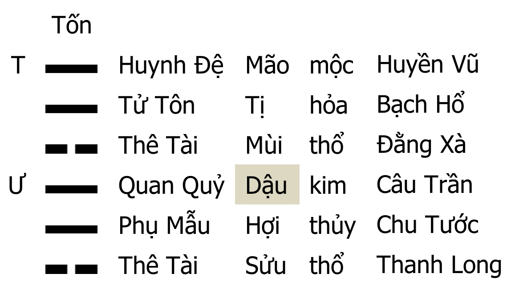
    - **Hình này chứng minh điều gì**
      - Chứng minh tượng quẻ Lục xung chủ sự việc ngắn ngủi, tan rã mau chóng, tối kỵ đối với việc thuê mặt bằng kinh doanh lâu dài.
      - Chứng minh Huynh Đệ trì Thế vượng tướng khắc Tài là điềm phá tài hao tốn; Thê Tài lưỡng hiện thì chọn hào Tài gần Thế (hào 4 Mùi thổ) làm đại diện tài sản của mình.
      - Chứng minh quy tắc Ám động vs Minh động trong quẻ Lục xung: Một lực ám động suy nhược (Tử Tôn Tị hỏa ám động nhưng Tài bị Nguyệt khắc Nhật không sinh) không đủ sức sinh phù Dụng thần để tạo thành tài lộc bền vững.
    - **Từ đâu mà thấy được**
      - Quẻ Bát Thuần Tốn là quẻ Lục xung thuần quái; hào Thế tại hào 6 là Huynh Đệ Mão mộc lâm Huyền Vũ cực vượng khắc hào 4 Thê Tài Mùi thổ.
      - Hào 5 Tử Tôn Tị hỏa bị Nhật Hợi xung; hào 4 Mùi thổ và hào 1 Sửu thổ đều bị Nguyệt kiến Mão mộc khắc chế nặng nề.

- **Quy tắc áp dụng**
  - Quy tắc Quẻ Lục xung trong thương sự: Quẻ Lục xung chủ biến động đột ngột, tan vỡ, không thể bền lâu; chiêm việc thuê mướn kinh doanh mà gặp Lục xung tất giữa đường giải tán.
  - Quy tắc Huynh Đệ trì Thế chiêm tài: Huynh Đệ là thần cướp đoạt tiền tài, trì Thế lại lâm Nguyệt kiến vượng tướng thì nắm chắc phần thua lỗ, tán tài.
  - Quy tắc chọn Dụng thần khi Tài lưỡng hiện: Trong quẻ xuất hiện hai hào Thê Tài, thông thường ưu tiên chọn hào Thê Tài ở vị trí gần hào Thế nhất, vì đó là tiền tài trực tiếp gắn liền với bản thân đương số.
  - Quy tắc Ám động và Minh động trong quẻ Lục xung: Độc phát minh động có lực mới hội tụ thần cơ tạo tài; một lực ám động đơn độc trong bối cảnh Tài bị Nguyệt khắc Nhật không sinh phù thì sức mạnh quá yếu ớt, không thể hóa giải sát khí của Huynh Đệ trì Thế.

- **Lời giải**
  - **Bước 1**: Lựa chọn Dụng thần chuẩn xác giữa hai hào Thê Tài trong quẻ.
    - Căn cứ: Quy tắc chọn Thê Tài gần Thế khi có hiện tượng Tài lưỡng hiện.
    - Nhìn vào: Hào 4 Thê Tài Mùi thổ nằm sát hào 6 Huynh Đệ Mão mộc trì Thế (cùng ở ngoại quái) hơn hào 1 Thê Tài Sửu thổ (nội quái), do đó chọn hào 4 Mùi thổ làm Dụng thần đại diện cho tiền tài của đương số.

  - **Bước 2**: Đánh giá trạng thái sinh khắc của Dụng thần Thê Tài Mùi thổ.
    - Căn cứ: Thê Tài Mùi thổ ở tháng Mão bị Nguyệt kiến Mão mộc khắc chế; ngày Ất Hợi không có lực tương sinh; lại bị hào Thế Huynh Đệ Mão mộc lâm Nguyệt kiến cực vượng trực tiếp khắc phạt.
    - Nhìn vào: Dụng thần tứ bề thọ khắc, không có sinh phù, là điềm báo kinh doanh thất bại, hao tổn vốn liếng nghiêm trọng.

  - **Bước 3**: Thẩm định thực lực của hào Tử Tôn Tị hỏa ám động.
    - Căn cứ: Hào 5 Tử Tôn Tị hỏa bị Nhật thần Hợi thủy xung, trong quẻ tĩnh xem là ám động nhằm sinh Thê Tài Mùi thổ. Tuy nhiên, trong quẻ lục xung, Dụng thần Tài bị Nguyệt khắc và Nhật không sinh phù, một lực ám động đơn độc không đủ mạnh để gánh vác việc sinh Tài.
    - Nhìn vào: Tị hỏa ám động không đủ sức chuyển hóa toàn bộ sát khí cực vượng của Huynh Đệ Mão mộc.

  - **Bước 4**: Phối hợp toàn cục cấu trúc quẻ Lục xung để đưa ra quyết đoán.
    - Căn cứ: Quẻ Bát Thuần Tốn là quẻ Lục xung thuần quái. Mưu sự kinh doanh quầy hàng cần sự tích lũy và duy trì ổn định, gặp Lục xung là tượng giải thể, đổ vỡ nhanh chóng.
    - Nhìn vào: Toàn quẻ đều là tượng tan rã và hao tài, lão sư khuyên dứt khoát không thuê quầy hàng.

- **Đối thoại giải đáp nghi vấn**:
  - Người hỏi thắc mắc thứ nhất: "Quẻ này có hai hào Thê Tài (Sửu thổ và Mùi thổ), căn cứ vào tiêu chí nào để lựa chọn Dụng thần?"
    - Lão sư Vương Hổ Ứng giải đáp: Thông thường phải lấy hào Thê Tài ở gần hào Thế nhất (hào 4 Mùi thổ gần hào 6 Thế), bởi vì hào sát cạnh Thế mới đại diện chân thực cho tiền của của chính mình.
  - Người hỏi thắc mắc thứ hai: "Tử Tôn ám động sinh Tài, đây là quẻ tĩnh, hào động dù yếu cũng có lực hơn hào tĩnh, tại sao lại kết luận không thể có tài?"
    - Lão sư Vương Hổ Ứng giải đáp: Quẻ này là quẻ Lục xung, Huynh Đệ lại trì Thế cực vượng. Nguyệt lệnh khắc Tài, Nhật thần không sinh phù Tài. Một lực ám động đơn độc trong bối cảnh suy bại này không đủ mạnh để sinh Tài. Nếu trong quẻ có minh động độc phát thì thần cơ hội tụ mới có thể đem lại tiền tài.

- **Kết quả**: Người phụ nữ nghe theo lời khuyên của Vương Hổ Ứng lão sư nên dứt khoát từ bỏ ý định thuê quầy hàng. Đúng một tháng sau, quầy hàng đó đã bị chính quyền/chủ quản tháo dỡ hoàn toàn; nếu thuê chắc chắn bị mất trắng tiền bạc và lâm vào cảnh dở dang.

- **Kiểm tra lại**: Thực tế quầy hàng bị tháo dỡ sau một tháng đã ứng nghiệm trọn vẹn tượng quẻ Bát Thuần Tốn lục xung không thể lâu dài, và Huynh Đệ Mão mộc trì Thế khắc Tài chủ về phá tán tiền của.

### Ví dụ 9: Xem em gái sinh nở lành dữ ra sao (Quẻ Hỏa Địa Tấn)

- **Đề bài**: Người anh gieo quẻ xem cho em gái ruột chuẩn bị sinh nở, hỏi sự việc lành dữ ra sao, hai mẹ con có được an toàn hay không? Gieo được quẻ Hỏa Địa Tấn (quẻ tĩnh). Học viên nghi vấn: Đoán việc sinh sản tất phải xem hào Tử Tôn, tại sao Tử Tôn Tý thủy bị Nguyệt phá, Nhật khắc, Phi thần khắc mà Dã Hạc lão sư lại kết luận mẹ tròn con vuông? Tại sao ứng kỳ lại đoán vào giờ Mão xung khai hào Huynh Đệ mà không đoán lúc Tử Tôn xuất phục?

- **Dữ kiện**
  - Ngày tháng, can chi: Ngày Mậu Thìn, tháng Ngọ.
  - Tuần không: Tuất, Hợi (tuần Giáp Tý).
  - Quẻ chủ: Hỏa Địa Tấn (quẻ tĩnh, Du hồn quái).
  - Sơ đồ quẻ: (Tham chiếu Hình 9) alt="Sơ đồ quẻ" />
  - Nhìn vào: Hào 4 Huynh Đệ Dậu kim trì Thế (Dụng thần sản phụ) được Nhật thần Thìn thổ sinh hợp, hào 1 Phụ Mẫu Mùi thổ phục tàng Tử Tôn Tý thủy.

- **Minh chứng đồ quẻ chiêm (Hình 9)**: Sơ đồ quẻ phản ánh tương tác hào động, biến hóa sinh khắc và ứng kỳ thực tế.
  - **Hình 9.** Sơ đồ quẻ Hỏa Địa Tấn
    - 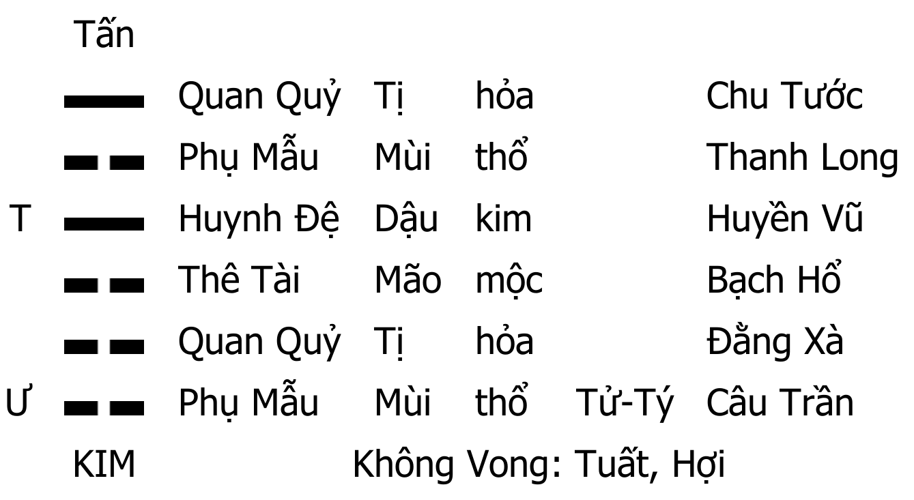
    - **Hình này chứng minh điều gì**
      - Chứng minh Dụng thần Huynh Đệ Dậu kim bị Nguyệt lệnh Ngọ hỏa khắc nhưng được Nhật thần Thìn thổ sinh hợp ($Thìn \text{ thổ} \to Dậu \text{ kim}$), lực lượng cân bằng nên người mẹ hoàn toàn bình an vô sự.
      - Chứng minh quy tắc Tham hợp quên sinh và ứng kỳ xung khai: Huynh Đệ Dậu kim là Nguyên thần của thai nhi Tử Tôn Tý thủy; do Dậu kim bị Nhật Thìn tương hợp nên tham hợp mà không thể sinh Tử Tôn; phải đợi đến giờ Mão ngày hôm sau xung khai Thìn Dậu chi hợp thì Nguyên thần mới thông suốt để sinh hạ đứa trẻ thuận lợi.
    - **Từ đâu mà thấy được**
      - Hào 4 Huynh Đệ Dậu kim trì Thế đắc Nhật thần Thìn thổ sinh hợp; hào 1 Phụ Mẫu Mùi thổ phục tàng Tử Tôn Tý thủy.
      - Sách *Hoàng Kim Sách* ghi rõ quy tắc: "Hào phùng lục hợp, tu đãi xung khai"; Mão mộc tương xung Dậu kim làm tan biến thế hợp.

- **Quy tắc áp dụng**
  - Quy tắc Cân bằng Nguyệt khắc Nhật sinh: Hào lâm cảnh bị Nguyệt lệnh khắc chế nhưng đồng thời được Nhật thần sinh phù thì lực lượng bình hòa, không bị nguy hại, chủ về chuyển nguy thành an.
  - Quy tắc Nhật hợp phải đợi xung khai: Hào gặp Nhật thần tương hợp thì bị trói buộc, ngưng trệ chưa thể phát tiết tác dụng ngay, bắt buộc phải chờ đến thời điểm (ngày hoặc giờ) có chi tương xung để xung khai thế hợp thì sự việc mới ứng nghiệm.
  - Quy tắc Tham hợp quên sinh của Nguyên thần: Huynh Đệ là Nguyên thần sinh Tử Tôn. Khi Nguyên thần bị hợp thì tham hợp quên sinh, không thể giáng sinh thai nhi; xung khai Nguyên thần thì dòng chảy sinh hóa mới khai mở để đứa trẻ chào đời an lành.

- **Lời giải**
  - **Bước 1**: Xác định Dụng thần đại diện cho sản phụ (người em gái).
    - Căn cứ: Hỏi việc cho em gái ruột thì lấy hào Huynh Đệ làm Dụng thần.
    - Nhìn vào: Hào 4 Huynh Đệ Dậu kim trì Thế lâm Huyền Vũ.

  - **Bước 2**: Đánh giá trạng thái sinh khắc và an nguy của Dụng thần Huynh Đệ Dậu kim.
    - Căn cứ: Huynh Đệ Dậu kim ở tháng Ngọ bị Nguyệt lệnh Ngọ hỏa khắc chế, nhưng ở ngày Mậu Thìn lại được Nhật thần Thìn thổ tương sinh và tương hợp ($Thìn \text{ sinh } Dậu$). Trong quẻ không có hào động nào khác khắc hại.
    - Nhìn vào: Một bên bị Nguyệt khắc, một bên được Nhật sinh hợp, thế lực cân bằng vững vàng, khẳng định người mẹ bình an vô sự.

  - **Bước 3**: Xác định ứng kỳ sinh sản và tình trạng thai nhi.
    - Căn cứ: Hào Dụng thần Huynh Đệ Dậu kim và Nhật thần Thìn thổ tương hợp. Cổ tịch *Hoàng Kim Sách* chỉ rõ: "Nếu gặp hợp, phải đợi xung khai". Hợp chủ sự trì trệ chưa sinh được ngay, cần chi xung Dậu kim là Mão mộc để khai mở.
    - Nhìn vào: Giờ Mão ngày hôm sau (ngày Kỷ Tị) sẽ xung khai Dậu kim, giải phóng thế hợp để lâm bồn.

- **Đối thoại giải đáp nghi vấn**:
  - Người hỏi đặt vấn đề nghi vấn sâu sắc: "Xem việc sinh nở thì tất yếu phải xem hào Tử Tôn. Trong quẻ này, Tử Tôn Tý thủy phục tàng dưới hào 1 Phụ Mẫu Mùi thổ, bị Nguyệt lệnh Ngọ hỏa xung là Nguyệt phá, lại bị Nhật thần Thìn thổ khắc, Phi thần Mùi thổ khắc. Bị khắc hại trùng trùng như vậy, tại sao Dã Hạc lão sư lại kết luận mẹ con đều bình an? Tại sao không đoán ứng kỳ là lúc Tử Tôn xuất phục mà lại đoán vào giờ Mão xung khai hào Huynh Đệ?"
  - Lão sư Vương Hổ Ứng giải thích cặn kẽ: Huynh Đệ Dậu kim vừa là người mẹ, vừa là Nguyên thần sinh dưỡng cho Tử Tôn Tý thủy ($Kim \to Thủy$). Hiện tại Huynh Đệ Dậu kim bị Nhật thần Thìn thổ hợp chặt, rơi vào trạng thái "tham hợp quên sinh", vì bị trói buộc nên tạm thời chưa thể sinh phù cho Tử Tôn. Đợi đến giờ Mão ngày hôm sau xung khai thế hợp Thìn - Dậu, Huynh Đệ Dậu kim được giải phóng lập tức chuyển sang tương sinh cho Tử Tôn Tý thủy. Vì vậy lấy thời điểm xung khai Huynh Đệ Dậu kim làm giờ khắc sinh nở an lành, mẹ tròn con vuông.

- **Kết quả**: Dự đoán vào giờ Mão ngày hôm sau sẽ sinh nở thuận lợi. Quả nhiên đúng giờ Mão ngày hôm sau người em gái đã hạ sinh an toàn, mẹ tròn con vuông.

- **Kiểm tra lại**: Việc sinh nở đúng giờ Mão xung khai Dậu kim khớp hoàn toàn với nguyên lý phá hợp trong *Hoàng Kim Sách*, đồng thời chứng minh chuẩn xác cơ chế Nguyên thần bị hợp cần xung khai mới có thể sinh Dụng thần.

### Ví dụ 10: Xem cầu tài, Phụ Mẫu trì Thế Nhật phá (Quẻ Hỏa Thiên Đại Hữu)

- **Đề bài**: Một người gieo quẻ xem về việc cầu tài lộc, được quẻ Hỏa Thiên Đại Hữu (quẻ tĩnh). Học viên nghi vấn: Hào Thế Phụ Mẫu Thìn thổ bị Nhật thần Tuất thổ tương xung là Nhật phá, cổ pháp tối kỵ Thế phá; lại thêm hào Thê Tài Dần mộc khắc hào Thế, vì sao Dã Hạc lão sư vẫn quyết đoán cầu được tài vào ngày Giáp Dần? Hiện tượng hào Thế Nhật phá trong quẻ này báo hiệu điều gì?

- **Dữ kiện**
  - Ngày tháng, can chi: Ngày Canh Tuất, tháng Dần.
  - Tuần không: Dần, Mão (tuần Giáp Thìn).
  - Quẻ chủ: Hỏa Thiên Đại Hữu (quẻ tĩnh, Quy hồn quái).
  - Sơ đồ quẻ: (Tham chiếu Hình 10) alt="Sơ đồ quẻ" />
  - Nhìn vào: Hào 3 Phụ Mẫu Thìn thổ trì Thế bị Nhật thần Tuất thổ xung là Nhật phá, hào 2 Thê Tài Dần mộc lâm Nguyệt kiến cực vượng khắc hào Thế, Thê Tài Dần mộc lâm Tuần Không.

- **Minh chứng đồ quẻ chiêm (Hình 10)**: Sơ đồ quẻ phản ánh tương tác hào động, biến hóa sinh khắc và ứng kỳ thực tế.
  - **Hình 10.** Sơ đồ quẻ Hỏa Thiên Đại Hữu
    - 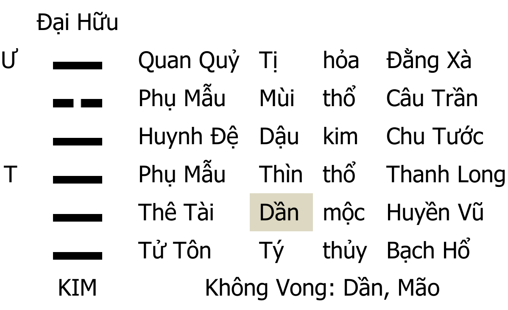
    - **Hình này chứng minh điều gì**
      - Chứng minh quy tắc cầu tài cận kỳ: Thê Tài vượng tướng khắc Thế thì tiền của chủ động tìm đến mình ("Tài lai khắc Thế cụ giai hỷ"), không hề e ngại hào Thế bị Nhật phá.
      - Chứng minh phân định ranh giới giữa việc cầu tài ngắn hạn và tài vận suốt đời: Chiêm tài cận kỳ thì Thế phá chỉ biểu thị sự vất vả, bôn ba nhọc nhằn nhưng vẫn đắc tài; chiêm tài vận trọn đời thì Phụ Mẫu trì Thế Nhật phá bị Tài vượng khắc hại là tượng cả đời khổ cực vì tiền bạc và đoản thọ.
      - Chứng minh quy tắc ứng kỳ xuất Không: Hào Thê Tài Dần mộc lâm Tuần Không nên đến ngày Giáp Dần xuất Không sẽ đắc tài.
    - **Từ đâu mà thấy được**
      - Hào 2 Thê Tài Dần mộc lâm Nguyệt kiến; hào 3 Phụ Mẫu Thìn thổ trì Thế bị Nhật thần Tuất thổ xung là Nhật phá; quan hệ ngũ hành Dần mộc khắc Thìn thổ.
      - Bảng tuần không chỉ rõ Dần Mão lâm Không; từ ngày Canh Tuất đếm đến ngày Giáp Dần là ngày xuất Không.

- **Quy tắc áp dụng**
  - Quy tắc Tài khắc Thế trong chiêm tài: "Tài lai khắc Thế cụ giai hỷ", Thê Tài vượng tướng đến khắc hào Thế là tượng tiền tài tự động tìm đến đương số, cầu tài ắt được.
  - Quy tắc phân biệt Cận kỳ và Viễn kỳ đối với Thế phá:
    - Cận kỳ (việc trong vài ngày hoặc thời gian ngắn): Hào Thế lâm Nhật phá không gây tổn hại đến kết quả đắc tài, chỉ mang ý nghĩa mô tả hoàn cảnh kiếm tiền tương đối vất vả, cực nhọc.
    - Viễn kỳ (tài vận suốt đời, thọ mệnh): Hào Thế là căn bản của sinh mệnh. Phụ Mẫu trì Thế chủ nhọc nhằn, gặp Nhật phá là thân thể hư hao, lại bị Thê Tài vượng khắc là vì tiền mà tổn hại tính mạng, tượng cả đời bôn ba khổ cực và đoản mệnh.
  - Quy tắc ứng kỳ Dụng thần Tuần Không: Dụng thần lâm Tuần Không thì đến ngày xuất Không (ngày Giáp Dần) sẽ ứng nghiệm việc đắc tài.

- **Lời giải**
  - **Bước 1**: Xác định Dụng thần và quan hệ tương tác với hào Thế.
    - Căn cứ: Chiêm tài lấy hào Thê Tài làm Dụng thần.
    - Nhìn vào: Hào 2 Thê Tài Dần mộc lâm lệnh Nguyệt kiến cực vượng, hào 3 Phụ Mẫu Thìn thổ trì Thế. Ngũ hành Dần mộc khắc Thìn thổ ($Dần \text{ mộc} \to Thìn \text{ thổ}$).

  - **Bước 2**: Đánh giá ý nghĩa tượng quẻ của quy tắc "Tài khắc Thế".
    - Căn cứ: Trong dự đoán cầu tài Lục Hào, Tài khắc Thế biểu thị tiền tài cuốn vào thân thể, tài tất đắc.
    - Nhìn vào: Dần mộc đắc lệnh vượng tướng khắc Thế Thìn thổ, khẳng định chắc chắn thu được tiền bạc.

  - **Bước 3**: Hóa giải nghi vấn về Thế phá và Tuần Không.
    - Căn cứ: Thê Tài Dần mộc lâm Tuần Không (tuần Giáp Thìn) nên hiện tại tiền tài chưa tới ngay. Hào Thế Thìn thổ bị Nhật thần Tuất thổ xung là Nhật phá, báo hiệu quá trình kiếm tiền phải lao tâm khổ tứ, bôn ba vất vả.
    - Nhìn vào: Vì đây là quẻ chiêm tài ngắn hạn (cận kỳ), Nhật phá không làm hỏng sự việc mà chỉ chủ sự cực nhọc.

  - **Bước 4**: Xác định ứng kỳ đắc tài.
    - Căn cứ: Chờ Dụng thần Thê Tài Dần mộc xuất Không để phát huy trọn vẹn lực lượng khắc Thế.
    - Nhìn vào: Ngày gieo quẻ là Canh Tuất, đến ngày Giáp Dần xuất Không thì tiền tài tất về tay.

- **Đối thoại giải đáp nghi vấn**:
  - Người hỏi chất vấn: "Quẻ này hào Thế gặp Nhật phá, thông thường Thế phá là điềm hung bại lớn, vì sao vẫn có thể cầu được tiền của? Hiện tượng Thế phá trong quẻ cho biết điều gì?"
  - Lão sư Vương Hổ Ứng phân tích sáng tỏ:
    - Phụ Mẫu trì Thế mà gặp Nhật phá là tượng tương đối vất vả, nhọc nhằn.
    - Cần phân định rõ ranh giới thời gian của việc xem quẻ: Nếu là xem việc cầu tài ngắn hạn trong mấy ngày sắp tới thì không sợ Tài khắc Thế, cũng không sợ hào Thế bị Nhật phá; tiền tài vẫn thu hoạch được như ý.
    - Ngược lại, nếu quẻ này dùng để phán đoán tài vận suốt đời thì lại là quẻ rất xấu: Phụ Mẫu trì Thế Nhật phá bị Thê Tài vượng khắc là tượng cả đời mệt mỏi vì tiền bạc, tài đến làm hại thân thể, hơn nữa còn là điềm đoản thọ.

- **Kết quả**: Dã Hạc đoán ngày Giáp Dần xuất Không sẽ được tiền của. Quả nhiên đến đúng ngày Giáp Dần đương số đã thu được tiền tài.

- **Kiểm tra lại**: Việc đắc tài đúng ngày Giáp Dần xuất Không đã minh chứng trọn vẹn sự tinh diệu của quy tắc Tài khắc Thế trong cầu tài cận kỳ, đồng thời khẳng định nguyên lý phân biệt Cận kỳ và Viễn kỳ khi giải mã tượng hào Thế Nhật phá.

## Nghi vấn thực chứng: Hào độc phát, Ám động và Tam hợp cục

- **Phân định ranh giới phương pháp luận giữa Lý và Tượng trong dự đoán Lục Hào**:
  - Tỷ trọng quyết định: Phần Lý chiếm $70\%$ trọng số, giữ vai trò chủ đạo quyết định ranh giới cát - hung, sống - còn, được - mất thông qua quy luật ngũ hành sinh khắc, vượng tướng hưu tù và động biến.
  - Tỷ trọng miêu tả: Phần Tượng chiếm $30\%$ trọng số, giữ vai trò phản ánh chi tiết hoàn cảnh, tính chất, hình dáng, nguyên nhân của sự việc thông qua lục thân, lục thú, hào vị, tuần không và nạp âm.
  - Nguyên tắc bất biến: Tuyệt đối không lấy thần sát hoặc tượng quẻ để phủ nhận hay đảo ngược quy luật ngũ hành sinh khắc căn bản.

- **Thần cơ tại hào động và quy luật Hồi đầu sinh khắc**:
  - Hào phát động là nơi biểu lộ cơ trời then chốt; hào động biến sinh thì tăng lực trợ giúp, hào động biến khắc (Hồi đầu khắc) thì sinh ít khắc nhiều.
  - Khi hào Thế hoặc Dụng thần phát động gặp Hồi đầu khắc, dù đương thời có đắc lệnh vượng tướng thì cũng chỉ tốt lành tạm thời trong chốc lát; một khi thời vận qua đi ắt rơi vào tai ương suy bại.
  - Quẻ Lục xung mang tượng tán loạn, biến cố xảy ra nhanh chóng và không thể duy trì dài lâu; mưu sự cầu trường cửu mà gặp Lục xung tất không thành tựu.

- **Bản chất của Hào Tuần Không và khả năng tiếp nhận sinh phù**:
  - Hào ngộ Tuần Không tại thời điểm hiện tại vẫn có thể tiếp nhận sinh phù từ Nhật thần ("Nhật sinh Tài là hiện nay kinh doanh phát đạt").
  - Ý nghĩa suy thoái: Tuần Không biểu thị rốt cuộc không đắc tài thực chất hoặc lòng người trống rỗng; Mộ biểu thị sự kết thúc, đình trệ.
  - Hào Tài Không Vong kết hợp Mộ khố là tượng tiền của tiêu tán, bị trộm cắp hoặc hao hụt sạch sẽ khi hết thời vượng.

- **Hệ thống tượng hào vị và lục thân trong chẩn đoán y lý Lục Hào**:
  - Hào 3 là hào vị tượng trưng cho vùng bụng và dạ dày.
  - Thê Tài đại diện cho thức ăn tiêu hóa, phân và nước tiểu.
  - Tử Tôn là Nguyên thần của Thê Tài, mang tượng trưng cho đường ruột và cơ quan bài tiết.
  - Kỵ thần tại hào 3 phát động khắc Thế là điềm báo đặc trưng của chứng bệnh kiết lỵ, đau bụng, nhiễm trùng đường ruột.

- **Tiêu chuẩn cấu thành Tam hợp cục nghiêm ngặt trong Lục Hào cổ điển**:
  - Điều kiện tối thiểu về số lượng hào động: Trong quẻ bắt buộc phải có ít nhất hai hào động mang địa chi thuộc tam hợp cục.
  - Điều kiện then chốt về trung thần: Địa chi ở vị trí trung tâm (trung thần của tam hợp cục, như Tý thủy trong cục Thân - Tý - Thìn) bắt buộc phải phát động; nếu trung thần là hào tĩnh thì tuyệt đối không thể kết thành tam hợp cục với Nhật Nguyệt.
  - Không thể tùy tiện ghép một hào động với Nhật thần và Nguyệt kiến để cưỡng cầu cấu thành tam hợp cục.

- **Cơ chế Dẫn hóa Kỵ thần và giải tỏa Hồi đầu khắc**:
  - Khi Kỵ thần phát động nhưng Nguyên thần cũng đồng thời phát động, Kỵ thần sẽ sinh Nguyên thần, rồi Nguyên thần tiếp tục sinh Dụng thần ("Tuất thổ sinh Thân kim, Thân kim sinh Tý thủy").
  - Đây là cơ chế Dẫn hóa Kỵ thần biến hung thành cát, sát khí chuyển thành sinh khí thông qua nguyên lý "Tham sinh quên khắc".
  - Khi Nguyên thần bị hào biến Hồi đầu khắc, chỉ cần hào biến suy nhược bị Nhật xung hoặc Nguyệt xung khắc khử, Nguyên thần sẽ thoát khỏi kiềm tỏa để quay lại sinh trợ Dụng thần.

### Ví dụ 11: Xem mở cửa hàng kinh doanh, người làm thuê trộm cắp (Quẻ Cấn biến Minh Di)

- **Đề bài**:
  - Ngày Tân Dậu tháng Dần, một thương nhân đến xin dự đoán về việc chuẩn bị mở cửa hàng buôn bán.
  - Người hỏi băn khoăn muốn biết mở cửa hàng kinh doanh có phát đạt thuận lợi hay không, và người làm thuê có đồng lòng trung thực hay phát sinh trắc trở gì khác.

- **Dữ kiện**:
  - Ngày tháng: Ngày Tân Dậu, tháng Dần.
  - Tuần Không: Tý, Sửu (tuần Giáp Dần).
  - Quẻ chủ: Bát Thuần Cấn (thuộc Thổ, quẻ Lục xung).
  - Quẻ biến: Địa Hỏa Minh Di (thuộc Thủy, Du hồn).

  - Hào động:
    - Hào 6: Quan Quỷ Dần mộc thế động hóa Tử Tôn Dậu kim (Hồi đầu khắc Thế), lâm Đằng Xà.
    - Hào 1: Huynh Đệ Thìn thổ phát động hóa Quan Quỷ Mão mộc (Hồi đầu khắc), lâm Bạch Hổ; phát động khắc hào Thê Tài.

  - Hào tĩnh then chốt:
    - Hào 5: Thê Tài Tý thủy lâm Câu Trần, gặp Tuần Không.
    - Hào 3: Tử Tôn Thân kim (Ứng) lâm Thanh Long, bị Nguyệt kiến Dần mộc xung phá (Nguyệt phá).

  - Sơ đồ quẻ:
    - Sơ đồ quẻ: (Tham chiếu Hình 11) alt="Sơ đồ quẻ" />

  - Nhìn vào:
    - Hào Thế Quan Quỷ Dần mộc tại hào 6 đắc lệnh Nguyệt kiến nhưng động hóa Tử Tôn Dậu kim hồi đầu khắc Thế, lại bị Nhật thần Tân Dậu kim khắc phạt.
    - Hào Dụng thần Thê Tài Tý thủy tại hào 5 lâm Câu Trần gặp Tuần Không, bị hào sơ Huynh Đệ Thìn thổ phát động khắc chế.
    - Hào sơ Huynh Đệ Thìn thổ tượng trưng cho người làm thuê, lâm nhóm bè đảng, động hóa Quan Quỷ Mão mộc lâm Chu Tước/Bạch Hổ mang tượng quan ti kiện tụng.

- **Minh chứng đồ quẻ chiêm (Hình 11)**: Sơ đồ quẻ phản ánh tương tác hào động, biến hóa sinh khắc và ứng kỳ thực tế.
  - **Hình 11.** Sơ đồ quẻ Cấn biến Minh Di
    - 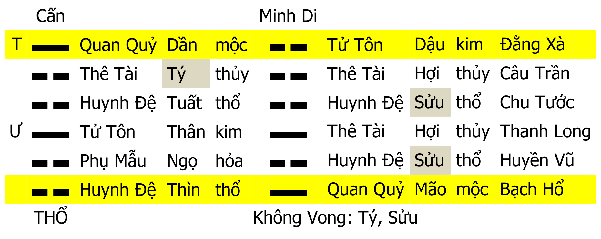
    - **Hình này chứng minh điều gì**
      - Minh họa quẻ Lục xung Bát Thuần Cấn biến Địa Hỏa Minh Di; xác nhận hào Thế Quan Quỷ Dần mộc động hóa Tử Tôn Dậu kim Hồi đầu khắc Thế; hào sơ Huynh Đệ Thìn thổ động hóa Quan Quỷ Mão mộc khắc hào Dụng thần Thê Tài Tý thủy lâm Tuần Không; phản ánh nguy cơ bệnh tật kiết lỵ tại hào 3 và họa người làm trộm cắp gây khẩu thiệt kiện tụng.
    - **Từ đâu mà thấy được**
      - Nhìn vào bảng nạp giáp lục thân: Hào 6 Quan Quỷ Dần mộc (dương động) biến Tử Tôn Dậu kim (âm); hào 5 Thê Tài Tý thủy ghi chú Tuần Không; hào sơ Huynh Đệ Thìn thổ (âm động) biến Quan Quỷ Mão mộc (dương); hào 3 Tử Tôn Thân kim xung Nguyệt kiến.

- **Quy tắc áp dụng**:
  - *Quy tắc phân biệt Dụng thần trong chiêm tài và an nguy bản thân*: Mở cửa hàng lấy Thê Tài làm Dụng thần để xem tài vận; xét thêm hào Thế khi luận đoán cát hung và sức khỏe của đương sự.
  - *Quy tắc Hào Tuần Không tiếp nhận sinh phù*: Hào Không Vong tại thời điểm hiện tại vẫn được Nhật thần sinh ("Nhật sinh Tài là hiện nay kinh doanh phát đạt"); nhưng Không gặp Mộ là tượng kết thúc, tổn thất không thể duy trì dài lâu.
  - *Quy tắc Lục xung và Hồi đầu khắc*: Quẻ Lục xung thì mọi sự không bền; Thế động hóa Hồi đầu khắc khiến đại tượng "sinh ít khắc nhiều", qua thời vượng tướng ắt lâm đại họa.
  - *Quy tắc Hào vị kết hợp Lục thân và Lục thú chẩn đoán sự vụ*:
    - Hào sơ là người làm thuê; Huynh Đệ chủ bầy đàn bè phái; Huyền Vũ chủ trộm cắp ngấm ngầm; Chu Tước và Quan Quỷ chủ kiện tụng quan ti.
    - Hào 3 là vùng bụng; Thê Tài là phân và nước tiểu; Tử Tôn là ruột; hào Kỵ thần tại hào 3 động khắc Thế chủ chứng bệnh kiết lỵ tiêu chảy.

- **Lời giải**:

  - **Bước 1**: Đánh giá triển vọng kinh doanh trước mắt
    - Căn cứ: Tương tác giữa Nhật thần và hào Dụng thần Thê Tài.
    - Nhìn vào: Hào 5 Thê Tài Tý thủy tuy lâm Tuần Không nhưng được Nhật thần Tân Dậu kim tương sinh ($Dậu \rightarrow Tý$). Do đó vào thời điểm mới khai trương, cửa hàng buôn bán thuận lợi, phát tài nhanh chóng.

  - **Bước 2**: Dự báo nguy cơ suy thoái và phá sản dài hạn
    - Căn cứ: Đặc tính quẻ Lục xung và hào Thế động hóa Hồi đầu khắc.
    - Nhìn vào: Quẻ Bát Thuần Cấn là quẻ Lục xung, chủ việc kinh doanh không thể lâu bền. Hào Thế Quan Quỷ Dần mộc động hóa Tử Tôn Dậu kim bị Hồi đầu khắc ($Dậu \rightarrow Dần$); bước sang tháng sáu (tháng Mùi), Mộc nhập Mộ ở Mùi, hào Thế suy tàn tất sinh họa hại.

  - **Bước 3**: Chẩn đoán căn bệnh kiết lỵ của chủ quán
    - Căn cứ: Tượng vị trí hào 3, ngũ hành lục thân và Quỷ trì Thế.
    - Nhìn vào: Hào Thế mang Quan Quỷ chủ bản thân mang bệnh tật. Hào 3 là vị trí vùng bụng; Thê Tài là chất thải bài tiết, Tử Tôn là ruột; Kỵ thần tại hào 3 động khắc Thế báo trước chủ cửa hàng sẽ mắc bệnh kiết lỵ nặng vào tháng sáu, nằm liệt giường kéo dài đến tận tháng tám mùa thu.

  - **Bước 4**: Phán đoán hành vi trộm cắp và kiện tụng của người làm thuê
    - Căn cứ: Tượng hào sơ, Huynh Đệ, Huyền Vũ, Chu Tước và Quan Quỷ.
    - Nhìn vào: Hào sơ đại diện cho người làm thuê; Huynh Đệ Thìn thổ là bè phái người làm; Thê Tài Tý thủy lâm Huyền Vũ ngộ Không là tượng bị trộm cắp sạch của cải. Hào sơ Thìn thổ động hóa Quan Quỷ Mão mộc lâm Chu Tước/Quan Quỷ mang tượng phát sinh kiện tụng quan ti, thưa kiện lên quan phủ nhưng tiền của đã Không Vong nên không lấy lại được.

- **Đối thoại giải đáp nghi vấn**:
  - *Câu hỏi của học viên*: Thưa Vương Hổ Ứng lão sư, thầy đoán hiện nay kinh doanh phát đạt là bởi vì hào Tài được Nhật sinh. Nhưng hào Tài đang lâm Tuần Không thì còn có thể được sinh hay không? Hơn nữa phần dưới có giải thích rằng hào Tài Không Vong bị khắc nhập Mộ, do đó mới bị trộm cắp?
  - *Giải đáp của Vương Hổ Ứng lão sư*:
    - Vấn đề hào Tài lâm Tuần Không có thể được sinh hay không là một khái niệm cơ bản nền tảng của Lục Hào nhập môn.
    - Nhật thần đại diện cho "hiện tại, trước mắt". Nhật sinh hào Tài nghĩa là ngay tại thời điểm hiện tại việc buôn bán đang rất phát đạt, có dòng tiền sinh sôi.
    - Tuy nhiên, Không mang tượng hư vô không đắc tài thực tế, còn Mộ biểu thị sự kết thúc của cục diện. Khi hào Tài lâm Không lại bị hào Huynh Đệ phát động khắc chế và nhập Mộ, đó là điềm báo phá tán hoàn toàn, không thể kéo dài. Người học bốc phệ cần phân định rạch ròi giữa ứng nghiệm trước mắt (Nhật Nguyệt hiện thời) và ứng nghiệm dài hạn khi chuyển giao tiết khí.

- **Kết quả**:
  - Thực tế nghiệm chứng ngoài đời: Đúng như quẻ dự đoán, sau khi mở cửa hàng kinh doanh ban đầu rất phát đạt; đến tháng sáu người chủ mắc bệnh kiết lỵ dữ dội, kéo dài đến tháng tám vẫn không dứt.
  - Nhân lúc chủ quán nằm liệt giường, nhóm người giúp việc đã thông đồng trộm sạch toàn bộ tiền của, hàng hóa trong cửa hàng rồi bỏ trốn. Người chủ làm đơn thưa lên quan phủ nhưng cuối cùng không thu hồi lại được đồng nào.

- **Kiểm tra lại**:
  - Tháng sáu ứng nghiệm bệnh tật vì Dần mộc nhập Mộ tại Mùi.
  - Người làm thay lòng đổi dạ vào mùa thu vì hào Ứng Thân kim vào thu đắc lệnh xung khắc hào Thế Dần mộc.
  - Tài sản bị khoắng sạch không thể thu hồi vì hào Dụng thần Thê Tài Tý thủy lâm Tuần Không và nhập Mộ.

### Ví dụ 12: Xem bệnh anh trai, phân tích điều kiện tam hợp cục (Quẻ Truân biến Chấn)

- **Đề bài**:
  - Ngày Giáp Thìn tháng Thân, có người đến xem bói về tình hình bệnh tật của anh trai ruột, được quẻ Thủy Lôi Truân biến Bát Thuần Chấn.
  - Người hỏi vô cùng hoang mang, kinh sợ khi thấy trong quẻ các hung thần ác sát như Bạch Hổ và Đằng Xà đều đồng thời phát động.

- **Dữ kiện**:
  - Ngày tháng: Ngày Giáp Thìn, tháng Thân.
  - Tuần Không: Dần, Mão (tuần Giáp Thìn).
  - Quẻ chủ: Thủy Lôi Truân (thuộc Khảm, quẻ Lục hợp).
  - Quẻ biến: Bát Thuần Chấn (thuộc Mộc, quẻ Lục xung).

  - Hào động:
    - Hào 5: Quan Quỷ Tuất thổ (Ứng) động hóa Phụ Mẫu Thân kim, lâm Bạch Hổ.
    - Hào 4: Phụ Mẫu Thân kim động hóa Thê Tài Ngọ hỏa (Hồi đầu khắc), lâm Đằng Xà.

  - Hào tĩnh then chốt:
    - Hào 6: Huynh Đệ Tý thủy lâm Huyền Vũ (Dụng thần chủ sự).
    - Hào 1: Huynh Đệ Tý thủy lâm Thanh Long (Dụng thần lưỡng hiện).
    - Hào 3: Quan Quỷ Thìn thổ phục Thê Tài Ngọ hỏa, lâm Câu Trần.
    - Hào 2: Tử Tôn Dần mộc (Thế) ngộ Tuần Không, lâm Chu Tước.

  - Sơ đồ quẻ:
    - Sơ đồ quẻ: (Tham chiếu Hình 12) alt="Sơ đồ quẻ" />

  - Nhìn vào:
    - Dụng thần Huynh Đệ Tý thủy được Nguyệt kiến Thân kim tương sinh.
    - Kỵ thần Quan Quỷ Tuất thổ động sinh Nguyên thần Phụ Mẫu Thân kim; Nguyên thần Phụ Mẫu Thân kim động sinh Dụng thần Tý thủy.
    - Dụng thần Tý thủy nhập Mộ tại Nhật thần Thìn thổ.
    - Hào 4 Phụ Mẫu Thân kim lâm Đằng Xà động hóa Thê Tài Ngọ hỏa Hồi đầu khắc.

- **Minh chứng đồ quẻ chiêm (Hình 12)**: Sơ đồ quẻ phản ánh tương tác hào động, biến hóa sinh khắc và ứng kỳ thực tế.
  - **Hình 12.** Sơ đồ quẻ Truân biến Chấn
    - 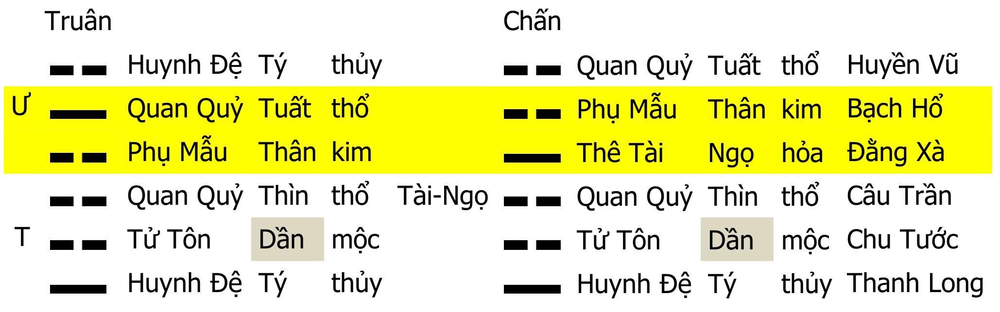
    - **Hình này chứng minh điều gì**
      - Xác lập cơ chế Dẫn hóa Kỵ thần liên tục tương sinh: Hào 5 Kỵ thần Tuất thổ động sinh hào 4 Nguyên thần Thân kim, Thân kim động sinh Dụng thần Tý thủy; đồng thời bác bỏ giả thiết cấu thành Tam hợp cục Thân - Tý - Thìn do hào trung tâm Tý thủy là hào tĩnh.
    - **Từ đâu mà thấy được**
      - Nhìn vào hào 5 Quan Quỷ Tuất thổ (dương động) biến Phụ Mẫu Thân kim (âm) và hào 4 Phụ Mẫu Thân kim (âm động) biến Thê Tài Ngọ hỏa (dương) trên bảng quẻ Truân biến Chấn; hào 6 Huynh Đệ Tý thủy bất động; hào Dụng thần Tý thủy nhập Mộ tại Nhật kiến Thìn thổ.

- **Quy tắc áp dụng**:
  - *Quy tắc Điều kiện cấu thành Tam hợp cục*: Tam hợp cục bắt buộc phải có ít nhất hai hào động trong quẻ mang địa chi thuộc tam hợp cục, và địa chi ở vị trí trung tâm (trung thần) bắt buộc phải phát động; nếu trung thần bất động thì không thể hợp cục với Nhật Nguyệt.
  - *Quy tắc Dẫn hóa Kỵ thần (Tham sinh quên khắc)*: Kỵ thần động nhưng Nguyên thần cũng động thì Kỵ thần sinh Nguyên thần, Nguyên thần sinh Dụng thần, tạo thành chuỗi liên tục tương sinh hóa giải hoàn toàn sát khí.
  - *Quy tắc Phân định Lý (70%) và Tượng (30%) trong đoán bệnh*:
    - Phần Lý: Ngũ hành sinh khắc quyết định sinh tử. Dụng thần đắc Nguyệt sinh và Nguyên thần động sinh thì chắc chắn bảo toàn tính mạng, bác bỏ thuyết "Đằng Xà động sẽ chết, Bạch Hổ động có tang".
    - Phần Tượng: Bạch Hổ lâm Ứng Quỷ động chủ bệnh nhiễm từ nơi xa; Dụng thần nhập Nhật Mộ là tượng nằm liệt trên giường; Đằng Xà lâm Nguyên thần là tượng bệnh tật kéo dài triền miên.
  - *Quy tắc Nguyên thần hóa Hồi đầu khắc và ứng kỳ khỏi bệnh*: Nguyên thần hóa Hồi đầu khắc ngụ ý mầm bệnh chưa dứt hẳn; đợi khi hào khắc bị suy nhược hoặc bị xung khử thì Nguyên thần hồi phục sinh Dụng thần, bệnh sẽ thuyên giảm.

- **Lời giải**:

  - **Bước 1**: Đánh giá căn cơ sinh tử của Dụng thần (Phần Lý)
    - Căn cứ: Quy tắc ngũ hành sinh khắc và cơ chế Dẫn hóa Kỵ thần.
    - Nhìn vào: Dụng thần Huynh Đệ Tý thủy được Nguyệt kiến Thân kim tương sinh mạnh mẽ. Trong quẻ, Kỵ thần Quan Quỷ Tuất thổ tuy động nhưng hào biến là Phụ Mẫu Thân kim; bản thân hào 4 Phụ Mẫu Thân kim cũng phát động. Tuất thổ sinh Thân kim, Thân kim sinh Tý thủy ($Tuất \rightarrow Thân \rightarrow Tý$). Chuỗi liên tục tương sinh khiến Kỵ thần tham sinh quên khắc, Dụng thần được sinh phù vô cùng vững chắc, quyết không thể chết.

  - **Bước 2**: Đính chính nhận thức sai lầm về thần sát cổ điển
    - Căn cứ: Nguyên tắc Lý áp đảo Tượng trong định đoạt cát hung.
    - Nhìn vào: Hào 5 lâm Bạch Hổ Quan Quỷ phát động, hào 4 lâm Đằng Xà Phụ Mẫu phát động. Khẩu quyết cổ truyền "Đằng Xà động chủ tử vong, Bạch Hổ động chủ phát tang" là hoàn toàn giáo điều, sai lệch vì không nhìn vào bản chất sinh khắc ngũ hành.

  - **Bước 3**: Nhận định nguồn gốc phát sinh và trạng thái diễn tiến của bệnh (Phần Tượng)
    - Căn cứ: Tượng hào Ứng, Nhật Mộ và Đằng Xà.
    - Nhìn vào: Hào Ứng là phương xa, Bạch Hổ lâm Quan Quỷ tại Ứng động khắc Dụng thần biểu thị người anh trai bị lây nhiễm bệnh từ nơi đất khách quê người trở về; Dụng thần Tý thủy nhập Mộ tại Nhật thần Thìn thổ là hình tượng người bệnh nằm liệt giường; Phụ Mẫu lâm Đằng Xà động là hình tượng bệnh tật dai dẳng triền miên kéo dài nhiều ngày.

  - **Bước 4**: Xác định ứng kỳ thuyên giảm và hồi phục
    - Căn cứ: Quy tắc vượng suy của Nguyên thần và thời điểm xuất hiện cứu tinh.
    - Nhìn vào: Đến ngày Mậu Thân, Nguyên thần Thân kim nắm lệnh trực nhật, xung khử năng lượng Hồi đầu khắc của Ngọ hỏa, dốc toàn lực tương sinh Dụng thần Tý thủy, bệnh nặng tất thuyên giảm rõ rệt.

- **Đối thoại giải đáp nghi vấn**:
  - *Câu hỏi 1 (Về điều kiện cấu thành Tam hợp cục)*: Dụng thần Tý thủy là hào tĩnh, nếu Tý thủy là hào động thì có thể kết hợp với Nhật thần (Thìn) và Nguyệt kiến (Thân) tạo thành tam hợp cục Thân - Tý - Thìn hay không?
    - *Giải đáp của Vương Hổ Ứng lão sư*: Quẻ này tam hợp không thành. Để cấu thành một tam hợp cục, ít nhất trong quẻ phải có hai hào động, và hai hào động này bắt buộc phải mang địa chi thuộc tam hợp cục đó. Đồng thời, địa chi ở vị trí trung tâm (Tý thủy) bắt buộc phải phát động. Trong quẻ này Tý thủy hoàn toàn bất động, do đó tuyệt đối không thể kết thành tam hợp cục.
  - *Câu hỏi 2 (Về tượng bệnh lâu tại Nguyên thần lâm Đằng Xà)*: Quan Quỷ Tuất thổ lâm Bạch Hổ động khắc Dụng thần nên bị bệnh nặng thì rất hợp lý. Nếu Dụng thần lâm Đằng Xà mà giải thích là bệnh lâu thì nghe cũng thuận tai; nhưng quẻ này Phụ Mẫu lâm Đằng Xà mà giải thích là bệnh lâu thì có khiên cưỡng không?
    - *Giải đáp của Vương Hổ Ứng lão sư*: Khi xem bệnh tật, không nhất thiết chỉ nhìn vào Quan Quỷ. Có nhiều trường hợp phải xem Dụng thần, Nguyên thần hoặc Kỵ thần. Trong quẻ này, Nguyên thần Phụ Mẫu Thân kim động hóa Hồi đầu khắc, do đó bản thân Nguyên thần bị thương tổn cũng chính là hình tượng của bệnh tật; mà Quan Quỷ là Kỵ thần nên cũng có thể xem Quan Quỷ là bệnh tật. Vì Nguyên thần mang bệnh lâm Đằng Xà nên biểu thị căn bệnh dai dẳng, triền miên.
  - *Câu hỏi 3 (Về cơ chế Hồi đầu khắc và Nhật xung hào động)*: Phụ Mẫu hóa Hồi đầu khắc thì có thể sinh Dụng thần được hay không? Hào cách sơn hóa hào có thể hiểu là Quan Quỷ hóa hồi đầu sinh hay không? Quan động gặp Nhật xung là Nhật phá hay xung tán?
    - *Giải đáp của Vương Hổ Ứng lão sư*:
      - Khi hào biến Ngọ hỏa suy nhược bị xung khử (như gặp ngày Tý hoặc Thủy vượng) thì Phụ Mẫu Thân kim sẽ thoát khắc và quay lại sinh Huynh Đệ Tý thủy.
      - Nhật thần Thìn thổ xung Quan Quỷ Tuất thổ là làm cho Tuất thổ động mạnh hơn (xung động kích phát), chứ không phải xung tán hay Nhật phá, bởi vì Tuất thổ vốn dĩ là hào động. Trong quẻ có Phụ Mẫu Thân kim đồng thời phát động nên Tuất thổ dồn lực sinh Thân kim, tạo thành thế liên tục tương sinh vững chắc.

- **Kết quả**:
  - Thực tế nghiệm chứng ngoài đời: Người anh trai mắc bệnh nặng từ phương xa trở về, nằm liệt giường triền miên đúng như lời phán; đến đúng ngày Mậu Thân thì bệnh tình chuyển biến tích cực, thuyên giảm rõ rệt và sau đó bình phục hoàn toàn.

- **Kiểm tra lại**:
  - Dụng thần Tý thủy được chuỗi liên tục tương sinh và Nguyệt kiến sinh phù bảo đảm tính mạng.
  - Ứng kỳ ngày Mậu Thân trùng khớp với thời điểm Nguyên thần Thân kim trị nhật giải tỏa Hồi đầu khắc.
  - Khẳng định tính chính xác tuyệt đối của phương pháp luận Lý (ngũ hành sinh khắc) làm gốc so với các thần sát biểu kiến.

## Nghi vấn thực chứng: Cách sơn hóa hào, Độc phát trường sinh và Phản ngâm

### Cơ sở lý luận và quy tắc cốt lõi

- **Phương pháp Cách sơn hóa hào (Truyền dẫn bắc cầu $A = B, B = C \implies A = C$):**
  - *Khái niệm căn bản:* Khi một hào Dụng thần phát động biến ra một hào trung gian, đồng thời hào trung gian đó tại một vị trí khác trong quẻ lại phát động biến ra Quan Quỷ, sát khí sẽ truyền dẫn bắc cầu khiến Dụng thần chịu trọn vẹn hung họa "cách sơn hóa Quỷ".
  - *Công thức logic:* Đặt Dụng thần là $A$, hào trung gian là $B$, và Quan Quỷ là $C$. Khi $A \to B$ và $B \to C$, kết quả thực chất quy về $A \to C$.
  - *Biểu hiện vi tế:* Tượng "Tử Tôn cách Thê Tài biến Quỷ" chỉ việc con cái gặp nguy nan tử vong do các nguyên nhân liên quan mật thiết đến Thê Tài (chế độ dinh dưỡng, ăn uống) và lục thú lâm hào trung gian (Chu Tước chủ sốt phát ban, viêm họng).
  - *Phân định với Tam hình:* Bác bỏ quan niệm cổ điển quy chụp mọi hung họa cho Tam hình Dần - Thân - Tị; khẳng định Tam hình chỉ đóng vai trò phụ trợ mô tả triệu chứng, không thể quyết định tử sinh nếu không có chuỗi biến hóa ngũ hành tương khắc.

- **Quy tắc Độc phát trường sinh Dụng thần:**
  - *Khái niệm thần cơ độc phát:* Trong quẻ chỉ có duy nhất một hào động (độc phát), thần cơ biến hóa quy tụ toàn bộ tại hào này, nguyên tắc luận đoán chuyển dịch từ tính toán sinh khắc đa tầng sang việc "lấy tượng làm chủ".
  - *Điều kiện chuyển cát:* Khi Dụng thần có khí (được Nhật thần hoặc Nguyệt kiến sinh phù), nếu hào độc phát trùng với cung vị Trường Sinh của Dụng thần theo vòng 12 Cung Trường Sinh ($\text{Kim trường sinh tại Tị}$), thì biến nguy thành an, hào độc phát đem lại sinh khí cứu mạng chứ không luận là khắc hại.
  - *Đính chính hiểu lầm Ám động:* Hào tĩnh hưu tù bị Nhật xung là "Nhật phá", không thể tạo thành ám động thông quan như cách lý giải khiên cưỡng của cổ thư; điềm lành thực sự phát xuất từ tượng Độc phát Trường Sinh.

- **Tượng Phản ngâm ngoại quái và Phân định ranh giới Lý (70%) - Tượng (30%):**
  - *Bản chất Phản ngâm ngoại quái:* Ngoại quái có ba hào động biến thành ba hào tương xung đối lập (như quái Khôn biến quái Tốn: Dậu xung Mão, Hợi xung Tị, Sửu xung Mùi) chủ về tượng biến động, phản phục, trắc trở, "đi rồi lại quay về".
  - *Nguyên lý quyết định cát hung:* Phản ngâm ngoại quái thuần túy là Tượng mô tả hành trình sự việc, hoàn toàn không làm suy giảm hay tước đoạt chức vị; việc thăng quan đắc chức 100% do "Lý" ngũ hành quyết định (hào Thế Quan Quỷ đắc Nguyệt lệnh và Nhật sinh).

- **Cơ chế Dẫn hóa Kỵ thần và Thần cơ tại hào động:**
  - *Khái niệm dẫn hóa:* Khi Kỵ thần động khắc Thế nhưng có Nguyên thần đồng thời phát động, Nguyên thần sẽ đóng vai trò thông quan chuyển hóa sát khí thành sinh phù (Kỵ thần sinh Nguyên thần, Nguyên thần sinh Thế).
  - *Tác động của Nguyệt phá hóa Tuần Không:* Nếu hào Nguyên thần dẫn hóa bị Nguyệt phá lại động hóa Tuần Không, ở thời điểm xem quẻ tại mùa khắc phá sẽ không đủ lực hóa giải triệt để toàn bộ sát khí, dẫn đến hình phạt giáng cấp điều chuyển chứ không mất chức.
  - *Ứng kỳ điền thực:* Thần linh hé lộ cơ trời tại hào động; khi đến tháng Đông chí (tháng Tý) hào dẫn hóa được điền thực vượng tướng, công văn kết án ngã ngũ, kết thúc chuỗi ngày thị phi.

---

### Ví dụ 13: Xem con trai bị bệnh đậu mùa, cách sơn hóa hào biến Quỷ (Quẻ Gia Nhân biến Ly)

- **Đề bài**: Ngày Canh Thân tháng Dần, người cha xem bệnh đậu mùa cho con trai, hỏi bệnh tình có cứu chữa được không và nguyên nhân cát hung diễn biến ra sao.
- **Dữ kiện**
  - Can chi: Ngày Canh Thân, tháng Dần.
  - Tuần không: Tý, Sửu.
  - Quẻ chủ: Phong Hỏa Gia Nhân (quái cung Tốn).
  - Quẻ biến: Ly Vi Hỏa (quái cung Ly).
  - Hào động: Hào 4, hào 5, hào 6 ngoại quái phát động.

| Hào vị | Lục thân (Chính) | Can Chi (Chính) | Quẻ Gia Nhân | Quẻ Ly | Can Chi (Biến) | Lục thân (Biến) | Lục thú |
| :---: | :--- | :--- | :---: | :---: | :--- | :--- | :--- |
| 6 | Huynh Đệ | Mão mộc | — | — | Tị hỏa | Tử Tôn | Đằng Xà |
| 5 (Ứng) | Tử Tôn | Tị hỏa | — (Động) | - - | Mùi thổ | Thê Tài | Câu Trần |
| 4 | Thê Tài | Mùi thổ | - - (Động) | — | Dậu kim | Quan Quỷ | Chu Tước |
| 3 | Phụ Mẫu [Quan-Dậu] | Hợi thủy | — | — | Hợi thủy | Phụ Mẫu | Thanh Long |
| 2 (Thế) | Thê Tài | Sửu thổ | - - | - - | Sửu thổ | Thê Tài | Huyền Vũ |
| 1 | Huynh Đệ | Mão mộc | — | — | Mão mộc | Huynh Đệ | Bạch Hổ |

  - Sơ đồ quẻ: (Tham chiếu Hình 13) alt="Sơ đồ quẻ" />
  - Nhìn vào: Hào 5 Tử Tôn Tị hỏa là Dụng thần, trì Ứng, lâm Câu Trần; hào 4 Thê Tài Mùi thổ lâm Chu Tước động hóa Quan Quỷ Dậu kim; hào 6 Huynh Đệ Mão mộc lâm Đằng Xà động hóa Tử Tôn Tị hỏa; ngày Canh Thân tháng Dần.

  - **Hình 13.** Sơ đồ quẻ Phong Hỏa Gia Nhân biến Ly
    - 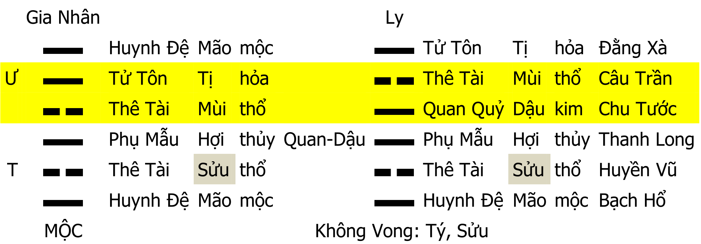
    - **Hình này chứng minh điều gì**
      - Quẻ Phong Hỏa Gia Nhân có hào 5 Tử Tôn Tị hỏa động biến Thê Tài Mùi thổ, tiếp giáp hào 4 Thê Tài Mùi thổ động biến Quan Quỷ Dậu kim, chứng minh cơ chế chí mạng "Cách sơn hóa hào" (Tử Tôn cách Thê Tài biến Quỷ) dẫn đến tử vong dù Dụng thần đắc lệnh mùa xuân; bác bỏ việc chỉ dựa vào Tam hình để luận định sinh tử.
    - **Từ đâu mà thấy được**
      - Nhìn vào hào 5 Tử Tôn Tị hỏa phát động hóa Thê Tài Mùi thổ, hào 4 Thê Tài Mùi thổ lâm Chu Tước phát động hóa Quan Quỷ Dậu kim; chuỗi bắc cầu $A = B, B = C \implies A = C$ biến Dụng thần thành Quỷ; ngày Canh Thân tháng Dần (Tuần Không: Tý, Sửu).

- **Quy tắc áp dụng**
  - Quy tắc Cách sơn hóa hào ($A = B, B = C \implies A = C$): Truyền dẫn bắc cầu biến tượng từ Tử Tôn qua Thê Tài biến Quỷ.
  - Quy tắc Biến Quỷ định hung sự: Tử Tôn động hóa Quan Quỷ trong chiêm đoán bệnh tật cho con cái là điềm đại hung, khó qua khỏi.
  - Quy tắc Phân định Lý - Tượng đối với Tam hình: Tam hình Dần - Thân - Tị chỉ đóng vai trò phụ trợ miêu tả sự dằn vặt đau đớn, không quyết định tử sinh.

- **Lời giải**

  - **Bước 1**: Đánh giá suy vượng của Dụng thần theo cổ pháp Dã Hạc.
    - Căn cứ: Mùa xuân là lúc Mộc vượng Hỏa tướng; Dụng thần Tử Tôn Tị hỏa được Nguyệt kiến Dần mộc sinh trợ và là đất Trường Sinh của Hỏa.
    - Nhìn vào: Hào 5 Tử Tôn Tị hỏa vượng tướng, Dã Hạc thoạt đầu nhận định bệnh đậu mùa có thể chữa khỏi.

  - **Bước 2**: Nhận diện hạn chế trong cách giải thích bằng Tam hình của Dã Hạc khi đứa trẻ tử vong.
    - Căn cứ: Đứa trẻ không qua khỏi, chết vào giờ Dần ngày Dần. Dã Hạc lúc này mới ngộ ra rằng do Nguyệt kiến tại Dần, Nhật kiến tại Thân kết hợp với hào Tị tạo thành Tam hình Dần - Thân - Tị.
    - Nhìn vào: Tam hình nếu không có ngũ hành tương khắc chí mạng thì không thể làm chết người, việc gán ghép hoàn toàn cho Tam hình là chưa thấu triệt nguồn cơn biến hóa.

  - **Bước 3**: Khai mở bản chất học thuật theo Vương Hổ Ứng bằng phương pháp "Cách sơn hóa hào".
    - Căn cứ: Cơ chế liên hoàn bắc cầu $A = B, B = C \implies A = C$.
    - Nhìn vào: Hào 5 Tử Tôn Tị hỏa động biến Thê Tài Mùi thổ ($A = B$). Đồng thời hào 4 Thê Tài Mùi thổ phát động biến Quan Quỷ Dậu kim ($B = C$). Do đó, hào 5 Tử Tôn Tị hỏa trực tiếp cách hào Thê Tài mà biến thành Quan Quỷ ($A = C$).

  - **Bước 4**: Giải mã nguyên nhân bệnh lý tử vong qua Lục thân và Lục thú.
    - Căn cứ: Thê Tài chủ về thực phẩm, ăn uống dinh dưỡng; Chu Tước chủ về nhiệt độc, sốt cao, viêm họng phát ban đỏ.
    - Nhìn vào: Hào 4 Thê Tài Mùi thổ lâm Chu Tước hóa Quỷ cho thấy đứa trẻ bị sốt quá cao dẫn đến co giật kiệt sức, hoặc vì cổ họng lở loét tắc nghẽn không thể ăn uống nuốt thuốc mà tử vong.

- **Đối thoại giải đáp nghi vấn**:
  - *Người hỏi chất vấn:* Quẻ này có phải là tượng "Tử Tôn hóa Thê Tài + Thê Tài hóa Quan Quỷ = Tử Tôn cách Thê Tài biến Quỷ"? Có phải là người xưa không biết cách chữa trị đậu mùa mà dùng sai phương pháp khiến đứa con tử vong? Quẻ này có liên quan đến việc dùng tam hình để luận cát hung hay không?
  - *Vương Hổ Ứng lão sư giải đáp:*
    - Tam hình chỉ là một phần nhỏ mang tính chất phụ trợ mô tả sự đau đớn dằn vặt, ở quẻ này tác dụng của "Cách sơn hóa hào" mới là nhân tố quyết định hung tử.
    - Cơ chế này vận hành tựa như công thức toán học $A = B, B = C$, vì thế $A$ có thể trực tiếp bằng $C$. Tử Tôn cách Tài hóa Quỷ, mà Tài lại lâm Chu Tước.
    - Chu Tước biểu thị chứng sốt nhiệt phát ban, Thê Tài biểu thị sự ăn uống hấp thu. Tượng quẻ chỉ rõ đứa trẻ hoặc vì sốt quá cao mà chết, hoặc vì không thể dung nạp thức ăn và thuốc mà qua đời.

- **Kết quả**:
  - Dã Hạc ban đầu đoán bệnh chữa được do Tử Tôn vượng tướng, nhưng thực tế đứa trẻ đã qua đời vào đúng giờ Dần ngày Dần.

- **Kiểm tra lại**:
  - Giờ Dần ngày Dần là thời điểm Dần mộc xung thực Nhật thần Thân kim, đồng thời Dần hình Tị, kích phát hoàn toàn cơ chế Cách sơn hóa Quỷ và phát tác độc tố sốt cao Chu Tước đến tột cùng.

---

### Ví dụ 14: Xem con gái lên đậu mùa, độc phát trường sinh chuyển cát (Quẻ Khôn biến Sư)

- **Đề bài**: Ngày Ất Mùi tháng Dần, người cha xem cho con gái mắc bệnh đậu mùa đang ở tình trạng vô cùng nguy cấp, hỏi có qua khỏi tai ương hay không.
- **Dữ kiện**
  - Can chi: Ngày Ất Mùi, tháng Dần.
  - Tuần không: Thìn, Tị.
  - Quẻ chủ: Bát Thuần Khôn (quái cung Khôn).
  - Quẻ biến: Địa Thủy Sư (quái cung Khảm).
  - Hào động: Hào 2 Phụ Mẫu Tị hỏa độc phát biến Huynh Đệ Thìn thổ.

| Hào vị | Lục thân (Chính) | Can Chi (Chính) | Quẻ Khôn | Quẻ Sư | Can Chi (Biến) | Lục thân (Biến) | Lục thú |
| :---: | :--- | :--- | :---: | :---: | :--- | :--- | :--- |
| 6 (Thế) | Tử Tôn | Dậu kim | - - | - - | Dậu kim | Tử Tôn | Huyền Vũ |
| 5 | Thê Tài | Hợi thủy | - - | - - | Hợi thủy | Thê Tài | Bạch Hổ |
| 4 | Huynh Đệ | Sửu thổ | - - | - - | Sửu thổ | Huynh Đệ | Đằng Xà |
| 3 (Ứng) | Quan Quỷ | Mão mộc | - - | - - | Ngọ hỏa | Phụ Mẫu | Câu Trần |
| 2 | Phụ Mẫu | Tị hỏa | - - (Động) | — | Thìn thổ | Huynh Đệ | Chu Tước |
| 1 | Huynh Đệ | Mùi thổ | - - | - - | Dần mộc | Quan Quỷ | Thanh Long |

  - Sơ đồ quẻ: (Tham chiếu Hình 14) alt="Sơ đồ quẻ" />
  - Nhìn vào: Hào 6 Tử Tôn Dậu kim trì Thế; hào 2 Phụ Mẫu Tị hỏa độc phát lâm Chu Tước biến Huynh Đệ Thìn thổ; ngày Ất Mùi xung hào 4 Huynh Đệ Sửu thổ; Tuần Không tại Thìn và Tị.

  - **Hình 14.** Sơ đồ quẻ Khôn biến Sư
    - 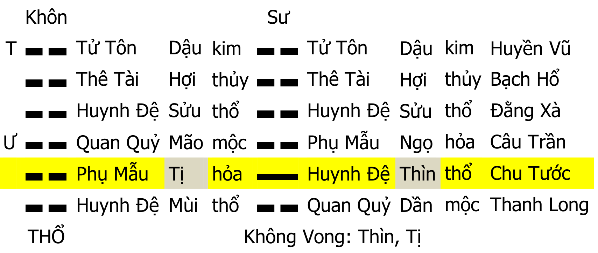
    - **Hình này chứng minh điều gì**
      - Quẻ Khôn biến Sư chứng minh nguyên lý "Độc phát trường sinh Dụng thần chuyển nguy thành an": hào 2 Tị hỏa độc phát là cung Trường Sinh của Dụng thần Tử Tôn Dậu kim; quẻ độc phát lấy tượng làm chủ, đem lại sinh cơ cứu sống người bệnh; bác bỏ quan niệm khiên cưỡng về ám động thông quan.
    - **Từ đâu mà thấy được**
      - Nhìn vào quẻ chỉ có duy nhất hào 2 Phụ Mẫu Tị hỏa phát động biến Huynh Đệ Thìn thổ; hào 6 Tử Tôn Dậu kim trì Thế được Nhật thần Mùi thổ tương sinh (có khí); Kim trường sinh tại Tị theo vòng 12 Cung Trường Sinh; ngày Ất Mùi tháng Dần.

- **Quy tắc áp dụng**
  - Quy tắc Độc phát trường sinh Dụng thần: Hào độc phát là cung Trường Sinh của Dụng thần có khí, chuyển nguy thành an, gặp thầy giỏi thuốc hay.
  - Quy tắc Độc phát thủ tượng: Quẻ độc phát lấy tượng làm chủ đạo, không câu nệ ngũ hành sinh khắc đa tầng.
  - Phân định Ám động và Nhật phá: Hào tĩnh hưu tù bị Nhật xung là Nhật phá, không thể cấu thành ám động có lực.

- **Lời giải**

  - **Bước 1**: Đánh giá khí lực căn bản của Dụng thần.
    - Căn cứ: Xem bệnh con gái lấy Tử Tôn làm Dụng thần.
    - Nhìn vào: Hào 6 Tử Tôn Dậu kim trì Thế. Tháng Dần mùa xuân Kim hưu tù; song may mắn được Nhật thần Ất Mùi thổ tương sinh $\implies$ Dụng thần có khí, căn cơ sinh mệnh vẫn tồn tại.

  - **Bước 2**: Chỉ ra điểm khiên cưỡng trong lập luận của Dã Hạc lão nhân.
    - Căn cứ: Dã Hạc giải thích rằng hào 2 Tị hỏa động khắc Dậu kim, nhưng được Nhật thần Mùi xung hào 4 Sửu thổ thành ám động; Hỏa sinh Thổ, Thổ sinh Kim tạo thành thế liên tục tương sinh cứu sống đứa bé.
    - Nhìn vào: Sửu thổ trong tháng Dần là hưu tù, hưu tù bị Nhật xung phải là Nhật phá, tuyệt đối không đủ sức tạo thành ám động để gánh Hỏa sinh Kim.

  - **Bước 3**: Thấu suốt bản chất học thuật theo Vương Hổ Ứng về Độc phát Trường Sinh.
    - Căn cứ: Quẻ này là quẻ Độc phát (duy nhất hào 2 chuyển động). Thần cơ độc phát lấy tượng làm chủ.
    - Nhìn vào: Theo vòng 12 Cung Trường Sinh của ngũ hành Kim, Kim trường sinh tại Tị. Hào 2 Tị hỏa độc phát chính là đất Trường Sinh của Tử Tôn Dậu kim. Hào độc phát mang đến sinh khí dồi dào, chuyển hóa hiểm nguy thành đại cát.

  - **Bước 4**: Xác định thời điểm ứng kỳ cứu chữa.
    - Căn cứ: Giờ Mùi thổ sinh trợ Dậu kim; giờ Thân kim là Lộc vị và tỷ hòa tương trợ bản thân Dụng thần.
    - Nhìn vào: Dã Hạc quyết đoán vào giờ Mùi, giờ Thân hôm nay sẽ gặp được phương thuốc cứu sống.

- **Đối thoại giải đáp nghi vấn**:
  - *Người hỏi chất vấn sâu sắc:* Quẻ này nằm trong chương Ám động. Nhưng điều kiện ám động là hào tĩnh vượng tướng bị Nhật xung. Nếu hào tĩnh hưu tù bị Nhật xung là Nhật phá. Trong quẻ này Sửu thổ tại tháng Dần, phải là hưu tù Nhật phá chứ? Mà Phụ Mẫu Tị hỏa phải là trực tiếp khắc Tử Tôn Dậu kim không sinh Huynh Đệ Sửu thổ. Mong lão sư chỉ điểm thực chất!
  - *Vương Hổ Ứng lão sư giải đáp:*
    - Đây là quẻ độc phát, chỉ cần Dụng thần có khí được Trường Sinh thì là cát, hoàn toàn không phải nhờ vào ám động.
    - Nguyên nhân là vì quẻ độc phát lấy tượng làm chủ. Dụng thần Tử Tôn Dậu kim đắc Nhật thần Mùi thổ sinh nên có khí; hào động Tị hỏa độc phát chính là đất Trường Sinh của Tử Tôn, vì vậy chuyển nguy thành an.

- **Kết quả**:
  - Người nhà ban đầu vô cùng lo lắng vì bệnh tình nguy kịch, nhưng đúng đến giờ Thân trong ngày đã gặp được thầy thuốc giỏi kê đơn cứu sống đứa con gái.

- **Kiểm tra lại**:
  - Giờ Thân là giờ Kim lâm quan đắc khí, kết hợp hoàn hảo với hào độc phát Tị hỏa Trường Sinh, minh chứng thực nghiệm cho quy tắc Độc phát lấy tượng Trường Sinh làm chủ.

---

### Ví dụ 15: Xem thăng tiến chức vụ, phản ngâm ngoại quái (Quẻ Lâm biến Trung Phu)

- **Đề bài**: Ngày Kỷ Hợi tháng Mão, một vị quan xem về việc thăng tiến chức vụ, hỏi có được bổ nhiệm thăng quan hay không và tiền trình hoạn lộ diễn biến ra sao.
- **Dữ kiện**
  - Can chi: Ngày Kỷ Hợi, tháng Mão.
  - Tuần không: Thìn, Tị.
  - Quẻ chủ: Địa Trạch Lâm (quái cung Khôn).
  - Quẻ biến: Phong Trạch Trung Phu (quái cung Cấn).
  - Hào động: Toàn bộ ngoại quái Khôn phát động biến Tốn (hào 4, 5, 6 cùng động).

| Hào vị | Lục thân (Chính) | Can Chi (Chính) | Quẻ Lâm | Quẻ Trung Phu | Can Chi (Biến) | Lục thân (Biến) | Lục thú |
| :---: | :--- | :--- | :---: | :---: | :--- | :--- | :--- |
| 6 | Tử Tôn | Dậu kim | - - (Động) | — | Mão mộc | Quan Quỷ | Câu Trần |
| 5 (Ứng) | Thê Tài | Hợi thủy | - - (Động) | — | Tị hỏa | Phụ Mẫu | Chu Tước |
| 4 | Huynh Đệ | Sửu thổ | - - (Động) | - - | Mùi thổ | Huynh Đệ | Thanh Long |
| 3 | Huynh Đệ | Sửu thổ | - - | - - | Sửu thổ | Huynh Đệ | Huyền Vũ |
| 2 (Thế) | Quan Quỷ | Mão mộc | — | — | Mão mộc | Quan Quỷ | Bạch Hổ |
| 1 | Phụ Mẫu | Tị hỏa | — | — | Tị hỏa | Phụ Mẫu | Đằng Xà |

  - Sơ đồ quẻ: (Tham chiếu Hình 15) alt="Sơ đồ quẻ" />
  - Nhìn vào: Hào 2 Quan Quỷ Mão mộc trì Thế lâm Bạch Hổ; ngoại quái Phản ngâm: hào 6 Dậu biến Mão, hào 5 Hợi biến Tị, hào 4 Sửu biến Mùi; ngày Kỷ Hợi tháng Mão; Tuần Không tại Thìn và Tị.

  - **Hình 15.** Sơ đồ quẻ Lâm biến Trung Phu
    - 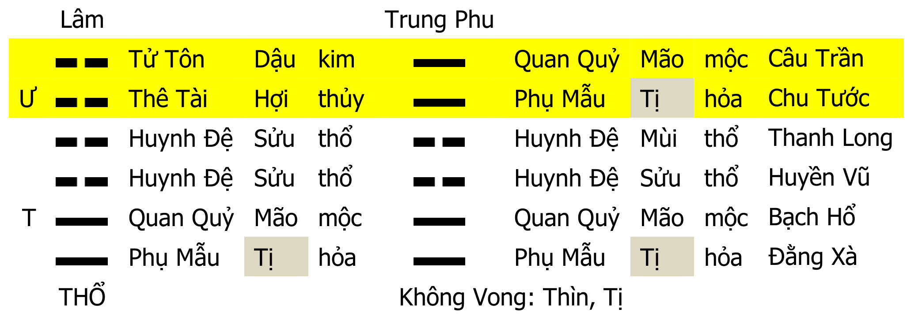
    - **Hình này chứng minh điều gì**
      - Quẻ Lâm biến Trung Phu chứng minh việc thăng quan đắc chức hoàn toàn do Lý quyết định (hào Thế Quan Quỷ Mão mộc vượng tướng nhờ Nguyệt kiến phù trợ và Nhật thần sinh dưỡng); ngoại quái Phản ngâm thuần túy là Tượng mô tả hành trình trắc trở, thăng quan đi trấn nhậm phương xa rồi chưa đầy một năm lại bị thuyên chuyển về chốn cũ.
    - **Từ đâu mà thấy được**
      - Nhìn vào hào 2 Quan Quỷ Mão mộc trì Thế đắc lệnh Nguyệt kiến tháng Mão và Nhật thần Hợi thủy Trường Sinh; ngoại quái ba hào 4 Sửu, 5 Hợi, 6 Dậu đồng loạt phát động biến thành Mùi, Tị, Mão đối xung lẫn nhau (Phản ngâm ngoại quái); ngày Kỷ Hợi tháng Mão.

- **Quy tắc áp dụng**
  - Quy tắc Cốt lõi của Hoạn lộ: "Quan tinh trì Thế, đắc Nhật Nguyệt sinh phù ắt được thăng quan". Trong mệnh có quan mới gieo được Quan trì Thế vượng tướng.
  - Quy tắc Tượng Phản ngâm ngoại quái: Phản ngâm chủ về biến động lặp đi lặp lại, qua lại trắc trở, "đi rồi lại quay về". Cát hung thành bại vẫn do độ suy vượng của Dụng thần quyết định.
  - Phân định ranh giới Lý (70%) và Tượng (30%): Lý quyết định việc được thăng quan, Tượng mô tả chi tiết hoàn cảnh đi rồi lại về.

- **Lời giải**

  - **Bước 1**: Thẩm định căn cơ Dụng thần Quan vận và Hào Thế.
    - Căn cứ: Cầu thăng chức lấy Quan Quỷ làm Dụng thần, kết hợp hào Thế là bản thân quái chủ.
    - Nhìn vào: Hào 2 Quan Quỷ Mão mộc trì Thế. Tháng Mão lâm Nguyệt kiến đương quyền; ngày Hợi là Nhật thần tương sinh và là cung Trường Sinh của Mộc ($\text{Mộc trường sinh tại Hợi}$). Cả Thế và Quan đều vượng tướng tột bậc $\implies$ Chắc chắn được bổ nhiệm thăng chức.

  - **Bước 2**: Định vị thời gian ứng nghiệm và phương vị bổ nhiệm.
    - Căn cứ: Hào Quan Mão mộc gặp Nguyệt kiến; địa chi Mão thuộc quái Chấn phương Đông.
    - Nhìn vào: Được bổ nhiệm ngay trong tháng Mão. Thăng chức từ Giang Tây đi trấn nhậm Sơn Đông (phương Đông thuộc Mão mộc).

  - **Bước 3**: Giải mã nguyên nhân thuyên chuyển hồi quy bằng Tượng Phản ngâm.
    - Căn cứ: Ngoại quái Khôn biến Tốn, cả ba hào ngoại quái động biến đối xung: hào 6 Dậu xung Mão, hào 5 Hợi xung Tị, hào 4 Sửu xung Mùi.
    - Nhìn vào: Ngoại quái Phản ngâm chủ việc phản phục không yên, đi rồi lại về. Do đó sau khi nhận chức chưa đầy một năm sẽ bị điều chuyển trở lại Giang Tây.

- **Đối thoại giải đáp nghi vấn**:
  - *Người hỏi chất vấn sâu sắc:* Trong quẻ này hào Ứng Nguyên thần Hợi thủy có phải là Nhật hóa Tuyệt địa? Lại Dậu kim Tử Tôn Nguyệt phá thêm phản xung, càng vô lực sinh thủy. Vì vậy tôi cho rằng Hợi thủy không có Tuyệt xứ phùng sinh. Như vậy bây giờ hào Thế Mão mộc hoàn toàn dựa vào sức mạnh của Nhật Nguyệt làm cho quái chủ thăng chức? Hào Thế có quan hệ sinh khắc gì với hai hào động không?
  - *Vương Hổ Ứng lão sư giải đáp:*
    - Phân tích của người hỏi hoàn toàn chuẩn xác. Chủ yếu được quan là bởi vì Thế được Nguyệt phù Nhật sinh trực tiếp, chứ không phải là nhờ vào hào Tài đến sinh.
    - Nếu như Quan không trì Thế thì có thể đã không được thăng chức; cổ nhân gọi là "trong mệnh không có quan thì khó cầu được Quan Quỷ trì Thế".
    - Ngoại quái phản ngâm chỉ cung cấp thông tin tượng học là "đi rồi lại quay về", không làm triệt tiêu sự vượng tướng của hào Thế Quan tinh.

- **Kết quả**:
  - Đúng trong tháng Mão quái chủ nhận chiếu chỉ thăng quan từ Giang Tây đi nhậm chức tại Sơn Đông.
  - Chưa đầy một năm sau, triều đình lại có sắc lệnh điều động thuyên chuyển ông quay trở lại Giang Tây.

- **Kiểm tra lại**:
  - Hào Thế Quan Quỷ Mão mộc đắc lệnh quyết định tuyệt đối việc thăng quan; ngoại quái Phản ngâm ứng nghiệm hoàn hảo cảnh ngộ đi Sơn Đông rồi lại trở về Giang Tây.

---

### Ví dụ 16: Xem công danh hậu vận, hào động Tý thủy bị giáng chức (Quẻ Cấn biến Quan)

- **Đề bài**: Ngày Quý Mão tháng Ngọ, một vị quan xem về công danh hậu vận, hỏi tương lai có gặp trắc trở sóng gió gì không và chức vị ra sao.
- **Dữ kiện**
  - Can chi: Ngày Quý Mão, tháng Ngọ.
  - Tuần không: Thìn, Tị.
  - Quẻ chủ: Bát Thuần Cấn (quái cung Cấn).
  - Quẻ biến: Phong Địa Quan (quái cung Cấn).
  - Hào động: Hào 3 Tử Tôn Thân kim và hào 5 Thê Tài Tý thủy phát động.

| Hào vị | Lục thân (Chính) | Can Chi (Chính) | Quẻ Cấn | Quẻ Quan | Can Chi (Biến) | Lục thân (Biến) | Lục thú |
| :---: | :--- | :--- | :---: | :---: | :--- | :--- | :--- |
| 6 (Thế) | Quan Quỷ | Dần mộc | — | — | Mão mộc | Quan Quỷ | Bạch Hổ |
| 5 | Thê Tài | Tý thủy | - - (Động) | — | Tị hỏa | Phụ Mẫu | Đằng Xà |
| 4 | Huynh Đệ | Tuất thổ | - - | - - | Mùi thổ | Huynh Đệ | Câu Trần |
| 3 (Ứng) | Tử Tôn | Thân kim | — (Động) | - - | Mão mộc | Quan Quỷ | Chu Tước |
| 2 | Phụ Mẫu | Ngọ hỏa | - - | - - | Tị hỏa | Phụ Mẫu | Thanh Long |
| 1 | Huynh Đệ | Thìn thổ | - - | - - | Mùi thổ | Huynh Đệ | Huyền Vũ |

  - Sơ đồ quẻ: (Tham chiếu Hình 16) alt="Sơ đồ quẻ" />
  - Nhìn vào: Hào 6 Quan Quỷ Dần mộc trì Thế lâm Bạch Hổ; hào 3 Tử Tôn Thân kim (Ứng) lâm Chu Tước động khắc Thế Quan; hào 5 Thê Tài Tý thủy lâm Đằng Xà động hóa Phụ Mẫu Tị hỏa; tháng Ngọ Nguyệt kiến xung Tý thủy (Nguyệt phá); ngày Quý Mão tuần Giáp Ngọ, Tị hỏa lâm Tuần Không.

  - **Hình 16.** Sơ đồ quẻ Cấn biến Quan
    - 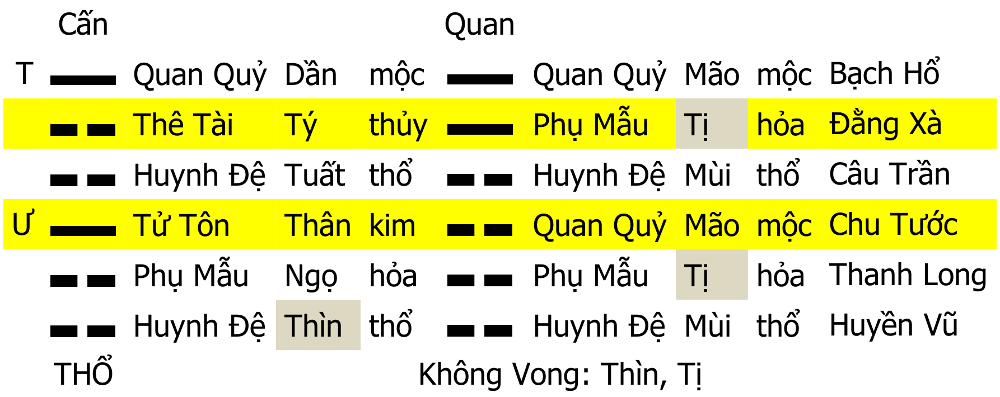
    - **Hình này chứng minh điều gì**
      - Quẻ Cấn biến Quan chứng minh nguyên lý "Thần cơ tại hào động" và cơ chế dẫn hóa Kỵ thần không đầy đủ: Kỵ thần Thân kim và Nguyên thần Tý thủy cùng động, nhưng Tý thủy Nguyệt phá hóa Tuần Không nên ở mùa hè không đủ lực hóa giải toàn bộ sát khí công kích, dẫn đến kết cục bị giáng chức điều nhiệm thay vì bị miễn quan; ứng kỳ định án vào tháng Đông chí khi Tý thủy được điền thực.
    - **Từ đâu mà thấy được**
      - Nhìn vào hào 3 Tử Tôn Thân kim lâm Chu Tước động khắc hào 6 Thế Quan Dần mộc; hào 5 Thê Tài Tý thủy lâm Đằng Xà động hóa Phụ Mẫu Tị hỏa (Nguyệt phá, biến Tuần Không); hào 6 Quan Quỷ Dần mộc trì Thế lâm Bạch Hổ; ngày Quý Mão tháng Ngọ.

- **Quy tắc áp dụng**
  - Quy tắc Kỵ thần khắc Thế lâm Chu Tước: Tử Tôn là Kỵ thần của quan chức, phát động tại hào Ứng lâm Chu Tước chủ việc bị người khác đàn hặc, công kích khẩu thiệt nhằm tước đoạt chức vụ.
  - Quy tắc Dẫn hóa Kỵ thần: Thân kim sinh Tý thủy, Tý thủy sinh Dần mộc tạo thành chuỗi liên tục tương sinh thông quan, cứu giải tai họa sát thân mất chức.
  - Quy tắc Hào động Nguyệt phá hóa Không: Hào động dù phá dù không vẫn là nơi phát lộ cơ trời; không thể xem là hoàn toàn vô dụng, nhưng do suy bại tại thời điểm xem nên lực cứu bị thiếu hụt, dẫn đến bị giáng cấp chứ không được thăng quan.
  - Quy tắc Điền thực định Ứng kỳ: Tháng Tý (Đông chí) Tý thủy xuất phá đắc lệnh, công văn kết án ngã ngũ.

- **Lời giải**

  - **Bước 1**: Nhận diện nguy cơ đàn hặc và thời điểm phát sinh biến cố.
    - Căn cứ: Quan tinh Dần mộc trì Thế bị hào Ứng Tử Tôn Thân kim phát động khắc chế. Ứng là đối phương, lâm Chu Tước chủ khẩu thiệt thị phi, tố cáo đàn hặc.
    - Nhìn vào: Đến tháng 7 (tháng Thân kim đương lệnh) chắc chắn sẽ bùng phát mâu thuẫn đấu đá, có kẻ vạch tội hạ bệ mình.

  - **Bước 2**: Xác định vai trò cứu giải của hào 5 Thê Tài Tý thủy.
    - Căn cứ: Nếu chỉ có Thân kim động thì Quan tinh Dần mộc bị khắc tuyệt, ắt mất sạch chức tước. May mắn có hào 5 Thê Tài Tý thủy cùng phát động.
    - Nhìn vào: Thân kim sinh Tý thủy, Tý thủy sinh Dần mộc $\implies$ Tạo thế dẫn hóa Kỵ thần, chuyển khắc thành sinh. Do đó chỉ bị giáng chức thuyên chuyển chứ không bị bãi miễn hoàn toàn.

  - **Bước 3**: Phân biệt quan điểm cổ pháp của môn khách và thực tế dự đoán của Dã Hạc.
    - Căn cứ: Sách xưa viết: "Kỵ thần và Nguyên thần cùng động, Thế Quan được hai sinh, mùa đông ắt thăng quan". Môn khách căn cứ vào đây để hỏi vì sao Dã Hạc lại đoán bị giáng chức.
    - Nhìn vào: Hào Tý thủy ở tháng Ngọ bị Nguyệt kiến xung là Nguyệt phá, động hóa Phụ Mẫu Tị hỏa Tuần Không. Cổ pháp cho là "có cũng như không", nhưng Dã Hạc thấy cơ trời tại hào động: động thì có công cứu giải, song vì phá và không nên lực cứu chưa trọn vẹn, phải chịu hình phạt giáng cấp.

  - **Bước 4**: Thấu triệt bản chất học thuật theo luận giải của Vương Hổ Ứng.
    - Căn cứ: Nguyên lý suy vượng của ngũ hành theo thời gian mùa tiết.
    - Nhìn vào: Tại tháng Ngọ mùa hè, Tý thủy cực nhược lại Nguyệt phá, không đủ khả năng hóa giải tất cả năng lượng bất lợi do Kỵ thần gây ra, nên quái chủ phải chịu hình phạt giáng chức. Nếu Tý thủy bất động thì ngay cả chức quan cũng không giữ nổi. Đến tháng Đông chí (tháng Tý), Tý thủy mới vượng tướng điền thực, công văn kết án (Phụ Mẫu) mới chính thức định đoạt.

- **Đối thoại giải đáp nghi vấn**:
  - *Môn khách xưa chất vấn Dã Hạc:* "Đã được hào Tý thủy tương sinh nối tiếp, trong sách xưa có viết: Nếu Kỵ thần và Nguyên thần cùng động, hào Quan và hào Thế được hai sinh, là điềm mùa đông trong năm sẽ được thăng quan, tại sao ông lại cho là bị giáng chức?"
  - *Dã Hạc đáp:* Hào Tý thủy gặp Nguyệt phá mà hóa thành Tị hỏa Tuần Không, sách xưa viết có cũng như không. Ta không đoán máy móc theo phép cổ. Thần linh hé lộ cơ trời tại hào động, động ắt có nguyên nhân cứu giải nên ta đoán là giáng cấp mà thôi. Về thời gian, đợi tháng Đông chí Tý thủy điền thực mới ứng nghiệm.
  - *Người học nay chất vấn Vương Hổ Ứng:* "Thần linh hé lộ cơ trời tại hào động, động ắt có nguyên nhân, nên ta chỉ đoán là giáng cấp mà thôi, về thời gian bị giáng cấp, nếu tại tháng Đông chí, mới ứng nghiệm..." Đoạn này ý nghĩa sâu xa là gì?
  - *Vương Hổ Ứng lão sư giải đáp:*
    - Khi dự đoán ở mùa đông thì Tý thủy vượng tướng, có đủ toàn lực dẫn hóa Kỵ thần.
    - Những tháng khác thì Tý thủy yếu, so với tháng dự đoán hiện tại thì Tý thủy Nguyệt phá, không có khả năng hóa giải tất cả năng lượng bất lợi, vì vậy bị trừng phạt giáng cấp.
    - Nếu Tý thủy bất động thì đến chức quan cũng không còn.

- **Kết quả**:
  - Quả nhiên vào tháng 7 (tháng Thân), giữa các quan lại xảy ra đấu đá, đàn hặc tố cáo lẫn nhau kết thành thị phi đúng như tượng Chu Tước Thân kim khắc Thế.
  - Đến tháng Đông chí (tháng Tý), sự việc kết thúc ngã ngũ, vị quan bị giáng chức và điều chuyển sang nhiệm sở khác.

- **Kiểm tra lại**:
  - Tháng Thân Kỵ thần vượng bùng phát thị phi đàn hặc; tháng Tý Nguyên thần điền thực công văn kết án giáng chức điều nhiệm; chứng minh quy luật hào động Nguyệt phá hóa Không vận hành chính xác từng chi tiết.

## Nghi vấn thực chứng: Phục thần xuất hiện, Bổ nhiệm quan chức và Mộ khố độc phát

### Nguyên lý nền tảng: Phục thần, Độc phát và Biến hóa Tiến Thoái

- **Cơ chế Phục thần xuất hiện khi Dụng thần lâm Nhật Nguyệt:**
  - Cổ nhân (Dã Hạc) cho rằng trong quẻ không có Dụng thần mà Nhật thần là Dụng thần thì khỏi cần tìm Phục thần.
  - Vương Hổ Ứng lão sư đính chính: Dụng thần lâm Nhật Nguyệt vẫn bắt buộc phải tra cứu Phục thần tàng phục trong bản quẻ.
  - Phục thần tàng phục mang tính chất căn nguyên, phản ánh trọn vẹn quy luật ứng kỳ xuất hiện và các mối quan hệ hình xung khắc hợp vi tế.

- **Quy tắc Hóa Thoái thần gặp Nhật hợp định ứng kỳ:**
  - Kỵ thần độc phát khắc Thế/Dụng nhưng động hóa Thoái thần biểu thị mầm mống trở ngại sẽ tự động tiêu tán.
  - Nếu hào hóa thoái bị Nhật thần hợp trói ($\text{Hợp trụ}$) thì chưa thể thoái lui ngay tại thời điểm hiện tại.
  - Phải đợi đến thời điểm địa chi xung khai hào bị hợp ($\text{Xung khai}$), Kỵ thần mới hoàn toàn thoái vị và việc mới thành.

- **Bản chất Hào động hóa Tiến thần gặp Nguyệt phá hoặc Tuần Không:**
  - Bác bỏ quan niệm cổ thư cho rằng hào động hóa Phá, hóa Không thì hoàn toàn không thể tiến.
  - Chiều hướng biến hóa Tiến thần vẫn bảo lưu nguyên vẹn; hóa Không có tượng hóa Không, hóa Phá có tượng hóa Phá.
  - Khi Dụng thần/hào động vượng tướng, thời điểm Thực Không Thực Phá chính là ứng kỳ thành tựu rực rỡ.

- **Hào Mộ khố độc phát trong bối cảnh Dụng thần quá nhược:**
  - Độc phát Mộ khố mang tượng cản trở nghiêm trọng, vùi dập, giam hãm hoặc tai ương nguy kịch.
  - Khi Dụng thần bị Nhật Nguyệt song khắc, rơi vào trạng thái cực nhược (vô căn), Kỵ thần Mộ khố dù hóa thoái cũng không thể cứu vãn.
  - Quy tắc biến dịch sâu sắc: Đối với Dụng thần quá nhược, đi vào cung vị Trường Sinh phản thành tuyệt lộ hung tử.

---

### Ví dụ 17: Nam xem hôn nhân quan hệ tình cảm căng thẳng (Quẻ Lý biến Đại Hữu)

- **Đề bài**:
  - Một người nam sinh năm Canh Tý (1960), đến gieo quẻ vào ngày Quý Hợi tháng Đinh Mùi năm Đinh Mùi để dự đoán về tình duyên hôn nhân trong hoàn cảnh quan hệ hai người đang vô cùng căng thẳng, mâu thuẫn bế tắc.

- **Dữ kiện**:
  - Can chi: Ngày Quý Hợi, tháng Đinh Mùi, năm Đinh Mùi.
  - Tuần Không: Tuần Giáp Dần $\rightarrow$ Tuần Không tại $\text{Tý}$ và $\text{Sửu}$.
  - Quẻ chủ: Thiên Trạch Lý ($\text{天泽履}$, Cấn Cung, Thổ).
  - Quẻ biến: Hỏa Thiên Đại Hữu ($\text{火天大有}$, Càn Cung, Kim).
  - Hào động: Hào 5 Thế Tử Tôn Thân kim động hóa Huynh Đệ Mùi thổ; Hào 3 Huynh Đệ Sửu thổ động hóa Huynh Đệ Thìn thổ; Hào 1 Phụ Mẫu Tị hỏa lâm Nhật xung thành ám động.
  - Bảng nạp giáp và phân bố hào:

    | Hào vị | Quẻ Lý (Chính) | Phục thần | Quẻ Đại Hữu (Biến) | Lục thú |
    | :---: | :--- | :---: | :--- | :---: |
    | 6 | ▅▅▅▅▅ Huynh Đệ Tuất thổ | | ▅▅▅▅▅ Phụ Mẫu Tị hỏa | Bạch Hổ |
    | 5 (Thế) | ▅▅▅▅▅ Tử Tôn Thân kim (Động) | Thê Tài Tý thủy | ▅▅ ▅▅ Huynh Đệ Mùi thổ | Đằng Xà |
    | 4 | ▅▅▅▅▅ Phụ Mẫu Ngọ hỏa | | ▅▅▅▅▅ Tử Tôn Dậu kim | Câu Trần |
    | 3 | ▅▅ ▅▅ Huynh Đệ Sửu thổ (Động) | | ▅▅▅▅▅ Huynh Đệ Thìn thổ | Chu Tước |
    | 2 (Ứng) | ▅▅▅▅▅ Quan Quỷ Mão mộc | | ▅▅▅▅▅ Quan Quỷ Dần mộc | Thanh Long |
    | 1 | ▅▅▅▅▅ Phụ Mẫu Tị hỏa (Ám động) | | ▅▅▅▅▅ Thê Tài Tý thủy | Huyền Vũ |

  - **Hình 17.** Quẻ Thiên Trạch Lý biến Hỏa Thiên Đại Hữu
    - 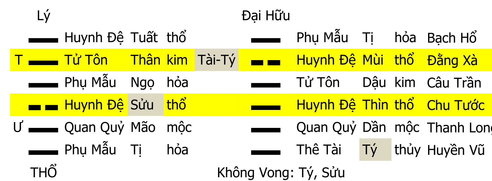
    - **Hình này chứng minh điều gì**
      - Minh chứng cấu trúc quẻ Lý biến Đại Hữu: Thê Tài Tý thủy phục tàng tại hào 5, hào Thế Thân kim động sinh Dụng thần, Huynh Đệ Sửu thổ động hóa Tiến thần trong khắc có hợp với Tý thủy, và Phụ Mẫu Tị hỏa ám động hợp Thế.

    - **Từ đâu mà thấy được**
      - Dưới hào 5 Thân kim phục Tài-Tý; hào 3 Sửu thổ động biến Thìn thổ; hào 1 Tị hỏa bị Nhật Hợi xung thành ám động.

  - Nhìn vào:
    - Hào Thế Tử Tôn Thân kim tại hào 5 lâm Đằng Xà phát động sinh Dụng thần Thê Tài Tý thủy.
    - Phục thần Thê Tài Tý thủy phục dưới hào 5 Thân kim, lâm Tuần Không, đắc Nhật thần Hợi thủy bang trợ và hào Thế động sinh.
    - Hào 3 Huynh Đệ Sửu thổ lâm Chu Tước, gặp Tuần Không và Nguyệt phá (Mùi xung Sửu), động hóa Huynh Đệ Thìn thổ (Tiến thần).
    - Hào 1 Phụ Mẫu Tị hỏa lâm Huyền Vũ, bị Nhật thần Hợi thủy xung phát động thành ám động, tương hợp với hào Thế Thân kim ($\text{Tị Thân lục hợp}$).

- **Quy tắc áp dụng**:
  - *Quy tắc Bắt buộc tìm Phục thần khi Dụng lâm Nhật Nguyệt:* Dù Nhật thần Quý Hợi là Thủy, vẫn phải lấy Phục thần Thê Tài Tý thủy làm Dụng thần thì mới phản ánh được ứng kỳ và tượng cướp vợ.
  - *Quy tắc Thực Không Thực Phá:* Hào động gặp Tuần Không, Nguyệt phá sẽ bộc phát lực tác động mạnh mẽ khi đến năm/tháng thực Không thực Phá.
  - *Quy tắc Trong khắc có hợp ($\text{Tý Sửu lục hợp}$):* Huynh Đệ Sửu thổ khắc Thê Tài Tý thủy nhưng đồng thời hợp Tý thủy, chủ tình trạng vợ/người yêu bị kẻ khác cướp đoạt.
  - *Quy tắc Thế sinh Dụng:* Hào Thế động sinh Dụng thần là người nam hết lòng yêu thương chăm sóc vợ.
  - *Quy tắc Ám động hợp Thế:* Phụ Mẫu lâm Huyền Vũ ám động hợp hào Thế chủ việc nam nữ lén lút dọn về sống chung trước hôn nhân.

- **Lời giải**:

  - **Bước 1**: Xác định Dụng thần và bác bỏ sai lầm của cổ pháp
    - Căn cứ: Phép cũ Dã Hạc coi Nhật Hợi thủy là Dụng thần, Sửu thổ Không Phá không khắc được Nhật nên đoán cát $\rightarrow$ sai lệch với thực tế.

    - Nhìn vào: Quẻ Lý không có Thê Tài, phải tra Phục thần tại hào 5 là Thê Tài Tý thủy. Tý thủy được Nhật Hợi bang trợ và Thế Thân kim động sinh nên vượng tướng.

  - **Bước 2**: Định mốc thời gian kết hôn và biến cố hôn nhân đầu tiên
    - Căn cứ: Phục thần xuất hiện định kỳ kết hôn; Kỵ thần thực Không thực Phá và Nguyên thần nhập Mộ định kỳ rạn nứt.

    - Nhìn vào:
      - Năm Giáp Tý (1984), anh ta tròn 24 tuổi, Phục thần Tý thủy xuất hiện $\rightarrow$ đúng độ tuổi lập gia đình và đã kết hôn.
      - Năm Ất Sửu (1985), Huynh Đệ Sửu thổ thực Không thực Phá khắc Dụng; Nguyên thần Thân kim nhập Mộ tại Sửu không thể sinh Dụng $\rightarrow$ nảy sinh mâu thuẫn vợ chồng.
      - Hào Thế Thân kim sinh Dụng thần Tý thủy: Bản thân anh ta rất yêu thương vợ.
      - Năm Bính Dần (1986), Dần xung mất Nguyên thần Thân kim, tiêu tan ái ý; Sửu thổ đối với Tý thủy trong khắc có hợp $\rightarrow$ vợ bị kẻ khác quyến rũ cướp đoạt.

  - **Bước 3**: Giải mã mối tình thứ hai và phán đoán thời điểm ly tan
    - Căn cứ: Dụng thần phục tàng tái xuất hiện; Huynh Đệ lại xuất Không thực Phá; Phụ Mẫu ám động hợp Thế.

    - Nhìn vào:
      - Năm Bính Tý (1996), Dụng thần Tý thủy lại gặp xuất hiện $\rightarrow$ quen và yêu bạn gái mới.
      - Năm Đinh Sửu (1997), Huynh Đệ Sửu thổ lại xuất Không thực Phá, Nguyệt kiến Mùi thổ khắc Dụng thần $\rightarrow$ quan hệ tình cảm lại căng thẳng gay gắt.
      - Phụ Mẫu Tị hỏa lâm Huyền Vũ ám động hợp Thế Thân kim: Hai người đã dọn về chung sống như vợ chồng.
      - Tháng Sửu năm Đinh Sửu: Sửu thổ trị lệnh trong khắc có hợp, bạn gái lại bị người khác cướp mất $\rightarrow$ phán quyết chắc chắn tháng Sửu sẽ chia tay.

- **Đối thoại giải đáp nghi vấn**:

  - *Hỏi:* Thân kim vượng động sẽ nhập Mộ?
    - *Vương Hổ Ứng lão sư đáp:* Sẽ nhập, Sửu luôn là Mộ của kim, nhưng có phân biệt lý tượng, không hẳn cứ Mộ là xấu.

  - *Hỏi:* Thân kim vượng động sẽ sợ Dần xung?
    - *Vương Hổ Ứng lão sư đáp:* Nhật Nguyệt trong quẻ không có Dần mộc, không cần quan tâm đến sợ xung.

  - *Hỏi:* Sửu thổ có thể Mộ Thân kim không?
    - *Vương Hổ Ứng lão sư đáp:* Đây giống như cấp bậc lãnh đạo, cấp trên quản cấp dưới, không thể nói là đại đội trưởng bị trung đoàn trưởng quản lý.

  - *Hỏi:* Sửu thổ có thể xem là hóa Tiến thần?
    - *Vương Hổ Ứng lão sư đáp:* Tiến thần.

  - *Hỏi:* Trong sách có nói: "Năm Bính Dần xung mất Nguyên thần". Thân kim đã nhập Sửu Mộ, tại sao lại gặp năm Dần không nói là xung xuất mà nói là xung mất?
    - *Vương Hổ Ứng lão sư đáp:* Đó là phương thức biểu đạt ứng kỳ, không phải là vấn đề có thể xung hay không.

- **Kết quả**:
  - Đến tháng Sửu năm Đinh Sửu, hai người dứt khoát chia tay, bạn gái đi theo người khác đúng như kết luận của Vương Hổ Ứng lão sư.

- **Kiểm tra lại**:
  - Cả hai lần nhân duyên đều khởi phát tại năm Tý (Giáp Tý, Bính Tý) ứng nghiệm với Phục thần Thê Tài Tý thủy.
  - Cả vợ và bạn gái đều bị cướp đi ứng nghiệm với Huynh Đệ Sửu thổ hợp Dụng thần Tý thủy; nếu dùng Nhật thần Hợi thủy thì không thể suy ra các dữ kiện này.

---

### Ví dụ 18: Xem công danh có được bổ nhiệm làm quan không (Quẻ Đồng Nhân biến Cách)

- **Đề bài**:
  - Ngày Đinh Mão tháng Mùi, một người đến xem về tiền đồ công danh, thỉnh đoán bản thân liệu có được triều đình bổ nhiệm ra làm quan hay không.

- **Dữ kiện**:
  - Can chi: Ngày Đinh Mão, tháng Mùi.
  - Tuần Không: Tuần Giáp Tý $\rightarrow$ Tuần Không tại $\text{Tuất}$ và $\text{Hợi}$.
  - Quẻ chủ: Thiên Hỏa Đồng Nhân ($\text{天火同人}$, Ly Cung, Hỏa).
  - Quẻ biến: Trạch Hỏa Cách ($\text{泽火革}$, Khảm Cung).
  - Hào động: Hào 6 Ứng Tử Tôn Tuất thổ độc phát hóa Tử Tôn Mùi thổ (Thoái thần).
  - Bảng nạp giáp và phân bố hào:

    | Hào vị | Quẻ Đồng Nhân (Chính) | Quẻ Cách (Biến) | Lục thú |
    | :---: | :--- | :--- | :---: |
    | 6 (Ứng) | — Tử Tôn Tuất thổ (Động) | - - Tử Tôn Mùi thổ | Thanh Long |
    | 5 | — Thê Tài Thân kim | — Thê Tài Dậu kim | Huyền Vũ |
    | 4 | — Huynh Đệ Ngọ hỏa | — Quan Quỷ Hợi thủy | Bạch Hổ |
    | 3 (Thế) | — Quan Quỷ Hợi thủy | — Quan Quỷ Hợi thủy | Đằng Xà |
    | 2 | - - Tử Tôn Sửu thổ | - - Tử Tôn Sửu thổ | Câu Trần |
    | 1 | — Phụ Mẫu Mão mộc | — Phụ Mẫu Mão mộc | Chu Tước |

  - **Hình 18.** Sơ đồ quẻ Thiên Hỏa Đồng Nhân biến Cách
    - 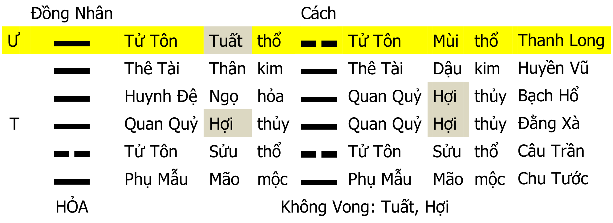
    - **Hình này chứng minh điều gì**
      - Minh chứng cơ chế Tử Tôn Tuất thổ tại hào Ứng độc phát hóa Thoái thần (Mùi thổ) nhưng bị Nhật Mão hợp trói; hào Thế Quan Quỷ Hợi thủy tuy hưu tù Không Vong nhưng quan lâm thân; năm Thìn xung khai hợp tất đắc quan.

    - **Từ đâu mà thấy được**
      - Hào 6 Tuất thổ động hóa Mùi thổ; hào 3 Hợi thủy trì Thế; ngày Đinh Mão tương hợp Tuất thổ; Tuần Không tại Tuất, Hợi.

  - Nhìn vào:
    - Hào Thế Quan Quỷ Hợi thủy trì Thế lâm Đằng Xà, ngộ Tuần Không, hưu tù trong tháng Mùi.
    - Hào 6 Ứng Tử Tôn Tuất thổ độc phát, ngộ Tuần Không, động hóa Thoái thần Mùi thổ, đồng thời tương hợp với Nhật thần Mão mộc ($\text{Mão Tuất lục hợp}$).

- **Quy tắc áp dụng**:
  - *Quy tắc Quan Quỷ trì Thế chủ Quan lâm thân:* Người xem cầu danh được Quan Quỷ trì Thế là điềm tất có quan vị.
  - *Quy tắc Kỵ thần hóa Thoái gặp Nhật hợp không thể thoái ngay:* Tử Tôn động hóa thoái chủ không khắc Quan, nhưng bị Nhật hợp trói nên tạm thời chưa thoái lui được.
  - *Quy tắc Xung khai hợp định ứng kỳ:* Phải đợi năm/tháng xung khai hào bị hợp ($\text{Thìn xung Tuất}$) thì Kỵ thần mới thoái chuyển hoàn toàn.
  - *Tượng pháp độc phát chủ đạo:* Lấy tượng pháp Kỵ thần hóa thoái và ứng kỳ xung hợp làm trọng tâm, không câu nệ Quan Quỷ hưu tù suy vượng.

- **Lời giải**:

  - **Bước 1**: Đánh giá phép đoán cũ và hạn chế của phương pháp thuần túy suy vượng
    - Căn cứ: Phép cũ thấy Tử Tôn động khắc Quan thì đoán suốt đời không được làm quan; nếu chỉ xét suy vượng thì Quan Quỷ Hợi thủy hưu tù Tuần Không cũng chủ vô quan.

    - Nhìn vào: Quan Quỷ Hợi thủy trì Thế là tượng quan vị lâm thân, bản thân có mệnh làm quan.

  - **Bước 2**: Phân tích cơ chế Tử Tôn hóa Thoái thần bị Nhật hợp trói
    - Căn cứ: Hào 6 Tử Tôn Tuất thổ tuy độc phát khắc Quan, nhưng động hóa Mùi thổ là hóa Thoái thần $\rightarrow$ tình trạng khắc hại, cản trở sẽ biến mất.

    - Nhìn vào: Tử Tôn Tuất thổ hợp với Nhật thần Mão mộc, vì bị Nhật hợp níu giữ nên chưa thể thoái lui ngay lúc này.

  - **Bước 3**: Định ứng kỳ đắc quan vào năm Thìn
    - Căn cứ: Năm Thìn tương xung với Tuất thổ ($\text{Thìn Tuất tương xung}$), phá vỡ thế Mão - Tuất tương hợp.

    - Nhìn vào: Khi cái hợp bị xung khai, Tử Tôn Tuất thổ lập tức thoái lui về Mùi thổ, áp lực giải tỏa hoàn toàn $\rightarrow$ quyết đoán năm Thìn sẽ được bổ nhiệm làm quan.

- **Đối thoại giải đáp nghi vấn**:

  - *Hỏi:* Kỵ thần tuy hóa thoái, nhưng độc phát khắc Quan, mà Quan Quỷ trì Thế hưu tù Tuần Không, quan nhược làm sao có quan? Có phải là dựa vào Quan quá nhược mà đoán ngược lại?
    - *Vương Hổ Ứng lão sư đáp:* Quẻ này không phải là Quan quá nhược, cũng không phải là Tử Tôn quá vượng, mà là Tử Tôn độc phát hóa thoái, Quan lại trì Thế. Quan trì Thế là quan lâm thân, nhưng Tử Tôn khắc, lại không thể được quan. Mấu chốt ở đây là Tử Tôn hóa thoái, Tử Tôn là lục thân gây bất lợi cho Quan, hóa thoái chính là tình trạng này sẽ biến mất, nhưng Nhật hợp không thể thoái, năm Thìn xung khai Tuất sẽ thoái. Nếu Tử Tôn này động không phải hóa thoái, mà là hóa địa chi khác, hóa hồi đầu sinh, thì nhất định là không được làm quan.

  - *Hỏi:* Ứng tại hào 6 động hóa thoái, khắc Thế Quan, có thể hiểu là đến lúc người khác thoái vị hoặc nghỉ hưu thì mới đến lượt người hỏi quẻ được quan hay không?
    - *Vương Hổ Ứng lão sư đáp:* Có thể. Hào Ứng đại diện cho người khác tại quan vị thoái lui nhường chỗ.

- **Kết quả**:
  - Quả nhiên đến năm Thìn, người này trúng tuyển và được triều đình chính thức bổ nhiệm làm quan.

- **Kiểm tra lại**:
  - Khẳng định chân lý: Hào động gặp Không, hóa Nhật hóa Nguyệt vẫn thoái như thường khi gặp thời điểm xung khai hợp.
  - Minh chứng cho việc lấy tượng pháp độc phát làm thần cơ định ứng kỳ chính xác phi thường.

---

### Ví dụ 19: Xem mùa đông năm đó có nhận được chức quan sai hay không (Quẻ Tiết biến Nhu)

- **Đề bài**:
  - Ngày Quý Tị tháng Tuất, một người xem về việc liệu trong mùa đông năm ấy bản thân có nhận được chức quan sai (nhiệm vụ/chức vụ phái cử) hay không.

- **Dữ kiện**:
  - Can chi: Ngày Quý Tị, tháng Tuất.
  - Tuần Không: Tuần Giáp Thân $\rightarrow$ Tuần Không tại $\text{Ngọ}$ và $\text{Mùi}$.
  - Quẻ chủ: Thủy Trạch Tiết ($\text{水泽节}$, Khảm Cung, Thủy).
  - Quẻ biến: Thủy Thiên Nhu ($\text{水天需}$, Khôn Cung).
  - Hào động: Hào 3 Quan Quỷ Sửu thổ động hóa Quan Quỷ Thìn thổ (Tiến thần). Phục thần Thê Tài Ngọ hỏa phục dưới hào 3.
  - Bảng nạp giáp và phân bố hào:

    | Hào vị | Quẻ Tiết (Chính) | Phục thần | Quẻ Nhu (Biến) | Lục thú |
    | :---: | :--- | :---: | :--- | :---: |
    | 6 | - - Huynh Đệ Tý thủy | | - - Huynh Đệ Tý thủy | Bạch Hổ |
    | 5 | — Quan Quỷ Tuất thổ | | — Quan Quỷ Tuất thổ | Đằng Xà |
    | 4 (Ứng) | - - Phụ Mẫu Thân kim | | - - Phụ Mẫu Thân kim | Câu Trần |
    | 3 | - - Quan Quỷ Sửu thổ (Động) | Thê Tài Ngọ hỏa | — Quan Quỷ Thìn thổ | Chu Tước |
    | 2 | — Tử Tôn Mão mộc | | — Tử Tôn Dần mộc | Thanh Long |
    | 1 (Thế) | — Thê Tài Tị hỏa | | — Huynh Đệ Tý thủy | Huyền Vũ |

  - **Hình 19.** Sơ đồ quẻ Thủy Trạch Tiết biến Nhu
    - 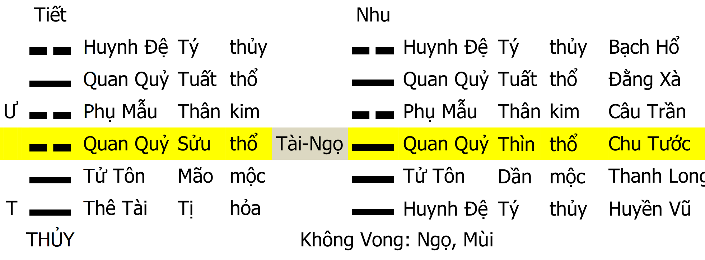
    - **Hình này chứng minh điều gì**
      - Minh chứng hào 3 Quan Quỷ Sửu thổ độc phát hóa Tiến thần Quan Quỷ Thìn thổ; Thìn thổ tuy bị Nguyệt kiến Tuất xung thành Nguyệt phá nhưng không mất tính chất tiến, ứng kỳ đắc quan sai vào tháng Sửu.

    - **Từ đâu mà thấy được**
      - Hào 3 Sửu thổ Chu Tước động hóa Thìn thổ; tháng Tuất xung Thìn thổ thành Nguyệt phá; hào 1 Thế Tị hỏa lâm Nhật thần Quý Tị.

  - Nhìn vào:
    - Hào 3 Quan Quỷ Sửu thổ độc phát động hóa Quan Quỷ Thìn thổ: Quan tinh hóa Tiến thần.
    - Tháng Tuất tương xung hào biến Thìn thổ: Thìn thổ lâm Nguyệt phá.
    - Hào 1 Thế Thê Tài Tị hỏa lâm Nhật thần Quý Tị đắc trợ.

- **Quy tắc áp dụng**:
  - *Quy tắc Tiến thần hóa Nguyệt phá vẫn chủ tiến:* Bác bỏ nhận định cũ cho rằng "hào động hóa Phá hóa Không thì không thể tiến".
  - *Quy tắc Vượng tướng thực Phá thực Không ứng cát:* Hào động tự thân có căn khí thì hóa Phá chỉ là chướng ngại tạm thời; khi gặp nguyệt lệnh trị sự thì sự việc tất ứng nghiệm.

- **Lời giải**:

  - **Bước 1**: Nhận diện thần cơ tại hào Quan độc phát hóa Tiến thần
    - Căn cứ: Xem việc bổ nhiệm, sai phái lấy Quan Quỷ làm Dụng thần.

    - Nhìn vào: Hào 3 Quan Quỷ Sửu thổ phát động hóa Quan Quỷ Thìn thổ là Quan động hóa Tiến thần, chủ chức vị tiến tới, công việc mở rộng.

  - **Bước 2**: Đính chính sai lầm về hào hóa Nguyệt phá
    - Căn cứ: Phép xưa cho rằng hào động không gặp Nhật Nguyệt mà hóa Nguyệt phá thì không thể tiến triển.

    - Nhìn vào: Trong quẻ này Sửu thổ cùng Thìn thổ đồng khí ngũ hành, thế tiến thần là bản chất cốt lõi. Nguyệt phá ở Thìn thổ chỉ là trở ngại thời điểm.

  - **Bước 3**: Xác định ứng kỳ đắc quan sai vào tháng Sửu mùa đông
    - Căn cứ: Ứng kỳ tại hào động lâm trị kiến.

    - Nhìn vào: Đến tháng Sửu (mùa đông), Sửu thổ lâm Nguyệt lệnh, khí lực phát tác trọn vẹn $\rightarrow$ quyết đoán tháng Sửu sẽ được nhận chức quan sai.

- **Đối thoại giải đáp nghi vấn**:

  - *Hỏi:* Vương lão sư, "Nhật thần, Nguyệt kiến, hào động hóa Phá hóa Không thì không thể tiến" là gì vậy?
    - *Vương Hổ Ứng lão sư đáp:* Những điều kiện này tồn tại đồng thời, hóa Không có tượng hóa Không, hóa Phá có tượng hóa Phá. Nếu Dụng thần vượng tướng thì khi Thực Không Thực Phá là ứng nghiệm sự việc, nếu hưu tù thì biểu thị ngày càng xấu.

- **Kết quả**:
  - Quả nhiên đến tháng Sửu mùa đông năm ấy, người này chính thức nhận được chức quan sai đúng như dự liệu.

- **Kiểm tra lại**:
  - Thực tế chứng minh hào động hóa Tiến thần dù gặp Nguyệt phá vẫn không hề mất đi bản tính tiến thần khi chân khí đắc lệnh.

---

### Ví dụ 20: Xem bệnh của con, hào Mộ khố độc phát (Quẻ Đại Hữu biến Khuê)

- **Đề bài**:
  - Ngày Ất Mùi tháng Thìn, một người cha đến xem bệnh tình hiểm nghèo của con trai nhỏ, được quẻ Hỏa Thiên Đại Hữu biến Hỏa Trạch Khuê.

- **Dữ kiện**:
  - Can chi: Ngày Ất Mùi, tháng Thìn.
  - Tuần Không: Tuần Giáp Ngọ $\rightarrow$ Tuần Không tại $\text{Thìn}$ và $\text{Tị}$.
  - Quẻ chủ: Hỏa Thiên Đại Hữu ($\text{火天大有}$, Càn Cung, Kim).
  - Quẻ biến: Hỏa Trạch Khuê ($\text{火泽睽}$, Cấn Cung).
  - Hào động: Hào 3 Thế Phụ Mẫu Thìn thổ lâm Câu Trần, ngộ Tuần Không, lâm Nguyệt kiến động hóa Phụ Mẫu Sửu thổ (Thoái thần).
  - Bảng nạp giáp và phân bố hào:

    | Hào vị | Quẻ Đại Hữu (Chính) | Quẻ Khuê (Biến) | Lục thú |
    | :---: | :--- | :--- | :---: |
    | 6 (Ứng) | — Quan Quỷ Tị hỏa | — Quan Quỷ Tị hỏa | Huyền Vũ |
    | 5 | - - Phụ Mẫu Mùi thổ | - - Phụ Mẫu Mùi thổ | Bạch Hổ |
    | 4 | — Huynh Đệ Dậu kim | — Huynh Đệ Dậu kim | Đằng Xà |
    | 3 (Thế) | — Phụ Mẫu Thìn thổ (Động) | - - Phụ Mẫu Sửu thổ | Câu Trần |
    | 2 | — Thê Tài Dần mộc | — Thê Tài Mão mộc | Chu Tước |
    | 1 | — Tử Tôn Tý thủy | — Quan Quỷ Tị hỏa | Thanh Long |

  - **Hình 20.** Sơ đồ quẻ Đại Hữu biến Khuê
    - 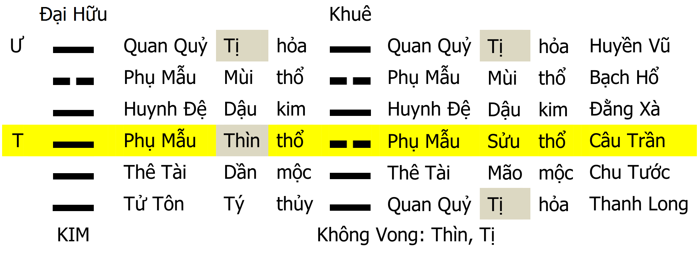
    - **Hình này chứng minh điều gì**
      - Minh chứng Dụng thần Tử Tôn Tý thủy quá nhược bị Nhật Nguyệt song thổ khắc hại, Kỵ thần Phụ Mẫu Thìn thổ là Mộ khố độc phát; dù hóa Thoái thần Sửu thổ nhưng hung hiểm khôn cứu, gặp Trường Sinh tại ngày Bính Thân là ứng kỳ tử vong.

    - **Từ đâu mà thấy được**
      - Hào sơ Tử Tôn Tý thủy hưu tù; hào 3 Phụ Mẫu Thìn thổ Thế động hóa Sửu thổ; tháng Thìn ngày Mùi đều khắc Tý thủy.

  - Nhìn vào:
    - Dụng thần Tử Tôn Tý thủy tại hào sơ lâm Thanh Long.
    - Tháng Thìn khắc Tý thủy; Ngày Mùi tiếp tục khắc Tý thủy ($\text{Nhật Nguyệt song khắc}$).
    - Thìn thổ là Mộ khố của Tý thủy ($\text{Thủy mộ tại Thìn}$).
    - Hào 3 Phụ Mẫu Thìn thổ Thế động là Kỵ thần kiêm Mộ khố độc phát, động hóa Thoái thần Phụ Mẫu Sửu thổ.

- **Quy tắc áp dụng**:
  - *Quy tắc Mộ khố độc phát chủ đại hung:* Hào Mộ khố của Dụng thần độc phát chủ tai họa giam hãm, vùi dập, tử vong.
  - *Quy tắc Dụng thần quá nhược (Khắc nhiều sinh ít):* Dụng thần bị Nhật Nguyệt song khắc, trong quẻ không có Kim hào nào động sinh phù, rơi vào thế tuyệt căn.
  - *Quy tắc Dụng quá nhược ngộ Trường Sinh là hung:* Khi Dụng thần cực suy vô căn, gặp cung vị Trường Sinh phản thành ứng kỳ hung sát vong mạng.

- **Lời giải**:

  - **Bước 1**: Đánh giá suy vượng căn cơ của Dụng thần
    - Căn cứ: Xem bệnh con lấy hào Tử Tôn làm Dụng thần.

    - Nhìn vào: Hào sơ Tử Tôn Tý thủy bị Nguyệt kiến Thìn thổ khắc, lại bị Nhật thần Mùi thổ khắc. Cả Nhật và Nguyệt đều là Kỵ thần sát hại, Tý thủy lại nhập Mộ tại Thìn thổ $\rightarrow$ Dụng thần đại hung, quá nhược vô cứu.

  - **Bước 2**: Phân tích Kỵ thần Mộ khố độc phát hóa thoái
    - Căn cứ: Hào 3 Phụ Mẫu Thìn thổ là Mộ khố của Tý thủy, độc phát phát động.

    - Nhìn vào: Dù Thìn thổ động hóa Sửu thổ là thế hóa Thoái thần, nhưng vì bản chất Dụng thần đã bị Nhật Nguyệt tuyệt diệt nên hào hóa thoái không cứu vãn được cục diện.

  - **Bước 3**: Xác định ứng kỳ tử vong vào ngày hôm sau
    - Căn cứ: Quy tắc Dụng thần quá nhược gặp cung vị Trường Sinh là hung tử.

    - Nhìn vào: Ngày gieo quẻ là ngày Ất Mùi, ngày hôm sau là ngày Bính Thân. Thân là cung Trường Sinh của Thủy ($\text{Thủy trường sinh tại Thân}$). Khí tuyệt gặp đất sinh đột ngột khiến đứa bé tử vong vào hôm sau.

- **Đối thoại giải đáp nghi vấn**:

  - *Hỏi:* Quẻ này Thìn thổ Nhật Nguyệt song khắc, Mộ khố độc phát là hung. Thìn thổ hóa thoái có ý nghĩa gì, không thể là Mộ hóa thoái thì vô dụng, như vậy có nên luận là hóa ám động hay không, chính là tăng tốc ứng kỳ sự việc? Bởi vì mặc dù độc phát lấy tượng làm chủ, nhưng hóa thoái vẫn phải có tượng nhất định, vì vậy xin hỏi thầy là Thìn thổ hóa thoái phải chăng luận hóa ám động mà ứng kỳ hung đến sớm?
    - *Vương Hổ Ứng lão sư đáp:* Ở đây nếu không phải là Phụ Mẫu hóa thoái thì chính là Dụng thần quá nhược, bởi vì hóa thoái cho nên thuộc về Kỵ thần vượng, Dụng thần nhược, khắc nhiều sinh ít, gặp Trường Sinh là hung.

- **Kết quả**:
  - Đứa bé mắc bệnh nặng đã qua đời vào ngày hôm sau (ngày Bính Thân), hoàn toàn đúng như phán đoán.

- **Kiểm tra lại**:
  - Phân định sâu sắc giữa Lý và Tượng: Khi Lý (ngũ hành sinh khắc, Nhật Nguyệt song khắc) đã quyết định tuyệt lộ, thì Tượng biến hóa thoái của hào động không thể đảo ngược số mệnh.

## Nghi vấn thực chứng: Tam hợp biện tội, Thế Ứng tương sinh và Lục hợp biến xung

- **Nguyên lý Tiến thần hóa Tuần Không và Tam hợp không liên quan Dụng thần**:
  - Hào động hóa Tiến thần dù gặp Tuần Không vẫn giữ nguyên xu thế tiến triển mạnh mẽ về phía trước; trạng thái Không Vong chỉ là sự đình trệ tạm thời, khi xuất Không hoặc gặp ngày xung/trị thì sự việc tất thành.
  - Khi trong quẻ xuất hiện tam hợp cục (hoặc bán hợp) mà các chi hợp thành không có quan hệ sinh khắc hay trợ lực trực tiếp tới Dụng thần thì không cần gượng ép liên hệ, hoàn toàn có thể bỏ qua không xét.
  - Kỵ thần phát động nhưng động hóa Thoái thần thì khí lực tự suy vi, không đủ khả năng gây cản trở đại cục.
  - Hào động sinh Thế bị hào biến hồi đầu khắc thì sự sinh tạm thời tắc nghẽn; ứng kỳ giải cứu chính là ngày xung khử biến hào khắc để hào động rảnh tay sinh Thế.

- **Nguyên lý phân định tính chất sự việc trong án từ và cơ chế Tiến Thoái thần**:
  - Phải phân biệt rạch ròi giữa việc "kiện tụng dân sự thông thường" và việc "bị đình chỉ chức vụ, thẩm tra điều tra luận tội (tương đương chế độ song quy hiện đại)".
  - Khi xem việc tự thanh minh biện bạch để bảo toàn chức tước: Quan Quỷ đại diện cho chức quan, Tử Tôn đại diện cho thần lột bỏ chức quan (khắc Quan), tuyệt đối không được máy móc xem Quan Quỷ là quan phi và Tử Tôn là thần giải ưu.
  - Quan Quỷ động hóa Thoái thần chủ chức vụ bị bãi miễn, giáng cấp, thoái lui; Tử Tôn động hóa Tiến thần chủ sức ép tước đoạt chức vụ ngày càng dâng cao.
  - Hào Thế động hóa hồi đầu khắc biểu thị bản thân tự chuốc lấy thất bại, nỗ lực biện bạch hoàn toàn phản tác dụng.
  - Dù lâm Nhật thần hay hưu tù hóa Không Phá, quy luật Tiến thần và Thoái thần vẫn vận hành bất biến: tiến ắt là tiến, thoái ắt là thoái.

- **Nguyên lý Tam hợp Quan cục sinh Thế Ứng và phân biệt sự việc chung với việc tranh đoạt cá nhân**:
  - Tam hợp Quan cục hoặc Tài cục sinh hào Thế chủ bản thân đắc lợi; sinh hào Ứng chủ người khác hưởng lợi.
  - Phân định ngữ cảnh dự đoán: đối với việc thi cử khoa bảng hoặc quan vận đại thể của đời người, việc Dụng thần sinh hào Ứng không đáng lo ngại, mấu chốt chỉ sợ Dụng thần hưu tù vô khí. Trái lại, nếu dự đoán việc cụ thể tranh đoạt một chức vị thăng tiến duy nhất thì Dụng thần sinh Ứng mới tối kỵ vì quyền vị sẽ rơi vào tay đối thủ.
  - Tượng "Thế nhập Tam Mộ" (động Mộ, hóa Mộ, nhập Mộ tại Nguyệt kiến) chủ sự việc trước mắt bị che lấp, vùi dập; song đây là điềm tích lũy chờ ngày xung khai Mộ khố để bộc phát đỗ đạt hạng Giáp.

- **Nguyên lý Lục hợp biến xung và lưỡng tính Vừa hợp vừa khắc trong hôn nhân**:
  - Quẻ Lục hợp biểu thị sự gắn kết ban đầu, nhưng nếu Dụng thần độc phát hóa hồi đầu khắc thì biến thành "hợp xứ phùng xung", kết cục hôn nhân tất tan vỡ ly dị.
  - Cặp chi Tý - Sửu mang đồng thời hai thuộc tính: Tý Sửu lục hợp là tượng tư tình ngoại tình lén lút, Sửu thổ hồi đầu khắc Tý thủy là bản chất mâu thuẫn đoạn tuyệt dẫn tới chia lìa.
  - Ứng kỳ ly hôn chính là ngày hợp với hào độc phát hoặc ngày trị hào biến khắc Dụng thần.

- **Nguyên lý Thế - Tử Tôn đồng hóa Quỷ và Phương pháp Biện hào pháp (Biến động hào)**:
  - Khi hào Thế lâm Tử Tôn đồng thời động hóa Quan Quỷ, hào này tích hợp song trùng thông tin: vừa là bản thân người hỏi quẻ (hào Thế), vừa là con cái (Lục thân Tử Tôn).
  - Tượng Quan Quỷ là hình pháp lao tù, Tử Tôn là con trẻ: điềm báo cha mẹ bị liên lụy quan phi vì tội lỗi của con cái.
  - Tử Tôn độc phát hóa Tuyệt (Kim tuyệt tại Dần) lâm Bạch Hổ là điềm chết chóc cực hung cho con cái.
  - Phương pháp Biện hào pháp (Biến động hào): chuyển hào biến Quan Quỷ quy chiếu vào quẻ gốc, thấy tương ứng với hào Ứng (chủ người khác), chứng minh họa sát thân ứng lên con cái chứ không ứng vào bản thân hào Thế.

### Ví dụ 21: Xem việc hôn nhân có thành hay không (Quẻ Phệ Hạp biến Tỷ)
- **Đề bài**: Ngày Ất Sửu tháng Mão, có người đến xin bốc quẻ hỏi về việc hôn nhân đại sự có thành tựu hay không.
- **Dữ kiện**
  - Can chi: Ngày Ất Sửu, tháng Mão (Tuần không: Tuất, Hợi).
  - Quẻ chủ: Hỏa Lôi Phệ Hạp (quẻ số 21).
  - Quẻ biến: Thủy Địa Tỷ (quẻ số 8).
  - Hào động: Hào 1 Phụ Mẫu Tý thủy động hóa Thê Tài Mùi thổ; Hào 4 Quan Quỷ Dậu kim động hóa Quan Quỷ Thân kim; Hào 5 Thê Tài Mùi thổ (Thế) động hóa Thê Tài Tuất thổ; Hào 6 Tử Tôn Tị hỏa động hóa Phụ Mẫu Tý thủy.
  - Sơ đồ quẻ: (Tham chiếu Hình 21) alt="Sơ đồ quẻ" />
  - **Hình 21.** Quẻ Phệ Hạp biến Tỷ
    - 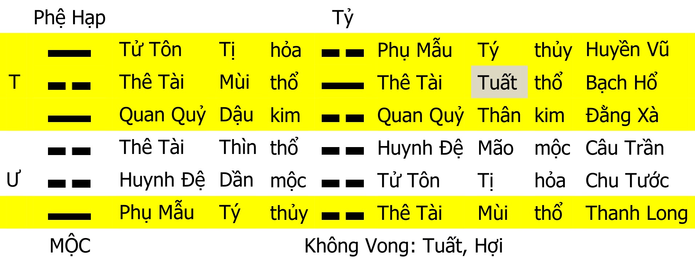
    - **Hình này chứng minh điều gì**
      - Thể hiện trực quan quẻ Phệ Hạp biến Tỷ với hào Thế Thê Tài Mùi thổ động hóa Tiến thần Tuất thổ (gặp Tuần Không); Tử Tôn Tị hỏa động sinh Thế nhưng hóa Tý thủy hồi đầu khắc; Quan Quỷ Dậu kim động hóa Thân kim Thoái thần; và ngoại quái Tị - Dậu - Sửu tạo thế tam hợp cục không can hệ Dụng thần.
    - **Từ đâu mà thấy được**
      - Nhìn vào bảng nạp giáp hào 5 Mùi thổ biến Tuất thổ (Tuần Không), hào 6 Tị hỏa biến Tý thủy, hào 4 Dậu kim biến Thân kim, cùng can chi ngày Ất Sửu tháng Mão trên đồ hình quẻ.
  - **Nhìn vào**: Hào Thế Thê Tài Mùi thổ tại hào 5, Hào Ứng Huynh Đệ Dần mộc tại hào 2; hào sinh trợ Tử Tôn Tị hỏa tại hào 6; hào trở ngại Quan Quỷ Dậu kim tại hào 4.
- **Quy tắc áp dụng**
  - Quy tắc Tiến thần hóa Tuần Không: Hào động hóa Tiến thần gặp Tuần Không vẫn chủ tiến triển, xuất Không định kỳ ứng nghiệm.
  - Quy tắc Hồi đầu khắc ngăn cản sinh trợ: Hào động sinh Thế bị biến hào khắc chế thì tạm thời không sinh được, phải chờ ngày xung khứ hào khắc để giải cứu nguyên thần.
  - Quy tắc Kỵ thần hóa Thoái: Kỵ thần hoặc hào cản trở hóa Thoái thần thì tự tiêu biến lực lượng, không đủ sức phá hoại.
  - Quy tắc Tam hợp cục không liên quan Dụng thần: Tam hợp không tác động sinh khắc tới Dụng thần thì không cần luận đoán.
- **Lời giải**
  - **Bước 1**: Đánh giá Dụng thần và hào Thế
    - **Căn cứ**: Hỏi về việc hôn nhân thì Thê Tài trì Thế là cát triệu, hào Thế đại diện cho bản thân sự việc.
    - **Nhìn vào**: Hào 5 Thê Tài Mùi thổ trì Thế phát động hóa Thê Tài Tuất thổ là hóa Tiến thần. Dù Tuất thổ lâm Tuần Không, nhưng xu thế biến hóa vẫn là tiến, báo hiệu hôn sự tất sẽ đi đến đích.
  - **Bước 2**: Xác định trở ngại của hào sinh Thế và định ứng kỳ
    - **Căn cứ**: Hào 6 Tử Tôn Tị hỏa phát động sinh trợ cho hào Thế Mùi thổ, nhưng Tị hỏa lại biến ra Phụ Mẫu Tý thủy là bị hồi đầu khắc.
    - **Nhìn vào**: Tị hỏa bị Tý thủy kiềm tỏa nên tạm thời chưa thể sinh Thế. Cần đợi đến ngày Ngọ xung phá Tý thủy (Tý Ngọ tương xung), đồng thời Ngọ hỏa tương hợp với Thế hào Mùi thổ (Ngọ Mùi lục hợp), khi ấy thế bế tắc được khai thông trọn vẹn.
  - **Bước 3**: Thẩm định hào Quan Quỷ cản trở
    - **Căn cứ**: Hào 4 Quan Quỷ Dậu kim phát động mang tượng trắc trở, cản trở hôn nhân.
    - **Nhìn vào**: Dậu kim động hóa Thân kim là hóa Thoái thần, chứng tỏ lực cản trở ngày càng suy yếu, không thể đảo ngược cục diện thành công.
- **Đối thoại giải đáp nghi vấn**:
  - *Người hỏi thắc mắc về cổ pháp hóa Không*: Sách xưa nói rằng "hào động, Nhật thần, Nguyệt kiến hóa Không là tạm thời không thể tiến; còn vô lực động tán mà hóa Không thì vẫn có thể tiến". Câu này nên hiểu thế nào cho đúng, hay đây là quan điểm sai lầm?
  - *Vương Hổ Ứng lão sư giải đáp*: Không phải câu nói đó sai, mà xem quẻ đòi hỏi phải tư duy linh hoạt, không được rập khuôn máy móc. Hào động hóa Tiến thần là quy luật vận động nội tại hướng về phía trước, gặp Tuần Không chỉ là ứng kỳ trì hoãn theo thời gian, khi gặp ngày xuất Không hoặc xung/hợp thì khí tiến thần lập tức ứng nghiệm trọn vẹn.
  - *Người hỏi thắc mắc về Tam hợp cục*: Trong quẻ này ngoại quái Tị hỏa (hào 6), Dậu kim (hào 4) kết hợp với Nhật thần Sửu thổ tạo thành tam hợp kim cục Tị - Dậu - Sửu thì nên hiểu thế nào?
  - *Vương Hổ Ứng lão sư giải đáp*: Tam hợp cục này hoàn toàn không có mối quan hệ sinh khắc tương can gì với Dụng thần Thê Tài Mùi thổ và việc hôn sự, do đó không cần cưỡng ép giải thích, có thể bỏ qua không xem.
- **Kết quả**:
  - Đúng như dự đoán, đến ngày Ngọ (xung mất Tý thủy giải tỏa hào Tị hỏa sinh Thế, đồng thời Ngọ hợp Mùi thổ hào Thế), hôn sự đôi bên được chính thức chấp thuận thuận lợi.
- **Kiểm tra lại**:
  - Thực chứng ngày Ngọ ứng nghiệm hoàn toàn với nguyên lý xung khứ biến hào khắc và lục hợp phù Thế, xác nhận quy tắc Tiến thần hóa Không vẫn tiến và minh chứng rõ ràng việc lược bỏ tam hợp dư thừa không can hệ Dụng thần.

### Ví dụ 22: Bị luận tội, xem tự biện tội có kết quả không (Quẻ Sư biến Minh Di)
- **Đề bài**: Ngày Giáp Thìn tháng Dậu, một viên quan bị triều đình hạch tội, gieo quẻ xem việc tự mình dâng sớ biện bạch, thanh minh có đem lại kết quả tốt đẹp để giữ chức hay không.
- **Dữ kiện**
  - Can chi: Ngày Giáp Thìn, tháng Dậu (Tuần không: Dần, Mão).
  - Quẻ chủ: Địa Thủy Sư (quẻ số 7).
  - Quẻ biến: Địa Hỏa Minh Di (quẻ số 36).
  - Hào động: Hào sơ Tử Tôn Dần mộc động hóa Tử Tôn Mão mộc; Hào 2 Quan Quỷ Thìn thổ động hóa Quan Quỷ Sửu thổ; Hào 3 Thê Tài Ngọ hỏa (Thế) động hóa Huynh Đệ Hợi thủy.
  - Sơ đồ quẻ: (Tham chiếu Hình 22) alt="Sơ đồ quẻ" />
  - **Hình 22.** Quẻ Sư biến Minh Di
    - 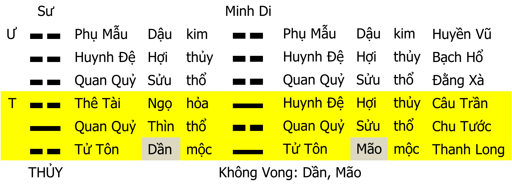
    - **Hình này chứng minh điều gì**
      - Minh họa thế quẻ đại hung khi tự biện tội quan chức: Hào Thế Ngọ hỏa động hóa Hợi thủy hồi đầu khắc; Hào 2 Quan Quỷ Thìn thổ lâm Nhật thần động hóa Sửu thổ Thoái thần; Hào sơ Tử Tôn Dần mộc hưu tù ngộ Không động hóa Mão mộc Tiến thần khắc Quan.
    - **Từ đâu mà thấy được**
      - Nhìn vào ba hào động nội quái Khảm biến Ly: hào sơ Dần mộc biến Mão mộc (Tiến thần), hào 2 Thìn thổ biến Sửu thổ (Thoái thần), hào 3 Ngọ hỏa biến Hợi thủy (Hồi đầu khắc) trên sơ đồ quẻ.
  - **Nhìn vào**: Hào Thế Thê Tài Ngọ hỏa tại hào 3 lâm Câu Trần; Hào Quan Quỷ Thìn thổ tại hào 2 lâm Chu Tước; Hào Tử Tôn Dần mộc tại hào 1 lâm Thanh Long; Hào Ứng Phụ Mẫu Dậu kim tại hào 6.
- **Quy tắc áp dụng**
  - Phân định bản chất Dụng thần: Biện tội giữ chức quan mang tính chất khảo hạch quan tước (tương đương đình chỉ công tác điều tra), Quan Quỷ là chức vị, Tử Tôn là thần tước đoạt chức vụ; không thể áp dụng tượng kiện tụng thông thường.
  - Hào Thế hóa hồi đầu khắc: Thân gặp khắc phạt tuyệt lộ, mưu sự phản tác dụng.
  - Quan Quỷ hóa Thoái thần: Chức vụ nắm giữ tất phải thoái lui, bị bãi miễn cách chức.
  - Tử Tôn hóa Tiến thần: Sức ép phế truất, giáng tội ngày càng gia tăng mãnh liệt.
  - Tính tuyệt đối của Tiến - Thoái thần: Hào động lâm Nhật thần hay hưu tù hóa Không Phá thì tiến vẫn là tiến, thoái vẫn là thoái.
- **Lời giải**
  - **Bước 1**: Xem xét vận mệnh bản thân qua hào Thế
    - **Căn cứ**: Hào 3 Thê Tài Ngọ hỏa trì Thế phát động hóa Huynh Đệ Hợi thủy.
    - **Nhìn vào**: Hợi thủy là Thủy quay lại khắc Ngọ hỏa, tức Thế hóa hồi đầu khắc. Tự mình dâng sớ biện bạch nhưng hào Thế bị hồi đầu khắc chứng tỏ lời thanh minh trở thành bằng chứng buộc tội, rước họa vào thân.
  - **Bước 2**: Xem xét chức vụ qua hào Quan Quỷ
    - **Căn cứ**: Hào 2 Quan Quỷ Thìn thổ lâm Nhật thần phát động hóa Quan Quỷ Sửu thổ.
    - **Nhìn vào**: Thìn thổ hóa Sửu thổ là thế hóa Thoái thần. Dù Thìn thổ gặp Nhật thần trị nhật, nhưng một khi đã hóa thoái thì ngôi vị quan trường tất phải thoái lui, mất chức.
  - **Bước 3**: Xem xét sức ép phế truất qua hào Tử Tôn
    - **Căn cứ**: Hào sơ Tử Tôn Dần mộc phát động hóa Tử Tôn Mão mộc.
    - **Nhìn vào**: Dần mộc dù lâm Tuần Không, hưu tù trong tháng Dậu Kim, nhưng động hóa Mão mộc là hóa Tiến thần. Tử Tôn là thần khắc Quan, hóa tiến biểu thị sự trừng phạt bãi quan tất sẽ bùng phát khi xuất Không lâm trị.
- **Đối thoại giải đáp nghi vấn**:
  - *Người hỏi thắc mắc*: Tại sao trong sách lại lấy Quan hóa thoái, Tử Tôn hóa tiến để định là không cát? Lẽ nào không thể hiểu Quan Quỷ là việc kiện tụng (Quan hóa thoái là kiện tụng chấm dứt), Tử Tôn là thần giải ưu (Tử hóa tiến là hết buồn lo)? Ngoài ra, hào sơ Dần mộc cùng Thế Ngọ hỏa bán hợp cục Dần - Ngọ khắc chế hào Ứng Phụ Mẫu Dậu kim (bên luận tội), chẳng phải báo hiệu ta thắng kiện hay sao?
  - *Vương Hổ Ứng lão sư giải đáp*: Đây hoàn toàn không phải là việc kiện tụng dân sự thông thường mà mang tính chất giống như chế độ "song quy" (bắt giữ cách chức để điều tra thẩm tra quan lại) thời hiện đại. Người tự thanh minh biện tội là mong muốn giữ lại chức quan của mình, nên chức quan là gốc rễ. Xem quan chức mà Quan hóa thoái tức là mất quan, Tử Tôn hóa tiến tức là khắc quan tước, thêm hào Thế hóa hồi đầu khắc thì thân mình khó giữ. Do đó cả ba hào động đều báo điềm đại hung; tuyệt đối không thể khiên cưỡng lấy Dần Ngọ bán hợp để đoán thắng kiện.
- **Kết quả**:
  - Đến tháng hai (tháng Mão) năm sau — đúng vào kỳ hạn hào Tử Tôn Dần mộc hóa Tiến thần Mão mộc xuất Không đắc lệnh — viên quan này chính thức bị triều đình hạ lệnh cách chức và bắt giam trị tội.
- **Kiểm tra lại**:
  - Thực tế bị cách chức bắt tội vào tháng Mão năm sau ứng nghiệm chuẩn xác với kỳ hạn xuất Không của Tử Tôn hóa Tiến thần khắc Quan, Quan Quỷ thoái vị và Thế hóa tuyệt địa, khẳng định tầm quan trọng của việc định vị Dụng thần theo bản chất chức vị thay vì câu nệ văn tự kiện tụng.

### Ví dụ 23: Xem thi Hội khoa cử có đỗ đạt hay không (Quẻ Tiểu Quá biến Cấn)
- **Đề bài**: Ngày Giáp Dần tháng Tuất, một sĩ tử gieo quẻ hỏi xem kỳ thi Hội khoa cử sắp tới có được đề danh bảng vàng hay không.
- **Dữ kiện**
  - Can chi: Ngày Giáp Dần, tháng Tuất (Tuần không: Tý, Sửu).
  - Quẻ chủ: Lôi Sơn Tiểu Quá (quẻ số 62).
  - Quẻ biến: Bát Thuần Cấn (quẻ số 52).
  - Hào động: Hào 4 Quan Quỷ Ngọ hỏa (Thế) động hóa Phụ Mẫu Tuất thổ; Hào 5 Huynh Đệ Thân kim động hóa Tử Tôn Tý thủy; Hào 6 Phụ Mẫu Tuất thổ động hóa Thê Tài Dần mộc.
  - Sơ đồ quẻ: (Tham chiếu Hình 23) alt="Sơ đồ quẻ" />
  - **Hình 23.** Sơ đồ quẻ Tiểu Quá biến Cấn
    - 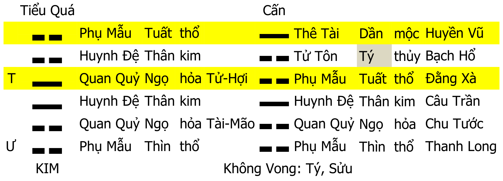
    - **Hình này chứng minh điều gì**
      - Thể hiện thế quẻ Lôi Sơn Tiểu Quá biến Bát Thuần Cấn với hào Thế Quan Quỷ Ngọ hỏa nhập Tam Mộ (động Mộ tại Tuất, hóa Mộ tại Tuất, Nguyệt kiến Mộ tại Tuất), đồng thời kết hợp Nhật thần Dần mộc và Nguyệt kiến Tuất thổ tạo thành tam hợp Quan cục cực vượng; hào Ứng Phụ Mẫu Thìn thổ lâm Nguyệt phá.
    - **Từ đâu mà thấy được**
      - Nhìn vào hào 4 Thế Quan Quỷ Ngọ hỏa biến Phụ Mẫu Tuất thổ, hào 6 Phụ Mẫu Tuất thổ biến Dần mộc, hào Ứng Thìn thổ ở hào sơ bị Nguyệt kiến Tuất xung phá trên đồ hình quẻ.
  - **Nhìn vào**: Hào Thế Quan Quỷ Ngọ hỏa tại hào 4 lâm Đằng Xà; Hào Ứng Phụ Mẫu Thìn thổ tại hào 1 lâm Thanh Long (bị Nguyệt phá); Nhật thần Giáp Dần; Nguyệt kiến Tuất thổ.
- **Quy tắc áp dụng**
  - Quy tắc Tam hợp Quan cục vượng tướng: Nhật thần Dần mộc, hào Thế Ngọ hỏa và Nguyệt kiến Tuất thổ cấu thành tam hợp Dần - Ngọ - Tuất Hỏa cục (Quan Quỷ cục) cực vượng đương thời.
  - Quy tắc Thế nhập Tam Mộ và Ứng kỳ xung khai Mộ khố: Hào Thế nhập ba tầng Mộ khố (động Mộ, hóa Mộ, Nguyệt Mộ) chủ trước mắt bị giam hãm chờ thời, đến năm/tháng Thìn xung khai Mộ khố ắt phát phúc rực rỡ, đề danh hàng Giáp.
  - Quy tắc Dụng thần sinh Thế Ứng trong việc chung và việc riêng: Dự đoán danh vọng, khoa cử hoặc đại thể quan vận không sợ Dụng thần sinh Ứng; chỉ khi tranh đoạt một chức vị cụ thể mới kỵ Dụng sinh Ứng.
- **Lời giải**
  - **Bước 1**: Đánh giá khí thế của Dụng thần Quan tinh và Tam hợp cục
    - **Căn cứ**: Thi cử lấy Quan Quỷ làm công danh, Phụ Mẫu làm bài vở bảng vàng. Hào 4 Quan Quỷ Ngọ hỏa trì Thế phát động.
    - **Nhìn vào**: Nhật thần Dần mộc sinh phù và hợp cùng Thế Ngọ hỏa, kết hợp Nguyệt kiến Tuất thổ tạo thành thế tam hợp Dần - Ngọ - Tuất Hỏa cục. Quan tinh vượng tướng tột đỉnh, như ngọc báu không tỳ vết.
  - **Bước 2**: Luận giải hiện tượng Tam Mộ và định đoạt ứng kỳ
    - **Căn cứ**: Thế Ngọ hỏa gặp hào 6 Tuất thổ động là động Mộ; bản thân động biến ra Tuất thổ là hóa Mộ; tháng Tuất lại là Mộ của Ngọ hỏa (Nguyệt Mộ).
    - **Nhìn vào**: Hiện tượng "Thế nhập Tam Mộ" biểu thị hiện tại đang trong giai đoạn bế tàng, ẩn nhẫn ôn luyện. Chờ đến năm sau là năm Thìn, tháng Thìn xung khai Tuất thổ Mộ khố (Thìn Tuất tương xung), công danh ắt bộc phát đỗ đầu hàng Giáp.
  - **Bước 3**: So sánh tương quan cát hung Thế và Ứng
    - **Căn cứ**: Hào Ứng Phụ Mẫu Thìn thổ tại hào sơ bị Nguyệt kiến Tuất thổ xung là Nguyệt phá; hào Thế ngự trung tâm Quan cục vượng tướng.
    - **Nhìn vào**: Ứng phá chủ đối thủ suy bại, Thế vượng đắc hợp chủ bản thân thành tựu viên mãn.
- **Đối thoại giải đáp nghi vấn**:
  - *Người hỏi thắc mắc*: Trong chương Tam hợp sách cổ nói "Tam hợp Quan cục sinh Thế lợi mình, sinh Ứng lợi người; Tài cục sinh Thế lợi mình, sinh Ứng lợi người". Trong quẻ này hợp thành Hỏa cục sinh Thổ, mà cả hào Ứng (Thìn thổ) lẫn biến hào (Tuất thổ) đều là Thổ, chẳng phải là Quan cục sinh Ứng sẽ lợi cho người khác sao? Quy luật tam hợp sinh Thế Ứng có phải chỉ áp dụng cho cầu quan và cầu tài chứ không áp dụng cho thi cử?
  - *Vương Hổ Ứng lão sư giải đáp*: Trong quẻ này hào Ứng lâm Nguyệt phá nên hoàn toàn không thể tiếp nhận sự tương sinh, trong khi hào Thế nắm giữ then chốt hợp cục và hoàn toàn không bị tổn thương, nên tất lợi cho Thế mà bất lợi cho Ứng. Mặt khác, Dụng thần sinh Ứng thường là ứng vào việc tranh chấp cụ thể. Dự đoán việc chung đại thể như quan vận đời người hay thi cử khoa bảng thì không sợ Dụng sinh hào Ứng, mà chỉ sợ Dụng thần hưu tù suy bại. Chỉ khi nào hỏi riêng về việc tranh thăng chức một vị trí cụ thể thì Dụng sinh Ứng mới đáng sợ vì chức vụ sẽ lọt vào tay đối thủ.
- **Kết quả**:
  - Sang năm Thìn, đúng vào tháng Thìn xung khai Tam Mộ Tuất thổ, người sĩ tử quả nhiên đỗ đạt bảng vàng, lại đứng đầu hàng Giáp đệ nhất danh.
- **Kiểm tra lại**:
  - Kỳ tích thi đỗ hàng Giáp vào tháng Thìn năm Thìn chứng minh tuyệt đối quy tắc xung khai Tam Mộ của hào Thế và làm sáng tỏ nguyên lý không câu nệ Dụng sinh Ứng trong các việc thi cử, danh vọng mang tính chất đại thể.

### Ví dụ 24: Em gái xem anh trai và chị dâu bất hòa có ly hôn không (Quẻ Thái biến Thăng)
- **Đề bài**: Ngày Nhâm Thân tháng Hợi, người em gái đến gieo quẻ hỏi giúp anh trai và chị dâu trong gia đình đang xảy ra mâu thuẫn gay gắt, liệu có đi đến bờ vực ly hôn hay không.
- **Dữ kiện**
  - Can chi: Ngày Nhâm Thân, tháng Hợi (Tuần không: Tuất, Hợi).
  - Quẻ chủ: Địa Thiên Thái (quẻ số 11, quẻ Lục hợp).
  - Quẻ biến: Địa Phong Thăng (quẻ số 46).
  - Hào động: Hào sơ Thê Tài Tý thủy động hóa Huynh Đệ Sửu thổ (độc phát).
  - Sơ đồ quẻ: (Tham chiếu Hình 24) alt="Sơ đồ quẻ" />
  - **Hình 24.** Sơ đồ quẻ Địa Thiên Thái biến Địa Phong Thăng
    - 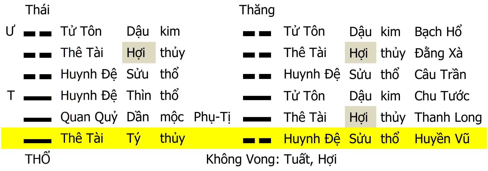
    - **Hình này chứng minh điều gì**
      - Thể hiện trực quan quẻ Địa Thiên Thái là quẻ Lục hợp nhưng Dụng thần Thê Tài Tý thủy độc phát tại hào sơ hóa Huynh Đệ Sửu thổ hồi đầu khắc, báo hiệu hiện tượng "hợp xứ phùng xung" tất dẫn tới ly hôn, đồng thời vạch trần mối quan hệ ngoại tình lén lút qua thế Tý Sửu hợp lâm Huyền Vũ.
    - **Từ đâu mà thấy được**
      - Nhìn vào hào sơ Thê Tài Tý thủy độc phát biến Huynh Đệ Sửu thổ lâm Huyền Vũ trên đồ hình quẻ Địa Thiên Thái biến Địa Phong Thăng ngày Nhâm Thân tháng Hợi.
  - **Nhìn vào**: Hào sơ Thê Tài Tý thủy độc phát lâm Huyền Vũ; Hào Thế Huynh Đệ Thìn thổ tại hào 3 lâm Chu Tước; Hào Ứng Tử Tôn Dậu kim tại hào 6; tháng Hợi Thủy và ngày Thân Kim.
- **Quy tắc áp dụng**
  - Quy tắc Lục hợp phùng khắc tất ly: Quẻ tuy là Lục hợp chủ hòa hợp, nhưng Dụng thần độc phát hóa hồi đầu khắc thì Lục hợp biến thành xung phá, kết cục chắc chắn ly hôn.
  - Quy tắc Lưỡng tính Vừa hợp vừa khắc của Tý - Sửu: Tý động hóa Sửu mang đồng thời hai tầng ý nghĩa: hóa hợp biểu thị có mối quan hệ ngoại tình gian díu lén lút bên ngoài; hóa khắc biểu thị kết cục mâu thuẫn đoạn tuyệt dẫn tới chia lìa.
  - Quy tắc Ứng kỳ ly hôn: Ứng vào ngày hợp với hào độc phát hoặc ngày trị hào biến khắc phạt Dụng thần.
- **Lời giải**
  - **Bước 1**: Xác định Dụng thần của người chị dâu
    - **Căn cứ**: Xem về chị dâu thì lấy hào Thê Tài làm Dụng thần. Trong quẻ có hai hào Thê Tài: hào 5 Thê Tài Hợi thủy (tĩnh) và hào sơ Thê Tài Tý thủy (động).
    - **Nhìn vào**: Thần cơ phát lộ tại hào động, do đó lấy hào sơ Thê Tài Tý thủy độc phát làm Dụng thần chủ sự.
  - **Bước 2**: Xét tính chất động biến và định đoạt kết quả hôn nhân
    - **Căn cứ**: Thê Tài Tý thủy phát động biến ra Huynh Đệ Sửu thổ. Sửu thổ là Kỵ thần quay lại khắc Tý thủy (hóa hồi đầu khắc).
    - **Nhìn vào**: Dù quẻ chủ Địa Thiên Thái là quẻ Lục hợp biểu tượng cho sự gắn kết bền chặt, nhưng Dụng thần bị hồi đầu khắc thì dây tơ hồng đứt đoạn, đôi bên chắc chắn phải ly hôn.
  - **Bước 3**: Bóc tách chi tiết nguyên nhân và thủ tượng ngoại tình
    - **Căn cứ**: Tý hợp Sửu (Lục hợp), đồng thời Sửu thổ khắc Tý thủy; hào sơ lâm Huyền Vũ chủ ám muội, lén lút.
    - **Nhìn vào**: Hóa hợp lâm Huyền Vũ biểu thị người chị dâu đã nảy sinh tư tình ngoại tình với người đàn ông khác bên ngoài; hóa khắc biểu thị chính vì sự việc bất chính này mà dẫn đến đổ vỡ hôn nhân.
- **Đối thoại giải đáp nghi vấn**:
  - *Người hỏi thắc mắc về quy ước Lục hợp cổ điển*: Theo sách cổ chương Lục hợp, Tý Sửu tác hợp, nếu gặp ngày tháng Thìn Tuất Sửu Mùi thổ vượng thì hào Tý bị khắc không được sinh phù nên "nói khắc không nói hợp". Nhưng hiện tại gieo quẻ vào tháng Hợi thủy, lại là ngày Thân kim (Thân Tý Thìn hợp, Kim Thủy tương sinh), Tý thủy đang cực kỳ vượng tướng, tại sao lại luận là Sửu thổ khắc Tý thủy mà không luận là hợp?
  - *Vương Hổ Ứng lão sư giải đáp*: Về bản chất ngũ hành, Tý động hóa Sửu là "vừa khắc vừa hợp". Người xưa vì lúng túng không giải thích dung hòa được hai yếu tố này nên mới đưa ra quy tắc máy móc rằng Sửu vượng thì chỉ luận khắc. Trong thực tế dự đoán Lục Hào, Lý và Tượng cùng tồn tại song hành: Hóa hợp biểu thị chị dâu cô ấy có mối quan hệ ngoại tình lén lút bên ngoài; còn hóa khắc quyết định kết cục sự việc là sẽ chia rẽ, ly hôn không thể cứu vãn!
- **Kết quả**:
  - Đến ngày Đinh Sửu — vừa là ngày hợp với hào độc phát Tý thủy, vừa là ngày Sửu thổ biến hào lâm trị khắc phạt Dụng thần — hai vợ chồng người anh trai đã chính thức đưa nhau ra tòa ly hôn.
- **Kiểm tra lại**:
  - Sự việc ly hôn xảy ra đúng ngày Đinh Sửu chứng minh tính chuẩn xác tuyệt đối của quy tắc hợp xứ phùng khắc, đồng thời đính chính hoàn toàn sự bế tắc của cổ pháp bằng việc phân định rạch ròi: hóa hợp biểu thị nhân tình thế thái (ngoại tình), hóa khắc định đoạt kết quả sống còn (ly hôn).

### Ví dụ 25: Xem mở tiệm buôn bán, con trai đánh bạc bị bắt (Quẻ Khôn biến Bác)
- **Đề bài**: Ngày Nhâm Thân tháng Tị, một người đến gieo quẻ hỏi về việc dự định mở cửa hàng buôn bán kinh doanh xem tài vận có hanh thông hay không.
- **Dữ kiện**
  - Can chi: Ngày Nhâm Thân, tháng Tị (Tuần không: Tuất, Hợi).
  - Quẻ chủ: Bát Thuần Khôn (quẻ số 2, quẻ Lục xung).
  - Quẻ biến: Sơn Địa Bác (quẻ số 23).
  - Hào động: Hào 6 Tử Tôn Dậu kim (Thế) độc phát hóa Quan Quỷ Dần mộc.
  - Sơ đồ quẻ: (Tham chiếu Hình 25) alt="Sơ đồ quẻ" />
  - **Hình 25.** Sơ đồ quẻ Khôn biến Bác
    - 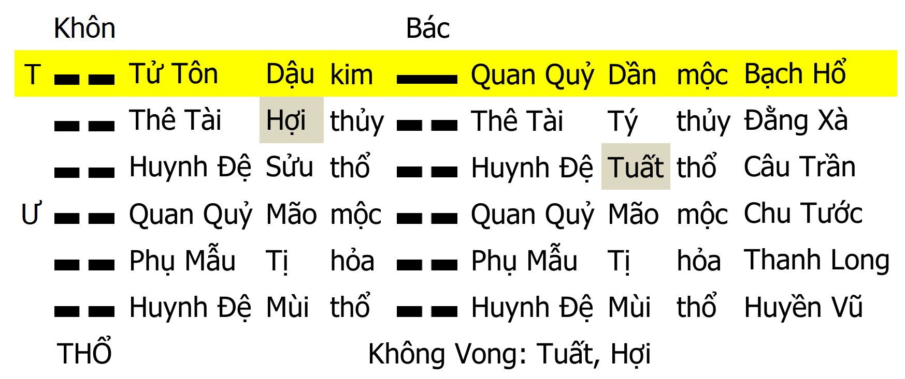
    - **Hình này chứng minh điều gì**
      - Minh họa quẻ Bát Thuần Khôn biến Sơn Địa Bác với hào 6 Thế lâm Tử Tôn Dậu kim độc phát hóa Quan Quỷ Dần mộc (hóa Tuyệt lâm Bạch Hổ); Thê Tài Hợi thủy lâm Tuần Không ngộ Nguyệt phá không thể tiếp nhận sinh phù; báo hiệu việc mở tiệm cầu tài hoàn toàn thất bại và con trai gặp đại họa chết chóc.
    - **Từ đâu mà thấy được**
      - Nhìn vào hào 6 Tử Tôn Dậu kim biến Quan Quỷ Dần mộc lâm Bạch Hổ, hào 5 Thê Tài Hợi thủy lâm Không Phá dưới ngày Nhâm Thân tháng Tị trên sơ đồ quẻ Khôn biến Bác.
  - **Nhìn vào**: Hào Thế Tử Tôn Dậu kim tại hào 6 lâm Bạch Hổ độc phát; Hào Ứng Quan Quỷ Mão mộc tại hào 3 lâm Chu Tước; Hào Thê Tài Hợi thủy tại hào 5 lâm Đằng Xà ngộ Nguyệt phá và Tuần Không.
- **Quy tắc áp dụng**
  - Quy tắc Cầu tài Dụng thần lâm Nguyệt phá Tuần Không: Mở tiệm xem Thê Tài, Tài hào lâm Nguyệt phá ngộ Tuần Không thì dù có Tử Tôn phát động sinh Tài cũng vô ích, tài nguyên sụp đổ.
  - Quy tắc Thế lâm Tử Tôn đồng hóa Quỷ: Hào Thế tích hợp hai dòng thông tin: vừa là bản thân người hỏi quẻ, vừa là con cái (Lục thân Tử Tôn). Biến Quan Quỷ là tượng vì chuyện con cái mà dính líu quan phi kiện tụng.
  - Quy tắc Độc phát hóa Tuyệt: Tử Tôn Dậu kim độc phát hóa Tuyệt tại Dần mộc (Kim tuyệt tại Dần), lâm Bạch Hổ là điềm chết chóc hình pháp hung hiểm tột cùng.
  - Phương pháp Biện hào pháp (Biến động hào): Chiếu hào biến Quan Quỷ quy hồi quẻ gốc, thấy tương ứng hào Ứng (người khác), xác định tai họa chết chóc giáng xuống đầu người con chứ không phải bản thân người hỏi quẻ.
- **Lời giải**
  - **Bước 1**: Đánh giá triển vọng mở tiệm cầu tài
    - **Căn cứ**: Cầu tài lấy Thê Tài làm Dụng thần, Tử Tôn làm Nguyên thần sinh Tài.
    - **Nhìn vào**: Hào 5 Thê Tài Hợi thủy lâm Tuần Không, lại bị Nguyệt kiến Tị hỏa xung là Nguyệt phá (vừa Không vừa Phá). Dù hào 6 Tử Tôn Dậu kim phát động sinh Tài, nhưng Thê Tài đã tuyệt căn suy bại thì không thể tiếp nhận sinh phù. Việc mở tiệm kinh doanh hoàn toàn bế tắc, không có hy vọng.
  - **Bước 2**: Bóc tách mối họa quan phi và tai kiếp của con cái
    - **Căn cứ**: Hào 6 Thế lâm Tử Tôn Dậu kim động hóa Quan Quỷ Dần mộc, lại lâm Bạch Hổ.
    - **Nhìn vào**: Quan Quỷ là kiện tụng lao tù hình pháp, Tử Tôn là con cái. Thế lâm Tử Tôn hóa Quỷ báo hiệu vì chuyện con cái vi phạm pháp luật mà cha mẹ phải chịu liên lụy quan ti. Đặc biệt, Dậu kim tuyệt tại Dần mộc là thế "độc phát hóa Tuyệt", lâm Bạch Hổ chủ đổ máu tử thương. Đến mùa thu (tháng Thân Dậu Kim khí đắc lệnh), tai họa tất phát tác.
  - **Bước 3**: Ứng nghiệm thực tế ngoài đời
    - **Căn cứ**: Tử Tôn Dậu kim biến Quỷ hóa Tuyệt.
    - **Nhìn vào**: Đến tháng 8 (tháng Dậu), người con trai do tham gia đánh bạc bị quan phủ vây bắt, giải lên công đường chịu hình phạt đánh trượng đến chết.
- **Đối thoại giải đáp nghi vấn**:
  - *Người hỏi thắc mắc 1*: Quẻ này Tử Tôn và hào Thế đồng thời hóa Quỷ, nếu có tai họa xuất hiện thì phải ứng lên cả hào Thế lẫn Tử Tôn, tại sao chỉ có người con trai bị phạt trượng chết, còn bản thân người cha (hào Thế) lại bình an vô sự không chết?
  - *Vương Hổ Ứng lão sư giải đáp 1*: Quẻ này Thế lâm Tử Tôn hóa Quỷ, Quỷ là kiện tụng, Tử Tôn là con cái, chính là bởi vì chuyện con cái mà vướng vào quan phi kiện tụng; quẻ tượng hiển lộ thông tin là như vậy. Nhưng việc người con bị đánh trượng mà chết là do Tử Tôn độc phát hóa Tuyệt (Tuyệt tại Dần mộc, mộc lại là Quỷ). Bản thân ông ta không chết không thể chỉ dựa vào một mặt phân tích thuần lý trong quẻ; có quẻ bản thân và con cái cùng gặp hung, có quẻ chỉ ứng bản thân, có quẻ chỉ ứng con cái. Dự trắc sư Dã Hạc khi đoán quẻ này cũng chỉ đoán là "vì con mà gặp quan phi", chứ hoàn toàn không đoán trước là đứa con sẽ phải chết!
  - *Người hỏi thắc mắc 2*: Hào Thế đã lâm Tử Tôn thì mang thông tin song trùng, làm thế nào để khi gặp lại trường hợp tương tự có thể phân định rạch ròi là ứng vào bản thân hay ứng vào con cái?
  - *Vương Hổ Ứng lão sư giải đáp 2*: Dự đoán đôi khi không thể cứng nhắc thuần lý mà cần có trực giác tâm linh. Tuy nhiên, về mặt lý luận quy phạm, có thể sử dụng phương pháp cao cấp gọi là "Biện hào pháp" (hay "Biến động hào"): Lấy hào biến chuyển quy chiếu vào quẻ gốc. Hào biến ở đây là Quan Quỷ Dần mộc mang hành Mộc; trong quẻ gốc, hành Mộc ngự tại hào 3 là hào Ứng (Quan Quỷ Mão mộc). Hào Ứng đại diện cho người khác ngoài thân. Nhờ hào biến liên thông với hào Ứng, ta xác định được rằng tai họa hình pháp cực độ (cái chết) sẽ giáng vào người khác (ở đây là người con theo Lục thân Tử Tôn) chứ không giáng vào bản thân người hỏi quẻ (hào Thế). Chỉ có giải thích bằng Biện hào pháp mới thực sự viên dung và thấu suốt!
- **Kết quả**:
  - Đúng tháng 8 (tháng Dậu Kim trị lệnh), người con trai tham gia cờ bạc bị nha môn bắt giữ, kết án phạt trượng và qua đời ngay tại công đường. Người cha chỉ bị liên lụy quan phi tốn kém, hoàn toàn bình an về tính mạng.
- **Kiểm tra lại**:
  - Thực chứng tử vong của người con vào tháng 8 ứng nghiệm chuẩn xác với tượng Tử Tôn Dậu kim độc phát hóa Tuyệt lâm Bạch Hổ, làm sáng tỏ bí pháp "Biện hào pháp" độc đáo để phân định ranh giới giữa Thế (bản thân) và Ứng (người thân/người ngoài).

## Nghi vấn thực chứng: Linh hoạt dụng thần, Hào động biến sinh và Niên vận

- **Cơ chế Dụng thần khắc Thế và ứng kỳ Tuần Không**:
  - Dụng thần Quan Quỷ khắc Thế không thể mặc định quy kết là cát lành hay vô hại; Dụng khắc Thế chung quy tiềm tàng hung họa sát thân.
  - Khi hào Thế lâm Tuần Không, hào Thế tạm thời rơi vào khoảng chân không chưa thọ nhận lực khắc, đương số có thể đắc quan chức tạm thời trước mắt.
  - Xuất Không (thực Không hoặc phùng xung xuất Không) là thời điểm hào Thế chính thức thọ khắc, tai ương phát tác mãnh liệt dẫn đến tử vong.

- **Quy tắc Hào độc phát sinh Thế và phân loại tài sản theo tượng lục thân**:
  - Xem cầu tài tối kỵ Huynh Đệ trì Thế vì Huynh Đệ là Kỵ thần chủ về khắc cướp, phân tán tiền tài vàng bạc.
  - Khi hào Phụ Mẫu độc phát sinh Thế, thần cơ phát lộ tại hào độc phát chuyển hóa đối tượng đắc tài: tuy không được vàng bạc kim ngân (thuộc Tài kim) nhưng chắc chắn thu được của cải thuộc tượng Phụ Mẫu (vải vóc, lụa là, đồ đạc gia dụng, chén cốc, văn thư).
  - Phân định Lý và Tượng song hành: Độc phát lấy tượng làm chủ nhưng tuyệt đối không tách rời ngũ hành sinh khắc; hào độc phát sinh Thế ắt mang lại lợi ích thực tế ứng với thuộc tính biểu tượng của hào đó.

- **Quy tắc Linh hoạt bất câu nệ Dụng thần trong chiêm đoán quan lộc**:
  - Trong tình huống hào Thế lâm Chu Tước độc phát hóa Phụ Mẫu hồi đầu sinh, không câu nệ tìm hào Quan Quỷ làm Dụng thần duy nhất.
  - Phụ Mẫu đại diện cho tin mừng, văn thư, chiếu chỉ, sắc phong và lệnh trạng bổ nhiệm; Thế động hóa sinh biểu thị chính thân chủ đón nhận ấn tín chức vụ.
  - Giới hạn tác động của hào tĩnh: Hào tĩnh tuyệt đối không thể sinh khắc hào động; khái niệm cổ thư về hào tĩnh "có ý sinh Thế" chỉ là thủ ý hướng tĩnh, không tạo ra động lực sinh khắc thực tế.
  - Tượng hào Thế đắc hợp và cơ chế xung khai: Hào Thế được Nhật thần tương hợp là tượng bị ràng buộc tạm thời che chở, hoạn lộ trước mắt thuận buồm xuôi gió; đến năm Thái Tuế xung khai hào Thế (phá hợp) và hình hại hào biến thì hung sự và án phạt mới giáng xuống triệt để.

- **Quy tắc Thẩm định Tam hợp cục và Hóa Mộ hồi đầu khắc trong đoán Niên vận**:
  - Tam hợp cục đòi hỏi sự liên kết thực chất của các địa chi theo quy chuẩn cấu trúc và phát động của hào trung tâm; không thể chắp vá các địa chi tản mác của hào động và hào biến để gán ghép thành tam hợp cục cứu giải.
  - Hào Thế suy nhược vô khí (bị Nhật Nguyệt đồng thời khắc phạt) động hóa Mộ kiêm hóa hồi đầu khắc là điềm hung hiểm tột cùng.
  - Bác bỏ khẩu quyết giáo điều "người trong Mộ không xung không phát": Khẩu quyết này chỉ ứng nghiệm khi Dụng thần vượng tướng; với hào Thế suy tuyệt nhập Mộ, gặp Tuế phá xung là xung tán sinh khí dẫn đến tử vong.
  - Giới hạn của quy tắc "Cách sơn hóa hào": Quy tắc bắc cầu chuyển hóa chỉ ứng dụng định Dụng thần trong trường hợp chuyên biệt, không thể áp dụng để hóa giải thế hồi đầu khắc chí mạng của hào Thế.

### Ví dụ 26: Xem có được chức quan hay không (Quẻ Thái biến Minh Di)
- **Đề bài**: Ngày Canh Tý tháng Sửu, một người đến xem có được chức quan hay không, gieo được quẻ Thái biến Minh Di. Nghi vấn đặt ra là liệu việc được quan có phải chỉ là tạm thời hay không khi thấy hào Thế lâm Thanh Long nhưng lại bị Quan Quỷ khắc Thế.
- **Dữ kiện**
  - Can chi: Ngày Canh Tý, tháng Sửu. Tuần không: Thìn, Tị. Cung Thổ.
  - Quẻ chủ: Địa Thiên Thái, Quẻ biến: Địa Hỏa Minh Di.
  - Hào động: Hào sơ Tý thủy động hóa Mão mộc, hào 2 Dần mộc động hóa Sửu thổ, hào 3 Thìn thổ động hóa Hợi thủy.
  - Bảng nạp giáp quẻ:
    - Hào 6: Tử Tôn Dậu kim (Ứng) -- -- / Tử Tôn Dậu kim -- -- (Đằng Xà)
    - Hào 5: Thê Tài Hợi thủy -- -- / Thê Tài Hợi thủy -- -- (Câu Trần)
    - Hào 4: Huynh Đệ Sửu thổ -- -- / Huynh Đệ Sửu thổ -- -- (Chu Tước)
    - Hào 3: Huynh Đệ Thìn thổ (Thế) —— / Thê Tài Hợi thủy —— (Thanh Long) [Động]
    - Hào 2: Quan Quỷ Dần mộc (Phục: Phụ Mẫu Tị hỏa) —— / Huynh Đệ Sửu thổ -- -- (Huyền Vũ) [Động]
    - Hào 1: Thê Tài Tý thủy —— / Quan Quỷ Mão mộc —— (Bạch Hổ) [Động]
  - Sơ đồ quẻ: (Tham chiếu Hình 26) alt="Sơ đồ quẻ" />
  - **Hình 26.** Quẻ Thái biến Minh Di
    - 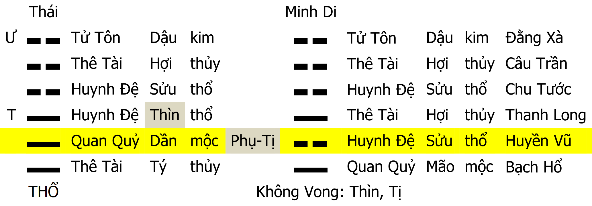
    - **Hình này chứng minh điều gì**
      - Quan Quỷ Dần mộc khắc Thế Thìn thổ; Thế lâm Không Vong tạm thời chưa thọ khắc nên đắc quan sai ngày Nhâm Dần, nhưng đến tháng Thìn năm sau xuất Không thọ khắc ắt vong mạng.
      - Minh chứng quy tắc: Dụng thần khắc Thế không thể nhất loạt cho là không hung; khi Thế Không thì xuất Không liền thọ hung.
    - **Từ đâu mà thấy được**
      - Hào 3 Huynh Đệ Thìn thổ trì Thế lâm Thanh Long phát động hóa Thê Tài Hợi thủy, lâm Tuần Không.
      - Hào 2 Quan Quỷ Dần mộc phát động khắc hào Thế Thìn thổ.
  - Nhìn vào: Hào 3 Huynh Đệ Thìn thổ trì Thế lâm Thanh Long, lâm Tuần Không; hào 2 Quan Quỷ Dần mộc đắc lệnh nguyệt kiến tương sinh phát động khắc Thế; hào sơ Thê Tài Tý thủy lâm Bạch Hổ phát động hóa Quan Quỷ Mão mộc sinh mộc.
- **Quy tắc áp dụng**
  - Xem quan tước lấy Quan Quỷ làm Dụng thần; Dụng thần khắc hào Thế là tượng áp lực hung họa.
  - Quy tắc Tuần Không tị khắc: Hào Thế lâm Không Vong tạm thời chưa tiếp nhận lực khắc, có thể đắc việc trước mắt.
  - Quy tắc xuất Không định kỳ ứng hung: Hào Thế xuất Không (thực Không) thì lực khắc lập tức tác động đầy đủ, biến cát thành hung.
- **Lời giải**
  - **Bước 1**: Xác định Dụng thần và tương quan sinh khắc với hào Thế.
    - Căn cứ: Cầu quan chức lấy hào Quan Quỷ làm Dụng thần.
    - Nhìn vào: Hào 2 Quan Quỷ Dần mộc phát động khắc hào 3 Huynh Đệ Thìn thổ trì Thế; hào sơ Thê Tài Tý thủy phát động sinh trợ Quan tinh, Quan mộc cực vượng.
  - **Bước 2**: Luận định cơ hội đắc quan trước mắt nhờ hào Thế lâm Không.
    - Căn cứ: Tuần không tại Thìn và Tị; hào Thế Thìn thổ lâm Không Vong và lâm Thanh Long.
    - Nhìn vào: Hào Thế lâm Không nên tạm thời tị khắc, chưa bị Dần mộc làm hại. Đến ngày Nhâm Dần (Quan Quỷ Dần mộc lâm trị), đương số đắc chức quan sai.
  - **Bước 3**: Luận định hậu vận hung hiểm khi hào Thế xuất Không.
    - Căn cứ: Xuất Không thọ khắc; Dụng thần khắc Thế không thể xem là an lành lâu dài.
    - Nhìn vào: Đến tháng ba năm sau (tháng Thìn), hào Thế Thìn thổ xuất Không thực giá trị; Quan Quỷ Dần mộc phát động khắc Thế giáng đòn chí mạng, người này qua đời ở dọc đường.
- **Đối thoại giải đáp nghi vấn**:
  - Người hỏi thắc mắc: "Lão sư, quẻ này là tạm thời được quan?"
  - Vương Hổ Ứng lão sư giải đáp: Quan vượng, Thế lâm Thanh Long, đó là điềm báo chắc chắn có quan chức. Thế nhưng Quan Quỷ khắc Thế, hào Thế hiện đang lâm Không nên tạm thời chưa bị khắc hại mà được việc; đến khi Thìn thổ xuất Không, hào Thế phải trực tiếp gánh chịu lực khắc tàn phá của Quan Quỷ mà gặp nạn vong thân.
- **Kết quả**: Đến ngày Nhâm Dần người này quả nhiên được bổ nhiệm chức quan sai; đến tháng ba (tháng Thìn) năm sau thì chết ở dọc đường đi.
- **Kiểm tra lại**: Ứng nghiệm chính xác từng giai đoạn: Ngày Dần (Quan vượng) đắc quan, tháng Thìn (Thế xuất Không thọ khắc) vong mạng. Khẳng định nguyên tắc Dụng khắc Thế chung cuộc vẫn là hung.

### Ví dụ 27: Xem về cầu tài vải lụa, Phụ Mẫu độc phát sinh Thế (Quẻ Vị Tế biến Khuê)
- **Đề bài**: Ngày Kỷ Dậu tháng Ngọ, xem về việc cầu tài, gieo được quẻ Vị Tế biến Khuê. Người xem lo ngại vì Huynh Đệ trì Thế vốn là Kỵ thần, lại thêm Dần mộc độc phát là đất Tuyệt của Dụng thần Thê Tài Dậu kim, nảy sinh nghi vấn tại sao vẫn có thể cầu được tài lụa là của cải.
- **Dữ kiện**
  - Can chi: Ngày Kỷ Dậu, tháng Ngọ. Tuần không: Dần, Mão. Cung Hỏa.
  - Quẻ chủ: Hỏa Thủy Vị Tế, Quẻ biến: Hỏa Trạch Khuê.
  - Hào động: Hào sơ Phụ Mẫu Dần mộc động hóa Huynh Đệ Tị hỏa.
  - Bảng nạp giáp quẻ:
    - Hào 6: Huynh Đệ Tị hỏa (Ứng) —— / Huynh Đệ Tị hỏa —— (Câu Trần)
    - Hào 5: Tử Tôn Mùi thổ -- -- / Tử Tôn Mùi thổ -- -- (Chu Tước)
    - Hào 4: Thê Tài Dậu kim —— / Thê Tài Dậu kim —— (Thanh Long)
    - Hào 3: Huynh Đệ Ngọ hỏa (Thế) -- -- (Phục: Quan Quỷ Hợi thủy) / Tử Tôn Sửu thổ -- -- (Huyền Vũ)
    - Hào 2: Tử Tôn Thìn thổ —— / Phụ Mẫu Mão mộc —— (Bạch Hổ)
    - Hào 1: Phụ Mẫu Dần mộc -- -- / Huynh Đệ Tị hỏa —— (Đằng Xà) [Động]
  - Sơ đồ quẻ: (Tham chiếu Hình 27) alt="Sơ đồ quẻ" />
  - **Hình 27.** Quẻ Vị Tế biến Khuê
    - 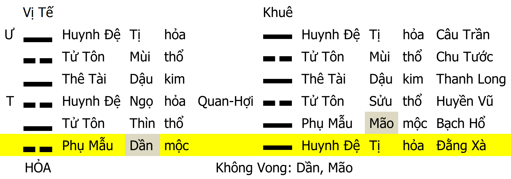
    - **Hình này chứng minh điều gì**
      - Huynh Đệ Ngọ hỏa trì Thế không cầu được tiền bạc vàng kim; nhưng hào sơ Phụ Mẫu Dần mộc độc phát hóa Tị hỏa hồi đầu sinh Thế thì đắc tài sản dạng hiện vật thuộc tượng Phụ Mẫu (vải lụa, cốc chén).
      - Minh chứng quy tắc: Độc phát lấy tượng làm chủ nhưng không tách rời ngũ hành sinh khắc; Phụ Mẫu sinh Thế thì chắc chắn có chỗ thu hoạch lợi ích.
    - **Từ đâu mà thấy được**
      - Hào 3 Huynh Đệ Ngọ hỏa trì Thế lâm Nguyệt kiến, hào 4 Thê Tài Dậu kim lâm Nhật kiến.
      - Hào sơ Phụ Mẫu Dần mộc độc phát lâm Tuần Không, động hóa Huynh Đệ Tị hỏa sinh Thế.
  - Nhìn vào: Hào Thế Huynh Đệ Ngọ hỏa đắc Nguyệt kiến, khắc hào 4 Thê Tài Dậu kim; hào sơ Phụ Mẫu Dần mộc độc phát lâm Tuần Không hóa Tị hỏa sinh Thế.
- **Quy tắc áp dụng**
  - Cầu tài tối kỵ Huynh Đệ trì Thế (Kỵ thần trì Thế chủ về không đắc kim ngân vàng bạc).
  - Quy tắc Thần cơ tại hào độc phát: Hào Phụ Mẫu Dần mộc độc phát sinh Thế, quẻ phát động tất có chỗ đắc lợi.
  - Quy tắc phân loại tài sản: Thê Tài kim chủ về vàng bạc; Phụ Mẫu mộc chủ về vải vóc, lụa là, đồ đạc, gia cụ, chén cốc.
  - Quy tắc ứng kỳ Tuần Không: Hào động lâm Không xuất Không định kỳ ứng nghiệm (ngày Dần xuất Không).
- **Lời giải**
  - **Bước 1**: Đánh giá khả năng cầu tiền tài vàng bạc.
    - Căn cứ: Huynh Đệ trì Thế khắc Thê Tài.
    - Nhìn vào: Hào Thế Huynh Đệ Ngọ hỏa lâm Nguyệt kiến cực vượng, Thê Tài Dậu kim tuy lâm Nhật kiến nhưng bị Kỵ thần chiếm cứ hào Thế ngăn trở, quyết không thể cầu được vàng bạc.
  - **Bước 2**: Đánh giá thần cơ hào độc phát sinh Thế và thủ tượng của cải.
    - Căn cứ: Hào Phụ Mẫu độc phát tương sinh cho hào Thế; Phụ Mẫu mang tượng vải vóc, lụa là, cốc chén.
    - Nhìn vào: Hào sơ Phụ Mẫu Dần mộc độc phát hóa Tị hỏa, mộc hỏa tương sinh trợ giúp hào Thế Ngọ hỏa, chủ về ắt thu được tài sản do Phụ Mẫu biểu trưng.
  - **Bước 3**: Xác định ứng kỳ thu hoạch của cải.
    - Căn cứ: Tuần không tại Dần và Mão; hào Phụ Mẫu Dần mộc lâm Tuần Không phát động.
    - Nhìn vào: Đến ngày Dần, hào Phụ Mẫu Dần mộc xuất Không, lực sinh Thế phát huy đầy đủ, đương số đắc tài sản hiện vật.
- **Đối thoại giải đáp nghi vấn**:
  - Người hỏi thắc mắc lần 1: "Quẻ này Tài mặc dù lâm Nhật, nhưng Huynh Đệ trì Thế, Dần mộc độc phát Tuyệt Dụng thần, sao có thể có tài?"
  - Vương Hổ Ứng lão sư giải đáp: Quẻ này nếu luận theo hào Tài thì không được; nhưng Phụ Mẫu độc phát sinh Thế, tất có chỗ được, vì vậy lấy Phụ Mẫu làm chỗ được.
  - Người hỏi thắc mắc lần 2: "Quẻ này theo lý ngũ hành sinh khắc thì có thể được tài, mà thầy nói quẻ độc phát lấy tượng làm chủ, hào độc phát này là Tuyệt địa của Tài, theo đó thì phải là không được tài chứ, tôi cảm thấy rất mâu thuẫn, xin thầy chỉ giáo!"
  - Vương Hổ Ứng lão sư giải đáp: Độc phát là lấy tượng làm chủ, nhưng tôi không nói là vứt bỏ ngũ hành sinh khắc. Quẻ này Phụ Mẫu sinh Thế, hào Tài lâm Nhật, độc phát sinh Thế, tôi đoán là chắc chắn có lợi, do đó phải xem là ứng với chuyện gì (chuyển hóa thành tài sản mang tượng Phụ Mẫu).
- **Kết quả**: Đến ngày Dần (ngày Phụ Mẫu Dần mộc xuất Không), người xem quẻ quả nhiên thu nhận được các đồ vật quý giá là vải lụa và cốc chén.
- **Kiểm tra lại**: Cầu vàng bạc không được (Huynh Đệ trì Thế) nhưng đắc vải lụa cốc chén vào đúng ngày Dần xuất Không (Phụ Mẫu Dần mộc sinh Thế). Chứng minh sự hòa quyện hoàn hảo giữa Lý ngũ hành và Tượng lục thân.

### Ví dụ 28: Xem về vận làm quan, hào Thế lâm Chu Tước độc phát (Quẻ Cách biến Ký Tế)
- **Đề bài**: Ngày Canh Dần tháng Mùi, một người đến xem về vận làm quan, gieo được quẻ Cách biến Ký Tế. Người học nảy sinh nghi vấn tại sao trong sách lại lấy hào Thế làm Dụng thần mà không lấy hào Quan Quỷ, và liệu hào tĩnh có thể sinh hào động hay không khi sách nói hào 5 Dậu kim có ý sinh Thế.
- **Dữ kiện**
  - Can chi: Ngày Canh Dần, tháng Mùi. Thái Tuế: Năm Tý. Cung Khảm.
  - Quẻ chủ: Trạch Hỏa Cách, Quẻ biến: Thủy Hỏa Ký Tế.
  - Hào động: Hào 4 Huynh Đệ Hợi thủy động hóa Phụ Mẫu Thân kim.
  - Bảng nạp giáp quẻ:
    - Hào 6: Quan Quỷ Mùi thổ ▅▅ ▅▅ / Huynh Đệ Tý thủy ▅▅ ▅▅ (Đằng Xà)
    - Hào 5: Phụ Mẫu Dậu kim ▅▅▅▅▅ / Quan Quỷ Tuất thổ ▅▅▅▅▅ (Câu Trần)
    - Hào 4: Huynh Đệ Hợi thủy (Thế) ▅▅▅▅▅ / Phụ Mẫu Thân kim ▅▅ ▅▅ (Chu Tước) [Động]
    - Hào 3: Huynh Đệ Hợi thủy ▅▅▅▅▅ (Phục: Thê Tài Ngọ hỏa) / Huynh Đệ Hợi thủy ▅▅▅▅▅ (Thanh Long)
    - Hào 2: Quan Quỷ Sửu thổ ▅▅ ▅▅ / Quan Quỷ Sửu thổ ▅▅ ▅▅ (Huyền Vũ)
    - Hào 1: Tử Tôn Mão mộc (Ứng) ▅▅▅▅▅ / Tử Tôn Mão mộc ▅▅▅▅▅ (Bạch Hổ)
  - Sơ đồ quẻ: (Tham chiếu Hình 28) alt="Sơ đồ quẻ" />
  - **Hình 28.** Sơ đồ quẻ Cách biến Ký Tế
    - 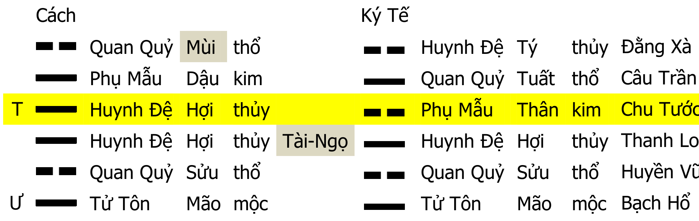
    - **Hình này chứng minh điều gì**
      - Hào Thế Hợi thủy lâm Chu Tước độc phát hóa Phụ Mẫu Thân kim hồi đầu sinh, không câu nệ Dụng thần Quan Quỷ mà lấy văn thư lệnh trạng làm điềm cát thăng quan trước mắt.
      - Thế được Nhật thần Dần mộc tương hợp nên trước mắt vô sự; đến năm Tị Thái Tuế xung Hợi phá hợp, hình hại Thân kim thì bãi quan luận tội mất sạch.
    - **Từ đâu mà thấy được**
      - Hào 4 Huynh Đệ Hợi thủy trì Thế động hóa Phụ Mẫu Thân kim hồi đầu sinh, lâm Chu Tước.
      - Nhật thần Dần mộc hợp Thế Hợi thủy; năm Tị xung Hợi, hình Thân.
  - Nhìn vào: Hào 4 Huynh Đệ Hợi thủy trì Thế lâm Chu Tước độc phát hóa Phụ Mẫu Thân kim; hào 6 Quan Quỷ Mùi thổ lâm Nguyệt kiến; hào Thế hợp Nhật thần Dần mộc.
- **Quy tắc áp dụng**
  - Quy tắc Linh hoạt bất câu nệ Dụng thần: Thế lâm Chu Tước độc phát hóa Phụ Mẫu (văn thư, lệnh trạng) hồi đầu sinh, lấy hỷ thần và sắc lệnh làm chủ.
  - Quy tắc sinh khắc hào tĩnh và hào động: Hào tĩnh tuyệt đối không thể sinh khắc hào động; lời nói "hào 5 có ý sinh Thế" chỉ là thủ ý tĩnh tại.
  - Tượng hào Thế đắc hợp và cơ chế ứng kỳ xung khai / hình hại: Hào Thế gặp Nhật hợp là sự ràng buộc, che chở tạm thời; đến năm Thái Tuế xung khai và hình hại hào biến thì tai họa phát tác trọn vẹn.
- **Lời giải**
  - **Bước 1**: Đánh giá tiền trình công danh trước mắt.
    - Căn cứ: Năm Tý Thái Tuế nâng đỡ Hợi thủy; Hào Thế lâm Chu Tước độc phát hóa Phụ Mẫu Thân kim hồi đầu sinh; Thế đắc Nhật thần Dần mộc lục hợp; Hào 6 Quan tinh Mùi thổ lâm Nguyệt kiến.
    - Nhìn vào: Hào 4 Huynh Đệ Hợi thủy trì Thế hóa Thân kim sinh phù; đường hoạn lộ thênh thang, nhận được chiếu chỉ sắc phong lệnh trạng bổ nhiệm.
  - **Bước 2**: Nhận diện khiếm khuyết trong quẻ.
    - Căn cứ: Huynh Đệ trì Thế khắc Tài; Thê Tài Ngọ hỏa phục tàng dưới hào 3 Hợi thủy bị khắc thương; biểu thị quan nghiệp không trọn vẹn.
    - Nhìn vào: Hào Thế đắc hợp với Dần mộc là bị ràng buộc, chỉ có lợi trước mắt.
  - **Bước 3**: Dự đoán hậu vận và ứng kỳ năm Tị sụp đổ.
    - Căn cứ: Năm Tị, Thái Tuế Tị xung phá hào Thế Hợi thủy và hình hại hào biến Thân kim.
    - Nhìn vào: Đến năm Tị, xung phá hợp cục, hình hại Phụ Mẫu (mất văn thư lệnh trạng), đương số bị luận tội bãi quan.
- **Đối thoại giải đáp nghi vấn**:
  - Người hỏi thắc mắc lần 1: "Trong sách lấy Thế làm Dụng, tại sao không lấy Quan làm Dụng? Trong quẻ Dụng thần lưỡng hiện đều bị thương, chọn Dụng thần như thế nào? Trong sách nói hào 5 có ý sinh Thế. Hào tĩnh có thể sinh hào động à?"
  - Vương Hổ Ứng lão sư giải đáp: Quẻ này Thế lâm Chu Tước độc phát, hóa văn thư quay lại sinh. Xem quẻ cần linh hoạt, tình huống cá biệt không câu nệ Dụng thần; bởi vì Phụ Mẫu là tin mừng, cũng là lệnh trạng.
  - Người hỏi thắc mắc lần 2: "Xin hỏi Vương lão sư, tình huống nào không câu nệ Dụng thần? Ngoài ra hào tĩnh có thể sinh hào động hay không?"
  - Vương Hổ Ứng lão sư giải đáp: Về tình huống không câu nệ hào Dụng thì phải xem quẻ có biến hóa không, không có công thức cụ thể. Thông thường hào tĩnh không thể sinh khắc hào động.
- **Kết quả**: Trước mắt hoạn lộ hanh thông thăng quan tiến chức; nhưng đến năm Tị (Thái Tuế Tị xung Hợi hình Thân), người này quả nhiên bị đàn hặc luận tội, chức quan chấm dứt, mất mát sạch không.
- **Kiểm tra lại**: Ứng kỳ năm Tị chuẩn xác với quy luật xung khai hào hợp (Tị xung Hợi) và tam hình ấn tín (Tị hình Thân). Minh chứng nguyên tắc không câu nệ Dụng thần và hào tĩnh không sinh hào động.

### Ví dụ 29: Xem niên vận cát hung của bản thân (Quẻ Phục biến Khiêm)
- **Đề bài**: Ngày Mậu Thìn tháng Mùi (năm Mão), một người đến xem niên vận cát hung của bản thân, gieo được quẻ Phục biến Khiêm. Nghi vấn nảy sinh về việc tại sao các hào Thân, Tý, Thìn không cấu thành tam hợp cục thủy giải cứu hào Thế; và tại sao khẩu quyết "người trong Mộ không xung không phát" lại không nghiệm khi hào Thế hóa Mộ hóa khắc và chết vào năm Ngọ.
- **Dữ kiện**
  - Can chi: Ngày Mậu Thìn, tháng Mùi. Năm xem quẻ: Năm Mão. Tuần không: Tuất, Hợi. Cung Thổ.
  - Quẻ chủ: Địa Lôi Phục, Quẻ biến: Địa Sơn Khiêm. Cung Khôn.
  - Hào động: Hào sơ Thê Tài Tý thủy động hóa Huynh Đệ Thìn thổ; Hào 3 Huynh Đệ Thìn thổ động hóa Tử Tôn Thân kim.
  - Bảng nạp giáp quẻ:
    - Hào 6: Tử Tôn Dậu kim ▅▅ ▅▅ / Tử Tôn Dậu kim ▅▅ ▅▅ (Chu Tước)
    - Hào 5: Thê Tài Hợi thủy ▅▅ ▅▅ / Thê Tài Hợi thủy ▅▅ ▅▅ (Thanh Long)
    - Hào 4: Huynh Đệ Sửu thổ (Ứng) ▅▅ ▅▅ / Huynh Đệ Sửu thổ ▅▅ ▅▅ (Huyền Vũ)
    - Hào 3: Huynh Đệ Thìn thổ ▅▅ ▅▅ / Tử Tôn Thân kim ▅▅▅▅▅ (Bạch Hổ) [Động]
    - Hào 2: Quan Quỷ Dần mộc ▅▅ ▅▅ (Phục: Phụ Mẫu Tị hỏa) / Phụ Mẫu Ngọ hỏa ▅▅ ▅▅ (Đằng Xà)
    - Hào 1: Thê Tài Tý thủy (Thế) ▅▅▅▅▅ / Huynh Đệ Thìn thổ ▅▅ ▅▅ (Câu Trần) [Động]
  - Sơ đồ quẻ: (Tham chiếu Hình 29) alt="Sơ đồ quẻ" />
  - **Hình 29.** Sơ đồ quẻ Phục biến Khiêm
    - 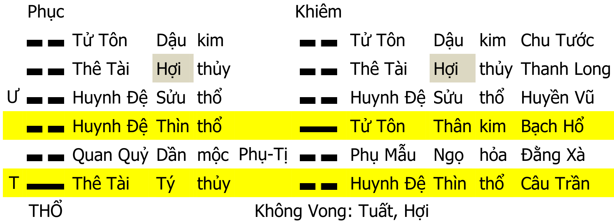
    - **Hình này chứng minh điều gì**
      - Hào Thế Tý thủy suy tuyệt vô khí, bị Nhật Nguyệt đồng khắc, động hóa Thìn thổ là hóa Mộ kiêm hóa hồi đầu khắc; đến năm Ngọ gặp Tuế phá xung Thế tất phải chết.
      - Bác bỏ tam hợp cục giả lập và khẩu quyết sai lầm "người trong Mộ không xung không phát" khi hào Thế suy tuyệt.
    - **Từ đâu mà thấy được**
      - Hào sơ Thê Tài Tý thủy trì Thế động hóa Huynh Đệ Thìn thổ (hóa Mộ, hóa khắc).
      - Nhật thần Thìn thổ, Nguyệt kiến Mùi thổ cùng khắc hào Thế; Hào 3 Thìn thổ động lại khắc Thế.
  - Nhìn vào: Hào sơ Thê Tài Tý thủy trì Thế suy nhược, động hóa Thìn thổ Mộ khố; hào 3 Huynh Đệ Thìn thổ động hóa Thân kim khắc Thế; Nhật thần Thìn thổ, Nguyệt kiến Mùi thổ đều là thổ vượng khắc thủy.
- **Quy tắc áp dụng**
  - Xem niên vận lấy hào Thế làm trung tâm định sinh mệnh tồn vong.
  - Điều kiện Tam hợp cục đúng chuẩn: Phải đáp ứng cấu trúc hợp cục chuẩn mực, hào trung tâm và các địa chi phối hợp có lực; không thể gom góp địa chi tản mác của hào biến để coi là thành cục bảo vệ.
  - Hào Thế suy tuyệt hóa Mộ, hóa hồi đầu khắc: Thủy hưu tù hóa Thìn thổ là nhập Mộ kiêm hồi đầu khắc; bị tầng tầng lớp lớp thổ khắc phạt là tuyệt lộ.
  - Cơ chế Tuế phá định kỳ tử vong: Năm Ngọ xung phá hào Thế Tý thủy suy tuyệt (Tuế phá xung Thế), sinh khí tan biến hoàn toàn.
  - Bác bỏ khẩu quyết "Người trong Mộ không xung không phát": Khi suy tuyệt vô căn, nhập Mộ là chết, gặp xung là tan xương nát thịt chứ không có chuyển biến cát lợi.
  - Giới hạn "Cách sơn hóa hào": Quy tắc cách sơn hóa hào không áp dụng cho trường hợp cứu giải hào Thế đang hóa Mộ hóa khắc.
- **Lời giải**
  - **Bước 1**: Đánh giá căn cơ suy vượng của hào Thế.
    - Căn cứ: Đoán thọ mệnh niên vận lấy hào Thế làm trung tâm.
    - Nhìn vào: Hào sơ Thê Tài Tý thủy trì Thế ở tháng Mùi hưu tù, ngày Thìn bị khắc, hoàn toàn vô khí thất lệnh.
  - **Bước 2**: Phân tích hiểm họa hóa Mộ và hóa hồi đầu khắc.
    - Căn cứ: Tý thủy động hóa Thìn thổ là hóa Mộ, cũng là hóa hồi đầu khắc; Hào 3 Thìn thổ động khắc Thế.
    - Nhìn vào: Hào sơ Tý thủy động biến Thìn thổ; hào 3 Thìn thổ phát động khắc; Nhật Nguyệt đều là thổ khắc; hào Thế hưu tù vô khí, rơi vào tử cảnh.
  - **Bước 3**: Bác bỏ các cứu giải giả lập và định ứng kỳ tử vong năm Ngọ.
    - Căn cứ: Tam hợp cục Thân - Tý - Thìn ở đây không thành chuẩn cục; cách sơn hóa hào không cứu được hào Thế. Hào Thế suy tuyệt nhập Mộ gặp Tuế phá tất vong thân.
    - Nhìn vào: Năm Mão xem quẻ; đến năm Ngọ (Ngọ xung Tý, Tuế phá xung Thế), hào Thế bị xung tán triệt để, ứng kỳ qua đời vào năm Ngọ.
- **Đối thoại giải đáp nghi vấn**:
  - Người hỏi thắc mắc lần 1: "Tam hợp cục sao lại nói hào động khắc Thế. Dụng thần nhập Mộ?"
  - Vương Hổ Ứng lão sư giải đáp: Đây không phải là tam hợp đúng chuẩn, huống hồ lý tượng trong quẻ rắc rối, cùng tồn tại song song.
  - Người hỏi thắc mắc lần 2: "Xin hỏi Vương lão sư, tam hợp cục đúng chuẩn là gì? Khi ứng dụng thực tế có gì khác nhau?"
  - Vương Hổ Ứng lão sư giải đáp: Tam hợp cục đúng chuẩn có trình bày trong sách. Khi sử dụng, ba địa chi coi như một ngũ hành.
  - Người hỏi thắc mắc lần 3: "Quẻ này hào sơ Tý thủy hóa Thìn thổ, hào 3 Thìn thổ hóa Thân kim, có thể coi là cách sơn hóa hào Tý thủy hóa Thân kim hay không?"
  - Vương Hổ Ứng lão sư giải đáp: Cách sơn hóa hào thông thường là nói cho Dụng thần. Trong quẻ hiếm khi có một quy luật nào đó độc lập tồn tại, tất cả đều đan xen lẫn nhau, trong âm có dương, trong dương có âm, vì vậy lý tượng cũng tồn tại đồng thời (không thể dùng cách sơn hóa hào để xóa bỏ thế hóa Mộ hồi đầu khắc của hào Thế).
- **Kết quả**: Người xem quẻ gieo vào năm Mão; đến năm Ngọ (năm hào Thế gặp Tuế phá) thì quả nhiên qua đời, hoàn toàn ứng nghiệm.
- **Kiểm tra lại**: Ứng kỳ tử vong vào năm Ngọ (Tuế phá xung Tý thủy suy tuyệt). Bác bỏ hoàn toàn ngộ nhận về việc "xung Mộ thì phát" đối với hào Thế suy bại, khẳng định nguyên tắc Lý ngũ hành sinh khắc quyết định tính mạng.

## Nghi vấn thực chứng: Dẫn hóa kỵ thần, Tìm người thất lạc và Quá vượng định thọ yểu

- **Bản chất của quy tắc Dẫn hóa kỵ thần**: Khi Kỵ thần trong quẻ phát động hoặc lâm Nguyệt kiến bị Nhật thần xung thành ám động, nếu có Nguyên thần đồng thời phát động tạo thành chuỗi mắt xích liên hoàn tương sinh (Kỵ thần sinh Nguyên thần, Nguyên thần sinh Dụng thần), thì sát khí của Kỵ thần bị dẫn chuyển thành sinh khí nuôi dưỡng Dụng thần; cơ chế này gọi là "Dẫn hóa Kỵ thần" hay "Tham sinh quên khắc".
- **Điều kiện thành bại sống còn của phép Dẫn hóa**: Dẫn hóa chỉ bảo toàn trọn vẹn sinh mạng khi bản thân Dụng thần còn căn khí; nếu tự thân Dụng thần đã bị Nguyệt kiến, Nhật thần và các hào xung khắc triệt tiêu hết sinh khí (vô căn, hưu tù tuyệt tích), thì phép dẫn hóa của Nguyên thần dù xuất Không đắc lực cũng chỉ cứu vãn được thể xác/hình bóng (tìm thấy thi thể) chứ không thể cải tử hoàn sinh.
- **Phân định đối tượng dự đoán trong phép Dẫn hóa**: Dự đoán sinh vật hữu tình (người, động vật lấy Dụng thần Tử Tôn) đòi hỏi sinh khí tồn tại thực tế để duy trì mạng sống; trái lại dự đoán đồ vật vô tri (lấy Thê Tài), thư từ giấy tờ hay xe cộ (lấy Phụ Mẫu) không có khái niệm chết chóc sinh học, chỉ cần dẫn hóa kết nối thông tin là tìm thấy trọn vẹn.
- **Nguyên lý Thiên cơ tại hào động và quyền ưu tiên của Hào Biến**: Trong thuật Lục Hào, hào động thể hiện hướng vận động và biến hóa của sự vật, nắm giữ thần cơ trọng yếu; khi hào Thế phát động hóa ra Quan Quỷ, thần cơ đã biểu lộ rõ rệt việc thân mình biến đổi thành chức quan, tuyệt đối không được máy móc bỏ qua hào biến để đi tìm kiếm Phục thần khi hào biến đã hiển thị Dụng thần.
- **Tầm quan trọng của Thê Tài dưỡng mệnh trong đoán chung thân tài phúc**: Đoán tài vận trọn đời không thể câu nệ phiến diện vào một chữ Tuần Không của hào Thế; Tuần Không trong đoán cả đời chỉ là trở ngại tạm thời ban đầu; mấu chốt quyết định cuộc đời có bổng lộc hay "chẳng làm nên trò trống gì" nằm ở việc Thê Tài có được Nguyên thần (Tử Tôn) vượng tướng tương sinh hay không, bởi Tài là nguồn dưỡng mệnh cốt lõi.
- **Phân biệt rạch ròi quy luật Dụng thần Quá vượng trong chiêm thọ và chiêm sự**:
  - Trong dự đoán sự vụ thông thường hoặc bốc bệnh nguy cấp: Dụng thần quá vượng (được Nhật Nguyệt trùng trùng sinh phù không có chế ngự) là tượng cực đoan "vật cực tất phản", báo hiệu sự việc sụp đổ hoặc người bệnh hồi quang phản chiếu rồi chết yểu.
  - Trong dự đoán tuổi thọ người già lúc bình thường: Dụng thần quá vượng lại là tượng phúc thọ miên trường, nguyên khí thâm hậu vô cương, chủ về đại thọ diên niên (sống thêm hàng chục năm).

### Ví dụ 30: Xem bị thuyên chuyển công tác đi nơi nào (Quẻ Lâm biến Tiết)
- **Đề bài**: Người xem hỏi về việc bị điều chuyển, thuyên chuyển công tác sẽ đi đến nơi nào. Cổ thư đoán hào Tài Hợi thủy hóa hồi đầu khắc, không chỉ khó đến nơi nhậm chức mà còn phải đề phòng mùa thu gặp nguy hiểm chết người vào tháng 7. Người học thắc mắc nguyên lý tại sao lại định hạn chết vào tháng 7 mùa thu.
- **Dữ kiện**
  - Thời gian: Ngày Giáp Ngọ, Tháng Ngọ (Ngọ nguyệt Giáp Ngọ nhật).
  - Tuần Không: Thìn, Tị Tuần Không (tuần Giáp Ngọ); hào sơ Phụ Mẫu Tị hỏa lâm Tuần Không.
  - Quẻ chủ: Địa Trạch Lâm (Khôn cung, nhị thế quẻ).
  - Quẻ biến: Thủy Trạch Tiết (Khảm cung, lục hợp quẻ).
  - Hào động: Hào 5 Thê Tài Hợi thủy [âm động] hóa Huynh Đệ Tuất thổ [dương] (hồi đầu khắc).
  - **Hình 30.** Sơ đồ quẻ Địa Trạch Lâm biến Thủy Trạch Tiết
    - 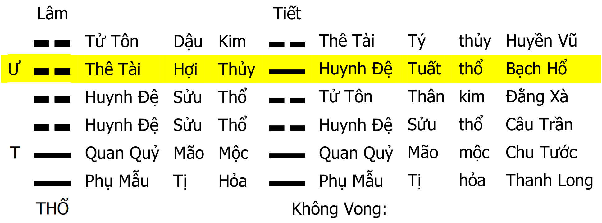
    - **Hình này chứng minh điều gì**
      - Hào 5 Thê Tài Hợi thủy độc phát hóa Huynh Đệ Tuất thổ hồi đầu khắc, triệt tiêu hoàn toàn khả năng sinh trợ cho hào Thế Quan Quỷ Mão mộc.
      - Xác lập quy tắc ứng kỳ tử vong: khi Nguyên thần bị diệt tuyệt và hào Thế rơi vào đất Tuyệt (Mão mộc tuyệt tại Thân - tháng 7 âm lịch), tai ương sát mạng ắt ứng nghiệm vào mùa thu.
    - **Từ đâu mà thấy được**
      - Ngoại quái Khôn biến Khảm thể hiện hào 5 Thê Tài Hợi thủy độc phát biến Huynh Đệ Tuất thổ quay lại khắc phạt bản thân.
      - Hào Thế Quan Quỷ Mão mộc tại hào 2 lâm Chu Tước, gặp Nhật Nguyệt Ngọ hỏa thiêu đốt tiết khí cực độ; đến tháng 7 Thân kim là đất Tuyệt địa của Mão mộc, Kim lệnh nắm quyền khắc Mộc.
  - Nhìn vào:
    - Hào 2 (Thế): Quan Quỷ Mão mộc, lâm Chu Tước, bị hỏa thế Nguyệt Nhật thiêu đốt tiết khí trầm trọng.
    - Hào 5 (Ứng): Thê Tài Hợi thủy độc phát, lâm Bạch Hổ, hóa Huynh Đệ Tuất thổ hồi đầu khắc.
    - Hào sơ: Phụ Mẫu Tị hỏa lâm Thanh Long, lâm Tuần Không.
- **Quy tắc áp dụng**
  - Quy tắc Hồi đầu khắc diệt Nguyên thần: Hào động biến ra hào khắc chính mình thì tự thân tàn phế, sinh cơ bị triệt tiêu, hoàn toàn mất năng lực sinh trợ hào khác.
  - Quy tắc Tuyệt địa định kỳ ứng hạn hung họa: Hào Thế là gốc rễ tính mạng; khi Nguyên thần đã tuyệt, hào Thế suy kiệt sẽ lâm nạn tử vong khi bước vào tháng Tuyệt địa trong vòng 12 Cung Trường Sinh và bị lệnh tháng đương quyền khắc phạt.
- **Lời giải**
  - **Bước 1**: Thẩm định thực trạng của Dụng thần thuyên chuyển và hào Thế:
    - Căn cứ: Hỏi về thuyên chuyển và tiền đồ bản thân, lấy Thế làm bản thân, Quan Quỷ làm chức vị, Thê Tài làm lương bổng và hành trình.
    - Nhìn vào: Hào 2 Quan Quỷ Mão mộc trì Thế lâm Chu Tước; sinh vào tháng Ngọ ngày Ngọ, Mão mộc bị hỏa thế trùng trùng tiết khí nặng nề, chân khí suy kiệt.
  - **Bước 2**: Nhận định thần cơ độc phát tại hào 5 Thê Tài Hợi thủy:
    - Căn cứ: Thần cơ phát lộ tại hào độc phát; Hợi thủy là Nguyên thần sinh cho Thế Quan Quỷ Mão mộc, đồng thời là hào Ứng kiêm đường đi nhận chức.
    - Nhìn vào: Hào 5 Thê Tài Hợi thủy độc phát hóa Huynh Đệ Tuất thổ hồi đầu khắc lâm Bạch Hổ (chủ hung họa, máu huyết). Hợi thủy bị bẻ gãy thì lộ trình bị bế tắc, không thể đến nơi nhậm chức, lại khiến Mão mộc mất hoàn toàn chỗ dựa tương sinh.
  - **Bước 3**: Luận định ứng kỳ mùa thu nguy hiểm và tháng 7 mất mạng:
    - Căn cứ: Nguyên lý 12 Cung Trường Sinh định vị thời điểm suy tuyệt của hào Thế: Mão mộc trường sinh tại Hợi, vượng tại Mão, tử tại Ngọ, mộ tại Mùi, tuyệt tại Thân (tháng 7 âm lịch).
    - Nhìn vào: Mùa thu Kim vượng khắc Mộc. Tháng 7 là tháng Thân, vừa là Tuyệt địa của hào Thế Mão mộc vừa là mùa Kim lệnh nắm sát quyền. Khi Nguyên thần Hợi thủy đã chết, hào Thế không còn giọt nước nào cứu giá, lâm Tuyệt bị khắc tất phải tạ thế vào tháng 7.
- **Đối thoại giải đáp nghi vấn**:
  - *Người hỏi*: "Hào Tài Hợi thủy bị hồi đầu khắc, không thể sinh Mão mộc, nhưng vì sao nói đề phòng mùa thu nguy hiểm, tháng 7 chết? Xin thầy nói nguyên lý ở chỗ nào?"
  - *Vương Hổ Ứng lão sư giải đáp*: "Tháng 7 hào Thế lâm Tuyệt bị khắc."
  - *Phân tích chuyên sâu*: Vương lão sư chỉ ra phương pháp luận cốt lõi: Khi phán đoán sinh tử tính mạng, phải nhìn thẳng vào bản thân hào Thế. Hào Thế Mão mộc trong mùa hè đã bị Ngọ hỏa thiêu đốt kiệt quệ; điểm tựa sinh mệnh duy nhất là Hợi thủy thì đã bị Tuất thổ hồi đầu khắc chết; do đó khi vận chuyển sang mùa thu tháng Thân, Thân kim vừa là đất Tuyệt của Mão mộc, vừa là Kim vượng khắc phạt tàn khốc, khiến hào Thế tan biến sinh cơ.
- **Kết quả**: Người này quả nhiên không thể đến nơi nhậm chức, đến tháng 7 (thân nguyệt) mùa thu thì lâm nạn qua đời đúng như lời tiên tri của Dã Hạc Tiên Sinh.
- **Kiểm tra lại**: Đối chiếu dữ kiện: Hào 5 Thê Tài Hợi thủy độc phát hóa Tuất thổ hồi đầu khắc cắt đứt đường sinh; hào Thế Mão mộc lâm Tuyệt tại Thân nguyệt bị khắc phạt, trùng khớp hoàn toàn với thực tế ứng nghiệm.

### Ví dụ 31: Bà cụ xem ngày tìm lại cháu trai bị lạc (Quẻ Hoán biến Tốn)
- **Đề bài**: Một bà cụ có cháu trai bị thất lạc, đến xem ngày nào có thể tìm lại được cháu. Được quẻ Phong Thủy Hoán biến Phong Tốn. Sách Tăng San Bốc Dịch đoán ngày Ngọ xuất Không có thể tìm được, nhưng thực tế ngày Ngọ tìm thấy thì đứa cháu đã thành thi thể. Người học nêu hàng loạt nghi vấn hóc búa về nguyên nhân cháu chết, bản chất khái niệm Dẫn hóa và tại sao điền thực không cứu được sinh mạng.
- **Dữ kiện**
  - Thời gian: Ngày Ất Dậu, Tháng Mão (Mão nguyệt Ất Dậu nhật).
  - Tuần Không: Ngọ, Mùi Tuần Không (tuần Giáp Thân).
  - Quẻ chủ: Phong Thủy Hoán (Ly cung).
  - Quẻ biến: Phong Tốn (Tốn vi Phong, lục xung quẻ).
  - Hào động: Hào 3 Huynh Đệ Ngọ hỏa [âm động] hóa Thê Tài Dậu kim [dương].
  - Hào ám động: Hào 6 Phụ Mẫu Mão mộc lâm Nguyệt kiến, bị Nhật thần Dậu kim xung thành ám động khắc Dụng thần.
  - Phục thần: Hào 4 Tử Tôn Mùi thổ phục Thê Tài Dậu kim; Hào 3 Huynh Đệ Ngọ hỏa phục Quan Quỷ Hợi thủy.
  - **Hình 31.** Sơ đồ quẻ Phong Thủy Hoán biến Phong Tốn
    - 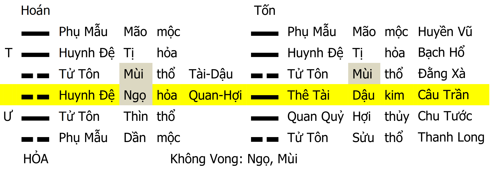
    - **Hình này chứng minh điều gì**
      - Minh họa trực quan cơ chế Dẫn hóa Kỵ thần: Kỵ thần Mão mộc ám động sinh Nguyên thần Ngọ hỏa động, Ngọ hỏa sinh Dụng thần Tử Tôn Mùi thổ.
      - Chứng minh quy tắc giới hạn của Dẫn hóa: Khi bản thân Dụng thần hoàn toàn vô khí (bị Nguyệt khắc, Ám động khắc liên tiếp), thì Dẫn hóa chỉ giúp tìm lại được thể xác/hình hài chứ không thể duy trì mạng sống.
    - **Từ đâu mà thấy được**
      - Hào 4 Tử Tôn Mùi thổ ngộ Tuần Không, lâm Đằng Xà, bị Nguyệt kiến Mão mộc và hào 6 Mão mộc ám động dốc toàn lực khắc sát, gốc rễ sinh mệnh đã diệt vong.
      - Hào 3 Huynh Đệ Ngọ hỏa ngộ Tuần Không phát động biến Dậu kim, đợi ngày Ngọ xuất Không điền thực để hoàn tất chuỗi dẫn hóa, ứng nghiệm tìm thấy thi thể vào đúng ngày Ngọ.
  - Nhìn vào:
    - Tử Tôn lưỡng hiện: Hào 2 Tử Tôn Thìn thổ (tĩnh) và hào 4 Tử Tôn Mùi thổ (lâm Đằng Xà, ngộ Tuần Không).
    - Hào 4 Tử Tôn Mùi thổ vừa ngộ Không vừa lâm Đằng Xà (tượng kinh hãi, quái dị, tai ương), chuẩn xác là tiêu điểm Dụng thần.
    - Hào 3 Huynh Đệ Ngọ hỏa: Nguyên thần động, ngộ Không, lâm Câu Trần.
    - Hào 6 Phụ Mẫu Mão mộc: Kỵ thần lâm Huyền Vũ ám động.
- **Quy tắc áp dụng**
  - Quy tắc chọn Dụng thần khi lưỡng hiện: Ưu tiên chọn hào lâm Tuần Không hoặc mang thần sát tai họa rõ rệt.
  - Quy tắc Dẫn hóa kỵ thần: Kỵ thần ám động, Nguyên thần động tạo thành liên tục tương sinh chính là dẫn hóa. Kỵ thần tham sinh quên khắc, chuyển hóa sát khí thành sinh khí.
  - Điều kiện tiên quyết của Dẫn hóa: Bản thân Dụng thần phải còn sinh khí thì mới tiếp nhận được năng lượng dẫn hóa để sống sót; nếu Dụng thần đã hoàn toàn vô khí thì dẫn hóa chỉ thành tựu mặt hình tướng sự vật (tìm thấy xác).
- **Lời giải**
  - **Bước 1**: Định vị Dụng thần và đo lường sinh cơ của Dụng thần:
    - Căn cứ: Bà xem cho cháu trai lấy hào Tử Tôn làm Dụng thần. Tử Tôn lưỡng hiện, chọn hào 4 Mùi thổ lâm Không Vong và Đằng Xà làm Dụng thần.
    - Nhìn vào: Tháng Mão là mùa xuân Mộc vượng Thổ tử; Mùi thổ bị Nguyệt kiến Mão mộc khắc phạt; ngày Dậu lại tiết khí Thổ; hào 6 Phụ Mẫu Mão mộc lâm Nguyệt kiến bị Nhật Dậu xung thành ám động tiếp tục khắc dồn dập. Dụng thần Mùi thổ bị thương tổn tột cùng, chân khí đã tuyệt diệt từ trước khi gieo quẻ.
  - **Bước 2**: Khảo sát năng lực dẫn hóa của Nguyên thần Huynh Đệ Ngọ hỏa:
    - Căn cứ: Hỏa là Nguyên thần của Thổ. Hào 3 Huynh Đệ Ngọ hỏa phát động, phát huy cơ chế tham sinh quên khắc: hút sát khí của Mão mộc để chuyển sang sinh cho Mùi thổ.
    - Nhìn vào: Hào 3 Ngọ hỏa phát động nhưng lại lâm Tuần Không, do đó chuỗi dẫn hóa chưa thể phát huy ngay lập tức mà phải đợi đến ngày Ngọ xuất Không điền thực.
  - **Bước 3**: Luận giải kết cục bi thương tìm thấy thi thể vào ngày Ngọ:
    - Căn cứ: Dụng thần tự thân vô khí thì sinh mạng không giữ được, nhưng Nguyên thần động xuất Không sẽ kết nối thông tin để tìm ra tung tích.
    - Nhìn vào: Đến ngày Ngọ, Ngọ hỏa xuất Không dẫn hóa thành công, nên gia đình tìm thấy cháu; song vì Dụng thần Mùi thổ đã chết từ trước nên thứ tìm thấy chỉ là một thi thể lạnh ngắt.
- **Đối thoại giải đáp nghi vấn**:
  - *Hỏi 1*: "Quẻ này cháu chết có phải vì Nguyên thần Không Vong?"
    - *Đáp*: "Bản thân Dụng thần không có khí, Nguyên thần Không không thể dẫn hóa, vì vậy chết."
  - *Hỏi 2*: "Xin hỏi, cái gì là dẫn hóa?"
    - *Đáp*: "Kỵ thần ám động, Nguyên thần động tạo thành liên tục tương sinh chính là dẫn hóa."
  - *Hỏi 3*: "Xem ra xem sinh vật, đồ vật và sự việc có sự khác nhau. Có đúng vậy không, Vương lão sư?"
    - *Đáp*: "Đương nhiên khác nhau, động vật xem Tử Tôn, đồ vật xem Tài, quần áo xe thuyền xem Phụ Mẫu,..."
  - *Hỏi 4*: "Lão sư, chẳng phải động không là Không, vượng không là Không? Lúc điền thực tại sao không thể dẫn hóa?"
    - *Đáp*: "Nhưng cũng phải xem Dụng thần bản thân nữa. Nếu Ngọ hỏa này bất động, sợ là ngay cả xác chết cũng không tìm được."
  - *Phân tích chuyên sâu*: Vương Hổ Ứng lão sư đã bóc tách bản chất chân xác của học thuật: Người học thường ngộ nhận rằng hễ Nguyên thần động xuất Không thì vạn sự tất cứu; nhưng Lục Hào xem trọng "Lý" - gốc rễ sinh tử nằm ở bản thân Dụng thần. Đứa trẻ chết vì bị Mão mộc khắc tuyệt, không còn chút sinh khí; hào Ngọ hỏa động chỉ có công năng kết nối mối dây tìm kiếm, nếu Ngọ hỏa mà bất động thì đến cả thi thể đứa bé cũng bị vùi lấp mất tích mãi mãi.
- **Kết quả**: Đúng ngày Giáp Ngọ xuất Không, gia đình đã tìm thấy đứa cháu trai nhưng cháu đã chết đuối/gặp nạn thành thi thể đúng như quẻ ứng nghiệm.
- **Kiểm tra lại**: Ứng kỳ ngày Ngọ tìm thấy người khớp với Nguyên thần Ngọ hỏa xuất Không; kết cục thi thể khớp với Dụng thần Mùi thổ bị Nguyệt khắc và Ám động khắc triệt để vô khí.

### Ví dụ 32: Xem về quan chức, hào Thế động hóa Quan (Quẻ Khốn biến Đoài)
- **Đề bài**: Người xem hỏi về tiền đồ quan chức, thăng chức, được quẻ Trạch Thủy Khốn biến Bát Thuần Đoài. Cổ thư giải rằng: Phi thần hào 3 Quan Quỷ Ngọ hỏa bị Nguyệt phá; Phục thần Quan Quỷ Tị hỏa phục dưới hào sơ Dần mộc đắc Trường Sinh, nên đến tháng Giêng mạnh xuân (tháng Dần) sẽ được thăng chức. Dã Hạc Tiên Sinh và Vương Hổ Ứng lão sư đã phê bình mạnh mẽ phương pháp này. Người học thắc mắc: Trong quẻ đã có Quan Quỷ Ngọ hỏa hiển hiện, tại sao cổ thư lại tìm Phục thần, lại xem hào biến, ý nghĩa đích thực ở đâu?
- **Dữ kiện**
  - Thời gian: Ngày Mậu Dần, Tháng Tý (Tý nguyệt Mậu Dần nhật).
  - Tuần Không: Thân, Dậu Tuần Không (tuần Giáp Tuất).
  - Quẻ chủ: Trạch Thủy Khốn (Đoài cung, lục hợp quẻ).
  - Quẻ biến: Bát Thuần Đoài (Đoài cung, lục xung quẻ).
  - Hào động: Hào sơ Thê Tài Dần mộc [âm động] hóa Quan Quỷ Tị hỏa [dương] lâm Câu Trần (hào Thế phát động).
  - Hào Quan trong quẻ: Hào 3 Quan Quỷ Ngọ hỏa (tĩnh, gặp tháng Tý bị Nguyệt phá).
  - Phục thần cổ thư tra cứu: Quan Quỷ Tị hỏa phục dưới hào sơ Dần mộc.
  - **Hình 32.** Sơ đồ quẻ Trạch Thủy Khốn biến Bát Thuần Đoài
    - 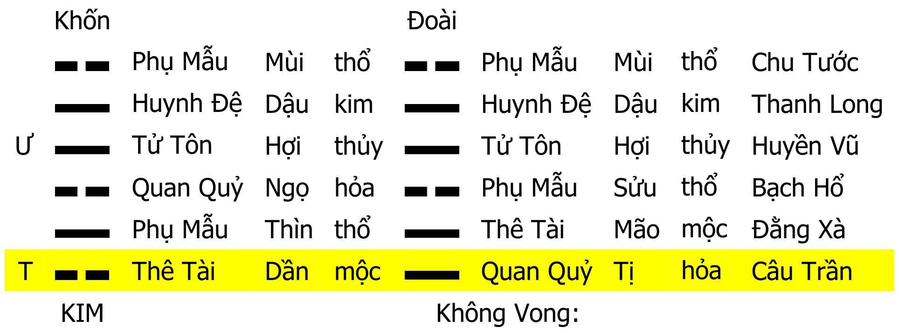
    - **Hình này chứng minh điều gì**
      - Chứng minh chân lý học thuật: "Thiên cơ tại hào động, Thế động hóa Quan là quan trọng nhất", vượt trên Quan tinh tĩnh trong quẻ.
      - Vạch rõ sai lầm phương pháp luận của cổ thư khi máy móc bỏ qua hào Thế động biến Quan để đi tra tầm Phục thần không cần thiết.
    - **Từ đâu mà thấy được**
      - Hào sơ Thế Thê Tài Dần mộc lâm Nhật thần phát động hóa Quan Quỷ Tị hỏa, Tài động sinh Quan, thân mình biến ra Quan chức.
      - Hào 3 Quan Quỷ Ngọ hỏa bị Tý nguyệt xung thành Nguyệt phá, việc cổ thư gượng ép tìm Phục thần Tị hỏa phục dưới Dần mộc là ngụy biện, chỉ tình cờ trùng lặp địa chi Tị hỏa của hào biến.
  - Nhìn vào:
    - Hào sơ (Thế): Thê Tài Dần mộc lâm Câu Trần, lâm Nhật thần Dần mộc vượng tướng, phát động hóa xuất Quan Quỷ Tị hỏa.
    - Hào 3: Quan Quỷ Ngọ hỏa lâm Bạch Hổ, Nguyệt phá, suy bại vô lực.
- **Quy tắc áp dụng**
  - Định luật Hoàng Kim Sách về Phục thần: "Hào Phi và hào Biến đều không có Dụng thần mới cần tìm Phục thần".
  - Định lý Thiên cơ tại hào động: Hào động là nơi vũ trụ phát lộ cơ trời, thể hiện biến chuyển quyết định của cát hung; hào Thế động hóa Quan biểu thị bản thân người xem trực tiếp thăng quan tiến chức.
  - Định lý Trường Sinh của hào biến: Quan Quỷ Tị hỏa đắc Trường Sinh tại Dần mộc, lấy tháng Dần làm ứng kỳ thăng chức.
- **Lời giải**
  - **Bước 1**: Vạch trần sai lầm nghiêm trọng trong suy luận của sách cổ:
    - Căn cứ: Tiêu chuẩn chính tông của Lục Hào: Trong quẻ đã có Phi thần (Ngọ hỏa) và hào biến đã có Dụng thần (Tị hỏa), tuyệt đối không được tra tìm Phục thần.
    - Nhìn vào: Trong quẻ Khốn biến Đoài, hào sơ Thế phát động hóa ra Quan Quỷ Tị hỏa. Cổ nhân bỏ qua hào biến Quan tinh hiển nhiên ngay trước mắt mà lại đi tìm Phục thần Tị hỏa dưới đáy quẻ là phương pháp hoàn toàn sai trái, không thể lấy đó làm quy phạm dạy dỗ hậu thế.
  - **Bước 2**: Nhận định thần cơ chân chính tại hào Thế động biến Quan:
    - Căn cứ: "Thiên cơ tại hào động", hào Thế là bản thân; Thế động hóa Quan Quỷ là tượng chức vị nhập thân.
    - Nhìn vào: Hào sơ Thế Thê Tài Dần mộc lâm Nhật kiến cực vượng phát động, Thê Tài là Nguyên thần của Quan tinh, Tài động sinh Quan, bản thân hóa thành Quan Quỷ Tị hỏa. Điềm báo thăng chức đã nắm chắc trong tay.
  - **Bước 3**: Xác định ứng kỳ tháng Giêng (tháng Dần) thăng chức:
    - Căn cứ: Quan tinh Tị hỏa gặp tháng Dần đắc lệnh Trường Sinh và sinh phù mạnh mẽ.
    - Nhìn vào: Tháng Giêng là tháng Dần (mạnh xuân), Nguyệt kiến Dần mộc sinh trợ Tị hỏa Quan tinh tới độ cực thịnh, ứng kỳ được triều đình phê chuẩn thăng quan.
- **Đối thoại giải đáp nghi vấn**:
  - *Người hỏi*: "Xem quan lấy Quan làm Dụng, trong quẻ Quan Quỷ Ngọ hỏa hiển hiện. Tại sao trong sách lại tìm Phục thần, lại xem hào biến. Không hiểu ý nghĩa ở đây là gì?"
  - *Vương Hổ Ứng lão sư giải đáp*: "Anh không xem kỹ à, tìm Phục thần là không đúng và đã bị Dã Hạc phê bình. Thiên cơ tại hào động, Thế động hóa Quan mà gặp Quan, cái này quan trọng hơn Quan trong quẻ."
  - *Phân tích chuyên sâu*: Vương lão sư nghiêm khắc nhắc nhở học viên phải đọc kỹ phê phán của Dã Hạc Tiên Sinh: Việc tìm Phục thần trong quẻ này là trò ngụy biện vụng về của người xưa nhằm bao biện cho ứng kỳ tháng Dần. Thần cơ thực sự là Thế Dần mộc động biến Tị hỏa Quan tinh – bản thân động hóa Quan thì cần gì phải nhọc công tìm kiếm Phục thần xa xôi.
- **Kết quả**: Đến tháng Giêng (tháng Dần) mạnh xuân, người xem quẻ quả nhiên được thăng thưởng quan chức như ý nguyện.
- **Kiểm tra lại**: Hào Thế động hóa Quan Quỷ Tị hỏa đắc Trường Sinh vào tháng Dần, minh chứng chuẩn xác định lý "Thiên cơ tại hào động" nổi bật hơn hào tĩnh Nguyệt phá và việc tìm Phục thần sai lạc.

### Ví dụ 33: Xem về tài phúc suốt đời (Quẻ Bát Thuần Di)
- **Đề bài**: Người xem hỏi về tài phúc suốt đời (đoán chung thân bổng lộc, tiền tài), được quẻ tĩnh Sơn Lôi Di. Cổ thư viết: "Tài trì Thế tuy có ngày Mùi phù củng, nhưng không nên Tuần Không, quẻ vô hỏa sinh trợ, chẳng làm nên trò trống gì!" (cả đời bất thành sự nghiệp). Người học thắc mắc: Nếu hoán đổi can chi thành tháng Mùi ngày Dậu (vẫn Tuất Hợi Không Vong) thì có thành tựu gì hay không? Sự khác biệt giữa Nhật Nguyệt ở đây là gì?
- **Dữ kiện**
  - Thời gian: Ngày Tân Mùi, Tháng Dậu (Dậu nguyệt Tân Mùi nhật).
  - Tuần Không: Tuất, Hợi Tuần Không (tuần Giáp Tý).
  - Quẻ: Sơn Lôi Di (Cấn cung, du hồn quẻ). Quẻ tĩnh hoàn toàn.
  - Hào Thế: Hào 4 Thê Tài Tuất thổ lâm Chu Tước, ngộ Tuần Không.
  - Hào Ứng: Hào sơ Phụ Mẫu Tý thủy lâm Bạch Hổ.
  - Phục thần: Hào 5 Phụ Mẫu Tý thủy phục Tử Tôn Tị hỏa; Hào 3 Thê Tài Thìn thổ phục Quan Quỷ Dậu kim.
  - Ngũ hành sinh trợ: Quẻ thuần Thổ, Mộc, Thủy, Kim; hoàn toàn khuyết Hỏa.
  - **Hình 33.** Sơ đồ quẻ Di
    - 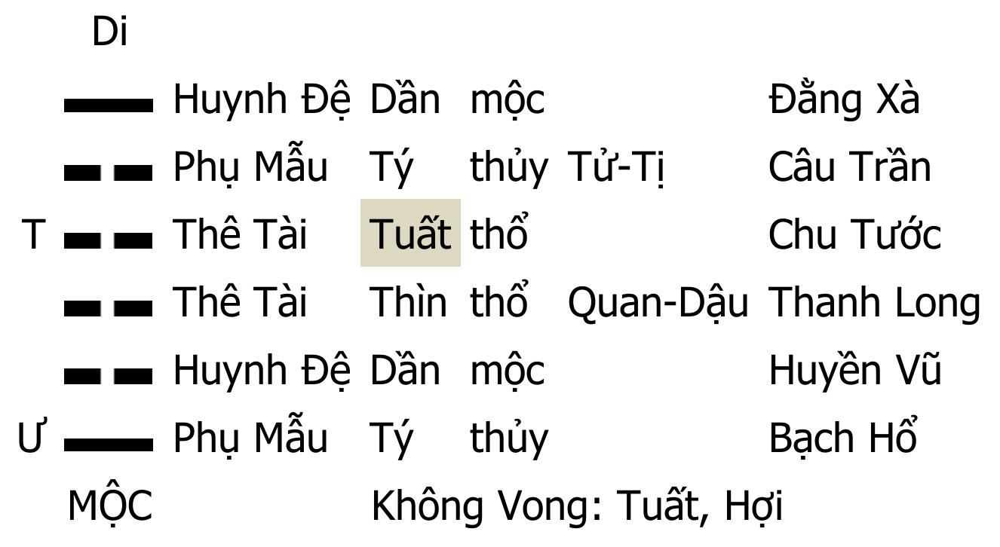
    - **Hình này chứng minh điều gì**
      - Làm rõ nguyên nhân quẻ Di bất thành đại sự: không phải chỉ do hào Thế lâm Không, mà bản chất do quẻ khuyết Hỏa (Nguyên thần Tử Tôn), khiến cội nguồn dưỡng mệnh khô cạn.
      - Xác lập phương pháp luận dự đoán chung thân: Tài vận cả đời dựa trên dòng chảy sinh trợ của Nguyên thần; thiếu thốn tài lực thì tiền đồ phát triển ắt rơi vào bế tắc gian nan.
    - **Từ đâu mà thấy được**
      - Hào 4 Thê Tài Tuất thổ trì Thế lâm Tuần Không, tuy được Nhật Mùi phù trợ nhưng toàn quẻ không có một hào Hỏa nào tương sinh.
      - Phục thần Tử Tôn Tị hỏa phục dưới hào 5 Phụ Mẫu Tý thủy, bị Thủy khắc Tuyệt không thể thấu xuất, Nguyên thần hoàn toàn suy bại.
  - Nhìn vào:
    - Hào 4 Thê Tài Tuất thổ trì Thế lâm Chu Tước, ngộ Tuần Không.
    - Toàn quẻ khuyết Hỏa (Tử Tôn).
- **Quy tắc áp dụng**
  - Quy tắc phân biệt Tuần Không ngắn hạn và dài hạn: Tuần Không trong chiêm sự đoản kỳ biểu thị cản trở hoặc chờ ngày xuất Không; trong chiêm chung thân thì Tuần Không chỉ là tượng khởi đầu khó khăn, không thể lấy một chữ Không mà phán cả đời thất bại.
  - Quy tắc Thê Tài dưỡng mệnh và vai trò Nguyên thần: Thê Tài là nguồn dưỡng mệnh nuôi sống con người; muốn tài phúc lâu dài thì Nguyên thần (Tử Tôn) phải có căn khí vượng tướng để sinh Tài liên tục.
- **Lời giải**
  - **Bước 1**: Khảo sát vị trí hào Thế và Dụng thần Thê Tài:
    - Căn cứ: Đoán tài phúc suốt đời lấy Thê Tài làm Dụng thần, hào Thế làm bản thân.
    - Nhìn vào: Hào 4 Thê Tài Tuất thổ trì Thế, sinh tháng Dậu bị tiết khí, được ngày Tân Mùi phù củng; nhưng hào Thế ngộ Tuần Không. Nhận định của người xưa cho rằng Thế Không nên cả đời bỏ đi là cách nhìn nông cạn.
  - **Bước 2**: Nhận diện khiếm khuyết căn bản: Quẻ vô Hỏa sinh trợ:
    - Căn cứ: Tài là nguồn sống, Tử Tôn là nguồn sinh ra Tài. Cây không có rễ, sông không có nguồn thì tài sản không tụ.
    - Nhìn vào: Quẻ Di hoàn toàn vắng bóng ngũ hành Hỏa. Hào Tử Tôn Tị hỏa phục dưới hào 5 Phụ Mẫu Tý thủy bị khắc chế gắt gao. Nguồn sinh của Tài bị triệt hạ thì cả đời thu nhập bấp bênh, làm ra tiền cũng tiêu tán sạch, thiếu thốn nguồn lực tài chính để gầy dựng sự nghiệp.
  - **Bước 3**: Phân tích trường hợp giả định tháng Mùi ngày Dậu:
    - Căn cứ: Tác động của sự biến chuyển Nhật Nguyệt lên Dụng thần.
    - Nhìn vào: Nếu đổi sang tháng Mùi ngày Dậu, Tuất thổ được Nguyệt kiến Mùi thổ bồi đắp vượng tướng hơn, nhưng cốt tủy của quẻ vẫn tuyệt đối vô Hỏa. Thiếu Nguyên thần thì bản chất kinh tế vẫn eo hẹp, cuộc sống phát triển vẫn vô cùng gian nan.
- **Đối thoại giải đáp nghi vấn**:
  - *Người hỏi*: "Nếu là tháng Mùi ngày Dậu (Tuất Hợi Không Vong) thì có thành tựu gì hay không? Nhật Nguyệt ở đây có khác biệt gì không?"
  - *Vương Hổ Ứng lão sư giải đáp*: "Nhật Nguyệt biến hóa, đương nhiên có sự khác biệt, nhưng chỉ dựa vào Thế Không mà phán đoán không có thành tựu thì cũng không đúng, cần xem Tài Quan..., chủ yếu là Tài, bởi vì Tài là nguồn dưỡng mệnh. Không có tiền sinh hoạt phát triển thì tương đối gian nan, hơn nữa phải Nguyên thần có khí mới được."
  - *Phân tích chuyên sâu*: Vương lão sư đập tan lối suy diễn kinh viện rập khuôn. Đừng vội quy chụp do Thế Không mà đoán người ta cả đời thất bại. Mấu chốt thực sự nằm ở việc Tài là dưỡng mệnh chi nguyên; không có tiền bạc làm bệ đỡ thì làm việc gì cũng trắc trở, gian nan; mà muốn có tiền bền vững thì Nguyên thần bắt buộc phải có khí. Quẻ này thiếu Hỏa, Nguyên thần bế tắc mới là nguyên nhân đích thực khiến sự nghiệp cả đời lận đận.
- **Kết quả**: Người này suốt đời chịu cảnh nghèo túng bần hàn, buôn ba vất vả mà không lập nên thành tựu hay công danh sự nghiệp gì đáng kể.
- **Kiểm tra lại**: Quẻ vô Hỏa sinh trợ khiến nguồn dưỡng mệnh khô cạn; Thế lâm Không phản ánh hoàn cảnh ban đầu bế tắc, khớp hoàn toàn với quy luật Lục Hào hiện đại.

### Ví dụ 34: Xem về tuổi thọ của bà, luận bàn Dụng thần quá vượng (Quẻ Phong Trạch Trung Phu)
- **Đề bài**: Người cháu xem về tuổi thọ của bà nội (xem thọ người già lúc bình thường), được quẻ Phong Trạch Trung Phu. Sách Tăng San Bốc Dịch đoán: Hào Phụ Mẫu Tị hỏa được Nhật thần, Nguyệt kiến tương sinh, nên hưởng đại thọ; về sau bà sống thêm 14 năm nữa mới tạ thế. Người học thắc mắc: Phụ Mẫu lưỡng hiện, Nguyên thần Mão Dần lâm Nhật Nguyệt lại thêm hai Mão mộc trong quẻ, tại sao Dụng thần Phụ Mẫu này không bị coi là "quá vượng" (vật cực tất phản gây chết yểu)?
- **Dữ kiện**
  - Thời gian: Ngày Bính Dần, Tháng Mão (Mão nguyệt Bính Dần nhật).
  - Tuần Không: Tuất, Hợi Tuần Không (tuần Giáp Tý).
  - Quẻ: Phong Trạch Trung Phu (Cấn cung, du hồn quẻ). Quẻ tĩnh hoàn toàn.
  - Hào Thế: Hào 4 Huynh Đệ Mùi thổ lâm Bạch Hổ.
  - Hào Ứng: Hào sơ Phụ Mẫu Tị hỏa lâm Chu Tước.
  - Dụng thần: Phụ Mẫu lưỡng hiện (Hào sơ Phụ Mẫu Tị hỏa và Hào 5 Phụ Mẫu Tị hỏa).
  - Nguyên thần: Nguyệt kiến Mão mộc, Nhật thần Dần mộc; Hào 2 Quan Quỷ Mão mộc, Hào 6 Quan Quỷ Mão mộc.
  - **Hình 34.** Sơ đồ quẻ Trung Phu
    - 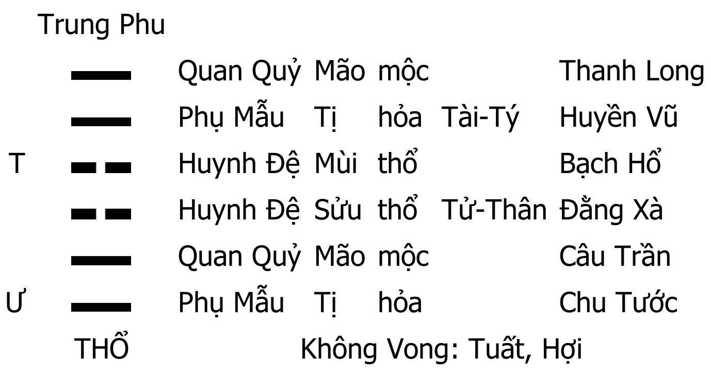
    - **Hình này chứng minh điều gì**
      - Xác lập định lý học thuật đặc biệt của Lục Hào: Trong chiêm đoán tuổi thọ người già lúc bình thường, Dụng thần quá vượng (được tứ trùng Mộc sinh phù) là tượng "Đại thọ", khác biệt hoàn toàn với tượng hung của các quẻ bốc sự vụ hay bốc bệnh nguy cấp.
      - Phân định rạch ròi ảnh hưởng của tâm niệm và mục đích khởi quẻ (Bốc thọ vs Bốc sự/Bốc bệnh) đối với việc diễn giải trạng thái ngũ hành cực vượng.
    - **Từ đâu mà thấy được**
      - Hai hào Phụ Mẫu Tị hỏa (hào sơ và hào 5) đắc Nguyệt kiến Mão mộc và Nhật thần Dần mộc sinh trợ tột cùng, lại được hai hào Quan Quỷ Mão mộc trong quẻ đồng khí tương cầu, khí Hỏa đạt độ vượng vô song.
      - Cổ thư Tăng San Bốc Dịch ghi nhận bà cụ sống an vui thêm 14 năm nữa mới tạ thế, chứng thực điềm đại thọ trường thọ.
  - Nhìn vào:
    - Hào sơ Phụ Mẫu Tị hỏa lâm Chu Tước, Hào 5 Phụ Mẫu Tị hỏa lâm Huyền Vũ.
    - Mão nguyệt Bính Dần nhật: Mộc khí trùng trùng sinh phù Tị hỏa cực vượng.
- **Quy tắc áp dụng**
  - Phân định bản chất trạng thái Quá vượng theo chuyên đề chiêm bốc:
    - Chiêm sự vụ thông thường hoặc chiêm bệnh nhân nặng: Dụng thần quá vượng là vật cực tất phản, biểu thị sự việc bùng phát rồi tiêu vong, bệnh tật phát cuồng hoặc hồi quang phản chiếu tất không sống lâu.
    - Chiêm tuổi thọ người già bình thường: Dụng thần quá vượng biểu thị nguyên khí sinh mệnh thâm hậu vô cương, sinh cơ sung mãn dồi dào, là tượng đại thọ diên niên vô hạn.
- **Lời giải**
  - **Bước 1**: Nhận định Dụng thần và đo lường độ vượng tướng:
    - Căn cứ: Xem tuổi thọ của bà nội lấy hào Phụ Mẫu làm Dụng thần.
    - Nhìn vào: Quẻ có Phụ Mẫu Tị hỏa lưỡng hiện ở hào sơ và hào 5. Tháng Mão Mộc nắm quyền sinh Hỏa, ngày Bính Dần Mộc lại sinh Hỏa; trong quẻ lại có hào 2 và hào 6 Quan Quỷ Mão mộc tiếp tục tương sinh. Dụng thần đắc tứ trọng tương sinh, đạt đến trạng thái cực vượng (quá vượng).
  - **Bước 2**: Giải mã định lý Quá vượng trong chiêm thọ:
    - Căn cứ: Bản chất của phép chiêm thọ là đánh giá dung lượng và trữ lượng sinh mệnh trường kỳ.
    - Nhìn vào: Người xem hỏi quẻ khi bà cụ hoàn toàn khỏe mạnh, không ốm đau thập tử nhất sinh. Trữ lượng sinh khí dày đặc ngút ngàn chính là cội nguồn của trường thọ. Do đó Dã Hạc Tiên Sinh quyết đoán là hưởng đại thọ chứ không luận vật cực tất phản.
  - **Bước 3**: Đối chiếu mốc thời gian thực chứng 14 năm:
    - Căn cứ: Ghi chép thực chứng lịch sử trong Tăng San Bốc Dịch.
    - Nhìn vào: Bà cụ sau đó hưởng thọ thêm trọn vẹn 14 năm nữa mới nhẹ nhàng qua đời, xác thực tính chuẩn xác tuyệt đối của quy tắc "chiêm thọ quá vượng chủ đại thọ".
- **Đối thoại giải đáp nghi vấn**:
  - *Người hỏi*: "Phụ Mẫu lưỡng hiện, Nguyên thần lâm Nhật Nguyệt, trong quẻ còn có hai Mão mộc. Xin hỏi Dụng thần Phụ Mẫu này tại sao không là quá vượng?"
  - *Vương Hổ Ứng lão sư giải đáp*: "Đây là xem tuổi thọ, không phải là hỏi cát hung, chỉ khi hỏi cát hung mà xuất hiện quẻ quá vượng thì mới xem như vậy. Nếu như mẹ bị bệnh mà hỏi kết quả thế nào thì đoán là không sống lâu."
  - *Phân tích chuyên sâu*: Vương lão sư đã làm sáng tỏ một ranh giới then chốt giữa Lý và Hoàn cảnh chiêm bốc: Tâm niệm và bối cảnh hỏi quẻ quyết định cách lý giải ngũ hành. Cùng một tượng quá vượng, nếu người mẹ đang mắc bệnh nặng mà hỏi cát hung thì quá vượng đồng nghĩa với "vật cực tất phản", dương khí phát tán cùng kiệt, đoán là không sống lâu; nhưng khi người già khỏe mạnh hỏi về tuổi thọ thì quá vượng lại là biểu hiện của cội rễ sinh lực vô biên, là điềm đại thọ hiếm thấy trên đời.
- **Kết quả**: Bà cụ không những bình an vô sự mà còn hưởng đại thọ, sống thêm trọn vẹn 14 năm nữa mới quy tiên.
- **Kiểm tra lại**: Đối chiếu giữa nguyên lý phân biệt bối cảnh chiêm thọ và thực tế bà sống thêm 14 năm, quy tắc của Vương Hổ Ứng lão sư hoàn toàn chính xác và sáng tỏ như gương soi.

## Nghi vấn thực chứng: Nguyệt phá, Liên tiếp chiêm quẻ và Đề phòng gian trộm

- **Bản chất của Tử Tôn trì Thế trong dự đoán tai họa và ưu hoạn:**
  - Tử Tôn là Phúc thần, chủ về cát tường, vui vẻ, an lạc, có công năng chế ngự và khắc sát Quan Quỷ (tai họa, quan phi, trộm cắp, tật bệnh).
  - Cổ nhân thường cho rằng hễ được Tử Tôn trì Thế là điềm lành không còn lo âu, nhưng trên thực tế nếu hào Thế lâm Tuần Không hoặc Nguyệt phá thì vẫn chưa dứt được tai họa.
- **Tác động của Nguyệt phá và Tuần Không đối với trạng thái sự việc:**
  - Gặp Nguyệt phá: Hào Thế chịu sự xung kích cực mạnh của Nguyệt lệnh, khí lực suy bại, phải đợi ra khỏi tháng cũ bước sang tháng mới mới thoát khỏi lo âu.
  - Gặp Tuần Không: Hào Thế rơi vào trạng thái chân không, lòng dạ hoang mang bất định, việc chưa giải quyết dứt điểm, phải đợi sang tuần mới xuất Không mới hết tai họa.
- **Hiện tượng Liên tiếp chiêm quẻ (Liên hoàn chiêm) trong thực tế:**
  - Khi đương số nảy sinh tâm lý nghi hoặc hoặc dự trắc sư chưa nắm vững cơ lý tại quẻ đầu tiên, việc gieo liên tiếp các quẻ cùng một sự việc thường xảy ra.
  - Các quẻ gieo kế tiếp không mâu thuẫn với quẻ ban đầu mà đóng vai trò bổ khuyết, hiển thị rõ nét hơn hào biến động và thời điểm ứng kỳ giải tỏa.
- **Nguyên tắc "Thái quá giả tổn chi tư thành" ($\text{太过者损之斯成}$):**
  - Khi một ngũ hành trong quẻ quá vượng (được Nguyệt kiến sinh phù, lâm Nhật kiến, lại động hóa Tiến thần), nó rơi vào trạng thái cực thịnh.
  - Trạng thái thái quá không thể duy trì mãi và chưa lập tức phát tác sát khí khi đang thịnh vượng; chỉ khi ngũ hành đó nhập Mộ hoặc bị xung khắc suy giảm thì sự việc mới thành hình hoặc phát tác hung họa.
- **Biến thông Dụng thần trong dự đoán phòng ngừa gian tà, trộm cắp:**
  - Khi xem việc đề phòng người hầu, kẻ dưới ám hại, không thể máy móc lấy hào Thê Tài làm Dụng thần như phép xem gia nhân thông thường.
  - Trọng tâm thần cơ chuyển hóa về Kỵ thần khắc Thế: Hào khắc Thế đại diện cho mối nguy hiểm và kẻ mưu hại ngầm.

---

### Lý thuyết cốt lõi: Tử Tôn trì Thế, Không Vong và Kỹ pháp Liên tiếp chiêm quẻ

- **Luận điểm của Dã Hạc Lão Nhân (Giác Tử):**
  - Sách *Tăng San Bốc Dịch* ghi: *"Mặc dù Tử Tôn trì Thế, khó là điềm lành, nếu gặp Nguyệt phá, thì phải ra khỏi tháng mới tránh được lo âu. Nếu Thế lâm Không, đợi sang tuần xuất Không mới hết tai họa. Khi chưa xuất Không thì vẫn còn phải lo lắng không yên."*
  - Luận điểm này khẳng định không thể chỉ nhìn thấy hào Tử Tôn trì Thế đơn thuần mà vội kết luận cát tường, phải kết hợp đầy đủ với các trạng thái suy vượng và thần sát.
- **Bình giải sâu sắc của Vương Hổ Ứng:**
  - *Ý nghĩa tượng học của Tử Tôn:* Tử Tôn đại diện cho tâm thái thanh thản, vô ưu, hoan hỷ; nhưng khi lâm Không Vong hoặc bị Nguyệt phá thì ý nghĩa này bị đảo nghịch thành ưu phiền, bất an, lo sợ.
  - *Dấu hiệu tâm lý lo âu:* Hào Thế lâm Tuần Không hoặc lâm Đằng Xà đều là tín hiệu nội tâm đang nơm nớp lo sợ, bất an dao động, bất kể trì Thế là Tử Tôn hay lục thân nào khác.
  - *Cơ chế Nhật hợp câu thúc:* Khi hào Thế lâm Tử Tôn lại bị Nhật thần hợp chặt ($\text{Tham hợp quên khắc}$), hào Thế bị trói buộc không thể phát huy uy lực khắc trừ Quan Quỷ, khiến sự việc bị kéo dài dây dưa.
  - *Bản chất của việc gieo liên tiếp 3 quẻ:* Xuất phát từ việc người dự trắc thời xưa chưa tự tin nắm chắc manh mối ở quẻ đầu tiên; thực chất chỉ một quẻ đầu tiên đã đủ hàm chứa toàn bộ thông tin cát hung và ứng kỳ.

---

### Ví dụ 35: Xem đề phòng tai họa, lần gieo 1 (Quẻ Trạch Thiên Quải)

- **Đề bài**: Ngày Canh Thìn tháng Tị, một người trong lòng đầy âu lo, sợ hãi tai họa sắp giáng xuống bản thân nên đến gieo quẻ hỏi cách đề phòng tai họa.
- **Dữ kiện**
  - Thời gian: Ngày Canh Thìn, tháng Tị.
  - Tuần Không: Thân, Dậu (tuần Giáp Tuất).
  - Quẻ chủ: Trạch Thiên Quải (quẻ tĩnh).
  - Quẻ biến, hào động: Quẻ tĩnh, không có hào động.

| Thế/Ứng | Hào | Quẻ Quải | Phục thần | Lục thú |
| :---: | :---: | :--- | :---: | :--- |
| | ▅▅  ▅▅ | Huynh Đệ Mùi thổ | | Đằng Xà |
| T | ▅▅▅▅▅ | Tử Tôn Dậu kim | | Câu Trần |
| | ▅▅▅▅▅ | Thê Tài Hợi thủy | | Chu Tước |
| | ▅▅▅▅▅ | Huynh Đệ Thìn thổ | | Thanh Long |
| Ư | ▅▅▅▅▅ | Quan Quỷ Dần mộc | Phụ-Tị | Huyền Vũ |
| | ▅▅▅▅▅ | Thê Tài Tý thủy | | Bạch Hổ |

  - Sơ đồ quẻ: (Tham chiếu Hình 35) alt="Sơ đồ quẻ" />
  - **Hình 35.** Sơ đồ quẻ Quải
    - 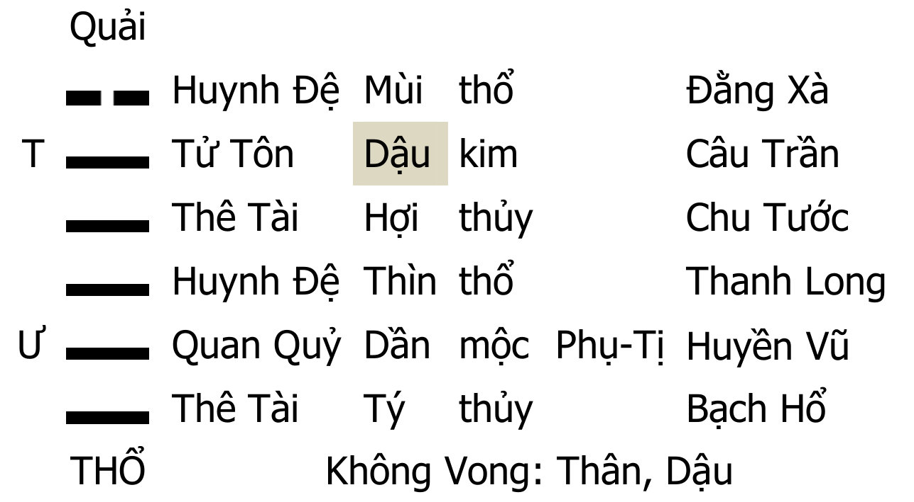
    - **Hình này chứng minh điều gì**
      - Hào 5 Thế Tử Tôn Dậu kim lâm Câu Trần gặp Tuần Không và bị Nhật thần Canh Thìn tương hợp; Hào 2 Ứng Quan Quỷ Dần mộc lâm Huyền Vũ phục Phụ Mẫu Tị hỏa.
    - **Từ đâu mà thấy được**
      - Bảng nạp giáp quẻ Quải: Hào 5 Dậu kim ghi ký hiệu 'T' (Thế) lâm Câu Trần; ngày Canh Thìn thuộc tuần Giáp Tuất tra Tuần Không tại Thân và Dậu; Hào 2 Dần mộc ghi 'Ư' (Ứng).
  - Nhìn vào: Hào Thế Tử Tôn Dậu kim lâm Câu Trần ngộ Tuần Không, lại bị Nhật thần Canh Thìn lục hợp ($\text{Thìn Dậu hợp}$); Hào Ứng Quan Quỷ Dần mộc lâm Huyền Vũ phục Phụ Mẫu Tị hỏa.
- **Quy tắc áp dụng**
  - *Tử Tôn phùng Không:* Tử Tôn trì Thế chủ tiêu trừ tai họa, nhưng khi gặp Tuần Không thì năng lực hộ thân tạm thời chưa phát huy, tâm lý còn đầy sợ hãi.
  - *Nhật thần lục hợp trói buộc:* Hào gặp Nhật thần tương hợp là bị câu thúc, không thể xuất đầu để khắc chế hào Quan Quỷ, biểu thị sự việc còn kéo dài bế tắc.
- **Lời giải**
  - **Bước 1**: Thẩm định tâm lý và trạng thái hào Thế của đương số
    - Căn cứ: Hào 5 Thế lâm Tử Tôn Dậu kim ngộ Tuần Không trong ngày Canh Thìn.
    - Nhìn vào: Vị trí hào 5 là ngôi tôn vị, trì Thế Tử Tôn nhưng gặp Tuần Không, lại lâm Câu Trần (chủ chậm trễ, vướng bận dây dưa). Tuần Không chủ về hư không bất an, cho thấy nỗi sợ hãi trong lòng chưa thể nguôi ngoai.
  - **Bước 2**: Đánh giá tương tác giữa Hào Thế và Kỵ thần Quan Quỷ
    - Căn cứ: Ngũ hành sinh khắc và tác động của Nhật thần Canh Thìn.
    - Nhìn vào: Tử Tôn Dậu kim bị Nhật thần Thìn thổ hợp chặt ($\text{Thìn Dậu lục hợp}$), rơi vào thế "tham hợp quên khắc". Dù Kim khắc Mộc nhưng Dậu kim bị trói chặt nên không thể khắc trừ Hào 2 Quan Quỷ Dần mộc, khiến nguồn cơn tai họa vẫn lơ lửng chưa dứt.
- **Đối thoại giải đáp nghi vấn**:
  - *Hỏi*: Tại sao Tử Tôn trì Thế vốn là điềm lành mà quẻ này lại đoán việc chưa xong, vẫn còn lo lắng?
  - *Đáp (Vương Hổ Ứng)*: Xem quẻ không thể câu nệ vào danh xưng Tử Tôn. Hào Thế vừa Không vừa bị Nhật hợp thì mất tác dụng khắc Quan Quỷ, nên việc nhất định kéo dài. Đáng lẽ có thể đoán ứng kỳ vào ngày Dần (ngày Dần xung phá hợp hoặc Thế đắc trường sinh chế Quỷ), nhưng dự trắc sư cổ đại chưa nắm chắc nên không dám quyết đoán ngay ở quẻ này.
- **Kết quả**: Dự trắc sư phán định: Hào Thế ở Tử Tôn gặp Tuần Không nên sự việc lo âu vẫn chưa kết thúc, còn phải lo lắng không yên; do đó bảo đương số phải gieo tiếp quẻ thứ hai để thẩm tra.
- **Kiểm tra lại**: Quẻ tĩnh, Thế Không lâm Câu Trần bị Nhật hợp, phản ánh chính xác sự việc chưa ngã ngũ và tâm trạng bế tắc của người hỏi.

---

### Ví dụ 36: Xem đề phòng tai họa, lần gieo 2 vào ngày Ất Dậu (Quẻ Thiên Lôi Vô Vọng)

- **Đề bài**: Đến ngày Ất Dậu, đương số vẫn nơm nớp lo sợ tai họa chưa yên, lại đến xin gieo tiếp quẻ thứ hai để xem tình hình hung cát ra sao.
- **Dữ kiện**
  - Thời gian: Ngày Ất Dậu, tháng Tị.
  - Tuần Không: Ngọ, Mùi (tuần Giáp Thân).
  - Quẻ chủ: Thiên Lôi Vô Vọng (quẻ tĩnh, lục xung).
  - Quẻ biến, hào động: Quẻ tĩnh, không có hào động.

| Thế/Ứng | Hào | Quẻ Vô Vọng | Lục thú |
| :---: | :---: | :--- | :--- |
| | ▅▅▅▅▅ | Thê Tài Tuất thổ | Huyền Vũ |
| | ▅▅▅▅▅ | Quan Quỷ Thân kim | Bạch Hổ |
| T | ▅▅▅▅▅ | Tử Tôn Ngọ hỏa | Đằng Xà |
| | ▅▅  ▅▅ | Thê Tài Thìn thổ | Câu Trần |
| | ▅▅  ▅▅ | Huynh Đệ Dần mộc | Chu Tước |
| Ư | ▅▅▅▅▅ | Phụ Mẫu Tý thủy | Thanh Long |

  - Sơ đồ quẻ: (Tham chiếu Hình 36) alt="Sơ đồ quẻ" />
  - **Hình 36.** Sơ đồ quẻ Vô Vọng
    - 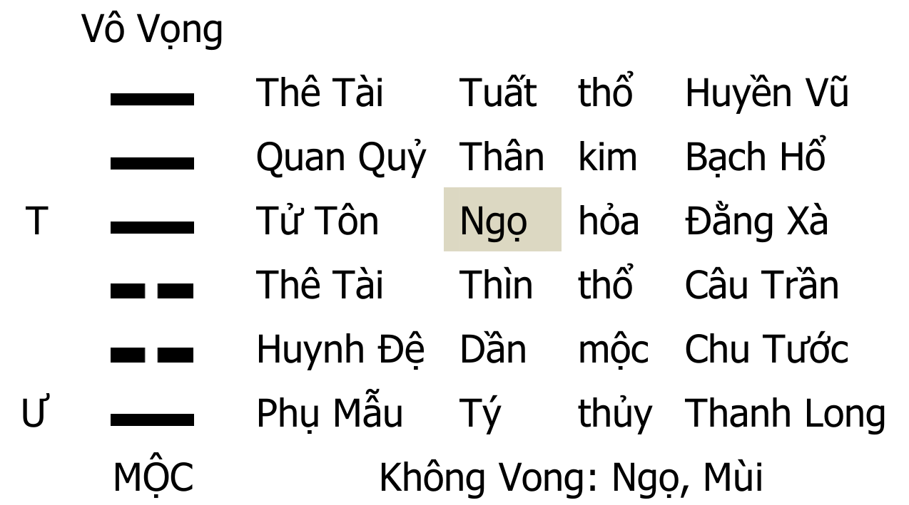
    - **Hình này chứng minh điều gì**
      - Hào 4 Thế Tử Tôn Ngọ hỏa lâm Đằng Xà lại ngộ Tuần Không trong ngày Ất Dậu; quẻ thuần Lục Xung.
    - **Từ đâu mà thấy được**
      - Bảng nạp giáp quẻ Vô Vọng: Hào 4 Ngọ hỏa ghi ký hiệu 'T' (Thế) lâm Đằng Xà; ngày Ất Dậu thuộc tuần Giáp Thân tra Tuần Không tại Ngọ và Mùi.
  - Nhìn vào: Hào 4 Thế Tử Tôn Ngọ hỏa lâm Đằng Xà gặp Tuần Không; Quẻ Thiên Lôi Vô Vọng là quẻ Lục Xung.
- **Quy tắc áp dụng**
  - *Thế Không lâm Đằng Xà:* Đằng Xà chủ về quái dị, kinh hoảng, lo âu bất an; Hào Thế lâm Đằng Xà lại gặp Tuần Không biểu thị tâm thần bấn loạn, việc còn trăn trở chưa giải quyết được.
  - *Tử Tôn phùng Không:* Phúc thần ngộ Không thì không đủ lực bảo vệ bản thân, tai họa vẫn còn đe dọa.
- **Lời giải**
  - **Bước 1**: Khảo sát vị trí và trạng thái của hào Thế
    - Căn cứ: Hào 4 Tử Tôn Ngọ hỏa trì Thế trong ngày Ất Dậu (tuần Giáp Thân Không tại Ngọ, Mùi).
    - Nhìn vào: Hào Thế trực tiếp lâm Tuần Không, lại lâm Đằng Xà là thần sát chủ về sợ hãi, bồn chồn. Dù quẻ là Lục Xung (chủ sự việc tán), nhưng Thế Không lâm Xà biểu thị trong lòng người xem vẫn vô cùng hoang mang, sự việc chưa đi đến hồi kết.
  - **Bước 2**: Đánh giá kết quả quẻ gieo lần hai
    - Căn cứ: Nguyên tắc ứng kỳ Tuần Không (phải xuất Không mới định được sự việc).
    - Nhìn vào: Hào Thế Tử Tôn Ngọ hỏa còn đang trong tuần Không Vong nên lực bảo hộ của Phúc thần bị gián đoạn, sự việc tiếp tục dây dưa trăn trở.
- **Đối thoại giải đáp nghi vấn**:
  - *Hỏi*: Quẻ Vô Vọng là quẻ Lục Xung, người xưa thường nói "Lục Xung tai họa tiêu tán", sao quẻ này lại đoán sự việc còn trăn trở chưa dứt?
  - *Đáp (Vương Hổ Ứng)*: Quẻ Lục Xung tuy chủ tán nhưng hào Thế đang lâm Tuần Không và đè nặng thần sát Đằng Xà. Khi hào Thế chưa xuất Không thì tự thân đương số chưa thoát khỏi trạng thái hoảng loạn, ngoại cảnh cũng chưa có chuyển biến thực tế.
- **Kết quả**: Dự trắc sư phán đoán: Hào Thế tại Ngọ hỏa Tử Tôn lại gặp Tuần Không, nên sự việc còn trăn trở chưa kết thúc, người này vẫn phải tiếp tục đợi chờ trong lo lắng.
- **Kiểm tra lại**: Hào Thế Ngọ hỏa lâm Đằng Xà Tuần Không, phản ánh tâm trạng bồn chồn chưa yên của đương số đúng vào ngày Ất Dậu, khiến người này phải gieo tiếp lần thứ ba vào ngày Kỷ Dậu.

---

### Ví dụ 37: Xem đề phòng tai họa, lần gieo 3 vào ngày Kỷ Dậu (Quẻ Tiết biến Khảm)

- **Đề bài**: Đến ngày Kỷ Dậu, đương số vẫn lo lắng không yên, lại đến gieo quẻ lần thứ ba để biết chính xác bao giờ tai họa và mối lo âu mới hoàn toàn chấm dứt.
- **Dữ kiện**
  - Thời gian: Ngày Kỷ Dậu, tháng Tị.
  - Tuần Không: Dần, Mão (tuần Giáp Thìn).
  - Quẻ chủ: Thủy Trạch Tiết.
  - Quẻ biến: Bát Thuần Khảm (quẻ biến Lục Xung).
  - Hào động: Hào 1 Thê Tài Tị hỏa động biến Tử Tôn Dần mộc; Hào 2 Tử Tôn Mão mộc động biến Quan Quỷ Thìn thổ.

| | Tiết | | | | Khảm | | | |
| :---: | :---: | :--- | :--- | :---: | :---: | :--- | :--- | :--- |
| | - - | Huynh Đệ | Tý thủy | | - - | Huynh Đệ | Tý thủy | Câu Trần |
| | — | Quan Quỷ | Tuất thổ | | — | Quan Quỷ | Tuất thổ | Chu Tước |
| Ư | - - | Phụ Mẫu | Thân kim | | - - | Phụ Mẫu | Thân kim | Thanh Long |
| | - - | Quan Quỷ | Sửu thổ | Tài-Ngọ | - - | Thê Tài | Ngọ hỏa | Huyền Vũ |
| | — | Tử Tôn | Mão mộc | | — | Quan Quỷ | Thìn thổ | Bạch Hổ |
| T | — | Thê Tài | Tị hỏa | | - - | Tử Tôn | Dần mộc | Đằng Xà |

  - Sơ đồ quẻ: (Tham chiếu Hình 37) alt="Sơ đồ quẻ" />
  - **Hình 37.** Quẻ Tiết biến Khảm
    - 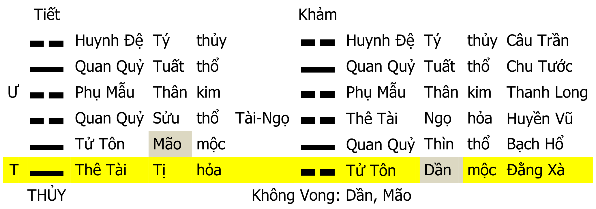
    - **Hình này chứng minh điều gì**
      - Hào 1 Thế Thê Tài Tị hỏa phát động hóa Tử Tôn Dần mộc lâm Tuần Không hồi đầu sinh Thế; quẻ biến Bát Thuần Khảm Lục Xung giải tỏa ưu hoạn.
    - **Từ đâu mà thấy được**
      - Bảng nạp giáp quẻ Tiết biến Khảm: Hào 1 Tị hỏa ghi 'T' (Thế) phát động hóa Dần mộc; ngày Kỷ Dậu thuộc tuần Giáp Thìn nên Dần và Mão lâm Không Vong; quẻ biến là Bát Thuần Khảm (quẻ Lục Xung).
  - Nhìn vào: Hào Thế Tị hỏa động hóa Tử Tôn Dần mộc ngộ Tuần Không; Quẻ ngoại quái và nội quái biến thành Bát Thuần Khảm là quẻ Lục Xung.
- **Quy tắc áp dụng**
  - *Hào Thế động hóa Tử Tôn hồi đầu sinh:* Thế động hóa Tử Tôn là hóa ra Phúc thần sinh trợ cho bản thân, đem lại phúc khí và tiêu trừ hiểm họa.
  - *Hào biến phùng Không định ứng kỳ:* Hào biến Dần mộc lâm Tuần Không, ứng kỳ sẽ rơi vào ngày xuất Không hoặc xung Không ($\text{Ngày Dần xuất Không}$).
  - *Quẻ biến Lục Xung giải ưu hoạn:* Đoán tai họa, lo âu mà gặp quẻ biến Lục Xung chủ sự việc tan biến, mau chóng kết thúc tốt đẹp.
- **Lời giải**
  - **Bước 1**: Phân tích động hào Thế và hào biến Tử Tôn
    - Căn cứ: Hào 1 Thế Thê Tài Tị hỏa lâm Đằng Xà phát động hóa ra Tử Tôn Dần mộc.
    - Nhìn vào: Thế động hóa Dần mộc Mộc sinh Hỏa là hào biến quay lại sinh Hào Thế ($\text{Hồi đầu sinh}$). Hào biến là Tử Tôn Phúc thần, nghĩa là bản thân đương số sẽ được Phúc thần che chở, tai họa tự tiêu tan.
  - **Bước 2**: Định vị ứng kỳ sự việc dựa vào Tuần Không và quẻ biến Lục Xung
    - Căn cứ: Dần mộc ngộ Tuần Không trong tuần Giáp Thìn; quẻ biến Khảm vi Thủy là quẻ Lục Xung.
    - Nhìn vào: Hiện tại Dần mộc đang Không nên lực sinh Thế chưa phát tiết. Đợi đến ngày Giáp Dần, hào Dần mộc vừa xuất Không vừa đắc lệnh, cộng với tượng quẻ biến Lục Xung làm cho ưu hoạn nhanh chóng tan rã, sự việc sẽ hoàn toàn được giải quyết.
- **Đối thoại giải đáp nghi vấn**:
  - *Hỏi*: Tại sao quẻ thứ hai và quẻ thứ ba đều có yếu tố Lục Xung và Thế Không, mà quẻ thứ hai đoán chưa xong, quẻ thứ ba lại đoán kết thúc vào ngày Giáp Dần?
  - *Đáp (Vương Hổ Ứng)*: Sở dĩ người xưa phải gieo liên tiếp ba quẻ là vì dự trắc sư ban đầu chưa nắm bắt được thần cơ! Thực ra chỉ cần quẻ đầu tiên là đã có thể định đoạt. Ở quẻ thứ nhất, Thế lâm Dậu kim Không lại bị Nhật hợp nên việc dây dưa, đáng ra có thể đoán ứng vào ngày Dần (xung phá Quan Quỷ và xung hợp) nhưng thầy bói không dám quyết. Đến quẻ thứ ba, thần cơ hiển lộ rõ ràng tại hào Thế động hóa Tử Tôn Dần mộc ngộ Không, lại được quẻ biến Lục Xung tương trợ, lúc này manh mối đã rành rành nên dự trắc sư mới tự tin đoán chắc chắn ngày Giáp Dần xuất Không là sự việc êm đẹp.
- **Kết quả**: Dự trắc sư đoán: *"Đến ngày Giáp Dần sự việc sẽ kết thúc."* Quả nhiên sang ngày Giáp Dần, mọi sự lo âu được giải quyết triệt để, tai họa tiêu tan.
- **Kiểm tra lại**: Hào biến Dần mộc xuất Không đúng ngày Giáp Dần, quẻ biến Lục Xung xung tán ưu sầu, hoàn toàn ứng nghiệm với thực tế.

---

### Lý luận mở rộng: Quy tắc Thái quá giả tổn chi tư thành và Kỹ pháp Tị hung

- **Bản chất của quy luật Thái quá giả tổn chi tư thành ($\text{太过者损之斯成}$):**
  - Ngũ hành trong dự đoán Lục Hào tối kỵ thiên lệch thái quá. Khi một hào quá vượng (được cả Nguyệt kiến, Nhật thần bồi đắp hoặc động hóa Tiến thần vượng tướng), nó đạt tới trạng thái cực thịnh.
  - Trong tình trạng cực thịnh, hào này không thể tiếp nhận thêm sinh trợ và cũng chưa lập tức phát động uy lực gây hại đối với hào suy.
  - Chỉ khi gặp thời điểm bị tổn giảm, tiêu hao (nhập Mộ khố hoặc bị hành khác khắc chế, xung phá) thì tác dụng cát hung của nó mới chính thức thành hình và bộc phát.
- **Quy tắc suy xét cát hung đối với Dụng thần và Kỵ thần quá vượng:**
  - *Khi Dụng thần quá vượng:* Nếu tiếp tục được sinh trợ thì lại hóa hung tử nạn; trái lại nếu bị khắc chế, kiềm hãm bớt thì trái lại biến thành cát lợi.
  - *Khi Kỵ thần quá vượng:* Trong giai đoạn Kỵ thần đang nắm giữ khí lệnh vượng tướng thì bản thân hào Thế tạm thời bình an vô sự; nhưng khi Kỵ thần bước vào thời điểm hưu tù, nhập Mộ hoặc bị khắc phạt thì hung họa tàn khốc mới giáng xuống hào Thế.
- **Kỹ pháp tránh dữ tìm lành (Xu cát tị hung):**
  - Dự đoán Lục Hào không dừng lại ở việc xem trước số mệnh mà mở ra phương pháp cải biến vận số thông qua việc dịch chuyển không gian (phương vị) và điều chỉnh thời gian hành động phù hợp với ngũ hành sinh khắc.

---

### Ví dụ 38: Xem về lưu niên bản mệnh trong năm (Quẻ Phệ Hạp biến Khuê)

- **Đề bài**: Ngày Đinh Mão tháng Dần, một người đến xem quẻ lưu niên để biết vận hạn họa phúc của bản thân trong suốt một năm.
- **Dữ kiện**
  - Thời gian: Ngày Đinh Mão, tháng Dần.
  - Tuần Không: Tuất, Hợi (tuần Giáp Tý).
  - Quẻ chủ: Hỏa Lôi Phệ Hạp.
  - Quẻ biến: Hỏa Trạch Khuê.
  - Hào động: Hào 1 Phụ Mẫu Tý thủy động biến Tử Tôn Tị hỏa; Hào 2 Huynh Đệ Dần mộc động biến Huynh Đệ Mão mộc; Hào 3 Thê Tài Thìn thổ động biến Thê Tài Sửu thổ.

| | Phệ Hạp | | | | Khuê | | | |
| :---: | :---: | :--- | :--- | :---: | :---: | :--- | :--- | :--- |
| | — | Tử Tôn | Tị hỏa | | — | Tử Tôn | Tị hỏa | Thanh Long |
| T | - - | Thê Tài | Mùi thổ | | - - | Thê Tài | Mùi thổ | Huyền Vũ |
| | — | Quan Quỷ | Dậu kim | | — | Quan Quỷ | Dậu kim | Bạch Hổ |
| | - - | Thê Tài | Thìn thổ | | - - | Thê Tài | Sửu thổ | Đằng Xà |
| Ư | - - | Huynh Đệ | Dần mộc | | — | Huynh Đệ | Mão mộc | Câu Trần |
| | — | Phụ Mẫu | Tý thủy | | — | Tử Tôn | Tị hỏa | Chu Tước |

  - Sơ đồ quẻ: (Tham chiếu Hình 38) alt="Sơ đồ quẻ" />
  - **Hình 38.** Quẻ Phệ Hạp biến Khuê
    - 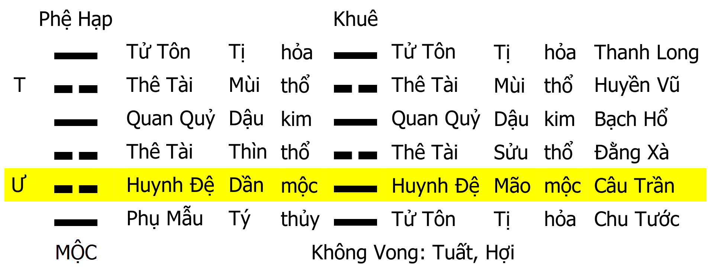
    - **Hình này chứng minh điều gì**
      - Hào 2 Huynh Đệ Dần mộc lâm Nguyệt kiến động hóa Tiến thần Mão mộc lâm Nhật kiến khắc sát Hào 5 Thế Thê Tài Mùi thổ; Hào 1 Tý thủy và Hào 3 Thìn thổ cùng phát động.
    - **Từ đâu mà thấy được**
      - Bảng nạp giáp quẻ Phệ Hạp biến Khuê: Hào 5 Mùi thổ ghi 'T' (Thế); Hào 2 Dần mộc ghi 'Ư' (Ứng) phát động hóa Mão mộc; thời gian chiêm là ngày Đinh Mão tháng Dần.
  - Nhìn vào: Hào Thế Thê Tài Mùi thổ bị Hào 2 Huynh Đệ Dần mộc lâm Nguyệt kiến động hóa Tiến thần Mão mộc khắc thương trực diện; ngũ hành Mộc cực vượng nắm lệnh mùa xuân.
- **Quy tắc áp dụng**
  - *Tiến thần khắc Thế:* Kỵ thần phát động hóa Tiến thần là sát khí không ngừng tăng trưởng, chủ về đại hung tai họa.
  - *Thái quá giả tổn chi tư thành định ứng kỳ:* Mộc quá vượng vào mùa xuân chưa thể khắc hại ngay; đợi đến tháng Mùi mộc nhập Mộ và tháng Thân mộc gặp Tuyệt thì tai họa thổ mộc mới phát tác.
  - *Phương pháp di chuyển tránh hung:* Di chuyển đến phương vị tương khắc chế ngự hung sát hoặc nương náu sinh khí đúng thời điểm suy vượng.
- **Lời giải**
  - **Bước 1**: Đánh giá sát khí của Kỵ thần khắc Thế
    - Căn cứ: Hào 2 Huynh Đệ Dần mộc lâm Nguyệt kiến, động hóa Huynh Đệ Mão mộc lâm Nhật kiến.
    - Nhìn vào: Hào Kỵ thần Dần mộc hóa Tiến thần Mão mộc, lại được cả Nhật và Nguyệt làm gốc rễ nên đạt mức cực vượng. Mộc vượng khắc Thổ, trực tiếp nhắm vào Hào 5 Thế Thê Tài Mùi thổ, báo hiệu trong năm ắt có hung họa nguy hiểm tính mạng.
  - **Bước 2**: Xác định thời điểm phát tác hung họa (Ứng kỳ)
    - Căn cứ: Nguyên tắc "Thái quá giả tổn chi tư thành" trong Lục Hào.
    - Nhìn vào: Hiện tại đang là mùa xuân tháng Dần, Mộc khí đương lệnh cực thịnh nên hào Thế chưa bị khắc hại ngay. Phải đợi sang tháng sáu (tháng Mùi - Mộc nhập Mộ) và tháng bảy (tháng Thân - Mộc gặp Tuyệt, Kim khắc Mộc), Mộc khí suy giảm thì tai ách sập đổ nhà cửa về thổ mộc mới bùng phát.
  - **Bước 3**: Chỉ dẫn phương pháp xuất hành tị hung
    - Căn cứ: Ngũ hành phương vị tương ứng với thời gian chuyển dịch.
    - Nhìn vào: Mùa xuân Mộc đang vượng nên đi về hướng Tây (hành Kim) để dùng Kim khắc chế bớt Mộc. Đến tháng sáu tháng bảy Mộc đã suy nhược thì phải đi về hướng Đông (phương Chấn Mộc) để nương nhờ sinh khí mà bảo toàn tính mạng.
- **Đối thoại giải đáp nghi vấn**:
  - *Hỏi*: Người xem hỏi liệu có cách nào tránh được tai họa không và nên đi về hướng nào?
  - *Đáp (Dự trắc sư)*: Hoàn toàn có thể tránh được nếu chịu rời khỏi nhà đi xa. Hiện tại mùa xuân nên đi về hướng Tây; sang tháng sáu tháng bảy thì chuyển hướng đi về phía Đông phương Chấn Mộc để lánh nạn.
- **Kết quả**: Đương số chần chừ không chịu đi xa. Mãi đến ngày mồng 7 tháng bảy nằm mơ thấy ác mộng kinh hoàng, sáng mồng 8 mới vội vã chạy về hướng Đông. Đến ngày 28 tháng bảy, động đất kinh hoàng xảy ra, nhà cửa đổ sập vùi lấp mọi người, duy chỉ có người này nhờ chạy về hướng Đông lánh nạn nên bình an thoát chết!
- **Kiểm tra lại**: Ứng kỳ hung họa rơi đúng vào tháng bảy (tháng Thân) khi Mộc gặp Tuyệt, nhà cửa thổ mộc sập đổ đúng như phán đoán; hướng Đông bảo toàn tính mạng xác thực.

---

### Ví dụ 39: Xem kẻ nô bộc người làm có gây họa hay không (Quẻ Giải biến Chấn)

- **Đề bài**: Ngày Bính Tý tháng Mùi, một chủ nhà nghi ngờ kẻ nô bộc (người làm) thay lòng đổi dạ, manh tâm mưu hại chủ nhưng chưa có tang chứng cụ thể nên đến gieo quẻ xem liệu kẻ này có gây họa hay không và cách xử trí.
- **Dữ kiện**
  - Thời gian: Ngày Bính Tý, tháng Mùi.
  - Tuần Không: Thân, Dậu (tuần Giáp Tuất).
  - Quẻ chủ: Lôi Thủy Giải.
  - Quẻ biến: Bát Thuần Chấn (quẻ biến Lục Xung).
  - Hào động: Hào 1 Huynh Đệ Dần mộc động biến Phụ Mẫu Tý thủy; Hào 2 Thê Tài Thìn thổ động biến Huynh Đệ Dần mộc; Hào 3 Tử Tôn Ngọ hỏa động biến Thê Tài Thìn thổ.

| | Giải | | | | Chấn | | | |
| :---: | :---: | :--- | :--- | :---: | :---: | :--- | :--- | :--- |
| | - - | Thê Tài | Tuất thổ | | - - | Thê Tài | Tuất thổ | Thanh Long |
| Ư | - - | Quan Quỷ | Thân kim | | - - | Quan Quỷ | Thân kim | Huyền Vũ |
| | — | Tử Tôn | Ngọ hỏa | | — | Tử Tôn | Ngọ hỏa | Bạch Hổ |
| | - - | Tử Tôn | Ngọ hỏa | | - - | Thê Tài | Thìn thổ | Đằng Xà |
| T | — | Thê Tài | Thìn thổ | | - - | Huynh Đệ | Dần mộc | Câu Trần |
| | - - | Huynh Đệ | Dần mộc | Phụ-Tý | — | Phụ Mẫu | Tý thủy | Chu Tước |

  - Sơ đồ quẻ: (Tham chiếu Hình 39) alt="Sơ đồ quẻ" />
  - **Hình 39.** Quẻ Giải biến Chấn
    - 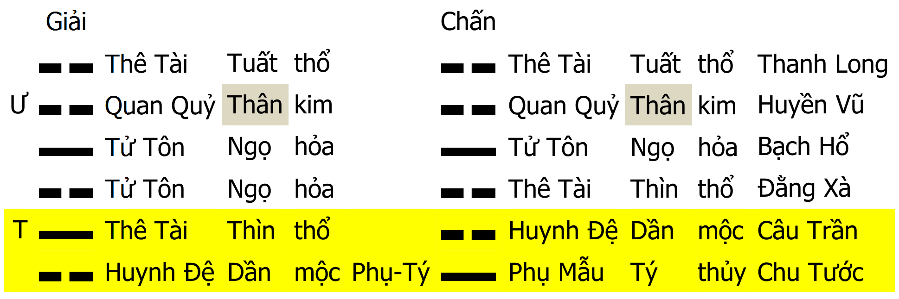
    - **Hình này chứng minh điều gì**
      - Hào 2 Thế Thê Tài Thìn thổ phát động hóa Huynh Đệ Dần mộc hồi đầu khắc; Hào 1 Huynh Đệ Dần mộc phát động khắc Thế; hai hào Dần mộc cùng khắc Thế biểu thị có đồng phạm mưu hại.
    - **Từ đâu mà thấy được**
      - Bảng nạp giáp quẻ Giải biến Chấn: Hào 2 Thìn thổ ghi 'T' (Thế) động biến Dần mộc; Hào 1 Dần mộc phục Tý thủy cũng đồng thời phát động; ngày Bính Tý tháng Mùi.
  - Nhìn vào: Hào Thế Thê Tài Thìn thổ bị Hào 1 Dần mộc động khắc và bản thân Thế hào động hóa Dần mộc hồi đầu khắc; hai thế lực Mộc cùng công phạt Thổ.
- **Quy tắc áp dụng**
  - *Không câu nệ hào Thê Tài làm gia nhân:* Tâm lý đương số là phòng ngừa ám hại nên thần cơ quy tụ về Kỵ thần khắc Thế.
  - *Lưỡng hào Kỵ thần khắc Thế:* Trong quẻ xuất hiện hai hào Kỵ thần cùng khắc hào Thế là điềm báo không chỉ một kẻ làm phản mà có đồng đảng mưu mô cấu kết.
  - *Mộc nhập Mộ Tuyệt định thời điểm bại lộ:* Kỵ thần Mộc gặp Mộ tại tháng Mùi, gặp Tuyệt tại tháng Thân; thời điểm Kỵ thần suy nhược là lúc dã tâm của chúng bại lộ hoặc kế hoạch mưu hại thất bại.
- **Lời giải**
  - **Bước 1**: Xác lập phương pháp xem và nhận diện kẻ mưu hại
    - Căn cứ: Bản chất câu hỏi là đề phòng tai họa, không phải xem tiền tài hay thuê mướn kẻ ăn người ở.
    - Nhìn vào: Lấy Kỵ thần khắc Thế làm Dụng thần. Hào Thế là Thê Tài Thìn thổ (hành Thổ), Kỵ thần khắc Thế là Huynh Đệ Dần mộc (hành Mộc).
  - **Bước 2**: Phát hiện đồng phạm qua tượng hai hào cùng khắc Thế
    - Căn cứ: Tương tác của hào 1 và hào 2 trong quẻ biến.
    - Nhìn vào: Hào 1 Huynh Đệ Dần mộc phát động khắc Thế Thìn thổ; mặt khác chính Hào 2 Thế Thìn thổ lại động hóa ra Huynh Đệ Dần mộc hồi đầu khắc. Hai hào Dần mộc cùng ra tay khắc Thế, chứng minh chắc chắn ngoài kẻ bị nghi ngờ còn có đồng phạm ngầm cấu kết mưu hại chủ.
  - **Bước 3**: Hoạch định kế sách ứng phó và định kỳ ứng nghiệm
    - Căn cứ: Trạng thái Mộ Tuyệt của ngũ hành Mộc tại tháng Mùi và tháng Thân.
    - Nhìn vào: Mộc nhập Mộ tại tháng Mùi, lâm Tuyệt tại tháng Thân. Đây là lúc dã tâm của chúng bộc lộ sơ hở và kế hoạch ám hại bị phá vỡ. Khuyên chủ nhà rời khỏi nhà nửa tháng để tị hung.
- **Đối thoại giải đáp nghi vấn**:
  - *Hỏi*: Người xem hỏi chưa có bằng chứng cụ thể thì phải xử trí ra sao để không bị hại?
  - *Đáp (Dự trắc sư)*: Không có tang chứng thì không thể tùy tiện bắt tội. Nhưng mộc nhập Mộ ở tháng Mùi, tuyệt ở tháng Thân, dã tâm của chúng sẽ tự bại lộ trong hai tháng này; chỉ cần chủ nhà rời khỏi nhà lánh nạn nửa tháng thì hung họa tự giải.
- **Kết quả**: Chủ nhà nghe theo lời dặn, bỏ nhà đi ra ngoài ở nửa tháng. Quả nhiên trong thời gian đó, hai tên nô bộc thấy chủ nhà vắng mặt không thể ra tay ám hại được bèn bỏ trốn, kéo theo một người phụ nữ trong nhà cùng đi. Người phụ nữ ở lại khai nhận: Hai tên kia có mưu đồ giết chủ cướp tài sản rồi đào tẩu, do chủ nhà đi vắng nên không thể thực hiện được mưu gian!
- **Kiểm tra lại**: Hai kẻ nô bộc bỏ trốn ứng đúng tượng hai hào Dần mộc; việc rời nhà nửa tháng tị hung hoàn toàn chuẩn xác cứu sống gia chủ.

---

### Đối thoại chuyên sâu giải đáp nghi vấn: Thái quá giả tổn chi tư thành và Phép đoán Phòng gian trộm

- **Nghi vấn về cơ chế ứng kỳ tháng 6 (Mùi) và tháng 7 (Thân) của hai quẻ:**
  - *Câu hỏi từ học viên:* Quẻ 38 đoán mùa thu gặp nạn lại ứng vào tháng 6 (Mùi) và tháng 7 (Thân), trong khi thông thường hào động phải ứng vào ngày/tháng Trị hoặc ngày/tháng Hợp. Hơn nữa, cả quẻ 38 và quẻ 39 đều có Kỵ thần Dần mộc khắc Thế và đều ứng vào tháng Mùi, tháng Thân, vậy bản chất lý luận của hai quẻ này có hoàn toàn giống nhau không?
- **Phân tích làm sáng tỏ bản chất của Vương Hổ Ứng lão sư:**
  - *Sự phân biệt căn bản giữa hai tình huống quẻ:*
    - Tuy cả hai quẻ đều ứng vào tháng Mùi (Mộ) và tháng Thân (Tuyệt), nhưng cơ chế tác động nội tại hoàn toàn khác nhau.
  - *Cơ chế của Quẻ thứ nhất (Ví dụ 38 - Phệ Hạp biến Khuê):*
    - Xuất phát từ nguyên lý Kỵ thần quá vượng rơi vào trạng thái "thái quá" ($\text{Thái quá giả tổn chi tư thành}$).
    - Hào Huynh Đệ Dần mộc lâm Nguyệt kiến, lại động hóa Tiến thần Mão mộc lâm Nhật kiến. Lúc Mộc đang ở đỉnh cao vượng tướng vào mùa xuân thì sát khí chưa lập tức bộc phát làm hại Thế thổ.
    - Phải đợi đến khi Kỵ thần nhập Mộ tại tháng Mùi hoặc bị Kim khắc tại tháng Thân, tức là khi trạng thái thái quá bị suy giảm, hao tổn thì tai họa sập nhà đổ cửa mới chính thức phát tác thành hình.
  - *Cơ chế của Quẻ thứ hai (Ví dụ 39 - Giải biến Chấn):*
    - Xuất phát từ sự suy bại và lộ diện sơ hở của kẻ mưu hại ngầm.
    - Cái khắc Thế chính là lũ nô bộc nuôi dã tâm ám hại chủ. Huynh Đệ Dần mộc khắc Thế Thìn thổ; khi Huynh Đệ nhập Mộ tại tháng Mùi hoặc bị xung khắc tại tháng Thân, đó chính là thời điểm khí thế của chúng suy bại, sơ hở lộ ra và mưu mô bị phá sản.
    - Do chủ nhà xuất hành lánh nạn khiến chúng mất đi đối tượng để hãm hại, buộc phải lộ mặt đào tẩu.
  - *Nguyên tắc cốt lõi về Dụng thần và Kỵ thần quá vượng:*
    - Khi Dụng thần rơi vào trạng thái quá vượng: Nếu tiếp tục được sinh phù trợ giúp thì lại nguy đến tính mạng; trái lại nếu bị khắc phạt hao bớt thì lại hóa cát lành.
    - Khi Kỵ thần rơi vào trạng thái quá vượng: Lúc Kỵ thần đang vượng khí thì hào Thế tạm thời bình an vô sự; nhưng khi Kỵ thần bước vào thời kỳ hưu tù suy bại thì hung họa mới giáng xuống khôn lường.

## Nghi vấn thực chứng: Đòi nợ, Nhân duyên phối hợp và Thầu khoán công trình

- **Nguyên lý thần cơ tại hào động và điều kiện phát tác hung hiểm**:
  - Hào động độc phát là nơi phát lộ cơ trời then chốt, nhưng việc định đoạt cát hung của sự vật bắt buộc phải quy chiếu về mối quan hệ sinh khắc chế hóa giữa hào động với hào Thế hoặc Dụng thần.
  - Kỵ thần phát động hóa Tiến thần là biểu tượng của thế lực nguy hại đang gia tăng tột cùng; nếu hào Thế lâm Tuần Không thì trong thời gian ngộ Không tạm thời chưa thọ thương, song xuất Không chính là thời khắc hung họa giáng xuống trực diện.
- **Phương pháp luận "Xu cát tị hung" trong Lục Hào Dự Trắc Học**:
  - Bản chất chân chính của dự đoán học cổ truyền không phải là phó mặc số phận cho định mệnh, mà là thấu triệt quy luật vận hành của thời không (ứng kỳ) để đưa ra hành vi can thiệp kịp thời, vượt qua thời khắc sát khí đỉnh điểm nhằm bảo toàn sinh mạng và tài sản.
- **Nguyên tắc phân định Dụng thần chủ yếu trong chiêm hôn nhân**:
  - Khi xem tình cảm vợ chồng và hôn nhân phối ngẫu, hào Thê Tài mới là Dụng thần cốt lõi quyết định phẩm hạnh và sự hòa hợp lâu dài của người vợ, tuyệt đối không được câu nệ máy móc vào quan hệ xung khắc hình thức giữa hào Thế và hào Ứng.
  - Hào Thế động hóa Thê Tài tương hợp lại lâm Nhật thần, đắc Nguyệt sinh là tượng "thiên tác chi hợp" (duyên trời tác hợp), bảo đảm gia đạo bền vững trọn đời đến răng long đầu bạc.
- **Quy tắc giải mã cơ chế Tham hợp quên khắc và Trong khắc có hợp**:
  - Hào động gặp hào biến hoặc hào khác tương hợp thì tạm thời bị níu giữ (bị hợp), giảm thiểu lực khắc chế hoặc không thể chuyên tâm sinh trợ hào khác.
  - Khi một hào phát động biến hóa ra chính ngũ hành Quan tinh bổ khuyết ("trong khắc có hợp, mất chỗ này được chỗ khác"), thần cơ vẫn duy trì tính liên tục của sự bảo toàn danh vị và quan lộc.
- **Tâm lý người chiêm quyết định định hướng Dụng thần và ý nghĩa hào Mộ khố**:
  - Cùng một hào động (như Huynh Đệ độc phát sinh Thế đồng thời là Mộ khố của Thế), nếu người xem lo lắng về an nguy tính mạng và sự cố công trình ("ưu lự chi chiêm") thì Tử Tôn trì Thế là phúc thần diệt họa, Huynh Đệ sinh Thế là bạn bè tương trợ; Mộ khố lúc này biểu thị sự kiềm chế, quản lý của đối tác chứ không luận là hung họa tử vong.

### Ví dụ 40: Xem đòi nợ có được không, tránh nạn đắm thuyền (Quẻ Ích biến Trung Phu)
- **Đề bài**: Một người muốn qua sông đòi nợ cũ, do đã đòi nhiều lần không được nên định sang sông làm ầm ĩ một trận lớn. Người này đến nhờ Dã Hạc bốc dịch xem chuyến đi này có đòi được tiền hay không.
- **Dữ kiện**
  - Can chi: Ngày Nhâm Dần, tháng Mão (Tuần không: Thìn, Tị)
  - Quẻ chủ: Phong Lôi Ích (thuộc cung Tốn, ngũ hành Mộc)
  - Quẻ biến: Phong Trạch Trung Phu (thuộc cung Cấn, ngũ hành Thổ)
  - Hào động: Hào 2 Huynh Đệ Dần mộc động biến Huynh Đệ Mão mộc (hóa Tiến thần)
  - **Hình 40.** Sơ đồ quẻ Ích biến Trung Phu
    - 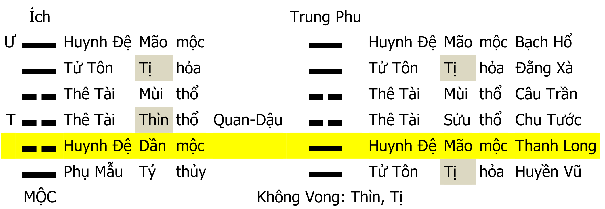
    - **Hình này chứng minh điều gì**
      - Hào 2 Huynh Đệ Dần mộc phát động hóa Tiến thần Mão mộc, hợp cùng Nhật thần Dần mộc và Nguyệt kiến Mão mộc tạo thành Kỵ thần cực vượng khắc hào Thế Thê Tài Thìn thổ đang lâm Tuần Không.
    - **Từ đâu mà thấy được**
      - Nhìn vào vạch âm hào 2 phát động hóa vạch dương hào 2 quẻ biến (Dần mộc biến Mão mộc); hào 3 Thê Tài Thìn thổ trì Thế ghi chú Không Vong, phục Quan Quỷ Dậu kim.
  - Sơ đồ quẻ: (Tham chiếu Hình 40) alt="Sơ đồ quẻ" />
  - Nhìn vào:
    - Hào 3 Thê Tài Thìn thổ trì Thế, lâm Tuần Không, lâm Chu Tước, phục Quan Quỷ Dậu kim.
    - Hào 2 Huynh Đệ Dần mộc lâm Thanh Long, lâm Nhật thần phát động, hóa Huynh Đệ Mão mộc (Tiến thần, đồng thời là Nguyệt kiến).
    - Hào 6 Huynh Đệ Mão mộc lâm Ứng, lâm Bạch Hổ, đắc Nguyệt kiến.
    - Bốn bề Nhật, Nguyệt, động, biến toàn là Huynh Đệ mộc vượng tướng khắc Thế thổ.
- **Quy tắc áp dụng**
  - *Quy tắc Kỵ thần độc phát lâm Nhật hóa Tiến thần*: Kỵ thần Huynh Đệ vừa lâm Nhật thần vừa động hóa Tiến thần trùng với Nguyệt kiến, tích tụ sát khí hung hiểm tột cùng giáng xuống hào Thế.
  - *Quy tắc Ứng kỳ của Hào Thế lâm Tuần Không*: Hào Thế gặp Tuần Không thì tạm thời chưa thọ thương; khi xuất Không (đúng giờ hoặc ngày xuất Không) sẽ trực tiếp thụ khắc. Nếu Kỵ thần vượng tướng hợp lực vây khắc, thời điểm xuất Không chính là lúc phát tác đại họa chết người.
  - *Phương pháp Xu cát tị hung qua điều chỉnh thời gian*: Xác định chính xác ứng kỳ nguy hiểm để trì hoãn hành động vượt qua khung giờ sát khí xung khắc, giúp đương sự thoát nạn gang tấc.
- **Lời giải**
  - **Bước 1**: Xác định Dụng thần và thẩm định trạng thái hào Thế
    - Căn cứ: Cầu tài lấy Thê Tài làm Dụng thần, tính mạng bản thân lấy hào Thế làm chủ thể.
    - Nhìn vào: Hào 3 Thê Tài Thìn thổ vừa trì Thế vừa là Dụng thần cầu tài. Hiện tại Thìn thổ đang lâm Tuần Không (tuần Giáp Ngọ, Thìn Tị Không Vong).
  - **Bước 2**: Khảo sát thế lực hung hiểm của Kỵ thần khắc Thế
    - Căn cứ: Huynh Đệ là Kỵ thần chuyên khắc hại Thê Tài và hào Thế thổ.
    - Nhìn vào: Hào 2 Huynh Đệ Dần mộc lâm Nhật thần phát động hóa Huynh Đệ Mão mộc (Tiến thần), Nguyệt kiến lại là Mão mộc, hào 6 Ứng cũng là Mão mộc. Khí mộc vượng tột bực, hợp sức khắc phạt Thê Tài Thìn thổ.
  - **Bước 3**: Luận định tai họa chết người và xác định chuẩn xác ứng kỳ
    - Căn cứ: Hào Thế đang Không nên chưa bị khắc ngay lúc sáng sớm; nhưng đến giờ Thìn ($7\text{h} - 9\text{h}$ sáng), Thìn thổ xuất Không, lập tức bị Nhật, Nguyệt cùng hào động vây khắc tàn khốc, ắt có tai họa đắm đò vong mạng giữa sông.
    - Nhìn vào: Giờ Thìn là thời khắc xuất Không của hào Thế Thìn thổ.
  - **Bước 4**: Triển khai hành động xu cát tị hung cứu mạng
    - Căn cứ: Muốn tránh hung họa phải giữ người không cho bước xuống đò trong giờ Thìn sát khí.
    - Nhìn vào: Dã Hạc kiên quyết viện cớ giữ người khách lại cùng dùng bữa sáng, đợi qua hết giờ Thìn sang giờ Tị mới cho phép rời đi.
- **Đối thoại giải đáp nghi vấn**:
  - *Người hỏi thắc mắc*: Trong quẻ này Nhật thần (Dần), Nguyệt kiến (Mão), hào động (Dần), hào biến (Mão) đều là Huynh Đệ, lại thêm Huynh Đệ đa hiện trong quẻ và phát động hóa Tiến thần. Như vậy Kỵ thần có phải rơi vào trạng thái "quá vượng" hay không? Căn cứ để đoán người đó gặp hung có phải là Kỵ thần độc phát? Qua quẻ này liệu có thể rút ra kết luận: "Kỵ thần độc phát thì lấy tượng làm chủ, chứ không luận quá vượng"?
  - *Vương Hổ Ứng lão sư giải đáp*:
    - Mấu chốt sinh tử của quẻ này nằm tại **hào Thế lâm Tuần Không**. Nếu hào Thế không lâm Không (Thế bất Không) thì trái lại chưa chắc đã nguy hiểm đến tính mạng ngay lập tức.
    - Kỵ thần lâm Nhật thần động hóa Tiến thần, hung hiểm hiển hiện ngay trong ngày hôm đó; mà hào Thế lại lâm Không nên đúng vào giờ Thìn xuất Không là thời điểm ứng kỳ chịu nạn ($t = \text{giờ Thìn}$).
    - Dã Hạc đã nhìn thấu cơ huyền thoại này nên mới giữ người khách lại ăn sáng qua giờ Thìn. Nếu không giữ lại, người đó ra sông đúng giờ Thìn xuất Không là bị khắc chết đuối ngay.
    - Vương lão sư khẳng định: Đây chính là mục đích tối thượng và công dụng cứu độ nhân sinh cao đẹp nhất của dự đoán học Lục Hào.
- **Kết quả**:
  - Phán đoán: Giờ Thìn xuất Không qua sông ắt gặp tai họa lật thuyền chết người; qua giờ Thìn mới đi thì giữ được tính mạng.
  - Thực chứng: Sau khi ăn cơm xong qua giờ Thìn, người khách đi ra bến sông thì thấy sáng sớm hôm ấy có 4 chiếc thuyền lớn chở khách qua sông bị gió lớn nổi lên lật chìm giữa dòng, xác chết nổi đầy mặt nước. Người khách bàng hoàng quay trở lại tạ ơn cứu mạng của Dã Hạc.
- **Kiểm tra lại**:
  - Tai nạn đắm thuyền xảy ra đúng giờ Thìn, khớp hoàn toàn với ứng kỳ xuất Không của hào Thế Thìn thổ.
  - Kỵ thần lâm Nhật hóa Tiến thần ứng nghiệm hung họa cấp bách diễn ra ngay trong ngày.
  - Việc can thiệp trì hoãn hành trình qua khỏi giờ Thìn minh chứng xuất sắc cho tính chuẩn xác của nguyên lý Xu cát tị hung.

### Ví dụ 41: Xem vợ chồng có sống được đến bạc đầu không (Quẻ Vô Vọng biến Quan)
- **Đề bài**: Một người đàn ông đến gieo quẻ hỏi xem vợ chồng có thể cùng nhau chung sống thuận hòa đến đầu bạc răng long hay không.
- **Dữ kiện**
  - Can chi: Ngày Đinh Mùi, tháng Tị (Tuần không: Dần, Mão)
  - Quẻ chủ: Thiên Lôi Vô Vọng (thuộc cung Tốn, ngũ hành Mộc)
  - Quẻ biến: Phong Địa Quan (thuộc cung Càn, ngũ hành Kim)
  - Hào động: Hào 4 Tử Tôn Ngọ hỏa (Thế) động biến Thê Tài Mùi thổ; Hào 1 Phụ Mẫu Tý thủy (Ứng) động biến Thê Tài Mùi thổ
  - **Hình 41.** Sơ đồ quẻ Vô Vọng biến Quan
    - 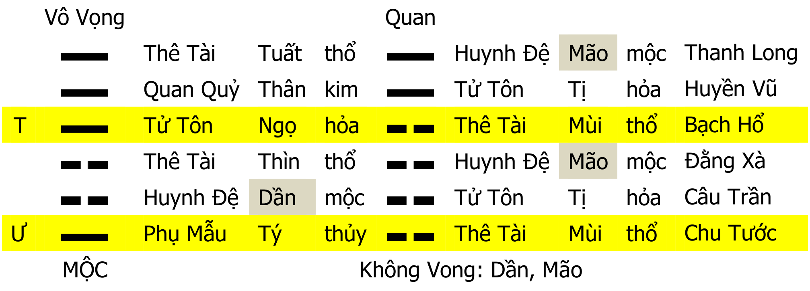
    - **Hình này chứng minh điều gì**
      - Hào Thế Tử Tôn Ngọ hỏa phát động hóa Thê Tài Mùi thổ hồi đầu tương hợp (Ngọ Mùi lục hợp), lâm Nhật thần Mùi thổ và được Nguyệt kiến Tị hỏa tương sinh, chứng minh mối lương duyên trời ban bền chặt trọn đời.
    - **Từ đâu mà thấy được**
      - Nhìn vào vạch dương hào 4 (Thế) phát động hóa vạch âm hào 4 quẻ biến (Ngọ hỏa biến Mùi thổ), mang lục thân Tử Tôn biến Thê Tài; hào 1 (Ứng) Phụ Mẫu Tý thủy phát động biến Thê Tài Mùi thổ.
  - Sơ đồ quẻ: (Tham chiếu Hình 41) alt="Sơ đồ quẻ" />
  - Nhìn vào:
    - Hào 4 Tử Tôn Ngọ hỏa trì Thế lâm Bạch Hổ, phát động biến Thê Tài Mùi thổ.
    - Hào Thê Tài Mùi thổ biến ra lâm ngay Nhật thần Mùi thổ, đắc Nguyệt kiến Tị hỏa sinh phù, lại tương hợp với hào Thế Ngọ hỏa (Ngọ Mùi lục hợp).
    - Hào 1 Phụ Mẫu Tý thủy lâm Ứng, lâm Chu Tước, tuyệt ở tháng Tị, bị Nhật thần Mùi thổ khắc, động hóa Thê Tài Mùi thổ hồi đầu khắc.
    - Quẻ xuất hiện nhiều hào Tài: Hào 3 Thê Tài Thìn thổ, hào 6 Thê Tài Tuất thổ, và hai hào Thê Tài Mùi thổ biến ra.
- **Quy tắc áp dụng**
  - *Quy tắc Trọng tâm Dụng thần trong chiêm hôn nhân*: Đoán hôn nhân cho nam mệnh lấy hào Thê Tài làm Dụng thần chủ yếu quyết định phẩm hạnh và sự hòa hợp của người vợ, không rập khuôn câu nệ vào hào Ứng.
  - *Quy tắc Thế hóa Tài tương hợp*: Hào Thế động hóa hào Tài tương hợp (Ngọ hợp Mùi) là tượng vợ chồng gắn bó keo sơn, tâm đầu ý hợp, tình thâm nghĩa trọng.
  - *Tượng Nhật Nguyệt sinh trợ hào Tài*: Tài lâm Nhật thần, đắc Nguyệt sinh là tượng người vợ hiền thục, bao dung đức độ và có tuổi thọ cao.
  - *Tượng Thê Tài đa hiện*: Quẻ xuất hiện nhiều hào Tài phản ánh người chồng có nhiều thê thiếp; song hào Tài biến ra tương hợp với Thế chính là người vợ cả danh chính ngôn thuận.
- **Lời giải**
  - **Bước 1**: Nhận diện người vợ chính thức giữa các hào Tài đa hiện
    - Căn cứ: Trong quẻ có nhiều hào Tài (Tuất thổ, Thìn thổ, Mùi thổ biến). Hào Tài nào gắn kết mật thiết nhất với hào Thế sẽ đại diện cho người vợ cả.
    - Nhìn vào: Hào 4 Thế Tử Tôn Ngọ hỏa động hóa ra Thê Tài Mùi thổ. Ngọ Mùi lục hợp hữu tình, chỉ rõ Thê Tài Mùi thổ này chính là người vợ kết tóc se tơ.
  - **Bước 2**: Thẩm định suy vượng và phẩm cách của người vợ
    - Căn cứ: Hào Tài được Nhật Nguyệt sinh phù chủ người vợ thọ trường và đoan trang đức hạnh.
    - Nhìn vào: Hào Thê Tài Mùi thổ lâm ngay Nhật thần Mùi thổ, lại được Nguyệt kiến Tị hỏa tương sinh. Tài vượng tướng tột bậc, chứng minh người vợ hiền thục, đức độ khoan dung.
  - **Bước 3**: Hóa giải nghi vấn Thế Ứng xung khắc
    - Căn cứ: Tuy hào 1 Ứng Tý thủy xung khắc hào 4 Thế Ngọ hỏa, nhưng Ứng Tý thủy hưu tù tuyệt địa ở tháng Tị, lại động hóa Thê Tài Mùi thổ hồi đầu khắc nên hoàn toàn vô lực khắc Thế. Trọng tâm hôn phối là Thế Tài tương hợp chứ không phải Thế Ứng.
    - Nhìn vào: Mối quan hệ Thế hóa Tài tương hợp lâm Nhật thần tạo thành cách cục "duyên trời tác hợp".
- **Đối thoại giải đáp nghi vấn**:
  - *Người hỏi thắc mắc*: Ở quẻ này vì sao Dã Hạc lại phủ định nhân tố Thế Ứng tương xung tương khắc? Có phải vì nguyên nhân hào Ứng hưu tù lại động hóa hồi đầu khắc nên không thể khắc Thế?
  - *Vương Hổ Ứng lão sư giải đáp*:
    - Đoán quẻ cần phải linh hoạt, không được rập khuôn máy móc. Hào Thế và hào Ứng không phải là mấu chốt duy nhất để xem việc vợ chồng. Đối với nam giới xem hôn nhân, **hào Thê Tài mới là Dụng thần chủ yếu**.
    - Ở quẻ này, Thê Tài vượng tướng, hào Thế và hào Tài tương hợp, Tài lại lâm ngay Nhật thần, đây chính là cách cục "thiên tác chi hợp" (duyên trời tác hợp).
    - Mối quan hệ Thế Tài tương hợp đắc sinh phù có uy lực bao trùm và vô hiệu hóa hoàn toàn sự tương xung hình thức của hào Ứng.
- **Kết quả**:
  - Phán đoán: Vợ chồng chung sống đến đầu bạc răng long, người vợ hiền thục đức hạnh không ghen tuông.
  - Thực chứng: Người đàn ông này về sau nạp tới hơn mười người tỳ thiếp trẻ đẹp, nhưng người vợ cả tính tình hiền thục, bao dung không hề ghen tuông. Hai vợ chồng bằng tuổi nhau, người vợ thọ 81 tuổi, người chồng thọ 85 tuổi, cùng nhau hưởng trọn hạnh phúc bạc đầu.
- **Kiểm tra lại**:
  - Hiện tượng nhiều hào Tài ứng nghiệm việc có hơn mười người tỳ thiếp.
  - Tài Mùi thổ lâm Nhật, đắc Nguyệt sinh, hợp Thế giải thích chính xác tuổi thọ 81 tuổi và đức hạnh hiền hậu của vợ cả.
  - Việc bỏ qua Thế Ứng xung khắc để quy về Thế Tài tương hợp hoàn toàn khớp với thực tế đời sống.

### Ví dụ 42: Xem việc quân lương chậm trễ bị hạch tội (Quẻ Phong biến Lữ)
- **Đề bài**: Một viên quan phụ trách vận chuyển quân lương bị chậm trễ thời hạn, đứng trước nguy cơ bị triều đình hạch tội bãi chức, bèn gieo quẻ xem liệu hoạn lộ và chức vị có bị phế truất hay không.
- **Dữ kiện**
  - Can chi: Ngày Mậu Thân, tháng Mùi (Tuần không: Dần, Mão)
  - Quẻ chủ: Lôi Hỏa Phong (thuộc cung Khảm, ngũ hành Thủy)
  - Quẻ biến: Hỏa Sơn Lữ (thuộc cung Ly, ngũ hành Hỏa)
  - Hào động: Hào 6 Quan Quỷ Tuất thổ động biến Thê Tài Tị hỏa; Hào 1 Tử Tôn Mão mộc động biến Quan Quỷ Thìn thổ
  - **Hình 42.** Quẻ Phong biến Lữ
    - 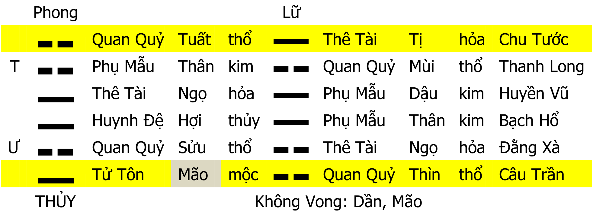
    - **Hình này chứng minh điều gì**
      - Hào Thế Phụ Mẫu Thân kim lâm Nhật thần, đắc Nguyệt kiến tương sinh; hào 6 Quan Quỷ Tuất thổ động hóa hồi đầu sinh lại sinh Thế; Kỵ thần Tử Tôn Mão mộc ngộ Không lâm Tuyệt, tham hợp quên khắc, lại động hóa Quan Quỷ Thìn thổ tiếp tục sinh Thế, bảo toàn chức vị vững như bàn thạch.
    - **Từ đâu mà thấy được**
      - Nhìn vào vạch âm hào 6 phát động hóa vạch dương (Tuất thổ biến Tị hỏa), vạch dương hào 1 phát động hóa vạch âm (Mão mộc biến Thìn thổ); hào 5 Thế Phụ Mẫu Thân kim tĩnh lâm Thanh Long, Nhật thần Thân kim, Nguyệt kiến Mùi thổ.
  - Sơ đồ quẻ: (Tham chiếu Hình 42) alt="Sơ đồ quẻ" />
  - Nhìn vào:
    - Hào 5 Phụ Mẫu Thân kim trì Thế, lâm Nhật thần, được Nguyệt kiến Mùi thổ tương sinh.
    - Hào 6 Quan Quỷ Tuất thổ lâm Chu Tước, phát động hóa Thê Tài Tị hỏa hồi đầu sinh, quay lại tương sinh cho hào Thế Thân kim.
    - Hào 1 Tử Tôn Mão mộc lâm Câu Trần, phát động hóa Quan Quỷ Thìn thổ; Mão mộc lâm Tuyệt tại Nhật thần Thân kim, lại ngộ Tuần Không (tuần Giáp Thìn, Dần Mão Không Vong).
    - Quan hệ giữa hào 1 Mão mộc và hào 6 Tuất thổ là lục hợp (Mão Tuất hợp).
- **Quy tắc áp dụng**
  - *Quy tắc Thế đắc Nhật Nguyệt sinh phù kết hợp Quan động sinh Thế*: Hào Thế lâm Nhật thần, được Nguyệt kiến và Quan động cùng tương sinh là cách cục công danh đại cát, địa vị vững chắc không thể lung lay.
  - *Quy tắc Tử Tôn lâm Tuyệt ngộ Không vô lực khắc Quan*: Kỵ thần Tử Tôn rơi vào tuyệt địa ở Nhật thần, lại lâm Tuần Không thì không còn khả năng khắc chế Quan tinh.
  - *Quy tắc Tham hợp quên khắc*: Hào 1 Tử Tôn Mão mộc tham hợp với hào 6 Quan Quỷ Tuất thổ, triệt tiêu lực khắc hại.
  - *Quy tắc Trong khắc có hợp - Mất chỗ này được chỗ khác*: Dù Quan Quỷ Tuất thổ bị hợp giảm lực sinh Thế, nhưng chính hào động Tử Tôn Mão mộc lại biến ra Quan Quỷ Thìn thổ bổ khuyết sinh Thế.
- **Lời giải**
  - **Bước 1**: Đánh giá cội rễ thân mệnh và chức vị của hào Thế
    - Căn cứ: Xem quan chức lấy hào Thế và Quan Quỷ làm trọng; Phụ Mẫu trì Thế là tượng ấn tín, quyền bính và chức vị quan sai.
    - Nhìn vào: Hào 5 Phụ Mẫu Thân kim trì Thế lâm ngay Nhật thần, lại được Nguyệt kiến Mùi thổ tương sinh. Căn bản chức vị vô cùng kiên cố.
  - **Bước 2**: Khảo sát nguồn sinh trợ từ Quan Quỷ phát động
    - Căn cứ: Quan tinh phát động sinh Thế chủ được triều đình và cấp trên che chở, bảo toàn danh vị.
    - Nhìn vào: Hào 6 Quan Quỷ Tuất thổ động hóa Thê Tài Tị hỏa hồi đầu sinh, đắc lực tương sinh cho Thế Thân kim.
  - **Bước 3**: Hóa giải sự đe dọa của Kỵ thần Tử Tôn Mão mộc
    - Căn cứ: Dã Hạc chỉ ra Mão mộc gặp Tuyệt tại Nhật thần Thân kim; Vương Hổ Ứng bổ sung phân tích Mão mộc lâm Tuần Không và Mão Tuất tham hợp quên khắc.
    - Nhìn vào: Hào 1 Tử Tôn Mão mộc vừa lâm Tuyệt, vừa ngộ Không, vừa tham hợp với Tuất thổ nên hoàn toàn mất khả năng khắc phạt Quan tinh.
  - **Bước 4**: Phân tích cơ chế biến hóa bù đắp "Mất chỗ này được chỗ khác"
    - Căn cứ: Khi Quan Quỷ Tuất thổ bị hào 1 níu hợp, bản thân hào 1 lại biến ra Quan Quỷ Thìn thổ để thay thế sinh Thế.
    - Nhìn vào: Hào biến Quan Quỷ Thìn thổ không bị hợp, trực tiếp sinh trợ hào Thế Phụ Mẫu Thân kim, duy trì mạch sinh liên tục.
- **Đối thoại giải đáp nghi vấn**:
  - *Người hỏi thắc mắc*: Thầy nói Tử Tôn Mão mộc và Quan Quỷ Tuất thổ là "tham hợp quên khắc", nhưng tôi lại cho rằng đây là "trong khắc có hợp" (Mão mộc khắc Tuất thổ, trong hợp có khắc)?
  - *Vương Hổ Ứng lão sư giải đáp*:
    - Lập luận "trong khắc có hợp" của anh cũng là một góc nhìn chấp nhận được trong lý luận Lục Hào. Khi Quan Quỷ Tuất thổ bị khắc hợp thì quả thực khó có thể toàn tâm sinh trợ hào Thế.
    - Song điểm vi diệu phi thường ở quẻ này là: **Hào 1 Tử Tôn Mão mộc động lại biến ra Quan Quỷ Thìn thổ**!
    - Khi Quan ở trên bị khắc hợp thì ở dưới lại hóa ra một Quan tinh mới toanh. Đây chính là đạo lý **"mất chỗ này mà được chỗ khác"** ($A \text{ bị kiềm chế, } B \text{ biến ra bù đắp}$).
    - Quan Quỷ Thìn thổ biến ra tiếp tục sinh trợ hào Thế Phụ Mẫu Thân kim, bảo đảm cội rễ công danh rốt cuộc vẫn vững như bàn thạch.
- **Kết quả**:
  - Phán đoán: Chức vị không hề suy suyển, không những không bị hạch tội mà hoạn lộ vẫn an toàn.
  - Thực chứng: Khi Dã Hạc đoán, mọi người đều không tin vì tội trễ quân lương thời xưa rất nặng. Nào ngờ ít lâu sau, vị quan này nhờ lập được công trạng lớn mà được triều đình xóa tội và bảo toàn nguyên vẹn chức quan.
- **Kiểm tra lại**:
  - Thế lâm Nhật, đắc Nguyệt sinh cùng Quan biến sinh Thế giải thích hoàn hảo sự kiện lập công chuộc tội bảo toàn chức vị.
  - Kỵ thần lâm Tuyệt ngộ Không không gây ra bất kỳ tác hại thực tế nào.

### Ví dụ 43: Xem xây dựng đập chứa nước công trình thủy lợi (Quẻ Khuê biến Đại Hữu)
- **Đề bài**: Một người đến nhờ Vương Hổ Ứng lão sư gieo quẻ xem việc nhận thầu thi công xây dựng một công trình đập chứa nước thủy lợi lớn có thể thuận lợi hoàn thành hay không.
- **Dữ kiện**
  - Can chi: Ngày Đinh Hợi, tháng Hợi (Tuần không: Ngọ, Mùi)
  - Quẻ chủ: Hỏa Trạch Khuê (thuộc cung Cấn, ngũ hành Thổ)
  - Quẻ biến: Hỏa Thiên Đại Hữu (thuộc cung Càn, ngũ hành Kim)
  - Hào động: Hào 3 Huynh Đệ Sửu thổ độc phát biến Huynh Đệ Thìn thổ (hóa Tiến thần)
  - **Hình 43.** Quẻ Khuê biến Đại Hữu
    - 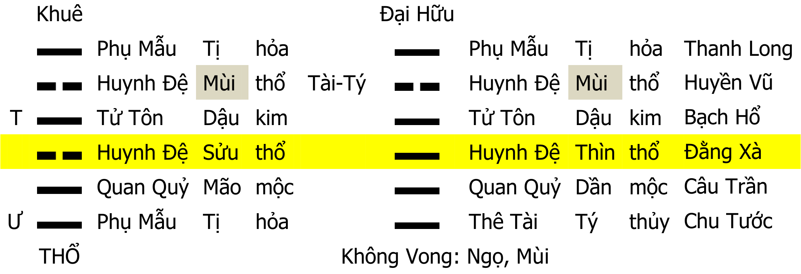
    - **Hình này chứng minh điều gì**
      - Hào Thế Tử Tôn Dậu kim khắc chế Quan Quỷ (tai họa, sự cố); hào 3 Huynh Đệ Sửu thổ độc phát sinh trợ hào Thế (đồng nghiệp, bạn bè gánh vác tương trợ); Quan Quỷ Mão mộc tĩnh tọa không quấy phá, chứng minh công trình đập chứa nước thủy lợi hoàn thành thuận lợi mỹ mãn.
    - **Từ đâu mà thấy được**
      - Nhìn vào vạch âm hào 3 phát động hóa vạch dương hào 3 quẻ biến (Sửu thổ biến Thìn thổ hóa Tiến thần); hào 4 Thế Tử Tôn Dậu kim tĩnh lâm Bạch Hổ; hào 2 Quan Quỷ Mão mộc tĩnh lâm Câu Trần; Nhật Nguyệt đều là Hợi thủy.
  - Sơ đồ quẻ: (Tham chiếu Hình 43) alt="Sơ đồ quẻ" />
  - Nhìn vào:
    - Hào 4 Tử Tôn Dậu kim trì Thế, lâm Bạch Hổ, không được Nhật Nguyệt Hợi thủy sinh phù (bị tiết khí).
    - Hào 3 Huynh Đệ Sửu thổ lâm Đằng Xà độc phát, động hóa Huynh Đệ Thìn thổ (hóa Tiến thần), quay lại sinh cho Thế Dậu kim.
    - Hào 2 Quan Quỷ Mão mộc lâm Câu Trần, tĩnh lặng bất động, tuy được Nhật Nguyệt Hợi thủy tương sinh nhưng không phát tác tai họa.
    - Hào Thế Dậu kim mang ngũ hành Kim, nhập Mộ tại hào động Huynh Đệ Sửu thổ.
- **Quy tắc áp dụng**
  - *Quy tắc Định hướng Dụng thần theo Tâm lý người hỏi (Ưu lự chi chiêm)*: Khi xem công trình xây dựng với tâm lý lo âu sợ sự cố kỹ thuật hoặc tai nạn công nhân chết người, Tử Tôn trì Thế là phúc thần tối hảo để trấn áp Quan Quỷ (họa tai, sự cố, thương vong).
  - *Tượng Huynh Đệ độc phát sinh Thế*: Huynh Đệ là bạn bè, đồng sự; Huynh Đệ sinh Thế biểu thị bạn bè chung lưng đấu cật, giúp đỡ tháo gỡ khó khăn về kỹ thuật và nhân lực.
  - *Phân biệt Tượng Mộ khố trong bối cảnh thực tế*: Thế nhập Mộ tại Huynh Đệ không phải là điềm chết chóc (vì Tử Tôn trì Thế, Huynh Đệ sinh Thế), mà là tượng "bị bạn bè kiềm chế, chịu sự quản lý, chủ sự của bạn bè" do nhận thầu lại công trình từ bạn.
- **Lời giải**
  - **Bước 1**: Nhận diện tâm lý và mục đích sâu xa của người gieo quẻ
    - Căn cứ: Người thi công đập nước lo lắng nhất là vỡ đập, sự cố chất lượng đập, hoặc công nhân tử nạn dẫn đến lao lý tù tội.
    - Nhìn vào: Tâm thái là "ưu lự chiêm" (lo sợ tai họa công trình), do đó trọng tâm là xem sự an toàn tính mạng và chức vụ thay vì đơn thuần cầu tài.
  - **Bước 2**: Đánh giá vai trò của Tử Tôn trì Thế
    - Căn cứ: Tử Tôn là thần phúc đức, khắc chế Quan Quỷ, giải tỏa triệt để mầm mống tai nạn công trường.
    - Nhìn vào: Hào 4 Tử Tôn Dậu kim trì Thế. Dù Dậu kim ở tháng Hợi ngày Hợi bị tiết khí, nhưng có thần hộ mệnh Tử Tôn tọa trấn bản thân, bảo đảm tuyệt đối không xảy ra tai nạn chết người hay sụp đổ công trình.
  - **Bước 3**: Khảo sát tác dụng của hào độc phát Huynh Đệ Sửu thổ
    - Căn cứ: Hào độc phát là trung tâm thần cơ của quẻ. Huynh Đệ Sửu thổ phát động sinh trợ Thế Dậu kim.
    - Nhìn vào: Hào 3 Huynh Đệ Sửu thổ động hóa Thìn thổ (Tiến thần) liên tục sinh Thế, mang lại nguồn ngoại lực nâng đỡ vững chắc từ bạn bè và đối tác.
  - **Bước 4**: Kiểm tra trạng thái của Quan Quỷ
    - Căn cứ: Quan Quỷ là mầm mống tai họa, kiện tụng, đình chỉ thi công.
    - Nhìn vào: Hào 2 Quan Quỷ Mão mộc hoàn toàn tĩnh lặng, không động thì không thể phát tác tai ương.
    -> Kết luận: Công trình thi công an toàn, thuận lợi hoàn thành đúng tiến độ.
- **Đối thoại giải đáp nghi vấn**:
  - *Người hỏi thắc mắc*: Trong ví dụ này, tuy Tử Tôn trì Thế, Huynh Đệ tuy sinh Thế, nhưng Thế Dậu kim lại **nhập Mộ ở Huynh Đệ Sửu thổ**! Vả lại một hào độc phát là Mộ địa của Thế thì thông thường không cát. Lại xem công trình, Huynh Đệ động là tượng phá tài cản trở, lẽ ra phải có trở ngại mới đúng chứ, sao thầy lại đoán là "thuận lợi hoàn thành"?
  - *Vương Hổ Ứng lão sư giải đáp*:
    - Khi phán đoán cần phải xem **tư duy và góc độ của người hỏi quẻ**. Người này sợ xảy ra vấn đề về chất lượng, hoặc giữa chừng xuất hiện công nhân tử vong, vì vậy là mang tâm lý lo lắng mà hỏi.
    - Gặp tình huống như vậy thì phải xem tác dụng của hào động ra sao:
      1. Huynh Đệ động mà sinh Thế là bạn bè giúp đỡ gánh vác.
      2. Mộ khố ở đây cũng là bạn bè chủ sự, bản thân bị bạn bè kiềm chế, quản lý.
      3. Hoàn cảnh thực tế: Người này nhận thầu lại công trình cho bạn của anh ta, rất sợ xảy ra vấn đề không tốt mà mất chức vụ.
    - Vì vậy, hào Huynh Đệ vừa sinh Thế vừa mộ Thế phản ánh việc bạn bè vừa nâng đỡ vừa nắm quyền điều hành. Nhờ bạn bè giúp đỡ nên công trình mới hoàn thành trôi chảy.
    - Vương lão sư kết luận: Tùy theo góc độ của người đến hỏi khác nhau mà việc đoán quẻ và định nghĩa ý nghĩa hào quẻ cũng phải biến hóa thích ứng khác nhau.
- **Kết quả**:
  - Phán đoán: Công trình xây dựng đập chứa nước thủy lợi nhất định thuận lợi hoàn thành suôn sẻ, không xảy ra sự cố chất lượng hay tai nạn thương vong.
  - Thực chứng: Công trình hoàn thành đúng tiến độ và an toàn tuyệt đối, đúng như lời dự đoán của Vương lão sư.
- **Kiểm tra lại**:
  - Tử Tôn trì Thế hóa giải hoàn toàn mầm mống sự cố của Quan Quỷ.
  - Huynh Đệ độc phát sinh Thế phản ánh chính xác nguồn trợ lực tương trợ từ bạn bè.
  - Tượng nhập Mộ khố phản ánh chính xác mối quan hệ nhận thầu lại dưới quyền chủ sự của bạn thân.

## Nghi vấn thực chứng: Tăng quan công danh, Đoán thai sản và Bệnh gần gặp xung

### Tổng quan Lý thuyết và Nguyên tắc Dự đoán then chốt

- **Nguyên tắc phân định tâm lý chiêm đoán trong cầu quan và lo ngại mất chức:**
  - Tâm lý querent quyết định thuộc tính tượng học của Quan Quỷ: cầu chức thì Quan là danh lộc, lo sợ mất chức thì Quan Quỷ đại diện cho tai họa, hình phạt và sự lo âu.
  - "Nhiều Quỷ thì nhiều phiền não": Quan Quỷ vượng động trong quẻ lo âu là điềm hung, chủ sự việc bị bãi miễn, cách chức.
  - Tử Tôn trì Thế là thần tước lộc khắc Quan; chức Quan ngự tại hào Ứng báo hiệu quan tước chuyển giao cho người khác.

- **Quy tắc phân biệt Quẻ Kiêm đoán và Quẻ Chuyên đoán:**
  - Quẻ chuyên đoán một sự việc duy nhất đòi hỏi xem xét khắt khe căn cơ Dụng thần; Dụng thần hưu tù vô căn chịu khắc ắt định hung.
  - Quẻ kiêm đoán (hỏi nhiều việc trong một quẻ) có mức độ phán đoán phân tầng: việc chính xem theo Dụng chính, việc phụ/kiêm hỏi chỉ xét thứ yếu, không thể vội vàng kết luận đại hung.

- **Cơ chế Hào Độc phát và Kỵ thần hóa Dụng thần:**
  - "Thần triệu cơ tại hào động": Quẻ độc phát (một hào phát động) nắm giữ cơ trời chuyển biến, độc phát gặp sinh được sinh thì xoay chuyển bại thành thắng, chuyển nguy thành an dù Dụng thần vô căn.
  - Kỵ thần động hóa Dụng thần (đặc biệt là độc phát): không coi là hung sát, mà trái lại hóa giải nguy hiểm, đồng thời địa chi hào biến chỉ rõ ứng kỳ sự việc.

- **Nguyên lý Thần cơ định giới tính thai nhi:**
  - Thần cơ hiển hiện tại hào động biến hóa: dương động biến âm định sinh con gái; âm động biến dương định sinh con trai.
  - Tuyệt đối không câu nệ tượng quái tĩnh bên ngoài như "âm bao dương" hay "dương bao âm" khi trong quẻ đã có hào phát động.

- **Phương pháp Liên hoàn chiêm quẻ trong chẩn trị bệnh tật:**
  - Định lý muôn đời: "Cận bệnh phùng xung tắc dũ" (bệnh gần mới phát gặp quẻ Lục Xung tất khỏi; bệnh lâu năm gặp Lục Xung tất nguy).
  - Khi gieo quẻ liên hoàn chiêm tiếp theo (quẻ thứ hai), thông tin quẻ thứ hai bắt buộc phải phục tùng và ăn khớp với tiền đề đã xác lập ở quẻ thứ nhất.
  - Quẻ thứ hai chuyên dùng định vị ứng kỳ: Hào động lâm Tuần Không lấy ngày xuất Không làm ứng kỳ khỏi bệnh; các yếu tố hồi đầu khắc hay hợp trong quẻ thứ hai chỉ là thứ yếu, không làm đảo lộn đại cục cát tường.

- **Kỹ pháp Dẫn hóa kỵ thần và Phong thủy an vị trạch cát:**
  - Kỵ thần phát động gặp Nguyệt phá và động hóa Thoái thần thì triệt tiêu hung lực, không thể khắc phạt Dụng thần.
  - Dụng thần lâm Nhật Nguyệt vượng tướng xung phá Kỵ thần biểu thị sự áp chế hoàn toàn mảnh đất/ngôi nhà mới.
  - Cơ chế "Dẫn hóa kỵ thần": Điền thực Nguyên thần (xuất Không) tạo thành vòng tương sinh liên tục (Kỵ thần $\rightarrow$ Nguyên thần $\rightarrow$ Dụng thần) hóa sát thành cát.
  - Tượng hiển quý khoa trường: Tử Tôn lâm Chu Tước (văn chương thi cử), lâm Nhật Nguyệt cương cường xung phá hào 5 (tôn vị) là triệu chứng đậu thủ khoa cử, hiển đạt công danh.

---

### Ví dụ 44: Tăng quan xem về công danh sự nghiệp (Quẻ Truân biến Ký Tế)

- **Đề bài**: Ngày Bính Thìn tháng Sửu, một vị Tăng quan (vị tăng lữ giữ phẩm hàm quan chức) do vướng vào việc kiện tụng quan ti, trong lòng vô cùng lo âu sợ bị cách chức phế truất, bèn gieo quẻ xem về công danh tiền đồ.

- **Dữ kiện**
  - Can chi: Ngày Bính Thìn, tháng Sửu. Tuần Không: Tý, Sửu.
  - Quẻ chủ: Thủy Lôi Truân (Khảm cung); Quẻ biến: Thủy Hỏa Ký Tế.
  - Hào động: Hào 1 Huynh Đệ Tý thủy lâm Chu Tước động hóa Tử Tôn Mão mộc; Hào 2 Thế Tử Tôn Dần mộc lâm Câu Trần động hóa Quan Quỷ Sửu thổ; Hào 3 Quan Quỷ Thìn thổ phục Thê Tài Ngọ hỏa lâm Đằng Xà động hóa Huynh Đệ Hợi thủy.
  - Bảng quẻ:

| | Truân | | | Ký Tế | |
| :---: | :---: | :--- | :---: | :--- | :--- |
| | ▅▅ ▅▅ | Huynh Đệ Tý thủy | ▅▅ ▅▅ | Huynh Đệ Tý thủy | Thanh Long |
| Ứ | ▅▅▅▅▅ | Quan Quỷ Tuất thổ | ▅▅▅▅▅ | Quan Quỷ Tuất thổ | Huyền Vũ |
| | ▅▅ ▅▅ | Phụ Mẫu Thân kim | ▅▅ ▅▅ | Phụ Mẫu Thân kim | Bạch Hổ |
| | ▅▅ ▅▅ | Quan Quỷ Thìn thổ Tài-Ngọ | ▅▅▅▅▅ | Huynh Đệ Hợi thủy | Đằng Xà |
| T | ▅▅ ▅▅ | Tử Tôn Dần mộc | ▅▅ ▅▅ | Quan Quỷ Sửu thổ | Câu Trần |
| | ▅▅▅▅▅ | Huynh Đệ Tý thủy | ▅▅▅▅▅ | Tử Tôn Mão mộc | Chu Tước |

  - Sơ đồ quẻ: (Tham chiếu Hình 44) alt="Sơ đồ quẻ Truân biến Ký Tế" />

  - **Hình 44.** Sơ đồ quẻ Truân biến Ký Tế
    - 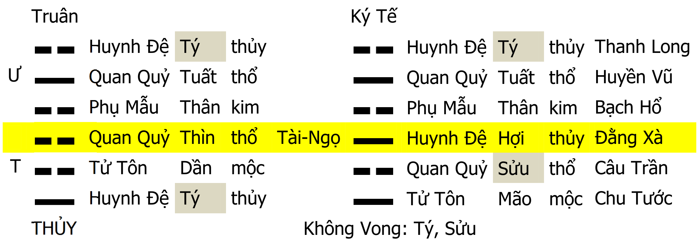
    - **Hình này chứng minh điều gì**
      - Thể hiện sự phát động đồng thời của cả ba hào nội quái (hào 1, 2, 3) biến Chấn mộc thành Ly hỏa; minh chứng hào Thế Tử Tôn Dần mộc phát động tước lộc khắc Quan, hào 3 Quan Quỷ Thìn thổ vượng động lâm Đằng Xà, và quan tước an định tại hào 5 Ứng Quan Quỷ Tuất thổ.
    - **Từ đâu mà thấy được**
      - Hào 2 Thế Tử Tôn Dần mộc lâm Câu Trần phát động biến Quan Quỷ Sửu thổ; Hào 5 Ứng Quan Quỷ Tuất thổ lâm Huyền Vũ an tĩnh; Hào 3 Quan Quỷ Thìn thổ lâm Đằng Xà động biến Huynh Đệ Hợi thủy.
  - Nhìn vào: Hào Thế Tử Tôn Dần mộc là thần khắc Quan tự động; Hào Ứng Quan Quỷ Tuất thổ nắm giữ chức vị; Hào 3 Quan Quỷ Thìn thổ lâm Đằng Xà vượng động chủ lo âu kiện tụng bủa vây.

- **Quy tắc áp dụng**
  - Tâm lý chiêm đoán định đoạt tượng nghĩa Quan Quỷ: Khi người xem lo sợ mất chức, Quan Quỷ vượng động là tượng tai họa và lo âu cực độ ("nhiều Quỷ thì nhiều phiền não").
  - Tử Tôn trì Thế động khắc Quan: Người cầu giữ quan chức mà Thế lâm Tử Tôn phát động là điềm tự khắc bỏ quan vị của mình.
  - Quan lâm Ứng vị: Hào Ứng đại diện cho tha nhân, chức quan ngự tại hào Ứng là quan tước chuyển giao sang tay kẻ khác.

- **Lời giải**

  - **Bước 1**: Đánh giá hào Thế và tương quan với chức quan.
    - Căn cứ: Tử Tôn là Khí Quan chi thần ($Tử\ Tôn \ khắc \ Quan\ Quỷ$).
    - Nhìn vào: Hào 2 Thế Tử Tôn Dần mộc phát động, tự bản thân phát động khắc tước bỏ chức vị.

  - **Bước 2**: Xác định nơi chốn quy tụ của chức quan.
    - Căn cứ: Hào Ứng đại diện cho người khác, đối phương bên ngoài.
    - Nhìn vào: Hào 5 Quan Quỷ Tuất thổ lâm Ứng an tĩnh, được tháng Sửu và ngày Thìn củng phù vững chắc; chức quan an vị tại người khác.

  - **Bước 3**: Thấu thị tâm lý lo âu qua hào Quan Quỷ vượng động.
    - Căn cứ: "Đa Quỷ đa ưu" (nhiều Quỷ thì nhiều phiền não); Đằng Xà chủ kinh nghi sợ hãi, tai ương kiện tụng.
    - Nhìn vào: Hào 3 Quan Quỷ Thìn thổ lâm Đằng Xà phát động, lại thêm hào Thế Dần mộc động hóa Quan Quỷ Sửu thổ; quẻ hiện trùng trùng Quan Quỷ, thần cơ phát động báo hiệu tai họa kiện tụng khó lòng thoát khỏi.

- **Đối thoại giải đáp nghi vấn**:
  - *Người hỏi thắc mắc:* Quẻ này lấy Quan Quỷ Thìn thổ làm Dụng thần, được Nhật Nguyệt (tháng Sửu, ngày Thìn) củng phù rất vượng. Tuy Tử Tôn trì Thế, nhưng ở mùa đông hưu tù an tĩnh (hoặc vô lực). Có phải Tử Tôn không đủ sức khắc Dụng thần? Tại sao chức quan lại thuộc về người khác?
  - *Vương Hổ Ứng lão sư giải đáp:* Đây là quẻ gieo trong tâm trạng lo lắng mất chức. Khi kẻ chiêm mang nỗi sợ hãi tột cùng về việc phế truất, Quan Quỷ vượng tướng mà phát động chính là tượng trưng cho tai họa và nỗi kinh hoàng bủa vây, vì vậy nhất định phải mất quan. Ngạn ngữ Dịch học đúc kết: "Nhiều Quỷ thì nhiều phiền não". Quan Quỷ lúc này không còn là bổng lộc để thụ hưởng mà hóa thành dây trói kiện tụng bãi miễn chức vụ.

- **Kết quả**: Quả nhiên sau đó vị Tăng quan này bị quan phủ luận tội phán quyết cách chức đúng như lời dự đoán trong Tăng San Bốc Dịch.

- **Kiểm tra lại**: Kết quả hoàn toàn trùng khớp với tượng Tử Tôn trì Thế phát động, Quan Quỷ lâm Ứng vị, và đa Quỷ lâm Đằng Xà chủ tai họa cách chức.

---

### Ví dụ 45: Xem mang thai sinh con trai hay con gái (Quẻ Tiểu Quá biến Dự)

- **Đề bài**: Ngày Mậu Thìn tháng Thìn, một người đến gieo quẻ hỏi hai việc cùng lúc: vợ mang thai có được bình an không, và sẽ sinh con trai hay con gái? Dã Hạc lão nhân nhắc nhở sau này phải tách thành hai quẻ riêng biệt, nhưng may mắn quẻ này cơ trời hiển hiện trọn vẹn cả hai sự việc.

- **Dữ kiện**
  - Can chi: Ngày Mậu Thìn, tháng Thìn. Tuần Không: Tuất, Hợi.
  - Quẻ chủ: Lôi Sơn Tiểu Quá (Đoài cung); Quẻ biến: Lôi Địa Dự.
  - Hào động: Hào 3 Huynh Đệ Thân kim (hào dương cửu tam) lâm Bạch Hổ độc phát động hóa Thê Tài Mão mộc (hào âm lục tam).
  - Hào phục: Hào 2 Quan Quỷ Ngọ hỏa phục Thê Tài Mão mộc; Hào 4 Quan Quỷ Ngọ hỏa phục Tử Tôn Hợi thủy (Tuần Không).
  - Bảng quẻ:

| | Tiểu Quá | | | Dự | |
| :---: | :---: | :--- | :---: | :--- | :--- |
| | ▅▅ ▅▅ | Phụ Mẫu Tuất thổ | ▅▅ ▅▅ | Phụ Mẫu Tuất thổ | Chu Tước |
| | ▅▅ ▅▅ | Huynh Đệ Thân kim | ▅▅ ▅▅ | Huynh Đệ Thân kim | Thanh Long |
| T | ▅▅▅▅▅ | Quan Quỷ Ngọ hỏa Tử-Hợi | ▅▅▅▅▅ | Quan Quỷ Ngọ hỏa | Huyền Vũ |
| | ▅▅▅▅▅ | Huynh Đệ Thân kim | ▅▅ ▅▅ | Thê Tài Mão mộc | Bạch Hổ |
| | ▅▅ ▅▅ | Quan Quỷ Ngọ hỏa Tài-Mão | ▅▅ ▅▅ | Quan Quỷ Tị hỏa | Đằng Xà |
| Ứ | ▅▅ ▅▅ | Phụ Mẫu Thìn thổ | ▅▅ ▅▅ | Phụ Mẫu Mùi thổ | Câu Trần |

  - Sơ đồ quẻ: (Tham chiếu Hình 45) alt="Sơ đồ quẻ Tiểu Quá biến Dự" />

  - **Hình 45.** Sơ đồ quẻ Tiểu Quá biến Dự
    - 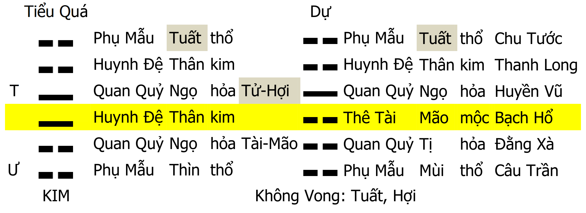
    - **Hình này chứng minh điều gì**
      - Thể hiện thế quẻ độc phát tại hào 3 Huynh Đệ Thân kim lâm Bạch Hổ động hóa Thê Tài Mão mộc; minh chứng nguyên lý hào dương động hóa âm định sinh con gái và Kỵ thần động hóa Dụng thần làm tiêu tán hung hiểm cho người mẹ.
    - **Từ đâu mà thấy được**
      - Hào 3 là hào dương duy nhất phát động trong quẻ Lôi Sơn Tiểu Quá, biến thành hào âm Thê Tài Mão mộc tại quẻ Lôi Địa Dự; Phục thần Thê Tài Mão mộc ngự dưới hào 2.
  - Nhìn vào: Hào 3 Huynh Đệ Thân kim độc phát; Hào 3 dương hào động hóa âm hào; Hào phục Tử Tôn Hợi thủy lâm Tuần Không bị Nhật Nguyệt Thìn thổ khắc thương.

- **Quy tắc áp dụng**
  - Phân định ranh giới Quẻ Kiêm đoán và Quẻ Chuyên đoán: Quẻ kiêm đoán hỏi sinh con là chính, hỏi bình an của vợ là phụ/hỏi thêm nên mức độ định cát hung nhẹ hơn nhiều so với quẻ chuyên đoán.
  - Độc phát chuyển nguy thành an: Quẻ độc phát nắm giữ thần cơ; độc phát gặp sinh được sinh thì dù Dụng thần vô căn vẫn có thể xoay chuyển thế cờ.
  - Kỵ thần động hóa Dụng thần: Kỵ thần độc phát hóa ra Dụng thần không coi là hung sát, lại hóa ra cùng địa chi với Phục thần giúp giảm trừ nguy hiểm và chỉ điểm ứng kỳ.
  - Thần cơ hào động định giới tính: Âm dương động biến là gốc — hào dương động biến âm định sinh con gái; không câu nệ quái tượng tĩnh "âm bao dương".

- **Lời giải**

  - **Bước 1**: Thẩm định sự an nguy của người mẹ (vấn đề kiêm đoán).
    - Căn cứ: Quy tắc Kỵ thần động hóa Dụng thần và hào động không khắc hào biến của chính nó.
    - Nhìn vào: Hào 3 Huynh Đệ Thân kim tuy là Kỵ thần khắc Thê Tài, nhưng Thân kim độc phát hóa ra Thê Tài Mão mộc, hào động không quay lại khắc hào biến. Hơn nữa Mão mộc hào biến đồng nhất với Phục thần Thê Tài Mão mộc dưới hào 2 $\rightarrow$ giải tỏa hoàn toàn nguy hiểm cho thai phụ.

  - **Bước 2**: Định giới tính thai nhi qua cơ chế hào động.
    - Căn cứ: Thần triệu cơ tại hào động; dương động biến âm tượng trưng cho sinh con gái.
    - Nhìn vào: Hào 3 Thân kim là hào dương cửu tam độc phát biến thành âm hào Mão mộc; bác bỏ suy luận tĩnh rằng quẻ Tiểu Quá "âm bao dương" phải sinh con trai.

  - **Bước 3**: Xác định ứng kỳ lâm bồn sinh nở.
    - Căn cứ: Hào độc phát nắm giữ ứng kỳ; đến ngày trực hào phát động (điền thực Thân kim) sẽ khai hoa nở nhụy.
    - Nhìn vào: Chi Thân của hào 3 Huynh Đệ Thân kim độc phát chỉ điểm ngày Nhâm Thân.

- **Đối thoại giải đáp nghi vấn**:
  - *Nghi vấn 1 của học viên:* Tại sao quẻ này lại lấy "Hào Huynh tuy động, nhưng không khắc hào biến Thê Tài" để kết luận người vợ bình an? Tại sao không lấy Phục thần Mão mộc?
    - *Vương Hổ Ứng lão sư giải đáp:* Quẻ này thuộc về quẻ độc phát, Dụng thần gốc vẫn là Tử Tôn và Thê Tài. Tử Tôn mặc dù bị Nhật Nguyệt khắc thương, nhưng vì là độc phát, độc phát gặp sinh được sinh nên cho dù Dụng thần vô căn vẫn có thể xoay chuyển. Còn xem về người vợ thì thông thường lấy Phục thần làm Dụng. Nhưng cần hiểu rõ: quẻ kiêm đoán và quẻ chuyên đoán có sự khác biệt rất lớn về mức độ phán đoán cát hung! Quẻ này mục tiêu dự đoán là sinh con, việc hỏi bình an của vợ giống như hỏi thêm; nếu quẻ này chỉ chuyên dự đoán cát hung của vợ thì đúng là đại hung. Lại thêm Kỵ thần phát động hóa ra địa chi Mão mộc giống hệt Dụng thần, tổ hợp như vậy làm giảm thiểu nguy hiểm đến mức tối đa.
  - *Nghi vấn 2 của học viên:* Dã Hạc trực tiếp lấy hào biến Mão mộc làm Dụng, nói Huynh không khắc hào biến Thê Tài. Trong sách của Vương lão sư không có trình bày việc lấy hào biến làm Dụng thần, xin thầy chỉ điểm?
    - *Vương Hổ Ứng lão sư giải đáp:* Đây là trường hợp Kỵ thần động hóa Dụng thần. Phần dự đoán bệnh tật trong sách cổ có nói Kỵ thần và Dụng thần biến hóa lẫn nhau là hung, nhưng thực tế không phải vậy: Dụng hóa Kỵ thần thông thường không tốt, nhưng Kỵ thần hóa Dụng — đặc biệt là độc phát — tuyệt đối không coi là hung, đồng thời còn là dấu hiệu biểu thị ứng kỳ! Ví dụ quẻ đoán mèo mất khi nào về, Phụ Mẫu Tý thủy hóa Tử Tôn, ứng ngày Tý mèo về; quẻ đoán thư từ, Thê Tài Ngọ hỏa hóa Phụ Mẫu, ứng đúng giờ Ngọ thư tới.

- **Kết quả**: Quả nhiên đến ngày Nhâm Thân sinh con gái, cả mẹ lẫn con đều bình an vô sự, mẹ tròn con vuông.

- **Kiểm tra lại**: Sinh con gái ứng hào dương biến âm; sinh ngày Nhâm Thân ứng điền thực hào độc phát Thân kim; mẹ bình an ứng Kỵ thần hóa Dụng thần.

---

### Ví dụ 46: Xem bệnh gần của cha, liên hoàn chiêm quẻ 1 (Quẻ Bát Thuần Ly)

- **Đề bài**: Ngày Canh Thìn tháng Tuất, một người con đến xem bệnh cho cha mới mắc bệnh gần đây (cận bệnh), gieo được quẻ Bát Thuần Ly. Dã Hạc đoán bệnh gần gặp xung ắt khỏi, người con hỏi tiếp bao giờ khỏi nên bảo gieo tiếp quẻ thứ hai.

- **Dữ kiện**
  - Can chi: Ngày Canh Thìn, tháng Tuất. Tuần Không: Thân, Dậu.
  - Quẻ chủ: Bát Thuần Ly (Ly cung, quẻ thuần tĩnh, Lục Xung). Quẻ biến: Không có hào biến.
  - Bảng quẻ:

| | Ly | | |
| :---: | :---: | :--- | :--- |
| T | ▅▅▅ | Huynh Đệ Tị hỏa | Đằng Xà |
| | ▅ ▅ | Tử Tôn Mùi thổ | Câu Trần |
| | ▅▅▅ | Thê Tài Dậu kim | Chu Tước |
| Ư | ▅▅▅ | Quan Quỷ Hợi thủy | Thanh Long |
| | ▅ ▅ | Tử Tôn Sửu thổ | Huyền Vũ |
| | ▅▅▅ | Phụ Mẫu Mão mộc | Bạch Hổ |

  - Sơ đồ quẻ: (Tham chiếu Hình 46) alt="Sơ đồ quẻ Ly" />

  - **Hình 46.** Sơ đồ quẻ Ly
    - 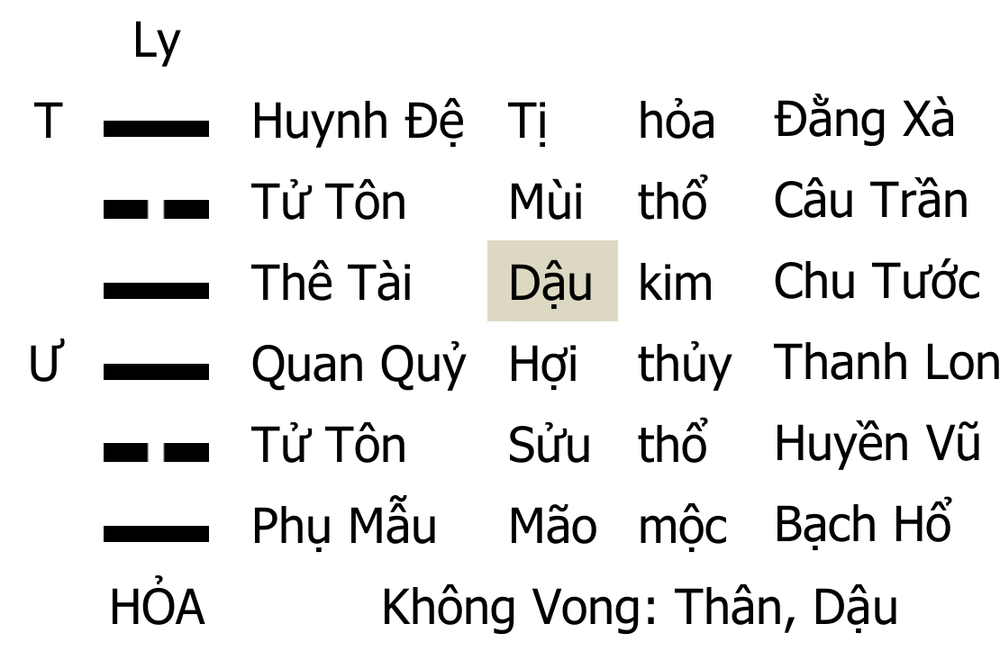
    - **Hình này chứng minh điều gì**
      - Thể hiện tính chất Lục Xung toàn phần của quẻ Bát Thuần Ly, minh chứng định lý then chốt "Cận bệnh phùng xung tắc dũ" (bệnh gần gặp xung tất khỏi) và tiềm ẩn ứng kỳ tại hào 4 Thê Tài Dậu kim lâm Tuần Không.
    - **Từ đâu mà thấy được**
      - Quẻ Ly gồm thượng quái Ly hỏa và hạ quái Ly hỏa tương xung đối nghịch; hào 4 Dậu kim lâm Tuần Không tại tuần Giáp Tuất.
  - Nhìn vào: Quẻ Bát Thuần Ly sáu hào tương xung; Dụng thần Phụ Mẫu Mão mộc tại hào sơ; Hào 4 Thê Tài Dậu kim lâm Tuần Không xung khai Dụng thần Mão mộc.

- **Quy tắc áp dụng**
  - Bệnh gần gặp xung thì khỏi: Người mới phát bệnh trong thời gian ngắn khí tà còn nông, gặp quẻ Lục Xung làm xung tán tà khí, bệnh tật tức khắc tiêu tan.
  - Quẻ tĩnh và Tuần Không định ứng kỳ: Quẻ tĩnh lấy xung làm ứng kỳ; hào lâm Tuần Không lấy xuất Không hoặc xung Không làm ngày ứng nghiệm.

- **Lời giải**

  - **Bước 1**: Nhận định đại cuộc cát hung bệnh tật.
    - Căn cứ: Cổ quyết "Cận bệnh phùng xung tắc dũ".
    - Nhìn vào: Toàn bộ quẻ Bát Thuần Ly là quẻ Lục Xung, sáu hào xung kích giải trừ tà khí của bệnh mới phát. Khẳng định cha chắc chắn sẽ khỏi bệnh.

  - **Bước 2**: Định vị phương hướng ứng kỳ khỏi bệnh.
    - Căn cứ: Quẻ an tĩnh lấy xung làm kỳ; Hào 4 Dậu kim lâm Tuần Không, đến ngày Dậu sẽ vừa xuất Không vừa xung Dụng thần Phụ Mão mộc (tĩnh ứng xung).
    - Nhìn vào: Chi Dậu Không Vong tại hào 4, tiềm ẩn ứng kỳ vào ngày Dậu. Do người xem nôn nóng muốn biết đích xác ngày khỏi bệnh nên Dã Hạc chỉ dẫn gieo tiếp quẻ thứ hai để liên hoàn chiêm đoán.

- **Đối thoại giải đáp nghi vấn**:
  - Dã Hạc phán quyết: "Bệnh gần gặp xung sẽ khỏi."
  - Người xem hỏi dồn: "Bao giờ sẽ khỏi?" Dã Hạc bèn bảo anh ta gieo tiếp quẻ thứ hai để liên hoàn chiêm quẻ.

- **Kết quả**: Phán quyết chắc chắn khỏi bệnh, đặt nền móng chuẩn xác cho việc bắt ứng kỳ chi tiết ở quẻ thứ hai (Đại Quá biến Khốn).

- **Kiểm tra lại**: Tính chất quẻ Lục Xung ứng hợp hoàn toàn với định lý giải trừ bệnh gần.

---

### Ví dụ 47: Xem bệnh gần của cha, liên hoàn chiêm quẻ 2 (Quẻ Đại Quá biến Khốn)

- **Đề bài**: Cùng ngày Canh Thìn tháng Tuất (Tuần Không: Thân, Dậu). Nối tiếp quẻ Bát Thuần Ly ở ví dụ 46, người con gieo tiếp quẻ thứ hai để hỏi rõ ngày nào người cha sẽ lành bệnh, được quẻ Đại Quá biến Khốn.

- **Dữ kiện**
  - Can chi: Ngày Canh Thìn, tháng Tuất. Tuần Không: Thân, Dậu.
  - Quẻ chủ: Trạch Phong Đại Quá (Chấn cung); Quẻ biến: Trạch Thủy Khốn.
  - Hào động: Hào 2 Phụ Mẫu Hợi thủy phục Huynh Dần lâm Huyền Vũ động hóa Thê Tài Thìn thổ; Hào 3 Quan Quỷ Dậu kim lâm Thanh Long (Tuần Không) động hóa Tử Tôn Ngọ hỏa (hồi đầu khắc).
  - Hào tĩnh: Hào sơ Thê Tài Sửu thổ lâm Ứng; Hào 4 Phụ Mẫu Hợi thủy lâm Thế; Hào 5 Quan Quỷ Dậu kim; Hào 6 Thê Tài Mùi thổ.
  - Bảng quẻ:

| | Đại Quá | | Khốn | |
| :---: | :---: | :--- | :---: | :--- | :--- |
| | ▅ ▅ | Thê Tài Mùi thổ | ▅ ▅ | Thê Tài Mùi thổ | Đằng Xà |
| | ▅▅▅ | Quan Quỷ Dậu kim | ▅▅▅ | Quan Quỷ Dậu kim | Câu Trần |
| T | ▅▅▅ | Phụ Mẫu Hợi thủy Tử-Ngọ | ▅▅▅ | Phụ Mẫu Hợi thủy | Chu Tước |
| | ▅▅▅ | Quan Quỷ Dậu kim | ▅ ▅ | Tử Tôn Ngọ hỏa | Thanh Long |
| | ▅▅▅ | Phụ Mẫu Hợi thủy Huynh-Dần | ▅▅▅ | Thê Tài Thìn thổ | Huyền Vũ |
| Ư | ▅ ▅ | Thê Tài Sửu thổ | ▅ ▅ | Huynh Đệ Dần mộc | Bạch Hổ |

  - Sơ đồ quẻ: (Tham chiếu Hình 47) alt="Sơ đồ quẻ Đại Quá biến Khốn" />

  - **Hình 47.** Sơ đồ quẻ Đại Quá biến Khốn
    - 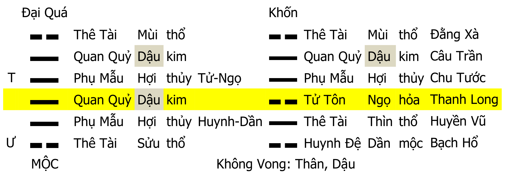
    - **Hình này chứng minh điều gì**
      - Thể hiện sự phát động của hào 3 Quan Quỷ Dậu kim lâm Tuần Không hóa Tử Tôn Ngọ hỏa hồi đầu khắc, chứng minh vai trò của quẻ liên hoàn chiêm trong việc bắt ứng kỳ xuất Không tại ngày Ất Dậu mà không câu nệ hồi đầu khắc và hợp.
    - **Từ đâu mà thấy được**
      - Hào 3 là hào dương phát động biến thành hào âm Ngọ hỏa tại quẻ Khốn; hào 3 Quan Dậu kim mang can chi thuộc tuần Giáp Tuất (Thân, Dậu lâm Không Vong).
  - Nhìn vào: Hào 4 Thế Phụ Mẫu Hợi thủy là Dụng thần; Hào 3 Quan Quỷ Dậu kim là Nguyên thần sinh Dụng thần phát động lâm Tuần Không, bị Nhật Thần Thìn thổ hợp và bị hào biến Ngọ hỏa hồi đầu khắc.

- **Quy tắc áp dụng**
  - Phương pháp Liên hoàn chiêm (Gieo quẻ liên tiếp): Quẻ thứ hai phải ăn khớp và phục tùng kết luận đã định ở quẻ thứ nhất; khi quẻ thứ nhất đã định cát (khỏi bệnh), quẻ thứ hai chuyên dùng xác định ứng kỳ.
  - Hào phát động lâm Tuần Không định ứng kỳ: "Động bất vi Không", hào động lâm Không lấy ngày xuất Không làm ứng kỳ thực hiện tác dụng sinh trợ.
  - Hồi đầu khắc và hợp thứ yếu trước Thần cơ liên hoàn: Hiện tượng Ngọ hỏa hồi đầu khắc và Thìn thổ hợp trong quẻ thứ hai chỉ là chi tiết quá trình bệnh lý, không thể làm đảo ngược kết luận khỏi bệnh của quẻ đầu.

- **Lời giải**

  - **Bước 1**: Nhận diện vai trò sinh phù của hào Nguyên thần động.
    - Căn cứ: Quan Quỷ Dậu kim là Nguyên thần sinh Dụng thần Phụ Mẫu Hợi thủy; thần cơ tại hào động.
    - Nhìn vào: Hào 3 Quan Quỷ Dậu kim phát động sinh Hợi thủy.

  - **Bước 2**: Định vị ứng kỳ xuất Không.
    - Căn cứ: Hào động lâm Tuần Không lấy xuất Không làm thời điểm ứng nghiệm.
    - Nhìn vào: Dậu kim lâm Tuần Không, đến ngày Dậu xuất Không sẽ toàn lực sinh phù Hợi thủy. Quẻ đầu tiên cũng đã chỉ ra ngày Dậu (quẻ Ly tĩnh ứng xung tại Dậu).

  - **Bước 3**: Giải quyết mối nghi vấn hồi đầu khắc và hợp.
    - Căn cứ: Tính chất nhất quán của liên hoàn chiêm — quẻ đầu là gốc rễ phán định cát hung.
    - Nhìn vào: Vì quẻ thứ nhất đã xác quyết khỏi bệnh, nên hiện tượng hào biến Ngọ hỏa khắc và Nhật Thìn hợp Dậu kim chỉ biểu thị sự dây dưa mệt mỏi trước mắt, đến ngày Giáp Thân bệnh chuyển biến có thể ngồi dậy, sang ngày Ất Dậu xuất Không bệnh lành dứt điểm.

- **Đối thoại giải đáp nghi vấn**:
  - *Người hỏi thắc mắc:* Ứng kỳ của quẻ thứ hai nghĩ mãi không thông! Nguyên thần Dậu kim phát động lâm Tuần Không, nhưng bị Nhật thần Thìn thổ hợp cản trở, lại bị hào biến Ngọ hỏa hồi đầu khắc. Đến khi Dậu kim xuất Không thì vẫn bị Ngọ hỏa khắc như cũ, tại sao ngày đó lại khỏi bệnh?
  - *Vương Hổ Ứng lão sư giải đáp:*
    1. Thứ nhất, thực chất hoàn toàn không cần phải gieo lại quẻ thứ hai! Ở quẻ Ly đầu tiên: tĩnh thì ứng gặp xung, Không thì ứng xung thực (hào 4 Dậu kim Không gặp Mão xung), người am hiểu nhìn vào đã biết ngay ứng vào ngày Dậu.
    2. Thứ hai, hào quẻ của quẻ thứ hai bắt buộc phải ăn khớp với tình huống đã được định đoạt ở quẻ thứ nhất. Dậu kim lâm Không phát động, vì vậy xuất Không là ứng kỳ tối thượng. Khắc và hợp lúc này không phải là nhân tố chủ yếu. Nếu không có quẻ thứ nhất làm tiền đề bảo đảm khỏi bệnh, thì tuyệt đối không thể giải đoán lạc quan như vậy!

- **Kết quả**: Quả nhiên đến ngày Giáp Thân (bước vào tuần xuất Không) người cha đã có thể ngồi dậy được, và sang đúng ngày Ất Dậu thì khỏi bệnh hoàn toàn.

- **Kiểm tra lại**: Ngày Thân ngồi dậy ứng Thân kim xuất Không sinh thủy; ngày Dậu khỏi hẳn ứng đúng Dậu kim xuất Không sinh Dụng thần và xung khai quẻ Ly ban đầu.

---

### Ví dụ 48: Xem ngày nhập trạch có hợp với con cái hay không (Quẻ Cách biến Phong)

- **Đề bài**: Ngày Đinh Mão tháng Mão, một người chuẩn bị dọn vào nhà mới (nhập trạch), gieo quẻ xem ngày nhập trạch và phương vị an vị có hợp với con cái hay không. Dã Hạc khuyên chuyển nhà vào ngày Hợi, Tý và đặt giường cho con ở phía Nam.

- **Dữ kiện**
  - Can chi: Ngày Đinh Mão, tháng Mão. Tuần Không: Tuất, Hợi.
  - Quẻ chủ: Trạch Hỏa Cách (Khảm cung); Quẻ biến: Lôi Hỏa Phong.
  - Hào động: Hào 5 Phụ Mẫu Dậu kim [Huyền Vũ] độc phát động hóa Phụ Mẫu Thân kim (hóa Thoái thần).
  - Hào tĩnh và phục: Hào sơ Tử Tôn Mão mộc [Ứng] [Chu Tước]; Hào 2 Quan Quỷ Sửu thổ [Câu Trần]; Hào 3 Huynh Đệ Hợi thủy phục Thê Tài Ngọ [Đằng Xà] (Tuần Không); Hào 4 Thế Huynh Đệ Hợi thủy [Bạch Hổ] (Tuần Không); Hào 6 Quan Quỷ Mùi thổ [Thanh Long].
  - Bảng quẻ:

| | Cách | | Phong | |
| :---: | :---: | :--- | :---: | :--- | :--- |
| | ▅ ▅ | Quan Quỷ Mùi thổ | ▅ ▅ | Quan Quỷ Tuất thổ | Thanh Long |
| | ▅▅▅ | Phụ Mẫu Dậu kim | ▅ ▅ | Phụ Mẫu Thân kim | Huyền Vũ |
| T | ▅▅▅ | Huynh Đệ Hợi thủy | ▅▅▅ | Thê Tài Ngọ hỏa | Bạch Hổ |
| | ▅▅▅ | Huynh Đệ Hợi thủy Tài-Ngọ | ▅▅▅ | Huynh Đệ Hợi thủy | Đằng Xà |
| | ▅ ▅ | Quan Quỷ Sửu thổ | ▅ ▅ | Quan Quỷ Sửu thổ | Câu Trần |
| Ư | ▅▅▅ | Tử Tôn Mão mộc | ▅▅▅ | Tử Tôn Mão mộc | Chu Tước |

  - Sơ đồ quẻ: (Tham chiếu Hình 48) alt="Sơ đồ quẻ Cách biến Phong" />

  - **Hình 48.** Sơ đồ quẻ Cách biến Phong
    - Sơ đồ quẻ: (Tham chiếu Hình 48) alt="Hình 48" />
    - **Hình này chứng minh điều gì**
      - Thể hiện sự phát động duy nhất của hào 5 Phụ Mẫu Dậu kim lâm Nguyệt phá hóa Thoái thần Thân kim; Hào sơ Tử Tôn Mão mộc lâm Chu Tước đắc lệnh Nhật Nguyệt cực vượng; Hào Thế Huynh Đệ Hợi thủy lâm Tuần Không.
    - **Từ đâu mà thấy được**
      - Hào 5 quẻ Cách là hào dương phát động biến thành âm hào tại quẻ Phong; hào 3 và hào 4 Huynh Đệ Hợi thủy thuộc tuần Giáp Tý (Tuất, Hợi lâm Không Vong).
  - Nhìn vào: Hào sơ Tử Tôn Mão mộc lâm Ứng, đắc lệnh cả tháng Mão lẫn ngày Mão cực kỳ vượng tướng, lâm Chu Tước; Kỵ thần hào 5 Phụ Mẫu Dậu kim độc phát Nguyệt phá hóa thoái; Hào Thế Huynh Đệ Hợi thủy (Nguyên thần và hào Thông quan) lâm Tuần Không.

- **Quy tắc áp dụng**
  - Kỵ thần Nguyệt phá động hóa Thoái thần: Kỵ thần phát động vốn là hung, nhưng bị Nguyệt phá lại động hóa Thoái thần thì khí lực suy kiệt hoàn toàn, không thể tổn hại Dụng thần.
  - Tương xung áp chế địa lý / trạch cát: Dụng thần Tử Tôn lâm Nhật Nguyệt cực vượng xung phá Kỵ thần Phụ Mẫu, tượng trưng cho việc con cái hoàn toàn làm chủ và áp chế được ngôi nhà mới.
  - Quy tắc Dẫn hóa kỵ thần & Điền thực Nguyên thần: Chọn ngày Hợi (Nguyên thần xuất Không) để nhập trạch; Hợi thủy xuất Không sẽ tiếp dẫn khí của Dậu kim và sinh trợ Mão mộc (Kim $\rightarrow$ Thủy $\rightarrow$ Mộc).
  - Phương vị đặt giường theo quái cung và Điềm báo đỗ đạt cử nghiệp:
    - Nội quái là cung Ly (thuộc hỏa, phương chính Nam) $\rightarrow$ đặt giường con cái ở phía Nam.
    - Tử Tôn Mão mộc lâm Chu Tước (chủ văn thư, khoa bảng), lâm Nhật Nguyệt cương cường xung phá hào 5 (ngôi vị cửu ngũ chí tôn) $\rightarrow$ tượng con cái đoạt ngôi vị cao quý trong khoa cử thi đình.

- **Lời giải**

  - **Bước 1**: Đánh giá suy vượng Dụng thần Tử Tôn và hóa giải Kỵ thần Phụ Mẫu.
    - Căn cứ: Xem cát hung cho con cái lấy Tử Tôn làm Dụng thần.
    - Nhìn vào: Hào sơ Tử Tôn Mão mộc lâm cả Nhật lẫn Nguyệt, vượng khí tột bậc. Kỵ thần hào 5 Phụ Mẫu Dậu kim độc phát đến khắc nhưng Dậu kim bị Nguyệt kiến Mão mộc xung thành Nguyệt phá, lại động hóa Thoái thần Thân kim $\rightarrow$ Kỵ thần hoàn toàn vô lực.

  - **Bước 2**: Định ngày nhập trạch dẫn hóa tương sinh.
    - Căn cứ: Kỹ pháp dẫn hóa kỵ thần — Nguyên thần lâm Không cần xuất Không để thông quan.
    - Nhìn vào: Hào 3 và 4 Huynh Đệ Hợi thủy lâm Tuần Không; chọn ngày Hợi hoặc Tý nhập trạch để điền thực Hợi thủy, khiến Dậu kim sinh Hợi thủy, Hợi thủy sinh Mão mộc liên tục tương sinh.

  - **Bước 3**: Xác định phương vị kê giường theo quái nội.
    - Căn cứ: Cung vị nội quái phản ánh vị trí phong thủy trong nhà.
    - Nhìn vào: Nội quái quẻ Cách là Ly hỏa (phương Nam); Tử Tôn ngự tại quẻ nội Ly xung phá hào Phụ Mẫu, do đó đặt giường ở phía Nam để tiếp nhận sinh khí.

  - **Bước 4**: Luận đoán tương lai công danh hiển quý.
    - Căn cứ: Tử Tôn lâm Chu Tước (văn chương khoa bảng), lâm Nhật Nguyệt ví như trời cao cương cường, xung phá hào 5 tôn vị.
    - Nhìn vào: Tử Tôn Mão mộc lâm Chu Tước xung phá hào 5 báo trước con cái sẽ dùng văn tài đoạt bảng vàng khoa cử, hiển đạt vang dội.

- **Đối thoại giải đáp nghi vấn**:
  - *Người hỏi thắc mắc:* Tử Tôn vượng tướng, Phụ Mẫu độc phát đến khắc, Nguyên thần lâm Không, chọn ngày Hợi có thể hóa Dậu kim, điền thực Nguyên thần sinh Tử Tôn thì đúng là ngày tốt rồi. Nhưng tại sao lại bảo đặt giường ở phía Nam? Và tại sao sau này đứa con sẽ được hiển quý?
  - *Vương Hổ Ứng lão sư giải đáp:*
    - Xem cát hung cho con cái thì phải xem tác dụng của các hào trong quẻ đối với Tử Tôn. Quẻ này Phụ Mẫu phát động vốn là bất lợi, nhưng Phụ Mẫu bị Nguyệt phá, động mà hóa thoái, vì vậy không tạo thành ảnh hưởng lớn. Hơn nữa Phụ Mẫu bị chính Tử Tôn xung phá, chứng tỏ con cái hoàn toàn có thể ở vững vàng nơi này.
    - Nội quái là quẻ Ly, Tử Tôn đóng tại quẻ Ly, Tử Tôn lại lâm Nhật Nguyệt xung phá hào Phụ Mẫu, vì vậy phải đặt giường tại vị trí quẻ Ly (phương Nam). Chọn ngày Hợi để Nguyên thần xuất Không, vừa điền thực vừa liên tục tương sinh dẫn hóa hào Phụ Mẫu.
    - Còn về sự hiển quý: Tử Tôn lâm Nhật Nguyệt, lại lâm Chu Tước xung phá hào 5. Chu Tước chủ về văn thư thi cử, hào 5 là ngôi vị tôn quý của triều đình cửu ngũ. Nhật Nguyệt ví như trời xanh cao vọi, vượng thì cực kỳ cương cường, ắt đỗ đạt đại khoa rạng danh dòng tộc!

- **Kết quả**: Người này làm theo y như lời dặn: nhập trạch vào ngày Hợi và kê giường cho con ở phía Nam. Quả nhiên về sau con trai cả thi đỗ đại khoa năm Mão (khoa Mão), rạng danh hiển quý đúng như quẻ triệu.

- **Kiểm tra lại**: Thi đỗ khoa Mão ứng nghiệm chuẩn xác vào năm Mão của hào Tử Tôn Mão mộc lâm Nhật Nguyệt; ngày chuyển nhà ngày Hợi ứng xuất Không Nguyên thần; giường hướng Nam đắc vị Ly hỏa.

## Chuyên luận lý thuyết: Phân định Lý - Tượng, 12 Cung Trường Sinh và Bí quyết ứng kỳ

- **Tổng quan chuyên luận lý luận cao cấp**:
  - Chuyên đề tập trung giải mã các vấn đề lý luận cốt lõi, then chốt và sâu sắc nhất trong Lục Hào Dự Trắc Học do Vương Hổ Ứng lão sư trực tiếp giải đáp.
  - Hệ thống hóa nguyên tắc phân định ranh giới giữa Lý và Tượng, xác lập vai trò thực tế của 12 Cung Trường Sinh, phân biệt các dạng thức Phản ngâm, điều kiện Phục thần xuất hiện, phân biệt Vô căn và Quá nhược, bản chất hào động tĩnh ngộ Nhật xung, và quy luật hào hóa Nhật Nguyệt.

### Phân định ranh giới Lý (70%) và Tượng (30%) trong phán đoán cát hung

- **Tỷ lệ tương quan giữa Lý và Tượng trong phán đoán**:
  - **Lý** (ngũ hành sinh khắc, vượng tướng hưu tù, xung hợp hóa khắc) đóng vai trò chủ đạo, quyết định sinh tử, thành bại, cát hung sống còn của sự việc, chiếm khoảng $70\%$ tỷ trọng dự đoán.
  - **Tượng** (lục thân, lục thú, hào vị, 12 cung trường sinh, nạp âm, quẻ tượng) đóng vai trò mô tả trạng thái, hình tướng, nguyên nhân, tính chất vi tế của sự việc, chiếm khoảng $30\%$ tỷ trọng.
  - Tỷ lệ $70/30$ là tỷ lệ phân định có tính chất ước lệ phương pháp luận, không phải là con số tuyệt đối bất biến. Trong các tình huống đặc định, Tượng nắm giữ quyền năng quyết định cát hung trực tiếp.
- **Bản chất của các khẩu quyết Tượng chủ cát hung trong cổ thư**:
  - Tác phẩm kinh điển *Tăng San Bốc Dịch* của Dã Hạc lão nhân đánh dấu giai đoạn manh nha sơ khởi của việc kết hợp Lý và Tượng trong Lục Hào.
  - Các kết luận cổ truyền như *"xem cầu Tài mà Dụng thần khắc Thế là có tài"*, *"bệnh gần gặp Không thì khỏi bệnh, bệnh lâu gặp xung thì chết"*, *"Tử Quỷ hỗ hóa"* chính là hiện thân tiêu biểu của việc Tượng quyết định cát hung.
- **Quy tắc Hào độc phát lâm Tử Mộ Tuyệt**:
  - Trong quẻ có một hào độc phát duy nhất, thần cơ trời đất phát lộ trọn vẹn tại hào động đó.
  - Khi hào độc phát gặp phải các cung Tử, Mộ, Tuyệt — đặc biệt là hai cung Tử và Tuyệt — thì cho dù Dụng thần tự thân có vượng tướng tại Nhật Nguyệt lệnh cũng không thể đoán là cát, chung cuộc tất ứng hung sự.

- **Minh chứng đồ quẻ chiêm (Hình 48)**: Sơ đồ quẻ phản ánh tương tác hào động, biến hóa sinh khắc và ứng kỳ thực tế.
  - **Hình 48.** Sơ đồ quẻ Trạch Hỏa Cách biến Lôi Hỏa Phong
    - 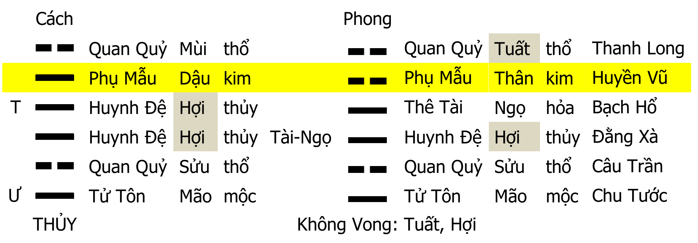
    - **Hình này chứng minh điều gì**
      - Minh chứng nguyên lý phân định ranh giới giữa Lý (70%) và Tượng (30%), làm rõ cơ chế thần cơ phát lộ tại hào độc phát hóa thoái bị Nhật Nguyệt xung phá.
      - Dù Phụ Mẫu Dậu kim hào 5 độc phát phát động khắc hại Dụng thần Tử Tôn Mão mộc, nhưng do Dậu kim bị Nguyệt phá, hóa thoái (Dậu biến Thân) và bị Tử Tôn lâm Nhật Nguyệt xung phá nên không thể tác hại, biến hung thành đại cát.
    - **Từ đâu mà thấy được**
      - Quan sát hào 5 Phụ Mẫu Dậu kim phát động hóa Phụ Mẫu Thân kim (hóa thoái), gặp tháng Mão là Nguyệt phá.
      - Quan sát hào sơ Tử Tôn Mão mộc lâm cả Nhật thần và Nguyệt kiến, xung thẳng vào hào phát động Dậu kim, giải cứu Dụng thần và đem lại điềm hiển quý khoa cử.

### Bản chất 12 Cung Trường Sinh: Không dùng định cát hung mà chuyên dụng thủ tượng

- **Đính chính nhận thức sai lầm của cổ nhân**:
  - Cổ nhân thường coi 12 Cung Trường Sinh (Trường Sinh, Mộc Dục, Quan Đới, Lâm Quan, Đế Vượng, Suy, Bệnh, Tử, Mộ, Tuyệt, Thai, Dưỡng) là căn cứ quyết định cát hung ngang hàng với ngũ hành; Vương Hổ Ứng chỉ rõ đây là quan niệm sai lầm.
  - Vai trò thực sự của 12 Cung Trường Sinh là phương tiện vi tế để thể hiện "Tượng" (hình thái biến chuyển, tâm lý, hoàn cảnh, tiến trình sinh hóa của sự vật).
  - Tỷ lệ 12 Cung Trường Sinh trực tiếp quyết định cát hung của sự việc chỉ chiếm phần rất nhỏ, ước tính chỉ khoảng $1\% - 2\%$.
- **Điều kiện 12 Cung Trường Sinh chủ cát hung**:
  - Tình huống 12 cung trường sinh trực tiếp chủ cát hung thường thể hiện rõ nhất trong các quẻ có một hào độc phát.
  - Các cung cát lành: Trường Sinh, Mộc Dục, Đế Vượng chủ cát, đại diện cho sinh trưởng, phát triển, trợ lực.
  - Các cung hung họa: Tử, Mộ, Tuyệt chủ hung, đại diện cho tai biến, kết thúc, tiêu vong.
  - Phân hóa cấp độ trong nhóm hung:
    - **Mộ**: Là cung ít xấu nhất trong ba cung hung, bắt buộc phải kết hợp xem xét suy vượng thực tế của Dụng thần (vượng mà nhập Mộ là tạm thời bế tắc, xuất Mộ lại thông suốt; suy nhược nhập Mộ mới thật sự nguy khốn).
    - **Tử và Tuyệt**: Là hai trạng thái cực kỳ đáng sợ; khi độc phát rơi vào Tử Tuyệt thì cho dù Dụng thần có đang vượng tướng cũng khó tránh khỏi hung hiểm.
- **Tác động của 12 Cung Trường Sinh đối với định lượng và ứng kỳ**:
  - 12 Cung Trường Sinh không can thiệp làm thay đổi khối lượng vật chất hoặc mức độ được mất cụ thể (ví dụ: xem tiền bạc được 100 đồng thì không thể vì nhập Mộ mà bớt còn 80 đồng, hay gặp Trường Sinh mà tăng lên 120 đồng; số lượng hoàn toàn do vượng suy ngũ hành quy định).
  - 12 Cung Trường Sinh cung cấp căn cứ chuẩn xác để xác định thời điểm "ứng kỳ" theo nguyên tắc *"cát đoán ứng cát, hung đoán ứng hung"* (sự việc cát lành ứng vào kỳ Trường Sinh, sự việc hung hiểm ứng vào kỳ Mộ Tuyệt).

### Quẻ biến phản ngâm và Hào biến phản ngâm: Tiên thiên, Hậu thiên và biểu tượng trùng lặp

- **Tương quan ứng nghiệm giữa Quẻ biến phản ngâm và Hào biến phản ngâm**:
  - Quẻ biến phản ngâm có tỷ lệ ứng nghiệm cát hung không cao bằng hào biến phản ngâm.
  - Quẻ biến phản ngâm chỉ biểu thị tượng thái trắc trở, dùng dằng, lặp đi lặp lại của sự việc (sự việc làm đi làm lại, tiến thoái lưỡng nan, dời đổi rồi quay về chốn cũ).
  - Hào biến phản ngâm (các hào động biến thành chi tương xung tương khắc quay lại) trực tiếp phát lộ thông tin hung hiểm xấu xa, chủ tai họa thực thể.
  - Quẻ biến hồi đầu khắc (toàn thể quẻ biến quay lại khắc quẻ chủ) thường chủ hung tượng rõ rệt.
- **Hai phương diện định nghĩa Quẻ biến phản ngâm**:
  - **Phương diện Tiên thiên bát quái**: Căn cứ vào các cặp quẻ đối lập phương vị trên Tiên thiên bát quái đồ để xác lập phản ngâm.
    - Quẻ Càn đối lập với quẻ Khôn (Nam đối Bắc), do đó Càn biến Khôn hoặc Khôn biến Càn là quẻ biến phản ngâm.
    - Quẻ Khảm đối lập với quẻ Ly (Tây đối Đông), do đó Khảm biến Ly hoặc Ly biến Khảm là quẻ biến phản ngâm.
  - **Phương diện Hậu thiên bát quái**: Căn cứ vào các cặp quẻ đối lập phương vị trên Hậu thiên bát quái đồ (như luận điểm trong *Bốc Phệ Chính Tông*).
    - Quẻ Càn (phương Tây Bắc) đối ứng trực diện với quẻ Tốn (phương Đông Nam), do đó Càn hỗ biến Tốn chính là quẻ biến phản ngâm.
    - Tương tự, Cấn (Đông Bắc) đối Khôn (Tây Nam), Chấn (Đông) đối Đoài (Tây), Khảm (Bắc) đối Ly (Nam) đều cấu thành phản ngâm hậu thiên.

### Quy luật Tiến thần, Thoái thần giữa các chi Thổ: Đặc thù Sửu - Mùi và Tuất - Sửu

- **Quy tắc Sửu hóa Mùi**:
  - Sửu thổ động hóa Mùi thổ tuyệt đối không phải là Tiến thần.
  - Giữa Sửu và Mùi bị ngăn cách bởi Thìn thổ trong vòng tuần hoàn tứ mộ khố, đồng thời bản chất giữa Sửu và Mùi là mối quan hệ trực xung ($Sửu \leftrightarrow Mùi$).
  - Trong thực tế cấu trúc nạp giáp Lục Hào, không bao giờ tồn tại trường hợp một hào Sửu thổ động biến ra Mùi thổ (tổ hợp này vĩnh viễn không xuất hiện trên quẻ tượng).
- **Quy tắc Tuất hóa Sửu**:
  - Tuất thổ động hóa Sửu thổ được xác định chính xác là hóa Tiến thần theo quy luật tiến triển của hành Thổ trong Lục Hào.

### Năm trường hợp Phục thần không xuất và phân biệt Dụng thần Vô căn với Quá nhược

- **Năm trường hợp Phục thần không thể xuất hiện (theo Tăng San Bốc Dịch)**:
  - 1. Bản thân Phục thần ở vào trạng thái hưu tù, vô khí, hoàn toàn không có lực.
  - 2. Phục thần bị cả Nhật thần lẫn Nguyệt kiến đồng thời xung khắc bức hại.
  - 3. Phục thần bị hào Phi thần đang vượng tướng trực tiếp khắc hại nặng nề.
  - 4. Phục thần lâm vào Mộ hoặc Tuyệt tại hào Phi thần, tại Nhật thần, hoặc tại Nguyệt kiến.
  - 5. Phục thần hưu tù lại rơi vào Tuần Không hoặc bị Nguyệt phá.
- **Tác động của Nhật Nguyệt hợp đối với Phục thần**:
  - Nguyệt hợp: Nguyệt kiến tương hợp với Phục thần chủ được hợp vượng, Dụng thần hữu khí và có khả năng phát huy tác dụng khi xuất phục.
  - Nhật hợp: Nhật thần tương hợp mang tính chất "bán trói" (vướng chân, ràng buộc), khiến Phục thần bị níu giữ nên thông thường không thể tự xuất hiện.
  - Cơ chế giải thoát khi Nhật hợp: Nếu tại thời điểm Nhật thần hợp Phục thần mà chính Nhật thần đó lại xung khai hào Phi thần (Nhật xung Phi thần làm Phi thần bị phá, giải phóng vị trí), thì Phục thần lập tức được xuất hiện.
- **Phân biệt ranh giới giữa Dụng thần Vô căn và Dụng thần Quá nhược**:
  - **Dụng thần Vô căn** (không có cội rễ tương sinh):
    - Xuất hiện khi Nguyệt kiến khắc hại mà Nhật thần không tương sinh, hoặc Nhật thần khắc hại mà Nguyệt kiến không sinh phù. Chỉ cần thiếu hụt nguồn sinh phù từ một trong hai lệnh là đã có thể luận là vô căn.
  - **Dụng thần Quá nhược** (suy kiệt cùng cực):
    - Bắt buộc phải thỏa mãn đồng thời hai điều kiện khắt khe:
      - Nhật thần và Nguyệt kiến cùng đồng thời xung khắc Dụng thần.
      - Trong quẻ có nhiều Khắc thần (Kỵ thần) cùng phát động hoặc ám động tiếp tục khắc hại Dụng thần.
    - Nếu trong quẻ chỉ có duy nhất một Khắc thần xuất hiện, mà Dụng thần hưu tù thì đó chỉ là tình trạng hưu tù gặp hung, tuyệt đối không được nhận định là quá nhược.

### Tử Tôn trì Thế trong cầu quan và Phân biệt hào động tĩnh khi gặp Nhật xung

- **Linh hoạt biện chứng khẩu quyết Tử Tôn trì Thế khi xem công danh**:
  - Khẩu quyết xưa *"Tử Tôn hoặc Thê Tài trì Thế, hoặc động trong quẻ, là tượng thi rớt / cầu quan bất thành"* chỉ là bài học nhập môn có tính chất định hướng cơ bản cho người mới học.
  - Dự trắc thực tế đòi hỏi sự biến hóa vi tế: Có rất nhiều trường hợp Tử Tôn trì Thế nhưng vẫn đoán định thăng quan tiến chức vẻ vang (như Tử Tôn hưu tù không đủ sức khắc Quan, Tử Tôn động hóa Quan Quỷ sinh Thế, hoặc cấu trúc thông quan hóa giải).
- **Ba trạng thái biến hóa của hào động và tĩnh khi gặp Nhật xung**:
  - **Tĩnh hào vượng tướng gặp Nhật xung**: Trở thành **Ám động** (hào tĩnh có thực lực sung mãn bị Nhật kích hoạt, phát huy lực sinh khắc mạnh mẽ như hào minh động).
  - **Động hào vượng tướng gặp Nhật xung**: Trở thành **Xung động mạnh hơn** (hào vốn đã phát động lại được lực xung kích của Nhật thần gia tăng tốc độ và sức công phá, thúc đẩy sự việc diễn ra thần tốc).
  - **Động hào hưu tù gặp Nhật xung**: Trở thành **Xung tán** (hào bản thân suy kiệt vô lực, phát động gặp Nhật xung sẽ lập tức tan vỡ, mất sạch mọi tác dụng sinh khắc trong quẻ).

### Linh hoạt biện chứng: Vai trò Quan Quỷ chế Huynh Đệ và Vấn đề Thủy dư khí tháng Sửu

- **Mối quan hệ biện chứng giữa Quan Quỷ và Huynh Đệ**:
  - Khi cầu tài: Huynh Đệ là thần cướp Tài (chủ không có thu hoạch, hao tài tốn của). Quan Quỷ đại diện cho lãnh đạo, người có chức quyền hoặc chính quyền đứng ra can thiệp chế ngự Huynh Đệ để bảo vệ Tài.
  - Không được rập khuôn cho rằng hễ Quan động là cứu được Tài: Trong nhiều trường hợp quẻ tượng, Quan Quỷ vượng khắc hào Thế thì gia chủ vừa mất tiền của lại vừa vướng vào họa quan tai, hình ngục, kiện tụng. Cần xem xét linh hoạt toàn cục.
  - Khi tại nhiệm: Hào Huynh và hào Quỷ động trong quẻ thường báo hiệu thiên tai lụt hạn, nơi nhậm chức nhiễu nhương bất ổn, hiệu quả kinh tế cơ quan suy thoái, Quan Quỷ lúc này tượng trưng cho tai họa rình rập.
- **Thực chất khái niệm "Dư khí của Thủy" tại tháng Sửu**:
  - Theo thời tiết bốn mùa, tháng Sửu thuộc cuối đông nên về lý thuyết có thể xem Thủy có chút "dư khí".
  - Vương Hổ Ứng khẳng định: Tác dụng thực tế của dư khí là vô cùng nhỏ bé và không mang tính quyết định; bản chất của Nguyệt kiến Sửu thổ vẫn là Thổ khắc Thủy.
  - Ví dụ thực tế: Ngày Tị tháng Sửu, hào Hợi thủy tĩnh trong quẻ bị Nhật thần Tị hỏa tương xung; do hào Hợi ở tháng Sửu về căn bản là hưu tù bị khắc, nên bị Nhật xung phải luận là Nhật phá hoặc xung tán, tuyệt đối không thể xem là ám động hữu lực.

### Bản chất hào hóa Nhật Nguyệt: Ngũ hành sinh khắc tối thượng và Hồi đầu khắc

- **Phản biện quan điểm máy móc "Dụng thần hóa Nhật Nguyệt là hóa cát"**:
  - Trong cổ thư có thuyết cho rằng hào động biến ra địa chi trùng với Nhật thần hoặc Nguyệt kiến thì mặc nhiên gọi là "hóa Nhật Nguyệt, hóa cát, hóa vượng".
  - Vương Hổ Ứng chỉ rõ: Luận quẻ tuyệt đối không được thoát ly quy luật ngũ hành sinh khắc nền tảng. Hào biến vẫn tác động ngược trở lại hào động theo ngũ hành sinh khắc nghiêm ngặt.
- **Phân biệt hóa vượng và hóa hồi đầu khắc khi hóa Nhật Nguyệt**:
  - **Trường hợp Hóa vượng / Hóa cát**: Chi của Nhật Nguyệt tương sinh hoặc tỷ hòa nâng đỡ hào động. Ví dụ: Nguyệt kiến là Tý thủy, hào Thổ động hóa Tý thủy (Thổ khắc Thủy làm chủ), hào Kim động hóa Tý thủy (Kim sinh Thủy hoặc đắc vượng), có thể luận là hóa vượng đắc trợ.
  - **Trường hợp Hóa Hồi Đầu Khắc (Đại hung)**: Nếu hào động là Tị hỏa mà biến ra Tý thủy, mặc dù Tý thủy chính là Nhật thần hoặc Nguyệt kiến, thì bản chất ngũ hành Thủy vẫn khắc Hỏa; đây dứt khoát là Hóa Hồi Đầu Khắc mang tính chất hung hiểm triệt để, không thể coi là hóa cát.
- **Nguyên lý tương tác hai chiều giữa Nhật Nguyệt và Hào biến**:
  - Nhật Nguyệt là cán cân điều tiết toàn quẻ, nhưng khi hào động biến ra chi trùng với Nhật Nguyệt thì chi đó đóng vai trò là Hào biến trực tiếp tác động lên hào gốc.
  - Nếu hào biến quay lại khắc hào động (hồi đầu khắc), sức tàn phá càng tăng gấp bội do hào biến thừa hưởng vượng khí tối cao từ Nhật Nguyệt.
  - Việc nhận định "hóa Nhật Nguyệt là hóa cát" mà bỏ qua tương khắc ngũ hành là ngụy biện kinh viện làm sai lệch kết quả dự đoán.
  - Trong thực chiến: Hào Tử Tôn là cội nguồn của tài lộc, khi Tử Tôn động hóa Phụ Mẫu hồi đầu khắc trùng Nhật Nguyệt thì nguồn sinh tài hoàn toàn bị triệt hạ.

- **Minh chứng đồ quẻ chiêm (Hình 49)**: Sơ đồ quẻ phản ánh tương tác hào động, biến hóa sinh khắc và ứng kỳ thực tế.
  - **Hình 49.** Sơ đồ quẻ Bát Thuần Tốn biến Sơn Phong Cổ
    - 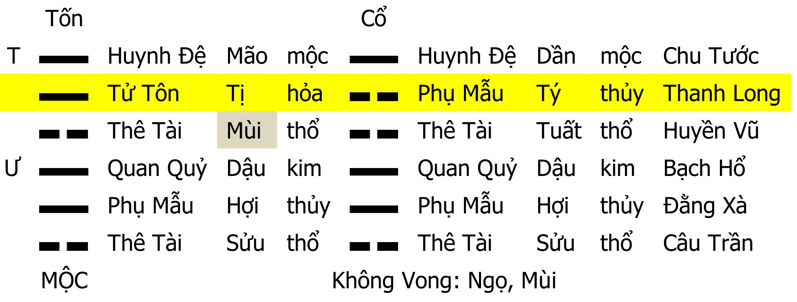
    - **Hình này chứng minh điều gì**
      - Minh chứng quy tắc hào hóa Nhật Nguyệt không thoát ly ngũ hành sinh khắc: Tử Tôn Tị hỏa động hóa Phụ Mẫu Tý thủy (trùng Nhật Nguyệt) là hóa hồi đầu khắc, triệt tiêu nguyên thần sinh Tài.
      - Minh chứng hào Dụng thần Thê Tài Mùi thổ lâm Không Vong, lại ở cung Tuyệt đối với hào động Tị hỏa, mang tượng thái tài vận suy kiệt, không thể tụ tài.
    - **Từ đâu mà thấy được**
      - Ngày Mậu Tý tháng Canh Tý (Tuần Không Ngọ, Mùi), quẻ Tốn vi Phong có hào 5 Tử Tôn Tị hỏa độc phát hóa Phụ Mẫu Tý thủy ở quẻ Sơn Phong Cổ.
      - Thê Tài Mùi thổ ở hào 4 lâm Huyền Vũ gặp Tuần Không, đồng thời đối chiếu với hào động Tị hỏa thủ tượng Tuyệt địa.

### Ví dụ 49: Xem tài vận trong ngày, hào hóa hồi đầu khắc (Quẻ Tốn biến Cổ)

- **Đề bài**: Ngày Mậu Tý tháng Canh Tý, người hỏi gieo quẻ hỏi xem tài vận trong ngày hôm nay ra sao, có kiếm được tiền không?
- **Dữ kiện**
  - Thời gian: Ngày Mậu Tý, tháng Canh Tý (Tuần Không: Ngọ, Mùi).
  - Quẻ chủ: Bát Thuần Tốn (thuộc cung Mộc).
  - Quẻ biến: Sơn Phong Cổ (thuộc cung Tốn).
  - Hào độc phát: Hào 5 Tử Tôn Tị hỏa phát động biến Phụ Mẫu Tý thủy.
  - Sơ đồ quẻ: (Tham chiếu Hình 49) alt="Sơ đồ quẻ" />
  - Nhìn vào:
    - Hào 6: Huynh Đệ Mão mộc — (Thế) lâm Chu Tước, biến Huynh Đệ Dần mộc.
    - Hào 5: Tử Tôn Tị hỏa — lâm Thanh Long phát động, biến Phụ Mẫu Tý thủy - - (hào động độc phát).
    - Hào 4: Thê Tài Mùi thổ - - lâm Huyền Vũ gặp Tuần Không, biến Thê Tài Tuất thổ.
    - Hào 3: Quan Quỷ Dậu kim — (Ứng) lâm Bạch Hổ, biến Quan Quỷ Dậu kim.
    - Hào 2: Phụ Mẫu Hợi thủy — lâm Đằng Xà, biến Phụ Mẫu Hợi thủy.
    - Hào 1: Thê Tài Sửu thổ - - lâm Câu Trần, biến Thê Tài Sửu thổ.
- **Quy tắc áp dụng**
  - *Quy tắc Hào hóa Nhật Nguyệt vẫn tuân thủ ngũ hành sinh khắc*: Hào biến mang ngũ hành khắc hào động thì vẫn luận là hóa hồi đầu khắc, không thể coi là hóa cát dù hào biến trùng với Nhật Nguyệt lệnh.
  - *Quy tắc Nguyên thần bị diệt*: Cầu tài lấy Thê Tài làm Dụng thần, Tử Tôn làm Nguyên thần sinh Tài. Nguyên thần phát động hóa hồi đầu khắc thì cội nguồn sinh tài bị dập tắt, tài vận bất thành.
  - *Quy tắc Độc phát thủ tượng 12 Cung Trường Sinh*: Hào động độc phát là cung Tuyệt của Dụng thần, phối hợp với Dụng thần lâm Không Vong là tượng tài lộc hư hao bế tắc.
- **Lời giải**
  - **Bước 1**: Xác định Dụng thần và Nguyên thần sinh tài
    - Căn cứ: Hỏi về tài vận trong ngày, lấy hào Thê Tài làm Dụng thần, hào Tử Tôn làm Nguyên thần chủ nguồn tiền sinh sôi.
    - Nhìn vào: Trong quẻ có hai hào Thê Tài: hào 1 Thê Tài Sửu thổ tĩnh và hào 4 Thê Tài Mùi thổ lâm Huyền Vũ; hào 5 Tử Tôn Tị hỏa độc phát lâm Thanh Long.
  - **Bước 2**: Thẩm định suy vượng và biến hóa của Nguyên thần Tử Tôn Tị hỏa
    - Căn cứ: Nguyên tắc hào hóa hồi đầu khắc. Hào Tị hỏa phát động biến ra Phụ Mẫu Tý thủy; Thủy khắc Hỏa, Tý thủy quay lại dập tắt Tị hỏa.
    - Nhìn vào: Hào 5 Tử Tôn Tị hỏa động hóa Phụ Mẫu Tý thủy. Tháng Canh Tý và ngày Mậu Tý đều là Tý thủy cực vượng, hào biến Tý thủy đắc lực Nhật Nguyệt dập tắt hoàn toàn hỏa khí của Tị hỏa.
  - **Bước 3**: Thẩm định trạng thái của Dụng thần Thê Tài Mùi thổ
    - Căn cứ: Quy tắc Tuần Không và thủ tượng 12 Cung Trường Sinh tại hào động độc phát.
    - Nhìn vào: Hào 4 Thê Tài Mùi thổ lâm Tuần Không (tuần Giáp Thân, Ngọ Mùi không). Đối chiếu với hào động Tị hỏa, Tị là Tuyệt địa của Thổ/Mộc thủ tượng (hoặc Mùi thổ ở Tị là đất Tuyệt), báo hiệu tiền tài hư vô, không có thực chất.
  - **Bước 4**: Tổng hợp phán đoán cát hung tài vận trong ngày
    - Căn cứ: Nguyên thần độc phát hóa hồi đầu khắc bị diệt, Dụng thần lâm Không ngộ Tuyệt.
    - Nhìn vào: Toàn cục quẻ không có bất kỳ sinh khí nào cho tài lộc trong ngày Mậu Tý; kết luận hôm nay hoàn toàn không có tài vận, cầu tài bất đắc.
- **Đối thoại giải đáp nghi vấn**:
  - *Người hỏi thắc mắc 1*: Tử Tôn Tị hỏa động hóa Phụ Mẫu Tý thủy có phải là hóa hồi đầu khắc không?
    - *Vương Hổ Ứng đáp*: Đúng là hóa hồi đầu khắc.
  - *Người hỏi thắc mắc 2*: Thê Tài Mùi thổ có phải là Tuyệt ở hào động Tị hỏa hay không?
    - *Vương Hổ Ứng đáp*: Đúng là Tuyệt, điều này mang ý nghĩa về mặt Tượng (tượng tài nguyên suy kiệt, cạn ráo).
  - *Người hỏi thắc mắc 3*: Nếu như xem về phòng ốc, lấy Phụ Mẫu Hợi thủy làm Dụng thần, Dụng thần được Nhật Nguyệt phù trợ thì có bị Tuyệt ở hào động Tị hỏa không?
    - *Vương Hổ Ứng đáp*: Phụ Mẫu vẫn bị Tuyệt như thường. Tôi đã từng nghiệm chứng các quẻ Dụng thần rất vượng, nhưng gặp hào độc phát mà lâm Tuyệt, cuối cùng sự việc vẫn ứng hung.
  - *Người hỏi thắc mắc 4*: Trong sách *Tăng San Bốc Dịch* có nói Dụng thần hóa Nhật Nguyệt là Dụng thần hóa cát; vậy quẻ này Tử Tôn Tị hỏa hóa Phụ Mẫu Tý thủy trùng với Nhật Nguyệt có phải là hóa cát không?
    - *Vương Hổ Ứng đáp*: Không thể lý luận máy móc như vậy! Phải tùy từng trường hợp cụ thể, tuyệt đối không phải cứ hóa Nhật Nguyệt là mặc nhiên hóa cát. Khi ngũ hành của hào biến khắc ngược hào động thì bản chất vẫn là hồi đầu khắc, là điềm hung.
- **Kết quả**:
  - Phán đoán chuẩn xác: Tài vận trong ngày xấu, không kiếm được tiền, nguồn tài bị dập tắt hoàn toàn.
  - Thực tế ngoài đời: Trong ngày Mậu Tý người hỏi không thu được bất kỳ khoản tài lộc nào, việc cầu tài hoàn toàn bế tắc đúng như quẻ đã báo hiệu.
- **Kiểm tra lại**:
  - Đối chiếu Dữ kiện: Nguyên thần Tị hỏa bị hào biến Tý thủy (lâm cả Nhật lẫn Nguyệt) hồi đầu khắc trực diện với sức mạnh áp đảo.
  - Đối chiếu Lý và Tượng: Về Lý, ngũ hành sinh khắc quyết định việc không có tiền ($70\%$); về Tượng, Dụng thần Thê Tài Mùi thổ lâm Không gặp Tuyệt tại hào động mô tả trạng thái túi rỗng, không có cơ hội tụ tài ($30\%$). Cả Lý và Tượng đồng quy vào hung sự.
