# Không Vong, Nguyệt Phá, 12 Cung Trường Sinh Bí Luận

## 1. VẬN DỤNG KHÔNG VONG MỘT CÁCH LINH HOẠT

### Bản chất và Nguyên tắc Vận dụng Không Vong

- **Bản chất của Không Vong trong dự đoán Lục Hào:**
  - Không Vong (Tuần Không - $\text{旬空}$) không chỉ đơn thuần là tham số xác định cát hung hay định vị ứng kỳ ($\text{应期}$), mà còn chứa đựng hệ thống hàm nghĩa tượng học phong phú và sâu sắc.
  - Ý nghĩa căn bản của Không Vong là trạng thái hư không, trống rỗng, không tồn tại hoặc mất đi tính chân thực, thực thể.
- **Các tầng nghĩa biểu tượng của Không Vong:**
  - *Về trạng thái hiện diện:* Không có ở đây, mất đi, thiếu hụt, không có thật, trống rỗng.
  - *Về tâm lý và tinh thần:* Bất an, lo âu, không có lòng tin, nghi hoặc, trong lòng không nắm chắc, lòng muốn trốn tránh.
  - *Về thực tại và sự việc:* Hư vọng, hư không, giả dối, kết cuộc tan rã, hữu danh vô thực.
  - *Về không gian và địa lý:* Thấp trũng, hang động, không gian trống trải, nhà kho rỗng, vị trí không đối diện.
  - *Về ứng xử tai họa:* Tượng "trốn vào chỗ không" để tránh bớt sự khắc phạt từ Quan Quỷ hoặc Kỵ Thần, làm giảm nhẹ hung họa.
- **Nguyên tắc vận dụng linh hoạt:**
  - Người dự đoán cần căn cứ vào từng quẻ cụ thể và sự việc dự trắc khác nhau để biến thông tượng học một cách linh hoạt, không câu nệ khuôn mẫu cứng nhắc.
  - Khi xem thi cử: Không Vong có thể là tâm lý bất an, hoặc tên không có trên bảng danh sách trúng tuyển.
  - Khi xem hôn nhân: Không Vong có thể là chưa từng kết hôn, không có người làm mối, đối phương không thật lòng, hoặc không có hỷ sự.
  - Khi xem kinh doanh buôn bán: Hào kho lâm Không Vong là kho rỗng, không có hàng tồn đọng, cung không đủ cầu và bán rất chạy.
  - Khi xem bệnh tật: Hào Thế lâm Không Vong là trốn vào hư không, tránh được Quan Quỷ khắc hại trực tiếp; nhưng Hào Thế lâm Không cũng biểu thị không đón nhận được nguyên khí sinh trợ (như thiếu máu não).
  - Khi xem kiện tụng: Không Vong là trong lòng không biết đối xử ra sao, sau khi kiện thì tâm trạng bất an; hoặc Thế lâm Không là không chấp nhận lời cầu hòa.
  - Khi xem nhà đất / chọn phòng: Hào Thế lâm Không Vong tại cung đường đi là phòng không đối diện cầu thang.

---

### Ví dụ 1: Xem thi tuyển công việc (Quẻ Thủy Phong Tỉnh biến Tốn)

#### Bối cảnh và Quẻ dịch

- **Thời gian chiêm đoán:** Ngày Canh Ngọ, tháng Tân Hợi, năm Đinh Sửu.
- **Tuần Không:** Canh Ngọ thuộc tuần Giáp Tý, Tuần Không tại $\text{Tuất}$ và $\text{Hợi}$.
- **Sự việc thỉnh đoán:** Xem về việc thi tuyển công việc.
- **Quẻ thu được:** Thủy Phong Tỉnh ($\text{水风井}$) biến Phong Vi Tốn ($\text{风为巽}$).

| Lục Thân (Chính) | Can Chi (Chính) | Thế / Ứng | Biến Động | Lục Thân (Biến) | Can Chi (Biến) | Lục Thú |
| :--- | :--- | :---: | :---: | :--- | :--- | :--- |
| Phụ Mẫu | Mậu Tý | | **X** | Huynh Đệ | Tân Mão | Đằng xà |
| Thê Tài | Mậu Tuất | **Thế** | | Tử Tôn | Tân Tỵ | Câu trần |
| Quan Quỷ | Mậu Thân | | | Thê Tài | Tân Mùi | Chu tước |
| Quan Quỷ | Tân Dậu | | | Quan Quỷ | Tân Dậu | Thanh long |
| Phụ Mẫu | Tân Hợi | **Ứng** | | Phụ Mẫu | Tân Hợi | Huyền vũ |
| Thê Tài | Tân Sửu | | | Thê Tài | Tân Sửu | Bạch hổ |

- **Bảng quẻ và dữ kiện thực tế:**
  - **Hình 1.** Quẻ Thủy Phong Tỉnh biến Tốn
    - 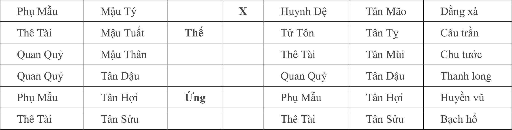
    - **Hình này chứng minh điều gì**
      - Quẻ Tỉnh biến Tốn phản ánh Hào 5 Thế Tuất thổ Tuần Không và Hào 2 Phụ Mẫu Hợi thủy Tuần Không.
    - **Từ đâu mà thấy được**
      - Hào 5 Mậu Tuất Thế lâm Câu Trần, Hào 2 Tân Hợi Ứng lâm Huyền Vũ, Hào 6 Phụ Mẫu Tý thủy động.

#### Phân tích Kỹ pháp và Tượng quẻ (Căn cứ - Nhìn vào)

- **Xác định Dụng Thần:**
  - Hào Phụ Mẫu đại diện cho thành tích, điểm số, bài thi và bảng danh sách trúng tuyển.
  - Hào Quan Quỷ đại diện cho chức vị, công danh và thứ hạng tuyển dụng.
  - Cả hai hào Phụ Mẫu và Quan Quỷ đều được lấy làm Dụng Thần.
- **Căn cứ - Nhìn vào thành tích thi cử:**
  - Hào Phụ Mẫu lưỡng hiện trong quẻ: Hào 6 Phụ Mẫu Mậu Tý và Hào 2 Phụ Mẫu Tân Hợi.
  - Cả hai hào Phụ Mẫu đều lâm hoặc được Nguyệt Kiến Tân Hợi thủy bang phù vượng tướng.
  - *Kết luận thành tích:* Cuộc thi này đạt thành tích rất tốt, điểm số không tệ.
- **Căn cứ - Nhìn vào tâm lý người dự thi:**
  - Hào Thế Thê Tài Mậu Tuất lâm Tuần Không: Biểu thị trong lòng không nắm chắc kết quả.
  - Thế lâm Câu Trần: Câu Trần chủ vướng bận, trì trệ, là tượng trong lòng rất bận tâm, lo lắng về kết quả thi.
- **Căn cứ - Nhìn vào thứ hạng và cơ hội trúng tuyển:**
  - Hào Quan Quỷ lưỡng hiện: Hào 4 Mậu Thân và Hào 3 Tân Dậu.
  - Ngũ hành Kim tại tháng Tân Hợi ở trạng thái hưu tù; lại bị Nhật Thần Canh Ngọ hỏa khắc thương $\rightarrow$ Tượng không có tên trên bảng, thứ hạng không đủ để tuyển dụng.
  - Hào 6 Phụ Mẫu Mậu Tý phát động hóa Huynh Đệ Tân Mão: Hào động Tý thủy là đất Tử của Quan tinh Kim ($\text{Kim tử tại Tý}$) $\rightarrow$ Căn bản không có cơ hội xoay chuyển thế cờ.
- **Căn cứ - Nhìn vào Tượng Không Vong của bảng danh sách:**
  - Phụ Mẫu cũng là có tên trong danh sách hoặc bảng thông báo trúng tuyển.
  - Hào 2 Phụ Mẫu Tân Hợi lâm Tuần Không $\rightarrow$ Danh sách trúng tuyển không có tên người này.
  - Chi Hợi của quẻ gặp Nguyệt Kiến Hợi tạo thành thế Hợi - Hợi tự hình ($\text{亥亥自刑}$) $\rightarrow$ Khả năng do lỗi của mình gây ra.
  - Hào 6 Tý thủy động biến Mão mộc là thế "hóa hình" ($\text{Tý Mão tương hình}$ - vô lễ chi hình): Hình có hàm nghĩa là nhầm lẫn, sơ suất dẫn đến sửa đổi.
  - Quẻ biến Phong Vi Tốn là quẻ Lục Xung: Tượng trưng mọi chuyện cuối cùng không thành.

#### Nghiệm chứng và Lời bình

- **Ứng nghiệm thực tế:**
  - Thành tích cuộc thi đúng là điểm số cao nhất.
  - Nhưng vì tự mình không cẩn thận ghi sai số báo danh nên không được trúng tuyển.
- **Lời bình (Án):**
  - Thành tích tốt nhưng lại không thi đậu tất có nguyên nhân.
  - Nếu công việc không có thi tuyển thì lấy Hào Quan làm chủ.
  - Tý thủy hóa Mão cũng là hóa hình, hình có hàm nghĩa là nhầm lẫn, sửa đổi.

---

### Ví dụ 2: Nam 20 tuổi xem hôn nhân (Quẻ Sơn Thủy Mông biến Thiên Phong Cấu)

#### Bối cảnh và Quẻ dịch

- **Thời gian chiêm đoán:** Ngày Bính Ngọ, tháng Quý Tị, năm Bính Tý.
- **Tuần Không:** Bính Ngọ thuộc tuần Giáp Thìn, Tuần Không tại $\text{Dần}$ và $\text{Mão}$.
- **Đối tượng và sự việc thỉnh đoán:** Một nam 20 tuổi xem về hôn nhân.
- **Quẻ thu được:** Sơn Thủy Mông ($\text{山水蒙}$) biến Thiên Phong Cấu ($\text{天风姤}$).

| Lục Thân (Chính) | Can Chi (Chính) | Thế / Ứng | Biến Động | Lục Thân (Biến) | Can Chi (Biến) | Lục Thú |
| :--- | :--- | :---: | :---: | :--- | :--- | :--- |
| Phụ Mẫu | Bính Dần | | | Tử Tôn | Nhâm Tuất | Thanh long |
| Quan Quỷ | Bính Tý | | **X** | Thê Tài | Nhâm Thân | Huyền vũ |
| Tử Tôn | Bính Tuất | **Thế** | **X** | Huynh Đệ | Nhâm Ngọ | Bạch hổ |
| Huynh Đệ | Mậu Ngọ | | **X** | Thê Tài | Tân Dậu | Đằng xà |
| Tử Tôn | Mậu Thìn | | | Quan Quỷ | Tân Hợi | Câu trần |
| Phụ Mẫu | Mậu Dần | **Ứng** | | Tử Tôn | Tân Sửu | Chu tước |

- **Bảng quẻ và dữ kiện thực tế:**
  - **Hình 2.** Quẻ Sơn Thủy Mông biến Thiên Phong Cấu
    - 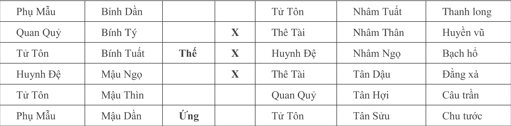
    - **Hình này chứng minh điều gì**
      - Quẻ Mông biến Cấu phản ánh Hào Ứng Ngọ hỏa Tuần Không và Thê Tài Dậu kim phục tàng.
    - **Từ đâu mà thấy được**
      - Hào 3 Bính Ngọ Ứng lâm Chu Tước Tuần Không, Hào 2 Phụ Mẫu Bính Thìn động hóa Dần mộc.

#### Phân tích Kỹ pháp và Tượng quẻ (Căn cứ - Nhìn vào)

- **Xác định Dụng Thần và Mục đích thực tế:**
  - Lấy Hào Thê Tài làm Dụng Thần.
  - Hào Ứng là thê vị lâm Phụ Mẫu Dần mộc. Hào Phụ Mẫu là chứng thư kết hôn; Dần mộc lâm Tuần Không biểu kỳ không có kết hôn.
  - Hào Thê Tài không hiện trên quẻ biểu thị người này trong cuộc sống không có nữ nhân.
  - *Kết luận mục đích:* Quẻ này là xem về tìm đối tượng.
- **Căn cứ - Nhìn vào hành vi theo đuổi:**
  - Hào Thế Tử Tôn Bính Tuất phát động sinh Hào Tài (Thổ sinh Kim) $\rightarrow$ Người này đang theo đuổi người khác.
  - Hào Phụ Mẫu cũng là người chủ hôn; Phụ Mẫu lâm Tuần Không là không có người làm mối.
- **Căn cứ - Nhìn vào xuất thân của đối tượng:**
  - Thê Tài Dậu kim phục dưới Hào Thế Tử Tôn Tuất thổ $\rightarrow$ Người này đang theo đuổi nữ tử ở khá gần.
  - Sách viết: *“Hào Ba hào bốn là thôn quê, làng xã”*.
  - Huống chi Thê Tài Dậu kim trường sanh ở Nguyệt lệnh Tị hỏa; Hào Thế cũng được Nguyệt lệnh sinh; sinh từ một nơi nên đoán là người này hiện đang theo đuổi 1 nữ nhân là người cùng quê.
- **Căn cứ - Nhìn vào thái độ của bên nữ và kết quả:**
  - Hào Ứng Phụ Mẫu Dần mộc lâm Tuần Không: Biểu thị đối phương không phải thật tâm.
  - Thê Tài không hiện trong quẻ: Tượng cô gái này tránh mặt không muốn gặp.
  - Hào Ứng Dần mộc khắc Hào Thế Tuất thổ: Biểu thị bên nữ trong lòng không muốn quan hệ, chỉ là người này theo đuổi đơn phương.
  - Hào 3 Huynh Đệ Mậu Ngọ phát động hóa Thê Tài Tân Dậu, lâm Đằng Xà: Đằng Xà chủ quấy rầy; là bên nữ ép buộc phải ra ngoài, chính là sống chết quấn lấy người ta.
  - Hào Tài bị Nhật Thần Ngọ hỏa và Nguyệt Kiến Tị hỏa khắc; trong quẻ lại có Huynh Đệ Ngọ hỏa phát động; Hào Ứng Tuần Không $\rightarrow$ Đều là tượng bất thành.

#### Nghiệm chứng và Lời bình

- **Ứng nghiệm thực tế:**
  - Chính xác như trên đã luận đoán, cuối cùng không thành.
- **Lời bình (Án):**
  - "Phục": Phục có tượng rời xa, trốn tránh.
  - Dậu ở giữa tam hội cục $\text{Thân - Dậu - Tuất}$ là cùng quê hương.
  - Nguyên Thần, hào gian Huynh Đệ động hóa Tài sinh Thế là người giới thiệu.

---

### Ví dụ 3: Nam xem buôn bán sắt thép (Quẻ Thiên Phong Cấu)

#### Bối cảnh và Quẻ dịch

- **Thời gian chiêm đoán:** Ngày Mậu Ngọ, tháng Tị, năm Bính Tý.
- **Tuần Không:** Mậu Ngọ thuộc tuần Giáp Dần, Tuần Không tại $\text{Tý}$ và $\text{Sửu}$.
- **Đối tượng và sự việc thỉnh đoán:** Một nam xem về việc làm ăn buôn bán sắt thép.
- **Quẻ thu được:** Thiên Phong Cấu ($\text{天风姤}$) (quẻ tĩnh).

| Lục Thân (Chính) | Can Chi (Chính) | Thế / Ứng | Lục Thú |
| :--- | :--- | :---: | :--- |
| Phụ Mẫu | Nhâm Tuất | | Chu tước |
| Huynh Đệ | Nhâm Thân | | Thanh long |
| Quan Quỷ | Nhâm Ngọ | **Ứng** | Huyền vũ |
| Huynh Đệ | Tân Dậu | | Bạch hổ |
| Tử Tôn | Tân Hợi | | Đằng xà |
| Phụ Mẫu | Tân Sửu | **Thế** | Câu trần |

- **Bảng quẻ và dữ kiện thực tế:**
  - **Hình 3.** Quẻ Thiên Phong Cấu
    - 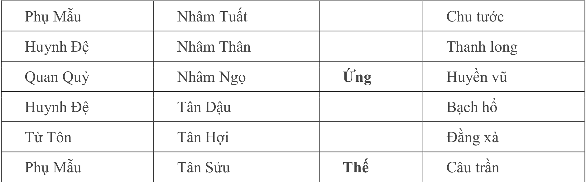
    - **Hình này chứng minh điều gì**
      - Quẻ Thiên Phong Cấu tĩnh quẻ với Hào Thế Sửu thổ Phụ Mẫu mộ kim lâm Câu Trần.
    - **Từ đâu mà thấy được**
      - Hào 1 Tân Sửu Phụ Mẫu trì Thế lâm Câu Trần, Thê Tài Dần mộc phục dưới Hào 2 Hợi thủy.

#### Phân tích Kỹ pháp và Tượng quẻ (Căn cứ - Nhìn vào)

- **Nhận định sơ khởi bề ngoài:**
  - Lấy Hào Tài làm Dụng.
  - Mới nhìn qua quẻ thì thấy Thê Tài Dần mộc hưu tù không hiện trên quẻ, lại tử tại Nhật Thần Mậu Ngọ hỏa.
  - Nguyên Thần Tử Tôn Tân Hợi thủy bị Nguyệt Kiến Tị hỏa xung phá thành Nguyệt Phá.
  - Luận đoán thông thường: Là tượng vô tài.
- **Luận đoán linh hoạt theo Tượng học:**
  - Tuy nhiên, Hào Thế Phụ Mẫu Tân Sửu thổ là mộ kim (mộ khố của Kim).
  - Hào Thế lâm Câu Trần: Câu Trần chủ kiến trúc phòng ốc; Hào Phụ Mẫu cũng chủ kiến trúc phòng ốc $\rightarrow$ Phụ Mẫu Sửu thổ có thể luận rộng ra là nhà kho sắt thép.
  - Hào Thế Sửu thổ lâm Tuần Không: Tuần Không là kho rỗng, là buôn bán không có hàng trong kho, có thể hiểu là không có hàng tích trữ.
  - Hào Ứng Quan Quỷ Nhâm Ngọ tương sinh Hào Thế: Hào Ứng là khách hàng sinh Thế, là tượng có nhiều khách hàng.
  - Hào Ứng lâm Huyền Vũ: Huyền Vũ chủ ái muội mập mờ, nên là còn có người đi cửa sau.
  - *Đánh giá kinh doanh:* Luận là buôn bán rất tốt, cung không đủ cầu, thậm chí còn có người có quan hệ nhờ vả mua sắt thép.
- **Ứng kỳ phát tài:**
  - Tử Tôn Hợi thủy bị Nguyệt Phá.
  - Đến năm Ất Hợi điền thực $\rightarrow$ Đoán là năm 1995 đại phát tài.

#### Nghiệm chứng và Lời bình

- **Ứng nghiệm thực tế:**
  - Kết quả hoàn toàn chính xác, quẻ này cần phải luận đoán linh hoạt.
  - Nếu người này buôn bán không phải là kim loại sắt thép, sợ rằng quẻ này không thể đoán là phát tài.
- **Lời bình (Án):**
  - Đây là ví dụ đặc biệt.

---

### Ví dụ 4: Nữ xem sức khỏe bệnh tật (Quẻ Bát Thuần Ly)

#### Bối cảnh và Quẻ dịch

- **Thời gian chiêm đoán:** Ngày Kỷ Hợi, tháng Giáp Tý, năm Mậu Dần.
- **Tuần Không:** Kỷ Hợi thuộc tuần Giáp Ngọ, Tuần Không tại $\text{Thìn}$ và $\text{Tị}$.
- **Đối tượng và sự việc thỉnh đoán:** Một người nữ xem về sức khỏe bệnh tật.
- **Quẻ thu được:** Bát Thuần Ly ($\text{离为火}$) (quẻ Lục Xung, tĩnh).

| Lục Thân (Chính) | Can Chi (Chính) | Thế / Ứng | Lục Thú |
| :--- | :--- | :---: | :--- |
| Huynh Đệ | Kỷ Tỵ | **Thế** | Câu trần |
| Tử Tôn | Kỷ Mùi | | Chu tước |
| Thê Tài | Kỷ Dậu | | Thanh long |
| Quan Quỷ | Kỷ Hợi | **Ứng** | Huyền vũ |
| Tử Tôn | Kỷ Sửu | | Bạch hổ |
| Phụ Mẫu | Kỷ Mão | | Đằng xà |

- **Bảng quẻ và dữ kiện thực tế:**
  - **Hình 4.** Quẻ Bát Thuần Ly
    - 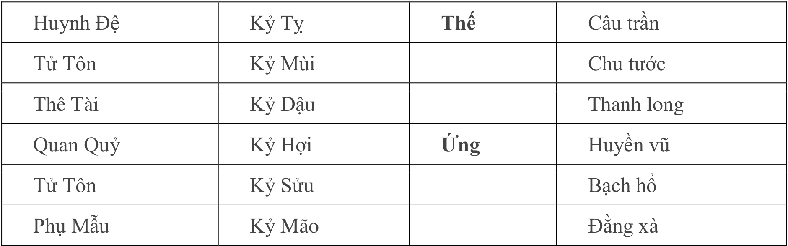
    - **Hình này chứng minh điều gì**
      - Quẻ Ly lục xung phản ánh Hào Thế Kỷ Sửu Tuần Không tránh được tai họa kỵ thần khắc thương.
    - **Từ đâu mà thấy được**
      - Hào 2 Kỷ Sửu Tử Tôn trì Thế Tuần Không lâm Chu Tước, Hào 3 Quan Quỷ Hợi thủy vượng xung Thế.

#### Phân tích Kỹ pháp và Tượng quẻ (Căn cứ - Nhìn vào)

- **Xác định Dụng Thần:**
  - Lấy Hào Thế (Huynh Đệ Kỷ Tị) làm Dụng Thần.
- **Căn cứ - Nhìn vào nguyên nhân phát sinh bệnh thận:**
  - Quan Quỷ Kỷ Hợi thủy được Nhật Thần Hợi thủy và Nguyệt Kiến Tý thủy bang phù cực vượng.
  - Quan Quỷ lâm hào 3 xung khắc Hào Thế Tị hỏa ($\text{Tị Hợi tương xung}$).
  - Trong cơ thể, hào 3 là thận, ngũ hành Thủy cũng chủ thận $\rightarrow$ Chính là thận thủy quá vượng mà đưa tới bệnh về thận.
  - Hào Thế lâm Câu Trần: Câu Trần chủ sưng tấy, cho nên trên người đang bị phù.
- **Căn cứ - Nhìn vào tính chất nguy hiểm và Tượng Không Vong cứu giải:**
  - Quan Quỷ lâm Nguyệt Kiến là bệnh đã lâu ngày. Bệnh lâu gặp quẻ Lục Xung là hung triệu.
  - May mà Hào Thế Kỷ Tị lâm Tuần Không: Tuần Không là tượng "trốn vào chỗ không", nên Quan Quỷ khắc Hào Thế giảm nhược, không đến nỗi phát triển nghiêm trọng.
- **Căn cứ - Nhìn vào thói quen uống nước và bài tiết:**
  - Bởi vì Thủy là kỵ thần, Hào Thế Tị hỏa tuyệt tại Hợi thủy $\rightarrow$ Bản thân người này không thích uống nước.
  - Hào Thê Tài là đi tiểu nhiều, lâm hào 4; hào 4 là nhà vệ sinh $\rightarrow$ Cho nên vừa uống nước xong đã phải đi nhà cầu.
  - Thu đông thủy vượng $\rightarrow$ Trong 2 mùa này bệnh tình nghiêm trọng nhất.
- **Căn cứ - Nhìn vào hàn chứng và bệnh phụ khoa:**
  - Nữ nhân hào ba là âm; Thủy vượng lâm Huyền Vũ: Huyền Vũ chủ "nan ngôn chi ẩn" (việc khó nói, nỗi niềm khó nói) và chủ hàn chứng $\rightarrow$ Người này trong người có hàn chứng, khí hư nhiều.
- **Căn cứ - Nhìn vào chứng bệnh thiếu máu não:**
  - Hào Thế cư hào sáu: Hào sáu là đầu.
  - Vì tuần không mà không được Nguyên Thần Phụ Mẫu Mão mộc sinh.
  - Lại có quẻ Ly chủ máu huyết; Nguyên Thần Mão mộc lâm Đằng Xà; Đằng Xà chủ ít $\rightarrow$ Đoán là bị thiếu máu não.
- **Lý do không đoán là sẽ chết:**
  - Bởi vì nội nhân không có hào động khắc Thế.

#### Nghiệm chứng và Lời bình

- **Ứng nghiệm thực tế:**
  - Toàn bộ suy đoán đều chính xác.
  - Cô này bị bệnh thận đã 3 năm, đã chữa nhiều nơi mà chưa khỏi, trên người nhiều chỗ bị phù thũng.

---

### Ví dụ 5: Nữ xem quan ty kiện tụng (Quẻ Lôi Hỏa Phong)

#### Bối cảnh và Quẻ dịch

- **Thời gian chiêm đoán:** Ngày Đinh Sửu, tháng Mùi, năm Mậu Dần.
- **Tuần Không:** Đinh Sửu thuộc tuần Giáp Tuất, Tuần Không tại $\text{Thân}$ và $\text{Dậu}$.
- **Đối tượng và sự việc thỉnh đoán:** Một người nữ xem về việc kiện tụng.
- **Quẻ thu được:** Lôi Hỏa Phong ($\text{雷火丰}$) (quẻ tĩnh).

| Lục Thân (Chính) | Can Chi (Chính) | Thế / Ứng | Lục Thú |
| :--- | :--- | :---: | :--- |
| Quan Quỷ | Canh Tuất | | Thanh long |
| Phụ Mẫu | Canh Thân | **Thế** | Huyền vũ |
| Thê Tài | Canh Ngọ | | Bạch hổ |
| Huynh Đệ | Kỷ Hợi | | Đằng xà |
| Quan Quỷ | Kỷ Sửu | **Ứng** | Câu trần |
| Tử Tôn | Kỷ Mão | | Chu tước |

- **Bảng quẻ và dữ kiện thực tế:**
  - **Hình 5.** Quẻ Lôi Hỏa Phong
    - 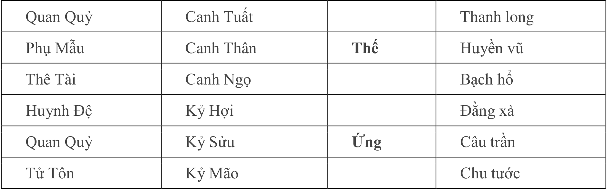
    - **Hình này chứng minh điều gì**
      - Quẻ Lôi Hỏa Phong với Hào Thế Canh Ngọ và Hào 4 Quan Quỷ Kỷ Hợi Tuần Không giải trừ kiện tụng.
    - **Từ đâu mà thấy được**
      - Hào 4 Canh Ngọ Huynh Đệ trì Thế, Hào 6 Canh Tuất Phụ Mẫu và Quan Quỷ Kỷ Hợi Tuần Không.

#### Phân tích Kỹ pháp và Tượng quẻ (Căn cứ - Nhìn vào)

- **Xác định Dụng Thần và Vai trò khởi kiện:**
  - Xem mối quan hệ sinh khắc giữa Thế và Ứng làm chủ.
  - Hào Phụ Mẫu là đơn kiện; Phụ Mẫu Canh Thân trì Thế là người này đi kiện đối phương, là nguyên cáo.
- **Căn cứ - Nhìn vào tâm lý nguyên cáo qua Tượng Không Vong:**
  - Hào Thế Canh Thân lâm Tuần Không: Là trong lòng không biết nên đối xử với đối phương thế nào.
  - Thế lâm Huyền Vũ: Huyền Vũ chủ nội tâm; Không Vong lại chủ bất an $\rightarrow$ Đoán là sau khi kiện đối phương, trong lòng bất an.
- **Căn cứ - Nhìn vào nguyên nhân vụ kiện:**
  - Quan Quỷ lưỡng hiện (Hào 6 Canh Tuất và Hào 2 Kỷ Sửu), ta lấy hào Nguyệt Phá làm chủ.
  - Quan Quỷ Sửu thổ lâm hào hai; hào hai là trạch; lâm Câu Trần chủ đất đai, kiến trúc $\rightarrow$ Là bởi vì bất động sản mà kiện tụng.
  - Hào Ứng lâm hào hai là "Ứng nhập phi trạch" $\rightarrow$ Là đối phương đã chiếm nhà cửa, địa bàn người này.
- **Căn cứ - Nhìn vào ý định hòa giải và Ứng kỳ:**
  - Hào Ứng Kỷ Sửu thổ tương sinh Hào Thế Canh Thân kim: Là tượng đối phương muốn cầu hòa.
  - Thế tuần không nên không được sinh $\rightarrow$ Là nguyên cáo không đáp ứng.
  - *Ứng kỳ:* Tới tháng Thân, Hào Ứng Sửu thổ xuất nguyệt bất phá, Hào Thế Thân kim xuất không được sinh $\rightarrow$ Người này sẽ chấp nhận điều kiện của đối phương.

---

### Ví dụ 6: Nam xem hôn nhân đối tượng (Quẻ Trạch Địa Tụy)

#### Bối cảnh và Quẻ dịch

- **Thời gian chiêm đoán:** Ngày Quý Mão, tháng Mậu Thân, năm Đinh Sửu.
- **Tuần Không:** Quý Mão thuộc tuần Giáp Ngọ, Tuần Không tại $\text{Thìn}$ và $\text{Tị}$.
- **Đối tượng và sự việc thỉnh đoán:** Có một người nam xem về hôn nhân đối tượng.
- **Quẻ thu được:** Trạch Địa Tụy ($\text{泽地萃}$) (quẻ tĩnh).

| Lục Thân (Chính) | Can Chi (Chính) | Thế / Ứng | Lục Thú |
| :--- | :--- | :---: | :--- |
| Phụ Mẫu | Đinh Mùi | | Bạch hổ |
| Huynh Đệ | Đinh Dậu | **Ứng** | Đằng xà |
| Tử Tôn | Đinh Hợi | | Câu trần |
| Thê Tài | Ất Mão | | Chu tước |
| Quan Quỷ | Ất Tỵ | **Thế** | Thanh long |
| Phụ Mẫu | Ất Mùi | | Huyền vũ |

- **Bảng quẻ và dữ kiện thực tế:**
  - **Hình 6.** Quẻ Trạch Địa Tụy
    - 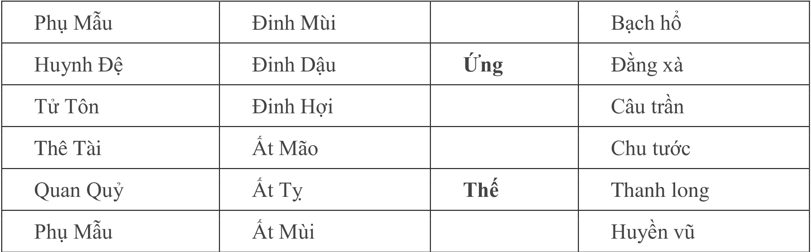
    - **Hình này chứng minh điều gì**
      - Quẻ Trạch Địa Tụy tĩnh quẻ phản ánh Hào Ứng Mùi thổ Tuần Không chủ đối phương trốn tránh.
    - **Từ đâu mà thấy được**
      - Hào 5 Đinh Mùi Thê Tài lâm Ứng Tuần Không lâm Bạch Hổ, Hào 2 Ất Tỵ Quan Quỷ trì Thế.

#### Phân tích Kỹ pháp và Tượng quẻ (Căn cứ - Nhìn vào)

- **Xác định Dụng Thần và Hiện trạng:**
  - Thê Tài là Dụng Thần.
  - Thê Tài Ất Mão lâm Nhật Thần Quý Mão sinh Hào Thế Quan Quỷ Ất Tị $\rightarrow$ Trước mắt đã có đối tượng mà đối tượng nguyện ý quan hệ qua lại.
- **Căn cứ - Nhìn vào tướng mạo người nữ:**
  - Dụng Thần Mão mộc: Các chi Tý, Ngọ, Mão, Dậu là tròn; hành Mộc chủ thon dài $\rightarrow$ Nên người nữ dáng dấp mặt tròn vóc người thon dài.
- **Căn cứ - Nhìn vào biến cố nguy hiểm:**
  - Dụng Thần mặc dù sinh Thế nhưng không nên bị Nguyệt Kiến Mậu Thân kim khắc thương.
  - Hào Ứng Huynh Đệ Đinh Dậu ám động khắc Dụng Thần ($\text{Mão Dậu tương xung}$).
  - Hào Ứng là tha nhân (người khác) $\rightarrow$ Tháng Dậu sợ có biến cố, đối tượng bị người khác cướp đi.
- **Căn cứ - Nhìn vào Tượng Không Vong của Hào Thế:**
  - Hào Thế lâm Thanh Long Không Vong: Không Vong nên không được sinh; Thanh Long là hỷ $\rightarrow$ Là không có chuyển hỷ (không có tin vui thành hôn).

---

### Ví dụ 7: Bắt thăm phân phòng nhà ở (Quẻ Phong Thủy Hoán biến Thiên Thủy Tụng)

#### Bối cảnh và Quẻ dịch

- **Thời gian chiêm đoán:** Ngày Ất Mùi, tháng Giáp Thân, năm Đinh Sửu.
- **Tuần Không:** Ất Mùi thuộc tuần Giáp Ngọ, Tuần Không tại $\text{Thìn}$ và $\text{Tị}$.
- **Đối tượng và sự việc thỉnh đoán:** Có 1 người nam vì đơn vị bắt thăm phân phòng, xem mình có thể được phòng thẳng lên cầu thang hay không; bởi vì người này không muốn phòng thẳng hướng cầu thang.
- **Quẻ thu được:** Phong Thủy Hoán ($\text{风水涣}$) biến Thiên Thủy Tụng ($\text{天水讼}$).

| Lục Thân (Chính) | Can Chi (Chính) | Thế / Ứng | Biến Động | Lục Thân (Biến) | Can Chi (Biến) | Lục Thú |
| :--- | :--- | :---: | :---: | :--- | :--- | :--- |
| Phụ Mẫu | Tân Mão | | | Tử Tôn | Nhâm Tuất | Huyền vũ |
| Huynh Đệ | Tân Tỵ | **Thế** | | Thê Tài | Nhâm Thân | Bạch hổ |
| Tử Tôn | Tân Mùi | | **X** | Huynh Đệ | Nhâm Ngọ | Đằng xà |
| Huynh Đệ | Mậu Ngọ | | | Huynh Đệ | Mậu Ngọ | Câu trần |
| Tử Tôn | Mậu Thìn | **Ứng** | | Tử Tôn | Mậu Thìn | Chu tước |
| Phụ Mẫu | Mậu Dần | | | Phụ Mẫu | Mậu Dần | Thanh long |

- **Bảng quẻ và dữ kiện thực tế:**
  - **Hình 7.** Quẻ Phong Thủy Hoán biến Thiên Thủy Tụng
    - 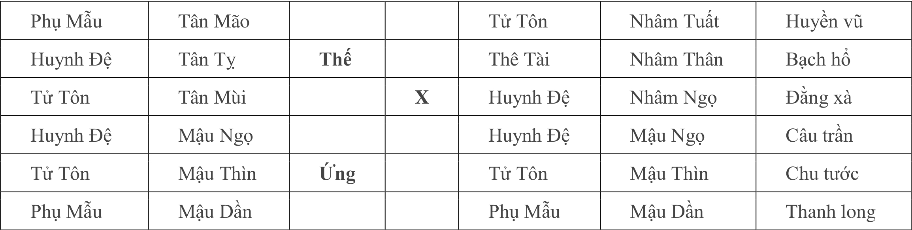
    - **Hình này chứng minh điều gì**
      - Quẻ Hoán biến Tụng phản ánh Hào Thế Dần mộc và Quan Quỷ Thìn thổ Tuần Không bắt thăm gian phòng số 3.
    - **Từ đâu mà thấy được**
      - Hào 2 Mậu Dần Huynh Đệ trì Thế, Hào 4 Tân Mùi Quan Quỷ động hóa Ngọ hỏa sinh Thế.

#### Phân tích Kỹ pháp và Tượng quẻ (Căn cứ - Nhìn vào)

- **Xác định Dụng Thần, Tầng nhà và Hướng phòng:**
  - Lấy Hào Phụ Mẫu là Dụng Thần.
  - Phụ Mẫu lưỡng hiện, lấy hào sơ Phụ Mẫu Mậu Dần mộc Nguyệt Phá ($\text{Dần Thân tương xung}$) làm Dụng Thần.
  - Dụng Thần tại hào sơ là phòng ở tầng 1.
  - Lâm Mộc là hướng về phía đông.
- **Căn cứ - Nhìn vào vị trí cầu thang và Tượng Không Vong của Hào Thế:**
  - Hào năm là đường đi, lâm Bạch Hổ là trong lòng ý muốn rất mạnh, chỗ này có thể hiểu là cầu thang.
  - Hào Thế lâm hào 5 Không Vong: Là phòng của người này không đối diện về phía cầu thang.

#### Nghiệm chứng và Lời bình

- **Ứng nghiệm thực tế:**
  - Buổi chiều sau khi bắt thăm, quả nhiên được phòng tầng 1 ở phía đông, không hướng về phía cầu thang.

## 2. NGUYỆT PHÁ BIỆN NGHĨA

### 2.1. Khái Niệm, Bản Chất Biện Nghĩa Và Ý Nghĩa Biểu Tượng Của Nguyệt Phá

- **Mối tương đồng giữa Nguyệt Phá và Không Vong**:
  - Cách dùng của $\text{Nguyệt Phá}$ (月破) cùng $\text{Không Vong}$ (空亡) có sự tương đồng sâu sắc trong hệ thống dự đoán $\text{Lục Hào}$.
  - Ngoại trừ công năng cơ bản dùng để luận đoán cát hung và định vị thời điểm ứng nghiệm ($\text{Ứng kỳ}$), bên trong $\text{Nguyệt Phá}$ còn bao hàm rất nhiều nội dung ý nghĩa biểu tượng phong phú, tinh tế khác.
- **Ý nghĩa biểu tượng đa chiều của Nguyệt Phá**:
  - Bản chất biểu nghĩa của $\text{Nguyệt Phá}$ bao gồm:
    - Trạng thái hư hoại: Phá hư, diệt trừ, đánh nát, nát bấy, vỡ nát.
    - Trạng thái phân rã, chia cắt: Chia lìa, biệt ly, đổ nát.
    - Dấu vết thương tổn vật lý: Cái khe, khe hở, vết rách, vết thương.
    - Biến chất hữu cơ: Mục nát, hủ bại, thối rữa (hoại tử, lở loét niêm mạc).
    - Biến cố quy tắc và cơ học: Phá lệ, bẻ gảy...
- **Phê phán khuynh hướng luận giải sơ sài và yêu cầu nâng cao tầng bậc dự trắc**:
  - Khi xem xét một quẻ, nếu dự đoán sư chỉ câu nệ vào việc luận đoán sinh khắc cát hung thông thường thì tất yếu sẽ bỏ sót rất nhiều tin tức quý báu, quan trọng.
  - Sự tinh giản phiến diện này khiến cho nguyên bản sự việc vốn vô cùng phong phú, sinh động và phức tạp được phản ánh trên quẻ trở thành bình đạm, vô vị, không có gì đặc sắc.
  - Dự đoán sư chỉ khi đi sâu nhận thức và thấu triệt được rằng mỗi loại hiện tượng (như xung, phá, không, mộ) đều ẩn chứa những hàm nghĩa tượng trưng thâm sâu, mới có thể nâng cao và vươn tới trình độ đoán quẻ ở tầng bậc cao.
  - Mục đích trình bày các án lệ: Thông qua các ví dụ thực tiễn sinh động liên quan đến $\text{Nguyệt Phá}$ để gợi mở và xác lập một nhận thức hoàn toàn mới cho người học.

### 2.2. Án Lệ Thực Nghiệm Minh Họa Kỹ Pháp Biện Nghĩa Nguyệt Phá

#### 2.2.1. Ví Dụ 1: Xem Hôn Nhân Cho Con Gái (Quẻ Thủy Hỏa Ký Tế Biến Thủy Lôi Truân)

##### A. Bối Cảnh Tiếp Nhận Và Dữ Liệu Khởi Quẻ
- **Bối cảnh thắc mắc**:
  - Thời gian: Ngày $\text{Đinh Mão}$, tháng $\text{Quý Mùi}$, năm $\text{Ất Hợi}$.
  - Đương sự: Một người mẹ đến xin dự đoán về chuyện hôn nhân duyên phận cho con gái của mình.
- **Tham số thiên can địa chi và thần sát**:
  - Nhật thần: Ngày $\text{Đinh Mão}$ (thuộc tuần $\text{Giáp Tý}$ $\rightarrow$ $\text{Tuất}$ và $\text{Hợi}$ lâm $\text{Tuần Không}$).
  - Nguyệt kiến: Tháng $\text{Quý Mùi}$ (chi $\text{Mùi}$ tương xung $\text{Sửu}$ $\rightarrow$ hào có địa chi $\text{Sửu}$ lâm $\text{Nguyệt Phá}$; $\text{Mùi}$ đồng thời là Mộ khố của ngũ hành $\text{Mộc}$).
  - Quẻ thu được: $\text{Thủy Hỏa Ký Tế}$ biến $\text{Thủy Lôi Truân}$.

##### B. Bảng Quẻ Dịch Và Hình Ảnh Bằng Chứng
- **Bảng quẻ và dữ kiện thực tế:**
  - **Hình 8.** Quẻ Thủy Hỏa Ký Tế biến Thủy Lôi Truân
    - 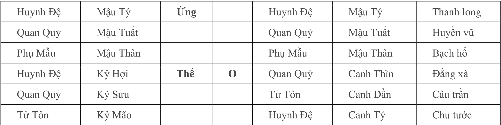
    - **Hình này chứng minh điều gì**
      - Hào Ứng Sửu thổ Nguyệt Phá và Tuần Không năm Giáp Tuất chỉ ứng kỳ ly dị của con gái.
    - **Từ đâu mà thấy được**
      - Hào 3 Kỷ Hợi Huynh Đệ trì Thế, Hào Ứng Kỷ Sửu Quan Quỷ xung Nguyệt Phá lâm Huyền Vũ.

- **Cấu trúc chi tiết sáu hào quẻ Thủy Hỏa Ký Tế biến Thủy Lôi Truân**:

| Hào | Lục Thân (Chính) | Can Chi (Chính) | Thế / Ứng | Động Biến | Lục Thân (Biến) | Can Chi (Biến) | Lục Thú |
| :---: | :---: | :---: | :---: | :---: | :---: | :---: | :---: |
| 6 | $\text{Huynh Đệ}$ | $\text{Mậu Tý}$ | $\text{Ứng}$ | | $\text{Huynh Đệ}$ | $\text{Mậu Tý}$ | $\text{Thanh Long}$ |
| 5 | $\text{Quan Quỷ}$ | $\text{Mậu Tuất}$ | | | $\text{Quan Quỷ}$ | $\text{Mậu Tuất}$ | $\text{Huyền Vũ}$ |
| 4 | $\text{Phụ Mẫu}$ | $\text{Mậu Thân}$ | | | $\text{Phụ Mẫu}$ | $\text{Mậu Thân}$ | $\text{Bạch Hổ}$ |
| 3 | $\text{Huynh Đệ}$ | $\text{Kỷ Hợi}$ | $\text{Thế}$ | $\mathbf{O}$ | $\text{Quan Quỷ}$ | $\text{Canh Thìn}$ | $\text{Đằng Xà}$ |
| 2 | $\text{Quan Quỷ}$ | $\text{Kỷ Sửu}$ | | | $\text{Tử Tôn}$ | $\text{Canh Dần}$ | $\text{Câu Trần}$ |
| 1 | $\text{Tử Tôn}$ | $\text{Kỷ Mão}$ | | | $\text{Huynh Đệ}$ | $\text{Canh Tý}$ | $\text{Chu Tước}$ |

##### C. Tiến Trình Luận Đoán Từng Bước (Căn Cứ – Nhìn Vào)
- **Bước 1: Xác định Dụng Thần**:
  - *Căn cứ*: Mẹ xem hôn sự cho con gái, đối tượng kết hôn (bạn trai, chồng) được đại diện bởi hào $\text{Quan Quỷ}$.
  - *Nhìn vào*: Lấy $\text{Quan Quỷ}$ làm $\text{Dụng Thần}$ trung tâm để khảo sát toàn cục.
- **Bước 2: Phân tích tâm trạng và trạng thái người mẹ**:
  - *Căn cứ*: Hào 3 là hào $\text{Thế}$ mang $\text{Huynh Đệ Kỷ Hợi}$. Ngày $\text{Đinh Mão}$ tuần $\text{Giáp Tý}$ nên $\text{Hợi}$ lâm $\text{Tuần Không}$; hào $\text{Thế}$ lâm linh thú $\text{Đằng Xà}$; hào $\text{Thế}$ động phát động hóa ra $\text{Quan Quỷ Canh Thìn}$ ($\text{Hợi-Thủy}$ nhập Mộ tại $\text{Thìn-Thổ}$, tức động hóa Mộ).
  - *Nhìn vào*:
    - Hào $\text{Thế}$ lâm $\text{Không Vong}$ là biểu tượng của tâm trạng lo âu, hoang mang, bất an.
    - Lâm $\text{Đằng Xà}$ là tượng phiền não quấn quanh, bất định.
    - Động mà hóa Mộ là hình tượng bị vây bọc, giam cầm, bế tắc không lối thoát.
  - *Kết luận*: Người mẹ vì việc hôn nhân đại sự của con gái mà trong lòng tâm phiền ý loạn, vô cùng sầu não khổ sở.
- **Bước 3: Đánh giá mối quan hệ Thế – Ứng và duyên phận tác hợp**:
  - *Căn cứ*: Hào $\text{Thế}$ mang $\text{Huynh Đệ Kỷ Hợi}$ ($\text{Thủy}$), hào $\text{Ứng}$ mang $\text{Huynh Đệ Mậu Tý}$ ($\text{Thủy}$).
  - *Nhìn vào*: Hào $\text{Thế}$ và hào $\text{Ứng}$ ở thế tỉ hòa về ngũ hành.
  - *Quy tắc*: Trong xem hôn nhân, Thế Ứng tỉ hòa biểu thị hai bên không chủ động hướng về nhau; nếu thiếu người mai mối làm cầu nối trung gian thì sự việc khó lòng thành tựu.
- **Bước 4: Phân tích tâm trạng của người con gái**:
  - *Căn cứ*: Hào 1 mang $\text{Tử Tôn Kỷ Mão}$ đại diện cho người con gái. Xét tương quan với lệnh tháng: $\text{Mão-Mộc}$ nhập Mộ tại $\text{Nguyệt Kiến Quý Mùi}$ ($\text{Mùi}$ là Mộ khố của ngũ hành Mộc, đồng thời $\text{Mùi-Thổ}$ mang lục thân $\text{Quan Quỷ}$).
  - *Nhìn vào*: Người con gái cũng đang trong tâm trạng rầu rĩ, u uất vì bản thân mãi không tìm kiếm được đối tượng tâm đầu ý hợp.
- **Bước 5: Khai thác lịch sử tình cảm bằng kỹ pháp Tuần Không và Nguyệt Phá**:
  - *Căn cứ*: Trong quẻ xuất hiện tình trạng $\text{Quan Quỷ}$ lưỡng hiện (hai hào Quan Quỷ cùng ngự trị tại Hào 5 $\text{Mậu Tuất}$ và Hào 2 $\text{Kỷ Sửu}$).
  - *Luận về đối tượng thứ nhất (Năm 1994)*:
    - Hào 5 $\text{Quan Quỷ Mậu Tuất}$ lâm $\text{Tuần Không}$.
    - *Nhìn vào*: Đoán vào năm 1994 (năm $\text{Giáp Tuất}$, ứng với địa chi $\text{Tuất}$ lâm Không), người con gái trong năm này đã từ bỏ/chia tay một người bạn trai (một đối tượng).
  - *Luận về đối tượng thứ hai (Trong tháng hiện tại)*:
    - Hào 2 $\text{Quan Quỷ Kỷ Sửu}$ bị $\text{Nguyệt Kiến Mùi-Thổ}$ trực xung khắc phá, rơi vào trạng thái $\text{Nguyệt Phá}$.
    - *Nhìn vào*: $\text{Nguyệt Phá}$ mang ý nghĩa chia lìa, vỡ nát, đổ vỡ, bỏ rơi. Đoán định người con gái ngay trong tháng này (tháng $\text{Quý Mùi}$) lại vừa mới bỏ rơi/chia tay một đối tượng nữa.

##### D. Ứng Kỳ Và Kết Quả Thực Tế Đối Chiếu
- **Đối chiếu thực tế kiểm chứng**:
  - Toàn bộ các phán đoán trên (tâm trạng người mẹ, sự sầu não của con gái, việc bỏ đối tượng năm 1994 Giáp Tuất và việc vừa chia tay bạn trai trong tháng Quý Mùi) đều được gia đình xác nhận ứng nghiệm chính xác hoàn toàn.
- **Dự đoán phát triển tương lai và ứng kỳ**:
  - *Căn cứ*: Hào $\text{Thế}$ $\text{Huynh Đệ Kỷ Hợi}$ phát động hóa xuất $\text{Quan Quỷ Canh Thìn}$ (tượng hóa xuất bạn trai/chồng).
  - *Nhìn vào*: Đoán trong năm nay ($\text{Ất Hợi}$), vào tháng $\text{Hợi}$ (tháng 10 âm lịch, trùng phùng với địa chi của hào Thế và Thái Tuế) có thể xuất hiện một người bạn trai mới; tuy nhiên sự việc muốn thành công bắt buộc phải nhờ đến người bề trên đứng ra làm mai mối tác hợp.
  - *Phản hồi hậu sự*: Diễn biến cụ thể sau đó ra sao do đương sự không cung cấp thông tin phản hồi tiếp theo nên tác giả không rõ kết cục.

---

#### 2.2.2. Ví Dụ 2: Xem Bệnh Dạ Dày Tá Tràng (Quẻ Thiên Lôi Vô Vọng Biến Phong Thủy Hoán)

##### A. Bối Cảnh Tiếp Nhận Và Dữ Liệu Khởi Quẻ
- **Bối cảnh thắc mắc**:
  - Thời gian: Ngày $\text{Nhâm Ngọ}$, tháng $\text{Bính Thân}$, năm $\text{Bính Tý}$.
  - Đương sự: Một người tự xem về tình trạng bệnh dạ dày (bao tử) của bản thân.
- **Tham số thiên can địa chi và thần sát**:
  - Nhật thần: Ngày $\text{Nhâm Ngọ}$ (thuộc tuần $\text{Giáp Tuất}$ $\rightarrow$ $\text{Thân}$ và $\text{Dậu}$ lâm $\text{Tuần Không}$; Nhật thần mang hỏa khí trợ vượng cho hào Thế).
  - Nguyệt kiến: Tháng $\text{Bính Thân}$ (chi $\text{Thân}$ tương xung $\text{Dần}$ $\rightarrow$ hào mang địa chi $\text{Dần}$ lâm $\text{Nguyệt Phá}$).
  - Quẻ thu được: $\text{Thiên Lôi Vô Vọng}$ biến $\text{Phong Thủy Hoán}$.

##### B. Bảng Quẻ Dịch Và Hình Ảnh Bằng Chứng
- **Bảng quẻ và dữ kiện thực tế:**
  - **Hình 9.** Quẻ Thiên Lôi Vô Vọng biến Phong Thủy Hoán
    - 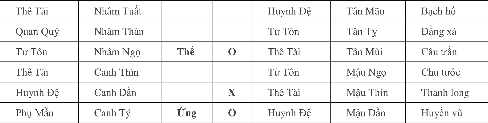
    - **Hình này chứng minh điều gì**
      - Hào 2 Canh Dần Quan Quỷ Nguyệt Phá lâm Thanh Long chỉ tổn thương viêm loét môn vị tá tràng.
    - **Từ đâu mà thấy được**
      - Hào 2 Canh Dần Quan Quỷ bị tháng Thân xung phá, Hào 3 Thìn thổ dạ dày tĩnh không bệnh.

- **Cấu trúc chi tiết sáu hào quẻ Thiên Lôi Vô Vọng biến Phong Thủy Hoán**:

| Hào | Lục Thân (Chính) | Can Chi (Chính) | Thế / Ứng | Động Biến | Lục Thân (Biến) | Can Chi (Biến) | Lục Thú |
| :---: | :---: | :---: | :---: | :---: | :---: | :---: | :---: |
| 6 | $\text{Thê Tài}$ | $\text{Nhâm Tuất}$ | | | $\text{Huynh Đệ}$ | $\text{Tân Mão}$ | $\text{Bạch Hổ}$ |
| 5 | $\text{Quan Quỷ}$ | $\text{Nhâm Thân}$ | | | $\text{Tử Tôn}$ | $\text{Tân Tỵ}$ | $\text{Đằng Xà}$ |
| 4 | $\text{Tử Tôn}$ | $\text{Nhâm Ngọ}$ | $\text{Thế}$ | $\mathbf{O}$ | $\text{Thê Tài}$ | $\text{Tân Mùi}$ | $\text{Câu Trần}$ |
| 3 | $\text{Thê Tài}$ | $\text{Canh Thìn}$ | | | $\text{Tử Tôn}$ | $\text{Mậu Ngọ}$ | $\text{Chu Tước}$ |
| 2 | $\text{Huynh Đệ}$ | $\text{Canh Dần}$ | | $\mathbf{X}$ | $\text{Thê Tài}$ | $\text{Mậu Thìn}$ | $\text{Thanh Long}$ |
| 1 | $\text{Phụ Mẫu}$ | $\text{Canh Tý}$ | $\text{Ứng}$ | $\mathbf{O}$ | $\text{Huynh Đệ}$ | $\text{Mậu Dần}$ | $\text{Huyền Vũ}$ |

##### C. Tiến Trình Luận Đoán Từng Bước (Căn Cứ – Nhìn Vào)
- **Bước 1: Định vị Dụng Thần và thẩm định an nguy tính mạng**:
  - *Căn cứ*: Tự xem bệnh cho bản thân lấy hào $\text{Thế}$ làm chủ thể căn bản. Hào $\text{Thế}$ mang $\text{Tử Tôn Nhâm Ngọ}$ được Nhật thần $\text{Nhâm Ngọ}$ trị nhật (lâm Nhật thần). Trong quẻ lại có $\text{Nguyên Thần}$ là Hào 2 $\text{Huynh Đệ Canh Dần}$ phát động tương sinh ($\text{Dần-Mộc}$ sinh $\text{Ngọ-Hỏa}$).
  - *Nhìn vào*: Hào $\text{Thế}$ cực kỳ vượng tướng, lại được $\text{Nguyên Thần}$ phát động sinh trợ liên tục, do đó tính mạng hoàn toàn không có gì đáng ngại, không nguy hiểm đến tính mạng.
- **Bước 2: Biện nghĩa Nguyệt Phá và phân biệt vị trí bệnh lý (Dạ dày vs Môn vị, Tá tràng)**:
  - *Căn cứ biểu tượng Nguyệt Phá*:
    - Hào $\text{Thế}$ là $\text{Hỏa}$. $\text{Nguyên Thần}$ $\text{Huynh Đệ Dần-Mộc}$ ngự tại hào 2 bị $\text{Nguyệt Kiến Thân-Kim}$ xung khắc, lâm $\text{Nguyệt Phá}$, đồng thời lâm linh thú $\text{Thanh Long}$.
    - Hàm nghĩa tượng trưng: $\text{Nguyệt Phá}$ chủ về thối rữa, nát rữa, lở loét (tổn thương niêm mạc tạo vết loét); $\text{Thanh Long}$ chủ về chứng đau nhức.
  - *Căn cứ định vị Hào 3 (Dạ dày)*:
    - Trong nhân thể học Lục Hào, Hào 3 là hào vị chủ về cơ quan dạ dày (bao tử).
    - Tại Hào 3 mang $\text{Thê Tài Canh Thìn}$, ở trạng thái tĩnh bất động, đối với $\text{Dụng Thần}$ vô hại $\rightarrow$ Đây là biểu tượng rõ ràng khẳng định dạ dày hoàn toàn không có bệnh.
  - *Căn cứ định vị Hào 2 (Môn vị và Tá tràng)*:
    - Vì $\text{Nguyên Thần}$ $\text{Huynh Đệ Dần-Mộc}$ lâm $\text{Nguyệt Phá}$, nên ổ bệnh thực sự tập trung phát sinh ngay tại vị trí Hào 2.
    - Xét về tương quan vị trí không gian cơ thể: Hào 2 nằm ở vị trí thấp hơn so với Hào 3.
    - Xét về hình thể vật chất của ngũ hành: Hào 2 lâm hành $\text{Mộc}$; đặc tính của $\text{Mộc}$ là "vật nhỏ mà dài" (ống dẫn thon dài).
    - Đối chiếu giải phẫu học cơ thể người: Vùng nằm ngay phía dưới dạ dày có hình thon nhỏ kết nối chính là **môn vị** (cửa ra của dạ dày) và **tá tràng** (đoạn đầu của ruột non).
  - *Nhìn vào kết luận*: Người này bị bệnh đồng thời ở cả hai bộ vị môn vị và tá tràng chứ không phải bệnh ở dạ dày. Hào 2 $\text{Dần-Mộc}$ lâm $\text{Nguyệt Phá}$ chính là chứng trạng **lở loét môn vị và tá tràng**.
- **Bước 3: Phân tích trạng thái trị liệu và tác dụng phụ của y dược**:
  - *Căn cứ*:
    - Hào $\text{Thế}$ mang $\text{Tử Tôn}$: $\text{Tử Tôn}$ là thần dược trừ bệnh; $\text{Tử Tôn}$ trì $\text{Thế}$ biểu thị người bệnh hiện tại đang tích cực tiếp nhận trị liệu, đang uống thuốc chữa trị.
    - Hào 1 mang $\text{Phụ Mẫu Canh Tý}$ lâm $\text{Ứng}$ phát động xung khắc hào $\text{Thế}$ ($\text{Tý-Thủy}$ phát động khắc $\text{Ngọ-Hỏa}$).
  - *Hàm nghĩa biểu tượng*:
    - Lục thân $\text{Phụ Mẫu}$ đại diện cho bệnh viện, y phương thuốc men.
    - Hào $\text{Ứng}$ đại diện cho thầy thuốc, bác sĩ điều trị.
    - Việc $\text{Phụ Mẫu}$ lâm $\text{Ứng}$ động khắc $\text{Thế}$ biểu thị quá trình điều trị y tế đang gây ra những phản ứng phụ bất lợi, tác dụng phụ khó chịu cho cơ thể người bệnh.
- **Bước 4: Định vị Ứng kỳ bình phục**:
  - *Căn cứ*: $\text{Nguyên Thần}$ $\text{Dần-Mộc}$ bị $\text{Nguyệt Phá}$.
  - *Quy tắc ứng kỳ*: Hào lâm $\text{Nguyệt Phá}$ khi "xuất nguyệt" (bước sang tháng tiếp theo) sẽ không còn bị tháng xung phá nữa.
  - *Nhìn vào*: Phải đợi sang tháng sau mới xuất khỏi $\text{Nguyệt Phá}$, lúc đó cơ thể mới có thể hoàn toàn khỏi bệnh.

##### D. Ứng Kỳ Và Kết Quả Thực Tế Đối Chiếu
- **Đối chiếu thực tế kiểm chứng**:
  - Người bệnh kinh ngạc xác nhận: Kết quả kiểm tra y khoa hoàn toàn chính xác là bị **loét môn vị cùng tá tràng**, tuyệt đối không phải là bệnh ở dạ dày!
  - Lý do khai báo ban đầu: Người bệnh cho biết bản thân lo sợ tác giả (dự đoán sư) không am tường danh xưng giải phẫu y học của những tạng phủ này (môn vị, tá tràng), nên mới tiện miệng nói khái quát là bị bệnh dạ dày.
  - Xác nhận về tác dụng phụ: Quá trình tiếp nhận điều trị dùng thuốc quả thật đang gây ra những tác dụng phụ rất mệt mỏi đúng như quẻ đã chỉ ra.

## 3. BÍ LUẬN 12 CUNG TRƯỜNG SINH

### 3.1. Bí Luận Lý Thuyết & 12 Cung Trường Sinh Biện Nghĩa Pháp

#### 3.1.1. Tổng Luận: Ứng Dụng Chân Chính của 12 Cung Trường Sinh trong Bốc Phệ

* Các môn dự đoán đều ít nhiều đề cập đến 12 cung trường sinh:
  * Do phương pháp dự đoán bất đồng giữa các môn phái mà quan điểm ứng dụng cũng không nhất trí.
* Hạn chế của cổ nhân trong Lục Hào (Bốc Phệ):
  * Cổ nhân chỉ chú trọng đến bốn cung cát hung cơ bản gồm Sinh, Vượng, Mộ, Tuyệt ($\text{Sinh} - \text{Vượng} - \text{Mộ} - \text{Tuyệt}$), còn lại tám cung khác đều bỏ qua không dùng.
  * Việc bỏ sót tám cung trường sinh đã làm lãng phí đi một lượng tin tức dự đoán vô cùng phong phú và vi tế trong Bốc Phệ.
  * Nguyên nhân sai lầm cốt lõi: Cổ nhân sử dụng 12 cung trường sinh làm thước đo cân nhắc sự cát hung của Dụng Thần.
* Bản chất chân chính của 12 Cung Trường Sinh:
  * 12 cung trường sinh chân chính là sử dụng trong **biện nghĩa** (biện tượng, miêu tả chi tiết tình tiết sự vật, tâm tư, hoàn cảnh), chứ không dùng để biện định cát hung.
  * Cát hung cốt lõi của sự việc chủ yếu do **Ngũ Hành sinh khắc** quyết định; Sinh, Vượng, Mộ, Tuyệt cố nhiên có tác động đến cường độ cát hung của Dụng Thần nhưng ý nghĩa miêu tả vẫn là trọng tâm.
* Dẫn chứng trong cổ thư (*Bốc Phệ Chính Tông*):
  * Sách cổ từng giảng thuật hàm nghĩa sâu xa của thai, dưỡng, mộ, bệnh, mộc dục:
    * *"Dưỡng chủ hồ nghi, mộ phần nhiều là ám vị"* (Dưỡng chủ về phân vân nghi hoặc; Mộ phần lớn chủ về nơi tối tăm, mờ ám, giam hãm).
    * *"Hóa bệnh là thương tổn, hóa thai là câu liên"* (Hào hóa Bệnh chủ về thương tật, tổn hại; hào hóa Thai chủ về câu kết, vướng víu, ràng buộc dây dưa).
    * *"Hung hóa trường sinh, mạnh mà không tan; cát gắn với mộc dục, bại mà không thành"* (Điềm hung phát động hóa Trường sinh thì khí hung bám dai dẳng không dứt; việc cát mà lâm Mộc dục thì bại hoại, nửa đường đứt gánh).
* Mục tiêu ứng dụng mở rộng thông tin dự đoán:
  * Trong thực tiễn dự trắc đối mặt với vô số sự kiện phức tạp, chỉ có mở rộng các trường tin tức của 12 cung mới nâng tầm độ chuẩn xác và thấu suốt những biến chuyển vi tế nhất của đời sống.

#### 3.1.2. Ý Nghĩa Biện Tượng Chi Tiết của 12 Cung Trường Sinh

##### 1. Cung Trường Sinh
* Khởi nguyên & Cội rễ: Nguồn gốc, khởi điểm, cội nguồn, gốc rễ, nguyên thủy, mới ra đời, sinh trưởng, sinh ra, phát sinh.
* Nương tựa & Phù trợ: Trợ giúp, cứu trợ, dựa vào, chỗ dựa vững chắc, người giúp đỡ, được cứu vớt.
* Nuôi dưỡng & Tiếp nhận: Bồi dưỡng, chăm sóc, nhận được, tìm kiếm, thức tỉnh, ăn cơm.

##### 2. Cung Mộc Dục
* Hành vi thể xác & Thủy tính: Tắm rửa, nhập thủy, thoát y, lỏa thể, đại tiểu tiện.
* Phong hóa & Tiết hạnh: Dâm loạn, dâm tiết, đổ nát, khó coi, vô sỉ.
* Ân huệ & Lợi ích: Ân trạch, chỗ tốt, làm dịu, chiếu cố, có lợi.
* Trạng thái phơi bày & Thụ động: Bại lộ, nhẵn bóng, trơ trụi, sáng bóng, bóng loáng, thẳng thắn, hưởng thụ, ngủ.
* Điểm yếu & Phòng vệ suy vi: Điềm bạc nhược, yếu kém, nơi trí mạng, từ bỏ phòng vệ, không đề phòng, không có năng lực phòng hộ.

##### 3. Cung Quan Đới
* Trang phục & Diện mạo bên ngoài: Mặc quần áo, đội mũ, y phục, đang trang điểm, trang phục, bao trang, túi xách, trang sức, bề ngoài, cao quý.
* Vinh hiển & Thăng tiến: Thăng cấp, vinh dự, khen ngợi, phần thưởng, tán thưởng, giành được chứng thư.
* Bảo hộ & Nghiệp vụ: Phòng hộ, bảo quản, che đậy, nhập ngũ.

##### 4. Cung Lâm Quan
* Thể chế & Bộ máy nhà nước: Nhà nước, cơ quan, quốc doanh, quan phủ, ra làm quan, đang làm quan, có vận làm quan, địa vị, nhân viên công vụ, công chức, viên chức.
* Hành vi quan trường & Giao tế: A dua nghênh tiếp, nịnh hót.
* Hiểm họa cận kề: Có bệnh, tai họa, cách cái chết (*ly tử*) không xa (*bất viễn*), nguy hiểm, sầu lo.
* Trưởng thành & Năng lực: Tự lực cánh sinh, tự mình nỗ lực, lớn lên, giai đoạn trưởng thành, sắp thành công, phát nguyện, hứa hẹn.
* Biến hóa & Nhân duyên: Biến hóa, xuất quỷ nhập thần, biến hoá tài tình, có nam nhân ở bên người.

##### 5. Cung Đế Vượng
* Phát triển cực thịnh: Vinh phát, phát đạt, thăng chức, lên cao, đắc ý, thần khí.
* Thái độ & Tâm lý: Tỏ vẻ, ra vẻ (đắc ý, ngạo mạn), tinh thần hưng phấn, huy hoàng.
* Điểm tột cùng & Giới hạn: Cực hạn, cao triều, cực điểm, đến cùng, hết mức, điểm cuối, kết cục.
* Khí thế & Quyền uy: Cường đại, mạnh mẽ, hùng tráng, cao lớn, am hiểu, sở trường, có quyền.

##### 6. Cung Suy
* Nhược tiểu & Bất lực: Vô lực, lực tiểu, mềm yếu, suy yếu, nhỏ yếu, hư nhược, yếu trí.
* Sa sút & Hoàn cảnh tiêu điều: Tàn tạ, sa sút, tiêu điều, suy tàn, xui xẻo, lùi bước.
* Phẩm chất & Tâm lý yếu hèn: Nhược điểm, nhát gan, nhỏ thấp, không có chỗ dựa, vô năng, không có năng lực, không có bản lãnh, bất học vô thuật, cao không được thấp không xong, không dám phản kháng.

##### 7. Cung Bệnh
* Bệnh tật & Tổn thương thể xác: Tật bệnh, ổ bệnh, thương tổn, cần uống thuốc, khuyết điểm, nhược điểm, nơi bất túc, thiếu sót, tật xấu.
* Vị trí hiểm yếu & Lỗ hổng: Chỗ sơ hở, điểm sơ hở, chỗ hiểm (trên thân thể), địa điểm quan trọng.
* Tâm lý & Quan hệ tiêu cực: Tâm bệnh, hủ bại, vấn đề, ôn thần, ghét, căm ghét, căm thù, cừu nhân, nhìn hằn thù, coi là kẻ thù, tìm vui.

##### 8. Cung Tử
* Kết thúc & Sinh khí triệt tiêu: Tử vong, chung kết, xong đời, ngưng lại, đọng lại, đáng sợ, yên tĩnh, trống trải, an tĩnh, tàn tạ, sa sút, tiêu điều, không có sinh khí, không có sức sống.
* Tâm lý cố chấp & Bế tắc: Không để ý, để tâm vào chuyện vụn vặt, đi vào chỗ bế tắc, không linh hoạt, không thể biến thông, bướng bỉnh ngoan cố, chỉ có 1 con đường tối, ngây ngô, khô khan, cứng nhắc, vụng về, nghĩ không thoáng, lòng dạ hẹp hòi.
* Đường cùng: Không còn dư địa, không có đường lui.

##### 9. Cung Mộ
* Cất giữ & Phong tỏa: Kho tàng, ngăn chặn tứ phía, bao dung, bao hàm, cất chứa, chôn giấu, ẩn núp, đóng kín, thu thập.
* Quản lý & Quyền hạn: Quyền hạn, quản lý, quản chế, thuộc về, khống chế, điều khiển, chỉ huy, thâu tóm.
* Mất tự do & Hộ vệ: Cạm bẫy, không tự do, bị quản thúc, bảo vệ, hộ vệ.
* Hôn mê & Tắc nghẽn: Hôn mê, bóng tối trở lực, bế tắc, không lưu loát, không thông suốt, kết thúc, ám muội, hồ đồ, không minh bạch, mê mẫn, si mê, nghĩ không ra, luẩn quẩn trong lòng.

##### 10. Cung Tuyệt
* Đường cùng & Cảnh ngộ hiểm nghèo: Không có đường lui, nguy hiểm, tuyệt địa, tuyệt cảnh, vách đá, chia tay, đoạn tuyệt, trận quyết chiến.
* Tâm lý tuyệt vọng: Thất vọng, tâm tro ý lạnh, hết hi vọng, tuyệt vọng, hết thuốc chữa.
* Bất lực & Tiêu biến: Không thể ra sức, không thể phát triển được lực lượng, lãnh khốc vô tình, đình chỉ, biến mất, vô ảnh vô tung.

##### 11. Cung Thai
* Khởi đầu sơ khai: Mang thai, nhược tiểu, nhỏ tuổi, ngây thơ, sơ cấp, cất bước.
* Dự tính & Chuẩn bị: Công tác chuẩn bị, tính toán sơ bộ, kế hoạch, hình thành.
* Tiên thiên & Căn tính: Di truyền, tiên thiên, thiên sinh, bản tính khó dời.
* Vướng bận & Nhận thức chậm: Cấu kết, bận tâm, bận lòng, quan tâm, ý tưởng, thai là tiểu mộ, có chút nghĩ không thông, phản ảnh chậm chạp.

##### 12. Cung Dưỡng
* Nuôi nấng & Bồi bổ: Thu dưỡng, nghỉ ngơi, liệu dưỡng, dinh dưỡng, tẩm bổ, bồi dưỡng, dưỡng dục.
* Dựa dẫm & Chỗ tựa: Dựa vào, trợ giúp, nâng đỡ.
* Tâm lý hoài nghi & Trăn trở (*dưỡng chủ hồ nghi*): Hoài nghi, không yên lòng, không nỡ, chột dạ, bất an, quan tâm.
* Mầm sống mới & Ủy thác: Mới ra đời, sinh trưởng, ký thác, nhận làm con thừa tự, nhược tiểu.

#### 3.1.3. Phương Pháp Luận Thai Vị, Hào Độc Phát và Bí Quyết Biện Tâm Tư Đa Sự

* Nguyên tắc biến hóa biện tượng:
  * Việc áp dụng hàm nghĩa nào hoàn toàn căn cứ vào bối cảnh quẻ và nội dung cần chiêm đoán, then chốt quý ở sự linh hoạt đa biến.
* Quy tắc định vị Thai và Hào Độc Phát:
  * Hào 2 trong Bát quái đại diện cho Thai vị (vị trí thai nhi, tử cung, nhà cửa).
  * Hào độc phát sinh Dụng Thần: Thông thường Hỏa sinh Thổ, Thổ sinh Kim được xem là cát cục; tuy nhiên nếu hào độc phát trường sinh Dụng Thần nhưng bản thân nó lại hóa tuyệt, hóa hình hoặc hình khắc Dụng Thần thì không thể vội quy kết là cát cục.
* Bốn bước biện định tâm tư người đến xem quẻ (chiêm vận năm, đa sự chiêm):
  1. **Xem hào sơ**: Hào sơ đại diện cho tâm tư, suy nghĩ kín đáo bên trong của đương sự.
  2. **Xem hào Thai của hào Thế**: Hào Thai của hào Thế chính là nơi ôm ấp ý định, kế hoạch, tâm tư ấp ủ.
  3. **Xem hào động**: Thần cơ phát lộ tại hào động; hào động diễn tả khởi đầu, căn nguyên phát sinh của sự vật.
  4. **Xem lục thân khuyết thiếu và lục thân lâm Tuần Không, Nguyệt Phá, hào Bệnh**: Thiên cơ ẩn giấu tại nơi có tật bệnh, tổn thương, thiếu hụt.
* Bí pháp "Cách sơn hóa hào":
  * Khi hào Thế phát động biến thành hào trung gian, rồi hào trung gian khác lại phát động biến ra hào đích đến; sự chuyển tiếp này tiết lộ nguyên nhân sâu xa hoặc người đứng giữa tác động đến quyết định cuối cùng.

---

### 3.2. Hệ Thống 12 Quẻ Mẫu Chiêm Nghiệm Thực Tiễn

#### Ví dụ 1: Nam xem việc thai sản của vợ (Quẻ Thiên Trạch Lý biến Thiên Thủy Tụng)

##### Bối cảnh & Đối thoại tác giả - người hỏi
* Thời gian: Ngày Nhâm Thìn, tháng Nhâm Tý, năm Đinh Sửu.
* Sự việc: Người nam đến xem về tình hình thai sản của vợ.

##### Thoán đồ & Bố cục quẻ
* Quẻ đắc: Quẻ Thiên Trạch Lý biến Thiên Thủy Tụng.
* Bảng lục hào phối Lục thú:

| Lục thân | Can chi | Thế/Ứng | Động | Biến Lục thân | Biến Can chi | Lục thú |
| :--- | :--- | :--- | :--- | :--- | :--- | :--- |
| Huynh Đệ | Nhâm Tuất | | | Huynh Đệ | Nhâm Tuất | Bạch hổ |
| Tử Tôn | Nhâm Thân | **Thế** | | Tử Tôn | Nhâm Thân | Đằng xà |
| Phụ Mẫu | Nhâm Ngọ | | | Phụ Mẫu | Nhâm Ngọ | Câu trần |
| Huynh Đệ | Đinh Sửu | | | Phụ Mẫu | Mậu Ngọ | Chu tước |
| Quan Quỷ | Đinh Mão | **Ứng** | | Huynh Đệ | Mậu Thìn | Thanh long |
| Phụ Mẫu | Đinh Tỵ | | **O** | Quan Quỷ | Mậu Dần | Huyền vũ |

- **Bảng quẻ và dữ kiện thực tế:**
  - **Hình 10.** Quẻ Thiên Trạch Lý biến Thiên Thủy Tụng
    - 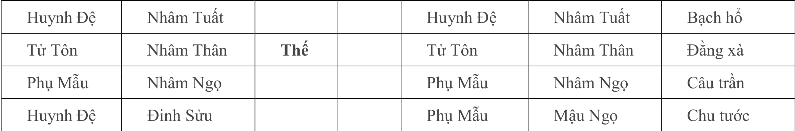
    - **Hình này chứng minh điều gì**
      - Hào 2 Thai vị Mão mộc hưu tù bị Tỵ hỏa động tiết khí chỉ nguy cơ sẩy thai.
    - **Từ đâu mà thấy được**
      - Hào 2 Đinh Mão Quan Quỷ lâm Thai vị, Hào 1 Đinh Tỵ Phụ Mẫu động hóa Dần mộc.

##### Căn cứ - Nhìn vào: Các bước luận giải tuần tự
* Căn cứ xác định Dụng Thần:
  * Chiêm việc con cái, thai sản lấy hào Tử Tôn làm Dụng Thần.
* Nhìn vào dấu hiệu mang thai:
  * Tử Tôn Thân kim trì Thế là điềm báo mang thai rõ ràng.
  * Hào Thai của Tử Tôn Thân kim là Mão mộc ($\text{Kim thai tại Mão}$), ngự tại hào 2 là Thai vị, củng cố thêm dấu hiệu vợ đang mang thai.
* Nhìn vào trạng thái thai nhi qua cung Mộc Dục:
  * Nguyệt kiến Tý thủy sinh cho hào Thai Quan Quỷ Mão mộc.
  * Tý thủy là đất Mộc dục của Mão mộc ($\text{Mộc mộc dục tại Tý}$).
  * Cung Mộc dục chủ trơ trụi, bại lộ, không có lông tóc -> Thai nhi lông tóc chưa hình thành, chứng tỏ người vợ mới vừa mang thai.
* Nhìn vào cát hung thai sản & Cung Tử:
  * Tử Tôn Thân kim ở đất Tử tại Nguyệt kiến Tý thủy ($\text{Kim tử tại Tý}$).
  * Trong quẻ Kỵ thần Phụ Mẫu Đinh Tỵ phát động khắc Thân kim là dấu hiệu nguy hiểm.
  * Hào 1 Phụ Mẫu Đinh Tỵ phát động, biến xuất Quan Quỷ Dần mộc, cùng với hào Thế Tử Tôn Thân kim tạo thành cục diện Tam hình:
    $$\text{Dần} - \text{Tỵ} - \text{Thân} \implies \text{Tam hình trì khắc}$$
  * Tam hình hội tụ khắc hại Tử Tôn, sợ rằng thai nhi khó có thể sinh hạ bình an.
* Nhìn vào giới tính thai nhi:
  * Tử Tôn Thân kim là hào dương, hào dương phát động, quẻ Lý thuộc cung Cấn (Cấn vi thiếu nam) -> Xác định thai nhi là bé trai (nam hài).
* Nhìn vào nguyên nhân mất con & Người vợ nạo phá thai:
  * Tý thủy là đất Tử của Tử Tôn Thân kim, đồng thời Tý thủy hình hào Thai Mão mộc (Tý Mão tương hình).
  * Trong quẻ cung Cấn/Khảm, Thủy đóng vai trò là Thê Tài (đại diện người vợ).
  * Do đó, Tý thủy Thê Tài nắm lệnh tháng lâm Tử địa và hình Thai vị -> Báo hiệu chính người vợ chủ động muốn nạo phá thai.
* Nhìn vào tình trạng hôn nhân thực tế & Giấy chứng nhận kết hôn:
  * Hào 6 Huynh Đệ Tuất thổ được hào động Phụ Mẫu Tỵ hỏa sinh trợ; Nhật thần Thìn thổ xung Tuất thổ thành ám động để khắc Thê Tài.
  * Thê Tài phục tàng không hiện trên quẻ, lại nhập Mộ tại Nhật thần Thìn thổ ($\text{Thủy mộ tại Thìn}$), lâm Tuyệt địa tại hào động Phụ Mẫu Tỵ hỏa ($\text{Thủy tuyệt tại Tỵ}$).
  * Quẻ biến thành Thiên Thủy Tụng là quẻ Du Hồn -> Điềm báo hai người sẽ phân ly, chia tay.
  * Phụ Mẫu đại diện cho giấy hôn thú (chứng thư kết hôn), ngự tại hào 1 lâm Huyền Vũ chủ về ngầm định minh ước (giao ước sống chung lén lút, không công khai).
  * Phụ Mẫu hỏa nhập Mộ tại hào ám động Tuất thổ -> Không thể lấy ra được chứng thư kết hôn.
  * Thê Tài phục tàng dưới Thế, lại nhập Mộ tại Nhật -> Biểu tượng "kim ốc tàng kiều" (nhà vàng giấu người đẹp).
  * Khẳng định hai người không hề có giấy đăng ký kết hôn, danh nghĩa thê tử thực chất chỉ là bạn gái sống chung.
* Ứng kỳ hung hiểm:
  * Năm Mậu Dần, Tử Tôn Thân kim gặp Tuyệt địa ($\text{Kim tuyệt tại Dần}$), lại kích hoạt toàn bộ cách cục Tam hình Dần - Tỵ - Thân -> Cần đề phòng biến cố sảy/phá thai vào năm này.

##### Thực tế kiểm chứng & Kết quả ứng nghiệm
* Xác nhận ban đầu: Đương sự thừa nhận cả hai chỉ sống chung chứ chưa từng đăng ký kết hôn; bạn gái đúng là vừa mới cấn thai.
* Diễn biến tiếp theo: Đến năm Mậu Dần, tháng Mão, hai người nảy sinh mâu thuẫn cãi vã gay gắt. Người nữ kiên quyết đòi chia tay, tự mình đến bệnh viện phá thai rồi dứt áo ra đi.
* Xác thực giới tính: Thai nhi bị phá bỏ đúng là nam hài.

##### Đúc kết lý luận & Bí pháp bốc phệ
1. Hào 2 trong quẻ luôn là biểu trưng của Thai vị.
2. Hỏa sinh Thổ, Thổ sinh Kim thoạt nhìn ngỡ là tương sinh cát cục; tuy nhiên hào độc phát trường sinh Dụng Thần kết hợp hóa xuất Tam hình thì bản chất là hung cục khó tránh.

---

#### Ví dụ 2: Nam xem vận năm làm công an (Quẻ Hỏa Sơn Lữ biến Bát Thuần Ly)

##### Bối cảnh & Đối thoại tác giả - người hỏi
* Thời gian: Ngày Tân Tị, tháng Đinh Tị, năm Mậu Dần.
* Sự việc: Một người nam đến xem quẻ đoán vận hạn trong năm.

##### Thoán đồ & Bố cục quẻ
* Quẻ đắc: Quẻ Hỏa Sơn Lữ biến Bát Thuần Ly (thuần Ly).
* Bảng lục hào phối Lục thú:

| Lục thân | Can chi | Thế/Ứng | Động | Biến Lục thân | Biến Can chi | Lục thú |
| :--- | :--- | :--- | :--- | :--- | :--- | :--- |
| Huynh Đệ | Kỷ Tỵ | | | Huynh Đệ | Kỷ Tỵ | Đằng xà |
| Tử Tôn | Kỷ Mùi | | | Tử Tôn | Kỷ Mùi | Câu trần |
| Thê Tài | Kỷ Dậu | **Ứng** | | Thê Tài | Kỷ Dậu | Chu tước |
| Thê Tài | Bính Thân | | | Quan Quỷ | Kỷ Hợi | Thanh long |
| Huynh Đệ | Bính Ngọ | | | Tử Tôn | Kỷ Sửu | Huyền vũ |
| Tử Tôn | Bính Thìn | **Thế** | **X** | Phụ Mẫu | Kỷ Mão | Bạch hổ |

- **Bảng quẻ và dữ kiện thực tế:**
  - **Hình 11.** Quẻ Hỏa Sơn Lữ biến Bát Thuần Ly
    - 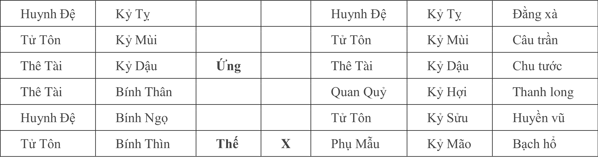
    - **Hình này chứng minh điều gì**
      - Hào Thế Thìn thổ động hóa Mão mộc Quan Đới chỉ bước chuyển công tác sang ngành công an.
    - **Từ đâu mà thấy được**
      - Hào 1 Bính Thìn Tử Tôn trì Thế động hóa Kỷ Mão Phụ Mẫu Quan Đới lâm Bạch Hổ.

##### Căn cứ - Nhìn vào: Các bước luận giải tuần tự
* Nhìn vào nghề nghiệp đương sự qua quẻ tượng & Lục thú:
  * Hào Thế Tử Tôn Bính Thìn lâm Bạch Hổ: Tử Tôn đại diện cho binh lính, cảnh sát, người thực thi pháp luật; Bạch Hổ chủ về vũ khí, đao thương.
  * Quẻ biến Bát Thuần Ly, cung Ly tượng trưng cho khôi giáp, giáp trụ, quân phục bảo hộ.
  * Tổng hợp tượng: Đoán ngay đương sự hiện đang công tác trong ngành công an.
* Nhìn vào họa kiện cáo & Đơn thư tố giác:
  * Hào Thế Tử Tôn Thìn thổ phát động hóa Phụ Mẫu Kỷ Mão: Hóa hồi đầu khắc dữ dội.
  * Phụ Mẫu chủ về văn thư, giấy tờ -> Điềm báo có người làm đơn tố giác, cáo trạng gửi lên cấp trên.
* Nhìn vào thân phận kẻ tố cáo qua vị trí hào vị, Bạch Hổ & Dịch Mã:
  * Hào Thế động tại hào sơ (hào 1): Hào sơ đại diện cho cấp dưới, thuộc hạ, người dưới quyền.
  * Lâm Bạch Hổ: Bạch Hổ chủ về đường sá, đạo lộ, xe cộ đi lại.
  * Chi biến Mão mộc là Dịch Mã theo bí truyền: Tam hợp Tỵ - Dậu - Sửu có Dịch Mã tại Hợi và Mão ($\text{Tỵ Dậu Sửu mã tại Hợi Mão}$, không bó hẹp duy nhất tại Hợi như sách thông thường).
  * Đoán định: Kẻ viết đơn tố cáo là một tài xế lái xe và là thuộc cấp dưới quyền của đương sự.
* Nhìn vào dã tâm của kẻ tố cáo qua cung Tử:
  * Chi biến Mão mộc là Tử địa của hào Thế Thìn thổ ($\text{Thổ tử tại Mão}$).
  * Cung Tử mang ý nghĩa đuổi cùng giết tận, không từ thủ đoạn -> Kẻ tố giác quyết tâm tố cáo đến cùng, không đạt mục đích dìm chết đương sự thì quyết không bỏ qua.
* Nhìn vào tiến trình thời gian và ứng kỳ:
  * Tháng 2 (tháng Mão): Mão mộc nắm quyền lệnh khắc hào Thế -> Vụ việc phát sinh vào tháng 2 âm lịch.
  * Tháng 3 (tháng Thìn): Thìn thổ nắm lệnh bang phù hào Thế -> Từ tháng 3 trở đi diễn biến tạm thời hòa hoãn.
  * Tháng 4 (tháng Tỵ): Tỵ hỏa lâm lệnh sinh trợ cho Thế Thìn thổ -> Có quý nhân nâng đỡ giải vây, trước mắt nguy cơ tạm thời lắng dịu.
  * Nguy cơ tiềm ẩn tái phát: Mão mộc biến xuất trong quẻ không hề bị chế ngự. Đến tháng 10 (tháng Hợi), Hợi thủy là trường sinh của Mão mộc ($\text{Mộc trường sinh tại Hợi}$) sẽ tiếp thêm sức mạnh cho kẻ tố cáo phản công lần hai; cảnh báo đương sự phải giải quyết triệt để, không được khinh suất.

##### Thực tế kiểm chứng & Kết quả ứng nghiệm
* Diễn biến ban đầu: Đương sự thừa nhận làm công an. Một người tài xế cấp dưới nhờ vả xin xỏ việc nhưng không được giải quyết nên ghi thù, làm đơn tố cáo đương sự tham ô công quỹ đúng vào tháng 2.
* Giai đoạn hòa hoãn: Nhờ có nhiều mối quan hệ trong ngành tư pháp can thiệp hỗ trợ, đến tháng 4 sự việc đã tạm yên ổn. Đương sự nghe lời khuyên của tác giả đã đem toàn bộ số tiền công quỹ nộp trả lại.
* Diễn biến tháng Hợi: Đúng như dự đoán, sang tháng Hợi người tài xế tiếp tục gửi đơn tố cáo. Cơ quan tư pháp xác định dù đã hoàn trả tiền nhưng hành vi tham ô vẫn phải truy cứu trách nhiệm hình sự. Đương sự hoảng sợ bỏ trốn biệt tích, đến nay vẫn chưa dám quay về.

---

#### Ví dụ 3: Nữ xem về công việc (Quẻ Địa Trạch Lâm)

##### Bối cảnh & Đối thoại tác giả - người hỏi
* Thời gian: Ngày Bính Ngọ, tháng Mậu Ngọ, năm Mậu Dần.
* Sự việc: Một người nữ đến chiêm đoán về công việc và hướng phát triển sự nghiệp.

##### Thoán đồ & Bố cục quẻ
* Quẻ đắc: Quẻ Địa Trạch Lâm (quẻ tĩnh).
* Bảng lục hào phối Lục thú:

| Lục thân | Can chi | Thế/Ứng | Động | Lục thú |
| :--- | :--- | :--- | :--- | :--- |
| Tử Tôn | Quý Dậu | | | Thanh long |
| Thê Tài | Quý Hợi | **Ứng** | | Huyền vũ |
| Huynh Đệ | Quý Sửu | | | Bạch hổ |
| Huynh Đệ | Đinh Sửu | | | Đằng xà |
| Quan Quỷ | Đinh Mão | **Thế** | | Câu trần |
| Phụ Mẫu | Đinh Tỵ | | | Chu tước |

- **Bảng quẻ và dữ kiện thực tế:**
  - **Hình 12.** Quẻ Địa Trạch Lâm
    - 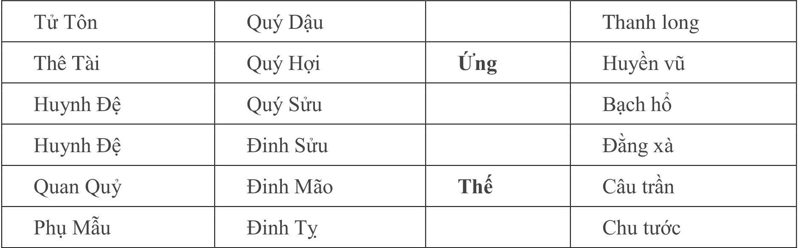
    - **Hình này chứng minh điều gì**
      - Quẻ Lâm tĩnh quẻ phản ánh Quan Quỷ Mão mộc nhập Mộ tại Nguyệt Lệnh Mùi thổ.
    - **Từ đâu mà thấy được**
      - Hào 2 Đinh Mão Quan Quỷ trì Thế nhập Mộ tại tháng Mùi lâm Câu Trần.

##### Căn cứ - Nhìn vào: Các bước luận giải tuần tự
* Căn cứ xác định Dụng Thần:
  * Xem về sự nghiệp, công việc, quan chức lấy hào Quan Quỷ làm Dụng Thần.
* Nhìn vào hiện trạng công việc & Tuần Không:
  * Quan Quỷ Đinh Mão trì Thế: Đương sự hiện đang có công ăn việc làm ổn định.
  * Hào Mão mộc lâm Tuần Không (ngày Bính Ngọ tuần Giáp Thìn có Dần Mão không vong): Đương sự không còn tâm trí, chán nản, không để lòng dạ vào công việc hiện tại.
* Nhìn vào cơ quan công tác qua hào vị & Câu Trần:
  * Quan Quỷ cư tại hào 2, hào 2 là trạch hào (đại diện phòng làm việc, trạch xá).
  * Lâm Câu Trần: Cổ nhân luận Câu Trần là nha môn chốn công đường; ngày nay luận Câu Trần là nhân viên làm việc trong cơ quan nhà nước, tư pháp.
* Nhìn vào tiền đồ công việc qua cung Tử:
  * Quan Quỷ Mão mộc hưu tù, lâm đất Tử tại cả Nhật thần lẫn Nguyệt kiến Ngọ hỏa ($\text{Mộc tử tại Ngọ}$):
    $$\text{Mão mộc} \xrightarrow{\text{Nhật Nguyệt Ngọ hỏa}} \text{Tử địa}$$
  * Công việc hoàn toàn bế tắc, không có tương lai hay tiền đồ phát triển.
* Nhìn vào tâm lý muốn nhảy việc qua cung Trường Sinh:
  * Hào Ứng Thê Tài Quý Hợi lâm Huyền Vũ. Hợi thủy chính là đất Trường sinh của Quan Quỷ Mão mộc ($\text{Mộc trường sinh tại Hợi}$).
  * Hào Ứng là nơi chốn bên ngoài, Trường sinh là chỗ dựa mới -> Trong lòng đương sự đang nung nấu ý định nhảy việc, ra ngoài tìm kiếm cơ hội phát triển mới.
* Nhìn vào kết quả chuyển việc:
  * Hào Thế lâm Không vong nên không tiếp nhận được sự sinh trợ; bản thân hào Ứng Hợi thủy lại bị Nhật Nguyệt Ngọ hỏa khắc tuyệt nên rất suy nhược -> Có ý định nhưng lực bất tòng tâm, muốn chuyển việc mà không thể thực hiện được.

##### Thực tế kiểm chứng & Kết quả ứng nghiệm
* Xác nhận: Đương sự hiện đang làm việc tại tòa án nhân dân. Mọi phân tích về tâm trạng chán nản, nơi làm việc nhà nước và ý định muốn chuyển nghề nhưng bế tắc đều chuẩn xác tuyệt đối với hoàn cảnh thực tế của cô.

---

#### Ví dụ 4: La tiên sinh xem vận năm của người bạn (Quẻ Cấn biến Sơn Địa Bác)

##### Bối cảnh & Đối thoại tác giả - người hỏi
* Thời gian: Ngày Canh Ngọ, tháng Mão, năm Mậu Dần (Tuần không: Tuất, Hợi).
* Sự việc: La tiên sinh đến xem quẻ hỏi về vận hạn trong năm của một người bạn thân.

##### Thoán đồ & Bố cục quẻ
* Quẻ đắc: Quẻ Bát Thuần Cấn biến Sơn Địa Bác.
* Bảng lục hào phối Lục thú:

| Lục thân | Can chi | Thế/Ứng | Động | Biến Lục thân | Biến Can chi | Lục thú |
| :--- | :--- | :--- | :--- | :--- | :--- | :--- |
| Quan Quỷ | Bính Dần | **Thế** | | Quan Quỷ | Bính Dần | Đằng xà |
| Thê Tài | Bính Tý | | | Thê Tài | Bính Tý | Câu trần |
| Huynh Đệ | Bính Tuất | | | Huynh Đệ | Bính Tuất | Chu tước |
| Tử Tôn | Bính Thân | **Ứng** | **O** | Quan Quỷ | Ất Mão | Thanh long |
| Phụ Mẫu | Bính Ngọ | | | Phụ Mẫu | Ất Tỵ | Huyền vũ |
| Huynh Đệ | Bính Thìn | | | Huynh Đệ | Ất Mùi | Bạch hổ |

- **Bảng quẻ và dữ kiện thực tế:**
  - **Hình 13.** Quẻ Càn biến Sơn Địa Bác
    - 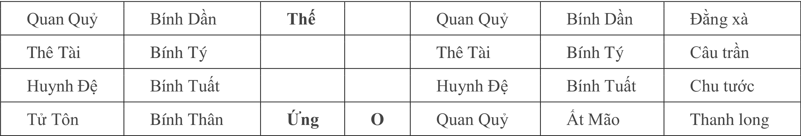
    - **Hình này chứng minh điều gì**
      - Huynh Đệ Tuất thổ Tuần Không nhập Mộ chỉ ý định mở xưởng đúc thép cùng bạn bè.
    - **Từ đâu mà thấy được**
      - Hào 2 Giáp Dần Dụng Thần nhập Mộ tại hào Thế Giáp Thìn, hào Ứng Thân kim động.

##### Căn cứ - Nhìn vào: Các bước luận giải tuần tự
* Căn cứ xác định Dụng Thần:
  * Xem cho bạn bè lấy hào Huynh Đệ làm Dụng Thần. Quẻ xuất hiện hai hào Huynh Đệ (Thìn thổ và Tuất thổ), chọn hào Huynh Đệ Bính Tuất lâm Tuần Không làm Dụng Thần.
* Nhìn vào nguy cơ kiện tụng (Quan phi triền thân):
  * Dụng Thần Huynh Đệ Tuất thổ lâm Chu Tước (chủ khẩu thiệt thị phi, kiện tụng).
  * Bị Nguyệt kiến Mão mộc khắc chế; lại có Quan Quỷ Bính Dần trì Thế lâm Đằng Xà và nhập Thái Tuế (năm Mậu Dần):
    $$\text{Thái Tuế nhập hào} \implies \text{Lâm Quỷ tác Kỵ thần khắc Dụng}$$
  * Khẳng định người bạn trong năm nay tất bị tai họa kiện cáo quấn thân.
* Nhìn vào dây dưa kinh tế & Ám động:
  * Hào 3 Tử Tôn Bính Thân phát động sinh Thê Tài Bính Tý.
  * Thê Tài Bý thủy bị Nhật thần Ngọ hỏa xung thành Ám động; Tài ám động quay lại sinh cho Kỵ thần Quan Quỷ Dần mộc -> Vụ kiện tụng dây dưa phức tạp, dính líu đến nhiều khoản tiền bạc.
* Nhìn vào nguyên nhân khởi phát từ nữ sắc qua Thanh Long hóa Quỷ:
  * Hào 3 Tử Tôn Thân kim lâm Thanh Long động biến Quan Quỷ Ất Mão.
  * Tử Tôn chủ ăn chơi, ngu nhạc; Thanh Long chủ sắc tình, phong lưu; Quan Quỷ chủ tai họa:
    $$\text{Tử Tôn hóa Quan Quỷ} \implies \text{"Nhạc cực sanh bi" (Vui quá hóa buồn)}$$
  * Nguồn cơn tai họa bắt nguồn từ quan hệ nam nữ hoặc do phụ nữ gây ra.
  * Mặt khác, Thanh Long cũng chủ tiền bạc, kết hợp Tài ám động sinh Quỷ -> Kèm theo tranh chấp hoặc cáo giác về mặt kinh tế.
* Nhìn vào phương pháp giải cứu qua Thiên Ất Quý Nhân & Hợp Thần:
  * Ngày Canh Ngọ, theo khẩu quyết *"Giáp Mậu Canh ngưu dương"*, Quý nhân ngự tại Sửu (trâu) và Mùi (dê).
  * Năng lực của Sửu thổ:
    * Hợp trụ Thê Tài Tý thủy (Tý Sửu nhị hợp), ngăn Tý thủy sinh Kỵ thần Quan Quỷ.
    * Thu nạp Tử Tôn Thân kim nhập Mộ tại Sửu, cắt đứt nguồn sinh cho Thê Tài.
    * Bang trợ Dụng Thần Tuất thổ.
  * Lời khuyên: Phải tìm người cầm tinh con Trâu (tuổi Sửu) mới có thể giải nguy cứu giúp.
* Cảnh báo nguy cơ nếu không giải cứu:
  * Dụng Thần Huynh Đệ Tuất thổ có đất Đế vượng tại Tý thủy ($\text{Thổ đế vượng tại Tý}$); hào Đế vượng ám động sinh Kỵ thần thì án kinh tế càng xé to.
  * Hiện tại Dụng Thần Tuần Không nên còn ẩn náu an toàn; đến tháng Thìn xung thực Tuần Không, Dụng Thần nhập Mộ thì lao tù lập tức giáng xuống.

##### Thực tế kiểm chứng & Kết quả ứng nghiệm
* Phản hồi ban đầu: La tiên sinh khẳng định bạn ông bị kiện thuần túy về kinh tế, không liên quan phụ nữ.
* Xác nhận buổi chiều: Chiều cùng ngày, La tiên sinh quay lại cho biết tác giả đoán hoàn toàn chính xác. Người bạn do mâu thuẫn gay gắt với người phụ nữ sống chung nên bị cô ta làm đơn tố cáo tham ô công quỹ, thực tế ông này không tham ô.
* Hóa giải: Sau đó người bạn tìm được một người tuổi Sửu (cầm tinh con trâu) đứng ra can thiệp, vụ việc đã được giải quyết êm đẹp.

##### Đúc kết lý luận & Bí pháp bốc phệ
* Án: Dụng lâm Tước, Thái Tuế lâm Quan lâm Xà tác Kỵ thần khắc Dụng; Thân động hóa Mão khắc Tuất, dương chủ quá khứ, sợ rằng đã có quan phi. Thân sinh Tý, Tý xung Ngọ, Ngọ sinh Tuất là cát. Dụng Không, ứng kỳ nghiệm vào tháng Thìn.

---

#### Ví dụ 5: Chủ công xưởng than xem phong thủy mỏ (Quẻ Phong Trạch Trung Phu biến Thiên Thủy Tụng)

##### Bối cảnh & Đối thoại tác giả - người hỏi
* Thời gian: Ngày Canh Thìn, tháng Mùi, năm Mậu Dần.
* Sự việc: Một chủ doanh nghiệp khai thác than đá đến xem phong thủy nhà xưởng mỏ than.

##### Thoán đồ & Bố cục quẻ
* Quẻ đắc: Quẻ Phong Trạch Trung Phu biến Thiên Thủy Tụng.
* Bảng lục hào phối Lục thú:

| Lục thân | Can chi | Thế/Ứng | Động | Biến Lục thân | Biến Can chi | Lục thú |
| :--- | :--- | :--- | :--- | :--- | :--- | :--- |
| Quan Quỷ | Tân Mão | | | Huynh Đệ | Nhâm Tuất | Đằng xà |
| Phụ Mẫu | Tân Tỵ | | | Tử Tôn | Nhâm Thân | Câu trần |
| Huynh Đệ | Tân Mùi | **Thế** | **X** | Phụ Mẫu | Nhâm Ngọ | Chu tước |
| Huynh Đệ | Đinh Sửu | | | Phụ Mẫu | Mậu Ngọ | Thanh long |
| Quan Quỷ | Đinh Mão | | | Huynh Đệ | Mậu Thìn | Huyền vũ |
| Phụ Mẫu | Đinh Tỵ | **Ứng** | **O** | Quan Quỷ | Mậu Dần | Bạch hổ |

- **Bảng quẻ và dữ kiện thực tế:**
  - **Hình 14.** Quẻ Phong Trạch Trung Phu biến Thiên Thủy Tụng
    - 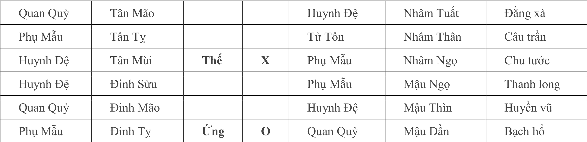
    - **Hình này chứng minh điều gì**
      - Hào 2 Mão mộc Quan Đới hóa thoái phản ánh con gái thi trượt đại học.
    - **Từ đâu mà thấy được**
      - Hào 2 Đinh Mão Tử Tôn lâm Quan Đới, Hào 1 Đinh Tỵ Phụ Mẫu động hóa Dần mộc.

##### Căn cứ - Nhìn vào: Các bước luận giải tuần tự
* Căn cứ xác định Dụng Thần:
  * Xem phong thủy công xưởng mục đích hàng đầu là hiệu ích kinh tế và tính mạng công nhân -> Lấy hào Thê Tài làm Dụng Thần chính.
* Nhìn vào tọa hướng xưởng mỏ qua hào Thế phát động:
  * Hào 4 Huynh Đệ Tân Mùi trì Thế phát động: Huynh Đệ tượng trưng cho cổng ngõ, cửa ra vào; hào Thế là tọa sơn.
  * Hào phát động lấy phản hướng mà đoán -> Xác định mỏ tọa Sửu hướng Mùi (hướng Tây Nam).
  * Hào Thế là Quỷ khố (Mùi là mộ khố của Mão mộc Quan Quỷ) -> Cổng mở bất chính, phạm phong thủy hung sát.
  * Huynh Đệ động hóa Phụ Mẫu lâm Chu Tước -> Báo hiệu vừa phá tài vừa dính líu đến khẩu thiệt, đơn từ kiện cáo.
* Nhìn vào hiệu quả kinh tế qua cung Tuyệt:
  * Hào Thê Tài Tý thủy hưu tù không hiện trên quẻ, phục dưới đất Tuyệt tại Phụ Mẫu Tỵ hỏa ($\text{Thủy tuyệt tại Tỵ}$) -> Hiệu quả kinh tế cực kỳ sa sút, thua lỗ.
* Nhìn vào tình trạng công nhân qua hào sơ & Cung Tuyệt:
  * Hào sơ là tiểu khẩu, trong công xưởng đại diện cho thợ thuyền, công nhân; hào Tài cũng đại diện cho công nhân.
  * Hào sơ lâm đất Tuyệt của Tài -> Tài không tụ, công nhân nản lòng bỏ việc, không chịu ở lại làm.
* Nhìn vào tai nạn thương vong qua Bạch Hổ, Cung Mộ & Câu Trần:
  * Hào Tài lâm Tuyệt địa lại nhập Mộ tại Nhật thần Thìn thổ -> Điềm báo xảy ra thương vong, tai nạn lao động nghiêm trọng.
  * Hào sơ lâm Bạch Hổ, hào sơ chủ bàn chân/chân; Bạch Hổ chủ va đập, té ngã chấn thương -> Công nhân bị tai nạn thương tật ở chân.
  * Hào Tài nhập Mộ tại Nhật chủ về sự kiện chết người.
  * Hào Tài lâm Câu Trần (Câu Trần chủ điền thổ, đất đá, bùn đất) -> Nguyên nhân công nhân tử vong có liên quan trực tiếp đến việc bị đất đá đè ép, sập hầm.

##### Thực tế kiểm chứng & Kết quả ứng nghiệm
* Xác nhận từ gia chủ: Chủ mỏ than xác nhận công xưởng mở cửa quay hướng Tây Nam; mỏ than kinh tế đang kiệt quệ, chỉ hoạt động cầm chừng một nửa công suất.
* Sự cố tai nạn thực tế: Trong mỏ đúng là vừa xảy ra sự cố thương vong: một người bị thương ở đùi, một người bị thương ở bàn chân, và một công nhân bị sập hầm than vùi lấp ngạt thở chết tại chỗ.
* Xử lý: Tác giả căn cứ tình hình ngũ hành sinh khắc trong quẻ để tiến hành các biện pháp điều chỉnh phong thủy hóa giải.

---

#### Ví dụ 6: Xem sức khỏe mắt của con nhỏ (Quẻ Phong Hỏa Gia Nhân biến Tốn)

##### Bối cảnh & Đối thoại tác giả - người hỏi
* Thời gian: Ngày Quý Tị, tháng Giáp Tý, năm Mậu Dần.
* Sự việc: Người cha đến chiêm đoán về tình hình sức khỏe của người con nhỏ.

##### Thoán đồ & Bố cục quẻ
* Quẻ đắc: Quẻ Phong Hỏa Gia Nhân biến Bát Thuần Tốn (Tốn).
* Bảng lục hào phối Lục thú:

| Lục thân | Can chi | Thế/Ứng | Động | Biến Lục thân | Biến Can chi | Lục thú |
| :--- | :--- | :--- | :--- | :--- | :--- | :--- |
| Huynh Đệ | Tân Mão | | | Huynh Đệ | Tân Mão | Bạch hổ |
| Tử Tôn | Tân Tỵ | **Ứng** | | Tử Tôn | Tân Tỵ | Đằng xà |
| Thê Tài | Tân Mùi | | | Thê Tài | Tân Mùi | Câu trần |
| Phụ Mẫu | Kỷ Hợi | | | Quan Quỷ | Tân Dậu | Chu tước |
| Thê Tài | Kỷ Sửu | **Thế** | **X** | Phụ Mẫu | Tân Hợi | Thanh long |
| Huynh Đệ | Kỷ Mão | | **O** | Thê Tài | Tân Sửu | Huyền vũ |

- **Bảng quẻ và dữ kiện thực tế:**
  - **Hình 15.** Quẻ Phong Hỏa Gia Nhân biến Tốn
    - 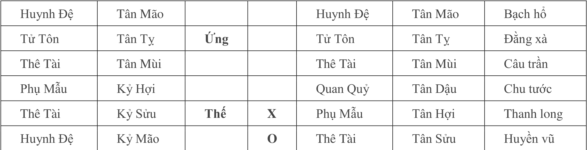
    - **Hình này chứng minh điều gì**
      - Hào Thế Sửu thổ động nhập Mộ chỉ tật khúc xạ thị lực ở mắt trái trẻ nhỏ.
    - **Từ đâu mà thấy được**
      - Hào 2 Kỷ Sửu Thê Tài trì Thế động hóa Tân Hợi Phụ Mẫu lâm Thanh Long.

##### Căn cứ - Nhìn vào: Các bước luận giải tuần tự
* Căn cứ xác định Dụng Thần:
  * Xem sức khỏe con cái lấy hào Tử Tôn Tân Tỵ làm Dụng Thần.
* Nhìn vào vượng suy tổng thể:
  * Tử Tôn Tỵ hỏa bị Nguyệt kiến Tý thủy khắc nhưng lâm Nhật thần Tỵ hỏa tương trợ -> Lực lượng vượng suy quân bình.
  * Kỵ thần Phụ Mẫu Hợi thủy bị Nhật xung thành ám động khắc Dụng, nhưng trong quẻ có Thê Tài Sửu thổ phát động khắc chế Hợi thủy, lại có Nguyên thần Mão mộc động sinh Tỵ hỏa -> Sức khỏe chung của đứa trẻ không đáng ngại, không nguy hiểm tính mạng.
* Nhìn vào dị tật ở mắt qua hào vị ngũ quan, Đằng Xà & Cung Tốn:
  * Tử Tôn Tỵ hỏa ngự tại hào 5 lâm Đằng Xà, bị Nguyệt kiến Tý thủy khắc.
  * Hào 5 đại diện cho ngũ quan phần mặt; hành Hỏa chủ về đôi mắt (*hỏa chủ nhãn tình*).
  * Đằng Xà chủ quái dị, biến dạng kỳ lạ -> Đôi mắt của đứa trẻ có biểu hiện khác thường.
  * Quẻ Gia Nhân thuộc cung Tốn; tượng của quẻ Tốn là "bạch nhãn" (mắt trắng dã) -> Mắt của đứa bé có nhiều điểm trắng đục, trợn ngược.
* Nhìn vào tính chất bẩm sinh qua Cung Thai:
  * Kỵ thần Nguyệt kiến Tý thủy chính là đất Thai của Tỵ hỏa ($\text{Hỏa thai tại Tý}$).
  * Kỵ thần đóng tại Thai địa -> Dị tật này hình thành từ trong bụng mẹ, mang tính chất bẩm sinh tiên thiên.

##### Thực tế kiểm chứng & Kết quả ứng nghiệm
* Phản hồi từ gia đình: Cháu bé từ lúc sinh ra đã bị chứng "điếu bạch nhãn" (mắt trợn ngược tròng trắng), nhìn lúc nào con ngươi cũng trợn trắng dã một cách kỳ lạ.

---

#### Ví dụ 7: Nam xem bao giờ sinh con (Quẻ Lôi Thiên Đại Tráng biến Càn Vi Thiên)

##### Bối cảnh & Đối thoại tác giả - người hỏi
* Thời gian: Ngày Ất Mùi, tháng Giáp Tý, năm Mậu Dần.
* Sự việc: Một người nam đến hỏi bao giờ vợ chồng mới sinh được con.

##### Thoán đồ & Bố cục quẻ
* Quẻ đắc: Quẻ Lôi Thiên Đại Tráng biến Bát Thuần Càn (Càn Vi Thiên).
* Bảng lục hào phối Lục thú:

| Lục thân | Can chi | Thế/Ứng | Động | Biến Lục thân | Biến Can chi | Lục thú |
| :--- | :--- | :--- | :--- | :--- | :--- | :--- |
| Huynh Đệ | Canh Tuất | | **X** | Huynh Đệ | Nhâm Tuất | Huyền vũ |
| Tử Tôn | Canh Thân | | **X** | Tử Tôn | Nhâm Thân | Bạch hổ |
| Phụ Mẫu | Canh Ngọ | **Thế** | | Phụ Mẫu | Nhâm Ngọ | Đằng xà |
| Huynh Đệ | Giáp Thìn | | | Huynh Đệ | Giáp Thìn | Câu trần |
| Quan Quỷ | Giáp Dần | | | Quan Quỷ | Giáp Dần | Chu tước |
| Thê Tài | Giáp Tý | **Ứng** | | Thê Tài | Giáp Tý | Thanh long |

- **Bảng quẻ và dữ kiện thực tế:**
  - **Hình 16.** Quẻ Lôi Thiên Đại Tráng biến Càn Vi Thiên
    - 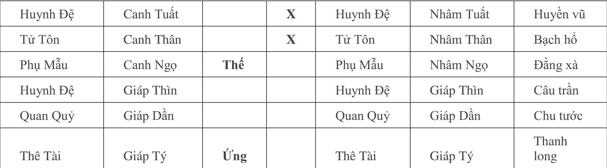
    - **Hình này chứng minh điều gì**
      - Tử Tôn Thân kim tử tại Nguyệt Tý kết hợp phục ngâm chỉ bế tắc sinh sản.
    - **Từ đâu mà thấy được**
      - Hào 5 Canh Thân Tử Tôn tử tại Tý thủy, hào Thế Canh Ngọ Phụ Mẫu Nguyệt Phá.

##### Căn cứ - Nhìn vào: Các bước luận giải tuần tự
* Căn cứ xác định Dụng Thần:
  * Xem cầu con lấy Tử Tôn Canh Thân làm Dụng Thần.
* Nhìn vào chuỗi hung triệu tổng thể:
  * Tử Tôn Thân kim ở đất Tử tại Nguyệt kiến Tý thủy ($\text{Kim tử tại Tý}$).
  * Ngoại quái phục ngâm (hào 6 Tuất hóa Tuất, hào 5 Thân hóa Thân).
  * Kỵ thần Phụ Mẫu Canh Ngọ trì Thế, lại bị Nguyệt phá (Tý xung Ngọ).
  * Quẻ biến Lục Xung thành Lục Xung (Đại Tráng là Lục Xung quẻ biến Càn cũng là Lục Xung quẻ).
  * Toàn bộ đều là đại hung tượng -> Điềm báo không thể có con.
* Nhìn vào nỗi khổ tâm bệnh qua Cung Bệnh & Phục ngâm:
  * Tử Tôn Thân kim là Bệnh địa của hào Thế Ngọ hỏa ($\text{Hỏa bệnh tại Thân}$).
  * Kết hợp ngoại quái phục ngâm -> Vấn đề con cái luôn đè nặng trong lòng như một nỗi tâm bệnh dai dẳng, khiến đương sự đau đớn thống khổ vô cùng.
* Nhìn vào nguyên nhân sinh lý qua Cung Dưỡng & Tuần Không:
  * Hào 3 Huynh Đệ Giáp Thìn là Nguyên thần của Tử Tôn, đồng thời Thìn thổ là đất Dưỡng của Tử Tôn Thân kim ($\text{Kim dưỡng tại Thìn}$).
  * Hào 3 về phân vùng thân thể chủ cơ quan sinh dục.
  * Thìn thổ phùng Tuần Không (ngày Ất Mùi tuần Giáp Ngọ có Thìn Tỵ không vong) -> Không thể sinh phù cho Dụng Thần, chứng tỏ chức năng sinh lý của đương sự có vấn đề nghiêm trọng.
  * Thìn là Thủy khố; Thủy là Thê Tài; Tài tượng trưng cho tinh dịch -> Thìn thổ chính là túi tinh (tinh nang).
  * Túi tinh lâm Tuần Không -> Số lượng tinh trùng cực kỳ ít ỏi, không đủ khả năng thụ thai tự nhiên.

##### Thực tế kiểm chứng & Kết quả ứng nghiệm
* Kết quả thực tế: Người này kết hôn đã nhiều năm mà vợ không thể có thai. Đi bệnh viện kiểm tra chuyên sâu, bác sĩ kết luận số lượng tinh trùng quá ít (thiểu tinh trầm trọng).

---

#### Ví dụ 8: Nam xem bệnh tật của cha / xem bệnh mạch máu não (Quẻ Sơn Thủy Mông biến Địa Thủy Sư)

##### Bối cảnh & Đối thoại tác giả - người hỏi
* Thời gian: Ngày Bính Tý, tháng Sửu, năm Mậu Dần.
* Sự việc: Một người đến chiêm đoán về tình hình bệnh tật.

##### Thoán đồ & Bố cục quẻ
* Quẻ đắc: Quẻ Sơn Thủy Mông biến Địa Thủy Sư.
* Bảng lục hào phối Lục thú:

| Lục thân | Can chi | Thế/Ứng | Động | Biến Lục thân | Biến Can chi | Lục thú |
| :--- | :--- | :--- | :--- | :--- | :--- | :--- |
| Phụ Mẫu | Bính Dần | | **O** | Thê Tài | Quý Dậu | Thanh long |
| Quan Quỷ | Bính Tý | | | Quan Quỷ | Quý Hợi | Huyền vũ |
| Tử Tôn | Bính Tuất | **Thế** | | Tử Tôn | Quý Sửu | Bạch hổ |
| Huynh Đệ | Mậu Ngọ | | | Huynh Đệ | Mậu Ngọ | Đằng xà |
| Tử Tôn | Mậu Thìn | | | Tử Tôn | Mậu Thìn | Câu trần |
| Phụ Mẫu | Mậu Dần | **Ứng** | | Phụ Mẫu | Mậu Dần | Chu tước |

##### Căn cứ - Nhìn vào: Các bước luận giải tuần tự
* Nhìn vào hào Thế & Biểu tượng mạch máu:
  * Hào Thế ngự tại Tử Tôn Bính Tuất thổ: Tử Tôn chủ huyết quản (mạch máu trong cơ thể).
  * Tuất là Hỏa khố (kho chứa lửa); Hỏa chủ về huyết dịch -> Tuất thổ chính là biểu tượng của mạch máu.
  * Hào Thế lâm Bạch Hổ; Bạch Hổ chủ huyết mạch -> Hình tượng mạch máu càng thêm rõ nét, chuẩn xác.
* Nhìn vào ổ bệnh qua Hào Độc Phát & Cung Bệnh:
  * Hào 6 Phụ Mẫu Bính Dần mộc độc phát trong quẻ.
  * Dần mộc chính là Bệnh địa của hào Thế Tuất thổ ($\text{Thổ bệnh tại Dần}$).
  * Hào độc phát động khắc Thế, lại đóng đúng Bệnh địa -> Đây chính là **ổ bệnh**, vùng bệnh lý trung tâm gây tổn hại cơ thể.
* Nhìn vào vị trí & Triệu chứng bệnh:
  * Hào 6 chủ phần đầu não; Phụ Mẫu cũng chủ phần đầu não -> Xác định bệnh nằm ở vùng đầu.
  * Hào 6 lâm Thanh Long; Thanh Long chủ đau đớn, nhức nhối -> Đoán bệnh tắc nghẽn mạch máu não dẫn đến chứng đau đầu kinh niên.

##### Thực tế kiểm chứng & Kết quả ứng nghiệm
* Phản hồi: Bệnh nhân xác nhận bị chứng tắc nghẽn động mạch đầu (nghẽn mạch máu não), thường xuyên bị những cơn đau nhức đầu dữ dội hành hạ không dứt.

---

#### Ví dụ 9: Nam xem cầu tài buôn bán / vận năm (Quẻ Trạch Sơn Hàm biến Hỏa Sơn Lữ)

##### Bối cảnh & Đối thoại tác giả - người hỏi
* Thời gian: Ngày Bính Thân, tháng Bính Dần, năm Mão.
* Sự việc: Người nam đến chiêm đoán về vận hạn và tiền tài buôn bán trong năm.

##### Thoán đồ & Bố cục quẻ
* Quẻ đắc: Quẻ Trạch Sơn Hàm biến Hỏa Sơn Lữ.
* Bảng lục hào phối Lục thú:

| Lục thân | Can chi | Thế/Ứng | Động | Biến Lục thân | Biến Can chi | Lục thú |
| :--- | :--- | :--- | :--- | :--- | :--- | :--- |
| Phụ Mẫu | Đinh Mùi | **Ứng** | **X** | Quan Quỷ | Kỷ Tỵ | Thanh long |
| Huynh Đệ | Đinh Dậu | | **O** | Phụ Mẫu | Kỷ Mùi | Huyền vũ |
| Tử Tôn | Đinh Hợi | | | Huynh Đệ | Kỷ Dậu | Bạch hổ |
| Huynh Đệ | Bính Thân | **Thế** | | Huynh Đệ | Bính Thân | Đằng xà |
| Quan Quỷ | Bính Ngọ | | | Quan Quỷ | Bính Ngọ | Câu trần |
| Phụ Mẫu | Bính Thìn | | | Phụ Mẫu | Bính Thìn | Chu tước |

##### Căn cứ - Nhìn vào: Các bước luận giải tuần tự
* Nhìn vào vận tài tổng thể & Nguyệt phá:
  * Hào Thế Huynh Đệ Bính Thân bị Nguyệt kiến Thê Tài Bính Dần xung thành Nguyệt phá.
  * Hào Thê Tài không hiện trên quẻ; trong quẻ Huynh Đệ lại phát động -> Vận tài bế tắc, sự nghiệp không như ý.
* Nhìn vào quan hệ bạn bè qua Huyền Vũ & Cung Mộ:
  * Hào 5 Huynh Đệ Đinh Dậu lâm Huyền Vũ phát động biến Phụ Mẫu Kỷ Mùi: Huynh Đệ cùng hành với hào Thế biểu thị bạn bè bang trợ, Phụ Mẫu là tài khố; nhưng lâm Huyền Vũ chủ lừa gạt, âm thầm bòn rút.
  * Báo hiệu: Dù nhờ bạn bè giúp đỡ mà kiếm được tiền, nhưng cũng chính bạn bè làm liên lụy, lừa đảo chiếm đoạt tiền bạc.
  * Hào Tài nhập Mộ tại hào Ứng Phụ Mẫu Mùi thổ ($\text{Mộc tài mộ tại Mùi}$), hào Ứng là người khác -> Nhiều người vay mượn tiền bạc rồi ỉm đi không chịu hoàn trả.
* Nhìn vào bệnh tật qua Cung Quan Đới, Cung Mộ & Đằng Xà:
  * Hào Thế bị Tài lâm Nguyệt xung phá; Tài không hiện lại nhập Mộ tại hào 6; Tài chủ chất bài tiết (phân và nước tiểu) -> Bị bệnh táo bón.
  * Hào Thế lâm Đằng Xà ngự hào 3; hào 3 là giường nằm, Đằng Xà chủ tâm phiền ý loạn, ác mộng, hoảng hốt -> Thường xuyên mất ngủ, chiêm bao sợ hãi.
  * Nguyên thần của hào Thế là Phụ Mẫu Đinh Mùi ở hào 6 bị Nguyệt kiến Dần mộc khắc thương, động hóa xuất Quan Quỷ Kỵ Tỵ; hào 6 chủ đầu não -> Có bệnh ở đầu.
  * Mùi thổ là đất **Quan đới** của hào Thế Thân kim ($\text{Kim quan đới tại Mùi}$).
  * Quan đới chủ về đội mũ, mang đai thắt, bao trùm; hào 6 lâm Thanh Long chủ đau nhức -> Đầu như bị siết một chiếc vòng kim cô, suy nhược thần kinh nặng, mất ngủ đau đầu, ngủ không sâu giấc.

##### Thực tế kiểm chứng & Kết quả ứng nghiệm
* Phản hồi thực tế: Đương sự cho biết mấy năm gần đây nhờ bạn bè hỗ trợ đã kiếm được hơn hai mươi vạn nguyên (20 vạn tệ). Thấy ông có tiền, bạn bè liền hỏi vay mượn tới tấp nhưng chỉ mượn mà không chịu trả. Bản thân ông mắc bệnh suy nhược thần kinh nghiêm trọng, giấc ngủ rất kém và thường xuyên bị chứng táo bón hành hạ.

---

#### Ví dụ 10: Nam xem cát hung của vợ con (Quẻ Hỏa Trạch Khuê biến Càn Vi Thiên)

##### Bối cảnh & Đối thoại tác giả - người hỏi
* Thời gian: Ngày Mậu Thìn, tháng Đinh Mão, năm Mão.
* Sự việc: Người nam đến chiêm đoán về cát hung và an nguy của vợ con.

##### Thoán đồ & Bố cục quẻ
* Quẻ đắc: Quẻ Hỏa Trạch Khuê biến Bát Thuần Càn (Càn Vi Thiên).
* Bảng lục hào phối Lục thú:

| Lục thân | Can chi | Thế/Ứng | Động | Biến Lục thân | Biến Can chi | Lục thú |
| :--- | :--- | :--- | :--- | :--- | :--- | :--- |
| Phụ Mẫu | Kỷ Tỵ | | | Huynh Đệ | Nhâm Tuất | Chu tước |
| Huynh Đệ | Kỷ Mùi | | **X** | Tử Tôn | Nhâm Thân | Thanh long |
| Tử Tôn | Kỷ Dậu | **Thế** | | Phụ Mẫu | Nhâm Ngọ | Huyền vũ |
| Huynh Đệ | Đinh Sửu | | **X** | Huynh Đệ | Giáp Thìn | Bạch hổ |
| Quan Quỷ | Đinh Mão | | | Quan Quỷ | Giáp Dần | Đằng xà |
| Phụ Mẫu | Đinh Tỵ | **Ứng** | | Thê Tài | Giáp Tý | Câu trần |

##### Căn cứ - Nhìn vào: Các bước luận giải tuần tự
* Căn cứ xác định Dụng Thần:
  * Xem cho vợ lấy Thê Tài làm Dụng Thần; xem cho con lấy Tử Tôn làm Dụng Thần.
* Nhìn vào hung triệu của Thê Tài qua Cung Tử & Cung Mộ:
  * Thê Tài Tý thủy không hiện trên quẻ, phục dưới hào 5 Huynh Đệ Kỷ Mùi (phi khắc phục).
  * Hào Tài lâm đất Tử tại Nguyệt kiến Đinh Mão ($\text{Thủy tử tại Mão}$).
  * Nhập Mộ tại Nhật thần Mậu Thìn ($\text{Thủy mộ tại Thìn}$).
  * Kỵ thần Huynh Đệ Sửu thổ phát động hóa tiến thần (hóa Thìn thổ) lâm Bạch Hổ khắc Tài -> Hung tượng trùng trùng chất ngất.
* Nhìn vào trạng thái của con (Tử Tôn):
  * Tử Tôn Kỷ Dậu trì Thế bị Nguyệt kiến Mão mộc xung thành Nguyệt phá; nhập Mộ tại Sửu thổ.
  * Tuy nhiên được Huynh Đệ Mùi thổ phát động tương sinh, lại được Nhật thần Thìn thổ sinh hợp (Thìn Dậu hợp) -> Trong hung có cứu, không đến mức tuyệt vọng như mẹ.
* Nhìn vào lao tù mất tự do qua Cung Mộ:
  * Cả Thê Tài và Tử Tôn đều đồng thời nhập Mộ -> Biểu tượng mất hoàn toàn quyền tự do thân thể.
  * Tài bị Mộ khố của Huynh Đệ/Quan Quỷ khắc chế; Quan Quỷ là công an, Mộ khố là trại giam, đồn công an -> Tượng bị bắt bỏ tù.
  * Tử Tôn bị Nguyệt kiến Quan Quỷ xung phá -> Kết luận cả hai mẹ con đều đã bị bắt giam vào ngục tối.
* Nhìn vào tội danh buôn ma túy qua sách *Dịch Ẩn* & Thanh Long:
  * Hào Tài bị Huynh Đệ Mùi thổ khắc hại.
  * Theo sách *Dịch Ẩn*, Mùi thổ là dược liệu, thuốc thang; ngự lâm Thanh Long: Thanh Long chủ độc chất, trúng độc.
  * Mùi thổ lâm Thanh Long luận là độc dược, thuốc phiện, ma túy! -> Hai mẹ con vì buôn bán ma túy mà bị bắt giam.
* Nhìn vào bản án phân định:
  * Hào Tài suy cực, Nguyệt kiến hình hại -> Vợ đối diện mức án tử hình hoặc chung thân.
  * Hào Tử Tôn được sinh trợ, có cứu giải -> Người con chịu mức án nhẹ hơn.

##### Thực tế kiểm chứng & Kết quả ứng nghiệm
* Diễn biến thực tế: Năm 1998, vào tháng Mùi, ngày Ất Mão, cả hai mẹ con người này đều bị bắt quả tang vì buôn bán ma túy.
* Chi phí bôn tẩu: Gia đình đã chạy vạy khắp nơi, tốn kém hơn 3 vạn nguyên (30.000 tệ).
* Tuyên án: Tòa sơ thẩm tuyên người vợ tù chung thân, người con bị xử tù 10 năm. Tuy nhiên, bản án này sau đó bị viện kiểm sát và tòa án cấp trên kháng nghị vì cho rằng lượng hình quá nhẹ, yêu cầu xét xử lại.

---

#### Ví dụ 11: Nữ xem vận năm đa sự (Quẻ Địa Sơn Khiêm biến Lôi Thiên Đại Tráng)

##### Bối cảnh & Đối thoại tác giả - người hỏi
* Thời gian: Ngày Giáp Tuất, tháng Đinh Mão, năm Kỷ Mão.
* Sự việc: Một phụ nữ đến chiêm đoán về vận hạn tổng quát trong năm.

##### Thoán đồ & Bố cục quẻ
* Quẻ đắc: Quẻ Địa Sơn Khiêm biến Lôi Thiên Đại Tráng.
* Bảng lục hào phối Lục thú:

| Lục thân | Can chi | Thế/Ứng | Động | Biến Lục thân | Biến Can chi | Lục thú |
| :--- | :--- | :--- | :--- | :--- | :--- | :--- |
| Huynh Đệ | Quý Dậu | | | Phụ Mẫu | Canh Tuất | Huyền vũ |
| Tử Tôn | Quý Hợi | **Thế** | | Huynh Đệ | Canh Thân | Bạch hổ |
| Phụ Mẫu | Quý Sửu | | **X** | Quan Quỷ | Canh Ngọ | Đằng xà |
| Huynh Đệ | Bính Thân | | | Phụ Mẫu | Giáp Thìn | Câu trần |
| Quan Quỷ | Bính Ngọ | **Ứng** | **X** | Thê Tài | Giáp Dần | Chu tước |
| Phụ Mẫu | Bính Thìn | | **X** | Tử Tôn | Giáp Tý | Thanh long |

##### Căn cứ - Nhìn vào: Các bước luận giải tuần tự
* Bốn bí pháp dò tìm tâm tư người đến xem vận năm:
  1. Xem hào sơ (hào sơ là tâm tư sâu kín).
  2. Xem hào Thai của hào Thế (hào Thai ấp ủ dự định, kế hoạch).
  3. Xem hào động (thần cơ khởi phát ở hào động).
  4. Xem lục thân khuyết thiếu, lâm Tuần Không, Nguyệt phá, hào Bệnh (thiên cơ ẩn tại chỗ bệnh tật, khiếm khuyết).
* Dò mục đích chiêm đoán: Kinh doanh quán ăn thực phẩm:
  * Hào sơ Phụ Mẫu Bính Thìn lâm Thanh Long phát động: Thanh Long chủ tiền tài, Phụ Mẫu chủ nhà cửa, cửa hàng. Hào Tài không hiện trên quẻ.
  * Hào Thế Tử Tôn Quý Hợi có hào Thai là Ngọ hỏa ($\text{Thủy thai tại Ngọ}$). Hào 2 Quan Quỷ Bính Ngọ phát động hóa Thê Tài Giáp Dần -> Khẳng định đương sự đến xem để hỏi về tiền tài, dự định xây dựng cửa hàng làm ăn.
  * Tử Tôn trì Thế là vốn liếng; Hợi thủy bị Sửu thổ và Thìn thổ phát động khắc, lại bị Nhật thần Tuất thổ khắc -> Năm nay dù có tài lộc cũng không được đầu tư lớn kẻo mất trắng cả tiền vốn.
  * Tài hóa ra lâm Chu Tước -> Kinh doanh liên quan đến thực phẩm, ăn uống giải khát.
  * Đương sự xác nhận: Đã mua đất xây dựng, đang dự định mở cửa hàng kinh doanh đồ ăn uống.
* Xem cho em trai bị bắt giam:
  * Đương sự đột ngột hỏi thêm về người em trai:
  * Quan Quỷ Bính Ngọ lâm Chu Tước phát động hợp thành Tam hợp hỏa cục ($Dần - Ngọ - Tuất$) khắc Huynh Đệ Thân/Dậu kim; Huynh Đệ Bính Thân lâm Câu Trần nhập Mộ -> Đoán ngay em trai đã bị công an bắt giam.
  * Phương pháp cứu trợ: Cần tìm người tuổi Dậu (gà) và tuổi Hợi (lợn) tương trợ. Cô cho biết mình tuổi lợn (sinh năm Hợi), mẹ tuổi gà (sinh năm Dậu), trong nhà chỉ có hai người đứng ra lo liệu.
* Chiêm đoán hôn nhân (Chồng ngoại tình, tuổi kết hôn):
  * Đương sự sinh năm 1959 (Kỷ Hợi).
  * Tử Tôn Quý Hợi trì Thế, Quan Quỷ nhập Mộ, quẻ biến Lục Xung -> Điềm báo hôn nhân không thuận.
  * Quan Quỷ Ngọ hỏa vượng tướng cư hào Ứng (phu vị), lại cư trạch hào -> Hiện tại chưa ly hôn.
  * Thế khắc Ứng -> Kết hôn muộn.
  * Định hôn kỳ: *"Phụ Mẫu lâm nhật, hôn kỳ khả định"*. Hào 4 Phụ Mẫu Sửu thổ động hóa Quan Quỷ; năm Sửu tính cả tuổi mụ là 27 tuổi -> Kết hôn vào năm 1985 (Ất Sửu).
  * Giai đoạn bất hòa: Từ năm 92 đến năm 96 (năm 1992 Nhâm Thân đến năm 1996 Bính Tý), Kim Thủy vượng địa trợ giúp cho Tử Tôn khắc Quan -> Vợ chồng xung đột gay gắt.
  * Chồng ngoại tình: Hào Ứng Quan Quỷ phục hạ Thê Tài, lại động hóa xuất thêm một hào Thê Tài -> "Nhất quan nhị tài", người chồng ngoại tình, bên cạnh luôn có hai người đàn bà. (Đương sự thừa nhận hoàn toàn chuẩn xác).
* Chiêm đoán bệnh tật đương sự qua Cung Suy:
  * Tử Tôn Quý Hợi trì Thế bị Nhật thần Tuất thổ khắc; hào 5 ngũ quan, Thủy chủ cổ họng -> Bị viêm họng.
  * Quan Quỷ Ngọ hỏa vượng, quẻ Đoài chủ ruột, Ngọ hỏa tiểu tràng, hào 2 chủ ruột, Chu Tước chủ viêm nhiễm -> Bị viêm ruột.
  * Hào 4 Phụ Mẫu Quý Sửu động khắc Thế; hào 4 là ngực, Phụ Mẫu chủ ngực, hóa Quỷ là bệnh. Ngọ hỏa là tim lâm Đằng Xà; Sửu thổ là đất **Suy** của hào Thế Hợi thủy ($\text{Thủy suy tại Sửu}$); hào Thế lâm Bạch Hổ (chủ huyết dịch) -> Tim cung cấp máu không đủ, tâm tạng suy kiệt, thường xuyên hốt hoảng bất an.
  * Hào 6 Nguyên thần Huynh Đệ Dậu kim bị Nguyệt phá không sinh Thế -> Hay bị choáng váng váng đầu.
* Chiêm đoán về người cha qua Cung Mộ:
  * Phụ Mẫu Quý Sửu bị Nguyệt khắc Nhật hình, động hóa Quan Quỷ, nhập Mộ tại hào sơ Thìn thổ -> Người cha đã không còn tại thế.
  * Phụ Mẫu lâm kim khố ở hào 4 (vùng ngực, phổi) -> Bệnh về đường hô hấp.
  * Ứng kỳ mất: Sửu thổ động hóa Quỷ, Phụ Mẫu Thìn thổ bị Nhật phá -> Đoán cha mất vào năm 1993 (Quý Dậu, ứng hợp phá) hoặc năm 1997 (Đinh Sửu).
  * Kết quả: Người cha mất vào đúng năm 1993 do bệnh ung thư đường hô hấp.

##### Thực tế kiểm chứng & Kết quả ứng nghiệm
* Toàn bộ các sự kiện chiêm đoán từ mục đích kinh doanh đồ ăn uống, em trai bị bắt, năm cưới 1985 (27 tuổi), sóng gió hôn nhân năm 92 đến 96, chồng ngoại tình với 2 người phụ nữ, các bệnh viêm họng, viêm ruột, suy tim, choáng đầu, đến sự việc cha mất năm 1993 vì ung thư phổi đều được đương sự thán phục xác nhận đúng 100%.

---

#### Ví dụ 12: Xem việc vợ mang thai và ý định phá thai (Quẻ Cấn biến Thủy Hỏa Ký Tế)

##### Bối cảnh & Đối thoại tác giả - người hỏi
* Thời gian: Ngày Nhâm Tý, tháng Canh Thìn, năm Canh Thìn.
* Sự việc: Một người bạn đến chiêm đoán về việc vợ mang thai.

##### Thoán đồ & Bố cục quẻ
* Quẻ đắc: Quẻ Bát Thuần Cấn biến Thủy Hỏa Ký Tế.
* Bảng lục hào phối Lục thú:

| Lục thân | Can chi | Thế/Ứng | Động | Biến Lục thân | Biến Can chi | Lục thú |
| :--- | :--- | :--- | :--- | :--- | :--- | :--- |
| Quan Quỷ | Bính Dần | **Thế** | **O** | Thê Tài | Mậu Tý | Bạch hổ |
| Thê Tài | Bính Tý | | **X** | Huynh Đệ | Mậu Tuất | Đằng xà |
| Huynh Đệ | Bính Tuất | | | Tử Tôn | Mậu Thân | Câu trần |
| Tử Tôn | Bính Thân | **Ứng** | | Thê Tài | Kỷ Hợi | Chu tước |
| Phụ Mẫu | Bính Ngọ | | | Huynh Đệ | Kỷ Sửu | Thanh long |
| Huynh Đệ | Bính Thìn | | **X** | Quan Quỷ | Kỷ Mão | Huyền vũ |

- **Bảng quẻ và dữ kiện thực tế:**
  - **Hình 17.** Quẻ Cấn biến Thủy Hỏa Ký Tế
    - 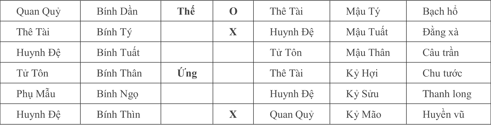
    - **Hình này chứng minh điều gì**
      - Hào 2 Thai vị Dần mộc bị Nguyệt Thân xung phá phản ánh việc phá thai.
    - **Từ đâu mà thấy được**
      - Hào 2 Bính Dần Quan Quỷ Thai vị lâm Nguyệt Phá, Hào 1 Bính Thìn Huynh Đệ động.

##### Căn cứ - Nhìn vào: Các bước luận giải tuần tự
* Căn cứ xác định Dụng Thần:
  * Xem việc mang thai lấy hào Tử Tôn làm Dụng Thần.
* Nhìn vào dấu hiệu mang thai:
  * Tử Tôn Bính Thân cư hào 3 được Nhật thần Tý thủy sinh (hoặc Thìn nguyệt sinh phù) là có sinh khí.
  * Hào 3 đại diện cho tử cung, lâm Tử Tôn vượng tướng chủ việc mang thai.
  * Hào 2 là Thai vị, Phụ Mẫu Bính Ngọ được hào Thế Dần mộc động sinh trợ, lại có Nhật thần Tý thủy xung thành Ám động; Thai vị lâm Thanh Long -> Điềm báo mang thai vô cùng chuẩn xác.
* Nhìn vào nguy cơ hủy thai qua Cung Tử, Cung Tuyệt & Bạch Hổ:
  * Nguyên thần Huynh Đệ Bính Thìn lâm Nguyệt kiến phát động lại hóa hồi đầu khắc (Quan Quỷ Kỷ Mão khắc).
  * Tử Tôn Thân kim ở đất Tử tại hào Thê Tài Bính Tý ($\text{Kim tử tại Tý}$).
  * Tử Tôn Thân kim ở đất Tuyệt tại hào Thế Quan Quỷ Bính Dần ($\text{Kim tuyệt tại Dần}$) -> Thai nhi khó lòng có cơ hội chào đời.
  * Hào Thế Dần mộc phát động hóa Tý thủy là đất Tuyệt/Tử của Tử Tôn -> Chính bản thân người chồng không muốn giữ đứa bé.
  * Hào Thế lâm Bạch Hổ; Bạch Hổ là huyết thần chủ về hư thai, sảy thai, phá thai -> Tượng muốn chủ động phá thai.
* Nhìn vào phép "Cách sơn hóa hào" tinh vi:
  * Hào Thế Quan Quỷ Bính Dần động hóa Thê Tài Mậu Tý.
  * Hào 5 Thê Tài Bính Tý lại phát động hóa Huynh Đệ Mậu Tuất (Nguyên thần sinh Tử Tôn).
  * Quy luật vận hành:
    $$\text{Hào Thế} \xrightarrow{\text{hóa}} \text{Thê Tài Tý thủy} \xrightarrow{\text{hóa}} \text{Nguyên thần Tuất thổ}$$
  * Đây chính là phép **Cách sơn hóa hào** (mượn hào cách sơn để hóa ra hào đích).
  * Hóa xuất Nguyên thần của Tử Tôn lại lâm Nguyệt phá (tháng Thìn xung Tuất) -> Hai vợ chồng đã định sẵn quyết tâm phá thai.
  * Hào cách sơn ở giữa là Thê Tài -> Nguyên nhân trực tiếp khiến quyết định phá thai bắt nguồn từ người vợ.
* Nhìn vào thời điểm phá thai qua Tuần Không:
  * Hào sơ Nguyên thần Thìn thổ lâm lệnh tháng phát động hóa hồi đầu khắc -> Dự định tiến hành phá thai ngay trong tháng Thìn này.
  * Tuy nhiên hào biến Quan Quỷ Kỷ Mão đang lâm Tuần Không -> Trong vòng 3, 4 ngày tới chưa thể đi phá thai ngay được.

##### Thực tế kiểm chứng & Kết quả ứng nghiệm
* Lời thú nhận của người bạn: Người bạn kinh ngạc xác nhận mọi chi tiết đều đúng hoàn toàn. Vợ anh mới mang thai được một tháng; tuy nhiên do công ty vừa có quyết định điều động vợ đi công tác tại Thâm Quyến trong thời hạn một năm với mức lương rất cao và cơ hội thăng tiến hiếm có, nên hai vợ chồng bàn bạc quyết định bỏ thai. Vì mấy ngày nay công việc quá bận rộn nên chưa thu xếp đi được, dự định trong vài ngày tới sẽ đến bệnh viện làm thủ tục.
