# Lục Hào BẢO ĐIỂN

Tác giả: Vương Hổ Ứng  
Dịch giả: An Hạ

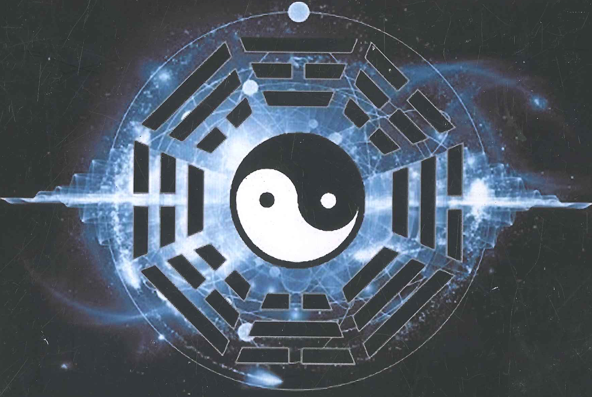

---

# MỤC LỤC

- **Tự** 5
- **CHƯƠNG MỘT: DỰ ĐOÁN LỤC HÀO TRONG CUỘC SỐNG** 7
- **CHƯƠNG HAI: LỊCH SỬ DỰ ĐOÁN LỤC HÀO VÀ QUÁ TRÌNH BIẾN ĐỔI** 10
- **CHƯƠNG BA: VŨ TRỤ QUAN CỦA DỊCH** 12
  - Học thuyết Âm dương
  - Học thuyết Ngũ Hành
- **CHƯƠNG BỐN: CAN CHI TRONG LỤC HÀO** 16
  - Mười thiên can
    - Âm dương của Mười thiên can
    - Ngũ Hành của Mười thiên can
    - Phương vị của Mười thiên can
  - Mười hai Địa chi
    - Âm dương của Mười hai Địa chi
    - Ngũ Hành của Mười hai Địa chi
    - Phương vị của Mười hai Địa chi
    - Mười hai Địa chi và bốn mùa
    - Mười hai Địa chi và tháng
    - Mười hai Địa chi và mười hai canh giờ
    - Mười hai Địa chi lục hợp
    - Mười hai Địa chi lục xung
    - Quan hệ đối ứng của Mười hai Địa chi và động vật
    - Địa chi Tam hợp
    - Địa chi Tam hình
- **CHƯƠNG NĂM: KIẾN THỨC CĂN BẢN VỀ BÁT QUÁI** 19
  - Hàm nghĩa cơ bản của Bát Quái
    - Quan hệ đối ứng của Bát Quái và con người
    - Quan hệ đối ứng của Bát Quái và thân thể
    - Quan hệ đối ứng của Bát Quái với các cơ quan nội tạng
    - Quan hệ đối ứng của Bát Quái với phương vị
    - Thuộc tính ngũ hành trong Bát Quái
  - Bát Quái phân cung
- **CHƯƠNG SÁU: THỦ PHÁP VÀ PHƯƠNG PHÁP GHI BÁT QUÁI.** 23
- **CHƯƠNG BẢY: PHƯƠNG PHÁP LẬP QUẺ** 25
  - Can chi
  - Nạp giáp ca
  - Phương pháp an Thế ứng
  - Lục thân

- Lục thần
- Sáu mươi bốn quẻ thế ứng lục thân
- CHƯƠNG TÁM: TÁC DỤNG CỦA LỤC THÂN, LỤC THẦN, THẾ ỨNG 39
  - Hàm nghĩa Lục thân
    - Phụ mẫu hàm nghĩa
    - Quan quỷ hàm nghĩa
    - Huynh đệ hàm nghĩa
    - Thê tài hàm nghĩa
    - Tử tôn hàm nghĩa
  - Quan hệ sinh khắc của Lục thân
    - Lục thân tương sinh
    - Lục thân tương khắc
  - Hàm nghĩa Lục thần
    - Thanh Long hàm nghĩa
    - Chu Tước hàm nghĩa
    - Câu Trần hàm nghĩa
    - Đằng Xà hàm nghĩa
    - Bạch Hổ hàm nghĩa
    - Huyền Vũ hàm nghĩa
  - Tác dụng của Thế ứng
    - Tử tôn trì thế
    - Huynh đệ trì thế
    - Phụ mẫu trì thế
    - Thê tài trì thế
    - Quan quỷ trì thế
- CHƯƠNG CHÍN: PHƯƠNG PHÁP LẤY DỤNG THẦN 44
  - Dụng thần lưỡng hiện
  - Phi thần, phục thần
  - Tiến thần, thoái thần
- CHƯƠNG MƯỜI: NGUYÊN THẦN, KỊ THẦN, CỪU THẦN 55
  - Nguyên thần
  - Kị thần
  - Cừu thần
- CHƯƠNG MƯỜI MỘT: SUY VƯỢNG CỦA HÀO 62
  - Nguyệt kiến
  - Nguyệt phá
  - Nhật thần
  - Không vong

- CHƯƠNG MƯỜI HAI: NGŨ HÀNH SINH DIỆT MƯỜI HAI TRẠNG THÁI 72
- CHƯƠNG MƯỜI BA: SINH KHẮC CỦA HÀO ĐỘNG TĨNH 78
  - Ám động cùng nhật phá
- CHƯƠNG MƯỜI BỐN: LỤC HỢP 83
  - Lục hợp
  - Tam hợp cục
- CHƯƠNG MƯỜI LĂM: LỤC XUNG 89
  - Lục xung
- CHƯƠNG MƯỜI SÁU: TAM HÌNH CÁT HUNG 91
- CHƯƠNG MƯỜI BẢY: PHẢN NGÂM, PHỤC NGÂM 93
  - Phản ngâm
  - Phục ngâm
- CHƯƠNG MƯỜI TÁM: QUẺ DU HỒN, QUY HỒN 95
  - Du hồn
  - Quy hồn
- CHƯƠNG MƯỜI CHÍN: TÁC DỤNG CỦA HÀO VỊ 99
- CHƯƠNG HAI MƯƠI: ỨNG KỲ 105
- CHƯƠNG HAI MỐT: DỰ ĐOÁN THỜI TIẾT 126
- CHƯƠNG HAI HAI: DỰ ĐOÁN TRANH TÀI 136
- CHƯƠNG HAI BA: DỰ ĐOÁN TÀI VẬN 146
- CHƯƠNG HAI TƯ: DỰ ĐOÁN MUA BÁN 155
- CHƯƠNG HAI NĂM: DỰ ĐOÁN XUẤT HÀNH 164
- CHƯƠNG HAI SÁU: DỰ ĐOÁN NGƯỜI ĐI ĐƯỜNG 172
- CHƯƠNG HAI BẢY: DỰ ĐOÁN MẤT ĐỒ 183
- CHƯƠNG HAI TÁM: DỰ ĐOÁN THI CỬ 192
- CHƯƠNG HAI CHÍN: DỰ ĐOÁN CÔNG VIỆC 200
- CHƯƠNG BA MƯƠI: DỰ ĐOÁN HÔN NHÂN 206
- CHƯƠNG BA MỐT: DỰ ĐOÁN TẬT BỆNH 213
- PHỤ LỤC 1: VƯƠNG HỔ ỨNG LÃO SƯ TÙY BÚT 222
- PHỤ LỤC 2: HỎI ĐÁP VƯƠNG HỔ ỨNG CÁC NGHI VẤN VỀ DỤNG THẦN 289

---

# TỰ

Nhắc đến xem bói, có người tin tưởng, có người không tin. Nếu như mười mấy năm trước hỏi Tôi, Tôi khẳng định cũng là cười mà không tin. Nhưng Tôi trời sinh có tính hiếu kỳ, lúc nào cũng muốn tìm tòi thế giới.

Công việc chính của Tôi là khảo cổ, khi đọc qua các nghiên cứu văn hiến thường gặp các nội dung liên quan đến việc xem bói cổ đại. Vì để giải thích các băn khoăn về việc xem bói, Tôi đọc rất nhiều tư liệu, bất tri bất giác nắm giữ được phương pháp cơ bản, và cũng dần thích xem bói. Lúc rảnh rỗi, Tôi dùng phương pháp xem bói học được từ cổ tịch nửa đùa nửa thật mà xem cho bạn bè vậy mà đúng rất nhiều lần. Nếu như là một hai lần xem đúng có lẽ là trùng hợp, nhưng mấy lần dự đoán chuẩn xác gợi lên cho Tôi ham muốn thăm dò, Tôi quyết định nghiên cứu sâu hơn nữa. Cẩn thận nghiên cứu mới phát hiện, cổ tịch chưa hẳn tất cả đều đã đúng, thế là lại muốn uốn nắn suy nghĩ sai lầm của cổ nhân và bắt đầu xem bói để nghiệm chứng đồng thời thỉnh giáo các cao nhân trong dân gian, rốt cục nắm giữ được chân lý của Lục hào.

Phương pháp dự đoán Lục hào là phát minh của cổ nhân, là kết tinh trí tuệ của cổ nhân, cho tới bây giờ vẫn có giá trị sử dụng vô cùng lớn, có thể định hướng cuộc sống của chúng ta, khiến cho cuộc sống của chúng ta tốt đẹp hơn. Tôi mặc dù qua nghiên cứu có những đột phá trọng đại nhưng không dám một mình chiếm làm của riêng, nên xin dùng ngôn ngữ thông tục dễ hiểu viết ra, để tất cả mọi người học được, tạo phúc cho xã hội, làm cuộc sống thêm phong phú.

---

# LỜI DỊCH GIẢ

Cuốn sách chỉ hơn 200 trang này xứng đáng gọi là **Bảo điển**. Đây có thể nói là một cuốn sách mà bất cứ ai đã, đang và sẽ nghiên cứu Lục hào đều BẮT BUỘC phải có.

Bản thân tôi đã đọc nhiều sách Lục hào và có tham gia dự đoán cũng như nghiệm lý. Trong quá trình nghiệm lý có nhiều thắc mắc và tự mình mày mò nghiên cứu, lý giải nhưng còn chưa chắc chắn. May thay, khi dịch cuốn sách này từng trang từng trang lại giải đáp và chứng thực mọi thắc mắc, nghiệm lý của bản thân. Cuốn sách dường như là căn bản nhưng lại hàm chứa rất nhiều kiến thức cao cấp trong Lục hào. Càng dịch, càng đọc lại càng thấy có nhiều Dịch hữu dường như đã có bước đi chệch hướng và chưa hiểu thấu đáo về Lục hào.

Một cuốn sách không dày nhưng lại có thể mở ra một con đường thênh thang cho mọi người đến với Lục hào. Qua đó, dự đoán được số mệnh và hóa giải phần nào số mệnh giúp cho cuộc sống của bản thân và mọi người xung quanh tốt đẹp hơn.

Với nghiệm lý của bản thân, tôi cũng mạo muội chú thích thêm để có thể làm rõ hơn một số nội dung còn ẩn tàng trong vài ví dụ.

Với mong muốn được đưa đến cho các Dịch hữu càng nhiều kiến thức về Lục hào càng tốt, xin kính tặng các Dịch hữu phần phụ lục quyển **Vương Hổ Ứng lão sư tùy bút** với nhiều tâm đắc của Vương Hổ Ứng.

Mọi đóng góp nếu cần để có thể hoàn thiện hơn xin vui lòng liên hệ nghiencuuluchao@gmail.com

Trân trọng./.

Hà Nội, ngày Quý Tị, tháng Mậu Thìn, năm Kỷ Hợi

An Hạ

---

# CHƯƠNG MỘT
## DỰ ĐOÁN LỤC HÀO TRONG CUỘC SỐNG

Chúng ta đến thế giới này thưởng thức từng cái nhân sinh, bất hạnh là ai cũng muốn thể nghiệm hạnh phúc nhưng phần lớn lại không thể sống theo ý mình. Đối với tương lai, ai cũng đều tưởng rằng tài vận sẽ hanh thông, cuộc đời vui sướng, nhưng lại là làm ăn thất bại, thống khổ. Ai cũng muốn hôn nhân mỹ mãn hạnh phúc nhưng lại tràn ngập phiền não. Bệnh tật và tai nạn lúc nào cũng có thể rơi xuống đầu ai đó. Mục đích của dự đoán là sớm biết được cát hung trong tương lai, phòng ngừa rắc rối có thể xuất hiện.

Chúng ta không phải thánh nhân, nhưng là chúng ta có thể mượn nhờ một loại siêu thời không lực lượng nào đó mà sớm biết được sự việc phát sinh, cải biến cái xấu khiến sự việc phát triển theo chiều hướng tốt đẹp hơn hay không? Nếu như Tôi không học Lục hào trước đó, tôi cũng nghĩ rằng điều này là không thể. Nhưng bây giờ Tôi có thể khẳng định là có thể. Hơn sáu nghìn năm trước, thánh nhân Phục Hi đã sáng tạo ra Dịch Học Bát Quái có khả năng này. Chỉ cần nắm giữ một lĩnh vực trong Dịch, liền có thể dự đoán tương lai, nắm chắc tương lai và cải thiện vận mệnh của mình.

Những năm gần đây tôi thông qua dự đoán, chẳng những vì chính mình mà còn vì người khác tiêu trừ rất nhiều phiền não và thống khổ, qua đó cảm động sâu sắc với thuật dự đoán thần kỳ mà cổ nhân đã phát minh. Hiện tại dự đoán là một bộ phận không thể thiếu trong cuộc sống của tôi.

Lục hào được sử dụng trong phạm vi rất lớn, có thể dự đoán thời tiết, động đất, trồng trọt, mua bán, nhân sinh, thi cử, hôn nhân, tình dục, bệnh tật, tìm người tìm vật, tranh tài, cổ phiếu, xuất hành an nguy, giải mộng, phong thuỷ... Đây chính là một môn dự đoán có ứng nghiệm chính xác cực cao.

*Chẳng hạn như sau:*

Ngày 14 tháng 8 năm 1996, một phụ nữ công tác tại bưu cục đi mua đồ tại một khu sầm uất ở Thái Nguyên thì bị mất xe đạp liền đến chỗ tôi xem được quẻ Trạch Lôi Tùy biến Thủy Hỏa Ký Tế, tôi đoán như sau: chiếc xe mất ba ngày trước là xe mới mua, 7 giờ sáng hôm sau đến chỗ bị mất xe sẽ có người chỉ cho, ba ngày sau sẽ tìm thấy.

Cô ta nghe lời tôi 7 giờ sáng hôm sau đến chỗ xe đạp bị mất đi loanh quanh, chợt một ông lão đi đến hỏi: "Có phải cô đang tìm xe đạp không?" Cô ta quá ngạc nhiên vội vàng gật đầu. Ông lão chỉ vào một cái nhà ven đường nói: "Bốn ngày trước có một người trẻ tuổi làm ở kia lấy xe đi." Đồng thời mô tả kỹ càng về tướng mạo người kia. Cô ta liền gặp lãnh đạo công ty đó trao đổi, ngày 17 lấy lại được xe đạp của mình.

*Lại lấy một ví dụ khác.*

Ngày 1 tháng 5 năm 1999, khi tôi đang dạy tiết Dự đoán Bệnh tật tại trường Trung y thì có một người phụ nữ khoảng bốn mươi tuổi đến xin được xem một chút về bệnh của con trai. Bởi vì đang trong lớp, tôi vốn định cự tuyệt, nhưng thấy người phụ nữ đó mặt mũi tràn đầy bi thương, mà yêu cầu lại giống với nội dung bài giảng nên để cô ta gieo được quẻ Phong Thiên Tiểu Súc biến Phong Lôi Ích.

Tôi viết trên bảng đen, tiến hành phán đoán phân tích. Bệnh của đứa bé này không phải là bệnh bình thường, nếu bình thường sẽ bị sai mà xem như bệnh tâm thần. Bệnh phát sinh vào năm 1997. Ban đêm là nặng nhất, ngủ không yên, thường thấy ác mộng, cảm giác có người uống máu mình, thật ra có hai nữ quỷ quấn thân. Nữ quỷ vào nhà từ cửa sổ, phía đông hoặc đông nam nhà từng có một rừng cây, về sau do xây nhà mà chặt đi. Người phụ nữ giật mình vì kết quả dự đoán rất khớp với thực trạng của đứa con. Năm 1997 cô ta chuyển nhà, lúc ấy phía đông nơi ở chính xác là có một rừng liễu nhưng về sau công ty bất động sản chặt mất. Sau khi rừng cây bị chặt con cô ta liền bị bệnh. Không bác sĩ nào chẩn đoán được nguyên nhân gây bệnh mà chỉ trị liệu bệnh tâm thần. Đã khám qua nhiều bác sĩ nhưng đều không có hiệu quả. Đứa trẻ ngày càng mê muội, rất chán ghét ánh sáng, thường cảm thấy có người uống máu mình. Thế nhưng nó lại không thể phản kháng, đêm nào cũng sống trong thống khổ. Đến tối người phụ nữ này còn có thể nghe được dường như có hai nữ nhân nói chuyện trong phòng con mình nhưng không rõ nói gì. Nàng lén đi vào phòng thì ngoài đứa con không có ai khác. Con cô ta còn có bệnh lúc ngủ không cho đóng cửa sổ, cô ta sợ con cảm lạnh nên đóng cửa lại thì đứa bé nửa mê nửa tỉnh khóc lóc thống khổ đòi mở cửa sổ ra. Phán đoán cùng sự thật tương xứng, tôi khuyên treo một cái kiếm gỗ đào có bôi tùng hương ở phía đông phòng ngủ, trong vòng mấy ngày bệnh đứa bé thuyên giảm như kỳ tích.

Năm 1998 có một ông lão sáu mươi sáu tuổi từ quê lên tìm tôi nhờ dự đoán. Ông ta có một nữ nhân tình nhỏ hơn con mình cả mười tuổi, lo lắng vì chuyện này mà dẫn tới phiền phức, gieo được quẻ Hỏa Sơn Lữ biến Hỏa Lôi Phệ Hạp. Tôi suy luận như sau.

Nhân tình của ông ta đã có chồng nhưng chồng cô ta không có bản sự gì, việc này cho dù chồng cô ta có biết cũng không tạo thành phiền phức gì hết. Nhưng vẫn có ba điểm cần chú ý. Đầu tiên là sức khỏe, sức khỏe không tốt, có bệnh tim, đặc biệt là mùa này rất dễ phát bệnh. Tháng 12 năm 1999 sẽ có tai nạn giao thông. Cuối cùng năm 2005 việc ngoại tình sẽ bị vợ con phát hiện mà phát sinh mâu thuẫn, sẽ lang thang nửa năm ở nơi khác. Ông ta nói bốn ngày trước bệnh tim đã có phát tác và yêu cầu hóa giải tai nạn giao thông, tôi liền tiến hành xử lý hóa giải. Tháng 5 năm 2005, người này lần nữa đến nhờ xem, cũng có kể tháng 12 năm 1999 vì đường phủ tuyết trơn nên ông ta có đụng xe vào lan can cầu, nhờ đã sớm hóa giải nếu không rơi từ trên cầu xuống chắc sẽ nguy hiểm đến tính mạng. Việc ngoại tình cũng bị vợ con phát hiện, vợ ông ta bắt cóc cô nhân tình buộc ông ta giao lại tài sản, ông ta thuê người cứu cô nhân tình ra rồi trốn khỏi quê, giờ đến xem lúc nào mới có thể bình an trở lại quê hương.

Xem các ví dụ ở trên, tất cả suy luận, phán đoán và hóa giải đều từ trong quẻ mà có được. Có câu nói "Lâm thời ôm chân phật", lúc có sự tìm người dự đoán, đem vận mệnh bản thân giao cho người khác, chẳng bằng tự mình học dự đoán, nắm giữ vận mệnh trong tay mình càng tốt hơn không. Điều này có thể làm nhân sinh của bản thân càng thêm phong phú, đồng thời cũng có thể thể nghiệm một chút niềm vui khi xem bói.

---

# CHƯƠNG HAI

## LỊCH SỬ DỰ ĐOÁN LỤC HÀO VÀ QUÁ TRÌNH BIẾN ĐỔI

Lục hào là một phương pháp dự đoán trong rất nhiều phương pháp bắt nguồn từ Chu Dịch. Lục hào tự mình có một hệ thống độc lập, là một loại thuật dự đoán phi thường hoàn mỹ. Bí pháp dự đoán này có ứng nghiệm rất cao và qua đó lưu truyền rộng khắp tại dân gian, được nhiều dự đoán sư yêu thích. Truyền đời đều có nhiều người cảm mến Lục hào nên kế thừa cùng phát triển môn học vấn này khiến cho Lục hào có thể lưu truyền đến hiện tại.

Dò xét từ ngọn nguồn, Lục hào có lịch sử từ hơn hai ngàn năm trước. Kinh Phòng là nhà Dịch học nổi danh nhà Hán, ông ta lấy « Chu Dịch » làm cơ sở, xảo diệu đem Âm Dương Ngũ Hành cùng Can Chi đặt vào Bát Quái, căn cứ quan hệ tương sinh tương khắc giữa mười hai địa chi cùng quẻ cung, phối hợp lục thân, sáng lập ra Lục hào dự đoán nguyên thủy, sau đó lại trải qua nhiều đời cùng nghiên cứu, phát triển mà thành tựu Lục hào dự đoán học ngày nay.

Bí pháp dự đoán này đem can chi nạp vào Bát Quái để dự đoán, cho nên ban sơ được gọi là "Nạp giáp phệ pháp", nhưng nó được diễn xuất từ hào từ của « Chu Dịch » cho nên khi phán đoán cát hung còn cần tham khảo hào từ. Về sau bị ảnh hưởng của Đạo giáo và nhiều thuật dự đoán khác nên khi phán đoán các dự đoán sư thêm vào rất nhiều loại thần sát, ngược lại khiến thuật dự đoán này xuất hiện cục diện hỗn loạn. Bất quá phương pháp dự đoán lúc đầu chỉ nắm giữ trong tay một ít người, dân chúng bình thường không sử dụng, mãi cho đến thời Tống, một bản kí tên là "Ma y đạo nhân" căn cứ « Hỏa Châu Lâm » được ra mắt và truyền bá rộng rãi trong dân gian. Bởi vậy thời cổ còn gọi thuật dự đoán này là "Hỏa Châu Lâm Pháp". Nhưng « Hỏa Châu Lâm » có nhiều khác biệt lớn với Lục hào hiện đại, không có Nguyệt phá, Ám động, cách dùng Ngũ Hành sinh diệt mười hai trạng thái (tức mười hai cung trường sinh) cũng không rõ ràng. Sau đó đến đời Minh và đời Thanh, Lục hào bước vào thời kỳ đỉnh cao, cũng là thời kỳ có rất nhiều sách Lục hào ra đời. Các trước tác trong giai đoạn này có « Hoàng Kim Sách », « Đoán Dịch Thiên cơ », « Đoán Dịch Toàn Thư », « Đoán Dịch Thần Thư », 《 Hải Để Nhãn », « Dịch Mạo », « Dịch Lâm Bổ Di », « Dịch Ẩn », « Bốc Phệ Toàn Thư », « Tăng San Bốc Dịch », « Bốc Phệ Chính Tông », « Bốc Phệ Viên Cơ », « Thiên Huyền Đoạn Dịch », « Phệ Học Chỉ Yếu » vân vân. Bất quá sách dù sao vẫn là sách, có một bộ phận tinh hoa thì lại dùng hình thức truyền miệng lưu truyền trong dân gian, đây cũng là đặc điểm truyền bá của các môn dự đoán học nói chung. Ở đây ngoài nội dung nghiên cứu trong cổ thư tôi còn đồng thời thêm vào các bí pháp truyền miệng nên tính thực dụng rất mạnh. Thêm một bộ phận nữa là tôi từ thực nghiệm tổng kết ra và từ các dự đoán sư khác học được. Học vấn là vô tận, nhất định phải theo đuổi bước chân của lịch sử. Mà dự đoán học cổ đại cũng phải dung nhập vào thời hiện đại, chỉ có phát triển, hoạt học hoạt dụng, mới có thể khiến mình trở thành một dự đoán sư có trình độ cao.

---

# CHƯƠNG BA
## VŨ TRỤ QUAN CỦA DỊCH

### Học thuyết Âm dương

Trên thế giới có nam liền có nữ, có cát liền có hung, trong vũ trụ tất cả mọi vật đều có chính phản hai mặt. Bản thân Vũ trụ tạo thành từ Chính vũ trụ và Phản vũ trụ, vũ trụ là một tổ hợp âm dương khổng lồ. Cô Dương không dài, cô âm không sinh, âm dương dựa vào nhau mà tồn tại chứ không thể tồn tại độc lập. Chữ "Dịch" từ khởi nguyên ký tự và tổ hợp mà nói chính là hợp thể của hai chữ Nhật Nguyệt. Mặt trời là dương, mặt trăng là âm, "Dịch" chính là biến hóa âm dương. Nói cách khác bản chất "Dịch" là miêu tả quy luật biến hóa và phát triển của vũ trụ. Sự phát triển và biến hóa của vũ trụ chính là do tác dụng của âm Dương. Quy luật này được cổ nhân gọi là "Đạo". "Đạo" là bản chất của vũ trụ, lợi dụng âm dương tạo dựng lên dự đoán thuật, cũng là phương pháp nhận biết cùng chứng thực "Đạo".

Lợi dụng nguyên lý âm dương tạo dựng lên dự đoán thuật sở dĩ có thể dự đoán chuẩn xác nhiều chuyện bởi vì con người cùng vũ trụ có quan hệ mật thiết. Con người là sản phẩm mà vũ trụ phát triển đến một giai đoạn nhất định mà sinh ra, con người là tinh hoa vũ trụ, là ảnh thu nhỏ của vũ trụ, mỗi cơ thể người chính là một tiểu vũ trụ. Chỉ có thấu hiểu vũ trụ mới có thể chân chính nhận biết về cơ thể, chỉ có thấu hiểu cơ thể mới có thể giải khai vũ trụ chi mê.

Con người là vạn vật chi linh, vũ trụ phát triển cũng chính là con người phát triển. Phương diện Âm dương trong cơ thể con người được thể hiện rất đầy đủ. Như giới tính mà nói, nữ là âm, nam là dương. Trên cơ thể một người mà nói, thượng là dương, hạ là âm, lưng là dương, ngực là âm, trái là dương, phải là âm, bên ngoài là dương, bên trong là âm, phủ (*) là dương, tạng (**) là âm. Con người khi còn sống chính là một quá trình biến hóa Âm Dương. Trước khi thụ thai, gọi là gen cũng tốt, mật mã cũng tốt, thực ra là một thứ gì đó vô hình mang hình thức âm tính tồn tại, một khi âm dương kết hợp, người phụ nữ thụ thai sẽ hiện ra dương tính, hình thành thai nhi, đây chính là chuyển biến từ âm đến dương. Mà so sánh thai nhi trong bụng cùng cơ thể người bên ngoài tương đối mà nói thì thai nhi là âm, sinh ra thành người là dương. Nhân sinh về sau không ngừng trưởng thành, khi còn bé là âm, lớn lên là dương, dương phát triển đến giai đoạn nhất định lại hướng âm phát triển, trẻ là dương, già là âm, người sống là dương, chết là âm. Chỉ có nắm thật chắc nguyên lý âm dương, mới có thể dùng Lục hào nắm chắc xu thế phát triển của con người và sự vật.

(*) Phủ: bộ phận trong vùng bụng. Lục phủ là sáu bộ phận quan trọng trong vùng bụng của cơ thể con người. Lục phủ gồm: Vị, đởm, tam tiêu, bàng quang, tiểu trường, đại trường

(**) **Tạng:** bộ phận trong vùng ngực và bụng. Ngũ tạng là năm bộ phận quan trọng trong vùng ngực và bụng của con người. Ngũ tạng gồm: tâm, can, tỳ, phế, thận

# Học thuyết Ngũ Hành

Từ góc độ Dịch mà nói Ngũ Hành là nguyên tố vật chất cơ bản nhất cấu thành thế giới. Vạn sự vạn vật đều bao hàm Ngũ Hành. Các loại sự vật phát sinh, phát triển đều là kết quả do Ngũ Hành tương tác. Cụ thể mà nói, Ngũ Hành là Thủy, Hỏa, Mộc, Kim, Thổ năm loại nguyên tố được cổ nhân khái quát và tổng kết từ thuộc tính của tất cả sự vật trong vũ trụ.

Trong Ngũ Hành, Thủy đại biểu đặc tính sự vật là rét lạnh, hướng xuống, ẩm ướt, tưới nhuần; Như nước, mưa, tuyết, đêm, màu đen, bắc, băng đều là thuộc tính thủy. Hỏa đặc tính là ấm áp, sáng ngời, hướng lên, bốc lên; Như hỏa diễm, quang mang, mùa hè, màu đỏ, phương nam đều là thuộc tính hỏa. Mộc đặc tính là sinh sôi, nhu hòa, đúng sai, giãn ra; Như thực vật, sáng sớm, mùa xuân, phương đông, hoa cỏ đều là thuộc tính mộc. Kim đặc tính là thanh lương, sạch sẽ, túc hàng, thu liễm; Như kim loại, mùa thu, màu trắng, phương tây đều là thuộc tính kim. Thổ đặc tính là sinh dưỡng, sinh hóa, thu nạp, biến hóa; Như đất, núi, màu vàng, trung ương đều là thuộc tính thổ.

Học thuyết Ngũ Hành không chỉ để phân loại tính chất sự vật mà quan trọng hơn nó nói về quy luật vận động nội bộ nói chung của sự vật. Nói cách khác, quan hệ tương hỗ trong Ngũ Hành có mặt tương sinh lại có mặt tương khắc. Chính vì tương sinh tương khắc nên trong vũ trụ sự vật mới có thể biến hóa và phát triển.

Ngũ Hành tương sinh là: Thủy sinh Mộc, Mộc sinh Hỏa, Hỏa sinh Thổ, Thổ sinh Kim, Kim sinh Thủy. Quan hệ Ngũ Hành tương sinh là cổ nhân từ trong thực tiễn quan sát các hiện tượng tự nhiên mà tổng kết ra. Tỉ như, hoa cỏ cây cối trong ngũ hành thuộc tính là mộc, mặc dù là sinh trưởng trong đất, nhưng nhất định phải có thủy tưới nhuần mới có thể sinh trưởng, cho nên cho rằng Thủy sinh Mộc. Lại như khoan gỗ có thể lấy lửa, cây cối có thể thiêu đốt, bởi vậy cho rằng Mộc sinh Hỏa. Vật bị hỏa thiêu biến thành tro, tro tức là thổ, cho nên Hỏa sinh Thổ. Kim loại là từ trong đất lấy ra khoáng thạch tinh luyện mà thành, cho nên Thổ có thể sinh Kim. Kim nóng chảy biến thành chất lỏng, thủy khí lại tụ trên bề mặt kim loại ngưng kết thành giọt nước, cho nên cổ nhân cho rằng Thủy là từ Kim sở sinh mà ra.

Ngũ Hành tương khắc là: Thủy khắc Hỏa, Hỏa khắc Kim, Kim khắc Mộc, Mộc khắc Thổ, Thổ khắc Thủy. Nguyên lý tương khắc cũng quan sát từ thiên nhiên mà quy nạp tổng kết ra. Thiên địa chi tính, nhiều thắng ít, thủy có thể dập lửa, cho nên Thủy khắc Hỏa. Tinh thắng kiên, hỏa năng làm kim loại nóng chảy, cho nên Hỏa khắc Kim. Cương thắng nhu, đao kim loại có thể đốn củi, cho nên Kim khắc Mộc.

Chuyên thắng tán, cây cỏ cắm rễ ở thổ, cho nên Mộc khắc Thổ. Thực thắng hư, thổ có thể ngăn thủy, cho nên Thổ khắc Thủy.

---

# CHƯƠNG BỐN
## CAN CHI TRONG LỤC HÀO

Qua giáp cốt khai quật được thì từ thời nhà Thương tại Trung quốc đã sử dụng Lục thập hoa giáp để ghi chép ngày tháng năm. Lục thập hoa giáp có lực lượng không thể tưởng tượng nổi, chứa đựng khái niệm thời không, diễn toán vũ trụ cùng với vạn sự vạn vật ký hiệu và vật dẫn biến hóa trong vũ trụ. Nó không những có tác dụng trọng đại đối với phương diện phát triển và diễn biến Dịch Học mà còn ảnh hưởng đến nhiều học thuật khác của hậu thế. Tỉ như nói các sách Trung y đang lưu hành như "Tử Ngọ lưu trụ", "Thần quy Bát Pháp" chính là dựa vào Thiên can địa chi lúc bệnh nhân đến để lấy huyệt vị. Có thể nói không sinh ra can chi, trong lịch sử cũng sẽ không xuất hiện Lục hào dự đoán thuật.

### Mười Thiên can

Cái gọi là Mười thiên can tức là Giáp, Ất, Bính, Đinh, Mậu, Kỷ, Canh, Tân, Nhâm, Quý. Trình tự sắp xếp là cố định, vạch ra quá trình biến hóa của vạn vật từ sinh trưởng, phồn thịnh, già yếu, tử vong.

### Âm Dương của Mười Thiên can

Thiên can phân ra âm dương, số lẻ là dương, số chẵn là âm. Thiên can Giáp, Bính, Mậu, Canh, Nhâm là dương, gọi là dương can. Ất, Đinh, Kỷ, Tân, Quý thuần âm, gọi là âm can.

### Ngũ hành của Mười Thiên can

Giáp Ất là mộc, Bính Đinh là hỏa, Mậu Kỉ là thổ, Canh Tân là kim, Nhâm Quý là thủy.

### Phương vị của Mười Thiên can

Giáp Ất là phương đông, Bính Đinh là phương nam, Mậu Kỉ làm trung ương, Canh Tân là phương tây, Nhâm Quý là phương bắc. Giữa mười thiên can vẫn tồn tại quan hệ tương hợp, tương xung, hợp hóa nhưng trong Lục hào bình thường chỉ coi trọng Thiên can Ngày dùng để phối lục thần. Hàm nghĩa khác của mười Thiên can rất ít khi dùng, cho nên có thể không cần không nhớ.

## Mười hai Địa chi

Cái gọi là mười hai Địa chi là Tý, Sửu, Dần, Mão, Thìn, Tị, Ngọ, Mùi, Thân, Dậu, Tuất, Hợi. Trong Lục hào có địa vị vô cùng quan trọng. Nhất định phải nhớ kỹ thuộc tính ngũ hành cùng quan hệ tương hỗ, xung hợp, sinh khắc.

### Âm Dương của mười hai Địa chi

Tý, Dần, Thìn, Ngọ, Thân, Tuất là dương chi.

Sửu, Mão, Tị, Mùi, Dậu, Hợi là âm chi.

### Ngũ hành của mười hai Địa chi

Dần Mão thuộc mộc, Dần là dương mộc, Mão là âm mộc. Tị Ngọ thuộc hỏa, Ngọ là dương hỏa, Tị là âm hỏa. Thân Dậu thuộc kim, Thân là dương kim, Dậu là âm kim. Hợi Tý thuộc thủy, Tý là Dương Thủy, Hợi là âm thủy. Thìn Tuất Sửu Mùi thuộc thổ, Thìn Tuất là dương thổ, Sửu Mùi là âm thổ.

### Phương vị của mười hai Địa chi

Tý là phương Bắc, Sửu Dần là Đông Bắc, Mão là Đông, Thìn Tị là Đông Nam, Ngọ là phương Nam, Mùi Thân là Tây Nam, Dậu là phương Tây, Tuất Hợi là Tây Bắc.

### Mười hai Địa chi và bốn mùa

Dần Mão Thìn là mùa xuân, Tị Ngọ Mùi là mùa hạ, Thân Dậu Tuất là mùa thu, Hợi Tý Sửu là mùa đông.

### Mười hai Địa chi và tháng

Từ góc độ Dương lịch để xem, Dần là tháng hai, Mão là tháng ba, Thìn là tháng tư, Tị là tháng năm, Ngọ là tháng sáu, Mùi là tháng bảy, Thân là tháng tám, Dậu là tháng chín, Tuất là tháng mười, Hợi là tháng mười một, Tý là tháng mười hai, Sửu là tháng một.

### Mười hai địa chi và mười hai canh giờ

Giờ Tý (23h – 1h), giờ Sửu (1h – 3h), giờ Dần (3h – 5h), giờ Mão (5h – 7h), giờ Thìn (7h – 9h), giờ Tỵ (9h – 11h), giờ Ngọ (11h – 13h), giờ Mùi (13h – 15h), giờ Thân (15h – 17h), giờ Dậu (17h – 19h), giờ Tuất (19h - 21h), giờ Hợi (21h – 23h).

### Mười hai Địa chi lục hợp

Trong mười hai Địa chi có từng đôi tương hợp, tổng cộng có sáu đôi, gọi là lục hợp. Tý hợp Sửu, Dần hợp Hợi, Mão hợp Tuất, Thìn hợp Dậu, Tị hợp Thân, Ngọ hợp Mùi.

### Mười hai Địa chi lục xung

Trong mười hai Địa chi cũng có từng đôi tương xung, cũng có sáu đôi, gọi là lục xung. Tý Ngọ tương xung, Sửu Mùi tương xung, Dần Thân tương xung, Mão Dậu tương xung, Thìn Tuất tương xung, Tị Hợi tương xung.

### Quan hệ đối ứng của mười hai địa chi và động vật

Tý Chuột, Sửu Trâu, Dần Hổ, Mão Thỏ, Thìn Rồng, Tị Rắn, Ngọ Ngựa, Mùi Dê, Thân Khỉ, Dậu Gà, Tuất Chó, Hợi Lợn.

### Tam hợp địa chi

Thân Tý Thìn hợp thủy cục, Tị Dậu Sửu hợp kim cục, Dần Ngọ Tuất hợp hỏa cục, Hợi Mão Mùi hợp mộc cục.

### Tam hình địa chi

Dần hình Tị, Tị hình Thân, Thân hình Dần, Sửu Tuất Mùi tướng hình, Tý hình Mão, Mão hình Tý, Thìn Ngọ Dậu Hợi tự hình.

Bên trên là các khái niệm thường xuyên liên quan đến mười hai Địa chi, phải nhớ kỹ. Phương pháp sử dụng cụ thể sẽ hướng dẫn kỹ càng ở các chương sau.

---

# CHƯƠNG NĂM

## KIẾN THỨC CĂN BẢN VỀ BÁT QUÁI

### Hàm nghĩa cơ bản của Bát Quái

Trong vũ trụ sự vật khó phân, đếm cũng đếm không xuể, biến hóa đa đoan, nhưng cũng không phải lộn xộn, mà có quy luật tồn tại trong tự nhiên cực kỳ kinh người. Cổ nhân căn cứ tính chất khác biệt của sự vật, sử dụng khái niệm trừu tượng đem vũ trụ tất cả sự vật quy nạp thành tám loại hình thái, đây chính là cái gọi là Bát Quái.

Bát Quái tức là Càn ☰, Khôn ☷, Chấn ☳, Tốn ☴, Khảm ☵, Ly ☲, Cấn ☶, Đoài ☱ được cổ nhân sử dụng làm đại biểu cho các loại sự vật tự nhiên. Càn đại biểu trời, Khôn đại biểu Đất, Chấn đại biểu Sấm, Tốn đại biểu Gió, Khảm đại biểu Thủy, Ly đại biểu Hỏa, Cấn đại biểu Núi, Đoài đại biểu Trạch.

Ký hiệu cấu thành Bát Quái cơ bản nhất gọi là hào, hào phân âm dương, dương hào là "-----", âm hào là "- -". Mỗi ba hào lại tạo thành một quẻ tượng, lấy tượng thiên địa nhân tam tài. Mỗi hai quẻ trùng điệp lại tạo thành một trọng quẻ, quẻ phía trên gọi là quẻ thượng, quẻ ngoại; quẻ phía dưới gọi là quẻ hạ, quẻ nội, trọng quẻ tổng cộng có sáu mươi bốn tổ, gọi là sáu mươi bốn quẻ.

Cụ thể, Bát Quái sử dụng ký hiệu để biểu thị, như sau:

Càn ☰, Khôn ☷, Chấn ☳, Tốn ☴, Khảm ☵, Ly ☲, Cấn ☶, Đoài ☱. Để cho tiện, cổ nhân đem ký hiệu Bát Quái làm thành ca từ như sau: "Càn tam liên, khôn sáu đoạn, chấn nằm ngửa, cấn bát úp, đoài trên thiếu, tốn dưới thiếu, ly trong rỗng, khảm trong đầy."

Bát Quái mặc dù chỉ có tám loại loại hình, nhưng nó có thể đối ứng vạn sự vạn vật trong vũ trụ, có thể nói nó là bảo khố tin tức của vũ trụ. Bát Quái cùng các loại đối ứng quan hệ trong tự nhiên có thể từ từ quen thuộc, hiểu rõ, ở đây chỉ cần đem các hàm nghĩa thường dùng nhớ kỹ là được rồi.

### Quan hệ đối ứng giữa Bát Quái và con người

Càn là Cha, Khôn là Mẹ, Chấn là trưởng nam, tốn là trưởng nữ, Khảm là con trai giữa, Ly là con gái giữa, Cấn là con trai út, Đoài là con gái út.

### Quan hệ đối ứng giữa Bát Quái và cơ thể

Càn là đầu, Đoài là miệng, Chấn là chân, Tốn là cổ, Ly là mắt, Khảm là tai, Cấn là tay, Khôn là bụng.

### Quan hệ đối ứng giữa Bát Quái và nội tạng

Càn là đầu, phổi, đại tràng, Khôn là lá lách, dạ dày, Chấn là gan, Tốn là gan, Khảm là thận, bàng quang, Ly là trái tim, ruột non, Cấn là lá lách, dạ dày, Đoài là phổi, đại tràng.

### Quan hệ đối ứng giữa Bát Quái và phương vị

Càn là Tây Bắc, Đoài là phương Tây, Ly là phương Nam, Chấn là phương Đông, Tốn là Đông Nam, Khảm là phương Bắc, Cấn là Đông Bắc, Khôn là Tây Nam.

Bát Quái đối ứng cùng vạn sự vạn vật, có thể vô cùng vô tận phân phát, trong "Mai Hoa dịch số" được ứng dụng rất rộng, nhưng Lục hào sử dụng hàm nghĩa cũng không nhiều.

### Thuộc tính ngũ hành của Bát Quái

Càn Đoài thuộc kim, Khôn Cấn thuộc thổ, Ly thuộc hỏa, Chấn Tốn thuộc mộc, Khảm thuộc thủy.

### Bát Quái phân cung

Bát Quái từng đôi tương hỗ lẫn nhau biến xuất sáu mươi bốn quẻ, trong Lục hào đem chia làm tám cung, mỗi cung tám quẻ, sắp xếp trình tự cố định không thay đổi, đều có tên gọi cụ thể.

**Càn cung**: Quẻ thứ nhất, quẻ thượng quẻ hạ đều là Càn, gọi là Bát Thuần Càn, cũng gọi là Càn cung thủ quẻ.

Quẻ thứ hai thượng Càn hạ Tốn, gọi là Thiên Phong Cấu, hoặc Càn cung nhất thế quẻ.

Quẻ thứ ba thượng Càn hạ Cấn, gọi là Thiên Sơn Độn, hoặc Càn cung nhị thế quẻ.

Quẻ thứ tư thượng Càn hạ Khôn, gọi là Thiên Địa Bĩ, hoặc Càn cung tam thế quẻ.

Quẻ thứ năm thượng Tốn hạ Khôn, gọi là Phong Địa Quán, hoặc Càn cung đệ tứ quẻ.

Quẻ thứ sáu thượng Cấn hạ Khôn, gọi là Sơn Địa Bác, hoặc Càn cung ngũ thế quẻ.

Quẻ thứ bảy thượng Ly hạ Khôn, gọi là Hỏa Địa Tấn, hoặc Càn cung du hồn quẻ.

Quẻ thứ tám thượng Ly hạ Càn, gọi là Hỏa Thiên Đại Hữu, hoặc Càn cung quy hồn quẻ.

**Đoài cung:** Bát Thuần Đoài, Trạch Thủy Khốn, Trạch Địa Tụy, Trạch Sơn Hàm, Thủy Sơn Kiển, Địa Sơn Khiêm, Lôi Sơn Tiểu Quá, Lôi Trạch Quy Muội.

**Ly cung:** Bát Thuần Ly, Hỏa Sơn Lữ, Hỏa Phong Đỉnh, Hỏa Thủy Vị Tế, Sơn Thủy Mông, Phong Thủy Hoán, Thiên Thủy Tụng, Thiên Hỏa Đồng Nhân.

**Chấn cung:** Bát Thuần Chấn, Lôi Địa Dự, Lôi Thủy Giải, Lôi Phong Hằng, Địa Phong Thăng, Thủy Phong Tỉnh, Trạch Phong Đại Quá, Trạch Lôi Tùy.

**Tốn cung:** Tốn Vi Phong, Phong Thiên Tiểu Súc, Phong Hỏa Gia Nhân, Phong Lôi Ích, Thiên Lôi Vô Vọng, Hỏa Lôi Phệ Hạp, Sơn Lôi Di, Sơn Phong Cổ.

**Khảm cung:** Bát Thuần Khảm, Thủy Trạch Tiết, Thủy Lôi Truân, Thủy Hỏa Ký Tế, Trạch Hỏa Cách, Lôi Hỏa Phong, Địa Hỏa Minh Di, Địa Thủy Sư.

**Cấn cung:** Bát Thuần Cấn, Sơn Hỏa Bí, Sơn Thiên Đại Súc, Sơn Trạch Tổn, Hỏa Trạch Khuê, Thiên Trạch Lý, Phong Trạch Trung Phu, Phong Sơn Tiệm.

**Khôn cung:** Bát Thuần Khôn, Địa Lôi Phục, Địa Trạch Lâm, Địa Thiên Thái, Lôi Thiên Đại Tráng, Trạch Thiên Quái, Thủy Thiên Nhu, Thủy Địa Tỉ.

Thủ quẻ mỗi cung đều gọi là Quẻ Bát thuần, quẻ thứ bảy mỗi cung gọi là quẻ du hồn, quẻ thứ tám gọi là quẻ quy hồn. Thuộc tính ngũ hành của mỗi Trọng quẻ cùng cung đều giống nhau. Nói cách khác, Càn cung tám Trọng quẻ thuộc tính ngũ hành đều là kim, Khôn cung tám quẻ thuộc tính ngũ hành đều là thổ, các cái khác cũng suy ra như vậy.

---

# CHƯƠNG SÁU

## THỦ PHÁP VÀ PHƯƠNG PHÁP GHI BÁT QUÁI

Lục hào dự đoán trước hết chính là thủ pháp lên quẻ, gọi là lên quẻ. Hay dùng nhất là dùng ba đồng xu gieo quẻ, gọi là "Lấy xu thay mặt thi pháp", "Ném xu pháp". Ước chừng khởi nguyên từ Chiến quốc đến giữa thời Hán bắt đầu sử dụng phương pháp gieo xu để thay thế phương pháp dùng cây trúc hoặc cỏ thi, tăng nhanh tốc độ lấy quẻ. Lục hào dùng xu để lấy quẻ, phương pháp đặc biệt, đơn giản mà hàm nghĩa sâu sắc, một đồng tiền xu phân mặt trước và sau tượng trưng cho âm dương nhị khí. Mặt có chữ viết là âm, mặt không có chữ là dương, ba đồng xu lại tượng trưng cho Thiên Địa Nhân tam tài. Nhìn đồng xu mà nói, ngoại hình là tròn, tượng thiên, nội có lỗ vuông tượng địa, bắt nguồn từ Bát Thuần Càn, là tròn, Bát Thuần Khôn, là vuông, trời tròn đất vuông. Bộ phận rìa ngoài lỗ ở giữa gọi là thịt, tượng trưng cho nhục thân con người. Bởi vậy, chỉ ba đồng xu nho nhỏ đã bao hàm thiên địa âm dương lý lẽ, cũng phản ánh vũ trụ quan đạo sinh nhất, nhất sinh nhị, nhị sinh tam.

Cổ nhân trước đây xin quẻ có nhiều nghi thức rườm rà, thường thường tắm rửa, đốt hương, lấy đó là tôn kính thần linh, thỉnh cầu thần linh cho gợi ý, nhưng trên thực tế Lục hào dự đoán không có quan hệ cùng thần linh, chỉ là một loại hoạt động tiềm thức, chỉ cần động tâm muốn xem, cầm xu gieo là đủ. Nhưng nếu như người cần xem xem như trò đùa, căn bản không có suy nghĩ gì, quẻ tượng liền có khả năng không đưa ra được thông tin gì chính xác. Lấy quẻ thì vô luận người tới xem hay chính dự đoán sư gieo quẻ đều có thể, gieo quẻ chỉ là một loại hình thức rút ra quẻ tượng.

Phương pháp lấy quẻ là người muốn xem cầm ba đồng xu trong tay, chụp nghiêm hai tay, đừng để đồng xu từ trong khe tay rơi ra, sau đó trên dưới lay động, làm đồng xu trong tay nảy lên ma sát, sinh ra từ trường cấu kết với tâm linh (đương nhiên dự đoán sư cũng có thể thay người tới xem gieo quẻ) xóc mấy lần, tùy ý thả rơi trên mặt bàn (không thả vào vật mềm) hoặc đáy bằng của đĩa, mâm, xem chính phản của ba đồng xu. Ghi lại chính phản của các đồng xu, tiếp tục lại gieo. Cứ như thế gieo sáu lần là có thể được một Trọng quẻ.

Ghi chép quẻ tượng, một không chữ hai chữ là thiếu dương, là đơn, gạch 1 gạch liền "---". Một chữ hai không chữ là thiếu âm, là hủy đi, gạch 2 gạch "- -". Ba mặt không chữ là lão dương, là trùng, viết 1 vòng "O". Ba mặt chữ là lão Âm, là giao, ghi "X". Loại phương pháp ghi chép quẻ tượng này gọi là họa quẻ hoặc điểm quẻ. Điểm quẻ thì điểm từ dưới lên, lần thứ nhất gieo kết quả là sơ hào, lần thứ hai gieo kết quả là hào hai, theo thứ tự sắp xếp, một lần cuối cùng (lần thứ sáu) là thượng hào (tức hào thứ sáu). Mỗi quẻ đều do sáu hào tạo thành, cho nên gọi là quẻ Lục hào. Lão dương và lão Âm trong quẻ Lục hào gọi là hào động, là biểu thị hào vị muốn phát sinh biến hóa, dương động biến âm, âm động biến dương, đầy đủ phản ứng vật cực tất phản, dương cực biến âm, âm cực biến dương đúng triết lý vũ trụ. Hào được biến ra gọi là hào biến. Quẻ gieo được gọi là chủ quẻ, quẻ biến hóa ra được gọi là quẻ biến hoặc chi quẻ. Cũng có quẻ không hề có hào động, chỉ có chủ quẻ. Xem ví dụ sau sẽ rõ:

Lần thứ sáu gieo: hai không chữ (sấp), một chữ (ngửa) (thiếu âm) - - thượng hào

Lần thứ năm: ba không chữ (lão dương) O hào năm

Lần thứ tư: ba chữ (ngửa) (lão Âm) X hào bốn

Lần thứ ba: một không chữ (sấp) hai chữ (ngửa) (thiếu dương) --- hào ba

Lần thứ hai: hai không chữ (sấp) một chữ (ngửa) (thiếu âm) - - hào hai

Lần thứ nhất: một không chữ (sấp) hai chữ (ngửa) (thiếu dương) --- sơ hào

Trong quẻ "---" "O" tương đương với ký hiệu hào Dương; "- -" và “X" tương đương với ký hiệu hào âm. Quẻ này thượng Khảm hạ Ly là Thủy Hỏa Ký Tế, vì hào thứ tư và thứ năm phát động, phát sinh biến hóa, cho nên quẻ này biến hóa thành thượng Chấn hạ Ly là Lôi Hỏa Phong. Thủy Hỏa Ký Tế là chủ quẻ, Lôi Hỏa Phong là chi quẻ (quẻ biến).

> **Chú thích của Dịch giả:** Thực chất ra theo người dịch không nhất định phải là đồng xu cổ mới gieo được quẻ. Miễn là có ba đồng xu giống nhau liền có thể gieo quẻ. Mặt sấp, ngửa của đồng xu cũng không quá cầu kỳ, miễn mình có xu và tự quy định mặt nào sấp, mặt nào ngửa thì cứ thế mà gieo. Ngửa là Âm, sấp là Dương. Cứ thế mà chú định

---

# CHƯƠNG BẢY: PHƯƠNG PHÁP LẬP QUẺ

Gieo được quẻ rồi tiếp theo chính là phối can chi, thế ứng, lục thân cùng lục thần. Trong Lục hào gọi là lập quẻ. Đầu tiên cần có nhận biết cơ bản đối với Bát Quái. Bát Quái căn cứ nguyên lý âm dương có thể chia làm hai chủng loại dương quẻ và âm quẻ. Càn, Chấn, Khảm, Cấn là dương quẻ, Khôn, Tốn, Ly, Đoài là âm quẻ. Một Trọng quẻ chia thành quẻ thượng, quẻ hạ, từ sáu mươi bốn quẻ tạo thành tám cung đều có cùng thuộc tính ngũ hành, mỗi quẻ đầu tiền của cung được gọi là bản cung hoặc thủ quẻ, thuần quẻ, thống lĩnh bảy quẻ khác gọi là phi cung. Phi cung đều có thuộc tính ngũ hành giống bản cung, mỗi quẻ thứ bảy của từng cung gọi là quẻ du hồn, quẻ thứ tám gọi là quẻ quy hồn.

### Can chi giả pháp

Phối hợp Thiên can địa chi với hào vị gọi là nạp giáp. Khi dự đoán, Thiên can không tham dự vào phán đoán cát hung, bình thường chỉ dùng để phán đoán số lượng, bởi vậy, gieo quẻ thường xuyên tỉnh lược đi Thiên can chỉ nạp địa chi.

### Nạp giáp ca

Càn Kim Giáp Tý ngoại Nhâm Ngọ, Khảm Thủy Mậu Dần ngoại Mậu Thân.

Chấn Mộc Canh Tý ngoại Canh Ngọ, Cấn Thổ Bính Thìn ngoại Bính Tuất.

Khôn Thổ Ất Mùi ngoại Quý Sửu, Tốn Mộc Tân Sửu ngoại Tân Mùi.

Ly Hỏa Kỷ Mão ngoại Kỷ Dậu, Đoài Kim Đinh Tị ngoại Đinh Hợi.

Nạp giáp ca chính là căn cứ và phương pháp phân can chi cho mỗi hào vị. Mỗi quẻ đều từ sơ hào nạp can chi, căn cứ Bát Quái âm dương thuận nghịch nguyên lý, dương quẻ thuận kim đồng hồ (thập nhị chi trình tự là Tý, Dần, Thìn, Ngọ, Thân, Tuất) nạp dương can chi, âm quẻ nghịch kim đồng hồ (nghịch thập nhị chi trình tự là Hợi, Dậu, Mùi, Tị, Mão, Sửu) nạp âm can chi.

Ví dụ, nếu gieo được quẻ Thủy Phong Tỉnh. Quẻ hạ là Tốn, Tốn tại quẻ nội nạp Tân Sửu, tốn là âm quẻ, nghịch hành nạp âm can chi là Tân Sửu, Tân Hợi, Tân Dậu, dương chi không cần. Quẻ thượng là Khảm, Khảm tại ngoại quẻ nạp Mậu Thân, Khảm là dương quẻ thuận đi, tức là Mậu Thân, Mậu Tuất, Mậu Tý, chỉ nạp dương can chi, không cần âm chi.

Hào sáu Mậu Tý - -  
Hào năm Mậu Tuất ---  
Hào bốn Mậu Thân - -  
Hào ba Tân Dậu ---  
Hào hai Tân Hợi ---  
Sơ hào Tân Sửu - -

### Phương pháp an Thế ứng

Thế là thứ không thể thiếu trong Lục hào, cũng là một trong những căn cứ để dự đoán cát hung. Thế là linh hồn quẻ, một quẻ nếu như không có thế ứng, liền giống như một chi quân đội không có tham mưu trưởng cùng quan chỉ huy, đã mất đi hạch tâm quẻ. Mỗi quẻ vị trí thế ứng là cố định không đổi, không thể an sai. An sai thế ứng, sẽ rất khó nắm bắt được sự việc. Thời cổ an Thế ứng chỉ là học vẹt làm rất nhiều người mới học mất không ít thời gian ở giai đoạn này. Tôi hiện tại dạy cho mọi người một cách không cần nhớ tên sáu mươi bốn quẻ cũng có thể an Thế ứng, đồng thời còn có thể cầu quẻ cung. Tôi gọi là *Hào biến pháp an Thế ứng tìm cung quyết*.

### Hào biến pháp An Thế ứng tìm cung quyết

Tìm Thế từ sơ đi vòng lên, Âm hào biến Dương Dương biến Âm.

Biến đến nội ngoại quẻ như nhau, hào nào dừng lại là lâm thế.

Như đến hào năm quẻ vẫn dị, chuyển từ hào bốn hướng xuống dưới.

Như đến sơ hào mới dừng lại, quy hồn Thế tại hào ba lâm.

Nội ngoại giống nhau chớ cần biến, Lục hào an Thế là bát thuần.

Đã được nội ngoại quẻ giống nhau, nguyên quẻ dừng lại coi là cung.

Như hỏi ứng hào an ở đâu, thế cách hai hào tức là ứng.

Đây là một phương pháp an Thế ứng kiêm tìm cung. Lúc nhận được quẻ, muốn tìm thế hào ở đâu thì từ sơ hào biến đi lên, gặp dương hào biến thành âm hào, gặp được âm hào biến thành dương hào, thẳng biến đến khi quẻ nội cùng quẻ ngoại giống nhau, như vậy hào cuối cùng làm nội ngoại quái giống nhau chính là thế hào.

Ví dụ quẻ Thủy Trạch Tiết, nội ngoại quái không giống nhau, ngoại là Khảm, nội là Đoài, vậy chúng ta liền từ sơ hào đi lên biến, sơ hào là dương hào, đem nó biến thành âm hào, sơ hào thay đổi liền khiến quẻ nội giống quẻ ngoại là Khảm, như vậy quẻ này thế hào nhất định tại sơ hào, đồng thời có thể khẳng định Thủy Trạch Tiết thuộc Khảm cung.

Lại ví dụ quẻ Sơn Thủy Mông, nội ngoại quái không giống nhau, quẻ ngoại là Cấn, quẻ nội là Khảm, chúng ta từ sơ hào biến đi lên, sơ hào là âm hào biến thành dương hào, hào hai là dương hào, biến thành âm hào. Hào ba là âm hào, biến thành dương hào, hào bốn là âm hào, biến thành dương hào, biến đến hào bốn thì quẻ nội và quẻ ngoại đều biến thành Ly quẻ, như vậy quẻ này thế hào là ở hào bốn, và lại có thể khẳng định Sơn Thủy Mông là Ly cung quẻ.

Nếu như biến đến hào thứ năm, nội ngoại hai quẻ vẫn không giống, liền chuyển từ hào bốn biến trở về. Hào thứ sáu là tông miếu, vĩnh viễn không thể đổi, biến hào bốn về, nội ngoại hai quẻ giống nhau, như vậy, thế hào ngay tại hào bốn, cũng có thể khẳng định đây là quẻ du hồn.

Ví dụ Phong Trạch Trung Phu, trên dưới hai quẻ không giống, thượng là Tốn, hạ là Đoài, chúng ta từ sơ hào biến đi lên, sơ hào là dương hào, biến thành âm hào, hào hai là dương hào, biến thành âm hào, hào ba là âm hào, biến thành dương hào, hào bốn là âm hào, biến thành dương hào, hào năm là dương hào, biến thành âm hào. Biến đến hào thứ năm nội ngoại quẻ vẫn không giống nhau, quẻ thượng biến thành Ly, quẻ hạ biến thành Cấn. Như vậy, liền chuyển từ hào bốn biến hướng xuống, hào bốn là dương, lại biến về thành âm, hào bốn sau khi biến nội ngoại hai quẻ đều thành Cấn, cái này có thể khẳng định quẻ này thế hào tại hào bốn, và là quẻ thứ bảy Cấn cung, quẻ du hồn.

Nếu như chuyển từ hào bốn biến xuống, biến đến sơ hào, trên dưới hai quẻ mới giống nhau, như vậy quẻ này khẳng định là quy hồn quẻ, thế ở hào ba.

Ví dụ Sơn Phong Cổ, trên dưới hai quẻ khác biệt, thượng là Cấn, hạ là Tốn quẻ, chúng ta từ sơ hào biến đi lên, sơ hào là âm hào, biến thành dương hào, hào hai là dương hào, biến thành âm hào, hào ba là dương hào, biến thành âm hào, hào bốn là âm hào, biến thành dương hào, hào năm là âm hào, biến thành dương. Biến đến hào năm quẻ ngoại biến thành Càn, quẻ nội biến thành Chấn, trên dưới hai quẻ vẫn khác biệt, như vậy thì chuyển từ hào bốn biến trở về, hào bốn là dương hào, biến trở về thành âm hào, hào ba là âm hào, biến trở về thành dương hào, hào hai là âm hào, biến trở về thành dương hào, sơ hào là dương hào, biến trở về thành âm hào, lúc này trên dưới hai quẻ mới trở nên giống nhau, đều là Tốn quẻ, bởi vậy, chúng ta liền có thể khẳng định, quẻ Sơn Phong Cổ là Tốn cung, quẻ quy hồn, thế tại hào ba.

Quẻ Quy hồn còn có một phương pháp phán đoán càng thêm giản tiện, tức là ngay sau khi gieo xem xem có phải quẻ quy hồn hay không, nếu như không phải lại dùng phương pháp An Thế ứng kể trên. Phương pháp giản tiện chính là cải biến hào năm âm dương trước, nếu như đem hào năm biến đổi mà nội ngoại quái liền thành giống nhau, như vậy chính là quẻ quy hồn. Tỉ như Sơn Phong Cổ, hào năm là âm hào, đem nó biến thành dương hào, nội ngoại quái đều thành Tốn quẻ, như vậy thì có thể biết Sơn Phong Cổ là Tốn cung Quy hồn quẻ, đem thế hào gắn ở hào ba.

Nếu như trên dưới hai quẻ, vốn là giống nhau, liền không cần phải biến nó, nó chính là bản cung quẻ, thế hào tại hào sáu, như Bát Thuần Càn. Sau khi tìm được thế hào, ứng hào liền rất dễ an, nó cùng thế hào cách nhau hai hào.

## Lục thân

Lục thân là chỉ Huynh đệ, Phụ mẫu, Quan quỷ, Thê tài, Tử tôn. Đây là đem sự tình lục thân quan hệ đặt vào bên trong quẻ, dùng phương pháp loại suy sự vật sinh khắc chế hóa. Bởi vậy, lục thân có thể bao hàm rất nhiều ý tứ, không thể chỉ từ mặt chữ mà lý giải, chúng ta có thể đem nó coi như là một loại Lục hào dự đoán danh hiệu.

Mỗi hào vị nạp lục thân cùng lục thân trong quẻ biến đều là căn cứ chỗ nạp địa chi ngũ hành cùng chủ quẻ quẻ cung thuộc tính ngũ hành quan hệ sinh khắc mà quyết định. Trong Lục hào, hào có địa chi giống thuộc tính ngũ hành của cung thì xưng là "Ta", dùng Huynh đệ đến biểu thị, sinh ra ta dùng Phụ mẫu biểu thị, khắc ta dùng Quan quỷ biểu thị, ta sinh dùng Tử tôn biểu thị, ta khắc dùng Thê tài biểu thị. Trên thực tế, thường thường đem huynh đệ viết tắt thành Huynh, Phụ mẫu viết tắt thành Phụ, Quan quỷ viết tắt thành Quan hoặc Quỷ, Tử tôn viết tắt thành Tử, Thê tài viết tắt thành Tài.

Muốn sắp xếp lục thần một quẻ, đầu tiên phải biết quẻ thuộc cung nào. Chúng ta đã học được "Hào biến pháp An Thế ứng tìm cung quyết", liền có thể dễ dàng tìm ra quẻ thuộc về cung nào, tìm ra chủ quẻ thuộc về cung nào thì có thể căn cứ vào thuộc tính ngũ hành cùng nạp chi Ngũ Hành sinh khắc quan hệ phối hợp lục thân.

Ví dụ Thủy Phong Tỉnh: Thuộc Chấn cung, thuộc tính ngũ hành là Mộc. Thủy Phong Tỉnh sơ hào là Sửu thổ, lấy Mộc là "Ta", ta khắc người, cho nên phối Thê tài; hào hai là Hợi Thủy, là sinh ra ta, phối Phụ mẫu; hào ba Dậu kim, là khắc ta, phối Quan quỷ; hào bốn Thân kim, cũng là khắc ta người, phối Quan quỷ; hào năm Tuất thổ, là ta khắc, phối Thê tài; hào sáu Tý thủy, là sinh ta phối Phụ mẫu. Quẻ này phối hợp lục thân liệt thức như sau.

| | | |
| :--- | :--- | :--- |
| Phụ mẫu | Tý thủy | |
| Thê tài | Tuất thổ | thế |
| Quan quỷ | Thân kim | |
| Quan quỷ | Dậu kim | |
| Phụ mẫu | Hợi Thủy | ứng |
| Thê tài | Sửu thổ | |

Nếu như một quẻ đã có chủ quẻ lại có quẻ biến, thuộc tính ngũ hành của lục thân trong quẻ biến cùng lục thân chủ quẻ là giống nhau, chủ quẻ trung kim là Phụ mẫu, quẻ biến trung kim vẫn như cũ là Phụ mẫu, như chủ quẻ trung kim là Quan quỷ, quẻ biến trung kim cũng là Quan quỷ. Vô luận quẻ biến biến nhập cung nào, khi lắp lục thân, cung thuộc tính đều xác định theo chủ quẻ.

Ví dụ Thủy Trạch Tiết biến Thủy Địa Tỉ, chủ quẻ Thủy Trạch Tiết thuộc Khảm cung, thuộc tính ngũ hành là thủy. Sơ hào Tị hỏa là ta khắc, phối Thê tài; hào hai Mão mộc, là ta sinh phối Tử tôn; hào ba Sửu thổ, là khắc ta, phối Quan quỷ; hào bốn Thân kim, là sinh ta phối Phụ mẫu; hào năm Tuất thổ, là khắc ta, phối Quan quỷ, hào sáu Tý thủy, là tương đồng với ta, phối Huynh đệ. Quẻ nội Đoài biến Khôn, sơ hào cùng hào hai phát động. Sơ hào Tị hỏa phát động biến xuất Mùi thổ, là khắc ta, phối Quan quỷ, hào hai Mão mộc phát động biến xuất Tị hỏa là ta khắc, phối Thê tài. Chủ quẻ quẻ biến phối lục thân như sau:

| | | | | | |
| :--- | :--- | :--- | :--- | :--- | :--- |
| Huynh đệ | Tý thủy | | Huynh đệ | Tý thủy | ứng |
| Quan quỷ | Tuất thổ | | Quan quỷ | Tuất thổ | |
| Phụ mẫu | Thân kim | ứng | Phụ mẫu | Thân kim | |
| Quan quỷ | Sửu thổ | | Tử tôn | Mão mộc | thế |
| Tử tôn | Mão mộc | | Thê tài | Tị hỏa | |
| Thê tài | Tị hỏa | thế | Quan quỷ | Mùi thổ | |

Trong Lục hào, thông thường chỉ coi trọng tác dụng sinh khắc của biến hào đối với bản vị hào (tức hào động), bởi vậy, thế ứng của quẻ biến ở hào khác nhưng giảm bớt không viết, chỉ coi trọng biến hào là đủ.

## Lục thần

Lục thần cũng gọi là Lục thú, là chỉ Thanh Long, Chu Tước, Câu Trần, Đằng Xà, Bạch Hổ, Huyền Vũ. Trong đó Đằng Xà lại gọi là Xà, Huyền Vũ lại gọi là Vũ. Lục thần để phán đoán nguyên nhân và tính chất căn cứ sự vật, không tham dự vào phán đoán cát hung. Lục thần bản thân cũng có thuộc tính ngũ hành, Thanh Long thuộc mộc, Chu Tước thuộc hỏa, Câu Trần cùng Đằng Xà là thổ, Bạch Hổ thuộc kim, Huyền Vũ thuộc thủy, nhưng tương hỗ sinh khắc ở giữa không cần xem. Lục thần căn cứ từ Thiên can ngày mà định ra, từ sơ hào lên trên thuận theo thứ tự hợp với Lục hào. Phương pháp cụ thể là Thiên can ngày dự đoán nếu như là Giáp hoặc Ất, Giáp Ất thuộc mộc, từ sơ hào phối thiên can làm thuộc tính ngũ hành giống Thanh Long, theo thứ tự hào hai phối Chu Tước, hào ba phối Câu Trần, hào bốn phối Đằng Xà, hào năm phối Bạch Hổ, Lục hào phối Huyền Vũ. Nếu như là ngày Bính Đinh dự đoán, sơ hào từ Chu Tước phối lên, ngày Mậu dự đoán, sơ hào từ Câu Trần phối lên, nếu như là ngày Kỷ, sơ hào từ Đằng Xà phối lên, nếu như là ngày Canh Tân, sơ hào từ Bạch Hổ phối lên, nếu như là ngày Nhâm Quý, sơ hào từ Huyền Vũ phối lên.

| Can ngày | Giáp Ất | Bính Đinh | Mậu | Kỷ | Canh Tân | Nhâm Quý |
| :--- | :--- | :--- | :--- | :--- | :--- | :--- |
| Hào sáu | Huyền Vũ | Thanh Long | Chu Tước | Câu Trần | Đằng Xà | Bạch Hổ |
| Hào năm | Bạch Hổ | Huyền Vũ | Thanh Long | Chu Tước | Câu Trần | Đằng Xà |
| Hào bốn | Đằng Xà | Bạch Hổ | Huyền Vũ | Thanh Long | Chu Tước | Câu Trần |
| Hào ba | Câu Trần | Đằng Xà | Bạch Hổ | Huyền Vũ | Thanh Long | Chu Tước |
| Hào hai | Chu Tước | Câu Trần | Đằng Xà | Bạch Hổ | Huyền Vũ | Thanh Long |
| Sơ hào | Thanh Long | Chu Tước | Câu Trần | Đằng Xà | Bạch Hổ | Huyền Vũ |

Lục thần cũng có thể viết tắt, thường thường đem Thanh Long nói tắt thành Long, Chu Tước nói tắt thành Tước, Câu Trần nói tắt thành Câu, Đằng Xà nói tắt là thành Xà, Bạch Hổ nói tắt thành Hổ, Huyền Vũ nói tắt thành Vũ.

Phương pháp gieo quẻ cùng yếu điểm tiến hành luận thuật, chỉ cần luyện tập chăm chỉ chẳng mấy chốc sẽ nhớ kỹ. Vì để mọi người sắp xếp gọn quẻ về sau có cái tham khảo, hiện đem toàn bộ bản đồ sắp xếp gọn sáu mươi bốn quẻ như sau.

## TÁM QUẺ CÀN CUNG:

### BÁT THUẦN CÀN

| | | | |
| :--- | :--- | :---: | :---: |
| Phụ Mẫu | Tuất Thổ | ━━━ | T |
| Huynh Đệ | Thân Kim | ━━━ | |
| Quan Quỷ | Ngọ Hỏa | ━━━ | |
| Phụ Mẫu | Thìn Thổ | ━━━ | Ứ |
| Thê Tài | Dần Mộc | ━━━ | |
| Tử Tôn | Tý Thủy | ━━━ | |

### THIÊN PHONG CẤU

| | | | | |
| :--- | :--- | :---: | :---: | :--- |
| Phụ Mẫu | Tuất Thổ | ━━━ | | |
| Huynh Đệ | Thân Kim | ━━━ | | |
| Quan Quỷ | Ngọ Hỏa | ━━━ | Ứ | |
| Huynh Đệ | Dậu Kim | ━━━ | | |
| Tử Tôn | Hợi Thủy | ━━━ | | Tài Dần |
| Phụ Mẫu | Sửu Thổ | ━ ━ | T | |

### THIÊN SƠN ĐỘN

| | | | | |
| :--- | :--- | :---: | :---: | :--- |
| Phụ Mẫu | Tuất Thổ | ━━━ | | |
| Huynh Đệ | Thân Kim | ━━━ | Ứ | |
| Quan Quỷ | Ngọ Hỏa | ━━━ | | |
| Huynh Đệ | Thân Kim | ━━━ | | |
| Quan Quỷ | Ngọ Hỏa | ━ ━ | T | Tài Dần |
| Phụ Mẫu | Thìn Thổ | ━ ━ | | Tử Tý |

### THIÊN ĐỊA BĨ

| | | | | |
| :--- | :--- | :---: | :---: | :--- |
| Phụ Mẫu | Tuất Thổ | ━━━ | Ứ | |
| Huynh Đệ | Thân Kim | ━━━ | | |
| Quan Quỷ | Ngọ Hỏa | ━━━ | | |
| Thê Tài | Mão Mộc | ━ ━ | T | |
| Quan Quỷ | Tị hỏa | ━ ━ | | |
| Phụ Mẫu | Mùi Thổ | ━ ━ | | Tử Tý |

### PHONG ĐỊA QUÁN

| | | | | |
| :--- | :--- | :---: | :---: | :--- |
| Thê Tài | Mão Mộc | ━━━ | | |
| Quan Quỷ | Tị hỏa | ━━━ | | Huynh Thân |
| Phụ Mẫu | Mùi Thổ | ━━━ | T | |
| Thê Tài | Mão Mộc | ━ ━ | | |
| Quan Quỷ | Tị hỏa | ━ ━ | | |
| Phụ Mẫu | Mùi Thổ | ━ ━ | Ứ | Tử Tý |

### SƠN ĐỊA BÁC

| | | | | |
| :--- | :--- | :---: | :---: | :--- |
| Thê Tài | Dần Mộc | ━━━ | | |
| Tử Tôn | Tý Thủy | ━ ━ | T | Huynh Thân |
| Phụ Mẫu | Tuất Thổ | ━ ━ | | |
| Thê Tài | Mão Mộc | ━ ━ | | |
| Quan Quỷ | Tị hỏa | ━ ━ | Ứ | |
| Phụ Mẫu | Mùi Thổ | ━ ━ | | |

### HỎA ĐỊA TẤN

| | | | | |
| :--- | :--- | :---: | :---: | :--- |
| Quan Quỷ | Tị hỏa | ━━━ | | |
| Phụ Mẫu | Mùi Thổ | ━ ━ | | |
| Huynh Đệ | Dậu Kim | ━━━ | T | |
| Thê Tài | Mão Mộc | ━ ━ | | |
| Quan Quỷ | Tị hỏa | ━ ━ | | |
| Phụ Mẫu | Mùi Thổ | ━ ━ | Ứ | Tử Tý |

### HỎA THIÊN ĐẠI HỮU

| | | | |
| :--- | :--- | :---: | :---: |
| Quan Quỷ | Tị hỏa | ━━━ | Ứ |
| Phụ Mẫu | Mùi Thổ | ━ ━ | |
| Huynh Đệ | Dậu Kim | ━━━ | |
| Phụ Mẫu | Thìn Thổ | ━━━ | T |
| Thê Tài | Dần Mộc | ━━━ | |
| Tử Tôn | Tý Thủy | ━━━ | |

## TÁM QUẺ KHẢM CUNG

### BÁT THUẦN KHẢM

| | | | |
| :--- | :--- | :---: | :---: |
| Huynh Đệ | Tý Thủy | ━ ━ | T |
| Quan Quỷ | Tuất Thổ | ━━━ | |
| Phụ Mẫu | Thân Kim | ━ ━ | |
| Thê Tài | Ngọ Hỏa | ━ ━ | Ứ |
| Quan Quỷ | Thìn Thổ | ━━━ | |
| Tử Tôn | Dần Mộc | ━ ━ | |

### THỦY TRẠCH TIẾT

| | | | | |
| :--- | :--- | :---: | :---: | :--- |
| Huynh Đệ | Tý Thủy | ━ ━ | | |
| Quan Quỷ | Tuất Thổ | ━━━ | | |
| Phụ Mẫu | Thân Kim | ━ ━ | Ứ | |
| Quan Quỷ | Sửu Thổ | ━ ━ | | Tài Ngọ |
| Tử Tôn | Mão Mộc | ━━━ | | |
| Thê Tài | Tị Hỏa | ━━━ | T | |

### THỦY LÔI TRUÂN

| | | | | |
| :--- | :--- | :---: | :---: | :--- |
| Huynh Đệ | Tý Thủy | ━ ━ | | |
| Quan Quỷ | Tuất Thổ | ━━━ | Ứ | |
| Phụ Mẫu | Thân Kim | ━ ━ | | |
| Quan Quỷ | Thìn Thổ | ━ ━ | | Tài Ngọ |
| Tử Tôn | Dần Mộc | ━ ━ | T | |
| Huynh Đệ | Tý Thủy | ━━━ | | |

### THỦY HỎA KÝ TẾ

| | | | | |
| :--- | :--- | :---: | :---: | :--- |
| Huynh Đệ | Tý Thủy | ━ ━ | Ứ | |
| Quan Quỷ | Tuất Thổ | ━━━ | | |
| Phụ Mẫu | Thân Kim | ━ ━ | | |
| Huynh Đệ | Hợi Thủy | ━━━ | T | Tài Ngọ |
| Quan Quỷ | Sửu Thổ | ━ ━ | | |
| Tử Tôn | Mão Mộc | ━━━ | | |

### TRẠCH HỎA CÁCH

| | | | | |
| :--- | :--- | :---: | :---: | :--- |
| Quan Quỷ | Mùi Thổ | ━ ━ | | |
| Phụ Mẫu | Dậu Kim | ━━━ | | |
| Huynh Đệ | Hợi Thủy | ━━━ | T | |
| Huynh Đệ | Hợi Thủy | ━━━ | | Tài Ngọ |
| Quan Quỷ | Sửu Thổ | ━ ━ | | |
| Tử Tôn | Mão Mộc | ━━━ | Ứ | |

### LÔI HỎA PHONG

| | | | | |
| :--- | :--- | :---: | :---: | :--- |
| Quan Quỷ | Tuất Thổ | ━ ━ | | |
| Phụ Mẫu | Thân Kim | ━ ━ | T | Huynh Thân |
| Thê Tài | Ngọ Hỏa | ━━━ | | |
| Huynh Đệ | Hợi Thủy | ━━━ | | |
| Quan Quỷ | Sửu Thổ | ━ ━ | Ứ | |
| Tử Tôn | Mão Mộc | ━━━ | | |

### ĐỊA HỎA MINH DI

| | | | | |
| :--- | :--- | :---: | :---: | :--- |
| Phụ Mẫu | Dậu Kim | ━ ━ | | |
| Huynh Đệ | Hợi Thủy | ━ ━ | | |
| Quan Quỷ | Sửu Thổ | ━ ━ | T | |
| Huynh Đệ | Hợi Thủy | ━━━ | | Tài Ngọ |
| Quan Quỷ | Sửu Thổ | ━ ━ | | |
| Tử Tôn | Mão Mộc | ━━━ | Ứ | |

### ĐỊA THỦY SƯ

| | | | |
| :--- | :--- | :---: | :---: |
| Phụ Mẫu | Dậu Kim | ━ ━ | Ứ |
| Huynh Đệ | Hợi Thủy | ━ ━ | |
| Quan Quỷ | Sửu Thổ | ━ ━ | |
| Thê Tài | Ngọ Hỏa | ━ ━ | T |
| Quan Quỷ | Thìn Thổ | ━━━ | |
| Tử Tôn | Thân Kim | ━ ━ | |

# TÁM QUẺ CẤN CUNG

## BÁT THUẦN CẤN

| | | | | |
| :--- | :--- | :---: | :---: | :--- |
| Quan Quỷ | Dần Mộc | ▅▅▅▅▅ | T | |
| Thê Tài | Tý Thủy | ▅▅ ▅▅ | | |
| Huynh Đệ | Tuất Thổ | ▅▅ ▅▅ | | |
| Tử Tôn | Thân Kim | ▅▅▅▅▅ | Ứ | |
| Phụ Mẫu | Ngọ Hỏa | ▅▅ ▅▅ | | |
| Huynh Đệ | Thìn Thổ | ▅▅ ▅▅ | | |

## SƠN HỎA BÍ

| | | | | |
| :--- | :--- | :---: | :---: | :--- |
| Quan Quỷ | Dần Mộc | ▅▅▅▅▅ | | |
| Thê Tài | Tý Thủy | ▅▅ ▅▅ | | |
| Huynh Đệ | Tuất Thổ | ▅▅▅▅▅ | Ứ | |
| Thê Tài | Hợi Thủy | ▅▅▅▅▅ | | Tử Thân |
| Huynh Đệ | Sửu Thổ | ▅▅ ▅▅ | | Phụ Ngọ |
| Quan Quỷ | Mão Mộc | ▅▅▅▅▅ | T | |

## SƠN THIÊN ĐẠI SÚC

| | | | | |
| :--- | :--- | :---: | :---: | :--- |
| Quan Quỷ | Dần Mộc | ▅▅▅▅▅ | | |
| Thê Tài | Tý Thủy | ▅▅ ▅▅ | Ứ | |
| Huynh Đệ | Tuất Thổ | ▅▅▅▅▅ | | |
| Huynh Đệ | Thìn Thổ | ▅▅▅▅▅ | | Tử Thân |
| Quan Quỷ | Dần Mộc | ▅▅▅▅▅ | T | Phụ Ngọ |
| Thê Tài | Tý Thủy | ▅▅▅▅▅ | | |

## SƠN TRẠCH TỔN

| | | | | |
| :--- | :--- | :---: | :---: | :--- |
| Quan Quỷ | Dần Mộc | ▅▅▅▅▅ | Ứ | |
| Thê Tài | Tý Thủy | ▅▅ ▅▅ | | |
| Huynh Đệ | Tuất Thổ | ▅▅ ▅▅ | | |
| Huynh Đệ | Sửu Thổ | ▅▅ ▅▅ | T | Tử Thân |
| Quan Quỷ | Mão Mộc | ▅▅▅▅▅ | | |
| Phụ Mẫu | Tị Hỏa | ▅▅▅▅▅ | | |

## HỎA TRẠCH KHUÊ

| | | | | |
| :--- | :--- | :---: | :---: | :--- |
| Phụ Mẫu | Tị Hỏa | ▅▅▅▅▅ | | |
| Huynh Đệ | Mùi Thổ | ▅▅ ▅▅ | | Tài Tý |
| Tử Tôn | Dậu Kim | ▅▅▅▅▅ | T | |
| Huynh Đệ | Sửu Thổ | ▅▅ ▅▅ | | |
| Quan Quỷ | Mão Mộc | ▅▅▅▅▅ | | |
| Phụ Mẫu | Tị Hỏa | ▅▅▅▅▅ | Ứ | |

## THIÊN TRẠCH LÝ

| | | | | |
| :--- | :--- | :---: | :---: | :--- |
| Huynh Đệ | Tuất Thổ | ▅▅▅▅▅ | | |
| Tử Tôn | Thân Kim | ▅▅▅▅▅ | T | Tài Tý |
| Phụ Mẫu | Ngọ Hỏa | ▅▅▅▅▅ | | |
| Huynh Đệ | Sửu Thổ | ▅▅ ▅▅ | | |
| Quan Quỷ | Mão Mộc | ▅▅▅▅▅ | Ứ | |
| Phụ Mẫu | Tị Hỏa | ▅▅▅▅▅ | | |

## PHONG TRẠCH TRUNG PHU

| | | | | |
| :--- | :--- | :---: | :---: | :--- |
| Quan Quỷ | Mão Mộc | ▅▅▅▅▅ | | |
| Phụ Mẫu | Tị Hỏa | ▅▅▅▅▅ | | Tài Tý |
| Huynh Đệ | Mùi Thổ | ▅▅ ▅▅ | T | |
| Huynh Đệ | Sửu Thổ | ▅▅ ▅▅ | | Tử Thân |
| Quan Quỷ | Mão Mộc | ▅▅▅▅▅ | | |
| Phụ Mẫu | Tị Hỏa | ▅▅▅▅▅ | Ứ | |

## PHONG SƠN TIỆM

| | | | | |
| :--- | :--- | :---: | :---: | :--- |
| Quan Quỷ | Mão Mộc | ▅▅▅▅▅ | Ứ | |
| Phụ Mẫu | Tị Hỏa | ▅▅▅▅▅ | | Tài Tý |
| Huynh Đệ | Mùi Thổ | ▅▅ ▅▅ | | |
| Tử Tôn | Thân Kim | ▅▅▅▅▅ | T | |
| Phụ Mẫu | Ngọ Hỏa | ▅▅ ▅▅ | | |
| Huynh Đệ | Thìn Thổ | ▅▅ ▅▅ | | |

# TÁM QUẺ CHẤN CUNG

## BÁT THUẦN CHẤN

| | | | | |
| :--- | :--- | :---: | :---: | :--- |
| Thê Tài | Tuất Thổ | ▅▅ ▅▅ | T | |
| Quan Quỷ | Thân Kim | ▅▅ ▅▅ | | |
| Tử Tôn | Ngọ Hỏa | ▅▅▅▅▅ | | |
| Thê Tài | Thìn Thổ | ▅▅ ▅▅ | Ứ | |
| Huynh Đệ | Dần Mộc | ▅▅ ▅▅ | | |
| Phụ Mẫu | Tý Thủy | ▅▅▅▅▅ | | |

## LÔI ĐỊA DỰ

| | | | | |
| :--- | :--- | :---: | :---: | :--- |
| Thê Tài | Tuất Thổ | ▅▅ ▅▅ | | |
| Quan Quỷ | Thân Kim | ▅▅ ▅▅ | | |
| Tử Tôn | Ngọ Hỏa | ▅▅▅▅▅ | Ứ | |
| Huynh Đệ | Mão Mộc | ▅▅ ▅▅ | | |
| Tử Tôn | Tị Hỏa | ▅▅ ▅▅ | | |
| Thê Tài | Mùi Thổ | ▅▅ ▅▅ | T | Phụ Tý |

## LÔI THỦY GIẢI

| | | | | |
| :--- | :--- | :---: | :---: | :--- |
| Thê Tài | Tuất Thổ | ▅▅ ▅▅ | | |
| Quan Quỷ | Thân Kim | ▅▅ ▅▅ | Ứ | |
| Tử Tôn | Ngọ Hỏa | ▅▅▅▅▅ | | |
| Tử Tôn | Ngọ Hỏa | ▅▅ ▅▅ | | |
| Thê Tài | Thìn Thổ | ▅▅▅▅▅ | T | |
| Huynh Đệ | Dần Mộc | ▅▅ ▅▅ | | Phụ Tý |

## LÔI PHONG HẰNG

| | | | | |
| :--- | :--- | :---: | :---: | :--- |
| Thê Tài | Tuất Thổ | ▅▅ ▅▅ | Ứ | |
| Quan Quỷ | Thân Kim | ▅▅ ▅▅ | | |
| Tử Tôn | Ngọ Hỏa | ▅▅▅▅▅ | | |
| Quan Quỷ | Dậu Kim | ▅▅▅▅▅ | T | |
| Phụ Mẫu | Hợi Thủy | ▅▅▅▅▅ | | Huynh Dần |
| Thê Tài | Sửu Thổ | ▅▅ ▅▅ | | |

## ĐỊA PHONG THĂNG

| | | | | |
| :--- | :--- | :---: | :---: | :--- |
| Quan Quỷ | Dậu Kim | ▅▅ ▅▅ | | |
| Phụ Mẫu | Hợi Thủy | ▅▅ ▅▅ | | |
| Thê Tài | Sửu Thổ | ▅▅ ▅▅ | T | Tử Ngọ |
| Quan Quỷ | Dậu Kim | ▅▅▅▅▅ | | |
| Phụ Mẫu | Hợi Thủy | ▅▅▅▅▅ | | Huynh Dần |
| Thê Tài | Sửu Thổ | ▅▅ ▅▅ | Ứ | |

## THỦY PHONG TỈNH

| | | | | |
| :--- | :--- | :---: | :---: | :--- |
| Phụ Mẫu | Tý Thủy | ▅▅ ▅▅ | | |
| Thê Tài | Tuất Thổ | ▅▅▅▅▅ | T | |
| Quan Quỷ | Thân Kim | ▅▅ ▅▅ | | Tử Ngọ |
| Quan Quỷ | Dậu Kim | ▅▅▅▅▅ | | |
| Phụ Mẫu | Hợi Thủy | ▅▅▅▅▅ | Ứ | Huynh Dần |
| Thê Tài | Sửu Thổ | ▅▅ ▅▅ | | |

## TRẠCH PHONG ĐẠI QUÁ

| | | | | |
| :--- | :--- | :---: | :---: | :--- |
| Thê Tài | Mùi Thổ | ▅▅ ▅▅ | | |
| Quan Quỷ | Dậu Kim | ▅▅▅▅▅ | | |
| Phụ Mẫu | Hợi Thủy | ▅▅▅▅▅ | T | Tử Ngọ |
| Quan Quỷ | Dậu Kim | ▅▅▅▅▅ | | |
| Phụ Mẫu | Hợi Thủy | ▅▅▅▅▅ | | Huynh Dần |
| Thê Tài | Sửu Thổ | ▅▅ ▅▅ | Ứ | |

## TRẠCH LÔI TÙY

| | | | | |
| :--- | :--- | :---: | :---: | :--- |
| Thê Tài | Mùi Thổ | ▅▅ ▅▅ | Ứ | |
| Quan Quỷ | Dậu Kim | ▅▅▅▅▅ | | |
| Phụ Mẫu | Hợi Thủy | ▅▅▅▅▅ | | Tử Ngọ |
| Thê Tài | Thìn Thổ | ▅▅ ▅▅ | T | |
| Huynh Đệ | Dần Mộc | ▅▅ ▅▅ | | |
| Phụ Mẫu | Tý Thủy | ▅▅▅▅▅ | | |

## TÁM QUẺ TỐN CUNG

### BÁT THUẦN TỐN

| | | | |
| :--- | :--- | :---: | :---: |
| Huynh Đệ | Mão Mộc | ━━━ | T |
| Tử Tôn | Tị Hỏa | ━━━ | |
| Thê Tài | Mùi Thổ | ━ ━ | |
| Quan Quỷ | Dậu Kim | ━━━ | Ứ |
| Phụ Mẫu | Hợi Thủy | ━━━ | |
| Thê Tài | Sửu Thổ | ━ ━ | |

### PHONG THIÊN TIỂU SÚC

| | | | | |
| :--- | :--- | :---: | :---: | :--- |
| Huynh Đệ | Mão Mộc | ━━━ | | |
| Tử Tôn | Tị Hỏa | ━━━ | | |
| Thê Tài | Mùi Thổ | ━ ━ | Ứ | |
| Thê Tài | Thìn Thổ | ━━━ | | Quan Dậu |
| Huynh Đệ | Dần Mộc | ━━━ | | |
| Phụ Mẫu | Tý Thủy | ━━━ | T | |

### PHONG HỎA GIA NHÂN

| | | | | |
| :--- | :--- | :---: | :---: | :--- |
| Huynh Đệ | Mão Mộc | ━━━ | | |
| Tử Tôn | Tị Hỏa | ━━━ | Ứ | |
| Thê Tài | Mùi Thổ | ━ ━ | | |
| Phụ Mẫu | Hợi Thủy | ━━━ | | Quan Dậu |
| Thê Tài | Sửu Thổ | ━ ━ | T | |
| Huynh Đệ | Mão Mộc | ━━━ | | |

### PHONG LÔI ÍCH

| | | | | |
| :--- | :--- | :---: | :---: | :--- |
| Huynh Đệ | Mão Mộc | ━━━ | Ứ | |
| Tử Tôn | Tị Hỏa | ━━━ | | |
| Thê Tài | Mùi Thổ | ━ ━ | | |
| Thê Tài | Thìn Thổ | ━ ━ | T | Quan Dậu |
| Huynh Đệ | Dần Mộc | ━ ━ | | |
| Phụ Mẫu | Tý Thủy | ━━━ | | |

### THIÊN LÔI VÔ VỌNG

| | | | |
| :--- | :--- | :---: | :---: |
| Thê Tài | Dậu Kim | ━━━ | |
| Quan Quỷ | Hợi Thủy | ━━━ | |
| Tử Tôn | Sửu Thổ | ━ ━ | T |
| Thê Tài | Thìn Thổ | ━ ━ | |
| Huynh Đệ | Dần Mộc | ━ ━ | |
| Phụ Mẫu | Tý Thủy | ━━━ | Ứ |

### HỎA LÔI PHỆ HẠP

| | | | |
| :--- | :--- | :---: | :---: |
| Tử Tôn | Tị Hỏa | ━━━ | |
| Thê Tài | Mùi Thổ | ━ ━ | T |
| Quan Quỷ | Dậu Kim | ━━━ | |
| Thê Tài | Thìn Thổ | ━ ━ | |
| Huynh Đệ | Dần Mộc | ━ ━ | Ứ |
| Phụ Mẫu | Tý Thủy | ━━━ | |

### SƠN LÔI DI

| | | | | |
| :--- | :--- | :---: | :---: | :--- |
| Huynh Đệ | Dần Mộc | ━━━ | | |
| Phụ Mẫu | Tý Thủy | ━ ━ | | |
| Thê Tài | Tuất Thổ | ━ ━ | T | Tử Tị |
| Thê Tài | Thìn Thổ | ━ ━ | | Quan Dậu |
| Huynh Đệ | Dần Mộc | ━ ━ | | |
| Phụ Mẫu | Tý Thủy | ━━━ | Ứ | |

### SƠN PHONG CỔ

| | | | | |
| :--- | :--- | :---: | :---: | :--- |
| Huynh Đệ | Dần Mộc | ━━━ | Ứ | |
| Phụ Mẫu | Tý Thủy | ━ ━ | | |
| Thê Tài | Tuất Thổ | ━ ━ | | Tử Ngọ |
| Quan Quỷ | Dậu Kim | ━━━ | T | |
| Phụ Mẫu | Hợi Thủy | ━━━ | | |
| Thê Tài | Sửu Thổ | ━ ━ | | |

## TÁM QUẺ KHÔN CUNG

### BÁT THUẦN KHÔN

| | | | |
| :--- | :--- | :---: | :---: |
| Tử Tôn | Dậu Kim | ━ ━ | T |
| Thê Tài | Hợi Thủy | ━ ━ | |
| Huynh Đệ | Sửu Thổ | ━ ━ | |
| Quan Quỷ | Mão Mộc | ━ ━ | Ứ |
| Phụ Mẫu | Tị Hỏa | ━ ━ | |
| Huynh Đệ | Mùi Thổ | ━ ━ | |

### ĐỊA LÔI PHỤC

| | | | | |
| :--- | :--- | :---: | :---: | :--- |
| Tử Tôn | Dậu Kim | ━ ━ | | |
| Thê Tài | Hợi Thủy | ━ ━ | | |
| Huynh Đệ | Sửu Thổ | ━ ━ | Ứ | |
| Huynh Đệ | Thìn Thổ | ━ ━ | | |
| Quan Quỷ | Dần Mộc | ━ ━ | | Phụ Tị |
| Thê Tài | Tý Thủy | ━━━ | T | |

### ĐỊA TRẠCH LÂM

| | | | |
| :--- | :--- | :---: | :---: |
| Tử Tôn | Dậu Kim | ━ ━ | |
| Thê Tài | Hợi Thủy | ━ ━ | Ứ |
| Huynh Đệ | Sửu Thổ | ━ ━ | |
| Huynh Đệ | Sửu Thổ | ━ ━ | |
| Quan Quỷ | Mão Mộc | ━━━ | T |
| Phụ Mẫu | Tị Hỏa | ━━━ | |

### ĐỊA THIÊN THÁI

| | | | | |
| :--- | :--- | :---: | :---: | :--- |
| Tử Tôn | Dậu Kim | ━ ━ | Ứ | |
| Thê Tài | Hợi Thủy | ━ ━ | | |
| Huynh Đệ | Sửu Thổ | ━ ━ | | |
| Huynh Đệ | Thìn Thổ | ━━━ | T | |
| Quan Quỷ | Dần Mộc | ━━━ | | Phụ Tị |
| Thê Tài | Tý Thủy | ━━━ | | |

### LÔI THIÊN ĐẠI TRÁNG

| | | | |
| :--- | :--- | :---: | :---: |
| Huynh Đệ | Tuất Thổ | ━ ━ | |
| Tử Tôn | Thân Kim | ━ ━ | |
| Phụ Mẫu | Ngọ Hỏa | ━━━ | T |
| Huynh Đệ | Thìn Thổ | ━━━ | |
| Quan Quỷ | Dần Mộc | ━━━ | |
| Thê Tài | Tý Thủy | ━━━ | Ứ |

### TRẠCH THIÊN QUẢI

| | | | | |
| :--- | :--- | :---: | :---: | :--- |
| Huynh Đệ | Mùi Thổ | ━ ━ | | |
| Tử Tôn | Dậu Kim | ━━━ | T | |
| Thê Tài | Hợi Thủy | ━━━ | | |
| Huynh Đệ | Thìn Thổ | ━━━ | | |
| Quan Quỷ | Dần Mộc | ━━━ | Ứ | Phụ Tị |
| Thê Tài | Tý Thủy | ━━━ | | |

### THỦY THIÊN NHU

| | | | | |
| :--- | :--- | :---: | :---: | :--- |
| Thê Tài | Tý Thủy | ━ ━ | | |
| Huynh Đệ | Tuất Thổ | ━━━ | | |
| Tử Tôn | Thân Kim | ━ ━ | T | |
| Huynh Đệ | Thìn Thổ | ━━━ | | |
| Quan Quỷ | Dần Mộc | ━━━ | | Phụ Tị |
| Thê Tài | Tý Thủy | ━━━ | Ứ | |

### THỦY ĐỊA TỶ

| | | | |
| :--- | :--- | :---: | :---: |
| Thê Tài | Tý Thủy | ━ ━ | Ứ |
| Huynh Đệ | Tuất Thổ | ━━━ | |
| Tử Tôn | Thân Kim | ━ ━ | |
| Quan Quỷ | Mão Mộc | ━ ━ | T |
| Phụ Mẫu | Tị Hỏa | ━ ━ | |
| Huynh Đệ | Mùi Thổ | ━ ━ | |

## TÁM QUẺ LY CUNG

### BÁT THUẦN LY

| | | | |
| :--- | :--- | :---: | :---: |
| Huynh Đệ | Tị Hỏa | ━━━ | T |
| Tử Tôn | Mùi Thổ | ━ ━ | |
| Thê Tài | Dậu Kim | ━━━ | |
| Quan Quỷ | Hợi Thủy | ━━━ | Ứ |
| Tử Tôn | Sửu Thổ | ━ ━ | |
| Phụ Mẫu | Mão Mộc | ━━━ | |

### HỎA SƠN LỮ

| | | | | |
| :--- | :--- | :---: | :---: | :--- |
| Huynh Đệ | Tị Hỏa | ━━━ | | |
| Tử Tôn | Mùi Thổ | ━ ━ | | |
| Thê Tài | Dậu Kim | ━━━ | Ứ | |
| Thê Tài | Thân Kim | ━━━ | | Quan Hợi |
| Huynh Đệ | Ngọ Hỏa | ━ ━ | | |
| Tử Tôn | Thìn Thổ | ━ ━ | T | Phụ Mão |

### HỎA PHONG ĐỈNH

| | | | | |
| :--- | :--- | :---: | :---: | :--- |
| Huynh Đệ | Tị Hỏa | ━━━ | | |
| Tử Tôn | Mùi Thổ | ━ ━ | Ứ | |
| Thê Tài | Dậu Kim | ━━━ | | |
| Thê Tài | Dậu Kim | ━━━ | | |
| Quan Quỷ | Hợi Thủy | ━━━ | T | |
| Tử Tôn | Sửu Thổ | ━ ━ | | Phụ Mão |

### HỎA THỦY VỊ TẾ

| | | | | |
| :--- | :--- | :---: | :---: | :--- |
| Huynh Đệ | Tị Hỏa | ━━━ | Ứ | |
| Tử Tôn | Mùi Thổ | ━ ━ | | |
| Thê Tài | Dậu Kim | ━━━ | | |
| Huynh Đệ | Ngọ Hỏa | ━ ━ | T | Quan Hợi |
| Tử Tôn | Thìn Thổ | ━━━ | | |
| Phụ Mẫu | Dần Mộc | ━ ━ | | |

### SƠN THỦY MÔNG

| | | | | |
| :--- | :--- | :---: | :---: | :--- |
| Phụ Mẫu | Dần Mộc | ━━━ | | |
| Quan Quỷ | Tý Thủy | ━ ━ | | |
| Tử Tôn | Tuất Thổ | ━ ━ | T | Tài Dậu |
| Huynh Đệ | Ngọ Hỏa | ━ ━ | | |
| Tử Tôn | Thìn Thổ | ━━━ | | |
| Phụ Mẫu | Dần Mộc | ━ ━ | Ứ | |

### PHONG THỦY HOÁN

| | | | | |
| :--- | :--- | :---: | :---: | :--- |
| Phụ Mẫu | Mão Mộc | ━━━ | | |
| Huynh Đệ | Tị Hỏa | ━━━ | T | |
| Tử Tôn | Mùi Thổ | ━ ━ | | Tài Dậu |
| Huynh Đệ | Ngọ Hỏa | ━ ━ | | Quan Hợi |
| Tử Tôn | Thìn Thổ | ━━━ | Ứ | |
| Phụ Mẫu | Dần Mộc | ━ ━ | | |

### THIÊN THỦY TỤNG

| | | | | |
| :--- | :--- | :---: | :---: | :--- |
| Tử Tôn | Tuất Thổ | ━━━ | | |
| Thê Tài | Thân Kim | ━━━ | | |
| Huynh Đệ | Ngọ Hỏa | ━━━ | T | |
| Huynh Đệ | Ngọ Hỏa | ━ ━ | | Quan Hợi |
| Tử Tôn | Thìn Thổ | ━━━ | | |
| Phụ Mẫu | Dần Mộc | ━ ━ | Ứ | |

### THIÊN HỎA ĐỒNG NHÂN

| | | | |
| :--- | :--- | :---: | :---: |
| Tử Tôn | Tý Thủy | ━━━ | Ứ |
| Thê Tài | Tuất Thổ | ━━━ | |
| Huynh Đệ | Thân Kim | ━━━ | |
| Quan Quỷ | Tuất Thổ | ━━━ | T |
| Phụ Mẫu | Thân Kim | ━ ━ | |
| Huynh Đệ | Ngọ Hỏa | ━━━ | |

## TÁM QUẺ ĐOÀI CUNG

### BÁT THUẦN ĐOÀI

| | | | |
| :--- | :--- | :---: | :---: |
| Phụ Mẫu | Mùi Thổ | ━ ━ | T |
| Huynh Đệ | Dậu Kim | ━━━ | |
| Tử Tôn | Hợi Thủy | ━━━ | |
| Phụ Mẫu | Sửu Thổ | ━ ━ | Ứ |
| Thê Tài | Mão Mộc | ━━━ | |
| Quan Quỷ | Tị Hỏa | ━━━ | |

### TRẠCH THỦY KHỐN

| | | | |
| :--- | :--- | :---: | :---: |
| Phụ Mẫu | Mùi Thổ | ━ ━ | |
| Huynh Đệ | Dậu Kim | ━━━ | |
| Tử Tôn | Hợi Thủy | ━━━ | Ứ |
| Quan Quỷ | Ngọ Hỏa | ━ ━ | |
| Phụ Mẫu | Thìn Thổ | ━━━ | |
| Thê Tài | Dần Mộc | ━ ━ | T |

### TRẠCH ĐỊA TỤY

| | | | |
| :--- | :--- | :---: | :---: |
| Phụ Mẫu | Mùi Thổ | ━ ━ | |
| Huynh Đệ | Dậu Kim | ━━━ | Ứ |
| Tử Tôn | Hợi Thủy | ━━━ | |
| Thê Tài | Mão Mộc | ━ ━ | |
| Quan Quỷ | Tị Hỏa | ━ ━ | T |
| Phụ Mẫu | Mùi Thổ | ━ ━ | |

### TRẠCH SƠN HÀM

| | | | | |
| :--- | :--- | :---: | :---: | :--- |
| Phụ Mẫu | Mùi Thổ | ━ ━ | Ứ | |
| Huynh Đệ | Dậu Kim | ━━━ | | |
| Tử Tôn | Hợi Thủy | ━━━ | | |
| Huynh Đệ | Thân Kim | ━━━ | T | |
| Quan Quỷ | Ngọ Hỏa | ━ ━ | | Tài Mão |
| Phụ Mẫu | Thìn Thổ | ━ ━ | | |

### THỦY SƠN KIẾN

| | | | | |
| :--- | :--- | :---: | :---: | :--- |
| Tử Tôn | Tý Thủy | ━ ━ | | |
| Phụ Mẫu | Tuất Thổ | ━━━ | | |
| Huynh Đệ | Thân Kim | ━ ━ | T | |
| Huynh Đệ | Thân Kim | ━━━ | | |
| Quan Quỷ | Ngọ Hỏa | ━ ━ | | Tài Mão |
| Phụ Mẫu | Thìn Thổ | ━ ━ | Ứ | |

### ĐỊA SƠN KHIÊM

| | | | | |
| :--- | :--- | :---: | :---: | :--- |
| Huynh Đệ | Dậu Kim | ━ ━ | | |
| Tử Tôn | Hợi Thủy | ━ ━ | T | |
| Phụ Mẫu | Thìn Thổ | ━ ━ | | |
| Huynh Đệ | Thân Kim | ━━━ | | |
| Quan Quỷ | Ngọ Hỏa | ━ ━ | Ứ | Tài Mão |
| Phụ Mẫu | Thìn Thổ | ━ ━ | | |

### LÔI SƠN TIỂU QUÁ

| | | | | |
| :--- | :--- | :---: | :---: | :--- |
| Phụ Mẫu | Tuất Thổ | ━ ━ | | |
| Huynh Đệ | Thân Kim | ━ ━ | | |
| Quan Quỷ | Ngọ Hỏa | ━━━ | T | Tử Hợi |
| Huynh Đệ | Thân Kim | ━━━ | | |
| Quan Quỷ | Ngọ Hỏa | ━ ━ | | Tài Mão |
| Phụ Mẫu | Thìn Thổ | ━ ━ | Ứ | |

### LÔI TRẠCH QUY MUỘI

| | | | |
| :--- | :--- | :---: | :---: |
| Phụ Mẫu | Tuất Thổ | ━ ━ | Ứ |
| Huynh Đệ | Thân Kim | ━ ━ | |
| Quan Quỷ | Ngọ Hỏa | ━━━ | |
| Phụ Mẫu | Sửu Thổ | ━ ━ | T |
| Thê Tài | Mão Mộc | ━━━ | |
| Quan Quỷ | Tị Hỏa | ━━━ | |

> ***Chú thích của Dịch giả:*** Vương Hổ Ứng đưa ra các phương pháp lập quẻ rất nhanh và đơn giản. Tuy nhiên, đến bây giờ việc lập quẻ đã có hỗ trợ của phần mềm. Chỉ cần dùng phần mềm quen thuộc lập quẻ là không cần phải nhớ quẻ cũng như tự lập quẻ. Tuy nhiên, để xem chuẩn xác còn cần kết hợp quẻ cung, cái này cần nhớ hoặc tra khi đã lập xong quẻ.

---

# CHƯƠNG TÁM
## TÁC DỤNG CỦA LỤC THÂN, LỤC THẦN, THẾ ỨNG

### Lục thân hàm nghĩa

Trong một quẻ có mấy lục thân, khi phán đoán cát hung phải căn cứ nội dung dự đoán mà chọn một lục thân giống nội dung cần xem để triển khai suy đoán. Lục thân được tuyển chọn được gọi là Dụng thần. Lục thân là căn cứ rút ra Dụng thần trong Lục hào, đồng thời cũng triển khai quẻ tượng, phân tích tin tức, dấu hiệu sự việc cần xem. Không có lục thân, liền không cách nào lấy Dụng thần, không cách nào phán đoán cụ thể sự việc phát sinh. Lục thân riêng phần mình đại biểu rất nhiều hàm nghĩa, chỉ có lý giải chính xác hàm nghĩa lục thân, mới có thể nắm chắc Dụng thần và đưa ra phán đoán chính xác.

**Phụ mẫu hàm nghĩa:** Đại biểu bố mẹ, ông nội, bà nội, bà ngoại, ông ngoại, bác, cô, dì, dượng, mợ, cậu, thầy giáo, bố nuôi, mẹ nuôi, bố vợ, mẹ vợ, trưởng bối, người già, thiên địa, thổ địa, phần mộ, thành trì, tường vây, phòng xá, kiến trúc, công trình, xe đạp, ô tô, xe lửa, thuyền, máy bay, phương tiện giao thông, mưa, tuyết, áo mưa, dù che mưa, quần áo, giày mũ, vải vóc, khăn trùm đầu, khẩu trang, báo cáo, văn chương, văn kiện, thư tịch, báo chí, thư tín, hợp đồng, tin tức, tín hiệu, trường học, bệnh viện, đầu, bộ mặt, ngực, lưng, bụng, mông, phòng bệnh, đệm chăn, ga giường, đơn vị làm việc, nha môn.

> ***Chú thích của Dịch giả:*** **Để đơn giản và tổng quát có thể hiểu Phụ mẫu là cái sinh ra ta, bao bọc bản thân ta, thông tin. Do đó, Phụ mẫu có các nhóm hàm nghĩa chính sau dùng để chọn Dụng thần cũng như áp dụng khi luận đoán:**
> 1. Sinh ra ta, trưởng bối của ta: Đây là nhóm bố mẹ, họ hàng, người thân cấp trên cách đời của bản thân, cũng là sếp ở nơi làm việc.
> 2. Bao bọc ta: Nhà cửa, xe cộ, quần áo, trang phục nói chung, công ty, đơn vị làm việc nói chung.
> 3. Thông tin: Các loại liên quan đến thông tin như điện thoại, tin tức, thư, giấy tờ...

**Quan quỷ hàm nghĩa:** Đại biểu chồng, nam nhân, công danh, thứ hạng, danh tự, quan phủ, công an, kiện cáo, công gia, tư pháp, lãnh đạo cấp trên, lôi điện, sương mù, khói, quỷ thần, đạo tặc, người xấu, tù trốn trại, loạn đảng, tai hoạ, ưu sầu, quan chức, công việc, học tập, chức nghiệp, chủ nhân, tật bệnh, thi thể, người chết, ổ bệnh, virus, tạp niệm, phiền não.

> ***Chú thích của Dịch giả:*** Quan quỷ là cái khắc ta, làm ta mệt mỏi, lo lắng, suy nghĩ và cũng có thể chia làm một số nhóm chính như sau:
> 1. Công việc: Công việc, học tập
> 2. Quan lại: Công an, quan chức
> 3. Đàn ông: Chồng, người yêu
> 4. Các thứ liên quan đến tai họa: Trộm cắp, người chết, bệnh tật, quỷ thần...

**Huynh đệ hào hàm nghĩa:** Đại biểu anh em, chị em, bạn bè, đồng nghiệp, cách trở, cạnh tranh, rủi ro, phá hao tổn, phong vân, môn hộ, nhà vệ sinh, vách tường, tham tài, đánh bạc, cướp bóc, tranh đoạt, cánh tay, chân, răng, dạ dày, vai, bàng quang, ăn không tiêu, tiêu hóa không tốt.

> ***Chú thích của Dịch giả:*** Là bằng vai với ta. Cạnh tranh với ta nên đồng nghĩa là người có tiềm ẩn sự cạnh tranh với ta trong cuộc sống.

**Thê tài hàm nghĩa:** Đại biểu vợ, người yêu, nữ tính, đối tượng yêu đương, bạn gái, nô bộc, bảo mẫu, người hầu, tùy tùng, nhân viên tạm thời, tài sản, tài chính, kinh tế, giá cả, tiền, đồ vật, nhà kho, lương thực, lò, phòng bếp, thực vật, hàng hóa, đồ cưới, bổng lộc, tiền lương, thu nhập, thù lao, phí tổn, đạo lý, tang vật, trang bị vật phẩm, châu báu, đồ trang sức, vật dụng hàng ngày, trời nắng, lông tóc, ẩm thực, huyết dịch, hô hấp, nước mắt, cứt đái, mồ hôi, sữa tươi, nước mũi, nước bọt, eo, hậu môn.

> ***Chú thích của Dịch giả:*** là nhóm người ta có thể sai khiến, sử dụng và tiền bạc

**Tử tôn hàm nghĩa:** Đại biểu con cái, trẻ con, vãn bối, hậu đại, cháu trai, cháu gái, lương tướng, tăng đạo, người xuất gia, giáo đồ, binh sĩ, công an, phúc thần, tài nguyên, con đường, hành lang, động vật, nhật, nguyệt, tinh, thần, trời nắng, uống rượu, khoái hoạt, giải trí, vô tư vô lự, bác sĩ, dinh dưỡng, dược phẩm, nhũ phòng, ngũ quan, tiểu tiện, chú phù, khí công sư, vu bà, thầy cúng, thực quản, đường hô hấp, khí quản, mắt, tai, miệng, mũi, mạch máu, lỗ chân lông, ruột, bộ phận sinh dục, cốt tủy.

> ***Chú thích của Dịch giả:*** Là cái ta sinh ra, thứ bậc kém ta, cái ta nuôi dưỡng.

### Quan hệ sinh khắc của lục thân

Bởi vì lục thân là từ quan hệ sinh khắc Ngũ Hành diễn hóa, bởi vậy, giữa chúng giống như Ngũ Hành cũng tồn tại quan hệ sinh khắc.

#### Lục thân tương sinh

Tử tôn sinh Thê tài, Thê tài sinh Quan quỷ, Quan quỷ sinh Phụ mẫu, Phụ mẫu sinh Huynh đệ, Huynh đệ sinh Tử tôn.

### Lục thân tương khắc

Tử tôn khắc Quan quỷ, Quan quỷ khắc Huynh đệ, Huynh đệ khắc Thê tài, Thê tài khắc Phụ mẫu, Phụ mẫu khắc Tử tôn.

### Hàm nghĩa của Lục thần

Lục thần trong Lục hào mặc dù không phải là chúa tể cát hung, nhưng cũng dùng để phụ trợ dự đoán, đồng thời lại là thành phần ắt không thể thiếu trong mỗi quẻ. Nó chủ yếu là dùng để phân loại, quy nạp tính chất, đặc điểm, trình độ, nguyên nhân, căn cứ sự việc, người và tật bệnh. Trong Lục hào, chọn lọc hàm nghĩa của lục thần thỏa đáng hay không quan hệ tới chiều sâu cùng độ chuẩn xác của dự đoán, bởi vậy nhất định phải nhớ kỹ.

**Thanh Long hàm nghĩa:** Đại biểu xuất thân danh môn, cao quý, giàu có, hanh thông, tiền tài, cát tường, may mắn, vui sướng, tiệc rượu, yến hội, ẩm thực, đi thăm bạn, nhân nghĩa, hiền lành, cao nhã, đoan trang, mỹ lệ, xinh đẹp, hoa lệ, trang trí, cách ăn mặc, hòa thuận, mềm lòng, thông minh, có lễ phép, bên trái, sinh dục, háo sắc, sắc tình, phát đau nhức, ngứa.

**Chu Tước hàm nghĩa:** Đại biểu ấn tín, văn thư, văn chương, công hàm, giấy khen, văn kiện, ngôn từ, tin tức, điện tín, ca hát, văn tự, thư tịch, lấy nói chuyện là chức nghiệp, líu lo không ngừng, nói nhiều, hay nói, mỉm cười, xảo biện, miệng lưỡi, khéo miệng, cãi lộn, tức giận, phẫn nộ, nguyền rủa, thị phi, tố tụng, hoả hoạn, nến, nóng bỏng, đỏ vàng, cuồng ngôn nói lung tung, ồn ào, tạp âm, rên rỉ, chứng viêm, phía trước, học tập, giáo dục.

**Câu Trần hàm nghĩa:** Đại biểu quan tụng, công an, nha môn, lao ngục, cơ quan chính phủ, công chức, văn phòng, ruộng đồng, điền sản ruộng đất, kiến trúc, bất động sản, cây nông nghiệp, trong phòng, lo lắng, liên lụy, trung thực, ngu dốt, trì độn, cứng nhắc, chưa quen thuộc, không dễ dàng tỏ thái độ, trung ương, ở giữa, sưng, đột xuất, sưng vù, ngã nhào, ung thư.

**Đằng Xà hàm nghĩa:** Đại biểu tham lam, dối trá, không đáng tin, nói chuyện không tính toán gì hết, nghi kỵ, keo kiệt, dài dòng, khó chịu, thiếu khuyết, khó đối phó, kiện cáo, âm tà, tiểu nhân ám toán, khó giải quyết, phiền phức, khó chơi, triền miên nan giải, bắt lấy không thả, kinh dị, giật mình, ngoài ý muốn, hoảng sợ, phụ thuộc, tâm loạn, hiếm thấy, kinh hãi, không nhiều, cồng kềnh, dây thừng, dài nhỏ, quăn xoắn, mặt trái.

**Bạch Hổ hàm nghĩa:** Đại biểu quả quyết, lòng dạ ác động, hung mãnh, hào sảng, oán cừu, hung tàn, lợi hại, hình phòng, tính khí nóng nảy, uy vũ, uy quyền, đao thương, con đường, rõ ràng, không thèm che lấp, bên phải, thương vong, tang sự, sắp sinh, máu, sinh dục, huyết quang, đánh nhau ẩu đả, bị thương, gãy xương, tai nạn xe cộ, thút thít, giải phẫu, bệnh tai, y dược.

**Huyền Vũ hàm nghĩa:** Đại biểu âm thầm, ám muội, trộm cắp, chẳng lành, lừa gạt, âm mưu, giảo hoạt, dân cờ bạc, ăn ý, gian trá, việc ngầm, lừa đảo, thất thoát, bất tri bất giác, nhà vệ sinh, dơ bẩn, kế thừa, màu đen, tà khí, phong thấp, ẩm ướt, phiền muộn, dâm tà, dâm loạn, nội tâm, khó mở miệng, xấu hổ.

### Tác dụng của Thế ứng

Thế hào là điểm trung tâm, là linh hồn của quẻ. Dự đoán vận khí của mình, sức khỏe, tình huống bên ta thường lấy thế hào để triển khai phán đoán. Thế hào cũng là dự đoán tiêu điểm sự việc, bình thường Dụng thần lục thân trì thế không nên bị khắc, cũng không nên tuần không, nguyệt phá. Ứng hào cũng như thế hào là đối ứng người hoặc nơi chốn, sự kiện, cũng là người không có quan hệ mật thiết cùng mình hoặc là người đối lập với mình và đồng bạn, đối phương yêu đương, mục đích lữ hành.

Tất cả dự đoán đều cần xem thế hào và Dụng thần tác dụng như thế nào, nó phản ánh lập trường cùng tâm tính bản thân người muốn xem, cũng biểu thị tin tức giai đoạn phát triển sự việc. Vì để cho mọi người nắm rõ các yếu điểm dự đoán, sau đâu là hàm nghĩa thông thường của từng lục thân trì thế.

**Tử tôn trì thế:** Dự đoán mua bán, xuất hành, phiền não, đi công tác là tốt; dự đoán học tập, thi cử, cầu quan, hôn nhân của nữ, bệnh tật của chồng thì không tốt. Lấy là tốt, thì là vô tư vô lự, ít bệnh ít tai nạn, vô cùng cao hứng, khoái hoạt. Lấy là không tốt, thì là phiền muộn, mặt ủ mày chau, cảm xúc sa sút.

**Huynh đệ trì thế:** Dự đoán mua nhà, được thưởng, văn thư, chờ đợi thư tín là tốt; dự đoán mua bán, tài vận, hôn nhân của đàn ông, tai nạn thì không tốt. Lấy là tốt, thì là nghĩa khí, bằng hữu đông đảo. Lấy là không tốt, thì là rủi ro, dùng tiền, không có nhân duyên với phái nữ.

**Phụ mẫu trì thế:** Dự đoán thi cử, thư tín, văn thư, khế ước là tốt, dự đoán bệnh tật con cái, sinh dục là không tốt. Lấy là tốt, thì là tin chiến thắng liên tiếp báo về, được thưởng, tài theo đuổi ta. Lấy là không tốt, thì là vất vả, lao lực, tâm tình phiền muộn.

**Thê tài trì thế:** Dự đoán mua bán, hôn nhân đàn ông, tài vận, vật bị mất là tốt; dự đoán bố mẹ, trưởng bối, mua nhà, mua đất thì không tốt. Thê tài trì thế, lấy là tốt thì là tài vận hanh thông, tìm được vật bị mất. Lấy là không tốt, thì là khế ước không thành, duyên phận với bố mẹ mỏng.

**Quan quỷ trì thế:** Dự đoán quan chức, lên chức, điều chuyển công việc, hôn nhân phụ nữ, thi cử học tập là tốt; dự đoán tật bệnh, an nguy của anh em thì không tốt. Quan quỷ trì thế lấy là tốt, chính là được chức quan, nêu danh, tiền đồ như gấm. Lấy là không tốt, thì là tật bệnh quấn thân, buồn rầu phi thường, tai nạn tới thân.

Bên trên chỉ là lục thân trì thế từ góc độ đơn giản tiến hành phán đoán sự việc, dự đoán cao cấp thì phải nhìn nhật nguyệt ảnh hưởng thế nào, các hào khác trong quẻ động tĩnh sinh khắc thế nào, sau đó lại kết hợp hào vị, lục thần các loại, mới có thể phán đoán chuẩn xác.

> **Chú thích của Dịch giả:** Thế là bản thân, khi ai đó (hoặc chính mình) gieo quẻ hỏi mọi việc thì Thế là bản thân người hỏi việc. Dụng thần sẽ biến thiên theo lục thân.

---

# CHƯƠNG CHÍN
## PHƯƠNG PHÁP LẤY DỤNG THẦN

Việc trọng yếu nhất trong Lục hào là chọn Dụng thần. Dụng thần là triển khai hạch tâm Lục hào, mọi chuyện cát hung cùng phát triển đều vây quanh Dụng thần để phân tích suy luận. Lấy sai Dụng thần, sai một ly, đi ngàn dặm. Bởi vậy, khi dự đoán nhất định phải hỏi rõ người muốn xem mục đích hoặc quan hệ giữa người/việc cần xem với người muốn xem thế nào mới có thể phán đoán chuẩn xác.

Dự đoán sức khỏe bản thân, xuất hành cát hung, tranh tài hoặc đánh trận phe ta thắng hay bại, lấy thế hào là Dụng thần. Xem thế hào bị nhật nguyệt sinh khắc, tương tác sinh khắc với các hào khác như thế nào, thế hào bị khắc ít sinh nhiều thì tốt, thế hào bị khắc nhiều sinh ít thì xấu. Dự đoán hàng xóm, người không có quan hệ quá mật thiết với mình, cừu nhân, địch nhân, đối tác thì lại lấy ứng hào là Dụng thần.

Ngoài ra trong các tình huống khác, Dụng thần thủ pháp có thể tham khảo hàm nghĩa lục thân để định đoạt.

Tỉ như dự đoán bố mẹ, ông nội, bà nội, trưởng bối cát hung thì lấy Phụ mẫu là Dụng thần, dự đoán xe thuyền, văn thư, khế ước thì cũng lấy Phụ mẫu là Dụng thần; dự đoán vợ, bạn gái thì lại lấy Thê tài là Dụng thần, dự đoán tài vận, mua bán thành bại, bảo mẫu, nhân viên tạm thời cũng lấy Thê tài là Dụng thần; dự đoán công việc, thăng quan, biến động công việc, học tập, lãnh đạo, chồng thì lấy Quan quỷ là Dụng thần; dự đoán sinh con, bệnh tật con cháu, động vật thì lấy Tử tôn là Dụng thần, dự đoán anh em, bạn bè, đồng nghiệp thì lấy Huynh đệ là Dụng thần.

**Ví dụ 1:** ngày Đinh Sửu tháng Dậu, một nữ sĩ xem bệnh của đồng nghiệp được quẻ Địa Thiên Thái biến Lôi Trạch Quy Muội.

| ĐỊA THIÊN THÁI | | | | | | LÔI TRẠCH QUY MUỘI | | | | |
|---|---|---|---|---|---|---|---|---|---|---|
| Hào | T/Ư | Lục Thân | Chi | Phục | TK | Lục Thân | Chi | TK | Lục Thú | Hào |
| - - | Ứng | Tử Tôn | Dậu-Kim | | | Huynh Đệ | Tuất-Thổ | | Thanh Long | - - |
| - - | | Thê Tài | Hợi-Thủy | | | Tử Tôn | Thân-Kim | | Huyền Vũ | - - |
| --- | | Huynh Đệ | Sửu-Thổ | | | Phụ Mẫu | Ngọ-Hỏa | | Bạch Hổ | --- |
| - - | Thế O | Huynh Đệ | Thìn-Thổ | | | Huynh Đệ | Sửu-Thổ | | Đằng Xà | - - |
| --- | | Quan Quỷ | Dần-Mộc | Phụ-Tỵ | | Quan Quỷ | Mão-Mộc | | Câu Trần | --- |
| --- | | Thê Tài | Tý-Thủy | | | Phụ Mẫu | Tị-Hỏa | | Chu Tước | --- |

**TUẦN KHÔNG: Thân, Dậu**

Xem đồng nghiệp lấy ứng hào là Dụng thần. Trong quẻ ứng hào Tử tôn Dậu kim lâm nguyệt (tức cùng địa chi của nguyệt kiến giống nhau), được nhật thần Sửu thổ cùng hào động Thìn thổ, Sửu thổ tương sinh, chính là vượng càng thêm vượng, vật cực tất phản, may mà Dụng thần tuần không, bệnh gần tuần không thì dễ khỏi, nhưng chủ quẻ lục hợp bệnh gần lại không nên, bệnh gần gặp hợp là xấu. Cho nên bệnh người này trước mắt mặc dù dễ khỏi nhưng về sau vẫn còn sẽ xấu. Quả nhiên, chảy máu dạ dày nằm viện, nhanh khỏi nhưng tháng 2 năm sau (tháng Mão) lại qua đời vì bệnh gan.

**Ví dụ 2:** ngày Mậu Tý tháng Hợi, một người phụ nữ xem bệnh của chó con được quẻ Thủy Sơn Kiển biến Sơn Địa Bác.

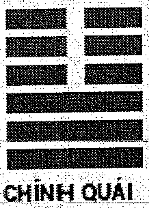

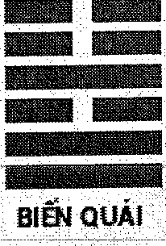

| THỦY SƠN KIỂN | | | | | | SƠN ĐỊA BÁC | | | | |
|---|---|---|---|---|---|---|---|---|---|---|
| Hào | T/Ư | Lục Thân | Chi | Phục | TK | Lục Thân | Chi | TK | Lục Thú | Hào |
| - - | | Tử Tôn | Tý-Thủy | | | Thê Tài | Dần-Mộc | | Chu Tước | --- |
| --- | O | Phụ Mẫu | Tuất-Thổ | | | Tử Tôn | Tý-Thủy | | Thanh Long | - - |
| - - | Thế | Huynh Đệ | Thân-Kim | | | Phụ Mẫu | Tuất-Thổ | | Huyền Vũ | - - |
| --- | O | Huynh Đệ | Thân-Kim | | | Thê Tài | Mão-Mộc | | Bạch Hổ | - - |
| - - | | Quan Quỷ | Ngọ-Hỏa | Tài-Mão | | Quan Quỷ | Tị-Hỏa | | Đằng Xà | - - |
| - - | Ứng | Phụ Mẫu | Thìn-Thổ | | | Phụ Mẫu | Mùi-Thổ | | Câu Trần | - - |

Tử tôn có ý tứ là động vật, lấy Tử tôn làm Dụng thần tiến hành phán đoán. Tử tôn thuộc thủy, nguyệt kiến Hợi thủy, nhật Thần Tý thủy cùng Dụng thần ngũ hành giống nhau là vượng tướng, trong quẻ tuy có Tuất thổ phát động khắc Dụng thần, nhưng có Thân kim phát động, giải Tuất thổ khắc thương, thành liên tục tương sinh, có bệnh không sao.

Phụ mẫu Tuất thổ lâm Thanh Long khắc Dụng thần Tử tôn, Thanh Long chủ ẩm thực, chính là chó con ăn đồ không sạch sẽ mà bị bệnh. Dụng thần lâm Chu Tước, Chu Tước chủ chứng viêm, lại chủ ầm ĩ, chó con có chứng viêm, vì bệnh mà sủa không ngừng. Thủy Sơn Kiển là Đoài cung quẻ, đoài là miệng, là ruột, chính là bệnh tòng khẩu nhập, ăn cái gì khiến viêm ruột.

Kết quả đến bác sỹ thú y viện xem bệnh, chẩn đoán là viêm ruột, uống một chút thuốc liền khỏi.

## Dụng thần lưỡng hiện

Cái gọi là Dụng thần lưỡng hiện là trong một quẻ xuất hiện hai Dụng thần lục thân. Như xem con cái, trong quẻ có hai hào Tử tôn, xem Phụ mẫu, trong quẻ có hai hào Phụ mẫu. Khi gặp Dụng thần lưỡng hiện, bình thường từ hai lục thân đó chọn một để làm điểm trung tâm phán đoán, và cái còn lại có thể không cần xem hoặc tham khảo thêm.

Bình thường áp dụng phương pháp là: có một hào phát động (chỉ hào động có biến) thì lấy hào phát động làm Dụng thần; bởi hào động là mở đầu biến hóa của sự

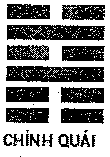

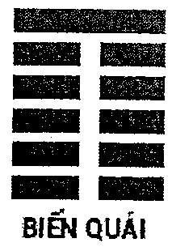 việc, hào động mang tin tức trội hơn hào tĩnh. Nếu như cả hai hào đều phát động hoặc đều không phát động, thì lấy hào lâm tuần không hoặc nguyệt phá làm dụng; nếu như đều không lâm không, không bị phá, thì lấy hào gặp xung, hoặc gặp hợp làm dụng; nếu như cũng không gặp xung, không gặp hợp, thì lấy hào lâm thế hoặc lâm ứng làm Dụng, nếu như không lâm thế ứng, thì lấy hào xa hào thế hoặc gần ứng hào làm Dụng thần; nếu như hai hào có địa chi hoàn toàn giống nhau, lại phải căn cứ hào vị hoặc chỗ lâm lục thần mà lấy Dụng thần. Nhưng đây cũng không phải kiểu chết, nếu như trong quẻ có hai hào một không một phá, hoặc một động một không, hai hào đều có thể làm Dụng thần.

> **Chú thích của Dịch giả:** *với kinh nghiệm của người dịch, khi dụng thần lưỡng hiện hào gặp nguyệt phá lại thường ứng với quá khứ.*

### Ví dụ 1: ngày Ất Mão tháng Tị xem vợ bệnh, gieo được quẻ Trạch Thiên Quái biến Thủy Thiên Nhu.

**TRẠCH THIÊN QUÁI** | **THỦY THIÊN NHU**

| Hào | T/Ư | Lục Thân | Chi | Phục | TK | Lục Thân | Chi | TK | Lục Thú | Hào |
| :---: | :---: | :--- | :--- | :--- | :---: | :--- | :--- | :---: | :--- | :---: |
| -- -- | | Huynh Đệ | Mùi-Thổ | | | Thê Tài | Tý-Thủy | | Huyền Vũ | -- -- |
| ----- | Thế | Tử Tôn | Dậu-Kim | | | Huynh Đệ | Tuất-Thổ | | Bạch Hổ | ----- |
| ----- | O | Thê Tài | Hợi-Thủy | | | Tử Tôn | Thân-Kim | | Đằng Xà | -- -- |
| ----- | | Huynh Đệ | Thìn-Thổ | | | Huynh Đệ | Thìn-Thổ | | Câu Trần | ----- |
| ----- | Ứng | Quan Quỷ | Dần-Mộc | Phụ-Tỵ | | Quan Quỷ | Dần-Mộc | | Chu Tước | ----- |
| ----- | | Thê Tài | Tý-Thủy | | | Thê Tài | Tý-Thủy | | Thanh Long | ----- |

**TUẦN KHÔNG: Tý, Sửu**

Xem vợ bệnh lấy hào Thê tài làm Dụng thần. Trong quẻ hào Tài lưỡng hiện, một động một tĩnh, tựa hồ sẽ lấy hào động Thê tài Hợi Thủy là Dụng thần. Nhưng Hợi Thủy nguyệt phá, Tý thủy tuần không, nếu như bỏ Tý thủy không cần, chỉ lấy hào động Hợi Thủy là dụng, thì ngày Hợi hoặc ngày Dần bệnh của vợ sẽ khỏi. Nhưng Tý thủy gặp không, cũng phải tham khảo, cho nên đoán tháng Ngọ khỏi bệnh. Vì Hợi Thủy nguyệt phá, sang tháng không còn bị phá, Tý thủy tuần không, tháng Ngọ xung không điền thực. Xem cả hai hào Thê tài liên quan đến phán đoán ứng kỳ.

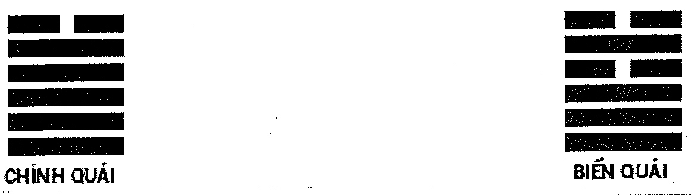

### Ví dụ 2: ngày Quý Tị tháng Thìn, Từ tiên sinh xem năm bị cụt ngón tay được quẻ Bát Thuần Khảm biến Phong Thủy Hoán.

Xem tổn thương, lấy hào khắc thế hào là Dụng thần, trong quẻ Quan quỷ Tuất thổ cùng Thìn thổ lưỡng hiện, lại đều là tĩnh hào, nhưng Tuất thổ bị nguyệt kiến xung phá, cho nên lấy hào Tuất thổ Nguyệt phá là dụng. Năm Giáp Tuất (năm 1994) là năm Quan quỷ Tuất thổ thực phá, đoán vào năm Giáp Tuất mất ngón tay, quả như chỗ xem.

### Ví dụ 3: ngày Quý Mùi tháng Thìn, xem bệnh của bố được quẻ Trạch Địa Tụy.

**TRẠCH ĐỊA TỤY** | **TRẠCH ĐỊA TỤY**

| Hào | T/Ư | Lục Thân | Chi | Phục | TK | Lục Thân | Chi | TK | Lục Thú | Hào |
| :---: | :---: | :--- | :--- | :--- | :---: | :--- | :--- | :---: | :--- | :---: |
| -- -- | | Phụ Mẫu | Mùi-Thổ | | | Phụ Mẫu | Mùi-Thổ | | Bạch Hổ | -- -- |
| ----- | Ứng | Huynh Đệ | Dậu-Kim | | | Huynh Đệ | Dậu-Kim | K | Đằng Xà | ----- |
| ----- | | Tử Tôn | Hợi-Thủy | | | Tử Tôn | Hợi-Thủy | | Câu Trần | ----- |
| -- -- | | Thê Tài | Mão-Mộc | | | Thê Tài | Mão-Mộc | | Chu Tước | -- -- |
| -- -- | Thế | Quan Quỷ | Tị-Hỏa | | | Quan Quỷ | Tị-Hỏa | | Thanh Long | -- -- |
| -- -- | | Phụ Mẫu | Mùi-Thổ | | | Phụ Mẫu | Mùi-Thổ | | Huyền Vũ | -- -- |

Lấy Phụ mẫu làm Dụng thần, trong quẻ Phụ mẫu Mùi thổ lưỡng hiện, đều không phát động, vì là xem bệnh, Bạch Hổ đại biểu tật bệnh, cho nên lấy hào lâm Bạch Hổ Phụ mẫu Mùi thổ là Dụng thần. Dụng thần tại hào sáu, hào sáu là đầu, Bạch Hổ chủ máu, chính là mạch máu đầu có bệnh, Dụng thần được nhật nguyệt tỷ hòa là vượng tướng, có bệnh không sao.

Quả nguyên nhân bị bệnh tắc máu não, sau khi được trị liệu bình an vô sự. Như vậy lấy Dụng thần chính xác hay không có quan hệ đến bộ vị, chứng bệnh để phán đoán.

### Ví dụ 4: ngày Đinh Tị tháng Tuất, một phụ nữ xem có được đơn vị chia phòng ở hay không? Được quẻ Hỏa Trạch Khuê biến Bát Thuần Chấn.

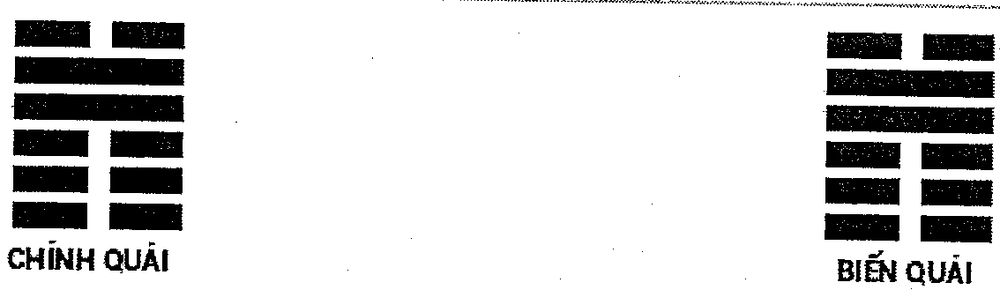

### CHÍNH QUÁI: HỎA TRẠCH KHUÊ | BIẾN QUÁI: BÁT THUẦN CHẤN

| Hào | T/Ư | Lục Thân | Chi | Phục | TK | Lục Thân | Chi | TK | Lục Thú | Hào |
| :---: | :---: | :---: | :---: | :---: | :---: | :---: | :---: | :---: | :---: | :---: |
| ▅▅▅▅▅ | O | Phụ Mẫu | Tị-Hỏa | | | Huynh Đệ | Tuất-Thổ | | Thanh Long | ▅▅ ▅▅ |
| ▅▅ ▅▅ | | Huynh Đệ | Mùi-Thổ | Tài-Tý | | Tử Tôn | Thân-Kim | | Huyền Vũ | ▅▅ ▅▅ |
| ▅▅▅▅▅ | Thế | Tử Tôn | Dậu-Kim | | | Phụ Mẫu | Ngọ-Hỏa | | Bạch Hổ | ▅▅▅▅▅ |
| ▅▅ ▅▅ | | Huynh Đệ | Sửu-Thổ | | | Huynh Đệ | Thìn-Thổ | | Đằng Xà | ▅▅ ▅▅ |
| ▅▅▅▅▅ | O | Quan Quỷ | Mão-Mộc | | | Quan Quỷ | Dần-Mộc | | Câu Trần | ▅▅ ▅▅ |
| ▅▅▅▅▅ | Ứng | Phụ Mẫu | Tị-Hỏa | | | Thê Tài | Tý-Thủy | | Chu Tước | ▅▅▅▅▅ |

Trong quẻ Phụ mẫu Tị hỏa lưỡng hiện, lấy hào phát động Phụ mẫu Tị hỏa làm Dụng thần. Dụng thần lâm nhật kiến cùng Thanh Long, nhật chủ thời gian ngắn, Thanh Long chủ mới, là vừa xây phòng ở mới. Dụng thần khắc thế, phòng ở cùng mình không có duyên phận. Hào hai là hào vị nhà (cách dùng hào vị sẽ nói sau), Quan quỷ là nguyên thần của Dụng thần, lâm Câu Trần, Câu Trần chủ đất công, có thể đoán là đơn vị chia phòng, động mà hóa thoái (thoái thần sẽ nói sau), không sinh Dụng thần, là đơn vị chia phòng không cho nàng phòng ở, không được.

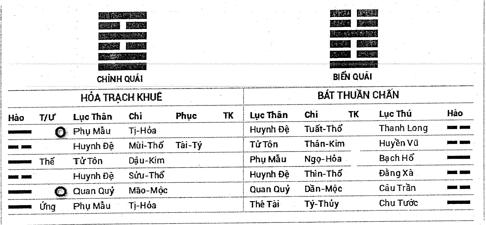

## Phi thần, phục thần

Có khi trong quẻ không có lục thân cần lấy làm Dụng thần, loại hiện tượng này trong Lục hào gọi là Dụng thần không xuất hiện. Dụng thần không xuất hiện cần tìm phục tàng. Vì bản cung (tức thủ quẻ mỗi cung) đều đủ lục thân, nên tất cả quẻ trong cung đều từ bản cung diễn biến mà ra, bởi vậy không có Dụng thần liền có thể tìm từ bản cung. Như vậy Dụng thần gọi là phục thần hoặc phục hào, bản cung Dụng thần tại hào thứ mấy, Dụng thần liền phục ở dưới hào đó, đem phục thần tại chủ quẻ viết bên cạnh hào tương ứng, hào phía trên phục thần trong quẻ chủ được gọi là phi thần hoặc phi hào. Quan hệ sinh khắc của Phục thần và phi thần là rất trọng yếu, cũng là một trong những căn cứ dùng để phán đoán sự việc cát hung. Bình thường mà nói, phi tới sinh phục gọi là được trường sinh, chủ tốt. Phục đi sinh phi gọi là tiết khí, không tốt, phục khắc phi gọi là xuất bạo, là tốt, phi khắc phục gọi là tổn hại sức khoẻ xấu nhất. Dụng thần phục tàng có cát có hung, nếu như phục thần vượng tướng, được nhật nguyệt, hào động, phi hào sinh phù, nhật nguyệt, hào động xung khắc phi thần (phi thần mà sinh phục thần thì không nên), hoặc phi thần hưu tù, không phá, mộ tuyệt, phục sẽ hiện, chủ tốt. Có khi phi thần còn là căn cứ tham khảo nguyên nhân sự việc cần xem. Nếu phục thần hưu tù vô khí, bị nhật nguyệt hào động phi thần xung khắc, nguyệt phá tuần không, không có nguyên thần cứu trợ, thì là xấu. Cầu tài, tài không được; cầu quan, quan chẳng xong; cầu bệnh, bệnh khó lành.

**Ví dụ 1:** ngày Ất Hợi tháng Mùi, một người đàn ông xem khi đi taxi có để quên 1 bộ tranh chữ ở trên xe, số xe cũng không có nhớ, có lấy lại được bộ tranh chữ đó hay không? Gieo được quẻ Lôi Địa Dự biến Hỏa Địa Tấn.

### CHÍNH QUÁI: LÔI ĐỊA DỰ | BIẾN QUÁI: HỎA ĐỊA TẤN

| Hào | T/Ư | Lục Thân | Chi | Phục | TK | Lục Thân | Chi | TK | Lục Thú | Hào |
| :---: | :---: | :---: | :---: | :---: | :---: | :---: | :---: | :---: | :---: | :---: |
| ▅▅ ▅▅ | X | Thê Tài | Tuất-Thổ | | | Tử Tôn | Tị-Hỏa | | Huyền Vũ | ▅▅▅▅▅ |
| ▅▅ ▅▅ | | Quan Quỷ | Thân-Kim | | | Thê Tài | Mùi-Thổ | | Bạch Hổ | ▅▅ ▅▅ |
| ▅▅▅▅▅ | Ứng | Tử Tôn | Ngọ-Hỏa | | | Quan Quỷ | Dậu-Kim | | Đằng Xà | ▅▅▅▅▅ |
| ▅▅ ▅▅ | | Huynh Đệ | Mão-Mộc | | | Huynh Đệ | Mão-Mộc | | Câu Trần | ▅▅ ▅▅ |
| ▅▅ ▅▅ | | Tử Tôn | Tị-Hỏa | | | Tử Tôn | Tị-Hỏa | | Chu Tước | ▅▅ ▅▅ |
| ▅▅ ▅▅ | Thế | Thê Tài | Mùi-Thổ | Phụ-Tý | | Thê Tài | Mùi-Thổ | | Thanh Long | ▅▅ ▅▅ |

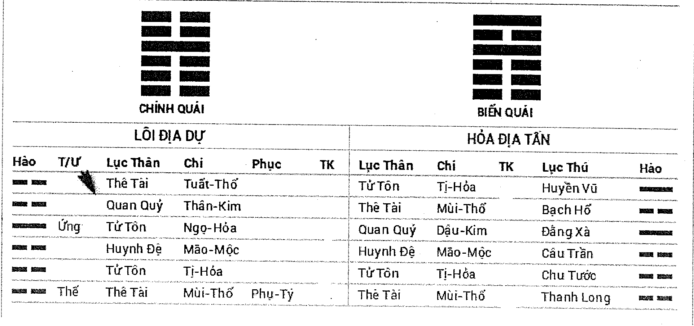

Phụ mẫu là văn thư, tranh chữ, lấy Phụ mẫu là Dụng thần. Trong quẻ không có hào Phụ mẫu nên cần tìm phục thần. Quẻ Lôi Địa Dự là Chấn cung quẻ, Bát Thuần Chấn sơ hào là Phụ Mẫu Tý thủy, cho nên quẻ này phục thần cũng là Phụ mẫu Tý thủy, lại nằm ở sơ hào, hào Thê tài Mùi thổ là phi thần. Dụng thần phục tàng, chính là tranh chữ bị mất. Dụng thần Phụ mẫu Tý thủy bị nguyệt kiến khắc, nhật thần tỷ hòa, suy vượng tương đương. Nhưng trong quẻ Thê tài Tuất thổ phát động khắc Dụng thần, đồng thời lại là phi tới khắc phục, phục thần khó xuất, khắc nhiều sinh ít, tranh chữ rất khó mà tìm về.

**Ví dụ 2:** ngày Tân Dậu tháng Hợi, một phụ nữ xem cửa hàng làm ăn như thế nào? Gieo được quẻ Thủy Lôi Truân.

**CHÍNH QUÁI: THỦY LÔI TRUÂN** — **BIẾN QUÁI: THỦY LÔI TRUÂN**

| Hào | T/Ư | Lục Thân | Chi | Phục | TK | Lục Thân | Chi | TK | Lục Thú | Hào |
| :---: | :---: | :--- | :--- | :--- | :--- | :--- | :--- | :--- | :--- | :---: |
| - - | | Huynh Đệ | Tý-Thủy | | | Huynh Đệ | Tý-Thủy | | Đằng Xà | - - |
| — | Ứng | Quan Quỷ | Tuất-Thổ | | | Quan Quỷ | Tuất-Thổ | | Câu Trần | — |
| - - | | Phụ Mẫu | Thân-Kim | | | Phụ Mẫu | Thân-Kim | | Chu Tước | - - |
| - - | | Quan Quỷ | Thìn-Thổ | Tài-Ngọ | | Quan Quỷ | Thìn-Thổ | | Thanh Long | - - |
| - - | Thế | Tử Tôn | Dần-Mộc | | | Tử Tôn | Dần-Mộc | | Huyền Vũ | - - |
| — | | Huynh Đệ | Tý-Thủy | | | Huynh Đệ | Tý-Thủy | | Bạch Hổ | — |

Làm ăn là cầu tài, cho nên lấy Thê tài làm Dụng thần. Trong quẻ này không có Thê tài nên cần tìm phục thần, từ bản cung Bát Thuần Khảm thấy được Thê tài Ngọ hỏa tại hào ba, cho nên quẻ này Dụng thần liền nằm ở hào ba, Thê tài Ngọ hỏa là phục thần, hào Quan quỷ Thìn thổ là phi thần.

Phục thần Thê tài Ngọ hỏa, bị nguyệt kiến Hợi Thủy khắc, lại không được nhật thần sinh phù, nên hưu tù. Phục thần sinh phi thần, cửa hàng làm ăn hao phí rất nhiều tiền tài, Dụng thần không hiện lên quẻ, chính là không có tin tức lợi ích.

Quả nhiên kinh doanh đình trệ, trừ tiền thuế và tiền thuê nhà cơ hồ chẳng còn tý lợi nhuận nào, sau đành phải đóng cửa ngừng kinh doanh.

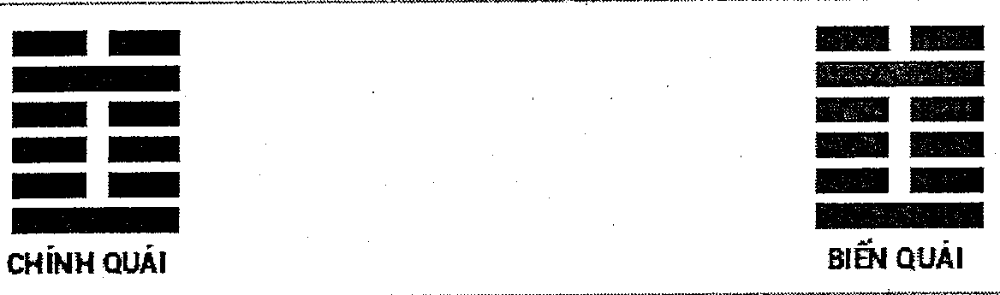

**Ví dụ 3:** ngày Giáp Tý tháng Mão, một phụ nữ xem công việc, được quẻ Phong Lôi Ích.

**CHÍNH QUÁI: PHONG LÔI ÍCH** — **BIẾN QUÁI: PHONG LÔI ÍCH**

| Hào | T/Ư | Lục Thân | Chi | Phục | TK | Lục Thân | Chi | TK | Lục Thú | Hào |
| :---: | :---: | :--- | :--- | :--- | :--- | :--- | :--- | :--- | :--- | :---: |
| - - | Ứng | Huynh Đệ | Mão-Mộc | | | Huynh Đệ | Mão-Mộc | | Huyền Vũ | — |
| — | | Tử Tôn | Tị-Hỏa | | | Tử Tôn | Tị-Hỏa | | Bạch Hổ | — |
| - - | | Thê Tài | Mùi-Thổ | | | Thê Tài | Mùi-Thổ | | Đằng Xà | - - |
| - - | Thế | Thê Tài | Thìn-Thổ | Quan-Dậu | | Thê Tài | Thìn-Thổ | | Câu Trần | - - |
| - - | | Huynh Đệ | Dần-Mộc | | | Huynh Đệ | Dần-Mộc | | Chu Tước | - - |
| — | | Phụ Mẫu | Tý-Thủy | | | Phụ Mẫu | Tý-Thủy | | Thanh Long | — |

Lấy Quan quỷ làm Dụng thần, Quan quỷ Dậu kim không hiện lên quẻ, phục dưới hào ba Thê tài Thìn thổ. Ví dụ này mặc dù là phi tới sinh phục, nhưng nhật nguyệt tác dụng đến Dụng thần trọng yếu hơn. Nguyệt kiến xung Dụng thần là nguyệt phá, là một loại tin tức bất lợi, nhật thần lại không sinh phù Dụng thần, Dụng thần phục tàng, chính là không tìm được việc làm, không có công việc.

Quả nhiên là mất việc, thất nghiệp ở nhà.

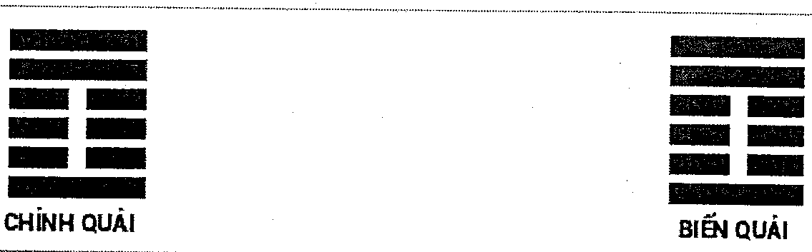

## Tiến thần cùng thoái thần

Trong quẻ hào động mà hóa xuất ra hào có ngũ hành tương tự thì cần phân biệt khí ngũ hành tiến hay thoái. Tiến thoái có hỉ có kị, tùy tình huống mà định ra. Theo trình tự sắp xếp mười hai địa chi, thuận kim đồng hồ là tiến thần, nghịch kim đồng hồ là thoái thần. Cụ thể tiến thần và thoái thần như sau.

Hóa tiến thần: Hợi hóa Tý, Dần hóa Mão, Tị hóa Ngọ, Thân hóa Dậu, Sửu hóa Thìn, Thìn hóa Mùi, Mùi hóa Tuất, Tuất hóa Sửu.

Hóa thoái thần: Tý hóa Hợi, Mão hóa Dần, Ngọ hóa Tị, Dậu hóa Thân, Thìn hóa Sửu, Sửu hóa Tuất, Tuất hóa Mùi, Mùi hóa Thìn.

Tiến thần biểu thị sự vật phát triển hướng về phía trước, như mùa xuân cây cỏ vui vẻ phồn vinh, như dòng suối bắt nguồn từ xa nên dòng chảy dài. Thoái thần tương phản với tiến thần, biểu thị sự vật từ đây biến mất, yếu bớt, như mùa thu hoa cỏ cây cối dần dần tàn lụi.

Nói như vậy, Dụng thần, nguyên thần hợp với hóa tiến thần; kị thần, cừu thần hợp hóa thoái thần. Dụng thần mặc dù yếu nhưng hóa tiến, giống như mùa xuân cây non sẽ dần dần trở nên khỏe mạnh, sự vật chậm rãi chuyển thành tốt. Kị thần mặc dù vượng, nhưng hóa thoái, chỉ cần Dụng thần có sinh cơ thì nguy cơ và cục diện bất lợi chỉ là tạm thời, nguy cơ qua đi, vẫn sẽ yên bình.

Bất quá đây cũng không phải là kiểu chết, nếu như là xem về mất đồ, người lạc đường, phát sinh mâu thuẫn chia tay với bạn bè, khi Dụng thần hóa thoái chính là tượng đi mà quay lại, luận là tốt; hóa tiến thần, ngược lại là tượng vật với người rời xa mình, luận là không tốt. Nếu như Dụng thần quá hưu tù, kị thần dù cho hóa thoái, cũng là không tốt, đó gọi là được nhật nguyệt sinh phù, đương lệnh không có thoái. Thôi diễn quẻ tượng, mọi việc đều cần biến báo không thể cứng rắn.

**Ví dụ 1:** ngày Nhâm Dần tháng Thân, một phụ nữ xem về việc kinh doanh khách sạn, gieo được quẻ Bát Thuần Đoài biến Bát Thuần Càn

| BÁT THUẦN ĐOÀI | | | | | | BÁT THUẦN CÀN | | | | |
| :---: | :---: | :---: | :---: | :---: | :---: | :---: | :---: | :---: | :---: | :---: |
| Hào | T/Ư | Lục Thân | Chi | Phục | TK | Lục Thân | Chi | TK | Lục Thú | Hào |
| ▅▅ ▅▅ | Thế | Phụ Mẫu | Mùi-Thổ | | | Phụ Mẫu | Tuất-Thổ | | Bạch Hổ | ▅▅▅▅▅ |
| ▅▅▅▅▅ | | Huynh Đệ | Dậu-Kim | | | Huynh Đệ | Thân-Kim | | Đằng Xà | ▅▅▅▅▅ |
| ▅▅▅▅▅ | | Tử Tôn | Hợi-Thủy | | | Quan Quỷ | Ngọ-Hỏa | | Câu Trần | ▅▅▅▅▅ |
| ▅▅ ▅▅ | Ứng | Phụ Mẫu | Sửu-Thổ | | | Phụ Mẫu | Thìn-Thổ | | Chu Tước | ▅▅▅▅▅ |
| ▅▅▅▅▅ | | Thê Tài | Mão-Mộc | | | Thê Tài | Dần-Mộc | | Thanh Long | ▅▅▅▅▅ |
| ▅▅▅▅▅ | | Quan Quỷ | Tị-Hỏa | | | Tử Tôn | Tý-Thủy | | Huyền Vũ | ▅▅▅▅▅ |

**TUẦN KHÔNG: Thìn, Tị**

Kinh doanh khách sạn là thu lợi, lấy Thê tài làm Dụng thần. Dụng thần tuy được nhật thần so đỡ, nhưng lại bị nguyệt kiến khắc thương, từ nhật nguyệt tác dụng đến xem, suy vượng tương đương. Lúc này cần xem trong quẻ các hào khắc và sinh phù cho Dụng thần, tức xem lực của nguyên thần hay kị thần lớn hơn. Hào khắc Dụng thần Huynh đệ Dậu kim được nguyệt kiến so đỡ, trong quẻ lại có hai trọng Phụ mẫu phát động sinh phù, là vượng tướng. Mà hào sinh Thê tài Tử tôn Hợi Thủy mặc dù cũng được Nguyệt sinh, nhưng trong quẻ hai hào động lại khắc hào Tử tôn, hiển nhiên Tử tôn Hợi Thủy so với Huynh đệ Dậu kim yếu hơn nhiều, Tử tôn Hợi Thủy bị khắc không cách nào sinh Dụng thần, khách sạn này nhất định kinh doanh không tốt.

Phụ mẫu Mùi thổ cùng Phụ mẫu Sửu thổ song song phát động hóa tiến thần, nhưng Sửu thổ tiến thần Thìn thổ hóa không vong, tháng Thìn xuất không là thời điểm bất lợi.

Đúng tại tháng Thìn, vì khách sạn hao tổn không cách nào duy trì, đành phải đóng cửa.

Tóm lại, trong quẻ có hào vượng tướng động mà hóa tiến, tiến thần thừa thế mà tiến; hào động hưu tù mà hóa tiến, thì đợi thời sẽ tiến; nếu như hào động hoặc biến hào có một hào tuần không, nguyệt phá, đợi điền thực sẽ tiến. Nếu như hào động hóa thoái, hào động biến hào đều vượng, xem việc gần thì vượng mà không thoái, xem việc xa thì sau tất thoái. Nếu hào động hưu tù thì là thoái; nếu hào động, biến hào có một hào vượng, đợi thời điểm hưu tù là thoái; nếu hào động biến hào có hào tuần không nguyệt phá, đến khi điền thực sẽ thoái.

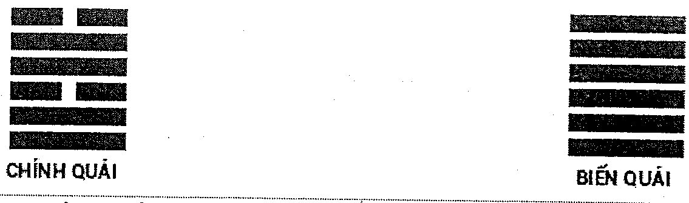

---

# CHƯƠNG MƯỜI
## NGUYÊN THẦN, KỊ THẦN, CỪU THẦN

Trong một quẻ Dụng thần là trọng yếu nhất, Dụng thần cát hung chính là để xem sự vật cát hung, Dụng thần cát hung quyết định bởi nhật nguyệt sinh khắc hào Dụng thần.

**Nguyên thần:** Hào sinh Dụng thần gọi là nguyên thần, nguyên thần cần vượng tướng, được nhật nguyệt, hào động sinh phù hoặc lâm nhật nguyệt, nên động hóa hồi đầu sinh, hóa tiến thần, không nên hưu tù không phá, động hóa không, hóa tuyệt, hóa thoái. Đồng thời lại cần Dụng thần có rễ, nếu Dụng thần hưu tù không phá, nguyên thần lại vượng cũng khó có thể sinh phù, như cây gỗ khô không có rễ dù được sinh phù cũng không dậy nổi.

*Sáu loại Nguyên thần có thể sinh Dụng thần:*

**Một,** nguyên thần được ngũ hành của nhật hoặc nguyệt so đỡ là hữu lực, vượng tướng, có thể sinh Dụng thần.

**Hai,** nguyên thần phát động, được biến hào sinh phù, tức động hóa hồi đầu sinh, hoặc động hóa tiến thần, có thể sinh Dụng thần.

**Ba,** nguyên thần được nhật hoặc nguyệt sinh phù, là vượng tướng, hoặc trường sinh ở nhật nguyệt là có khí, có thể sinh Dụng thần.

**Bốn,** nguyên thần cùng kị thần đồng thời phát động, là liên tục tương sinh, có thể sinh Dụng thần.

**Năm,** nguyên thần hợp nguyệt kiến, là hợp vượng, có thể sinh Dụng thần.

**Sáu,** nguyên thần mặc dù không vong, hoặc động mà hóa không, nhưng nguyên thần vượng, có thể sinh Dụng thần.

*Bảy loại Nguyên thần không có lực lượng sinh Dụng thần:*

**Một,** nguyên thần hưu tù, lại không phát động, yên tĩnh, không thể sinh Dụng thần.

**Hai,** nguyên thần mặc dù phát động, nhưng hưu tù bất lực, bị hào khác khắc chế, không thể sinh Dụng thần.

**Ba,** nguyên thần hưu tù, động mà hóa thoái, không thể sinh Dụng thần.

**Bốn,** nguyên thần hưu tù, động mà hóa tuyệt, hoặc gặp tuyệt, không thể sinh Dụng thần.

**Năm,** nguyên thần hưu tù, nhập mộ, không thể sinh Dụng thần.

**Sáu,** nguyên thần nguyệt phá, nhật phá, là tĩnh hào, không thể sinh Dụng thần.

**Bảy,** nguyên thần hưu tù, động mà hoá hợp, hoặc bị nhật thần cùng hào động khác hợp mất, không thể sinh Dụng thần.

**Ví dụ 1:** ngày Mậu Dần tháng Mùi, một phụ nữ khi ăn thịt dê nướng tại ven đường có phát sinh xung đột với người khác, trong lúc lộn xộn bị mất tiền hỏi có tìm được hay không? Gieo được quẻ Địa Thiên Thái biến Sơn Thiên Đại Súc.

**CHÍNH QUÁI: ĐỊA THIÊN THÁI** | **BIẾN QUÁI: SƠN THIÊN ĐẠI SÚC**

| Hào | T/Ư | Lục Thân | Chi | Phục | TK | Lục Thân | Chi | TK | Lục Thú | Hào |
| :---: | :---: | :--- | :--- | :--- | :---: | :--- | :--- | :---: | :--- | :---: |
| - - | Ứng | Tử Tôn | Dậu-Kim | | | Quan Quỷ | Dần-Mộc | | Chu Tước | — |
| - - | | Thê Tài | Hợi-Thủy | | | Thê Tài | Tý-Thủy | | Thanh Long | - - |
| - - | | Huynh Đệ | Sửu-Thổ | | | Huynh Đệ | Tuất-Thổ | | Huyền Vũ | - - |
| — | Thế | Huynh Đệ | Thìn-Thổ | | | Huynh Đệ | Thìn-Thổ | | Bạch Hổ | — |
| — | | Quan Quỷ | Dần-Mộc | Phụ-Tỵ | | Quan Quỷ | Dần-Mộc | | Đằng Xà | — |
| — | | Thê Tài | Tý-Thủy | | | Thê Tài | Tý-Thủy | | Câu Trần | — |

**TUẦN KHÔNG: Thân, Dậu**

Xem tiền, lấy Thê tài làm Dụng thần. Trong quẻ Thê tài lưỡng hiện, đều không phát động, lại không có không, phá, lấy hào hợp nhật Thê tài Hợi Thủy làm Dụng thần.

Đầu tiên xem Dụng thần suy vượng. Nguyệt kiến Mùi thổ khắc Dụng thần, nhật thần Dần mộc không sinh Dụng thần, Dụng thần phi thường hưu tù. Hào sáu Tử tôn Dậu kim là nguyên thần được nguyệt kiến sinh phù, động mà sinh Dụng thần, nhưng Dậu kim không vong, lại động hóa tuyệt, bất lực sinh Dụng thần, Dụng thần

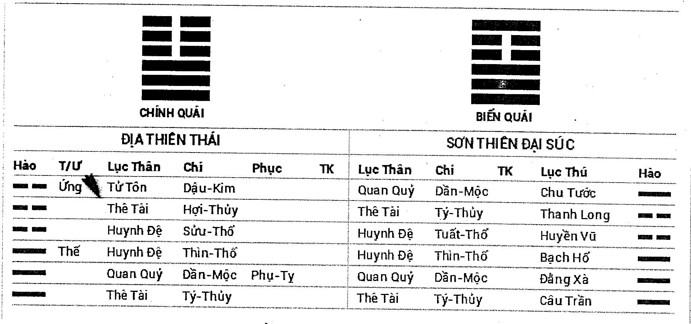 nguyên bản giống như cây không rễ, sinh cũng không nổi. Đồng thời kị thần Huynh đệ trì thế, cũng là điều bất lợi cho việc tìm vật bị mất, chỗ tiền rất khó tìm được.

Kết quả là không tìm được.

**Ví dụ 2:** ngày Đinh Tị tháng Mão, một người đàn ông xem có duyên phận với bạn gái hay không gieo được quẻ Địa Thiên Thái biến Địa Sơn Khiêm.

| ĐỊA THIÊN THÁI | | | | | | ĐỊA SƠN KHIÊM | | | | |
| :---: | :---: | :---: | :---: | :---: | :---: | :---: | :---: | :---: | :---: | :---: |
| Hào | T/Ư | Lục Thân | Chi | Phục | TK | Lục Thân | Chi | TK | Lục Thú | Hào |
| - - | Ứng | Tử Tôn | Dậu-Kim | | | Tử Tôn | Dậu-Kim | | Thanh Long | - - |
| - - | | Thê Tài | Hợi-Thủy | | | Thê Tài | Hợi-Thủy | | Huyền Vũ | - - |
| - - | | Huynh Đệ | Sửu-Thổ | | | Huynh Đệ | Sửu-Thổ | | Bạch Hổ | - - |
| — | Thế | Huynh Đệ | Thìn-Thổ | | | Tử Tôn | Thân-Kim | | Đằng Xà | — |
| O — | | Quan Quỷ | Dần-Mộc | Phụ-Tỵ | | Phụ Mẫu | Ngọ-Hỏa | | Câu Trần | - - |
| O — | | Thê Tài | Tý-Thủy | | | Huynh Đệ | Thìn-Thổ | | Chu Tước | - - |

Đàn ông xem về yêu đương và hôn nhân lấy Thê tài làm Dụng thần. Trong quẻ Thê tài hào lưỡng hiện, lấy hào phát động Thê tài Tý thủy làm Dụng thần. Dụng thần không được Nhật Nguyệt sinh phù, tuyệt ở Nhật thần, động mà bị biến hào khắc, hưu tù bất lực. Nguyên thần Tử tôn Dậu kim, tĩnh mà bất động, lại bị nguyệt kiến xung phá, bị nhật thần khắc thương, cũng vô lực sinh Dụng thần, cho nên khó có duyên phận với bạn gái.

Đến tháng Ngọ, Dụng thần gặp xung, kị thần được sinh mà chia tay.

**Kị thần:** Phàm trong quẻ hào nào khắc Dụng thần chính là Kị thần. Kị thần là nhân tố bất lợi cho Dụng thần, bởi vậy, kị thần nên hưu tù không phá, động hóa không, hóa phá, hóa tuyệt, hóa thoái. Nếu như kị thần vượng tướng, được nhật, nguyệt, hào động sinh phù, lại phát động trong quẻ thì rất xấu, nếu như trong quẻ nguyên thần đồng thời phát động, hung tượng có thể giải. Nhưng Dụng thần tự thân suy vượng vẫn là điều kiện tiên quyết, Dụng thần nguyên bản hưu tù đến cực điểm, nguyên thần phát động cũng vô dụng.

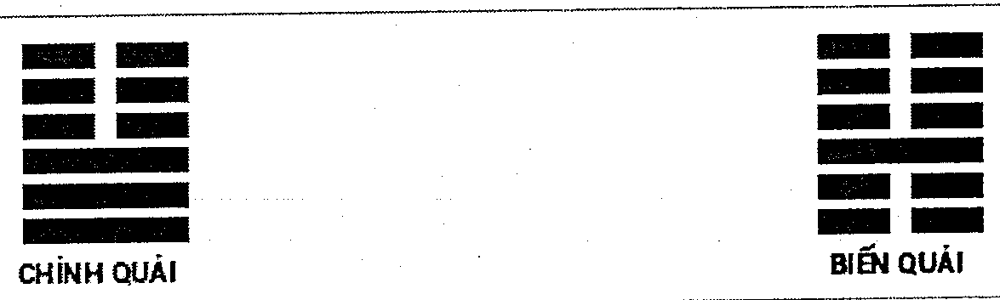

*Có sáu loại Kị thần có thể khắc Dụng thần:*

**Một,** kị thần được nhật nguyệt sinh phù, có thể khắc Dụng thần.

**Hai,** kị thần được ngũ hành của nhật hoặc nguyệt so đỡ, có thể khắc Dụng thần.

**Ba,** kị thần động mà hóa tiến thần, có thể khắc Dụng thần.

**Bốn,** kị thần động mà được biến hào hồi đầu sinh, có thể khắc Dụng thần.

**Năm,** kị thần và cừu thần cùng động, có thể khắc Dụng thần.

**Sáu,** nhật hoặc nguyệt là đất trường sinh của kị thần, có thể khắc Dụng thần.

*Bảy loại Kị thần không thể khắc Dụng thần:*

**Một,** kị thần hưu tù, là tĩnh hào, không thể khắc Dụng thần.

**Hai,** kị thần đồng thời bị nhật nguyệt khắc chế, không thể khắc Dụng thần.

**Ba,** kị thần hưu tù, nguyệt phá, không vong, không thể khắc Dụng thần.

**Bốn,** kị thần hưu tù, động mà hóa thoái, không thể khắc Dụng thần.

**Năm,** kị thần hưu tù, gặp tuyệt địa hoặc động mà hóa tuyệt, không thể khắc Dụng thần.

**Sáu,** kị thần hưu tù, nhập mộ, không thể khắc Dụng thần.

**Bảy,** kị thần cùng nguyên thần đồng thời phát động, không thể khắc Dụng thần.

**Ví dụ 1:** ngày Quý Tị tháng Mão, một người xem làm ăn, được quẻ Hỏa Thủy Vị Tế biến Hỏa Thiên Đại Hữu.

### HỎA THỦY VỊ TẾ — HỎA THIÊN ĐẠI HỮU

| Hào | T/Ư | Lục Thân | Chi | Phục | TK | Lục Thân | Chi | TK | Lục Thú | Hào |
| :---: | :---: | :--- | :--- | :--- | :---: | :--- | :--- | :---: | :--- | :---: |
| ▅▅▅▅▅ | | Huynh Đệ | Tị-Hỏa | | | Huynh Đệ | Tị-Hỏa | | Bạch Hổ | ▅▅▅▅▅ |
| ▅▅  ▅▅ | Ứng | Tử Tôn | Mùi-Thổ | | | Tử Tôn | Mùi-Thổ | | Đằng Xà | ▅▅  ▅▅ |
| ▅▅▅▅▅ | | Thê Tài | Dậu-Kim | | | Thê Tài | Dậu-Kim | | Câu Trần | ▅▅▅▅▅ |
| ▅▅  ▅▅ | Thế | Huynh Đệ | Ngọ-Hỏa | Quan-Hợi | | Tử Tôn | Thìn-Thổ | | Chu Tước | ▅▅▅▅▅ |
| ▅▅▅▅▅ | | Tử Tôn | Thìn-Thổ | | | Phụ Mẫu | Dần-Mộc | | Thanh Long | ▅▅▅▅▅ |
| ▅▅  ▅▅ | | Phụ Mẫu | Dần-Mộc | | | Quan Quỷ | Tý-Thủy | | Huyền Vũ | ▅▅▅▅▅ |

Lấy Thê tài làm Dụng thần. Thê tài Dậu kim không được nhật nguyệt sinh phù, bị Nguyệt xung, nhật khắc, là nguyệt phá, hưu tù, mà kị thần Ngọ hỏa trì thế phát động, được nhật nguyệt cùng hào động sinh phù, lực lượng phi thường lớn, làm ăn tất nhiên không thành.

Kết quả hao tổn rủi ro.

**Ví dụ 2:** ngày Giáp Dần tháng Ngọ, một người đàn ông hỏi viết thư tình cho một cô gái, đối phương có hồi âm không? Được quẻ Phong Hỏa Gia Nhân biến Phong Thiên Tiểu Súc.

### PHONG HỎA GIA NHÂN — PHONG THIÊN TIỂU SÚC

| Hào | T/Ư | Lục Thân | Chi | Phục | TK | Lục Thân | Chi | TK | Lục Thú | Hào |
| :---: | :---: | :--- | :--- | :--- | :---: | :--- | :--- | :---: | :--- | :---: |
| ▅▅▅▅▅ | | Huynh Đệ | Mão-Mộc | | | Huynh Đệ | Mão-Mộc | | Huyền Vũ | ▅▅▅▅▅ |
| ▅▅▅▅▅ | Ứng | Tử Tôn | Tị-Hỏa | | | Tử Tôn | Tị-Hỏa | | Bạch Hổ | ▅▅▅▅▅ |
| ▅▅  ▅▅ | | Thê Tài | Mùi-Thổ | | | Thê Tài | Mùi-Thổ | | Đằng Xà | ▅▅  ▅▅ |
| ▅▅▅▅▅ | | Phụ Mẫu | Hợi-Thủy | Quan-Dậu | | Thê Tài | Thìn-Thổ | | Câu Trần | ▅▅▅▅▅ |
| ▅▅  ▅▅ | Thế | Thê Tài | Sửu-Thổ | | | Huynh Đệ | Dần-Mộc | | Chu Tước | ▅▅▅▅▅ |
| ▅▅▅▅▅ | | Huynh Đệ | Mão-Mộc | | | Phụ Mẫu | Tý-Thủy | | Thanh Long | ▅▅▅▅▅ |

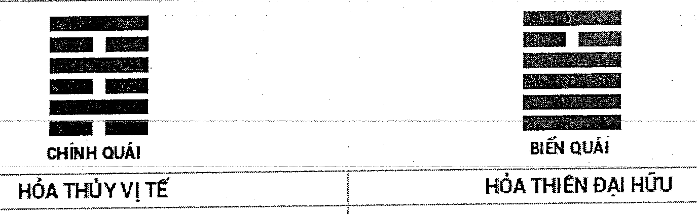

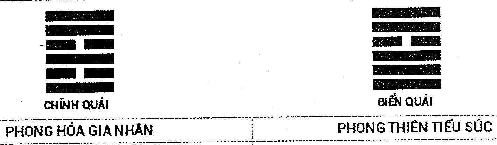

Xem về thư tín, lấy Phụ mẫu làm Dụng thần. Phụ mẫu Hợi Thủy không được nhật nguyệt sinh phù là hưu tù, kị thần trì thế phát động khắc, kị thần động hồi đầu khắc nhưng được nguyệt kiến sinh phù nên vẫn có sức mạnh khắc Dụng thần, cho nên đối phương sẽ không hồi âm.

Quả nhiên đối phương không hề hồi âm.

**Cừu thần:** Trong quẻ hào sinh kị thần khắc nguyên thần gọi là cừu thần, cừu thần cũng như kị thần, là nhân tố bất lợi cho Dụng thần, bởi vậy cừu thần cần an tĩnh bất động, hưu tù không phá, mà không nên vượng tướng, phát động.

**Ví dụ 1:** ngày Giáp Dần tháng Mão, một phụ nữ xem về điều động công việc, được quẻ Phong Thủy Hoán biến Bát Thuần Tốn.

### PHONG THỦY HOÁN — BÁT THUẦN TỐN

| Hào | T/Ư | Lục Thân | Chi | Phục | TK | Lục Thân | Chi | TK | Lục Thú | Hào |
| :---: | :---: | :--- | :--- | :--- | :---: | :--- | :--- | :---: | :--- | :---: |
| ▅▅▅▅▅ | | Phụ Mẫu | Mão-Mộc | | | Phụ Mẫu | Mão-Mộc | | Huyền Vũ | ▅▅▅▅▅ |
| ▅▅▅▅▅ | Thế | Huynh Đệ | Tị-Hỏa | | | Huynh Đệ | Tị-Hỏa | | Bạch Hổ | ▅▅▅▅▅ |
| ▅▅  ▅▅ | | Tử Tôn | Mùi-Thổ | Thê-Dậu | | Tử Tôn | Mùi-Thổ | | Đằng Xà | ▅▅  ▅▅ |
| ▅▅  ▅▅ | | Huynh Đệ | Ngọ-Hỏa | Quan-Hợi | | Thê Tài | Dậu-Kim | | Câu Trần | ▅▅▅▅▅ |
| ▅▅▅▅▅ | Ứng | Tử Tôn | Thìn-Thổ | | | Quan Quỷ | Hợi-Thủy | | Chu Tước | ▅▅▅▅▅ |
| ▅▅  ▅▅ | | Phụ Mẫu | Dần-Mộc | | | Tử Tôn | Sửu-Thổ | | Thanh Long | ▅▅  ▅▅ |

Xem công việc lấy Quan quỷ làm Dụng thần. Quan quỷ Hợi Thủy không hiện lên quẻ, phục dưới hào ba Huynh đệ Ngọ hỏa, tuy là phục đến khắc phi, nhưng phục thần không được nhật nguyệt sinh phù, là hưu tù. Lại xem nguyên thần, cũng không hiện trên quẻ, phục tại hào bốn Tử tôn Mùi thổ, Nguyệt xung nhật tuyệt, cũng là nguyệt phá hưu tù, càng khó hiện, cừu thần Ngọ hỏa phát động, khắc chế nguyên thần, công việc không thể biến động.

Gặp lại người phụ nữ này sau chín năm công việc vẫn không thay đổi

**Ví dụ 2:** ngày Kỷ Tị tháng Dậu, một người đàn ông mất điện thoại di động ở nhà tắm hơi, hỏi có tìm thấy không? Được quẻ Sơn Trạch Tổn biến Địa Thủy Sư.

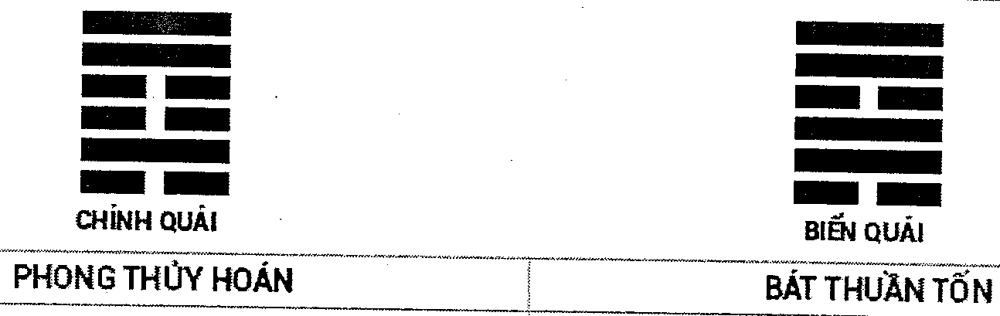

### CHÍNH QUÁI: SƠN TRẠCH TỔN — BIẾN QUÁI: ĐỊA THỦY SƯ

| Hào | T/Ư | Lục Thân | Chi | Phục | TK | Lục Thân | Chi | TK | Lục Thú | Hào |
| :---: | :---: | :---: | :---: | :---: | :---: | :---: | :---: | :---: | :---: | :---: |
| —— | Ứng O | Quan Quỷ | Dần-Mộc | | | Tử Tôn | Dậu-Kim | | Câu Trần | — — |
| — — | | Thê Tài | Tý-Thủy | | | Thê Tài | Hợi-Thủy | | Chu Tước | — — |
| — — | | Huynh Đệ | Tuất-Thổ | | | Huynh Đệ | Sửu-Thổ | | Thanh Long | — — |
| — — | Thế | Huynh Đệ | Sửu-Thổ | Tử-Thân | | Phụ Mẫu | Ngọ-Hỏa | | Huyền Vũ | — — |
| —— | | Quan Quỷ | Mão-Mộc | | | Huynh Đệ | Thìn-Thổ | | Bạch Hổ | —— |
| —— | O | Phụ Mẫu | Tị-Hỏa | | | Quan Quỷ | Dần-Mộc | | Đằng Xà | — — |

Điện thoại di động là vật dụng thường ngày, lấy Thê tài làm Dụng thần. Dụng thần được Nguyệt sinh phù là vượng, nhưng nguyên thần phục tàng, bị nhật khắc thương, Quan quỷ Dần mộc động mà tuyệt, Phụ mẫu Tị hỏa động mà khắc, cừu thần vượng mà phát động, lại là kị thần trì thế, vật bị mất khó tìm được. Quan quỷ là kẻ trộm điện thoại, bị Nguyệt khắc thương, lại động hồi đầu khắc, có thể bắt được. Sau khi báo án đã bắt được kẻ trộm điện thoại là nhân viên phục vụ nhà tắm hơi, nhưng điện thoại đã bị bán mất, không tìm được.

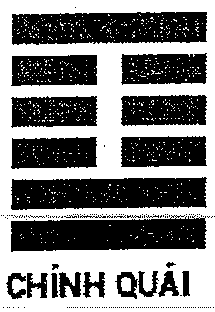

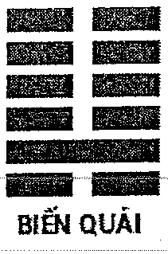

---

# CHƯƠNG MƯỜI MỘT
## SUY VƯỢNG CỦA HÀO

Trong quẻ Lục hào mỗi hào hưu tù, vượng tướng là nơi quyết định xem sự tình cát hung. Sự suy vượng của hào do nhật, nguyệt, hào động ảnh hưởng. Trong đó nhật nguyệt ảnh hưởng lớn nhất, nhật nguyệt như trời, có thể sinh khắc mọi hào và biến hào trong một quẻ, mà hào trong quẻ dù tỷ hòa với nguyệt, lâm nguyệt, cũng không thể ảnh hưởng đến nhật nguyệt. Nguyệt kiến chấp chưởng quyền lực trong một tháng, có thể tác dụng ở bất cứ ngày nào trong tháng đó, là đề cương của Lục hào dự đoán. Hào suy yếu nguyệt kiến có thể sinh phù; hào vượng tướng, nguyệt kiến có thể xung, khắc, hình. Phàm trong quẻ cái gì có lợi cho Dụng thần đều cần nguyệt kiến giúp đỡ, gây bất lợi cho Dụng thần cần nguyệt kiến chế phục. Trong quẻ có biến hào khắc chế hào động, nguyệt kiến có thể chế phục biến hào. Trong quẻ có hào động khắc chế hào tĩnh, nguyệt kiến có thể chế phục hào động. Dụng thần phục tàng bị phi hào ngăn chặn, nguyệt kiến có thể xung khắc phi thần, sinh trợ phục thần, hào gặp nguyệt hợp, gọi là hợp vượng, được xem là vượng, hào gặp Nguyệt xung gọi là nguyệt phá, xem là hưu tù.

### Nguyệt kiến

Lục hào dùng mười hai địa chi biểu thị tháng, gọi là nguyệt kiến. Tháng trong Lục hào không phải âm lịch cũng không phải là dương lịch, mà là lấy theo Tiết khí, cũng đem một năm chia mười hai tháng. Mỗi tiết chính là thời điểm tháng đó bắt đầu. Bên dưới có so sánh Tiết với dương lịch như sau:

Dương lịch tháng một đối ứng tháng Sửu, tháng hai đối ứng tại tháng Dần, tháng ba đối ứng tháng Mão, tháng tư đối ứng tháng Thìn, tháng năm đối ứng tháng Tị, tháng sáu đối ứng tháng Ngọ, tháng bảy đối ứng tháng Mùi, tháng tám đối ứng tháng Thân, tháng chín đối ứng tháng Dậu, tháng mười đối ứng tháng Tuất, tháng mười một đối ứng tháng Hợi, tháng mười hai đối ứng tháng Tý.

Trong Lục hào một năm bắt đầu tính từ lập xuân tính đi, mỗi Tiết đối ứng một, cụ thể đối ứng quan hệ như sau:

Lập xuân là bắt đầu tháng Dần, Kinh Trập là bắt đầu tháng Mão, Thanh minh là bắt đầu tháng Thìn, Lập hạ là bắt đầu tháng Tị, Mang chủng là bắt đầu tháng Ngọ, Tiểu thử là bắt đầu tháng Mùi, Lập thu là bắt đầu tháng Thân, Bạch lộ là bắt đầu tháng Dậu, Hàn lộ là bắt đầu tháng Tuất, Lập đông là bắt đầu tháng Hợi, Đại tuyết là bắt đầu tháng Tý, Tiểu hàn là bắt đầu tháng Sửu. Thời gian giao Tiết rất trọng yếu,

Tiết trước là tháng trước, một phút Tiết sau liền thành tháng sau, một phút cũng không thể mập mờ. Cụ thể thời gian giao Tiết có thể từ lịch vạn niên tra được.

### Nguyệt phá

Trong quẻ hào bị nguyệt kiến xung gọi là Nguyệt phá. Tức tháng Dần phá Thân, tháng Mão phá Dậu, tháng Thìn phá Tuất, tháng Tị phá Hợi, tháng Ngọ phá Tý, tháng Mùi phá Sửu, tháng Thân phá Dần, tháng Dậu phá Mão, tháng Tuất phá Thìn, tháng Hợi phá Tị, tháng Tý phá Ngọ, tháng Sửu phá Mùi.

Hào nguyệt phá hưu tù bất động, hoặc không mà gặp tuyệt, nhập mộ thì lực lượng thu nhỏ, không có tác dụng, Dụng thần bị phá là xấu, kị thần bị phá là tốt. Nếu hào nguyệt phá vượng tướng phát động, hoặc gặp sinh phù, thì vẫn có lực, có thể phát sinh tác dụng, Dụng thần gặp là tốt, kị thần gặp là xấu. Nguyệt phá, trước mắt mặc dù phá, hết tháng đó thì không phá, gặp ngày, tháng có cùng địa chi với địa chi bị nguyệt phá là thực phá. Ngày, tháng có địa chi hợp với địa chi bị nguyệt phá thì là hợp phá. Thực phá, hợp phá thường dùng để phán đoán ứng kỳ. Gần ứng ngày, xa ứng năm tháng, dự đoán thời vụ cần lưu tâm.

**Ví dụ 1:** ngày Ất Mão tháng Tị, xem vợ đau bụng không ngừng, được quẻ Trạch Thiên Quái biến Thủy Thiên Nhu.

**TRẠCH THIÊN QUÁI | THỦY THIÊN NHU**

| Hào | T/Ư | Lục Thân | Chi | Phục | TK | Lục Thân | Chi | TK | Lục Thú | Hào |
| :---: | :---: | :--- | :--- | :---: | :---: | :--- | :--- | :---: | :--- | :---: |
| - - | | Huynh Đệ | Mùi-Thổ | | | Thê Tài | Tý-Thủy | | Huyền Vũ | - - |
| --- | Thế | Tử Tôn | Dậu-Kim | | | Huynh Đệ | Tuất-Thổ | | Bạch Hổ | --- |
| --- | O | Thê Tài | Hợi-Thủy | | | Tử Tôn | Thân-Kim | | Đằng Xà | - - |
| --- | | Huynh Đệ | Thìn-Thổ | | | Huynh Đệ | Thìn-Thổ | | Câu Trần | --- |
| --- | Ứng | Quan Quỷ | Dần-Mộc | Phụ-Tỵ | | Quan Quỷ | Dần-Mộc | | Chu Tước | --- |
| --- | | Thê Tài | Tý-Thủy | | | Thê Tài | Tý-Thủy | | Thanh Long | --- |

**TUẦN KHÔNG: Tý, Sửu**

Lấy Thê tài làm Dụng thần, Hợi Thủy nguyệt phá, Tý thủy tuần không, kiêm làm Dụng thần. Hợi Thủy phát động hóa hồi đầu sinh, lại được Tử tôn Dậu kim trì thế ám động sinh trợ, không sao, Dụng thần nguyệt phá, sang tháng không phá, tháng

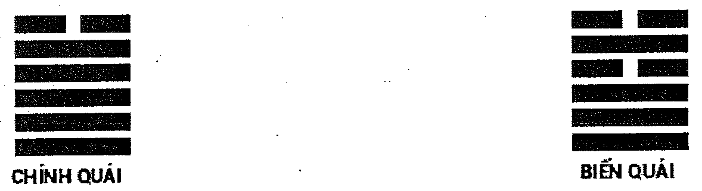

Ngọ Hợi Thủy đã không phá, Tý thủy gặp xung, xung không thì thực, vợ bệnh sẽ khỏi bệnh. Về sau tháng Ngọ tự khỏi.

**Ví dụ 2:** ngày Nhâm Dần tháng Bính Tuất năm Ất Hợi, một người đàn ông khoảng năm mươi tuổi đến hỏi hôn nhân, gieo được quẻ Phong Lôi Ích biến Phong Trạch Trung Phu.

Thời gian lập quẻ: 18:41:1 - 7/11/1995 (giờ Dậu, ngày 30/9/1995 Lịch tiết khí)  
Can Chi: Giờ Kỷ Dậu, ngày Nhâm Dần, tháng Bính Tuất, năm Ất Hợi  
Tiết khí: Sương giáng | Lệnh tháng: Tuất-Thổ  
Phương pháp lập quẻ: Lục hào

**PHONG LÔI ÍCH | PHONG TRẠCH TRUNG PHU**

| Hào | T/Ư | Lục Thân | Chi | Phục | TK | Lục Thân | Chi | TK | Lục Thú | Hào |
| :---: | :---: | :--- | :--- | :---: | :---: | :--- | :--- | :---: | :--- | :---: |
| --- | Ứng | Huynh Đệ | Mão-Mộc | | | Huynh Đệ | Mão-Mộc | | Bạch Hổ | --- |
| --- | | Tử Tôn | Tị-Hỏa | | K | Tử Tôn | Tị-Hỏa | K | Đằng Xà | --- |
| - - | | Thê Tài | Mùi-Thổ | | | Thê Tài | Mùi-Thổ | | Câu Trần | - - |
| - - | Thế | Thê Tài | Thìn-Thổ | Quan-Dậu | K | Thê Tài | Sửu-Thổ | | Chu Tước | - - |
| - - | -> | Huynh Đệ | Dần-Mộc | | | Huynh Đệ | Mão-Mộc | | Thanh Long | --- |
| --- | | Phụ Mẫu | Tý-Thủy | | | Tử Tôn | Tị-Hỏa | K | Huyền Vũ | --- |

| Hào | Quái thần | Lộc | Mã | Quý | Đào | V-S | Hào | Lộc | Mã | Quý | Đào | V-S |
| :---: | :---: | :---: | :---: | :---: | :---: | :---: | :---: | :---: | :---: | :---: | :---: | :---: |
| Mão | - | - | - | Q | Đ | Tù | Mão | - | - | Q | Đ | Tù |
| Tị | - | - | - | Q | - | Hưu | Tị | - | - | Q | - | Hưu |
| Mùi | - | - | - | - | - | Vượng | Mùi | - | - | - | - | Vượng |
| Thìn | - | - | - | - | - | Vượng | Sửu | - | - | - | - | Vượng |
| Dần | - | - | - | - | - | Tù | Mão | - | - | Q | Đ | Tù |
| Tý | - | - | - | - | - | Tử | Tị | - | - | Q | - | Hưu |

**TUẦN KHÔNG: Thìn, Tị**

Lấy Thê tài làm Dụng thần. Trong quẻ Thê tài lưỡng hiện, lấy hào Thê tài trì Thế làm Dụng thần. Thê tài Thìn thổ trì thế, là có tin tức của vợ. Nhưng Thê tài Thìn thổ tuần không, nguyệt phá, Huynh đệ Dần mộc động hóa tiến thần, lại là tượng ly dị.

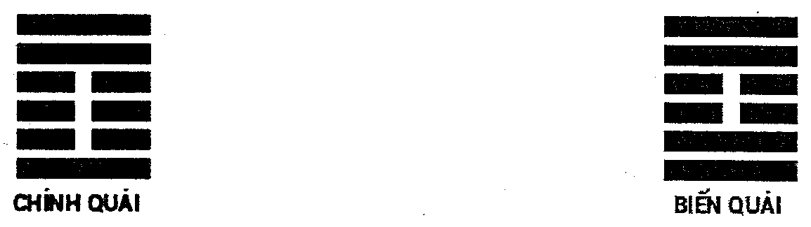

Dụng thần Thê tài Thìn thổ lâm không lại phá, không phá ứng thực không thực phá, năm 1998 là năm Mậu Thìn, năm này Dụng thần thực phá, đoán sẽ chia tay năm 1998.

Suy đoán quả nhiên ứng nghiệm.

## Tác dụng của Nhật thần

Thời gian trôi đi vĩnh viễn sẽ không trở lại, từ góc độ Dịch Học mà xem, vũ trụ có pháp tắc cùng quy luật nhất định, mỗi sáu mươi ngày lại lặp lại một lần. Cổ nhân rất sớm đã phát hiện ra quy luật này nên dùng Mười thiên can và mười hai Địa chi tổ hợp thành lục thập hoa giáp, biểu thị cho quy luật này. Bởi vậy, trong Lục hào dự đoán, nhật thần cũng phi thường trọng yếu, nó có tác dụng cực lớn trong việc phán đoán cát hung.

Nhật thần là chúa tể sáu hào, một tháng ba mươi ngày, mỗi ngày đều có nhật thần chủ sự, lục thập hoa giáp tuần hoàn vòng đi vòng lại, thay phiên trực nhật. Nhật thần cùng nguyệt kiến giống nhau có thể tác dụng đến tất cả các hào trong quẻ. Nguyệt lệnh chỉ có thể ở trong tháng có tác dụng, khi qua Tiết, liền do tháng sau chấp chưởng quyền hành, mà nhật thần thì bốn mùa đều vượng, quyền sinh quyền sát. Trong quẻ hào bị nguyệt kiến khắc thương nhưng được nhật thần sinh phù, tức là cân sức cân tài, không vượng không suy. Hào gặp nguyệt phá, nhật thần nhập hào là thực phá. Hào tĩnh vượng tướng, nhật thần xung là ám động, hào hưu tù, nhật thần xung là nhật phá; hào tuần không, nhật thần xung khởi, xung thực; hào gặp hợp, nhật thần xung khai; hào gặp xung, nhật thần có thể hợp trú. Hào suy yếu, nhật thần có thể sinh phù tỷ hợp. Hào vượng tướng, nhật thần có thể khắc, xung, hình, tuyệt, mộ. Hào hưu tù gặp nhật xung, thì tán, hào vượng tướng phát động, nhật thần xung, động càng mạnh.

Tóm lại, hào vượng tướng, được nhật thần sinh phù, như dệt hoa trên gấm, hào suy yếu, bị nhật thần khắc chế, thì như tuyết càng thêm sương. Dụng thần, nguyên thần cần nhật thần sinh phù; kị thần, cừu thần cần nhật thần khắc thương.

**Ví dụ 1:** ngày Mậu Thân tháng Dần, một hoạ sĩ xem bức tranh đang vẽ có bán được hay không, được quẻ Thủy Lôi Truân.

### CHÍNH QUÁI: THỦY LÔI TRUÂN — BIẾN QUÁI: THỦY LÔI TRUÂN

| Hào | T/Ư | Lục Thân | Chi | Phục | TK | Lục Thân | Chi | TK | Lục Thú | Hào |
| :---: | :---: | :---: | :---: | :---: | :---: | :---: | :---: | :---: | :---: | :---: |
| - - | | Huynh Đệ | Tý-Thủy | | | Huynh Đệ | Tý-Thủy | | Chu Tước | - - |
| — | Ứng | Quan Quỷ | Tuất-Thổ | | | Quan Quỷ | Tuất-Thổ | | Thanh Long | — |
| - - | | Phụ Mẫu | Thân-Kim | | | Phụ Mẫu | Thân-Kim | | Huyền Vũ | - - |
| - - | | Quan Quỷ | Thìn-Thổ | Tài-Ngọ | | Quan Quỷ | Thìn-Thổ | | Bạch Hổ | - - |
| - - | Thế | Tử Tôn | Dần-Mộc | | | Tử Tôn | Dần-Mộc | | Đằng Xà | - - |
| — | | Huynh Đệ | Tý-Thủy | | | Huynh Đệ | Tý-Thủy | | Câu Trần | — |

**TUẦN KHÔNG: Dần, Mão**

Bán tranh là thu lợi, cho nên lấy Thê tài làm Dụng thần. Thê tài Ngọ hỏa không hiện lên quẻ, phục dưới hào ba Quan quỷ Thìn thổ, phục sinh phi, có chút tiết khí, nhưng Dụng thần được Nguyệt sinh phù, là vượng tướng. Nguyên thần Tử tôn Dần mộc trì thế, không lại được nhật xung thực, tĩnh mà bị nhật xung, hình thành ám động, tranh nhất định có thể bán được.

Một tháng sau tranh của anh ta được một cái người Hàn Quốc mua.

> **_Chú thích của dịch giả:_** Hào tĩnh lâm không bị Nhật xung sẽ vừa xung không vừa ám động

**Ví dụ 2:** ngày Canh Ngọ tháng Hợi, một người đàn ông đến bệnh viện khám bệnh thì bị mất tiền, hỏi có tìm được hay không? Được quẻ Bát Thuần Cấn biến Lôi Sơn Tiểu Quá.

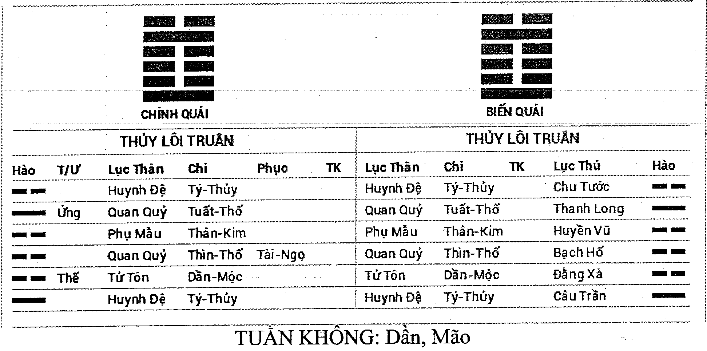

### CHÍNH QUÁI: BÁT THUẦN CẤN — BIẾN QUÁI: LÔI SƠN TIỂU QUÁ

| Hào | T/Ư | Lục Thân | Chi | Phục | TK | Lục Thân | Chi | TK | Lục Thú | Hào |
| :---: | :---: | :---: | :---: | :---: | :---: | :---: | :---: | :---: | :---: | :---: |
| — | Thế O | Quan Quỷ | Dần-Mộc | | | Huynh Đệ | Tuất-Thổ | | Đằng Xà | - - |
| - - | | Thê Tài | Tý-Thủy | | | Tử Tôn | Thân-Kim | | Câu Trần | - - |
| - - | | Huynh Đệ | Tuất-Thổ | | | Phụ Mẫu | Ngọ-Hỏa | | Chu Tước | — |
| — | Ứng | Tử Tôn | Thân-Kim | | | Tử Tôn | Thân-Kim | | Thanh Long | — |
| - - | | Phụ Mẫu | Ngọ-Hỏa | | | Phụ Mẫu | Ngọ-Hỏa | | Huyền Vũ | - - |
| - - | | Huynh Đệ | Thìn-Thổ | | | Huynh Đệ | Thìn-Thổ | | Bạch Hổ | - - |

Lấy Thê tài làm Dụng thần. Thê tài Tý thủy được nguyệt kiến Hợi Thủy tỷ hòa là vượng, nhật thần xung là ám động. Nhưng Huynh đệ Tuất thổ động khắc Dụng thần. Dụng thần được Nguyệt trợ giúp, kị thần được nhật sinh phù, cả hai suy vượng tương đương. Nhưng Huynh đệ Tuất thổ động hóa hồi đầu sinh, biến hào lại có nhật thần giúp đỡ, sinh trợ kị thần hữu lực, là không tốt. Quan quỷ trì thế, động mà hóa kị thần, thế hào là chính mình, kị thần là nhân tố bất lợi, tiền mình bị mất. Tài tại hào năm, hào năm là đường đi, tiền là rơi trên đường. Dụng thần bị Phụ mẫu lâm nhật xung, Phụ mẫu là quần áo, quẻ ngoại là nửa người trên, tiền là rơi từ túi áo. Rất khó tìm về.

Quả nhiên là trên đường đến bệnh viện, anh ta móc túi áo không cẩn thận rơi mất, về sau không tìm được.

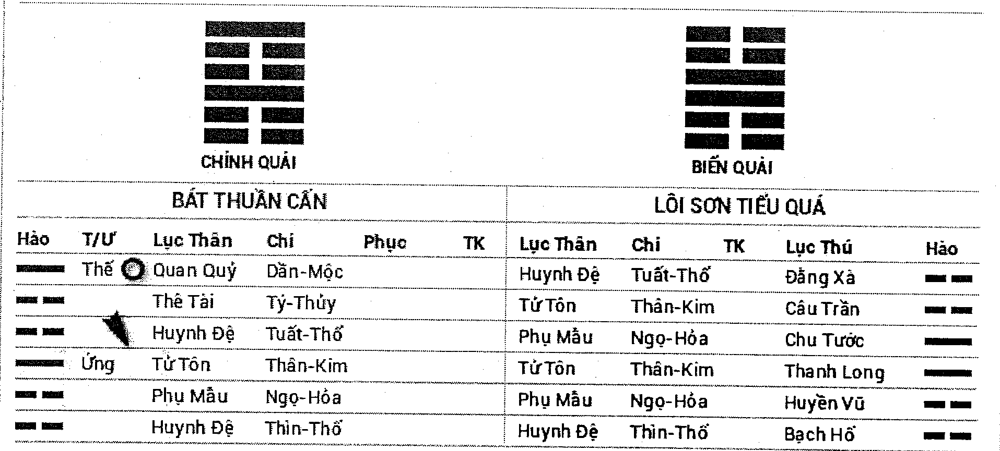

# Không vong

Trong Lục hào, nhật thần là dùng Thiên can và địa chi tổ hợp để biểu thị. Mười Thiên can, mười hai Địa chi, mỗi sáu mươi ngày lặp lại một lần, mười ngày một tuần, tổng cộng lục tuần. Vì can chi không khớp nhau, mỗi tuần đều có hai địa chi không có Thiên can để khớp, hai địa chi đó là tuần không. Tuần không trong Lục hào dự đoán khá trọng yếu, quan hệ đến cát hung cùng ứng kỳ, mỗi quẻ đều cần tra rõ.

Tuần không cũng được gọi là lục giáp không vong, lục giáp chỉ giáp, Giáp Tuất, Giáp Thân, Giáp Ngọ, Giáp Thìn, Giáp Dần. Từng không vong là: Giáp Tý Tuất Hợi không, Giáp Tuất Thân Dậu không, Giáp Thân Ngọ Mùi không, Giáp Ngọ Thìn Tỵ không, Giáp Thìn Dần Mão không, Giáp Dần Tý Sửu không. Lục giáp không vong, trong tuần là không vong, một khi xuất tuần liền không còn là không vong, mà không vong biến thành hai địa chi khác.

Khi dự đoán tật bệnh, Dụng thần gặp tuần không, nếu là bệnh gần, ngày, tháng thực không, xung không thì lành bệnh. Nếu là bệnh lâu gặp không, ngày, tháng thực không, xung không thì xấu. Trong quẻ gặp nguyên thần tuần không phát động, ngày, tháng xung không, thực không thì lành bệnh, kị thần tuần không phát động, ngày, tháng kị thần thực không, xung không là xấu.

Hào tuần không nếu là yên tĩnh bất động, thì phân ra hữu dụng hoặc vô dụng. Hào không mà vượng tướng, có nhật, nguyệt, hào động sinh phù, thì là hữu dụng. Hào không mà hưu tù vô khí thì vô dụng. Dụng thần sợ hưu tù không phá, không được sinh phù, kị thần cần gặp hưu tù không phá, yên tĩnh bất động. Phi thần nên tuần không, bị khắc, gặp xung (phi thần là kị thần). Tóm lại, hào gặp tuần không phát động liền có thể có tác dụng, hào vượng tướng gặp không cũng có sức mạnh tham dự vào sinh khắc; có nhật, nguyệt, hào động sinh phù, không vong cũng có sức mạnh, động mà hóa không, phục mà vượng tướng, đều là có khí, sẽ không phải thực là không. Chỉ có phá mà suy, hưu tù vô khí bất động, phục mà bị khắc lại gặp tuần không mới là không có lực.

**Ví dụ 1:** ngày Mậu Tý tháng Ngọ, một chiến sĩ vũ cảnh xem cát hung, được quẻ Trạch Sơn Hàm.

**CHÍNH QUÁI: TRẠCH SƠN HÀM** — **BIẾN QUÁI: TRẠCH SƠN HÀM**

| Hào | T/Ư | Lục Thân | Chi | Phục | TK | Lục Thân | Chi | TK | Lục Thú | Hào |
| :---: | :---: | :---: | :---: | :---: | :---: | :---: | :---: | :---: | :---: | :---: |
| - - | Ứng | Phụ Mẫu | Mùi-Thổ | | | Phụ Mẫu | Mùi-Thổ | | Chu Tước | - - |
| — | | Huynh Đệ | Dậu-Kim | | | Huynh Đệ | Dậu-Kim | | Thanh Long | — |
| — | | Tử Tôn | Hợi-Thủy | | | Tử Tôn | Hợi-Thủy | | Huyền Vũ | — |
| — | Thế | Huynh Đệ | Thân-Kim | | | Huynh Đệ | Thân-Kim | | Bạch Hổ | — |
| - - | | Quan Quỷ | Ngọ-Hỏa | Tài-Mão | | Quan Quỷ | Ngọ-Hỏa | | Đằng Xà | - - |
| - - | | Phụ Mẫu | Thìn-Thổ | | | Phụ Mẫu | Thìn-Thổ | | Câu Trần | - - |

**TUẦN KHÔNG: Ngọ, Mùi**

Lấy thế hào làm Dụng thần. Thế hào bị nguyệt kiến khắc, nhật thần không sinh là hưu tù. Kị thần quan quỷ Ngọ hỏa lâm nguyệt, nhật xung là ám động. Kị thần ám động khắc thế, kị thần là quan quỷ, Quan quỷ chủ bệnh, thế lâm Bạch Hổ, Bạch Hổ chủ bệnh, tất có bệnh. Ngọ hỏa tuần không, ngày Giáp Ngọ xuất không, kị thần xuất không, thế hào nhất định bị tổn thương.

Quẻ thuộc Đoài cung, đoài là kim, kim là đại tràng, đây là tượng đại tràng có bệnh. Sáu ngày sau, kị thần xuất không, xác định là bệnh. Kết quả ngày Giáp Ngọ xác định bị bệnh kiết lỵ, bệnh chữa hơn một tháng mới khỏi.

**Ví dụ 2:** ngày Tân Sửu tháng Tuất, một binh sĩ xem điều đến đơn vị khác có cơ hội thăng quan hay không? Được quẻ Phong Địa Quán.

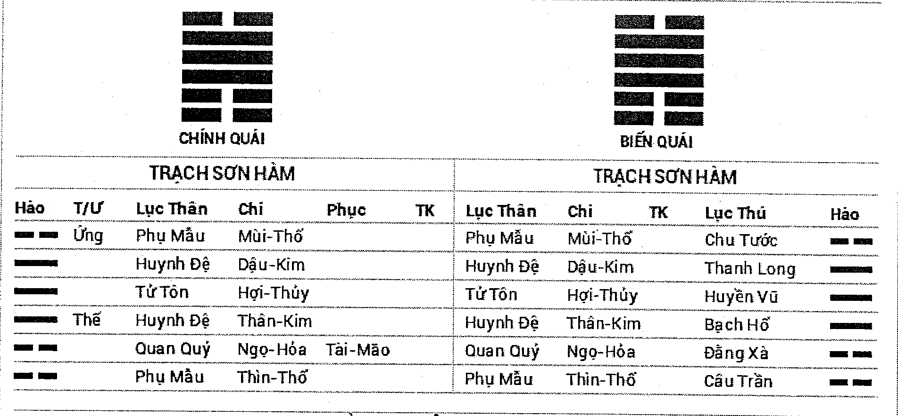

### CHÍNH QUÁI: PHONG ĐỊA QUÁN — BIẾN QUÁI: PHONG ĐỊA QUÁN

| Hào | T/Ư | Lục Thân | Chi | Phục | TK | Lục Thân | Chi | TK | Lục Thú | Hào |
| :---: | :---: | :---: | :---: | :---: | :---: | :---: | :---: | :---: | :---: | :---: |
| — | | Thê Tài | Mão-Mộc | | | Thê Tài | Mão-Mộc | | Đằng Xà | — |
| — | | Quan Quỷ | Tị-Hỏa | Huynh-Thân | | Quan Quỷ | Tị-Hỏa | | Câu Trần | — |
| -- -- | Thế | Phụ Mẫu | Mùi-Thổ | | | Phụ Mẫu | Mùi-Thổ | | Chu Tước | -- -- |
| -- -- | | Thê Tài | Mão-Mộc | | | Thê Tài | Mão-Mộc | | Thanh Long | -- -- |
| -- -- | | Quan Quỷ | Tị-Hỏa | | | Quan Quỷ | Tị-Hỏa | | Huyền Vũ | -- -- |
| -- -- | Ứng | Phụ Mẫu | Mùi-Thổ | Tử-Tý | | Phụ Mẫu | Mùi-Thổ | | Bạch Hổ | -- -- |

**TUẦN KHÔNG: Thìn, Tị**

Lấy Quan quỷ làm Dụng thần. Phụ mẫu trì thế ám động, Phụ mẫu là đơn vị làm việc, người này tham gia quân ngũ, có thể hiểu là đơn vị đóng quân, ám động, chính là thầm nghĩ sẽ biến động. Nhưng mục đích là thăng quan, tất lấy Quan quỷ làm chủ để phán đoán. Quan quỷ Tị hỏa lưỡng hiện, nhưng không được nhật nguyệt sinh phù là hưu tù, lại lâm không vong, không nên không thể sinh thế hào, tất khó thăng quan.

Sau không được thăng quan liền phục viên.

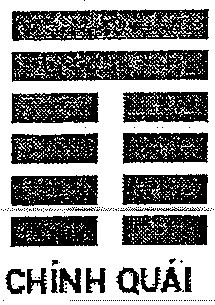

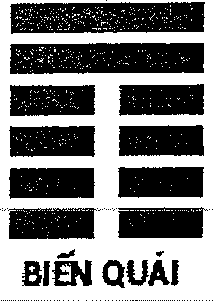

---

# CHƯƠNG MƯỜI HAI

## MƯỜI HAI TRẠNG THÁI SINH DIỆT CỦA NGŨ HÀNH

Trên thế giới tất cả vạn vật đều bao hàm Ngũ Hành, đều bị Ngũ Hành chế ước sự biến hóa từ khởi đầu đến cuối cùng, giống con người có sinh mạng, cần trải qua sinh tử. Cho nên tất cả sự vật tồn tại trong vũ trụ đều là vô thường, không có vĩnh hằng. Chính là bởi vì Ngũ Hành có sinh tử, cho nên trụ tất cả sự vật trong vũ mới có sinh diệt.

Ngũ Hành sinh diệt là dựa theo quy luật tuần hoàn qua lại không ngừng vận động, chỉ cần có âm dương tồn tại, tác dụng của Ngũ Hành sẽ không ngừng nghỉ. Ngũ Hành từ sinh đến diệt tổng cộng có mười hai loại trạng thái, đối ứng tại mười hai địa chi. Theo thứ tự là Trường sinh, Mộc dục, Quan đái, Lâm Quan, Đế vượng, Suy, Bệnh, Tử, Mộ, Tuyệt, Thai, Dưỡng. Mười hai trạng thái này là mười hai trạng thái của sự vật từ sinh ra đến phát triển, lại đến tân sinh mệnh bắt đầu vũ trụ luân hồi quy luật. Mười hai trạng thái này lấy trường sinh làm điểm xuất phát, cho nên hiện tượng này cũng được gọi là mười hai cung Trường sinh.

Trong Ngũ Hành sinh diệt mười hai trạng thái, cổ nhân cho rằng chỉ có Trường sinh, Đế vượng, Mộ, Tuyệt là có tác dụng đối với cát hung của sự vật. Kỳ thật đây là lý giải sai lầm. Dụng thần cát hung, chủ yếu là từ nhật nguyệt cùng hào động tĩnh sinh khắc trong quẻ để cân nhắc. Nhưng Ngũ Hành sinh diệt mười hai trạng thái lại là từ góc độ tượng biến hóa của sự vật. Công dụng chân chính có ý khác biệt. Trong dự đoán cao cấp Ngũ Hành sinh diệt mười hai trạng thái có phạm vi ứng dụng rất rộng, nhất định phải thuần thục nắm giữ.

Mười hai địa chi trong Ngũ Hành sinh diệt mười hai trạng thái quan hệ như sau:

| | Trường sinh | Mộc dục | Quan đái | Lâm Quan | Đế vượng | Suy | Bệnh | Tử | Mộ | Tuyệt | Thai | Dưỡng |
| :--- | :--- | :--- | :--- | :--- | :--- | :--- | :--- | :--- | :--- | :--- | :--- | :--- |
| Kim | Tị | Ngọ | Mùi | Thân | Dậu | Tuất | Hợi | Tý | Sửu | Dần | Mão | Thìn |
| Mộc | Hợi | Tý | Sửu | Dần | Mão | Thìn | Tị | Ngọ | Mùi | Thân | Dậu | Tuất |
| Thủy | Thân | Dậu | Tuất | Hợi | Tý | Sửu | Dần | Mão | Thìn | Tị | Ngọ | Mùi |
| Hỏa | Dần | Mão | Thìn | Tị | Ngọ | Mùi | Thân | Dậu | Tuất | Hợi | Tý | Sửu |
| Thổ | Thân | Dậu | Tuất | Hợi | tử | Sửu | Dần | Mão | thần | Tị | Ngọ | Mùi |

Trường sinh là xuất phát điểm của Ngũ Hành sinh diệt mười hai trạng thái có hàm nghĩa sinh trưởng, sinh ra, phát sinh. Như căn bản sự vật, người cần mẹ đẻ, thủy cần nguồn suối, nguy hiểm cần cứu tinh. Quẻ có ích thần suy mà gặp trường sinh thì cát, như cây khô gặp mùa xuân, hạn hán được mưa rào. Trường sinh tại nguyệt lệnh gọi là trường sinh tại Nguyệt, tại nhật thần gọi là trường sinh tại Nhật, động mà hóa trường sinh gọi là động hóa trường sinh.

Kim trường sinh tại Tị, Tị thuộc hỏa, là Ngũ Hành khắc kim, nhưng vì sao nói kim trường sinh tại Tị, việc này bắt nguồn từ kim được hỏa nung đúc thành dụng cụ, hết thảy khoáng vật nếu không được hỏa dã luyện thì không thành kim loại. Nhưng kim tuy trường sinh tại Tị thì vẫn có tàng khắc, nhìn từ góc độ Ngũ Hành, luận khắc bất luận sinh, nhìn từ góc độ trường sinh lại rút ra ý tứ nhất định để phán đoán, tất cả đều cần linh động.

Theo lý lẽ Ngũ Hành sinh khắc mà nói, Thổ sinh Kim. Nhưng Ngũ Hành sinh diệt mười hai trạng thái lại nói thổ trường sinh tại Thân, vậy lý lẽ Ngũ Hành sinh khắc là không đúng? Từ cổ tới kim nghi vấn này vẫn chưa được giải quyết. Kỳ thật Thổ trường sinh tại Thân, được bắt nguồn từ Thân là Khôn vị, Thổ gửi cung tại Tây Nam (Thân vị) mà thôi.

Tóm lại, Dần Thân Tị Hợi là Ngũ Hành trường sinh chi địa, gọi là tứ sinh. Hỏa trường sinh ở Dần, Thủy trường sinh tại Thân, Mộc trường sinh tại Hợi, đều hợp Ngũ Hành lý lẽ, chỉ có Thổ Kim trường sinh là đặc thù, bởi vậy, khi ứng dụng cần phải lưu tâm.

Mộc dục giống như hài nhi sau khi sinh tẩy lễ, hoa cỏ cây cối nảy mầm được mưa tưới nhuần. Nhưng trong Lục hào dự đoán nếu gặp thì luận Ngũ Hành sinh khắc bình thường, mộc dục không chủ cát hung, chỉ dùng để lấy tượng.

Quan đái chính là sau khi tẩy lễ mộc dục, mặc quần áo mang giầy mũ, người sau khi lớn lên, cử hành nghi thức trưởng thành, lễ đội mũ mang ý trưởng thành là như vậy. Trong Lục hào dự đoán cũng luận sinh khắc ngũ hành bình thường, không chủ cát hung, chỉ dùng để lấy tượng.

Lâm Quan là con người trưởng thành sau ra làm quan, chi, luận sinh khắc ngũ hành bình thường.

Đế vượng là con người tại thời điểm cường thịnh, hoa cỏ cây cối khi tươi tốt.

Suy là chỉ sự vật ở trạng thái suy bại, khi dự đoán lấy Ngũ Hành sinh khắc lý lẽ bình thường mà luận.

Bệnh là chỉ sự vật đã ở trạng thái sinh bệnh, sắp đi hướng diệt vong, khi dự đoán tật bệnh có thể dùng để phán đoán chứng bệnh, nhưng trên phương diện cát hung, lấy Ngũ Hành sinh khắc lý lẽ bình thường mà xem.

Tử là chỉ sự vật ở trạng thái tịch diệt, diệt vong, không có chút nào sinh cơ. Trong dự đoán tối kỵ tử địa đơn độc phát động, xem bệnh thì xem thêm suy vượng của Dụng thần, tối kị Dụng thần gặp tử địa. Kim gặp Tý là tử địa, Mộc gặp Ngọ là tử địa, Hỏa gặp Dậu là tử địa, Thủy, Thổ gặp Mão là tử địa. Tử địa đa số là tượng xấu.

Mộ, cũng gọi là khố, mộ khố là cất giữ, phong bế, chôn giấu. Con người sau khi chết được chôn trong mộ. Trong dự đoán Lục hào Mộ được ứng dụng nhiều nhất, phi thường ứng nghiệm.

Dụng thần nhập mộ vượng tướng không sao, sợ nhất hưu tù không phá, cũng kị thế hào Lâm Quan quỷ nhập mộ, gọi là tùy quỷ nhập mộ, chủ hung. Ngũ Hành mộ, so sánh khá khó phân biệt, Sửu là kim khố, Thìn là thổ khố. Sửu thuộc thổ, Thổ sinh Kim, nhưng vì sao lại nói kim khố tại Sửu, Dụng thần gặp luận là sinh, vẫn luận là mộ khố. Bình thường mà nói, từ góc độ Ngũ Hành sinh khắc bàn luận Sửu Thổ sinh Kim, từ góc độ Ngũ Hành sinh diệt mười hai trạng thái lại luận là mộ, một quẻ bên trong thường cũng có hai loại ý tứ đều có thể sử dụng, cần xem thêm Dụng thần cát hung, lấy nghĩa mà đoán.

Thổ khố tại Thìn cũng là một tình huống so sánh đặc thù. Thìn là thổ đã tỷ hòa với thổ lại có ý mộ khố, từ góc độ Ngũ Hành là tỷ hòa, giúp đỡ, từ góc độ Ngũ Hành sinh diệt mười hai trạng thái lại là mộ khố. Khi dự đoán cũng dựa theo Dụng thần cát hung, linh hoạt mà đoán.

Tuyệt là chỉ hào gặp tuyệt địa. Như Kim gặp Dần, Mộc gặp Thân, Thủy gặp Tị, Hỏa gặp Hợi, Thổ gặp Tị. Dụng thần hưu tù gặp tuyệt địa, con người nhập hiểm ác, tuyệt cảnh, nếu như không có cứu trợ, rất khó có cơ hội sống sót. Dụng thần có khí lâm tuyệt địa, gặp sinh phù, chính là tuyệt xứ phùng sinh, nếu lại gặp kị thần phát động, có khí cuối cùng cũng thành hung. Nhưng Thổ mặc dù tuyệt tại Tị, vẫn có nghĩa sinh phù. Chỉ cần Dụng thần có khí thì không xem là xấu; nếu hưu tù không phá gặp tuyệt địa thì Dụng thần hẳn là tuyệt.

Thai chỉ sự vật sau khi diệt tuyệt lại bắt đầu thai nghén sinh mệnh mới. Bình thường ở ngưỡng sơ cấp dự đoán cũng không có nhiều ứng dụng. Chỉ khi xem mang thai, sinh con thì tham khảo, phối hợp với hào Tử tôn để đoán. Các tình huống bình thường thì đều lấy Ngũ Hành sinh khắc để luận.

Dưỡng là thai đã hình thành, dần dần hấp thu dinh dưỡng, dần thành thục, chuẩn bị xuất sinh. Sơ cấp dự đoán rất ít khi dùng, nếu gặp vẫn lấy Ngũ Hành sinh khắc để luận.

Sau đây là một số ví dụ liên quan tới Ngũ Hành sinh diệt mười hai trạng thái.

### Ví dụ 1: ngày Đinh Hợi tháng Ngọ, bố xem bệnh của con gái được quẻ Sơn Trạch Tổn biến Sơn Hóa Bí.

| CHÍNH QUÁI | BIẾN QUÁI |
| :---: | :---: |
| **SƠN TRẠCH TỔN** | **SƠN HÓA BÍ** |

| Hào | T/Ư | Lục Thân | Chi | Phục | TK | Lục Thân | Chi | TK | Lục Thú | Hào |
| :---: | :---: | :---: | :---: | :---: | :---: | :---: | :---: | :---: | :---: | :---: |
| — | Ứng | Quan Quỷ | Dần-Mộc | | | Quan Quỷ | Dần-Mộc | | Thanh Long | — |
| -- | | Thê Tài | Tý-Thủy | | | Thê Tài | Tý-Thủy | | Huyền Vũ | -- |
| -- | | Huynh Đệ | Tuất-Thổ | | | Huynh Đệ | Tuất-Thổ | | Bạch Hổ | -- |
| -- | Thế | Huynh Đệ | Sửu-Thổ | Tử-Thân | | Thê Tài | Hợi-Thủy | | Đằng Xà | — |
| — | O | Quan Quỷ | Mão-Mộc | | | Huynh Đệ | Sửu-Thổ | | Câu Trần | -- |
| — | | Phụ Mẫu | Tị-Hóa | | | Quan Quỷ | Mão-Mộc | | Chu Tước | — |

Lấy Tử tôn làm Dụng thần, Tử tôn Thân kim không hiện lên quẻ, phục dưới hào ba Huynh đệ Sửu thổ, đồng thời lại nhập mộ tại phi thần, hào ba là giường, phục là bị bệnh liệt giường, nhập mộ là tượng nằm viện. Trong quẻ sơ hào Phụ mẫu Tị hỏa lâm Chu Tước ám động khắc Dụng thần Thân kim, Chu Tước chủ miệng lưỡi, nhất định là có phát sinh tranh chấp với bố mẹ mà nhiễm bệnh. Nhưng trong quẻ Mộc động nhóm lửa, Hỏa động sinh Thổ, Thổ động sinh Kim, sơ hào ám động, liên tục tương sinh, có thể nói thành cũng Tiêu Hà, bại cũng Tiêu Hà, sơ hào chủ chân, Phụ mẫu lại chủ bôn ba, cô bé này nhất định là được bố mẹ đôn đáo khắp nơi chạy chữa. Tử tôn Thân kim nhập mộ tại Sửu, tháng Mùi xung khai khố lại sinh phù là xuất viện, Thân kim phục tàng, tháng Thân xuất hiện mà lành bệnh.

Cô bé này quả là vì chuyện yêu đương bị bố mẹ phản đối mà uống thuốc độc tự vẫn, may bố mẹ phát hiện kịp thời đưa bệnh viện mà giữ được mệnh, tháng Mùi xuất viện, tháng Thân khôi phục.

### Ví dụ 2: ngày Mậu Tý tháng Mão, một viên chức của công ty bảo hiểm xem tài vận gần đây được quẻ Địa Lôi Phục biến Bát Thuần Khôn.

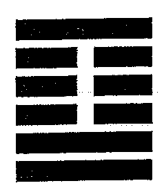

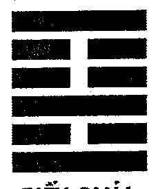

| CHÍNH QUÁI | BIẾN QUÁI |
| :---: | :---: |
| **ĐỊA LÔI PHỤC** | **BÁT THUẦN KHÔN** |

| Hào | T/Ư | Lục Thân | Chi | Phục | TK | Lục Thân | Chi | TK | Lục Thú | Hào |
| :---: | :---: | :---: | :---: | :---: | :---: | :---: | :---: | :---: | :---: | :---: |
| -- | | Tử Tôn | Dậu-Kim | | | Tử Tôn | Dậu-Kim | | Chu Tước | -- |
| -- | | Thê Tài | Hợi-Thủy | | | Thê Tài | Hợi-Thủy | | Thanh Long | -- |
| -- | Ứng | Huynh Đệ | Sửu-Thổ | | | Huynh Đệ | Sửu-Thổ | | Huyền Vũ | -- |
| -- | | Huynh Đệ | Thìn-Thổ | | | Quan Quỷ | Mão-Mộc | | Bạch Hổ | -- |
| -- | | Quan Quỷ | Dần-Mộc | Phu-Tỵ | | Phụ Mẫu | Tị-Hóa | | Đằng Xà | -- |
| — | Thế O | Thê Tài | Tý-Thủy | | | Huynh Đệ | Mùi-Thổ | | Câu Trần | -- |

**TUẦN KHÔNG: Ngọ, Mùi**

Lấy Thê tài làm Dụng thần. Trong quẻ Thê tài lưỡng hiện, lấy hào Thê tài Tý thủy phát động làm Dụng thần. Nguyên thần Tử tôn Dậu Kim Nguyệt phá, xem tài vận lâu dài thì bất lợi, nhưng xem tài vận gần thì chỉ nhìn Thê tài suy vượng. Đầu tiên Dụng thần trì thế, thế là người đến xem, chính là tượng có tiền bên cạnh ta, nguyệt kiến mặc dù không sinh Dụng thần, nhưng nhật thần là đất đế vượng của Dụng thần, so trợ Dụng thần, gần đây nhất định có tiền. Ngày nào? Dụng thần động mà hóa không, xuất không sẽ là ứng kỳ. Quẻ này có chỗ vi diệu, không thể đoán hóa hồi đầu khắc.

Kết quả tại ngày Ất Mùi đàm phán thành công một hợp đồng bảo hiểm, được thưởng sáu ngàn nguyên.

### Ví dụ 3: ngày Ất Tị tháng Thìn, một người đàn ông xem nuôi kiến có hiệu quả không được quẻ Lôi Thủy Giải biến Trạch Địa Tụy.

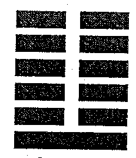

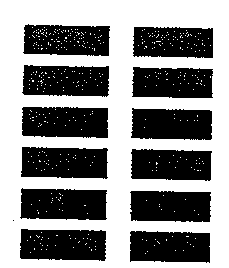

### CHÍNH QUÁI: LÔI THỦY GIẢI — BIẾN QUÁI: TRẠCH ĐỊA TỤY

| Hào | T/Ư | Lục Thân | Chi | Phục | TK | Lục Thân | Chi | TK | Lục Thú | Hào |
| :---: | :---: | :---: | :---: | :---: | :---: | :---: | :---: | :---: | :---: | :---: |
| -- -- | | Thê Tài | Tuất-Thổ | | | Thê Tài | Mùi-Thổ | | Huyền Vũ | -- -- |
| -- -- | Ứng (X) | Quan Quỷ | Thân-Kim | | | Quan Quỷ | Dậu-Kim | | Bạch Hổ | —— |
| —— | | Tử Tôn | Ngọ-Hỏa | | | Phụ Mẫu | Hợi-Thủy | | Đằng Xà | —— |
| -- -- | | Tử Tôn | Ngọ-Hỏa | | | Huynh Đệ | Mão-Mộc | | Câu Trần | -- -- |
| —— | Thế (O) | Thê Tài | Thìn-Thổ | | | Tử Tôn | Tị-Hỏa | | Chu Tước | -- -- |
| -- -- | | Huynh Đệ | Dần-Mộc | Phụ-Tý | | Thê Tài | Mùi-Thổ | | Thanh Long | -- -- |

Nuôi kiến là thu lợi, lấy Thê tài làm Dụng thần. Nhưng kiến là động vật, lấy động vật thu lợi nhất định phải nhìn cả Tử tôn. Đầu tiên Thê tài trì thế, chính là tượng tài lâm thân, Dụng thần cùng nguyệt kiến giống nhau, được nhật thần sinh phù, lại động hóa hồi đầu sinh, nuôi kiến nhất định có thể thu lợi. Nhật thần cùng biến hào tuy là Dụng thần tuyệt địa, nhưng vì Dụng thần vượng tướng, không xem tuyệt. Tử tôn là con kiến, được nhật so đỡ là vượng, nói rõ kiến rất khỏe. Hào sáu Tuất thổ là Tử tôn mộ khố, có thể hiểu là nuôi kiến tạo thành tổ trong rương, Nguyệt phá, là tượng rương có khe hở, kiến sẽ chạy ra bên ngoài.

Hết thảy quả như chỗ đoán.

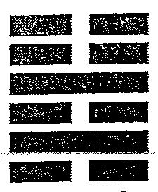

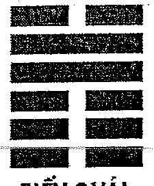

---

# CHƯƠNG MƯỜI BA
## SINH KHẮC CỦA HÀO ĐỘNG TĨNH

Lục hào dự đoán hết thảy là quay chung quanh Dụng thần, xem tác động của nhật nguyệt và các hào khác trong quẻ đến Dụng thần mà tiến hành phán đoán. Ở đây sẽ nói rõ thêm về lực lượng cùng quan hệ sinh khắc của hào động và hào tĩnh.

Lão Âm cùng lão dương biểu thị hào có biến hóa, gọi là hào động, thiếu âm cùng thiếu dương biểu thị hào không có biến hóa, gọi là hào tĩnh. Khi trong quẻ xuất hiện hào động, hào động có thể sinh khắc hào tĩnh mà hào tĩnh thì không thể sinh khắc hào động, dù cho hào tĩnh vượng tướng, hào động hưu tù cũng không thể. Nếu như hào động hưu tù, có thể nó chưa có lực, chờ vật đổi sao dời, hào động biến vượng thì liền có thể ảnh hưởng đến hào tĩnh, đây chính là nguyên nhân dự đoán sự có thể đánh giá được nguyên nhân và thời gian phát sinh sự việc qua Lục hào.

Mặt khác hào động biến hóa gọi là phát động, sau khi phát động tất sẽ sinh ra biến hào, nhật nguyệt có thể tác động đến hào động thì cũng có thể tác động đến biến hào. Biến hào sinh động hào gọi là hồi đầu sinh, biến hào khắc hào động gọi là hồi đầu khắc.

Quẻ không có hào động gọi là quẻ tĩnh. Trong quẻ tĩnh hào vượng tướng có thể sinh, khắc hào hưu tù. Hào vượng tướng như người cường tráng khỏe mạnh có thể giúp người cũng có thể chế người. Hào vượng tướng khi tuần không thì lúc xuất không có thể sinh ra tác dụng, Lục hào dự đoán thường dùng hiện tượng này để phán đoán thời gian sự vật phát sinh.

Ví dụ 1: ngày Nhâm Thân tháng Hợi, một nữ sĩ xem mẹ đã chín mươi ba tuổi đang bị bệnh có thọ không, được quẻ Thủy Phong Tỉnh biến Phong Thiên Tiểu Súc.

| CHÍNH QUÁI | BIẾN QUÁI |
| :---: | :---: |
| **THỦY PHONG TỈNH** | **PHONG THIÊN TIỂU SÚC** |

| Hào | T/Ư | Lục Thân | Chi | Phục | TK | Lục Thân | Chi | TK | Lục Thú | Hào |
| :---: | :---: | :--- | :--- | :--- | :---: | :--- | :--- | :---: | :--- | :---: |
| O - - | | Phụ Mẫu | Tý-Thủy | | | Huynh Đệ | Mão-Mộc | | Bạch Hổ | — |
| — | Thế | Thê Tài | Tuất-Thổ | | | Tử Tôn | Tị-Hỏa | | Đằng Xà | — |
| - - | | Quan Quỷ | Thân-Kim | Tử-Ngọ | | Thê Tài | Mùi-Thổ | | Câu Trần | - - |
| — | | Quan Quỷ | Dậu-Kim | | | Thê Tài | Thìn-Thổ | | Chu Tước | — |
| — | Ứng | Phụ Mẫu | Hợi-Thủy | Huynh-Dần | | Huynh Đệ | Dần-Mộc | | Thanh Long | — |
| O - - | | Thê Tài | Sửu-Thổ | | | Phụ Mẫu | Tý-Thủy | | Huyền Vũ | — |

**TUẦN KHÔNG: Tuất, Hợi**

Lấy Phụ mẫu làm Dụng thần, Dụng thần lưỡng hiện, Hợi Thủy lâm nguyệt tuần không, Tý thủy vượng tướng phát động, lấy Phụ mẫu Tý thủy làm Dụng thần. Phụ mẫu Tý thủy được nguyệt kiến so đỡ, nhật thần sinh phù là vượng tướng. Thê tài Sửu thổ kị thần phát động khắc dụng, kị thần chỉ trường sinh tại nhật thần Thân kim, trừ cái đó ra lại không có hào nào sinh phù, nhưng lúc này Sửu thổ mặc dù yếu, đến tháng Sửu Sửu thổ đắc thế, mà Tý thủy biến yếu, sợ là không tốt. Sau đó mẹ cô mất tháng Sửu cùng năm.

### Ví dụ 2: ngày Nhâm Dần tháng Mão, một người đàn ông xem thi nghiên cứu cứu sinh, được quẻ Lôi Hỏa Phong.

| CHÍNH QUÁI | BIẾN QUÁI |
| :---: | :---: |
| **LÔI HỎA PHONG** | **LÔI HỎA PHONG** |

| Hào | T/Ư | Lục Thân | Chi | Phục | TK | Lục Thân | Chi | TK | Lục Thú | Hào |
| :---: | :---: | :--- | :--- | :--- | :---: | :--- | :--- | :---: | :--- | :---: |
| - - | | Quan Quỷ | Tuất-Thổ | | | Quan Quỷ | Tuất-Thổ | | Bạch Hổ | - - |
| - - | Thế | Phụ Mẫu | Thân-Kim | | | Phụ Mẫu | Thân-Kim | | Đằng Xà | - - |
| — | | Thê Tài | Ngọ-Hỏa | | | Thê Tài | Ngọ-Hỏa | | Câu Trần | — |
| — | | Huynh Đệ | Hợi-Thủy | | | Huynh Đệ | Hợi-Thủy | | Chu Tước | — |
| - - | Ứng | Quan Quỷ | Sửu-Thổ | | | Quan Quỷ | Sửu-Thổ | | Thanh Long | - - |
| — | | Tử Tôn | Mão-Mộc | | | Tử Tôn | Mão-Mộc | | Huyền Vũ | — |

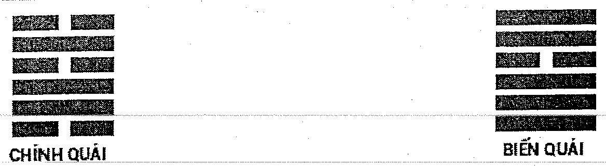

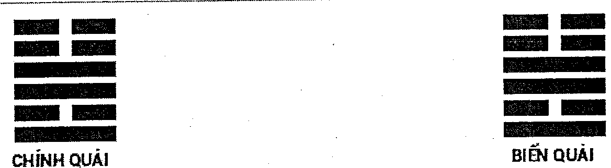

Xem thi cử, lấy Phụ mẫu cùng Quan quỷ làm Dụng thần. Phụ mẫu là điểm số, thư thông báo trúng tuyển, Quan quỷ là thứ hạng. Đây là quẻ tĩnh, Phụ mẫu Thân kim mặc dù trì thế, nhưng không được nhật nguyệt sinh phù, Quan quỷ lưỡng hiện đều bị nhật nguyệt khắc thương, kị thần Tử tôn cùng Thê tài lại được nhật nguyệt sinh đỡ, hào tĩnh vượng tướng có thể khắc hào tĩnh hưu tù, thi nghiên cứu cứu sinh rất khó đậu.

Kết quả không thi đậu.

# Ám động cùng nhật phá

Trong quẻ hào tĩnh lâm nguyệt hoặc được nguyệt kiến sinh phù, tỷ hòa, hoặc trong quẻ có hào động sinh trợ, hoặc cùng nguyệt tương hợp, hoặc trường sinh tại Nguyệt, gặp nhật xung là ám động. Ám động có hỉ có kị, có lợi cho Dụng thần thì là hỉ; có hại cho Dụng thần thì là xấu. Hào Ám động mọi quẻ đều cần tra rõ, không thể sơ hở, khi phán đoán cát hung thì hào ám động thường là điểm mấu chốt. Nếu như hào tĩnh hưu tù, bị Nguyệt khắc tổn thương, nhật thần xung thì gọi là nhật phá.

### Ví dụ 1: ngày Đinh Dậu tháng Dần, một người đàn ông xem có thành hôn được với bạn gái hay không? Được quẻ Phong Hỏa Gia Nhân biến Sơn Hỏa Bí.

| CHÍNH QUÁI | BIẾN QUÁI |
| :---: | :---: |
| **PHONG HỎA GIA NHÂN** | **SƠN HỎA BÍ** |

| Hào | T/Ư | Lục Thân | Chi | Phục | TK | Lục Thân | Chi | TK | Lục Thú | Hào |
| :---: | :---: | :---: | :---: | :---: | :---: | :---: | :---: | :---: | :---: | :---: |
| —— | | Huynh Đệ | Mão-Mộc | | | Huynh Đệ | Dần-Mộc | | Thanh Long | —— |
| —— | Ứng (O) | Tử Tôn | Tị-Hỏa | | | Phụ Mẫu | Tý-Thủy | | Huyền Vũ | -- -- |
| -- -- | | Thê Tài | Mùi-Thổ | | | Thê Tài | Tuất-Thổ | | Bạch Hổ | -- -- |
| —— | | Phụ Mẫu | Hợi-Thủy | Quan-Dậu | | Phụ Mẫu | Hợi-Thủy | | Đằng Xà | —— |
| -- -- | Thế | Thê Tài | Sửu-Thổ | | | Thê Tài | Sửu-Thổ | | Câu Trần | -- -- |
| —— | | Huynh Đệ | Mão-Mộc | | | Huynh Đệ | Mão-Mộc | | Chu Tước | —— |

**TUẦN KHÔNG: Thìn, Tị**

Nam xem hôn nhân lấy Thê tài làm Dụng thần. Thê tài Sửu thổ trì thế, chính là bạn gái ở bên cạnh. Nhưng nguyệt kiến khắc thương, kị thần lâm nguyệt, Huynh đệ Mão mộc hai trọng bị nhật xung là ám động, khó mà có thể cưới. Khả năng có người sẽ hỏi, Tử tôn Tị hỏa phát động, thành liên tục tương sinh, không phải rất tốt sao? Quẻ này Dụng thần nguyên bản như cây không rễ, Tử tôn mặc dù động, không mà hóa hồi đầu khắc, khó mà hóa giải hai trọng Huynh đệ ám động khắc thương. Tử tôn tại hào năm, không mà hóa hồi đầu khắc không thể sinh Dụng thần, hào năm là tôn vị, biến hào Phụ mẫu Tý thủy lại có ý là bố mẹ, chính là bố mẹ không đồng ý cưới.

Quả nhiên là bố mẹ phản đối, hai người chia tay, người con gái kết hôn với người khác vào tháng Hợi.

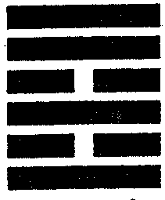

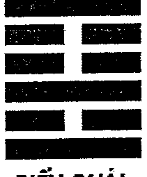

> **Chú thích của dịch giả:** Điểm đáng chú ý trong ví dụ này là dù Kị thần Nguyên thần cùng động nhưng Dụng thần không có rễ thì Nguyên thần cũng không sinh được. Bên cạnh đó, Nguyên thần suy yếu cũng không được Kị thần sinh, Kị thần vòng qua Nguyên thần khắc thương Dụng thần.

### Ví dụ 2: ngày Nhâm Ngọ tháng Tý, một người đàn ông xem bệnh của vợ được quẻ Hỏa Thiên Đại Hữu biến Sơn Thiên Đại Súc.

| CHÍNH QUÁI | BIẾN QUÁI |
| :---: | :---: |
| **HỎA THIÊN ĐẠI HỮU** | **SƠN THIÊN ĐẠI SÚC** |

| Hào | T/Ư | Lục Thân | Chi | Phục | TK | Lục Thân | Chi | TK | Lục Thú | Hào |
| :---: | :---: | :---: | :---: | :---: | :---: | :---: | :---: | :---: | :---: | :---: |
| —— | Ứng | Quan Quỷ | Tị-Hỏa | | | Thê Tài | Dần-Mộc | | Bạch Hổ | —— |
| -- -- | | Phụ Mẫu | Mùi-Thổ | | | Tử Tôn | Tý-Thủy | | Đằng Xà | -- -- |
| —— | (O) | Huynh Đệ | Dậu-Kim | | | Phụ Mẫu | Tuất-Thổ | | Câu Trần | -- -- |
| —— | Thế | Phụ Mẫu | Thìn-Thổ | | | Phụ Mẫu | Thìn-Thổ | | Chu Tước | —— |
| —— | | Thê Tài | Dần-Mộc | | | Thê Tài | Dần-Mộc | | Thanh Long | —— |
| —— | | Tử Tôn | Tý-Thủy | | | Tử Tôn | Tý-Thủy | | Huyền Vũ | —— |

Lấy Thê tài làm Dụng thần, đầu tiên nhìn Dụng thần suy vượng. Thê tài Dần mộc được nguyệt kiến sinh phù là cát, nhưng Huynh đệ Dậu kim phát động hóa hồi đầu sinh, được trợ mà khắc Dụng thần. May là nguyên thần Tý thủy được nhật xung hình thành ám động, thành liên tục tương sinh, giải đi huynh đệ Dậu kim khắc thương, hóa hung thành cát, bệnh của vợ nhất định sẽ tốt.

Quan quỷ là tin tức bệnh tật, tại hào sáu, hào sáu là hào vị đầu, Hỏa Thiên Đại Hữu lại là Càn cung quẻ, Càn lại là đầu, vợ anh ta bị chính là bệnh đau đầu.

Vợ anh ta quả là bị bệnh nhức đầu, sau khi khám và dùng thuốc đã có chuyển biến tốt đẹp.

> **Chú thích của dịch giả:** Ngay tại ví dụ này có thể thấy Kị thần và Nguyên thần đều động nhưng do Dụng thần vượng, Nguyên thần cũng vượng mà hình thành thế liên tục tương sinh. Đây là điều trái ngược với ví dụ trên, khi luận đoán nên nhớ kỹ các tình huống này để luận cho chuẩn xác

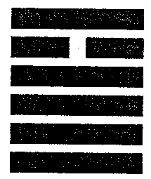

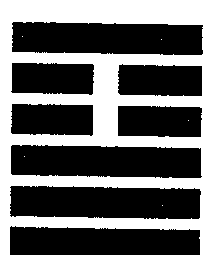

---

# CHƯƠNG MƯỜI BỐN
## TÁC DỤNG CỦA LỤC HỢP

### Lục hợp

Lục hợp như sau: Tý hợp Sửu, Dần hợp Hợi, Mão hợp Tuất, Thìn hợp Dậu, Tị hợp Thân, Ngọ hợp Mùi.

*Tương hợp có sáu loại tình huống:*

**Một,** nhật nguyệt hợp hào. Nguyệt hợp hào gọi là hợp vượng, rất ít khi dùng để phán đoán ứng kỳ. Nhật hợp hào thì có cát có hung, có hợp tàng sinh cũng có hợp tàng khắc, lại có hợp tàng hình, cát hung cần thẩm Dụng thần. Dự đoán bệnh tật, bệnh mới không nên gặp hợp, Dụng thần gặp hợp, hoặc bệnh nặng lên mà chết, hoặc thành bệnh mãn tính khó trị liệu. Nếu có tha hào xung khai, hợp gặp xung, thì là cát, nếu không trước mắt mặc dù khỏi bệnh, ngày sau chắc chắn sẽ tái phát, hoặc lưu lại di chứng, khó mà trừ tận gốc. Nếu như là bệnh lâu, ngược lại Dụng thần cần gặp hợp, gặp hợp chính là đem mệnh lưu lại, có bệnh tất khỏi bệnh. Nếu như là dự đoán xuất hành, động mà gặp hợp tất có sự tình ngăn trở. Dự đoán người đi đường, lạc đường, Dụng thần động mà gặp hợp, thời điểm gặp xung sẽ về, tĩnh mà gặp nhật hợp, ngày đó về. Dự đoán hôn nhân, đa số tham luyến, có ngoại tình.

**Hai,** hào cùng hào hợp. Quẻ có ích thần bị động hào hợp trú, đoán giống như khi hợp nhật. Nếu nguyên thần phát động mà bị động hào hợp trú, Dụng thần mà tốt thì lúc xung khai hợp là tốt. Nếu là kị thần phát động bị hợp, Dụng thần không tốt, xung khai hợp hào, kị thần như ngựa hoang thoát cương, khắc thương Dụng thần.

**Ba,** hào động cùng biến hào tương hợp. Tức một hào phát động, hào biến cùng hào động tương hợp.

**Bốn,** quẻ gặp lục hợp, hoặc quẻ biến lục hợp.

**Năm,** quẻ lục xung biến quẻ lục hợp.

**Sáu,** quẻ lục hợp biến quẻ lục hợp.

Cái gọi là quẻ lục hợp như Thiên Địa Bĩ, Sơn Hỏa Bí ..., sơ hào cùng hào bốn tương hợp, hào hai cùng hào năm tương hợp, hào ba cùng thượng hào tương hợp. Dự đoán sinh sản, lục hợp là khó sinh, còn lại mọi việc đều cát. Hào tĩnh gặp nhật hợp gọi là thu về, động mà gặp hợp gọi là ngăn trở. Hợp có hội hợp, gặp nhau, triền miên, ngăn trở, giữ lại, lưu lại, dừng lại, khép lại, nhân tình, hòa hợp rất nhiều hàm nghĩa, vì xem sự tình khác biệt, mà cát hung ứng nghiệm không đồng nhất, cần tinh tế mà xem, lúc lấy Dụng thần làm chủ, lúc lại nhìn hào tương hợp.

**Ví dụ 1:** ngày Quý Mão tháng Tuất, một nữ sĩ xem em bệnh đã lâu, được quẻ Địa Sơn Khiêm biến Địa Thiên Thái.

#### CHÍNH QUÁI: ĐỊA SƠN KHIÊM — BIẾN QUÁI: ĐỊA THIÊN THÁI

| Hào | T/Ư | Lục Thân | Chi | Phục | TK | Lục Thân | Chi | TK | Lục Thú | Hào |
| :---: | :---: | :---: | :---: | :---: | :---: | :---: | :---: | :---: | :---: | :---: |
| - - | | Huynh Đệ | Dậu-Kim | | | Huynh Đệ | Dậu-Kim | | Bạch Hổ | - - |
| - - | Thế | Tử Tôn | Hợi-Thủy | | | Tử Tôn | Hợi-Thủy | | Đằng Xà | - - |
| - - | | Phụ Mẫu | Sửu-Thổ | | | Phụ Mẫu | Sửu-Thổ | | Câu Trần | - - |
| — | | Huynh Đệ | Thân-Kim | | | Phụ Mẫu | Thìn-Thổ | | Chu Tước | — |
| - - | Ứng | Quan Quỷ | Ngọ-Hỏa | Tài-Mão | | Thê Tài | Dần-Mộc | | Thanh Long | — |
| - - | | Phụ Mẫu | Thìn-Thổ | | | Tử Tôn | Tý-Thủy | | Huyền Vũ | — |

Lấy Huynh đệ làm Dụng thần, Dụng thần lưỡng hiện, lấy hào Huynh đệ Dậu kim ám động làm Dụng thần. Bệnh lâu gặp nhật xung không tốt, nhưng Dụng thần vượng tướng, trong quẻ kị thần quan quỷ Ngọ hỏa mặc dù phát động, nhưng Phụ mẫu Thìn thổ cũng động, thành liên tục tương sinh, lại biến quẻ lục hợp, bệnh lâu thì khỏi bệnh. Trong quẻ không hiện tài, kị thần động hóa Thê tài Dần mộc hồi đầu sinh, hẳn là ăn uống không tốt.

Em trai bệnh dạ dày hơn hai mươi năm, sau đến đi khám bệnh, chuyên gia hội chẩn quyết định dụng thuốc Đông y trị liệu, cuối cùng khỏi hẳn.

**Ví dụ 2:** ngày Kỷ Sửu tháng Hợi, một người bạn hỏi bố mẹ đến Hải Nam du lịch cát hung ra sao? Được quẻ Sơn Lôi Di biến Bát Thuần Khôn.

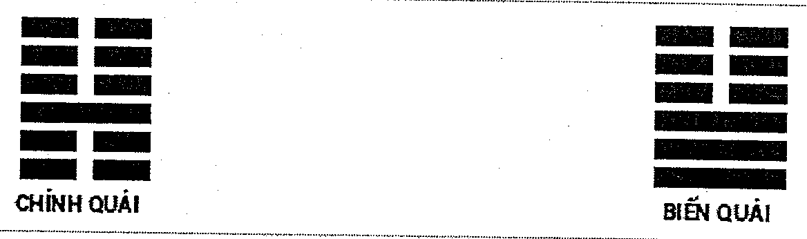

| CHÍNH QUÁI: SƠN LÔI DI | | | | | | BIẾN QUÁI: BÁT THUẦN KHÔN | | | | |
| :---: | :---: | :--- | :--- | :--- | :---: | :--- | :--- | :---: | :--- | :---: |
| Hào | T/Ư | Lục Thân | Chi | Phục | TK | Lục Thân | Chi | TK | Lục Thú | Hào |
| ▅▅▅▅▅ | ○ | Huynh Đệ | Dần-Mộc | | | Quan Quỷ | Dậu-Kim | | Câu Trần | ▅▅  ▅▅ |
| ▅▅  ▅▅ | | Phụ Mẫu | Tý-Thủy | Tử-Tỵ | | Phụ Mẫu | Hợi-Thủy | | Chu Tước | ▅▅  ▅▅ |
| ▅▅  ▅▅ | Thế | Thê Tài | Tuất-Thổ | | | Thê Tài | Sửu-Thổ | | Thanh Long | ▅▅  ▅▅ |
| ▅▅  ▅▅ | | Thê Tài | Thìn-Thổ | Quan-Dậu | | Huynh Đệ | Mão-Mộc | | Huyền Vũ | ▅▅  ▅▅ |
| ▅▅  ▅▅ | | Huynh Đệ | Dần-Mộc | | | Tử Tôn | Tị-Hỏa | | Bạch Hổ | ▅▅  ▅▅ |
| ▅▅▅▅▅ | Ứng ○ | Phụ Mẫu | Tý-Thủy | | | Thê Tài | Mùi-Thổ | | Đằng Xà | ▅▅  ▅▅ |

Lấy Phụ mẫu làm Dụng thần. Trong quẻ Phụ mẫu lưỡng hiện, lấy hào Phụ mẫu Tý thủy phát động là Dụng thần. Phụ mẫu Tý thủy được nguyệt kiến so đỡ là vượng tướng, lâm sơ hào phát động, sơ hào là chân, chính là muốn lên đường. Nhưng Dụng thần cùng nhật tương hợp, tất có sự tình gì đó vướng chân mà đi không được. Anh ta cũng biết Lục hào nhưng không hiểu sao lại kết luận vậy. Sau bố mẹ quả nhiên vì có việc ngáng trở mà không thể đi. Quẻ này chính là Dụng thần động gặp hợp mà bị ngăn trở.

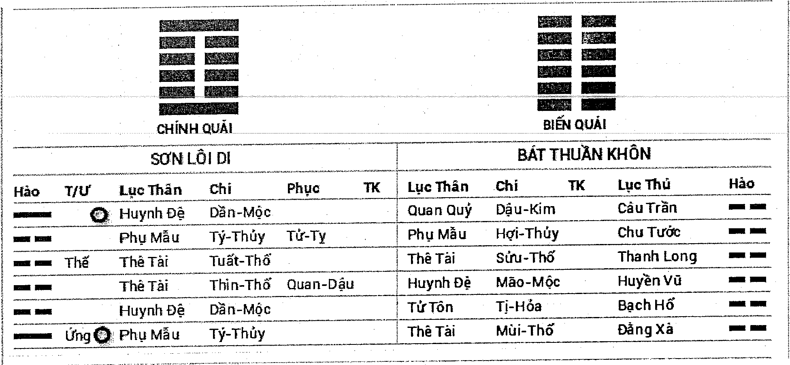

## Tam hợp cục

Tam hợp: Thân Tý Thìn hợp thủy cục, Tị Dậu Sửu hợp kim cục, Dần Ngọ Tuất hợp hỏa cục, Hợi Mão Mùi hợp mộc cục.

Tam hợp cục lấy Ngũ Hành trường sinh, đế vượng, mộ khố hội hợp mà thành cục, lấy địa chi ở giữa cục là thuộc tính ngũ hành. Lực lượng của hợp cục lớn hơn nhiều so với lực của hào đơn, đồng thời, hợp cục còn có hàm nghĩa cộng đồng, cùng một chỗ, trợ giúp, hợp tác, tụ tập.

Nhật nguyệt, hào động, biến hào, hào ám động đều có thể tham dự hợp cục, hào tĩnh thì không thể. Như trong quẻ có hai hào động, trong đó một hào động là bốn chính thần, tức là địa chi ở giữa cục thì có thể mượn nhật nguyệt hợp cục. Nếu tam hợp cục chỉ có hai địa chi (trong đó một địa chi nhất định phải là địa chi ở giữa cục) mà không có nhật nguyệt phù hợp để thành cục, thì sẽ thành nửa cục, ứng kỳ có thể chọn địa chi tam hợp còn thiếu trong cục, chờ ngày sau bổ góp thành tam hợp cục, gọi là thiếu một đợi dụng. Nếu trong tam hợp cục có một hào tuần không, hoặc gặp phá thì phải đợi ngày điền thực, thực phá mới thành cục; có một hào nhập mộ phải đợi ngày, tháng xung khai thì sự việc mới ứng.

**Ví dụ 1: ngày Mậu Tuất tháng Thân, một phụ nữ xem duyên phận vợ chồng được quẻ Hỏa Phong Đỉnh biến Địa Thiên Thái.**

| CHÍNH QUÁI: HỎA PHONG ĐÍNH | | | | | | BIẾN QUÁI: ĐỊA THIÊN THÁI | | | | |
| :---: | :---: | :--- | :--- | :--- | :---: | :--- | :--- | :---: | :--- | :---: |
| Hào | T/Ư | Lục Thân | Chi | Phục | TK | Lục Thân | Chi | TK | Lục Thú | Hào |
| ▅▅▅▅▅ | ○ | Huynh Đệ | Tị-Hỏa | | | Thê Tài | Dậu-Kim | | Chu Tước | ▅▅  ▅▅ |
| ▅▅  ▅▅ | Ứng ○ | Tử Tôn | Mùi-Thổ | | | Quan Quỷ | Hợi-Thủy | | Thanh Long | ▅▅  ▅▅ |
| ▅▅▅▅▅ | | Thê Tài | Dậu-Kim | | | Tử Tôn | Sửu-Thổ | | Huyền Vũ | ▅▅  ▅▅ |
| ▅▅▅▅▅ | | Thê Tài | Dậu-Kim | | | Tử Tôn | Thìn-Thổ | | Bạch Hổ | ▅▅▅▅▅ |
| ▅▅▅▅▅ | Thế | Quan Quỷ | Hợi-Thủy | | | Phụ Mẫu | Dần-Mộc | | Đằng Xà | ▅▅▅▅▅ |
| ▅▅  ▅▅ | | Tử Tôn | Sửu-Thổ | Phụ-Mão | | Quan Quỷ | Tý-Thủy | | Câu Trần | ▅▅▅▅▅ |

Lấy Quan quỷ làm Dụng thần. Quan quỷ trì thế lâm hào hai, hào hai là nhà cũng là hào vị chồng. Quan quỷ Hợi Thủy được nguyệt kiến sinh, nhật thần khắc chi,

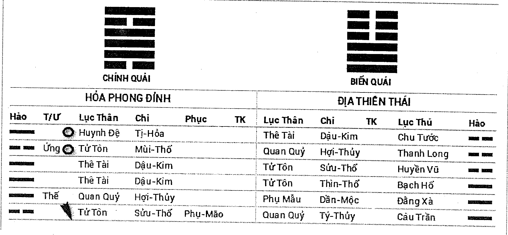 từ nhật nguyệt mà xem suy vượng, rất khó phân biệt. Vậy cần xem hào động trong quẻ ảnh hưởng đến Dụng thần thế nào mà phán đoán.

Lấy ***Phân hào đoạn pháp*** để xem, sơ hào là tâm sự, kị thần Tử tôn Sửu thổ tại sơ hào phát động khắc Quan quỷ, chính là cô ta muốn ly hôn chồng. Tử tôn động hóa xuất Quan quỷ, ly hôn vì muốn kết hôn với người đàn ông khác. Nhưng là hào biến Quan quỷ Tý thủy lại hợp trú Kị thần Tử tôn Sửu thổ khiến Tử tôn Sửu thổ không thể khắc Quan quỷ Hợi Thủy, chính là người đàn ông mới xuất hiện không muốn cô ta ly dị chồng. Đồng thời trong quẻ Tị Dậu Sửu tam hợp thành cục sinh trợ Dụng thần, Quan quỷ vượng tướng, không thể ly hôn.

Trên thực tế là cô ta đã có chồng, nhưng lại thích một người đàn ông khác, người đàn ông đó cũng đã có vợ và không muốn ly hôn vợ để lấy cô này. Cô đành bỏ suy nghĩ đòi ly hôn và lại chung sống với chồng.

**Ví dụ 2:** ngày Nhâm Thân tháng Thìn, một người đàn ông xem quan hệ với bạn gái ra sao được quẻ Phong Hỏa Gia Nhân biến Thiên Sơn Độn.

### CHÍNH QUÁI: PHONG HỎA GIA NHÂN — BIẾN QUÁI: THIÊN SƠN ĐỘN

| Hào | T/Ư | Lục Thân | Chi | Phục | TK | Lục Thân | Chi | TK | Lục Thú | Hào |
| :---: | :---: | :---: | :---: | :---: | :---: | :---: | :---: | :---: | :---: | :---: |
| — | | Huynh Đệ | Mão-Mộc | | | Thê Tài | Tuất-Thổ | | Bạch Hổ | — |
| — | Ứng | Tử Tôn | Tị-Hỏa | | | Quan Quỷ | Thân-Kim | | Đằng Xà | — |
| -- -- | | Thê Tài | Mùi-Thổ | | | Tử Tôn | Ngọ-Hỏa | | Câu Trận | — |
| — | | Phụ Mẫu | Hợi-Thủy | Quan-Dậu | | Quan Quỷ | Thân-Kim | | Chu Tước | — |
| -- -- | Thế | Thê Tài | Sửu-Thổ | | | Tử Tôn | Ngọ-Hỏa | | Thanh Long | -- -- |
| — | O | Huynh Đệ | Mão-Mộc | | | Thê Tài | Thìn-Thổ | | Huyền Vũ | -- -- |

**TUẦN KHÔNG: Tuất, Hợi**

Lấy Thê tài làm Dụng thần. Trong quẻ Thê tài lưỡng hiện, bình thường lấy hào động Thê tài Mùi thổ làm Dụng thần. Thê tài Mùi thổ động mà cùng thế hào tương xung, chính là phát sinh mâu thuẫn xung đột với bạn gái. Gian hào là người làm mối, Phụ mẫu cũng chủ bà mối, Phụ mẫu Hợi Thủy lâm không mà bị khắc, chủ không có bà mối, chính là tự do yêu đương. Thê tài Sửu thổ trì thế, cũng là tin tức hiện đang có bạn gái. Thê tài Mùi thổ lại có thể xem là một người phụ nữ khác.

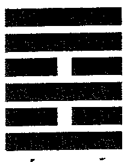

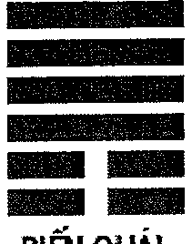

Kị thần Huynh đệ Mão mộc phát động, chính là tin tức bất lợi cho yêu đương, động mà hóa thành nguyệt kiến (biến hào lâm nguyệt) khắc Dụng thần, trong tháng sẽ có nguy cơ. Thê tài Mùi thổ cùng kị thần Huynh đệ Mão mộc tạo thành nửa cục, chờ ngày Hợi nhập tam hợp cục dễ chia tay.

Người này không tin, nói anh ta và bạn gái là bạn học thời đại học, đã yêu nhau ba năm, không có mâu thuẫn xung đột gì lớn, tình cảm rất tốt, chẳng bao giờ chia tay. Ai biết sau bốn ngày, đúng ngày Hợi bạn gái đề nghị chia tay. Thế là vội vàng chạy tới xem lần nữa, ta vẫn dùng quẻ này để đoán. Năm đó là năm 1996, Thê tài Mùi thổ động mà tương hợp với biến hào, năm sau Đinh Sửu, Thê tài Mùi thổ hợp gặp xung nên đoán vào khoảng năm 1997 anh ta sẽ kết hôn với người khác.

Quả nhiên ứng nghiệm.

---

# CHƯƠNG MƯỜI LĂM
## TÁC DỤNG CỦA LỤC XUNG

### Lục xung

Lục xung: Tý Ngọ tương xung, Sửu Mùi tương xung, Dần Thân tương xung, Mão Dậu tương xung, Thìn Tuất tương xung, Tị Hợi tương xung.

Lục xung có sáu loại tình huống:

**Một,** có mười quẻ lục xung là Bát Thuần Càn, Bát Thuần Khôn, Bát Thuần Đoài, Bát Thuần Tốn, Bát Thuần Chấn, Bát Thuần Khảm, Bát Thuần Ly, Bát Thuần Cấn, Lôi Thiên Đại Tráng, Thiên Lôi Vô Vọng.

**Hai,** quẻ Lục hợp biến quẻ Lục xung. Như Thiên Địa Bĩ biến Thiên Lôi Vô Vọng.

**Ba,** quẻ Lục xung biến Lục xung, như Bát Thuần Càn biến Bát Thuần Khôn.

**Bốn,** nhật nguyệt xung hào.

**Năm,** hào xung hào.

**Sáu,** hào động biến xung

Xung có nghĩa là tách ra, xung khai, xúc động. Trong dự đoán bệnh tật, nếu bệnh gần thì cần gặp xung, gọi là đem bệnh tách ra. Nếu bệnh lâu, gặp xung không tốt, gọi là đem bệnh nhân phá tan. Trong đó, quẻ biến Lục xung, Lục xung biến Lục xung là xấu nhất, hào xung hào xung, nhật xung hào, Lục hợp biến Lục xung là thứ hai, động biến lục xung, Nguyệt xung hào là tiếp theo. Nguyệt xung là Nguyệt phá, biến xung là phản ngâm, nhật xung thì cần phân biệt ám động cùng nhật phá. Dự đoán mọi việc kị Dụng thần biến xung, bị Nguyệt xung. Dự đoán bị kiện, sinh con thì lại mừng khi gặp quẻ Lục xung.

**Ví dụ 1:** ngày Bính Dần tháng Mùi một người phụ nữ xem có thể kết hôn với bạn trai hiện tại được không? Được quẻ Bát Thuần Ly.

### CHÍNH QUÁI: BÁT THUẦN LY
### BIẾN QUÁI: BÁT THUẦN LY

| Hào | T/Ư | Lục Thân | Chi | Phục | TK | Lục Thân | Chi | TK | Lục Thú | Hào |
| :---: | :---: | :---: | :---: | :---: | :---: | :---: | :---: | :---: | :---: | :---: |
| — | Thế | Huynh Đệ | Tị-Hỏa | | | Huynh Đệ | Tị-Hỏa | | Thanh Long | — |
| - - | | Tử Tôn | Mùi-Thổ | | | Tử Tôn | Mùi-Thổ | | Huyền Vũ | - - |
| — | | Thê Tài | Dậu-Kim | | | Thê Tài | Dậu-Kim | | Bạch Hổ | — |
| — | Ứng | Quan Quỷ | Hợi-Thủy | | | Quan Quỷ | Hợi-Thủy | | Đằng Xà | — |
| - - | | Tử Tôn | Sửu-Thổ | | | Tử Tôn | Sửu-Thổ | | Câu Trần | - - |
| — | | Phụ Mẫu | Mão-Mộc | | | Phụ Mẫu | Mão-Mộc | | Chu Tước | — |

**TUẦN KHÔNG: Tuất, Hợi**

Lấy Quan quỷ làm Dụng thần. Quan quỷ Hợi Thủy không vong bị nguyệt kiến khắc thương là không tốt, quẻ lại là quẻ Lục xung có tượng chia tách, cho nên đoán không thể cưới. Nhật thần Dần mộc cùng Quan quỷ tương hợp, Dần mộc đối ứng với tháng Dần, đoán tháng Dần bắt đầu yêu.

Cô này nói quả nhiên bắt đầu yêu vào tháng Dần. Nhưng cuối cùng tháng Dậu năm đó lại kết hôn. Ta nghi quẻ này phán đoán sai, nhưng vô luận thế nào nhìn cũng thấy là tượng chia tách, sau mới ngộ ra cổ nhân có nói “Phụ mẫu lâm nhật hôn kỳ định”. Quẻ này sơ hào Phụ mẫu Mão mộc cùng nhật thần có ngũ hành giống nhau, tháng Dậu xung chính là ứng kỳ kết hôn. Năm sau, tháng Dần năm Đinh Sửu, cô này mang thai, không nghe người nhà chồng khuyên can mà cứ khăng khăng đến nhà tắm công cộng tắm rửa, kết quả là trượt chân sảy thai, kèm theo đó cũng mất đi khả năng có con. Bố chồng lại đi tu, chồng là con một nên cần con trai nối dõi tông đường. Vì cô này không thể mang thai mà lại do chính bản thân tạo ra nên chồng đòi ly hôn.

Hào hai Tử tôn Sửu thổ nguyệt phá, chính là năm Đinh Sửu thực phá bị sảy thai, Tử tôn thực phá khắc Quan quỷ, cũng là nguyên nhân dẫn đến ly hôn, đáng tiếc quẻ quá huyền diệu mà lúc ấy không có nhìn ra.

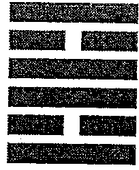

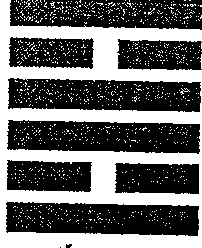

---

# CHƯƠNG MƯỜI SÁU
## CÁT HUNG CỦA TAM HÌNH

Tam hình: Dần hình Tị, Tị hình Thân, Thân hình Dần, Tý hình Mão, Mão hình Tý, Sửu hình Tuất, Tuất hình Mùi, Mùi hình Sửu, Thìn Ngọ Dậu Hợi tướng hình. Trong đó Dần Tị Thân tam hình, gọi là ỷ thế hình, Tý và Mão hình, gọi là vô lễ hình, Sửu Tuất Mùi hình, gọi là vô ân hình. Hình có hình khắc, thống khổ, hình danh, phạm hình, thụ hại. Lục hào dự đoán lấy Dụng thần sinh khắc làm trọng, tam hình là nhẹ, tam hình cần phụ họa Dụng thần mà kiêm đoán, chỉ bằng tam hình ngàn vạn không thể dùng để đoán cát hung. Dần hình Tị, sinh bên trong mang hình. Thìn Ngọ Dậu Hợi, trong quẻ xuất hiện tại nhật nguyệt có tác dụng sinh trợ, Thìn thổ hóa xuất Thìn thổ thì là phục ngâm, phần lớn luận là không tốt.

**Ví dụ 1:** ngày Bính Ngọ tháng Hợi, một người đàn ông xem vận làm quan, được quẻ Trạch Lôi Tùy biến Thủy Trạch Tiết.

**CHÍNH QUÁI: TRẠCH LÔI TÙY**
**BIẾN QUÁI: THỦY TRẠCH TIẾT**

| Hào | T/Ư | Lục Thân | Chi | Phục | TK | Lục Thân | Chi | TK | Lục Thú | Hào |
| :---: | :---: | :---: | :---: | :---: | :---: | :---: | :---: | :---: | :---: | :---: |
| - - | Ứng | Thê Tài | Mùi-Thổ | | | Phụ Mẫu | Tý-Thủy | | Thanh Long | - - |
| —— | | Quan Quỷ | Dậu-Kim | | | Thê Tài | Tuất-Thổ | | Huyền Vũ | —— |
| —— | ○ | Phụ Mẫu | Hợi-Thủy | Tử-Ngọ | | Quan Quỷ | Thân-Kim | | Bạch Hổ | - - |
| - - | Thế | Thê Tài | Thìn-Thổ | | | Thê Tài | Sửu-Thổ | | Đằng Xà | - - |
| - - | | Huynh Đệ | Dần-Mộc | | | Huynh Đệ | Mão-Mộc | | Câu Trần | —— |
| —— | | Phụ Mẫu | Tý-Thủy | | | Tử Tôn | Tị-Hỏa | | Chu Tước | —— |

Lấy Quan quỷ làm Dụng thần. Quan quỷ không được nhật nguyệt sinh phù, ngược lại bị nhật khắc thương là hưu tù, vận làm quan không tốt. Sơ hào Phụ mẫu Tý thủy ám động sinh Huynh đệ Dần mộc, Phụ mẫu Hợi Thủy minh động cũng sinh Huynh đệ Dần mộc, Huynh đệ Dần mộc hóa tiến thần khắc thế hào, trong tối ngoài sáng có rất nhiều người phản đối. Vận làm quan không tốt. Thế hào Thìn thổ, lại gặp Hợi Thủy, Ngọ hỏa, Dậu kim, Dậu kim mặc dù bất động, nhưng cũng tự hình, hết thảy bất lợi nhân tố chính là do mình tạo thành.

Người này là bí thư trưởng hiệp hội Phật giáo, có rất nhiều người bất mãn với anh ta, chính anh ta nghĩ rằng hiệp hội Phật giáo không thể rời hắn được nên làm bộ

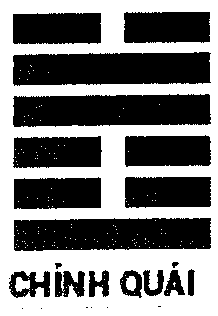

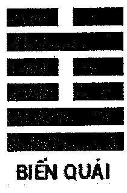 muốn từ chức, vài ngày cũng không thèm đến văn phòng, kết quả thượng cấp quyết định để người khác thay thế anh ta, anh ta đành phải từ chức.

**Ví dụ 2:** ngày Ất Dậu tháng Ngọ, một cảnh sát vũ trang mất sách ngoại ngữ không thấy đâu, hỏi có thể tìm được không? Được quẻ Phong Thiên Tiểu Súc biến Thủy Thiên Nhu.

**CHÍNH QUÁI: PHONG THIÊN TIỂU SÚC**
**BIẾN QUÁI: THỦY THIÊN NHU**

| Hào | T/Ư | Lục Thân | Chi | Phục | TK | Lục Thân | Chi | TK | Lục Thú | Hào |
| :---: | :---: | :---: | :---: | :---: | :---: | :---: | :---: | :---: | :---: | :---: |
| —— | ○ | Huynh Đệ | Mão-Mộc | | | Phụ Mẫu | Tý-Thủy | | Huyền Vũ | - - |
| —— | | Tử Tôn | Tị-Hỏa | | | Thê Tài | Tuất-Thổ | | Bạch Hổ | —— |
| - - | Ứng | Thê Tài | Mùi-Thổ | | | Quan Quỷ | Thân-Kim | | Đằng Xà | - - |
| —— | | Thê Tài | Thìn-Thổ | Quan-Dậu | | Thê Tài | Thìn-Thổ | | Câu Trần | —— |
| —— | | Huynh Đệ | Dần-Mộc | | | Huynh Đệ | Dần-Mộc | | Chu Tước | —— |
| —— | Thế | Phụ Mẫu | Tý-Thủy | | | Phụ Mẫu | Tý-Thủy | | Thanh Long | —— |

Lấy Phụ mẫu làm Dụng thần. Dụng thần Phụ mẫu Tý thủy mặc dù nguyệt phá, nhưng được nhật sinh, lại là trì thế, là tượng đồ không bị mất. Quẻ này hào sáu Huynh đệ lâm Huyền Vũ phát động cùng Dụng thần tướng hình, Huyền Vũ chủ âm thầm, len lén, hình là chỉ trích, hại, Huynh đệ là đồng sự, căn cứ những tin tức này đoán là đồng sự ghét nên giấu sách của anh ta đi.

Kết quả giờ Dậu ngày đó, anh ta tìm được quyển sách tại ngăn tủ thấp nhất ở phòng trực ban giấu dưới một đống áo bông cũ.

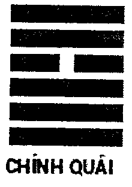

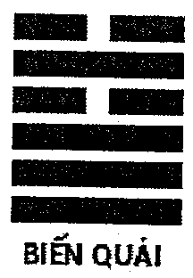

---

# CHƯƠNG MƯỜI BẢY

## PHẢN NGÂM, PHỤC NGÂM

### Phản ngâm

Phản ngâm có ứng nghiệm rất cao khi luận đoán nên không thể coi thường. Phản ngâm có hai loại tình huống, một là quẻ biến phản ngâm, hai là hào biến phản ngâm.

Quẻ biến phản ngâm như Càn biến Khôn, Khôn biến Càn, Ly biến Khảm, Khảm biến Ly, Cấn biến Đoài, Đoài biến Cấn, Chấn biến Tốn, Địa Phong Thăng biến Phong Địa Quán... Tiên Thiên Bát Quái đối xung phương vị với Hậu Thiên Bát Quái phương vị hỗ hóa hình thành quẻ biến phản ngâm. Quẻ biến phản ngâm không có hào biến phản ngâm ứng nghiệm rất cao.

Hào biến phản ngâm, có nội ngoại quái đều biến phản ngâm, cũng có nội phản ngâm, ngoại không phản hoặc ngoại phản nội không phản. Cụ thể lấy địa chi để biểu thị nghĩa là hào động cùng biến hào có quan hệ đối xung.

Phản ngâm đa phần chủ sự tình lặp đi lặp lại, khởi sự gian nan, không thể một bước đúng chỗ, quẻ phản ngâm đa phần biểu thị sự việc không tốt, cũng có kết quả cuối cùng là tốt, nhưng đa phần nửa đường vẫn khó trôi chảy.

### Ví dụ 1: ngày Tân Tị tháng Sửu, một người đàn ông xem có mua được nhà hay không? Được quẻ Thiên Phong Cấu biến Thiên Địa Bĩ.

| CHÍNH QUÁI | BIẾN QUÁI |
| :---: | :---: |
| **THIÊN PHONG CẤU** | **THIÊN ĐỊA BĨ** |

| Hào | T/Ư | Lục Thân | Chi | Phục | TK | Lục Thân | Chi | TK | Lục Thú | Hào |
| :---: | :---: | :---: | :---: | :---: | :---: | :---: | :---: | :---: | :---: | :---: |
| —— | | Phụ Mẫu | Tuất-Thổ | | | Phụ Mẫu | Tuất-Thổ | | Đằng Xà | —— |
| —— | | Huynh Đệ | Thân-Kim | | | Huynh Đệ | Thân-Kim | | Câu Trần | —— |
| —— | Ứng | Quan Quỷ | Ngọ-Hỏa | | | Quan Quỷ | Ngọ-Hỏa | | Chu Tước | —— |
| —— | O | Huynh Đệ | Dậu-Kim | | | Thê Tài | Mão-Mộc | | Thanh Long | -- -- |
| —— | O | Tử Tôn | Hợi-Thủy | Tài-Dần | | Quan Quỷ | Tị-Hỏa | | Huyền Vũ | -- -- |
| -- -- | Thế (X) | Phụ Mẫu | Sửu-Thổ | | | Phụ Mẫu | Mùi-Thổ | | Bạch Hổ | -- -- |

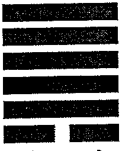

Lấy Phụ mẫu làm Dụng thần. Thế hào là người mua nhà, ứng hào là người bán nhà. Dụng thần lâm thế, lâm nguyệt, nhật thần sinh phù, ứng lại sinh thế vậy nhà có thể mua thành công. Nhưng quẻ nội phản ngâm, đối phương lại đổi ý.

Anh ta trả tiền nhưng về sau đối phương đổi ý, giao chìa khoá rồi lại đòi về, ngay cả tiền mua nhà cũng mãi không chịu hoàn lại. Năm Kỷ Mão trả nhà, năm Canh Thìn đòi tiền mấy chục lần mới được, chính là ứng Thìn thổ hợp mất Huynh đệ Dậu kim, Thê tài không còn bị khắc mới đòi được.

### Phục ngâm

Cái gọi là phục ngâm là chỉ hào trong quẻ phát động biến ra hào giống với hào động. Như Càn biến Chấn, Thiên Phong Cấu biến Lôi Phong Hằng. Phục ngâm cũng đa phần chủ không tốt. Biểu thị sự vật trì trệ không tiến, con người nội tâm thống khổ, việc làm tiến triển chậm chạp, cát hung lấy Dụng thần suy vượng làm chủ, phục ngâm chỉ là phụ họa Dụng thần để đoán.

### Ví dụ 1: ngày Ất Dậu tháng Mùi, một người phụ nữ xem khi nào có thể kết hôn, được quẻ Bát Thuần Càn biến Hỏa Lôi Phệ Hạp.

| CHÍNH QUÁI | BIẾN QUÁI |
| :---: | :---: |
| **BÁT THUẦN CÀN** | **HỎA LÔI PHỆ HẠP** |

| Hào | T/Ư | Lục Thân | Chi | Phục | TK | Lục Thân | Chi | TK | Lục Thú | Hào |
| :---: | :---: | :---: | :---: | :---: | :---: | :---: | :---: | :---: | :---: | :---: |
| —— | Thế | Phụ Mẫu | Tuất-Thổ | | | Quan Quỷ | Tị-Hỏa | | Huyền Vũ | —— |
| —— | O | Huynh Đệ | Thân-Kim | | | Phụ Mẫu | Mùi-Thổ | | Bạch Hổ | -- -- |
| —— | | Quan Quỷ | Ngọ-Hỏa | | | Huynh Đệ | Dậu-Kim | | Đằng Xà | —— |
| —— | Ứng (O) | Phụ Mẫu | Thìn-Thổ | | | Phụ Mẫu | Thìn-Thổ | | Câu Trần | -- -- |
| —— | O | Thê Tài | Dần-Mộc | | | Thê Tài | Dần-Mộc | | Chu Tước | -- -- |
| —— | | Tử Tôn | Tý-Thủy | | | Tử Tôn | Tý-Thủy | | Thanh Long | —— |

Lấy Quan quỷ làm Dụng thần. Quan quỷ Ngọ hỏa tuy được Nguyệt hợp là có khí, nhưng không được nhật nguyệt sinh phù, lại lâm không vong, quẻ nội phục ngâm, kỳ ngộ kết hôn rất ít, vì thế thống khổ phi thường. Chủ quẻ lục xung, tâm tình không thể bình tĩnh. Cả đời khó có nhân duyên tốt.

Dự đoán đến đây dừng lại, đã ba mươi chín tuổi vẫn là lẻ loi một mình.

---

# CHƯƠNG MƯỜI TÁM
## QUẺ DU HỒN, QUY HỒN

### Du hồn quẻ

Du hồn quẻ là chỉ quẻ thứ bảy mỗi cung. Trong sáu mươi bốn quẻ, du hồn quẻ có Hỏa Địa Tấn, Thủy Thiên Nhu, Trạch Phong Đại Quá, Sơn Lôi Di, Địa Hỏa Minh Di, Thiên Thủy Tụng, Phong Trạch Trung Phu, Lôi Sơn Tiểu Quá.

Du hồn quẻ không thể chủ sự tình thành bại cát hung khi dự đoán mà chỉ phụ họa Dụng thần, dùng để rút ra tin tức, thêm đôi chút vào phán đoán. Nếu như dùng đến xảo diệu có thể khiến dự đoán đạt tới chiều sâu nhất định, thường xuất hiện kết luận kinh người. Du hồn quẻ đa phần chủ sự vật ở vào trạng thái không ổn định, người thì tâm thần không yên, trạng thái tinh thần không tốt, ngẩn người, mất hồn mất vía, hướng ra phía ngoài, tách rời.

**Ví dụ 1:** ngày Giáp Tuất tháng Tý, một người đàn ông xem bệnh được quẻ Thủy Thiên Nhu biến Trạch Thiên Quải.

**CHÍNH QUÁI**
**THỦY THIÊN NHU**

**BIẾN QUÁI**
**TRẠCH THIÊN QUẢI**

| Hào | T/Ư | Lục Thân | Chi | Phục | TK | Lục Thân | Chi | TK | Lục Thù | Hào |
| :---: | :---: | :---: | :---: | :---: | :---: | :---: | :---: | :---: | :---: | :---: |
| - - | | Thê Tài | Tý-Thủy | | | Huynh Đệ | Mùi-Thổ | | Huyền Vũ | - - |
| — | | Huynh Đệ | Tuất-Thổ | | | Tử Tôn | Dậu-Kim | | Bạch Hổ | — |
| - - | Thế | Tử Tôn | Thân-Kim | | | Thê Tài | Hợi-Thủy | | Đằng Xà | — |
| — | | Huynh Đệ | Thìn-Thổ | | | Huynh Đệ | Thìn-Thổ | | Câu Trần | — |
| — | | Quan Quỷ | Dần-Mộc | Phụ-Tỵ | | Quan Quỷ | Dần-Mộc | | Chu Tước | — |
| — | Ứng | Thê Tài | Tý-Thủy | | | Thê Tài | Tý-Thủy | | Thanh Long | — |

**TUẦN KHÔNG: Thân, Dậu**

Xem bệnh lấy thế hào làm Dụng thần, Tử tôn trì thế được nhật thần sinh phù, lại gặp tuần không, bệnh gần gặp không thì khỏi bệnh. Thế hào gặp không, lại gặp du hồn quẻ, tâm thần không yên, tâm phiền ý loạn, không có tinh thần.

Thế hào phát động hóa Thê tài Hợi Thủy, tiết khí của thế hào, Thê tài chủ cứt đái, có tượng tiêu chảy, hào ba nguyên thần lại là hào vị dạ dày, thế lâm không không nhận sinh, cũng là có tin tức về tiêu chảy. Trong quẻ ngũ hành thiếu hỏa, phục dưới hào hai Quan quỷ Dần mộc, lâm Chu Tước lại mộ tại nhật thần, hỏa là chứng viêm, hẳn là tam tiêu mất cân đối, hỏa phục thể nội mà không xuất được. Hào năm Huynh đệ Tuất thổ là Hỏa khố, thổ là cái mũi, lâm Bạch Hổ, Bạch Hổ chủ máu, thế hào không mà không được Tuất thổ chi sinh, tất có hiện tượng chảy máu mũi, Thê tài cũng chủ máu, từ thế hào hóa xuất tiết thế hào chi khí là có tượng đổ máu. Ngày Dần thế hào gặp xung, xung không thì thực, bệnh sẽ khỏi.

Người này quả nhiên vì phát hỏa mà chảy máu mũi, tới bệnh viện khám, bác sĩ kê đơn dùng Tam hoàng phiến. Nhưng sau khi dùng thuốc lại bị tiêu chảy, toàn thân như nhũn ra, không có tinh thần. Ta đề nghị dùng cam thảo, ngày Dần lành bệnh.

**Ví dụ 2:** ngày Ất Hợi tháng Mão, một phụ nữ xem công việc, được quẻ Sơn Lôi Di biến Phong Lôi Ích.

**CHÍNH QUÁI**
**SƠN LÔI DI**

**BIẾN QUÁI**
**PHONG LÔI ÍCH**

| Hào | T/Ư | Lục Thân | Chi | Phục | TK | Lục Thân | Chi | TK | Lục Thù | Hào |
| :---: | :---: | :---: | :---: | :---: | :---: | :---: | :---: | :---: | :---: | :---: |
| — | | Huynh Đệ | Dần-Mộc | | | Huynh Đệ | Mão-Mộc | | Huyền Vũ | — |
| - - | | Phụ Mẫu | Tý-Thủy | Tử-Tỵ | | Tử Tôn | Tị-Hỏa | | Bạch Hổ | — |
| - - | Thế | Thê Tài | Tuất-Thổ | | | Thê Tài | Mùi-Thổ | | Đằng Xà | - - |
| - - | | Thê Tài | Thìn-Thổ | Quan-Dậu | | Thê Tài | Thìn-Thổ | | Câu Trần | - - |
| - - | | Huynh Đệ | Dần-Mộc | | | Huynh Đệ | Dần-Mộc | | Chu Tước | - - |
| — | Ứng | Phụ Mẫu | Tý-Thủy | | | Phụ Mẫu | Tý-Thủy | | Thanh Long | — |

**TUẦN KHÔNG: Thân, Dậu**

Lấy Quan quỷ làm Dụng thần. Quan quỷ Dậu kim không xuất hiện trong quẻ, phục dưới hào ba Thê tài Thìn thổ, lâm không lại bị nguyệt kiến xung phá, lại không được nhật thần sinh phù, phi thường yếu. Trong quẻ chỉ có một hào động, là tử địa của Quan quỷ, công việc không có tiến triển. Thế hào sinh Quan quỷ, yên tĩnh bất động lại bị Nguyệt khắc, bất lực sinh Dụng thần, chính là bản thân mình không có năng lực thay đổi cục diện bất lợi.

Hào năm là hào vị cấp trên, phát động trong quẻ, chính là cấp trên sẽ biến động. Thế hào lâm Xà, Đằng Xà là tượng bất an, cấp trên biến động sẽ khiến cô ta bất an. Chủ quẻ là quẻ du hồn, mình không có tâm trí nào làm việc. Quan quỷ không phá, mất đi khả năng công tác.

Quả thật là cấp trên biến động, lãnh đạo mới tới không thích nàng, cho nghỉ.

## Quẻ Quy hồn

Quẻ Quy hồn là chỉ quẻ thứ tám của mỗi cung cũng tức là quẻ cuối cùng. Trong sáu mươi bốn quẻ, quẻ quy hồn có Hỏa Thiên Đại Hữu, Thủy Địa Tỉ, Trạch Lôi Tùy, Sơn Phong Cổ, Địa Thủy Sư, Thiên Hỏa Đồng Nhân, Phong Sơn Tiệm, Lôi Trạch Quy Muội.

Quẻ Quy hồn và quẻ du hồn tương phản, là yên ổn, bảo thủ, về nhà, ở nhà, ra không được, thức tỉnh. Cũng không thể đơn độc dùng quẻ Quy hồn để phán đoán, nhất định phải kết hợp với Dụng thần cát hung để xem. Căn cứ vấn đề khác nhau mà cần linh hoạt khi phán đoán.

**Ví dụ 1:** ngày Đinh Sửu tháng Tý, một người đàn ông xem xuất ngoại, được quẻ Hỏa Thiên Đại Hữu biến Sơn Trạch Tổn.

| HỎA THIÊN ĐẠI HỮU | | | | | | SƠN TRẠCH TỔN | | | | |
|---|---|---|---|---|---|---|---|---|---|---|
| Hào | T/Ư | Lục Thân | Chi | Phục | TK | Lục Thân | Chi | TK | Lục Thú | Hào |
| --- | Ứng | Quan Quỷ | Tị-Hỏa | | | Thê Tài | Dần-Mộc | | Thanh Long | --- |
| - - | | Phụ Mẫu | Mùi-Thổ | | | Tử Tôn | Tý-Thủy | | Huyền Vũ | - - |
| --- | O | Huynh Đệ | Dậu-Kim | | | Phụ Mẫu | Tuất-Thổ | | Bạch Hổ | - - |
| --- | Thế O | Phụ Mẫu | Thìn-Thổ | | | Phụ Mẫu | Sửu-Thổ | | Đằng Xà | - - |
| --- | | Thê Tài | Dần-Mộc | | | Thê Tài | Mão-Mộc | | Câu Trần | --- |
| --- | | Tử Tôn | Tý-Thủy | | | Quan Quỷ | Tị-Hỏa | | Chu Tước | --- |

**TUẦN KHÔNG: Thân, Dậu**

Phụ mẫu chủ văn thư, là visa, lấy Phụ mẫu làm Dụng thần, Quan quỷ là nơi phê duyệt visa, Phụ mẫu lưỡng hiện, lấy hào Phụ mẫu Thìn thổ phát động là Dụng thần. Thế hào là bản thân người xem, ứng hào là nơi đến.

Phụ mẫu trì thế phát động, vốn là xin được visa xuất ngoại, nhưng động mà hóa thoái, là lại bị bác bỏ, đi không được. Phụ mẫu Thìn thổ hào Dậu kim tuần không tương hợp, visa bị giữ lại. Chủ quẻ lại là quẻ quy hồn, quy hồn không xuất gia, rất khó xuất ngoại.

Người này xin visa không được nên không đi được.

**Ví dụ 2:** ngày Nhâm Tý tháng Sửu, một người đàn ông xem có được điều từ đơn vị cấp dưới ở quê lên đơn vị cấp trên ở thành phố làm việc hay không? Được quẻ Địa Phong Thăng biến Sơn Phong Cổ.

| ĐỊA PHONG THĂNG | | | | | | SƠN PHONG CỔ | | | | |
|---|---|---|---|---|---|---|---|---|---|---|
| Hào | T/Ư | Lục Thân | Chi | Phục | TK | Lục Thân | Chi | TK | Lục Thú | Hào |
| - - | -> | Quan Quỷ | Dậu-Kim | | | Huynh Đệ | Dần-Mộc | | Bạch Hổ | --- |
| - - | | Phụ Mẫu | Hợi-Thủy | | | Phụ Mẫu | Tý-Thủy | | Đằng Xà | - - |
| - - | Thế | Thê Tài | Sửu-Thổ | Tử-Ngọ | | Thê Tài | Tuất-Thổ | | Câu Trần | - - |
| --- | | Quan Quỷ | Dậu-Kim | | | Quan Quỷ | Dậu-Kim | | Chu Tước | --- |
| --- | | Phụ Mẫu | Hợi-Thủy | Huynh-Dần | | Phụ Mẫu | Hợi-Thủy | | Thanh Long | --- |
| - - | Ứng | Thê Tài | Sửu-Thổ | | | Thê Tài | Sửu-Thổ | | Huyền Vũ | - - |

**TUẦN KHÔNG: Dần, Mão**

Lấy Quan quỷ làm Dụng thần. Trong quẻ Quan quỷ lưỡng hiện, lấy hào Quan quỷ Dậu kim phát động làm Dụng thần. Quan quỷ phát động, chính là tin tức muốn thay đổi công việc. Dụng thần được Nguyệt sinh phù, không tính hưu tù, nhưng động hóa không, hóa tuyệt, lại hóa nhập quẻ quy hồn là không tốt. Quy hồn không xuất gia, rất khó rời khỏi quê quán. quê quán là địa phương xa xôi, Dụng thần lâm hào sáu, hào sáu là nơi xa, nhập mộ tại Nguyệt, công việc tại đơn vị cấp dưới không động được, rất khó thay đổi công việc.

Cuối cùng không chuyển được.

---

# CHƯƠNG MƯỜI CHÍN
## TÁC DỤNG CỦA HÀO VỊ

Hào vị (vị trí các hào) trong Lục hào có tác dụng vô cùng trọng yếu, nó là một trong các căn cứ để phán đoán tính chất, nguyên nhân, phương vị, bộ vị sự vật, sự việc. Lục hào dự đoán thuật sở dĩ khác với các phương pháp dự đoán khác cũng là môn dự đoán này giao phó cho mỗi hào vị một hàm nghĩa đặc biệt, khiến cho nó trở thành đặc biệt, là thuật dự đoán duy nhất rút ra tin tức từ hào vị. Hào vị dùng khi xem bệnh sẽ đem hào vị xem như một cơ thể, "Quét hình" nó, căn cứ hào vị, kết hợp ngũ hành, lục thân, lục thần mà phán đoán bệnh tật. Nếu như phán đoán tướng mạo, vẻ ngoài, cũng có thể phỏng theo phương pháp xem bệnh mà xem một người từ trên xuống dưới, tiến hành phán đoán. Nếu như phán đoán cục bộ, lại có thể đem sáu hào vị xem như một phần cục bộ của cơ thể, tương đương với việc phóng đại cái bộ phận đó lên để phán đoán. Nếu như phán đoán phong thuỷ, lại có thể đem sáu hào nhìn thành một bản đồ bố cục nhà cửa. Đây cũng là lý do Lục hào có thể phán đoán được rất nhiều vấn đề rộng lớn. Dưới đây đưa ra các hàm nghĩa của hào vị trong Lục hào đã được quy nạp ứng nghiệm nêu ra như sau:

### Hàm nghĩa của Sơ hào:

***Nhân vật:*** Dân chúng, thị dân, học sinh tiểu học, hài tử, nô lệ, dân chúng, viên chức, nhân viên tạm thời, bộ hạ, khoa viên.

***Cơ thể:*** Chân, bệnh phù chân, gót chân, cổ chân, ngón chân.

***Nơi chốn:*** Nông thôn, nhà trẻ, giếng nước, nền nhà, cống rãnh, dòng sông, cầu, hàng xóm.

***Trang phục:*** Giày, bít tất.

### Hàm nghĩa của hào hai:

***Nhân vật:*** Khoa trưởng, người phụ trách phòng, trưởng phòng, công chức, vợ chồng, thai nhi.

***Cơ thể:*** Chân, đầu gối, hậu môn, bộ phận sinh dục, bàng quang, đại tràng, trực tràng, tử cung, gan mật.

***Nơi chốn:*** Thị trấn, cộng đồng, nhà, phòng ở, phòng bếp, viện tử, gian phòng, nhà mẹ đẻ.

***Trang phục:*** Quần, cái bao đầu gối, quần đùi.

### Hàm nghĩa của hào ba:

***Nhân vật:*** Trưởng phòng, Phó sảnh trưởng, chủ nhiệm, xưởng trưởng, học sinh trung học, anh chị em.

***Cơ thể:*** Eo, rốn, phần bụng, mông, tỳ vị, gan mật, thận, bàng quang, tử cung.

***Nơi chốn:*** Chính phủ, thành phố, thành thị, cửa, giường, phòng ngủ, gian giữa.

***Tràng phục:*** Đồ lót, váy, tạp dề.

### Hàm nghĩa hào bốn:

***Nhân vật:*** Thị trưởng, Sở trưởng, trưởng phòng, trợ lý, nhân sự lãnh đạo, học sinh cấp ba, mẹ, chú, thím, cậu.

***Cơ thể:*** Ngực, lưng, nhũ phòng, tim, tỳ vị, phổi, thận, bả vai.

***Nơi chốn:*** Đại môn, cửa sổ, nhà vệ sinh, phòng vệ sinh, thành phố lớn, tỉnh chính phủ, trường trung học.

***Trang phục:*** Áo, nội y, trang phục, áo lót.

### Hàm nghĩa hào năm

***Nhân vật:*** Thủ tướng, chủ tịch, thủ tướng, lãnh đạo, quản lý, cấp trên, gia trưởng, đế vương, nhân khẩu.

***Cơ thể:*** Ngũ quan, cổ, cánh tay, ngực, lưng, tay, phổi, cổ họng, tim, khí quản, thực quản, lồng ngực.

***Nơi chốn:*** Con đường, thủ đô, đại học nhất lưu, trung tâm, lữ điếm.

***Trang phục:*** Áo ngoài, áo ngực, khăn quàng cổ, kính mắt, khẩu trang, trang sức.

### Hàm nghĩa hào sáu:

***Nhân vật:*** nhân viên về hưu, lão nhân, tổ tiên, thần, phật, thiên sứ.

***Cơ thể:*** Đầu, tóc, bộ mặt, gương mặt, hai tóc mai, đại não, thần kinh não, đầu lâu, xương đầu, bả vai.

***Nơi chốn:*** Nước ngoài, biên cảnh, phương xa, tông miếu, từ đường, lương đống, vách tường, nóc nhà, hàng xóm, mộ tổ.

***Trang phục:*** Khăn trùm đầu, mũ, khăn cô dâu, đồ trang sức, kẹp tóc.

Hàm nghĩa hào vị còn có rất nhiều, đối với người mới học mà nói, có thể linh hoạt ứng dụng các hàm nghĩa hào vị như trên đã đủ rồi. Mặc dù ở đây giảng thuật cách dùng hào vị, nhưng có một chút thiết yếu cần nhớ kỹ, Lục hào dự đoán là quay chung quanh Dụng thần để phán đoán, ngàn vạn không thể bỏ qua Dụng thần mà chỉ dùng hào vị phán đoán, nếu là như vậy, dự đoán liền sẽ không nắm bắt được yếu điểm, chệch hướng chính đạo. Hào vị dự đoán bệnh tật cùng phong thủy được sử dụng rất rộng, nhất định phải quen thuộc mới được.

**Ví dụ 1:** ngày Giáp Thân tháng Ngọ, một người phụ nữ xem bệnh của tổ mẫu được được quẻ Thủy Địa Tỉ.

**THỦY ĐỊA TỶ (CHÍNH QUÁI)** | **THỦY ĐỊA TỶ (BIẾN QUÁI)**

| Hào | T/Ư | Lục Thân | Chi | Phục | TK | Lục Thân | Chi | TK | Lục Thú | Hào |
| :---: | :---: | :--- | :--- | :---: | :---: | :--- | :--- | :---: | :--- | :---: |
| - - | Ứng | Thê Tài | Tý-Thủy | | | Thê Tài | Tý-Thủy | | Huyền Vũ | - - |
| — | | Huynh Đệ | Tuất-Thổ | | | Huynh Đệ | Tuất-Thổ | | Bạch Hổ | — |
| - - | | Tử Tôn | Thân-Kim | | | Tử Tôn | Thân-Kim | | Đằng Xà | - - |
| - - | Thế | Quan Quỷ | Mão-Mộc | | | Quan Quỷ | Mão-Mộc | | Câu Trần | - - |
| - - | | Phụ Mẫu | Tị-Hỏa | | | Phụ Mẫu | Tị-Hỏa | | Chu Tước | - - |
| - - | | Huynh Đệ | Mùi-Thổ | | | Huynh Đệ | Mùi-Thổ | | Thanh Long | - - |

Lấy Phụ mẫu làm Dụng thần, Dụng thần tỷ hòa với nguyệt là vượng tướng, nhưng nguyên thần tại hào ba bị nhật khắc thương, đây là chỗ bệnh tật. Quẻ tại Khôn cung, Khôn là bụng, Quan quỷ cư hào ba lâm Câu Trần, hào ba là bụng, Câu Trần

 chủ sưng, cho nên là bệnh trướng bụng. Quỷ mộc lâm Câu Trần, vì sửa chữa và chế tạo mà nhiễm bệnh, hào ba là cửa, vì đổi cửa mà nhiễm bệnh. Quả như chỗ xem.

**Ví dụ 2:** ngày Giáp Thân tháng Kỷ Tị năm Giáp Thân, một người đàn ông xem phá phòng cũ xây lại có ổn không? Được quẻ Sơn Trạch Tổn biến Địa Thủy Sư.

Thời gian lập quẻ: 18:41:1 - 5/5/2004 (giờ Dậu, ngày 1/4/2004 Lịch tiết khí)
Can Chi: Giờ Quý Dậu, ngày Giáp Thân, tháng Kỷ Tỵ, năm Giáp Thân
Tiết khí: Lập hạ        Lệnh tháng: Tỵ-Hỏa
Phương pháp lập quẻ: Lục hào

**CHÍNH QUÁI: SƠN TRẠCH TỔN** — **BIẾN QUÁI: ĐỊA THỦY SƯ**

| Hào | T/Ư | Lục Thân | Chi | Phục | TK | Lục Thân | Chi | TK | Lục Thú | Hào |
| :---: | :---: | :--- | :--- | :---: | :---: | :--- | :--- | :---: | :--- | :---: |
| — | Ứng | Quan Quỷ | Dần-Mộc | | | Tử Tôn | Dậu-Kim | | Huyền Vũ | - - |
| - - | | Thê Tài | Tý-Thủy | | | Thê Tài | Hợi-Thủy | | Bạch Hổ | - - |
| - - | | Huynh Đệ | Tuất-Thổ | | | Huynh Đệ | Sửu-Thổ | | Đằng Xà | - - |
| - - | Thế | Huynh Đệ | Sửu-Thổ | Tử-Thân | | Phụ Mẫu | Ngọ-Hỏa | K | Câu Trần | — |
| — | | Quan Quỷ | Mão-Mộc | | | Huynh Đệ | Thìn-Thổ | | Chu Tước | - - |
| — | | Phụ Mẫu | Tị-Hỏa | | | Quan Quỷ | Dần-Mộc | | Thanh Long | - - |

| Hào | Quái thần | Lộc | Mã | Quý | Đào | V-S | Hào | Lộc | Mã | Quý | Đào | V-S |
| :--- | :---: | :---: | :---: | :---: | :---: | :--- | :--- | :---: | :---: | :---: | :---: | :--- |
| Dần | - | L | M | - | - | Hưu | Dậu | - | - | - | Đ | Tử |
| Tý | - | - | - | Q | - | Tù | Hợi | - | - | - | - | Tù |
| Tuất | - | - | - | - | - | Tướng | Sửu | - | - | Q | - | Tướng |
| Sửu | - | - | - | Q | - | Tướng | Ngọ | - | - | - | - | Vượng |
| Mão | - | L | - | - | - | Hưu | Thìn | - | - | - | - | Tướng |
| Tị | - | - | - | - | - | Vượng | Dần | L | M | - | - | Hưu |

Lấy Phụ mẫu làm Dụng thần. Phụ mẫu phát động sinh thế hào, phòng ở phong thuỷ tốt. Phụ mẫu được nguyệt đỡ, lại động hóa hồi đầu sinh là vượng, lâm Thanh Long, Thanh Long chủ mới, vượng tướng cũng là mới, chính là mới xây không lâu. Phụ mẫu Tị hỏa cùng nhật tương hợp, hợp chờ xung, đối ứng tại năm 1995 Ất Hợi, đoán xây năm 1995.

Hào sáu Quan quỷ Dần mộc là nguyên thần, động hóa hồi đầu khắc, lại bị nhật thần xung khắc, hào sáu là vách tường, chính là vách tường có chút nghiêng. Lâm

Huyền Vũ, Huyền Vũ chủ âm u, ẩm ướt, nói rõ vách tường có chút ẩm ướt. Ứng là hàng xóm, hào sáu cũng là hàng xóm, là do nhà hàng xóm gây ra. Thê tài Tý thủy được nhật trường sinh, tương hợp thế hào, nhà này phong thuỷ vô cùng tốt, lợi tài vận, năm Nhâm Ngọ xung hào tài, năm Quý Mùi xung thế hào, hợp chờ xung, hai năm này tài vận cực tốt.

Hết thảy quả như dự đoán.

**Ví dụ 3:** ngày Mậu Thìn tháng Thân, ta đến Hà Bắc khảo sát, phó hội trưởng hội Kinh dịch học nơi đó Vương Kim Vũ tiên sinh muốn gặp một lần, ta sảng khoái đáp ứng. Sau khi nói chuyện phiếm, Vương Kim Vũ tiên sinh gieo một quẻ nhờ xem phong thuỷ, được quẻ Trạch Phong Đại Quá biến Lôi Trạch Quy Muội.

| TRẠCH PHONG ĐẠI QUÁ | | | | | | LÔI TRẠCH QUY MUỘI | | | | |
|---|---|---|---|---|---|---|---|---|---|---|
| Hào | T/Ư | Lục Thân | Chi | Phục | TK | Lục Thân | Chi | TK | Lục Thú | Hào |
| - - | | Thê Tài | Mùi-Thổ | | | Thê Tài | Tuất-Thổ | | Chu Tước | - - |
| --- | O | Quan Quỷ | Dậu-Kim | | | Quan Quỷ | Thân-Kim | | Thanh Long | - - |
| --- | Thế O | Phụ Mẫu | Hợi-Thủy | Tử-Ngọ | | Tử Tôn | Ngọ-Hỏa | | Huyền Vũ | --- |
| --- | | Quan Quỷ | Dậu-Kim | | | Thê Tài | Sửu-Thổ | | Bạch Hổ | - - |
| --- | | Phụ Mẫu | Hợi-Thủy | Huynh-Dần | | Huynh Đệ | Mão-Mộc | | Đằng Xà | --- |
| - - | Ứng | Thê Tài | Sửu-Thổ | | | Tử Tôn | Tị-Hỏa | | Câu Trần | --- |

**TUẦN KHÔNG: Tuất, Hợi**

Ta nói: Nhà của ông rất lớn, nhưng người ở không nhiều, trong nhà trống rỗng. Lúc mua phải vay mượn thêm, đến bây giờ còn chưa trả hết nợ. Mà sổ đỏ cũng chưa làm được. Công việc của ông ở cơ quan cực thuận buồm xuôi gió, thuận lợi. Nhưng không có vận làm quan, bất quá lãnh đạo đối xử rất tốt, rất chiếu cố, đáng tiếc người lãnh đạo này bị điều đi. Lãnh đạo đơn vị ông phong lưu háo sắc, có quan hệ với vài người phụ nữ. Ông ngoài lương còn có thu nhập khác, có nhiều khoản vặt nhưng không có khoản lớn. Vợ ông sức khỏe không tốt, trên đùi có bệnh. Vợ ông ta ở bên cạnh tấm tắc lấy làm kỳ lạ, nói chưa từng thấy ai đoán chính xác như thế.

Quẻ này giải như sau: Lấy Phụ mẫu làm Dụng thần, xem thêm hào hai. Hào hai Phụ mẫu Hợi Thủy được nguyệt kiến sinh phù, hào năm quan động sinh, quẻ nội

Tị Dậu Sửu tam hợp quan cục lại sinh phù, mười phần vượng tướng, vượng thì làm lớn, cho nên đoán nhà rất lớn. Nhưng không vong, hào năm là hào vị người, hào hai lâm không không nhận hào năm sinh, cho nên trong nhà ít người, trống rỗng. Phụ mẫu Hợi Thủy trì thế, chính là nhà là của mình. Phụ mẫu cũng chủ thủ tục, giấy tờ, không vong, thủ tục chưa xử lý xong, cho nên sổ đỏ chưa có. Thế hào nhập mộ tại nhật thần, nhật thần là tài, chính là thông tin tiền vây khốn. Thế lâm Phụ mẫu nhập mộ, Phụ mẫu chủ nhà ở, hẳn là vì nhà ở mà bị khốn tại tài, nhật là trước mắt, cho nên đoán mua nhà có vay tiền, đến bây giờ còn chưa trả hết nợ. Quan quỷ là công việc, quẻ nội Tị Dậu Sửu tam hợp quan cục sinh thế hào, công việc rất thuận buồm xuôi gió. Nhưng thế hào không vong, được Quan quỷ sinh nhưng lực nhỏ, cho nên Quan quỷ chỉ đại biểu công việc, không có nghĩa là vận làm quan, đoán không có vận làm quan. Hào năm là hào vị lãnh đạo, động mà sinh thế, đơn vị có lãnh đạo đối xử rất tốt với anh ta, chiếu cố cho anh ta. Nhưng hào năm Quan quỷ động mà hóa thoái, chính là tượng lãnh đạo rời đi, cho nên đoán lãnh đạo đối tốt với ông ta có thể điều chuyển. Hào năm Quan quỷ Dậu kim là đào hoa, lâm Thanh Long, Thanh Long chủ tửu sắc, cùng Nhật thần là tài tinh tương hợp, nhập mộ tại sơ hào Thê tài Sửu thổ, cho nên phong lưu háo sắc, có mấy nữ nhân tình. Trong quẻ hào tài hiện nhiều khắc thế, đoán ông ta ngoài tiền lương còn có thu nhập khác.

Ứng là thê vị, Thê tài cũng chủ vợ, ứng lâm Thê tài Sửu thổ tức là vợ ông ta. Thê tài Sửu thổ là mộ khố của Quan quỷ, Quan quỷ là bệnh, là sức khỏe của vợ không tốt, có bệnh. Sơ hào là chân, tại Chấn cung cũng là chân, cho nên đoán vợ ông ta có bệnh ở đùi.

---

# CHƯƠNG HAI MƯƠI
## ỨNG KỲ

Cái gọi là ứng kỳ là chỉ thời gian phát sinh cát hung của sự việc sự vật được dự đoán. Ứng kỳ chia làm hai loại, một loại là ứng kỳ quá khứ, một loại là ứng kỳ tương lai. Tỉ như nói dự đoán hôn nhân, phán đoán thời gian kết hôn của người đến xem hay là thời gian phát sinh yêu đương là ứng kỳ quá khứ. Khi dự đoán bệnh tật, phán đoán thời gian nhiễm bệnh cũng là ứng kỳ quá khứ. Phán đoán thời gian phát sinh của sự việc, sự vật trong tương lai, liền là ứng kỳ tương lai.

Xem được chuẩn xác thời gian phát sinh sự tình sẽ khiến người đến xem rất tin tưởng. Đây cũng là điều kiện để có thể hóa giải xu cát tị hung.

Ứng kỳ là một điều rất khó khi dự đoán, nhưng đại bộ phận lại có thể tìm ra quy luật. Ứng kỳ xa gần, phải căn cứ việc cần xem để phán đoán linh hoạt, xa thì lấy năm, tháng mà đoán, gần thì lấy ngày, giờ để đoán.

***Phán đoán ứng kỳ thường có các quy luật như sau:***

**Một, Dụng thần yên tĩnh, lấy địa chi của Dụng thần đại biểu năm, tháng, ngày, giờ làm ứng kỳ, hoặc lấy địa chi xung Dụng thần làm ứng kỳ.**

**Ví dụ 1:** ngày Ất Hợi tháng Hợi, một ông lão tự xem bệnh, được quẻ Phong Hỏa Gia Nhân biến Phong Sơn Tiệm.

**CHÍNH QUÁI: PHONG HỎA GIA NHÂN** — **BIẾN QUÁI: PHONG SƠN TIỆM**

| Hào | T/Ư | Lục Thân | Chi | Phục | TK | Lục Thân | Chi | TK | Lục Thú | Hào |
| :---: | :---: | :--- | :--- | :---: | :---: | :--- | :--- | :---: | :--- | :---: |
| — | | Huynh Đệ | Mão-Mộc | | | Huynh Đệ | Mão-Mộc | | Huyền Vũ | — |
| — | Ứng | Tử Tôn | Tị-Hỏa | | | Tử Tôn | Tị-Hỏa | | Bạch Hổ | — |
| - - | | Thê Tài | Mùi-Thổ | | | Thê Tài | Mùi-Thổ | | Đằng Xà | - - |
| — | | Phụ Mẫu | Hợi-Thủy | Quan-Dậu | | Quan Quỷ | Thân-Kim | | Câu Trần | — |
| - - | Thế | Thê Tài | Sửu-Thổ | | | Tử Tôn | Ngọ-Hỏa | | Chu Tước | - - |
| — | O | Huynh Đệ | Mão-Mộc | | | Thê Tài | Thìn-Thổ | | Thanh Long | - - |

Lấy thế làm Dụng thần, thế hào không được nhật nguyệt sinh phù, kị thần độc phát, khắc thế là hung. Dụng thần yếu mà yên tĩnh, sợ nhất xung, sau chết tại ngày Quý Mùi, chính là ứng gặp xung.

**Hai, Dụng thần phát động, lấy địa chi của Dụng thần đại biểu năm, tháng, ngày, giờ là ứng kỳ, hoặc lấy địa chi hợp Dụng thần làm ứng kỳ.**

**Ví dụ 1:** ngày Ất Hợi tháng Thìn, một người đàn ông nói có người bạn hẹn đến chơi, mấy giờ thì đến? Được quẻ Lôi Sơn Tiểu Quá biến Lôi Địa Dự.

**CHÍNH QUÁI: LÔI SƠN TIỂU QUÁ** — **BIẾN QUÁI: LÔI ĐỊA DỰ**

| Hào | T/Ư | Lục Thân | Chi | Phục | TK | Lục Thân | Chi | TK | Lục Thú | Hào |
| :---: | :---: | :--- | :--- | :---: | :---: | :--- | :--- | :---: | :--- | :---: |
| - - | | Phụ Mẫu | Tuất-Thổ | | | Phụ Mẫu | Tuất-Thổ | | Huyền Vũ | - - |
| - - | | Huynh Đệ | Thân-Kim | | | Huynh Đệ | Thân-Kim | | Bạch Hổ | - - |
| — | Thế | Quan Quỷ | Ngọ-Hỏa | Tử-Hợi | | Quan Quỷ | Ngọ-Hỏa | | Đằng Xà | — |
| — | O | Huynh Đệ | Thân-Kim | | | Thê Tài | Mão-Mộc | | Câu Trần | — |
| - - | | Quan Quỷ | Ngọ-Hỏa | Tài-Mão | | Quan Quỷ | Tị-Hỏa | | Chu Tước | - - |
| - - | Ứng | Phụ Mẫu | Thìn-Thổ | | | Phụ Mẫu | Mùi-Thổ | | Thanh Long | - - |

**TUẦN KHÔNG: Thân, Dậu**

Lấy Huynh đệ là Dụng thần. Dụng thần lưỡng hiện, lấy Huynh đệ Thân kim phát động làm dụng. Động cần gặp trị, gặp hợp, lại vì không vong nên ứng thực không, giờ Thân đến. Quả là đến vào giờ Thân.

**Ba, Dụng thần hoặc kị thần quá vượng, căn cứ cát hung tình huống, ứng kỳ phán đoán cũng không giống. Dụng thần quá vượng, đoán là tốt thì lấy Dụng thần nhập mộ là ứng kỳ; đoán xấu thì lấy sinh Dụng thần là ứng kỳ. Kị thần vượng thì tương phản. Kị thần nhập mộ hoặc bị khắc là xấu, được sinh ngược lại là tốt.**

> ***Chú thích của Dịch giả:*** Đây là dựa theo thuyết vật cực tắc phản để định ra ứng kỳ.

**Ví dụ 1:** ngày Ất Mão tháng Mão, một phụ nữ xem bệnh của bố được quẻ Thủy Thiên Nhu biến Địa Lôi Phục.

**CHÍNH QUÁI: THỦY THIÊN NHU**
**BIẾN QUÁI: ĐỊA LÔI PHỤC**

| Hào | T/Ư | Lục Thân | Chi | Phục | TK | Lục Thân | Chi | TK | Lục Thú | Hào |
| :---: | :---: | :--- | :--- | :--- | :---: | :--- | :--- | :---: | :--- | :---: |
| - - | | Thê Tài | Tý-Thủy | | | Tử Tôn | Dậu-Kim | | Huyền Vũ | - - |
| — O | | Huynh Đệ | Tuất-Thổ | | | Thê Tài | Hợi-Thủy | | Bạch Hổ | - - |
| - - | Thế | Tử Tôn | Thân-Kim | | | Huynh Đệ | Sửu-Thổ | | Đằng Xà | - - |
| — O | | Huynh Đệ | Thìn-Thổ | | | Huynh Đệ | Thìn-Thổ | | Câu Trần | - - |
| — O | | Quan Quỷ | Dần-Mộc | Phụ-Tỵ | | Quan Quỷ | Dần-Mộc | | Chu Tước | - - |
| - - | Ứng | Thê Tài | Tý-Thủy | | | Thê Tài | Tý-Thủy | | Thanh Long | — |

Lấy Phụ mẫu làm Dụng thần, nhật nguyệt sinh Dụng thần, phi thần lại động sinh Dụng thần, Dụng thần có sinh không khắc, Dụng thần quá vượng, chết tại ngày Đinh Mão, chính là Dụng thần quá vượng phùng sinh mà hung.

**Ví dụ 2**: ngày Kỷ Mão tháng Thân, một người xem tuổi thọ, được quẻ Sơn Trạch Tổn biến Địa Lôi Phục.

**CHÍNH QUÁI: SƠN TRẠCH TỔN**
**BIẾN QUÁI: ĐỊA LÔI PHỤC**

| Hào | T/Ư | Lục Thân | Chi | Phục | TK | Lục Thân | Chi | TK | Lục Thú | Hào |
| :---: | :---: | :--- | :--- | :--- | :---: | :--- | :--- | :---: | :--- | :---: |
| — O | Ứng | Quan Quỷ | Dần-Mộc | | | Tử Tôn | Dậu-Kim | | Câu Trần | - - |
| - - | | Thê Tài | Tý-Thủy | | | Thê Tài | Hợi-Thủy | | Chu Tước | - - |
| - - | | Huynh Đệ | Tuất-Thổ | | | Huynh Đệ | Sửu-Thổ | | Thanh Long | - - |
| - - | Thế | Huynh Đệ | Sửu-Thổ | Tử-Thân | | Huynh Đệ | Thìn-Thổ | | Huyền Vũ | - - |
| — O | | Quan Quỷ | Mão-Mộc | | | Quan Quỷ | Dần-Mộc | | Bạch Hổ | - - |
| — | | Phụ Mẫu | Tị-Hỏa | | | Thê Tài | Tý-Thủy | | Đằng Xà | — |

Lấy thế hào làm Dụng thần. Thế hào không được Nguyệt sinh, bị nhật khắc thương, trong quẻ lại có hai trọng mộc động mà khắc thế, kị thần trùng điệp, đề phòng năm kị thần nhập mộ. Năm Tý xem, sau chết tại năm Mùi.

**Bốn**, nguyên thần phát động, có khi lấy địa chi của nguyên thần làm ứng kỳ, hoặc địa chi hợp với nguyên thần làm ứng kỳ, nguyên thần nguyệt phá, không vong, thì thực không, thực phá, xung không, hợp phá là ứng kỳ.

**Ví dụ 1**: ngày Nhâm Dần tháng Tuất, xem thư tín khi nào đến? Được quẻ Bát Thuần Khảm biến Bát Thuần Đoài.

**CHÍNH QUÁI: BÁT THUẦN KHẢM**
**BIẾN QUÁI: BÁT THUẦN ĐOÀI**

| Hào | T/Ư | Lục Thân | Chi | Phục | TK | Lục Thân | Chi | TK | Lục Thú | Hào |
| :---: | :---: | :--- | :--- | :--- | :---: | :--- | :--- | :---: | :--- | :---: |
| - - | Thế | Huynh Đệ | Tý-Thủy | | | Quan Quỷ | Mùi-Thổ | | Bạch Hổ | - - |
| — | | Quan Quỷ | Tuất-Thổ | | | Phụ Mẫu | Dậu-Kim | | Đằng Xà | — |
| - - | | Phụ Mẫu | Thân-Kim | | | Huynh Đệ | Hợi-Thủy | | Câu Trần | — |
| - - | Ứng | Thê Tài | Ngọ-Hỏa | | | Quan Quỷ | Sửu-Thổ | | Chu Tước | - - |
| — | | Quan Quỷ | Thìn-Thổ | | | Tử Tôn | Mão-Mộc | | Thanh Long | — |
| - - | | Tử Tôn | Dần-Mộc | | | Thê Tài | Tị-Hỏa | | Huyền Vũ | — |

TUẦN KHÔNG: Thìn, Tị

Lấy Phụ mẫu làm Dụng thần. Dụng thần được Nguyệt sinh phù là vượng, nhưng nguyên thần Quan quỷ Thìn thổ nguyệt phá, không vong, ngày Giáp Thìn xuất không, thực phá nên ngày Giáp Thìn sẽ đến. Quả là nhận được ngày Giáp Thìn.

**Năm**, kị thần phát động, thì lại lấy địa chi của kị thần là ứng kỳ, hoặc địa chi hợp kị thần là ứng kỳ.

**Ví dụ 1**: ngày Tân Tị tháng Tị, một người xem bệnh cho bố được quẻ Thủy Phong Tỉnh biến Địa Phong Thăng.

### CHÍNH QUÁI: THỦY PHONG TỈNH — BIẾN QUÁI: ĐỊA PHONG THĂNG

| Hào | T/Ư | Lục Thân | Chi | Phục | TK | Lục Thân | Chi | TK | Lục Thú | Hào |
| :---: | :---: | :--- | :--- | :--- | :---: | :--- | :--- | :---: | :--- | :---: |
| - - | | Phụ Mẫu | Tý-Thủy | | | Quan Quỷ | Dậu-Kim | | Đằng Xà | - - |
| ── | Thế O | Thê Tài | Tuất-Thổ | | | Phụ Mẫu | Hợi-Thủy | | Câu Trần | - - |
| - - | | Quan Quỷ | Thân-Kim | Tử-Ngọ | | Thê Tài | Sửu-Thổ | | Chu Tước | - - |
| ── | | Quan Quỷ | Dậu-Kim | | | Quan Quỷ | Dậu-Kim | | Thanh Long | ── |
| ── | Ứng | Phụ Mẫu | Hợi-Thủy | Huynh-Dần | | Phụ Mẫu | Hợi-Thủy | | Huyền Vũ | ── |
| - - | | Thê Tài | Sửu-Thổ | | | Thê Tài | Sửu-Thổ | | Bạch Hổ | - - |

**TUẦN KHÔNG: Thân, Dậu**

Lấy Phụ mẫu làm Dụng thần. Dụng thần Nguyệt phá nhật phá, nguyên thần lại không, kị thần phát động không tốt. Sau chết vào ngày Tuất, chính là ứng ngày trị của kị thần.

**Sáu**, Dụng thần hưu tù, gặp tuyệt, căn cứ cát hung ứng kỳ không giống. Đoán cát, lấy Dụng thần trường sinh là ứng kỳ, hoặc lấy địa chi của nguyên thần làm ứng kỳ; đoán hung, Dụng thần nhập mộ, gặp xung, bị khắc là ứng kỳ, cũng có khi Dụng thần cực suy, gặp trường sinh là hung.

**Ví dụ 1:** ngày Ất Dậu tháng Thìn, một phụ nữ xem chồng ngày nào về? Được quẻ Thủy Thiên Nhu biến Phong Thiên Tiểu Súc.

### CHÍNH QUÁI: THỦY THIÊN NHU — BIẾN QUÁI: PHONG THIÊN TIỂU SÚC

| Hào | T/Ư | Lục Thân | Chi | Phục | TK | Lục Thân | Chi | TK | Lục Thú | Hào |
| :---: | :---: | :--- | :--- | :--- | :---: | :--- | :--- | :---: | :--- | :---: |
| - - | ↘ | Thê Tài | Tý-Thủy | | | Quan Quỷ | Mão-Mộc | | Huyền Vũ | ── |
| ── | | Huynh Đệ | Tuất-Thổ | | | Phụ Mẫu | Tị-Hỏa | | Bạch Hổ | ── |
| - - | Thế | Tử Tôn | Thân-Kim | | | Huynh Đệ | Mùi-Thổ | | Đằng Xà | - - |
| ── | | Huynh Đệ | Thìn-Thổ | | | Huynh Đệ | Thìn-Thổ | | Câu Trần | ── |
| ── | | Quan Quỷ | Dần-Mộc | Phụ-Tỵ | | Quan Quỷ | Dần-Mộc | | Chu Tước | ── |
| ── | Ứng | Thê Tài | Tý-Thủy | | | Thê Tài | Tý-Thủy | | Thanh Long | ── |

Lấy Quan quỷ làm Dụng thần. Quan quỷ không được nguyệt kiến sinh phù, bị nhật khắc thương là hưu tù. Trong quẻ tuy có nguyên thần động sinh phù nhưng vẫn có chút yếu, ngày Hợi Dụng thần lâm trường sinh, ngày Hợi sẽ về. Sau về vào giờ Hợi ngày Hợi.

**Ví dụ 2:** ngày Đinh Sửu tháng Ngọ, một người đàn ông xem vợ sinh con, được quẻ Thủy Hỏa Ký Tế.

### CHÍNH QUÁI: THỦY HỎA KÝ TẾ — BIẾN QUÁI: THỦY HỎA KÝ TẾ

| Hào | T/Ư | Lục Thân | Chi | Phục | TK | Lục Thân | Chi | TK | Lục Thú | Hào |
| :---: | :---: | :--- | :--- | :--- | :---: | :--- | :--- | :---: | :--- | :---: |
| - - | Ứng | Huynh Đệ | Tý-Thủy | | | Huynh Đệ | Tý-Thủy | | Thanh Long | - - |
| ── | | Quan Quỷ | Tuất-Thổ | | | Quan Quỷ | Tuất-Thổ | | Huyền Vũ | ── |
| - - | | Phụ Mẫu | Thân-Kim | | | Phụ Mẫu | Thân-Kim | | Bạch Hổ | - - |
| ── | Thế | Huynh Đệ | Hợi-Thủy | Tài-Ngọ | | Huynh Đệ | Hợi-Thủy | | Đằng Xà | ── |
| - - | | Quan Quỷ | Sửu-Thổ | | | Quan Quỷ | Sửu-Thổ | | Câu Trần | - - |
| ── | | Tử Tôn | Mão-Mộc | | | Tử Tôn | Mão-Mộc | | Chu Tước | ── |

Lấy Tử tôn làm Dụng thần. Tử tôn Mão mộc hưu tù, hưu tù gặp trường sinh, tháng Hợi sinh, sau tháng Hợi sinh một nam hài.

### Bảy, Dụng thần nhập mộ, hoặc lấy thời điểm xung mộ là ứng kỳ, hoặc lấy xung Dụng thần là ứng kỳ.

**Ví dụ 1:** ngày Đinh Sửu tháng Dậu, một phụ nữ xem đồng nghiệp bị bệnh, được quẻ Địa Thiên Thái biến Lôi Trạch Quy Muội.

**CHÍNH QUÁI: ĐỊA THIÊN THÁI** | **BIẾN QUÁI: LÔI TRẠCH QUY MUỘI**

| Hào | T/Ư | Lục Thân | Chi | Phục | TK | Lục Thân | Chi | TK | Lục Thú | Hào |
| :---: | :---: | :---: | :---: | :---: | :---: | :---: | :---: | :---: | :---: | :---: |
| - - | Ứng | Tử Tôn | Dậu-Kim | | | Huynh Đệ | Tuất-Thổ | | Thanh Long | - - |
| - - | | Thê Tài | Hợi-Thủy | | | Tử Tôn | Thân-Kim | | Huyền Vũ | - - |
| - - | | Huynh Đệ | Sửu-Thổ | | | Phụ Mẫu | Ngọ-Hỏa | | Bạch Hổ | — |
| — | Thế O | Huynh Đệ | Thìn-Thổ | | | Huynh Đệ | Sửu-Thổ | | Đằng Xà | - - |
| — | | Quan Quỷ | Dần-Mộc | Phụ-Tỵ | | Quan Quỷ | Mão-Mộc | | Câu Trần | — |
| — | | Thê Tài | Tý-Thủy | | | Phụ Mẫu | Tị-Hỏa | | Chu Tước | — |

Lấy hào ứng làm Dụng thần. Dụng thần Tử tôn Dậu kim nhập mộ tại nhật cùng hào động Huynh đệ Sửu thổ, tháng Mão năm Sửu sẽ khỏe. Quẻ này ứng năm nhập mộ, ứng tháng Dụng thần gặp xung.

**Ví dụ 2:** ngày Mậu Thân tháng Thân, vợ xem bệnh chồng mới bị được quẻ Thiên Hỏa Đồng Nhân biến Bát Thuần Ly.

**CHÍNH QUÁI: THIÊN HỎA ĐỒNG NHÂN** | **BIẾN QUÁI: BÁT THUẦN LY**

| Hào | T/Ư | Lục Thân | Chi | Phục | TK | Lục Thân | Chi | TK | Lục Thú | Hào |
| :---: | :---: | :---: | :---: | :---: | :---: | :---: | :---: | :---: | :---: | :---: |
| — | Ứng | Tử Tôn | Tuất-Thổ | | | Huynh Đệ | Tị-Hỏa | | Chu Tước | — |
| — | O | Thê Tài | Thân-Kim | | | Tử Tôn | Mùi-Thổ | | Thanh Long | - - |
| — | | Huynh Đệ | Ngọ-Hỏa | | | Thê Tài | Dậu-Kim | | Huyền Vũ | — |
| — | Thế | Quan Quỷ | Hợi-Thủy | | | Quan Quỷ | Hợi-Thủy | | Bạch Hổ | — |
| - - | | Tử Tôn | Sửu-Thổ | | | Tử Tôn | Sửu-Thổ | | Đằng Xà | - - |
| — | | Phụ Mẫu | Mão-Mộc | | | Phụ Mẫu | Mão-Mộc | | Câu Trần | — |

Lấy Quan quỷ làm Dụng thần. Dụng thần Quan quỷ Hợi Thủy nhập mộ tại nhật, ngày Tị khỏi bệnh, chính là ứng dụng thần xuất mộ gặp ngày xung.

### Tám, Dụng thần gặp hợp, hoặc lấy địa chi xung Dụng thần là ứng kỳ, hoặc lấy địa chi xung hợp Dụng thần là ứng kỳ.

**Ví dụ 1:** ngày Tân Dậu tháng Thìn, một người xem xin giấy phép, được quẻ Thiên Trạch Lý biến Phong Trạch Trung Phu.

**CHÍNH QUÁI: THIÊN TRẠCH LÝ** | **BIẾN QUÁI: PHONG TRẠCH TRUNG PHU**

| Hào | T/Ư | Lục Thân | Chi | Phục | TK | Lục Thân | Chi | TK | Lục Thú | Hào |
| :---: | :---: | :---: | :---: | :---: | :---: | :---: | :---: | :---: | :---: | :---: |
| — | | Huynh Đệ | Tuất-Thổ | | | Quan Quỷ | Mão-Mộc | | Đằng Xà | — |
| — | Thế | Tử Tôn | Thân-Kim | Tài-Tý | | Phụ Mẫu | Tị-Hỏa | | Câu Trần | — |
| — | O | Phụ Mẫu | Ngọ-Hỏa | | | Huynh Đệ | Mùi-Thổ | | Chu Tước | - - |
| - - | | Huynh Đệ | Sửu-Thổ | | | Huynh Đệ | Sửu-Thổ | | Thanh Long | - - |
| — | Ứng | Quan Quỷ | Mão-Mộc | | | Quan Quỷ | Mão-Mộc | | Huyền Vũ | — |
| — | | Phụ Mẫu | Tị-Hỏa | | | Phụ Mẫu | Tị-Hỏa | | Bạch Hổ | — |

Lấy Phụ mẫu làm Dụng thần. Phụ mẫu động hóa hợp. Ngày Tý, Sửu xung khai sẽ làm được. Nhưng Dụng thần không vượng, ngày Tý xung tàng khắc, ngày Sửu phương thành. Sau ngày Ất Sửu xin được.

### Chín, nguyên thần động mà gặp hợp, thì lại lấy địa chi xung nguyên thần là ứng kỳ, hoặc lấy địa chi xung hợp nguyên thần là ứng kỳ. Kị thần gặp hợp, thì lại lấy địa chi xung kị thần hoặc xung hợp kị thần là ứng kỳ.

**Ví dụ 1:** ngày Giáp Ngọ tháng Mùi, xem bệnh của con được quẻ Thiên Trạch Lý biến Phong Trạch Trung Phu

**CHÍNH QUÁI: THIÊN TRẠCH LÝ** | **BIẾN QUÁI: PHONG TRẠCH TRUNG PHU**

| Hào | T/Ư | Lục Thân | Chi | Phục | TK | Lục Thân | Chi | TK | Lục Thú | Hào |
| :---: | :---: | :---: | :---: | :---: | :---: | :---: | :---: | :---: | :---: | :---: |
| — | | Huynh Đệ | Tuất-Thổ | | | Quan Quỷ | Mão-Mộc | | Huyền Vũ | - - |
| — | Thế | Tử Tôn | Thân-Kim | Tài-Tý | | Phụ Mẫu | Tị-Hỏa | | Bạch Hổ | — |
| — | O | Phụ Mẫu | Ngọ-Hỏa | | | Huynh Đệ | Mùi-Thổ | | Đằng Xà | - - |
| - - | | Huynh Đệ | Sửu-Thổ | | | Huynh Đệ | Sửu-Thổ | | Câu Trần | - - |
| — | Ứng | Quan Quỷ | Mão-Mộc | | | Quan Quỷ | Mão-Mộc | | Chu Tước | — |
| — | | Phụ Mẫu | Tí-Hỏa | | | Phụ Mẫu | Tị-Hỏa | | Thanh Long | — |

Lấy Tử tôn làm Dụng thần. Nguyệt sinh nhật khắc suy vượng tương đương, nhưng kị thần độc phát. Kị thần động mà hoá hợp, ngày Sửu xung khai hợp thần, Dụng thần nhập mộ tất nguy. Sau chết vào ngày Sửu.

### Mười, Dụng thần nguyệt phá, thì lại lấy thời điểm hợp Dụng thần là ứng kỳ, hoặc lấy địa chi của Dụng thần đại biểu năm, tháng, ngày, giờ là ứng kỳ, hoặc tháng sau là ứng kỳ.

**Ví dụ 1:** ngày Quý Tị tháng Thìn, Từ tiên sinh xem ngón tay bị đứt vào năm nào? Được quẻ Bát Thuần Khảm biến Phong Thủy Hoán.

**CHÍNH QUÁI: BÁT THUẦN KHẢM** | **BIẾN QUÁI: PHONG THỦY HOÁN**

| Hào | T/Ư | Lục Thân | Chi | Phục | TK | Lục Thân | Chi | TK | Lục Thú | Hào |
| :---: | :---: | :---: | :---: | :---: | :---: | :---: | :---: | :---: | :---: | :---: |
| - - | Thế | Huynh Đệ | Tý-Thủy | | | Tử Tôn | Mão-Mộc | | Bạch Hổ | — |
| — | | Quan Quỷ | Tuất-Thổ | | | Thê Tài | Tị-Hỏa | | Đằng Xà | — |
| - - | | Phụ Mẫu | Thân-Kim | | K | Quan Quỷ | Mùi-Thổ | | Câu Trần | - - |
| - - | Ứng | Thê Tài | Ngọ-Hỏa | | | Thê Tài | Ngọ-Hỏa | | Chu Tước | - - |
| — | | Quan Quỷ | Thìn-Thổ | | | Quan Quỷ | Thìn-Thổ | | Thanh Long | — |
| - - | | Tử Tôn | Dần-Mộc | | | Tử Tôn | Dần-Mộc | | Huyền Vũ | - - |

Xem tổn thương, lấy hào khắc thế hào làm Dụng thần, trong quẻ Quan quỷ Tuất thổ cùng Thìn thổ lưỡng hiện, lại đều là tĩnh hào, nhưng Tuất thổ bị nguyệt kiến xung phá, cho nên lấy hào Tuất thổ nguyệt phá làm dụng. Năm Giáp Tuất (năm 1994) làm Quan quỷ Tuất thổ thực phá, đoán năm Giáp Tuất bị đứt ngón tay, quả như chỗ xem.

**Ví dụ 2:** ngày Kỷ Dậu tháng Tị, một người đàn ông xem vợ sinh con, được quẻ Trạch Địa Tụy biến Trạch Sơn Hàm.

**CHÍNH QUÁI: TRẠCH ĐỊA TỤY** | **BIẾN QUÁI: TRẠCH SƠN HÀM**

| Hào | T/Ư | Lục Thân | Chi | Phục | TK | Lục Thân | Chi | TK | Lục Thú | Hào |
| :---: | :---: | :---: | :---: | :---: | :---: | :---: | :---: | :---: | :---: | :---: |
| - - | | Phụ Mẫu | Mùi-Thổ | | | Phụ Mẫu | Mùi-Thổ | | Câu Trần | - - |
| — | Ứng | Huynh Đệ | Dậu-Kim | | | Huynh Đệ | Dậu-Kim | | Chu Tước | — |
| — | | Tử Tôn | Hợi-Thủy | | | Tử Tôn | Hợi-Thủy | | Thanh Long | — |
| - - | X | Thê Tài | Mão-Mộc | | | Huynh Đệ | Thân-Kim | | Huyền Vũ | — |
| - - | Thế | Quan Quỷ | Tị-Hỏa | | | Quan Quỷ | Ngọ-Hỏa | | Bạch Hổ | - - |
| - - | | Phụ Mẫu | Mùi-Thổ | | | Phụ Mẫu | Thìn-Thổ | | Đằng Xà | - - |

Lấy Tử tôn làm Dụng thần. Tử Tôn nguyệt phá, tháng Hợi thực phá, tháng Hợi sinh. Sau tại tháng Hợi sinh một bé trai.

**Ví dụ 3:** ngày Ất Dậu tháng Ngọ, xem sách từ Nhật Bản gửi ngày nào đến? Được quẻ Thiên Lôi Vô Vọng.

**CHÍNH QUÁI: THIÊN LÔI VÔ VỌNG** — **BIẾN QUÁI: THIÊN LÔI VÔ VỌNG**

| Hào | T/Ư | Lục Thân | Chi | Phục | TK | Lục Thân | Chi | TK | Lục Thú | Hào |
| :---: | :---: | :---: | :---: | :---: | :---: | :---: | :---: | :---: | :---: | :---: |
| — | | Thê Tài | Tuất-Thổ | | | Thê Tài | Tuất-Thổ | | Huyền Vũ | — |
| — | | Quan Quỷ | Thân-Kim | | | Quan Quỷ | Thân-Kim | | Bạch Hổ | — |
| — | Thế | Tử Tôn | Ngọ-Hỏa | | | Tử Tôn | Ngọ-Hỏa | | Đằng Xà | — |
| - - | | Thê Tài | Thìn-Thổ | | | Thê Tài | Thìn-Thổ | | Câu Trần | - - |
| - - | | Huynh Đệ | Dần-Mộc | | | Huynh Đệ | Dần-Mộc | | Chu Tước | - - |
| — | Ứng | Phụ Mẫu | Tý-Thủy | | | Phụ Mẫu | Tý-Thủy | | Thanh Long | — |

**TUẦN KHÔNG: Ngọ, Mùi**

Lấy Phụ mẫu làm Dụng thần. Phụ mẫu Tý thủy được nhật sinh phù là vượng, xung khắc thế hào, chính là vật đến tay ta. Dụng thần nguyệt phá, thế hào lại không, đoán tất tại tuần Giáp Ngọ, ngày Canh Tý hoặc Tân Sửu sẽ đến. Sau nhận được vào ngày Tân Sửu, ứng hợp phá.

**Mười một**, Dụng thần, kị thần, nguyên thần không vong, thì lấy địa chi đại biểu năm, tháng, ngày, giờ là ứng kỳ, hoặc lấy địa chi xung không vong là ứng kỳ.

**Ví dụ 1:** ngày Kỷ Sửu tháng Thìn, một người đàn ông xem bệnh của con mắc đã lâu thế nào được quẻ Lôi Phong Hằng biến Lôi Sơn Tiểu Quá.

**CHÍNH QUÁI: LÔI PHONG HẰNG** — **BIẾN QUÁI: LÔI SƠN TIỂU QUÁ**

| Hào | T/Ư | Lục Thân | Chi | Phục | TK | Lục Thân | Chi | TK | Lục Thú | Hào |
| :---: | :---: | :---: | :---: | :---: | :---: | :---: | :---: | :---: | :---: | :---: |
| - - | Ứng | Thê Tài | Tuất-Thổ | | | Thê Tài | Tuất-Thổ | | Câu Trần | - - |
| - - | | Quan Quỷ | Thân-Kim | | | Quan Quỷ | Thân-Kim | | Chu Tước | - - |
| — | | Tử Tôn | Ngọ-Hỏa | | | Tử Tôn | Ngọ-Hỏa | | Thanh Long | — |
| — | Thế | Quan Quỷ | Dậu-Kim | | | Quan Quỷ | Thân-Kim | | Huyền Vũ | — |
| — | ○ | Phụ Mẫu | Hợi-Thủy | Huynh-Dần | | Tử Tôn | Ngọ-Hỏa | | Bạch Hổ | - - |
| - - | | Thê Tài | Sửu-Thổ | | | Thê Tài | Thìn-Thổ | | Đằng Xà | - - |

**TUẦN KHÔNG: Ngọ, Mùi**

Lấy Tử tôn làm Dụng thần. Dụng thần lâm không được nhật nguyệt sinh phù, kị thần Hợi Thủy độc phát là không tốt. Dụng thần không vong, con mắc bệnh đã lâu, bệnh lâu gặp không thì chết, Ngọ là tránh không chi địa không bị Hợi Thủy khắc thương, tháng Ngọ xuất không, tất nhiên bị khắc là hung. Kết quả chết vào tháng Ngọ.

**Mười hai**, Dụng thần bị kị thần khắc, nhưng trong quẻ biểu hiện tốt thì lấy thời điểm kị thần bị khắc là ứng kỳ, hoặc xung kị thần là ứng kỳ.

**Ví dụ 1:** ngày Nhâm Thân tháng Dần, xem gần đây tài vận như thế nào? Được quẻ Sơn Hỏa Bí biến Sơn Lôi Di.

### CHÍNH QUÁI: SƠN HỎA BÍ — BIẾN QUÁI: SƠN LÔI DI

| Hào | T/Ư | Lục Thân | Chi | Phục | TK | Lục Thân | Chi | TK | Lục Thú | Hào |
| :---: | :---: | :---: | :---: | :---: | :---: | :---: | :---: | :---: | :---: | :---: |
| — | | Quan Quỷ | Dần-Mộc | | | Quan Quỷ | Dần-Mộc | | Bạch Hổ | — |
| - - | | Thê Tài | Tý-Thủy | | | Thê Tài | Tý-Thủy | | Đằng Xà | - - |
| - - | Ứng | Huynh Đệ | Tuất-Thổ | | | Huynh Đệ | Tuất-Thổ | | Câu Trần | - - |
| — | O | Thê Tài | Hợi-Thủy | Tử-Thân | | Huynh Đệ | Thìn-Thổ | | Chu Tước | - - |
| - - | | Huynh Đệ | Sửu-Thổ | Phụ-Ngọ | | Quan Quỷ | Dần-Mộc | | Thanh Long | - - |
| — | Thế | Quan Quỷ | Mão-Mộc | | | Thê Tài | Tý-Thủy | | Huyền Vũ | — |

Lấy Thê tài làm Dụng thần. Trong quẻ Thê tài lưỡng hiện, lấy hào Thê tài Hợi Thủy phát động làm Dụng thần. Dụng thần được Nguyệt hợp vượng, lại được nhật sinh phù, động mà sinh thế, chính là tượng gần đây được tài, nhưng Dụng thần động mà hóa mộ tại biến hào, lại động hóa hồi đầu khắc, ngày kế tiếp biến hào bị hợp không khắc Dụng thần, giờ Tỵ Dụng thần xung khỏi mộ, có tài, ngày Tuất xung biến hào cũng có tài.

Kết quả ngày hôm sau giờ Tỵ cùng giờ Tỵ ngày Tuất nhật đều được tiền.

**Mười ba,** Dụng thần, kị thần phát động hóa tiến thần, lấy địa chi hào động hóa tiến thần là ứng kỳ, hoặc lấy địa chi hợp hóa tiến thần là ứng kỳ. Nếu có một chỗ tương hợp, thì lấy xung khai là ứng kỳ, không vong, thì lại lấy thực không, xung không là ứng kỳ, nguyệt phá, thì lại lấy hợp phá, thực phá là ứng kỳ.

**Ví dụ 1:** ngày Quý Mão tháng Sửu, một người xem bệnh cho vợ được quẻ Địa Trạch Lâm biến Địa Thiên Thái.

### CHÍNH QUÁI: ĐỊA TRẠCH LÂM — BIẾN QUÁI: ĐỊA THIÊN THÁI

| Hào | T/Ư | Lục Thân | Chi | Phục | TK | Lục Thân | Chi | TK | Lục Thú | Hào |
| :---: | :---: | :---: | :---: | :---: | :---: | :---: | :---: | :---: | :---: | :---: |
| - - | | Tử Tôn | Dậu-Kim | | | Tử Tôn | Dậu-Kim | | Bạch Hổ | - - |
| - - | Ứng | Thê Tài | Hợi-Thủy | | | Thê Tài | Hợi-Thủy | | Đằng Xà | - - |
| - - | | Huynh Đệ | Sửu-Thổ | | | Huynh Đệ | Sửu-Thổ | | Câu Trần | - - |
| - - | O | Huynh Đệ | Sửu-Thổ | | | Huynh Đệ | Thìn-Thổ | | Chu Tước | — |
| — | Thế | Quan Quỷ | Mão-Mộc | | | Quan Quỷ | Dần-Mộc | | Thanh Long | — |
| — | | Phụ Mẫu | Tị-Hỏa | | | Thê Tài | Tý-Thủy | | Huyền Vũ | — |

**TUẦN KHÔNG: Thìn, Tị**

Lấy Thê tài làm Dụng thần. Quẻ này Dụng thần bị Nguyệt khắc thương, tử tại nhật, kị thần động mà hóa tiến, Dụng thần có khắc không sinh là không tốt. Hào tiến thần không vong, ngày kế tiếp xuất không, tất hung. Ngày Giáp Thìn vợ chết, đồng thời cũng ứng Dụng thần nhập mộ.

**Mười bốn,** Dụng thần, kị thần hóa thoái, thì lấy địa chi của thoái thần tức biến hào là ứng kỳ, hoặc lấy địa chi xung biến hào là ứng kỳ, hoặc lấy địa chi hợp hào động là ứng kỳ. Gặp không, gặp phá, phỏng theo tiến thần ứng kỳ pháp tắc.

**Ví dụ 1:** ngày Ất Hợi tháng Dần, một người đàn ông vì mẹ vợ đã ốm liệt giường liên lụy năm năm nên rất buồn rầu, xem mẹ vợ khi nào mất. Được quẻ Thiên Thủy Tụng biến Trạch Thủy Khốn.

#### CHÍNH QUÁI: THIÊN THỦY TỤNG — BIẾN QUÁI: TRẠCH THỦY KHỐN

| Hào | T/Ư | Lục Thân | Chi | Phục | TK | Lục Thân | Chi | TK | Lục Thú | Hào |
| :---: | :---: | :---: | :---: | :---: | :---: | :---: | :---: | :---: | :---: | :---: |
| — | O | Tử Tôn | Tuất-Thổ | | | Tử Tôn | Mùi-Thổ | | Huyền Vũ | - - |
| — | | Thê Tài | Thân-Kim | | | Thê Tài | Dậu-Kim | | Bạch Hổ | — |
| — | Thế | Huynh Đệ | Ngọ-Hỏa | | | Quan Quỷ | Hợi-Thủy | | Đằng Xà | — |
| - - | | Huynh Đệ | Ngọ-Hỏa | Quan-Hợi | | Huynh Đệ | Ngọ-Hỏa | | Câu Trần | - - |
| — | | Tử Tôn | Thìn-Thổ | | | Tử Tôn | Thìn-Thổ | | Chu Tước | — |
| - - | Ứng | Phụ Mẫu | Dần-Mộc | | | Phụ Mẫu | Dần-Mộc | | Thanh Long | - - |

Lấy Phụ mẫu làm Dụng thần, người này xem việc buồn, trong quẻ Tử tôn độc phát, Tử tôn lại là giải ưu chi thần động mà hóa thoái, tháng Mão hợp Tuất thổ không thoái khiến trong lòng vui sướng, ta đoán tháng Mão mẹ vợ hẳn sẽ chết, quả ứng.

### Ví dụ 2: ngày Quý Mùi tháng Tuất, một người đàn ông xem bệnh mắc đã lâu, được quẻ Bát Thuần Càn biến Trạch Thiên Quái.

#### CHÍNH QUÁI: BÁT THUẦN CÀN — BIẾN QUÁI: TRẠCH THIÊN QUÁI

| Hào | T/Ư | Lục Thân | Chi | Phục | TK | Lục Thân | Chi | TK | Lục Thú | Hào |
| :---: | :---: | :---: | :---: | :---: | :---: | :---: | :---: | :---: | :---: | :---: |
| — | Thế O | Phụ Mẫu | Tuất-Thổ | | | Phụ Mẫu | Mùi-Thổ | | Bạch Hổ | - - |
| — | | Huynh Đệ | Thân-Kim | | | Huynh Đệ | Dậu-Kim | | Đằng Xà | — |
| — | | Quan Quỷ | Ngọ-Hỏa | | | Tử Tôn | Hợi-Thủy | | Câu Trần | — |
| — | Ứng | Phụ Mẫu | Thìn-Thổ | | | Phụ Mẫu | Thìn-Thổ | | Chu Tước | — |
| — | | Thê Tài | Dần-Mộc | | | Thê Tài | Dần-Mộc | | Thanh Long | — |
| — | | Tử Tôn | Tý-Thủy | | | Tử Tôn | Tý-Thủy | | Huyền Vũ | — |

Xem bệnh của mình, lấy thế hào làm Dụng thần. Quẻ này Dụng thần động mà hóa thoái, người này sau chết vào tháng Sửu chính là ứng tháng xung thoái thần.

## Mười lăm, Dụng thần phục tàng, lấy địa chi của Dụng thần là ứng kỳ, hoặc lấy địa chi xung phục thần là ứng kỳ, hoặc lấy địa chi xung phi thần là ứng kỳ.

### Ví dụ 1: ngày Ất Dậu tháng Thìn, một nữ tử xem chồng trốn đi ngày nào về? Được quẻ Hỏa Sơn Lữ biến Bát Thuần Cấn.

#### CHÍNH QUÁI: HỎA SƠN LỮ — BIẾN QUÁI: BÁT THUẦN CẤN

| Hào | T/Ư | Lục Thân | Chi | Phục | TK | Lục Thân | Chi | TK | Lục Thú | Hào |
| :---: | :---: | :---: | :---: | :---: | :---: | :---: | :---: | :---: | :---: | :---: |
| — | | Huynh Đệ | Tị-Hỏa | | | Phụ Mẫu | Dần-Mộc | | Huyền Vũ | — |
| - - | | Tử Tôn | Mùi-Thổ | | | Quan Quỷ | Tý-Thủy | | Bạch Hổ | - - |
| — | Ứng O | Thê Tài | Dậu-Kim | | | Tử Tôn | Tuất-Thổ | | Đằng Xà | - - |
| — | | Thê Tài | Thân-Kim | Quan-Hợi | | Thê Tài | Thân-Kim | | Câu Trần | — |
| - - | | Huynh Đệ | Ngọ-Hỏa | | | Huynh Đệ | Ngọ-Hỏa | | Chu Tước | - - |
| - - | Thế | Tử Tôn | Thìn-Thổ | Phụ-Mão | | Tử Tôn | Thìn-Thổ | | Thanh Long | - - |

Lấy Quan quỷ làm Dụng thần. Quan quỷ Hợi Thủy phục tàng tại hào ba Thê tài Thân kim, phục tàng ứng xuất hiện, giờ Hợi ngày Hợi về.

## Mười sáu, trong quẻ chỉ có một hào động, gọi là độc phát, một hào độc phát, có đôi khi lấy địa chi của hào độc phát này là ứng kỳ, hoặc lấy địa chi hợp độc phát là ứng kỳ.

### Ví dụ 1: ngày Giáp Ngọ tháng Thìn, xem mở lò than được quẻ Phong Hỏa Gia Nhân biến Phong Lôi Ích.

**CHÍNH QUÁI: PHONG HỎA GIA NHÂN** | **BIẾN QUÁI: PHONG LÔI ÍCH**

| Hào | T/Ư | Lục Thân | Chi | Phục | TK | Lục Thân | Chi | TK | Lục Thú | Hào |
| :---: | :---: | :---: | :---: | :---: | :---: | :---: | :---: | :---: | :---: | :---: |
| — | | Huynh Đệ | Mão-Mộc | | | Huynh Đệ | Mão-Mộc | | Huyền Vũ | — |
| — | Ứng | Tử Tôn | Tị-Hỏa | | | Tử Tôn | Tị-Hỏa | | Bạch Hổ | — |
| - - | | Thê Tài | Mùi-Thổ | | | Thê Tài | Mùi-Thổ | | Đằng Xà | - - |
| — | O | Phụ Mẫu | Hợi-Thủy | Quan-Dậu | | Thê Tài | Thìn-Thổ | | Câu Trần | - - |
| - - | Thế | Thê Tài | Sửu-Thổ | | | Huynh Đệ | Dần-Mộc | | Chu Tước | - - |
| — | | Huynh Đệ | Mão-Mộc | | | Phụ Mẫu | Tý-Thủy | | Thanh Long | — |

Lấy Thê tài làm Dụng thần, Dụng thần vượng tướng có thể khai thác được than, tháng Thìn năm Hợi bắt đầu khai thác được than, ứng độc phát.

### Mười bảy, trong quẻ có năm hào động, chỉ có một hào tĩnh, gọi là độc tĩnh. Có đôi khi lấy hào độc tĩnh là ứng kỳ.

**Ví dụ 1:** ngày Canh Tuất tháng Dần, xem bệnh của con gái được quẻ Hỏa Thủy Vị Tế biến Thủy Sơn Kiển.

**CHÍNH QUÁI: HỎA THỦY VỊ TẾ** | **BIẾN QUÁI: THỦY SƠN KIẾN**

| Hào | T/Ư | Lục Thân | Chi | Phục | TK | Lục Thân | Chi | TK | Lục Thú | Hào |
| :---: | :---: | :---: | :---: | :---: | :---: | :---: | :---: | :---: | :---: | :---: |
| — | Ứng O | Huynh Đệ | Tị-Hỏa | | | Quan Quỷ | Tý-Thủy | | Đằng Xà | - - |
| - - | | Tử Tôn | Mùi-Thổ | | | Tử Tôn | Tuất-Thổ | | Câu Trần | — |
| — | O | Thê Tài | Dậu-Kim | | | Thê Tài | Thân-Kim | | Chu Tước | - - |
| - - | Thế | Huynh Đệ | Ngọ-Hỏa | Quan-Hợi | | Thê Tài | Thân-Kim | | Thanh Long | — |
| — | O | Tử Tôn | Thìn-Thổ | | | Huynh Đệ | Ngọ-Hỏa | | Huyền Vũ | - - |
| - - | | Phụ Mẫu | Mão-Mộc | | | Tử Tôn | Thìn-Thổ | | Bạch Hổ | - - |

Đây là quẻ độc tĩnh, con gái anh ta ngày Dần khỏi bệnh, là ứng độc tĩnh.

### Mười tám, kị thần trì thế phát động hóa ra hào biến có cùng lục thân giống với Dụng thần, đa phần lấy thế hào, biến hào là ứng kỳ.

**Ví dụ 1:** ngày Quý Dậu tháng Thìn, một người hỏi đề xuất xin đơn vị cấp nhà ở có được không? Được quẻ Phong Lôi Ích biến Thiên Hỏa Đồng Nhân.

**CHÍNH QUÁI: PHONG LÔI ÍCH** | **BIẾN QUÁI: THIÊN HỎA ĐỒNG NHÂN**

| Hào | T/Ư | Lục Thân | Chi | Phục | TK | Lục Thân | Chi | TK | Lục Thú | Hào |
| :---: | :---: | :---: | :---: | :---: | :---: | :---: | :---: | :---: | :---: | :---: |
| — | Ứng | Huynh Đệ | Mão-Mộc | | | Thê Tài | Tuất-Thổ | | Bạch Hổ | — |
| — | | Tử Tôn | Tị-Hỏa | | | Quan Quỷ | Thân-Kim | | Đằng Xà | — |
| - - | | Thê Tài | Mùi-Thổ | | | Tử Tôn | Ngọ-Hỏa | | Câu Trần | — |
| - - | Thế | Thê Tài | Thìn-Thổ | Quan-Dậu | | Phụ Mẫu | Hợi-Thủy | | Chu Tước | — |
| - - | | Huynh Đệ | Dần-Mộc | | | Thê Tài | Sửu-Thổ | | Thanh Long | - - |
| — | | Phụ Mẫu | Tý-Thủy | | | Huynh Đệ | Mão-Mộc | | Huyền Vũ | — |

Lấy Phụ mẫu làm Dụng thần. Phụ mẫu được nhật sinh phù là vượng tướng, thế hào là người hỏi quẻ động hóa Phụ mẫu, chính là tượng bản thân và nhà ở có duyên, tháng Hợi sẽ được. Sau xin được cấp nhà vào tháng Hợi.

**Ví dụ 2:** ngày Bính Thân tháng Tị, xem tài vận, được quẻ Hỏa Thủy Vị Tế biến Hỏa Phong Đỉnh.

**CHÍNH QUÁI: HỎA THỦY VỊ TẾ** | **BIẾN QUÁI: HỎA PHONG ĐỈNH**

| Hào | T/Ư | Lục Thân | Chi | Phục | TK | Lục Thân | Chi | TK | Lục Thú | Hào |
| :---: | :---: | :---: | :---: | :---: | :---: | :---: | :---: | :---: | :---: | :---: |
| — | Ứng | Huynh Đệ | Tị-Hỏa | | | Huynh Đệ | Tị-Hỏa | | Thanh Long | — |
| - - | | Tử Tôn | Mùi-Thổ | | | Tử Tôn | Mùi-Thổ | | Huyền Vũ | - - |
| — | | Thê Tài | Dậu-Kim | | | Thê Tài | Dậu-Kim | | Bạch Hổ | — |
| - - | Thế | Huynh Đệ | Ngọ-Hỏa | Quan-Hợi | | Thê Tài | Dậu-Kim | | Đằng Xà | — |
| — | | Tử Tôn | Thìn-Thổ | | | Quan Quỷ | Hợi-Thủy | | Câu Trần | — |
| - - | | Phụ Mẫu | Dần-Mộc | | | Tử Tôn | Sửu-Thổ | | Chu Tước | - - |

Lấy Thê tài làm Dụng thần, kị thần Huynh đệ trì thế động mà hóa Thê tài Dậu kim, ngày Dậu sẽ được tài.

**Ví dụ 3:** ngày Mậu Ngọ tháng Thân, xem ngày nào có thể gặp bố, được quẻ Phong Lôi Ích quẻ biến Phong Hỏa Gia Nhân.

**CHÍNH QUÁI: PHONG LÔI ÍCH** | **BIẾN QUÁI: PHONG HỎA GIA NHÂN**

| Hào | T/Ư | Lục Thân | Chi | Phục | TK | Lục Thân | Chi | TK | Lục Thú | Hào |
| :---: | :---: | :---: | :---: | :---: | :---: | :---: | :---: | :---: | :---: | :---: |
| — | Ứng | Huynh Đệ | Mão-Mộc | | | Huynh Đệ | Mão-Mộc | | Câu Trần | — |
| — | | Tử Tôn | Tị-Hỏa | | | Tử Tôn | Tị-Hỏa | | Chu Tước | — |
| - - | | Thê Tài | Mùi-Thổ | | | Thê Tài | Mùi-Thổ | | Thanh Long | - - |
| - - | Thế | Thê Tài | Thìn-Thổ | Quan-Dậu | | Phụ Mẫu | Hợi-Thủy | | Huyền Vũ | — |
| - - | | Huynh Đệ | Dần-Mộc | | | Thê Tài | Sửu-Thổ | | Bạch Hổ | - - |
| — | | Phụ Mẫu | Tý-Thủy | | | Huynh Đệ | Mão-Mộc | | Đằng Xà | — |

Lấy Phụ mẫu làm Dụng thần, kị thần Thê tài trì thế, động mà hóa Phụ mẫu, ngày Hợi bố sẽ đến.

**Mười chín**, Dụng thần phát động hóa không, hóa phá, đa phần lấy biến hào là ứng kỳ.

**Ví dụ 1:** ngày Mậu Tý tháng Mão, một viên chức công ty bảo hiểm xem tài vận gần, được quẻ Địa Lôi Phục biến Bát Thuần Khôn.

**CHÍNH QUÁI: ĐỊA LÔI PHỤC** | **BIẾN QUÁI: BÁT THUẦN KHÔN**

| Hào | T/Ư | Lục Thân | Chi | Phục | TK | Lục Thân | Chi | TK | Lục Thú | Hào |
| :---: | :---: | :---: | :---: | :---: | :---: | :---: | :---: | :---: | :---: | :---: |
| - - | | Tử Tôn | Dậu-Kim | | | Tử Tôn | Dậu-Kim | | Chu Tước | - - |
| - - | | Thê Tài | Hợi-Thủy | | | Thê Tài | Hợi-Thủy | | Thanh Long | - - |
| - - | Ứng | Huynh Đệ | Sửu-Thổ | | | Huynh Đệ | Sửu-Thổ | | Huyền Vũ | - - |
| - - | | Huynh Đệ | Thìn-Thổ | | | Quan Quỷ | Mão-Mộc | | Bạch Hổ | - - |
| - - | | Quan Quỷ | Dần-Mộc | Phụ-Tỵ | | Phụ Mẫu | Tị-Hỏa | | Đằng Xà | - - |
| — | Thế O | Thê Tài | Tý-Thủy | | | Huynh Đệ | Mùi-Thổ | K | Câu Trần | - - |

**TUẦN KHÔNG: Ngọ, Mùi**

Lấy Thê tài làm Dụng thần. Quẻ bên trong Thê tài lưỡng hiện, lấy hào Thê tài Tý thủy phát động làm Dụng thần. Dụng thần trì thế, lâm nhật sắp tới nhất định có tiền. Ngày nào có? Dụng thần động mà hóa không, xuất không sẽ có.

Quả nhiên tại ngày Ất Mùi đàm phán thành công một hợp đồng bảo hiểm, được sáu ngàn nguyên.

Các pháp tắc bên trên chỉ đơn giản là một chút quy nạp các dạng ứng kỳ thường gặp mà thôi. Ứng kỳ có đôi khi căn cứ vào các nội dung dự đoán khác biệt mà phương pháp rút ra ứng kỳ cũng có chỗ khác biệt. Tỉ như dự đoán hôn nhân, có đôi khi lấy Phụ mẫu để phán đoán ứng kỳ. Khi dự đoán sinh con, có đôi khi lấy thai, dưỡng địa của hào Tử tôn để làm ứng kỳ. Dự đoán về người đi đường, Dụng thần tĩnh mà hợp nhật, thì ngày đó về, Dụng thần nhập mộ tại nhật, cũng về ngày đó. Tóm lại, cần tự mình trường kỳ tích lũy, cẩn thận phán đoán mới có thể phán đoán chuẩn xác.

> ***Chú thích của dịch giả:*** *Tất cả các ví dụ về pháp tắc đoán ứng kỳ nêu trên đều chỉ đơn giản nói về ứng kỳ mà bỏ qua phần luận về cát hung của sự việc. Do đó, trong chương này chỉ nêu đơn giản về cách xác định ứng kỳ, các dịch hữu mới nghiên cứu chớ nên nhầm lẫn mà rập khuôn. Đầu tiên phải xác định cát hung của Dụng thần tức xem chiều hướng của việc cần hỏi, sau đó mới dựa vào cát hung để đoán ứng kỳ. Chỉ*

 có phán đoán được chính xác cát hung mới tìm được pháp tắc về ứng kỳ (hoặc thậm chí tự sáng tạo ra pháp tắc) để phán đoán.

---

# CHƯƠNG HAI MƯƠI MỐT
## DỰ ĐOÁN THỜI TIẾT

Với trình độ khoa học kỹ thuật phát triển ngày nay trên cơ bản có thể dự báo chuẩn xác các thay đổi của thời tiết, cho nên có lẽ có người cho rằng nghiên cứu dùng Lục hào để dự đoán thời tiết là việc vô nghĩa. Kỳ thật không phải, dự báo thời tiết trên truyền thông chỉ dự báo đại khái tình hình thời tiết của cả một khu vực lớn. Trong khi đó, thông thường chúng ta lại cần xem thời tiết của chính khu vực mình ở hoặc một vùng cục bộ nào đó. Rồi đôi khi không có thời gian xem dự báo thời tiết, lúc cần lại phải tìm kiếm. Huống chi dự đoán thời tiết có thể đề cao trình độ dự đoán Lục hào, có thể tinh tế cảm nhận được chỗ vi diệu của Lục hào. Đối với người mới học mà nói, thông qua việc dùng Lục hào dự đoán thời tiết sẽ giúp trong thời gian ngắn nâng cao trình độ dự đoán. Đây chính là một trong những phương pháp tốt nhất để luyện tập dự đoán. Bởi vì khi dự đoán chuyện gì đó, muốn có được phản hồi cần mấy ngày, mấy tháng, thậm chí mấy năm, thậm chí không nhận được phản hồi. Trong khi dự đoán Lục hào cần nhiều nghiệm chứng lặp đi lặp lại mới có thể nắm bắt thật chính xác chỗ vi diệu. Cho nên chỉ dựa vào dự đoán sự việc mọi người hỏi rồi chờ ứng nghiệm thì để hiểu sâu về Lục hào sẽ cần rất nhiều thời gian. Từ cổ nhân cùng chính kinh nghiệm bản thân mà nói, việc dùng Lục hào dự đoán thời tiết hàng ngày có thể xem là một phương pháp đi tắt đón đầu để hiểu sâu về dự đoán Lục hào.

Dùng Lục hào dự đoán thời tiết rất ít sử dụng lục thần, chủ yếu là thông qua lục thân rút ra Dụng thần rồi phán đoán. Có hào động, thì lấy hào động làm trung tâm phán đoán, không có hào động thì lấy thế hào hoặc hào vượng tướng mà phán đoán, cho nên tương đối thích hợp người mới học. Nhưng khi đã dự đoán sâu cũng có thể thêm lục thần trong phán đoán. Dự đoán thời tiết, vì thiên hạ rộng lớn, mỗi thời mỗi khắc đều không đồng nhất, cho nên gieo quẻ thì cần dùng ý thức chỉ định vùng muốn dự đoán hoặc ngày nào muốn hỏi thì mới có thể chuẩn xác.

### Hào Phụ mẫu

Căn cứ mùa khác biệt, Phụ mẫu hào có ý là mưa, tuyết, mưa đá. Căn cứ suy vượng khác biệt có ý là mưa, âm u.

◎ Phụ mẫu phát động, hoặc thành tam hợp cục, là tin tức sẽ mưa. Phụ mẫu vượng tướng mưa lớn, hưu tù mưa nhỏ. Phụ mẫu hóa tiến thần, mưa dần dần biến lớn, hóa thoái thần, mưa dần dần nhỏ. Phụ mẫu hưu tù không phá, tĩnh mà bị khắc thì chủ không mưa.

◎ Phụ mẫu phát động cùng nhật tương hợp, thời điểm xung khai Phụ mẫu là mưa. Nếu bị các khác hào động hợp, xung khai hào hợp Phụ mẫu hoặc xung khai Phụ mẫu thường có mưa.

◎ Phụ mẫu phát động nguyệt phá, có thể căn cứ nguyệt phá ứng kỳ pháp tắc quyết định thời điểm mưa. Địa chi nguyệt phá nếu như lâm nhật, rất có thể ngày đó sẽ có mưa.

◎ Phụ mẫu không vong phục tàng, lại bị khắc thương, chính là thông tin không có mưa. Nếu như dự đoán khi nào có mưa, cần căn cứ phục thần ứng kỳ pháp tắc mà phán đoán.

◎ nếu Phụ mẫu lâm nguyệt, động hóa tiến thần, nhật lại là đất trường sinh của Phụ Mẫu thì có thể sẽ mưa dầm liên miên hoặc bắt đầu mùa mưa.

### Hào Tử tôn

Tử tôn là nhật, nguyệt, tinh thần, trong dự đoán thời tiết thì chủ nắng.

◎ Tử tôn phát động, hoặc thành tam hợp cục là trời sáng sủa.

◎ Tử tôn phát động hóa tiến thần, bầu trời vạn dặm không mây. Hóa thoái thần, nắng nhưng không lâu.

◎ Phụ mẫu phát động hóa Tử tôn, là âm u chuyển nắng, sau cơn mưa sáng chói cầu vồng, trong mây mặt trời hiện. Phải dựa trên thông tin của khu vực địa lý cùng mùa khác biệt mà suy đoán.

◎ Tử tôn phát động, nếu như nguyệt phá, không vong, dựa vào nguyệt phá, không vong ứng kỳ pháp tắc mà phán đoán.

### Hào Thê tài

Thê tài chủ nắng, nhưng không phải nắng chói chang mà có chút ít mây.

◎ Phụ mẫu hưu tù, Thê tài phát động thành tam hợp cục, chủ nắng.

◎ Thê tài phát động hóa Tử tôn, bầu trời sáng sủa, không có mây đen.

◎ Thê tài phát động hóa tiến thần chủ nắng, phát động hóa thoái thần chủ nắng không lâu, mây đen dần dần tăng nhiều.

◎ Thê tài phát động hóa Huynh đệ, nắng chuyển nhiều mây, hoặc nắng mà có gió.

◎ Thê tài phát động hóa Quan quỷ, nắng chuyển mây mù, hoặc nắng chuyển âm u.

◎ dự đoán trời nắng, Thê tài phát động là nắng, nhưng bị nhật hợp, thời điểm xung khai Thê tài mới có nắng. Thê tài phục tàng, thời điểm xung khai Thê tài hoặc xung khai phi thần, hoặc khi Thê tài xuất hiện thì trời nắng. Thê tài gặp không vong, nguyệt phá, thì thực không, thực phá, xung không, hợp phá là trời nắng.

### Hào Huynh đệ

Huynh đệ chủ gió, cũng chủ mây.

◎ Huynh đệ phát động, hoặc thành tam hợp cục là có gió. Vượng tướng gió lớn, hưu tù gió nhỏ.

◎ Huynh đệ phát động hóa tiến thần, gió dần dần biến lớn, mây dần dần tăng nhiều. Hóa thoái thần, gió dần dần yếu.

◎ Huynh đệ tại Tốn cung phát động, vượng tướng là bão, gió mạnh, cùng Phụ mẫu đồng thời phát động, sẽ có bão tố xuất hiện.

### Hào Quan quỷ

Quan quỷ chủ sấm sét, sương mù, mây mù, cần xâu chuỗi theo mùa mà linh hoạt khi phán đoán.

◎ Quan quỷ tại Chấn cung phát động, có nhiều sấm sét. Cùng Phụ mẫu đồng thời phát động, chính là dông tố đan xen.

◎ Quan quỷ độc phát, căn cứ mùa khác biệt, có đôi khi có mưa, có đôi khi chỉ là sét đánh mà không có mưa, có đôi khi là trời đầy mây.

◎ Quan quỷ cùng Thê tài đồng thời phát động, chính là trời nắng biến nhiều mây, hoặc chuyển âm u.

◎ Quan quỷ phát động hóa Phụ mẫu, trời đầy mây chuyển mưa, hóa Tử tôn âm u chuyển nắng.

**Ví dụ 1:** Ngày Bính Thìn tháng Ngọ, ta vừa tới Tây Tạng một bằng hữu liền từ Bắc Kinh gọi điện thoại tới, nói ban đêm muốn tổ chức hội âm nhạc nhi đồng, nhưng Bắc Kinh đang mưa, ảnh hưởng tới việc tổ chức, hỏi có mưa nữa hay không? Ta gieo quẻ được Hỏa Sơn Lữ biến Thiên Phong Cấu.

**CHÍNH QUÁI: HỎA SƠN LỮ** — **BIẾN QUÁI: THIÊN PHONG CẤU**

| Hào | T/Ư | Lục Thân | Chi | Phục | TK | Lục Thân | Chi | TK | Lục Thú | Hào |
| :---: | :---: | :--- | :--- | :--- | :--- | :--- | :--- | :--- | :--- | :---: |
| — | | Huynh Đệ | Tị-Hỏa | | | Tử Tôn | Tuất-Thổ | | Thanh Long | — |
| - - | | Tử Tôn | Mùi-Thổ | | | Thê Tài | Thân-Kim | | Huyền Vũ | — |
| — | Ứng | Thê Tài | Dậu-Kim | | | Huynh Đệ | Ngọ-Hỏa | | Bạch Hổ | — |
| — | | Thê Tài | Thân-Kim | Quan-Hợi | | Thê Tài | Dậu-Kim | | Đằng Xà | — |
| - - | | Huynh Đệ | Ngọ-Hỏa | | | Quan Quỷ | Hợi-Thủy | | Cầu Trần | — |
| - - | Thế | Tử Tôn | Thìn-Thổ | Phụ-Mão | | Tử Tôn | Sửu-Thổ | | Chu Tước | - - |

Lấy Phụ mẫu làm Dụng thần. Phụ mẫu Mão mộc phục dưới sơ hào Tử tôn Thìn thổ, không được nhật nguyệt sinh phù, lại nhập mộ tại Tử tôn Mùi thổ, chính là tượng mưa tạnh chuyển nắng. Tử tôn Mùi thổ vượng tướng phát động, cũng là thông tin trời nắng. Ta lập tức nói mưa không lâu nữa sẽ tạnh thôi. Quả nhiên ứng nghiệm.

**Ví dụ 2:** Một người họ hàng của ta không tin vào Lục hào, lúc ấy mưa dầm liên miên hơn mười ngày, ta nói với anh ta Lục hào chẳng những có thể xem việc của người mà còn có thể dự đoán thời tiết. Thế là anh ta hỏi lúc nào trời nắng.

Ngày Mậu Tuất tháng Thân gieo được quẻ Thiên Hỏa Đồng Nhân biến Thiên Lôi Vô Vọng.

**CHÍNH QUÁI: THIÊN HỎA ĐỒNG NHÂN** — **BIẾN QUÁI: THIÊN LÔI VÔ VỌNG**

| Hào | T/Ư | Lục Thân | Chi | Phục | TK | Lục Thân | Chi | TK | Lục Thú | Hào |
| :---: | :---: | :--- | :--- | :--- | :--- | :--- | :--- | :--- | :--- | :---: |
| — | Ứng | Tử Tôn | Tuất-Thổ | | | Tử Tôn | Tuất-Thổ | | Chu Tước | — |
| — | | Thê Tài | Thân-Kim | | | Thê Tài | Thân-Kim | | Thanh Long | — |
| — | | Huynh Đệ | Ngọ-Hỏa | | | Huynh Đệ | Ngọ-Hỏa | | Huyền Vũ | — |
| — | Thế O | Quan Quỷ | Hợi-Thủy | | | Tử Tôn | Thìn-Thổ | | Bạch Hổ | - - |
| - - | | Tử Tôn | Sửu-Thổ | | | Phụ Mẫu | Dần-Mộc | | Đằng Xà | - - |
| — | | Phụ Mẫu | Mão-Mộc | | | Quan Quỷ | Tý-Thủy | | Câu Trần | — |

Trong quẻ Quan quỷ Hợi Thủy độc phát, lấy hào động nhìn khí trời biến hóa. Quan quỷ chủ âm u, tuy được nguyệt sinh, nhưng bị nhật khắc, lại động mà hóa hồi đầu khắc, nhập mộ tại biến hào, chính là trời đầy mây sẽ chuyển thành trời nắng. Quan quỷ lâm Hợi Thủy đối ứng ngày hôm sau, ta đoán ngày hôm sau giờ Thìn mặt trời xuất hiện, trời chuyển nắng.

Quả nhiên giờ Thìn hôm sau mặt trời xuất hiện, đến giờ Tỵ thì nắng chói chang.

**Ví dụ 3:** ngày Kỷ Hợi tháng Hợi, bằng hữu của ta Vương Khai Vũ nghiệm chứng việc dùng tiền xu Nhật Bản gieo quẻ có chuẩn xác hay không tại Lan Châu dự đoán khi nào tuyết rơi. Được quẻ Lôi Thủy Giải biến Lôi Thiên Đại Tráng.

**CHÍNH QUÁI: LÔI THỦY GIẢI** — **BIẾN QUÁI: LÔI THIÊN ĐẠI TRÁNG**

| Hào | T/Ư | Lục Thân | Chi | Phục | TK | Lục Thân | Chi | TK | Lục Thú | Hào |
| :---: | :---: | :--- | :--- | :--- | :--- | :--- | :--- | :--- | :--- | :---: |
| - - | | Thê Tài | Tuất-Thổ | | | Thê Tài | Tuất-Thổ | | Câu Trần | - - |
| - - | Ứng | Quan Quỷ | Thân-Kim | | | Quan Quỷ | Thân-Kim | | Chu Tước | - - |
| — | | Tử Tôn | Ngọ-Hỏa | | | Tử Tôn | Ngọ-Hỏa | | Thanh Long | — |
| - - | | Tử Tôn | Ngọ-Hỏa | | | Thê Tài | Thìn-Thổ | | Huyền Vũ | — |
| - - | Thế | Thê Tài | Thìn-Thổ | | | Huynh Đệ | Dần-Mộc | | Bạch Hổ | — |
| - - | | Huynh Đệ | Dần-Mộc | Phụ-Tý | | Phụ Mẫu | Tý-Thủy | | Đằng Xà | — |

Lan Châu đã nhiều năm không có tuyết rơi. Lấy Phụ mẫu làm Dụng thần. Trong quẻ này Tử tôn Ngọ hỏa độc phát, mới nhìn dường như không có bóng dáng nào của tuyết nhưng Tử tôn Ngọ hỏa bị nhật nguyệt khắc tuyệt, chính là nắng nhưng không lâu. Phụ mẫu mặc dù phục tàng, nhưng được nhật nguyệt so đỡ, vượng là dễ hiện, chờ ngày Tý xung đi Tử tôn Ngọ hỏa, Phụ mẫu Tý thủy xuất hiện, chắc chắn tuyết sẽ rơi. Quả nhiên ngày Canh Tý có tuyết.

> **Chú thích của dịch giả:** Ví dụ này hay ở phần đầu. Vương Hổ Ứng nghiệm lý việc gieo xu bằng các đồng tiền khác và đều ứng nghiệm quẻ. Như vậy, việc gieo quẻ không nhất thiết phải dùng bằng xu âm dương mà chỉ cần ba đồng xu giống nhau, tự quy định mặt sấp ngửa và gieo sẽ được. Chính bản thân tôi khi xem cho nhiều người ở nước ngoài cũng đề nghị họ dùng xu ở chính nước họ mà gieo.

**Ví dụ 4:** ngày Ất Mão tháng Tuất, từ mười giờ sáng trời bắt đầu mưa, xem hôm nay có nắng hay không? Được quẻ Phong Trạch Trung Phu biến Bát Thuần Càn.

**CHÍNH QUÁI: PHONG TRẠCH TRUNG PHU** — **BIẾN QUÁI: BÁT THUẦN CÀN**

| Hào | T/Ư | Lục Thân | Chi | Phục | TK | Lục Thân | Chi | TK | Lục Thú | Hào |
| :---: | :---: | :--- | :--- | :--- | :--- | :--- | :--- | :--- | :--- | :---: |
| — | | Quan Quỷ | Mão-Mộc | | | Huynh Đệ | Tuất-Thổ | | Huyền Vũ | — |
| — | | Phụ Mẫu | Tị-Hỏa | Tài-Tý | | Tử Tôn | Thân-Kim | | Bạch Hổ | — |
| - - | Thế | Huynh Đệ | Mùi-Thổ | | | Phụ Mẫu | Ngọ-Hỏa | | Đằng Xà | — |
| - - | | Huynh Đệ | Sửu-Thổ | Tử-Thân | | Huynh Đệ | Thìn-Thổ | | Câu Trần | — |
| — | | Quan Quỷ | Mão-Mộc | | | Quan Quỷ | Dần-Mộc | | Chu Tước | — |
| — | Ứng | Phụ Mẫu | Tị-Hỏa | | | Thê Tài | Tý-Thủy | | Thanh Long | — |

Xem trời nắng lấy Tử tôn làm dụng. Trong quẻ Tử tôn không xuất hiện phục dưới hào ba Huynh đệ Sửu thổ, hôm nay trời rất khó có nắng. Thế hào phát động hóa Phụ mẫu Ngọ hỏa tương sinh hợp với thế hào, hợp là triền miên lâu dài, cho nên chẳng những hôm nay trời không có nắng mà có khi còn âm u cả ngày.

Kết quả trời âm u ba ngày liền. Đến ngày Mùi trời mới chuyển nắng. Ngày Mùi nắng to, phi thần của Tử tôn bị xung, phục tàng được xuất hiện.

**Ví dụ 5:** ngày Canh Tuất tháng Tuất, một người Nhật Bản theo ta học tập Lục hào ngay khi trời đang mưa xem khi nào tạnh được quẻ Bát Thuần Khôn biến Thiên Địa Bĩ.

**CHÍNH QUÁI: BÁT THUẦN KHÔN** — **BIẾN QUÁI: THIÊN ĐỊA BĨ**

| Hào | T/Ư | Lục Thân | Chi | Phục | TK | Lục Thân | Chi | TK | Lục Thú | Hào |
| :---: | :---: | :--- | :--- | :--- | :--- | :--- | :--- | :--- | :--- | :---: |
| - - | Thế | Tử Tôn | Dậu-Kim | | | Huynh Đệ | Tuất-Thổ | | Đằng Xà | — |
| - - | | Thê Tài | Hợi-Thủy | | | Tử Tôn | Thân-Kim | | Câu Trần | — |
| - - | | Huynh Đệ | Sửu-Thổ | | | Phụ Mẫu | Ngọ-Hỏa | | Chu Tước | — |
| - - | Ứng | Quan Quỷ | Mão-Mộc | | | Quan Quỷ | Mão-Mộc | | Thanh Long | - - |
| - - | | Phụ Mẫu | Tị-Hỏa | | | Phụ Mẫu | Tị-Hỏa | | Huyền Vũ | - - |
| - - | | Huynh Đệ | Mùi-Thổ | | | Huynh Đệ | Mùi-Thổ | | Bạch Hổ | - - |

Xem Tử tôn cùng Thê tài biến hóa và suy vượng để đoán. Tử tôn trì thế phát động, hóa nhật thần hồi đầu sinh, hôm đó mưa sẽ tạnh. Thê tài Hợi Thủy động hóa hồi đầu sinh, ngày kế tiếp là ngày Hợi là cùng địa chi với Thê tài nên ngày hôm sau trời nắng. Hào sáu Tử tôn động hóa Tuất thổ hồi đầu sinh, giờ Tuất Phụ mẫu nhập mộ, đoán giờ Tuất mưa tạnh, ngày kế tiếp nắng to. Quả nghiệm.

**Ví dụ 6:** ngày Tân Mùi tháng Tuất, xem thời tiết ngày hôm sau được quẻ Bát Thuần Tốn.

### CHÍNH QUÁI: BÁT THUẦN TỐN — BIẾN QUÁI: BÁT THUẦN TỐN

| Hào | T/Ư | Lục Thân | Chi | Phục | TK | Lục Thân | Chi | TK | Lục Thú | Hào |
| :---: | :---: | :---: | :---: | :---: | :---: | :---: | :---: | :---: | :---: | :---: |
| — | Thế | Huynh Đệ | Mão-Mộc | | | Huynh Đệ | Mão-Mộc | | Đằng Xà | — |
| — | | Tử Tôn | Tị-Hỏa | | | Tử Tôn | Tị-Hỏa | | Câu Trần | — |
| - - | | Thê Tài | Mùi-Thổ | | | Thê Tài | Mùi-Thổ | | Chu Tước | - - |
| — | Ứng | Quan Quỷ | Dậu-Kim | | | Quan Quỷ | Dậu-Kim | | Thanh Long | — |
| — | | Phụ Mẫu | Hợi-Thủy | | | Phụ Mẫu | Hợi-Thủy | | Huyền Vũ | — |
| - - | | Thê Tài | Sửu-Thổ | | | Thê Tài | Sửu-Thổ | | Bạch Hổ | - - |

Khi có hào động thì dùng hào động để xem, không có hào động thì xem hào vượng tướng và thế hào. Quẻ này không có hào nào động, sơ hào Thê tài Sửu thổ ám động, lấy Thê tài Sửu thổ là tiêu điểm để phán đoán. Thê tài chủ nắng, được nhật nguyệt so đỡ, ngày hôm sau trời nắng. Quả như chỗ xem.

**Ví dụ 7:** ngày Nhâm Thân tháng Tuất, xem thời tiết ngày hôm sau được quẻ Địa Hỏa Minh Di biến thành Địa Sơn Khiêm.

### CHÍNH QUÁI: ĐỊA HỎA MINH DI — BIẾN QUÁI: ĐỊA SƠN KHIÊM

| Hào | T/Ư | Lục Thân | Chi | Phục | TK | Lục Thân | Chi | TK | Lục Thú | Hào |
| :---: | :---: | :---: | :---: | :---: | :---: | :---: | :---: | :---: | :---: | :---: |
| - - | | Phụ Mẫu | Dậu-Kim | | | Phụ Mẫu | Dậu-Kim | | Bạch Hổ | - - |
| - - | | Huynh Đệ | Hợi-Thủy | | | Huynh Đệ | Hợi-Thủy | | Đằng Xà | - - |
| - - | Thế | Quan Quỷ | Sửu-Thổ | | | Quan Quỷ | Sửu-Thổ | | Câu Trần | - - |
| — | | Huynh Đệ | Hợi-Thủy | Tài-Ngọ | | Phụ Mẫu | Thân-Kim | | Chu Tước | — |
| - - | | Quan Quỷ | Sửu-Thổ | | | Thê Tài | Ngọ-Hỏa | | Thanh Long | - - |
| — | Ứng ○ | Tử Tôn | Mão-Mộc | | | Quan Quỷ | Thìn-Thổ | | Huyền Vũ | - - |

Xem động tĩnh trong quẻ để phán đoán. Tử tôn Mão mộc độc phát hóa Quan quỷ Thìn thổ, Tử tôn chủ nắng, Quan quỷ chủ mây đen, nhưng biến hào nguyệt phá, sẽ không quá âm u. Chính là trời nắng rồi chuyển nhiều mây, sau đó mây lại tán đi.

Kết quả ngày hôm sau trời nắng, cuối giờ Mùi chuyển sang giờ Thân mới có mây, sau lại chuyển nắng.

**Ví dụ 8:** ngày Kỷ Mão tháng Thìn, xem thời tiết ngày hôm sau được quẻ Trạch Phong Đại Quá biến Thủy Địa Tỉ.

### CHÍNH QUÁI: TRẠCH PHONG ĐẠI QUÁ — BIẾN QUÁI: THỦY ĐỊA TỶ

| Hào | T/Ư | Lục Thân | Chi | Phục | TK | Lục Thân | Chi | TK | Lục Thú | Hào |
| :---: | :---: | :---: | :---: | :---: | :---: | :---: | :---: | :---: | :---: | :---: |
| - - | | Thê Tài | Mùi-Thổ | | | Phụ Mẫu | Tý-Thủy | | Câu Trần | - - |
| — | | Quan Quỷ | Dậu-Kim | | | Thê Tài | Tuất-Thổ | | Chu Tước | — |
| — | Thế ○ | Phụ Mẫu | Hợi-Thủy | Tử-Ngọ | | Quan Quỷ | Thân-Kim | | Thanh Long | - - |
| — | ○ | Quan Quỷ | Dậu-Kim | | | Huynh Đệ | Mão-Mộc | | Huyền Vũ | - - |
| — | ○ | Phụ Mẫu | Hợi-Thủy | Huynh-Dần | | Tử Tôn | Tị-Hỏa | | Bạch Hổ | - - |
| - - | Ứng | Thê Tài | Sửu-Thổ | | | Thê Tài | Mùi-Thổ | | Đằng Xà | - - |

**TUẦN KHÔNG: Thân, Dậu**

Căn cứ hào động để phán đoán. Trong quẻ có hai hào Phụ mẫu cùng một hào Quan quỷ phát động. Chợt nhìn quẻ này thì thấy Phụ mẫu là thủy, là mưa. Phụ mẫu Hợi Thủy trì thế phát động, hóa hồi đầu sinh, mà Quan quỷ phát động lại sinh Phụ mẫu, thông tin trời mưa hết sức rõ ràng. Nhưng nếu bỏ qua suy vượng của hào động mà đoán thì sẽ đúng ít sai nhiều.

Phụ mẫu Hợi Thủy bị nguyệt kiến khắc chế, lâm tử ở nhật, hào hai Phụ mẫu động mà hóa tuyệt. Chính là như cây không rễ, tuy được Quan quỷ động mà tương sinh nhưng sinh cũng không nổi. Huống chi Quan quỷ không vong, lực sinh Phụ mẫu yếu đi nhiều. Bởi vậy ngày hôm sau sẽ không hạ mưa. Nhưng thần cơ tại hào động, động tất có nguyên nhân. Cổ nhân nói: "Kim không thì minh", dự đoán thời tiết chính là tượng sấm sét vang dội, lại thêm quẻ nội phản ngâm, cũng là tượng có âm thanh rên rỉ. Bởi vậy có thể đoán ngày hôm sau chỉ có sét mà không có mưa.

Buổi tối TV dự báo thời tiết hôm sau trời nắng. Bởi vậy đối với phán đoán của mình không dám chắc. Sáng hôm sau trời nắng, không một áng mây, ta còn tưởng rằng mình đoán sai. Nhưng vừa đến giờ Thân, bầu trời đột nhiên tụ đến rất nhiều mây đen rồi truyền ra tiếng sấm ầm ầm như muốn mưa đến nơi. Nhưng cuối cùng vẫn

 không một giọt mưa, đến giờ Dậu, mây đen tan đi, trời lại trong xanh, có thể thấy được Lục hào cực kỳ huyền diệu.

---

# CHƯƠNG HAI MƯƠI HAI

## DỰ ĐOÁN TRANH TÀI

Có rất nhiều người yêu thích thể dục thể thao, thích xem tranh tài và cũng thường phân tích phỏng đoán kết quả. Tranh tài mặc dù dựa vào thực lực, nhưng đôi khi có nhiều tình huống ngoài dự liệu. Bởi vậy học xong Lục hào dự đoán, bạn liền có thể phát huy sở trường, dùng Lục hào dự đoán các trận tranh tài. Sớm biết kết quả trận đấu lại có nghiệm chứng khi xem thì sẽ thêm kích thích.

Bình thường tranh tài là lấy thành tích để quyết định thắng bại, thế hào đại biểu bên ta hoặc bên mình thích, cho nên lấy thế ứng suy vượng để tiến hành phán đoán thắng bại. Vượng là bên thắng, suy là bên bại. Mà lục thân trong dự đoán lại không quá trọng yếu. Bất quá đây là dự đoán bình thường, đến lúc dự đoán tầm cao, lục thân đều có chỗ hữu ích, tỉ như Quan quỷ đại biểu thứ tự, Phụ mẫu đại biểu sân bãi, Tử tôn đại biểu cầu thủ chủ lực, Huynh đệ đại biểu lực cản, Quan quỷ đại biểu trọng tài, Thê tài, Phụ mẫu đại biểu điểm số ... căn cứ vào các nội dung tranh tài khác nhau mà lục thân cũng có chỗ biến hóa.

Nếu dự đoán nhiều người hoặc nhiều tổ cùng tranh tài, xem đội mình thích thắng hay không thì không thể nhìn thế ứng vượng suy mà là lấy Quan quỷ làm Dụng thần để phán đoán. Vượng thì thắng, suy thì thua. Dự đoán song phương tranh tài, bất quá thế ứng một bên cũng không thể quá vượng, tức được sinh phù quá nhiều, quá nhiều là cương, cương quá dễ gãy, ngược lại sẽ bại trận. Cho nên đơn giản dự đoán tranh tài cũng có thể dùng để nắm vững về suy vượng ngũ hành qua đó nâng cao trình độ.

**Ví dụ 1:** ngày Tân Tị tháng Ngọ năm 1997, ta dạy lớp Lục hào dự đoán, có một học viên hỏi hôm đó Trung Quốc cùng Tajikistan sẽ có trận giao hữu bóng đá, có thể đoán một chút ai sẽ thắng không? Được quẻ Phong Địa Quán biến Bát Thuần Cấn.

Thời gian lập quẻ: 18:41:1 - 8/6/1997 (giờ Dậu, ngày 4/5/1997 Lịch tiết khí)
Can Chi: Giờ Đinh Dậu, ngày Tân Tỵ, tháng Bính Ngọ, năm Đinh Sửu
Tiết khí: Mang chủng   Lệnh tháng: Ngọ-Hỏa
Phương pháp lập quẻ: Lục hào

### PHONG ĐỊA QUÁN | BÁT THUẦN CẤN

| Hào | T/Ư | Lục Thân | Chi | Phục | TK | Lục Thân | Chi | TK | Lục Thú | Hào |
| :---: | :---: | :---: | :---: | :---: | :---: | :---: | :---: | :---: | :---: | :---: |
| —— | | Thê Tài | Mão-Mộc | | | Thê Tài | Dần-Mộc | | Đằng Xà | —— |
| —— | O | Quan Quỷ | Tị-Hỏa | Huynh-Thân | | Tử Tôn | Tý-Thủy | | Cầu Trần | - - |
| - - | Thế | Phụ Mẫu | Mùi-Thổ | | | Phụ Mẫu | Tuất-Thổ | | Chu Tước | - - |
| - - | | Thê Tài | Mão-Mộc | | | Huynh Đệ | Thân-Kim | K | Thanh Long | —— |
| - - | | Quan Quỷ | Tị-Hỏa | | | Quan Quỷ | Ngọ-Hỏa | | Huyền Vũ | - - |
| - - | Ứng | Phụ Mẫu | Mùi-Thổ | Tử-Tý | | Phụ Mẫu | Thìn-Thổ | | Bạch Hổ | - - |

| Hào | Quái thần | Lộc | Mã | Quý | Đào | V-S | Hào | Lộc | Mã | Quý | Đào | V-S |
| :---: | :---: | :---: | :---: | :---: | :---: | :---: | :---: | :---: | :---: | :---: | :---: | :---: |
| Mão | - | - | - | - | - | Hưu | Dần | - | - | Q | - | Hưu |
| Tị | - | - | - | - | - | Vượng | Tý | - | - | - | - | Tù |
| Mùi | - | - | - | - | - | Tướng | Tuất | - | - | - | - | Tướng |
| Mão | - | - | - | - | - | Hưu | Thân | - | - | - | - | Tử |
| Tị | - | - | - | - | - | Vượng | Ngọ | - | - | Q | Đ | Vượng |
| Mùi | - | - | - | - | - | Tướng | Thìn | - | - | - | - | Tướng |

Thế hào là Trung Quốc, ứng hào là Tajikistan. Quẻ này thế ứng hoàn toàn giống nhau, chịu lực sinh khắc y như nhau, cho nên đoán song phương hòa.

Cuối cùng kết quả là hòa 0 - 0.

**Ví dụ 2:** ngày Tân Sửu tháng Thìn năm 1997 diễn ra giải thi đấu tranh giải vô địch bóng bàn thế giới lần thứ bốn mươi bốn tại Manchester. Xem cầu thủ Trung Quốc Đặng Á Bình và cầu thủ Triều Tiên Kim Tiên Cơ ai thắng ai thua? Được quẻ Hỏa Địa Tấn.

Thời gian lập quẻ: 18:41:1 - 29/4/1997 (giờ Dậu, ngày 25/3/1997 Lịch tiết khí)
Can Chi: Giờ Đinh Dậu, ngày Tân Sửu, tháng Giáp Thìn, năm Đinh Sửu
Tiết khí: Cốc vũ   Lệnh tháng: Thìn-Thổ
Phương pháp lập quẻ: Lục hào

### HỎA ĐỊA TẤN | HỎA ĐỊA TẤN

| Hào | T/Ư | Lục Thân | Chi | Phục | TK | Lục Thân | Chi | TK | Lục Thú | Hào |
| :---: | :---: | :---: | :---: | :---: | :---: | :---: | :---: | :---: | :---: | :---: |
| —— | | Quan Quỷ | Tị-Hỏa | | K | Quan Quỷ | Tị-Hỏa | K | Đằng Xà | —— |
| - - | | Phụ Mẫu | Mùi-Thổ | | | Phụ Mẫu | Mùi-Thổ | | Câu Trần | - - |
| —— | Thế | Huynh Đệ | Dậu-Kim | | | Huynh Đệ | Dậu-Kim | | Chu Tước | —— |
| - - | | Thê Tài | Mão-Mộc | | | Thê Tài | Mão-Mộc | | Thanh Long | - - |
| - - | | Quan Quỷ | Tị-Hỏa | | K | Quan Quỷ | Tị-Hỏa | K | Huyền Vũ | - - |
| - - | Ứng | Phụ Mẫu | Mùi-Thổ | Tử-Tý | | Phụ Mẫu | Mùi-Thổ | | Bạch Hổ | - - |

| Hào | Quái thần | Lộc | Mã | Quý | Đào | V-S | Hào | Lộc | Mã | Quý | Đào | V-S |
| :---: | :---: | :---: | :---: | :---: | :---: | :---: | :---: | :---: | :---: | :---: | :---: | :---: |
| Tị | - | - | - | - | - | Hưu | Tị | - | - | - | - | Hưu |
| Mùi | - | - | - | - | - | Vượng | Mùi | - | - | - | - | Vượng |
| Dậu | - | L | - | - | - | Tướng | Dậu | L | - | - | - | Tướng |
| Mão | QT | - | - | - | - | Tù | Mão | - | - | - | - | Tù |
| Tị | - | - | - | - | - | Hưu | Tị | - | - | - | - | Hưu |
| Mùi | - | - | - | - | - | Vượng | Mùi | - | - | - | - | Vượng |

Lấy thế hào là Đặng Á Bình, ứng hào là Kim Tiên Cơ. Thế hào Dậu kim được nhật nguyệt sinh phù là vượng tướng, mà ứng hào Phụ mẫu Mùi thổ cũng được nhật nguyệt so đỡ nên cũng vượng. Ứng hào được nhật xung là ám động, ứng động sinh thế, chính là Kim Tiên Cơ có sai lầm để cho đối phương có cơ hội lợi dụng mà thất bại. Có lẽ có người sẽ hỏi, thế hào được nhật nguyệt sinh phù, lại được ứng hào ám động sinh, không phải có chút quá vượng sao? Ví dụ này hay là nhật lại là mộ khố của thế hào, sách nói "Quá mức lấy mộ khố cất giữ", cho nên thế hào không bị quá vượng, vượng vừa đúng.

Kết quả Đặng Á Bình thắng Kim Tiên Cơ 2 - 0.

Cùng ngày, cầu thủ Trung Quốc Lý Cúc cùng cầu thủ Triều Tiên Tông Thật thi đấu võ thuật, xem ai thắng ai thua? Được quẻ Địa Trạch Lâm biến Lôi Thiên Đại Tráng.

Thời gian lập quẻ: 18:41:1 - 29/4/1997 (giờ Dậu, ngày 25/3/1997 Lịch tiết khí)
Can Chi: Giờ Đinh Dậu, ngày Tân Sửu, tháng Giáp Thìn, năm Đinh Sửu
Tiết khí: Cốc vũ   Lệnh tháng: Thìn-Thổ
Phương pháp lập quẻ: Lục hào

### ĐỊA TRẠCH LÂM | LÔI THIÊN ĐẠI TRÁNG

| Hào | T/Ư | Lục Thân | Chi | Phục | TK | Lục Thân | Chi | TK | Lục Thú | Hào |
| :---: | :---: | :---: | :---: | :---: | :---: | :---: | :---: | :---: | :---: | :---: |
| - - | | Tử Tôn | Dậu-Kim | | | Huynh Đệ | Tuất-Thổ | | Đằng Xà | - - |
| - - | Ứng | Thê Tài | Hợi-Thủy | | | Tử Tôn | Thân-Kim | | Câu Trần | - - |
| - - | | Huynh Đệ | Sửu-Thổ | | | Phụ Mẫu | Ngọ-Hỏa | | Chu Tước | —— |
| - - | | Huynh Đệ | Sửu-Thổ | | | Huynh Đệ | Thìn-Thổ | K | Thanh Long | —— |
| —— | Thế | Quan Quỷ | Mão-Mộc | | | Quan Quỷ | Dần-Mộc | | Huyền Vũ | —— |
| —— | | Phụ Mẫu | Tị-Hỏa | | K | Thê Tài | Tý-Thủy | | Bạch Hổ | —— |

| Hào | Quái thần | Lộc | Mã | Quý | Đào | V-S | Hào | Lộc | Mã | Quý | Đào | V-S |
| :---: | :---: | :---: | :---: | :---: | :---: | :---: | :---: | :---: | :---: | :---: | :---: | :---: |
| Dậu | - | L | - | - | - | Tướng | Tuất | - | - | - | - | Vượng |
| Hợi | - | - | M | - | - | Tử | Thân | - | - | - | - | Tướng |
| Sửu | QT | - | - | - | - | Vượng | Ngọ | - | - | Q | Đ | Hưu |
| Sửu | QT | - | - | - | - | Vượng | Thìn | - | - | - | - | Vượng |
| Mão | - | - | - | - | - | Tù | Dần | - | - | Q | - | Tù |
| Tị | - | - | - | - | - | Hưu | Tý | - | - | - | - | Tử |

Lấy thế hào là Lý Cúc, ứng hào là Tông Thật. Thế hào không được nhật nguyệt sinh phù, nhưng cũng không bị nhật nguyệt khắc. Ứng hào Hợi Thủy bị nhật nguyệt khắc thương, lại bị hai trọng Sửu thổ khắc chế, có khắc vô sinh. Lý Cúc tất thắng.

Cuối cùng Lý Cúc tháng 2 - 0.

**Ví dụ 3:** ngày Nhâm Dần tháng Thìn, Lỗ Khiến Huy tranh tài với tuyển thủ Pháp xem song phương thắng bại, được quẻ Sơn Phong Cổ.

Thời gian lập quẻ: 18:41:1 - 30/4/1997 (giờ Dậu, ngày 26/3/1997 Lịch tiết khí)
Can Chi: Giờ Kỷ Dậu, ngày Nhâm Dần, tháng Giáp Thìn, năm Đinh Sửu
Tiết khí: Cốc vũ . Lệnh tháng: Thìn-Thổ
Phương pháp lập quẻ: Lục hào

### SƠN PHONG CỔ | SƠN PHONG CỔ

| Hào | T/Ư | Lục Thân | Chi | Phục | TK | Lục Thân | Chi | TK | Lục Thú | Hào |
| :---: | :---: | :---: | :---: | :---: | :---: | :---: | :---: | :---: | :---: | :---: |
| —— | Ứng | Huynh Đệ | Dần-Mộc | | | Huynh Đệ | Dần-Mộc | | Bạch Hổ | —— |
| - - | | Phụ Mẫu | Tý-Thủy | Tử-Tỵ | | Phụ Mẫu | Tý-Thủy | | Đằng Xà | - - |
| - - | | Thê Tài | Tuất-Thổ | | | Thê Tài | Tuất-Thổ | | Câu Trần | - - |
| —— | Thế | Quan Quỷ | Dậu-Kim | | | Quan Quỷ | Dậu-Kim | | Chu Tước | —— |
| —— | | Phụ Mẫu | Hợi-Thủy | | | Phụ Mẫu | Hợi-Thủy | | Thanh Long | —— |
| - - | | Thê Tài | Sửu-Thổ | | | Thê Tài | Sửu-Thổ | | Huyền Vũ | - - |

| Hào | Quái thần | Lộc | Mã | Quý | Đào | V-S | Hào | Lộc | Mã | Quý | Đào | V-S |
| :---: | :---: | :---: | :---: | :---: | :---: | :---: | :---: | :---: | :---: | :---: | :---: | :---: |
| Dần | QT | - | - | - | - | Tù | Dần | - | - | - | - | Tù |
| Tý | - | - | - | - | - | Tử | Tý | - | - | - | - | Tử |
| Tuất | - | - | - | - | - | Vượng | Tuất | - | - | - | - | Vượng |
| Dậu | - | - | - | - | - | Tướng | Dậu | - | - | - | - | Tướng |
| Hợi | - | L | - | - | - | Tử | Hợi | L | - | - | - | Tử |
| Sửu | - | - | - | - | - | Vượng | Sửu | - | - | - | - | Vượng |

Lấy thế hào là Lỗ Khiến Huy, ứng hào là tuyển thủ Pháp. Thế hào được nguyệt sinh phù, ứng hào lâm nhật, lực lượng tương đương. Nhưng thế hào khắc ứng hào, lực thế hào lớn hơn một chút so với ứng hào.

Cuối cùng Lỗ Khiến Huy thắng 2 - 1.

**Ví dụ 4:** ngày Nhâm Dần tháng Thìn, Lưu Thủy Lương tranh tài bóng bàn với tuyển thủ nước Pháp, xem song phương thắng bại, được quẻ Bát Thuần Chấn biến Thủy Lôi Truân.

Thời gian lập quẻ: 18:41:1 - 30/4/1997 (giờ Dậu, ngày 26/3/1997 Lịch tiết khí)
Can Chi: Giờ Kỷ Dậu, ngày Nhâm Dần, tháng Giáp Thìn, năm Đinh Sửu
Tiết khí: Cốc vũ           Lệnh tháng: Thìn-Thổ
Phương pháp lập quẻ: Lục hào

**CHÍNH QUÁI** | **BIẾN QUÁI**
**BÁT THUẦN CHẤN** | **THỦY LÔI TRUÂN**

| Hào | T/Ư | Lục Thân | Chi | Phục | TK | Lục Thân | Chi | TK | Lục Thú | Hào |
| :---: | :---: | :---: | :---: | :---: | :---: | :---: | :---: | :---: | :---: | :---: |
| ▅▅ ▅▅ | Thế | Thê Tài | Tuất-Thổ | | | Phụ Mẫu | Tý-Thủy | | Bạch Hổ | ▅▅ ▅▅ |
| ▅▅ ▅▅ | | Quan Quỷ | Thân-Kim | | | Thê Tài | Tuất-Thổ | | Đằng Xà | ▅▅▅▅▅ |
| ▅▅▅▅▅ | O | Tử Tôn | Ngọ-Hỏa | | | Quan Quỷ | Thân-Kim | | Câu Trần | ▅▅ ▅▅ |
| ▅▅ ▅▅ | Ứng | Thê Tài | Thìn-Thổ | | K | Thê Tài | Thìn-Thổ | K | Chu Tước | ▅▅ ▅▅ |
| ▅▅ ▅▅ | | Huynh Đệ | Dần-Mộc | | | Huynh Đệ | Dần-Mộc | | Thanh Long | ▅▅ ▅▅ |
| ▅▅▅▅▅ | | Phụ Mẫu | Tý-Thủy | | | Phụ Mẫu | Tý-Thủy | | Huyền Vũ | ▅▅▅▅▅ |

| Hào | Quái thần | Lộc | Mã | Quý | Đào | V-S | Hào | Lộc | Mã | Quý | Đào | V-S |
| :---: | :---: | :---: | :---: | :---: | :---: | :---: | :---: | :---: | :---: | :---: | :---: | :---: |
| Tuất | - | - | - | - | - | Vượng | Tý | - | - | - | - | Tử |
| Thân | - | - | M | - | - | Tướng | Tuất | - | - | - | - | Vượng |
| Ngọ | - | - | - | - | - | Hưu | Thân | - | M | - | - | Tướng |
| Thìn | - | - | - | - | - | Vượng | Thìn | - | - | - | - | Vượng |
| Dần | - | - | - | - | - | Tù | Dần | - | - | - | - | Tù |
| Tý | - | - | - | - | - | Tử | Tý | - | - | - | - | Tử |

Lấy thế hào là Lưu Thủy Lương, ứng hào là tuyển thủ Pháp. Thế ứng đều là thổ, nhưng suy vượng thì không đồng nhất. Thế hào nguyệt phá, lại bị nhật khắc là hưu tù, mà ứng hào mặc dù cũng bị nhật khắc, nhưng lâm nguyệt kiến, ứng hào vượng hơn so với thế hào. Tuyển thủ Pháp sẽ thắng.

Cuối cùng tuyển thủ Pháp thắng 2 - 1.

**Ví dụ 5:** ngày Tân Sửu tháng Ngọ, Italy cùng Áo giao hữu bóng đá, xem Italy có thắng hay không? Được quẻ Lôi Thiên Đại Tráng.

**CHÍNH QUÁI** | **BIẾN QUÁI**
**LÔI THIÊN ĐẠI TRÁNG** | **LÔI THIÊN ĐẠI TRÁNG**

| Hào | T/Ư | Lục Thân | Chi | Phục | TK | Lục Thân | Chi | TK | Lục Thú | Hào |
| :---: | :---: | :---: | :---: | :---: | :---: | :---: | :---: | :---: | :---: | :---: |
| ▅▅ ▅▅ | | Huynh Đệ | Tuất-Thổ | | | Huynh Đệ | Tuất-Thổ | | Đằng Xà | ▅▅ ▅▅ |
| ▅▅ ▅▅ | | Tử Tôn | Thân-Kim | | | Tử Tôn | Thân-Kim | | Câu Trần | ▅▅ ▅▅ |
| ▅▅▅▅▅ | Thế | Phụ Mẫu | Ngọ-Hỏa | | | Phụ Mẫu | Ngọ-Hỏa | | Chu Tước | ▅▅▅▅▅ |
| ▅▅▅▅▅ | | Huynh Đệ | Thìn-Thổ | | | Huynh Đệ | Thìn-Thổ | | Thanh Long | ▅▅▅▅▅ |
| ▅▅▅▅▅ | | Quan Quỷ | Dần-Mộc | | | Quan Quỷ | Dần-Mộc | | Huyền Vũ | ▅▅▅▅▅ |
| ▅▅▅▅▅ | Ứng | Thê Tài | Tý-Thủy | | | Thê Tài | Tý-Thủy | | Bạch Hổ | ▅▅▅▅▅ |

Lấy thế hào là Italy, lấy ứng hào là Áo. Thế hào lâm nguyệt, ứng hào thì bị nguyệt phá, tuy có nhật hợp để giải phá, nhưng trong hợp tàng khắc, hiển nhiên ứng hào yếu nhược hơn thế hào, Italy tất thắng.

Cuối cùng Italy thắng 2 - 1.

*Ví dụ phía dưới là mấy người khác nhau cùng dự đoán một trận đấu:*

**Ví dụ 6:** ngày Đinh Tị tháng Ngọ một học viên Nhật Bản dự đoán Nhật Bản cùng Thổ Nhĩ Kỳ đá bóng được quẻ Địa Sơn Khiêm biến Thủy Lôi Truân.

**CHÍNH QUÁI** | **BIẾN QUÁI**
**ĐỊA SƠN KHIÊM** | **THỦY LÔI TRUÂN**

| Hào | T/Ư | Lục Thân | Chi | Phục | TK | Lục Thân | Chi | TK | Lục Thú | Hào |
| :---: | :---: | :---: | :---: | :---: | :---: | :---: | :---: | :---: | :---: | :---: |
| ▅▅ ▅▅ | | Huynh Đệ | Dậu-Kim | | | Tử Tôn | Tý-Thủy | | Thanh Long | ▅▅ ▅▅ |
| ▅▅ ▅▅ | Thế | Tử Tôn | Hợi-Thủy | | | Phụ Mẫu | Tuất-Thổ | | Huyền Vũ | ▅▅▅▅▅ |
| ▅▅ ▅▅ | | Phụ Mẫu | Sửu-Thổ | | | Huynh Đệ | Thân-Kim | | Bạch Hổ | ▅▅ ▅▅ |
| ▅▅▅▅▅ | O | Huynh Đệ | Thân-Kim | | | Phụ Mẫu | Thìn-Thổ | | Đằng Xà | ▅▅ ▅▅ |
| ▅▅ ▅▅ | Ứng | Quan Quỷ | Ngọ-Hỏa | Tài-Mão | | Thê Tài | Dần-Mộc | | Câu Trần | ▅▅ ▅▅ |
| ▅▅ ▅▅ | | Phụ Mẫu | Thìn-Thổ | | | Tử Tôn | Tý-Thủy | | Chu Tước | ▅▅▅▅▅ |

Lấy thế hào là Nhật Bản, ứng hào là Thổ Nhĩ Kỳ. Thế hào không được nhật nguyệt sinh phù, động mà hóa hồi đầu khắc, lại bị sơ hào Phụ mẫu Thìn thổ phát động khắc, mặc dù có Huynh đệ Thân kim động sinh nhưng khắc nhiều sinh ít, không tốt. Ứng hào được nhật nguyệt tỷ phù, hiển nhiên vượng hơn thế hào, Nhật Bản tất thua.

Cuối cùng Nhật Bản thua 0 - 1.

**Ví dụ 7:** ngày Đinh Tị tháng Ngọ một học viên Nhật Bản khác dự đoán Nhật Bản cùng Thổ Nhĩ Kỳ đá bóng được Địa Lôi Phục biến Bát Thuần Ly.

**CHÍNH QUÁI: ĐỊA LÔI PHỤC**
**BIẾN QUÁI: BÁT THUẦN LY**

| Hào | T/Ư | Lục Thân | Chi | Phục | TK | Lục Thân | Chi | TK | Lục Thú | Hào |
| :---: | :---: | :--- | :--- | :--- | :--- | :--- | :--- | :---: | :--- | :---: |
| - - | | Tử Tôn | Dậu-Kim | | | Phụ Mẫu | Tị-Hỏa | K | Thanh Long | — |
| - - | | Thê Tài | Hợi-Thủy | | | Huynh Đệ | Mùi-Thổ | | Huyền Vũ | - - |
| - - | Ứng | Huynh Đệ | Sửu-Thổ | | | Tử Tôn | Dậu-Kim | | Bạch Hổ | — |
| - - | | Huynh Đệ | Thìn-Thổ | | | Thê Tài | Hợi-Thủy | | Đằng Xà | — |
| - - | | Quan Quỷ | Dần-Mộc | Phụ-Tỵ | | Huynh Đệ | Sửu-Thổ | | Câu Trần | - - |
| — | Thế | Thê Tài | Tý-Thủy | | | Quan Quỷ | Mão-Mộc | | Chu Tước | — |

Lấy thế hào là Nhật Bản, ứng hào là Thổ Nhĩ Kỳ. Thế hào nguyệt phá tuyệt ở nhật, lại bị hào ba Thìn thổ cùng ứng hào Sửu thổ động mà khắc thương, tuy có quẻ ngoại tam hợp kim cục đến sinh, nhưng như cây không rễ, sinh phù không dậy nổi. Mà ứng hào được nhật nguyệt sinh phù, vượng hơn thế hào rất nhiều.

Kết quả như trước.

**Ví dụ 8:** ngày Đinh Tị tháng Ngọ một học viên Nhật Bản khác lại dự đoán Nhật Bản cùng Thổ Nhĩ Kỳ đá bóng được Thủy Lôi Truân biến Thủy Địa Tỉ.

**CHÍNH QUÁI: THỦY LÔI TRUÂN**
**BIẾN QUÁI: THỦY ĐỊA TỶ**

| Hào | T/Ư | Lục Thân | Chi | Phục | TK | Lục Thân | Chi | TK | Lục Thú | Hào |
| :---: | :---: | :--- | :--- | :--- | :--- | :--- | :--- | :---: | :--- | :---: |
| - - | | Huynh Đệ | Tý-Thủy | | | Huynh Đệ | Tý-Thủy | | Thanh Long | - - |
| — | Ứng | Quan Quỷ | Tuất-Thổ | | | Quan Quỷ | Tuất-Thổ | | Huyền Vũ | — |
| - - | | Phụ Mẫu | Thân-Kim | | | Phụ Mẫu | Thân-Kim | | Bạch Hổ | - - |
| - - | | Quan Quỷ | Thìn-Thổ | Tài-Ngọ | | Tử Tôn | Mão-Mộc | | Đằng Xà | - - |
| - - | Thế | Tử Tôn | Dần-Mộc | | | Thê Tài | Tị-Hỏa | | Câu Trần | - - |
| — (O) | | Huynh Đệ | Tý-Thủy | | | Quan Quỷ | Mùi-Thổ | | Chu Tước | - - |

Lấy thế hào là Nhật Bản, lấy ứng hào là Thổ Nhĩ Kỳ. Thế hào không được nhật nguyệt sinh phù, tuy có nguyên thần phát động sinh, nhưng nguyên thần nguyệt phá lại động hóa hồi đầu khắc, bất lực sinh thế hào. Mà ứng hào được nhật nguyệt sinh phù, lại đế vượng tại động hào Tý thủy, Nhật Bản tất thua.

Kết quả cuối cùng vẫn thế.

**Ví dụ 9:** ngày Đinh Tị tháng Ngọ lại một học viên Nhật Bản khác dự đoán Nhật Bản cùng Thổ Nhĩ Kỳ đá bóng được quẻ Thủy Sơn Kiển.

**CHÍNH QUÁI: THỦY SƠN KIỂN**
**BIẾN QUÁI: THỦY SƠN KIỂN**

| Hào | T/Ư | Lục Thân | Chi | Phục | TK | Lục Thân | Chi | TK | Lục Thú | Hào |
| :---: | :---: | :--- | :--- | :--- | :--- | :--- | :--- | :--- | :---: | :---: |
| - - | | Tử Tôn | Tý-Thủy | | | Tử Tôn | Tý-Thủy | | Thanh Long | - - |
| — | | Phụ Mẫu | Tuất-Thổ | | | Phụ Mẫu | Tuất-Thổ | | Huyền Vũ | — |
| - - | Thế | Huynh Đệ | Thân-Kim | | | Huynh Đệ | Thân-Kim | | Bạch Hổ | - - |
| — | | Huynh Đệ | Thân-Kim | | | Huynh Đệ | Thân-Kim | | Đằng Xà | — |
| - - | | Quan Quỷ | Ngọ-Hỏa | Tài-Mão | | Quan Quỷ | Ngọ-Hỏa | | Câu Trần | - - |
| - - | Ứng | Phụ Mẫu | Thìn-Thổ | | | Phụ Mẫu | Thìn-Thổ | | Chu Tước | - - |

Lấy thế hào là Nhật Bản, ứng hào là Thổ Nhĩ Kỳ. Thế hào bị nhật nguyệt khắc thương, là hưu tù. Mà ứng hào được nhật nguyệt sinh phù, ứng hào vượng hơn thế hào nhiều, Nhật Bản tất thua.

Kết quả cuối cùng vẫn thế.

Từ Ví dụ 6 đến Ví dụ 9 dự đoán cùng một trận đấu, mặc dù quẻ không giống nhau, nhưng từ từng góc độ phản ứng đều ra kết quả giống nhau.

**Ví dụ 10:** ngày Tân Hợi tháng Tuất, một học viên Nhật Bản gieo quẻ xem trong trận Marathon cử hành tại Bắc Kinh tuyển thủ Nhật Bản Húc Hóa Thành có thể thắng lợi hay không? Được quẻ Phong Trạch Trung Phu biến Thủy Trạch Tiết.

**CHÍNH QUÁI: PHONG TRẠCH TRUNG PHU**  
**BIẾN QUÁI: THỦY TRẠCH TIẾT**

| Hào | T/Ư | Lục Thân | Chi | Phục | TK | Lục Thân | Chi | TK | Lục Thủ | Hào |
| :---: | :---: | :---: | :---: | :---: | :---: | :---: | :---: | :---: | :---: | :---: |
| ▅▅▅▅▅ | O | Quan Quỷ | Mão-Mộc | | | Thê Tài | Tý-Thủy | | Đằng Xà | ▅▅　▅▅ |
| ▅▅▅▅▅ | | Phụ Mẫu | Tị-Hỏa | Tài-Tý | | Huynh Đệ | Tuất-Thổ | | Câu Trần | ▅▅▅▅▅ |
| ▅▅　▅▅ | Thế | Huynh Đệ | Mùi-Thổ | | | Tử Tôn | Thân-Kim | | Chu Tước | ▅▅　▅▅ |
| ▅▅　▅▅ | | Huynh Đệ | Sửu-Thổ | Tử-Thân | | Huynh Đệ | Sửu-Thổ | | Thanh Long | ▅▅　▅▅ |
| ▅▅▅▅▅ | | Quan Quỷ | Mão-Mộc | | | Quan Quỷ | Mão-Mộc | | Huyền Vũ | ▅▅▅▅▅ |
| ▅▅▅▅▅ | Ứng | Phụ Mẫu | Tị-Hỏa | | | Phụ Mẫu | Tị-Hỏa | | Bạch Hổ | ▅▅▅▅▅ |

Anh ta lấy thế hào là Húc Hóa Thành, ứng hào là những tuyển thủ khác. Thế được nguyệt kiến tỷ hòa, ứng hào thì không được nguyệt kiến sinh phù lại bị nhật khắc, nhất định có thể chiến thắng. Ta nói nhiều người tranh tài không thể nhìn thế ứng mà lấy Quan quỷ là Dụng thần, bởi vì Quan quỷ là thứ hạng. Thế hào là Húc Hóa Thành, ứng hào là những tuyển thủ khác. Quan quỷ phát động khắc thế sinh ứng, Dụng thần xuất hiện tổn hại thế, thứ hạng bị người khác đoạt mất, thế hào bị Quan quỷ Mão mộc khắc, Mão chủ số ba, Húc Hóa Thành nhất định không vào được ba hạng đầu.

Kết quả Húc Hóa Thành được hạng tư.

---

# CHƯƠNG HAI MƯƠI BA
## DỰ ĐOÁN TÀI VẬN

Các đấng giác ngộ nói: "Tiền bạc là vật ngoài thân" khuyên mọi người không nên quá coi trọng đồng tiền, nhưng tiền lại là thứ không thể thiếu trong sinh hoạt của mỗi chúng ta. Không có tiền khó mà sinh tồn. Rất nhiều người muốn phát tài, muốn trở thành kẻ có tiền, nhưng có thành đại gia hay không lại liên quan đến vận khí của bản thân.

Lục hào dự đoán có mục đích giúp con người chớp được cơ hội mà nâng cao tài vận của bản thân. Dùng Lục hào dự đoán tài vận thì khi gieo quẻ phải xác định phạm vi tài vận muốn xem, do đó, ý niệm là rất quan trọng. Dự đoán tài vận có dự đoán tài vận lâu dài, tỉ như tài vận cả đời, hoặc tài vận vài năm hay một năm. Cũng có thể dự đoán tài vận ngắn hạn, tỉ như xem tài vận một tháng, một tuần hoặc một ngày. Dự đoán tài vận trong nếu trong quẻ biểu hiện không tốt thì cũng không có nghĩa là tài vận về sau không tốt. Ngàn vạn lần không thể đem dự đoán tài vận ngắn hạn mà đoán tài vận dài hạn. Do đó mới nói ý niệm hỏi khi gieo quẻ rất quan trọng.

Dự đoán tài vận là lấy Thê tài làm Dụng thần, xem quan hệ giữa Thê tài và thế hào vì thế hào là người muốn xem. Bình thường mà nói thế hào không nên không, phá, cũng không nên Huynh đệ trì thế, bất quá Huynh đệ Sửu thổ, Huynh đệ Thìn thổ cùng huynh đệ Tị hỏa trì thế, chỉ cần tài hào vượng tướng, không thể nói tài vận không tốt. Bởi vì Huynh đệ Sửu thổ cùng Thê tài Tý thủy tương hợp, Huynh đệ Thìn thổ là tài khố, Huynh đệ Tị hỏa là đất trường sinh.

◎ Thê tài hợp thế, trì thế, hay là thế hào sinh Thê tài, Thê tài khắc thế, Thê tài xung thế, đều là thông tin sẽ có tiền. Thê tài khắc thế, có hai loại tình huống: Một là thế hào không bị không, phá, thời điểm Thê tài vượng chính là tiền đến với ta, chủ dễ kiếm tiền. Nếu như thế hào không phá, hoặc Thê tài hưu tù thì là tượng vất vả mới kiếm được tiền.

◎ Thê tài phát động hóa tiến thần, đồng thời lại sinh hợp thế hào, khắc thế hào hoặc trì thế, chính là tài vận hanh thông. Thê tài động mà sinh hợp khắc thế hào, nếu như bị nhật thần hoặc biến hào, hoặc tha hào hợp, thời điểm xung khai sẽ có tiền. Nếu nhật nguyệt đều sinh hợp Thê tài hay là nhật nguyệt làm tài tinh sinh hợp thế hào, nếu như quẻ lại có Tử tôn vượng tướng phát động sinh trợ hào tài, hoặc hào tài vượng đa hiện, chính là quá mức, thì khi Thê tài nhập mộ hoặc thời điểm bị khắc mới có thể có tiền.

◎ Thê tài vượng tướng nhập mộ, thì khi mộ khố bị xung, hoặc Dụng thần xuất mộ, Dụng thần bị xung mới có tiền.

◎ Thê tài nguyệt phá, nhưng có khí được sinh, được trợ, thực phá hợp phá sẽ có tiền. Hoặc là qua tháng đó chờ đến tháng sau cũng có thể có tiền. Cũng có thể lấy nhật làm ứng kỳ, cũng có thể dùng năm làm ứng kỳ, tình huống cụ thể cần căn cứ vào quẻ và nội dung câu hỏi mà phán đoán. Nếu như Thê tài không vong, chỉ cần vượng tướng, xuất không, xung không là có tiền. Nếu như Thê tài vượng mà không có bệnh, thế hào không phá, lại lấy thời điểm thế hào xuất không, thực phá, hợp phá là ứng kỳ có tiền.

Dự đoán tài vận sắp tới, Thê tài vượng tướng là được, nếu như dự đoán tài vận lâu dài nhất định phải xem Tử tôn, chỉ có Thê tài cùng Tử tôn đều vượng tướng có khí, không bị phá mới là tài nguyên phong phú, bắt nguồn xa, dòng chảy dài.

◎ Tử tôn phát động hóa tiến thần, chính là tiền đến không ngừng, hóa thoái thì là dần dần đình trệ. Mặc dù trước mắt có tiền, ngày sau khó tránh khỏi suy sụp. Thê tài trì thế không phá, liền sẽ miệng ăn núi lở, tiền tới tay cũng sẽ hao phí sạch sẽ. Thê tài trì thế, bị Huynh đệ động đến khắc, chẳng những không có tiền mà còn cần đề phòng rủi ro.

◎ Huynh đệ cùng hào lâm Huyền Vũ phát động là tượng bị lừa tiền. Quan quỷ lâm Huyền Vũ phát động, thì là tượng bị ăn cắp. Quan quỷ lâm hào hai phát động là dễ có trộm lẻn vào nhà.

◎ Quan quỷ trì thế hóa Huynh đệ, là ăn hoa hồng, hoặc được tiền qua người trung gian. Huynh đệ động mà hóa Thê tài, không phải vay tiền thì cũng là hùn vốn kiếm tiền, có đôi khi cũng là được tiền ngoài ý muốn.

◎ Huynh đệ phát động thì tài vận không tốt, nhưng Tử tôn cùng lúc phát động, lại là kiếm được tiền lâu dài.

◎ Huynh đệ lâm Chu Tước phát động, không những khó có tiền mà còn nên phòng cãi vã, kiện cáo. Phụ mẫu và Huynh đệ cùng động, tài vận kém cỏi nhất.

◎ dự đoán tài vận nên gặp quẻ Lục hợp mà không nên gặp quẻ Lục xung, càng không nên phản ngâm, phục ngâm.

**Ví dụ 1:** ngày Bính Tý tháng Mão, một người xem tài vận sắp tới như thế nào? Được quẻ Bát Thuần Khảm biến Thủy Sơn Kiển.

| CHÍNH QUÁI | BIẾN QUÁI |
| :---: | :---: |
| **BÁT THUẦN KHẢM** | **THỦY SƠN KIẾN** |

| Hào | T/Ư | Lục Thân | Chi | Phục | TK | Lục Thân | Chi | TK | Lục Thú | Hào |
| :---: | :---: | :--- | :--- | :---: | :---: | :--- | :--- | :---: | :--- | :---: |
| - - | Thế | Huynh Đệ | Tý-Thủy | | | Huynh Đệ | Tý-Thủy | | Thanh Long | - - |
| — | | Quan Quỷ | Tuất-Thổ | | | Quan Quỷ | Tuất-Thổ | | Huyền Vũ | — |
| - - | | Phụ Mẫu | Thân-Kim | | | Phụ Mẫu | Thân-Kim | | Bạch Hổ | - - |
| - - | Ứng | Thê Tài | Ngọ-Hỏa | | | Phụ Mẫu | Thân-Kim | | Đằng Xà | — |
| — | | O Quan Quỷ | Thìn-Thổ | | | Thê Tài | Ngọ-Hỏa | | Câu Trằn | - - |
| - - | | Tử Tôn | Dần-Mộc | | | Quan Quỷ | Thìn-Thổ | | Chu Tước | - - |

**TUẦN KHÔNG: Thân, Dậu**

Lấy Thê tài làm Dụng thần. Thê tài tuy được Nguyệt sinh, nhưng nhật thần khắc thương, động mà hóa không, Quan quỷ tại hào hai phát động lại tiết khí Thê tài, chủ quẻ lục xung, Huynh đệ trì thế, chẳng những không tài, mà còn phải phòng ngừa rủi ro, hào hai là nhà, Quan quỷ tại đây phát động, tất có trộm vào nhà.

Quả là kẻ trộm vào nhà.

**Ví dụ 2:** ngày Kỷ Sửu tháng Sửu, một người đàn ông hỏi tài vận thế nào? Được quẻ Lôi Sơn Tiểu Quá biến Trạch Địa Tụy.

### CHÍNH QUÁI: LÔI SƠN TIỂU QUÁ — BIẾN QUÁI: TRẠCH ĐỊA TỤY

| Hào | T/Ư | Lục Thân | Chi | Phục | TK | Lục Thân | Chi | TK | Lục Thú | Hào |
|:---:|:---:|:---|:---|:---|:---:|:---|:---|:---:|:---|:---:|
| - - | | Phụ Mẫu | Tuất-Thổ | | | Phụ Mẫu | Mùi-Thổ | | Câu Trần | - - |
| - - | | Huynh Đệ | Thân-Kim | | | Huynh Đệ | Dậu-Kim | | Chu Tước | --- |
| --- | Thế | Quan Quý | Ngọ-Hỏa | Tử-Hợi | | Tử Tôn | Hợi-Thủy | | Thanh Long | --- |
| --- | O | Huynh Đệ | Thân-Kim | | | Thê Tài | Mão-Mộc | | Huyền Vũ | - - |
| - - | | Quan Quý | Ngọ-Hỏa | Tài-Mão | | Quan Quý | Tị-Hỏa | | Bạch Hổ | - - |
| - - | Ứng | Phụ Mẫu | Thìn-Thổ | | | Phụ Mẫu | Mùi-Thổ | | Đằng Xà | - - |

Lấy Thê tài làm Dụng thần. Thê tài Mão mộc không hiện lên quẻ, phục dưới hào hai Quan quỷ Ngọ hỏa. Dụng thần không được nhật nguyệt sinh phù, hai hào Huynh đệ phát động, chẳng những không có tiền mà còn đề phòng rủi ro. Hào ba Huynh đệ động hóa Thê tài, chính là định góp vốn làm ăn, lâm Huyền Vũ, nên đề phòng đối phương lừa tiền. Hào năm Huynh đệ lâm Chu Tước phát động hóa tiến thần, còn có cãi vã.

Anh ta nói đang định góp vốn làm việc, thấy đối phương nói chuyện có chút đáng ngờ cho nên mới hỏi. Sau đó từ chối hợp tác.

**Ví dụ 3:** ngày Nhâm Thân tháng Dần, xem tài vận sắp tới như thế nào? Được quẻ Sơn Hỏa Bí biến Sơn Lôi Di.

### CHÍNH QUÁI: SƠN HỎA BÍ — BIẾN QUÁI: SƠN LÔI DI

| Hào | T/Ư | Lục Thân | Chi | Phục | TK | Lục Thân | Chi | TK | Lục Thú | Hào |
|:---:|:---:|:---|:---|:---|:---:|:---|:---|:---:|:---|:---:|
| --- | | Quan Quỷ | Dần-Mộc | | | Quan Quý | Dần-Mộc | | Bạch Hổ | --- |
| - - | | Thê Tài | Tý-Thủy | | | Thê Tài | Tý-Thủy | | Đằng Xà | - - |
| - - | Ứng | Huynh Đệ | Tuất-Thổ | | | Huynh Đệ | Tuất-Thổ | | Câu Trần | - - |
| --- | O | Thê Tài | Hợi-Thủy | Tử-Thân | | Huynh Đệ | Thìn-Thổ | | Chu Tước | - - |
| - - | | Huynh Đệ | Sửu-Thổ | Phụ-Ngọ | | Quan Quỷ | Dần-Mộc | | Thanh Long | - - |
| --- | Thế | Quan Quỷ | Mão-Mộc | | | Thê Tài | Tý-Thủy | | Huyền Vũ | --- |

Lấy Thê tài làm Dụng thần. Trong quẻ Thê tài lưỡng hiện, lấy hào Thê tài Hợi Thủy phát động làm Dụng thần. Dụng thần được nguyệt hợp vượng, lại được nhật sinh phù, động mà sinh thế, chính là sắp có tiền, nhưng Dụng thần động mà nhập mộ tại biến hào, lại động hóa hồi đầu khắc, ngày kế tiếp biến hào bị hợp không khắc Dụng thần, giờ Tỵ Dụng thần xung khỏi mộ, là lúc có tiền. Ngày Tuất xung mất biến hào cũng sẽ có tiền.

Kết quả giờ Tỵ ngày hôm sau và giờ Tỵ ngày Tuất kiếm được hai trăm tròn.

***Chú thích của dịch giả:*** Khi hào nhập mộ nếu hào đó bị ngày, giờ, tháng, năm xung thì gọi là xung khỏi mộ. Xung khỏi mộ khác với xung mộ, xung mộ là ngày, giờ, tháng, năm xung khai mộ khố.

**Ví dụ 4:** ngày Đinh Dậu tháng Mão, một người đàn ông xem nếu trình lên cấp trên đòi tiền có được hay không? Được quẻ Thiên Sơn Độn biến Thủy Thiên Nhu.

**CHÍNH QUÁI: THIÊN SƠN ĐỘN**
**BIẾN QUÁI: THỦY THIÊN NHU**

| Hào | T/Ư | Lục Thân | Chi | Phục | TK | Lục Thân | Chi | TK | Lục Thú | Hào |
| :---: | :---: | :--- | :--- | :--- | :--- | :--- | :--- | :---: | :--- | :---: |
| — | O | Phụ Mẫu | Tuất-Thổ | | | Tử Tôn | Tý-Thủy | | Thanh Long | - - |
| — | Ứng | Huynh Đệ | Thân-Kim | | | Phụ Mẫu | Tuất-Thổ | | Huyền Vũ | — |
| — | O | Quan Quỷ | Ngọ-Hỏa | | | Huynh Đệ | Thân-Kim | | Bạch Hổ | - - |
| — | | Huynh Đệ | Thân-Kim | | | Phụ Mẫu | Thìn-Thổ | | Đằng Xà | — |
| - - | Thế O | Quan Quỷ | Ngọ-Hỏa | Tài-Dần | | Thê Tài | Dần-Mộc | | Câu Trần | — |
| - - | | Phụ Mẫu | Thìn-Thổ | Tử-Tý | | Tử Tôn | Tý-Thủy | | Chu Tước | — |

Lấy Thê tài làm Dụng thần. Thê tài Dần mộc không hiện lên quẻ, phục dưới hào hai, được nguyệt kiến tỷ hòa là vượng tướng. Thế hào động mà hóa xuất Thê tài hồi đầu sinh, có thể muốn kiếm tiền. Tháng Tý xung khai phi thần, phục thần xuất hiện, tiền sẽ tới tay. Hào bốn Quan quỷ Ngọ hỏa là gian hào (ở giữa hai hào thế ứng), động mà hóa Huynh đệ, hào Quan quỷ ở giữa là người trung gian, động hóa Huynh đệ, có người muốn tiền hoa hồng, lâm Bạch Hổ, Bạch Hổ mổ chính thương, chấp pháp, là công an, ngành hành chính.

Kết quả có một người thuộc pháp viện giúp xin tiền hỗ trợ của nhà nước nhưng phải cho người giúp tiền trà nước. Tháng Tý lấy được mười vạn.

**Ví dụ 5:** ngày Giáp Thân tháng Mão, một phụ nữ hỏi muốn vay tiền ngân hàng có được không? Được quẻ Trạch Sơn Hàm.

**CHÍNH QUÁI: TRẠCH SƠN HÀM**
**BIẾN QUÁI: TRẠCH SƠN HÀM**

| Hào | T/Ư | Lục Thân | Chi | Phục | TK | Lục Thân | Chi | TK | Lục Thú | Hào |
| :---: | :---: | :--- | :--- | :--- | :---: | :--- | :--- | :---: | :--- | :---: |
| - - | Ứng | Phụ Mẫu | Mùi-Thổ | | K | Phụ Mẫu | Mùi-Thổ | | Huyền Vũ | - - |
| — | | Huynh Đệ | Dậu-Kim | | | Huynh Đệ | Dậu-Kim | | Bạch Hổ | — |
| — | | Tử Tôn | Hợi-Thủy | | | Tử Tôn | Hợi-Thủy | | Đằng Xà | — |
| — | Thế | Huynh Đệ | Thân-Kim | | | Huynh Đệ | Thân-Kim | | Câu Trần | — |
| - - | | Quan Quỷ | Ngọ-Hỏa | Tài-Mão | | Quan Quỷ | Ngọ-Hỏa | | Chu Tước | - - |
| - - | | Phụ Mẫu | Thìn-Thổ | | | Phụ Mẫu | Thìn-Thổ | | Thanh Long | - - |

**TUẦN KHÔNG: Ngọ, Mùi**

Lấy Thê tài làm Dụng thần. Thê tài Mão mộc phục tại hào hai, mặc dù không hiện lên quẻ, nhưng lâm nguyệt, phi thần lại không, phục thần dễ dàng xuất hiện, có thể vay được. Ứng hào là tài khố, chủ ngân hàng, không khiến tài hào không vào mộ khố, chính là ngân hàng mở ra sẽ cho vay. Dụng thần trị Nguyệt, tháng đó sẽ được.

Trước Thanh minh một tuần vay được.

**Ví dụ 6:** ngày Canh Thân tháng Dần, một người đàn ông hỏi tài vận như thế nào? Được quẻ Phong Trạch Trung Phu biến Địa Phong Thăng.

**CHÍNH QUÁI: PHONG TRẠCH TRUNG PHU**
**BIẾN QUÁI: ĐỊA PHONG THĂNG**

| Hào | T/Ư | Lục Thân | Chi | Phục | TK | Lục Thân | Chi | TK | Lục Thú | Hào |
| :---: | :---: | :--- | :--- | :--- | :--- | :--- | :--- | :---: | :--- | :---: |
| — | O | Quan Quỷ | Mão-Mộc | | | Tử Tôn | Dậu-Kim | | Câu Trần | - - |
| — | O | Phụ Mẫu | Tị-Hỏa | Tài-Tý | | Thê Tài | Hợi-Thủy | | Chu Tước | - - |
| - - | Thế | Huynh Đệ | Mùi-Thổ | | | Huynh Đệ | Sửu-Thổ | | Thanh Long | - - |
| - - | | Huynh Đệ | Sửu-Thổ | Tử-Thân | | Tử Tôn | Dậu-Kim | | Huyền Vũ | — |
| — | | Quan Quỷ | Mão-Mộc | | | Thê Tài | Hợi-Thủy | | Bạch Hổ | — |
| — | Ứng O | Phụ Mẫu | Tị-Hỏa | | | Huynh Đệ | Sửu-Thổ | | Đằng Xà | - - |

Lấy Thê tài làm Dụng thần. Thê tài Tý thủy không hiện lên quẻ, phục dưới hào năm Phụ mẫu Tị hỏa, tuy được nhật thần sinh phù, nhưng Huynh đệ trì thế, Huynh đệ Sửu thổ trong quẻ phát động khắc, phi thần động hóa tuyệt, quẻ ngoại phản ngâm, hẳn là mất tiền mà rên rỉ thống khổ. Tài phục ở hào năm bị khắc, hào năm là đường đi, chính là tin tức rủi ro trên đường. Phụ mẫu Tị hỏa động hóa tuyệt, Phụ mẫu là xe, tại hào năm chính là xe chạy trên đường, sơ hào cũng là Phụ mẫu, là tuyệt địa của Thê tài, sơ hào là chân, lâm Bạch Hổ, Bạch Hổ là đường đi, rất rõ ràng là trên đường có rủi ro xe cộ.

Người này trên thực tế mở công ty du lịch, vì xung đột nhau mà mất rất nhiều tiền.

**Ví dụ 7:** ngày Nhâm Dần tháng Sửu, một phụ nữ hỏi tài vận như thế nào? Được quẻ Bát Thuần Khôn biến Phong Địa Quán.

| BÁT THUẦN KHÔN | | | | | | PHONG ĐỊA QUÁN | | | | |
| :---: | :---: | :---: | :---: | :---: | :---: | :---: | :---: | :---: | :---: | :---: |
| Hào | T/Ư | Lục Thân | Chi | Phục | TK | Lục Thân | Chi | TK | Lục Thú | Hào |
| - - | Thế | ◎ Tử Tôn | Dậu-Kim | | | Quan Quỷ | Mão-Mộc | | Bạch Hổ | — |
| - - | | Thê Tài | Hợi-Thủy | | | Phụ Mẫu | Tị-Hỏa | | Đằng Xà | — |
| - - | | Huynh Đệ | Sửu-Thổ | | | Huynh Đệ | Mùi-Thổ | | Câu Trần | - - |
| - - | Ứng | Quan Quỷ | Mão-Mộc | | | Quan Quỷ | Mão-Mộc | | Chu Tước | - - |
| - - | | Phụ Mẫu | Tị-Hỏa | | | Phụ Mẫu | Tị-Hỏa | | Thanh Long | - - |
| - - | | Huynh Đệ | Mùi-Thổ | | | Huynh Đệ | Mùi-Thổ | | Huyền Vũ | - - |

Lấy Thê tài làm Dụng thần. Thế hào lâm Bạch Hổ động sinh tài, Bạch Hổ chủ hung mãnh, chính là hảo thủ kiếm tiền, tiền kiếm rất nhanh. Nhưng Thê tài Hợi Thủy bị nguyệt khắc thương, quẻ ngoại phản ngâm, động mà hóa tuyệt, lại không kiếm được tiền. Thê tài động mà sinh ứng Quan quỷ, ứng vi phu vị, là đem tiền cho chồng. Quẻ ngoại phản ngâm, nàng rất hối hận.

Thế hào động mà hóa xuất Quan quỷ, mình lại có tình nhân. Thế hào động khắc ứng quan tinh, bản thân muốn ly hôn. Nguyên thần đại biểu thế giới nội tâm và tư duy của một người, nguyên thần của Quan quỷ là Thê tài Hợi Thủy động mà hóa tuyệt, nếu như muốn ly hôn chồng cô ta sẽ nghĩ quẩn.

Quả nhiên cô này nói mình mấy năm nay kiếm được mấy chục vạn, cho hết chồng buôn bán. Nhưng chồng cô ta không biết kinh doanh, mất không ít tiền. Vì chồng làm ăn ở Nga, bản thân ở nhà nhàm chán nên có nhân tình. Bây giờ thì muốn chồng ly hôn, nhưng mỗi khi đòi ly hôn là chồng lại uống thuốc ngủ tự sát, vì chuyện này mà rất phiền não.

**Ví dụ 8:** một học viên Nhật Bản hỏi chủ cho thuê nhà thay đổi, có thể trả lại tiền đặt cọc lúc đầu không? Ngày Canh Thìn tháng Dần gieo được Thiên Thủy Tụng biến Địa Thủy Sư.

| THIÊN THỦY TỤNG | | | | | | ĐỊA THỦY SƯ | | | | |
| :---: | :---: | :---: | :---: | :---: | :---: | :---: | :---: | :---: | :---: | :---: |
| Hào | T/Ư | Lục Thân | Chi | Phục | TK | Lục Thân | Chi | TK | Lục Thú | Hào |
| — | | ◎ Tử Tôn | Tuất-Thổ | | | Thê Tài | Dậu-Kim | | Đằng Xà | - - |
| — | | ◎ Thê Tài | Thân-Kim | | | Quan Quỷ | Hợi-Thủy | | Câu Trần | - - |
| — | Thế | ◎ Huynh Đệ | Ngọ-Hỏa | | | Tử Tôn | Sửu-Thổ | | Chu Tước | - - |
| - - | | Huynh Đệ | Ngọ-Hỏa | Quan-Hợi | | Huynh Đệ | Ngọ-Hỏa | | Thanh Long | - - |
| — | | Tử Tôn | Thìn-Thổ | | | Tử Tôn | Thìn-Thổ | | Huyền Vũ | — |
| - - | Ứng | Phụ Mẫu | Dần-Mộc | | | Phụ Mẫu | Dần-Mộc | | Bạch Hổ | - - |

Lấy Thê tài làm Dụng thần. Thê tài Thân kim được nhật sinh phù là vượng, nhưng bị nguyệt kiến xung phá là không tốt. Huynh đệ lâm Chu Tước trì thế phát động, vì chuyện này mà dẫn đến cãi vã. Bất quá Huynh đệ động sinh Tử tôn, Tử tôn động mà sinh Thê tài, tiền có thể đòi về. Dụng thần nguyệt phá, ngày hợp phá, thực phá sẽ lấy được. Ngày hợp phá là ngày Tân Tị, trong hợp tàng khắc, ngày đó sẽ không đòi được đủ. Không bằng đến ngày Giáp Thân tháng Mão, Dụng thần sang tháng không còn bị phá, ngày Thân lại thực phá, sẽ đòi được.

Chủ thuê nhà ngày Tân Tị đưa ra một ít tiền, anh học viên cãi nhau không đồng ý. Đến ngày Giáp Thân tháng Mão, chủ thuê nhà lại tới, trả cho anh ta đủ tiền.

**Chú thích của dịch giả:** Ví dụ này và một số ví dụ khác có nói đến hợp tàng khắc. Tức là hợp nhưng có sinh khắc ngũ hành. Khi hợp tàng khắc thì lực của hào được hợp cũng sẽ giảm đi.

---

# CHƯƠNG HAI MƯƠI BỐN

## DỰ ĐOÁN MUA BÁN

Dự đoán buôn bán, sinh ý, cùng dự đoán tài vận, cũng là lấy Thê tài làm Dụng thần, nhưng cùng lúc còn nhất định phải nhìn thế ứng quan hệ như thế nào. Đây là mở tiệm nên lấy thế hào là kẻ kinh doanh, ứng hào là nhân viên và là khách hàng; giao dịch mua hàng lấy thế hào là người mua, ứng hào là người bán; bán hàng lấy thế hào là người bán, lấy ứng hào là người mua; nói chuyện làm ăn, lấy ứng hào là đối phương; hùn vốn làm ăn, thế hào vì chính mình, ứng hào là đồng bạn hợp tác vân vân.

◎ ứng hào sinh thế, hợp thế, giao dịch thuận lợi, xung khắc thế hào, tất có yếu tố không thuận hoặc làm khó dễ, ép giá, lừa gạt bên trong, giao dịch cần cẩn thận.

◎ thế hào không vong, mình không chắc chắn, hoặc trong giao dịch mặt mũi hốt hoảng, dễ dàng xuất hiện sơ suất, có khả năng nửa đường dừng giao dịch. Ứng hào không vong, mở tiệm thì khách hàng ít, hỏi nhân viên là nhân viên hai lòng, lừa gạt chủ. Dự đoán giao dịch, đề phòng đối phương có lừa gạt hành vi. Thế ứng đồng thời không vong, mua bán nửa đường hủy bỏ, dù cho ký kết cũng có khả năng hủy bỏ.

◎ thế hào không phá, Thê tài lại yếu bị khắc, mua bán kinh tế đình trệ, dần dần tiêu điều.

◎ Thê tài vượng tướng, ứng sinh thế hào, mua bán, sinh ý thịnh vượng, nhân viên đồng tâm, khách hàng vui vẻ.

◎ ứng hào là huynh đệ, lại lâm Huyền Vũ khắc thế hào, mua bán, giao dịch cần phòng ngừa người khác lừa gạt, mở tiệm cần phòng ngừa nhân viên trộm cắp.

◎ Thê tài hưu tù, Quan quỷ lâm Huyền Vũ phát động, cẩn thận bị cướp.

◎ Quan quỷ lâm Chu Tước phát động, đề phòng có kiện cáo phát sinh. Nếu không, có sai lầm khiến lo lắng. Phụ mẫu lâm Chu Tước, Đằng Xà cũng nên cẩn thận có tố tụng phát sinh.

◎ Quan quỷ không vong động mà tương hợp ứng hào, phòng người trung gian cùng đối phương hùn vốn lừa gạt.

◎ Quan quỷ cùng Huynh đệ ở hào giữa phát động, người trung gian có thể sẽ đối đầu không hỗ trợ ta.

◎ Khi nhập hàng, ứng lâm Huyền Vũ khắc thế, hoặc ứng lâm Thê tài Huyền Vũ không mà sinh thế, cần phòng ngừa đối phương cung cấp là hàng giả hoặc hàng kém phẩm chất.

◎ Phụ mẫu phát động hóa Huynh đệ, định hiệp ước thì cần phòng ngừa có cạm bẫy.

◎ Huynh đệ vượng tướng phát động, mua bán, giao dịch tất nhiên sẽ hao tổn.

◎ Quan quỷ tại hào năm phát động, phòng đi ra ngoài có tai họa. Khắc thế càng hung, nên né tránh, hoặc dừng các hoạt động bên ngoài.

◎ Quẻ Lục hợp, mua bán lâu dài, Quẻ Lục xung, mua bán không thuận, hoặc mua bán ngắn ngủi.

◎ có thu được lợi không, nhìn Thê tài suy vượng như thế nào, được nhật nguyệt sinh phù không bị không phá, nhất định có thể thu được lớn lợi, nếu như không, phá, lại bị Huynh đệ khắc thương, nhất định tổn hại.

◎ Thê tài phát động hóa tiến thần, mua bán lâu dài, tài nguyên phong phú, sinh ý sẽ càng ngày càng tốt. Hóa thoái thần, dù cho trước mắt sinh ý tốt, cũng sẽ dần dần tiêu điều. Nếu như không mở tiệm, Thê tài hóa thoái, không làm là tốt.

◎ Thê tài lâm thế, Huynh đệ lâm Bạch Hổ phát động cần phòng ngừa có người cướp đoạt tiền tài.

◎ Thê tài bị hỏa và ngũ hành của Chu Tước xung khắc, phải chú ý hàng hóa dễ bị cháy.

◎ Thê tài bị thủy cùng ngũ hành của Huyền Vũ xung khắc, phải chú ý hàng hóa dễ bị nước mưa bắn vào hoặc bị lũ lụt.

◎ mở tiệm không nên thế hào cùng hào hai phát động, nếu như phát động, cửa hàng có nhiều di chuyển.

◎ mở tiệm giao dịch, không nên phản ngâm phục ngâm, chủ mua bán làm lại dừng, dừng lại làm, sinh ý lên xuống không chừng, rất khó như ý.

◎ Thê tài yếu, nhưng hóa tiến thần hoặc hóa hồi đầu sinh, trước mắt hàng hóa giá cả tuy thấp, ngày sau cũng sẽ chậm rãi dâng cao, cần nhập hàng nhiều. Nếu như hóa thoái hoặc hóa hồi đầu khắc, trước mắt mặc dù giá không tệ, cũng nên nhanh chóng bán đi, cũng không nhập mới vì giá sắp giảm.

◎ Thê tài cùng nguyệt kiến tương hợp, đây là lúc giá cao nhất, nên nhân cơ hội mà bán gấp.

**Ví dụ 1:** ngày Bính Ngọ tháng Ngọ, một người đàn ông xem buôn than đá như thế nào? Được quẻ Địa Trạch Lâm.

**ĐỊA TRẠCH LÂM** | **ĐỊA TRẠCH LÂM**

| Hào | T/Ư | Lục Thân | Chi | Phục | TK | Lục Thân | Chi | TK | Lục Thú | Hào |
| :---: | :---: | :--- | :--- | :--- | :--- | :--- | :--- | :--- | :--- | :---: |
| - - | | Tử Tôn | Dậu-Kim | | | Tử Tôn | Dậu-Kim | | Thanh Long | - - |
| - - | Ứng | Thê Tài | Hợi-Thủy | | | Thê Tài | Hợi-Thủy | | Huyền Vũ | - - |
| - - | | Huynh Đệ | Sửu-Thổ | | | Huynh Đệ | Sửu-Thổ | | Bạch Hổ | - - |
| - - | | Huynh Đệ | Sửu-Thổ | | | Huynh Đệ | Sửu-Thổ | | Đằng Xà | - - |
| — | Thế | Quan Quỷ | Mão-Mộc | | | Quan Quỷ | Mão-Mộc | | Câu Trần | — |
| — | | Phụ Mẫu | Tị-Hóa | | | Phụ Mẫu | Tị-Hóa | | Chu Tước | — |

Lấy Thê tài làm Dụng thần. Thê tài Hợi Thủy không được nhật nguyệt sinh phù, nguyên thần Tử tôn Dậu kim lại bị nhật nguyệt khắc thương, không có lợi lộc, không nên làm. Anh ta không nghe vẫn buôn, chẳng những không có tiền mà còn hao tổn rất lớn.

**Ví dụ 2:** ngày Kỷ Sửu tháng Hợi, một người đàn ông xem đấu thầu công trình có trúng không? Được quẻ Địa Thủy Sư biến Địa Phong Thăng.

**ĐỊA THỦY SƯ** | **ĐỊA PHONG THĂNG**

| Hào | T/Ư | Lục Thân | Chi | Phục | TK | Lục Thân | Chi | TK | Lục Thú | Hào |
| :---: | :---: | :--- | :--- | :--- | :--- | :--- | :--- | :--- | :--- | :---: |
| - - | Ứng | Phụ Mẫu | Dậu-Kim | | | Phụ Mẫu | Dậu-Kim | | Câu Trần | - - |
| - - | | Huynh Đệ | Hợi-Thủy | | | Huynh Đệ | Hợi-Thủy | | Chu Tước | - - |
| - - | | Quan Quỷ | Sửu-Thổ | | | Quan Quỷ | Sửu-Thổ | | Thanh Long | - - |
| - - | Thế ► | Thê Tài | Ngọ-Hóa | | | Phụ Mẫu | Dậu-Kim | | Huyền Vũ | — |
| — | | Quan Quỷ | Thìn-Thổ | | | Huynh Đệ | Hợi-Thủy | | Bạch Hổ | — |
| - - | | Tử Tôn | Dần-Mộc | | | Quan Quỷ | Sửu-Thổ | | Đằng Xà | - - |

**TUẦN KHÔNG: Ngọ, Mùi**

Lấy Phụ mẫu là công trình hạng mục, Thê tài là lợi nhuận. Trọng điểm nhìn Thê tài. Thê tài Ngọ hỏa không vong, bị Nguyệt khắc thương, không có lợi nhuận. Công trình khó mà trúng thầu. Quả như chỗ xem.

**Ví dụ 3:** ngày Kỷ Dậu tháng Dần, một phụ nữ xem dự định kinh doanh tiệm thuốc, xem tiệm phong thuỷ như thế nào? Được quẻ Thủy Thiên Nhu.

**THỦY THIÊN NHU** | **THỦY THIÊN NHU**

| Hào | T/Ư | Lục Thân | Chi | Phục | TK | Lục Thân | Chi | TK | Lục Thú | Hào |
| :---: | :---: | :--- | :--- | :---: | :--- | :--- | :--- | :--- | :--- | :---: |
| - - | | Thê Tài | Tý-Thủy | | | Thê Tài | Tý-Thủy | | Câu Trần | - - |
| — | | Huynh Đệ | Tuất-Thổ | | | Huynh Đệ | Tuất-Thổ | | Chu Tước | — |
| - - | Thế | Tử Tôn | Thản-Kim | | | Tử Tôn | Thân-Kim | | Thanh Long | - - |
| — | | Huynh Đệ | Thìn-Thổ | | | Huynh Đệ | Thìn-Thổ | | Huyền Vũ | — |
| — | | Quan Quỷ | Dần-Mộc | Phụ-Tỵ | | Quan Quỷ | Dần-Mộc | | Bạch Hổ | — |
| — | Ứng | Thê Tài | Tý-Thủy | | | Thê Tài | Tý-Thủy | | Đằng Xà | — |

**TUẦN KHÔNG: Dần, Mão**

Lấy Phụ mẫu làm Dụng thần, xem thêm hào hai. Kinh doanh tiệm thuốc là thu lợi, đồng thời kiêm nhìn hào tài.

Tử tôn trì thế lâm Thanh Long, Tử tôn là y dược, Thanh Long chủ quý giá, cô này có một loại thuốc đặc biệt tốt. Hào Tài tuy được nhật sinh, nhưng thế hào nguyệt phá, khó mà sinh tài, kinh doanh tiệm thuốc chưa hẳn có thể thu lợi. Xung phá thế hào là nguyệt kiến Quan quỷ. Quan quỷ là công gia, ngành chấp pháp, chắc chắn vì cơ quan kiểm tra thuốc khiến tiệm thuốc không cách nào kinh doanh.

Hào hai Quan quỷ không vong, hào hai là cửa hàng, nói rõ tiệm thuốc còn chưa thuê. Lâm Bạch Hổ, Bạch Hổ là y dược, hiện tại nhìn trúng tiệm thuốc thực ra là phòng khám bệnh. Phụ mẫu phục tàng, tiệm thuốc không ở mặt đường mà ở trong ngõ hẻm.

**Ứng nghiệm tình huống:** Cô ta tốt nghiệp đại học y, phát minh ra một loại thuốc đặc hiệu nhưng còn chưa xin được giấy phép sản xuất. Vì xin giấy phép sản xuất cần rất nhiều tiền nên dự định mở phòng khám để kiếm tiền xin giấy phép. Hiện tại đã tìm được một địa điểm trước đã là phòng khám bệnh, cảm thấy rất thích hợp nhưng còn chưa ký hợp đồng thuê, muốn xem qua phong thuỷ rồi mới thuê. Sau đó không có làm nữa.

**Ví dụ 4:** ngày Quý Tị tháng Thìn, một người đàn ông xem mua sắm sản phẩm của người khác thế nào? Được quẻ Địa Sơn Khiêm biến Trạch Sơn Hàm.

**CHÍNH QUÁI: ĐỊA SƠN KHIÊM** | **BIẾN QUÁI: TRẠCH SƠN HÀM**

| Hào | T/Ư | Lục Thân | Chi | Phục | TK | Lục Thân | Chi | TK | Lục Thú | Hào |
| :---: | :---: | :---: | :---: | :---: | :---: | :---: | :---: | :---: | :---: | :---: |
| - - | | Huynh Đệ | Dậu-Kim | | | Phụ Mẫu | Mùi-Thổ | | Bạch Hổ | - - |
| - - | Thế | Tử Tôn | Hợi-Thủy | | | Huynh Đệ | Dậu-Kim | | Đằng Xà | — |
| - - | | Phụ Mẫu | Sửu-Thổ | | | Tử Tôn | Hợi-Thủy | | Câu Trần | — |
| — | | Huynh Đệ | Thân-Kim | | | Huynh Đệ | Thân-Kim | | Chu Tước | — |
| - - | Ứng | Quan Quỷ | Ngọ-Hỏa | Tài-Mão | | Quan Quỷ | Ngọ-Hỏa | | Thanh Long | - - |
| - - | | Phụ Mẫu | Thìn-Thổ | | | Phụ Mẫu | Thìn-Thổ | | Huyền Vũ | - - |

Lấy Thê tài làm Dụng thần. Thê tài Mão mộc không hiện lên quẻ, phục dưới hào hai Quan quỷ Ngọ hỏa, Dụng thần không được nhật nguyệt sinh phù, trong quẻ mặc dù có Tử tôn phát động sinh Thê tài, nhưng Tử tôn bị Nguyệt cùng hào động Phụ

 mẫu Sửu thổ khắc thương, lại bị nhật xung là nhật phá, không thể sinh phù Dụng thần. Thế động sinh tài ở dưới ứng, chính là mình đem tiền đưa cho đối phương, quẻ này không tốt, mua sản phẩm coi như là mất toi tiền.

Không nghe, tự mình cho rằng không tệ, kết quả mua sản phẩm không thể dùng, tổn thất không ít tiền.

**Ví dụ 5:** ngày Ất Mão tháng Tị, một người đàn ông xem tại Thượng Hải kinh doanh bất động sản có được không? Được quẻ Địa Thủy Sư.

**CHÍNH QUÁI: ĐỊA THỦY SƯ** | **BIẾN QUÁI: ĐỊA THỦY SƯ**

| Hào | T/Ư | Lục Thân | Chi | Phục | TK | Lục Thân | Chi | TK | Lục Thú | Hào |
| :---: | :---: | :---: | :---: | :---: | :---: | :---: | :---: | :---: | :---: | :---: |
| - - | Ứng | Phụ Mẫu | Dậu-Kim | | | Phụ Mẫu | Dậu-Kim | | Huyền Vũ | - - |
| - - | | Huynh Đệ | Hợi-Thủy | | | Huynh Đệ | Hợi-Thủy | | Bạch Hổ | - - |
| - - | | Quan Quỷ | Sửu-Thổ | | | Quan Quỷ | Sửu-Thổ | | Đằng Xà | - - |
| - - | Thế | Thê Tài | Ngọ-Hỏa | | | Thê Tài | Ngọ-Hỏa | | Câu Trần | - - |
| — | | Quan Quỷ | Thìn-Thổ | | | Quan Quỷ | Thìn-Thổ | | Chu Tước | — |
| - - | | Tử Tôn | Dần-Mộc | | | Tử Tôn | Dần-Mộc | | Thanh Long | - - |

Lấy Thê tài làm Dụng thần, Dụng thần được nguyệt kiến tỷ hòa, nhật thần sinh phù, là vượng tướng, tất nhiên lấy được lớn lợi. Sau làm bất động sản quả nhiên kiếm rất nhiều tiền.

**Ví dụ 6:** ngày Tân Sửu tháng Thìn, một phụ nữ qua điện thoại xem mở tiệm cơm như thế nào? Ta gieo được quẻ Thủy Phong Tỉnh.

**CHÍNH QUÁI: THỦY PHONG TỈNH** | **BIẾN QUÁI: THỦY PHONG TỈNH**

| Hào | T/Ư | Lục Thân | Chi | Phục | TK | Lục Thân | Chi | TK | Lục Thú | Hào |
| :---: | :---: | :---: | :---: | :---: | :---: | :---: | :---: | :---: | :---: | :---: |
| - - | | Phụ Mẫu | Tý-Thủy | | | Phụ Mẫu | Tý-Thủy | | Đằng Xà | - - |
| — | Thế | Thê Tài | Tuất-Thổ | | | Thê Tài | Tuất-Thổ | | Câu Trần | — |
| - - | | Quan Quỷ | Thân-Kim | Tử-Ngọ | | Quan Quỷ | Thân-Kim | | Chu Tước | - - |
| — | | Quan Quỷ | Dậu-Kim | | | Quan Quỷ | Dậu-Kim | | Thanh Long | — |
| — | Ứng | Phụ Mẫu | Hợi-Thủy | Huynh-Dần | | Phụ Mẫu | Hợi-Thủy | | Huyền Vũ | — |
| - - | | Thê Tài | Sửu-Thổ | | | Thê Tài | Sửu-Thổ | | Bạch Hổ | - - |

Mở tiệm mục đích là kiếm tiền, cho nên lấy Thê tài làm Dụng thần. Trong quẻ Thê tài lưỡng hiện, lấy hào Thê tài nguyệt phá trì thế làm Dụng thần. Quẻ này mặc dù nhật nguyệt đều là Thê tài, nhưng Dụng thần nguyệt phá, nguyên thần hưu tù không hiện trong quẻ, doanh thu không tốt.

Hào hai là cửa hàng, Phụ mẫu lâm ở đây ý càng mạnh. Phụ mẫu hưu tù, mặt tiền cửa hàng không lớn. Ứng lâm hào hai, chính là ứng nhập phi nhà, cổ nhân khi đoán phong thuỷ thì gọi là người khác họ ở chung, đây là mở tiệm, nên là người khác vào cửa hàng, hùn vốn mở tiệm. Hào ba, bốn, năm Thân Dậu Tuất tương liên thành phương cục, cho nên đoán chính là ba người mở tiệm, đối tác là đồng nghiệp cùng một đơn vị. Vì thế hào lâm Câu Trần, Câu Trần là văn phòng.

Cô ta nói công việc ở cơ quan kém nên cho nghỉ việc, ba đồng sự vừa thương lượng, dự định cùng mở tiệm cơm. Ta khuyên mở ra cái khác, nhưng cuối cùng vẫn mở, kết quả tháng Ngọ vì mở rộng đường cái, cửa hàng bị phá dỡ, ngay cả tiền đầu tư cũng chưa kịp thu hồi.

**Ví dụ 7:** ngày Nhâm Ngọ tháng Tuất, một người Nhật Bản xem hợp tác với người khác hùn vốn mở tiệm như thế nào, được quẻ Trạch Lôi Tùy biến Phong Lôi Ích.

**CHÍNH QUÁI: TRẠCH LÔI TÙY** | **BIẾN QUÁI: PHONG LÔI ÍCH**

| Hào | T/Ư | Lục Thân | Chi | Phục | TK | Lục Thân | Chi | TK | Lục Thú | Hào |
| :---: | :---: | :---: | :---: | :---: | :---: | :---: | :---: | :---: | :---: | :---: |
| - - | Ứng | Thê Tài | Mùi-Thổ | | | Huynh Đệ | Mão-Mộc | | Bạch Hổ | — |
| — | | Quan Quỷ | Dậu-Kim | | | Tử Tôn | Tị-Hỏa | | Đằng Xà | — |
| — | O | Phụ Mẫu | Hợi-Thủy | Tử-Ngọ | | Thê Tài | Mùi-Thổ | | Câu Trần | - - |
| - - | Thế | Thê Tài | Thìn-Thổ | | | Thê Tài | Thìn-Thổ | | Chu Tước | - - |
| - - | | Huynh Đệ | Dần-Mộc | | | Huynh Đệ | Dần-Mộc | | Thanh Long | - - |
| — | | Phụ Mẫu | Tý-Thủy | | | Phụ Mẫu | Tý-Thủy | | Huyền Vũ | — |

Lấy Thê tài làm Dụng thần. Thế hào là người cần xem, ứng hào là đối tác. Thê tài Thìn thổ trì thế, tuy được nhật sinh nhưng nguyệt kiến xung phá. Chính là tài vận bản thân không tốt. Trong quẻ Thê tài lưỡng hiện, lấy hào ứng Thê tài Mùi thổ phát động làm Dụng thần. Ứng hào mặc dù vượng tướng, nhưng động hóa hồi đầu khắc, lâm Bạch Hổ, Bạch Hổ chủ bệnh, đối tác vận khí cũng không tốt, chẳng những không có tiền mà còn nhiễm bệnh.

Quả nhiên, đối tác nhiễm bệnh, không cách nào quan tâm tiệm thuốc, mình lại kinh doanh không được, đành phải đóng cửa.

**Ví dụ 8:** ngày Đinh Mão tháng Tuất, một người đàn ông xem kinh doanh tiệm bánh bao như thế nào? Được quẻ Địa Sơn Khiêm.

**CHÍNH QUÁI: ĐỊA SƠN KHIÊM** | **BIẾN QUÁI: ĐỊA SƠN KHIÊM**

| Hào | T/Ư | Lục Thân | Chi | Phục | TK | Lục Thân | Chi | TK | Lục Thú | Hào |
| :---: | :---: | :--- | :--- | :---: | :---: | :--- | :--- | :---: | :--- | :---: |
| - - | | Huynh Đệ | Dậu-Kim | | | Huynh Đệ | Dậu-Kim | | Thanh Long | - - |
| - - | Thế | Tử Tôn | Hợi-Thủy | | | Tử Tôn | Hợi-Thủy | | Huyền Vũ | - - |
| - - | | Phụ Mẫu | Sửu-Thổ | | | Phụ Mẫu | Sửu-Thổ | | Bạch Hổ | - - |
| — | | Huynh Đệ | Thân-Kim | | | Huynh Đệ | Thân-Kim | | Đằng Xà | — |
| - - | Ứng | Quan Quỷ | Ngọ-Hỏa | Tài-Mão | | Quan Quỷ | Ngọ-Hỏa | | Câu Trần | — |
| - - | | Phụ Mẫu | Thìn-Thổ | | | Phụ Mẫu | Thìn-Thổ | | Chu Tước | - - |

**TUẦN KHÔNG: Tuất, Hợi**

Lấy Thê tài làm Dụng thần. Thê tài Mão mộc không hiện lên quẻ, phục tại hào hai Quan quỷ Ngọ hỏa. Dụng thần lâm nhật, lâm nhật là lộ ra, nhưng Tử tôn hưu tù không vong, cho nên tiệm bánh bao kinh doanh chỉ đủ duy trì. Thế tại hào năm, hào năm là hào vị lãnh đạo, nói rõ người này là quản lý tiệm bánh bao. Tài phục dưới ứng, hào hai là cửa hàng. Lâm ứng hào, cửa hàng là của người khác, là anh ta thay người khác kinh doanh. Dụng thần chỉ có nhật hỗ trợ, chính là kinh doanh đơn nhất. Sơ hào Phụ mẫu Thìn thổ lâm Chu Tước, Thìn là Tử tôn mộ khố, Tử tôn là học sinh, Chu Tước là giáo dục, nói rõ phụ cận có chỗ trường học. Tử tôn không mà không sinh tài, học sinh cơ hồ không đến tiệm bánh bao. Hắn nói đúng thế. Ta đề nghị cải thiện phương thức kinh doanh thành thức ăn nhanh. Kết quả sinh ý rất tốt.

---

# CHƯƠNG HAI MƯƠI NHĂM

## DỰ ĐOÁN XUẤT HÀNH

Có rất ít người một mực chỉ ở trong nhà không ra khỏi cửa. Đi công tác, du lịch, thăm người thân, bạn bè, đến nơi xa mua hàng, đi làm, ra đường mua thức ăn đủ loại, cơ hồ mỗi người đều sẽ dính đến việc ra ngoài. Ra ngoài có đôi khi còn liên quan đến đi máy bay, xe lửa, thuyền, ô tô ... Hiện tại giao thông phát triển, nhưng phương tiện giao thông gây ra tai nạn cũng không ít. Đi xa, trọng yếu nhất chính là vấn đề an toàn, tiếp theo cân nhắc sự tình muốn làm có hoàn thành không, người muốn gặp có gặp không. Lão bách họ Thường nói: "“Ra ngoài tốt không bằng xấu ở nhà", kỳ thật là vì bọn hắn không cách nào nắm chắc, dự báo cát hung cho việc đi ra ngoài nên mới có nghĩ như thế. Nếu như nắm giữ phương pháp dự đoán Lục hào liền sẽ không còn lo nghĩ, an tâm mà đi ra ngoài.

◎ dự đoán mình ra ngoài cát hung, lấy thế hào làm Dụng thần, xem thế hào suy vượng. Dự đoán cát hung cho người khác thì lấy lục thân liên quan để phán đoán. Ứng hào làm nơi đến. Xem ứng hào cùng hào động trong quẻ ảnh hướng đến Dụng thần như thế nào. Sinh hợp Dụng thần thì cát, khắc Dụng thần là hung.

◎ Dụng thần nên được nhật nguyệt sinh phù, Tử tôn trì thế vượng tướng là tốt nhất. Tử tôn vượng tướng tại trong quẻ phát động cũng tốt. Bởi vì Tử tôn là không lo, khoái hoạt chi thần, Tử tôn trong quẻ phát động, Quan quỷ tất nhiên bị khắc, chính là không có tai họa.

◎ thế hào không vong, ra ngoài tịch mịch. Dự đoán mình đi ra ngoài mà thế hào hóa thoái; dự đoán người khác đi ra ngoài mà Dụng thần động hóa thoái đều là sẽ quay-lại hoặc có chuyện khác đi không được.

◎ Dụng thần động mà gặp hợp, tất có sự tình ngăn trở, không thể lập tức xuất hành. Cùng Phụ mẫu hợp là do bận rộn, hoặc do giấy tờ, thủ tục, xe, nhà cửa liên quan mà không đi được. Cùng Quan quỷ hợp là do công việc, bệnh tật, hoặc kiện cáo mà đi không được. Cùng Thê tài hợp là do tiền tài, nữ nhân, vợ mà đi không được. Cùng Tử tôn hợp là do con cái, động vật, uống rượu mà đi không được. Cùng Huynh đệ hợp là do bạn bè, anh chị em hoặc rủi ro mà đi không được. Nếu đi phải xung khai Dụng thần mới có thể xuất hành.

◎ ứng hào không vong, tâm tình tịch mịch, muốn gặp người khó mà gặp mặt, muốn làm gì cũng không dễ hoàn thành.

◎ thế hào phát động khắc ứng hào, đánh đâu thắng đó, ra ngoài may mắn.

◎ Thê tài phát động sinh hợp thế hào, ra ngoài có thể có lợi, lâm đào hoa Huyền Vũ, Thanh Long là diễm ngộ. Tử tôn lâm Thanh Long động mà sinh hợp thế hào, ra ngoài có người mời uống rượu.

◎ ứng là quan quỷ, động mà khắc thế, ra ngoài không nhiễm bệnh thì sẽ có tai nạn. Hết thảy Quan quỷ lâm Bạch Hổ, Chu Tước, Đằng Xà, Câu Trần, Huyền Vũ trong quẻ động đều không tốt. Bạch Hổ là bệnh tai, đánh nhau, Chu Tước làm quan ti, tố tụng, Đằng Xà là phiền não, phiền lòng quấn thân, Câu Trần là có việc ngăn trở, Huyền Vũ chỉ sợ có đạo tặc.

◎ Huynh đệ lâm ứng hào cùng Huyền Vũ động, cần phòng ngừa có người lừa gạt tiền.

◎ thế hào nhập mộ, không phải sau khi ra cửa đầu não u ám thì chính là nằm viện, hoặc bị câu lưu do có việc phát sinh, thế hào mà yếu thì càng phải chú ý hơn.

◎ thế tại hào năm bị khắc, hoặc hào năm động mà khắc thế, lâm Bạch Hổ, Phụ mẫu, Quan quỷ thì cần phòng ngừa tai nạn xe cộ.

◎ thế hào bị Phụ mẫu khắc, nửa đường sẽ bị xe ngăn, hoặc gặp mưa, hoặc mệt mỏi vì hành lý.

◎ Quan quỷ tại hào năm phát động, đường xá hết thảy không thuận. Dưới tình huống bình thường, Quan quỷ cần tĩnh, không nên phát động.

◎ Gian hào là bạn lữ, động mà khắc thế, bị liên lụy, động mà sinh thế, được chiếu ứng. Không vong, một mình ra ngoài.

◎ Quẻ Lục xung, chạy đông chạy tây như điên, khắp nơi bôn tẩu, lữ hành bất an. Quẻ Lục hợp ra ngoài bình ổn, mọi chuyện trôi chảy.

◎ Quẻ quy hồn, khó có thể đi ra ngoài hoặc đi không xa. Sau khi rời khỏi lại muốn về nhà, lòng chỉ nghĩ về nhà. Quẻ Du hồn, ra ngoài sốt ruột, đã đi là không muốn về nhà, khắp nơi phiêu đãng.

◎ thế, dụng yên tĩnh, bị nhật hoặc tha hào xung động là có người mời, hoặc bị ép ra ngoài.

◎ Huynh đệ lâm Chu Tước động, ra ngoài có cãi vã. Không khắc thế hào, thế hào lâm không thì không liên quan đến mình chỉ là trên đường xá gặp cãi cọ.

◎ dự đoán ra ngoài, Thê tài là lộ phí, mang theo tiền của, Phụ mẫu là hành lý, xe thuyền, Thê tài không nên nguyệt phá, không vong, bị nhật nguyệt khắc thương, nếu không tất là sẽ bị tiền vây khốn, rủi ro.

◎ mặt khác có thể lấy quẻ cung thêm Quan quỷ để phán đoán sự tình bất lợi. Càn, Chấn là xe ngựa dẫn phát sự tình, tai nạn ở nơi phố xá sầm uất. Khảm Đoài là hồ nước, thuyền, thủy, cãi cọ, trộm cắp ... Khôn, Cấn là tai nạn ở đồng ruộng, đất, cầu. Tốn là tai nạn ở rừng núi, nữ nhân. Tại Ly cung thì có quan hệ tới lửa hoặc vì hầm lò, lò gạch, giấy tờ mà có tai nạn.

**Ví dụ 1:** ngày Ất Dậu tháng Ngọ, một người xem vợ ra ngoài du lịch thế nào được quẻ Phong Hỏa Gia Nhân biến Thiên Hỏa Đồng Nhân.

| CHÍNH QUÁI | BIẾN QUÁI |
| :---: | :---: |
| PHONG HỎA GIA NHÂN | THIÊN HỎA ĐỒNG NHÂN |

| Hào | T/Ư | Lục Thân | Chi | Phục | TK | Lục Thân | Chi | TK | Lục Thú | Hào |
| :---: | :---: | :--- | :--- | :--- | :---: | :--- | :--- | :---: | :--- | :---: |
| ——— | | Huynh Đệ | Mão-Mộc | | | Thê Tài | Tuất-Thổ | | Huyền Vũ | ——— |
| ——— | Ứng | Tử Tôn | Tị-Hỏa | | | Quan Quỷ | Thân-Kim | | Bạch Hổ | ——— |
| —  — | | Thê Tài | Mùi-Thổ | | | Tử Tôn | Ngọ-Hỏa | | Đằng Xà | ——— |
| ——— | | Phụ Mẫu | Hợi-Thủy | Quan-Dậu | | Phụ Mẫu | Hợi-Thủy | | Câu Trần | ——— |
| —  — | Thế | Thê Tài | Sửu-Thổ | | | Thê Tài | Sửu-Thổ | | Chu Tước | —  — |
| ——— | | Huynh Đệ | Mão-Mộc | | | Huynh Đệ | Mão-Mộc | | Thanh Long | ——— |

TUẦN KHÔNG: Ngọ, Mùi

Lấy Thê tài làm Dụng thần. Trong quẻ Thê tài lưỡng hiện, lấy hào Thê tài Mùi thổ phát động làm Dụng thần. Dụng thần được Nguyệt sinh phù vượng tướng, là cát. Nhưng Dụng thần động mà hoá hợp, hợp là quẩn chân, lại là không vong, khả năng đi không được. Kết quả không đi được.

**Ví dụ 2:** ngày Kỷ Sửu tháng Hợi, có một người bạn hỏi bố mẹ đi du lịch Hải Nam thế nào? Được quẻ Sơn Lôi Di biến Bát Thuần Khôn.

### SƠN LÔI DI - BÁT THUẦN KHÔN

| Hào | T/Ư | Lục Thân | Chi | Phục | TK | Lục Thân | Chi | TK | Lục Thú | Hào |
| :---: | :---: | :---: | :---: | :---: | :---: | :---: | :---: | :---: | :---: | :---: |
| ⚊ | ○ | Huynh Đệ | Dần-Mộc | | | Quan Quỷ | Dậu-Kim | | Câu Trần | ⚋ |
| ⚋ | | Phụ Mẫu | Tý-Thủy | Tử-Tỵ | | Phụ Mẫu | Hợi-Thủy | | Chu Tước | ⚋ |
| ⚋ | Thế | Thê Tài | Tuất-Thổ | | | Thê Tài | Sửu-Thổ | | Thanh Long | ⚋ |
| ⚋ | | Thê Tài | Thìn-Thổ | Quan-Dậu | | Huynh Đệ | Mão-Mộc | | Huyền Vũ | ⚋ |
| ⚋ | | Huynh Đệ | Dần-Mộc | | | Tử Tôn | Tị-Hỏa | | Bạch Hổ | ⚋ |
| ⚊ | Ứng ○ | Phụ Mẫu | Tý-Thủy | | | Thê Tài | Mùi-Thổ | | Đằng Xà | ⚋ |

Lấy Phụ mẫu làm Dụng thần. Trong quẻ Phụ mẫu lưỡng hiện, lấy hào Phụ mẫu Tý thủy phát động làm Dụng thần. Phụ mẫu Tý thủy được nguyệt kiến tỷ hòa là vượng tướng, tại sơ hào phát động, sơ hào là chân, chính là muốn đi. Nhưng Dụng thần cùng nhật tương hợp, ta đoán bố mẹ anh ta tất có việc gì đó mà không đi được. Người bạn đó cũng biết Lục hào nhưng không hiểu lắm. Sau bố mẹ anh ta quả nhiên vì lý do nhà cửa mà không đi được.

**Ví dụ 3:** ngày Mậu Tý tháng Ngọ, một người đàn ông xem vợ đi công tác có tốt không được quẻ Trạch Lôi Tùy biến Trạch Thiên Quái.

### TRẠCH LÔI TÙY - TRẠCH THIÊN QUÁI

| Hào | T/Ư | Lục Thân | Chi | Phục | TK | Lục Thân | Chi | TK | Lục Thú | Hào |
| :---: | :---: | :---: | :---: | :---: | :---: | :---: | :---: | :---: | :---: | :---: |
| ⚋ | Ứng | Thê Tài | Mùi-Thổ | | | Thê Tài | Mùi-Thổ | | Chu Tước | ⚋ |
| ⚊ | | Quan Quỷ | Dậu-Kim | | | Quan Quỷ | Dậu-Kim | | Thanh Long | ⚊ |
| ⚊ | | Phụ Mẫu | Hợi-Thủy | Tử-Ngọ | | Phụ Mẫu | Hợi-Thủy | | Huyền Vũ | ⚊ |
| ⚋ | Thế X | Thê Tài | Thìn-Thổ | | | Thê Tài | Thìn-Thổ | | Bạch Hổ | ⚊ |
| ⚋ | | Huynh Đệ | Dần-Mộc | | | Huynh Đệ | Dần-Mộc | | Đằng Xà | ⚊ |
| ⚊ | | Phụ Mẫu | Tý-Thủy | | | Phụ Mẫu | Tý-Thủy | | Câu Trần | ⚊ |

TUẦN KHÔNG: Thìn, Tị

Xem cát hung cho vợ lấy Thê tài hào làm Dụng thần. Trong quẻ Thê tài Mùi thổ cùng Thê tài Thìn thổ lưỡng hiện, lấy hào Thê tài Thìn thổ trì thế phát động làm Dụng thần. Dụng thần tại Chấn cung phát động, chấn là chận, là hành động, Dụng thần lại phát động, là thê tử muốn đi. Dụng thần động mà tương hợp với hào năm Quan quỷ, hào năm là tôn vị, hào vị lãnh đạo, Quan quỷ lại có ý là lãnh đạo, tên quẻ là Tùy, đi theo người. Như vậy vợ anh ta không phải đi một mình mà là đi theo lãnh đạo.

Dụng thần nguyệt kiến sinh phù, mặc dù không tính hưu tù, nhưng quẻ nội phục ngâm, kị thần phát động khắc là không tốt. Ứng là nơi đến, làm việc không làm nổi, tâm loạn mà tịch mịch. Tài lâm không bị khắc, đi ra ngoài cần phòng rủi ro. Sơ hào Phụ mẫu Tý thủy nguyệt phá, Phụ mẫu là xe thuyền, hành lý, đi ra ngoài tất xe thuyền bất lợi, hành lý có sai lầm.

Chủ quẻ số là sáu (quẻ nội bốn, quẻ ngoại hai), quẻ biến số là ba (quẻ nội một, quẻ ngoại hai), quẻ hỗ là 12 (nội Cấn bảy, ngoại Tốn năm), chủ biến hỗ cộng lại là hai mươi mốt, bởi vậy ta đoán vợ anh ta đi công tác trên người mang 2.100 nguyên.

Phụ mẫu tại sơ hào, sơ hào là chân, Phụ mẫu là phương tiện giao thông, nguyệt phá, phương tiện giao thông không tốt. Thê tài Thìn thổ lâm Bạch Hổ bị khắc, Bạch Hổ chủ bệnh, vợ anh ta có thể sẽ sinh bệnh.

Suy đoán đến đây, anh ta nói vợ mình quả nhiên là muốn mang đi 2.100 nguyên, tiền của công ty là hai ngàn nguyên, của bản thân là một trăm đồng. Hoàn toàn chính xác không phải một người đi công tác mà là theo chân lãnh đạo. Vì dự đoán hoàn toàn đúng nên anh ta không có chút nghi ngờ mới hỏi làm sao bây giờ?

Ta đề nghị vợ anh đưa lãnh đạo giữ tiền của công ty, tiền của mình thì mang bảy mươi nguyên là được rồi.

Cùng đi công tác có ba người, vợ anh ta lấy cớ quần áo không có túi, cầm tiền không tiện, nhờ lãnh đạo cầm tiền của công ty còn mình chỉ mang theo bảy mươi nguyên. Bắt đầu đi thì xe lửa trục trặc. Đến nơi trời mưa liên miên, ra ngoài làm việc rất vất vả, mấy người đành ở lại khách sạn chờ tạnh mưa. Bình thường rất khỏe mạnh đột nhiên lãnh đạo bị ốm, phát sốt. Định nằm viện nhưng bệnh viện không có giường nên đành phải nằm ở khách sạn truyền nước. Chờ khỏi bệnh rồi, trời nắng lên mà tiền mang theo cũng không còn nhiều, việc gì cũng không xong đành phải quay về. Vợ anh ta bình an vô sự.

### Ví dụ 4: ngày Nhâm Tý tháng Tuất, một người Nhật Bản xem về nước thế nào được quẻ Trạch Địa Tụy.

**CHÍNH QUÁI: TRẠCH ĐỊA TỤY — BIẾN QUÁI: TRẠCH ĐỊA TỤY**

| Hào | T/Ư | Lục Thân | Chi | Phục | TK | Lục Thân | Chi | TK | Lục Thú | Hào |
| :---: | :---: | :--- | :--- | :---: | :---: | :--- | :--- | :---: | :--- | :---: |
| -- -- | | Phụ Mẫu | Mùi-Thổ | | | Phụ Mẫu | Mùi-Thổ | | Bạch Hổ | -- -- |
| —— | Ứng | Huynh Đệ | Dậu-Kim | | | Huynh Đệ | Dậu-Kim | | Đằng Xà | —— |
| —— | | Tử Tôn | Hợi-Thủy | | | Tử Tôn | Hợi-Thủy | | Câu Trần | —— |
| -- -- | | Thê Tài | Mão-Mộc | | | Thê Tài | Mão-Mộc | | Chu Tước | -- -- |
| -- -- | Thế | Quan Quỷ | Tị-Hỏa | | | Quan Quỷ | Tị-Hỏa | | Thanh Long | -- -- |
| -- -- | | Phụ Mẫu | Mùi-Thổ | | | Phụ Mẫu | Mùi-Thổ | | Huyền Vũ | -- -- |

**TUẦN KHÔNG: Dần, Mão**

Lấy thế hào làm Dụng thần. Quan quỷ trì thế, nhật thần khắc chính là khắc đi quỷ bên người, trong quẻ sáu hào yên tĩnh, không có hung tượng. Chỉ có một điểm không tốt là Thê tài Mão mộc không vong, có chút thất thoát tiền bạc hoặc mất đồ vật.

Kết quả bình an vô sự, nhưng ở qua hải quan thì tiểu đao tùy thân bị mất.

### Ví dụ 5: ngày Kỷ Dậu tháng Tý, một người Nhật Bản hỏi đang đi đường cát hung, được quẻ Hỏa Lôi Phệ Hạp biến Hỏa Thủy Vị Tế.

### CHÍNH QUÁI: HỎA LÔI PHỆ HẠP — BIẾN QUÁI: HỎA THỦY VỊ TẾ

| Hào | T/Ư | Lục Thân | Chi | Phục | TK | Lục Thân | Chi | TK | Lục Thú | Hào |
| :---: | :---: | :--- | :--- | :---: | :---: | :--- | :--- | :---: | :--- | :---: |
| —— | | Tử Tôn | Tị-Hỏa | | | Tử Tôn | Tị-Hỏa | | Câu Trần | —— |
| -- -- | Thế | Thê Tài | Mùi-Thổ | | | Thê Tài | Mùi-Thổ | | Chu Tước | -- -- |
| —— | | Quan Quỷ | Dậu-Kim | | | Quan Quỷ | Dậu-Kim | | Thanh Long | —— |
| -- -- | | Thê Tài | Thìn-Thổ | | | Tử Tôn | Ngọ-Hỏa | | Huyền Vũ | -- -- |
| -- -- | Ứng X | Huynh Đệ | Dần-Mộc | | | Thê Tài | Thìn-Thổ | | Bạch Hổ | -- -- |
| —— | O | Phụ Mẫu | Tý-Thủy | | | Huynh Đệ | Dần-Mộc | | Đằng Xà | -- -- |

**TUẦN KHÔNG: Dần, Mão**

Lấy thế hào làm Dụng thần. Thế hào không được nhật nguyệt sinh phù là hưu tù, kị thần phát động khắc thế là không tốt. Nhưng may mà Huynh đệ Dần mộc không vong, khó khắc đến thế hào, như hỏi mấy ngày sắp tới thì không tốt, nay chỉ hỏi đường đi thì hữu kinh vô hiểm. Thế tại hào năm, hào năm là đường đi, đang đi đường nhất định có sự tình sợ bóng sợ gió. Lâm Chu Tước, dọa đến có thể khóc ra tiếng.

Anh ta đi máy bay suýt chút nữa hai máy bay va vào nhau dọa tất cả hành khách khiếp vía.

### Ví dụ 6: ngày Ất Mão tháng Ngọ, xem đến Tây Tạng như thế nào? Được quẻ Bát Thuần Càn biến Trạch Phong Đại Quá.

### CHÍNH QUÁI: BÁT THUẦN CÀN — BIẾN QUÁI: TRẠCH PHONG ĐẠI QUÁ

| Hào | T/Ư | Lục Thân | Chi | Phục | TK | Lục Thân | Chi | TK | Lục Thú | Hào |
|:---:|:---:|:---|:---|:---|:---:|:---|:---|:---:|:---|:---:|
| --- | Thế O | Phụ Mẫu | Tuất-Thổ | | | Phụ Mẫu | Mùi-Thổ | | Huyền Vũ | - - |
| --- | | Huynh Đệ | Thân-Kim | | | Huynh Đệ | Dậu-Kim | | Bạch Hổ | --- |
| --- | | Quan Quỷ | Ngọ-Hỏa | | | Tử Tôn | Hợi-Thủy | | Đằng Xà | --- |
| --- | Ứng | Phụ Mẫu | Thìn-Thổ | | | Huynh Đệ | Dậu-Kim | | Câu Trần | --- |
| --- | | Thê Tài | Dần-Mộc | | | Tử Tôn | Hợi-Thủy | | Chu Tước | --- |
| --- | O | Tử Tôn | Tý-Thủy | | | Phụ Mẫu | Sửu-Thổ | | Thanh Long | - - |

Lấy thế hào làm Dụng thần. Phụ mẫu trì thế, Phụ mẫu là phương tiện giao thông, hào sáu là hào vị trời, chính là đi máy bay. Phụ mẫu động mà hóa thoái, máy bay sẽ trễ giờ bay. Nhật thần cùng thế hào tương hợp, cũng là trong ngày đi không thành. Ngày hôm sau thế hào gặp xung, ngày hôm sau mới có thể xuất phát. Quả nhiên nguyên nhân trời mưa quá lớn, ảnh hưởng máy bay cất cánh, ngày hôm sau mới tới Tây Tạng.

---

# CHƯƠNG HAI MƯƠI SÁU

## DỰ ĐOÁN NGƯỜI ĐI ĐƯỜNG

Lo lắng an nguy người ở bên ngoài, tìm kiếm người mất tích, dự đoán bên ngoại cát hung cùng ứng kỳ về nhà, dùng lục thân của Dụng thần. Định chuẩn Dụng thần rồi mới xem tình huống bên ngoài, ngày về nhà cũng như lý do ra ngoài. Dụng thần nên vượng, không nên hưu tù. Đồng thời cũng phải xem người được dự đoán suy nghĩ thế nào, trọng điểm hỏi ngày về nhà, Dụng thần không vượng cũng không sao, trọng điểm hỏi cát hung, Dụng thần suy yếu liền là không tốt.

◎ Dụng thần yên tĩnh lâm ứng hào, người còn tại tha hương, chưa có dự định về nhà.

◎ Dụng thần sinh thế, nhưng không phát động, người trở về muộn.

◎ Dụng thần khắc thế, người trở về nhanh, động mà khắc thế, càng nhanh.

◎ Thế khắc Dụng thần, người tới tha hương, căn cứ Dụng thần suy vượng mà khác biệt, có người trở về, cũng có người không về.

◎ nhật khắc Dụng thần, sẽ không sớm trở về.

◎ Dụng thần yên tĩnh nhật xung Dụng thần, có người thúc giục mà quay về, hoặc mời mà quay về.

◎ Dụng thần động mà hóa thoái, người tất trở về, hóa tiến thần, hướng đi bất định.

◎ Dụng thần tại hào ba, hào bốn phát động, người mau trở về. Bởi vì hào ba, hào bốn là cửa, người đã lâm môn, hiển nhiên rất nhanh về tới nhà.

◎ Dụng thần tại hào năm phát động sinh hợp thế, khắc thế, người đã trên đường về nhà.

◎ Dụng thần động mà sinh hợp thế hào, vốn là khởi hành muốn trở về, nhưng bị ứng hào, nhật thần hợp, hoặc động mà hoá hợp, hẳn là bị giữ lại hoặc vì có việc không thể trở về, cần xung khai Dụng thần hoặc hợp thần mới có thể trở về. Bị hào năm hợp, là trì hoãn ở trên đường.

◎ Dụng thần không nên động mà hóa Quan quỷ, ngoài Phụ mẫu, còn lại không bệnh thì hung.

◎ thế hào không vong, người trở về nhanh. Dụng thần cũng không, sẽ rất khó trở về.

◎ Dụng thần phục tàng, cần phi thần không vong, nhật nguyệt cùng với hào động khác xung khắc phi thần. Cụ thể ứng kỳ, xem thêm chương ứng kỳ.

◎ Dụng thần lâm nhật, tĩnh mà hợp nhật, nhập nhật mộ, là ngày đó về nhà.

◎ nhật thần động mà hóa Dụng thần, hoặc Dụng thần động mà hóa nhật thần, ngày đó về.

◎ Dụng thần không mà lâm Đằng Xà, người ở bên ngoài có tâm trạng bất an.

◎ phi thần là Quan quỷ, lâm Bạch Hổ, người bên ngoài không thuận. Không phải sinh bệnh hay gặp tai họa thì chính là bị đánh.

◎ phi thần là Huynh đệ lâm Huyền Vũ, hoặc bên ngoài bị mất đồ hoặc bên ngoài tham luyến nữ sắc, hoặc đánh bạc, sẽ không lập tức quay về.

◎ Dụng thần phục dưới Tử tôn, vui đến quên cả trời đất, hoặc sa vào quán rượu, hoặc bị vãn bối giữ lại, không thể lập tức quay về.

◎ Dụng thần phục tại hào Phụ mẫu, hoặc tại nhà dưỡng lão, hoặc tại quán trọ, hoặc vì giấy tờ, thủ tục mà bị lưu lại.

◎ Dụng thần phục dưới Thê tài, hoặc do tiền tài, hoặc vì nữ nhân, hoặc tại nữ nhân trong nhà mà không thể lập tức về nhà.

◎ Dụng thần không mà gặp tử địa, hưu tù bị khắc, bên ngoài dữ nhiều lành ít.

◎ trong quẻ Thê tài không xuất hiện, hoặc lâm không vong, bên ngoài thiếu tiền tiêu. Nếu bị Huynh đệ phát động khắc thương, tất tiền bị người đánh cắp.

◎ xem về phụ nữ, Dụng thần không nên tương hợp với Quan quỷ, không phải bị người lừa gạt, chính là nhiều tai nạn.

◎ Phụ mẫu là tin tức, tại trong quẻ phát động, chính là có tin tức hoặc thư, điện thoại. Lâm Chu Tước động càng nghiệm.

◎ Phụ mẫu hưu tù bị khắc, lại lâm không phá, là không có một chút tin tức nào.

◎ trong quẻ có phản ngâm phục ngâm, người bên ngoài bôn ba, bất an.

◎ quy hồn sẽ về, du hồn không về.

◎ dự đoán phương vị cùng nơi chốn người bên ngoài lấy Dụng thần làm trung tâm phán đoán. Dụng thần yên tĩnh, lấy địa chi của Dụng thần để phán đoán. Dụng thần phát động, lấy biến hào, quẻ biến định phương vị. Dụng thần phục tàng, lấy quẻ cung của phi thần để phán đoán hoặc lấy địa chi của phi thần để phán đoán. Dụng thần nhập mộ hoặc bị hợp, lấy địa chi hợp thần cùng mộ khố để phán đoán phương vị.

◎ lấy mộ khố định phương vị, Thìn thổ là Tây Nam hoặc mép nước, đập chứa nước, Tuất thổ là nhà máy gạch, chùa chiền, Mùi là nhà máy gia công vật liệu gỗ, vườn hoa, trong rừng, Sửu là nhà máy, nhà kho kim loại. Đây chỉ là một mạch suy nghĩ, cụ thể có thể căn cứ quẻ và tình huống để linh hoạt phán đoán.

◎ Đoài là chùa chiền, đầm lầy, thiếu nữ, Càn là thành phố lớn, miếu thờ, Chấn là phố xá sầm uất, rừng rậm, Tốn là rừng cây, phụ nữ, Khôn là chỗ nhiều người, vùng quê, lão phụ, Cấn là rừng, phần mộ.

◎ Dụng thần tại thế hào hoặc quẻ nội, ở gần, tại ngoại quẻ, hào sáu là nơi xa.

**Ví dụ 1:** ngày Giáp Dần tháng Thân, một phụ nữ xem con gái trốn đi, ta gieo quẻ được Sơn Hỏa Bí biến Sơn Trạch Tổn.

### CHÍNH QUÁI: SƠN HỎA BÍ | BIẾN QUÁI: SƠN TRẠCH TỔN

| Hào | T/Ư | Lục Thân | Chi | Phục | TK | Lục Thân | Chi | TK | Lục Thú | Hào |
| :---: | :---: | :---: | :---: | :---: | :---: | :---: | :---: | :---: | :---: | :---: |
| — | | Quan Quỷ | Dần-Mộc | | | Quan Quỷ | Dần-Mộc | | Huyền Vũ | — |
| - - | | Thê Tài | Tý-Thủy | | | Thê Tài | Tý-Thủy | | Bạch Hổ | - - |
| - - | Ứng | Huynh Đệ | Tuất-Thổ | | | Huynh Đệ | Tuất-Thổ | | Đằng Xà | - - |
| — | O | Thê Tài | Hợi-Thủy | Tử-Thân | | Huynh Đệ | Sửu-Thổ | | Câu Tràn | - - |
| - - | → | Huynh Đệ | Sửu-Thổ | Phụ-Ngọ | | Quan Quỷ | Mão-Mộc | | Chu Tước | — |
| — | Thế | Quan Quỷ | Mão-Mộc | | | Phụ Mẫu | Tị-Hỏa | | Thanh Long | — |

Lấy Tử tôn làm Dụng thần. Tử tôn Thân kim là dịch mã, phục tại hào ba. Huynh đệ lâm Chu Tước phát động, chính là cãi vã. Nhất định là cùng ai cãi nhau rồi trốn đi.

Dụng thần phục tại quẻ nội, con gái cô ta không có đi xa. Dụng thần lâm nguyệt, bên ngoài bình an. Quẻ nội là Ly, là hướng Nam, con gái cô ta đến phía nam. Tử tôn nhập mộ tại hào hai, hào hai là nhà, Tử tôn là dịch mã, Sửu thổ là mộ khố của dịch mã, mộ khố dịch mã chính là quán trọ, con gái cô ta ở trong một khách sạn phía Nam. Đến khách sạn phía Nam tìm kiếm. Ngày Đinh Tị xung phi thần, hẳn là có thể tìm được.

Con gái cô ta vì bố mẹ phản đối chuyện yêu đương nên cãi nhau rồi trốn đi. Ngày Đinh Tị tìm được con gái trong một khách sạn ở phía Nam.

**Ví dụ 2:** ngày Kỷ Mão tháng Mão, một nữ sĩ điện thoại tới nói chị bạn trai và chồng cãi nhau rồi bỏ nhà đi. Ta gieo được quẻ Thiên Phong Cấu.

### CHÍNH QUÁI: THIÊN PHONG CẤU | BIẾN QUÁI: THIÊN PHONG CẤU

| Hào | T/Ư | Lục Thân | Chi | Phục | TK | Lục Thân | Chi | TK | Lục Thú | Hào |
| :---: | :---: | :---: | :---: | :---: | :---: | :---: | :---: | :---: | :---: | :---: |
| — | | Phụ Mẫu | Tuất-Thổ | | | Phụ Mẫu | Tuất-Thổ | | Câu Trần | — |
| — | | Huynh Đệ | Thân-Kim | | | Huynh Đệ | Thân-Kim | | Chu Tước | — |
| — | Ứng | Quan Quỷ | Ngọ-Hỏa | | | Quan Quỷ | Ngọ-Hỏa | | Thanh Long | — |
| — | | Huynh Đệ | Dậu-Kim | | | Huynh Đệ | Dậu-Kim | | Huyền Vũ | — |
| — | | Tử Tôn | Hợi-Thủy | Tài-Dần | | Tử Tôn | Hợi-Thủy | | Bạch Hổ | — |
| - - | Thế | Phụ Mẫu | Sửu-Thổ | | | Phụ Mẫu | Sửu-Thổ | | Đằng Xà | - - |

Dự đoán bạn trai bình thường là lấy Quan quỷ làm Dụng thần. Lấy Lục hào lục thân chuyển đổi nguyên lý, ngũ hành tương đồng xem bằng vai, đoán chị bạn trai cũng ứng lấy Quan quỷ để xem. Quan quỷ Ngọ hỏa được nhật nguyệt sinh phù, Dụng thần vượng tướng, chị bạn trai sẽ không xảy ra chuyện. Dụng thần lâm ứng, ứng là nước ngoài, nơi xa, nói rõ bản thân muốn rời khỏi Bắc Kinh đến nơi khác. Dụng thần là Ngọ hỏa, đối ứng tại phía Nam, là đến phương nam.

Nhật là nguyên thần, đại biểu tâm tư của chị bạn trai, tương hợp với Phụ mẫu Tuất thổ, Phụ mẫu là phương tiện giao thông, Dụng thần nhập mộ tại Phụ mẫu Tuất thổ, chính là muốn dùng phương tiện giao thông. Phụ mẫu Tuất thổ lâm hào sáu, hào sáu là hào vị trời, kết hợp với hào Phụ mẫu liền có thể hiểu thành máy bay. Nói rõ là muốn đi máy bay đến phương nam. Nếu như bây giờ nhanh chóng ra sân bay, có khả năng tìm thấy.

Xem xong, hoả tốc đuổi tới sân bay, ở phi trường tìm được chị bạn trai. Chị bạn trai đã mua vé máy bay, đang định đến phương nam.

**Ví dụ 3:** Vợ đi công tác, ngày Nhâm Dần tháng Dậu, xem vợ bao giờ về, được quẻ Lôi Trạch Quy Muội biến Hỏa Trạch Khuê.

### CHÍNH QUÁI: LÔI TRẠCH QUY MUỘI — BIẾN QUÁI: HỎA TRẠCH KHUÊ

| Hào | T/Ư | Lục Thân | Chi | Phục | TK | Lục Thân | Chi | TK | Lục Thú | Hào |
|:---:|:---:|:---|:---|:---|:---:|:---|:---|:---:|:---|:---:|
| - - | Ứng O | Phụ Mẫu | Tuất-Thổ | | | Quan Quỷ | Tị-Hỏa | | Bạch Hổ | --- |
| - - | | Huynh Đệ | Thân-Kim | | | Phụ Mẫu | Mùi-Thổ | | Đằng Xà | - - |
| --- | | Quan Quỷ | Ngọ-Hỏa | Tử-Hợi | | Huynh Đệ | Dậu-Kim | | Câu Trần | --- |
| - - | Thế | Phụ Mẫu | Sửu-Thổ | | | Phụ Mẫu | Sửu-Thổ | | Chu Tước | - - |
| --- | | Thê Tài | Mão-Mộc | | | Thê Tài | Mão-Mộc | | Thanh Long | --- |
| --- | | Quan Quỷ | Tị-Hỏa | | | Quan Quỷ | Tị-Hỏa | | Huyền Vũ | --- |

**TUẦN KHÔNG: Thìn, Tị**

Lấy Thê tài làm Dụng thần. Thê tài Mão mộc nguyệt phá, nhưng được Phụ mẫu Tuất thổ động hợp, nguyệt phá có thể giải. Dụng thần được nhật tỷ hòa, không coi là hưu tù, hỏi ngày về, không lấy nguyệt phá định ngày về. Trong quẻ Huynh đệ ám động khắc chế Dụng thần, ngày Ất Tị hợp kị thần, Dụng thần không bị khắc sẽ về, lại vì Phụ mẫu Tuất thổ động mà hóa không nên không đủ lực lượng hợp đi Nguyệt phá của Dụng thần, ngày Tị xuất không sẽ hợp, Dụng thần không bị phá, sẽ về. Kết quả tại ngày Ất Tị về.

**Ví dụ 4:** ngày Ất Dậu tháng Thìn, một phụ nữ xem chồng trốn đi ngày nào về? Được quẻ Hỏa Sơn Lữ biến Bát Thuần Cấn.

### CHÍNH QUÁI: HỎA SƠN LỮ — BIẾN QUÁI: BÁT THUẦN CẤN

| Hào | T/Ư | Lục Thân | Chi | Phục | TK | Lục Thân | Chi | TK | Lục Thú | Hào |
|:---:|:---:|:---|:---|:---|:---:|:---|:---|:---:|:---|:---:|
| --- | | Huynh Đệ | Tị-Hỏa | | | Phụ Mẫu | Dần-Mộc | | Huyền Vũ | --- |
| - - | | Tử Tôn | Mùi-Thổ | | | Quan Quỷ | Tý-Thủy | | Bạch Hổ | - - |
| --- | Ứng O | Thê Tài | Dậu-Kim | | | Tử Tôn | Tuất-Thổ | | Đằng Xà | - - |
| --- | | Thê Tài | Thân-Kim | Quan-Hợi | | Thê Tài | Thân-Kim | | Câu Trần | --- |
| - - | | Huynh Đệ | Ngọ-Hỏa | | | Huynh Đệ | Ngọ-Hỏa | | Chu Tước | - - |
| - - | Thế | Tử Tôn | Thìn-Thổ | Phụ-Mão | | Tử Tôn | Thìn-Thổ | | Thanh Long | - - |

Lấy Quan quỷ làm Dụng thần. Quan quỷ Hợi Thủy không hiện lên quẻ, phục tại hào ba Thê tài Thân kim, Quan quỷ không xuất hiện, quẻ lại tên là Hỏa Sơn Lữ, có tượng ra ngoài, cho nên chồng là trốn đi.

Tử tôn Thìn thổ trì thế, là lục thân khắc Dụng thần, đoán cùng chồng cãi nhau, là mắng chồng mà khiến cho chồng trốn đi. Cô này nói đúng vậy. Ba ngày trước (ngày Quý Mùi) vì vợ chồng phát sinh tranh chấp, cô có mắng "Cút đi!" Sau đó bỏ đi dọn nhà, khi quay ra đã không thấy bóng chồng đâu. Đến bây giờ đã ba ngày, ngay cả điện thoại cũng không gọi về.

Quan quỷ Hợi Thủy được nhật sinh, trong quẻ lại có Tài hào Dậu kim phát động sinh trợ, lại phục tại đất trường sinh, chắc chắn chồng bên ngoài bình an, không cần lo lắng.

Như vậy chồng cô ta đi đâu? Quan quỷ Hợi Thủy phục tại Cấn cung, Cấn là Đông Bắc, hẳn là đi hướng Đông Bắc. Quan phục dưới Tài, Tài là nữ nhân, nói rõ chồng tại hướng Đông Bắc trong nhà một nữ nhân. Phi thần Thê tài Thân kim là đất trường sinh của Quan quỷ Hợi Thủy, trường sinh nói rõ cô gái này đối với chồng cô kia đặc biệt tốt. Cấn là dừng lại, có ý định cư, có thể nghĩa rộng là quê quán, hào ba là quê hương, lại là hào vị huynh đệ, tổng hợp các tin tức trên, chồng cô gái rất có thể là về quê ở nhà chị gái.

Ai ngờ cô gái này nói chồng về quê là có khả năng, vì quê chồng ở hướng Đông bắc. Nhưng nói là ở nhà chị gái thì khó có thể vì chồng cô ta căn bản không có chị.

Ta nói không có chị liền không nói được rồi, dù sao chồng cô ở nhà một cô gái mà cô gái đó đối xử với chồng cô đặc biệt tốt. Chuyện này là cô gái cuống lên truy vấn quan hệ của hai người đó. Ta nói ta đoán chính là quan hệ chị em, cô nói anh ta không có chị thì chịu. Ta gặp quẻ gặp lục hợp Dụng thần lại vượng, chồng nhất định sẽ trở về, Dụng thần phục tàng chờ xuất hiện, ngày Đinh Hợi có khả năng trở về. Nếu không trở về liền ứng ngày Quý Tị xung. Thế là liền nói: "Quan hệ thế nào thì hai mươi ngày nữa chồng cô về thì hỏi anh ta"

Kết quả người chồng ngày Đinh Hợi giờ Hợi trở về, nói là tâm tình không tốt nên về nhà chị gái ở mấy ngày. Hai người kết hôn mấy năm, cô này vậy mà không biết chồng còn có chị.

**Ví dụ 5:** ngày Ất Mùi tháng Sửu, một người đàn ông gọi điện thoại hỏi xem vợ trốn đi có về hay không? Nếu về thì bao giờ về? Ta gieo quẻ được Phong Trạch Trung Phu biến Sơn Hỏa Bí.

**CHÍNH QUÁI: PHONG TRẠCH TRUNG PHU** — **BIẾN QUÁI: SƠN HỎA BÍ**

| Hào | T/Ư | Lục Thân | Chi | Phục | TK | Lục Thân | Chi | TK | Lục Thú | Hào |
| :---: | :---: | :--- | :--- | :---: | :---: | :--- | :--- | :---: | :--- | :---: |
| — | | Quan Quỷ | Mão-Mộc | | | Quan Quỷ | Dần-Mộc | | Huyền Vũ | — |
| — | O | Phụ Mẫu | Tị-Hỏa | Tài-Tý | | Thê Tài | Tý-Thủy | | Bạch Hổ | - - |
| - - | Thế | Huynh Đệ | Mùi-Thổ | | | Huynh Đệ | Tuất-Thổ | | Đằng Xà | - - |
| - - | | Huynh Đệ | Sửu-Thổ | Tử-Thân | | Thê Tài | Hợi-Thủy | | Câu Trần | — |
| — | O | Quan Quỷ | Mão-Mộc | | | Huynh Đệ | Sửu-Thổ | | Chu Tước | - - |
| — | Ứng | Phụ Mẫu | Tị-Hỏa | | | Quan Quỷ | Mão-Mộc | | Thanh Long | — |

**TUẦN KHÔNG: Thìn, Tị**

Lấy Thê tài làm Dụng thần. Thê tài Tý thủy không hiện lên quẻ, phục tại hào năm Phụ mẫu Tị hỏa, Dụng thần bị nhật nguyệt khắc thương, vốn là hưu tù không tốt, nhưng may mắn được phi thần không vong, phục dưới không dễ hiện, lại hào ba là cửa, động mà hóa Thê tài, sắp về. Dụng thần hưu tù, gặp ngày trường sinh sẽ về, ngày mai là sẽ quay về.

Kết quả tại ngày hôm sau về.

**Ví dụ 6:** ngày Tân Dậu tháng Dần, một người đàn ông xem con gái trốn đi đã mấy ngày, cát hung như thế nào, có thể tìm được hay không? Được quẻ Thiên Thủy Tụng biến Hỏa Thiên Đại Hữu.

**CHÍNH QUÁI: THIÊN THỦY TỤNG** — **BIẾN QUÁI: HỎA THIÊN ĐẠI HỮU**

| Hào | T/Ư | Lục Thân | Chi | Phục | TK | Lục Thân | Chi | TK | Lục Thú | Hào |
| :---: | :---: | :--- | :--- | :---: | :---: | :--- | :--- | :---: | :--- | :---: |
| — | | Tử Tôn | Tuất-Thổ | | | Huynh Đệ | Tị-Hỏa | | Đằng Xà | — |
| — | O | Thê Tài | Thân-Kim | | | Tử Tôn | Mùi-Thổ | | Câu Trần | - - |
| — | Thế | Huynh Đệ | Ngọ-Hỏa | | | Thê Tài | Dậu-Kim | | Chu Tước | — |
| - - | | Huynh Đệ | Ngọ-Hỏa | Quan-Hợi | | Tử Tôn | Thìn-Thổ | | Thanh Long | — |
| — | | Tử Tôn | Thìn-Thổ | | | Phụ Mẫu | Dần-Mộc | | Huyền Vũ | — |
| - - | Ứng O | Phụ Mẫu | Dần-Mộc | | | Quan Quỷ | Tý-Thủy | | Bạch Hổ | — |

Lấy Tử tôn làm Dụng thần. Tử tôn lưỡng hiện, lấy hào Tử tôn Thìn thổ hợp nhật làm Dụng thần. Dụng thần lâm hào hai hợp nhật, hào hai là hào vị nhà, tĩnh mà hợp nhật, ngày đó sẽ về. Thế hào là nguyên thần của Tử tôn, cần ra ngoài tìm kiếm, tự mình thì con sẽ không trở về.

Tử tôn hưu tù, trong quẻ mặc dù có Phụ mẫu Dần mộc động mà khắc Dụng thần, nhưng hào ba Huynh đệ Ngọ hỏa phát động, thành liên tục tương sinh, con gái bên ngoài không có lo lắng tính mạng. Chủ quẻ là Ly cung, Ly là hướng Nam, Tử tôn hợp nhật thần Dậu kim, Dậu là Tây, tìm phía Tây nam sẽ có hi vọng tìm được.

Đêm hôm ấy giờ Tý, tìm thấy con gái ở một phòng ca múa hướng Tây nam, cô bé bị mấy thằng bé con câu dẫn.

**Ví dụ 7:** ngày Bính Tý tháng Tuất, trong nhà nuôi mèo một đêm không có về nhà, sáng sớm dậy xem mèo có về hay không? Được quẻ Sơn Lôi Di biến Phong Thiên Tiểu Súc.

### CHÍNH QUÁI: SƠN LÔI DI — BIẾN QUÁI: PHONG THIÊN TIỂU SÚC

| Hào | T/Ư | Lục Thân | Chi | Phục | TK | Lục Thân | Chi | TK | Lục Thú | Hào |
| :---: | :---: | :--- | :--- | :--- | :---: | :--- | :--- | :---: | :--- | :---: |
| — | | Huynh Đệ | Dần-Mộc | | | Huynh Đệ | Mão-Mộc | | Thanh Long | — |
| - - | | Phụ Mẫu | Tý-Thủy | Tử-Tỵ | | Tử Tôn | Tị-Hỏa | | Huyền Vũ | — |
| - - | Thế | Thê Tài | Tuất-Thổ | | | Thê Tài | Mùi-Thổ | | Bạch Hổ | - - |
| - - | | Thê Tài | Thìn-Thổ | Quan-Dậu | | Thê Tài | Thìn-Thổ | | Đằng Xà | — |
| - - | | Huynh Đệ | Dần-Mộc | | | Huynh Đệ | Dần-Mộc | | Câu Trần | — |
| — | Ứng | Phụ Mẫu | Tý-Thủy | | | Phụ Mẫu | Tý-Thủy | | Chu Tước | — |

Mèo thuộc về động vật, lấy Tử tôn làm Dụng thần. Tử tôn Tị hỏa không hiện lên quẻ, phục tại hào năm Phụ mẫu Tý thủy, Dụng thần không được nhật nguyệt sinh phù, phi tới khắc phục, là không tốt. Nhưng nhật thần động mà hóa xuất Tử tôn, ngày đó sẽ về. Quẻ nội phục ngâm, mèo khẳng định là vây ở đâu đó, thống khổ phi thường.

Đến giờ Tỵ, đột nhiên nghe trong phòng nhỏ chứa đồ truyền đến mèo tiếng kêu, nguyên lai là không biết lúc nào đem mèo nhốt vào đấy, chính nó không ra được.

**Ví dụ 8:** ngày Tân Mão tháng Thìn, vợ đi du lịch, xem ngày nào về? Được quẻ Sơn Hỏa Bí biến Phong Hỏa Gia Nhân.

### CHÍNH QUÁI: SƠN HỎA BÍ — BIẾN QUÁI: PHONG HỎA GIA NHÂN

| Hào | T/Ư | Lục Thân | Chi | Phục | TK | Lục Thân | Chi | TK | Lục Thú | Hào |
| :---: | :---: | :--- | :--- | :--- | :---: | :--- | :--- | :---: | :--- | :---: |
| — | | Quan Quỷ | Dần-Mộc | | | Quan Quỷ | Mão-Mộc | | Đằng Xà | — |
| - - | | Thê Tài | Tý-Thủy | | | Phụ Mẫu | Tị-Hỏa | | Câu Trần | — |
| - - | Ứng | Huynh Đệ | Tuất-Thổ | | | Huynh Đệ | Mùi-Thổ | | Chu Tước | - - |
| — | | Thê Tài | Hợi-Thủy | Tử-Thân | | Thê Tài | Hợi-Thủy | | Thanh Long | — |
| - - | | Huynh Đệ | Sửu-Thổ | Phụ-Ngọ | | Huynh Đệ | Sửu-Thổ | | Huyền Vũ | - - |
| — | Thế | Quan Quỷ | Mão-Mộc | | | Quan Quỷ | Mão-Mộc | | Bạch Hổ | — |

Lấy Thê tài làm Dụng thần. Dụng thần động mà hóa Tị hỏa, ngày Tị sẽ quay về. Quả nghiệm.

---

# CHƯƠNG HAI MƯƠI BẢY
## DỰ ĐOÁN MẤT ĐỒ

Trộm vào nhà hay đồ vật bị thất lạc nếu như không phải đồ vật quá quan trọng thì nhiều người sẽ ít để ý. Nhưng nếu là đồ vật tương đối quý giá hay có kỷ niệm thì sẽ mười phần sốt ruột, tìm kiếm hỏi han khắp nơi. Kỳ thật mặc kệ là đồ có quan trọng hay không, đối với người học Lục hào mà nói đều nên dự đoán một chút. Việc này sẽ giúp nâng cao trình độ luận giải rất nhiều.

Dự đoán vật bị mất cần căn cứ vào tính chất cụ thể của đồ vật mà xác định Dụng thần cho chuẩn xác. Nếu là thư tịch, thư tín, giấy chứng nhận, xe, quần áo thì lấy Phụ mẫu làm Dụng thần, nếu như là vật dụng hàng ngày, tiền, vật quý giá thì lấy Thê tài làm Dụng thần.

◎ Tử tôn trì thế, là mình không cẩn thận đem đồ vật quên ở đâu đó.

◎ Tử tôn phát động, Thê tài vượng, vật bị mất sẽ tìm thấy.

◎ thế hào lâm Đằng Xà, đa số là tự mình quên mất chỗ cất đồ. Quẻ Du hồn cũng là tự mình quên, quẻ Quy hồn vật bị mất ở nhà, hoặc cách nhà không xa.

◎ Thê tài tại quẻ nội, hóa nhập không vong, chính là người trong nhà cầm hoặc là người bên trong gây nên.

◎ Dụng thần phục tàng, bị nhật xung, đồ vật không có bị trộm, là có người chuyển chỗ để. Nếu như Quan quỷ yên tĩnh, vật bị mất sẽ tìm thấy.

◎ Dụng thần vượng tương sinh thế, khắc thế, vật bị mất sẽ tìm thấy.

◎ dụng phục tàng, phi thần không vong, vật bị mất sẽ tìm thấy. Phi thần gặp xung, vật bị mất cũng có thể tìm được.

◎ dự đoán vật bị mất đang ở đâu, lấy địa chi của Dụng thần cùng quẻ cung để phán đoán. Khi phục tàng, lấy phi thần lục thân hoặc quẻ cung của phi thần để phán đoán.

◎ Thê tài phát động hóa Quan quỷ, thứ muốn tìm bị trộm. Quan quỷ phát động hóa Thê tài, vật bị mất còn loanh quanh đâu đó dễ tìm được.

◎ Dụng thần lâm mộc, xem trong bụi cỏ, bên cạnh đồ gỗ mà tìm, gặp thủy đến mép nước tìm, lâm thổ tại đống đất phụ cận, lâm kim thì có cạnh đồ đạc kim loại, lâm hỏa tại hầm lò hoặc bên cạnh lò lửa. Những điều này chỉ là gợi ý, cụ thể nên linh hoạt phán đoán.

◎ trong quẻ biểu hiện đồ vật mất đi, Quan quỷ trì thế, hoặc lâm nguyệt là người quen, người một nhà, hàng xóm trộm.

◎ Quan quỷ tại hào hai phát động, là trộm cướp vào nhà, lâm Huyền Vũ là kẻ cắp chuyên nghiệp.

◎ Quan quỷ lưỡng hiện, không phải một người gây án. Nội ngoại Quan quỷ, nội ứng ngoại hợp. Quan quỷ gặp xung, có người gặp được.

◎ Quan quỷ không vong, dụng lâm ứng hào, là mình đem đồ vật đưa cho người, hoặc là quên ở nhà người khác.

◎ giới tính kẻ trộm xem Quan quỷ hào âm dương, âm là nữ, dương là nam. Lại lấy Quan quỷ đối ứng Ngũ Hành sinh diệt mười hai trạng thái để xem tuổi tác kẻ trộm. Lâm Quan, Đế vượng là người trẻ tuổi; Mộ, Suy, Tuyệt là lớn tuổi; Thai, Dưỡng là đứa bé. Cái này cũng không phải cứ luận chết như vậy mà cần linh hoạt. Bị hình là kẻ trộm dễ đã có án tích. Lâm Bạch Hổ thì dễ có mang theo vũ khí hoặc có bệnh tật.

◎ lấy lục thần, Ngũ Hành để phán đoán trộm đồ người tướng mạo.

◎ Dụng thần là Phụ mẫu, đồng thời kết hợp Thê tài suy vượng, phán đoán vật bị mất có thể tìm được.

◎ Dụng thần tại quẻ ngoại, vật bị mất ở bên ngoài hoặc đồ bị trộm ở xa.

◎ Dụng thần yên tĩnh dễ tìm; phát động, khó tìm. Dụng thần nên vượng, không nên không, phá. Thế khắc Dụng thần, vật bị mất khó tìm. Dụng thần khắc thế, dễ tìm.

◎ Dụng thần phục hoặc nhập mộ, đồ vật không ở ngoài sáng; gặp hợp, đa phần đồ vật ở trong tầng hầm, nhà kho. Dụng thần nhập mộ tại Phụ mẫu, hoặc phục tại Phụ mẫu đa phần tìm ở quần áo, trong xe, trong nhà. Khi phán đoán có thể kết hợp thêm hào vị.

◎ nếu như đồ vật bị trộm, Tử tôn trì thế, kẻ trộm dễ bị bắt. Tử tôn trong quẻ phát động, cũng dễ bắt được kẻ trộm vì Tử tôn là cảnh sát.

◎ Quan quỷ yên tĩnh dễ bắt, phát động hoặc phục tàng khó bắt. Quan quỷ sinh hợp thế, kẻ trộm tự đầu thú, khắc thế, chó cùng rứt giậu sợ đả thương người.

◎ Quan quỷ hóa tiến, kẻ trộm đã đi xa; hóa thoái, sẽ còn quay lại; hợp Thê tài, dễ gây án lần hai.

◎ Quan quỷ động mà sinh hợp ứng hào, kẻ trộm trốn rất xa. Quan quỷ vượng thì khó bắt, bị khắc thì dễ bắt.

◎ tìm kiếm manh mối hoặc người chứng kiến, lấy hào động phán đoán.

**Ví dụ 1:** ngày Canh Dần tháng Tuất, một cảnh sát vũ trang xem xe đạp bị mất, được quẻ Lôi Thủy Giải biến Trạch Thủy Khốn.

**CHÍNH QUÁI: LÔI THỦY GIẢI** — **BIẾN QUÁI: TRẠCH THỦY KHỐN**

| Hào | T/Ư | Lục Thân | Chi | Phục | TK | Lục Thân | Chi | TK | Lục Thú | Hào |
| :---: | :---: | :--- | :--- | :---: | :---: | :--- | :--- | :---: | :--- | :---: |
| - - | | Thê Tài | Tuất-Thổ | | | Thê Tài | Mùi-Thổ | | Đằng Xà | - - |
| - - | Ứng O | Quan Quỷ | Thân-Kim | | | Quan Quỷ | Dậu-Kim | | Câu Trần | — |
| — | | Tử Tôn | Ngọ-Hỏa | | | Phụ Mẫu | Hợi-Thủy | | Chu Tước | — |
| - - | | Tử Tôn | Ngọ-Hỏa | | | Tử Tôn | Ngọ-Hỏa | | Thanh Long | - - |
| — | Thế | Thê Tài | Thìn-Thổ | | | Thê Tài | Thìn-Thổ | | Huyền Vũ | — |
| - - | | Huynh Đệ | Dần-Mộc | Phụ-Tý | | Huynh Đệ | Dần-Mộc | | Bạch Hổ | - - |

**TUẦN KHÔNG: Ngọ, Mùi**

Lấy Phụ mẫu làm Dụng thần kiêm nhìn tài hào. Phụ mẫu Tý thủy không hiện lên quẻ, phục tại sơ hào Huynh đệ Dần mộc, nguyệt kiến khắc, không được nhật thần sinh phù hưu tù, mất đi chính là một cái xe cũ. Phi thần là bệnh địa của Dụng thần, cái xe là tâm bệnh của bản thân. Quan quỷ phát động, xe bị ăn cắp. Thế hào Thê tài Thìn thổ Nguyệt phá nhật khắc, nguyên thần Ngọ hỏa lại không, là tượng rủi ro. Khó có thể tìm được.

Quả nhiên là một cái xe đạp cũ nát, bị ăn cắp không tìm được

### Ví dụ 2: ngày Giáp Dần tháng Tị, một cảnh sát vũ trang mất tiền hỏi có thể tìm đượcc hay không? Được quẻ Thiên Sơn Độn biến Lôi Sơn Tiểu Quá .

**CHÍNH QUÁI: THIÊN SƠN ĐỘN** — **BIẾN QUÁI: LÔI SƠN TIỂU QUÁ**

| Hào | T/Ư | Lục Thân | Chi | Phục | TK | Lục Thân | Chi | TK | Lục Thú | Hào |
| :---: | :---: | :---: | :---: | :---: | :---: | :---: | :---: | :---: | :---: | :---: |
| ▅▅▅▅▅ | O | Phụ Mẫu | Tuất-Thổ | | | Phụ Mẫu | Tuất-Thổ | | Huyền Vũ | ▅▅  ▅▅ |
| ▅▅▅▅▅ | Ứng O | Huynh Đệ | Thân-Kim | | | Huynh Đệ | Thân-Kim | | Bạch Hổ | ▅▅  ▅▅ |
| ▅▅▅▅▅ | | Quan Quỷ | Ngọ-Hỏa | | | Quan Quỷ | Ngọ-Hỏa | | Đằng Xà | ▅▅▅▅▅ |
| ▅▅▅▅▅ | | Huynh Đệ | Thân-Kim | | | Huynh Đệ | Thân-Kim | | Câu Trần | ▅▅▅▅▅ |
| ▅▅  ▅▅ | Thế | Quan Quỷ | Ngọ-Hỏa | Tài-Dần | | Quan Quỷ | Ngọ-Hỏa | | Chu Tước | ▅▅  ▅▅ |
| ▅▅  ▅▅ | | Phụ Mẫu | Thin-Thổ | Tử-Tý | | Phụ Mẫu | Thin-Thổ | | Thanh Long | ▅▅  ▅▅ |

Lấy Thê tài làm Dụng thần. Quẻ này Thê tài Dần mộc không hiện lên quẻ, phục tại thế hào Quan quỷ Ngọ hỏa, quẻ ngoại Càn số một, quẻ nội Cấn số bảy, lại thêm Dụng thần hào vị, hợp lại là mười, đoán bị mất một trăm đồng.

Tài phục dưới thế lại lâm nhật sinh thế, không có dấu hiệu phá tài. Quẻ ngoại phục ngâm, tiền chỉ là thay đổi vị trí mà thôi. Hào hai là nhà, tài phục dưới hào hai, lại là quẻ phục ngâm, tiền mặc dù thay đổi chỗ để nhưng không ra khỏi nhà.

Tài hào phục tàng, lại được quẻ Độn, là có tượng giấu kín, tiền đang ở chỗ khó thấy. Quẻ nội là Cấn, tượng rất giống một cái bàn, dụng thần lại là mộc, chủ đồ gỗ, lâm Chu Tước, có tượng văn thư, đoán tiền ở dưới bàn làm việc.

Anh ta lập tức trở lại văn phòng, dưới gầm bàn làm việc tìm được một trăm đồng bị mất.

### Ví dụ 3: ngày Nhâm Tý tháng Tị, Trương tiên sinh xem điện thoại di động bị mất được quẻ Thiên Sơn Độn.

**CHÍNH QUÁI: THIÊN SƠN ĐỘN** | **BIẾN QUÁI: THIÊN SƠN ĐỘN**

| Hào | T/Ư | Lục Thân | Chi | Phục | TK | Lục Thân | Chi | TK | Lục Thú | Hào |
| :---: | :---: | :---: | :---: | :---: | :---: | :---: | :---: | :---: | :---: | :---: |
| — | | Phụ Mẫu | Tuất-Thổ | | | Phụ Mẫu | Tuất-Thổ | | Bạch Hổ | — |
| — | Ứng | Huynh Đệ | Thân-Kim | | | Huynh Đệ | Thân-Kim | | Đằng Xà | — |
| — | | Quan Quỷ | Ngọ-Hỏa | | | Quan Quỷ | Ngọ-Hỏa | | Câu Trần | — |
| - - | | Huynh Đệ | Thân-Kim | | | Huynh Đệ | Thân-Kim | | Chu Tước | - - |
| - - | Thế | Quan Quỷ | Ngọ-Hỏa | Tài-Dần | | Quan Quỷ | Ngọ-Hỏa | | Thanh Long | - - |
| - - | | Phụ Mẫu | Thìn-Thổ | Tử-Tý | | Phụ Mẫu | Thìn-Thổ | | Huyền Vũ | - - |

**TUẦN KHÔNG: Dần, Mão**

Lấy Thê tài làm Dụng thần. Dụng thần Thê tài Dần mộc không hiện lên quẻ, phục tại hào hai Quan quỷ Ngọ hỏa, mặc dù không vong, nhưng được nhật thần sinh phù, lại lâm Thanh Long, phục dưới thế hào sinh thế hào, vật bị mất sẽ tìm được.

Quan quỷ trong quẻ ám động, điện thoại di động là bị người đánh cắp. Quan quỷ lưỡng hiện, trộm điện thoại di động chính là hai người. Quan quỷ Ngọ hỏa lâm thế, lâm nguyệt, đều là người bên trong hoặc người quen lấy trộm. Tử tôn lâm nhật xung Quan quỷ, Tử tôn là công an, nói rõ đã báo án. Công an đang tìm người ăn trộm. Quan quỷ Ngọ hỏa tại phi hào ám động, tiết khí Dụng thần, kẻ trộm điện thoại di động lại còn len lén sử dụng.

Liên hệ công ty viễn thông thì quả nhiên phát hiện có người vẫn đang dùng điện thoại. Sau khi công an điều tra, tháng Mùi Nguyệt tìm được người dùng chiếc điện thoại đó, nguyên lai là hàng xóm của Trương tiên sinh. Nhưng người này chết sống không nhận trộm chiếc điện thoại mà nói là mua của người khác. Mà cũng không thừa nhận có đồng bọn gây án.

**Ví dụ 4:** ngày Mậu Tuất tháng Mão, vừa mua pin điện thoại di động để ở túi áo tự nhiên không thấy đâu, xem có tìm thấy không? Được quẻ Phong Trạch Trung Phu biến Thiên Trạch Lý.

**CHÍNH QUÁI: PHONG TRẠCH TRUNG PHU** | **BIẾN QUÁI: THIÊN TRẠCH LÝ**

| Hào | T/Ư | Lục Thân | Chi | Phục | TK | Lục Thân | Chi | TK | Lục Thú | Hào |
| :---: | :---: | :---: | :---: | :---: | :---: | :---: | :---: | :---: | :---: | :---: |
| — | | Quan Quỷ | Mão-Mộc | | | Huynh Đệ | Tuất-Thổ | | Chu Tước | — |
| — | | Phụ Mẫu | Tị-Hỏa | Tài-Tý | | Tử Tôn | Thân-Kim | | Thanh Long | — |
| - - | Thế | Huynh Đệ | Mùi-Thổ | | | Phụ Mẫu | Ngọ-Hỏa | | Huyền Vũ | — |
| - - | | Huynh Đệ | Sửu-Thổ | Tử-Thân | | Huynh Đệ | Sửu-Thổ | | Bạch Hổ | - - |
| — | | Quan Quỷ | Mão-Mộc | | | Quan Quỷ | Mão-Mộc | | Đằng Xà | — |
| — | Ứng | Phụ Mẫu | Tị-Hỏa | | | Phụ Mẫu | Tị-Hỏa | | Câu Trần | — |

**TUẦN KHÔNG: Thìn, Tị**

Lấy Thê tài làm Dụng thần. Thê tài Tý thủy không hiện lên quẻ, không được nguyệt kiến sinh phù, lại bị nhật thần khắc thương, là hưu tù. Tuy Huynh đệ trì thế phát động, nhưng động mà hoá hợp, tham hợp quên khắc, không sao. Từ suy vượng góc độ mà xem, rất khó tìm được viên pin. Nhưng phi thần không vong, cổ nhân nói: "Phục dưới không dễ hiện", ngày Tý phục tàng gặp xuất hiện, có hi vọng tìm được.

Đến ngày Tý, trong lúc vô tình phát hiện nguyên lai để nhầm chỗ, thông thường có 1 cái túi nhỏ rất ít khi dùng của cái áo đấy.

**Ví dụ 5:** ngày Đinh Hợi tháng Mão, một người Nhật Bản bị thất lạc tài liệu của công ty nhờ xem có thể tìm lại được không, được quẻ Phong Địa Quán biến Phong Thủy Hoán.

**CHÍNH QUÁI: PHONG ĐỊA QUÁN**
**BIẾN QUÁI: PHONG THỦY HOÁN**

| Hào | T/Ư | Lục Thân | Chi | Phục | TK | Lục Thân | Chi | TK | Lục Thú | Hào |
| :---: | :---: | :---: | :---: | :---: | :---: | :---: | :---: | :---: | :---: | :---: |
| — | | Thê Tài | Mão-Mộc | | | Thê Tài | Mão-Mộc | | Thanh Long | — |
| — | | Quan Quỷ | Tị-Hỏa | Huynh-Thân | | Quan Quỷ | Tị-Hỏa | | Huyền Vũ | — |
| - - | Thế | Phụ Mẫu | Mùi-Thổ | | | Phụ Mẫu | Mùi-Thổ | | Bạch Hổ | - - |
| - - | | Thê Tài | Mão-Mộc | | | Quan Quỷ | Ngọ-Hỏa | | Đằng Xà | - - |
| - - | | Quan Quỷ | Tị-Hỏa | | | Phụ Mẫu | Thìn-Thổ | | Câu Trần | — |
| - - | Ứng | Phụ Mẫu | Mùi-Thổ | Tử-Tý | | Thê Tài | Dần-Mộc | | Chu Tước | - - |

**TUẦN KHÔNG: Ngọ, Mùi**

Lấy Phụ mẫu làm Dụng thần. Trong quẻ Phụ mẫu Mùi thổ lưỡng hiện, địa chi lại giống nhau, lấy Phụ mẫu trì thế làm Dụng thần. Phụ mẫu Mùi thổ không được nhật nguyệt sinh phù, bị Nguyệt khắc thương, lại lâm không vong, chính là như cây không rễ. Trong quẻ tuy có Quan quỷ phát động sinh, cũng không sinh nổi, Quan quỷ phát động tại hào hai, hào hai là nhà, là văn phòng, Quan quỷ là đạo tặc, là có người đem tư liệu trộm đi. Khó tìm được.

Sau không có tìm được.

**Ví dụ 6:** ngày Nhâm Thìn tháng Sửu, một phụ nữ ở nước ngoài đem theo 19.000 đô-la Mỹ của công ty bị mất, xem có thể tìm được không? Được quẻ Địa Hỏa Minh Di biến Sơn Hỏa Bí.

**CHÍNH QUÁI: ĐỊA HỎA MINH DI** — **BIẾN QUÁI: SƠN HỎA BÍ**

| Hào | T/Ư | Lục Thân | Chi | Phục | TK | Lục Thân | Chi | TK | Lục Thú | Hào |
| :---: | :---: | :---: | :---: | :---: | :---: | :---: | :---: | :---: | :---: | :---: |
| ▅▅  ▅▅ | ✕ | Phụ Mẫu | Dậu-Kim | | | Tử Tôn | Dần-Mộc | | Bạch Hổ | ▅▅▅▅▅ |
| ▅▅  ▅▅ | | Huynh Đệ | Hợi-Thủy | | | Huynh Đệ | Tý-Thủy | | Đằng Xà | ▅▅  ▅▅ |
| ▅▅  ▅▅ | Thế | Quan Quỷ | Sửu-Thổ | | | Quan Quỷ | Tuất-Thổ | | Câu Trần | ▅▅  ▅▅ |
| ▅▅▅▅▅ | | Huynh Đệ | Hợi-Thủy | Tài-Ngọ | | Huynh Đệ | Hợi-Thủy | | Chu Tước | ▅▅▅▅▅ |
| ▅▅  ▅▅ | | Quan Quỷ | Sửu-Thổ | | | Quan Quỷ | Sửu-Thổ | | Thanh Long | ▅▅  ▅▅ |
| ▅▅▅▅▅ | Ứng | Tử Tôn | Mão-Mộc | | | Tử Tôn | Mão-Mộc | | Huyền Vũ | ▅▅▅▅▅ |

Lấy Thê tài làm Dụng thần. Dụng thần không hiện lên quẻ, phục dưới hào ba Huynh đệ Hợi Thủy, không được nhật nguyệt sinh phù, nguyên thần cũng không vượng tượng, phi khắc phục, rất khó tìm được.

Sau không tìm được.

### Ví dụ 7: ngày Nhâm Dần tháng Hợi, một người Nhật Bản xem đồng nghiệp bị mất mười lăm vạn đồng có thể tìm được hay không? Có thể bắt được kẻ trộm không? Ta gieo được quẻ Địa Trạch Lâm biến Lôi Thiên Đại Tráng.

**CHÍNH QUÁI: ĐỊA TRẠCH LÂM** — **BIẾN QUÁI: LÔI THIÊN ĐẠI TRÁNG**

| Hào | T/Ư | Lục Thân | Chi | Phục | TK | Lục Thân | Chi | TK | Lục Thú | Hào |
| :---: | :---: | :---: | :---: | :---: | :---: | :---: | :---: | :---: | :---: | :---: |
| ▅▅  ▅▅ | | Tử Tôn | Dậu-Kim | | | Huynh Đệ | Tuất-Thổ | | Bạch Hổ | ▅▅  ▅▅ |
| ▅▅  ▅▅ | Ứng | Thê Tài | Hợi-Thủy | | | Tử Tôn | Thân-Kim | | Đằng Xà | ▅▅  ▅▅ |
| ▅▅  ▅▅ | ✕ | Huynh Đệ | Sửu-Thổ | | | Phụ Mẫu | Ngọ-Hỏa | | Câu Trần | ▅▅▅▅▅ |
| ▅▅  ▅▅ | ✕ | Huynh Đệ | Sửu-Thổ | | | Huynh Đệ | Thin-Thổ | | Chu Tước | ▅▅▅▅▅ |
| ▅▅▅▅▅ | Thế | Quan Quỷ | Mão-Mộc | | | Quan Quỷ | Dần-Mộc | | Thanh Long | ▅▅▅▅▅ |
| ▅▅▅▅▅ | | Phụ Mẫu | Tị-Hỏa | | | Thê Tài | Tý-Thủy | | Huyền Vũ | ▅▅▅▅▅ |

Lấy Thê tài làm Dụng thần. Dụng thần được nguyệt tỷ hòa là vượng tướng, nhưng hai hào Huynh đệ Sửu thổ trong quẻ phát động khắc Dụng thần. Hào ba Huynh đệ hóa tiến thần, hào bốn Huynh đệ hóa hồi đầu sinh, hai kị thần đều vượng, tiền đã mất rất khó tìm được. Thê tài cùng nhật tương hợp, nhật là quan quỷ, Quan quỷ là kẻ trộm, tiền đã bị ăn cắp. Quan quỷ trì thế, kẻ trộm tiền là người quen.

Anh ta hoài nghi là có một người khách quen hay đến chỗ anh ta ăn trộm nhưng không có đầy đủ chứng cứ. Cuối cùng tiền cũng không tìm được.

**Ví dụ 8:** ngày Nhâm Tý tháng Mão, một người phơi quần áo trong sân bị mất, xem được quẻ Sơn Hỏa Bí biến Lôi Hỏa Phong.

**CHÍNH QUÁI: SƠN HỎA BÍ**
**BIẾN QUÁI: LÔI HỎA PHONG**

| Hào | T/Ư | Lục Thân | Chi | Phục | TK | Lục Thân | Chi | TK | Lục Thú | Hào |
| :---: | :---: | :--- | :--- | :--- | :---: | :--- | :--- | :---: | :--- | :---: |
| — | O | Quan Quỷ | Dần-Mộc | | | Huynh Đệ | Tuất-Thổ | | Bạch Hổ | - - |
| - - | | Thê Tài | Tý-Thủy | | | Tử Tôn | Thân-Kim | | Đằng Xà | - - |
| - - | Ứng X | Huynh Đệ | Tuất-Thổ | | | Phụ Mẫu | Ngọ-Hỏa | | Câu Trần | — |
| — | | Thê Tài | Hợi-Thủy | Tử-Thân | | Thê Tài | Hợi-Thủy | | Chu Tước | — |
| - - | | Huynh Đệ | Sửu-Thổ | Phụ-Ngọ | | Huynh Đệ | Sửu-Thổ | | Thanh Long | - - |
| — | Thế | Quan Quỷ | Mão-Mộc | | | Quan Quỷ | Mão-Mộc | | Huyền Vũ | — |

**TUẦN KHÔNG: Dần, Mão**

Lấy Phụ mẫu làm Dụng thần. Phụ mẫu Ngọ hỏa không hiện lên quẻ, phục tại hào hai Huynh đệ Sửu thổ, được nguyệt kiến sinh phù, là vượng tướng. Dụng thần phục tàng bị nhật xung, không có bị trộm. Quan quỷ mặc dù phát động, nhưng không vong, cũng biểu hiện không phải mất đi. Dụng phục dưới hào Huynh đệ, lại nhập mộ tại hào Huynh đệ Tuất thổ, Huynh đệ là đồng sự, là bị đồng sự cất đi. Nhật thần xung phục hợp phi thần, trong ngày sẽ thấy. Dụng thần là Ngọ hỏa, buổi trưa là thấy.

Cuối cùng buổi trưa tìm thấy là do một đồng nghiệp cất đi.

---

# CHƯƠNG HAI TÁM
## DỰ ĐOÁN THI CỬ

Từ bé đến lớn, ai cũng đều phải trải qua rất nhiều cuộc thi, từ cấp một đến đại học hay xin việc làm, thăng chức đều phải thi. Kết quả thi cử dường như liên quan đến trình độ tự thân của mỗi người nhưng trên thực tế cũng liên quan rất nhiều đến vận khí. Có người thi hạng nhất cũng không có thành công, có người điểm số kém chút cũng đạt, đây không thể không nói là vì vận khí. Một số nghiệm chứng luận đoán có người còn chưa thi đã sớm đoán được kết quả, có đôi khi điểm số cũng có thể suy đoán so với chính bản thân anh ta dự kiến còn chính xác hơn. Cho nên Lục hào dự đoán rất có giá trị nghiên cứu ở phương diện này.

◎ Lục hào dự đoán thi cử lấy Quan quỷ cùng Phụ mẫu làm Dụng thần. Quan quỷ làm thứ hạng, Phụ mẫu là thành tích và thư thông báo trúng tuyển. Cả hai vượng tướng có thể thi tốt.

◎ nhật nguyệt cùng Quan quỷ, Phụ mẫu có ngũ hành giống nhau, hoặc sinh hợp Quan quỷ, Phụ mẫu, thi cử nhất định sẽ có thành tích tốt.

◎ Phụ mẫu hưu tù, Quan quỷ vượng mà phát động, cũng có hi vọng thi đậu.

◎ Phụ mẫu trì thế động mà hóa Quan quỷ, kết quả hài lòng. Quan quỷ phát động hóa tiến thần, thành tích càng thi càng tốt.

◎ Quan quỷ, Phụ mẫu thành tam hợp cục, nhất định đỗ.

◎ Thanh Long lâm Quan quỷ phát động sinh hợp thế hào, có tin vui thăng tiến.

◎ Thanh Long, Bạch Hổ đồng thời phát động, có thể thi hạng nhất.

◎ Tử tôn không nên trì thế, càng không nên phát động. Tử tôn phát động, đa phần là trượt.

◎ Quan quỷ, Phụ mẫu, thế hào, đều không nên nguyệt phá, không vong. Không phá hưu tù thì rớt không thể nghi ngờ.

◎ Quan quỷ không nên sinh ứng hào, đây gọi là vô tình. Vượng tướng cũng khó thi đậu.

◎ Thê tài phát động, bỏ tiền đi học, hoặc may mắn gọi tên.

◎ Tử tôn, Thê tài đồng thời phát động, khảo học sợ khó khăn.

◎ tìm việc, phỏng vấn, đánh giá chức danh đều có thể dự đoán theo phương pháp trên.

**Ví dụ 1:** ngày Bính Dần tháng Ngọ, một phụ nữ xem con gái thi đại học, được quẻ Sơn Thủy Mông biến Bát Thuần Khôn.

**SƠN THỦY MÔNG** | **BÁT THUẦN KHÔN**

| Hào | T/Ư | Lục Thân | Chi | Phục | TK | Lục Thân | Chi | TK | Lục Thú | Hào |
| :---: | :---: | :--- | :--- | :--- | :--- | :--- | :--- | :--- | :--- | :---: |
| — | O | Phụ Mẫu | Dần-Mộc | | | Thê Tài | Dậu-Kim | | Thanh Long | - - |
| - - | | Quan Quỷ | Tý-Thủy | | | Quan Quỷ | Hợi-Thủy | | Huyền Vũ | - - |
| - - | Thế | Tử Tôn | Tuất-Thổ | Thê-Dậu | | Tử Tôn | Sửu-Thổ | | Bạch Hổ | - - |
| - - | | Huynh Đệ | Ngọ-Hỏa | | | Phụ Mẫu | Mão-Mộc | | Đằng Xà | - - |
| — | O | Tử Tôn | Thìn-Thổ | | | Huynh Đệ | Tị-Hỏa | | Câu Trần | - - |
| - - | Ứng | Phụ Mẫu | Dần-Mộc | | | Tử Tôn | Mùi-Thổ | | Chu Tước | - - |

Lấy Quan quỷ cùng Phụ mẫu làm Dụng thần. Quan quỷ Tý thủy không được nhật nguyệt sinh phù, bị nguyệt kiến xung phá, lại có Tử tôn Thìn thổ phát động khắc thương, là không tốt. Phụ mẫu hào lưỡng hiện, lấy hào phát động làm Dụng thần. Hào sáu Phụ mẫu Dần mộc tuy được nhật thần tỷ hòa, nhưng động hóa hồi đầu khắc, rất khó thi lên đại học.

Kết quả không thi được đại học.

**Ví dụ 2:** ngày Mậu Tý tháng Mùi, một cô gái xem thi đại học như thế nào? Được quẻ Thủy Trạch Tiết.

**THỦY TRẠCH TIẾT** | **THỦY TRẠCH TIẾT**

| Hào | T/Ư | Lục Thân | Chi | Phục | TK | Lục Thân | Chi | TK | Lục Thú | Hào |
| :---: | :---: | :--- | :--- | :--- | :--- | :--- | :--- | :--- | :--- | :---: |
| - - | | Huynh Đệ | Tý-Thủy | | | Huynh Đệ | Tý-Thủy | | Chu Tước | - - |
| — | | Quan Quỷ | Tuất-Thổ | | | Quan Quỷ | Tuất-Thổ | | Thanh Long | — |
| - - | Ứng | Phụ Mẫu | Thân-Kim | | | Phụ Mẫu | Thân-Kim | | Huyền Vũ | - - |
| - - | | Quan Quỷ | Sửu-Thổ | Tài-Ngọ | | Quan Quỷ | Sửu-Thổ | | Bạch Hổ | - - |
| — | | Tử Tôn | Mão-Mộc | | | Tử Tôn | Mão-Mộc | | Đằng Xà | — |
| — | Thế | Thê Tài | Tị-Hỏa | | | Thê Tài | Tị-Hỏa | | Câu Trần | — |

Lấy Quan quỷ cùng Phụ mẫu làm Dụng thần. Trong quẻ Quan quỷ lưỡng hiện, lấy Quan quỷ Sửu thổ nguyệt phá làm Dụng thần. Phụ mẫu Thân kim được Nguyệt sinh phù hợp thế, là cát, nhưng Quan quỷ Sửu thổ nguyệt phá, may mà nhật thần Tý thủy hợp phá, ta đoán dựa vào chính mình thì không đậu đại học, nhưng có người hỗ trợ, cuối cùng có thể lên đại học. Dụng thần lâm Bạch Hổ, là trường liên quan đến pháp luật.

Quả nhiên không có thi đậu, nhưng thông qua quan hệ của bố mẹ, cuối cùng vào khoa Luật trường đại học nào đó.

**Ví dụ 3:** ngày Kỷ Hợi tháng Ngọ, một phụ nữ xem con trai thi trung học như thế nào? Được quẻ Trạch Địa Tụy biến Hỏa Địa Tấn.

| CHÍNH QUÁI | BIẾN QUÁI |
| :---: | :---: |
| **TRẠCH ĐỊA TỤY** | **HỎA ĐỊA TẤN** |

| Hào | T/Ư | Lục Thân | Chi | Phục | TK | Lục Thân | Chi | TK | Lục Thú | Hào |
| :---: | :---: | :--- | :--- | :---: | :---: | :--- | :--- | :---: | :--- | :---: |
| - - | | Phụ Mẫu | Mùi-Thổ | | | Quan Quỷ | Tị-Hỏa | | Câu Trần | — |
| — | Ứng | O Huynh Đệ | Dậu-Kim | | | Phụ Mẫu | Mùi-Thổ | | Chu Tước | - - |
| — | | Tử Tôn | Hợi-Thủy | | | Huynh Đệ | Dậu-Kim | | Thanh Long | — |
| - - | | Thê Tài | Mão-Mộc | | | Thê Tài | Mão-Mộc | | Huyền Vũ | - - |
| - - | Thế | Quan Quỷ | Tị-Hỏa | | | Quan Quỷ | Tị-Hỏa | | Bạch Hổ | - - |
| - - | | Phụ Mẫu | Mùi-Thổ | | | Phụ Mẫu | Mùi-Thổ | | Đằng Xà | - - |

**TUẦN KHÔNG: Thìn, Tị**

Phụ mẫu là thành tích, Quan quỷ là thứ hạng, lấy Quan quỷ Phụ mẫu làm Dụng thần. Phụ mẫu lưỡng hiện, lấy hào sáu Phụ mẫu Mùi thổ phát động làm dụng, nguyệt kiến sinh hợp, lại tự động hoá hồi đầu sinh, trúng tủ đề thi, thành tích tốt. Quan quỷ Tị hỏa trì thế, được Nguyệt đỡ nhật xung là ám động.

Quan quỷ trì thế là tốt, nhưng không nên không vong, nhật thần trong xung tàng khắc. Hỏa chủ số 2, xung tàng khắc chỉ có thể được một nửa lực lượng, không thể toàn bộ xung thực, cho nên đoán con trai bình thường học tập cố gắng, cuộc thi lần này thành tích cũng không tệ, nhưng chính là sợ thiếu một chút mà không đậu.

Qua một đoạn thời gian, ta cùng Đoạn Kiến Nghiệp đang ăn cơm thì cô ta đi vào, gặp mặt liền cười nói với ta: "Lúc đầu tưởng con trai tôi thi đậu cao trung thì mời ông ăn cơm, ai bảo ông nói quá đúng, con tôi thiếu một chút điểm mà bị trượt nên không mời cơm ông nữa "

**Ví dụ 4:** ngày Tân Hợi tháng Mùi, một người đàn ông xem con trai thi đại học, được quẻ Bát Thuần Chấn biến Sơn Thủy Mông.

| CHÍNH QUÁI | BIẾN QUÁI |
| :---: | :---: |
| **BÁT THUẦN CHẤN** | **SƠN THỦY MÔNG** |

| Hào | T/Ư | Lục Thân | Chi | Phục | TK | Lục Thân | Chi | TK | Lục Thú | Hào |
| :---: | :---: | :--- | :--- | :---: | :---: | :--- | :--- | :---: | :--- | :---: |
| - - | Thế | Thê Tài | Tuất-Thổ | | | Huynh Đệ | Dần-Mộc | | Đằng Xà | — |
| - - | | Quan Quỷ | Thân-Kim | | | Phụ Mẫu | Tý-Thủy | | Câu Trần | - - |
| — | | O Tử Tôn | Ngọ-Hỏa | | | Thê Tài | Tuất-Thổ | | Chu Tước | - - |
| - - | Ứng | Thê Tài | Thìn-Thổ | | | Tử Tôn | Ngọ-Hỏa | | Thanh Long | - - |
| - - | | Huynh Đệ | Dần-Mộc | | | Thê Tài | Thìn-Thổ | | Huyền Vũ | — |
| — | | O Phụ Mẫu | Tý-Thủy | | | Huynh Đệ | Dần-Mộc | | Bạch Hổ | - - |

Lấy Quan quỷ cùng Phụ mẫu làm Dụng thần. Quan quỷ Thân kim tuy được Nguyệt sinh, nhưng hào Tử tôn tam hợp thành cục, nhất định thi không đậu. Kết quả nhưng không có thi lên đại học.

**Ví dụ 5:** ngày Ất Mùi tháng Tị, một người đàn ông xem thi nghiên cứu cứu sinh, được quẻ Bát Thuần Cấn biến Sơn Địa Bác.

| CHÍNH QUÁI | BIẾN QUÁI |
| :---: | :---: |
| **BÁT THUẦN CẤN** | **SƠN ĐỊA BÁC** |

| Hào | T/Ư | Lục Thân | Chi | Phục | TK | Lục Thân | Chi | TK | Lục Thú | Hào |
| :---: | :---: | :--- | :--- | :---: | :---: | :--- | :--- | :---: | :--- | :---: |
| — | Thế | Quan Quỷ | Dần-Mộc | | | Quan Quỷ | Dần-Mộc | | Huyền Vũ | — |
| - - | | Thê Tài | Tý-Thủy | | | Thê Tài | Tý-Thủy | | Bạch Hổ | - - |
| - - | | Huynh Đệ | Tuất-Thổ | | | Huynh Đệ | Tuất-Thổ | | Đằng Xà | - - |
| — | Ứng | O Tử Tôn | Thân-Kim | | | Quan Quỷ | Mão-Mộc | | Câu Trần | - - |
| - - | | Phụ Mẫu | Ngọ-Hỏa | | | Phụ Mẫu | Tị-Hỏa | | Chu Tước | - - |
| - - | | Huynh Đệ | Thìn-Thổ | | | Huynh Đệ | Mùi-Thổ | | Thanh Long | - - |

Lấy Quan quỷ cùng Phụ mẫu làm Dụng thần. Phụ mẫu Ngọ hỏa mặc dù được nguyệt tỷ hòa, Quan quỷ Dần mộc trì thế. Nhưng Quan quỷ không được nhật nguyệt sinh phù, lại nhập mộ tại nhật, kị thần tử tôn độc phát, khó thi đậu. Kết quả không thi đậu.

**Ví dụ 6:** một phụ nữ thi công chức lần thứ nhất trượt, thi lại lần nữa. Thi lại xong vẫn là không yên lòng, thế là xem khảo thí có thể đạt hay không? Ngày Kỷ Dậu tháng Hợi gieo được quẻ Lôi Hỏa Phong biến Hỏa Lôi Phệ Hạp.

### CHÍNH QUÁI: LÔI HỎA PHONG — BIẾN QUÁI: HỎA LÔI PHỆ HẠP

| Hào | T/Ư | Lục Thân | Chi | Phục | TK | Lục Thân | Chi | TK | Lục Thú | Hào |
| :---: | :---: | :--- | :--- | :--- | :--- | :--- | :--- | :--- | :--- | :---: |
| - - | | Quan Quỷ | Tuất-Thổ | | | Thê Tài | Tị-Hỏa | | Câu Trần | — |
| - - | Thế | Phụ Mẫu | Thân-Kim | | | Quan Quỷ | Mùi-Thổ | | Chu Tước | - - |
| — | | Thê Tài | Ngọ-Hỏa | | | Phụ Mẫu | Dậu-Kim | | Thanh Long | — |
| — | ○ | Huynh Đệ | Hợi-Thủy | | | Quan Quỷ | Thìn-Thổ | | Huyền Vũ | - - |
| - - | Ứng | Quan Quỷ | Sửu-Thổ | | | Tử Tôn | Dần-Mộc | | Bạch Hổ | - - |
| — | | Tử Tôn | Mão-Mộc | | | Huynh Đệ | Tý-Thủy | | Đằng Xà | — |

Lấy Quan quỷ cùng Phụ mẫu làm Dụng thần. Quan quỷ lưỡng hiện, lấy hào Quan quỷ Tuất thổ phát động làm Dụng thần. Dụng thần mặc dù không được nhật nguyệt sinh phù, nhưng cũng không bị nhật nguyệt khắc thương, Dụng thần động mà hóa hồi đầu sinh, là cát. Phụ mẫu Thân kim trì thế, được nhật thần tỷ hòa cũng là cát. Đoán lần này thi lại có thể quá quan, chủ quẻ số là bảy, đoán thi bảy mươi điểm.

Cô ta nói: "Có thể đậu liền cám ơn trời đất, sao có thể thi đến bảy mươi điểm?" Điểm số sau khi công bố, quả nhiên bảy mươi điểm.

**Ví dụ 7:** ngày Kỷ Hợi tháng Thìn, một phụ nữ xem thi chức danh, được quẻ Lôi Địa Dự biến Sơn Địa Bác.

**CHÍNH QUÁI: LÔI ĐỊA DỰ**
**BIẾN QUÁI: SƠN ĐỊA BÁC**

| Hào | T/Ư | Lục Thân | Chi | Phục | TK | Lục Thân | Chi | TK | Lục Thú | Hào |
| :---: | :---: | :---: | :---: | :---: | :---: | :---: | :---: | :---: | :---: | :---: |
| - - | | Thê Tài | Tuất-Thổ | | | Huynh Đệ | Dần-Mộc | | Câu Trận | — |
| - - | | Quan Quỷ | Thân-Kim | | | Phụ Mẫu | Tý-Thủy | | Chu Tước | - - |
| — | Ứng O | Tử Tôn | Ngọ-Hỏa | | | Thê Tài | Tuất-Thổ | | Thanh Long | - - |
| - - | | Huynh Đệ | Mão-Mộc | | | Huynh Đệ | Mão-Mộc | | Huyền Vũ | - - |
| - - | | Tử Tôn | Tị-Hỏa | | | Tử Tôn | Tị-Hỏa | | Bạch Hổ | - - |
| - - | Thế | Thê Tài | Mùi-Thổ | Phụ-Tý | | Thê Tài | Mùi-Thổ | | Đằng Xà | - - |

Lấy Quan quỷ cùng Phụ mẫu làm Dụng thần. Phụ mẫu phục tàng, được nhật thần tỷ hòa, Quan quỷ cũng được nguyệt kiến sinh phù là vượng, nhưng Tử tôn tam hợp thành cục khắc Quan quỷ, khảo thí khó qua. Quả nghiệm.

### Ví dụ 8: ngày Tân Hợi tháng Dậu, một người đàn ông xem con trai tham gia thi vào cảnh sát như thế nào? Được quẻ Thiên Trạch Lý biến Thiên Lôi Vô Vọng.

**CHÍNH QUÁI: THIÊN TRẠCH LÝ**
**BIẾN QUÁI: THIÊN LÔI VÔ VỌNG**

| Hào | T/Ư | Lục Thân | Chi | Phục | TK | Lục Thân | Chi | TK | Lục Thú | Hào |
| :---: | :---: | :---: | :---: | :---: | :---: | :---: | :---: | :---: | :---: | :---: |
| — | | Huynh Đệ | Tuất-Thổ | | | Huynh Đệ | Tuất-Thổ | | Đằng Xà | — |
| — | Thế | Tử Tôn | Thân-Kim | Tài-Tý | | Tử Tôn | Thân-Kim | | Câu Trận | — |
| — | | Phụ Mẫu | Ngọ-Hỏa | | | Phụ Mẫu | Ngọ-Hỏa | | Chu Tước | — |
| - - | | Huynh Đệ | Sửu-Thổ | | | Huynh Đệ | Thìn-Thổ | | Thanh Long | - - |
| — | Ứng O | Quan Quỷ | Mão-Mộc | | | Quan Quỷ | Dần-Mộc | | Huyền Vũ | - - |
| — | | Phụ Mẫu | Tị-Hỏa | | | Thê Tài | Tý-Thủy | | Bạch Hổ | — |

**TUẦN KHÔNG: Dần, Mão**

Lấy Quan quỷ cùng Phụ mẫu làm Dụng thần. Phụ mẫu Tị hỏa không được nhật nguyệt sinh phù, bị nhật thần xung khắc là hưu tù. Quan quỷ Mão mộc tuy được nhật sinh, nhưng nguyệt phá, tuần không, rất khó thi đậu.

Anh ta nói: "Con tôi thi hạng tư, hết thảy tuyển hơn ba mươi người, sao trượt được? Quẻ không linh." Về sau chứng minh dự đoán là chính xác, con của anh ta không trúng tuyển.

---

# CHƯƠNG HAI MƯƠI CHÍN
## DỰ ĐOÁN CÔNG VIỆC

Không có công việc là không có tiền, cuộc sống thành bấp bênh. Một người rời khỏi trường học lao vào xã hội, việc đầu tiên chính là tìm việc làm. Nếu có phỏng vấn, thi cử thì tham khảo chương Thi cử. Nếu là công việc bình thường, lấy Quan quỷ làm Dụng thần tiến hành phán đoán. Quan quỷ là công việc, Phụ mẫu là công ty, đơn vị, nếu như đã có việc, hỏi lên chức hoặc công việc biến động, cũng lấy Quan quỷ làm Dụng thần để phán đoán.

◎ Quan quỷ trì thế, sinh hợp thế hào là cát. Thanh Long, Chu Tước Lâm Quan quỷ càng cát. Quan quỷ lâm Thanh Long, công việc tốt, là công chức, tương đối cao nhã, khiến mọi người hâm mộ; lâm Chu Tước là văn thư, giáo dục, công việc sẽ liên quan đến lời nói; lâm Câu Trần, là ngồi phòng làm việc; lâm Đằng Xà, là công việc kỹ thuật; lâm Bạch Hổ, là chính trị và pháp luật, công an; lâm Huyền Vũ, là công việc có tính chất đầu cơ. Đây là luận đại khái, cụ thể cần xem quẻ biến hóa, linh hoạt mà phán đoán.

◎ Quan quỷ trì thế, Tử tôn lâm nhật nguyệt, hoặc Tử tôn phát động, là thông tin công việc không thuận.

◎ nhật nguyệt làm quan quỷ, sinh hợp thế hào, trong công tác nhiều đến lãnh đạo cấp trên chiếu cố cùng ủng hộ, Quan quỷ lâm Chu Tước có khả năng làm bí thư, thư ký. Lâm Bạch Hổ, đa số là cảnh sát, bảo an, bộ đội.

◎ Quan quỷ tại hào năm, làm chính là công việc khá quan trọng, hoặc lãnh đạo công ty.

◎ Quan quỷ động mà hóa tiến thần, công việc thuận lợi, liên tiếp thăng chức, tiền đồ xán lạn.

◎ Quan quỷ động mà hóa thoái thần, công việc dần dần không tốt, có khả năng mất việc.

◎ Quan quỷ khắc thế, áp lực công việc lớn, công việc không hài lòng, hoặc lãnh đạo đối với mình không tốt.

◎ Tử tôn phát động, khó có việc, người đã có việc cần đề phòng mất việc.

◎ dự đoán công việc, Nguyệt là lãnh đạo cấp trên, nhật là đồng sự.

◎ Quan quỷ lâm Tý, Ngọ, Mão, Dậu là chức vị chính, Dần, Thân, Tị, Hợi là phó, Thìn, Tuất, Sửu, Mùi là nhân viên.

◎ phương vị công tác, lấy địa chi của Quan quỷ để phán đoán. Công việc biến động, lấy thế hào là hoàn cảnh công việc hiện tại, ứng hào là công việc sẽ chuyển đến.

◎ tìm việc làm, Quan quỷ vượng tướng, công việc dễ tìm, Quan quỷ hưu tù, công việc khó tìm.

◎ nếu như xem thăng chức, Quan quỷ nên trì thế, sinh hợp thế hào. Không nên Quan quỷ khắc thế cùng nguyệt phá, không vong.

◎ trong quẻ Quan quỷ cùng Phụ mẫu lưỡng hiện, đa số kiêm chức.

◎ Phụ mẫu vượng tướng, đơn vị làm việc lớn, hưu tù đơn vị làm việc nhỏ. Thê tài yếu, Phụ mẫu khắc thế, đơn vị làm việc kinh tế đình trệ.

◎ Thê tài là tiền lương, vượng mà sinh thế, tiền lương cao, Huynh đệ phát động, đề phòng giảm lương.

◎ Quẻ Lục xung, công việc không ổn định, quẻ Lục hợp, công việc an ổn.

◎ quẻ Du hồn đa số công việc biến động, Quan quỷ, Phụ mẫu phát động, cũng đa phần là thông tin công việc biến động.

**Ví dụ 1:** ngày Mậu Thân tháng Hợi, một người đàn ông xem sự nghiệp, được quẻ Trạch Thủy Khốn biến Phong Thiên Tiểu Súc quẻ.

**CHÍNH QUÁI: TRẠCH THỦY KHỐN**
**BIẾN QUÁI: PHONG THIÊN TIỂU SÚC**

| Hào | T/Ư | Lục Thân | Chi | Phục | TK | Lục Thân | Chi | TK | Lục Thú | Hào |
| :---: | :---: | :---: | :---: | :---: | :---: | :---: | :---: | :---: | :---: | :---: |
| - - | | Phụ Mẫu | Mùi-Thổ | | | Thế Tài | Mão-Mộc | | Chu Tước | — |
| — | | Huynh Đệ | Dậu-Kim | | | Quan Quỷ | Tị-Hỏa | | Thanh Long | — |
| — | Ứng O | Tử Tôn | Hợi-Thủy | | | Phụ Mẫu | Mùi-Thổ | | Huyền Vũ | - - |
| - - | | Quan Quỷ | Ngọ-Hỏa | | | Phụ Mẫu | Thìn-Thổ | | Bạch Hổ | — |
| — | | Phụ Mẫu | Thìn-Thổ | | | Thê Tài | Dần-Mộc | | Đằng Xà | — |
| - - | Thế | Thê Tài | Dần-Mộc | | | Tử Tôn | Tý-Thủy | | Câu Trần | — |

Lấy Quan quỷ làm Dụng thần. Lục hợp quẻ, chính là vững bước phát triển. Quan quỷ không được nhật nguyệt sinh phù, lại bị Nguyệt khắc thương, không có vận làm quan. Thê tài trì thế, nguyệt kiến sinh phù, hào ứng Tử tôn động mà sinh phù, lại động hóa hồi đầu sinh, mặc dù không có vận làm quan nhưng tài vận rất tốt. Thế hào nhập mộ tại hào sáu, hào sáu là hào vị ngoại quốc, tương lai còn có cơ hội xuất ngoại. Hào sáu động hóa Thê tài Mão mộc, xuất ngoại cũng có thể kiếm không ít tiền.

Người này đúng là không có vận làm quan, từ năm 1996 bắt đầu làm việc trong một công ty kiến trúc của Mỹ, kiếm không ít tiền, năm 1997 xuất bản sách tại Mỹ, năm 1999 đáp ứng lời mời đến Mỹ làm việc hơn nửa năm, trong tay tích súc rất nhiều tiền.

**Ví dụ 2:** ngày Tân Tị tháng Tý, một người đàn ông xem công việc, được quẻ Lôi Hỏa Phong biến Trạch Thiên Quái.

### CHÍNH QUÁI: LÔI HỎA PHONG | BIẾN QUÁI: TRẠCH THIÊN QUẢI

| Hào | T/Ư | Lục Thân | Chi | Phục | TK | Lục Thân | Chi | TK | Lục Thú | Hào |
| :---: | :---: | :---: | :---: | :---: | :---: | :---: | :---: | :---: | :---: | :---: |
| ▅▅ ▅▅ | | Quan Quỷ | Tuất-Thổ | | | Quan Quỷ | Mùi-Thổ | K | Đằng Xà | ▅▅ ▅▅ |
| ▅▅ ▅▅ | Thế | Phụ Mẫu | Thân-Kim | | | Phụ Mẫu | Dậu-Kim | | Câu Trần | ▅▅▅▅▅ |
| ▅▅▅▅▅ | | Thê Tài | Ngọ-Hỏa | | | Huynh Đệ | Hợi-Thủy | | Chu Tước | ▅▅▅▅▅ |
| ▅▅▅▅▅ | | Huynh Đệ | Hợi-Thủy | | | Quan Quỷ | Thìn-Thổ | | Thanh Long | ▅▅▅▅▅ |
| ▅▅ ▅▅ | Ứng O | Quan Quỷ | Sửu-Thổ | | | Tử Tôn | Dần-Mộc | | Huyền Vũ | ▅▅▅▅▅ |
| ▅▅▅▅▅ | | Tử Tôn | Mão-Mộc | | | Huynh Đệ | Tý-Thủy | | Bạch Hổ | ▅▅▅▅▅ |

**TUẦN KHÔNG: Thân, Dậu**

Lấy Quan quỷ làm Dụng thần. Trong quẻ Quan quỷ lưỡng hiện, lấy hào Quan quỷ Sửu thổ phát động làm Dụng thần. Quan quỷ Sửu thổ mặc dù được nhật sinh phù, nhưng động hóa hồi đầu khắc, có tượng mất việc. Phụ mẫu là đơn vị làm việc, trì thế, bây giờ còn đang đi làm, nhưng bị nhật khắc, không hóa không, cũng cho thấy công việc sẽ phát sinh biến hóa.

Tháng Sửu bị sa thải.

**Ví dụ 3:** ngày Tân Hợi tháng Dậu, một người đàn ông xem vận làm quan, được quẻ Trạch Thiên Quái biến Lôi Thiên Đại Tráng.

### CHÍNH QUÁI: TRẠCH THIÊN QUẢI | BIẾN QUÁI: LÔI THIÊN ĐẠI TRÁNG

| Hào | T/Ư | Lục Thân | Chi | Phục | TK | Lục Thân | Chi | TK | Lục Thú | Hào |
| :---: | :---: | :---: | :---: | :---: | :---: | :---: | :---: | :---: | :---: | :---: |
| ▅▅ ▅▅ | | Huynh Đệ | Mùi-Thổ | | | Huynh Đệ | Tuất-Thổ | | Đằng Xà | ▅▅ ▅▅ |
| ▅▅▅▅▅ | Thế O | Tử Tôn | Dậu-Kim | | | Tử Tôn | Thân-Kim | | Câu Trần | ▅▅ ▅▅ |
| ▅▅▅▅▅ | | Thê Tài | Hợi-Thủy | | | Phụ Mẫu | Ngọ-Hỏa | | Chu Tước | ▅▅▅▅▅ |
| ▅▅▅▅▅ | | Huynh Đệ | Thìn-Thổ | | | Huynh Đệ | Thìn-Thổ | | Thanh Long | ▅▅▅▅▅ |
| ▅▅▅▅▅ | Ứng | Quan Quỷ | Dần-Mộc | Phụ-Tỵ | | Quan Quỷ | Dần-Mộc | | Huyền Vũ | ▅▅▅▅▅ |
| ▅▅▅▅▅ | | Thê Tài | Tý-Thủy | | | Thê Tài | Tý-Thủy | | Bạch Hổ | ▅▅▅▅▅ |

**TUẦN KHÔNG: Dần, Mão**

Lấy Quan quỷ làm Dụng thần. Quan quỷ Dần mộc được nhật sinh phù, nhưng lại bị Nguyệt khắc, suy vượng tương đương. Xem vận làm quan, không nên Tử tôn trì thế, may mắn Tử tôn trì thế động mà hóa thoái, hiện tại không có kỳ ngộ thăng quan, nhưng về sau sẽ có cơ hội. Thế tại hào năm, hào năm là tôn vị, lâm Câu Trần, cổ là nha môn, nay là cơ quan chính phủ, tương lai sẽ ở cơ quan chính phủ làm quan.

Năm 1998 là Mậu Dần năm, xung mất thoái thần Tử tôn, Quan quỷ Dần mộc không mà thực không, năm này có kỳ ngộ làm quan, kết quả năm Mậu Dần năm làm hương trưởng một huyện. Sau lại điều đến hương trấn cục làm lãnh đạo.

**Ví dụ 4:** ngày Giáp Thân tháng Tuất, một người đàn ông lên chức lại bị lãnh đạo cấp trên gọi bảo đến gặp, anh ta lo lắng có phải không cho anh ta lên chức hay không? Được quẻ Lôi Thiên Đại Tráng biến Trạch Thiên Quái.

| LÔI THIÊN ĐẠI TRÁNG | | | | | | TRẠCH THIÊN QUÁI | | | | |
| :---: | :---: | :---: | :---: | :---: | :---: | :---: | :---: | :---: | :---: | :---: |
| **Hào** | **T/Ư** | **Lục Thân** | **Chi** | **Phục** | **TK** | **Lục Thân** | **Chi** | **TK** | **Lục Thú** | **Hào** |
| - - | | Huynh Đệ | Tuất-Thổ | | | Huynh Đệ | Mùi-Thổ | | Huyền Vũ | - - |
| - - | ► | Tử Tôn | Thân-Kim | | | Tử Tôn | Dậu-Kim | | Bạch Hổ | — |
| — | Thế | Phụ Mẫu | Ngọ-Hỏa | | | Thê Tài | Hợi-Thủy | | Đằng Xà | — |
| — | | Huynh Đệ | Thìn-Thổ | | | Huynh Đệ | Thìn-Thổ | | Câu Trần | — |
| — | | Quan Quỷ | Dần-Mộc | | | Quan Quỷ | Dần-Mộc | | Chu Tước | — |
| — | Ứng | Thê Tài | Tý-Thủy | | | Thê Tài | Tý-Thủy | | Thanh Long | — |

Bình thường lấy Quan quỷ làm Dụng thần, nhưng quẻ cần linh hoạt. Người này cũng hiểu Lục hào dự đoán pháp, tự mình phán đoán là: Hào năm là hào vị lãnh đạo, Tử tôn động mà hóa tiến thần khắc Quan quỷ, chính là lãnh đạo muốn rút lại quyết định thăng chức của mình. Ta nhìn quẻ nói, ngươi bây giờ phi thường sầu lo, quẻ này bên trong Quan quỷ là sầu lo chi thần, Tử tôn động mà hóa tiến thần, khắc đi ưu sầu, nhất định sẽ không bị miễn chức. Hai ngày sau anh ta báo, lãnh đạo quả nhiên không phải khiển trách gì, anh ta bình an thăng quan.

Ví dụ 5: ngày Bính Tuất tháng Hợi, một phụ nữ Nhật Bản xem cho bạn tranh cử quan viên, được quẻ Trạch Hỏa Cách biến Thiên Hỏa Đồng Nhân.

### TRẠCH HỎA CÁCH — THIÊN HỎA ĐỒNG NHÂN

| Hào | T/Ư | Lục Thân | Chi | Phục | TK | Lục Thân | Chi | TK | Lục Thú | Hào |
| :---: | :---: | :---: | :---: | :---: | :---: | :---: | :---: | :---: | :---: | :---: |
| - - | | ▶ Quan Quỷ | Mùi-Thổ | | - | Quan Quỷ | Tuất-Thổ | | Thanh Long | — |
| — | | Phụ Mẫu | Dậu-Kim | | | Phụ Mẫu | Thân-Kim | | Huyền Vũ | — |
| — | Thế | Huynh Đệ | Hợi-Thủy | | | Thê Tài | Ngọ-Hỏa | | Bạch Hổ | — |
| — | | Huynh Đệ | Hợi-Thủy | Tài-Ngọ | | Huynh Đệ | Hợi-Thủy | | Đằng Xà | — |
| - - | | Quan Quỷ | Sửu-Thổ | | | Quan Quỷ | Sửu-Thổ | | Câu Trần | - - |
| — | Ứng | Tử Tôn | Mão-Mộc | | | Tử Tôn | Mão-Mộc | | Chu Tước | — |

**TUẦN KHÔNG: Ngọ, Mùi**

Lấy Quan quỷ làm Dụng thần. Trong quẻ Quan quỷ lưỡng hiện, lấy hào phát động làm Dụng thần. Dụng thần được nhật tỷ hòa, mặc dù có chút không vong, nhưng động mà hóa tiến, nhất định có thể tranh cử thắng lợi.

Quả nhiên ứng nghiệm.

---

# CHƯƠNG BA MƯƠI
## DỰ ĐOÁN HÔN NHÂN

Trên con đường nhân không mấy ai cam lòng tịch mịch, đều muốn thể nghiệm cảm giác hạnh phúc, kết hôn, thành lập gia đình, sinh sôi hậu thế. Nhưng vận mệnh là không công bằng, chưa hẳn ai cũng đều sẽ có được hạnh phúc, vợ chồng sống đến bách niên giai lão. Hoặc là ly hôn, hoặc là tử biệt. Lục hào dự đoán không chỉ dự đoán xu thế phát triển hôn nhân là coi như xong việc mà còn có thể là cải biến tình trạng hôn nhân không tốt để có được cuộc sống vui vẻ.

Dự đoán hôn nhân, Dụng thần cùng thế ứng quan hệ phi thường trọng yếu. Nữ nhân dự đoán hôn nhân, lấy Quan quỷ làm Dụng thần, lấy ứng hào là phu vị, nam nhân dự đoán hôn nhân, lấy Thê tài làm Dụng thần, lấy ứng hào là thê vị. Hoặc lấy thế hào là gia đình mình, ứng hào là gia đình đối phương.

◎ dự đoán hôn nhân, Dụng thần nên vượng tướng, sinh hợp thế hào, không nên hưu tù không phá, hoặc khắc thế, sinh hợp ứng hào.

◎ thế ứng tương sinh hợp tác là cát, dễ thành vợ chồng, tương khắc thì không tốt, dễ chia cắt.

◎ thế ứng ngũ hành giống nhau đa phần phải qua mai mối thì hôn nhân mới thành. Thế ứng tương khắc, nếu có hào động giải khai khắc thương, chính là thông qua người khác trợ giúp mới có được hôn nhân.

◎ nam dự đoán hôn nhân, thế sinh ứng hào, hoặc Dụng thần, là nam thích nữ, phát động, chính là nam chủ động truy cầu đối phương. Ứng hoặc Dụng thần sinh thế hào, chính là nữ nguyện ý kết giao.

◎ gian hào động mà sinh kị thần, hoặc gian hào là kị thần phát động là có người châm ngòi mâu thuẫn giữa hai người.

◎ thế hào vượng mà khắc ứng, đa số chê gia đình đối phương địa vị thấp, vốn liếng mỏng, không giàu có.

◎ thế ứng nạp chi giống nhau, hai người là bạn học, đồng sự, hoặc đồng hương.

◎ hai người là có thực tâm yêu nhau hay không, xem thế ứng như thế nào, tương sinh tương hợp, Dụng thần vượng mà trì thế, hai người đồng tâm. Một trong hai hào thế ứng không vong là sẽ không toàn tâm toàn ý. Thế ứng đều không, lừa gạt lẫn nhau, mỗi người đều có mục đích riêng.

◎ Thê tài lâm Bạch Hổ khắc thế, nữ nhân lợi hại, bị vợ ức hiếp, hoặc vợ không hiếu kính cha mẹ chồng.

◎ thế hào nhập mộ tại Thê tài hoặc ứng hào, là sợ vợ. Thế hào động mà sinh Thê tài trì ứng, là ở rể. Thê tài lâm hào hai càng ứng nghiệm.

◎ chưa lập gia đình, Dụng thần động mà hóa tiến, đối phương rất muốn tiến tới hôn nhân; hóa thoái, tương lai sẽ đổi lòng, rời xa.

◎ Dụng thần không nên tương hợp với hào khác, nếu xuất hiện tương hợp đa số ngoại tình.

◎ thế ứng cũng không nên động mà hóa thoái, một phương có ý rút lui.

◎ nam xem cưới, không nên Huynh đệ trì thế, nữ thì không nên Tử tôn trì thế. Nam xem cưới, không nên ứng hào hóa tài, nữ xem cưới, không nên ứng hào hóa quan.

◎ trong quẻ đã có dụng thần, không nên lại có hào động mà hóa ra hào có cùng ngũ hành hoặc lục thân với Dụng thần. Đa phần sẽ có ngoại tình.

◎ dự đoán hôn nhân, không nên tài quan phục dưới lẫn nhau, cũng không nên phục dưới hào Huynh, cho thấy đối phương có người thứ ba, hoặc là người đã có gia đình.

◎ lục xung, tình cảm vợ chồng bất hòa, lục hợp, hôn nhân tương đối ổn định.

**Ví dụ 1:** ngày Quý Hợi tháng Ngọ, một người đàn ông xem ra mắt như thế nào? Được Lôi Địa Dự biến Địa Lôi Phục.

**CHÍNH QUÁI: LÔI ĐỊA DỰ**
**BIẾN QUÁI: ĐỊA LÔI PHỤC**

| Hào | T/Ư | Lục Thân | Chi | Phục | TK | Lục Thân | Chi | TK | Lục Thú | Hào |
| :---: | :---: | :--- | :--- | :--- | :--- | :--- | :--- | :--- | :--- | :---: |
| - - | | Thê Tài | Tuất-Thổ | | | Quan Quỷ | Dậu-Kim | | Bạch Hổ | - - |
| - - | | Quan Quỷ | Thân-Kim | | | Phụ Mẫu | Hợi-Thủy | | Đằng Xà | - - |
| — | Ứng O | Tử Tôn | Ngọ-Hỏa | | | Thê Tài | Sửu-Thổ | | Câu Trần | - - |
| - - | | Huynh Đệ | Mão-Mộc | | | Thê Tài | Thìn-Thổ | | Chu Tước | - - |
| - - | | Tử Tôn | Tị-Hỏa | | | Huynh Đệ | Dần-Mộc | | Thanh Long | - - |
| - - | Thế X | Thê Tài | Mùi-Thổ | Phụ-Tý | | Phụ Mẫu | Tý-Thủy | | Huyền Vũ | — |

**TUẦN KHÔNG: Tý, Sửu**

Lấy Thê tài làm Dụng thần. Trong quẻ Thê tài lưỡng hiện, lấy hào Thê tài Mùi thổ phát động làm Dụng thần. Nguyên thần Tử tôn lâm ứng động mà sinh Dụng thần, ứng là người khác, là có người giới thiệu. Nhưng thế hào động mà hóa không, bản thân không muốn đi gặp mặt. Hào hai Tử tôn Tị hỏa ám động sinh thế hào, nhật thần cùng Phụ mẫu hào giống nhau, xung động Tử tôn Tị hỏa, là bố mẹ bức bách đi xem mặt. Nhưng thế ứng đều động mà hóa không, lần này ra mắt không thành.

Nghe người tiến cử giới thiệu đã cảm thấy cô gái không phù hợp yêu cầu của mình, không muốn đi gặp mặt, nhưng bố mẹ bức bách đi, cuối cùng không có ra gì.

**Ví dụ 2:** ngày Giáp Dần tháng Ngọ, một phụ nữ xem hôn nhân, được quẻ Bát Thuần Đoài biến Trạch Thiên Quái.

| CHÍNH QUÁI | | | | | | BIẾN QUÁI | | | | |
| :---: | :---: | :---: | :---: | :---: | :---: | :---: | :---: | :---: | :---: | :---: |
| **BÁT THUẦN ĐOÀI** | | | | | | **TRẠCH THIÊN QUẢI** | | | | |
| **Hào** | **T/Ư** | **Lục Thân** | **Chi** | **Phục** | **TK** | **Lục Thân** | **Chi** | **TK** | **Lục Thú** | **Hào** |
| ▅▅ ▅▅ | Thế | Phụ Mẫu | Mùi-Thổ | | | Phụ Mẫu | Mùi-Thổ | | Huyền Vũ | ▅▅ ▅▅ |
| ▅▅▅▅▅ | | Huynh Đệ | Dậu-Kim | | | Huynh Đệ | Dậu-Kim | | Bạch Hổ | ▅▅▅▅▅ |
| ▅▅▅▅▅ | | Tử Tôn | Hợi-Thủy | | | Tử Tôn | Hợi-Thủy | | Đằng Xà | ▅▅▅▅▅ |
| ▅▅ ▅▅ | Ứng ☛ | Phụ Mẫu | Sửu-Thổ | | | Phụ Mẫu | Thìn-Thổ | | Câu Trần | ▅▅▅▅▅ |
| ▅▅▅▅▅ | | Thê Tài | Mão-Mộc | | | Thê Tài | Dần-Mộc | | Chu Tước | ▅▅▅▅▅ |
| ▅▅▅▅▅ | | Quan Quỷ | Tị-Hỏa | | | Tử Tôn | Tý-Thủy | | Thanh Long | ▅▅▅▅▅ |

**TUẦN KHÔNG: Tý, Sửu**

Lấy Quan quỷ làm Dụng thần. Quan quỷ vượng mà sinh thế, Phụ mẫu trì thế, Phụ mẫu là hôn thú, nói rõ đã kết hôn. Thế ứng tương xung, tình cảm vợ chồng không phải rất hòa hợp. Thế tại hào sáu, Quan quỷ tại sơ hào, hai hào cách nhau rất xa, cho nên đoán không hay ở cùng một chỗ với chồng, là ở riêng. Hào ba Phụ mẫu Sửu thổ không vong, động mà hóa mộ, Phụ mẫu không mà hóa mộ, chính là ở chung không kết hôn. Nguyệt kiến cũng là Quan quỷ, hợp thế mà thế lâm Huyền Vũ, Huyền Vũ chủ mập mờ, ở chung với người đàn ông khác.

Hết thảy quả như chỗ xem.

**Ví dụ 3:** ngày Đinh Mão tháng Thân, một người đàn ông xem quan hệ với người yêu như thế nào? Được quẻ Sơn Phong Cổ biến Lôi Trạch Quy Muội.

### CHÍNH QUÁI: SƠN PHONG CỔ — BIẾN QUÁI: LÔI TRẠCH QUY MUỘI

| Hào | T/Ư | Lục Thân | Chi | Phục | TK | Lục Thân | Chi | TK | Lục Thú | Hào |
| :---: | :---: | :--- | :--- | :---: | :---: | :--- | :--- | :---: | :--- | :---: |
| — | Ứng O | Huynh Đệ | Dần-Mộc | | | Thê Tài | Tuất-Thổ | | Thanh Long | - - |
| - - | | Phụ Mẫu | Tý-Thủy | Tử-Tỵ | | Quan Quỷ | Thân-Kim | | Huyền Vũ | - - |
| - - | X | Thê Tài | Tuất-Thổ | | | Tử Tôn | Ngọ-Hỏa | | Bạch Hổ | — |
| — | Thế O | Quan Quỷ | Dậu-Kim | | | Thê Tài | Sửu-Thổ | | Đằng Xà | - - |
| — | | Phụ Mẫu | Hợi-Thủy | | | Huynh Đệ | Mão-Mộc | | Câu Trần | — |
| - - | X | Thê Tài | Sửu-Thổ | | | Tử Tôn | Tị-Hỏa | | Chu Tước | — |

### TUẦN KHÔNG: Tuất, Hợi

Lấy Thê tài làm Dụng thần. Trong quẻ Thê tài lưỡng hiện, lại đều phát động, lấy Thê tài Tuất thổ không vong hợp nhật làm Dụng thần. Dụng thần động mà sinh thế, nói rõ đối phương thích anh ta, nhưng lâm không vong, cô gái có chút do dự bất định.

Dụng thần cùng nhật tương hợp, nhật là huynh đệ, Huynh đệ là đối thủ cạnh tranh, có người khác cạnh tranh với anh ta. Nhật là Huynh đệ trong quẻ rơi vào ứng hào, ứng là thê vị, hào vị người yêu, đối thủ cạnh tranh là bạn trai cũ. Thế lâm Quan quỷ Đằng Xà, Quan quỷ chủ phiền não, Đằng Xà là tâm phiền ý loạn, vì chuyện này trong lòng anh ta bất an.

Thế hào động mà hóa Thê tài, sơ hào Thê tài sinh thế hào, Thê tài là nữ nhân, bên cạnh anh ta không thiếu nữ nhân. Dụng thần không được nhật nguyệt sinh phù, bị nhật khắc, kị thần lâm ứng hào vượng mà phát động, hai người khó thành.

Trên thực tế anh ta yêu một cô gái nhưng bạn trai trước của cô gái lại muốn quay lại, cô gái do dự bất định, không biết lựa chọn như thế nào, anh ta rất tức giận, cuối cùng chia tay.

**Ví dụ 4:** ngày Giáp Ngọ tháng Mùi, một người đàn ông hỏi vợ chồng chị họ có ly hôn không? Được quẻ Địa Lôi Phục biến Trạch Lôi Tùy.

**CHÍNH QUÁI** | **BIẾN QUÁI**

### ĐỊA LÔI PHỤC | TRẠCH LÔI TÙY

| Hào | T/Ư | Lục Thân | Chi | Phục | TK | Lục Thân | Chi | TK | Lục Thú | Hào |
| :---: | :---: | :---: | :---: | :---: | :---: | :---: | :---: | :---: | :---: | :---: |
| - - | | Tử Tôn | Dậu-Kim | | | Huynh Đệ | Mùi-Thổ | | Huyền Vũ | - - |
| - - | | Thê Tài | Hợi-Thủy | | | Tử Tôn | Dậu-Kim | | Bạch Hổ | — |
| - - | Ứng | Huynh Đệ | Sửu-Thổ | | | Thê Tài | Hợi-Thủy | | Đằng Xà | — |
| - - | | Huynh Đệ | Thìn-Thổ | | | Huynh Đệ | Thìn-Thổ | | Câu Trần | - - |
| - - | | Quan Quỷ | Dần-Mộc | Phụ-Tỵ | | Quan Quỷ | Dần-Mộc | | Chu Tước | - - |
| — | Thế | Thê Tài | Tý-Thủy | | | Thê Tài | Tý-Thủy | | Thanh Long | — |

Lấy Quan quỷ làm Dụng thần. Quan quỷ không được nhật nguyệt sinh phù là hưu tù. Hào năm Thê tài Hợi Thủy động lại tương hợp Quan quỷ Dần mộc, biểu thị chồng của chị họ có gian tình. Quan quỷ không vượng, nguyên thần bị khắc, hai người muốn ly hôn. Tháng Thân Dụng thần bị xung khắc, tháng sau dễ ly hôn.

Kết quả tháng Thân ly hôn, chồng của chị họ lấy người khác.

**Ví dụ 5:** ngày Quý Dậu tháng Hợi, một phụ nữ xem hôn nhân được quẻ Thiên Trạch Lý biến Trạch Thủy Khốn.

**CHÍNH QUÁI** | **BIẾN QUÁI**

### THIÊN TRẠCH LÝ | TRẠCH THỦY KHỐN

| Hào | T/Ư | Lục Thân | Chi | Phục | TK | Lục Thân | Chi | TK | Lục Thú | Hào |
| :---: | :---: | :---: | :---: | :---: | :---: | :---: | :---: | :---: | :---: | :---: |
| — | O | Huynh Đệ | Tuất-Thổ | | | Huynh Đệ | Mùi-Thổ | | Bạch Hổ | - - |
| — | Thế | Tử Tôn | Thân-Kim | Tài-Tý | | Tử Tôn | Dậu-Kim | | Đằng Xà | — |
| — | | Phụ Mẫu | Ngọ-Hỏa | | | Thê Tài | Hợi-Thủy | | Câu Trần | — |
| - - | | Huynh Đệ | Sửu-Thổ | | | Phụ Mẫu | Ngọ-Hỏa | | Chu Tước | - - |
| — | Ứng | Quan Quỷ | Mão-Mộc | | | Huynh Đệ | Thìn-Thổ | | Thanh Long | — |
| — | O | Phụ Mẫu | Tị-Hỏa | | | Quan Quỷ | Dần-Mộc | | Huyền Vũ | - - |

TUẦN KHÔNG: Tuất, Hợi

Lấy Quan quỷ làm Dụng thần. Quan quỷ Mão mộc lâm ứng hào, ứng là phu vị, chắc chắn đã có chồng. Lâm Thanh Long chính là một kẻ háo sắc. Nguyệt sinh nhật xung là ám động, cùng Huynh đệ Tuất thổ tương hợp, Huynh đệ là đồng loại, nữ tử xem cưới thì hiểu thành nữ tính, chính là chồng ngoại tình.

Huynh đệ Tuất thổ sinh thế hào, nhân tình của chồng lớn tuổi hơn cô gái đến xem. Quan quỷ ám động hợp Huynh đệ Tuất thổ, Huynh đệ Tuất thổ cũng động mà hợp Quan quỷ, hai người truy cầu, ăn nhịp với nhau. Tuất thổ không vong, năm 1994 Giáp Tuất điền thực, việc này ứng phát sinh năm 1994.

Phụ mẫu nguyệt phá lại tử tại nhật thần, Phụ mẫu là hôn thú, nói rõ đã ly hôn. Nhưng Phụ mẫu Tị hỏa lâm Huyền Vũ hợp thế hào, lại động mà hóa xuất Quan quỷ, Huyền Vũ chủ tự mình, âm thầm, cô này lại cùng một nam nhân khác ở chung, quẻ biến Lục hợp, hai người có thể thành, Phụ mẫu nguyệt phá, sang tháng không phá, tháng sau có thể thành.

Cô này quả nhiên vì chồng ngoại tình nên năm 1994 ly hôn. Hiện tại ở chung với một người đàn ông khác. Tháng Canh Tý hai người chính thức kết hôn.

---

# CHƯƠNG BA MƯƠI MỐT
## DỰ ĐOÁN BỆNH TẬT

Y học vô luận phát triển như thế nào cũng không có khả năng diệt trừ hết tất cả bệnh tật trên thế giới. Căn cứ nghiên cứu mới nhất thì bệnh tật có mối quan hệ rất lớn đến gen. Nói cách khác, con người từ khi sinh ra đã tàng ẩn bệnh tật hoặc số mệnh đã chú định như vậy. Như vậy không phải nói người có bệnh không cần phải trị liệu? Cái này chỉ nói lên quan niệm về số mệnh. Mục đích dự đoán là để cải biến, chính là nắm chắc vận mệnh. Con người là một bộ phận của vũ trụ, cùng vũ trụ có một quy luật phát triển nhất định, nhưng ở trình độ nào đó lại có thể cải biến đôi chút. Đây mới là ý nghĩa của dự đoán học. Nếu không, dù dự đoán hay không, sự vật vẫn vận hành theo quỹ tích ban đầu và không thể thay đổi thì dự đoán chẳng có giá trị gì. Bệnh tật có thể cải biến, cho nên mới có bệnh viện, dự phòng cùng trị liệu bệnh tật.

Lục hào tại phương diện dự đoán bệnh tật, mỗi lục thân đều có rất nhiều hàm nghĩa. Lấy Quan quỷ là bệnh, Tử tôn là y dược, Thê tài là ăn uống, Phụ mẫu là tuổi thọ, Huynh đệ là lực cản. Nhưng đây là cổ nhân dùng quá máy móc, căn bản không thích ứng được với hiện đại. Những hàm nghĩa cứng nhắc này khiến xác suất dự đoán đúng giảm đi rất nhiều. Dự đoán bệnh tật là quay chung quanh Dụng thần cát hung đến tiến hành phán đoán, mà bệnh chứng phán đoán cũng là lấy Dụng thần làm trung tâm mới có xác suất đúng cao.

Dự đoán bệnh tật, căn cứ người đến xem không giống nhau, Dụng thần cũng không giống. Dụng thần thủ pháp tham khảo chương Dụng thần. Dự đoán trọng yếu nhất chính là bệnh nhân cát hung, tiếp theo mới là ứng kỳ, chứng bệnh cùng nguyên nhân bệnh.

◎ bệnh lâu, gặp Dụng thần không vong, Dụng thần bị xung, chủ quẻ lục xung, quẻ biến lục xung là xấu. Lục hợp thì tốt. Tương phản, bệnh mới Dụng thần không, động mà hóa không, đều là cát tượng. Ngộ hợp, quẻ lục hợp thì không tốt. Bệnh gần là trong vòng ba tháng, bệnh lâu là ba tháng trở lên.

◎ Dụng thần được nhật nguyệt sinh phù, tỷ hòa là cát, nhưng cũng không thể quá vượng, vật cực tất phản, quá vượng cũng là xấu. Quá vượng, nhật nguyệt đều cùng ngũ hành với Dụng thần, hoặc sinh phù Dụng thần, mà trong quẻ lại có hai hào trở lên giúp đỡ Dụng thần, hoặc Dụng thần đa hiện, không có kị thần khắc chế, tức là quá vượng.

◎ Dụng thần vượng tướng, được tha hào sinh phù là cát. Nhưng nếu Dụng thần hưu tù không có rễ, dù cho có hào động tới sinh thì cũng như cây không rễ, sinh phù không dậy nổi.

◎ kị thần phát động là không tốt, nhưng nguyên thần đồng thời phát động, thì không sao, có thể chuyển hung là cát.

◎ Dụng thần nên hóa tiến thần, hóa hồi đầu sinh, kị thần nên hóa thoái thần, hóa hồi đầu khắc.

◎ quẻ gặp phản ngâm, phục ngâm là không tốt.

◎ Dụng thần nhập mộ tại Quan quỷ là không tốt. Xem bệnh mình, thế Lâm Quan quỷ, hưu tù nhập mộ cũng không tốt.

◎ Dụng thần hưu tù, động mà hóa Quan quỷ là hung.

◎ bệnh cát hung chủ yếu là nhìn Dụng thần suy vượng, bệnh chứng phán đoán thì phải nhìn quẻ cung, ngũ hành, hào vị, lục thần.

◎ Thủy chủ thận, tai, bàng quang. Mộc chủ gan, ruột, thần kinh. Hỏa chủ tim, huyết dịch, mắt, ruột non. Kim chủ phổi, xương cốt, đại trang. Thổ chủ tỳ, dạ dày, làn da.

◎ Càn cung chủ đầu, phổi, đại tràng. Khôn cung chủ Tỳ vị, bụng, da thịt. Chấn cung chủ gan mật, thần kinh, chân. Tốn cung chủ gan mật, đùi, trúng gió. Khảm cung chủ tai, bàng quang, thận, cao huyết áp, bí nước tiểu. Ly cung chủ tâm tạng, mắt, huyết dịch, ruột. Cấn cung chủ Tỳ vị, tay, bả vai, mũi. Đoài cung chủ khoang miệng, phổi, ruột, dạ dày.

**Ví dụ 1:** ngày Canh Thìn tháng Tý, một phụ nữ gọi điện thoại xem bệnh của mình, được quẻ Địa Sơn Khiêm biến Lôi Địa Dự.

| CHÍNH QUÁI: ĐỊA SƠN KHIÊM | | | | | | BIẾN QUÁI: LÔI ĐỊA DỰ | | | | |
|---|---|---|---|---|---|---|---|---|---|---|
| Hào | T/Ư | Lục Thân | Chi | Phục | TK | Lục Thân | Chi | TK | Lục Thú | Hào |
| - - | | Huynh Đệ | Dậu-Kim | | | Phụ Mẫu | Tuất-Thổ | | Đằng Xà | - - |
| - - | Thế | Tử Tôn | Hợi-Thủy | | | Huynh Đệ | Thân-Kim | | Câu Trần | - - |
| - - | | Phụ Mẫu | Sửu-Thổ | | | Quan Quỷ | Ngọ-Hỏa | | Chu Tước | ━━ |
| ━━ | O | Huynh Đệ | Thân-Kim | | | Thê Tài | Mão-Mộc | | Thanh Long | - - |
| - - | Ứng | Quan Quỷ | Ngọ-Hỏa | Tài-Mão | | Quan Quỷ | Tị-Hỏa | | Huyền Vũ | - - |
| - - | | Phụ Mẫu | Thìn-Thổ | | | Phụ Mẫu | Mùi-Thổ | | Bạch Hổ | - - |

Lấy thế hào làm Dụng thần. Trong quẻ Sửu thổ phát động hóa Quan khắc thế, là ngày Sửu nhiễm bệnh. Quẻ tại Đoài cung chủ khoang miệng. Tử tôn Hợi Thủy lâm hào năm gặp Câu Trần, hẳn là yết hầu phát sưng. Tài không hiện lên quẻ, phục dưới hào hai Quan quỷ, tài chủ ăn uống. Quan quỷ chủ tật bệnh, là có bệnh mà không thể ăn cơm. Tử tôn là y dược, là thủy, chủ truyền dịch. Hào hai Quan quỷ lâm Huyền Vũ, hào hai chủ bộ phận sinh dục, Quan quỷ chủ bệnh, Huyền Vũ chủ bệnh khó nói. Thế lâm Câu Trần, chủ khối u, là có u tử cung. Nhưng Quan quỷ lâm nguyệt phá, đã cắt bỏ. Nguyên thần Thân kim tuần không, bệnh gần gặp không thì khỏi bệnh, ngày Thân sẽ tốt.

Người phụ nữ này vì cổ họng sưng đau không thể nuốt, trong nhà truyền dịch, ngày Sửu nhật nhiễm bệnh, ngày Thân khỏi bệnh, đã từng phẫu thuật u tử cung.

**Ví dụ 2:** ngày Nhâm Ngọ tháng Tý, một người đàn ông hỏi bệnh của bố đã lâu, được quẻ Thủy Hỏa Ký Tế biến Phong Lôi Ích.

| CHÍNH QUÁI: THỦY HỎA KÝ TẾ | | | | | | BIẾN QUÁI: PHONG LÔI ÍCH | | | | |
|---|---|---|---|---|---|---|---|---|---|---|
| Hào | T/Ư | Lục Thân | Chi | Phục | TK | Lục Thân | Chi | TK | Lục Thú | Hào |
| - - | Ứng | Huynh Đệ | Tý-Thủy | | | Tử Tôn | Mão-Mộc | | Chu Tước | ━━ |
| ━━ | | Quan Quỷ | Tuất-Thổ | | | Thê Tài | Tị-Hỏa | | Thanh Long | ━━ |
| - - | | Phụ Mẫu | Thân-Kim | | | Quan Quỷ | Mùi-Thổ | | Huyền Vũ | - - |
| ━━ | Thế O | Huynh Đệ | Hợi-Thủy | Tài-Ngọ | | Quan Quỷ | Thìn-Thổ | | Bạch Hổ | - - |
| - - | | Quan Quỷ | Sửu-Thổ | | | Tử Tôn | Dần-Mộc | | Đằng Xà | - - |
| ━━ | | Tử Tôn | Mão-Mộc | | | Huynh Đệ | Tý-Thủy | | Câu Trần | ━━ |

**TUẦN KHÔNG: Thân, Dậu**

Lấy Phụ mẫu làm Dụng thần. Dụng thần Phụ mẫu Thân kim hưu tù, lâm tử tại nguyệt kiến, bị nhật thần Ngọ hỏa khắc thương, lại trị tuần không, bệnh lâu gặp không thì chết. Quẻ thuộc Khảm cung, Khảm chủ thận, bàng quang. Hào ba Huynh đệ Hợi Thủy là bệnh địa của Dụng thần, động mà hóa xuất Quan quỷ Thìn thổ, thủy chủ nước tiểu, Thìn thổ là đập chứa nước, là bộ phận tích súc nước tiểu, nói rõ bệnh tại bàng quang. Dụng thần lâm Câu Trần, chủ khối u, cho nên là ung thư bàng quang. Thê tài nguyệt phá, không hiện lên quẻ, bệnh nhân ăn uống rất kém. Hào sáu Huynh đệ Tý thủy lâm nguyệt hóa Tử tôn Mão mộc, Huynh đệ chủ tốn kém, dùng tiền, Tử tôn chủ y dược, nói rõ đã tốn không ít tiền trị liệu. Trong quẻ Huynh đệ hào hai động, huynh động bệnh khó hết, hào sáu Huynh đệ Tý thủy lâm Bạch Hổ phát động, Tý là tử địa của Dụng thần, Bạch Hổ chủ tang, năm Tý đề phòng bất lợi.

Tháng Tị năm Bính Tý người bố qua đời vì ung thư bàng quang. Ứng tháng Tị là do Dụng gặp hình khắc.

**Ví dụ 3:** ngày Ất Mão tháng Mão, một phụ nữ vì người nhà gọi điện thoại nói bố bệnh tình nguy kịch về nhà ngay, trước khi về có đến xem được quẻ Thủy Thiên Nhu biến Địa Lôi Phục.

| CHÍNH QUÁI | BIẾN QUÁI |
| :---: | :---: |
| **THỦY THIÊN NHU** | **ĐỊA LÔI PHỤC** |

| Hào | T/Ư | Lục Thân | Chi | Phục | TK | Lục Thân | Chi | TK | Lục Thú | Hào |
| :---: | :---: | :---: | :---: | :---: | :---: | :---: | :---: | :---: | :---: | :---: |
| - - | | Thê Tài | Tý-Thủy | | | Tử Tôn | Dậu-Kim | | Huyền Vũ | - - |
| — | O | Huynh Đệ | Tuất-Thổ | | | Thê Tài | Hợi-Thủy | | Bạch Hổ | - - |
| - - | Thế | Tử Tôn | Thân-Kim | | | Huynh Đệ | Sửu-Thổ | | Đằng Xà | - - |
| — | O | Huynh Đệ | Thìn-Thổ | | | Huynh Đệ | Thìn-Thổ | | Câu Trần | - - |
| — | O | Quan Quỷ | Dần-Mộc | Phụ-Tỵ | | Quan Quỷ | Dần-Mộc | | Chu Tước | - - |
| — | Ứng | Thê Tài | Tý-Thủy | | | Thê Tài | Tý-Thủy | | Thanh Long | — |

### TUẦN KHÔNG: Tý, Sửu

Lấy Phụ mẫu làm Dụng thần. Dụng thần Phụ mẫu Tị hỏa không hiện lên quẻ, phục dưới hào hai Quan quỷ Dần mộc, hào hai là nhà, dụng phục bên dưới, nói rõ phụ thân vì bị bệnh nằm trên giường ở nhà. Dụng thần được nhật nguyệt sinh phù, lại có phi hào động mà sinh phù, có sinh không khắc là quá vượng. Quẻ nội phục ngâm, bệnh nhân nằm trên giường phi thường thống khổ. Quẻ gặp du hồn, bệnh nhân ý thức như có như không, sinh mệnh hấp hối.

Dụng lâm Tị hỏa, vượng mộc sinh trợ, lại gặp Chu Tước, là chứng nhiệt. Trong quẻ Dần mộc động mà sinh Dụng, nổi bệnh tại lập xuân (lập xuân là tháng Dần bắt đầu). Hào năm Huynh đệ Tuất thổ là mộ khố của Dụng thần. Dụng thần quá vượng cần mộ khố cất giữ, hỏa khí tắt từ đây xuất, mới có thể làm giảm bệnh tình. Thổ là cái mũi, lâm Bạch Hổ động mà hóa xuất Thê tài Hợi Thủy, Tài chủ huyết dịch, Bạch Hổ cũng chủ máu, nhất định chảy máu mũi. Nhật nguyệt hợp ở mộ khố, hỏa không thể giảm. Trong quẻ hào ba Huynh đệ Thìn thổ động mà xung khai hỏa khố Tuất thổ, Thìn thổ tức là hỉ thần. Thìn thổ hưu tù, bị nhật nguyệt hào động tam trọng Quan quỷ khắc chế, hào ba là bụng, quẻ tại Khôn cung cũng chủ bụng, lâm Câu Trần bụng tất sưng.

Hào hai Quan quỷ tuy là nguyên thần, nhưng Dụng thần quá vượng, không thích sinh trợ, nguyên thần cũng thành cừu địch. Hào hai là bộ phận sinh dục, lâm Chu Tước, tiểu tiện đỏ vàng. Trong quẻ hai hào Huynh động, Thê tài Tý thủy tuần không, ăn uống không vào. Quẻ gặp du hồn, đa phần chủ quên, đầu óc mơ hồ không nhớ được gì. Tử tôn Thân kim trì thế, tự mình dùng thuốc, tất điều trị ở nhà, nhưng hưu tù bất lực, hiệu quả không tốt. Quẻ biến lục hợp bệnh gần không nên, bệnh gần

 gặp hợp hẳn phải chết. Hôm nay rất xấu, nếu như giờ Dậu xung khai hợp khố Mão mộc, liền có thể giải nguy. Nhưng tuần tiếp theo, Tuất thổ tuần không, khả năng chế Hỏa lực đại giảm, lại gặp ngày Đinh Mão hợp Tuất thổ sinh trợ Dụng thần, tất nguy.

Quẻ nội phục ngâm, bệnh nhân không nên di chuyển chỗ ở, trong quẻ mộc động nhóm lửa, Tử tôn là kim nhưng khắc nguyên thần, trên thân nếu như mang theo tượng đồng, hoặc mang đồ trang sức, hoặc uống hoàng kim canh có lẽ có thể cứu. Thê tài là ăn uống lại tuần không, phải tránh uống thuốc bổ trợ Mộc sinh Hỏa.

Bệnh của bố cô ta quả như chỗ xem, chảy máu mũi, trong bụng như có lửa đốt khó chịu, trong nhà gọi điện thoại tới nói bệnh nhân đã bất tỉnh nhân sự, quan tài cùng áo liệm đều chuẩn bị xong, nhanh trở về. Cô này sau khi trở về, ban đêm ông bố lại tỉnh lại, cô ta đưa ra một tượng phật nhỏ bằng đồng để bố mang bên người nhưng bố cô ta không đồng ý. Vì chiếu cố bệnh nhân thuận tiện, anh cô đem bố về nhà mình. Về sau bố cô vì bệnh tật tra tấn không chịu nổi, từng nuốt một chiếc nhẫn vàng tự sát, chiếc nhẫn kẹt tại yết hầu không thể đi xuống, bị người phát hiện lấy ra. Đến ngày Đinh Mão, chị dâu cô muốn cho bệnh nhân uống đường glu-cô bị cô này ngăn cản, không cho uống, nhưng chị dâu nói vì bệnh nhân lâu không ăn uống được gì, giờ nên tẩm bổ một chút và bệnh nhân ở bệnh viện cũng dùng đường glu-cô mà không có việc gì. Thế là để bố uống. Sau khi uống, trong bụng nóng rực khó chịu, toàn thân phát sốt, liền cởi sạch quần áo nhảy vào nước cũng không đỡ, cùng ngày qua đời.

**Ví dụ 4:** ngày Đinh Sửu tháng Tuất, vợ của người bạn đột nhiên té xỉu, bệnh viện chẩn đoán là bướu não, dự định ngày hôm sau giải phẫu, hỏi xem bệnh mình, ta gieo được quẻ Sơn Thủy Mông biến Bát Thuần Khôn.

| CHÍNH QUÁI | BIẾN QUÁI |
| :---: | :---: |
| **SƠN THỦY MÔNG** | **BÁT THUẦN KHÔN** |

| Hào | T/Ư | Lục Thân | Chi | Phục | TK | Lục Thân | Chi | TK | Lục Thú | Hào |
| :---: | :---: | :---: | :---: | :---: | :---: | :---: | :---: | :---: | :---: | :---: |
| — | O | Phụ Mẫu | Dần-Mộc | | | Thê Tài | Dậu-Kim | | Thanh Long | - - |
| - - | | Quan Quỷ | Tý-Thủy | | | Quan Quỷ | Hợi-Thủy | | Huyền Vũ | - - |
| - - | Thế | Tử Tôn | Tuất-Thổ | Thê-Dậu | | Tử Tôn | Sửu-Thổ | | Bạch Hổ | - - |
| - - | | Huynh Đệ | Ngọ-Hỏa | | | Phụ Mẫu | Mão-Mộc | | Đằng Xà | - - |
| — | O | Tử Tôn | Thìn-Thổ | | | Huynh Đệ | Tị-Hỏa | | Câu Trần | - - |
| - - | Ứng | Phụ Mẫu | Dần-Mộc | | | Tử Tôn | Mùi-Thổ | | Chu Tước | - - |

Lấy thế hào làm Dụng thần. Tử tôn trì thế lâm Bạch Hổ, Bạch Hổ chủ máu, cùng Tử tôn tương hợp tức là mạch máu. Kị thần tại hào sáu phát động khắc thế hào, Dần mộc lại là bệnh địa của thế hào, cho nên lấy Phụ mẫu Dần mộc là bệnh để xem. Hào sáu là đầu, chính là mạch máu đầu có vấn đề, không phải bướu não. Kị thần động hóa hồi đầu khắc, bệnh không sao. Ngày hôm sau kiểm tra lần nữa trước khi giải phẫu thì phát hiện không phải bướu não mà là mạch máu bị tắc, lấy máu ra thì khỏi bệnh.

### Ví dụ 5: ngày Đinh Sửu tháng Tuất, vợ xem đồng nghiệp bị bệnh, được quẻ Bát Thuần Chấn biến Lôi Hỏa Phong.

**CHÍNH QUÁI: BÁT THUẦN CHẤN**
**BIẾN QUÁI: LÔI HỎA PHONG**

| Hào | T/Ư | Lục Thân | Chi | Phục | TK | Lục Thân | Chi | TK | Lục Thú | Hào |
| :---: | :---: | :---: | :---: | :---: | :---: | :---: | :---: | :---: | :---: | :---: |
| - - | Thế | Thê Tài | Tuất-Thổ | | | Thê Tài | Tuất-Thổ | | Thanh Long | - - |
| - - | | Quan Quỷ | Thân-Kim | | | Quan Quỷ | Thân-Kim | | Huyền Vũ | - - |
| — | | Tử Tôn | Ngọ-Hỏa | | | Tử Tôn | Ngọ-Hỏa | | Bạch Hổ | — |
| - - | Ứng | Thê Tài | Thìn-Thổ | | | Phụ Mẫu | Hợi-Thủy | | Đằng Xà | — |
| - - | | Huynh Đệ | Dần-Mộc | | | Thê Tài | Sửu-Thổ | | Câu Trần | - - |
| — | | Phụ Mẫu | Tý-Thủy | | | Huynh Đệ | Mão-Mộc | | Chu Tước | — |

Lấy ứng hào làm Dụng thần. Ứng lâm Đằng Xà nguyệt phá, thổ là dạ dày, hào ba cũng là hào vị dạ dày, Đằng Xà chủ đồ vật nhỏ bé, nơi này có thể hiểu thành niêm mạc dạ dày, cho nên đoán làm niêm mạc dạ dày nát rữa. Thìn thổ nguyệt phá, năm Canh Thìn thực phá, đoán năm 2000 bắt đầu bị bệnh. Dụng thần được nhật tỷ hòa, sang tháng liền đỡ.

Quả nhiên ứng nghiệm. Năm Canh Thìn uống quá nhiều rượu mà bị bệnh.

### Ví dụ 6: ngày Nhâm Ngọ tháng Tuất, một nữ tử Nhật Bản xem bệnh, được quẻ Hỏa Phong Đỉnh biến Thủy Thiên Nhu.

**CHÍNH QUÁI: HỎA PHONG ĐỈNH**
**BIẾN QUÁI: THỦY THIÊN NHU**

| Hào | T/Ư | Lục Thân | Chi | Phục | TK | Lục Thân | Chi | TK | Lục Thú | Hào |
| :---: | :---: | :---: | :---: | :---: | :---: | :---: | :---: | :---: | :---: | :---: |
| — | | O Huynh Đệ | Tị-Hỏa | | | Quan Quỷ | Tý-Thủy | | Bạch Hổ | - - |
| - - | Ứng | Tử Tôn | Mùi-Thổ | | | Tử Tôn | Tuất-Thổ | | Đằng Xà | - - |
| — | | O Thê Tài | Dậu-Kim | | | Thê Tài | Thân-Kim | | Câu Trần | - - |
| — | | Thê Tài | Dậu-Kim | | | Tử Tôn | Thìn-Thổ | | Chu Tước | — |
| — | Thế | Quan Quỷ | Hợi-Thủy | | | Phụ Mẫu | Dần-Mộc | | Thanh Long | — |
| - - | | Tử Tôn | Sửu-Thổ | Phụ-Mão | | Quan Quỷ | Tý-Thủy | | Huyền Vũ | — |

Lấy thế hào làm Dụng thần. Thế hào tại hào hai, bị Nguyệt khắc thương, lại bị hào động Tử tôn Mùi thổ cùng Tử tôn Sửu thổ khắc chế, may có nguyên thần phát động giải cứu, sơ hào Sửu thổ lại bị biến hào hợp, tham hợp quên khắc, bệnh có khả năng trị liệu. Hào hai là tử cung, đoán có u tử cung. Đề nghị đến bệnh viện kiểm tra, sau tra ra u tử cung, tiến hành giải phẫu.

### Ví dụ 7: ngày Quý Mùi tháng Tuất, Mao tiên sinh hỏi bố một người vì bị tai nạn xe cộ nằm viện, cát hung như thế nào? Được quẻ Sơn Trạch Tổn biến Địa Trạch Lâm.

**CHÍNH QUÁI: SƠN TRẠCH TỔN**
**BIẾN QUÁI: ĐỊA TRẠCH LÂM**

| Hào | T/Ư | Lục Thân | Chi | Phục | TK | Lục Thân | Chi | TK | Lục Thú | Hào |
| :---: | :---: | :---: | :---: | :---: | :---: | :---: | :---: | :---: | :---: | :---: |
| — | Ứng | O Quan Quỷ | Dần-Mộc | | | Tử Tôn | Dậu-Kim | | Bạch Hổ | - - |
| - - | | Thê Tài | Tý-Thủy | | | Thê Tài | Hợi-Thủy | | Đằng Xà | - - |
| - - | | Huynh Đệ | Tuất-Thổ | | | Huynh Đệ | Sửu-Thổ | | Câu Trần | - - |
| - - | Thế | Huynh Đệ | Sửu-Thổ | Tử-Thân | | Huynh Đệ | Sửu-Thổ | | Chu Tước | - - |
| — | | Quan Quỷ | Mão-Mộc | | | Quan Quỷ | Mão-Mộc | | Thanh Long | — |
| — | | Phụ Mẫu | Tị-Hỏa | | | Phụ Mẫu | Tị-Hỏa | | Huyền Vũ | — |

Lấy Phụ mẫu làm Dụng thần, Dụng thần không được nhật nguyệt sinh phù, nguyên thần mặc dù phát động, nhưng cũng không được nhật nguyệt sinh phù, lại nhập mộ tại nhật, lại động hóa hồi đầu khắc không tốt. Dụng thần nhập mộ tại Nguyệt, chính là tượng hôn mê. Tháng này Dụng thần không bị khắc còn không sao, chờ đến tháng Hợi, Dụng thần Phụ mẫu Tị hỏa bị xung khắc, nguyên thần Dần mộc lại bị hợp, không thể sinh Dụng thần, tất hung. Kết quả chết vào tháng Hợi.

**Ví dụ 8:** ngày Giáp Dần tháng Tý, một người phụ nữ xem sức khỏe, được quẻ Hỏa Phong Đỉnh biến Bát Thuần Ly.

### CHÍNH QUÁI: HỎA PHONG ĐỈNH | BIẾN QUÁI: BÁT THUẦN LY

| Hào | T/Ư | Lục Thân | Chi | Phục | TK | Lục Thân | Chi | TK | Lục Thú | Hào |
| :---: | :---: | :---: | :---: | :---: | :---: | :---: | :---: | :---: | :---: | :---: |
| —— | | Huynh Đệ | Tị-Hỏa | | | Huynh Đệ | Tị-Hỏa | | Huyền Vũ | —— |
| — — | Ứng | Tử Tôn | Mùi-Thổ | | | Tử Tôn | Mùi-Thổ | | Bạch Hổ | — — |
| —— | | Thê Tài | Dậu-Kim | | | Thê Tài | Dậu-Kim | | Đằng Xà | —— |
| —— | | Thê Tài | Dậu-Kim | | | Quan Quỷ | Hợi-Thủy | | Câu Trần | —— |
| —— | Thế (O) | Quan Quỷ | Hợi-Thủy | | | Tử Tôn | Sửu-Thổ | | Chu Tước | — — |
| — — | | Tử Tôn | Sửu-Thổ | Phụ-Mão | | Phụ Mẫu | Mão-Mộc | | Thanh Long | —— |

Lấy thế hào làm Dụng thần. Thế hào được nguyệt kiến tỷ hòa là vượng, cho nên không có bệnh gì nguy hiểm. Nguyên thần là Tài, đại biểu huyết dịch, nhập mộ tại Tử tôn Sửu thổ, sinh thế lực lượng yếu bớt, nói rõ cung cấp máu không đủ, thiếu máu. Thế tại hào hai động hóa hồi đầu khắc, hào hai là tử cung, có bệnh phụ khoa. Nhưng biến hào bị nhật thần khắc chế, không tính rất nghiêm trọng. Quả như chỗ xem.

---

# Vương Hổ Lão Sư

## Tri Ân

Dịch giả An Hạ Kính tặng

# Mạn đàm Lục hào Thái Cực liệt biến

Lục hào Thái Cực liệt biến pháp được phát hiện vào năm 1998 trong một lần dự đoán sai lầm, đến bây giờ đã dùng 9 năm, ứng nghiệm mấy chục ví dụ.

Rất nhiều người nghĩ đây là phương pháp giải đoán, kỳ thật Lục hào Thái Cực liệt biến pháp chỉ là một loại phương pháp diễn biến quẻ mà thôi, học được nó cũng không thể đề cao trình độ dự đoán, diễn biến ra quẻ sau, còn cần trình độ đoán quẻ vững chắc, nếu không học được cũng không dùng làm gì.

Có người suy đoán kỹ thuật này có quan hệ với Dịch ẩn, kỳ thật một chút quan hệ cũng không có, mà do ta đang nghiên cứu Thiết bản thần số và Thiệu tử thần số để mượn ý tưởng.

Lục hào Thái Cực liệt biến pháp không phải là phương pháp một quẻ đoán nhiều việc hoặc Lục thân chuyển đổi, càng không phải là Phi cung pháp trong Dịch ẩn, mà là triển khai diễn biến một hào vị cực điểm, biến xuất một quẻ khác để phán đoán. Nếu như dự đoán cát hung, diễn biến xuất quẻ thế hào chính là người đến xem, tương đương với người đến xem tự gieo một quẻ. Nếu như không phải xem cát hung, diễn biến ra quẻ sau lại lấy Dụng thần tiến hành phán đoán. Trong phụ lục của Lục hào Thuyết lệ Quái chân có giới thiệu một số ví dụ, mọi người có thể tự xem xét.

Lục hào Thái Cực liệt biến pháp tác dụng là ở chỗ nó phóng đại tin tức trong Lục hào, mà lại phát hiện thường thường tin tức trong quẻ được diễn biến xuất ra càng thêm chuẩn xác so với gieo thêm quẻ. Lục hào Thái Cực liệt biến pháp áp dụng không quan tâm hình thức dự đoán, chỉ cần người đến xem không ngừng đặt câu hỏi thì diễn biến ra quẻ mới.

Trên lý thuyết mà nói, nó có thể dự đoán không hạn chế cho rất nhiều người, nếu người xem có 10 đứa bé, chỉ cần muốn xem tình huống bọn nhỏ, đều có thể đoán được từng đứa trẻ một. Bất quá cho tới bây giờ, ta suy đoán nhiều nhất chỉ có hai người. Nhưng nhân số mà nói, từ trong một quẻ ta suy đoán tình huống nhiều nhất cho sáu người mà đều ứng nghiệm. Sáu người được suy đoán theo quẻ là bản thân cô gái đến xem, chồng cô ta, bố, mẹ, con, đồng nghiệp. Nhất là tình hình của đồng nghiệp thì ngay cả tính cách, hôn nhân toàn bộ đều chuẩn xác không sai.

Lục hào Thái Cực liệt biến pháp còn đang trong giai đoạn hoàn thiện, phương pháp diễn biến quẻ phân ba cấp độ. Ta cần thời gian dài hơn bổ sung hoàn thiện phương pháp này. Muốn dùng phương pháp này tại dự đoán chung thân vận khí để có chỗ đột phá, giống như bát tự có thể vận xem hàng năm. Muốn đạt tới điểm ấy, khả năng còn cần 10 năm, 8 năm cố gắng, nếu đột phá sẽ công bố.

Dưới đây cung cấp một vài ví dụ dùng **Lục hào Thái Cực liệt biến pháp** diễn biến quẻ để mọi người tham khảo.

Đoạn Kiến Nghiệp tiên sinh đến ta chỗ nghiên cứu thảo luận dịch học, ta đem phát hiện của mình Thái Cực liệt biến pháp nói cho anh ta, Đoạn tiên sinh nói anh ta không tin, muốn từ trong thực tế nghiệm chứng mới tin. Đúng lúc này, điện thoại Đoạn tiên sinh vang lên. Đoạn tiên sinh nghe xong nói sẽ có người tới có thể dùng ngay người này để xem phương pháp mới có đáng tin cậy hay không.

Chỉ chốc lát, một người phụ nữ thở hồng hộc đi tới phòng làm việc của ta. Cô ta vừa ngồi trên ghế, còn không có ổn định tâm thần, ta tiện tay gieo một quẻ, ngày Quý Mão tháng Tý, gieo được quẻ Phong Hỏa Gia Nhân biến Sơn Phong Cổ.

Ngày Quý Mão, tháng Tý (tuần không: Thìn, Tị)

Phong Hỏa Gia Nhân       Sơn Phong Cổ (quy hồn)

### CHÍNH QUÁI: PHONG HỎA GIA NHÂN | BIẾN QUÁI: SƠN PHONG CỔ

| Hào | T/Ư | Lục Thân | Chi | Phục | TK | Lục Thân | Chi | TK | Lục Thú | Hào |
| :---: | :---: | :---: | :---: | :---: | :---: | :---: | :---: | :---: | :---: | :---: |
| — | | Huynh Đệ | Mão-Mộc | | | Huynh Đệ | Dần-Mộc | | Bạch Hổ | -- -- |
| — | Ứng | ○ Tử Tôn | Tị-Hỏa | | | Phụ Mẫu | Tý-Thủy | | Đằng Xà | — |
| -- -- | | Thê Tài | Mùi-Thổ | | | Thê Tài | Tuất-Thổ | | Câu Trần | -- -- |
| — | | Phụ Mẫu | Hợi-Thủy | Quan-Dậu | | Quan Quỷ | Dậu-Kim | | Chu Tước | — |
| -- -- | Thế | Thê Tài | Sửu-Thổ | | | Phụ Mẫu | Hợi-Thủy | | Thanh Long | — |
| — | | ○ Huynh Đệ | Mão-Mộc | | | Thê Tài | Sửu-Thổ | | Huyền Vũ | -- -- |

Ta hỏi kia cô gái: "Cô hôm nay đến xem là vì một khoản tiền à? Ước chừng có một vạn nguyên, là tiền nhà nước"

Cô gái ngạc nhiên nói: "Tôi còn chưa gieo quẻ sao ông có thể biết?"

Ta đáp: "Ta đã gieo thay cô, ta đoán có đúng hay không?"

Cô gái gật đầu nói rõ sự tình: "Tôi làm việc tại ngân hàng, có khách đem một vạn nguyên gửi nhưng không biết vì sao người đó lại yêu cầu rút về. Tôi nhớ rõ ràng đã rút về, thế nhưng đối phương lại nói không nhận được. Hôm nay lãnh đạo hỏi, dường như hoài nghi tôi biển thủ số tiền đó" Ta nói tiền có thể tìm được, trong ba ngày có thể tìm được, nếu như tìm không thấy, ngày thứ hai nhất định sẽ tìm thấy. Kết quả ngày thứ ba tìm được vì đem viết sai tài khoản nên tiền bị gửi đến tài khoản khác, chuyện này là nói sau.

### Phân tích như sau:

Tài trì thế phát động, lâm Thanh Long, Thanh Long chủ tài, sơ hào là tâm tư, động mà hóa tài, là nghĩ về tiền, cho nên là xem về tài mà tới. Tài hóa Lâm Quan, đồng thời tài lâm Câu Trần, Câu Trần là nha môn, nhà nước, cho nên là tiền nhà nước. Nội ngoại quái là tám số, thêm hai Tài hào là mười, Tài lưỡng hiện, thổ số là năm, hai Tài là mười, cho nên là một vạn nguyên. Tử tôn Tị hỏa không vong, trong ba ngày xuất không, cho nên tìm thấy. Vì Tử tôn tháng này hưu tù, nếu gần mà không ứng thì sẽ ứng vào tháng Tị.

Đoán xong quẻ này, cô gái ra rất hưng phấn, nói đoán thật chuẩn, còn muốn xem tiếp. Ta cười nói: "Cô không hỏi ta cũng sẽ đoán tiếp vì hôm nay sẽ dùng cô làm thí nghiệm, nghiệm chứng một phát hiện mới của chúng tôi" Cô gái nói: "Không có vấn đề gì, tôi sẽ phối hợp."

Ngày Quý Mão, tháng Tý (tuần không: Thìn, Tị)

Ly cung: Thiên Thủy Tụng (du hồn) Khảm cung: Thủy Trạch Tiết (lục hợp)

### CHÍNH QUÁI: THIÊN THỦY TỤNG — BIẾN QUÁI: THỦY TRẠCH TIẾT

| Hào | T/Ư | Lục Thân | Chi | Phục | TK | Lục Thân | Chi | TK | Lục Thú | Hào |
|:---:|:---:|:---|:---|:---|:---:|:---|:---|:---:|:---|:---:|
| --- | O | Tử Tôn | Tuất-Thổ | | | Quan Quỷ | Tý-Thủy | | Bạch Hổ | - - |
| --- | | Thê Tài | Thân-Kim | | | Tử Tôn | Tuất-Thổ | | Đằng Xà | --- |
| --- | Thế O | Huynh Đệ | Ngọ-Hỏa | | | Thê Tài | Thân-Kim | | Câu Trần | - - |
| - - | | Huynh Đệ | Ngọ-Hỏa | Quan-Hợi | | Tử Tôn | Sửu-Thổ | | Chu Tước | - - |
| --- | | Tử Tôn | Thìn-Thổ | | | Phụ Mẫu | Mão-Mộc | | Thanh Long | --- |
| - - | Ứng | Phụ Mẫu | Dần-Mộc | | | Huynh Đệ | Tị-Hỏa | | Huyền Vũ | --- |

Thế là, ta diễn xuất được quẻ Thiên Thủy Tụng biến Thủy Trạch Tiết để xem: "Cô đã từng đi lính vào năm 88" Lời vừa nói ra, cô gái cực kỳ kinh ngạc, phụ nữ đi lính rất ít, đoán tham gia quân ngũ cũng không tệ rồi, thế mà ngay cả năm đi lính cũng đoán ra.

Ta tiếp tục đoán: "Ngươi làm lính chỉ hai năm, năm 90 kết hôn. Tháng 10 năm 91 mang thai, tháng 12 năm đó sảy thai." Quả nhiên ứng nghiệm. Lời vừa nói ra, Đoạn tiên sinh cũng kinh ngạc, nói trước kia xem mệnh cho cô ta đều không nhìn ra điểm này. Lại đoán tiếp: "Hai vợ chồng bất hòa, năm 94 mâu thuẫn rất lớn, nhưng cô ta còn có thể chịu đựng, đến năm 95 chịu đựng không nổi, bắt đầu cãi nhau ầm ĩ. Năm 96 chồng ngoại tình, vợ chồng bắt đầu ly thân." Quả nhiên ứng nghiệm.

Sau đó lại đoán tiêu hóa của cô ta không tốt, tim cung cấp máu không tốt, hay hoảng hốt, đau nửa đầu bên phải, cả ngày đầu não u ám. Phụ mẫu tình cảm không tốt, năm 67 kết hôn, năm 91 ly dị. Mẹ vì sinh đẻ mà bị hậu sản, hiện eo chân không tốt. Mẹ cô tốt nghiệp đại học, là cán bộ nhà nước. Kết quả đều ứng nghiệm. Cô gái này thấy quá kỳ lạ, yêu cầu nếu sau này có viết sách thì nhất định phải ghi ví dụ này vào sách.

### Phân tích như sau:

Thế hào Ngọ hỏa tại Ly cung, Ly là giáp trụ, nhập mộ tại Tử tôn Tuất thổ, Tử tôn là binh sĩ, lâm Bạch Hổ, là quân doanh, cho nên sẽ nhập ngũ tham quân. Nhập mộ ứng xung, năm 88 là năm Thìn, xung khai mộ khố, lại là đất Quan đới của thế hào, là tượng mặc quân trang, cho nên năm 88 tham gia quân ngũ.

Thế hào bị nguyệt kiến Quan quỷ xung phá, chính là tượng bị nam nhân phá thân, năm 90 là Canh Ngọ thực phá, cho nên kết hôn năm 90. Năm 91 là Tân Mùi, Tử tôn thai hào Ngọ hỏa phá mà gặp hợp, lại là năm trị của Tử tôn, cho nên năm này mang thai. Tháng 10 mang thai, tháng 10 là Tuất, chính là tháng trị của Tử tôn Tuất thổ, nhưng động Quan quỷ, tất khó sống. Tháng 12 là tháng Tý, thai hào bị xung phá, lại hóa Quan quỷ Tý thủy chính là tháng Tý biến thành quỷ.

Năm 94 phát sinh mâu thuẫn, chính là Tử tôn Tuất thổ động khắc Quan quỷ. Năm 95 Ất Hợi, Quan quỷ phục mà hiện, bị khắc, lưu niên làm Quan quỷ khắc thế, cho nên năm này mâu thuẫn sẽ gia tăng. Quan quỷ phục dưới Huynh đệ Ngọ hỏa, phi hào cùng thế giống nhau, cũng là phụ nữ, cho nên chồng có ngoại tình. Năm 96 Bính Tý, xung khai phi thần, cho nên sẽ ngoại tình.

Thế tại hào bốn là hào vị trái tim, lâm hỏa càng rõ là tim, Nguyệt phá, cho nên tim không tốt. Động mà hóa Tài, Tài là ăn uống, Huynh đệ hóa tài là cưỡng ép ăn uống, cho nên tiêu hóa không tốt. Thế hào nhập mộ tại hào sáu, hào sáu là đầu, Bạch Hổ chủ máu, đau đầu, hóa xuất Quan quỷ là đầu có bệnh, hóa xuất quan quỷ âm, phải là âm, cho nên nửa bên phải đau, nhập mộ là tượng u ám chi.

Đoán mẹ, diễn hóa được quẻ Hỏa Phong Đỉnh biến Sơn Hỏa Bí.

Tháng Tý      ngày Quý Mão (tuần không: Thìn Tị)

Ly cung: Hỏa Phong Đỉnh    Cấn cung: Sơn Hỏa Bí (lục hợp)

### HỎA PHONG ĐỈNH — SƠN HỎA BÍ

| Hào | T/Ư | Lục Thân | Chi | Phục | TK | Lục Thân | Chi | TK | Lục Thú | Hào |
| :---: | :---: | :--- | :--- | :--- | :---: | :--- | :--- | :---: | :--- | :---: |
| ▅▅▅▅▅ | | Huynh Đệ | Tị-Hỏa | | | Phụ Mẫu | Dần-Mộc | | Bạch Hổ | ▅▅▅▅▅ |
| ▅▅  ▅▅ | Ứng | Tử Tôn | Mùi-Thổ | | | Quan Quỷ | Tý-Thủy | | Đằng Xà | ▅▅  ▅▅ |
| ▅▅▅▅▅ | O | Thê Tài | Dậu-Kim | | | Tử Tôn | Tuất-Thổ | | Câu Trần | ▅▅  ▅▅ |
| ▅▅▅▅▅ | | Thê Tài | Dậu-Kim | | | Quan Quỷ | Hợi-Thủy | | Chu Tước | ▅▅▅▅▅ |
| ▅▅▅▅▅ | Thế O | Quan Quỷ | Hợi-Thủy | | | Tử Tôn | Sửu-Thổ | | Thanh Long | ▅▅  ▅▅ |
| ▅▅  ▅▅ | | Tử Tôn | Sửu-Thổ | Phụ-Mão | | Phụ Mẫu | Mão-Mộc | | Huyền Vũ | ▅▅▅▅▅ |

Thế hào là Phụ mẫu, năm 67 Đinh Mùi tam hợp Phụ mẫu cục, Phụ mẫu là hôn thú, cho nên năm này kết hôn. Năm 91 là Giáp Tý tuần, Quan quỷ Hợi Thủy không vong, đây là năm Tân Mùi, khắc Quan quỷ, cho nên ly hôn. Hào ba là eo, nhập mộ không sinh thế hào, thế hào động hóa Tử tôn hồi đầu khắc, hào hai là chân, bị Tử tôn khắc, nhiễm bệnh vì sinh con, lâm Thanh Long, Thanh Long chủ sinh dục, cũng là tượng hậu sản. Thanh Long chủ đau nhức, cho nên eo chân đau nhức. Phụ mẫu là văn bằng, vượng tướng, có văn bằng. Quan quỷ trì thế vượng là có quan, Thanh Long chủ công vụ viên cũng là có quan.

**Ví dụ 2:** Năm 2002 một Hoa kiều Thụy Điển đến dự đoán chung thân vận khí, ngày Nhâm Tuất tháng Tuất được quẻ Lôi Sơn Tiểu Quá.

Ngày Nhâm Tuất, tháng Tuất (tuần không: Tý Sửu)
Lôi Sơn Tiểu Quá (du hồn)

### LÔI SƠN TIỂU QUÁ — LÔI SƠN TIỂU QUÁ

| Hào | T/Ư | Lục Thân | Chi | Phục | TK | Lục Thân | Chi | TK | Lục Thú | Hào |
| :---: | :---: | :--- | :--- | :--- | :---: | :--- | :--- | :---: | :--- | :---: |
| ▅▅  ▅▅ | | Phụ Mẫu | Tuất-Thổ | | | Phụ Mẫu | Tuất-Thổ | | Bạch Hổ | ▅▅  ▅▅ |
| ▅▅  ▅▅ | | Huynh Đệ | Thân-Kim | | | Huynh Đệ | Thân-Kim | | Đằng Xà | ▅▅  ▅▅ |
| ▅▅▅▅▅ | Thế | Quan Quỷ | Ngọ-Hỏa | Tử-Hợi | | Quan Quỷ | Ngọ-Hỏa | | Câu Trần | ▅▅▅▅▅ |
| ▅▅▅▅▅ | | Huynh Đệ | Thân-Kim | | | Huynh Đệ | Thân-Kim | | Chu Tước | ▅▅▅▅▅ |
| ▅▅  ▅▅ | | Quan Quỷ | Ngọ-Hỏa | Tài-Mão | | Quan Quỷ | Ngọ-Hỏa | | Thanh Long | ▅▅  ▅▅ |
| ▅▅  ▅▅ | Ứng | Phụ Mẫu | Thìn-Thổ | | | Phụ Mẫu | Thìn-Thổ | | Huyền Vũ | ▅▅  ▅▅ |

Ta đoán quẻ du hồn thì cả đời phiêu bạt không chừng, thế hào nhập mộ tại nhật nguyệt là thông tin không có tự do, tư tưởng gánh vác nặng nề, ở vào khốn cảnh mà không thể thoát khỏi. Thế Lâm Quan quỷ hưu tù nhập mộ, sự nghiệp không phát triển, không cách nào thi triển tài năng.

Tài được Nguyệt kiến hợp vượng, cho nên không lo không có tiền, nhưng nhật hợp lại là ngăn trở, kinh tế có những thời điểm khó khăn. Tài không được nhật nguyệt sinh phù, phục dưới Quan, cả đời tiền tài bị chồng ước thúc, khống chế.

Trong quẻ Quan quỷ lưỡng hiện, đều nhập mộ, Phụ mẫu trì ứng nguyệt phá, cả đời hôn nhân bất hạnh, nhiều lần kết hôn. Hào bốn Quan quỷ lâm Câu nhập mộ, Câu Trần là lao ngục, trong đó một người chồng đã từng có án tích đi tù. Hào hai Quan quỷ có Tài phục dưới, người chồng khác từng có vợ. Quỷ mộ nhập quẻ lâm Bạch Hổ, Bạch Hổ chủ tử vong, một người thì chết.

Đoán chính bản thân cô ta, nguyên thần không hiện lên quẻ bị nhật hợp, không sinh thế, Tài là huyết dịch, cơ thể cung cấp máu không tốt. Nhập mộ Mẫu tại hào sáu, hào sáu là đầu, có bệnh choáng đầu. Thế lâm Câu Trần, bản thân có u, hào hai Quan và thế tự hình, nguyên thần bị hợp phục dưới Quỷ, là u tử cung. Bởi vì hào hai là tử cung, Ngọ hỏa là thai địa của Tử tôn, cho nên phán đoán như vậy. Đoài cung quẻ chủ ăn uống, nhập mộ tại Thổ, nguyên thần Tài cũng chủ ăn uống, lâm Thanh Long bị hợp, Thanh Long cũng chủ ăn uống nên tiêu hóa không tốt. Thường thường sưng đau. Vì Câu Trần là sung trướng, Thanh Long chủ đau nhức.

Phán đoán đến đây, cô ta phản hồi phán đoán cơ bản chính xác, mình nhiều năm phiêu bạt tại hải ngoại, sự nghiệp nhiều năm không có phát triển, người chồng đầu tiên bị án tù, sau khi cứu chồng ra liền ly hôn. Người chồng thứ hai là một người đã từng có gia đình, đối xử với cô ta rất tốt, đáng tiếc bị tai nạn xe cộ mà chết.

Sức khỏe phán đoán cũng chính xác, năm 1990 đã phẫu thuật cắt u tử cung.

Cô ta lại hỏi về người chồng thứ ba. Ta từ quẻ trên dùng Thái Cực liệt biến pháp diễn xuất như sau:

Ngày Nhâm Tuất tháng Tuất (tuần không: Tử Sửu)

Sơn Hỏa Bí (lục hợp) Sơn Lôi Di (du hồn)

**CHÍNH QUÁI: SƠN HỎA BÍ** | **BIẾN QUÁI: SƠN LÔI DI**

| Hào | T/Ư | Lục Thân | Chi | Phục | TK | Lục Thân | Chi | TK | Lục Thú | Hào |
| :---: | :---: | :--- | :--- | :--- | :---: | :--- | :--- | :---: | :--- | :---: |
| — | | Quan Quỷ | Dần-Mộc | | | Quan Quỷ | Dần-Mộc | | Bạch Hổ | — |
| - - | | Thê Tài | Tý-Thủy | | | Thê Tài | Tý-Thủy | | Đằng Xà | - - |
| - - | Ứng | Huynh Đệ | Tuất-Thổ | | | Huynh Đệ | Tuất-Thổ | | Câu Trần | - - |
| O — | | Thê Tài | Hợi-Thủy | Tử-Thân | | Huynh Đệ | Thìn-Thổ | | Chu Tước | - - |
| - - | | Huynh Đệ | Sửu-Thổ | Phụ-Ngọ | | Quan Quỷ | Dần-Mộc | | Thanh Long | - - |
| — | Thế | Quan Quỷ | Mão-Mộc | | | Thê Tài | Tý-Thủy | | Huyền Vũ | — |

Quẻ diễn biến được thế hào chính là chồng cô ta. Thế lâm Huyền Vũ, chủ tính cách hướng nội, cùng nhật kết hợp bất động, lại là quẻ Lục hợp, nói rõ đây là một người không thích hoạt động.

Phụ mẫu phục tàng nhập mộ, hai người không đăng ký kết hôn mà chỉ là ở chung.

Quan lâm thế hào gặp tam hợp, cho tới bây giờ, người này đổi ba ngành nghề. Thế tại sơ hào nên chỉ là dân chúng bình thường mà thôi. Nhật nguyệt cùng với trong quẻ là năm hào Huynh đệ, cho nên phán đoán người này có năm anh chị em. Hào ba Hợi Thủy sinh thế hóa Huynh đệ, quẻ nội là Ly không phải bản cung, sinh thế xoay hào là Phụ mẫu, như vậy năm anh em không phải một mẹ đẻ ra.

Tài bị nhật nguyệt khắc lại hóa hồi đầu khắc, phán đoán 2000 năm Thìn tài vận của người này đi xuống. Có thể có rủi ro tháng Ba sang năm hai người sẽ chấm dứt quan hệ. Bởi vì Tài chính là cô ta, hóa hồi đầu khắc, biến hào nguyệt phá, tháng Thìn sáng năm thực phá sẽ khắc.

Những phán đoán ở trên đều ứng nghiệm, hai người hoàn toàn chính xác chỉ là ở chung, tình huống của người đàn ông cũng hoàn toàn chính xác như đã đoán. Người này mở tiệm, năm 2000 năm bị trộm, lại lái xe gây tai nạn phải bồi thường không ít tiền, bằng lái cũng bị cảnh sát giữ. Về sau quả nhiên tháng Thìn năm sau chia tay.

### Kị trì Thế có thật không được không?

Kị tức kị thần, khi xem quẻ không nên trì thế. Như xem công việc, Tử tôn là kị thần, Tử tôn trì thế, cầu quan khó thành. Khi xem tài, Huynh là kị thần, Huynh trì thế, cầu tài không được.

Dã Hạc nói: Luận này rất đúng. Nhưng ta cũng có nghiệm Huynh trì thế hóa xuất Thê tài mà được tài, thế lâm Thê tài hóa xuất Phụ mẫu mà gặp Phụ.

Như ngày Bính Thân tháng Tị, xem tài vận, được quẻ Hỏa Thủy Vị Tế biến Hỏa Phong Đỉnh.

Ngày Bính Thân tháng Tị (tuần không: Thần Tị)

Hỏa Thủy Vị Tế     Hỏa Phong Đỉnh

**HỎA THỦY VỊ TẾ — HỎA PHONG ĐỈNH**

| Hào | T/Ư | Lục Thân | Chi | Phục | TK | Lục Thân | Chi | TK | Lục Thú | Hào |
| :---: | :---: | :---: | :---: | :---: | :---: | :---: | :---: | :---: | :---: | :---: |
| ⚊ | Ứng | Huynh Đệ | Tị-Hỏa | | | Huynh Đệ | Tị-Hỏa | | Thanh Long | ⚊ |
| ⚋ | | Tử Tôn | Mùi-Thổ | | | Tử Tôn | Mùi-Thổ | | Huyền Vũ | ⚋ |
| ⚊ | | Thê Tài | Dậu-Kim | | | Thê Tài | Dậu-Kim | | Bạch Hổ | ⚊ |
| ⚋ | Thế | Huynh Đệ | Ngọ-Hỏa | Quan-Hợi | | Thê Tài | Dậu-Kim | | Đằng Xà | ⚊ |
| ⚊ | | Tử Tôn | Thìn-Thổ | | | Quan Quỷ | Hợi-Thủy | | Câu Trần | ⚊ |
| ⚋ | | Phụ Mẫu | Dần-Mộc | | | Tử Tôn | Sửu-Thổ | | Chu Tước | ⚋ |

Đây là kị lâm thế vị hóa Dậu Tài, tức tại ngày Dậu được Tài.

Lại như ngày Mậu Ngọ tháng Thân, xem về văn thư, được quẻ Phong Lôi Ích biến Phong Hỏa Gia Nhân.

Thân Nguyệt      Mậu Ngọ nhật (tuần không: Tử Sửu)

Phong Lôi Ích      Phong Hỏa Gia Nhân

### CHÍNH QUÁI: PHONG LÔI ÍCH | BIẾN QUÁI: PHONG HỎA GIA NHÂN

| Hào | T/Ư | Lục Thân | Chi | Phục | TK | Lục Thân | Chi | TK | Lục Thú | Hào |
| :---: | :---: | :---: | :---: | :---: | :---: | :---: | :---: | :---: | :---: | :---: |
| — | Ứng | Huynh Đệ | Mão-Mộc | | | Huynh Đệ | Mão-Mộc | | Chu Tước | — |
| — | | Tử Tôn | Tị-Hỏa | | | Tử Tôn | Tị-Hỏa | | Thanh Long | — |
| -- -- | | Thê Tài | Mùi-Thổ | | | Thê Tài | Mùi-Thổ | | Huyền Vũ | -- -- |
| -- -- | Thế | Thê Tài | Thìn-Thổ | Quan-Dậu | | Phụ Mẫu | Hợi-Thủy | | Bạch Hổ | — |
| -- -- | | Huynh Đệ | Dần-Mộc | | | Thê Tài | Sửu-Thổ | | Đằng Xà | — |
| — | | Phụ Mẫu | Tý-Thủy | | | Huynh Đệ | Mão-Mộc | | Câu Tràn | -- -- |

Quẻ này cũng là kị lâm thế, tức tại ngày Dậu mà nhận được văn thư, cùng ngày con xem cho cha cũng được quẻ này, ngày Hợi gặp bố, vậy là sao? Chắc là hào động không khắc biến hào mà thôi. Tuy nhiên không nhiều người gặp, ta nghiệm thấy vậy không thể không viết ra, nhưng không phải dạy hậu nhân là pháp. Như vậy xem kị thần trì thế nhiều khi không ngăn nổi.

**Vương Ứng Hổ bình thích:** Dã Hạc không để ý tới chỗ kì diệu của quẻ này, thế hào là người xem, động mà hóa xuất Dụng thần, tức là cùng Dụng thần gặp nhau, chỉ cần Dụng thần vượng tướng, liền có thể được, xem tài được tài, xem văn thư được văn thư. Mà lại ứng kỳ đa phần tại biến hào.

Ví dụ ngày Quý Dậu tháng Thìn, một người xem hỏi có được phân nhà hay không? Được quẻ Phong Lôi Ích biến Thiên Hỏa Đồng Nhân.

Ngày Quý Dậu tháng Thìn (tuần không: Tuất Hợi)

Phong Lôi Ích       Thiên Hỏa Đồng Nhân (quy hồn)

| CHÍNH QUÁI | BIẾN QUÁI |
| :---: | :---: |
| PHONG LÔI ÍCH | THIÊN HỎA ĐỒNG NHÂN |

| Hào | T/Ư | Lục Thân | Chi | Phục | TK | Lục Thân | Chi | TK | Lục Thú | Hào |
| :---: | :---: | :---: | :---: | :---: | :---: | :---: | :---: | :---: | :---: | :---: |
| ——— | Ứng | Huynh Đệ | Mão-Mộc | | | Thê Tài | Tuất-Thổ | | Bạch Hổ | ——— |
| ——— | | Tử Tôn | Tị-Hỏa | | | Quan Quỷ | Thân-Kim | | Đằng Xà | ——— |
| — — | | Thê Tài | Mùi-Thổ | | | Tử Tôn | Ngọ-Hỏa | | Câu Trần | ——— |
| — — | Thế | Thê Tài | Thìn-Thổ | Quan-Dậu | | Phụ Mẫu | Hợi-Thủy | | Chu Tước | ——— |
| — — | | Huynh Đệ | Dần-Mộc | | | Thê Tài | Sửu-Thổ | | Thanh Long | — — |
| ——— | | Phụ Mẫu | Tý-Thủy | | | Huynh Đệ | Mão-Mộc | | Huyền Vũ | ——— |

Lấy Phụ mẫu làm dụng, thế hào động mà hóa xuất Phụ mẫu Hợi Thủy, Hợi Thủy được nhật sinh phù, thế hào lại là mộ khố của Phụ mẫu, chính là tượng nhà thuộc về ta, hóa xuất Hợi Thủy, tháng Hợi được chia nhà.

Lại Ví dụ trong « Dịch Mạo ». ngày Bính Tý, tháng Bính Thân, năm Tân Mão, xem an nguy của con. Được quẻ Phong Địa Quán biến Trạch Địa Tụy.

Ngày Bính Tý tháng Bính Thân (tuần không: Thân Dậu)

Phong Địa Quán    Trạch Địa Tụy

| CHÍNH QUÁI | BIẾN QUÁI |
| :---: | :---: |
| PHONG ĐỊA QUÁN | TRẠCH ĐỊA TỤY |

| Hào | T/Ư | Lục Thân | Chi | Phục | TK | Lục Thân | Chi | TK | Lục Thú | Hào |
| :---: | :---: | :---: | :---: | :---: | :---: | :---: | :---: | :---: | :---: | :---: |
| ——— | O | Thê Tài | Mão-Mộc | | | Phụ Mẫu | Mùi-Thổ | | Thanh Long | — — |
| ——— | | Quan Quỷ | Tị-Hỏa | Huynh-Thân | | Huynh Đệ | Dậu-Kim | | Huyền Vũ | ——— |
| — — | Thế | Phụ Mẫu | Mùi-Thổ | | | Tử Tôn | Hợi-Thủy | | Bạch Hổ | ——— |
| — — | | Thê Tài | Mão-Mộc | | | Thê Tài | Mão-Mộc | | Đằng Xà | — — |
| — — | | Quan Quỷ | Tị-Hỏa | | | Quan Quỷ | Tị-Hỏa | | Câu Trần | — — |
| — — | Ứng | Phụ Mẫu | Mùi-Thổ | Tử-Tý | | Phụ Mẫu | Mùi-Thổ | | Chu Tước | — — |

Lấy Tử tôn làm dụng, thế hào tuy là kị thần, động mà hóa xuất Tử tôn Hợi Thủy, Tử tôn được nhật tỷ hòa là vượng, sau đến ngày Giáp Thìn tháng Hợi trở về. Quẻ này cũng là kị thần trì thế hóa dụng thần, ứng kỳ là biến hào.

Lại ví dụ ngày Đinh Tị tháng Tị, xem cầu tài, được quẻ Thủy Hỏa Ký Tế biến Phong Thủy Hoán.

Ngày Đinh Tị tháng Tị (tuần không: Tử Sửu)

### Thủy Hỏa Ký Tế Phong Thủy Hoán

| THỦY HỎA KÝ TẾ | | | | | | PHONG THỦY HOÁN | | | | |
|---|---|---|---|---|---|---|---|---|---|---|
| Hào | T/Ư | Lục Thân | Chi | Phục | TK | Lục Thân | Chi | TK | Lục Thú | Hào |
| - - | Ứng | Huynh Đệ | Tý-Thủy | | | Tử Tôn | Mão-Mộc | | Thanh Long | — |
| — | | Quan Quỷ | Tuất-Thổ | | | Thê Tài | Tị-Hỏa | | Huyền Vũ | — |
| - - | | Phụ Mẫu | Thân-Kim | | | Quan Quỷ | Mùi-Thổ | | Bạch Hổ | - - |
| — | Thế O | Huynh Đệ | Hợi-Thủy | Tài-Ngọ | | Thê Tài | Ngọ-Hỏa | | Đằng Xà | - - |
| - - | | Quan Quỷ | Sửu-Thổ | | | Quan Quỷ | Thìn-Thổ | | Câu Trần | — |
| — | O | Tử Tôn | Mão-Mộc | | | Tử Tôn | Dần-Mộc | | Chu Tước | - - |

Nguyên văn viết: Nếu hỏi cầu tài lâu dài thì khó được. Nếu hỏi cầu tài trước mắt thì ngày hôm sau Mậu Ngọ nhất định được, tại sao vậy? Huynh lâm thế hào nhật phá nguyệt phá, không khắc hào biến Thê tài, chưa nói nhật nguyệt đều là tài đến xung thế, do ứng hào gặp không, ngày hôm sau xung thực, chắc chắn có tài, quả nhiên hôm sau có tiền.

Ví dụ ở trên chính là cùng một loại, tức kị thần trì thế hóa Dụng thần, Dụng thần vượng tướng, lấy biến hào là ứng kỳ. Những ví dụ như vậy còn rất nhiều, không thể kể hết.

## Tượng giải Trạch Lôi Tùy

Chấn cung: Trạch Lôi Tùy (quy hồn)

**CHÍNH QUÁI: TRẠCH LÔI TÙY** — **BIẾN QUÁI: TRẠCH LÔI TÙY**

| Hào | T/Ư | Lục Thân | Chi | Phục | TK | Lục Thân | Chi | TK | Lục Thú | Hào |
| :---: | :---: | :--- | :--- | :--- | :--- | :--- | :--- | :--- | :--- | :---: |
| - - | Ứng | Thê Tài | Mùi-Thổ | | | Thê Tài | Mùi-Thổ | K | Thanh Long | - - |
| — | | Quan Quỷ | Dậu-Kim | | | Quan Quỷ | Dậu-Kim | | Huyền Vũ | — |
| — | | Phụ Mẫu | Hợi-Thủy | Tử-Ngọ | | Phụ Mẫu | Hợi-Thủy | | Bạch Hổ | — |
| - - | Thế | Thê Tài | Thìn-Thổ | | | Thê Tài | Thìn-Thổ | | Đằng Xà | - - |
| - - | | Huynh Đệ | Dần-Mộc | | | Huynh Đệ | Dần-Mộc | | Câu Trần | - - |
| — | | Phụ Mẫu | Tý-Thủy | | | Phụ Mẫu | Tý-Thủy | | Chu Tước | — |

Từ bản thân tổ hợp quẻ xem, quẻ ngoại tại Đoài, Bát Thuần Đoài, là nói, là vui mừng. Quẻ nội là Chấn, là động, là biến hóa. Nói cách khác người khác nói mình cũng nói, người khác cười, mình cũng cười, biểu hiện là thuận theo, phụ họa theo người. Cho nên tên là Tùy. Hào từ: Theo người, thuận vậy.

Dùng tượng Lục hào để xem, ứng là người khác, thế là chính mình, thế ứng mặc dù đều là Thổ, nhưng ứng là Mùi thổ, mà thế là Thìn thổ, Thìn thổ gặp Mùi thổ là hóa tiến, ý là đuổi theo người khác mà phát triển. Cho nên quẻ này bao hàm có ý phụ họa, hiền hoà, tùy tùng, phụ thuộc, đi theo, lạc hậu, thứ yếu, nước chảy bèo trôi.

**Ví dụ 1:** Ngày Đinh Mão tháng Tuất, một người dự đoán sự nghiệp, được quẻ Trạch Lôi Tùy biến Bát Thuần Chấn.

TUẦN KHÔNG: Tuất Hợi

Chấn cung: Trạch Lôi Tùy (quy hồn) Chấn cung: Bát Thuần Chấn (lục xung)

**CHÍNH QUÁI: TRẠCH LÔI TÙY** — **BIẾN QUÁI: BÁT THUẦN CHẤN**

| Hào | T/Ư | Lục Thân | Chi | Phục | TK | Lục Thân | Chi | TK | Lục Thú | Hào |
| :---: | :---: | :--- | :--- | :--- | :--- | :--- | :--- | :--- | :--- | :---: |
| - - | Ứng | Thê Tài | Mùi-Thổ | | K | Thê Tài | Tuất-Thổ | | Thanh Long | - - |
| — | O | Quan Quỷ | Dậu-Kim | | | Quan Quỷ | Thân-Kim | | Huyền Vũ | - - |
| — | | Phụ Mẫu | Hợi-Thủy | Tử-Ngọ | | Tử Tôn | Ngọ-Hỏa | | Bạch Hổ | — |
| - - | Thế | Thê Tài | Thìn-Thổ | | | Thê Tài | Thìn-Thổ | | Đằng Xà | - - |
| - - | | Huynh Đệ | Dần-Mộc | | | Huynh Đệ | Dần-Mộc | | Câu Trần | - - |
| — | | Phụ Mẫu | Tý-Thủy | | | Phụ Mẫu | Tý-Thủy | | Chu Tước | — |

Lấy Quan quỷ làm Dụng thần. Quan quỷ được Nguyệt sinh là vượng, lâm hào năm, hào năm là hào vị lãnh đạo, ở đơn vị nhất định có chức vụ, quẻ là Tùy, là phụ họa, phụ thuộc, cho nên nhất định không phải nhân vật số một.

Hiện tại Quan quỷ động mà hóa thoái, muốn từ xuống đơn vị bên dưới. Nhưng Quan quỷ cùng thế hào tương hợp, chức quan không bị mất.

Thế hào lâm Tài nguyệt phá nhật khắc, tài vận không tốt, lâm Đằng Xà, Đằng Xà chủ kỹ thuật, bản thân có nhất định năng lực về kỹ thuật. Tài vượng trì ứng là kinh doanh buôn bán cho người khác rất tốt.

Phán đoán ứng nghiệm: Trên thực tế, người này là phó cục trưởng cục ăn uống, 20 năm làm phó cục trưởng, năm này về hưu, nhưng vẫn được mời làm Hội trưởng học hội nấu nướng. Người này tinh thông quản lý khách sạn và kỹ thuật nấu ăn, sau khi về hưu giúp người khác kinh doanh tiệm cơm, biến cửa hàng đang ế thành đắt khách.

**Ví dụ 2:** Ngày Đinh Mùi tháng Dậu một học viên hỏi hôn nhân được quẻ Trạch Lôi Tùy biến Thủy Lôi Truân.

TUẦN KHÔNG: Dần Mão

Chấn cung: Trạch Lôi Tùy (quy hồn) Khảm cung: Thủy Lôi Truân

### CHÍNH QUÁI: TRẠCH LÔI TÙY | BIẾN QUÁI: THỦY LÔI TRUÂN

| Hào | T/Ư | Lục Thân | Chi | Phục | TK | Lục Thân | Chi | TK | Lục Thú | Hào |
| :---: | :---: | :--- | :--- | :--- | :---: | :--- | :--- | :---: | :--- | :---: |
| ▅▅  ▅▅ | Ứng | Thê Tài | Mùi-Thổ | | | Phụ Mẫu | Tý-Thủy | | Thanh Long | ▅▅  ▅▅ |
| ▅▅▅▅▅ | | Quan Quỷ | Dậu-Kim | | | Thê Tài | Tuất-Thổ | | Huyền Vũ | ▅▅▅▅▅ |
| ▅▅▅▅▅ | ○ | Phụ Mẫu | Hợi-Thủy | Tử-Ngọ | | Quan Quỷ | Thân-Kim | | Bạch Hổ | ▅▅  ▅▅ |
| ▅▅  ▅▅ | Thế | Thê Tài | Thìn-Thổ | | | Thê Tài | Thìn-Thổ | | Đằng Xà | ▅▅  ▅▅ |
| ▅▅  ▅▅ | | Huynh Đệ | Dần-Mộc | | | Huynh Đệ | Dần-Mộc | | Câu Trần | ▅▅  ▅▅ |
| ▅▅▅▅▅ | | Phụ Mẫu | Tý-Thủy | | | Phụ Mẫu | Tý-Thủy | | Chu Tước | ▅▅▅▅▅ |

Ta đoán: "Anh không phải là bạn trai đầu tiên của vợ anh. Hai người hiện quan hệ không tốt, chủ yếu vì quan hệ mẹ chồng nàng dâu không hòa thuận. Anh đang ngoại tình với một người phụ nữ đã có chồng. Anh không muốn đề nghị ly hôn mà muốn vợ anh nói ra, sang năm sẽ ly hôn". Dự đoán quá chính xác, khiến học viên đều kinh ngạc.

Chủ quẻ là Trạch Lôi Tùy, là đi theo. Địa vị ở vào thế phụ thuộc. Trong quẻ Thê tài lưỡng hiện, ứng là thê vị, lấy hào Thê tài trì ứng làm vợ. Mùi thổ chính là tiến thần của thế hào Thìn thổ, ứng hào gặp Nguyệt là mộc dục, cũng là Quan quỷ, là nam nhân, mộc dục là tượng thoát y, là ứng hào thoát y trước mà thế hào thoát y sau, ứng hào là vì nam nhân khác (nguyệt kiến) thoát y, cho nên anh ta là bạn trai thứ hai của vợ.

Phụ mẫu Hợi Thủy độc phát, khắc nguyên thần của Thê tài. Phụ mẫu là trưởng bối, lâm Bạch Hổ, Bạch Hổ chủ tính tình không tốt, cáu giận. Nguyên thần là tư duy và thế giới nội tâm của một người. Tử tôn Ngọ hỏa là nguyên thần của cả thế và ứng, nhưng Ngọ hỏa hợp ứng, quẻ này Tử tôn tức là thế giới nội tâm của vợ anh ta. Phụ mẫu động khắc, cho nên là mẹ chồng làm tổn thương nội tâm của vợ anh ta.

Thê tài trì Ứng là thê tử, nhưng thế hào lại là Thê tài, là bản nhân có người yêu khác, ngoại tình. Thê tài trì Thế hợp nguyệt kiến, Nguyệt là quan quỷ, cho nên ngoại tình với một phụ nữ đã có chồng. Phụ mẫu động khắc nguyên thần, nguyên thần hưu tù, tất nhiên sẽ ly hôn. Tùy chính là tượng theo đuổi, cho nên muốn vợ đề nghị ly

 hôn. Sang năm Giáp Thân, cừu thần được sinh, vượng mà khắc nguyên thần, cho nên đoán sang năm ly hôn.

**Ví dụ 3:** ngày Nhâm Ngọ tháng Dậu, một người tài xế muốn dự đoán một chút vận khí của mình, được quẻ Trạch Lôi Tùy biến Hỏa Địa Tấn.

**TUẦN KHÔNG: Thân Dậu**

Chấn cung: Trạch Lôi Tùy (quy hồn) Càn cung: Hỏa Địa Tấn (du hồn)

### CHÍNH QUÁI: TRẠCH LÔI TÙY | BIẾN QUÁI: HỎA ĐỊA TẤN

| Hào | T/Ư | Lục Thân | Chi | Phục | TK | Lục Thân | Chi | TK | Lục Thú | Hào |
| :---: | :---: | :--- | :--- | :--- | :---: | :--- | :--- | :---: | :--- | :---: |
| ▅▅  ▅▅ | Ứng | Thê Tài | Mùi-Thổ | | | Tử Tôn | Tị-Hỏa | | Bạch Hổ | ▅▅▅▅▅ |
| ▅▅▅▅▅ | ○ | Quan Quỷ | Dậu-Kim | | | Thê Tài | Mùi-Thổ | | Đằng Xà | ▅▅  ▅▅ |
| ▅▅▅▅▅ | | Phụ Mẫu | Hợi-Thủy | Tử-Ngọ | | Quan Quỷ | Dậu-Kim | | Câu Trần | ▅▅▅▅▅ |
| ▅▅  ▅▅ | Thế | Thê Tài | Thìn-Thổ | | | Huynh Đệ | Mão-Mộc | | Chu Tước | ▅▅  ▅▅ |
| ▅▅  ▅▅ | | Huynh Đệ | Dần-Mộc | | | Tử Tôn | Tị-Hỏa | | Thanh Long | ▅▅  ▅▅ |
| ▅▅▅▅▅ | ○ | Phụ Mẫu | Tý-Thủy | | | Thê Tài | Mùi-Thổ | | Huyền Vũ | ▅▅  ▅▅ |

Dự đoán vận khí cần chỉnh thể phán đoán, không có đặc biệt Dụng thần.

Trước nhìn cát hung, Quan quỷ tại hào năm động đến hợp thế, hào năm là đường, cho nên trên đường lái xe nhất định phải cẩn thận, đây là tai hoạ tới người. Hào sáu Tài động sinh Quan quỷ, nhưng bị nhật hợp ngăn trở, cần đề phòng tháng Sửu xung khai Mùi thổ sẽ sinh Quỷ hợp thế. Cũng may thế hào không bị Nguyệt khắc lại có nhật sinh, không có lo lắng tính mạng.

Quỷ tại hào năm lâm kim, hào năm là phổi, kim cũng chủ phổi cùng xương cốt, nếu như thụ thương nhất định tại phổi hoặc xương sườn.

Lại nhìn tài vận, tài mặc dù được nhật sinh, nhưng tài lâm chính là ứng hào, mà không phải thế hào, tài trì ứng động hóa hồi đầu sinh, thế là chính mình không có tài, ứng là vợ, bạn gái, bạn gái có tài vận tốt hơn mình.

Tài trì thế bị hào năm Quan quỷ động đến hợp, Quan quỷ là quản thúc ta, hào năm là đường, chính là cảnh sát giao thông sờ gáy. Cho nên phán đoán sắp tới sẽ bị cảnh sát giao thông phạt. Quẻ tên là Tùy, có ý đi theo, đồng thời bị phạt không chỉ một mình mình.

Phán đoán sức khỏe: Quan quỷ là bệnh, tại hào năm, hào năm là ngũ quan, kim chủ tai, kim không thì minh, cho nên bình thường tai không tốt, có hiện tượng ù tai. Quan quỷ hợp hào ba, hào ba là phần bụng, nói rõ bệnh sẽ dừng lại tại bộ vị này. Hào ba là ruột, lâm Chu Tước chủ chứng viêm, cho nên phán đoán có viêm ruột. Kim không thì minh, phán đoán thường thường đánh rắm.

Tình huống thực tế: đang đi thấy có người đi vào đường một chiều, anh ta tưởng đi được cũng đi theo nên cả hai đều bị cảnh sát phạt. Bệnh tật và tiền bạc đều đúng, đến tháng Sửu phát sinh tai nạn xe cộ, đụng hư xương sườn cùng phổi, sau giữ được một mạng, đến giờ bỏ lái xe.

### Ví dụ 4: ngày Kỷ Sửu tháng Mão, một người đàn ông ho khan không ngừng, xem bệnh tật phát triển như thế nào? Được quẻ Trạch Lôi Tùy.

Chấn cung: Trạch Lôi Tùy (quy hồn)

| TRẠCH LÔI TÙY | | | | | | TRẠCH LÔI TÙY | | | | |
|---|---|---|---|---|---|---|---|---|---|---|
| Hào | T/Ư | Lục Thân | Chi | Phục | TK | Lục Thân | Chi | TK | Lục Thú | Hào |
| - - | Ứng | Thê Tài | Mùi-Thổ | | | Thê Tài | Mùi-Thổ | | Câu Trần | - - |
| — | | Quan Quỷ | Dậu-Kim | | | Quan Quỷ | Dậu-Kim | | Chu Tước | — |
| — | | Phụ Mẫu | Hợi-Thủy | Tử-Ngọ | | Phụ Mẫu | Hợi-Thủy | | Thanh Long | — |
| - - | Thế | Thê Tài | Thìn-Thổ | | | Thê Tài | Thìn-Thổ | | Huyền Vũ | - - |
| - - | | Huynh Đệ | Dần-Mộc | | | Huynh Đệ | Dần-Mộc | | Bạch Hổ | - - |
| — | | Phụ Mẫu | Tý-Thủy | | | Phụ Mẫu | Tý-Thủy | | Đằng Xà | — |

Lấy thế hào làm Dụng thần, thế hào tuy bị Nguyệt khắc, nhưng được nhật sinh, có bệnh không sao, quẻ này Quan quỷ tại hào năm lâm Chu Tước cùng kim, hào năm là phổi và hệ hô hấp, Chu Tước chủ chứng viêm, tổng hợp phán đoán: Là viêm phổi.

Quẻ này là Trạch Lôi Tùy, có ý là tùy tùng. Ta phán đoán, chung quanh anh ta còn có rất nhiều người cũng ho khan, là người khác ho trước, về sau anh ta bị lây. Cho nên nhất định là bệnh viêm phổi truyền nhiễm.

Tình huống thực tế quả như chỗ đoán. Về sau tại bệnh viện trị liệu có thể khỏi hẳn.

# Thần sát có hữu dụng trong Lục hào hay không?

Lục hào dự đoán lấy Ngũ Hành sinh khắc làm chủ, không có thần sát vẫn có thể đoán đúng cát hung sự vật sự việc, bất quá tham khảo thần sát cá biệt cũng có thể lấy ra một chút tin tức, tương đối thường dùng ứng nghiệm thần sát có Thiên Ất quý nhân, Dịch mã, Đào hoa, còn các cái khác có thể không cần.

**Ví dụ:** ngày Bính Dần tháng Tuất năm 2000, một người Nhật Bản hỏi tình hình học tập của con gái ông ta, được quẻ Thủy Thiên Nhu biến Thủy Phong Tỉnh.

**TUẦN KHÔNG: Tuất Hợi**

**Khôn cung: Thủy Thiên Nhu (du hồn)** **Chấn cung: Thủy Phong Tỉnh**

Thời gian lập quẻ: 18:41:1 - 4/11/2000 (giờ Dậu, ngày 28/9/2000 Lịch tiết khí)
Can Chi: Giờ Đinh Dậu, ngày Bính Dần, tháng Bính Tuất, năm Canh Thìn
Tiết khí: Sương giáng        Lệnh tháng: Tuất-Thổ
Phương pháp lập quẻ: Lục hào

**CHÍNH QUÁI: THỦY THIÊN NHU** — **BIẾN QUÁI: THỦY PHONG TỈNH**

| Hào | T/Ư | Lục Thân | Chi | Phục | TK | Lục Thân | Chi | TK | Lục Thú | Hào |
| :---: | :---: | :--- | :--- | :---: | :---: | :--- | :--- | :---: | :--- | :---: |
| ╌ ╌ | | Thê Tài | Tý-Thủy | | | Thê Tài | Tý-Thủy | | Thanh Long | ╌ ╌ |
| ─── | | Huynh Đệ | Tuất-Thổ | | K | Huynh Đệ | Tuất-Thổ | K | Huyền Vũ | ─── |
| ╌ ╌ | Thế | Tử Tôn | Thân-Kim | | | Tử Tôn | Thân-Kim | | Bạch Hổ | ╌ ╌ |
| ─── | | Huynh Đệ | Thìn-Thổ | | | Tử Tôn | Dậu-Kim | | Đằng Xà | ─── |
| ─── | | Quan Quỷ | Dần-Mộc | Phụ-Tỵ | | Thê Tài | Hợi-Thủy | K | Câu Trần | ─── |
| ─── | Ứng | Thê Tài | Tý-Thủy | | | Huynh Đệ | Sửu-Thổ | | Chu Tước | ╌ ╌ |

| Hào | Quái thần | Lộc | Mã | Quý | Đào | V-S | Hào | Lộc | Mã | Quý | Đào | V-S |
| :--- | :---: | :---: | :---: | :---: | :---: | :---: | :--- | :---: | :---: | :---: | :---: | :---: |
| Tý | - | - | - | - | - | Tử | Tý | - | - | - | - | Tử |
| Tuất | - | - | - | - | - | Vượng | Tuất | - | - | - | - | Vượng |
| Thân | - | - | M | - | - | Tướng | Thân | - | M | - | - | Tướng |
| Thìn | - | - | - | - | - | Vượng | Dậu | - | - | Q | - | Tướng |
| Dần | - | - | - | - | - | Tù | Hợi | - | - | Q | - | Tử |
| Tý | - | - | - | - | - | Tử | Sửu | - | - | - | - | Vượng |

Nhìn quẻ tượng có thể đoán con gái ông ta nghịch ngợm ngang bướng, không thích học, thường xuyên trốn học, cùng tình huống thực tế hoàn toàn ăn khớp. Người Nhật Bản này cảm thấy rất thần kỳ, cho là ta có đặc dị công năng, kỳ thật toàn bộ là xem từ trong quẻ mà ra.

Tử tôn là cô gái, Phụ mẫu là việc học. Trong quẻ Tài động khắc Phụ mẫu, Phụ mẫu không hiện lên quẻ, cho nên đoán con gái ông ta không thích học. Tử tôn lâm Bạch Hổ, Bạch Hổ chủ ngang bướng, cho nên đoán con gái ông ta nghịch ngợm. Tử tôn được Nguyệt sinh phù vượng tướng, lâm Dịch Mã ám động, lại là quẻ Du hồn, sách nói: "Mã vượng du hồn trốn học ", cho nên đoán cô gái thường trốn học.

Đây chính là lợi dụng thần sát đoán được, có thể thấy được thần sát cũng có chỗ hữu dụng

# Luận phương cục trong Lục hào (tức tam hội cục)

Cái gọi là phương cục tức Dần Mão Thìn là Đông phương mộc cục, Tị Ngọ Mùi Nam phương hỏa cục, Thân Dậu Tuất là Tây phương kim cục, Hợi Tý Sửu là Bắc phương thủy cục. Trong Tứ trụ dự đoán thường xuyên dùng đến, mà tất cả sách cổ Lục hào chưa bao giờ đề cập đến cách dùng phương cục trong Lục hào.

Phương cục đến cùng có thể ứng dụng trong Lục hào hay không? Vì cổ nhân không có tiền lệ, người thời nay chỉ có thể chứng minh qua thực tiễn. Ta thông qua thực tiễn phát hiện, phương cục có thể dùng trong Lục hào. Bất quá phương cục đối với Dụng thần cát hung cũng không có tác dụng gì, mà chỉ mượn dùng phương cục để làm phong phú thêm thông tin. Phương cục là ba cung cùng mạch gặp nhau, cho nên phương cục có hàm nghĩa đồng sự, bằng hữu, đồng học, đồng bạn, biểu hiện ra một loại hội tụ, thế lực, quan hệ nhóm. Cụ thể phương cục, quẻ tĩnh, hào tĩnh vượng tướng, nhật nguyệt đều có thể vào cuộc, nếu có hào động, chỉ có nhật nguyệt, hào động có thể nhập cục, tĩnh hào thì không thể.

**Ví dụ 1:** Ngày Tân Sửu tháng Mậu Thìn năm Kỷ Mão, một phụ nữ qua điện thoại hỏi xem mở tiệm cơm như thế nào? Gieo được quẻ Thủy Phong Tỉnh.

TUẦN KHÔNG: Thìn Tị

Chấn cung: Thủy Phong Tỉnh Chấn cung: Thủy Phong Tỉnh

Thời gian lập quẻ: 18:41:1 - 19/4/1999 (giờ Dậu, ngày 15/3/1999 Lịch tiết khí)  
Can Chi: Giờ Đinh Dậu, ngày Tân Sửu, tháng Mậu Thìn, năm Kỷ Mão  
Tiết khí: Thanh minh Lệnh tháng: Thìn-Thổ  
Phương pháp lập quẻ: Lục hào  

### THỦY PHONG TỈNH — THỦY PHONG TỈNH

| Hào | T/Ư | Lục Thân | Chi | Phục | TK | Lục Thân | Chi | TK | Lục Thú | Hào |
| :---: | :---: | :---: | :---: | :---: | :---: | :---: | :---: | :---: | :---: | :---: |
| -- | | Phụ Mẫu | Tý-Thủy | | | Phụ Mẫu | Tý-Thủy | | Đằng Xà | -- |
| --- | Thế | Thê Tài | Tuất-Thổ | | | Thê Tài | Tuất-Thổ | | Câu Trần | --- |
| -- | | Quan Quỷ | Thân-Kim | Tử-Ngọ | | Quan Quỷ | Thân-Kim | | Chu Tước | -- |
| --- | | Quan Quỷ | Dậu-Kim | | | Quan Quỷ | Dậu-Kim | | Thanh Long | --- |
| --- | Ứng | Phụ Mẫu | Hợi-Thủy | Huynh-Dần | | Phụ Mẫu | Hợi-Thủy | | Huyền Vũ | --- |
| -- | | Thê Tài | Sửu-Thổ | | | Thê Tài | Sửu-Thổ | | Bạch Hổ | -- |

| Hào | Quái thần | Lộc | Mã | Quý | Đào | V-S | Hào | Lộc | Mã | Quý | Đào | V-S |
| :---: | :---: | :---: | :---: | :---: | :---: | :---: | :---: | :---: | :---: | :---: | :---: | :---: |
| Tý | - | - | - | - | - | Tử | Tý | - | - | - | - | Tử |
| Tuất | - | - | - | - | - | Vượng | Tuất | - | - | - | - | Vượng |
| Thân | - | - | - | - | - | Tướng | Thân | - | - | - | - | Tướng |
| Dậu | - | L | - | - | - | Tướng | Dậu | L | - | - | - | Tướng |
| Hợi | - | - | M | - | - | Tử | Hợi | - | M | - | - | Tử |
| Sửu | - | - | - | - | - | Vượng | Sửu | - | - | - | - | Vượng |

Mở tiệm mục đích là kiếm tiền, cho nên lấy tài hào là Dụng thần. Trong quẻ Thê tài lưỡng hiện, lấy hào Nguyệt phá trì thế là Dụng thần. Quẻ này mặc dù nhật nguyệt đều là Thê tài, nhưng Dụng thần Nguyệt phá, nguyên thần hưu tù không có trong quẻ, nên doanh thu không tốt.

Hào hai là cửa hàng, lâm Phụ mẫu, ý càng mạnh. Phụ mẫu hưu tù, mặt tiền cửa hàng không lớn. Ứng lâm hào hai, chính là ứng nhập phi trạch, cổ nhân khi đoán phong thuỷ thì gọi là người khác ở chung, đây là mở tiệm, nên người khác cùng ở cửa hàng là tượng hùn vốn. Hào ba, bốn, năm Thân Dậu Tuất tương liên thành phương cục, cho nên đoán chính là ba người mở tiệm, đối tác là một đơn vị. Nguyên nhân vì thế hào lâm Câu Trần, Câu Trần là văn phòng.

Cô ta nói, kinh tế đơn vị đình trệ, ba đồng sự vừa thương lượng, dự định cùng nhau mở tiệm cơm. Ta khuyên mở cái khác, nhưng cuối cùng vẫn mở, kết quả tháng

Ngọ vì mở rộng đường, mặt tiền cửa hàng bị hủy đi, ngay cả tiền đầu tư cũng chưa kịp thu hồi.

### Ví dụ 2: ngày Nhâm Thìn tháng Canh Thân năm Mậu Dần, một phụ nữ xem về hôn nhân được quẻ Sơn Phong Cổ biến Sơn Thủy Mông

TUẦN KHÔNG: Ngọ Mùi

Tốn cung: Gió núi chung (quy hồn) Ly cung: Sơn Thủy Mông

Thời gian lập quẻ: 18:41:1 - 13/8/1998 (giờ Dậu, ngày 6/7/1998 Lịch tiết khí)  
Can Chi: Giờ Kỷ Dậu, ngày Nhâm Thìn, tháng Canh Thân, năm Mậu Dần  
Tiết khí: Lập thu                 Lệnh tháng: Thân-Kim  
Phương pháp lập quẻ: Lục hào

**CHÍNH QUÁI**  
**SƠN PHONG CỔ**

**BIẾN QUÁI**  
**SƠN THỦY MÔNG**

| Hào | T/Ư | Lục Thân | Chi | Phục | TK | Lục Thân | Chi | TK | Lục Thú | Hào |
| :---: | :---: | :---: | :---: | :---: | :---: | :---: | :---: | :---: | :---: | :---: |
| ━━━ | Ứng | Huynh Đệ | Dần-Mộc | | | Huynh Đệ | Dần-Mộc | | Bạch Hổ | ━━━ |
| ━  ━ | | Phụ Mẫu | Tý-Thủy | Tử-Tỵ | | Phụ Mẫu | Tý-Thủy | | Đằng Xà | ━  ━ |
| ━  ━ | | Thê Tài | Tuất-Thổ | | | Thê Tài | Tuất-Thổ | | Câu Trần | ━  ━ |
| ━━━ | Thế | Quan Quỷ | Dậu-Kim | | | Tử Tôn | Ngọ-Hỏa | K | Chu Tước | ━  ━ |
| ━━━ | | Phụ Mẫu | Hợi-Thủy | | | Thê Tài | Thìn-Thổ | | Thanh Long | ━━━ |
| ━  ━ | | Thê Tài | Sửu-Thổ | | | Huynh Đệ | Dần-Mộc | | Huyền Vũ | ━  ━ |

| Hào | Quải thần | Lộc | Mã | Quỷ | Đào | V-S | Hào | Lộc | Mã | Quỷ | Đào | V-S |
| :---: | :---: | :---: | :---: | :---: | :---: | :---: | :---: | :---: | :---: | :---: | :---: | :---: |
| Dần | QT | - | M | - | - | Tử | Dần | - | M | - | - | Tử |
| Tý | - | - | - | - | - | Tướng | Tý | - | - | - | - | Tướng |
| Tuất | - | - | - | - | - | Hưu | Tuất | - | - | - | - | Hưu |
| Dậu | - | - | - | - | Đ | Vượng | Ngọ | - | - | - | - | Tù |
| Hợi | - | L | - | - | - | Tướng | Thìn | - | - | - | - | Hưu |
| Sửu | - | - | - | - | - | Hưu | Dần | - | M | - | - | Tử |

Quan quỷ trì thế vượng tướng, chính là người đã kết hôn. Quan quỷ Dậu kim độc phát, động mà gặp trị, gặp hợp, kết hợp tuổi suy đoán chính là năm 88 Mậu Thìn kết hôn. Tử tôn Tị hỏa phục tàng, phục tàng ứng xuất hiện, năm 89 Kỷ Tị sinh con.

Nhưng Quan quỷ Dậu kim phát động hóa hồi đầu khắc, ứng hào phu vị nguyệt phá, hôn nhân rất khó đến cùng. Trong quẻ Quan quỷ cùng nhật kiến Thìn thổ tương hợp, Thê tài Tuất thổ ám động sinh Quan quỷ, chính là bởi vì bên thứ ba chen vào. Thế hào, hào ám động cùng nguyệt kiến Thân kim thành Thân Dậu Tuất phương cục, ta đoán người thứ ba là bạn học của cô ta. Vì thế hào lâm Chu Tước, có ý văn thư, học tập. Tuất thổ ám động sinh Quan quỷ, bạn học của cô ta năm 94 Giáp Tuất vụng trộm cùng chồng cô ta. Ứng hào phu vị nguyệt phá, năm 95 Ất Hợi hợp phá, đại biểu cho hôn thú là Phụ mẫu Hợi Thủy nhập mộ tại nhật, biểu thị Hợi Thủy năm trị đem hôn thú cất giấu, cho nên đoán nàng ly dị năm 95.

Năm nay ứng hào thực phá, tuy có đối tượng, nhưng lại là tuyệt địa của Quan quỷ nên khó thành. Quan quỷ Dậu kim cùng nhật tương hợp, năm 98 Kỷ Mão xung khai, năm đó sẽ tái hôn. Nhưng Quan quỷ động hóa hồi đầu khắc, hóa không, hôn nhân cũng không như ý.

Đoán xong hỏi ra, chồng quả nhiên ngoại tình với chính bạn học của mình, năm 88 kết hôn, năm 89 sinh con, năm 94 chồng ngoại tình, năm 95 ly dị. Năm 98 tuy có được giới thiệu một đối tượng, nhưng không hợp ý. Sau không phản hồi nên không biết năm 99 thế nào.

## Quái thân có ý nghĩa gì trong Lục hào?

Cổ nhân nói "Quái thân trùng điệp, sự thể cần biết có hai quan hệ" cho rằng quái thân rất trọng yếu. Nhưng thực tiễn chứng minh quái thân cùng chuyện cát hung không có quan hệ gì. Quái thân ngẫu nhiên có thể dùng để phán đoán ý đồ, tìm Hương khuê cùng Sàng trướng. Cụ thể cách dùng có thể xem trong **« Lục hào chiêm nghiệm bí pháp »**.

Ví dụ ngày Ất Sửu tháng Tuất năm 2000, Vương Khai Vũ dẫn bạn đến dự đoán hôn nhân, một người đàn ông sinh năm 1958 gieo được quẻ Sơn Trạch Tổn biến Hỏa Thủy Vị Tế.

TUẦN KHÔNG: Tuất Hợi

Cấn cung: Sơn Trạch Tổn Ly cung: Hỏa Thủy Vị tế

Thời gian lập quẻ: 18:41:1 - 3/11/2000 (giờ Dậu, ngày 27/9/2000 Lịch tiết khí)
Can Chi: Giờ Ất Dậu, ngày Ất Sửu, tháng Bính Tuất, năm Canh Thìn
Tiết khí: Sương giáng Lệnh tháng: Tuất-Thổ
Phương pháp lập quẻ: Lục hào

### SƠN TRẠCH TỔN | HỎA THỦY VỊ TẾ

| Hào | T/Ư | Lục Thân | Chi | Phục | TK | Lục Thân | Chi | TK | Lục Thú | Hào |
| :---: | :---: | :---: | :---: | :---: | :---: | :---: | :---: | :---: | :---: | :---: |
| —— | Ứng | Quan Quỷ | Dần-Mộc | | | Phụ Mẫu | Tị-Hỏa | | Huyền Vũ | —— |
| - - | | Thê Tài | Tý-Thủy | | | Huynh Đệ | Mùi-Thổ | | Bạch Hổ | - - |
| - - | | Huynh Đệ | Tuất-Thổ | | K | Tử Tôn | Dậu-Kim | | Đằng Xà | —— |
| - - | Thế | Huynh Đệ | Sửu-Thổ | Tử-Thân | | Phụ Mẫu | Ngọ-Hỏa | | Câu Trần | - - |
| —— | | Quan Quỷ | Mão-Mộc | | | Huynh Đệ | Thìn-Thổ | | Chu Tước | —— |
| —— | | Phụ Mẫu | Tị-Hỏa | | | Quan Quỷ | Dần-Mộc | | Thanh Long | - - |

| Hào | Quải thần | Lộc | Mã | Quý | Đào | V-S | Hào | Lộc | Mã | Quý | Đào | V-S |
| :---: | :---: | :---: | :---: | :---: | :---: | :---: | :---: | :---: | :---: | :---: | :---: | :---: |
| Dần | - | - | - | - | - | Tù | Tị | - | - | - | - | Hưu |
| Tý | - | - | - | Q | - | Tử | Mùi | - | - | - | - | Vượng |
| Tuất | - | - | - | - | - | Vượng | Dậu | - | - | - | - | Tướng |
| Sửu | - | - | - | - | - | Vượng | Ngọ | - | - | - | Đ | Hưu |
| Mão | - | L | - | - | - | Tù | Thìn | - | - | - | - | Vượng |
| Tị | - | - | - | - | - | Hưu | Dần | - | - | - | - | Tù |

Lấy Thê tài làm Dụng thần. Thê tài Tý thủy Nhật Nguyệt đều khắc, Huynh đệ Tuất thổ lại động mà đến khắc, Phụ mẫu Tị hỏa động mà tuyệt Thê tài, là thông tin hôn nhân bất lợi. Nhưng bằng vào những điểm này đoán hôn nhân xấu thì vẫn không chắc chắn. Cần tham khảo Sàng trướng để phán đoán. Quẻ này quái thân ở Thân, quái thân sinh Tý thủy là Sàng trướng, Sàng trướng hưu tù lâm tuyệt, chính là không có gia đình, cho nên ta phán đoán anh ta đến lúc ấy cũng chưa kết hôn.

Dụng thần cùng thế hào tương hợp, là tượng có vợ, nhưng Tài bị nhật hợp, nhật hợp là quẩn chân, năm 2002 Nhâm Ngọ xung khai Thê tài Tý thủy, có thể kết hôn. Nhưng nhật thần Sửu thổ cùng ngũ hành với thế hào, chính là đồng tính với mình, mình hợp hào tài là cùng nhật thần Sửu thổ hợp qua sau Tài mới hợp với thế, nói cách khác anh ta cưới một người đã có gia đình.

Kết quả lúc ấy người này quả thật là tuổi tác rất lớn còn chưa kết hôn. Tháng Hợi năm 2001 quen biết một phụ nữ đã ly dị. Tháng Sửu đăng ký kết hôn. Năm 2002 chính thức cử hành hôn lễ

## Lục hào xạ phúc Dụng thần là gì?

Dùng dịch kinh để phán đoán đồ vật được cất giấu cổ đại gọi là xạ phúc. Cái này trong dự đoán rất khó, cần trình độ dự đoán rất cao mới có thể làm được. Cổ đại có rất nhiều dự đoán sư đem Xạ phúc làm trò chơi tranh tài. Loại phương pháp này có thể dùng để giải trí, cũng có thể đề cao tư duy phán đoán.

Cụ thể phương pháp dự đoán trong hai quyển « Hỏa Châu Lâm », “Hải Để Nhãn” có phần luận thuật. Nhưng nếu như dùng phương pháp giới thiệu trong sách để dự đoán thì xác suất trúng rất thấp.

Nhiều năm qua ta thông qua nghiên cứu cùng thực tiễn, phát hiện tổng kết ra phương pháp dùng Lục hào để xạ phúc. Dùng Lục hào xạ phúc là lấy ứng hào làm Dụng thần, ứng hào chính là đồ vật cần phán đoán. Xạ phúc cũng như dự đoán khác cần quay chung quanh Dụng thần, đồng thời tham khảo Dụng thần suy vượng, ngũ hành, lục thân, lục thần, quẻ cung, hào động.

### (1), quẻ cung là ngoại hình cùng kết cấu, hoặc tính chất đồ vật

Quẻ ngoại là phần trên đồ vật, quẻ nội là phần dưới. Hoặc quẻ ngoại là bề ngoài đồ vật, quẻ nội là bên trong. Chủ quẻ là bề ngoài đồ vật, quẻ biến là bên trong.

Càn - là đồ vật hình tròn, đồ vật cao cấp, kim loại, quả vật, châu báu, kết tinh, tấm gương, mũ, thịt ngựa, đồ vật cay độc.

Khôn - là đồ vật hình vuông, đồ vật có cạnh, đồ mềm mại, vải vóc, tơ lụa, đồ gốm, vật trong đất, đồ dùng của phụ nữ, thịt bò, đồ ngọt.

Chấn - là đồ gỗ, trúc, hoa cỏ cây cối, thực vật, máy móc, có thể sinh ra thanh âm, mồi nhử đồ vật chờ.

Tốn - là trúc loại hàng mỹ nghệ, đồ gỗ, đăm đăm đồ vật, mang chuôi đồ vật, dài nhỏ đồ vật, dây thừng, thịt gà, rau quả, đồ lên men.

Khảm - là vật trong nước, hình tròn, chất lỏng, cao thấp nhấp nhô.

Ly - là đồ vật mỹ lệ, tiên diễm, có hoa văn, là con cua, rùa đen, gà rừng, trai cò, vật phát sáng, đồ có văn tự, đồ điện.

Cấn - là đồ vật cố định, tĩnh vật, khoáng thạch, thịt chó.

Đoài - là đồ vật kim loại, đồ có lưỡi, đồ tổn hại, đồ vật có miệng, nhạc khí, có thể sinh ra thanh âm, đồ ăn, phế phẩm.

### (2), lục thần là dùng để phán đoán vật thể, màu sắc cùng tính chất, hay là công dụng.

Thanh Long - là vật trang trí, đồ ăn, vật quý giá, xinh đẹp, lục sắc, mới, đồ trang điểm.

Chu Tước - là đồ vật có liên quan đến điện, thư, văn tự, đồ ăn, có âm thanh, có sáng bóng, màu đỏ.

Câu Trần - là vật mềm mại, đồ vật cổ xưa, đồ trống, thô ráp, liên tiếp, màu vàng.

Đằng Xà - là đồ vật uốn lượn, dài nhỏ, hình dạng xoắn ốc, hiếm thấy, đồ sắc, màu nâu, bất quy tắc.

Bạch Hổ - là đồ vật cứng nhọn, có lưỡi, nhọn, cùng y dược có liên quan, cứng rắn, màu trắng.

Huyền Vũ - là đồ vật ảm đạm không ánh sáng, màu đen, tang vật, chất lỏng, sắc tình, hư thối.

### (3), lục thân đa phần để phán đoán tính chất đồ vật

Huynh đệ - chủ vật cứng nhọn, tiêu hao phẩm, công cụ.

Thê tài - là thức ăn, có thể ăn, lưu thông, vật dụng hàng ngày.

Tử tôn - là đồ chơi, tiểu xảo đáng yêu, động vật, dược phẩm, giải trí.

Phụ mẫu - là mềm mại, đóng gói, chất hữu cơ, bao trùm, phương tiện giao thông, trang phục, văn thư, vải vóc.

Quan quỷ - là đồ vật biến hình, bất quy tắc, giàu biến hóa, vô hình.

### (4), dùng mười hai địa chi cũng có thể phán đoán hình dạng vật thể

Dần Thân Tị Hợi - là đồ vật nhọn

Tử Ngọ Mão Dậu - là đồ vật hình tròn

Thần Tuất Sửu Mùi - là đồ vật hình vuông, hay bất quy tắc.

### (5), lấy thế ứng phán đoán tính chất cùng hình dạng đồ vật

Thế ứng ngũ hành giống nhau, là vật đối xứng

Thế ứng tương hợp - là vật trọng chồng

Thế ứng tương sinh - là vật tương liên

Thế ứng tương sinh hợp - là vật khảm nạm

Thế ứng tương khắc - là vật tiêu hao chi.

### (6), hào động sinh khắc Dụng thần, có thể phán đoán địa phương vật thể

Dụng thần không vong hoặc động mà hóa không - vật thể bên trong là không, hay là có rảnh khe hở, có lỗ.

Nguyệt phá nhật phá - là có đường nối, khe hở, hay là tổn hại. Gặp tam hình vật thể có tổn hại, hay là đồ vật biến hình.

Bị khắc hưu tù - là vật cổ xưa.

Trường sinh vượng tướng ở Nhật là đồ vật mới.

Gặp nhau và hoà hợp với nhau – là vật trọng chồng, đồ nguyên bộ, hay là tổ hợp mà thành đồ vật.

Dụng thần nhập mộ - là đồ vật có đóng gói, đồ vật trong hộp, đồ vật khảm nạm.

Phục ngâm - là nội bộ phát ra âm thanh, hoặc nội bộ sẽ động.

Phản ngâm - là đồ vật chấn động, lay động.

Quẻ Du hồn - là đồ vật ngoại dụng, hay là có thể tháo dỡ.

Quẻ Quy hồn - là đồ vật nội dụng, hay là phụ thuộc phẩm.

Bên trên đại khái giảng một chút quy tắc dự đoán cơ bản xạ phúc. Trình độ cao còn có thể đem mười hai cung trường sinh các loại khái niệm sử dụng để tiến hành tổng hợp phán đoán.

**Ví dụ 1:** ngày Nhâm Tý tháng Dậu, vợ nói tham gia hội nghị được tặng một đồ vật, thử đoán là cái gì? Ta gieo quẻ được Trạch Phong Đại Quá biến Trạch Hỏa Cách.

TUẦN KHÔNG: Dần Mão

Chấn cung: Trạch Phong Đại Quá (du hồn) Khảm cung: Trạch Hỏa Cách

**CHÍNH QUÁI: TRẠCH PHONG ĐẠI QUÁ**
**BIẾN QUÁI: TRẠCH HỎA CÁCH**

| Hào | T/Ư | Lục Thân | Chi | Phục | TK | Lục Thân | Chi | TK | Lục Thú | Hào |
| :---: | :---: | :---: | :---: | :---: | :---: | :---: | :---: | :---: | :---: | :---: |
| ▅▅ ▅▅ | | Thê Tài | Mùi-Thổ | | | Thê Tài | Mùi-Thổ | | Bạch Hổ | ▅▅ ▅▅ |
| ▅▅▅▅▅ | | Quan Quỷ | Dậu-Kim | | | Quan Quỷ | Dậu-Kim | | Đằng Xà | ▅▅▅▅▅ |
| ▅▅▅▅▅ | Thế | Phụ Mẫu | Hợi-Thủy | Tử-Ngọ | | Phụ Mẫu | Hợi-Thủy | | Câu Trần | ▅▅▅▅▅ |
| ▅▅▅▅▅ | | Quan Quỷ | Dậu-Kim | | | Phụ Mẫu | Hợi-Thủy | | Chu Tước | ▅▅▅▅▅ |
| ▅▅▅▅▅ | O | Phụ Mẫu | Hợi-Thủy | Huynh-Dần | | Thê Tài | Sửu-Thổ | | Thanh Long | ▅▅ ▅▅ |
| ▅▅ ▅▅ | Ứng | Thê Tài | Sửu-Thổ | | | Huynh Đệ | Mão-Mộc | | Huyền Vũ | ▅▅▅▅▅ |

Lấy ứng hào làm Dụng thần. Ứng Thê tài, vật này có quan hệ với ẩm thực. Động mà hóa Huynh đệ chính là công cụ. Nhật hợp Dụng thần, đồ vật là hai bộ phận tạo thành, dùng được vì Nhật là Phụ mẫu, Phụ mẫu là che chở ta, chính là đồ vật có nắp. Dụng thần gặp nguyệt kiến là mộc dục, vật thể bề mặt sáng bóng trơn trượt.

Quẻ ngoại là đoài, đoài là miệng, đồ vật phía trên mở miệng, hạ là tốn, tốn là nhập, phía dưới có chỗ lõm vào. Sơ hào là phần dưới đồ vật, động mà hóa không hóa phá, là dưới đáy có mở miệng, hoặc là lõm vào. Chủ quẻ tại Chấn cung, chấn là động, là máy móc. Quẻ nội biến Ly, Ly là điện, đồ vật là dùng điện. Hào hai Hợi Thủy lâm Thanh Long hóa Dụng thần Thê tài, Thanh Long chủ ẩm thực, Thê tài cũng chủ ẩm

 thực, hào hai lại là lò, phòng bếp, nói rõ đồ vật là vật dụng phòng bếp, thông qua thủy có thể nấu cơm. Ta tổng hợp phán đoán là nồi lẩu điện, trên thực tế một cái nồi cơm điện.

**Ví dụ 2:** Bằng hữu Sâm Điền tiên sinh chuyên môn nghiên cứu hiện tượng thần bí đặc dị công năng, đồng thời cũng cùng ta học tập Lục hào. Ta nói đặc dị công năng có thể cách vật thấu thị, Lục hào dự đoán cũng có thể làm được.

Ông ta để nghiệm chứng ngày Nhâm Tý tháng Tuất năm 2001 để trợ thủ cho 1 cái gì đó vào trong chén sứ để ta dự đoán trong chén là cái gì. Ta gieo được quẻ Địa Thiên Thái biến Sơn Thiên Đại Súc.

TUẦN KHÔNG: Dần Mão

Khôn cung: Địa Thiên Thái (lục hợp) Cấn cung: Sơn Thiên Đại Súc

Thời gian lập quẻ: 18:41:1 - 16/10/2001 (giờ Dậu, ngày 9/9/2001 Lịch tiết khí)
Can Chi: Giờ Kỷ Dậu, ngày Nhâm Tý, tháng Mậu Tuất, năm Tân Tỵ
Tiết khí: Hàn lộ Lệnh tháng: Tuất-Thổ
Phương pháp lập quẻ: Lục hào

**CHÍNH QUÁI: ĐỊA THIÊN THÁI**
**BIẾN QUÁI: SƠN THIÊN ĐẠI SÚC**

| Hào | T/Ư | Lục Thân | Chi | Phục | TK | Lục Thân | Chi | TK | Lục Thú | Hào |
| :---: | :---: | :---: | :---: | :---: | :---: | :---: | :---: | :---: | :---: | :---: |
| -- -- | Ứng | Tử Tôn | Dậu-Kim | | | Quan Quỷ | Dần-Mộc | K | Bạch Hổ | —— |
| -- -- | | Thê Tài | Hợi-Thủy | | | Thê Tài | Tý-Thủy | | Đằng Xà | -- -- |
| -- -- | | Huynh Đệ | Sửu-Thổ | | | Huynh Đệ | Tuất-Thổ | | Câu Trần | -- -- |
| —— | Thế | Huynh Đệ | Thìn-Thổ | | | Huynh Đệ | Thìn-Thổ | | Chu Tước | -- -- |
| —— | | Quan Quỷ | Dần-Mộc | Phụ-Tỵ | K | Quan Quỷ | Dần-Mộc | K | Thanh Long | —— |
| —— | | Thê Tài | Tý-Thủy | | | Thê Tài | Tý-Thủy | | Huyền Vũ | —— |

| Hào | Quái thần | Lộc | Mã | Quý | Đào | V-S | Hào | Lộc | Mã | Quý | Đào | V-S |
| :---: | :---: | :---: | :---: | :---: | :---: | :---: | :---: | :---: | :---: | :---: | :---: | :---: |
| Dậu | - | - | - | - | Đ | Tướng | Dần | - | M | - | - | Tù |
| Hợi | - | L | - | - | - | Tử | Tý | - | - | - | - | Tử |
| Sửu | - | - | - | - | - | Vượng | Tuất | - | - | - | - | Vượng |
| Thìn | - | - | - | - | - | Vượng | Thìn | - | - | - | - | Vượng |
| Dần | QT | - | M | - | - | Tù | Dần | - | M | - | - | Tù |
| Tý | - | - | - | - | - | Tử | Tý | - | - | - | - | Tử |

Quẻ này lấy ứng hào làm Dụng thần, thế hào là vật thể công dụng cùng bề ngoài đặc thù, quẻ ngoại là bên ngoài, quẻ nội là bên trong, chủ quẻ là bên ngoài, quẻ biến là bên trong, mà lục thần là hình dáng cùng tính chất vật thể.

Quẻ này ứng hào là Tử tôn Dậu kim, Tử tôn là vật tiểu xảo, lâm kim, kim là bóng loáng, đồ cứng rắn. Tý Ngọ Mão Dậu là tròn, cho nên trong chén là đồ vật có hình tròn. Lâm Bạch Hổ, Bạch Hổ là màu trắng, nói rõ vật này màu trắng là chủ đạo, Bạch Hổ lại chủ y dược, đồ vật cùng y dược có quan hệ. Dụng thần động mà hợp thế, thế lâm Chu Tước, Chu Tước là màu đỏ, nói rõ vật này mặt ngoài màu trắng bóng loáng mang theo hoa văn màu đỏ. Quẻ lục hợp, vật có nắp, vì hợp là tượng trùng điệp. Dụng thần động mà hóa không, biến hào là bên trong, đồ vật bên trong là không, có rảnh khe hở, hóa Quan quỷ, Quan quỷ chủ biến hóa, vật này bên trong có thể động.

Quẻ biến là Cấn, Cấn là dừng lại, vật này là cố định trên một cái gì đó. Nhật Thần Tý thủy là tử địa của Dụng thần, vật này gặp thủy thì hỏng.

Ta đoán đến đây người trợ thủ mở cái chén ra nghiệm chứng, kết quả bên trong thả chính là một cái đồng hồ bỏ túi treo trước ngực y tá dùng để tính thời gian. Bề ngoài màu trắng bóng loáng, kim giây là màu đỏ, có nắp, bên trong là không, không chống nước.

Về sau ta cầm này ví dụ cùng một người bằng hữu nghiên cứu thảo luận, anh ta nói vật này chính là một cái khoái biểu. Ta không hiểu hỏi lại thì anh ta nói Dụng thần hợp thế, thế hào là tính chất vật thể, thế hào Thìn thổ là thời gian, chúng ta bình thường nói ra ngày sinh là sinh nhật, nói rõ Thìn chính là thời gian, là quản thời gian, đương nhiên cũng chính là biểu. Có thể thấy được phán đoán không ra kết luận cụ thể không phải quẻ không ứng nghiệm, mà là chúng ta dự đoán trình độ vẫn chưa tới.

**Ví dụ 3:** ngày Tân Mão tháng Tý, bằng hữu của ta đem một vật đặt trong hộp, để cho ta xem bên trong là gì, ta gieo quẻ được Lôi Phong Hằng.

**TUẦN KHÔNG: Ngọ Mùi**

Chấn cung: Lôi Phong Hằng &nbsp;&nbsp;&nbsp;&nbsp; Chấn cung: Lôi Phong Hằng

**CHÍNH QUÁI: LÔI PHONG HẰNG** &nbsp;&nbsp;&nbsp;&nbsp; **BIẾN QUÁI: LÔI PHONG HẰNG**

| Hào | T/Ư | Lục Thân | Chi | Phục | TK | Lục Thân | Chi | TK | Lục Thú | Hào |
| :---: | :---: | :---: | :---: | :---: | :---: | :---: | :---: | :---: | :---: | :---: |
| - - | Ứng | Thê Tài | Tuất-Thổ | | | Thê Tài | Tuất-Thổ | | Đằng Xà | - - |
| - - | | Quan Quỷ | Thân-Kim | | | Quan Quỷ | Thân-Kim | | Câu Trần | - - |
| —— | | Tử Tôn | Ngọ-Hỏa | | | Tử Tôn | Ngọ-Hỏa | | Chu Tước | —— |
| —— | Thế | Quan Quỷ | Dậu-Kim | | | Quan Quỷ | Dậu-Kim | | Thanh Long | —— |
| —— | | Phụ Mẫu | Hợi-Thủy | Huynh-Dần | | Phụ Mẫu | Hợi-Thủy | | Huyền Vũ | —— |
| - - | | Thê Tài | Sửu-Thổ | | | Thê Tài | Sửu-Thổ | | Bạch Hổ | - - |

Lấy ứng hào làm Dụng thần. Ứng lâm Thê tài, vật này cùng ẩm thực có quan hệ. Thế lâm Thanh Long, vật này có thể ăn. Dụng thần cùng nhật hợp, hợp là tượng trùng điệp, đồ vật từ hai bộ phận tạo thành, nói rõ đồ vật có vỏ bên ngoài. Thế hào là

 bề ngoài, Dậu kim ám động, là đất mộc dục của Dụng thần, Dậu là tròn, mộc dục là trần trụi, vật này bề ngoài tròn mà nhẵn bóng. Dụng thần lâm Đằng Xà, vật này bên trong đỏ.

Trên thực tế bên trong thả một quả trứng gà.

**Ví dụ 4:** Ngày Tân Mùi tháng Ngọ, một học sinh đem một vật đặt ở trong ống trà để cho ta dự đoán, ta gieo được quẻ Thiên Địa Bĩ biến Sơn Thủy Mông.

**TUẦN KHÔNG: Tuất Hợi**

Càn cung: Thiên Địa Bĩ (lục hợp) Ly cung: Sơn Thủy Mông

| CHÍNH QUÁI | BIẾN QUÁI |
| :---: | :---: |
| **THIÊN ĐỊA BĨ** | **SƠN THỦY MÔNG** |

| Hào | T/Ư | Lục Thân | Chi | Phục | TK | Lục Thân | Chi | TK | Lục Thú | Hào |
| :---: | :---: | :---: | :---: | :---: | :---: | :---: | :---: | :---: | :---: | :---: |
| —— | Ứng | Phụ Mẫu | Tuất-Thổ | | | Thê Tài | Dần-Mộc | | Đằng Xà | —— |
| —— | (O) | Huynh Đệ | Thân-Kim | | | Tử Tôn | Tý-Thủy | | Câu Trần | -- -- |
| —— | (O) | Quan Quỷ | Ngọ-Hỏa | | | Phụ Mẫu | Tuất-Thổ | | Chu Tước | -- -- |
| -- -- | Thế | Thê Tài | Mão-Mộc | | | Quan Quỷ | Ngọ-Hỏa | | Thanh Long | -- -- |
| -- -- | (O) | Quan Quỷ | Tị-Hỏa | | | Phụ Mẫu | Thìn-Thổ | | Huyền Vũ | —— |
| -- -- | | Phụ Mẫu | Mùi-Thổ | Tử-Tý | | Thê Tài | Dần-Mộc | | Bạch Hổ | -- -- |

Lấy ứng hào làm Dụng thần. Quẻ ngoại là bề ngoài, quẻ ngoại là Càn, Càn là tròn, vật thể bề ngoài là tròn, quẻ Lục hợp, vật thể từ hai bộ phận tạo thành. Dụng thần được hai nguyên thần sinh, cũng là biểu thị đồ vật từ hai bộ phận tạo thành. Dụng thần không vong, đồ vật bên trong có khe hở. Lâm Đằng Xà, Đằng Xà chủ biến hóa, nội bộ có thể động. Đằng Xà chủ đỏ bên trong ánh vàng, thế lâm Thanh Long cùng Dụng thần tương hợp, Thanh Long Thê tài đều có ý ẩm thực, vật này có thể ăn.

Trên thực tế bên trong thả chính là một quả trứng gà.

**Ví dụ 5:** ngày Canh Tuất tháng Mùi, một người bạn đang uống nước trong chén trà thả một vật để cho ta xem là cái gì, ta gieo được quẻ Phong Hỏa Gia Nhân biến Phong Địa Quán.

TUẦN KHÔNG: Dần Mão

Tốn cung: Phong Hỏa Gia Nhân   Càn cung: Phong Địa Quán

**CHÍNH QUÁI**
**PHONG HỎA GIA NHÂN**

**BIẾN QUÁI**
**PHONG ĐỊA QUÁN**

| Hào | T/Ư | Lục Thân | Chi | Phục | TK | Lục Thân | Chi | TK | Lục Thú | Hào |
| :---: | :---: | :---: | :---: | :---: | :---: | :---: | :---: | :---: | :---: | :---: |
| ▅▅▅▅▅ | | Huynh Đệ | Mão-Mộc | | | Huynh Đệ | Mão-Mộc | | Đằng Xà | ▅▅▅▅▅ |
| ▅▅▅▅▅ | Ứng | Tử Tôn | Tị-Hỏa | | | Tử Tôn | Tị-Hỏa | | Câu Trần | ▅▅▅▅▅ |
| ▅▅ ▅▅ | | Thê Tài | Mùi-Thổ | | | Thê Tài | Mùi-Thổ | | Chu Tước | ▅▅ ▅▅ |
| ▅▅▅▅▅ | O | Phụ Mâu | Hợi-Thủy | Quan-Dậu | | Huynh Đệ | Mão-Mộc | | Thanh Long | ▅▅ ▅▅ |
| ▅▅ ▅▅ | Thế | Thê Tài | Sửu-Thổ | | | Tử Tôn | Tị-Hỏa | | Huyền Vũ | ▅▅ ▅▅ |
| ▅▅▅▅▅ | O | Huynh Đệ | Mão-Mộc | | | Thê Tài | Mùi-Thổ | | Bạch Hổ | ▅▅ ▅▅ |

Lấy ứng hào làm Dụng thần. Ứng hào là Tị hỏa, Dần Thân Tị Hợi là nhọn, hỏa cũng chủ vật nhọn, nói rõ đồ vật bên trong có hình nhọn. Tam hợp cục sinh Dụng thần. Đồ vật là từ nhiều cái tạo thành, nhưng Hợi Thủy phát động, Dụng thần lâm tuyệt, hiện tại bên trong thả chỉ là một cái trong đó. Dụng thần nhập mộ tại nhật, vật này bề ngoài có vỏ hoặc đóng gói. Mão mộc phát động, là đất mộc dục của Dụng thần, đồ vật đã bị lột vỏ. Dụng được sơ hào sinh, sơ hào là mặt đất, Dụng thần lâm Câu Trần, Câu Trần là ruộng đất, vật này là trong đất sinh trưởng ra. Thế hào lâm tài, tài là ẩm thực, chủ vật này có thể ăn, thế là mặt ngoài, lâm Huyền Vũ, Huyền Vũ chủ nát rữa, vật này bề ngoài nát rữa.

Tình huống thực tế, bên trong thả một củ tỏi, bề ngoài hơi nát.

## Gieo quẻ dùng xu nào được?

Hễ đồng xu nào có thể phân ra mặt chính và mặt trái thì đều có thể làm công cụ gieo quẻ. Có người nói dùng xu Càn Long gieo quẻ mới linh, cái này thuần túy là lời nói vô căn cứ. Quẻ ứng nghiệm chỗ tâm niệm của người hỏi quẻ cùng trình độ của người giải đoán chứ không phải ở công cụ gieo quẻ. Dùng xu gieo quẻ là bắt đầu từ trước thời Càn Long. Chẳng lẽ trước đây người dùng đồng xu khác để gieo quẻ thì đều mất linh sao?

Ta dùng xu nhân dân tệ, yên, xu Singapore, xu Đường cổ, xu Đại Tống cổ, còn có đôi khi tự mình chế xu để gieo quẻ, sự thật chứng minh tất cả đều có thể dùng. Không phải vì công cụ khác biệt mà ảnh hưởng dự đoán kết quả.

**Ví dụ 1:** Năm 2001 bắt đầu nghiệm chứng tính chính xác của các loại tiền xu gieo quẻ, có rất nhiều ví dụ để chứng minh dùng xu nào cũng có thể được.

Tháng 10 năm 2000, ta cùng bạn bè Nhật Bản đến tỉnh H thị khảo sát các hiện tượng khác thường. Vì đối tượng khảo sát còn chưa tới đến, người liên hệ mời một đồng chí phó tỉnh trưởng cùng chủ nhiệm Ban Kỷ Luật Thanh tra tới nhà khách cùng chơi mạt chược. Khi chuyện phiếm, họ hỏi chúng ta có khảo sát dự đoán kinh dịch không. Một người bạn giới thiệu ta chính là người nghiên cứu, có ai ở đây trình độ đỉnh cao xin mời đến, còn trình độ thường thường thì thôi. Đối phương rất mất hứng.

Mấy người kia rất muốn thử trình độ của ta. Lúc ấy ta không có mang theo xu, vị phó tỉnh trưởng liền từ trong nhà khách lấy ra ba đồng tiền xu một tệ, ngày Tân Sửu tháng Tuất gieo được quẻ Thủy Phong Tỉnh biến Địa Phong Thăng.

Ta hỏi: "Ngài dự đoán cái gì?" Ông ta trả lời: "Xem vận khí của con"

TUẦN KHÔNG: Thìn Tị

Chấn cung: Thủy Phong Tỉnh   Chấn cung: Địa Phong Thăng

| CHÍNH QUÁI | BIẾN QUÁI |
| :---: | :---: |
| **THỦY PHONG TỈNH** | **ĐỊA PHONG THẮNG** |

| Hào | T/Ư | Lục Thân | Chi | Phục | TK | Lục Thân | Chi | TK | Lục Thú | Hào |
| :---: | :---: | :---: | :---: | :---: | :---: | :---: | :---: | :---: | :---: | :---: |
| -- -- | | Phụ Mẫu | Tý-Thủy | | | Quan Quỷ | Dậu-Kim | | Đằng Xà | -- -- |
| —— | Thế (O) | Thê Tài | Tuất-Thổ | | | Phụ Mẫu | Hợi-Thủy | | Câu Trần | -- -- |
| -- -- | | Quan Quỷ | Thân-Kim | Tử-Ngọ | | Thê Tài | Sửu-Thổ | | Chu Tước | -- -- |
| —— | | Quan Quỷ | Dậu-Kim | | | Quan Quỷ | Dậu-Kim | | Thanh Long | —— |
| —— | Ứng | Phụ Mẫu | Hợi-Thủy | Huynh-Dần | | Phụ Mẫu | Hợi-Thủy | | Huyền Vũ | —— |
| -- -- | | Thê Tài | Sửu-Thổ | | | Thê Tài | Sửu-Thổ | | Bạch Hổ | -- -- |

Ta nói: "Con của ngươi đang ngồi tù vì một vụ án kinh tế. Cảnh sát không bắt tại nhà mà bắt ở trên đường. Trong vòng nửa năm sẽ không được thả ra mà phải tới tháng giêng sang năm mới được thả". Vị phó tỉnh trưởng nghe xong liên tục nói đoán chuẩn, cũng nói người mà họ quen biết không dự đoán được như vậy. Con ông ta cũng là cảnh sát, nhưng vì mượn xe của một người bạn buôn lậu ô tô thì bị bắt, đến bây giờ đã bị giam giữ nửa năm. Đã bị định tội buôn lậu, sau thông qua các loại quan hệ, lại đổi thành tiêu thụ đồ ăn cắp.

Đây là lần thứ nhất ta dùng xu nhân dân gieo quẻ, kết quả rất chuẩn xác. Quẻ này là xem như thế nào: Tử tôn lâm Chu Tước phục dưới Quan quỷ, Chu Tước chủ quan ti miệng lưỡi, bị quan ngăn chặn, lại nhập mộ tại Thê tài Tuất thổ, tài là nguyên nhân kinh tế, lâm Câu Trần chủ lao ngục, cho nên đoán con của ông ta vì vụ án kinh tế mà bị bắt. Mộ tại hào năm, hào năm là đường đi, cho nên là trên đường bị bắt. Tháng giêng nguyên thần hiện, xung khai phi thần, cho nên đoán tháng giêng sẽ được thả.

**Ví dụ 2:** ngày Mậu Ngọ tháng Tuất, một phụ nữ xem mang thai, ta để cô ta dùng ba đồng xu mười tệ gieo được quẻ Thủy Thiên Nhu biến Bát Thuần Khảm.

**TUẦN KHÔNG: Tý Sửu**

Khôn cung: Thủy Thiên Nhu (du hồn) Khảm cung: Bát Thuần Khảm (lục xung)

| CHÍNH QUÁI | BIẾN QUÁI |
| :---: | :---: |
| **THỦY THIÊN NHU** | **BÁT THUẦN KHẢM** |

| Hào | T/Ư | Lục Thân | Chi | Phục | TK | Lục Thân | Chi | TK | Lục Thú | Hào |
| :---: | :---: | :---: | :---: | :---: | :---: | :---: | :---: | :---: | :---: | :---: |
| -- -- | | Thê Tài | Tý-Thủy | | | Thê Tài | Tý-Thủy | | Chu Tước | -- -- |
| —— | | Huynh Đệ | Tuất-Thổ | | | Huynh Đệ | Tuất-Thổ | | Thanh Long | —— |
| -- -- | Thế | Tử Tôn | Thân-Kim | | | Tử Tôn | Thân-Kim | | Huyền Vũ | -- -- |
| —— | (O) | Huynh Đệ | Thìn-Thổ | | | Phụ Mẫu | Ngọ-Hỏa | | Bạch Hổ | -- -- |
| —— | | Quan Quỷ | Dần-Mộc | Phụ-Tỵ | | Huynh Đệ | Thìn-Thổ | | Đằng Xà | —— |
| —— | Ứng (O) | Thê Tài | Tý-Thủy | | | Quan Quỷ | Dần-Mộc | | Câu Trần | -- -- |

Lấy Tử tôn làm Dụng thần, Tử tôn trì thế, được Nguyệt sinh phù là vượng. Nói rõ đã mang thai, nhưng nhật khắc Tử tôn, nguyên thần Thìn thổ nguyệt phá, động mà hóa xuất kị thần là không tốt. Thìn thổ cũng là nguyên thần của thế hào, thế hào là người đến xem, nguyên thần là tâm tư, tư duy, phá mà không sinh Dụng thần, chính là không muốn đứa bé này, hóa xuất kị thần, chính là nghĩ bỏ thai. Huống chi Tý thủy phát động, là tử địa của Dụng thần nên thai khó đảm bảo.

Sau ngày Ất Sửu, Tử tôn nhập mộ, giờ Tỵ phá thai.

**Ví dụ 3:** ngày Mậu Ngọ tháng Tuất, một người đàn ông thích một cô gái muốn xem xem có thể tán đổ được không? Ta để anh ta dùng ba đồng xu một tệ gieo được quẻ Lôi Thiên Đại Tráng biến Lôi Phong Hằng.

**TUẦN KHÔNG: Tý Sửu**

Khôn cung: Lôi Thiên Đại Tráng (lục xung) Chấn cung: Lôi Phong Hằng

### CHÍNH QUÁI: LÔI THIÊN ĐẠI TRÁNG — BIẾN QUÁI: LÔI PHONG HẰNG

| Hào | T/Ư | Lục Thân | Chi | Phục | TK | Lục Thân | Chi | TK | Lục Thú | Hào |
| :---: | :---: | :---: | :---: | :---: | :---: | :---: | :---: | :---: | :---: | :---: |
| -- -- | | Huynh Đệ | Tuất-Thổ | | | Huynh Đệ | Tuất-Thổ | | Chu Tước | -- -- |
| -- -- | | Tử Tôn | Thân-Kim | | | Tử Tôn | Thân-Kim | | Thanh Long | -- -- |
| —— | Thế | Phụ Mẫu | Ngọ-Hỏa | | | Phụ Mẫu | Ngọ-Hỏa | | Huyền Vũ | —— |
| —— | | Huynh Đệ | Thìn-Thổ | | | Tử Tôn | Dậu-Kim | | Bạch Hổ | —— |
| —— | | Quan Quỷ | Dần-Mộc | | | Thê Tài | Hợi-Thủy | | Đằng Xà | —— |
| —— | Ứng | ○ Thê Tài | Tý-Thủy | | | Huynh Đệ | Sửu-Thổ | | Câu Trận | -- -- |

Lấy Thê tài làm Dụng thần, đồng thời tham khảo ứng hào, Thê tài bị nguyệt kiến khắc thương, nhật xung là phá, là tán. Tài lâm ứng hào, ứng là người khác, tài phá cùng biến hào tương hợp, cô này đã cùng người khác ở chung mất trinh. Người đến xem không có cơ hội tán được. Người này nhiều mặt nghe ngóng tình hình đối phương thì quả như trong quẻ nên từ bỏ.

**Ví dụ 4:** ngày Canh Thìn tháng Dần, một phụ nữ xem thi trợ lý ngân hàng như thế nào? Ta dùng đồng tiền cổ tự phỏng chế để cô tả gieo quẻ, được quẻ Lôi Trạch Quy Muội.

**TUẦN KHÔNG: Thân Dậu**

Đoài cung: Lôi Trạch Quy Muội (quy hồn) Đoài cung: Lôi Trạch Quy Muội (quy hồn)

### CHÍNH QUÁI: LÔI TRẠCH QUY MUỘI — BIẾN QUÁI: LÔI TRẠCH QUY MUỘI

| Hào | T/Ư | Lục Thân | Chi | Phục | TK | Lục Thân | Chi | TK | Lục Thú | Hào |
| :---: | :---: | :---: | :---: | :---: | :---: | :---: | :---: | :---: | :---: | :---: |
| -- -- | Ứng | Phụ Mẫu | Tuất-Thổ | | | Phụ Mẫu | Tuất-Thổ | | Đằng Xà | -- -- |
| -- -- | | Huynh Đệ | Thân-Kim | | | Huynh Đệ | Thân-Kim | | Câu Trận | -- -- |
| —— | | Quan Quỷ | Ngọ-Hỏa | Tử-Hợi | | Quan Quỷ | Ngọ-Hỏa | | Chu Tước | —— |
| -- -- | Thế | Phụ Mẫu | Sửu-Thổ | | | Phụ Mẫu | Sửu-Thổ | | Thanh Long | -- -- |
| —— | | Thê Tài | Mão-Mộc | | | Thê Tài | Mão-Mộc | | Huyền Vũ | —— |
| —— | | Quan Quỷ | Tị-Hỏa | | | Quan Quỷ | Tị-Hỏa | | Bạch Hổ | —— |

Lấy Quan quỷ làm Dụng thần, Quan quỷ được Nguyệt sinh phù là vượng tướng, quan vượng sinh thế, nhất định có thể thi đậu. Ngày đó giờ Dậu cô ta điện thoại tới báo hơn một trăm người tham gia khảo thí, chỉ trúng tuyển ba mươi người, cô thi đậu.

## Lấy sai quẻ nhưng đoán đúng đoán lý giải ra sao?

Nói lấy sai quẻ cũng không phải nói người mới học sẽ không gieo được quẻ và lập quẻ lung tung mà là khi đến một trình độ nhất định khi dự đoán thì vô ý thức đem lục thân, quẻ cung, thế ứng nhìn lầm, lấy sai quẻ. Đây là hiện tượng phổ biến. Khi đang dự đoán nếu như phát hiện sai quẻ liền có thể chỉnh lý, nhưng nếu như dự đoán xong mới phát hiện quẻ sai thì không cần sửa lại, cứ lấy quẻ đó mà đoán.

Ý niệm sinh ra từ tâm, lấy quẻ là biểu hiện của niệm. Lục hào dự đoán là một loại huyền học, khi dự đoán thì thường linh cảm cũng có tác dụng nhất định. Khi dự đoán sư tiến vào trạng thái cao độ, nhìn quẻ không hoài nghi chút nào. Khi đó, quẻ chỉ là dụ phát linh cảm của dự đoán sư mà thôi. Trong quẻ hơi có điểm nhắc nhở liền có thể phát động linh cảm của dự đoán sư. Mà tính chất phức tạp cùng tổ hợp biến hóa của quẻ lại thường theo trình độ dự đoán mà biến hóa, có lẽ lúc ấy dùng sáu mươi bốn quẻ tổ hợp cũng không cách nào phản ứng sự tình muốn dự đoán. Cho nên căn cứ trạng thái dự đoán sư xuất hiện tình huống sai quẻ, quẻ chỉ là một hình thức để diễn tả xu thế phát triển chân chính của sự vật.

Bất quá đây chỉ là cá nhân ta nhận biết mà thôi, không nhất định giải thích chính xác loại hiện tượng này. Ta tại thực tế dự đoán cũng đã gặp qua loại hiện tượng này, mặc dù không nhiều, nhưng loại hiện tượng này là có tồn tại, ví dụ như sau.

**Ví dụ:** ngày Mậu Dần tháng Tị, một phụ nữ xem bệnh cho chị, được quẻ Lôi Thủy Giải. Ta lúc ấy nhìn nhầm thành Khảm cung quẻ, gieo quẻ như sau.

Huynh đệ Tý thủy Quan quỷ Tuất thổ " Chu Tước  
Phụ mẫu Thân kim " ứng Thanh Long  
Thê tài Ngọ hỏa ' Huyền Vũ  
Thê tài Ngọ hỏa " Bạch Hổ  
Quan quỷ Thìn thổ ' thế Đằng Xà  
Phụ mẫu Dần mộc " Câu Trần  

Trong quẻ không có Huynh đệ, tìm phục tàng, Huynh đệ Tý thủy phục dưới hào sáu, phi thần khắc, phi thần là quan quỷ, chị cô ta bị bệnh tra tấn trường kỳ. Huynh đệ Thủy bị khắc, phục mà không hiện, thế là liền chị cô ta không tiểu được.

Đối phương nói phán đoán chính xác. Nhưng đoán xong, trên đường về nhà đột nhiên cảm thấy quẻ có chút không đúng, trong trí nhớ dường như không bao giờ có Huynh đệ phục tại hào sáu, cho nên đem quẻ xem lại một lần nữa mới biết là lấy nhầm quẻ.

Quẻ chính xác như sau.

Tị Nguyệt    Mậu Dần nhật (tuần không: Thân Dậu)

Chấn cung: Lôi Thủy Giải    Chấn cung: Lôi Thủy Giải

| Hào | T/Ư | Lục Thân | Chi | Phục | TK | Lục Thân | Chi | TK | Lục Thú | Hào |
| :---: | :---: | :---: | :---: | :---: | :---: | :---: | :---: | :---: | :---: | :---: |
| | | **LÔI THỦY GIẢI** | | | | **LÔI THỦY GIẢI** | | | | |
| - - | | Thê Tài | Tuất-Thổ | | | Thê Tài | Tuất-Thổ | | Chu Tước | - - |
| - - | Ứng | Quan Quỷ | Thân-Kim | | | Quan Quỷ | Thân-Kim | | Thanh Long | - - |
| — | | Tử Tôn | Ngọ-Hỏa | | | Tử Tôn | Ngọ-Hỏa | | Huyền Vũ | — |
| - - | | Tử Tôn | Ngọ-Hỏa | | | Tử Tôn | Ngọ-Hỏa | | Bạch Hổ | - - |
| — | Thế | Thê Tài | Thìn-Thổ | | | Thê Tài | Thìn-Thổ | | Đằng Xà | — |
| - - | | Huynh Đệ | Dần-Mộc | Phụ-Tý | | Huynh Đệ | Dần-Mộc | | Câu Trần | - - |

## Thiên can có tác dụng gì khi dự đoán không?

Lục hào dự đoán cát hung thường chỉ lấy địa chi sinh khắc làm chủ, Thiên can cơ hồ không có tác dụng, bất quá cũng không phải nói Thiên can không dùng được khi dự đoán. Trên thực tế phát hiện Thiên can dùng để dự đoán số lượng khá hữu dụng. Bình thường dùng để phán đoán số tiền, cấp độ địa chấn động đất, chiều cao cơ thể, điểm số thi. Cụ thể có mấy phương pháp, có thể xem trong « Lục hào chiêm nghiệm bí pháp ».

**Ví dụ: Một người Nhật Bản dự đoán mua đất thì ra bao nhiêu tiền có thể trúng thầu? Ngày Nhâm Tuất tháng Dần gieo được quẻ Thiên Địa Bĩ.**

**TUẦN KHÔNG: Tý Sửu**

**CHÍNH QUÁI**
**THIÊN ĐỊA BĨ**

**BIẾN QUÁI**
**THIÊN ĐỊA BĨ**

| Hào | T/Ứ | Lục Thân | Chi | Phục | TK | Lục Thân | Chi | TK | Lục Thú | Hào |
| :---: | :---: | :---: | :---: | :---: | :---: | :---: | :---: | :---: | :---: | :---: |
| ▅▅▅▅▅ | Ứng | Phụ Mẫu | Tuất-Thổ | | | Phụ Mẫu | Tuất-Thổ | | Bạch Hổ | ▅▅▅▅▅ |
| ▅▅▅▅▅ | | Huynh Đệ | Thân-Kim | | | Huynh Đệ | Thân-Kim | | Đằng Xà | ▅▅▅▅▅ |
| ▅▅▅▅▅ | | Quan Quỷ | Ngọ-Hỏa | | | Quan Quỷ | Ngọ-Hỏa | | Câu Trần | ▅▅▅▅▅ |
| ▅▅  ▅▅ | Thế | Thê Tài | Mão-Mộc | | | Thê Tài | Mão-Mộc | | Chu Tước | ▅▅  ▅▅ |
| ▅▅  ▅▅ | | Quan Quỷ | Tị-Hỏa | | | Quan Quỷ | Tị-Hỏa | | Thanh Long | ▅▅  ▅▅ |
| ▅▅  ▅▅ | | Phụ Mẫu | Mùi-Thổ | Tử-Tý | | Phụ Mẫu | Mùi-Thổ | | Huyền Vũ | ▅▅  ▅▅ |

Lấy Phụ mẫu làm Dụng thần, trong quẻ Phụ mẫu lưỡng hiện, lấy Phụ mẫu Tuất thổ trì ứng làm dụng, Phụ mẫu lâm nhật là vượng, thế hào lâm tài hợp Dụng thần, trong quẻ thể hiện rõ dùng tiền là có thể mua được lô đất này.

Quẻ này trọng điểm ở chỗ trả giá số tiền, bởi vì Thê tài trì thế hợp Dụng thần, cho nên liền dùng hào này để phán đoán số tiền. Thế hào Thê tài nạp can chi là Ất Mão, dùng phạm vi tiên thiên số để phán đoán, Ất là tám, Mão là sáu, hợp lại là mười bốn.

Cho nên ta phán đoán trả 14 triệu yên là được, cuối cùng anh ta mua được lô đất này, giá đặt dưới là 1.350 vạn yên. Anh ta đã dự định chi hai ngàn vạn yên để đấu thầu, lần dự đoán này giúp tiết kiệm một khoản tiền rất lớn.

### Mới học đoán quẻ thì phải làm thế nào?

Đầu tiên chuẩn bị không vong, Nguyệt phá, ám động để tham khảo khi phán đoán, sau đó bắt đầu tìm Dụng thần, sau khi xác định được Dụng thần, xem nhật nguyệt tác dụng thế nào với Dụng thần? Vì nhật nguyệt là căn bản, Dụng thần có gốc rễ hay không, xấu nhưng không mất gốc rễ, toàn bộ nhờ tác dụng của nhật nguyệt đối với Dụng thần để kết luận.

Nếu như tromg quẻ có hào động, cần xem tác động của hào động đối với Dụng thần. Hào động thường thường biểu thị xu thế phát triển của sự vật và quá trình phức tạp. Khi phán đoán quay chung quanh Dụng thần, gia nhập hào vị, lục thần, mười hai cung trường sinh để tổng hợp phán đoán. Nếu như không có hào động thì phải nhìn hào vượng tướng có tác dụng gì với Dụng thần.

Sau đây đưa ra ví dụ, hi vọng mọi người thông qua ví dụ này có bước nhận biết sơ khởi khi đoán quẻ.

Ví dụ: ngày Nhâm Dần tháng Mão một tổng giám đốc xem công ty phát triển như thế nào? Được quẻ Trạch Lôi Tùy.

TUẦN KHÔNG: Thìn Tị

Chấn cung: Trạch Lôi Tùy (quy hồn) Chấn cung: Trạch Lôi Tùy (quy hồn)

**CHÍNH QUÁI: TRẠCH LÔI TÙY**
**BIẾN QUÁI: TRẠCH LÔI TÙY**

| Hào | T/Ư | Lục Thân | Chi | Phục | TK | Lục Thân | Chi | TK | Lục Thú | Hào |
| :---: | :---: | :---: | :---: | :---: | :---: | :---: | :---: | :---: | :---: | :---: |
| - - | Ứng | Thê Tài | Mùi-Thổ | | | Thê Tài | Mùi-Thổ | | Bạch Hổ | - - |
| — | | Quan Quỷ | Dậu-Kim | | | Quan Quỷ | Dậu-Kim | | Đằng Xà | — |
| — | | Phụ Mẫu | Hợi-Thủy | Tử-Ngọ | | Phụ Mẫu | Hợi-Thủy | | Câu Trần | — |
| - - | Thế | Thê Tài | Thìn-Thổ | | | Thê Tài | Thìn-Thổ | | Chu Tước | - - |
| - - | | Huynh Đệ | Dần-Mộc | | | Huynh Đệ | Dần-Mộc | | Thanh Long | - - |
| — | | Phụ Mẫu | Tý-Thủy | | | Phụ Mẫu | Tý-Thủy | | Huyền Vũ | — |

(1) Gieo xong được một quẻ, đầu tiên tìm hào nguyệt phá, không vong và phục thần, để lúc đoán thì có căn cứ, nếu không có người không nhìn sẽ bỏ lỡ rất nhiều chi tiết, có khi thậm chí bởi vì không nhìn ra hào Nguyệt phá cùng không vong mà ảnh hưởng đến cát hung thành bại. Nguyệt phá không vong tác dụng rất lớn đối với hào, nhất là Dụng thần, nguyên thần, kị thần, nhất định phải đem những tác dụng này cân nhắc kỹ lưỡng, như vậy mới có thể vạn vô nhất thất mà nắm chặt chuyện cát hung thành bại.

Nếu như Nguyệt phá, không vong không liên quan thì có thể vứt bỏ mà không nhìn. Từ quẻ này, chúng ta đầu tiên có thể tìm thấy hào năm Quan quỷ Dậu kim là Nguyệt phá, thế hào Thê tài Thìn thổ là không vong, nguyên thần Tử tôn Ngọ hỏa không hiện lên quẻ. Sau khi tìm ra những điều kiện này, cần xem hào nào làm trung tâm triển khai phán đoán, đây chính là tìm Dụng thần.

(2) người này chủ yếu là dự đoán tình huống phát triển công ty, cho nên hẳn là lấy tài hào làm Dụng thần, tài hào vượng tướng, liền có thể phát triển rất tốt, nếu như tài hào hưu tù thì không có lợi ích, công ty sẽ đóng cửa. Sau khi tìm được Dụng thần cần xem Dụng thần suy vượng. Nếu như Dụng thần lưỡng hiện, lại cần tập trung ở một hào Dụng để phán đoán, một hào khác làm tham khảo. Trong quẻ này, Thê tài lưỡng hiện, nên lấy Thê tài Thìn thổ trì thế lâm không vong là Dụng thần.

(3) Dụng thần suy vượng, đầu tiên là từ tác dụng của nhật nguyệt đối với Dụng thần để cân nhắc, Dụng thần được nhật nguyệt sinh phù trợ giúp, nhật nguyệt làm gốc, Dụng thần được nhật nguyệt sinh phù trợ giúp là có rễ, nhật nguyệt không sinh trợ Dụng thần, cũng không khắc Dụng thần, Dụng thần mặc dù hưu tù, nhưng không hỏng rễ, nếu được hào động sinh, không có khắc tiết, liền đoán tốt, nếu như nhật nguyệt đều khắc Dụng thần, Dụng thần sẽ không có gốc rễ, nếu như không phải Dụng thần tự thân phát động hóa hồi đầu sinh, thì đều đoán là xấu, quẻ này Dụng thần Thê tài Thìn thổ, bị nhật nguyệt khắc chế là không có rễ.

Đây là quẻ tĩnh Dụng thần không hề động mà hóa hồi đầu sinh, Dụng thần không có chút nào sinh cơ. Không có hào nào động trong quẻ, hào vượng tướng liền có thể sinh phù hào hưu tù, cũng có thể khắc chế hào hưu tù, sinh phù Dụng thần nguyên thần, Tử tôn Ngọ hỏa phục tàng. Mà khắc chế Dụng thần là Huynh đệ Dần mộc lại được nhật nguyệt tỷ hòa, vượng mà khắc Dụng thần. Cho nên muốn hỏi công ty phát triển tiền cảnh như thế nào liền khẳng định không tốt. Thê tài hưu tù lại không vong, nói rõ kinh tế tràn ngập nguy hiểm, nguy hiểm từ lúc nào, đây chính là ứng kỳ phán đoán.

(4) phán đoán ứng kỳ liền quay chung quanh Dụng thần và hào động tác dụng đến Dụng thần để tổng hợp phân tích, các loại ứng kỳ phán đoán, tham khảo chương ứng kỳ. Quẻ này không hề có hào động, hết thảy phán đoán quay chung quanh Dụng thần, nhật nguyệt khắc Dụng thần, nhưng Dụng thần không vong, đây là gặp không tạm thời khó khắc, nếu xuất không bị khắc, công ty liền sẽ phá sản. Bởi vì đây là quẻ tĩnh, biểu thị sự vật cát hung phát triển không phải chuyện một ngày hai ngày, cho nên phán đoán ứng kỳ, thường dùng tháng để phán đoán, hiện tại là tháng Mão, tháng sau chính là tháng Thìn, tháng Thìn đúng lúc là Dụng thần xuất không. Cho nên tháng Thìn sợ sẽ có nguy cơ phá sản. Quẻ bình thường, đem cát hung cùng ứng kỳ đoán xong được coi như hoàn thành nhiệm vụ, nhưng nếu như lại tiếp tục cân nhắc, còn có thể phán đoán các chi tiết khác.

(5) thế hào cùng hào năm tương hợp, hào năm là hào vị lãnh đạo, thế hào sinh hợp hào năm, chính là anh ta muốn làm tổng giám đốc công ty, nghĩ mình sẽ làm vị trí đó. Thế lâm Chu Tước không vong, Chu Tước là nói chuyện, đàm luận, nhưng gặp không vong, đa số sẽ là xuất hiện kết quả tương phản. Nói rõ người này khẩu tài không được, không biết ăn nói. Hào năm Quan quỷ Nguyệt phá, lại tuyệt ở nhật, cùng hào không vong Thìn thổ tương hợp, biểu thị nguyên lai người ở vị trí lãnh đạo tiêu vong. Hào năm lâm Đằng Xà, Đằng Xà chủ chết nói rõ lãnh đạo chết rồi, chết như thế nào? Quan quỷ Dậu kim bị mộc (Mão) đến xung phá, lại tuyệt ở mộc (Dần), lâm Đằng Xà, Đằng Xà là dây thừng, hào năm là cổ. Mộc thêm Đằng Xà đối Dụng thần bất lợi là treo cổ tự sát.

Tình huống thực tế, nguyên công ty tổng giám đốc bởi vì công ty nợ nần mà treo cổ tự sát. Người đến xem là người kế nhiệm, cũng không thay đổi được cục diện công ty, đến tháng Thìn Công ti không cách nào duy trì, đành phải tuyên cáo phá sản.

**Ví dụ 2: ngày Bính Dần tháng Tuất, một phụ nữ sinh năm 1961 người Nhật Bản hỏi về hôn nhân, được quẻ Địa Thiên Thái biến Sơn Hỏa Bí.**

TUẦN KHÔNG: Tuất Hợi

Khôn cung: Địa Thiên Thái (lục hợp) Cấn cung: Sơn Hỏa Bí (lục hợp)

| Hào | T/Ư | Lục Thân | Chi | Phục | TK | Lục Thân | Chi | TK | Lục Thú | Hào |
| :---: | :---: | :---: | :---: | :---: | :---: | :---: | :---: | :---: | :---: | :---: |
| | | **ĐỊA THIÊN THÁI** | | | | **SƠN HỎA BÍ** | | | | |
| - - | Ứng | Tử Tôn | Dậu-Kim | | | Quan Quỷ | Dần-Mộc | | Thanh Long | — |
| - - | | Thê Tài | Hợi-Thủy | | | Thê Tài | Tý-Thủy | | Huyền Vũ | - - |
| - - | | Huynh Đệ | Sửu-Thổ | | | Huynh Đệ | Tuất-Thổ | | Bạch Hổ | - - |
| — | Thế | Huynh Đệ | Thìn-Thổ | | | Thê Tài | Hợi-Thủy | | Đằng Xà | — |
| — | O | Quan Quỷ | Dần-Mộc | Phụ-Tỵ | | Huynh Đệ | Sửu-Thổ | | Câu Trần | - - |
| — | | Thê Tài | Tý-Thủy | | | Quan Quỷ | Mão-Mộc | | Chu Tước | — |

Đây là một quẻ có hào động phán đoán khác với quẻ tĩnh.

(1) đầu tiên tìm hào nguyệt phá cùng không vong, quẻ này Thê tài Hợi Thủy không vong, thế hào Huynh đệ Thìn thổ nguyệt phá, đoán quẻ dính đến những hào này liền cần chú ý tới cách dùng.

(2) lấy Dụng thần, bởi vì là nữ hỏi hôn nhân, cho nên lấy Quan quỷ hào làm Dụng thần, bởi vì Quan quỷ hào là chồng. Dụng thần đã xác định chuẩn liền xem nhật nguyệt tác động đến Dụng thần như thế nào.

(3) nguyệt kiến là Tuất thổ không có tác dụng sinh phù đối với Dụng thần nhưng cũng không khắc Dụng thần. Nhật thần có cùng địa chi với Dụng thần, có tác dụng tỷ hòa Dụng thần cho nên Dụng thần là vượng tướng.

(4) tiếp xem hào động tác động ra sao với Dụng thần. Đầu tiên Dụng thần tự thân phát động, bình thường mà nói, Dụng thần vượng tường an tĩnh, là hôn nhân ổn định. Nhưng quẻ này Dụng thần phát động, nói rõ hôn nhân sẽ có biến hóa. Dụng thần khắc thế, chồng đối nàng không tốt. Quan quỷ Dần mộc có cùng địa chi với năm 1998. Năm 1998 chồng sẽ đối xử khá tệ.

Xem xong Dụng thần, lại xem một chút các hào khác tác dụng đối với Dụng thần như thế nào. Trong quẻ hào sáu Tử tôn Dậu kim phát động đến khắc Quan quỷ Dần mộc, Dụng thần bị khắc, cũng là hôn nhân có vấn đề. Tổng hợp phán đoán liền có thể nói hôn nhân của cô không phải rất tốt. Quẻ lục hợp biến lục hợp, hôn nhân

 tạm thời vẫn còn tương đối ổn định. Nhưng lực của kị thần rất lớn, chia tay là chuyện sớm hay muộn.

(5) tiếp xuống chính là ứng kỳ, bởi vì Dụng thần được nhật hỗ trợ, nhật là hiện tại nên sắp tới sẽ không ly hôn. Nguyệt không khắc Dụng thần, cho nên tháng này cũng sẽ không ly hôn. Phán đoán ứng kỳ là xem suy vượng của Dụng thần và Kị thần, cũng như biến hào của Dụng thần và Kị thần. Tháng này sinh trợ kị thần, trước mắt quan hệ của hai người không phải rất tốt. Mà Dụng thần hóa Huynh đệ Sửu thổ, ám chỉ tháng Sửu hôn nhân khả năng sẽ có biến hóa.

Xem các tháng tiếp theo tác dụng với Dụng thần như thế nào. Tháng sau là tháng Hợi, sinh hợp Dụng thần, kị thần không được trợ, lực của Dụng thần lớn hơn kị thần, kị thần không khắc được Dụng thần. Cho nên tháng Hợi sẽ không ly hôn. Sau tháng Hợi là tháng Tý, tháng Tý giống với tháng Hợi, cũng là kị thần hưu tù, Dụng thần vượng tướng. Cho nên tháng Tý cũng không có khả năng ly hôn. Kế tiếp là tháng Sửu, tháng Sửu kị thần được trợ, Dụng thần không được sinh phù, mà vừa vặn có cùng địa chi với hào biến của Dụng thần. Cho nên tháng Sửu có khả năng ly hôn rất lớn.

(6) lại xem tiếp, khi Dụng thần phát động xem nó tác động đến các hào khác ra sao. Quẻ này Quan quỷ Dần mộc động mà hợp Thê tài Hợi Thủy, Thê tài là nữ nhân, Quan quỷ động mà hợp, bình thường sẽ nói chồng ngoại tình. Nhưng quẻ này Thê tài Hợi Thủy không vong, chuyện này là không tồn tại. Cho nên đoán quẻ cần xét không vong, nguyệt phá. Không thể gặp hợp liền tùy tiện kết luận.

(7) nếu như lại tiếp tục phán đoán sâu hơn, cần kết hợp hào vị và lục thần của Dụng thần. Quẻ này Quan quỷ Dần mộc tại hào hai, hào hai là nhà, lâm Câu Trần, Câu Trần là chậm chạp, lười biếng, chồng cô ta không phải là người chịu khó, luôn luôn ở lại nhà. Quan quỷ Dần mộc động mà hợp Hợi Thủy, Thê tài Hợi Thủy có thể xác định là tiền, chồng cô ta vô cùng thích tiền, muốn có tiền. Nhưng Thê tài không vong, anh ta chẳng kiếm được bao nhiêu.

Số tiền này là từ đâu đạt được? Bởi vì thế hào là tài khố, nói rõ tiền là do người xem giữ, chồng cô ta đòi tiền cô ta. Qua phân tích này, chúng ta cũng có thể thấy được chồng cô ta là dạng người gì —— hết ăn lại nằm, ở lại nhà không kiếm sống, chỉ đòi tiền vợ.

(8) tại tiếp tục phán đoán sâu hơn, có thể đem lục hợp cùng mười hai cung trường sinh để đoán. Cách dùng mười hai cung trường sinh là xem nhật nguyệt, hào động, thế hào và Dụng thần có quan hệ như thế nào. Cách dùng kỹ càng có thể đọc quyển « Lục hào Quái lệ thuyết chân ». Quẻ này nguyệt kiến Tuất thổ là đất dưỡng của Dụng thần Quan quỷ Dần mộc, lại thêm phu vị ứng hào động mà đến hợp thế hào, ứng là người khác, là tượng người khác bên cạnh ta. Cho nên chồng cô ta là ở rể, tức là chó chui gầm chạn.

Lại xem quan hệ giữa thế hào và Quan quỷ Dần mộc. Thế hào là người xem, đối với Quan quỷ Dụng thần mà nói, thế hào là đất suy của Quan quỷ. Nói rõ chồng cô ta yếu thế hơn so với cô ta, cái yếu thế này có hai loại: một là năng lực không mạnh bằng, hai là có thể ít tuổi hơn. Phán đoán tuổi tác nhỏ hơn nhiều hay ít có nhiều phương pháp, quan trọng là vận dụng linh hoạt. Theo mười hai địa chi sắp xếp trình tự, Dần mộc ở trước Thìn thổ, Dần mộc sẽ lớn hơn. Từ Dần mộc đếm tới Thìn liền không đúng, cho nên hẳn là nhìn khoảng cách từ thế hào đến Dụng thần để phán đoán. Từ Thìn thổ đến Dần mộc, khoảng cách mười địa chi, cho nên đoán chồng cô ta nhỏ hơn vợ khoảng mười tuổi. Trên thực tế chồng cô ta sinh năm 1971, nhỏ hơn cô ta đúng 10 tuổi.

Kị thần Tử tôn Dậu kim là thai địa của Dụng thần. Thai là dự định, thai hợp thế hào, nói cách khác người xem có dự định ly hôn. Dự đoán hôn nhân, phán đoán đến đây là quá kỹ càng và đầy đủ. Nhưng thế hào nguyệt phá, lâm Đằng Xà nên trước mắt tâm tình trạng thái của cô ta không tốt, vì Đằng Xà chủ bất an. Ta thấy cô ta thần sắc bất an, liền hỏi nàng có phải còn gì muốn hỏi hay không. Cô ta nói còn muốn xem về sức khỏe.

Việc này không có quan hệ gì với hôn nhân mà là một quẻ đoán nhiều việc. Người xem còn có vấn đề khác nên Dụng thần khác với lúc đầu, có thể không cần gieo lại quẻ, dùng quẻ này vẫn có thể phán đoán. Phán đoán sức khỏe bản thân, cần lấy Dụng thần khác.

(9) thế hào là người xem, tin tức bất lợi đối với thế hào chính là bệnh tật. Cho nên lấy thế hào làm Dụng thần để phán đoán. Quẻ này thế hào nguyệt phá, nhật thần đến khắc, hào hai Quan quỷ lại động đến tương khắc, nguyên thần không xuất hiện, thế hào rất yếu, nếu như là chuyên môn dự đoán bệnh tật, liền phi thường không tốt. Nhưng quẻ này là hỏi thêm, cho nên không thể phán đoán cô ta nguy hiểm đến tính mạng mà chỉ là thân thể không tốt thôi.

(10) tiếp theo phân tích phán đoán cụ thể là bệnh gì thì có thể tham khảo sách « Lục hào dự đoán bệnh tật mới ».

Quẻ này thế tại hào ba, Ngũ Hành lâm thổ, quẻ cung lại là Khôn cung. Khôn cũng là thổ, chủ Tỳ vị, đồng thời hào ba lại là hào vị dạ dày, nguyệt phá bị khắc, chính là dạ dày có bệnh. Thế hào là đập chứa nước, thủy lại chủ thận, đồng thời Quan quỷ lâm nhật khắc, hào ba là hào vị eo, Quan quỷ lâm nhật tại hào hai, ba thì đa số eo không tốt, hào hai lại chủ chân, cho nên phán đoán cô ta thận hư, chân, eo bị đau. Hào sáu Tử tôn động mà hóa quan quỷ, hào sáu là đầu, Quan quỷ là bệnh, đem đối ứng bộ vị, cũng chính là đầu có bệnh. Lâm Thanh Long, Thanh Long chủ đau nhức, có bệnh đau đầu.

Mọi phán đoán toàn bộ ứng nghiệm.

### Trong đêm giờ Tý gieo quẻ thì định ngày như thế nào?

Giờ Tý là từ 11 giờ tối đến 1h sáng. Vì một ngày tính từ rạng sáng 12h tính lên, cho nên giờ Tý và các canh giờ khác không giống nhau. Một canh giờ vượt qua hai ngày. 12 giờ tối hôm trước là một ngày, nếu như qua 12 giờ tối về sau, liền theo là ngày thứ hai.

Vì để nghiệm chứng tình huống gieo quẻ giờ Tý, ta đã từng tại giờ Tý trước sau gieo quẻ, dùng sự thực chứng minh 12 giờ tối là một đường ranh giới.

**Ví dụ 1:** Con mèo nhà ta nuôi không thấy, 11h15 đêm ngày Ất Hợi tháng Tuất, xem mèo con có thể về không? Được quẻ Thủy Lôi Truân biến Sơn Hỏa Bí

TUẦN KHÔNG: Thân Dậu

Khảm cung: Thủy Lôi Truân Cấn cung: Sơn Hỏa Bí (lục hợp)

| CHÍNH QUÁI THỦY LÔI TRUÂN | | | | | | BIẾN QUÁI SƠN HỎA BÍ | | | | |
| :---: | :---: | :--- | :--- | :---: | :---: | :--- | :--- | :---: | :--- | :---: |
| Hào | T/Ư | Lục Thân | Chi | Phục | TK | Lục Thân | Chi | TK | Lục Thú | Hào |
| - - | | Huynh Đệ | Tý-Thủy | | | Tử Tôn | Dần-Mộc | | Huyền Vũ | — |
| — | Ứng | Quan Quỷ | Tuất-Thổ | | | Huynh Đệ | Tý-Thủy | | Bạch Hổ | - - |
| - - | | Phụ Mẫu | Thân-Kim | | | Quan Quỷ | Tuất-Thổ | | Đằng Xà | - - |
| - - | | Quan Quỷ | Thìn-Thổ | Tài-Ngọ | | Huynh Đệ | Hợi-Thủy | | Câu Trần | — |
| - - | Thế | Tử Tôn | Dần-Mộc | | | Quan Quỷ | Sửu-Thổ | | Chu Tước | - - |
| — | | Huynh Đệ | Tý-Thủy | | | Tử Tôn | Mão-Mộc | | Thanh Long | — |

Dự đoán động vật, lấy Tử tôn làm Dụng thần. Tử tôn Dần mộc Nguyệt không sinh, Nhật sinh, trong quẻ lại có Huynh đệ Tý thủy động sinh phù là vượng tướng. Tử tôn trì thế nhập hào nhà, mèo nhất định có thể trở về, Dụng thần cùng nhật tương hợp, hợp là quẩn chân, mèo hẳn bị nhốt ở đâu đó. Hào sáu Huynh đệ Tý thủy sinh Tử tôn Dần mộc, ngày hôm sau là ngày Tý, ngày Tý mèo nhất định về. Vì Dụng thần gặp hợp, giờ Tỵ xung khai liền có thể trở về.

Sau đó 12h20 lần nữa gieo quẻ xem mèo khi nào trở về? ngày Bính Tý tháng Tuất gieo được Sơn Lôi Di biến Phong Thiên Tiểu Súc

TUẦN KHÔNG: Thân Dậu

Tốn cung: Sơn Lôi Di (du hồn)  Tốn cung: Phong Thiên Tiểu Súc

**CHÍNH QUÁI: SƠN LÔI DI** — **BIẾN QUÁI: PHONG THIÊN TIỂU SÚC**

| Hào | T/Ư | Lục Thân | Chi | Phục | TK | Lục Thân | Chi | TK | Lục Thú | Hào |
| :---: | :---: | :--- | :--- | :--- | :--- | :--- | :--- | :--- | :--- | :---: |
| — | | Huynh Đệ | Dần-Mộc | | | Huynh Đệ | Mão-Mộc | | Thanh Long | — |
| - - | | Phụ Mẫu | Tý-Thủy | Tử-Tỵ | | Tử Tôn | Tị-Hỏa | | Huyền Vũ | — |
| - - | Thế | Thê Tài | Tuất-Thổ | | | Thê Tài | Mùi-Thổ | | Bạch Hổ | - - |
| - - | | Thê Tài | Thìn-Thổ | Quan-Dậu | | Thê Tài | Thìn-Thổ | | Đằng Xà | — |
| - - | | Huynh Đệ | Dần-Mộc | | | Huynh Đệ | Dần-Mộc | | Câu Trần | — |
| — | Ứng | Phụ Mẫu | Tý-Thủy | | | Phụ Mẫu | Tý-Thủy | | Chu Tước | — |

Tử tôn Tị hỏa không hiện lên quẻ phục dưới hào năm Phụ mẫu Tý thủy, Nguyệt không sinh nhật khắc, phi hào động đến khắc, lấy suy vượng để xem thì giống như mèo sẽ không về, nhưng Phụ mẫu Tý thủy lâm nhật hóa xuất Tử tôn Tị hỏa, chỉ là góc độ từ tượng nói giờ Tị ngày đó mèo sẽ xuất hiện, quẻ nội phục ngâm mèo nhất định ở đâu đó kêu gào.

Kết quả tại giờ Tỵ trong lúc vô tình nghe được con mèo đang gào trong nhà kho, không biết giam con mèo vào đây từ lúc nào.

### Lục hào có cần tham khảo hào từ để phán đoán không?

Lục hào không cần dùng hào từ vì Lục hào lấy Ngũ Hành sinh khắc làm chủ, vốn đã thoát ly hào từ, hình thành phương pháp dự đoán độc lập. Không cần tham khảo hào từ cũng có thể phán đoán đầy đủ và chính xác.

### Lục hào có thể dùng các phương pháp gieo quẻ khác không?

Khi khẩn cấp không có điều kiện gieo quẻ, ngẫu nhiên có thể dùng các phương pháp lấy quẻ khác như theo giờ, theo tượng. Quẻ lập như vậy cũng có ứng nghiệm nhất định nhưng ta không chủ trương dùng loại phương pháp này. Vì cách lấy quẻ này trước định quẻ ngoại sau định quẻ nội khác với phương pháp gieo quẻ từ hào sơ đi lên như Lục hào. Có hào động hay không hoặc bao nhiêu hào động đều có huyền cơ ở bên trong, chỉ có dùng phương pháp gieo quẻ mới có thể có tình huống nhiều hào động. Dùng thời gian, số để lấy quẻ đều chỉ có một hào động, lúc nào cũng vậy nên căn bản không có phục ngâm, phản ngâm, tam hợp cục, ảnh hưởng lớn đến luận quẻ.

### Gieo quẻ rơi xu xuống đất thì làm sao?

Đây là tình huống thường xuyên xảy ra. Có đôi khi cá biệt xu rơi trên mặt đất, dưới mặt bàn, thậm chí lăn đi khắp nơi. Nếu gặp tình huống này không cần gieo lại. Khi gieo quẻ mặc kệ xu rơi ở đâu thì khi tìm thấy vẫn chỉ xem mặt sấp hay ngửa. Nếu có đồng xu dựa vào cái gì đó không nằm xuống thì lấy mặt nhìn thấy để xác định sấp ngửa. Ta trong thực tiễn cũng thường gặp tình huống này, đều chỉ quan tâm sấp ngửa mà không ảnh hưởng đến sự chính xác của quẻ. Bất quá để giảm phiền phức có thể gieo vào các loại mặt có hình ví như cái đĩa hoặc cũng có thể tìm một cái bàn lớn để gieo quẻ.

Nếu là có một đồng xu tung ra trước thì thế nào? Nhặt đồng xu lại rồi xóc tiếp hay cứ thế tính sấp ngửa. Thực ra thế nào cũng được, tất cả chỉ là ý niệm của người gieo quẻ mà thôi, không cần quá câu nệ.

## Quẻ do ai đến gieo!

Dự đoán tối kỵ nay Tần mai Sở, không học từ đầu đến cuối cùng. Có người học Lục hào, học được một thời gian ngắn cảm thấy Lục hào không bằng Kỳ môn, Lục nhâm vì các môn kia chỉ cần dựa vào thời gian, phương vị, đếm số của người hỏi liền có thể phán đoán, người muốn xem không cần gặp. Lục hào phải gieo quẻ nên khó khăn hơn, không cách nào dự đoán. Thế là lại đi học Kỳ môn, Lục nhâm. Có người lại dùng phương thức lấy quẻ của Mai hoa dịch số để luận theo Lục hào, để bù đắp việc khó lấy quẻ. Từ góc độ lấy quẻ mà xem, tựa hồ thủ pháp khá đa dạng, nhưng lượng thông tin để xem lại giảm đi rất nhiều. Đầu tiên quẻ Mai hoa dịch số chỉ có một hào động, sáu mươi bốn quẻ mỗi quẻ chỉ có sáu loại biến hóa, hợp lại là ba trăm tám mươi bốn loại khóa biến, bởi vậy nó không thể không từ quẻ chủ, quẻ hỗ, quẻ biến biến hóa để tìm kiếm thông tin. Mà quẻ Lục hào mỗi ngày có 4.096 loại biến hóa, thêm vào đó người tới hỏi có nhiều sự kiện khác biệt cũng như giới tính tuổi tác khác biệt, người tới hỏi vào năm tháng ngày khác biệt thì biến hóa càng nhiều, chí ít có mấy trăm vạn loại thậm chí hơn ngàn vạn loại biến hóa, lượng tin tức dung nạp cực lớn. Bởi vậy, ta không chủ trương sử dụng Mai hoa dịch số để lấy quẻ và luận theo Lục hào, huống chi hai hình thức gieo quẻ khác biệt. Mai hoa dịch số trước định quẻ ngoại sau định quẻ nội, mà Lục hào thì gieo quẻ bắt đầu từ sơ hào đi lên, hai phương pháp có bản chất khác nhau. Mặc dù có một số quẻ lấy bằng phương pháp Mai hoa dịch số và luận bằng Lục hào có khi cũng có ứng nghiệm, nhưng dù sao nguyên nhân hào động biến hóa bị hạn chế, khiến lượng tin tức giảm bớt rất nhiều, rất khó xuất hiện cái gì như phục ngâm, phản ngâm, tam hợp, khiến cho độ chuẩn xác của cát hung cùng ứng kỳ cũng bị ảnh hưởng, bởi vậy hình thức lấy quẻ dễ sử dụng nhất là gieo quẻ.

Nếu người muốn xem quá cấp bách, hoặc khoảng cách xa không tiện đến thì giải quyết vấn đề lấy quẻ như thế nào? Ta ở chỗ này hướng mọi người giảng một chút. Lục hào dự đoán từ trước đến nay đều áp dụng hình thức người muốn xem sẽ gieo quẻ. Sách vở luôn cường điệu tâm thành thì linh, để cầu xem người gieo quẻ phải chuyên tâm nghĩ mình đến sự việc muốn xem. Tuy vậy, vẫn có quẻ không ứng nghiệm thì liền quy tội tâm loạn. Trên thực tế quẻ không ứng nghiệm có nhiều loại tình huống. Có dự đoán sư phán đoán sai lầm cũng có người xem động niệm quá lâu ... vô vàn nguyên nhân bên trong. Đương nhiên cũng không bài trừ hệ thống lý luận của Lục hào dự đoán còn chưa hoàn thiện, chưa phát hiện ra thêm nhiều quy luật.

Nhiều năm qua ta thông qua thực tiễn phát hiện Lục hào dự đoán mấu chốt ở chỗ suy nghĩ của người muốn xem như thế nào, chỉ cần người đó có ý niệm xem thì mặc kệ trong lòng có chuyện trọng yếu muốn hỏi hay không, gieo quẻ tượng bên trong luôn có thể suy đoán một chút tình huống phù hợp. Mà lúc này gieo quẻ chỉ là một loại hình thức rút quẻ, vô luận ai gieo quẻ cũng được, không quan trọng người gieo quẻ phải nghĩ đến cái gì đó. Bởi vậy, khi có người gọi điện thoại hoặc email hỏi thì vô luận là bản thân người đó gieo quẻ hay dự đoán sư gieo quẻ, hay thậm chí người bên cạnh dự đoán sư thay thế gieo quẻ đều được, sẽ không ảnh hưởng mảy may đến độ chuẩn xác khi đoán quẻ. Gieo quẻ cũng không cần phải nghĩ vì ai gieo quẻ, xem chuyện gì, cứ gieo được quẻ rồi kết luận là được. Đoán quẻ thì lấy Dụng thần vẫn như cũ không thay đổi. Cơ chế này có thể là một loại ý niệm truyền lại hoặc ma trận tin tức có tác dụng. Dạo gần đây, có người khi gieo quẻ còn có cái gì mật chú này nọ để gieo quẻ chuẩn hơn, chỉ đơn thuần lòe bịp lấy tiền của người xem chứ thực không đáng tin. Nguyên lý dự đoán Bát Quái cùng quỷ thần không hề có quan hệ, mà là một loại nguyên lý tin tức từ vũ trụ. Bởi vậy, gieo quẻ thì cũng không cần cầu nguyện, cử hành nghi thức gì, càng không cần niệm mật chú. Phía dưới ta đưa ra một số ví dụ từ thực tiễn lấy các hình thức gieo quẻ, mọi người liền có thể hiểu rõ.

**Ví dụ 1:** ngày Kỷ Mão tháng Đinh Sửu năm Kỷ Mão, một vị bạn học thời đại học đột nhiên gọi điện thoại đến, mời ta gặp mặt, cũng nói có một khách nhân Nhật Bản muốn gặp ta một lần, thế là ta đến phó ước. Nguyên lai người Nhật Bản kia là bạn học bằng hữu của ta trong nhiều năm, nghe nói ta hiểu xem dịch, liền muốn biết một chút xem dịch ra sao. Đơn giản giảng giải, anh ta nói ra xem một lần, thế là ta liền đưa cho anh ta ba đồng xu để gieo quẻ, được quẻ Thiên Trạch Lý.

Thời gian lập quẻ: 18:41:1 - 22/1/2000 (giờ Dậu, ngày -348/12/1999 Lịch tiết khí)  
Can Chi: Giờ Quý Dậu, ngày Kỷ Mão, tháng Đinh Sửu, năm Kỷ Mão  
Tiết khí: Đại hàn Lệnh tháng: Sửu-Thổ  
Phương pháp lập quẻ: Lục hào  

**CHÍNH QUÁI** | **BIẾN QUÁI**  
**THIÊN TRẠCH LÝ** | **THIÊN TRẠCH LÝ**

| Hào | T/Ư | Lục Thân | Chi | Phục | TK | Lục Thân | Chi | TK | Lục Thú | Hào |
| :---: | :---: | :---: | :---: | :---: | :---: | :---: | :---: | :---: | :---: | :---: |
| — | | Huynh Đệ | Tuất-Thổ | | | Huynh Đệ | Tuất-Thổ | | Câu Trần | — |
| — | Thế | Tử Tôn | Thân-Kim | Tài-Tý | K | Tử Tôn | Thân-Kim | K | Chu Tước | — |
| — | | Phụ Mẫu | Ngọ-Hỏa | | | Phụ Mẫu | Ngọ-Hỏa | | Thanh Long | — |
| - - | | Huynh Đệ | Sửu-Thổ | | | Huynh Đệ | Sửu-Thổ | | Huyền Vũ | - - |
| — | Ứng | Quan Quỷ | Mão-Mộc | | | Quan Quỷ | Mão-Mộc | | Bạch Hổ | — |
| — | | Phụ Mẫu | Tị-Hỏa | | | Phụ Mẫu | Tị-Hỏa | | Đằng Xà | — |

| Hào | Quái thần | Lộc | Mã | Quý | Đào | V-S | Hào | Lộc | Mã | Quý | Đào | V-S |
| :--- | :--- | :--- | :--- | :--- | :--- | :--- | :--- | :--- | :--- | :--- | :--- | :--- |
| Tuất | - | - | - | - | - | Vượng | Tuất | - | | | - | Vượng |
| Thân | - | - | - | Q | - | Tướng | Thân | - | | Q | - | Tướng |
| Ngọ | - | - | - | - | - | Hưu | Ngọ | | | | - | Hưu |
| Sửu | - | - | - | - | - | Vượng | Sửu | | | | - | Vượng |
| Mão | - | - | - | - | - | Tù | Mão | | | | - | Tù |
| Tị | - | L | M | - | - | Hưu | Tị | L | M | | - | Hưu |

Sau khi gieo được quẻ ta hỏi anh ta muốn xem cái gì, anh ta nói cũng không có cái gì cụ thể muốn hỏi, để cho ta tùy tiện nhìn xem. Ta căn cứ thông tin trong quẻ nói

① Tử tôn trì thế, Tử tôn là khoái hoạt chi thần, đầu tiên đoán đây là 1 người vô ưu vô lo. Là người thuộc trường phái yên vui.

② Tử tôn lại là nghệ thuật chi tinh, Thân kim không vong, kim không thì minh, nhập mộ tại nguyệt lệnh, là tượng như say như dại, đoán anh ta hỉ hoan nghệ thuật, phi thường si mê, có chút danh tiếng. Lâm Chu Tước, rất thích ca hát.

③ quẻ tên là Thiên Trạch Lý, là tượng hành tẩu, sơ hào là chân, lâm Dịch mã hợp thế, đoán anh ta không chịu ngồi yên, một năm bốn mùa khắp nơi chu du các nơi trên thế giới.

④ trong quẻ Quan không có Nguyên thần, Tử tôn trì thế, Phụ mẫu lưỡng hiện, ta đoán hắn cả đời không có vận làm quan, không có công việc cố định, không thuộc về một đơn vị nào cả, là một người tự do.

⑤ Tài phục dưới thế nhưng hưu tù, ta đoán anh ta thường không thiếu tiền

 xài, nhưng cũng không phải là người giàu có.

⑥ Tử tôn trì thế được Nguyệt sinh, Quan quỷ lâm ứng hào, thế khắc ứng hào, đoán hắn cả đời không có bệnh gì, ngược lại có thể suy nghĩ vì người khác, vì người khác giảm bớt thống khổ mang đến sung sướng.

Các suy đoán toàn bộ chính xác. Anh ta không có công việc cố định mà là một nhiếp ảnh gia tự do, hàng năm có một nửa thời gian ở các nơi quay chụp, sau đó triển lãm tại Nhật Bản rất được hoan nghênh. Kinh tế của anh ta chủ yếu là dựa vào chụp ảnh.

Qua ví dụ trên có thể thấy người xem dù không có tâm tình mãnh liệt gì về sự tình cụ thể muốn hỏi, vẫn như thường có thể từ quẻ người đó gieo ra mà phán đoán được một chút thông tin, mấu chốt ở chỗ đoán quẻ như thế nào.

**Ví dụ 2:** ngày Đinh Dậu tháng Canh Thân năm Mậu Dần, Hàn tiên sinh gọi điện thoại muốn ta đến xem cho anh ta một chút vấn đề bất an trong gia đình. Lúc đó, trời nắng rát, ta lười đi nên liền bảo: "Hai ba phút nữa gọi lại". Để điện thoại xuống, tiện tay gieo một quẻ được Phong Lôi Ích biến Thủy Trạch Tiết

Thời gian lập quẻ: 18:41:1 - 18/8/1998 (giờ Dậu, ngày 11/7/1998 Lịch tiết khí)  
Can Chi: Giờ Kỷ Dậu, ngày Đinh Dậu, tháng Canh Thân, năm Mậu Dần  
Tiết khí: Lập thu Lệnh tháng: Thân-Kim  
Phương pháp lập quẻ: Lục hào  

**CHÍNH QUÁI: PHONG LÔI ÍCH**  
**BIẾN QUÁI: THỦY TRẠCH TIẾT**  

| Hào | T/Ư | Lục Thân | Chi | Phục | TK | Lục Thân | Chi | TK | Lục Thú | Hào |
| :---: | :---: | :---: | :---: | :---: | :---: | :---: | :---: | :---: | :---: | :---: |
| — | Ứng | Huynh Đệ | Mão-Mộc | | | Phụ Mẫu | Tý-Thủy | | Thanh Long | - - |
| — | | Tử Tôn | Tị-Hỏa | | K | Thê Tài | Tuất-Thổ | | Huyền Vũ | — |
| - - | | Thê Tài | Mùi-Thổ | | | Quan Quỷ | Thân-Kim | | Bạch Hổ | - - |
| - - | Thế | Thê Tài | Thìn-Thổ | Quan-Dậu | K | Thê Tài | Sửu-Thổ | | Đằng Xà | - - |
| - - | | Huynh Đệ | Dần-Mộc | | | Huynh Đệ | Mão-Mộc | | Câu Trần | — |
| — | | Phụ Mẫu | Tý-Thủy | | | Tử Tôn | Tị-Hỏa | K | Chu Tước | — |

| Hào | Quái thần | Lộc | Mã | Quý | Đào | V-S | Hào | Lộc | Mã | Quý | Đào | V-S |
| :---: | :---: | :---: | :---: | :---: | :---: | :---: | :---: | :---: | :---: | :---: | :---: | :---: |
| Mão | - | - | - | - | - | Tử | Tý | - | - | - | - | Tướng |
| Tị | - | L | - | - | - | Tù | Tuất | - | - | - | - | Hưu |
| Mùi | - | - | - | - | - | Hưu | Thân | - | - | - | - | Vượng |
| Thìn | - | - | - | - | - | Hưu | Sửu | - | - | - | - | Hưu |
| Dần | - | - | - | - | - | Tử | Mão | - | - | - | - | Tử |
| Tý | - | - | - | - | - | Tướng | Tị | L | - | - | - | Tù |

**TUẦN KHÔNG: Thìn, Tị**

Thế hào không vong, lại lâm Đằng Xà là tượng đứng ngồi không yên, đồng thời thế hào lại là Thê tài, Tử tôn Tị hỏa cũng không. Trong quẻ đã phản ánh vấn đề anh ta muốn hỏi, trong lòng liền có tự tin. Chỉ chốc lát sau, anh ta gọi điện thoại tới hỏi kết quả như thế nào? Ta liền nói: "Nhà anh gần đây rất không thuận, mọi người đều bất an, cảm xúc rất không ổn định". Trong quẻ hào hai Huynh đệ động khắc thế hào, liền đoán anh ta gần đây nhất định phá tài. Hào sáu Huynh đệ lâm ứng hào Thanh Long đến khắc, ứng là nơi/xứ khác chỗ của anh ta ở, Thanh Long là thăm người thân, thăm bạn, hào hai là nhà, Câu trần lâm mộc là động sửa chữa và chế tạo nên đoán: Thứ nhất anh gần nhất đi thăm nhà một người thân, thứ hai trong nhà anh gần đây cải tạo tu kiến đồ vật bằng gỗ, vì những nguyên nhân này mà khiến người nhà bất an.

Quả nhiên như đã đoán. Anh ta nói: Gần đây cha vợ bị bệnh nên một nhà ba người có đến thăm bệnh, vì bệnh tình trở nặng nên người vợ lưu lại chiếu cố bố, anh ta tự mình lái xe mang đứa con về nhà, nửa đường đụng ngã một xe gắn máy, may người không bị thương, bồi thường 5 hơn ngàn nguyên mới xong việc. Hai ngày

 trước, sắp xếp lại đồ đạc, trang trí trong nhà. Kết quả đứa con về nhà, mở cửa nhưng ngại trong nhà oi bức không đóng cửa lại, ai ngờ cửa đột nhiên tự động đóng, quay lại mở thì cũng không được khiến đứa bé sợ khiếp vía gọi điện thoại cho anh ta, phát hiện cửa bị khóa từ bên ngoài. Loại khả năng này là cực nhỏ. Quẻ này lúc suy đoán, mặc dù là ta gieo quẻ, nhưng lại như bản thân anh ta gieo, cùng lấy Dụng thần đến đoán, vẫn phù hợp tình huống thực tế như thường.

**Ví dụ 3:** ngày Ất Dậu tháng Quý Hợi năm Mậu Dần ta cùng hảo hữu Đoạn Kiến Nghiệp và một bằng hữu khác đang nói chuyện phiếm, có một cô gái làm ở cửa hàng sách (sinh năm Tân Sửu) muốn hỏi hôn nhân, ta gieo được quẻ Thiên Phong Cấu biến Phong Địa Quán.

Can Chi: Giờ Ất Dậu, ngày Ất Dậu, tháng Quý Hợi, năm Mậu Dần
Tiết khí: Tiểu tuyết Lệnh tháng: Hợi-Thủy
Phương pháp lập quẻ: Lục hào

| THIÊN PHONG CẤU | | | | | | PHONG ĐỊA QUÁN | | | | |
| --- | --- | --- | --- | --- | --- | --- | --- | --- | --- | --- |
| Hào | T/Ư | Lục Thân | Chi | Phục | TK | Lục Thân | Chi | TK | Lục Thú | Hào |
| — | | Phụ Mẫu | Tuất-Thổ | | | Thê Tài | Mão-Mộc | | Huyền Vũ | — |
| — | | Huynh Đệ | Thân-Kim | | | Quan Quỷ | Tị-Hỏa | | Bạch Hổ | — |
| — | Ứng | Quan Quỷ | Ngọ-Hỏa | | K | Phụ Mẫu | Mùi-Thổ | K | Đằng Xà | - - |
| — | | Huynh Đệ | Dậu-Kim | | | Thê Tài | Mão-Mộc | | Câu Trần | - - |
| — | | Tử Tôn | Hợi-Thủy | Tài-Dần | | Quan Quỷ | Tị-Hỏa | | Chu Tước | - - |
| - - | Thế | Phụ Mẫu | Sửu-Thổ | | | Phụ Mẫu | Mùi-Thổ | K | Thanh Long | - - |

| Hào | Quái thần | Lộc | Mã | Quý | Đào | V-S | Hào | Lộc | Mã | Quý | Đào | V-S |
| --- | --- | --- | --- | --- | --- | --- | --- | --- | --- | --- | --- | --- |
| Tuất | - | - | - | - | - | Tù | Mão | L | - | - | - | Tướng |
| Thân | - | - | - | Q | - | Hưu | Tị | - | - | - | - | Tử |
| Ngọ | QT | - | - | - | Đ | Tử | Mùi | - | - | - | - | Tù |
| Dậu | - | - | - | - | - | Hưu | Mão | L | - | - | - | Tướng |
| Hợi | - | - | M | - | - | Vượng | Tị | - | - | - | - | Tử |
| Sửu | - | - | - | - | - | Tù | Mùi | - | - | - | - | Tù |

TUẦN KHÔNG: Ngọ, Mùi

Lấy Quan làm dụng. Trong quẻ Quan quỷ Ngọ hỏa gặp không, Nguyên thần không hiện lên quẻ phục tại hào hai Hợi Thủy, Quan bị nguyệt kiến cùng Tử tôn Hợi Thủy khắc chế, quẻ nội phản ngâm, xem xét liền biết hôn nhân không tốt, mâu thuẫn

 cãi nhau. Đầu tiên Quan quỷ Ngọ hỏa không vong lại hóa xuất Phụ mẫu Mùi thổ tương hợp, sách nói: "Xung không thì thực", gặp hợp cần phải xung khai, năm Giáp Tý cô gái này tuổi mụ 24 chính là đến tuổi lập gia đình, Tý thủy xung thực Quan quỷ, lại xung khai Ngọ Mùi, đồng thời lại cùng thế hào Sửu thổ tương hợp, Sửu là cha mẹ, văn thư, lâm Thanh Long, tất chủ sự tình vui mừng, Sửu thổ có thể coi là hôn thú, Thái Tuế hợp biểu thị đạt được, liền đoán năm 1984 kết hôn, quả nghiệm. Câu đầu tiên được chứng minh, ta trong lòng nắm chắc, tiếp tục tìm kiếm tin tức khác. Tử tôn Hợi Thủy cùng nguyệt lệnh cấu thành Hợi Hợi tự hình, lại lâm vị trí bào thai động mà hóa Quỷ hóa tuyệt (hào hai là vị trí bào thai), thai hào Ngọ hỏa lại không, tin tức bất lợi về con cái rất mạnh, thế là đoán ta từng bỏ thai. Quẻ nội phản ngâm, có tượng lặp đi lặp lại, đoán cô ta bỏ thai không chỉ một lần. Quả nhiên là hai lần. Trong quẻ Quan quỷ Ngọ hỏa động mà sinh thế hào, ta đoán chồng cô ta đối xử rất tốt với cô ấy, nhưng trong quẻ phu tinh Quan quỷ Ngọ hỏa không mà bị khắc, quẻ nội phản ngâm, không có Tài hào cứu viện, thế là đoán cô ta hiện giờ muốn ly hôn, cãi nhau loạn xạ. Tử tôn Hợi Thủy lâm hào hai Chu Tước, hào hai là nhà, Chu Tước chủ miệng lưỡi, động mà khắc Quan quỷ, ta đoán cô ta ngày nào cũng cãi nhau với chồng. Quẻ này Quan quỷ bị khắc rất mạnh lại gặp không vong, nhưng Quan quỷ còn tại phu vị (ứng hào là phu vị), lại cùng đại biểu hôn thú Phụ mẫu Mùi thổ tương hợp, nói rõ còn chưa ly dị. Nhưng Mùi thổ không vong, chồng nắm chặt giấy hôn thú. Vì quẻ nội phản ngâm, ta đoán nàng náo loạn nhiều lần đều không được.

Đoán đến nơi đây ta ngừng nghỉ dừng một hồi, cô ta thì quá nôn nóng, hỏi có cách nào hay không? Phía trước suy đoán đều đúng, lại xem tiếp. Nói thật ra, quẻ như thế là hỏng bét, hôn nhân khẳng định không cách nào duy trì, nhưng ta vì chứng thực còn có tin tức gì có thể khai quật hay không nên không vội mà báo kết quả cuối cùng. Thế lâm Thanh Long, Thanh Long chủ mỹ mạo cùng háo sắc, cô gái này dáng dấp tư sắc thật không tệ, không cần nhìn quẻ, trực tiếp nhìn bản thân liền có thể chứng thực. Nhưng đây là quẻ Thiên Phong Cấu, hào từ bên trong là "Nữ tráng, vật dụng cưới nữ", Sửu thổ gặp Nhật thần Dậu kim là mộc dục, tuy là nữ nhân, cũng thuộc về hạng "Háo sắc". Hào hai là hào vị bộ phận sinh dục, Tử tôn lại đóng ở đây, là kị thần của Quan quỷ, lại động hóa Quan quỷ, Quan quỷ chủ bệnh, thế là ta đoán: "Chồng cô có bệnh, không thể quan hệ tình dục, năm 1996 cô ngoại tình." Nguyên trong quẻ vốn đã có Quan quỷ nhưng lại hóa xuất thêm một Quan quỷ, chắc chắn là dẫn "Lang" nhập thất? Ứng kỳ phán đoán năm 1996 là Bính Tý, xung thực Quan quỷ, đồng thời người đàn ông này thúc cô ta ly hôn. Bởi vì Tử tôn Hợi Thủy lâm Chu Tước phát động, Chu Tước là nói chuyện, Hợi Thủy lại là đất Lâm Quan của thế hào, nói rõ cô ta gặp một người đàn ông. Ai ngờ cô ta thề thốt phủ nhận, nói không có ngoại tình. Kì quái, tin tức trong quẻ mãnh liệt như vậy, làm sao lại không có ngoại tình. Ta không thể làm gì khác hơn là nói với cô ta: "Xem ra ý nghĩ của ta không đúng, xuất hiện sai lầm, nếu đoán tiếp tất sẽ sai lầm" Cô ta nghe xong rất nôn nóng nói: "Ta cùng nam nhân kia kết giao cũng không sâu, là hắn một mực theo đuổi, ta không chủ động đi tìm!" "Nam nhân kia?" Ta giả ngu."Chính là người thứ ba." Cô ta rốt cục nói thật. Mặc kệ hai người kết giao sâu hay không, vẫn là có chuyện ngoại tình, chỉ cần chứng minh ta suy luận không sai là được. Có mấy người ở đây để một cái cô gái thừa nhận những việc này cũng đủ thẹn thùng. Ta cuối cùng nói nàng tháng sau sẽ ly hôn. Vì tháng sau là tháng Tý, Tý thủy xung khai Ngọ Mùi chi hợp, chồng cắt đứt với giấy hôn thú. Quan quỷ không vong, ứng kỳ cũng là xung không thực không. Nguyên nhân là hào khắc Quan quỷ Tử tôn Hợi thủy gặp Chu Tước, Chu Tước lại chủ quan ti miệng lưỡi, thế hào gặp Hợi Thủy là Lâm Quan, nói rõ sẽ gặp phải một trận kiện cáo. Cuối cùng cô ta ra tòa tháng Tý năm 1998 ly hôn.

Ví dụ đầu tiên bản thân người đến xem gieo quẻ nhưng không có việc gì cụ thể muốn hỏi, ví dụ hai là xem qua điện thoại, ta gieo quẻ, ví dụ ba là người muốn xem ở đấy, mà ta gieo quẻ. Lúc gieo những quẻ này, mặc dù tình hình khác biệt, nhưng đều được nghiệm chứng, như vậy mấy loại phương pháp đều được. Người muốn xem gieo quẻ thì phải chuyên tâm nghĩ đến việc mình muốn hỏi, không cần phải tranh luận. Nhưng có quẻ là chính ta gieo. Ta vì người khác gieo quẻ, trong đầu cái gì cũng chả nghĩ, chỉ cần người khác mở miệng muốn xem tùy tiện cầm lấy đồng tiền tung xóc là đủ. Điều này cổ nhân nói "Tâm thành thì linh" cũng không đúng. Nói thật ra, ta đoán quẻ cũng không có khả năng đạt tới trăm phần trăm, cũng đã gặp qua người muốn xem tham lam thành không có ứng nghiệm. Dịch học xem đến cùng là một loại cơ chế gì, còn cần có nhiều người hiểu biết nghiên cứu, thông qua thực tiễn để chứng minh. Thêm một ví dụ khác để xác định cách gieo quẻ.

**Ví dụ 4:** Ngày Tân Mão tháng Kỷ Mão năm Canh Thìn, trên TV thông báo Thủ tướng Nhật Bản Tiểu Viễn bị bệnh, nữ sĩ Nhật Bản Mutō đang ở nhà ta hỏi cát hung như thế nào? Lúc ấy ta để một khách nhân ở đó gieo quẻ được Thiên Hỏa Đồng Nhân biến Hỏa Phong Đỉnh.

Thời gian lập quẻ: 18:41:1 - 3/4/2000 (giờ Dậu, ngày 30/2/2000 Lịch tiết khí)
Can Chi: Giờ Đinh Dậu, ngày Tân Mão, tháng Kỷ Mão, năm Canh Thìn
Tiết khí: Xuân phân                  Lệnh tháng: Mão-Mộc
Phương pháp lập quẻ: Lục hào

---

### CHÍNH QUÁI
**THIÊN HỎA ĐỒNG NHÂN**

### BIẾN QUÁI
**HỎA PHONG ĐỈNH**

| Hào | T/Ư | Lục Thân | Chi | Phục | TK | Lục Thân | Chi | TK | Lục Thú | Hào |
| :---: | :---: | :---: | :---: | :---: | :---: | :---: | :---: | :---: | :---: | :---: |
| —— | Ứng | Tử Tôn | Tuất-Thổ | | | Huynh Đệ | Tị-Hỏa | | Đằng Xà | — — |
| —— | | Thê Tài | Thân-Kim | | | Tử Tôn | Mùi-Thổ | K | Câu Trần | — — |
| —— | | Huynh Đệ | Ngọ-Hỏa | | K | Thê Tài | Dậu-Kim | | Chu Tước | —— |
| —— | Thế | Quan Quỷ | Hợi-Thủy | | | Thê Tài | Dậu-Kim | | Thanh Long | —— |
| — — | | Tử Tôn | Sửu-Thổ | | | Quan Quỷ | Hợi-Thủy | | Huyền Vũ | —— |
| —— | | Phụ Mẫu | Mão-Mộc | | | Tử Tôn | Sửu-Thổ | | Bạch Hổ | — — |

| Hào | Quái thần | Lộc | Mã | Quý | Đào | V-S | Hào | Lộc | Mã | Quý | Đào | V-S |
| :---: | :---: | :---: | :---: | :---: | :---: | :---: | :---: | :---: | :---: | :---: | :---: | :---: |
| Tuất | - | - | - | - | - | Tử | Tị | - | M | - | - | Tướng |
| Thân | - | - | - | - | - | Tù | Mùi | - | - | - | - | Tử |
| Ngọ | - | - | - | Q | - | Tướng | Dậu | L | - | - | - | Tù |
| Hợi | - | - | - | - | - | Hưu | Dậu | L | - | - | - | Tù |
| Sửu | - | - | - | - | - | Tử | Hợi | - | - | - | - | Hưu |
| Mão | - | - | - | - | - | Vượng | Sửu | - | - | - | - | Tử |

### TUẦN KHÔNG: Ngọ, Mùi

Lấy ứng hào làm Dụng thần. Ứng hào bị nhật nguyệt khắc thương, quẻ nội lại có Phụ mẫu Mão mộc phát động khắc, bệnh nặng mà nguy. Ứng lâm hào sáu, hào sáu chủ đầu, Tử tôn chủ mạch máu, kị thần lại lâm Bạch Hổ phát động, Bạch Hổ chủ máu, đây lại là quẻ Ly cung, Ly cũng chủ máu, là mạch máu đầu xảy ra vấn đề. Lâm Đằng Xà, Đằng Xà chủ chật hẹp, rút về, chính là nguyên nhân mạch máu đầu đột nhiên co vào mà gây nên. Tuất thổ gặp Mão là tử địa, ba Mão khắc dụng, chí ít có ba khu xuất huyết não đã hoại tử. Kị thần khắc tàng hợp, bệnh rất khó chữa. Hào bốn Nguyên thần Ngọ hỏa không vong, hào bốn chủ tim, Ngọ hỏa cũng chủ tim, không mà không sinh Dụng thần, nói rõ trái tim cung cấp máu không đủ. Hào năm Thê tài Thân kim động mà hóa xuất Tử tôn Mùi thổ, Thân là Dụng thần trường sinh chi địa, hào năm chủ miệng, mũi, Thê tài chủ hô hấp, Tử tôn chủ chữa bệnh. Nói rõ bệnh viện dùng biện pháp hút dưỡng cứu trợ. Tử tôn đã hiện là bệnh viện đã dùng các loại thủ đoạn. Hào hai Tử động hóa Quan, tiểu tiện cũng xảy ra vấn đề, đồng thời cũng là có tác dụng phụ khi chữa bệnh. Tháng Thìn Dụng thần hợp gặp xung, lại nhập mộ là hung, tháng Tị dụng lâm tuyệt địa. Trong quẻ hào khắc chế kị thần là Thân kim bị

 hợp, Mão mộc không bị khống chế là khá xấu. Bởi vậy đoán tháng Thìn nếu không xấu thì tháng Tị chắc chắn xấu. Sau đó qua đời ở ngày Nhâm Thân tháng Tị.

Những ví dụ trên nói rõ các tình huống gieo quẻ, mọi người không ngại lớn mật ứng dụng, nhất định có thể đề cao trình độ dự đoán.

---

# HỎI ĐÁP VƯƠNG HỔ ỨNG CÁC NGHI VẤN VỀ DỤNG THẦN

1, Hỏi: Đối với động vật lấy Tử tôn làm dụng. Nhưng nếu là sủng vật và động vật hoang dã thì có khác không? Chó con mèo con thậm chí lợn con cũng có thể là là sủng vật, phải chăng cũng lấy Tử tôn?

Ứng kiêm nhìn hào Thê tài? Cũng có một chút sủng vật lạc đường nếu như không lấy Thê tài hào để xem thì không thể luận được chính xác. Quan điểm như vậy có đúng hay không mời lão sư giải thích.

Đáp: Bất luận thú vật là mình nuôi dưỡng hay hoang dại, đều là Tử tôn hào.

## 2, Xin bản thiết kế có thể thông qua không?

Nữ xem: Lần này xin bản vẽ thiết kế có thuận lợi hay không?
Phương thức lên quẻ: Thủ công
Dương lịch: Ngày 10, tháng 5, năm 2006
Âm lịch: ngày 13, tháng 4, năm Bính Tuất
Can chi: ngày Kỷ Hợi, tháng Quý Tị, năm Bính Tuất (tuần không: Thìn Tị)

Thần sát: Dịch mã: Tị; Đào hoa: Tý; Lộc: Ngọ; Quý nhân: Tý, Thân
Cấn cung: Sơn Trạch Tổn          Tốn cung: Sơn Lôi Di (du hồn)

Thời gian lập quẻ: 18:41:1 - 10/5/2006 (giờ Dậu, ngày 6/4/2006 Lịch tiết khí)
Can Chi: Giờ Quý Dậu, ngày Kỷ Hợi, tháng Quý Tỵ, năm Bính Tuất
Tiết khí: Lập hạ Lệnh tháng: Tỵ-Hỏa
Phương pháp lập quẻ: Lục hào

| SƠN TRẠCH TỔN | | | | | | SƠN LÔI DI | | | | |
| --- | --- | --- | --- | --- | --- | --- | --- | --- | --- | --- |
| Hào | T/Ư | Lục Thân | Chi | Phục | TK | Lục Thân | Chi | TK | Lục Thú | Hào |
| - - | Ứng | Quan Quỷ | Dần-Mộc | | | Quan Quỷ | Dần-Mộc | | Câu Trần | — |
| - - | | Thê Tài | Tý-Thủy | | | Thê Tài | Tý-Thủy | | Chu Tước | - - |
| - - | | Huynh Đệ | Tuất-Thổ | | | Huynh Đệ | Tuất-Thổ | | Thanh Long | - - |
| - - | Thế | Huynh Đệ | Sửu-Thổ | Tử-Thân | | Huynh Đệ | Thìn-Thổ | K | Huyền Vũ | - - |
| - - | O | Quan Quỷ | Mão-Mộc | | | Quan Quỷ | Dần-Mộc | | Bạch Hổ | - - |
| — | | Phụ Mẫu | Tị-Hỏa | | K | Thê Tài | Tý-Thủy | | Đằng Xà | — |

| Hào | Quái thần | Lộc | Mã | Quý | Đào | V-S | Hào | Lộc | Mã | Quý | Đào | V-S |
| --- | --- | --- | --- | --- | --- | --- | --- | --- | --- | --- | --- | --- |
| Dần | - | - | - | - | - | Hưu | Dần | - | - | - | - | Hưu |
| Tý | - | - | - | Q | Đ | Tù | Tý | - | - | Q | Đ | Tù |
| Tuất | - | - | - | - | - | Tướng | Tuất | - | - | - | - | Tướng |
| Sửu | - | - | - | - | - | Tướng | Thìn | - | - | - | - | Tướng |
| Mão | - | - | - | - | - | Hưu | Dần | - | - | - | - | Hưu |
| Tị | - | L | M | - | - | Vượng | Tý | - | - | Q | Đ | Tù |

**Hỏi:** Vương lão sư, quẻ trên lấy cái gì làm Dụng thần, mời chỉ rõ, tạ ơn!

**Đáp:** Ta cảm thấy nên lấy Phụ mẫu làm Dụng thần. Phụ mẫu là văn thư cũng giống với bản vẽ thiết kế.

**3. Hỏi:** Chủ quẻ Dụng thần không xuất hiện nhưng lại có hào động biến ra Dụng thần. Vậy xin hỏi Dụng thần biến ra có được xem như là Dụng thần không? Biến xuất Dụng thần cùng các hào trong chủ quẻ có tồn tại quan hệ sinh khắc không?

**Đáp:** Chính là Dụng thần. Nhưng Dụng thần được biến ra này lại không có quan hệ sinh khắc với các hào động, trừ phi là hóa hồi đầu sinh, khắc và đa phần dùng trong ứng kỳ.

Ví dụ kiểu này một học sinh hỏi sách đặt hàng lúc nào đến? Ngày Bính Thân

 tháng Tị gieo được quẻ Bát Thuần Khảm biến Thủy Phong Tỉnh. Quẻ này bản thân chủ quẻ đã có hào Phụ mẫu, nhưng ta đoán Phụ mẫu lâm nhật sinh thế nên hôm đó sách sẽ đến. Hào ba Thê tài là kị thần, động hóa Phụ mẫu, lấy hào động hóa xuất Dụng thần làm ứng kỳ, đoán buổi trưa sẽ đến, ứng nghiệm. Không phải xem là Kị thần động đến khắc nên sách không đến. Đây chính là tác dụng của hào động hóa xuất Dụng thần. Hào động này mục đích là xem thời gian, mà không phải khắc Dụng thần.

**Xem: Dự đoán sách lúc nào đến?**

**Can chi: ngày Bính Thân tháng Tị (tuần không: Thìn Tị)**

**Khảm cung: Bát Thuần Khảm (lục xung) Chấn cung: Thủy Phong Tỉnh**

### BÁT THUẦN KHẢM — THỦY PHONG TỈNH

| Hào | T/Ư | Lục Thân | Chi | Phục | TK | Lục Thân | Chi | TK | Lục Thú | Hào |
| :---: | :---: | :--- | :--- | :---: | :---: | :--- | :--- | :---: | :--- | :---: |
| - - | Thế | Huynh Đệ | Tý-Thủy | | | Huynh Đệ | Tý-Thủy | | Thanh Long | - - |
| — | | Quan Quỷ | Tuất-Thổ | | | Quan Quỷ | Tuất-Thổ | | Huyền Vũ | — |
| - - | | Phụ Mẫu | Thân-Kim | | | Phụ Mẫu | Thân-Kim | | Bạch Hổ | - - |
| - - | Ứng | Thê Tài | Ngọ-Hỏa | | | Phụ Mẫu | Dậu-Kim | | Đằng Xà | — |
| — | | Quan Quỷ | Thìn-Thổ | | K | Huynh Đệ | Hợi-Thủy | | Câu Trần | — |
| - - | | Tử Tôn | Dần-Mộc | | | Quan Quỷ | Sửu-Thổ | | Chu Tước | - - |

### 4, Vương lão sư! Lại phải thỉnh giáo ngài một vấn đề cơ sở. Liên quan tới lấy Dụng thần:

Ngày Tuất tháng Ngọ, xem về cầu tài, gieo được quẻ Thủy Lôi Truân

**CHÍNH QUÁI: THỦY LÔI TRUÂN**
**BIẾN QUÁI: THỦY LÔI TRUÂN**

| Hào | T/Ư | Lục Thân | Chi | Phục | TK | Lục Thân | Chi | TK | Lục Thú | Hào |
| :---: | :---: | :---: | :---: | :---: | :---: | :---: | :---: | :---: | :---: | :---: |
| - - | | Huynh Đệ | Tý-Thủy | | | Huynh Đệ | Tý-Thủy | | Thanh Long | - - |
| — | Ứng | Quan Quỷ | Tuất-Thổ | | | Quan Quỷ | Tuất-Thổ | | Huyền Vũ | — |
| - - | | Phụ Mẫu | Thân-Kim | | | Phụ Mẫu | Thân-Kim | | Bạch Hổ | - - |
| - - | | Quan Quỷ | Thìn-Thổ | Tài-Ngọ | K | Quan Quỷ | Thìn-Thổ | K | Đằng Xà | - - |
| - - | Thế | Tử Tôn | Dần-Mộc | | | Tử Tôn | Dần-Mộc | | Câu Trần | - - |
| — | | Huynh Đệ | Tý-Thủy | | | Huynh Đệ | Tý-Thủy | | Chu Tước | — |

**Hỏi:** Trong quẻ Thê tài không xuất hiện, xin hỏi lúc này Dụng thần có thể lấy nguyệt kiến Ngọ hỏa để dùng không hay vẫn lấy phục tàng Ngọ hỏa? Nếu như nguyệt kiến là Dụng thần, vậy sẽ có quan hệ sinh khắc như thế nào với Nhật thần và các hào khác trong quẻ?

**Đáp:** Vẫn phải lấy phục tàng, Nguyệt chỉ có tác dụng giúp đỡ Tài.

Nhật Nguyệt chỉ là dùng để cân nhắc suy vượng của hào trong quẻ mà không thể trực tiếp lấy làm Dụng thần. Phán đoán cần xác định ứng kỳ. Nếu dùng nhật nguyệt làm Dụng thần thì không cách nào định ứng kỳ. Ngoài ra Dụng thần phục tàng còn có quan hệ với phi thần, ảnh hưởng đến cát hung cùng ứng kỳ.

5, Ngày Bính Thìn tháng Quý Tị xem bệnh kết sỏi dùng thảo dược có được không?

### BÁT THUẦN LY — BÁT THUẦN LY

| Hào | T/Ư | Lục Thân | Chi | Phục | TK | Lục Thân | Chi | TK | Lục Thú | Hào |
| :---: | :---: | :--- | :--- | :---: | :---: | :--- | :--- | :---: | :--- | :---: |
| — | Thế | Huynh Đệ | Tị-Hỏa | | | Huynh Đệ | Tị-Hỏa | | Thanh Long | — |
| - - | | Tử Tôn | Mùi-Thổ | | | Tử Tôn | Mùi-Thổ | | Huyền Vũ | - - |
| — | | Thê Tài | Dậu-Kim | | | Thê Tài | Dậu-Kim | | Bạch Hổ | — |
| — | Ứng | Quan Quỷ | Hợi-Thủy | | | Quan Quỷ | Hợi-Thủy | | Đằng Xà | — |
| - - | | Tử Tôn | Sửu-Thổ | | | Tử Tôn | Sửu-Thổ | | Câu Trần | - - |
| — | | Phụ Mẫu | Mão-Mộc | | | Phụ Mẫu | Mão-Mộc | | Chu Tước | — |

**TUẦN KHÔNG: Ngọ, Mùi**

### Hỏi:

1, Quẻ này lấy Quan quỷ là bệnh, Nhật khắc Nguyệt xung phá, như vậy Quan quỷ còn có thể hay không nhập mộ tại Nhật không? Nếu như nhập mộ bệnh này có phải khó chữa không?

2, Tử tôn là thuốc, trong quẻ lưỡng hiện, vượng tại Nhật Nguyệt, nhưng một lâm không còn một không bị không, có cần xem cả hai? Thảo dược là chén thuốc là Thủy lại sinh trợ Quan quỷ, có nên dùng không? Hào năm Tử tôn là mộc, lâm Huyền Vũ lại là thảo dược. Loại mâu thuẫn này sẽ đoán như thế nào? Xin lão sư chỉ điểm.

**Đáp:** Y dược là nhìn ứng hào, cùng Quan quỷ không có quan hệ. Ứng là y, xem ứng có quan hệ với Dụng thần, vấn đề này có thể đọc chương Y Dược trong Tăng San Bốc Dịch.

Dự đoán hiệu quả của thuốc xem ứng hào mà không phải là xem hào Tử tôn. Thế hào vượng, nên ứng khắc thế, nhưng bây giờ ứng gặp thủy, chủ thuốc Đông y, nguyệt phá nhập nhật mộ, nên hiệu quả thuốc Đông y bình thường, không thể trị chữa khỏi. Ứng lâm Quan quỷ, uống thuốc sẽ có tác dụng phụ. Tất nhiên sẽ gây ra tiêu chảy.

### 6, Sinh năm: 1984. Giới tính: Nam. Xem: Đi Úc du học

Phương thức lên quẻ: Thủ công  
Dương lịch: ngày 18 tháng 6 năm 2006  
Âm lịch: ngày 23 tháng 5 năm Bính Tuất

Can chi: ngày Mậu Dần tháng Giáp Ngọ năm Bính Tuất (tuần không: Thân Dậu)

Càn cung: Thiên Phong Cấu Ly cung: Thiên Thủy Tụng (du hồn)

Thời gian lập quẻ: 18:41:1 - 18/6/2006 (giờ Dậu, ngày 13/5/2006 Lịch tiết khí)
Can Chi: Giờ Tân Dậu, ngày Mậu Dần, tháng Giáp Ngọ, năm Bính Tuất
Tiết khí: Mang chủng    Lệnh tháng: Ngọ-Hỏa
Phương pháp lập quẻ: Lục hào

**CHÍNH QUÁI** | **BIẾN QUÁI**

#### THIÊN PHONG CẤU — THIÊN THỦY TỤNG

| Hào | T/Ư | Lục Thân | Chi | Phục | TK | Lục Thân | Chi | TK | Lục Thú | Hào |
| :---: | :---: | :---: | :---: | :---: | :---: | :---: | :---: | :---: | :---: | :---: |
| — | | Phụ Mẫu | Tuất-Thổ | | | Phụ Mẫu | Tuất-Thổ | | Chu Tước | — |
| — | | Huynh Đệ | Thân-Kim | | K | Huynh Đệ | Thân-Kim | K | Thanh Long | — |
| — | Ứng | Quan Quỷ | Ngọ-Hỏa | | | Quan Quỷ | Ngọ-Hỏa | | Huyền Vũ | — |
| — | | Huynh Đệ | Dậu-Kim | | K | Quan Quỷ | Ngọ-Hỏa | | Bạch Hổ | - - |
| — | | Tử Tôn | Hợi-Thủy | Tài-Dần | | Phụ Mẫu | Thìn-Thổ | | Đằng Xà | — |
| - - | Thế | Phụ Mẫu | Sửu-Thổ | | | Thê Tài | Dần-Mộc | | Câu Trần | - - |

| Hào | Quái thần | Lộc | Mã | Quý | Đào | V-S | Hào | Lộc | Mã | Quý | Đào | V-S |
| :---: | :---: | :---: | :---: | :---: | :---: | :---: | :---: | :---: | :---: | :---: | :---: | :---: |
| Tuất | - | - | - | - | - | Tướng | Tuất | - | - | - | - | Tướng |
| Thân | - | - | M | - | - | Tử | Thân | - | M | - | - | Tử |
| Ngọ | QT | - | - | - | - | Vượng | Ngọ | - | - | - | - | Vượng |
| Dậu | - | - | - | - | - | Tử | Ngọ | - | - | - | - | Vượng |
| Hợi | - | - | - | - | - | Tù | Thìn | L | - | - | - | Tướng |
| Sửu | - | - | - | Q | - | Tướng | Dần | - | - | - | - | Hưu |

**Hỏi: Xem ra nước ngoài du học thì Dụng thần là gì?**

**Đáp:** Lấy visa làm đầu mục nên Phụ mẫu là Dụng, Quan quỷ là đại sứ quán.

**7, Nam xem: Nên đi kinh doanh hay đi học?**
Lên quẻ phương thức: Thủ công
Dương lịch: Ngày 17 tháng 6 năm 2006
Âm lịch: ngày 12 tháng 5 năm Bính Tuất
Can chi: ngày Đinh Sửu tháng Giáp Ngọ năm Bính Tuất (tuần không: Thân Dậu)

Cấn cung: Phong Trạch Trung Phu (du hồn) Tốn cung: Thiên Lôi Vô Vọng
(lục xung)

Thời gian lập quẻ: 18:41:1 - 17/6/2006 (giờ Dậu, ngày 12/5/2006 Lịch tiết khí)
Can Chi: Giờ Kỷ Dậu, ngày Đinh Sửu, tháng Giáp Ngọ, năm Bính Tuất
Tiết khí: Mang chủng         Lệnh tháng: Ngọ-Hỏa
Phương pháp lập quẻ: Lục hào

**CHÍNH QUÁI: PHONG TRẠCH TRUNG PHU** | **BIẾN QUÁI: THIÊN LÔI VÔ VỌNG**

| Hào | T/Ư | Lục Thân | Chi | Phục | TK | Lục Thân | Chi | TK | Lục Thú | Hào |
| :---: | :---: | :---: | :---: | :---: | :---: | :---: | :---: | :---: | :---: | :---: |
| — | | Quan Quỷ | Mão-Mộc | | | Huynh Đệ | Tuất-Thổ | | Thanh Long | — |
| — | | Phụ Mẫu | Tị-Hỏa | Tài-Tý | | Tử Tôn | Thân-Kim | K | Huyền Vũ | — |
| – – | Thế | Huynh Đệ | Mùi-Thổ | | | Phụ Mẫu | Ngọ-Hỏa | | Bạch Hổ | — |
| – – | | Huynh Đệ | Sửu-Thổ | Tử-Thân | | Huynh Đệ | Thìn-Thổ | | Đằng Xà | – – |
| — | | Quan Quỷ | Mão-Mộc | | | Quan Quỷ | Dần-Mộc | | Câu Trần | – – |
| — | Ứng | Phụ Mẫu | Tị-Hỏa | | | Thê Tài | Tý-Thủy | | Chu Tước | — |

| Hào | Quái thần | Lộc | Mã | Quý | Đào | V-S | Hào | Lộc | Mã | Quý | Đào | V-S |
| :---: | :---: | :---: | :---: | :---: | :---: | :---: | :---: | :---: | :---: | :---: | :---: | :---: |
| Mão | - | - | - | - | - | Hưu | Tuất | - | - | - | - | Tướng |
| Tị | - | L | - | - | - | Vượng | Thân | - | - | - | - | Tử |
| Mùi | - | - | - | - | - | Tướng | Ngọ | - | - | - | Đ | Vượng |
| Sửu | - | - | - | - | - | Tướng | Thìn | - | - | - | - | Tướng |
| Mão | - | - | - | - | - | Hưu | Dần | - | - | - | - | Hưu |
| Tị | - | L | - | - | - | Vượng | Tý | - | - | - | - | Tù |

**Hỏi:** Nếu có người gieo quẻ hỏi anh ta nên kinh doanh hay đi học tốt hơn thì Dụng thần là gì? Phải tách quẻ ra làm hai lần hay chỉ cần một quẻ là có thể trả lời? Vẫn là xem tin tức trong quẻ, quẻ này có phải làm gì cũng không tốt?

**Đáp:** Đọc sách đi học, không phải tranh đua cao thấp, lấy Phụ mẫu làm Dụng thần. Thi cử mới xem Quan. Nếu như dự đoán đi học, có lẽ là ổn vì Phụ vượng sinh Thế.

8, **Hỏi:** Điện thoại có thể dùng để trao đổi thông tin, nhưng cũng có thể kinh doanh, bán đi. Vậy cái gì là Dụng, Phụ hay Tài? Nếu mất điện thoại chắc sẽ lấy Tài

 làm Dụng, có đúng không?

**Đáp:** Điện thoại mất/bán thì xem Tài, hỏng thì xem Phụ mẫu, giống như xem máy tính cũng vậy.

**9, Hỏi:** đồng nghiệp của chồng nhiều ít cũng là bằng hữu, lấy Huynh đệ là dụng sao?

**Đáp:** Quan hệ tốt liền lấy Huynh đệ làm Dụng, bình thường lấy ứng làm Dụng.

**Hỏi:** Mặc dù cũng coi như bằng hữu, nhưng kết giao cực ít, quan hệ rất xa lánh, lấy cái gì làm Dụng?

**Đáp:** Lấy ứng làm Dụng

**Hỏi:** Lấy thế hào là đồng nghiệp, lấy quỷ hào vì đó chồng?

**Đáp:** Xem cát hung nhất định phải xem ứng, nếu như dự đoán tình huống của người này, có thể xem thế hào.

**Hỏi:** Nếu như đồng sự và chồng đều có giao tình vậy Dụng là gì?

**Đáp:** Có thể lấy Huynh đệ.

**Hỏi:** Nếu đồng nghiệp này cả chồng và bản thân đều xa lánh, Dụng là gì?

**Đáp:** Đương nhiên là ứng hào.

### 10, ngày Mậu Tuất tháng Ất Mùi xem vợ mua một con lợn mỹ nghệ có lợi cho sức khỏe không?

Can chi: ngày Mâu Tuất tháng Mùi (tuần không: Thìn Tị)

Tốn cung: Thiên Lôi Vô Vọng (lục xung)  Chấn cung: Trạch Lôi Tùy (quy hồn)

**CHÍNH QUÁI: THIÊN LÔI VÔ VỌNG** | **BIẾN QUÁI: TRẠCH LÔI TÙY**

| Hào | T/Ư | Lục Thân | Chi | Phục | TK | Lục Thân | Chi | TK | Lục Thú | Hào |
| :---: | :---: | :---: | :---: | :---: | :---: | :---: | :---: | :---: | :---: | :---: |
| — | O | Thê Tài | Tuất-Thổ | | | Thê Tài | Mùi-Thổ | | Chu Tước | |
| — | | Quan Quỷ | Thân-Kim | | | Quan Quỷ | Dậu-Kim | | Thanh Long | – – |
| — | Thế | Tử Tôn | Ngọ-Hỏa | | | Phụ Mẫu | Hợi-Thủy | | Huyền Vũ | — |
| – – | | Thê Tài | Thìn-Thổ | | | Thê Tài | Thìn-Thổ | | Bạch Hổ | – – |
| – – | | Huynh Đệ | Dần-Mộc | | | Huynh Đệ | Dần-Mộc | | Đằng Xà | – – |
| — | Ứng | Phụ Mẫu | Tý-Thủy | | | Phụ Mẫu | Tý-Thủy | | Câu Trần | — |

**Hỏi:** Quẻ này là lấy hào sáu làm Dụng thần hay vẫn là lấy hào ba Thìn thổ làm dụng? Trong quẻ này Tài là vợ hay là con lợn mỹ nghệ?

Đồ mỹ nghệ mà Thê tài phát động hóa tiến có phải quá vượng hay không?

**Đáp:** Tử tôn vốn sinh tài, Tài là vợ anh ta, cho nên ta cảm thấy không thể xemn như vậy, cái này và dự đoán y dược chắc là đồng dạng, là xem quan hệ giữa ứng hào và Thê tài khi mua đồ vật. Đồng thời cũng xem Thê tài để dự đoán tình huống sức khỏe.

Quẻ này Tài hóa thoái, nhưng vì được nhật nguyệt tỷ hòa cho nên không có gì không tốt. Nhưng nguyên thần yếu, mà Tài hóa thoái nên mua con lợn mỹ nghệ cũng sẽ không khiến sức khỏe tốt hơn.

11, Ngày Tân Tị tháng Đinh Tị năm Mậu Dần

Thời gian lập quẻ: 18:41:1 - 3/6/1998 (giờ Dậu, ngày 29/4/1998 Lịch tiết khí)
Can Chi: Giờ Đinh Dậu, ngày Tân Tỵ, tháng Đinh Tỵ, năm Mậu Dần
Tiết khí: Tiểu mãn                    Lệnh tháng: Tỵ-Hỏa
Phương pháp lập quẻ: Lục hào

**CHÍNH QUÁI: HỎA SƠN LỮ**
**BIẾN QUÁI: BÁT THUẦN LY**

| Hào | T/Ư | Lục Thân | Chi | Phục | TK | Lục Thân | Chi | TK | Lục Thú | Hào |
| :---: | :---: | :---: | :---: | :---: | :---: | :---: | :---: | :---: | :---: | :---: |
| — | | Huynh Đệ | Tị-Hỏa | | | Huynh Đệ | Tị-Hỏa | | Đằng Xà | — |
| - - | | Tử Tôn | Mùi-Thổ | | | Tử Tôn | Mùi-Thổ | | Câu Trần | - - |
| — | Ứng | Thê Tài | Dậu-Kim | | K | Thê Tài | Dậu-Kim | K | Chu Tước | — |
| — | | Thê Tài | Thân-Kim | Quan-Hợi | K | Quan Quỷ | Hợi-Thủy | | Thanh Long | — |
| - - | | Huynh Đệ | Ngọ-Hỏa | | | Tử Tôn | Sửu-Thổ | | Huyền Vũ | - - |
| - - | Thế | Tử Tôn | Thìn-Thổ | Phụ-Mão | | Phụ Mẫu | Mão-Mộc | | Bạch Hổ | — |

| Hào | Quái thần | Lộc | Mã | Quý | Đào | V-S | Hào | Lộc | Mã | Quý | Đào | V-S |
| :---: | :---: | :---: | :---: | :---: | :---: | :---: | :---: | :---: | :---: | :---: | :---: | :---: |
| Tị | - | - | - | - | - | Vượng | Tị | - | - | - | - | Vượng |
| Mùi | - | - | - | - | - | Tướng | Mùi | - | - | - | - | Tướng |
| Dậu | - | L | - | - | - | Tử | Dậu | L | - | - | - | Tử |
| Thân | - | - | - | - | - | Tử | Hợi | - | M | - | - | Tù |
| Ngọ | QT | - | - | Q | Đ | Vượng | Sửu | - | - | - | - | Tướng |
| Thìn | - | - | - | - | - | Tướng | Mão | - | - | - | - | Hưu |

**Hỏi: Quẻ này ngài đoán thế động hồi đầu khắc, phụ là văn thư là có người tố cáo. Nhưng nếu ta tự đoán sẽ không thể đoán như vậy**

Tử tôn lâm Bạch Hổ, động hóa Phụ hồi đầu khắc. Phụ mẫu ở Ly cung chủ văn thư, học hành. Ứng tại tháng Dần Mão do bệnh mà phải tạm nghỉ học". Xin hỏi quẻ này tại sao đoán tháng mà không đoán ngày là ứng kỳ?

Mặt khác xin hỏi tìm bác sĩ để khám bệnh thì xem như thế nào? Phải chăng lấy ứng hào là tìm bác sĩ? Ứng hào vượng tương sinh thế, nhưng Tử tôn lại yếu là sao? Như thế nào mới có thể đoán tìm bác sĩ giỏi khám bệnh?

**Đáp:** Ly cung quẻ, Ly là văn thư, Phụ mẫu cũng chủ văn thư, bị khắc liền có thể hiểu thành có người cáo trạng.

Y dược lấy ứng hào là Dụng, Dụng thần vượng, ứng nên khắc dụng. Dụng thần yếu, ứng nên sinh dụng. Dụng thần trong quẻ cũng không nên bị hào động khác khắc thương.

## 12, Nam xem: Dự đoán thư tín ngày nào đến

Phương thức lên quẻ: Thủ công  
Dương lịch: ngày 9 tháng 7 năm 2006  
Âm lịch: ngày 14 tháng 6 năm Bính Tuất  
Can chi: ngày Kỷ Hợi tháng Ất Mùi năm Bính Tuất (tuần không: Thần Tị)  

Đoài cung: Bát Thuần Đoài (lục xung)

**Thời gian lập quẻ:** 18:41:1 - 9/7/2006 (giờ Dậu, ngày 3/6/2006 Lịch tiết khí)  
**Can Chi:** Giờ Quý Dậu, ngày Kỷ Hợi, tháng Ất Mùi, năm Bính Tuất  
**Tiết khí:** Tiểu thử  
**Lệnh tháng:** Mùi-Thổ  
**Phương pháp lập quẻ:** Lục hào  

| BÁT THUẦN ĐOÀI | | | | | | BÁT THUẦN ĐOÀI | | | | |
| :---: | :---: | :--- | :--- | :---: | :---: | :--- | :--- | :---: | :--- | :---: |
| **Hào** | **T/Ư** | **Lục Thân** | **Chi** | **Phục** | **TK** | **Lục Thân** | **Chi** | **TK** | **Lục Thú** | **Hào** |
| - - | Thế | Phụ Mẫu | Mùi-Thổ | | | Phụ Mẫu | Mùi-Thổ | | Câu Trần | - - |
| --- | | Huynh Đệ | Dậu-Kim | | | Huynh Đệ | Dậu-Kim | | Chu Tước | --- |
| --- | | Tử Tôn | Hợi-Thủy | | | Tử Tôn | Hợi-Thủy | | Thanh Long | --- |
| - - | Ứng | Phụ Mẫu | Sửu-Thổ | | | Phụ Mẫu | Sửu-Thổ | | Huyền Vũ | - - |
| --- | | Thê Tài | Mão-Mộc | | | Thê Tài | Mão-Mộc | | Bạch Hổ | --- |
| --- | | Quan Quỷ | Tị-Hỏa | | K | Quan Quỷ | Tị-Hỏa | K | Đằng Xà | --- |

| Hào | Quái thần | Lộc | Mã | Quý | Đào | V-S | Hào | Lộc | Mã | Quý | Đào | V-S |
| :---: | :---: | :---: | :---: | :---: | :---: | :---: | :---: | :---: | :---: | :---: | :---: | :---: |
| Mùi | - | - | - | - | - | Vượng | Mùi | - | - | - | - | Vượng |
| Dậu | - | - | - | - | - | Tướng | Dậu | - | - | - | - | Tướng |
| Hợi | QT | - | - | - | - | Tử | Hợi | - | - | - | - | Tử |
| Sửu | - | - | - | - | - | Vượng | Sửu | - | - | - | - | Vượng |
| Mão | - | - | - | - | - | Tù | Mão | - | - | - | - | Tù |
| Tị | - | L | M | - | - | Hưu | Tị | L | M | - | - | Hưu |

Hỏi: Trong quẻ này nên lấy Sửu thổ nguyệt phá làm Dụng thần hay là lấy Mùi

 thổ trì thế làm Dụng thần? Lão sư từng nói qua: "Dụng Thần thủ pháp —— có hào động, trước lấy hào động, không có liền lấy không phá, không có không phá, mới nhìn xung hợp, cùng lâm thế ứng hào." Theo pháp này, thì lấy Sửu thổ làm Dụng thần, có đúng hay không? Sửu thổ nguyệt phá, phải chăng thư tín còn chưa gửi đi?

**Đáp:** Dụng thần đa hiện, chính là lấy hào có ý nghĩa đặc thù làm Dụng thần, quẻ này đương nhiên lấy Sửu thổ làm dụng, bởi vì nguyệt phá. Nguyệt phá không nhất định là thư chưa được gửi mà có khả năng biểu thị ứng kỳ. Ngày Tý hoặc Sửu sẽ nhận được. Vì Tị hỏa ám động biểu thị thư đã được gửi.

**13, Hỏi: 1, Thê tài:** xem vợ, người yêu, thiếp, nam nữ chung thân đại sự, lấy Thê tài làm Dụng thần.

Nam xem hôn nhân, bạn gái, tình nhân, nữ thanh niên, lấy Thê tài làm Dụng thần.

Nếu như nam xem tán một cô nào đó và bạn gái quan hệ, đồng thời song phương không phát quan hệ, vậy lấy ứng hào?

**2, Quan quỷ:** Đồng lý, nếu như nữ xem người mình thích nhưng không phát sinh quan hệ cũng lấy ứng hào,

Xem bạn trai không phát sinh quan hệ, lấy cái gì làm Dụng thần?

**Đáp:** Tài quan là giảng từ góc độ Dụng thần, ứng hào là giảng từ góc độ nam nữ đối lập, xem cả hai sẽ tốt hơn. Thành bại ở Dụng thần Quan, ứng hào chỉ là rút ra tin tức tương quan.

Tỉ như một người đàn ông xem nhân duyên

Nam xem: nhân duyên với một phụ nữ

Dương lịch: ngày 2 tháng 7 năm 2006

Âm lịch: ngày 7 tháng sáu năm Bính Tuất

Can chi: ngày Nhâm Thìn tháng Giáp Ngọ năm Bính Tuất (Tuần không: Ngọ Mùi)

Thần sát: Dịch mã - Dần; Đào hoa: - Dậu; Lộc - Hợi; Quý nhân - Mão, Tị

## Chấn cung: Lôi Địa Dự (lục hợp) Đoài cung: Trạch Địa Tụy

Thời gian lập quẻ: 18:41:1 - 2/7/2006 (giờ Dậu, ngày 27/5/2006 Lịch tiết khí)  
Can Chi: Giờ Kỷ Dậu, ngày Nhâm Thìn, tháng Giáp Ngọ, năm Bính Tuất  
Tiết khí: Hạ chí    Lệnh tháng: Ngọ-Hỏa  
Phương pháp lập quẻ: Lục hào

| LÔI ĐỊA DỰ | | | | | | TRẠCH ĐỊA TỤY | | | | |
| :--- | :--- | :--- | :--- | :--- | :--- | :--- | :--- | :--- | :--- | :--- |
| **Hào** | **T/Ư** | **Lục Thân** | **Chi** | **Phục** | **TK** | **Lục Thân** | **Chi** | **TK** | **Lục Thú** | **Hào** |
| - - | | Thê Tài | Tuất-Thổ | | | Thê Tài | Mùi-Thổ | K | Bạch Hổ | - - |
| - - | | Quan Quỷ | Thân-Kim | | | Quan Quỷ | Dậu-Kim | | Đằng Xà | — |
| — | Ứng | Tử Tôn | Ngọ-Hỏa | | K | Phụ Mẫu | Hợi-Thủy | | Câu Trần | — |
| - - | | Huynh Đệ | Mão-Mộc | | | Huynh Đệ | Mão-Mộc | | Chu Tước | - - |
| - - | | Tử Tôn | Tị-Hỏa | | | Tử Tôn | Tị-Hỏa | | Thanh Long | - - |
| - - | Thế | Thê Tài | Mùi-Thổ | Phụ-Tỷ | K | Thê Tài | Mùi-Thổ | K | Huyền Vũ | - - |

| Hào | Quái thần | Lộc | Mã | Quý | Đào | V-S | Hào | Lộc | Mã | Quý | Đào | V-S |
| :--- | :--- | :--- | :--- | :--- | :--- | :--- | :--- | :--- | :--- | :--- | :--- | :--- |
| Tuất | - | - | - | - | - | Tướng | Mùi | - | - | - | - | Tướng |
| Thân | - | - | - | - | - | Tử | Dậu | - | - | - | Đ | Tử |
| Ngọ | QT | - | - | - | - | Vượng | Hợi | L | - | - | - | Tù |
| Mão | - | - | - | Q | - | Hưu | Mão | - | - | Q | - | Hưu |
| Tị | - | - | - | Q | - | Vượng | Tị | - | - | Q | - | Vượng |
| Mùi | - | - | - | - | - | Tướng | Mùi | - | - | - | - | Tướng |

**Hỏi:** 1. Quan hóa tiến, nam cố ý.

2. Phụ mẫu phục tàng nguyệt phá, nhập nhật mộ, nam đã ly hôn?

3. Ba hào Thê tài, lấy cái nào làm Dụng thần, hay là cùng tham khảo?

Sơ hào Mùi thổ: Tuần không, lâm Huyền Vũ, cùng Nguyệt hợp, là vợ trước?

Hào sáu Tuất thổ: Nguyệt sinh, gặp xung ám động, cùng Huynh đệ Mão mộc tương hợp, tham hợp quên sinh.

Nhật thần Thìn thổ: Vượng tương sinh Quan quỷ.

4. Ứng hào lâm nguyệt, không là rỗng.

5. Thế không, ai không thật?

Mời lão sư nhìn, nhiều như vậy tin tức nên xem cái nào? Cái nào là chủ yếu?

**Đáp:** Không có thời điểm kết hôn, gặp được dụng hóa tiến, là phát triển hướng về phía trước. Nhưng thế ứng không, hai người đều đang có ý khác, thế hào sinh quan, không phải là tâm không thật, mà là lo lắng không thành, ứng khắc Quan quỷ, hẳn là đối phương có điểm không thật. Tuất thổ ám động sinh Quan quỷ, là có cô gái khác thích anh này. Nếu phán đoán hôn nhân trước kia thì có thể lấy hào Tài này tái xem là người phụ nữ trước.

---

# CHƯƠNG BA MƯƠI HAI
## KIỆN CÁO TỐ TỤNG

Trong xã hội khó tránh khỏi gặp những sự tình không thuận, hay là chính mình không cẩn thận, nhất thời nổi lên tham niệm phạm sai lầm dẫn đến lao ngục tai ương. Hay là mình dù không làm sai cái gì cũng bị vào tù oan uổng. Hoặc vì các loại tình huống như mâu thuẫn lộn xộn mà thưa kiện nhau…. Vô luận là gì cũng đều muốn được bình an. Dùng Lục hào dự đoán sẽ đánh giá được xu thế phát triển của sự việc mà tìm cách giải quyết nhẹ nhàng nhất.

◎ dự đoán tù giam ngắn hạn, lấy người xem làm Dụng thần. Bố mẹ xem Phụ mẫu. Con cái xem Tử tôn. Bản nhân xem hào Thế. Dụng thần vượng tướng là tốt. Dụng thần hưu tù là xấu.

◎ Dụng thần gặp tam hình, nhập mộ là tin tức lao ngục. Dụng thần, kị thần, hào hình, cùng mộ khố đa phần lâm Chu Tước, Đằng Xà, Câu Trần. Câu Trần là nhà tù. Chu Tước làm quan không tốt. Đằng Xà là buộc chặt. Những này tổ hợp đều là thông tin bị bắt vào tù.

◎ phán đoán nguyên nhân, có hào độc phát xem độc phát, hoặc xem lục thân của Dụng thần. Có thời điểm, cũng xem lục thần hình Dụng thần.

◎ Thanh Long là nguyên nhân tửu sắc. Cũng có thể vì buôn lậu thuốc phiện. Chu Tước là văn thư, trương mục, cơ mật. Câu Trần là ruộng đồng, phòng ốc, hoặc là bị liên luy gây nên. Đằng Xà là lừa gạt, hoặc là bị oan uổng. Bạch Hổ là giết người, đánh nhau ẩu đả, tai nạn giao thông. Huyền Vũ là sắc tình, trộm cướp, tham ô.

◎ có đôi khi cũng xem lục thân. Phụ mẫu là văn thư, cơ mật, tác quyền, trương mục.

Huynh đệ là bằng hữu liên luy, hoặc là cướp đoạt. Thê tài là nữ nhân, tiền tài. Tử tôn là y dược, nhi đồng, động vật. Quan quỷ là xã hội đen, công gia.

◎ dự đoán thưa kiện chủ yếu xem lực lượng hào Thế cùng hào ứng suy vượng. Ai vượng là người thắng, ai suy là người bại.

◎ Phụ mẫu là đơn kiện. Lâm hào Thế, hào Thế hóa xuất, hào Thế đi sinh là chính mình kiện người. Tại ứng hào phát động, ứng hóa xuất, ứng sinh Phụ mẫu là đối phương kiện mình.

◎ Phụ mẫu lưỡng hiện, kiện đi kiện lại. Quan quỷ lưỡng hiện, tố cáo lên cao, kiện lên kiện xuống.

◎ Phụ mẫu bị xung khắc. Đơn kiện bị trả về, hoặc là có vấn đề.

◎ thế ứng tương sinh. Hòa bình giải quyết, hoà giải.

◎ thế ứng đều không. Kiện cáo đình chỉ, hoặc là đều không muốn kiện.

◎ Tài là lý, Quan quỷ là bộ phận tư pháp, gian hào là người làm chứng.

◎ kiện cáo nguyên nhân lấy lục thần của Quan quỷ hoặc lấy hào động để phán đoán.

◎ Huynh đệ phát động rủi ro. Hào Thế động hóa hung tượng, vì kiện cáo mà gặp tai ương

◎ thế ứng tỷ hòa. Cần phải hòa giải mới có thể giải quyết.

**Ví dụ 1**, ngày Canh Tuất tháng Dậu một phụ nữ xem chồng bị cảnh sát bắt

Đã bị bắt chưa? Vì sao? Kết quả như thế nào? Được Hỏa Trạch Khuê biến Thủy Thiên Nhu.

**CHÍNH QUÁI: HỎA TRẠCH KHUÊ** | **BIẾN QUÁI: THỦY THIÊN NHU**

| Hào | T/Ư | Lục Thân | Chi | Phục | TK | Lục Thân | Chi | TK | Lục Thú | Hào |
| :---: | :---: | :--- | :--- | :--- | :---: | :--- | :--- | :---: | :--- | :---: |
| — | O | Phụ Mẫu | Tị-Hỏa | | ○ | Thê Tài | Tý-Thủy | | Đằng Xà | - - |
| - - | X | Huynh Đệ | Mùi-Thổ | Tài-Tý | | Huynh Đệ | Tuất-Thổ | | Câu Trần | — |
| — | Thế O | Tử Tôn | Dậu-Kim | | | Tử Tôn | Thân-Kim | | Chu Tước | - - |
| - - | X | Huynh Đệ | Sửu-Thổ | | | Huynh Đệ | Thìn-Thổ | ○ | Thanh Long | — |
| — | | Quan Quỷ | Mão-Mộc | | | Quan Quỷ | Dần-Mộc | | Huyền Vũ | — |
| — | Ứng | Phụ Mẫu | Tị-Hỏa | | ○ | Thê Tài | Tý-Thủy | | Bạch Hổ | — |

TUẦN KHÔNG: Dần Mão

Lấy Quan quỷ làm Dụng thần. Quan quỷ lâm hào hai không vong. Hào hai là nhà, biểu thị chồng không ở nhà, nhập mộ tại Mùi thổ, Mùi thổ lâm Câu Trần. Câu Trần chủ lao ngục. Tổ hợp này chính là đã bị cảnh sát bắt đi. Quan quỷ lâm Huyền Vũ. Huyền Vũ chủ dâm dục, chồng bị bắt vì sắc tình. Quan quỷ không vong, Nguyệt kiến xung khắc là nguyệt phá. Nhật hợp phá, hôm nay bị bắt. Kị thần Tử tôn trì thế, được Nguyệt tỷ hòa, Nhật sinh. Hào năm Huynh đệ hóa tiến thần sinh. Hào hai Huynh đệ cũng hóa tiến thần sinh. Tử tôn đương thời không thoái nên cực vượng. Vật cực tất phản. Do đó chỉ bắt vài hôm sẽ thả. Tài không hiện lên quẻ, bị Huynh đệ động đến khắc, nhất định tốn kém không ít.

Quả nhiên là do mua dâm trẻ vị thành niên mà bị bắt. Bị giam hơn một tuần rồi nộp phạt 30 vạn yên mới được thả

### Ví dụ 2, ngày Đinh Sửu tháng Tý, một phụ nữ xem bạn trai cát hung? Được quẻ Trạch Phong Đại Quá biến Địa Lôi Phục.

| TRẠCH PHONG ĐẠI QUÁ | | | | | | ĐỊA LÔI PHỤC | | | | |
| :---: | :---: | :--- | :--- | :---: | :---: | :--- | :--- | :---: | :--- | :---: |
| **Hào** | **T/Ư** | **Lục Thân** | **Chi** | **Phục** | **TK** | **Lục Thân** | **Chi** | **TK** | **Lục Thú** | **Hào** |
| - - | | Thê Tài | Mùi-Thổ | | | Quan Quỷ | Dậu-Kim | | Thanh Long | - - |
| --- | O | Quan Quỷ | Dậu-Kim | | | Phụ Mẫu | Hợi-Thủy | | Huyền Vũ | - - |
| --- | Thế O | Phụ Mẫu | Hợi-Thủy | Tử-Ngọ | | Thê Tài | Sửu-Thổ | | Bạch Hổ | - - |
| --- | O | Quan Quỷ | Dậu-Kim | | | Thê Tài | Thìn-Thổ | | Đằng Xà | - - |
| --- | O | Phụ Mẫu | Hợi-Thủy | Huynh-Dần | | Huynh Đệ | Dần-Mộc | | Câu Trần | --- |
| - - | Ứng X | Thê Tài | Sửu-Thổ | | | Phụ Mẫu | Tý-Thủy | | Chu Tước | --- |

**TUẦN KHÔNG: Thân Dậu**

Lấy Quan quỷ làm Dụng thần. Quan quỷ Dậu kim lưỡng hiện phát động, tự hình lẫn nhau. Dụng thần nhập mộ tại Nhật cũng nhập mộ ở hào lâm Chu tước. Chu Tước là quan ti miệng lưỡi, tất nhiên có nỗi khổ lao ngục.

Dụng thần lâm đằng Xà không vong, biểu thị bản thân anh ta có chút sợ hãi. Mặt khác một Quan quỷ lâm Huyền Vũ. Huyền Vũ chủ tham ô lừa gạt, nhất định là do anh ta hại người khác mà bị. Phụ mẫu Hợi thủy lưỡng động. Phụ mẫu chủ đơn kiện, có mấy người kiện anh ta. Cũng may mộ khố sinh Dụng thần. Hệ thống công an có người hỗ trợ. Cho nên cuối cùng vẫn có thể đem sự việc xử lý êm đẹp.

Phản hồi: Bạn trai cô này làm than đá. Nhưng em trai anh ta lại gian lận trộn hàng kém phẩm chất vào, rồi cân điêu, bị khách hàng phát hiện tố giác đến cơ quan quản lý. Nhờ có bạn bè hỗ trợ nên cuối cùng bồi thường tiền cho khách mà được thả ra khỏi tù.

**Ví dụ 3**, ngày Ất Dậu tháng Thân, một người xem cát hung trước mắt? Được quẻ Thủy Lôi Truân.

**CHÍNH QUÁI: THỦY LÔI TRUÂN** | **BIẾN QUÁI: THỦY LÔI TRUÂN**

| Hào | T/Ư | Lục Thân | Chi | Phục | TK | Lục Thân | Chi | TK | Lục Thú | Hào |
| :---: | :---: | :--- | :--- | :--- | :---: | :--- | :--- | :---: | :--- | :---: |
| - - | | Huynh Đệ | Tý-Thủy | | | Huynh Đệ | Tý-Thủy | | Huyền Vũ | - - |
| — | Ứng | Quan Quỷ | Tuất-Thổ | | | Quan Quỷ | Tuất-Thổ | | Bạch Hổ | — |
| - - | | Phụ Mẫu | Thân-Kim | | | Phụ Mẫu | Thân-Kim | | Đằng Xà | - - |
| - - | | Quan Quỷ | Thìn-Thổ | Tài-Ngọ | | Quan Quỷ | Thìn-Thổ | | Câu Trần | - - |
| - - | Thế | Tử Tôn | Dần-Mộc | | ○ | Tử Tôn | Dần-Mộc | ○ | Chu Tước | - - |
| — | | Huynh Đệ | Tý-Thủy | | | Huynh Đệ | Tý-Thủy | | Thanh Long | — |

TUẦN KHÔNG: Ngọ, Mùi

Lấy hào Thế làm Dụng thần. Hào Thế lâm Chu Tước bị nhật nguyệt khắc chế. Chu Tước chủ quan ti miệng lưỡi, Nguyệt với hào Thế thành tam hình, hào tam hình nhập quẻ lâm Đằng Xà. Đằng Xà là dây thừng, là thông tin tù tội.

Phản hồi: trên thực tế cảnh sát muốn bắt hắn, thế là khuyên tự thú.

**Ví dụ 4**, ngày Ất Dậu tháng Thân, một phụ nữ xem con rể bị tạm giam. Kết quả thế nào? Được Phong Sơn Tiệm biến Hỏa Sơn Lữ.

**CHÍNH QUÁI: PHONG SƠN TIỆM** | **BIẾN QUÁI: HỎA SƠN LỮ**

| Hào | T/Ư | Lục Thân | Chi | Phục | TK | Lục Thân | Chi | TK | Lục Thú | Hào |
| :---: | :---: | :--- | :--- | :--- | :---: | :--- | :--- | :---: | :--- | :---: |
| — | Ứng | Quan Quỷ | Mão-Mộc | | ○ | Phụ Mẫu | Tị-Hỏa | | Huyền Vũ | — |
| — | O | Phụ Mẫu | Tị-Hỏa | Tài-Tý | | Huynh Đệ | Mùi-Thổ | | Bạch Hổ | - - |
| - - | X | Huynh Đệ | Mùi-Thổ | | | Tử Tôn | Dậu-Kim | | Đằng Xà | — |
| — | Thế | Tử Tôn | Thân-Kim | | | Tử Tôn | Thân-Kim | | Câu Trần | — |
| - - | | Phụ Mẫu | Ngọ-Hỏa | | | Phụ Mẫu | Ngọ-Hỏa | | Chu Tước | - - |
| - - | | Huynh Đệ | Thìn-Thổ | | | Huynh Đệ | Thìn-Thổ | | Thanh Long | - - |

TUẦN KHÔNG: Ngọ Mùi

Lấy Tử tôn làm Dụng thần. Tử tôn Thân kim lâm Câu Trần. Câu Trần chủ lao ngục. Phụ mẫu Tị hỏa động đến tướng hình, là tin tức bị bắt. Nhưng Dụng thần vượng tướng. Nguyên thần phát động liên tục tương sinh. Cuối cùng sẽ bình an vô sự. Kị thần động đến khắc hợp. Ngày Hợi xung mất kị thần, liền có thể được thả ra.

Phản hồi: quả nhiên ngày Đinh Hợi được thả.

**Ví dụ 5**, ngày Quý Tị tháng Ngọ, một phụ nữ xem em bạn trai cát hung. Được quẻ Sơn Thủy Mông.

**CHÍNH QUÁI: SƠN THỦY MÔNG** | **BIẾN QUÁI: SƠN THỦY MÔNG**

| Hào | T/Ư | Lục Thân | Chi | Phục | TK | Lục Thân | Chi | TK | Lục Thú | Hào |
| :---: | :---: | :--- | :--- | :--- | :---: | :--- | :--- | :---: | :--- | :---: |
| — | | Phụ Mẫu | Dần-Mộc | | | Phụ Mẫu | Dần-Mộc | | Bạch Hổ | — |
| - - | | Quan Quỷ | Tý-Thủy | | | Quan Quỷ | Tý-Thủy | | Đằng Xà | - - |
| - - | Thế | Tử Tôn | Tuất-Thổ | Thê-Dậu | | Tử Tôn | Tuất-Thổ | | Câu Trần | - - |
| - - | | Huynh Đệ | Ngọ-Hỏa | | | Huynh Đệ | Ngọ-Hỏa | | Chu Tước | - - |
| — | | Tử Tôn | Thìn-Thổ | | K | Tử Tôn | Thìn-Thổ | ○ | Thanh Long | — |
| - - | Ứng | Phụ Mẫu | Dần-Mộc | | | Phụ Mẫu | Dần-Mộc | | Huyền Vũ | - - |

TUẦN KHÔNG: Ngọ Mùi

Lấy Quan quỷ làm Dụng thần. Quan quỷ Tý thủy bị Nguyệt xung phá, lâm Đằng Xà. Đằng Xà là trói buộc. Tử tôn Tuất thổ lâm Câu Trần trì thế khắc Dụng thần. Câu Trần là lao ngục, lại nhập mộ tại Thìn thổ. Cho nên nhất định là vào tù.

Dụng thần bị Nguyệt Huynh đệ xung phá là bị bằng hữu liên lụy. Dụng thần tại hào năm lâm Đằng Xà. Hào năm là đường đi, Đằng Xà là bắt chẹt, lừa gạt. Nguyên nhân đi tù có liên quan tới việc đó.

Phản hồi: trên thực tế là do đánh bạc thua tiền bị vài người khác giật dây đi cướp của trên đường bị bắt. Huynh đệ xung phá Dụng thần, Huynh đệ cũng chủ cướp đoạt.

**Ví dụ 6**, ngày Đinh Sửu tháng Thân, một người đàn ông xem cháu phạm tội cát hung ra sao được quẻ Sơn Địa Bác biến Phong Địa Quán.

**SƠN ĐỊA BÁC** | **PHONG ĐỊA QUÁN**

| Hào | T/Ư | Lục Thân | Chi | Phục | TK | Lục Thân | Chi | TK | Lục Thú | Hào |
| :---: | :---: | :--- | :--- | :--- | :---: | :--- | :--- | :---: | :--- | :---: |
| — | | Thê Tài | Dần-Mộc | | ○ | Thê Tài | Mão-Mộc | ○ | Thanh Long | — |
| - - | Thế | X Tử Tôn | Tý-Thủy | Huynh-Thân | | Quan Quỷ | Tị-Hỏa | | Huyền Vũ | — |
| - - | | Phụ Mẫu | Tuất-Thổ | | | Phụ Mẫu | Mùi-Thổ | | Bạch Hổ | - - |
| - - | | Thê Tài | Mão-Mộc | | ○ | Thê Tài | Mão-Mộc | | Đằng Xà | - - |
| - - | Ứng | Quan Quỷ | Tị-Hỏa | | | Quan Quỷ | Tị-Hỏa | | Câu Trần | - - |
| - - | | Phụ Mẫu | Mùi-Thổ | | | Phụ Mẫu | Mùi-Thổ | | Chu Tước | - - |

TUẦN KHÔNG: Tý Sửu

Tử tôn lâm Huyền Vũ phát động hóa Quan quỷ. Huyền Vũ chủ trộm cắp, hóa Quan là gặp quan, là bị cảnh sát bắt lại. Tử tôn được Nguyệt sinh, tình tiết không phải rất nghiêm trọng. Nhưng động hóa tuyệt, lại là quan, lao ngục cực khổ.

Phản hồi: trên thực tế cháu anh ta trộm xe máy bị bắt.

**Ví dụ 7**, Ngày Bính Dần tháng Hợi (tuần không: Tuất Hợi), một phụ nữ xem thưa kiện kết quả như thế nào? Được Thủy Phong Tỉnh biến Phong Thủy Hoán.

### CHÍNH QUÁI: THỦY PHONG TỈNH | BIẾN QUÁI: PHONG THỦY HOÁN

| Hào | T/Ư | Lục Thân | Chi | Phục | TK | Lục Thân | Chi | TK | Lục Thú | Hào |
| :---: | :---: | :--- | :--- | :--- | :---: | :--- | :--- | :---: | :--- | :---: |
| - - | X | Phụ Mẫu | Tý-Thủy | | | Huynh Đệ | Mão-Mộc | ○ | Thanh Long | — |
| — | Thế | Thê Tài | Tuất-Thổ | | | Tử Tôn | Tị-Hỏa | | Huyền Vũ | — |
| - - | | Quan Quỷ | Thân-Kim | Tử-Ngọ | | Thê Tài | Mùi-Thổ | | Bạch Hổ | - - |
| — | O | Quan Quỷ | Dậu-Kim | | | Tử Tôn | Ngọ-Hỏa | | Đằng Xà | - - |
| — | Ứng | Phụ Mẫu | Hợi-Thủy | Huynh-Dần | | Thê Tài | Thìn-Thổ | | Câu Trần | — |
| - - | | Thê Tài | Sửu-Thổ | | | Huynh Đệ | Dần-Mộc | ○ | Chu Tước | - - |

Phụ mẫu lâm ứng hào. Là đối phương kiện mình. Thê tài Tuất thổ trì thế là mình đúng lý. Hào ba Quan quỷ Dậu kim sinh ứng hào, hào bốn Quan quỷ Thân kim cũng ám động sinh ứng. Quan quỷ đại biểu cơ quan tư pháp, là có người trong cơ quan tư pháp của chính phủ trợ giúp đối phương.

Phụ mẫu Hợi Thủy trì ứng lâm Nguyệt vượng tướng, được Nhật hợp, đơn kiện đối phương viết rất tốt. Nguyệt tỷ hòa ứng. Nguyệt là đơn vị cấp cao hoặc là người cấp cao, người có quan hệ với lãnh đạo cấp cao giúp đối phương.

Thế hưu tù, ứng vượng tướng, trước mắt đối phương rõ ràng có lợi. Phụ mẫu phát động, ứng hào tại hào hai lâm Câu Trần. Phụ mẫu là nhà ở, hào hai cũng là nhà, Câu Trần chủ xây dựng, là vì vấn đề nhà cửa mà thưa kiện.

Thế ứng không vong. Hiện tại kiện cáo đang tạm dừng. Hào Thế ở quẻ ngoại, Phụ mẫu phát động. Người này đang định kiện ngược lại đối phương.

Quan quỷ hóa xuất Ngọ hỏa hồi đầu khắc. Tháng Ngọ có thể hết kiện cáo. Tháng Ngọ hào Thế được sinh, nguyên thần của hào ứng bị khắc, cuối cùng cô ta sẽ thắng.

Phản hồi: thực tế đúng là vì chuyện nhà cửa mà bị thưa kiện. Lúc đầu cô ta được phân nhà. Vì nhà mặt đường có thể kinh doanh nên bị con trai một phó tỉnh trưởng nhìn trúng, nhất định bắt cô ta phải nhường. Cô ta không chịu, đối phương liền khởi kiện, mời cả phóng viên viết đơn kiện. Mặc dù rất nhiều người trợ giúp đối phương nhưng cô ta chiếm lý, kiện cáo không thể nào xử lý đành dừng lại. Cuối cùng cô ta kiện ngược lại, tháng Ngọ năm sau đó thắng kiện.

**Ví dụ 8**, ngày Bính Tý tháng Sửu, một y sinh xem kiện cáo như thế nào? Được quẻ Thiên Địa Bĩ biến Sơn Địa Bác

| CHÍNH QUÁI | BIẾN QUÁI |
| :---: | :---: |
| **THIÊN ĐỊA BĨ** | **SƠN ĐỊA BÁC** |

| Hào | T/Ư | Lục Thân | Chi | Phục | TK | Lục Thân | Chi | TK | Lục Thú | Hào |
| :---: | :---: | :--- | :--- | :---: | :---: | :--- | :--- | :---: | :--- | :---: |
| — | Ứng | Phụ Mẫu | Tuất-Thổ | | | Thê Tài | Dần-Mộc | ○ | Thanh Long | — |
| — | O | Huynh Đệ | Thân-Kim | | | Tử Tôn | Tý-Thủy | | Huyền Vũ | - - |
| — | O | Quan Quỷ | Ngọ-Hỏa | | | Phụ Mẫu | Tuất-Thổ | | Bạch Hổ | - - |
| - - | Thế | Thê Tài | Mão-Mộc | | ○ | Thê Tài | Mão-Mộc | ○ | Đằng Xà | - - |
| - - | | Quan Quỷ | Tị-Hỏa | | | Quan Quỷ | Tị-Hỏa | | Câu Trần | - - |
| - - | | Phụ Mẫu | Mùi-Thổ | Tử-Tý | | Phụ Mẫu | Mùi-Thổ | | Chu Tước | - - |

**TUẦN KHÔNG: Thân Dậu**

Phụ mẫu Tuất thổ lâm ứng là người khác kiện anh ta. Quan quỷ Ngọ hỏa lâm Bạch Hổ phát động. Bạch Hổ là y dược, nhất định là bởi vì chuyện chữa bệnh mà ra.

Ứng hào không vong, kỳ thật đối phương cũng không muốn kiện. Nhưng gian hào Quan quỷ Ngọ hỏa động hóa Phụ mẫu. Gian hào là người trung gian, Quan quỷ là tư pháp, chính phủ, hóa Phụ mẫu, xuất hiện đơn kiện. Tức là đối phương có thân thích tại đơn vị tư pháp xúi giục kiện cáo. Ngoài ra còn có một gian hào khác lâm Huyền Vũ Huynh đệ phát động. Huynh đệ khắc Tài, Huyền Vũ chủ lừa dối, âm thầm. Trên thực tế người ày ở giữa xúi giục để doạ dẫm moi tiền.

Thê tài trì thế, bản thân mình chiếm được lý. Quẻ nội lại có Phụ mẫu Mùi thổ. Bản thân muốn kiện ngược lại đối phương. Nhưng Phụ mẫu nguyệt phá là không được thụ lí. Hào Thế bị khắc, gian hào Ngọ hỏa động mà giải khắc. Hai người cuối cùng nhất trí thông qua trung gian hoà giải.

Phản hồi: trên thực tế vì một chú bé bị bỏng đưa đến chỗ anh ta trị liệu. Bệnh nhân không ổn, chết ngay tại phòng khám bệnh. Người nhà đối phương cho rằng do không thể cứu chữa nên đứa bé bị chết. Nhưng có một người họ hàng là công an lại nói anh ta không có y đức mà khiến đứa bé bị chết nên dọa kiện. Nếu không muốn bị kiện thì đền bù riêng.

Sau đó mời pháp y giám định, đứa bé chết là do biến chứng của bỏng. Cho nên anh ta muốn kiện ngược lại đối phương nhưng toà không thụ lý hồ sơ. Kết quả, cho người kia ít tiền và không còn kiện nữa.

**Ví dụ 9**, ngày Đinh Sửu tháng Mùi, một phụ nữ xem về kiện tụng, trước khi đi tự gieo được quẻ Địa Trạch Lâm biến Bát Thuần Chấn.

| CHÍNH QUÁI | BIẾN QUÁI |
| :---: | :---: |
| **ĐỊA TRẠCH LÂM** | **BÁT THUẦN CHẤN** |

| Hào | T/Ư | Lục Thân | Chi | Phục | TK | Lục Thân | Chi | TK | Lục Thú | Hào |
| :---: | :---: | :--- | :--- | :---: | :---: | :--- | :--- | :---: | :--- | :---: |
| - - | | Tử Tôn | Dậu-Kim | | | Huynh Đệ | Tuất-Thổ | | Thanh Long | - - |
| - - | Ứng | Thê Tài | Hợi-Thủy | | | Tử Tôn | Thân-Kim | | Huyền Vũ | - - |
| - - | X | Huynh Đệ | Sửu-Thổ | | | Phụ Mẫu | Ngọ-Hỏa | | Bạch Hổ | — |
| - - | | Huynh Đệ | Sửu-Thổ | | | Huynh Đệ | Thìn-Thổ | | Đằng Xà | - - |
| — | Thế O | Quan Quỷ | Mão-Mộc | | ○ | Quan Quỷ | Dần-Mộc | ○ | Câu Trần | - - |
| — | | Phụ Mẫu | Tị-Hỏa | | | Thê Tài | Tý-Thủy | | Chu Tước | — |

**TUẦN KHÔNG: Thân Dậu**

Hào Thế phát động sinh Phụ mẫu nên mình là người khởi kiện. Quan tại hào hai lâm Câu trần động. Hào hai là nhà, Câu Trần chủ kiến trúc, vì nhà cửa mà thưa kiện. Huynh đệ Sửu thổ lâm Bạch Hổ động hóa Phụ mẫu. Bạch Hổ là đường đi, là bởi vì nhà ở gần đường mà thưa kiện.

Ứng sinh thế, đối phương muốn hòa giải. Hào Thế động mà hóa thoái, mình cũng có ý rút đơn kiện. Hào Thế hóa thoái, ứng tại biến hào là tháng Thân.

Ta đến nhà người phụ nữ, đang muốn giảng giải nhưng cô ta vẫn muốn tự mình gieo quẻ, thế là lại gieo được quẻ Lôi Hỏa Phong.

| CHÍNH QUÁI | BIẾN QUÁI |
| :---: | :---: |
| **LÔI HỎA PHONG** | **LÔI HỎA PHONG** |

| Hào | T/Ư | Lục Thân | Chi | Phục | TK | Lục Thân | Chi | TK | Lục Thú | Hào |
| :---: | :---: | :---: | :---: | :---: | :---: | :---: | :---: | :---: | :---: | :---: |
| - - | | Quan Quỷ | Tuất-Thổ | | | Quan Quỷ | Tuất-Thổ | | Thanh Long | - - |
| - - | Thế | Phụ Mẫu | Thân-Kim | | | Phụ Mẫu | Thân-Kim | | Huyền Vũ | - - |
| — | | Thê Tài | Ngọ-Hỏa | | | Thê Tài | Ngọ-Hỏa | | Bạch Hổ | — |
| — | | Huynh Đệ | Hợi-Thủy | | | Huynh Đệ | Hợi-Thủy | | Đằng Xà | — |
| - - | Ứng | Quan Quỷ | Sửu-Thổ | | | Quan Quỷ | Sửu-Thổ | | Câu Trần | - - |
| — | | Tử Tôn | Mão-Mộc | | ○ | Tử Tôn | Mão-Mộc | ○ | Chu Tước | — |

Quẻ này cùng quẻ vừa rồi phản ánh tin tức giống nhau. Phụ mẫu trì Thế là bản thân mình đi kiện. Quan quỷ tại hào hai lâm Câu Trần. Hào hai là nhà, Câu Trần cũng là nhà ở, vì nhà ở mà thưa kiện. Ứng tại hào hai là ứng bay vào nhà, là người khác chiếm nhà cô ta. Thế tại hào năm là đường đi. Ứng mộ tại hào Thế, chính là đối phương sửa đường chiếm nhà cô ta.

Hào Thế vượng tướng, hào ứng nguyệt phá, đối phương ở vào tình thế bất lợi. Ứng sinh thế, đối phương muốn cầu hòa. Hào Thế không không nhận ứng sinh, mình không đáp ứng. Tháng Thân xuất không, ứng hào cũng sang tháng không phá, có thể kết thúc.

Phản hồi: chính xác.

**Ví dụ 10**, ngày Quý Sửu tháng Dần, một người đàn ông xem kiện cáo như thế nào? Được Lôi Phong Hằng

### CHÍNH QUÁI: LÔI PHONG HẰNG | BIẾN QUÁI: LÔI PHONG HẰNG

| Hào | T/Ư | Lục Thân | Chi | Phục | TK | Lục Thân | Chi | TK | Lục Thú | Hào |
| :---: | :---: | :--- | :--- | :--- | :---: | :--- | :--- | :---: | :--- | :---: |
| - - | Ứng | Thê Tài | Tuất-Thổ | | | Thê Tài | Tuất-Thổ | | Bạch Hổ | - - |
| - - | | Quan Quỷ | Thân-Kim | | | Quan Quỷ | Thân-Kim | | Đằng Xà | - - |
| — | | Tử Tôn | Ngọ-Hỏa | | | Tử Tôn | Ngọ-Hỏa | | Câu Trần | — |
| — | Thế | Quan Quỷ | Dậu-Kim | | | Quan Quỷ | Dậu-Kim | | Chu Tước | — |
| — | | Phụ Mẫu | Hợi-Thủy | Huynh-Dần | | Phụ Mẫu | Hợi-Thủy | | Thanh Long | — |
| - - | | Thê Tài | Sửu-Thổ | | | Thê Tài | Sửu-Thổ | | Huyền Vũ | - - |

### TUẦN KHÔNG: Dần, Mão

Hào Thế tuyệt tại Nguyệt, nhập mộ tại Nhật. Nhật là trước mắt, mộ là do dự, nói rõ trước mắt bản thân không có chủ trương, ở vào trạng thái mê mang. Quan quỷ trì thế lâm Chu Tước. Là văn sách tri thức, là do bản quyền mà thưa kiện.

Phụ mẫu tại quẻ nội, bản thân mình kiện người ta. Ứng sinh thế. Đối phương cầu hoà. Ứng lâm hào sáu. Hào sáu là nước ngoài, đối phương là đơn vị nước ngoài. Quan quỷ lưỡng hiện. Hào năm lại lâm Quan Quỷ. Hào năm là tôn vị, kiện cáo tất nhiên thăng cấp lên đến toà án tối cao. Ứng Tài sinh thế, cuối cùng đối phương bồi thường tiền cho mình.

Phản hồi: quả nhiên là một tổ chức nước ngoài nào đó xâm phạm tác quyền của anh ta, anh ta liền khởi kiện. Tòa án tỉnh phán vô hiệu. Cuối cùng đẩy lên cấp cao nhất là toàn án tối cao. Anh ta thắng kiện được đền bù

---

# CHƯƠNG BA MƯƠI BA
## DỰ ĐOÁN NGƯỜI ĐI ĐƯỜNG VÀ ĐỘNG VẬT LẠC ĐƯỜNG (TIẾP)

◎ dự đoán động vật lạc đường, lấy Tử tôn làm Dụng thần. Có thể tham khảo người đi đường lạc đường, phán đoán cát hung.

◎ bị hợp, nhập mộ là bị người ta tóm lấy. Hoặc là nhốt.

◎ hào Thế động sinh Tử tôn, cần tìm kiếm mới có thể tìm được. Tử tôn động, mà sinh hợp Thế, động vật sẽ tự về.

◎ Tử tôn lâm Bạch hổ bị hình, ra ngoài dễ bị thương. Hưu tù gặp tử mộ là đã chết.

◎ Tử tôn lâm thai mộ cùng Thanh Long, động vật có thai.

◎ dự đoán động vật lạc đường, Tử tôn không nên hóa tiến thần, nên hóa thoái thần. Cũng nên nhập mộ, yên tĩnh mà bị hợp. Nhập mộ, gặp hợp không còn chạy loạn, dễ dàng tìm được.

**Ví dụ 1**, ngày Tân Hợi tháng Tuất, Bản tiên sinh và một người bạn đã rất lâu chưa liên hệ. Xem bình an hay không? Được Sơn Phong Cổ biến Bát Thuần Tốn.

**CHÍNH QUÁI: SƠN PHONG CỔ** | **BIẾN QUÁI: BÁT THUẦN TỐN**

| Hào | T/Ư | Lục Thân | Chi | Phục | TK | Lục Thân | Chi | TK | Lục Thú | Hào |
| :---: | :---: | :---: | :---: | :---: | :---: | :---: | :---: | :---: | :---: | :---: |
| — | Ứng | Huynh Đệ | Dần-Mộc | | ○ | Huynh Đệ | Mão-Mộc | ○ | Đằng Xà | — |
| - - X | | Phụ Mẫu | Tý-Thủy | Tử-Tỵ | | Tử Tôn | Tị-Hỏa | | Câu Trần | — |
| - - | | Thê Tài | Tuất-Thổ | | | Thê Tài | Mùi-Thổ | | Chu Tước | - - |
| — | Thế | Quan Quỷ | Dậu-Kim | | | Quan Quỷ | Dậu-Kim | | Thanh Long | — |
| — | | Phụ Mẫu | Hợi-Thủy | | | Phụ Mẫu | Hợi-Thủy | | Huyền Vũ | — |
| - - | | Thê Tài | Sửu-Thổ | | | Thê Tài | Sửu-Thổ | | Bạch Hổ | - - |

TUẦN KHÔNG: Dần Mão

Lấy Huynh đệ làm Dụng thần. Huynh đệ Dần mộc, Nguyệt sinh. Lại được hào động độc phát tới sinh, nhất định bình an. Phụ mẫu Tý thủy độc phát, Phụ mẫu là tin tức, tháng Tý nhất định có tin tức.

Phản hồi: Quả nhiên tháng Tý gọi điện thoại tới.

**Ví dụ 2**, Một người bạn gọi điện đến nói mẹ đã ra ngoài nhưng mãi chưa về. Không rõ đi đâu? Cát hung như thế nào? Ngày Quý Mão tháng Mão gọi vào giờ Hợi, tự ta gieo được quẻ Thủy Hỏa Ký Tế.

**CHÍNH QUÁI: THỦY HỎA KÝ TẾ** | **BIẾN QUÁI: THỦY HỎA KÝ TẾ**

| Hào | T/Ư | Lục Thân | Chi | Phục | TK | Lục Thân | Chi | TK | Lục Thú | Hào |
| :---: | :---: | :---: | :---: | :---: | :---: | :---: | :---: | :---: | :---: | :---: |
| - - | Ứng | Huynh Đệ | Tý-Thủy | | | Huynh Đệ | Tý-Thủy | | Bạch Hổ | - - |
| — | | Quan Quỷ | Tuất-Thổ | | | Quan Quỷ | Tuất-Thổ | | Đằng Xà | — |
| - - | | Phụ Mẫu | Thân-Kim | | | Phụ Mẫu | Thân-Kim | | Câu Trần | - - |
| — | Thế | Huynh Đệ | Hợi-Thủy | Tài-Ngọ | | Huynh Đệ | Hợi-Thủy | | Chu Tước | — |
| - - | | Quan Quỷ | Sửu-Thổ | | | Quan Quỷ | Sửu-Thổ | | Thanh Long | - - |
| — | | Tử Tôn | Mão-Mộc | | ○ | Tử Tôn | Mão-Mộc | ○ | Huyền Vũ | — |

TUẦN KHÔNG: Thìn Tị

Đầu tiên là ý niệm của con hỏi mẹ bị lạc, lấy Phụ mẫu làm Dụng thần. Phụ mẫu Thân kim, mặc dù không được nhật nguyệt sinh phù, nhưng cũng không bị khắc, cho nên không có nguy hiểm tính mạng.

Dụng thần tĩnh mà sinh hào Thế, người nhất định trở về. Dụng thần yên tĩnh, ứng trị ứng xung. Cho nên nếu không phải giờ Dần thì giờ Thân. Hôm nay đã là giờ Hợi, giờ Dần giờ Thân đã qua cho nên về cũng phải hôm sau. Nhưng giờ Dần là nửa đêm thì không hợp lẽ thường. Cho nên đoán mẹ người này giờ Thân hôm sau sẽ về.

Phản hồi: kết quả mẹ người này giờ Thân về từ phía tây nam. Nguyên lai là đi chơi làng du lịch, ở lại một đêm. Vì trúng thưởng chuyến đi mà bà cụ nghĩ người nhà đã biết nên đi mà không báo.

**Ví dụ 3**, ngày Canh Thân tháng Thìn, một dịch hữu đưa cho ta xem quẻ này hỏi về người lái xe của đơn vị đã ba ngày không thấy, cát hung như thế nào? Được quẻ Thiên Thủy Tụng biến Hỏa Thủy Vị Tế.

### CHÍNH QUÁI: THIÊN THỦY TỤNG | BIẾN QUÁI: HỎA THỦY VỊ TẾ

| Hào | T/Ư | Lục Thân | Chi | Phục | TK | Lục Thân | Chi | TK | Lục Thú | Hào |
| :---: | :---: | :--- | :--- | :--- | :---: | :--- | :--- | :---: | :--- | :---: |
| — | | Tử Tôn | Tuất-Thổ | | | Huynh Đệ | Tị-Hỏa | | Đằng Xà | — |
| — (O) | | Thê Tài | Thân-Kim | | | Tử Tôn | Mùi-Thổ | | Câu Trần | - - |
| — | Thế | Huynh Đệ | Ngọ-Hỏa | | | Thê Tài | Dậu-Kim | | Chu Tước | — |
| - - | | Huynh Đệ | Ngọ-Hỏa | Quan-Hợi | | Huynh Đệ | Ngọ-Hỏa | | Thanh Long | - - |
| — | | Tử Tôn | Thìn-Thổ | | | Tử Tôn | Thìn-Thổ | | Huyền Vũ | — |
| - - | Ứng | Phụ Mẫu | Dần-Mộc | | | Phụ Mẫu | Dần-Mộc | | Bạch Hổ | - - |

**TUẦN KHÔNG: Tý Sửu**

Lấy hào Ứng hào làm Dụng thần. Hào Ứng không được nhật nguyệt sinh phù, bị Nhật xung khắc, trong quẻ kị thần Thân kim lại vượng mà độc phát. Dụng thần lâm tuyệt địa, lâm Bạch Hổ tất nhiên là hung. Người đã tử vong.

Phản hồi: Trên thực tế, ba ngày sau phát hiện xe của anh ta tại bờ sông, người chết trong xe.

**Ví dụ 4**, ngày Kỷ Dậu tháng Sửu một người bạn dắt chó ra ngoài chơi bị mất nhờ xem có thể tìm được hay không? Được quẻ Hỏa Sơn Lữ biến Sơn

### CHÍNH QUÁI: HỎA SƠN LỮ | BIẾN QUÁI: SƠN LÔI DI

| Hào | T/Ư | Lục Thân | Chi | Phục | TK | Lục Thân | Chi | TK | Lục Thú | Hào |
| :---: | :---: | :--- | :--- | :--- | :---: | :--- | :--- | :---: | :--- | :---: |
| — | | Huynh Đệ | Tị-Hỏa | | | Phụ Mẫu | Dần-Mộc | ○ | Câu Trần | — |
| - - | | Tử Tôn | Mùi-Thổ | | | Quan Quỷ | Tý-Thủy | | Chu Tước | - - |
| — (O) | Ứng | Thê Tài | Dậu-Kim | | | Tử Tôn | Tuất-Thổ | | Thanh Long | - - |
| — (O) | | Thê Tài | Thân-Kim | Quan-Hợi | | Tử Tôn | Thìn-Thổ | | Huyền Vũ | - - |
| - - | | Huynh Đệ | Ngọ-Hỏa | | | Phụ Mẫu | Dần-Mộc | ○ | Bạch Hổ | - - |
| - - (X) | Thế | Tử Tôn | Thìn-Thổ | Phụ-Mão | | Quan Quỷ | Tý-Thủy | | Đằng Xà | — |

**TUẦN KHÔNG: Dần Mão**

Lấy Tử tôn làm Dụng thần. Trong quẻ Tử tôn lưỡng hiện. Lấy Tử tôn Thìn thổ phát động làm Dụng thần. Dụng thần trì thế, được Nguyệt tỷ hòa là vượng tướng. Dụng thần lâm hào Thế, biểu thị con chó sẽ trở lại bên cạnh mình. Được Nhật thần hợp trú, sẽ tìm được trong ngày.

Dụng thần bị ứng hợp trú, biểu thị con chó bị người ta tóm lấy. Nhưng ứng động lại hóa Tử tôn, ứng động người có biến, lại đem chó thả đi. Tử tôn lâm Đằng Xà hóa Quan quỷ, con chó bị sợ hãi.

Dụng thần gặp hợp. Suy đoán thời điểm gặp xung là có thể tìm được. Cùng ngày giờ Tuất hẳn là có thể tìm được.

Phản hồi: kết quả giờ Dậu hôm đó người anh rể của người mất chó đi qua một bãi rác thì thấy một ông lão đang đánh 1 con chó nói là chó lang thang, mình bắt về nuôi lại không nghe lời nên lại vứt đi. Khi người anh rể về nhà biết em vợ bị mất con chó liền kể lại. Người em vợ - chủ quẻ - chạy tới xem thì đúng là con chó của mình.

**Ví dụ 5**, ngày Bính Dần tháng Thìn, một học sinh trong nhà nuôi lợn nhưng không thấy đâu. Xem xem có thể tìm được hay không? Được quẻ Trạch Địa Tụy hóa Hỏa Thủy Vị Tế.

| CHÍNH QUÁI | BIẾN QUÁI |
| :---: | :---: |
| **TRẠCH ĐỊA TỤY** | **HỎA THỦY VỊ TẾ** |

| Hào | T/Ư | Lục Thân | Chi | Phục | TK | Lục Thân | Chi | TK | Lục Thú | Hào |
| :---: | :---: | :---: | :---: | :---: | :---: | :---: | :---: | :---: | :---: | :---: |
| - - X | | Phụ Mẫu | Mùi-Thổ | | | Quan Quỷ | Tị-Hỏa | | Thanh Long | — |
| — O | Ứng | Huynh Đệ | Dậu-Kim | | | Phụ Mẫu | Mùi-Thổ | | Huyền Vũ | - - |
| — | | Tử Tôn | Hợi-Thủy | | | Huynh Đệ | Dậu-Kim | | Bạch Hổ | — |
| - - | | Thê Tài | Mão-Mộc | | ○ | Quan Quỷ | Ngọ-Hỏa | | Đằng Xà | - - |
| - - X | Thế | Quan Quỷ | Tị-Hỏa | | | Phụ Mẫu | Thìn-Thổ | | Câu Trần | — |
| - - | | Phụ Mẫu | Mùi-Thổ | | | Thê Tài | Dần-Mộc | ○ | Chu Tước | - - |

TUẦN KHÔNG: Tuất Hợi

Lấy Tử tôn làm Dụng thần. Tử tôn Hợi Thủy không được nhật nguyệt sinh phù, Nguyệt khắc, không vong bị hợp là không tốt. Tình huống bình thường Dụng thần yên tĩnh cần Nhật hợp trú. Nhưng cần tham khảo Dụng thần suy vượng. Dụng thần hưu tù là khó tìm thấy. Không vong biểu thị không có, hợp trú chính là bị người bắt đi.

Huống chi trong quẻ Phụ mẫu Mùi thổ phát động đến khắc. Quan quỷ đến xung, Quỷ động là trộm, nên nhất định là bị người ăn cắp. Mặc dù nguyên thần phát động nhưng Dụng thần không có rễ, không không nhận sinh. Cho nên, tìm không được. Bị Dần mộc hợp trú, con lợn là bị bắt đang ở hướng đông bắc.

Phản hồi: kết quả không tìm được, nghe nói trong làng có người ở hướng đông bắc trông thấy mấy người dùng xe kéo con lợn lên chạy mất. Lúc ấy nhìn còn tưởng là bán con lợn đi nên không để ý.

**Ví dụ 6**, ngày Mậu Dần tháng Thìn, Con gái một người hàng xóm đi ra ngoài, xem cát hung như thế nào? Có thể tìm được hay không? Được quẻ Trạch Địa Tụy biến Thiên Địa Bĩ.

| CHÍNH QUÁI | BIẾN QUÁI |
| :---: | :---: |
| **TRẠCH ĐỊA TỤY** | **THIÊN ĐỊA BĨ** |

| Hào | T/Ư | Lục Thân | Chi | Phục | TK | Lục Thân | Chi | TK | Lục Thú | Hào |
| :---: | :---: | :---: | :---: | :---: | :---: | :---: | :---: | :---: | :---: | :---: |
| - - X | | Phụ Mẫu | Mùi-Thổ | | | Phụ Mẫu | Tuất-Thổ | | Chu Tước | — |
| — | Ứng | Huynh Đệ | Dậu-Kim | | | Huynh Đệ | Thân-Kim | | Thanh Long | — |
| — | | Tử Tôn | Hợi-Thủy | | | Quan Quỷ | Ngọ-Hỏa | | Huyền Vũ | — |
| - - | | Thê Tài | Mão-Mộc | | ○ | Thê Tài | Mão-Mộc | ○ | Bạch Hổ | - - |
| - - | Thế | Quan Quỷ | Tị-Hỏa | | | Quan Quỷ | Tị-Hỏa | | Đằng Xà | - - |
| - - | | Phụ Mẫu | Mùi-Thổ | | | Phụ Mẫu | Mùi-Thổ | | Câu Trần | - - |

TUẦN KHÔNG: Thân Dậu

Quẻ này hơi giống quẻ bên trên, chỉ có đôi chút khác nhau một cách vi diệu.

Lấy Tử tôn làm Dụng thần. Tử tôn bị Nguyệt khắc Nhật hợp, cũng là không có rễ. Nhưng Tử tôn không bị không vong. Kị thần phát động nhưng động hóa nguyệt phá, lực khắc Dụng thần không lớn. Phụ mẫu lâm Chu Tước độc phát, Phụ mẫu cùng Chu Tước đều là tin tức. Cho nên Phụ mẫu là chỉ tin tức. Bởi vậy sắp tới sẽ có tin của con. Động mà gặp hợp, ngày Ngọ có tin tức.

Tử tôn bị Nhật hợp, có thể tìm được con, Dần mộc đối ứng tại Đông Bắc, đứa con ở hướng Đông Bắc. Nguyên thần yên tĩnh không vong, không sinh Dụng thần. Nguyên thần là tư duy một người nên là đứa con không muốn về

Phản hồi: kết quả ngày Ngọ có cảnh sát gọi điện thoại nói đứa con đang ở đồn công an bị cảnh giữ lại thông báo người nhà tới đón về. Đồn công an ở hướng Đông bắc. Tinh thần đứa bé có chút vấn đề, không muốn về nhà.

**Ví dụ 7**: ngày Giáp Dần tháng Mùi, một phụ nữ thu tiền của người khác để cùng góp vốn làm ăn. Sau đó giao cho một người khác đứng ra làm. Cô ta cùng bốn người góp tiền đưa cho người kia, nhưng sau khi đưa tiền thì không liên hệ được nữa. Thế là xem có thể tìm được người cầm tiền hay không? Được quẻ Sơn Địa Bác biến Phong Địa Quán.

| CHÍNH QUÁI | BIẾN QUÁI |
| :---: | :---: |
| **SƠN ĐỊA BÁC** | **PHONG ĐỊA QUÁN** |

| Hào | T/Ư | Lục Thân | Chi | Phục | TK | Lục Thân | Chi | TK | Lục Thú | Hào |
| :---: | :---: | :---: | :---: | :---: | :---: | :---: | :---: | :---: | :---: | :---: |
| — | | Thê Tài | Dần-Mộc | | | Thê Tài | Mão-Mộc | ○ | Huyền Vũ | — |
| - - | Thế [X] | Tử Tôn | Tý-Thủy | Huynh-Thân | ○ | Quan Quỷ | Tị-Hỏa | | Bạch Hổ | — |
| - - | | Phụ Mẫu | Tuất-Thổ | | | Phụ Mẫu | Mùi-Thổ | | Đằng Xà | - - |
| - - | | Thê Tài | Mão-Mộc | | ○ | Thê Tài | Mão-Mộc | ○ | Câu Trần | - - |
| - - | Ứng | Quan Quỷ | Tị-Hỏa | | | Quan Quỷ | Tị-Hỏa | | Chu Tước | - - |
| - - | | Phụ Mẫu | Mùi-Thổ | | | Phụ Mẫu | Mùi-Thổ | | Thanh Long | - - |

**TUẦN KHÔNG: Tý Sửu**

Ứng là người cầm tiền. Cho nên lấy hào Ứng làm Dụng thần. Hào Thế phát động, khắc Dụng thần, là bản nhân muốn tóm lấy đối phương. Nhưng hào Thế không vong, không có lực khắc. Kị thần trì Thế, hóa xuất quan quỷ Tị hỏa giống hào ứng. Theo đó chắc chắn sẽ gặp được người này, cũng chính là có thể tìm được tin tức. Xuất không là có thể tìm được.

Phản hồi: ngày Giáp Tý tìm tới một đại ca, qua đó tìm được người cầm tiền.

**Ví dụ 8:** ngày Mậu Thân tháng Hợi một phụ nữ xem con đã ra ngoài mấy ngày chưa về. Cát hung như thế nào? Được quẻ Lôi Thiên Đại Tráng biến Lôi Phong Hằng.

| CHÍNH QUÁI | BIẾN QUÁI |
| :---: | :---: |
| **LÔI THIÊN ĐẠI TRÁNG** | **LÔI PHONG HẰNG** |

| Hào | T/Ư | Lục Thân | Chi | Phục | TK | Lục Thân | Chi | TK | Lục Thú | Hào |
| :---: | :---: | :---: | :---: | :---: | :---: | :---: | :---: | :---: | :---: | :---: |
| - - | | Huynh Đệ | Tuất-Thổ | | | Huynh Đệ | Tuất-Thổ | | Chu Tước | - - |
| - - | | Tử Tôn | Thân-Kim | | | Tử Tôn | Thân-Kim | | Thanh Long | - - |
| — | Thế | Phụ Mẫu | Ngọ-Hỏa | | | Phụ Mẫu | Ngọ-Hỏa | | Huyền Vũ | — |
| — | | Huynh Đệ | Thìn-Thổ | | | Tử Tôn | Dậu-Kim | | Bạch Hổ | — |
| — | | Quan Quỷ | Dần-Mộc | | ○ | Thê Tài | Hợi-Thủy | | Đằng Xà | — |
| — | Ứng [O] | Thê Tài | Tý-Thủy | | | Huynh Đệ | Sửu-Thổ | | Câu Trần | - - |

**TUẦN KHÔNG: Dần Mão**

Lấy Tử tôn làm Dụng thần. Tử tôn không bị nhật nguyệt khắc thương, được Nhật tỷ hòa, là vượng tướng. Nhưng Tý thủy độc phát, lại là tử địa của Dụng thần. Dụng thần tử tại Thê tài, tử tại thủy. Dụng thần lâm hào năm là đường đi, tài chủ ăn uống. Có rủi ro chết đói tại ven đường hoặc cũng có nguy cơ chết đuối. Cũng may Tý thủy động bị biến hào hợp trú nên trong hung có cát.

Phản hồi: ngày Nhâm Tý nhận được điện thoại là đứa con đang ở hướng Đông Bắc được người cứu. Ứng kỳ điện thoại là tại độc phát. Phương hướng ứng tại biến hào. Con trai của cô ta ngã xuống song được người ở một thôn gần đấy phát hiện cứu. Nếu không có người cứu dễ chết đuối. Sau khi được cứu mấy ngày không ăn không uống cũng không nói chuyện, tý nữa thì chết đói. Sau đó thôn trưởng liên tục khuyên can mới đưa số điện thoại để liên lạc với người nhà.

---

# CHƯƠNG BA MƯƠI TƯ:
# NIÊN VẬN DỰ ĐOÁN

Khi một năm mới bắt đầu thì ai cũng muốn biết vận khí của mình như thế nào? Cho nên dự đoán vận khí lưu niên cũng là một phần không thể thiếu trong Lục hào.

Dự đoán niên vận điều đầu tiên là an nguy cùng cát hung của bản thân rồi mới đến tài vận, công việc, gia đình. Dự đoán vận khí lưu niên cũng không phải là dự đoán tất cả các phương diện mà là xem trong quẻ có tin tức chủ yếu gì, căn cứ vào đó mới có thể phán đoán chuẩn xác. Nếu muốn phán đoán toàn bộ mọi thứ thì hiệu suất ứng nghiệm sẽ không cao. Và cũng không cần xem từng tháng một mà chỉ cần đưa ra các tháng phát sinh việc lớn mà đoán là được rồi.

Khi dự đoán niên vận cần xem người hỏi làm gì. Người làm ăn bình thường sẽ thiên về tiền. Người đi làm lại thiên về công việc. Người sức khỏe không tốt thì chủ yếu xem về tình huống cơ thể. Lái xe, chủ yếu xem bình an không. Người độc thân lại thường tại xem mình có nhân duyên hay không. Cho nên, xem niên vận không có cách thức cố định, dự đoán sư cần tự mình lưu tâm nắm chắc.

Dự đoán niên vận trong năm đó có thể xem mọi lúc. Có thể là đúng Tết Nguyên đán, cũng có thể là Lập xuân, cũng có thể là bất cứ ngày nào trong năm.

Nhưng Lục hào dự đoán là toàn bộ tin tức nên có đôi khi dự đoán vận khí niên vận lại có thể thấy tin tức của các năm khác. Do đó khi dự đoán phải cẩn thận phân biệt.

**Ví dụ 1**, ngày Giáp Tý tháng Quý Dậu năm Kỷ Mão, một phụ nữ xem niên vận được quẻ Thủy Lôi Truân biến Lôi Thủy Giải.

### THỦY LÔI TRUÂN | LÔI THỦY GIẢI

| Hào | T/Ư | Lục Thân | Chi | Phục | TK | Lục Thân | Chi | TK | Lục Thú | Hào |
| :---: | :---: | :--- | :--- | :---: | :---: | :--- | :--- | :---: | :--- | :---: |
| ╍ ╍ | | Huynh Đệ | Tý-Thủy | | | Quan Quỷ | Tuất-Thổ | | Huyền Vũ | ╍ ╍ |
| ━ | Ứng | (O) Quan Quỷ | Tuất-Thổ | | | Phụ Mẫu | Thân-Kim | | Bạch Hổ | ╍ ╍ |
| ╍ ╍ | | (X) Phụ Mẫu | Thân-Kim | | | Thê Tài | Ngọ-Hỏa | | Đằng Xà | ━ |
| ╍ ╍ | | Quan Quỷ | Thìn-Thổ | Tài-Ngọ | | Thê Tài | Ngọ-Hỏa | | Câu Trần | ╍ ╍ |
| ╍ ╍ | Thế | (X) Tử Tôn | Dần-Mộc | | ○ | Quan Quỷ | Thìn-Thổ | | Chu Tước | ━ |
| ━ | | (O) Huynh Đệ | Tý-Thủy | | | Tử Tôn | Dần-Mộc | ○ | Thanh Long | ╍ ╍ |

### TUẦN KHÔNG: Tuất Hợi

Tài vận: lấy Thê tài làm Dụng thần. Thê tài Ngọ hỏa phục tàng, không được nhật nguyệt sinh phù; Nhật thần Tý thủy khắc. Hưu tù vô khí, tài vận không tốt.

Công việc: lấy Quan quỷ làm Dụng thần. Trong quẻ Quan quỷ Tuất thổ, Thìn thổ lưỡng hiện, lấy hào động Tuất thổ làm Dụng thần. Quan quỷ Tuất thổ không vong, nhật nguyệt không sinh. Nguyên thần phục mà không xuất hiện. Mà lại có Kị thần trì thế phát động. Sự nghiệp vận khí không tốt, rất khó có cơ hội thăng tiến.

Gia đình: xem chồng, lấy Quan quỷ làm Dụng thần. Lưỡng hiện, lấy hào ứng Quan quỷ làm Dụng thần. Quan quỷ Tuất thổ hưu tù không vong. Tử tôn Dần mộc phát động khắc, không tốt. Hiện Quan quỷ tuần không nên không nhận khắc. Tháng Tuất xuất không là lúc có hung tai. Tử tôn lâm Chu Tước. Chu tước là miệng lưỡi, cần phòng ngừa có phát sinh tranh chấp. Quan quỷ tại hào năm, lâm Bạch Hổ. Hào năm là đường đi, Bạch Hổ cũng là con đường, động hóa Phụ mẫu, Phụ mẫu là xe, đi ra ngoài cần phòng tai nạn xe cộ.

Con cái: xem Tử tôn, Tử tôn Dần mộc được Nhật sinh phù. Sơ hào Tý thủy phát động, Phụ mẫu Thân kim lại cùng Tử tôn biến hào thành tam hợp cục sinh phù, tuy có Nguyệt khắc cũng không sao.

Hào Thế Tử tôn động, hóa Quan quỷ. Tử tôn là khoái hoạt, Quan quỷ là ưu sầu. Tử tôn hóa Quan quỷ làm vui cực sinh buồn.

Phản hồi: trên thực tế bản thân tài vận không tốt, trong công tác không được thăng tiến. Tháng Tuất chồng từ đơn vị làm việc rơi từ cửa sổ xuống mà chết.

**Ví dụ 2**, ngày Đinh Mùi tháng Canh Ngọ năm Kỷ Mão, một lái xe tắc xi xem niên vận được quẻ Trạch Hỏa Cách biến Thiên Phong Cấu.

**CHÍNH QUÁI: TRẠCH HỎA CÁCH** | **BIẾN QUÁI: THIÊN PHONG CẤU**

| Hào | T/Ư | Lục Thân | Chi | Phục | TK | Lục Thân | Chi | TK | Lục Thú | Hào |
| :---: | :---: | :--- | :--- | :--- | :---: | :--- | :--- | :---: | :--- | :---: |
| - - | X | Quan Quỷ | Mùi-Thổ | | | Quan Quỷ | Tuất-Thổ | | Thanh Long | — |
| — | | Phụ Mẫu | Dậu-Kim | | | Phụ Mẫu | Thân-Kim | | Huyền Vũ | — |
| — | Thế | Huynh Đệ | Hợi-Thủy | | | Thê Tài | Ngọ-Hỏa | | Bạch Hổ | — |
| — | | Huynh Đệ | Hợi-Thủy | Tài-Ngọ | | Phụ Mẫu | Dậu-Kim | | Đằng Xà | — |
| - - | X | Quan Quỷ | Sửu-Thổ | | | Huynh Đệ | Hợi-Thủy | | Câu Trần | — |
| — | Ứng O | Tử Tôn | Mão-Mộc | | O | Quan Quỷ | Sửu-Thổ | | Chu Tước | - - |

TUẦN KHÔNG: Dần Mão

Bản thân: lấy hào Thế làm Dụng thần. Hào Thế chẳng những không được nhật nguyệt sinh phù, lại bị Nhật khắc. Trong quẻ Quan quỷ Mùi thổ phát động, hóa tiến thần khắc. Quan quỷ Sửu thổ phát động, khắc rất không tốt. Quan quỷ là chính phủ, tai nạn. Sửu thổ lâm Câu trần, Câu trần khắc thế chủ lao ngục. Năm này không thể làm việc gì phạm pháp nếu không dễ vào tù. Tháng sau, Quan quỷ Mùi thổ trị Nguyệt, tháng sau cần đề phòng.

Tài vận: Thê tài Ngọ hỏa mặc dù phục tàng nhưng lâm Nguyệt là vượng. Kị thần trì thế, nguyên thần Tử tôn không vong nhập mộ. Tài vận không thể nói tốt, Tài bị Quan quỷ Mùi thổ hợp trú. Cần đề phòng cảnh sát giao thông phạt.

Phản hồi: thực tế mới học lái xe nên lái còn chưa vững luôn sợ bị tai nạn giao thông. Do được nhắc nhở nên tháng Mùi lái xe rất cẩn thận. Mấy ngày cuối tháng (tức tháng Mùi) không gây tai nạn nào. Vì lái xe quá khẩn trương nên còn 1 tuần cuối tháng định nghỉ ngơi phục hồi tinh thần. Đi du lịch ngoài Bắc Kinh. Kết quả giữa đường phát sinh va chạm với một hành khách, đánh đối phương vỡ đầu bị cảnh sát nhốt 1 tuần. Ngồi trong nhà tạm giam nhớ ra thì đã muộn.

**Ví dụ 3**, ngày Giáp Ngọ tháng Quý Mùi năm Canh Thìn, một người đàn ông xem niên vận được quẻ Lôi Thủy Giải biến Thiên Hỏa Đồng Nhân.

**CHÍNH QUÁI: LÔI THỦY GIẢI** | **BIẾN QUÁI: THIÊN HỎA ĐỒNG NHÂN**

| Hào | T/Ư | Lục Thân | Chi | Phục | TK | Lục Thân | Chi | TK | Lục Thú | Hào |
| :---: | :---: | :--- | :--- | :--- | :---: | :--- | :--- | :---: | :--- | :---: |
| - - | X | Thê Tài | Tuất-Thổ | | | Thê Tài | Tuất-Thổ | | Huyền Vũ | — |
| - - | Ứng X | Quan Quỷ | Thân-Kim | | | Quan Quỷ | Thân-Kim | | Bạch Hổ | — |
| — | | Tử Tôn | Ngọ-Hỏa | | | Tử Tôn | Ngọ-Hỏa | | Đằng Xà | — |
| - - | X | Tử Tôn | Ngọ-Hỏa | | | Phụ Mẫu | Hợi-Thủy | | Câu Trần | — |
| — | Thế O | Thê Tài | Thìn-Thổ | | | Thê Tài | Sửu-Thổ | | Chu Tước | - - |
| - - | X | Huynh Đệ | Dần-Mộc | Phụ-Tý | O | Huynh Đệ | Mão-Mộc | | Thanh Long | — |

TUẦN KHÔNG: Thìn Tị

Bản thân: lấy hào Thế làm Dụng thần. Hào Thế được Nguyệt đỡ Nhật sinh là vượng tướng. Trong quẻ dù Kị thần phát động, hóa tiến thần, nhưng cùng Tử tôn Ngọ hỏa, Thê tài Tuất thổ, thành tam hợp cục sinh thế. Trong năm không có tai nạn.

Tài vận: lấy Thê tài làm Dụng thần. Nhìn thoáng qua Thê tài trì thế vượng tướng, tài vận cũng không tệ. Nhưng Thìn thổ lâm Thái tuế biểu thị một năm nhiều biến động. Thìn thổ động hóa thoái, lại lâm không vong. Chính là năm này không kiếm được tiền, mất tiền.

Thoái thần ứng kỳ là lấy biến hào để phán đoán thời gian. Sửu thổ là năm 1997 nên đoán tài vận từ năm 1997 đã bắt đầu xuống dốc. Năm 1989 là Kỷ Tị, Thê tài được sinh, tài vận từ năm 1989 ổn định phát triển. Năm 1998 Mậu Dần, năm 1999 Kỷ Mão, hai năm này đều khắc Thê tài nên hai năm này tài vận kém.

Vận làm quan: lấy Quan quỷ làm Dụng thần. Quan quỷ được Nguyệt sinh phù lại là đất trường sinh của hào Thế nên đoán từng có chức quan. Nhưng quẻ ngoại phục ngâm, Tử tôn thành tam hợp cục khắc nên chắc đã bị cách chức.

Phản hồi: phán đoán toàn bộ chính xác. Người này vốn có chức quan. Từ năm 1989 trở đi tài vận không tệ. Nhưng đến năm 1997 tài vận bắt đầu đi xuống. Đến năm 1999 ngay cả sống cũng khó khăn. Năm 2000 không có gì khởi sắc.

**Ví dụ 4**, ngày Ất Mùi tháng Quý Mùi năm Canh Thìn, một người đàn ông xem niên vận được quẻ Thủy Phong Tỉnh biến Phong Thủy Hoán.

| CHÍNH QUÁI | BIẾN QUÁI |
| :---: | :---: |
| **THỦY PHONG TỈNH** | **PHONG THỦY HOÁN** |

| Hào | T/Ư | Lục Thân | Chi | Phục | TK | Lục Thân | Chi | TK | Lục Thú | Hào |
| :---: | :---: | :--- | :--- | :--- | :---: | :--- | :--- | :---: | :--- | :---: |
| - - ✕ | | Phụ Mẫu | Tý-Thủy | | | Huynh Đệ | Mão-Mộc | ○ | Huyền Vũ | — |
| — | Thế | Thê Tài | Tuất-Thổ | | | Tử Tôn | Tị-Hỏa | | Bạch Hổ | — |
| - - | | Quan Quỷ | Thân-Kim | Tử-Ngọ | | Thê Tài | Mùi-Thổ | | Đằng Xà | - - |
| - - ◯ | | Quan Quỷ | Dậu-Kim | | | Tử Tôn | Ngọ-Hỏa | | Câu Trần | - - |
| — | Ứng | Phụ Mẫu | Hợi-Thủy | Huynh-Dần | | Thê Tài | Thìn-Thổ | | Chu Tước | — |
| - - | | Thê Tài | Sửu-Thổ | | | Huynh Đệ | Dần-Mộc | ○ | Thanh Long | - - |

TUẦN KHÔNG: Thìn Tị

Vận làm quan: lấy Quan quỷ làm Dụng thần. Thế tại hào năm, hào năm là hào vị lãnh đạo, thế lâm lại thêm Quan quỷ vượng tướng, là tượng có quan chức. Nhưng hào ba Quan quỷ Dậu kim động hóa hồi đầu khắc, lại là tượng mất chức. Cho nên đoán vốn có chức quan, bây giờ không có

Tài vận: lấy Thê tài làm Dụng thần. Thoạt nhìn, Thê tài trì thế mà nhật nguyệt đều là Tài tinh. Thê tài rất vượng, nên đoán tài vận rất tốt mới đúng. Nhưng Tử tôn Ngọ hỏa phục tàng, nhật nguyệt không sinh. Lại bị Phụ mẫu Tý thủy phát động khắc nên tài nguyên khô kiệt. Sơ hào Thê tài Sửu thổ nguyệt phá Nhật phá, là tượng không tài.

Phụ mẫu Tý thủy, mặc dù không vượng, nhưng được Quan quỷ Dậu kim sinh trợ. Quan quỷ là chính phủ, lâm Câu Trần, cổ là nha môn, nay là đồn công an, cục công an, là ban ngành chính phủ cướp mất nguồn lực của anh ta. Sơ hào là nơi sự vật bắt đầu, lâm Thê tài nguyệt phá, là ngày từ khởi đầu đã mất tiền. Lâm Thanh Long, Thanh Long là có liên quan đến tửu sắc.

Cho nên đoán năm nay bắt đầu kinh doanh nhưng vừa mới bắt đầu liền bị công an chặn lại, nhất định là do làm ăn không đứng đắn.

Phản hồi: trên thực tế người này vốn có chức quan, nhưng bị mất chức. Năm 2000 kinh doanh quán bar tại du lịch khu, thuê rất nhiều đào. Kết quả ngay ngày đầu tiên đã bị công an niêm phong.

**Ví dụ 5**: ngày Nhâm Tuất tháng Canh Dần năm Tân Tị, một phụ nữ xem niên vận được quẻ Sơn Phong Cổ biến Sơn Hỏa Bí.

| CHÍNH QUÁI | BIẾN QUÁI |
| :---: | :---: |
| **SƠN PHONG CỔ** | **SƠN HỎA BÍ** |

| Hào | T/Ư | Lục Thân | Chi | Phục | TK | Lục Thân | Chi | TK | Lục Thú | Hào |
| :---: | :---: | :--- | :--- | :--- | :---: | :--- | :--- | :---: | :--- | :---: |
| — | Ứng | Huynh Đệ | Dần-Mộc | | ○ | Huynh Đệ | Dần-Mộc | | Bạch Hổ | — |
| - - | | Phụ Mẫu | Tý-Thủy | Tử-Tỵ | | Phụ Mẫu | Tý-Thủy | | Đằng Xà | - - |
| - - | | Thê Tài | Tuất-Thổ | | | Thê Tài | Tuất-Thổ | | Câu Trần | - - |
| — | Thế | Quan Quỷ | Dậu-Kim | | | Phụ Mẫu | Hợi-Thủy | | Chu Tước | - - |
| — ◯ | | Phụ Mẫu | Hợi-Thủy | | | Thê Tài | Sửu-Thổ | | Thanh Long | - - |
| - - ✕ | | Thê Tài | Sửu-Thổ | | | Huynh Đệ | Mão-Mộc | ○ | Huyền Vũ | — |

TUẦN KHÔNG: Tý Sửu

Bản thân: lấy hào Thế làm Dụng thần. Hào Thế được Nhật thần sinh phù. Kị thần phục tàng. Năm nay không có tai nạn.

Tài vận: Thê tài lưỡng hiện, lấy hào động Thê tài Sửu thổ làm Dụng thần. Sửu thổ bị Nguyệt kiến khắc thương, lại động hóa hồi đầu khắc. Nguyên thần Tử tôn Tị hỏa phục tàng, nhập mộ tại Nhật, lại bị Phụ mẫu Hợi Thủy phát động khắc chế. Tử tôn Tị hỏa lâm Thái Tuế, phục mà không thể sinh Tài tức là năm nay khó có tiền.

Phản hồi: kết quả chính xác.

**Ví dụ 6**: ngày Mậu Tuất tháng Tý, một người đàn ông xem niên vận? Được quẻ Sơn Hỏa Bí biến Địa Hỏa Minh Di.

| CHÍNH QUÁI | BIẾN QUÁI |
| :---: | :---: |
| **SƠN HỎA BÍ** | **ĐỊA HỎA MINH DI** |

| Hào | T/Ư | Lục Thân | Chi | Phục | TK | Lục Thân | Chi | TK | Lục Thú | Hào |
| :---: | :---: | :---: | :---: | :---: | :---: | :---: | :---: | :---: | :---: | :---: |
| — O | | Quan Quỷ | Dần-Mộc | | ○ | Tử Tôn | Dậu-Kim | | Chu Tước | - - |
| - - | | Thê Tài | Tý-Thủy | | | Thê Tài | Hợi-Thủy | | Thanh Long | - - |
| - - | Ứng | Huynh Đệ | Tuất-Thổ | | | Huynh Đệ | Sửu-Thổ | | Huyền Vũ | - - |
| — | | Thê Tài | Hợi-Thủy | Tử-Thân | | Thê Tài | Hợi-Thủy | | Bạch Hổ | — |
| - - | | Huynh Đệ | Sửu-Thổ | Phụ-Ngọ | | Huynh Đệ | Sửu-Thổ | | Đằng Xà | - - |
| — | Thế | Quan Quỷ | Mão-Mộc | | | Quan Quỷ | Mão-Mộc | ○ | Câu Trằn | — |

TUẦN KHÔNG: Thìn Tị

Quan quỷ độc phát, tin tức này là trọng yếu nhất. Quẻ Lưu niên Quỷ không nên động. Chủ một năm bất an. Quan quỷ Dần mộc động, hợp hào ba Thê tài Hợi Thủy. Thê tài có thể đại biểu cho vợ cũng có thể đại biểu tài vận. Tài bị hợp quẩn chân, biểu thị tài vận không tốt.

Lấy Thê tài xem vợ, lâm Bạch Hổ. Bạch Hổ chủ bệnh, hào ba là giường, chính là nhiễm bệnh nằm trên giường.

Phản hồi: trên thực tế một năm bất an. Cổ phiếu nắm giữ giảm giá, tổn thất không ít. Vợ một năm nôn mửa vài chục lần, không thể xuống giường.

**Ví dụ 7**: ngày Nhâm Dần tháng Mùi, một phụ nữ xem niên vận. Được quẻ Phong Thiên Tiểu Súc biến Thủy Thiên Nhu.

| CHÍNH QUÁI | BIẾN QUÁI |
| :---: | :---: |
| **PHONG THIÊN TIỂU SÚC** | **THỦY THIÊN NHU** |

| Hào | T/Ư | Lục Thân | Chi | Phục | TK | Lục Thân | Chi | TK | Lục Thú | Hào |
| :---: | :---: | :---: | :---: | :---: | :---: | :---: | :---: | :---: | :---: | :---: |
| — O | | Huynh Đệ | Mão-Mộc | | ○ | Phụ Mẫu | Tý-Thủy | | Bạch Hổ | - - |
| — | | Tử Tôn | Tị-Hỏa | | | Thê Tài | Tuất-Thổ | | Đằng Xà | — |
| - - | Ứng | Thê Tài | Mùi-Thổ | | | Quan Quỷ | Thân-Kim | | Câu Trần | - - |
| — | | Thê Tài | Thìn-Thổ | Quan-Dậu | | Thê Tài | Thìn-Thổ | | Chu Tước | — |
| — | | Huynh Đệ | Dần-Mộc | | ○ | Huynh Đệ | Dần-Mộc | ○ | Thanh Long | — |
| — | Thế | Phụ Mẫu | Tý-Thủy | | | Phụ Mẫu | Tý-Thủy | | Huyền Vũ | — |

TUẦN KHÔNG: Thìn Tị

Quan quỷ Dậu kim được Nguyệt sinh là vượng tướng. Mão mộc độc phát xung Quan quỷ. Năm nay sẽ kết hôn. Quan sinh thế hào, vợ chồng hòa thuận.

Huynh đệ Mão mộc động tướng hình hào Thế. Lâm Bạch Hổ chủ bệnh. Mộc là gió, tại Tốn cung cũng chủ gió. Hào Thế lâm Huyền Vũ chủ lạnh, phong hàn. Cho nên phán đoán năm nay rất hay cảm. '

Phản hồi: thực tế năm này kết hôn, vợ chồng hòa thuận, trong năm rất hay cảm lạnh.

---

# CHƯƠNG BA MƯƠI NHĂM
## XUẤT NGOẠI VISA

**Ví dụ 1:** ngày Quý Sửu tháng Tị, xem làm visa có được hay không? Được quẻ Thiên Trạch Lý biến Thủy Thiên Nhu.

| CHÍNH QUÁI | BIẾN QUÁI |
| :---: | :---: |
| **THIÊN TRẠCH LÝ** | **THỦY THIÊN NHU** |

| Hào | T/Ư | Lục Thân | Chi | Phục | TK | Lục Thân | Chi | TK | Lục Thú | Hào |
| :---: | :---: | :--- | :--- | :--- | :---: | :--- | :--- | :---: | :--- | :---: |
| — O | | Huynh Đệ | Tuất-Thổ | | | Thê Tài | Tý-Thủy | | Bạch Hổ | - - |
| — | Thế | Tử Tôn | Thân-Kim | Tài-Tý | | Huynh Đệ | Tuất-Thổ | | Đằng Xà | — |
| — O | | Phụ Mẫu | Ngọ-Hỏa | | | Tử Tôn | Thân-Kim | | Câu Trần | - - |
| - - X | | Huynh Đệ | Sửu-Thổ | | | Huynh Đệ | Thìn-Thổ | | Chu Tước | — |
| — | Ứng | Quan Quỷ | Mão-Mộc | | ○ | Quan Quỷ | Dần-Mộc | | Thanh Long | — |
| — | | Phụ Mẫu | Tị-Hỏa | | | Thê Tài | Tý-Thủy | | Huyền Vũ | — |

**TUẦN KHÔNG: Dần Mão**

Lấy Phụ mẫu làm Dụng thần. Trong quẻ Phụ mẫu lưỡng hiện, lấy hào phát động Phụ mẫu Ngọ hỏa làm Dụng thần. Dụng thần được nguyệt tỷ hòa là vượng tướng. Nguyệt kiến chính là Phụ mẫu, hợp hào Thế nhất định có thể làm thành. Phụ mẫu Ngọ hỏa phát động hóa Thân kim. Giờ Thân ngày Ngọ có thể nhận được.

Phản hồi: quả nhiên giờ Thân ngày Ngọ nhận được hộ chiếu.

**Ví dụ 2:** ngày Tân Sửu tháng Hợi, một người xem lúc nào được visa? Được quẻ Lôi Địa Dự biến Trạch Thủy Khốn.

| CHÍNH QUÁI | BIẾN QUÁI |
| :---: | :---: |
| **LÔI ĐỊA DỰ** | **TRẠCH THỦY KHỐN** |

| Hào | T/Ư | Lục Thân | Chi | Phục | TK | Lục Thân | Chi | TK | Lục Thú | Hào |
| :---: | :---: | :--- | :--- | :--- | :---: | :--- | :--- | :---: | :--- | :---: |
| - - | | Thê Tài | Tuất-Thổ | | | Thê Tài | Mùi-Thổ | | Đằng Xà | - - |
| - - X | | Quan Quỷ | Thân-Kim | | | Quan Quỷ | Dậu-Kim | | Câu Trần | — |
| — | Ứng | Tử Tôn | Ngọ-Hỏa | | | Phụ Mẫu | Hợi-Thủy | | Chu Tước | — |
| - - | | Huynh Đệ | Mão-Mộc | | ○ | Tử Tôn | Ngọ-Hỏa | | Thanh Long | - - |
| - - X | | Tử Tôn | Tị-Hỏa | | | Thê Tài | Thìn-Thổ | | Huyền Vũ | - - |
| - - | Thế | Thê Tài | Mùi-Thổ | Phụ-Tý | | Huynh Đệ | Dần-Mộc | ○ | Bạch Hổ | - - |

**TUẦN KHÔNG: Thìn Tị**

Lấy Phụ mẫu làm Dụng thần. Phụ mẫu Tý thủy không hiện lên quẻ, phục dưới hào Thế Mùi thổ. Dụng thần được nguyệt tỷ hòa là vượng tướng. Mặc dù là phi tới khắc phục, nhưng phi thần bị Nhật xung mở là cát. Nguyên thần phát động, hóa tiến thần, động sinh Dụng thần. Nhất định có thể làm được. Nhưng nguyên thần bị Tị hỏa hợp trú, tham hợp quên sinh. Ngày kế tiếp là ngày Dần xung khai nguyên thần, có thể nhận được.

Phản hồi: quả nhiên ngày hôm sau nhận được.

**Ví dụ 3:** ngày Canh Tuất tháng Thân, xem xử lý visa như thế nào? Được quẻ Địa Lôi Phục.

| CHÍNH QUÁI | BIẾN QUÁI |
| :---: | :---: |
| **ĐỊA LÔI PHỤC** | **ĐỊA LÔI PHỤC** |

| Hào | T/Ư | Lục Thân | Chi | Phục | TK | Lục Thân | Chi | TK | Lục Thú | Hào |
| :---: | :---: | :---: | :---: | :---: | :---: | :---: | :---: | :---: | :---: | :---: |
| - - | | Tử Tôn | Dậu-Kim | | | Tử Tôn | Dậu-Kim | | Đằng Xà | - - |
| - - | | Thê Tài | Hợi-Thủy | | | Thê Tài | Hợi-Thủy | | Câu Trần | - - |
| - - | Ứng | Huynh Đệ | Sửu-Thổ | | | Huynh Đệ | Sửu-Thổ | | Chu Tước | - - |
| - - | | Huynh Đệ | Thìn-Thổ | | | Huynh Đệ | Thìn-Thổ | | Thanh Long | - - |
| - - | | Quan Quỷ | Dần-Mộc | Phụ-Tỵ | ○ | Quan Quỷ | Dần-Mộc | ○ | Huyền Vũ | - - |
| — | Thế | Thê Tài | Tý-Thủy | | | Thê Tài | Tý-Thủy | | Bạch Hổ | — |

**TUẦN KHÔNG: Dần Mão**

Lấy Phụ mẫu làm Dụng thần. Phụ mẫu Tị hỏa không hiện lên quẻ, phục tàng tại hào hai Quan quỷ Dần mộc. Dụng thần được Nguyệt hợp, là vượng. Nhập mộ tại Nhật, visa mãi không được. Điểm tốt là Dụng thần không bị khắc. Phi thần không phá. Phục dưới không dễ hiện cho nên nhất định có thể làm được. Dụng thần phục tàng, ứng xung. Ngày Hợi có thể thành.

Phản hồi: ngày Ất Hợi nhận được.

**Ví dụ 4:** ngày 5 tháng 8 năm 1997, một người đàn ông xin visa vào Mỹ xem có được hay không? Ngày Ất Mùi tháng Thân, được quẻ Phong Lôi Ích biến Phong Sơn Tiệm.

| CHÍNH QUÁI | BIẾN QUÁI |
| :---: | :---: |
| **PHONG LÔI ÍCH** | **PHONG SƠN TIỆM** |

| Hào | T/Ư | Lục Thân | Chi | Phục | TK | Lục Thân | Chi | TK | Lục Thú | Hào |
| :---: | :---: | :---: | :---: | :---: | :---: | :---: | :---: | :---: | :---: | :---: |
| — | Ứng | Huynh Đệ | Mão-Mộc | | ○ | Huynh Đệ | Mão-Mộc | ○ | Huyền Vũ | — |
| — | | Tử Tôn | Tị-Hỏa | | | Tử Tôn | Tị-Hỏa | | Bạch Hổ | — |
| - - | | Thê Tài | Mùi-Thổ | | | Thê Tài | Mùi-Thổ | | Đằng Xà | - - |
| - - | Thế X | Thê Tài | Thìn-Thổ | Quan-Dậu | | Quan Quỷ | Thân-Kim | | Câu Trần | — |
| - - | | Huynh Đệ | Dần-Mộc | | ○ | Tử Tôn | Ngọ-Hỏa | | Chu Tước | - - |
| — | O | Phụ Mẫu | Tý-Thủy | | | Thê Tài | Thìn-Thổ | | Thanh Long | - - |

**TUẦN KHÔNG: Thìn Tị**

Hào Thế lâm Tài không vong. Không biểu thị bất an. Phiền muộn vì việc này. Tài chủ ăn uống, không biểu thị ăn không ngon.

Visa lấy Phụ mẫu làm Dụng thần. Dụng thần mặc dù bị Nhật khắc thương, nhưng được Nguyệt sinh không tính hưu tù. Nhưng động hóa hồi đầu khắc, sợ là không được.

Anh ta nói đã bị đại sứ quán Mỹ từ chối một lần, lần thứ hai nếu cũng từ chối thì hết hi vọng.

Phản hồi: Visa quả nhiên không làm được.

---

# CHƯƠNG BA MƯƠI SÁU
## LỤC HÀO TÙY Ý

Bình thường trong cuộc sống hay có những dịp như chuyển nhà, kết hôn, mở cửa hàng, động thổ xây nhà. Khi làm những việc này ai cũng muốn chọn được ngày lành tháng tốt. Nếu như học Lục hào liền có thể gieo một quẻ. Dùng quẻ suy đoán, tuyển định một ngày tháng tốt lành. Đây chính là Lục hào tùy ý phương pháp.

Cổ đại từ rất sớm đã có thư tịch dạy chọn ngày lành tháng tốt. Phương pháp là lấy sự vận hành của mặt trời, mặt trăng và trái đất để xác định thời gian tốt lành. Nhưng trên thực tế mỗi ngày đều có chuyện tốt phát sinh, mỗi ngày đều có việc bất hạnh xuất hiện. Một ngày tốt xấu đối với tùy từng người mà khác nhau. Một ngày phát tài, thăng quan chính là ngày tốt lành. Ngày bị thương, sinh bệnh, mất đồ, xung đột với người khác chính là ngày xấu. Cho nên phương pháp cố định chọn ngày lành tháng tốt của cổ nhân là không quá đáng tin.

Mà Lục hào dự đoán lại như thế nào? Khi có người đến xem, tiềm thức đã đem các loại tin tức phản ứng trong quẻ. Cho nên có thể dự đoán rồi từ đó tìm được thời điểm may mắn, hình thành phương pháp đặc biệt chọn ngày lành tháng tốt. Thông qua nhiều năm qua thực tiễn, ta phát hiện Lục hào chẳng những có thể chọn được ngày tốt mà còn có thể đưa ra đề xuất cho người để sự việc thật sự hài lòng.

Phương pháp chọn ngày lành tháng tốt bằng Lục hào là quay chung quanh Dụng thần. Dụng thần suy cần thời điểm trợ vượng. Dụng thần lâm không thì cần Dụng thần thực không xung không. Dụng thần gặp phá cần hợp phá thực phá. Kị thần động có thể lấy thời gian trùng với nguyên thần hoặc lúc xung khắc kị thần. Lục hào tùy ý là không có định thức mà phải căn cứ trong quẻ động tĩnh sinh khắc mà tính toán chọn ngày, giờ tốt lành cho từng việc, từng người.

Bất quá cần phải nhận thức đúng đắn về tác dụng của Lục hào tùy ý. Tùy ý không có nghĩa là cải biến mọi thứ. Không thể cam đoan tài vận không tốt, quản lý kinh doanh không tốt thì sẽ cải biến được sự việc trở nên phồn vinh hưng thịnh. Cũng không thể cam đoan hai người kết hôn là cả một đời hạnh phúc. Nếu có ai cam đoan chỉ là lừa gạt. Xã hội sẽ không có ly hôn, không có công ty giải thể, phá sản nữa. Tùy ý chỉ là thông qua quẻ chọn được một ngày lành tháng tốt để công việc đạt được một sự cải biến tốt đẹp hơn ở một mức độ nào đó mà thôi. Tóm lại, chọn được một ngày tốt không phải quá mức vui mừng mà chỉ mong sau đó không có việc xấu gì lớn thì đã là chọn đúng rồi.

**Ví dụ 1**, ngày Mậu Tuất tháng Tân Hợi năm Nhâm Ngọ, một người đàn ông muốn kinh doanh giấm tại Bắc Kinh. Gieo quẻ xem ngày nào tốt được Thiên Địa Bĩ.

| CHÍNH QUÁI | BIẾN QUÁI |
| :---: | :---: |
| **THIÊN ĐỊA BĨ** | **THIÊN ĐỊA BĨ** |

| Hào | T/Ư | Lục Thân | Chi | Phục | TK | Lục Thân | Chi | TK | Lục Thú | Hào |
| :---: | :---: | :---: | :---: | :---: | :---: | :---: | :---: | :---: | :---: | :---: |
| — | Ứng | Phụ Mẫu | Tuất-Thổ | | | Phụ Mẫu | Tuất-Thổ | | Chu Tước | — |
| — | | Huynh Đệ | Thân-Kim | | | Huynh Đệ | Thân-Kim | | Thanh Long | — |
| — | | Quan Quỷ | Ngọ-Hỏa | | | Quan Quỷ | Ngọ-Hỏa | | Huyền Vũ | — |
| - - | Thế | Thê Tài | Mão-Mộc | | ○ | Thê Tài | Mão-Mộc | ○ | Bạch Hổ | - - |
| - - | | Quan Quỷ | Tị-Hỏa | | | Quan Quỷ | Tị-Hỏa | | Đằng Xà | - - |
| - - | | Phụ Mẫu | Mùi-Thổ | Tử-Tý | | Phụ Mẫu | Mùi-Thổ | | Câu Trần | - - |

TUẦN KHÔNG: Thìn Tị

Mở cửa hàng là vì lợi ích nên lấy Thê tài làm Dụng thần. Thê tài Tài Mão mộc trì Thế, được Nguyệt kiến sinh phù. Quẻ Lục hợp, nhưng về lâu dài kinh doanh sẽ xuống dốc. Bất lợi ở chỗ Nhật thần hợp quẩn chân Dụng thần khiến mình không thể buông tay làm lớn.

Nhật thần nhập quẻ lâm hào Ứng. Hào Ứng là khách hàng, ứng hợp Tài trì Thế là tiền bị khách hàng lấy đi. Thế lâm Bạch Hổ, Bạch Hổ chủ bệnh là khách hàng dùng hàng mình bán mà sinh bệnh nên đòi bồi thường. Như vậy khi chọn ngày khai trương cửa hàng nhất định phải tận lực hóa giải cái xấu này.

Chọn ngày lành tháng tốt: hợp xứ phùng xung, Dụng thần bị hợp cần xung khai. Bởi vậy chọn ngày Kỷ Dậu để khai trương.

Phản hồi: người này khai trương sinh ý thịnh vượng. Cho tới bây giờ chưa có vấn đề gì.

**Ví dụ 2**, ngày Bính Thìn tháng Mậu Thân năm Nhâm Ngọ, một người đàn ông xem ngày cưới cho con trai gieo được quẻ Trạch Thủy Khốn biến Bát Thuần Đoài.

| CHÍNH QUÁI | BIẾN QUÁI |
| :---: | :---: |
| **TRẠCH THỦY KHỐN** | **BÁT THUẦN ĐOÀI** |

| Hào | T/Ư | Lục Thân | Chi | Phục | TK | Lục Thân | Chi | TK | Lục Thú | Hào |
| :---: | :---: | :---: | :---: | :---: | :---: | :---: | :---: | :---: | :---: | :---: |
| - - | | Phụ Mẫu | Mùi-Thổ | | | Phụ Mẫu | Mùi-Thổ | | Thanh Long | - - |
| — | | Huynh Đệ | Dậu-Kim | | | Huynh Đệ | Dậu-Kim | | Huyền Vũ | — |
| — | Ứng | Tử Tôn | Hợi-Thủy | | | Tử Tôn | Hợi-Thủy | | Bạch Hổ | — |
| - - | | Quan Quỷ | Ngọ-Hỏa | | | Phụ Mẫu | Sửu-Thổ | | Đằng Xà | - - |
| — | | Phụ Mẫu | Thìn-Thổ | | | Thê Tài | Mão-Mộc | ○ | Câu Trần | — |
| - - | Thế X | Thê Tài | Dần-Mộc | | ○ | Quan Quỷ | Tị-Hỏa | | Chu Tước | — |

**TUẦN KHÔNG: Tý Sửu**

Xem ngày kết hôn cho con nên lấy Thê tài làm Dụng thần. Chủ quẻ mặc dù lục hợp nhưng hóa lục xung là không tốt. Quẻ này vì Thê tài Dần mộc trì Thế động mà hóa Quan quỷ, biến quẻ Lục xung. Dụng thần nguyệt phá, chính là dễ ly dị. Hóa xuất Quan quỷ là tương lai vợ sẽ ngoại tình. Năm 2010 là năm Canh Dần, Dụng thần thực phá, sợ là sẽ chia tay.

Chọn ngày cưới: vì để tránh đi những điều bất lợi này nên nhất định phải sớm để Nhật thần hợp phá. Bởi vậy chọn ngày cưới là ngày Hợi. Vì Hợi Thủy tương hợp với Thê tài Dần mộc, có thể sinh Dụng thần lại có thể hợp Dụng thần, cũng có thể xung mất Quan quỷ Tị hỏa. Khiến cho tương lai không có người thứ ba xuất hiện.

Phản hồi: Đến giờ vẫn sống hạnh phúc.

**Ví dụ 3:** ngày Nhâm Tuất tháng Canh Tý năm Tân Tị, một người đàn ông xem ngày chuyển nhà được quẻ Trạch Thủy Khốn biến Trạch Hỏa Cách.

| CHÍNH QUÁI | BIẾN QUÁI |
| :---: | :---: |
| **TRẠCH THỦY KHỐN** | **TRẠCH HỎA CÁCH** |

| Hào | T/Ư | Lục Thân | Chi | Phục | TK | Lục Thân | Chi | TK | Lục Thú | Hào |
| :---: | :---: | :---: | :---: | :---: | :---: | :---: | :---: | :---: | :---: | :---: |
| - - | | Phụ Mẫu | Mùi-Thổ | | | Phụ Mẫu | Mùi-Thổ | | Bạch Hổ | - - |
| — | | Huynh Đệ | Dậu-Kim | | | Huynh Đệ | Dậu-Kim | | Đằng Xà | — |
| — | Ứng | Tử Tôn | Hợi-Thủy | | | Tử Tôn | Hợi-Thủy | | Câu Trần | — |
| - - | X | Quan Quỷ | Ngọ-Hỏa | | | Tử Tôn | Hợi-Thủy | | Chu Tước | — |
| — | O | Phụ Mẫu | Thìn-Thổ | | | Phụ Mẫu | Sửu-Thổ | | Thanh Long | - - |
| - - | Thế X | Thê Tài | Dần-Mộc | | ○ | Thê Tài | Mão-Mộc | ○ | Huyền Vũ | — |

Không xác định Dụng thần đặc biệt nào, lấy hào Thế xem bản thân cát hung. Thê tài xem Tài. Quan quỷ xem công việc. Toàn diện tiến hành phán đoán mà chọn ngày.

Thê tài Dần mộc trì Thế được Nguyệt sinh phù, động mà hóa tiến thần, người này tài vận tốt, có tiền. Phụ mẫu và Quan quỷ đồng thời phát động, chính là công việc và đơn vị làm việc sẽ có biến hóa, biến động công tác. Nhưng Quan quỷ Ngọ hỏa động mà hóa hồi đầu khắc chính là việc điều động sẽ mất nhiều thời gian. Phụ mẫu là nhà ở, hào hai lại là hào vị nhà. Phụ mẫu lâm hào hai nên thông tin về nhà càng mạnh. Phụ mẫu Thìn thổ phát động hóa thoái nên công tác tại đơn vị hiện tại sẽ không quá lâu nữa.

Chọn ngày chuyển nhà: Quan quỷ Ngọ hỏa bị biến hào khắc chế không lợi cho công việc, do đó chọn ngày Bính Dần để chuyển nhà. Vì ngày Dần tương hợp với hào biến của Quan quỷ khiến Hợi Thủy tham hợp quên khắc, lại có thể trợ giúp Quan quỷ, nhất cử lưỡng tiện. Năm sau là năm Nhâm Ngọ trùng với địa chi của hào động Quan quỷ. Năm nay việc chuyển đổi công việc không được, năm sau sẽ được. Tháng giêng Quan quỷ lâm trường sinh, biến hào bị hợp, công việc sẽ biến động, việc chuyển đổi chắc chắn sẽ được.

Phản hồi: người này chuyển nhà ngày Bính Dần. Người này phi thường giàu có, chơi cổ phiếu lãi rất lớn. Năm nay đề xuất lãnh đạo cho chuyển đổi công tác nhưng chưa được. Nhưng đến năm sau, ngày Canh Tuất tháng Dần, lãnh đạo đột nhiên gọi anh ta lên nói việc điều động đã được phê duyệt.

**Ví dụ 4:** ngày Bính Thìn tháng Giáp Thìn năm Nhâm Ngọ, em gái cũng muốn xem ngày chuyển nhà tuyển gieo được quẻ Lôi Trạch Quy Muội.

### LÔI TRẠCH QUY MUỘI (CHÍNH QUÁI) - LÔI TRẠCH QUY MUỘI (BIẾN QUÁI)

| Hào | T/Ư | Lục Thân | Chi | Phục | TK | Lục Thân | Chi | TK | Lục Thú | Hào |
| :---: | :---: | :---: | :---: | :---: | :---: | :---: | :---: | :---: | :---: | :---: |
| - - | Ứng | Phụ Mẫu | Tuất-Thổ | | | Phụ Mẫu | Tuất-Thổ | | Thanh Long | - - |
| - - | | Huynh Đệ | Thân-Kim | | | Huynh Đệ | Thân-Kim | | Huyền Vũ | - - |
| ── | | Quan Quỷ | Ngọ-Hỏa | Tử-Hợi | | Quan Quỷ | Ngọ-Hỏa | | Bạch Hổ | ── |
| - - | Thế | Phụ Mẫu | Sửu-Thổ | | | Phụ Mẫu | Sửu-Thổ | | Đằng Xà | - - |
| ── | | Thê Tài | Mão-Mộc | | ○ | Thê Tài | Mão-Mộc | ○ | Câu Trần | ── |
| ── | | Quan Quỷ | Tị-Hỏa | | | Quan Quỷ | Tị-Hỏa | | Chu Tước | ── |

TUẦN KHÔNG: Tý Sửu

Giống như trên, không có Dụng thần đặc biệt. Người quan trọng công việc thì xem Quan quỷ. Người cần tiền thì xem trọng điểm Thê tài. Nhưng hào Thế liên quan đến cát hung của người cần xem nên nhất định phải xem.

Phụ mẫu là nhà, Phụ mẫu trì Thế là nhà đã là của mình. Phụ mẫu vượng tướng là nhà mới. Nhưng là Phụ mẫu còn là sổ đỏ và các thủ tục giấy tờ liên quan. Lâm không vong nghĩa là sổ đỏ còn chưa xong.

Thê tài Mão mộc hưu tù. Nguyên thần bị nhật nguyệt khắc không hiện lên quẻ. Tài vận không tốt. Hào hai là nhà, Thê tài lâm hào hai, tất cả tài sản của cô ấy chính là cái nhà mới này. Thê tài Mão mộc cùng Phụ mẫu Tuất thổ trì ứng tương hợp. Phụ mẫu là nhà ở, ứng là người khác. Điều này có thể hiểu là công ty bất động sản. Tài hợp ứng, chính là ta chi tiền cho người khác. Như vậy dồn toàn bộ tiền để mua nhà, hiện một xu cũng chẳng còn.

Quan quỷ Ngọ hỏa là nguyên thần của hào Thế. Lâm Bạch Hổ, Bạch Hổ là bệnh, lại là máu. Hào bốn là tim, hỏa cũng chủ tâm tạng. Hào Thế lâm không là không được sinh, chính là tim cung cấp máu không tốt.

Hào Ứng tại hào sáu, Ứng là hàng xóm, hào sáu cũng là hào vị hàng xóm. Cho nên, quẻ này Phụ mẫu Tuất thổ có thể hiểu là hàng xóm. Phụ mẫu là nhà, Tuất thổ

 chính là nhà hàng xóm. Phụ mẫu Tuất thổ bị Nguyệt kiến xung phá, chính là phụ cận có nhà đang phá dỡ.

Chọn ngày chuyển nhà: Vì hào Thế không vong, không nhận nguyên thần sinh. Cho nên mới có bệnh tâm tạng cung cấp máu không đủ. Phụ mẫu trì Thế, Thê tài hưu tù, cũng là thông tin vất vả cầu tài. Bởi vậy chọn ngày Ất Sửu chuyển nhà.

Phản hồi: Cô ta nói trừ việc cái nhà đang phá không biết còn lại phán đoán toàn bộ chính xác. Nhưng là một tuần lễ sau, cô ta gọi điện thoại tới, nói phán đoán toàn bộ chính xác. Hiện chính phủ muốn cải tạo đường đi, bắt đầu phá dỡ các nhà gần đó.

**Ví dụ 5:** ngày Tân Mão tháng Canh Thân năm Mậu Dần, một ông lão xem ngày chuyển nhà cho con dâu. Được quẻ Địa Lôi Phục biến Bát Thuần Chấn.

### ĐỊA LÔI PHỤC (CHÍNH QUÁI) - BÁT THUẦN CHẤN (BIẾN QUÁI)

| Hào | T/Ư | Lục Thân | Chi | Phục | TK | Lục Thân | Chi | TK | Lục Thú | Hào |
| :---: | :---: | :---: | :---: | :---: | :---: | :---: | :---: | :---: | :---: | :---: |
| - - | | Tử Tôn | Dậu-Kim | | | Huynh Đệ | Tuất-Thổ | | Đằng Xà | ── |
| - - | | Thê Tài | Hợi-Thủy | | | Tử Tôn | Thân-Kim | | Câu Trần | - - |
| - - | Ứng ✗ | Huynh Đệ | Sửu-Thổ | | | Phụ Mẫu | Ngọ-Hỏa | | Chu Tước | ── |
| - - | | Huynh Đệ | Thìn-Thổ | | | Huynh Đệ | Thìn-Thổ | | Thanh Long | - - |
| - - | | Quan Quỷ | Dần-Mộc | Phụ-Tỵ | ○ | Quan Quỷ | Dần-Mộc | | Huyền Vũ | - - |
| ── | Thế | Thê Tài | Tý-Thủy | | | Thê Tài | Tý-Thủy | | Bạch Hổ | ── |

TUẦN KHÔNG: Ngọ Mùi

Không có Dụng thần đặc biệt, vì người gieo quẻ lo lắng cát hung cho nên trọng điểm xem hào Thế. Hào Thế suy liền chọn ngày sinh hào Thế. Hào Thế quá vượng thì chọn ngày khắc hào Thế hoặc ngày hào Thế nhập mộ.

Ví dụ này hào Thế được Nguyệt kiến sinh phù, không tính hưu tù. Nhưng Huynh đệ Sửu thổ độc phát đến khắc hào Thế. Cũng may hào sáu Tử tôn Dậu kim ám động, thành liên tục tương sinh, không sao. Nhưng Sửu thổ còn có ý là mộ khố. Cho nên, lực sinh hào Thế vẫn có chút yếu, chọn ngày Thế lâm trường sinh là tương đối phù hợp.

Hào hai là hào vị nhà, lâm nguyệt phá, chính là thông tin nhà ở sẽ bị phá dỡ. Chuyển nhà vì nhà đang ở sẽ bị dỡ bỏ.

Bạch Hổ trì thế, Bạch Hổ là lâm bồn, sinh con. Tử tôn Dậu kim bị thai địa Nhật thần xung động, chính là con dâu của ông ta sắp sinh. Hào hai là hào vị thai nhi, bị Nguyệt kiến Tử tôn xung phá, cũng là thông tin sắp sinh.

Hào Ứng là người khác, phát động hóa Phụ mẫu Ngọ hỏa. Phụ mẫu là nhà ở, ứng động hóa xuất, chính là người khác cấp nhà cho cô ta đến ở. Lục hợp biến lục xung, chỉ là ở tạm không lâu.

Chủ quẻ lục hợp, kết hợp là tượng trùng điệp. Hào hai là nhà, Phụ mẫu cũng là nhà, phục dưới hào hai, chính là dưới phòng ở có nhà, lâm Huyền Vũ, Huyền Vũ là âm thầm, âm u, đây là nhà lầu có hầm. Phụ mẫu là Hỏa, hỏa chủ số 2, lại phục tại hào hai, cho nên đoán nhà chuyển đến là tầng 2.

Quẻ Lục hợp là khó sinh, Tử tôn nhập mộ, cũng là khó sinh. Tử tôn được Nguyệt tỷ hòa, hào động sinh trợ là vượng tướng, vượng tướng là nam, hưu tù là nữ, lại là hào âm độc phát, âm động biến dương, cho nên chắc chắn sinh con trai.

Tử tôn nhập mộ, nhập mộ cần xung khai, ứng với ngày Mùi sẽ sinh. Tuần tiếp theo là tuần Giáp Ngọ. Trong tuần Giáp Ngọ nguyên thần Thìn thổ không vượng, Thìn thổ chẳng những là nguyên thần mà còn là đất dưỡng của Tử tôn, đất dưỡng không vong, không hợp sinh hạ. Cho nên đoán cô con dâu sẽ sinh vào ngày Đinh Mùi tuần Giáp Thìn.

Chọn ngày dọn nhà: căn cứ các thông tin trên, chọn ngày Bính Thân để chuyển nhà.

Phản hồi: ngày Bính Thân chuyển nhà. Cô con dâu ngày Mậu Thân sinh con trai, khó sinh.

Đứa bé sinh trễ một ngày nhưng mọi suy đoán khác đều chính xác.

**Ví dụ 6:** ngày Canh Thân tháng Quý Tị năm Bính Tý, một người đàn ông dự định phá nhà xây mới. Gieo quẻ chọn ngày phá được quẻ Hỏa Phong Đỉnh biến Hỏa Sơn Lữ.

### CHÍNH QUÁI: HỎA PHONG ĐỈNH | BIẾN QUÁI: HỎA SƠN LỮ

| Hào | T/Ư | Lục Thân | Chi | Phục | TK | Lục Thân | Chi | TK | Lục Thú | Hào |
| :---: | :---: | :---: | :---: | :---: | :---: | :---: | :---: | :---: | :---: | :---: |
| — | | Huynh Đệ | Tị-Hỏa | | | Huynh Đệ | Tị-Hỏa | | Đằng Xà | — |
| - - | Ứng | Tử Tôn | Mùi-Thổ | | | Tử Tôn | Mùi-Thổ | | Câu Trần | - - |
| — | | Thê Tài | Dậu-Kim | | | Thê Tài | Dậu-Kim | | Chu Tước | — |
| — | | Thê Tài | Dậu-Kim | | | Thê Tài | Thân-Kim | | Thanh Long | — |
| — O | Thế | Quan Quỷ | Hợi-Thủy | | | Huynh Đệ | Ngọ- Hỏa | | Huyền Vũ | - - |
| - - | | Tử Tôn | Sửu-Thổ | Phụ-Mão | | Tử Tôn | Thìn-Thổ | | Bạch Hổ | - - |

TUẦN KHÔNG: Tý Sửu

Hào Thế là người xem, phá đi xây lại mình vẫn ở. Cho nên, lấy hào Thế là Dụng thần, chủ yếu xem hào Thế cát hung. Hào Thế được Nhật sinh phù, nhưng bị Nguyệt kiến xung phá, là thông tin bất lợi. Quan quỷ lâm Huyền Vũ tại hào hai phát động, Quan quỷ lâm Huyền Vũ là đạo tặc. Nhà xây xong dễ có trộm cướp.

Chọn ngày phá nhà: hào Thế nguyệt phá là thông tin bất lợi, có thể dùng thực phá, hợp phá. Xây nhà dùng hợp phá, phá nhà dùng thực phá cho nên chọn ngày Quý Hợi để phá dỡ.

Người này là do bạn bè giới thiệu đến xem, từ trước đến nay chưa bao giờ biết xem quẻ nên bán tín bán nghi. Ta gặp hào hai là nhà hào, bị Nguyệt xung phá. Hào sáu lâm Nguyệt. Hào sáu là nóc nhà, Tị hỏa lâm nguyệt xung phá hào hai, phá nhà thì đầu tiền phá nóc trước. Hợi Thủy đối ứng với Tây Bắc. Cho nên, khi thuê người phá dỡ thì viên gạch phá đầu tiên là nóc nhà góc Tây Bắc.

Phản hồi: quả nhiên ứng nghiệm, từ đây anh ta hoàn toàn tin tưởng Lục hào.

**Ví dụ 7**, ngày Đinh Dậu tháng Bính Thìn năm Mậu Dần, một phụ nữ xem ngày cưới cho con trai được quẻ Lôi Thủy Giải biến Lôi Địa Dự.

### CHÍNH QUÁI: LÔI THỦY GIẢI | BIẾN QUÁI: LÔI ĐỊA DỰ

| Hào | T/Ư | Lục Thân | Chi | Phục | TK | Lục Thân | Chi | TK | Lục Thú | Hào |
| :---: | :---: | :---: | :---: | :---: | :---: | :---: | :---: | :---: | :---: | :---: |
| - - | | Thê Tài | Tuất-Thổ | | | Thê Tài | Tuất-Thổ | | Thanh Long | - - |
| - - | Ứng | Quan Quỷ | Thân-Kim | | | Quan Quỷ | Thân-Kim | | Huyền Vũ | - - |
| — | | Tử Tôn | Ngọ-Hỏa | | | Tử Tôn | Ngọ-Hỏa | | Bạch Hổ | — |
| - - | | Tử Tôn | Ngọ-Hỏa | | | Huynh Đệ | Mão-Mộc | ○ | Đằng Xà | - - |
| — | Thế O | Thê Tài | Thìn-Thổ | | | Tử Tôn | Tị-Hỏa | | Câu Trần | - - |
| - - | | Huynh Đệ | Dần-Mộc | Phụ-Tý | ○ | Thê Tài | Mùi-Thổ | | Chu Tước | - - |

### TUẦN KHÔNG: Thìn Tị

Lấy Thê tài làm Dụng thần. Trong quẻ Thê tài lưỡng hiện, lấy hào Thê tài Thìn thổ phát động làm Dụng thần. Lấy hào Thê Tài Tuất thổ nguyệt phá để tham khảo. Phụ mẫu Tý thủy phục tại sơ hào, nhập mộ tại hào động Thìn thổ. Phụ mẫu phục mà nhập mộ là không có giấy đăng ký kết hôn mà chỉ sống chung. Ngoài ra, Thê tài Thìn thổ tương hợp với Nhật thần cũng là đất mộc dục của Quan quỷ, chính là chỉ cô dâu không còn là xử nữ. Cho nên, đoán cử hành hôn lễ bất quá chỉ là hình thức thôi.

Chọn ngày cưới: Thê tài Thìn thổ tương hợp Nhật thần Quan quỷ nên tương lai cô dâu dễ ngoại tình. Để hóa giải cái này, nhất định phải dùng hợp xứ phùng xung. Mặt khác Tuất thổ nguyệt phá, cần thực phá, Thìn thổ không vong cần xung không. Cho nên, chọn ngày Canh Tuất tháng Tuất là ngày kết hôn.

Phản hồi: Con trai cô này ở cùng một người con gái từ năm Đinh Sửu.

**Ví dụ 8:** Ngày Bính Tý tháng Tân Mão, một người đàn ông xem ngày khai trương siêu thị được quẻ Trạch Hỏa Cách biến Phong Hỏa Gia Nhân.

### CHÍNH QUÁI: TRẠCH HỎA CÁCH | BIẾN QUÁI: PHONG HỎA GIA NHÂN

| Hào | T/Ư | Lục Thân | Chi | Phục | TK | Lục Thân | Chi | TK | Lục Thú | Hào |
| :---: | :---: | :---: | :---: | :---: | :---: | :---: | :---: | :---: | :---: | :---: |
| - - | X | Quan Quỷ | Mùi-Thổ | | | Tử Tôn | Mão-Mộc | ○ | Thanh Long | — |
| — | | Phụ Mẫu | Dậu-Kim | | | Thê Tài | Tị-Hỏa | | Huyền Vũ | — |
| — | Thế O | Huynh Đệ | Hợi-Thủy | | | Quan Quỷ | Mùi-Thổ | | Bạch Hổ | - - |
| — | | Huynh Đệ | Hợi-Thủy | Tài-Ngọ | | Huynh Đệ | Hợi-Thủy | | Đằng Xà | — |
| - - | | Quan Quỷ | Sửu-Thổ | | | Quan Quỷ | Sửu-Thổ | | Câu Trần | - - |
| — | Ứng | Tử Tôn | Mão-Mộc | | ○ | Tử Tôn | Mão-Mộc | ○ | Chu Tước | — |

Lấy Thê tài làm Dụng thần. Dụng thần Thê tài Ngọ hỏa không hiện lên quẻ, phục tại hào ba Huynh đệ. Tuy được Nguyệt kiến sinh phù, nhưng bị Nhật khắc, suy vượng lực lượng tương đương. Thế nhưng là trong quẻ Huynh đệ Hợi Thủy phát động, tuy bị hào sáu Quan quỷ cùng biến hào Tử tôn chế phục, nhưng Huynh đệ Hợi Thủy cũng là chính là đất tuyệt của hào Thế. Hào hai là cửa hàng, Quan quỷ tại đây thì phong thuỷ không tốt, không có lợi cho kinh doanh, hơn nữa còn sẽ khiến người sinh bệnh.

Chọn ngày khai trương: anh ta không nghe, nhất định phải làm. Nói là đã chuẩn bị hết cả rồi chỉ còn chờ ngày khai trương. Anh ta còn nói, chỉ cần có thể kiếm tiền, bệnh một chút cũng không sao. Cho nên, chọn ngày xung khai phi thần là ngày Tị để khai trương.

Phản hồi: Anh ta kinh doanh nửa năm sinh ý tốt nhưng bệnh tật suốt ngày nên đành phải đóng cửa. Ngày Ất Mão tháng Dần năm 2002 lại tới xem bệnh được quẻ Lôi Thủy Giải biến Lôi Phong Hằng, yêu cầu hóa giải. Nói là uống thuốc bỏ ra hơn tám nghìn nguyên.

**Ví dụ 9**, ngày Đinh Mùi tháng Ất Mão năm Quý Mùi, Một phụ nữ đến chọn ngày an táng cho bố mẹ. Bố mẹ của cô ta đã mất hơn hai mươi năm. Tết Thanh minh, cô ta chọn được một nghĩa trang muốn đem bố mẹ an táng cùng một chỗ, xem ngày hạ táng tốt. Được quẻ Bát Thuần Cấn biến Thủy Phong Tỉnh

Thời gian lập quẻ: 9:6:1 - 4/4/2003 (giờ Tị, ngày 30/2/2003 Lịch tiết khí)
Can Chi: Giờ Ất Tỵ, ngày Đinh Mùi, tháng Ất Mão, năm Quý Mùi
Tiết khí: Xuân phân                    Lệnh tháng: Mão-Mộc
Phương pháp lập quẻ: Lục hào

### BÁT THUẦN CẤN — THỦY PHONG TỈNH

| Hào | T/Ư | Lục Thân | Chi | Phục | TK | Lục Thân | Chi | TK | Lục Thú | Hào |
| :---: | :---: | :--- | :--- | :---: | :---: | :--- | :--- | :---: | :--- | :---: |
| ▅▅▅▅▅ | Thế | ⭕ Quan Quỷ | Dần-Mộc | | K | Thê Tài | Tý-Thủy | | Thanh Long | ▅▅ ▅▅ |
| ▅▅ ▅▅ | | ❌ Thê Tài | Tý-Thủy | | | Huynh Đệ | Tuất-Thổ | | Huyền Vũ | ▅▅▅▅▅ |
| ▅▅ ▅▅ | | Huynh Đệ | Tuất-Thổ | | | Tử Tôn | Thân-Kim | | Bạch Hổ | ▅▅ ▅▅ |
| ▅▅▅▅▅ | Ứng | Tử Tôn | Thân-Kim | | | Tử Tôn | Dậu-Kim | | Đằng Xà | ▅▅▅▅▅ |
| ▅▅ ▅▅ | | ❌ Phụ Mẫu | Ngọ-Hỏa | | | Thê Tài | Hợi-Thủy | | Câu Trần | ▅▅▅▅▅ |
| ▅▅ ▅▅ | | Huynh Đệ | Thìn-Thổ | | | Huynh Đệ | Sửu-Thổ | | Chu Tước | ▅▅ ▅▅ |

| Hào | Quái thần | Lộc | Mã | Quý | Đào | V-S | Hào | Lộc | Mã | Quý | Đào | V-S |
| :--- | :---: | :---: | :---: | :---: | :---: | :--- | :--- | :---: | :---: | :---: | :---: | :--- |
| Dần | - | - | - | - | - | Vượng | Tý | - | - | - | Đ | Hưu |
| Tý | - | - | - | - | Đ | Hưu | Tuất | - | - | - | - | Tử |
| Tuất | - | - | - | - | - | Tử | Thân | - | - | - | - | Tù |
| Thân | - | - | - | - | - | Tù | Dậu | - | - | Q | - | Tù |
| Ngọ | - | - | - | - | - | Tướng | Hợi | - | - | Q | - | Hưu |
| Thìn | - | - | - | - | - | Tử | Sửu | - | - | - | - | Tử |

### TUẦN KHÔNG: Dần Mão

Xem về hạ táng, không có Dụng thần đặc biệt. Phải xem toàn bộ quẻ đoán cát hung. Cô ta đã mua đất tại nghĩa trang nghĩa là mộ huyệt đã xác định. Hào Thế là huyệt mộ tại hào sáu, huyệt mộ ở chỗ đất cao. Bát Thuần Cấn, là chỗ cao, mộ được táng trên cao điểm. Dần mộc lâm hào Thế được Nguyệt kiến sinh phù, mộ địa vây quanh có nhiều cây. Nhưng không vong tức là không quá tươi tốt. Lâm Thanh Long, là cây mới trồng.

Phụ mẫu là mộ lâm Câu Trần ý càng mạnh. Hào hai Phụ mẫu Ngọ hỏa, là phần mộ. Ngọ hỏa đối ứng tại phía nam. Phát động bị biến hào Hợi Thủy khắc thương, trong mộ có nước vào. Thê tài hưu tù, bị Nhật khắc thương, lại động hóa hồi đầu khắc. Bản thân hiện tại tài vận không tốt.

Chọn ngày hạ táng: ngày hôm sau là ngày Mậu Thân, hào Thế không vong được xung thực. Lại khắc đi Quỷ bên người, sinh Thê tài nên đối với tài vận có trợ giúp. Cho nên chọn ngày hôm sau. Trong quẻ Thê tài Tý thủy phát động, hóa Tuất thổ hồi đầu khắc. Giờ Thìn xung mất Tuất thổ, lại có thể cùng Nhật thần, Tý thủy thành tam hợp cục. Cho nên chọn giờ Thìn an táng.

Phản hồi: phán đoán ứng nghiệm.

**Ví dụ 10:** ngày Giáp Thìn tháng Tị, một người mở tiệm cơm chọn ngày khai trương được quẻ Phong Lôi Ích biến Địa Trạch Lâm.

### PHONG LÔI ÍCH — ĐỊA TRẠCH LÂM

| Hào | T/Ư | Lục Thân | Chi | Phục | TK | Lục Thân | Chi | TK | Lục Thú | Hào |
| :---: | :---: | :--- | :--- | :---: | :---: | :--- | :--- | :---: | :--- | :---: |
| ▅▅▅▅▅ | Ứng | ⭕ Huynh Đệ | Mão-Mộc | | ⚪ | Quan Quỷ | Dậu-Kim | | Huyền Vũ | ▅▅ ▅▅ |
| ▅▅▅▅▅ | | ⭕ Tử Tôn | Tị-Hỏa | | | Phụ Mẫu | Hợi-Thủy | | Bạch Hổ | ▅▅ ▅▅ |
| ▅▅ ▅▅ | | Thê Tài | Mùi-Thổ | | | Thê Tài | Sửu-Thổ | | Đằng Xà | ▅▅ ▅▅ |
| ▅▅ ▅▅ | Thế | Thê Tài | Thìn-Thổ | Quan-Dậu | | Thê Tài | Sửu-Thổ | | Câu Trần | ▅▅ ▅▅ |
| ▅▅ ▅▅ | | ❌ Huynh Đệ | Dần-Mộc | | ⚪ | Huynh Đệ | Mão-Mộc | | Chu Tước | ▅▅▅▅▅ |
| ▅▅▅▅▅ | | Phụ Mẫu | Tý-Thủy | | | Tử Tôn | Tị-Hỏa | | Thanh Long | ▅▅▅▅▅ |

### TUẦN KHÔNG: Dần Mão

Lấy Thê tài làm Dụng thần. Trong quẻ Thê tài lưỡng hiện, lấy Thê tài trì Thế làm Dụng thần. Thê tài lâm nhật, nguyệt sinh, khai trương sinh ý thịnh vượng. Nhưng quẻ phản ngâm, cửa hàng sẽ không ổn định. Huynh đệ phát động hóa tiến thần, lâu dài không ổn.

Chọn ngày khai trương: đầu tiên định chọn ngày Huynh đệ nhập mộ là ngày Đinh Mùi để khai trương nhưng anh ta nói còn chưa chuẩn bị xong yêu cầu kéo dài mấy ngày. Ta không thể làm gì khác hơn là chọn ngày Canh Tuất. Tuất hợp ứng Huynh đệ Mão mộc, ứng là khách hàng, ngăn cản phản ngâm, lại xung khai Tài nhập mộ.

Phản hồi: khai trương ngày Tuất, trời trong gió nhẹ, khách hàng đông nghịt. Nhưng sau nửa năm kinh doanh, bởi vì đồ ăn đơn nhất, khách dần mất đi. Sau đó ta có đề nghị thêm chủng loại đồ ăn tiệm cơm lại chuyển tốt.

---

# CHƯƠNG BA MƯƠI BẢY

## LỤC HÀO DỰ ĐOÁN TÙY BIẾN

Khi Lục hào được phổ cập, mọi người nhận biết đối với Lục hào dự đoán càng sâu càng thấy thích thú vì phạm vi dự đoán của nó rất rộng. Nhưng có một chút sự việc mới lạ mà cổ nhân không có hướng dẫn, phải tìm những ví dụ, thông tin hơi tương tự mà cân nhắc luận theo. Những cái này cần nghiệm chứng nghiên cứu, phát hiện quy luật mới. Ở đây, liệt kê một vài quẻ ví dụ để mọi người cùng suy nghĩ.

**Ví dụ 1:** Ngày Kỷ Dậu tháng một người xem xe của mình để ở bên ngoài luôn bị người đùa ác là như thế nào? Được quẻ Thủy Lôi Truân biến Địa Hỏa Minh Di.

### CHÍNH QUÁI: THỦY LÔI TRUÂN | BIẾN QUÁI: ĐỊA HỎA MINH DI

| Hào | T/Ư | Lục Thân | Chi | Phục | TK | Lục Thân | Chi | TK | Lục Thú | Hào |
| :---: | :---: | :--- | :--- | :--- | :---: | :--- | :--- | :---: | :--- | :---: |
| - - | | Huynh Đệ | Tý-Thủy | | | Phụ Mẫu | Dậu-Kim | | Câu Trần | - - |
| --- (O) | Ứng | Quan Quỷ | Tuất-Thổ | | | Huynh Đệ | Hợi-Thủy | | Chu Tước | - - |
| - - | | Phụ Mẫu | Thân-Kim | | | Quan Quỷ | Sửu-Thổ | | Thanh Long | - - |
| - - (X) | | Quan Quỷ | Thìn-Thổ | Tài-Ngọ | | Huynh Đệ | Hợi-Thủy | | Huyền Vũ | --- |
| - - | Thế | Tử Tôn | Dần-Mộc | | O | Quan Quỷ | Sửu-Thổ | | Bạch Hổ | - - |
| --- | | Huynh Đệ | Tý-Thủy | | | Tử Tôn | Mão-Mộc | O | Đằng Xà | --- |

TUẦN KHÔNG: Dần Mão

Dự đoán về xe cộ lấy Phụ mẫu làm Dụng thần. Nhưng là không thể câu nệ mà phải xem biến hóa trong quẻ để linh hoạt phán đoán. Trong quẻ Quan quỷ lưỡng động, Quan quỷ là người xấu. Lấy hào động phán đoán tính chất.

Phụ mẫu được Nguyệt sinh nhật tỷ hòa, là vượng tướng. Quan quỷ lưỡng động sinh Phụ nên Phụ cực vượng. Dụng thần ngược lại không có lợi. Cho nên, đùa ác gì có thể xem từ Quan quỷ. Quan quỷ Tuất thổ lâm Chu Tước. Chu Tước là văn tự, thực phẩm. Quan quỷ Thìn thổ lâm Huyền Vũ. Huyền Vũ chủ hư thối, mấy thứ bẩn thỉu. Cho nên đoán người quấy rối là vẽ linh tinh lên xe cũng như đổ rác và cơm thừa vào.

Hào Thế lâm Tử tôn không vong. Tử tôn đại biểu khoái hoạt, không vong là không sung sướng. Lâm Bạch Hổ chủ sinh khí. Cho nên, bởi vì chuyện này, tâm lý không cao hứng.

Phản hồi: đối phương nói bị người ta ném cơm thừa lên xe.

**Ví dụ 2**, ngày Quý Dậu tháng Dậu, máy in đột nhiên không in được. Xem vì sao? Được quẻ Thiên Địa Bĩ biến Hỏa Phong Đỉnh.

### CHÍNH QUÁI: THIÊN ĐỊA BĨ | BIẾN QUÁI: HỎA PHONG ĐỈNH

| Hào | T/Ư | Lục Thân | Chi | Phục | TK | Lục Thân | Chi | TK | Lục Thú | Hào |
| :---: | :---: | :--- | :--- | :--- | :---: | :--- | :--- | :---: | :--- | :---: |
| --- | Ứng | Phụ Mẫu | Tuất-Thổ | | | Quan Quỷ | Tị-Hỏa | | Thanh Long | --- |
| --- (O) | | Huynh Đệ | Thân-Kim | | | Phụ Mẫu | Mùi-Thổ | | Huyền Vũ | - - |
| --- | | Quan Quỷ | Ngọ-Hỏa | | | Huynh Đệ | Dậu-Kim | | Bạch Hổ | --- |
| - - (X) | Thế | Thê Tài | Mão-Mộc | | O | Huynh Đệ | Dậu-Kim | | Đằng Xà | --- |
| - - (X) | | Quan Quỷ | Tị-Hỏa | | | Tử Tôn | Hợi-Thủy | | Câu Trần | --- |
| - - | | Phụ Mẫu | Mùi-Thổ | Tử-Tý | | Phụ Mẫu | Sửu-Thổ | | Chu Tước | - - |

TUẦN KHÔNG: Tuất Hợi

Lấy Phụ mẫu làm Dụng thần. Phụ mẫu không được nhật nguyệt sinh phù, là hưu tù. Không vong là không in được. Quẻ nội phản ngâm là tượng lặp đi lặp lại. Không phải tuyệt không dùng được mà là đôi khi đột nhiên lại được. Dụng thần không vong, đợi ngày Canh Thìn xung không thì thực, nhất định có thể in ấn.

Đến ngày Canh Thìn mở ra quả nhiên lại có thể dùng. Nhưng in được ba tờ lại hỏng. Ta quay lại xem quẻ này, Thê tài Mão mộc nguyệt phá Nhật phá lâm Chu Tước khắc hợp Dụng thần. Chu Tước là văn tự, Thê tài là đồ ăn của tài liệu. Đối với in ấn chính là mực, đoán là hết mực màu. Mở hộp mực ra xem thì đúng là hết mực màu.

**Ví dụ 3:** ngày Canh Dần tháng Hợi, một phụ nữ xem cai thuốc như thế nào? Được quẻ Trạch Hỏa Cách biến Thiên Hỏa Đồng Nhân.

### CHÍNH QUÁI: TRẠCH HỎA CÁCH | BIẾN QUÁI: THIÊN HỎA ĐỒNG NHÂN

| Hào | T/Ư | Lục Thân | Chi | Phục | TK | Lục Thân | Chi | TK | Lục Thú | Hào |
| :---: | :---: | :--- | :--- | :--- | :---: | :--- | :--- | :---: | :--- | :---: |
| - - | X | Quan Quỷ | Mùi-Thổ | | | Quan Quỷ | Tuất-Thổ | | Đằng Xà | — |
| — | | Phụ Mẫu | Dậu-Kim | | | Phụ Mẫu | Thân-Kim | | Câu Trần | — |
| — | Thế | Huynh Đệ | Hợi-Thủy | | | Thê Tài | Ngọ-Hỏa | | Chu Tước | — |
| — | | Huynh Đệ | Hợi-Thủy | Tài-Ngọ | | Huynh Đệ | Hợi-Thủy | | Thanh Long | — |
| - - | | Quan Quỷ | Sửu-Thổ | | | Quan Quỷ | Sửu-Thổ | | Huyền Vũ | - - |
| — | Ứng | Tử Tôn | Mão-Mộc | | ○ | Tử Tôn | Mão-Mộc | ○ | Bạch Hổ | — |

**TUẦN KHÔNG: Ngọ Mùi**

Lấy hào Thế làm Dụng thần. Hào Thế được nguyệt tỷ hòa là vượng tướng, nhưng hợp Nhật, Tử tôn là giải trí, thần khoái hoạt, lâm Nhật hợp thế, chính là mình tham luyến hút thuốc. Quan Quỷ là thói quen, phát động hóa tiến thần, nghiện thuốc. Quan quỷ không vượng, nghiện khá nặng khó mà bỏ.

Phản hồi: đến giờ vẫn hút thuốc.

**Ví dụ 4:** ngày Ất Mùi tháng Mão, một phụ nữ xem mình có phải con ruột của cha mẹ không? Được quẻ Phong Hỏa Gia Nhân biến Phong Sơn Tiệm.

### CHÍNH QUÁI: PHONG HỎA GIA NHÂN | BIẾN QUÁI: PHONG SƠN TIỆM

| Hào | T/Ư | Lục Thân | Chi | Phục | TK | Lục Thân | Chi | TK | Lục Thú | Hào |
| :---: | :---: | :--- | :--- | :--- | :---: | :--- | :--- | :---: | :--- | :---: |
| - - | | Huynh Đệ | Mão-Mộc | | ○ | Huynh Đệ | Mão-Mộc | ○ | Huyền Vũ | - - |
| — | Ứng | Tử Tôn | Tị-Hỏa | | | Tử Tôn | Tị-Hỏa | | Bạch Hổ | — |
| - - | | Thê Tài | Mùi-Thổ | | | Thê Tài | Mùi-Thổ | | Đằng Xà | - - |
| — | | Phụ Mẫu | Hợi-Thủy | Quan-Dậu | | Quan Quỷ | Thân-Kim | | Câu Trần | — |
| - - | Thế | Thê Tài | Sửu-Thổ | | | Tử Tôn | Ngọ-Hỏa | | Chu Tước | - - |
| — | O | Huynh Đệ | Mão-Mộc | | ○ | Thê Tài | Thìn-Thổ | | Thanh Long | - - |

**TUẦN KHÔNG: Thìn Tị**

Lấy Phụ mẫu làm Dụng thần, xem quan hệ với hào Thế như thế nào. Trong quẻ Phụ mẫu Hợi Thủy Nguyệt không sinh nhật khắc là hưu tù. Hào Thế khắc Phụ mẫu, hiện tại không có duyên phận với bố mẹ. Lâm Chu Tước, lời oán giận rất nhiều.

Hào sơ là khi còn bé lâm Thanh Long khắc hào thế. Thanh Long là ăn uống, biểu thị không được ăn ngon, đủ dinh dưỡng. Hào năm là trưởng bối không mà không sinh hào Thế, trưởng bối cũng không quan tâm mình. Cho nên đoán không phải thân sinh.

Nguyên lai từ nhỏ dáng dấp không giống anh chị em cũng không giống bố mẹ, bố mẹ đối xử cũng không tốt, cô ta cũng nghe phong phanh chút tin đồn liên quan tới mình. Hỏi bố mẹ thì một mực phủ nhận. Hiện tại bố đã qua đời, chỉ có mẹ. Nhưng mẹ nhiễm bệnh không thể mở miệng, cô ta sợ thân thế chân chính của mình vĩnh viễn không thể giải khai cho nên muốn nhân lúc mẹ chưa mất biết được kết quả.

Phản hồi: sau đó làm xét nghiệm DNA đã chứng minh dự đoán chính xác.

**Ví dụ 5:** Một người đàn ông dự đoán tửu lượng bản thân như thế nào. Ngày Ất Sửu tháng Dần gieo được quẻ Phong Thiên Tiểu Súc biến Thủy Thiên Nhu.

### CHÍNH QUÁI: PHONG THIÊN TIỂU SÚC | BIẾN QUÁI: THỦY THIÊN NHU

| Hào | T/Ư | Lục Thân | Chi | Phục | TK | Lục Thân | Chi | TK | Lục Thú | Hào |
| :---: | :---: | :--- | :--- | :--- | :---: | :--- | :--- | :---: | :--- | :---: |
| — | O | Huynh Đệ | Mão-Mộc | | ○ | Phụ Mẫu | Tý-Thủy | | Huyền Vũ | - - |
| — | | Tử Tôn | Tị-Hỏa | | | Thê Tài | Tuất-Thổ | | Bạch Hổ | — |
| - - | Ứng | Thê Tài | Mùi-Thổ | | | Quan Quỷ | Thân-Kim | | Đằng Xà | - - |
| — | | Thê Tài | Thìn-Thổ | Quan-Dậu | | Thê Tài | Thìn-Thổ | | Câu Trần | — |
| — | | Huynh Đệ | Dần-Mộc | | | Huynh Đệ | Dần-Mộc | ○ | Chu Tước | — |
| — | Thế | Phụ Mẫu | Tý-Thủy | | | Phụ Mẫu | Tý-Thủy | | Thanh Long | — |

**TUẦN KHÔNG: Tuất Hợi**

Vấn đề này quá mới, khó khăn nhất chính là lấy Dụng thần. Bình thường mà nói, từ góc độ lục thân xem, Tử tôn có ý uống rượu, nhưng Tử tôn tự nó không thể đại biểu tửu lượng. Tử tôn sở dĩ có ý uống rượu vì rất nhiều người lấy uống rượu làm vui. Mà Tử tôn có ý khoái hoạt làm cho Tử tôn có vẻ liên quan đến rượu. Từ

 một góc độ khác mà xem thì rượu là một loại đồ ăn uống. Nếu như muốn lấy Dụng thần, vì Thê tài có ý đồ ăn uống nên có thể lấy Thê tài làm Dụng thần mới đúng. Bất quá một quẻ biểu hiện tin tức có lý tượng phân chia. Cho nên, đoán quẻ thì chẳng những cần quay quanh Dụng thần mà còn phải xem động tĩnh trong quẻ cùng tổ hợp quẻ.

Quẻ này nếu như lấy Thê tài làm Dụng thần để phán đoán, trong quẻ Thê tài lưỡng hiện, hẳn là lấy hào Thê tài Mùi thổ lâm Ứng làm Dụng thần. Thê tài Mùi thổ bị Nguyệt kiến khắc thương, trong quẻ lại có hào Mão mộc động đến khắc, nên là hưu tù. Bị Nhật xung là Nhật phá, huống chi quẻ này là quẻ độc phát. Quẻ độc phát thường tượng sẽ chiếm vị trí chủ đạo. Hào động là tử địa của Dụng thần lâm Đằng Xà là có ý ít. Cho nên có thể phán đoán người này tửu lượng kém. Đây là một phương diện. Quẻ này ngoại trừ lấy Dụng thần để xem còn có thể hoàn toàn dùng tượng để phân tích. Hào Thế là thủy, giống như rượu là chất lỏng theo tượng. Lâm Thanh Long, Thanh Long có ý tửu sắc. Cho nên, hào Thế Tý thủy cũng có thể đại biểu rượu. Tý thủy không được Nguyệt sinh, bị Nhật thần khắc tàng hợp, cũng là hưu tù. Nhật hợp là quẩn chân, lại thêm hào động Mão mộc là tử địa của Tý thủy. Đây cũng là tin tức tửu lượng kém.

Quẻ này từ góc độ lý tượng, đều có thể đoán tửu lượng thấp. Cho nên có thể to gan kết luận, người này tửu lượng thấp.

Phản hồi: phán đoán hoàn toàn chính xác. Cho nên xem có phương pháp gì có thể đề cao tửu lượng, đây lại thuộc về hóa giải.

**Ví dụ 6:** ngày Nhâm Ngọ tháng Dần, một người dự đoán giảm béo như thế nào? Được quẻ Thủy Lôi Truân biến Phong Địa Quán.

| CHÍNH QUÁI | BIẾN QUÁI |
| :---: | :---: |
| **THỦY LÔI TRUÂN** | **PHONG ĐỊA QUÁN** |

| Hào | T/Ư | Lục Thân | Chi | Phục | TK | Lục Thân | Chi | TK | Lục Thú | Hào |
| :---: | :---: | :--- | :--- | :---: | :---: | :--- | :--- | :---: | :--- | :---: |
| - - | | Huynh Đệ | Tý-Thủy | | | Tử Tôn | Mão-Mộc | K | Bạch Hổ | — |
| — | Ứng | Quan Quỷ | Tuất-Thổ | | | Thê Tài | Tị-Hỏa | | Đằng Xà | - - |
| - - | | Phụ Mẫu | Thân-Kim | | | Quan Quỷ | Mùi-Thổ | | Câu Trần | - - |
| - - | | Quan Quỷ | Thìn-Thổ | Tài-Ngọ | | Tử Tôn | Mão-Mộc | K | Chu Tước | - - |
| - - | Thế | Tử Tôn | Dần-Mộc | | K | Thê Tài | Tị-Hỏa | | Thanh Long | - - |
| — | | Huynh Đệ | Tý-Thủy | | | Quan Quỷ | Mùi-Thổ | | Huyền Vũ | - - |

**TUẦN KHÔNG: Thân Dậu**

Dự đoán giảm béo lấy hào Thế làm Dụng thần. Hào Thế vượng tướng được sinh phù, giảm béo thành công. Hưu tù bị khắc thì không thành công. Quẻ này hào Thế được nguyệt tỷ hòa, là vượng tướng. Nguyên thần động sinh hào Thế, giảm béo nhất định có thể được.

Tài chủ ăn uống, Tài không hiện lên quẻ. Không muốn ăn cơm, ăn uống điều độ giảm béo.

Phản hồi: quả nhiên giảm béo thành công, gầy 4.5 kg.

**Ví dụ 7:** ngày Đinh Mão tháng Hợi, một phụ nữ xem có thể bỏ được rượu không? Được quẻ Hỏa Lôi Phệ Hạp biến Bát Thuần Chấn.

### CHÍNH QUÁI: HỎA LÔI PHỆ HẠP | BIẾN QUÁI: BÁT THUẦN CHẤN

| Hào | T/Ư | Lục Thân | Chi | Phục | TK | Lục Thân | Chi | TK | Lục Thú | Hào |
| :---: | :---: | :---: | :---: | :---: | :---: | :---: | :---: | :---: | :---: | :---: |
| — | O | Tử Tôn | Tị-Hỏa | | | Thê Tài | Tuất-Thổ | | Thanh Long | - - |
| - - | Thế | Thê Tài | Mùi-Thổ | | | Quan Quỷ | Thân-Kim | | Huyền Vũ | - - |
| — | | Quan Quỷ | Dậu-Kim | | | Tử Tôn | Ngọ-Hỏa | | Bạch Hổ | — |
| - - | | Thê Tài | Thìn-Thổ | | | Thê Tài | Thìn-Thổ | | Đằng Xà | - - |
| - - | Ứng | Huynh Đệ | Dần-Mộc | | ○ | Huynh Đệ | Dần-Mộc | ○ | Câu Trần | - - |
| — | | Phụ Mẫu | Tý-Thủy | | | Phụ Mẫu | Tý-Thủy | | Chu Tước | — |

**TUẦN KHÔNG: Tuất Hợi**

Lấy hào Thế làm Dụng thần. Hào Thế không được nhật nguyệt sinh phù, bị Nhật khắc là xấu, rất khó bỏ rượu. Quẻ này là Phệ Hạp, thế tại hào năm. Hào năm là khoang miệng, tài chủ ăn uống là đồ ăn trong miệng.

Nguyên thần Tử tôn lâm Thanh Long, Tử tôn là uống rượu, Thanh Long chủ ẩm thực, cũng chủ rượu. Nguyên thần chủ tư duy, hào sáu là đầu, cũng chủ tư duy. Độc phát tới sinh hào Thế, nói rõ uống rượu là trụ cột sinh tồn của cô ta.

Nguyên thần nguyệt phá, cô này đã không cách nào khống chế chính mình. Nhập mộ tại biến hào, đã uống rượu thành nghiện, không thể tự thoát ra được.

Phản hồi: trên thực tế đúng vậy, ngày nào cũng uống say khướt, muốn cũng khó bỏ.

