# Lục Hào Dự Trắc Ngộ Trung Ngộ

## Lời Tựa

- **Quy luật tất yếu trong tiến trình nghiên cứu Lục Hào:**
  - Học dự đoán Lục Hào không thể vừa học là hiểu ngay, tiến trình chiêm bái luôn tiềm ẩn vấp váp và sai sót.
  - Ngay cả bậc cao thủ khi thực hành vẫn xuất hiện tình huống phán đoán bất chuẩn; thất bại là tiền đề mở ra giác ngộ sâu sắc.
  - Người mới học thường bi quan khi dự đoán sai, dễ hoài nghi tính quy luật của Dịch học nếu không thấu tỏ căn nguyên.
- **Thực trạng tài liệu và động cơ biên soạn tác phẩm:**
  - Đa số sách vở xưa nay chỉ tuyển chọn các quẻ ứng nghiệm phi phàm, che giấu các quái lệ sai lầm khiến học nhân không thấy được mặt trái thực tiễn.
  - Thiếu tài liệu mổ xẻ sai lầm khiến người học không biết vì sao lại đoán sai và bế tắc ở mắt xích nào.
  - Vương Hổ Ứng tiên sinh quyết định công khai các quái lệ từng phán đoán sai lầm trong sự nghiệp chiêm bái để phân tích rõ cơ chế.
- **Phương pháp tiếp cận 'Ngộ trong Ngộ' và giá trị cốt lõi:**
  - Đối chiếu từng quẻ đoán sai với kinh nghiệm thực tế của đương số và lý luận trong cổ thư kinh điển (Bốc Phệ Chính Tông, Tăng San Bốc Dịch, Dịch Ẩn).
  - Tìm ra chìa khóa then chốt mà ban đầu người xem bỏ sót: Dụng thần hưu tù, lục hợp, biến hào, tuần hoàn địa chi, tâm thái người gieo quẻ.
  - Giúp học nhân nâng cao tầng thứ dự đoán thực chiến, tránh lặp lại các vết xe đổ trên con đường nghiên cứu Dịch học.

## 1. Phụ Mẫu Lâm Nhật Định Hôn Kỳ

- **Tổng quan nguyên lý & bối cảnh chuyên đề:**
  - Người nữ dự đoán hôn nhân, đương nhiên lấy Quan Quỷ làm Dụng thần. Quan Quỷ lâm hào Ứng, quyết nói: "Quan Quỷ lâm Ứng tất xứng tâm (vừa lòng)", chứng tỏ cô ấy yêu thích đối phương. Nhưng dự đoán hôn nhân, thành và bất thành thông thường phải xem suy vượng của Dụng thần. Hưu tù bị khắc, đường ai nấy đi, vượng mà sinh hợp, có thể thành vợ chồng.
  - Quẻ này Quan Quỷ Hợi thủy Nguyệt khắc, Nhật không sinh phù, lại bị Nhật hợp cản trở, không có một chút sinh khí, quẻ gặp lục xung, lục xung chủ tán, do đó tôi phán đoán cô ấy và người này kết hôn bất thành.
  - Đồng thời lại thấy hào 2 Tử Tôn Sửu thổ Nguyệt phá Nhật khắc, hào 2 là thai vị, lại phán đoán cô ấy không có khả năng sinh con, e rằng sau này không có con.
### Ví dụ 1: Đây là một quẻ mà tôi đã xem từ rất lâu
- **Bối cảnh & Dữ kiện chiêm bái:**
  - **Ví dụ 1:** Đây là một quẻ mà tôi đã xem từ rất lâu.
  - Một người nữ trẻ tuổi tìm tôi dự đoán về yêu đương, cô ấy nói rằng đang sống chung với bạn trai, xem sau này hai người sẽ phát triển ra sao?
  - Bản thân cô ấy gieo được quẻ như sau.
  - Đồng thời lại thấy hào 2 Tử Tôn Sửu thổ Nguyệt phá Nhật khắc, hào 2 là thai vị, lại phán đoán cô ấy không có khả năng sinh con, e rằng sau này không có con.
- Bảng quẻ Sơ đồ quẻ Ly Vi Hỏa:
  - **Hình 3.** Sơ đồ quẻ Ly Vi Hỏa
    - 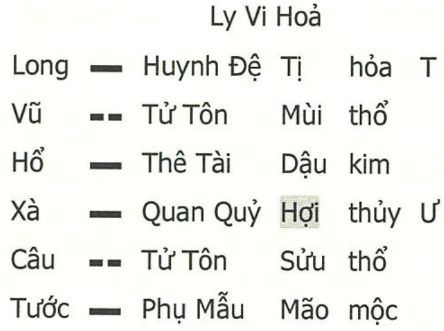
    - **Hình này chứng minh điều gì**
      - lấy Quan Quỷ làm Dụng thần.
    - **Từ đâu mà thấy được**
      - Nhìn vào hào Thế, hào Ứng, Dụng thần và động hào trong bảng quẻ Sơ đồ quẻ Ly Vi Hỏa.
- **Quá trình suy luận và đối thoại ban đầu:**
  - Căn cứ suy luận: Quẻ này Quan Quỷ Hợi thủy Nguyệt khắc, Nhật không sinh phù, lại bị Nhật hợp cản trở, không có một chút sinh khí, quẻ gặp lục xung, lục xung chủ tán, do đó tôi phán đoán cô ấy và người này kết hôn bất thành.
  - Đối thoại thực tế: Quan Quỷ lâm hào Ứng, quyết nói: "Quan Quỷ lâm Ứng tất xứng tâm (vừa lòng)", chứng tỏ cô ấy yêu thích đối phương.
- **Ứng nghiệm thực tế và diễn biến sự việc:**
  - Nhìn vào kết quả thực tế: Tử Tôn Nguyệt phá Nhật khắc, hào động lại tăng thêm một khắc, Tử Tôn ở Tử địa, giống với quẻ trước, thông tin không có khả năng sinh con càng mãnh liệt, e rằng sau này không có con của mình.
  - Nhìn vào kết quả thực tế: Nhưng trên thực tế, người nữ này đã kết hôn với bạn trai đó ở tháng Dậu cùng năm.
  - Nhìn vào kết quả thực tế: Tôi nghi là phán đoán quẻ này có sai lầm, không thể lý giải, tôi tạm thời giữ lại, chờ sau này hiểu ra sẽ tiếp tục bàn.
  - Nhìn vào kết quả thực tế: Bởi vì lấy lý giải của tôi để xem quẻ thì bất kể như thế nào cũng là tượng phân ly, hai người không thể kết hôn.
  - Nhìn vào kết quả thực tế: Sau này, khi đang đọc chương hôn nhân trong cuốn cổ thư Bốc Phệ Chính Tông, tôi đột nhiên thấy trong đó có một đoạn như
- **Ngộ giải và bài học kinh nghiệm then chốt:**
  - Đúc rút quy luật thực chiến: Xem xét tổng thể ngũ hành, hào động và tâm thái người gieo quẻ.

### Quái lệ 2: Sơ đồ quẻ Ly Vi Hỏa biến Hỏa Sơn Lữ
- **Bối cảnh & Dữ kiện chiêm bái:**
  - Khi nghe rằng kết quả phán đoán không tốt, cô ấy liền yêu cầu xem quẻ mới.
  - Lại gieo được Ly Vi Hỏa biến Hỏa Sơn Lữ.
  - Nhật thần Dần mộc và Quan Quỷ tương hợp, Dần mộc tương ứng với tháng Dần, đoán là người này bắt đầu luyến ái với bạn trai ở tháng Dần.
  - Cô ấy xác nhận đúng là bắt đầu luyến ái ở tháng Dần.
  - Đây là quẻ được tôi dự đoán ở năm 95.
- Bảng quẻ Sơ đồ quẻ Ly Vi Hỏa biến Hỏa Sơn Lữ:
  - **Hình 4.** Sơ đồ quẻ Ly Vi Hỏa biến Hỏa Sơn Lữ
    - 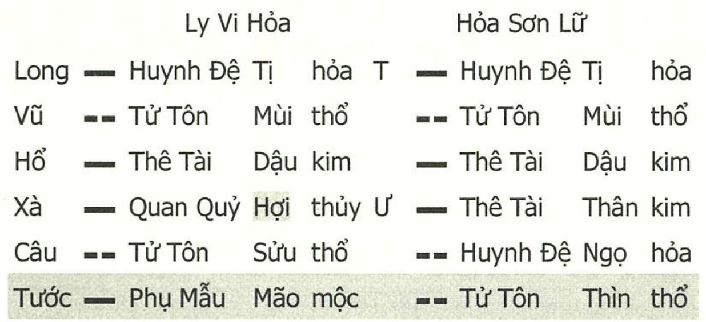
    - **Hình này chứng minh điều gì**
      - lấy Quan Quỷ làm Dụng thần.
    - **Từ đâu mà thấy được**
      - Nhìn vào hào Thế, hào Ứng, Dụng thần và động hào trong bảng quẻ Sơ đồ quẻ Ly Vi Hỏa biến Hỏa Sơn Lữ.
- **Quá trình suy luận và đối thoại ban đầu:**
  - Căn cứ suy luận: Thấy được đoạn này, tôi mới ngộ được thuyết Phụ Mẫu lâm Nhật định hôn kỳ của người xưa, cuối cùng đã biết được nguyên nhân tại sao đã phán đoán sai quẻ này.
  - Căn cứ suy luận: Ở quẻ trên, hào sơ Phụ Mẫu là Mão mộc, ngũ hành tương đồng với Nhật thần Dần mộc, đây chính là nguyên nhân kết hôn.
  - Căn cứ suy luận: Đương nhiên còn có Quan Quỷ trên Ứng hợp Phụ Mẫu, chứng tỏ đối tượng kết hôn nhất định là bạn trai hiện tại, nhưng Quan Không, lại biểu thị hôn nhân không bền vững.
  - Căn cứ suy luận: Chồng và người nhà cực lực phản đối, nhưng cô ấy đã không nghe theo khuyên can mà cứ khăng khăng đi, ai ngờ không cẩn thận bị trượt ngã dẫn đến rách tử cung, khiến cho tiểu hài lưu sản, mất chức năng sinh đẻ.
  - Căn cứ suy luận: Bởi vì cô ấy không thể sinh đẻ, hơn nữa nguyên nhân là do cô ấy gây ra, thế là đã ly hôn với cô ấy.
  - Căn cứ suy luận: Hào 2 Tử Tôn Sửu thổ Nguyệt phá là thông tin năm Đinh Sửu Thực Phá lưu sản tiểu hài, Tử Tôn Thực Phá khắc Quan Quỷ cũng là nguyên nhân cô ấy ly hôn, Thế lâm Thanh Long, chủ trang điểm, Mão mộc phát động, là đất Mộc Dục của hào Thế, chính là tắm rửa, động khắc Tử Tôn, chính là lưu sản bởi vì tắm rửa.
  - Đối thoại thực tế: Tôi lại gặp được người nữ này, cô ấy liền chế giễu tôi rằng: "Tôi thấy quẻ của ông không linh, ông nói rằng tôi và anh ta không thể kết hôn, nhưng tôi và anh ta đã kết hôn, ông còn nói tôi không có khả năng sinh con, nhưng hiện nay tôi lại có thai, xem ra đoán quẻ cho vui mà thôi, không thể tin được." Đối diện với những lời này của người ta, tôi chỉ biết câm nín, bởi vì kết quả dự đoán của tôi ở lúc đó không có gì đúng cả.
  - Đối thoại thực tế: Người xưa nói rằng "Quan Quỷ lâm Ứng tất xứng tâm", bản thân rất thích bạn trai hiện tại.
- **Ứng nghiệm thực tế và diễn biến sự việc:**
  - Nhìn vào kết quả thực tế: Tôi lại gặp được người nữ này, cô ấy liền chế giễu tôi rằng: "Tôi thấy quẻ của ông không linh, ông nói rằng tôi và anh ta không thể kết hôn, nhưng tôi và anh ta đã kết hôn, ông còn nói tôi không có khả năng sinh con, nhưng hiện nay tôi lại có thai, xem ra đoán quẻ cho vui mà thôi, không thể tin được." Đối diện với những lời này của người ta, tôi chỉ biết câm nín, bởi vì kết quả dự đoán của tôi ở lúc đó không có gì đúng cả.
- **Ngộ giải và bài học kinh nghiệm then chốt:**
  - Ngộ giải từ thực tiễn và cổ thư: Thấy được đoạn này, tôi mới ngộ được thuyết Phụ Mẫu lâm Nhật định hôn kỳ của người xưa, cuối cùng đã biết được nguyên nhân tại sao đã phán đoán sai quẻ này.
  - Ngộ giải từ thực tiễn và cổ thư: Ở quẻ trên, hào sơ Phụ Mẫu là Mão mộc, ngũ hành tương đồng với Nhật thần Dần mộc, đây chính là nguyên nhân kết hôn.
  - Ngộ giải từ thực tiễn và cổ thư: Thực ra xem lại quẻ thì thấy rất nhiều thông tin đều ở trong đó, chỉ là lúc đó tôi không nhìn ra mà thôi.
  - Ngộ giải từ thực tiễn và cổ thư: Hào 2 Tử Tôn Sửu thổ Nguyệt phá là thông tin năm Đinh Sửu Thực Phá lưu sản tiểu hài, Tử Tôn Thực Phá khắc Quan Quỷ cũng là nguyên nhân cô ấy ly hôn, Thế lâm Thanh Long, chủ trang điểm, Mão mộc phát động, là đất Mộc Dục của hào Thế, chính là tắm rửa, động khắc Tử Tôn, chính là lưu sản bởi vì tắm rửa.
  - Ngộ giải từ thực tiễn và cổ thư: Quẻ dưới đây là một ví dụ phán đoán chính xác ứng kỳ kết hôn sau khi ngộ được quẻ trên.

### Ví dụ 2: Ngày 13 tháng 11 năm 1995
- **Bối cảnh & Dữ kiện chiêm bái:**
  - Thấy được đoạn này, tôi mới ngộ được thuyết Phụ Mẫu lâm Nhật định hôn kỳ của người xưa, cuối cùng đã biết được nguyên nhân tại sao đã phán đoán sai quẻ này.
  - Ở quẻ trên, hào sơ Phụ Mẫu là Mão mộc, ngũ hành tương đồng với Nhật thần Dần mộc, đây chính là nguyên nhân kết hôn.
  - Đương nhiên còn có Quan Quỷ trên Ứng hợp Phụ Mẫu, chứng tỏ đối tượng kết hôn nhất định là bạn trai hiện tại, nhưng Quan Không, lại biểu thị hôn nhân không bền vững.
  - Đến tháng Dần năm Đinh Sửu, người nữ này đã mang thai.
  - Tôi lại gặp được người nữ này, cô ấy liền chế giễu tôi rằng: "Tôi thấy quẻ của ông không linh, ông nói rằng tôi và anh ta không thể kết hôn, nhưng tôi và anh ta đã kết hôn, ông còn nói tôi không có khả năng sinh con, nhưng hiện nay tôi lại có thai, xem ra đoán quẻ cho vui mà thôi, không thể tin được." Đối diện với những lời này của người ta, tôi chỉ biết câm nín, bởi vì kết quả dự đoán của tôi ở lúc đó không có gì đúng cả.
- Bảng quẻ Sơ đồ quẻ Thiên Trạch Lý biến Phong Thiên Tiểu Súc:
  - **Hình 5.** Sơ đồ quẻ Thiên Trạch Lý biến Phong Thiên Tiểu Súc
    - 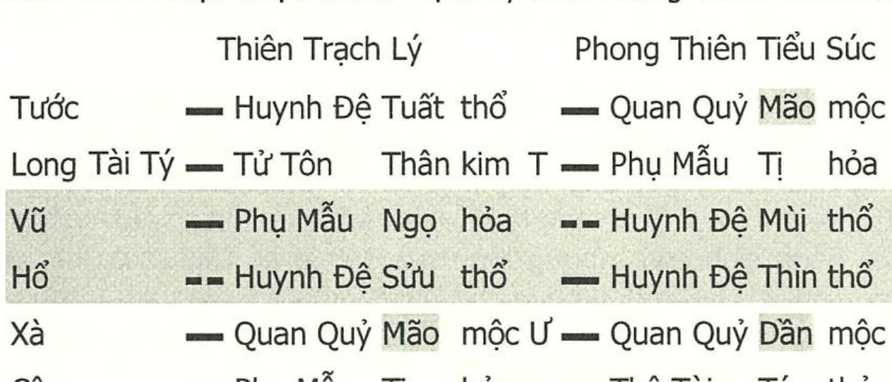
    - **Hình này chứng minh điều gì**
      - lấy Quan Quỷ làm Dụng thần.
    - **Từ đâu mà thấy được**
      - Nhìn vào hào Thế, hào Ứng, Dụng thần và động hào trong bảng quẻ Sơ đồ quẻ Thiên Trạch Lý biến Phong Thiên Tiểu Súc.
- **Quá trình suy luận và đối thoại ban đầu:**
  - Căn cứ suy luận: Thấy được đoạn này, tôi mới ngộ được thuyết Phụ Mẫu lâm Nhật định hôn kỳ của người xưa, cuối cùng đã biết được nguyên nhân tại sao đã phán đoán sai quẻ này.
  - Căn cứ suy luận: Ở quẻ trên, hào sơ Phụ Mẫu là Mão mộc, ngũ hành tương đồng với Nhật thần Dần mộc, đây chính là nguyên nhân kết hôn.
  - Căn cứ suy luận: Đương nhiên còn có Quan Quỷ trên Ứng hợp Phụ Mẫu, chứng tỏ đối tượng kết hôn nhất định là bạn trai hiện tại, nhưng Quan Không, lại biểu thị hôn nhân không bền vững.
  - Căn cứ suy luận: Chồng và người nhà cực lực phản đối, nhưng cô ấy đã không nghe theo khuyên can mà cứ khăng khăng đi, ai ngờ không cẩn thận bị trượt ngã dẫn đến rách tử cung, khiến cho tiểu hài lưu sản, mất chức năng sinh đẻ.
  - Căn cứ suy luận: Bởi vì cô ấy không thể sinh đẻ, hơn nữa nguyên nhân là do cô ấy gây ra, thế là đã ly hôn với cô ấy.
  - Căn cứ suy luận: Hào 2 Tử Tôn Sửu thổ Nguyệt phá là thông tin năm Đinh Sửu Thực Phá lưu sản tiểu hài, Tử Tôn Thực Phá khắc Quan Quỷ cũng là nguyên nhân cô ấy ly hôn, Thế lâm Thanh Long, chủ trang điểm, Mão mộc phát động, là đất Mộc Dục của hào Thế, chính là tắm rửa, động khắc Tử Tôn, chính là lưu sản bởi vì tắm rửa.
  - Đối thoại thực tế: Tôi lại gặp được người nữ này, cô ấy liền chế giễu tôi rằng: "Tôi thấy quẻ của ông không linh, ông nói rằng tôi và anh ta không thể kết hôn, nhưng tôi và anh ta đã kết hôn, ông còn nói tôi không có khả năng sinh con, nhưng hiện nay tôi lại có thai, xem ra đoán quẻ cho vui mà thôi, không thể tin được." Đối diện với những lời này của người ta, tôi chỉ biết câm nín, bởi vì kết quả dự đoán của tôi ở lúc đó không có gì đúng cả.
  - Đối thoại thực tế: Người xưa nói rằng "Quan Quỷ lâm Ứng tất xứng tâm", bản thân rất thích bạn trai hiện tại.
  - Đối thoại thực tế: Sách cổ nói rằng, "Thế khắc Ứng hiềm bần ái phú (chê nghèo thích giàu)", là chê gia đình đối phương nghèo khó hoặc tiền lương của đối phương không cao.
- **Ứng nghiệm thực tế và diễn biến sự việc:**
  - Nhìn vào kết quả thực tế: Trên thực tế, bản thân thích một chàng trai, đã xác định quan hệ yêu đương, nhưng bị cha mẹ và các chị em gái phản đối, chê tiền lương của đối phương thấp.
  - Nhìn vào kết quả thực tế: Sau này đã chia tay với người đó, ở tháng Tị năm 1996, cha mẹ quyết định gả cho một người khác.
  - Nhìn vào kết quả thực tế: Đây là một quái lệ thành công được nghiệm sau khi ngộ ra nguyên nhân sai sót trước đây.
  - Nhìn vào kết quả thực tế: Đã nghiệm chứng tính khả thi của lý luận này.
  - Nhìn vào kết quả thực tế: Trong quẻ mặc dù Quan Quỷ Không Vong nhưng không dùng Không Vong để biểu thị ứng kỳ.
- **Ngộ giải và bài học kinh nghiệm then chốt:**
  - Đúc rút quy luật thực chiến: Xem xét tổng thể ngũ hành, hào động và tâm thái người gieo quẻ.

### Tổng kết chuyên đề và bài học tâm đắc
- **Huyền cơ cốt lõi rút ra từ các quái lệ:**
  - chứng tỏ người ở giữa phản đối hôn nhân này, luyến ái không thuận lợi.
  - Hào Phụ Mẫu là song thân, hào Huynh Đệ là chị em gái, do đó nhất định là cha mẹ và chị em gái trong nhà phản đối.
  - Sách cổ nói rằng, "Thế khắc Ứng hiềm bần ái phú (chê nghèo thích giàu)", là chê gia đình đối phương nghèo khó hoặc tiền lương của đối phương không cao.
  - Hào Thế nhập Mộ ở hào động Huynh Đệ Sửu thổ, nhập Mộ là mất tự do, bị quản thúc, mình không thể tùy ý kiểm soát mình, chủ bản thân không có chủ kiến, không thể kiểm soát hôn nhân của chính mình.
  - Phụ Mẫu Tị hỏa tương hợp với Nhật, phù hợp với quy luật Phụ Mẫu lâm Nhật định hôn kỳ, cho nên lấy hào Phụ Mẫu để phán đoán ứng kỳ kết hôn.
  - Bởi vì Tị hỏa Nguyệt phá, chính là ứng thực phá, tức năm Tị hoặc tháng Tị.
  - Lại có Phụ Mẫu Ngọ hỏa và hào biến tương hợp, nơi hợp ứng xung, đến năm Bính Tý xung khai Phụ Mẫu Ngọ hỏa, tổng hợp lại, ứng tháng Tị năm 1996 kết hôn.
  - Trên thực tế, bản thân thích một chàng trai, đã xác định quan hệ yêu đương, nhưng bị cha mẹ và các chị em gái phản đối, chê tiền lương của đối phương thấp.
  - Sau này đã chia tay với người đó, ở tháng Tị năm 1996, cha mẹ quyết định gả cho một người khác.
  - Đây là một quái lệ thành công được nghiệm sau khi ngộ ra nguyên nhân sai sót trước đây.
  - Đã nghiệm chứng tính khả thi của lý luận này.
  - Trong quẻ mặc dù Quan Quỷ Không Vong nhưng không dùng Không Vong để biểu thị ứng kỳ.
  - Nhưng quẻ này phán đoán vẫn có chỗ thiếu sót.
  - Chưa thấy được chia tay với bạn trai lúc đó và kết hôn với một người khác.
  - Chúng ta xem lại quẻ một chút, phải chăng bởi vì nguyên nhân này: Quan Quỷ trên Ứng Không, mà không tương hợp với hào Phụ Mẫu, chứng tỏ người kết hôn không phải là bạn trai hiện nay.
  - Hào 4 Phụ Mẫu hóa ra Mộ khố của Quan, Mộ khố là có ý nghĩa là khống chế, chứng tỏ hôn nhân của mình hoàn toàn nằm trong tay của người lớn.

## 2. Tư Duy Dự Đoán Về Làm Visa Xuất Ngoại

- **Tổng quan nguyên lý & bối cảnh chuyên đề:**
  - Đây là quẻ dự đoán visa đầu tiên mà tôi gặp phải kể từ khi học lục hào, mặc dù trước đây tôi cũng đã từng xuất ngoại hai lần, nhưng đều là chuyện trước khi học lục hào. Cho nên ngay lúc đó cảm thấy không biết bắt đầu phán đoán như thế nào.
### Ví dụ 1: Ngày Tân Hợi tháng Đinh Hợi năm 1995
- **Bối cảnh & Dữ kiện chiêm bái:**
  - **Ví dụ 1:** Ngày Tân Hợi tháng Đinh Hợi năm 1995, một người bạn của tôi dự đoán khi nào lấy được visa đi Nhật Bản?
  - Khi nào có thể xuất ngoại?
  - Được Chấn Vi Lôi biến Thiên Trạch Lý.
  - Đây là quẻ dự đoán visa đầu tiên mà tôi gặp phải kể từ khi học lục hào, mặc dù trước đây tôi cũng đã từng xuất ngoại hai lần, nhưng đều là chuyện trước khi học lục hào.
  - Cho nên ngay lúc đó cảm thấy không biết bắt đầu phán đoán như thế nào.
- Bảng quẻ Sơ đồ quẻ Chấn Vi Lôi biến Thiên Trạch Lý:
  - **Hình 6.** Sơ đồ quẻ Chấn Vi Lôi biến Thiên Trạch Lý
    - 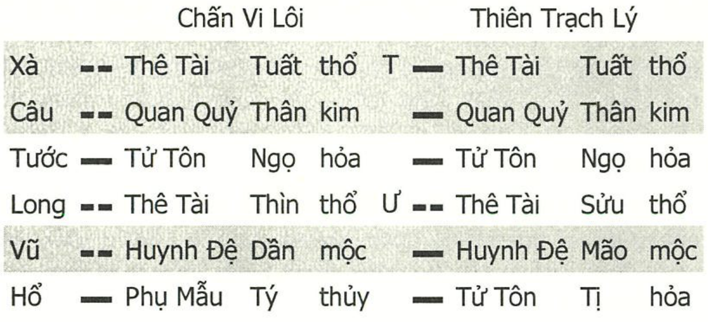
    - **Hình này chứng minh điều gì**
      - lấy hào Phụ Mẫu Thìn thổ trì Thế phát động làm Dụng thần.
    - **Từ đâu mà thấy được**
      - Nhìn vào hào Thế, hào Ứng, Dụng thần và động hào trong bảng quẻ Sơ đồ quẻ Chấn Vi Lôi biến Thiên Trạch Lý.
- **Quá trình suy luận và đối thoại ban đầu:**
  - Căn cứ suy luận: Đây là quẻ dự đoán visa đầu tiên mà tôi gặp phải kể từ khi học lục hào, mặc dù trước đây tôi cũng đã từng xuất ngoại hai lần, nhưng đều là chuyện trước khi học lục hào.
  - Căn cứ suy luận: Cho nên ngay lúc đó cảm thấy không biết bắt đầu phán đoán như thế nào.
  - Đối thoại thực tế: Lúc đó người bạn của tôi còn vui vẻ nói rằng: "Ông tài thật, đoán không sai bao nhiêu, người Nhật Bản đã mời tôi xuất ngoại, lúc đầu người ta dự định mời tôi đến Nhật Bản vào ngày 20, nhưng vẫn chưa được cấp visa, đã đệ trình đến đại sứ quán hơn
  - Đối thoại thực tế: Hơn nữa, hào Thế mặc dù phát động có dấu hiệu động, nhưng bị Huynh Đệ Dậu kim phát động hợp, người xưa nói rằng: "động phùng hợp nhi bán trú" (hào động gặp hợp sẽ bị cản trở), e rằng lần này xuất ngoại không có anh ta.
- **Ứng nghiệm thực tế và diễn biến sự việc:**
  - Thực tế diễn biến kiểm chứng ứng kỳ và cát hung của quẻ chiêm.
- **Ngộ giải và bài học kinh nghiệm then chốt:**
  - Ngộ giải từ thực tiễn và cổ thư: Với bài học từ lần dự đoán xuất ngoại thất bại trước đây, phán đoán của tôi đối với quẻ này đã tốt hơn nhiều.

### Quái lệ 2: Quẻ Hỏa Thiên Đại Hữu biến Sơn Trạch Tổn
- **Bối cảnh & Dữ kiện chiêm bái:**
  - Quẻ dự đoán làm visa xuất ngoại của người bạn, hào Phụ Mẫu được Nhật Nguyệt tỉ phù, mặc dù vượng tướng, nhưng lục xung chủ việc tan, việc tốt bất thành.
  - Phục ngâm chính là trì trệ không tiến.
  - Hơn nữa, Huynh Đệ vượng tướng hóa Tiến thần động mà khắc Thế, Thế hoàn toàn không được trợ giúp, hưu tù bị khắc, hoàn toàn không có năng lực động, do đó nhất định không thể xuất ngoại.
  - Không lâu sau, đơn vị tôi sắp tuyển chọn một nhóm người xuất ngoại, một đồng nghiệp trong đơn vị liền đến tìm tôi dự đoán về chuyện xuất ngoại, xem bản thân có hy vọng không?
  - Ở ngày Đinh Sửu tháng Tý đoán xuất ngoại thành công hay không?
- Bảng quẻ Quẻ Hỏa Thiên Đại Hữu biến Sơn Trạch Tổn:
  - **Hình 7.** Quẻ Hỏa Thiên Đại Hữu biến Sơn Trạch Tổn
    - 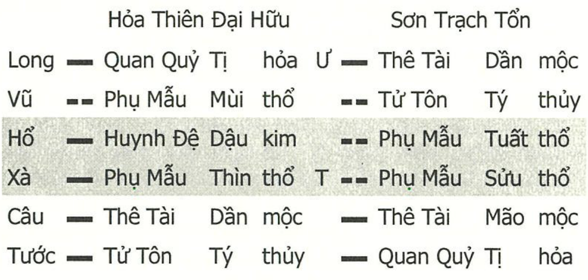
    - **Hình này chứng minh điều gì**
      - lấy hào Phụ Mẫu Thìn thổ trì Thế phát động làm Dụng thần.
    - **Từ đâu mà thấy được**
      - Nhìn vào hào Thế, hào Ứng, Dụng thần và động hào trong bảng quẻ Quẻ Hỏa Thiên Đại Hữu biến Sơn Trạch Tổn.
- **Quá trình suy luận và đối thoại ban đầu:**
  - Căn cứ suy luận: Làm visa, lấy hào Phụ Mẫu làm Dụng thần.
  - Căn cứ suy luận: Dụng thần mặc dù bị Nhật khắc thương, nhưng được Nguyệt sinh không coi là hưu tù.
  - Căn cứ suy luận: Nhưng không nên động mà hóa hồi đầu khắc, sợ là không làm được.
  - Căn cứ suy luận: Dụng thần có Nguyệt đến sinh, xét về lâu dài, năm 2002 dễ làm visa.
  - Căn cứ suy luận: Bởi vì năm 2002 là Nhâm Ngọ, hợp cản trở hào biến không khắc Dụng thần Phụ Mẫu.
  - Đối thoại thực tế: Hơn nữa, hào Thế mặc dù phát động có dấu hiệu động, nhưng bị Huynh Đệ Dậu kim phát động hợp, người xưa nói rằng: "động phùng hợp nhi bán trú" (hào động gặp hợp sẽ bị cản trở), e rằng lần này xuất ngoại không có anh ta.
- **Ứng nghiệm thực tế và diễn biến sự việc:**
  - Thực tế diễn biến kiểm chứng ứng kỳ và cát hung của quẻ chiêm.
- **Ngộ giải và bài học kinh nghiệm then chốt:**
  - Đúc rút quy luật thực chiến: Xem xét tổng thể ngũ hành, hào động và tâm thái người gieo quẻ.

### Ví dụ 2: Một ngày trong tháng 8 năm 1997 Đinh Sửu
- **Bối cảnh & Dữ kiện chiêm bái:**
  - **Ví dụ 2:** Một ngày trong tháng 8 năm 1997 Đinh Sửu, một người nam công tác ở công ty du lịch quốc tế đến tìm tôi dự đoán, anh ta xem có thể được cấp visa đến Mỹ hay không?
  - Ngày Ất Mùi tháng Thân, được Phong Lôi Ích biến Phong Địa Quan.
  - Anh ta nói đã bị đại sứ quán Mỹ từ chối visa một lần, lần thứ hai nếu như vẫn bị từ chối thì không còn hy vọng.
  - Sau đó quả nhiên không làm được visa.
  - Đến năm 2002, anh ta đã làm được visa định cư đến Canada.
- Bảng quẻ Sơ đồ quẻ Phong Lôi Ích biến Phong Địa Quan:
  - **Hình 8.** Sơ đồ quẻ Phong Lôi Ích biến Phong Địa Quan
    - 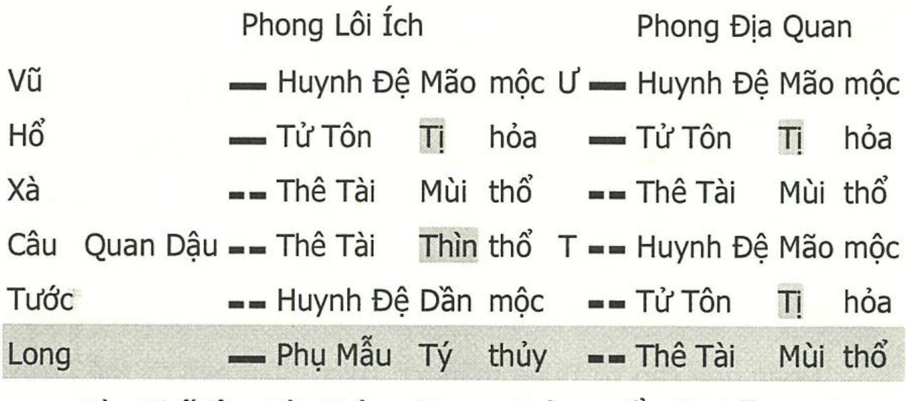
    - **Hình này chứng minh điều gì**
      - lấy hào Phụ Mẫu làm Dụng thần.
    - **Từ đâu mà thấy được**
      - Nhìn vào hào Thế, hào Ứng, Dụng thần và động hào trong bảng quẻ Sơ đồ quẻ Phong Lôi Ích biến Phong Địa Quan.
- **Quá trình suy luận và đối thoại ban đầu:**
  - Căn cứ suy luận: Làm visa, lấy hào Phụ Mẫu làm Dụng thần.
  - Căn cứ suy luận: Dụng thần mặc dù bị Nhật khắc thương, nhưng được Nguyệt sinh không coi là hưu tù.
  - Căn cứ suy luận: Nhưng không nên động mà hóa hồi đầu khắc, sợ là không làm được.
  - Căn cứ suy luận: Dụng thần có Nguyệt đến sinh, xét về lâu dài, năm 2002 dễ làm visa.
  - Căn cứ suy luận: Bởi vì năm 2002 là Nhâm Ngọ, hợp cản trở hào biến không khắc Dụng thần Phụ Mẫu.
  - Căn cứ suy luận: Bề ngoài quẻ này là hỏi về chuyện tham gia triển lãm, nhưng bởi vì Mỹ là quốc gia đặc biệt, tương đối khó làm visa, không làm được visa thì không thể tham gia hội triển lãm, do đó vấn đề quan trọng nhất là làm visa.
- **Ứng nghiệm thực tế và diễn biến sự việc:**
  - Nhìn vào kết quả thực tế: Thế động hóa Không lâm Thanh Long, lại là thông tin hỷ duyệt lạc không (niềm vui bị tan vỡ), nhưng quái tượng thành, do đó nhất định khởi đầu bất thành, về sau có thể thành.
- **Ngộ giải và bài học kinh nghiệm then chốt:**
  - Đúc rút quy luật thực chiến: Xem xét tổng thể ngũ hành, hào động và tâm thái người gieo quẻ.

### Ví dụ 3: Một học viên của tôi yêu cầu đoán xem có thể đến Mỹ để tổ ch
- **Bối cảnh & Dữ kiện chiêm bái:**
  - **Ví dụ 3:** Một học viên của tôi yêu cầu đoán xem có thể đến Mỹ để tổ chức hội triển lãm được hay không?
  - Ở ngày Ất Mùi tháng Tuất, được Sơn Hỏa Bí biến Phong Sơn Tiệm.
- Bảng quẻ Sơ đồ quẻ Sơn Hỏa Bí biến Phong Sơn Tiệm:
  - **Hình 9.** Sơ đồ quẻ Sơn Hỏa Bí biến Phong Sơn Tiệm
    - 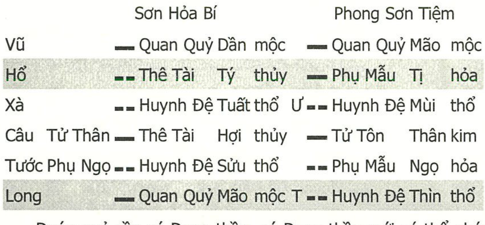
    - **Hình này chứng minh điều gì**
      - Lấy hào Phụ Mẫu làm Dụng thần.
    - **Từ đâu mà thấy được**
      - Nhìn vào hào Thế, hào Ứng, Dụng thần và động hào trong bảng quẻ Sơ đồ quẻ Sơn Hỏa Bí biến Phong Sơn Tiệm.
- **Quá trình suy luận và đối thoại ban đầu:**
  - Căn cứ suy luận: Bề ngoài quẻ này là hỏi về chuyện tham gia triển lãm, nhưng bởi vì Mỹ là quốc gia đặc biệt, tương đối khó làm visa, không làm được visa thì không thể tham gia hội triển lãm, do đó vấn đề quan trọng nhất là làm visa.
  - Căn cứ suy luận: Phụ Mẫu thể hiện visa, nhận được visa thì mới có tư cách đi Mỹ, do đó Phụ Mẫu mới là Dụng thần.
  - Căn cứ suy luận: Tại tháng Hợi, bởi vì bị từ chối visa, anh ta đoán có thể làm visa thành công hay không?
  - Căn cứ suy luận: Mặc dù có Nhật sinh, nhưng bất thượng quái, bị Nguyệt xung khắc mà Nguyệt phá, hào Tài Kỵ thần trì Thế, vẫn không tốt.
- **Ứng nghiệm thực tế và diễn biến sự việc:**
  - Thực tế diễn biến kiểm chứng ứng kỳ và cát hung của quẻ chiêm.
- **Ngộ giải và bài học kinh nghiệm then chốt:**
  - Đúc rút quy luật thực chiến: Xem xét tổng thể ngũ hành, hào động và tâm thái người gieo quẻ.

### Quái lệ 5: Quẻ Thiên Phong Cấu biến Phong Sơn Tiệm
- **Bối cảnh & Dữ kiện chiêm bái:**
  - Tại tháng Hợi, bởi vì bị từ chối visa, anh ta đoán có thể làm visa thành công hay không?
  - Lại gieo một quẻ.
  - Ngày Đinh Mão tháng Hợi, được Thiên Phong Cấu biến Phong Sơn Tiệm.
  - Một học viên khác của tôi là đồng nghiệp với anh ta cũng lo lắng về vấn đề visa của anh ta, sau khi xem quẻ trên, cảm thấy chưa yên tâm, liền tự mình gieo một quẻ xem rốt cuộc có thành công hay không.
  - Ở ngày Đinh Mão tháng Hợi, được Địa Lôi Phục biến Lôi Hỏa Phong.
- Bảng quẻ Quẻ Thiên Phong Cấu biến Phong Sơn Tiệm:
  - **Hình 10.** Quẻ Thiên Phong Cấu biến Phong Sơn Tiệm
    - 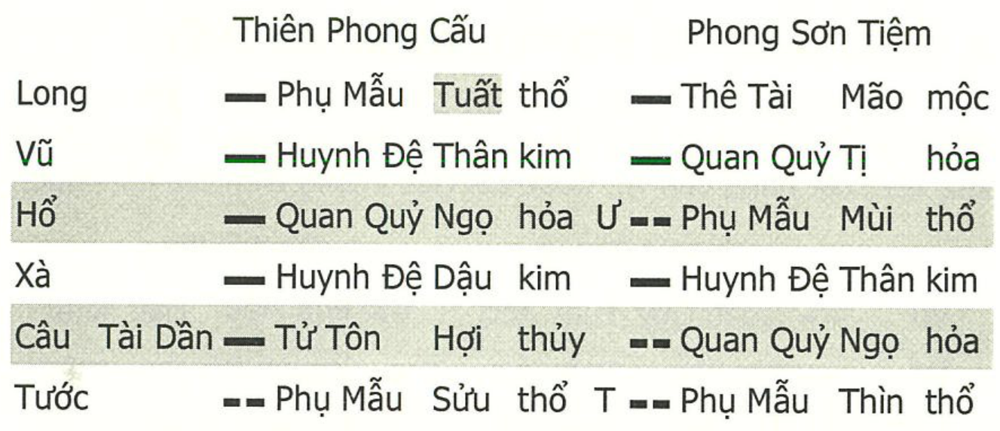
    - **Hình này chứng minh điều gì**
      - Lấy hào Phụ Mẫu làm Dụng thần.
    - **Từ đâu mà thấy được**
      - Nhìn vào hào Thế, hào Ứng, Dụng thần và động hào trong bảng quẻ Quẻ Thiên Phong Cấu biến Phong Sơn Tiệm.
- **Quá trình suy luận và đối thoại ban đầu:**
  - Căn cứ suy luận: Tại tháng Hợi, bởi vì bị từ chối visa, anh ta đoán có thể làm visa thành công hay không?
  - Căn cứ suy luận: Mặc dù có Nhật sinh, nhưng bất thượng quái, bị Nguyệt xung khắc mà Nguyệt phá, hào Tài Kỵ thần trì Thế, vẫn không tốt.
- **Ứng nghiệm thực tế và diễn biến sự việc:**
  - Thực tế diễn biến kiểm chứng ứng kỳ và cát hung của quẻ chiêm.
- **Ngộ giải và bài học kinh nghiệm then chốt:**
  - Đúc rút quy luật thực chiến: Xem xét tổng thể ngũ hành, hào động và tâm thái người gieo quẻ.

### Quái lệ 6: Quẻ Địa Lôi Phục biến Lôi Hỏa Phong
- **Bối cảnh & Dữ kiện chiêm bái:**
  - Chiêm đoán theo bảng quẻ Quẻ Địa Lôi Phục biến Lôi Hỏa Phong trong thực tiễn.
- Bảng quẻ Quẻ Địa Lôi Phục biến Lôi Hỏa Phong:
  - **Hình 11.** Quẻ Địa Lôi Phục biến Lôi Hỏa Phong
    - 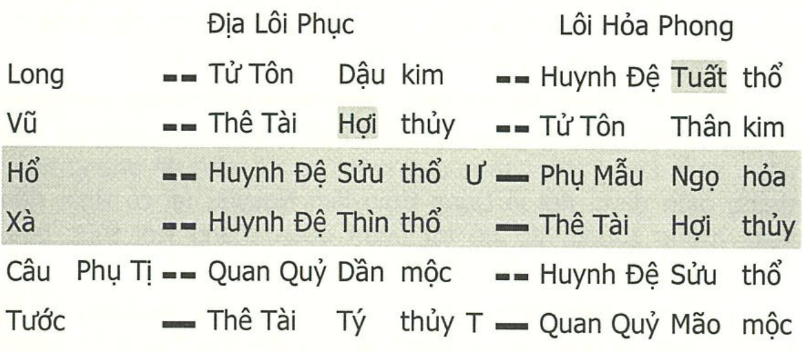
    - **Hình này chứng minh điều gì**
      - Bảng quẻ Quẻ Địa Lôi Phục biến Lôi Hỏa Phong phản ánh sự phối chiếu hào vị, ngũ hành và động biến minh chứng cho vấn đề chiêm đoán.
    - **Từ đâu mà thấy được**
      - Nhìn vào hào Thế, hào Ứng, Dụng thần và động hào trong bảng quẻ Quẻ Địa Lôi Phục biến Lôi Hỏa Phong.
- **Quá trình suy luận và đối thoại ban đầu:**
  - Tác giả phân tích cấu trúc hào tượng, Dụng thần và các yếu tố sinh khắc trong quẻ Quẻ Địa Lôi Phục biến Lôi Hỏa Phong.
- **Ứng nghiệm thực tế và diễn biến sự việc:**
  - Thực tế diễn biến kiểm chứng ứng kỳ và cát hung của quẻ chiêm.
- **Ngộ giải và bài học kinh nghiệm then chốt:**
  - Đúc rút quy luật thực chiến: Xem xét tổng thể ngũ hành, hào động và tâm thái người gieo quẻ.

### Tổng kết chuyên đề và bài học tâm đắc
- **Huyền cơ cốt lõi rút ra từ các quái lệ:**
  - khó, nhưng hào Ứng phát động hóa ra Phụ Mẫu hợp Thế, biến hóa vi diệu này vẫn là có thể nhận được visa.
  - Sau đó đã nhận được visa.

## 3. Dụng Thần Trị Nguyệt, Tháng Đó Chết

- **Tổng quan nguyên lý & bối cảnh chuyên đề:**
  - Đoán bệnh của vợ, lấy hào Thê Tài làm Dụng thần. Dụng thần được Nguyệt kiến tỉ phù, Nhật thần sinh phù là vượng tướng, phán đoán theo suy vượng vốn là tượng cát, nhưng không nên Tài động hóa Không hóa Quỷ. Bệnh lâu gặp Không, hóa Không là hung.
  - Sách cổ nói rằng, "Dụng liên Quỷ sát mục hạ lập kiến khuynh nguy¹", bệnh này nguy hiểm. Dụng thần hóa ra Quan Quỷ Sửu thổ, năm nay là năm Đinh Sửu, đây là Thái Tuế nhập hào, biểu thị trong năm có hung, nghĩa là năm đó sẽ biến thành quỷ.
  - Quẻ tại cung Khảm, Khảm là thủy, chủ tiểu ra máu, tất là bệnh về tiểu ra máu. Dụng thần Ngọ hỏa lâm hào 4 bị khắc, hào 4 là tim, Ngọ hỏa cũng là tim, tim bị ảnh hưởng, Kỵ lâm Câu Trần
  - ¹ Dụng biến thành Quỷ, trước mắt tất nguy hiểm.
### Quái lệ 1: Quẻ Lôi Hỏa Phong biến Địa Lôi Phục
- **Bối cảnh & Dữ kiện chiêm bái:**
  - Ngày Giáp Dần tháng Tị, năm 1997, một người đàn ông làm việc ở viện bảo tàng đến tìm tôi dự đoán, vợ anh ta bị bệnh đã lâu, xem cát hung của vợ, được Lôi Hỏa Phong biến Địa Lôi Phục.
- Bảng quẻ Quẻ Lôi Hỏa Phong biến Địa Lôi Phục:
  - **Hình 12.** Quẻ Lôi Hỏa Phong biến Địa Lôi Phục
    - 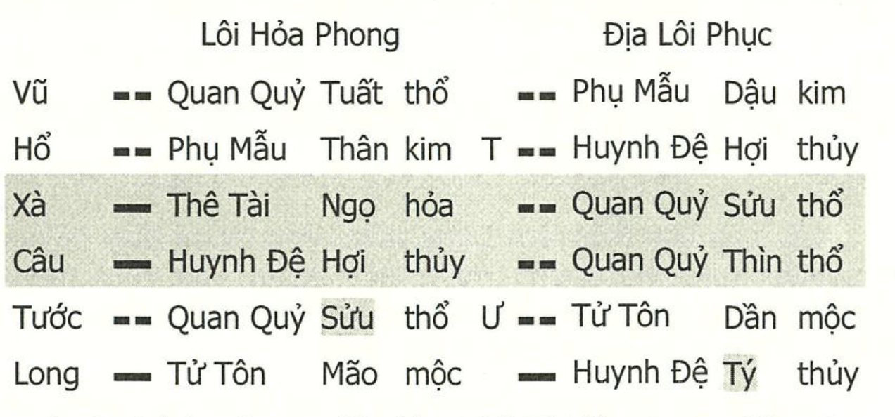
    - **Hình này chứng minh điều gì**
      - lấy hào Thê Tài làm Dụng thần.
    - **Từ đâu mà thấy được**
      - Nhìn vào hào Thế, hào Ứng, Dụng thần và động hào trong bảng quẻ Quẻ Lôi Hỏa Phong biến Địa Lôi Phục.
- **Quá trình suy luận và đối thoại ban đầu:**
  - Căn cứ suy luận: Đoán bệnh của vợ, lấy hào Thê Tài làm Dụng thần.
  - Căn cứ suy luận: Dụng thần được Nguyệt kiến tỉ phù, Nhật thần sinh phù là vượng tướng, phán đoán theo suy vượng vốn là tượng cát, nhưng không nên Tài động hóa Không hóa Quỷ.
  - Căn cứ suy luận: Kỵ thần Huynh Đệ Hợi thủy phát động khắc Dụng, nhưng bị Nguyệt xung phá, lại hóa hồi đầu khắc, tạm thời chưa có khả năng khắc Dụng thần, theo quy luật ứng kỳ, cần đề phòng ngày tháng điền thực.
  - Căn cứ suy luận: Bởi vì Dụng thần lâm Nguyệt, lại có Nhật đến sinh vượng tướng, do đó tôi phán đoán tháng Hợi thực phá, Huynh Đệ bất phá mà khắc Dụng thần là hung.
  - Căn cứ suy luận: Sau khi dự đoán sai quẻ này, suy xét cặn kẽ, tôi mới nghĩ đến nguyên nhân Dụng thần lâm Nguyệt biến Quỷ, nghĩa là tháng đó tử vong.
  - Căn cứ suy luận: Quái lệ về Dụng thần lâm Nguyệt tháng đó chết không chỉ có một ví dụ này mà thôi.
  - Đối thoại thực tế: Sách cổ nói rằng, "Dụng liên Quỷ sát mục hạ lập kiến khuynh nguy¹", bệnh này nguy hiểm.
  - Đối thoại thực tế: "Dụng thần lâm Nguyệt kiến, ứng tại tháng này" là căn cứ phán đoán ứng kỳ rất rõ ràng.
- **Ứng nghiệm thực tế và diễn biến sự việc:**
  - Nhìn vào kết quả thực tế: Tình hình ứng nghiệm: Vợ người này bị bệnh tắc nghẽn mạch máu phổi ở tháng Thân năm Bính Tý, khiến cho tim cung máu không đủ, mất cân bằng, tiểu tiện chẳng được, toàn thân phù thũng, mềm yếu vô lực.
  - Nhìn vào kết quả thực tế: Sau 10 ngày dự đoán, ở giờ Dậu ngày Quý Hợi cấp cứu không có hiệu quả mà qua đời.
  - Nhìn vào kết quả thực tế: Lúc đó Dụng thần vượng tướng, không dám lấy Nhật định ứng kỳ, thế nhưng lại ứng vào ngày Kỵ thần thực phá trong tháng đó.
  - Nhìn vào kết quả thực tế: Ứng tại giờ Dậu, là Kỵ hóa Quan Quỷ Thìn thổ hồi đầu khắc, Huynh Đệ bị chế, giờ Dậu hợp Thìn thổ không khắc Hợi thủy, trái lại sinh trợ Hợi thủy, Hợi thủy vô chế mà khắc Dụng thần.
  - Nhìn vào kết quả thực tế: Kết quả là tôi đã thực sự gặp được Giả Đạt Khanh tiên sinh trong nhà chú tôi.
  - Nhìn vào kết quả thực tế: Được sự đồng ý của tiên sinh, tôi đã được xem phần tư liệu đoán quẻ mà ông ấy đã tích lũy được, trong đó đã phát hiện một lập luận tương tự, quẻ đó như sau:
- **Ngộ giải và bài học kinh nghiệm then chốt:**
  - Ngộ giải từ thực tiễn và cổ thư: Sau khi dự đoán sai quẻ này, suy xét cặn kẽ, tôi mới nghĩ đến nguyên nhân Dụng thần lâm Nguyệt biến Quỷ, nghĩa là tháng đó tử vong.

### Quái lệ 2: Sơ đồ quẻ Khôn Vi Địa biến Sơn Phong Cổ
- **Bối cảnh & Dữ kiện chiêm bái:**
  - Hào 5 Phụ Mẫu Thân kim được Nguyệt hợp lại là Trường Sinh là vượng, Nhật xung là ám động, hào 5 là ngực, phổi, Phụ chủ ngực, kim là phổi, lâm Bạch Hổ, Bạch Hổ chủ máu, ám động khắc Tử Tôn sinh Kỵ thần, là nhân tố bất lợi, do đó đây cũng là bộ phận phát sinh bệnh.
  - Tử Tôn là mạch máu, là mạch máu ở phổi đã xảy ra vấn đề gây nên bệnh.
  - Lâm Thân kim, là bị ở tháng Thân.
  - Trong quẻ kim thủy là Kỵ, người bệnh không nên đeo đồ trang sức vàng bạc, nếu không thì sẽ tăng thêm khí ngũ hành bất lợi.
  - Phụ Mẫu trì Thế, Tử Tôn lâm Nhật xung động, Tử Tôn là y dược, Phụ Mẫu chủ bôn ba, là bôn ba khắp nơi để tìm thầy trị bệnh.
- Bảng quẻ Sơ đồ quẻ Khôn Vi Địa biến Sơn Phong Cổ:
  - **Hình 13.** Sơ đồ quẻ Khôn Vi Địa biến Sơn Phong Cổ
    - 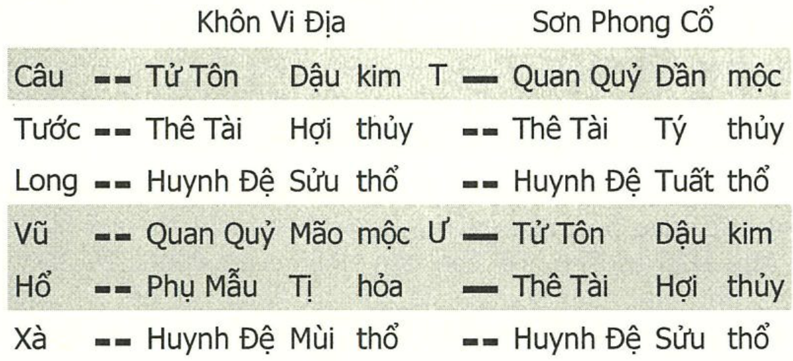
    - **Hình này chứng minh điều gì**
      - Lấy hào Phụ Mẫu làm Dụng thần.
    - **Từ đâu mà thấy được**
      - Nhìn vào hào Thế, hào Ứng, Dụng thần và động hào trong bảng quẻ Sơ đồ quẻ Khôn Vi Địa biến Sơn Phong Cổ.
- **Quá trình suy luận và đối thoại ban đầu:**
  - Căn cứ suy luận: Sau khi dự đoán sai quẻ này, suy xét cặn kẽ, tôi mới nghĩ đến nguyên nhân Dụng thần lâm Nguyệt biến Quỷ, nghĩa là tháng đó tử vong.
  - Căn cứ suy luận: Quái lệ về Dụng thần lâm Nguyệt tháng đó chết không chỉ có một ví dụ này mà thôi.
  - Căn cứ suy luận: Giả Đạt Khanh tiên sinh đoán rằng: Con chiêm bệnh lâu của cha ngày nào khỏi, quẻ Khôn lục xung, bệnh lâu gặp xung thì chết.
  - Căn cứ suy luận: Hào Phụ Mẫu Tị hỏa là Dụng thần lâm Nguyệt kiến, ứng tại tháng này, nội quái phản ngâm, Nguyên thần Mão mộc Không, ngày Dậu xung thực, động biến hồi đầu khắc, Dụng thần Tử ở Dậu, chiêm bệnh tối kỵ Tử Nhật, lại Mộ ở Tuất, Tuyệt ở Hợi, khó qua khỏi giờ Hợi hôm nay.
  - Đối thoại thực tế: "Dụng thần lâm Nguyệt kiến, ứng tại tháng này" là căn cứ phán đoán ứng kỳ rất rõ ràng.
- **Ứng nghiệm thực tế và diễn biến sự việc:**
  - Nhìn vào kết quả thực tế: Khi đó Lưu Đại Quân tiên sinh cho rằng Dụng thần lâm Nguyệt vượng tướng, trước mắt sẽ không có nguy hiểm, nhưng sợ rằng tháng Thìn tam hình đầy đủ không tốt, tuy nhiên người bệnh đã chết ở tháng đó.
- **Ngộ giải và bài học kinh nghiệm then chốt:**
  - Đúc rút quy luật thực chiến: Xem xét tổng thể ngũ hành, hào động và tâm thái người gieo quẻ.

### Quái lệ 3: Quẻ Thiên Thủy Tụng biến Thiên Phong Cấu
- **Bối cảnh & Dữ kiện chiêm bái:**
  - Trong cổ thư Bốc Phệ Chính Tông cũng có một quái lệ như sau: Ngày Canh Thìn tháng Dậu, chiêm mẹ vợ bệnh gần, được Địa Thủy Sư biến Địa Phong Thăng.
  - Tình huống như vậy có thể không lấy tượng để phán đoán, tham khảo lý pháp tức ngũ hành sinh khắc để phán đoán.
  - Kỵ thần trì Thế độc phát không cát, nay Kỵ thần động mà hóa Không, sợ
- Bảng quẻ Quẻ Thiên Thủy Tụng biến Thiên Phong Cấu:
  - **Hình 14.** Quẻ Thiên Thủy Tụng biến Thiên Phong Cấu
    - 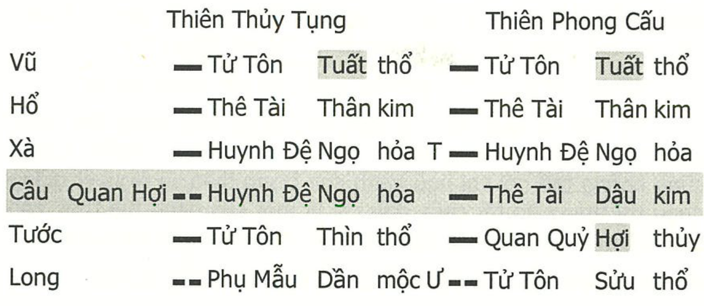
    - **Hình này chứng minh điều gì**
      - Lấy hào Phụ Mẫu làm Dụng thần.
    - **Từ đâu mà thấy được**
      - Nhìn vào hào Thế, hào Ứng, Dụng thần và động hào trong bảng quẻ Quẻ Thiên Thủy Tụng biến Thiên Phong Cấu.
- **Quá trình suy luận và đối thoại ban đầu:**
  - Tác giả phân tích cấu trúc hào tượng, Dụng thần và các yếu tố sinh khắc trong quẻ Quẻ Thiên Thủy Tụng biến Thiên Phong Cấu.
- **Ứng nghiệm thực tế và diễn biến sự việc:**
  - Thực tế diễn biến kiểm chứng ứng kỳ và cát hung của quẻ chiêm.
- **Ngộ giải và bài học kinh nghiệm then chốt:**
  - Đúc rút quy luật thực chiến: Xem xét tổng thể ngũ hành, hào động và tâm thái người gieo quẻ.

### Quái lệ 4: Quẻ Địa Thủy Sư biến Địa Phong Thăng
- **Bối cảnh & Dữ kiện chiêm bái:**
  - Chiêm đoán theo bảng quẻ Quẻ Địa Thủy Sư biến Địa Phong Thăng trong thực tiễn.
- Bảng quẻ Quẻ Địa Thủy Sư biến Địa Phong Thăng:
  - **Hình 15.** Quẻ Địa Thủy Sư biến Địa Phong Thăng
    - 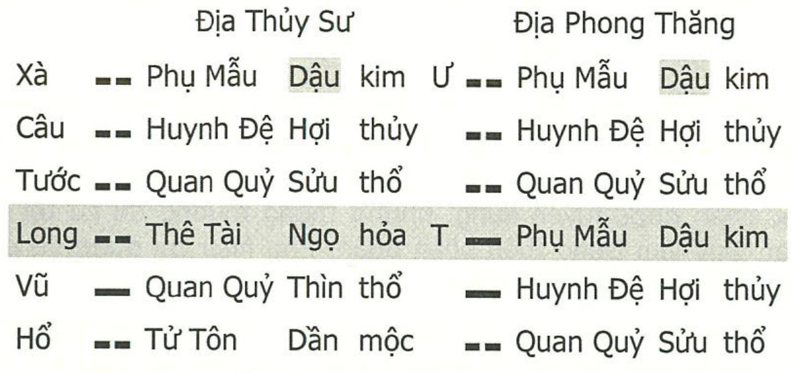
    - **Hình này chứng minh điều gì**
      - Bảng quẻ Quẻ Địa Thủy Sư biến Địa Phong Thăng phản ánh sự phối chiếu hào vị, ngũ hành và động biến minh chứng cho vấn đề chiêm đoán.
    - **Từ đâu mà thấy được**
      - Nhìn vào hào Thế, hào Ứng, Dụng thần và động hào trong bảng quẻ Quẻ Địa Thủy Sư biến Địa Phong Thăng.
- **Quá trình suy luận và đối thoại ban đầu:**
  - Tác giả phân tích cấu trúc hào tượng, Dụng thần và các yếu tố sinh khắc trong quẻ Quẻ Địa Thủy Sư biến Địa Phong Thăng.
- **Ứng nghiệm thực tế và diễn biến sự việc:**
  - Nhìn vào kết quả thực tế: Kết quả là qua đời ở giờ Mão ngày Ất Dậu cùng tháng.
- **Ngộ giải và bài học kinh nghiệm then chốt:**
  - Đúc rút quy luật thực chiến: Xem xét tổng thể ngũ hành, hào động và tâm thái người gieo quẻ.

### Tổng kết chuyên đề và bài học tâm đắc
- **Huyền cơ cốt lõi rút ra từ các quái lệ:**
  - xuất Không khắc Dụng thần.
  - Dụng thần lâm Nguyệt, ứng tại tháng này, Kỵ thần hóa ra Nguyệt kiến cũng ứng tại tháng này.
  - Kết quả là qua đời ở giờ Mão ngày Ất Dậu cùng tháng.
  - Từ một số quái lệ trên đây, chúng ta thấy rằng khi Dụng thần vượng vẫn có thể phán đoán trước mắt là hung hiểm, nhưng cũng không thể nói khi ngũ hành của Dụng thần và Nguyệt giống nhau thì tháng đó tất chết, đây chỉ là một khả năng mà thôi, còn phải tham khảo biến hóa của hào khác để tổng hợp phán đoán.

## 4. Sai Lầm Về Chiêm Việc Này Ứng Việc Khác

- **Tổng quan nguyên lý & bối cảnh chuyên đề:**
  - Phụ Mẫu chủ kết quả thi, Nguyệt phá Nhật khắc, tôi phán đoán kết quả thi của cô ấy không tốt. Cô ấy trả lời rằng phán đoán chính xác. Theo lý mà nói, kết quả thi không tốt thì không chắc chắn được tuyển dụng, nhưng thông thường thi cử thì lấy Quan Quỷ làm Dụng thần phán đoán, Phụ Mẫu chỉ dùng để phụ họa, không đóng vai trò chính.
  - Quẻ này Quan Quỷ độc phát hóa Tiến thần, Nguyệt hợp Nhật sinh, hoàn toàn không có khuyết điểm. Mà hào sơ Sửu thổ ám động sinh Quan, thế là tôi phán đoán sau lưng có người giúp đỡ. Cô ấy nói là có người giúp.
### Ví dụ 1: Ngày Tân Mùi tháng Tị
- **Bối cảnh & Dữ kiện chiêm bái:**
  - **Ví dụ 1:** Ngày Tân Mùi tháng Tị, một cô gái dự đoán thi phát thanh viên đài truyền hình trung ương có được tuyển dụng hay không?
  - Được Lôi Phong Hằng biến Trạch Phong Đại Quá.
  - Người xưa nói rằng: "Tài động sinh Quan, may mắn gọi tên", mặc dù thành tích không tốt nhưng vẫn có thể được tuyển dụng.
  - Quan Quỷ Thân kim độc phát, tháng Thân có thể đến Bắc Kinh.
  - Cô ấy nghe vậy đã rất vui vẻ.
- Bảng quẻ Quẻ Lôi Phong Hằng biến Trạch Phong Đại Quá:
  - **Hình 16.** Quẻ Lôi Phong Hằng biến Trạch Phong Đại Quá
    - 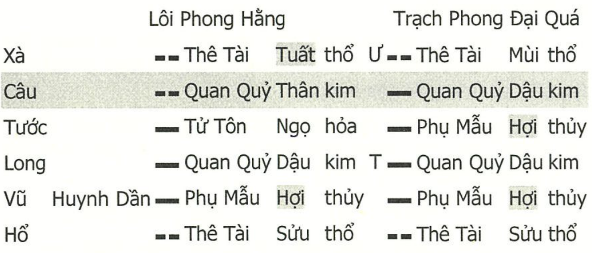
    - **Hình này chứng minh điều gì**
      - lấy Quan Quỷ làm Dụng thần phán đoán, Phụ Mẫu chỉ dùng để phụ họa, không đóng vai trò chính.
    - **Từ đâu mà thấy được**
      - Nhìn vào hào Thế, hào Ứng, Dụng thần và động hào trong bảng quẻ Quẻ Lôi Phong Hằng biến Trạch Phong Đại Quá.
- **Quá trình suy luận và đối thoại ban đầu:**
  - Căn cứ suy luận: Phụ Mẫu chủ kết quả thi, Nguyệt phá Nhật khắc, tôi phán đoán kết quả thi của cô ấy không tốt.
  - Căn cứ suy luận: Cô ấy trả lời rằng phán đoán chính xác.
  - Căn cứ suy luận: Theo lý mà nói, kết quả thi không tốt thì không chắc chắn được tuyển dụng, nhưng thông thường thi cử thì lấy Quan Quỷ làm Dụng thần phán đoán, Phụ Mẫu chỉ dùng để phụ họa, không đóng vai trò chính.
  - Căn cứ suy luận: Quẻ này Quan Quỷ độc phát hóa Tiến thần, Nguyệt hợp Nhật sinh, hoàn toàn không có khuyết điểm.
  - Căn cứ suy luận: Mà hào sơ Sửu thổ ám động sinh Quan, thế là tôi phán đoán sau lưng có người giúp đỡ.
  - Căn cứ suy luận: Tình huống như vậy cũng có trong sách cổ, được gọi là chiêm việc này ứng việc khác, có rất nhiều ví dụ trong Tăng San Bốc Dịch, trong đó có một người đến dự đoán bệnh của mình, và dự trắc sư đã phán đoán rằng bệnh của người này không nghiêm trọng, nhưng phải đề phòng tháng 9 tháng 10 thê thiếp gặp nguy hiểm.
  - Đối thoại thực tế: Người xưa nói rằng: "Tài động sinh Quan, may mắn gọi tên", mặc dù thành tích không tốt nhưng vẫn có thể được tuyển dụng.
- **Ứng nghiệm thực tế và diễn biến sự việc:**
  - Nhìn vào kết quả thực tế: Nhưng kết quả là không được tuyển dụng, mà là ứng tháng Thân biến động công tác.
- **Ngộ giải và bài học kinh nghiệm then chốt:**
  - Đúc rút quy luật thực chiến: Xem xét tổng thể ngũ hành, hào động và tâm thái người gieo quẻ.

### Ví dụ 2: Ngày Mậu Tuất tháng Dậu
- **Bối cảnh & Dữ kiện chiêm bái:**
  - Nhưng kết quả là không được tuyển dụng, mà là ứng tháng Thân biến động công tác.
  - Tình huống như vậy cũng có trong sách cổ, được gọi là chiêm việc này ứng việc khác, có rất nhiều ví dụ trong Tăng San Bốc Dịch, trong đó có một người đến dự đoán bệnh của mình, và dự trắc sư đã phán đoán rằng bệnh của người này không nghiêm trọng, nhưng phải đề phòng tháng 9 tháng 10 thê thiếp gặp nguy hiểm.
  - Cuối cùng, bệnh của người này tuy nghiêm trọng nhưng đã khỏi, còn thê tử của anh ta lại chết ở tháng 9.
  - **Ví dụ 2:** Ngày Mậu Tuất tháng Dậu, một cô gái đến một công ty ứng tuyển, đã phỏng vấn, hỏi mình có được tuyển dụng hay không?
  - Được Trạch Lôi Tùy biến Phong Thủy Hoán.
- Bảng quẻ Quẻ Trạch Lôi Tùy biến Phong Thủy Hoán:
  - **Hình 17.** Quẻ Trạch Lôi Tùy biến Phong Thủy Hoán
    - 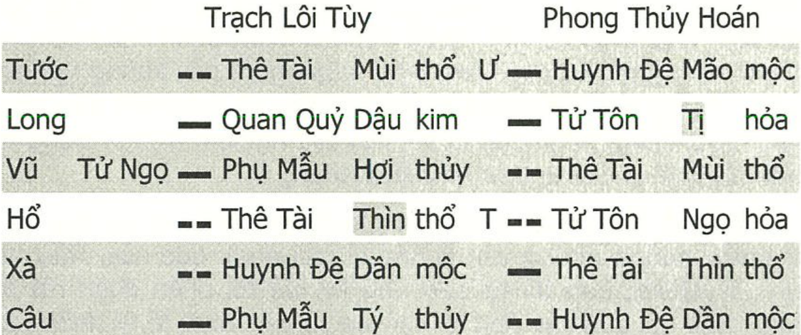
    - **Hình này chứng minh điều gì**
      - lấy Quan Quỷ làm Dụng thần phán đoán.
    - **Từ đâu mà thấy được**
      - Nhìn vào hào Thế, hào Ứng, Dụng thần và động hào trong bảng quẻ Quẻ Trạch Lôi Tùy biến Phong Thủy Hoán.
- **Quá trình suy luận và đối thoại ban đầu:**
  - Căn cứ suy luận: Tình huống như vậy cũng có trong sách cổ, được gọi là chiêm việc này ứng việc khác, có rất nhiều ví dụ trong Tăng San Bốc Dịch, trong đó có một người đến dự đoán bệnh của mình, và dự trắc sư đã phán đoán rằng bệnh của người này không nghiêm trọng, nhưng phải đề phòng tháng 9 tháng 10 thê thiếp gặp nguy hiểm.
  - Căn cứ suy luận: Nhưng quẻ này không thuộc về tình huống nói trên, đây là Dụng thần động.
  - Căn cứ suy luận: Sau một thời gian dài suy nghĩ, tôi đã ngộ ra rằng thi này của cô ấy khác với thi thông thường, việc này giống như dự đoán tuyển thợ, khi phán đoán cần tham khảo tình hình hào Ứng, hào Ứng là đơn vị thông báo tuyển dụng.
  - Căn cứ suy luận: Hào Ứng nên sinh hợp Dụng thần, không nên khắc Dụng, cũng không nên Không Vong.
  - Căn cứ suy luận: Ứng Không không sinh Dụng thần chính là đối phương không thu nhận mình.
  - Căn cứ suy luận: Bởi vì cô ấy đã có công việc, do đó Quan Quỷ này phát động nhất định biểu thị công việc sẽ phát sinh biến hóa.
- **Ứng nghiệm thực tế và diễn biến sự việc:**
  - Thực tế diễn biến kiểm chứng ứng kỳ và cát hung của quẻ chiêm.
- **Ngộ giải và bài học kinh nghiệm then chốt:**
  - Đúc rút quy luật thực chiến: Xem xét tổng thể ngũ hành, hào động và tâm thái người gieo quẻ.

### Ví dụ 3: Ngày Canh Thìn tháng Hợi
- **Bối cảnh & Dữ kiện chiêm bái:**
  - Kết quả, người này được tuyển dụng đi làm ở ngày Giáp Thìn, đi làm chưa được một tuần lễ, công ty đã đóng cửa ở ngày Kỷ Dậu.
  - Sau đó lại đến công ty khác ứng tuyển, tại tháng Tuất đã tìm được công việc tương đối ổn định.
  - Quẻ này vốn là dự đoán về việc ứng tuyển của mình, nhưng trong quẻ lại phản ánh ra thông tin về công ty mà mình sắp đến sẽ đóng cửa, cũng có thể nói là chiêm việc này ứng việc khác.
  - **Ví dụ 3:** Ngày Canh Thìn tháng Hợi, một người phụ nữ làm việc ở công ty bảo hiểm đến yêu cầu đoán về chuyện biến động công tác.
  - Cô ấy nói rằng có một người bạn đã mở một công ty, muốn mời cô ấy làm giám đốc, xem nên đến công ty của bạn hay tiếp tục làm ở chỗ hiện tại?
- Bảng quẻ Quẻ Lôi Phong Hằng biến Hỏa Phong Đỉnh:
  - **Hình 18.** Quẻ Lôi Phong Hằng biến Hỏa Phong Đỉnh
    - 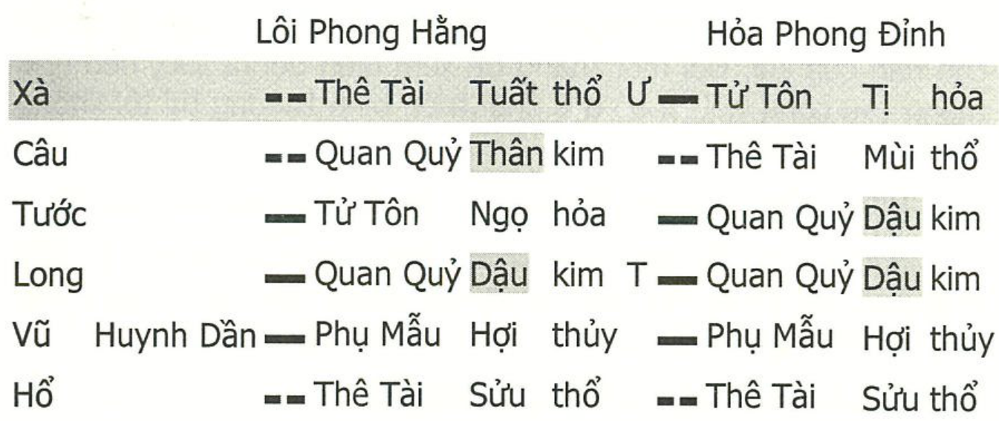
    - **Hình này chứng minh điều gì**
      - lấy Quan Quỷ làm Dụng thần phán đoán.
    - **Từ đâu mà thấy được**
      - Nhìn vào hào 6 động mà hóa phá, tượng không cát.
- **Quá trình suy luận và đối thoại ban đầu:**
  - Căn cứ suy luận: Biến động công việc, lấy Quan Quỷ làm Dụng thần phán đoán.
  - Căn cứ suy luận: Quan Quỷ trì Thế, được Nhật sinh hợp, lại lâm Thanh Long, Thanh Long chủ quý, lại chủ vui vẻ, tôi phán đoán công việc hiện nay của cô ấy rất tốt, có chức vụ, tiền lương lại cao.
  - Căn cứ suy luận: Bởi vì Ứng tại hào 6 lâm Tài động mà hóa phá, biểu thị công ty của bạn cô ấy đang đứng trước nguy cơ, công ty có khả năng phá sản, vỡ nợ.
  - Căn cứ suy luận: Bởi vì Ứng hóa Nguyệt phá, ứng kỳ có thể ứng sang tháng.
  - Đối thoại thực tế: Cô ấy hỏi: "Vì sao?"
  - Đối thoại thực tế: Tôi nói: "Công ty của bạn chị sắp sập rồi, đi làm vài ngày là sập, cuối cùng ngay cả công việc hiện tại cũng sẽ mất."
  - Đối thoại thực tế: Sau khi nghe phán đoán của tôi, cô ấy nói: "Không thể nào, công ty của bạn tôi rất lớn, hơn nữa đang phát triển tốt."
  - Đối thoại thực tế: Tôi nói: "Chị không nên vội, hãy tìm lý do trì hoãn và trả lời cho bạn của chị.
  - Đối thoại thực tế: Đợi một tháng để xem biến đổi ra sao, nếu như tháng sau công ty vẫn có thể phát triển bình thường thì tôi không ngăn cản chị nữa."
- **Ứng nghiệm thực tế và diễn biến sự việc:**
  - Thực tế diễn biến kiểm chứng ứng kỳ và cát hung của quẻ chiêm.
- **Ngộ giải và bài học kinh nghiệm then chốt:**
  - Đúc rút quy luật thực chiến: Xem xét tổng thể ngũ hành, hào động và tâm thái người gieo quẻ.

### Tổng kết chuyên đề và bài học tâm đắc
- **Huyền cơ cốt lõi rút ra từ các quái lệ:**
  - mạnh hơn, biểu thị bạn của cô ấy rất sốt ruột, muốn mời cô ấy qua ngay.
  - Cô ấy nói là đã giục nhiều lần, bảo cô ấy nhanh chóng quyết định.
  - Hào Thế Không mà không được sinh, hào 6 động mà hóa phá, tượng không cát.
  - Do đó, tôi đề nghị cô ấy không nên đến công ty của bạn, tiếp tục ở lại công ty bảo hiểm tốt hơn nhiều.
  - Cô ấy hỏi: "Vì sao?"
  - Tôi nói: "Công ty của bạn chị sắp sập rồi, đi làm vài ngày là sập, cuối cùng ngay cả công việc hiện tại cũng sẽ mất."
  - Bởi vì Ứng tại hào 6 lâm Tài động mà hóa phá, biểu thị công ty của bạn cô ấy đang đứng trước nguy cơ, công ty có khả năng phá sản, vỡ nợ.
  - Sau khi nghe phán đoán của tôi, cô ấy nói: "Không thể nào, công ty của bạn tôi rất lớn, hơn nữa đang phát triển tốt."
  - Tôi nói: "Chị không nên vội, hãy tìm lý do trì hoãn và trả lời cho bạn của chị.
  - Đợi một tháng để xem biến đổi ra sao, nếu như tháng sau công ty vẫn có thể phát triển bình thường thì tôi không ngăn cản chị nữa."
  - Bởi vì Ứng hóa Nguyệt phá, ứng kỳ có thể ứng sang tháng.
  - Sau khi cô ấy đợi một tháng, công ty của bạn cô ấy đột nhiên vỡ nợ.
  - Cô ấy rất cảm ơn lần dự đoán này, nếu không nhờ vậy, có thể hiện tại cô ấy đã không có công việc nữa.

## 5. Sai Lầm Về Địa Điểm Tử Vong

- **Tổng quan nguyên lý & bối cảnh chuyên đề:**
  - Quẻ này thực tế là một vấn đề tâm lý. Nhìn bề ngoài là dự đoán về tình hình của người mẹ đã mất, nhưng thực tế trong đó có dự đoán về yếu tố bệnh tật. Thế bị Nguyệt hợp là vượng, Nhật cũng không khắc, nếu như phán đoán sức khỏe của bản thân người xem thì không có trở ngại gì lớn. Tài lâm Trình Xà độc phát, độc phát có thể biểu thị nguyên nhân, Trình Xà chủ bất an, lại là quẻ lục xung, chứng tỏ cô ấy đang ở trong một trạng thái bất an.
  - Nhưng cô ấy hỏi về hướng đi của người mẹ đã mất. Đây là vấn đề chính của quẻ. Về việc con người sau khi chết có lên thiên đường hay vào địa ngục hay không, chúng ta tạm thời không bàn, nhưng dùng quẻ để trả lời vấn đề này như thế nào, thông thường mà nói thì rất dễ trả lời, bởi vì bất kể bạn trả lời như thế nào thì cũng đều đúng, cô ấy không thể đến thiên đường hoặc địa ngục để nghiệm chứng phán đoán của bạn được. Nhưng chúng ta xem quẻ thì mỗi kết luận đều phải có căn cứ, không thể nói mò.
  - Hào Phụ Mẫu có thể đại diện người mẹ đã mất, người xưa cũng nói rằng người đã mất có thể xem Quan Quỷ. Nhưng thực tế không thể xem như vậy, Quan Quỷ có thể đại diện người chết, thi thể, nhưng thân nhân của mình thì vẫn phải dùng lục thân để định. Do đó, Phụ Mẫu Hợi thủy trong quẻ chính là người mẹ đã mất của cô ấy, Phụ Mẫu Hợi thủy bị Nguyệt khắc, hào sơ phát động đến khắc, lại lâm Không Vong, có thể biểu thị mẹ cô ấy đã không còn trên nhân thế nữa.
  - Vậy thì dùng cái gì để phán đoán hướng đi của mẹ cô ấy? Tôi cho rằng dùng Nguyên thần để phán đoán. Nguyên thần là tiềm thức của con người, chủ tư duy và thế giới nội tâm của con người, càng có thể đại diện cho linh hồn của con người. Tôi thấy quẻ này Nguyên thần nhập Mộ tại hào sơ, hào sơ thể hiện tầng
### Ví dụ 1: Ngày Kỷ Tị tháng Tuất
- **Bối cảnh & Dữ kiện chiêm bái:**
  - **Ví dụ 1:** Ngày Kỷ Tị tháng Tuất, một cô gái lúc nào cũng có cảm giác sợ hãi đối với người mẹ đã mất nhiều năm của mình, cô ấy cứ cảm thấy giống như mẹ đang đi theo mình.
  - Thế là đoán xem mẹ cô ấy đã lên thiên đường hay là đã xuống địa ngục?
  - Được Tốn Vi Phong biến Phong Thiên Tiểu Súc.
  - Quẻ này thực tế là một vấn đề tâm lý.
  - Nhìn bề ngoài là dự đoán về tình hình của người mẹ đã mất, nhưng thực tế trong đó có dự đoán về yếu tố bệnh tật.
- Bảng quẻ Quẻ Tốn Vi Phong biến Phong Thiên Tiểu Súc:
  - **Hình 19.** Quẻ Tốn Vi Phong biến Phong Thiên Tiểu Súc
    - 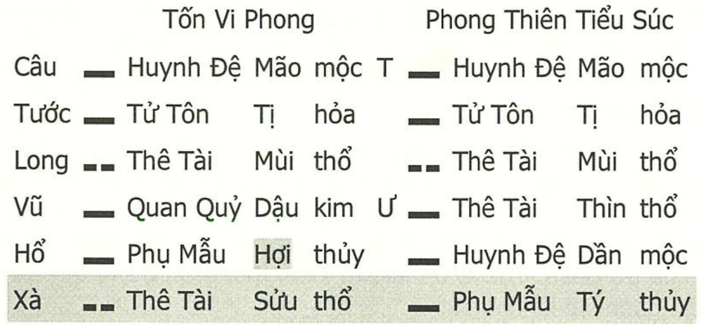
    - **Hình này chứng minh điều gì**
      - quẻ lục xung, chứng tỏ cô ấy đang ở trong một trạng thái bất an.
    - **Từ đâu mà thấy được**
      - Nhìn vào hào 2 bị khắc, hào 2 là trạch, do đó phán đoán mẹ cô ấy treo cổ tự tử ở trong nhà.
- **Quá trình suy luận và đối thoại ban đầu:**
  - Căn cứ suy luận: Về việc con người sau khi chết có lên thiên đường hay vào địa ngục hay không, chúng ta tạm thời không bàn, nhưng dùng quẻ để trả lời vấn đề này như thế nào, thông thường mà nói thì rất dễ trả lời, bởi vì bất kể bạn trả lời như thế nào thì cũng đều đúng, cô ấy không thể đến thiên đường hoặc địa ngục để nghiệm chứng phán đoán của bạn được.
  - Căn cứ suy luận: Theo kết quả nghiên cứu lục hào nhiều năm của tôi, thông tin tự tử trong quẻ này đã rất rõ ràng.
  - Căn cứ suy luận: Nói chung, khi Dụng thần hưu tù, Nguyên thần gặp đất Tử, Mộ, Tuyệt, người này đã có khuynh hướng tự tử.
  - Căn cứ suy luận: Bởi vì Nguyên thần thể hiện tư duy, Nguyên thần gặp Tử, Mộ, Tuyệt thì biểu thị tư duy của người này đã đi vào ngõ cụt, nghĩ không thoáng, lòng dạ không cởi mở, thì sẽ tự tử, tôi đã được nghiệm chứng rất nhiều quẻ như vậy.
  - Căn cứ suy luận: Phán đoán này đã nhận được sự tán thành của đối phương, và đã nhìn dự đoán của tôi với con mắt khác.
- **Ứng nghiệm thực tế và diễn biến sự việc:**
  - Nhìn vào kết quả thực tế: Dùng lục hào phán đoán phong thủy và thực địa xem phong thủy có sự khác nhau nhất định, thực địa xem phong thủy chỉ cần tìm ra vấn đề sở tại, phán đoán ra sự việc xảy ra trước đây và sự việc sẽ xảy ra sau này, còn lục hào phong thủy thường phải phán đoán ra một số tình trạng xung quanh nơi ở, như vậy có thể nghiệm chứng tính chính xác của thông tin trong quẻ, từ đó tìm ra vấn đề sở tại.
  - Nhìn vào kết quả thực tế: Quẻ này Phụ Mẫu trì Thế, Nhật Nguyệt đến sinh, hào Thế là mình, nhà lâm thân, biểu thị đã có nhà, chứng tỏ nhà này là tài sản cá nhân của mình.
  - Nhìn vào kết quả thực tế: Trên thực tế đúng là nhà của mình.
- **Ngộ giải và bài học kinh nghiệm then chốt:**
  - Đúc rút quy luật thực chiến: Xem xét tổng thể ngũ hành, hào động và tâm thái người gieo quẻ.

### Ví dụ 2: Đây là quẻ của một người đàn ông Nhật Bản thỉnh cầu đoán pho
- **Bối cảnh & Dữ kiện chiêm bái:**
  - Dự đoán thông thường, phán đoán đến đây thì coi như đã hoàn thành nhiệm vụ, đã trả lời vấn đề mà đối phương muốn hỏi.
  - Nhưng thành thật mà nói, phán đoán như vậy vẫn chưa có sức thuyết phục, chưa thể khiến đối phương cảm nhận được độ khả tín của dự đoán.
  - Thế là tôi lại tìm kiếm thông tin trong quẻ và đã phán đoán vài lời như sau.
  - Tôi thấy Phụ Mẫu Hợi thủy bị hào lâm Trình Xà khắc thương, Trình Xà có tượng dây thừng, mẹ cô ấy có treo cổ tự tử không nhỉ?
  - Nếu chỉ dựa vào thông tin này thì chưa thể đưa ra nhận định, cần phải có thông tin khác phụ tá.
- Bảng quẻ Quẻ Lôi Trạch Quy Muội:
  - **Hình 20.** Quẻ Lôi Trạch Quy Muội
    - 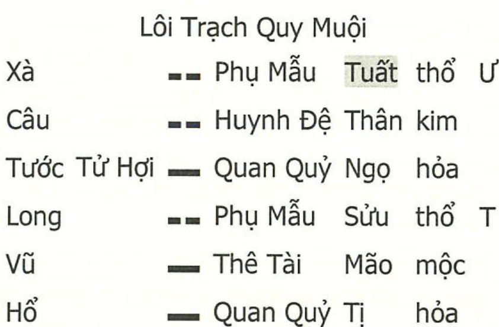
    - **Hình này chứng minh điều gì**
      - Lấy Quan Quỷ làm Dụng thần.
    - **Từ đâu mà thấy được**
      - Nhìn vào hào 2 bị khắc, hào 2 là trạch, do đó phán đoán mẹ cô ấy treo cổ tự tử ở trong nhà.
- **Quá trình suy luận và đối thoại ban đầu:**
  - Căn cứ suy luận: Theo kết quả nghiên cứu lục hào nhiều năm của tôi, thông tin tự tử trong quẻ này đã rất rõ ràng.
  - Căn cứ suy luận: Nói chung, khi Dụng thần hưu tù, Nguyên thần gặp đất Tử, Mộ, Tuyệt, người này đã có khuynh hướng tự tử.
  - Căn cứ suy luận: Bởi vì Nguyên thần thể hiện tư duy, Nguyên thần gặp Tử, Mộ, Tuyệt thì biểu thị tư duy của người này đã đi vào ngõ cụt, nghĩ không thoáng, lòng dạ không cởi mở, thì sẽ tự tử, tôi đã được nghiệm chứng rất nhiều quẻ như vậy.
  - Căn cứ suy luận: Phán đoán này đã nhận được sự tán thành của đối phương, và đã nhìn dự đoán của tôi với con mắt khác.
- **Ứng nghiệm thực tế và diễn biến sự việc:**
  - Nhìn vào kết quả thực tế: Kết quả là đã đến nông thôn nhậm chức hương trưởng (xã trưởng).
  - Nhìn vào kết quả thực tế: Ở đây khi phán đoán đơn vị sẽ đến đã cân nhắc đến hoàn cảnh công tác của anh ta, dựa vào tình hình thực tế kết hợp lại để phán đoán, dùng đến hào vị, lục thần v.v, do đó muốn phán đoán ra địa phương cụ thể thì cần hiểu rõ hàm nghĩa của hào vị.
- **Ngộ giải và bài học kinh nghiệm then chốt:**
  - Đúc rút quy luật thực chiến: Xem xét tổng thể ngũ hành, hào động và tâm thái người gieo quẻ.

### Tổng kết chuyên đề và bài học tâm đắc
- **Huyền cơ cốt lõi rút ra từ các quái lệ:**
  - Suy vượng của Phụ Mẫu có thể phán đoán kích thước của nhà và mức độ mới cũ, vượng tướng là lớn, hưu tù là nhỏ, quẻ này Phụ Mẫu được Nhật Nguyệt đến sinh là vượng tướng, chứng tỏ nhà rất lớn, thế là phán đoán nhà của anh ta chiếm diện tích đất rất lớn.
  - Anh ta phản hồi: Có hơn 700 m².
  - Trong dự đoán lục hào, lục thần là căn cứ để phán đoán đặc điểm và tính chất.
  - Quẻ này Phụ Mẫu lâm Thanh Long, Thanh Long chủ mới, lại chủ đẹp, phong cảnh xung quanh rất đẹp, nhà đẹp.
  - Dựa vào phép di thần lục thần, có thể mượn Trình Xà của hào Phụ Mẫu khác, Trình Xà là cô độc, trong phán đoán phong thủy có thể là hẻo lánh, do đó phán đoán nơi anh ta sống hơi hẻo lánh.
  - Phản hồi: Đúng là phong cảnh xung quanh rất đẹp, nhà ở nông thôn.
  - Mão mộc lâm hào 2, không bị khắc, hào 2 là trạch, cũng là lân cận nhà, do đó cây cối gần nhà rậm rạp xanh tươi.
  - Phản hồi: Phía Đông đều là rừng cây.
  - Phụ Mẫu Tuất thổ trên Ứng Không, Ứng là hàng xóm, cũng có thể biểu thị lân cận, Không có thể biểu thị nhà trống rỗng, chứng tỏ lân cận có căn nhà bỏ trống.
  - Hợp Tài lâm Trình Xà, Tài là hàng hóa, Trình Xà chủ lộn xộn, do đó lân cận khá lộn xộn, để rất nhiều thứ.
  - Phản hồi: Lân cận có một gara có thể để 6 chiếc xe, sau khi xây dựng xong chưa hề sử dụng, vẫn cứ để trống.
  - Trước gara có để rất nhiều thùng dầu rỗng.
  - Quan Quỷ vượng mà sinh Thế, Quan Quỷ thể hiện sự nghiệp, nơi này có lợi cho sự phát triển sự nghiệp, lại lâm Thanh Long, biểu thị phú quý, vui mừng, chứng tỏ phong thủy rất tốt.
  - Phản hồi: Công việc của anh ta là chế tạo kính đeo mắt, nhà ở trong khu vực trung tâm của nhà máy chế tạo kính đeo mắt, sự nghiệp phát triển rất tốt.
  - Đối với đàn ông mà nói, Tài có thể thể hiện phụ nữ, tại hào 2, hào 2 là hào vị phu thê, Tài này càng có thể thể hiện vợ.
  - Hào Tài nhược, hào Ứng Không, biểu thị hôn nhân muộn.
  - Phản hồi: Hiện tại đã hơn 30 tuổi vẫn chưa kết hôn.
  - **Ví dụ 3:** Một cán bộ trong huyện đoán tình hình thăng chức và đơn vị sẽ đến, ở ngày Mậu Tý tháng Ngọ, được Trạch Sơn Hàm biến Trạch Hỏa Cách.
  - Lấy Quan Quỷ làm Dụng thần.
  - Quan Quỷ được Nguyệt tỉ phù là vượng tướng, mặc dù Không Vong, nhưng Nhật xung thực, hơn nữa hình thành ám động.
  - Quan Quỷ vượng tướng có thể thăng chức, nhưng không nên khắc Thế.
  - May mà Phụ Mẫu Thìn thổ động mà dẫn hóa, Quan động sinh Phụ Mẫu Thìn thổ, Phụ Mẫu Thìn thổ lại động sinh hào Thế, sau cùng có thể thăng.
  - Hỏi sẽ đến đơn vị nào?
  - Phụ Mẫu Thìn thổ lâm Câu Trần độc phát, độc phát có thể biểu thị tính chất, Câu Trần chủ điền thổ, do đó có liên quan nhất định đến đất đai, mà Quan Quỷ Ngọ hỏa lâm Trình Xà, Trình Xà chủ hẻo lánh, ám động hợp đến hào 6, hào 6 lại là nơi xa xôi, mà nhậm chức trong một huyện, đó là nông thôn.
  - Kết quả là đã đến nông thôn nhậm chức hương trưởng (xã trưởng).
  - Ở đây khi phán đoán đơn vị sẽ đến đã cân nhắc đến hoàn cảnh công tác của anh ta, dựa vào tình hình thực tế kết hợp lại để phán đoán, dùng đến hào vị, lục thần v.v, do đó muốn phán đoán ra địa phương cụ thể thì cần hiểu rõ hàm nghĩa của hào vị.

## 6. Tam Giáo Cửu Lưu Và Hào Tử Tôn

- **Tổng quan nguyên lý & bối cảnh chuyên đề:**
  - Đây là quái lệ dự đoán ở năm 96. Bởi vì trước đây chưa từng đoán loại quẻ này, nhưng dựa vào mô tả lục thân trong sách cổ, Tử Tôn thể hiện tăng đạo, Lạt Ma cũng là người xuất gia, do đó lấy Tử Tôn để phán đoán.
  - Tử Tôn mặc dù không được Nhật Nguyệt sinh phù, nhưng cũng không bị khắc, động hóa Tiến thần có sức mạnh, hào Thế thể hiện mình, Tử Tôn trì Thế chính là Lạt Ma đến bên cạnh mình. Tử Tôn nhập Mộ ở Nhật, thời gian Lạt Ma lưu lại vùng này sẽ không quá lâu. Thế hóa Tiến thần, bản thân sẽ thu được không ít lợi ích.
  - Thế nhưng vị Lạt Ma này đã không đến. Chẳng lẽ đã phán đoán sai? Tôi đã lật xem các phần trình bày đề cập đến tình huống dự đoán người xuất gia trong các sách cổ.
  - Chiêm tăng đạo trong Dịch Ẩn, "... nếu người đó đã xuất gia đến chiêm thì lấy Tử Tôn làm Dụng, tự chiêm thì dùng Thế, chiêm hộ thì dùng Ứng...", chủ trương người khác dự đoán người xuất gia thì lấy hào Ứng làm Dụng thần.
### Ví dụ 1: Ngày Đinh Mùi tháng Tuất
- **Bối cảnh & Dữ kiện chiêm bái:**
  - **Ví dụ 1:** Ngày Đinh Mùi tháng Tuất, một người đàn ông thích tu luyện mật tông nghe nói một Lạt Ma Tây Tạng sắp đến truyền pháp, rất muốn nghe giáo huấn, hỏi khi nào vị Lạt Ma này đến?
  - Anh ta gieo quẻ được Thủy Lôi Truân biến Địa Trạch Lâm.
  - Đây là quái lệ dự đoán ở năm 96.
  - Bởi vì trước đây chưa từng đoán loại quẻ này, nhưng dựa vào mô tả lục thân trong sách cổ, Tử Tôn thể hiện tăng đạo, Lạt Ma cũng là người xuất gia, do đó lấy Tử Tôn để phán đoán.
  - Thế nhưng vị Lạt Ma này đã không đến.
- Bảng quẻ Sơ đồ quẻ Phong Hỏa Gia Nhân biến Phong Địa Quan:
  - **Hình 21.** Sơ đồ quẻ Phong Hỏa Gia Nhân biến Phong Địa Quan
    - 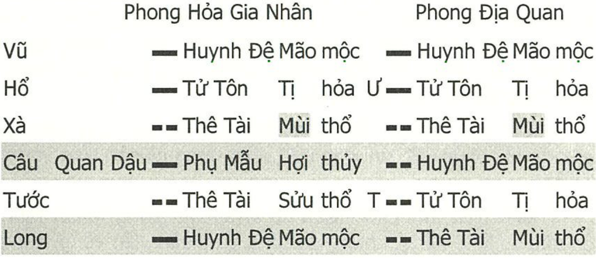
    - **Hình này chứng minh điều gì**
      - lấy hào Ứng làm Dụng thần.
    - **Từ đâu mà thấy được**
      - Nhìn vào hào Thế, hào Ứng, Dụng thần và động hào trong bảng quẻ Sơ đồ quẻ Phong Hỏa Gia Nhân biến Phong Địa Quan.
- **Quá trình suy luận và đối thoại ban đầu:**
  - Căn cứ suy luận: Bởi vì trước đây chưa từng đoán loại quẻ này, nhưng dựa vào mô tả lục thân trong sách cổ, Tử Tôn thể hiện tăng đạo, Lạt Ma cũng là người xuất gia, do đó lấy Tử Tôn để phán đoán.
  - Căn cứ suy luận: Quẻ này lấy hào Ứng làm Dụng, hào Ứng phát động, Ứng động người ta có biến, Thế khắc hào Ứng, Thế khắc Dụng thần người không đến, có vẻ hợp lý.
  - Căn cứ suy luận: Nếu lấy Tử Tôn làm Dụng, chẳng lẽ là bởi vì Tử Tôn hóa Tiến thần?
  - Căn cứ suy luận: Thông thường dự đoán hành nhân nên Dụng thần hóa thoái, thoái biểu thị về bên cạnh mình, nhưng đây là người chưa bao giờ gặp, lấy Tiến thần luận không thể đến, hiển nhiên có phần miễn cưỡng.
  - Căn cứ suy luận: Quẻ này Ứng sinh hào Thế người nhất định sẽ đến, mặc dù Nhật hợp là cản trở, hợp này có hai ý nghĩa.
  - Căn cứ suy luận: Một là thể hiện Hách tiên sinh là người mù.
  - Đối thoại thực tế: Chiêm tăng đạo trong Dịch Ẩn, "... nếu người đó đã xuất gia đến chiêm thì lấy Tử Tôn làm Dụng, tự chiêm thì dùng Thế, chiêm hộ thì dùng Ứng...", chủ trương người khác dự đoán người xuất gia thì lấy hào Ứng làm Dụng thần.
  - Đối thoại thực tế: Luận thuật về tăng đạo trong Tăng San Bốc Dịch: "Cựu văn: Sao có thể văn thư phát động.
  - Đối thoại thực tế: Nếu tăng đạo y gia tự chiêm đạo thuật, cũng lấy Tử Tôn làm Dụng thần, Tử Tôn vượng tướng, quỷ phục ma hàng.", chủ trương lấy Tử Tôn làm Dụng.
  - Đối thoại thực tế: Luận thuật về tăng đạo trong Dịch Lâm Bổ Di: "Lấy hào Ứng làm chủ, lấy phúc đức làm căn cứ.", đều dùng cả hào Ứng và hào Tử Tôn.
- **Ứng nghiệm thực tế và diễn biến sự việc:**
  - Nhìn vào kết quả thực tế: Phán đoán trên đây hoàn toàn ứng nghiệm.
- **Ngộ giải và bài học kinh nghiệm then chốt:**
  - Đúc rút quy luật thực chiến: Xem xét tổng thể ngũ hành, hào động và tâm thái người gieo quẻ.

### Quái lệ 2: Sơ đồ quẻ Sơn Hỏa Bí biến Phong Sơn Tiệm
- **Bối cảnh & Dữ kiện chiêm bái:**
  - Ngày Quý Mùi tháng Thìn, đây cũng là quẻ của Đoàn tiên sinh dự đoán đến nông thôn đón Hách tiên sinh lên thị xã, được Sơn Hỏa Bí biến Phong Sơn Tiệm.
  - Khi đó tôi đoán rằng: Xe của các ông ngồi, lốp xe sẽ nổ trên đường, giữa đường sẽ có một cô gái rất xinh đẹp lên xe của các ông.
  - Có điều là không đón được Hách tiên sinh.
  - Phán đoán trên đây hoàn toàn ứng nghiệm.
  - Sau khi trở về, Đoàn tiên sinh đã hỏi tôi những phán đoán này dựa vào cái gì?
- Bảng quẻ Sơ đồ quẻ Sơn Hỏa Bí biến Phong Sơn Tiệm:
  - **Hình 22.** Sơ đồ quẻ Sơn Hỏa Bí biến Phong Sơn Tiệm
    - 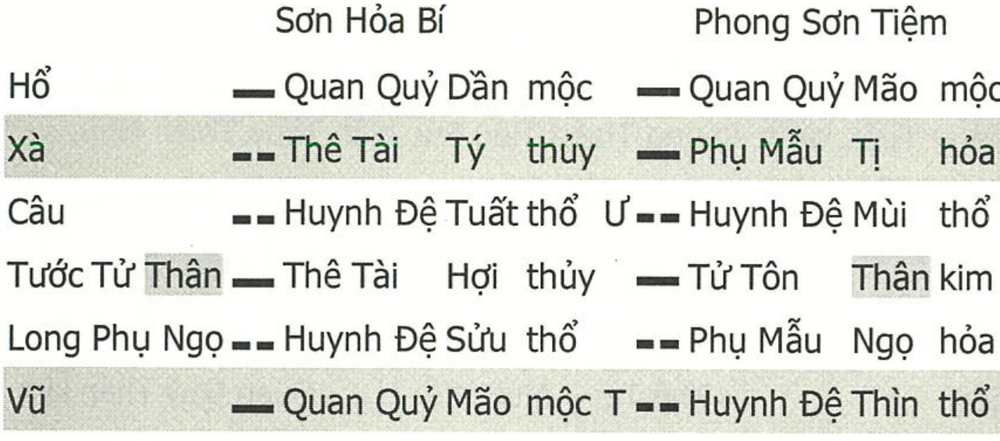
    - **Hình này chứng minh điều gì**
      - Bảng quẻ Sơ đồ quẻ Sơn Hỏa Bí biến Phong Sơn Tiệm phản ánh sự phối chiếu hào vị, ngũ hành và động biến minh chứng cho vấn đề chiêm đoán.
    - **Từ đâu mà thấy được**
      - Nhìn vào hào 5 Thê Tài Tý thủy động đến hợp hào 2, lại sinh hào Thế.
- **Quá trình suy luận và đối thoại ban đầu:**
  - Căn cứ suy luận: Có điều là không đón được Hách tiên sinh.
  - Căn cứ suy luận: Hào Thế thể hiện bản thân, lâm hào sơ phát động, thì biểu thị ra ngoài, đi đường.
  - Căn cứ suy luận: Bởi vì biết bọn họ lái xe đi đón, do đó hào Quỷ trên Thế động, trên đường nhất định không thuận lợi.
  - Căn cứ suy luận: Trong quẻ này hào 5 Thê Tài Tý thủy động đến hợp hào 2, lại sinh hào Thế.
  - Căn cứ suy luận: Hào 5 thể hiện đường, Tài thể hiện nữ nhân, lâm Trình Xà chủ thông tin bất ngờ.
  - Căn cứ suy luận: Sinh Thế là thỉnh cầu bọn họ, hợp hào 2 đối với phong thủy là hào gia, hào trạch, đối với xe chính là trong xe, bởi vì hợp, chính là đã lên xe, do đó phán đoán sẽ gặp một cô gái đi nhờ xe.
- **Ứng nghiệm thực tế và diễn biến sự việc:**
  - Nhìn vào kết quả thực tế: Hào Ứng là nơi đến, cũng có thể xem là người sẽ đi đón, Nguyệt phá, biểu thị tình hình đối phương không được tốt, Thế khắc hào Ứng, không thể đến.
  - Nhìn vào kết quả thực tế: Trên thực tế là Hách tiên sinh đã bị bệnh nên không thể đến.
- **Ngộ giải và bài học kinh nghiệm then chốt:**
  - Đúc rút quy luật thực chiến: Xem xét tổng thể ngũ hành, hào động và tâm thái người gieo quẻ.

### Ví dụ 3: Đoàn lão sư sắp đến Vũ Hán để gặp một người mù làm dự đoán
- **Bối cảnh & Dữ kiện chiêm bái:**
  - Hào Ứng là nơi đến, cũng có thể xem là người sẽ đi đón, Nguyệt phá, biểu thị tình hình đối phương không được tốt, Thế khắc hào Ứng, không thể đến.
  - Trên thực tế là Hách tiên sinh đã bị bệnh nên không thể đến.
  - **Ví dụ 3:** Đoàn lão sư sắp đến Vũ Hán để gặp một người mù làm dự đoán, hỏi trình độ người này ra sao?
  - Ở ngày Nhâm Thân tháng Tuất, được Phong Thiên Tiểu Súc biến Thủy Thiên Nhu.
  - Hào độc phát cũng là Tử địa của Phụ Mẫu, có thể thấy trình độ bình thường.
- Bảng quẻ Sơ đồ quẻ Phong Thiên Tiểu Súc biến Thủy Thiên Nhu:
  - **Hình 23.** Sơ đồ quẻ Phong Thiên Tiểu Súc biến Thủy Thiên Nhu
    - 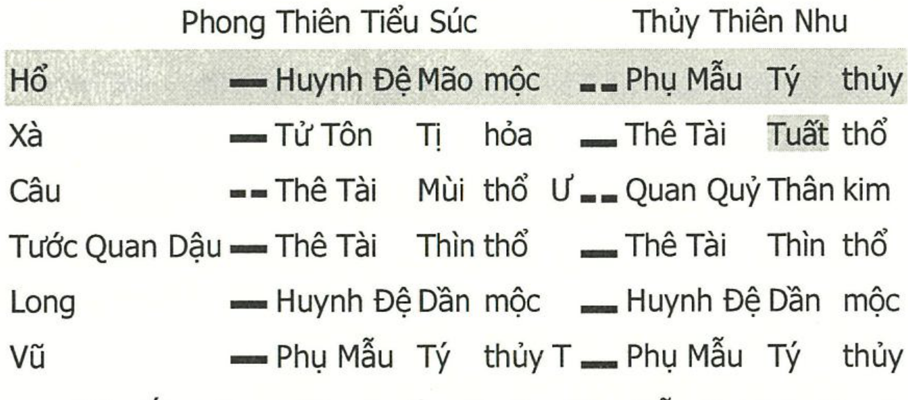
    - **Hình này chứng minh điều gì**
      - Bảng quẻ Sơ đồ quẻ Phong Thiên Tiểu Súc biến Thủy Thiên Nhu phản ánh sự phối chiếu hào vị, ngũ hành và động biến minh chứng cho vấn đề chiêm đoán.
    - **Từ đâu mà thấy được**
      - Nhìn vào hào Thế, hào Ứng, Dụng thần và động hào trong bảng quẻ Sơ đồ quẻ Phong Thiên Tiểu Súc biến Thủy Thiên Nhu.
- **Quá trình suy luận và đối thoại ban đầu:**
  - Tác giả phân tích cấu trúc hào tượng, Dụng thần và các yếu tố sinh khắc trong quẻ Sơ đồ quẻ Phong Thiên Tiểu Súc biến Thủy Thiên Nhu.
- **Ứng nghiệm thực tế và diễn biến sự việc:**
  - Thực tế diễn biến kiểm chứng ứng kỳ và cát hung của quẻ chiêm.
- **Ngộ giải và bài học kinh nghiệm then chốt:**
  - Đúc rút quy luật thực chiến: Xem xét tổng thể ngũ hành, hào động và tâm thái người gieo quẻ.

## 7. Tại Sao Không Ứng Ngày Sửu Đầu Tiên?

### Ví dụ 1: Ngày Đinh Dậu tháng Ngọ
- **Bối cảnh & Dữ kiện chiêm bái:**
  - **Ví dụ 1:** Ngày Đinh Dậu tháng Ngọ, người bạn Nhật Bản nói rằng đã gửi cho tôi sách về Dịch học, tôi đoán khi nào có thể nhận được sách?
  - Được Thiên Lôi Vô Vọng.
  - Lẽ nào thông tin phản ánh trong quẻ không đúng, hay là do mình đã phán đoán sai?
  - Tại ngày Tân Sửu, tôi lại gieo quẻ dự đoán khi nào nhận được sách?
  - Ngày Tân Sửu tháng Ngọ, được Trạch Hỏa Cách biến Trạch Thiên Quải.
- Bảng quẻ Sơ đồ quẻ Thiên Lôi Vô Vọng:
  - **Hình 24.** Sơ đồ quẻ Thiên Lôi Vô Vọng
    - 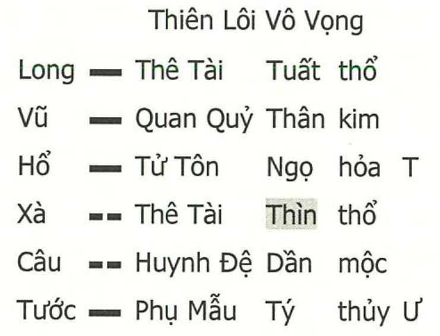
    - **Hình này chứng minh điều gì**
      - Lấy Phụ Mẫu làm Dụng thần, Phụ Mẫu Tý thủy Nguyệt phá, nhưng có Nhật sinh, không xem là hưu tù.
    - **Từ đâu mà thấy được**
      - Nhìn vào hào Thế, hào Ứng, Dụng thần và động hào trong bảng quẻ Sơ đồ quẻ Thiên Lôi Vô Vọng.
- **Quá trình suy luận và đối thoại ban đầu:**
  - Căn cứ suy luận: Lấy Phụ Mẫu làm Dụng thần, Phụ Mẫu Tý thủy Nguyệt phá, nhưng có Nhật sinh, không xem là hưu tù.
  - Căn cứ suy luận: Phá có thể ứng thực phá hoặc hợp phá, bởi vì là quẻ lục xung, tính khả thi của ứng hợp phá lớn hơn.
  - Căn cứ suy luận: Do đó tôi phán đoán ngày Tân Sửu nhận được sách, nhưng ngày này không nhận được.
- **Ứng nghiệm thực tế và diễn biến sự việc:**
  - Thực tế diễn biến kiểm chứng ứng kỳ và cát hung của quẻ chiêm.
- **Ngộ giải và bài học kinh nghiệm then chốt:**
  - Đúc rút quy luật thực chiến: Xem xét tổng thể ngũ hành, hào động và tâm thái người gieo quẻ.

### Quái lệ 2: Sơ đồ quẻ Trạch Hỏa Cách biến Trạch Thiên Quải
- **Bối cảnh & Dữ kiện chiêm bái:**
  - Chiêm đoán theo bảng quẻ Sơ đồ quẻ Trạch Hỏa Cách biến Trạch Thiên Quải trong thực tiễn.
- Bảng quẻ Sơ đồ quẻ Trạch Hỏa Cách biến Trạch Thiên Quải:
  - **Hình 25.** Sơ đồ quẻ Trạch Hỏa Cách biến Trạch Thiên Quải
    - 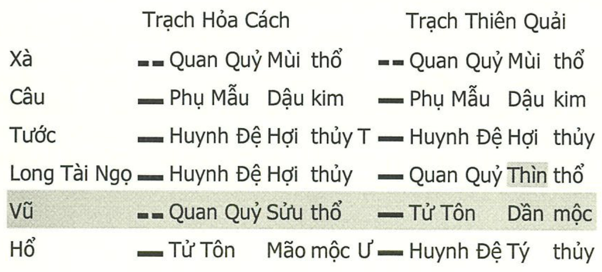
    - **Hình này chứng minh điều gì**
      - lấy Phụ Mẫu làm Dụng thần, Dụng thần lưỡng hiện, lấy hào phát động làm Dụng.
    - **Từ đâu mà thấy được**
      - Nhìn vào hào Thế, hào Ứng, Dụng thần và động hào trong bảng quẻ Sơ đồ quẻ Trạch Hỏa Cách biến Trạch Thiên Quải.
- **Quá trình suy luận và đối thoại ban đầu:**
  - Căn cứ suy luận: Nhưng trong quẻ thứ hai, Sửu thổ hóa hồi đầu khắc, sẽ không ứng ngày Sửu này, mà ứng ngày Sửu trong tuần Giáp Thìn, bởi vì trong tuần Giáp Thìn thì Dần mộc Không, lực lượng khắc Nguyên thần đã thu hẹp ảnh hưởng, với lại đã đến tháng Mùi, Dụng thần được sinh, ám động đó biểu thị là tháng Mùi.
  - Căn cứ suy luận: Có quẻ phán đoán rất thần kỳ, khiến nội tâm của người xem chấn động.
  - Căn cứ suy luận: Nếu như đều phán đoán chính xác sự việc và thời điểm xảy ra trong tương lai, thì đó là một dự đoán hoàn hảo, nếu như xuất hiện sai lầm về ứng kỳ, thì chẳng khác nào trong món ăn ngon trên bàn có trộn lẫn một sợi tóc, mặc dù không ảnh hưởng đến thức ăn tổng thể, nhưng đã khiến khẩu vị của người ăn giảm đi rất nhiều.
  - Căn cứ suy luận: Tiếc là bởi vì tôi ngày thường tương đối bận rộn, do đó không có nhiều thời gian để nghiên cứu tỉ mỉ quy luật của ứng kỳ.
- **Ứng nghiệm thực tế và diễn biến sự việc:**
  - Nhìn vào kết quả thực tế: Quẻ này đã khiến tôi suy nghĩ, quẻ trước tại sao không ứng ngày Tân Sửu này, mà phải ứng ngày Quý Sửu kế tiếp nhỉ?
  - Nhìn vào kết quả thực tế: Xem ra phân tích ứng kỳ phải chú ý đến các phương diện, gửi sách từ Nhật Bản, theo tình hình tốc độ bưu chính lúc đó, nhanh cũng cần một tuần lễ, chậm thì cần nửa tháng.
  - Nhìn vào kết quả thực tế: Do đó phán đoán quẻ không thể cứng nhắc, phải kết hợp với tình hình thực tế để phân tích.
  - Nhìn vào kết quả thực tế: Nhưng trong quẻ thứ hai, Sửu thổ hóa hồi đầu khắc, sẽ không ứng ngày Sửu này, mà ứng ngày Sửu trong tuần Giáp Thìn, bởi vì trong tuần Giáp Thìn thì Dần mộc Không, lực lượng khắc Nguyên thần đã thu hẹp ảnh hưởng, với lại đã đến tháng Mùi, Dụng thần được sinh, ám động đó biểu thị là tháng Mùi.
  - Nhìn vào kết quả thực tế: Kết quả là đã nhận được sách ở ngày Quý Sửu tháng Mùi.
  - Nhìn vào kết quả thực tế: Anh ta có phần không hiểu, hỏi tôi tại sao, tôi nói rằng bây giờ nói lý do vẫn hơi sớm, chờ ứng nghiệm sẽ nói sau.
- **Ngộ giải và bài học kinh nghiệm then chốt:**
  - Đúc rút quy luật thực chiến: Xem xét tổng thể ngũ hành, hào động và tâm thái người gieo quẻ.

### Ví dụ 2: Một ngày trong năm 2006
- **Bối cảnh & Dữ kiện chiêm bái:**
  - Quẻ này đã khiến tôi suy nghĩ, quẻ trước tại sao không ứng ngày Tân Sửu này, mà phải ứng ngày Quý Sửu kế tiếp nhỉ?
  - Xem ra phân tích ứng kỳ phải chú ý đến các phương diện, gửi sách từ Nhật Bản, theo tình hình tốc độ bưu chính lúc đó, nhanh cũng cần một tuần lễ, chậm thì cần nửa tháng.
  - Do đó phán đoán quẻ không thể cứng nhắc, phải kết hợp với tình hình thực tế để phân tích.
  - Kết quả là đã nhận được sách ở ngày Quý Sửu tháng Mùi.
  - Ứng kỳ là một điểm khó trong dự đoán, rất nhiều quẻ của tôi thường xuyên sai sót về ứng kỳ.
- Bảng quẻ Sơ đồ quẻ Sơn Thủy Mông biến Địa Thủy Sư:
  - **Hình 26.** Sơ đồ quẻ Sơn Thủy Mông biến Địa Thủy Sư
    - 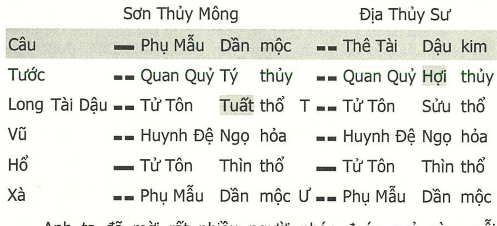
    - **Hình này chứng minh điều gì**
      - lấy Phụ Mẫu làm Dụng thần, Dụng thần lưỡng hiện, lấy hào phát động làm Dụng.
    - **Từ đâu mà thấy được**
      - Nhìn vào hào Thế, hào Ứng, Dụng thần và động hào trong bảng quẻ Sơ đồ quẻ Sơn Thủy Mông biến Địa Thủy Sư.
- **Quá trình suy luận và đối thoại ban đầu:**
  - Căn cứ suy luận: Nhưng trong quẻ thứ hai, Sửu thổ hóa hồi đầu khắc, sẽ không ứng ngày Sửu này, mà ứng ngày Sửu trong tuần Giáp Thìn, bởi vì trong tuần Giáp Thìn thì Dần mộc Không, lực lượng khắc Nguyên thần đã thu hẹp ảnh hưởng, với lại đã đến tháng Mùi, Dụng thần được sinh, ám động đó biểu thị là tháng Mùi.
  - Căn cứ suy luận: Có quẻ phán đoán rất thần kỳ, khiến nội tâm của người xem chấn động.
  - Căn cứ suy luận: Nếu như đều phán đoán chính xác sự việc và thời điểm xảy ra trong tương lai, thì đó là một dự đoán hoàn hảo, nếu như xuất hiện sai lầm về ứng kỳ, thì chẳng khác nào trong món ăn ngon trên bàn có trộn lẫn một sợi tóc, mặc dù không ảnh hưởng đến thức ăn tổng thể, nhưng đã khiến khẩu vị của người ăn giảm đi rất nhiều.
  - Căn cứ suy luận: Tiếc là bởi vì tôi ngày thường tương đối bận rộn, do đó không có nhiều thời gian để nghiên cứu tỉ mỉ quy luật của ứng kỳ.
- **Ứng nghiệm thực tế và diễn biến sự việc:**
  - Thực tế diễn biến kiểm chứng ứng kỳ và cát hung của quẻ chiêm.
- **Ngộ giải và bài học kinh nghiệm then chốt:**
  - Đúc rút quy luật thực chiến: Xem xét tổng thể ngũ hành, hào động và tâm thái người gieo quẻ.

### Ví dụ 3: Một người phụ nữ đoán bệnh lâu của cha
- **Bối cảnh & Dữ kiện chiêm bái:**
  - **Ví dụ 3:** Một người phụ nữ đoán bệnh lâu của cha, hiện nay có phần chuyển biến xấu, ngày Tân Dậu tháng Dần, được Hỏa Phong Đỉnh biến Địa Phong Thăng.
- Bảng quẻ Sơ đồ quẻ Hỏa Phong Đỉnh biến Địa Phong Thăng:
  - **Hình 27.** Sơ đồ quẻ Hỏa Phong Đỉnh biến Địa Phong Thăng
    - 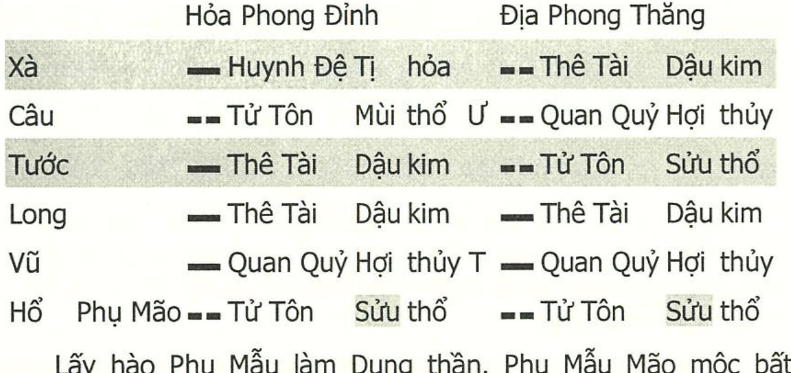
    - **Hình này chứng minh điều gì**
      - Lấy hào Phụ Mẫu làm Dụng thần.
    - **Từ đâu mà thấy được**
      - Nhìn vào hào Thế, hào Ứng, Dụng thần và động hào trong bảng quẻ Sơ đồ quẻ Hỏa Phong Đỉnh biến Địa Phong Thăng.
- **Quá trình suy luận và đối thoại ban đầu:**
  - Căn cứ suy luận: Ngày Tý này không có mối quan hệ quá lớn với Dụng thần hung, tuy rằng mối quan hệ với Dụng thần là hình, nhưng trong dự đoán lục hào ít khi ứng hình, chủ yếu là bởi vì sau giờ Tuất ngày này đã đến tháng Mão, Dụng thần bắt đầu lộ ra.
  - Căn cứ suy luận: Có thể thấy phán đoán ứng kỳ đôi khi phải xét đến tiết lệnh.
  - Căn cứ suy luận: Bởi vì Nhật sinh Phụ Mẫu, do đó phán đoán là giờ Tuất hôm đó có thể tìm được.
- **Ứng nghiệm thực tế và diễn biến sự việc:**
  - Nhìn vào kết quả thực tế: Kết quả là cha của người này đã qua đời ở giờ Tý ngày Mậu Tý, vừa đúng là ngày sang tiết lệnh.
  - Nhìn vào kết quả thực tế: Ngày Tý này không có mối quan hệ quá lớn với Dụng thần hung, tuy rằng mối quan hệ với Dụng thần là hình, nhưng trong dự đoán lục hào ít khi ứng hình, chủ yếu là bởi vì sau giờ Tuất ngày này đã đến tháng Mão, Dụng thần bắt đầu lộ ra.
  - Nhìn vào kết quả thực tế: Có thể thấy phán đoán ứng kỳ đôi khi phải xét đến tiết lệnh.
  - Nhìn vào kết quả thực tế: Kết quả là tìm được hộ chiếu tại 8:40 tối, chính là giờ Tuất.
  - Nhìn vào kết quả thực tế: Khi phán đoán ứng kỳ của quẻ này đã tham khảo cảm xúc và tâm lý của người gieo quẻ.
- **Ngộ giải và bài học kinh nghiệm then chốt:**
  - Đúc rút quy luật thực chiến: Xem xét tổng thể ngũ hành, hào động và tâm thái người gieo quẻ.

### Ví dụ 4: Một người sắp đi làm visa nhưng đột nhiên không tìm thấy hộ 
- **Bối cảnh & Dữ kiện chiêm bái:**
  - Tra lịch vạn niên, ngày Mậu Tý thì đến Kinh Trập, ngày này giao tiết lệnh ở giờ Tuất, do đó trước giờ Tuất ngày Mậu Tý thì chưa có trở ngại lớn, sợ rằng vừa sang tiết lệnh thì không tốt.
  - **Ví dụ 4:** Một người sắp đi làm visa nhưng đột nhiên không tìm thấy hộ chiếu, ở ngày Đinh Mùi tháng Mão, được Thủy Trạch Tiết biến Thủy Lôi Truân.
  - Trong quẻ Tử Tôn độc phát hóa thoái, Tử Tôn là thần giải ưu, Tử Tôn phát động biểu thị vui vẻ, nghĩa là hộ chiếu không mất, nhưng hóa thoái thì biểu thị không tìm được trong một thời gian.
  - Chỉ khi không thoái mới có thể tìm được, cũng chính là thời gian thể hiện Tuất.
  - Bởi vì Nhật sinh Phụ Mẫu, do đó phán đoán là giờ Tuất hôm đó có thể tìm được.
- Bảng quẻ Sơ đồ quẻ Thủy Trạch Tiết biến Thủy Lôi Truân:
  - **Hình 28.** Sơ đồ quẻ Thủy Trạch Tiết biến Thủy Lôi Truân
    - 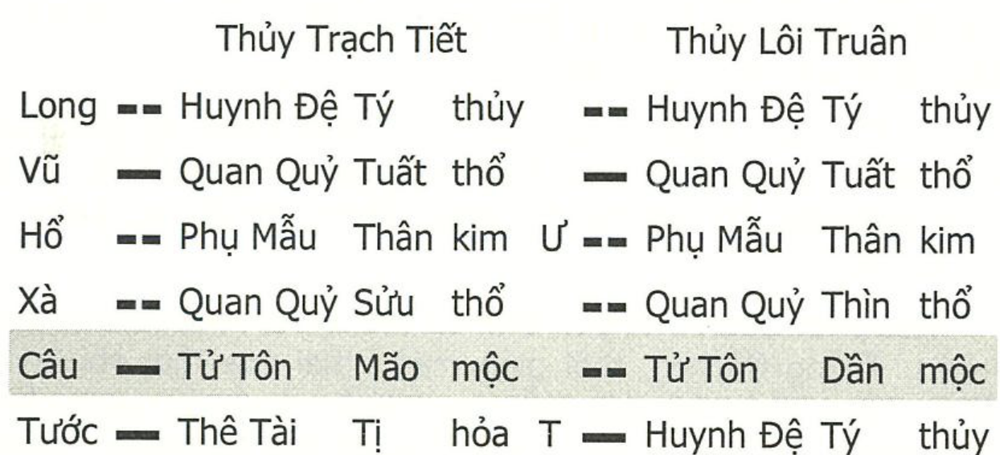
    - **Hình này chứng minh điều gì**
      - lấy Phụ Mẫu làm Dụng thần.
    - **Từ đâu mà thấy được**
      - Nhìn vào hào Thế, hào Ứng, Dụng thần và động hào trong bảng quẻ Sơ đồ quẻ Thủy Trạch Tiết biến Thủy Lôi Truân.
- **Quá trình suy luận và đối thoại ban đầu:**
  - Căn cứ suy luận: Ngày Tý này không có mối quan hệ quá lớn với Dụng thần hung, tuy rằng mối quan hệ với Dụng thần là hình, nhưng trong dự đoán lục hào ít khi ứng hình, chủ yếu là bởi vì sau giờ Tuất ngày này đã đến tháng Mão, Dụng thần bắt đầu lộ ra.
  - Căn cứ suy luận: Có thể thấy phán đoán ứng kỳ đôi khi phải xét đến tiết lệnh.
  - Căn cứ suy luận: Bởi vì Nhật sinh Phụ Mẫu, do đó phán đoán là giờ Tuất hôm đó có thể tìm được.
  - Căn cứ suy luận: Dựa vào quy luật ứng kỳ để phân tích, quẻ này Phụ Mẫu Ngọ hỏa phát động khắc Tử Tôn, do đó có thể ứng lúc xung mất Ngọ hỏa, cũng có thể ứng lúc hợp Ngọ hỏa không khắc Tử Tôn.
  - Căn cứ suy luận: Kết hợp tình hình mang thai, từ tháng Hợi đến tháng Mùi là 9 tháng, tương đối phù hợp với quy luật mang thai.
  - Căn cứ suy luận: Tháng Tý cách thời điểm có thai mới có 1 tháng, hoặc là cách thời điểm có thai 13 tháng, không phù hợp với mang thai 10 tháng, do đó phải là sinh tại tháng Mùi, bởi vì Ngọ hỏa động mà khắc Tử Tôn, tháng Mùi hợp Phụ Mẫu, Tử Tôn không bị khắc nữa, lại sinh Tử Tôn chính là thời gian sinh sản.
- **Ứng nghiệm thực tế và diễn biến sự việc:**
  - Nhìn vào kết quả thực tế: Dựa vào quy luật ứng kỳ để phân tích, quẻ này Phụ Mẫu Ngọ hỏa phát động khắc Tử Tôn, do đó có thể ứng lúc xung mất Ngọ hỏa, cũng có thể ứng lúc hợp Ngọ hỏa không khắc Tử Tôn.
  - Nhìn vào kết quả thực tế: Kết quả là sinh hạ một con gái ở ngày Sửu tháng Mùi năm kế tiếp.
  - Nhìn vào kết quả thực tế: Quẻ này khi phán đoán ứng kỳ đã tham khảo kiến thức cơ bản mang thai 10 tháng.
- **Ngộ giải và bài học kinh nghiệm then chốt:**
  - Đúc rút quy luật thực chiến: Xem xét tổng thể ngũ hành, hào động và tâm thái người gieo quẻ.

### Ví dụ 5: Một người nữ mang thai đoán ngày sinh
- **Bối cảnh & Dữ kiện chiêm bái:**
  - **Ví dụ 5:** Một người nữ mang thai đoán ngày sinh, ở ngày Đinh Dậu tháng Hợi, được Cấn Vi Sơn biến Tốn Vi Phong.
  - Việc phán đoán thời gian sinh cụ thể cần có một số kiến thức cơ bản.
  - Thông thường, thời gian mang thai của thai nhi là 10 tháng, nhưng tình hình của mỗi người khác nhau, có người chưa đủ 10 tháng đã sinh, cũng có người vượt qua 10 tháng.
  - Nhưng bất kể như thế nào, không thể chênh lệch quá xa.
  - Dựa vào quy luật ứng kỳ để phân tích, quẻ này Phụ Mẫu Ngọ hỏa phát động khắc Tử Tôn, do đó có thể ứng lúc xung mất Ngọ hỏa, cũng có thể ứng lúc hợp Ngọ hỏa không khắc Tử Tôn.
- Bảng quẻ Sơ đồ quẻ Cấn Vi Sơn biến Tốn Vi Phong:
  - **Hình 29.** Sơ đồ quẻ Cấn Vi Sơn biến Tốn Vi Phong
    - 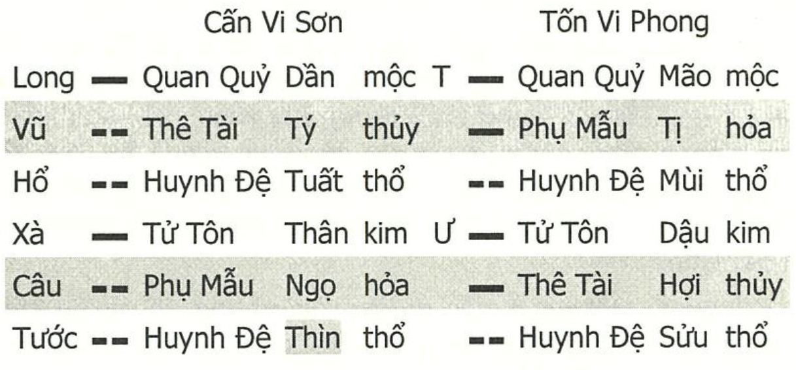
    - **Hình này chứng minh điều gì**
      - lấy hào Tử Tôn làm Dụng thần.
    - **Từ đâu mà thấy được**
      - Nhìn vào hào Thế, hào Ứng, Dụng thần và động hào trong bảng quẻ Sơ đồ quẻ Cấn Vi Sơn biến Tốn Vi Phong.
- **Quá trình suy luận và đối thoại ban đầu:**
  - Căn cứ suy luận: Dựa vào quy luật ứng kỳ để phân tích, quẻ này Phụ Mẫu Ngọ hỏa phát động khắc Tử Tôn, do đó có thể ứng lúc xung mất Ngọ hỏa, cũng có thể ứng lúc hợp Ngọ hỏa không khắc Tử Tôn.
  - Căn cứ suy luận: Kết hợp tình hình mang thai, từ tháng Hợi đến tháng Mùi là 9 tháng, tương đối phù hợp với quy luật mang thai.
  - Căn cứ suy luận: Tháng Tý cách thời điểm có thai mới có 1 tháng, hoặc là cách thời điểm có thai 13 tháng, không phù hợp với mang thai 10 tháng, do đó phải là sinh tại tháng Mùi, bởi vì Ngọ hỏa động mà khắc Tử Tôn, tháng Mùi hợp Phụ Mẫu, Tử Tôn không bị khắc nữa, lại sinh Tử Tôn chính là thời gian sinh sản.
- **Ứng nghiệm thực tế và diễn biến sự việc:**
  - Thực tế diễn biến kiểm chứng ứng kỳ và cát hung của quẻ chiêm.
- **Ngộ giải và bài học kinh nghiệm then chốt:**
  - Đúc rút quy luật thực chiến: Xem xét tổng thể ngũ hành, hào động và tâm thái người gieo quẻ.

## 8. Đừng Để Người Xem Chi Phối Tư Duy Của Bạn

- **Tổng quan nguyên lý & bối cảnh chuyên đề:**
  - Quan Quỷ lâm Câu Trần, Câu Trần là văn phòng, do đó phán đoán đối phương là người ngồi văn phòng. Lâm Dịch Mã, mặc dù là ngồi văn phòng nhưng thường xuyên đi lại khắp nơi. Dụng thần là kim, kim là trắng, chủ người nam trông khá trắng trẻo.
### Ví dụ 1: Ngày Quý Mùi tháng Dần
- **Bối cảnh & Dữ kiện chiêm bái:**
  - **Ví dụ 1:** Ngày Quý Mùi tháng Dần, có một bà mối đã giới thiệu một cô gái cho một người Nhật Bản, rất quan tâm đến tình hình phát triển sau này của họ, bà ấy đã tìm tôi dự đoán sự phát triển hôn nhân của hai người, được Thủy Phong Tỉnh biến Thủy Sơn Kiển.
  - Phụ Mẫu Hợi thủy độc phát, Phụ Mẫu là văn thư, đính hôn tại tháng Hợi.
  - Bà ấy nói: "Ông đoán sự việc xảy ra trước đây đều đúng, thời gian cũng đúng.
  - Họ gặp nhau ở tháng 8 dương lịch năm 97 và đính hôn ở tháng 11.
  - Đối phương là nhân viên ở văn phòng mậu dịch Trung Nhật, thường xuyên đi lại giữa Trung Quốc và
- Bảng quẻ Sơ đồ quẻ Thủy Phong Tỉnh biến Thủy Sơn Kiển:
  - **Hình 30.** Sơ đồ quẻ Thủy Phong Tỉnh biến Thủy Sơn Kiển
    - 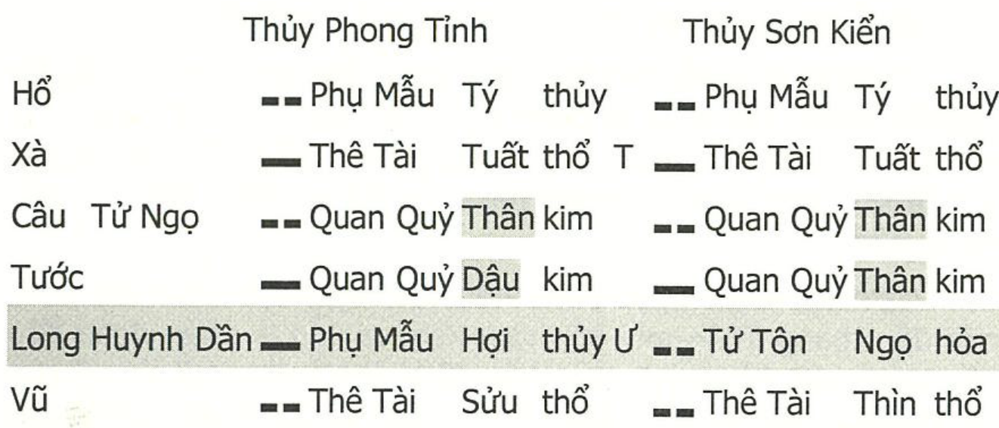
    - **Hình này chứng minh điều gì**
      - Lấy Quan Quỷ làm Dụng thần.
    - **Từ đâu mà thấy được**
      - Nhìn vào hào Thế, hào Ứng, Dụng thần và động hào trong bảng quẻ Sơ đồ quẻ Thủy Phong Tỉnh biến Thủy Sơn Kiển.
- **Quá trình suy luận và đối thoại ban đầu:**
  - Căn cứ suy luận: Lấy Quan Quỷ làm Dụng thần.
  - Căn cứ suy luận: Quan Quỷ Nguyệt phá lại Không Vong, nhưng được Nhật sinh, hào sơ Sửu thổ Nhật phá, Nhật phá ứng thực phá, Không Vong ứng xuất Không, Sửu thổ này vừa đúng là Thái Tuế năm trước, Thân Không Phá, tháng Thân thực Không thực phá, do đó tôi phán đoán hai người bắt đầu sống chung với nhau ở tháng Thân năm trước tức năm 97.
  - Căn cứ suy luận: Quan Quỷ vừa Không vừa phá, cần thực Không thực phá, do đó tôi phán đoán hai người sẽ kết hôn tại tháng Thân.
  - Căn cứ suy luận: Nhưng quẻ này Nguyên thần Nhật phá, Dụng thần lại Không Phá, hôn nhân sẽ không lâu dài.
  - Căn cứ suy luận: Tôi thấy Phụ Mẫu Hợi thủy độc phát, độc phát có thể biểu thị nguyên nhân, Hợi thủy là Bệnh địa của Quan Quỷ, là Tuyệt địa của Tử Tôn, tại hào 2 lâm Thanh Long phát động, Thanh Long là sắc, là sinh dục, sợ rằng người nam này bởi vì không thể sinh con mà ly hôn.
  - Căn cứ suy luận: Năm 2001, tôi lại nhận được thêm phản hồi, bởi vì người nam bị liệt dương nên hai người đã sống riêng.
  - Đối thoại thực tế: Bà ấy nói: "Ông đoán sự việc xảy ra trước đây đều đúng, thời gian cũng đúng.
  - Đối thoại thực tế: Chỉ là thời gian kết hôn đoán không đúng, họ đã dự định sau ngày 1/5 cử hành hôn lễ."
  - Đối thoại thực tế: Do đó tôi nói với anh ta: "Quan này của anh đã chắc chắn thăng, cứ yên tâm nhé."
  - Đối thoại thực tế: Anh ta đắc ý nói: "Chẳng cần ông nói, đó là đương nhiên rồi.
  - Đối thoại thực tế: Lần này tôi trở về sẽ được thăng, trước khi tôi ra đây, lãnh đạo đã nói chuyện với tôi, dự định cho tôi đi làm chủ nhiệm văn phòng chính hiệp của huyện."
- **Ứng nghiệm thực tế và diễn biến sự việc:**
  - Nhìn vào kết quả thực tế: Bà ấy lại hỏi tại sao sau này hai người không tốt?
  - Nhìn vào kết quả thực tế: Năm đó nhận được phản hồi, sau ngày 1/5 chưa kết hôn, mãi đến tháng Thân mới kết hôn.
  - Nhìn vào kết quả thực tế: Với kinh nghiệm dự đoán trên đây, tôi đã không còn bị lời nói của người xem dẫn dắt trong những lần dự đoán sau này nữa, bất kể đúng sai, tôi đều phân tích theo quẻ, dựa vào lý giải của mình để phán đoán, từ đó đã gặt hái được một số quái lệ khá vừa ý.
  - Nhìn vào kết quả thực tế: [^1]: Ý nói ấn tượng hoặc những lời đầu tiên nghe thấy thường chiếm ưu thế trong đầu, sau này khi gặp ý kiến khác sẽ không dễ chấp nhận.
  - Nhìn vào kết quả thực tế: Sau khi đoán xong quẻ, tôi liên tục không gặp người này.
  - Nhìn vào kết quả thực tế: Sau 8 năm, mãi đến năm 2007 mới gặp lại người này.
- **Ngộ giải và bài học kinh nghiệm then chốt:**
  - Đúc rút quy luật thực chiến: Xem xét tổng thể ngũ hành, hào động và tâm thái người gieo quẻ.

### Ví dụ 2: Ngày Quý Hợi tháng Mão
- **Bối cảnh & Dữ kiện chiêm bái:**
  - Mặt trắng trẻo, rất đẹp.
  - Chỉ là thời gian kết hôn đoán không đúng, họ đã dự định sau ngày 1/5 cử hành hôn lễ."
  - Tôi nghĩ, sau ngày 1/5 chẳng phải là tháng Tị hay sao?
  - Quan Quỷ Thân kim Nguyệt phá, tháng Tị hợp phá cũng có đạo lý, thế là đã nói hùa theo rằng tháng Tị cũng đúng, tháng này cũng có khả năng.
  - Bà ấy lại hỏi tại sao sau này hai người không tốt?
- Bảng quẻ Sơ đồ quẻ Cấn Vi Sơn:
  - **Hình 31.** Sơ đồ quẻ Cấn Vi Sơn
    - 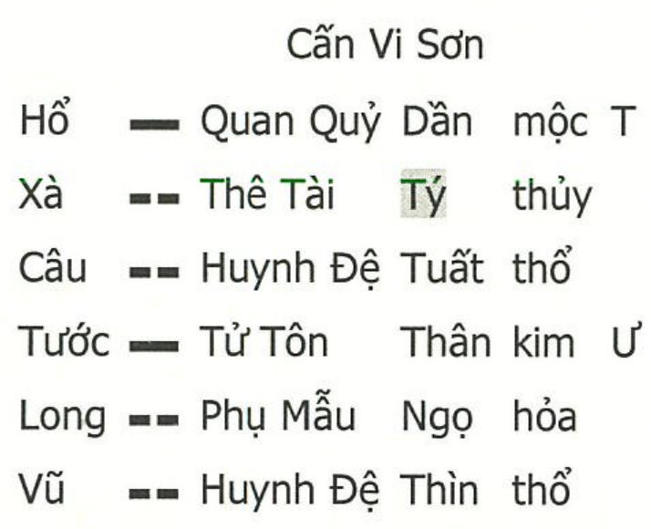
    - **Hình này chứng minh điều gì**
      - Lấy hào Thế làm Dụng thần.
    - **Từ đâu mà thấy được**
      - Nhìn vào hào Thế, hào Ứng, Dụng thần và động hào trong bảng quẻ Sơ đồ quẻ Cấn Vi Sơn.
- **Quá trình suy luận và đối thoại ban đầu:**
  - Căn cứ suy luận: Tôi thấy Phụ Mẫu Hợi thủy độc phát, độc phát có thể biểu thị nguyên nhân, Hợi thủy là Bệnh địa của Quan Quỷ, là Tuyệt địa của Tử Tôn, tại hào 2 lâm Thanh Long phát động, Thanh Long là sắc, là sinh dục, sợ rằng người nam này bởi vì không thể sinh con mà ly hôn.
  - Căn cứ suy luận: Năm 2001, tôi lại nhận được thêm phản hồi, bởi vì người nam bị liệt dương nên hai người đã sống riêng.
  - Đối thoại thực tế: Chỉ là thời gian kết hôn đoán không đúng, họ đã dự định sau ngày 1/5 cử hành hôn lễ."
  - Đối thoại thực tế: Do đó tôi nói với anh ta: "Quan này của anh đã chắc chắn thăng, cứ yên tâm nhé."
  - Đối thoại thực tế: Anh ta đắc ý nói: "Chẳng cần ông nói, đó là đương nhiên rồi.
  - Đối thoại thực tế: Lần này tôi trở về sẽ được thăng, trước khi tôi ra đây, lãnh đạo đã nói chuyện với tôi, dự định cho tôi đi làm chủ nhiệm văn phòng chính hiệp của huyện."
  - Đối thoại thực tế: Tôi nhìn quẻ rồi phân tích: "Tôi e rằng không đi được, phán đoán theo quẻ, Quan Quỷ lâm Nguyệt cộng Bạch Hổ, thường là bộ phận công kiểm pháp, hình như là quan về phương diện này."
- **Ứng nghiệm thực tế và diễn biến sự việc:**
  - Nhìn vào kết quả thực tế: Ông ta hỏi bản thân có xơ gan 20 năm, hiện tại đã có chiều hướng tốt, xem sau này sẽ ra sao?
- **Ngộ giải và bài học kinh nghiệm then chốt:**
  - Đúc rút quy luật thực chiến: Xem xét tổng thể ngũ hành, hào động và tâm thái người gieo quẻ.

### Ví dụ 3: Ngày Nhâm Dần tháng Dần
- **Bối cảnh & Dữ kiện chiêm bái:**
  - Xem ra kiên trì quan điểm của mình và phán đoán một cách tràn đầy tự tin thì chấn động đối với người xem là rất lớn.
  - **Ví dụ 3:** Ngày Nhâm Dần tháng Dần, đây là một quẻ được gieo bởi một người có trình độ lục hào khá tốt.
  - Ông ta hỏi bản thân có xơ gan 20 năm, hiện tại đã có chiều hướng tốt, xem sau này sẽ ra sao?
  - Được Sơn Phong Cổ biến Sơn Lôi Di.
  - Kết quả, người này vẫn chết vì bệnh gan ở năm 2000.
- Bảng quẻ Sơ đồ quẻ Sơn Phong Cổ biến Sơn Lôi Di:
  - **Hình 32.** Sơ đồ quẻ Sơn Phong Cổ biến Sơn Lôi Di
    - 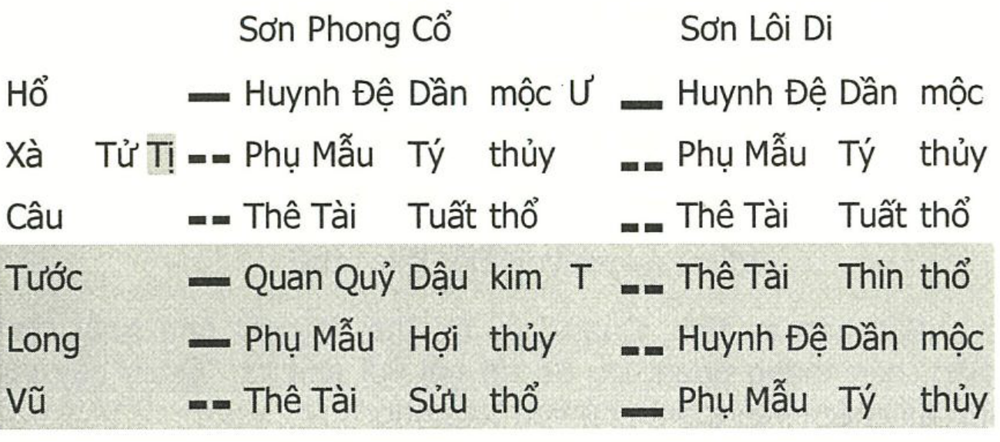
    - **Hình này chứng minh điều gì**
      - Lấy hào Thế làm Dụng thần.
    - **Từ đâu mà thấy được**
      - Nhìn vào Hào 6 Tuất thổ phát động, Quan Quỷ nhập Mộ, do đó sẽ rất khó thi đậu đại học.
- **Quá trình suy luận và đối thoại ban đầu:**
  - Tác giả phân tích cấu trúc hào tượng, Dụng thần và các yếu tố sinh khắc trong quẻ Sơ đồ quẻ Sơn Phong Cổ biến Sơn Lôi Di.
  - Đối thoại thực tế: Ông ta nghe vậy thì rất không vui, phản bác tôi rằng: "Ông đã xem quẻ này sai rồi, hào Thế động mà hóa hợp, bệnh lâu gặp hợp thì khỏi, hiện tại Thìn thổ Không Vong, chứng tỏ bệnh chưa khỏi triệt để, năm sau xuất Không thì hoàn toàn vô sự.
  - Đối thoại thực tế: Tôi theo sư phụ tôi học lục hào đã hơn 10 năm, quẻ như vậy tôi đã từng đoán qua rất nhiều."
  - Đối thoại thực tế: Con gái không tỏ thái độ, mẹ cô ấy ở bên cạnh lại nói: "Có thể gieo một quẻ nữa hay không?
  - Đối thoại thực tế: Điểm thi của con gái tôi không tệ, sao có thể không đậu được chứ?"
  - Đối thoại thực tế: Tôi nói: "Muốn gieo một quẻ nữa cũng được, nhưng nhìn từ quẻ này thì thi không tốt cho lắm.
- **Ứng nghiệm thực tế và diễn biến sự việc:**
  - Thực tế diễn biến kiểm chứng ứng kỳ và cát hung của quẻ chiêm.
- **Ngộ giải và bài học kinh nghiệm then chốt:**
  - Đúc rút quy luật thực chiến: Xem xét tổng thể ngũ hành, hào động và tâm thái người gieo quẻ.

### Ví dụ 4: Ngày Mậu Thìn tháng Mùi
- **Bối cảnh & Dữ kiện chiêm bái:**
  - **Ví dụ 4:** Ngày Mậu Thìn tháng Mùi, mẹ và con gái cùng đến tìm tôi dự đoán về tình hình thi đại học, con gái gieo quẻ được Thiên Phong Cấu biến Trạch Thiên Quải.
  - Tôi nói: "Muốn gieo một quẻ nữa cũng được, nhưng nhìn từ quẻ này thì thi không tốt cho lắm.
  - Ngoại ngữ của cô ấy vẫn không tốt bằng lúc thi bình thường!
  - Cô ấy thi khoa học tự nhiên hay khoa học xã hội?", bởi vì Phụ Mẫu là điểm, lâm Chu Tước tại hào 6, Chu Tước chủ ngôn ngữ, hào 6 là nước ngoài, Không mà hóa thoái, nghĩa là thụt lùi, nhất định thành tích kém hơn ngày thường.
  - "Khoa học xã hội." Người mẹ trả lời.
- Bảng quẻ Sơ đồ quẻ Thiên Phong Cấu biến Trạch Thiên Quải:
  - **Hình 33.** Sơ đồ quẻ Thiên Phong Cấu biến Trạch Thiên Quải
    - 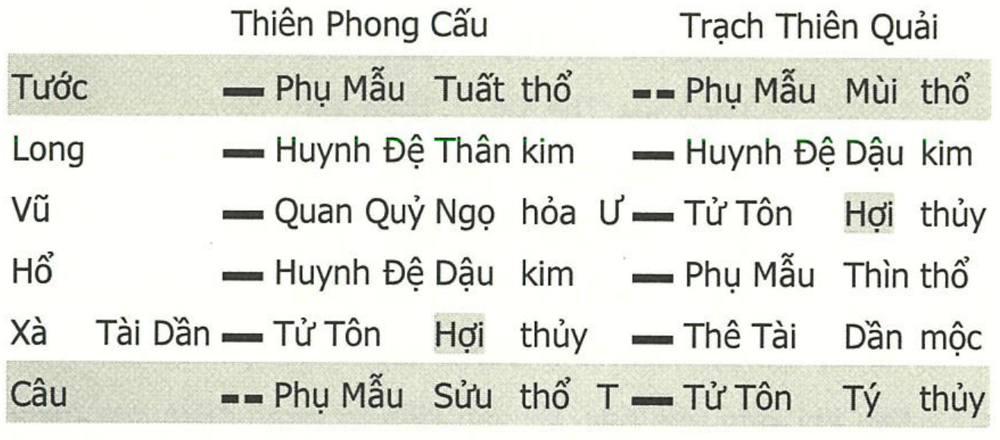
    - **Hình này chứng minh điều gì**
      - Bảng quẻ Sơ đồ quẻ Thiên Phong Cấu biến Trạch Thiên Quải phản ánh sự phối chiếu hào vị, ngũ hành và động biến minh chứng cho vấn đề chiêm đoán.
    - **Từ đâu mà thấy được**
      - Nhìn vào Hào 6 Tuất thổ phát động, Quan Quỷ nhập Mộ, do đó sẽ rất khó thi đậu đại học.
- **Quá trình suy luận và đối thoại ban đầu:**
  - Tác giả phân tích cấu trúc hào tượng, Dụng thần và các yếu tố sinh khắc trong quẻ Sơ đồ quẻ Thiên Phong Cấu biến Trạch Thiên Quải.
  - Đối thoại thực tế: Con gái không tỏ thái độ, mẹ cô ấy ở bên cạnh lại nói: "Có thể gieo một quẻ nữa hay không?
  - Đối thoại thực tế: Điểm thi của con gái tôi không tệ, sao có thể không đậu được chứ?"
  - Đối thoại thực tế: Tôi nói: "Muốn gieo một quẻ nữa cũng được, nhưng nhìn từ quẻ này thì thi không tốt cho lắm.
  - Đối thoại thực tế: Cô ấy thi khoa học tự nhiên hay khoa học xã hội?", bởi vì Phụ Mẫu là điểm, lâm Chu Tước tại hào 6, Chu Tước chủ ngôn ngữ, hào 6 là nước ngoài, Không mà hóa thoái, nghĩa là thụt lùi, nhất định thành tích kém hơn ngày thường.
  - Đối thoại thực tế: "Khoa học xã hội." Người mẹ trả lời.
- **Ứng nghiệm thực tế và diễn biến sự việc:**
  - Thực tế diễn biến kiểm chứng ứng kỳ và cát hung của quẻ chiêm.
- **Ngộ giải và bài học kinh nghiệm then chốt:**
  - Đúc rút quy luật thực chiến: Xem xét tổng thể ngũ hành, hào động và tâm thái người gieo quẻ.

### Tổng kết chuyên đề và bài học tâm đắc
- **Huyền cơ cốt lõi rút ra từ các quái lệ:**
  - Lần này, mẹ cô ấy đã gieo quẻ, được Thiên Hỏa Đồng Nhân.
  - Ngày Mậu Thìn tháng Mùi.
  - Sau khi xem quẻ này, tôi vẫn kiên trì quan điểm của mình: "Thông tin quẻ này càng rõ hơn, tám, chín phần mười không thi đậu." Bởi vì quẻ này Nhật Nguyệt khắc Quan, Quan Quỷ Không Vong, Tử Tôn Tuất thổ lại ám động, căn bản không có thông tin tốt đẹp.
  - Hai mẹ con không hài lòng đã bỏ đi.
  - Kết quả đúng như dự đoán, đã không thi đậu đại học.
  - Để giành được sự tán dương lúc đó và niềm vui tạm thời của đối phương, bảo tôi sai thêm một lần, chắc chắn tôi không chịu.
  - Dự đoán phải kiên trì nguyên tắc, đúng sai dựa vào quẻ mà phán đoán, không thể đem suy nghĩ chủ quan vào trong quẻ.

## 9. Lý Luận Trong Sách Chưa Hẳn Là Chân Lý

### Quái lệ 1: Sơ đồ quẻ Thiên Hỏa Đồng Nhân
- **Bối cảnh & Dữ kiện chiêm bái:**
  - Ngày Tân Dậu tháng Sửu, một người nữ thỉnh cầu đoán tình hình sinh con của cô ấy, gieo quẻ được Thiên Hỏa Đồng Nhân biến Ly Vi Hỏa.
- Bảng quẻ Sơ đồ quẻ Thiên Hỏa Đồng Nhân:
  - **Hình 34.** Sơ đồ quẻ Thiên Hỏa Đồng Nhân
    - 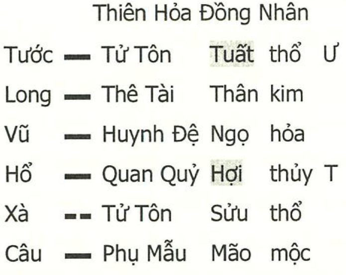
    - **Hình này chứng minh điều gì**
      - Bảng quẻ Sơ đồ quẻ Thiên Hỏa Đồng Nhân phản ánh sự phối chiếu hào vị, ngũ hành và động biến minh chứng cho vấn đề chiêm đoán.
    - **Từ đâu mà thấy được**
      - Nhìn vào hào Thế, hào Ứng, Dụng thần và động hào trong bảng quẻ Sơ đồ quẻ Thiên Hỏa Đồng Nhân.
- **Quá trình suy luận và đối thoại ban đầu:**
  - Tác giả phân tích cấu trúc hào tượng, Dụng thần và các yếu tố sinh khắc trong quẻ Sơ đồ quẻ Thiên Hỏa Đồng Nhân.
- **Ứng nghiệm thực tế và diễn biến sự việc:**
  - Thực tế diễn biến kiểm chứng ứng kỳ và cát hung của quẻ chiêm.
- **Ngộ giải và bài học kinh nghiệm then chốt:**
  - Đúc rút quy luật thực chiến: Xem xét tổng thể ngũ hành, hào động và tâm thái người gieo quẻ.

### Quái lệ 2: Sơ đồ quẻ Thiên Hỏa Đồng Nhân biến Ly Vi Hỏa
- **Bối cảnh & Dữ kiện chiêm bái:**
  - Chiêm đoán theo bảng quẻ Sơ đồ quẻ Thiên Hỏa Đồng Nhân biến Ly Vi Hỏa trong thực tiễn.
- Bảng quẻ Sơ đồ quẻ Thiên Hỏa Đồng Nhân biến Ly Vi Hỏa:
  - **Hình 35.** Sơ đồ quẻ Thiên Hỏa Đồng Nhân biến Ly Vi Hỏa
    - 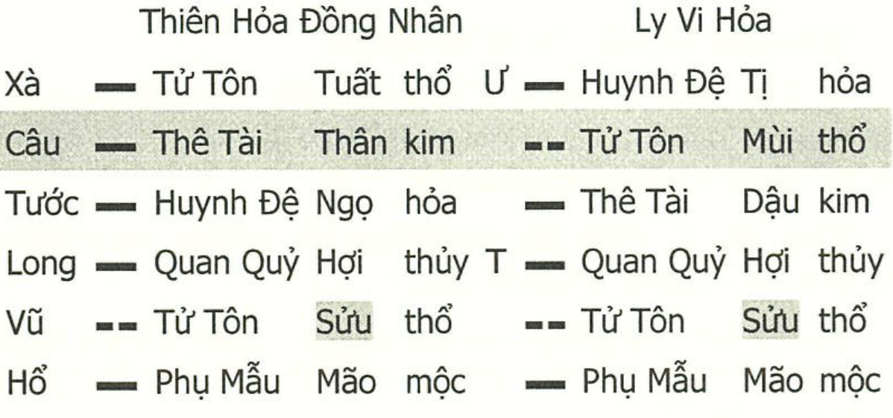
    - **Hình này chứng minh điều gì**
      - lấy Tử Tôn Tuất thổ lâm Ứng làm Dụng thần.
    - **Từ đâu mà thấy được**
      - Nhìn vào hào Thế, hào Ứng, Dụng thần và động hào trong bảng quẻ Sơ đồ quẻ Thiên Hỏa Đồng Nhân biến Ly Vi Hỏa.
- **Quá trình suy luận và đối thoại ban đầu:**
  - Căn cứ suy luận: Trong quẻ Thân kim độc phát, độc phát có thể biểu thị ứng kỳ, lại bởi vì độc phát hóa ra Tử Tôn, do đó nhất định ứng tại ngày Thân.
  - Căn cứ suy luận: Tra lịch vạn niên, ngày Thân đầu tiên của tháng Thìn năm 99 là ngày Bính Thân, do đó phán đoán là sinh tại ngày này.
  - Đối thoại thực tế: "Dương biến âm, có thể phân biệt nam nữ.
  - Đối thoại thực tế: Một hào động, dương động là nữ, âm động là nam; hai hào động, xem hào trên; nếu có ba hào phát động, xem hào giữa; trong quẻ đa động, người đến không thành tâm, ngày khác chiêm lại."
  - Đối thoại thực tế: "Một hào động, dương động là nữ, âm động là nam", hào dương Thê Tài Thân kim động, nhất định sinh con gái.
- **Ứng nghiệm thực tế và diễn biến sự việc:**
  - Nhìn vào kết quả thực tế: Dự đoán đương nhiên không nắm chắc 100%, nhưng quẻ này hoàn toàn phù hợp với lý luận của người xưa, tại sao lại không ứng nghiệm nhỉ?
  - Nhìn vào kết quả thực tế: Do đó, rất nhiều lý luận đòi hỏi chúng ta phải tự mình nghiệm chứng nhiều trong thực tiễn và không thể rập khuôn một cách máy móc.
  - Nhìn vào kết quả thực tế: Cần nhiều quái lệ để nghiệm chứng.
  - Nhìn vào kết quả thực tế: Sau này, tôi lại nghĩ rằng phải chăng cũng có thể dựa vào giới tính của người đến kết hợp với quẻ để phán đoán?
  - Nhìn vào kết quả thực tế: Tôi đã tìm đọc một số quái lệ trong Tăng San Bốc Dịch như sau.
  - Nhìn vào kết quả thực tế: Ta lại nói: Sau này phải chia ra chiêm, không thể hỏi chung.
- **Ngộ giải và bài học kinh nghiệm then chốt:**
  - Đúc rút quy luật thực chiến: Xem xét tổng thể ngũ hành, hào động và tâm thái người gieo quẻ.

### Ví dụ 1: Ngày Mậu Thìn tháng Thìn
- **Bối cảnh & Dữ kiện chiêm bái:**
  - Trong quẻ Thân kim độc phát, độc phát có thể biểu thị ứng kỳ, lại bởi vì độc phát hóa ra Tử Tôn, do đó nhất định ứng tại ngày Thân.
  - Tra lịch vạn niên, ngày Thân đầu tiên của tháng Thìn năm 99 là ngày Bính Thân, do đó phán đoán là sinh tại ngày này.
  - Sáu hào tĩnh, nếu không có quái bao, cần xem Tử Tôn, gặp dương là nam, gặp âm là nữ.
  - Quẻ có hào động dù có quái bao cũng không dùng, thần triệu cơ ở động, trước tiên xem hào động.
  - Một hào động, dương động là nữ, âm động là nam; hai hào động, xem hào trên; nếu có ba hào phát động, xem hào giữa; trong quẻ đa động, người đến không thành tâm, ngày khác chiêm lại."
- Bảng quẻ Quẻ Lôi Sơn Tiểu Quá biến Lôi Địa Dự:
  - **Hình 36.** Quẻ Lôi Sơn Tiểu Quá biến Lôi Địa Dự
    - 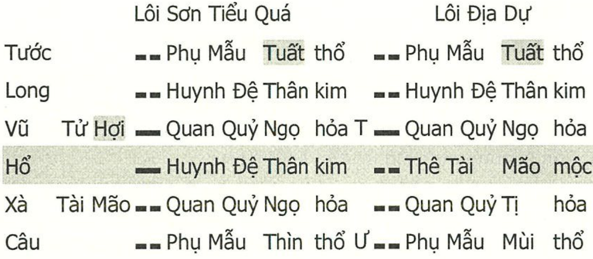
    - **Hình này chứng minh điều gì**
      - lấy Tử Tôn Tuất thổ lâm Ứng làm Dụng thần.
    - **Từ đâu mà thấy được**
      - Nhìn vào hào Thế, hào Ứng, Dụng thần và động hào trong bảng quẻ Quẻ Lôi Sơn Tiểu Quá biến Lôi Địa Dự.
- **Quá trình suy luận và đối thoại ban đầu:**
  - Căn cứ suy luận: Trong quẻ Thân kim độc phát, độc phát có thể biểu thị ứng kỳ, lại bởi vì độc phát hóa ra Tử Tôn, do đó nhất định ứng tại ngày Thân.
  - Căn cứ suy luận: Tra lịch vạn niên, ngày Thân đầu tiên của tháng Thìn năm 99 là ngày Bính Thân, do đó phán đoán là sinh tại ngày này.
  - Căn cứ suy luận: Người nữ này đã lâm sản một ngày một đêm, ta đoán rằng: Giờ Thân ngày mai có thể sinh.
  - Căn cứ suy luận: Chồng cô ta hỏi lý do, ta đáp: Trong quẻ Tử Tôn Thân kim, một hào độc phát, quẻ tự chiêm, Quan Quỷ trì Thế, Tử Tôn lúc đó xuất hiện, khắc đi Quỷ bên mình mà vô ưu vậy.
  - Căn cứ suy luận: Thần thuận theo ý niệm của người, chiêm việc này ứng việc này, chiêm việc khác ứng việc khác, nếu hỏi vào lúc nhàn rỗi, tất có ý niệm về nam nữ, lúc này tính mệnh ngàn cân treo sợi tóc, chỉ cầu sinh sản thuận lợi bảo toàn sinh mệnh mà thôi, cho nên thần hiện an nguy của sinh sản, không cho biết nam nữ vậy.
  - Căn cứ suy luận: Quả nhiên sinh nam ở giờ Thân ngày hôm sau.
  - Đối thoại thực tế: "Dương biến âm, có thể phân biệt nam nữ.
  - Đối thoại thực tế: Một hào động, dương động là nữ, âm động là nam; hai hào động, xem hào trên; nếu có ba hào phát động, xem hào giữa; trong quẻ đa động, người đến không thành tâm, ngày khác chiêm lại."
  - Đối thoại thực tế: "Một hào động, dương động là nữ, âm động là nam", hào dương Thê Tài Thân kim động, nhất định sinh con gái.
- **Ứng nghiệm thực tế và diễn biến sự việc:**
  - Thực tế diễn biến kiểm chứng ứng kỳ và cát hung của quẻ chiêm.
- **Ngộ giải và bài học kinh nghiệm then chốt:**
  - Đúc rút quy luật thực chiến: Xem xét tổng thể ngũ hành, hào động và tâm thái người gieo quẻ.

### Quái lệ 4: Sơ đồ quẻ Cấn Vi Sơn biến Sơn Địa Bác
- **Bối cảnh & Dữ kiện chiêm bái:**
  - ## Ví dụ 2: Ngày Mậu Tý tháng Thìn, nữ tự chiêm thai, được Cấn biến Bác.
  - Người nữ này đã lâm sản một ngày một đêm, ta đoán rằng: Giờ Thân ngày mai có thể sinh.
  - Chồng cô ta hỏi lý do, ta đáp: Trong quẻ Tử Tôn Thân kim, một hào độc phát, quẻ tự chiêm, Quan Quỷ trì Thế, Tử Tôn lúc đó xuất hiện, khắc đi Quỷ bên mình mà vô ưu vậy.
  - Có người hỏi tại sao không phải là giờ Thân hôm nay?
  - Ta lại đáp: Ngày Tý xung động Ngọ hỏa khắc kim, hôm nay không thể.
- Bảng quẻ Sơ đồ quẻ Cấn Vi Sơn biến Sơn Địa Bác:
  - **Hình 37.** Sơ đồ quẻ Cấn Vi Sơn biến Sơn Địa Bác
    - 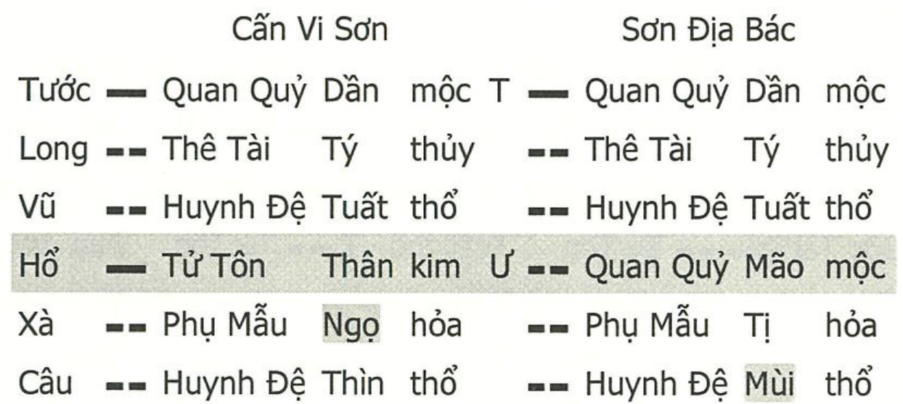
    - **Hình này chứng minh điều gì**
      - Bảng quẻ Sơ đồ quẻ Cấn Vi Sơn biến Sơn Địa Bác phản ánh sự phối chiếu hào vị, ngũ hành và động biến minh chứng cho vấn đề chiêm đoán.
    - **Từ đâu mà thấy được**
      - Nhìn vào hào Thế, hào Ứng, Dụng thần và động hào trong bảng quẻ Sơ đồ quẻ Cấn Vi Sơn biến Sơn Địa Bác.
- **Quá trình suy luận và đối thoại ban đầu:**
  - Căn cứ suy luận: Người nữ này đã lâm sản một ngày một đêm, ta đoán rằng: Giờ Thân ngày mai có thể sinh.
  - Căn cứ suy luận: Chồng cô ta hỏi lý do, ta đáp: Trong quẻ Tử Tôn Thân kim, một hào độc phát, quẻ tự chiêm, Quan Quỷ trì Thế, Tử Tôn lúc đó xuất hiện, khắc đi Quỷ bên mình mà vô ưu vậy.
  - Căn cứ suy luận: Thần thuận theo ý niệm của người, chiêm việc này ứng việc này, chiêm việc khác ứng việc khác, nếu hỏi vào lúc nhàn rỗi, tất có ý niệm về nam nữ, lúc này tính mệnh ngàn cân treo sợi tóc, chỉ cầu sinh sản thuận lợi bảo toàn sinh mệnh mà thôi, cho nên thần hiện an nguy của sinh sản, không cho biết nam nữ vậy.
  - Căn cứ suy luận: Quả nhiên sinh nam ở giờ Thân ngày hôm sau.
- **Ứng nghiệm thực tế và diễn biến sự việc:**
  - Nhìn vào kết quả thực tế: Dụng thần Nguyệt phá, sang tháng bất phá, tháng sau sinh con.
  - Nhìn vào kết quả thực tế: Nhưng trên thực tế là sinh nam ở tháng Hợi.
  - Nhìn vào kết quả thực tế: Xem ra lý luận giả thuyết của tôi vẫn chưa đứng vững được.
- **Ngộ giải và bài học kinh nghiệm then chốt:**
  - Đúc rút quy luật thực chiến: Xem xét tổng thể ngũ hành, hào động và tâm thái người gieo quẻ.

### Quái lệ 5: Sơ đồ quẻ Sơn Thủy Mông biến Phong Thủy Hoán
- **Bối cảnh & Dữ kiện chiêm bái:**
  - ## Ví dụ 3: Ngày Tân Mão tháng Tuất, một người đàn ông dự đoán về vợ sinh con, được Sơn Thủy Mông biến Phong Thủy Hoán.
  - Nếu chỉ có một Tử Tôn thì có thể phán đoán theo lý luận trong Tăng San Bốc Dịch.
  - Tử Tôn là dương biến âm, Tử Tôn là âm biến dương, lại thêm vượng thì biến hóa, hưu tù thì không biến hóa.
  - Như vậy tỷ lệ chính xác sẽ cao.
  - Nhìn vào quẻ đầu tiên, trong quẻ hào Tử Tôn lưỡng hiện, dùng Tử Tôn Tuất thổ trên Ứng phán đoán ứng kỳ rất ứng
- Bảng quẻ Sơ đồ quẻ Sơn Thủy Mông biến Phong Thủy Hoán:
  - **Hình 38.** Sơ đồ quẻ Sơn Thủy Mông biến Phong Thủy Hoán
    - 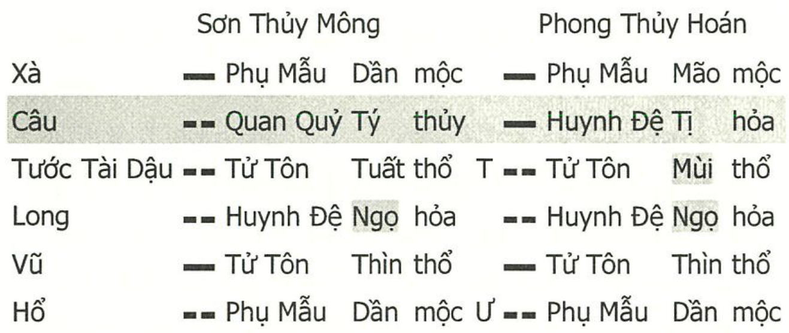
    - **Hình này chứng minh điều gì**
      - quẻ Tử Tôn lưỡng hiện, lấy hào Tử Tôn Thìn thổ Nguyệt phá làm Dụng.
    - **Từ đâu mà thấy được**
      - Nhìn vào hào Thế, hào Ứng, Dụng thần và động hào trong bảng quẻ Sơ đồ quẻ Sơn Thủy Mông biến Phong Thủy Hoán.
- **Quá trình suy luận và đối thoại ban đầu:**
  - Tác giả phân tích cấu trúc hào tượng, Dụng thần và các yếu tố sinh khắc trong quẻ Sơ đồ quẻ Sơn Thủy Mông biến Phong Thủy Hoán.
- **Ứng nghiệm thực tế và diễn biến sự việc:**
  - Nhìn vào kết quả thực tế: Khi dùng Thìn thổ phán đoán ứng kỳ cũng ứng nghiệm, còn Tử Tôn Tuất thổ là hào âm, quẻ độc phát, động thì biến, tương phản sau khi hào âm Tử Tôn biến hóa, do đó cũng là sinh nam.
  - Nhìn vào kết quả thực tế: Trên thực tế đúng là tháng Hợi sinh mổ được con trai.
- **Ngộ giải và bài học kinh nghiệm then chốt:**
  - Đúc rút quy luật thực chiến: Xem xét tổng thể ngũ hành, hào động và tâm thái người gieo quẻ.

### Quái lệ 6: Quẻ Địa Thiên Thái biến Địa Trạch Lâm
- **Bối cảnh & Dữ kiện chiêm bái:**
  - Ví dụ 3 cũng là Tử Tôn lưỡng hiện.
  - Khi dùng Thìn thổ phán đoán ứng kỳ cũng ứng nghiệm, còn Tử Tôn Tuất thổ là hào âm, quẻ độc phát, động thì biến, tương phản sau khi hào âm Tử Tôn biến hóa, do đó cũng là sinh nam.
  - Xem ra chúng ta vẫn phải xem quẻ một cách linh hoạt mới được, và không thể quá câu nệ vào một khẩu quyết nào đó.
  - Phương pháp phán đoán sinh nam sinh nữ trong Tăng San Bốc Dịch mặc dù không thể khiến chúng ta thoả mãn nhưng vẫn có giá trị tham khảo rất cao.
  - Ví dụ này và ví dụ 3 là quẻ của cùng một người gieo.
- Bảng quẻ Quẻ Địa Thiên Thái biến Địa Trạch Lâm:
  - **Hình 39.** Quẻ Địa Thiên Thái biến Địa Trạch Lâm
    - 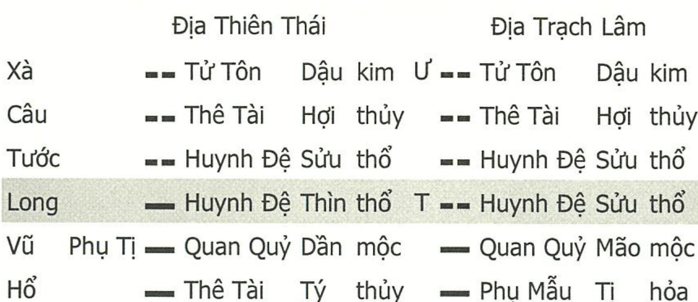
    - **Hình này chứng minh điều gì**
      - quẻ độc phát, động thì biến, tương phản sau khi hào âm Tử Tôn biến hóa, do đó cũng là sinh nam.
    - **Từ đâu mà thấy được**
      - Nhìn vào hào Thế, hào Ứng, Dụng thần và động hào trong bảng quẻ Quẻ Địa Thiên Thái biến Địa Trạch Lâm.
- **Quá trình suy luận và đối thoại ban đầu:**
  - Tác giả phân tích cấu trúc hào tượng, Dụng thần và các yếu tố sinh khắc trong quẻ Quẻ Địa Thiên Thái biến Địa Trạch Lâm.
- **Ứng nghiệm thực tế và diễn biến sự việc:**
  - Nhìn vào kết quả thực tế: Tử Tôn tại cung Khảm, Khảm là dương, Tử Tôn an tĩnh, ứng xung, tháng Dậu sinh.
  - Nhìn vào kết quả thực tế: Trên thực tế, ngày Quý Hợi tháng Dậu sinh mổ được một con trai.
  - Nhìn vào kết quả thực tế: Quẻ dự đoán sinh con thuộc về độc phát còn có rất nhiều, tôi cũng không thể liệt kê tất cả, đến bây giờ tôi vẫn chưa thể đạt được chính xác 100%, do đó hy vọng mọi người trong thực tiễn sau này sẽ tìm ra được phương pháp chính xác cao hơn.
- **Ngộ giải và bài học kinh nghiệm then chốt:**
  - Đúc rút quy luật thực chiến: Xem xét tổng thể ngũ hành, hào động và tâm thái người gieo quẻ.

### Quái lệ 7: Quẻ Lôi Hỏa Phong biến Ly Vi Hỏa
- **Bối cảnh & Dữ kiện chiêm bái:**
  - Tử Tôn được Nhật phù là vượng, gặp độc phát, hào âm động biến dương, sinh nam.
  - Tử Tôn tại cung Khảm, Khảm là dương, Tử Tôn an tĩnh, ứng xung, tháng Dậu sinh.
  - Tử Tôn gặp hợp sinh khó.
  - Quẻ dự đoán sinh con thuộc về độc phát còn có rất nhiều, tôi cũng không thể liệt kê tất cả, đến bây giờ tôi vẫn chưa thể đạt được chính xác 100%, do đó hy vọng mọi người trong thực tiễn sau này sẽ tìm ra được phương pháp chính xác cao hơn.
- Bảng quẻ Quẻ Lôi Hỏa Phong biến Ly Vi Hỏa:
  - **Hình 40.** Quẻ Lôi Hỏa Phong biến Ly Vi Hỏa
    - 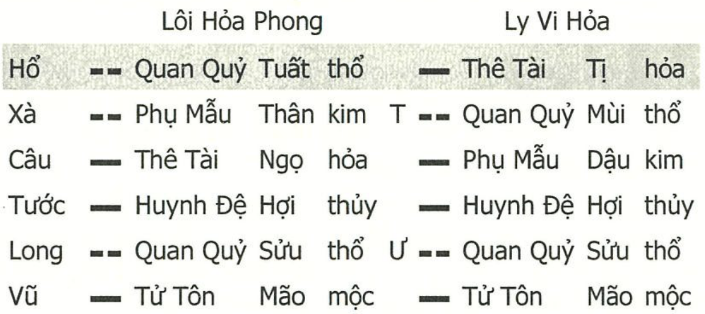
    - **Hình này chứng minh điều gì**
      - Bảng quẻ Quẻ Lôi Hỏa Phong biến Ly Vi Hỏa phản ánh sự phối chiếu hào vị, ngũ hành và động biến minh chứng cho vấn đề chiêm đoán.
    - **Từ đâu mà thấy được**
      - Nhìn vào hào Thế, hào Ứng, Dụng thần và động hào trong bảng quẻ Quẻ Lôi Hỏa Phong biến Ly Vi Hỏa.
- **Quá trình suy luận và đối thoại ban đầu:**
  - Tác giả phân tích cấu trúc hào tượng, Dụng thần và các yếu tố sinh khắc trong quẻ Quẻ Lôi Hỏa Phong biến Ly Vi Hỏa.
- **Ứng nghiệm thực tế và diễn biến sự việc:**
  - Thực tế diễn biến kiểm chứng ứng kỳ và cát hung của quẻ chiêm.
- **Ngộ giải và bài học kinh nghiệm then chốt:**
  - Đúc rút quy luật thực chiến: Xem xét tổng thể ngũ hành, hào động và tâm thái người gieo quẻ.

## 10. Chẳng Lẽ Thời Gian Chết Đã Đến Sớm?

- **Tổng quan nguyên lý & bối cảnh chuyên đề:**
  - Tôi phán đoán như sau: Lấy Phụ Mẫu làm Dụng thần. Dụng thần không được Nguyệt sinh phù, Nhật khắc, nhập Mộ ở Nhật là hưu tù. Dụng lâm Bạch Hổ nhập Mộ, Bạch Hổ là bệnh, nhập Mộ là nhập viện, do đó là bị bệnh nhập viện. Nguyên thần Không Vong, Nguyệt phá, bất thượng quái, Kỵ thần ở trong quẻ phát động đến khắc, Dụng thần lại động hóa hồi đầu khắc, không cát.
  - Thổ tại hào 4 động đến khắc, hào 4 là dạ dày, thổ lại chủ dạ dày, là bệnh tật về dạ dày. Dụng thần vô cùng nhược, gặp đất Tử Mộ trên Nhật Nguyệt là ung thư, do đó nhất định là ung thư dạ dày.
  - Tử Tôn tại hào 5 lâm hỏa, Tử Tôn là y dược, hào 5 là kinh thành, đã từng điều trị tại Bắc Kinh. Hỏa là quang điện, nhất định đã từng tiến hành xạ trị.
  - Xem ra ứng kỳ lúc đó của tôi đã sai, là sai lầm của dự đoán. Sau đó nhớ lại, Dụng thần hưu tù như vậy, hoàn toàn không thể
### Ví dụ 1: Ngày Canh Thìn tháng Mão
- **Bối cảnh & Dữ kiện chiêm bái:**
  - **Ví dụ 1:** Ngày Canh Thìn tháng Mão, một cô gái thỉnh cầu đoán bệnh tật của cha, gieo quẻ được Phong Thiên Tiểu Súc biến Thiên Phong Cấu.
  - Sau vài năm, tôi gặp lại cô gái này, cô ấy phản hồi rằng cha đã qua đời ở tháng Thìn, hoàn toàn không sống đến tháng Mùi.
- Bảng quẻ Quẻ Phong Thiên Tiểu Súc biến Thiên Phong Cấu:
  - **Hình 41.** Quẻ Phong Thiên Tiểu Súc biến Thiên Phong Cấu
    - 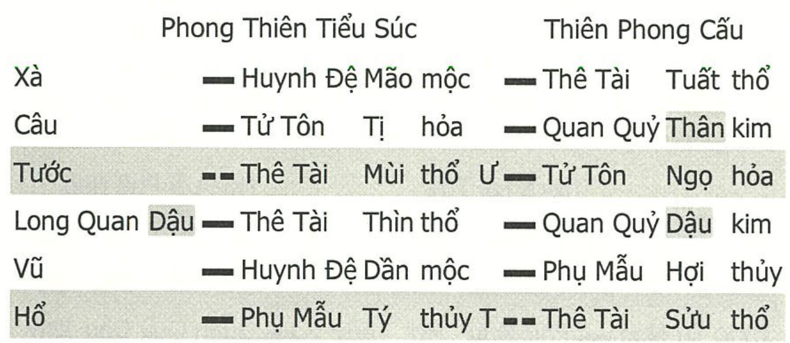
    - **Hình này chứng minh điều gì**
      - Lấy Phụ Mẫu làm Dụng thần.
    - **Từ đâu mà thấy được**
      - Nhìn vào hào 4 động đến khắc, hào 4 là dạ dày, thổ lại chủ dạ dày, là bệnh tật về dạ dày.
- **Quá trình suy luận và đối thoại ban đầu:**
  - Căn cứ suy luận: Tôi phán đoán như sau: Lấy Phụ Mẫu làm Dụng thần.
  - Căn cứ suy luận: Dụng thần không được Nguyệt sinh phù, Nhật khắc, nhập Mộ ở Nhật là hưu tù.
  - Căn cứ suy luận: Nguyên thần Không Vong, Nguyệt phá, bất thượng quái, Kỵ thần ở trong quẻ phát động đến khắc, Dụng thần lại động hóa hồi đầu khắc, không cát.
  - Căn cứ suy luận: Phán đoán trên đây hoàn toàn chính xác, thế là tôi lại phán đoán ứng kỳ: Dụng thần động mà hóa hợp, bệnh lâu mặc dù nên hợp, nhưng bởi vì Dụng thần không có cứu, do đó cũng chỉ là tạm thời.
  - Căn cứ suy luận: Đề phòng tháng Mùi xung khai chỗ hợp, lại thêm trong quẻ Mùi thổ phát động đến khắc, tháng Mùi nhất định không tốt.
  - Căn cứ suy luận: Phân tích đến đây, tôi phán đoán rằng mẹ anh ta sẽ có nguy hiểm vào ngày hôm sau.
- **Ứng nghiệm thực tế và diễn biến sự việc:**
  - Nhìn vào kết quả thực tế: Phân tích đến đây, tôi phán đoán rằng mẹ anh ta sẽ có nguy hiểm vào ngày hôm sau.
  - Nhìn vào kết quả thực tế: Bởi vì ngày hôm sau là ngày Sửu, Dụng thần bị khắc hợp, Nguyên thần lại nhập Mộ, do đó không cát.
- **Ngộ giải và bài học kinh nghiệm then chốt:**
  - Đúc rút quy luật thực chiến: Xem xét tổng thể ngũ hành, hào động và tâm thái người gieo quẻ.

### Ví dụ 2: Ngày Canh Tý tháng Thân
- **Bối cảnh & Dữ kiện chiêm bái:**
  - **Ví dụ 2:** Ngày Canh Tý tháng Thân, một người làm việc xa nhà nhận được điện khẩn của gia đình nói rằng mẹ bị bệnh nguy kịch, gieo quẻ được Trạch Lôi Tùy biến Hỏa Lôi Phệ Hạp.
- Bảng quẻ Quẻ Trạch Lôi Tùy biến Hỏa Lôi Phệ Hạp:
  - **Hình 42.** Quẻ Trạch Lôi Tùy biến Hỏa Lôi Phệ Hạp
    - 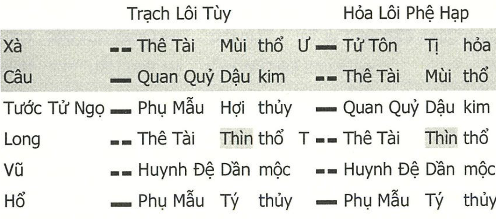
    - **Hình này chứng minh điều gì**
      - Bảng quẻ Quẻ Trạch Lôi Tùy biến Hỏa Lôi Phệ Hạp phản ánh sự phối chiếu hào vị, ngũ hành và động biến minh chứng cho vấn đề chiêm đoán.
    - **Từ đâu mà thấy được**
      - Nhìn vào hào 6 phát động đến khắc, hào 6 là đầu, là một loại bệnh như xuất huyết não.
- **Quá trình suy luận và đối thoại ban đầu:**
  - Căn cứ suy luận: Phân tích đến đây, tôi phán đoán rằng mẹ anh ta sẽ có nguy hiểm vào ngày hôm sau.
  - Căn cứ suy luận: Bởi vì ngày hôm sau là ngày Sửu, Dụng thần bị khắc hợp, Nguyên thần lại nhập Mộ, do đó không cát.
  - Căn cứ suy luận: Bởi vì giờ Ngọ xung Dụng thần.
  - Căn cứ suy luận: Nếu như không xem xét lại sai lầm, không tổng kết nguyên nhân sai sót của các dự đoán trước đây thì không thể phán đoán mạnh dạn và chính xác các quẻ khác sau này, phát hiện và tổng kết sai lầm là con đường rất tốt để nâng cao trình độ.
- **Ứng nghiệm thực tế và diễn biến sự việc:**
  - Nhìn vào kết quả thực tế: Kết quả, người này đã tức tốc trở về, mẹ qua đời ở giờ Ngọ ngày hôm sau.
  - Nhìn vào kết quả thực tế: Nếu như không xem xét lại sai lầm, không tổng kết nguyên nhân sai sót của các dự đoán trước đây thì không thể phán đoán mạnh dạn và chính xác các quẻ khác sau này, phát hiện và tổng kết sai lầm là con đường rất tốt để nâng cao trình độ.
- **Ngộ giải và bài học kinh nghiệm then chốt:**
  - Đúc rút quy luật thực chiến: Xem xét tổng thể ngũ hành, hào động và tâm thái người gieo quẻ.

### Ví dụ 3: Ngày Tân Hợi tháng Mão năm 06
- **Bối cảnh & Dữ kiện chiêm bái:**
  - Kết quả, người này đã tức tốc trở về, mẹ qua đời ở giờ Ngọ ngày hôm sau.
  - **Ví dụ 3:** Ngày Tân Hợi tháng Mão năm 06, hơn 10 giờ tối, một học viên đã gửi quẻ này đến QQ của tôi, anh ta nói rằng đây là quẻ của một người bạn đoán về cha bị xuất huyết não nhập viện, tình hình nguy hiểm, xem cát hung ra sao?
  - Vừa nghe xong, học viên này nói rằng phải gọi điện chuyển lời ngay cho bạn của anh ta.
  - Lúc đó, bạn đang ở bệnh viện thăm cha và sắp rời đi, nghe được phán đoán này, lập tức thông báo cho em trai hỏa tốc đến bệnh viện để trò chuyện cùng cha.
  - Cha nằm trên giường bệnh cầm tay một con trai nói chuyện, đến 12 giờ 30 rạng sáng ngày hôm sau thì nhắm mắt.
- Bảng quẻ Quẻ Phong Lôi Ích biến Phong Địa Quan:
  - **Hình 43.** Quẻ Phong Lôi Ích biến Phong Địa Quan
    - 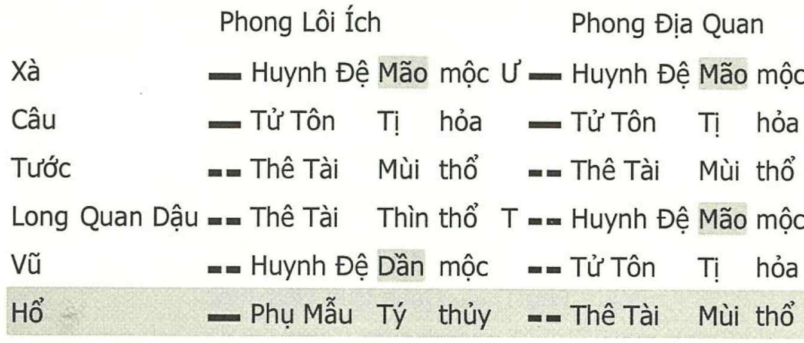
    - **Hình này chứng minh điều gì**
      - Bảng quẻ Quẻ Phong Lôi Ích biến Phong Địa Quan phản ánh sự phối chiếu hào vị, ngũ hành và động biến minh chứng cho vấn đề chiêm đoán.
    - **Từ đâu mà thấy được**
      - Nhìn vào hào Thế, hào Ứng, Dụng thần và động hào trong bảng quẻ Quẻ Phong Lôi Ích biến Phong Địa Quan.
- **Quá trình suy luận và đối thoại ban đầu:**
  - Căn cứ suy luận: Nếu như không xem xét lại sai lầm, không tổng kết nguyên nhân sai sót của các dự đoán trước đây thì không thể phán đoán mạnh dạn và chính xác các quẻ khác sau này, phát hiện và tổng kết sai lầm là con đường rất tốt để nâng cao trình độ.
- **Ứng nghiệm thực tế và diễn biến sự việc:**
  - Thực tế diễn biến kiểm chứng ứng kỳ và cát hung của quẻ chiêm.
- **Ngộ giải và bài học kinh nghiệm then chốt:**
  - Đúc rút quy luật thực chiến: Xem xét tổng thể ngũ hành, hào động và tâm thái người gieo quẻ.

## 11. Nắm Bắt Tâm Thái Của Người Đến Liên Quan Đến Thành Bại Của Dự Đoán

- **Tổng quan nguyên lý & bối cảnh chuyên đề:**
  - Lấy Quan Quỷ làm Dụng thần. Khi đó, tôi thấy trong quẻ Quan Quỷ Dần mộc được Nhật sinh, Nguyệt lại không khắc, do đó phán đoán công việc của cô ấy có thể bảo toàn, sẽ không bị đào thải.
  - Thế lâm hào Tài tại sơ, hào sơ là tầng thấp nhất, Tài là nhân viên, bị Nguyệt khắc, do đó tôi phán đoán cô ấy là nhân viên thời vụ của đơn vị này, ở cấp thấp nhất của đơn vị. Thế sinh Quan Quỷ, bản thân rất nỗ lực làm việc.
  - Cô ấy nói rằng mình nhận được công việc này thông qua sự giới thiệu của người khác, đích thực không phải nhân viên chính thức, bởi vì rất sợ mất công việc này nên rất nỗ lực làm việc.
  - Tuy nhiên, dự đoán của tôi đã sai. Cô ấy sau cùng vẫn bị lãnh đạo mới đến đuổi đi. Trong một thời gian dài, tôi vẫn không thể tìm được nguyên nhân của sai sót. Sau này tôi mới nhận ra rằng quẻ này có liên quan mật thiết đến tâm thái của cô ấy khi dự đoán. Cô ấy rất quan tâm đến công việc này, rất sợ mất công việc, do đó Quan Quỷ trong quẻ này không phải là thông tin công việc của cô ấy, mà là thông tin lo lắng của cô ấy. Bởi vì vượng tướng, do đó mới mất công việc.
### Ví dụ 1: Ngày Mậu Tý tháng Mùi
- **Bối cảnh & Dữ kiện chiêm bái:**
  - **Ví dụ 1:** Ngày Mậu Tý tháng Mùi, một người nữ công tác tại bưu cục đến dự đoán về công việc của cô ấy, cô ấy nói rằng bưu cục đã thay đổi lãnh đạo, nghe nói sẽ đào thải một loạt nhân viên, bản thân đã làm ở bưu cục này được 3 năm, hỏi công việc của mình có được bảo toàn hay không?
  - Được Địa Lôi Phục.
  - Cô ấy nói rằng mình nhận được công việc này thông qua sự giới thiệu của người khác, đích thực không phải nhân viên chính thức, bởi vì rất sợ mất công việc này nên rất nỗ lực làm việc.
  - Tuy nhiên, dự đoán của tôi đã sai.
  - Cô ấy sau cùng vẫn bị lãnh đạo mới đến đuổi đi.
- Bảng quẻ Quẻ Địa Lôi Phục:
  - **Hình 44.** Quẻ Địa Lôi Phục
    - 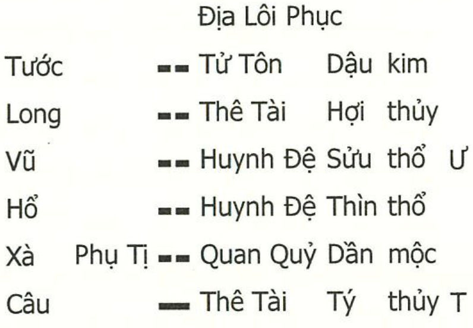
    - **Hình này chứng minh điều gì**
      - Lấy Quan Quỷ làm Dụng thần.
    - **Từ đâu mà thấy được**
      - Nhìn vào hào Thế, hào Ứng, Dụng thần và động hào trong bảng quẻ Quẻ Địa Lôi Phục.
- **Quá trình suy luận và đối thoại ban đầu:**
  - Căn cứ suy luận: Thế lâm hào Tài tại sơ, hào sơ là tầng thấp nhất, Tài là nhân viên, bị Nguyệt khắc, do đó tôi phán đoán cô ấy là nhân viên thời vụ của đơn vị này, ở cấp thấp nhất của đơn vị.
  - Căn cứ suy luận: Thế sinh Quan Quỷ, bản thân rất nỗ lực làm việc.
  - Căn cứ suy luận: Cô ấy nói rằng mình nhận được công việc này thông qua sự giới thiệu của người khác, đích thực không phải nhân viên chính thức, bởi vì rất sợ mất công việc này nên rất nỗ lực làm việc.
  - Căn cứ suy luận: Bởi vì vượng tướng, do đó mới mất công việc.
  - Căn cứ suy luận: Theo suy vượng thông thường, Quan Quỷ Nguyệt phá, động hóa hồi đầu khắc, hào biến lại vượng, căn bản không thể phục hồi công việc.
  - Căn cứ suy luận: Nhưng anh ta đang ở trong một trạng thái lo lắng, hoang mang mỗi ngày, do đó Quan Quỷ trong quẻ phải thể hiện lo lắng mới đúng, Quan Quỷ Nguyệt phá động mà hóa hồi đầu khắc, đây là khắc đi Quỷ bên mình.
- **Ứng nghiệm thực tế và diễn biến sự việc:**
  - Thực tế diễn biến kiểm chứng ứng kỳ và cát hung của quẻ chiêm.
- **Ngộ giải và bài học kinh nghiệm then chốt:**
  - Đúc rút quy luật thực chiến: Xem xét tổng thể ngũ hành, hào động và tâm thái người gieo quẻ.

### Ví dụ 2: Ngày Nhâm Thân tháng Mão
- **Bối cảnh & Dữ kiện chiêm bái:**
  - Do đó, khi phán đoán quẻ, việc nắm bắt tâm thái của người đến cũng rất quan trọng, điều này có liên quan đến thành bại của dự đoán, lo lắng mà đoán thì Quỷ vượng là hung, Quỷ nhược là cát.
  - Tử Tôn vượng động là cát, Tử Tôn hưu tù là hung.
  - **Ví dụ 2:** Ngày Nhâm Thân tháng Mão, một người đàn ông thỉnh cầu dự đoán, bản thân bị lãnh đạo đình chỉ công tác đã một tuần lễ, không biết có thể phục hồi hay không?
  - Hiện tại vợ của anh ta vẫn chưa biết chuyện này, anh ta mỗi ngày vẫn ăn mặc giống như đi làm khi ra khỏi nhà.
  - Trong lòng vô cùng lo lắng.
- Bảng quẻ Quẻ Lôi Phong Hằng biến Lôi Thủy Giải:
  - **Hình 45.** Quẻ Lôi Phong Hằng biến Lôi Thủy Giải
    - 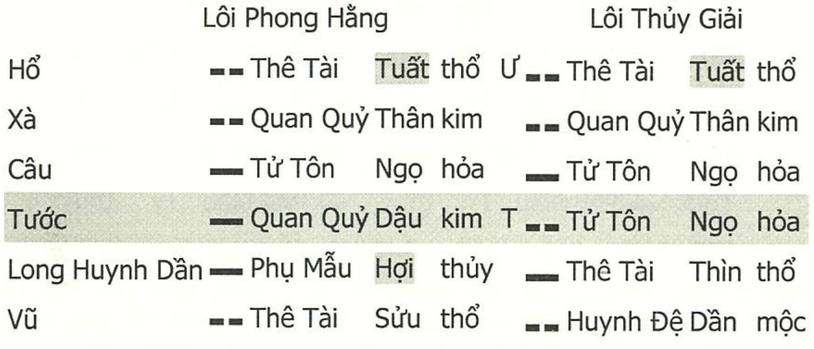
    - **Hình này chứng minh điều gì**
      - lấy Tài làm Dụng thần.
    - **Từ đâu mà thấy được**
      - Nhìn vào hào Thế, hào Ứng, Dụng thần và động hào trong bảng quẻ Quẻ Lôi Phong Hằng biến Lôi Thủy Giải.
- **Quá trình suy luận và đối thoại ban đầu:**
  - Căn cứ suy luận: Theo suy vượng thông thường, Quan Quỷ Nguyệt phá, động hóa hồi đầu khắc, hào biến lại vượng, căn bản không thể phục hồi công việc.
  - Căn cứ suy luận: Nhưng anh ta đang ở trong một trạng thái lo lắng, hoang mang mỗi ngày, do đó Quan Quỷ trong quẻ phải thể hiện lo lắng mới đúng, Quan Quỷ Nguyệt phá động mà hóa hồi đầu khắc, đây là khắc đi Quỷ bên mình.
  - Căn cứ suy luận: Nhưng tôi không xem như vậy, tôi cho rằng hào Tài Mùi thổ này là bản thân cô ấy.
  - Căn cứ suy luận: Bởi vì hào Tài Mùi thổ này cũng là hào Thế, hào Thế bị Tài trên Nguyệt xung phá, Tài trên Nguyệt là tiền trong thẻ của cô ấy, xung phá hào Thế chính là cô ấy đang lo lắng, hóa ra Quan Quỷ để biểu thị ưu sầu, vẫn là biểu thị lo lắng.
  - Căn cứ suy luận: Nhưng Nhật xung mất hào biến Quan Quỷ, là giải trừ ưu sầu, do đó phán đoán tiền trong thẻ vẫn còn, chưa bị lấy mất.
- **Ứng nghiệm thực tế và diễn biến sự việc:**
  - Thực tế diễn biến kiểm chứng ứng kỳ và cát hung của quẻ chiêm.
- **Ngộ giải và bài học kinh nghiệm then chốt:**
  - Đúc rút quy luật thực chiến: Xem xét tổng thể ngũ hành, hào động và tâm thái người gieo quẻ.

### Ví dụ 3: Thẻ ngân hàng của một học viên đã bị người lấy trộm
- **Bối cảnh & Dữ kiện chiêm bái:**
  - **Ví dụ 3:** Thẻ ngân hàng của một học viên đã bị người lấy trộm, sau mấy ngày mới phát hiện, lo lắng người ăn trộm đã rút tiền trong thẻ, muốn hỏi ngân hàng nhưng lúc đó ngân hàng đã hết giờ làm, do đó gieo quẻ hỏi tiền có còn trong thẻ hay không?
  - Ở ngày Bính Dần tháng Sửu, được Hỏa Lôi Phệ Hạp biến Thiên Lôi Vô Vọng.
  - Kết quả, ngày hôm sau, cô ấy đã đến ngân hàng kiểm tra, tiền trong thẻ vẫn còn, cô ấy đã rút hết tiền của mình ra.
- Bảng quẻ Quẻ Hỏa Lôi Phệ Hạp biến Thiên Lôi Vô Vọng:
  - **Hình 46.** Quẻ Hỏa Lôi Phệ Hạp biến Thiên Lôi Vô Vọng
    - 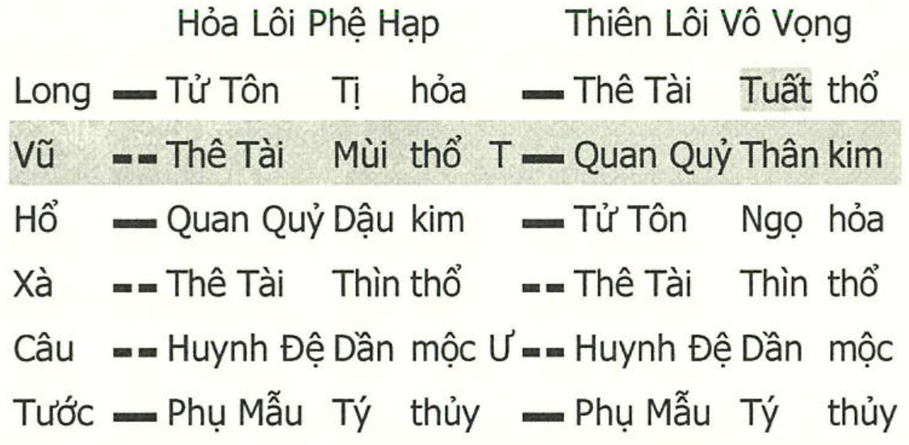
    - **Hình này chứng minh điều gì**
      - lấy Tài làm Dụng thần.
    - **Từ đâu mà thấy được**
      - Nhìn vào hào Thế, hào Ứng, Dụng thần và động hào trong bảng quẻ Quẻ Hỏa Lôi Phệ Hạp biến Thiên Lôi Vô Vọng.
- **Quá trình suy luận và đối thoại ban đầu:**
  - Căn cứ suy luận: Nhưng tôi không xem như vậy, tôi cho rằng hào Tài Mùi thổ này là bản thân cô ấy.
  - Căn cứ suy luận: Bởi vì hào Tài Mùi thổ này cũng là hào Thế, hào Thế bị Tài trên Nguyệt xung phá, Tài trên Nguyệt là tiền trong thẻ của cô ấy, xung phá hào Thế chính là cô ấy đang lo lắng, hóa ra Quan Quỷ để biểu thị ưu sầu, vẫn là biểu thị lo lắng.
  - Căn cứ suy luận: Nhưng Nhật xung mất hào biến Quan Quỷ, là giải trừ ưu sầu, do đó phán đoán tiền trong thẻ vẫn còn, chưa bị lấy mất.
- **Ứng nghiệm thực tế và diễn biến sự việc:**
  - Nhìn vào kết quả thực tế: Kết quả là đã có thai thật sau khi kiểm tra.
  - Nhìn vào kết quả thực tế: Ở ngày Tý, người nữ này đã bỏ thai, chính là đã ứng Không và phục tàng gặp ngày xung.
- **Ngộ giải và bài học kinh nghiệm then chốt:**
  - Đúc rút quy luật thực chiến: Xem xét tổng thể ngũ hành, hào động và tâm thái người gieo quẻ.

### Ví dụ 4: Một học viên cầm quẻ này đến hỏi tôi
- **Bối cảnh & Dữ kiện chiêm bái:**
  - **Ví dụ 4:** Một học viên cầm quẻ này đến hỏi tôi, nói rằng đây là quẻ của một cô gái gieo, cô ta sống chung với bạn trai, phát hiện kinh nguyệt không đến đúng hạn, lo lắng đã có thai, ở ngày Ất Dậu tháng Tuất, được Thủy Phong Tỉnh biến Thủy Lôi Truân.
  - Kết quả là đã có thai thật sau khi kiểm tra.
  - Tử Tôn này Không mà bị khắc chính là biểu thị thai nhi sẽ không ra đời, không xuất hiện giữa nhân thế, sẽ bị phá.
  - Ở ngày Tý, người nữ này đã bỏ thai, chính là đã ứng Không và phục tàng gặp ngày xung.
- Bảng quẻ Sơ đồ quẻ Thủy Phong Tỉnh biến Thủy Lôi Truân:
  - **Hình 47.** Sơ đồ quẻ Thủy Phong Tỉnh biến Thủy Lôi Truân
    - 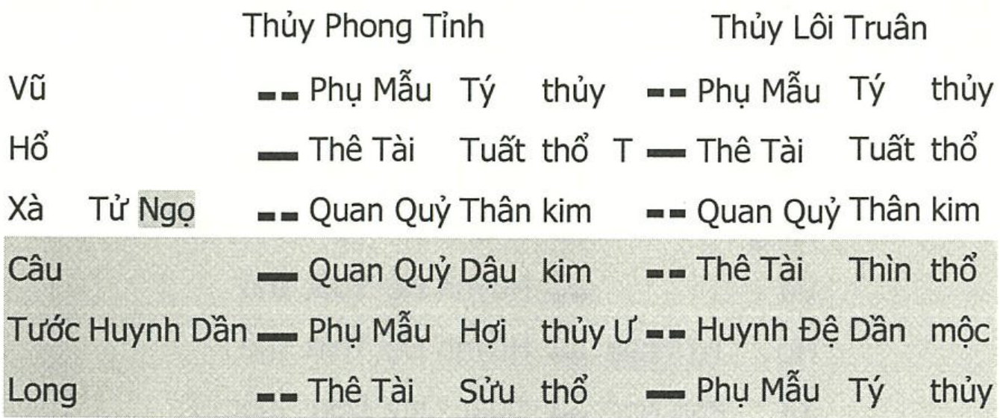
    - **Hình này chứng minh điều gì**
      - lấy Tử Tôn làm Dụng thần.
    - **Từ đâu mà thấy được**
      - Nhìn vào hào Thế, hào Ứng, Dụng thần và động hào trong bảng quẻ Sơ đồ quẻ Thủy Phong Tỉnh biến Thủy Lôi Truân.
- **Quá trình suy luận và đối thoại ban đầu:**
  - Căn cứ suy luận: Một người đàn ông chung sống ngoài hôn nhân với một người nữ, khi anh ta đề xuất chia tay, người nữ này tuyên bố rằng cô ấy đã có thai, đòi sinh đứa con này, bảo anh ta ly hôn với vợ.
  - Căn cứ suy luận: Bởi vì rất lo lắng, hỏi người nữ này có thai thực sự hay không?
- **Ứng nghiệm thực tế và diễn biến sự việc:**
  - Thực tế diễn biến kiểm chứng ứng kỳ và cát hung của quẻ chiêm.
- **Ngộ giải và bài học kinh nghiệm then chốt:**
  - Đúc rút quy luật thực chiến: Xem xét tổng thể ngũ hành, hào động và tâm thái người gieo quẻ.

### Ví dụ 5: Đây cũng là quẻ của học viên mời tôi xem
- **Bối cảnh & Dữ kiện chiêm bái:**
  - **Ví dụ 5:** Đây cũng là quẻ của học viên mời tôi xem.
  - Một người đàn ông chung sống ngoài hôn nhân với một người nữ, khi anh ta đề xuất chia tay, người nữ này tuyên bố rằng cô ấy đã có thai, đòi sinh đứa con này, bảo anh ta ly hôn với vợ.
  - Bởi vì rất lo lắng, hỏi người nữ này có thai thực sự hay không?
  - Áp lực tâm lý của người gieo quẻ này lớn hơn so với người của quẻ phía trên, nhưng có điểm chung là đều lo lắng, sợ có thai mà đoán, quẻ này Quan Quỷ trì Thế, được Nguyệt sinh Nhật phù rất vượng tướng, dựa vào Quan là ưu sầu để giải thích, nhất định đã có thai.
- Bảng quẻ Sơ đồ quẻ Sơn Thiên Đại Súc:
  - **Hình 48.** Sơ đồ quẻ Sơn Thiên Đại Súc
    - 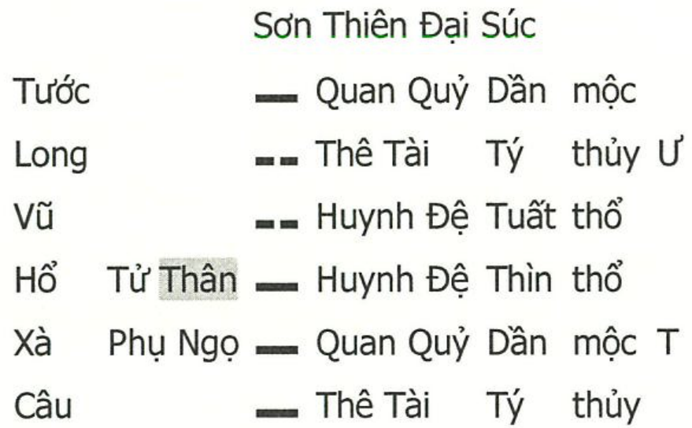
    - **Hình này chứng minh điều gì**
      - Bảng quẻ Sơ đồ quẻ Sơn Thiên Đại Súc phản ánh sự phối chiếu hào vị, ngũ hành và động biến minh chứng cho vấn đề chiêm đoán.
    - **Từ đâu mà thấy được**
      - Nhìn vào hào Thế, hào Ứng, Dụng thần và động hào trong bảng quẻ Sơ đồ quẻ Sơn Thiên Đại Súc.
- **Quá trình suy luận và đối thoại ban đầu:**
  - Căn cứ suy luận: Một người đàn ông chung sống ngoài hôn nhân với một người nữ, khi anh ta đề xuất chia tay, người nữ này tuyên bố rằng cô ấy đã có thai, đòi sinh đứa con này, bảo anh ta ly hôn với vợ.
  - Căn cứ suy luận: Bởi vì rất lo lắng, hỏi người nữ này có thai thực sự hay không?
  - Căn cứ suy luận: Nhưng quẻ này thuộc về lo lắng mà đoán, Tử Tôn độc phát khắc đi Quỷ bên mình, lo lắng tiêu tan, do đó sau cùng có thể chia tay.
  - Căn cứ suy luận: Bởi vì Quỷ vượng, ưu sầu nhất thời khó mà loại bỏ, do đó năm sau là năm Dậu xung mất hào Tài, thì có thể chia tay.
- **Ứng nghiệm thực tế và diễn biến sự việc:**
  - Thực tế diễn biến kiểm chứng ứng kỳ và cát hung của quẻ chiêm.
- **Ngộ giải và bài học kinh nghiệm then chốt:**
  - Đúc rút quy luật thực chiến: Xem xét tổng thể ngũ hành, hào động và tâm thái người gieo quẻ.

### Ví dụ 6: Một người đàn ông hỏi có thể chia tay với tình nhân được hay
- **Bối cảnh & Dữ kiện chiêm bái:**
  - **Ví dụ 6:** Một người đàn ông hỏi có thể chia tay với tình nhân được hay không?
  - Anh ta đề xuất chia tay với tình nhân.
  - Nhưng đối phương đe dọa sẽ giết anh ta.
  - Nhưng quẻ này thuộc về lo lắng mà đoán, Tử Tôn độc phát khắc đi Quỷ bên mình, lo lắng tiêu tan, do đó sau cùng có thể chia tay.
  - Bởi vì Quỷ vượng, ưu sầu nhất thời khó mà loại bỏ, do đó năm sau là năm Dậu xung mất hào Tài, thì có thể chia tay.
- Bảng quẻ Quẻ Trạch Địa Tụy biến Thủy Địa Tỷ:
  - **Hình 49.** Quẻ Trạch Địa Tụy biến Thủy Địa Tỷ
    - 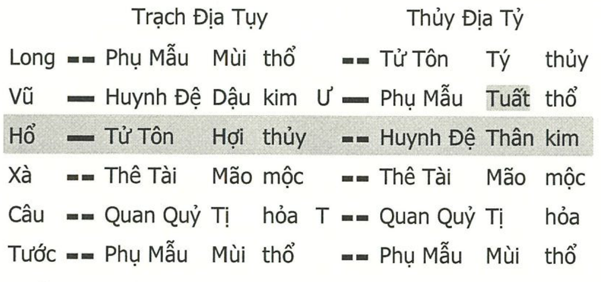
    - **Hình này chứng minh điều gì**
      - Lấy hào Tài làm Dụng thần.
    - **Từ đâu mà thấy được**
      - Nhìn vào hào Thế, hào Ứng, Dụng thần và động hào trong bảng quẻ Quẻ Trạch Địa Tụy biến Thủy Địa Tỷ.
- **Quá trình suy luận và đối thoại ban đầu:**
  - Căn cứ suy luận: Nhưng quẻ này thuộc về lo lắng mà đoán, Tử Tôn độc phát khắc đi Quỷ bên mình, lo lắng tiêu tan, do đó sau cùng có thể chia tay.
  - Căn cứ suy luận: Bởi vì Quỷ vượng, ưu sầu nhất thời khó mà loại bỏ, do đó năm sau là năm Dậu xung mất hào Tài, thì có thể chia tay.
- **Ứng nghiệm thực tế và diễn biến sự việc:**
  - Thực tế diễn biến kiểm chứng ứng kỳ và cát hung của quẻ chiêm.
- **Ngộ giải và bài học kinh nghiệm then chốt:**
  - Đúc rút quy luật thực chiến: Xem xét tổng thể ngũ hành, hào động và tâm thái người gieo quẻ.

## 12. Lẽ Nào Đã Ứng Nguyên Thần Quá Nhược?

- **Tổng quan nguyên lý & bối cảnh chuyên đề:**
  - Đây là một quái lệ được dự đoán ở năm 98. Trước đây tôi đã từng dự đoán cho người này rất nhiều lần, rất ít khi có dự đoán sai, do đó anh ta rất tin tưởng vào dự đoán của tôi, đến mức giống như mê tín. Nhưng chính bởi vì sự mê tín của anh ta mà suýt chút nữa đã làm trễ thời gian nhập viện sinh con.
  - Lúc đó quẻ này được đoán như sau. Dự đoán sinh con, lấy hào Tử Tôn làm Dụng thần. Tử Tôn Dần mộc lâm hào sơ, Nhật Nguyệt không khắc, cũng không được sinh phù là hưu tù. Tử Tôn lâm hào âm, lại gặp hưu tù là nữ, lại thêm nội quái lâm Tử Tôn biến Tốn, Tốn lại là nữ, hào âm lưỡng động, do đó phán đoán sinh nữ.
### Quái lệ 1: Quẻ Địa Thủy Sư biến Thiên Phong Cấu
- **Bối cảnh & Dữ kiện chiêm bái:**
  - Ngày Canh Thìn tháng Tị, một người đàn ông hỏi cát hung về việc sinh nở của vợ, khi nào sinh và sinh nam hay sinh nữ, được Địa Thủy Sư biến Thiên Phong Cấu.
  - Đây là một quái lệ được dự đoán ở năm 98.
  - Trước đây tôi đã từng dự đoán cho người này rất nhiều lần, rất ít khi có dự đoán sai, do đó anh ta rất tin tưởng vào dự đoán của tôi, đến mức giống như mê tín.
  - Nhưng chính bởi vì sự mê tín của anh ta mà suýt chút nữa đã làm trễ thời gian nhập viện sinh con.
- Bảng quẻ Quẻ Địa Thủy Sư biến Thiên Phong Cấu:
  - **Hình 50.** Quẻ Địa Thủy Sư biến Thiên Phong Cấu
    - 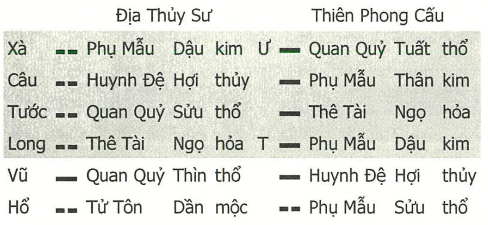
    - **Hình này chứng minh điều gì**
      - lấy hào Tử Tôn làm Dụng thần.
    - **Từ đâu mà thấy được**
      - Nhìn vào hào 2 thai vị, do đó sinh ở ngày Thìn.
- **Quá trình suy luận và đối thoại ban đầu:**
  - Căn cứ suy luận: Nhưng chính bởi vì sự mê tín của anh ta mà suýt chút nữa đã làm trễ thời gian nhập viện sinh con.
  - Căn cứ suy luận: Hào Tài trên Thế là vợ anh ta, lâm Thanh Long động mà hóa Không, Thanh Long chủ vui mừng, sinh dục, Dậu kim hóa ra là Thai địa của Tử Tôn, do đó tôi phán đoán là có thai ở tháng Dậu.
  - Căn cứ suy luận: Thông thường mang thai 10 tháng, đến hiện tại là đã 9 tháng, quẻ này Nguyên thần Nguyệt phá, theo ứng kỳ lục hào là sang tháng bất phá, chính là sinh vào tháng sau, cũng tức là Mang Chủng.
  - Căn cứ suy luận: Anh ta nói ngày sinh dự tính đúng là Mang Chủng.
  - Căn cứ suy luận: Ngày cụ thể, tôi phán đoán là ngày Thân, bởi vì Tử Tôn tĩnh mà gặp xung.
  - Căn cứ suy luận: Giờ là tại giờ Hợi, bởi vì Nguyên thần Nguyệt phá, giờ Hợi thực phá.
  - Đối thoại thực tế: Đến ngày Nhâm Thìn (ngày 14 tháng 6), bụng của vợ anh ta bắt đầu lên cơn đau, có vẻ như sắp sinh, liền nói với anh ta: "Đưa tôi đến bệnh viện nhé, hình như hôm nay sẽ sinh."
  - Đối thoại thực tế: Ai ngờ anh ta đã nói một cách rất chắc chắn: "Gấp cái gì, còn bốn ngày nữa!"
- **Ứng nghiệm thực tế và diễn biến sự việc:**
  - Nhìn vào kết quả thực tế: Sau đó, tôi đã nhiều lần nghiên cứu quẻ này, bất kể như thế nào cũng không lý giải được tại sao có thể ứng vào ngày Thìn?
  - Nhìn vào kết quả thực tế: Có Tử Tôn và Nguyên thần không ứng, tại sao phải vòng vo?
  - Nhìn vào kết quả thực tế: Nguyệt phá Nhật khắc, Sửu thổ lại động đến khắc, thổ rất vượng, thổ được Nguyệt sinh, Sửu thổ hóa hồi đầu sinh, trong quẻ lưỡng hiện, lại được Ngọ hỏa động đến sinh, Nguyên thần nhược đến cực điểm, mà ngày Thìn lại khiến Nguyên thần nhập Mộ, có phải ứng Nguyên thần nhược cực điểm?
  - Nhìn vào kết quả thực tế: Hiện nay vẫn chưa có lời giải thích hợp lý, hy vọng mọi người cũng sẽ suy nghĩ về ứng kỳ này.
- **Ngộ giải và bài học kinh nghiệm then chốt:**
  - Đúc rút quy luật thực chiến: Xem xét tổng thể ngũ hành, hào động và tâm thái người gieo quẻ.

### Tổng kết chuyên đề và bài học tâm đắc
- **Huyền cơ cốt lõi rút ra từ các quái lệ:**
  - Long là Ngọ hỏa bước vào Không Vong, Thanh Long chủ sinh nở, chủ hỷ, Không mà vô hỷ, do đó phán đoán sinh vào giờ Hợi ngày Bính Thân (ngày 18 tháng 6) của tuần Giáp Ngọ.
  - Anh ta phản hồi ngay rằng phán đoán của tôi cũng gần với ngày sinh dự tính của bệnh viện.
  - Tử Tôn không có hợp, lại không nhập Mộ, do đó là sinh thường.
  - Sau khi phán đoán xong, anh ta vui vẻ ra về.
  - Đến ngày Nhâm Thìn (ngày 14 tháng 6), bụng của vợ anh ta bắt đầu lên cơn đau, có vẻ như sắp sinh, liền nói với anh ta: "Đưa tôi đến bệnh viện nhé, hình như hôm nay sẽ sinh."
  - Ai ngờ anh ta đã nói một cách rất chắc chắn: "Gấp cái gì, còn bốn ngày nữa!"
  - Vợ anh ta cảm thấy đã sắp sinh, thấy chồng phớt lờ cô ấy, liền ra ngoài bắt taxi tự mình đến bệnh viện.
  - Đến bệnh viện kiểm tra thì đúng là đã sắp sinh, mới gọi anh ta đến bệnh viện, ở giờ Hợi hôm đó (9 giờ 55 phút) sinh thường được một con gái.
  - Hầu hết dự đoán của quẻ này về cơ bản đều đúng, chỉ là đã sai số 4 ngày, mặc dù dự đoán ngày sinh sát hơn dự tính của bệnh viện, nhưng vẫn là ngọc có tỳ vết.
  - Sau đó, tôi đã nhiều lần nghiên cứu quẻ này, bất kể như thế nào cũng không lý giải được tại sao có thể ứng vào ngày Thìn?
  - Có người biết lục hào nói rằng Thìn thổ là nơi mà hào Thế sinh, giống như con cái của mình, lâm hào 2 thai vị, do đó sinh ở ngày Thìn.
  - Thoạt đầu nghe cũng có đạo lý, nhưng suy xét cặn kẽ thì thấy có phần miễn cưỡng.
  - Có Tử Tôn và Nguyên thần không ứng, tại sao phải vòng vo?
  - Tử Tôn trong quẻ này không vượng, Nguyên thần càng là hưu tù.
  - Nguyệt phá Nhật khắc, Sửu thổ lại động đến khắc, thổ rất vượng, thổ được Nguyệt sinh, Sửu thổ hóa hồi đầu sinh, trong quẻ lưỡng hiện, lại được Ngọ hỏa động đến sinh, Nguyên thần nhược đến cực điểm, mà ngày Thìn lại khiến Nguyên thần nhập Mộ, có phải ứng Nguyên thần nhược cực điểm?
  - Hiện nay vẫn chưa có lời giải thích hợp lý, hy vọng mọi người cũng sẽ suy nghĩ về ứng kỳ này.

## 13. Cho Đến Bây Giờ Cũng Chưa Giải Được Câu Đố

- **Tổng quan nguyên lý & bối cảnh chuyên đề:**
  - Hào 2 là hào vị nhà, lâm Nguyệt phá là thông tin nhà sắp bị dỡ bỏ, đó cũng là nguyên nhân của chuyển nhà.
  - Bạch Hổ trì Thế, Bạch Hổ là thông tin lâm bồn, sinh con, Tử Tôn Dậu kim bị Thai địa Nhật thần xung động là thông tin con dâu ông ta sắp sửa sinh con. Hào 2 là hào vị của thai nhi, bị Nguyệt kiến Tử Tôn xung phá cũng là thông tin sắp sinh con.
  - Hào Ứng là người khác, phát động hóa Mẫu Ngọ hỏa, Phụ Mẫu là nhà, Ứng động hóa ra Phụ Mẫu, là người ta cấp nhà cho cô dọn đến ở. Lục hợp biến lục xung, chỉ là tạm thời cư trú, sẽ không ở lâu.
### Quái lệ 1: Quẻ Địa Lôi Phục biến Chấn Vi Lôi
- **Bối cảnh & Dữ kiện chiêm bái:**
  - Năm 1998, tôi đã từng tổ chức một lớp lục hào dự đoán cổ phiếu, ngày Tân Mão tháng Thân, một ông lão trong lớp đã lấy ra một quẻ của con dâu ông ta gieo, thỉnh cầu chọn ngày chuyển nhà, được Địa Lôi Phục biến Chấn Vi Lôi.
  - Hào Ứng là người khác, phát động hóa Mẫu Ngọ hỏa, Phụ Mẫu là nhà, Ứng động hóa ra Phụ Mẫu, là người ta cấp nhà cho cô dọn đến ở.
  - Lục hợp biến lục xung, chỉ là tạm thời cư trú, sẽ không ở lâu.
- Bảng quẻ Quẻ Địa Lôi Phục biến Chấn Vi Lôi:
  - **Hình 51.** Quẻ Địa Lôi Phục biến Chấn Vi Lôi
    - 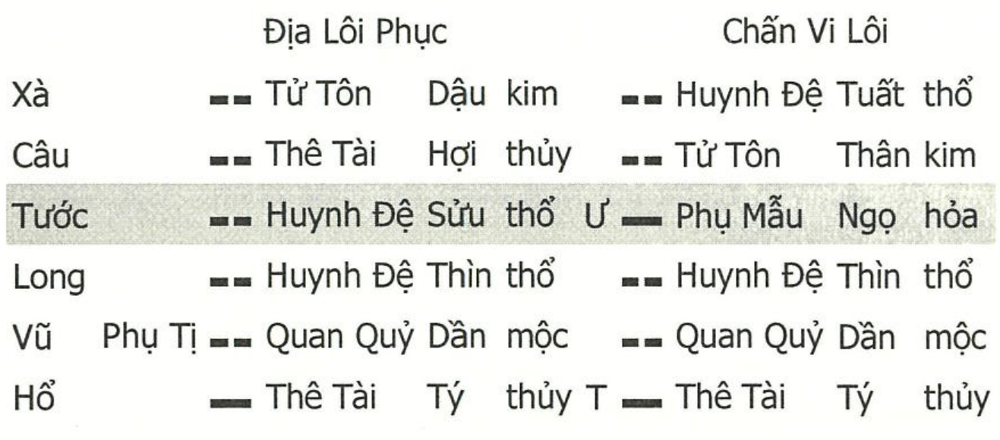
    - **Hình này chứng minh điều gì**
      - Bảng quẻ Quẻ Địa Lôi Phục biến Chấn Vi Lôi phản ánh sự phối chiếu hào vị, ngũ hành và động biến minh chứng cho vấn đề chiêm đoán.
    - **Từ đâu mà thấy được**
      - Nhìn vào hào 6 Tử Tôn Dậu kim ám động thành liên tục tương sinh nên không sao.
- **Quá trình suy luận và đối thoại ban đầu:**
  - Căn cứ suy luận: Quẻ như thế không có Dụng thần cụ thể, bởi vì người gieo quẻ lo lắng cát hung, do đó trọng điểm xem hào Thế.
  - Căn cứ suy luận: Hào Thế nhược thì chọn ngày sinh hào Thế, hào Thế quá vượng thì chọn ngày khắc hào Thế hoặc chờ ngày hào Thế nhập Mộ.
  - Căn cứ suy luận: Hào 2 là hào vị nhà, lâm Nguyệt phá là thông tin nhà sắp bị dỡ bỏ, đó cũng là nguyên nhân của chuyển nhà.
- **Ứng nghiệm thực tế và diễn biến sự việc:**
  - Nhìn vào kết quả thực tế: Hào Phụ Mẫu là hỏa, hỏa chủ số 2, lại phục tại hào 2, do đó đoán sau này chuyển tới tầng 2.
  - Nhìn vào kết quả thực tế: Kết quả ứng nghiệm sau cùng: Đã chuyển nhà vào ngày Bính Thân, con dâu người đó đã sinh một con trai ở ngày Mậu Thân, sinh khó.
- **Ngộ giải và bài học kinh nghiệm then chốt:**
  - Đúc rút quy luật thực chiến: Xem xét tổng thể ngũ hành, hào động và tâm thái người gieo quẻ.

### Tổng kết chuyên đề và bài học tâm đắc
- **Huyền cơ cốt lõi rút ra từ các quái lệ:**
  - Quẻ chính lục hợp, hợp là tượng trùng điệp, hào 2 là trạch, Phụ Mẫu cũng là trạch, phục dưới hào 2 có ý nghĩa là dưới nhà có nhà, lâm Huyền Vũ, Huyền Vũ là ngầm, tối tăm, đây là thông tin nhà lầu có chứa tầng hầm.
  - Hào Phụ Mẫu là hỏa, hỏa chủ số 2, lại phục tại hào 2, do đó đoán sau này chuyển tới tầng 2.
  - Quẻ lục hợp là thông tin sinh khó, Tử Tôn nhập Mộ cũng là thông tin sinh khó.
  - Tử Tôn được Nguyệt tỉ phù, hào động sinh trợ là vượng tướng, vượng tướng là nam, hưu tù là nữ, lại thêm một hào độc phát, âm động biến dương, đích thị sinh con trai.
  - Tử Tôn nhập Mộ, nhập Mộ thì cần xung khai, ứng với ngày Mùi sinh con.
  - Tuần tiếp theo là tuần Giáp Ngọ, Nguyên thần Thìn thổ Không Vong, Thìn thổ không những là Nguyên thần mà còn là Dưỡng địa của Tử Tôn, Dưỡng địa Không Vong sẽ không sinh được, vì vậy tôi đoán ngày Đinh Mùi của tuần Giáp Thìn sẽ sinh.
  - Căn cứ vào tình hình trên đây, tôi chọn ngày Bính Thân để chuyển nhà.
  - Kết quả ứng nghiệm sau cùng: Đã chuyển nhà vào ngày Bính Thân, con dâu người đó đã sinh một con trai ở ngày Mậu Thân, sinh khó.
  - Mặc dù ngày đứa trẻ ra đời đã lệch một ngày, nhưng dự đoán các thông tin khác đều chính xác.
  - Chứng tỏ thông tin của quẻ này tương đối chuẩn.
  - Nhưng tại sao không sinh ở ngày Đinh Mùi mà là chậm lại một ngày nhỉ?
  - Nghĩ mãi không ra.
  - Mặc dù ngày Mậu Thân cũng là ngày trị Tử Tôn, nhưng tại sao không ứng ngày Dậu xuất hiện trong quẻ mà lại ứng tại ngày Thân, cho đến bây giờ tôi cũng chưa hiểu được nguyên do trong đó.

## 14. Nhầm Lẫn Về Tủ Sách Và Tủ Áo

- **Tổng quan nguyên lý & bối cảnh chuyên đề:**
  - Lấy Thê Tài làm Dụng thần. Dụng thần bất thượng quái, phục dưới Tử Tôn Mùi thổ. Nguyệt là Trường Sinh, Nhật thần tỉ phù là vượng tướng, vượng tướng là tượng không mất. Thế lâm Trình Xà, Trình Xà là quên, là mình để quên ở đâu đó. Hóa quy hồn, quy hồn bất xuất gia, chìa khóa không ra khỏi nhà. Ngoại quái phản ngâm, đã tìm ở trong nhà nhiều lần.
  - Cô ấy liền cho tôi biết, ở hướng Tây Nam tầng hai vừa đúng có tủ sách, bên trên để rất nhiều sách về khảo cổ, thế là dự định tìm trong tủ sách.
### Ví dụ 1: Ngày Nhâm Thân tháng Tị
- **Bối cảnh & Dữ kiện chiêm bái:**
  - **Ví dụ 1:** Ngày Nhâm Thân tháng Tị, cô Muto gọi điện thoại từ Nhật Bản nói rằng chìa khóa của cô ấy đã không thể tìm thấy, nhờ tôi xem là đã mất hay để ở đâu trong nhà?
  - Tôi gieo quẻ được Phong Thủy Hoán biến Địa Thủy Sư.
  - Ngày hôm sau, cô ấy gọi đến nói cho tôi biết là đã tìm được chìa khóa.
  - Nghe vậy tôi mừng lắm, đang định hả hê về độ chính
- Bảng quẻ Quẻ Phong Thủy Hoán biến Địa Thủy Sư:
  - **Hình 52.** Quẻ Phong Thủy Hoán biến Địa Thủy Sư
    - 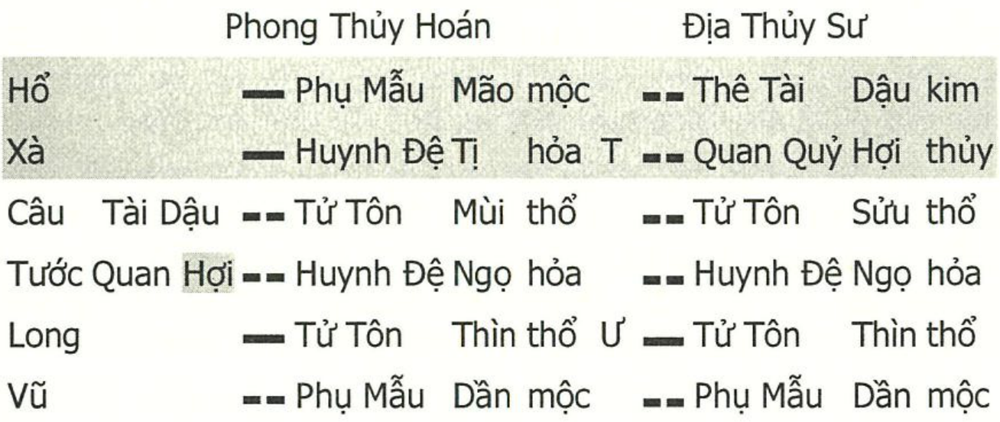
    - **Hình này chứng minh điều gì**
      - Lấy Thê Tài làm Dụng thần.
    - **Từ đâu mà thấy được**
      - Nhìn vào hào Thế, hào Ứng, Dụng thần và động hào trong bảng quẻ Quẻ Phong Thủy Hoán biến Địa Thủy Sư.
- **Quá trình suy luận và đối thoại ban đầu:**
  - Căn cứ suy luận: Tài phục dưới Mùi thổ, Mùi thổ là Mộ khố của Phụ Mẫu, Mùi thể hiện Tây Nam, Mộ khố là đồ chứa vật, quẻ này là cung Ly có thông tin văn thư, Mùi lại là Mộ khố của Phụ Mẫu, Phụ Mẫu là văn thư, thư tịch, do đó tôi phán đoán là cô ấy đã để chìa khóa trong tủ sách.
  - Căn cứ suy luận: Mùi thổ lâm Câu Trần, Câu Trần chủ cũ kỹ, cổ xưa, do đó phán đoán là ở bên cạnh thư tịch khảo cổ trong tủ sách.
  - Căn cứ suy luận: Dụng thần phục tàng gặp xuất hiện, ngày mai nhất định có thể tìm được.
  - Căn cứ suy luận: Lấy hào Phụ Mẫu làm Dụng thần.
  - Căn cứ suy luận: Trong quẻ Phụ Mẫu lưỡng hiện, lấy hào Phụ Mẫu Tị hỏa Không Vong gặp hợp làm Dụng thần.
  - Căn cứ suy luận: Dụng thần Không Vong, mặc dù không được Nhật Nguyệt sinh phù, nhưng hào Thế phát động hợp Dụng thần.
- **Ứng nghiệm thực tế và diễn biến sự việc:**
  - Thực tế diễn biến kiểm chứng ứng kỳ và cát hung của quẻ chiêm.
- **Ngộ giải và bài học kinh nghiệm then chốt:**
  - Đúc rút quy luật thực chiến: Xem xét tổng thể ngũ hành, hào động và tâm thái người gieo quẻ.

### Ví dụ 2: Bằng hữu Cao tiên sinh không tìm được một chứng thư
- **Bối cảnh & Dữ kiện chiêm bái:**
  - Có quẻ chỉ cần phán đoán cát hung và thời gian là được, nhưng cũng có quẻ người xem còn yêu cầu địa điểm và nơi chốn cụ thể, đây là điều rất khó trong dự đoán, yêu cầu công lực rất sâu, lại yêu cầu phải đạt đến mức độ thành thạo đối với ứng dụng tượng.
  - Tôi đã có một số khám phá về phương diện này, nhưng vẫn chưa được như ý muốn.
  - Chỉ có một chút tâm đắc nhỏ mà thôi.
  - **Ví dụ 2:** Bằng hữu Cao tiên sinh không tìm được một chứng thư, gọi điện thoại hỏi ở chỗ nào?
  - Khi nào tìm được?
- Bảng quẻ Quẻ Thiên Trạch Lý biến Lôi Trạch Quy Muội:
  - **Hình 53.** Quẻ Thiên Trạch Lý biến Lôi Trạch Quy Muội
    - 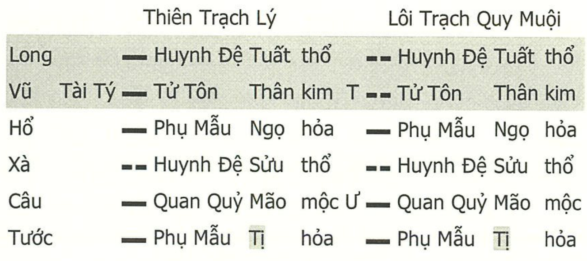
    - **Hình này chứng minh điều gì**
      - Lấy hào Phụ Mẫu làm Dụng thần.
    - **Từ đâu mà thấy được**
      - Nhìn vào hào Thế, hào Ứng, Dụng thần và động hào trong bảng quẻ Quẻ Thiên Trạch Lý biến Lôi Trạch Quy Muội.
- **Quá trình suy luận và đối thoại ban đầu:**
  - Căn cứ suy luận: Lấy hào Phụ Mẫu làm Dụng thần.
  - Căn cứ suy luận: Trong quẻ Phụ Mẫu lưỡng hiện, lấy hào Phụ Mẫu Tị hỏa Không Vong gặp hợp làm Dụng thần.
  - Căn cứ suy luận: Dụng thần Không Vong, mặc dù không được Nhật Nguyệt sinh phù, nhưng hào Thế phát động hợp Dụng thần.
  - Căn cứ suy luận: Chứng tỏ có thể tìm được chứng thư, bởi vì hào Thế phát động là mình tìm, hợp Thế chính là tìm được.
  - Đối thoại thực tế: Dụng thần hợp Nhật, người xưa nói rằng: "Nhật thần hợp, nhất định vật bị che lấp." Chứng tỏ chứng thư không ở chỗ sáng, là bị vật nào đó che lại.
- **Ứng nghiệm thực tế và diễn biến sự việc:**
  - Thực tế diễn biến kiểm chứng ứng kỳ và cát hung của quẻ chiêm.
- **Ngộ giải và bài học kinh nghiệm then chốt:**
  - Đúc rút quy luật thực chiến: Xem xét tổng thể ngũ hành, hào động và tâm thái người gieo quẻ.

### Tổng kết chuyên đề và bài học tâm đắc
- **Huyền cơ cốt lõi rút ra từ các quái lệ:**
  - Hào Thế lâm Nhật hợp Phụ Mẫu chính là tìm được ngay hôm đó.
  - Dụng thần Không Vong, ứng xung Không, Dụng thần hợp, cũng ứng xung, Dụng thần nhập Mộ tại hào 6, cũng ứng xung xuất, giờ Hợi xung Dụng thần, do đó giờ Hợi có thể tìm được.
  - Ngoại quái phục ngâm, biểu thị đã tìm nhiều lần.
  - Dụng thần hợp Nhật, người xưa nói rằng: "Nhật thần hợp, nhất định vật bị che lấp." Chứng tỏ chứng thư không ở chỗ sáng, là bị vật nào đó che lại.
  - Nhập Mộ cũng biểu thị chứng thư để ở trong vật nào đó.
  - Tuất thổ này không chỉ khiến Dụng thần nhập Mộ mà còn thu Phụ Mẫu Ngọ hỏa vào trong Mộ khố, chứng tỏ trong đồ vật để chứng thư còn để vật khác.
  - Đồ vật để chứng thư này ở đâu?
  - Đó là phương vị thể hiện Tuất thổ, Tuất là Tây Bắc, do đó ở hướng Tây Bắc.
  - Kết quả, chứng thư được tìm thấy trong một cái túi ở hướng Tây Bắc vào lúc 9 giờ 30 (giờ Hợi) tối hôm đó.

## 15. Lẽ Nào Là Quỷ Đã Bắt Sai Người?

- **Tổng quan nguyên lý & bối cảnh chuyên đề:**
  - Trong quẻ hào Phụ Mẫu lưỡng hiện, một là hào 6 Phụ Mẫu Mão mộc, một là hào sơ Phụ Mẫu Dần mộc, thông thường phải chọn một trong đó để làm Dụng thần phán đoán.
  - Căn cứ vào quy luật Dụng thần lưỡng hiện, lấy hào phát động làm Dụng, quẻ này Phụ Mẫu Dần mộc lâm hào sơ phát động, hiển nhiên là Dụng thần. Dụng thần bị Nguyệt kiến khắc, Nhật lại không phù, Dụng thần nhập Mộ ở Mùi thổ, Không mà hóa Quan Quỷ, hóa lục xung, bệnh lâu gặp xung gặp Không thì chết,
### Ví dụ 1: Ngày Ất Tị tháng Dậu
- **Bối cảnh & Dữ kiện chiêm bái:**
  - **Ví dụ 1:** Ngày Ất Tị tháng Dậu, một học viên Nhật Bản đoán cha bệnh nguy kịch, cát hung ra sao?
  - Được Phong Thủy Hoán biến Càn Vi Thiên.
- Bảng quẻ Quẻ Phong Thủy Hoán biến Càn Vi Thiên:
  - **Hình 54.** Quẻ Phong Thủy Hoán biến Càn Vi Thiên
    - 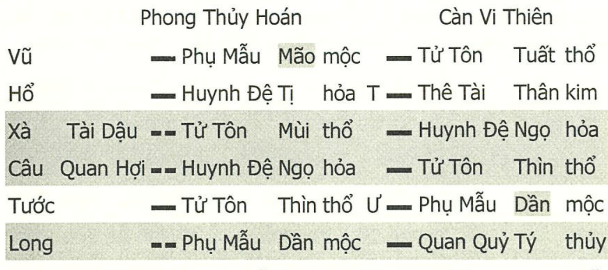
    - **Hình này chứng minh điều gì**
      - Bảng quẻ Quẻ Phong Thủy Hoán biến Càn Vi Thiên phản ánh sự phối chiếu hào vị, ngũ hành và động biến minh chứng cho vấn đề chiêm đoán.
    - **Từ đâu mà thấy được**
      - Nhìn vào hào 6 Phụ Mẫu Mão mộc, một là hào sơ Phụ Mẫu Dần mộc, thông thường phải chọn một trong đó để làm Dụng thần phán đoán.
- **Quá trình suy luận và đối thoại ban đầu:**
  - Tác giả phân tích cấu trúc hào tượng, Dụng thần và các yếu tố sinh khắc trong quẻ Quẻ Phong Thủy Hoán biến Càn Vi Thiên.
- **Ứng nghiệm thực tế và diễn biến sự việc:**
  - Nhìn vào kết quả thực tế: Kết quả phản hồi này nằm ngoài dự đoán của tôi.
- **Ngộ giải và bài học kinh nghiệm then chốt:**
  - Đúc rút quy luật thực chiến: Xem xét tổng thể ngũ hành, hào động và tâm thái người gieo quẻ.

### Ví dụ 2: Một người đàn ông dự đoán vận khí
- **Bối cảnh & Dữ kiện chiêm bái:**
  - Thế nhưng ngày Đinh Mùi cha anh ta vẫn an nhiên vô sự, mẹ chưa bao giờ có bệnh, khi chăm sóc cha đột nhiên ngã xuống mà qua đời.
  - Kết quả phản hồi này nằm ngoài dự đoán của tôi.
  - Lẽ nào là quỷ đã bắt sai người?
  - Xem kỹ quẻ này, hào 6 Phụ Mẫu Mão mộc là hào dương, lại ở hào thiên nhất định là cha, còn hào sơ Phụ Mẫu Dần mộc lâm hào âm hóa Quan Quỷ, âm là mẹ, hào sơ lại là hào địa, hào địa là mẹ, là mẹ biến quỷ, do đó mới có chuyện hỏi bệnh cha mà ứng mẹ chết.
  - **Ví dụ 2:** Một người đàn ông dự đoán vận khí.
- Bảng quẻ Sơ đồ quẻ Thiên Phong Cấu biến Trạch Phong Đại Quá:
  - **Hình 55.** Sơ đồ quẻ Thiên Phong Cấu biến Trạch Phong Đại Quá
    - 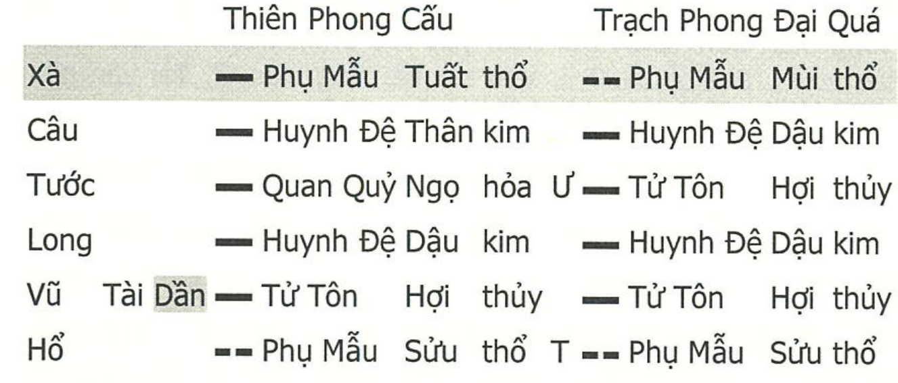
    - **Hình này chứng minh điều gì**
      - Bảng quẻ Sơ đồ quẻ Thiên Phong Cấu biến Trạch Phong Đại Quá phản ánh sự phối chiếu hào vị, ngũ hành và động biến minh chứng cho vấn đề chiêm đoán.
    - **Từ đâu mà thấy được**
      - Nhìn vào hào Thế, hào Ứng, Dụng thần và động hào trong bảng quẻ Sơ đồ quẻ Thiên Phong Cấu biến Trạch Phong Đại Quá.
- **Quá trình suy luận và đối thoại ban đầu:**
  - Tác giả phân tích cấu trúc hào tượng, Dụng thần và các yếu tố sinh khắc trong quẻ Sơ đồ quẻ Thiên Phong Cấu biến Trạch Phong Đại Quá.
- **Ứng nghiệm thực tế và diễn biến sự việc:**
  - Nhìn vào kết quả thực tế: Trên thực tế, người này ở năm 03 sau khi ly hôn không lâu thì mẹ qua đời, sau đó lại không có việc làm, tháng Thìn năm nay (Đinh Hợi) mới có công việc mới, hằng ngày rất vất vả, đi làm từ sáng sớm, hơn nữa thời gian làm việc dài, muốn xem có thể xoay chuyển hay không.
- **Ngộ giải và bài học kinh nghiệm then chốt:**
  - Đúc rút quy luật thực chiến: Xem xét tổng thể ngũ hành, hào động và tâm thái người gieo quẻ.

### Tổng kết chuyên đề và bài học tâm đắc
- **Huyền cơ cốt lõi rút ra từ các quái lệ:**
  - hiện, hào sơ là âm, hào 6 là dương, âm là mẹ, năm 03 mẹ qua đời.
  - Tài bất thượng quái, lại lâm Không Vong, Nhật Nguyệt không sinh phù, hôn nhân và tài vận cũng không tốt.
  - Phụ Mẫu lâm Nhật định hôn kỳ, ở đây có thể dùng hào Phụ Mẫu phán đoán ứng kỳ.
  - Năm Quý Mùi hào Tài nhập Mộ, lại xung phá hào Phụ Mẫu, Phụ Mẫu là hôn thư, do đó năm này vừa mất mẹ vừa ly hôn.
  - Quan được Nguyệt hợp mặc dù có khí, nhưng Tuất thổ độc phát, công việc không thuận, nhập Mộ tại hào 6, hào 6 là hào vị thoái hưu, do đó có thông tin thất nghiệp hoặc mất công việc.
  - Muốn công việc thuận lợi trở lại, cần phải xung khai Mộ khố mới được.
  - Trên thực tế, người này ở năm 03 sau khi ly hôn không lâu thì mẹ qua đời, sau đó lại không có việc làm, tháng Thìn năm nay (Đinh Hợi) mới có công việc mới, hằng ngày rất vất vả, đi làm từ sáng sớm, hơn nữa thời gian làm việc dài, muốn xem có thể xoay chuyển hay không.

## 16. Xem Sai Thai Song Sinh

- **Tổng quan nguyên lý & bối cảnh chuyên đề:**
  - 1, Dự đoán khi nào có thai, lấy Tử Tôn làm Dụng thần. Trong quẻ Tử Tôn lưỡng hiện, một dương một âm, lẫn lượt là Tử Tôn Tuất thổ và Tử Tôn Thìn thổ. Trong quẻ Ngọ hỏa phát động
### Quái lệ 1: Sơ đồ quẻ Sơn Thủy Mông biến Sơn Thiên Đại Súc
- **Bối cảnh & Dữ kiện chiêm bái:**
  - Ngày Bính Ngọ tháng Thân năm 2000, một người đàn ông làm việc ở đoàn kịch nói đến dự đoán, gieo quẻ được Sơn Thủy Mông biến Sơn Thiên Đại Súc, yêu cầu phán đoán 4 việc.
  - 1, Khi nào vợ có thể có thai?
  - 2, Vận khí về công việc.
- Bảng quẻ Sơ đồ quẻ Sơn Thủy Mông biến Sơn Thiên Đại Súc:
  - **Hình 56.** Sơ đồ quẻ Sơn Thủy Mông biến Sơn Thiên Đại Súc
    - 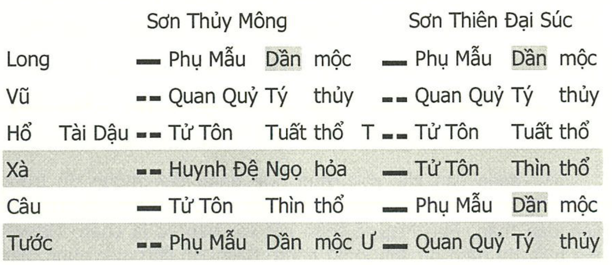
    - **Hình này chứng minh điều gì**
      - lấy Tử Tôn làm Dụng thần.
    - **Từ đâu mà thấy được**
      - Nhìn vào hào Thế, hào Ứng, Dụng thần và động hào trong bảng quẻ Sơ đồ quẻ Sơn Thủy Mông biến Sơn Thiên Đại Súc.
- **Quá trình suy luận và đối thoại ban đầu:**
  - Căn cứ suy luận: 4, Tuất thổ là màng tim, bị mộc động đến khắc, Nguyên thần là hỏa tại hào 3 bị Tý thủy ám động khắc, gặp Nguyệt lại là Bệnh địa, do đó tim có vấn đề, cung máu không tốt.
  - Căn cứ suy luận: Bởi vì Thế lâm Bạch Hổ chủ máu.
  - Đối thoại thực tế: Nhưng nhìn thấy quẻ này, Tử Tôn Ngọ hỏa phục tàng là một Tử Tôn, Nhật Nguyệt khắc, Tử Tôn lâm Bạch Hổ, Bạch Hổ chủ lưu sản, mà hào 3 Dậu kim động lại hóa Tử Tôn, không có thông tin thai song sinh, bèn hỏi anh ta: "Tôi nhớ năm ngoái tôi đã đoán anh có thai song sinh, nhưng quẻ này không có thông tin đó mà lại có thông tin là vợ anh có thai rồi lưu sản và sau đó lại có thai."
  - Đối thoại thực tế: Anh ta nói: "Lần này ông đã đoán đúng, đã lưu sản một lần, bây giờ lại có thai."
- **Ứng nghiệm thực tế và diễn biến sự việc:**
  - Nhìn vào kết quả thực tế: Ngoại trừ phán đoán về chuyện sinh con cần nghiệm chứng, những phán đoán khác đều ứng nghiệm.
- **Ngộ giải và bài học kinh nghiệm then chốt:**
  - Đúc rút quy luật thực chiến: Xem xét tổng thể ngũ hành, hào động và tâm thái người gieo quẻ.

### Quái lệ 2: Quẻ Địa Phong Thăng biến Lôi Thủy Giải
- **Bối cảnh & Dữ kiện chiêm bái:**
  - Khi đó tôi thấy Thai địa của Tử Tôn phát động, trên Nhật lại thấy một Thai địa, hai thai hai Tử Tôn, thế là phán đoán thai của anh ta là thai song sinh.
  - Một âm một dương, là thai long phụng.
  - 2, Hào 5 Quan Quỷ Tý thủy ám động, hào 5 là hào vị lãnh đạo, Quan thể hiện lãnh đạo, ám động biểu thị có biến hóa, do đó phán đoán đơn vị của người này đã thay lãnh đạo.
  - Hào 3 lâm Nhật là thắt lưng, bị thủy lâm Huyền Vũ khắc, thủy và Huyền Vũ chủ thấp khí, lại thêm mộc đến khắc Thế chủ phong hàn, do đó phán đoán thắt lưng có bệnh phong hàn.
  - Ngoại trừ phán đoán về chuyện sinh con cần nghiệm chứng, những phán đoán khác đều ứng nghiệm.
- Bảng quẻ Quẻ Địa Phong Thăng biến Lôi Thủy Giải:
  - **Hình 57.** Quẻ Địa Phong Thăng biến Lôi Thủy Giải
    - 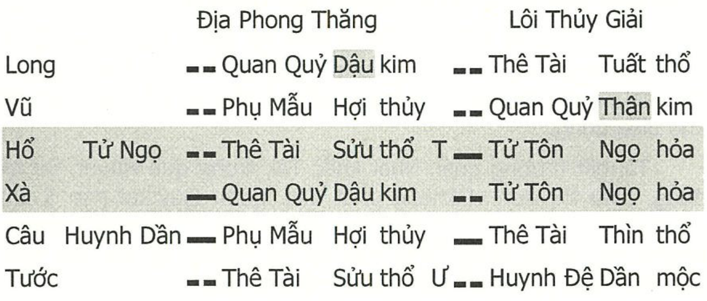
    - **Hình này chứng minh điều gì**
      - Lấy Quan Quỷ làm Dụng thần.
    - **Từ đâu mà thấy được**
      - Nhìn vào hào Thế, hào Ứng, Dụng thần và động hào trong bảng quẻ Quẻ Địa Phong Thăng biến Lôi Thủy Giải.
- **Quá trình suy luận và đối thoại ban đầu:**
  - Căn cứ suy luận: 4, Tuất thổ là màng tim, bị mộc động đến khắc, Nguyên thần là hỏa tại hào 3 bị Tý thủy ám động khắc, gặp Nguyệt lại là Bệnh địa, do đó tim có vấn đề, cung máu không tốt.
  - Căn cứ suy luận: Bởi vì Thế lâm Bạch Hổ chủ máu.
  - Đối thoại thực tế: Nhưng nhìn thấy quẻ này, Tử Tôn Ngọ hỏa phục tàng là một Tử Tôn, Nhật Nguyệt khắc, Tử Tôn lâm Bạch Hổ, Bạch Hổ chủ lưu sản, mà hào 3 Dậu kim động lại hóa Tử Tôn, không có thông tin thai song sinh, bèn hỏi anh ta: "Tôi nhớ năm ngoái tôi đã đoán anh có thai song sinh, nhưng quẻ này không có thông tin đó mà lại có thông tin là vợ anh có thai rồi lưu sản và sau đó lại có thai."
  - Đối thoại thực tế: Anh ta nói: "Lần này ông đã đoán đúng, đã lưu sản một lần, bây giờ lại có thai."
  - Đối thoại thực tế: Anh ta tiếp tục hỏi: "Vậy xem giúp tôi là nam hay là nữ?
  - Đối thoại thực tế: Khi nào sinh?"
  - Đối thoại thực tế: Tôi cười và nói: "Khi nào sinh cũng cần phán đoán à?
- **Ứng nghiệm thực tế và diễn biến sự việc:**
  - Nhìn vào kết quả thực tế: Sau quả nhiên ở giờ Tân Mùi ngày Giáp Tý tháng Bính Ngọ năm Nhâm Ngọ sinh con gái.
  - Nhìn vào kết quả thực tế: Tôi thấy Quỷ lâm Trình Xà tại hào 3 động, kim là ruột, Quỷ là bệnh, Trình Xà là vật thon dài, cũng là tượng của ruột, kim Không tắc minh, do đó phán đoán anh ta hiện tại ruột không tốt, thường xuyên đầy hơi tiêu chảy, kết quả cũng ứng nghiệm.
- **Ngộ giải và bài học kinh nghiệm then chốt:**
  - Đúc rút quy luật thực chiến: Xem xét tổng thể ngũ hành, hào động và tâm thái người gieo quẻ.

### Tổng kết chuyên đề và bài học tâm đắc
- **Huyền cơ cốt lõi rút ra từ các quái lệ:**
  - Tôi thấy Tử Tôn Ngọ hỏa phục mà Nhật phá, phán đoán là tháng Ngọ lưu sản, Dậu động hóa Tử Tôn, là tháng Dậu lại có thai.
  - Quả nhiên chính xác.
  - Anh ta tiếp tục hỏi: "Vậy xem giúp tôi là nam hay là nữ?
  - Khi nào sinh?"
  - Tôi cười và nói: "Khi nào sinh cũng cần phán đoán à?
  - Theo quẻ, Tử Tôn Ngọ hỏa phục tàng, tháng Ngọ xuất hiện.
  - Lại căn cứ vào mang thai 10 tháng để tính toán, tháng Dậu có thai, đến tháng Ngọ vừa đúng là 10 tháng, là đủ tháng nhé.
  - Sinh con gái." Vì sao phán đoán là con gái?
  - Bởi vì Tử Tôn hưu tù, Dậu kim hóa ra Tử Tôn là âm, do đó phán đoán là sinh con gái.
  - Sau quả nhiên ở giờ Tân Mùi ngày Giáp Tý tháng Bính Ngọ năm Nhâm Ngọ sinh con gái.
  - Quẻ này tôi cũng phán đoán sức khỏe của anh ta.
  - Tôi thấy Quỷ lâm Trình Xà tại hào 3 động, kim là ruột, Quỷ là bệnh, Trình Xà là vật thon dài, cũng là tượng của ruột, kim Không tắc minh, do đó phán đoán anh ta hiện tại ruột không tốt, thường xuyên đầy hơi tiêu chảy, kết quả cũng ứng nghiệm.

## 17. Chín Quá Hóa Nẫu

- **Tổng quan nguyên lý & bối cảnh chuyên đề:**
  - Dự đoán nhận thầu công trình thông thường lấy hào Phụ Mẫu làm Dụng thần. Bởi vì Phụ Mẫu là văn thư, hợp đồng, vượng thì hợp đồng có thể được, hợp đồng có thể thành, công trình cũng thì có thể giành được, và không thể lấy Tài làm Dụng thần. Bởi vì nhận được công trình chưa hẳn đã có thể kiếm được tiền, có người mặc dù nhận được công trình nhưng đã lỗ vốn.
  - Khi đó tôi thấy quẻ này Phụ Mẫu Hợi thủy trì Thế, được Nhật Nguyệt sinh phù, động hóa hồi đầu sinh, hào 2 Hợi thủy lại động đến phù trợ, là vượng tướng, do đó phán đoán có thể được công trình. Nhưng sau đó phản hồi không nhận được công trình.
  - Xem lại quẻ này mới biết đã lý giải sai. Quẻ này thuộc về Dụng thần quá vượng. Phụ Mẫu trì Thế là cát, Nhật Nguyệt sinh Phụ Mẫu trên Thế, vốn đã đủ vượng, cần gì hóa hồi đầu sinh nhỉ?
  - Quẻ này Phụ Mẫu lưỡng hiện, Nguyên thần lưỡng hiện, Dụng thần phát động lại hóa ra một, Dụng thần, Nguyên thần, thần tỉ phù tại Nhật Nguyệt, trong quẻ và hào biến tổng cộng có 7 tầng, thuộc về thái quá, đây gọi là chín quá hóa nẫu, do đó không nhận được công trình này.
### Quái lệ 1: Quẻ Trạch Phong Đại Quá biến Thủy Sơn Kiển
- **Bối cảnh & Dữ kiện chiêm bái:**
  - Ví dụ 1: Ngày Kỷ Dậu tháng Thân, một nhà thư pháp thỉnh cầu đoán về việc nhận thầu một công trình trang trí ở Nội Mông, xem công trình này có thể thuận lợi hay không?
  - Gieo quẻ được Trạch Phong Đại Quá biến Thủy Sơn Kiển.
  - Khi đó tôi thấy quẻ này Phụ Mẫu Hợi thủy trì Thế, được Nhật Nguyệt sinh phù, động hóa hồi đầu sinh, hào 2 Hợi thủy lại động đến phù trợ, là vượng tướng, do đó phán đoán có thể được công trình.
  - Nhưng sau đó phản hồi không nhận được công trình.
  - Thực ra người xưa đã bàn về vấn đề này, nhưng do chúng ta đọc chưa cẩn thận, chưa lĩnh hội được mà thôi.
- Bảng quẻ Quẻ Trạch Phong Đại Quá biến Thủy Sơn Kiển:
  - **Hình 58.** Quẻ Trạch Phong Đại Quá biến Thủy Sơn Kiển
    - 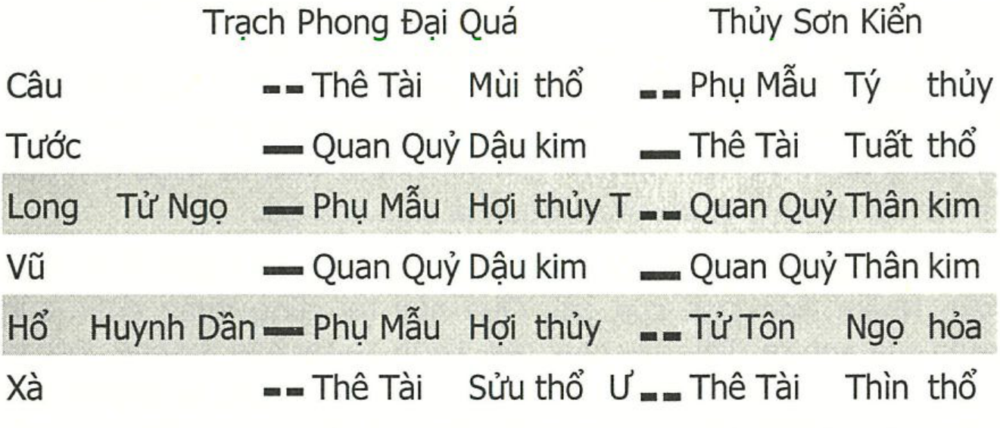
    - **Hình này chứng minh điều gì**
      - lấy hào Phụ Mẫu làm Dụng thần.
    - **Từ đâu mà thấy được**
      - Nhìn vào hào 2 Hợi thủy lại động đến phù trợ, là vượng tướng, do đó phán đoán có thể được công trình.
- **Quá trình suy luận và đối thoại ban đầu:**
  - Căn cứ suy luận: Dự đoán nhận thầu công trình thông thường lấy hào Phụ Mẫu làm Dụng thần.
  - Căn cứ suy luận: Bởi vì Phụ Mẫu là văn thư, hợp đồng, vượng thì hợp đồng có thể được, hợp đồng có thể thành, công trình cũng thì có thể giành được, và không thể lấy Tài làm Dụng thần.
  - Căn cứ suy luận: Bởi vì nhận được công trình chưa hẳn đã có thể kiếm được tiền, có người mặc dù nhận được công trình nhưng đã lỗ vốn.
  - Đối thoại thực tế: Thiên Kim Phú trong Hoàng Kim Sách đã nêu rõ: "Phu nhân hiền, bất tiếu chi thù, quái hữu quá, bất cập chi dị¹...", "quá" ở đây chính là chỉ Dụng thần quá vượng.
  - Đối thoại thực tế: Tôi trích dẫn một đoạn trong Bốc Phệ Chính Tông để bàn về vấn đề này: "Người lấy phẩm đức trung dung làm chủ, quẻ lấy tượng trung hòa làm lý tưởng.
  - Đối thoại thực tế: Do đó, động tĩnh, sinh khắc, hợp xung, Không phá, vượng suy, Mộ Tuyệt và hiện phục ở trong quẻ đều tồn tại đạo lý thái quá và bất cập trong đó."
- **Ứng nghiệm thực tế và diễn biến sự việc:**
  - Thực tế diễn biến kiểm chứng ứng kỳ và cát hung của quẻ chiêm.
- **Ngộ giải và bài học kinh nghiệm then chốt:**
  - Ngộ giải từ thực tiễn và cổ thư: Thiên Kim Phú trong Hoàng Kim Sách đã nêu rõ: "Phu nhân hiền, bất tiếu chi thù, quái hữu quá, bất cập chi dị¹...", "quá" ở đây chính là chỉ Dụng thần quá vượng.

### Ví dụ 2: Ngày Quý Dậu tháng Thân
- **Bối cảnh & Dữ kiện chiêm bái:**
  - Có thể thấy chẳng phải lục hào truyền thống dự đoán không đúng, mà là do khi học chúng ta chưa hiểu thấu đáo, chưa nắm bắt trọn vẹn đạo lý của quẻ mà thôi.
  - **Ví dụ 2:** Ngày Quý Dậu tháng Thân, một người đàn ông thỉnh cầu đoán vợ chồng mâu thuẫn có ly hôn hay không?
  - Được Hỏa Phong Đỉnh.
  - ¹ Người khác nhau về có tài và bất tài, quẻ khác nhau về quá độ và bất cập.
- Bảng quẻ Sơ đồ quẻ Hỏa Phong Đỉnh:
  - **Hình 59.** Sơ đồ quẻ Hỏa Phong Đỉnh
    - 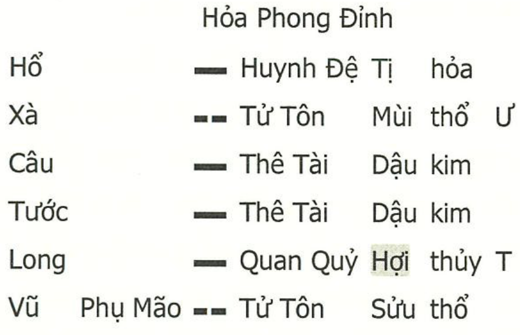
    - **Hình này chứng minh điều gì**
      - Lấy Thê Tài làm Dụng thần.
    - **Từ đâu mà thấy được**
      - Nhìn vào hào Thế, hào Ứng, Dụng thần và động hào trong bảng quẻ Sơ đồ quẻ Hỏa Phong Đỉnh.
- **Quá trình suy luận và đối thoại ban đầu:**
  - Căn cứ suy luận: Lấy hào Tài làm Dụng thần.
  - Căn cứ suy luận: Trong quẻ hào Tài lưỡng hiện, Nhật Nguyệt lại đều là Tài, hào Tài trùng điệp không cát.
  - Căn cứ suy luận: Hào Tài quá nhiều, chín quá hóa nẫu.
  - Căn cứ suy luận: Do đó tôi phán đoán tài vận của anh ta không tốt, nhất là vào hai tháng Tị Ngọ hào Tài được sinh.
  - Căn cứ suy luận: Anh ta phản hồi rằng ở tháng Tị bởi vì xe du lịch xảy ra tai nạn giao thông, chết một người và bị thương hơn 100 người, bồi thường 80 vạn, công ty du lịch của anh ta một năm trắng tay.
  - Đối thoại thực tế: Thiên Kim Phú trong Hoàng Kim Sách đã nêu rõ: "Phu nhân hiền, bất tiếu chi thù, quái hữu quá, bất cập chi dị¹...", "quá" ở đây chính là chỉ Dụng thần quá vượng.
  - Đối thoại thực tế: Tôi trích dẫn một đoạn trong Bốc Phệ Chính Tông để bàn về vấn đề này: "Người lấy phẩm đức trung dung làm chủ, quẻ lấy tượng trung hòa làm lý tưởng.
  - Đối thoại thực tế: Do đó, động tĩnh, sinh khắc, hợp xung, Không phá, vượng suy, Mộ Tuyệt và hiện phục ở trong quẻ đều tồn tại đạo lý thái quá và bất cập trong đó."
- **Ứng nghiệm thực tế và diễn biến sự việc:**
  - Nhìn vào kết quả thực tế: Trên thực tế, vợ chồng xảy ra mâu thuẫn, vợ đã mang con về nhà mẹ đẻ, mẹ vợ và chị gái của vợ chủ trương ly hôn, anh ta đến thăm con cũng không cho, đón vợ về cũng không thành, đến tháng Hợi ly hôn.
  - Nhìn vào kết quả thực tế: Hai tháng sau, dưới sự khuyên nhủ của người khác, nghĩ đến tương lai của con, vợ lại chủ động đề xuất phục hôn.
- **Ngộ giải và bài học kinh nghiệm then chốt:**
  - Đúc rút quy luật thực chiến: Xem xét tổng thể ngũ hành, hào động và tâm thái người gieo quẻ.

### Ví dụ 3: Một giám đốc công ty du lịch đoán tài vận
- **Bối cảnh & Dữ kiện chiêm bái:**
  - Hào Tài đã rất vượng, không cần có hào khác đến sinh phù nữa, nhưng Tử Tôn Nguyên thần trên Ứng đến sinh, Ứng là nhà vợ, do đó, người nhà mẹ vợ trợ uy cho vợ, đứng bên cạnh bênh vực vợ, khiến cho vợ chồng bất hòa mâu thuẫn tăng lên.
  - Hào Tài quá vượng, sợ rằng có họa ly hôn.
  - Quan ở trên Thế là tượng lo lắng, may mà Không Vong, hiện tại vẫn chưa cần lo lắng, sợ tháng Hợi xuất Không, nỗi lo đến, là lúc ly hôn.
  - May mà hào sơ Tử Tôn Sửu thổ là Tài khố, hào sơ là con cái, Tử Tôn cũng là con cái, nếu có lời nói của con cái thì sự việc này có thể xoay chuyển.
  - Trên thực tế, vợ chồng xảy ra mâu thuẫn, vợ đã mang con về nhà mẹ đẻ, mẹ vợ và chị gái của vợ chủ trương ly hôn, anh ta đến thăm con cũng không cho, đón vợ về cũng không thành, đến tháng Hợi ly hôn.
- Bảng quẻ Sơ đồ quẻ Địa Phong Thăng:
  - **Hình 60.** Sơ đồ quẻ Địa Phong Thăng
    - 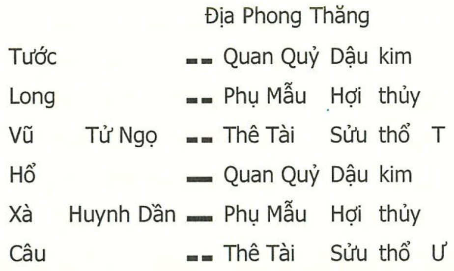
    - **Hình này chứng minh điều gì**
      - Lấy hào Tài làm Dụng thần.
    - **Từ đâu mà thấy được**
      - Nhìn vào hào 2 quá vượng, chứng tỏ có vấn đề về sinh lý nên không thể có thai.
- **Quá trình suy luận và đối thoại ban đầu:**
  - Căn cứ suy luận: Lấy hào Tài làm Dụng thần.
  - Căn cứ suy luận: Trong quẻ hào Tài lưỡng hiện, Nhật Nguyệt lại đều là Tài, hào Tài trùng điệp không cát.
  - Căn cứ suy luận: Hào Tài quá nhiều, chín quá hóa nẫu.
  - Căn cứ suy luận: Do đó tôi phán đoán tài vận của anh ta không tốt, nhất là vào hai tháng Tị Ngọ hào Tài được sinh.
  - Căn cứ suy luận: Anh ta phản hồi rằng ở tháng Tị bởi vì xe du lịch xảy ra tai nạn giao thông, chết một người và bị thương hơn 100 người, bồi thường 80 vạn, công ty du lịch của anh ta một năm trắng tay.
- **Ứng nghiệm thực tế và diễn biến sự việc:**
  - Nhìn vào kết quả thực tế: Trên thực tế, hai lần thụ tinh trong ống nghiệm đều không thành công, sau khi dự đoán, ở tháng Ngọ phát hiện u xơ tử cung, tử cung bị cắt bỏ, đã vĩnh viễn không thể sinh con.
- **Ngộ giải và bài học kinh nghiệm then chốt:**
  - Đúc rút quy luật thực chiến: Xem xét tổng thể ngũ hành, hào động và tâm thái người gieo quẻ.

### Quái lệ 4: Sơ đồ quẻ Lôi Địa Dự biến Sơn Thủy Mông
- **Bối cảnh & Dữ kiện chiêm bái:**
  - **Ví dụ 4: Một người phụ nữ 40 tuổi đoán khi nào có thể có con, ở ngày Đinh Tị tháng Mão, được Lôi Địa Dự biến Sơn Thủy Mông.**
  - Trên thực tế, hai lần thụ tinh trong ống nghiệm đều không thành công, sau khi dự đoán, ở tháng Ngọ phát hiện u xơ tử cung, tử cung bị cắt bỏ, đã vĩnh viễn không thể sinh con.
- Bảng quẻ Sơ đồ quẻ Lôi Địa Dự biến Sơn Thủy Mông:
  - **Hình 61.** Sơ đồ quẻ Lôi Địa Dự biến Sơn Thủy Mông
    - 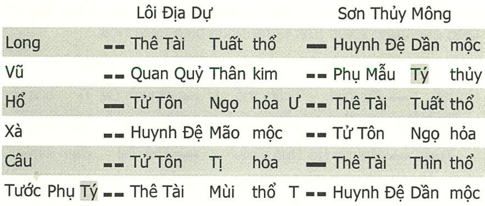
    - **Hình này chứng minh điều gì**
      - Lấy Tử Tôn làm Dụng thần.
    - **Từ đâu mà thấy được**
      - Nhìn vào hào 2 quá vượng, chứng tỏ có vấn đề về sinh lý nên không thể có thai.
- **Quá trình suy luận và đối thoại ban đầu:**
  - Tác giả phân tích cấu trúc hào tượng, Dụng thần và các yếu tố sinh khắc trong quẻ Sơ đồ quẻ Lôi Địa Dự biến Sơn Thủy Mông.
- **Ứng nghiệm thực tế và diễn biến sự việc:**
  - Thực tế diễn biến kiểm chứng ứng kỳ và cát hung của quẻ chiêm.
- **Ngộ giải và bài học kinh nghiệm then chốt:**
  - Đúc rút quy luật thực chiến: Xem xét tổng thể ngũ hành, hào động và tâm thái người gieo quẻ.

## 18. Kết Luận Sau Cùng Tại Sao Không Ứng Nghiệm?

- **Tổng quan nguyên lý & bối cảnh chuyên đề:**
  - Tôi căn cứ vào quẻ phán đoán như sau:
  - Ông là người rất thông minh, nhiều mưu kế, tâm rất tốt, thích giúp đỡ người khác. Nhất định là người có chức vụ. Nhưng ông không phát triển nhiều về quan trường, và đã đi con đường kinh tế, đã phát tài không ít.
  - Trước năm 1998 thì ông có rất nhiều tiền, từ năm 98 thì kinh tế của ông đã xấu đi. Đã bị một người bạn thân hãm hại một lần, kinh tế bỗng chốc sụp đổ, đến bây giờ vẫn chưa thể vươn lên.
  - Năm nay ông còn có kiện cáo về kinh tế, mặc dù có lý nhưng đã không thắng kiện. Đến năm sau ông mới có thể bắt đầu lại sự nghiệp.
### Quái lệ 1: Sơ đồ quẻ Thiên Hỏa Đồng Nhân biến Ly Vi Hỏa
- **Bối cảnh & Dữ kiện chiêm bái:**
  - Ngày Tân Dậu tháng Tuất năm 02, một người Đại Đồng và vợ lái xe đến chỗ tôi yêu cầu dự đoán, tuổi tác ước chừng hơn 50.
  - Gieo quẻ được Thiên Hỏa Đồng Nhân biến Ly Vi Hỏa.
  - Tôi căn cứ vào quẻ phán đoán như sau:
  - Ông là người rất thông minh, nhiều mưu kế, tâm rất tốt, thích giúp đỡ người khác.
  - Nhất định là người có chức vụ.
- Bảng quẻ Sơ đồ quẻ Thiên Hỏa Đồng Nhân biến Ly Vi Hỏa:
  - **Hình 62.** Sơ đồ quẻ Thiên Hỏa Đồng Nhân biến Ly Vi Hỏa
    - 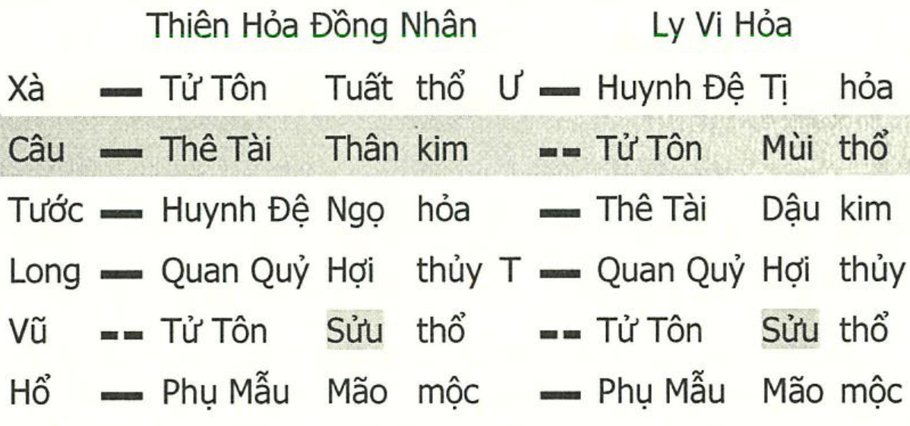
    - **Hình này chứng minh điều gì**
      - Bảng quẻ Sơ đồ quẻ Thiên Hỏa Đồng Nhân biến Ly Vi Hỏa phản ánh sự phối chiếu hào vị, ngũ hành và động biến minh chứng cho vấn đề chiêm đoán.
    - **Từ đâu mà thấy được**
      - Nhìn vào hào Thế, hào Ứng, Dụng thần và động hào trong bảng quẻ Sơ đồ quẻ Thiên Hỏa Đồng Nhân biến Ly Vi Hỏa.
- **Quá trình suy luận và đối thoại ban đầu:**
  - Căn cứ suy luận: Hào Tài độc phát biến lục xung, kinh tế phát triển xuất hiện bấp bênh.
  - Căn cứ suy luận: Năm 1998 là năm Mậu Dần là tuần Giáp Tuất, Tài ở đất Không Vong, năm này Thái Tuế Dần mộc xung mất hào Tài không thể sinh Thế, do đó kinh tế bị đả kích.
  - Căn cứ suy luận: Năm này Thái Tuế hợp hào Thế, chủ phát sinh chuyện bất lợi và có liên quan đến người mình quen biết.
  - Căn cứ suy luận: Bởi vì hợp chủ quen biết, quan hệ qua lại v.v.
  - Căn cứ suy luận: Tài độc phát hóa Mùi thổ hồi đầu sinh, Mùi thổ là Thái Tuế của năm 03, lại thêm Sửu thổ Không Vong, năm Quý Mùi xung thực, do đó tôi phán đoán năm 03 sẽ bắt đầu lại sự nghiệp.
  - Căn cứ suy luận: Thế tại hào sơ lâm Bạch Hổ, hào sơ là chân, đi lại, Phụ Mẫu trì Thế chủ vất vả, do đó phán đoán vợ anh ta hiếu động, không chịu cảnh nhàn rỗi, thích làm việc chăm chỉ, bởi vì Bạch Hổ chủ bận rộn.
  - Đối thoại thực tế: Ông ta nói: "Ông phán đoán một điểm cũng không sai, trước năm 98 tôi có hơn 500 vạn, nhưng ở năm 98 tôi đã bị một người bạn mà tôi đã từng giúp lừa gạt, do đó kinh tế bỗng chốc sụp đổ.
  - Đối thoại thực tế: Năm nay đúng là có kiện cáo, rõ ràng là tôi có lý nhưng lại thua kiện."
  - Đối thoại thực tế: Tôi hỏi: "Ông có hai con à?
  - Đối thoại thực tế: Chắc là một nam một nữ." Bởi vì Tử Tôn trong quẻ trước lưỡng hiện, một hào dương, một hào âm.
- **Ứng nghiệm thực tế và diễn biến sự việc:**
  - Nhìn vào kết quả thực tế: Những phán đoán trên đây đều ứng nghiệm, phán đoán tính cách và phán đoán bệnh tật hoàn toàn ăn khớp.
- **Ngộ giải và bài học kinh nghiệm then chốt:**
  - Đúc rút quy luật thực chiến: Xem xét tổng thể ngũ hành, hào động và tâm thái người gieo quẻ.

### Quái lệ 2: Quẻ Phong Thiên Tiểu Súc biến Tốn Vi Phong
- **Bối cảnh & Dữ kiện chiêm bái:**
  - Sau khi dự đoán người này xong, vợ ông ta ở đó cũng muốn đoán thử tình trạng sức khỏe của mình.
  - Tôi dùng phương pháp phân chia thái cực phát triển ra quẻ như sau: Ngày Tân Dậu tháng Tuất, được Phong Thiên Tiểu Súc biến Tốn Vi Phong.
  - Thế tại hào sơ lâm Bạch Hổ, hào sơ là chân, đi lại, Phụ Mẫu trì Thế chủ vất vả, do đó phán đoán vợ anh ta hiếu động, không chịu cảnh nhàn rỗi, thích làm việc chăm chỉ, bởi vì Bạch Hổ chủ bận rộn.
  - Lâm Bạch Hổ chủ nóng nảy.
  - Không Vong đáng lẽ đoán ngược lại, nhưng vượng tướng, do đó tính khí lúc tốt lúc xấu.
- Bảng quẻ Quẻ Phong Thiên Tiểu Súc biến Tốn Vi Phong:
  - **Hình 63.** Quẻ Phong Thiên Tiểu Súc biến Tốn Vi Phong
    - 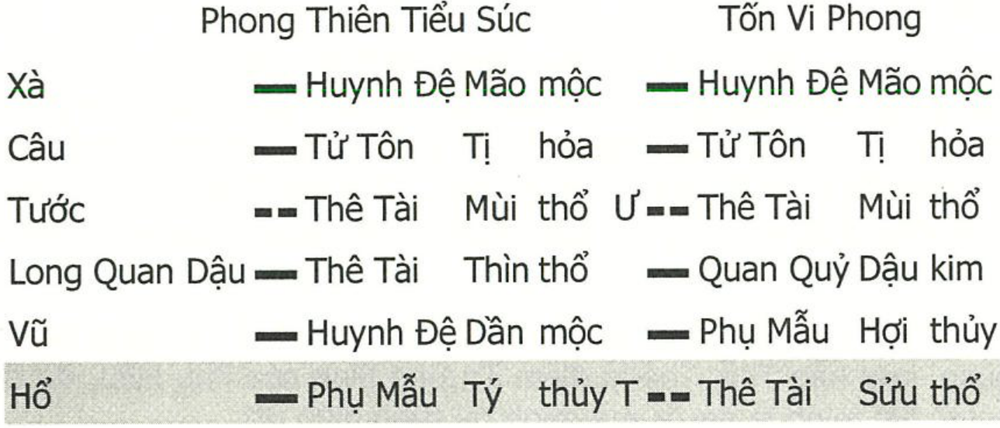
    - **Hình này chứng minh điều gì**
      - Bảng quẻ Quẻ Phong Thiên Tiểu Súc biến Tốn Vi Phong phản ánh sự phối chiếu hào vị, ngũ hành và động biến minh chứng cho vấn đề chiêm đoán.
    - **Từ đâu mà thấy được**
      - Nhìn vào hào Thế, hào Ứng, Dụng thần và động hào trong bảng quẻ Quẻ Phong Thiên Tiểu Súc biến Tốn Vi Phong.
- **Quá trình suy luận và đối thoại ban đầu:**
  - Căn cứ suy luận: Hào Tài độc phát biến lục xung, kinh tế phát triển xuất hiện bấp bênh.
  - Căn cứ suy luận: Năm 1998 là năm Mậu Dần là tuần Giáp Tuất, Tài ở đất Không Vong, năm này Thái Tuế Dần mộc xung mất hào Tài không thể sinh Thế, do đó kinh tế bị đả kích.
  - Căn cứ suy luận: Năm này Thái Tuế hợp hào Thế, chủ phát sinh chuyện bất lợi và có liên quan đến người mình quen biết.
  - Căn cứ suy luận: Bởi vì hợp chủ quen biết, quan hệ qua lại v.v.
  - Căn cứ suy luận: Tài độc phát hóa Mùi thổ hồi đầu sinh, Mùi thổ là Thái Tuế của năm 03, lại thêm Sửu thổ Không Vong, năm Quý Mùi xung thực, do đó tôi phán đoán năm 03 sẽ bắt đầu lại sự nghiệp.
  - Căn cứ suy luận: Thế tại hào sơ lâm Bạch Hổ, hào sơ là chân, đi lại, Phụ Mẫu trì Thế chủ vất vả, do đó phán đoán vợ anh ta hiếu động, không chịu cảnh nhàn rỗi, thích làm việc chăm chỉ, bởi vì Bạch Hổ chủ bận rộn.
  - Đối thoại thực tế: Tôi hỏi: "Ông có hai con à?
  - Đối thoại thực tế: Chắc là một nam một nữ." Bởi vì Tử Tôn trong quẻ trước lưỡng hiện, một hào dương, một hào âm.
  - Đối thoại thực tế: Ông ta đáp: "Đúng, nhờ ông xem tình hình vận khí của hai đứa con tôi một chút."
  - Đối thoại thực tế: "Việc này cần xem từng đứa một, ông hỏi về đứa nào trước?" Tôi đáp.
  - Đối thoại thực tế: "Đương nhiên là xem con trai trước.", ông ta nói xong, tôi lại dùng dùng phương pháp phân chia thái cực phát triển ra được quẻ về con trai ông ta.
- **Ứng nghiệm thực tế và diễn biến sự việc:**
  - Thực tế diễn biến kiểm chứng ứng kỳ và cát hung của quẻ chiêm.
- **Ngộ giải và bài học kinh nghiệm then chốt:**
  - Đúc rút quy luật thực chiến: Xem xét tổng thể ngũ hành, hào động và tâm thái người gieo quẻ.

### Quái lệ 3: Quẻ Thiên Phong Cấu biến Tốn Vi Phong
- **Bối cảnh & Dữ kiện chiêm bái:**
  - "Việc này cần xem từng đứa một, ông hỏi về đứa nào trước?" Tôi đáp.
  - "Đương nhiên là xem con trai trước.", ông ta nói xong, tôi lại dùng dùng phương pháp phân chia thái cực phát triển ra được quẻ về con trai ông ta.
  - Ngày Tân Dậu tháng Tuất, được Thiên Phong Cấu biến Tốn Vi Phong.
  - Quan Quỷ hưu tù, động mà tương hợp với hào biến, tham hợp quên sinh, mà Thế Không cũng không được sinh, Thế tại hào sơ địa vị thấp, do đó phán đoán quan vận của con trai ông ta không tốt, không có quan vận.
- Bảng quẻ Quẻ Thiên Phong Cấu biến Tốn Vi Phong:
  - **Hình 64.** Quẻ Thiên Phong Cấu biến Tốn Vi Phong
    - 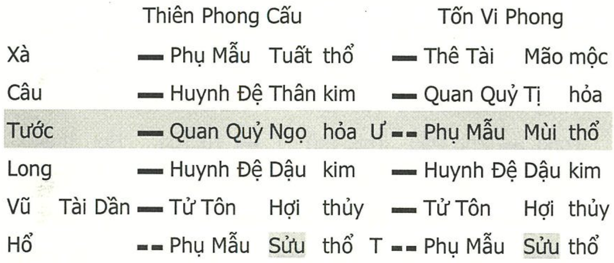
    - **Hình này chứng minh điều gì**
      - Bảng quẻ Quẻ Thiên Phong Cấu biến Tốn Vi Phong phản ánh sự phối chiếu hào vị, ngũ hành và động biến minh chứng cho vấn đề chiêm đoán.
    - **Từ đâu mà thấy được**
      - Nhìn vào hào Thế, hào Ứng, Dụng thần và động hào trong bảng quẻ Quẻ Thiên Phong Cấu biến Tốn Vi Phong.
- **Quá trình suy luận và đối thoại ban đầu:**
  - Căn cứ suy luận: Quay lại suy xét tỉ mỉ quẻ này, lẽ ra vẫn là bởi vì nguyên nhân hào Tài quá vượng.
  - Căn cứ suy luận: Nguyệt sinh Nhật phù, trong quẻ Tử Tôn lưỡng hiện, Tài động hóa hồi đầu sinh, Tài và Nguyên thần, Nhật Nguyệt và trong quẻ có 6 tầng, có sinh không khắc, phải là hào Tài quá vượng, năm 03 Mùi thổ sinh Tài, Sửu thổ bị xung thực càng vượng, do đó không thể bắt đầu lại sự nghiệp.
  - Đối thoại thực tế: Ông ta đáp: "Đúng, nhờ ông xem tình hình vận khí của hai đứa con tôi một chút."
  - Đối thoại thực tế: "Việc này cần xem từng đứa một, ông hỏi về đứa nào trước?" Tôi đáp.
  - Đối thoại thực tế: "Đương nhiên là xem con trai trước.", ông ta nói xong, tôi lại dùng dùng phương pháp phân chia thái cực phát triển ra được quẻ về con trai ông ta.
  - Đối thoại thực tế: Quái từ của quẻ Cấu có nói: "Nữ tráng, vật dụng thú nữ¹.", Thế Không là biểu hiện của nhát gan, Tài là lục thân khắc hào Thế, do đó phán đoán con dâu của ông ta hung dữ, con trai ông ta sợ vợ.
- **Ứng nghiệm thực tế và diễn biến sự việc:**
  - Nhìn vào kết quả thực tế: Phán đoán trên đây cũng ứng nghiệm.
- **Ngộ giải và bài học kinh nghiệm then chốt:**
  - Đúc rút quy luật thực chiến: Xem xét tổng thể ngũ hành, hào động và tâm thái người gieo quẻ.

### Quái lệ 4: Quẻ Hỏa Thiên Đại Hữu biến Ly Vi Hỏa
- **Bối cảnh & Dữ kiện chiêm bái:**
  - Toàn bộ phán đoán trên đây đều chính xác.
  - Tiếp theo lại phát triển ra quẻ để xem tình hình của con gái ông ta.
  - Ngày Tân Dậu tháng Tuất, được Hỏa Thiên Đại Hữu biến Ly Vi Hỏa.
  - Thế tại hào 3 lâm Thanh Long, Thanh Long chủ cát khánh, phú quý, Quan được độc phát đến sinh, Quan lâm Ứng sinh Thế, Ứng là phu vị, do đó phán đoán bản thân con gái ông ta có quan, chồng cũng có quan.
  - Tình cảm vợ chồng rất tốt đẹp.
- Bảng quẻ Quẻ Hỏa Thiên Đại Hữu biến Ly Vi Hỏa:
  - **Hình 65.** Quẻ Hỏa Thiên Đại Hữu biến Ly Vi Hỏa
    - 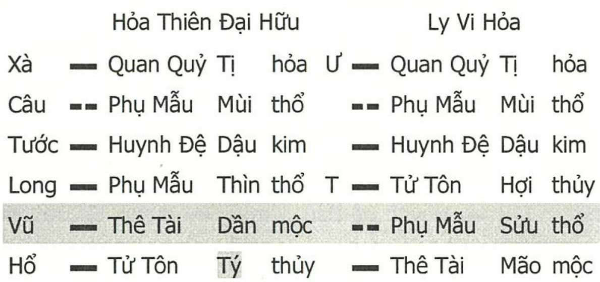
    - **Hình này chứng minh điều gì**
      - Bảng quẻ Quẻ Hỏa Thiên Đại Hữu biến Ly Vi Hỏa phản ánh sự phối chiếu hào vị, ngũ hành và động biến minh chứng cho vấn đề chiêm đoán.
    - **Từ đâu mà thấy được**
      - Nhìn vào hào Thế, hào Ứng, Dụng thần và động hào trong bảng quẻ Quẻ Hỏa Thiên Đại Hữu biến Ly Vi Hỏa.
- **Quá trình suy luận và đối thoại ban đầu:**
  - Căn cứ suy luận: Quay lại suy xét tỉ mỉ quẻ này, lẽ ra vẫn là bởi vì nguyên nhân hào Tài quá vượng.
  - Căn cứ suy luận: Nguyệt sinh Nhật phù, trong quẻ Tử Tôn lưỡng hiện, Tài động hóa hồi đầu sinh, Tài và Nguyên thần, Nhật Nguyệt và trong quẻ có 6 tầng, có sinh không khắc, phải là hào Tài quá vượng, năm 03 Mùi thổ sinh Tài, Sửu thổ bị xung thực càng vượng, do đó không thể bắt đầu lại sự nghiệp.
- **Ứng nghiệm thực tế và diễn biến sự việc:**
  - Thực tế diễn biến kiểm chứng ứng kỳ và cát hung của quẻ chiêm.
- **Ngộ giải và bài học kinh nghiệm then chốt:**
  - Đúc rút quy luật thực chiến: Xem xét tổng thể ngũ hành, hào động và tâm thái người gieo quẻ.

## 19. Dụng Thần Cũng Có Thuyết Quá Suy

- **Tổng quan nguyên lý & bối cảnh chuyên đề:**
  - Đây là quẻ của một người bạn gieo trước khi đến vùng khác để công tác. Ông ta nói rằng lần này đi công tác có thể gặp được một người nữ quen trên mạng, xem có thể có tình một đêm với người nữ này hay không?
  - Lấy Tài làm Dụng phán đoán. Hào Tài Tý thủy lâm Không Vong, cộng Trình Xà, Trình Xà chủ bất an, Không Vong chủ trống rỗng, do đó phán đoán trong lòng người nữ này rất trống rỗng.
  - Hào 2 Phụ Mẫu Ngọ hỏa hóa phá xung hào Tài, Phụ Mẫu là giấy kết hôn, hóa phá biểu thị đã không tồn tại, do đó phán đoán người này đã ly dị.
  - Tài lâm thủy đáng lẽ biểu thị người trông xinh đẹp, nhưng Không mà không được kim sinh, lại bị thổ khắc, thì đã mất sức quyến rũ, lâm Trình Xà, Trình Xà chủ xấu xí, do đó người nữ này trông không đẹp.
### Ví dụ 1: Ngày Nhâm Tuất tháng Tuất
- **Bối cảnh & Dữ kiện chiêm bái:**
  - **Ví dụ 1:** Ngày Nhâm Tuất tháng Tuất, được Phong Sơn Tiệm biến Phong Thủy Hoán.
  - Đây là quẻ của một người bạn gieo trước khi đến vùng khác để công tác.
  - Ông ta nói rằng lần này đi công tác có thể gặp được một người nữ quen trên mạng, xem có thể có tình một đêm với người nữ này hay không?
  - Lấy Tài làm Dụng phán đoán.
  - Hào Tài Tý thủy lâm Không Vong, cộng Trình Xà, Trình Xà chủ bất an, Không Vong chủ trống rỗng, do đó phán đoán trong lòng người nữ này rất trống rỗng.
- Bảng quẻ Quẻ Phong Sơn Tiệm biến Phong Thủy Hoán:
  - **Hình 66.** Quẻ Phong Sơn Tiệm biến Phong Thủy Hoán
    - 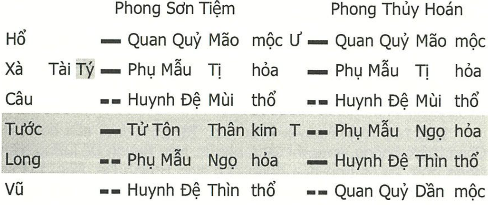
    - **Hình này chứng minh điều gì**
      - lấy cái gì làm Dụng thần, có Dụng thần, chúng ta mới có thể triển khai suy đoán xoay quanh Dụng thần.
    - **Từ đâu mà thấy được**
      - Nhìn vào hào Thế, hào Ứng, Dụng thần và động hào trong bảng quẻ Quẻ Phong Sơn Tiệm biến Phong Thủy Hoán.
- **Quá trình suy luận và đối thoại ban đầu:**
  - Căn cứ suy luận: Quẻ này Nhật Nguyệt khắc Tài, Tài đã không còn hơi thở.
  - Căn cứ suy luận: Hào Huynh Đệ lưỡng hiện trong quẻ, lại có Ngọ hỏa động đến sinh Huynh Đệ, Ngọ hỏa lại hóa Huynh Đệ, mặc dù Nguyệt phá cũng có thể bổ túc, nhưng Tử Tôn phát động bị hai tầng Ngọ hỏa khắc chế, do đó Tài này không nhận được sinh, Phi thần lại là Cừu thần.
  - Căn cứ suy luận: Nhiều người chỉ biết vùi đầu đọc sách mà không biết suy xét từng câu nói trong sách cổ, hơn nữa là bởi vì ít dự đoán cho người khác, do đó về bản chất không thể lý giải được tính đúng đắn của các lý luận trong thực tiễn.
  - Căn cứ suy luận: Người xưa khi viết sách cũng không dùng nhiều quái lệ để lập luận cho lý luận của mình, trong thực tiễn cũng không hẳn có thể gặp được ví dụ có lý luận phù hợp, do đó nhiều người học dự đoán nhiều năm cũng không nắm được bí quyết.
  - Căn cứ suy luận: Quẻ này Dụng thần Quan Quỷ Hợi thủy không thượng quái, phục tại hào 3.
  - Căn cứ suy luận: Sau khi tìm được Dụng thần, tiếp theo phải xem ảnh hưởng của Nhật Nguyệt đối với Dụng thần, bởi vì Nhật Nguyệt như thiên, Nhật Nguyệt là căn cứ tham khảo quan trọng quyết định căn cơ và cát hung của Dụng thần.
  - Đối thoại thực tế: Dụng thần quá nhược lật lại là Kỵ thần quá vượng, quẻ này phù hợp với lý luận "Huynh nhược thái quá phản bất khắc Tài¹", chứng tỏ luận thuật của người xưa là chính xác, chẳng qua là do chúng ta chưa lĩnh hội được, trong thực tiễn bình thường cũng không lưu ý, do đó đôi khi cũng không biết mình sai ở đâu.
- **Ứng nghiệm thực tế và diễn biến sự việc:**
  - Nhìn vào kết quả thực tế: Đây cũng là một quái lệ mà tôi đoán ngược lại đã ứng nghiệm sau khi ngộ ra Dụng thần có quá nhược và Kỵ thần quá vượng.
- **Ngộ giải và bài học kinh nghiệm then chốt:**
  - Ngộ giải từ thực tiễn và cổ thư: Điều này chính là do không có thực tiễn, không lĩnh hội sâu sắc được những điều trình bày trong sách.

### Ví dụ 2: Đây là quái lệ tôi đã giảng cho học viên ở trong lớp trên mạ
- **Bối cảnh & Dữ kiện chiêm bái:**
  - Sau khi đi công tác trở về, ông ta phản hồi rằng người nữ này trông không đẹp, nhưng bọn họ đã có tình một đêm.
  - Tôi nghĩ mãi không ra.
  - Quẻ này hào Tài nhược như vậy, sao có thể nhỉ?
  - Nhiều người chỉ biết vùi đầu đọc sách mà không biết suy xét từng câu nói trong sách cổ, hơn nữa là bởi vì ít dự đoán cho người khác, do đó về bản chất không thể lý giải được tính đúng đắn của các lý luận trong thực tiễn.
  - Người xưa khi viết sách cũng không dùng nhiều quái lệ để lập luận cho lý luận của mình, trong thực tiễn cũng không hẳn có thể gặp được ví dụ có lý luận phù hợp, do đó nhiều người học dự đoán nhiều năm cũng không nắm được bí quyết.
- Bảng quẻ Sơ đồ quẻ Thiên Thủy Tụng biến Trạch Phong Đại Quá:
  - **Hình 67.** Sơ đồ quẻ Thiên Thủy Tụng biến Trạch Phong Đại Quá
    - 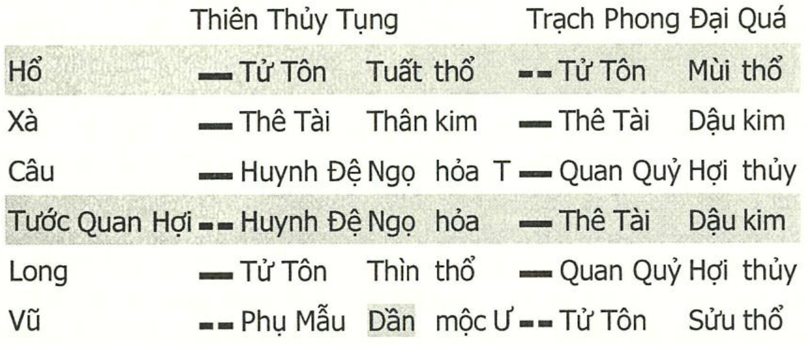
    - **Hình này chứng minh điều gì**
      - lấy cái gì làm Dụng thần, có Dụng thần, chúng ta mới có thể triển khai suy đoán xoay quanh Dụng thần.
    - **Từ đâu mà thấy được**
      - Nhìn vào hào Thế, hào Ứng, Dụng thần và động hào trong bảng quẻ Sơ đồ quẻ Thiên Thủy Tụng biến Trạch Phong Đại Quá.
- **Quá trình suy luận và đối thoại ban đầu:**
  - Căn cứ suy luận: Quẻ này Nhật Nguyệt khắc Tài, Tài đã không còn hơi thở.
  - Căn cứ suy luận: Hào Huynh Đệ lưỡng hiện trong quẻ, lại có Ngọ hỏa động đến sinh Huynh Đệ, Ngọ hỏa lại hóa Huynh Đệ, mặc dù Nguyệt phá cũng có thể bổ túc, nhưng Tử Tôn phát động bị hai tầng Ngọ hỏa khắc chế, do đó Tài này không nhận được sinh, Phi thần lại là Cừu thần.
  - Căn cứ suy luận: Nhiều người chỉ biết vùi đầu đọc sách mà không biết suy xét từng câu nói trong sách cổ, hơn nữa là bởi vì ít dự đoán cho người khác, do đó về bản chất không thể lý giải được tính đúng đắn của các lý luận trong thực tiễn.
  - Căn cứ suy luận: Người xưa khi viết sách cũng không dùng nhiều quái lệ để lập luận cho lý luận của mình, trong thực tiễn cũng không hẳn có thể gặp được ví dụ có lý luận phù hợp, do đó nhiều người học dự đoán nhiều năm cũng không nắm được bí quyết.
  - Căn cứ suy luận: Quẻ này Dụng thần Quan Quỷ Hợi thủy không thượng quái, phục tại hào 3.
  - Căn cứ suy luận: Sau khi tìm được Dụng thần, tiếp theo phải xem ảnh hưởng của Nhật Nguyệt đối với Dụng thần, bởi vì Nhật Nguyệt như thiên, Nhật Nguyệt là căn cứ tham khảo quan trọng quyết định căn cơ và cát hung của Dụng thần.
  - Đối thoại thực tế: Dụng thần quá nhược lật lại là Kỵ thần quá vượng, quẻ này phù hợp với lý luận "Huynh nhược thái quá phản bất khắc Tài¹", chứng tỏ luận thuật của người xưa là chính xác, chẳng qua là do chúng ta chưa lĩnh hội được, trong thực tiễn bình thường cũng không lưu ý, do đó đôi khi cũng không biết mình sai ở đâu.
  - Đối thoại thực tế: Dựa vào những thông tin này, tôi phán đoán như sau: "Anh hiện đã chi tiền tìm người.
  - Đối thoại thực tế: Tuy nhiên, chức của người này không lớn hơn anh, mặc dù anh ta chức nhỏ nhưng có thể giúp được anh."
- **Ứng nghiệm thực tế và diễn biến sự việc:**
  - Nhìn vào kết quả thực tế: Hào động hóa thoái, có nhiều quẻ ứng hợp hào động trong sách của tôi, trong sách cổ cũng có.
  - Nhìn vào kết quả thực tế: Chúng ta nhớ lại trong Tăng San Bốc Dịch có một quẻ về nước mưa hại lúa, hỏi khi nào tạnh mưa, Tử Tôn Tuất thổ ở hào 6 hóa thoái, ứng tạnh mưa ở ngày Mão.
  - Nhìn vào kết quả thực tế: Bởi vì Tử Tôn là thần giải ưu, hợp thì vui lên, do đó ứng tại ngày Mão.
  - Nhìn vào kết quả thực tế: Còn có một quái lệ thực tiễn của chính tôi, trong Lục Hào Nghi Hoặc Chỉ Mê, một người có mẹ vợ nằm bệnh liệt giường ở nhà, anh ta hết sức khổ não, đây gọi là cửu bệnh sàng tiền vô hiếu tử, chỉ mong sao mẹ vợ chết sớm một chút.
  - Nhìn vào kết quả thực tế: Trong một tâm trạng như vậy mà hỏi mẹ vợ khi nào chết, cũng là Tử Tôn Tuất thổ tại hào 6 động hóa thoái, tôi phán đoán tháng Mão chết, kết quả cũng ứng nghiệm.
  - Nhìn vào kết quả thực tế: Mắt nhìn không rõ mới xuất hiện cách đây một tháng, bệnh trĩ mới xuất hiện hơn 10 ngày, nếu nửa tháng trước phán đoán thì không ứng nghiệm, nhưng đúng lúc này thì có thông tin như vậy.
- **Ngộ giải và bài học kinh nghiệm then chốt:**
  - Đúc rút quy luật thực chiến: Xem xét tổng thể ngũ hành, hào động và tâm thái người gieo quẻ.

### Tổng kết chuyên đề và bài học tâm đắc
- **Huyền cơ cốt lõi rút ra từ các quái lệ:**
  - Chúng ta xem trong quẻ, hào Tử Tôn lưỡng hiện và Tử Tôn Tuất thổ tại hào 6 phát động, lại hóa ra một Tử Tôn, Huynh Đệ Ngọ hỏa được Nguyệt hợp là vượng, động đến sinh Tử Tôn, Tử Tôn này đã rất vượng, còn Quan Quỷ thì hoàn toàn không có khí.
  - Chỉ với Nhật Nguyệt khắc Quan Quỷ thì chúng ta đã biết Quan Quỷ này hưu tù, vậy tại sao còn phải dùng đến Tử Tôn phát động đến khắc?
  - Nếu như chỉ lấy suy vượng đơn giản để phán đoán, Tử Tôn này động chính là điều dư thừa.
  - Do đó, động này hoàn toàn không biểu thị quan vận không tốt, mà là thuộc về Kỵ thần quá vượng, vật cực tất phản, trái lại không khắc Quan, là việc tốt.
  - Quy luật biểu thị cát hung này hơi giống với thuyết thương quan thương tận trong bát tự, nhưng đây là lý luận của bản thân lục hào, không liên quan đến bát tự.
  - Phương pháp xem những quẻ như vậy đã được tôi trình bày trong sách khác.
  - Chúng ta đã nắm bắt được tình hình cát hung, nhưng xem một quẻ không thể chỉ phán đoán thành bại của sự việc và nói với người ta là có thể thăng hoặc không thể thăng.
  - Phán đoán như vậy có phần quá đơn giản, chưa thể khiến người ta phục.
  - Làm thế nào để ứng dụng lý luận thái quá vào quẻ thực tế, đây chính là vấn đề phương pháp tư duy.
  - Tử Tôn ở hào 6 hóa thoái, hóa thoái có nghĩa là làm suy yếu lực lượng của hào này, lực lượng suy yếu thì không thể khắc Quan.
  - Đối với lý luận Kỵ thần quá vượng mà nói, hóa thoái này chính là thông tin bất lợi cho thăng chức.
  - Trước tiên chúng ta thử phân tích biến hóa của hào này, hào biến của Tử Tôn Tuất thổ hóa ra là Nguyệt kiến, đây có thể gọi là hóa vượng, cũng có thể là hóa thoái, hóa thoái nhưng có Nhật xung, là đã chặn đường lui, đã không thoái nữa.
  - Trong ứng kỳ thường dùng, một ứng kỳ của hóa thoái là ứng xung hào biến, tức là xung mà không thoái.
  - Sức mạnh của Tử Tôn này không thể coi thường, chứng tỏ quan vận hiện nay của người này rất tốt, nhưng Tử Tôn này suy cho cùng là thoái, khi nào không thoái?
  - Chỉ khi hợp Tử Tôn mới không thoái.
  - Hào động hóa thoái, có nhiều quẻ ứng hợp hào động trong sách của tôi, trong sách cổ cũng có.
  - Chúng ta nhớ lại trong Tăng San Bốc Dịch có một quẻ về nước mưa hại lúa, hỏi khi nào tạnh mưa, Tử Tôn Tuất thổ ở hào 6 hóa thoái, ứng tạnh mưa ở ngày Mão.
  - Bởi vì Tử Tôn là thần giải ưu, hợp thì vui lên, do đó ứng tại ngày Mão.
  - Còn có một quái lệ thực tiễn của chính tôi, trong Lục Hào Nghi Hoặc Chỉ Mê, một người có mẹ vợ nằm bệnh liệt giường ở nhà, anh ta hết sức khổ não, đây gọi là cửu bệnh sàng tiền vô hiếu tử, chỉ mong sao mẹ vợ chết sớm một chút.
  - Trong một tâm trạng như vậy mà hỏi mẹ vợ khi nào chết, cũng là Tử Tôn Tuất thổ tại hào 6 động hóa thoái, tôi phán đoán tháng Mão chết, kết quả cũng ứng nghiệm.
  - Do đó, tùy theo ý đồ của người đến khác nhau mà phán đoán khác nhau, nhưng phương pháp ứng kỳ thì giống nhau.
  - Quẻ này Tử Tôn hóa thoái thiếu lực khắc Quan, cho nên khi gặp thời gian tương ứng với Mão hợp Tử Tôn, Tử Tôn sẽ không thoái và có lực khắc Quan, căn cứ vào đặc điểm của quẻ này, Quan càng bị khắc kịch liệt, quan vận sẽ càng tốt đẹp.
  - Tư duy này được xây dựng trên cơ sở Kỵ thần quá vượng, điểm này nhất định phải hiểu rõ, do đó tôi phán đoán tháng Mão năm nay anh ta được thăng chức đắc ý, có chuyện tốt đẹp.
  - Tại sao phán đoán là năm nay?
  - Bởi vì Quan lâm Hợi thủy bị khắc, Hợi thủy chính là Thái Tuế của năm nay, do đó nhất định là năm nay.
  - Anh ta cho biết đã được thăng chức ở tháng Mão và được điều đến nhậm chức ở địa phương hiện tại.
  - Vừa mới được thăng chức, tại sao lại hỏi về vấn đề này nhỉ?
  - Ở đây nhất định có ẩn ý.
  - Chúng ta xem biến hóa trong quẻ, quẻ này là quẻ du hồn lại hóa quẻ du hồn.
  - Du hồn là cái gì?
  - Chính là không thể yên tâm làm việc, muốn thay đổi, không muốn ở nơi này, muốn rời khỏi nơi này, lại hóa du hồn, lại có ý nghĩa gì?
  - Đó chính là muốn đi thật xa, không phải là điều động thông thường.
  - Do đó tôi phán đoán là anh ta không muốn làm việc ở nơi này, muốn rời khỏi tỉnh này.
  - Trong quẻ không có thông tin nào biểu thị tỉnh này, nhưng tôi phán đoán rất cụ thể, phán đoán anh ta không phải là muốn rời khỏi thành phố ban đầu, mà là muốn rời khỏi tỉnh này, đây chính là gợi ý nhận được từ du hồn thêm du hồn và luận linh hoạt dựa trên hoàn cảnh địa lý thực tế.
  - Vì vậy mới nói học dự đoán phải có tư duy ứng dụng linh hoạt.
  - Quẻ này còn có một thông tin là hào 3 Huynh Đệ động.
  - Chúng ta xem thử hào động này có liên quan gì đến chủ đề dự đoán?
  - Mục đích phát động của Huynh Đệ này là gì?
  - Hóa Tài sinh Tử Tôn, chính là mang theo Tài đi sinh.
  - Tử Tôn là gì?
  - Là thông tin tốt, thông tin thăng chức.
  - Quẻ này đặc biệt, khắc Quan được
  - Quan, Tử Tôn ưa vượng, Huynh Đệ này động chính là người giúp đỡ.
  - Chứng tỏ anh ta bỏ tiền mời người tìm biện pháp.
  - Hào động này và hào Thế là quan hệ gì?
  - Đều là Huynh Đệ Ngọ hỏa, ở đây cần phải linh cảm một chút.
  - Bản thân anh ta là người nhà nước, hào 3 và anh ta giống nhau, chứng tỏ người giúp đỡ anh ta cũng là người nhà nước, Huynh Đệ này và Nguyệt hợp, chứng tỏ có chỗ dựa, Nguyệt là lãnh đạo cấp trên, hợp chính là quen biết.
  - Bởi vì người này có mối quan hệ với cấp trên nên có thể giúp anh ta.
  - Nhưng tại sao Thế ở hào 4, Huynh Đệ ở hào 3 động nhỉ?
  - Đây cũng là thông tin, ở đây cần tư duy linh hoạt, tư duy phân tích quẻ.
  - Dựa vào những thông tin này, tôi phán đoán như sau: "Anh hiện đã chi tiền tìm người.
  - Người này có chỗ dựa, hơn nữa cũng nỗ lực giúp đỡ anh, người này cũng là một người nhà nước.
  - Tuy nhiên, chức của người này không lớn hơn anh, mặc dù anh ta chức nhỏ nhưng có thể giúp được anh."
  - Anh ta nói người mà anh ta tìm được đích thực cũng là người nhà nước, nhưng chức nhỏ hơn anh ta, hơn nữa còn là chức dưới quyền anh ta.
  - Thế cũng là Nguyệt hợp, cũng có chỗ dựa, nhưng tại sao không phán đoán là chỗ dựa của mình và chỗ dựa của người đó giống nhau?
  - Đây chính là vấn đề xem linh hoạt, bởi vì hào 3 động, hào Thế không động, sức mạnh của động lớn, sức mạnh của tĩnh nhỏ, anh ta không có mối quan hệ mạnh mẽ với người ta.
  - Đây chính là lợi dụng tình huống ngũ hành giống hào Thế để phán đoán linh hoạt, lại căn cứ vào cao thấp của hào vị và động tĩnh mà phán đoán chi tiết.
  - Anh ta lại hỏi sức khỏe của mình.
  - Tôi phán đoán anh ta có gan nhiễm mỡ, mỡ máu cao, mắt nhìn không rõ, đầu óc hôn trầm, có bệnh trĩ, nặng ngực v.v.
  - Anh ta nói rằng những bệnh tật này đều có.
  - Mắt nhìn không rõ mới xuất hiện cách đây một tháng, bệnh trĩ mới xuất hiện hơn 10 ngày, nếu nửa tháng trước phán đoán thì không ứng nghiệm, nhưng đúng lúc này thì có thông tin như vậy.
  - Phán đoán bệnh tật thì thông thường phân tích tình hình sinh khắc xoay quanh hào Thế.
  - Hào Thế Nguyệt hợp mặc dù là vượng, nhưng suy cho cùng không được Nhật Nguyệt sinh phù, do đó không phải rất vượng, mà Nguyên thần Không, không thể sinh hào Thế, những điều kiện này chính là điểm phản ánh thông tin.
  - Thế tại hào 4 lâm Ngọ hỏa, hào 4 là hào vị của tim, hỏa chủ tim, Nguyên thần Không không thể sinh hỏa, chứng tỏ tim cung cấp máu không tốt.
  - Mà Thế lâm Câu Trần, Câu Trần chủ chậm chạp, chủ đặc, cũng chủ cản trở, nhập Mộ tại hào lâm Bạch Hổ, Bạch Hổ chủ máu, là máu đặc, Mộ chủ trì trệ, biểu thị không thể chảy, do đó tim cung không máu lên được chính là bởi vì máu cô đặc.
  - Đây chính là tổ hợp về mỡ trong máu cao.
  - Mà mộc Không không thể sinh Thế, mộc là gan mật, lại căn cứ vào phân tích phía trên, thêm Câu Trần là thông tin sưng phù, chính là gan nhiễm mỡ, bởi vì Câu Trần là chất béo.
  - Hào Thế nhập Mộ tại hào 6, hào 6 là đầu, Mộ chủ hôn trầm, ương nhiên là đầu óc hôn trầm, đầu óc không minh mẫn.
  - Mà Câu Trần cũng là tức trướng, hào 4 là ngực, nhập Mộ chính là giống như bị đè lên, hô hấp khó khăn, tức ngực.
  - Quẻ này là quẻ cung Ly, Ly là mắt, Thế là hỏa, nhập Mộ chính là giống như mắt bị che phủ, đương nhiên là nhìn không rõ ràng.
  - Anh ta nói tháng Ngọ khi đang sát hạch thì đột nhiên mắt nhìn không rõ nữa.
  - Hào 3 Huynh Đệ và hào Thế là quan hệ tương hình, Ly có thông tin ruột, hào 3 cũng là ruột, hỏa cũng là ruột, Chu Tước là viêm.
  - Huynh Đệ hóa Tài, Tài là phân, chính là cưỡng ép đại tiện.
  - Chứng tỏ có thứ cản trở, mà hào 3, hào 2 hình Dụng thần, thông thường là tổ hợp bệnh trĩ.
  - Bệnh trĩ thuộc về bệnh đường ruột nên tôi mới dám đoán như vậy.
  - Anh ta cho biết là trĩ ngoại, điều này tôi chưa từng phán đoán, chỉ phán đoán ra có bệnh trĩ.

## 20. Tại Sao Không Được Tài Trợ?

- **Tổng quan nguyên lý & bối cảnh chuyên đề:**
  - Nhưng cuối cùng lại không được tài trợ. Quẻ này tôi đã đoán sai.
  - Xem lại quẻ này có điều lĩnh ngộ. Có quẻ hoàn toàn không truyền đạt thông tin bằng hình thức sinh vượng mà truyền đạt bằng biến hóa của quẻ.
  - Khi xem một quẻ cần phải phân tích tổng hợp, không thể chỉ xem một điểm. Quẻ này mặc dù ám động sinh Thế, nhưng đây chỉ có thể là thông tin hứa hẹn cấp tiền mà thôi. Không thể xem là có thể nhận được.
  - Hào Tài được Nguyệt sinh, nhưng bị Nhật khắc, suy vượng tương đương, từ Nhật Nguyệt không tìm được thắng bại. Lại xem trong quẻ, Phụ Mẫu Mùi thổ phát động khiến hào Tài nhập Mộ, như vậy đã làm suy yếu lực lượng của Tài, nhập Mộ khó có được, biểu thị sẽ đình chỉ việc tài trợ. Mà Phụ Mẫu Mùi thổ động sinh Huynh Đệ trên Ứng, Huynh Đệ mặc dù hóa thoái nhưng vượng mà
### Ví dụ 1: Một ngày trong năm 2002
- **Bối cảnh & Dữ kiện chiêm bái:**
  - **Ví dụ 1:** Một ngày trong năm 2002, ngày Tân Dậu tháng Tý, một người bạn đến yêu cầu đoán một việc, nói là có ông chủ của một công ty chứng khoán đồng ý tài trợ một khoản tiền cho trang web của anh ta, hỏi khoản tiền này khi nào đến tay?
  - Gieo quẻ được Trạch Địa Tụy biến Chấn Vi Lôi.
  - Nhưng cuối cùng lại không được tài trợ.
  - Quẻ này tôi đã đoán sai.
- Bảng quẻ Sơ đồ quẻ Trạch Địa Tụy biến Chấn Vi Lôi:
  - **Hình 68.** Sơ đồ quẻ Trạch Địa Tụy biến Chấn Vi Lôi
    - 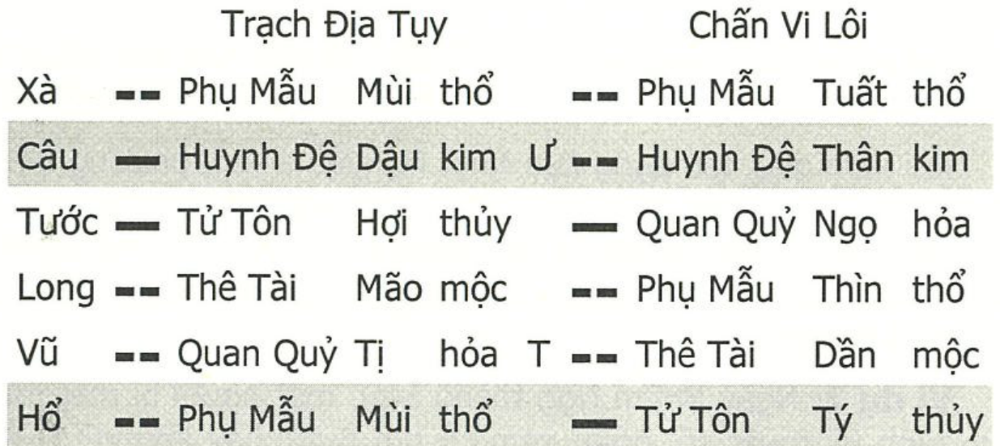
    - **Hình này chứng minh điều gì**
      - lấy Tài làm Dụng thần.
    - **Từ đâu mà thấy được**
      - Nhìn vào Hào 5 Quan Quỷ độc phát, hào Tài nhập Mộ, hào động này thể hiện kết quả.
- **Quá trình suy luận và đối thoại ban đầu:**
  - Căn cứ suy luận: Khoản tài trợ là tiền, đương nhiên lấy Tài làm Dụng thần.
  - Căn cứ suy luận: Khi đó tôi phán đoán như sau: Hào Tài Mão mộc được Nguyệt sinh Nhật xung là ám động, hào Tài ám động sinh Thế, đây tài tất được.
  - Căn cứ suy luận: Trong quẻ Huynh Đệ động đến khắc Tài, tháng Mão xung mất Huynh Đệ, tiền sẽ có thể đến tay.
  - Căn cứ suy luận: Nhập Mộ khó tìm, hào 5 thể hiện đường, biểu thị mất ở trên đường.
  - Căn cứ suy luận: Bởi vì Quan Quỷ chủ đạo tặc.
- **Ứng nghiệm thực tế và diễn biến sự việc:**
  - Nhìn vào kết quả thực tế: Trên thực tế tháng Sửu năm đó đã biết kết quả, đối phương đã không tài trợ.
- **Ngộ giải và bài học kinh nghiệm then chốt:**
  - Đúc rút quy luật thực chiến: Xem xét tổng thể ngũ hành, hào động và tâm thái người gieo quẻ.

### Ví dụ 2: Ngày Nhâm Ngọ tháng Sửu
- **Bối cảnh & Dữ kiện chiêm bái:**
  - Trên thực tế tháng Sửu năm đó đã biết kết quả, đối phương đã không tài trợ.
  - **Ví dụ 2:** Ngày Nhâm Ngọ tháng Sửu, một người bị mất máy chụp hình kỹ thuật số, đoán xem có tìm được hay không?
  - Được Khảm Vi Thủy biến Địa Thủy Sư.
  - Nhập Mộ khó tìm, hào 5 thể hiện đường, biểu thị mất ở trên đường.
  - Mộ khố là Quỷ, là bị người ta ăn trộm.
- Bảng quẻ Sơ đồ quẻ Khảm Vi Thủy biến Địa Thủy Sư:
  - **Hình 69.** Sơ đồ quẻ Khảm Vi Thủy biến Địa Thủy Sư
    - 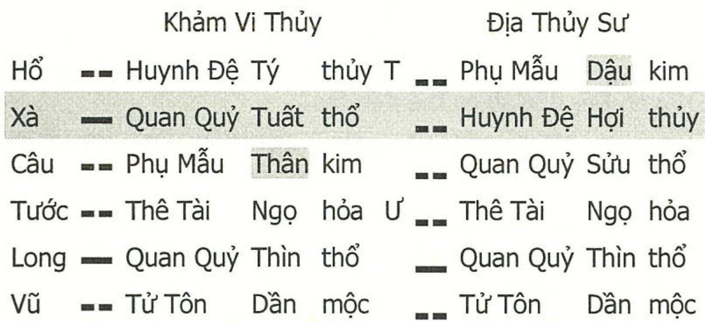
    - **Hình này chứng minh điều gì**
      - lấy Quan Quỷ làm Dụng thần.
    - **Từ đâu mà thấy được**
      - Nhìn vào Hào 5 Quan Quỷ độc phát, hào Tài nhập Mộ, hào động này thể hiện kết quả.
- **Quá trình suy luận và đối thoại ban đầu:**
  - Căn cứ suy luận: Nhập Mộ khó tìm, hào 5 thể hiện đường, biểu thị mất ở trên đường.
  - Căn cứ suy luận: Bởi vì Quan Quỷ chủ đạo tặc.
  - Căn cứ suy luận: Tôi phán đoán lần lượt theo câu hỏi của cô ấy.
  - Căn cứ suy luận: 1, Xem quan vận của chồng, lấy Quan Quỷ làm Dụng thần.
  - Căn cứ suy luận: Quan Quỷ Ngọ hỏa lâm Câu Trần, mặc dù không được Nguyệt sinh phù, nhưng có Nhật sinh, là vượng tướng, Câu Trần là nha môn, văn phòng, Quan tại hào 3, do đó tôi phán đoán chồng cô ấy đã là một cán bộ, là cán bộ cấp phòng, bởi vì hào 3 là trưởng phòng.
- **Ứng nghiệm thực tế và diễn biến sự việc:**
  - Thực tế diễn biến kiểm chứng ứng kỳ và cát hung của quẻ chiêm.
- **Ngộ giải và bài học kinh nghiệm then chốt:**
  - Đúc rút quy luật thực chiến: Xem xét tổng thể ngũ hành, hào động và tâm thái người gieo quẻ.

### Ví dụ 3: Đây là quẻ của một người nữ gieo
- **Bối cảnh & Dữ kiện chiêm bái:**
  - Sau cùng không tìm lại được.
  - Quẻ này nếu như chỉ phán đoán từ suy vượng thì Tài vượng phải là có thể tìm được mới đúng.
  - Nhưng phán đoán như vậy thì đã không phù hợp với thực tế.
  - **Ví dụ 3:** Đây là quẻ của một người nữ gieo, cô ấy có nhiều câu hỏi.
  - 1, Hỏi quan vận của chồng.
- Bảng quẻ Sơ đồ quẻ Trạch Thủy Khốn biến Thiên Địa Bĩ:
  - **Hình 70.** Sơ đồ quẻ Trạch Thủy Khốn biến Thiên Địa Bĩ
    - 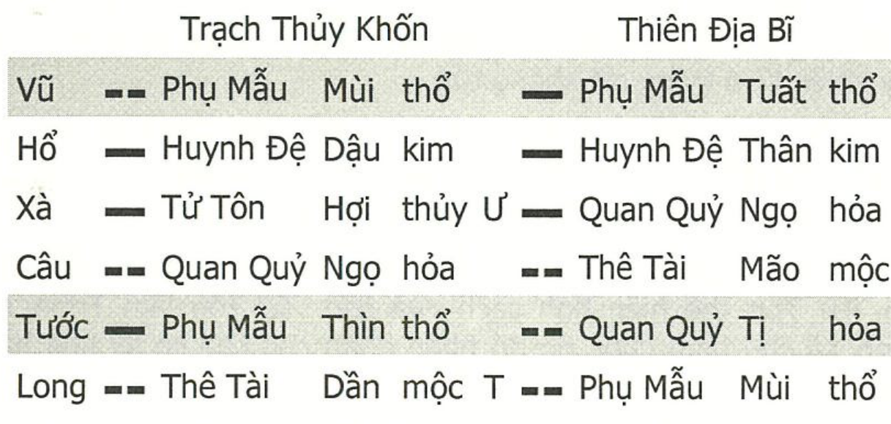
    - **Hình này chứng minh điều gì**
      - lấy Quan Quỷ làm Dụng thần.
    - **Từ đâu mà thấy được**
      - Nhìn vào hào 3, do đó tôi phán đoán chồng cô ấy đã là một cán bộ, là cán bộ cấp phòng, bởi vì hào 3 là trưởng phòng.
- **Quá trình suy luận và đối thoại ban đầu:**
  - Căn cứ suy luận: Tôi phán đoán lần lượt theo câu hỏi của cô ấy.
  - Căn cứ suy luận: 1, Xem quan vận của chồng, lấy Quan Quỷ làm Dụng thần.
  - Căn cứ suy luận: Quan Quỷ Ngọ hỏa lâm Câu Trần, mặc dù không được Nguyệt sinh phù, nhưng có Nhật sinh, là vượng tướng, Câu Trần là nha môn, văn phòng, Quan tại hào 3, do đó tôi phán đoán chồng cô ấy đã là một cán bộ, là cán bộ cấp phòng, bởi vì hào 3 là trưởng phòng.
  - Căn cứ suy luận: Xem quái tượng, Quan vốn không bị khắc, trái lại được Nhật sinh, lẽ ra có lợi cho thăng chức, nhưng hai hào động trong quẻ tiết khí của Quan, nhất là Quan bị hào 6 Phụ Mẫu Mùi thổ hợp, hào 6 là hào vị thoái hưu, hợp là cản trở, do đó tôi phán đoán chồng cô ấy ở đơn vị có tiểu nhân quấy rối, muốn chồng cô ấy mất chức.
  - Căn cứ suy luận: Tôi phán đoán cô ấy mặc dù hơi bận rộn nhưng tài vận rất tốt, nhất định là làm kinh doanh.
- **Ứng nghiệm thực tế và diễn biến sự việc:**
  - Nhìn vào kết quả thực tế: Trên thực tế không có thăng chức, về sau bị dồn ép quá mức nên đã nghỉ việc tự mở công ty.
  - Nhìn vào kết quả thực tế: Trên thực tế, cô ấy đã mở nhiều cửa hàng, năm 94 đến hiện tại luôn luôn rất tốt, năm 97 đắc tài hơn 200 vạn, năm 03 đã đóng một cửa hàng.
- **Ngộ giải và bài học kinh nghiệm then chốt:**
  - Đúc rút quy luật thực chiến: Xem xét tổng thể ngũ hành, hào động và tâm thái người gieo quẻ.

### Tổng kết chuyên đề và bài học tâm đắc
- **Huyền cơ cốt lõi rút ra từ các quái lệ:**
  - Xem quái tượng, Quan vốn không bị khắc, trái lại được Nhật sinh, lẽ ra có lợi cho thăng chức, nhưng hai hào động trong quẻ tiết khí của Quan, nhất là Quan bị hào 6 Phụ Mẫu Mùi thổ hợp, hào 6 là hào vị thoái hưu, hợp là cản trở, do đó tôi phán đoán chồng cô ấy ở đơn vị có tiểu nhân quấy rối, muốn chồng cô ấy mất chức.
  - Hào 2 Phụ Mẫu lâm Chu Tước động hóa Quan Quỷ, Chu Tước chủ ngôn ngữ, thư tín, Phụ Mẫu là văn thư, cáo trạng, Quan Quỷ là chuyện phiền phức, lâm Nguyệt biểu thị thời gian dài.
  - Do đó phán đoán có người tố cáo, nói xấu chồng của cô ấy, sự việc này đã không phải là chuyện một ngày hai ngày.
  - Cô ấy phản hồi: Để triệt hạ chồng cô ấy, có người trong đơn vị đã viết thư tố cáo khắp nơi, nói xấu chồng cô ấy, sự việc ồn ào này khiến tâm trạng rất không tốt.
  - Kết luận cuối cùng, Nguyên thần nhập Mộ, Quan bị hợp, do đó khó mà thăng chức.
  - Trên thực tế không có thăng chức, về sau bị dồn ép quá mức nên đã nghỉ việc tự mở công ty.
  - 2, Xem học tập của con, Phụ Mẫu thể hiện thành tích học tập, Tử Tôn thể hiện tính cách của con.
  - Tử Tôn lâm Trình Xà, Trình Xà chủ ham chơi, do đó phán đoán con của cô ấy khá ham chơi.
  - Phụ Mẫu lưỡng hiện, hào 6 Phụ Mẫu hóa tiến lại hóa phá, biểu thị thành tích học tập lúc tốt lúc kém, tiến bộ thoái bộ, thoái bộ lại tiến bộ.
  - Tử Tôn lâm Ứng, biểu thị con học tập ở nơi khác.
  - Phán đoán phù hợp với thực tế.
  - 3, Xem sức khỏe của cô ấy, lấy hào Thế làm Dụng thần.
  - Hào 6 Phụ Mẫu phát động, khiến hào Thế nhập Mộ, hào 6 là đầu, Mộ chủ hôn mê, đầu óc không tỉnh táo, Mộ lâm Huyền Vũ, Thế lâm Thanh Long, Huyền Vũ chủ chóng mặt, Thanh Long chủ đau, do đó phán đoán cô ấy có bệnh chóng mặt, đau đầu.
  - Nguyên thần là thủy, thủy chủ máu, Thế lâm hào Tài, Tài cũng chủ máu, Nguyên thần bị khắc, nhập Mộ không thể sinh Tài, do đó phán đoán tuần hoàn máu không tốt, cung máu không đủ.
  - Hào 2 động hóa Quan Quỷ, Quan Quỷ thể hiện bệnh tật, hóa ra thì biểu thị nơi tương ứng có vấn đề.
  - Quẻ tại cung Đoài có thông tin về ruột, hào 2 lại là hào vị của ruột, hỏa Quỷ cũng chủ ruột, do đó có viêm ruột.
  - Hào 2 lại là bộ phận sinh dục, Thìn thổ là Mộ khố Tử Tôn, hào 2 là thai vị, Tử Tôn khố thể hiện tử cung, nơi mang thai, lâm Chu Tước chủ viêm, Quỷ là bệnh, do đó phán đoán có viêm phần phụ.
  - Toàn bộ phán đoán trên đây đều chính xác
  - ### 4, Phán đoán tài vận của bản thân cô ấy, lấy Tài làm Dụng thần.
  - Tôi phán đoán cô ấy mặc dù hơi bận rộn nhưng tài vận rất tốt, nhất định là làm kinh doanh.
  - Từ năm 94 khởi đầu luôn rất tốt, năm 97 tài vận tốt nhất.
  - Năm 00 và năm 01 hơi kém một chút, năm nay là năm 03, phạm vi kinh doanh hơi thu hẹp.
  - Trên thực tế, cô ấy đã mở nhiều cửa hàng, năm 94 đến hiện tại luôn luôn rất tốt, năm 97 đắc tài hơn 200 vạn, năm 03 đã đóng một cửa hàng.
  - Tôi phân tích và phán đoán như sau:
  - Hào Tài trì Thế, Nhật đến tỉ phù vượng tướng, là có tài, lâm hào sơ, hào sơ là chân, biểu thị đi lại, bận rộn, lâm Thanh Long, chủ tài lại chủ vui vẻ, đắc ý, do đó tài vận rất tốt.
  - Năm 94 là năm Giáp Tuất, lẽ ra hào Tài nhập Mộ, nhưng hào biến của Mộ hóa phá, năm 94 ứng hào biến của Mộ, biểu thị Tài không bị trói buộc nữa, lại thêm Nguyên thần nhập Mộ tại Thìn thổ, năm 94 xung khai Mộ khố mà sinh Tài, do đó năm này rất tốt.
  - Năm 95 là năm Ất Hợi, Tài được Trường Sinh, tài vận cũng tốt đẹp.
  - Năm 96 là năm Bính Tý, Tài được sinh, Tài vượng mà được tài.
  - Năm 97 là năm Đinh Sửu, Tài nhập Mộ, năm này xung khai Mộ khố giải thoát Tài, do đó năm này tài cũng cực tốt, đây là ứng kỳ mẫu mực.
  - Năm 98 Mậu Dần, năm 99 Kỷ Mão, Tài được tỉ phù, tài vận cũng tốt đẹp.
  - Năm 00 Canh Thìn, Nguyên thần nhập Mộ, năm 01 là hào biến hồi đầu sinh Thìn thổ, do đó hai năm này không xem là tốt.
  - Năm 03 là năm Quý Mùi, hào Tài nhập Mộ cũng giảm bớt thu nhập, do đó phán đoán thu hẹp phạm vi.

## 21. Xét Lại Ứng Kỳ

- **Tổng quan nguyên lý & bối cảnh chuyên đề:**
  - Tôi đã phán đoán như sau.
  - Ông khởi bước ở năm 2000, mặc dù tài vận rất tốt nhưng tài sản thực sự thuộc về mình không có bao nhiêu.
  - Thìn thổ trên Thế động sinh Tài, ý nghĩa của quẻ Lữ là đi, nghĩa rộng là khởi bước. Thìn thổ đối ứng năm Canh Thìn.
  - Nhật sinh Tài, biểu thị tài vận hiện nay rất tốt. Nhưng hào Tài Dậu kim lâm hào Ứng, là tài của người khác, Thân kim bị Huynh Đệ hợp, cũng không phải tài của mình, do đó phán đoán tài thực sự thuộc về mình không có bao nhiêu.
### Ví dụ 1: Tháng giêng năm 03
- **Bối cảnh & Dữ kiện chiêm bái:**
  - **Ví dụ 1:** Tháng giêng năm 03, một tổng giám đốc công ty đến đoán niên vận của ông ta, ở ngày Canh Tuất tháng Dần, gieo được Hỏa Sơn Lữ biến Lôi Hỏa Phong.
  - Tôi đã phán đoán như sau.
  - Ông khởi bước ở năm 2000, mặc dù tài vận rất tốt nhưng tài sản thực sự thuộc về mình không có bao nhiêu.
  - Niên vận năm nay bất lợi.
  - 1, Đề phòng có tai nạn đổ máu, tháng Mão chú ý tai nạn giao thông.
- Bảng quẻ Quẻ Hỏa Sơn Lữ biến Lôi Hỏa Phong:
  - **Hình 71.** Quẻ Hỏa Sơn Lữ biến Lôi Hỏa Phong
    - 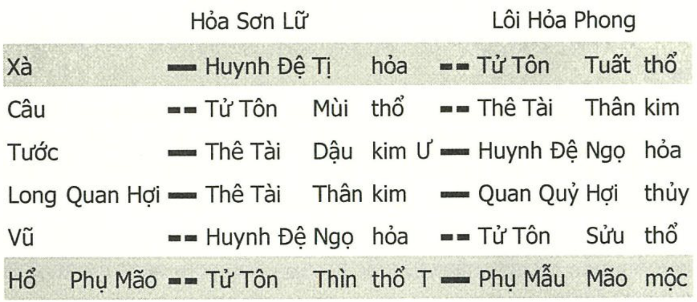
    - **Hình này chứng minh điều gì**
      - lấy hào Tài làm Dụng thần.
    - **Từ đâu mà thấy được**
      - Nhìn vào hào Thế, hào Ứng, Dụng thần và động hào trong bảng quẻ Quẻ Hỏa Sơn Lữ biến Lôi Hỏa Phong.
- **Quá trình suy luận và đối thoại ban đầu:**
  - Căn cứ suy luận: Đây là dự đoán tình hình tài vận của một năm, bởi vì dự đoán này tương đối đơn nhất cho nên phán đoán dễ hơn so với dự đoán vận khí lưu niên thông thường.
  - Căn cứ suy luận: Bởi vì chủ yếu đoán tài vận cho nên lấy hào Tài làm Dụng thần.
  - Căn cứ suy luận: Quẻ này hào Tài Ngọ hỏa Nguyệt phá bất thượng quái, Nhật lại không sinh, tài vận không tốt.
  - Căn cứ suy luận: Kết quả, tháng Thân phản hồi, tháng Mão có công nhân nghỉ việc bởi vì sinh con, sau đó lại có nhân viên mới vào, tháng Tị máy nước nóng bị hỏng, đã tốn rất nhiều tiền sửa chữa, tháng Ngọ mua bán cổ phiếu đã lỗ vốn rất nặng.
- **Ứng nghiệm thực tế và diễn biến sự việc:**
  - Nhìn vào kết quả thực tế: Trên thực tế, người này bắt đầu thành lập công ty ở năm 2000, đến năm 03 đã có một trăm triệu.
  - Nhìn vào kết quả thực tế: Trong quẻ này có thông tin ứng nghiệm, có thông tin không ứng nghiệm, và ứng kỳ cũng không phù hợp với thực tế.
  - Nhìn vào kết quả thực tế: Trở lại phân tích quẻ này, quẻ đã ứng bệnh tật của con cái, còn ứng thông tin tai nạn giao thông thì đã nhẹ đi nhiều.
  - Nhìn vào kết quả thực tế: Mặc dù đã ứng tài sản công ty bị đóng băng và tai họa lao ngục do người dưới quyền gây ra, nhưng thực tế xảy ra ở tháng Ngọ, không xảy ra ở tháng Tị.
  - Nhìn vào kết quả thực tế: Có lẽ là do Nguyên thần Ngọ nhập Mộ tại Nhật, do đó đã ứng tháng Ngọ, tạm thời xem như đáp án.
  - Nhìn vào kết quả thực tế: Sau này cần tiếp tục nghiên cứu.
- **Ngộ giải và bài học kinh nghiệm then chốt:**
  - Đúc rút quy luật thực chiến: Xem xét tổng thể ngũ hành, hào động và tâm thái người gieo quẻ.

### Quái lệ 2: Sơ đồ quẻ Thủy Hỏa Ký Tế biến Địa Sơn Khiêm
- **Bối cảnh & Dữ kiện chiêm bái:**
  - Trong quẻ Huynh Đệ phát động, Tài Nguyệt phá, dưới Tài phục Quan là tài của công ty, tháng Tị hợp phá là ứng kỳ, do đó phán đoán tháng Tị có khả năng tài khoản bị đóng băng.
  - Trên thực tế, người này bắt đầu thành lập công ty ở năm 2000, đến năm 03 đã có một trăm triệu.
  - Con cái có bệnh ung thư máu.
  - Không xảy ra tai nạn giao thông.
  - Mặc dù đã ứng tài sản công ty bị đóng băng và tai họa lao ngục do người dưới quyền gây ra, nhưng thực tế xảy ra ở tháng Ngọ, không xảy ra ở tháng Tị.
- Bảng quẻ Sơ đồ quẻ Thủy Hỏa Ký Tế biến Địa Sơn Khiêm:
  - **Hình 72.** Sơ đồ quẻ Thủy Hỏa Ký Tế biến Địa Sơn Khiêm
    - 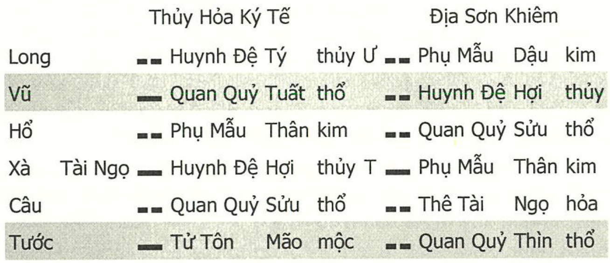
    - **Hình này chứng minh điều gì**
      - lấy hào Tài làm Dụng thần.
    - **Từ đâu mà thấy được**
      - Nhìn vào hào Thế, hào Ứng, Dụng thần và động hào trong bảng quẻ Sơ đồ quẻ Thủy Hỏa Ký Tế biến Địa Sơn Khiêm.
- **Quá trình suy luận và đối thoại ban đầu:**
  - Căn cứ suy luận: Đây là dự đoán tình hình tài vận của một năm, bởi vì dự đoán này tương đối đơn nhất cho nên phán đoán dễ hơn so với dự đoán vận khí lưu niên thông thường.
  - Căn cứ suy luận: Bởi vì chủ yếu đoán tài vận cho nên lấy hào Tài làm Dụng thần.
  - Căn cứ suy luận: Quẻ này hào Tài Ngọ hỏa Nguyệt phá bất thượng quái, Nhật lại không sinh, tài vận không tốt.
  - Căn cứ suy luận: Kết quả, tháng Thân phản hồi, tháng Mão có công nhân nghỉ việc bởi vì sinh con, sau đó lại có nhân viên mới vào, tháng Tị máy nước nóng bị hỏng, đã tốn rất nhiều tiền sửa chữa, tháng Ngọ mua bán cổ phiếu đã lỗ vốn rất nặng.
  - Căn cứ suy luận: Trong quẻ mộc vượng khắc Phụ Mẫu, Phụ Mẫu lưỡng hiện đều hưu tù, do đó điểm không tốt chính là sức khỏe của cha mẹ.
  - Căn cứ suy luận: Bởi vì Tài lâm Bạch Hổ khắc Phụ Mẫu, Bạch Hổ chủ bệnh tật.
- **Ứng nghiệm thực tế và diễn biến sự việc:**
  - Thực tế diễn biến kiểm chứng ứng kỳ và cát hung của quẻ chiêm.
- **Ngộ giải và bài học kinh nghiệm then chốt:**
  - Đúc rút quy luật thực chiến: Xem xét tổng thể ngũ hành, hào động và tâm thái người gieo quẻ.

### Ví dụ 3: Đây là quẻ đoán niên vận năm 2006 ở cuối năm 05 của một ngườ
- **Bối cảnh & Dữ kiện chiêm bái:**
  - **Ví dụ 3:** Đây là quẻ đoán niên vận năm 2006 ở cuối năm 05 của một người phụ nữ.
  - Ở ngày Canh Dần tháng Tý, được Trạch Thủy Khốn.
  - Đây là quẻ tĩnh, biểu thị một năm tương đối ít biến động, yên ổn và không có thăng trầm lớn.
  - Thế tại hào sơ Nguyệt sinh Nhật phù, không bị khắc, lại là quẻ lục hợp, chủ thông thuận, do đó một năm thuận lợi, bình an vô sự.
  - Quan Quỷ mặc dù Không Phá nhưng có Nhật sinh, lục hợp trong quẻ tĩnh có thể giải Nguyệt phá, tổng hợp phán đoán, công việc không có thăng tiến nhưng cũng không có gì xấu.
- Bảng quẻ Quẻ Trạch Thủy Khốn:
  - **Hình 73.** Quẻ Trạch Thủy Khốn
    - 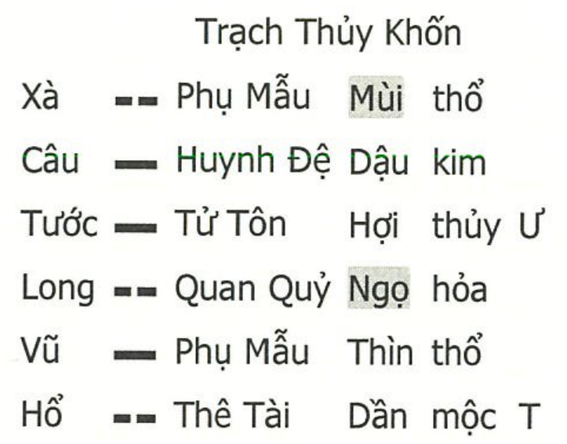
    - **Hình này chứng minh điều gì**
      - quẻ lục hợp, chủ thông thuận, do đó một năm thuận lợi, bình an vô sự.
    - **Từ đâu mà thấy được**
      - Nhìn vào hào 2 Huynh Đệ lâm Bạch Hổ phát động hóa hồi đầu khắc là thông tin chủ yếu của quẻ này.
- **Quá trình suy luận và đối thoại ban đầu:**
  - Căn cứ suy luận: Trong quẻ mộc vượng khắc Phụ Mẫu, Phụ Mẫu lưỡng hiện đều hưu tù, do đó điểm không tốt chính là sức khỏe của cha mẹ.
  - Căn cứ suy luận: Bởi vì Tài lâm Bạch Hổ khắc Phụ Mẫu, Bạch Hổ chủ bệnh tật.
  - Căn cứ suy luận: Phụ Mẫu tại hào 6, đề phòng bệnh ở đầu, tại hào 3 đề phòng chân và đầu gối v.v.
  - Căn cứ suy luận: Quẻ này là một hào độc phát, hào 2 Huynh Đệ lâm Bạch Hổ phát động hóa hồi đầu khắc là thông tin chủ yếu của quẻ này.
  - Căn cứ suy luận: Bởi vì thần triệu cơ ở động.
  - Căn cứ suy luận: Thế tại hào sơ biểu thị đi, lại bởi vì là quẻ Lữ, càng thể hiện thông tin đi, mà hào động này là Nguyên thần hào Thế, hóa hồi đầu khắc thì biểu thị sẽ xảy ra vấn đề.
  - Đối thoại thực tế: Nhưng chúng ta không nên quên kinh nghiệm của người xưa: "Thần bỏ việc nhỏ mà báo việc lớn, bỏ việc xa mà báo việc gần." Người này đã bị thương sau đó vài ngày, cũng không đi theo ứng kỳ mà chỉ ứng sự việc.
- **Ứng nghiệm thực tế và diễn biến sự việc:**
  - Nhìn vào kết quả thực tế: Nhưng chúng ta không nên quên kinh nghiệm của người xưa: "Thần bỏ việc nhỏ mà báo việc lớn, bỏ việc xa mà báo việc gần." Người này đã bị thương sau đó vài ngày, cũng không đi theo ứng kỳ mà chỉ ứng sự việc.
  - Nhìn vào kết quả thực tế: Nếu lại dùng quẻ này để phán đoán sự việc khác trong năm thì e rằng miễn cưỡng, sẽ không ứng nghiệm.
- **Ngộ giải và bài học kinh nghiệm then chốt:**
  - Đúc rút quy luật thực chiến: Xem xét tổng thể ngũ hành, hào động và tâm thái người gieo quẻ.

### Ví dụ 4: Một người nữ dự đoán niên vận
- **Bối cảnh & Dữ kiện chiêm bái:**
  - **Ví dụ 4:** Một người nữ dự đoán niên vận, ở ngày Kỷ Tị tháng Dần, được Hỏa Sơn Lữ biến Hỏa Phong Đỉnh.
  - Nhưng chúng ta không nên quên kinh nghiệm của người xưa: "Thần bỏ việc nhỏ mà báo việc lớn, bỏ việc xa mà báo việc gần." Người này đã bị thương sau đó vài ngày, cũng không đi theo ứng kỳ mà chỉ ứng sự việc.
  - Ý định ban đầu của cô ấy là dự đoán quẻ một năm, nhưng quẻ lại nói với rằng cô ấy chưa cần hỏi một năm, trước mắt đã có thương tai.
  - Nếu lại dùng quẻ này để phán đoán sự việc khác trong năm thì e rằng miễn cưỡng, sẽ không ứng nghiệm.
  - Tư duy đoán quẻ này đã có trong Tăng San Bốc Dịch, chỉ là do chúng ta chưa hiểu rõ, cho nên khi gặp phải trường hợp như vậy cũng không nhìn ra.
- Bảng quẻ Quẻ Hỏa Sơn Lữ biến Hỏa Phong Đỉnh:
  - **Hình 74.** Quẻ Hỏa Sơn Lữ biến Hỏa Phong Đỉnh
    - 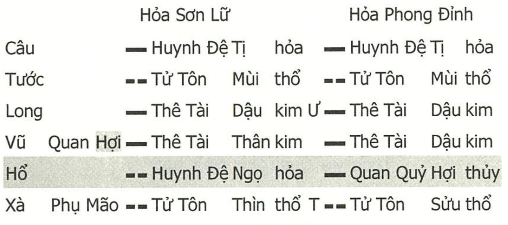
    - **Hình này chứng minh điều gì**
      - Quẻ này là một hào độc phát, hào 2 Huynh Đệ lâm Bạch Hổ phát động hóa hồi đầu khắc là thông tin chủ yếu của quẻ này.
    - **Từ đâu mà thấy được**
      - Nhìn vào hào 2 Huynh Đệ lâm Bạch Hổ phát động hóa hồi đầu khắc là thông tin chủ yếu của quẻ này.
- **Quá trình suy luận và đối thoại ban đầu:**
  - Căn cứ suy luận: Quẻ này là một hào độc phát, hào 2 Huynh Đệ lâm Bạch Hổ phát động hóa hồi đầu khắc là thông tin chủ yếu của quẻ này.
  - Căn cứ suy luận: Bởi vì thần triệu cơ ở động.
  - Căn cứ suy luận: Thế tại hào sơ biểu thị đi, lại bởi vì là quẻ Lữ, càng thể hiện thông tin đi, mà hào động này là Nguyên thần hào Thế, hóa hồi đầu khắc thì biểu thị sẽ xảy ra vấn đề.
  - Căn cứ suy luận: Bạch Hổ chủ bị thương, hào 2 là hào vị của chân, Huynh Đệ lại là chân, do đó thông tin chân sẽ bị thương khá rõ ràng.
  - Căn cứ suy luận: Nếu muốn hỏi ứng kỳ, theo quy luật ứng kỳ thì sẽ ứng tại tháng Ngọ hoặc là tháng Hợi, Hợi thủy Không xuất Không khắc Ngọ hỏa, lý do càng đầy đủ hơn.
  - Căn cứ suy luận: Tư duy đoán quẻ này đã có trong Tăng San Bốc Dịch, chỉ là do chúng ta chưa hiểu rõ, cho nên khi gặp phải trường hợp như vậy cũng không nhìn ra.
  - Đối thoại thực tế: Nhưng chúng ta không nên quên kinh nghiệm của người xưa: "Thần bỏ việc nhỏ mà báo việc lớn, bỏ việc xa mà báo việc gần." Người này đã bị thương sau đó vài ngày, cũng không đi theo ứng kỳ mà chỉ ứng sự việc.
- **Ứng nghiệm thực tế và diễn biến sự việc:**
  - Nhìn vào kết quả thực tế: Một số quẻ không phải là không ứng nghiệm mà là do chúng ta chưa hiểu rõ những quẻ này mà thôi.
- **Ngộ giải và bài học kinh nghiệm then chốt:**
  - Đúc rút quy luật thực chiến: Xem xét tổng thể ngũ hành, hào động và tâm thái người gieo quẻ.

### Tổng kết chuyên đề và bài học tâm đắc
- **Huyền cơ cốt lõi rút ra từ các quái lệ:**
  - đâu có một ngày đột nhiên thông suốt, khai ngộ.
  - Một số quẻ không phải là không ứng nghiệm mà là do chúng ta chưa hiểu rõ những quẻ này mà thôi.

## 22. Quẻ Có Thắc Mắc Cần Phải Gieo Lại Một Quẻ Tham Khảo

- **Tổng quan nguyên lý & bối cảnh chuyên đề:**
  - Dự đoán thăng chức, lấy Quan Quỷ làm Dụng thần. Quẻ này Quan Quỷ có Nguyệt sinh Nhật phù, Quan tại hào 5, vượng mà có lợi. Chỉ hiềm Tử Tôn độc phát, chính là Thái Tuế năm nay nhập hào, chứng tỏ trong năm nay không được thăng chức.
### Ví dụ 1: Đây là một quẻ đã dự đoán ở cuối năm 2002
- **Bối cảnh & Dữ kiện chiêm bái:**
  - **Ví dụ 1:** Đây là một quẻ đã dự đoán ở cuối năm 2002.
  - Một lãnh đạo thỉnh cầu đoán tình hình thăng chức của mình.
  - Ở ngày Đinh Dậu tháng Sửu, gieo được Chấn Vi Lôi biến Địa Lôi Phục.
  - Năm thứ hai là Quý Mùi, hợp Tử Tôn lại sinh khởi Quan tinh, năm 03 có hy vọng thăng chức.
  - Hào Quỷ an tĩnh, ứng trị ứng xung, tháng giêng là Dần mặc dù xung Quan Quỷ, nhưng Tử Tôn được sinh, vượng mà khắc Quan, không thể ứng xung, cho nên sẽ ứng tháng Thân.
- Bảng quẻ Sơ đồ quẻ Chấn Vi Lôi biến Địa Lôi Phục:
  - **Hình 75.** Sơ đồ quẻ Chấn Vi Lôi biến Địa Lôi Phục
    - 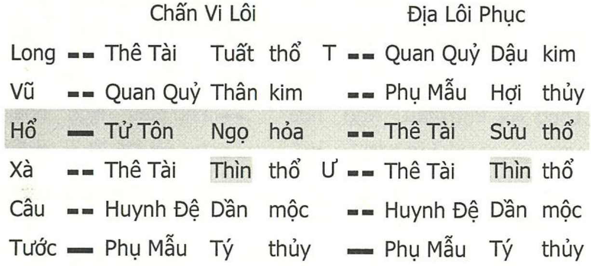
    - **Hình này chứng minh điều gì**
      - lấy Quan Quỷ làm Dụng thần.
    - **Từ đâu mà thấy được**
      - Nhìn vào hào Thế, hào Ứng, Dụng thần và động hào trong bảng quẻ Sơ đồ quẻ Chấn Vi Lôi biến Địa Lôi Phục.
- **Quá trình suy luận và đối thoại ban đầu:**
  - Căn cứ suy luận: Năm thứ hai là Quý Mùi, hợp Tử Tôn lại sinh khởi Quan tinh, năm 03 có hy vọng thăng chức.
  - Căn cứ suy luận: Hào Quỷ an tĩnh, ứng trị ứng xung, tháng giêng là Dần mặc dù xung Quan Quỷ, nhưng Tử Tôn được sinh, vượng mà khắc Quan, không thể ứng xung, cho nên sẽ ứng tháng Thân.
  - Căn cứ suy luận: Do đó phán đoán là tại tháng Thân năm 03 có thể thăng.
  - Căn cứ suy luận: Quẻ này mặc dù Quan Quỷ trì Thế, nhưng Nhật Nguyệt không sinh, cũng không tỉ phù, Nhật khắc Dụng thần.
  - Căn cứ suy luận: Huynh Đệ độc phát, khắc Tài sinh Tử Tôn mà không sinh Dụng thần, căn bản không thăng chức.
  - Căn cứ suy luận: Nhưng bởi vì có phán đoán phía trước, do đó tôi chỉ nói là quý nhân trung ương này không giúp được, chỉ tốn tiền vô ích mà thôi, cần phải tìm con đường khác.
- **Ứng nghiệm thực tế và diễn biến sự việc:**
  - Nhìn vào kết quả thực tế: Thế là anh ta lại đến gieo quẻ như sau.
  - Nhìn vào kết quả thực tế: Đến tháng Thân, người này lại đến dự đoán, được quẻ như sau.
- **Ngộ giải và bài học kinh nghiệm then chốt:**
  - Đúc rút quy luật thực chiến: Xem xét tổng thể ngũ hành, hào động và tâm thái người gieo quẻ.

### Quái lệ 2: Sơ đồ quẻ Cấn Vi Sơn biến Hỏa Sơn Lữ
- **Bối cảnh & Dữ kiện chiêm bái:**
  - Đến tháng Thìn năm thứ hai, người này quả nhiên đã tìm được một quý nhân đắc lực ở trung ương, đối phương đồng ý nâng đỡ anh ta.
  - Thế là anh ta lại đến gieo quẻ như sau.
  - Ngày Nhâm Thân tháng Thìn, được Cấn Vi Sơn biến Hỏa Sơn Lữ.
  - Sau khi thấy quẻ này, tôi không khỏi có chút hoài nghi về phán đoán trước đây của mình.
  - Sau đó quả nhiên người này đã không giúp được, đã tốn tiền vô ích.
- Bảng quẻ Sơ đồ quẻ Cấn Vi Sơn biến Hỏa Sơn Lữ:
  - **Hình 76.** Sơ đồ quẻ Cấn Vi Sơn biến Hỏa Sơn Lữ
    - 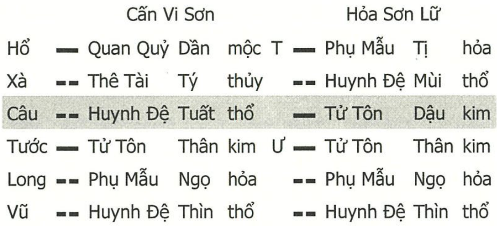
    - **Hình này chứng minh điều gì**
      - Bảng quẻ Sơ đồ quẻ Cấn Vi Sơn biến Hỏa Sơn Lữ phản ánh sự phối chiếu hào vị, ngũ hành và động biến minh chứng cho vấn đề chiêm đoán.
    - **Từ đâu mà thấy được**
      - Nhìn vào hào Thế, hào Ứng, Dụng thần và động hào trong bảng quẻ Sơ đồ quẻ Cấn Vi Sơn biến Hỏa Sơn Lữ.
- **Quá trình suy luận và đối thoại ban đầu:**
  - Căn cứ suy luận: Quẻ này mặc dù Quan Quỷ trì Thế, nhưng Nhật Nguyệt không sinh, cũng không tỉ phù, Nhật khắc Dụng thần.
  - Căn cứ suy luận: Huynh Đệ độc phát, khắc Tài sinh Tử Tôn mà không sinh Dụng thần, căn bản không thăng chức.
  - Căn cứ suy luận: Nhưng bởi vì có phán đoán phía trước, do đó tôi chỉ nói là quý nhân trung ương này không giúp được, chỉ tốn tiền vô ích mà thôi, cần phải tìm con đường khác.
- **Ứng nghiệm thực tế và diễn biến sự việc:**
  - Thực tế diễn biến kiểm chứng ứng kỳ và cát hung của quẻ chiêm.
- **Ngộ giải và bài học kinh nghiệm then chốt:**
  - Ngộ giải từ thực tiễn và cổ thư: Từ đó ngộ ra một đạo lý, hễ khi trong quẻ có một điểm thắc mắc, thông tin không rõ ràng, thì không thể nhận định một cách qua loa, phải gieo một quẻ nữa để tham khảo phán đoán, như vậy tỷ lệ chính xác mới cao, cũng sẽ không làm lỡ việc của người ta.

### Quái lệ 3: Quẻ Thiên Phong Cấu biến Trạch Phong Đại Quá
- **Bối cảnh & Dữ kiện chiêm bái:**
  - Ngày Mậu Tý tháng Thân, gieo được Thiên Phong Cấu biến Trạch Phong Đại Quá.
  - Từ đó ngộ ra một đạo lý, hễ khi trong quẻ có một điểm thắc mắc, thông tin không rõ ràng, thì không thể nhận định một cách qua loa, phải gieo một quẻ nữa để tham khảo phán đoán, như vậy tỷ lệ chính xác mới cao, cũng sẽ không làm lỡ việc của người ta.
  - Phương pháp một việc đa chiêm đã từng được đề xướng trong cổ thư Tăng San Bốc Dịch, chúng ta cũng có thể học hỏi từ đó.
  - Quẻ phán đoán sai này là dự đoán thăng chức, nếu không thăng thì cũng không ảnh hưởng gì, nhưng nếu là dự đoán kinh doanh, dự đoán sai cho người khác thì sẽ gây ra tổn thất kinh tế cho đối phương, do đó chúng ta thà bảo người đó gieo một quẻ nữa chứ không thể đưa ra kết luận một cách cẩu thả.
- Bảng quẻ Quẻ Thiên Phong Cấu biến Trạch Phong Đại Quá:
  - **Hình 77.** Quẻ Thiên Phong Cấu biến Trạch Phong Đại Quá
    - 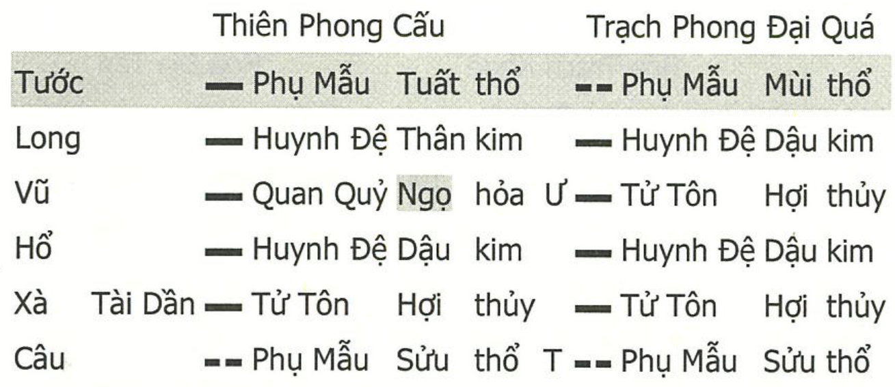
    - **Hình này chứng minh điều gì**
      - Lấy Quan Quỷ làm Dụng thần.
    - **Từ đâu mà thấy được**
      - Nhìn vào hào Thế, hào Ứng, Dụng thần và động hào trong bảng quẻ Quẻ Thiên Phong Cấu biến Trạch Phong Đại Quá.
- **Quá trình suy luận và đối thoại ban đầu:**
  - Căn cứ suy luận: Lấy Quan Quỷ làm Dụng thần.
  - Căn cứ suy luận: Tôi phán đoán Quan Quỷ mặc dù được Nguyệt hợp là vượng, nhưng Nhật không sinh phù, Quan Quỷ động mà sinh Ứng, xuất hiện vô tình, Ứng động khắc Thế, thi bất lợi.
  - Căn cứ suy luận: Lại thêm hào Thế Không Vong, tượng bất thành.
  - Đối thoại thực tế: Anh ta đã do dự sau khi nghe phán đoán của tôi: "Kỳ thi này cần đầu tư rất nhiều thời gian và sức lực, thi đậu tất nhiên là vui, nhưng không đậu thì hơi mất mặt.
  - Đối thoại thực tế: Có thể gieo một quẻ nữa hay không?" Tôi đã đồng ý.
- **Ứng nghiệm thực tế và diễn biến sự việc:**
  - Thực tế diễn biến kiểm chứng ứng kỳ và cát hung của quẻ chiêm.
- **Ngộ giải và bài học kinh nghiệm then chốt:**
  - Đúc rút quy luật thực chiến: Xem xét tổng thể ngũ hành, hào động và tâm thái người gieo quẻ.

### Ví dụ 2: Ngày Tân Tị tháng Tuất
- **Bối cảnh & Dữ kiện chiêm bái:**
  - **Ví dụ 2:** Ngày Tân Tị tháng Tuất, một lãnh đạo cơ quan tỉnh đoán thi thăng chức có đậu hay không, gieo được Hỏa Trạch Khuê biến Hỏa Địa Tấn.
  - Anh ta đã do dự sau khi nghe phán đoán của tôi: "Kỳ thi này cần đầu tư rất nhiều thời gian và sức lực, thi đậu tất nhiên là vui, nhưng không đậu thì hơi mất mặt.
  - Dù sao tôi cũng là lãnh đạo của một đơn vị cho nên phải thận trọng một chút.
  - Có thể gieo một quẻ nữa hay không?" Tôi đã đồng ý.
- Bảng quẻ Quẻ Hỏa Trạch Khuê biến Hỏa Địa Tấn:
  - **Hình 78.** Quẻ Hỏa Trạch Khuê biến Hỏa Địa Tấn
    - 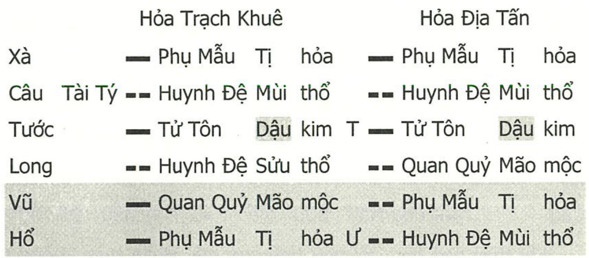
    - **Hình này chứng minh điều gì**
      - Lấy Quan Quỷ làm Dụng thần.
    - **Từ đâu mà thấy được**
      - Nhìn vào hào Thế, hào Ứng, Dụng thần và động hào trong bảng quẻ Quẻ Hỏa Trạch Khuê biến Hỏa Địa Tấn.
- **Quá trình suy luận và đối thoại ban đầu:**
  - Căn cứ suy luận: Lấy Quan Quỷ làm Dụng thần.
  - Căn cứ suy luận: Tôi phán đoán Quan Quỷ mặc dù được Nguyệt hợp là vượng, nhưng Nhật không sinh phù, Quan Quỷ động mà sinh Ứng, xuất hiện vô tình, Ứng động khắc Thế, thi bất lợi.
  - Căn cứ suy luận: Lại thêm hào Thế Không Vong, tượng bất thành.
  - Đối thoại thực tế: Anh ta đã do dự sau khi nghe phán đoán của tôi: "Kỳ thi này cần đầu tư rất nhiều thời gian và sức lực, thi đậu tất nhiên là vui, nhưng không đậu thì hơi mất mặt.
  - Đối thoại thực tế: Có thể gieo một quẻ nữa hay không?" Tôi đã đồng ý.
- **Ứng nghiệm thực tế và diễn biến sự việc:**
  - Thực tế diễn biến kiểm chứng ứng kỳ và cát hung của quẻ chiêm.
- **Ngộ giải và bài học kinh nghiệm then chốt:**
  - Đúc rút quy luật thực chiến: Xem xét tổng thể ngũ hành, hào động và tâm thái người gieo quẻ.

### Quái lệ 5: Quẻ Lôi Phong Hằng biến Địa Sơn Khiêm
- **Bối cảnh & Dữ kiện chiêm bái:**
  - Chiêm đoán theo bảng quẻ Quẻ Lôi Phong Hằng biến Địa Sơn Khiêm trong thực tiễn.
- Bảng quẻ Quẻ Lôi Phong Hằng biến Địa Sơn Khiêm:
  - **Hình 79.** Quẻ Lôi Phong Hằng biến Địa Sơn Khiêm
    - 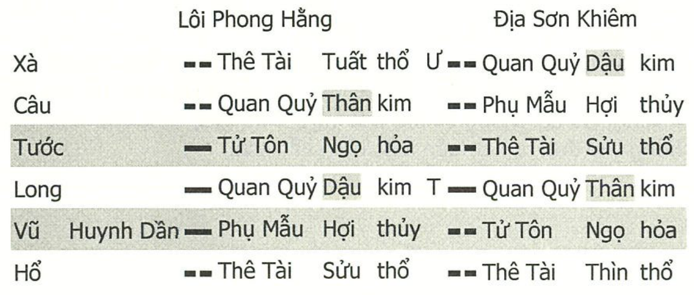
    - **Hình này chứng minh điều gì**
      - Bảng quẻ Quẻ Lôi Phong Hằng biến Địa Sơn Khiêm phản ánh sự phối chiếu hào vị, ngũ hành và động biến minh chứng cho vấn đề chiêm đoán.
    - **Từ đâu mà thấy được**
      - Nhìn vào hào Thế, hào Ứng, Dụng thần và động hào trong bảng quẻ Quẻ Lôi Phong Hằng biến Địa Sơn Khiêm.
- **Quá trình suy luận và đối thoại ban đầu:**
  - Tác giả phân tích cấu trúc hào tượng, Dụng thần và các yếu tố sinh khắc trong quẻ Quẻ Lôi Phong Hằng biến Địa Sơn Khiêm.
- **Ứng nghiệm thực tế và diễn biến sự việc:**
  - Nhìn vào kết quả thực tế: Anh ta đã tham gia thi, kết quả là không thi đậu.
- **Ngộ giải và bài học kinh nghiệm then chốt:**
  - Đúc rút quy luật thực chiến: Xem xét tổng thể ngũ hành, hào động và tâm thái người gieo quẻ.

### Ví dụ 3: Ngày Kỷ Sửu tháng Hợi
- **Bối cảnh & Dữ kiện chiêm bái:**
  - Nhưng người này vẫn tin vận may sẽ đến với mình.
  - Anh ta đã tham gia thi, kết quả là không thi đậu.
  - **Ví dụ 3:** Ngày Kỷ Sửu tháng Hợi, có hai người đến dự đoán đấu thầu, được Thiên Trạch Lý biến Đoài Vi Trạch.
  - Người cùng đến không muốn từ bỏ, cũng yêu cầu gieo quẻ, được Địa Thủy Sư biến Địa Phong Thăng.
- Bảng quẻ Quẻ Thiên Trạch Lý biến Đoài Vi Trạch:
  - **Hình 80.** Quẻ Thiên Trạch Lý biến Đoài Vi Trạch
    - 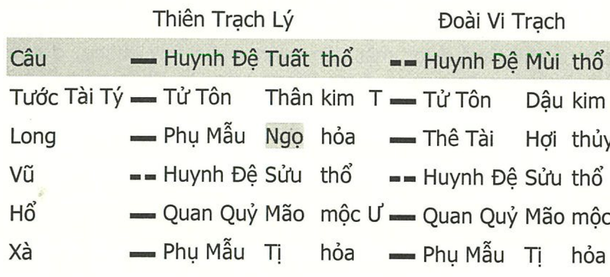
    - **Hình này chứng minh điều gì**
      - Bảng quẻ Quẻ Thiên Trạch Lý biến Đoài Vi Trạch phản ánh sự phối chiếu hào vị, ngũ hành và động biến minh chứng cho vấn đề chiêm đoán.
    - **Từ đâu mà thấy được**
      - Nhìn vào hào Thế, hào Ứng, Dụng thần và động hào trong bảng quẻ Quẻ Thiên Trạch Lý biến Đoài Vi Trạch.
- **Quá trình suy luận và đối thoại ban đầu:**
  - Tác giả phân tích cấu trúc hào tượng, Dụng thần và các yếu tố sinh khắc trong quẻ Quẻ Thiên Trạch Lý biến Đoài Vi Trạch.
- **Ứng nghiệm thực tế và diễn biến sự việc:**
  - Thực tế diễn biến kiểm chứng ứng kỳ và cát hung của quẻ chiêm.
- **Ngộ giải và bài học kinh nghiệm then chốt:**
  - Đúc rút quy luật thực chiến: Xem xét tổng thể ngũ hành, hào động và tâm thái người gieo quẻ.

### Quái lệ 7: Quẻ Địa Thủy Sư biến Địa Phong Thăng
- **Bối cảnh & Dữ kiện chiêm bái:**
  - Chiêm đoán theo bảng quẻ Quẻ Địa Thủy Sư biến Địa Phong Thăng trong thực tiễn.
- Bảng quẻ Quẻ Địa Thủy Sư biến Địa Phong Thăng:
  - **Hình 81.** Quẻ Địa Thủy Sư biến Địa Phong Thăng
    - 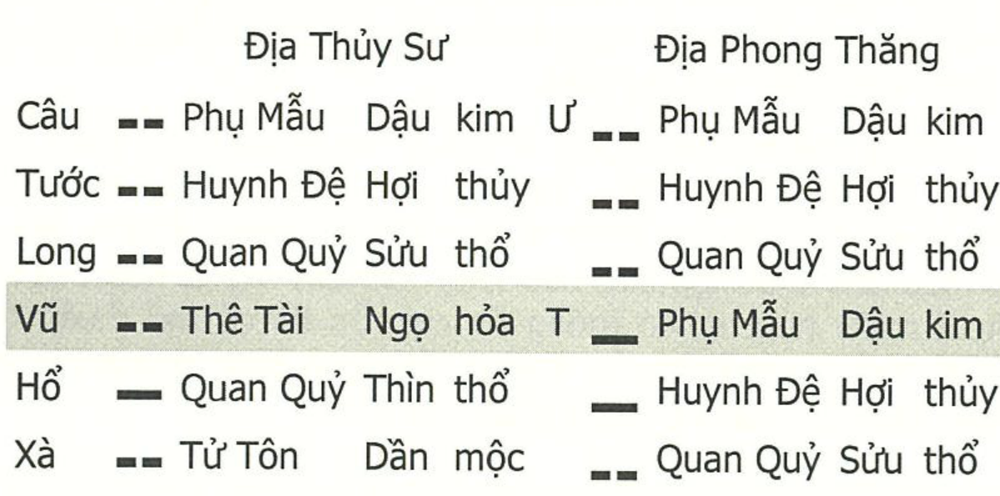
    - **Hình này chứng minh điều gì**
      - lấy hào Phụ Mẫu làm Dụng thần.
    - **Từ đâu mà thấy được**
      - Nhìn vào hào 2, hào 2 là mặt tiền, lâm Tài hợp, lại có thông tin chi tiền thì có thể thuê.
- **Quá trình suy luận và đối thoại ban đầu:**
  - Tác giả phân tích cấu trúc hào tượng, Dụng thần và các yếu tố sinh khắc trong quẻ Quẻ Địa Thủy Sư biến Địa Phong Thăng.
- **Ứng nghiệm thực tế và diễn biến sự việc:**
  - Nhìn vào kết quả thực tế: Sau đó hai người vẫn muốn thử vận may đấu thầu.
  - Nhìn vào kết quả thực tế: Đấu thầu cần phải trả phí tham gia, kết quả là đã tốn tiền vô ích, không trúng thầu.
- **Ngộ giải và bài học kinh nghiệm then chốt:**
  - Đúc rút quy luật thực chiến: Xem xét tổng thể ngũ hành, hào động và tâm thái người gieo quẻ.

### Ví dụ 4: Có một nơi vừa mới sửa chữa xong rất nhiều mặt tiền
- **Bối cảnh & Dữ kiện chiêm bái:**
  - Sau đó hai người vẫn muốn thử vận may đấu thầu.
  - Đấu thầu cần phải trả phí tham gia, kết quả là đã tốn tiền vô ích, không trúng thầu.
  - **Ví dụ 4:** Có một nơi vừa mới sửa chữa xong rất nhiều mặt tiền, một người sau khi xem qua thì muốn thuê một mặt tiền phía bắc, nhưng nhất thời không liên hệ được với người cho thuê, đoán xem có thể thuê được mặt tiền mình muốn hay không, ở ngày Bính Tý tháng Thìn, gieo được Phong Hỏa Gia Nhân biến Cấn Vi Sơn.
- Bảng quẻ Quẻ Phong Hỏa Gia Nhân biến Cấn Vi Sơn:
  - **Hình 82.** Quẻ Phong Hỏa Gia Nhân biến Cấn Vi Sơn
    - 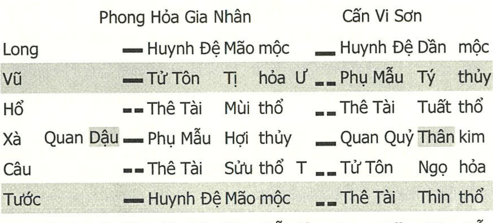
    - **Hình này chứng minh điều gì**
      - lấy hào Phụ Mẫu làm Dụng thần.
    - **Từ đâu mà thấy được**
      - Nhìn vào hào 2, hào 2 là mặt tiền, lâm Tài hợp, lại có thông tin chi tiền thì có thể thuê.
- **Quá trình suy luận và đối thoại ban đầu:**
  - Tác giả phân tích cấu trúc hào tượng, Dụng thần và các yếu tố sinh khắc trong quẻ Quẻ Phong Hỏa Gia Nhân biến Cấn Vi Sơn.
- **Ứng nghiệm thực tế và diễn biến sự việc:**
  - Thực tế diễn biến kiểm chứng ứng kỳ và cát hung của quẻ chiêm.
- **Ngộ giải và bài học kinh nghiệm then chốt:**
  - Đúc rút quy luật thực chiến: Xem xét tổng thể ngũ hành, hào động và tâm thái người gieo quẻ.

### Quái lệ 9: Sơ đồ quẻ Địa Hỏa Minh Di
- **Bối cảnh & Dữ kiện chiêm bái:**
  - Theo quy tắc thông thường, một căn nhà không thể hứa cho hai người, trong thông tin mâu thuẫn này đã chứa huyền cơ.
  - Qua phân tích tổng thể, nhận định rằng tuy mặt tiền này đã cho thuê nhưng nhất định đối phương vẫn chưa giao tiền thuê, do đó có thể tìm người cho thuê để thương lượng, nếu bây giờ giao tiền thuê thì có thể thuê ngay mặt tiền này.
  - Lại xem quẻ trước, hào Ứng phát động hóa Phụ Mẫu, là đã có người dự định sẽ thuê mặt tiền này, nhưng Tuyệt Phụ Mẫu, vẫn chưa hoàn toàn thuộc về đối phương.
  - Thế lâm Tài hợp Phụ Mẫu trên Nhật, mình xuất tiền có thể nhận được.
  - Anh ta liền tìm người cho thuê, khi hỏi thăm, quả nhiên nhà đã có người dự định thuê, qua thương lượng, người này bằng lòng đưa tiền thuê ngay lập tức, thế là đã thuê được mặt tiền này.
- Bảng quẻ Sơ đồ quẻ Địa Hỏa Minh Di:
  - **Hình 83.** Sơ đồ quẻ Địa Hỏa Minh Di
    - 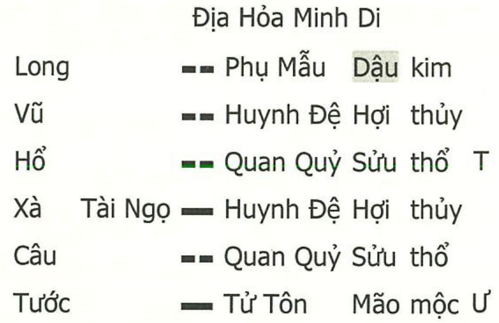
    - **Hình này chứng minh điều gì**
      - Bảng quẻ Sơ đồ quẻ Địa Hỏa Minh Di phản ánh sự phối chiếu hào vị, ngũ hành và động biến minh chứng cho vấn đề chiêm đoán.
    - **Từ đâu mà thấy được**
      - Nhìn vào hào Thế, hào Ứng, Dụng thần và động hào trong bảng quẻ Sơ đồ quẻ Địa Hỏa Minh Di.
- **Quá trình suy luận và đối thoại ban đầu:**
  - Tác giả phân tích cấu trúc hào tượng, Dụng thần và các yếu tố sinh khắc trong quẻ Sơ đồ quẻ Địa Hỏa Minh Di.
- **Ứng nghiệm thực tế và diễn biến sự việc:**
  - Thực tế diễn biến kiểm chứng ứng kỳ và cát hung của quẻ chiêm.
- **Ngộ giải và bài học kinh nghiệm then chốt:**
  - Đúc rút quy luật thực chiến: Xem xét tổng thể ngũ hành, hào động và tâm thái người gieo quẻ.

## 23. Hào Biến Và Ứng Kỳ

- **Tổng quan nguyên lý & bối cảnh chuyên đề:**
  - Lấy Phụ Mẫu làm Dụng thần. Nguyệt không sinh phù Nhật khắc Phụ Mẫu là hưu tù. Hào Tài Kỵ thần độc phát, được Nguyệt sinh Nhật phù vượng mà khắc Dụng, không cát.
  - Phụ Mẫu lâm Câu Trần tại hào 4, hào 4 là ngực, kim chủ phổi, Câu Trần là ung thư, do đó là ung thư phổi. Ung thư thuộc về bệnh lâu rất sợ lục xung. Quẻ này lục xung, do đó không tốt.
  - Trong Tăng San Bốc Dịch cũng có một số ví dụ về tình huống lấy hào biến làm ứng kỳ. Do đó khi phán đoán quẻ, chúng ta cần phải xem quẻ cẩn thận, không được bỏ lỡ mọi chi tiết.
### Ví dụ 1: Ngày Quý Tị tháng Mão năm 03
- **Bối cảnh & Dữ kiện chiêm bái:**
  - **Ví dụ 1:** Ngày Quý Tị tháng Mão năm 03, một người nữ đoán tình trạng bệnh tật của mẹ, được Khảm Vi Thủy biến Thủy Phong Tỉnh.
  - Trong Tăng San Bốc Dịch cũng có một số ví dụ về tình huống lấy hào biến làm ứng kỳ.
  - Do đó khi phán đoán quẻ, chúng ta cần phải xem quẻ cẩn thận, không được bỏ lỡ mọi chi tiết.
- Bảng quẻ Sơ đồ quẻ Khảm Vi Thủy biến Thủy Phong Tỉnh:
  - **Hình 84.** Sơ đồ quẻ Khảm Vi Thủy biến Thủy Phong Tỉnh
    - 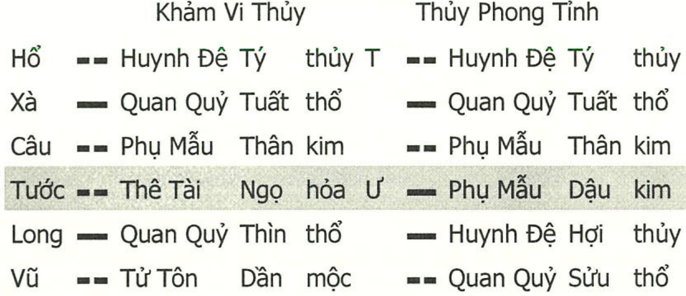
    - **Hình này chứng minh điều gì**
      - Lấy Phụ Mẫu làm Dụng thần.
    - **Từ đâu mà thấy được**
      - Nhìn vào hào 4 lâm Bạch Hổ, Bạch Hổ chủ bệnh, hào 4 là ngực, do đó bệnh ở trên phổi.
- **Quá trình suy luận và đối thoại ban đầu:**
  - Căn cứ suy luận: Quay lại xem kỹ quẻ này, có hai nguyên nhân Ngọ hỏa chưa thể khắc Dụng, một là Không Vong, hai là hóa Nguyệt phá.
  - Căn cứ suy luận: So sánh hai nguyên nhân, Ngọ hỏa vượng tướng, vượng không là Không, có đủ lực khắc Dụng thần.
  - Căn cứ suy luận: Nhưng bởi vì hóa Nguyệt phá, cần sang tháng mới có thể sản sinh lực khắc.
  - Căn cứ suy luận: Do đó đã ứng tại hào biến sang tháng bất phá.
- **Ứng nghiệm thực tế và diễn biến sự việc:**
  - Nhìn vào kết quả thực tế: Kết quả là qua đời ở giờ Tý ngày Giáp Tý tháng Tý.
- **Ngộ giải và bài học kinh nghiệm then chốt:**
  - Đúc rút quy luật thực chiến: Xem xét tổng thể ngũ hành, hào động và tâm thái người gieo quẻ.

### Quái lệ 2: Sơ đồ quẻ Địa Sơn Khiêm biến Địa Trạch Lâm
- **Bối cảnh & Dữ kiện chiêm bái:**
  - Dụng lâm Chu Tước được hỏa đến sinh, hỏa chủ ánh sáng, do đó đang tiếp nhận xạ trị.
  - Dụng lâm Không Vong hóa Nguyệt phá, đến tháng Tý hào biến sang tháng bất phá, lại có Tý thủy xung mất Nguyên thần Ngọ hỏa, e rằng có nỗi lo về tính mạng.
  - Kết quả là qua đời ở giờ Tý ngày Giáp Tý tháng Tý.
- Bảng quẻ Sơ đồ quẻ Địa Sơn Khiêm biến Địa Trạch Lâm:
  - **Hình 85.** Sơ đồ quẻ Địa Sơn Khiêm biến Địa Trạch Lâm
    - 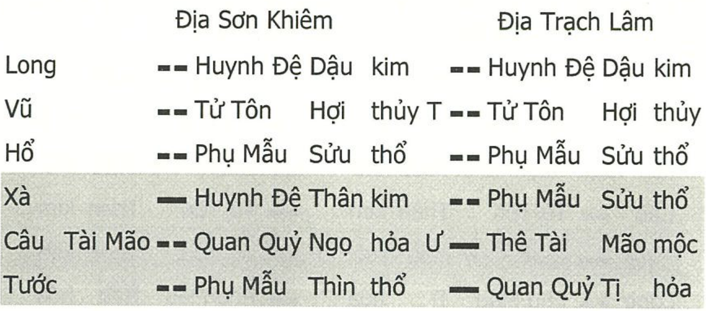
    - **Hình này chứng minh điều gì**
      - Lấy Phụ Mẫu làm Dụng thần.
    - **Từ đâu mà thấy được**
      - Nhìn vào hào 4 lâm Bạch Hổ, Bạch Hổ chủ bệnh, hào 4 là ngực, do đó bệnh ở trên phổi.
- **Quá trình suy luận và đối thoại ban đầu:**
  - Căn cứ suy luận: Tôi phán đoán là ở ngày Bính Thân có thể được thanh toán chi phí, nhưng không thuận lợi, có tranh cãi.
- **Ứng nghiệm thực tế và diễn biến sự việc:**
  - Nhìn vào kết quả thực tế: Trên thực tế là đã tìm kế toán thanh toán, hai bên đùn đẩy trách nhiệm qua lại, không chịu thanh toán, sau đó tìm trưởng phòng, trưởng phòng đã phê duyệt thanh toán ở ngày Bính Thân.
- **Ngộ giải và bài học kinh nghiệm then chốt:**
  - Đúc rút quy luật thực chiến: Xem xét tổng thể ngũ hành, hào động và tâm thái người gieo quẻ.

### Quái lệ 3: Sơ đồ quẻ Thủy Địa Tỷ biến Thủy Sơn Kiển
- **Bối cảnh & Dữ kiện chiêm bái:**
  - Trên thực tế là đã tìm kế toán thanh toán, hai bên đùn đẩy trách nhiệm qua lại, không chịu thanh toán, sau đó tìm trưởng phòng, trưởng phòng đã phê duyệt thanh toán ở ngày Bính Thân.
  - Anh ta hỏi tại sao đoán ở ngày Thân, tôi đã lý giải như sau.
  - Phụ Mẫu là hóa đơn, Phụ Mẫu Tị hỏa Nguyệt phá, có thể thực phá, cũng có thể đến ngày Thân hợp phá.
  - Được thanh toán thì có thể có tài trong tay, do đó cũng tham khảo hào Tài.
  - Hào Tài hưu tù, ngày Thân vừa đúng là ngày Trường Sinh của Tài, do đó ngày Thân hợp lý.
- Bảng quẻ Sơ đồ quẻ Thủy Địa Tỷ biến Thủy Sơn Kiển:
  - **Hình 86.** Sơ đồ quẻ Thủy Địa Tỷ biến Thủy Sơn Kiển
    - 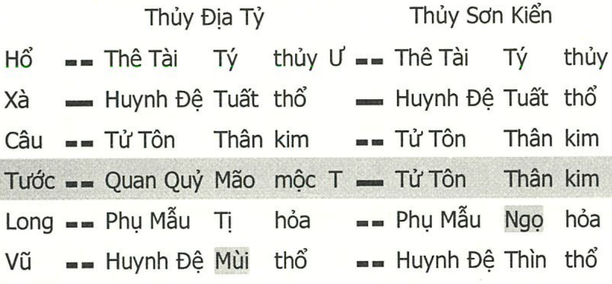
    - **Hình này chứng minh điều gì**
      - lấy Phụ Mẫu làm Dụng thần.
    - **Từ đâu mà thấy được**
      - Nhìn vào hào Thế, hào Ứng, Dụng thần và động hào trong bảng quẻ Sơ đồ quẻ Thủy Địa Tỷ biến Thủy Sơn Kiển.
- **Quá trình suy luận và đối thoại ban đầu:**
  - Căn cứ suy luận: Tôi phán đoán là ở ngày Bính Thân có thể được thanh toán chi phí, nhưng không thuận lợi, có tranh cãi.
- **Ứng nghiệm thực tế và diễn biến sự việc:**
  - Nhìn vào kết quả thực tế: Kết quả là ở ngày Bính Tuất tuyết mới rơi, dự đoán ứng kỳ đã sai số một ngày, không ứng xung mất hào biến mà đã ứng hợp hào biến.
- **Ngộ giải và bài học kinh nghiệm then chốt:**
  - Đúc rút quy luật thực chiến: Xem xét tổng thể ngũ hành, hào động và tâm thái người gieo quẻ.

### Quái lệ 4: Sơ đồ quẻ Trạch Sơn Hàm biến Trạch Hỏa Cách
- **Bối cảnh & Dữ kiện chiêm bái:**
  - Nhưng Nguyên thần Phụ Mẫu Ngọ hỏa Nguyệt phá, không ứng tại ngày Dậu của tháng này, cần sang tháng, tức là đến ngày Dậu của tháng Sửu mới là ngày tuyết rơi.
  - Ngày Dậu đầu tiên của tháng Sửu là ngày Ất Dậu, do đó phán đoán tuyết rơi ở ngày này.
  - Kết quả là ở ngày Bính Tuất tuyết mới rơi, dự đoán ứng kỳ đã sai số một ngày, không ứng xung mất hào biến mà đã ứng hợp hào biến.
  - Điều này cũng phù hợp với quái lý, hợp Mão mộc, Phụ Mẫu Thìn thổ không bị khắc nữa.
- Bảng quẻ Sơ đồ quẻ Trạch Sơn Hàm biến Trạch Hỏa Cách:
  - **Hình 87.** Sơ đồ quẻ Trạch Sơn Hàm biến Trạch Hỏa Cách
    - 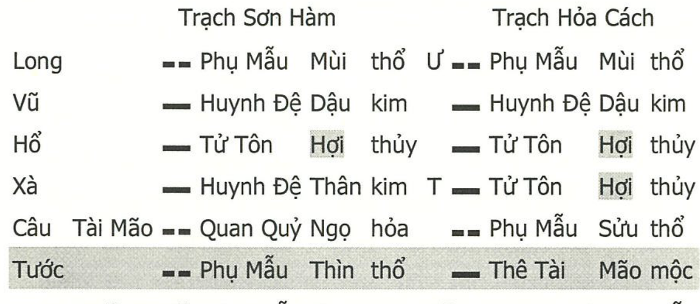
    - **Hình này chứng minh điều gì**
      - lấy Phụ Mẫu làm Dụng thần.
    - **Từ đâu mà thấy được**
      - Nhìn vào hào Thế, hào Ứng, Dụng thần và động hào trong bảng quẻ Sơ đồ quẻ Trạch Sơn Hàm biến Trạch Hỏa Cách.
- **Quá trình suy luận và đối thoại ban đầu:**
  - Căn cứ suy luận: Sau khi suy nghĩ một chút, tôi đoán rằng: Cha của người này sống chẳng bao lâu nữa, chết tại tháng Ngọ năm Giáp Tuất, phán đoán hoàn toàn chính xác.
- **Ứng nghiệm thực tế và diễn biến sự việc:**
  - Thực tế diễn biến kiểm chứng ứng kỳ và cát hung của quẻ chiêm.
- **Ngộ giải và bài học kinh nghiệm then chốt:**
  - Đúc rút quy luật thực chiến: Xem xét tổng thể ngũ hành, hào động và tâm thái người gieo quẻ.

### Quái lệ 5: Sơ đồ quẻ Lôi Hỏa Phong biến Địa Phong Thăng
- **Bối cảnh & Dữ kiện chiêm bái:**
  - Sau khi suy nghĩ một chút, tôi đoán rằng: Cha của người này sống chẳng bao lâu nữa, chết tại tháng Ngọ năm Giáp Tuất, phán đoán hoàn toàn chính xác.
  - Người đó hỏi tôi vì sao đoán như vậy?
- Bảng quẻ Sơ đồ quẻ Lôi Hỏa Phong biến Địa Phong Thăng:
  - **Hình 88.** Sơ đồ quẻ Lôi Hỏa Phong biến Địa Phong Thăng
    - 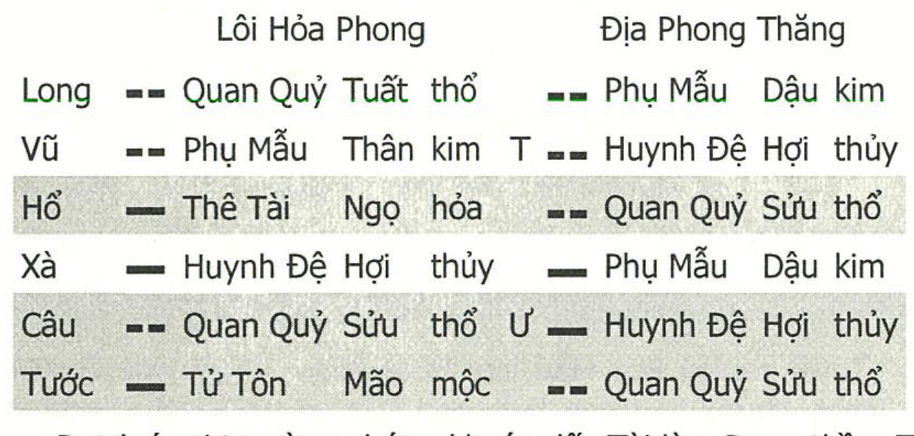
    - **Hình này chứng minh điều gì**
      - lấy Tài làm Dụng thần.
    - **Từ đâu mà thấy được**
      - Nhìn vào hào Thế, hào Ứng, Dụng thần và động hào trong bảng quẻ Sơ đồ quẻ Lôi Hỏa Phong biến Địa Phong Thăng.
- **Quá trình suy luận và đối thoại ban đầu:**
  - Căn cứ suy luận: Sau khi suy nghĩ một chút, tôi đoán rằng: Cha của người này sống chẳng bao lâu nữa, chết tại tháng Ngọ năm Giáp Tuất, phán đoán hoàn toàn chính xác.
- **Ứng nghiệm thực tế và diễn biến sự việc:**
  - Thực tế diễn biến kiểm chứng ứng kỳ và cát hung của quẻ chiêm.
- **Ngộ giải và bài học kinh nghiệm then chốt:**
  - Đúc rút quy luật thực chiến: Xem xét tổng thể ngũ hành, hào động và tâm thái người gieo quẻ.

### Quái lệ 6: Sơ đồ quẻ Địa Phong Thăng biến Thủy Sơn Kiển
- **Bối cảnh & Dữ kiện chiêm bái:**
  - Chiêm đoán theo bảng quẻ Sơ đồ quẻ Địa Phong Thăng biến Thủy Sơn Kiển trong thực tiễn.
- Bảng quẻ Sơ đồ quẻ Địa Phong Thăng biến Thủy Sơn Kiển:
  - **Hình 89.** Sơ đồ quẻ Địa Phong Thăng biến Thủy Sơn Kiển
    - 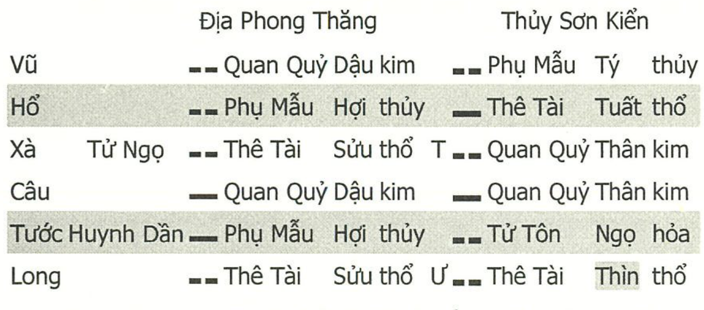
    - **Hình này chứng minh điều gì**
      - Lấy Phụ Mẫu làm Dụng thần.
    - **Từ đâu mà thấy được**
      - Nhìn vào hào Thế, hào Ứng, Dụng thần và động hào trong bảng quẻ Sơ đồ quẻ Địa Phong Thăng biến Thủy Sơn Kiển.
- **Quá trình suy luận và đối thoại ban đầu:**
  - Tác giả phân tích cấu trúc hào tượng, Dụng thần và các yếu tố sinh khắc trong quẻ Sơ đồ quẻ Địa Phong Thăng biến Thủy Sơn Kiển.
- **Ứng nghiệm thực tế và diễn biến sự việc:**
  - Thực tế diễn biến kiểm chứng ứng kỳ và cát hung của quẻ chiêm.
- **Ngộ giải và bài học kinh nghiệm then chốt:**
  - Đúc rút quy luật thực chiến: Xem xét tổng thể ngũ hành, hào động và tâm thái người gieo quẻ.

### Tổng kết chuyên đề và bài học tâm đắc
- **Huyền cơ cốt lõi rút ra từ các quái lệ:**
  - Tôi xem như sau: Lấy Phụ Mẫu làm Dụng thần.
  - Phụ Mẫu lưỡng hiện, thông thường lấy hào 5 tôn vị Phụ Mẫu Hợi thủy làm Dụng.
  - Phụ Mẫu bị Nguyệt khắc, Nhật lại không sinh, động hóa hồi đầu khắc, nhất định là hung.
  - Hung khi nào?
  - Dụng hóa ra Tuất thổ vừa đúng là Thái Tuế của năm thứ hai, do đó ứng tại năm Giáp Tuất.
  - Nhưng quẻ này rất kỳ lạ, một hào Phụ Mẫu khác cũng động, hóa ra Tử Tôn Ngọ hỏa, hào động này nhìn từ góc độ cát hung thì không có ý nghĩa gì, hào hóa ra của hào động phía trên đã ứng thông tin lưu niên không tốt, vậy thì hào biến của hào động phía dưới này nhất định là biểu thị tháng, do đó đoán là chết ở tháng Ngọ.

## 24. Người Chết Và Người Sống

- **Tổng quan nguyên lý & bối cảnh chuyên đề:**
  - Trên mặt bà lão đã lộ ra vẻ vui mừng: "Cháu vẫn còn sống chứ?"
  - "Còn sống, yên tâm nhé." Tôi đáp.
  - Sau khi đoán xong, bà lão muốn cho tiền nhưng tôi đã nhẹ nhàng từ chối. Bà lão vui vẻ trở về.
### Ví dụ 1: Vào năm 04
- **Bối cảnh & Dữ kiện chiêm bái:**
  - **Ví dụ 1:** Vào năm 04, vừa mới qua Kinh Trập không lâu, có một bà lão hơn 70 tuổi đến từ quê tôi nói là cháu của mình đã mất tích gần một tháng, tìm khắp nơi cũng không thấy, hỏi khi nào có thể tìm được?
  - Ở ngày Ất Dậu tháng Mão, được Phong Thủy Hoán biến Tốn Vi Phong.
  - Sau khi xem quẻ, tôi đã nói với bà lão: "Không nên sốt ruột, đến hướng Tây Bắc tìm, trước Thanh Minh, cháu sẽ xuất hiện ở hướng đó, xuất hiện bên cạnh một cây cầu.
  - Thời gian cụ thể là ngày 8 tháng 2 nhuận âm lịch, tôi đã tra lịch vạn niên và cho bà lão biết thời gian cụ thể.
  - Sau khi đoán xong, bà lão muốn cho tiền nhưng tôi đã nhẹ nhàng từ chối.
- Bảng quẻ Quẻ Phong Thủy Hoán biến Tốn Vi Phong:
  - **Hình 90.** Quẻ Phong Thủy Hoán biến Tốn Vi Phong
    - 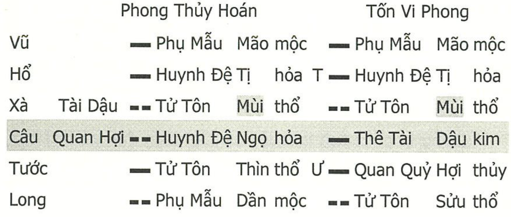
    - **Hình này chứng minh điều gì**
      - lấy Tử Tôn làm Dụng thần, trong quẻ Tử Tôn lưỡng hiện, lấy Tử Tôn Mùi thổ Không Vong làm Dụng.
    - **Từ đâu mà thấy được**
      - Nhìn vào hào 6 Mão mộc ám động lại đến khắc, không cát.
- **Quá trình suy luận và đối thoại ban đầu:**
  - Căn cứ suy luận: Hiện tại đã tìm được đứa trẻ, địa điểm và thời gian tôi phán đoán đều đúng, nhưng về vấn đề sinh tử đã xuất hiện sai lầm.
  - Căn cứ suy luận: Dựa vào hoàn cảnh tìm được đứa trẻ, phỏng đoán lúc đứa trẻ và con chó chạy lên cây cầu này, khi đứa trẻ với tay bắt con chó, con chó chạy thoát, đứa trẻ đã bổ nhào xuống dưới cầu.
  - Căn cứ suy luận: Nguyên thần mặc dù động sinh Tử Tôn, nhưng bản thân Nguyên thần cũng hóa Tử địa, Không mà không thể dẫn hóa khắc của Mão mộc, Mão ở trong quẻ thể hiện Nguyệt kiến, do đó Ngọ hỏa hoàn toàn không có quyền dẫn hóa Mão mộc, cho nên tìm được cũng không thể là còn sống.
  - Căn cứ suy luận: Tử Tôn Mùi thổ Không Vong lâm Trình Xà được sinh, Trình Xà chủ chết, biểu thị kết quả tìm được là người đã chết.
  - Đối thoại thực tế: Sau khi xem quẻ, tôi đã nói với bà lão: "Không nên sốt ruột, đến hướng Tây Bắc tìm, trước Thanh Minh, cháu sẽ xuất hiện ở hướng đó, xuất hiện bên cạnh một cây cầu.
  - Đối thoại thực tế: Trên mặt bà lão đã lộ ra vẻ vui mừng: "Cháu vẫn còn sống chứ?"
  - Đối thoại thực tế: "Còn sống, yên tâm nhé." Tôi đáp.
- **Ứng nghiệm thực tế và diễn biến sự việc:**
  - Nhìn vào kết quả thực tế: Khi gần đến Thanh Minh, bà lão đã gọi đến nói rằng ở ngày 8 tháng 2 nhuận, người nhà đã tìm thấy cháu dưới một cây cầu ở hướng Tây Bắc, nhưng cháu không còn sống mà đã chết.
  - Nhìn vào kết quả thực tế: Tôi nghe xong thì vô cùng sửng sốt, tại sao không nhìn ra đứa trẻ đã chết nhỉ?
  - Nhìn vào kết quả thực tế: Tại sao kết quả tìm thấy là thi thể nhỉ?
  - Nhìn vào kết quả thực tế: Tử Tôn Tử tại Nguyệt kiến, lại gặp Tử địa Mão mộc ám động, thì biểu thị đứa trẻ đã chết.
  - Nhìn vào kết quả thực tế: Tử Tôn Mùi thổ Không Vong lâm Trình Xà được sinh, Trình Xà chủ chết, biểu thị kết quả tìm được là người đã chết.
- **Ngộ giải và bài học kinh nghiệm then chốt:**
  - Đúc rút quy luật thực chiến: Xem xét tổng thể ngũ hành, hào động và tâm thái người gieo quẻ.

### Ví dụ 2: Ngày Giáp Dần tháng Dần
- **Bối cảnh & Dữ kiện chiêm bái:**
  - Khi gần đến Thanh Minh, bà lão đã gọi đến nói rằng ở ngày 8 tháng 2 nhuận, người nhà đã tìm thấy cháu dưới một cây cầu ở hướng Tây Bắc, nhưng cháu không còn sống mà đã chết.
  - Tôi nghe xong thì vô cùng sửng sốt, tại sao không nhìn ra đứa trẻ đã chết nhỉ?
  - Nhưng Ngọ hỏa Không Vong, xuất Không mới có thể tìm được.
  - Ngày Giáp Ngọ xuất Không, nhưng Tử Tôn Thìn thổ bước vào Không Vong, hào trạch Tử Tôn Không Vong không thể về nhà, do đó phải là tại tuần Giáp Thìn, ngày Ngọ Kỵ thần Không Vong, cũng chính là ngày Bính Ngọ tìm được.
  - Nguyên thần Ngọ hỏa động mà sinh Tử Tôn chính là nơi tìm được đứa trẻ.
- Bảng quẻ Quẻ Thiên Lôi Vô Vọng:
  - **Hình 91.** Quẻ Thiên Lôi Vô Vọng
    - 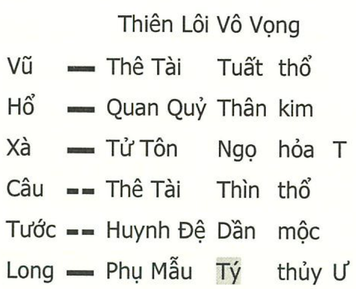
    - **Hình này chứng minh điều gì**
      - lấy Tử Tôn làm Dụng thần, trong quẻ Tử Tôn lưỡng hiện, lấy Tử Tôn Mùi thổ Không Vong làm Dụng.
    - **Từ đâu mà thấy được**
      - Nhìn vào hào 6 Mão mộc ám động lại đến khắc, không cát.
- **Quá trình suy luận và đối thoại ban đầu:**
  - Căn cứ suy luận: Hiện tại đã tìm được đứa trẻ, địa điểm và thời gian tôi phán đoán đều đúng, nhưng về vấn đề sinh tử đã xuất hiện sai lầm.
  - Căn cứ suy luận: Dựa vào hoàn cảnh tìm được đứa trẻ, phỏng đoán lúc đứa trẻ và con chó chạy lên cây cầu này, khi đứa trẻ với tay bắt con chó, con chó chạy thoát, đứa trẻ đã bổ nhào xuống dưới cầu.
  - Căn cứ suy luận: Nguyên thần mặc dù động sinh Tử Tôn, nhưng bản thân Nguyên thần cũng hóa Tử địa, Không mà không thể dẫn hóa khắc của Mão mộc, Mão ở trong quẻ thể hiện Nguyệt kiến, do đó Ngọ hỏa hoàn toàn không có quyền dẫn hóa Mão mộc, cho nên tìm được cũng không thể là còn sống.
  - Căn cứ suy luận: Tử Tôn Mùi thổ Không Vong lâm Trình Xà được sinh, Trình Xà chủ chết, biểu thị kết quả tìm được là người đã chết.
  - Căn cứ suy luận: Tôi thấy hào 5 Quan lâm Trình Xà gặp tam hình, Trình Xà chủ bất an, cho nên phán đoán lãnh đạo này gần đây tâm trạng không tốt.
  - Đối thoại thực tế: Cô ấy trả lời: "Lãnh đạo của chúng tôi đang nhập viện, đã bị ung thư.
  - Đối thoại thực tế: Ước chừng khi nào?" Tôi thấy Quan Quỷ Nguyệt phá, ứng thực phá, do đó phán đoán là ở Lập Thu.
  - Đối thoại thực tế: Bèn nói với anh ta: "Hỏi lãnh đạo thì có thể đòi được tiền, nhưng hai ngày tới thì chưa đòi được."
  - Đối thoại thực tế: Mối quan hệ giữa tôi và ông ấy rất tốt, ông ấy không thể không cho." Anh ta hỏi.
- **Ứng nghiệm thực tế và diễn biến sự việc:**
  - Nhìn vào kết quả thực tế: Kết quả, ngày Nhâm Tý tháng Mùi, còn 6 ngày đến Lập Thu, lãnh đạo của đơn vị cô ấy đã qua đời.
- **Ngộ giải và bài học kinh nghiệm then chốt:**
  - Đúc rút quy luật thực chiến: Xem xét tổng thể ngũ hành, hào động và tâm thái người gieo quẻ.

### Ví dụ 3: Một người đàn ông làm bảo vệ ở một đơn vị
- **Bối cảnh & Dữ kiện chiêm bái:**
  - Cô ấy trả lời: "Lãnh đạo của chúng tôi đang nhập viện, đã bị ung thư.
  - Có vẻ như sắp chết rồi.
  - Ước chừng khi nào?" Tôi thấy Quan Quỷ Nguyệt phá, ứng thực phá, do đó phán đoán là ở Lập Thu.
  - Kết quả, ngày Nhâm Tý tháng Mùi, còn 6 ngày đến Lập Thu, lãnh đạo của đơn vị cô ấy đã qua đời.
  - **Ví dụ 3:** Một người đàn ông làm bảo vệ ở một đơn vị, anh ta có mối quan hệ rất tốt với giám đốc, công việc của anh ta cũng là sự chiếu cố đặc biệt của giám đốc.
- Bảng quẻ Quẻ Phong Địa Quan biến Trạch Địa Tụy:
  - **Hình 92.** Quẻ Phong Địa Quan biến Trạch Địa Tụy
    - 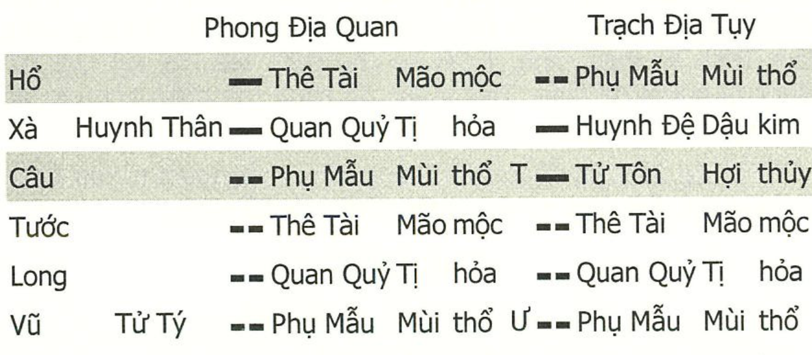
    - **Hình này chứng minh điều gì**
      - Lấy Phụ Mẫu làm Dụng thần.
    - **Từ đâu mà thấy được**
      - Nhìn vào hào 5 Quan lâm Trình Xà gặp tam hình, Trình Xà chủ bất an, cho nên phán đoán lãnh đạo này gần đây tâm trạng không tốt.
- **Quá trình suy luận và đối thoại ban đầu:**
  - Căn cứ suy luận: Tôi thấy hào 5 Quan lâm Trình Xà gặp tam hình, Trình Xà chủ bất an, cho nên phán đoán lãnh đạo này gần đây tâm trạng không tốt.
  - Đối thoại thực tế: Cô ấy trả lời: "Lãnh đạo của chúng tôi đang nhập viện, đã bị ung thư.
  - Đối thoại thực tế: Ước chừng khi nào?" Tôi thấy Quan Quỷ Nguyệt phá, ứng thực phá, do đó phán đoán là ở Lập Thu.
  - Đối thoại thực tế: Bèn nói với anh ta: "Hỏi lãnh đạo thì có thể đòi được tiền, nhưng hai ngày tới thì chưa đòi được."
  - Đối thoại thực tế: Mối quan hệ giữa tôi và ông ấy rất tốt, ông ấy không thể không cho." Anh ta hỏi.
  - Đối thoại thực tế: "Không thể nào, ông ấy ít khi có lúc không vui, không chuyện gì có thể làm khó được ông ấy.
- **Ứng nghiệm thực tế và diễn biến sự việc:**
  - Nhìn vào kết quả thực tế: Ứng cũng là đối phương, tôi thấy Tài lâm Bạch Hổ động khắc Phụ Mẫu trên Ứng, người xưa nói: "Tài lâm Hổ động phó âm chí" (thư báo tang đến)", Bạch Hổ chủ tang, lại là Tử địa, vượng mà khắc Phụ Mẫu trên Ứng, nhất định là trong nhà lãnh đạo có trưởng bối đã qua đời.
  - Nhìn vào kết quả thực tế: Người này lập tức gọi điện thoại cho lãnh đạo, kết quả là lãnh đạo không ở đơn vị, nói là cha qua đời, đã về quê chịu tang.
- **Ngộ giải và bài học kinh nghiệm then chốt:**
  - Đúc rút quy luật thực chiến: Xem xét tổng thể ngũ hành, hào động và tâm thái người gieo quẻ.

### Ví dụ 4: Một người đàn ông thỉnh cầu đoán về mẹ mất tích
- **Bối cảnh & Dữ kiện chiêm bái:**
  - "Không thể nào, ông ấy ít khi có lúc không vui, không chuyện gì có thể làm khó được ông ấy.
  - Ông ấy có thể có chuyện gì được nhỉ?" Anh ta lại hỏi.
  - Ứng cũng là đối phương, tôi thấy Tài lâm Bạch Hổ động khắc Phụ Mẫu trên Ứng, người xưa nói: "Tài lâm Hổ động phó âm chí" (thư báo tang đến)", Bạch Hổ chủ tang, lại là Tử địa, vượng mà khắc Phụ Mẫu trên Ứng, nhất định là trong nhà lãnh đạo có trưởng bối đã qua đời.
  - Liền nói với người này phán đoán của tôi.
  - Người này lập tức gọi điện thoại cho lãnh đạo, kết quả là lãnh đạo không ở đơn vị, nói là cha qua đời, đã về quê chịu tang.
- Bảng quẻ Sơ đồ quẻ Thiên Hỏa Đồng Nhân biến Thiên Thủy Tụng:
  - **Hình 93.** Sơ đồ quẻ Thiên Hỏa Đồng Nhân biến Thiên Thủy Tụng
    - 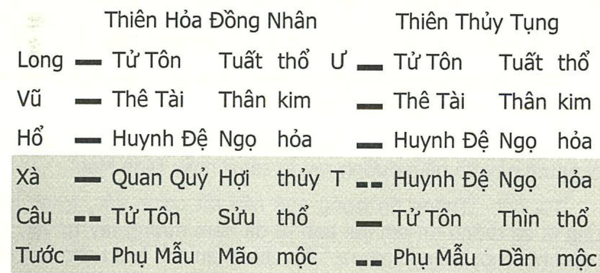
    - **Hình này chứng minh điều gì**
      - Lấy Phụ Mẫu làm Dụng thần.
    - **Từ đâu mà thấy được**
      - Nhìn vào hào Thế, hào Ứng, Dụng thần và động hào trong bảng quẻ Sơ đồ quẻ Thiên Hỏa Đồng Nhân biến Thiên Thủy Tụng.
- **Quá trình suy luận và đối thoại ban đầu:**
  - Tác giả phân tích cấu trúc hào tượng, Dụng thần và các yếu tố sinh khắc trong quẻ Sơ đồ quẻ Thiên Hỏa Đồng Nhân biến Thiên Thủy Tụng.
  - Đối thoại thực tế: "Không thể nào, ông ấy ít khi có lúc không vui, không chuyện gì có thể làm khó được ông ấy.
  - Đối thoại thực tế: Ông ấy có thể có chuyện gì được nhỉ?" Anh ta lại hỏi.
  - Đối thoại thực tế: Ứng cũng là đối phương, tôi thấy Tài lâm Bạch Hổ động khắc Phụ Mẫu trên Ứng, người xưa nói: "Tài lâm Hổ động phó âm chí" (thư báo tang đến)", Bạch Hổ chủ tang, lại là Tử địa, vượng mà khắc Phụ Mẫu trên Ứng, nhất định là trong nhà lãnh đạo có trưởng bối đã qua đời.
  - Đối thoại thực tế: Tôi xem quẻ này liền đoán rằng: "Em gái của người này sẽ không trở về, sợ rằng đã tự sát."
  - Đối thoại thực tế: Ông ta kinh ngạc hỏi: "Làm sao ông biết được điều này?
- **Ứng nghiệm thực tế và diễn biến sự việc:**
  - Thực tế diễn biến kiểm chứng ứng kỳ và cát hung của quẻ chiêm.
- **Ngộ giải và bài học kinh nghiệm then chốt:**
  - Đúc rút quy luật thực chiến: Xem xét tổng thể ngũ hành, hào động và tâm thái người gieo quẻ.

### Quái lệ 5: Sơ đồ quẻ Hỏa Sơn Lữ biến Càn Vi Thiên
- **Bối cảnh & Dữ kiện chiêm bái:**
  - **Ví dụ 5:** Năm 2001, Trương Kiến Hoa tiên sinh ở hội nghiên cứu Chu Dịch Đường Sơn đến thăm tôi, ông ta đã lấy ra một quái lệ và mời tôi xem, ngày Canh Thân tháng Mùi năm Đinh Sửu, đoán xem em gái bỏ đi ngày nào về?
  - Được Hỏa Sơn Lữ biến Càn Vi Thiên.
  - Tôi xem quẻ này liền đoán rằng: "Em gái của người này sẽ không trở về, sợ rằng đã tự sát."
  - Ông ta kinh ngạc hỏi: "Làm sao ông biết được điều này?
  - Em gái người này đã nằm đường ray tự sát ở ngày Đinh Mùi."
- Bảng quẻ Sơ đồ quẻ Hỏa Sơn Lữ biến Càn Vi Thiên:
  - **Hình 94.** Sơ đồ quẻ Hỏa Sơn Lữ biến Càn Vi Thiên
    - 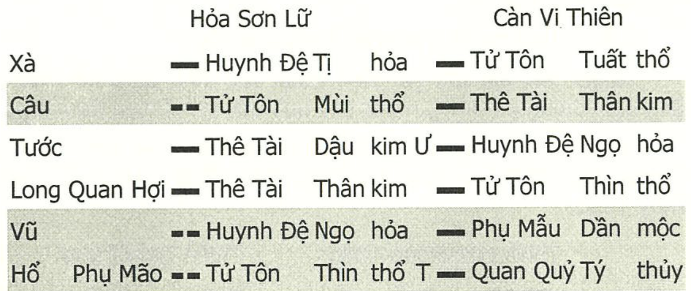
    - **Hình này chứng minh điều gì**
      - lấy hào Huynh Đệ làm Dụng thần, trong quẻ Huynh Đệ lưỡng hiện, phải lấy hào Huynh Đệ Ngọ hỏa phát động làm Dụng thần.
    - **Từ đâu mà thấy được**
      - Nhìn vào hào 5 Mùi thổ động mà hợp, khiến Dụng thần tham hợp quên sinh, chứng tỏ bản thân em gái không muốn trở về.
- **Quá trình suy luận và đối thoại ban đầu:**
  - Căn cứ suy luận: Quẻ này lấy Huynh Đệ làm Dụng thần, Huynh Đệ mặc dù được Nguyệt sinh, nhưng bị Nhật khắc, lại thêm Thế khắc Dụng thần người khó về.
  - Căn cứ suy luận: Quẻ này thuộc về độc phát, hào độc phát là Tử địa Dụng thần, cho nên người đã chết, sẽ không trở về.
  - Đối thoại thực tế: Tôi xem quẻ này liền đoán rằng: "Em gái của người này sẽ không trở về, sợ rằng đã tự sát."
  - Đối thoại thực tế: Ông ta kinh ngạc hỏi: "Làm sao ông biết được điều này?
  - Đối thoại thực tế: Em gái người này đã nằm đường ray tự sát ở ngày Đinh Mùi."
  - Đối thoại thực tế: Tôi nói: "Thông tin trong quẻ này rất chính xác, trong quẻ đúng là có thông tin em gái anh ta đã nằm đường ray tự sát, chỉ là tôi nhất thời không nhìn ra." Tôi liền phân tích lý do cho ông ta.
- **Ứng nghiệm thực tế và diễn biến sự việc:**
  - Nhìn vào kết quả thực tế: Tôi đoán rằng: Anh trai người này sẽ không trở về, đã chết ở bên ngoài.
  - Nhìn vào kết quả thực tế: Quẻ này thuộc về độc phát, hào độc phát là Tử địa Dụng thần, cho nên người đã chết, sẽ không trở về.
- **Ngộ giải và bài học kinh nghiệm then chốt:**
  - Đúc rút quy luật thực chiến: Xem xét tổng thể ngũ hành, hào động và tâm thái người gieo quẻ.

### Tổng kết chuyên đề và bài học tâm đắc
- **Huyền cơ cốt lõi rút ra từ các quái lệ:**
  - Dụng thần lâm Huyền Vũ, Huyền Vũ chủ u uất, cho thấy người này tâm trạng u uất, rất không thoải mái.
  - Nhưng thể hiện tư duy và tâm trạng của một người còn có Nguyên thần.
  - Quẻ này Nguyên thần bất thượng quái, Tuyệt ở Nhật, nhập Mộ ở hào 5, Tử ở Dụng thần, chứng tỏ tư duy của người này đã đi vào ngõ cụt, Nguyên thần Tử ở Dụng thần, là bản thân muốn chết, Nguyên thần gặp một trong Tử, Mộ, Tuyệt chính là tổ hợp tự sát.
  - Huống chi quẻ này Nguyên thần đầy đủ Tử, Mộ, Tuyệt.
  - Nguyên thần nhập Mộ ở hào 5, Dụng thần lại tương hợp với hào 5, hào 5 là đường, chính là người tự sát trên đường, sẽ không trở về.
  - **Ví dụ 6:** Một Dịch hữu đã hỏi tôi quẻ này, nói là có một người hỏi, anh trai của người đó là một tài xế taxi, anh trai đi xa không trở về đúng hạn, xem khi nào về.
  - Ở ngày Nhâm Tuất tháng Thân, được Địa Hỏa Minh Di biến Địa Sơn Khiêm.
  - Tôi đoán rằng: Anh trai người này sẽ không trở về, đã chết ở bên ngoài.
  - Vị Dịch hữu hồi đáp: Anh trai người này lái xe đi xa đã gần nửa năm, đến nay cả bóng dáng của xe và người đều không thấy.
  - Quẻ này lấy Huynh Đệ làm Dụng thần, Huynh Đệ mặc dù được Nguyệt sinh, nhưng bị Nhật khắc, lại thêm Thế khắc Dụng thần người khó về.
  - Quẻ này thuộc về độc phát, hào độc phát là Tử địa Dụng thần, cho nên người đã chết, sẽ không trở về.

## 25. Rốt Cuộc Dụng Thần Là Gì?

- **Tổng quan nguyên lý & bối cảnh chuyên đề:**
  - Trong quẻ hào Tài lưỡng hiện, dựa vào quy luật chọn Dụng thần thông thường, tôi lấy hào phát động Thê Tài Mùi thổ làm Dụng thần, Dụng thần được Nguyệt tỉ phù, lại có hào Ứng phát động đến sinh, do đó phán đoán có thể thành.
  - Tài ở trên Thế, thể hiện trong lòng anh ta đang nghĩ đến nữ giáo viên này, động mà đi hợp hào Ứng, là mình chủ động theo đuổi đối phương. Mà hào Ứng động mà sinh hợp Thế, lẽ ra đối phương ưng thuận anh ta mới đúng, lục hợp biến lục hợp, cũng là thông tin có thể thành. Nhưng tại sao đã xuất hiện kết quả bị từ chối? Đúng là không hiểu được. Trong một thời gian rất dài tôi không lý giải được nguyên nhân đoán sai quẻ này.
  - Sau này tôi nghĩ, trong quẻ này Tài là Mùi thổ phát động, phải chăng bởi vì ở trên Thế nên thể hiện người hỏi quẻ, không thể dùng để thể hiện nữ giáo viên này mà phải lấy Tuất thổ làm Dụng thần? Nếu lấy Tuất thổ làm Dụng thần, thì Tuất thổ này Nguyệt phá, Nguyên thần bị hợp không thể sinh Tuất thổ, đối phương sẽ không đồng ý. Một vấn đề quan trọng nữa là nữ giáo viên này đã kết hôn ở năm Nhâm Ngọ. Nhưng từ quẻ này tôi hoàn toàn không thấy được điều này.
  - Nếu lấy hào Tài Mùi thổ làm Dụng, Dụng lâm Chu Tước, có phần dính dáng đến thân phận của đối phương, mà Phụ Mẫu phục dưới, lại hóa ra Phụ Mẫu, có thông tin đã kết hôn. Phục mà bị xung ra, chính là ứng năm Ngọ. Nếu lấy hào Tài Tuất thổ để phán đoán thì không nhìn ra được những điều này. Do đó thấy rằng vẫn là phán đoán bằng hào phát động thì thông tin nhiều hơn so với hào tĩnh.
### Ví dụ 1: Một vị bằng hữu thích dự đoán đang học nghiên cứu sinh
- **Bối cảnh & Dữ kiện chiêm bái:**
  - **Ví dụ 1:** Một vị bằng hữu thích dự đoán đang học nghiên cứu sinh, anh ta thích một nữ giáo viên trong trường, mỗi ngày nhắn tin cho người ta, nhưng đối phương đã phớt lờ anh ta, bèn đoán có thể thành người yêu với nữ giáo viên này hay không?
  - Ngày Bính Tý tháng Thìn, gieo được Lôi Địa Dự biến Địa Lôi Phục.
  - Nhưng ở giờ Ngọ ngày Mậu Tý, nữ giáo viên này đã gọi đến từ chối sự theo đuổi của anh ta.
  - Khiến tôi cảm thấy quẻ này rất khó hiểu.
  - Tài ở trên Thế, thể hiện trong lòng anh ta đang nghĩ đến nữ giáo viên này, động mà đi hợp hào Ứng, là mình chủ động theo đuổi đối phương.
- Bảng quẻ Quẻ Khôn Vi Địa biến Địa Sơn Khiêm:
  - **Hình 95.** Quẻ Khôn Vi Địa biến Địa Sơn Khiêm
    - 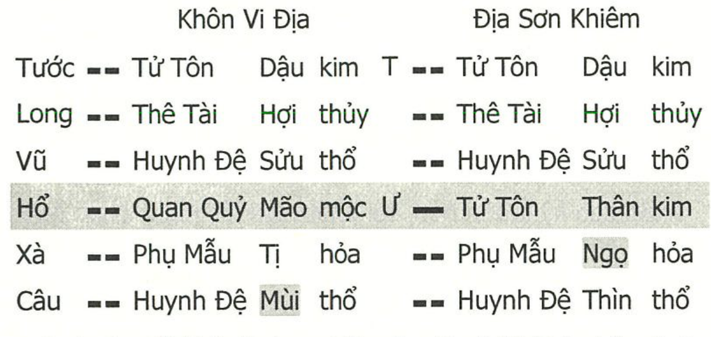
    - **Hình này chứng minh điều gì**
      - Bảng quẻ Quẻ Khôn Vi Địa biến Địa Sơn Khiêm phản ánh sự phối chiếu hào vị, ngũ hành và động biến minh chứng cho vấn đề chiêm đoán.
    - **Từ đâu mà thấy được**
      - Nhìn vào Hào 5 Phụ Mẫu Thân kim độc phát hóa Tiến thần.
- **Quá trình suy luận và đối thoại ban đầu:**
  - Căn cứ suy luận: Tài ở trên Thế, thể hiện trong lòng anh ta đang nghĩ đến nữ giáo viên này, động mà đi hợp hào Ứng, là mình chủ động theo đuổi đối phương.
  - Căn cứ suy luận: Mà hào Ứng động mà sinh hợp Thế, lẽ ra đối phương ưng thuận anh ta mới đúng, lục hợp biến lục hợp, cũng là thông tin có thể thành.
  - Căn cứ suy luận: Sau này tôi nghĩ, trong quẻ này Tài là Mùi thổ phát động, phải chăng bởi vì ở trên Thế nên thể hiện người hỏi quẻ, không thể dùng để thể hiện nữ giáo viên này mà phải lấy Tuất thổ làm Dụng thần?
  - Căn cứ suy luận: Nếu lấy Tuất thổ làm Dụng thần, thì Tuất thổ này Nguyệt phá, Nguyên thần bị hợp không thể sinh Tuất thổ, đối phương sẽ không đồng ý.
  - Căn cứ suy luận: Phân tích kỹ lưỡng hơn, tôi phát hiện lúc phán đoán quẻ này đã bỏ qua ảnh hưởng của Nhật đối với Nguyên thần.
  - Căn cứ suy luận: Nguyên thần lâm hào Ứng, phản ánh ra thái độ của đối phương.
  - Đối thoại thực tế: Sách cổ nói rằng: "Thủy mộc nghi tầm căn¹", cũng tức là dự đoán sự việc dài hạn cần phải xem Nguyên thần, không thể chỉ xem Dụng thần.
- **Ứng nghiệm thực tế và diễn biến sự việc:**
  - Thực tế diễn biến kiểm chứng ứng kỳ và cát hung của quẻ chiêm.
- **Ngộ giải và bài học kinh nghiệm then chốt:**
  - Đúc rút quy luật thực chiến: Xem xét tổng thể ngũ hành, hào động và tâm thái người gieo quẻ.

### Quái lệ 2: Quẻ Lôi Hỏa Phong biến Trạch Hỏa Cách
- **Bối cảnh & Dữ kiện chiêm bái:**
  - Chiêm đoán theo bảng quẻ Quẻ Lôi Hỏa Phong biến Trạch Hỏa Cách trong thực tiễn.
- Bảng quẻ Quẻ Lôi Hỏa Phong biến Trạch Hỏa Cách:
  - **Hình 96.** Quẻ Lôi Hỏa Phong biến Trạch Hỏa Cách
    - 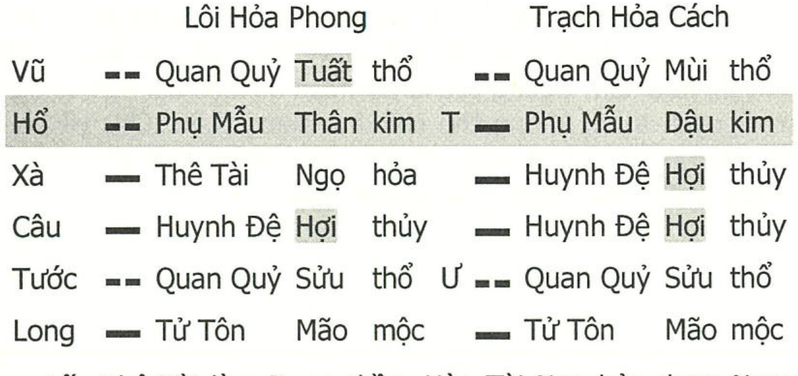
    - **Hình này chứng minh điều gì**
      - Quẻ này mặc dù Tài được Nguyệt phù, nhưng hào độc phát khắc Tuyệt Nguyên thần, lành ít dữ nhiều.
    - **Từ đâu mà thấy được**
      - Nhìn vào hào Thế, hào Ứng, Dụng thần và động hào trong bảng quẻ Quẻ Lôi Hỏa Phong biến Trạch Hỏa Cách.
- **Quá trình suy luận và đối thoại ban đầu:**
  - Căn cứ suy luận: **Ví dụ 3:** Một cụ già ở đơn vị đã bị bệnh nhiều năm, gần đây đã nhập viện bởi vì bệnh tình nghiêm trọng, ngày Ất Sửu tháng Ngọ, đoán cát hung của người đó, được Phong Lôi Ích biến Phong Hỏa Gia Nhân.
- **Ứng nghiệm thực tế và diễn biến sự việc:**
  - Nhìn vào kết quả thực tế: Kết quả là vợ anh ta đã qua đời vì ung thư phổi ở ngày Giáp Tuất tháng đó.
- **Ngộ giải và bài học kinh nghiệm then chốt:**
  - Đúc rút quy luật thực chiến: Xem xét tổng thể ngũ hành, hào động và tâm thái người gieo quẻ.

### Ví dụ 3: Một cụ già ở đơn vị đã bị bệnh nhiều năm
- **Bối cảnh & Dữ kiện chiêm bái:**
  - Kết quả là vợ anh ta đã qua đời vì ung thư phổi ở ngày Giáp Tuất tháng đó.
  - **Ví dụ 3:** Một cụ già ở đơn vị đã bị bệnh nhiều năm, gần đây đã nhập viện bởi vì bệnh tình nghiêm trọng, ngày Ất Sửu tháng Ngọ, đoán cát hung của người đó, được Phong Lôi Ích biến Phong Hỏa Gia Nhân.
- Bảng quẻ Sơ đồ quẻ Phong Lôi Ích biến Phong Hỏa Gia Nhân:
  - **Hình 97.** Sơ đồ quẻ Phong Lôi Ích biến Phong Hỏa Gia Nhân
    - 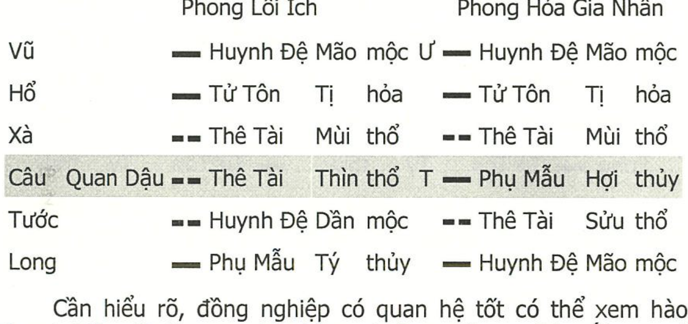
    - **Hình này chứng minh điều gì**
      - Lấy hào Tài làm Dụng thần.
    - **Từ đâu mà thấy được**
      - Nhìn vào hào Thế, hào Ứng, Dụng thần và động hào trong bảng quẻ Sơ đồ quẻ Phong Lôi Ích biến Phong Hỏa Gia Nhân.
- **Quá trình suy luận và đối thoại ban đầu:**
  - Căn cứ suy luận: **Ví dụ 3:** Một cụ già ở đơn vị đã bị bệnh nhiều năm, gần đây đã nhập viện bởi vì bệnh tình nghiêm trọng, ngày Ất Sửu tháng Ngọ, đoán cát hung của người đó, được Phong Lôi Ích biến Phong Hỏa Gia Nhân.
  - Căn cứ suy luận: Dụng thần là mộc, được Nhật sinh, chứng tỏ bạn gái dáng người cao, bởi vì mộc chủ cao to, vượng lại chủ cao to.
- **Ứng nghiệm thực tế và diễn biến sự việc:**
  - Nhìn vào kết quả thực tế: Kết quả là đã qua đời ở giờ Mão ngày Đinh Mão.
  - Nhìn vào kết quả thực tế: Sau này hai người không kết hôn và đã chia tay.
- **Ngộ giải và bài học kinh nghiệm then chốt:**
  - Đúc rút quy luật thực chiến: Xem xét tổng thể ngũ hành, hào động và tâm thái người gieo quẻ.

### Ví dụ 4: Một người đàn ông hỏi mình và bạn gái có thể kết hôn hay khô
- **Bối cảnh & Dữ kiện chiêm bái:**
  - **Ví dụ 4:** Một người đàn ông hỏi mình và bạn gái có thể kết hôn hay không?
  - Ngày Ất Hợi tháng Ngọ, được Càn Vi Thiên biến Trạch Thiên Quải.
  - Sau này hai người không kết hôn và đã chia tay.
- Bảng quẻ Sơ đồ quẻ Càn Vi Thiên biến Trạch Thiên Quải:
  - **Hình 98.** Sơ đồ quẻ Càn Vi Thiên biến Trạch Thiên Quải
    - 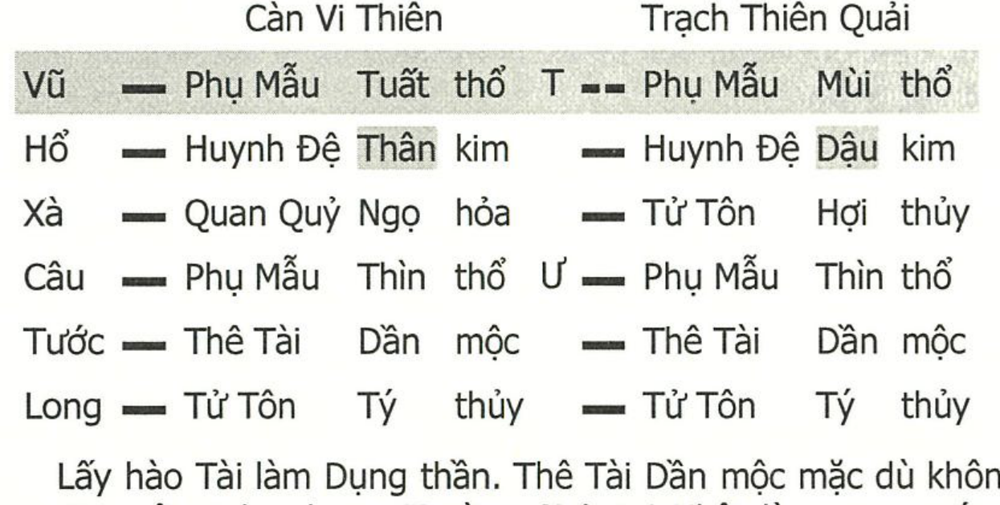
    - **Hình này chứng minh điều gì**
      - Lấy hào Tài làm Dụng thần.
    - **Từ đâu mà thấy được**
      - Nhìn vào hào Thế, hào Ứng, Dụng thần và động hào trong bảng quẻ Sơ đồ quẻ Càn Vi Thiên biến Trạch Thiên Quải.
- **Quá trình suy luận và đối thoại ban đầu:**
  - Căn cứ suy luận: Dụng thần là mộc, được Nhật sinh, chứng tỏ bạn gái dáng người cao, bởi vì mộc chủ cao to, vượng lại chủ cao to.
- **Ứng nghiệm thực tế và diễn biến sự việc:**
  - Thực tế diễn biến kiểm chứng ứng kỳ và cát hung của quẻ chiêm.
- **Ngộ giải và bài học kinh nghiệm then chốt:**
  - Đúc rút quy luật thực chiến: Xem xét tổng thể ngũ hành, hào động và tâm thái người gieo quẻ.

## 26. Thông Tin Lao Ngục Là Gì?

- **Tổng quan nguyên lý & bối cảnh chuyên đề:**
  - Một người không tự mình phạm tội thì sẽ không có tai họa lao ngục, nhưng cũng có không ít người bị vu cáo mà rơi vào vòng lao lý, tai bay vạ gió này cũng là chuyện thường xuyên xảy ra. Làm sao nhìn ra những thông tin này từ trong quẻ, trong sách cổ không trình bày chi tiết, do đó chúng ta cần phải tìm tòi những quy luật này trong dự đoán thực tiễn. Từ trong quẻ của một số người, tôi đã từng đoán ra không ít thông tin lao ngục, nhưng trong quẻ của một số người, tôi lại không nhìn ra được, do đó tôi công bố một số quái lệ ở đây để cùng mọi người khám phá những tổ hợp quy luật này.
  - Thông tin lao ngục tương đối rõ ràng chủ yếu có một số đặc điểm sau đây: 1, Liên quan mật thiết với Chu Tước, Chu Tước thể hiện quan ti khẩu thiệt. 2, Liên quan khá mật thiết với Câu Trần, Câu Trần thể hiện lao ngục, nha môn. 3, Liên quan khá mật thiết với Trình Xà, Trình Xà thể hiện dây thừng. 4, Liên quan mật thiết với Mộ khố, Mộ khố biểu thị mất tự do. 5, Liên quan mật thiết với hình, hình thể hiện hình ngục. 6, Liên quan khá mật thiết với Quan Quỷ, Quan Quỷ thể hiện tai họa, nha dịch. Dụng thần rất sợ Quan Quỷ hoặc Kỵ thần lâm Câu Trần, Trình Xà, Chu Tước đến khắc, đến hợp, đến mộ, đến hình, chỉ cần có những tổ hợp này, tai họa lao ngục có thể phát sinh.
  - Bởi vì quẻ này không hỏi tai họa, do đó đã không nghĩ về lao ngục.
  - Khi đó thấy Quan Quỷ phát động, tôi phán đoán là có tiểu nhân phá đám, trở lực cải cách rất lớn, Thế lâm Trình Xà, lại Không Vong, tâm trạng không tốt, cải cách khiến mình không được yên ổn. Tài trên Thế Không, nhà máy thuốc hiện đang thiếu vốn. Nhật đến xung Thế, có người bên ngoài giúp đỡ có thể huy động được vốn.
### Quái lệ 1: Sơ đồ quẻ Thủy Trạch Tiết biến Thủy Thiên Nhu
- **Bối cảnh & Dữ kiện chiêm bái:**
  - Một người không tự mình phạm tội thì sẽ không có tai họa lao ngục, nhưng cũng có không ít người bị vu cáo mà rơi vào vòng lao lý, tai bay vạ gió này cũng là chuyện thường xuyên xảy ra.
  - Làm sao nhìn ra những thông tin này từ trong quẻ, trong sách cổ không trình bày chi tiết, do đó chúng ta cần phải tìm tòi những quy luật này trong dự đoán thực tiễn.
  - Từ trong quẻ của một số người, tôi đã từng đoán ra không ít thông tin lao ngục, nhưng trong quẻ của một số người, tôi lại không nhìn ra được, do đó tôi công bố một số quái lệ ở đây để cùng mọi người khám phá những tổ hợp quy luật này.
  - Dưới đây là một quẻ của một người yêu thích Dịch học đã gieo khi đến Thái Nguyên tìm tôi, ba tháng sau thì người này đã bị hãm hại mà vào tù, nhưng tôi lại không nhìn ra được sự kiện lớn như vậy, thật là hổ thẹn.
  - Chỉ hận mình học nghệ chưa tinh.
- Bảng quẻ Sơ đồ quẻ Thủy Trạch Tiết biến Thủy Thiên Nhu:
  - **Hình 99.** Sơ đồ quẻ Thủy Trạch Tiết biến Thủy Thiên Nhu
    - 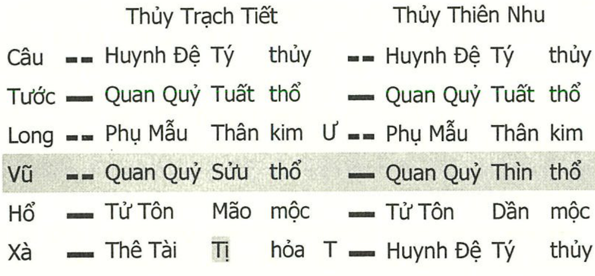
    - **Hình này chứng minh điều gì**
      - Bảng quẻ Sơ đồ quẻ Thủy Trạch Tiết biến Thủy Thiên Nhu phản ánh sự phối chiếu hào vị, ngũ hành và động biến minh chứng cho vấn đề chiêm đoán.
    - **Từ đâu mà thấy được**
      - Nhìn vào hào Thế, hào Ứng, Dụng thần và động hào trong bảng quẻ Sơ đồ quẻ Thủy Trạch Tiết biến Thủy Thiên Nhu.
- **Quá trình suy luận và đối thoại ban đầu:**
  - Căn cứ suy luận: Bởi vì quẻ này không hỏi tai họa, do đó đã không nghĩ về lao ngục.
  - Căn cứ suy luận: Khi đó thấy Quan Quỷ phát động, tôi phán đoán là có tiểu nhân phá đám, trở lực cải cách rất lớn, Thế lâm Trình Xà, lại Không Vong, tâm trạng không tốt, cải cách khiến mình không được yên ổn.
- **Ứng nghiệm thực tế và diễn biến sự việc:**
  - Thực tế diễn biến kiểm chứng ứng kỳ và cát hung của quẻ chiêm.
- **Ngộ giải và bài học kinh nghiệm then chốt:**
  - Đúc rút quy luật thực chiến: Xem xét tổng thể ngũ hành, hào động và tâm thái người gieo quẻ.

### Ví dụ 2: Đây là quẻ của một người dự đoán thăng chức ở năm 04
- **Bối cảnh & Dữ kiện chiêm bái:**
  - **Ví dụ 2:** Đây là quẻ của một người dự đoán thăng chức ở năm 04.
  - Ngày Canh Dần tháng Tuất, được Phong Trạch Trung Phu biến Phong Lôi Ích.
  - Dự đoán quan vận, lấy Quan Quỷ làm Dụng, Quan Quỷ lâm Nhật vốn vượng tướng là cát.
  - Nhưng không nên phát động khắc Thế, Thế và Nguyệt kiến tương hình lâm Chu Tước, lại dựa vào phương pháp di thần, hào 2 mượn Trình Xà trên Quan hào 6, Trình Xà chủ dây thừng, do đó tổng hợp phán đoán, không những không được thăng chức mà còn đề phòng có tai họa lao ngục.
  - May mà Quan động hóa thoái, có thể chuyển nguy thành an.
- Bảng quẻ Quẻ Phong Trạch Trung Phu biến Phong Lôi Ích:
  - **Hình 100.** Quẻ Phong Trạch Trung Phu biến Phong Lôi Ích
    - 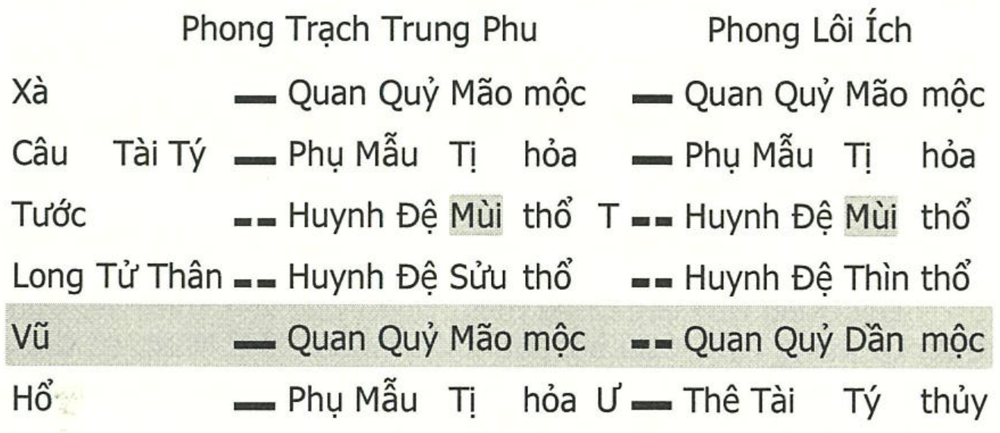
    - **Hình này chứng minh điều gì**
      - Lấy Quan Quỷ làm Dụng thần.
    - **Từ đâu mà thấy được**
      - Nhìn vào hào Thế, hào Ứng, Dụng thần và động hào trong bảng quẻ Quẻ Phong Trạch Trung Phu biến Phong Lôi Ích.
- **Quá trình suy luận và đối thoại ban đầu:**
  - Tác giả phân tích cấu trúc hào tượng, Dụng thần và các yếu tố sinh khắc trong quẻ Quẻ Phong Trạch Trung Phu biến Phong Lôi Ích.
- **Ứng nghiệm thực tế và diễn biến sự việc:**
  - Thực tế diễn biến kiểm chứng ứng kỳ và cát hung của quẻ chiêm.
- **Ngộ giải và bài học kinh nghiệm then chốt:**
  - Đúc rút quy luật thực chiến: Xem xét tổng thể ngũ hành, hào động và tâm thái người gieo quẻ.

### Quái lệ 3: Quẻ Thủy Phong Tỉnh biến Khảm Vi Thủy
- **Bối cảnh & Dữ kiện chiêm bái:**
  - Đến tháng Tý, bạn gái của anh ta tìm tôi dự đoán cát hung cho anh ta.
  - Ngày Đinh Sửu tháng Tý, được Thủy Phong Tỉnh biến Khảm Vi Thủy.
  - Ngày hôm sau, bản thân anh ta lại đến đoán vì chuyện này, ngày Mậu Dần tháng Tý, được Lôi Địa Dự biến Khôn Vi Địa.
- Bảng quẻ Quẻ Thủy Phong Tỉnh biến Khảm Vi Thủy:
  - **Hình 101.** Quẻ Thủy Phong Tỉnh biến Khảm Vi Thủy
    - 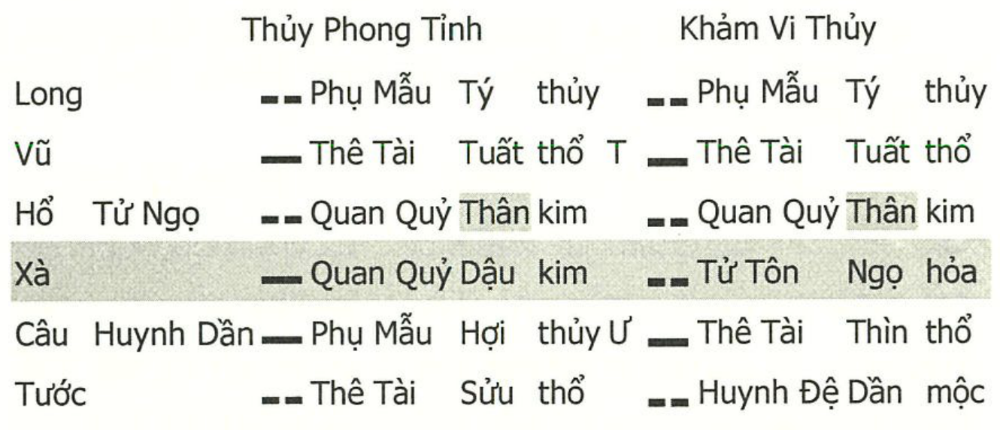
    - **Hình này chứng minh điều gì**
      - Lấy Quan Quỷ làm Dụng thần.
    - **Từ đâu mà thấy được**
      - Nhìn vào hào Thế, hào Ứng, Dụng thần và động hào trong bảng quẻ Quẻ Thủy Phong Tỉnh biến Khảm Vi Thủy.
- **Quá trình suy luận và đối thoại ban đầu:**
  - Tác giả phân tích cấu trúc hào tượng, Dụng thần và các yếu tố sinh khắc trong quẻ Quẻ Thủy Phong Tỉnh biến Khảm Vi Thủy.
- **Ứng nghiệm thực tế và diễn biến sự việc:**
  - Thực tế diễn biến kiểm chứng ứng kỳ và cát hung của quẻ chiêm.
- **Ngộ giải và bài học kinh nghiệm then chốt:**
  - Đúc rút quy luật thực chiến: Xem xét tổng thể ngũ hành, hào động và tâm thái người gieo quẻ.

### Quái lệ 4: Quẻ Lôi Địa Dự biến Khôn Vi Địa
- **Bối cảnh & Dữ kiện chiêm bái:**
  - Chiêm đoán theo bảng quẻ Quẻ Lôi Địa Dự biến Khôn Vi Địa trong thực tiễn.
- Bảng quẻ Quẻ Lôi Địa Dự biến Khôn Vi Địa:
  - **Hình 102.** Quẻ Lôi Địa Dự biến Khôn Vi Địa
    - 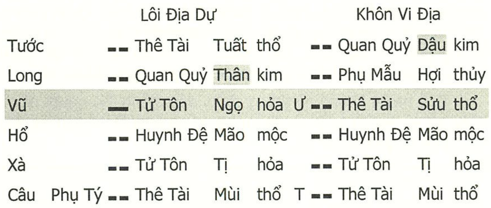
    - **Hình này chứng minh điều gì**
      - Bảng quẻ Quẻ Lôi Địa Dự biến Khôn Vi Địa phản ánh sự phối chiếu hào vị, ngũ hành và động biến minh chứng cho vấn đề chiêm đoán.
    - **Từ đâu mà thấy được**
      - Nhìn vào hào Thế, hào Ứng, Dụng thần và động hào trong bảng quẻ Quẻ Lôi Địa Dự biến Khôn Vi Địa.
- **Quá trình suy luận và đối thoại ban đầu:**
  - Căn cứ suy luận: Dựa vào phương pháp di thần, hào Thế lại lâm Trình Xà, hào Thế hóa Tài bị Quan tinh trên Nguyệt xung phá, Trình Xà là dây thừng, chuyện phiền phức, tháng Ngọ hào Thế thực phá, đề phòng có quan phi triền thân, Thế động hóa Tài, quan phi phát sinh bởi vì chuyện tài vụ.
- **Ứng nghiệm thực tế và diễn biến sự việc:**
  - Thực tế diễn biến kiểm chứng ứng kỳ và cát hung của quẻ chiêm.
- **Ngộ giải và bài học kinh nghiệm then chốt:**
  - Đúc rút quy luật thực chiến: Xem xét tổng thể ngũ hành, hào động và tâm thái người gieo quẻ.

### Quái lệ 5: Quẻ Hỏa Thủy Vị Tế biến Hỏa Sơn Lữ
- **Bối cảnh & Dữ kiện chiêm bái:**
  - Kết quả, tháng Ngọ bị người tố cáo là tài vụ có vấn đề, bị đình chức thẩm tra hai tháng, cuối cùng không điều tra ra vấn đề gì.
- Bảng quẻ Quẻ Hỏa Thủy Vị Tế biến Hỏa Sơn Lữ:
  - **Hình 103.** Quẻ Hỏa Thủy Vị Tế biến Hỏa Sơn Lữ
    - 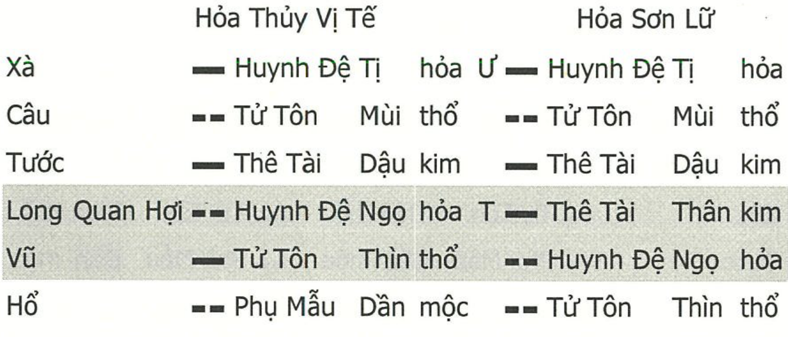
    - **Hình này chứng minh điều gì**
      - Lấy Phụ Mẫu làm Dụng thần.
    - **Từ đâu mà thấy được**
      - Nhìn vào hào 6 Huynh Đệ Tị hỏa động đến hình Dụng thần, biểu thị mẹ anh ta đã phạm án[^1].
- **Quá trình suy luận và đối thoại ban đầu:**
  - Căn cứ suy luận: Dựa vào phương pháp di thần, hào Thế lại lâm Trình Xà, hào Thế hóa Tài bị Quan tinh trên Nguyệt xung phá, Trình Xà là dây thừng, chuyện phiền phức, tháng Ngọ hào Thế thực phá, đề phòng có quan phi triền thân, Thế động hóa Tài, quan phi phát sinh bởi vì chuyện tài vụ.
  - Căn cứ suy luận: Tị hỏa lâm Thanh Long hóa Tài đến hình, Thanh Long chủ tài, hào Tài lại chủ tài, chứng tỏ đã phạm án bởi vì vấn đề kinh tế.
  - Căn cứ suy luận: Lâm hào Ứng, Ứng là người khác, là bởi vì vấn đề kinh tế của người khác đã liên lụy đến mẹ anh ta.
  - Căn cứ suy luận: Quả nhiên là bởi vì mẹ anh ta đang nhậm chức ở một công ty cá nhân, công ty bị nghi ngờ lừa đảo, mẹ anh ta nghe tin lập tức bỏ trốn, năm 04 bị bắt, bị kết án 4 năm tù.
- **Ứng nghiệm thực tế và diễn biến sự việc:**
  - Thực tế diễn biến kiểm chứng ứng kỳ và cát hung của quẻ chiêm.
- **Ngộ giải và bài học kinh nghiệm then chốt:**
  - Đúc rút quy luật thực chiến: Xem xét tổng thể ngũ hành, hào động và tâm thái người gieo quẻ.

### Quái lệ 6: Quẻ Hỏa Thủy Vị Tế biến Địa Thủy Sư
- **Bối cảnh & Dữ kiện chiêm bái:**
  - Tị hỏa lâm Thanh Long hóa Tài đến hình, Thanh Long chủ tài, hào Tài lại chủ tài, chứng tỏ đã phạm án bởi vì vấn đề kinh tế.
  - Lâm hào Ứng, Ứng là người khác, là bởi vì vấn đề kinh tế của người khác đã liên lụy đến mẹ anh ta.
  - Quả nhiên là bởi vì mẹ anh ta đang nhậm chức ở một công ty cá nhân, công ty bị nghi ngờ lừa đảo, mẹ anh ta nghe tin lập tức bỏ trốn, năm 04 bị bắt, bị kết án 4 năm tù.
- Bảng quẻ Quẻ Hỏa Thủy Vị Tế biến Địa Thủy Sư:
  - **Hình 104.** Quẻ Hỏa Thủy Vị Tế biến Địa Thủy Sư
    - 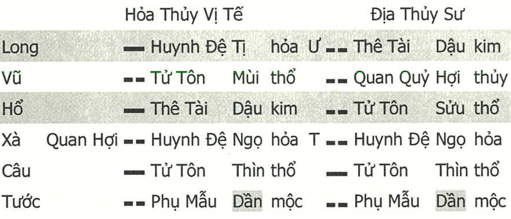
    - **Hình này chứng minh điều gì**
      - Lấy Phụ Mẫu làm Dụng thần.
    - **Từ đâu mà thấy được**
      - Nhìn vào hào 6 Huynh Đệ Tị hỏa động đến hình Dụng thần, biểu thị mẹ anh ta đã phạm án[^1].
- **Quá trình suy luận và đối thoại ban đầu:**
  - Căn cứ suy luận: Tị hỏa lâm Thanh Long hóa Tài đến hình, Thanh Long chủ tài, hào Tài lại chủ tài, chứng tỏ đã phạm án bởi vì vấn đề kinh tế.
  - Căn cứ suy luận: Lâm hào Ứng, Ứng là người khác, là bởi vì vấn đề kinh tế của người khác đã liên lụy đến mẹ anh ta.
  - Căn cứ suy luận: Quả nhiên là bởi vì mẹ anh ta đang nhậm chức ở một công ty cá nhân, công ty bị nghi ngờ lừa đảo, mẹ anh ta nghe tin lập tức bỏ trốn, năm 04 bị bắt, bị kết án 4 năm tù.
  - Căn cứ suy luận: Lúc đó người này không tin, bởi vì anh ta vừa mới được thăng chức đang đắc ý.
- **Ứng nghiệm thực tế và diễn biến sự việc:**
  - Nhìn vào kết quả thực tế: Kết quả là vào tù ở tháng Mão năm thứ hai, ba tháng sau mới được thả ra.
- **Ngộ giải và bài học kinh nghiệm then chốt:**
  - Đúc rút quy luật thực chiến: Xem xét tổng thể ngũ hành, hào động và tâm thái người gieo quẻ.

### Quái lệ 7: Quẻ Khảm Vi Thủy biến Trạch Thủy Khốn
- **Bối cảnh & Dữ kiện chiêm bái:**
  - Lúc đó người này không tin, bởi vì anh ta vừa mới được thăng chức đang đắc ý.
  - Kết quả là vào tù ở tháng Mão năm thứ hai, ba tháng sau mới được thả ra.
- Bảng quẻ Quẻ Khảm Vi Thủy biến Trạch Thủy Khốn:
  - **Hình 105.** Quẻ Khảm Vi Thủy biến Trạch Thủy Khốn
    - 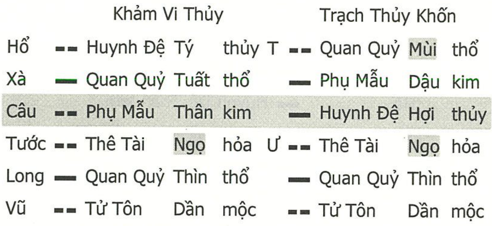
    - **Hình này chứng minh điều gì**
      - lấy hào Huynh Đệ Thân kim ám động làm Dụng thần.
    - **Từ đâu mà thấy được**
      - Nhìn vào hào Thế, hào Ứng, Dụng thần và động hào trong bảng quẻ Quẻ Khảm Vi Thủy biến Trạch Thủy Khốn.
- **Quá trình suy luận và đối thoại ban đầu:**
  - Căn cứ suy luận: Lúc đó người này không tin, bởi vì anh ta vừa mới được thăng chức đang đắc ý.
  - Đối thoại thực tế: Tôi xem qua và đoán ngay: "Em trai người này đã vào tù vì vụ án kinh tế."
  - Đối thoại thực tế: Anh ta rất kinh ngạc hỏi: "Đúng là như vậy, làm sao nhìn ra được điều này?"
  - Đối thoại thực tế: Tôi trả lời: "Huynh Đệ là Dụng thần, Huynh Đệ lưỡng hiện, lấy hào Huynh Đệ Thân kim ám động làm Dụng thần.
  - Đối thoại thực tế: Đây là quẻ tĩnh, hào vượng tướng có thể khắc hào hưu tù, Quan Quỷ Ngọ hỏa vượng mà lâm Trình Xà khắc Dụng thần, Trình Xà chủ dây thừng, cho nên đã vào tù."
- **Ứng nghiệm thực tế và diễn biến sự việc:**
  - Thực tế diễn biến kiểm chứng ứng kỳ và cát hung của quẻ chiêm.
- **Ngộ giải và bài học kinh nghiệm then chốt:**
  - Đúc rút quy luật thực chiến: Xem xét tổng thể ngũ hành, hào động và tâm thái người gieo quẻ.

### Quái lệ 8: Quẻ Thiên Phong Cấu
- **Bối cảnh & Dữ kiện chiêm bái:**
  - Tôi xem qua và đoán ngay: "Em trai người này đã vào tù vì vụ án kinh tế."
  - Anh ta rất kinh ngạc hỏi: "Đúng là như vậy, làm sao nhìn ra được điều này?"
  - Trong quẻ này Nguyên thần Sửu thổ Không Vong, sau đó em trai người này bị tuyên án 12 năm, năm Mùi được ra.
  - Đã ứng năm xung thực Sửu thổ.
- Bảng quẻ Quẻ Thiên Phong Cấu:
  - **Hình 106.** Quẻ Thiên Phong Cấu
    - 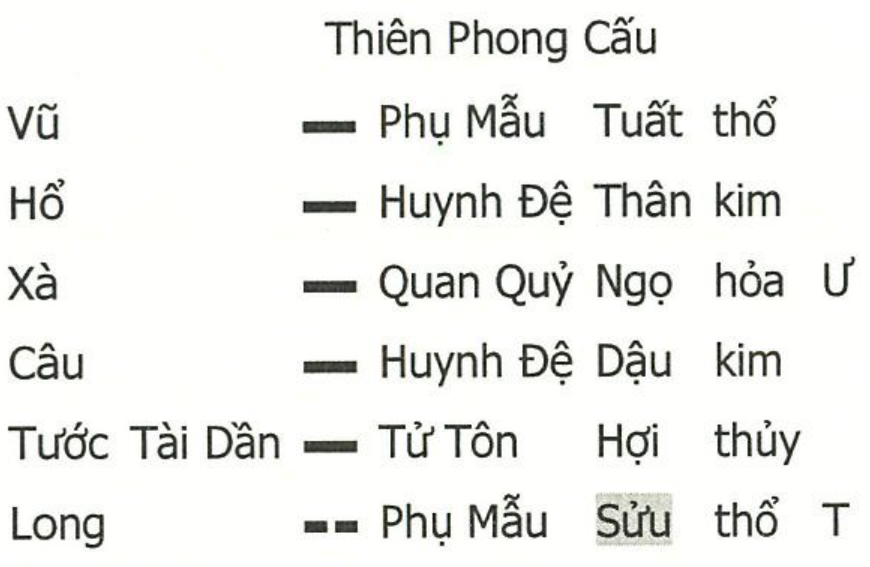
    - **Hình này chứng minh điều gì**
      - lấy hào Huynh Đệ Thân kim ám động làm Dụng thần.
    - **Từ đâu mà thấy được**
      - Nhìn vào hào Thế, hào Ứng, Dụng thần và động hào trong bảng quẻ Quẻ Thiên Phong Cấu.
- **Quá trình suy luận và đối thoại ban đầu:**
  - Tác giả phân tích cấu trúc hào tượng, Dụng thần và các yếu tố sinh khắc trong quẻ Quẻ Thiên Phong Cấu.
  - Đối thoại thực tế: Tôi xem qua và đoán ngay: "Em trai người này đã vào tù vì vụ án kinh tế."
  - Đối thoại thực tế: Anh ta rất kinh ngạc hỏi: "Đúng là như vậy, làm sao nhìn ra được điều này?"
  - Đối thoại thực tế: Tôi trả lời: "Huynh Đệ là Dụng thần, Huynh Đệ lưỡng hiện, lấy hào Huynh Đệ Thân kim ám động làm Dụng thần.
  - Đối thoại thực tế: Đây là quẻ tĩnh, hào vượng tướng có thể khắc hào hưu tù, Quan Quỷ Ngọ hỏa vượng mà lâm Trình Xà khắc Dụng thần, Trình Xà chủ dây thừng, cho nên đã vào tù."
- **Ứng nghiệm thực tế và diễn biến sự việc:**
  - Thực tế diễn biến kiểm chứng ứng kỳ và cát hung của quẻ chiêm.
- **Ngộ giải và bài học kinh nghiệm then chốt:**
  - Đúc rút quy luật thực chiến: Xem xét tổng thể ngũ hành, hào động và tâm thái người gieo quẻ.

### Quái lệ 9: Quẻ Địa Trạch Lâm biến Sơn Trạch Tổn
- **Bối cảnh & Dữ kiện chiêm bái:**
  - Lấy Tử Tôn làm Dụng thần. Tử Tôn độc phát lâm Câu Trần, tự mang hình, bị Quan trên Nhật đến xung, lại động mà hóa Quan, là đã gặp quan, do đó phán đoán con cô ta đã vào tù. Tử Tôn hưu tù Nhật Nguyệt không phù, Không động mà hóa Quỷ, hóa Tuyệt, lành ít dữ nhiều. Người phụ nữ này muốn tìm người nộp tiền bảo lãnh con trai, nhưng không thành công, đã bị phán tử hình.
- Bảng quẻ Quẻ Địa Trạch Lâm biến Sơn Trạch Tổn:
  - **Hình 107.** Quẻ Địa Trạch Lâm biến Sơn Trạch Tổn
    - 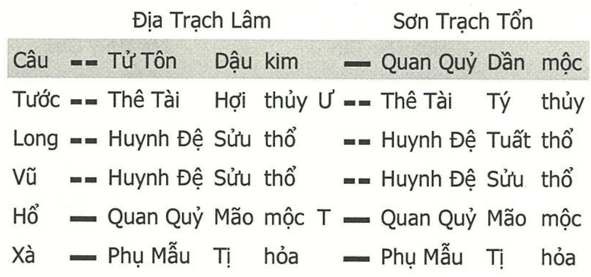
    - **Hình này chứng minh điều gì**
      - Lấy Tử Tôn làm Dụng thần.
    - **Từ đâu mà thấy được**
      - Nhìn vào Hào 2 Quan Quỷ Tị hỏa lâm Thanh Long, biểu thị chồng cô ấy là một nhân viên công vụ, là cán bộ nhà nước.
- **Quá trình suy luận và đối thoại ban đầu:**
  - Căn cứ suy luận: Hào 6 Quan Quỷ Tị hỏa động mà hóa Mộ, hào 6 là hào vị thoái hưu, nhập Mộ biểu thị mất tự do, chính là hiện nay có người không cho chồng cô ấy làm việc, đã hạn chế tự do thân thể, do đó tôi phán đoán chồng cô ấy đã bị bắt để điều tra.
- **Ứng nghiệm thực tế và diễn biến sự việc:**
  - Thực tế diễn biến kiểm chứng ứng kỳ và cát hung của quẻ chiêm.
- **Ngộ giải và bài học kinh nghiệm then chốt:**
  - Đúc rút quy luật thực chiến: Xem xét tổng thể ngũ hành, hào động và tâm thái người gieo quẻ.

### Quái lệ 10: Quẻ Hỏa Địa Tấn biến Lôi Thủy Giải
- **Bối cảnh & Dữ kiện chiêm bái:**
  - Quan được Nhật sinh, Nguyệt lại không khắc, vấn đề không lớn, tháng Thìn xung khai Mộ khố thì có thể ra.
  - Quả nhiên ở tháng Thìn vô tội được phóng thích.
- Bảng quẻ Quẻ Hỏa Địa Tấn biến Lôi Thủy Giải:
  - **Hình 108.** Quẻ Hỏa Địa Tấn biến Lôi Thủy Giải
    - 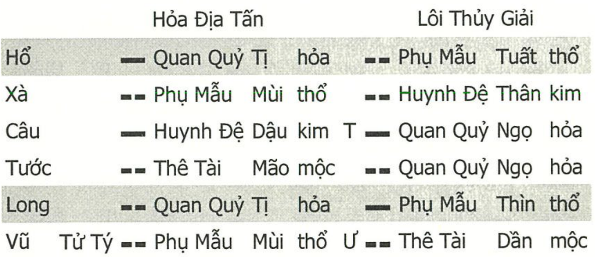
    - **Hình này chứng minh điều gì**
      - Lấy Quan Quỷ làm Dụng thần.
    - **Từ đâu mà thấy được**
      - Nhìn vào Hào 2 Quan Quỷ Tị hỏa lâm Thanh Long, biểu thị chồng cô ấy là một nhân viên công vụ, là cán bộ nhà nước.
- **Quá trình suy luận và đối thoại ban đầu:**
  - Căn cứ suy luận: Hào 6 Quan Quỷ Tị hỏa động mà hóa Mộ, hào 6 là hào vị thoái hưu, nhập Mộ biểu thị mất tự do, chính là hiện nay có người không cho chồng cô ấy làm việc, đã hạn chế tự do thân thể, do đó tôi phán đoán chồng cô ấy đã bị bắt để điều tra.
- **Ứng nghiệm thực tế và diễn biến sự việc:**
  - Nhìn vào kết quả thực tế: Kết quả là người này đã bị bắt để điều tra ngay buổi chiều ngày hôm đó.
- **Ngộ giải và bài học kinh nghiệm then chốt:**
  - Đúc rút quy luật thực chiến: Xem xét tổng thể ngũ hành, hào động và tâm thái người gieo quẻ.

### Ví dụ 9: Một người đã bị cách chức
- **Bối cảnh & Dữ kiện chiêm bái:**
  - **Ví dụ 9:** Một người đã bị cách chức, hỏi mình có thể được phục hồi chức vụ hay không?
  - Ở ngày Quý Sửu tháng Thìn, được Hỏa Phong Đỉnh biến Thiên Phong Cấu.
  - Kết quả là người này đã bị bắt để điều tra ngay buổi chiều ngày hôm đó.
- Bảng quẻ Sơ đồ quẻ Hỏa Phong Đỉnh biến Thiên Phong Cấu:
  - **Hình 109.** Sơ đồ quẻ Hỏa Phong Đỉnh biến Thiên Phong Cấu
    - 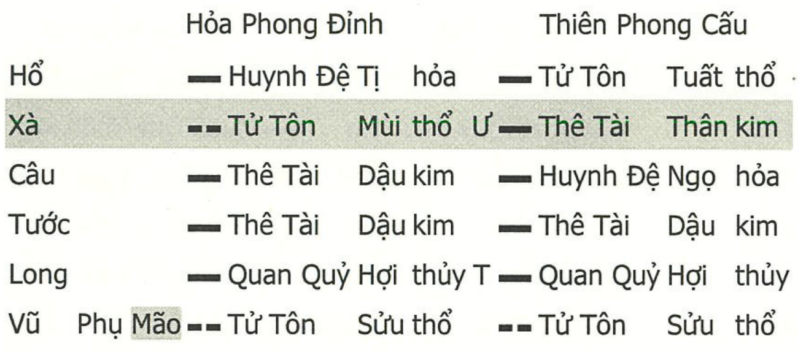
    - **Hình này chứng minh điều gì**
      - Lấy Quan Quỷ làm Dụng thần, Dụng thần tại hào 5, hào 5 là đường, chính là hiển thị thông tin giữa đường.
    - **Từ đâu mà thấy được**
      - Nhìn vào hào Thế, hào Ứng, Dụng thần và động hào trong bảng quẻ Sơ đồ quẻ Hỏa Phong Đỉnh biến Thiên Phong Cấu.
- **Quá trình suy luận và đối thoại ban đầu:**
  - Tác giả phân tích cấu trúc hào tượng, Dụng thần và các yếu tố sinh khắc trong quẻ Sơ đồ quẻ Hỏa Phong Đỉnh biến Thiên Phong Cấu.
- **Ứng nghiệm thực tế và diễn biến sự việc:**
  - Nhìn vào kết quả thực tế: Trên thực tế, chồng cô ấy khi đi công tác đã bị bắt bởi vì mua dâm.
- **Ngộ giải và bài học kinh nghiệm then chốt:**
  - Đúc rút quy luật thực chiến: Xem xét tổng thể ngũ hành, hào động và tâm thái người gieo quẻ.

### Ví dụ 10: Một người nữ hỏi chồng giữa đường đi công tác đã xảy ra sự c
- **Bối cảnh & Dữ kiện chiêm bái:**
  - **Ví dụ 10:** Một người nữ hỏi chồng giữa đường đi công tác đã xảy ra sự cố, kết quả ra sao?
  - Ngày Canh Thân tháng Thìn, gieo được Trạch Lôi Tùy biến Thiên Lôi Vô Vọng.
- Bảng quẻ Sơ đồ quẻ Trạch Lôi Tùy biến Thiên Lôi Vô Vọng:
  - **Hình 110.** Sơ đồ quẻ Trạch Lôi Tùy biến Thiên Lôi Vô Vọng
    - 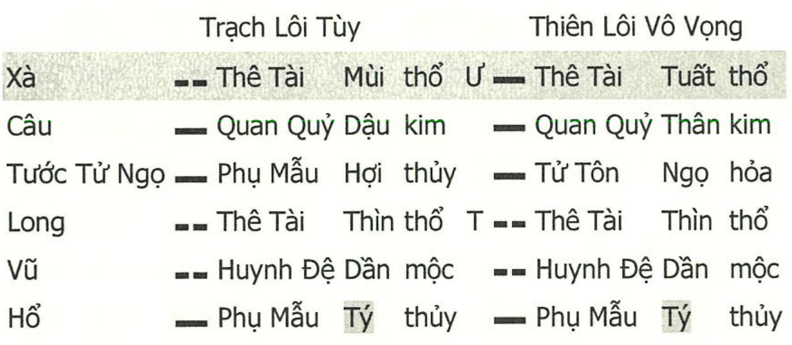
    - **Hình này chứng minh điều gì**
      - Lấy Quan Quỷ làm Dụng thần, Dụng thần tại hào 5, hào 5 là đường, chính là hiển thị thông tin giữa đường.
    - **Từ đâu mà thấy được**
      - Nhìn vào hào Thế, hào Ứng, Dụng thần và động hào trong bảng quẻ Sơ đồ quẻ Trạch Lôi Tùy biến Thiên Lôi Vô Vọng.
- **Quá trình suy luận và đối thoại ban đầu:**
  - Tác giả phân tích cấu trúc hào tượng, Dụng thần và các yếu tố sinh khắc trong quẻ Sơ đồ quẻ Trạch Lôi Tùy biến Thiên Lôi Vô Vọng.
- **Ứng nghiệm thực tế và diễn biến sự việc:**
  - Thực tế diễn biến kiểm chứng ứng kỳ và cát hung của quẻ chiêm.
- **Ngộ giải và bài học kinh nghiệm then chốt:**
  - Đúc rút quy luật thực chiến: Xem xét tổng thể ngũ hành, hào động và tâm thái người gieo quẻ.

## 27. Nhờ Người Lo Việc Không Thể Không Xem Hào Ứng

- **Tổng quan nguyên lý & bối cảnh chuyên đề:**
  - Tôi thấy Quan Quỷ Dậu kim mặc dù phục tàng bị Nguyệt khắc chế, nhưng có Nhật sinh, Mùi thổ độc phát đến sinh, nhất định có thể nên việc. Hào Tài độc phát đến sinh, rõ ràng là lấy tài thăng quan. Thế là phán đoán việc này khả thi.
  - Do đó xem ra thông tin của quẻ này là đúng. Kết quả, sau khi người này đưa cho đối phương 8 vạn tệ, đối phương không thực hiện việc đã hứa, vẫn làm việc ở đơn vị ban đầu, tiền đưa cho người ta cũng không đòi lại được.
  - Sau khi có phản hồi, tôi cảm thấy khó hiểu, phân tích kỹ quẻ này, tôi mới phát hiện hào Ứng Không. Nhờ người lo việc, không thể không xem hào Ứng, không thể chỉ lấy Dụng thần luận sự việc, sách cổ nói rằng: "Ứng Không tha nhân bất thực"[^1]. Xem ra
  - [^1]: Ứng Không, người ta không thực.
### Ví dụ 1: Một ngày trong năm 04
- **Bối cảnh & Dữ kiện chiêm bái:**
  - **Ví dụ 1:** Một ngày trong năm 04, lãnh đạo của một cơ quan đến yêu cầu dự đoán, anh ta nói là mình vừa gặp một người làm trong quốc vụ viện, người này có thể điều anh ta đến một thành phố nào đó để làm phó thị trưởng, nhưng cần phải trả tiền, hỏi chuyện này có khả thi hay không?
  - Ở ngày Tân Sửu tháng Tị, được Phong Hỏa Gia Nhân biến Thiên Hỏa Đồng Nhân.
  - Tôi thấy Quan Quỷ Dậu kim mặc dù phục tàng bị Nguyệt khắc chế, nhưng có Nhật sinh, Mùi thổ độc phát đến sinh, nhất định có thể nên việc.
  - Hào Tài độc phát đến sinh, rõ ràng là lấy tài thăng quan.
  - Thế là phán đoán việc này khả thi.
- Bảng quẻ Sơ đồ quẻ Phong Hỏa Gia Nhân biến Thiên Hỏa Đồng Nhân:
  - **Hình 111.** Sơ đồ quẻ Phong Hỏa Gia Nhân biến Thiên Hỏa Đồng Nhân
    - 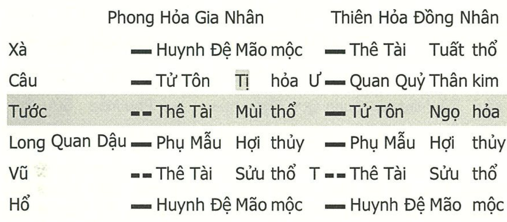
    - **Hình này chứng minh điều gì**
      - lấy Quan làm Dụng thần.
    - **Từ đâu mà thấy được**
      - Nhìn vào hào Thế, hào Ứng, Dụng thần và động hào trong bảng quẻ Sơ đồ quẻ Phong Hỏa Gia Nhân biến Thiên Hỏa Đồng Nhân.
- **Quá trình suy luận và đối thoại ban đầu:**
  - Tác giả phân tích cấu trúc hào tượng, Dụng thần và các yếu tố sinh khắc trong quẻ Sơ đồ quẻ Phong Hỏa Gia Nhân biến Thiên Hỏa Đồng Nhân.
  - Đối thoại thực tế: Nhờ người lo việc, không thể không xem hào Ứng, không thể chỉ lấy Dụng thần luận sự việc, sách cổ nói rằng: "Ứng Không tha nhân bất thực"[^1].
- **Ứng nghiệm thực tế và diễn biến sự việc:**
  - Nhìn vào kết quả thực tế: Kết quả là đối phương đồng ý giải quyết, thế nhưng khai giảng rồi mà vẫn chưa xử lý xong, đã làm chậm trễ việc đi học của con.
- **Ngộ giải và bài học kinh nghiệm then chốt:**
  - Đúc rút quy luật thực chiến: Xem xét tổng thể ngũ hành, hào động và tâm thái người gieo quẻ.

### Ví dụ 2: Một người phụ nữ thỉnh cầu đoán về việc tìm người lo cho con
- **Bối cảnh & Dữ kiện chiêm bái:**
  - **Ví dụ 2:** Một người phụ nữ thỉnh cầu đoán về việc tìm người lo cho con gái lên lớp có thể thành công hay không?
  - Ở ngày Mậu Tý tháng Thân, được Trạch Sơn Hàm biến Phong Hỏa Gia Nhân.
  - Lại xem hào Ứng mặc dù sinh Thế, nhưng hào Ứng Không Vong, Ứng Không người ta không thực, đối phương không tận tâm tận lực giải quyết.
- Bảng quẻ Sơ đồ quẻ Trạch Sơn Hàm biến Phong Hỏa Gia Nhân:
  - **Hình 112.** Sơ đồ quẻ Trạch Sơn Hàm biến Phong Hỏa Gia Nhân
    - 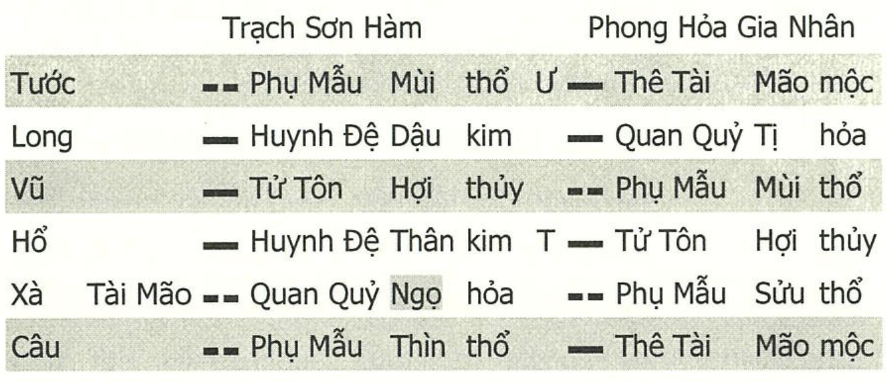
    - **Hình này chứng minh điều gì**
      - lấy Quan làm Dụng thần.
    - **Từ đâu mà thấy được**
      - Nhìn vào hào Thế, hào Ứng, Dụng thần và động hào trong bảng quẻ Sơ đồ quẻ Trạch Sơn Hàm biến Phong Hỏa Gia Nhân.
- **Quá trình suy luận và đối thoại ban đầu:**
  - Tác giả phân tích cấu trúc hào tượng, Dụng thần và các yếu tố sinh khắc trong quẻ Sơ đồ quẻ Trạch Sơn Hàm biến Phong Hỏa Gia Nhân.
- **Ứng nghiệm thực tế và diễn biến sự việc:**
  - Thực tế diễn biến kiểm chứng ứng kỳ và cát hung của quẻ chiêm.
- **Ngộ giải và bài học kinh nghiệm then chốt:**
  - Đúc rút quy luật thực chiến: Xem xét tổng thể ngũ hành, hào động và tâm thái người gieo quẻ.

### Ví dụ 3: Một người học xong nhưng không lấy được chứng chỉ
- **Bối cảnh & Dữ kiện chiêm bái:**
  - **Ví dụ 3:** Một người học xong nhưng không lấy được chứng chỉ, hỏi bỏ tiền tìm người xử lý có thể thành hay không?
  - Ở ngày Nhâm Tuất tháng Ngọ, được Thủy Thiên Nhu biến Địa Phong Thăng.
- Bảng quẻ Sơ đồ quẻ Thủy Thiên Nhu biến Địa Phong Thăng:
  - **Hình 113.** Sơ đồ quẻ Thủy Thiên Nhu biến Địa Phong Thăng
    - 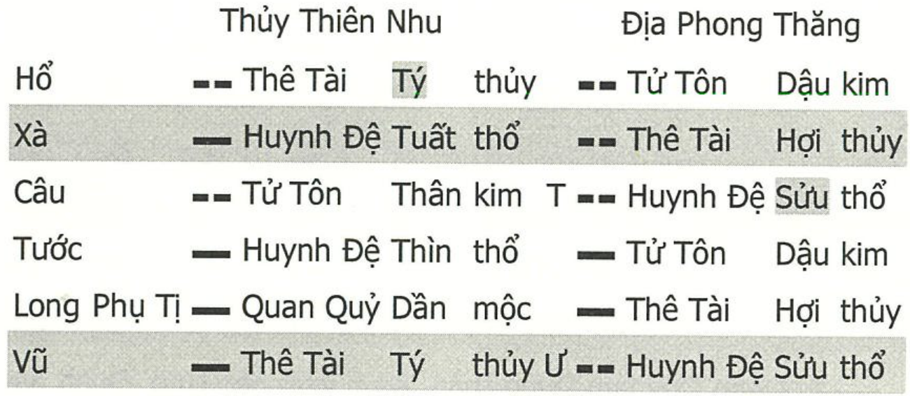
    - **Hình này chứng minh điều gì**
      - lấy Phụ Mẫu làm Dụng thần, nhưng tìm người làm, cần xem cả hào Ứng.
    - **Từ đâu mà thấy được**
      - Nhìn vào hào Thế, hào Ứng, Dụng thần và động hào trong bảng quẻ Sơ đồ quẻ Thủy Thiên Nhu biến Địa Phong Thăng.
- **Quá trình suy luận và đối thoại ban đầu:**
  - Tác giả phân tích cấu trúc hào tượng, Dụng thần và các yếu tố sinh khắc trong quẻ Sơ đồ quẻ Thủy Thiên Nhu biến Địa Phong Thăng.
- **Ứng nghiệm thực tế và diễn biến sự việc:**
  - Thực tế diễn biến kiểm chứng ứng kỳ và cát hung của quẻ chiêm.
- **Ngộ giải và bài học kinh nghiệm then chốt:**
  - Đúc rút quy luật thực chiến: Xem xét tổng thể ngũ hành, hào động và tâm thái người gieo quẻ.

### Ví dụ 4: Một người đàn ông đoán việc thăng chức của mình
- **Bối cảnh & Dữ kiện chiêm bái:**
  - **Ví dụ 4:** Một người đàn ông đoán việc thăng chức của mình, tìm cấp trên sẽ ra sao?
  - Ở ngày Quý Mão tháng Tị, được Sơn Lôi Di biến Thiên Sơn Độn.
  - Sau đó hạ quyết tâm tìm lãnh đạo nói chuyện, lãnh đạo ngoài mặt đồng ý thăng chức cho anh ta, nhưng lần lữa không giải quyết, cuối cùng lại điều vào một người mới nhậm chức, người này rất tức giận, đã rời khỏi đơn vị này.
  - **Ví dụ 5:** Một người đàn ông tìm lãnh đạo lo việc, hỏi lãnh đạo có tiếp kiến hay không?
  - Ngày Bính Dần tháng Thìn, được Hỏa Sơn Lữ.
- Bảng quẻ Sơ đồ quẻ Sơn Lôi Di biến Thiên Sơn Độn:
  - **Hình 114.** Sơ đồ quẻ Sơn Lôi Di biến Thiên Sơn Độn
    - 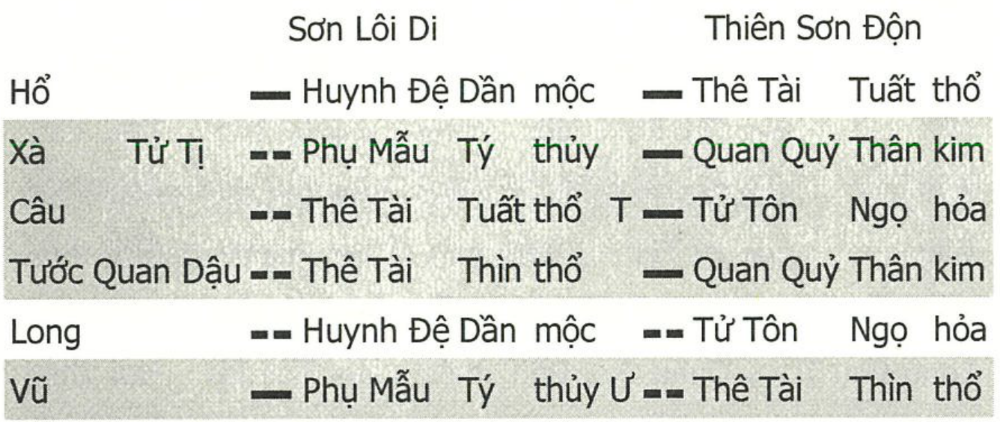
    - **Hình này chứng minh điều gì**
      - Lấy Quan Quỷ làm Dụng thần, kiêm xem hào Ứng.
    - **Từ đâu mà thấy được**
      - Nhìn vào hào Thế, hào Ứng, Dụng thần và động hào trong bảng quẻ Sơ đồ quẻ Sơn Lôi Di biến Thiên Sơn Độn.
- **Quá trình suy luận và đối thoại ban đầu:**
  - Tác giả phân tích cấu trúc hào tượng, Dụng thần và các yếu tố sinh khắc trong quẻ Sơ đồ quẻ Sơn Lôi Di biến Thiên Sơn Độn.
  - Đối thoại thực tế: Đây là quẻ lục hợp, thoạt nhìn là cát, nhưng Quan Quỷ hưu tù, gian hào Huynh Đệ lâm Huyền Vũ phát động, sách nói: "Huynh lâm Huyền Vũ đề phòng lừa đảo." Chuyện này e rằng có dối trá.
- **Ứng nghiệm thực tế và diễn biến sự việc:**
  - Nhìn vào kết quả thực tế: Anh ta đến nhà lãnh đạo, kết quả là lãnh đạo đã về quê, sau đó gặp ở ngày Canh Ngọ, không hiểu tại sao lại ứng ở ngày Ngọ?
- **Ngộ giải và bài học kinh nghiệm then chốt:**
  - Đúc rút quy luật thực chiến: Xem xét tổng thể ngũ hành, hào động và tâm thái người gieo quẻ.

### Quái lệ 5: Sơ đồ quẻ Hỏa Sơn Lữ
- **Bối cảnh & Dữ kiện chiêm bái:**
  - Lấy Quan làm Dụng, kiêm xem hào Ứng.
  - Quan Quỷ Hợi thủy Không mà bất thượng quái, lãnh đạo đi vắng.
  - Nhưng quẻ này Thế Ứng tương hợp, Phi thần ám động sinh Quan Quỷ, Phi thần bị xung, Phục thần dễ lộ ra.
  - Anh ta đến nhà lãnh đạo, kết quả là lãnh đạo đã về quê, sau đó gặp ở ngày Canh Ngọ, không hiểu tại sao lại ứng ở ngày Ngọ?
  - Một người thỉnh cầu đoán về việc khai thông mối quan hệ với một lãnh đạo ở trung ương có thể thành hay không?
- Bảng quẻ Sơ đồ quẻ Hỏa Sơn Lữ:
  - **Hình 115.** Sơ đồ quẻ Hỏa Sơn Lữ
    - 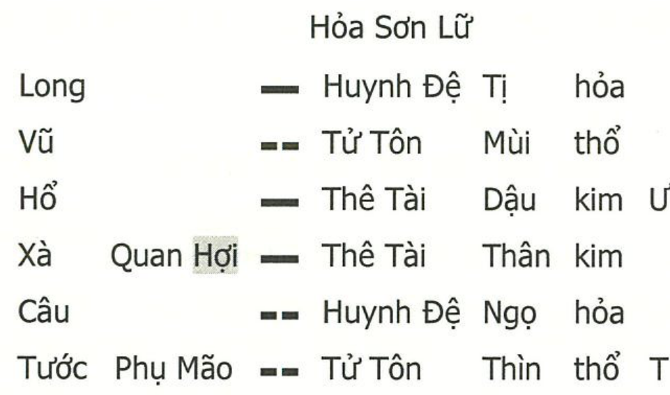
    - **Hình này chứng minh điều gì**
      - Lấy Quan Quỷ làm Dụng thần, kiêm xem hào Ứng.
    - **Từ đâu mà thấy được**
      - Nhìn vào hào Thế, hào Ứng, Dụng thần và động hào trong bảng quẻ Sơ đồ quẻ Hỏa Sơn Lữ.
- **Quá trình suy luận và đối thoại ban đầu:**
  - Tác giả phân tích cấu trúc hào tượng, Dụng thần và các yếu tố sinh khắc trong quẻ Sơ đồ quẻ Hỏa Sơn Lữ.
  - Đối thoại thực tế: Đây là quẻ lục hợp, thoạt nhìn là cát, nhưng Quan Quỷ hưu tù, gian hào Huynh Đệ lâm Huyền Vũ phát động, sách nói: "Huynh lâm Huyền Vũ đề phòng lừa đảo." Chuyện này e rằng có dối trá.
- **Ứng nghiệm thực tế và diễn biến sự việc:**
  - Thực tế diễn biến kiểm chứng ứng kỳ và cát hung của quẻ chiêm.
- **Ngộ giải và bài học kinh nghiệm then chốt:**
  - Đúc rút quy luật thực chiến: Xem xét tổng thể ngũ hành, hào động và tâm thái người gieo quẻ.

### Quái lệ 6: Sơ đồ quẻ Địa Thiên Thái biến Lôi Thiên Đại Tráng
- **Bối cảnh & Dữ kiện chiêm bái:**
  - Chiêm đoán theo bảng quẻ Sơ đồ quẻ Địa Thiên Thái biến Lôi Thiên Đại Tráng trong thực tiễn.
- Bảng quẻ Sơ đồ quẻ Địa Thiên Thái biến Lôi Thiên Đại Tráng:
  - **Hình 116.** Sơ đồ quẻ Địa Thiên Thái biến Lôi Thiên Đại Tráng
    - 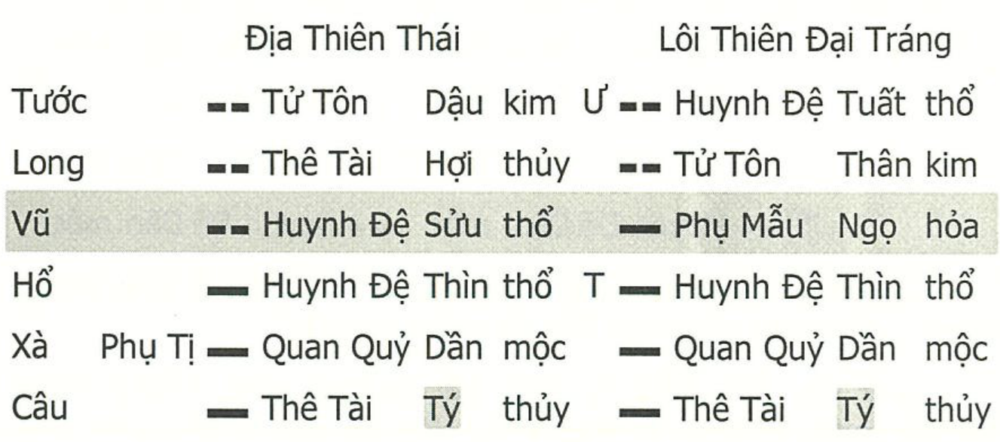
    - **Hình này chứng minh điều gì**
      - Lấy Phụ Mẫu làm Dụng thần, bởi vì Phụ Mẫu là hợp đồng, công trình, tham khảo hào Ứng là người giúp đỡ.
    - **Từ đâu mà thấy được**
      - Nhìn vào hào 5 độc phát sinh Phụ Mẫu, theo lý thì có thể thành.
- **Quá trình suy luận và đối thoại ban đầu:**
  - Căn cứ suy luận: Lấy Phụ Mẫu làm Dụng thần, bởi vì Phụ Mẫu là hợp đồng, công trình, tham khảo hào Ứng là người giúp đỡ.
  - Đối thoại thực tế: Tôi liền hỏi người xem: "Có phải có người đã giới thiệu cho anh?"
  - Đối thoại thực tế: "Đúng." Anh ta đáp.
  - Đối thoại thực tế: "Người trung gian này yêu cầu anh trả tiền đúng không?" Tôi hỏi.
  - Đối thoại thực tế: "Đúng thế, người ta đòi tôi trả 3 vạn tệ."
  - Đối thoại thực tế: Trong lòng tôi đã rõ, liền nói với người xem: "Đây là trò bịp bợm, anh không được tin, người này không có khả năng đó."
- **Ứng nghiệm thực tế và diễn biến sự việc:**
  - Nhìn vào kết quả thực tế: Đồng nghiệp của anh ta cho rằng anh ta không biết thời thế, liền nhờ người này kết giao với lãnh đạo trung ương, sau cùng sự việc không thành và đã bị lừa mất mấy vạn.
- **Ngộ giải và bài học kinh nghiệm then chốt:**
  - Đúc rút quy luật thực chiến: Xem xét tổng thể ngũ hành, hào động và tâm thái người gieo quẻ.

### Quái lệ 7: Sơ đồ quẻ Lôi Thủy Giải biến Trạch Thủy Khốn
- **Bối cảnh & Dữ kiện chiêm bái:**
  - Tôi liền hỏi người xem: "Có phải có người đã giới thiệu cho anh?"
  - "Người trung gian này yêu cầu anh trả tiền đúng không?" Tôi hỏi.
  - "Đúng thế, người ta đòi tôi trả 3 vạn tệ."
  - Trong lòng tôi đã rõ, liền nói với người xem: "Đây là trò bịp bợm, anh không được tin, người này không có khả năng đó."
  - Thế là anh ta đã từ bỏ ý định.
- Bảng quẻ Sơ đồ quẻ Lôi Thủy Giải biến Trạch Thủy Khốn:
  - **Hình 117.** Sơ đồ quẻ Lôi Thủy Giải biến Trạch Thủy Khốn
    - 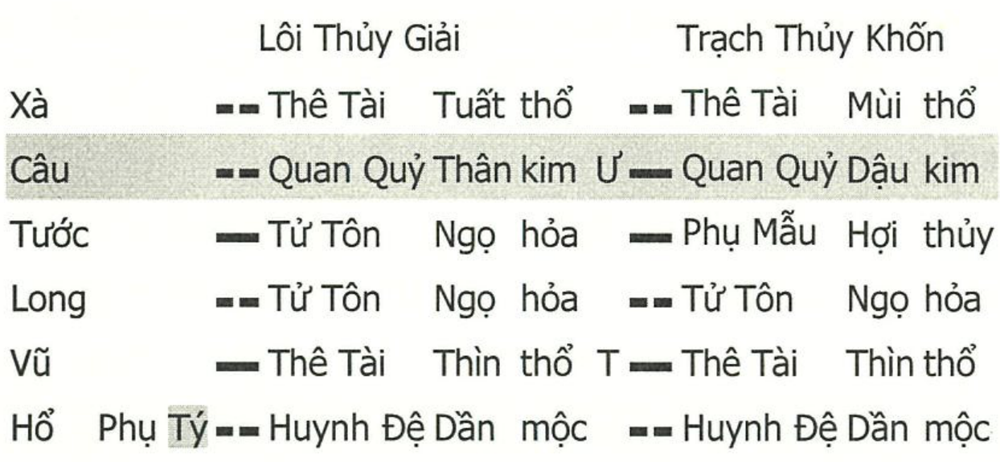
    - **Hình này chứng minh điều gì**
      - Lấy Phụ Mẫu làm Dụng thần, bởi vì Phụ Mẫu là hợp đồng, công trình, tham khảo hào Ứng là người giúp đỡ.
    - **Từ đâu mà thấy được**
      - Nhìn vào hào 5 độc phát sinh Phụ Mẫu, theo lý thì có thể thành.
- **Quá trình suy luận và đối thoại ban đầu:**
  - Căn cứ suy luận: Lấy Phụ Mẫu làm Dụng thần, bởi vì Phụ Mẫu là hợp đồng, công trình, tham khảo hào Ứng là người giúp đỡ.
  - Căn cứ suy luận: Hai là hào Ứng Nguyệt phá.
  - Căn cứ suy luận: Tôi phán đoán theo hai điểm này, Huynh Đệ Không mà không khắc Tài, không thể tặng quà.
  - Căn cứ suy luận: Ứng là lãnh đạo sẽ tìm, Nguyệt phá mà không sinh Quan Quỷ, lãnh đạo sẽ không giúp.
  - Đối thoại thực tế: Tôi liền hỏi người xem: "Có phải có người đã giới thiệu cho anh?"
  - Đối thoại thực tế: "Đúng." Anh ta đáp.
  - Đối thoại thực tế: "Người trung gian này yêu cầu anh trả tiền đúng không?" Tôi hỏi.
  - Đối thoại thực tế: "Đúng thế, người ta đòi tôi trả 3 vạn tệ."
  - Đối thoại thực tế: Trong lòng tôi đã rõ, liền nói với người xem: "Đây là trò bịp bợm, anh không được tin, người này không có khả năng đó."
- **Ứng nghiệm thực tế và diễn biến sự việc:**
  - Nhìn vào kết quả thực tế: Trên thực tế, anh ta đi tặng quà, lãnh đạo từ chối nhận, cũng không thăng chức.
- **Ngộ giải và bài học kinh nghiệm then chốt:**
  - Đúc rút quy luật thực chiến: Xem xét tổng thể ngũ hành, hào động và tâm thái người gieo quẻ.

### Ví dụ 8: Một người đoán tặng quà cho lãnh đạo có thể giúp mình thăng 
- **Bối cảnh & Dữ kiện chiêm bái:**
  - **Ví dụ 8:** Một người đoán tặng quà cho lãnh đạo có thể giúp mình thăng chức hay không?
  - Ở ngày Mậu Thân tháng Sửu, được Phong Thiên Tiểu Súc biến Thủy Thiên Nhu.
- Bảng quẻ Quẻ Phong Thiên Tiểu Súc biến Thủy Thiên Nhu:
  - **Hình 118.** Quẻ Phong Thiên Tiểu Súc biến Thủy Thiên Nhu
    - 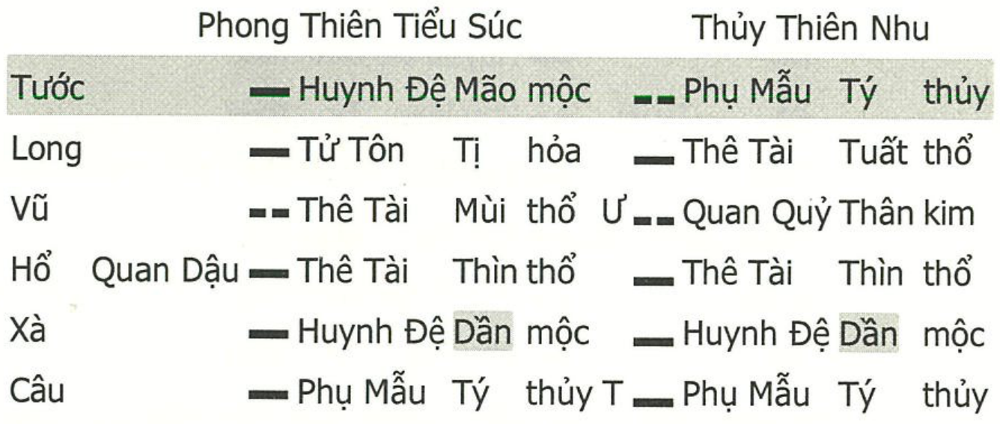
    - **Hình này chứng minh điều gì**
      - Lấy Quan làm Dụng thần, kiêm xem hào Ứng.
    - **Từ đâu mà thấy được**
      - Nhìn vào hào Thế, hào Ứng, Dụng thần và động hào trong bảng quẻ Quẻ Phong Thiên Tiểu Súc biến Thủy Thiên Nhu.
- **Quá trình suy luận và đối thoại ban đầu:**
  - Căn cứ suy luận: Hai là hào Ứng Nguyệt phá.
  - Căn cứ suy luận: Tôi phán đoán theo hai điểm này, Huynh Đệ Không mà không khắc Tài, không thể tặng quà.
  - Căn cứ suy luận: Ứng là lãnh đạo sẽ tìm, Nguyệt phá mà không sinh Quan Quỷ, lãnh đạo sẽ không giúp.
- **Ứng nghiệm thực tế và diễn biến sự việc:**
  - Thực tế diễn biến kiểm chứng ứng kỳ và cát hung của quẻ chiêm.
- **Ngộ giải và bài học kinh nghiệm then chốt:**
  - Đúc rút quy luật thực chiến: Xem xét tổng thể ngũ hành, hào động và tâm thái người gieo quẻ.

## 28. Tại Sao Ngày Chết Đã Sớm Một Ngày?

- **Tổng quan nguyên lý & bối cảnh chuyên đề:**
  - Lấy Phụ Mẫu làm Dụng thần. Trong quẻ Phụ Mẫu Tý thủy lưỡng hiện, đều không phát động, đều có thể làm Dụng thần, nhưng tình huống như vậy thông thường lấy Phụ Mẫu lâm hào Ứng làm Dụng.
  - Dụng tại hào sơ, Nhật Nguyệt không sinh, Nguyệt là Tuyệt địa, Nhật là Tử địa, cho thấy bệnh tình tương đối nghiêm trọng. Dụng thần nhập Mộ tại hào 3, hào 3 là giường, chứng tỏ nằm bệnh trên giường, hào sơ là chân, nhập Mộ không thể động, thì biểu thị không thể đi. Tổ hợp này chính là thông tin bại liệt.
### Ví dụ 1: Một người đàn ông đoán về bệnh lâu của cha
- **Bối cảnh & Dữ kiện chiêm bái:**
  - **Ví dụ 1:** Một người đàn ông đoán về bệnh lâu của cha, ngày Quý Mão tháng Tị, được Sơn Lôi Di.
- Bảng quẻ Quẻ Sơn Lôi Di:
  - **Hình 119.** Quẻ Sơn Lôi Di
    - 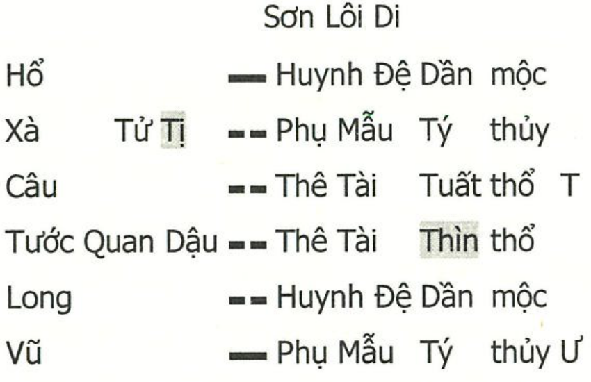
    - **Hình này chứng minh điều gì**
      - Lấy Phụ Mẫu làm Dụng thần.
    - **Từ đâu mà thấy được**
      - Nhìn vào hào Thế, hào Ứng, Dụng thần và động hào trong bảng quẻ Quẻ Sơn Lôi Di.
- **Quá trình suy luận và đối thoại ban đầu:**
  - Tác giả phân tích cấu trúc hào tượng, Dụng thần và các yếu tố sinh khắc trong quẻ Quẻ Sơn Lôi Di.
- **Ứng nghiệm thực tế và diễn biến sự việc:**
  - Nhìn vào kết quả thực tế: Về sau cha chồng người này chết ở tháng Mão năm Ất Dậu.
- **Ngộ giải và bài học kinh nghiệm then chốt:**
  - Đúc rút quy luật thực chiến: Xem xét tổng thể ngũ hành, hào động và tâm thái người gieo quẻ.

### Quái lệ 2: Quẻ Lôi Thiên Đại Tráng
- **Bối cảnh & Dữ kiện chiêm bái:**
  - **Ví dụ 2:** Năm 2003, một người phụ nữ đoán tình trạng bệnh của cha chồng.
  - Ở ngày Tân Dậu tháng Dần, được Lôi Thiên Đại Tráng.
  - Về sau cha chồng người này chết ở tháng Mão năm Ất Dậu.
- Bảng quẻ Quẻ Lôi Thiên Đại Tráng:
  - **Hình 120.** Quẻ Lôi Thiên Đại Tráng
    - 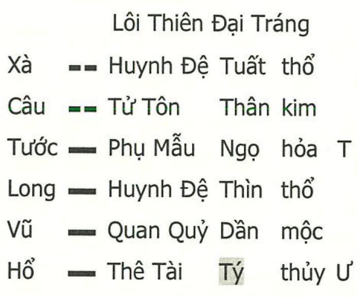
    - **Hình này chứng minh điều gì**
      - lấy Phụ Mẫu làm Dụng thần.
    - **Từ đâu mà thấy được**
      - Nhìn vào hào Thế, hào Ứng, Dụng thần và động hào trong bảng quẻ Quẻ Lôi Thiên Đại Tráng.
- **Quá trình suy luận và đối thoại ban đầu:**
  - Tác giả phân tích cấu trúc hào tượng, Dụng thần và các yếu tố sinh khắc trong quẻ Quẻ Lôi Thiên Đại Tráng.
- **Ứng nghiệm thực tế và diễn biến sự việc:**
  - Thực tế diễn biến kiểm chứng ứng kỳ và cát hung của quẻ chiêm.
- **Ngộ giải và bài học kinh nghiệm then chốt:**
  - Đúc rút quy luật thực chiến: Xem xét tổng thể ngũ hành, hào động và tâm thái người gieo quẻ.

### Ví dụ 3: Một bà lão đoán bệnh của chồng
- **Bối cảnh & Dữ kiện chiêm bái:**
  - **Ví dụ 3:** Một bà lão đoán bệnh của chồng, ở ngày Đinh Hợi tháng Tuất, được Sơn Phong Cổ.
  - Chồng người này bị đau ngực, chuyên gia bệnh viện chẩn đoán là phổi có bệnh, nhưng không thể khẳng định là ung thư, hằng ngày chạy đi chạy lại giữa nhà và bệnh viện, tiếp nhận xạ trị, sau chết vì ung thư phổi ở tháng Tý.
  - Ứng tháng Tý, Dậu kim Tử tại Tý.
- Bảng quẻ Quẻ Sơn Phong Cổ:
  - **Hình 121.** Quẻ Sơn Phong Cổ
    - 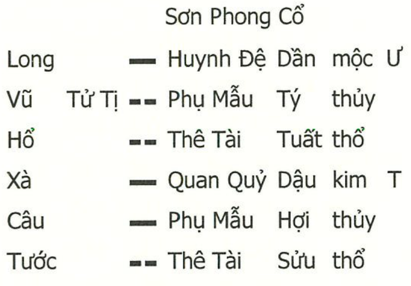
    - **Hình này chứng minh điều gì**
      - Lấy hào Quan Quỷ làm Dụng thần.
    - **Từ đâu mà thấy được**
      - Nhìn vào hào Thế, hào Ứng, Dụng thần và động hào trong bảng quẻ Quẻ Sơn Phong Cổ.
- **Quá trình suy luận và đối thoại ban đầu:**
  - Căn cứ suy luận: Kết quả, cha người đó qua đời ở tháng Tị năm Bính Tý bởi vì ung thư bàng quang.
- **Ứng nghiệm thực tế và diễn biến sự việc:**
  - Nhìn vào kết quả thực tế: Kết quả, cha người đó qua đời ở tháng Tị năm Bính Tý bởi vì ung thư bàng quang.
  - Nhìn vào kết quả thực tế: Cổ đại cũng có quái lệ ứng nghiệm như sau.
- **Ngộ giải và bài học kinh nghiệm then chốt:**
  - Đúc rút quy luật thực chiến: Xem xét tổng thể ngũ hành, hào động và tâm thái người gieo quẻ.

### Quái lệ 4: Sơ đồ quẻ Thủy Hỏa Ký Tế biến Phong Lôi Ích
- **Bối cảnh & Dữ kiện chiêm bái:**
  - Kết quả, cha người đó qua đời ở tháng Tị năm Bính Tý bởi vì ung thư bàng quang.
- Bảng quẻ Sơ đồ quẻ Thủy Hỏa Ký Tế biến Phong Lôi Ích:
  - **Hình 122.** Sơ đồ quẻ Thủy Hỏa Ký Tế biến Phong Lôi Ích
    - 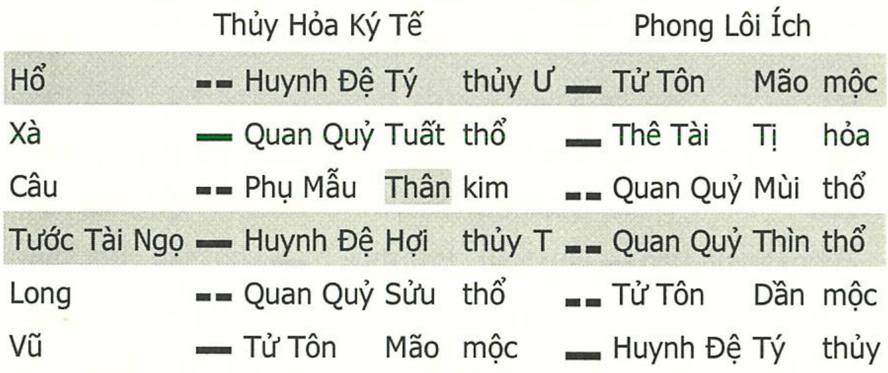
    - **Hình này chứng minh điều gì**
      - Lấy hào Phụ Mẫu làm Dụng thần.
    - **Từ đâu mà thấy được**
      - Nhìn vào hào Thế, hào Ứng, Dụng thần và động hào trong bảng quẻ Sơ đồ quẻ Thủy Hỏa Ký Tế biến Phong Lôi Ích.
- **Quá trình suy luận và đối thoại ban đầu:**
  - Căn cứ suy luận: Kết quả, cha người đó qua đời ở tháng Tị năm Bính Tý bởi vì ung thư bàng quang.
- **Ứng nghiệm thực tế và diễn biến sự việc:**
  - Thực tế diễn biến kiểm chứng ứng kỳ và cát hung của quẻ chiêm.
- **Ngộ giải và bài học kinh nghiệm then chốt:**
  - Đúc rút quy luật thực chiến: Xem xét tổng thể ngũ hành, hào động và tâm thái người gieo quẻ.

### Quái lệ 5: Sơ đồ quẻ Trạch Phong Đại Quá biến Hỏa Phong Đỉnh
- **Bối cảnh & Dữ kiện chiêm bái:**
  - Đợi ngày Mão Dụng gặp Tử địa.
  - Đồng thời xung mất Nguyên thần, đứt nguồn hoàn toàn mà hung.
  - Sau quả nhiên chết tại ngày Quý Mão.
- Bảng quẻ Sơ đồ quẻ Trạch Phong Đại Quá biến Hỏa Phong Đỉnh:
  - **Hình 123.** Sơ đồ quẻ Trạch Phong Đại Quá biến Hỏa Phong Đỉnh
    - 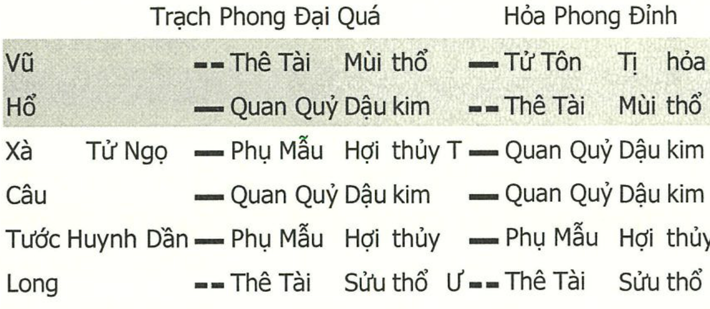
    - **Hình này chứng minh điều gì**
      - lấy hào Thế Hợi thủy làm Dụng thần, hào Thế Hợi thủy Nguyệt phá Nhật khắc, bị Nhật Nguyệt hoại căn.
    - **Từ đâu mà thấy được**
      - Nhìn vào hào Thế, hào Ứng, Dụng thần và động hào trong bảng quẻ Sơ đồ quẻ Trạch Phong Đại Quá biến Hỏa Phong Đỉnh.
- **Quá trình suy luận và đối thoại ban đầu:**
  - Tác giả phân tích cấu trúc hào tượng, Dụng thần và các yếu tố sinh khắc trong quẻ Sơ đồ quẻ Trạch Phong Đại Quá biến Hỏa Phong Đỉnh.
- **Ứng nghiệm thực tế và diễn biến sự việc:**
  - Thực tế diễn biến kiểm chứng ứng kỳ và cát hung của quẻ chiêm.
- **Ngộ giải và bài học kinh nghiệm then chốt:**
  - Đúc rút quy luật thực chiến: Xem xét tổng thể ngũ hành, hào động và tâm thái người gieo quẻ.

### Quái lệ 6: Sơ đồ quẻ Sơn Địa Bác biến Thiên Lôi Vô Vọng
- **Bối cảnh & Dữ kiện chiêm bái:**
  - Chiêm đoán theo bảng quẻ Sơ đồ quẻ Sơn Địa Bác biến Thiên Lôi Vô Vọng trong thực tiễn.
- Bảng quẻ Sơ đồ quẻ Sơn Địa Bác biến Thiên Lôi Vô Vọng:
  - **Hình 124.** Sơ đồ quẻ Sơn Địa Bác biến Thiên Lôi Vô Vọng
    - 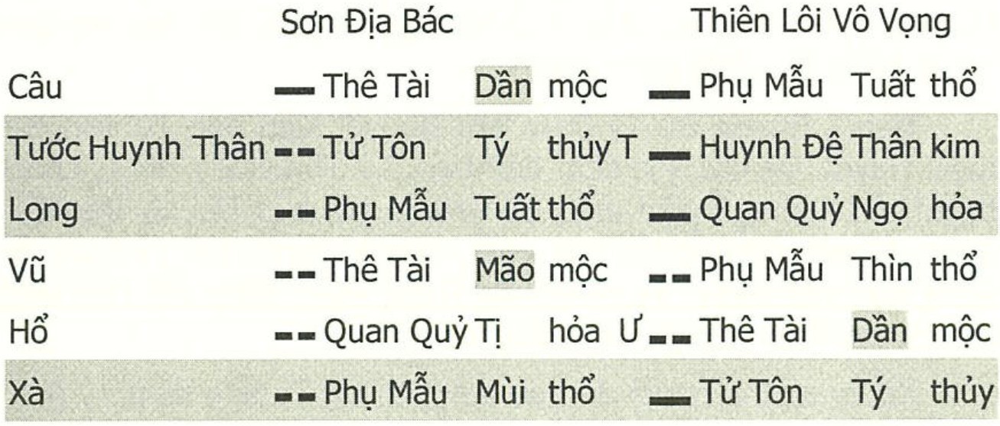
    - **Hình này chứng minh điều gì**
      - Bảng quẻ Sơ đồ quẻ Sơn Địa Bác biến Thiên Lôi Vô Vọng phản ánh sự phối chiếu hào vị, ngũ hành và động biến minh chứng cho vấn đề chiêm đoán.
    - **Từ đâu mà thấy được**
      - Nhìn vào hào Thế, hào Ứng, Dụng thần và động hào trong bảng quẻ Sơ đồ quẻ Sơn Địa Bác biến Thiên Lôi Vô Vọng.
- **Quá trình suy luận và đối thoại ban đầu:**
  - Tác giả phân tích cấu trúc hào tượng, Dụng thần và các yếu tố sinh khắc trong quẻ Sơ đồ quẻ Sơn Địa Bác biến Thiên Lôi Vô Vọng.
- **Ứng nghiệm thực tế và diễn biến sự việc:**
  - Thực tế diễn biến kiểm chứng ứng kỳ và cát hung của quẻ chiêm.
- **Ngộ giải và bài học kinh nghiệm then chốt:**
  - Đúc rút quy luật thực chiến: Xem xét tổng thể ngũ hành, hào động và tâm thái người gieo quẻ.

### Tổng kết chuyên đề và bài học tâm đắc
- **Huyền cơ cốt lõi rút ra từ các quái lệ:**
  - Cần phải đề phòng năm Mão Tử địa của Dụng thần, quả nhiên chết tại năm Mão.

## 29. Kết Hôn Ly Hôn Đảo Lộn

- **Tổng quan nguyên lý & bối cảnh chuyên đề:**
  - Dự đoán hôn nhân, khi nắm bắt ứng kỳ thông thường cần phải biết tuổi của đối phương, bởi vì từ khuôn mặt không thể đọc ra tuổi thực tế. Tôi hỏi tuổi của cô ấy, cô ấy cho biết là mình sinh năm 1972.
  - Nữ dự đoán hôn nhân, lấy Quan Quỷ làm Dụng thần. Trong quẻ Quan Quỷ được Nguyệt tỉ phù, Nhật đến sinh là vượng tướng. Nhưng Quan Quỷ Không Vong, nếu phán đoán thời gian kết hôn của cô ấy, thông thường tình huống Không Vong ứng thực Không hoặc xung Không, nhưng khi Dụng thần an tĩnh, cũng ứng lúc gặp trị hoặc gặp xung.
  - Cô ấy sinh năm 1972, năm 1992 là năm Nhâm Thân, đến năm 1992 thì cô ấy tròn 20 tuổi, chưa đến tuổi kết hôn theo luật định, với lại ở Bắc Kinh cũng không kết hôn sớm như vậy, do đó đã loại trừ ứng kỳ này, một ứng kỳ khác là năm 1998 Mậu Dần, xung thực Quan Quỷ, năm này cô ấy tròn 26 tuổi, cũng khá phù hợp với độ tuổi kết hôn phổ biến, do đó tôi phán đoán cô ấy kết hôn ở năm 1998.
  - Nào ngờ đối phương phản hồi là không đúng. Tôi cảm thấy thật kỳ lạ, không hiểu tại sao lại không phù hợp với thực tế?
### Quái lệ 1: Quẻ Lôi Địa Dự biến Lôi Thủy Giải
- **Bối cảnh & Dữ kiện chiêm bái:**
  - **Ví dụ 1:** Năm 2004, trong thời gian tôi lưu lại Bắc Kinh, có một cô gái trẻ đến dự đoán hôn nhân của cô ấy, ở ngày Quý Mùi tháng Thân, được Lôi Địa Dự biến Lôi Thủy Giải.
  - Dự đoán hôn nhân, khi nắm bắt ứng kỳ thông thường cần phải biết tuổi của đối phương, bởi vì từ khuôn mặt không thể đọc ra tuổi thực tế.
  - Tôi hỏi tuổi của cô ấy, cô ấy cho biết là mình sinh năm 1972.
- Bảng quẻ Quẻ Lôi Địa Dự biến Lôi Thủy Giải:
  - **Hình 125.** Quẻ Lôi Địa Dự biến Lôi Thủy Giải
    - 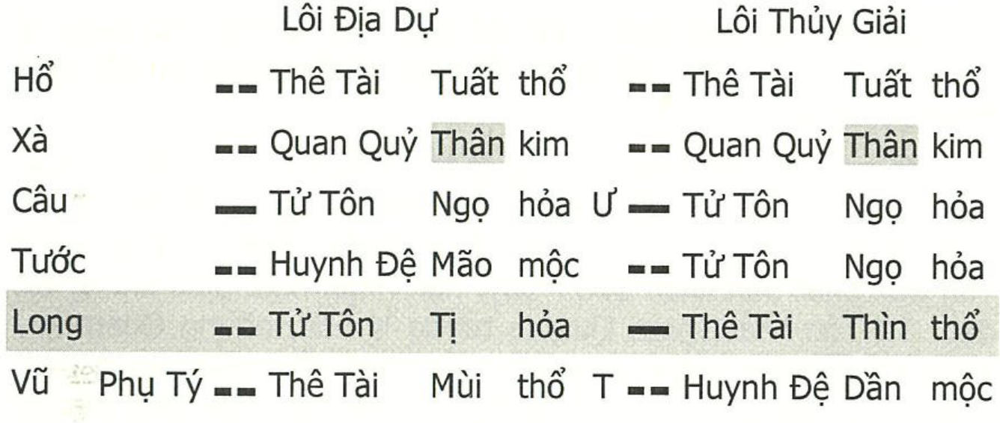
    - **Hình này chứng minh điều gì**
      - lấy Quan Quỷ làm Dụng thần.
    - **Từ đâu mà thấy được**
      - Nhìn vào hào 2 hóa hồi đầu khắc, lại là Nguyệt phá, hôn nhân nhất định không thể đến đầu bạc răng long.
- **Quá trình suy luận và đối thoại ban đầu:**
  - Căn cứ suy luận: Cô ấy sinh năm 1972, năm 1992 là năm Nhâm Thân, đến năm 1992 thì cô ấy tròn 20 tuổi, chưa đến tuổi kết hôn theo luật định, với lại ở Bắc Kinh cũng không kết hôn sớm như vậy, do đó đã loại trừ ứng kỳ này, một ứng kỳ khác là năm 1998 Mậu Dần, xung thực Quan Quỷ, năm này cô ấy tròn 26 tuổi, cũng khá phù hợp với độ tuổi kết hôn phổ biến, do đó tôi phán đoán cô ấy kết hôn ở năm 1998.
  - Căn cứ suy luận: Hào Tài trì Thế, được Nhật tỉ phù, Tử Tôn Tị hỏa độc phát hóa Tài, do đó tôi phán đoán cô ấy bắt đầu phát triển sự nghiệp ở năm 2001 Tân Tị, tự làm buôn bán.
  - Căn cứ suy luận: Quẻ được lục hợp, buôn bán tương đối ổn định.
  - Căn cứ suy luận: Khi dự đoán, chúng ta cần phải biết rõ giới tính, tuổi tác và khu vực sinh sống của đối phương.
  - Căn cứ suy luận: Nhưng nếu như dự đoán ở Nhật Bản, xem Phụ Mẫu là giấy báo nhập học thì không đúng, bởi vì ở Nhật Bản cho dù thí sinh có thi đậu hay không, nhà trường cũng đều gửi thư thông báo kết quả cuối cùng cho thí sinh.
  - Đối thoại thực tế: Thế là tôi nói với cô ấy: "Phán đoán theo quẻ, chị kết hôn ở năm 1992 hoặc năm 1998, nhưng năm 1992 chị mới tròn 20 tuổi, chưa đến tuổi kết hôn theo luật định nhà nước, thì chưa thể kết hôn, mà Bắc Kinh cũng không kết hôn sớm như vậy."
  - Đối thoại thực tế: "Tôi kết hôn ở năm 1992, tôi không phải người Bắc Kinh, tôi là người Phúc Kiến, chúng tôi đã kết hôn ở độ tuổi này ở đó." Cô ấy đáp.
  - Đối thoại thực tế: "Đúng, tôi ly hôn ở năm 1998." Lần này cô ấy đã gật đầu đồng ý với phán đoán của tôi.
- **Ứng nghiệm thực tế và diễn biến sự việc:**
  - Nhìn vào kết quả thực tế: "Tôi kết hôn ở năm 1992, tôi không phải người Bắc Kinh, tôi là người Phúc Kiến, chúng tôi đã kết hôn ở độ tuổi này ở đó." Cô ấy đáp.
- **Ngộ giải và bài học kinh nghiệm then chốt:**
  - Đúc rút quy luật thực chiến: Xem xét tổng thể ngũ hành, hào động và tâm thái người gieo quẻ.

### Ví dụ 2: Quẻ này cũng là một cô gái trẻ hỏi hôn nhân
- **Bối cảnh & Dữ kiện chiêm bái:**
  - Thế là tôi nói với cô ấy: "Phán đoán theo quẻ, chị kết hôn ở năm 1992 hoặc năm 1998, nhưng năm 1992 chị mới tròn 20 tuổi, chưa đến tuổi kết hôn theo luật định nhà nước, thì chưa thể kết hôn, mà Bắc Kinh cũng không kết hôn sớm như vậy."
  - "Tôi kết hôn ở năm 1992, tôi không phải người Bắc Kinh, tôi là người Phúc Kiến, chúng tôi đã kết hôn ở độ tuổi này ở đó." Cô ấy đáp.
  - Lúc này tôi mới thấy mình đã tiên nhập vi chủ, cho rằng cô ấy là người Bắc Kinh, không xét đến yếu tố địa lý, do đó đã phán đoán sai thời gian kết hôn.
  - Quan Quỷ này Không Vong có thể biểu thị thời gian kết hôn của cô ấy, cũng có thể biểu thị hôn nhân của cô ấy không ổn định, quẻ này mặc dù là quẻ lục hợp là hôn nhân hỷ, nhưng Tử Tôn độc phát đến khắc Quan Quỷ, hôn nhân nhất định không tốt đẹp.
  - Tử Tôn khắc Quan Quỷ, là tượng ly hôn, nhưng Quan Quỷ Thân kim Không không bị khắc, năm 1998 Mậu Dần, xung thực Quan Quỷ, đồng thời lại sinh vượng Tử Tôn, năm này nhất định ly hôn.
- Bảng quẻ Quẻ Lôi Hỏa Phong biến Lôi Thiên Đại Tráng:
  - **Hình 126.** Quẻ Lôi Hỏa Phong biến Lôi Thiên Đại Tráng
    - 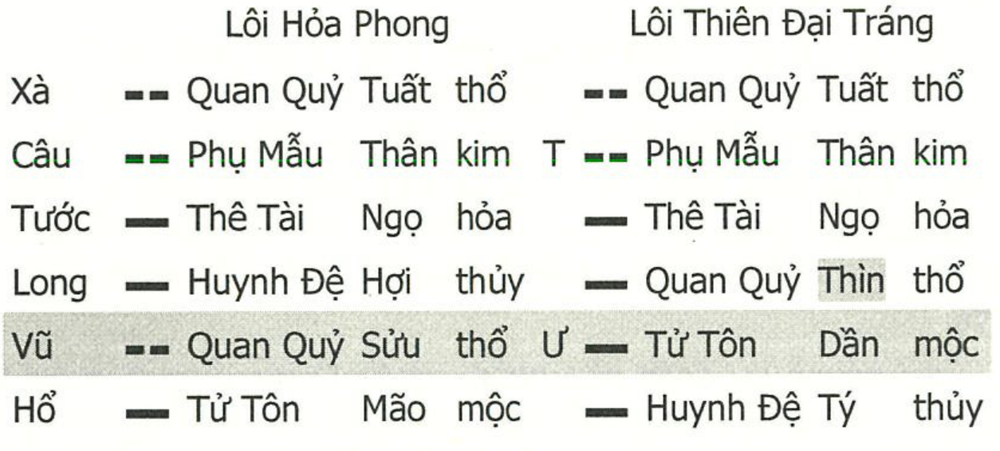
    - **Hình này chứng minh điều gì**
      - lấy Quan Quỷ làm Dụng thần.
    - **Từ đâu mà thấy được**
      - Nhìn vào hào 2 hóa hồi đầu khắc, lại là Nguyệt phá, hôn nhân nhất định không thể đến đầu bạc răng long.
- **Quá trình suy luận và đối thoại ban đầu:**
  - Căn cứ suy luận: Hào Tài trì Thế, được Nhật tỉ phù, Tử Tôn Tị hỏa độc phát hóa Tài, do đó tôi phán đoán cô ấy bắt đầu phát triển sự nghiệp ở năm 2001 Tân Tị, tự làm buôn bán.
  - Căn cứ suy luận: Quẻ được lục hợp, buôn bán tương đối ổn định.
  - Căn cứ suy luận: Khi dự đoán, chúng ta cần phải biết rõ giới tính, tuổi tác và khu vực sinh sống của đối phương.
  - Căn cứ suy luận: Nhưng nếu như dự đoán ở Nhật Bản, xem Phụ Mẫu là giấy báo nhập học thì không đúng, bởi vì ở Nhật Bản cho dù thí sinh có thi đậu hay không, nhà trường cũng đều gửi thư thông báo kết quả cuối cùng cho thí sinh.
  - Căn cứ suy luận: Trước hết tôi phán đoán hôn nhân đầu tiên của cô ấy không thể đến đầu bạc răng long, đã ly hôn.
  - Căn cứ suy luận: Bởi vì đã có thời gian kết hôn, do đó thời gian ly hôn nhất định là từ năm 1995 về sau.
  - Đối thoại thực tế: Thế là tôi nói với cô ấy: "Phán đoán theo quẻ, chị kết hôn ở năm 1992 hoặc năm 1998, nhưng năm 1992 chị mới tròn 20 tuổi, chưa đến tuổi kết hôn theo luật định nhà nước, thì chưa thể kết hôn, mà Bắc Kinh cũng không kết hôn sớm như vậy."
  - Đối thoại thực tế: "Tôi kết hôn ở năm 1992, tôi không phải người Bắc Kinh, tôi là người Phúc Kiến, chúng tôi đã kết hôn ở độ tuổi này ở đó." Cô ấy đáp.
  - Đối thoại thực tế: "Đúng, tôi ly hôn ở năm 1998." Lần này cô ấy đã gật đầu đồng ý với phán đoán của tôi.
- **Ứng nghiệm thực tế và diễn biến sự việc:**
  - Nhìn vào kết quả thực tế: Bởi vì đã có thời gian kết hôn, do đó thời gian ly hôn nhất định là từ năm 1995 về sau.
  - Nhìn vào kết quả thực tế: Vấn đề này cũng đã thu hẹp phạm vi, nhất định là từ năm 1997 về sau.
  - Nhìn vào kết quả thực tế: chung nhưng không thể kết hôn.
  - Nhìn vào kết quả thực tế: Quả nhiên ứng nghiệm.
  - Nhìn vào kết quả thực tế: Gần hào Thế sinh Thế, khá tốt với cô ấy, mà Tuất thổ tại hào 6, biểu thị điểm cuối của sự vật, do đó đây cũng là người đàn ông cuối cùng trong cuộc đời, sau này sẽ không có hôn nhân lần thứ ba nữa.
  - Nhìn vào kết quả thực tế: Hào sơ Tý thủy là Nguyên thần Không Vong, giờ Tý xuất Không, do đó phán đoán bạn trai cô ấy về sau 12 giờ tối.
- **Ngộ giải và bài học kinh nghiệm then chốt:**
  - Đúc rút quy luật thực chiến: Xem xét tổng thể ngũ hành, hào động và tâm thái người gieo quẻ.

### Ví dụ 3: Một cô gái nói rằng bạn trai của cô ấy sắp trở về từ phương 
- **Bối cảnh & Dữ kiện chiêm bái:**
  - Trong quẻ Quan Quỷ lưỡng hiện, có thông tin hôn nhân lần thứ hai, thế là yêu cầu phán đoán thời gian của hôn nhân lần thứ hai.
  - Vấn đề này cũng đã thu hẹp phạm vi, nhất định là từ năm 1997 về sau.
  - Bởi vì không ly hôn thì sẽ không có hôn nhân lần thứ hai.
  - ¹ Thuật ngữ đoán mệnh, còn gọi là hôn động.
  - Động hôn chính là nhân duyên của bạn đã đến, một nửa kia sẽ nhanh chóng xuất hiện, sắp sửa bước vào cung điện hôn nhân.
- Bảng quẻ Sơ đồ quẻ Trạch Thiên Quải biến Lôi Thiên Đại Tráng:
  - **Hình 127.** Sơ đồ quẻ Trạch Thiên Quải biến Lôi Thiên Đại Tráng
    - 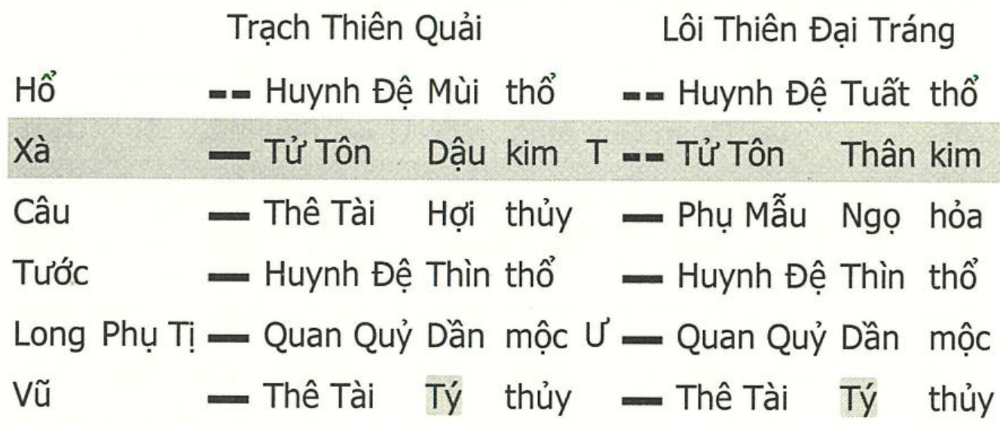
    - **Hình này chứng minh điều gì**
      - lấy hào 6 Tuất thổ làm Dụng thần để phân tích.
    - **Từ đâu mà thấy được**
      - Nhìn vào hào Thế, hào Ứng, Dụng thần và động hào trong bảng quẻ Sơ đồ quẻ Trạch Thiên Quải biến Lôi Thiên Đại Tráng.
- **Quá trình suy luận và đối thoại ban đầu:**
  - Căn cứ suy luận: Trước hết tôi phán đoán hôn nhân đầu tiên của cô ấy không thể đến đầu bạc răng long, đã ly hôn.
  - Căn cứ suy luận: Bởi vì đã có thời gian kết hôn, do đó thời gian ly hôn nhất định là từ năm 1995 về sau.
  - Căn cứ suy luận: Trong quẻ Quan Quỷ lưỡng hiện, có thông tin hôn nhân lần thứ hai, thế là yêu cầu phán đoán thời gian của hôn nhân lần thứ hai.
  - Căn cứ suy luận: Bởi vì không ly hôn thì sẽ không có hôn nhân lần thứ hai.
  - Căn cứ suy luận: Phán đoán thời gian của hôn nhân lần thứ hai cần phải phân tích từng năm, bắt đầu từ năm 1998, xem năm nào là cơ hội tốt nhất.
  - Căn cứ suy luận: Lấy Quan Quỷ làm Dụng thần.
  - Đối thoại thực tế: Người mẹ ở bên cạnh đã nói thay: "Xem cát hung của con rể tôi."
  - Đối thoại thực tế: Trong Tăng San Bốc Dịch nói rằng: "Đại tượng hối nhân, tất dĩ quy củ.
  - Đối thoại thực tế: Bốc giả quyết đoán, toàn tại linh cơ¹.", "Tha sự do tha động niệm, thận vật đề tha²." Xem quẻ cần phải linh hoạt, không thể cứng nhắc.
- **Ứng nghiệm thực tế và diễn biến sự việc:**
  - Thực tế diễn biến kiểm chứng ứng kỳ và cát hung của quẻ chiêm.
- **Ngộ giải và bài học kinh nghiệm then chốt:**
  - Đúc rút quy luật thực chiến: Xem xét tổng thể ngũ hành, hào động và tâm thái người gieo quẻ.

### Ví dụ 4: Một người phụ nữ dẫn theo con gái của mình đến dự đoán
- **Bối cảnh & Dữ kiện chiêm bái:**
  - **Ví dụ 4:** Một người phụ nữ dẫn theo con gái của mình đến dự đoán, con gái cô ấy đầy vẻ ưu sầu, vừa nhìn là biết đã có chuyện lớn xảy ra, sự việc nhất định có liên quan đến con gái cô ấy.
  - Nhưng con gái lần lữa không chịu gieo quẻ, người mẹ giục nhiều lần, con gái mới cầm đồng xu lên, ở ngày Ất Dậu tháng Thân, gieo được Phong Sơn Tiệm biến Hỏa Sơn Lữ.
  - Sau khi ra quẻ, tôi hỏi rốt cuộc muốn dự đoán cái gì?
  - Con gái vẫn không mở miệng.
  - Người mẹ ở bên cạnh đã nói thay: "Xem cát hung của con rể tôi."
- Bảng quẻ Sơ đồ quẻ Phong Sơn Tiệm biến Hỏa Sơn Lữ:
  - **Hình 128.** Sơ đồ quẻ Phong Sơn Tiệm biến Hỏa Sơn Lữ
    - 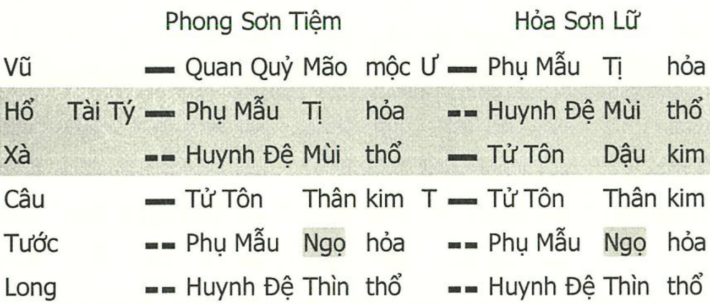
    - **Hình này chứng minh điều gì**
      - lấy Quan Quỷ làm Dụng thần.
    - **Từ đâu mà thấy được**
      - Nhìn vào hào Thế, hào Ứng, Dụng thần và động hào trong bảng quẻ Sơ đồ quẻ Phong Sơn Tiệm biến Hỏa Sơn Lữ.
- **Quá trình suy luận và đối thoại ban đầu:**
  - Căn cứ suy luận: Quẻ này tôi không đoán ngày Mùi, hoặc ngày Sửu, lẽ ra Mùi thổ Không Vong, không thể dẫn hóa Tị hỏa, xuất Không sinh Tử Tôn mới đúng, nhưng Tị hỏa này cũng hóa ra Mùi thổ, cho nên Mùi thổ xuất Không cũng không thể sinh Tử Tôn.
  - Đối thoại thực tế: Người mẹ ở bên cạnh đã nói thay: "Xem cát hung của con rể tôi."
  - Đối thoại thực tế: Trong Tăng San Bốc Dịch nói rằng: "Đại tượng hối nhân, tất dĩ quy củ.
  - Đối thoại thực tế: Bốc giả quyết đoán, toàn tại linh cơ¹.", "Tha sự do tha động niệm, thận vật đề tha²." Xem quẻ cần phải linh hoạt, không thể cứng nhắc.
  - Đối thoại thực tế: Do đó nói với họ: "Không cần lo lắng, vấn đề không nghiêm trọng, ngày kia (ngày Đinh Hợi) có thể được thả ra."
- **Ứng nghiệm thực tế và diễn biến sự việc:**
  - Nhìn vào kết quả thực tế: Kết quả là được ra ở ngày Đinh Hợi, thì ra là con rể bị bắt để điều tra, nhưng sau cùng không điều tra ra vấn đề, đã được thả.
- **Ngộ giải và bài học kinh nghiệm then chốt:**
  - Đúc rút quy luật thực chiến: Xem xét tổng thể ngũ hành, hào động và tâm thái người gieo quẻ.

### Quái lệ 5: Sơ đồ quẻ Sơn Phong Cổ
- **Bối cảnh & Dữ kiện chiêm bái:**
  - Kết quả là được ra ở ngày Đinh Hợi, thì ra là con rể bị bắt để điều tra, nhưng sau cùng không điều tra ra vấn đề, đã được thả.
  - Quẻ này tôi không đoán ngày Mùi, hoặc ngày Sửu, lẽ ra Mùi thổ Không Vong, không thể dẫn hóa Tị hỏa, xuất Không sinh Tử Tôn mới đúng, nhưng Tị hỏa này cũng hóa ra Mùi thổ, cho nên Mùi thổ xuất Không cũng không thể sinh Tử Tôn.
  - Do đó đoán là ngày Hợi xung mất Tị hỏa, Tử Tôn không còn bị uy hiếp thì có thể được thả ra.
  - Ví dụ 5: Ngày Bính Thân tháng Mão, một người Nhật Bản đã bị cảm mạo hơn một tháng, kèm theo ho, sau đó bắt đầu đau nhức xương sườn, đến bệnh viện kiểm tra thì bác sĩ nói là gãy xương, cần phải phẫu thuật, liền nhờ tôi đoán xem rốt cuộc là chuyện gì đang xảy ra?
  - Gieo quẻ được Sơn Phong Cổ.
- Bảng quẻ Sơ đồ quẻ Sơn Phong Cổ:
  - **Hình 129.** Sơ đồ quẻ Sơn Phong Cổ
    - 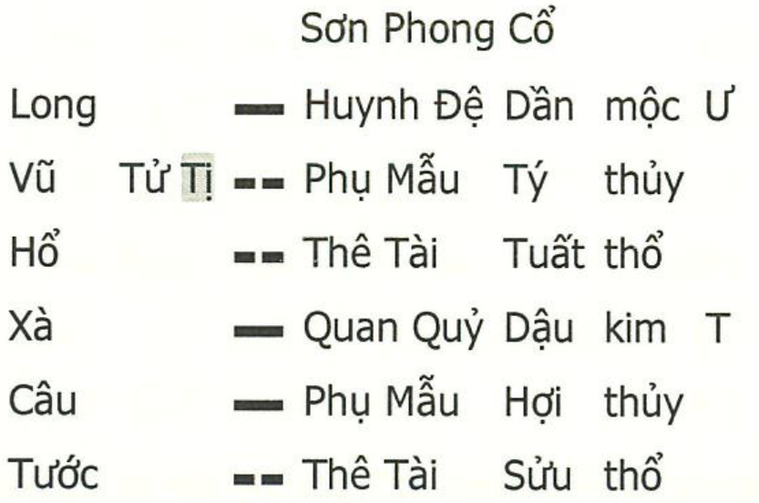
    - **Hình này chứng minh điều gì**
      - Bảng quẻ Sơ đồ quẻ Sơn Phong Cổ phản ánh sự phối chiếu hào vị, ngũ hành và động biến minh chứng cho vấn đề chiêm đoán.
    - **Từ đâu mà thấy được**
      - Nhìn vào hào Thế, hào Ứng, Dụng thần và động hào trong bảng quẻ Sơ đồ quẻ Sơn Phong Cổ.
- **Quá trình suy luận và đối thoại ban đầu:**
  - Căn cứ suy luận: Quẻ này tôi không đoán ngày Mùi, hoặc ngày Sửu, lẽ ra Mùi thổ Không Vong, không thể dẫn hóa Tị hỏa, xuất Không sinh Tử Tôn mới đúng, nhưng Tị hỏa này cũng hóa ra Mùi thổ, cho nên Mùi thổ xuất Không cũng không thể sinh Tử Tôn.
  - Đối thoại thực tế: Do đó nói với họ: "Không cần lo lắng, vấn đề không nghiêm trọng, ngày kia (ngày Đinh Hợi) có thể được thả ra."
- **Ứng nghiệm thực tế và diễn biến sự việc:**
  - Thực tế diễn biến kiểm chứng ứng kỳ và cát hung của quẻ chiêm.
- **Ngộ giải và bài học kinh nghiệm then chốt:**
  - Đúc rút quy luật thực chiến: Xem xét tổng thể ngũ hành, hào động và tâm thái người gieo quẻ.

### Tổng kết chuyên đề và bài học tâm đắc
- **Huyền cơ cốt lõi rút ra từ các quái lệ:**
  - sườn, mộc là phong hàn, đau nhức, quẻ cung Tốn, Tốn là phong, cũng chủ phong hàn, do đó nhất định là phong hàn gây ra.
  - Vì vậy, tôi bảo anh ta dùng 1 củ cà rốt vàng, 6 củ hành hoa (thông bạch) và 5 miếng gừng tươi nấu canh uống.
  - Đây là phương thuốc điều trị phong hàn cảm mạo cổ truyền dùng để đuổi hàn khí trong cơ thể.
  - Sau ba ngày uống liên tục, cảm mạo và ho biến mất, xương sườn cũng hết đau.
  - Anh ta còn nói canh này dễ uống, sau khi uống thì cơ thể tỏa nhiệt, vị cũng ngon.
  - Đây chính là nắm bắt linh hoạt theo tình hình thực tế.
  - Không thể nói một cách máy móc rằng kim là xương cốt thì Nguyệt phá là gãy xương.

## 30. Ứng Kỳ Động Vật Sinh Đẻ

- **Tổng quan nguyên lý & bối cảnh chuyên đề:**
  - Chó thuộc về Tử Tôn, vậy thì lấy cái gì để phán đoán chó con sinh ra? Về vấn đề này, thông qua thực tiễn nghiệm chứng thì phải lấy Tử Tôn làm Dụng thần, bởi vì trọng điểm dự đoán ở chó con, chứ không phải chó lớn, do đó Tử Tôn thể hiện chó con sẽ sinh ra. Nếu muốn xem cả tình trạng của chó lớn thì xem Nguyên thần Huynh Đệ.
  - Tử Tôn làm Dụng thần, Tử Tôn Hợi thủy lâm hào 5, là chó tương đối quý giá, thuộc về chó nổi tiếng. Bởi vì hào 5 là tôn vị. Anh ta trả lời là chó ngao Tây Tạng.
### Quái lệ 1: Sơ đồ quẻ Địa Sơn Khiêm
- **Bối cảnh & Dữ kiện chiêm bái:**
  - Ví dụ 1: Chó của một người bạn sắp đẻ con, đoán ngày nào đẻ?
  - Có thể đẻ mấy con?
  - Tình hình đực cái?
- Bảng quẻ Sơ đồ quẻ Địa Sơn Khiêm:
  - **Hình 130.** Sơ đồ quẻ Địa Sơn Khiêm
    - 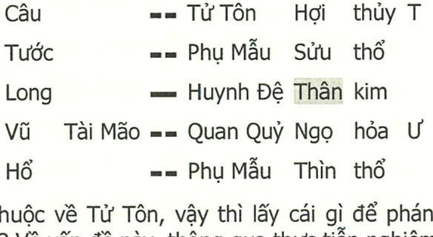
    - **Hình này chứng minh điều gì**
      - Bảng quẻ Sơ đồ quẻ Địa Sơn Khiêm phản ánh sự phối chiếu hào vị, ngũ hành và động biến minh chứng cho vấn đề chiêm đoán.
    - **Từ đâu mà thấy được**
      - Nhìn vào hào Thế, hào Ứng, Dụng thần và động hào trong bảng quẻ Sơ đồ quẻ Địa Sơn Khiêm.
- **Quá trình suy luận và đối thoại ban đầu:**
  - Căn cứ suy luận: Chó thuộc về Tử Tôn, vậy thì lấy cái gì để phán đoán chó con sinh ra?
  - Căn cứ suy luận: Về vấn đề này, thông qua thực tiễn nghiệm chứng thì phải lấy Tử Tôn làm Dụng thần, bởi vì trọng điểm dự đoán ở chó con, chứ không phải chó lớn, do đó Tử Tôn thể hiện chó con sẽ sinh ra.
  - Căn cứ suy luận: Tử Tôn làm Dụng thần, Tử Tôn Hợi thủy lâm hào 5, là chó tương đối quý giá, thuộc về chó nổi tiếng.
  - Căn cứ suy luận: Bởi vì hào 5 là tôn vị.
  - Đối thoại thực tế: Trở lại xem quẻ này, dựa vào Tử Tôn phán đoán ứng kỳ, quả thực không tìm được lý do, sau đó có một hôm đột nhiên nhớ đến phần trình bày ứng kỳ sinh sản trong Dịch Ẩn: "Xa thì lấy hào thai gặp Tuần Không, nếu như quẻ không có hào thai thì lấy hào 2.
  - Đối thoại thực tế: Trị Vũ thủy, không sang tháng mà sinh." Nội dung này chính là phần trình bày ứng kỳ sinh sản trong Dịch Ẩn, mặc dù không hẳn đều đúng, nhưng cũng có thể cho chúng ta một gợi ý.
- **Ứng nghiệm thực tế và diễn biến sự việc:**
  - Thực tế diễn biến kiểm chứng ứng kỳ và cát hung của quẻ chiêm.
- **Ngộ giải và bài học kinh nghiệm then chốt:**
  - Đúc rút quy luật thực chiến: Xem xét tổng thể ngũ hành, hào động và tâm thái người gieo quẻ.

### Quái lệ 2: Sơ đồ quẻ Sơn Lôi Di
- **Bối cảnh & Dữ kiện chiêm bái:**
  - Tử Tôn được Nguyệt hợp là vượng, nhập Mộ ở Nhật, nhập Mộ Ứng xung, ngày mai là ngày Tị sẽ sinh.
  - Tử Tôn là thủy, thủy chủ 6, do đó sinh 6 con.
  - Thủy lại chủ màu đen, lâm Câu Trần, Câu Trần là màu vàng, do đó chó sinh ra có màu đen cũng có màu vàng.
  - Kết quả màu lông, số lượng và tình hình đực cái của chó đều phán đoán chính xác, chỉ là thời gian đẻ có độ lệch, đã đẻ ở giờ Mão ngày Quý Mùi.
  - Sau đó ở giờ Tị ngày Canh Tý tháng này sinh hạ an toàn một con gái.
- Bảng quẻ Sơ đồ quẻ Sơn Lôi Di:
  - **Hình 131.** Sơ đồ quẻ Sơn Lôi Di
    - 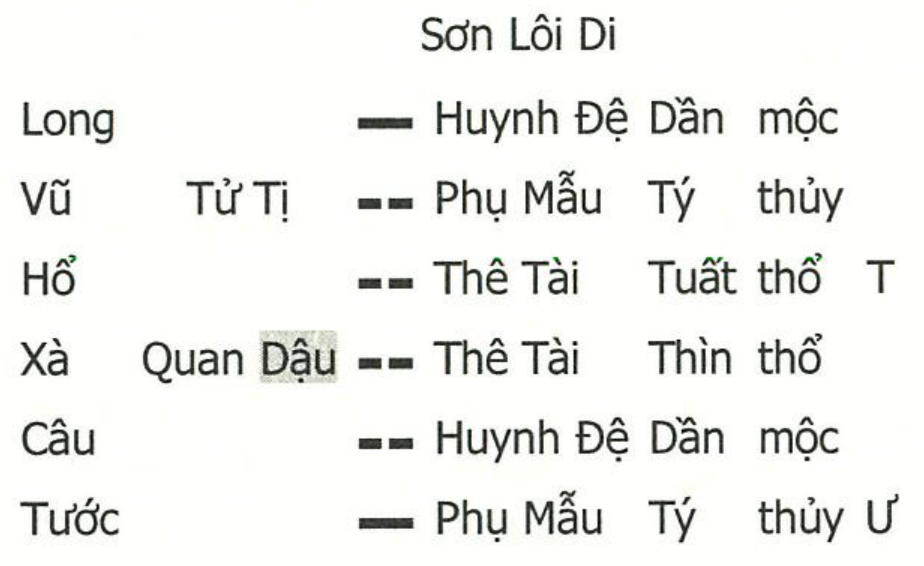
    - **Hình này chứng minh điều gì**
      - Lấy hào Tử Tôn làm Dụng thần.
    - **Từ đâu mà thấy được**
      - Nhìn vào hào Thế, hào Ứng, Dụng thần và động hào trong bảng quẻ Sơ đồ quẻ Sơn Lôi Di.
- **Quá trình suy luận và đối thoại ban đầu:**
  - Tác giả phân tích cấu trúc hào tượng, Dụng thần và các yếu tố sinh khắc trong quẻ Sơ đồ quẻ Sơn Lôi Di.
  - Đối thoại thực tế: Trở lại xem quẻ này, dựa vào Tử Tôn phán đoán ứng kỳ, quả thực không tìm được lý do, sau đó có một hôm đột nhiên nhớ đến phần trình bày ứng kỳ sinh sản trong Dịch Ẩn: "Xa thì lấy hào thai gặp Tuần Không, nếu như quẻ không có hào thai thì lấy hào 2.
  - Đối thoại thực tế: Trị Vũ thủy, không sang tháng mà sinh." Nội dung này chính là phần trình bày ứng kỳ sinh sản trong Dịch Ẩn, mặc dù không hẳn đều đúng, nhưng cũng có thể cho chúng ta một gợi ý.
- **Ứng nghiệm thực tế và diễn biến sự việc:**
  - Thực tế diễn biến kiểm chứng ứng kỳ và cát hung của quẻ chiêm.
- **Ngộ giải và bài học kinh nghiệm then chốt:**
  - Đúc rút quy luật thực chiến: Xem xét tổng thể ngũ hành, hào động và tâm thái người gieo quẻ.

### Quái lệ 3: Sơ đồ quẻ Địa Lôi Phục biến Địa Sơn Khiêm
- **Bối cảnh & Dữ kiện chiêm bái:**
  - ## Ví dụ 3: Ngày Quý Hợi tháng Mùi, một người đàn ông đoán cát hung của cháu gái sinh hài tử và tiểu hài, được Địa Lôi Phục biến Địa Sơn Khiêm.
  - Cháu gái và trẻ sơ sinh đều thuộc hào Tử Tôn, nhưng trong quẻ chỉ có một hào Tử Tôn, nếu lấy một hào Tử Tôn để phán đoán đồng thời cát hung của trẻ sơ sinh và cháu gái thì hiển nhiên không thích hợp cho lắm.
  - Ở đây phải sử dụng linh hoạt lục thân.
  - Nếu như xem Tử Tôn Dậu kim là trẻ sơ sinh, Huynh Đệ Sửu thổ là Mộ khố Tử Tôn thì là người mang thai trẻ sơ sinh, do đó Huynh Đệ Sửu thổ có thể lý giải là cháu gái người này.
  - Nay Mộ khố Tử Tôn Nguyệt phá, là thông tin tháng này sẽ sinh hài tử.
- Bảng quẻ Sơ đồ quẻ Địa Lôi Phục biến Địa Sơn Khiêm:
  - **Hình 132.** Sơ đồ quẻ Địa Lôi Phục biến Địa Sơn Khiêm
    - 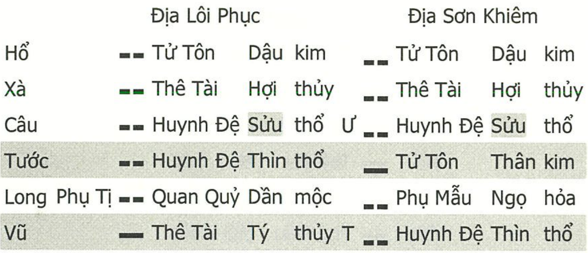
    - **Hình này chứng minh điều gì**
      - Lấy hào Tử Tôn làm Dụng thần.
    - **Từ đâu mà thấy được**
      - Nhìn vào hào Thế, hào Ứng, Dụng thần và động hào trong bảng quẻ Sơ đồ quẻ Địa Lôi Phục biến Địa Sơn Khiêm.
- **Quá trình suy luận và đối thoại ban đầu:**
  - Căn cứ suy luận: Bởi vì sau khi đoán xong quẻ trên ở ngày Dần chưa sinh ra mèo con, do đó ở ngày Giáp Thìn tháng Tị lại gieo quẻ, được Trạch Phong Đại Quá biến Thủy Hỏa Ký Tế.
- **Ứng nghiệm thực tế và diễn biến sự việc:**
  - Nhìn vào kết quả thực tế: Kết quả là ở giờ Dần ngày Đinh Mùi sinh 3 con.
  - Nhìn vào kết quả thực tế: Không ứng ở ngày thực phá, mà ứng giờ hợp phá, ngày thì ứng ở ngày Dưỡng của Tử Tôn, sinh đẻ của động vật phải chăng có sự khác biệt so với người?
- **Ngộ giải và bài học kinh nghiệm then chốt:**
  - Đúc rút quy luật thực chiến: Xem xét tổng thể ngũ hành, hào động và tâm thái người gieo quẻ.

### Quái lệ 4: Sơ đồ quẻ Trạch Địa Tụy
- **Bối cảnh & Dữ kiện chiêm bái:**
  - ## Ví dụ 4: Con mèo trong nhà đang mang thai và có thể sẽ sinh trong vài ngày tới, đoán thời gian hòa số lượng mèo con sinh ra, ở ngày Mậu Tý tháng Tị, được Trạch Địa Tụy.
  - Kết quả là ở giờ Dần ngày Đinh Mùi sinh 3 con.
  - Không ứng ở ngày thực phá, mà ứng giờ hợp phá, ngày thì ứng ở ngày Dưỡng của Tử Tôn, sinh đẻ của động vật phải chăng có sự khác biệt so với người?
  - Ví dụ này có thể so sánh với ví dụ 1 để nghiên cứu.
  - Bởi vì sau khi đoán xong quẻ trên ở ngày Dần chưa sinh ra mèo con, do đó ở ngày Giáp Thìn tháng Tị lại gieo quẻ, được Trạch Phong Đại Quá biến Thủy Hỏa Ký Tế.
- Bảng quẻ Sơ đồ quẻ Trạch Địa Tụy:
  - **Hình 133.** Sơ đồ quẻ Trạch Địa Tụy
    - 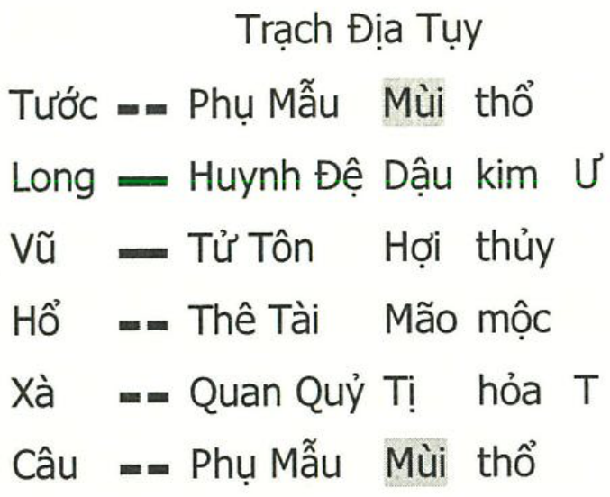
    - **Hình này chứng minh điều gì**
      - Lấy hào Tử Tôn làm Dụng thần.
    - **Từ đâu mà thấy được**
      - Nhìn vào hào Thế, hào Ứng, Dụng thần và động hào trong bảng quẻ Sơ đồ quẻ Trạch Địa Tụy.
- **Quá trình suy luận và đối thoại ban đầu:**
  - Căn cứ suy luận: Bởi vì sau khi đoán xong quẻ trên ở ngày Dần chưa sinh ra mèo con, do đó ở ngày Giáp Thìn tháng Tị lại gieo quẻ, được Trạch Phong Đại Quá biến Thủy Hỏa Ký Tế.
- **Ứng nghiệm thực tế và diễn biến sự việc:**
  - Thực tế diễn biến kiểm chứng ứng kỳ và cát hung của quẻ chiêm.
- **Ngộ giải và bài học kinh nghiệm then chốt:**
  - Đúc rút quy luật thực chiến: Xem xét tổng thể ngũ hành, hào động và tâm thái người gieo quẻ.

### Quái lệ 5: Sơ đồ quẻ Trạch Phong Đại Quá biến Thủy Hỏa Ký Tế
- **Bối cảnh & Dữ kiện chiêm bái:**
  - Chiêm đoán theo bảng quẻ Sơ đồ quẻ Trạch Phong Đại Quá biến Thủy Hỏa Ký Tế trong thực tiễn.
- Bảng quẻ Sơ đồ quẻ Trạch Phong Đại Quá biến Thủy Hỏa Ký Tế:
  - **Hình 134.** Sơ đồ quẻ Trạch Phong Đại Quá biến Thủy Hỏa Ký Tế
    - 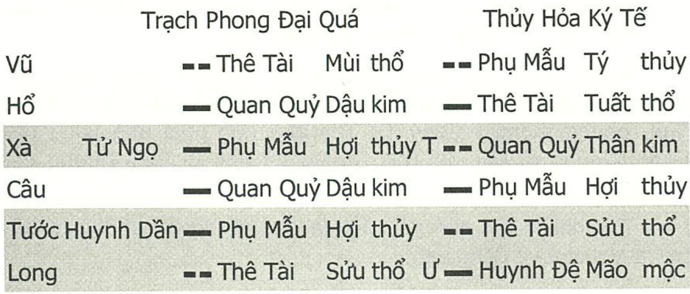
    - **Hình này chứng minh điều gì**
      - Bảng quẻ Sơ đồ quẻ Trạch Phong Đại Quá biến Thủy Hỏa Ký Tế phản ánh sự phối chiếu hào vị, ngũ hành và động biến minh chứng cho vấn đề chiêm đoán.
    - **Từ đâu mà thấy được**
      - Nhìn vào hào Thế, hào Ứng, Dụng thần và động hào trong bảng quẻ Sơ đồ quẻ Trạch Phong Đại Quá biến Thủy Hỏa Ký Tế.
- **Quá trình suy luận và đối thoại ban đầu:**
  - Tác giả phân tích cấu trúc hào tượng, Dụng thần và các yếu tố sinh khắc trong quẻ Sơ đồ quẻ Trạch Phong Đại Quá biến Thủy Hỏa Ký Tế.
- **Ứng nghiệm thực tế và diễn biến sự việc:**
  - Thực tế diễn biến kiểm chứng ứng kỳ và cát hung của quẻ chiêm.
- **Ngộ giải và bài học kinh nghiệm then chốt:**
  - Đúc rút quy luật thực chiến: Xem xét tổng thể ngũ hành, hào động và tâm thái người gieo quẻ.

### Quái lệ 6: Quẻ Phong Thủy Hoán biến Tốn Vi Phong
- **Bối cảnh & Dữ kiện chiêm bái:**
  - Sau đó sinh hạ mèo con ở giờ Dần ngày Mùi.
  - Đến 11:30 tối ngày Bính Ngọ, mèo mẹ đã nằm đứng bất an, thấy rằng sắp sinh mèo con, thế là lại lập quẻ, ở ngày Bính Ngọ tháng Tị, được Phong Thủy Hoán biến Tốn Vi Phong.
- Bảng quẻ Quẻ Phong Thủy Hoán biến Tốn Vi Phong:
  - **Hình 135.** Quẻ Phong Thủy Hoán biến Tốn Vi Phong
    - 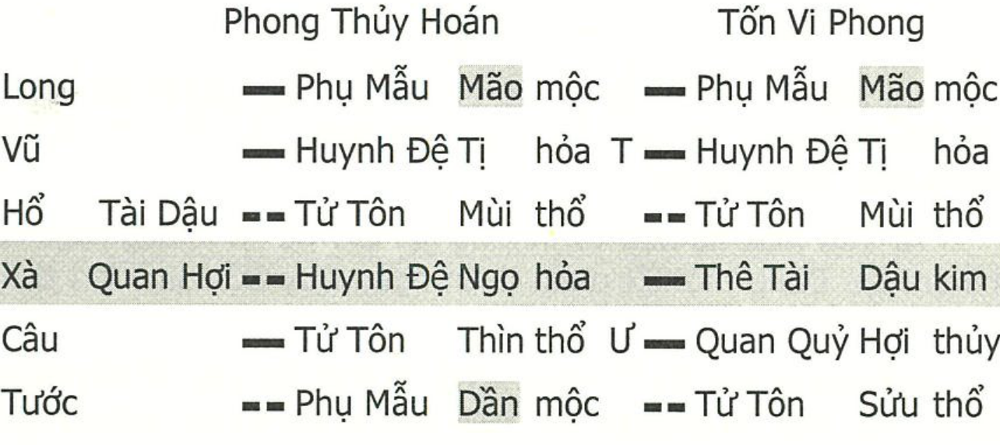
    - **Hình này chứng minh điều gì**
      - Bảng quẻ Quẻ Phong Thủy Hoán biến Tốn Vi Phong phản ánh sự phối chiếu hào vị, ngũ hành và động biến minh chứng cho vấn đề chiêm đoán.
    - **Từ đâu mà thấy được**
      - Nhìn vào hào Thế, hào Ứng, Dụng thần và động hào trong bảng quẻ Quẻ Phong Thủy Hoán biến Tốn Vi Phong.
- **Quá trình suy luận và đối thoại ban đầu:**
  - Căn cứ suy luận: Đồng thời tôi phán đoán ngày Quý Dậu sinh lợn con, sẽ sinh 4 con.
  - Căn cứ suy luận: Kết quả là sau khi hỏi quẻ xong thì một lúc sau đã tìm được lợn bị mất, sau đó ở ngày Quý Dậu sinh được 4 con, Nhưng đều không sống được, chắc là bởi vì Nguyệt Tuyệt và Nhật là Tử địa.
- **Ứng nghiệm thực tế và diễn biến sự việc:**
  - Nhìn vào kết quả thực tế: Kết quả là sau khi hỏi quẻ xong thì một lúc sau đã tìm được lợn bị mất, sau đó ở ngày Quý Dậu sinh được 4 con, Nhưng đều không sống được, chắc là bởi vì Nguyệt Tuyệt và Nhật là Tử địa.
- **Ngộ giải và bài học kinh nghiệm then chốt:**
  - Đúc rút quy luật thực chiến: Xem xét tổng thể ngũ hành, hào động và tâm thái người gieo quẻ.

### Ví dụ 5: Có một hôm
- **Bối cảnh & Dữ kiện chiêm bái:**
  - **Ví dụ 5:** Có một hôm, một cô gái ở nơi khác gọi đến thỉnh cầu dự đoán, lợn mẹ của gia đình cô ấy sắp đẻ nhưng đã đi mất, quýnh quáng đến nỗi không biết phải làm sao, hỏi có thể tìm được hay không?
  - Ở giờ Dậu ngày Giáp Tý tháng Dần, tôi gieo quẻ được Hỏa Trạch Khuê.
  - Kết quả là sau khi hỏi quẻ xong thì một lúc sau đã tìm được lợn bị mất, sau đó ở ngày Quý Dậu sinh được 4 con, Nhưng đều không sống được, chắc là bởi vì Nguyệt Tuyệt và Nhật là Tử địa.
- Bảng quẻ Quẻ Hỏa Trạch Khuê:
  - **Hình 136.** Quẻ Hỏa Trạch Khuê
    - 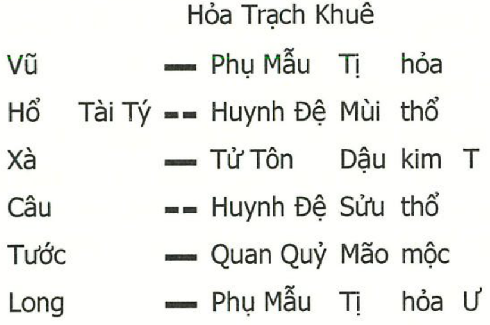
    - **Hình này chứng minh điều gì**
      - lấy Tử Tôn làm Dụng thần.
    - **Từ đâu mà thấy được**
      - Nhìn vào hào Thế, hào Ứng, Dụng thần và động hào trong bảng quẻ Quẻ Hỏa Trạch Khuê.
- **Quá trình suy luận và đối thoại ban đầu:**
  - Căn cứ suy luận: Đồng thời tôi phán đoán ngày Quý Dậu sinh lợn con, sẽ sinh 4 con.
  - Căn cứ suy luận: Kết quả là sau khi hỏi quẻ xong thì một lúc sau đã tìm được lợn bị mất, sau đó ở ngày Quý Dậu sinh được 4 con, Nhưng đều không sống được, chắc là bởi vì Nguyệt Tuyệt và Nhật là Tử địa.
- **Ứng nghiệm thực tế và diễn biến sự việc:**
  - Thực tế diễn biến kiểm chứng ứng kỳ và cát hung của quẻ chiêm.
- **Ngộ giải và bài học kinh nghiệm then chốt:**
  - Đúc rút quy luật thực chiến: Xem xét tổng thể ngũ hành, hào động và tâm thái người gieo quẻ.

## 31. Quẻ Cần Dựa Vào Cảm Ngộ Để Hiểu Rõ

- **Tổng quan nguyên lý & bối cảnh chuyên đề:**
  - Lấy Tử Tôn làm Dụng thần. Tử Tôn Tị hỏa tại hào 5, hào 5 là đường, con ở ngoài chạy ngược chạy xuôi, Nguyệt sinh Dụng thần, Nhật không khắc, trong quẻ cũng không có hào động đến khắc, con ở ngoài bình an.
  - Tử Tôn Tị hỏa an tĩnh, Tị hỏa tương ứng với Đông Nam, con ở hướng Đông Nam.
  - Trong quẻ này có hai hào động, hào 3 Quan động hóa Tài, hào sơ Tài động hóa Tử Tôn. "Thần hào khởi loạn phát[^1]", hai hào động này nhất định có thông tin trọng yếu ở bên trong. Trong quẻ Tài Không biểu thị lúc con bỏ đi không có nhiều tiền, Quan động hóa Tài, Quan Quỷ thể hiện công việc, chứng tỏ con ở ngoài tìm việc làm và muốn kiếm tiền, nhưng hóa ra hào Tài Không Vong, không kiếm được đồng nào.
  - Khi đó người xem nói: "Con trai tôi đã bỏ đi cùng với hai đứa trẻ khác, lúc đi không mang theo bao nhiêu tiền, chúng nó đã từng làm bảo vệ cho một công ty ở phía Đông Nam, hai đứa trẻ kia đã trở về và cho chúng tôi biết địa chỉ của công ty đó, thế là chúng tôi đã đi tìm, nhưng con trai tôi đã không còn ở đó nữa,
### Quái lệ 1: Sơ đồ quẻ Tốn Vi Phong biến Phong Trạch Trung Phu
- **Bối cảnh & Dữ kiện chiêm bái:**
  - **Ví dụ 1:** Một hôm, có một người ở quê nhà đến tìm tôi dự đoán, anh ta nói rằng con của anh ta đã bỏ đi một tháng trước, hiện nay ngay cả điện thoại cũng không có, trong lòng rất lo lắng, xem tình hình cát hung, khi nào có thể tìm được?
  - Ở ngày Bính Thìn tháng Mão, được Tốn Vi Phong biến Phong Trạch Trung Phu.
  - Khi đó người xem nói: "Con trai tôi đã bỏ đi cùng với hai đứa trẻ khác, lúc đi không mang theo bao nhiêu tiền, chúng nó đã từng làm bảo vệ cho một công ty ở phía Đông Nam, hai đứa trẻ kia đã trở về và cho chúng tôi biết địa chỉ của công ty đó, thế là chúng tôi đã đi tìm, nhưng con trai tôi đã không còn ở đó nữa,
- Bảng quẻ Sơ đồ quẻ Tốn Vi Phong biến Phong Trạch Trung Phu:
  - **Hình 137.** Sơ đồ quẻ Tốn Vi Phong biến Phong Trạch Trung Phu
    - 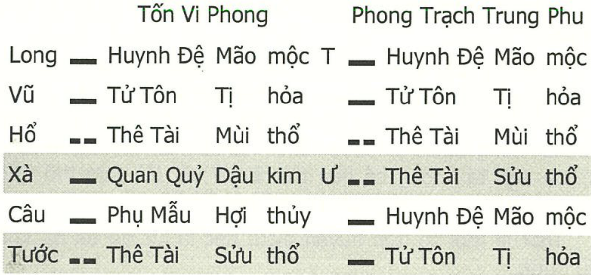
    - **Hình này chứng minh điều gì**
      - Lấy Tử Tôn làm Dụng thần.
    - **Từ đâu mà thấy được**
      - Nhìn vào hào Thế, hào Ứng, Dụng thần và động hào trong bảng quẻ Sơ đồ quẻ Tốn Vi Phong biến Phong Trạch Trung Phu.
- **Quá trình suy luận và đối thoại ban đầu:**
  - Căn cứ suy luận: Kết quả là ba ngày sau con của anh ta đã tự về bởi vì không có tiền.
  - Đối thoại thực tế: "Thần hào khởi loạn phát[^1]", hai hào động này nhất định có thông tin trọng yếu ở bên trong.
  - Đối thoại thực tế: Khi đó người xem nói: "Con trai tôi đã bỏ đi cùng với hai đứa trẻ khác, lúc đi không mang theo bao nhiêu tiền, chúng nó đã từng làm bảo vệ cho một công ty ở phía Đông Nam, hai đứa trẻ kia đã trở về và cho chúng tôi biết địa chỉ của công ty đó, thế là chúng tôi đã đi tìm, nhưng con trai tôi đã không còn ở đó nữa,
  - Đối thoại thực tế: Tôi an ủi anh ta rằng: "Không cần sốt ruột, chín ngày sau con sẽ về." Bởi vì hào sơ Sửu thổ hóa Tử Tôn, nhưng Không mà hóa không ra, ngày Sửu xuất Không về ngay.
- **Ứng nghiệm thực tế và diễn biến sự việc:**
  - Nhìn vào kết quả thực tế: Kết quả là ba ngày sau con của anh ta đã tự về bởi vì không có tiền.
- **Ngộ giải và bài học kinh nghiệm then chốt:**
  - Đúc rút quy luật thực chiến: Xem xét tổng thể ngũ hành, hào động và tâm thái người gieo quẻ.

### Ví dụ 2: Ngày Giáp Tuất tháng Thân
- **Bối cảnh & Dữ kiện chiêm bái:**
  - Tôi an ủi anh ta rằng: "Không cần sốt ruột, chín ngày sau con sẽ về." Bởi vì hào sơ Sửu thổ hóa Tử Tôn, nhưng Không mà hóa không ra, ngày Sửu xuất Không về ngay.
  - Anh ta nghe xong thì vui vẻ trở về.
  - Kết quả là ba ngày sau con của anh ta đã tự về bởi vì không có tiền.
  - Phản hồi vừa đến, tôi đột nhiên có điều cảm ngộ.
  - Lúc đoán tôi vẫn chưa hiểu được sự biến hóa hết sức vi diệu trong quẻ, hào sơ Thê Tài Sửu thổ Không hóa Tử Tôn, Tài thể hiện tiền, Không chính là không có tiền, hóa ra Tử Tôn là con của anh ta, rõ ràng là khi con anh ta không có tiền thì sẽ trở về.
- Bảng quẻ Sơ đồ quẻ Hỏa Thủy Vị Tế biến Hỏa Phong Đỉnh:
  - **Hình 138.** Sơ đồ quẻ Hỏa Thủy Vị Tế biến Hỏa Phong Đỉnh
    - 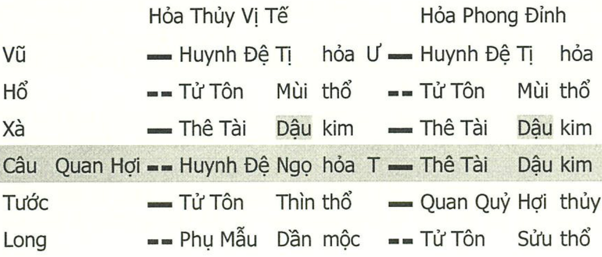
    - **Hình này chứng minh điều gì**
      - Bảng quẻ Sơ đồ quẻ Hỏa Thủy Vị Tế biến Hỏa Phong Đỉnh phản ánh sự phối chiếu hào vị, ngũ hành và động biến minh chứng cho vấn đề chiêm đoán.
    - **Từ đâu mà thấy được**
      - Nhìn vào hào 2 ám động, hào 2 là trạch, chứng tỏ con cái thường xuyên về nhà.
- **Quá trình suy luận và đối thoại ban đầu:**
  - Căn cứ suy luận: Kết quả là ba ngày sau con của anh ta đã tự về bởi vì không có tiền.
  - Căn cứ suy luận: Trong quẻ Tử Tôn Thìn thổ tại hào 2 ám động, hào 2 là trạch, chứng tỏ con cái thường xuyên về nhà.
  - Căn cứ suy luận: Bởi vì có phiền não đến từ con cái, làm gì có chuyện bởi vì con cái hiếu kính mà phiền não?
  - Căn cứ suy luận: Là đến hợp Tài ở hào 4, xem ra mục đích của về nhà là để đòi tiền của mình.
  - Căn cứ suy luận: Phụ Mẫu bị hào Tài trên Nguyệt xung phá không thể sinh hào Thế, xem ra bởi vì cho cha mẹ xài tiền, phụng dưỡng cha mẹ, nhưng cha mẹ lại không thông cảm cho mình, không quan tâm mình mà sản sinh phiền não.
  - Căn cứ suy luận: Lẽ ra tổ hợp Huynh Đệ trì Thế hóa Tài là tổ hợp đắc tài, nhưng bởi vì Tài Không, do đó giống như không đắc tài.
  - Đối thoại thực tế: Tôi an ủi anh ta rằng: "Không cần sốt ruột, chín ngày sau con sẽ về." Bởi vì hào sơ Sửu thổ hóa Tử Tôn, nhưng Không mà hóa không ra, ngày Sửu xuất Không về ngay.
  - Đối thoại thực tế: Người xưa nói: "Thần triệu cơ ở động", độc phát có chức năng biểu thị nguyên nhân và tính chất của sự vật, Huynh Đệ này trì Thế khắc hào Tài trong quẻ đồng thời lại hóa Tài Không, rất rõ ràng, chủ đề phiền não là tiền tài.
- **Ứng nghiệm thực tế và diễn biến sự việc:**
  - Thực tế diễn biến kiểm chứng ứng kỳ và cát hung của quẻ chiêm.
- **Ngộ giải và bài học kinh nghiệm then chốt:**
  - Đúc rút quy luật thực chiến: Xem xét tổng thể ngũ hành, hào động và tâm thái người gieo quẻ.

### Quái lệ 3: Sơ đồ quẻ Sơn Thủy Mông biến Địa Thủy Sư
- **Bối cảnh & Dữ kiện chiêm bái:**
  - Hỏi về phiền não trong nhà, thông thường chúng ta theo chủ quan có thể có một số tình huống như sau: 1, Gia đình bất hòa.
  - 2, Căng thẳng vì tiền tài.
  - 3, Trẻ nhỏ không nghe lời.
  - Người xưa nói: "Thần triệu cơ ở động", độc phát có chức năng biểu thị nguyên nhân và tính chất của sự vật, Huynh Đệ này trì Thế khắc hào Tài trong quẻ đồng thời lại hóa Tài Không, rất rõ ràng, chủ đề phiền não là tiền tài.
  - Chẳng lẽ là không kiếm được tiền?
- Bảng quẻ Sơ đồ quẻ Sơn Thủy Mông biến Địa Thủy Sư:
  - **Hình 139.** Sơ đồ quẻ Sơn Thủy Mông biến Địa Thủy Sư
    - 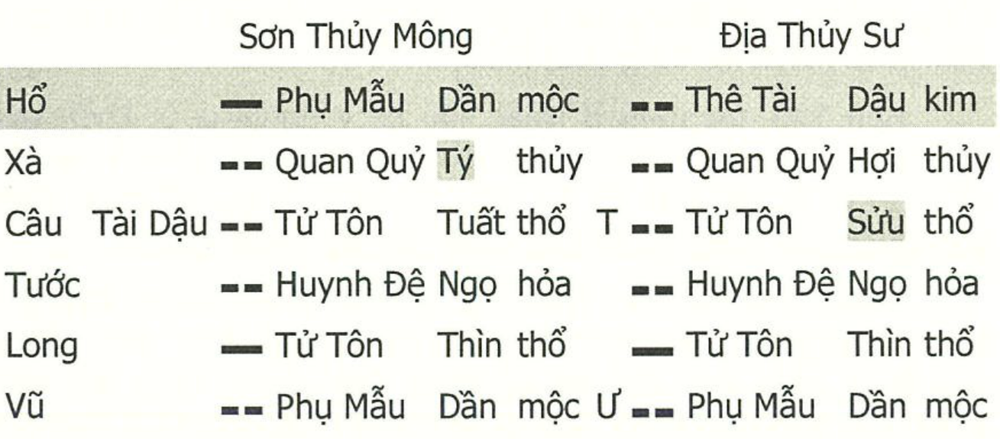
    - **Hình này chứng minh điều gì**
      - lấy Thê Tài làm Dụng thần.
    - **Từ đâu mà thấy được**
      - Nhìn vào hào 2 ám động, hào 2 là trạch, chứng tỏ con cái thường xuyên về nhà.
- **Quá trình suy luận và đối thoại ban đầu:**
  - Căn cứ suy luận: Trong quẻ Tử Tôn Thìn thổ tại hào 2 ám động, hào 2 là trạch, chứng tỏ con cái thường xuyên về nhà.
  - Căn cứ suy luận: Bởi vì có phiền não đến từ con cái, làm gì có chuyện bởi vì con cái hiếu kính mà phiền não?
  - Căn cứ suy luận: Là đến hợp Tài ở hào 4, xem ra mục đích của về nhà là để đòi tiền của mình.
  - Căn cứ suy luận: Phụ Mẫu bị hào Tài trên Nguyệt xung phá không thể sinh hào Thế, xem ra bởi vì cho cha mẹ xài tiền, phụng dưỡng cha mẹ, nhưng cha mẹ lại không thông cảm cho mình, không quan tâm mình mà sản sinh phiền não.
  - Căn cứ suy luận: Lẽ ra tổ hợp Huynh Đệ trì Thế hóa Tài là tổ hợp đắc tài, nhưng bởi vì Tài Không, do đó giống như không đắc tài.
  - Căn cứ suy luận: Sau khi tôi phán đoán ra thông tin trên đây, bà ấy đã trút ra được nỗi khổ tâm của mình.
  - Đối thoại thực tế: Người xưa nói: "Thần triệu cơ ở động", độc phát có chức năng biểu thị nguyên nhân và tính chất của sự vật, Huynh Đệ này trì Thế khắc hào Tài trong quẻ đồng thời lại hóa Tài Không, rất rõ ràng, chủ đề phiền não là tiền tài.
  - Đối thoại thực tế: Anh ta nói: "Quẻ này tôi cũng đã bảo một bạn học xem qua, anh ta nói là không thành, tại sao đoán khác với thầy?
  - Đối thoại thực tế: "Tiền lương có thể đến 6700 đô la Singapore." Tôi đáp, "Quẻ này là dễ bị xem sai.
  - Đối thoại thực tế: Đối với tình hình tiền lương, hào Tài được Nguyệt sinh, Nhật không khắc, suy vượng vừa phải, lấy quái số, nội quái số 6, ngoại quái số 7, chính là 6700 đô la Singapore."
  - Đối thoại thực tế: Anh ta hỏi: "Tại sao không đoán là 7600 đô la Singapore vậy?"
- **Ứng nghiệm thực tế và diễn biến sự việc:**
  - Nhìn vào kết quả thực tế: Tuyệt Tài chính là ép tiền lương thấp, nhưng sau khi Tuyệt Tài lại hóa ra Tài, do đó Tuyệt không mất Tài, cũng chính là không ép tiền lương, vẫn được cấp.
- **Ngộ giải và bài học kinh nghiệm then chốt:**
  - Đúc rút quy luật thực chiến: Xem xét tổng thể ngũ hành, hào động và tâm thái người gieo quẻ.

### Ví dụ 4: Một cô gái đoán tài vận năm nay của mình
- **Bối cảnh & Dữ kiện chiêm bái:**
  - Anh ta nói: "Quẻ này tôi cũng đã bảo một bạn học xem qua, anh ta nói là không thành, tại sao đoán khác với thầy?
  - Tại sao thầy đoán như vậy?
  - Tiền lương cao nhất có thể được bao nhiêu?
  - Quan này là hào 5, hào 5 là tôn vị, biểu thị cương vị này là cương vị tương đối trọng yếu, Không Vong ở đây không phải biểu thị bất thành, mà là biểu thị vị trí này để trống, cần có người bổ khuyết.
  - Anh ta hỏi: "Tại sao không đoán là 7600 đô la Singapore vậy?"
- Bảng quẻ Quẻ Khảm Vi Thủy biến Địa Thủy Sư:
  - **Hình 140.** Quẻ Khảm Vi Thủy biến Địa Thủy Sư
    - 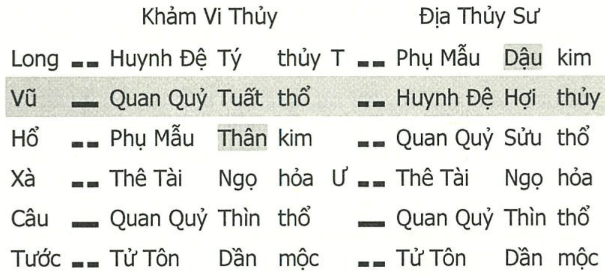
    - **Hình này chứng minh điều gì**
      - lấy Thê Tài làm Dụng thần.
    - **Từ đâu mà thấy được**
      - Nhìn vào hào Thế, hào Ứng, Dụng thần và động hào trong bảng quẻ Quẻ Khảm Vi Thủy biến Địa Thủy Sư.
- **Quá trình suy luận và đối thoại ban đầu:**
  - Căn cứ suy luận: Độc phát lấy tượng làm chủ, mặc dù Mộ có tác dụng nhẹ nhất trong tượng, nhưng bởi vì động nên nhất định ẩn tàng thông tin trọng yếu.
  - Căn cứ suy luận: Hào Thế tại hào 6 bị Tài xung phá, Tài nhập Mộ tại Quan trên hào 5, đây chính là nơi quy tụ tài vận của cô ấy.
  - Căn cứ suy luận: Hào 5 là đường, cũng chủ lãnh đạo, Quan cũng có thể biểu thị lãnh đạo.
  - Căn cứ suy luận: Nhập Mộ tại hào 5, cho thấy tài của cô ấy tổn thất ở trên đường, hoặc bởi vì lãnh đạo.
  - Căn cứ suy luận: Hào Thế là mình, hào Ứng là đối phương.
  - Căn cứ suy luận: Phụ Mẫu là đơn kiện, Quan Quỷ là nguyên nhân và tòa án v.v, dựa vào tổ hợp biến hóa trong quẻ mà phán đoán linh hoạt.
  - Đối thoại thực tế: Anh ta nói: "Quẻ này tôi cũng đã bảo một bạn học xem qua, anh ta nói là không thành, tại sao đoán khác với thầy?
  - Đối thoại thực tế: "Tiền lương có thể đến 6700 đô la Singapore." Tôi đáp, "Quẻ này là dễ bị xem sai.
  - Đối thoại thực tế: Đối với tình hình tiền lương, hào Tài được Nguyệt sinh, Nhật không khắc, suy vượng vừa phải, lấy quái số, nội quái số 6, ngoại quái số 7, chính là 6700 đô la Singapore."
  - Đối thoại thực tế: Anh ta hỏi: "Tại sao không đoán là 7600 đô la Singapore vậy?"
  - Đối thoại thực tế: "Quái số này cũng có thể tiên thủ thượng quái tái thủ hạ quái, nhưng cần phải xét đến suy vượng của Tài, 7600 tài hơi quá cao." Tôi trả lời.
- **Ứng nghiệm thực tế và diễn biến sự việc:**
  - Nhìn vào kết quả thực tế: Sau khi nghe xong, cô ấy hết sức ngạc nhiên, nói rằng: "Ông phán đoán rất đúng.
  - Nhìn vào kết quả thực tế: Năm nay tôi đã đầu cơ cổ phiếu, ban đầu tôi dự định kiếm được 8 vạn tệ thì rút khỏi thị trường chứng khoán.
  - Nhìn vào kết quả thực tế: Tôi vốn dự định sau khi đi làm sẽ lên sàn chứng khoán bán cổ phiếu, nhưng khi lên thang máy thì gặp một lãnh đạo trong đơn vị, không biết tại sao đã bàn về chủ đề cổ phiếu.
  - Nhìn vào kết quả thực tế: Ông ta cho biết cháu ngoại của ông ta là một cao thủ giao dịch, cổ phiếu nắm giữ đã kiếm được rất nhiều tiền, một ngày kiếm được mấy vạn, bây giờ rút khỏi thị trường chứng khoán thì chuyển cổ phiếu qua tiền có trở ngại.
  - Nhìn vào kết quả thực tế: Trách mình bị quỷ ám, vừa nghe đã động tâm, tôi đã bán toàn bộ cổ phiếu rồi mua lại cổ phiếu của cháu ngoại ông ta, ai ngờ hai ngày sau thì cổ phiếu đã rớt giá mạnh, 10 vạn tệ kiếm được đã mất sạch.
  - Nhìn vào kết quả thực tế: Thật không may, bất kể là ông ta hay là tôi, sau khi vào thang máy cố gắng đừng chạm mặt thì đã không có chuyện phá tài."
- **Ngộ giải và bài học kinh nghiệm then chốt:**
  - Đúc rút quy luật thực chiến: Xem xét tổng thể ngũ hành, hào động và tâm thái người gieo quẻ.

### Quái lệ 5: Quẻ Sơn Địa Bác biến Địa Thiên Thái
- **Bối cảnh & Dữ kiện chiêm bái:**
  - Sau khi nghe xong, cô ấy hết sức ngạc nhiên, nói rằng: "Ông phán đoán rất đúng.
  - Năm nay tôi đã đầu cơ cổ phiếu, ban đầu tôi dự định kiếm được 8 vạn tệ thì rút khỏi thị trường chứng khoán.
  - Năm nay đúng lúc gặp giá cả thị trường tốt, đã kiếm được 10 vạn.
  - Quan tại hào 2 phát động, hào Ứng lâm hào 2, hào 2 là trạch, là kiện tụng bởi vì vấn đề nhà cửa.
  - Ứng đến hào 2 là Ứng nhập phi trạch, là người khác chiếm nhà của mình.
- Bảng quẻ Quẻ Sơn Địa Bác biến Địa Thiên Thái:
  - **Hình 141.** Quẻ Sơn Địa Bác biến Địa Thiên Thái
    - 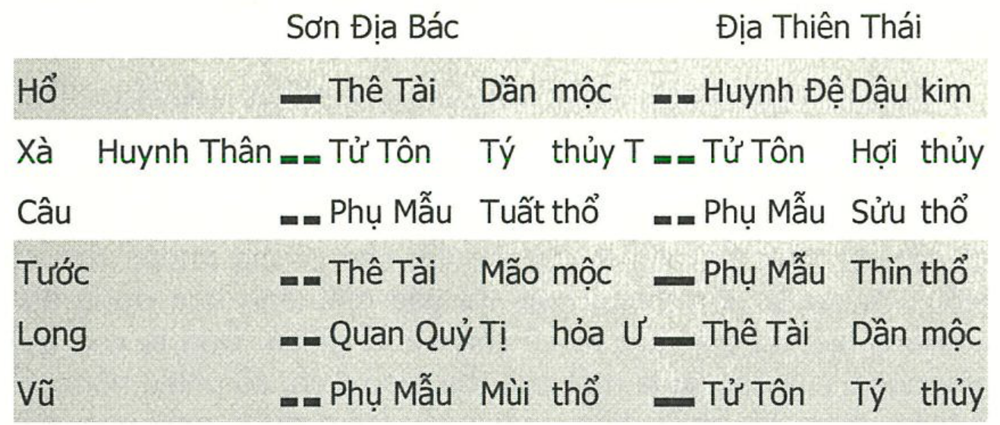
    - **Hình này chứng minh điều gì**
      - Bảng quẻ Quẻ Sơn Địa Bác biến Địa Thiên Thái phản ánh sự phối chiếu hào vị, ngũ hành và động biến minh chứng cho vấn đề chiêm đoán.
    - **Từ đâu mà thấy được**
      - Nhìn vào hào 2 phát động, hào Ứng lâm hào 2, hào 2 là trạch, là kiện tụng bởi vì vấn đề nhà cửa.
- **Quá trình suy luận và đối thoại ban đầu:**
  - Căn cứ suy luận: Hào Thế là mình, hào Ứng là đối phương.
  - Căn cứ suy luận: Phụ Mẫu là đơn kiện, Quan Quỷ là nguyên nhân và tòa án v.v, dựa vào tổ hợp biến hóa trong quẻ mà phán đoán linh hoạt.
  - Căn cứ suy luận: Quan tại hào 2 phát động, hào Ứng lâm hào 2, hào 2 là trạch, là kiện tụng bởi vì vấn đề nhà cửa.
  - Căn cứ suy luận: Ứng đến hào 2 là Ứng nhập phi trạch, là người khác chiếm nhà của mình.
  - Đối thoại thực tế: Sau khi nghe xong, cô ấy hết sức ngạc nhiên, nói rằng: "Ông phán đoán rất đúng.
  - Đối thoại thực tế: Thật không may, bất kể là ông ta hay là tôi, sau khi vào thang máy cố gắng đừng chạm mặt thì đã không có chuyện phá tài."
- **Ứng nghiệm thực tế và diễn biến sự việc:**
  - Thực tế diễn biến kiểm chứng ứng kỳ và cát hung của quẻ chiêm.
- **Ngộ giải và bài học kinh nghiệm then chốt:**
  - Đúc rút quy luật thực chiến: Xem xét tổng thể ngũ hành, hào động và tâm thái người gieo quẻ.

### Tổng kết chuyên đề và bài học tâm đắc
- **Huyền cơ cốt lõi rút ra từ các quái lệ:**
  - phương lại kháng án, tòa án đột nhiên thay đổi phán quyết ban đầu, mà người giúp cô ấy cũng bắt đầu nói giúp cho đối phương, ở năm 2007 đã thua trong phán quyết cuối cùng.

## 32. Xem Quẻ Không Lưu Tình, Lưu Tình Không Xem Quẻ

- **Tổng quan nguyên lý & bối cảnh chuyên đề:**
  - Anh ta cảm thấy quẻ này không tốt, Tử Tôn phục tàng, Nhật Nguyệt khắc, Quan Quỷ lại lâm Bạch Hổ phát động đến xung Tử Tôn, Bạch Hổ chủ lưu sản, do đó muốn xem ý kiến của tôi.
  - Anh ta kết hôn đã mấy năm, cuối cùng vợ cũng đã có thai, đáng hoan hỷ và chúc mừng. Tôi đã phân vân khi xem quẻ này. Phán đoán theo quy luật của quẻ độc phát, độc phát có thể biểu thị tính chất và điềm báo của sự vật. Bạch Hổ là Thai địa, lâm Bạch Hổ độc phát, Bạch Hổ chủ máu, lưu sản, mà lâm Quan Quỷ, Quan Quỷ lại chủ lo lắng, Quỷ động bất an, do đó không phải hiện tượng tốt đẹp. Nhưng tôi vẫn nghĩ về mặt tốt, tôi nói với anh ta rằng Quan Quỷ mặc dù phát động, nhưng hóa hồi đầu hợp, quẻ này Tử Tôn đích thực là rất nhược, nhưng Nhật Nguyệt khắc Tử Tôn, trong quẻ Phụ Mẫu lưỡng hiện, Quan động đến sinh Phụ Mẫu, Quan lưỡng hiện, hào động lại hóa ra Phụ Mẫu, phải là Kỵ thần quá vượng, trái lại không sao.
### Ví dụ 1: Một ngày trong năm 2006
- **Bối cảnh & Dữ kiện chiêm bái:**
  - **Ví dụ 1:** Một ngày trong năm 2006, một học viên đã mời tôi xem quẻ này, anh ta nói rằng vợ đã có thai, anh ta gieo quẻ xem mang thai sẽ ra sao?
  - Ở ngày Đinh Sửu tháng Tuất, được Thiên Địa Bĩ biến Phong Địa Quan.
  - Anh ta kết hôn đã mấy năm, cuối cùng vợ cũng đã có thai, đáng hoan hỷ và chúc mừng.
  - Tôi đã phân vân khi xem quẻ này.
  - Phán đoán theo quy luật của quẻ độc phát, độc phát có thể biểu thị tính chất và điềm báo của sự vật.
- Bảng quẻ Sơ đồ quẻ Thiên Địa Bĩ biến Phong Địa Quan:
  - **Hình 142.** Sơ đồ quẻ Thiên Địa Bĩ biến Phong Địa Quan
    - 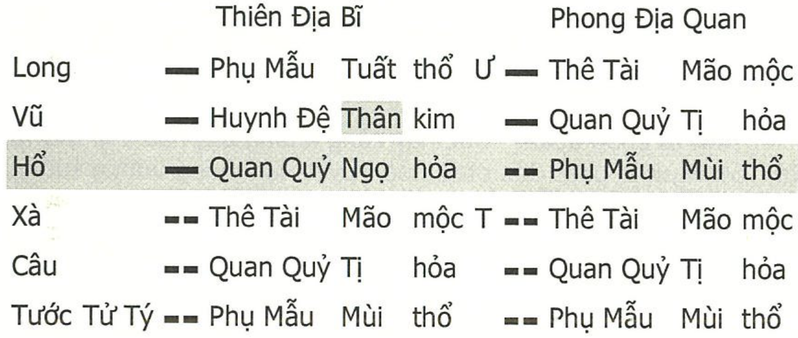
    - **Hình này chứng minh điều gì**
      - quẻ độc phát, độc phát có thể biểu thị tính chất và điềm báo của sự vật.
    - **Từ đâu mà thấy được**
      - Nhìn vào hào 2 là thai vị, Tử Tôn Nguyệt phá, độc phát hóa Tuyệt, lại không vượng tướng.
- **Quá trình suy luận và đối thoại ban đầu:**
  - Tác giả phân tích cấu trúc hào tượng, Dụng thần và các yếu tố sinh khắc trong quẻ Sơ đồ quẻ Thiên Địa Bĩ biến Phong Địa Quan.
  - Đối thoại thực tế: Anh ta phán đoán: "Quẻ này cũng không tốt, hào 2 là thai vị, Tử Tôn Nguyệt phá, độc phát hóa Tuyệt, lại không vượng tướng.
  - Đối thoại thực tế: Xem ra vẫn không tốt."
  - Đối thoại thực tế: "Quẻ này mặc dù độc phát hóa Tuyệt, dựa vào độc phát để xem thì không tốt, nhưng Nguyệt phá Nhật khắc, đã không tốt, do đó hóa Tuyệt này đã không còn ý nghĩa, phải là Tuyệt xứ phùng sinh.
  - Đối thoại thực tế: Hóa hồi đầu sinh, sẽ không có vấn đề."
- **Ứng nghiệm thực tế và diễn biến sự việc:**
  - Thực tế diễn biến kiểm chứng ứng kỳ và cát hung của quẻ chiêm.
- **Ngộ giải và bài học kinh nghiệm then chốt:**
  - Đúc rút quy luật thực chiến: Xem xét tổng thể ngũ hành, hào động và tâm thái người gieo quẻ.

### Quái lệ 2: Sơ đồ quẻ Hỏa Thủy Vị Tế biến Hỏa Địa Tấn
- **Bối cảnh & Dữ kiện chiêm bái:**
  - Anh ta có phần không yên tâm.
  - Ngày hôm sau lại gieo quẻ.
  - Ngày Mậu Dần tháng Tuất, được Hỏa Thủy Vị Tế biến Hỏa Địa Tấn.
  - Anh ta phán đoán: "Quẻ này cũng không tốt, hào 2 là thai vị, Tử Tôn Nguyệt phá, độc phát hóa Tuyệt, lại không vượng tướng.
  - Xem ra vẫn không tốt."
- Bảng quẻ Sơ đồ quẻ Hỏa Thủy Vị Tế biến Hỏa Địa Tấn:
  - **Hình 143.** Sơ đồ quẻ Hỏa Thủy Vị Tế biến Hỏa Địa Tấn
    - 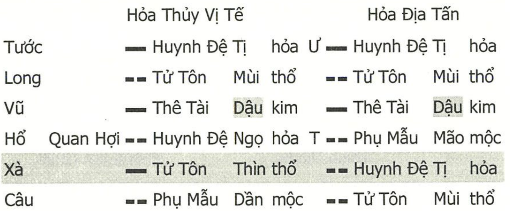
    - **Hình này chứng minh điều gì**
      - Quẻ này cũng không tốt, hào 2 là thai vị, Tử Tôn Nguyệt phá, độc phát hóa Tuyệt, lại không vượng tướng.
    - **Từ đâu mà thấy được**
      - Nhìn vào hào 2 là thai vị, Tử Tôn Nguyệt phá, độc phát hóa Tuyệt, lại không vượng tướng.
- **Quá trình suy luận và đối thoại ban đầu:**
  - Căn cứ suy luận: Tôi phán đoán trung thực theo quẻ.
  - Căn cứ suy luận: Mãi đến tháng 8 mới nhận được lời hỏi thăm sau một thời gian dài, thì ra ông ta đã vào viện nửa năm bởi vì bệnh tim, hiện nay sức khỏe đã tốt hơn,
  - Đối thoại thực tế: Anh ta phán đoán: "Quẻ này cũng không tốt, hào 2 là thai vị, Tử Tôn Nguyệt phá, độc phát hóa Tuyệt, lại không vượng tướng.
  - Đối thoại thực tế: Xem ra vẫn không tốt."
  - Đối thoại thực tế: "Quẻ này mặc dù độc phát hóa Tuyệt, dựa vào độc phát để xem thì không tốt, nhưng Nguyệt phá Nhật khắc, đã không tốt, do đó hóa Tuyệt này đã không còn ý nghĩa, phải là Tuyệt xứ phùng sinh.
  - Đối thoại thực tế: Hóa hồi đầu sinh, sẽ không có vấn đề."
  - Đối thoại thực tế: Tôi thấy Thế tại hào 6 lâm Bạch Hổ, Nguyên thần Ngọ hỏa Nguyệt phá, Thế bị Dần mộc động mà đến khắc, hào 6 là điểm cuối của sự vật, là thiên đường, Bạch Hổ chủ bệnh, liền nói với ông ta: "Ông bây giờ đã lớn tuổi, sức khỏe không còn tốt nữa, chắc có bệnh tim phải không?"
- **Ứng nghiệm thực tế và diễn biến sự việc:**
  - Nhìn vào kết quả thực tế: Trên thực tế đó không phải là thực sự nghĩ cho đối phương mà đó là vô trách nhiệm với người ta.
  - Nhìn vào kết quả thực tế: Mãi đến tháng 8 mới nhận được lời hỏi thăm sau một thời gian dài, thì ra ông ta đã vào viện nửa năm bởi vì bệnh tim, hiện nay sức khỏe đã tốt hơn,
- **Ngộ giải và bài học kinh nghiệm then chốt:**
  - Đúc rút quy luật thực chiến: Xem xét tổng thể ngũ hành, hào động và tâm thái người gieo quẻ.

### Quái lệ 3: Quẻ Càn Vi Thiên biến Thiên Lôi Vô Vọng
- **Bối cảnh & Dữ kiện chiêm bái:**
  - Ngày Nhâm Tuất tháng Hợi sảy thai, đây là ứng kỳ mẫu mực, Tử Tôn Nguyệt phá ứng sang tháng, cũng ứng xung phá.
  - Lại là tháng của hào Quy phục tàng xuất hiện.
  - Xem quẻ phải phán đoán trung thành với thông tin trong quẻ, không nên ngại nói ra chỉ vì muốn cầu cát lợi, cũng không nên chủ quan tự cho mình là đúng và phán đoán vội vàng khi chưa phân tích kỹ lưỡng.
  - Trên thực tế đó không phải là thực sự nghĩ cho đối phương mà đó là vô trách nhiệm với người ta.
  - Nhất là khi phán đoán cho người quen, người trong nhà, hoặc cho mình, càng không nên nghĩ mọi việc về hướng tốt, phải phán đoán theo quẻ, tốt là tốt, không tốt là không tốt, nếu không thì dự đoán đã mất đi ý nghĩa của nó.
- Bảng quẻ Quẻ Càn Vi Thiên biến Thiên Lôi Vô Vọng:
  - **Hình 144.** Quẻ Càn Vi Thiên biến Thiên Lôi Vô Vọng
    - 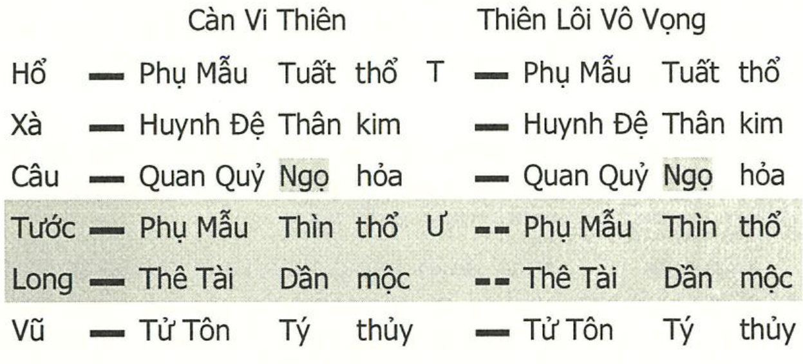
    - **Hình này chứng minh điều gì**
      - Bảng quẻ Quẻ Càn Vi Thiên biến Thiên Lôi Vô Vọng phản ánh sự phối chiếu hào vị, ngũ hành và động biến minh chứng cho vấn đề chiêm đoán.
    - **Từ đâu mà thấy được**
      - Nhìn vào hào Thế, hào Ứng, Dụng thần và động hào trong bảng quẻ Quẻ Càn Vi Thiên biến Thiên Lôi Vô Vọng.
- **Quá trình suy luận và đối thoại ban đầu:**
  - Căn cứ suy luận: Tôi phán đoán trung thực theo quẻ.
  - Căn cứ suy luận: Mãi đến tháng 8 mới nhận được lời hỏi thăm sau một thời gian dài, thì ra ông ta đã vào viện nửa năm bởi vì bệnh tim, hiện nay sức khỏe đã tốt hơn,
  - Căn cứ suy luận: Dụng thần mặc dù được Nguyệt sinh Nhật phù rất vượng, nhưng bệnh lâu hóa Không không nên, bệnh lâu sợ xung, do đó tôi phán đoán tháng Mùi có nguy hiểm.
  - Căn cứ suy luận: Mặc dù tôi không muốn nói ra kết luận này, nhưng theo ứng kỳ của quẻ phải phán đoán như vậy.
  - Đối thoại thực tế: Tôi thấy Thế tại hào 6 lâm Bạch Hổ, Nguyên thần Ngọ hỏa Nguyệt phá, Thế bị Dần mộc động mà đến khắc, hào 6 là điểm cuối của sự vật, là thiên đường, Bạch Hổ chủ bệnh, liền nói với ông ta: "Ông bây giờ đã lớn tuổi, sức khỏe không còn tốt nữa, chắc có bệnh tim phải không?"
  - Đối thoại thực tế: Ông ta nói: "Đúng, tôi đã từng nhập viện vì vỡ mạch máu tim vài năm trước.
  - Đối thoại thực tế: Nhưng bây giờ đã không còn nghiêm trọng nữa."
  - Đối thoại thực tế: Tôi nói: "Chiếu theo quẻ này, năm sau là năm Hợi, sức khỏe của ông rất không tốt, tôi cũng khá bận, xem ra phải viết không ít sách, căn bản không thể đem lại lợi ích gì cho ông, ông cần gì phải mạo hiểm chứ?" Bởi vì hào Ứng trong quẻ này là tôi, nội quái phục ngâm, lâm Phụ Mẫu Chu Tước.
- **Ứng nghiệm thực tế và diễn biến sự việc:**
  - Nhìn vào kết quả thực tế: Kết quả là đã qua đời tại tháng Mùi.
  - Nhìn vào kết quả thực tế: Mặc dù tôi không muốn nói ra kết luận này, nhưng theo ứng kỳ của quẻ phải phán đoán như vậy.
- **Ngộ giải và bài học kinh nghiệm then chốt:**
  - Đúc rút quy luật thực chiến: Xem xét tổng thể ngũ hành, hào động và tâm thái người gieo quẻ.

### Ví dụ 3: Một học viên của tôi xem cát hung của ông ngoại bị ung thư p
- **Bối cảnh & Dữ kiện chiêm bái:**
  - **Ví dụ 3:** Một học viên của tôi xem cát hung của ông ngoại bị ung thư phổi.
  - Ở ngày Nhâm Thìn tháng Tị, được Địa Sơn Khiêm biến Lôi Sơn Tiểu Quá.
- Bảng quẻ Quẻ Địa Sơn Khiêm biến Lôi Sơn Tiểu Quá:
  - **Hình 145.** Quẻ Địa Sơn Khiêm biến Lôi Sơn Tiểu Quá
    - 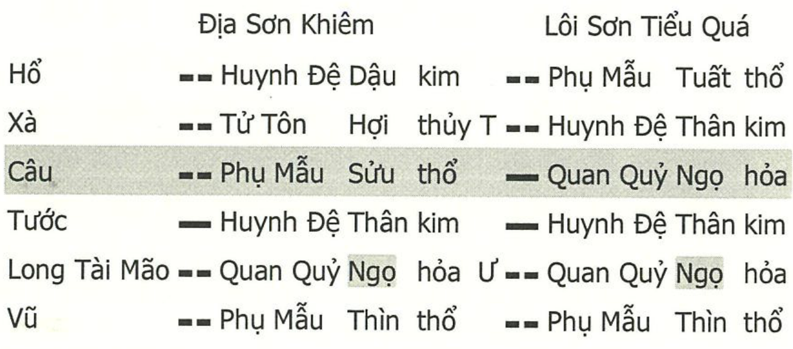
    - **Hình này chứng minh điều gì**
      - Lấy hào Tài làm Dụng thần.
    - **Từ đâu mà thấy được**
      - Nhìn vào hào 4 lâm Câu Trần, Câu Trần là ung thư, do đó là ung thư phổi.
- **Quá trình suy luận và đối thoại ban đầu:**
  - Căn cứ suy luận: Dụng thần mặc dù được Nguyệt sinh Nhật phù rất vượng, nhưng bệnh lâu hóa Không không nên, bệnh lâu sợ xung, do đó tôi phán đoán tháng Mùi có nguy hiểm.
  - Căn cứ suy luận: Mặc dù tôi không muốn nói ra kết luận này, nhưng theo ứng kỳ của quẻ phải phán đoán như vậy.
  - Căn cứ suy luận: Lấy hào Tài làm Dụng thần.
  - Căn cứ suy luận: Hào Tài lưỡng hiện trong quẻ, tính cả hào Tài hóa ra là 3, trông có vẻ nhiều hào Tài, nhưng tôi phán đoán anh ta không thể được tài nào.
  - Căn cứ suy luận: Bởi vì Nhật Nguyệt khắc Tài, Huynh Đệ trên Ứng động khắc Tài, hào sơ lại động hóa Huynh Đệ, là Huynh Đệ hào Tài lưỡng đa, nhưng khi so sánh, lực lượng của Huynh Đệ lớn hơn nhiều so với lực lượng của hào Tài.
  - Căn cứ suy luận: Bởi vì hào Tài tam hiện, lại không thể luận theo nhiều Huynh trái lại không khắc Tài, là lấy cường khắc nhược, do đó không có tài.
  - Đối thoại thực tế: Khi nghe điều này, ông ta đã phản bác tôi: "Một người đàn ông trụ cột sao có thể không làm gì trong một năm được chứ, tôi
- **Ứng nghiệm thực tế và diễn biến sự việc:**
  - Thực tế diễn biến kiểm chứng ứng kỳ và cát hung của quẻ chiêm.
- **Ngộ giải và bài học kinh nghiệm then chốt:**
  - Đúc rút quy luật thực chiến: Xem xét tổng thể ngũ hành, hào động và tâm thái người gieo quẻ.

### Ví dụ 4: Vừa Lập Xuân không lâu
- **Bối cảnh & Dữ kiện chiêm bái:**
  - **Ví dụ 4:** Vừa Lập Xuân không lâu, một người bạn của tôi yêu cầu đoán tài vận năm đó sẽ như thế nào?
  - Ở ngày Đinh Mão tháng Dần, được Hỏa Lôi Phệ Hạp biến Hỏa Thủy Vị Tế.
  - Thế tại hào 5, hào 5 là đường, là tượng bôn ba, là chạy khắp nơi, bận rộn khắp nơi.
  - Quẻ là Hỏa Lôi Phệ Hạp, có tượng nhai, có thể suy rộng ra là nói, lâm Huyền Vũ chủ nhạy bén, lừa gạt, dựa vào phương pháp di thần, hào Tài trên Thế có thể lâm thêm Trình Xà, Trình Xà chủ giả tạo, cộng với Huyền Vũ, kết hợp với hào 5 chính là du thuyết khắp nơi, lừa gạt tiền tài của người ta mà thôi.
  - Hào 2 Huynh Đệ hóa Tài, tổ hợp này là thông tin hợp tác cầu tài.
- Bảng quẻ Quẻ Hỏa Lôi Phệ Hạp biến Hỏa Thủy Vị Tế:
  - **Hình 146.** Quẻ Hỏa Lôi Phệ Hạp biến Hỏa Thủy Vị Tế
    - 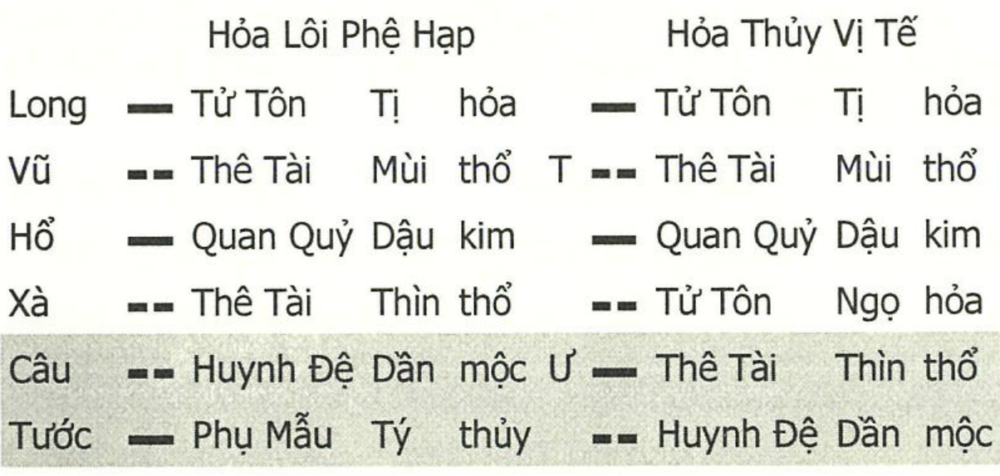
    - **Hình này chứng minh điều gì**
      - Lấy hào Tài làm Dụng thần.
    - **Từ đâu mà thấy được**
      - Nhìn vào Hào 2 Huynh Đệ hóa Tài, tổ hợp này là thông tin hợp tác cầu tài.
- **Quá trình suy luận và đối thoại ban đầu:**
  - Căn cứ suy luận: Lấy hào Tài làm Dụng thần.
  - Căn cứ suy luận: Hào Tài lưỡng hiện trong quẻ, tính cả hào Tài hóa ra là 3, trông có vẻ nhiều hào Tài, nhưng tôi phán đoán anh ta không thể được tài nào.
  - Căn cứ suy luận: Bởi vì Nhật Nguyệt khắc Tài, Huynh Đệ trên Ứng động khắc Tài, hào sơ lại động hóa Huynh Đệ, là Huynh Đệ hào Tài lưỡng đa, nhưng khi so sánh, lực lượng của Huynh Đệ lớn hơn nhiều so với lực lượng của hào Tài.
  - Căn cứ suy luận: Bởi vì hào Tài tam hiện, lại không thể luận theo nhiều Huynh trái lại không khắc Tài, là lấy cường khắc nhược, do đó không có tài.
  - Đối thoại thực tế: Khi nghe điều này, ông ta đã phản bác tôi: "Một người đàn ông trụ cột sao có thể không làm gì trong một năm được chứ, tôi
  - Đối thoại thực tế: Đến tháng Ngọ, ông ta còn gọi đến nói rằng: "Ông bạn, ông đoán quẻ năm nay sai rồi, đến bây giờ tôi đã kiếm được hơn 100 vạn, một thời gian nữa hai người bạn đó sẽ chuyển tiền vào tài khoản của tôi."
  - Đối thoại thực tế: "Người tính không bằng trời tính, mấy ngày trước, hai người bạn đó của tôi phải đi công tác, lúc đi bọn họ còn rủ tôi đi cùng, nói là đi công tác về sẽ cho tôi hơn 100 vạn tệ đó.
  - Đối thoại thực tế: Phá tài miễn tai, cũng may tôi vẫn bình an khỏe mạnh."
- **Ứng nghiệm thực tế và diễn biến sự việc:**
  - Thực tế diễn biến kiểm chứng ứng kỳ và cát hung của quẻ chiêm.
- **Ngộ giải và bài học kinh nghiệm then chốt:**
  - Đúc rút quy luật thực chiến: Xem xét tổng thể ngũ hành, hào động và tâm thái người gieo quẻ.

### Tổng kết chuyên đề và bài học tâm đắc
- **Huyền cơ cốt lõi rút ra từ các quái lệ:**
  - Đến tháng Ngọ, ông ta còn gọi đến nói rằng: "Ông bạn, ông đoán quẻ năm nay sai rồi, đến bây giờ tôi đã kiếm được hơn 100 vạn, một thời gian nữa hai người bạn đó sẽ chuyển tiền vào tài khoản của tôi."
  - Ai ngờ đến tháng Mùi, giọng nói của ông ta trong điện thoại đã biến thành tiếng khóc.
  - "Người tính không bằng trời tính, mấy ngày trước, hai người bạn đó của tôi phải đi công tác, lúc đi bọn họ còn rủ tôi đi cùng, nói là đi công tác về sẽ cho tôi hơn 100 vạn tệ đó.
  - Lúc đó bởi vì tôi có việc phải làm nên không thể đi cùng, ai ngờ bọn họ đã xảy ra tai nạn giao thông trên đường và đều đã qua đời.
  - Mạng của tôi xem ra vẫn còn lớn, nếu như đi cùng, có lẽ tôi đã không thể gọi điện thoại cho ông.
  - Năm nay trắng tay.
  - Phá tài miễn tai, cũng may tôi vẫn bình an khỏe mạnh."

## 33. Tại Sao Không Thi Đậu Nghiên Cứu Sinh?

- **Tổng quan nguyên lý & bối cảnh chuyên đề:**
  - Tôi thấy Quan Quỷ vượng, Phụ Mẫu vượng, người xưa nói: "Quan Phụ lưỡng vượng, văn chương kiến dụng (hữu dụng)." Lại thêm Phụ Mẫu độc phát sinh Thế, do đó liền phán đoán có thể thi đậu.
  - Nhưng khi tôi phát quẻ này cho một học viên Nhật Bản và bảo anh ta đoán, kết quả phán đoán của anh ta và tôi hoàn toàn khác nhau. Anh ta cho rằng lấy Quan làm Dụng, Quan Quỷ lâm Nhật mặc dù vượng tướng, nhưng Phụ Mẫu độc phát, độc phát lấy tượng làm chủ, Quan Quỷ gặp Tử địa, thì không đậu.
  - Tôi không thể hoàn toàn phủ nhận phán đoán của anh ta, bởi vì thông thường dự đoán lên lớp, thi cử thì xem Quan Quỷ là Dụng thần đầu tiên, Phụ Mẫu là Dụng thần thứ hai. Rất nhiều lời đoán của người xưa chính là dựa vào quan điểm này. Đành phải chờ có kết quả để nghiệm chứng. Kết quả cuối cùng là phán đoán của tôi đã sai, anh ta đúng.
  - Nghe nói thành tích thi và phỏng vấn của anh ta đều đứng đầu, nguyên nhân không được nhận là do một người phỏng vấn thiếu hiểu biết, bởi vì anh ta đã ghi là thích bát quái trong cột sở thích, người phỏng vấn đã viết mấy câu nhận xét: "Thí sinh này tham gia ngụy khoa học, đề nghị không thu nhận." Gán cho văn hóa truyền thống đã lưu truyền mấy ngàn năm là ngụy khoa học, như thế đã vùi dập một nhân tài ưu tú.
### Ví dụ 1: Một học viên của tôi thi nghiên cứu sinh
- **Bối cảnh & Dữ kiện chiêm bái:**
  - **Ví dụ 1:** Một học viên của tôi thi nghiên cứu sinh, anh ta gieo được quẻ này đã mời tôi xem, ngày Quý Hợi tháng Mão, được Ly Vi Hỏa biến Hỏa Sơn Lữ.
  - Tôi thấy Quan Quỷ vượng, Phụ Mẫu vượng, người xưa nói: "Quan Phụ lưỡng vượng, văn chương kiến dụng (hữu dụng)." Lại thêm Phụ Mẫu độc phát sinh Thế, do đó liền phán đoán có thể thi đậu.
  - Nhưng khi tôi phát quẻ này cho một học viên Nhật Bản và bảo anh ta đoán, kết quả phán đoán của anh ta và tôi hoàn toàn khác nhau.
  - Anh ta cho rằng lấy Quan làm Dụng, Quan Quỷ lâm Nhật mặc dù vượng tướng, nhưng Phụ Mẫu độc phát, độc phát lấy tượng làm chủ, Quan Quỷ gặp Tử địa, thì không đậu.
  - Nghe nói thành tích thi và phỏng vấn của anh ta đều đứng đầu, nguyên nhân không được nhận là do một người phỏng vấn thiếu hiểu biết, bởi vì anh ta đã ghi là thích bát quái trong cột sở thích, người phỏng vấn đã viết mấy câu nhận xét: "Thí sinh này tham gia ngụy khoa học, đề nghị không thu nhận." Gán cho văn hóa truyền thống đã lưu truyền mấy ngàn năm là ngụy khoa học, như thế đã vùi dập một nhân tài ưu tú.
- Bảng quẻ Quẻ Ly Vi Hỏa biến Hỏa Sơn Lữ:
  - **Hình 147.** Quẻ Ly Vi Hỏa biến Hỏa Sơn Lữ
    - 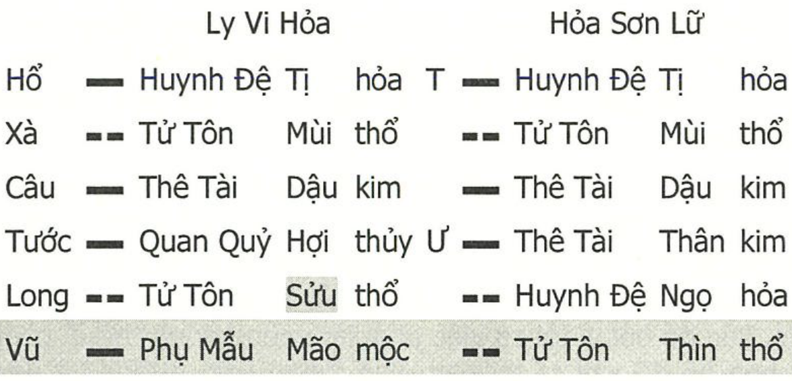
    - **Hình này chứng minh điều gì**
      - Bảng quẻ Quẻ Ly Vi Hỏa biến Hỏa Sơn Lữ phản ánh sự phối chiếu hào vị, ngũ hành và động biến minh chứng cho vấn đề chiêm đoán.
    - **Từ đâu mà thấy được**
      - Nhìn vào hào Thế, hào Ứng, Dụng thần và động hào trong bảng quẻ Quẻ Ly Vi Hỏa biến Hỏa Sơn Lữ.
- **Quá trình suy luận và đối thoại ban đầu:**
  - Căn cứ suy luận: Tôi không thể hoàn toàn phủ nhận phán đoán của anh ta, bởi vì thông thường dự đoán lên lớp, thi cử thì xem Quan Quỷ là Dụng thần đầu tiên, Phụ Mẫu là Dụng thần thứ hai.
  - Căn cứ suy luận: Kết quả cuối cùng là phán đoán của tôi đã sai, anh ta đúng.
  - Căn cứ suy luận: Xem kỹ Quan này, Phụ Mẫu lâm Huyền Vũ, Huyền Vũ chủ huyền học, Quan Tử tại đây, thì bởi vì nguyên nhân này mà không thi đậu nghiên cứu sinh.
  - Căn cứ suy luận: Ở đây chủ yếu là Quan Quỷ nhập Mộ ở hào độc phát.
  - Căn cứ suy luận: Xem ra Dụng thần chủ yếu vẫn là Quan Quỷ, Phụ Mẫu không có vai trò quyết định.
  - Căn cứ suy luận: Quẻ tại cung Đoài, Đoài là miệng, chủ ngôn ngữ, lại thêm Phụ Mẫu ở ngoại quái, là ngôn ngữ ngoại lai, do đó là bởi vì ảnh hưởng của ngoại ngữ.
  - Đối thoại thực tế: Tôi thấy Quan Quỷ vượng, Phụ Mẫu vượng, người xưa nói: "Quan Phụ lưỡng vượng, văn chương kiến dụng (hữu dụng)." Lại thêm Phụ Mẫu độc phát sinh Thế, do đó liền phán đoán có thể thi đậu.
  - Đối thoại thực tế: Nghe nói thành tích thi và phỏng vấn của anh ta đều đứng đầu, nguyên nhân không được nhận là do một người phỏng vấn thiếu hiểu biết, bởi vì anh ta đã ghi là thích bát quái trong cột sở thích, người phỏng vấn đã viết mấy câu nhận xét: "Thí sinh này tham gia ngụy khoa học, đề nghị không thu nhận." Gán cho văn hóa truyền thống đã lưu truyền mấy ngàn năm là ngụy khoa học, như thế đã vùi dập một nhân tài ưu tú.
  - Đối thoại thực tế: Nào là "Vượng Quan năng sinh suy Phụ" (Quan vượng có thể sinh Phụ suy), "Quan Phụ lưỡng vượng, văn chương kiến dụng" (Quan Phụ đều vượng, văn chương hữu dụng), "Quan suy Phụ phát, diệc hứa luân thu" (Quan suy Phụ động, cũng được tuyển chọn), v.v.
- **Ứng nghiệm thực tế và diễn biến sự việc:**
  - Nhìn vào kết quả thực tế: Nhưng trên thực tế đã không thi đậu bởi vì thành tích ngoại ngữ không đủ mặc dù tổng điểm rất cao.
- **Ngộ giải và bài học kinh nghiệm then chốt:**
  - Đúc rút quy luật thực chiến: Xem xét tổng thể ngũ hành, hào động và tâm thái người gieo quẻ.

### Ví dụ 2: Một học viên khác của tôi cũng đoán về việc thi nghiên cứu s
- **Bối cảnh & Dữ kiện chiêm bái:**
  - Quẻ này rất đáng suy ngẫm, thi cử xem ra phải phán đoán xoay quanh Quan Quỷ, Phụ Mẫu phục vụ cho Quan Quỷ, và không phải Quan Quỷ phục vụ cho Phụ Mẫu.
  - Do đó, một số lời đoán về thi cử của người xưa cần được xem xét lại.
  - Nào là "Vượng Quan năng sinh suy Phụ" (Quan vượng có thể sinh Phụ suy), "Quan Phụ lưỡng vượng, văn chương kiến dụng" (Quan Phụ đều vượng, văn chương hữu dụng), "Quan suy Phụ phát, diệc hứa luân thu" (Quan suy Phụ động, cũng được tuyển chọn), v.v.
  - **Ví dụ 2:** Một học viên khác của tôi cũng đoán về việc thi nghiên cứu sinh của mình, ở ngày Nhâm Dần tháng Sửu, được Thủy Sơn Kiển biến Địa Sơn Khiêm.
  - Đây là quẻ gieo ở năm 2006, Quan được Nhật sinh vượng tướng, Phụ Mẫu được Nguyệt tỉ phù cũng vượng, theo quan điểm của người xưa, Quan Phụ lưỡng vượng, văn chương kiến dụng, Phụ Mẫu tại hào 5 đúng lúc lâm Thái Tuế, tuế ngũ sinh Thế, một bước lên mây, phải là lên cao, lẽ ra thi đậu nghiên cứu sinh mới đúng.
- Bảng quẻ Sơ đồ quẻ Thủy Sơn Kiển biến Địa Sơn Khiêm:
  - **Hình 148.** Sơ đồ quẻ Thủy Sơn Kiển biến Địa Sơn Khiêm
    - 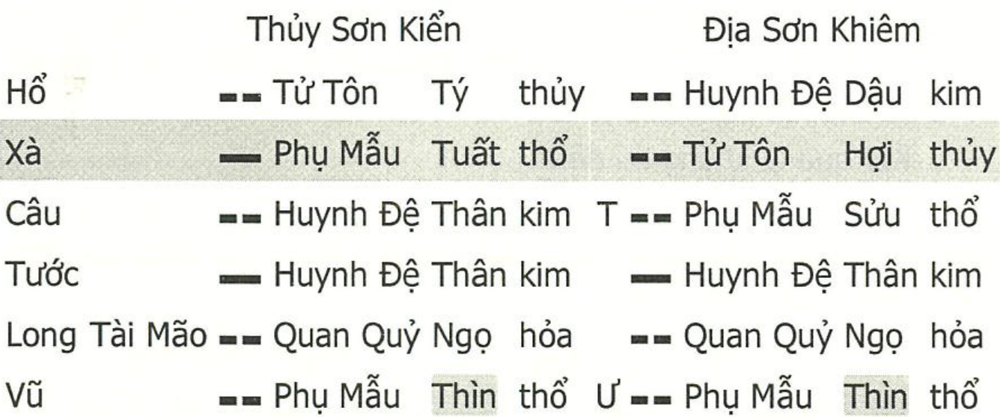
    - **Hình này chứng minh điều gì**
      - Lấy Quan làm Dụng thần.
    - **Từ đâu mà thấy được**
      - Nhìn vào hào Thế, hào Ứng, Dụng thần và động hào trong bảng quẻ Sơ đồ quẻ Thủy Sơn Kiển biến Địa Sơn Khiêm.
- **Quá trình suy luận và đối thoại ban đầu:**
  - Căn cứ suy luận: Xem kỹ Quan này, Phụ Mẫu lâm Huyền Vũ, Huyền Vũ chủ huyền học, Quan Tử tại đây, thì bởi vì nguyên nhân này mà không thi đậu nghiên cứu sinh.
  - Căn cứ suy luận: Ở đây chủ yếu là Quan Quỷ nhập Mộ ở hào độc phát.
  - Căn cứ suy luận: Xem ra Dụng thần chủ yếu vẫn là Quan Quỷ, Phụ Mẫu không có vai trò quyết định.
  - Căn cứ suy luận: Quẻ tại cung Đoài, Đoài là miệng, chủ ngôn ngữ, lại thêm Phụ Mẫu ở ngoại quái, là ngôn ngữ ngoại lai, do đó là bởi vì ảnh hưởng của ngoại ngữ.
  - Đối thoại thực tế: Nào là "Vượng Quan năng sinh suy Phụ" (Quan vượng có thể sinh Phụ suy), "Quan Phụ lưỡng vượng, văn chương kiến dụng" (Quan Phụ đều vượng, văn chương hữu dụng), "Quan suy Phụ phát, diệc hứa luân thu" (Quan suy Phụ động, cũng được tuyển chọn), v.v.
- **Ứng nghiệm thực tế và diễn biến sự việc:**
  - Nhìn vào kết quả thực tế: Kết quả là không thi đậu.
- **Ngộ giải và bài học kinh nghiệm then chốt:**
  - Đúc rút quy luật thực chiến: Xem xét tổng thể ngũ hành, hào động và tâm thái người gieo quẻ.

### Ví dụ 3: Một người đoán con trai có thể thi đậu trường học đã ghi dan
- **Bối cảnh & Dữ kiện chiêm bái:**
  - **Ví dụ 3:** Một người đoán con trai có thể thi đậu trường học đã ghi danh hay không?
  - Ngày Canh Tý tháng Sửu, được Trạch Phong Đại Quá biến Lôi Phong Hằng.
  - Phụ Mẫu trì Thế được Nhật tỉ phù, không có Không Phá, Quan động đến sinh, có vẻ như rất tốt, nhưng đoán thi lấy Quan làm trọng, Quan Quỷ độc phát hóa thoái, không thể sinh Thế, sợ là không thể như mong muốn.
  - **Ví dụ 4:** Một người đàn ông đoán con trai năm đó thi đại học sẽ ra sao?
  - Ở ngày Canh Thân tháng Mão, được Hỏa Lôi Phệ Hạp biến Thủy Trạch Tiết.
- Bảng quẻ Sơ đồ quẻ Trạch Phong Đại Quá biến Lôi Phong Hằng:
  - **Hình 149.** Sơ đồ quẻ Trạch Phong Đại Quá biến Lôi Phong Hằng
    - 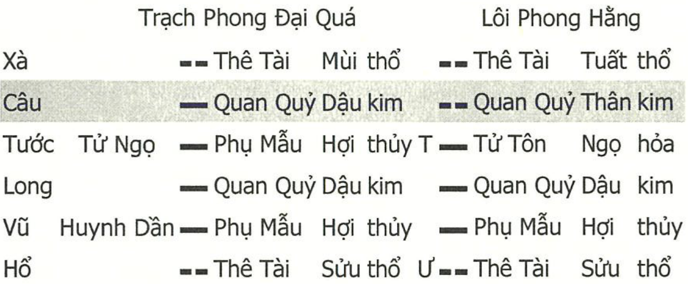
    - **Hình này chứng minh điều gì**
      - Lấy Quan làm Dụng thần.
    - **Từ đâu mà thấy được**
      - Nhìn vào hào Thế, hào Ứng, Dụng thần và động hào trong bảng quẻ Sơ đồ quẻ Trạch Phong Đại Quá biến Lôi Phong Hằng.
- **Quá trình suy luận và đối thoại ban đầu:**
  - Tác giả phân tích cấu trúc hào tượng, Dụng thần và các yếu tố sinh khắc trong quẻ Sơ đồ quẻ Trạch Phong Đại Quá biến Lôi Phong Hằng.
- **Ứng nghiệm thực tế và diễn biến sự việc:**
  - Thực tế diễn biến kiểm chứng ứng kỳ và cát hung của quẻ chiêm.
- **Ngộ giải và bài học kinh nghiệm then chốt:**
  - Đúc rút quy luật thực chiến: Xem xét tổng thể ngũ hành, hào động và tâm thái người gieo quẻ.

### Quái lệ 4: Sơ đồ quẻ Hỏa Lôi Phệ Hạp biến Thủy Trạch Tiết
- **Bối cảnh & Dữ kiện chiêm bái:**
  - Chiêm đoán theo bảng quẻ Sơ đồ quẻ Hỏa Lôi Phệ Hạp biến Thủy Trạch Tiết trong thực tiễn.
- Bảng quẻ Sơ đồ quẻ Hỏa Lôi Phệ Hạp biến Thủy Trạch Tiết:
  - **Hình 150.** Sơ đồ quẻ Hỏa Lôi Phệ Hạp biến Thủy Trạch Tiết
    - 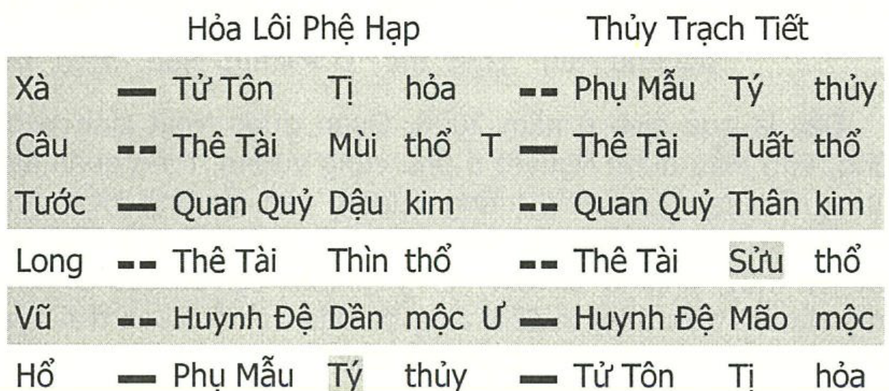
    - **Hình này chứng minh điều gì**
      - Bảng quẻ Sơ đồ quẻ Hỏa Lôi Phệ Hạp biến Thủy Trạch Tiết phản ánh sự phối chiếu hào vị, ngũ hành và động biến minh chứng cho vấn đề chiêm đoán.
    - **Từ đâu mà thấy được**
      - Nhìn vào hào Thế, hào Ứng, Dụng thần và động hào trong bảng quẻ Sơ đồ quẻ Hỏa Lôi Phệ Hạp biến Thủy Trạch Tiết.
- **Quá trình suy luận và đối thoại ban đầu:**
  - Căn cứ suy luận: Xem một cách đơn giản, quẻ này Quan Quỷ và Phụ Mẫu đều không vượng, Phụ Mẫu Tuyệt ở Nguyệt, Nhật không sinh, độc phát hóa Tuyệt, xét Phụ Mẫu thì thi không đậu.
  - Căn cứ suy luận: Lại xem Quan Quỷ, Nguyệt không sinh, Trường Sinh chứa khắc, Nhật Tuyệt Quan Quỷ không sinh, mà Phụ Mẫu Tý thủy độc phát, độc phát lấy tượng làm chủ, Quan gặp Tử địa, cũng là thi không đậu, nhưng quẻ rất vi diệu, lúc đó tôi phán đoán con trai ông ta có thể thi đậu, nhưng điểm số không cao cho lắm, chỉ vừa vượt qua điểm chuẩn trúng tuyển.
- **Ứng nghiệm thực tế và diễn biến sự việc:**
  - Nhìn vào kết quả thực tế: Kết quả là con trai ông ta đã vượt qua điểm trúng tuyển 10 điểm, đã thi đậu đại học.
- **Ngộ giải và bài học kinh nghiệm then chốt:**
  - Đúc rút quy luật thực chiến: Xem xét tổng thể ngũ hành, hào động và tâm thái người gieo quẻ.

### Ví dụ 5: Khi tôi đến một nhà máy giấm để đàm phán
- **Bối cảnh & Dữ kiện chiêm bái:**
  - **Ví dụ 5:** Khi tôi đến một nhà máy giấm để đàm phán, tổng giám đốc ở đó nghe nói tôi biết dự đoán đã nhờ tôi đoán thử xem con trai ông ta thi đại học ở năm đó sẽ ra sao?
  - Ở ngày Nhâm Dần tháng Tị, được Sơn Lôi Di biến Phong Lôi Ích.
  - Quẻ này tôi đã từng giảng cho học viên, phán đoán lúc đó không chỉ là những điều này, trong quẻ còn ẩn chứa rất nhiều bí mật, nay đặc biệt phá lệ công bố nội dung giảng dạy chi tiết ở đây.
  - Mặc dù mỗi lần tôi chỉ giảng một quẻ, nhưng mọi người sẽ lĩnh hội chi tiết những quẻ này, trong những quẻ này không chỉ là những phán đoán đơn giản mà trong đó đã bao quát rất nhiều kiến thức cơ bản và phương pháp tư duy.
  - Tôi không tập hợp một số nội dung lại rồi giảng mà là xâu chuỗi chúng ở trong quẻ.
- Bảng quẻ Sơ đồ quẻ Sơn Lôi Di biến Phong Lôi Ích:
  - **Hình 151.** Sơ đồ quẻ Sơn Lôi Di biến Phong Lôi Ích
    - 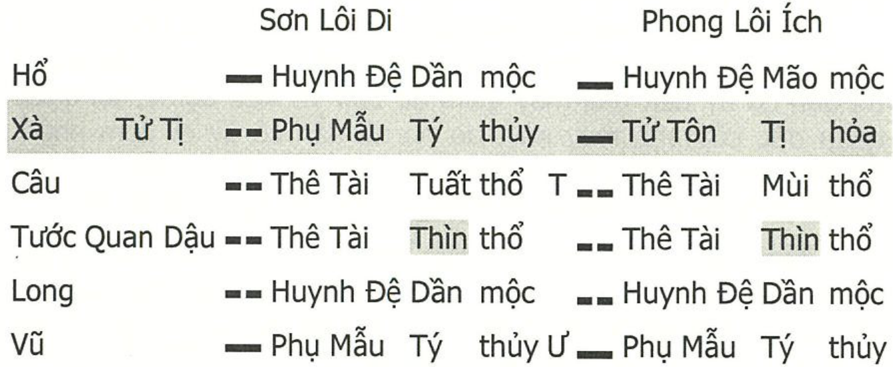
    - **Hình này chứng minh điều gì**
      - Bảng quẻ Sơ đồ quẻ Sơn Lôi Di biến Phong Lôi Ích phản ánh sự phối chiếu hào vị, ngũ hành và động biến minh chứng cho vấn đề chiêm đoán.
    - **Từ đâu mà thấy được**
      - Nhìn vào hào Thế, hào Ứng, Dụng thần và động hào trong bảng quẻ Sơ đồ quẻ Sơn Lôi Di biến Phong Lôi Ích.
- **Quá trình suy luận và đối thoại ban đầu:**
  - Căn cứ suy luận: Xem một cách đơn giản, quẻ này Quan Quỷ và Phụ Mẫu đều không vượng, Phụ Mẫu Tuyệt ở Nguyệt, Nhật không sinh, độc phát hóa Tuyệt, xét Phụ Mẫu thì thi không đậu.
  - Căn cứ suy luận: Lại xem Quan Quỷ, Nguyệt không sinh, Trường Sinh chứa khắc, Nhật Tuyệt Quan Quỷ không sinh, mà Phụ Mẫu Tý thủy độc phát, độc phát lấy tượng làm chủ, Quan gặp Tử địa, cũng là thi không đậu, nhưng quẻ rất vi diệu, lúc đó tôi phán đoán con trai ông ta có thể thi đậu, nhưng điểm số không cao cho lắm, chỉ vừa vượt qua điểm chuẩn trúng tuyển.
  - Căn cứ suy luận: Bởi vì nhờ đối phương lo việc, do đó tôi phải đồng ý dự đoán, ông ta chủ yếu hỏi về việc thi đại học của đứa con.
  - Căn cứ suy luận: Chỉ là xem suy vượng của Quan mà thôi, mọi người đã gặp qua không ít quẻ như vậy, nếu tôi vẫn phán đoán một cách đơn giản là thi đậu hay không thi đậu thì đối phương có chịu phục hay không?
  - Căn cứ suy luận: Có lẽ cảm thấy dự đoán học cũng như vậy mà thôi, cũng ngang tầm với trình độ của ông ta, bởi vì bản thân ông ta cũng biết đưa ra kết quả phán đoán đơn giản, chỉ là ông ta lật sách còn mình không lật sách mà thôi.
  - Căn cứ suy luận: Khi dự đoán, trước tiên đoán cái gì, sau đó đoán cái gì, vấn đề này tôi đã giảng cho mọi người, đây gọi là nhử, chúng ta không vội nói kết quả, bởi vì đó chỉ là một câu nói, chúng ta cần phải cho đối phương hồi hộp theo dõi.
  - Đối thoại thực tế: Người xưa nói: "Thần triệu cơ ở động", hào động độc phát này nhất định có tàng bí mật ở trong đó, cũng tức là nó đã phản ánh một số thông tin quan trọng ở trong đó.
  - Đối thoại thực tế: Do đó tôi hỏi: "Con trai ông thi về khoa học tự nhiên à?"
  - Đối thoại thực tế: Ông ta nói: "Trong quẻ cũng có thể nhìn ra khoa học tự nhiên à?"
  - Đối thoại thực tế: Tôi nói: "Đương nhiên nhìn ra được, chẳng những nhìn ra khoa học tự nhiên hay khoa học xã hội mà còn có thể biết môn nào không tốt nữa."
  - Đối thoại thực tế: Ông ta nói: "Không thể nào."
- **Ứng nghiệm thực tế và diễn biến sự việc:**
  - Nhìn vào kết quả thực tế: Khác với dự đoán lục hào, nhưng ông ta tin tưởng, bởi vì nó đã ứng nghiệm nhiều lần.
  - Nhìn vào kết quả thực tế: Bởi vì quẻ này là quẻ dự đoán thi đại học, do đó hiển nhiên liên quan đến thành tích học tập, thành tích học tập liên quan đến tình hình thi cử sau này.
  - Nhìn vào kết quả thực tế: Trên thực tế con trai ông ta đúng là hóa học không tốt.
- **Ngộ giải và bài học kinh nghiệm then chốt:**
  - Ngộ giải từ thực tiễn và cổ thư: Nhưng tốt và xấu có thể chuyển hóa, đây chính là đạo lý mâu thuẫn ở điều kiện nhất định có thể chuyển hóa lẫn nhau, âm dương có thể biến hóa lẫn nhau.

### Ví dụ 6: Một người đoán việc thi cử của con trai
- **Bối cảnh & Dữ kiện chiêm bái:**
  - Quái lệ mà tôi sẽ giảng hôm nay là một ví dụ dự đoán sau khi kết thúc lớp ngày 1 tháng 5.
  - Sau khi kết thúc lớp trực diện ngày 1 tháng 5, nhiều người đã rời khỏi, một học viên của tôi vẫn chưa về ngay, cô ấy muốn tôi dẫn cô ấy đến nhà máy giấm để bàn về việc đại lý, tôi quen quản đốc của nhà máy này, do đó đã dẫn cô ấy đi đàm phán.
  - Nhưng sau khi đến, tổng giám đốc của nhà máy nghe nói tôi nghiên cứu lục hào, thế là đã khăng khăng đòi tôi dự đoán thử.
  - Tổng giám đốc này cũng biết chút ít về dự đoán, nhưng chỉ là kiểu xem theo sách.
  - Gieo ra quẻ rồi lật sách, quẻ nào cát, quẻ nào không cát, trước đó có lời đoán, là loại thẻ quẻ.
- Bảng quẻ Quẻ Thủy Sơn Kiển:
  - **Hình 152.** Quẻ Thủy Sơn Kiển
    - 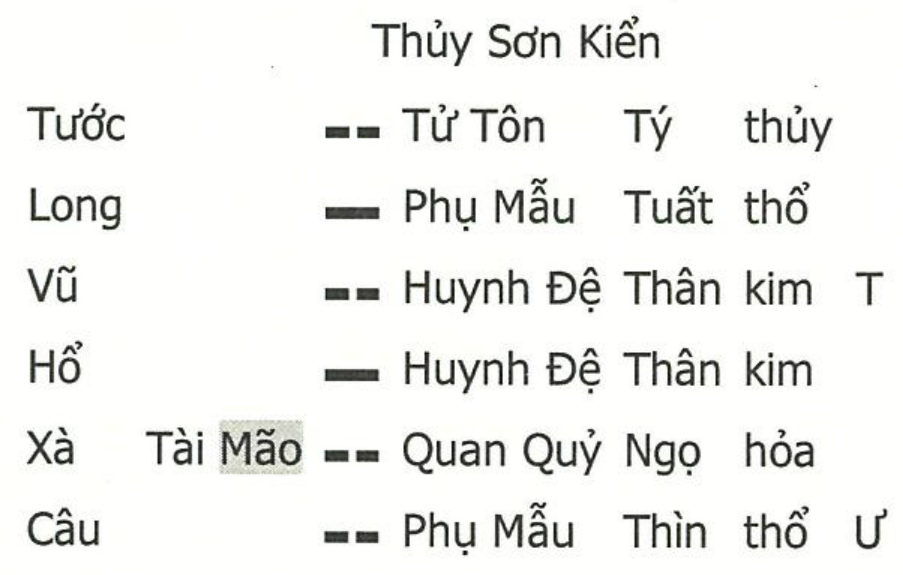
    - **Hình này chứng minh điều gì**
      - Bảng quẻ Quẻ Thủy Sơn Kiển phản ánh sự phối chiếu hào vị, ngũ hành và động biến minh chứng cho vấn đề chiêm đoán.
    - **Từ đâu mà thấy được**
      - Nhìn vào hào Thế, hào Ứng, Dụng thần và động hào trong bảng quẻ Quẻ Thủy Sơn Kiển.
- **Quá trình suy luận và đối thoại ban đầu:**
  - Căn cứ suy luận: Bởi vì nhờ đối phương lo việc, do đó tôi phải đồng ý dự đoán, ông ta chủ yếu hỏi về việc thi đại học của đứa con.
  - Căn cứ suy luận: Chỉ là xem suy vượng của Quan mà thôi, mọi người đã gặp qua không ít quẻ như vậy, nếu tôi vẫn phán đoán một cách đơn giản là thi đậu hay không thi đậu thì đối phương có chịu phục hay không?
  - Căn cứ suy luận: Có lẽ cảm thấy dự đoán học cũng như vậy mà thôi, cũng ngang tầm với trình độ của ông ta, bởi vì bản thân ông ta cũng biết đưa ra kết quả phán đoán đơn giản, chỉ là ông ta lật sách còn mình không lật sách mà thôi.
  - Căn cứ suy luận: Khi dự đoán, trước tiên đoán cái gì, sau đó đoán cái gì, vấn đề này tôi đã giảng cho mọi người, đây gọi là nhử, chúng ta không vội nói kết quả, bởi vì đó chỉ là một câu nói, chúng ta cần phải cho đối phương hồi hộp theo dõi.
  - Căn cứ suy luận: Bởi vì quẻ này là quẻ dự đoán thi đại học, do đó hiển nhiên liên quan đến thành tích học tập, thành tích học tập liên quan đến tình hình thi cử sau này.
  - Căn cứ suy luận: Xem quẻ này cần phải phân rõ khoa học xã hội và khoa học tự nhiên, điều này tương đối khó phán đoán từ trong quẻ.
  - Đối thoại thực tế: Người xưa nói: "Thần triệu cơ ở động", hào động độc phát này nhất định có tàng bí mật ở trong đó, cũng tức là nó đã phản ánh một số thông tin quan trọng ở trong đó.
  - Đối thoại thực tế: Do đó tôi hỏi: "Con trai ông thi về khoa học tự nhiên à?"
  - Đối thoại thực tế: Ông ta nói: "Trong quẻ cũng có thể nhìn ra khoa học tự nhiên à?"
  - Đối thoại thực tế: Tôi nói: "Đương nhiên nhìn ra được, chẳng những nhìn ra khoa học tự nhiên hay khoa học xã hội mà còn có thể biết môn nào không tốt nữa."
  - Đối thoại thực tế: Ông ta nói: "Không thể nào."
- **Ứng nghiệm thực tế và diễn biến sự việc:**
  - Thực tế diễn biến kiểm chứng ứng kỳ và cát hung của quẻ chiêm.
- **Ngộ giải và bài học kinh nghiệm then chốt:**
  - Đúc rút quy luật thực chiến: Xem xét tổng thể ngũ hành, hào động và tâm thái người gieo quẻ.

## 34. Thai Chết Và Thai Sống

- **Tổng quan nguyên lý & bối cảnh chuyên đề:**
  - Lấy Tử Tôn làm Dụng thần. Tử Tôn Hợi thủy bất thượng quái, phục dưới hào 4 Quan Quỷ Ngọ hỏa. Tử Tôn bị Nhật Nguyệt khắc, Phụ Mẫu trì Thế, Tử Tôn hưu tù không có khí. Không tốt lắm, Dụng phục dưới Quỷ, sau khi sinh sức khỏe không tốt.
  - Anh ta liền hỏi: "Quẻ này Tử Tôn rất nhược không tốt chứ nhỉ?" Tôi đáp: "Khả năng này thuộc về Kỵ thần quá vượng, dự đoán không có vấn đề lớn."
### Ví dụ 1: Đây là quẻ của một học viên mời tôi phán đoán
- **Bối cảnh & Dữ kiện chiêm bái:**
  - Phi thần hỷ Không Vong, bị xung v.v, nhưng Phi thần này bị Nhật hợp, lại là hào thai bị hợp, do đó là sinh khó.
  - Hợi thủy phục tàng, ngày Tị xung ra mà sinh, Tử Tôn hưu tù sinh con gái.
  - Anh ta liền hỏi: "Quẻ này Tử Tôn rất nhược không tốt chứ nhỉ?" Tôi đáp: "Khả năng này thuộc về Kỵ thần quá vượng, dự đoán không có vấn đề lớn."
  - Kết quả tại ngày Tân Tị sinh khó, sinh mổ được một con gái.
  - Nhưng đứa con này không sống được.
- Bảng quẻ Quẻ Lôi Trạch Quy Muội:
  - **Hình 153.** Quẻ Lôi Trạch Quy Muội
    - 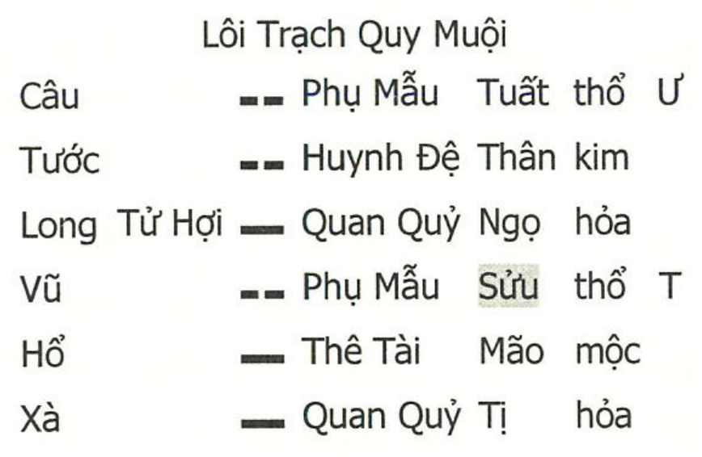
    - **Hình này chứng minh điều gì**
      - Lấy Tử Tôn làm Dụng thần.
    - **Từ đâu mà thấy được**
      - Nhìn vào hào Thế, hào Ứng, Dụng thần và động hào trong bảng quẻ Quẻ Lôi Trạch Quy Muội.
- **Quá trình suy luận và đối thoại ban đầu:**
  - Căn cứ suy luận: **Ví dụ 1:** Đây là quẻ của một học viên mời tôi phán đoán, hỏi về việc sinh con của cháu gái, ở ngày Kỷ Mùi tháng Thìn, được Lôi Trạch Quy Muội.
  - Đối thoại thực tế: Anh ta liền hỏi: "Quẻ này Tử Tôn rất nhược không tốt chứ nhỉ?" Tôi đáp: "Khả năng này thuộc về Kỵ thần quá vượng, dự đoán không có vấn đề lớn."
- **Ứng nghiệm thực tế và diễn biến sự việc:**
  - Thực tế diễn biến kiểm chứng ứng kỳ và cát hung của quẻ chiêm.
- **Ngộ giải và bài học kinh nghiệm then chốt:**
  - Đúc rút quy luật thực chiến: Xem xét tổng thể ngũ hành, hào động và tâm thái người gieo quẻ.

### Quái lệ 2: Sơ đồ quẻ Sơn Địa Bác biến Phong Địa Quan (Ví dụ 2)
- **Bối cảnh & Dữ kiện chiêm bái:**
  - Quẻ này khiến tôi nhớ lại một quẻ được đề cập trong phần thập bát vấn đáp (18 câu hỏi đáp) của Bốc Phệ Chính Tông.
  - Quẻ đó có chỗ rất giống với quẻ này.
- Bảng quẻ Sơ đồ quẻ Sơn Địa Bác biến Phong Địa Quan (Ví dụ 2):
  - **Hình 154.** Sơ đồ quẻ Sơn Địa Bác biến Phong Địa Quan (Ví dụ 2)
    - 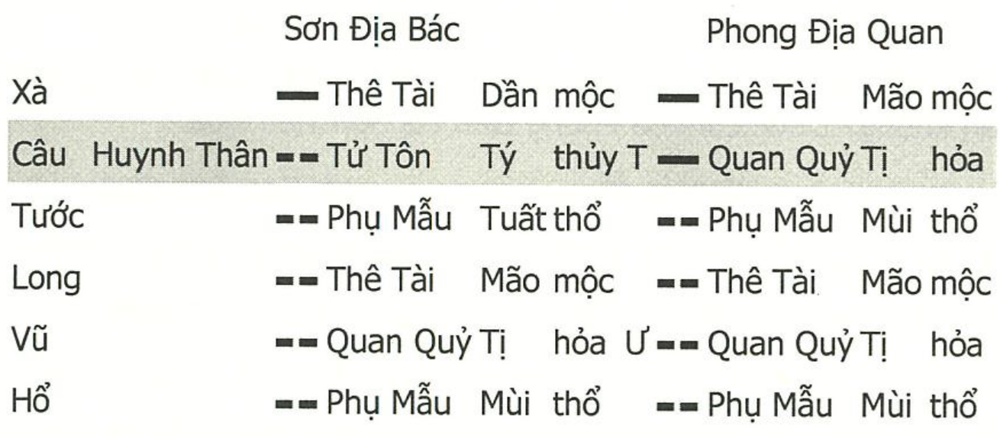
    - **Hình này chứng minh điều gì**
      - lấy Tử Tôn làm Dụng thần.
    - **Từ đâu mà thấy được**
      - Nhìn vào hào Thế, hào Ứng, Dụng thần và động hào trong bảng quẻ Sơ đồ quẻ Sơn Địa Bác biến Phong Địa Quan (Ví dụ 2).
- **Quá trình suy luận và đối thoại ban đầu:**
  - Tác giả phân tích cấu trúc hào tượng, Dụng thần và các yếu tố sinh khắc trong quẻ Sơ đồ quẻ Sơn Địa Bác biến Phong Địa Quan (Ví dụ 2).
- **Ứng nghiệm thực tế và diễn biến sự việc:**
  - Thực tế diễn biến kiểm chứng ứng kỳ và cát hung của quẻ chiêm.
- **Ngộ giải và bài học kinh nghiệm then chốt:**
  - Đúc rút quy luật thực chiến: Xem xét tổng thể ngũ hành, hào động và tâm thái người gieo quẻ.

### Quái lệ 3: Sơ đồ quẻ Sơn Địa Bác biến Phong Địa Quan (Ví dụ 3)
- **Bối cảnh & Dữ kiện chiêm bái:**
  - Chiêm đoán theo bảng quẻ Sơ đồ quẻ Sơn Địa Bác biến Phong Địa Quan (Ví dụ 3) trong thực tiễn.
- Bảng quẻ Sơ đồ quẻ Sơn Địa Bác biến Phong Địa Quan (Ví dụ 3):
  - **Hình 155.** Sơ đồ quẻ Sơn Địa Bác biến Phong Địa Quan (Ví dụ 3)
    - 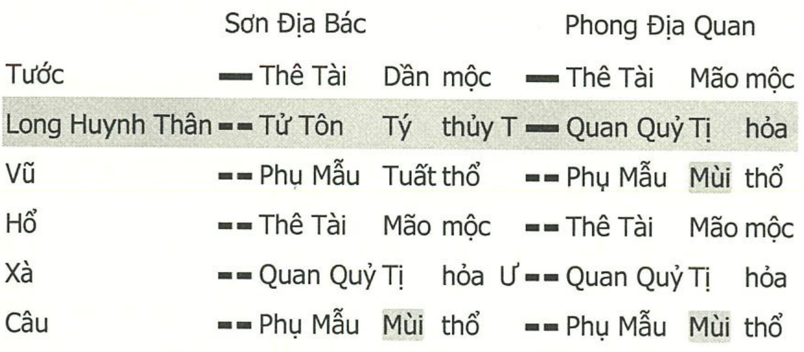
    - **Hình này chứng minh điều gì**
      - Quẻ gặp lục xung, Tử vượng Tài cường chung quy là hỷ.
    - **Từ đâu mà thấy được**
      - Nhìn vào hào Thế, hào Ứng, Dụng thần và động hào trong bảng quẻ Sơ đồ quẻ Sơn Địa Bác biến Phong Địa Quan (Ví dụ 3).
- **Quá trình suy luận và đối thoại ban đầu:**
  - Căn cứ suy luận: Đoán rằng: Thê Tài Ngọ hỏa lâm Nguyệt phá, lại bị ngày Hợi khắc, hỏa ở mùa đông hưu tù bị khắc, hoàn toàn không được sinh phù, khó giữ nổi mệnh.
- **Ứng nghiệm thực tế và diễn biến sự việc:**
  - Thực tế diễn biến kiểm chứng ứng kỳ và cát hung của quẻ chiêm.
- **Ngộ giải và bài học kinh nghiệm then chốt:**
  - Đúc rút quy luật thực chiến: Xem xét tổng thể ngũ hành, hào động và tâm thái người gieo quẻ.

### Quái lệ 4: Sơ đồ quẻ Lôi Hỏa Phong biến Lôi Sơn Tiểu Quá
- **Bối cảnh & Dữ kiện chiêm bái:**
  - Đoán rằng: Thê Tài Ngọ hỏa lâm Nguyệt phá, lại bị ngày Hợi khắc, hỏa ở mùa đông hưu tù bị khắc, hoàn toàn không được sinh phù, khó giữ nổi mệnh.
  - Đối phương hỏi: Tử Tôn Mão mộc động mà sinh hỏa, sao nói rằng hoàn toàn không được sinh phù?
  - Đối phương lại hỏi: Tài tuy không vượng, nhưng Tử Tôn Mão mộc được tháng Tý ngày Hợi sinh, sao nói là con cũng khó giữ được?
  - Quẻ này phán đoán rất khéo léo.
  - Có người đã hỏi tôi, nói là quẻ này thuộc về độc phát, cho dù hào Tài nhược cũng có thể gặp sinh được sinh, xem quẻ có rất nhiều góc độ, không thể hoàn toàn chỉ dùng một góc độ ngũ hành sinh khắc mà luận.
- Bảng quẻ Sơ đồ quẻ Lôi Hỏa Phong biến Lôi Sơn Tiểu Quá:
  - **Hình 156.** Sơ đồ quẻ Lôi Hỏa Phong biến Lôi Sơn Tiểu Quá
    - 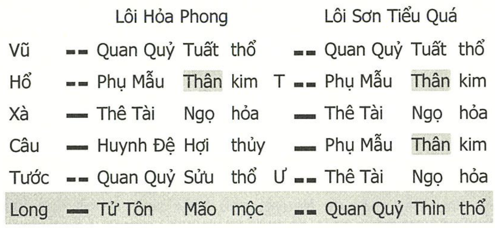
    - **Hình này chứng minh điều gì**
      - Quẻ gặp lục xung, Tử vượng Tài cường chung quy là hỷ.
    - **Từ đâu mà thấy được**
      - Nhìn vào hào Thế, hào Ứng, Dụng thần và động hào trong bảng quẻ Sơ đồ quẻ Lôi Hỏa Phong biến Lôi Sơn Tiểu Quá.
- **Quá trình suy luận và đối thoại ban đầu:**
  - Căn cứ suy luận: Đoán rằng: Thê Tài Ngọ hỏa lâm Nguyệt phá, lại bị ngày Hợi khắc, hỏa ở mùa đông hưu tù bị khắc, hoàn toàn không được sinh phù, khó giữ nổi mệnh.
  - Căn cứ suy luận: Quẻ này mấu chốt ở Tử Tôn động mà hóa Quỷ, quẻ này hào Thế Không Vong, là tượng trong lòng bất an, lo lắng.
  - Căn cứ suy luận: Sinh con vốn là hỷ sự, bởi vì độc phát này đã truyền đạt ra thông tin hỷ sự biến tang sự.
- **Ứng nghiệm thực tế và diễn biến sự việc:**
  - Nhìn vào kết quả thực tế: Quả nhiên là chung sống với người khác đã có thai, nhưng đối phương đề xuất chia tay, vì vậy bản thân không biết phải xử lý đứa con này như thế nào, sau này cô ấy đã phá thai.
- **Ngộ giải và bài học kinh nghiệm then chốt:**
  - Đúc rút quy luật thực chiến: Xem xét tổng thể ngũ hành, hào động và tâm thái người gieo quẻ.

### Ví dụ 5: Một người nữ hỏi rằng đã mang thai nhưng không biết nên làm 
- **Bối cảnh & Dữ kiện chiêm bái:**
  - **Ví dụ 5:** Một người nữ hỏi rằng đã mang thai nhưng không biết nên làm sao?
  - Ở ngày Bính Dần tháng Thìn, được Càn Vi Thiên.
  - Tử Tôn hưu tù con không giữ lại, quẻ lục xung, cuối cùng không thể thành người.
  - Quả nhiên là chung sống với người khác đã có thai, nhưng đối phương đề xuất chia tay, vì vậy bản thân không biết phải xử lý đứa con này như thế nào, sau này cô ấy đã phá thai.
- Bảng quẻ Quẻ Càn Vi Thiên:
  - **Hình 157.** Quẻ Càn Vi Thiên
    - 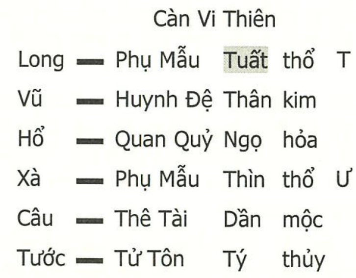
    - **Hình này chứng minh điều gì**
      - quẻ lục xung, cuối cùng không thể thành người.
    - **Từ đâu mà thấy được**
      - Nhìn vào hào Thế, hào Ứng, Dụng thần và động hào trong bảng quẻ Quẻ Càn Vi Thiên.
- **Quá trình suy luận và đối thoại ban đầu:**
  - Căn cứ suy luận: Quẻ này mấu chốt ở Tử Tôn động mà hóa Quỷ, quẻ này hào Thế Không Vong, là tượng trong lòng bất an, lo lắng.
  - Căn cứ suy luận: Sinh con vốn là hỷ sự, bởi vì độc phát này đã truyền đạt ra thông tin hỷ sự biến tang sự.
- **Ứng nghiệm thực tế và diễn biến sự việc:**
  - Thực tế diễn biến kiểm chứng ứng kỳ và cát hung của quẻ chiêm.
- **Ngộ giải và bài học kinh nghiệm then chốt:**
  - Đúc rút quy luật thực chiến: Xem xét tổng thể ngũ hành, hào động và tâm thái người gieo quẻ.

## 35. Hào Ứng Hóa Thoái Tàng Huyền Cơ

- **Tổng quan nguyên lý & bối cảnh chuyên đề:**
  - Người bệnh tốn tiền chỉ là chuyện nhỏ, quan trọng hơn là làm lỡ thời gian tốt nhất để điều trị, bệnh nhẹ trị nặng, bệnh nặng trị nhẹ, vừa hại người vừa gạt tiền, một số bác sĩ cá biệt đã biến thành những con sói đội lốt cừu, khoác lên áo trắng thiên thần nhưng lại làm những thủ đoạn hại người lợi mình để tư lợi, không phải cứu người bệnh khỏi tử vong mà là đưa người bệnh đến cửa âm phủ.
  - Có khá nhiều người tìm tôi dự đoán về cầu y vấn dược, đối với vấn đề này, tôi thường phán đoán rất cẩn thận, bởi vì mỗi câu nói của chúng ta đều liên quan đến sinh tử. Tuy nhiên nhiệm vụ này rất khó khăn và vẫn còn rất nhiều điều cần phải tiếp tục nghiệm chứng trong thực tiễn.
  - Trong cuộc đời dự đoán của tôi, tôi cũng đã có những quẻ sai sót ở khía cạnh này, mặc dù những quẻ này không liên quan đến sinh mệnh nhưng cũng là tiếng chuông cảnh tỉnh cho những người làm dự đoán như chúng ta, ít nhất bởi vì dự đoán của tôi đã khiến người ta mất tiền oan uổng, đây cũng là điều khiến tôi áy náy trong lòng.
  - Phụ Mẫu là mẹ người này, hào Ứng là máy trợ thính. Phụ Mẫu Mão mộc không được Nhật Nguyệt sinh phù, Phụ Mẫu động mà hóa thoái, chứng tỏ thính lực của mẹ cô ấy đã không có hy vọng trị khỏi. Nhưng Ứng lâm Tử Tôn động mà hợp hào Phụ Mẫu, Ứng là y dược, Tử Tôn lại thể hiện y dược, cũng chính là thông tin về máy trợ thính.
### Ví dụ 1: Một cô gái nói là mẹ cô ấy bị điếc
- **Bối cảnh & Dữ kiện chiêm bái:**
  - Cầu y vấn dược là một chủ đề dự đoán thường gặp trong cuộc sống, ngày nay có quá nhiều bác sĩ và bệnh viện rất khoác lác, vì thèm muốn tiền tài của người bệnh, bệnh nào họ cũng dám nhận chữa, có khi họ còn tìm người lôi kéo người bệnh về phía mình, hoàn toàn mất đi đạo đức phải có của một người làm thầy thuốc.
  - Không khí xã hội ngày càng xấu đi, thật là khổ cho người bị bệnh.
  - Người bệnh tốn tiền chỉ là chuyện nhỏ, quan trọng hơn là làm lỡ thời gian tốt nhất để điều trị, bệnh nhẹ trị nặng, bệnh nặng trị nhẹ, vừa hại người vừa gạt tiền, một số bác sĩ cá biệt đã biến thành những con sói đội lốt cừu, khoác lên áo trắng thiên thần nhưng lại làm những thủ đoạn hại người lợi mình để tư lợi, không phải cứu người bệnh khỏi tử vong mà là đưa người bệnh đến cửa âm phủ.
  - Có khá nhiều người tìm tôi dự đoán về cầu y vấn dược, đối với vấn đề này, tôi thường phán đoán rất cẩn thận, bởi vì mỗi câu nói của chúng ta đều liên quan đến sinh tử.
  - Tuy nhiên nhiệm vụ này rất khó khăn và vẫn còn rất nhiều điều cần phải tiếp tục nghiệm chứng trong thực tiễn.
- Bảng quẻ Sơ đồ quẻ Thiên Hỏa Đồng Nhân biến Trạch Thủy Khốn:
  - **Hình 158.** Sơ đồ quẻ Thiên Hỏa Đồng Nhân biến Trạch Thủy Khốn
    - 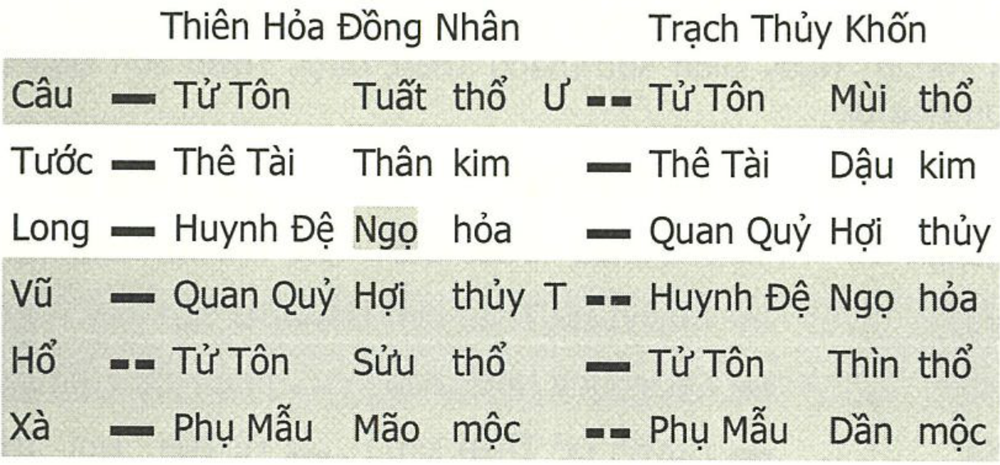
    - **Hình này chứng minh điều gì**
      - Bảng quẻ Sơ đồ quẻ Thiên Hỏa Đồng Nhân biến Trạch Thủy Khốn phản ánh sự phối chiếu hào vị, ngũ hành và động biến minh chứng cho vấn đề chiêm đoán.
    - **Từ đâu mà thấy được**
      - Nhìn vào hào Thế, hào Ứng, Dụng thần và động hào trong bảng quẻ Sơ đồ quẻ Thiên Hỏa Đồng Nhân biến Trạch Thủy Khốn.
- **Quá trình suy luận và đối thoại ban đầu:**
  - Căn cứ suy luận: Có khá nhiều người tìm tôi dự đoán về cầu y vấn dược, đối với vấn đề này, tôi thường phán đoán rất cẩn thận, bởi vì mỗi câu nói của chúng ta đều liên quan đến sinh tử.
  - Căn cứ suy luận: Trong cuộc đời dự đoán của tôi, tôi cũng đã có những quẻ sai sót ở khía cạnh này, mặc dù những quẻ này không liên quan đến sinh mệnh nhưng cũng là tiếng chuông cảnh tỉnh cho những người làm dự đoán như chúng ta, ít nhất bởi vì dự đoán của tôi đã khiến người ta mất tiền oan uổng, đây cũng là điều khiến tôi áy náy trong lòng.
  - Căn cứ suy luận: Tuy nhiên, sau đó phản hồi rằng sau khi mua máy trợ thính, bởi vì bệnh điếc của mẹ cô ấy rất nghiêm trọng cho nên khi đeo máy trợ thính cũng chỉ nghe thấy tiếng ù ù mà thôi, hoàn toàn không nghe rõ lời nói, sau đó đã ném nó sang một bên và không đeo nữa.
  - Căn cứ suy luận: Trong quẻ mặc dù Quan Quỷ Ngọ hỏa cũng đến khắc hào Ứng, nhưng Phụ Mẫu Thìn thổ phát động giải trừ khắc của Quan Quỷ, thành liên tục tương sinh, chứng tỏ trình độ điều trị của bệnh viện rất cao, thế là tôi phán đoán phẫu thuật này có thể thành công.
- **Ứng nghiệm thực tế và diễn biến sự việc:**
  - Thực tế diễn biến kiểm chứng ứng kỳ và cát hung của quẻ chiêm.
- **Ngộ giải và bài học kinh nghiệm then chốt:**
  - Đúc rút quy luật thực chiến: Xem xét tổng thể ngũ hành, hào động và tâm thái người gieo quẻ.

### Ví dụ 2: Một người đàn ông có con trai bị hôn mê
- **Bối cảnh & Dữ kiện chiêm bái:**
  - **Ví dụ 2:** Một người đàn ông có con trai bị hôn mê, không thể ăn uống, cần phải phẫu thuật luồn ống ở bụng, hỏi có thuận lợi không?
  - Ngày Đinh Sửu tháng Thân, được Thiên Sơn Độn biến Sơn Hỏa Bí.
  - Vài ngày sau phản hồi phẫu thuật thành công.
- Bảng quẻ Sơ đồ quẻ Thiên Sơn Độn biến Sơn Hỏa Bí:
  - **Hình 159.** Sơ đồ quẻ Thiên Sơn Độn biến Sơn Hỏa Bí
    - 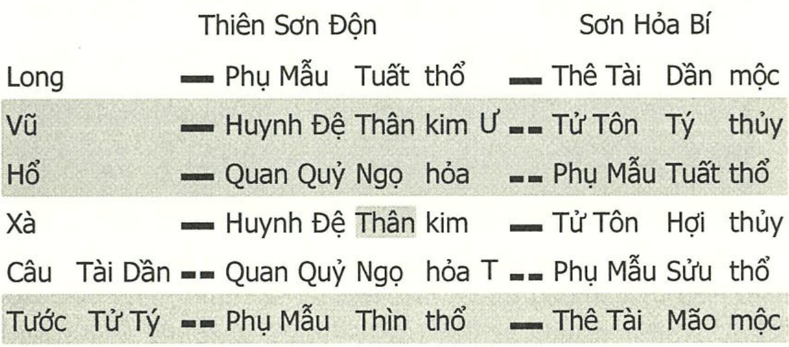
    - **Hình này chứng minh điều gì**
      - Bảng quẻ Sơ đồ quẻ Thiên Sơn Độn biến Sơn Hỏa Bí phản ánh sự phối chiếu hào vị, ngũ hành và động biến minh chứng cho vấn đề chiêm đoán.
    - **Từ đâu mà thấy được**
      - Nhìn vào hào Thế, hào Ứng, Dụng thần và động hào trong bảng quẻ Sơ đồ quẻ Thiên Sơn Độn biến Sơn Hỏa Bí.
- **Quá trình suy luận và đối thoại ban đầu:**
  - Căn cứ suy luận: Trong quẻ mặc dù Quan Quỷ Ngọ hỏa cũng đến khắc hào Ứng, nhưng Phụ Mẫu Thìn thổ phát động giải trừ khắc của Quan Quỷ, thành liên tục tương sinh, chứng tỏ trình độ điều trị của bệnh viện rất cao, thế là tôi phán đoán phẫu thuật này có thể thành công.
- **Ứng nghiệm thực tế và diễn biến sự việc:**
  - Thực tế diễn biến kiểm chứng ứng kỳ và cát hung của quẻ chiêm.
- **Ngộ giải và bài học kinh nghiệm then chốt:**
  - Đúc rút quy luật thực chiến: Xem xét tổng thể ngũ hành, hào động và tâm thái người gieo quẻ.

### Ví dụ 3: Một đàn ông hỏi bản thân tiếp nhận điều trị khí công từ xa c
- **Bối cảnh & Dữ kiện chiêm bái:**
  - **Ví dụ 3:** Một đàn ông hỏi bản thân tiếp nhận điều trị khí công từ xa có hiệu quả không?
  - Ở ngày Quý Sửu tháng Dậu, được Thiên Trạch Lý biến Phong Trạch Trung Phu.
  - Ứng lâm Quan Quỷ, Nguyệt phá, Không Vong, căn bản không có năng lực điều trị bệnh tật, không giúp ích gì cho sức khỏe của mình, độc phát khắc Thế, hiệu quả không tốt.
  - Người này vẫn muốn điều trị, trải qua thời gian một năm, không những không có chuyển biến tốt mà trái lại đã nghiêm trọng hơn ban đầu.
- Bảng quẻ Sơ đồ quẻ Thiên Trạch Lý biến Phong Trạch Trung Phu:
  - **Hình 160.** Sơ đồ quẻ Thiên Trạch Lý biến Phong Trạch Trung Phu
    - 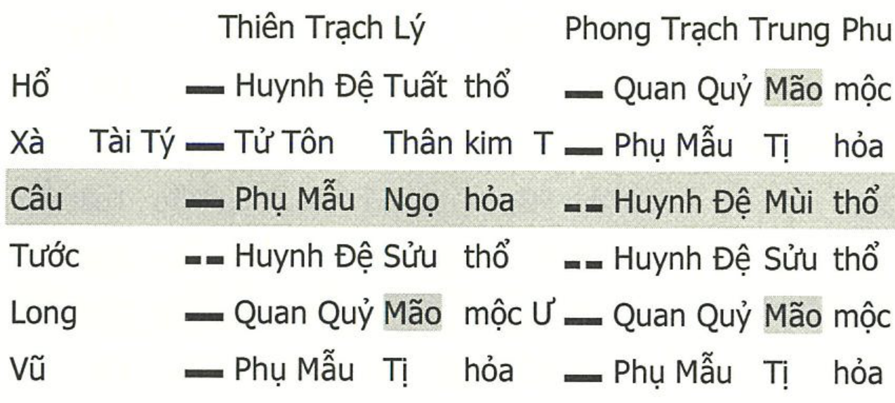
    - **Hình này chứng minh điều gì**
      - Bảng quẻ Sơ đồ quẻ Thiên Trạch Lý biến Phong Trạch Trung Phu phản ánh sự phối chiếu hào vị, ngũ hành và động biến minh chứng cho vấn đề chiêm đoán.
    - **Từ đâu mà thấy được**
      - Nhìn vào hào Thế, hào Ứng, Dụng thần và động hào trong bảng quẻ Sơ đồ quẻ Thiên Trạch Lý biến Phong Trạch Trung Phu.
- **Quá trình suy luận và đối thoại ban đầu:**
  - Tác giả phân tích cấu trúc hào tượng, Dụng thần và các yếu tố sinh khắc trong quẻ Sơ đồ quẻ Thiên Trạch Lý biến Phong Trạch Trung Phu.
- **Ứng nghiệm thực tế và diễn biến sự việc:**
  - Thực tế diễn biến kiểm chứng ứng kỳ và cát hung của quẻ chiêm.
- **Ngộ giải và bài học kinh nghiệm then chốt:**
  - Đúc rút quy luật thực chiến: Xem xét tổng thể ngũ hành, hào động và tâm thái người gieo quẻ.

### Ví dụ 4: Một người phụ nữ 50 tuổi nói là mình đã mãn kinh
- **Bối cảnh & Dữ kiện chiêm bái:**
  - **Ví dụ 4:** Một người phụ nữ 50 tuổi nói là mình đã mãn kinh, hỏi có thể lấy vòng tránh thai ra hay không?
  - Ở ngày Nhâm Thìn tháng Dần, được Sơn Địa Bác biến Sơn Thủy Mông.
  - Nhưng bà ấy đã không nghe theo đề nghị, vẫn lấy ra.
  - Sau khi lấy ra thì hằng ngày ra mồ hôi lạnh, toàn thân không có sức lực.
- Bảng quẻ Sơ đồ quẻ Sơn Địa Bác biến Sơn Thủy Mông:
  - **Hình 161.** Sơ đồ quẻ Sơn Địa Bác biến Sơn Thủy Mông
    - 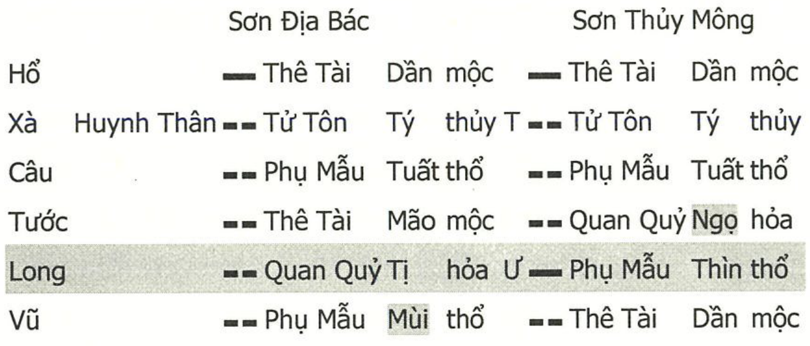
    - **Hình này chứng minh điều gì**
      - Bảng quẻ Sơ đồ quẻ Sơn Địa Bác biến Sơn Thủy Mông phản ánh sự phối chiếu hào vị, ngũ hành và động biến minh chứng cho vấn đề chiêm đoán.
    - **Từ đâu mà thấy được**
      - Nhìn vào hào Thế, hào Ứng, Dụng thần và động hào trong bảng quẻ Sơ đồ quẻ Sơn Địa Bác biến Sơn Thủy Mông.
- **Quá trình suy luận và đối thoại ban đầu:**
  - Tác giả phân tích cấu trúc hào tượng, Dụng thần và các yếu tố sinh khắc trong quẻ Sơ đồ quẻ Sơn Địa Bác biến Sơn Thủy Mông.
- **Ứng nghiệm thực tế và diễn biến sự việc:**
  - Nhìn vào kết quả thực tế: Trên thực tế đúng là đã bị nổi mề đay, thầy thuốc nói với anh ta là rất dễ điều trị, nhưng không có hiệu quả gì.
- **Ngộ giải và bài học kinh nghiệm then chốt:**
  - Đúc rút quy luật thực chiến: Xem xét tổng thể ngũ hành, hào động và tâm thái người gieo quẻ.

### Quái lệ 5: Quẻ Thủy Trạch Tiết biến Địa Trạch Lâm
- **Bối cảnh & Dữ kiện chiêm bái:**
  - Hào Thế là mình, hào Ứng là thầy thuốc. Thế được Nguyệt kiến tỉ phù, Nhật lại không khắc, không phải bệnh lớn gì. Ngoại quái Tuất thổ độc phát, khiến hào Thế nhập Mộ, Mộ khố này chính là nơi bệnh.
- Bảng quẻ Quẻ Thủy Trạch Tiết biến Địa Trạch Lâm:
  - **Hình 162.** Quẻ Thủy Trạch Tiết biến Địa Trạch Lâm
    - 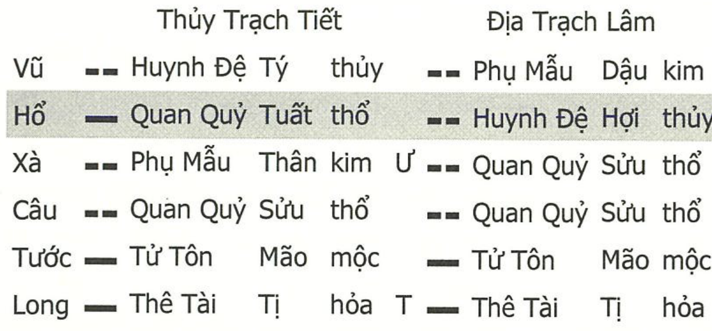
    - **Hình này chứng minh điều gì**
      - Bảng quẻ Quẻ Thủy Trạch Tiết biến Địa Trạch Lâm phản ánh sự phối chiếu hào vị, ngũ hành và động biến minh chứng cho vấn đề chiêm đoán.
    - **Từ đâu mà thấy được**
      - Nhìn vào hào Thế, hào Ứng, Dụng thần và động hào trong bảng quẻ Quẻ Thủy Trạch Tiết biến Địa Trạch Lâm.
- **Quá trình suy luận và đối thoại ban đầu:**
  - Căn cứ suy luận: ### Ví dụ 7: Bởi vì tự lái xe sau khi uống rượu, anh trai của một ông chủ bất động sản đã đâm xe vào một gốc cây, sau đó đã gọi điện thoại cho người nhà, người nhà đã vội vàng đưa ông ta đến bệnh viện.
- **Ứng nghiệm thực tế và diễn biến sự việc:**
  - Nhìn vào kết quả thực tế: Trên thực tế là bị bệnh tăng nhãn áp, đã điều trị thời gian rất lâu nhưng không có hiệu quả.
- **Ngộ giải và bài học kinh nghiệm then chốt:**
  - Đúc rút quy luật thực chiến: Xem xét tổng thể ngũ hành, hào động và tâm thái người gieo quẻ.

### Quái lệ 6: Quẻ Phong Địa Quan biến Thủy Lôi Truân
- **Bối cảnh & Dữ kiện chiêm bái:**
  - ### Ví dụ 7: Bởi vì tự lái xe sau khi uống rượu, anh trai của một ông chủ bất động sản đã đâm xe vào một gốc cây, sau đó đã gọi điện thoại cho người nhà, người nhà đã vội vàng đưa ông ta đến bệnh viện.
  - Trên cơ thể không có vết thương, sau khi kiểm tra ở bệnh viện cũng không phát hiện tình trạng bất thường nào, sau khi ở bệnh viện một tuần thì mọi thứ vẫn bình thường, nhưng vẫn có phần không yên tâm, thế là tìm tôi dự đoán cát hung của anh trai anh ta, hỏi có cần phải tiếp tục điều trị ở bệnh viện hay không?
- Bảng quẻ Quẻ Phong Địa Quan biến Thủy Lôi Truân:
  - **Hình 163.** Quẻ Phong Địa Quan biến Thủy Lôi Truân
    - 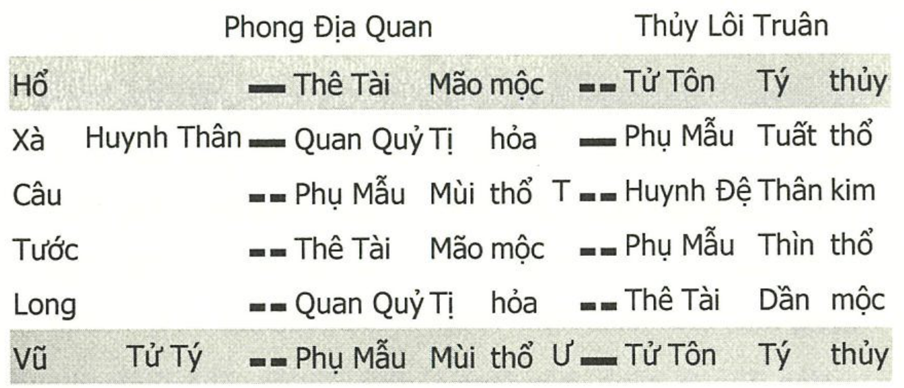
    - **Hình này chứng minh điều gì**
      - Lấy hào Huynh Đệ làm Dụng thần.
    - **Từ đâu mà thấy được**
      - Nhìn vào hào Thế, hào Ứng, Dụng thần và động hào trong bảng quẻ Quẻ Phong Địa Quan biến Thủy Lôi Truân.
- **Quá trình suy luận và đối thoại ban đầu:**
  - Căn cứ suy luận: ### Ví dụ 7: Bởi vì tự lái xe sau khi uống rượu, anh trai của một ông chủ bất động sản đã đâm xe vào một gốc cây, sau đó đã gọi điện thoại cho người nhà, người nhà đã vội vàng đưa ông ta đến bệnh viện.
- **Ứng nghiệm thực tế và diễn biến sự việc:**
  - Thực tế diễn biến kiểm chứng ứng kỳ và cát hung của quẻ chiêm.
- **Ngộ giải và bài học kinh nghiệm then chốt:**
  - Đúc rút quy luật thực chiến: Xem xét tổng thể ngũ hành, hào động và tâm thái người gieo quẻ.

### Quái lệ 7: Sơ đồ quẻ Lôi Phong Hằng biến Địa Thiên Thái
- **Bối cảnh & Dữ kiện chiêm bái:**
  - Ngày Đinh Tị tháng Dậu, được Lôi Phong Hằng biến Địa Thiên Thái.
  - Mặc dù lời nói không xuôi tai, nhưng tôi phải theo quẻ mà phán đoán.
  - Anh ta nói anh trai hiện nay không có vấn đề gì, không đau không ngứa, nhưng vẫn nghe theo đề nghị tôi ở lại bệnh viện thêm một thời gian.
- Bảng quẻ Sơ đồ quẻ Lôi Phong Hằng biến Địa Thiên Thái:
  - **Hình 164.** Sơ đồ quẻ Lôi Phong Hằng biến Địa Thiên Thái
    - 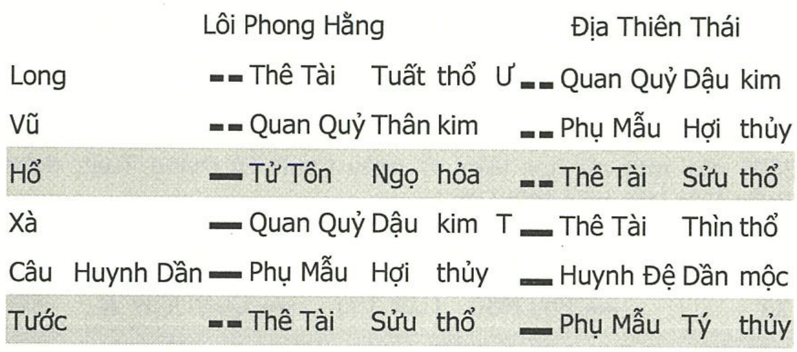
    - **Hình này chứng minh điều gì**
      - Lấy hào Huynh Đệ làm Dụng thần.
    - **Từ đâu mà thấy được**
      - Nhìn vào hào Thế, hào Ứng, Dụng thần và động hào trong bảng quẻ Sơ đồ quẻ Lôi Phong Hằng biến Địa Thiên Thái.
- **Quá trình suy luận và đối thoại ban đầu:**
  - Tác giả phân tích cấu trúc hào tượng, Dụng thần và các yếu tố sinh khắc trong quẻ Sơ đồ quẻ Lôi Phong Hằng biến Địa Thiên Thái.
- **Ứng nghiệm thực tế và diễn biến sự việc:**
  - Thực tế diễn biến kiểm chứng ứng kỳ và cát hung của quẻ chiêm.
- **Ngộ giải và bài học kinh nghiệm then chốt:**
  - Đúc rút quy luật thực chiến: Xem xét tổng thể ngũ hành, hào động và tâm thái người gieo quẻ.

## 36. Sự Kỳ Diệu Của Độc Phát

- **Tổng quan nguyên lý & bối cảnh chuyên đề:**
  - Về vấn đề quẻ độc phát, tôi đã dành không ít thời gian nghiên cứu, nhưng có quẻ vẫn chưa thể thông suốt, bởi vì quẻ độc phát vẫn còn rất nhiều bí mật chưa được giải mã, chỉ có thể dựa vào việc thực hành nhiều để nghiệm chứng.
  - Thông thường dự đoán công tác lấy Quan Quỷ làm Dụng thần. Quẻ này Quan Quỷ Ngọ hỏa trì Thế, không được Nguyệt sinh, bị Nhật xung xem là ám động tương đối yếu, nhưng rốt cuộc lâm Dịch Mã, do đó tôi phán đoán công tác của cô ấy có thể biến động.
  - Hào Huynh Đệ độc phát, tôi phán đoán cô ấy đã tốn tiền để biến động công tác. Tài lâm Huyền Vũ bị khắc, Tài bị khắc là Tài phục tàng, đương nhiên chính là đã lặng lẽ tặng quà.
### Ví dụ 1: Đây là quẻ đoán về biến động công tác tại năm 2006 của một n
- **Bối cảnh & Dữ kiện chiêm bái:**
  - **Ví dụ 1:** Đây là quẻ đoán về biến động công tác tại năm 2006 của một nữ học viên.
  - Ở ngày Canh Tý tháng Tuất, được Thiên Sơn Độn biến Hỏa Sơn Lữ.
  - Cô ấy phản hồi là đã tặng quà, hiện nay cũng đã đến đơn vị này làm việc, nhưng vẫn chưa có lệnh điều động chính thức.
  - Vậy thì quẻ này cần phải xem Phụ Mẫu.
  - Phụ Mẫu lưỡng hiện, lấy hào sơ Không Vong Nguyệt phá làm Dụng.
- Bảng quẻ Sơ đồ quẻ Thiên Sơn Độn biến Hỏa Sơn Lữ:
  - **Hình 165.** Sơ đồ quẻ Thiên Sơn Độn biến Hỏa Sơn Lữ
    - 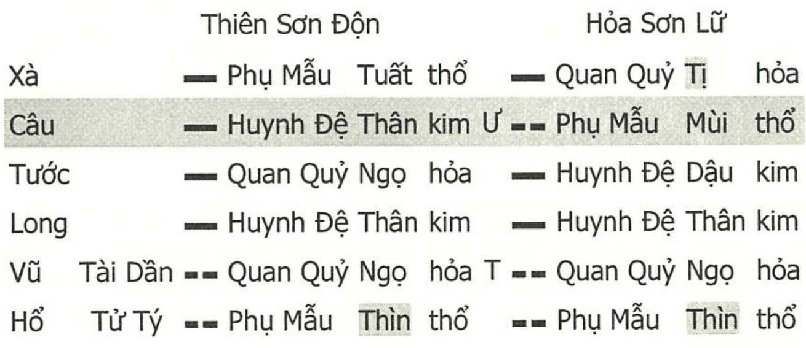
    - **Hình này chứng minh điều gì**
      - lấy Quan Quỷ làm Dụng thần.
    - **Từ đâu mà thấy được**
      - Nhìn vào hào 5 độc phát hóa Phụ Mẫu, thế là đã đoán ở tháng Tị năm 2007 có thể hoàn thành.
- **Quá trình suy luận và đối thoại ban đầu:**
  - Căn cứ suy luận: Về vấn đề quẻ độc phát, tôi đã dành không ít thời gian nghiên cứu, nhưng có quẻ vẫn chưa thể thông suốt, bởi vì quẻ độc phát vẫn còn rất nhiều bí mật chưa được giải mã, chỉ có thể dựa vào việc thực hành nhiều để nghiệm chứng.
  - Căn cứ suy luận: Thông thường dự đoán công tác lấy Quan Quỷ làm Dụng thần.
  - Căn cứ suy luận: Quẻ này Quan Quỷ Ngọ hỏa trì Thế, không được Nguyệt sinh, bị Nhật xung xem là ám động tương đối yếu, nhưng rốt cuộc lâm Dịch Mã, do đó tôi phán đoán công tác của cô ấy có thể biến động.
  - Căn cứ suy luận: Hào Huynh Đệ độc phát, tôi phán đoán cô ấy đã tốn tiền để biến động công tác.
  - Căn cứ suy luận: Tài lâm Huyền Vũ bị khắc, Tài bị khắc là Tài phục tàng, đương nhiên chính là đã lặng lẽ tặng quà.
  - Căn cứ suy luận: Phụ Mẫu lưỡng hiện, lấy hào sơ Không Vong Nguyệt phá làm Dụng.
- **Ứng nghiệm thực tế và diễn biến sự việc:**
  - Thực tế diễn biến kiểm chứng ứng kỳ và cát hung của quẻ chiêm.
- **Ngộ giải và bài học kinh nghiệm then chốt:**
  - Đúc rút quy luật thực chiến: Xem xét tổng thể ngũ hành, hào động và tâm thái người gieo quẻ.

### Ví dụ 2: Ví dụ này cũng là một người nữ dự đoán chuyện điều động công
- **Bối cảnh & Dữ kiện chiêm bái:**
  - Lúc đó đã hiểu sai ý nghĩa biểu đạt của độc phát này cho nên đã phán đoán kết quả ngược lại.
  - Do đó, khi chúng ta phán đoán quẻ độc phát nhất định phải cẩn thận, nhất định phải suy xét tường tận huyền cơ bao hàm trong độc phát, như vậy mới có thể đoán nghiệm như thần.
  - **Ví dụ 2:** Ví dụ này cũng là một người nữ dự đoán chuyện điều động công tác.
  - Ở ngày Kỷ Hợi tháng Tuất, được Thiên Sơn Độn biến Hỏa Sơn Lữ.
  - Người nữ này cũng đã đến làm việc ở đơn vị muốn đến, đã làm việc hơn ba năm nhưng hồ sơ vẫn không được giải quyết, cũng đã đưa tiền cho lãnh đạo, nhưng điểm khác là lãnh đạo đã không trả lại tiền cho cô ấy mà đã rời khỏi đơn vị này, đã lấy tiền nhưng không xử lý công việc.
- Bảng quẻ Sơ đồ quẻ Thiên Sơn Độn biến Hỏa Sơn Lữ:
  - **Hình 166.** Sơ đồ quẻ Thiên Sơn Độn biến Hỏa Sơn Lữ
    - 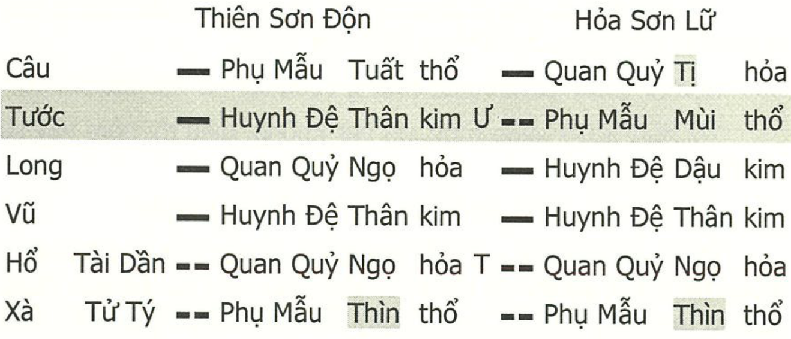
    - **Hình này chứng minh điều gì**
      - Bảng quẻ Sơ đồ quẻ Thiên Sơn Độn biến Hỏa Sơn Lữ phản ánh sự phối chiếu hào vị, ngũ hành và động biến minh chứng cho vấn đề chiêm đoán.
    - **Từ đâu mà thấy được**
      - Nhìn vào hào Thế, hào Ứng, Dụng thần và động hào trong bảng quẻ Sơ đồ quẻ Thiên Sơn Độn biến Hỏa Sơn Lữ.
- **Quá trình suy luận và đối thoại ban đầu:**
  - Căn cứ suy luận: Lúc đó đã hiểu sai ý nghĩa biểu đạt của độc phát này cho nên đã phán đoán kết quả ngược lại.
  - Căn cứ suy luận: Do đó, khi chúng ta phán đoán quẻ độc phát nhất định phải cẩn thận, nhất định phải suy xét tường tận huyền cơ bao hàm trong độc phát, như vậy mới có thể đoán nghiệm như thần.
  - Căn cứ suy luận: Lấy hào Tài làm Dụng thần, mặc dù quẻ này hào Tài lưỡng hiện, nhưng quẻ này thuộc về độc phát, Tài lâm Nguyệt kiến độc phát sinh Thế, là tượng tài không mất, do đó tôi phán đoán không mất.
  - Căn cứ suy luận: Tôi nói: Đây là độc phát sinh Thế, cho nên Tị hỏa hóa ra này là hóa hồi đầu sinh, chứ không phải hóa Tuyệt.
  - Căn cứ suy luận: **Ví dụ 4:** Con trai của một người bạn muốn vào học ở trường luyện thi bởi vì đã thi rớt đại học, gieo quẻ xem có thể vào được trường luyện thi hay không, ở ngày Ất Mùi tháng Ngọ, được Sơn Phong Cổ biến Địa Phong Thăng.
- **Ứng nghiệm thực tế và diễn biến sự việc:**
  - Thực tế diễn biến kiểm chứng ứng kỳ và cát hung của quẻ chiêm.
- **Ngộ giải và bài học kinh nghiệm then chốt:**
  - Đúc rút quy luật thực chiến: Xem xét tổng thể ngũ hành, hào động và tâm thái người gieo quẻ.

### Ví dụ 3: Một học viên của tôi không tìm được thẻ ngân hàng của mình
- **Bối cảnh & Dữ kiện chiêm bái:**
  - **Ví dụ 3:** Một học viên của tôi không tìm được thẻ ngân hàng của mình, trong đó vẫn còn rất nhiều tiền, xem có thể tìm được hay không?
  - Ở ngày Kỷ Hợi tháng Tuất, được Lôi Phong Hằng biến Hỏa Phong Đỉnh.
  - Học viên này hỏi: Độc phát này không phải là hóa Tuyệt ư?
  - Học viên này lại hỏi: Hóa Không cũng xem là hồi đầu sinh ư?
  - Sau đó quả nhiên tìm được ở giờ Thân cùng ngày.
- Bảng quẻ Sơ đồ quẻ Lôi Phong Hằng biến Hỏa Phong Đỉnh:
  - **Hình 167.** Sơ đồ quẻ Lôi Phong Hằng biến Hỏa Phong Đỉnh
    - 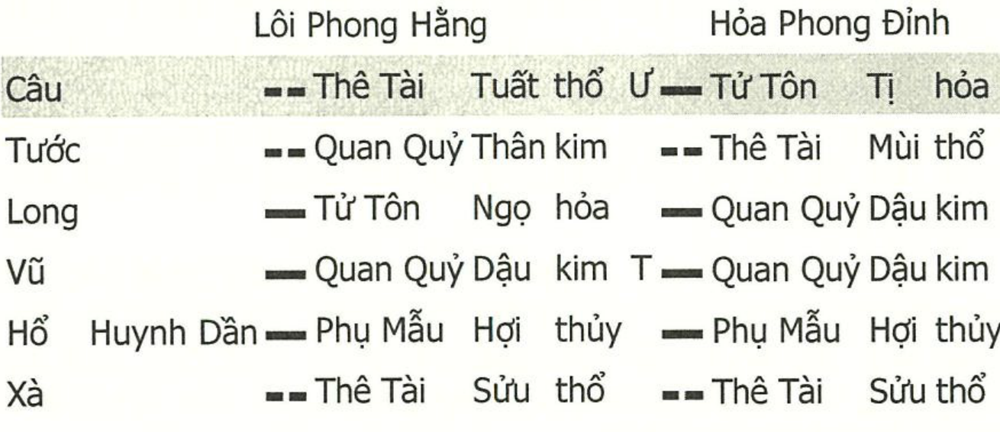
    - **Hình này chứng minh điều gì**
      - Bảng quẻ Sơ đồ quẻ Lôi Phong Hằng biến Hỏa Phong Đỉnh phản ánh sự phối chiếu hào vị, ngũ hành và động biến minh chứng cho vấn đề chiêm đoán.
    - **Từ đâu mà thấy được**
      - Nhìn vào hào 6 Huynh Đệ độc phát, Quan Quỷ lâm Tuyệt địa, do đó nhất định khó mà vào được.
- **Quá trình suy luận và đối thoại ban đầu:**
  - Căn cứ suy luận: Lấy hào Tài làm Dụng thần, mặc dù quẻ này hào Tài lưỡng hiện, nhưng quẻ này thuộc về độc phát, Tài lâm Nguyệt kiến độc phát sinh Thế, là tượng tài không mất, do đó tôi phán đoán không mất.
  - Căn cứ suy luận: Tôi nói: Đây là độc phát sinh Thế, cho nên Tị hỏa hóa ra này là hóa hồi đầu sinh, chứ không phải hóa Tuyệt.
  - Căn cứ suy luận: **Ví dụ 4:** Con trai của một người bạn muốn vào học ở trường luyện thi bởi vì đã thi rớt đại học, gieo quẻ xem có thể vào được trường luyện thi hay không, ở ngày Ất Mùi tháng Ngọ, được Sơn Phong Cổ biến Địa Phong Thăng.
  - Căn cứ suy luận: Đoán cát hung của việc đi xa, lấy hào Thế làm Dụng thần.
  - Căn cứ suy luận: Nhưng Tử Tôn này phát động hóa ra Quan Quỷ, từ hỷ đã biến thành ưu sầu, bởi vì Quan Quỷ là lo lắng.
- **Ứng nghiệm thực tế và diễn biến sự việc:**
  - Thực tế diễn biến kiểm chứng ứng kỳ và cát hung của quẻ chiêm.
- **Ngộ giải và bài học kinh nghiệm then chốt:**
  - Đúc rút quy luật thực chiến: Xem xét tổng thể ngũ hành, hào động và tâm thái người gieo quẻ.

### Ví dụ 5: Trong thời gian ra ngoài khảo sát
- **Bối cảnh & Dữ kiện chiêm bái:**
  - **Ví dụ 5:** Trong thời gian ra ngoài khảo sát, nhóm chúng tôi phải đến thành phố kế tiếp, nhưng từ địa phương này đến một địa phương khác không có máy bay, đành phải thuê xe.
  - Tôi gieo quẻ xem tình hình của lộ trình này như thế nào?
  - Ngày Ất Tị tháng Mùi, được Khôn Vi Địa biến Sơn Địa Bác.
- Bảng quẻ Sơ đồ quẻ Sơn Phong Cổ biến Địa Phong Thăng:
  - **Hình 168.** Sơ đồ quẻ Sơn Phong Cổ biến Địa Phong Thăng
    - 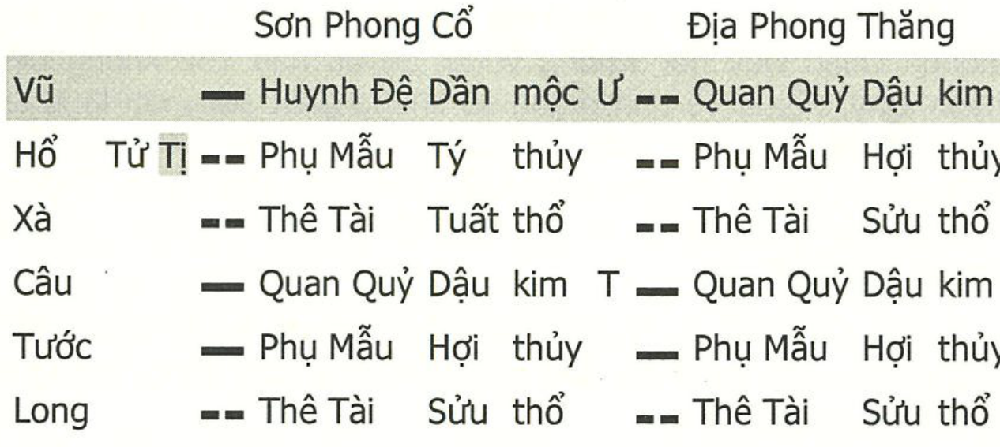
    - **Hình này chứng minh điều gì**
      - Lấy Quan Quỷ làm Dụng thần.
    - **Từ đâu mà thấy được**
      - Nhìn vào hào 6 Huynh Đệ độc phát, Quan Quỷ lâm Tuyệt địa, do đó nhất định khó mà vào được.
- **Quá trình suy luận và đối thoại ban đầu:**
  - Căn cứ suy luận: Đoán cát hung của việc đi xa, lấy hào Thế làm Dụng thần.
  - Căn cứ suy luận: Nhưng Tử Tôn này phát động hóa ra Quan Quỷ, từ hỷ đã biến thành ưu sầu, bởi vì Quan Quỷ là lo lắng.
- **Ứng nghiệm thực tế và diễn biến sự việc:**
  - Thực tế diễn biến kiểm chứng ứng kỳ và cát hung của quẻ chiêm.
- **Ngộ giải và bài học kinh nghiệm then chốt:**
  - Đúc rút quy luật thực chiến: Xem xét tổng thể ngũ hành, hào động và tâm thái người gieo quẻ.

### Quái lệ 5: Sơ đồ quẻ Khôn Vi Địa biến Sơn Địa Bác
- **Bối cảnh & Dữ kiện chiêm bái:**
  - Chiêm đoán theo bảng quẻ Sơ đồ quẻ Khôn Vi Địa biến Sơn Địa Bác trong thực tiễn.
- Bảng quẻ Sơ đồ quẻ Khôn Vi Địa biến Sơn Địa Bác:
  - **Hình 169.** Sơ đồ quẻ Khôn Vi Địa biến Sơn Địa Bác
    - 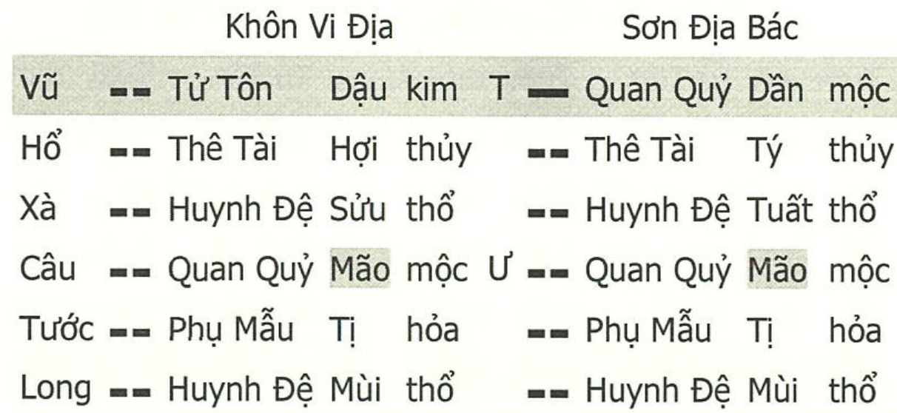
    - **Hình này chứng minh điều gì**
      - Lấy hào Tài làm Dụng thần.
    - **Từ đâu mà thấy được**
      - Nhìn vào hào 5, đây là tổ hợp được đại tài.
- **Quá trình suy luận và đối thoại ban đầu:**
  - Căn cứ suy luận: Hào độc phát là Tử địa Phụ Mẫu, xem ra xe sẽ bị hư giữa đường, hơn nữa sợ là hư đến nỗi không thể khởi động.
  - Căn cứ suy luận: Bởi vì xe Tử thì không thể động.
- **Ứng nghiệm thực tế và diễn biến sự việc:**
  - Nhìn vào kết quả thực tế: Kết quả là ngày hôm sau lại thấy một chiếc xe cũ, người cho thuê nói rằng đó là chiếc xe mới nhất ở chỗ của họ.
  - Nhìn vào kết quả thực tế: Chúng tôi không nỡ làm mất thể diện của bạn, do đó đã thuê chiếc xe này, kết quả là xe đã bị hư giữa đường, không thể nổ máy.
- **Ngộ giải và bài học kinh nghiệm then chốt:**
  - Đúc rút quy luật thực chiến: Xem xét tổng thể ngũ hành, hào động và tâm thái người gieo quẻ.

### Ví dụ 6: Tháng 10 năm 2004
- **Bối cảnh & Dữ kiện chiêm bái:**
  - Thế là chúng tôi đã nói đi nói lại với người cho thuê rằng nhất định phải là xe tốt, xe mới, đối phương cũng trả lời nhất định là xe mới.
  - Kết quả là ngày hôm sau lại thấy một chiếc xe cũ, người cho thuê nói rằng đó là chiếc xe mới nhất ở chỗ của họ.
  - **Ví dụ 6:** Tháng 10 năm 2004, một người đàn ông đoán tình hình tài vận của mình đến tháng 7 năm 2005.
  - Ở ngày Mậu Thìn tháng Tuất, được Thiên Hỏa Đồng Nhân biến quẻ Thiên Sơn Độn.
- Bảng quẻ Sơ đồ quẻ Thiên Hỏa Đồng Nhân biến Thiên Sơn Độn:
  - **Hình 170.** Sơ đồ quẻ Thiên Hỏa Đồng Nhân biến Thiên Sơn Độn
    - 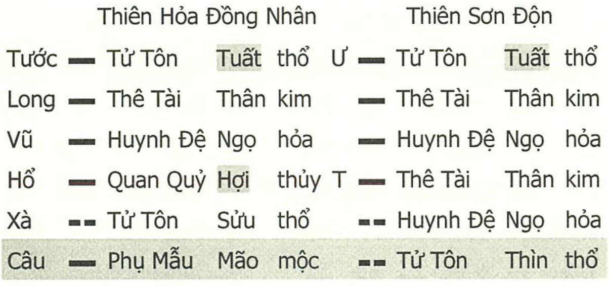
    - **Hình này chứng minh điều gì**
      - Lấy hào Tài làm Dụng thần.
    - **Từ đâu mà thấy được**
      - Nhìn vào hào 5, đây là tổ hợp được đại tài.
- **Quá trình suy luận và đối thoại ban đầu:**
  - Căn cứ suy luận: Hào độc phát là Tử địa Phụ Mẫu, xem ra xe sẽ bị hư giữa đường, hơn nữa sợ là hư đến nỗi không thể khởi động.
  - Căn cứ suy luận: Bởi vì xe Tử thì không thể động.
  - Căn cứ suy luận: Phụ Mẫu có ý nghĩa là xe, nhà, quần áo v.v, chỉ dựa vào một hào Phụ Mẫu thì vẫn chưa thể xác định là nguyên nhân gì khiến tài vận không tốt, cần phải nhờ vào thông tin khác để thu hẹp phạm vi.
  - Căn cứ suy luận: Ứng là người khác, ám động sinh Tài chính là có người cho anh ta tiền, nhưng lâm Không Vong, có phải là thành tâm cho hay không?
  - Căn cứ suy luận: Nhất định không phải, bởi vì Phụ Mẫu cũng chủ văn thư, trong khi cho tiền thì phải lập hợp đồng, do đó Tử Tôn Tuất thổ này ám động hợp Phụ Mẫu chính là yêu cầu anh ta lập hợp đồng sau đó mới cho tiền, và Không lại không phải là thành tâm cho, đó chính là cho anh ta vay tiền, cho nên đó là thông tin cho vay.
  - Căn cứ suy luận: Lấy Tài làm Dụng thần.
  - Đối thoại thực tế: 1, Nhật Nguyệt là Tử Tôn, hào Ứng và hào 2 lại có hai Tử Tôn, hào sơ phát động lại hóa ra một Tử Tôn, tổng cộng 5 Tử Tôn, đây là thể hiện thông tin "Tử tuy phúc đức đa phản vô công", trái lại bất lợi cho hào Tài.
- **Ứng nghiệm thực tế và diễn biến sự việc:**
  - Nhìn vào kết quả thực tế: Kết quả là khiến cho nợ nần chồng chất, buôn bán cũng gặp vấn đề về dòng tiền.
  - Nhìn vào kết quả thực tế: Kết quả là lúc gieo quẻ cô ấy đã biết con trai không thi đậu.
- **Ngộ giải và bài học kinh nghiệm then chốt:**
  - Đúc rút quy luật thực chiến: Xem xét tổng thể ngũ hành, hào động và tâm thái người gieo quẻ.

### Ví dụ 7: Một người phụ nữ đoán con trai thi vào cấp 3 sẽ như thế nào?
- **Bối cảnh & Dữ kiện chiêm bái:**
  - Ứng là người khác, ám động sinh Tài chính là có người cho anh ta tiền, nhưng lâm Không Vong, có phải là thành tâm cho hay không?
  - Nhất định không phải, bởi vì Phụ Mẫu cũng chủ văn thư, trong khi cho tiền thì phải lập hợp đồng, do đó Tử Tôn Tuất thổ này ám động hợp Phụ Mẫu chính là yêu cầu anh ta lập hợp đồng sau đó mới cho tiền, và Không lại không phải là thành tâm cho, đó chính là cho anh ta vay tiền, cho nên đó là thông tin cho vay.
  - **Ví dụ 7:** Một người phụ nữ đoán con trai thi vào cấp 3 sẽ như thế nào?
  - Ở ngày Giáp Ngọ tháng Thân, được Sơn Thủy Mông biến Phong Thủy Hoán.
  - **Ví dụ 8:** Ngày Tân Sửu tháng Hợi năm 2004, đoán tỷ giá yên Nhật có tăng lên hay không?
- Bảng quẻ Quẻ Sơn Thủy Mông biến Phong Thủy Hoán:
  - **Hình 171.** Quẻ Sơn Thủy Mông biến Phong Thủy Hoán
    - 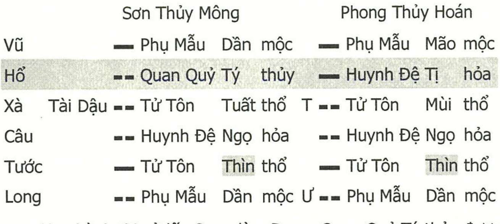
    - **Hình này chứng minh điều gì**
      - Lấy Tài làm Dụng thần.
    - **Từ đâu mà thấy được**
      - Nhìn vào hào Thế, hào Ứng, Dụng thần và động hào trong bảng quẻ Quẻ Sơn Thủy Mông biến Phong Thủy Hoán.
- **Quá trình suy luận và đối thoại ban đầu:**
  - Căn cứ suy luận: Phụ Mẫu có ý nghĩa là xe, nhà, quần áo v.v, chỉ dựa vào một hào Phụ Mẫu thì vẫn chưa thể xác định là nguyên nhân gì khiến tài vận không tốt, cần phải nhờ vào thông tin khác để thu hẹp phạm vi.
  - Căn cứ suy luận: Ứng là người khác, ám động sinh Tài chính là có người cho anh ta tiền, nhưng lâm Không Vong, có phải là thành tâm cho hay không?
  - Căn cứ suy luận: Nhất định không phải, bởi vì Phụ Mẫu cũng chủ văn thư, trong khi cho tiền thì phải lập hợp đồng, do đó Tử Tôn Tuất thổ này ám động hợp Phụ Mẫu chính là yêu cầu anh ta lập hợp đồng sau đó mới cho tiền, và Không lại không phải là thành tâm cho, đó chính là cho anh ta vay tiền, cho nên đó là thông tin cho vay.
  - Căn cứ suy luận: Lấy Tài làm Dụng thần.
  - Căn cứ suy luận: Quẻ này hào Tài lưỡng hiện, lấy hào Thê Tài Tuất thổ phát động làm Dụng thần.
  - Căn cứ suy luận: Thê Tài Tuất thổ độc phát hóa ra Tị hỏa, độc phát vốn là lấy tượng làm chủ phán đoán, là hóa Tuyệt, nhưng bởi vì hào này biến Tị hỏa Nguyệt phá lại Không, trái lại không xem là Tuyệt, luận là hồi đầu sinh.
  - Đối thoại thực tế: 1, Nhật Nguyệt là Tử Tôn, hào Ứng và hào 2 lại có hai Tử Tôn, hào sơ phát động lại hóa ra một Tử Tôn, tổng cộng 5 Tử Tôn, đây là thể hiện thông tin "Tử tuy phúc đức đa phản vô công", trái lại bất lợi cho hào Tài.
- **Ứng nghiệm thực tế và diễn biến sự việc:**
  - Thực tế diễn biến kiểm chứng ứng kỳ và cát hung của quẻ chiêm.
- **Ngộ giải và bài học kinh nghiệm then chốt:**
  - Đúc rút quy luật thực chiến: Xem xét tổng thể ngũ hành, hào động và tâm thái người gieo quẻ.

### Quái lệ 8: Quẻ Chấn Vi Lôi biến Hỏa Lôi Phệ Hạp
- **Bối cảnh & Dữ kiện chiêm bái:**
  - Chiêm đoán theo bảng quẻ Quẻ Chấn Vi Lôi biến Hỏa Lôi Phệ Hạp trong thực tiễn.
- Bảng quẻ Quẻ Chấn Vi Lôi biến Hỏa Lôi Phệ Hạp:
  - **Hình 172.** Quẻ Chấn Vi Lôi biến Hỏa Lôi Phệ Hạp
    - 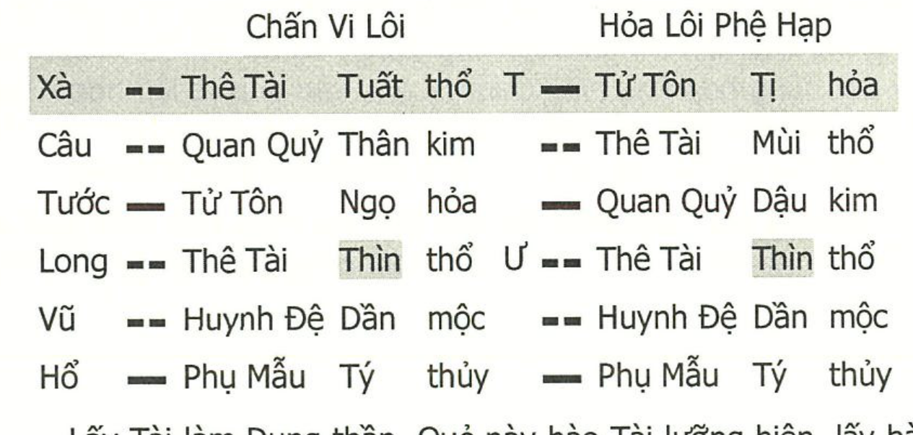
    - **Hình này chứng minh điều gì**
      - Lấy Tài làm Dụng thần.
    - **Từ đâu mà thấy được**
      - Nhìn vào hào Thế, hào Ứng, Dụng thần và động hào trong bảng quẻ Quẻ Chấn Vi Lôi biến Hỏa Lôi Phệ Hạp.
- **Quá trình suy luận và đối thoại ban đầu:**
  - Tác giả phân tích cấu trúc hào tượng, Dụng thần và các yếu tố sinh khắc trong quẻ Quẻ Chấn Vi Lôi biến Hỏa Lôi Phệ Hạp.
- **Ứng nghiệm thực tế và diễn biến sự việc:**
  - Nhìn vào kết quả thực tế: Kết quả là ở tháng Tý và tháng Sửu liên tục tăng lên.
- **Ngộ giải và bài học kinh nghiệm then chốt:**
  - Đúc rút quy luật thực chiến: Xem xét tổng thể ngũ hành, hào động và tâm thái người gieo quẻ.

### Ví dụ 9: Một học viên của tôi làm kế toán trong nhà hàng
- **Bối cảnh & Dữ kiện chiêm bái:**
  - Tài được Nhật tỉ phù là vượng, hào biến Nguyệt phá, sang tháng bất phá, tháng Tý nhất định tăng lên.
  - Kết quả là ở tháng Tý và tháng Sửu liên tục tăng lên.
  - Tháng Sửu tăng lên cũng là do hào Tài được tỉ phù.
  - **Ví dụ 9:** Một học viên của tôi làm kế toán trong nhà hàng, nhà hàng này do nhiều nguyên nhân mà không thể tiếp tục kinh doanh, trước khi sắp giải thể, nhà hàng phát cho mỗi người một tháng lương, nhưng cô ấy không cẩn thận đã phát nhiều tiền hơn cho hai người trong đó, thế là gieo quẻ hỏi có thể thu hồi được khoản tiền đã phát dư hay không?
  - Ở ngày Quý Dậu tháng Thân, được Thủy Địa Tỷ biến Phong Địa Quan.
- Bảng quẻ Sơ đồ quẻ Thủy Địa Tỷ biến Phong Địa Quan:
  - **Hình 173.** Sơ đồ quẻ Thủy Địa Tỷ biến Phong Địa Quan
    - 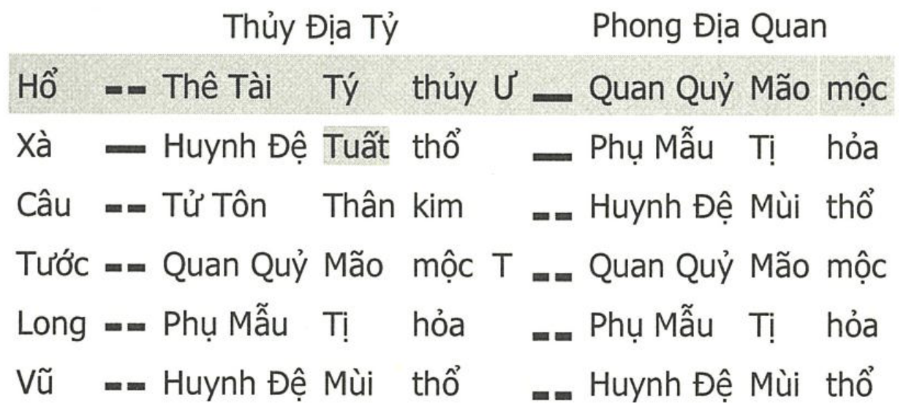
    - **Hình này chứng minh điều gì**
      - Lấy Tài làm Dụng thần.
    - **Từ đâu mà thấy được**
      - Nhìn vào hào Thế, hào Ứng, Dụng thần và động hào trong bảng quẻ Sơ đồ quẻ Thủy Địa Tỷ biến Phong Địa Quan.
- **Quá trình suy luận và đối thoại ban đầu:**
  - Tác giả phân tích cấu trúc hào tượng, Dụng thần và các yếu tố sinh khắc trong quẻ Sơ đồ quẻ Thủy Địa Tỷ biến Phong Địa Quan.
- **Ứng nghiệm thực tế và diễn biến sự việc:**
  - Thực tế diễn biến kiểm chứng ứng kỳ và cát hung của quẻ chiêm.
- **Ngộ giải và bài học kinh nghiệm then chốt:**
  - Đúc rút quy luật thực chiến: Xem xét tổng thể ngũ hành, hào động và tâm thái người gieo quẻ.

### Quái lệ 10: Biểu trưng kỳ lân
- **Bối cảnh & Dữ kiện chiêm bái:**
  - Giáo Trình Tượng Đoán Lục Hào Sơ Cấp
- Bảng quẻ Biểu trưng kỳ lân:
  - **Hình 174.** Biểu trưng kỳ lân
    - 
    - **Hình này chứng minh điều gì**
      - Bảng quẻ Biểu trưng kỳ lân phản ánh sự phối chiếu hào vị, ngũ hành và động biến minh chứng cho vấn đề chiêm đoán.
    - **Từ đâu mà thấy được**
      - Nhìn vào hào Thế, hào Ứng, Dụng thần và động hào trong bảng quẻ Biểu trưng kỳ lân.
- **Quá trình suy luận và đối thoại ban đầu:**
  - Tác giả phân tích cấu trúc hào tượng, Dụng thần và các yếu tố sinh khắc trong quẻ Biểu trưng kỳ lân.
- **Ứng nghiệm thực tế và diễn biến sự việc:**
  - Thực tế diễn biến kiểm chứng ứng kỳ và cát hung của quẻ chiêm.
- **Ngộ giải và bài học kinh nghiệm then chốt:**
  - Đúc rút quy luật thực chiến: Xem xét tổng thể ngũ hành, hào động và tâm thái người gieo quẻ.
