# Part 1 (Pages 1-20)

Vương Hổ Ứng

# LỤC HÀO KINH TẾ DỰ TRẮC HỌC

LOIHOAPHONG.COM

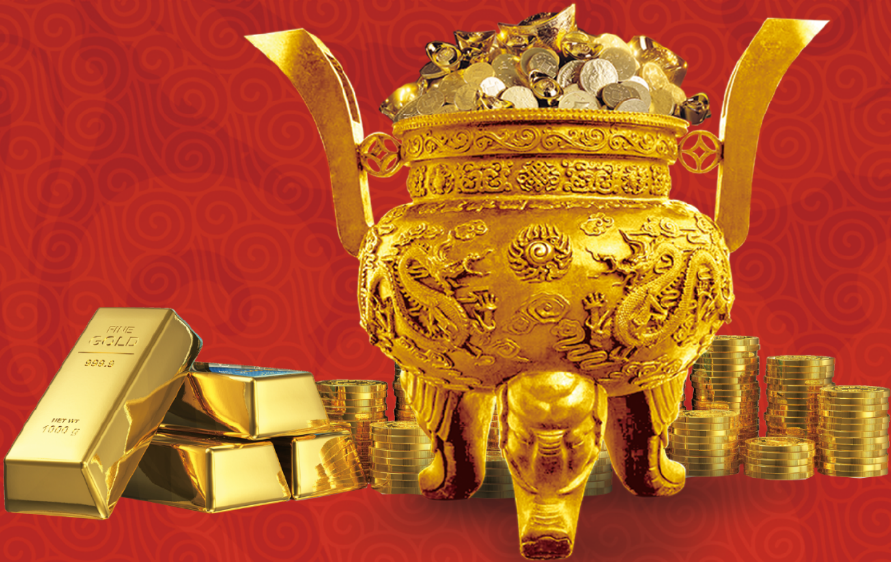

# LỤC HÀO KINH TẾ DỰ TRẮC HỌC

**Nguyên tác:** VƯƠNG HỔ ỨNG

LƯU THIẾT KHANH

**Chuyển ngữ:** TRẦN PHƯƠNG

**Hiệu đính:** VŨ PHÁC

facebook.com/groups/kinhdichluchao

# LỜI CẢM ƠN

Các bạn thân mến!

Xin cảm ơn các bạn đã lựa chọn bộ sách này. Đây là một bộ sách Dịch học rất mới mẻ và hiện đại, được dịch và biên tập một cách kỹ lưỡng, do dịch giả **Trần Phương** chuyển ngữ trực tiếp từ bộ sách tiếng Trung và **Vũ Phác** hiệu đính. Nội dung và bố cục được trình bày rõ ràng, dễ hiểu, ví dụ từng quẻ được trình bày rất chi tiết để đảm bảo sao cho các bạn có được một trải nghiệm tốt nhất. Qua bộ sách này, chúng tôi hy vọng các bạn sẽ có được một cái nhìn tổng quát và chuyên sâu hơn về lĩnh vực Dự đoán Lục hào. Mong rằng các bạn sẽ tiến xa hơn trên con đường trở thành Dự trắc sư huyền bí này.

Tuy nhiên, bộ sách vẫn còn có những thiếu sót nhất định, chúng tôi rất mong các bạn thông cảm và đóng góp để những lần tái bản sau được hoàn chỉnh hơn. Bộ sách được phân phối độc quyền bởi Shop Kinh Dịch Lục Hào. Mọi thông tin về những ấn bản tiếp theo, cũng như những bài viết chuyên sâu về Dự Đoán Lục Hào, kính mời các bạn truy cập: **vuonghoung.com**

Trân trọng cảm ơn và mong được đồng hành!

**Trần Phương - Vũ Phác**

# GIỚI THIỆU VỀ VƯƠNG HỔ ỨNG

Vương Hổ Ứng sinh năm 1962, nguyên quán ở tỉnh Sơn Tây. Ông là một chuyên gia Dịch học nổi tiếng trên thế giới. Ông là Dịch tác gia (tác giả về sách Kinh Dịch), và là truyền nhân bát trạch dịch trận phong thủy. Ông cũng là giảng viên thỉnh giảng của đại học Thanh Hoa, cố vấn cao cấp của sở nghiên cứu Nhật Bản và là tác giả của Lục Hào Chiêm Thuật Nhật Bản. Năm 1986, ông tốt nghiệp đại học Sơn Tây về chuyên ngành tiếng Nhật. Trong thời gian đầu, ông đảm nhiệm công tác nghiên cứu khảo cổ ở tỉnh Sơn Tây. Về sau, ông dấn thân vào nghiên cứu phong thủy, tướng thuật, mệnh lý, Phật học, Trung y và thuật luyện đan. Những năm 80, ông bắt đầu chuyên tâm nghiên cứu Kinh Dịch, lấy phong thủy, lục hào và thuật dưỡng sinh của Đạo gia làm trọng điểm nghiên cứu. Ông đã vận dụng nguyên lý Dịch học để giải mã những bí ẩn và cát hung trong logo công ty, đồng thời cũng đã tư vấn cho rất nhiều công ty nổi tiếng trong và ngoài nước. Từ năm 1996, ông bắt đầu tìm hiểu các thuật số dân gian từ rất nhiều kỳ nhân trong cả nước. Từ đó, ông đã sáng lập ra một hệ thống lý luận hoàn chỉnh của mình. Ông cũng đã từng nhận lời mời đến giảng dạy ở Singapore, Nhật Bản,... Hàng năm, ông được các công ty mời đến đào tạo về quốc học (Kinh Dịch). Ông có học viên ở khắp Trung Quốc đại lục, đặc khu hành chính Hồng Kông, Singapore, Nhật Bản, Hàn Quốc, Mỹ, Anh, Malaysia,...

## Tác phẩm chủ yếu đã xuất bản:

**Ở Nhật Bản:** Bát Trạch Dịch Trận Phong Thủy, Lục Hào Chiêm Thuật Áo Nghĩa, Lục Hào Chiêm Thuật Cải Vận Pháp, Sinh Hoạt Trung Đích Lục Hào Chiêm Thuật, Thần Kỳ Ứng Nghiệm Đích Lục Hào Chiêm Thuật, Ngoại Ứng Dự Trắc, Lục Hào Dự Trắc Tam Ma Địa,...

**Ở Hồng Kông:** Lục Hào Quái Lệ Thuyết Chân, Lục Hào Dự Trắc Tật Bệnh Tân Thám.

**Ở Singapore:** Tăng San Bốc Dịch Bình Thích, Lục Hào Quái Tượng Giải Mật, Lục Hào Nghi Hoặc Chỉ Mê, Lục Hào Dự Trắc Ngộ Trung Ngộ, Lục Hào Phân Loại Chiêm Nghiệm Kỹ Pháp, Lục Hào Dự Trắc Tự Tu Bảo Điển, Lục Hào Trắc Bệnh Phân Khoa Tường Giải.

**Ở Đài Loan:** Tế Thuyết Lục Hào Dự Trắc Học, Lục Hào Tật Bệnh Dự Trắc Học, Lục Hào Nhân Duyên Dự Trắc Học, Sơ Học Lục Hào Dự Trắc.

**Ở Việt Nam:** Bộ sách Dịch học của Vương Hổ Ứng đại sư đã được dịch giả Trần Phương giới thiệu đến quý bạn đọc từ cuối năm 2018. Bằng ngôn từ thuần Việt nhưng vẫn đảm bảo về mặt học thuật, Trần Phương đã tạo rất nhiều hứng khởi cho các học giả nghiên cứu Kinh Dịch ở Việt Nam. Các tác phẩm đã lưu hành gồm có:

1. Tăng San Bốc Dịch Bình Thích
2. Lục Hào Tật Bệnh Dự Trắc Học
3. Lục Hào Nhân Duyên Dự Trắc Học
4. Lục Hào Xu Cát Tị Hung Hóa Giải Bí Truyền
5. Lục Hào Phong Thủy Dự Trắc Học
6. Tế Thuyết Lục Hào Dự Trắc Học
7. Lục Hào Quái Lệ Thuyết Chân
8. Lục Hào Quái Tượng Giải Mật
9. Lục Hào Nghi Hoặc Chỉ Mê
10. Lục Hào Dự Trắc Ngộ Trung Ngộ
11. Lục Hào Kinh Tế Dự Trắc Học

Để biết thêm chi tiết về bộ sách, kính mời quý vị truy vập website **vuonghoung.com** hoặc liên hệ **0963 394 340**. Xin trân trọng cám ơn.

Vũ Phác

# MỤC LỤC

**Lời tựa** .................................................................................................... 4

**Chương 1: Dự đoán lục hào trong kinh tế xã hội** ..................................... 5

**Chương 2: Kiến thức căn bản ứng dụng trong lục hào kinh tế dự trắc học** ................................................................................................... 8

1. Quan hệ đối ứng giữa bát quái và dự đoán kinh tế .......................... 8
2. Quan hệ đối ứng giữa ngũ hành và dự đoán kinh tế ......................... 12
3. Quan hệ đối ứng giữa hào vị và dự đoán kinh tế .............................. 18
4. Thủ tượng lục thần trong dự đoán kinh tế ........................................ 28
5. Thủ tượng lục thân hỗ hóa trong dự đoán kinh tế ............................ 38
6. Cách lấy Dụng thần .......................................................................... 51
7. Dụng thần lưỡng hiện ....................................................................... 61
8. Dụng thần phục tàng ........................................................................ 68
9. Tiến thần vàThoái thần .................................................................... 74
10. Nguyệt phá ..................................................................................... 83
11. Không Vong ................................................................................... 91
12. Lục hợp và lục xung ....................................................................... 97
13. Phản ngâm và phục ngâm .............................................................. 106
14. Du hồn và quy hồn ......................................................................... 114
15. Thủ tượng độc phát trong dự đoán kinh tế .................................... 123
16. Ứng dụng của 12 trạng thái ngũ hành sinh diệt trong dự đoán kinh tế ................................................................................................ 132

**Chương 3: Phương pháp dự đoán tài vận** ......................................... 140

1. Tài vận dài hạn ................................................................................ 140
2. Tài vận lưu niên ............................................................................... 146
3. Tài vận ngắn hạn ............................................................................. 151
4. Đi xa cầu tài ..................................................................................... 158

5. Hợp tác cầu tài......................................................................... 164

### Chương 4: Dự đoán đầu tư tài chính ......................................... 176

1. Dự đoán cổ phiếu...................................................................... 176
2. Dự đoán ngoại hối..................................................................... 195
3. Dự đoán quỹ............................................................................. 200
4. Dự đoán trái phiếu .................................................................... 203
5. Dự đoán hợp đồng tương lai ..................................................... 208
6. Dự đoán đánh bạc...................................................................... 215

### Chương 5: Dự đoán cửa hàng kinh doanh ................................. 225

1. Ví dụ mở thẩm mỹ viện............................................................. 226
2. Ví dụ mở quán ăn..................................................................... 230
3. Ví dụ mở cửa hàng trang phục.................................................. 236
4. Ví dụ cầu tài trên intetnet ......................................................... 238
5. Ví dụ mở bệnh viện, phòng khám bệnh...................................... 241
6. Ví dụ mở cửa hàng đồ cổ........................................................... 248
7. Ví dụ mở trạm thu gom phế phẩm............................................. 250
8. Ví dụ mở quán trà .................................................................... 254
9. Ví dụ mở trung tâm giải trí........................................................ 257
10. Ví dụ mở cửa hàng lưu động .................................................. 258

### Chương 6: Dự đoán nuôi trồng và khai khoáng......................... 259

1. Nuôi trồng ................................................................................. 259
2. Khai khoáng.............................................................................. 265

### Chương 7: Dự đoán công ty xí nghiệp kinh doanh ........... 277

1. Dự đoán tiền đồ ........................................................................ 277
2. Quản lý và sử dụng nhân tài ...................................................... 289

### Chương 8: Dự đoán hỗn hợp..................................................... 295

1. Mua bán và cho thuê phòng ốc ................................................. 295

2. Vay tiền và đòi nợ ....................................................................... 304
3. Giấy phép và khế ước.................................................................. 324
4. Dự án công trình ......................................................................... 332
5. Đấu thầu .................................................................................... 342
6. Kêu gọi đầu tư và tài trợ.............................................................. 353
7. Tranh chấp kinh doanh................................................................ 359

# LỜI TỰA

Trong rất nhiều hạng mục dự đoán, dự đoán tài vận và buôn bán kinh doanh chiếm một tỷ lệ rất lớn. Điều đó chứng tỏ rằng tài phú có một vai trò hết sức quan trọng đối với đời sống, nó là một trong những vấn đề chủ yếu mà người ta quan tâm.

Tính đa dạng và phức tạp của xã hội hiện đại là những thách thức đối với phương pháp dự đoán được lưu truyền từ thời cổ. Để biết lục hào có thể thích ứng với dự đoán kinh tế hiện đại hay không, chúng ta phải dựa vào những quy luật được phát hiện từ trong thực tiễn và nghiệm chứng tỷ lệ chính xác của nó. Tuy nhiên, người học lục hào chưa chắc đã có nhiều khách hàng đến tìm họ dự đoán, ít có thực tiễn thì không thể nghiệm chứng, càng không thể tổng kết và phát hiện được những quy luật mới. Vì vậy, có không ít người dự đoán cho người khác một cách mù quáng. Dự đoán sai sót là chuyện nhỏ, gây ra tổn thất cho người ta mới là chuyện lớn. Đương nhiên, trong dự đoán thì sai sót là điều không thể tránh khỏi, nhưng chúng ta cũng không nên dùng những kiến thức chưa biết thật giả để dự đoán cho người ta. Cuốn sách này sẽ giúp cho chúng ta nắm bắt được những kỹ xảo trong dự đoán kinh tế, đó cũng chính là tâm nguyện của tôi.

Qua nhiều năm nghiệm chứng trong thực tiễn, tôi nhận thấy dự đoán lục hào có thể mang lại tác dụng hướng dẫn rất lớn. Tỷ lệ chính xác cũng rất cao, hoàn toàn đáng tin cậy. Hy vọng rằng, sau khi xem cuốn sách này thì mọi người sẽ có thể nâng cao trình độ dự đoán, giúp cho nhiều người thoát khỏi những khó khăn về kinh tế, đem lục hào phục vụ cho xã hội.

Vương Hổ Ứng

# CHƯƠNG 1
## DỰ ĐOÁN LỤC HÀO TRONG KINH TẾ XÃ HỘI

Trải qua hàng triệu năm phát triển, trí tuệ và văn hóa của nhân loại đã đạt được những thay đổi vĩ đại. Xã hội cũng phát triển từ giai đoạn trao đổi ngang giá ban đầu đến thời đại trao đổi tiền tệ. Theo đó, tiền tệ cũng đã trở thành một trong những thước đo của cải và thành tựu kinh tế. Ngày nay, nền kinh tế xã hội đã phát triển, thị trường cũng đã trở nên đa dạng hóa, có đủ mọi ngành nghề, mang lại rất nhiều cơ hội cho mọi người phát triển sự nghiệp của mình.

Cho dù thị trường có phát triển như thế nào, xã hội có phồn vinh ra sao, không phải ai cũng có thể mãi thuận buồm xuôi gió trong nền kinh tế xã hội này. Có người làm ăn thịnh vượng, càng làm càng lớn, có người không những không thu được lợi nhuận mà trái lại mắc nợ ngổn ngang. Có người mới khởi đầu thì thua lỗ nhưng về sau lại có chuyển biến tốt, có người khởi đầu rất thuận lợi nhưng đột nhiên lại xảy ra biến cố mà sụp đổ. Nguyên nhân của thất bại rất đa dạng, có khi bởi vì đánh giá thị trường không đầy đủ, có khi bởi vì bản thân dùng người không phù hợp dẫn đến sai lầm, có khi bị người khác lừa gạt mà lâm vào khủng hoảng, cũng có khi bởi vì đánh giá năng lực của bản thân quá cao, hoạt động quá tải mà dẫn đến thất bại, lại còn có những thiên tai nhân họa căn bản không thể lường trước được.

Cho dù là thành công hay thất bại, chúng ta đều muốn biết trước xu thế và triển vọng phát triển sự nghiệp của mình. Chúng ta muốn biết những nhân tố bất lợi và những nguy cơ tiềm tàng trong sự nghiệp để phòng tránh. Tuy nhiên, cấu trúc của kinh tế xã hội không tồn tại cô lập, người sắc sảo và có năng lực cũng không thể chi phối được hành vi và tư duy của các thành viên trong xã hội. Vì vậy, trong nền kinh tế thị trường luôn biến động này, nếu chỉ dựa vào kinh nghiệm và năng lực quản lý của một cá nhân thì không thể bảo đảm rằng sự nghiệp của người đó luôn luôn đứng vững.

Cùng với sự phát triển của cải cách và mở cửa kinh tế, tầm nhìn của con người cũng ngày càng được mở rộng, khoa học kỹ thuật cũng ngày càng phát triển. Sau khi nếm trải những thất bại và những tác dụng phụ từ sự phát triển kinh tế, người ta đột nhiên phát hiện ra rằng, nếu như đi ngược lại với quy luật tự nhiên thì cuối cùng sẽ phải trả giá nặng nề. Đồng thời, người ta cũng đã lĩnh hội được sự vĩ đại của triết học cổ đại Trung Quốc, mặc dù cách xa thời hiện đại nhưng nó vẫn có một sức sống rất mạnh mẽ, có thể trợ giúp và chỉ đạo người ta ứng dụng vào cuộc sống hiện đại. Đặc biệt là dưới sự ảnh hưởng của tư tưởng triết học cổ đại, người xưa đã phát minh ra dự đoán học có công năng đáng kinh ngạc, nó có thể giúp chúng ta nắm bắt trọn vẹn thành bại của sự nghiệp, kịp thời phát hiện ra những vấn đề và nguy cơ, từ đó tìm được đối sách và phương pháp thích hợp. Ở một mức độ nhất định, dự đoán học có thể giúp xí nghiệp, công ty phát huy tối đa ưu thế, nên tiến thì tiến, nên thoái thì thoái, luôn ở vào thế không thể bị đánh bại được.

Qua nhiều năm nghiên cứu, tôi nhận thấy lục hào dự đoán học có tính thực dụng và tính thích ứng rất lớn, nó hoàn toàn có thể tìm được quy luật dự đoán tương ứng với sự phát triển của xã hội. Hơn nữa, bất kể là việc lớn hay việc nhỏ, cho dù là tài vận cá nhân, buôn bán kinh doanh, hay là sự phát triển của công ty xí nghiệp, quản lý và tuyển chọn nhân tài,... đều có thể phát huy ưu thế của lục hào dự đoán học, đều có thể dùng phương pháp này để dự đoán chỉ đạo.

Xin lấy ví dụ về cổ phiếu. Một số người dự đoán cổ phiếu bằng kỹ thuật phân tích, họ có thể nắm bắt được sự biến động của cổ phiếu trong một thời gian nhất định. Tuy nhiên, nếu là dự đoán chiều hướng của cổ phiếu dài hạn thì phương pháp này không chắc chắn chính xác. Thị trường cổ phiếu đôi khi chịu ảnh hưởng của tình hình quốc gia, chính sách quốc gia, hoặc đột nhiên xuất hiện thông tin nào đó, đồng thời còn có rất nhiều tổ chức thao túng,... Những yếu tố này đều nằm ngoài kỹ thuật phân tích. Do đó, nếu chúng ảnh hưởng đến cổ phiếu thì người ta thường không thể dự đoán và nắm bắt được. Song, sử dụng lục hào dự đoán cổ phiếu lại có thể nắm bắt được sự biến hóa của những yếu tố bất ngờ này, từ đó sớm biết được thời điểm lên xuống của cổ phiếu. Kỹ thuật phân tích thì cần phải biết tên gọi hoặc ký hiệu của cổ phiếu, còn dự đoán lục hào thì không cần phải biết những thông tin này, chỉ cần trong đầu đang nghĩ đến cổ phiếu đó là được.

Vào tháng 10, năm Đinh Hợi, trong thời gian tôi lưu lại Thượng Hải, một trợ lý thay tổng giám đốc một công ty đoán cổ phiếu. Ở ngày Nhâm Ngọ tháng Tuất, được Cấn Vi Sơn biến Sơn Thiên Đại Súc. Tôi đoán là tổng giám đốc của anh ta đã mua cổ phiếu nguyên thủy, tháng 9 đã tăng mạnh, hiện nay đã lên rất cao, đã đến lúc bán tháo, nhất định phải xử lý toàn bộ cổ phiếu trước năm 08, nếu để qua năm thì lợi nhuận kiếm được sẽ mất đi. Hai ngày sau, tổng giám đốc của anh ta lại nhờ tôi dự đoán cổ phiếu đó. Ở ngày Giáp Thân tháng Tuất, được Lôi Thiên Đại Tráng biến Thiên Trạch Lý. Mặc dù quẻ không tương đồng nhưng kết luận thì giống nhau. Căn cứ vào hai quái tượng, tôi phán đoán là năm 08 thì giá cổ phiếu sẽ đi xuống. Hiện nay là tháng 4 năm 08, dự đoán hoàn toàn chính xác. Nếu như ông ta tiếp tục nắm giữ cổ phiếu đến năm 08 thì tổn thất sẽ là hơn 10 vạn tệ. Bởi vì ông ta là cổ đông lớn, lúc đó còn có mặt rất nhiều người, sợ rằng tin tức truyền ra ngoài sẽ tác động đến giá cả, vì vậy tôi không bảo ông ta nói ra tên cổ phiếu, tuy nhiên dự đoán cũng chính xác. Đến cuối năm, tôi mới hỏi ông ta về tên cổ phiếu, thì ra là cổ phiếu của tập đoàn Kim Địa (Gemdale).

Trên đây chỉ là dự đoán về cổ phiếu. Thực ra, phạm vi ứng dụng của dự đoán lục hào trong kinh tế xã hội rất rộng. Ai đã nắm vững phương pháp dự đoán thì sẽ thu được lợi ích, bản thân sẽ tránh khỏi những tổn thất lớn, phát huy tối đa tiềm năng của mình và tạo ra một sự nghiệp huy hoàng. Thời gian sẽ nghiệm chứng tất cả, chúng ta sẽ dần dần nhận thức được tính tin cậy và tính thực dụng của dự đoán lục hào. Trong tương lai gần, dự đoán lục hào nhất định sẽ được ưa chuộng trong kinh tế xã hội.

# CHƯƠNG 2
## KIẾN THỨC CĂN BẢN ỨNG DỤNG TRONG LỤC HÀO KINH TẾ DỰ TRẮC HỌC

### 1. QUAN HỆ ĐỐI ỨNG GIỮA BÁT QUÁI VÀ DỰ ĐOÁN KINH TẾ

Lục hào dự đoán kinh tế chủ yếu lấy sự biến hóa của lục thân và ngũ hành sinh khắc để phán đoán sự phát triển và cát hung của sự vật. Tuy nhiên, khi phán đoán chi tiết tình hình và tính chất nguyên nhân, chúng ta còn phải trích xuất thông tin từ trong quái tượng. Ý nghĩa chủ yếu của bát quái như sau:

Càn: Lãnh đạo, xưởng trưởng, quản lý, kim loại, châu báu, quý giá, thủy tinh, trái cây,...

Khôn: Dân chúng, đất đai, nông sản, vải vóc,...

Chấn: Máy móc, náo nhiệt, biến hóa, cây cối, lâm nghiệp,...

Tốn: Rau, kỹ thuật, mê hoặc, vật liệu gỗ,...

Khảm: Mạo hiểm, trộm cướp, chất lỏng, thủy sản, tắm rửa,...

Ly: Mỹ lệ, trang sức, văn hóa, đồ trang điểm, tinh luyện kim loại,...

Cấn: Khoáng sản, nhà kho, cao nguyên, vùng núi, đình chỉ, kiến trúc,...

Đoài: Ẩm thực, khẩu thiệt[^1], nhà hàng, khuyết thiếu, khan hiếm, hủy hoại,...

[^1]: Khẩu thiệt: Tranh luận, cãi cọ.

### Ví dụ 1: Ngày Ất Tị tháng Mùi, đoán kinh doanh cửa hàng trang sức, được Lôi Thủy Giải biến Lôi Phong Hằng.

| | Giải | Hằng | |
| :---: | :--- | :--- | :---: |
| | ╍╍ Thê Tài Tuất thổ | ╍╍ Thê Tài Tuất thổ | Vũ |
| Ứ | ╍╍ Quan Quỷ Thân kim | ╍╍ Quan Quỷ Thân kim | Hổ |
| | ━ Tử Tôn Ngọ hỏa | ━ Tử Tôn Ngọ hỏa | Xà |
| | ╍╍ Tử Tôn Ngọ hỏa | ━ Quan Quỷ Dậu kim | Câu |
| T | ━ Thê Tài Thìn thổ | ━ Phụ Mẫu Hợi thủy | Tước |
| | ╍╍ Huynh Đệ Dần mộc Phụ Tý | ╍╍ Thê Tài Sửu thổ | Long |

MỘC            Không Vong: Dần, Mão

**Phán đoán:** Lấy Thê Tài làm Dụng thần. Trong quẻ Thê Tài lưỡng hiện, lấy hào Thế Thê Tài Thìn thổ làm Dụng thần, hào còn lại dùng để tham khảo. Dụng thần được Nguyệt kiến trợ giúp và Nhật đến sinh là vượng tướng, nhưng không nên Dụng thần lưỡng hiện, Nguyên thần cũng lưỡng hiện, Tử Tôn Ngọ hỏa phát động lại đến sinh, Dụng thần và Nguyên thần đều vượng tướng, là quá vượng. Vì vậy, hiệu quả kinh doanh nhất định không tốt.

Quẻ tại cung Chấn, Chấn là khu phố náo nhiệt, cửa hàng mở tại nơi tương đối sầm uất. Hào 2 là cửa hàng, lâm Chu Tước, xung quanh cửa hàng rất ồn ào. Hào Ứng là khách hàng, tại hào 5 lâm Bạch Hổ, hào 5 là đường, Bạch Hổ cũng là đường, khách hàng đều là người qua đường qua lại.

Dụng thần quá vượng, Dụng thần lâm hào 2 là hào cửa hàng, tiền thuê cửa hàng cũng cao cho nên lợi nhuận bị ảnh hưởng.

**Phản hồi:** Trên thực tế, cửa hàng mở gần ga xe lửa, lưu lượng khách rất lớn nhưng người mua sắm không nhiều, hơn nữa chủ nhà sắp tăng tiền thuê, vì vậy kinh doanh khó khăn.

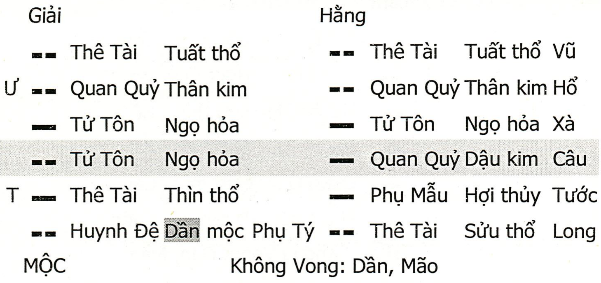

### Ví dụ 2: Ngày Bính Ngọ tháng Ngọ, nữ đoán tài vận, được Địa Trạch Lâm.

| | Lâm | | |
| :---: | :---: | :--- | :--- |
| | - - | Tử Tôn Dậu kim | Long |
| Ư | - - | Thê Tài Hợi thủy | Vũ |
| | - - | Huynh Đệ Sửu thổ | Hổ |
| | - - | Huynh Đệ Sửu thổ | Xà |
| T | — | Quan Quỷ Mão mộc | Câu |
| | — | Phụ Mẫu Tị hỏa | Tước |

THỔ Không Vong: Dần, Mão

**Phán đoán:** Lấy Thê Tài làm Dụng thần. Thê Tài Hợi thủy tại hào 5, hào 5 là đường đi, phán đoán cô ấy làm về vận tải. Quẻ tại cung Khôn, Khôn là đất, vật trong lòng đất, lâm Huyền Vũ, Huyền Vũ chủ màu đen, phán đoán là kinh doanh vận tải than đá.

Dụng thần không được Nhật Nguyệt sinh phù, Nguyên thần lại bị Nhật Nguyệt khắc chế, hào Thế Không Vong không được Tài sinh, vì vậy phán đoán không thu được lợi nhuận.

**Phản hồi:** Quả nhiên là làm vận chuyển than, đã làm một lần nhưng không kiếm được tiền, do vậy mà muốn xem tài vận.

### Ví dụ 3: Ngày Quý Hợi tháng Tuất, nữ đoán tài vận bản thân, được Thủy Trạch Tiết biến Thiên Trạch Lý.

| | Tiết | | Lý | | |
| :---: | :---: | :--- | :---: | :--- | :--- |
| | - - | Huynh Đệ Tý thủy | — | Quan Quỷ Tuất thổ | Hổ |
| | — | Quan Quỷ Tuất thổ | — | Phụ Mẫu Thân kim | Xà |
| Ư | - - | Phụ Mẫu Thân kim | — | Thê Tài Ngọ hỏa | Câu |
| | - - | Quan Quỷ Sửu thổ | - - | Quan Quỷ Sửu thổ | Tước |
| | — | Tử Tôn Mão mộc | — | Tử Tôn Mão mộc | Long |
| T | — | Thê Tài Tị hỏa | — | Thê Tài Tị hỏa | Vũ |

THỦY Không Vong: Tý, Sửu

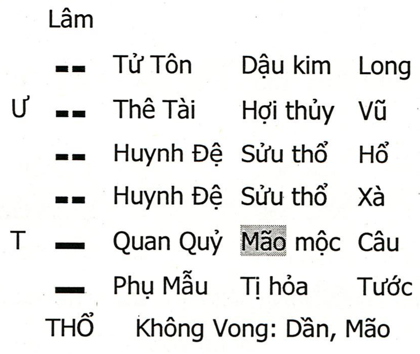

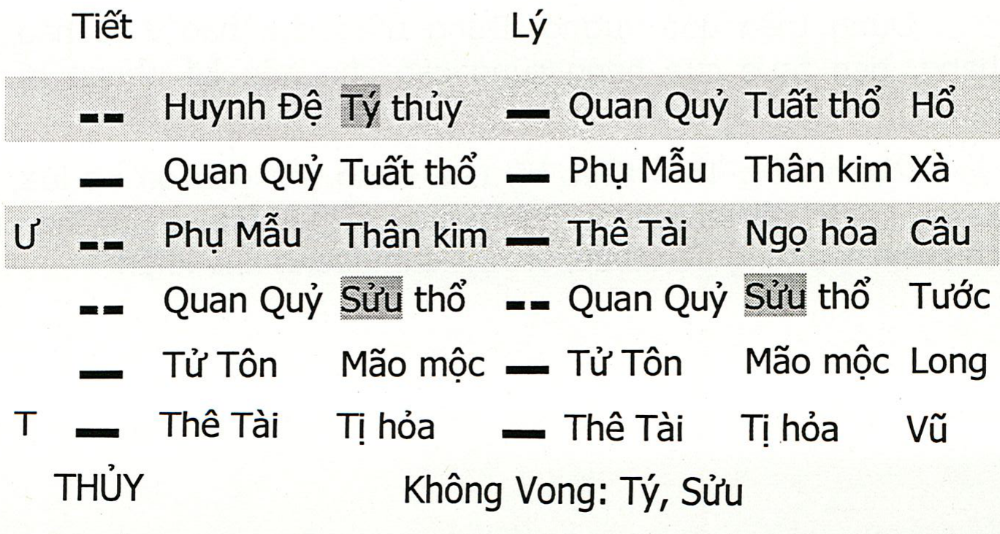

**Phán đoán:** Lấy Thê Tài làm Dụng thần. Thê Tài Tị hỏa không được Nguyệt kiến trợ giúp, bị Nhật xung khắc là hưu tù. Trong quẻ Huynh Đệ Tý thủy lại phát động đến khắc, Phụ Mẫu Thân kim sinh trợ Huynh Đệ, tài vận chắc chắn không tốt. Dụng thần lâm Huyền Vũ, Huyền Vũ chủ đầu cơ, quẻ tại cung Khảm, Khảm là cạm bẫy. Vì vậy, đầu cơ kiếm tiền chắc chắn có nguy hiểm trùng trùng.

**Phản hồi:** Trên thực tế, buôn bán cổ phiếu đã bị thua lỗ.

### Ví dụ 4: Ngày Nhâm Tuất tháng Sửu năm Bính Tuất, nữ đoán tài vận, được Thiên Thủy Tụng biến Phong Thủy Hoán.

| | Tụng | | Hoán | | |
| :---: | :---: | :--- | :---: | :--- | :--- |
| | — | Tử Tôn Tuất thổ | — | Phụ Mẫu Mão mộc | Hổ |
| | — | Thê Tài Thân kim | — | Huynh Đệ Tị hỏa | Xà |
| T | — | Huynh Đệ Ngọ hỏa | - - | Tử Tôn Mùi thổ | Câu |
| | - - | Huynh Đệ Ngọ hỏa | - - | Huynh Đệ Ngọ hỏa | Tước |
| | — | Tử Tôn Thìn thổ | — | Tử Tôn Thìn thổ | Long |
| Ư | - - | Phụ Mẫu Dần mộc | - - | Phụ Mẫu Dần mộc | Vũ |

HỎA Không Vong: Tý, Sửu

**Phán đoán:** Lấy Thê Tài làm Dụng thần. Thê Tài được Nhật Nguyệt đến sinh là vượng tướng, Huynh Đệ trì Thế phát động, nhưng hào 2 Tử Tôn Thìn thổ ám động dẫn hóa, vì vậy tài vận khá tốt. Năm Giáp Thân trị Dụng thần, tài vận khá tốt, năm Ất Dậu Tài được trợ giúp cũng khá tốt, năm nay Kỵ thần nhập Mộ lại sinh hào Tài cũng tốt, hiện nay chính là thời gian tài vận tốt đẹp.

Hào 2 Tử Tôn Thìn thổ ám động dẫn hóa Huynh Đệ mà được tài, hào 2 là cửa hàng, cho nên là mở cửa hàng được tài. Dụng thần lâm Đằng Xà chủ nghệ thuật. Quẻ tại cung Ly, Ly là mỹ lệ, trang sức. Tử Tôn Thìn thổ lại lâm Thanh Long, Thanh Long cũng là trang sức. Vì vậy, phán đoán là cửa hàng kinh doanh đồ trang sức, đồ trang trí.

**Phản hồi:** Phán đoán quả nhiên chính xác.

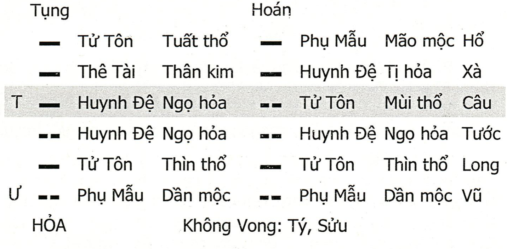

**Ví dụ 5:** Ngày Canh Thìn tháng Dần, nam đoán nhận làm quảng cáo trị giá hơn 10 triệu, được Cấn Vi Sơn biến Sơn Lôi Di.

| | Cấn | | | Di | |
| :---: | :---: | :--- | :---: | :--- | :---: |
| T | — | Quan Quỷ Dần mộc | — | Quan Quỷ Dần mộc | Xà |
| | - - | Thê Tài Tý thủy | - - | Thê Tài Tý thủy | Câu |
| | - - | Huynh Đệ Tuất thổ | - - | Huynh Đệ Tuất thổ | Tước |
| Ư | — | Tử Tôn Thân kim | - - | Huynh Đệ Thìn thổ | Long |
| | - - | Phụ Mẫu Ngọ hỏa | - - | Quan Quỷ Dần mộc | Vũ |
| | - - | Huynh Đệ Thìn thổ | — | Thê Tài Tý thủy | Hổ |

THỔ Không Vong: Thân, Dậu

**Phán đoán:** Mục đích là lợi nhuận, lấy Thê Tài làm Dụng thần. Thê Tài Tý thủy tại hào 5, không được Nhật Nguyệt trợ giúp, Nhật khắc nhập Mộ là hưu tù, không thể thu được lợi nhuận. Hào sơ Huynh Đệ hóa Thê Tài, công việc này là do bạn bè giới thiệu.

Hào Ứng là người giao việc, Ứng lâm Tử Tôn phát động sinh Tài, thoạt nhìn là thông tin người ta cho anh ta tiền. Nhưng hào Ứng phát động, Không Vong Nguyệt phá, Ứng động là người ta có thay đổi, Không Vong biểu thị không thật tâm, quẻ chính là Cấn, Cấn là dừng, cuối cùng sẽ đình chỉ công việc. Nguyệt kiến xung phá Nguyên thần, Nguyệt kiến và hào Thế giống nhau, chính là bị công ty quảng cáo khác cướp mất công việc.

**Phản hồi:** Quả nhiên là công việc do một người bạn giới thiệu. Anh ta mới quảng cáo được một vạn thì người ta đột nhiên nói rằng không cần anh ta làm nữa. Hóa ra là đã bị một công ty quảng cáo khác giành mất việc.

## 2. QUAN HỆ ĐỐI ỨNG GIỮA NGŨ HÀNH VÀ DỰ ĐOÁN KINH TẾ

Ngũ hành ít khi được sử dụng đơn độc trong phán đoán, cần phải kết hợp với những yếu tố khác như lục thần,...

Trong dự đoán kinh tế:

Thổ chủ đất đai, trồng trọt, nông sản, phòng ốc, bất động sản, da,...

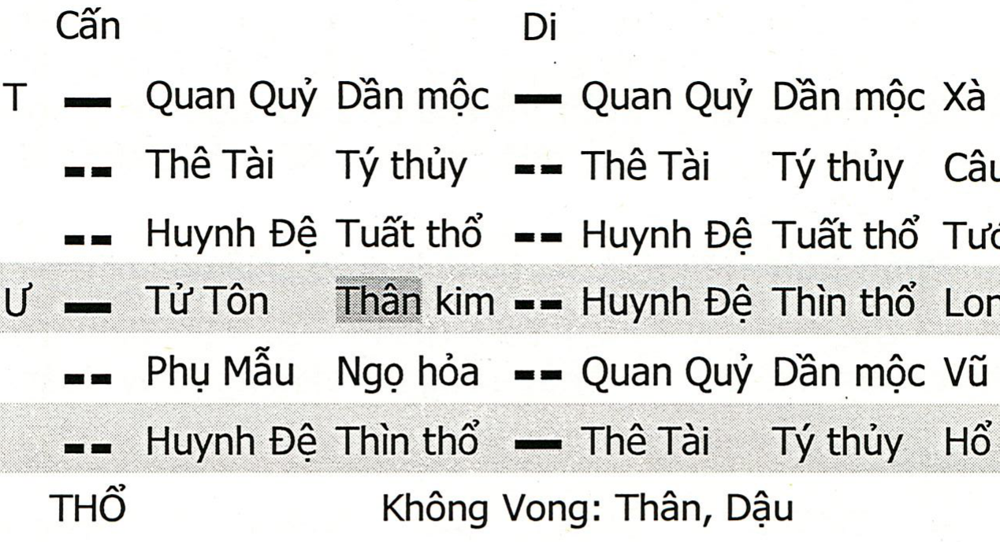

Kim chủ kim loại, đá, khoáng vật, thủy tinh, đá quý, đồ bằng ngọc,...

Mộc chủ thực vật, in ấn, vật liệu gỗ, trang phục, lâm nghiệp,...

Thủy chủ ẩm thực, thủy sản, trí năng, đồ uống lạnh, nghề làm muối,...

Hỏa chủ văn hóa, công nghệ cao, tinh luyện kim loại, chỉnh trang, trang sức,...

**Ví dụ 1:** Ngày Đinh Hợi tháng Thân, nữ đoán xem sự nghiệp phát triển ra sao? Được Lôi Trạch Quy Muội biến Chấn Vi Lôi.

| | Quy Muội | | | Chấn | |
| :---: | :---: | :--- | :---: | :--- | :---: |
| Ư | - - | Phụ Mẫu Tuất thổ | - - | Phụ Mẫu Tuất thổ | Long |
| | - - | Huynh Đệ Thân kim | - - | Huynh Đệ Thân kim | Vũ |
| | — | Quan Quỷ Ngọ hỏa | — | Quan Quỷ Ngọ hỏa | Hổ |
| T | - - | Phụ Mẫu Sửu thổ | - - | Phụ Mẫu Thìn thổ | Xà |
| | — | Thê Tài Mão mộc | - - | Thê Tài Dần mộc | Câu |
| | — | Quan Quỷ Tị hỏa | — | Tử Tôn Tý thủy | Tước |

KIM Không Vong: Ngọ, Mùi

**Phán đoán:** Sự nghiệp thông thường lấy Quan Quỷ làm Dụng thần, nhưng quẻ này Thê Tài Mão mộc độc phát, thông tin thường thể hiện tại hào động. Vì vậy, sự nghiệp chủ yếu là sự phát triển về kinh tế. Thê Tài Mão mộc tại hào 2 lâm Câu Trần phát động, hào 2 là trạch, là phòng ốc, Câu Trần lại chủ kiến trúc. Vì vậy, phán đoán là sự nghiệp của cô ấy có liên quan đến làm kiến trúc, bất động sản.

Thê Tài động mà hóa thoái, hiện tại đã bắt đầu tuột dốc. Quan Quỷ Tị hỏa lâm hào sơ ám động, hào sơ là tâm sự, dự định, Quan Quỷ là công việc đang làm, ám động chính là có ý định chuyển nghề. Thê Tài Mão mộc động mà tương hợp với hào Ứng, Ứng là người khác, hào Tài gặp hợp là hợp tác cầu tài. Đây là thông tin cô ấy muốn đem tiền hợp tác với người ta để xây dựng sự nghiệp mới.

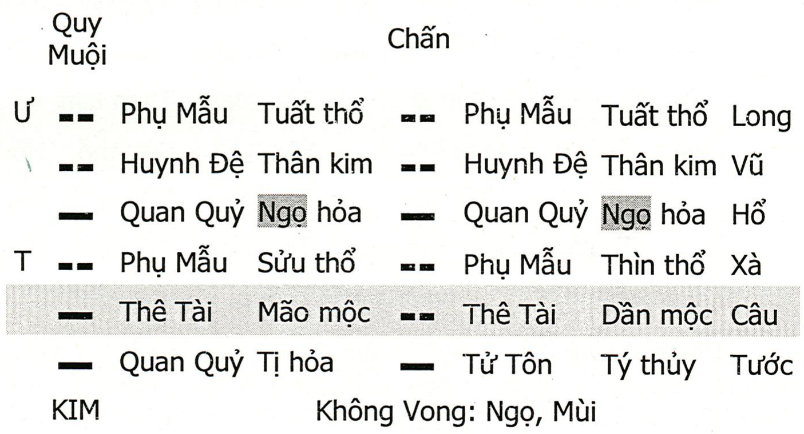

---

# Part 2 (Pages 21-40)

Xây dựng nghiệp mới gì? Lại xem hướng lưu động của hào độc phát. Thê Tài Mão mộc hợp Phụ Mẫu Tuất thổ chính là hướng đầu tư mới. Phụ Mẫu Tuất thổ tại hào 6 lâm Thanh Long, hào 6 là đầu, là mặt, Thanh Long chủ khuôn mặt đẹp, làm đẹp, thổ chủ da, Phụ Mẫu lại là mặt. Do đó, tổng hợp lại là muốn làm về thẩm mỹ, vật dụng trang điểm.

**Phản hồi:** Toàn bộ phán đoán trên đây quả nhiên chính xác.

**Ví dụ 2:** Ngày Mậu Tý tháng Thìn, nam đoán kinh doanh có tiền không? Được Khảm Vi Thủy biến Thủy Trạch Tiết.

| | Khảm | | | Tiết | |
| :--- | :---: | :--- | :---: | :--- | :--- |
| T | - - | Huynh Đệ Tý thủy | - - | Huynh Đệ Tý thủy | Tước |
| | — | Quan Quỷ Tuất thổ | — | Quan Quỷ Tuất thổ | Long |
| | - - | Phụ Mẫu Thân kim | - - | Phụ Mẫu Thân kim | Vũ |
| Ư | - - | Thê Tài Ngọ hỏa | - - | Quan Quỷ Sửu thổ | Hổ |
| | — | Quan Quỷ Thìn thổ | — | Tử Tôn Mão mộc | Xà |
| | - - | Tử Tôn Dần mộc | — | Thê Tài Tị hỏa | Câu |

THỦY
Không Vong: Ngọ, Mùi

**Phán đoán:** Lấy Thê Tài làm Dụng thần. Thê Tài Ngọ hỏa không được Nhật Nguyệt đến sinh, lại bị Không Vong là hưu tù. May mà hào sơ Tử Tôn Dần mộc lâm Câu Trần độc phát, không có đại lợi nhưng miễn cưỡng có thể làm.

Hào sơ là mặt đất, mộc chủ thực vật, Câu Trần chủ ruộng đồng, thổ sản. Vì vậy, phán đoán anh ta muốn kinh doanh nông sản. Lục xung biến lục hợp, trước bôn ba mà sau yên ổn.

**Phản hồi:** Quả nhiên là anh ta muốn đến phương Nam buôn dưa hấu.

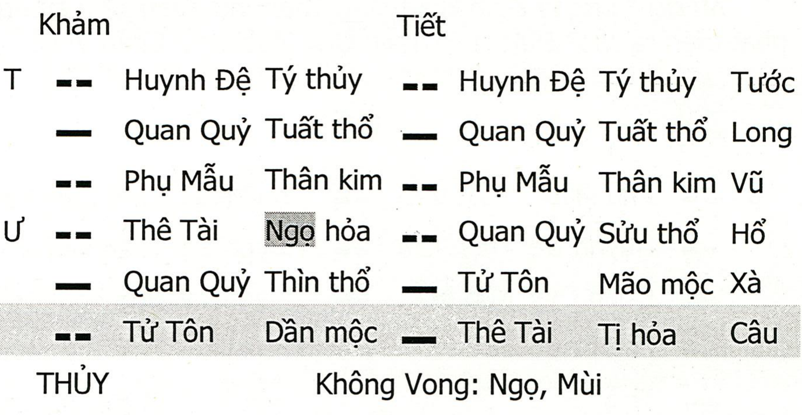

**Ví dụ 3:** Ngày Giáp Tuất tháng Tý, nữ hỏi tài vận năm nay ra sao? Được Thiên Phong Cấu biến Đoài Vi Trạch.

| | Cấu | | | Đoài | | |
| :--- | :---: | :--- | :--- | :---: | :--- | :--- |
| | — | Phụ Mẫu Tuất thổ | | - - | Phụ Mẫu Mùi thổ | Vũ |
| | — | Huynh Đệ Thân kim | | — | Huynh Đệ Dậu kim | Hổ |
| Ư | — | Quan Quỷ Ngọ hỏa | | — | Tử Tôn Hợi thủy | Xà |
| | — | Huynh Đệ Dậu kim | | - - | Phụ Mẫu Sửu thổ | Câu |
| | — | Tử Tôn Hợi thủy | Tài Dần | — | Thê Tài Mão mộc | Tước |
| T | - - | Phụ Mẫu Sửu thổ | | — | Quan Quỷ Tị hỏa | Long |

KIM
Không Vong: Thân, Dậu

**Phán đoán:** Lấy Thê Tài làm Dụng thần. Thê Tài Dần mộc không hiện trên quẻ, Nguyệt sinh Nhật không khắc, vốn là tượng cát, nhưng không nên trong quẻ Phụ Mẫu đa hiện sinh Huynh Đệ, Huynh Đệ tạo thành tam hợp cục đến khắc Tài, vì vậy tài vận không tốt đẹp.

Phụ Mẫu Sửu thổ lâm Thanh Long trì Thế, thổ chủ da, Thanh Long chủ khuôn mặt đẹp, làm đẹp, Phụ Mẫu là cửa hàng, trì Thế biểu thị sở hữu, chứng tỏ bản thân đang mở thẩm mỹ viện. Trùng trùng Phụ Mẫu đến sinh, Phụ Mẫu là cửa hàng, chứng tỏ có rất nhiều cửa hàng tương tự.

**Phản hồi:** Quả nhiên là bản thân đang mở thẩm mỹ viện, xung quanh tiệm có rất nhiều cửa hàng ẩm thực, tài vận không tốt.

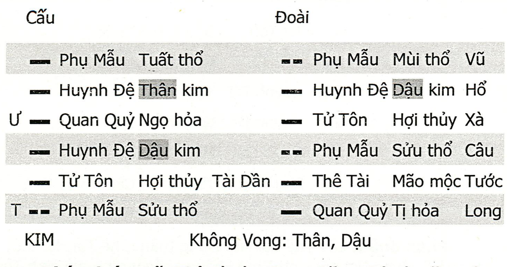

**Ví dụ 4:** Ngày Mậu Ngọ tháng Thân, nam hỏi làm cái gì để kiếm tiền? Được Địa Trạch Lâm.

| | Lâm | | |
| :--- | :---: | :--- | :--- |
| | - - | Tử Tôn Dậu kim | Tước |
| Ư | - - | Thê Tài Hợi thủy | Long |
| | - - | Huynh Đệ Sửu thổ | Vũ |
| | - - | Huynh Đệ Sửu thổ | Hổ |
| T | — | Quan Quỷ Mão mộc | Xà |
| | — | Phụ Mẫu Tị hỏa | Câu |

THỔ
Không Vong: Tý, Sửu

**Phán đoán:** Lấy Thê Tài làm Dụng thần. Thê Tài Hợi thủy tại hào 5, được Nguyệt sinh Nhật không khắc vượng mà sinh Thế là cát, tài vận khá tốt. Thủy Tài là ẩm thực, lâm Thanh Long lại là ẩm thực. Vì vậy, tôi đề nghị anh ta mở nhà hàng.

**Phản hồi:** Anh ta nói là đã mở nhà hàng, công việc kinh doanh cũng rất thuận lợi.

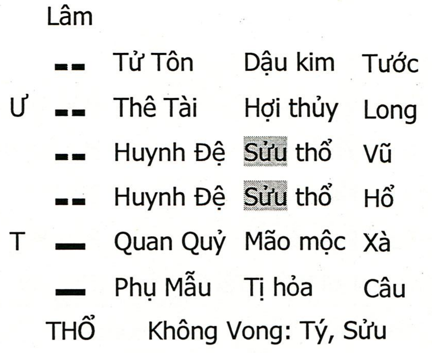

**Ví dụ 5:** Ngày Ất Mão tháng Ngọ, nam hỏi con trai thuê chung cửa hàng với người khác sẽ ra sao? Được Hỏa Thiên Đại Hữu biến Lôi Thiên Đại Tráng.

| | Đại Hữu | | | Đại Tráng | |
| :--- | :---: | :--- | :---: | :--- | :--- |
| Ư | — | Quan Quỷ Tị hỏa | - - | Phụ Mẫu Tuất thổ | Vũ |
| | - - | Phụ Mẫu Mùi thổ | - - | Huynh Đệ Thân kim | Hổ |
| | — | Huynh Đệ Dậu kim | — | Quan Quỷ Ngọ hỏa | Xà |
| T | — | Phụ Mẫu Thìn thổ | — | Phụ Mẫu Thìn thổ | Câu |
| | — | Thê Tài Dần mộc | — | Thê Tài Dần mộc | Tước |
| | — | Tử Tôn Tý thủy | — | Tử Tôn Tý thủy | Long |

KIM
Không Vong: Tý, Sửu

**Phán đoán:** Thê Tài là lợi nhuận, Phụ Mẫu là cửa hàng, Ứng là người thuê chung. Thê Tài Dần mộc được Nhật trợ giúp là vượng tướng, nhưng Nguyên thần Tý thủy Không Vong Nguyệt phá, có chút lợi trước mắt nhưng không thể kinh doanh lâu dài.

Hào Ứng phát động sinh Phụ Mẫu lại Tuyệt Phụ Mẫu, quyền chủ động về cửa hàng nằm ở đối phương, đồng ý thuê chung hay từ chối thuê chung là do bên kia quyết định.

Ứng động hóa Phụ Mẫu, đối phương nhường cho một phần cửa hàng. Phụ Mẫu trì Thế vượng tướng, có thể thuê chung được.

Thê Tài Dần mộc lâm Chu Tước, mộc chủ in ấn, Chu Tước là văn thư, là kinh doanh về đánh máy, photocopy,...

**Phản hồi:** Quả nhiên là làm về đánh máy, photocopy. Tất cả các phán đoán đều phù hợp với thực tế. Đối phương là người đã thuê cửa hàng trước. Sau khi thương lượng, người ta đã nhượng lại một phần không gian. Năm Quý Mùi dự đoán, bởi vì lợi nhuận không lớn cho nên năm Ất Dậu đã từ bỏ kinh doanh.

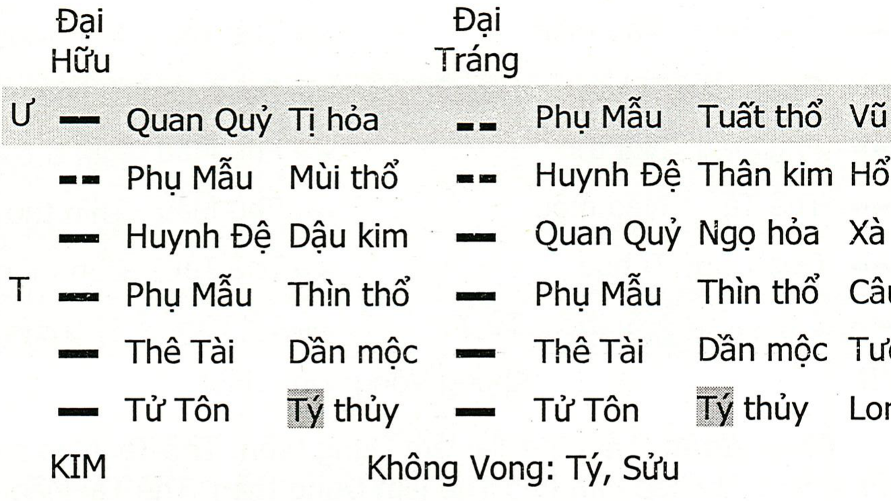

**Ví dụ 6: Ngày Tân Mão tháng Dậu, nam đoán tài vận, được Phong Địa Quan biến Phong Lôi Ích.**

| Quan | | Ích | |
| :--- | :--- | :--- | :--- |
| — Thê Tài Mão mộc | | — Thê Tài Mão mộc | Xà |
| — Quan Quỷ Tị hỏa | Huynh Thân | — Quan Quỷ Tị hỏa | Câu |
| T -- Phụ Mẫu Mùi thổ | | -- Phụ Mẫu Mùi thổ | Tước |
| -- Thê Tài Mão mộc | | -- Phụ Mẫu Thìn thổ | Long |
| -- Quan Quỷ Tị hỏa | | -- Thê Tài Dần mộc | Vũ |
| Ứ -- Phụ Mẫu Mùi thổ | Tử Tý | — Tử Tôn Tý thủy | Hổ |

KIM Không Vong: Ngọ, Mùi

**Phán đoán:** Lấy Thê Tài làm Dụng thần. Thê Tài Mão mộc lưỡng hiện, lấy hào gần hào Thế làm Dụng thần. Thê Tài Mão mộc lâm Thanh Long bị Nguyệt Dậu kim xung phá, mặc dù Nhật thần Thực Phá nhưng Mộ khố độc phát, tài vận nhất định không tốt đẹp.

Kim là Kỵ thần, không nên kinh doanh sắt thép, kim loại. Dụng thần là mộc lâm Thanh Long, mộc chủ trang phục, Thanh Long lại chủ trang sức, vì vậy cũng không nên buôn bán trang phục.

Dụng thần nhập Mộ, tiền kiếm được sẽ không trở về. Hào Thế Tài khố Không Vong, của cải cũng nhanh biến mất.

**Phản hồi:** Quả nhiên người này đã từng kinh doanh trang phục và sắt thép, đều không thu hồi được tiền vốn.

## 3. QUAN HỆ ĐỐI ỨNG GIỮA HÀO VỊ VÀ DỰ ĐOÁN KINH TẾ

Hào vị là một nội dung không thể thiếu trong lục hào dự đoán học. Trong dự đoán kinh tế, nó cũng không kém phần quan trọng.

Hào vị có một số ý nghĩa chủ yếu sau đây:

Hào sơ: Khởi đầu, giai đoạn sơ cấp, cấp dưới, thuộc hạ, nhân viên, dân chúng, thế hệ sau, cơ sở, tâm sự, kế hoạch, đất đai, nông thôn, công việc tạm thời, cất bước,...

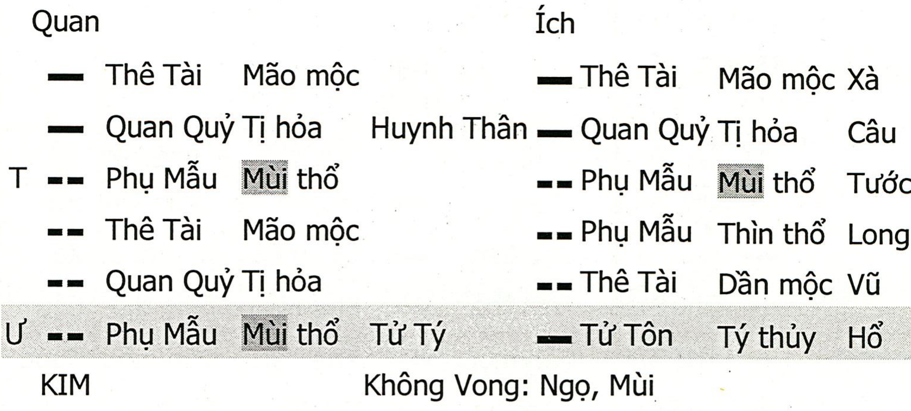

Hào 2: Trưởng khoa, nhà, cửa hàng, bất động sản, phòng làm việc, quản lý viên, nội thất, công nhân, nhân viên nội bộ,...

Hào 3: Cửa ngõ, kế toán, anh chị em gái, xuất nhập khẩu, kiểm định, chất lượng trung bình, quản lý cấp trung,...

Hào 4: Quản lý cấp cao, nhân sự, hàng tốt,...

Hào 5: Lãnh đạo, cao cấp, cấp trên, ông chủ, chủ quản, đường đi, trọng yếu, quý trọng, nổi bật, quan chức chính phủ, quản lý kinh doanh, trung tâm, then chốt, đắc ý,...

Hào 6: Thoái hưu, đào thải, cổ xưa, thần tài, cố vấn, chùa miếu, nước ngoài, hoang vu, cũ kỹ, từ bỏ, kết thúc, điểm cuối, hưu nhàn,...

**Ví dụ 1: Ngày Đinh Mão tháng Tuất, nữ đoán tình hình kinh doanh quán rượu, được Địa Trạch Lâm biến Sơn Trạch Tổn.**

| Lâm | Tổn | |
| :--- | :--- | :--- |
| -- Tử Tôn Dậu kim | — Quan Quỷ Dần mộc | Long |
| Ứ -- Thê Tài Hợi thủy | -- Thê Tài Tý thủy | Vũ |
| -- Huynh Đệ Sửu thổ | -- Huynh Đệ Tuất thổ | Hổ |
| -- Huynh Đệ Sửu thổ | -- Huynh Đệ Sửu thổ | Xà |
| T — Quan Quỷ Mão mộc | — Quan Quỷ Mão mộc | Câu |
| — Phụ Mẫu Tị hỏa | — Phụ Mẫu Tị hỏa | Tước |

THỔ Không Vong: Tuất, Hợi

**Phán đoán:** Lấy Thê Tài làm Dụng thần. Thê Tài Hợi thủy Không Vong, Nguyệt khắc Nhật không sinh phù là hưu tù, quán rượu kinh doanh không phát đạt. Tài tại hào 5 là nguồn thu nhập chủ yếu của quán rượu. Lâm Huyền Vũ, lại được đất Mộc Dục lâm Thanh Long đến sinh, Huyền Vũ chủ dâm ô, Thanh Long chủ tửu sắc, Mộc Dục là tình dục. Vì vậy, quán rượu chủ yếu là dựa vào các cô gái trẻ đem lại lợi nhuận.

Tử Tôn Dậu kim tại hào 6 động mà hóa Tuyệt, hào 6 là điểm cuối của sự vật, Tuyệt chính là Quan Quỷ trì Thế vượng mà lâm Câu Trần, sợ rằng có tai họa lao ngục, tốt nhất là nên đóng cửa sớm.

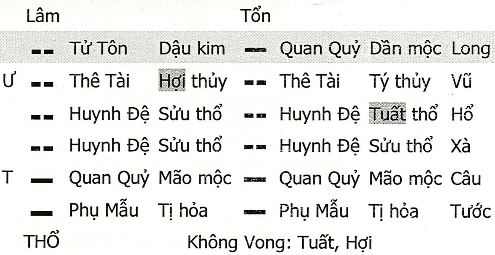

**Phản hồi:** Thực tế đúng là dựa vào các cô gái trẻ thu hút khách hàng. Về sau không có phản hồi cho nên không biết kết cục như thế nào.

**Ví dụ 2:** Ngày Mậu Ngọ tháng Mão năm Ất Dậu, một phụ nữ người Hàn Quốc đoán lợi nhuận năm nay của cửa hàng mát xa chân, được Hỏa Thiên Đại Hữu.

| | Đại Hữu | | | |
| :---: | :---: | :--- | :--- | :--- |
| Ứ | ━ | Quan Quỷ | Tị hỏa | Tước |
| | -- | Phụ Mẫu | Mùi thổ | Long |
| | ━ | Huynh Đệ | Dậu kim | Vũ |
| T | ━ | Phụ Mẫu | Thìn thổ | Hổ |
| | ━ | Thê Tài | Dần mộc | Xà |
| | ━ | Tử Tôn | Tý thủy | Câu |

KIM Không Vong: Tý, Sửu

**Phán đoán:** Lấy Thê Tài làm Dụng thần. Thê Tài Dần mộc được Nguyệt trợ giúp, Nhật không khắc là vượng tướng. Đoán tài vận lâu dài thì không nên hào Tài khắc Thế, may mà sáu hào an tĩnh, hào Ứng vượng tướng dẫn hóa, vì vậy kinh doanh vẫn khá tốt.

Hào Ứng là khách hàng, lâm hào 6, hào 6 là xa xôi, nước ngoài. Vì vậy, khách hàng chủ yếu là người nơi khác, hoặc là du khách nước ngoài. Hào sơ là khởi đầu của một năm, lâm Tử Tôn Không Vong nên thiếu lực sinh Tài, năm nay vừa bắt đầu thì không quá thuận lợi. Tuy nhiên, hào Tài vượng tướng, vẫn còn cơ hội phát triển.

**Phản hồi:** Khách hàng chủ yếu đến từ Nhật Bản. Tuy nhiên, bởi vì năm nay có sự kiện Nhật Bản và Hàn Quốc xung đột cho nên lượng khách đã giảm mạnh.

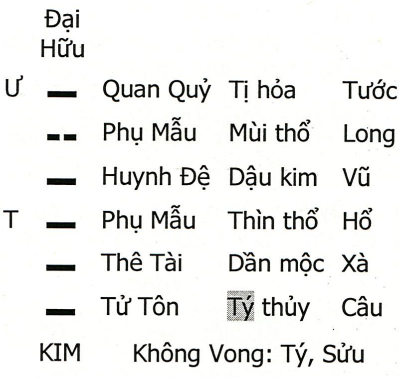

**Ví dụ 3:** Ngày Quý Hợi tháng Sửu, nam đoán tài vận bản thân, được Thủy Lôi Truân biến Thủy Địa Tỷ.

| | Truân | | | | Tỷ | | |
| :---: | :---: | :--- | :--- | :---: | :--- | :--- | :--- |
| | -- | Huynh Đệ | Tý thủy | -- | Huynh Đệ | Tý thủy | Hổ |
| Ứ | ━ | Quan Quỷ | Tuất thổ | ━ | Quan Quỷ | Tuất thổ | Xà |
| | -- | Phụ Mẫu | Thân kim | -- | Phụ Mẫu | Thân kim | Câu |
| | -- | Quan Quỷ | Thìn thổ Tài Ngọ | -- | Tử Tôn | Mão mộc | Tước |
| T | -- | Tử Tôn | Dần mộc | -- | Thê Tài | Tị hỏa | Long |
| | ━ | Huynh Đệ | Tý thủy | -- | Quan Quỷ | Mùi thổ | Vũ |

THỦY Không Vong: Tý, Sửu

**Phán đoán:** Lấy Thê Tài làm Dụng thần. Thê Tài Ngọ hỏa không hiện trên quẻ, Nguyệt không trợ giúp, Nhật thần đến khắc, trong quẻ Huynh Đệ phát động đến khắc, tài vận không tốt đẹp. Huynh Đệ trong quẻ nhìn chằm chằm như hổ đói, rất sợ Dụng thần xuất hiện, vì vậy phán đoán năm Nhâm Ngọ phá tài.

Huynh Đệ Tý thủy tại hào sơ lâm Huyền Vũ, hào sơ là tâm sự, Tý thủy là Nguyên thần hào Thế, lại chủ suy nghĩ, Huyền Vũ chủ đầu cơ. Vì vậy, tôi đoán là anh ta không làm đến nơi đến chốn, tưởng rằng đầu cơ phát tài mà trái lại phá tài.

**Phản hồi:** Trên thực tế đúng là như vậy. Anh ta không đi làm cũng không kinh doanh, muốn mua vé số và buôn bán cổ phiếu để phát tài. Kết quả là tại năm Nhâm Ngọ đã bị thua lỗ.

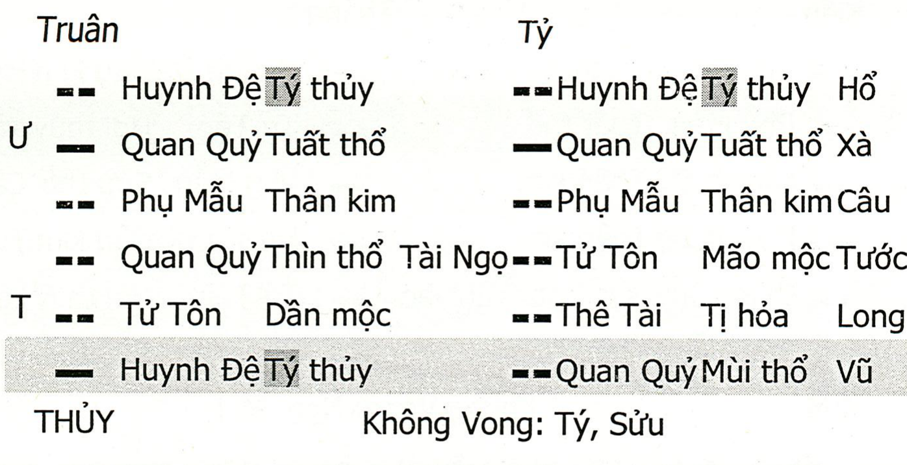

## Ví dụ 4: Ngày Nhâm Thìn tháng Sửu, nam đoán đấu thầu sẽ ra sao? Được Thủy Sơn Kiển biến Địa Phong Thăng.

| | Kiển | Thăng | |
| :---: | :--- | :--- | :--- |
| | -- Tử Tôn Tý thủy | -- Huynh Đệ Dậu kim | Hổ |
| | — Phụ Mẫu Tuất thổ | -- Tử Tôn Hợi thủy | Xà |
| T | -- Huynh Đệ Thân kim | -- Phụ Mẫu Sửu thổ | Câu |
| | — Huynh Đệ Thân kim | — Huynh Đệ Dậu kim | Tước |
| | -- Quan Quỷ Ngọ hỏa Tài Mão | — Tử Tôn Hợi thủy | Long |
| Ư | -- Phụ Mẫu Thìn thổ | -- Phụ Mẫu Sửu thổ | Vũ |

KIM Không Vong: Ngọ, Mùi

**Phán đoán:** Lấy Phụ Mẫu làm Dụng thần. Trong quẻ Phụ Mẫu lưỡng hiện, lấy hào Phụ Mẫu Tuất thổ phát động làm Dụng thần. Dụng thần được Nhật Nguyệt trợ giúp là vượng tướng, vượng mà sinh Thế là cát. Dụng thần tại hào 5 động mà đến sinh, hào 5 là lãnh đạo, quan chức, chứng tỏ có lãnh đạo trợ giúp để giành được lần đấu thầu này. Tuy nhiên, Nguyên thần Quan Quỷ Ngọ hỏa Không mà hóa hồi đầu khắc, vô lực sinh trợ, Quan Quỷ là công ty gọi thầu, công ty gọi thầu không thông qua, sợ rằng đấu thầu thất bại.

**Phản hồi:** Kết quả là mặc dù có lãnh đạo giúp đỡ nhưng cũng không thành công.

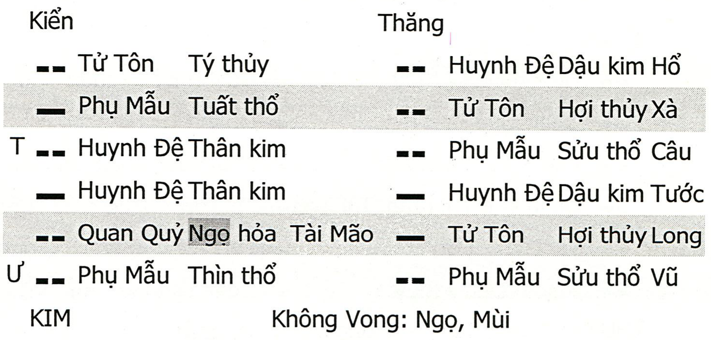

## Ví dụ 5: Ngày Tân Dậu tháng Tý, nam đoán tình hình phát triển công ty, được Thủy Trạch Tiết.

| | Tiết | |
| :---: | :--- | :--- |
| | -- Huynh Đệ Tý thủy | Xà |
| | — Quan Quỷ Tuất thổ | Câu |
| Ư | -- Phụ Mẫu Thân kim | Tước |
| | -- Quan Quỷ Sửu thổ | Long |
| | — Tử Tôn Mão mộc | Vũ |
| T | — Thê Tài Tị hỏa | Hổ |

THỦY Không Vong: Tý, Sửu

**Phán đoán:** Lấy Thê Tài làm Dụng thần. Thê Tài Tị hỏa trì Thế tại hào sơ, hào sơ là khởi đầu của sự vật, biểu thị vừa mới bắt đầu cất bước. Hào Thế lâm Thê Tài, bản thân tự mình gây dựng sự nghiệp. Hào 2 Tử Tôn Mão mộc ám động đến sinh, chứng tỏ sau lưng có người giúp đỡ. Tuy nhiên, Thê Tài Nguyệt khắc Nhật không trợ giúp, Tài vô căn¹ sinh phù bất khởi, vì vậy không thể phát triển.

**Phản hồi:** Quả nhiên là vừa mới triển khai, về sau đã làm nửa năm nhưng thất bại.

¹ Không có gốc rễ.

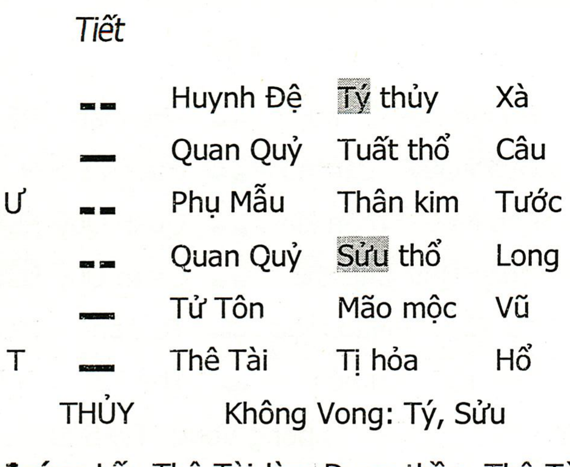

### Ví dụ 6: Ngày Canh Thân tháng Tuất, nam đoán nhận thầu dự án có thể thu lợi hay không? Được Thủy Trạch Tiết biến Địa Trạch Lâm.

| | Tiết | | Lâm | |
| :--- | :--- | :--- | :--- | :--- |
| | - - Huynh Đệ Tý thủy | - - | Phụ Mẫu Dậu kim | Xà |
| | — Quan Quỷ Tuất thổ | - - | Huynh Đệ Hợi thủy | Câu |
| Ư | - - Phụ Mẫu Thân kim | - - | Quan Quỷ Sửu thổ | Tước |
| | - - Quan Quỷ Sửu thổ | - - | Quan Quỷ Sửu thổ | Long |
| | — Tử Tôn Mão mộc | — | Tử Tôn Mão mộc | Vũ |
| T | — Thê Tài Tị hỏa | — | Thê Tài Tị hỏa | Hổ |

THỦY Không Vong: Tý, Sửu

**Phán đoán:** Lấy Thê Tài làm Dụng thần. Thê Tài Tị hỏa trì Thế tại hào sơ lâm Bạch Hổ, hào sơ là chân, Bạch Hổ là bận rộn, bản thân chỉ là người chạy việc vặt mà thôi, không thể tự chủ dự án. Hào Thế nhập Mộ tại hào 5 Quan Quỷ Tuất thổ, Quan Quỷ là lãnh đạo, hào 5 cũng là lãnh đạo, chứng tỏ nguồn tiền của dự án do lãnh đạo kiểm soát. Dụng thần hưu tù, thu lợi rất nhỏ.

**Phản hồi:** Quả nhiên dự đoán hoàn toàn phù hợp với tình hình thực tế.

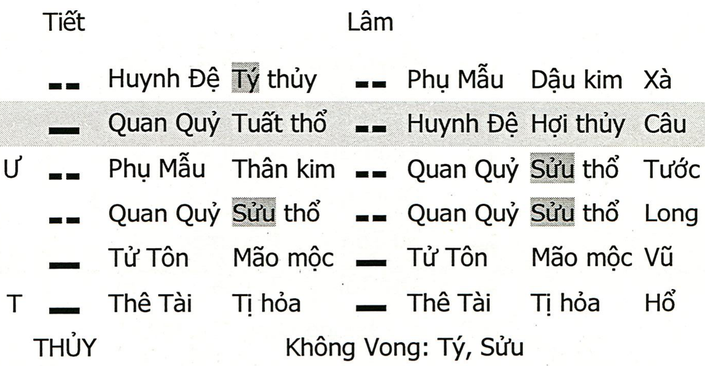

### Ví dụ 7: Ngày Mậu Dần tháng Thìn, nam đoán hợp tác kinh doanh, được Trạch Sơn Hàm biến Trạch Hỏa Cách.

| | Hàm | | Cách | |
| :--- | :--- | :--- | :--- | :--- |
| Ư | - - Phụ Mẫu Mùi thổ | - - | Phụ Mẫu Mùi thổ | Tước |
| | — Huynh Đệ Dậu kim | — | Huynh Đệ Dậu kim | Long |
| | — Tử Tôn Hợi thủy | — | Tử Tôn Hợi thủy | Vũ |
| T | — Huynh Đệ Thân kim | — | Tử Tôn Hợi thủy | Hổ |
| | - - Quan Quỷ Ngọ hỏa Tài Mão | - - | Phụ Mẫu Sửu thổ | Xà |
| | - - Phụ Mẫu Thìn thổ | — | Thê Tài Mão mộc | Câu |

KIM Không Vong: Thân, Dậu

**Phán đoán:** Lấy Thê Tài làm Dụng thần. Thê Tài Mão mộc không hiện trên quẻ, phục tàng dưới hào 2 Quan Quỷ Ngọ hỏa. Dụng thần được Nhật trợ giúp là vượng tướng, nhưng không nên Huynh Đệ trì Thế ám động.

Hào Thế Không Vong, bản thân là người không có mưu tính. Hào Ứng Phụ Mẫu Mùi thổ là người hợp tác, lâm hào 6, hào 6 là hào vị thoái hưu, nhập Mộ ở Thìn thổ, biểu thị kết thúc. Vì vậy, đối phương là người đã nghỉ hưu, Mùi thổ là Tài khố, tính toán chi li, là cao thủ quản lý tiền bạc.

Hào sơ Phụ Mẫu hóa Tài sinh hào Thế, Phụ Mẫu là thần vất vả, vất vả cầu tài mà không được nhiều lợi ích.

**Phản hồi:** Đối phương vốn là kế toán viên của một đơn vị, hiện tại đã nghỉ hưu.

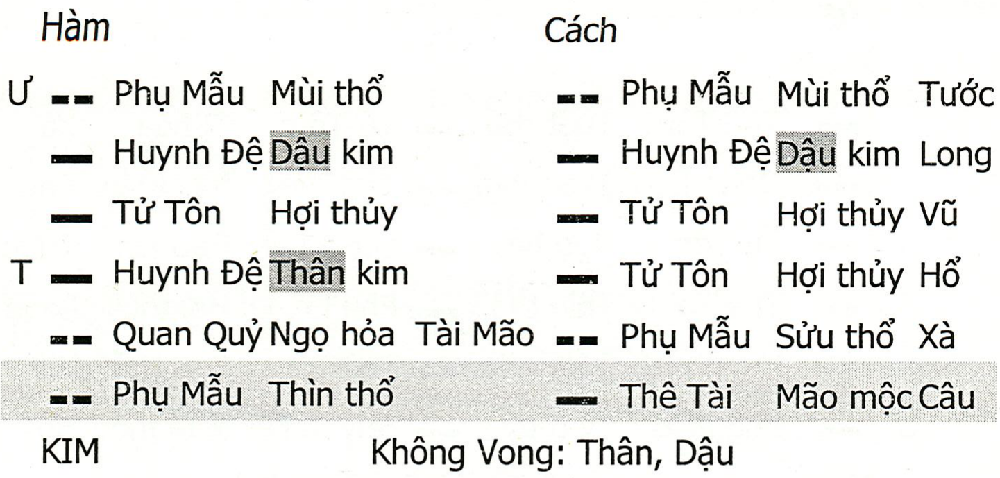

### Ví dụ 8: Ngày Tân Hợi tháng Mùi, nam đoán tài vận sắp tới, được Thiên Lôi Vô Vọng biến Ly Vi Hỏa.

| | Vô Vọng | | Ly | | |
| :---: | :---: | :--- | :---: | :--- | :---: |
| | — | Thê Tài Tuất thổ | — | Tử Tôn Tị hỏa | Xà |
| | — | Quan Quỷ Thân kim | - - | Thê Tài Mùi thổ | Câu |
| T | — | Tử Tôn Ngọ hỏa | — | Quan Quỷ Dậu kim | Tước |
| | - - | Thê Tài Thìn thổ | — | Phụ Mẫu Hợi thủy | Long |
| | - - | Huynh Đệ Dần mộc | - - | Thê Tài Sửu thổ | Vũ |
| Ứ | — | Phụ Mẫu Tý thủy | — | Huynh Đệ Mão mộc | Hổ |

MỘC    Không Vong: Dần, Mão

**Phán đoán:** Lấy Thê Tài làm Dụng thần. Trong quẻ Thê Tài lưỡng hiện, lấy hào Thê Tài Thìn thổ phát động làm Dụng thần. Dụng thần được Nguyệt trợ giúp là vượng tướng, lâm Thanh Long tại hào 3 hóa Phụ Mẫu Hợi thủy, Thanh Long chủ vui mừng, hào 3 là cửa, hào biến là Nhật thần biểu thị ngày hôm đó. Phụ Mẫu là văn thư, xe thuyền, kiến trúc,... Tổng hợp lại, phán đoán là hôm nay ra ngoài gặp hỷ, tức là có tiền vào.

Hào 5 Quan Quỷ lâm Câu Trần lại hóa Thê Tài, Câu Trần là kiến trúc, công trình, vì vậy bởi vì chuyện kiến trúc, công trình mà được tài.

**Phản hồi:** Quả nhiên là hôm đó đang đi trên đường thì gặp được chủ thầu trước đây, anh ta đã được người ta kết toán cho khoản tiền còn lại.

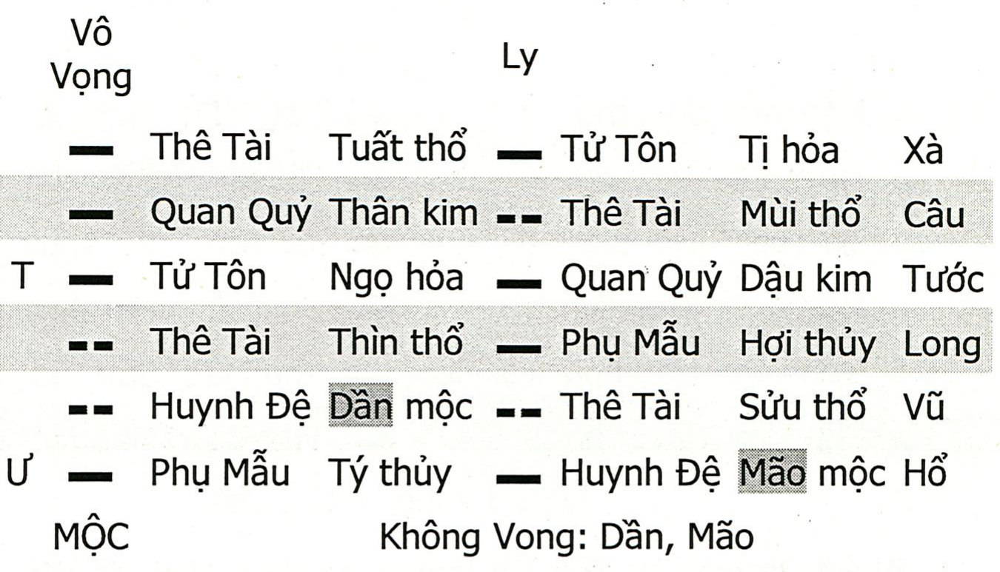

### Ví dụ 9: Ngày Tân Mùi tháng Thìn, nam đoán tình trạng hạt giống, được Sơn Địa Bác biến Sơn Lôi Di.

| | Bác | | Di | | |
| :---: | :---: | :--- | :---: | :--- | :---: |
| | — | Thê Tài Dần mộc | — | Thê Tài Dần mộc | Xà |
| T | - - | Tử Tôn Tý thủy | - - | Tử Tôn Tý thủy | Câu |
| | - - | Phụ Mẫu Tuất thổ | - - | Phụ Mẫu Tuất thổ | Tước |
| | - - | Thê Tài Mão mộc | - - | Phụ Mẫu Thìn thổ | Long |
| Ứ | - - | Quan Quỷ Tị hỏa | - - | Thê Tài Dần mộc | Vũ |
| | - - | Phụ Mẫu Mùi thổ | — | Tử Tôn Tý thủy | Hổ |

KIM    Không Vong: Tuất, Hợi

**Phán đoán:** Lấy Thê Tài làm Dụng thần. Thê Tài Mão mộc không được Nhật Nguyệt trợ giúp là hưu tù, chứng tỏ hạt giống không chất lượng. Hào sơ Phụ Mẫu Mùi thổ độc phát, Thê Tài nhập Mộ, hào sơ là mầm, Thê Tài nhập Mộ mà không thể sinh trưởng, vì vậy phán đoán là hạt giống không nảy mầm. Lâm Bạch Hổ, Bạch Hổ chủ thuốc, là hạt giống dược liệu.

**Phản hồi:** Quả nhiên là hạt giống không thể nảy mầm.

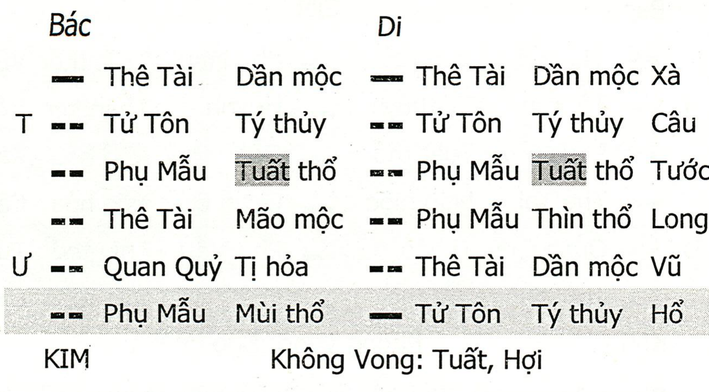

**Ví dụ 10:** Ngày Giáp Thân tháng Tuất, nữ đoán tài vận công ty, được Sơn Địa Bác biến Lôi Thủy Giải.

| | Bác | Giải | |
| :---: | :---: | :---: | :---: |
| | ━ Thê Tài Dần mộc | ⚋ Phụ Mẫu Tuất thổ | Vũ |
| T | ⚋ Tử Tôn Tý thủy | ⚋ Huynh Đệ Thân kim | Hổ |
| | ⚋ Phụ Mẫu Tuất thổ | ━ Quan Quỷ Ngọ hỏa | Xà |
| | ⚋ Thê Tài Mão mộc | ⚋ Quan Quỷ Ngọ hỏa | Câu |
| Ư | ⚋ Quan Quỷ Tị hỏa | ━ Phụ Mẫu Thìn thổ | Tước |
| | ⚋ Phụ Mẫu Mùi thổ | ⚋ Thê Tài Dần mộc | Long |

KIM      Không Vong: Ngọ, Mùi

**Phán đoán:** Lấy Thê Tài làm Dụng thần, trong quẻ Thê Tài lưỡng hiện, lấy hào Thê Tài phát động làm Dụng thần. Thê Tài Dần mộc không được Nhật Nguyệt trợ giúp, Nhật khắc Dụng thần là hưu tù, tài vận không tốt đẹp.

Hào Thế là Nguyên thần, Nhật sinh Nguyệt khắc suy vượng tương đương, nhưng Phụ Mẫu Tuất thổ động hóa hồi đầu sinh, hào 2 lại đến sinh, Phụ Mẫu vượng tướng khắc hào Thế, hào Thế vô lực sinh Tài, chứng tỏ bản thân đã không có năng lực phát triển công ty.

Dụng thần tại hào 6 hưu tù vô lực, biểu thị kinh tế của công ty đã không thể cầm cự, sắp lâm vào tình trạng phá sản.

**Phản hồi:** Quả nhiên càng ngày càng sa sút, sắp đóng cửa.

## 4. THỦ TƯỢNG LỤC THẦN TRONG DỰ ĐOÁN KINH TẾ

Lục thần dùng để phán đoán tính chất và nguyên nhân của sự việc. Trong dự đoán kinh tế, vai trò của lục thần là không thể thiếu. Ý nghĩa chủ yếu của các lục thần như sau:

Thanh Long: Vui vẻ, ẩm thực, trang hoàng, mới, đẹp, tửu sắc, nghề phục vụ, làm đẹp, trang điểm, chính phủ, hàng tốt, cao cấp, quý trọng,...

Chu Tước: Văn thư, tin tức, hợp đồng, bản vẽ, giáo dục, trường học, truyền thông, quảng cáo, tuyên truyền, tri thức, hỏa hoạn, ngôn ngữ, khẩu thiệt, kiện tụng,...

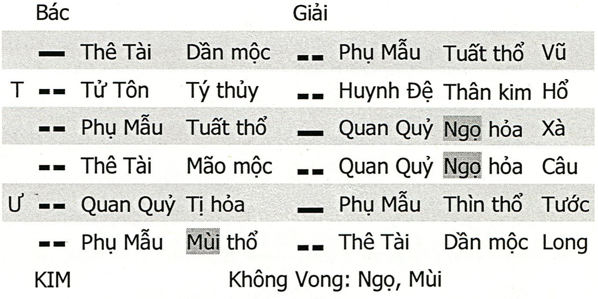

Câu Trần: Chậm chạp, kiến trúc, phòng làm việc, đất đai, bất động sản, trung thực, thận trọng, cũ kỹ, cổ xưa,...

Đằng Xà: Kinh ngạc, hiếm thấy, hy hữu, lo lắng, lừa gạt, quấn quanh, biến hóa, giả tạo,...

Bạch Hổ: Vận tải, điều trị, y dược, cấp tốc, bận rộn, giao thông, nghiêm ngặt, cứng rắn,...

Huyền Vũ: Đầu cơ, bài bạc, nhanh trí, trộm cắp, thối rữa, ẩm thấp, bí mật, dâm ô, tư nhân, cá thể,...

**Ví dụ 1:** Ngày Ất Dậu tháng Hợi năm Canh Thìn, nam đoán tài vận, được Thủy Lôi Truân.

| | Truân | Phục thần | |
| :---: | :---: | :---: | :---: |
| | ⚋ Huynh Đệ Tý thủy | | Vũ |
| Ư | ━ Quan Quỷ Tuất thổ | | Hổ |
| | ⚋ Phụ Mẫu Thân kim | | Xà |
| | ⚋ Quan Quỷ Thìn thổ | Tài Ngọ | Câu |
| T | ⚋ Tử Tôn Dần mộc | | Tước |
| | ━ Huynh Đệ Tý thủy | | Long |

THỦY      Không Vong: Ngọ, Mùi

**Phán đoán:** Lấy Thê Tài làm Dụng thần. Thê Tài Ngọ hỏa không hiện trên quẻ, lại lâm Không Vong, Nguyệt khắc Nhật không sinh là hưu tù, chứng tỏ tài vận rất kém. Tài lâm Câu Trần, Câu Trần là nơi ở, là phòng ốc, Thủy Lôi Truân lại có ý nghĩa là lưu lại, cư trú. Do đó, Thê Tài Ngọ hỏa chính là bất động sản.

Thế tại hào 2 lâm Tử Tôn Dần mộc, hào 2 là trạch. Hào Thế lâm hào 2 là thông tin bản thân có nhà. Hào Thế sinh Tài chính là bản thân muốn có được nhà, bảo vệ nhà. Tuy nhiên, Thê Tài Ngọ hỏa Không Vong bị khắc, nhập Mộ ở hào Ứng, Ứng là người khác, là thông tin bất động sản bị người ta tước đoạt.

**Phản hồi:** Trên thực tế, người này đem nhà thế chấp để vay tiền kinh doanh, bởi vì thua lỗ cho nên căn nhà đã bị người ta lấy mất.

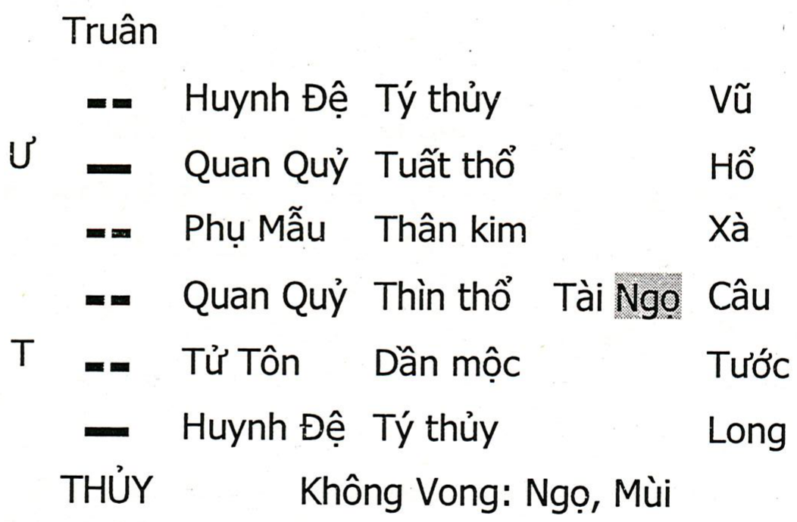

### Ví dụ 2: Ngày Tân Mùi tháng Dần, một người đàn ông làm công trình đoán tài vận năm nay, được Sơn Thủy Mông biến Hỏa Thủy Vị Tế.

| | Mông | Vị Tế | |
| :---: | :--- | :--- | :---: |
| | — Phụ Mẫu Dần mộc | — Huynh Đệ Tị hỏa | Xà |
| | - - Quan Quỷ Tý thủy | - - Tử Tôn Mùi thổ | Câu |
| T | - - Tử Tôn Tuất thổ Tài Dậu | — Thê Tài Dậu kim | Tước |
| | - - Huynh Đệ Ngọ hỏa | - - Huynh Đệ Ngọ hỏa | Long |
| | — Tử Tôn Thìn thổ | — Tử Tôn Thìn thổ | Vũ |
| Ư | - - Phụ Mẫu Dần mộc | - - Phụ Mẫu Dần mộc | Hổ |

HỎA  
Không Vong: Tuất, Hợi

**Phán đoán:** Lấy Thê Tài làm Dụng thần. Thê Tài Dậu kim không hiện trên quẻ, phục dưới hào Thế Tử Tôn Tuất thổ. Dụng thần được Nhật sinh là vượng, hào Thế lại phát động đi sinh là tượng tôi đi cầu tài. Tài phục dưới Thế là tài thuộc về tôi, hào Thế lại hóa ra hào Tài là tôi và tài gặp nhau, vì vậy năm nay có tài.

Thê Tài Dậu kim lâm Chu Tước, Chu Tước chủ văn hóa, giáo dục, Sơn Thủy Mông lại có ý nghĩa là khai sáng. Vì vậy, tôi đoán là năm nay có thể được tài ở ngành giáo dục. Hào Thế Không Vong, tháng Thìn xung thực là được.

**Phản hồi:** Anh ta nói: "Tôi đến đây dự đoán chính là vì chuyện này. Nghe nói sở giáo dục muốn xây trường học, vì vậy tôi muốn xem xem mình có thể nhận được công trình hay không."

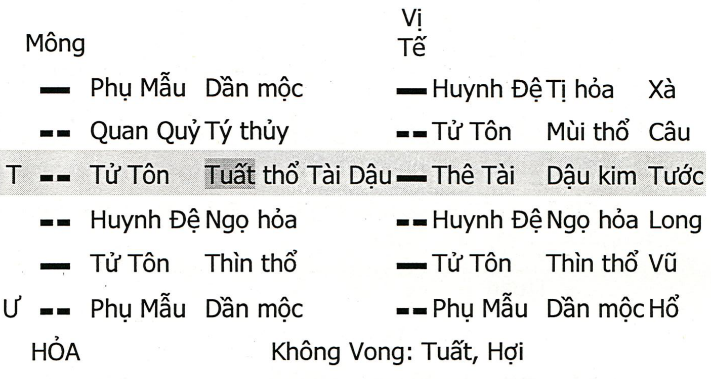

### Ví dụ 3: Ngày Bính Ngọ tháng Hợi, một người đoán hiệu quả kinh doanh, được Thiên Địa Bĩ biến Khảm Vi Thủy.

| | Bĩ | Khảm | |
| :---: | :--- | :--- | :---: |
| Ư | — Phụ Mẫu Tuất thổ | - - Tử Tôn Tý thủy | Long |
| | — Huynh Đệ Thân kim | — Phụ Mẫu Tuất thổ | Vũ |
| | — Quan Quỷ Ngọ hỏa | - - Huynh Đệ Thân kim | Hổ |
| T | - - Thê Tài Mão mộc | - - Quan Quỷ Ngọ hỏa | Xà |
| | - - Quan Quỷ Tị hỏa | — Phụ Mẫu Thìn thổ | Câu |
| | - - Phụ Mẫu Mùi thổ Tử Tý | - - Thê Tài Dần mộc | Tước |

KIM  
Không Vong: Dần, Mão

**Phán đoán:** Lấy Thê Tài làm Dụng thần. Thê Tài Mão mộc Nguyệt kiến đến sinh, Nhật không khắc là vượng tướng. Tuy nhiên, không nên hai Quỷ giáp hào Thế, hào Thế lâm Đằng Xà Không Vong, Quan Quỷ là phiền não, giáp hào Thế là phiền não quấn quanh, nhiều phiền não. Hào Thế Không Vong là tượng bất an, lâm Đằng Xà càng là như vậy.

Dụng thần Mão mộc trì Thế lâm Đằng Xà Không Vong, Đằng Xà chủ thiếu, trì Thế chủ đạt được, Không chủ không có. Do đó, thu nhập thì thấp nhưng tiền kiếm được lại nhanh chóng mất đi. Hào Ứng phát động đến hợp hào Thế Tài, Ứng là người khác, lâm Phụ Mẫu chủ nhà cửa. Vì vậy, chủ nhà thúc ép nộp tiền thuê nhà, phải tiêu pha số tiền vừa kiếm được.

**Phản hồi:** Trên thực tế, tiền vào không nhiều, phần lớn số tiền kiếm được dùng để trả tiền thuê nhà, tâm trạng bức bối, muốn thay đổi địa điểm làm việc.

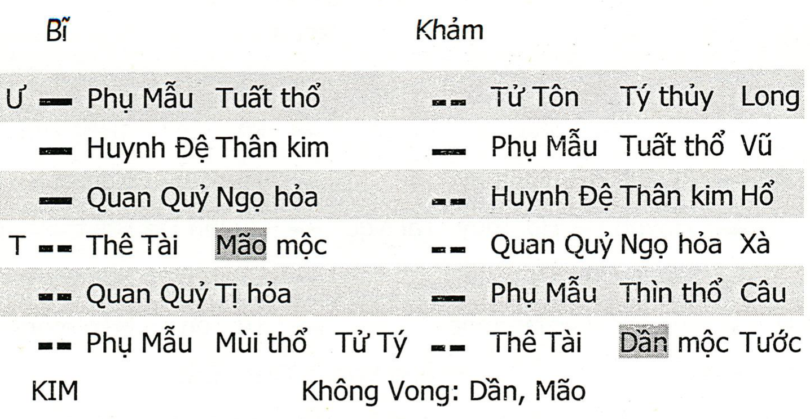

### Ví dụ 4: Ngày Ất Hợi tháng Dậu, nữ đoán tài vận bản thân, được Trạch Hỏa Cách biến Thiên Hỏa Đồng Nhân.

| | Cách | | | | Đồng Nhân | |
|---|---|---|---|---|---|---|
| | - - | Quan Quỷ Mùi thổ | | — | Quan Quỷ Tuất thổ | Vũ |
| | — | Phụ Mẫu Dậu kim | | — | Phụ Mẫu Thân kim | Hổ |
| T | — | Huynh Đệ Hợi thủy | | — | Thê Tài Ngọ hỏa | Xà |
| | — | Huynh Đệ Hợi thủy | Tài Ngọ | — | Huynh Đệ Hợi thủy | Câu |
| | - - | Quan Quỷ Sửu thổ | | - - | Quan Quỷ Sửu thổ | Tước |
| Ư | — | Tử Tôn Mão mộc | | — | Tử Tôn Mão mộc | Long |

THỦY Không Vong: Thân, Dậu

**Phán đoán:** Thê Tài là Dụng thần. Thê Tài Ngọ hỏa không hiện trên quẻ, phục dưới Huynh Đệ Hợi thủy. Nguyệt kiến không đến trợ giúp, Nhật thần đến khắc, Dụng thần hưu tù, tài vận không tốt đẹp.

Dụng thần phục tàng lẽ ra mừng được xung xuất, nhưng hào 6 Quan Quỷ Mùi thổ độc phát, hợp trú Dụng thần, hợp là cản trở. Chứng tỏ tài vận của mình gặp vấn đề là do bị người khác liên lụy. Dụng thần lâm Câu Trần, Câu Trần chủ trì hoãn, cản trở, đây cũng là thông tin bị người khác liên lụy. Hào 6 là người già, Quan Quỷ là bệnh tật, nhất định là bị liên lụy bởi sức khỏe của người già. Phi thần là Huynh Đệ, hào 3 lại là hào vị Huynh Đệ, chứng tỏ cũng bị anh chị em trong nhà liên lụy.

**Phản hồi:** Trên thực tế, tài vận không tốt. Bản thân là anh cả trong nhà, cha mẹ lớn tuổi nên phải chăm sóc. Em trai nợ nần bên ngoài rất nhiều nhưng mẹ trả không được, bản thân đành phải giúp em trả nợ.

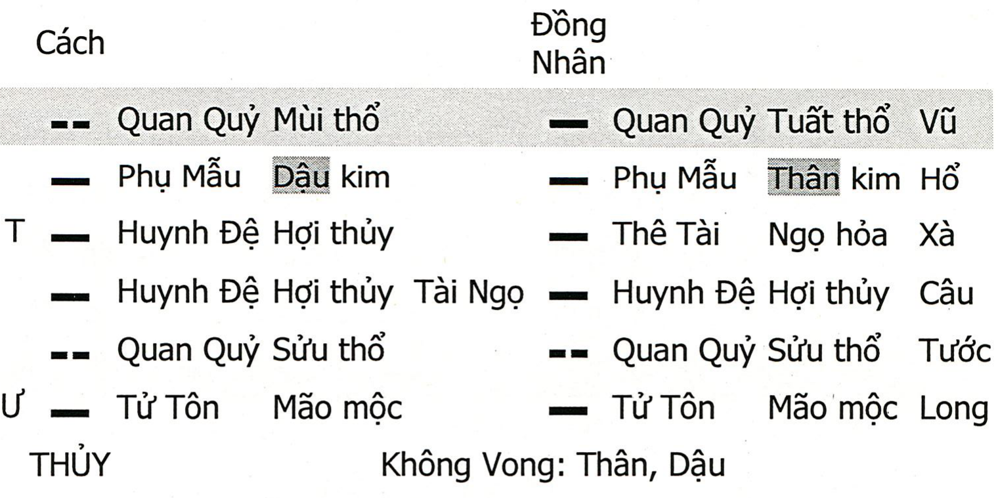

### Ví dụ 5: Ngày Đinh Sửu tháng Ngọ, một người đàn ông thanh toán 42000 yên cho công ty thông tin đua ngựa, hỏi dùng thông tin họ cung cấp để cá ngựa thì có thể phát tài không? Được Trạch Hỏa Cách biến Trạch Sơn Hàm.

| | Cách | | | | Hàm | |
|---|---|---|---|---|---|---|
| | - - | Quan Quỷ Mùi thổ | | - - | Quan Quỷ Mùi thổ | Long |
| | — | Phụ Mẫu Dậu kim | | — | Phụ Mẫu Dậu kim | Vũ |
| T | — | Huynh Đệ Hợi thủy | | — | Huynh Đệ Hợi thủy | Hổ |
| | — | Huynh Đệ Hợi thủy | Tài Ngọ | — | Phụ Mẫu Thân kim | Xà |
| | - - | Quan Quỷ Sửu thổ | | - - | Thê Tài Ngọ hỏa | Câu |
| Ư | — | Tử Tôn Mão mộc | | - - | Quan Quỷ Thìn thổ | Tước |

THỦY Không Vong: Thân, Dậu

**Phán đoán:** Lấy Thê Tài làm Dụng thần. Thê Tài Ngọ hỏa không hiện trên quẻ, phục dưới hào 3 Huynh Đệ Hợi thủy. Mặc dù là Phi đến khắc Phục, nhưng Dụng thần được Nguyệt trợ giúp. Hào Ứng Tử Tôn Mão mộc lâm Chu Tước độc phát sinh Tài. Hào Ứng là công ty thông tin đua ngựa, Chu Tước chủ thông tin, tin tức, động sinh Dụng thần, thế nào cũng có lợi.

**Phản hồi:** Kết quả là thắng được 300 vạn yên.

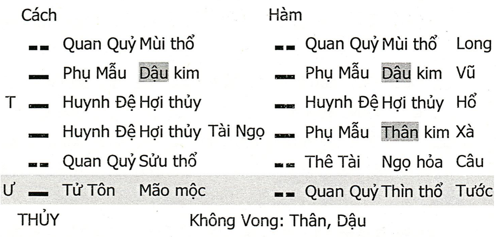

---

# Part 3 (Pages 41-60)

- **Ví dụ 6:** Ngày Mậu Tý tháng Dần năm Đinh Hợi, nam đoán mua xe để kinh doanh, được Thủy Phong Tỉnh biến Tốn Vi Phong.

| | Tỉnh | | Tốn | |
| :---: | :--- | :---: | :--- | :--- |
| | -- Phụ Mẫu Tý thủy | | — Huynh Đệ Mão mộc | Tước |
| T | — Thê Tài Tuất thổ | | — Tử Tôn Tị hỏa | Long |
| | -- Quan Quỷ Thân kim | Tử Ngọ | -- Thê Tài Mùi thổ | Vũ |
| | — Quan Quỷ Dậu kim | | — Quan Quỷ Dậu kim | Hổ |
| Ứ | — Phụ Mẫu Hợi thủy | Huynh Dần | — Phụ Mẫu Hợi thủy | Xà |
| | -- Thê Tài Sửu thổ | | -- Thê Tài Sửu thổ | Câu |

MỘC Không Vong: Ngọ, Mùi

**Phán đoán:** Mục đích là kiếm tiền, lấy Thê Tài làm Dụng thần. Trong quẻ Thê Tài lưỡng hiện, lấy Thế Thê Tài Tuất thổ làm Dụng thần. Dụng thần Nguyệt khắc Nhật không trợ giúp là hưu tù, không thể dựa vào xe để phát tài.

Phụ Mẫu lâm Chu Tước độc phát, Phụ Mẫu là văn thư, cáo trạng, Chu Tước chủ khẩu thiệt, kiện tụng, độc phát có dụng ý xem chỗ này ứng chỗ khác. Vì vậy, tôi đoán là nếu mua xe thì sẽ xảy ra kiện tụng, tranh chấp.

**Phản hồi:** Anh ta có phần nửa tin nửa ngờ, tôi bèn phán đoán tại năm 1998 và năm 1999 đã phá tài. Năm 2000 bị thương ở lưng. Ứng nghiệm ngay tại chỗ, thế là anh ta đã quyết định không mua. Bởi vì năm Mậu Dần và năm Kỷ Mão khắc Tài, biểu thị phá tài; năm Canh Thìn xung hào Thế, hào Thế Tuất thổ là lưng, vì vậy bị thương ở lưng.

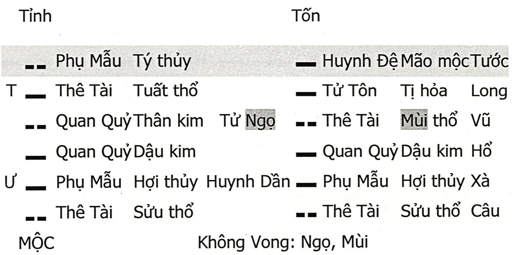

**Ví dụ 7:** Ngày Ất Dậu tháng Sửu, nữ được bạn bè giới thiệu một con đường phát tài, được Phong Lôi Ích.

| | Ích | |
| :---: | :--- | :--- |
| Ứ | — Huynh Đệ Mão mộc | Vũ |
| | -- Tử Tôn Tị hỏa | Hổ |
| | -- Thê Tài Mùi thổ | Xà |
| T | -- Thê Tài Thìn thổ | Câu |
| | -- Huynh Đệ Dần mộc | Tước |
| | — Phụ Mẫu Tý thủy | Long |

MỘC Không Vong: Ngọ, Mùi

**Phán đoán:** Lấy Thê Tài làm Dụng thần. Trong quẻ Thê Tài lưỡng hiện, lấy Thê Tài Mùi thổ Không Vong Nguyệt phá làm Dụng thần. Dụng thần không được Nhật Nguyệt trợ giúp, hưu tù Không Phá không được tài. Hào Ứng Huynh Đệ Mão mộc lâm Huyền Vũ ám động lại đến khắc, ám động là lén lút, Ứng là người khác, Huyền Vũ chủ lừa gạt, cho nên con đường phát tài có vấn đề, sợ là bị người ta lừa gạt mà phá tài.

**Phản hồi:** Kết quả là bạn bè giới thiệu cô ấy đi làm kinh doanh đa cấp.

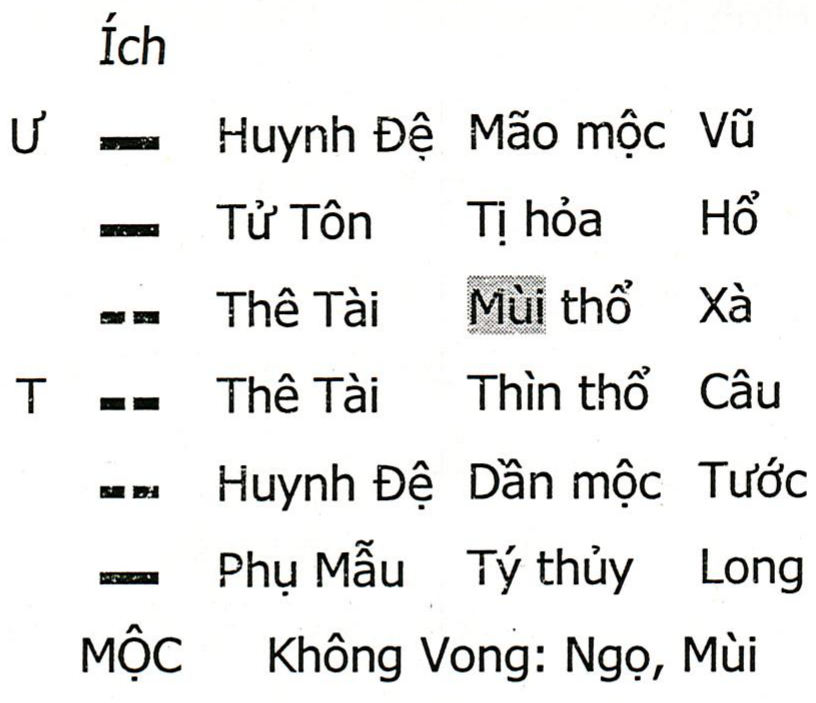

### Ví dụ 8: Ngày Mậu Dần tháng Thìn, một người New Zealand đoán tình hình kinh doanh, được Địa Hỏa Minh Di.

| | Minh Di | | | |
| :---: | :---: | :--- | :---: | :---: |
| | - - | Phụ Mẫu Dậu kim | | Tước |
| | - - | Huynh Đệ Hợi thủy | | Long |
| T | - - | Quan Quỷ Sửu thổ | | Vũ |
| | — | Huynh Đệ Hợi thủy | Tài Ngọ | Hổ |
| | - - | Quan Quỷ Sửu thổ | | Xà |
| Ứ | — | Tử Tôn Mão mộc | | Câu |

THỦY    Không Vong: Thân, Dậu

**Phán đoán:** Lấy Thê Tài làm Dụng thần. Thê Tài Ngọ hỏa không hiện trên quẻ, phục tàng dưới hào 3 Huynh Đệ Hợi thủy. Mặc dù là Phi đến khắc Phục, nhưng Phi thần hưu tù, Dụng thần được Nhật sinh là vượng tướng. Thê Tài Ngọ hỏa lâm Bạch Hổ, Bạch Hổ chủ y dược, phán đoán có thể là kinh doanh về y dược. Tử Tôn Mão mộc vượng mà sinh Dụng thần, mộc chủ số 3, vì vậy phán đoán anh ta mở rộng kinh doanh ở 3 nơi.

**Phản hồi:** Quả nhiên là dự định kinh doanh dược phẩm, dự định mở nhà thuốc ở 3 thành phố.

### Ví dụ 9: Ngày Mậu Dần tháng Mão, nam đoán mua nhà từ người khác, được Thủy Trạch Tiết biến Đoài Vi Trạch.

| | Tiết | | | Đoài | |
| :---: | :---: | :--- | :---: | :--- | :---: |
| | - - | Huynh Đệ Tý thủy | - - | Quan Quỷ Mùi thổ | Tước |
| | — | Quan Quỷ Tuất thổ | — | Phụ Mẫu Dậu kim | Long |
| Ứ | - - | Phụ Mẫu Thân kim | — | Huynh Đệ Hợi thủy | Vũ |
| | - - | Quan Quỷ Sửu thổ | - - | Quan Quỷ Sửu thổ | Hổ |
| | — | Tử Tôn Mão mộc | — | Tử Tôn Mão mộc | Xà |
| T | — | Thê Tài Tị hỏa | — | Thê Tài Tị hỏa | Câu |

THỦY    Không Vong: Thân, Dậu

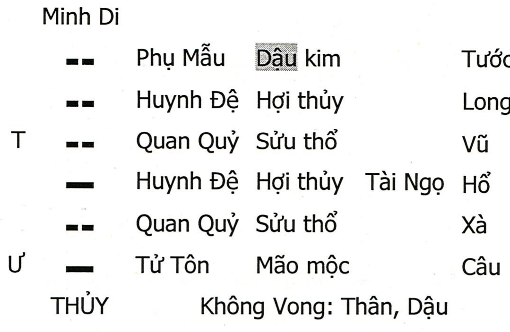

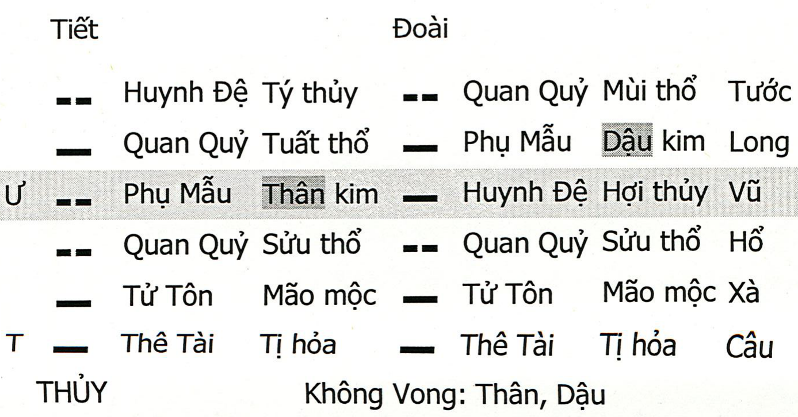

**Phán đoán:** Lấy Phụ Mẫu làm Dụng thần. Phụ Mẫu Thân kim lâm hào Ứng động mà hợp hào Thế là người khác chủ động muốn bán nhà cho anh ta. Dụng thần hưu tù là nhà cũ. Hào Ứng Không Vong lâm Huyền Vũ, Ứng Không là người ta không thật tâm, Huyền Vũ chủ lừa gạt, vì vậy đối phương không thật tâm bán nhà, có tượng lừa gạt. Ứng hợp hào Thế Thê Tài, mục đích của đối phương là lấy tiền của anh ta.

Tuy nhiên, người này không nghe, anh ta cảm thấy đối phương là bạn bè thì sẽ không lừa gạt. Sau khi chồng tiền xong, đối phương cứ kề cà không chịu giao chìa khóa, cũng không chịu làm thủ tục sang tên. Sau nhiều lần truy hỏi, người kia lại nói là không bán, đòi tiền cũng không chịu trả.

**Phản hồi:** Trên thực tế, đối phương thiếu vốn kinh doanh cho nên đã dùng cách này để lừa gạt tiền bạc của anh ta. Cuối cùng không còn cách nào khác, mẹ của anh ta đã đến bám trụ ở căn nhà đó không đi, đối phương không thể không trả lại tiền.

### Ví dụ 10: Ngày Nhâm Dần tháng Tị, nam đoán giao tiền cho công nhân đi mua vật liệu trang trí sẽ ra sao? Được Cấn Vi Sơn biến Sơn Hỏa Bí.

| | Cấn | | | Bí | |
| :---: | :---: | :--- | :---: | :--- | :---: |
| T | — | Quan Quỷ Dần mộc | — | Quan Quỷ Dần mộc | Hổ |
| | - - | Thê Tài Tý thủy | - - | Thê Tài Tý thủy | Xà |
| | - - | Huynh Đệ Tuất thổ | - - | Huynh Đệ Tuất thổ | Câu |
| Ứ | — | Tử Tôn Thân kim | — | Thê Tài Hợi thủy | Tước |
| | - - | Phụ Mẫu Ngọ hỏa | - - | Huynh Đệ Sửu thổ | Long |
| | - - | Huynh Đệ Thìn thổ | — | Quan Quỷ Mão mộc | Vũ |

THỔ    Không Vong: Thìn, Tị

**Phán đoán:** Lấy Thê Tài làm Dụng thần. Thê Tài Tý thủy không được Nhật Nguyệt trợ giúp là hưu tù. Huynh Đệ Thìn thổ lâm Huyền Vũ độc phát đến khắc, Huyền Vũ chủ lừa gạt, không thể giao tiền cho người công nhân này, nếu không thì sẽ bị lừa gạt.

**Phản hồi:** Sau nhiều lần do dự, anh ta vẫn cấp tiền, kết quả là người ta cầm tiền đi và không trở về.

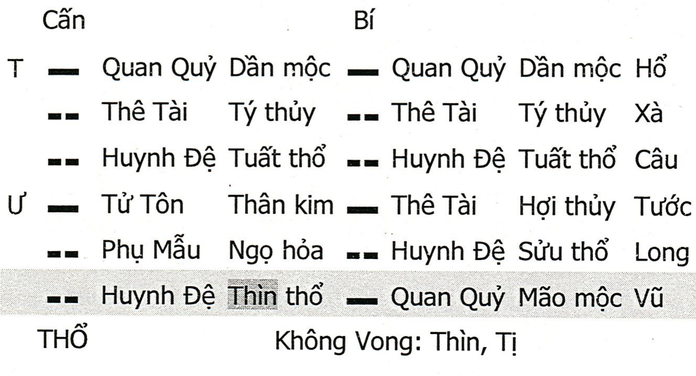

# 5. THỦ TƯỢNG LỤC THÂN HỖ HÓA TRONG DỰ ĐOÁN KINH TẾ

Trong dự đoán lục hào, mỗi lục thân có một ý nghĩa của nó. Đồng thời, tùy vào nội dung dự đoán khác nhau mà ý nghĩa cũng khác nhau. Ở phương diện dự đoán kinh tế, ngoài ý nghĩa của bản thân lục thân, sự phát động của hào dẫn tới hỗ hóa cũng là một trong những phương thức truyền đạt thông tin.

Lục thân hỗ hóa có một số đặc điểm sau đây:

1. Có thể biểu thị cát hung. Tỉ như hóa hồi đầu sinh, hóa Tiến thần, hóa Đế Vượng, hóa Nguyệt kiến,... thông thường là cát; hóa Tử, Mộ, Tuyệt, Không, Phá, hồi đầu khắc,... biểu thị hung.

2. Có thể biểu thị thời gian và ứng kỳ. Tỉ như hóa Nguyệt kiến, hóa Thái Tuế, hóa Nhật thần, hóa ngày tháng năm gần đó,...

3. Biểu thị quá trình biến hóa của sự vật. Hào động là giai đoạn đầu, hào biến là kết quả.

4. Truyền đạt thông tin nào đó, để biểu thị nguyên nhân và tính chất,...

### Thê Tài:

Thê Tài hóa Thê Tài: Cần xem tiến thoái.

Hóa Tiến thần biểu thị tiền vào như nước, nguồn tiền thịnh vượng, tài vận tốt đẹp, của cải tích lũy, ngày càng giàu có, để dành tiền, tích lũy vốn, giá cả tăng lên, lợi nhuận tăng nhanh,...

Hóa Thoái thần biểu thị tài lực suy yếu, kinh tế tiêu điều, tài vận không tốt đẹp, giảm giá, lợi nhuận giảm bớt, dần dần nghèo túng, tiền vốn giảm bớt,...

Thê Tài hóa Tử Tôn, biểu thị kinh tế có thể chuyển biến tốt, nguồn tiền liên tục, được lời, có ích,...

Thê Tài hóa Quan Quỷ, biểu thị dựa vào chức vụ hoặc dựa vào chính phủ mà phát tài, tài vật xuất hiện vấn đề, tài vận không tốt đẹp, bởi vì tài mà có họa, bởi vì tiền tài mà kiện tụng,...

Thê Tài hóa Huynh Đệ, biểu thị tài vận không tốt đẹp, tiền tài có tổn thất, vòng quay vốn không hiệu quả, phá tài, tổn hao, lỗ vốn,...

Thê Tài hóa Phụ Mẫu, biểu thị kinh tế bất động sản, kinh tế văn hóa, bởi vì tiền bạc mà kiện tụng, chi tiền để nhận được hợp đồng,...

### Tử Tôn:

Tử Tôn hóa Tử Tôn, cần phân biệt Tiến thần và Thoái thần.

Tử Tôn hóa Tiến thần biểu thị nguồn tiền phong phú, vốn hùng hậu, thị trường có tiềm năng lớn, lợi ích lâu dài, khách hàng đầy cửa,...

Hóa Thoái thần biểu thị thị trường suy bại, vốn suy yếu, nguồn hàng cạn kiệt, khách hàng vắng vẻ, tiêu thụ không tốt, mất tài lộ (kế sinh nhai),...

Tử Tôn hóa Thê Tài, biểu thị phát triển nhiều lợi nhuận, kinh tế thị trường,...

Tử Tôn hóa Huynh Đệ, biểu thị thị trường phồn vinh, thị trường mạnh, tài lộ lâu dài,...

Tử Tôn hóa Quan Quỷ, biểu thị tài lộ có vấn đề, thị trường rủi ro, vui quá hóa buồn,...

Tử Tôn hóa Phụ Mẫu, biểu thị thị trường khủng hoảng, tài vận bị cắt đứt, thị trường bị tổn hại,...

### Huynh Đệ:

Huynh Đệ hóa Huynh Đệ, phải xem Tiến thần và Thoái thần.

Huynh Đệ hóa Tiến thần biểu thị lợi nhuận ngày càng giảm, liên tục thất bại, kinh tế chuyển biến xấu, nghèo khổ chán nản,... Hóa Thoái thần, biểu thị suy thoái bắt đầu chuyển biến, kinh tế hồi phục,...

Huynh Đệ hóa Thê Tài, biểu thị hợp tác cầu tài, cho vay, vay tiền, bất ngờ được tài, phất nhanh, dựa vào bạn bè phát triển,...

Huynh Đệ hóa Tử Tôn, nhờ bạn bè mở rộng thị trường, mưu cầu phát triển trong nghịch cảnh, trong thất bại tìm ra thị trường,...

Huynh Đệ hóa Quan Quỷ, biểu thị chính phủ trợ giúp, hợp tác xảy ra kiện tụng, kinh tế xoay chuyển,...

Huynh Đệ hóa Phụ Mẫu, biểu thị bởi vì bạn bè mà dính líu đến pháp luật, kinh tế chuyển biến xấu, kinh tế đi vào ngõ cụt,...

### Quan Quỷ:

Quan Quỷ hóa Quan Quỷ, cần phân biệt Tiến thần và Thoái thần.

Hóa Tiến thần, biểu thị quản lý chặt chẽ, chính phủ cứng rắn, chính phủ giúp đỡ, dự án chắc chắn,... Hóa Thoái thần, biểu thị quản lý lỏng lẻo, tình trạng vô chính phủ, tai họa liên tục,...

Quan Quỷ hóa Thê Tài, biểu thị nhờ vào người trung gian phát tài, nhờ quan chức, chính phủ phát triển,...

Quan Quỷ hóa Huynh Đệ, biểu thị tiền hoa hồng, người môi giới, tiền vốn quay vòng,...

Quan Quỷ hóa Tử Tôn, biểu thị lo âu được loại bỏ, khổ tận cam lai,...

Quan Quỷ hóa Phụ Mẫu, biểu thị nhờ quan chức được dự án, được giấy phép, doanh nghiệp nhà nước,...

### Phụ Mẫu:

Phụ Mẫu hóa Phụ Mẫu, cần phân biệt Tiến thần và Thoái thần.

Hóa Tiến thần, xí nghiệp phồn vinh, công ty mở rộng quy mô, mở rộng cửa hàng, môi trường biến đổi, hợp đồng dài hạn,... Hóa Thoái thần, biểu thị xí nghiệp suy thoái, thu hẹp quy mô, hợp đồng mất hiệu lực, hợp đồng sắp hết hạn,...

Phụ Mẫu hóa Thê Tài, biểu thị hợp đồng không thành, công ty xuất hiện khủng hoảng vì vấn đề kinh tế, kiếm tiền dựa vào dự án, phát tài nhờ vào thông tin,...

Phụ Mẫu hóa Tử Tôn, biểu thị tìm nguồn tiêu thụ nhờ vào thông tin, nhờ vào đơn vị phát triển,...

Phụ Mẫu hóa Huynh Đệ, biểu thị xí nghiệp không phát đạt, hợp đồng có vấn đề, bởi vì hợp đồng mà phá tài, có người tranh giành dự án,...

Phụ Mẫu hóa Quan Quỷ, biểu thị chính phủ giúp đỡ dự án, tin tức tin cậy, công ty ổn định, hợp đồng có thể thành,...

Trên đây chỉ là sự trích xuất thông tin hỗ hóa một cách đơn giản mà thôi. Trong ứng dụng thực tế, chúng ta cần phải kết hợp với nội dung dự đoán, kết hợp với Nguyệt phá, Không Vong, lục thần, ngũ hành, 12 cung trường sinh,...

**Ví dụ 1:** Ngày Quý Dậu tháng Thìn, nữ đoán tài vận bản thân, được Sơn Hỏa Bí biến Cấn Vi Sơn.

| | Bí | | Cấn | | |
| :---: | :---: | :--- | :---: | :--- | :--- |
| | — | Quan Quỷ Dần mộc | — | Quan Quỷ Dần mộc | Hổ |
| | - - | Thê Tài Tý thủy | - - | Thê Tài Tý thủy | Xà |
| Ứ | - - | Huynh Đệ Tuất thổ | - - | Huynh Đệ Tuất thổ | Câu |
| | — | Thê Tài Hợi thủy Tử Thân | — | Tử Tôn Thân kim | Tước |
| | - - | Huynh Đệ Sửu thổ Phụ Ngọ | - - | Phụ Mẫu Ngọ hỏa | Long |
| T | — | Quan Quỷ Mão mộc | - - | Huynh Đệ Thìn thổ | Vũ |

THỔ　　　　Không Vong: Tuất, Hợi

**Phán đoán:** Lấy Thê Tài làm Dụng thần. Trong quẻ Thê Tài lưỡng hiện, lấy Thê Tài Hợi thủy Không Vong làm Dụng thần. Dụng thần mặc dù bị Nguyệt kiến khắc chế nhưng có Nhật sinh phù, vẫn có thể được tài. Thê Tài lâm Chu Tước, Chu Tước là miệng, kiếm tiền nhờ vào mồm mép.

Tài sinh hào Thế nhưng hào Thế phát động hóa ra Huynh Đệ, lại thêm hào Tài Không Vong. Do đó, số tiền kiếm được căn bản không thể để dành, sẽ nhanh chóng rời khỏi tay.

**Phản hồi:** Trên thực tế đúng là như vậy. Cô gái này làm về nghiệp vụ bảo hiểm. Cô cũng đã kiếm được một số tiền, nhưng vừa có tiền là bị bạn bè và người thân mượn mà không trả.

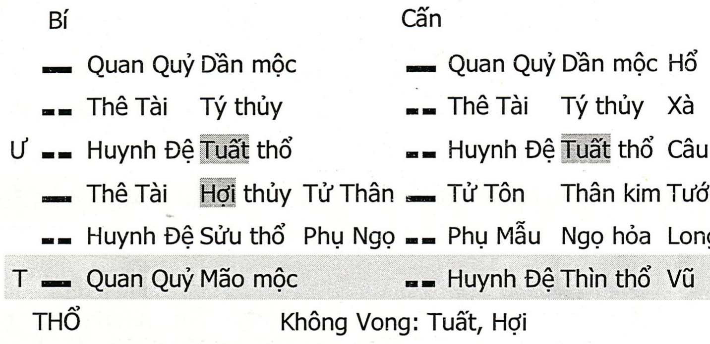

### Ví dụ 2: Ngày Mậu Tý tháng Thân năm Đinh Dậu, nam đoán tài vận, được Thiên Thủy Tụng biến Khảm Vi Thủy.

| | Tụng | Khảm | |
| :---: | :--- | :--- | :---: |
| | ━ Tử Tôn Tuất thổ | ⚋ Quan Quỷ Tý thủy | Tước |
| | ━ Thê Tài Thân kim | ━ Tử Tôn Tuất thổ | Long |
| T | ━ Huynh Đệ Ngọ hỏa | ⚋ Thê Tài Thân kim | Vũ |
| | ⚋ Huynh Đệ Ngọ hỏa | ⚋ Huynh Đệ Ngọ hỏa | Hổ |
| | ━ Tử Tôn Thìn thổ | ━ Tử Tôn Thìn thổ | Xà |
| Ư | ⚋ Phụ Mẫu Dần mộc | ⚋ Phụ Mẫu Dần mộc | Câu |

HỎA        Không Vong: Ngọ, Mùi

**Phán đoán:** Lấy Thê Tài làm Dụng thần. Thông thường lấy Thê Tài Thân kim trong quẻ làm Dụng thần, nhưng quẻ này Huynh Đệ Ngọ hỏa trì Thế động hóa Thê Tài Thân kim, đây là một tổ hợp đặc biệt. Kỵ thần trì Thế động hóa Dụng thần, chỉ cần Thê Tài vượng tướng thì có thể được tài. Thê Tài Thân kim được Nguyệt trợ giúp, Nhật không đến khắc là vượng tướng, vì vậy tài vận khá tốt.

Phán đoán ứng kỳ, thông thường lấy hào biến làm ứng kỳ. Có điều là bởi vì hào Thế Ngọ hỏa Không Vong không thể hóa ra, cho nên năm Nhâm Ngọ xuất Không mà hóa Tài, năm này tài vận cực kỳ tốt.

**Phản hồi:** Thực tế đúng là như vậy.

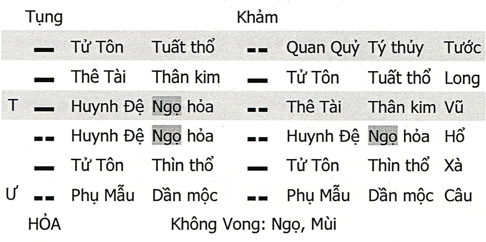

### Ví dụ 3: Ngày Tân Mão tháng Dậu năm Nhâm Ngọ, nam đoán tài vận em trai, được Lôi Địa Dự biến Cấn Vi Sơn.

| | Dự | Cấn | |
| :---: | :--- | :--- | :---: |
| | ⚋ Thê Tài Tuất thổ | ━ Huynh Đệ Dần mộc | Xà |
| | ⚋ Quan Quỷ Thân kim | ⚋ Phụ Mẫu Tý thủy | Câu |
| Ư | ━ Tử Tôn Ngọ hỏa | ⚋ Thê Tài Tuất thổ | Tước |
| | ⚋ Huynh Đệ Mão mộc | ━ Quan Quỷ Thân kim | Long |
| | ⚋ Tử Tôn Tị hỏa | ⚋ Tử Tôn Ngọ hỏa | Vũ |
| T | ⚋ Thê Tài Mùi thổ Phụ Tý | ⚋ Thê Tài Thìn thổ | Hổ |

MỘC        Không Vong: Ngọ, Mùi

**Phán đoán:** Lấy Thê Tài làm Dụng thần. Trong quẻ Thê Tài lưỡng hiện, lấy hào Thê Tài Tuất thổ phát động làm Dụng thần. Tử Tôn Ngọ hỏa là Thái Tuế năm nay nhập quẻ, Ngọ hỏa động hóa Thê Tài Tuất thổ, quẻ này mặc dù là đoán thay nhưng hào Thế cũng có thể thể hiện em trai anh ta (nếu là đoán cát hung của em trai thì không thể xem như vậy), Tử Tôn Ngọ hỏa là Nguyên thần hào Thế, Nguyên thần có thể thể hiện tư duy và suy nghĩ của người đó. Vì vậy, tổng hợp lại là năm nay muốn mở rộng phương pháp kiếm tiền.

Tuy nhiên, Dụng thần Thê Tài Nguyệt không trợ giúp, Nhật đến khắc hợp, trong quẻ có Huynh Đệ Mão mộc phát động đến khắc là hưu tù, Nhật hợp là cản trở, biểu thị công việc không tiến triển thuận lợi. Dụng thần tại hào 6 hóa hồi đầu khắc, hào 6 là hào vị thoái hưu, biểu thị rút vốn không làm nữa.

**Phản hồi:** Quả nhiên là năm nay đầu tư kinh doanh, bởi vì không có lãi cho nên đã rút vốn.

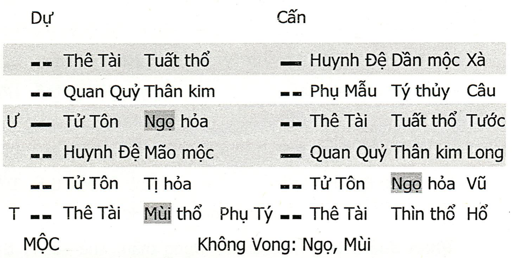

**Ví dụ 4:** Ngày Đinh Mão tháng Ngọ, nam đoán làm hợp đồng tương lai, được Phong Sơn Tiệm biến Phong Địa Quan.

| | Tiệm | Phục thần | | Quan | |
| :---: | :--- | :---: | :---: | :--- | :---: |
| Ứ | — Quan Quỷ Mão mộc | | — | Quan Quỷ Mão mộc | Long |
| | — Phụ Mẫu Tị hỏa | Tài Tý | — | Phụ Mẫu Tị hỏa | Vũ |
| | - - Huynh Đệ Mùi thổ | | - - | Huynh Đệ Mùi thổ | Hổ |
| T | — Tử Tôn Thân kim | | - - | Quan Quỷ Mão mộc | Xà |
| | - - Phụ Mẫu Ngọ hỏa | | - - | Phụ Mẫu Tị hỏa | Câu |
| | - - Huynh Đệ Thìn thổ | | - - | Huynh Đệ Mùi thổ | Tước |

THỔ Không Vong: Tuất, Hợi

**Phán đoán:** Lấy Thê Tài làm Dụng thần. Thê Tài Tý thủy không hiện trên quẻ, phục dưới hào 5 Phụ Mẫu Tị hỏa. Nguyệt đến xung phá, Nhật không trợ giúp là hưu tù. Hào Thế Tử Tôn Thân kim độc phát sinh Thê Tài Tý thủy, mặc dù hào độc phát gặp sinh được sinh nhưng hào Thế động mà hóa Quan Quỷ, Tử Tôn là vui vẻ, Quan Quỷ là ưu sầu, đây là tổ hợp biến hóa vui quá hóa buồn. Vì vậy không cát.

**Phản hồi:** Quả nhiên là làm hợp đồng tương lai đã thua lỗ.

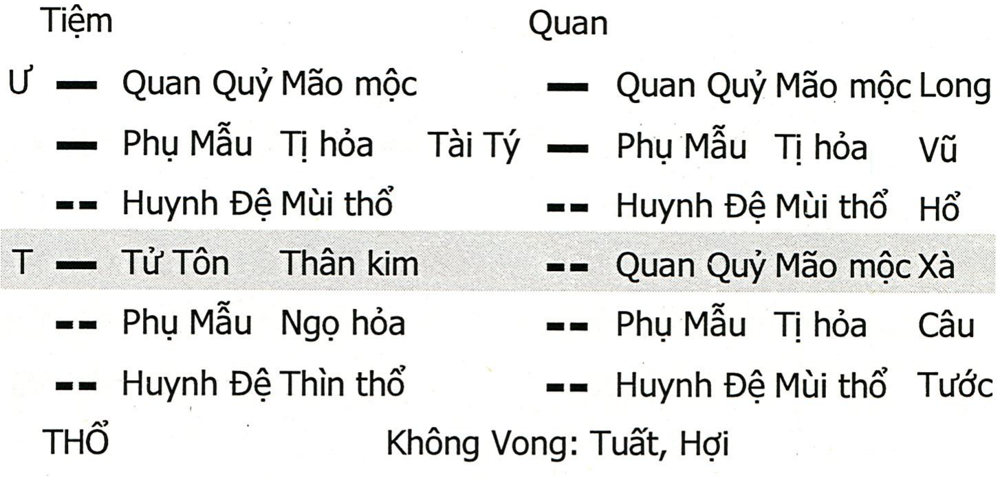

**Ví dụ 5:** Ngày Nhâm Tý tháng Sửu, nữ đoán về tình hình kinh doanh của cửa hàng, được Hỏa Thủy Vị Tế biến Lôi Phong Hằng.

| | Vị Tế | | Hằng | |
| :---: | :--- | :---: | :--- | :---: |
| Ứ | — Huynh Đệ Tị hỏa | - - | Tử Tôn Tuất thổ | Hổ |
| | - - Tử Tôn Mùi thổ | - - | Thê Tài Thân kim | Xà |
| | — Thê Tài Dậu kim | — | Huynh Đệ Ngọ hỏa | Câu |
| T | - - Huynh Đệ Ngọ hỏa | — | Thê Tài Dậu kim | Tước |
| | — Tử Tôn Thìn thổ | — | Quan Quỷ Hợi thủy | Long |
| | - - Phụ Mẫu Dần mộc | - - | Tử Tôn Sửu thổ | Vũ |

HỎA Không Vong: Dần, Mão

**Phán đoán:** Lấy Thê Tài làm Dụng thần. Thê Tài Dậu kim được Nguyệt sinh và Nhật không khắc vốn là cát, nhưng Nguyên thần Tử Tôn Nguyệt phá, Ứng lâm Huynh Đệ phát động đến khắc, biểu thị hiện nay buôn bán không thuận lợi. Tuy nhiên, Huynh Đệ trì Thế động hóa Thê Tài, tổ hợp này chỉ cần Tài vượng thì có thể được tài. Ngọ hỏa động hóa Thê Tài, đến tháng Ngọ sẽ có chuyển biến tốt.

**Phản hồi:** Quả nhiên là sau tết nguyên đán thì vắng khách, nhưng đến tháng Ngọ thì bắt đầu có chiều hướng tốt.

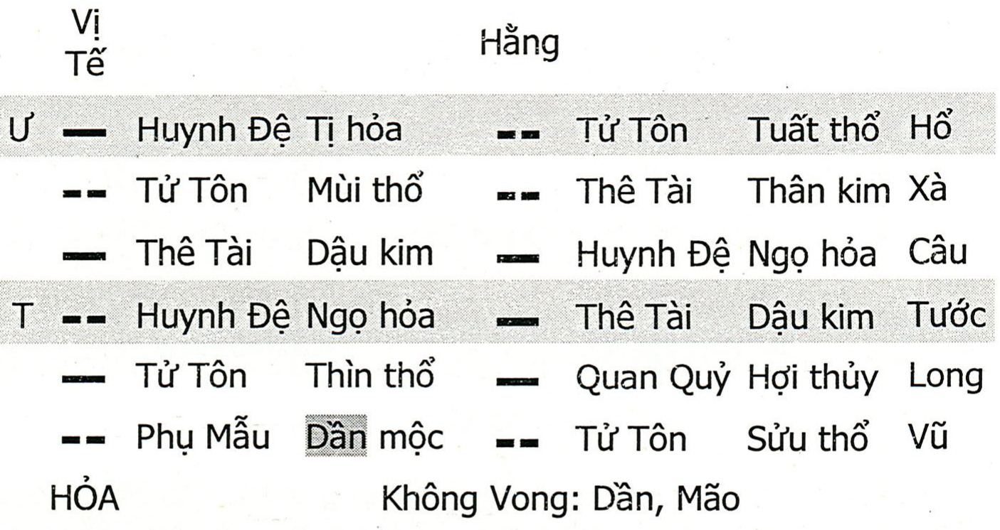

### Ví dụ 6: Ngày Bính Tý tháng Thìn, nam đoán thuê mặt tiền, được Phong Hỏa Gia Nhân biến Cấn Vi Sơn.

| Gia Nhân | Cấn |
| :--- | :--- |
| ━ Huynh Đệ Mão mộc | ━ Huynh Đệ Dần mộc Long |
| Ứ ━ Tử Tôn Tị hỏa | ⚋ Phụ Mẫu Tý thủy Vũ |
| ⚋ Thê Tài Mùi thổ | ⚋ Thê Tài Tuất thổ Hổ |
| ━ Phụ Mẫu Hợi thủy Quan Dậu | ━ Quan Quỷ Thân kim Xà |
| T ⚋ Thê Tài Sửu thổ | ⚋ Tử Tôn Ngọ hỏa Câu |
| ━ Huynh Đệ Mão mộc | ⚋ Thê Tài Thìn thổ Tước |

MỘC Không Vong: Thân, Dậu

**Phán đoán:** Lấy Phụ Mẫu làm Dụng thần. Phụ Mẫu Hợi thủy Nguyệt khắc và Nhật tỉ phù, suy vượng tương đương. Nhưng hào Ứng Tị hỏa phát động Tuyệt Dụng thần, chứng tỏ cửa hàng đó đã có người thuê.

Tuy nhiên, Nhật là Phụ Mẫu hợp hào Thế, đây lại là thông tin có thể nhận được cửa hàng này. Hào Thế Thê Tài Sửu thổ lâm hào 2, hào 2 là cửa hàng, Thê Tài là tiền thuê. Đây là thông tin bản thân bước vào cửa hàng, xem ra mình trả tiền thuê thì có thể vào trong cửa hàng để kinh doanh. Thông tin này nói rõ có người đã thuê cửa hàng nhưng chưa giao tiền thuê nhà, nếu mình giao trước thì sẽ nhận được cửa hàng. Ứng động hóa Phụ Mẫu, chắc là người kia cũng sẽ không làm khó, sẽ nhường lại cho mình.

Anh ta hỏi dò tình hình thực tế, quả nhiên là có người đã nói rằng muốn thuê cửa hàng, nhưng họ vẫn chưa giao tiền, thế là anh ta lập tức giao tiền mặt, chủ nhà liền cho anh ta thuê.

Tôi lại thấy hào sơ Huynh Đệ phát động hóa Tài, phán đoán là sau khi thuê được cửa hàng thì không kinh doanh một mình, mà là hợp tác kinh doanh.

**Phản hồi:** Quả nhiên là như vậy.

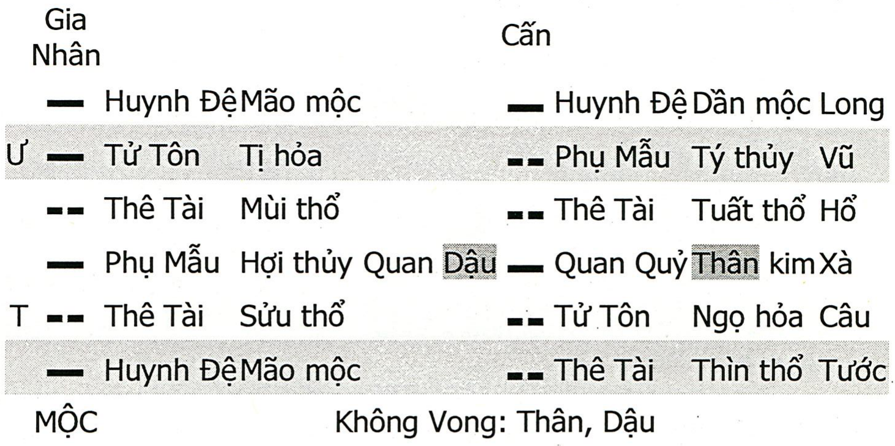

### Ví dụ 7: Ngày Ất Mão tháng Thân, nữ đoán con trai kinh doanh ra sao? Được Sơn Phong Cổ biến Lôi Thủy Giải.

| Cổ | Giải |
| :--- | :--- |
| Ứ ━ Huynh Đệ Dần mộc | ⚋ Thê Tài Tuất thổ Vũ |
| ⚋ Phụ Mẫu Tý thủy Tử Tị | ⚋ Quan Quỷ Thân kim Hổ |
| ⚋ Thê Tài Tuất thổ | ━ Tử Tôn Ngọ hỏa Xà |
| T ━ Quan Quỷ Dậu kim | ⚋ Tử Tôn Ngọ hỏa Câu |
| ━ Phụ Mẫu Hợi thủy | ━ Thê Tài Thìn thổ Tước |
| ⚋ Thê Tài Sửu thổ | ⚋ Huynh Đệ Dần mộc Long |

MỘC Không Vong: Tý, Sửu

**Phán đoán:** Lấy Thê Tài làm Dụng thần. Trong quẻ Thê Tài lưỡng hiện, lấy hào Thê Tài Tuất thổ phát động làm Dụng thần. Dụng thần không được Nhật Nguyệt trợ giúp, Nhật thần đến khắc không cát. Nhật hợp Thê Tài là hợp tác cầu tài.

Hào Ứng Huynh Đệ Dần mộc phát động hóa Thê Tài Tuất thổ, đây cũng là tổ hợp hợp tác cầu tài. Hào Ứng hóa ra, là đối phương muốn hợp tác với con trai cô ta. Dụng thần mới xem thì hóa hồi đầu sinh, có vẻ như có thể kiếm lợi, nhưng Ứng lâm Huyền Vũ đến khắc, Huyền Vũ chủ lừa gạt, đối phương là kẻ lừa đảo. Hào Thế lâm Câu Trần hóa Tử Tôn, Câu Trần chủ trung thực, Tử Tôn là lục thân sinh Tài, chứng tỏ con trai cô ấy là người an phận, kinh doanh chân chính.

**Phản hồi:** Trên thực tế, đúng là đối phương chủ động tìm con trai cô ấy để hợp tác buôn bán dầu. Đối phương cung cấp dầu và mở tài khoản thu tiền về, con trai cô ấy tiến hành bán ra, sau khi bán thì đối phương căn cứ vào tình hình tiêu thụ mà trích xuất lợi nhuận. Con trai cô ấy thấy rằng mình không cần chi tiền, vì vậy hoàn toàn không nghĩ rằng mình sẽ bị lừa gạt. Kết quả là đối phương nắm giữ toàn bộ số tiền kiếm được, không trả cho anh ta một đồng nào.

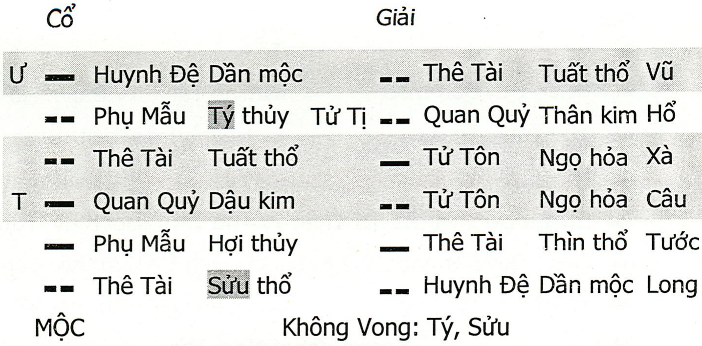

**Ví dụ 8:** Ngày Quý Tị tháng Tý, một người đàn ông biết diện tướng trông thấy khí sắc trên mặt của mình không tốt, đoán vận khí, được Sơn Thiên Đại Súc biến Thủy Hỏa Ký Tế.

| | Đại Súc | Ký Tế | |
| :---: | :--- | :--- | :---: |
| | — Quan Quỷ Dần mộc | - - Thê Tài Tý thủy | Hổ |
| Ứ | - - Thê Tài Tý thủy | — Huynh Đệ Tuất thổ | Xà |
| | - - Huynh Đệ Tuất thổ | - - Tử Tôn Thân kim | Câu |
| | — Huynh Đệ Thìn thổ Tử Thân | — Thê Tài Hợi thủy | Tước |
| T | — Quan Quỷ Dần mộc Phụ Ngọ | - - Huynh Đệ Sửu thổ | Long |
| | — Thê Tài Tý thủy | — Quan Quỷ Mão mộc | Vũ |

THỔ Không Vong: Ngọ, Mùi

**Phán đoán:** Trong quẻ Thê Tài Tý thủy động mà sinh hào Thế, được Nguyệt kiến trợ giúp là vượng tướng, đây vốn là thông tin được tài. Tuy nhiên, Thê Tài Tý thủy động hóa hồi đầu khắc biểu thị tiêu tiền, hào Thế lâm Quan Quỷ động hóa Huynh Đệ, đây là tổ hợp tiền rời khỏi tay. Vì vậy, phán đoán là gần đây có tiền vào, nhưng tiền cũng vội vã ra đi. Tài là thủy chủ số 1, tại hào 5 thì con số lớn một chút. Vì vậy là mười vạn tệ.

**Phản hồi:** Quả nhiên là mới vào được mười vạn tệ thì đã trả nợ cho ngân hàng.

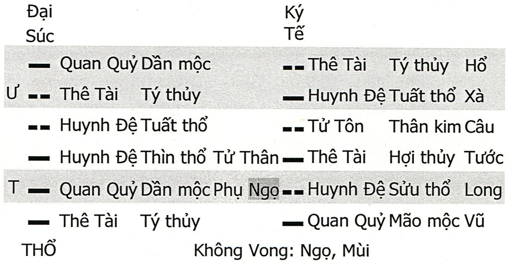

**Ví dụ 9:** Ngày Ất Tị tháng Tý, nam đoán đòi nợ có được không, được Sơn Thiên Đại Súc biến Sơn Hỏa Bí.

| | Đại Súc | Bí | |
| :---: | :--- | :--- | :---: |
| | — Quan Quỷ Dần mộc | — Quan Quỷ Dần mộc | Vũ |
| Ứ | - - Thê Tài Tý thủy | - - Thê Tài Tý thủy | Hổ |
| | - - Huynh Đệ Tuất thổ | - - Huynh Đệ Tuất thổ | Xà |
| | — Huynh Đệ Thìn thổ Tử Thân | — Thê Tài Hợi thủy | Câu |
| T | — Quan Quỷ Dần mộc Phụ Ngọ | - - Huynh Đệ Sửu thổ | Tước |
| | — Thê Tài Tý thủy | — Quan Quỷ Mão mộc | Long |

THỔ Không Vong: Dần, Mão

**Phán đoán:** Lấy Thê Tài làm Dụng thần. Trong quẻ Thê Tài lưỡng hiện, cả hai đều không phát động, địa chi giống nhau, lấy Thê Tài lâm hào Ứng làm Dụng thần. Thê Tài Tý thủy được Nguyệt trợ giúp là vượng tướng, Dụng thần sinh hào Thế, có thể lấy lại tiền. Nhưng hào Thế phát động hóa Huynh Đệ, tổ hợp này chính là không giữ được tiền trong tay. Vì vậy, phán đoán là anh ta vừa mới cầm tiền thì phải chi ra.

**Phản hồi:** Anh ta nói rằng mình là người bảo lãnh, đòi nợ thay người ta. Vừa thu được tiền thì lập tức trả cho chủ nợ.

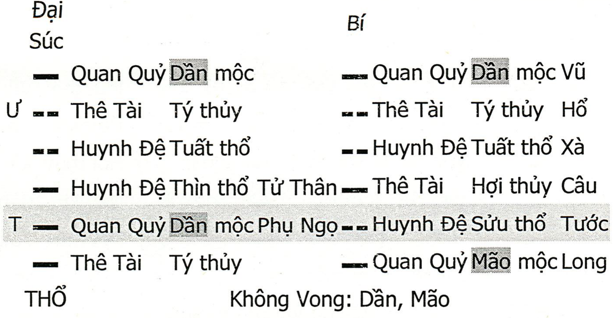

**Ví dụ 10:** Ngày Ất Mão tháng Tuất, nam đoán vay tiền, có thể vay được không? Được Thiên Thủy Tụng biến Trạch Phong Đại Quá.

| | Tụng | | | | Đại Quá | | | |
| :---: | :---: | :--- | :--- | :---: | :---: | :--- | :--- | :--- |
| | ━ | Tử Tôn | Tuất thổ | | ╍ ╍ | Tử Tôn | Mùi thổ | Vũ |
| | ━ | Thê Tài | Thân kim | | ━ | Thê Tài | Dậu kim | Hổ |
| T | ━ | Huynh Đệ | Ngọ hỏa | | ━ | Quan Quỷ | Hợi thủy | Xà |
| | ╍ ╍ | Huynh Đệ | Ngọ hỏa | | ━ | Thê Tài | Dậu kim | Câu |
| | ━ | Tử Tôn | Thìn thổ | | ━ | Quan Quỷ | Hợi thủy | Tước |
| Ư | ╍ ╍ | Phụ Mẫu | Dần mộc | | ╍ ╍ | Tử Tôn | Sửu thổ | Long |

HỎA                  Không Vong: Tý, Sửu

**Phán đoán:** Lấy Thê Tài làm Dụng thần. Thê Tài Thân kim được Nguyệt sinh là vượng tướng, trong quẻ Tử Tôn lâm Nguyệt phát động đến sinh, có thể vay được tiền. Hào 3 Huynh Đệ Ngọ hỏa phát động hóa Thê Tài, tổ hợp này vừa đúng là thông tin vay tiền. Nhưng mà Nguyên thần Tử Tôn hóa thoái, phải hợp trú mới được. Vì vậy, phán đoán là hôm đó không vay được, đến ngày Mão nhất định có thể vay được.

**Phản hồi:** Kết quả là tại ngày Đinh Mão vay được 1 vạn tệ.

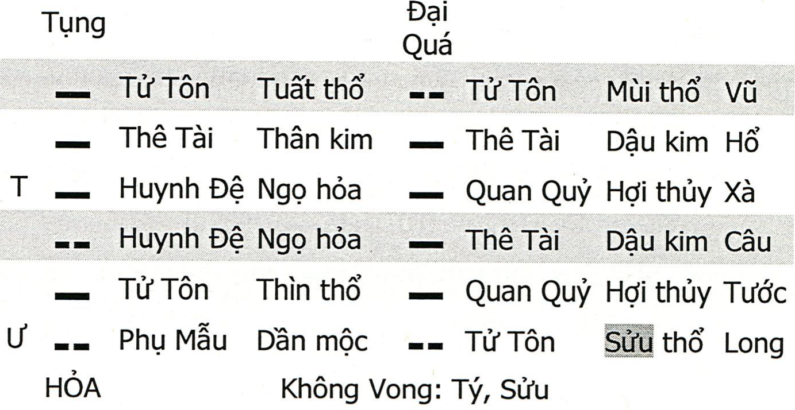

**Ví dụ 11:** Ngày Tân Sửu tháng Tý, nam đoán tài vận bản thân, được Thiên Địa Bĩ biến Phong Trạch Trung Phu.

| | Bĩ | | | | Trung Phu | | | |
| :---: | :---: | :--- | :--- | :---: | :---: | :--- | :--- | :--- |
| Ư | ━ | Phụ Mẫu | Tuất thổ | | ━ | Thê Tài | Mão mộc | Xà |
| | ━ | Huynh Đệ | Thân kim | | ━ | Quan Quỷ | Tị hỏa | Câu |
| | ━ | Quan Quỷ | Ngọ hỏa | | ╍ ╍ | Phụ Mẫu | Mùi thổ | Tước |
| T | ╍ ╍ | Thê Tài | Mão mộc | | ╍ ╍ | Phụ Mẫu | Sửu thổ | Long |
| | ╍ ╍ | Quan Quỷ | Tị hỏa | | ━ | Thê Tài | Mão mộc | Vũ |
| | ╍ ╍ | Phụ Mẫu | Mùi thổ Tử Tý | | ━ | Quan Quỷ | Tị hỏa | Hổ |

KIM                  Không Vong: Thìn, Tị

**Phán đoán:** Lấy Thê Tài làm Dụng thần. Thê Tài Mão mộc được Nguyệt sinh, vượng mà trì Thế, chắc chắn được tài. Hào 2 Quan Quỷ Tị hỏa lâm Huyền Vũ động hóa Thê Tài, Quan Quỷ là người trung gian, động hóa Tài chính là làm môi giới được tài, lâm Huyền Vũ, Huyền Vũ là bí mật, lén lút, là được tài từ bí mật giúp đỡ người khác.

**Phản hồi:** Quả nhiên là người này thay người ta đòi nợ cờ bạc và được trích phần trăm.

## 6. CÁCH LẤY DỤNG THẦN

Kể từ khi xuất hiện trong xã hội, tiền tệ đã trở thành một đối tượng được sùng bái và là mục tiêu theo đuổi của rất nhiều người. "Người chết vì tiền, chim chết vì mồi". Câu nói này cũng đã phác họa ra thái độ của người đời đối với tiền bạc.

Thông thường, người ta kiếm tiền là để sinh sống. Nhưng cũng có người lại coi việc kiếm tiền là công cụ để gửi gắm tinh thần và lý tưởng. Một số người lại lâm bệnh vì tiền bạc, họ không thể chấm dứt sự theo đuổi tiền bạc. Cho dù đã có tài sản hàng chục triệu, hàng trăm triệu tệ nhưng họ vẫn muốn có được nhiều hơn, một khi tiền không vào thì lại trở nên phiền muộn.

Bất kể là đi làm kiếm tiền lương, hay là tự mình kinh doanh, mở cửa hàng, mở công ty, tất cả đều là để tìm kiếm lợi ích. Do đó, trong dự đoán kinh tế thì Dụng thần cơ bản nhất chính là Thê

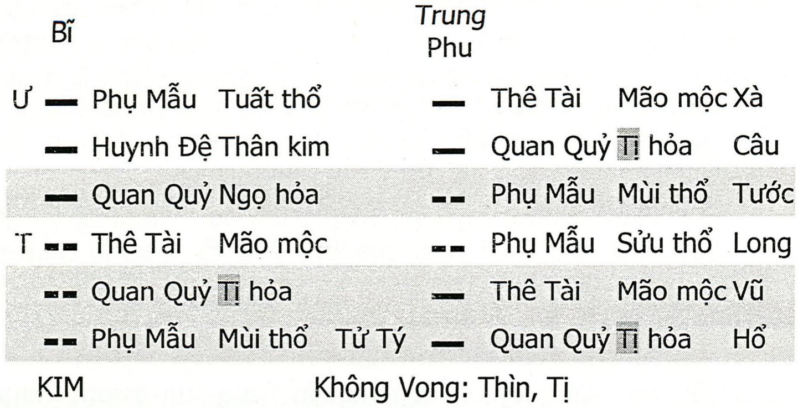

Tài. Tử Tôn là Nguyên thần, được gọi là tài nguyên (nguồn tiền) hay phúc thần, nó cũng là một lục thân không thể thiếu. Nền kinh tế và xã hội thì rất phức tạp, phương pháp sinh lợi thì có đủ loại đủ kiểu, do đó mà Dụng thần cũng có sự đa dạng hóa. Văn thư, hợp đồng, khế ước, chứng thư,... thì lấy Phụ Mẫu làm Dụng thần. Dự đoán tình trạng của người hợp tác thì lấy hào Ứng làm Dụng thần. Dự đoán về mua bán hay cho thuê đất đai, nhà cửa,... thì lấy Phụ Mẫu làm Dụng thần. Về phương pháp trích xuất Dụng thần cụ thể, chúng ta có thể tra cứu ở các chương mục.

Khi Thê Tài được lấy làm Dụng thần, nó có một số ý nghĩa chủ yếu như sau: Tiền bạc, của cải, tiền tệ, giá cả, mức giá chung, hàng hóa, người làm thuê, lợi ích, hiệu ích, lợi nhuận, sản phẩm, tài sản, tư sản, tư bản (vốn), quỹ, tiền lương, lực lượng,...

Khi Tử Tôn được lấy làm Dụng thần, nó có một số ý nghĩa chủ yếu như sau: Nguồn tiền, nguồn hàng, thị trường, khách hàng, nguồn tiêu thụ, tiềm lực, tiền vốn, dược phẩm, học viên, động vật, lượng tồn trữ, người kế thừa,...

Khi Quan Quỷ được lấy làm Dụng thần, nó có một số ý nghĩa chủ yếu như sau: Chính phủ, quản lý, quan chức, vấn đề, tai họa, bệnh tật, sự nghiệp, nhà cái, tập đoàn, cơ cấu, công tác, ngành nghề, người trung gian, kẻ xấu,...

Khi Phụ Mẫu được lấy làm Dụng thần, nó có một số ý nghĩa chủ yếu như sau: Đơn vị, công ty, văn thư, hiệp ước, khế ước, hợp đồng, văn bản phê duyệt, giấy chứng nhận, giấy phép, tin tức, sân bãi, địa điểm, cửa hàng, phòng ốc, bất động sản, công trình, dự án,...

Khi Huynh Đệ được lấy làm Dụng thần, nó có một số ý nghĩa chủ yếu như sau: Phá hao, trở lực, bạn bè, tổn hao, phá tài, đồng hành, cạnh tranh, tranh đấu, cộng sự, tốn kém, xuất vốn, tiêu tiền,...

### Ví dụ 1: Ngày Mậu Thìn tháng Tị, nam đoán đấu thầu sẽ ra sao? Được Phong Lôi Ích biến Thiên Sơn Độn.

| | Ích | | | Độn | |
| :---: | :---: | :--- | :---: | :--- | :---: |
| Ứ | — | Huynh Đệ Mão mộc | — | Thê Tài Tuất thổ | Tước |
| | — | Tử Tôn Tị hỏa | — | Quan Quỷ Thân kim | Long |
| | - - | Thê Tài Mùi thổ | — | Tử Tôn Ngọ hỏa | Vũ |
| T | - - | Thê Tài Thìn thổ | — | Quan Quỷ Thân kim | Hổ |
| | - - | Huynh Đệ Dần mộc | - - | Tử Tôn Ngọ hỏa | Xà |
| | — | Phụ Mẫu Tý thủy | - - | Thê Tài Thìn thổ | Câu |

MỘC          Không Vong: Tuất, Hợi

**Phán đoán:** Lấy Phụ Mẫu làm Dụng thần. Phụ Mẫu Tý thủy không được Nhật Nguyệt trợ giúp, trái lại bị Nhật khắc thương là hưu tù. Kỵ thần trì Thế được Nguyệt sinh Nhật phù, Thê Tài Mùi thổ được Nguyệt sinh Nhật phù, động hóa hồi đầu sinh, Dụng thần lại động hóa hồi đầu khắc, Kỵ thần quá vượng, vật cực tất phản, trái lại là cát. Tình huống này, Kỵ thần càng vượng càng tốt.

Căn cứ vào thông tin trong quẻ cùng với Nhật Nguyệt và hào biến, tôi phát hiện có 3 hỏa và 4 thổ là ngũ hành có lợi. Thế là tôi phán đoán anh ta có 7 ưu thế có thể bảo đảm trúng thầu.

**Phản hồi:** Quả nhiên là như vậy. Mặc dù bề ngoài là 8 công ty đấu thầu, nhưng 7 công ty còn lại đều giúp thầu cho anh ta. Nói cách khác, bất kỳ một công ty nào trúng thầu thì dự án cũng đều thuộc về anh ta.

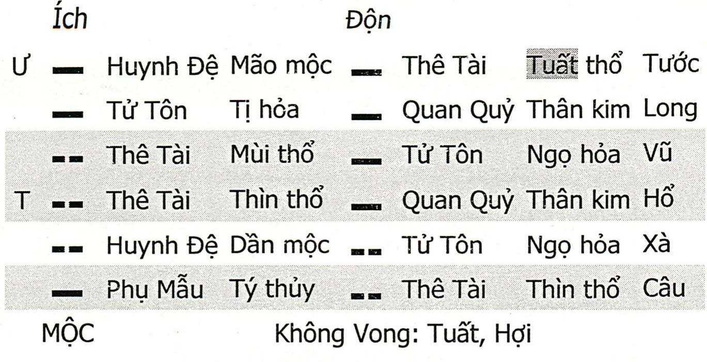

---

# Part 4 (Pages 61-80)

**Ví dụ 2:** Ngày Quý Sửu tháng Dậu, một người đoán tài vận bản thân, được Thiên Địa Bĩ biến Trạch Địa Tụy.

| | Bĩ | | Tụy | |
| :---: | :--- | :---: | :--- | :---: |
| Ứ | — Phụ Mẫu Tuất thổ | - - | Phụ Mẫu Mùi thổ | Hổ |
| | — Huynh Đệ Thân kim | — | Huynh Đệ Dậu kim | Xà |
| | — Quan Quỷ Ngọ hỏa | — | Tử Tôn Hợi thủy | Câu |
| T | - - Thê Tài Mão mộc | - - | Thê Tài Mão mộc | Tước |
| | - - Quan Quỷ Tị hỏa | - - | Quan Quỷ Tị hỏa | Long |
| | - - Phụ Mẫu Mùi thổ Tử Tý | - - | Phụ Mẫu Mùi thổ | Vũ |

KIM Không Vong: Dần, Mão

**Phán đoán:** Lấy Thê Tài làm Dụng thần. Thê Tài Mão mộc mặc dù trì Thế nhưng Tài Không Vong, bị Nguyệt xung phá, Nhật không trợ giúp, tài vận không thuận lợi.

Hào Tài Nguyệt phá, nhờ vào hào Ứng phát động đến hợp mà Hợp Phá. Ứng là người khác, lâm Phụ Mẫu chủ văn thư, Phụ Mẫu Tuất thổ Hợp Phá Thê Tài Mão mộc cũng có ý nghĩa là hợp đi Tài tinh. Vì vậy, đây chính là dựa vào cho vay thế chấp để sinh sống.

**Phản hồi:** Quả nhiên là như vậy.

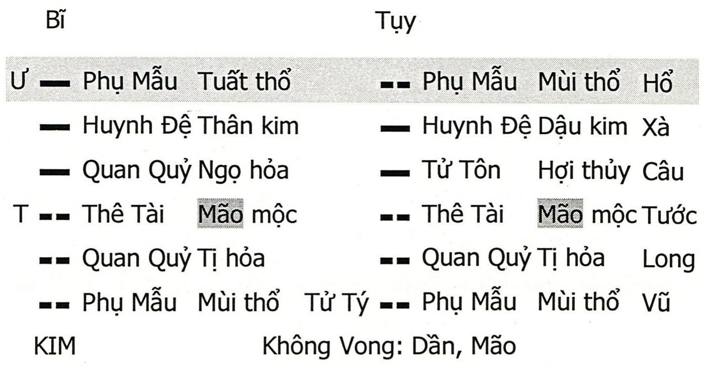

**Ví dụ 3:** Ngày Canh Tuất tháng Hợi, nữ có con trai bị tai nạn giao thông, đoán kết quả bồi thường, được Phong Lôi Ích biến Phong Hỏa Gia Nhân.

| | Ích | | Gia Nhân | |
| :---: | :--- | :---: | :--- | :---: |
| Ư | — Huynh Đệ Mão mộc | — | Huynh Đệ Mão mộc | Xà |
| | — Tử Tôn Tị hỏa | — | Tử Tôn Tị hỏa | Câu |
| | - - Thê Tài Mùi thổ | - - | Thê Tài Mùi thổ | Tước |
| T | - - Thê Tài Thìn thổ | — | Phụ Mẫu Hợi thủy | Long |
| | - - Huynh Đệ Dần mộc | - - | Thê Tài Sửu thổ | Vũ |
| | — Phụ Mẫu Tý thủy | — | Huynh Đệ Mão mộc | Hổ |

MỘC Không Vong: Dần, Mão

**Phán đoán:** Lấy Thê Tài làm Dụng thần. Trong quẻ Thê Tài lưỡng hiện, lấy hào Thê Tài Thìn thổ phát động làm Dụng thần.

Tử Tôn Tị hỏa tại hào 5 Nguyệt phá nhập Nhật Mộ, Tử Tôn là con cái, hào 5 là đường đi, Nguyệt phá là bị thương, nhập Mộ là nhập viện, đây chính là thông tin nhập viện vì tai nạn giao thông. Hào Ứng là người gây ra tai nạn. Ứng Không lâm Đằng Xà, Không là không thật tâm, Đằng Xà là xảo trá. Ứng Không không sinh hào Tử Tôn, đối phương không tích cực phối hợp xử lý sự cố.

Thê Tài Thìn thổ trì Thế hóa ra Nguyệt kiến là hóa vượng, lâm Thanh Long chủ vui vẻ, nhất định sau cùng sẽ có kết quả vừa ý, lấy được tiền bồi thường. Hôm nay xung hào Thế cho nên chưa thể được bồi thường ngay. Thê Tài Thìn thổ độc phát, ngày Thìn mới có thể được bồi thường. Ngoại quái số 5, nội quái số 4, cộng lại là số 9, vì vậy phán đoán là bồi thường 9000 tệ.

**Phản hồi:** Hôm đó được cảnh sát giao thông hòa giải nhưng đối phương chỉ đồng ý đưa ra 6000 tệ. Cô không hài lòng với khoản bồi thường này. Về sau ở ngày Bính Thìn giờ Thìn đạt được thỏa thuận bồi thường 9000 tệ.

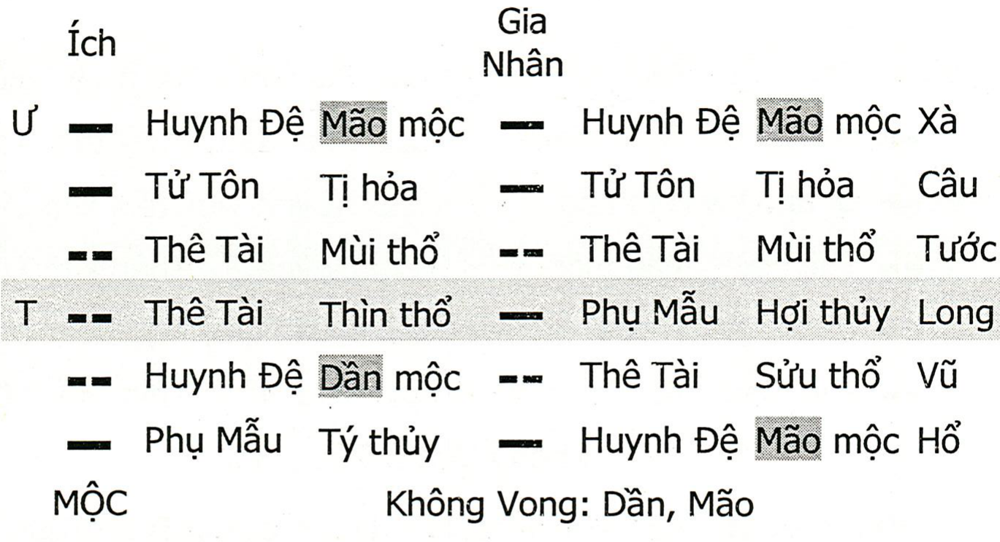

**Ví dụ 4:** Ngày Quý Dậu tháng Tý, nam đoán có thể làm được sổ đỏ hay không? Được Thiên Địa Bĩ biến Thủy Sơn Kiển.

| | Bĩ | | | Kiển | |
| :---: | :---: | :--- | :---: | :--- | :---: |
| Ư | ━ | Phụ Mẫu Tuất thổ | ⚋ | Tử Tôn Tý thủy | Hổ |
| | ━ | Huynh Đệ Thân kim | ━ | Phụ Mẫu Tuất thổ | Xà |
| | ━ | Quan Quỷ Ngọ hỏa | ⚋ | Huynh Đệ Thân kim | Câu |
| T | ⚋ | Thê Tài Mão mộc | ━ | Huynh Đệ Thân kim | Tước |
| | ⚋ | Quan Quỷ Tị hỏa | ⚋ | Quan Quỷ Ngọ hỏa | Long |
| | ⚋ | Phụ Mẫu Mùi thổ Tử Tý | ⚋ | Phụ Mẫu Thìn thổ | Vũ |

KIM Không Vong: Tuất, Hợi

**Phán đoán:** Lấy Phụ Mẫu làm Dụng thần. Trong quẻ Phụ Mẫu lưỡng hiện, lấy hào Phụ Mẫu Tuất thổ phát động làm Dụng thần. Dụng thần Phụ Mẫu không được Nhật Nguyệt trợ giúp nhưng cũng không bị khắc, động mà hóa ra Nguyệt kiến là hóa vượng. Quẻ này huyền diệu ở chỗ hào Thế động mà tương hợp với Dụng thần, hào Thế là mình, hợp chính là đạt được, vì vậy có thể làm được.

Trong quẻ hào Thế động hóa hồi đầu khắc, vô lực hợp trú Dụng thần, vì vậy cần đợi đến ngày Dần xung mất hào biến của hào Thế, đồng thời tam hợp hỏa cục sinh Dụng thần.

**Phản hồi:** Về sau làm được sổ đỏ tại ngày Giáp Dần.

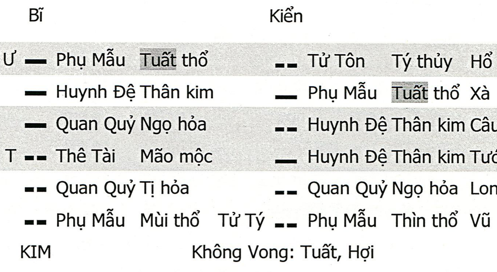

**Ví dụ 5:** Ngày Đinh Sửu tháng Dậu, một thương gia người Mỹ đoán đơn đặt hàng của mình tại hội triển lãm sẽ ra sao? Lợi nhuận bao nhiêu? Được Thủy Hỏa Ký Tế.

| | Ký Tế | | |
| :---: | :---: | :--- | :---: |
| Ư | ⚋ | Huynh Đệ Tý thủy | Long |
| | ━ | Quan Quỷ Tuất thổ | Vũ |
| | ⚋ | Phụ Mẫu Thân kim | Hổ |
| T | ━ | Huynh Đệ Hợi thủy Tài Ngọ | Xà |
| | ⚋ | Quan Quỷ Sửu thổ | Câu |
| | ━ | Tử Tôn Mão mộc | Tước |

THỦY Không Vong: Thân, Dậu

**Phán đoán:** Dự đoán đơn đặt hàng, lấy Phụ Mẫu làm Dụng thần, lợi nhuận thì xem Thê Tài. Phụ Mẫu Thân kim Không Vong, nhập Mộ ở Nhật, đoán là anh ta không có đơn đặt hàng. Lại gặp Tử Tôn Mão mộc Nguyệt phá, hào Tài Ngọ hỏa hưu tù không hiện trên quẻ, đoán là không có lợi nhuận.

Người đó phủ nhận phán đoán của tôi: "Tôi là một nhà phát triển phần mềm máy tính. Sản phẩm của công ty chúng tôi rất được hoan nghênh tại Mỹ, chưa hề có tình trạng không có đơn đặt hàng. Thông thường, sản phẩm vừa đến hội triển lãm thì rất đắt hàng, chẳng qua là có bao nhiêu đơn đặt hàng mà thôi, căn bản là không thể không có". Tại đó còn có vài người biết lục hào, họ đều cho rằng phán đoán của tôi không đúng.

Quẻ này nếu chỉ là hỏi có thể có bao nhiêu đơn đặt hàng, thì có thể phán đoán là có đơn đặt hàng, nhưng một quẻ hai câu hỏi, đồng thời hỏi đến lợi nhuận, cho nên cách đoán có sự khác biệt. Có đơn đặt hàng thì tất nhiên có lợi nhuận, không có lợi nhuận thì chứng tỏ không có đơn đặt hàng. Quẻ này hoàn toàn không có thông tin được tài. Phụ Mẫu Không Vong chứng tỏ không có đơn đặt hàng. Đây là phép loại suy trong dự đoán lục hào, rất ít người biết cách tư duy phán đoán như vậy. Nếu có đơn đặt hàng thì sẽ không xuất hiện thông tin vô tài. Vì vậy, quái tượng này chỉ dùng một tượng Không Vong để biểu thị.

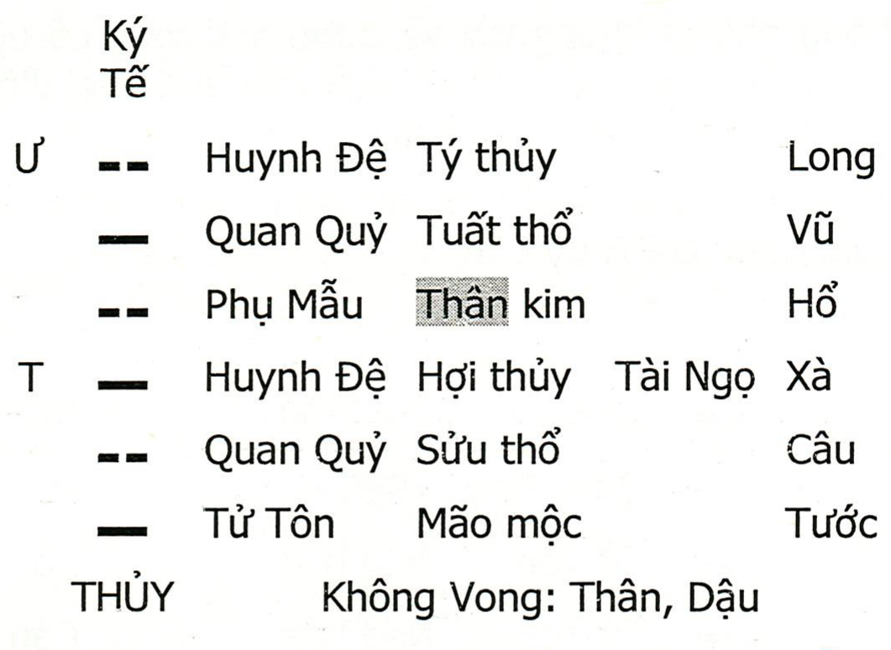

**Phản hồi:** Hôm đó, chúng tôi mải nói chuyện đến hơn 12 giờ đêm mới chia tay. Ngày hôm sau, người đó bay đến Thượng Hải, dự định từ Thượng Hải bay trở về Mỹ. Ai ngờ, tại Mỹ đã xảy ra sự kiện 11/9 chấn động thế giới, máy bay hủy chuyến, bản thân không những không trở về được mà ngay cả hội triển lãm cũng đã hủy bỏ vì sự kiện này. Thế là anh ta đã gọi điện thoại đến để cám ơn dự đoán chính xác của tôi.

**Ví dụ 6:** Ngày Ất Hợi tháng Dần, nam đoán về cửa hàng mình mua, được Lôi Thủy Giải.

### Giải

| | | | | |
| :---: | :---: | :--- | :--- | :--- |
| | - - | Thê Tài Tuất thổ | | Vũ |
| Ư | - - | Quan Quỷ Thân kim | | Hổ |
| | — | Tử Tôn Ngọ hỏa | | Xà |
| | - - | Tử Tôn Ngọ hỏa | | Câu |
| T | — | Thê Tài Thìn thổ | | Tước |
| | - - | Huynh Đệ Dần mộc | Phụ Tý | Long |

MỘC Không Vong: Thân, Dậu

**Phán đoán:** Lấy Thê Tài làm Dụng thần và kiêm xem hào Phụ Mẫu. Trong quẻ Thê Tài lưỡng hiện, lấy hào Thế Thê Tài Thìn thổ làm Dụng thần. Dụng thần không được Nhật Nguyệt trợ giúp, bị Nguyệt khắc thương, Huynh Đệ vượng tướng ở trong quẻ, có thể nói là không có lợi nhuận. Phụ Mẫu Tý thủy không hiện trên quẻ chứng tỏ vẫn chưa nắm được giấy chứng nhận quyền sở hữu cửa hàng. Hào Ứng là công ty bán cửa hàng cho mình. Ứng Không Phá không sinh hào Phụ Mẫu, đối phương không chịu cấp giấy chứng nhận.

**Phản hồi:** Quả nhiên là như vậy. Anh ta đã nộp tiền hơn 3 năm nhưng vẫn không lấy được giấy chứng nhận quyền sở hữu, cửa hàng cũng không thuộc về mình, không nhận được đồng tiền thuê nào.

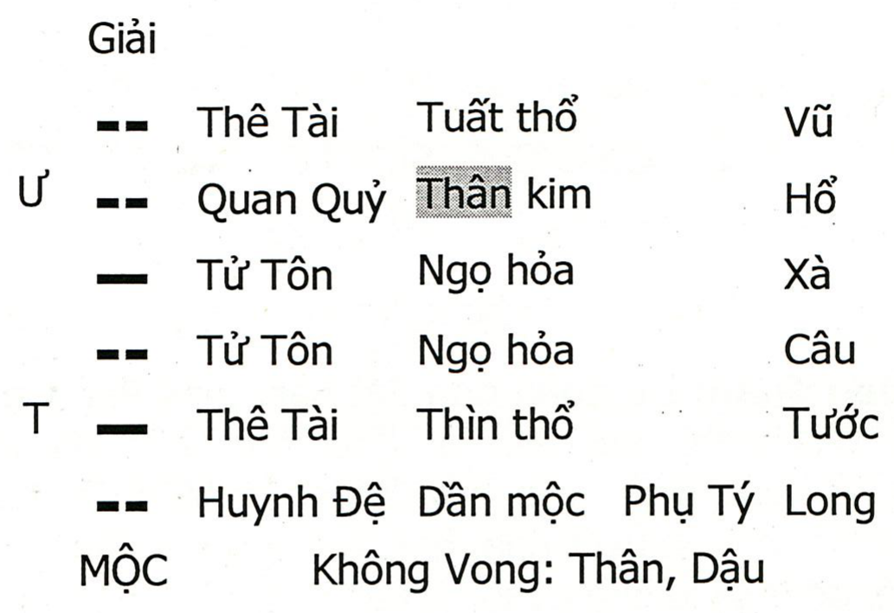

### Ví dụ 7: Ngày Đinh Mùi tháng Sửu, một người đoán đàm phán mua đất với người sở hữu sẽ ra sao? Được Thủy Sơn Kiển biến Thủy Phong Tỉnh.

| | Kiển | | | Tỉnh | |
| :---: | :---: | :--- | :---: | :--- | :--- |
| | - - | Tử Tôn Tý thủy | - - | Tử Tôn Tý thủy | Long |
| | — | Phụ Mẫu Tuất thổ | — | Phụ Mẫu Tuất thổ | Vũ |
| T | - - | Huynh Đệ Thân kim | - - | Huynh Đệ Thân kim | Hổ |
| | — | Huynh Đệ Thân kim | — | Huynh Đệ Dậu kim | Xà |
| | - - | Quan Quỷ Ngọ hỏa Tài Mão | — | Tử Tôn Hợi thủy | Câu |
| Ư | - - | Phụ Mẫu Thìn thổ | - - | Phụ Mẫu Sửu thổ | Tước |

KIM Không Vong: Dần, Mão

**Phán đoán:** Lấy Phụ Mẫu làm Dụng thần. Trong quẻ Phụ Mẫu lưỡng hiện, lấy hào Ứng Phụ Mẫu làm Dụng thần. Ứng là người nắm giữ mảnh đất. Dụng thần được Nhật Nguyệt trợ giúp sinh hào Thế là cát, Nguyên thần Ngọ hỏa độc phát đến sinh, nhất định có thể mua được mảnh đất. Nhưng mà động hóa hồi đầu khắc, phải đợi đến ngày Tị xung mất hào biến Hợi thủy mới được.

**Phản hồi:** Quả nhiên thoạt đầu thì đàm phán bất thành, đến ngày Tị thì đối phương chủ động đàm phán lại và thống nhất mua bán.

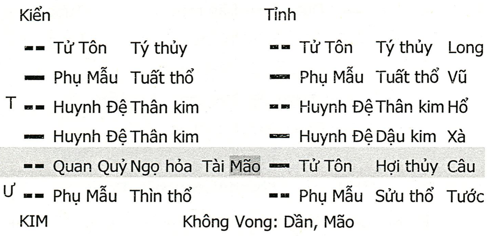

**Ví dụ 8:** Ngày Mậu Dần tháng Tuất, nữ đoán cho thuê hàng hóa, được Sơn Trạch Tổn.

| | Tổn | | | | |
| :---: | :---: | :--- | :--- | :--- | :--- |
| Ứ | — | Quan Quỷ | Dần mộc | | Tước |
| | - - | Thê Tài | Tý thủy | | Long |
| | - - | Huynh Đệ | Tuất thổ | | Vũ |
| T | - - | Huynh Đệ | Sửu thổ | Tử Thân | Hổ |
| | — | Quan Quỷ | Mão mộc | | Xà |
| | — | Phụ Mẫu | Tị hỏa | | Câu |

THỔ Không Vong: Thân, Dậu

**Phán đoán:** Hàng hóa lấy Thê Tài làm Dụng thần. Thê Tài Tý thủy Nguyệt khắc Nhật không sinh phù là hưu tù. Nguyên thần Tử Tôn Thân kim Không không hiện trên quẻ, biểu thị chẳng có ai đến thuê.

**Phản hồi:** Quả nhiên là như vậy.

**Ví dụ 9:** Ngày Kỷ Tị tháng Ngọ, nữ đoán tài vận công ty, được Thủy Sơn Kiển biến Tốn Vi Phong.

| | Kiển | | | | Tốn | | | |
| :---: | :---: | :--- | :--- | :--- | :---: | :--- | :--- | :--- |
| | - - | Tử Tôn | Tý thủy | | — | Thê Tài | Mão mộc | Câu |
| | — | Phụ Mẫu | Tuất thổ | | — | Quan Quỷ | Tị hỏa | Tước |
| T | - - | Huynh Đệ | Thân kim | | - - | Phụ Mẫu | Mùi thổ | Long |
| | — | Huynh Đệ | Thân kim | | — | Huynh Đệ | Dậu kim | Vũ |
| | - - | Quan Quỷ | Ngọ hỏa | Tài Mão | — | Tử Tôn | Hợi thủy | Hổ |
| Ứ | - - | Phụ Mẫu | Thìn thổ | | - - | Phụ Mẫu | Sửu thổ | Xà |

KIM Không Vong: Tuất, Hợi

**Phán đoán:** Lấy Thê Tài làm Dụng thần. Thê Tài Mão mộc không hiện trên quẻ, phục tàng dưới hào 2 Ngọ hỏa. Dụng thần không được Nhật Nguyệt trợ giúp, Phi thần là Tử địa Dụng thần, Nguyên thần Nguyệt phá hưu tù, vô lực sinh Dụng thần. Do đó, tài vận của công ty không thuận lợi.

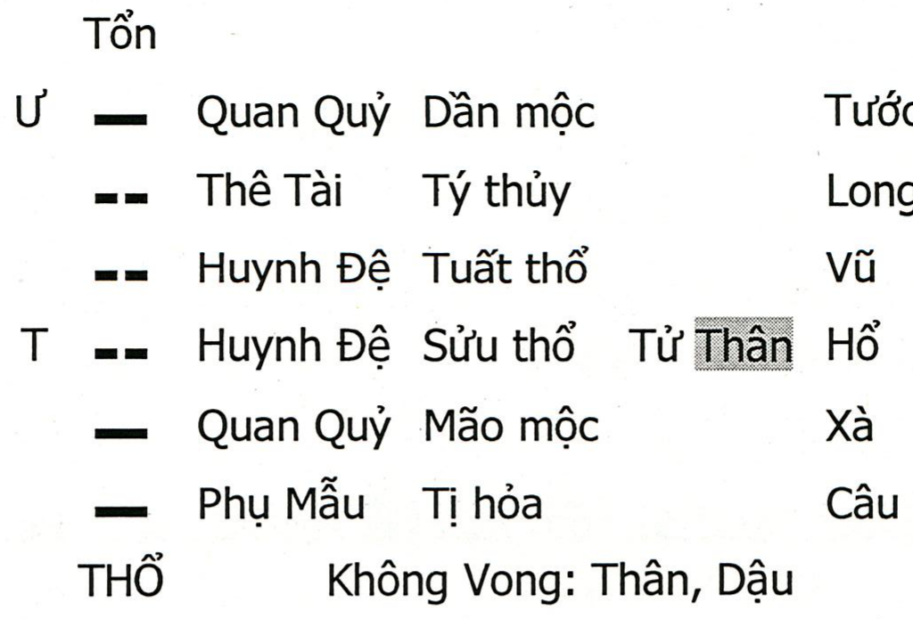

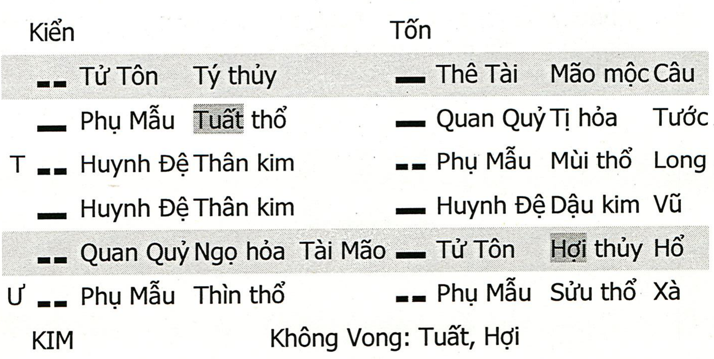

**Phản hồi:** Thực tế đúng là tài vận không thuận lợi, không thể duy trì.

## 7. DỤNG THẦN LƯỠNG HIỆN

Dụng thần lưỡng hiện, thông thường phải bỏ một và giữ một, chọn một trong hai làm Dụng thần. Tuy nhiên, đây chỉ là phương pháp phán đoán cực kỳ sơ đẳng. Trong ứng dụng thực tế, đôi khi phải dùng đến cả hai Dụng thần, mỗi Dụng thần đều có vai trò của nó.

Dụng thần lưỡng hiện đôi khi biểu thị tính đa dạng của sự vật được dự đoán, đôi khi biểu thị thông tin trước sau của sự vật. Có trường hợp, một Dụng thần biểu thị ứng kỳ, một Dụng thần biểu thị tính chất, nguyên nhân,... Đối với Nguyên thần và Kỵ thần lưỡng hiện, chúng ta có thể phỏng theo tình huống Dụng thần đa hiện để thủ tượng phân tích phán đoán.

**Ví dụ 1:** Ngày Đinh Hợi tháng Dậu, nữ đoán tình hình kinh doanh của tiệm mát xa chân, được Địa Phong Thăng biến Thủy Sơn Kiển.

| | Thăng | | | | Kiển | | | |
| :---: | :---: | :--- | :--- | :--- | :---: | :--- | :--- | :--- |
| | - - | Quan Quỷ | Dậu kim | | - - | Phụ Mẫu | Tý thủy | Long |
| | - - | Phụ Mẫu | Hợi thủy | | — | Thê Tài | Tuất thổ | Vũ |
| T | - - | Thê Tài | Sửu thổ | Tử Ngọ | - - | Quan Quỷ | Thân kim | Hổ |
| | — | Quan Quỷ | Dậu kim | | — | Quan Quỷ | Thân kim | Xà |
| | — | Phụ Mẫu | Hợi thủy | Huynh Dần | - - | Tử Tôn | Ngọ hỏa | Câu |
| Ứ | - - | Thê Tài | Sửu thổ | | - - | Thê Tài | Thìn thổ | Tước |

MỘC Không Vong: Ngọ, Mùi

**Phán đoán:** Lấy Thê Tài làm Dụng thần. Trong quẻ Thê Tài Sửu thổ lưỡng hiện đều không phát động, một lâm hào Thế, một lâm hào Ứng, đều có thể kiêm xem cả hai. Phụ Mẫu Hợi thủy lưỡng hiện, Phụ Mẫu là cửa hàng, cô ấy đang mở hai cửa hàng.

Quẻ Địa Phong Thăng, Thế Ứng tỷ hòa, có tượng tranh chấp, có dấu hiệu người cùng nghề cạnh tranh với mình. Thê Tài không được Nhật Nguyệt trợ giúp, Nguyên thần Ngọ hỏa Không Vong bị

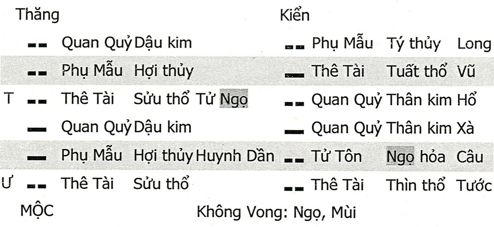

Nhật khắc, hào động khắc, không có lực sinh Dụng thần, vì vậy kinh doanh không thuận lợi.

**Phản hồi:** Quả nhiên là đang mở hai cửa hàng, quá nhiều người cùng nghề cho nên tiệm vắng khách, tiệm của học trò được cô ấy đào tạo thì khách hàng đầy cửa, còn tiệm của cô ấy thì chẳng có ai vào.

**Ví dụ 2:** Ngày Kỷ Hợi tháng Tuất, nữ đoán cuối năm làm ăn thế nào? Được Chấn Vi Lôi.

### Chấn

| | | | | |
| :---: | :---: | :--- | :--- | :--- |
| T | - - | Thê Tài | Tuất thổ | Câu |
| | - - | Quan Quỷ | Thân kim | Tước |
| | — | Tử Tôn | Ngọ hỏa | Long |
| Ư | - - | Thê Tài | Thìn thổ | Vũ |
| | - - | Huynh Đệ | Dần mộc | Hổ |
| | — | Phụ Mẫu | Tý thủy | Xà |

MỘC Không Vong: Thìn, Tị

**Phán đoán:** Lấy Thê Tài làm Dụng thần. Trong quẻ Thê Tài lưỡng hiện, lấy hào Thê Tài Thìn thổ Không Vong Nguyệt phá làm Dụng thần. Dụng thần không được Nhật Nguyệt trợ giúp, bị Nguyệt xung phá, lại lâm Không Vong, tài vận không tốt đẹp, kinh doanh khó khăn.

Trên thực tế, đã bốn tháng kinh doanh vắng vẻ, cô ấy yêu cầu hóa giải.

Dụng thần bị Nguyệt Tuất thổ xung phá, nếu dùng Mão mộc hợp trú Tuất thổ thì có thể giảm thiểu lực xung Thìn thổ. Mão mộc thể hiện con thỏ, có thể dùng tấm hình con thỏ để hóa giải. Nguyệt kiến nhập quẻ lâm hào 6, hào 6 là tường, Tuất thổ tương ứng với Tây Bắc. Do đó, tôi bảo cô ấy treo một tấm hình con thỏ lên tường ở Tây Bắc. Hào 3 Thìn thổ Không Phá, cần Thực Không Thực Phá, Thìn thổ tương ứng với con rồng, màu đỏ tương ứng với hỏa, Thìn thổ tương ứng với Đông Nam. Do đó, tôi lại bảo cô ấy đặt một con rồng màu đỏ tại vị trí Đông Nam.

**Phản hồi:** Sau khi đặt vật hóa giải thì cô ấy đột nhiên muốn thay đổi vị trí của quầy hàng, vừa mới di chuyển xong thì có rất nhiều khách đến, doanh số của một ngày cao hơn một tuần lễ trước đây. Tại tháng Hợi, cô ấy bắt đầu có lợi nhuận.

**Ví dụ 3:** Ngày Đinh Hợi tháng Ngọ, một người đoán tình hình mua đất, được Phong Sơn Tiệm.

### Tiệm

| | | | | | |
| :---: | :---: | :--- | :--- | :--- | :--- |
| Ư | — | Quan Quỷ | Mão mộc | | Long |
| | — | Phụ Mẫu | Tị hỏa | Tài Tý | Vũ |
| | - - | Huynh Đệ | Mùi thổ | | Hổ |
| T | — | Tử Tôn | Thân kim | | Xà |
| | - - | Phụ Mẫu | Ngọ hỏa | | Câu |
| | - - | Huynh Đệ | Thìn thổ | | Tước |

THỔ Không Vong: Ngọ, Mùi

**Phán đoán:** Lấy Phụ Mẫu làm Dụng thần. Trong quẻ Phụ Mẫu lưỡng hiện, đáng lẽ phải lấy Phụ Mẫu Ngọ hỏa Không Vong làm Dụng thần, nhưng Phụ Mẫu Tị hỏa bị Nhật xung ám động cho nên kiêm làm Dụng thần.

Dự đoán về một mảnh đất nhưng Phụ Mẫu lại lưỡng hiện, chứng tỏ là một mảnh bị chia cắt thành hai mảnh. Phụ Mẫu Ngọ hỏa hợp Huynh Đệ Mùi thổ, Huynh Đệ Mùi thổ lâm Bạch Hổ, Bạch Hổ chủ đường đi, chứng tỏ mảnh đất và đường đi kề nhau. Phụ Mẫu Tị hỏa tại hào 5, hào 5 là đường đi, cũng là biểu thị mảnh đất gần đường đi, mà Phụ Mẫu ám động hợp Tử Tôn Thân kim, Tử Tôn lại là đường đi, cũng biểu thị mảnh đất gần đường đi. Phụ Mẫu Ngọ hỏa Không Vong, biểu thị đất đã mất một mảnh. Tổng hợp phân tích, hẳn là ban đầu là một mảnh đất, sau đó đã bị đường cái chia làm hai.

**Phản hồi:** Quả nhiên đúng như phán đoán.

**Ví dụ 4:** Ngày Ất Dậu tháng Tý, một người đàn ông bị bạn bè nhiều năm chiếm đoạt rất nhiều đồ châu báu, hỏi có thể lấy lại hay không? Được Phong Lôi Ích biến Sơn Hỏa Bí.

| | Ích | Bí | |
| :---: | :--- | :--- | :---: |
| Ư | — Huynh Đệ Mão mộc | — Huynh Đệ Dần mộc | Vũ |
| | — Tử Tôn Tị hỏa | - - Phụ Mẫu Tý thủy | Hổ |
| | - - Thê Tài Mùi thổ | - - Thê Tài Tuất thổ | Xà |
| T | - - Thê Tài Thìn thổ | — Phụ Mẫu Hợi thủy | Câu |
| | - - Huynh Đệ Dần mộc | - - Thê Tài Sửu thổ | Tước |
| | — Phụ Mẫu Tý thủy | — Huynh Đệ Mão mộc | Long |

MỘC Không Vong: Ngọ, Mùi

**Phán đoán:** Lấy Thê Tài làm Dụng thần. Trong quẻ Thê Tài lưỡng hiện, thông thường lấy hào Thê Tài Thìn thổ phát động làm Dụng thần. Nhưng một Dụng thần khác là Mùi thổ Không Vong, hào này cũng có thể dùng để tham khảo. Dụng thần không được Nhật Nguyệt trợ giúp, Nhật hợp là cản trở, biểu thị không dễ lấy lại. Thê Tài lưỡng hiện biểu thị đã bị lấy hai nhóm châu báu.

Nguyên thần Tị hỏa Nguyệt khắc Nhật không trợ giúp, động hóa hồi đầu khắc, vô lực sinh Dụng thần, châu báu rất khó lấy lại. Huynh Đệ là bạn bè, lâm hào Ứng ở hào 6 ám động, Ứng là tha hương, hào 6 là nước ngoài, người đó đã trốn ra nước ngoài.

**Phản hồi:** Quả nhiên là đã trốn ra nước ngoài.

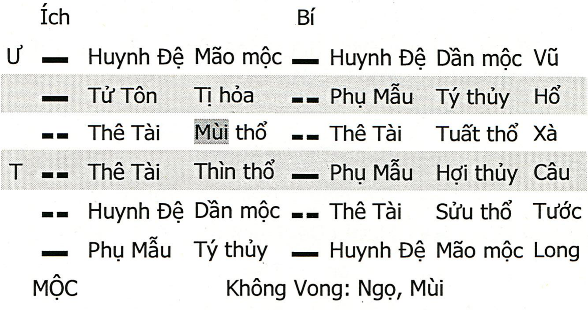

**Ví dụ 5:** Ngày Quý Dậu tháng Mão, nam đoán tình hình kinh doanh nhà hàng, được Sơn Địa Bác biến Địa Sơn Khiêm.

| | Bác | Khiêm | |
| :---: | :--- | :--- | :---: |
| | — Thê Tài Dần mộc | - - Huynh Đệ Dậu kim | Hổ |
| T | - - Tử Tôn Tý thủy | - - Tử Tôn Hợi thủy | Xà |
| | - - Phụ Mẫu Tuất thổ | - - Phụ Mẫu Sửu thổ | Câu |
| | - - Thê Tài Mão mộc | — Huynh Đệ Thân kim | Tước |
| Ư | - - Quan Quỷ Tị hỏa | - - Quan Quỷ Ngọ hỏa | Long |
| | - - Phụ Mẫu Mùi thổ | - - Phụ Mẫu Thìn thổ | Vũ |

KIM Không Vong: Tuất, Hợi

**Phán đoán:** Lấy Thê Tài làm Dụng thần. Trong quẻ Thê Tài lưỡng hiện, đều phát động, thông thường lấy Tài Mão mộc lâm Nguyệt kiến làm Dụng thần, nhưng hào kia đã là hào động, hào động là mấu chốt biểu thị thông tin, vì vậy cũng phải làm Dụng thần.

Hào 3 Thê Tài Mão mộc được Nguyệt trợ giúp, Nhật đến khắc, lại hóa hồi đầu khắc thì không tốt. Thê Tài Dần mộc có vẻ như là có thể trợ giúp Mão mộc, nhưng cũng là hóa hồi đầu khắc, không có lực trợ giúp, vì vậy nhà hàng kinh doanh không thuận lợi.

Hào 2 là cửa hàng, lâm Thanh Long, Thanh Long là ẩm thực chính là nhà hàng. Hào 2 lâm hào Ứng, Ứng là người khác, chứng tỏ nơi này lúc đầu chính là nhà hàng, người khác đã từng kinh doanh ở đây.

**Phản hồi:** Quả nhiên là như vậy. Đến tháng Tị, nhà hàng không thể duy trì cho nên đã đóng cửa.

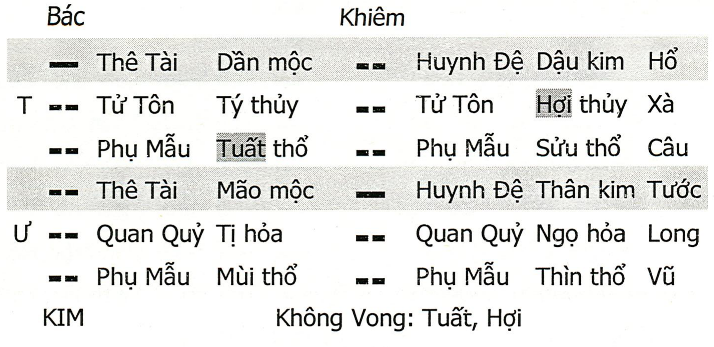

### Ví dụ 6: Ngày Kỷ Hợi tháng Hợi, nam đoán về tình hình nhận công trình, được Hỏa Địa Tấn biến Thiên Lôi Vô Vọng.

| Thế/Ứng | Tấn | Phục thần | Vô Vọng | Lục thú |
| :---: | :--- | :---: | :--- | :--- |
| | — Quan Quỷ Tị hỏa | | — Phụ Mẫu Tuất thổ | Câu |
| | -- Phụ Mẫu Mùi thổ | | — Huynh Đệ Thân kim | Tước |
| T | — Huynh Đệ Dậu kim | | — Quan Quỷ Ngọ hỏa | Long |
| | -- Thê Tài Mão mộc | | -- Phụ Mẫu Thìn thổ | Vũ |
| | -- Quan Quỷ Tị hỏa | | -- Thê Tài Dần mộc | Hổ |
| Ư | -- Phụ Mẫu Mùi thổ | Tử Tý | — Tử Tôn Tý thủy | Xà |

KIM Không Vong: Thìn, Tị

**Phán đoán:** Lấy Phụ Mẫu làm Dụng thần. Trong quẻ Phụ Mẫu lưỡng hiện lại đều phát động, cả hai đều có thể làm Dụng thần. Dụng thần mặc dù không được Nhật Nguyệt trợ giúp nhưng cũng không bị khắc, Dụng thần động mà sinh Thế, có thể nhận được công trình. Hai nơi Dụng thần sinh Thế, tổng cộng được hai công trình.

**Phản hồi:** Quả nhiên được hai công trình.

### Ví dụ 7: Ngày Kỷ Tị tháng Ngọ, nam hợp tác mở công ty với bạn bè, đoán tài vận công ty, được Trạch Thiên Quải biến Càn Vi Thiên.

| Thế/Ứng | Quải | Phục thần | Càn | Lục thú |
| :---: | :--- | :---: | :--- | :--- |
| | -- Huynh Đệ Mùi thổ | | — Huynh Đệ Tuất thổ | Câu |
| T | — Tử Tôn Dậu kim | | — Tử Tôn Thân kim | Tước |
| | — Thê Tài Hợi thủy | | — Phụ Mẫu Ngọ hỏa | Long |
| | — Huynh Đệ Thìn thổ | | — Huynh Đệ Thìn thổ | Vũ |
| Ư | — Quan Quỷ Dần mộc | Phụ Tị | — Quan Quỷ Dần mộc | Hổ |
| | — Thê Tài Tý thủy | | — Thê Tài Tý thủy | Xà |

THỔ Không Vong: Tuất, Hợi

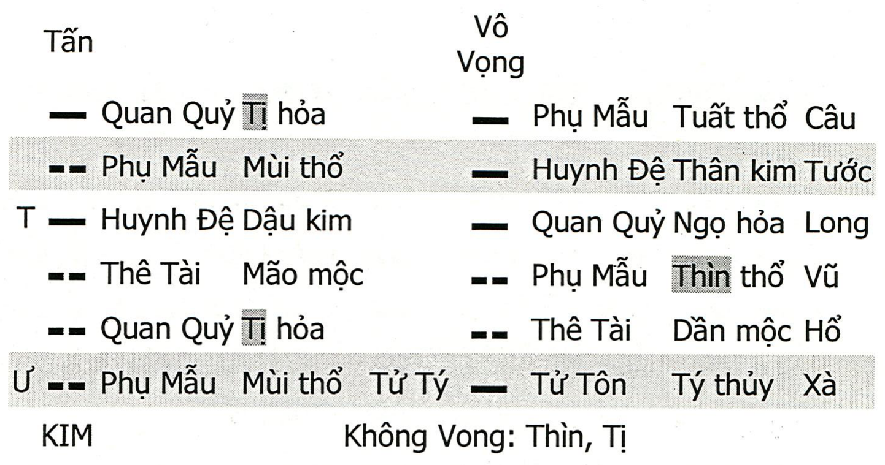

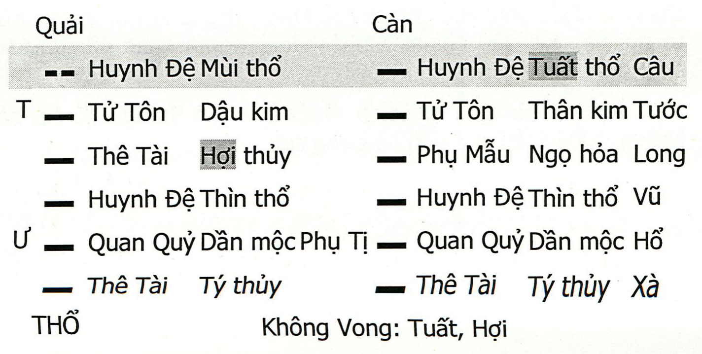

**Phán đoán:** Lấy Thê Tài làm Dụng thần. Trong quẻ Thê Tài lưỡng hiện, một Không một Phá, cả hai đều có thể làm Dụng thần. Dụng thần không được Nhật Nguyệt trợ giúp, Thê Tài Tý thủy bị Nguyệt xung phá, Thê Tài Hợi thủy Không Vong, Huynh Đệ đến khắc Nhật xung là Nhật phá, chứng tỏ tài vận công ty rất kém.

Một Tài gần hào Thế, một Tài gần hào Ứng, hào Thế là mình, hào Ứng là người hợp tác, Tài gần hào Thế là tài vận của mình, Tài gần hào Ứng biểu thị tài vận của người hợp tác, xem ra tài vận của hai người đều không thuận lợi, ảnh hưởng đến tài vận của công ty.

**Phản hồi:** Quả nhiên tài vận của công ty không thuận lợi.

### Ví dụ 8: Ngày Canh Thân tháng Dậu, nữ đoán về công trình của chồng, được Sơn Lôi Di biến Sơn Hỏa Bí.

| Thế/Ứng | Di | Phục thần | Bí | Lục thú |
| :---: | :--- | :---: | :--- | :--- |
| | — Huynh Đệ Dần mộc | | — Huynh Đệ Dần mộc | Xà |
| | -- Phụ Mẫu Tý thủy | Tử Tị | -- Phụ Mẫu Tý thủy | Câu |
| T | -- Thê Tài Tuất thổ | | -- Thê Tài Tuất thổ | Tước |
| | -- Thê Tài Thìn thổ | Quan Dậu | — Phụ Mẫu Hợi thủy | Long |
| | -- Huynh Đệ Dần mộc | | -- Thê Tài Sửu thổ | Vũ |
| Ư | — Phụ Mẫu Tý thủy | | — Huynh Đệ Mão mộc | Hổ |

MỘC Không Vong: Tý, Sửu

**Phán đoán:** Lấy Phụ Mẫu làm Dụng thần. Trong quẻ Phụ Mẫu Tý thủy lưỡng hiện, tôi đoán là công trình được chia thành hai phần. Hào sơ Phụ Mẫu Tý thủy là công trình cơ sở (nền móng), bởi vì hào sơ là cơ sở, hào 5 Phụ Mẫu Tý thủy là công trình chủ thể, bởi vì hào 5 là tôn vị, chủ thể.

Thê Tài Thìn thổ động hóa Phụ Mẫu, biểu thị đã bỏ vốn và đang bắt đầu làm việc.

**Phản hồi:** Quả nhiên phán đoán phù hợp với tình hình thực tế.

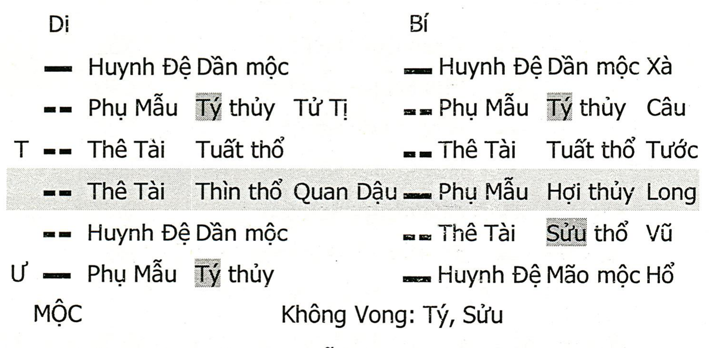

## 8. DỤNG THẦN PHỤC TÀNG

Khi Dụng thần không hiện trên quẻ thì cần phải xem Dụng thần phục tàng ở đâu. Dụng thần phục tàng liên quan đến cát hung, ứng kỳ, nguyên nhân, chi tiết,... Khi phán đoán, chúng ta cần phải kết hợp quan hệ sinh khắc của Phục thần và Phi thần với 12 trạng thái trường sinh, ý nghĩa lục thân, Không Vong, Nguyệt phá,... để phán đoán. Phục tàng vượng tướng là cát, hưu tù là hung, đây là quy tắc cơ bản, rất mừng được hào độc phát đến xung xuất, cũng mừng được Nhật Nguyệt xung khai Phi thần và Phi thần Không Vong.

**Ví dụ 1:** Ngày Tân Mùi tháng Mùi năm Canh Thìn, nam đoán tài vận năm nay, được Trạch Hỏa Cách.

| | Cách | | | |
| :---: | :---: | :--- | :--- | :--- |
| | - - | Quan Quỷ Mùi thổ | | Xà |
| | — | Phụ Mẫu Dậu kim | | Câu |
| T | — | Huynh Đệ Hợi thủy | | Tước |
| | — | Huynh Đệ Hợi thủy | Tài Ngọ | Long |
| | - - | Quan Quỷ Sửu thổ | | Vũ |
| Ư | — | Tử Tôn Mão mộc | | Hổ |

THỦY Không Vong: Tuất, Hợi

**Phán đoán:** Lấy Thê Tài làm Dụng thần. Thê Tài Ngọ hỏa không hiện trên quẻ, mặc dù được Nguyệt hợp có khí, nhưng Nhật Nguyệt không sinh, bị Nhật thần hợp vướng chân, chứng tỏ vòng quay tiền bạc không linh hoạt. Tài không hiện trên quẻ, rất khó thấy tiền.

Huynh Đệ Hợi thủy trì Thế hưu tù Không Vong, Huynh Đệ chủ tốn kém, tiêu tiền, nhưng Không không có lực khắc Tài, muốn xài tiền nhưng không có tiền. Tử Tôn Mão mộc hưu tù, không được Nhật Nguyệt sinh phù, lại nhập Mộ ở Nhật Nguyệt, không thể sinh Tài, Tử Tôn là nguồn tiền, không có cách làm ra tiền.

**Phản hồi:** Trên thực tế là người này thất nghiệp, không có thu nhập, trong một năm chỉ được đơn vị cũ trợ cấp sinh hoạt 2000 tệ.

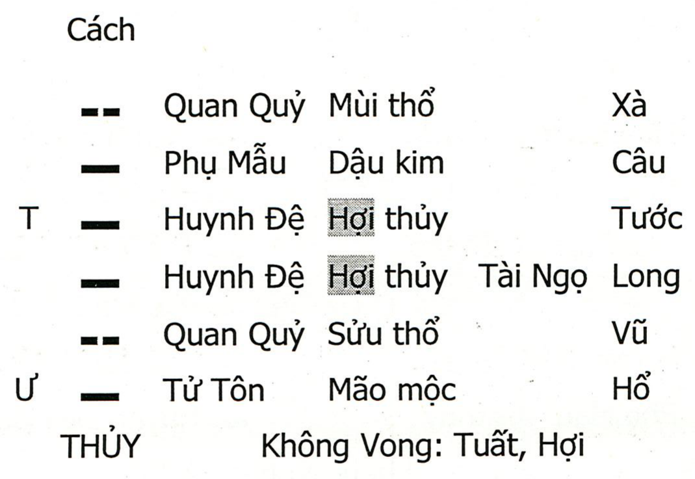

**Ví dụ 2:** Ngày Mậu Thìn tháng Tuất, nữ đoán tài vận, được Thủy Sơn Kiển biến Khảm Vi Thủy.

| | Kiển | | | Khảm | | |
| :---: | :---: | :--- | :--- | :---: | :--- | :--- |
| | - - | Tử Tôn Tý thủy | | - - | Tử Tôn Tý thủy | Tước |
| | — | Phụ Mẫu Tuất thổ | | — | Phụ Mẫu Tuất thổ | Long |
| T | - - | Huynh Đệ Thân kim | | - - | Huynh Đệ Thân kim | Vũ |
| | — | Huynh Đệ Thân kim | | - - | Quan Quỷ Ngọ hỏa | Hổ |
| | - - | Quan Quỷ Ngọ hỏa | Tài Mão | — | Phụ Mẫu Thìn thổ | Xà |
| Ư | - - | Phụ Mẫu Thìn thổ | | - - | Thê Tài Dần mộc | Câu |

KIM Không Vong: Tuất, Hợi

**Phán đoán:** Lấy Thê Tài làm Dụng thần. Thê Tài Mão mộc được Nguyệt hợp mà có khí, nhưng không thể coi là rất vượng. Tài không hiện trên quẻ, phục dưới Quan Quỷ Ngọ hỏa, tài có được nhất định có liên quan đến Quan Quỷ.

Thế lâm Huyền Vũ, gặp Ngọ hỏa là Mộc Dục, Huyền Vũ chủ ám muội, Mộc Dục là tình dục, trần trụi. Quan Quỷ thể hiện đàn ông, được tài là do có quan hệ với đàn ông. Trong quẻ Phụ Mẫu Tuất thổ lâm Thanh Long ám động, Thanh Long chủ thể diện, Tuất thổ vừa hợp hào Tài Mão mộc vừa khiến Quan Quỷ nhập Mộ, cuối cùng sinh đến hào Thế, tài có được có vẻ như hợp tình hợp lý.

**Phản hồi:** Trên thực tế, người nữ này kết hôn với đàn ông, sau hai năm thì ly hôn, nhờ vào phân chia tài sản ly hôn mà được tài. Lúc dự đoán, cô ta đã ly hôn với bốn người.

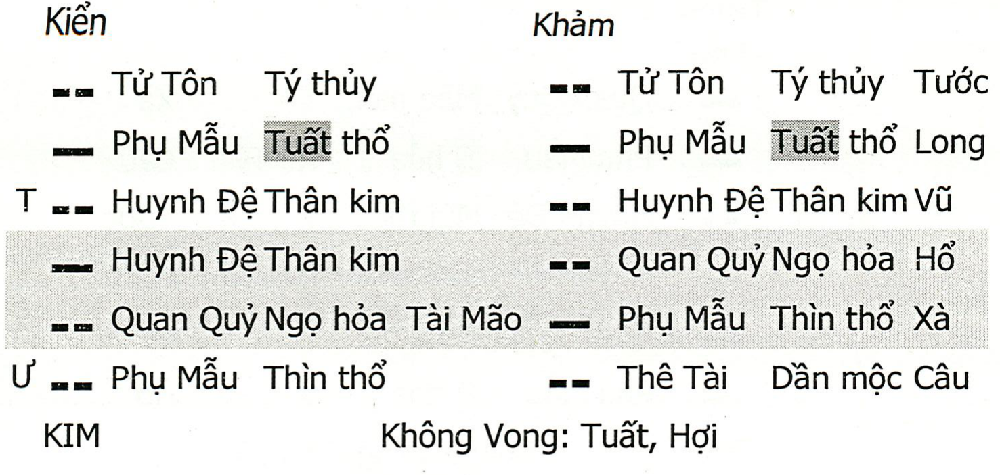

### Ví dụ 3: Ngày Canh Tý tháng Mão, nam đoán đối phương có chuyển tiền cho mình hay không? Được Phong Trạch Trung Phu.

| | Trung Phu | | |
| :---: | :--- | :---: | :---: |
| | — Quan Quỷ Mão mộc | | Xà |
| | — Phụ Mẫu Tị hỏa | Tài Tý | Câu |
| T | - - Huynh Đệ Mùi thổ | | Tước |
| | - - Huynh Đệ Sửu thổ | Tử Thân | Long |
| | — Quan Quỷ Mão mộc | | Vũ |
| Ư | — Phụ Mẫu Tị hỏa | | Hổ |

THỔ Không Vong: Thìn, Tị

**Phán đoán:** Lấy Thê Tài làm Dụng thần. Thê Tài Tý thủy không hiện trên quẻ, phục dưới hào 5 Phụ Mẫu Tị hỏa. Nguyệt không khắc Dụng thần, Nhật đến trợ giúp là vượng tướng. Cát hơn nữa là Phi thần Tị hỏa Không Vong không thể đè nén Dụng thần. Vì vậy, đối phương nhất định sẽ chuyển tiền đủ.

**Phản hồi:** Quả nhiên ngay hôm đó được chuyển tiền.

### Ví dụ 4: Ngày Quý Mùi tháng Ngọ, nam đoán thành lập công ty in và nhuộm, được Trạch Sơn Hàm biến Sơn Phong Cổ.

| | Hàm | | Cổ | |
| :---: | :--- | :---: | :--- | :---: |
| Ư | - - Phụ Mẫu Mùi thổ | | — Thê Tài Dần mộc | Hổ |
| | — Huynh Đệ Dậu kim | | - - Tử Tôn Tý thủy | Xà |
| | — Tử Tôn Hợi thủy | | - - Phụ Mẫu Tuất thổ | Câu |
| T | — Huynh Đệ Thân kim | | — Huynh Đệ Dậu kim | Tước |
| | - - Quan Quỷ Ngọ hỏa | Tài Mão | — Tử Tôn Hợi thủy | Long |
| | - - Phụ Mẫu Thìn thổ | | - - Phụ Mẫu Sửu thổ | Vũ |

KIM Không Vong: Thân, Dậu

**Phán đoán:** Mục đích là lợi nhuận, lấy Thê Tài làm Dụng thần. Thê Tài Mão mộc không hiện trên quẻ, phục tàng dưới hào 2 Quan Quỷ Ngọ hỏa. Dụng thần không được Nhật Nguyệt đến trợ

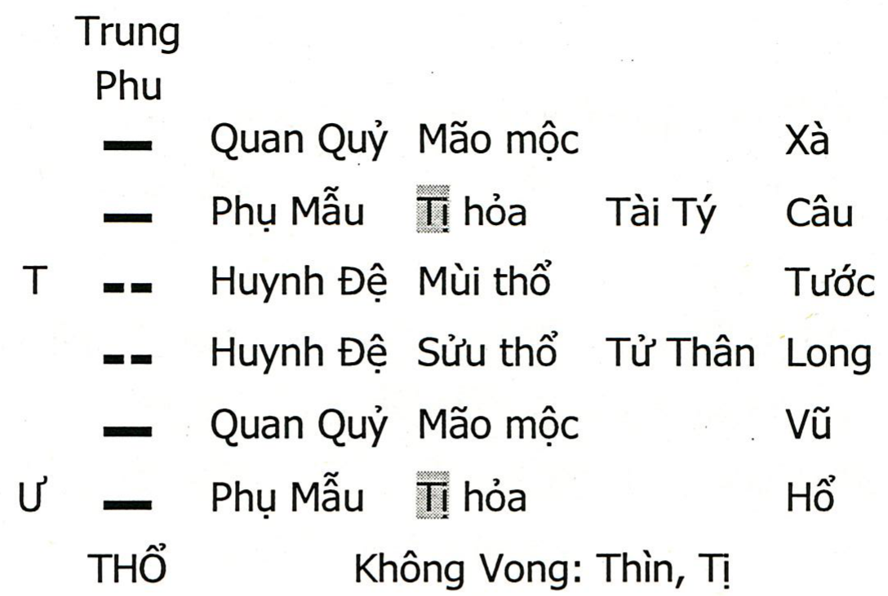

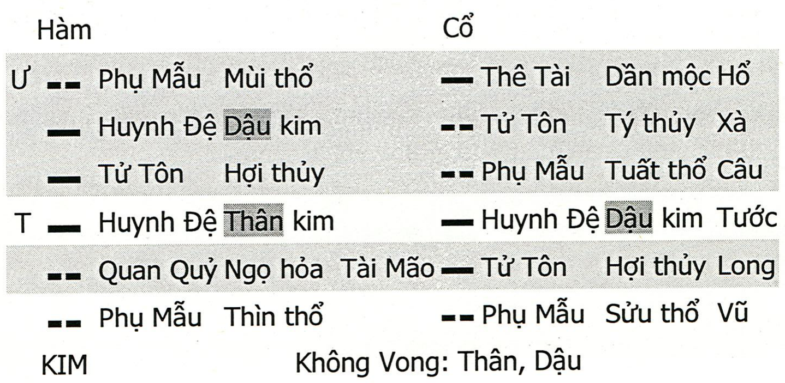 giúp, nhập Mộ ở Nhật là hưu tù. Phi thần phát động là Tử địa Dụng thần, rất khó có được đại tài. Hào Tài nhập Mộ ở hào Ứng, Ứng là người khác, kinh doanh bị ảnh hưởng rất lớn từ điều kiện bên ngoài.

**Phản hồi:** Quả nhiên công ty thành lập được một năm, thành tựu rất kém, doanh số thậm chí không đủ để trả lương cho nhân viên.

### Ví dụ 5: Ngày Canh Ngọ tháng Thân, nam đoán một khoản tiền gửi khi nào đến? Được Phong Thủy Hoán biến Thiên Phong Cấu.

| | Hoán | | Cấu | |
| :---: | :--- | :---: | :--- | :---: |
| | — Phụ Mẫu Mão mộc | | — Tử Tôn Tuất thổ | Xà |
| T | — Huynh Đệ Tị hỏa | | — Thê Tài Thân kim | Câu |
| | - - Tử Tôn Mùi thổ | Tài Dậu | — Huynh Đệ Ngọ hỏa | Tước |
| | - - Huynh Đệ Ngọ hỏa | Quan Hợi | — Thê Tài Dậu kim | Long |
| Ư | — Tử Tôn Thìn thổ | | — Quan Quỷ Hợi thủy | Vũ |
| | - - Phụ Mẫu Dần mộc | | - - Tử Tôn Sửu thổ | Hổ |

HỎA Không Vong: Tuất, Hợi

**Phán đoán:** Lấy Thê Tài làm Dụng thần. Thê Tài Dậu kim không hiện trên quẻ, phục tàng dưới hào 4 Tử Tôn Mùi thổ. Dụng thần được Nguyệt trợ giúp, Nhật đến khắc, suy vượng khó phân biệt. Trong quẻ mặc dù Huynh Đệ Ngọ hỏa phát động, nhưng động mà hóa Tài, đồng thời lại có Tử Tôn Mùi thổ phát động tạo thành liên tục tương sinh, Phi đến sinh Phục. Vì vậy, tiền nhất định đến.

**Phản hồi:** Quả nhiên tại tháng Dậu đã nhận được tiền.

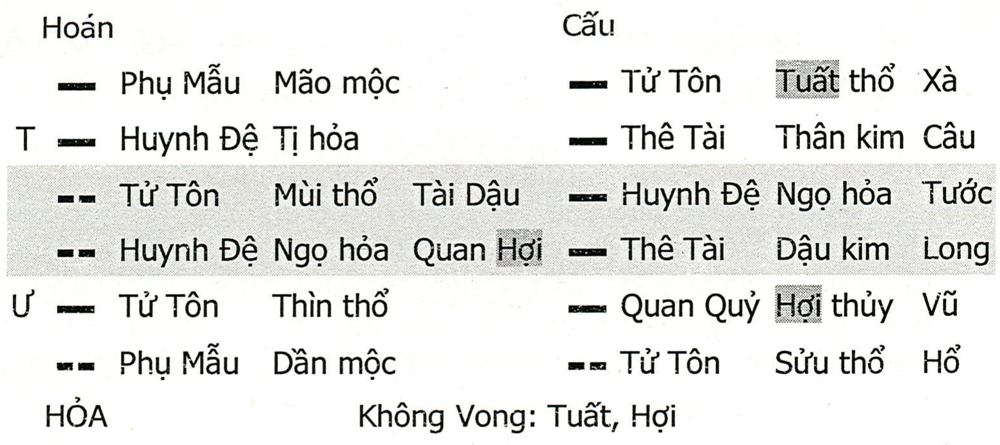

### Ví dụ 6: Ngày Kỷ Sửu tháng Thìn năm Đinh Hợi, nam đoán khoản tiền cho vay có thể thu hồi hay không? Được Thủy Hỏa Ký Tế biến Địa Sơn Khiêm.

| | Ký Tế | | | Khiêm | |
| :---: | :---: | :--- | :---: | :---: | :--- | :--- |
| Ứ | - - | Huynh Đệ Tý thủy | | - - | Phụ Mẫu Dậu kim | Câu |
| | — | Quan Quỷ Tuất thổ | | - - | Huynh Đệ Hợi thủy | Tước |
| | - - | Phụ Mẫu Thân kim | | - - | Quan Quỷ Sửu thổ | Long |
| T | — | Huynh Đệ Hợi thủy | Tài Ngọ | — | Phụ Mẫu Thân kim | Vũ |
| | - - | Quan Quỷ Sửu thổ | | - - | Thê Tài Ngọ hỏa | Hổ |
| | — | Tử Tôn Mão mộc | | - - | Quan Quỷ Thìn thổ | Xà |

THỦY Không Vong: Ngọ, Mùi

**Phán đoán:** Lấy Thê Tài làm Dụng thần. Thê Tài Ngọ hỏa không hiện trên quẻ, phục tàng dưới hào 3 Huynh Đệ Hợi thủy. Dụng thần không được Nhật Nguyệt trợ giúp, Không mà nhập Mộ ở Tuất thổ, tuy có Tử Tôn Mão mộc phát động nhưng bị Quan Quỷ Tuất thổ hợp trú, tham hợp quên sinh, sợ là không thể thu hồi.

Thê Tài phục mà lâm Huyền Vũ, Huyền Vũ chủ ám muội, phục tàng là lén lút, chứng tỏ số tiền này không thể đặt lên mặt bàn, căn bản không phải cho vay. Hào Ứng là người cầm tiền, hào Ứng hợp Nhật, Nhật là Quan Quỷ, Quan Quỷ thể hiện quan chức, người cầm tiền có quan hệ qua lại với giới quan trường.

Hào 5 Quan Quỷ Tuất thổ phát động, Quan Quỷ là người trung gian, tại gian hào cũng biểu thị người trung gian, hào 5 là lãnh đạo, chứng tỏ khi đưa số tiền này cho người ta, có một quan chức đóng vai trò trung gian.

Tử Tôn Mão mộc lâm hào sơ sinh Tài, hào sơ là tâm sự, chính là dự định muốn lấy lại tiền, nhưng hào sơ bị hào 5 hợp trú, người trung gian cực lực ngăn cản.

**Phản hồi:** Quả nhiên không phải cho vay mà là đưa 60 vạn nhờ người ta làm việc, nhưng sự việc không xử lý thành công, tiền cũng không được trả lại. Lúc giao tiền, đúng là phải thông qua lãnh đạo của một cơ quan chính phủ.

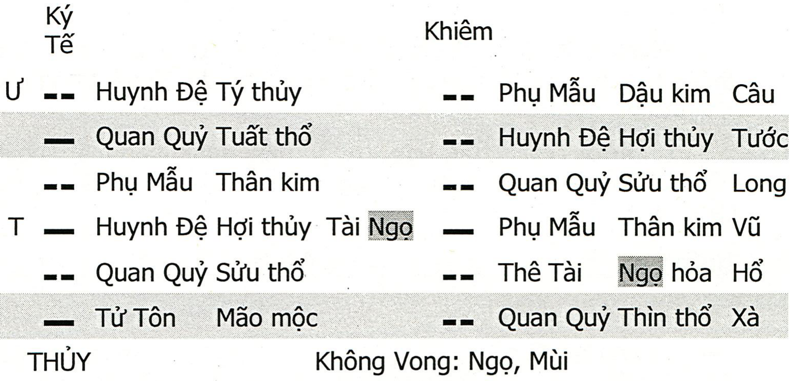

### Ví dụ 7: Ngày Kỷ Dậu tháng Sửu, nữ đoán mua máy đan áo len có thể kiếm được tiền hay không? Được Địa Sơn Khiêm biến Phong Sơn Tiệm.

| | Khiêm | | Phục | | Tiệm | |
| :---: | :---: | :--- | :---: | :---: | :--- | :--- |
| | - - | Huynh Đệ Dậu kim | | — | Thê Tài Mão mộc | Câu |
| T | - - | Tử Tôn Hợi thủy | | — | Quan Quỷ Tị hỏa | Tước |
| | - - | Phụ Mẫu Sửu thổ | | - - | Phụ Mẫu Mùi thổ | Long |
| | — | Huynh Đệ Thân kim | | — | Huynh Đệ Thân kim | Vũ |
| Ứ | - - | Quan Quỷ Ngọ hỏa | Tài Mão | - - | Quan Quỷ Ngọ hỏa | Hổ |
| | - - | Phụ Mẫu Thìn thổ | | - - | Phụ Mẫu Thìn thổ | Xà |

KIM Không Vong: Dần, Mão

**Phán đoán:** Lấy Thê Tài làm Dụng thần. Thê Tài Mão mộc không hiện trên quẻ, phục tàng dưới hào 2 Quan Quỷ Ngọ hỏa. Dụng thần không được Nhật Nguyệt trợ giúp, trái lại bị Nhật khắc, lại lâm Không Vong là hưu tù. Người xưa nói: "Phục cư Không địa, sự dữ tâm vi." (Hào Phục lâm Không, việc không toại nguyện). Nhất định không có lợi nhuận. Phục tàng biểu thị không thấy tiền. Ngoại quái phản ngâm, biểu thị mua máy thì sẽ hối hận.

**Phản hồi:** Kết quả là vẫn mua. Sau khi mua máy thì chẳng có ai đặt hàng, cô đã dệt cho người trong nhà vài cái. Ngay cả vốn đầu tư cũng không thu hồi được, cô ấy rất hối hận vì đã mua máy.

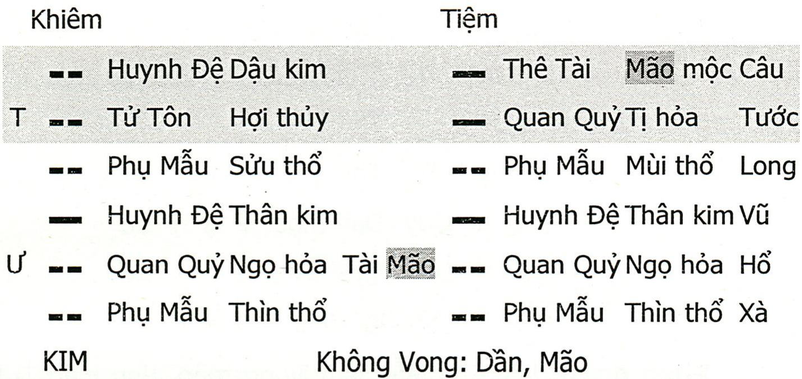

---

# Part 5 (Pages 81-100)

### Ví dụ 8: Ngày Canh Thân tháng Dậu, nữ đoán tình hình công trình của chồng, được Thủy Thiên Nhu.

| | Nhu | | | |
| :---: | :---: | :--- | :--- | :--- |
| | - - | Thê Tài Tý thủy | | Xà |
| | — | Huynh Đệ Tuất thổ | | Câu |
| T | - - | Tử Tôn Thân kim | | Tước |
| | — | Huynh Đệ Thìn thổ | | Long |
| | — | Quan Quỷ Dần mộc | Phụ Tị | Vũ |
| Ư | — | Thê Tài Tý thủy | | Hổ |

THỔ Không Vong: Tý, Sửu

**Phán đoán:** Lấy Phụ Mẫu làm Dụng thần. Phụ Mẫu Tị hỏa không hiện trên quẻ, phục tàng dưới hào 2 Quan Quỷ Dần mộc. Hào 2 là nhà, hợp Nhật là tòa nhà, chứng tỏ công trình này là xây dựng tòa nhà.

Nhật thần xung khai Phi thần, Phụ Mẫu được xuất. Nhật biểu thị hiện nay, Phụ Mẫu lại là giấy chứng nhận, quẻ cung Khôn, Khôn là đất, vì vậy phán đoán vừa mới lấy được sổ đỏ.

Thê Tài Tý thủy vượng tướng nhưng Không Vong, đoán là năm Mậu Tý mới có thể thu lại lợi nhuận. Thê Tài lâm hào Ứng, Ứng là nơi khác; lại thêm hào 6 có một Tý thủy, hào 6 là nước ngoài, phương xa; quẻ du hồn lại chủ bên ngoài. Vì vậy, phán đoán là có nguồn vốn nước ngoài.

**Phản hồi:** Quả nhiên phù hợp với tình hình thực tế.

## 9. TIẾN THẦN VÀ THOÁI THẦN

Trong dự đoán kinh tế, Tiến thần và Thoái thần cũng là những kiến thức căn bản không thể thiếu. Đồng thời, tùy vào nội dung dự đoán khác nhau mà ý nghĩa cũng khác nhau. Nếu là dự đoán tài vận, Thê Tài động mà hóa thoái thì biểu thị tài vận tuột dốc, tiền ngày càng ít; nếu hóa Tiến thần thì biểu thị tình hình kinh tế dần dần chuyển biến tốt, mỗi ngày một khá hơn, nguồn tiền liên tục, ngày một phát triển, tiền ngày càng nhiều. Nếu là dự đoán cổ phiếu, Thê Tài hóa tiến chính là thông tin mức giá tăng lên, hóa thoái chính là thông tin mức giá hạ xuống. Nhưng nếu là

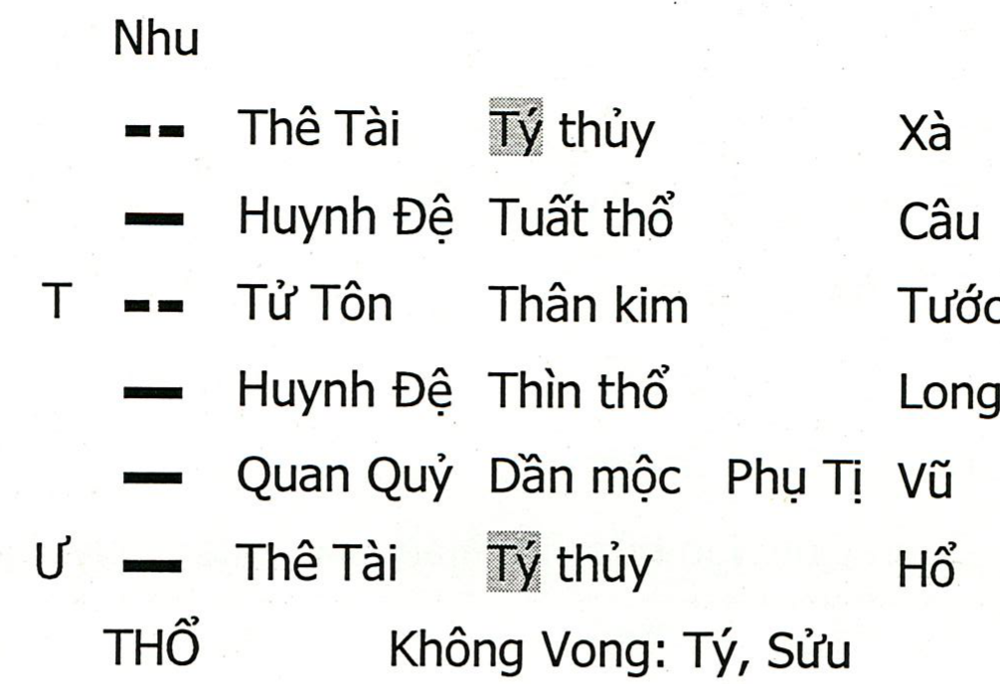 đòi nợ, trái lại không nên Thê Tài hóa Tiến thần, mừng hóa Thoái thần là tốt. Do đó, việc nắm vững cách dùng Tiến thần và Thoái thần có vai trò rất quan trọng trong dự đoán cát hung về phương diện kinh tế.

Ý nghĩa chủ yếu của Tiến thần: Tiến lên, ngày càng tốt hơn, gia tăng, ngày một phát triển, mạnh mẽ đi lên, phát triển mạnh mẽ, tăng vọt, tích lũy, phát triển, lớn mạnh, mở rộng, khuếch đại, thịnh vượng, tăng cường,...

Ý nghĩa chủ yếu của Thoái thần: Lùi lại, ngày càng kém, tiêu điều, suy bại, lạc hậu, suy sụp, hạ xuống, cạn kiệt, yếu đi, cắt giảm, trượt xuống, tuột dốc, thu hẹp, giảm thoái, suy thoái,...

### Ví dụ 1: Ngày Quý Mão tháng Tị năm Ất Dậu, nữ đoán tài vận của chồng, được Lôi Sơn Tiểu Quá biến Trạch Hỏa Cách.

| | Tiểu Quá | | Phục | | Cách | |
| :---: | :---: | :--- | :---: | :---: | :--- | :--- |
| | - - | Phụ Mẫu Tuất thổ | | - - | Phụ Mẫu Mùi thổ | Hổ |
| | - - | Huynh Đệ Thân kim | | — | Huynh Đệ Dậu kim | Xà |
| T | — | Quan Quỷ Ngọ hỏa | Tử Hợi | — | Tử Tôn Hợi thủy | Câu |
| | — | Huynh Đệ Thân kim | | — | Tử Tôn Hợi thủy | Tước |
| | - - | Quan Quỷ Ngọ hỏa | Tài Mão | - - | Phụ Mẫu Sửu thổ | Long |
| Ư | - - | Phụ Mẫu Thìn thổ | | — | Thê Tài Mão mộc | Vũ |

KIM Không Vong: Thìn, Tị

**Phán đoán:** Lấy Thê Tài làm Dụng thần. Thê Tài Mão mộc mặc dù không hiện trên quẻ, nhưng Nguyệt không khắc, Nhật đến trợ giúp là vượng tướng, Nhật lâm Tài sinh hào Thế, có cơ hội được tài. Bất lợi là trong quẻ Huynh Đệ phát động hóa Tiến thần, Phụ Mẫu Thìn thổ lại động đến sinh Huynh Đệ. Huynh Đệ hóa Tiến thần chứng tỏ tài vận càng ngày càng kém.

Năm 1998 là năm Mậu Dần xung mất Huynh Đệ Thân kim, năm 1999 là năm Kỷ Mão, là năm phục tàng gặp xuất hiện, Tài được vượng tướng, vì vậy hai năm này tài vận khá tốt. Năm 2000 là năm Canh Thìn, Thìn thổ xuất Không, mặc dù sinh hào Huynh Đệ thì tài vận không như trước đây, nhưng hóa ra Thê Tài Mão

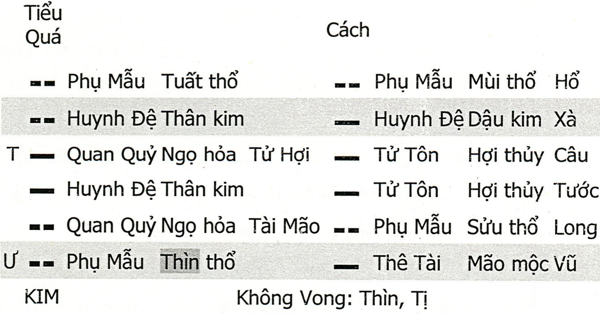 mộc cho nên vẫn vượt qua được. Năm 2001 là năm Tân Tị hợp trú Huynh Đệ Thân kim, cũng gắng gượng duy trì. Nhưng năm 2002 là năm Nhâm Ngọ thì Tài gặp Tử địa, năm 2003 là năm Quý Mùi thì hào Tài nhập Mộ, năm 2004 trị Huynh Đệ, Tài lâm Tuyệt địa, năm 2005 Ất Dậu là Tiến thần Huynh Đệ, vì vậy tài vận dần dần tuột dốc.

**Phản hồi:** Trên thực tế, chồng cô ấy đã kiếm được mấy trăm triệu yên ở năm 1998 và năm 1999. Từ năm 2002, tài vận bắt đầu tuột dốc. Đến năm nay, tiền chỉ ra không vào, chồng cô đành phải chuyển nghề.

**Ví dụ 2:** Ngày Đinh Tị tháng Mão, nữ đoán về triển vọng của đài truyền hình mà cô ấy đang phụ trách, được Trạch Thiên Quải biến Lôi Trạch Quy Muội.

| | Quải | Quy Muội | |
| :---: | :--- | :--- | :--- |
| | - - Huynh Đệ Mùi thổ | - - Huynh Đệ Tuất thổ | Long |
| T | — Tử Tôn Dậu kim | - - Tử Tôn Thân kim | Vũ |
| | — Thê Tài Hợi thủy | — Phụ Mẫu Ngọ hỏa | Hổ |
| | — Huynh Đệ Thìn thổ | - - Huynh Đệ Sửu thổ | Xà |
| Ứ | — Quan Quỷ Dần mộc Phụ Tị | — Quan Quỷ Mão mộc | Câu |
| | — Thê Tài Tý thủy | — Phụ Mẫu Tị hỏa | Tước |

THỔ Không Vong: Tý, Sửu

**Phán đoán:** Lấy Thê Tài làm Dụng thần. Trong quẻ Thê Tài lưỡng hiện, lấy Tý thủy Không Vong làm Dụng thần. Dụng thần không được Nhật Nguyệt trợ giúp là hưu tù. Hào Thế Tử Tôn Dậu kim tại hào 5 động sinh Thê Tài, bản thân nỗ lực tạo ra lợi nhuận cho đài truyền hình, nhưng Nguyệt phá hóa thoái, càng ngày không tạo ra được lợi nhuận.

Hào 5 là tôn vị, là hào vị lãnh đạo, phù hợp với thông tin người đó là người phụ trách. Nhưng động mà hóa thoái, bản thân không muốn làm. Lâm Huyền Vũ, Huyền Vũ chủ u uất, biểu thị hiện tại tinh thần không tốt, trong lòng rất nặng nề. Hào 3 Huynh Đệ Thìn thổ động đến hợp hào Thế, khiến hào Thế không thoái, biểu thị có người giữ lại. Hào Thế Nguyệt phá, Thìn thổ hợp mà

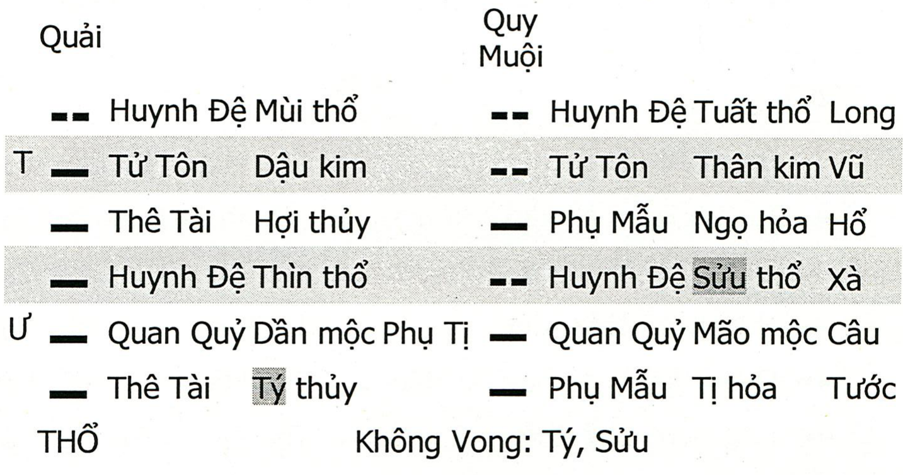 bất phá, Thìn thổ là Tài khố, lại biểu thị có người đầu tư tiền vốn, giúp cho đài truyền hình có thể duy trì hoạt động. Có điều là, hào Tài hưu tù, tiền đồ chỉ ở mức bình thường, tốt nhất là nên chuyển nhượng.

**Phản hồi:** Quả nhiên đến tháng Thìn có người đầu tư vốn, giúp cho đài truyền hình duy trì tạm thời.

**Ví dụ 3:** Ngày Quý Dậu tháng Thân, nữ đoán cửa hàng thịt nướng sau này sẽ ra sao? Được Càn Vi Thiên biến Trạch Thiên Quải.

| | Càn | Quải | |
| :---: | :--- | :--- | :--- |
| T | — Phụ Mẫu Tuất thổ | - - Phụ Mẫu Mùi thổ | Hổ |
| | — Huynh Đệ Thân kim | — Huynh Đệ Dậu kim | Xà |
| | — Quan Quỷ Ngọ hỏa | — Tử Tôn Hợi thủy | Câu |
| Ứ | — Phụ Mẫu Thìn thổ | — Phụ Mẫu Thìn thổ | Tước |
| | — Thê Tài Dần mộc | — Thê Tài Dần mộc | Long |
| | — Tử Tôn Tý thủy | — Tử Tôn Tý thủy | Vũ |

KIM Không Vong: Tuất, Hợi

**Phán đoán:** Phụ Mẫu là cửa hàng, Thê Tài là lợi nhuận. Thê Tài Dần mộc Nguyệt phá, Nhật Nguyệt đồng thời đến khắc là hưu tù, kinh doanh không phát đạt, không thể duy trì hoạt động. Quẻ chính lục xung, cửa hàng sắp sập tiệm.

Phụ Mẫu Tuất thổ tại hào 6 động mà hóa thoái, hào 6 là cũ kỹ, biểu thị đây là cửa hàng cũ. Hóa thoái, càng ngày càng kém, dần dần suy thoái. Hào Thế Không Vong biểu thị trong lòng rất buồn khổ, lâm Bạch Hổ thì rất lo lắng.

**Phản hồi:** Quả nhiên là cửa hàng mở đã được 36 năm. Bởi vì hiện nay kinh doanh rất sa sút cho nên muốn đóng cửa.

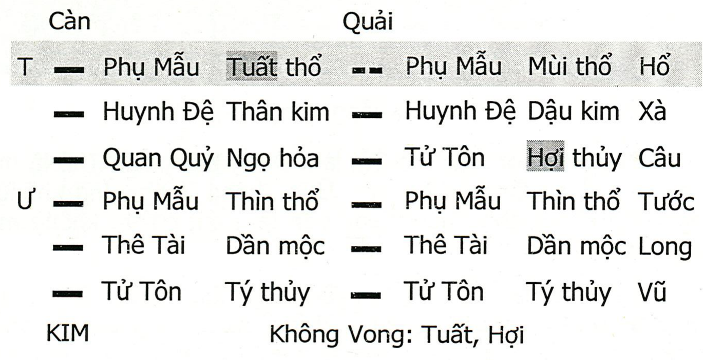

**Ví dụ 4:** Ngày Mậu Ngọ tháng Dậu năm Giáp Thân, một học trò của tôi cho người ta vay tiền, đoán xem có thể thu hồi được hay không? Được Đoài Vi Trạch biến Trạch Lôi Tùy.

| | Đoài | | | Tùy | | | |
| :---: | :---: | :--- | :--- | :---: | :--- | :--- | :--- |
| T | ╍╍ | Phụ Mẫu | Mùi thổ | ╍╍ | Phụ Mẫu | Mùi thổ | Tước |
| | ━━ | Huynh Đệ | Dậu kim | ━━ | Huynh Đệ | Dậu kim | Long |
| | ━━ | Tử Tôn | Hợi thủy | ━━ | Tử Tôn | Hợi thủy | Vũ |
| Ứ | ╍╍ | Phụ Mẫu | Sửu thổ | ╍╍ | Phụ Mẫu | Thìn thổ | Hổ |
| | ━━ | Thê Tài | Mão mộc | ╍╍ | Thê Tài | Dần mộc | Xà |
| | ━━ | Quan Quỷ | Tị hỏa | ━━ | Tử Tôn | Tý thủy | Câu |

KIM Không Vong: Tý, Sửu

**Phán đoán:** Lấy Thê Tài làm Dụng thần, hào Thế là mình, hào Ứng là người vay tiền. Hào Ứng Không Vong, Ứng Không thì người ta không thật, người vay tiền tâm bất chính, không muốn trả lại tiền.

Thê Tài Mão mộc bị Nguyệt xung phá, Nhật lại không trợ giúp là hưu tù. Lại gặp lục xung không cát. Nhưng Dụng thần độc phát, động mà hóa thoái, tiền sẽ quay trở lại, mừng được Dụng thần hóa thoái, lại biến nhập quẻ quy hồn, có thông tin quay về, vì vậy tiền có thể sẽ về, nhưng bởi vì Thê Tài rất hưu tù, vì vậy phán đoán chỉ có thể lấy lại được một phần tiền.

Anh ta hỏi là có thể xem được cho vay bao nhiêu tiền hay không? Tôi thấy tổng số của nội quái và ngoại quái là 4, đoán là cho vay 4 vạn tệ. Mão mộc độc phát, cho vay ở năm Kỷ Mão.

**Phản hồi:** Trên thực tế đúng là cho vay ở năm Kỷ Mão, số tiền là 39934 tệ, về sau chỉ thu hồi được một phần.

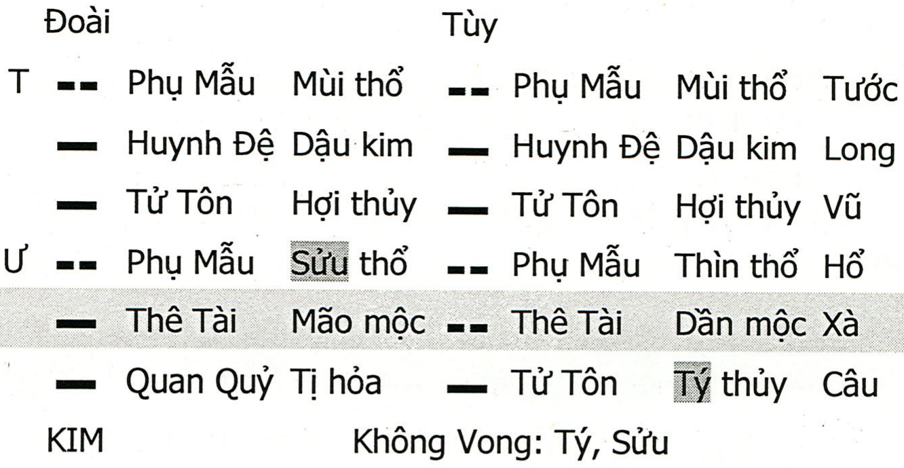

**Ví dụ 5:** Ngày Quý Mão tháng Tị, nam đoán hiệu quả của sản phẩm thuốc tiêm do mình phát minh, được Thiên Trạch Lý biến Trạch Thiên Quải.

| | Lý | | | Quải | | | |
| :---: | :---: | :--- | :--- | :---: | :--- | :--- | :--- |
| | ━━ | Huynh Đệ | Tuất thổ | ╍╍ | Huynh Đệ | Mùi thổ | Hổ |
| T | ━━ | Tử Tôn | Thân kim Tài Tý | ━━ | Tử Tôn | Dậu kim | Xà |
| | ━━ | Phụ Mẫu | Ngọ hỏa | ━━ | Thê Tài | Hợi thủy | Câu |
| | ╍╍ | Huynh Đệ | Sửu thổ | ━━ | Huynh Đệ | Thìn thổ | Tước |
| Ứ | ━━ | Quan Quỷ | Mão mộc | ━━ | Quan Quỷ | Dần mộc | Long |
| | ━━ | Phụ Mẫu | Tị hỏa | ━━ | Thê Tài | Tý thủy | Vũ |

THỔ Không Vong: Thìn, Tị

**Phán đoán:** Lấy Tử Tôn làm Dụng thần. Tử Tôn Thân kim tại hào 5, hào 5 là tôn vị, đây là sản phẩm tiên phong trong lĩnh vực này. Dụng thần được Nguyệt hợp có khí, Nguyên thần lưỡng hiện phát động đến sinh, Tử Tôn có lực khắc Quan Quỷ, vì vậy vẫn có hiệu quả điều trị nhất định.

Quan Quỷ Mão mộc tại hào 2, hào 2 là gan, Mão mộc cũng là gan, đây là hào bị Tử Tôn khắc, thuốc tiêm này dùng để điều trị bệnh gan. Hào 3 Nguyên thần phát động hóa Tiến thần biểu thị vừa bắt đầu thì hiệu quả rất tốt, nhưng hào 6 Nguyên thần Tuất thổ động hóa thoái, hào 6 là kết thúc, điểm cuối của sự vật, hóa thoái là yếu đi, hiệu quả dần dần suy giảm.

Nhật là Quan Quỷ khắc chế hai Nguyên thần trong quẻ, Quan Quỷ là bệnh, cho nên thuốc tiêm có tác dụng phụ. Một Nguyên thần lâm Chu Tước, chủ người bệnh sau khi sử dụng thì lên cơn sốt. Một Nguyên thần lâm Bạch Hổ, Bạch Hổ là máu, thổ là da, chủ da nổi ban đỏ. Tài không hiện trên quẻ, Tài là ẩm thực, lâm thủy chủ nước, người bệnh sau khi sử dụng sẽ cảm thấy miệng khát, muốn uống nước.

**Phản hồi:** Phán đoán hoàn toàn giống với thực tế.

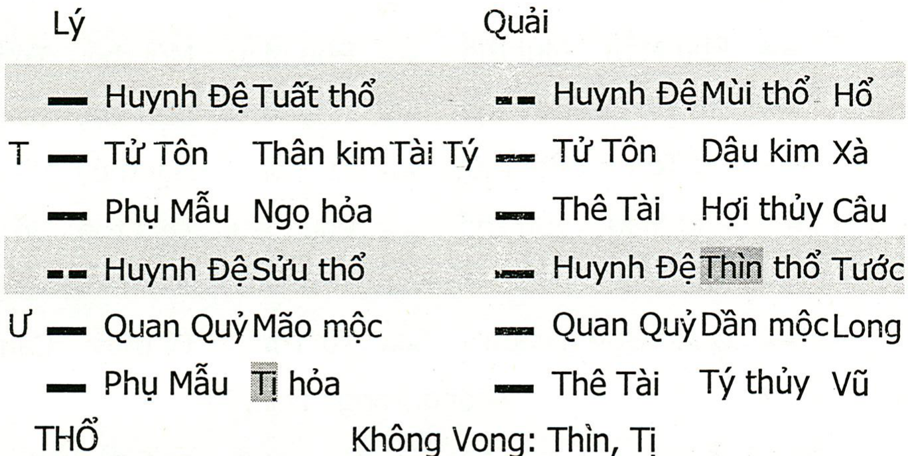

## Ví dụ 6: Ngày Mậu Tuất tháng Tuất, nam đoán giá cổ phiếu của Thần Hoa Trung Quốc (Shenhua China) biến động ra sao? Được Đoài Vi Trạch biến Trạch Lôi Tùy.

| | Đoài | | | Tùy | |
| :---: | :---: | :--- | :---: | :--- | :--- |
| T | - - | Phụ Mẫu Mùi thổ | - - | Phụ Mẫu Mùi thổ | Tước |
| | — | Huynh Đệ Dậu kim | — | Huynh Đệ Dậu kim | Long |
| | — | Tử Tôn Hợi thủy | — | Tử Tôn Hợi thủy | Vũ |
| Ư | - - | Phụ Mẫu Sửu thổ | - - | Phụ Mẫu Thìn thổ | Hổ |
| | — | Thê Tài Mão mộc | - - | Thê Tài Dần mộc | Xà |
| | — | Quan Quỷ Tị hỏa | — | Tử Tôn Tý thủy | Câu |

KIM Không Vong: Thìn, Tị

**Phán đoán:** Lấy Thê Tài làm Dụng thần. Thê Tài Mão mộc độc phát động hóa Thoái thần, Nhật Nguyệt không đến sinh phù, mặc dù có Nguyệt hợp vượng nhưng không thể địch lại Dụng thần hóa thoái, giá chắc chắn sẽ rơi xuống. Do đó, tôi bảo anh ta ngày hôm sau bán tháo ngay cổ phiếu đó đi.

**Phản hồi:** Đến ngày thứ hai, giá cổ phiếu từ 81.69 bắt đầu hạ xuống, càng ngày càng giảm. Cuối cùng, nó đã giảm xuống hơn 60 tệ. Cũng may là đã bán kịp thời, nếu không thì đã bị lỗ vốn lớn.

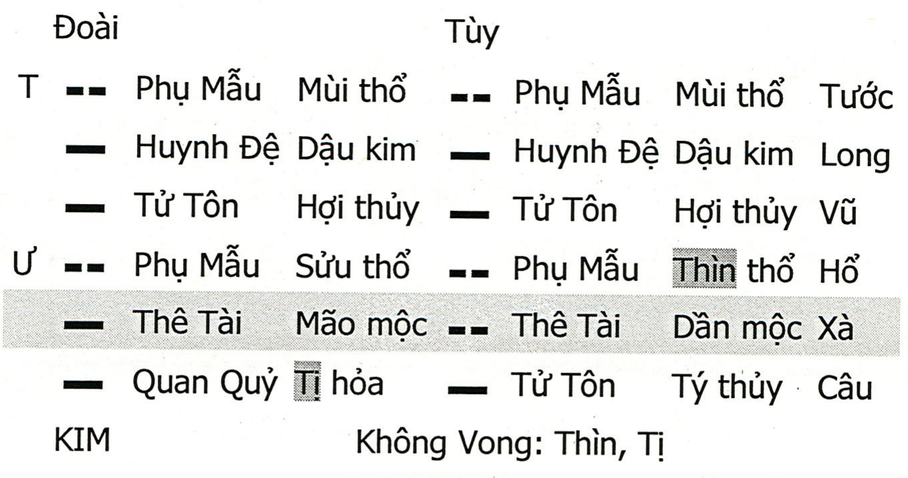

## Ví dụ 7: Ngày Quý Dậu tháng Thìn, nam đoán kinh doanh gang sẽ ra sao? Được Thủy Trạch Tiết biến Thủy Lôi Truân.

| | Tiết | | | Truân | |
| :---: | :---: | :--- | :---: | :--- | :--- |
| | - - | Huynh Đệ Tý thủy | - - | Huynh Đệ Tý thủy | Hổ |
| | — | Quan Quỷ Tuất thổ | — | Quan Quỷ Tuất thổ | Xà |
| Ư | - - | Phụ Mẫu Thân kim | - - | Phụ Mẫu Thân kim | Câu |
| | - - | Quan Quỷ Sửu thổ | - - | Quan Quỷ Thìn thổ | Tước |
| | — | Tử Tôn Mão mộc | - - | Tử Tôn Dần mộc | Long |
| T | — | Thê Tài Tị hỏa | — | Huynh Đệ Tý thủy | Vũ |

THỦY Không Vong: Tuất, Hợi

**Phán đoán:** Lấy Thê Tài làm Dụng thần. Thê Tài Tị hỏa trì Thế không được Nhật Nguyệt trợ giúp là hưu tù. Không cát là Nguyên thần độc phát hóa thoái, biểu thị kinh doanh càng ngày càng sa sút. Mão mộc phát động, Mão là địa chi của tháng trước, cho nên tháng Mão thì bắt đầu trượt xuống.

**Phản hồi:** Quả nhiên là từ tháng Mão thì giá cả bắt đầu hạ thấp, lại thêm khoản tiền hàng gửi đi cũng không thu về được.

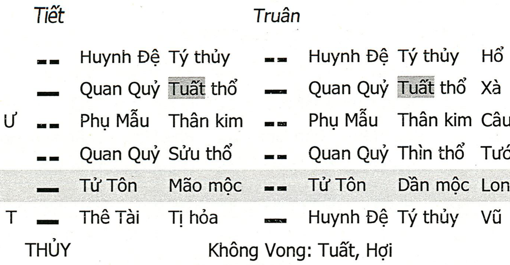

### Ví dụ 8: Ngày Bính Dần tháng Mão, nam đoán hợp tác với người ta mở thẩm mỹ viện sẽ ra sao? Được Thủy Trạch Tiết biến Thủy Lôi Truân.

| | Tiết | | Truân | | Lục thú |
| :---: | :---: | :--- | :---: | :--- | :---: |
| | ▅▅ ▅▅ | Huynh Đệ Tý thủy | ▅▅ ▅▅ | Huynh Đệ Tý thủy | Long |
| | ▅▅▅▅▅ | Quan Quỷ Tuất thổ | ▅▅▅▅▅ | Quan Quỷ Tuất thổ | Vũ |
| Ứ | ▅▅ ▅▅ | Phụ Mẫu Thân kim | ▅▅ ▅▅ | Phụ Mẫu Thân kim | Hổ |
| | ▅▅ ▅▅ | Quan Quỷ Sửu thổ | ▅▅ ▅▅ | Quan Quỷ Thìn thổ | Xà |
| | ▅▅▅▅▅ | Tử Tôn Mão mộc | ▅▅ ▅▅ | Tử Tôn Dần mộc | Câu |
| T | ▅▅▅▅▅ | Thê Tài Tị hỏa | ▅▅▅▅▅ | Huynh Đệ Tý thủy | Tước |

THỦY Không Vong: Tuất, Hợi

**Phán đoán:** Lấy Thê Tài làm Dụng thần. Thê Tài Tị hỏa trì Thế, được Nhật Nguyệt sinh phù là vượng tướng, lại là quẻ lục hợp, hợp tác không có vấn đề, cũng có thể thu được có lợi nhuận. Nhưng mà Nguyên thần Tử Tôn Mão mộc độc phát động mà hóa thoái, không thể lâu dài. Tử Tôn tại hào 2 lâm Câu Trần động, hào 2 là cửa hiệu, Câu Trần chủ kiến trúc, tất bởi vì sự biến đổi của cửa tiệm mà không thể tiếp tục.

**Phản hồi:** Quả nhiên sau khi mở tiệm thì làm ăn rất tốt, nhưng bởi vì giải phóng mặt bằng mà phải ngừng lại.

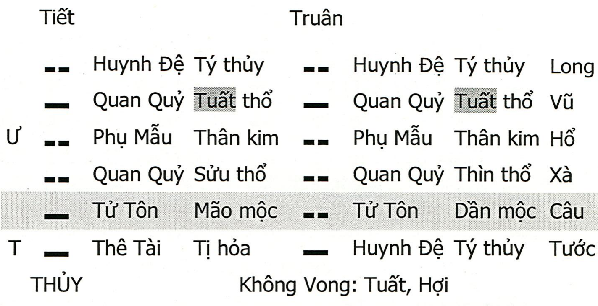

### Ví dụ 9: Ngày Canh Tuất tháng Tuất, nam đoán tình hình công ty của mình, được Đoài Vi Trạch biến Lôi Trạch Quy Muội.

| | Đoài | | Quy Muội | | Lục thú |
| :---: | :---: | :--- | :---: | :--- | :---: |
| T | ▅▅ ▅▅ | Phụ Mẫu Mùi thổ | ▅▅ ▅▅ | Phụ Mẫu Tuất thổ | Xà |
| | ▅▅▅▅▅ | Huynh Đệ Dậu kim | ▅▅ ▅▅ | Huynh Đệ Thân kim | Câu |
| | ▅▅▅▅▅ | Tử Tôn Hợi thủy | ▅▅▅▅▅ | Quan Quỷ Ngọ hỏa | Tước |
| Ứ | ▅▅ ▅▅ | Phụ Mẫu Sửu thổ | ▅▅ ▅▅ | Phụ Mẫu Sửu thổ | Long |
| | ▅▅▅▅▅ | Thê Tài Mão mộc | ▅▅▅▅▅ | Thê Tài Mão mộc | Vũ |
| | ▅▅▅▅▅ | Quan Quỷ Tị hỏa | ▅▅▅▅▅ | Quan Quỷ Tị hỏa | Hổ |

KIM Không Vong: Dần, Mão

**Phán đoán:** Lấy Thê Tài làm Dụng thần. Thê Tài Mão mộc được Nguyệt hợp mặc dù được khí nhưng Nhật Nguyệt không đến sinh phù, Nhật hợp Dụng thần, Nhật hợp là cản trở, kinh tế quay vòng không tốt. Dụng thần Không Vong, công ty không có lợi nhuận, xuất hiện hao tổn.

Hào Thế tại hào 6, hào 6 là hào thoái hưu, chứng tỏ bản thân không phải là người quản lý chủ yếu của công ty, không trực tiếp quản lý công ty. Hào 5 là hào vị lãnh đạo, chủ quản. Lâm Huynh Đệ phát động, người phụ trách công ty căn bản không biết quản lý kinh tế, sẽ không quản lý được tài chính.

Hào 5 lâm Câu Trần, động hóa Thoái thần. Câu Trần là mập, người phụ trách là người béo. Hóa thoái, không xứng đáng với chức vụ, Đoài là vui vẻ, tâm không ở công ty mà ham chơi, chỉ biết đến niềm vui cho mình.

**Phản hồi:** Mọi thứ đúng như phán đoán.

## 10. NGUYỆT PHÁ

Trong dự đoán kinh tế, phạm vi ứng dụng của Nguyệt phá rất rộng. Tùy vào ý nghĩa của lục thân và nội dung dự đoán, ý nghĩa của Nguyệt phá cũng thiên biến vạn hóa.

Ý nghĩa chủ yếu của Nguyệt phá: Hao tổn, đổ nát, phá hoại, tổn hại, rạn nứt, phân tách, chia rẽ, tách biệt, giải thể, tổn

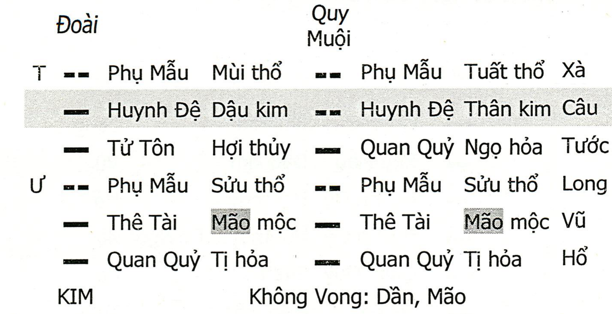 thương, khe hở, kẽ hở, phân cách, diệt trừ, loại bỏ, phân ly, vết nứt, thối rữa, phá hủy, vỡ nát, bẻ gãy, mâu thuẫn,...

**Ví dụ 1:** Ngày Đinh Dậu tháng Tị, nam đoán thành tích của công ty, được Trạch Hỏa Cách.

### Cách

| Thế/Ứng | Cách | Lục thân | Can Chi | Phục thần | Lục thú |
| :---: | :---: | :--- | :--- | :--- | :--- |
| | ╍╍ | Quan Quỷ | Mùi thổ | | Long |
| | ━━ | Phụ Mẫu | Dậu kim | | Vũ |
| T | ━━ | Huynh Đệ | Hợi thủy | | Hổ |
| | ━━ | Huynh Đệ | Hợi thủy | Tài Ngọ | Xà |
| | ╍╍ | Quan Quỷ | Sửu thổ | | Câu |
| Ứ | ━━ | Tử Tôn | Mão mộc | | Tước |

THỦY Không Vong: Thìn, Tị

**Phán đoán:** Lấy Thê Tài làm Dụng thần. Thê Tài Ngọ hỏa không hiện trên quẻ, nhưng được Nguyệt tỉ phù, lại có Tử Tôn Mão mộc ám động đến sinh, Nhật không khắc là vượng tướng, vốn là cát. Nhưng không nên Tài lâm Nguyệt kiến xung phá hào Thế, hào Thế bị Tài xung phá, đây là thông tin mệt mỏi vì tiền bạc, tài vận không tốt đẹp.

**Phản hồi:** Trên thực tế, tiêu thụ khó khăn, kinh phí chi vượt kế hoạch, không có lợi nhuận.

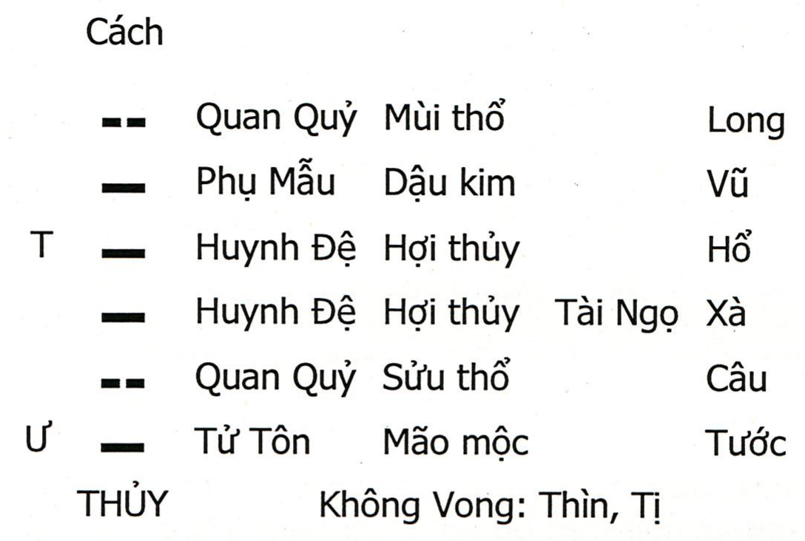

**Ví dụ 2:** Ngày Quý Mão tháng Tị năm Ất Dậu, nữ đoán tài vận em trai, được Trạch Địa Tụy biến Thiên Thủy Tụng.

### Tụy - Tụng

| Thế/Ứng | Tụy | Lục thân | Can Chi | Tụng | Lục thân | Can Chi | Lục thú |
| :---: | :---: | :--- | :--- | :---: | :--- | :--- | :--- |
| | ╍╍ | Phụ Mẫu | Mùi thổ | ━━ | Phụ Mẫu | Tuất thổ | Hổ |
| Ứ | ━━ | Huynh Đệ | Dậu kim | ━━ | Huynh Đệ | Thân kim | Xà |
| | ━━ | Tử Tôn | Hợi thủy | ━━ | Quan Quỷ | Ngọ hỏa | Câu |
| | ╍╍ | Thê Tài | Mão mộc | ╍╍ | Quan Quỷ | Ngọ hỏa | Tước |
| T | ╍╍ | Quan Quỷ | Tị hỏa | ━━ | Phụ Mẫu | Thìn thổ | Long |
| | ╍╍ | Phụ Mẫu | Mùi thổ | ╍╍ | Thê Tài | Dần mộc | Vũ |

KIM Không Vong: Thìn, Tị

**Phán đoán:** Lấy Thê Tài làm Dụng thần. Thê Tài Mão mộc được Nhật tỉ phù và Nguyệt lại không khắc là vượng tướng, đây vốn là điềm lành. Tuy nhiên, đối với tài lâu dài thì còn phải xem ảnh hưởng của hào Tử Tôn và các hào khác đối với hào Tài.

Quan Quỷ Tị hỏa lâm Nguyệt và được Nhật sinh, vượng tướng trì Thế, là người có công việc, nhưng động Không hóa Không, đây là thông tin thôi việc. Quan Quỷ lâm Nguyệt xung phá Tử Tôn Hợi thủy, Quan Quỷ là công việc, Tử Tôn là nguồn tiền, Nguyệt phá là thiệt hại, đoán là bởi vì sự cố ở công việc mà mất đi nguồn tiền. Quan Quỷ Tị hỏa phát động, động mà gặp trị gặp hợp, năm Giáp Thân hợp Tị hỏa ứng nghiệm.

Thê Tài Mão mộc nhập Mộ ở hào động Mùi thổ, Huynh Đệ Dậu kim ám động đến khắc, Thái Tuế nhập hào lâm Huynh Đệ, năm nay là một năm vô tài.

**Phản hồi:** Năm 2004, em trai cô ấy đã nghỉ việc và đi kinh doanh bị thua lỗ. Sau đó, em trai lại đến Nghĩa Ô để phát triển nhưng vẫn thất bại.

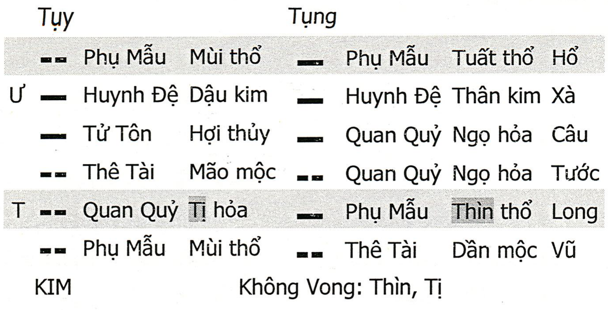

**Ví dụ 3:** Ngày Ất Tị tháng Mão, nữ đoán xem công ty hàng không của cha chuyển vốn ra sao? Được Hỏa Thủy Vị Tế biến Sơn Thủy Mông.

| | Vị Tế | Phục | | Mông | |
| :--- | :--- | :--- | :--- | :--- | :--- |
| Ư | ━ Huynh Đệ Tị hỏa | | ━ | Phụ Mẫu Dần mộc | Vũ |
| | ⚋ Tử Tôn Mùi thổ | | ⚋ | Quan Quỷ Tý thủy | Hổ |
| | ━ Thê Tài Dậu kim | | ⚋ | Tử Tôn Tuất thổ | Xà |
| T | ⚋ Huynh Đệ Ngọ hỏa | Quan Hợi | ⚋ | Huynh Đệ Ngọ hỏa | Câu |
| | ━ Tử Tôn Thìn thổ | | ━ | Tử Tôn Thìn thổ | Tước |
| | ⚋ Phụ Mẫu Dần mộc | | ⚋ | Phụ Mẫu Dần mộc | Long |

HỎA                  Không Vong: Dần, Mão

**Phán đoán:** Lấy Thê Tài làm Dụng thần. Thê Tài Dậu kim Nguyệt phá Nhật khắc là hưu tù. Mặc dù hóa hồi đầu sinh nhưng Huynh Đệ Ngọ hỏa trì Thế, hào Tài thiếu lực, hiện nay tiền vốn chuyển chưa đủ.

**Phản hồi:** Quả nhiên là như vậy.

**Ví dụ 4:** Ngày Tân Dậu tháng Sửu, một bạn học của tôi đoán tài vận, được Đoài Vi Trạch.

| | Đoài | |
| :--- | :--- | :--- |
| T | ⚋ Phụ Mẫu Mùi thổ | Xà |
| | ━ Huynh Đệ Dậu kim | Câu |
| | ━ Tử Tôn Hợi thủy | Tước |
| Ư | ⚋ Phụ Mẫu Sửu thổ | Long |
| | ━ Thê Tài Mão mộc | Vũ |
| | ━ Quan Quỷ Tị hỏa | Hổ |

KIM          Không Vong: Tý, Sửu

**Phán đoán:** Lấy Thê Tài làm Dụng thần. Thê Tài Mão mộc không được Nguyệt kiến trợ giúp, Nhật đến xung khắc, không cát. Hào Thế là Tài khố, vốn là ý nghĩa tụ tài, nhưng bị Nguyệt xung

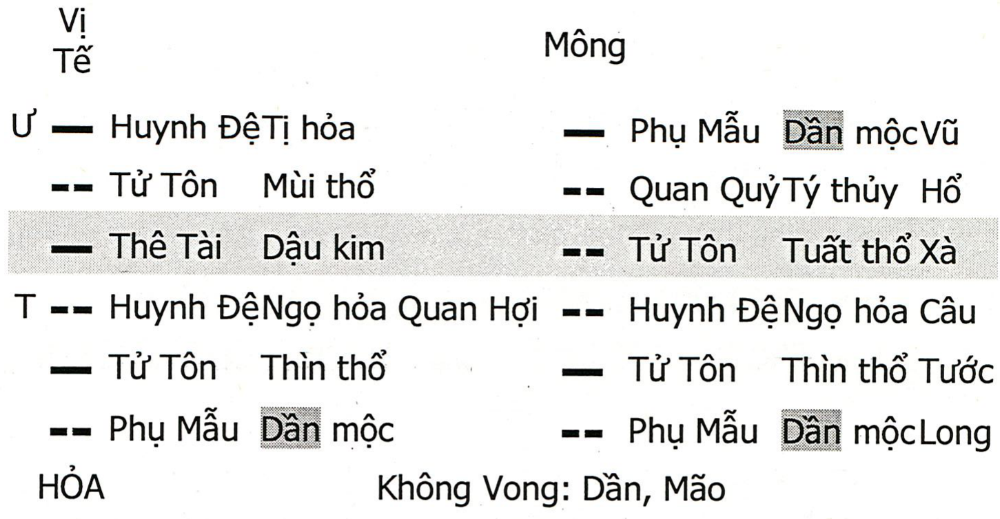

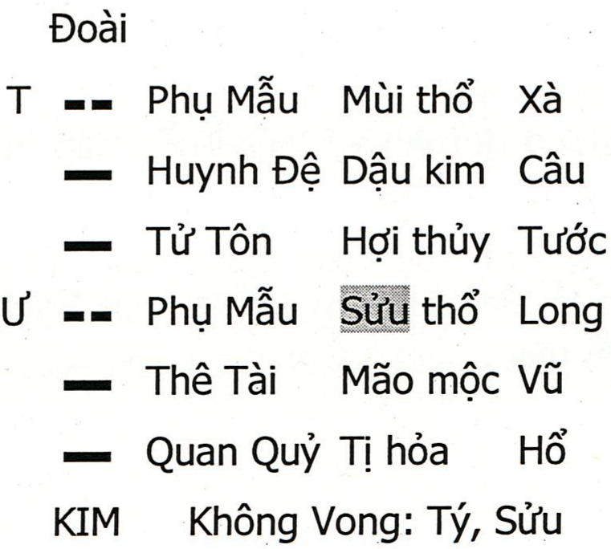 phá, tài không thể tụ. Tài lâm Huyền Vũ là tượng đầu cơ. Vì vậy, tôi phán đoán là anh ta không tích trữ được tiền, dùng tất cả số tiền để mua vé số.

**Phản hồi:** Quả nhiên là như vậy.

**Ví dụ 5:** Ngày Tân Sửu tháng Hợi, một chủ thầu đoán tài vận, được Thủy Trạch Tiết biến Hỏa Thủy Vị Tế.

| | Tiết | | Vị Tế | |
| :--- | :--- | :--- | :--- | :--- |
| | ⚋ Huynh Đệ Tý thủy | ━ | Thê Tài Tị hỏa | Xà |
| | ━ Quan Quỷ Tuất thổ | ⚋ | Quan Quỷ Mùi thổ | Câu |
| Ư | ⚋ Phụ Mẫu Thân kim | ━ | Phụ Mẫu Dậu kim | Tước |
| | ⚋ Quan Quỷ Sửu thổ | ⚋ | Thê Tài Ngọ hỏa | Long |
| | ━ Tử Tôn Mão mộc | ━ | Quan Quỷ Thìn thổ | Vũ |
| T | ━ Thê Tài Tị hỏa | ⚋ | Tử Tôn Dần mộc | Hổ |

THỦY                  Không Vong: Thìn, Tị

**Phán đoán:** Lấy Thê Tài làm Dụng thần. Thê Tài Tị hỏa trì Thế, Nguyệt đến xung khắc, Nhật không trợ giúp là hưu tù, tài vận không tốt đẹp. Hào sơ là người dưới quyền, nhân viên, Nguyệt phá, Không Vong, lâm Bạch Hổ thành tam hình. Nguyệt phá chủ tổn thương, Không Vong chủ tử vong, Bạch Hổ cũng chủ bị thương, cũng chủ tai nạn xe cộ, lâm Thê Tài mà phá tài.

Hào 5 Quan Quỷ Tuất thổ phát động hào Tài nhập Mộ, hào 5 là quan chức, Quan Quỷ lại là quan chức, hầu như tất cả số tiền kiếm được đều nạp vào túi của quan chức. Ứng lâm Chu Tước Phụ Mẫu phát động đến hợp hào Thế Tài, Phụ Mẫu Chu Tước là kiện tụng, cho nên còn có người kiện anh ta để lấy tiền.

**Phản hồi:** Quả nhiên có một nhân viên tử vong vì tai nạn giao thông, anh ta đã bồi thường cho gia đình người đó rất nhiều tiền. Số tiền anh ta kiếm được đều đưa cho quan chức giúp anh ta nhận thầu, kết quả là lợi nhuận chẳng còn lại bao nhiêu. Anh ta không thể trả nợ, bị người ta tố cáo lên tòa án.

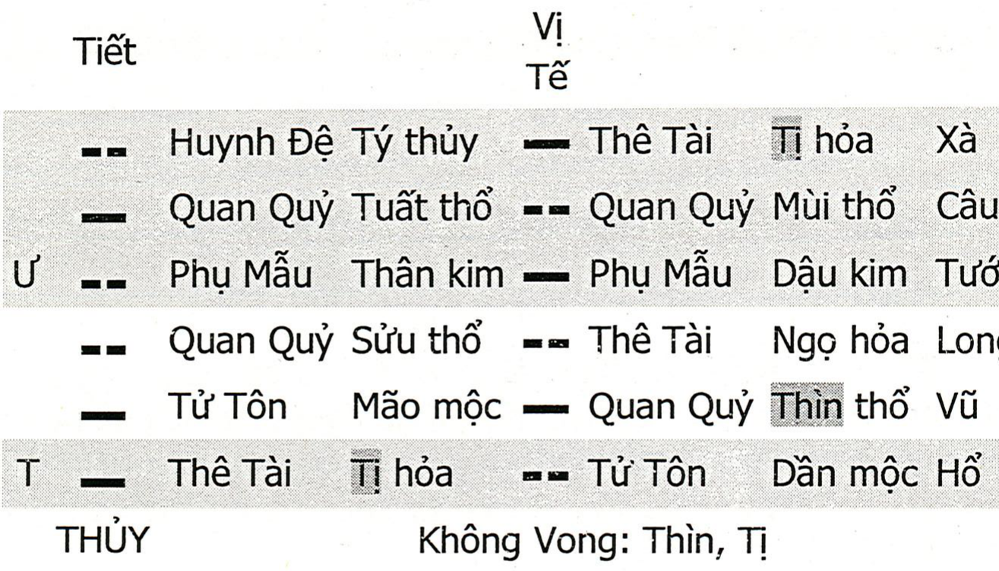

### Ví dụ 6: Ngày Đinh Hợi tháng Tý, nam đoán đến vùng khác mở công ty với người sáng chế mô tơ điện sẽ ra sao? Được Địa Thủy Sư biến Lôi Thủy Giải.

| | Sư | | | Giải | |
| :---: | :---: | :--- | :---: | :--- | :--- |
| Ứ | - - | Phụ Mẫu Dậu kim | - - | Quan Quỷ Tuất thổ | Long |
| | - - | Huynh Đệ Hợi thủy | - - | Phụ Mẫu Thân kim | Vũ |
| | - - | Quan Quỷ Sửu thổ | — | Thê Tài Ngọ hỏa | Hổ |
| T | - - | Thê Tài Ngọ hỏa | - - | Thê Tài Ngọ hỏa | Xà |
| | — | Quan Quỷ Thìn thổ | — | Quan Quỷ Thìn thổ | Câu |
| | - - | Tử Tôn Dần mộc | - - | Tử Tôn Dần mộc | Tước |

**THỦY**    Không Vong: Ngọ, Mùi

**Phán đoán:** Lấy Thê Tài làm lợi nhuận, hào Ứng là người hợp tác. Thê Tài Ngọ hỏa trì Thế, Nhật Nguyệt khắc chế hưu tù vô khí, không thể thu được lợi nhuận. Nguyệt phá, đầu tư nhất định phá tài. Thế lâm Đằng Xà, Đằng Xà chủ bất an, bản thân rất lo lắng về số tiền đầu tư sẽ không trở lại.

Hào Ứng hưu tù nhập Mộ tại Quan Quỷ Sửu thổ, Quan Quỷ là bệnh, chứng tỏ kỹ thuật của đối phương không thành thục, mô tơ điện được phát minh có vấn đề. Hào Thế Không Vong, chủ từ bỏ, là quy hồn, quy hồn bất xuất gia, vì vậy phán đoán sẽ không ra ngoài hợp tác mở công ty.

**Phản hồi:** Quả nhiên sau nhiều lần đánh giá cảm thấy tính khả thi thấp, anh ta đã từ bỏ hợp tác.

### Ví dụ 7: Ngày Nhâm Dần tháng Hợi, nam hợp ý một căn nhà, đoán xem mua có thuận lợi hay không? Được Địa Trạch Lâm.

| | Lâm | | |
| :---: | :---: | :--- | :--- |
| | - - | Tử Tôn Dậu kim | Hổ |
| Ứ | - - | Thê Tài Hợi thủy | Xà |
| | - - | Huynh Đệ Sửu thổ | Câu |
| | - - | Huynh Đệ Sửu thổ | Tước |
| T | — | Quan Quỷ Mão mộc | Long |
| | — | Phụ Mẫu Tị hỏa | Vũ |

**THỔ**    Không Vong: Thìn, Tị

**Phán đoán:** Lấy Phụ Mẫu làm Dụng thần. Phụ Mẫu Tị hỏa được Nhật sinh, hào Thế sinh, bản thân rất muốn căn nhà này. Nhưng Dụng thần bị Nguyệt xung phá, lại gặp Không Vong, sợ là không thành. Dụng thần bị Tài xung phá, Tài nhập quẻ tại hào 5, hào Ứng, hào 5 Tài là đắt, Ứng lâm Tài là vợ. Vì vậy, nếu không phải vì quá đắt thì chính là do vợ không đồng ý mua, khó mà giao dịch.

**Phản hồi:** Kết quả là căn nhà quá đắt, vợ không đồng ý mua cho nên đã từ bỏ.

**Ví dụ 8:** Ngày Mậu Dần tháng Thìn, nam đoán nhận thầu bể bơi có thể thành hay không? Được Chấn Vi Lôi.

### Chấn

| Thế/Ứng | Hào | Lục thân | Can chi | Lục thú |
| :---: | :---: | :--- | :--- | :--- |
| T | - - | Thê Tài | Tuất thổ | Tước |
| | - - | Quan Quỷ | Thân kim | Long |
| | — | Tử Tôn | Ngọ hỏa | Vũ |
| Ứ | - - | Thê Tài | Thìn thổ | Hổ |
| | - - | Huynh Đệ | Dần mộc | Xà |
| | — | Phụ Mẫu | Tý thủy | Câu |

**MỘC** Không Vong: Thân, Dậu

**Phán đoán:** Lấy Phụ Mẫu làm Dụng thần. Phụ Mẫu Tý thủy Nguyệt khắc Nhật không trợ giúp là hưu tù. Hào Thế lâm Tài Nguyệt phá, tượng vô tài, lại là quẻ lục xung, e rằng không nhận được nhận thầu.

**Phản hồi:** Quả nhiên không nhận được thầu.

**Ví dụ 9:** Ngày Giáp Thân tháng Sửu, nam đoán tiền đồ của nhà hàng em trai, được Đoài Vi Trạch biến Thiên Lôi Vô Vọng.

### Đoài biến Vô Vọng

| Thế/Ứng | Đoài | | | Vô Vọng | | | Lục thú |
| :---: | :---: | :--- | :--- | :---: | :--- | :--- | :--- |
| T | - - | Phụ Mẫu | Mùi thổ | — | Phụ Mẫu | Tuất thổ | Vũ |
| | — | Huynh Đệ | Dậu kim | — | Huynh Đệ | Thân kim | Hổ |
| | — | Tử Tôn | Hợi thủy | — | Quan Quỷ | Ngọ hỏa | Xà |
| Ứ | - - | Phụ Mẫu | Sửu thổ | - - | Phụ Mẫu | Thìn thổ | Câu |
| | — | Thê Tài | Mão mộc | - - | Thê Tài | Dần mộc | Tước |
| | — | Quan Quỷ | Tị hỏa | — | Tử Tôn | Tý thủy | Long |

**KIM** Không Vong: Ngọ, Mùi

**Phán đoán:** Lấy Thê Tài làm Dụng thần. Thê Tài Mão mộc không được Nhật Nguyệt trợ giúp, bị Nhật khắc thương, lại động mà hóa thoái không cát, nhất định kinh doanh không thuận lợi.

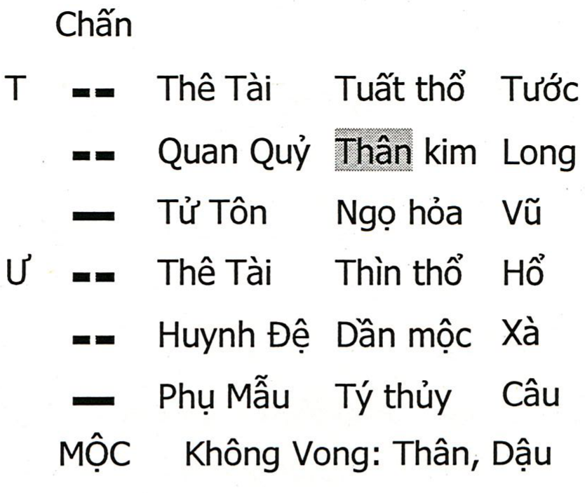

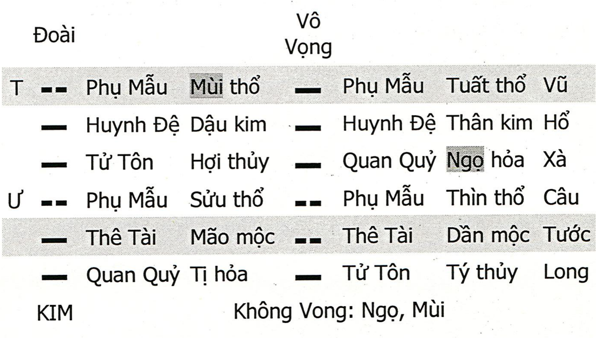

Hào Thế là Tài khố, biểu thị tiền dự trữ, bị Nguyệt xung phá, lại gặp Không Vong, đây là thông tin tiêu xài hết số tiền dự trữ.

**Phản hồi:** Quả nhiên kinh doanh không được, không những xài hết số tiền dự trữ mà còn mắc nợ ngổn ngang.

## 11. KHÔNG VONG

Trong dự đoán kinh tế, Không Vong có thể giúp phán đoán cát hung cơ bản. Ngoài ra, nếu muốn phán đoán sự việc một cách chi tiết và tinh tế hơn, chúng ta phải nắm được cách sử dụng về tượng của Không Vong.

Ý nghĩa chủ yếu của Không Vong: Hư không, mất mát, vô căn cứ, bất an, chung kết, giả tạo, khuyết thiếu, thấp trũng, hang động, không gian, sơ hở, không thành tâm, tình ý giả dối, lừa gạt, không có, thiếu hụt,...

**Ví dụ 1:** Ngày Canh Dần tháng Mão, nam đoán tài vận, được Trạch Lôi Tùy.

### Tùy

| Thế/Ứng | Hào | Lục thân | Can chi | Phục thần | Lục thú |
| :---: | :---: | :--- | :--- | :--- | :--- |
| Ứ | - - | Thê Tài | Mùi thổ | | Xà |
| | — | Quan Quỷ | Dậu kim | | Câu |
| | — | Phụ Mẫu | Hợi thủy | Tử Ngọ | Tước |
| T | - - | Thê Tài | Thìn thổ | | Long |
| | - - | Huynh Đệ | Dần mộc | | Vũ |
| | — | Phụ Mẫu | Tý thủy | | Hổ |

**MỘC** Không Vong: Ngọ, Mùi

**Phán đoán:** Lấy Thê Tài làm Dụng thần. Trong quẻ Thê Tài lưỡng hiện, lấy hào Thê Tài Mùi thổ Không Vong làm Dụng thần. Dụng thần không được Nhật Nguyệt trợ giúp, trái lại Nhật Nguyệt khắc Tài, vì vậy tài vận không tốt đẹp. Huynh Đệ nhập quẻ tại hào 2 lâm Huyền Vũ khắc Tài, Huyền Vũ chủ đầu cơ, bài bạc mà phá tài.

Dụng thần Thê Tài Mùi thổ lâm Đằng Xà hưu tù mà Không Vong, Đằng Xà chủ thiếu, hưu tù chủ thiếu, Không Vong chủ không có, ngay cả chút ít tiền cũng không có. Quẻ Trạch Lôi Tùy có ý nghĩa là phụ họa, đi theo, đây là thông tin sống nhờ vào

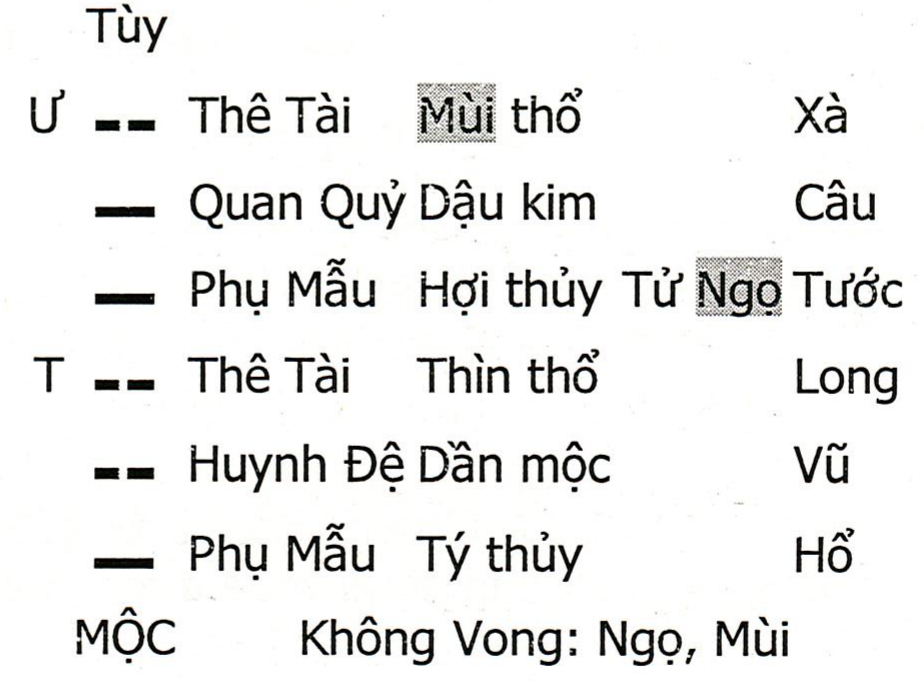 người khác. Hào Thế là Mộ khố hào Ứng hào Tài, chính là dùng tiền của người khác, vay tiền để sống.

**Phản hồi:** Trên thực tế, người này vay tiền buôn bán cổ phiếu và đánh bạc bằng máy điện tử cho nên phá tài rất nhiều.

**Ví dụ 2:** Ngày Canh Tuất tháng Tuất, nam đoán mở thẩm mỹ viện sẽ ra sao? Được Trạch Thiên Quải biến Lôi Thiên Đại Tráng.

| | Quải | Đại Tráng | |
| :--- | :--- | :--- | :--- |
| | -- Huynh Đệ Mùi thổ | -- Huynh Đệ Tuất thổ | Xà |
| T | — Tử Tôn Dậu kim | -- Tử Tôn Thân kim | Câu |
| | — Thê Tài Hợi thủy | — Phụ Mẫu Ngọ hỏa | Tước |
| | — Huynh Đệ Thìn thổ | — Huynh Đệ Thìn thổ | Long |
| Ư | — Quan Quỷ Dần mộc Phụ Tị | — Quan Quỷ Dần mộc | Vũ |
| | — Thê Tài Tý thủy | — Thê Tài Tý thủy | Hổ |

THỔ Không Vong: Dần, Mão

**Phán đoán:** Lấy Thê Tài làm Dụng thần. Trong quẻ Thê Tài lưỡng hiện, đều không phát động, cũng bất Không bất phá, lấy Thê Tài Hợi thủy gần hào Thế làm Dụng thần. Dụng thần không được Nhật Nguyệt sinh phù, bị Nhật Nguyệt khắc chế là vô căn. Nguyên thần lâm Thế, động mà hóa thoái cũng là tượng không cát, không thể thu được lợi nhuận. Hào 2 là cửa hàng, Không Vong, phán đoán hiện nay vẫn chưa thuê được cửa hàng. Vì vậy, tôi khuyên người này không làm thì tốt hơn.

**Phản hồi:** Khi dự đoán quả nhiên vẫn chưa thuê được cửa hàng, nhưng vì nóng ruột cầu tài cho nên vẫn tìm cửa hàng và bắt đầu kinh doanh, kết quả là đã thua lỗ.

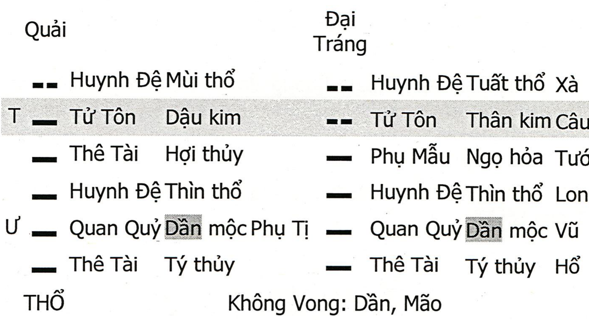

**Ví dụ 3:** Ngày Giáp Thân tháng Ngọ, một thương gia đang chào bán cửa hàng, người đó nói là sau khi mua được cửa hàng này thì không muốn tự mình kinh doanh, họ sẽ giúp đỡ cho thuê, người mua cửa hàng có thể ngồi thu tiền thuê. Nam đoán mua cửa hàng đó coi như đầu tư sẽ ra sao? Được Phong Sơn Tiệm biến Thiên Sơn Độn.

| | Tiệm | Độn | |
| :--- | :--- | :--- | :--- |
| Ư | — Quan Quỷ Mão mộc | — Huynh Đệ Tuất thổ | Vũ |
| | — Phụ Mẫu Tị hỏa Tài Tý | — Tử Tôn Thân kim | Hổ |
| | -- Huynh Đệ Mùi thổ | — Phụ Mẫu Ngọ hỏa | Xà |
| T | — Tử Tôn Thân kim | — Tử Tôn Thân kim | Câu |
| | -- Phụ Mẫu Ngọ hỏa | -- Phụ Mẫu Ngọ hỏa | Tước |
| | -- Huynh Đệ Thìn thổ | -- Huynh Đệ Thìn thổ | Long |

THỔ Không Vong: Ngọ, Mùi

**Phán đoán:** Lấy Thê Tài làm lợi ích, Phụ Mẫu là hợp đồng. Thê Tài Tý thủy không hiện trên quẻ, phục dưới hào 5 Phụ Mẫu Tị hỏa. Mặc dù có Nhật đến sinh, nhưng bị Nguyệt xung phá, Huynh Đệ Mùi thổ lại hóa hồi đầu sinh đến khắc, vì vậy không thể thu được lợi nhuận.

Về nguyên nhân, Thê Tài Tý thủy bị Nguyệt xung phá, Nguyệt là Phụ Mẫu, Phụ Mẫu là hợp đồng, hợp đồng mua cửa hàng chắc chắn có vấn đề. Lại xem trong quẻ, Phụ Mẫu Ngọ hỏa Không Vong chứng tỏ hợp đồng có sơ hở. Huynh Đệ Mùi thổ hóa Phụ Mẫu Ngọ hỏa, Không hóa Không, lâm Đằng Xà, Không Vong biểu thị giả tạo, Đằng Xà cũng là giả tạo, chứng tỏ người bán có hành vi lừa dối.

**Phản hồi:** Nhưng người này không nghe, vẫn cứ mua, kết quả là sau khi ký hợp đồng thì mới phát hiện bị lừa, ba năm trôi qua không được xu nào. Người thương gia nói là anh ta chưa có sổ hồng chính thức cho nên không thể trả tiền thuê cho anh ta, nhưng nếu muốn làm sổ hồng thì cần phải trả toàn bộ chi phí mua cửa hàng. Lúc đầu thì người thương gia kia nói là có thể trả góp, thế là anh ta đã vay tiền ngân hàng để mua, kết quả là không

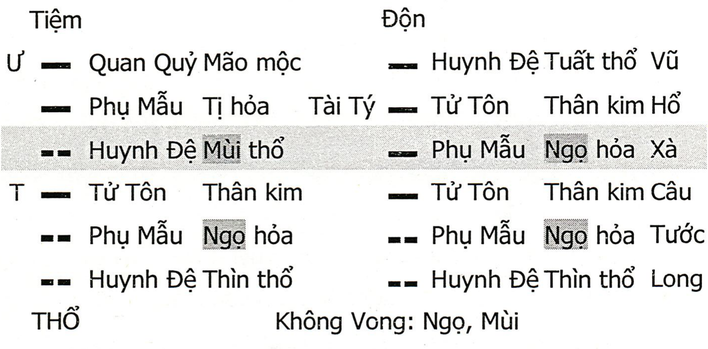

---

# Part 6 (Pages 101-120)

những không thu được tiền thuê mà mỗi năm còn phải trả nợ đã vay ngân hàng.

**Ví dụ 4:** Ngày Ất Tị tháng Dậu, nghe nói cục thuế vụ sắp đến công ty để kiểm toán, thế là đoán xem họ có đến hay không? Được Thủy Địa Tỷ biến Trạch Sơn Hàm.

| | Tỷ | | | Hàm | |
| :---: | :---: | :--- | :---: | :--- | :---: |
| Ứ | - - | Thê Tài Tý thủy | - - | Huynh Đệ Mùi thổ | Vũ |
| | — | Huynh Đệ Tuất thổ | — | Tử Tôn Dậu kim | Hổ |
| | - - | Tử Tôn Thân kim | — | Thê Tài Hợi thủy | Xà |
| T | - - | Quan Quỷ Mão mộc | — | Tử Tôn Thân kim | Câu |
| | - - | Phụ Mẫu Tị hỏa | - - | Phụ Mẫu Ngọ hỏa | Tước |
| | - - | Huynh Đệ Mùi thổ | - - | Huynh Đệ Thìn thổ | Long |

THỔ Không Vong: Dần, Mão

**Phán đoán:** Quan Quỷ là cán bộ thuế vụ, vì vậy lấy Quan Quỷ làm Dụng thần. Quan Quỷ Mão mộc Nguyệt phá, động hóa hồi đầu khắc, Tử Tôn động đến khắc là hưu tù, lại gặp Không Vong, Không Vong biểu thị không nhìn thấy, không xuất hiện, vì vậy sẽ không đến.

**Phản hồi:** Kết quả là nói sẽ đến nhưng lại không đến.

**Ví dụ 5:** Ngày Ất Hợi tháng Tuất, nữ đoán mở sạp trái cây trước nhà sẽ ra sao? Được Thủy Sơn Kiển biến Thủy Địa Tỷ.

| | Kiển | | | Tỷ | |
| :---: | :---: | :--- | :---: | :--- | :---: |
| | - - | Tử Tôn Tý thủy | - - | Tử Tôn Tý thủy | Vũ |
| | — | Phụ Mẫu Tuất thổ | — | Phụ Mẫu Tuất thổ | Hổ |
| T | - - | Huynh Đệ Thân kim | - - | Huynh Đệ Thân kim | Xà |
| | — | Huynh Đệ Thân kim | - - | Thê Tài Mão mộc | Câu |
| | - - | Quan Quỷ Ngọ hỏa Tài Mão | - - | Quan Quỷ Tị hỏa | Tước |
| Ứ | - - | Phụ Mẫu Thìn thổ | - - | Phụ Mẫu Mùi thổ | Long |

KIM Không Vong: Thân, Dậu

**Phán đoán:** Mục đích là để kiếm tiền, lấy Thê Tài làm Dụng thần. Hào Tài Mão mộc mặc dù phục mà không hiện trên quẻ, nhưng Nguyệt hợp là vượng, lại được Nhật Trường Sinh, không thể coi là nhược.

Huynh Đệ mặc dù phát động nhưng động mà hóa Tài, có thể được tài bất ngờ. Nhưng hào Thế Không mà lâm Đằng Xà, trong lòng thấp thỏm, do dự bất định, hạ không quyết tâm. E rằng chỉ là mình muốn mà thôi, sẽ không kinh doanh.

**Phản hồi:** Trên thực tế, đã chuẩn bị nửa ngày nhưng vẫn không mở sạp.

**Ví dụ 6:** Ngày Giáp Thìn tháng Mùi, nữ đoán xem đi thuê phòng có thành công hay không? Được Địa Hỏa Minh Di biến Sơn Thiên Đại Súc.

| | Minh Di | | | Đại Súc | |
| :---: | :---: | :--- | :---: | :--- | :---: |
| | - - | Phụ Mẫu Dậu kim | — | Tử Tôn Dần mộc | Vũ |
| | - - | Huynh Đệ Hợi thủy | - - | Huynh Đệ Tý thủy | Hổ |
| T | - - | Quan Quỷ Sửu thổ | - - | Quan Quỷ Tuất thổ | Xà |
| | — | Huynh Đệ Hợi thủy Tài Ngọ | — | Quan Quỷ Thìn thổ | Câu |
| | - - | Quan Quỷ Sửu thổ | — | Tử Tôn Dần mộc | Tước |
| Ứ | — | Tử Tôn Mão mộc | — | Huynh Đệ Tý thủy | Long |

THỦY Không Vong: Dần, Mão

**Phán đoán:** Lấy Phụ Mẫu làm Dụng thần. Phụ Mẫu Dậu kim được Nhật Nguyệt sinh phù là vượng tướng, nhưng động mà hóa Không, biểu thị trong căn nhà muốn thuê không có đồ đạc gì cả. Lâm hào 6, hào 6 là cũ, biểu thị là nhà cũ. Lâm Huyền Vũ, Huyền Vũ chủ thấp khí, chứng tỏ nhà ẩm thấp, rò rỉ nước. Hào 2 Nguyên thần lâm Chu Tước Nguyệt phá hóa Không, Chu Tước chủ nhiệt, nhà không có lò sưởi.

**Phản hồi:** Quả nhiên đúng với phán đoán, từ bỏ thuê phòng.

**Ví dụ 7: Ngày Ất Tị tháng Mùi, nữ đoán tình hình kinh doanh của khách sạn, được Thiên Thủy Tụng biến Trạch Thủy Khốn.**

| | Tụng | | | | Khốn | | |
|---|---|---|---|---|---|---|---|
| | — | Tử Tôn | Tuất thổ | - - | Tử Tôn | Mùi thổ | Vũ |
| | — | Thê Tài | Thân kim | — | Thê Tài | Dậu kim | Hổ |
| T | — | Huynh Đệ | Ngọ hỏa | — | Quan Quỷ | Hợi thủy | Xà |
| | - - | Huynh Đệ | Ngọ hỏa | - - | Huynh Đệ | Ngọ hỏa | Câu |
| | — | Tử Tôn | Thìn thổ | — | Tử Tôn | Thìn thổ | Tước |
| Ư | - - | Phụ Mẫu | Dần mộc | - - | Phụ Mẫu | Dần mộc | Long |

HỎA Không Vong: Dần, Mão

**Phán đoán:** Lấy Thê Tài làm Dụng thần. Thê Tài Thân kim Nguyệt sinh Nhật khắc, suy vượng tương đương. Nhưng không nên Nguyên thần phát động hóa thoái, biểu thị hiện nay kinh doanh không thuận lợi. Ứng là khách hàng, lâm Phụ Mẫu Không Vong, Phụ Mẫu là căn phòng, Không Vong là trống rỗng, biểu thị trong phòng trống không, không có khách ở.

**Phản hồi:** Trên thực tế đúng là như vậy. Doanh số thậm chí không đủ để trả tiền lương cho nhân viên.

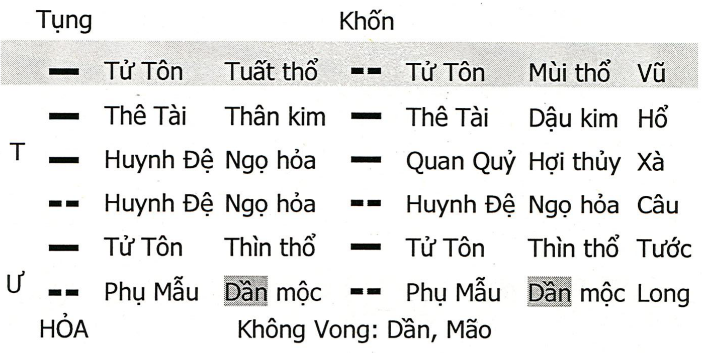

**Ví dụ 8: Ngày Đinh Mão tháng Dậu, nam đoán xem vé số mình mua có trúng thưởng hay không? Được Thiên Phong Cấu biến Thiên Sơn Độn.**

| | Cấu | | | | Độn | | | |
|---|---|---|---|---|---|---|---|---|
| | — | Phụ Mẫu | Tuất thổ | | — | Phụ Mẫu | Tuất thổ | Long |
| | — | Huynh Đệ | Thân kim | | — | Huynh Đệ | Thân kim | Vũ |
| Ư | — | Quan Quỷ | Ngọ hỏa | | — | Quan Quỷ | Ngọ hỏa | Hổ |
| | — | Huynh Đệ | Dậu kim | | — | Huynh Đệ | Thân kim | Xà |
| | — | Tử Tôn | Hợi thủy | Tài Dần | - - | Quan Quỷ | Ngọ hỏa | Câu |
| T | - - | Phụ Mẫu | Sửu thổ | | - - | Phụ Mẫu | Thìn thổ | Tước |

KIM Không Vong: Tuất, Hợi

**Phán đoán:** Lấy Thê Tài làm Dụng thần. Thê Tài Dần mộc không hiện trên quẻ, phục tàng dưới Tử Tôn Hợi thủy. Dụng thần Nguyệt khắc, Nhật trợ giúp, suy vượng tương đương. Tử Tôn Hợi thủy phát động sinh Dụng thần vốn là cát, nhưng Huynh Đệ Dậu kim ám động khắc Dụng thần, mà Tử Tôn Hợi thủy Không vong, không thể dẫn hóa Huynh Đệ, vì vậy Dụng thần hưu tù, không trúng.

**Phản hồi:** Quả nhiên không trúng thưởng.

## 12. LỤC HỢP VÀ LỤC XUNG

Lục hợp và lục xung là những hiện tượng cơ bản thường thấy trong dự đoán. Trong dự đoán kinh tế, ngoài phán đoán cát hung thông thường, lục hợp và lục xung cũng được phán đoán theo góc độ tượng, trích xuất thông tin sâu sắc hơn, cụ thể hóa nội dung dự đoán, khiến dự đoán đạt đến cảnh giới xuất thần nhập hóa.

Ý nghĩa chủ yếu của lục hợp: Hội họp, gặp nhau, triền miên, cản trở, giữ lại, lưu lại, liên lụy, bận tâm, dừng lại, hòa hảo, thân nhau, hòa hợp, bổ sung, bổ khuyết, hợp tác, che phủ, trùng điệp, chồng chất, gấp lại, liên tiếp,...

Ý nghĩa chủ yếu của lục xung: Xung khai, xung động, xung tán, phân ly, nhấp nhô, bấp bênh, bất an, chạy loạn, bắt gặp,

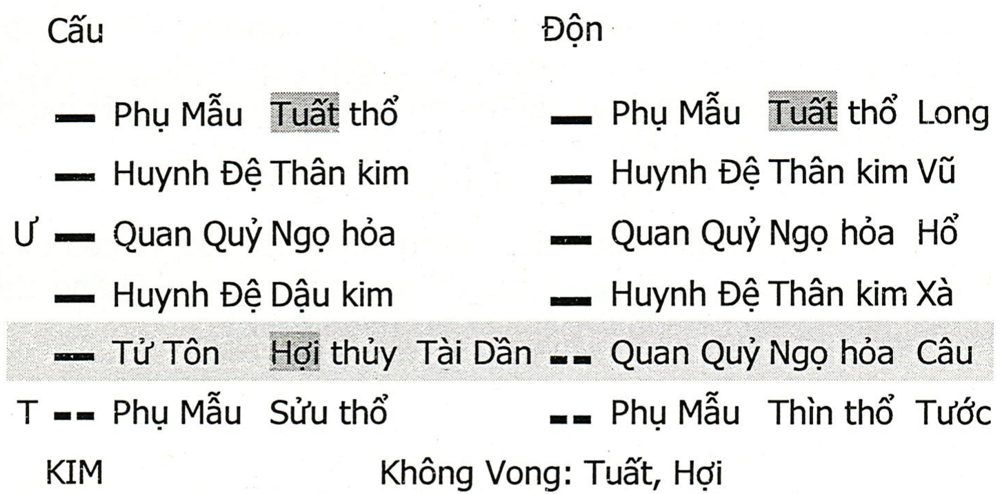 tháo rời, xen vào, thâm nhập, chạm trán nhau, đánh nhau, xung đột, tranh đấu, gây mâu thuẫn, bất hòa, gây xích mích, không ổn định, không chỉnh tề,...

Trong dự đoán, khi ứng dụng ý nghĩa của chúng không được cứng nhắc, cần căn cứ vào nội dung dự đoán mà linh hoạt biến hóa. Dự đoán cầu tài và kinh doanh, gặp hợp thường là hợp tác cầu tài, hào Tài gặp xung thì thu nhập không ổn định. Trong tình huống gặp xung, Nguyệt xung có thể dùng Nguyệt phá để thủ tượng, không nên phán đoán theo lục xung.

**Ví dụ 1:** Ngày Mậu Thân tháng Sửu, một học trò của tôi khi kiểm tra lại doanh số cửa hàng thì phát hiện con số không chính xác, đoán xem tiền đã đi đâu? Được Thiên Địa Bĩ.

| | Bĩ | | | | |
| :--- | :---: | :--- | :--- | :--- | :--- |
| Ứ | — | Phụ Mẫu | Tuất thổ | | Tước |
| | — | Huynh Đệ | Thân kim | | Long |
| | — | Quan Quỷ | Ngọ hỏa | | Vũ |
| T | - - | Thê Tài | Mão mộc | | Hổ |
| | - - | Quan Quỷ | Tị hỏa | | Xà |
| | - - | Phụ Mẫu | Mùi thổ | Tử Tý | Câu |

KIM Không Vong: Dần, Mão

**Phán đoán:** Lấy Thê Tài làm Dụng thần. Thê Tài Mão mộc không được Nhật Nguyệt sinh phù, bị Nhật khắc là hưu tù, chứng tỏ số tiền không nhiều. Dụng thần trì Thế là thông tin tiền nằm trong tay, nhưng Không Vong lại biểu thị mất tiền. Dụng thần và hào Ứng tương hợp, Ứng là người khác, là tiền trong tay mình lại chuyển đến tay người khác.

**Phản hồi:** Sau đó, anh ta nhớ lại là đã đem tiền cho bạn mượn nhưng lại quên mất.

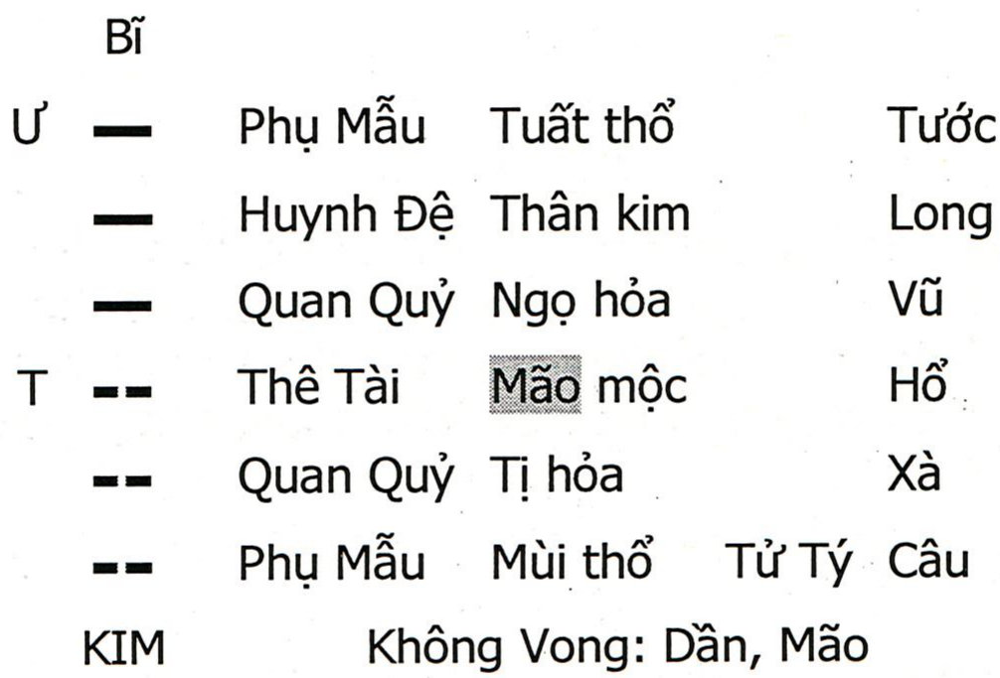

**Ví dụ 2:** Ngày Đinh Dậu tháng Mão, nam đoán tài vận, được Thiên Lôi Vô Vọng biến Hỏa Trạch Khuê.

| | Vô Vọng | | | Khuê | | | |
| :--- | :---: | :--- | :--- | :---: | :--- | :--- | :--- |
| | — | Thê Tài | Tuất thổ | — | Tử Tôn | Tị hỏa | Long |
| | — | Quan Quỷ | Thân kim | - - | Thê Tài | Mùi thổ | Vũ |
| T | — | Tử Tôn | Ngọ hỏa | — | Quan Quỷ | Dậu kim | Hổ |
| | - - | Thê Tài | Thìn thổ | - - | Thê Tài | Sửu thổ | Xà |
| | - - | Huynh Đệ | Dần mộc | — | Huynh Đệ | Mão mộc | Câu |
| Ứ | — | Phụ Mẫu | Tý thủy | — | Tử Tôn | Tị hỏa | Tước |

MỘC Không Vong: Thìn, Tị

**Phán đoán:** Lấy Thê Tài làm Dụng thần. Trong quẻ Thê Tài lưỡng hiện, lấy Thê Tài Thìn thổ Không Vong làm Dụng thần. Nguyệt khắc Dụng thần, Nhật không đến sinh là hưu tù. Kỵ thần Huynh Đệ động hóa Tiến thần đến khắc, tài vận càng ngày càng tệ. Nhật thần hợp vướng chân Dụng thần, vòng quay vốn không linh hoạt.

Quẻ lục xung là tượng bôn ba. Hào Thế mặc dù là Nguyên thần nhưng không phát động, cho nên muốn sinh Tài thì cần phải động mới được. Đây chính là thủ tượng vất vả cầu tài, dốc sức làm việc.

**Phản hồi:** Trên thực tế, người này mở nhà máy in ấn, tài vận đúng như phán đoán.

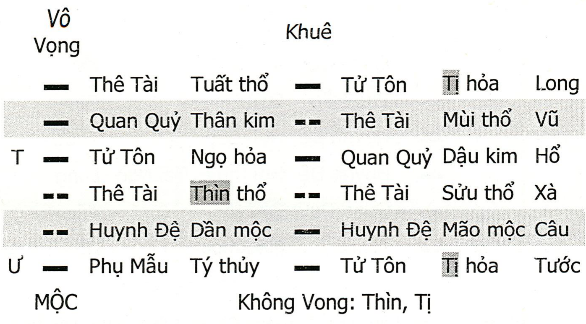

### Ví dụ 3: Ngày Canh Thân tháng Mùi, một người đoán làm công trình có thể kiếm được tiền hay không? Được Trạch Hỏa Cách.

| | Cách | | | |
| :---: | :---: | :--- | :--- | :--- |
| | - - | Quan Quỷ Mùi thổ | | Xà |
| | — | Phụ Mẫu Dậu kim | | Câu |
| T | — | Huynh Đệ Hợi thủy | | Tước |
| | — | Huynh Đệ Hợi thủy | Tài Ngọ | Long |
| | - - | Quan Quỷ Sửu thổ | | Vũ |
| Ư | — | Tử Tôn Mão mộc | | Hổ |

THỦY Không Vong: Tý, Sửu

**Phán đoán:** Lấy Thê Tài làm Dụng thần. Thê Tài Ngọ hỏa không hiện trên quẻ, phục tàng dưới hào 3 Huynh Đệ Hợi thủy. Dụng thần không được Nhật Nguyệt sinh phù, chỉ là Nguyệt hợp được khí. Nhưng Huynh Đệ trì Thế, Phi thần lại là Huynh Đệ, được Nhật sinh phù vượng mà khắc Tài không cát, vì vậy nhất định kiếm không được tiền, trái lại thâm hụt tiền.

Hào Tài gặp hợp là hợp tác cầu tài, quẻ này Tài và Nguyệt hợp, vì vậy không phải là làm một mình mà là hợp tác với người ta. Phản hồi là hai người hợp tác. Thê Tài là hỏa, hỏa chủ số 7, bởi vì là hợp tác, một chia thành hai, vì vậy phán đoán bọn họ mỗi người thâm hụt 3.5 vạn tệ.

**Phản hồi:** Quả nhiên ứng nghiệm.

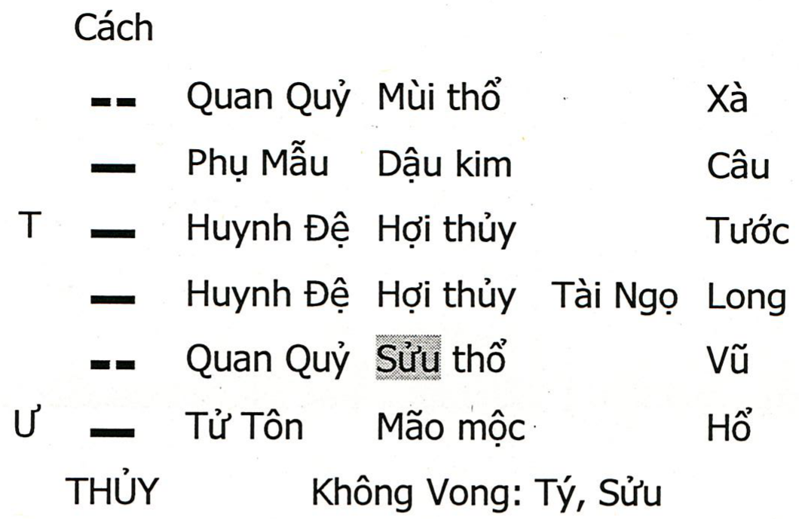

### Ví dụ 4: Ngày Bính Tuất tháng Dậu, nữ đoán xem kinh doanh rượu sẽ ra sao? Được Đoài Vi Trạch biến Trạch Hỏa Cách.

| | Đoài | | | Cách | |
| :---: | :---: | :--- | :---: | :--- | :--- |
| T | - - | Phụ Mẫu Mùi thổ | - - | Phụ Mẫu Mùi thổ | Long |
| | — | Huynh Đệ Dậu kim | — | Huynh Đệ Dậu kim | Vũ |
| | — | Tử Tôn Hợi thủy | — | Tử Tôn Hợi thủy | Hổ |
| Ư | - - | Phụ Mẫu Sửu thổ | — | Tử Tôn Hợi thủy | Xà |
| | — | Thê Tài Mão mộc | - - | Phụ Mẫu Sửu thổ | Câu |
| | — | Quan Quỷ Tị hỏa | — | Thê Tài Mão mộc | Tước |

KIM Không Vong: Ngọ, Mùi

**Phán đoán:** Lấy Thê Tài làm Dụng thần. Thê Tài Mão mộc bị Nguyệt kiến xung phá, mặc dù được Nhật hợp mà giải phá, nhưng Nhật Nguyệt không sinh, Cừu thần phát động, hào Thế Không Vong, không có lợi nhuận gì. Quẻ lục xung, không thể lâu dài.

**Phản hồi:** Quả nhiên không có lợi nhuận mà ngừng kinh doanh.

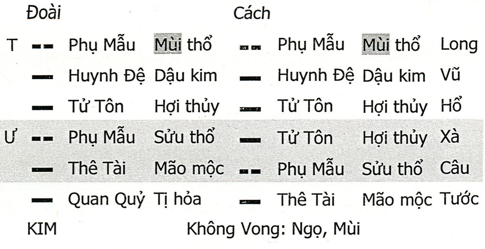

**Ví dụ 5:** Ngày Bính Tý tháng Dần, nam đoán xem hợp tác làm du lịch với đoàn lữ hành sẽ ra sao? Được Thiên Lôi Vô Vọng biến Ly Vi Hỏa.

| | Vô Vọng | Ly | |
| :---: | :--- | :--- | :---: |
| | — Thê Tài Tuất thổ | — Tử Tôn Tị hỏa | Long |
| | — Quan Quỷ Thân kim | - - Thê Tài Mùi thổ | Vũ |
| T | — Tử Tôn Ngọ hỏa | — Quan Quỷ Dậu kim | Hổ |
| | - - Thê Tài Thìn thổ | — Phụ Mẫu Hợi thủy | Xà |
| | - - Huynh Đệ Dần mộc | - - Thê Tài Sửu thổ | Câu |
| Ư | — Phụ Mẫu Tý thủy | — Huynh Đệ Mão mộc | Tước |

MỘC Không Vong: Thân, Dậu

**Phán đoán:** Lợi nhuận xem Tài, hào Thế là mình, hào Ứng là người hợp tác. Trong quẻ Thê Tài lưỡng hiện, lấy hào Thê Tài Thìn thổ phát động làm Dụng thần. Thê Tài Thìn thổ Nguyệt khắc Nhật không sinh, trong quẻ lại không có ngũ hành khác đến sinh phù, hưu tù vô khí, vì vậy hợp tác không có lợi nhuận gì.

Hào Ứng lâm Nhật xung hào Thế, khiến hào Thế tạo thành ám động đi sinh Thê Tài, đối phương nhờ vào người này để kiếm tiền. Quan Quỷ là người trung gian, động sinh hào Ứng, giúp đối phương mà không giúp hào Thế. Hưu tù Nguyệt phá lại Không Vong, biểu thị không có năng lực. Tại hào 5, người trung gian là người phía chính quyền. Lục xung hóa lục xung, hợp tác không lâu dài.

**Phản hồi:** Quả nhiên sau một lần hợp tác, do năng lực tổ chức của đối phương quá kém cho nên anh ta đã chấm dứt hợp tác.

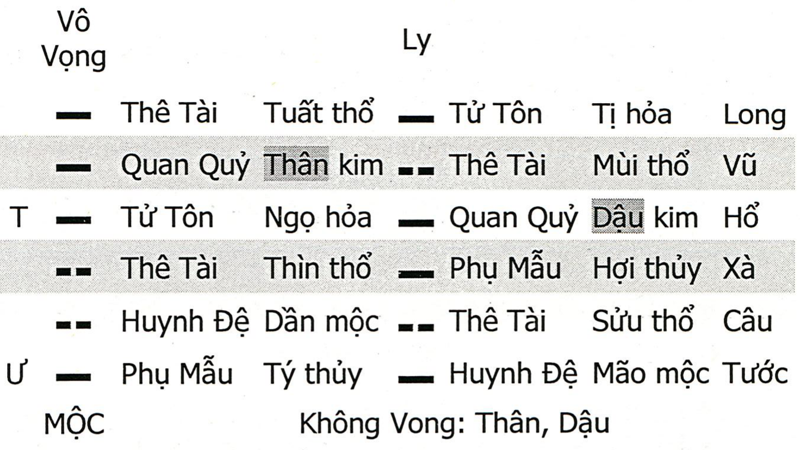

**Ví dụ 6:** Ngày Canh Thìn tháng Hợi năm Tân Tị, nam đoán tài vận, được Hỏa Sơn Lữ biến Ly Vi Hỏa.

| | Lữ | Ly | |
| :---: | :--- | :--- | :---: |
| | — Huynh Đệ Tị hỏa | — Huynh Đệ Tị hỏa | Xà |
| | - - Tử Tôn Mùi thổ | - - Tử Tôn Mùi thổ | Câu |
| Ư | — Thê Tài Dậu kim | — Thê Tài Dậu kim | Tước |
| | — Thê Tài Thân kim Quan Hợi | — Quan Quỷ Hợi thủy | Long |
| | - - Huynh Đệ Ngọ hỏa | - - Tử Tôn Sửu thổ | Vũ |
| T | - - Tử Tôn Thìn thổ Phụ Mão | — Phụ Mẫu Mão mộc | Hổ |

HỎA Không Vong: Thân, Dậu

**Phán đoán:** Lấy Thê Tài làm Dụng thần. Trong quẻ Thê Tài lưỡng hiện, lấy hào Ứng Thê Tài Dậu kim làm Dụng thần. Tài được Nhật hợp là hợp tác cầu tài. Tài lâm hào Ứng, hào Thế phát động đi hợp, là kinh doanh với người ngoài, nhập hàng kiếm tiền.

Ứng lâm Tài Không, hào Thế đi hợp, hợp Tài Không thì tốn công vô ích, số tiền kiếm được sẽ không trở về. Hào Thế lâm Bạch Hổ hóa hồi đầu khắc, hào sơ là chân, là đi lại, Bạch Hổ chủ đường sá, Phụ Mẫu là xe, khắc Tử Tôn không thể sinh Tài, còn phải đề phòng phá tài vì tai nạn xe cộ. Thìn thổ phát động, ứng phát sinh tại năm Canh Thìn.

**Phản hồi:** Trên thực tế, anh ta hợp tác làm tiếp thị cho một nhà máy bia ở Tây An, đã đầu tư rất nhiều tiền không có lãi. Tại năm Canh Thìn, anh ta phá tài vì xe đụng phải người ta.

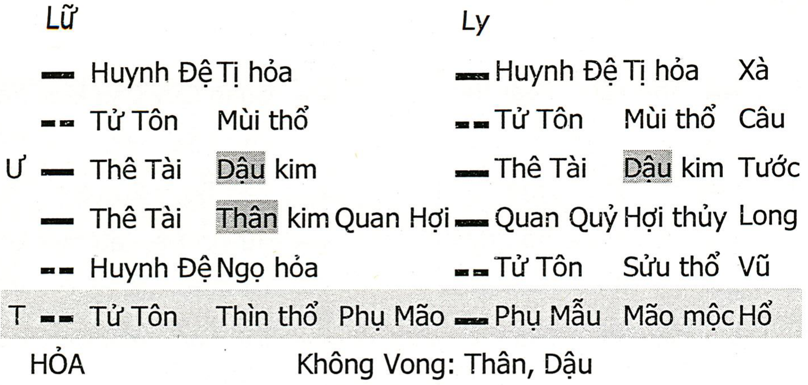

**Ví dụ 7:** Ngày Canh Tý tháng Tị, một học trò của tôi hỏi một quẻ như sau: Có thể hợp tác với người ta để bán hàng hóa cho nhà máy hay không? Được Lôi Địa Dự biến Khôn Vi Địa.

| | Dự | | | Khôn | |
| :--- | :---: | :--- | :---: | :--- | :--- |
| | - - | Thê Tài Tuất thổ | - - | Quan Quỷ Dậu kim | Xà |
| | - - | Quan Quỷ Thân kim | - - | Phụ Mẫu Hợi thủy | Câu |
| Ứ | — | Tử Tôn Ngọ hỏa | - - | Thê Tài Sửu thổ | Tước |
| | - - | Huynh Đệ Mão mộc | - - | Huynh Đệ Mão mộc | Long |
| | - - | Tử Tôn Tị hỏa | - - | Tử Tôn Tị hỏa | Vũ |
| T | - - | Thê Tài Mùi thổ Phụ Tý | - - | Thê Tài Mùi thổ | Hổ |

MỘC Không Vong: Thìn, Tị

**Phán đoán:** Lấy Thê Tài làm Dụng thần. Trong quẻ Thê Tài lưỡng hiện, lấy Thế Thê Tài Mùi thổ làm Dụng thần. Dụng thần được Nguyệt sinh phù, lại được hào Ứng phát động đến sinh, hai người hợp tác thuận lợi. Nhưng nguồn tiền Tử Tôn bị xung, độc phát lục hợp hóa lục xung, công việc kinh doanh này không lâu dài.

**Phản hồi:** Kết quả là đã kiếm tiền được một lần, nhưng sau này bởi vì nhà máy nghi ngờ chất lượng sản phẩm của họ không tốt cho nên đã thôi lấy hàng.

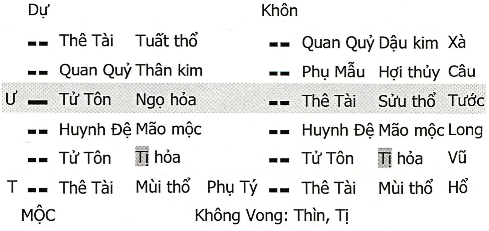

**Ví dụ 8:** Ngày Mậu Dần tháng Mão, nam đoán tình hình kinh doanh của nhà hàng, được Lôi Thiên Đại Tráng biến Thiên Hỏa Đồng Nhân.

| | Đại Tráng | | | Đồng Nhân | |
| :--- | :---: | :--- | :---: | :--- | :--- |
| | - - | Huynh Đệ Tuất thổ | — | Huynh Đệ Tuất thổ | Tước |
| | - - | Tử Tôn Thân kim | — | Tử Tôn Thân kim | Long |
| T | — | Phụ Mẫu Ngọ hỏa | — | Phụ Mẫu Ngọ hỏa | Vũ |
| | — | Huynh Đệ Thìn thổ | — | Thê Tài Hợi thủy | Hổ |
| | — | Quan Quỷ Dần mộc | - - | Huynh Đệ Sửu thổ | Xà |
| Ứ | — | Thê Tài Tý thủy | — | Quan Quỷ Mão mộc | Câu |

THỔ Không Vong: Thân, Dậu

**Phán đoán:** Lấy Thê Tài làm Dụng thần. Thê Tài Tý thủy không được Nhật Nguyệt trợ giúp là hưu tù. Ngoại quái phục ngâm, biểu thị kinh doanh không tốt, trong lòng đang khó chịu. Nguyên thần Tử Tôn Thân kim là nguồn khách hàng, lâm hào 5 Không Vong, hào 5 là đường đi, Không Vong biểu thị lưu lượng khách thấp. Quẻ lục xung, rất ít khách dừng lại.

Phụ Mẫu là cửa hàng, nhập Mộ ở Tuất thổ, nhập Mộ chủ che khuất, không tiện đường. Hào 2 là cửa hàng, lâm Đằng Xà phát động, Đằng Xà chủ khuất nẻo, vì vậy phán đoán nhà hàng không ở trên phố lớn.

**Phản hồi:** Quả nhiên là nhà hàng ở trong hẻm nhỏ, lưu lượng khách thấp, kinh doanh ế ẩm.

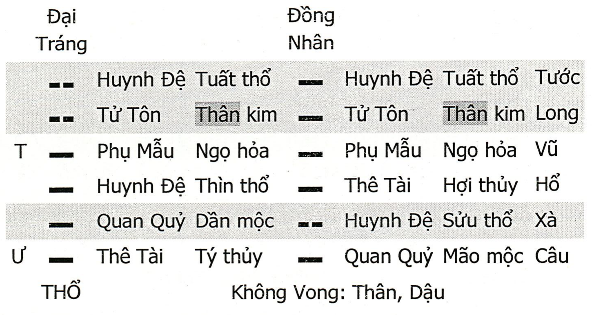

**Ví dụ 9:** Ngày Bính Thân tháng Sửu, nam đoán tình hình kinh doanh phòng karaoke, được Thủy Trạch Tiết biến Đoài Vi Trạch.

| | | Tiết | | Đoài | |
| :---: | :---: | :--- | :---: | :--- | :--- |
| | -- | Huynh Đệ Tý thủy | -- | Quan Quỷ Mùi thổ | Long |
| | — | Quan Quỷ Tuất thổ | — | Phụ Mẫu Dậu kim | Vũ |
| Ứ | -- | Phụ Mẫu Thân kim | — | Huynh Đệ Hợi thủy | Hổ |
| | -- | Quan Quỷ Sửu thổ | -- | Quan Quỷ Sửu thổ | Xà |
| | — | Tử Tôn Mão mộc | — | Tử Tôn Mão mộc | Câu |
| T | — | Thê Tài Tị hỏa | — | Thê Tài Tị hỏa | Tước |

THỦY Không Vong: Thìn, Tị

**Phán đoán:** Lấy Thê Tài làm Dụng thần. Thê Tài Tị hỏa không được Nhật Nguyệt trợ giúp là hưu tù, Dụng thần Không Vong, không thể đắc tài. Thê Tài bị hào Ứng Phụ Mẫu Thân kim hợp mất, Ứng là người khác, Phụ Mẫu là nhà, chính là chủ nhà, tất cả tiền bạc đều chảy vào trong túi của chủ nhà.

**Phản hồi:** Quả nhiên kinh doanh không được, đã thua lỗ hơn 20 vạn.

## 13. PHẢN NGÂM VÀ PHỤC NGÂM

Phản ngâm và phục ngâm là những hiện tượng thường gặp trong dự đoán lục hào. Trong dự đoán kinh tế, chúng cũng ứng nghiệm như vậy. Gặp những hiện tượng này thường chủ sự việc thay đổi thất thường, sự việc phát triển không thuận lợi.

Ý nghĩa chủ yếu của phản ngâm: Thay đổi, bồi hồi, do dự bất định, hồi hộp lo âu, lắc lư, xuyên tạc, lật lại, quay lại, hồi mã thương, hối hận, thất hứa, không ổn định, nhấp nhô, nghiêng ngả, nhảy cao, đong đưa, dao động, mâu thuẫn, tự nuốt lời hứa, không giữ chữ tín, tâm phiền ý loạn, nhiều nỗi suy tư, quyển thổ trùng lai[^1],...

[^1]: Cuộn đất mà trở lại, ý nói thu xếp tất cả vật dụng vốn liếng mà làm lại một lần nữa để được thành công.

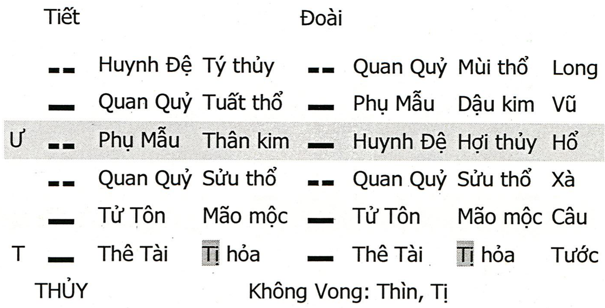

Ý nghĩa chủ yếu của phục ngâm: Nội bộ biến động, nội bộ di chuyển, dài dòng, khóc lóc, bi thương, đau lòng, đình đốn, bán ẽ, lẩm bẩm, tự trách, chần chừ không tiến, dẫm chân tại chỗ,...

**Ví dụ 1:** Ngày Ất Sửu tháng Thân, nữ đoán tình hình phát triển của công ty, được Lôi Trạch Quy Muội biến Càn Vi Thiên.

| | | Quy Muội | | Càn | |
| :---: | :---: | :--- | :---: | :--- | :--- |
| Ứ | -- | Phụ Mẫu Tuất thổ | — | Phụ Mẫu Tuất thổ | Vũ |
| | -- | Huynh Đệ Thân kim | — | Huynh Đệ Thân kim | Hổ |
| | — | Quan Quỷ Ngọ hỏa | — | Quan Quỷ Ngọ hỏa | Xà |
| T | -- | Phụ Mẫu Sửu thổ | — | Phụ Mẫu Thìn thổ | Câu |
| | — | Thê Tài Mão mộc | — | Thê Tài Dần mộc | Tước |
| | — | Quan Quỷ Tị hỏa | — | Tử Tôn Tý thủy | Long |

KIM Không Vong: Tuất, Hợi

**Phán đoán:** Lấy Thê Tài làm Dụng thần, phân tích và phán đoán toàn diện. Thê Tài Mão mộc Nguyệt khắc, Nhật không sinh phù là hưu tù vô căn. Huynh Đệ Thân kim được Nguyệt tỉ phù, Nhật sinh, Ứng Phụ Mẫu đến sinh, hào Thế Phụ Mẫu hóa Tiến thần đến sinh, Huynh Đệ quá vượng, Huynh Đệ quá vượng thì trái lại không khắc Tài, công ty kinh doanh vẫn coi như không có trở ngại.

Phụ Mẫu là công ty, Phụ Mẫu Sửu thổ trì Thế hóa Tiến thần, đây là thông tin bản thân muốn mở rộng công ty. Ngoại quái phục ngâm, công ty phát triển không thuận lợi. Hào Ứng Phụ Mẫu Tuất thổ phát động hợp Thê Tài Mão mộc, chính là có người đòi tiền cô ấy, lâm Huyền Vũ, chủ lén lút, không công khai, tổ hợp này chính là đòi hối lộ.

**Phản hồi:** Trên thực tế, công ty mặc dù không lớn nhưng vẫn có thể duy trì hoạt động. Bản thân muốn mở rộng quy mô công ty để tìm kiếm phát triển, nhưng ban quản lý lại đòi tiền cô ấy, mà cô ấy lại không có tiền để đút lót, vì vậy rất là khổ não.

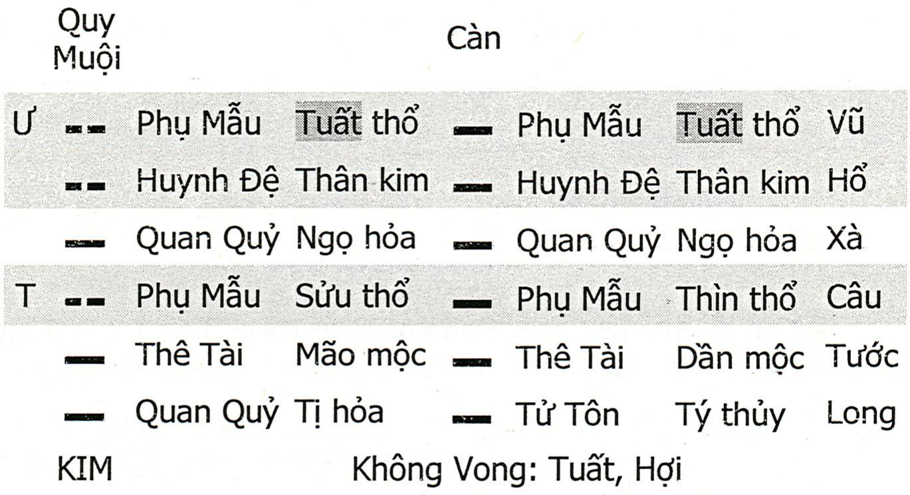

## Ví dụ 2: Ngày Bính Ngọ tháng Tị, nam đoán về thu hút vốn đầu tư từ Mỹ, được Khôn Vi Địa biến Phong Địa Quan.

| | Khôn | | | | Quan | | |
| :--- | :--- | :--- | :--- | :--- | :--- | :--- | :--- |
| T | - - | Tử Tôn | Dậu kim | — | Quan Quỷ | Mão mộc | Long |
| | - - | Thê Tài | Hợi thủy | — | Phụ Mẫu | Tị hỏa | Vũ |
| | - - | Huynh Đệ | Sửu thổ | - - | Huynh Đệ | Mùi thổ | Hổ |
| Ứ | - - | Quan Quỷ | Mão mộc | - - | Quan Quỷ | Mão mộc | Xà |
| | - - | Phụ Mẫu | Tị hỏa | - - | Phụ Mẫu | Tị hỏa | Câu |
| | - - | Huynh Đệ | Mùi thổ | - - | Huynh Đệ | Mùi thổ | Tước |

THỔ Không Vong: Dần, Mão

**Phán đoán:** Lấy Thê Tài làm Dụng thần. Thê Tài Hợi thủy bị Nguyệt xung phá, lại không được Nhật đến trợ giúp là hưu tù.

Hào Thế là phía mình, hào Ứng là đối phương. Hào Ứng Không Vong, đối phương không có thành ý. Hào Thế phát động muốn xung thực hào Ứng, nhưng động mà hóa Không, nỗ lực vô ích. Ngoại quái phản ngâm, biểu thị đã nỗ lực hết lần này đến lần khác, nhiều lần thảo luận với đối phương. Nhưng hào Tài hưu tù, lại là quẻ lục xung cho nên cuối cùng không thành.

**Phản hồi:** Kết quả quả nhiên như phán đoán.

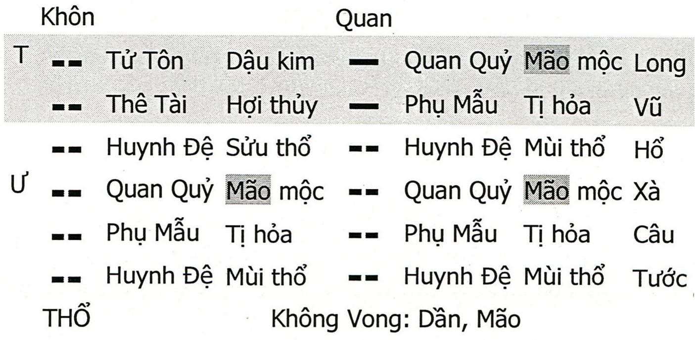

## Ví dụ 3: Ngày Kỷ Dậu tháng Thân, một lãnh đạo đoán về xét duyệt công trình, được Phong Địa Quan biến Địa Trạch Lâm.

| | Quan | | | | Lâm | | |
| :--- | :--- | :--- | :--- | :--- | :--- | :--- | :--- |
| | — | Thê Tài | Mão mộc | - - | Huynh Đệ | Dậu kim | Câu |
| | — | Quan Quỷ | Tị hỏa | - - | Tử Tôn | Hợi thủy | Tước |
| T | - - | Phụ Mẫu | Mùi thổ | - - | Phụ Mẫu | Sửu thổ | Long |
| | - - | Thê Tài | Mão mộc | - - | Phụ Mẫu | Sửu thổ | Vũ |
| | - - | Quan Quỷ | Tị hỏa | — | Thê Tài | Mão mộc | Hổ |
| Ứ | - - | Phụ Mẫu | Mùi thổ | — | Quan Quỷ | Tị hỏa | Xà |

KIM Không Vong: Dần, Mão

**Phán đoán:** Lấy Phụ Mẫu làm Dụng thần. Trong quẻ Phụ Mẫu lưỡng hiện, lấy hào Phụ Mẫu Mùi thổ phát động làm Dụng thần. Dụng thần không được Nhật Nguyệt trợ giúp là hưu tù, nhưng Nhật Nguyệt không khắc, hào 2 động đến sinh, Dụng thần phát động hóa hồi đầu sinh, có hy vọng thành công. Chỉ là ngoại quái phản ngâm, chủ sự việc tráo trở, lúc cho phép, lúc lại không cho phép, tráo tráo trở trở.

**Phản hồi:** Anh ta nói quả nhiên là như vậy.

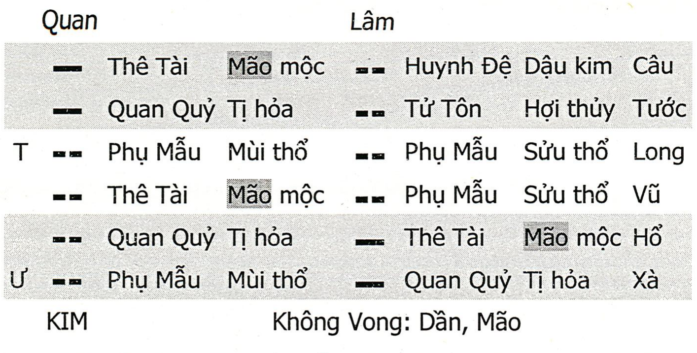

### Ví dụ 4: Ngày Canh Dần tháng Hợi, một người đoán về tình hình cửa hàng thực phẩm, được Địa Thủy Sư biến Phong Lôi Ích.

| | Sư | | | Ích | |
| :---: | :---: | :--- | :---: | :--- | :--- |
| Ư | - - | Phụ Mẫu Dậu kim | — | Tử Tôn Mão mộc | Xà |
| | - - | Huynh Đệ Hợi thủy | — | Thê Tài Tị hỏa | Câu |
| | - - | Quan Quỷ Sửu thổ | - - | Quan Quỷ Mùi thổ | Tước |
| T | - - | Thê Tài Ngọ hỏa | - - | Quan Quỷ Thìn thổ | Long |
| | — | Quan Quỷ Thìn thổ | - - | Tử Tôn Dần mộc | Vũ |
| | - - | Tử Tôn Dần mộc | — | Huynh Đệ Tý thủy | Hổ |

THỦY    Không Vong: Ngọ, Mùi

**Phán đoán:** Lấy Thê Tài làm Dụng thần. Thê Tài Ngọ hỏa trì Thế, Nhật sinh Nguyệt khắc, suy vượng cân bằng. Hào sơ lại có Tử Tôn Dần mộc phát động đến sinh vốn là tượng cát, nhưng không nên Thê Tài Ngọ hỏa Không Vong không được Tử Tôn đến sinh. Lại thêm ngoại quái phản ngâm, chủ sự việc tráo trở không thuận. Huynh Đệ Hợi thủy lại hợp trú Tử Tôn Dần mộc, khiến Tử Tôn Dần mộc tham hợp quên sinh không thể sinh Tài. Do đó kinh doanh không thuận lợi.

Hào 2 là cửa hàng, động hợp hào Ứng, Ứng là người khác, chứng tỏ cửa hàng là của người khác. Phụ Mẫu là cửa hàng, lâm hào Ứng cũng biểu thị cửa hàng là của người khác, bản thân đi thuê để kinh doanh mà thôi. Hào 2 động mà tiết khí hào Tài, tiền thuê cửa hàng cũng ảnh hưởng đến lợi nhuận. Hào 2 phát động, đây là thông tin chuyển cửa hàng.

**Phản hồi:** Quả nhiên là cửa hàng đi thuê, liên tục hao tổn, muốn tìm một cửa hàng rẻ hơn để tiếp tục kinh doanh.

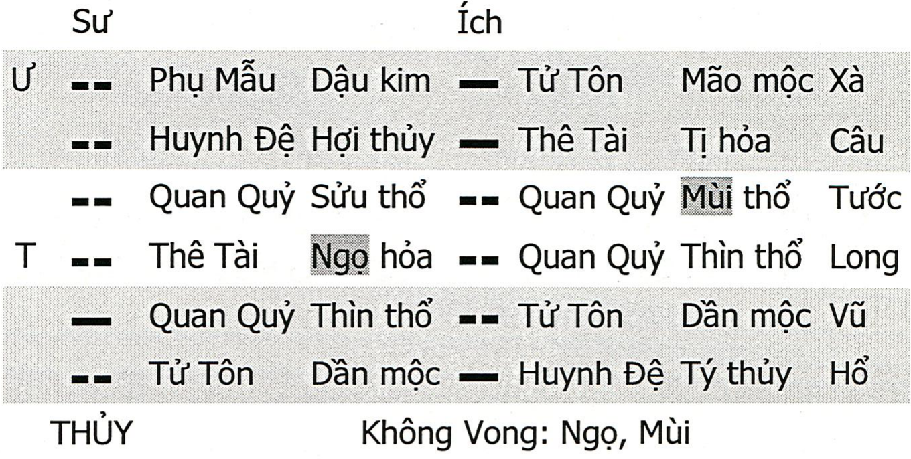

### Ví dụ 5: Ngày Kỷ Hợi tháng Tuất, nam đoán về cổ phiếu đầu tư ở Hồ Nam, được Địa Phong Thăng biến Tốn Vi Phong.

| | Thăng | | | Tốn | |
| :---: | :---: | :--- | :---: | :--- | :--- |
| | - - | Quan Quỷ Dậu kim | — | Huynh Đệ Mão mộc | Câu |
| | - - | Phụ Mẫu Hợi thủy | — | Tử Tôn Tị hỏa | Tước |
| T | - - | Thê Tài Sửu thổ Tử Ngọ | - - | Thê Tài Mùi thổ | Long |
| | — | Quan Quỷ Dậu kim | — | Quan Quỷ Dậu kim | Vũ |
| | — | Phụ Mẫu Hợi thủy Huynh Dần | — | Phụ Mẫu Hợi thủy | Hổ |
| Ư | - - | Thê Tài Sửu thổ | - - | Thê Tài Sửu thổ | Xà |

MỘC    Không Vong: Thìn, Tị

**Phán đoán:** Lấy Thê Tài làm Dụng thần. Trong quẻ Thê Tài lưỡng hiện, lấy hào Thế Thê Tài Sửu thổ làm Dụng thần. Dụng thần được Nguyệt trợ giúp là vượng, nhưng không nên Tử Tôn hưu tù bị Nhật khắc không hiện trên quẻ, ngoại quái phản ngâm. Biểu thị cổ phiếu đó lên xuống bất định, biến động theo hướng hạ xuống.

**Phản hồi:** Quả nhiên từ 13.29 tệ bắt đầu rơi xuống, ngày Canh Tý đến 12.50 tệ, ngày Quý Mão 12.65 tệ, ngày Giáp Thìn 12.82 tệ, ngày Ất Tị 12.57 tệ. Ngày Bính Ngọ 11.88 tệ, ngày Đinh Mùi 11.75 tệ.

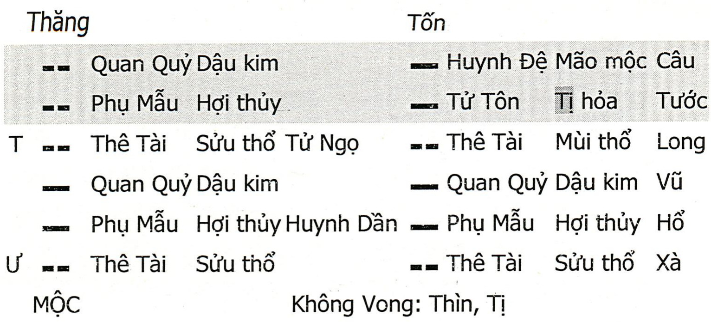

### Ví dụ 6: Ngày Tân Hợi tháng Sửu, một người đoán cho vay tiền có thể đòi được hay không? Được Địa Lôi Phục biến Phong Lôi Ích.

| | Phục | Ích | |
| :---: | :--- | :--- | :---: |
| | - - Tử Tôn Dậu kim | — Quan Quỷ Mão mộc | Xà |
| | - - Thê Tài Hợi thủy | — Phụ Mẫu Tị hỏa | Câu |
| Ư | - - Huynh Đệ Sửu thổ | - - Huynh Đệ Mùi thổ | Tước |
| | - - Huynh Đệ Thìn thổ | - - Huynh Đệ Thìn thổ | Long |
| | - - Quan Quỷ Dần mộc Phụ Tị | - - Quan Quỷ Dần mộc | Vũ |
| T | — Thê Tài Tý thủy | — Thê Tài Tý thủy | Hổ |

THỔ Không Vong: Dần, Mão

**Phán đoán:** Lấy Thê Tài làm Dụng. Trong quẻ Thê Tài lưỡng hiện, lấy hào Thê Tài Hợi thủy phát động làm Dụng thần. Dụng thần Nguyệt khắc Nhật phù, suy vượng tương đương. Ngoại quái phản ngâm, biểu thị nhiều lần đòi nợ. Dụng thần lâm Nhật động mà hóa Tuyệt, đây là Nhật thần biến hoại, Nguyên thần Dậu kim lại hóa Không vong, e rằng khó mà đòi được.

**Phản hồi:** Quả nhiên là đòi nhiều lần không được, về sau thì ngay cả người vay tiền cũng không tìm được.

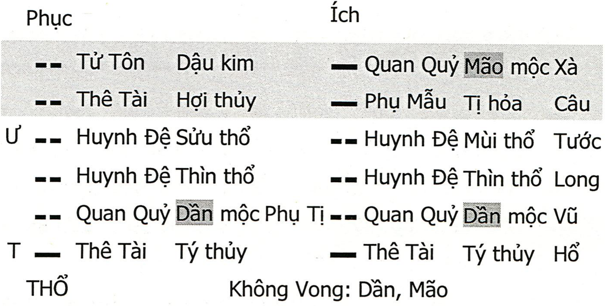

### Ví dụ 7: Ngày Ất Mão tháng Sửu, nam đoán tài vận, được Thủy Thiên Nhu biến Địa Lôi Phục.

| | Nhu | Phục | |
| :---: | :--- | :--- | :---: |
| | - - Thê Tài Tý thủy | - - Tử Tôn Dậu kim | Vũ |
| | — Huynh Đệ Tuất thổ | - - Thê Tài Hợi thủy | Hổ |
| T | - - Tử Tôn Thân kim | - - Huynh Đệ Sửu thổ | Xà |
| | — Huynh Đệ Thìn thổ | - - Huynh Đệ Thìn thổ | Câu |
| | — Quan Quỷ Dần mộc Phụ Tị | - - Quan Quỷ Dần mộc | Tước |
| Ư | — Thê Tài Tý thủy | — Thê Tài Tý thủy | Long |

THỔ Không Vong: Tý, Sửu

**Phán đoán:** Lấy Thê Tài làm Dụng thần. Trong quẻ Thê Tài lưỡng hiện, lấy Ứng Thê Tài Tý thủy làm Dụng. Quẻ này hào 5 Huynh Đệ động hóa Thê Tài, đây là của phi nghĩa.

Nội quái phục ngâm, Quan Quỷ Dần mộc lâm Chu Tước đến xung hào Thế, phục ngâm là đau khổ rên rỉ, Quan Quỷ lâm Chu Tước là kiện tụng khẩu thiệt, vì vậy được tài thế nào cũng có chuyện phiền phức. Dụng thần Không Vong mà hưu tù, cuối cùng chỉ là dã tràng xe cát.

**Phản hồi:** Ông này quả nhiên thu người ta 6000 tệ, làm giả giấy chứng nhận nộp tiền bảo lãnh người khác, bị phát hiện cho nên bị bắt.

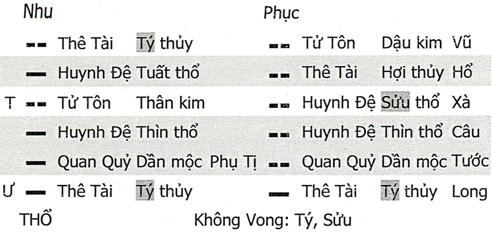

---

# Part 7 (Pages 121-140)

**Ví dụ 8:** Ngày Nhâm Thân tháng Tuất, một người Nhật Bản đoán mua một cổ phiếu sẽ ra sao? Được Phong Thiên Tiểu Súc biến Phong Lôi Ích.

| | Tiểu Súc | | Ích | |
| :---: | :--- | :---: | :--- | :---: |
| | ━ Huynh Đệ Mão mộc | | ━ Huynh Đệ Mão mộc | Hổ |
| | ━ Tử Tôn Tị hỏa | | ━ Tử Tôn Tị hỏa | Xà |
| Ứ | ━ ━ Thê Tài Mùi thổ | | ━ ━ Thê Tài Mùi thổ | Câu |
| | ━ Thê Tài Thìn thổ | Quan Dậu | ━ ━ Thê Tài Thìn thổ | Tước |
| | ━ Huynh Đệ Dần mộc | | ━ ━ Huynh Đệ Dần mộc | Long |
| T | ━ Phụ Mẫu Tý thủy | | ━ Phụ Mẫu Tý thủy | Vũ |

MỘC      Không Vong: Tuất, Hợi

**Phán đoán:** Lấy Thê Tài làm Dụng thần. Trong quẻ Thê Tài lưỡng hiện, lấy hào Thê Tài Thìn thổ phát động làm Dụng thần. Dụng thần Nguyệt phá, Nhật không trợ giúp là hưu tù, cổ phiếu này chắc chắn rớt giá.

Nội quái phục ngâm, mua cổ phiếu này sẽ khiến tâm trạng không tốt. Hào Thế nhập Mộ tại Tài, nhất định sẽ mắc kẹt vì cổ phiếu. Do đó, tốt nhất là không mua.

**Phản hồi:** Nhưng vẫn mua, kết quả là đến tháng Tý thì được biết là giá đã giảm một nửa.

## 14. DU HỒN VÀ QUY HỒN

Trong dự đoán lục hào, quẻ du hồn và quẻ quy hồn có tỷ lệ ứng nghiệm tương đối cao, có điều là chủ yếu dùng để thủ tượng, phân biệt ý nghĩa, mà không dùng để phán đoán cát hung. Bất kể là quẻ chính hay là quẻ biến đều có thể để trích xuất thông tin. Trong dự đoán kinh tế, quẻ du hồn và quẻ quy hồn chủ yếu có một số ý nghĩa như sau:

Quẻ du hồn: Quản lý phân tán, phát triển ra bên ngoài, phát triển ở nơi khác, kéo dài, không tập trung, phân tách, giáp ranh, phân ly, cảm xúc không ổn định, tâm trạng bất an, ra ngoài, đi xa, tư tưởng không tập trung, bôn ba khắp nơi, thay đổi dự án, cải cách, chạy trốn, nhút nhát, do dự không quyết, ly khai, mở rộng,

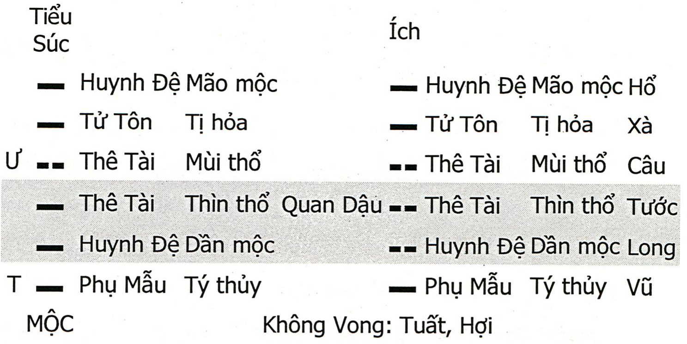 chuyên chở, vận tải, khai phóng, xuất khẩu, cho thuê, bán lại, lưu hành, chào hàng,...

Quẻ quy hồn: Bảo thủ, thu hồi, trở về, thu thập, thu mua, thu dọn hàng, kết thúc, xưởng gia đình, nội bộ, khép kín, cắt giảm, khôi phục, tuột xuống, lực hấp dẫn, lực hướng tâm, thu lại, tổng kết, phản hồi, lười biếng, thu hẹp, bản tính,...

**Ví dụ 1:** Ngày Kỷ Sửu tháng Dậu năm Nhâm Ngọ, nam đoán tài vận bản thân, được Cấn Vi Sơn biến Lôi Sơn Tiểu Quá.

| | Cấn | Tiểu Quá | |
| :---: | :--- | :--- | :---: |
| T | ━ Quan Quỷ Dần mộc | ━ ━ Huynh Đệ Tuất thổ | Câu |
| | ━ ━ Thê Tài Tý thủy | ━ ━ Tử Tôn Thân kim | Tước |
| | ━ ━ Huynh Đệ Tuất thổ | ━ Phụ Mẫu Ngọ hỏa | Long |
| Ứ | ━ Tử Tôn Thân kim | ━ Tử Tôn Thân kim | Vũ |
| | ━ ━ Phụ Mẫu Ngọ hỏa | ━ ━ Phụ Mẫu Ngọ hỏa | Hổ |
| | ━ ━ Huynh Đệ Thìn thổ | ━ ━ Huynh Đệ Thìn thổ | Xà |

THỔ      Không Vong: Ngọ, Mùi

**Phán đoán:** Lấy Thê Tài làm Dụng thần. Thê Tài Tý thủy được Nguyệt sinh, nhưng bị Nhật hợp vướng chân, hợp cần xung khai, năm nay Nhâm Ngọ đúng lúc xung khai Dụng thần, vì vậy phán đoán vừa mới bắt đầu phát triển ở năm nay. Thê Tài Tý thủy lâm Chu Tước, Chu Tước chủ văn thư, trường học, giáo dục,... Do đó, phương hướng kinh doanh phải là về giáo dục, văn hóa.

Thê Tài Tý thủy gặp hợp, không phải là làm một mình, mà là hợp tác với người khác. Dụng thần Nguyệt sinh Nhật khắc, suy vượng cân bằng, nhưng không nên Huynh Đệ Tuất thổ phát động đến khắc, khắc nhiều sinh ít, tài vận không tốt đẹp. Huynh Đệ Tuất thổ tại gian hào phát động, gian hào là người trung gian, là bởi vì người trung gian gây nên tốn kém.

Hào Thế Quan Quỷ Dần mộc tại hào 6 lâm Câu Trần, hào 6 là hào vị thoái hưu, Quan Quỷ thể hiện sự nghiệp, công tác, Cấn là đình chỉ (ngừng), biến nhập du hồn, đây là thông tin thất nghiệp, bị sa thải.

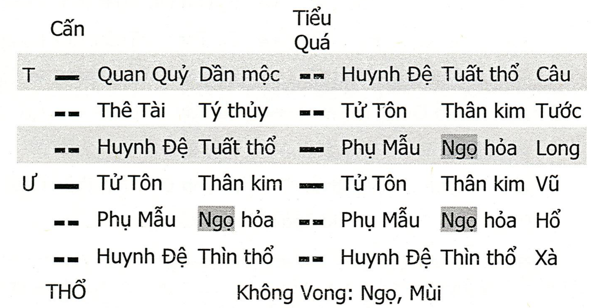

**Phản hồi:** Trên thực tế, người này nghỉ hưu sớm, năm nay bắt đầu hợp tác với người ta mở trường học, nhưng bởi vì bản thân không hiểu rõ về ngành này, khi nhờ người trung gian lo liệu thủ tục thì bị thu rất nhiều tiền.

**Ví dụ 2:** Ngày Mậu Ngọ tháng Tuất, nam đoán về tình hình bán sản phẩm sẽ ra sao? Được Khôn Vi Địa biến Lôi Sơn Tiểu Quá.

| | Khôn | | | Tiểu Quá | | | |
| :--- | :---: | :--- | :--- | :---: | :--- | :--- | :--- |
| T | - - | Tử Tôn | Dậu kim | - - | Huynh Đệ | Tuất thổ | Tước |
| | - - | Thê Tài | Hợi thủy | - - | Tử Tôn | Thân kim | Long |
| | - - | Huynh Đệ | Sửu thổ | — | Phụ Mẫu | Ngọ hỏa | Vũ |
| Ứ | - - | Quan Quỷ | Mão mộc | — | Tử Tôn | Thân kim | Hổ |
| | - - | Phụ Mẫu | Tị hỏa | - - | Phụ Mẫu | Ngọ hỏa | Xà |
| | - - | Huynh Đệ | Mùi thổ | - - | Huynh Đệ | Thìn thổ | Câu |

THỔ Không Vong: Tý, Sửu

**Phán đoán:** Lấy Thê Tài làm Dụng thần. Thê Tài Hợi thủy tại hào 5 Nguyệt khắc Nhật không trợ giúp là hưu tù. Quẻ chính lục xung, biểu thị bôn ba, thành tích không ổn định. Hóa quẻ du hồn, du hồn chủ bên ngoài, hào Thế lại tại hào 6, hào 6 là miền xa xôi, vì vậy là phải đến một nơi xa xôi hẻo lánh để chào hàng.

Trong quẻ Huynh Đệ Sửu thổ phát động khắc Tài, biểu thị tài vận không tốt, ra trận bất lợi. Hào Ứng Quan Quỷ phát động khắc chế Huynh Đệ, Ứng là người khác, cũng là địa điểm đi xa, biểu thị nơi đó có người giúp đỡ anh ta thoát khỏi tình trạng khó khăn. Nhưng hào Ứng hóa hồi đầu khắc, Huynh Đệ Nguyệt kiến trợ giúp, Nhật sinh hóa hồi đầu sinh, Quan Quỷ không có lực khắc chế Huynh Đệ, cho nên có người giúp cũng không thành công.

**Phản hồi:** Quả nhiên là đến vùng khác bán sản phẩm, nhưng bận bịu vài tháng cũng không có thành tích gì, đành phải từ bỏ.

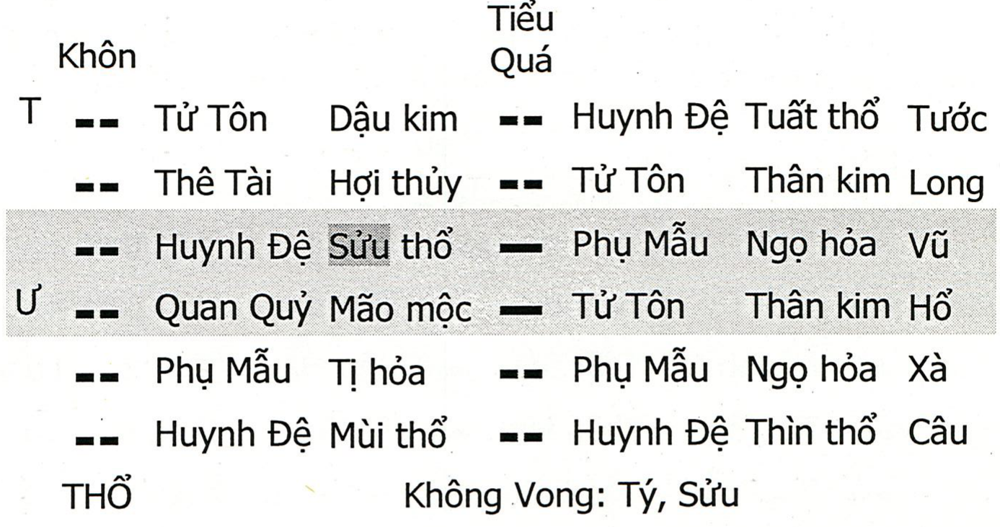

**Ví dụ 3:** Ngày Quý Hợi tháng Dậu, nữ người Hàn Quốc đoán bán tháo cửa hàng của mình sẽ ra sao? Được Trạch Phong Đại Quá biến Trạch Hỏa Cách.

| | Đại Quá | | | | Cách | | | |
| :--- | :---: | :--- | :--- | :--- | :---: | :--- | :--- | :--- |
| | - - | Thê Tài | Mùi thổ | | - - | Thê Tài | Mùi thổ | Hổ |
| | — | Quan Quỷ | Dậu kim | | — | Quan Quỷ | Dậu kim | Xà |
| T | — | Phụ Mẫu | Hợi thủy | Tử Ngọ | — | Phụ Mẫu | Hợi thủy | Câu |
| | — | Quan Quỷ | Dậu kim | | — | Phụ Mẫu | Hợi thủy | Tước |
| | — | Phụ Mẫu | Hợi thủy | Huynh Dần | - - | Thê Tài | Sửu thổ | Long |
| Ứ | - - | Thê Tài | Sửu thổ | | — | Huynh Đệ | Mão mộc | Vũ |

MỘC Không Vong: Tý, Sửu

**Phán đoán:** Lấy Phụ Mẫu làm Dụng thần. Trong quẻ Phụ Mẫu lưỡng hiện, lấy hào Phụ Mẫu Hợi thủy phát động làm Dụng thần. Dụng thần được Nguyệt sinh Nhật phù là vượng tướng, nhưng Dụng thần động hóa hồi đầu khắc, hào sơ lại động mà đến khắc, việc bán cửa hàng sẽ xuất hiện trở lực. Quẻ du hồn, bản thân do dự bất định. Ứng là người khác, động khắc Dụng thần, có người phản đối, can ngăn cô ấy bán cửa hàng.

**Phản hồi:** Quả nhiên là như vậy, bản thân kinh doanh ở cửa hàng này đã nhiều năm cho nên cũng rất lưu luyến, do dự hết lần này đến lần khác. Khách hàng cũ nghe nói cô ấy sắp bán cửa hàng cũng cực lực khuyên can, thế là cô ấy đã từ bỏ ý định bán cửa hàng.

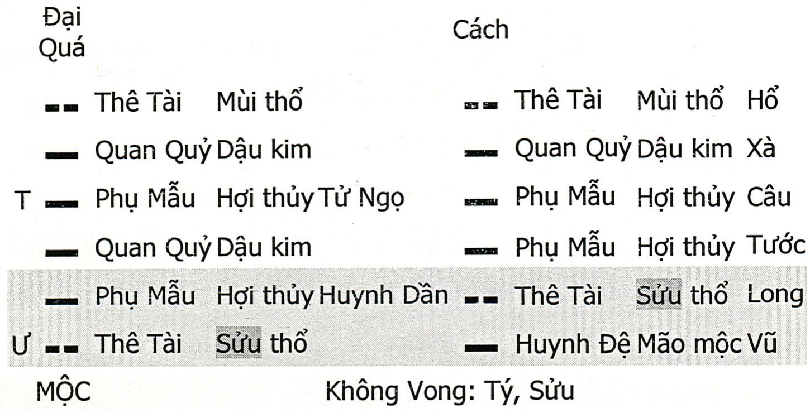

**Ví dụ 4:** Ngày Bính Thìn tháng Dậu năm Ất Dậu, nam đoán làm trạm thu gom phế phẩm sẽ ra sao? Được Tốn Vi Phong biến Phong Sơn Tiệm.

| | Tốn | | | Tiệm | |
| :---: | :---: | :--- | :---: | :--- | :---: |
| T | ━ | Huynh Đệ Mão mộc | ━ | Huynh Đệ Mão mộc | Long |
| | ━ | Tử Tôn Tị hỏa | ━ | Tử Tôn Tị hỏa | Vũ |
| | ⚋ | Thê Tài Mùi thổ | ⚋ | Thê Tài Mùi thổ | Hổ |
| Ư | ━ | Quan Quỷ Dậu kim | ━ | Quan Quỷ Thân kim | Xà |
| | ━ | Phụ Mẫu Hợi thủy | ⚋ | Tử Tôn Ngọ hỏa | Câu |
| | ⚋ | Thê Tài Sửu thổ | ⚋ | Thê Tài Thìn thổ | Tước |

MỘC Không Vong: Tý, Sửu

**Phán đoán:** Lấy Thê Tài làm Dụng thần. Trong quẻ Thê Tài lưỡng hiện, lấy Thê Tài Sửu thổ Không Vong làm Dụng thần. Dụng thần được Nhật trợ giúp là vượng tướng, nhưng Dụng thần Không Vong, Nguyên thần hưu tù bị khắc nên không thể lâu dài.

Hào Thế bị Nguyệt Quan Quỷ xung phá, Quan Quỷ là công an, cảnh sát, khó tránh bị làm khó dễ. Hào 2 Phụ Mẫu Hợi thủy độc phát nhập Mộ ở Nhật, hào 2 là sân bãi kinh doanh, lâm Câu Trần phát động, Câu Trần chủ kiến trúc, công trình, phát động chủ biến động, Hợi thủy tương ứng với năm Đinh Hợi, vì vậy phán đoán tại năm Đinh Hợi sân bãi sẽ biến động. Động mà Tuyệt Nguyên thần, sợ là không thể kinh doanh, quẻ biến quy hồn, thu dọn quầy và không kinh doanh lại.

**Phản hồi:** Quả nhiên kinh doanh đến tháng Hợi năm Đinh thì bởi vì tu sửa đường, đường vận chuyển hàng bị chắn mà chấm dứt kinh doanh.

**Ví dụ 5:** Ngày Mậu Tý tháng Tuất, quán cơm của vợ buôn bán ế ẩm, đoán xem tương lai sẽ ra sao? Được Lôi Trạch Quy Muội biến Lôi Thiên Đại Tráng.

| | Quy Muội | | | Đại Tráng | |
| :---: | :---: | :--- | :---: | :--- | :---: |
| Ư | ⚋ | Phụ Mẫu Tuất thổ | ⚋ | Phụ Mẫu Tuất thổ | Tước |
| | ⚋ | Huynh Đệ Thân kim | ⚋ | Huynh Đệ Thân kim | Long |
| | ━ | Quan Quỷ Ngọ hỏa | ━ | Quan Quỷ Ngọ hỏa | Vũ |
| T | ⚋ | Phụ Mẫu Sửu thổ | ━ | Phụ Mẫu Thìn thổ | Hổ |
| | ━ | Thê Tài Mão mộc | ━ | Thê Tài Dần mộc | Xà |
| | ━ | Quan Quỷ Tị hỏa | ━ | Tử Tôn Tý thủy | Câu |

KIM Không Vong: Ngọ, Mùi

**Phán đoán:** Lấy Thê Tài làm Dụng thần. Phụ Mẫu trì Thế lâm Bạch Hổ độc phát động mà hóa phá, Phụ Mẫu là thần vất vả, biểu thị làm việc chăm chỉ, Bạch Hổ là bận rộn, hóa phá, kiệt quệ không chịu nổi. Có điều là Thê Tài Mão mộc được Nhật sinh và Nguyệt hợp là vượng tướng, tình trạng khó khăn cũng chỉ là tạm thời.

Hào Thế hóa Nguyệt phá, sang tháng bất Phá. Tháng sau là tháng Hợi thì Tài được Trường Sinh, lại là quẻ quy hồn, chủ hồi phục, hồi thăng (tăng trở lại), vì vậy sẽ bắt đầu khá lên.

**Phản hồi:** Kết quả là tại tháng Hợi bắt đầu có chuyển biến, lợi nhuận tăng thêm 30% so với mấy năm trước.

## Ví dụ 6: Ngày Đinh Hợi tháng Tuất, nữ đoán về tình hình dự án công trình, được Sơn Lôi Di.

| | Di | | |
| :---: | :--- | :---: | :---: |
| | — Huynh Đệ Dần mộc | | Long |
| | - - Phụ Mẫu Tý thủy | Tử Tị | Vũ |
| T | - - Thê Tài Tuất thổ | | Hổ |
| | - - Thê Tài Thìn thổ | Quan Dậu | Xà |
| | - - Huynh Đệ Dần mộc | | Câu |
| Ứ | — Phụ Mẫu Tý thủy | | Tước |

MỘC Không Vong: Ngọ, Mùi

**Phán đoán:** Lấy Phụ Mẫu làm Dụng thần. Trong quẻ Phụ Mẫu lưỡng hiện, lấy hào Ứng Phụ Mẫu Tý thủy làm Dụng thần. Thế khắc Dụng thần là tượng bài xích (gạt bỏ), quẻ du hồn chủ muốn chuyển nhượng dự án này. Dụng thần lâm hào Ứng Chu Tước, Ứng là người khác, Chu Tước chủ bàn bạc, chứng tỏ hiện tại đã có người thảo luận muốn tiếp nhận dự án này. Dụng thần được Nhật trợ giúp vượng tướng, về cơ bản thì hầu như chỉ mới thảo luận.

Thê Tài Thìn thổ Nguyệt phá, khi nắm giữ công trình này thì đã tiêu tốn rất nhiều tiền. Nay Nguyệt kiến khắc Dụng thần, tháng Hợi thì có thể chuyển nhượng thành công.

**Phản hồi:** Tất cả đúng như phán đoán.

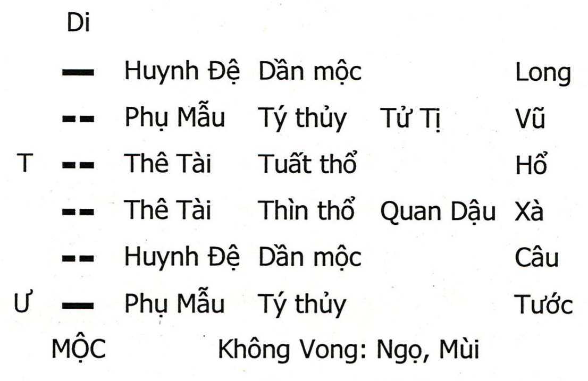

## Ví dụ 7: Ngày Ất Tị tháng Hợi, nam đoán kinh doanh cửa hàng thuốc lá sẽ ra sao? Được Địa Sơn Khiêm biến Lôi Sơn Tiểu Quá.

| | Khiêm | | Tiểu Quá | |
| :---: | :--- | :---: | :--- | :---: |
| | - - Huynh Đệ Dậu kim | | - - Phụ Mẫu Tuất thổ | Vũ |
| T | - - Tử Tôn Hợi thủy | | - - Huynh Đệ Thân kim | Hổ |
| | - - Phụ Mẫu Sửu thổ | | — Quan Quỷ Ngọ hỏa | Xà |
| | — Huynh Đệ Thân kim | | — Huynh Đệ Thân kim | Câu |
| Ứ | - - Quan Quỷ Ngọ hỏa | Tài Mão | - - Quan Quỷ Ngọ hỏa | Tước |
| | - - Phụ Mẫu Thìn thổ | | - - Phụ Mẫu Thìn thổ | Long |

KIM Không Vong: Dần, Mão

**Phán đoán:** Lấy Thê Tài làm Dụng thần. Thê Tài Mão mộc được Nguyệt sinh Nhật không khắc là vượng tướng. Nhưng không nên Dụng thần Không Vong, Cừu thần độc phát khắc Nguyên thần, kinh doanh không thuận lợi. Hào Thế ám động sinh Thê Tài, hóa quẻ du hồn, ám động là bí mật làm việc, sinh Tài chính là bán thuốc để kiếm tiền. Du hồn chủ đi xa, rời khỏi cửa hàng, chính là ra ngoài chèo kéo khách đến cửa hàng mua thuốc.

**Phản hồi:** Quả nhiên là như vậy.

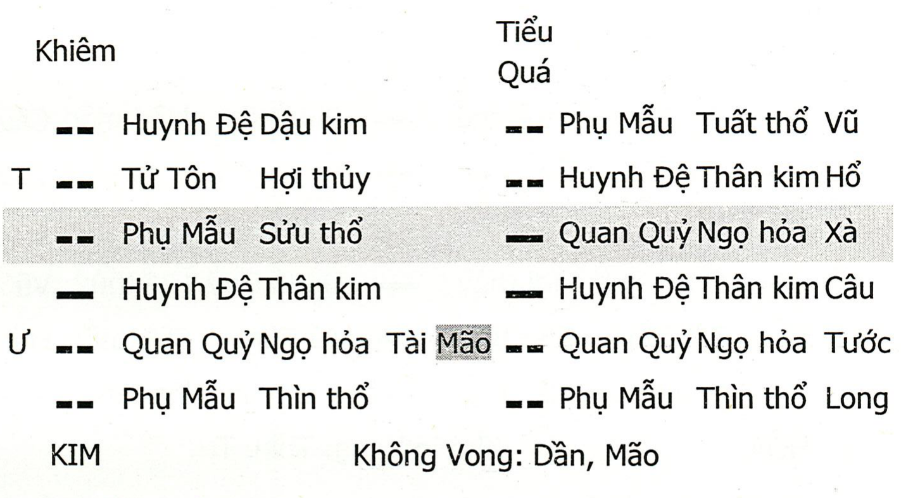

**Ví dụ 8:** Ngày Kỷ Hợi tháng Dần năm Tân Tị, nam đoán tài vận năm nay, được Thiên Hỏa Đồng Nhân biến Phong Hỏa Gia Nhân.

| | Đồng Nhân | Gia Nhân | |
| :---: | :---: | :---: | :---: |
| Ư | — Tử Tôn Tuất thổ | — Phụ Mẫu Mão mộc | Câu |
| | — Thê Tài Thân kim | — Huynh Đệ Tị hỏa | Tước |
| | — Huynh Đệ Ngọ hỏa | - - Tử Tôn Mùi thổ | Long |
| T | — Quan Quỷ Hợi thủy | — Quan Quỷ Hợi thủy | Vũ |
| | - - Tử Tôn Sửu thổ | - - Tử Tôn Sửu thổ | Hổ |
| | — Phụ Mẫu Mão mộc | — Phụ Mẫu Mão mộc | Xà |

HỎA Không Vong: Thìn, Tị

**Phán đoán:** Lấy Thê Tài làm Dụng thần. Thê Tài Thân kim không được Nhật Nguyệt trợ giúp, bị Nguyệt xung phá là hưu tù. Lại thêm Huynh Đệ phát động, chắc chắn không thể được tài, trái lại có thể phá tài. Dụng thần tại hào 5 Nguyệt phá, hào 5 là đường đi, phá tài trên đường, bị Nguyệt xung phá, Nguyệt là Phụ Mẫu chủ xe, nhất định là phá tài vì tai nạn xe cộ. Ngọ hỏa phát động, tháng Ngọ phải đặc biệt chú ý, quẻ quy hồn, nên ở nhà, không nên ra ngoài.

**Phản hồi:** Người này làm về vận tải, không lái xe thì không có tiền. Năm nay thì tài vận bình thường, nhưng bản thân cũng còn bình an. Đến năm Nhâm Ngọ, anh ta bị lật xe mà phá tài. Ứng năm mà không ứng tháng.

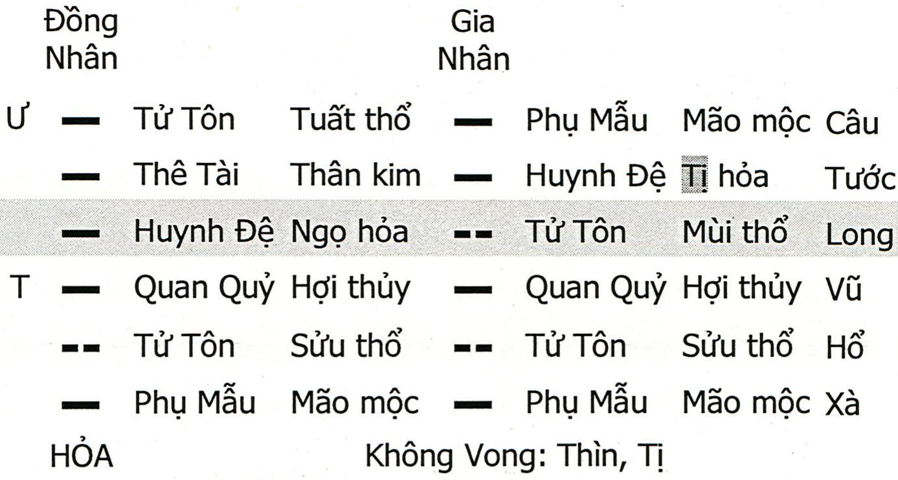

**Ví dụ 9:** Ngày Quý Dậu tháng Thân, một học trò của tôi làm kế toán cho một nhà hàng, bởi vì nhà hàng kinh doanh ế ẩm cho nên đã phát lương đuổi nhân viên, sau khi phát lương xong thì mới phát hiện ra có hai người được phát nhiều hơn một tháng lương, thế là đoán xem có thể thu hồi được khoản tiền đã phát dư hay không? Được Thủy Địa Tỷ biến Phong Địa Quan.

| | Tỷ | Quan | |
| :---: | :---: | :---: | :---: |
| Ư | - - Thê Tài Tý thủy | — Quan Quỷ Mão mộc | Hổ |
| | — Huynh Đệ Tuất thổ | — Phụ Mẫu Tị hỏa | Xà |
| | - - Tử Tôn Thân kim | - - Huynh Đệ Mùi thổ | Câu |
| T | - - Quan Quỷ Mão mộc | - - Quan Quỷ Mão mộc | Tước |
| | - - Phụ Mẫu Tị hỏa | - - Phụ Mẫu Tị hỏa | Long |
| | - - Huynh Đệ Mùi thổ | - - Huynh Đệ Mùi thổ | Vũ |

THỔ Không Vong: Tuất, Hợi

**Phán đoán:** Lấy Thê Tài làm Dụng thần, Thê Tài Tý thủy được Nhật Nguyệt đến sinh là vượng tướng, Dụng thần độc phát sinh hào Thế, lại là quẻ quy hồn, tượng trở về, nhất định có thể thu hồi được khoản tiền lương đã phát dư.

**Phản hồi:** Quả nhiên tại giờ Dậu hôm đó đã thu hồi được.

## 15. THỦ TƯỢNG ĐỘC PHÁT TRONG DỰ ĐOÁN KINH TẾ

Độc phát là một hiện tượng đặc biệt trong dự đoán lục hào. Độc phát có ảnh hưởng rất lớn đến cát hung, nguyên nhân của sự vật,... Nếu như nắm được cách ứng dụng độc phát, trình độ dự đoán của chúng ta sẽ được nâng cao đáng kể.

Độc phát có 5 tác dụng chủ yếu sau đây:

1. Biểu thị tính chất, nguyên nhân.
2. Biểu thị ứng kỳ.
3. Biểu thị cát hung.
4. Xem việc này ứng việc khác.
5. Xem độc phát sản sinh xung hợp với địa chi nào.

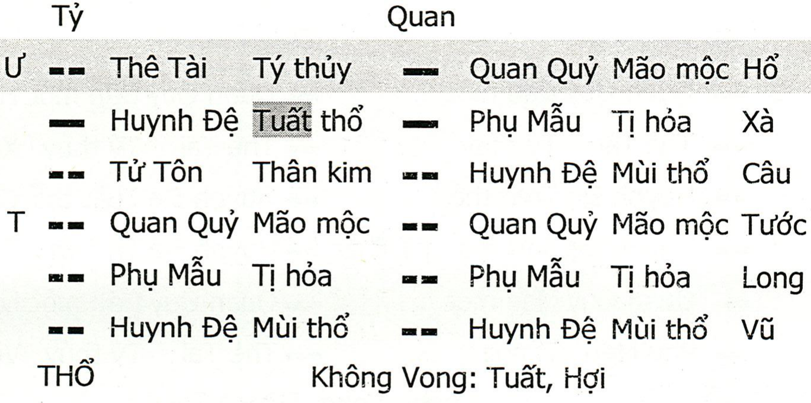

Những tác dụng này rất ứng nghiệm trong dự đoán kinh tế. Nếu không biết tác dụng của độc phát thì đôi khi có thể sẽ thu được kết quả trái ngược. Thông thường, hào Tài không nên gặp Tử, Mộ, Tuyệt địa độc phát, nên được Trường Sinh độc phát đến sinh.

**Ví dụ 1:** Ngày Nhâm Tý tháng Sửu, đoán vận khí kinh doanh, được Sơn Trạch Tổn biến Sơn Lôi Di.

| | Tổn | Di | |
| :---: | :--- | :--- | :---: |
| Ư | ━ Quan Quỷ Dần mộc | ━ Quan Quỷ Dần mộc | Hổ |
| | ⚋ Thê Tài Tý thủy | ⚋ Thê Tài Tý thủy | Xà |
| | ⚋ Huynh Đệ Tuất thổ | ⚋ Huynh Đệ Tuất thổ | Câu |
| T | ⚋ Huynh Đệ Sửu thổ Tử Thân | ⚋ Huynh Đệ Thìn thổ | Tước |
| | ━ Quan Quỷ Mão mộc | ⚋ Quan Quỷ Dần mộc | Long |
| | ━ Phụ Mẫu Tị hỏa | ━ Thê Tài Tý thủy | Vũ |

THỔ Không Vong: Dần, Mão

**Phán đoán:** Lấy Thê Tài làm Dụng thần. Thê Tài Tý thủy Nguyệt hợp, Nhật trợ giúp, lâm Nhật hợp hào Thế là tượng được tài, nhưng không nên Mão mộc độc phát là Tử địa hào Tài, vì vậy hiện nay tài vận không tốt. Hào Ứng Quan Quỷ Dần mộc Không Vong, Ứng là khách hàng, ít khách hàng.

**Phản hồi:** Trên thực tế, buôn bán không thuận lợi, sau khi hóa giải thì có chuyển biến, nhưng đến tháng Thìn thì kém trở lại.

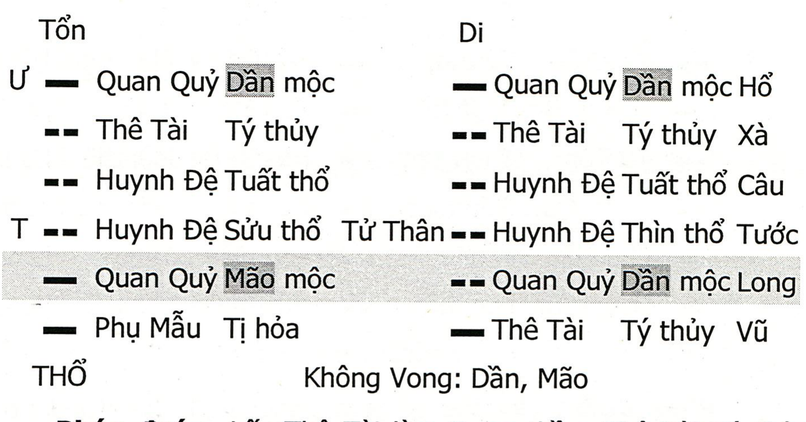

**Ví dụ 2:** Ngày Canh Ngọ tháng Dần, nam đoán mở quán trà sẽ ra sao? Được Lôi Trạch Quy Muội biến Địa Trạch Lâm.

| | Quy Muội | Lâm | |
| :---: | :--- | :--- | :---: |
| Ư | ⚋ Phụ Mẫu Tuất thổ | ⚋ Huynh Đệ Dậu kim | Xà |
| | ⚋ Huynh Đệ Thân kim | ⚋ Tử Tôn Hợi thủy | Câu |
| | ━ Quan Quỷ Ngọ hỏa | ⚋ Phụ Mẫu Sửu thổ | Tước |
| T | ⚋ Phụ Mẫu Sửu thổ | ⚋ Phụ Mẫu Sửu thổ | Long |
| | ━ Thê Tài Mão mộc | ━ Thê Tài Mão mộc | Vũ |
| | ━ Quan Quỷ Tị hỏa | ━ Quan Quỷ Tị hỏa | Hổ |

KIM Không Vong: Tuất, Hợi

**Phán đoán:** Lấy Thê Tài làm Dụng thần. Thê Tài Mão mộc được Nguyệt trợ giúp và Nhật không đến khắc là vượng tướng, nhưng không nên Quan Quỷ Ngọ hỏa độc phát là Tử địa Dụng thần, kinh doanh không thuận lợi. Hào Ứng Tuất thổ Không Vong, Ứng là khách hàng, Không biểu thị ít khách.

**Phản hồi:** Quả nhiên sau khi mở quán thì ít khách, kinh doanh được 3 tháng thì đóng cửa.

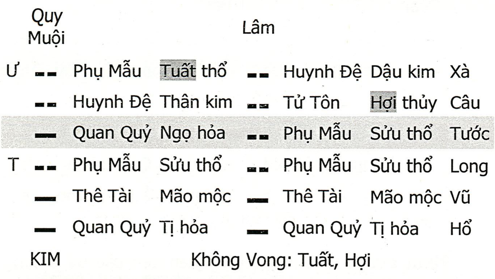

### Ví dụ 3: Ngày Kỷ Mão tháng Tuất, nam đoán cầu tài cát hung, được Phong Địa Quan biến Sơn Địa Bác.

| | Quan | Bác | |
| :---: | :--- | :--- | :--- |
| | — Thê Tài Mão mộc | — Thê Tài Dần mộc | Câu |
| | — Quan Quỷ Tị hỏa | -- Tử Tôn Tý thủy | Tước |
| T | -- Phụ Mẫu Mùi thổ | -- Phụ Mẫu Tuất thổ | Long |
| | -- Thê Tài Mão mộc | -- Thê Tài Mão mộc | Vũ |
| | -- Quan Quỷ Tị hỏa | -- Quan Quỷ Tị hỏa | Hổ |
| Ư | -- Phụ Mẫu Mùi thổ | -- Phụ Mẫu Mùi thổ | Xà |

KIM Không Vong: Thân, Dậu

**Phán đoán:** Mặc dù có liên quan đến cầu tài, nhưng chủ yếu là xem cát hung, cho nên lấy hào Thế làm Dụng thần.

Trong quẻ hào Tài lưỡng hiện, đều là Mão mộc an tĩnh, được Nguyệt hợp là vượng, lại được Nhật trợ giúp, cầu tài có nhiều lợi nhuận. Nhưng nếu hỏi cát hung, hào Tài khắc Thế thì hung, bởi vì cầu tài sẽ mang lại tai họa.

Quẻ này Quan Quỷ Tị hỏa lâm Chu Tước độc phát. Cầu bình an và cát hung thì không nên Quỷ động. Quan Quỷ lâm Chu Tước là kiện tụng, tố tụng. Hào 6 Thê Tài Mão mộc lâm Câu Trần, hào 6 là cũ. Quẻ Càn là cao quý. Câu Trần là vật trong đất, đồ cũ. Hào 3 Thê Tài Mão mộc lâm Huyền Vũ, Huyền Vũ chủ phong hóa, ăn mòn. Do đó, nhất định có liên quan đến di sản văn hóa.

**Phản hồi:** Quả nhiên người này muốn đầu cơ di sản văn hóa, anh ta đã bị tôi ngăn cản.

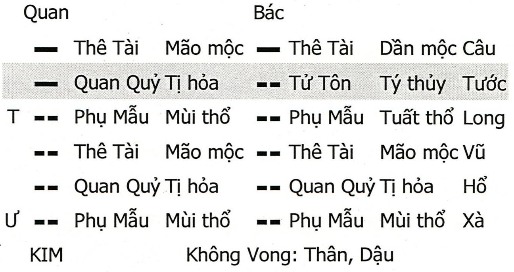

### Ví dụ 4: Ngày Ất Hợi tháng Dậu, đoán làm nghề phục vụ sẽ ra sao? Được Hỏa Trạch Khuê biến Lôi Trạch Quy Muội.

| | Khuê | | Quy Muội | |
| :---: | :--- | :---: | :--- | :--- |
| | — Phụ Mẫu Tị hỏa | | -- Huynh Đệ Tuất thổ | Vũ |
| | -- Huynh Đệ Mùi thổ | Tài Tý | -- Tử Tôn Thân kim | Hổ |
| T | — Tử Tôn Dậu kim | | — Phụ Mẫu Ngọ hỏa | Xà |
| | -- Huynh Đệ Sửu thổ | | -- Huynh Đệ Sửu thổ | Câu |
| | — Quan Quỷ Mão mộc | | — Quan Quỷ Mão mộc | Tước |
| Ư | — Phụ Mẫu Tị hỏa | | — Phụ Mẫu Tị hỏa | Long |

THỔ Không Vong: Thân, Dậu

**Phán đoán:** Lấy Thê Tài làm Dụng thần. Thê Tài Tý thủy không hiện trên quẻ, phục tàng dưới hào 5 Huynh Đệ Mùi thổ, Nguyệt sinh Nhật phù là vượng tướng, nhưng không nên Phụ Mẫu Tị hỏa độc phát, độc phát lấy tượng làm chủ, Dụng thần lâm Tuyệt địa thì không thể cầu tài. Lại thêm hào Thế Không Vong, không thể phát triển thuận lợi.

**Phản hồi:** Quả nhiên tài vận không tốt đẹp.

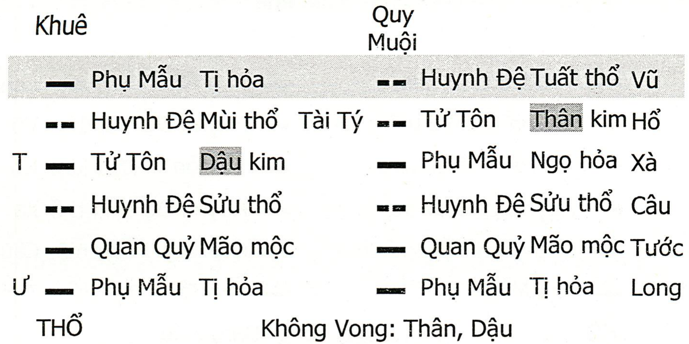

### Ví dụ 5: Ngày Đinh Mùi tháng Hợi, nữ đoán kết quả đầu tư buôn bán cổ phiếu, được Hỏa Trạch Khuê biến Hỏa Lôi Phệ Hạp.

| Khuê | | | Phệ Hạp | |
| :--- | :--- | :--- | :--- | :--- |
| | — Phụ Mẫu Tị hỏa | | — Phụ Mẫu Tị hỏa | Long |
| | - - Huynh Đệ Mùi thổ | Tài Tý | - - Huynh Đệ Mùi thổ | Vũ |
| T | — Tử Tôn Dậu kim | | — Tử Tôn Dậu kim | Hổ |
| | - - Huynh Đệ Sửu thổ | | - - Huynh Đệ Thìn thổ | Xà |
| | — Quan Quỷ Mão mộc | | - - Quan Quỷ Dần mộc | Câu |
| Ư | — Phụ Mẫu Tị hỏa | | — Thê Tài Tý thủy | Tước |

THỔ Không Vong: Dần, Mão

**Phán đoán:** Lấy Thê Tài làm Dụng thần. Thê Tài Tý thủy không hiện trên quẻ, phục dưới hào 5 Huynh Đệ Mùi thổ. Nguyệt kiến trợ giúp, Nhật thần khắc chế, suy vượng cân bằng. Phi đến khắc Phục chủ không cát, càng không tốt là Tử địa Mão mộc độc phát. Do đó, buôn bán cổ phiếu nhất định thua lỗ.

**Phản hồi:** Kết quả là 4 cổ phiếu đã mua đều lỗ vốn.

### Ví dụ 6: Ngày Tân Hợi tháng Hợi, nam đoán tài vận sắp tới, được Hỏa Trạch Khuê biến Hỏa Thủy Vị Tế.

| Khuê | | | Vị Tế | |
| :--- | :--- | :--- | :--- | :--- |
| | — Phụ Mẫu Tị hỏa | | — Phụ Mẫu Tị hỏa | Xà |
| | - - Huynh Đệ Mùi thổ | Tài Tý | - - Huynh Đệ Mùi thổ | Câu |
| T | — Tử Tôn Dậu kim | | — Tử Tôn Dậu kim | Tước |
| | - - Huynh Đệ Sửu thổ | | - - Phụ Mẫu Ngọ hỏa | Long |
| | — Quan Quỷ Mão mộc | | — Huynh Đệ Thìn thổ | Vũ |
| Ư | — Phụ Mẫu Tị hỏa | | - - Quan Quỷ Dần mộc | Hổ |

THỔ Không Vong: Dần, Mão

**Phán đoán:** Lấy Thê Tài làm Dụng thần. Thê Tài Tý thủy mặc dù không hiện trên quẻ, nhưng được Nhật Nguyệt trợ giúp là

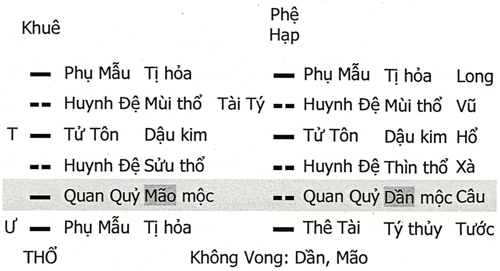

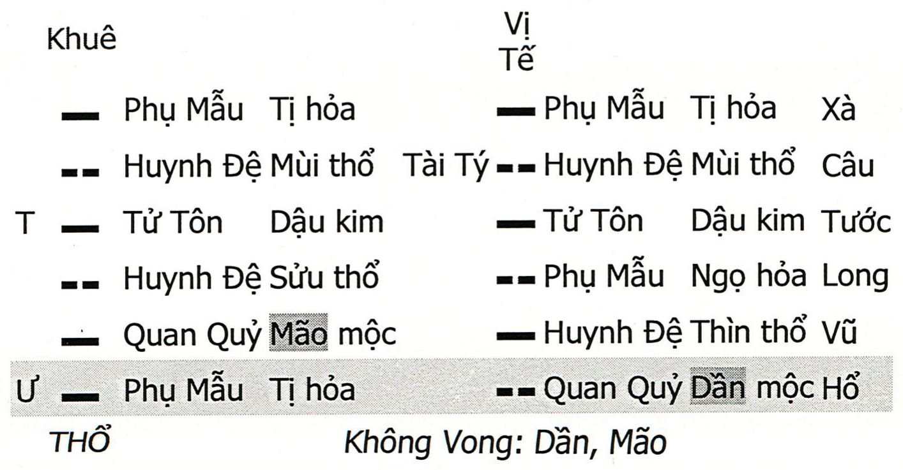 vượng tướng. Thông thường có thể phán đoán tài vận khá tốt, thế nhưng Phụ Mẫu Tị hỏa độc phát, độc phát lấy tượng làm chủ, Dụng thần lâm Tuyệt địa, vì vậy tài vận không tốt.

Tài Tuyệt tại Phụ Mẫu, Phụ Mẫu là xí nghiệp, công ty, lại là xe, lâm Bạch Hổ chủ đường đi, cho nên sẽ bởi vì công ty, xí nghiệp, tai nạn xe cộ,... mà phá tài.

**Phản hồi:** Trên thực tế, nhà máy sa sút, liên tục phá tài vì tông xe.

### Ví dụ 7: Ngày Đinh Mùi tháng Sửu, nam đoán về tình hình kinh doanh cửa hàng của con gái, được Địa Sơn Khiêm biến Địa Phong Thăng.

| Khiêm | | | Thăng | |
| :--- | :--- | :--- | :--- | :--- |
| | - - Huynh Đệ Dậu kim | | - - Huynh Đệ Dậu kim | Long |
| T | - - Tử Tôn Hợi thủy | | - - Tử Tôn Hợi thủy | Vũ |
| | - - Phụ Mẫu Sửu thổ | | - - Phụ Mẫu Sửu thổ | Hổ |
| | — Huynh Đệ Thân kim | | — Huynh Đệ Dậu kim | Xà |
| Ư | - - Quan Quỷ Ngọ hỏa | Tài Mão | — Tử Tôn Hợi thủy | Câu |
| | - - Phụ Mẫu Thìn thổ | | - - Phụ Mẫu Sửu thổ | Tước |

KIM Không Vong: Dần, Mão

**Phán đoán:** Lấy Thê Tài làm Dụng thần. Thê Tài Mão mộc không hiện trên quẻ, phục tàng dưới hào 2 Quan Quỷ Ngọ hỏa. Nhật Nguyệt không đến trợ giúp là hưu tù, càng không cát là Phi thần lâm hào Ứng độc phát là Tử địa Dụng thần. Ứng là người khác, hào 2 là cửa hàng, là cửa hàng của người khác, Ứng áp chế Dụng thần, đây chính là cửa hàng chèn ép con gái ông ta.

Độc phát lấy tượng làm chủ, Dụng thần hưu tù gặp Tử địa, kinh doanh không thuận lợi.

**Phản hồi:** Quả nhiên kinh doanh tuột dốc, xung quanh xuất hiện 3 cửa hàng lật đổ cửa hàng của con gái ông ta.

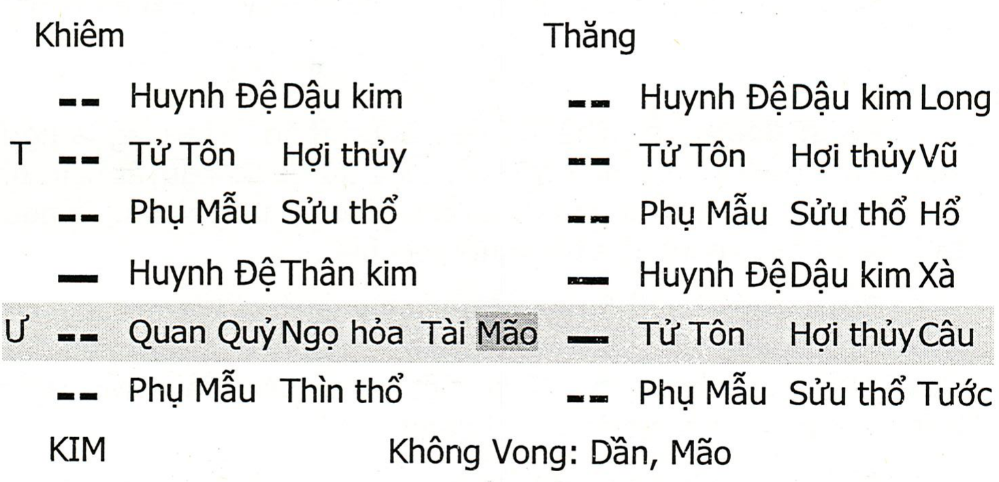

### Ví dụ 8: Ngày Đinh Sửu tháng Dần, nam cho người ta vay tiền, đoán xem được trả lãi định kỳ như thế nào? Được Địa Thủy Sư biến Khôn Vi Địa.

| | Sư | | Khôn | | |
| :---: | :---: | :---: | :---: | :---: | :---: |
| Ứ | - - | Phụ Mẫu Dậu kim | - - | Phụ Mẫu Dậu kim | Long |
| | - - | Huynh Đệ Hợi thủy | - - | Huynh Đệ Hợi thủy | Vũ |
| | - - | Quan Quỷ Sửu thổ | - - | Quan Quỷ Sửu thổ | Hổ |
| T | - - | Thê Tài Ngọ hỏa | - - | Tử Tôn Mão mộc | Xà |
| | — | Quan Quỷ Thìn thổ | - - | Thê Tài Tị hỏa | Câu |
| | - - | Tử Tôn Dần mộc | - - | Quan Quỷ Mùi thổ | Tước |

THỦY Không Vong: Thân, Dậu

**Phán đoán:** Lấy Thê Tài làm Dụng thần. Hào Ứng là người vay tiền. Thê Tài Ngọ hỏa trì Thế, mặc dù được Nguyệt sinh phù là vượng tướng, nhưng hào Ứng Không Vong, Ứng Không là người ta không thật, không thể tin người vay tiền.

Quan Quỷ Thìn thổ phát động, Quỷ là thần bất an, độc phát có vai trò là xem việc này ứng việc khác. Hào 2 Quỷ lâm Câu Trần, Quan Quỷ là bệnh tật, hào 2 là ruột và dạ dày, Câu Trần là ung thư, e rằng bởi vì tức giận mà bị bệnh.

**Phản hồi:** Người này thấy cho vay có lãi lớn cho nên đã cho người ta vay tiền. Kết quả là đến kỳ hạn không những không thu được tiền lãi mà ngay cả tiền vốn cũng không đòi được. Năm Ất Dậu dự đoán, năm đó phát hiện ung thư ruột.

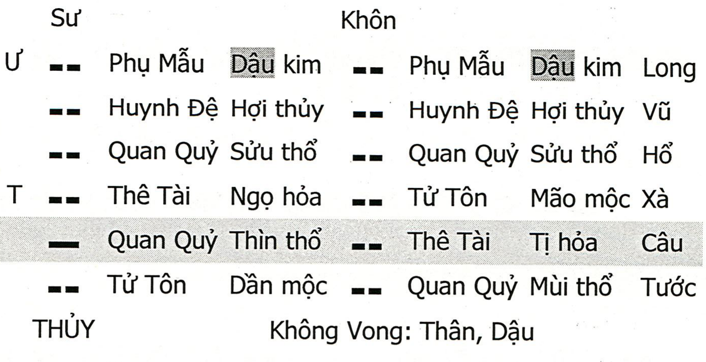

### Ví dụ 9: Ngày Canh Tý tháng Tý, nam đoán mở cửa hàng sẽ ra sao? Được Sơn Địa Bác biến Hỏa Địa Tấn.

| | Bác | | Tấn | | |
| :---: | :---: | :---: | :---: | :---: | :---: |
| | — | Thê Tài Dần mộc | — | Quan Quỷ Tị hỏa | Xà |
| T | - - | Tử Tôn Tý thủy | - - | Phụ Mẫu Mùi thổ | Câu |
| | - - | Phụ Mẫu Tuất thổ | — | Huynh Đệ Dậu kim | Tước |
| | - - | Thê Tài Mão mộc | - - | Thê Tài Mão mộc | Long |
| Ứ | - - | Quan Quỷ Tị hỏa | - - | Quan Quỷ Tị hỏa | Vũ |
| | - - | Phụ Mẫu Mùi thổ | - - | Phụ Mẫu Mùi thổ | Hổ |

KIM Không Vong: Thìn, Tị

**Phán đoán:** Lấy Thê Tài làm Dụng thần. Trong quẻ Thê Tài lưỡng hiện, lấy hào Thê Tài Mão mộc gặp hợp làm Dụng thần. Phụ Mẫu Tuất thổ độc phát đến hợp Dụng thần, độc phát chủ tính chất, nguyên nhân, Phụ Mẫu là văn thư, lại là cửa hàng, lâm Chu Tước chủ văn hóa, vì vậy phán đoán anh ta là sắp mở nhà sách.

Hào 2 là cửa hàng, lâm hào Ứng, Ứng là người khác, đây là nơi sắp thuê để mở cửa hàng. Hào 2 Tị hỏa Không Vong biểu thị cửa hàng vẫn chưa hoàn thành. Thê Tài Mão mộc lâm Thanh Long chủ giải trí. Thê Tài Dần mộc lâm Đằng Xà, Đằng Xà chủ quái dị, thần bí. Vì vậy, cửa hàng chủ yếu kinh doanh sách về giải trí và văn hóa thần bí.

**Phản hồi:** Quả nhiên phù hợp với tình hình thực tế.

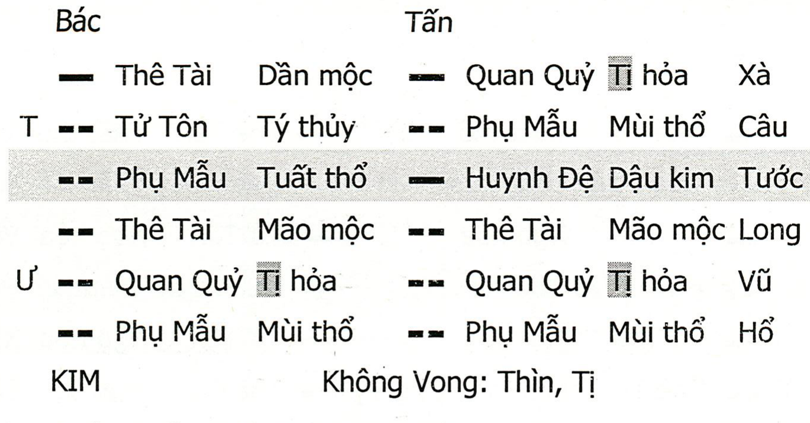

**Ví dụ 10:** Ngày Mậu Tuất tháng Mùi, nữ đoán chiêu sinh mở lớp đào tạo máy vi tính sẽ ra sao? Được Lôi Địa Dự biến Lôi Sơn Tiểu Quá.

| | Dự | | | | Tiểu Quá | | | |
| :--- | :---: | :--- | :--- | :--- | :---: | :--- | :--- | :--- |
| | ▅▅ ▅▅ | Thê Tài | Tuất thổ | | ▅▅ ▅▅ | Thê Tài | Tuất thổ | Tước |
| | ▅▅ ▅▅ | Quan Quỷ | Thân kim | | ▅▅ ▅▅ | Quan Quỷ | Thân kim | Long |
| Ư | ▅▅▅▅▅ | Tử Tôn | Ngọ hỏa | | ▅▅▅▅▅ | Tử Tôn | Ngọ hỏa | Vũ |
| | ▅▅ ▅▅ | Huynh Đệ | Mão mộc | | ▅▅▅▅▅ | Quan Quỷ | Thân kim | Hổ |
| | ▅▅ ▅▅ | Tử Tôn | Tị hỏa | | ▅▅ ▅▅ | Tử Tôn | Ngọ hỏa | Xà |
| T | ▅▅ ▅▅ | Thê Tài | Mùi thổ | Phụ Tý | ▅▅ ▅▅ | Thê Tài | Thìn thổ | Câu |

MỘC Không Vong: Thìn, Tị

**Phán đoán:** Mục đích là lợi nhuận, lấy Thê Tài làm Dụng thần. Trong quẻ Thê Tài lưỡng hiện, Nhật Nguyệt trợ giúp là vượng tướng, nhưng không nên Mão mộc Tử địa độc phát. Do đó, tình hình chiêu sinh nhất định không thuận lợi.

**Phản hồi:** Kết quả là chỉ tuyển được 2 học viên.

## 16. ỨNG DỤNG CỦA 12 TRẠNG THÁI NGŨ HÀNH SINH DIỆT TRONG DỰ ĐOÁN KINH TẾ

12 trạng thái ngũ hành sinh diệt có tỷ lệ ứng nghiệm rất cao trong dự đoán lục hào. Đồng thời, đây cũng là một kiến thức quan trọng tương đối khó nắm bắt. Ở phương diện dự đoán kinh tế, chúng ta phải căn cứ vào nội dung dự đoán khác nhau mà sử dụng một cách linh hoạt. Một số ý nghĩa chủ yếu có thể dùng để dự đoán như sau:

**Trường Sinh:** Sinh trưởng, khởi nguồn, khởi điểm, giúp đỡ, dựa vào, chỗ dựa vững chắc, nuôi dưỡng, cội nguồn, gốc rễ, ban đầu, cứu trợ, sản sinh, tìm kiếm, đạt được, phát sinh, bắt đầu,...

**Mộc Dục:** Tắm rửa, công khai, quang minh, ân huệ, lợi ích, có lợi, lộ ra, trụi lủi, nhẵn bóng, mịn màng, hưởng thụ, thẳng thắn, đi ngủ, rách nát, xấu xí, không biết xấu hổ, ẩm ướt, chăm sóc,...

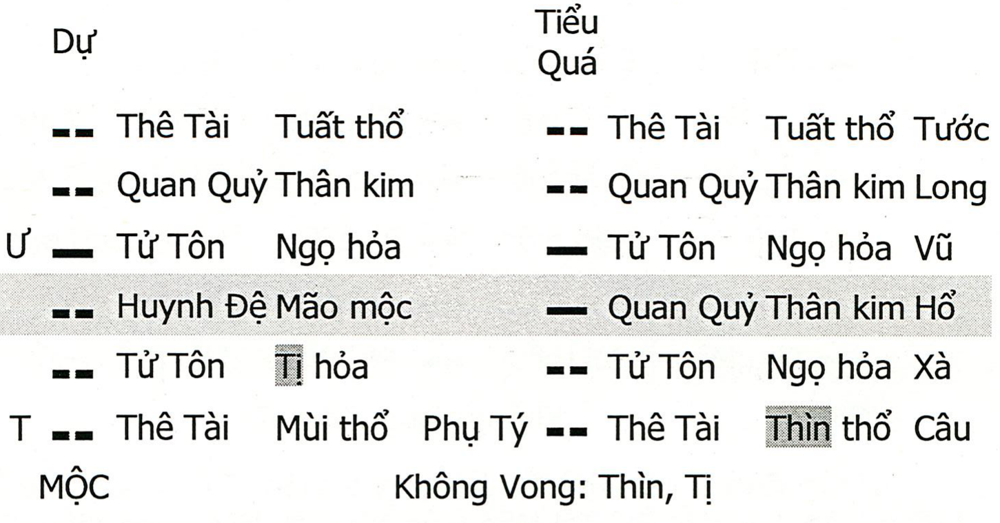

**Quan Đới:** Chỉnh trang, ngụy trang, đóng gói, trang sức, quần áo, thăng cấp, vinh dự, che đậy, bề ngoài, cao quý, che giấu,...

**Lâm Quan:** Nhà nước, cơ quan hành chính, tai họa, nịnh bợ lãnh đạo, dựa vào chính phủ, được lãnh đạo nâng đỡ, nịnh hót, có địa vị, nhân viên công vụ, tự lực cánh sinh, tự mình nỗ lực, trưởng thành, sắp thành công, quốc doanh, nguy hiểm,...

**Đế Vượng:** Vinh phát, phát đạt, đắc ý, tinh thần, hưng phấn, thần khí, có lực, hùng tráng, cao to, sở trường, lớn mạnh, huy hoàng, phát triển mạnh mẽ, lên cao, có quyền, cực hạn, cao trào, đỉnh điểm,...

**Suy:** Vô lực, mềm yếu, suy nhược, nhược tiểu, không phát đạt, nhược trí, suy tàn, sức yếu, không thuận lợi, chùn chân, không có chỗ dựa vững chắc, nhược điểm, nhút nhát, hư nhược, thấp bé, vô dụng, không có bản lĩnh, bất tài, cao không với tới thấp không bằng lòng, không dám phản kháng,...

**Bệnh:** Chán ghét, căm hận, kẻ thù, nhìn hằn thù, thiếu sót, khuyết điểm, khiếm khuyết, thương tật, nhược điểm, sơ hở, chỗ yếu, chỗ hiểm, tâm bệnh, mục nát, vấn đề,...

**Tử:** Tử vong, đi vào chỗ bế tắc, không linh hoạt, không thể biến thông, ngưng lại, chung kết, sụp đổ, cố chấp, không có chỗ trống, không phát đạt, không có sinh khí, không có sức sống, khô khan, đần độn, nghĩ không thoáng, lòng dạ hẹp hòi, không có đường lui, vắng vẻ, an tĩnh, đáng sợ,...

**Mộ:** Bao dung, cất giữ, chôn giấu, đóng kín, thu thập, gửi, quản lý, quản chế, thuộc về, khống chế, thao túng, chỉ huy, bao hàm, thâu tóm, cạm bẫy, không tự do, say mê, bị quản thúc, ẩn tàng, bảo vệ, hộ vệ, hàng rào, nhà kho, quyền hạn, lơ mơ, hồ đồ, tối tăm, không lưu loát, không thông suốt, kết thúc, trở lực, tắc nghẽn,...

**Tuyệt:** Không có đường lui, nguy hiểm, tuyệt địa, tuyệt cảnh, vách núi, chia tay, đoạn tuyệt, trận quyết chiến, thất vọng, mất hết ý chí, từ bỏ, bất lực, vô tình, cay nghiệt, không châm chước, đình chỉ, tan biến, bặt vô âm tín,...

**Thai:** Chuẩn bị, ý định ban đầu, kế hoạch, hình thành, tiên thiên, khi mới sinh ra đã có, trời sinh, bản tính khó dời, sơ cấp,

---

# Part 8 (Pages 141-160)

cấu kết, bận tâm, nhọc lòng, ý nghĩ, ấu trĩ, nhược tiểu, nhỏ tuổi, cất bước,...

**Dưỡng:** Sinh ra, sinh trưởng, gửi gắm, nuôi dưỡng, nghỉ dưỡng, dưỡng bệnh, nghỉ ngơi, chỗ dựa, dinh dưỡng, tẩm bổ, phù trợ, nghi ngờ, không yên tâm, không chắc chắn, tâm hư, bận tâm, bất an, nhận con thừa tự, bồi dưỡng, nuôi dạy, nhược tiểu, nâng đỡ,...

Khi ứng dụng 12 trường sinh, cần kết hợp với Nguyệt phá, Không Vong, lục thần, ngũ hành,... để cụ thể hóa ý nghĩa. Trong dự đoán lục hào, Mộ khố có vai trò rất nổi bật. Ví dụ như khi Phụ Mẫu là văn thư hợp đồng, Mộ khố của nó có thể hiểu là cặp tài liệu, tủ hồ sơ, bộ phận quản lý giấy phép,... Khi Thê Tài là tiền, Mộ khố của Thê Tài có thể là ngân hàng, két sắt, ví tiền, kế toán, cục tài chính, tiền vốn tích lũy, huy động vốn, hùn vốn,...

**Ví dụ 1:** Ngày Ất Tị tháng Tị, nữ đoán tiền đồ của việc kinh doanh xe đạp, được Sơn Hỏa Bí biến Phong Hỏa Gia Nhân.

| Bí | | Gia Nhân | |
| :--- | :--- | :--- | :--- |
| | ━ Quan Quỷ Dần mộc | ━ Quan Quỷ Mão mộc | Vũ |
| | -- Thê Tài Tý thủy | ━ Phụ Mẫu Tị hỏa | Hổ |
| Ứ | -- Huynh Đệ Tuất thổ | -- Huynh Đệ Mùi thổ | Xà |
| | ━ Thê Tài Hợi thủy Tử Thân | ━ Thê Tài Hợi thủy | Câu |
| | -- Huynh Đệ Sửu thổ Phụ Ngọ | -- Huynh Đệ Sửu thổ | Tước |
| T | ━ Quan Quỷ Mão mộc | ━ Quan Quỷ Mão mộc | Long |

THỔ Không Vong: Dần, Mão

**Phán đoán:** Lấy Thê Tài làm Dụng thần. Trong quẻ Thê Tài lưỡng hiện, lấy hào Thê Tài Tý thủy phát động làm Dụng thần. Dụng thần không được Nhật Nguyệt sinh phù, độc phát hóa Tuyệt, hào Thế lại Không không được Thê Tài đến sinh, buôn bán nhất định không thuận lợi.

**Phản hồi:** Quả nhiên không phát đạt.

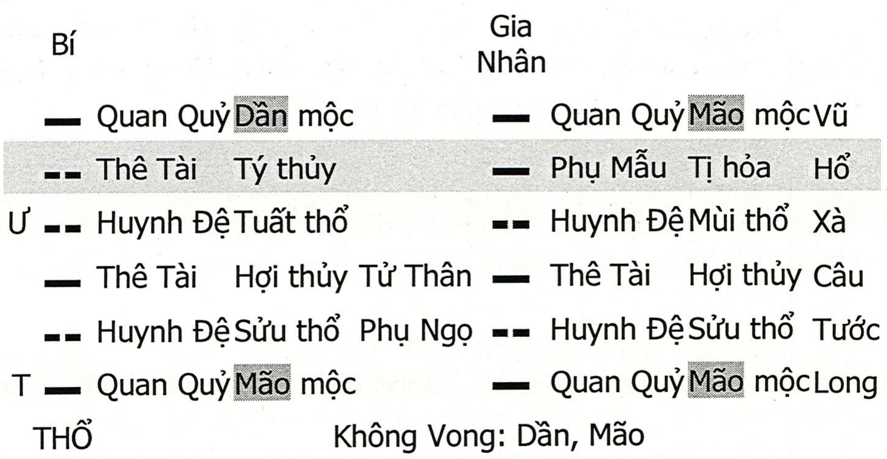

**Ví dụ 2:** Ngày Ất Mão tháng Tý, nam đoán đầu thầu thi công đường cao tốc, được Phong Hỏa Gia Nhân biến Thủy Hỏa Ký Tế.

| Gia Nhân | | Ký Tế | |
| :--- | :--- | :--- | :--- |
| | ━ Huynh Đệ Mão mộc | -- Phụ Mẫu Tý thủy | Vũ |
| Ứ | ━ Tử Tôn Tị hỏa | ━ Thê Tài Tuất thổ | Hổ |
| | -- Thê Tài Mùi thổ | -- Quan Quỷ Thân kim | Xà |
| | ━ Phụ Mẫu Hợi thủy Quan Dậu | ━ Phụ Mẫu Hợi thủy | Câu |
| T | -- Thê Tài Sửu thổ | -- Thê Tài Sửu thổ | Tước |
| | ━ Huynh Đệ Mão mộc | ━ Huynh Đệ Mão mộc | Long |

MỘC Không Vong: Tý, Sửu

**Phán đoán:** Lấy Phụ Mẫu làm Dụng thần. Phụ Mẫu Hợi thủy được Nguyệt trợ giúp là vượng tướng. Nhưng không nên Huynh Đệ Mão mộc độc phát, Huynh Đệ là thần cách trở, biểu thị trở lực chồng chất. Độc phát lấy tượng làm chủ, Mão mộc là Tử địa Dụng thần, không thành.

**Phản hồi:** Quả nhiên không trúng thầu.

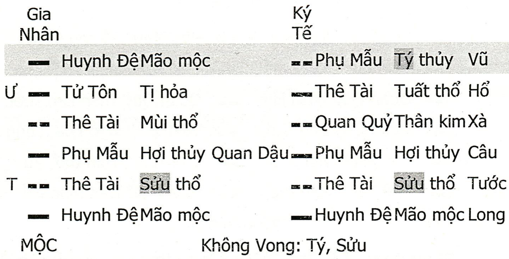

**Ví dụ 3:** Ngày Tân Dậu tháng Tuất, nam muốn xin tiền một người nữ, đoán xem đối phương có cho không? Được Thủy Phong Tỉnh biến Khảm Vi Thủy.

| Tỉnh | | Khảm | |
| :--- | :--- | :--- | :--- |
| | -- Phụ Mẫu Tý thủy | -- Phụ Mẫu Tý thủy | Xà |
| T | ━ Thê Tài Tuất thổ | ━ Thê Tài Tuất thổ | Câu |
| | -- Quan Quỷ Thân kim | -- Quan Quỷ Thân kim | Tước |
| | ━ Quan Quỷ Dậu kim | -- Tử Tôn Ngọ hỏa | Long |
| Ư | ━ Phụ Mẫu Hợi thủy | ━ Thê Tài Thìn thổ | Vũ |
| | -- Thê Tài Sửu thổ | -- Huynh Đệ Dần mộc | Hổ |

MỘC Không Vong: Tý, Sửu

**Phán đoán:** Lấy Thê Tài làm Dụng thần. Trong quẻ Thê Tài lưỡng hiện, lấy Thê Tài Sửu thổ Không Vong làm Dụng thần. Dụng thần Không Vong nhưng được Nguyệt kiến trợ giúp là vượng tướng, có thể sẽ có tiền nhưng sẽ không nhiều.

Hào 3 Quan Quỷ Dậu kim độc phát, hào độc phát có thể biểu thị tính chất, nguyên nhân. Dậu kim là đất Mộc Dục của hào Thế và hào Tài, tại hào 3 lâm Thanh Long, hào 3 là giường, Thanh Long chủ tình dục, Mộc Dục cũng là tình dục, được tiền là do chung sống với người phụ nữ này.

**Phản hồi:** Quả nhiên là như vậy.

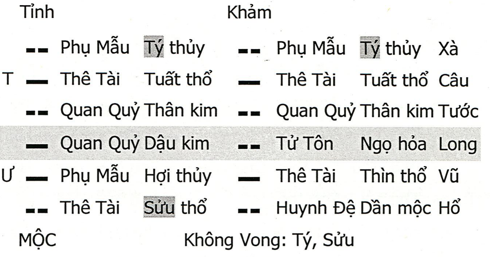

**Ví dụ 4:** Ngày Canh Thìn tháng Ngọ, nam đoán tài vận công ty in nhuộm, được Trạch Sơn Hàm biến Thiên Sơn Độn.

| Hàm | | Độn | |
| :--- | :--- | :--- | :--- |
| Ư | -- Phụ Mẫu Mùi thổ | ━ Phụ Mẫu Tuất thổ | Xà |
| | ━ Huynh Đệ Dậu kim | ━ Huynh Đệ Thân kim | Câu |
| | ━ Tử Tôn Hợi thủy | ━ Quan Quỷ Ngọ hỏa | Tước |
| T | ━ Huynh Đệ Thân kim | ━ Huynh Đệ Thân kim | Long |
| | -- Quan Quỷ Ngọ hỏa Tài Mão | -- Quan Quỷ Ngọ hỏa | Vũ |
| | -- Phụ Mẫu Thìn thổ | -- Phụ Mẫu Thìn thổ | Hổ |

KIM Không Vong: Thân, Dậu

**Phán đoán:** Lấy Thê Tài làm Dụng thần. Thê Tài là lợi nhuận, Phụ Mẫu là công ty.

Thê Tài Mão mộc không hiện trên quẻ, phục dưới hào 2 Quan Quỷ Ngọ hỏa, hào 2 là nhà, lâm Huyền Vũ chủ tư hữu, là công ty gia đình.

Phụ Mẫu Mùi thổ tại hào 6, hào 6 là hào vị thoái hưu, cũng là hào vị tổ tiên, công ty là sản nghiệp do trưởng bối để lại. Công ty này đã lâu năm.

Thê Tài Mão mộc không được Nhật Nguyệt trợ giúp là hưu tù, lại nhập Mộ ở hào độc phát, tài vận không tốt đẹp. Hào Thế Không Vong, mỗi ngày ở trong trạng thái bất an. Thê Tài nhập Mộ ở hào Ứng, Ứng là người khác, thu nhập của công ty bị người khác chi phối.

**Phản hồi:** Trên thực tế, công ty là sản nghiệp của cha để lại, nhưng kinh doanh không phát đạt, nhờ vào người khác duy trì công ty.

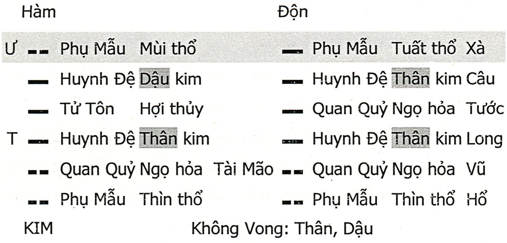

## Ví dụ 5: Ngày Mậu Thìn tháng Tị, nam đoán về cổ phiếu mình đã mua, được Trạch Thủy Khốn biến Trạch Phong Đại Quá.

| | Khốn | Đại Quá | |
| :--- | :--- | :--- | :--- |
| | ╍╍ Phụ Mẫu Mùi thổ | ╍╍ Phụ Mẫu Mùi thổ | Tước |
| | ━ Huynh Đệ Dậu kim | ━ Huynh Đệ Dậu kim | Long |
| Ư | ━ Tử Tôn Hợi thủy | ━ Tử Tôn Hợi thủy | Vũ |
| | ╍╍ Quan Quỷ Ngọ hỏa | ━ Huynh Đệ Dậu kim | Hổ |
| | ━ Phụ Mẫu Thìn thổ | ━ Tử Tôn Hợi thủy | Xà |
| T | ╍╍ Thê Tài Dần mộc | ╍╍ Phụ Mẫu Sửu thổ | Câu |

**KIM** **Không Vong: Tuất, Hợi**

**Phán đoán:** Lấy Thê Tài làm Dụng thần. Thê Tài Dần mộc trì Thế, không được Nhật Nguyệt trợ giúp là hưu tù. Quan Quỷ Ngọ hỏa độc phát là Tử địa Dụng thần, dễ thấy cổ phiếu đã bị rớt giá. Nguyên thần Tử Tôn Hợi thủy Nguyệt phá nhập Mộ ở Nhật, đã không có khả năng tăng lên.

**Phản hồi:** Quả nhiên là bị rớt giá. Người này đã đầu tư 1000 vạn tệ để mua cổ phiếu Aucma. Lúc mua vào thì cổ phiếu có giá 13 tệ, sau một tuần thì thị trường chứng khoán lao dốc, bỗng chốc thiệt hại 400 vạn tệ. Cổ phiếu cũng không tăng trở lại mức giá ban đầu.

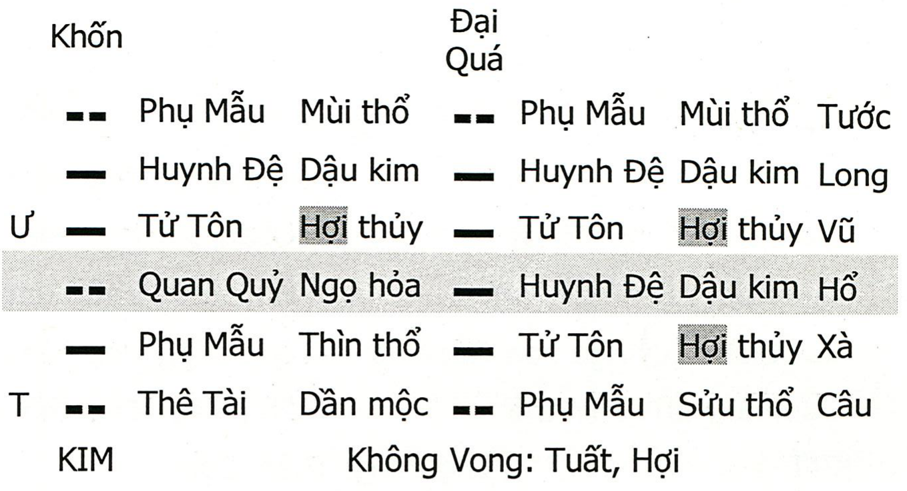

## Ví dụ 6: Ngày Ất Dậu tháng Mùi, nam đoán hợp tác kinh doanh với người ta sẽ ra sao? Được Lôi Thiên Đại Tráng biến Địa Phong Thăng.

| | Đại Tráng | Thăng | |
| :--- | :--- | :--- | :--- |
| | ╍╍ Huynh Đệ Tuất thổ | ╍╍ Tử Tôn Dậu kim | Vũ |
| | ╍╍ Tử Tôn Thân kim | ╍╍ Thê Tài Hợi thủy | Hổ |
| T | ━ Phụ Mẫu Ngọ hỏa | ╍╍ Huynh Đệ Sửu thổ | Xà |
| | ━ Huynh Đệ Thìn thổ | ━ Tử Tôn Dậu kim | Câu |
| | ━ Quan Quỷ Dần mộc | ━ Thê Tài Hợi thủy | Tước |
| Ư | ━ Thê Tài Tý thủy | ╍╍ Huynh Đệ Sửu thổ | Long |

**THỔ** **Không Vong: Ngọ, Mùi**

**Phán đoán:** Lấy Thê Tài làm Dụng thần. Thê Tài Tý thủy tại hào sơ lâm Thanh Long, thủy là lả lơi ong bướm, Thanh Long chủ tửu sắc, gặp Nhật Dậu kim là Mộc Dục, cái gọi là kinh doanh chính là kinh doanh về sắc tình. Hào Thế Không Vong lâm Đằng Xà, Không Vong chủ lo lắng, Đằng Xà là sợ hãi, kinh doanh cái này thì sống trong nơm nớp lo sợ. Thê Tài hóa phá, Nguyệt đến khắc, quẻ lục xung, hợp tác bất thành.

**Phản hồi:** Quả nhiên là muốn hợp tác kinh doanh khiêu dâm, nhưng bị người hợp tác từ chối.

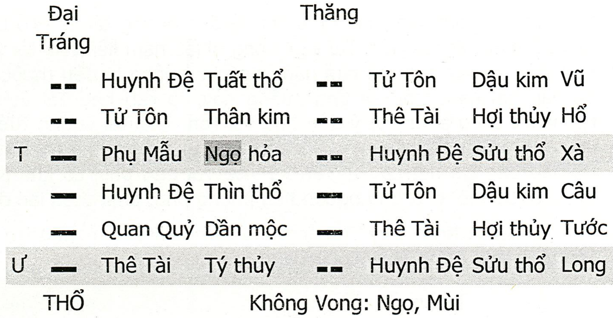

# CHƯƠNG 3
## PHƯƠNG PHÁP DỰ ĐOÁN TÀI VẬN

### 1. TÀI VẬN DÀI HẠN

Tài vận dài hạn thường là chỉ về tình huống tài vận có thời gian từ một năm trở lên. Tài vận trong nhiều năm liên tục, tài vận trọn đời, tài vận của mở cửa hàng hoặc mở công ty đều thuộc về tài vận dài hạn. Đối với tình huống này, ta cần hào Tài vượng tướng và cũng phải chú ý đến hào Tử Tôn. Thê Tài vượng tướng chỉ là lợi ích trước mắt, nếu Tử Tôn hưu tù Không Phá thì không thể lâu dài. Do đó, cả Tử Tôn và Thê Tài đều phải có khí. Nền tảng tốt thì mới là tượng nguồn tiền phong phú, phát triển lâu dài.

**Ví dụ 1:** Ngày Quý Tị tháng Sửu năm Quý Mùi, nam đoán tài vận tổng thể, được Thủy Lôi Truân.

| | Truân | Phục thần | |
| :---: | :--- | :---: | :--- |
| | ╍╍ Huynh Đệ Tý thủy | | Hổ |
| Ứ | ━ Quan Quỷ Tuất thổ | | Xà |
| | ╍╍ Phụ Mẫu Thân kim | | Câu |
| | ╍╍ Quan Quỷ Thìn thổ | Tài Ngọ | Tước |
| T | ╍╍ Tử Tôn Dần mộc | | Long |
| | ━ Huynh Đệ Tý thủy | | Vũ |

**THỦY** **Không Vong: Ngọ, Mùi**

**Phán đoán:** Lấy Thê Tài làm Dụng thần. Thê Tài Ngọ hỏa không hiện trên quẻ, phục dưới hào 3 Quan Quỷ Thìn thổ, lại thêm Không Vong. Tuy nhiên, Dụng thần không bị Nguyệt khắc, lại được Nhật tỉ phù, vẫn có cơ hội phát tài. Năm Bính Tuất xung khai Phi thần nên có thể tiến tài. Thê Tài lâm Chu Tước, Chu Tước chủ văn thư, văn hóa, phát tài chủ yếu nhờ tri thức. Có điều là Tử Tôn hưu tù, tài vận không thể bền vững.

**Phản hồi:** Ở năm Bính Tuất, người này đã phát tài hơn 70 vạn từ xuất bản sách, những năm khác thì không có gì nổi bật.

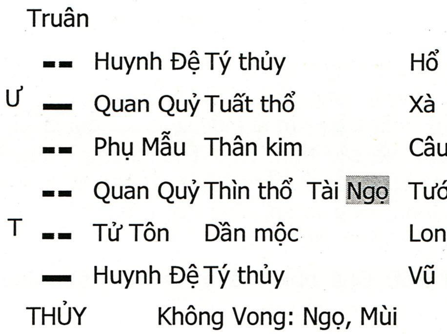

**Ví dụ 2:** Ngày Quý Tị tháng Sửu, nam đoán tài vận dài hạn, được Thiên Trạch Lý biến Hỏa Lôi Phệ Hạp.

| | Lý | Phục thần | Phệ Hạp | |
| :---: | :--- | :---: | :--- | :---: |
| | ━ Huynh Đệ Tuất thổ | | ━ Phụ Mẫu Tị hỏa | Hổ |
| T | ━ Tử Tôn Thân kim | Tài Tý | ╍╍ Huynh Đệ Mùi thổ | Xà |
| | ━ Phụ Mẫu Ngọ hỏa | | ━ Tử Tôn Dậu kim | Câu |
| | ╍╍ Huynh Đệ Sửu thổ | | ╍╍ Huynh Đệ Thìn thổ | Tước |
| Ứ | ━ Quan Quỷ Mão mộc | | ╍╍ Quan Quỷ Dần mộc | Long |
| | ━ Phụ Mẫu Tị hỏa | | ━ Thê Tài Tý thủy | Vũ |

**THỔ** **Không Vong: Ngọ, Mùi**

**Phán đoán:** Lấy Thê Tài làm Dụng thần. Thê Tài Tý thủy ẩn phục dưới hào 5, Dụng thần được Nguyệt hợp là hợp vượng, mặc dù được tài không ít, nhưng Nhật Nguyệt không sinh phù Dụng thần, rất khó thành cự phú. Dụng thần lâm Đằng Xà, Đằng Xà chủ nghệ thuật, kỹ nghệ, là phát tài nhờ kỹ thuật.

Hào Thế phát động đi sinh, phải tự mình nỗ lực mới kiếm được tiền. Hào Thế bị Nhật hợp trú, cầu tài gặp trở lực trùng trùng, rất vất vả. Động mà hóa Không, bận rộn đi lại cũng chỉ phí công vô ích. Dự đoán tài vận mà Quan Quỷ phát động, thế nào cũng có kiện tụng.

**Phản hồi:** Trên thực tế, người này tinh thông tranh chữ, anh ta làm về trang trí để kiếm tiền. Do có nhiều công trình không được thanh toán, anh ta đã đi kiện để đòi tiền.

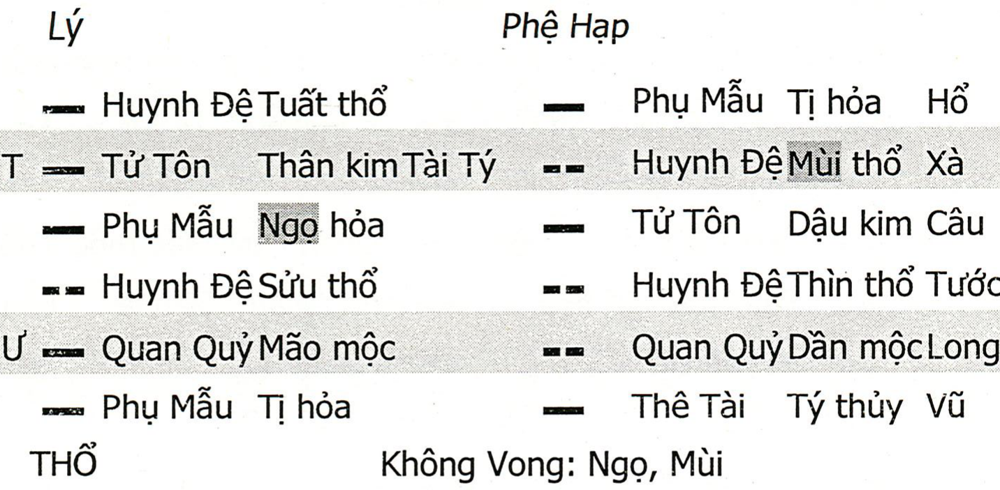

**Ví dụ 3:** Ngày Nhâm Dần tháng Sửu, nữ đoán tài vận dài hạn, được Khôn Vi Địa biến Phong Địa Quan.

| Khôn | | | Quan | | |
| :--- | :---: | :--- | :---: | :--- | :--- |
| T | - - | Tử Tôn Dậu kim | — | Quan Quỷ Mão mộc | Hổ |
| | - - | Thê Tài Hợi thủy | — | Phụ Mẫu Tị hỏa | Xà |
| | - - | Huynh Đệ Sửu thổ | - - | Huynh Đệ Mùi thổ | Câu |
| Ư | - - | Quan Quỷ Mão mộc | - - | Quan Quỷ Mão mộc | Tước |
| | - - | Phụ Mẫu Tị hỏa | - - | Phụ Mẫu Tị hỏa | Long |
| | - - | Huynh Đệ Mùi thổ | - - | Huynh Đệ Mùi thổ | Vũ |

THỔ Không Vong: Thìn, Tị

**Phán đoán:** Lấy Thê Tài làm Dụng thần. Thê Tài Hợi thủy tại hào 5, mặc dù được tài không ít, nhưng Nguyệt khắc Nhật hợp, lại động hóa Không, cuối cùng thì chẳng còn lại được bao nhiêu. Ngoại quái phản ngâm, không thể tích trữ được tiền bạc, có rồi mất, mất lại kiếm, kiếm được lại mất.

Tài bị Nhật Quan Quỷ hợp vướng chân, trong quẻ Quan Quỷ lâm hào Ứng, Ứng là hào vị chồng, số tiền kiếm được bị chồng làm mất.

**Phản hồi:** Quả nhiên là như vậy. Tất cả số tiền người nữ này kiếm được đều bị chồng mang đi kinh doanh, nhưng chồng đã kinh doanh thua lỗ. Không có tiền, cô ấy lại đi kiếm, kiếm được lại bị chồng mang đi.

**Ví dụ 4:** Ngày Tân Sửu tháng Dậu, nữ đoán tài vận bản thân, tôi gieo được Phong Trạch Trung Phu biến Thủy Lôi Truân.

| Trung Phu | | | | Truân | | |
| :--- | :---: | :--- | :---: | :---: | :--- | :--- |
| | — | Quan Quỷ Mão mộc | | - - | Thê Tài Tý thủy | Xà |
| | — | Phụ Mẫu Tị hỏa | Tài Tý | — | Huynh Đệ Tuất thổ | Câu |
| T | - - | Huynh Đệ Mùi thổ | | - - | Tử Tôn Thân kim | Tước |
| | - - | Huynh Đệ Sửu thổ | Tử Thân | - - | Huynh Đệ Thìn thổ | Long |
| | — | Quan Quỷ Mão mộc | | - - | Quan Quỷ Dần mộc | Vũ |
| Ư | — | Phụ Mẫu Tị hỏa | | — | Thê Tài Tý thủy | Hổ |

THỔ Không Vong: Thìn, Tị

**Phán đoán:** Lấy Thê Tài làm Dụng thần. Thê Tài Tý thủy không hiện trên quẻ, phục dưới hào 5 Tị hỏa, được Nguyệt sinh, Phi thần lại Không, Phục thần dưới hào Không thì dễ kéo ra, vốn là tượng cát, nhưng Nhật thần khắc hợp, suy vượng cân bằng.

Trong quẻ Quan Quỷ lưỡng động, đều là Tử địa Dụng thần, không cát. Một lâm Huyền Vũ chủ lừa gạt, một lâm Đằng Xà chủ có người làm khó dễ. Do đó, tài vận không tốt đẹp. Quẻ chính du hồn, tài vận không ổn định, bất an.

**Phản hồi:** Trên thực tế, người nữ này kinh doanh, nhiều lần bị người ta lừa tiền, lại thêm có người quấy rối và dọa nạt.

**Ví dụ 5:** Ngày Đinh Dậu tháng Mùi năm Quý Mùi, nam dự đoán tài vận tổng thể của mình, được Địa Sơn Khiêm biến Thủy Hỏa Ký Tế.

| | Khiêm | | | Tế | | |
|---|---|---|---|---|---|---|
| | -- | Huynh Đệ Dậu kim | | -- | Tử Tôn Tý thủy | Long |
| T | -- | Tử Tôn Hợi thủy | | — | Phụ Mẫu Tuất thổ | Vũ |
| | -- | Phụ Mẫu Sửu thổ | | -- | Huynh Đệ Thân kim | Hổ |
| | — | Huynh Đệ Thân kim | | — | Tử Tôn Hợi thủy | Xà |
| Ư | -- | Quan Quỷ Ngọ hỏa | Tài Mão | -- | Phụ Mẫu Sửu thổ | Câu |
| | -- | Phụ Mẫu Thìn thổ | | — | Thê Tài Mão mộc | Tước |

KIM Không Vong: Thìn, Tị

**Phán đoán:** Lấy Thê Tài làm Dụng thần. Thê Tài Mão mộc không hiện trên quẻ, phục dưới hào 2 Quan Quỷ Ngọ hỏa, Quan Quỷ lâm Câu Trần, Quan Quỷ là chính phủ, cơ quan, Câu Trần là nha môn, Tài phục dưới Quan chính là phát tài nhờ nhà nước hoặc cơ quan.

Hào Thế lâm Huyền Vũ động mà sinh Tài, Huyền Vũ chủ trộm cắp, tham ô,... Nhưng Hợi thủy tự hình, bị Nguyệt khắc, động hóa hồi đầu khắc, lại nhập Mộ ở Phụ Mẫu Thìn thổ, Thìn thổ lâm Chu Tước, Chu Tước là khẩu thiệt, kiện tụng, vì vậy có tượng lao ngục. Thìn thổ Không Vong, năm Canh Thìn Thực Không, sự việc ứng nghiệm tại năm 2000.

**Phản hồi:** Trên thực tế, người này đã từng ăn trộm sắt thép trong nhà máy thép. Năm Canh Thìn, anh ta bị bắt, phải ngồi tù nửa năm và còn bị xử phạt tiền.

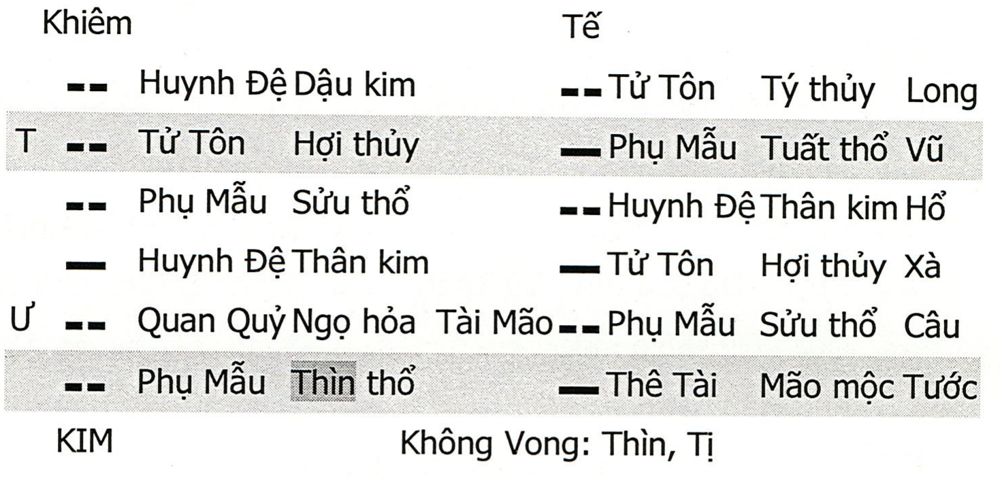

**Ví dụ 6:** Ngày Nhâm Thân tháng Thìn năm Đinh Hợi, nữ đoán tài vận của chồng, được Lôi Hỏa Phong biến Chấn Vi Lôi.

| | Phong | | Chấn | | |
|---|---|---|---|---|---|
| | -- | Quan Quỷ Tuất thổ | -- | Quan Quỷ Tuất thổ | Hổ |
| T | -- | Phụ Mẫu Thân kim | -- | Phụ Mẫu Thân kim | Xà |
| | — | Thê Tài Ngọ hỏa | — | Thê Tài Ngọ hỏa | Câu |
| | — | Huynh Đệ Hợi thủy | -- | Quan Quỷ Thìn thổ | Tước |
| Ư | -- | Quan Quỷ Sửu thổ | -- | Tử Tôn Dần mộc | Long |
| | — | Tử Tôn Mão mộc | — | Huynh Đệ Tý thủy | Vũ |

THỦY Không Vong: Tuất, Hợi

**Phán đoán:** Lấy Thê Tài làm Dụng thần. Thê Tài Ngọ hỏa hưu tù, không được Nhật Nguyệt trợ giúp, mà Kỵ thần Huynh Đệ độc phát được Nhật sinh trợ, Nhật biểu thị hiện tại, cho nên hiện nay đang là lúc tài vận gặp khó khăn. Hào Thế là chủ thể của sự vật, tại hào 5 tôn vị, biểu thị đã từng huy hoàng. Quẻ Lôi Hỏa Phong có tượng sung túc, đoán là trước kia đã từng kiếm được rất nhiều tiền.

Năm 1998 là năm Mậu Dần hợp trú Huynh Đệ Hợi thủy, Tài được Trường Sinh, vì vậy năm này phát tài. Năm 1999 là năm Kỷ Mão dẫn hóa Huynh Đệ sinh phù hào Tài, năm này cũng được tài. Năm 2000 là năm Canh Thìn, Huynh Đệ nhập Mộ không thể khắc Tài, năm này cũng có tài. Năm 2001 là năm Tân Tị, Tài được trợ giúp xung mất Huynh Đệ Hợi thủy, năm này cũng phát tài. Năm 2002 là năm Nhâm Ngọ, Tài được trợ giúp, gắng gượng phát triển. Năm 2003 là năm Quý Mùi khắc chế Huynh Đệ, địa chi lưu niên Tài, năm này cũng có tiền vào. Nhưng đến năm 2004 là năm Giáp Thân, Huynh Đệ được Trường Sinh biến vượng, đây là năm tài vận bắt đầu gặp khó khăn. Năm 2005 Ất Dậu hợp trú hào biến, Huynh Đệ không còn bị chế, lại được sinh vượng, tài vận vẫn gặp khó khăn. Năm 2006 Bính Tuất, Thê Tài nhập Mộ, Mộ khố của Huynh Đệ bị xung, Huynh Đệ ra oai, tài vận cũng không thuận lợi. Năm nay là Đinh Hợi, Thái Tuế nhập hào lâm Kỵ thần, tài vận càng kém hơn lúc trước.

**Phản hồi:** Quả nhiên phán đoán chính xác.

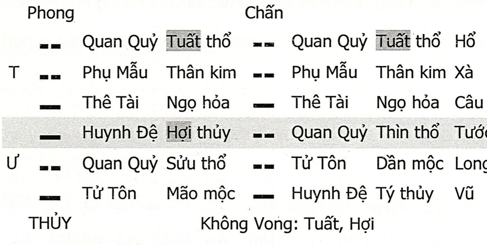

## 2. TÀI VẬN LƯU NIÊN

Dự đoán tài vận lưu niên thì lấy hào Thê Tài làm Dụng thần. Thê Tài vượng tướng thì tài vận tốt, hưu tù Không Phá thì tài vận kém. Đồng thời, phải xem thêm hào Tử Tôn và hào Thế, hào Tử Tôn và hào Thế cần vượng tướng có khí, không được hưu tù Không Phá.

**Ví dụ 1:** Ngày Ất Tị tháng Sửu, nam dự đoán tài vận năm Giáp Thân (năm sau), được Thủy Trạch Tiết biến Địa Trạch Lâm.

| | Tiết | | Lâm | |
| :--- | :---: | :--- | :---: | :--- | :--- |
| | - - | Huynh Đệ Tý thủy | - - | Phụ Mẫu Dậu kim | Vũ |
| | — | Quan Quỷ Tuất thổ | - - | Huynh Đệ Hợi thủy | Hổ |
| Ư | - - | Phụ Mẫu Thân kim | - - | Quan Quỷ Sửu thổ | Xà |
| | - - | Quan Quỷ Sửu thổ | - - | Quan Quỷ Sửu thổ | Câu |
| | — | Tử Tôn Mão mộc | — | Tử Tôn Mão mộc | Tước |
| T | — | Thê Tài Tị hỏa | — | Thê Tài Tị hỏa | Long |

THỦY Không Vong: Dần, Mão

**Phán đoán:** Lấy Thê Tài làm Dụng thần. Thê Tài Tị hỏa Nguyệt không sinh phù, nhưng được Nhật tỉ phù là vượng tướng. Nhật tỉ phù có địa chi giống Dụng thần, có thể hiểu là bạn bè, là phát tài nhờ bạn bè.

Thê Tài Tị hỏa lâm Thanh Long trì Thế vốn là tượng cát, nhưng trong quẻ Quan Quỷ Tuất thổ lâm Bạch Hổ độc phát, Dụng thần nhập Mộ, độc phát lấy tượng làm chủ, Quan Quỷ là tai họa, Bạch Hổ cũng là tai họa, hào 5 là đường đi, sợ rằng phát sinh phá tài vì bồi thường tai nạn giao thông, tài trong tay lại mất đi, cho nên tài vận năm này không tốt. Dụng thần nhập Mộ, ứng xung xuất, chỉ có tháng Hợi là có tài.

Người này cũng biết dự đoán, anh ta cho rằng tôi đoán sai. Anh ta nói: "Tháng Dần tháng Mão sinh Dụng thần, tài vận khá tốt, tháng Thìn xung khai Mộ khố càng là bước ngoặt. Tháng Tị tháng Ngọ lại là tháng Tài vượng, sao lại không tốt? Phán đoán của ông nhất định không chính xác! Tôi đang làm việc cho hai người bạn, quan hệ giữa chúng tôi rất tốt. Trước đây, chúng tôi

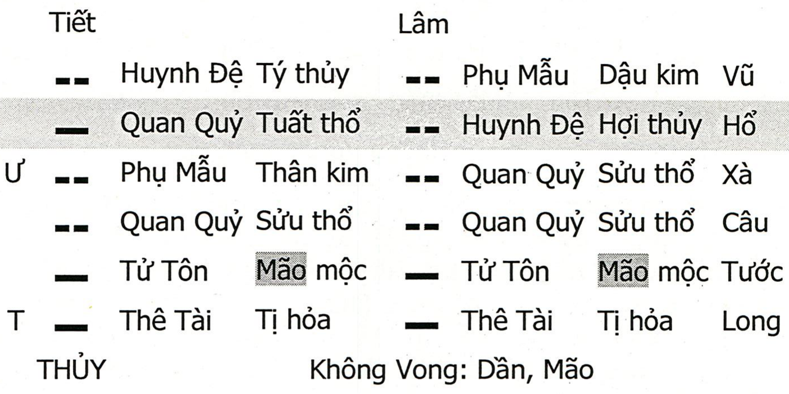 đã hợp tác và kiếm được rất nhiều tiền, họ trả tiền cho tôi không thiếu đồng nào."

Tôi cười và trả lời: "Cãi nhau làm gì, đến cuối năm rồi hẵng nói."

**Phản hồi:** Vào tháng giêng năm thứ hai, khi chúng tôi gặp lại nhau, anh ta ủ rũ nói: "Năm ngoái ông dự đoán quẻ tài vận của tôi đúng rồi. Sau khi tôi làm việc xong, họ hứa sẽ cho tôi hơn một trăm vạn. Khi dự định chuyển tiền vào tài khoản của tôi, họ có việc gấp cho nên phải lái xe đi, họ nói là sau khi trở về sẽ đưa tiền. Ai ngờ hai người bạn này đã chết trên đường vì tai nạn giao thông. Lúc sắp đi, họ còn bảo tôi đi cùng, may mà tôi bận nên không thể đi, nếu không thì chắc là cũng đã gặp tai nạn rồi. Tôi chỉ kiếm được chút ít tiền ở tháng Hợi."

**Ví dụ 2:** Ngày Tân Dậu tháng Tuất, nam đoán xem bản thân cuối năm có tiền hay không? Được Phong Trạch Trung Phu biến Thiên Phong Cấu.

| | Trung Phu | | | Cấu | |
| :--- | :---: | :--- | :---: | :---: | :--- | :--- |
| | — | Quan Quỷ Mão mộc | | — | Huynh Đệ Tuất thổ | Xà |
| | — | Phụ Mẫu Tị hỏa | Tài Tý | — | Tử Tôn Thân kim | Câu |
| T | - - | Huynh Đệ Mùi thổ | | — | Phụ Mẫu Ngọ hỏa | Tước |
| | - - | Huynh Đệ Sửu thổ | Tử Thân | — | Tử Tôn Dậu kim | Long |
| | — | Quan Quỷ Mão mộc | | — | Thê Tài Hợi thủy | Vũ |
| Ư | — | Phụ Mẫu Tị hỏa | | - - | Huynh Đệ Sửu thổ | Hổ |

THỔ Không Vong: Tý, Sửu

**Phán đoán:** Lấy Thê Tài làm Dụng thần. Thê Tài Tý thủy không hiện trên quẻ, Nguyệt khắc Nhật sinh, suy vượng cân bằng. Trong quẻ Huynh Đệ trì Thế phát động, được Nguyệt tỉ phù, hóa hồi đầu sinh là vượng tướng, ngoài ra lại có Huynh Đệ Sửu thổ phát động, hào sơ lại động sinh Huynh Đệ khắc Tài, tài vận không tốt. Quẻ chính du hồn, nguồn sinh tài không ổn định.

Nhưng Dụng thần tại hào 5 được Nhật sinh, xem như là có khí. Tổng hợp lại thì không có đại tài, chỉ có tiểu tài mà thôi. Thủy

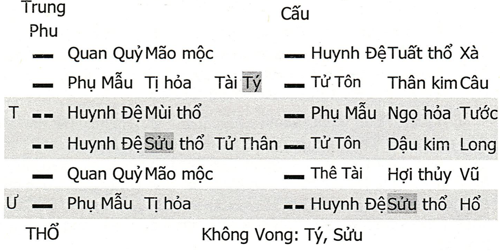 chủ số 6, bởi vì hưu tù nên giảm một nửa, vì vậy phán đoán có thể được khoảng 3000 tệ.

**Phản hồi:** Thực tế là đến cuối năm tổng cộng được 2970 tệ.

**Ví dụ 3:** Ngày Ất Mùi tháng Mão năm Quý Mùi, nữ đoán tài vận năm nay, được Thủy Trạch Tiết biến Phong Lôi Ích.

| | | Tiết | | Ích | |
| :---: | :---: | :--- | :---: | :--- | :---: |
| | - - | Huynh Đệ Tý thủy | — | Tử Tôn Mão mộc | Vũ |
| | — | Quan Quỷ Tuất thổ | — | Thê Tài Tị hỏa | Hổ |
| Ứ | - - | Phụ Mẫu Thân kim | - - | Quan Quỷ Mùi thổ | Xà |
| | - - | Quan Quỷ Sửu thổ | - - | Quan Quỷ Thìn thổ | Câu |
| | — | Tử Tôn Mão mộc | - - | Tử Tôn Dần mộc | Tước |
| T | — | Thê Tài Tị hỏa | — | Huynh Đệ Tý thủy | Long |

THỦY Không Vong: Thìn, Tị

**Phán đoán:** Lấy Thê Tài làm Dụng thần. Thê Tài Tị hỏa trì Thế, mặc dù được Nguyệt sinh là vượng tướng nhưng lâm hào sơ Không Vong, Không không được Nguyên thần đến sinh, hào sơ là bậc thấp nhất, biểu thị tài vận không tốt đẹp.

Nguyệt kiến khắc Quan Quỷ Sửu thổ, Huynh Đệ Tý thủy động sinh Tử Tôn Mão mộc, Tử Tôn Mão mộc động lại đến khắc Quan Quỷ Sửu thổ, hào 4 Quan Quỷ Sửu thổ hưu tù. Hào hưu tù bị Nhật xung là Nhật phá, Quan Quỷ thể hiện công việc, chắc chắn sẽ mất việc. Tử Tôn Mão mộc khắc Quan Quỷ, đồng thời hóa thoái không thể sinh Tài, cho nên sau khi mất việc thì không có nguồn kinh tế.

**Phản hồi:** Từ tháng Mão thì tài vận bắt đầu gặp khó khăn. Sau khi nghỉ việc, tháng Ngọ, tháng Mùi, tháng Thân, anh ta sống nhờ vào bảo hiểm thất nghiệp. Đến tháng Dậu, ngay cả tiền bảo hiểm thất nghiệp cũng không còn.

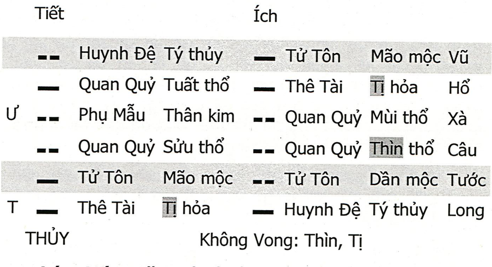

**Ví dụ 4:** Ngày Ất Dậu tháng Ngọ năm Giáp Thân, nam đoán tài vận năm nay của mình, được Trạch Phong Đại Quá biến Thủy Sơn Kiển.

| | | Đại Quá | | Kiển | |
| :---: | :---: | :--- | :---: | :--- | :---: |
| | - - | Thê Tài Mùi thổ | - - | Phụ Mẫu Tý thủy | Vũ |
| | — | Quan Quỷ Dậu kim | — | Thê Tài Tuất thổ | Hổ |
| T | — | Phụ Mẫu Hợi thủy Tử Ngọ | - - | Quan Quỷ Thân kim | Xà |
| | — | Quan Quỷ Dậu kim | — | Quan Quỷ Thân kim | Câu |
| | — | Phụ Mẫu Hợi thủy Huynh Dần | - - | Tử Tôn Ngọ hỏa | Tước |
| Ứ | - - | Thê Tài Sửu thổ | - - | Thê Tài Thìn thổ | Long |

MỘC Không Vong: Ngọ, Mùi

**Phán đoán:** Lấy Thê Tài làm Dụng thần. Trong quẻ Thê Tài lưỡng hiện, lấy Thê Tài Mùi thổ Không Vong làm Dụng thần. Dụng thần mặc dù được Nguyệt sinh là vượng tướng, nhưng trong quẻ Cừu thần lưỡng động, đặc biệt là hào Thế Phụ Mẫu Hợi thủy được Nhật sinh, hóa hồi đầu sinh, khắc Tử Tôn Ngọ hỏa. Tử Tôn không hiện trên quẻ, Không mà bị khắc, vô lực sinh Dụng thần, vì vậy tài vận không tốt đẹp.

**Phản hồi:** Trên thực tế, tài vận không tốt đẹp.

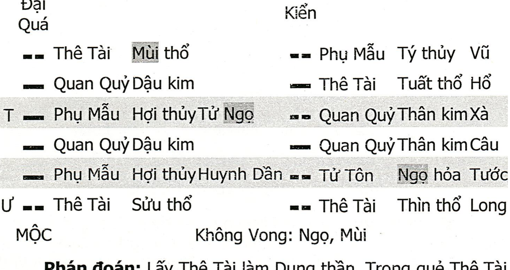

**Ví dụ 5:** Ngày Nhâm Tuất tháng Thân năm Nhâm Ngọ, nam đoán tài vận năm nay, được Lôi Thủy Giải.

| Thế/Ứng | Giải | Phục thần | Lục thú |
| :---: | :--- | :---: | :---: |
| | - - Thê Tài Tuất thổ | | Hổ |
| Ư | - - Quan Quỷ Thân kim | | Xà |
| | — Tử Tôn Ngọ hỏa | | Câu |
| | - - Tử Tôn Ngọ hỏa | | Tước |
| T | — Thê Tài Thìn thổ | | Long |
| | - - Huynh Đệ Dần mộc | Phụ Tý | Vũ |

**MỘC** **Không Vong: Tý, Sửu**

**Phán đoán:** Lấy Thê Tài làm Dụng thần. Trong quẻ Thê Tài lưỡng hiện, lấy hào Thê Tài Thìn thổ gặp xung làm Dụng. Nguyệt không khắc Dụng mà trái lại là đất Trường Sinh, Nhật thần là thổ tỉ phù là vượng tướng. Hào Tài trì Thế lâm Thanh Long, Thanh Long chủ tài, chủ vui mừng, vì vậy tài vận năm nay khá tốt. Tài là thổ, thổ là số 5, có thể được tài theo số 5.

**Phản hồi:** Trên thực tế là năm nay được 50 vạn tệ.

**Ví dụ 6:** Ngày Tân Mão tháng Mão năm Ất Dậu, nam đoán xem tài vận năm nay sẽ ra sao? Được Trạch Địa Tụy biến Trạch Lôi Tùy.

| Thế/Ứng | Tụy | | Tùy | Lục thú |
| :---: | :--- | :---: | :--- | :---: |
| | - - Phụ Mẫu Mùi thổ | | - - Phụ Mẫu Mùi thổ | Xà |
| Ư | — Huynh Đệ Dậu kim | | — Huynh Đệ Dậu kim | Câu |
| | — Tử Tôn Hợi thủy | | — Tử Tôn Hợi thủy | Tước |
| | - - Thê Tài Mão mộc | | - - Phụ Mẫu Thìn thổ | Long |
| T | - - Quan Quỷ Tị hỏa | | - - Thê Tài Dần mộc | Vũ |
| | - - Phụ Mẫu Mùi thổ | | — Tử Tôn Tý thủy | Hổ |

**KIM** **Không Vong: Ngọ, Mùi**

**Phán đoán:** Lấy Thê Tài làm Dụng thần. Thê Tài Mão mộc được Nhật Nguyệt trợ giúp là vượng tướng, Nhật Nguyệt là Tài

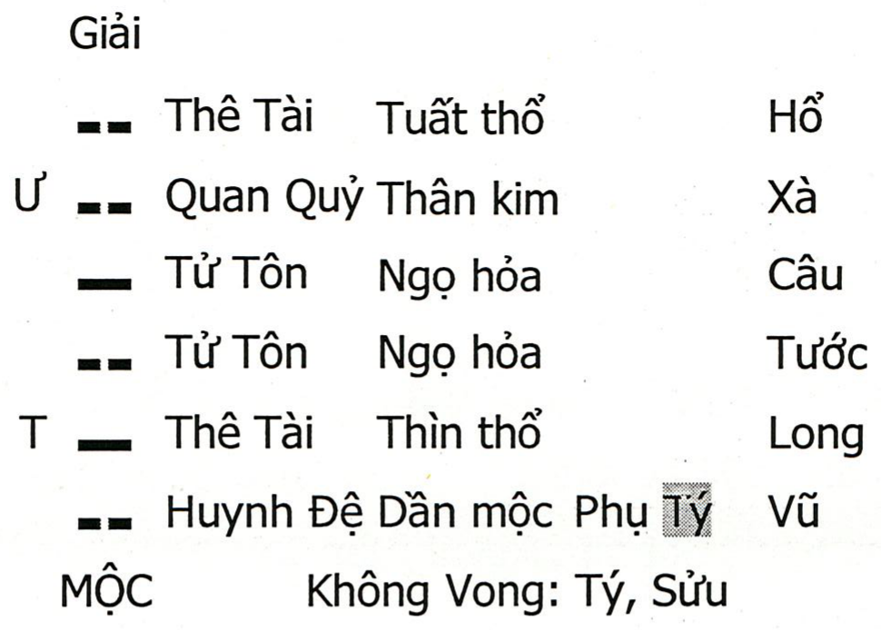

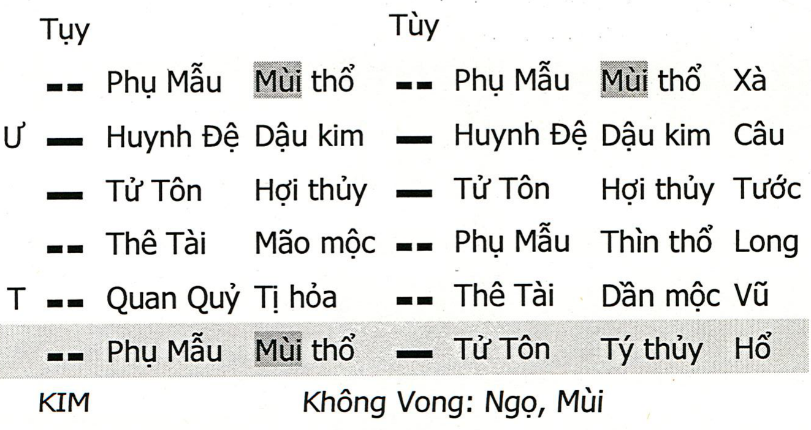 sinh hào Thế là tượng được tài, năm nay tài vận khá tốt. Chỉ là Mộ khố Mùi thổ phát động, Dụng thần nhập Mộ, phải đợi đến tháng Dậu xung xuất Mộ khố thì mới có thể được tài.

**Phản hồi:** Quả nhiên tại tháng Dậu buôn bán cổ phiếu được 420 vạn yên.

**Ví dụ 7:** Ngày Bính Ngọ tháng Dậu, nam đoán tài vận năm nay của khách sạn, được Trạch Địa Tụy biến Lôi Sơn Tiểu Quá.

| Thế/Ứng | Tụy | | Tiểu Quá | Lục thú |
| :---: | :--- | :---: | :--- | :---: |
| | - - Phụ Mẫu Mùi thổ | | - - Phụ Mẫu Tuất thổ | Long |
| Ư | — Huynh Đệ Dậu kim | | - - Huynh Đệ Thân kim | Vũ |
| | — Tử Tôn Hợi thủy | | — Quan Quỷ Ngọ hỏa | Hổ |
| | - - Thê Tài Mão mộc | | — Huynh Đệ Thân kim | Xà |
| T | - - Quan Quỷ Tị hỏa | | - - Quan Quỷ Ngọ hỏa | Câu |
| | - - Phụ Mẫu Mùi thổ | | - - Phụ Mẫu Thìn thổ | Tước |

**KIM** **Không Vong: Dần, Mão**

**Phán đoán:** Lấy Thê Tài làm Dụng thần. Thê Tài Mão mộc Nguyệt phá, Nhật không trợ giúp là hưu tù. Dụng thần Không Vong động hóa hồi đầu khắc, năm nay tài vận không tốt đẹp. Hào Ứng là khách hàng, lâm Huynh Đệ hóa thoái, hóa thoái là khách ít đi. Huynh Đệ khắc tài, chính là bởi vì khách suy giảm mà kinh doanh khó khăn.

**Phản hồi:** Quả nhiên một năm kinh doanh khó khăn.

## 3. TÀI VẬN NGẮN HẠN

Dự đoán tài vận ngắn hạn, lấy Thê Tài làm Dụng thần chủ yếu. Thê Tài vượng tướng được sinh trợ thì có thể được tài, hưu tù Không Phá thì không có tài để cầu. Đồng thời phải xem thêm hào Thế, hào Thế không nên hưu tù Không Phá.

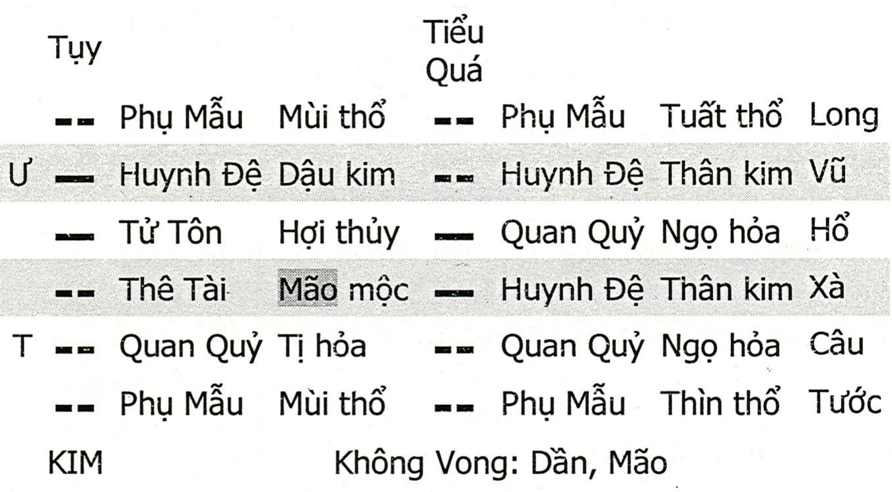

### Ví dụ 1: Ngày Kỷ Dậu tháng Hợi, nữ đoán tài vận một tuần, được Hỏa Sơn Lữ.

#### Lữ (HỎA)

Không Vong: Dần, Mão

| Thế/Ứng | Hào tượng | Quẻ Lữ | Phục thần | Lục thú |
| :---: | :---: | :--- | :--- | :--- |
| | — | Huynh Đệ Tị hỏa | | Câu |
| | - - | Tử Tôn Mùi thổ | | Tước |
| Ứ | — | Thê Tài Dậu kim | | Long |
| | — | Thê Tài Thân kim | Quan Hợi | Vũ |
| | - - | Huynh Đệ Ngọ hỏa | | Hổ |
| T | - - | Tử Tôn Thìn thổ | Phụ Mão | Xà |

**Phán đoán:** Lấy Thê Tài làm Dụng thần. Quẻ này Thê Tài lưỡng hiện, thông thường lấy một trong hai làm Dụng thần, nhưng bởi vì câu hỏi đặc biệt nên có thể phán đoán linh hoạt.

Thê Tài Dậu kim lâm Nhật hợp Thế, hôm đó có tài vào. Ngày hôm sau là ngày Canh Tuất, Ứng Thê Tài Dậu kim và hào Thế Thìn thổ tác hợp, chỗ hợp ứng xung, là ngày hôm sau cũng có tài vào. Ngày thứ ba là ngày Tân Hợi, trong quẻ Thê Tài Thân kim và Huynh Đệ Tị hỏa tương hợp, chỗ hợp ứng xung, cũng có tài vào. Ngày Nhâm Tý là Tử địa Thê Tài, không làm nên chuyện gì, ngày Tý vô tài. Ngày Quý Sửu sinh phù Thê Tài, cũng có tài vào. Ngày Giáp Dần xung Thê Tài Thân kim, ngày Ất Mão xung Thê Tài Dậu kim, đều là hợp xứ phùng xung, vì vậy cũng có tài vào.

**Phản hồi:** Trên thực tế, ngoài ngày Nhâm Tý ra thì các ngày còn lại đều có tài vào.

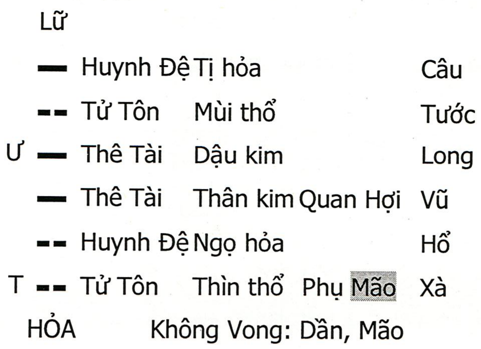

### Ví dụ 2: Ngày Bính Thìn tháng Hợi, nam đoán xem mấy ngày sắp tới có tài hay không? Được Sơn Lôi Di.

#### Di (MỘC)

Không Vong: Tý, Sửu

| Thế/Ứng | Hào tượng | Quẻ Di | Phục thần | Lục thú |
| :---: | :---: | :--- | :--- | :--- |
| | — | Huynh Đệ Dần mộc | | Long |
| | - - | Phụ Mẫu Tý thủy | Tử Tị | Vũ |
| T | - - | Thê Tài Tuất thổ | | Hổ |
| | - - | Thê Tài Thìn thổ | Quan Dậu | Xà |
| | - - | Huynh Đệ Dần mộc | | Câu |
| Ứ | — | Phụ Mẫu Tý thủy | | Tước |

**Phán đoán:** Lấy Thê Tài làm Dụng thần. Trong quẻ Thê Tài lưỡng hiện, lấy hào Thế Thê Tài Tuất thổ làm Dụng thần. Thê Tài trì Thế, bị Nhật xung là ám động, sắp tới nhất định có tài.

**Phản hồi:** Quả nhiên ở ngày hôm sau được 1000 tệ.

### Ví dụ 3: Ngày Mậu Ngọ tháng Thân, một người đoán ngày đó tài vận ra sao? Được Phong Lôi Ích biến Thiên Lôi Vô Vọng.

#### Ích biến Vô Vọng (MỘC)

Không Vong: Tý, Sửu

| Thế/Ứng | Hào tượng | Quẻ Ích | Hào tượng | Quẻ Vô Vọng | Lục thú |
| :---: | :---: | :--- | :---: | :--- | :--- |
| Ứ | — | Huynh Đệ Mão mộc | — | Thê Tài Tuất thổ | Tước |
| | — | Tử Tôn Tị hỏa | — | Quan Quỷ Thân kim | Long |
| | - - | Thê Tài Mùi thổ | — | Tử Tôn Ngọ hỏa | Vũ |
| T | - - | Thê Tài Thìn thổ | - - | Thê Tài Thìn thổ | Hổ |
| | - - | Huynh Đệ Dần mộc | - - | Huynh Đệ Dần mộc | Xà |
| | — | Phụ Mẫu Tý thủy | — | Phụ Mẫu Tý thủy | Câu |

**Phán đoán:** Lấy Thê Tài làm Dụng thần. Trong quẻ Thê Tài lưỡng hiện, lấy hào Thê Tài Mùi thổ phát động làm Dụng thần. Dụng thần Nguyệt không khắc, được Nhật sinh phù là vượng

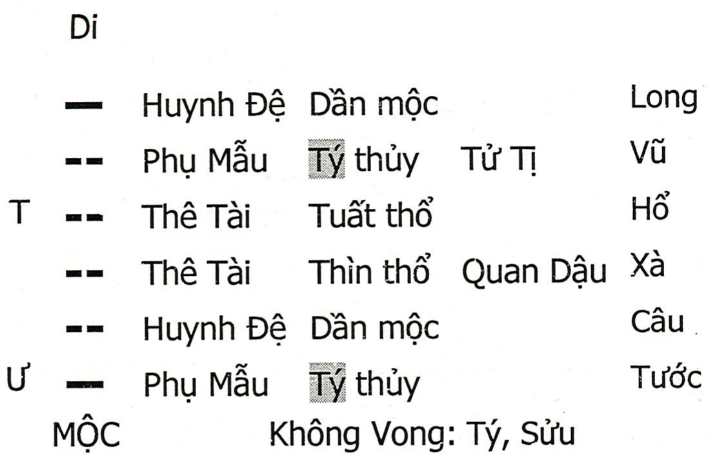

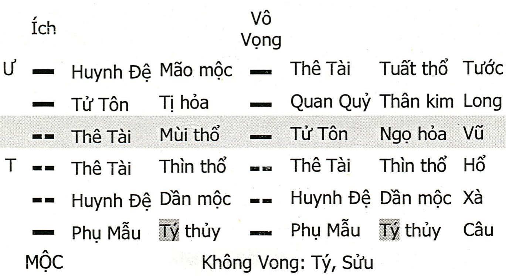

---

# Part 9 (Pages 161-180)

tướng, Dụng thần độc phát lại hóa hồi đầu sinh, hôm nay nhất định có tài, Tài lâm Huyền Vũ, tượng đầu cơ, là tài từ xổ số.

**Phản hồi:** Kết quả là hôm đó mua vé số trúng thưởng.

**Ví dụ 4:** Ngày Tân Tị tháng Tý, nam đoán mấy ngày sắp tới có tài vào không? Được Trạch Sơn Hàm biến Thiên Phong Cấu.

| | Hàm | Cấu | |
| :--- | :--- | :--- | :--- |
| Ứ | -- Phụ Mẫu Mùi thổ | — Phụ Mẫu Tuất thổ | Xà |
| | — Huynh Đệ Dậu kim | — Huynh Đệ Thân kim | Câu |
| | — Tử Tôn Hợi thủy | — Quan Quỷ Ngọ hỏa | Tước |
| T | — Huynh Đệ Thân kim | — Huynh Đệ Dậu kim | Long |
| | -- Quan Quỷ Ngọ hỏa Tài Mão | — Tử Tôn Hợi thủy | Vũ |
| | -- Phụ Mẫu Thìn thổ | -- Phụ Mẫu Sửu thổ | Hổ |

KIM Không Vong: Thân, Dậu

**Phán đoán:** Lấy Thê Tài làm Dụng thần. Thê Tài Mão mộc không hiện trên quẻ, phục dưới hào 2 Quan Quỷ Ngọ hỏa. Dụng thần được Nguyệt sinh là vượng tướng, Nhật không đến khắc, có tài vào.

Phi thần Ngọ hỏa bị Nguyệt xung phá. Thông thường, Phi thần Không Phá thì Phục thần dễ xuất ra là cát, nhưng hào 6 Mùi thổ phát động lại khiến Phi thần hợp phá. Vì vậy nhất định phải gặp ngày Tý xung khai Phi thần thì mới có thể được tài.

**Phản hồi:** Quả nhiên tại ngày Mậu Tý tiến tài.

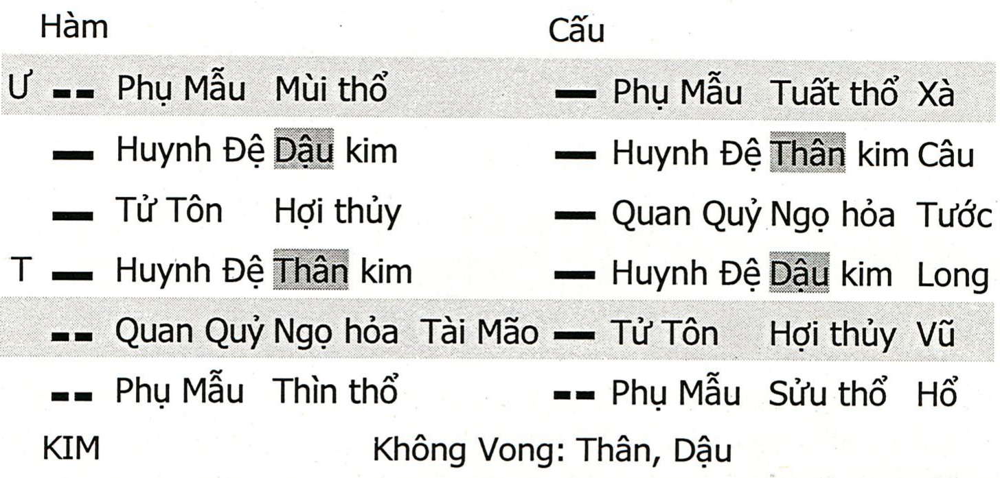

**Ví dụ 5:** Ngày Bính Thìn tháng Dậu, nam đoán tài vận mấy ngày sắp tới, được Lôi Địa Dự biến Địa Trạch Lâm.

| | Dự | Lâm | |
| :--- | :--- | :--- | :--- |
| | -- Thê Tài Tuất thổ | -- Quan Quỷ Dậu kim | Long |
| | -- Quan Quỷ Thân kim | -- Phụ Mẫu Hợi thủy | Vũ |
| Ứ | — Tử Tôn Ngọ hỏa | -- Thê Tài Sửu thổ | Hổ |
| | -- Huynh Đệ Mão mộc | -- Thê Tài Sửu thổ | Xà |
| | -- Tử Tôn Tị hỏa | — Huynh Đệ Mão mộc | Câu |
| T | -- Thê Tài Mùi thổ | — Tử Tôn Tị hỏa | Tước |

MỘC Không Vong: Tý, Sửu

**Phán đoán:** Lấy Thê Tài làm Dụng thần. Trong quẻ Thê Tài lưỡng hiện, lấy hào Thê Tài Mùi thổ phát động làm Dụng thần. Dụng thần trì Thế, được Nhật trợ giúp, hào Ứng, hào 2 là Nguyên thần động mà lại đến sinh, Dụng thần tự động hóa hồi đầu sinh, sắp tới có tài. Nhưng bởi vì hào Tài trùng điệp, sinh phù quá nhiều, vì vậy không có đại tài.

**Phản hồi:** Kết quả là hôm đó tiến tài 400 tệ, ngày hôm sau lại tiến tài 500 tệ.

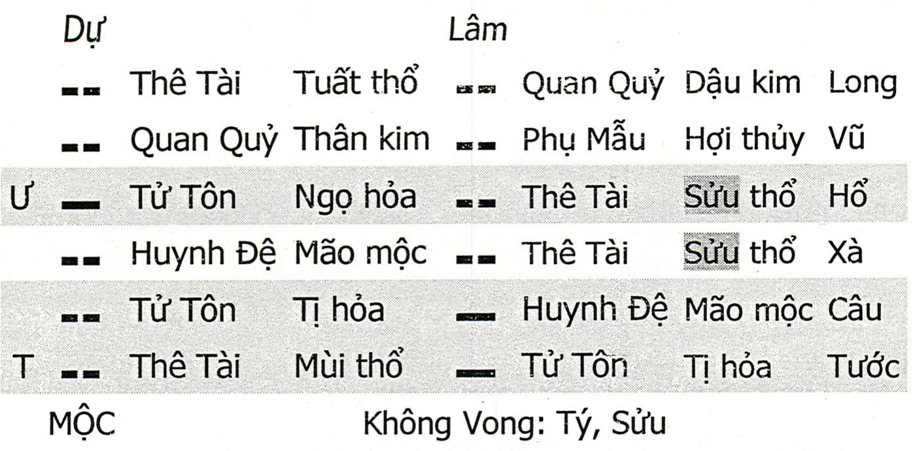

**Ví dụ 6:** Ngày Mậu Thìn tháng Dần, một người đoán xem mấy ngày sắp tới có tài vào không? Được Lôi Hỏa Phong biến Thủy Sơn Kiển.

| | Phong | | Kiển | | |
| :---: | :---: | :--- | :---: | :--- | :---: |
| | - - | Quan Quỷ Tuất thổ | - - | Huynh Đệ Tý thủy | Tước |
| T | - - | Phụ Mẫu Thân kim | — | Quan Quỷ Tuất thổ | Long |
| | — | Thê Tài Ngọ hỏa | - - | Phụ Mẫu Thân kim | Vũ |
| | — | Huynh Đệ Hợi thủy | — | Phụ Mẫu Thân kim | Hổ |
| Ứ | - - | Quan Quỷ Sửu thổ | - - | Thê Tài Ngọ hỏa | Xà |
| | — | Tử Tôn Mão mộc | - - | Quan Quỷ Thìn thổ | Câu |

THỦY Không Vong: Tuất, Hợi

**Phán đoán:** Lấy Thê Tài làm Dụng thần. Thê Tài Ngọ hỏa được Nguyệt sinh là vượng tướng, hào sơ Tử Tôn Mão mộc lại động sinh Dụng thần, sắp tới nhất định có tài vào.

Dụng thần động mà khắc hào Thế, tài vận trong tương lai gần, mừng được Dụng thần khắc hào Thế là cát. Chỉ là hào Thế Nguyệt phá, Thê Tài động mà hóa phá, cần chờ thời gian. Ngày hôm sau là ngày Kỷ Tị, hào Thế gặp hợp mà bất phá, Tị hỏa lại là Thê Tài, Tài hợp nhất định được tài.

**Phản hồi:** Quả nhiên ở ngày hôm sau được tài.

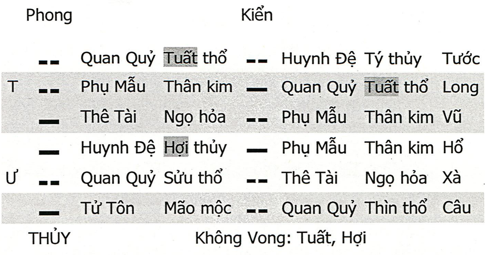

**Ví dụ 7:** Ngày Ất Dậu tháng Dần, nam sắp được người ta cho một khoản tiền, đoán xem ngày nào tiền đến tay? Được Hỏa Sơn Lữ biến Thiên Thủy Tụng.

| | Lữ | | Tụng | | |
| :---: | :---: | :--- | :---: | :--- | :---: |
| | — | Huynh Đệ Tị hỏa | — | Tử Tôn Tuất thổ | Vũ |
| | - - | Tử Tôn Mùi thổ | — | Thê Tài Thân kim | Hổ |
| Ứ | — | Thê Tài Dậu kim | — | Huynh Đệ Ngọ hỏa | Xà |
| | — | Thê Tài Thân kim | - - | Huynh Đệ Ngọ hỏa | Câu |
| | - - | Huynh Đệ Ngọ hỏa | - - | Tử Tôn Thìn thổ | Tước |
| T | - - | Tử Tôn Thìn thổ | - - | Phụ Mẫu Dần mộc | Long |

HỎA Không Vong: Ngọ, Mùi

**Phán đoán:** Lấy Thê Tài làm Dụng thần. Trong quẻ Thê Tài lưỡng hiện, lấy hào Thê Tài Thân kim phát động làm Dụng thần. Dụng thần mặc dù bị Nguyệt xung phá nhưng được Nhật thần đến trợ giúp là vượng tướng. Trong quẻ Huynh Đệ Ngọ hỏa động mà đến khắc, nhưng có Tử Tôn Mùi thổ hợp trú, dẫn hóa Huynh Đệ nên không sao. Chỉ là Dụng thần hóa hồi đầu khắc, phải đợi đến ngày Tý xung mất hào biến Ngọ hỏa thì mới nhận được tiền.

**Phản hồi:** Quả nhiên nhận được ở ngày Mậu Tý.

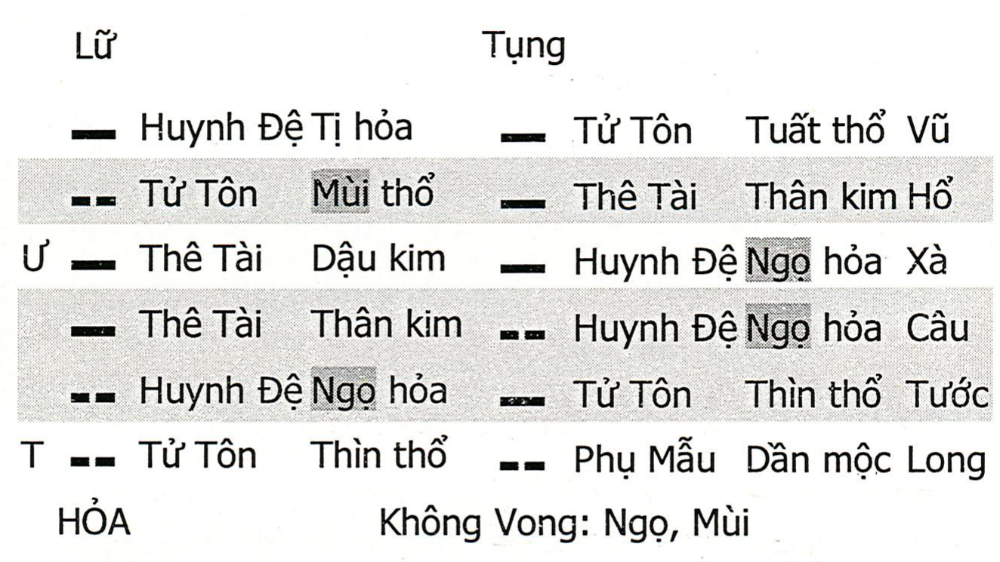

**Ví dụ 8: Ngày Mậu Thìn tháng Hợi, đoán tài vận kinh doanh ở tháng 12, được Địa Trạch Lâm biến Chấn Vi Lôi.**

| | Lâm | Chấn | |
| :---: | :--- | :--- | :---: |
| | - - Tử Tôn Dậu kim | - - Huynh Đệ Tuất thổ | Tước |
| Ứ | - - Thê Tài Hợi thủy | - - Tử Tôn Thân kim | Long |
| | - - Huynh Đệ Sửu thổ | — Phụ Mẫu Ngọ hỏa | Vũ |
| | - - Huynh Đệ Sửu thổ | - - Huynh Đệ Thìn thổ | Hổ |
| T | — Quan Quỷ Mão mộc | - - Quan Quỷ Dần mộc | Xà |
| | — Phụ Mẫu Tị hỏa | — Thê Tài Tý thủy | Câu |

THỔ Không Vong: Tuất, Hợi

**Phán đoán:** Lấy Thê Tài làm Dụng thần. Thê Tài Hợi thủy được Nguyệt trợ giúp, Nhật đến khắc, nhập Mộ ở Nhật, suy vượng khó phân rõ. Trong quẻ Huynh Đệ Sửu thổ hóa hồi đầu sinh đến khắc, khắc nhiều sinh ít, tài vận không tốt đẹp. Hào Thế phát động khắc chế Huynh Đệ, bản thân rất nỗ lực để xoay chuyển cục diện. Lâm Đằng Xà, tâm trạng không tốt; hóa thoái, có phần nản lòng.

**Phản hồi:** Quả nhiên kinh doanh không thuận lợi, thông qua hóa giải đã khá hơn một chút.

## 4. ĐI XA CẦU TÀI

Đi xa cầu tài, lấy Thê Tài làm Dụng thần, đồng thời cũng phải xem quan hệ giữa hào Ứng và hào Tài. Thê Tài vượng tướng được sinh phù, Ứng lâm Tử Tôn Thê Tài sinh hào Thế, đi xa cầu tài tất được. Hào Ứng, hào động tam hợp Tử Tôn cục, Tài cục sinh hào Thế cũng cát. Hào Ứng Không Phá, Thê Tài hưu tù hoặc Ứng động khắc Tài, đi xa không thể được tài.

Khi đi xa cầu tài cũng cần chú ý vấn đề an toàn và cát hung của thân thể. Do đó, chúng ta cũng phải xem hào Thế. Hào Thế không nên bị khắc, Không Phá, nếu không thì đi xa chịu khổ, bị thương, có tai họa.

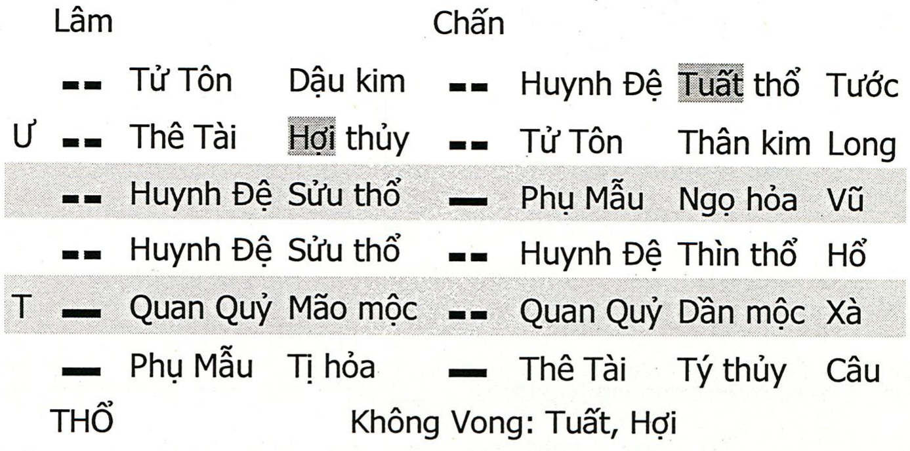

**Ví dụ 1: Ngày Bính Tuất tháng Hợi, nam đoán xem lén trốn đơn vị để đến vùng khác kiếm tiền sẽ ra sao? Được Thiên Địa Bĩ biến Thiên Trạch Lý.**

| | Bĩ | Lý | |
| :---: | :--- | :--- | :---: |
| Ứ | — Phụ Mẫu Tuất thổ | — Phụ Mẫu Tuất thổ | Long |
| | — Huynh Đệ Thân kim | — Huynh Đệ Thân kim | Vũ |
| | — Quan Quỷ Ngọ hỏa | — Quan Quỷ Ngọ hỏa | Hổ |
| T | - - Thê Tài Mão mộc | - - Phụ Mẫu Sửu thổ | Xà |
| | - - Quan Quỷ Tị hỏa | — Thê Tài Mão mộc | Câu |
| | - - Phụ Mẫu Mùi thổ Tử Tý | — Quan Quỷ Tị hỏa | Tước |

KIM Không Vong: Ngọ, Mùi

**Phán đoán:** Lấy Thê Tài làm Dụng thần, kiêm xem biến hóa trong quẻ. Thê Tài Mão mộc trì Thế được Nguyệt sinh là vượng tướng, đi xa cầu tài nhất định có thu hoạch. Nhưng Quan Quỷ Tị hỏa và Phụ Mẫu Mùi thổ không liên quan đến Tài lại phát động, nhất định có ẩn tàng thông tin khác. Phụ Mẫu lâm Chu Tước là văn thư, Không mà hóa phá, Quan Quỷ Nguyệt phá, đi xa cầu tài sợ rằng sẽ ảnh hưởng đến công tác.

**Phản hồi:** Người này không nghe lời khuyên, anh ta đã bỏ ra ngoài kiếm tiền. Cuối cùng được 3 vạn tệ, nhưng chuyện ra ngoài kiếm tiền bị đơn vị phát hiện, họ đã hủy bỏ quan hệ lao động, anh ta bị mất việc.

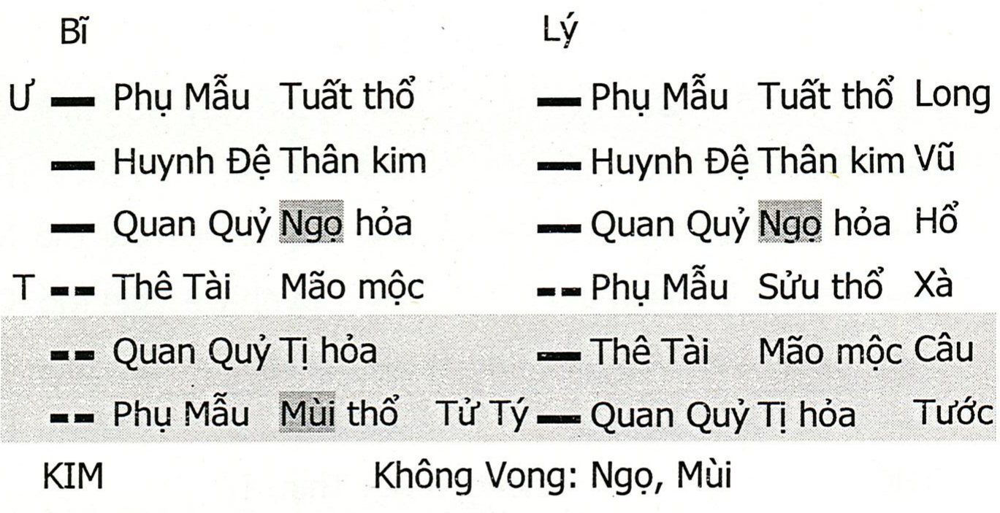

**Ví dụ 2:** Ngày Giáp Ngọ tháng Mùi, nữ có chồng mở cửa hàng ở vùng khác, đoán tiền đồ cửa hàng, được Địa Thiên Thái biến Sơn Thiên Đại Súc.

| | Thái | Đại Súc | |
| :--- | :--- | :--- | :--- |
| Ứ | ╍╍ Tử Tôn Dậu kim | — Quan Quỷ Dần mộc | Vũ |
| | ╍╍ Thê Tài Hợi thủy | ╍╍ Thê Tài Tý thủy | Hổ |
| | ╍╍ Huynh Đệ Sửu thổ | ╍╍ Huynh Đệ Tuất thổ | Xà |
| T | — Huynh Đệ Thìn thổ | — Huynh Đệ Thìn thổ | Câu |
| | — Quan Quỷ Dần mộc Phụ Tị | — Quan Quỷ Dần mộc | Tước |
| | — Thê Tài Tý thủy | — Thê Tài Tý thủy | Long |

THỔ Không Vong: Thìn, Tị

**Phán đoán:** Lấy Thê Tài làm Dụng thần. Trong quẻ Thê Tài lưỡng hiện, lấy Thê Tài Tý thủy gặp xung làm Dụng thần. Dụng thần không được Nguyệt sinh mà trái lại bị Nguyệt khắc, Nhật lại không đến trợ giúp là hưu tù. May mà Nguyên thần Tử Tôn độc phát, độc phát gặp sinh được sinh, miễn cưỡng duy trì. Nhưng Tử Tôn động mà hóa Tuyệt, mở cửa hàng cũng không phải là kế lâu dài.

Quan Quỷ là chồng, Quan Quỷ Dần mộc lâm hào 2, hào 2 là trạch, là nhà, chồng nhớ nhà, muốn trở về.

**Phản hồi:** Quả nhiên là vừa mới dành dụm chẳng được bao nhiêu, muốn đóng cửa hàng và trở về.

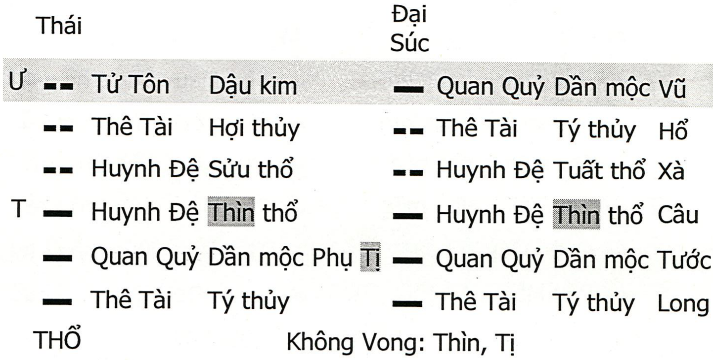

**Ví dụ 3:** Ngày Canh Thân tháng Thân, nam đoán xem đến vùng khác kinh doanh sẽ ra sao? Được Địa Thủy Sư biến Địa Thiên Thái.

| | Sư | Thái | |
| :--- | :--- | :--- | :--- |
| Ứ | ╍╍ Phụ Mẫu Dậu kim | ╍╍ Phụ Mẫu Dậu kim | Xà |
| | ╍╍ Huynh Đệ Hợi thủy | ╍╍ Huynh Đệ Hợi thủy | Câu |
| | ╍╍ Quan Quỷ Sửu thổ | ╍╍ Quan Quỷ Sửu thổ | Tước |
| T | ╍╍ Thê Tài Ngọ hỏa | — Quan Quỷ Thìn thổ | Long |
| | — Quan Quỷ Thìn thổ | — Tử Tôn Dần mộc | Vũ |
| | ╍╍ Tử Tôn Dần mộc | — Huynh Đệ Tý thủy | Hổ |

THỦY Không Vong: Tý, Sửu

**Phán đoán:** Lấy Thê Tài làm Dụng thần. Thê Tài Ngọ hỏa trì Thế, không được Nhật Nguyệt trợ giúp là hưu tù. Nguyên thần Dần mộc bị Nhật Nguyệt xung khắc là Nguyệt phá Nhật phá, vô lực sinh Dụng thần. Tài vận hiện nay không thuận lợi.

Địa Thủy Sư là quẻ quy hồn, quy hồn chủ ở nhà, đoán là ở nhà kinh doanh đã phá tài, đến nơi khác cũng không thành công.

**Phản hồi:** Quả nhiên là kinh doanh ở nhà phá tài, anh ta muốn đến nơi khác tìm cơ hội.

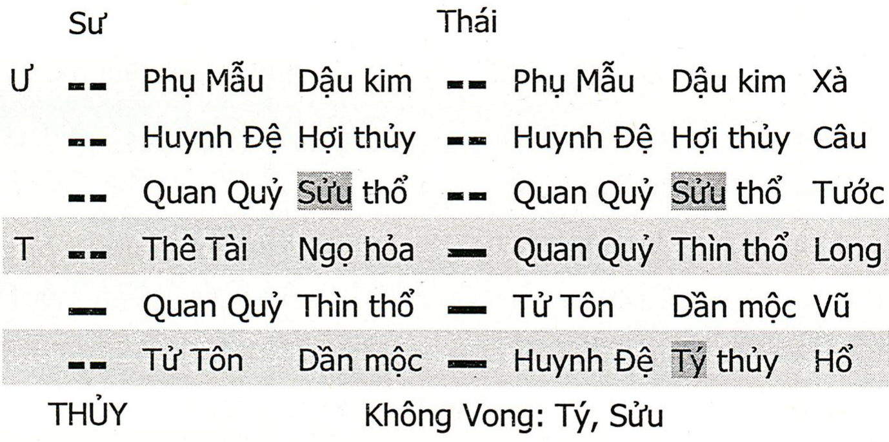

**Ví dụ 4:** Đây là ví dụ mà một học trò của tôi được nghiệm chứng. Ngày Kỷ Mão tháng Tý, một người đoán đi xa cầu tài và cát hung, được Địa Sơn Khiêm biến Trạch Thiên Quải.

| | Khiêm | | | Quải | |
| :---: | :---: | :--- | :---: | :--- | :--- |
| | - - | Huynh Đệ Dậu kim | - - | Phụ Mẫu Mùi thổ | Câu |
| T | - - | Tử Tôn Hợi thủy | — | Huynh Đệ Dậu kim | Tước |
| | - - | Phụ Mẫu Sửu thổ | — | Tử Tôn Hợi thủy | Long |
| | — | Huynh Đệ Thân kim | — | Phụ Mẫu Thìn thổ | Vũ |
| Ứ | - - | Quan Quỷ Ngọ hỏa Tài Mão | — | Thê Tài Dần mộc | Hổ |
| | - - | Phụ Mẫu Thìn thổ | — | Tử Tôn Tý thủy | Xà |

KIM Không Vong: Thân, Dậu

**Phán đoán:** Tài vận xem Thê Tài, cát hung xem hào Thế. Thê Tài Mão mộc không hiện trên quẻ, phục dưới Quan Quỷ Ngọ hỏa. Dụng thần được Nguyệt kiến sinh phù, Nhật đến trợ giúp là vượng tướng, nhưng không nên hào Thế hóa Không, trong quẻ Sửu thổ và Thìn thổ hai lớp đến khắc hào Thế, khiến hào Thế vô lực sinh Tài.

Đặc biệt là hào Ứng lâm Quỷ phát động sinh Phụ Mẫu, Phụ Mẫu phát động khắc hào Thế, đi xa thế nào cũng có tai họa. Hào Thế nhập Mộ, Mộ khố lâm Đằng Xà, Đằng Xà là trói buộc, nhập Mộ chủ mất tự do, vì vậy đi xa tất có nỗi lo bị giam giữ.

**Phản hồi:** Anh ta đi giúp ông chủ đánh bạc, bởi vì thiếu nợ quá nhiều nên bị người ta giữ lại làm con tin.

**Ví dụ 5:** Ngày Canh Thìn tháng Hợi, nữ đoán xem đến nơi khác đầu tư sẽ ra sao? Được Sơn Thủy Mông biến Sơn Thiên Đại Súc.

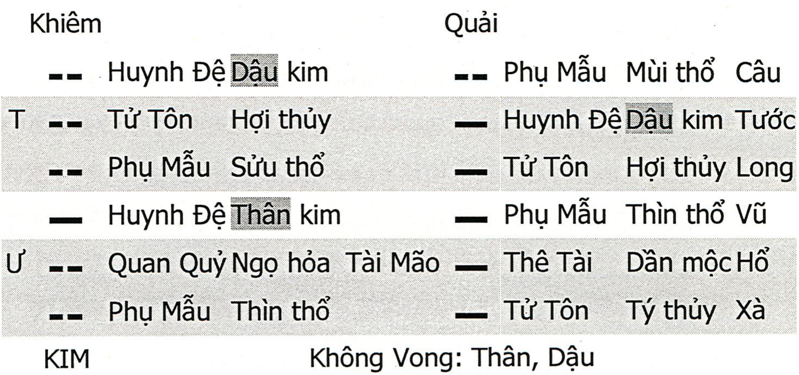

| | Mông | | | Đại Súc | |
| :---: | :---: | :--- | :---: | :--- | :--- |
| | — | Phụ Mẫu Dần mộc | — | Phụ Mẫu Dần mộc | Xà |
| | - - | Quan Quỷ Tý thủy | - - | Quan Quỷ Tý thủy | Câu |
| T | - - | Tử Tôn Tuất thổ Tài Dậu | - - | Tử Tôn Tuất thổ | Tước |
| | - - | Huynh Đệ Ngọ hỏa | — | Tử Tôn Thìn thổ | Long |
| | — | Tử Tôn Thìn thổ | — | Phụ Mẫu Dần mộc | Vũ |
| Ứ | - - | Phụ Mẫu Dần mộc | — | Quan Quỷ Tý thủy | Hổ |

HỎA Không Vong: Thân, Dậu

**Phán đoán:** Lấy Thê Tài làm Dụng thần. Thê Tài được Nhật sinh vốn là cát, nhưng phục tàng Không Vong, Tuất thổ ám động tạo thành tam hợp Huynh Đệ cục đến khắc Dụng thần, đầu tư nhất định lỗ vốn.

**Phản hồi:** Lúc dự đoán đã đầu tư thua lỗ.

**Ví dụ 6:** Ngày Bính Thìn tháng Hợi, nữ đoán xem đi xa làm thuê sẽ ra sao? Được Địa Trạch Lâm biến Sơn Lôi Di.

| | Lâm | | | Di | |
| :---: | :---: | :--- | :---: | :--- | :--- |
| | - - | Tử Tôn Dậu kim | — | Quan Quỷ Dần mộc | Long |
| Ứ | - - | Thê Tài Hợi thủy | - - | Thê Tài Tý thủy | Vũ |
| | - - | Huynh Đệ Sửu thổ | - - | Huynh Đệ Tuất thổ | Hổ |
| | - - | Huynh Đệ Sửu thổ | - - | Huynh Đệ Thìn thổ | Xà |
| T | — | Quan Quỷ Mão mộc | - - | Quan Quỷ Dần mộc | Câu |
| | — | Phụ Mẫu Tị hỏa | — | Thê Tài Tý thủy | Tước |

THỔ Không Vong: Tý, Sửu

**Phán đoán:** Lấy Thê Tài làm Dụng thần. Dụng thần được Nguyệt trợ giúp, nhưng bị Nhật khắc, suy vượng tương đương. Tử Tôn phát động đến sinh vốn là tượng được tài, nhưng Nguyên thần Tử Tôn bị Nhật hợp trú, tham hợp quên sinh, lại hóa Tuyệt địa, hào Thế động hóa Thoái thần, đi xa không được tiền mà trở về.

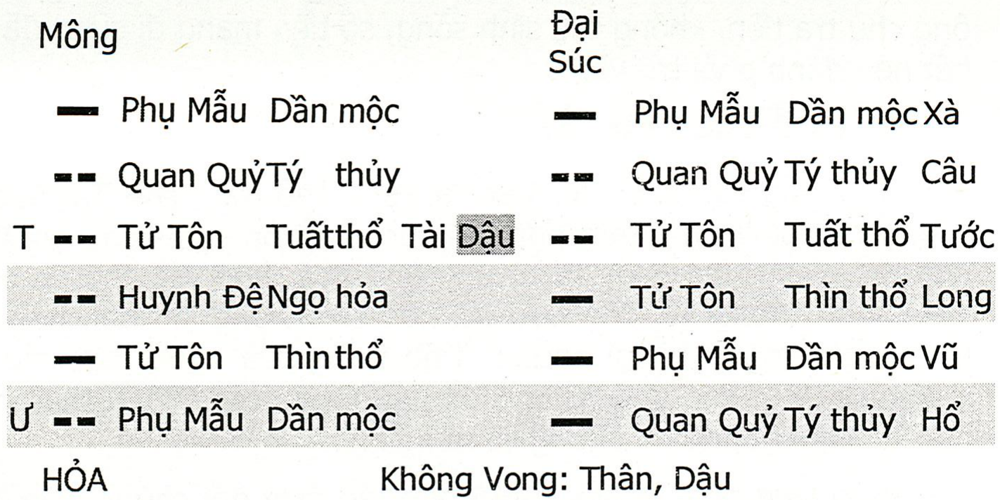

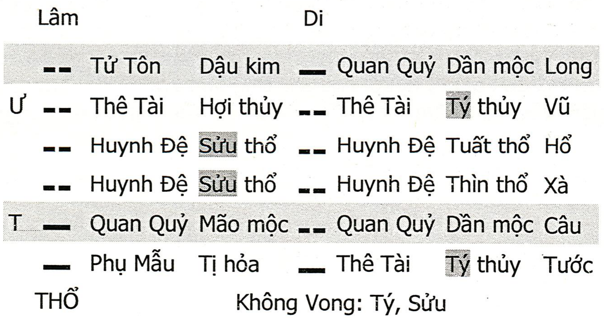

**Phản hồi:** Quả nhiên sau vài tháng làm việc không được ông chủ trả tiền, không thể sinh sống, số tiền mang đi cũng đã xài hết nên đành phải trở về.

## 5. HỢP TÁC CẦU TÀI

Hợp tác cầu tài, đầu tiên là xem Thê Tài. Thê Tài vượng tướng gặp sinh phù, tam hợp Tài cục, Tử Tôn cục sinh hào Thế, hợp tác có thể được lợi. Hưu tù Không Phá, hợp tác phá tài. Hào Tài vượng tướng Tử Tôn hưu tù, hợp tác không lâu dài, hợp tác lâu dài thì không có lợi nhuận. Tình trạng của người hợp tác thì xem hào Ứng, hào Ứng Không thì người hợp tác không thật tâm, hưu tù Nguyệt phá thì không có năng lực.

Hào Ứng phát động, người hợp tác thay đổi chủ ý; hào Thế phát động, bản thân có thay đổi. Hào Thế đi hợp hào Ứng, mình đi chủ động hợp tác; hào Ứng động đến hợp hào Thế, người ta đến tìm mình hợp tác. Ứng lâm Huynh Đệ Huyền Vũ động, đối phương muốn lừa gạt tiền bạc. Tài sinh hợp hào Thế, mình được nhiều lợi, không bị tổn thất; Tài động sinh hào Ứng, tài thuộc về người khác. Ứng hợp Thê Tài, tiền tài bị người hợp tác nắm giữ. Thê Tài nhập Mộ tại hào Ứng, cũng là tài thuộc về người hợp tác.

Hào Thế khắc hào Ứng, mình khống chế người hợp tác; hào Ứng khắc hào Thế, mình bị người ta hại, bị người hợp tác điều khiển. Hào Ứng sinh hợp hào Thế, hai người hợp tác ăn ý, đối phương tận tâm tận lực phối hợp với mình. Hào Thế tại hào 5, mình là chủ quản, người chủ sự. Ứng lâm hào 5, đối phương làm giám đốc, mình làm trợ lý. Tam hợp Thê Tài, nhiều người hợp tác.

**Ví dụ 1:** Ngày Đinh Mão tháng Tuất, nam đoán xem hợp tác mở hiệu ăn sẽ ra sao? Được Phong Thủy Hoán biến Khảm Vi Thủy.

| Hoán | | Khảm | |
| :--- | :--- | :--- | :---
| ━ Phụ Mẫu Mão mộc | | -- Quan Quỷ Tý thuỷ | Long |
| T ━ Huynh Đệ Tị hỏa | | ━ Tử Tôn Tuất thổ | Vũ |
| -- Tử Tôn Mùi thổ | Tài Dậu | -- Thê Tài Thân kim | Hổ |
| -- Huynh Đệ Ngọ hỏa | Quan Hợi | -- Huynh Đệ Ngọ hỏa | Xà |
| Ư ━ Tử Tôn Thìn thổ | | ━ Tử Tôn Thìn thổ | Câu |
| -- Phụ Mẫu Dần mộc | | -- Phụ Mẫu Dần mộc | Tước |

HỎA Không Vong: Tuất, Hợi

**Phán đoán:** Hào Thế là mình, hào Ứng là người hợp tác, hào Tài là lợi ích. Hào Thế tại hào 5, hào 5 là tôn vị, bản thân có tiếng nói quyết định trong cửa hàng này. Hào Thế sinh hào 2, hào 2 là cửa hàng, đây là cửa hàng mình đi thuê. Ứng lâm hào 2, Ứng phi nhập trạch, là người khác đến cửa hàng và hợp tác với mình. Hào Ứng Nguyệt phá lâm Câu Trần bị Nhật khắc và hào động khắc, Câu Trần là lao ngục, người hợp tác có tai họa lao ngục. Hào Ứng hưu tù, hợp tác không thể đem lại lợi ích cho mình.

Tài không hiện trên quẻ, Cừu thần độc phát, Nguyên thần lại phá, hiện nay lợi nhuận của hiệu ăn không tốt. Quẻ biến lục xung, sợ là không thể duy trì, sẽ giải tán.

**Phản hồi:** Trên thực tế đúng là người này tự mình đi thuê cửa hàng, hai người bỏ vốn để cùng kinh doanh. Nhưng người hợp tác đột nhiên vào tù, chị gái của người hợp tác đến thay thế cổ phần của em trai, nhưng lợi nhuận không cao, cuối cùng đành phải giải thể.

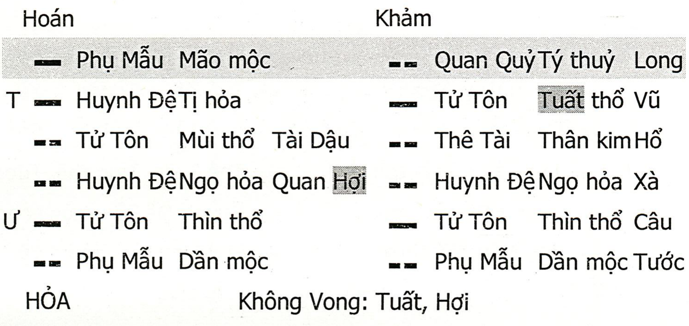

### Ví dụ 2: Ngày Nhâm Ngọ tháng Tuất, một người đoán xem hợp tác mở nhà thuốc có thể kiếm được tiền hay không? Được Trạch Lôi Tùy biến Phong Lôi Ích.

| | Tùy | | Ích | |
| :--- | :--- | :--- | :--- | :--- |
| Ứ | - - Thê Tài Mùi thổ | — | Huynh Đệ Mão mộc | Hổ |
| | — Quan Quỷ Dậu kim | — | Tử Tôn Tị hỏa | Xà |
| | — Phụ Mẫu Hợi thủy Tử Ngọ | - - | Thê Tài Mùi thổ | Câu |
| T | - - Thê Tài Thìn thổ | - - | Thê Tài Thìn thổ | Tước |
| | - - Huynh Đệ Dần mộc | - - | Huynh Đệ Dần mộc | Long |
| | — Phụ Mẫu Tý thủy | — | Phụ Mẫu Tý thủy | Vũ |

MỘC Không Vong: Thân, Dậu

**Phán đoán:** Lấy Thê Tài làm Dụng thần. Trong quẻ Thê Tài lưỡng hiện, lấy hào Thê Tài Mùi thổ phát động làm Dụng thần. Hào Thế là mình, hào Thế Thê Tài Nguyệt phá, mình tổn hao không ít. Ứng lâm Bạch Hổ hóa hồi đầu khắc, Bạch Hổ chủ bệnh, hào Ứng là người hợp tác, sức khỏe của người hợp tác không tốt.

Dụng thần mặc dù được Nguyệt tỉ phù, Nhật thần đến sinh, có những lúc lợi nhuận rất tốt, nhưng động hóa hồi đầu khắc, buôn bán rất không ổn định.

Hào 2 là cửa hàng, lâm Thanh Long chủ hào hoa (sang trọng), trang trí đẹp, nhưng nhập Mộ tại hào động Mùi thổ, lại là quẻ quy hồn chủ phía trong, cửa hàng tương đối khuất nẻo, không ở trên đường lớn.

**Phản hồi:** Trên thực tế, nhà thuốc mở tại tầng ba của một tòa nhà, buôn bán lúc được lúc không, kinh doanh gian nan, người hợp tác cũng đã bị bệnh, bản thân rất là khổ não.

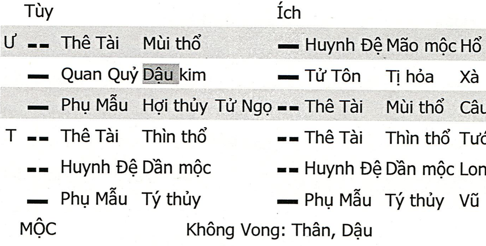

### Ví dụ 3: Ngày Kỷ Mùi tháng Tị, một người Singapore đoán xem hợp tác cầu tài sẽ ra sao? Được Địa Thủy Sư biến Phong Thủy Hoán.

| | Sư | | Hoán | |
| :--- | :--- | :--- | :--- | :--- |
| Ứ | - - Phụ Mẫu Dậu kim | — | Tử Tôn Mão mộc | Câu |
| | - - Huynh Đệ Hợi thủy | — | Thê Tài Tị hỏa | Tước |
| | - - Quan Quỷ Sửu thổ | - - | Quan Quỷ Mùi thổ | Long |
| T | - - Thê Tài Ngọ hỏa | - - | Thê Tài Ngọ hỏa | Vũ |
| | — Quan Quỷ Thìn thổ | — | Quan Quỷ Thìn thổ | Hổ |
| | - - Tử Tôn Dần mộc | - - | Tử Tôn Dần mộc | Xà |

THỦY Không Vong: Tý, Sửu

**Phán đoán:** Thê Tài là lợi ích, hào Thế là mình, hào Ứng là người hợp tác. Thê Tài Ngọ hỏa và Nhật tương hợp chính là thông tin hợp tác cầu tài. Tài được Nguyệt kiến trợ giúp là vượng tướng, nhưng bị Nhật hợp cản trở, biểu thị hiện nay tài vận quay vòng không linh hoạt.

Ngoại quái phản ngâm, biểu thị đã bắt đầu hợp tác với người này, nhưng sự việc tráo trở không thuận lợi, lúc làm lúc ngừng. Ứng lâm Dậu kim, kim chủ nghĩa, người hợp tác là một người có nghĩa khí. Dậu kim là Tử địa Thê Tài, lâm Phụ Mẫu chủ văn thư, tri thức, nhưng đối phương không biết phương pháp kinh doanh, chỉ lý luận suông.

**Phản hồi:** Đúng như dự đoán, đối phương thực sự là người tốt, thực tâm thực ý, nhưng năng lực không đủ. Hai người hợp tác đã được bốn năm, đã thay đổi vài dự án nhưng đều không có khởi sắc, có thể nói là hầu như không có lợi nhuận.

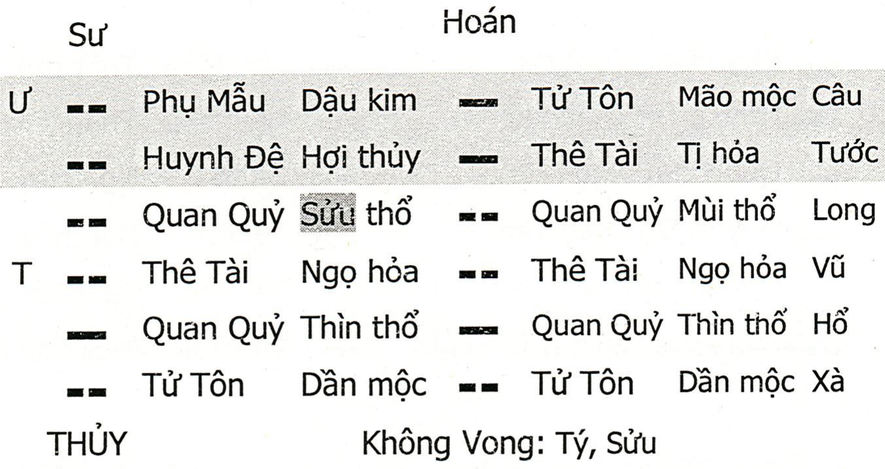

### Ví dụ 4: Ngày Kỷ Mùi tháng Tị, nam đoán xem hợp tác cầu tài sẽ ra sao? Được Thiên Sơn Độn biến Thiên Hỏa Đồng Nhân.

| Thế/Ứng | Độn | Phục thần | Đồng Nhân | Lục thú |
| :---: | :--- | :--- | :--- | :--- |
| | — Phụ Mẫu Tuất thổ | | — Phụ Mẫu Tuất thổ | Câu |
| Ứ | — Huynh Đệ Thân kim | | — Huynh Đệ Thân kim | Tước |
| | — Quan Quỷ Ngọ hỏa | | — Quan Quỷ Ngọ hỏa | Long |
| | — Huynh Đệ Thân kim | | — Tử Tôn Hợi thủy | Vũ |
| T | - - Quan Quỷ Ngọ hỏa | Tài Dần | - - Phụ Mẫu Sửu thổ | Hổ |
| | - - Phụ Mẫu Thìn thổ | Tử Tý | — Thê Tài Mão mộc | Xà |

KIM

Không Vong: Tý, Sửu

**Phán đoán:** Thê Tài là lợi ích, hào Thế là mình, hào Ứng là người hợp tác. Hào sơ phát động hóa Thê Tài Mão mộc, hào sơ là tâm sự, dự định, Phụ Mẫu là phương án, lợi ích, tổ hợp biến hóa này chính là biểu thị kế hoạch vừa mới bắt đầu, dự định sắp kiếm tiền.

Thê Tài Dần mộc không hiện trên quẻ, phục dưới hào Thế, người đầu tư chủ yếu là mình. Hào Ứng là Huynh Đệ Thân kim, kim chủ nghĩa, chứng tỏ đối phương có nghĩa khí. Lâm hào 5, hào 5 là lãnh đạo, chứng tỏ người hợp tác rất có năng lực lãnh đạo. Hào Ứng hợp Nguyệt kiến, Nguyệt là Quan Quỷ, trong quẻ Quan Quỷ lại lâm Bạch Hổ, Bạch Hổ chủ đao thương, hóa nhập cung Ly, Ly là giáp trụ, vì vậy người hợp tác đã từng đã từng đi lính. Nhưng hào Ứng là Huynh Đệ, bất lợi cho Thê Tài, người ta không có tư duy kinh tế.

Thê Tài hưu tù, nhập Mộ ở Nhật, không có tiền đồ phát triển.

**Phản hồi:** Phán đoán quả nhiên phù hợp với thực tế.

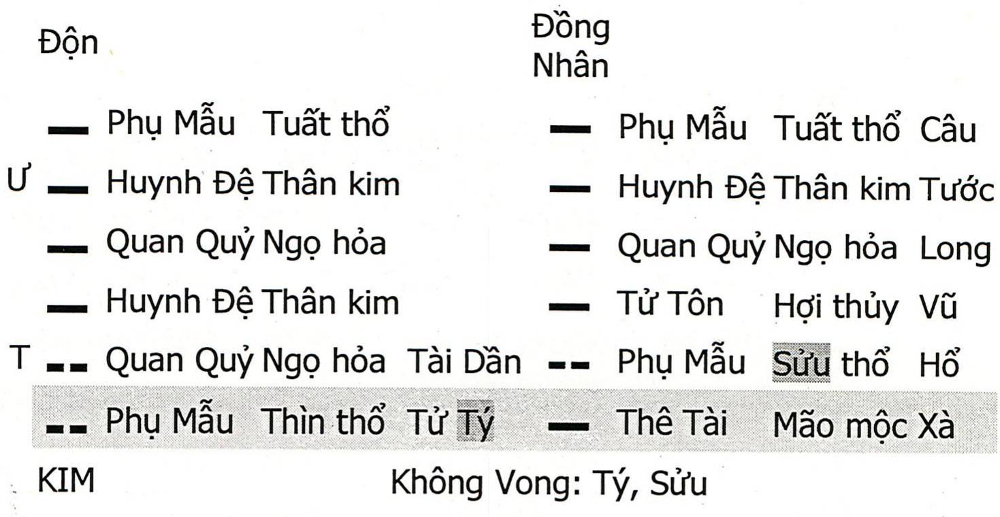

### Ví dụ 5: Ngày Giáp Tý tháng Mùi, nam đoán xem hợp tác kinh doanh sẽ ra sao? Được Thủy Sơn Kiển biến Trạch Thủy Khốn.

| Thế/Ứng | Kiển | Phục thần | Khốn | Lục thú |
| :---: | :--- | :--- | :--- | :--- |
| | - - Tử Tôn Tý thủy | | - - Phụ Mẫu Mùi thổ | Vũ |
| | — Phụ Mẫu Tuất thổ | | — Huynh Đệ Dậu kim | Hổ |
| T | - - Huynh Đệ Thân kim | | — Tử Tôn Hợi thủy | Xà |
| | — Huynh Đệ Thân kim | | - - Quan Quỷ Ngọ hỏa | Câu |
| | - - Quan Quỷ Ngọ hỏa | Tài Mão | — Phụ Mẫu Thìn thổ | Tước |
| Ứ | - - Phụ Mẫu Thìn thổ | | - - Thê Tài Dần mộc | Long |

KIM

Không Vong: Tuất, Hợi

**Phán đoán:** Lấy Thê Tài làm lợi ích, lợi nhuận, hào Ứng là đối tác hợp tác. Thê Tài Mão mộc mặc dù được Nhật sinh phù, nhưng trong quẻ Huynh Đệ lưỡng động, sói nhiều thịt ít, lợi nhuận bị chia nhỏ quá nhiều, còn lại không bao nhiêu. Hào 2 Quan Quỷ Ngọ hỏa lâm Chu Tước khắc hào Thế là thông tin kiện tụng, làm không cẩn thận sẽ dính líu đến pháp luật.

**Phản hồi:** Quả nhiên bốn người hợp tác, bởi vì giữa chừng xuất hiện bất đồng nên anh ta đã thoái ra. Ba người kia cuối cùng cũng xuất hiện bất hòa, phát sinh tranh chấp kinh tế mà kéo nhau đến tòa án.

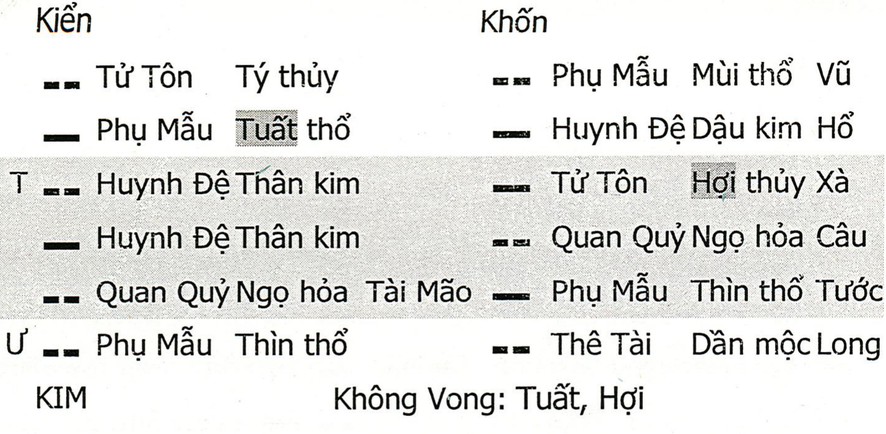

### Ví dụ 6: Ngày Giáp Ngọ tháng Thân, nam đoán xem hợp tác kinh doanh sẽ ra sao? Được Thủy Sơn Kiển biến Trạch Phong Đại Quá.

| | Kiển | | Đại Quá | |
| :---: | :--- | :---: | :--- | :---: |
| | -- Tử Tôn Tý thủy | | -- Phụ Mẫu Mùi thổ | Vũ |
| | — Phụ Mẫu Tuất thổ | | — Huynh Đệ Dậu kim | Hổ |
| T | -- Huynh Đệ Thân kim | | — Tử Tôn Hợi thủy | Xà |
| | — Huynh Đệ Thân kim | | — Huynh Đệ Dậu kim | Câu |
| | -- Quan Quỷ Ngọ hỏa | Tài Mão | — Tử Tôn Hợi thủy | Tước |
| Ư | -- Phụ Mẫu Thìn thổ | | -- Phụ Mẫu Sửu thổ | Long |

KIM Không Vong: Thìn, Tị

**Phán đoán:** Lấy Thê Tài làm lợi nhuận, hào Ứng là người hợp tác. Thê Tài Mão mộc không hiện trên quẻ, phục dưới hào 2 Quan Quỷ Ngọ hỏa, Nguyệt khắc Nhật không sinh, có thể nói không có lợi nhuận gì.

Quan Quỷ Ngọ hỏa lâm Chu Tước đến khắc Thế, sợ rằng hợp tác với người ta sẽ có kiện tụng. Hào Ứng Không Vong, đối phương không phải là người trung thực. Hiện nay Quan Quỷ Ngọ hỏa hóa hồi đầu khắc, không có lực khắc hào Thế, đến tháng Tuất thì hào biến Hợi thủy bị chế phục, không thể tiếp tục khắc chế Quan Quỷ Ngọ hỏa thì không tốt.

**Phản hồi:** Tại tháng tuất, người hợp tác bị phát hiện ăn trộm của công. Bởi vì anh ta là người hợp tác nên công an nhằm vào anh ta điều tra, do anh ta không liên quan nên không bị truy cứu.

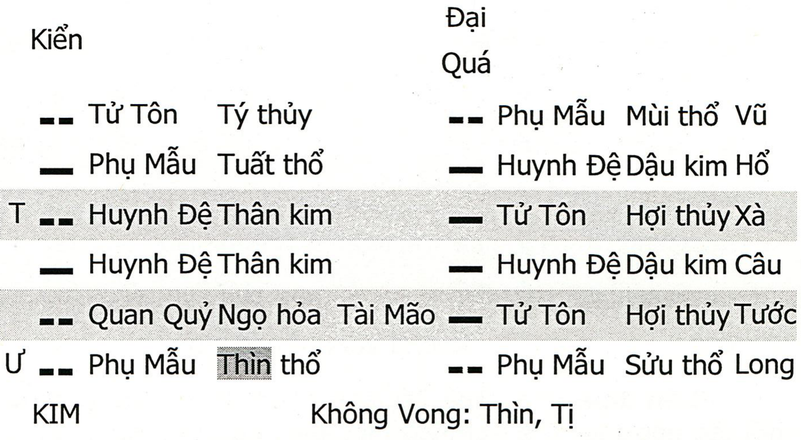

### Ví dụ 7: Ngày Ất Mùi tháng Mão, nam đoán xem hợp tác làm công ty sẽ ra sao? Được Chấn Vi Lôi biến Địa Lôi Phục.

| | Chấn | Phục | |
| :---: | :--- | :--- | :---: |
| T | -- Thê Tài Tuất thổ | -- Quan Quỷ Dậu kim | Vũ |
| | -- Quan Quỷ Thân kim | -- Phụ Mẫu Hợi thủy | Hổ |
| | — Tử Tôn Ngọ hỏa | -- Thê Tài Sửu thổ | Xà |
| Ư | -- Thê Tài Thìn thổ | -- Thê Tài Thìn thổ | Câu |
| | -- Huynh Đệ Dần mộc | -- Huynh Đệ Dần mộc | Tước |
| | — Phụ Mẫu Tý thủy | — Phụ Mẫu Tý thủy | Long |

MỘC Không Vong: Thìn, Tị

**Phán đoán:** Thê Tài là lợi ích, hào Thế là mình, hào Ứng là đối tác hợp tác. Hào Thế Thê Tài Tuất thổ được Nguyệt hợp là có khí, Tài được Nhật trợ giúp, lại thêm Tử Tôn Ngọ hỏa độc phát sinh hào Thế, bản thân kinh doanh khá tốt. Mà hào Ứng Không Vong lâm Câu Trần, Câu Trần chủ chậm chạp, Không Vong biểu thị không dụng tâm, tư tưởng không tập trung. Vì vậy phán đoán người hợp tác lười biếng, làm việc lề mề, không thể làm việc chung.

**Phản hồi:** Quả nhiên là như vậy, trước đây đã từng hợp tác nhiều lần, nhưng hiệu suất làm việc rất thấp, họ không muốn chịu khổ.

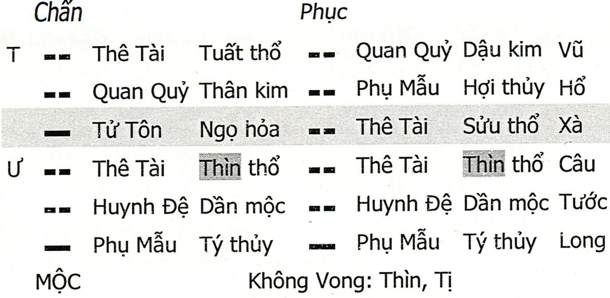

**Ví dụ 8:** Ngày Ất Hợi tháng Dần, nam đoán hợp tác cầu tài sẽ ra sao? Được Địa Lôi Phục biến Khôn Vi Địa.

| | Phục | | | Khôn | |
| :---: | :---: | :--- | :---: | :--- | :---: |
| | - - | Tử Tôn Dậu kim | - - | Tử Tôn Dậu kim | Vũ |
| | - - | Thê Tài Hợi thủy | - - | Thê Tài Hợi thủy | Hổ |
| Ư | - - | Huynh Đệ Sửu thổ | - - | Huynh Đệ Sửu thổ | Xà |
| | - - | Huynh Đệ Thìn thổ | - - | Quan Quỷ Mão mộc | Câu |
| | - - | Quan Quỷ Dần mộc Phụ Tị | - - | Phụ Mẫu Tị hỏa | Tước |
| T | — | Thê Tài Tý thủy | - - | Huynh Đệ Mùi thổ | Long |

THỔ Không Vong: Thân, Dậu

**Phán đoán:** Lấy Thê Tài làm Dụng thần, hào Ứng là người hợp tác. Trong quẻ Thê Tài lưỡng hiện, lấy Thê Tài Tý thủy phát động làm Dụng thần. Dụng thần trì Thế, được Nhật trợ giúp, mặc dù có thể được tài, nhưng động hóa hồi đầu khắc, được tài không nhiều. Hào Thế tại hào sơ, hào sơ là hào vị thấp nhất, hợp tác với người này thì mình giống như là hạ nhân (đầy tớ) của họ, địa vị không bình đẳng.

Ứng lâm Đằng Xà hợp hào Thế Tài, Đằng Xà là tham lam, hợp là nắm giữ, chứng tỏ người hợp tác tham lam, quá xem trọng tiền bạc.

**Phản hồi:** Quả nhiên là như vậy, đã từng hợp tác, đối phương đúng là một người như vậy.

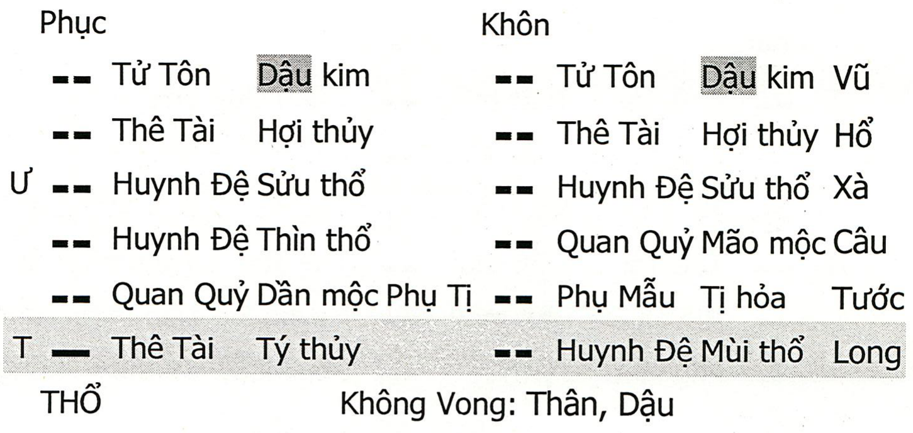

**Ví dụ 9:** Ngày Kỷ Mão tháng Dần năm Ất Dậu, nữ đoán xem hợp tác mở bệnh viện sẽ ra sao? Được Thiên Lôi Vô Vọng biến Ly Vi Hỏa.

| | Vô Vọng | | | Ly | |
| :---: | :---: | :--- | :---: | :--- | :---: |
| | — | Thê Tài Tuất thổ | — | Tử Tôn Tị hỏa | Câu |
| | — | Quan Quỷ Thân kim | - - | Thê Tài Mùi thổ | Tước |
| T | — | Tử Tôn Ngọ hỏa | — | Quan Quỷ Dậu kim | Long |
| | - - | Thê Tài Thìn thổ | — | Phụ Mẫu Hợi thủy | Vũ |
| | - - | Huynh Đệ Dần mộc | - - | Thê Tài Sửu thổ | Hổ |
| Ư | — | Phụ Mẫu Tý thủy | — | Huynh Đệ Mão mộc | Xà |

MỘC Không Vong: Thân, Dậu

**Phán đoán:** Lấy Thê Tài làm Dụng thần. Trong quẻ Thê Tài lưỡng hiện, lấy hào Thê Tài Thìn thổ phát động làm Dụng thần. Dụng thần không được Nhật Nguyệt trợ giúp, trái lại bị Nhật Nguyệt khắc thương là hưu tù không cát. Lục xung hóa lục xung, người hợp tác không đoàn kết. Hào 5 Quan Quỷ Thân kim Nguyệt phá, hào 5 là chủ quản, người phụ trách, Quan Quỷ cũng là nhân viên quản lý, nhân viên chủ quản bệnh viện sẽ tử vong. Không nên hợp tác, nếu không thì ngay cả tiền vốn cũng không thu hồi được.

**Phản hồi:** Nhưng người này bị vướng mắc về tình cảm, ngại từ chối, vẫn hợp tác. Gồm bốn người hợp tác. Kết quả là ba năm trôi qua không thu được lợi nhuận, bệnh viện liên tục nhiều năm lỗ vốn. Tháng Sửu năm Đinh Hợi, chủ quản bệnh viện đột nhiên bị ung thư gan và tử vong.

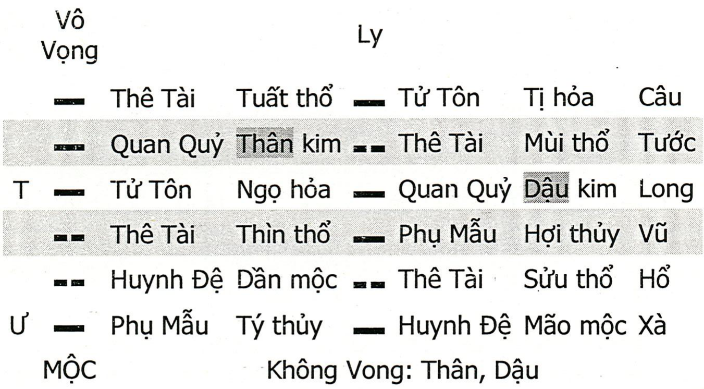

---

# Part 10 (Pages 181-200)

### Ví dụ 10: Ngày Ất Mùi tháng Tý, nam đoán xem hợp tác cầu tài sẽ ra sao? Được Trạch Địa Tụy biến Trạch Hỏa Cách.

| Thế/Ứng | Tụy | Cách | Lục thú |
| :---: | :--- | :--- | :--- |
| | - - Phụ Mẫu Mùi thổ | - - Phụ Mẫu Mùi thổ | Vũ |
| Ứ | — Huynh Đệ Dậu kim | — Huynh Đệ Dậu kim | Hổ |
| | — Tử Tôn Hợi thủy | — Tử Tôn Hợi thủy | Xà |
| | - - Thê Tài Mão mộc | — Tử Tôn Hợi thủy | Câu |
| T | - - Quan Quỷ Tị hỏa | - - Phụ Mẫu Sửu thổ | Tước |
| | - - Phụ Mẫu Mùi thổ | — Thê Tài Mão mộc | Long |

**KIM**          **Không Vong: Thìn, Tị**

**Phán đoán:** Lấy Thê Tài làm lợi nhuận, hào Ứng là người hợp tác, hào Thế là mình. Thê Tài Mão mộc được Nguyệt sinh phù, tam hợp cục đến sinh hào Thế, hợp tác nhất định có thể được tài. Nhưng hào Thế Không Vong, biểu thị bản thân do dự không quyết.

Hào Ứng Huynh Đệ Dậu kim tại hào 5 lâm Bạch Hổ, hào 5 là địa vị chủ yếu, Bạch Hổ chủ cứng rắn, Huynh Đệ là lục thân khắc Tài, biểu thị phải lấy đối phương làm chủ, đối phương có thái độ không hữu hảo, lấy thế lực áp chế người khác, có yêu cầu hà khắc về lợi nhuận.

**Phản hồi:** Quả nhiên là như vậy, bởi vì đối phương là người của tổ chức xã hội đen, anh ta sợ hợp tác sẽ mang lại phiền phức cho mình.

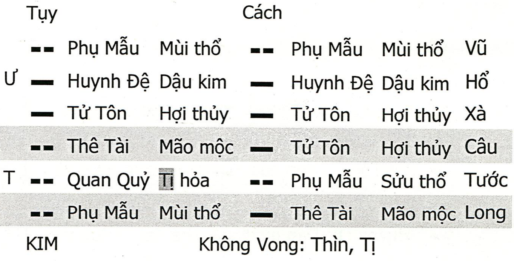

### Ví dụ 11: Ngày Nhâm Tý tháng Mão, đoán xem hợp tác với người ta nuôi chó sẽ ra sao? Được Sơn Trạch Tổn biến Địa Thủy Sư.

| Thế/Ứng | Tổn | Phục thần | Sư | Lục thú |
| :---: | :--- | :---: | :--- | :--- |
| Ứ | — Quan Quỷ Dần mộc | | - - Tử Tôn Dậu kim | Hổ |
| | - - Thê Tài Tý thủy | | - - Thê Tài Hợi thủy | Xà |
| | - - Huynh Đệ Tuất thổ | | - - Huynh Đệ Sửu thổ | Câu |
| T | - - Huynh Đệ Sửu thổ | Tử Thân | - - Phụ Mẫu Ngọ hỏa | Tước |
| | — Quan Quỷ Mão mộc | | — Huynh Đệ Thìn thổ | Long |
| | — Phụ Mẫu Tị hỏa | | - - Quan Quỷ Dần mộc | Vũ |

**THỔ**          **Không Vong: Dần, Mão**

**Phán đoán:** Lấy Thê Tài làm Dụng thần. Thê Tài Tý thủy được Nhật trợ giúp vốn là vượng tướng, nhưng không nên Huynh Đệ trì Thế, hào Ứng Không Vong khắc hào Thế. Hào Ứng là người hợp tác, Ứng Không người ta không thực, chứng tỏ người hợp tác không đáng tin. Ứng lâm Bạch Hổ khắc hào Thế, đối phương ngang ngược, không thể chung sống bình đẳng với mình. Không những vô tài mà còn phải đề phòng phát sinh ẩu đả.

**Phản hồi:** Hai người hợp tác nuôi chó, người này đầu tư vốn. Bởi vì đối phương có kinh nghiệm nuôi chó cho nên chủ yếu nhờ đối phương quản lý. Sau khi có lợi nhuận, đối phương không cho anh ta một đồng nào, hai bên đã phát sinh ẩu đả.

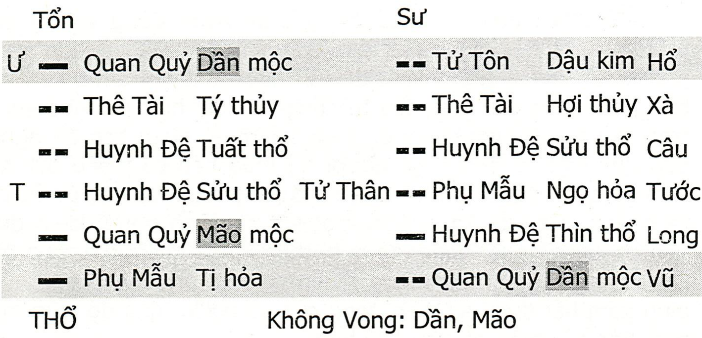

# CHƯƠNG 4
## DỰ ĐOÁN ĐẦU TƯ TÀI CHÍNH

### 1. DỰ ĐOÁN CỔ PHIẾU

Cổ phiếu đã có lịch sử hàng trăm năm. Cùng với sự phát triển của xã hội, người ta ngày càng nhận thức rõ hơn về cổ phiếu. Nó đã trở thành một đề tài thường xuyên được bàn luận trong đời sống, các nhà đầu tư cũng đã xuất hiện ở mọi tầng lớp trong xã hội. Có người thì dựa vào kỹ thuật phân tích để nghiên cứu quy luật cổ phiếu, có người thì mua bán cổ phiếu dựa vào cảm giác, có người thì không chủ trương mua bán cổ phiếu hùa theo những người khác. Sau một vài năm, số người kiếm được tiền chỉ là thiểu số, phần lớn là bị thua lỗ mà chấm dứt mua bán. Do đó, mọi người đều mong muốn có một phương pháp có thể giúp nắm bắt được sự biến động của cổ phiếu, qua đó giúp mình mua bán cổ phiếu có hiệu quả hơn.

Vậy thì phương pháp dự đoán của cổ nhân truyền lại có thể dùng cho dự đoán cổ phiếu hay không? Dự đoán lục hào được phát minh dựa trên quy luật vận động của vũ trụ. Cổ phiếu cũng là kết quả của vận động vũ trụ, không thể tách khỏi vũ trụ mà tồn tại độc lập. Do đó, sử dụng phương pháp lục hào hoàn toàn có thể dự đoán cổ phiếu.

Vào năm 2002, tôi đã hướng dẫn cho ông Ken Morita mua bán cổ phiếu, sử dụng 35 triệu yên làm vốn kinh doanh. Sau nửa năm, ngoài tiền vốn thu hồi, ông ấy còn kiếm được 140 triệu yên. Lúc đó tôi hoàn toàn sử dụng phương pháp lục hào để dự đoán cổ phiếu, hoàn toàn không có kỹ thuật phân tích, cũng không xem thông tin hiệu quả kinh doanh,... Theo cách đó, tôi đã nghiệm chứng được tính khả thi của phương pháp này.

Có điều là cổ phiếu thay đổi trong nháy mắt, muốn dự đoán không sai chút nào thì vẫn có sự khó khăn nhất định. Có khi dự đoán sự biến động của cổ phiếu trong dài hạn thì quái tượng lại phản ánh sự biến động trong tương lai gần, có khi dự đoán sự biến động trong tương lai gần thì quái tượng lại phản ánh sự biến động trong dài hạn. Do đó, khi phân tích và phán đoán quẻ, chúng ta cần phân biệt được những tình huống này. Một điểm nữa là nếu như tham gia mua bán cổ phiếu thì trước tiên cần phải xem vận khí của bản thân ra sao. Chỉ khi vận khí tốt đẹp và trình độ dự đoán cao thì mới có thể nắm chắc phần thắng.

Khi dự đoán cổ phiếu, công việc gieo quẻ cũng rất quan trọng. Nếu như thông tin trích xuất không đúng, cho dù trình độ đoán quẻ có cao như thế nào thì cũng không thể dự đoán chính xác. Do đó, khi gieo quẻ dự đoán cổ phiếu thì không được tham lam, không được đồng thời nghĩ đến nhiều cổ phiếu. Nếu không thì quẻ gieo ra không biết là phản ánh về cổ phiếu nào.

Sự biến động của cổ phiếu chủ yếu là sự biến động về mức giá, vì vậy lấy hào Tài làm Dụng thần. Sự mạnh yếu của Thê Tài là căn cứ cơ bản để phán đoán sự biến động giá cả của cổ phiếu. Tử Tôn là Nguyên thần của hào Tài, là lượng giao dịch và là nhân tố có lợi cho cổ phiếu tăng trưởng. Phụ Mẫu là Cừu thần, vừa có ý nghĩa thông tin và tình báo, vừa là tin tức thời sự và tin đồn bất lợi cho cổ phiếu. Quan Quỷ vốn có ý nghĩa quản lý khống chế, vì vậy Quan Quỷ là nhà cái và là đại cổ đông thao túng cổ phiếu. Quan Quỷ có tính hai mặt, nó vừa có thể chế phục Kỵ thần tốt cho Dụng thần, vừa có thể tiết khí Dụng thần, đây cũng chính là hành vi nhà cái khiến cổ phiếu lúc thì tăng mạnh, lúc thì giảm mạnh. Huynh Đệ khắc Tài, là nhân tố bất lợi cho cổ phiếu.

Dự đoán sự biến động giá cả của cổ phiếu hiện tại, Thê Tài vượng tướng là thông tin cổ phiếu tăng giá, hưu tù bị khắc là thông tin cổ phiếu xuống giá.

Khi dự đoán sự biến động giá cổ phiếu trong dài hạn, phải xem đồng thời hào Tử Tôn. Thê Tài vượng tướng nhưng Tử Tôn hưu tù Không Phá, đây chính là thông tin hiện nay mức giá cao, cổ phiếu đã lên đến đỉnh, rất khó lên cao nữa.

Thê Tài không vượng, Tử Tôn vượng tướng hoặc động hóa hồi đầu sinh, hiện nay mức giá tuy thấp nhưng sau này sẽ có cơ hội tăng lên, tăng cao.

Thê Tài vượng, động mà hóa tiến hoặc Thê Tài có khí, Tử Tôn động mà hóa Tiến thần, đây chính là thông tin cổ phiếu dần dần tăng giá.

Thê Tài tuy vượng nhưng động hóa thoái hoặc Tử Tôn động mà hóa Không, hóa phá, hóa thoái đều là thông tin cổ phiếu sẽ xuống giá.

Thê Tài vượng hoặc có khí, Tử Tôn vượng mà bất Không bất Phá phát động, hào Huynh Đệ đồng thời phát động, cổ phiếu dài hạn có lợi thế.

Nếu Thê Tài vượng tướng, Tử Tôn Huynh Đệ mặc dù đồng thời phát động nhưng Tử Tôn Không Phá, cổ phiếu quanh quẩn một chỗ, sẽ không tăng lên.

Thê Tài hưu tù, Huynh Đệ phát động, cổ phiếu nhất định sẽ xuống giá.

Thê Tài vượng tướng nhưng Huynh Đệ động hóa Tiến thần, hiện nay mức giá tuy tốt nhưng sau này sẽ từ từ xuống giá.

Thê Tài hưu tù, Phụ Mẫu và Huynh Đệ đồng thời phát động, cổ phiếu mất giá trong thời gian dài.

Thê Tài hưu tù, Quan Quỷ độc phát hoặc Thê Tài phát động hóa Quan Quỷ, cổ phiếu xuống giá.

Phụ Mẫu cùng Chu Tước phát động, trong quẻ lại có nhân tố bất lợi cho Thê Tài thì sẽ có thông tin khiến cổ phiếu xuống giá, nếu là nhân tố lợi cho Thê Tài thì sẽ có thông tin khiến cổ phiếu tăng giá.

Thê Tài vượng tướng, Huynh Đệ phát động nhưng Quan Quỷ động mà chế Huynh Đệ, đây là nhà cái cố ý khiến cổ phiếu tăng giá.

Quẻ có phục ngâm, Thê Tài bị hợp nhập Mộ, cổ phiếu rất khó tăng giá; quẻ có phản ngâm, cổ phiếu lên xuống bất định.

Thê Tài Huynh Đệ mạnh yếu tương đương, đồng thời hóa thoái hoặc nhập Mộ, đây chính là thông tin giá cổ phiếu bất động.

Dự đoán cổ phiếu trong dài hạn, Dụng thần, Nguyên thần phục tàng vượng hoặc có khí, chỉ cần Kỵ thần bất động, xung Phi, xung Phục, khi Phục thần xuất hiện thì cổ phiếu sẽ tăng.

Trên đây là những quy luật cơ bản khi dự đoán cổ phiếu. Chỉ khi tự mình tiến hành dự đoán hàng loạt trường hợp thì chúng ta mới có thể nắm bắt được sự biến hóa vi diệu của lục hào dự đoán cổ phiếu. Khi dự đoán không nên nhận định rập khuôn một cách máy móc.

### Ví dụ 1: Ngày Giáp Tuất tháng Thân, đoán một cổ phiếu tăng hay giảm giá ra sao? Được Hỏa Sơn Lữ biến Ly Vi Hỏa.

| | Lữ | Phục thần | Ly | |
| :---: | :--- | :--- | :--- | :---:|
| | Huynh Đệ Tị hỏa | | Huynh Đệ Tị hỏa | Vũ |
| | Tử Tôn Mùi thổ | | Tử Tôn Mùi thổ | Hổ |
| Ư | Thê Tài Dậu kim | | Thê Tài Dậu kim | Xà |
| | Thê Tài Thân kim | Quan Hợi | Quan Quỷ Hợi thủy | Câu |
| | Huynh Đệ Ngọ hỏa | | Tử Tôn Sửu thổ | Tước |
| T | Tử Tôn Thìn thổ | Phụ Mão | Phụ Mẫu Mão mộc | Long |

HỎA    Không Vong: Thân, Dậu

**Phán đoán:** Lấy Thê Tài làm Dụng thần. Trong quẻ Thê Tài lưỡng hiện, đều là Không Vong, lấy hào Ứng Thê Tài Dậu kim làm Dụng thần. Dụng thần được Nguyệt kiến trợ giúp, Nhật đến sinh là vượng tướng.

Thê Tài lưỡng hiện, Nguyên thần lưỡng hiện, Tử Tôn Thìn thổ phát động lại đến sinh, có hiềm quá vượng. Thê Tài quá vượng nhất định sẽ xuống giá. Nhưng mà Thê Tài Dậu kim Không Vong, Tử Tôn Thìn thổ lại hóa hồi đầu khắc, chưa đến lúc xuống giá. Tháng sau là tháng Dậu, Dụng thần xuất Không, hào biến Mão mộc bị xung mất nên không thể khắc chế Tử Tôn Thìn thổ, Dụng thần càng vượng tướng, chắc chắn sẽ xuống giá.

**Phản hồi:** Quả nhiên tại tháng Dậu xuống giá.

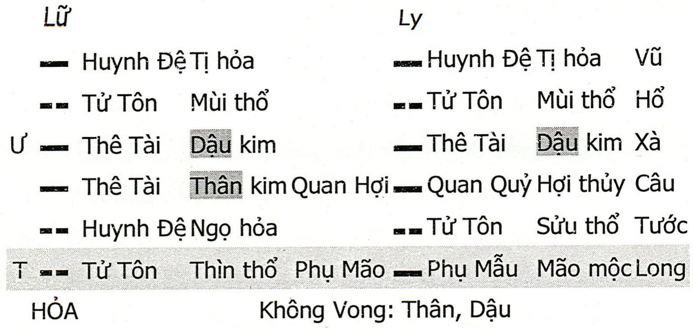

**Ví dụ 2:** Ngày Ất Sửu tháng Ngọ, nữ được bạn bè giới thiệu một cổ phiếu, đoán xem có thể tăng giá hay không? Được Thiên Lôi Vô Vọng biến Hỏa Lôi Phệ Hạp.

| Thế/Ứng | Vô Vọng | Phệ Hạp | Lục thú |
| :---: | :--- | :--- | :--- |
| | — Thê Tài Tuất thổ | — Tử Tôn Tị hỏa | Vũ |
| | — Quan Quỷ Thân kim | - - Thê Tài Mùi thổ | Hổ |
| T | — Tử Tôn Ngọ hỏa | — Quan Quỷ Dậu kim | Xà |
| | - - Thê Tài Thìn thổ | - - Thê Tài Thìn thổ | Câu |
| | - - Huynh Đệ Dần mộc | - - Huynh Đệ Dần mộc | Tước |
| Ư | — Phụ Mẫu Tý thủy | — Phụ Mẫu Tý thủy | Long |

MỘC Không Vong: Tuất, Hợi

**Phán đoán:** Lấy Thê Tài làm Dụng thần. Trong quẻ Thê Tài lưỡng hiện, lấy Thê Tài Tuất thổ Không Vong làm Dụng thần. Dụng thần được Nguyệt sinh Nhật phù là vượng tướng, nhưng không nên Quan Quỷ Thân kim độc phát, cổ phiếu này không tăng mà trái lại xuống giá. Quan Quỷ tại hào 5 là nhà cái, là bởi vì vấn đề nhà cái mà xuống giá.

Lúc đó, cô ấy cho là phán đoán không đúng, bởi vì người giới thiệu cổ phiếu cho cô ấy chính là nhà cái, họ nói rằng sau khi kéo cổ phiếu lên cao sẽ bảo cô ấy sớm bán tháo, cổ phiếu này chắc chắn có lãi.

**Phản hồi:** Cô ấy không nghe lời khuyên, sau khi mua cổ phiếu không lâu thì nhà cái bị bắt vào tù vì phạm pháp, cổ phiếu giảm giá mạnh.

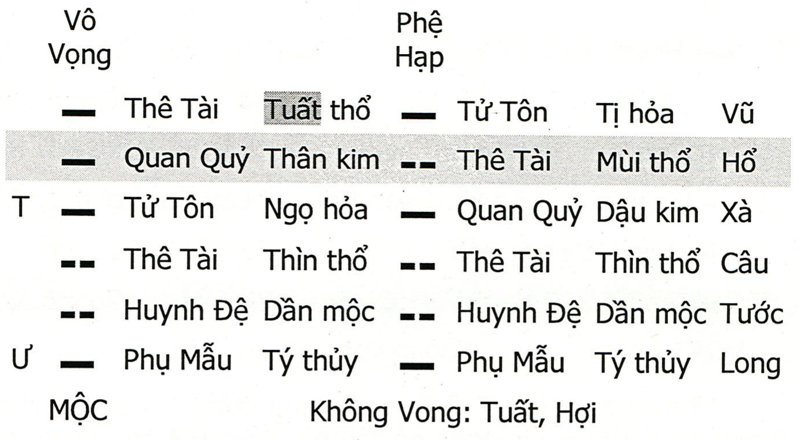

**Ví dụ 3:** Ngày Giáp Ngọ tháng Mùi năm Nhâm Ngọ, nam đoán về cổ phiếu Cửu Phát, được Sơn Trạch Tổn biến Phong Trạch Trung Phu.

| Thế/Ứng | Tổn | Phục thần | Trung Phu | Lục thú |
| :---: | :--- | :---: | :--- | :--- |
| Ư | — Quan Quỷ Dần mộc | | — Quan Quỷ Mão mộc | Vũ |
| | - - Thê Tài Tý thủy | | — Phụ Mẫu Tị hỏa | Hổ |
| | - - Huynh Đệ Tuất thổ | | - - Huynh Đệ Mùi thổ | Xà |
| T | - - Huynh Đệ Sửu thổ | Tử Thân | - - Huynh Đệ Sửu thổ | Câu |
| | — Quan Quỷ Mão mộc | | — Quan Quỷ Mão mộc | Tước |
| | — Phụ Mẫu Tị hỏa | | — Phụ Mẫu Tị hỏa | Long |

THỔ Không Vong: Thìn, Tị

**Phán đoán:** Lấy Thê Tài làm Dụng thần. Thê Tài Tý thủy Nguyệt khắc Nhật không sinh, độc phát hóa Tuyệt, hóa Không, thế nào cũng xuống giá mạnh.

**Phản hồi:** Quả nhiên xuống giá mạnh.

**Ví dụ 4:** Ngày Đinh Mùi tháng Hợi, nam đoán về cổ phiếu của Sinh Vật Hải Vương, được Sơn Địa Bác.

| Thế/Ứng | Bác | Phục thần | Lục thú |
| :---: | :--- | :---: | :--- |
| | — Thê Tài Dần mộc | | Long |
| T | - - Tử Tôn Tý thủy | Huynh Thân | Vũ |
| | - - Phụ Mẫu Tuất thổ | | Hổ |
| | - - Thê Tài Mão mộc | | Xà |
| Ư | - - Quan Quỷ Tị hỏa | | Câu |
| | - - Phụ Mẫu Mùi thổ | | Tước |

KIM Không Vong: Dần, Mão

**Phán đoán:** Lấy Thê Tài làm Dụng thần, trong quẻ Thê Tài lưỡng hiện, đều không phát động, lâm Không Vong, lấy hào Thê Tài Dần mộc Nguyệt hợp làm Dụng. Dụng thần được Nguyệt sinh

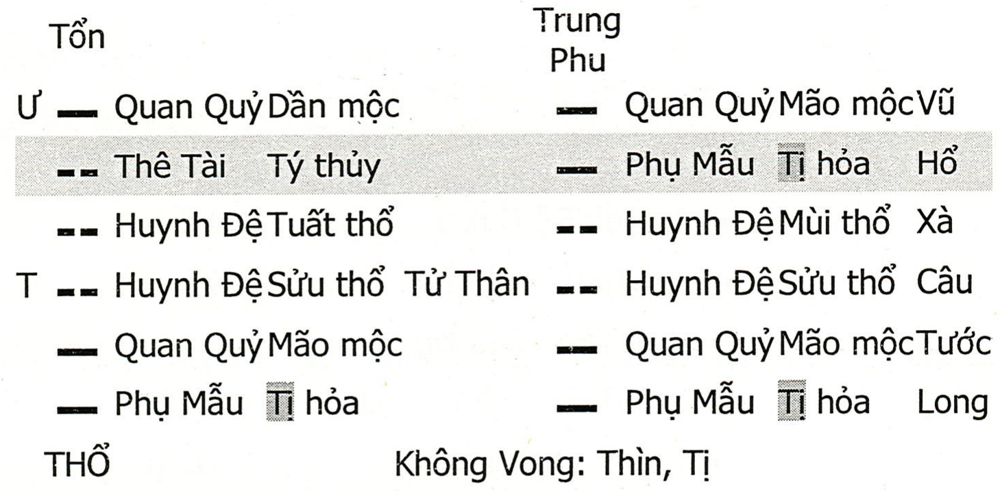

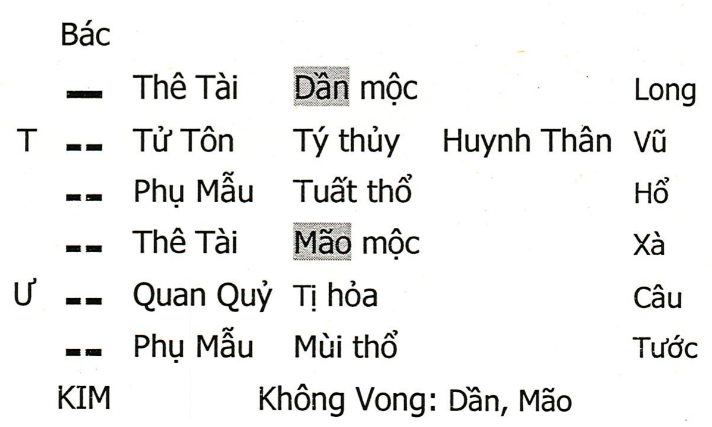 hợp, là vượng, nhưng nhập Mộ ở Nhật, Mộ khố là ngưng lại, trì hoãn. Vì vậy, mặc dù tăng nhưng tăng không cao.

**Phản hồi:** Trên thực tế, giá lúc dự đoán là 7.65 tệ, qua một tháng mới tăng đến 7.95 tệ.

### Ví dụ 5: Ngày Quý Sửu tháng Hợi, nam đoán về cổ phiếu của Xi măng Ký Đông, được Hỏa Sơn Lữ.

**Lữ (HỎA)**

**Không Vong: Dần, Mão**

| Thế/Ứng | Quẻ Lữ | Phục thần | Lục thú |
| :---: | :--- | :--- | :--- |
| | — Huynh Đệ Tị hỏa | | Hổ |
| | - - Tử Tôn Mùi thổ | | Xà |
| Ứ | — Thê Tài Dậu kim | | Câu |
| | — Thê Tài Thân kim | Quan Hợi | Tước |
| | - - Huynh Đệ Ngọ hỏa | | Long |
| T | - - Tử Tôn Thìn thổ | Phụ Mão | Vũ |

**Phán đoán:** Lấy Thê Tài làm Dụng thần. Trong quẻ Thê Tài lưỡng hiện, lấy Ứng Thê Tài Dậu kim làm Dụng thần. Nguyệt không sinh Nhật đến sinh, Tử Tôn Mùi thổ ám động lại đến sinh, vì vậy là tăng giá. Có điều là Nhật suy cho cùng là Mộ khố, tăng khá chậm.

**Phản hồi:** Trên thực tế, giá lúc dự đoán là 16.50 tệ, sau hai mươi ngày tăng đến 17.59 tệ.

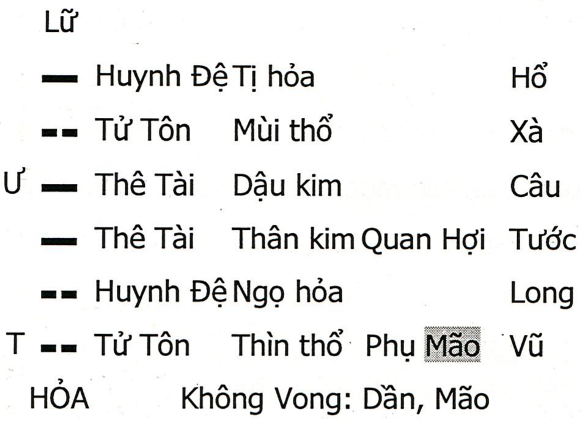

### Ví dụ 6: Ngày Quý Sửu tháng Hợi, đoán cổ phiếu Liên Thông Trung Quốc (China Unicom), được Trạch Thiên Quải biến Thủy Thiên Nhu.

**Quải biến Nhu (THỔ)**

**Không Vong: Dần, Mão**

| Thế/Ứng | Quẻ Quải | Phục thần | Quẻ Nhu | Lục thú |
| :---: | :--- | :--- | :--- | :--- |
| | - - Huynh Đệ Mùi thổ | | - - Thê Tài Tý thủy | Hổ |
| T | — Tử Tôn Dậu kim | | — Huynh Đệ Tuất thổ | Xà |
| | — Thê Tài Hợi thủy | | - - Tử Tôn Thân kim | Câu |
| | — Huynh Đệ Thìn thổ | | — Huynh Đệ Thìn thổ | Tước |
| Ứ | — Quan Quỷ Dần mộc | Phụ Tị | — Quan Quỷ Dần mộc | Long |
| | — Thê Tài Tý thủy | | — Thê Tài Tý thủy | Vũ |

**Phán đoán:** Lấy Thê Tài làm Dụng thần. Trong quẻ Thê Tài lưỡng hiện, lấy hào Thê Tài Hợi thủy phát động làm Dụng thần. Dụng thần được Nguyệt trợ giúp Nhật thần đến khắc, suy vượng cân bằng, nhưng độc phát hóa hồi đầu sinh, vì vậy tương đối có tiềm lực. Sắp tới thì nên xem ngày hôm sau, bởi vì Dụng thần phát động, ngày hôm sau là ngày Dần, vừa đúng là ứng kỳ.

**Phản hồi:** Trên thực tế, giá trong ngày dự đoán là 8.89 tệ, ngày hôm sau là Giáp Dần tăng đến 8.91 tệ, hai mươi ngày sau thì giá tăng đến 10.13 tệ.

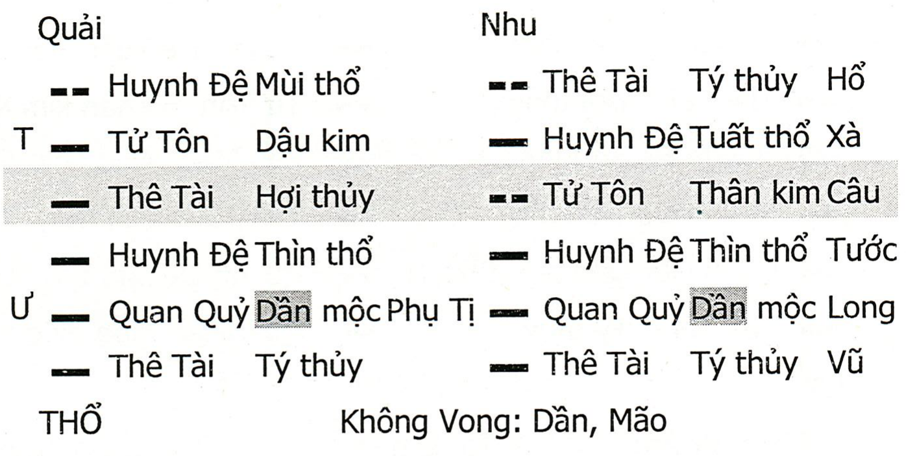

## Ví dụ 7: Ngày Quý Sửu tháng Hợi, đoán về cổ phiếu Dầu khí Trung Quốc, được Địa Thiên Thái biến Lôi Hỏa Phong.

| | Thái | | Phong | |
| :---: | :--- | :---: | :--- | :---: |
| Ư | ⚏ Tử Tôn Dậu kim | ⚏ | Huynh Đệ Tuất thổ | Hổ |
| | ⚏ Thê Tài Hợi thủy | ⚏ | Tử Tôn Thân kim | Xà |
| | ⚏ Huynh Đệ Sửu thổ | ━ | Phụ Mẫu Ngọ hỏa | Câu |
| T | ━ Huynh Đệ Thìn thổ | ━ | Thê Tài Hợi thủy | Tước |
| | ━ Quan Quỷ Dần mộc Phụ Tị | ⚏ | Huynh Đệ Sửu thổ | Long |
| | ━ Thê Tài Tý thủy | ━ | Quan Quỷ Mão mộc | Vũ |

THỔ Không Vong: Dần, Mão

**Phán đoán:** Lấy Thê Tài làm Dụng thần. Trong quẻ Thê Tài lưỡng hiện, lấy hào Thê Tài Tý thủy Nhật hợp làm Dụng thần. Dụng thần mặc dù có Nguyệt kiến trợ giúp nhưng Nhật thần khắc hợp, Nhật hợp là cản trở, biểu thị bất động. Càng không tốt là Huynh Đệ Sửu thổ phát động hóa hồi đầu sinh đến khắc, nhất định xuống giá. Trong quẻ mặc dù có Quan Quỷ Dần mộc phát động đến chế phục Huynh đệ Sửu thổ, nhưng đó chỉ là tạm thời. Xu hướng chung là không tốt.

**Phản hồi:** Giá hôm dự đoán là 37.91 tệ. Ngày thứ hai, Quan Quỷ Dần mộc xuất Không chế phục Huynh Đệ, giá tăng đến 38.82 tệ. Tuy nhiên, hai mươi ngày sau thì giá giảm còn 31.31 tệ.

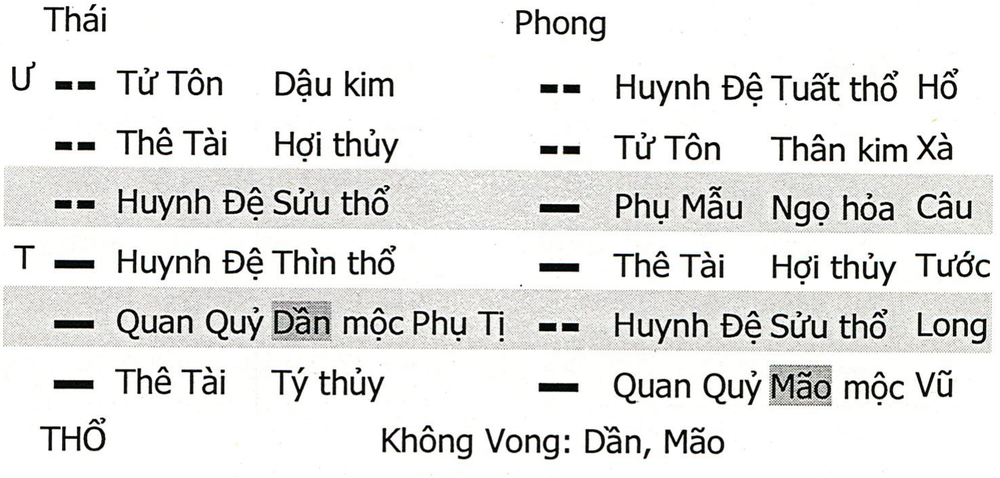

## Ví dụ 8: Ngày Giáp Dần tháng Mão, một học trò của tôi hỏi về biến động của thị trường chứng khoán trong tương lai gần, được Lôi Hỏa Phong biến Địa Phong Thăng.

| | Phong | | Thăng | |
| :---: | :--- | :---: | :--- | :---: |
| | ⚏ Quan Quỷ Tuất thổ | ⚏ | Phụ Mẫu Dậu kim | Vũ |
| T | ⚏ Phụ Mẫu Thân kim | ⚏ | Huynh Đệ Hợi thủy | Hổ |
| | ━ Thê Tài Ngọ hỏa | ⚏ | Quan Quỷ Sửu thổ | Xà |
| | ━ Huynh Đệ Hợi thủy | ━ | Phụ Mẫu Dậu kim | Câu |
| Ư | ⚏ Quan Quỷ Sửu thổ | ━ | Huynh Đệ Hợi thủy | Tước |
| | ━ Tử Tôn Mão mộc | ⚏ | Quan Quỷ Sửu thổ | Long |

THỦY Không Vong: Tý, Sửu

**Phán đoán:** Dự đoán thị trường chứng khoán, lấy Tài làm Dụng thần. Tài được Nguyệt sinh, lại có Tử Tôn phát động đến sinh, xem ra là sắp tăng. Hỏi ngày nào chỉ số thị trường tăng? Tôi thấy hào Tài động hóa Sửu thổ, Nguyên thần Tử Tôn cũng hóa Sửu thổ, hai hào biến này ám chỉ thông tin nào đó, vì vậy phán đoán tại ngày Sửu chỉ số sẽ tăng.

**Phản hồi:** Quả nhiên tăng vào hôm đó.

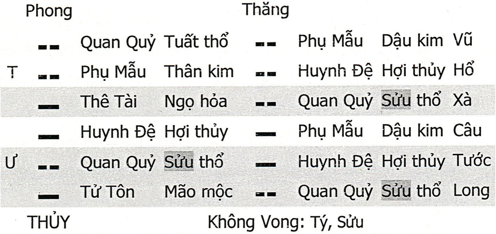

### Ví dụ 9

Ngày Kỷ Mùi tháng Sửu, một người đoán về cổ phiếu đã mua, được Tốn Vi Phong biến Thủy Thiên Nhu.

| | Tốn | Nhu | |
| :---: | :--- | :--- | :---: |
| T | — Huynh Đệ Mão mộc | - - Phụ Mẫu Tý thủy | Câu |
| | — Tử Tôn Tị hỏa | — Thê Tài Tuất thổ | Tước |
| | - - Thê Tài Mùi thổ | - - Quan Quỷ Thân kim | Long |
| Ứ | — Quan Quỷ Dậu kim | — Thê Tài Thìn thổ | Vũ |
| | — Phụ Mẫu Hợi thủy | — Huynh Đệ Dần mộc | Hổ |
| | - - Thê Tài Sửu thổ | — Phụ Mẫu Tý thủy | Xà |

MỘC Không Vong: Tý, Sửu

**Phán đoán:** Lấy Thê Tài làm Dụng thần. Trong quẻ Thê Tài lưỡng hiện, lấy hào Thê Tài Sửu thổ phát động làm Dụng thần. Dụng thần được Nguyệt kiến trợ giúp là vượng tướng, nhưng động hóa hồi đầu hợp, Huynh Đệ Mão mộc lại trì Thế phát động, biến hóa của hào động trong quẻ gây bất lợi cho Dụng thần, vì vậy sẽ không tăng giá.

Dụng thần Không Vong, Nhật thần hôm đó xung thực, Dụng thần bị hào biến hợp trú, Nhật thần xung khai, Huynh Đệ Mão mộc phát động đến khắc, Nhật thần khiến Huynh Đệ nhập Mộ. Vì vậy hôm đó là ngày rất có lợi.

**Phản hồi:** Cổ phiếu quả nhiên không tăng giá, hôm đó nhờ bán tháo nên đã kiếm được chút lãi.

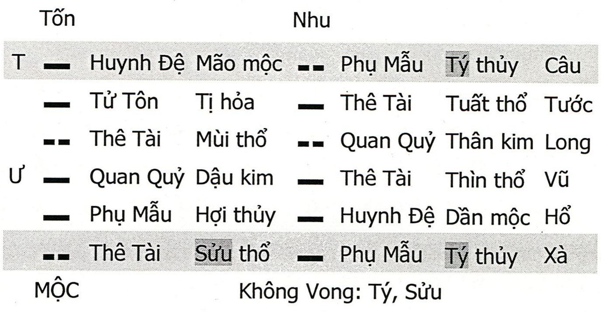

### Ví dụ 10

Ngày Kỷ Mão tháng Thân, đoán tình hình biến động của cổ phiếu Ngũ Khoáng Tư Nguyên Hồng Kông, được Hỏa Trạch Khuê biến Thiên Địa Bĩ.

| | Khuê | | Bĩ | |
| :---: | :--- | :---: | :--- | :---: |
| | — Phụ Mẫu Tị hỏa | | — Huynh Đệ Tuất thổ | Câu |
| | - - Huynh Đệ Mùi thổ | Tài Tý | — Tử Tôn Thân kim | Tước |
| T | — Tử Tôn Dậu kim | | — Phụ Mẫu Ngọ hỏa | Long |
| | - - Huynh Đệ Sửu thổ | | - - Quan Quỷ Mão mộc | Vũ |
| | — Quan Quỷ Mão mộc | | - - Phụ Mẫu Tị hỏa | Hổ |
| Ứ | — Phụ Mẫu Tị hỏa | | - - Huynh Đệ Mùi thổ | Xà |

THỔ Không Vong: Thân, Dậu

**Phán đoán:** Lấy Thê Tài làm Dụng thần. Thê Tài Tý thủy không hiện trên quẻ, phục dưới hào 5 Huynh Đệ Mùi thổ. Dụng thần được Nguyệt sinh phù, Nhật không đến khắc là vượng tướng là cát. Trong quẻ Phi thần Huynh Đệ Mùi thổ phát động đến khắc, lại được mộc động sinh hỏa, hỏa động sinh thổ đến trợ giúp, bất lợi cho Dụng thần, mới nhìn thì xấu, nhưng Nhật thần xung động Tử Tôn Dậu kim, giải trừ khắc của Huynh Đệ Mùi thổ, vì vậy vẫn có cơ hội tăng giá.

Ngày Quý Mùi trị Phi thần, chắc chắn xuống giá. Ngày Sửu xung khai Phi thần là lúc tăng giá.

**Phản hồi:** Quả nhiên giá tại ngày dự đoán là 3.65 cảng tệ, ngày Quý Mùi giảm xuống còn 2.88 cảng tệ, ngày Kỷ Sửu tăng đến 4.85 cảng tệ.

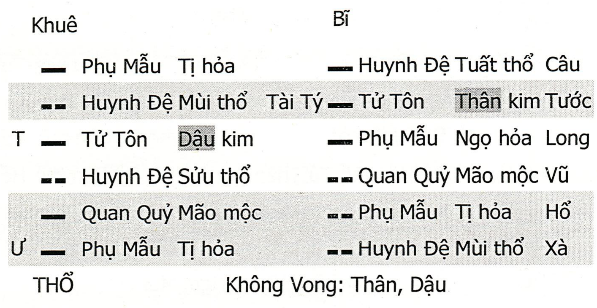

**Ví dụ 11:** Ngày Mậu Tý tháng Tuất, bạn bè của tôi nhờ đoán xu thế phát triển của Thần Hoa Trung Quốc, được Sơn Thiên Đại Súc biến Địa Thiên Thái.

| | Đại Súc | | Thái | |
| :--- | :--- | :--- | :--- | :--- |
| | — Quan Quỷ Dần mộc | | - - Tử Tôn Dậu kim | Tước |
| Ứ | - - Thê Tài Tý thủy | | - - Thê Tài Hợi thủy | Long |
| | - - Huynh Đệ Tuất thổ | | - - Huynh Đệ Sửu thổ | Vũ |
| | — Huynh Đệ Thìn thổ | Tử Thân | — Huynh Đệ Thìn thổ | Hổ |
| T | — Quan Quỷ Dần mộc | Phụ Ngọ | — Quan Quỷ Dần mộc | Xà |
| | — Thê Tài Tý thủy | | — Thê Tài Tý thủy | Câu |

THỔ Không Vong: Ngọ, Mùi

**Phán đoán:** Lấy Thê Tài làm Dụng thần. Trong quẻ Thê Tài lưỡng hiện, lấy hào Ứng Thê Tài Tý thủy làm Dụng thần. Nguyệt khắc Nhật phù, suy vượng tương đương. Nhưng không nên Quan Quỷ độc phát tiết khí, xu thế chung nhất định là rớt giá. Dần mộc độc phát, lấy hào này làm ứng kỳ.

**Phản hồi:** Mức giá lúc đó là 83.62 tệ, ngày Canh Dần rớt xuống 80.05 tệ, đến tháng Hợi giảm xuống còn hơn 60 tệ.

**Ví dụ 12:** Ngày Đinh Mão tháng Tuất, một học viên người Nhật Bản đoán chỉ số Nikkei 225 của ngày hôm sau, được Sơn Lôi Di biến Hỏa Trạch Khuê.

| | Di | | Khuê | |
| :--- | :--- | :--- | :--- | :--- |
| | — Huynh Đệ Dần mộc | | — Tử Tôn Tị hỏa | Long |
| | - - Phụ Mẫu Tý thủy | Tử Tị | - - Thê Tài Mùi thổ | Vũ |
| T | - - Thê Tài Tuất thổ | | — Quan Quỷ Dậu kim | Hổ |
| | - - Thê Tài Thìn thổ | Quan Dậu | - - Thê Tài Sửu thổ | Xà |
| | - - Huynh Đệ Dần mộc | | — Huynh Đệ Mão mộc | Câu |
| Ứ | — Phụ Mẫu Tý thủy | | — Tử Tôn Tị hỏa | Tước |

MỘC Không Vong: Tuất, Hợi

**Phán đoán:** Lấy Thê Tài làm Dụng thần. Trong quẻ Thê Tài lưỡng hiện, lấy hào Thê Tài Tuất thổ phát động làm Dụng thần. Dụng thần lâm Nguyệt, nhưng bị Nhật khắc, khó phân biệt suy vượng. Hào 2 Huynh Đệ Dần mộc phát động được Nhật trợ giúp hóa Tiến thần đến khắc, chắc chắn rớt giá.

**Phản hồi:** Quả nhiên ngày hôm sau từ 11031 yên (giá ngày hôm trước) rơi xuống 10889 yên.

**Ví dụ 13:** Ngày Đinh Dậu tháng Hợi, một học viên người Nhật Bản đoán về giá cổ phiếu của công ty xe đạp Maruishi, giá hiện tại là 57 yên, hỏi mười ngày sau thì giá có tăng đến 60 yên không? Được Phong Thiên Tiểu Súc.

| | Tiểu Súc | | |
| :--- | :--- | :--- | :--- |
| | — Huynh Đệ Mão mộc | | Long |
| | — Tử Tôn Tị hỏa | | Vũ |
| Ứ | - - Thê Tài Mùi thổ | | Hổ |
| | — Thê Tài Thìn thổ | Quan Dậu | Xà |
| | — Huynh Đệ Dần mộc | | Câu |
| T | — Phụ Mẫu Tý thủy | | Tước |

MỘC Không Vong: Thìn, Tị

**Phán đoán:** Lấy Thê Tài làm Dụng thần. Trong quẻ Thê Tài lưỡng hiện, lấy hào Thê Tài Thìn thổ Không Vong làm Dụng thần. Dụng thần không được Nhật Nguyệt sinh phù, lại bị Nhật thần hợp trú, Nhật hợp là vướng chân, đây là thông tin cổ phiếu không thể tăng giá. Hơn nữa, Nguyên thần Không Vong Nguyệt phá, không có lực sinh Thê Tài, vì vậy sẽ không tăng đến mức giá 60 yên.

**Phản hồi:** Kết quả là không tăng, trái lại rơi xuống 56 yên.

**Ví dụ 14:** Ngày Bính Ngọ tháng Mão, một học viên người Nhật Bản đoán về cổ phiếu Nidec Sankyo ở tháng Thìn, được Địa Hỏa Minh Di.

| | Minh Di | | Phục thần | |
| :---: | :---: | :--- | :--- | :--- |
| | -- | Phụ Mẫu Dậu kim | | Long |
| | -- | Huynh Đệ Hợi thủy | | Vũ |
| T | -- | Quan Quỷ Sửu thổ | | Hổ |
| | — | Huynh Đệ Hợi thủy | Tài Ngọ | Xà |
| | -- | Quan Quỷ Sửu thổ | | Câu |
| Ứ | — | Tử Tôn Mão mộc | | Tước |

THỦY Không Vong: Dần, Mão

**Phán đoán:** Lấy Thê Tài làm Dụng thần. Thê Tài Ngọ hỏa mặc dù không hiện trên quẻ nhưng Nguyệt sinh Nhật phù là vượng tướng, vì vậy nhất định có thể tăng giá. Hiện nay Dụng thần Ngọ hỏa phục tàng, tại ngày Ngọ tháng Thìn thì Phục thần xuất hiện, nhất định lên cao.

**Phản hồi:** Quả nhiên ở ngày Ngọ đầu tiên của tháng Thìn cổ phiếu tăng đến giá trần.

**Ví dụ 15:** Ngày Canh Dần tháng Mùi, một học viên người Nhật Bản đoán cổ phiếu trong khoảng một tháng có tăng giá không? Được Hỏa Thủy Vị Tế biến Phong Thủy Hoán.

| | Vị Tế | | Phục thần | Hoán | | |
| :---: | :---: | :--- | :--- | :---: | :--- | :--- |
| Ứ | — | Huynh Đệ Tị hỏa | | — | Phụ Mẫu Mão mộc | Xà |
| | -- | Tử Tôn Mùi thổ | | — | Huynh Đệ Tị hỏa | Câu |
| | — | Thê Tài Dậu kim | | -- | Tử Tôn Mùi thổ | Tước |
| T | -- | Huynh Đệ Ngọ hỏa | Quan Hợi | -- | Huynh Đệ Ngọ hỏa | Long |
| | — | Tử Tôn Thìn thổ | | — | Tử Tôn Thìn thổ | Vũ |
| | -- | Phụ Mẫu Dần mộc | | -- | Phụ Mẫu Dần mộc | Hổ |

HỎA Không Vong: Ngọ, Mùi

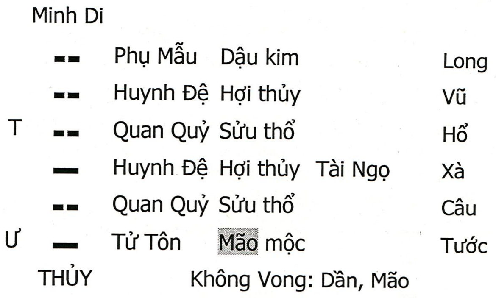

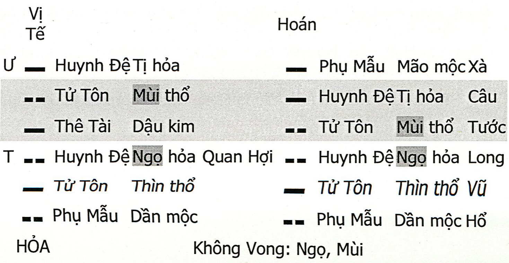

**Phán đoán:** Lấy Thê Tài làm Dụng thần. Thê Tài Dậu kim được Nguyệt sinh Nhật không khắc là vượng tướng, đồng thời hào 5 Mùi thổ động đến sinh, Dụng thần tự động hóa hồi đầu sinh, nhất định có thể tăng.

**Phản hồi:** Kết quả là liên tục ba ngày kịch trần.

**Ví dụ 16:** Ngày Canh Ngọ tháng Tuất, học viên người Nhật Bản đoán về một cổ phiếu, được Thiên Hỏa Đồng Nhân biến Sơn Hỏa Bí.

| | Đồng Nhân | | Bí | | |
| :---: | :---: | :--- | :---: | :--- | :--- |
| Ứ | — | Tử Tôn Tuất thổ | — | Phụ Mẫu Dần mộc | Xà |
| | — | Thê Tài Thân kim | -- | Quan Quỷ Tý thủy | Câu |
| | — | Huynh Đệ Ngọ hỏa | -- | Tử Tôn Tuất thổ | Tước |
| T | — | Quan Quỷ Hợi thủy | — | Quan Quỷ Hợi thủy | Long |
| | -- | Tử Tôn Sửu thổ | -- | Tử Tôn Sửu thổ | Vũ |
| | — | Phụ Mẫu Mão mộc | — | Phụ Mẫu Mão mộc | Hổ |

HỎA Không Vong: Tuất, Hợi

**Phán đoán:** Lấy Thê Tài làm Dụng thần. Thê Tài Thân kim Nguyệt sinh Nhật khắc, khó phân biệt suy vượng. Xem biến hóa trong quẻ, Dụng thần động hóa Tý thủy, Dụng thần không được sự trợ giúp của hào biến, hào 4 Ngọ hỏa động đến khắc, khắc nhiều sinh ít, chắc chắn xuống giá.

**Phản hồi:** Kết quả là từ 150 yên rơi xuống 149 yên.

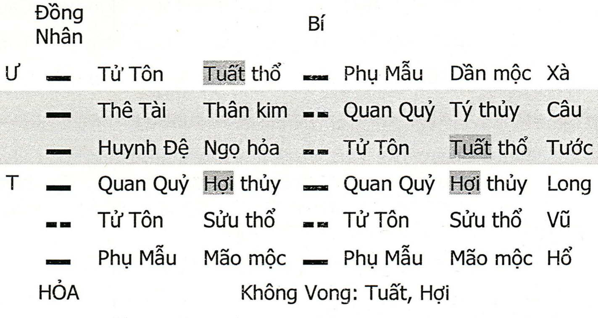

**Ví dụ 17:** Ngày Ất Mùi tháng Hợi, một học viên người Nhật Bản đoán cổ phiếu Tanaka Shoji hôm nay có tăng giá không? Được Khảm Vi Thủy biến Phong Thủy Hoán.

| | Khảm | | Hoán | | |
| :---: | :---: | :--- | :---: | :--- | :---: |
| T | - - | Huynh Đệ Tý thủy | — | Tử Tôn Mão mộc | Vũ |
| | — | Quan Quỷ Tuất thổ | — | Thê Tài Tị hỏa | Hổ |
| | - - | Phụ Mẫu Thân kim | - - | Quan Quỷ Mùi thổ | Xà |
| Ứ | - - | Thê Tài Ngọ hỏa | - - | Thê Tài Ngọ hỏa | Câu |
| | — | Quan Quỷ Thìn thổ | — | Quan Quỷ Thìn thổ | Tước |
| | - - | Tử Tôn Dần mộc | - - | Tử Tôn Dần mộc | Long |

THỦY Không Vong: Thìn, Tị

**Phán đoán:** Lấy Thê Tài làm Dụng thần. Dụng thần không được Nhật Nguyệt trợ giúp, trái lại bị Nguyệt khắc, đặc biệt là trong quẻ Huynh Đệ Tý thủy vượng tướng phát động. Vì vậy, cổ phiếu đó hôm nay chắc chắn xuống giá.

**Phản hồi:** Kết quả là từ 526 yên rơi xuống 490 yên.

**Ví dụ 18:** Ngày Canh Tý tháng Mão, một học viên người Nhật Bản đoán xem cổ phiếu Yahoo tăng hay giảm giá, được Thiên Phong Cấu biến Hỏa Sơn Lữ.

| | Cấu | | Lữ | | |
| :---: | :---: | :--- | :---: | :--- | :---: |
| | — | Phụ Mẫu Tuất thổ | — | Quan Quỷ Tị hỏa | Xà |
| | — | Huynh Đệ Thân kim | - - | Phụ Mẫu Mùi thổ | Câu |
| Ứ | — | Quan Quỷ Ngọ hỏa | — | Huynh Đệ Dậu kim | Tước |
| | — | Huynh Đệ Dậu kim | — | Huynh Đệ Thân kim | Long |
| | — | Tử Tôn Hợi thủy Tài Dần | - - | Quan Quỷ Ngọ hỏa | Vũ |
| T | - - | Phụ Mẫu Sửu thổ | - - | Phụ Mẫu Thìn thổ | Hổ |

KIM Không Vong: Thìn, Tị

**Phán đoán:** Lấy Thê Tài làm Dụng thần. Thê Tài Dần mộc mặc dù không hiện trên quẻ, nhưng được Nguyệt phù Nhật sinh là vượng tướng. Trong quẻ Huynh Đệ Thân kim phát động, nhưng

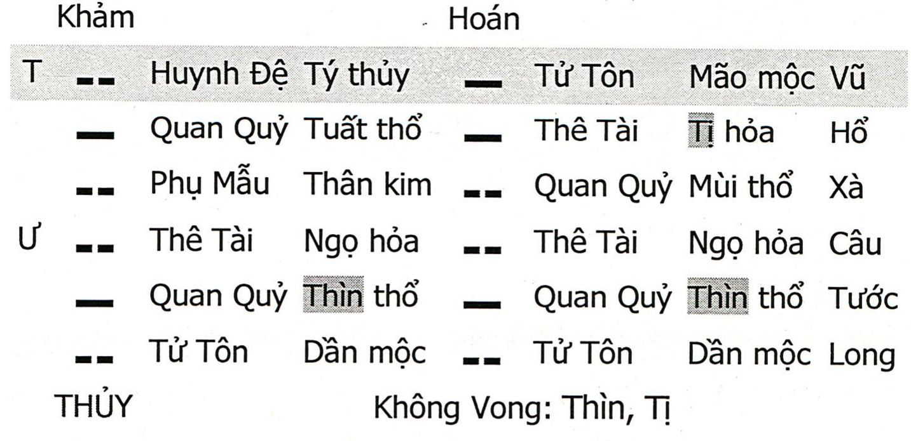

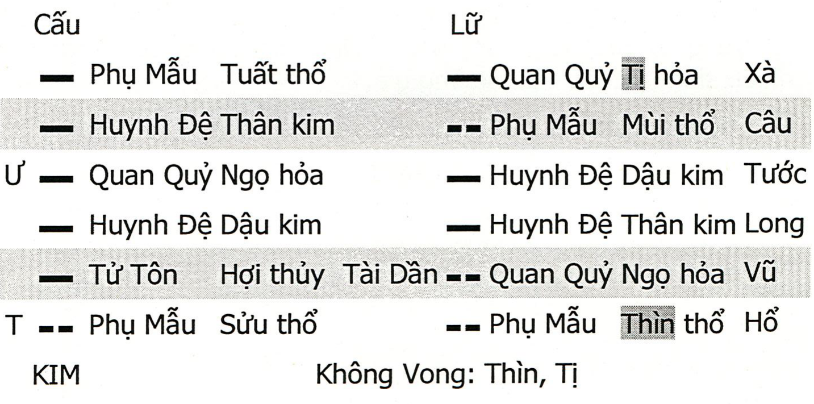 có Tử Tôn Hợi thủy cũng phát động dẫn hóa, Tử Tôn và Huynh Đệ đồng thời phát động, đây là rễ sâu cuống chắc, lâu dài. Nhất định không ngừng tăng giá.

**Phản hồi:** Thế là anh ta mua vào với giá 98100 yên mỗi cổ phiếu, giữa chừng có hai lần phát hành ưu đãi (rights issue). Đến tháng Hợi, giá của cổ phiếu các lần phát hành ưu đãi đều tăng đến 1440000 yên mỗi cổ phiếu.

**Ví dụ 19:** Ngày Quý Sửu tháng Dậu, nam đoán tình hình biến động của cổ phiếu Angang (thị trường chứng khoán Hồng Kông) đến tiết Hàn Lộ, được Địa Phong Thăng biến Địa Hỏa Minh Di.

| | Thăng | | Minh Di | | |
| :---: | :---: | :--- | :---: | :--- | :---: |
| | - - | Quan Quỷ Dậu kim | - - | Quan Quỷ Dậu kim | Hổ |
| | - - | Phụ Mẫu Hợi thủy | - - | Phụ Mẫu Hợi thủy | Xà |
| T | - - | Thê Tài Sửu thổ | - - | Thê Tài Sửu thổ | Câu |
| | — | Quan Quỷ Dậu kim | — | Phụ Mẫu Hợi thủy | Tước |
| | — | Phụ Mẫu Hợi thủy | - - | Thê Tài Sửu thổ | Long |
| Ứ | - - | Thê Tài Sửu thổ | — | Huynh Đệ Mão mộc | Vũ |

MỘC Không Vong: Dần, Mão

**Phán đoán:** Lấy Thê Tài làm Dụng thần. Trong quẻ Thê Tài lưỡng hiện, lấy hào Thê Tài Sửu thổ phát động làm Dụng thần. Nguyệt không khắc Nhật trợ giúp, Nhật là hiện nay, chứng tỏ hiện nay cổ phiếu khá tốt. Dụng thần động hóa hồi đầu khắc, tương lai cổ phiếu sẽ rớt giá, nay hào biến Nguyệt phá không thể khắc Dụng thần. Sau khi qua Hàn Lộ thì xuất Nguyệt bất Phá, cổ phiếu sẽ rớt giá.

**Phản hồi:** Quả nhiên lúc đó mỗi cổ phiếu có giá 25.8 cảng tệ, ngày hôm sau bắt đầu tăng lên, cuối cùng tăng đến 34.1 cảng tệ. Đến ngày Ất Dậu tháng Tuất, cổ phiếu đột nhiên sụt giá.

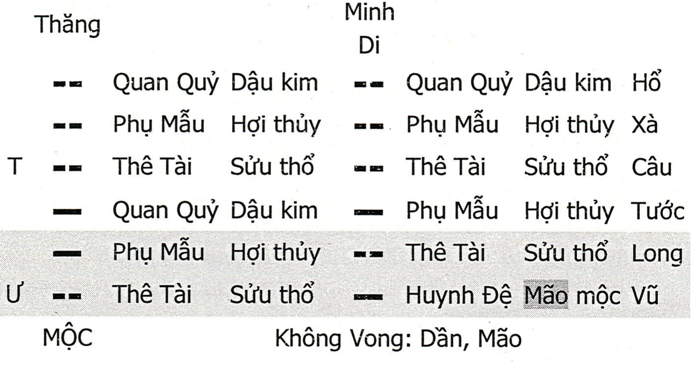

---

# Part 11 (Pages 201-220)

**Ví dụ 20:** Ngày Bính Tuất tháng Thân, nam đoán tình hình biến động của cổ phiếu Jiangxi Copper (thị trường chứng khoán Hồng Kông) trong một tháng, được Trạch Phong Đại Quá biến Thiên Phong Cấu.

| | Đại Quá | | Cấu | |
| :--- | :--- | :--- | :--- | :--- |
| | - - Thê Tài Mùi thổ | | — Thê Tài Tuất thổ | Long |
| | — Quan Quỷ Dậu kim | | — Quan Quỷ Thân kim | Vũ |
| T | — Phụ Mẫu Hợi thủy | Tử Ngọ | — Tử Tôn Ngọ hỏa | Hổ |
| | — Quan Quỷ Dậu kim | | — Quan Quỷ Dậu kim | Xà |
| | — Phụ Mẫu Hợi thủy | Huynh Dần | — Phụ Mẫu Hợi thủy | Câu |
| Ư | - - Thê Tài Sửu thổ | | - - Thê Tài Sửu thổ | Tước |

MỘC Không Vong: Ngọ, Mùi

**Phán đoán:** Lấy Thê Tài làm Dụng thần. Trong quẻ Thê Tài lưỡng hiện, lấy hào Thê Tài Mùi thổ phát động làm Dụng thần. Nguyệt kiến không khắc, Nhật thần trợ giúp, Dụng thần độc phát hóa Tiến thần, có xu hướng tăng giá. Tuy nhiên, Nguyên thần Ngọ hỏa hưu tù, nhập Mộ ở Nhật, Không không hiện trên quẻ, không có lợi trong dài hạn. Sắp tới thì ngày Mùi, ngày Sửu xung thực Dụng thần sẽ có tăng.

**Phản hồi:** Quả nhiên tại ngày Sửu từ 11.82 cảng tệ (giá ban đầu) tăng đến 18.38 cảng tệ. Đến tháng Tuất, cổ phiếu xuất hiện giảm giá mạnh.

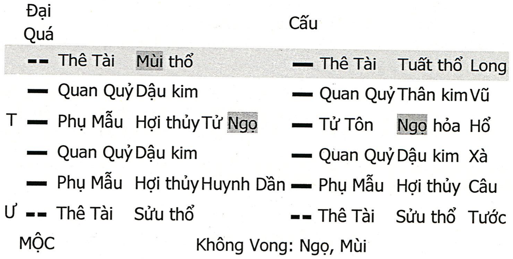

**Ví dụ 21:** Ngày Kỷ Hợi tháng Tuất, nam đoán xem công ty Dầu khí Trung Quốc sau khi niêm yết sẽ ra sao? Được Lôi Thủy Giải biến Địa Thủy Sư.

| | Giải | | Sư | |
| :--- | :--- | :--- | :--- | :--- |
| | - - Thê Tài Tuất thổ | | - - Quan Quỷ Dậu kim | Câu |
| Ư | - - Quan Quỷ Thân kim | | - - Phụ Mẫu Hợi thủy | Tước |
| | — Tử Tôn Ngọ hỏa | | - - Thê Tài Sửu thổ | Long |
| | - - Tử Tôn Ngọ hỏa | | - - Tử Tôn Ngọ hỏa | Vũ |
| T | — Thê Tài Thìn thổ | | — Thê Tài Thìn thổ | Hổ |
| | - - Huynh Đệ Dần mộc | Phụ Tý | - - Huynh Đệ Dần mộc | Xà |

MỘC Không Vong: Thìn, Tị

**Phán đoán:** Lấy Thê Tài làm Dụng thần. Trong quẻ Thê Tài lưỡng hiện, lấy hào Thê Tài Thìn thổ Nguyệt phá làm Dụng thần. Dụng thần Không Phá không cát, Nhật không đến giúp, sau khi niêm yết không có lợi thế. Nguyên thần Tử Tôn độc phát đến sinh, biểu thị sau khi mới niêm yết thì có cơ hội tăng giá, nhưng Tử Tôn hưu tù bị Nhật khắc, tiệc vui chóng tàn.

**Phản hồi:** Quả nhiên mới niêm yết thì có tăng giá một chút, sau đó đã bắt đầu xuống giá.

## 2. DỰ ĐOÁN NGOẠI HỐI

Dự đoán ngoại hối hơi khác so với dự đoán cổ phiếu. Cái gọi là tăng giá hay giảm giá là chỉ thông tin tăng giá trị hay mất giá trị của tiền tệ.

Ví dụ như mình sở hữu yên Nhật, muốn đổi thành đô la Mỹ. Nếu dự đoán sự biến động giá cả của đồng yên, hy vọng đồng yên tăng giá, đồng yên tăng giá thì có thể đổi được nhiều đô la Mỹ hơn, mà đồng yên tăng giá thì đồng đô la Mỹ mất giá. Do đó, Thê Tài trong quẻ thể hiện đồng yên mà không thể hiện đô la Mỹ. Thê Tài vượng tướng thì đồng yên tăng giá, Thê Tài hưu tù thì đồng yên mất giá.

Ngược lại, mình sở hữu đồng yên và muốn đổi thành đô la Mỹ, ý niệm khi gieo quẻ là dự đoán sự biến động của giá đô la Mỹ thì Thê Tài trong quẻ thể hiện đô la Mỹ. Thê Tài vượng tướng thì

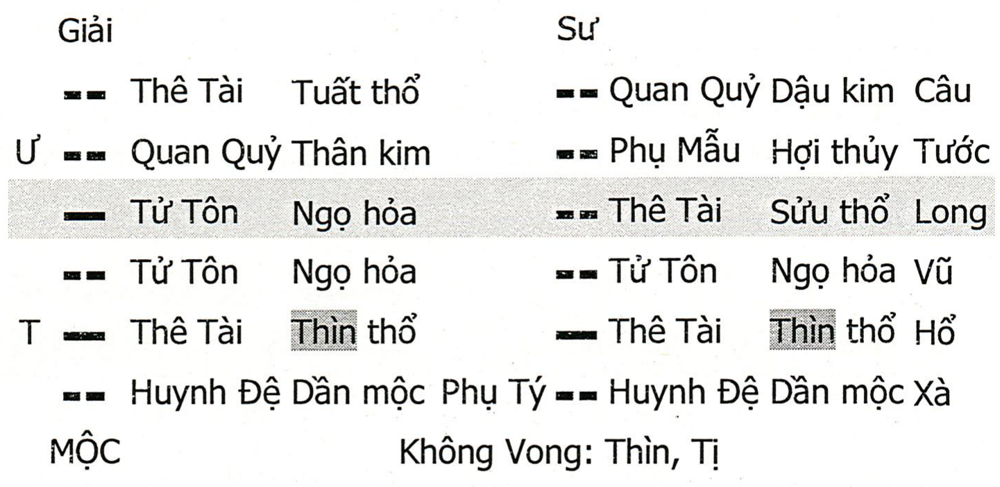 đô la Mỹ mất giá, Thê Tài hưu tù thì đô la Mỹ tăng giá. Thông thường mọi người rất dễ lầm lẫn. Do đó, khi dự đoán sự biến động của ngoại hối thì tốt nhất là dự đoán tình hình biến động của loại tiền tệ mà mình đang sở hữu, như vậy thì thông tin càng dễ phản ánh chính xác hơn. Về phương pháp phán đoán cụ thể, chúng ta có thể tham khảo ở dự đoán cổ phiếu.

**Ví dụ 1: Ngày Nhâm Tuất tháng Mùi, nữ đoán sự biến động của thị trường ngoại hối, được Hỏa Phong Đỉnh biến Thủy Địa Tỷ.**

| | Đỉnh | | Tỷ | |
| :---: | :--- | :---: | :--- | :---: |
| | ━ Huynh Đệ Tị hỏa | ╍╍ | Quan Quỷ Tý thủy | Hổ |
| Ứ | ╍╍ Tử Tôn Mùi thổ | ━ | Tử Tôn Tuất thổ | Xà |
| | ━ Thê Tài Dậu kim | ╍╍ | Thê Tài Thân kim | Câu |
| | ━ Thê Tài Dậu kim | ╍╍ | Phụ Mẫu Mão mộc | Tước |
| T | ━ Quan Quỷ Hợi thủy | ╍╍ | Huynh Đệ Tị hỏa | Long |
| | ╍╍ Tử Tôn Sửu thổ Phụ Mão | ╍╍ | Tử Tôn Mùi thổ | Vũ |

HỎA Không Vong: Tý, Sửu

**Phán đoán:** Lấy Thê Tài làm Dụng thần. Trong quẻ Thê Tài lưỡng hiện, địa chi giống nhau, hơn nữa đều phát động, lấy Thê Tài hóa Thoái thần làm Dụng thần. Dụng thần được Nhật Nguyệt sinh phù là vượng tướng, đây là thông tin tăng lên. Tuy nhiên, nội quái phản ngâm biểu thị lên xuống bất định, Dụng thần hóa thoái, tăng mà lại hạ.

**Phản hồi:** Quả nhiên ngày Ất Sửu phản hồi, mấy ngày qua tăng cao nhưng sau lại hạ xuống.

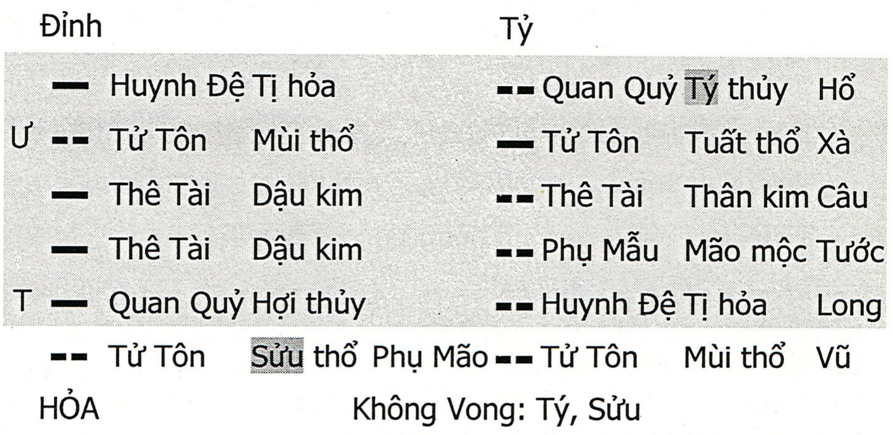

**Ví dụ 2: Ngày Ất Hợi tháng Thân, nữ đoán sự biến động của tỷ giá đô la Mỹ so với yên Nhật, được Thủy Thiên Nhu biến Thiên Phong Cấu.**

| | Nhu | | Cấu | |
| :---: | :--- | :---: | :--- | :---: |
| | ╍╍ Thê Tài Tý thủy | ━ | Huynh Đệ Tuất thổ | Vũ |
| | ━ Huynh Đệ Tuất thổ | ━ | Tử Tôn Thân kim | Hổ |
| T | ╍╍ Tử Tôn Thân kim | ━ | Phụ Mẫu Ngọ hỏa | Xà |
| | ━ Huynh Đệ Thìn thổ | ━ | Tử Tôn Dậu kim | Câu |
| | ━ Quan Quỷ Dần mộc Phụ Tị | ━ | Thê Tài Hợi thủy | Tước |
| Ứ | ━ Thê Tài Tý thủy | ╍╍ | Huynh Đệ Sửu thổ | Long |

THỔ Không Vong: Thân, Dậu

**Phán đoán:** Lấy Thê Tài làm Dụng thần. Trong quẻ Thê Tài lưỡng hiện, đều là Tý thủy, địa chi tương đồng, đều phát động, vì vậy đều có thể làm Dụng thần. Tài được Nguyệt sinh Nhật phù là vượng tướng, vốn là thông tin tăng lên, nhưng hào 6 Thê Tài Tý thủy hóa hồi đầu khắc, hào sơ Thê Tài Tý thủy cũng hóa hồi đầu khắc, mà Nguyên thần Thân kim Không Vong cũng hóa hồi đầu khắc, vì vậy chắc chắn sẽ hạ xuống.

Chỉ là hiện nay kim thủy vượng tướng, hỏa thổ hưu tù, nhất định giảm mạnh ở ngày hỏa vượng sinh thổ.

**Phản hồi:** Quả nhiên giảm mạnh ở ngày Tân Tị.

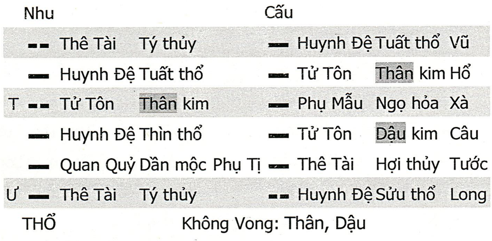

### Ví dụ 3: Ngày Nhâm Ngọ tháng Thân, nữ đoán tình hình thị trường ngoại hối, được Trạch Lôi Tùy biến Hỏa Lôi Phệ Hạp.

| | Tùy | | | Phệ Hạp | |
| :--- | :---: | :--- | :---: | :--- | :--- |
| Ứ | - - | Thê Tài Mùi thổ | — | Tử Tôn Tị hỏa | Hổ |
| | — | Quan Quỷ Dậu kim | - - | Thê Tài Mùi thổ | Xà |
| | — | Phụ Mẫu Hợi thủy Tử Ngọ | — | Quan Quỷ Dậu kim | Câu |
| T | - - | Thê Tài Thìn thổ | - - | Thê Tài Thìn thổ | Tước |
| | - - | Huynh Đệ Dần mộc | - - | Huynh Đệ Dần mộc | Long |
| | — | Phụ Mẫu Tý thủy | — | Phụ Mẫu Tý thủy | Vũ |

MỘC Không Vong: Thân, Dậu

**Phán đoán:** Lấy Thê Tài làm Dụng thần, trong quẻ Thê Tài lưỡng hiện, lấy hào Thê Tài Mùi thổ phát động làm Dụng thần. Dụng thần Nguyệt kiến không khắc, được Nhật sinh hợp là vượng tướng. Lại thêm Dụng thần phát động hóa hồi đầu sinh, chắc chắn sẽ tăng.

**Phản hồi:** Quả nhiên tăng lên 3 điểm.

### Ví dụ 4: Ngày Nhâm Dần tháng Thân, nữ đoán sự biến động của ngoại tệ, được Thiên Sơn Độn biến Hỏa Sơn Lữ.

| | Độn | | | Lữ | |
| :--- | :---: | :--- | :---: | :--- | :--- |
| | — | Phụ Mẫu Tuất thổ | — | Quan Quỷ Tị hỏa | Hổ |
| Ứ | — | Huynh Đệ Thân kim | - - | Phụ Mẫu Mùi thổ | Xà |
| | — | Quan Quỷ Ngọ hỏa | — | Huynh Đệ Dậu kim | Câu |
| | — | Huynh Đệ Thân kim | — | Huynh Đệ Thân kim | Tước |
| T | - - | Quan Quỷ Ngọ hỏa Tài Dần | - - | Quan Quỷ Ngọ hỏa | Long |
| | - - | Phụ Mẫu Thìn thổ Tử Tý | - - | Phụ Mẫu Thìn thổ | Vũ |

KIM Không Vong: Thìn, Tị

**Phán đoán:** Lấy Thê Tài làm Dụng thần. Thê Tài Dần mộc không hiện trên quẻ, phục dưới hào 2 Quan Quỷ Ngọ hỏa. Dụng thần bị Nguyệt xung phá, Nhật lại Thực Phá giữ cân bằng, nhưng

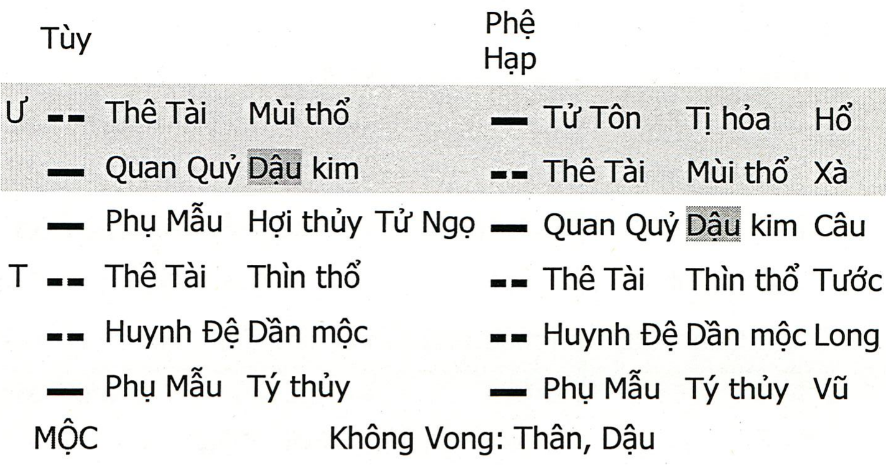

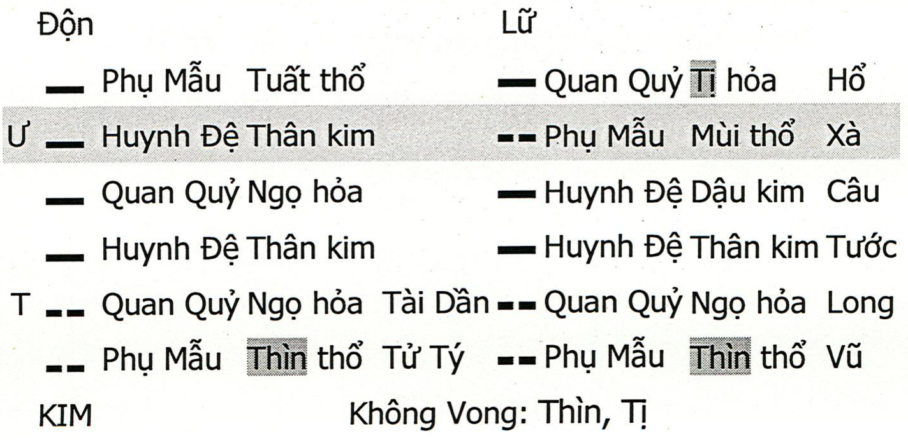 không nên Huynh Đệ Thân kim độc phát đến khắc, Dụng thần lâm Tuyệt địa, thế nào cũng hạ giá.

**Phản hồi:** Quả nhiên hạ giá.

### Ví dụ 5: Ngày Canh Thìn tháng Ngọ, đoán xem đô la Mỹ có tăng giá không? Được Phong Sơn Tiệm biến Thủy Địa Tỷ.

| | Tiệm | | | Tỷ | |
| :--- | :---: | :--- | :---: | :--- | :--- |
| Ứ | — | Quan Quỷ Mão mộc | - - | Thê Tài Tý thủy | Xà |
| | — | Phụ Mẫu Tị hỏa Tài Tý | — | Huynh Đệ Tuất thổ | Câu |
| | - - | Huynh Đệ Mùi thổ | - - | Tử Tôn Thân kim | Tước |
| T | — | Tử Tôn Thân kim | - - | Quan Quỷ Mão mộc | Long |
| | - - | Phụ Mẫu Ngọ hỏa | - - | Phụ Mẫu Tị hỏa | Vũ |
| | - - | Huynh Đệ Thìn thổ | - - | Huynh Đệ Mùi thổ | Hổ |

THỔ Không Vong: Thân, Dậu

**Phán đoán:** Lấy Thê Tài làm Dụng thần. Thê Tài Tý thủy không hiện trên quẻ, phục dưới hào 5 Phụ Mẫu Tị hỏa. Dụng thần Nguyệt phá, nhập Mộ ở Nhật là hưu tù. Tử Tôn Thân kim bị Nguyệt khắc thương, Không mà không sinh hào Tài, vì vậy đô la Mỹ sẽ không tăng giá.

**Phản hồi:** Quả nhiên đô la Mỹ rớt giá một mạch.

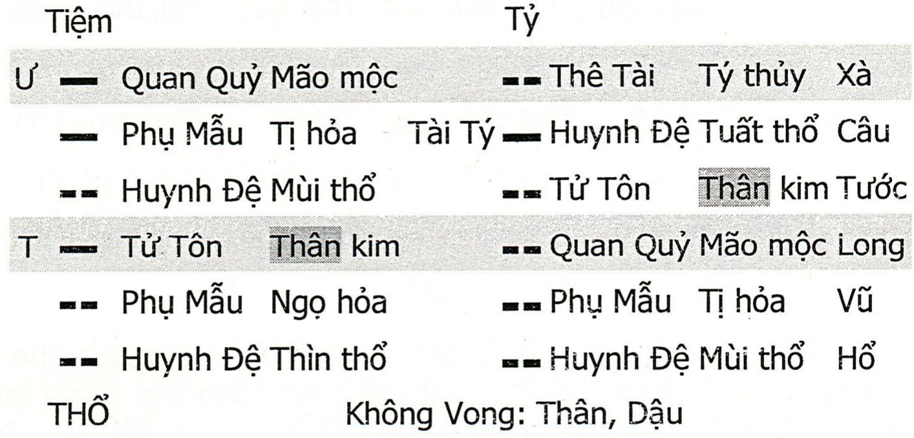

### Ví dụ 6: Ngày Tân Sửu tháng Hợi, đoán xem đồng yên Nhật có còn tăng giá không? Được Chấn Vi Lôi biến Hỏa Lôi Phệ Hạp.

| | Chấn | | | Phệ Hạp | | | |
|---|---|---|---|---|---|---|---|
| T | - - | Thê Tài | Tuất thổ | — | Tử Tôn | Tị hỏa | Xà |
| | - - | Quan Quỷ | Thân kim | - - | Thê Tài | Mùi thổ | Câu |
| | — | Tử Tôn | Ngọ hỏa | — | Quan Quỷ | Dậu kim | Tước |
| Ư | - - | Thê Tài | Thìn thổ | - - | Thê Tài | Thìn thổ | Long |
| | - - | Huynh Đệ | Dần mộc | - - | Huynh Đệ | Dần mộc | Vũ |
| | — | Phụ Mẫu | Tý thủy | — | Phụ Mẫu | Tý thủy | Hổ |

MỘC Không Vong: Thìn, Tị

**Phán đoán:** Lấy Thê Tài làm Dụng thần. Trong quẻ Thê Tài lưỡng hiện, lấy hào Thê Tài Tuất thổ phát động làm Dụng thần. Dụng thần độc phát hóa Không hóa Phá, đây là hồi đầu sinh, không xem là Tuyệt. Dụng thần được Nhật trợ giúp có khí, đợi sang tháng bất phá, nhất định tăng giá.

**Phản hồi:** Quả nhiên tại tháng Tý tăng giá, tháng Sửu tiếp tục tăng.

## 3. DỰ ĐOÁN QUỸ

Quỹ được chia thành cổ phiếu quỹ, quỹ tiền tệ, quỹ trái phiếu,... Thông thường thì quỹ không thích hợp cho mua bán thường xuyên, tốt nhất là đầu tư dài hạn. Tuy nhiên, bởi vì quỹ biến động theo thị trường chứng khoán, chính sách quốc gia,.... Vì vậy, khi dự đoán quỹ có tiềm lực tiếp tục tăng lên thì có thể tiếp tục giữ, khi dự đoán không có tiềm lực tăng lên thì có thể bán tháo, không nên mua vào bán ra nhiều lần giống như cổ phiếu.

Dự đoán sự biến động của quỹ, lấy Thê Tài làm Dụng thần, đồng thời còn phải chú ý đến suy vượng của hào Tử Tôn. Khi Thê Tài và hào Tử Tôn đều vượng chứng tỏ chỉ số quỹ có tiềm lực tăng mạnh, có thể nắm giữ trong dài hạn. Thê Tài vượng tướng Tử Tôn hưu tù biểu thị đã đến cao điểm, tiếp tục giữ thì có tăng cũng không nhiều.

### Ví dụ 1: Ngày Nhâm Dần tháng Hợi, dự đoán quỹ Nam Phương Tích Ưu Thành Trưởng, được Địa Thiên Thái biến Trạch Thiên Quải.

| | Thái | | | Quải | | | |
|---|---|---|---|---|---|---|---|
| Ư | - - | Tử Tôn | Dậu kim | - - | Huynh Đệ | Mùi thổ | Hổ |
| | - - | Thê Tài | Hợi thủy | — | Tử Tôn | Dậu kim | Xà |
| | - - | Huynh Đệ | Sửu thổ | — | Thê Tài | Hợi thủy | Câu |
| T | — | Huynh Đệ | Thìn thổ | — | Huynh Đệ | Thìn thổ | Tước |
| | — | Quan Quỷ | Dần mộc Phụ Tị | — | Quan Quỷ | Dần mộc | Long |
| | — | Thê Tài | Tý thủy | — | Thê Tài | Tý thủy | Vũ |

THỔ Không Vong: Thìn, Tị

**Phán đoán:** Lấy Thê Tài làm Dụng thần, trong quẻ Thê Tài lưỡng hiện, lấy hào Thê Tài Hợi thủy phát động làm Dụng thần. Dụng thần được Nguyệt trợ giúp Nhật không đến khắc là vượng tướng. Dụng thần động hóa hồi đầu sinh, xu thế của quỹ là tăng lên, nhưng Dụng thần bị Nhật hợp vướng chân. Vì vậy, tôi phán đoán tháng Tị xung khai Dụng thần là đỉnh cao đầu tiên của quỹ này.

**Phản hồi:** Quả nhiên tại tháng Tị năm kế tiếp đón đỉnh cao đầu tiên.

**Ví dụ 2:** Ngày Bính Dần tháng Sửu, một học trò của tôi đoán xu hướng của quỹ Gia Thực Thành Trưởng hôm nay sẽ ra sao? Được Hỏa Thiên Đại Hữu biến Thủy Hỏa Ký Tế.

| | Đại Hữu | | Ký Tế | | |
| :--- | :---: | :--- | :---: | :--- | :--- |
| Ứ | — | Quan Quỷ Tị hỏa | ╍ | Tử Tôn Tý thủy | Long |
| | ╍ | Phụ Mẫu Mùi thổ | — | Phụ Mẫu Tuất thổ | Vũ |
| | — | Huynh Đệ Dậu kim | ╍ | Huynh Đệ Thân kim | Hổ |
| T | — | Phụ Mẫu Thìn thổ | — | Tử Tôn Hợi thủy | Xà |
| | — | Thê Tài Dần mộc | ╍ | Phụ Mẫu Sửu thổ | Câu |
| | — | Tử Tôn Tý thủy | — | Thê Tài Mão mộc | Tước |

KIM Không Vong: Tuất, Hợi

**Phán đoán:** Lấy Thê Tài làm Dụng thần. Thê Tài Dần mộc Nhật đến trợ giúp, nhưng trong quẻ Huynh Đệ phát động, lại nhập Mộ ở Phụ Mẫu Mùi thổ, Huynh Đệ Dậu kim thành tam hợp cục, vì vậy hạ giá, nhưng mà Thê Tài vượng tướng nên biên độ hạ giá không lớn.

**Phản hồi:** Kết quả từ 1.0540 tệ rơi xuống 1.0504 tệ.

**Ví dụ 3:** Ngày Ất Sửu tháng Sửu, một học trò của tôi đoán xem xu hướng của quỹ Gia Thực Thành Trưởng hôm đó sẽ ra sao? Được Thủy Địa Tỷ.

| | Tỷ | | |
| :--- | :---: | :--- | :--- |
| Ứ | ╍ | Thê Tài Tý thủy | Vũ |
| | — | Huynh Đệ Tuất thổ | Hổ |
| | ╍ | Tử Tôn Thân kim | Xà |
| T | ╍ | Quan Quỷ Mão mộc | Câu |
| | ╍ | Phụ Mẫu Tị hỏa | Tước |
| | ╍ | Huynh Đệ Mùi thổ | Long |

THỔ Không Vong: Tuất, Hợi

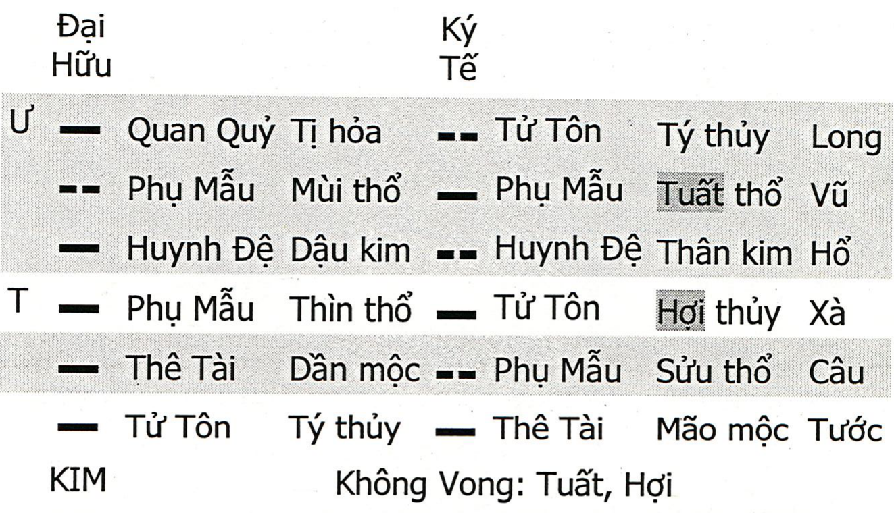

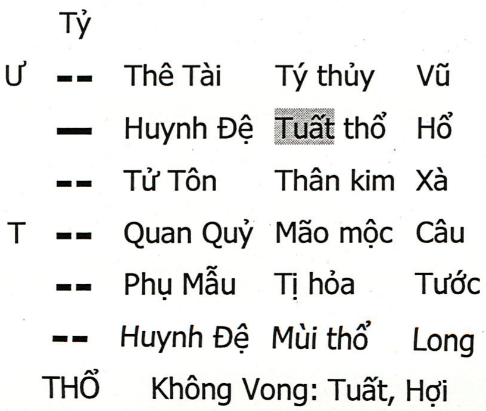

**Phán đoán:** Lấy Thê Tài làm Dụng thần, Nhật Nguyệt khắc Thê Tài Tý thủy, lại bị Nhật hợp vướng chân, tượng hạ giá.

**Phản hồi:** Quả nhiên từ 1.0799 tệ rơi xuống 1.0540 tệ.

**Ví dụ 4:** Ngày Quý Hợi tháng Sửu, một học trò của tôi đoán xu hướng của quỹ Gia Thực Thành Trưởng hôm đó, được Sơn Địa Bác.

| | Bác | | | |
| :--- | :---: | :--- | :--- | :--- |
| | — | Thê Tài Dần mộc | | Hổ |
| T | ╍ | Tử Tôn Tý thủy | Huynh Thân | Xà |
| | ╍ | Phụ Mẫu Tuất thổ | | Câu |
| | ╍ | Thê Tài Mão mộc | | Tước |
| Ứ | ╍ | Quan Quỷ Tị hỏa | | Long |
| | ╍ | Phụ Mẫu Mùi thổ | | Vũ |

KIM Không Vong: Tý, Sửu

**Phán đoán:** Lấy Thê Tài làm Dụng thần. Thê Tài lưỡng hiện, lấy Thê Tài Dần mộc hợp Nhật làm Dụng thần. Dụng thần được Nhật sinh hợp là vượng tướng, vì vậy nhất định tăng lên.

**Phản hồi:** Quả nhiên từ 1.0695 tệ tăng lên đến 1.0815 tệ.

## 4. DỰ ĐOÁN TRÁI PHIẾU

Dự đoán trái phiếu và cổ phiếu giống nhau, cũng là lấy Thê Tài làm Dụng thần, đồng thời kết hợp với hào Tử Tôn để tiến hành phán đoán. Về phương pháp cụ thể, chúng ta có thể tham khảo ở mục dự đoán cổ phiếu.

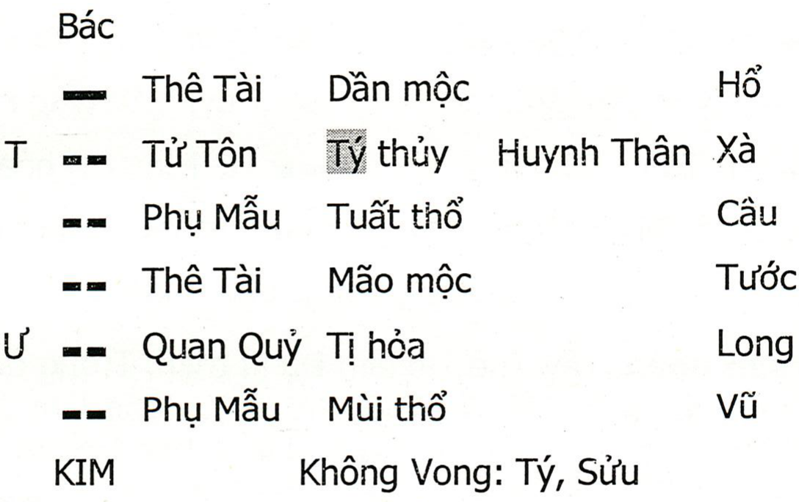

### Ví dụ 1: Ngày Kỷ Dậu tháng Tị, nữ đoán tình hình giá cả thị trường của trái phiếu Mỹ đã mua, được Lôi Địa Dự biến Hỏa Địa Tấn.

| | Dự | | | Tấn | | |
| :---: | :---: | :--- | :---: | :---: | :--- | :--- |
| | - - | Thê Tài Tuất thổ | | — | Tử Tôn Tị hỏa | Câu |
| | - - | Quan Quỷ Thân kim | | - - | Thê Tài Mùi thổ | Tước |
| Ư | — | Tử Tôn Ngọ hỏa | | — | Quan Quỷ Dậu kim | Long |
| | - - | Huynh Đệ Mão mộc | | - - | Huynh Đệ Mão mộc | Vũ |
| | - - | Tử Tôn Tị hỏa | | - - | Tử Tôn Tị hỏa | Hổ |
| T | - - | Thê Tài Mùi thổ | Phụ Tý | - - | Thê Tài Mùi thổ | Xà |

MỘC Không Vong: Dần, Mão

**Phán đoán:** Lấy Thê Tài làm Dụng thần. Trong quẻ Thê Tài lưỡng hiện, lấy hào Thê Tài Tuất thổ phát động làm Dụng thần. Dụng thần được Nguyệt kiến sinh phù là vượng tướng, Dụng thần động hóa Nguyệt kiến hồi đầu sinh, biểu thị hiện nay đã đến cao điểm. Song Dụng thần tại hào 6, hào 6 là điểm cuối của sự vật, biểu thị hiện tại là điểm cao nhất.

Đây là quẻ độc phát, độc phát có thể lấy tượng làm chủ. Tuất thổ hóa Tị hỏa có thể luận là Tuyệt, vì vậy phán đoán đến tháng Tuất sẽ hạ giá.

**Phản hồi:** Quả nhiên tại tháng Tuất hạ giá.

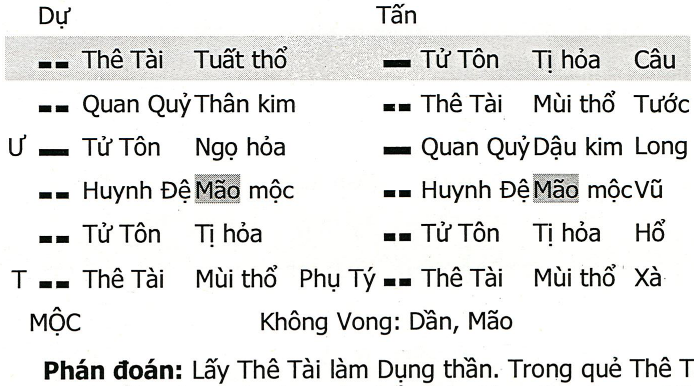

### Ví dụ 2: Ngày Nhâm Ngọ tháng Thân, nữ mua trái phiếu, đoán xem khi nào bán thì có lợi? Được Trạch Địa Tụy biến Thiên Phong Cấu.

| | Tụy | | | Cấu | |
| :---: | :---: | :--- | :---: | :--- | :--- |
| | - - | Phụ Mẫu Mùi thổ | — | Phụ Mẫu Tuất thổ | Hổ |
| Ư | — | Huynh Đệ Dậu kim | — | Huynh Đệ Thân kim | Xà |
| | — | Tử Tôn Hợi thủy | — | Quan Quỷ Ngọ hỏa | Câu |
| | - - | Thê Tài Mão mộc | — | Huynh Đệ Dậu kim | Tước |
| T | - - | Quan Quỷ Tị hỏa | — | Tử Tôn Hợi thủy | Long |
| | - - | Phụ Mẫu Mùi thổ | - - | Phụ Mẫu Sửu thổ | Vũ |

KIM Không Vong: Thân, Dậu

**Phán đoán:** Lấy Thê Tài làm Dụng thần. Thê Tài Mão mộc Nguyệt khắc, Nhật không trợ giúp là hưu tù, đồng thời nhập Mộ tại Mùi thổ, động hóa hồi đầu khắc, chứng tỏ hiện nay đang là thấp điểm, không nên bán. Nội quái phản ngâm, dao động thất thường, hiện nay không có giá tốt. Quẻ phản ngâm, bởi vì giá đang thấp nên thế nào cũng có lúc tăng giá, tạm thời không nên bán.

**Phản hồi:** Quả nhiên giá thị trường không cao, nếu bán thì sẽ lỗ vốn rất lớn. Sau khi tôi can ngăn, cô ấy đã không bán tháo.

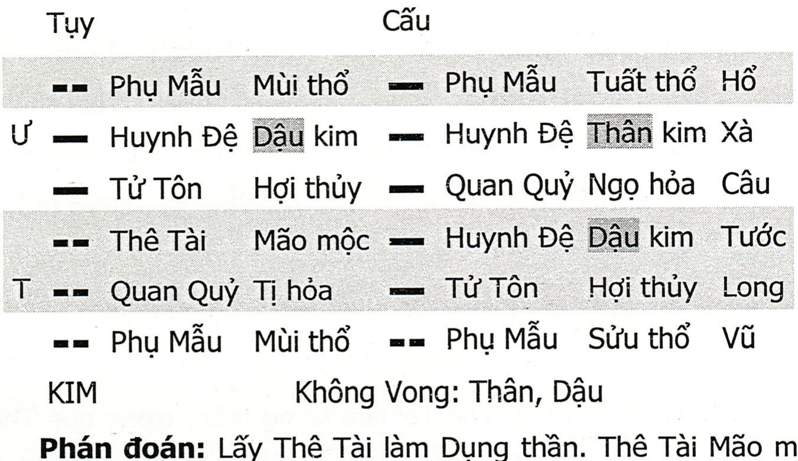

**Ví dụ 3:** Ngày Đinh Hợi tháng Thân, người nữ ở ví dụ trên lại đoán xem ngày hôm sau bán tháo trái phiếu thì sẽ ra sao? Được Thủy Phong Tỉnh biến Thủy Thiên Nhu.

| | Tỉnh | Nhu | |
| :--- | :--- | :--- | :--- |
| | - - Phụ Mẫu Tý thủy | - - Phụ Mẫu Tý thủy | Long |
| T | — Thê Tài Tuất thổ | — Thê Tài Tuất thổ | Vũ |
| | - - Quan Quỷ Thân kim Tử Ngọ | - - Quan Quỷ Thân kim | Hổ |
| | — Quan Quỷ Dậu kim | — Thê Tài Thìn thổ | Xà |
| Ư | — Phụ Mẫu Hợi thủy Huynh Dần | — Huynh Đệ Dần mộc | Câu |
| | - - Thê Tài Sửu thổ | — Phụ Mẫu Tý thủy | Tước |

MỘC Không Vong: Ngọ, Mùi

**Phán đoán:** Lấy Thê Tài làm Dụng thần, trong quẻ Thê Tài lưỡng hiện, lấy hào Thê Tài Sửu thổ phát động làm Dụng thần. Dụng thần không được Nhật Nguyệt sinh phù, nhưng cũng không khắc. Nguyệt là đất Trường Sinh của Dụng thần, hào Tài hơi vượng một chút. Do đó, tôi phán đoán là hiện tại trái phiếu đã hơi tăng lại. Nhưng nói cho cùng thì Dụng thần hưu tù, nếu bán tháo thì vẫn lỗ vốn, cho nên tốt nhất là không nên bán.

**Phản hồi:** Quả nhiên là giá có hơi tăng lại, so với trước đây thì đã bù lại một phần tổn thất, do vậy mà cô ấy nóng ruột muốn bán.

**Ví dụ 4:** Ngày Quý Dậu tháng Dậu, một người đoán về trái phiếu, được Lôi Thiên Đại Tráng biến Trạch Thiên Quải.

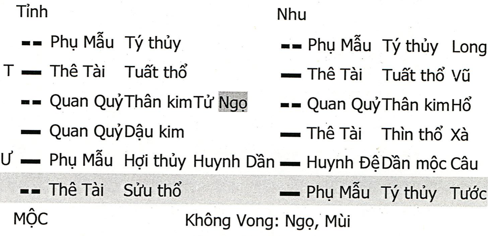

| | Đại Tráng | Quải | |
| :--- | :--- | :--- | :--- |
| | - - Huynh Đệ Tuất thổ | - - Huynh Đệ Mùi thổ | Hổ |
| | - - Tử Tôn Thân kim | — Tử Tôn Dậu kim | Xà |
| T | — Phụ Mẫu Ngọ hỏa | — Thê Tài Hợi thủy | Câu |
| | — Huynh Đệ Thìn thổ | — Huynh Đệ Thìn thổ | Tước |
| | — Quan Quỷ Dần mộc | — Quan Quỷ Dần mộc | Long |
| Ư | — Thê Tài Tý thủy | — Thê Tài Tý thủy | Vũ |

THỔ Không Vong: Tuất, Hợi

**Phán đoán:** Lấy Thê Tài làm Dụng thần. Thê Tài Tý thủy được Nhật Nguyệt đến sinh là vượng tướng, vốn là cát. Tuy nhiên không nên Tử Tôn được Nhật Nguyệt trợ giúp động hóa Tiến thần đến sinh. "Tử tuy phúc đức, đa phản vô công". Nguyên thần quá vượng không thể sinh Dụng thần, vì vậy không thể tăng giá.

**Phản hồi:** Quả nhiên không tăng giá.

**Ví dụ 5:** Ngày Canh Tuất tháng Tị, nữ đoán xem trái phiếu sẽ biến động ra sao? Được Phong Thủy Hoán.

| | Hoán | | |
| :--- | :--- | :--- | :--- |
| | — Phụ Mẫu Mão mộc | | Xà |
| T | — Huynh Đệ Tị hỏa | | Câu |
| | - - Tử Tôn Mùi thổ | Tài Dậu | Tước |
| | - - Huynh Đệ Ngọ hỏa | Quan Hợi | Long |
| Ư | — Tử Tôn Thìn thổ | | Vũ |
| | - - Phụ Mẫu Dần mộc | | Hổ |

HỎA Không Vong: Dần, Mão

**Phán đoán:** Lấy Thê Tài làm Dụng thần, Thê Tài Dậu kim không hiện trên quẻ, phục dưới Tử Tôn Mùi thổ. Nguyệt khắc Nhật sinh, suy vượng khó phân biệt. Nhưng Phi đến sinh Phục, hào 2 Tử Tôn Thìn thổ ám động đến sinh, sinh nhiều khắc ít nên nhất định sẽ tăng giá.

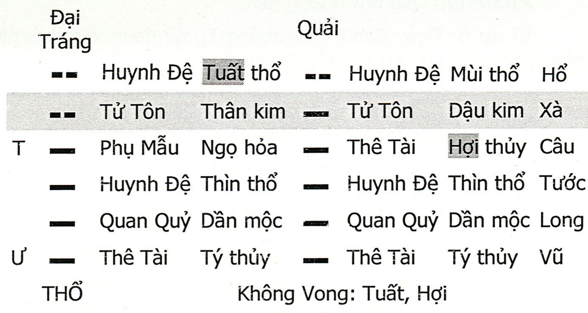

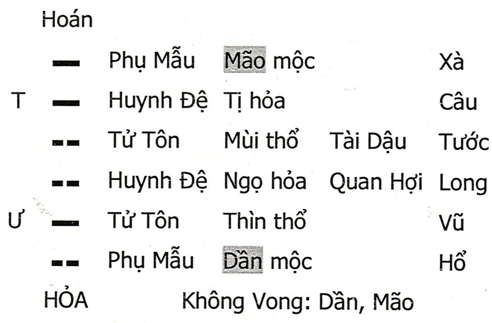

**Phản hồi:** Quả nhiên tăng giá.

**Ví dụ 6:** Ngày Canh Thân tháng Tị, nữ đoán xem trái phiếu tăng hay giảm giá, được Thủy Thiên Nhu.

### Nhu

| | | | | | |
|---|---|---|---|---|---|
| | - - | Thê Tài | Tý thủy | | Xà |
| | — | Huynh Đệ | Tuất thổ | | Câu |
| T | - - | Tử Tôn | Thân kim | | Tước |
| | — | Huynh Đệ | Thìn thổ | | Long |
| | — | Quan Quỷ | Dần mộc | Phụ Tị | Vũ |
| Ứ | — | Thê Tài | Tý thủy | | Hổ |

THỔ Không Vong: Tý, Sửu

**Phán đoán:** Lấy Thê Tài làm Dụng thần. Trong quẻ Thê Tài lưỡng hiện, lấy hào Ứng Thê Tài Tý thủy làm Dụng thần. Nguyệt không khắc, Nhật đến sinh là vượng tướng, vượng tướng thì chắc chắn tăng giá. Chỉ là Tý thủy Không Vong, tháng Tý xuất Không nhất định tăng.

**Phản hồi:** Quả nhiên tại tháng Tý tăng giá.

## 5. DỰ ĐOÁN HỢP ĐỒNG TƯƠNG LAI

Dự đoán hợp đồng tương lai hơi giống với dự đoán cổ phiếu, nhưng cũng có mặt khác biệt. Nó được chia thành hai loại là dự đoán đơn thuần và dự đoán thao tác thực tế. Dự đoán đơn thuần về sự biến động của hợp đồng tương lai thì có thể lấy Thê Tài làm Dụng thần. Nhưng nếu tham gia mua bán thì nhất định phải xem tình trạng của hào Thế và hào Ứng. Hào Thế và hào Ứng nên sinh hợp, không nên Ứng lâm Huynh Đệ khắc hào Thế. Bởi vì sự tăng hay giảm giá của hợp đồng tương lai hoàn toàn không có nghĩa là có thể kiếm được tiền. Trên cơ sở một số ví dụ dưới đây, chúng ta có thể tiếp tục nghiên cứu trong các ứng dụng cụ thể.

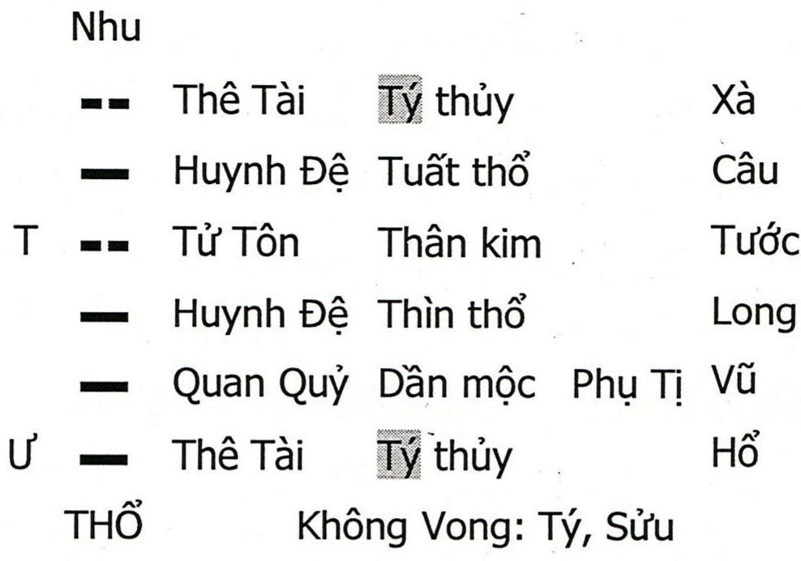

**Ví dụ 1:** Ngày Bính Ngọ tháng Dậu, nam đoán về sự biến động của hợp đồng tương lai cà phê trong hai tuần, được Sơn Hỏa Bí.

### Bí

| | | | | | |
|---|---|---|---|---|---|
| | — | Quan Quỷ | Dần mộc | | Long |
| | - - | Thê Tài | Tý thủy | | Vũ |
| Ứ | - - | Huynh Đệ | Tuất thổ | | Hổ |
| | — | Thê Tài | Hợi thủy | Tử Thân | Xà |
| | - - | Huynh Đệ | Sửu thổ | Phụ Ngọ | Câu |
| T | — | Quan Quỷ | Mão mộc | | Tước |

THỔ Không Vong: Dần, Mão

**Phán đoán:** Lấy Thê Tài làm Dụng thần. Trong quẻ Thê Tài lưỡng hiện, lấy hào Thê Tài Tý thủy ám động làm Dụng thần. Dụng thần được Nguyệt sinh Nhật xung, ám động sinh Thế, chắc chắn tăng lên. Hào Thế Không Vong, xuất Không là ứng.

**Phản hồi:** Quả nhiên ở ngày Ất Mão giá nhảy từ 21600 yên lên đến 23290 yên, nhờ vậy mà được lời.

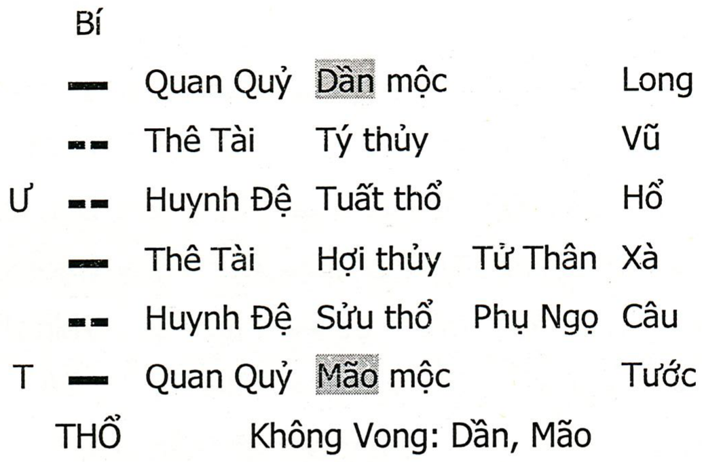

**Ví dụ 2:** Ngày Đinh Mão tháng Dậu, nam đoán về sự biến động của hợp đồng tương lai đường thô trong tương lai gần, được Hỏa Thiên Đại Hữu biến Hỏa Thủy Vị Tế.

| Thế/Ứng | Đại Hữu | Vị Tế | Lục thú |
| :---: | :--- | :--- | :---: |
| Ứ | — Quan Quỷ Tị hỏa | — Quan Quỷ Tị hỏa | Long |
| | - - Phụ Mẫu Mùi thổ | - - Phụ Mẫu Mùi thổ | Vũ |
| | — Huynh Đệ Dậu kim | — Huynh Đệ Dậu kim | Hổ |
| T | — Phụ Mẫu Thìn thổ | - - Quan Quỷ Ngọ hỏa | Xà |
| | — Thê Tài Dần mộc | — Phụ Mẫu Thìn thổ | Câu |
| | — Tử Tôn Tý thủy | - - Thê Tài Dần mộc | Tước |

KIM Không Vong: Tuất, Hợi

**Phán đoán:** Lấy Thê Tài làm Dụng thần. Thê Tài Dần mộc Nguyệt khắc Nhật trợ giúp suy vượng tương đương. Hào sơ Tý thủy phát động đến sinh vốn là cát, nhưng không nên Nhật xung Huynh Đệ Dậu kim tạo thành ám động đến khắc Dụng thần, Nhật là hiện nay, vì vậy hiện nay sẽ rớt giá. Qua vài ngày sẽ có thể tăng trở lại.

**Phản hồi:** Quả nhiên trước tiên là rớt giá, sau đó lại tăng trở lại.

**Ví dụ 3:** Ngày Bính Thìn tháng Dậu, đoán chiều hướng của đồng Thượng Hải 0712 trong ngày đó, được Phong Thủy Hoán biến Phong Địa Quan.

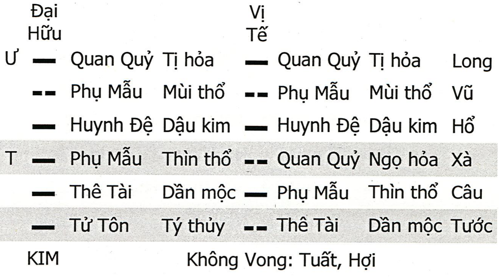

| Thế/Ứng | Hoán | Phục thần | Quan | Lục thú |
| :---: | :--- | :---: | :--- | :---: |
| | — Phụ Mẫu Mão mộc | | — Phụ Mẫu Mão mộc | Long |
| T | — Huynh Đệ Tị hỏa | | — Huynh Đệ Tị hỏa | Vũ |
| | - - Tử Tôn Mùi thổ | Tài Dậu | - - Tử Tôn Mùi thổ | Hổ |
| | - - Huynh Đệ Ngọ hỏa | Quan Hợi | - - Phụ Mẫu Mão mộc | Xà |
| Ứ | — Tử Tôn Thìn thổ | | - - Huynh Đệ Tị hỏa | Câu |
| | - - Phụ Mẫu Dần mộc | | - - Tử Tôn Mùi thổ | Tước |

HỎA Không Vong: Tý, Sửu

**Phán đoán:** Lấy Thê Tài làm Dụng thần. Thê Tài Dậu kim mặc dù không hiện trên quẻ, nhưng Nguyệt kiến trợ giúp và Nhật thần đến sinh, lại có Nhật thần nhập quẻ độc phát đến sinh, hôm nay nhất định tăng lên.

**Phản hồi:** Quả nhiên cả ngày có chiều hướng tăng lên.

**Ví dụ 4:** Ngày Mậu Ngọ tháng Dậu, đoán chiều hướng của đồng Thượng Hải 0712 trong ngày đó, được Lôi Trạch Quy Muội.

| Thế/Ứng | Quy Muội | Phục thần | Lục thú |
| :---: | :--- | :---: | :---: |
| Ứ | - - Phụ Mẫu Tuất thổ | | Tước |
| | - - Huynh Đệ Thân kim | | Long |
| | — Quan Quỷ Ngọ hỏa | Tử Hợi | Vũ |
| T | - - Phụ Mẫu Sửu thổ | | Hổ |
| | — Thê Tài Mão mộc | | Xà |
| | — Quan Quỷ Tị hỏa | | Câu |

KIM Không Vong: Tý, Sửu

**Phán đoán:** Lấy Thê Tài làm Dụng thần. Thê Tài Mão mộc Nguyệt kiến xung khắc, Nhật không trợ giúp là hưu tù, nhất định rớt giá.

**Phản hồi:** Quả nhiên rớt giá.

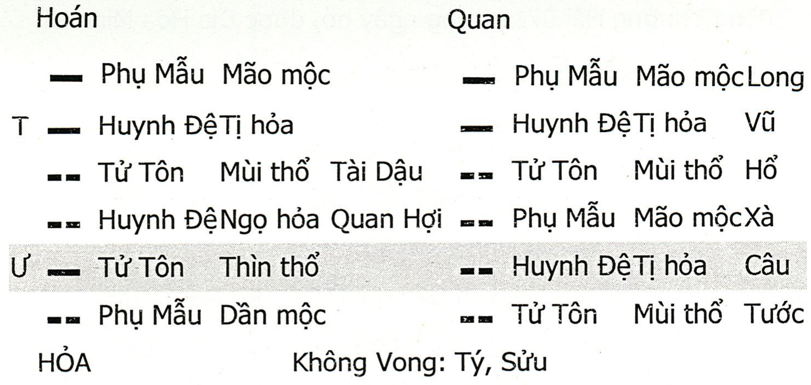

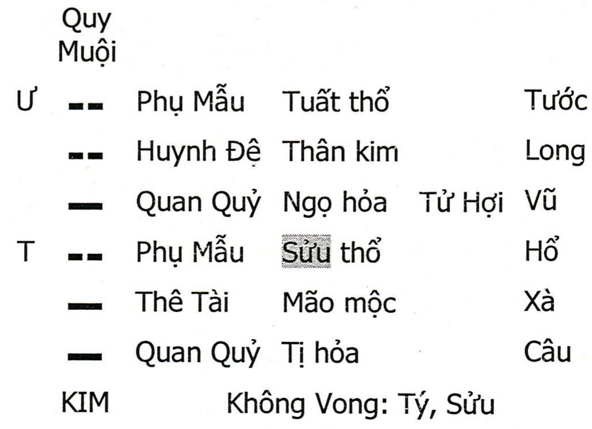

### Ví dụ 5: Ngày Quý Hợi tháng Dậu, đoán chiều hướng của đồng Thượng Hải 0712 trong ngày đó, được Địa Hỏa Minh Di.

**Minh Di**

| Thế/Ứng | Hào | Lục thân | Can Chi | Phục thần | Lục thú |
| :---: | :---: | :--- | :--- | :--- | :--- |
| | - - | Phụ Mẫu | Dậu kim | | Hổ |
| | - - | Huynh Đệ | Hợi thủy | | Xà |
| T | - - | Quan Quỷ | Sửu thổ | | Câu |
| | — | Huynh Đệ | Hợi thủy | Tài Ngọ | Tước |
| Ư | - - | Quan Quỷ | Sửu thổ | | Long |
| | — | Tử Tôn | Mão mộc | | Vũ |

THỦY Không Vong: Tý, Sửu

**Phán đoán:** Lấy Thê Tài làm Dụng thần. Thê Tài Ngọ hỏa không hiện trên quẻ, phục dưới Huynh Đệ Hợi thủy, Phi đến khắc Phục, Nguyệt không trợ giúp, Nhật đến khắc thương, Dụng thần hưu tù, vì vậy nhất định rớt giá.

**Phản hồi:** Thực tế là rớt giá.

### Ví dụ 6: Ngày Giáp Tý tháng Dậu, đoán chiều hướng của đồng Thượng Hải 0712 trong ngày đó, được Địa Thủy Sư.

**Sư**

| Thế/Ứng | Hào | Lục thân | Can Chi | Lục thú |
| :---: | :---: | :--- | :--- | :--- |
| Ư | - - | Phụ Mẫu | Dậu kim | Vũ |
| | - - | Huynh Đệ | Hợi thủy | Hổ |
| | - - | Quan Quỷ | Sửu thổ | Xà |
| T | - - | Thê Tài | Ngọ hỏa | Câu |
| | — | Quan Quỷ | Thìn thổ | Tước |
| | - - | Tử Tôn | Dần mộc | Long |

THỦY Không Vong: Tuất, Hợi

**Phán đoán:** Lấy Thê Tài làm Dụng thần, Thê Tài Ngọ hỏa không được Nguyệt kiến trợ giúp, bị Nhật xung khắc là hưu tù. Nhất định sẽ rớt giá.

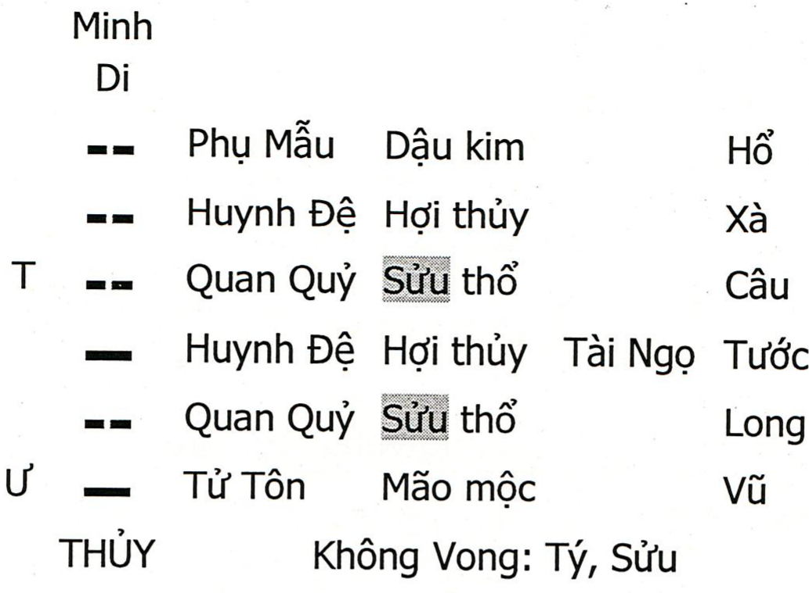

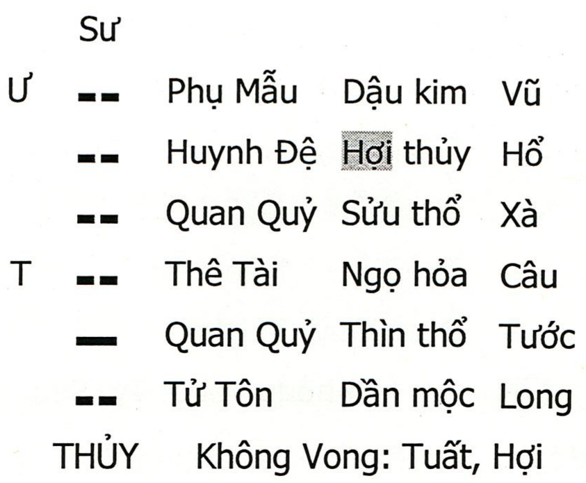

**Phản hồi:** Thực tế là rớt giá.

### Ví dụ 7: Ngày Kỷ Mão tháng Tuất, đoán chiều hướng của đồng Thượng Hải 0712 trong ngày đó, được Địa Thiên Thái biến Lôi Thiên Đại Tráng.

**Thái biến Đại Tráng**

| Thế/Ứng | Thái | Lục thân | Can Chi | Phục thần | Đại Tráng | Lục thân | Can Chi | Lục thú |
| :---: | :---: | :--- | :--- | :--- | :---: | :--- | :--- | :--- |
| Ư | - - | Tử Tôn | Dậu kim | | - - | Huynh Đệ | Tuất thổ | Câu |
| | - - | Thê Tài | Hợi thủy | | - - | Tử Tôn | Thân kim | Tước |
| | - - | Huynh Đệ | Sửu thổ | | — | Phụ Mẫu | Ngọ hỏa | Long |
| T | — | Huynh Đệ | Thìn thổ | | — | Huynh Đệ | Thìn thổ | Vũ |
| | — | Quan Quỷ | Dần mộc | Phụ Tị | — | Quan Quỷ | Dần mộc | Hổ |
| | — | Thê Tài | Tý thủy | | — | Thê Tài | Tý thủy | Xà |

THỔ Không Vong: Thân, Dậu

**Phán đoán:** Lấy Thê Tài làm Dụng thần. Trong quẻ Thê Tài lưỡng hiện, lấy hào Thê Tài Tý thủy gặp hợp làm Dụng thần. Dụng thần bị Nguyệt kiến khắc thương, Nhật không trợ giúp là hưu tù, thêm trong quẻ Huynh Đệ Sửu thổ phát động lại đến khắc, vì vậy nhất định rớt giá.

**Phản hồi:** Trên thực tế là rớt giá.

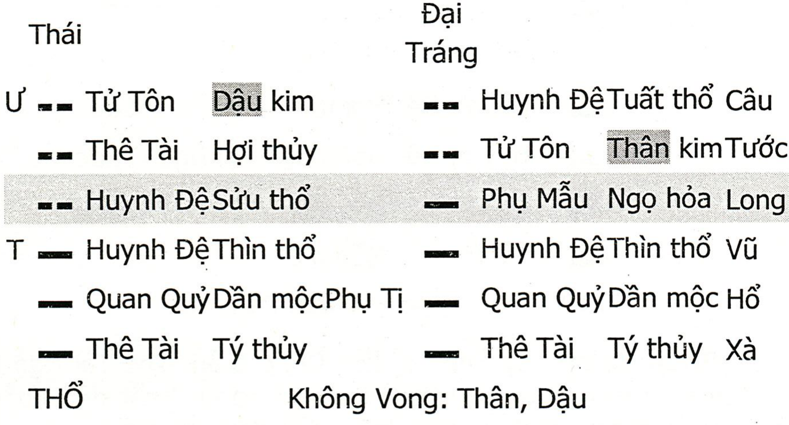

---

# Part 12 (Pages 221-240)

**Ví dụ 8:** Ngày Nhâm Tý tháng Tuất, đoán chiều hướng của đồng Thượng Hải 0712 trong ngày hôm sau, được Trạch Hỏa Cách.

| | Cách | | | | |
|---|---|---|---|---|---|
| | -- | Quan Quỷ | Mùi thổ | | Hổ |
| | — | Phụ Mẫu | Dậu kim | | Xà |
| T | — | Huynh Đệ | Hợi thủy | | Câu |
| | — | Huynh Đệ | Hợi thủy | Tài Ngọ | Tước |
| | -- | Quan Quỷ | Sửu thổ | | Long |
| Ư | — | Tử Tôn | Mão mộc | | Vũ |

THỦY Không Vong: Dần, Mão

**Phán đoán:** Lấy Thê Tài làm Dụng thần. Thê Tài Ngọ hỏa không hiện trên quẻ, Nguyệt không sinh phù, Nhật đến khắc là hưu tù, lại thêm Phi đến khắc Phục, nhất định rớt giá.

**Phản hồi:** Thực tế là rớt giá.

**Ví dụ 9:** Ngày Bính Tý tháng Tuất, một học viên của tôi hỏi xu thế của nhôm Thượng Hải 0801 trong một tuần, được Đoài Vi Trạch biến Trạch Thiên Quải.

| | Đoài | | | | Quải | | |
|---|---|---|---|---|---|---|---|
| T | -- | Phụ Mẫu | Mùi thổ | -- | Phụ Mẫu | Mùi thổ | Long |
| | — | Huynh Đệ | Dậu kim | — | Huynh Đệ | Dậu kim | Vũ |
| | — | Tử Tôn | Hợi thủy | — | Tử Tôn | Hợi thủy | Hổ |
| Ư | -- | Phụ Mẫu | Sửu thổ | — | Phụ Mẫu | Thìn thổ | Xà |
| | — | Thê Tài | Mão mộc | — | Thê Tài | Dần mộc | Câu |
| | — | Quan Quỷ | Tị hỏa | — | Tử Tôn | Tý thủy | Tước |

KIM Không Vong: Thân, Dậu

**Phán đoán:** Lấy Thê Tài làm Dụng thần. Thê Tài Mão mộc được Nguyệt hợp vượng, Nhật đến sinh phù, là thông tin tăng lên. Chỉ là Phụ Mẫu Sửu thổ độc phát hóa Tiến thần, khắc Nguyên thần Tử Tôn Hợi thủy, chắc chắn có một ngày rớt giá, hôm nay có

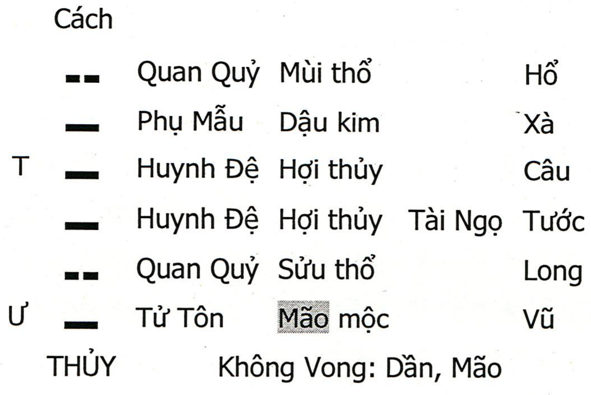

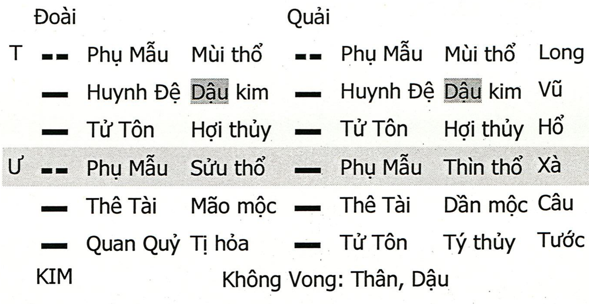 thể hợp trú Sửu thổ, Sửu thổ không thể tác dụng, đến ngày Mùi xung khai Sửu thổ khắc Tử Tôn, ngày này sẽ rớt giá.

**Phản hồi:** Quả nhiên ở những ngày khác thì giá đều tăng, ở ngày Quý Mùi thì giá giảm mạnh.

## 6. DỰ ĐOÁN ĐÁNH BẠC

Cùng với sự phát triển của xã hội, đánh bạc cũng đã trở thành một loại hoạt động giải trí có tác động đến cuộc sống của nhiều người. Đánh bạc có thể đóng góp phúc lợi cho xã hội, cũng có thể tạo cho mình một cơ hội phát tài. Có rất nhiều hình thức xổ số, nếu muốn tìm ra quy luật của nó thì vẫn rất khó khăn. Tuy nhiên, nếu dự đoán có trúng thưởng hay không thì vẫn có tỷ lệ chính xác rất cao.

Trong rất nhiều hình thức đánh bạc thì đua ngựa tương đối dễ dự đoán, bởi vì là dự đoán thứ bậc cho nên lấy Quan Quỷ làm Dụng thần. Dự đoán con số ở hàng nào trên vé số có xuất hiện hay không thì cũng có thể lấy Quan Quỷ làm Dụng thần. Nhưng dự đoán lục hào không thể liên tục gieo quẻ, gieo hai ba quẻ cũng được, nhưng nếu gieo nhiều hơn thì thông tin của quẻ sẽ bị ảnh hưởng.

Về dự đoán xổ số bóng đá, nói một cách tương đối thì nó dễ hơn so với dự đoán con số một chút, dựa vào suy vượng của hào Thế và hào Ứng thì có thể phân tích ra tình trạng thắng bại, khuyết điểm ở đây cũng là vấn đề gieo quẻ, một lần gieo quẻ quá nhiều thì không chính xác.

Ở Hồng Kông, xổ số Mark Six tương đối thịnh hành, dùng lục hào dự đoán cũng có chính xác tỷ lệ nhất định, bởi vì mã số đặc biệt của nó có quan hệ mật thiết với 12 con giáp, phù hợp với mô thức lục hào dùng 12 địa chi để dự đoán.

Trên đây chỉ là những bàn luận đơn giản. Để nghiệm chứng sự ứng dụng của dự đoán lục hào trong mỗi lĩnh vực, tôi đã từng làm một vài nghiên cứu đơn giản, nhưng bởi vì không có nhiều thời gian, lại thêm bản thân không có hứng thú đối với đánh bạc, vì vậy không thể đi sâu vào nghiên cứu. Hy vọng những người yêu thích có thể phát huy được lĩnh vực này.

**Ví dụ 1: Ngày Mậu Ngọ tháng Thân, một học viên của tôi đoán xem rút vé số may mắn có thể trúng thưởng hay không? Được Sơn Phong Cổ biến Hỏa Thủy Vị Tế.**

| | Cổ | Phục thần | Vị Tế | |
| :---: | :--- | :---: | :--- | :---: |
| Ứ | — Huynh Đệ Dần mộc | | — Tử Tôn Tị hỏa | Tước |
| | - - Phụ Mẫu Tý thủy | Tử Tị | - - Thê Tài Mùi thổ | Long |
| | - - Thê Tài Tuất thổ | | — Quan Quỷ Dậu kim | Vũ |
| T | — Quan Quỷ Dậu kim | | - - Tử Tôn Ngọ hỏa | Hổ |
| | — Phụ Mẫu Hợi thủy | | — Thê Tài Thìn thổ | Xà |
| | - - Thê Tài Sửu thổ | | - - Huynh Đệ Dần mộc | Câu |

MỘC Không Vong: Tý, Sửu

**Phán đoán:** Lấy Thê Tài làm Dụng thần. Trong quẻ Thê Tài lưỡng hiện, lấy hào Thê Tài Tuất thổ phát động làm Dụng thần. Nguyệt không khắc Dụng thần, Nhật đến sinh phù là vượng tướng, Dụng thần phát động sinh hào Thế, nhất định có thể đoạt giải.

**Phản hồi:** Kết quả là trúng giải tư, thu được 1200 yên.

**Ví dụ 2: Ngày Canh Thân tháng Thân, một học viên người Nhật Bản đoán xem chơi máy đánh bạc điện tử có thể có tài hay không? Được Hỏa Trạch Khuê biến Sơn Lôi Di.**

| | Khuê | Phục thần | Di | |
| :---: | :--- | :---: | :--- | :---: |
| | — Phụ Mẫu Tị hỏa | | — Quan Quỷ Dần mộc | Xà |
| | - - Huynh Đệ Mùi thổ | Tài Tý | - - Thê Tài Tý thủy | Câu |
| T | — Tử Tôn Dậu kim | | - - Huynh Đệ Tuất thổ | Tước |
| | - - Huynh Đệ Sửu thổ | | - - Huynh Đệ Thìn thổ | Long |
| | — Quan Quỷ Mão mộc | | - - Quan Quỷ Dần mộc | Vũ |
| Ứ | — Phụ Mẫu Tị hỏa | | — Thê Tài Tý thủy | Hổ |

THỔ Không Vong: Tý, Sửu

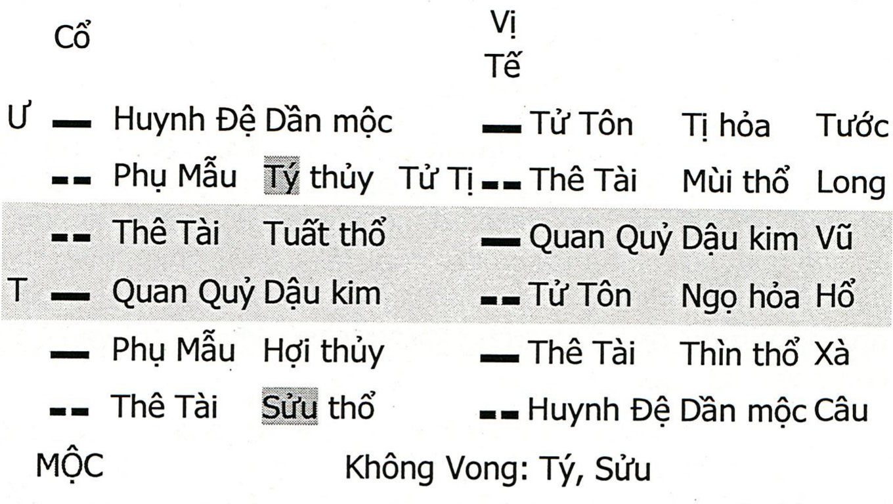

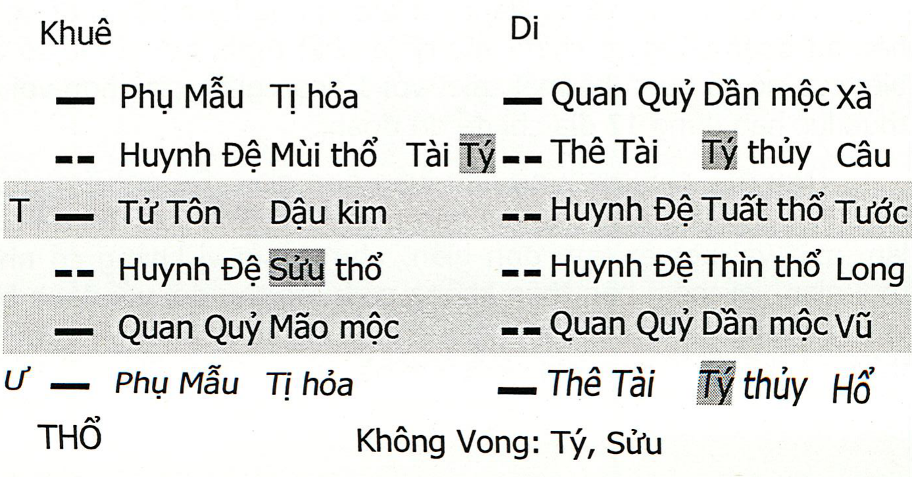

**Phán đoán:** Lấy Thê Tài làm Dụng thần. Thê Tài Tý thủy không hiện trên quẻ, phục tàng dưới hào 5 Huynh Đệ Mùi thổ, mặc dù Phi đến khắc Phục lại Không Vong, nhưng Dụng thần được Nhật Nguyệt sinh phù, hào Thế lại phát động sinh Tài, vẫn có tài.

**Phản hồi:** Người này lấy 2 vạn yên để chơi, khi tiêu đến 17000 yên thì bỗng chốc được 51800 yên, lời được 34800 yên.

**Ví dụ 3:** Ngày Nhâm Tuất tháng Thân, một học viên người Nhật Bản mua 10 tờ vé số, đoán xem có trúng thưởng hay không? Được Sơn Thủy Mông biến Hỏa Lôi Phệ Hạp.

| | Mông | Phục thần | Phệ Hạp | |
| :---: | :--- | :---: | :--- | :---: |
| | — Phụ Mẫu Dần mộc | | — Huynh Đệ Tị hỏa | Hổ |
| | - - Quan Quỷ Tý thủy | | - - Tử Tôn Mùi thổ | Xà |
| T | - - Tử Tôn Tuất thổ | Tài Dậu | — Thê Tài Dậu kim | Câu |
| | - - Huynh Đệ Ngọ hỏa | | - - Tử Tôn Thìn thổ | Tước |
| | — Tử Tôn Thìn thổ | | - - Phụ Mẫu Dần mộc | Long |
| Ứ | - - Phụ Mẫu Dần mộc | | — Quan Quỷ Tý thủy | Vũ |

HỎA Không Vong: Tý, Sửu

**Phán đoán:** Lấy Thê Tài làm Dụng thần. Thê Tài Dậu kim không hiện trên quẻ, nhưng được Nguyệt kiến trợ giúp và Nhật đến sinh là vượng tướng. Mặc dù Nguyên thần Tử Tôn Thìn thổ hóa phá, hào sơ Cừu thần phát động, nhưng hào Thế động sinh Thê Tài, lại hóa ra Thê Tài, vì vậy nhất định có giải thưởng.

**Phản hồi:** Kết quả là có hai tờ trúng 1 vạn yên.

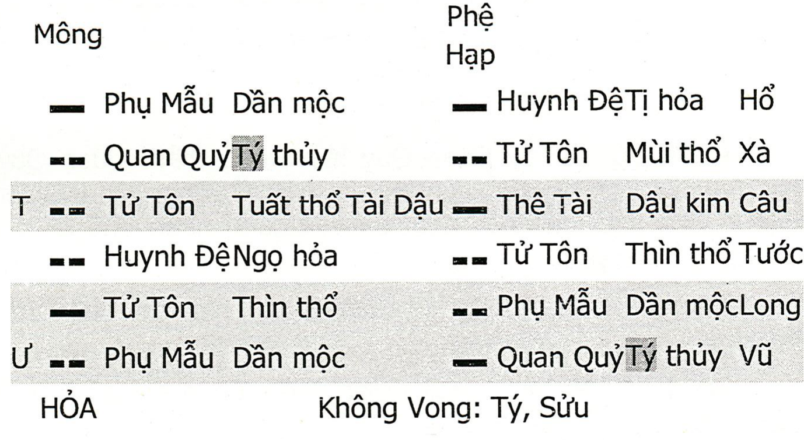

**Ví dụ 4:** Ngày Giáp Thìn tháng Mùi, một học viên người Nhật Bản đoán xem cá cược đua ngựa có thể thắng không? Được Chấn Vi Lôi.

| | Chấn | | |
| :--- | :---: | :--- | :--- |
| T | - - | Thê Tài Tuất thổ | Vũ |
| | - - | Quan Quỷ Thân kim | Hổ |
| | — | Tử Tôn Ngọ hỏa | Xà |
| Ứ | - - | Thê Tài Thìn thổ | Câu |
| | - - | Huynh Đệ Dần mộc | Tước |
| | — | Phụ Mẫu Tý thủy | Long |

MỘC Không Vong: Dần, Mão

**Phán đoán:** Lấy Quan Quỷ làm Dụng thần. Quan Quỷ tại hào 5 được Nhật Nguyệt sinh phù là vượng tướng, hào 5 là tôn vị, hào vị lãnh đạo, cho nên nhất định là hạng nhất. Thế là bỏ vốn đặt cược 5100 yên.

**Phản hồi:** Quả nhiên đã được hạng nhất, thu được 10 vạn yên.

**Ví dụ 5:** Ngày Kỷ Mùi tháng Thìn, đoán mã số Mark Six, được Hỏa Địa Tấn biến Phong Lôi Ích.

| | Tấn | | | | Ích | |
| :--- | :---: | :--- | :---: | :---: | :--- | :--- |
| | — | Quan Quỷ Tị hỏa | | — | Thê Tài Mão mộc | Câu |
| | - - | Phụ Mẫu Mùi thổ | | — | Quan Quỷ Tị hỏa | Tước |
| T | — | Huynh Đệ Dậu kim | | - - | Phụ Mẫu Mùi thổ | Long |
| | - - | Thê Tài Mão mộc | | - - | Phụ Mẫu Thìn thổ | Vũ |
| | - - | Quan Quỷ Tị hỏa | | - - | Thê Tài Dần mộc | Hổ |
| Ứ | - - | Phụ Mẫu Mùi thổ | Tử Tý | — | Tử Tôn Tý thủy | Xà |

KIM Không Vong: Tý, Sửu

**Phán đoán:** Lấy Thê Tài làm Dụng thần. Thê Tài Mão mộc không được Nhật Nguyệt sinh phù là hưu tù. Kỵ thần Huynh Đệ được Nhật Nguyệt sinh phù, hào 5 và hào sơ lại phát động đến

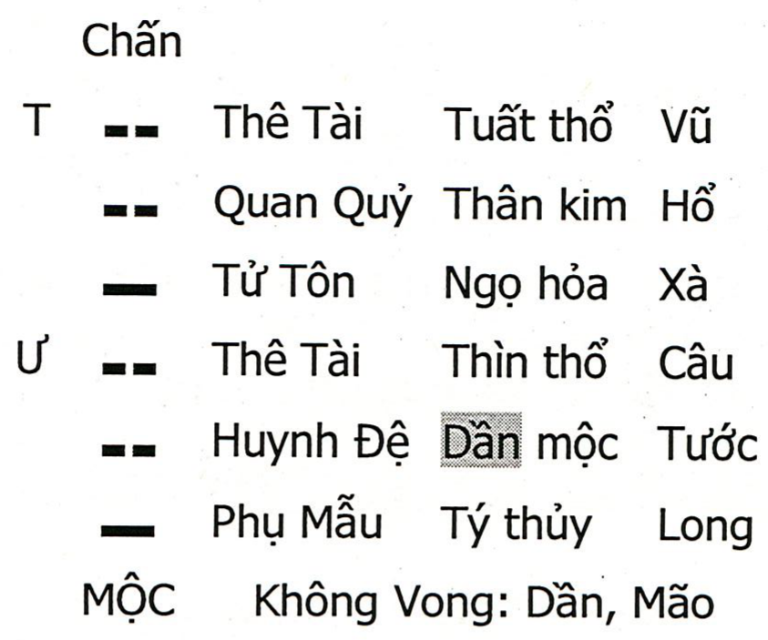

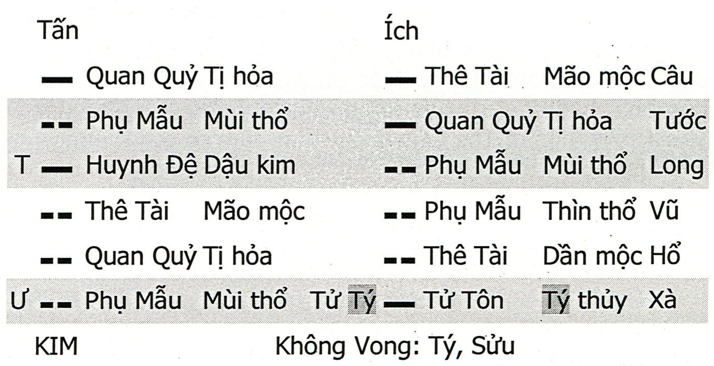 sinh, Huynh Đệ động hóa hồi đầu sinh, đây là tổ hợp Huynh Đệ quá vượng trái lại không khắc Tài. Huynh Đệ càng vượng càng tốt. Do đó, chọn mã số thì nên tìm trong địa chi sinh hào Huynh Đệ.

**Phản hồi:** Quả nhiên xuất hiện rồng (Thìn).

**Ví dụ 6:** Ngày Mậu Dần tháng Tị, đoán mã số Mark Six, được Trạch Địa Tụy biến Khôn Vi Địa.

| | Tụy | | | Khôn | |
| :--- | :---: | :--- | :---: | :--- | :--- |
| | - - | Phụ Mẫu Mùi thổ | - - | Huynh Đệ Dậu kim | Tước |
| Ứ | — | Huynh Đệ Dậu kim | - - | Tử Tôn Hợi thủy | Long |
| | — | Tử Tôn Hợi thủy | - - | Phụ Mẫu Sửu thổ | Vũ |
| | - - | Thê Tài Mão mộc | - - | Thê Tài Mão mộc | Hổ |
| T | - - | Quan Quỷ Tị hỏa | - - | Quan Quỷ Tị hỏa | Xà |
| | - - | Phụ Mẫu Mùi thổ | - - | Phụ Mẫu Mùi thổ | Câu |

KIM Không Vong: Thân, Dậu

**Phán đoán:** Lấy Thê Tài làm Dụng thần. Thê Tài Mão mộc được Nhật phù là vượng tướng, Huynh Đệ Dậu kim phát động đến khắc, nhưng có Tử Tôn Hợi thủy phát động dẫn hóa, vì vậy Tử Tôn Hợi thủy là then chốt của quẻ này. Hợi thủy Nguyệt phá, có Nhật hợp thì đã bất phá, chỗ không tốt chính là hóa Sửu thổ hồi đầu khắc. Vì vậy, địa chi giải quyết vấn đề Sửu thổ chính là mã số.

Có hai địa chi giải quyết Sửu thổ, một là Mùi thổ xung mất Sửu thổ, một là Tý thủy hợp trú Sửu thổ, mã số nên nằm trong hai địa chi này.

**Phản hồi:** Kết quả là ra chuột (Tý).

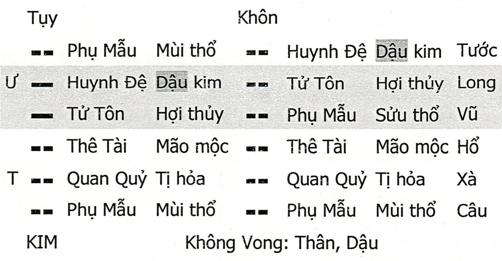

### Ví dụ 7: Ngày Đinh Hợi tháng Tị, đoán mã số Mark Six, được Hỏa Thủy Vị Tế biến Lôi Địa Dự.

| | Vị Tế | | Dự | | |
| :---: | :---: | :--- | :---: | :--- | :--- |
| Ứ | — | Huynh Đệ Tị hỏa | - - | Tử Tôn Tuất thổ | Long |
| | - - | Tử Tôn Mùi thổ | - - | Thê Tài Thân kim | Vũ |
| | — | Thê Tài Dậu kim | — | Huynh Đệ Ngọ hỏa | Hổ |
| T | - - | Huynh Đệ Ngọ hỏa | - - | Phụ Mẫu Mão mộc | Xà |
| | — | Tử Tôn Thìn thổ | - - | Huynh Đệ Tị hỏa | Câu |
| | - - | Phụ Mẫu Dần mộc | - - | Tử Tôn Mùi thổ | Tước |

HỎA  
Không Vong: Ngọ, Mùi

**Phán đoán:** Lấy Thê Tài làm Dụng thần. Thê Tài Dậu kim không được Nhật Nguyệt sinh phù là hưu tù. Cần trợ giúp, địa chi trợ giúp chính là mã số. Trong quẻ Huynh Đệ Tị hỏa phát động đến khắc, nhưng hóa Tuất thổ nhập Mộ là cát, vì vậy Tuất thổ có tác dụng tốt, Tuất thổ cũng có thể sinh Thê Tài. Hào 2 Tử Tôn Thìn thổ phát động đến sinh, đồng thời cũng hợp trú Dụng thần. Nếu an ứng kỳ để phân tích, Dậu kim và Mão mộc cũng ở phạm vi này. Vì vậy, Tuất thổ, Thìn thổ, Dậu kim và Mão mộc đều có thể là mã số.

**Phản hồi:** Cuối cùng ra gà (Dậu).

### Ví dụ 8: Ngày Tân Mùi tháng Sửu, nghĩ ra một nhóm mã vé số, đoán xem có trúng thưởng không? Được Phong Thủy Hoán biến Phong Trạch Trung Phu.

| | Hoán | | | Trung Phu | | |
| :---: | :---: | :--- | :--- | :---: | :--- | :--- |
| | — | Phụ Mẫu Mão mộc | | — | Phụ Mẫu Mão mộc | Xà |
| T | — | Huynh Đệ Tị hỏa | | — | Huynh Đệ Tị hỏa | Câu |
| | - - | Tử Tôn Mùi thổ | Tài Dậu | - - | Tử Tôn Mùi thổ | Tước |
| | - - | Huynh Đệ Ngọ hỏa | Quan Hợi | - - | Tử Tôn Sửu thổ | Long |
| Ứ | — | Tử Tôn Thìn thổ | | — | Phụ Mẫu Mão mộc | Vũ |
| | - - | Phụ Mẫu Dần mộc | | — | Huynh Đệ Tị hỏa | Hổ |

HỎA  
Không Vong: Tuất, Hợi

**Phán đoán:** Lấy Thê Tài làm Dụng thần. Thê Tài Dậu kim không hiện trên quẻ, phục dưới Tử Tôn Mùi thổ. Dụng thần được Nhật Nguyệt sinh phù, Phi thần lại bị xung phá vốn là cát, nhưng Nhật lại Thực Phá, càng không nên Phụ Mẫu Dần mộc độc phát là Tuyệt địa Thê Tài, độc phát lấy tượng làm chủ, vì vậy khó trúng.

**Phản hồi:** Quả nhiên không trúng thưởng.

### Ví dụ 9: Ngày Tân Mùi tháng Sửu, nghĩ ra một nhóm mã vé số, đoán xem có trúng thưởng không? Được Sơn Trạch Tổn.

| | Tổn | | | |
| :---: | :---: | :--- | :--- | :--- |
| Ứ | — | Quan Quỷ Dần mộc | | Xà |
| | - - | Thê Tài Tý thủy | | Câu |
| | - - | Huynh Đệ Tuất thổ | | Tước |
| T | - - | Huynh Đệ Sửu thổ | Tử Thân | Long |
| | — | Quan Quỷ Mão mộc | | Vũ |
| | — | Phụ Mẫu Tị hỏa | | Hổ |

THỔ  
Không Vong: Tuất, Hợi

**Phán đoán:** Lấy Thê Tài làm Dụng thần, Thê Tài Tý thủy được Nguyệt hợp là có khí, nhưng suy cho cùng thì Nhật Nguyệt khắc chế, trong quẻ Huynh Đệ Sửu thổ lại ám động đến khắc, Dụng thần hưu tù không có lực nên không thể trúng thưởng.

**Phản hồi:** Quả nhiên không trúng thưởng.

**Ví dụ 10:** Ngày Quý Dậu tháng Sửu, nghĩ ra một nhóm mã vé số, đoán xem có trúng thưởng không? Được Địa Trạch Lâm biến Lôi Trạch Quy Muội.

| | Lâm | Quy Muội | |
| :---: | :--- | :--- | :---: |
| | - - Tử Tôn Dậu kim | - - Huynh Đệ Tuất thổ | Hổ |
| Ư | - - Thê Tài Hợi thủy | - - Tử Tôn Thân kim | Xà |
| | - - Huynh Đệ Sửu thổ | — Phụ Mẫu Ngọ hỏa | Câu |
| | - - Huynh Đệ Sửu thổ | - - Huynh Đệ Sửu thổ | Tước |
| T | — Quan Quỷ Mão mộc | — Quan Quỷ Mão mộc | Long |
| | — Phụ Mẫu Tị hỏa | — Phụ Mẫu Tị hỏa | Vũ |

THỔ Không Vong: Tuất, Hợi

**Phán đoán:** Lấy Thê Tài làm Dụng thần. Thê Tài Hợi thủy mặc dù được Nhật sinh phù nhưng bị Nguyệt kiến khắc chế, lại lâm Không Vong, đồng thời trong quẻ Huynh Đệ Sửu thổ phát động đến khắc, khắc nhiều sinh ít nên không thể trúng thưởng.

**Phản hồi:** Quả nhiên không trúng thưởng.

**Ví dụ 11:** Ngày Quý Dậu tháng Sửu, nghĩ ra một nhóm mã vé số, đoán xem có trúng thưởng không? Được Thiên Phong Cấu biến Thủy Hỏa Ký Tế.

| | Cấu | Ký Tế | |
| :---: | :--- | :--- | :---: |
| | — Phụ Mẫu Tuất thổ | - - Tử Tôn Tý thủy | Hổ |
| | — Huynh Đệ Thân kim | — Phụ Mẫu Tuất thổ | Xà |
| Ư | — Quan Quỷ Ngọ hỏa | - - Huynh Đệ Thân kim | Câu |
| | — Huynh Đệ Dậu kim | — Tử Tôn Hợi thủy | Tước |
| | — Tử Tôn Hợi thủy Tài Dần | - - Phụ Mẫu Sửu thổ | Long |
| T | - - Phụ Mẫu Sửu thổ | — Thê Tài Mão mộc | Vũ |

KIM Không Vong: Tuất, Hợi

**Phán đoán:** Lấy Thê Tài làm Dụng thần. Thê Tài Dần mộc không hiện trên quẻ, phục dưới hào 2 Tử Tôn Hợi thủy. Mặc dù là Phi đến sinh Phục nhưng Dụng thần Nguyệt không đến sinh, Nhật thần đến khắc là hưu tù. Mà Nguyên thần bị Nguyệt khắc, hóa hồi đầu khắc, trong quẻ lại có hai tầng Phụ Mẫu đến khắc vô lực sinh Dụng thần, vì vậy không trúng.

**Phản hồi:** Quả nhiên không trúng thưởng.

**Ví dụ 12:** Ngày Nhâm Dần tháng Thìn, nghĩ ra một nhóm mã vé số, đoán xem có trúng thưởng không? Được Trạch Thủy Khốn biến Trạch Địa Tụy.

| | Khốn | Tụy | |
| :---: | :--- | :--- | :---: |
| | - - Phụ Mẫu Mùi thổ | - - Phụ Mẫu Mùi thổ | Hổ |
| | — Huynh Đệ Dậu kim | — Huynh Đệ Dậu kim | Xà |
| Ư | — Tử Tôn Hợi thủy | — Tử Tôn Hợi thủy | Câu |
| | - - Quan Quỷ Ngọ hỏa | - - Thê Tài Mão mộc | Tước |
| | — Phụ Mẫu Thìn thổ | - - Quan Quỷ Tị hỏa | Long |
| T | - - Thê Tài Dần mộc | - - Phụ Mẫu Mùi thổ | Vũ |

KIM Không Vong: Thìn, Tị

**Phán đoán:** Lấy Thê Tài làm Dụng thần. Thê Tài Dần mộc trì Thế, được Nhật trợ giúp là vượng tướng, trong quẻ Phụ Mẫu Thìn thổ lâm Thanh Long độc phát, Phụ Mẫu là tin tức, Thanh Long chủ vui vẻ, là có tin tốt lành, Tài vượng trì Thế tất có giải. Chỉ là Thê Tài tại hào sơ, khó có giải thưởng lớn.

**Phản hồi:** Quả nhiên trúng được 50 tệ.

**Ví dụ 13:** Ngày Tân Sửu tháng Hợi, nữ đoán xem trong tháng này mua vé số có thể trúng giải lớn hay không? Được Lôi Hỏa Phong biến Hỏa Phong Đỉnh.

| | Phong | | | Đỉnh | |
| :---: | :---: | :--- | :---: | :--- | :---: |
| | - - | Quan Quỷ Tuất thổ | — | Thê Tài Tị hỏa | Xà |
| T | - - | Phụ Mẫu Thân kim | - - | Quan Quỷ Mùi thổ | Câu |
| | — | Thê Tài Ngọ hỏa | — | Phụ Mẫu Dậu kim | Tước |
| | — | Huynh Đệ Hợi thủy | — | Phụ Mẫu Dậu kim | Long |
| Ứ | - - | Quan Quỷ Sửu thổ | — | Huynh Đệ Hợi thủy | Vũ |
| | — | Tử Tôn Mão mộc | - - | Quan Quỷ Sửu thổ | Hổ |

THỦY Không Vong: Thìn, Tị

**Phán đoán:** Lấy Thê Tài làm Dụng thần. Thê Tài Ngọ hỏa không được Nhật Nguyệt sinh phù là hưu tù, vì vậy không thể được giải lớn. Nhưng Nguyên thần Tử Tôn phát động đến sinh, có thể được giải nhỏ. Dụng thần là Ngọ hỏa, ngày Ngọ có thể được.

**Phản hồi:** Quả nhiên tại ngày Bính Ngọ được 1000 yên.

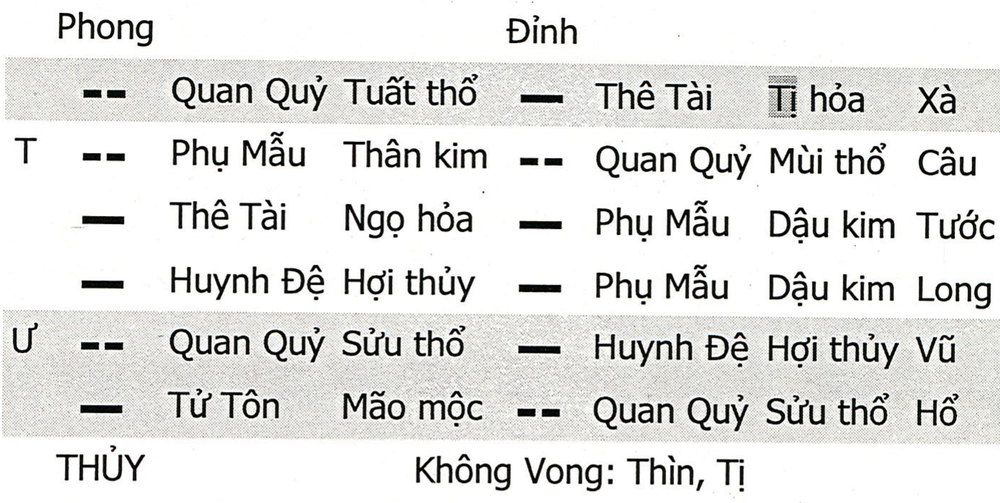

# CHƯƠNG 5

## DỰ ĐOÁN CỬA HÀNG KINH DOANH

Mục đích chính của dự đoán cửa hàng kinh doanh là lợi ích kinh tế. Do đó, lấy hào Thê Tài làm Dụng thần chủ yếu. Thê Tài là lợi ích kinh tế, hào Tài vượng tướng được sinh phù là cát, không nên hưu tù Không Phá, Huynh Đệ phát động đến khắc.

Mở cửa hàng thuộc về cầu tài dài hạn, cần hào Tử Tôn vượng tướng có khí, không nên hưu tù Không Phá. Tử Tôn vượng tướng thì có thể kinh doanh lâu dài, hưu tù Không Phá thì không thể lâu dài.

Hào 2 và hào Phụ Mẫu là thông tin cửa hàng, không nên phát động, nên an tĩnh là tốt. Phát động Không Phá thì cửa hàng hay thay đổi, không yên ổn.

Hào Tử Tôn và hào Ứng là khách hàng, vượng tướng sinh hợp hào Thế và hào Tài là thông tin kinh doanh thuận lợi, khách hàng đầy cửa. Hưu tù Không Phá là thông tin ít khách hàng, trước cửa vắng vẻ.

## 1. VÍ DỤ MỞ THẨM MỸ VIỆN

**Ví dụ 1:** Ngày Nhâm Dần tháng Tuất, nữ đoán tiền đồ phát triển của thẩm mỹ viện, được Hỏa Thủy Vị Tế biến Thiên Sơn Độn.

| | Vị Tế | | | Độn | |
| :--- | :---: | :--- | :---: | :--- | :--- |
| Ứ | — | Huynh Đệ Tị hỏa | — | Tử Tôn Tuất thổ | Hổ |
| | - - | Tử Tôn Mùi thổ | — | Thê Tài Thân kim | Xà |
| | — | Thê Tài Dậu kim | — | Huynh Đệ Ngọ hỏa | Câu |
| T | - - | Huynh Đệ Ngọ hỏa | — | Thê Tài Thân kim | Tước |
| | — | Tử Tôn Thìn thổ | - - | Huynh Đệ Ngọ hỏa | Long |
| | - - | Phụ Mẫu Dần mộc | - - | Tử Tôn Thìn thổ | Vũ |

HỎA Không Vong: Thìn, Tị

**Phán đoán:** Mục đích của mở cửa hàng là lợi nhuận, ưu tiên tài vận. Thê Tài Dậu kim mặc dù được Nguyệt sinh vượng tướng, nhưng đoán tài lâu dài thì cần xem Tử Tôn.

Tử Tôn Thìn thổ tại hào 2 Không Phá bị Nhật khắc không sinh Tài, hào 2 là cửa hàng, chứng tỏ bản thân cửa hàng không tụ tài. Thông thường mà nói, Huynh Đệ trì Thế hóa Tài là tượng được tài, nhưng bị Nhật xung mất, không gặp được tài. Vì vậy, thẩm mỹ viện rất khó kinh doanh.

Nhật là Phụ Mẫu, Phụ Mẫu là cửa hàng, lâm hào sơ là hàng xóm, lân cận có nhiều thẩm mỹ viện ảnh hưởng đến tài vận, cạnh tranh lẫn nhau. Huynh Đệ lâm Chu Tước trì Thế, khó tránh khẩu thiệt với người ta.

**Phản hồi:** Trên thực tế, mở cửa hàng ở năm 99, đến năm 07 thì liên tục thua lỗ, bị những thẩm mỹ viện xung quanh quấy rối, thường xuyên xảy ra xung đột. Cô ấy nói xung quanh có mười thẩm mỹ viện.

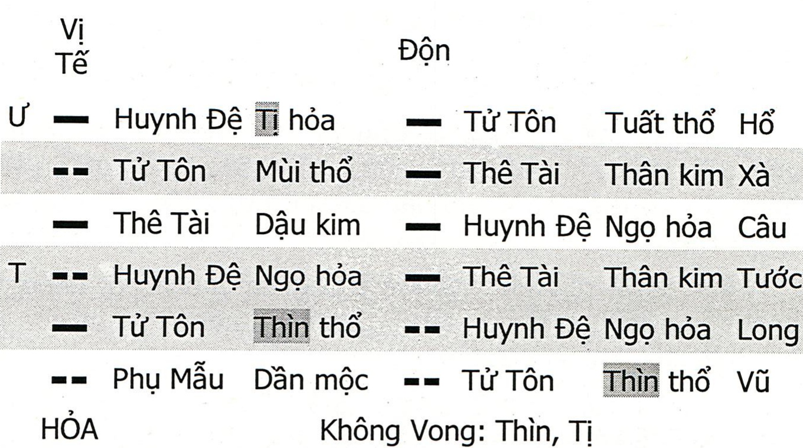

**Ví dụ 2:** Ngày Nhâm Dần tháng Tị, nữ đoán tình hình kinh doanh của thẩm mỹ viện, được Sơn Địa Bác biến Hỏa Thủy Vị Tế.

| | Bác | | | Vị Tế | |
| :--- | :---: | :--- | :---: | :--- | :--- |
| | — | Thê Tài Dần mộc | — | Quan Quỷ Tị hỏa | Hổ |
| T | - - | Tử Tôn Tý thủy | - - | Phụ Mẫu Mùi thổ | Xà |
| | - - | Phụ Mẫu Tuất thổ | — | Huynh Đệ Dậu kim | Câu |
| | - - | Thê Tài Mão mộc | - - | Quan Quỷ Ngọ hỏa | Tước |
| Ư | - - | Quan Quỷ Tị hỏa | — | Phụ Mẫu Thìn thổ | Long |
| | - - | Phụ Mẫu Mùi thổ | - - | Thê Tài Dần mộc | Vũ |

KIM Không Vong: Thìn, Tị

**Phán đoán:** Lấy Thê Tài làm Dụng thần. Trong quẻ Thê Tài lưỡng hiện, lấy Thê Tài Mão mộc làm Dụng thần. Dụng thần được Nhật trợ giúp là vượng tướng, nhưng không nên Phụ Mẫu Tuất thổ phát động hợp vướng chân Thê Tài Mão mộc, Tuất thổ khắc hào Thế Tý thủy, hào Ứng là khách hàng, Không Vong phát động đến sinh Cừu thần, biểu thị khách hàng không nhiều, không kiếm được tiền.

Hào 2 là cửa hàng, lâm hào Ứng, là cửa hàng đi thuê. Phụ Mẫu Tuất thổ gần hào Thế, Phụ Mẫu là cửa hàng, gần hào Thế chính là lân cận có cửa hàng ảnh hưởng công việc kinh doanh của mình. Phụ Mẫu Tuất thổ hợp mất Thê Tài, chính là những cửa hàng kia giành ăn với mình.

**Phản hồi:** Quả nhiên là cửa hàng đi thuê, khách hàng không nhiều, lân cận có mấy thẩm mỹ viện ảnh hưởng đến mình.

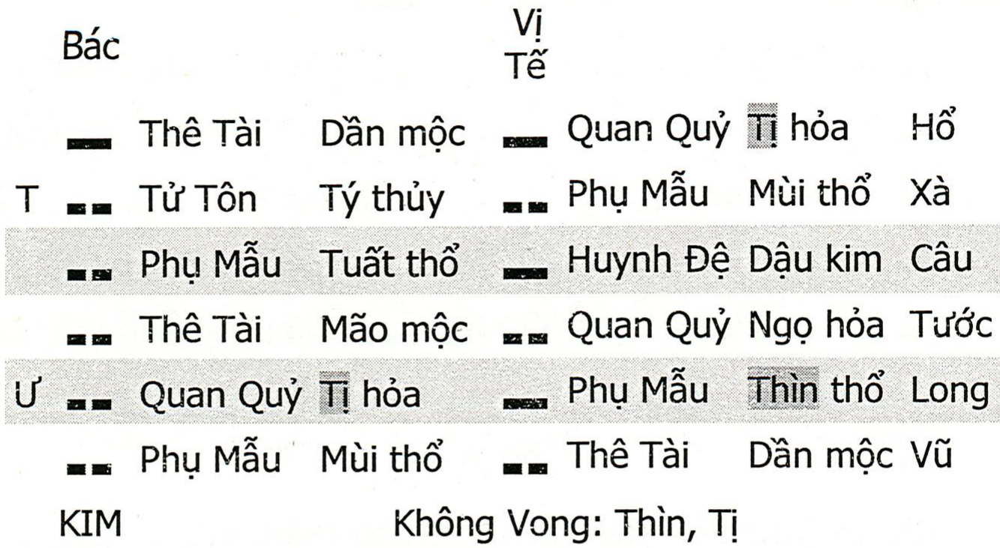

## Ví dụ 3: Ngày Quý Sửu tháng Dần, nữ đoán tài vận thẩm mỹ viện, được Sơn Hỏa Bí biến Càn Vi Thiên.

| | Bí | Càn | |
| :--- | :--- | :--- | :--- |
| | — Quan Quỷ Dần mộc | — Huynh Đệ Tuất thổ | Hổ |
| | - - Thê Tài Tý thủy | — Tử Tôn Thân kim | Xà |
| Ư | - - Huynh Đệ Tuất thổ | — Phụ Mẫu Ngọ hỏa | Câu |
| | — Thê Tài Hợi thủy Tử Thân | — Huynh Đệ Thìn thổ | Tước |
| | - - Huynh Đệ Sửu thổ Phụ Ngọ | — Quan Quỷ Dần mộc | Long |
| T | — Quan Quỷ Mão mộc | — Thê Tài Tý thủy | Vũ |

THỔ Không Vong: Dần, Mão

**Phản hồi:** Lấy Thê Tài làm Dụng thần. Trong quẻ Thê Tài lưỡng hiện, lấy hào Thê Tài Tý thủy phát động làm Dụng thần. Dụng thần không được Nhật Nguyệt sinh phù, Nhật thần trong khắc có hợp, kinh doanh không phát đạt. Dụng thần động hóa hồi đầu sinh, nhưng lại hợp hào 2 Huynh Đệ Sửu thổ, hào 2 là cửa hàng, chính là đem tất cả số tiền kiếm được đầu tư vào cửa hàng và trả tiền thuê nhà.

Hào 2 động mà hóa Không, hào 2 là cửa hàng, phát động biểu thị thay đổi, rồi không thay đổi. Phụ Mẫu cũng là cửa hàng, nhập Mộ ở hào Ứng, Ứng là người khác, chính là có người nhận được cửa hàng này. Hào Thế Không Vong không sinh Phụ Mẫu, chính là bản thân không muốn kinh doanh ở đây. Tổng hợp lại, phán đoán là đem cửa hàng cho thuê lại.

**Phản hồi:** Quả nhiên là như vậy, trước đây lợi nhuận không nhiều, nhưng để thẩm mỹ viện tốt hơn thì đã lấy số tiền kiếm được tái đầu tư. Tuy nhiên, tiền thuê cửa hàng quá mắc, không thể duy trì kinh doanh, thế là tại tháng Tị đã chuyển nhượng cho người khác.

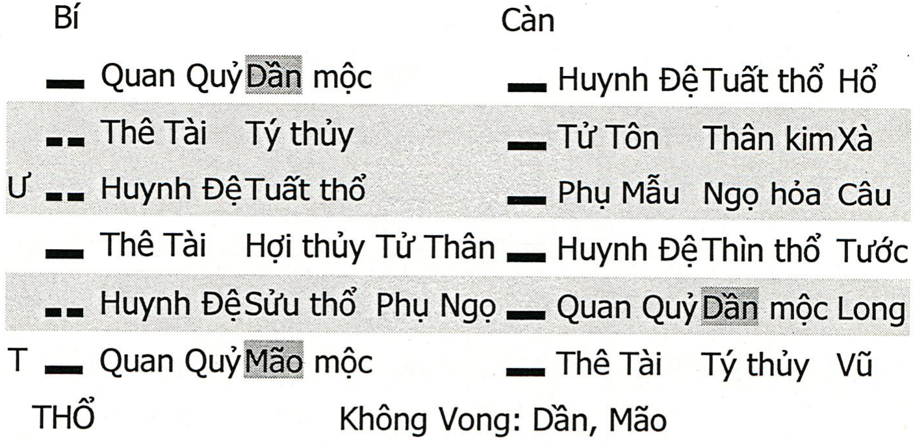

## Ví dụ 4: Ngày Đinh Mão tháng Tị, nữ đoán tiền đồ kinh doanh của thẩm mỹ viện, được Thiên Trạch Lý biến Phong Hỏa Gia Nhân.

| | Lý | Gia Nhân | |
| :--- | :--- | :--- | :--- |
| | — Huynh Đệ Tuất thổ | — Quan Quỷ Mão mộc | Long |
| T | — Tử Tôn Thân kim Tài Tý | — Phụ Mẫu Tị hỏa | Vũ |
| | — Phụ Mẫu Ngọ hỏa | - - Huynh Đệ Mùi thổ | Hổ |
| | - - Huynh Đệ Sửu thổ | — Thê Tài Hợi thủy | Xà |
| Ư | — Quan Quỷ Mão mộc | - - Huynh Đệ Sửu thổ | Câu |
| | — Phụ Mẫu Tị hỏa | — Quan Quỷ Mão mộc | Tước |

THỔ Không Vong: Tuất, Hợi

**Phán đoán:** Lấy Thê Tài làm Dụng thần. Thê Tài Tý thủy không hiện trên quẻ, phục tàng dưới hào 5 Tử Tôn Thân kim. Dụng thần không được Nhật Nguyệt trợ giúp là hưu tù, trong quẻ Huynh Đệ Sửu thổ phát động, được Nguyệt sinh, hào động Ngọ hỏa đến sinh, Huynh Đệ vượng khắc Dụng thần, có thể nói là không có tiền đồ.

**Phản hồi:** Quả nhiên là liên tục ế ẩm.

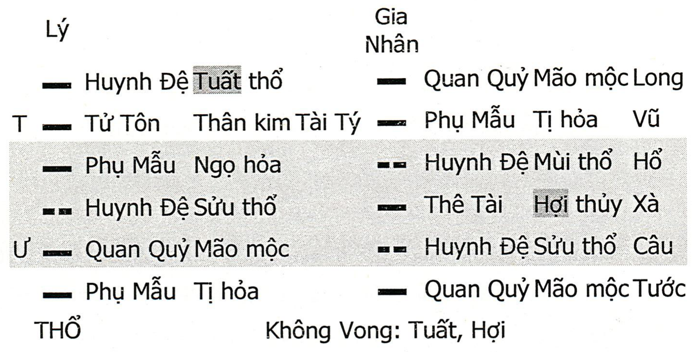

## 2. VÍ DỤ MỞ QUÁN ĂN

**Ví dụ 1:** Ngày Ất Sửu tháng Thân, đoán về cửa hàng ẩm thực của mẹ, được Thiên Thủy Tụng biến Phong Trạch Trung Phu.

| | Tụng | Trung Phu | |
| :---: | :--- | :--- | :---: |
| | ━ Tử Tôn Tuất thổ | ━ Phụ Mẫu Mão mộc | Vũ |
| | ━ Thê Tài Thân kim | ━ Huynh Đệ Tị hỏa | Hổ |
| T | ━ Huynh Đệ Ngọ hỏa | ━ ━ Tử Tôn Mùi thổ | Xà |
| | ━ ━ Huynh Đệ Ngọ hỏa | ━ ━ Tử Tôn Sửu thổ | Câu |
| | ━ Tử Tôn Thìn thổ | ━ Phụ Mẫu Mão mộc | Tước |
| Ư | ━ ━ Phụ Mẫu Dần mộc | ━ Huynh Đệ Tị hỏa | Long |

HỎA Không Vong: Tuất, Hợi

**Phán đoán:** Lấy Thê Tài làm Dụng thần. Thê Tài Thân kim được Nguyệt trợ giúp và Nhật đến sinh là vượng tướng, nhưng không nên Huynh Đệ trì Thế phát động, lại được hào Ứng phát động đến sinh Huynh Đệ, mặc dù có doanh số nhất định nhưng không quá phát đạt.

Ứng là người khác, tại hào sơ là hàng xóm, lâm Thanh Long, Thanh Long chủ ẩm thực, Phụ Mẫu lại là cửa hàng, chứng tỏ bên cạnh cũng có cửa hàng ẩm thực ảnh hưởng đến mình.

**Phản hồi:** Trên thực tế đúng là bên cạnh có cửa hàng ẩm thực, khách đều vào trong cửa hàng đó mà không vào bên này.

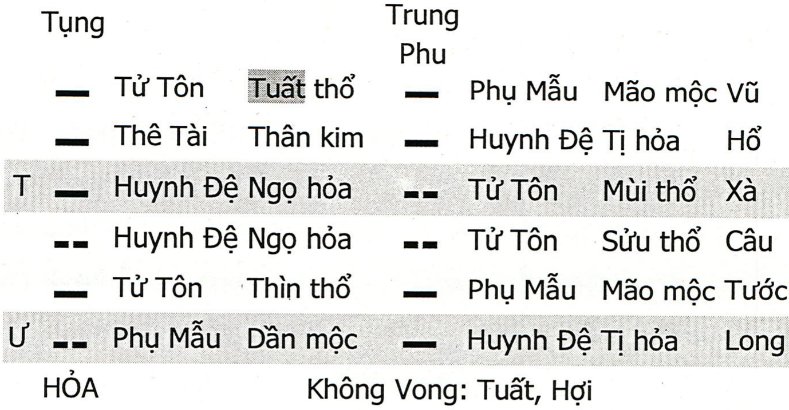

**Ví dụ 2:** Ngày Mậu Ngọ tháng Tuất, nữ đoán về nhà hàng cùng kinh doanh với chồng, được Hỏa Sơn Lữ biến Hỏa Địa Tấn.

| | Lữ | Tấn | |
| :---: | :--- | :--- | :---: |
| | ━ Huynh Đệ Tị hỏa | ━ Huynh Đệ Tị hỏa | Tước |
| | ━ ━ Tử Tôn Mùi thổ | ━ ━ Tử Tôn Mùi thổ | Long |
| Ư | ━ Thê Tài Dậu kim | ━ Thê Tài Dậu kim | Vũ |
| | ━ Thê Tài Thân kim Quan Hợi | ━ ━ Phụ Mẫu Mão mộc | Hổ |
| | ━ ━ Huynh Đệ Ngọ hỏa | ━ ━ Huynh Đệ Tị hỏa | Xà |
| T | ━ ━ Tử Tôn Thìn thổ Phụ Mão | ━ ━ Tử Tôn Mùi thổ | Câu |

HỎA Không Vong: Tý, Sửu

**Phán đoán:** Lấy Thê Tài làm Dụng thần. Trong quẻ Thê Tài lưỡng hiện, lấy hào Thê Tài Thân kim phát động làm Dụng thần. Nguyệt sinh Nhật khắc, suy vượng cân bằng. Hào Thế là Nguyên thần, Nguyệt phá không thể sinh Tài Dụng thần phát động, thu nhập không ổn định, vì vậy kinh doanh rất vất vả. Tổng hợp phân tích, dựa vào nhà hàng thì rất khó phát đại tài, chỉ có thể được lợi nhỏ.

**Phản hồi:** Quả nhiên doanh số không nhiều.

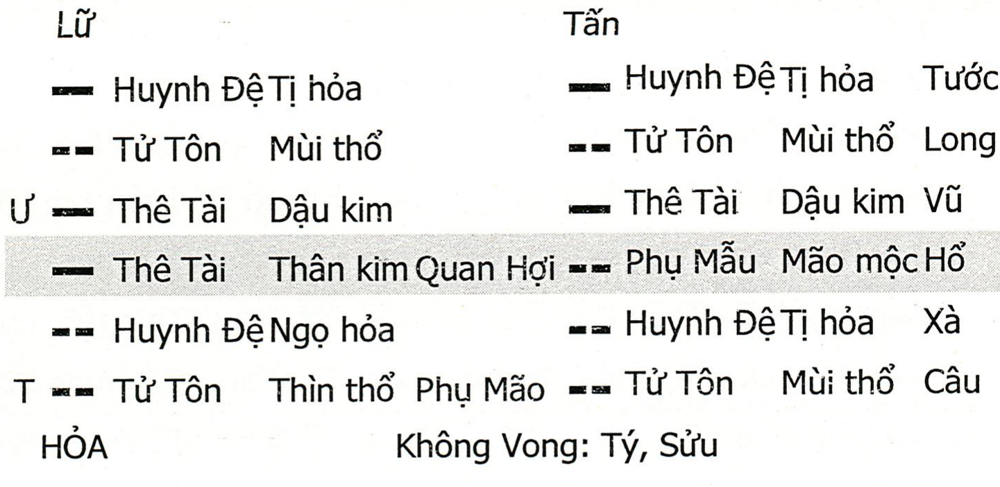

### Ví dụ 3: Ngày Canh Ngọ tháng Thân, nam đoán xem cửa hàng bánh mì phát triển ra sao? Được Lôi Sơn Tiểu Quá biến Chấn Vi Lôi.

| | Tiểu Quá | | | Chấn | | |
| :---: | :---: | :--- | :--- | :---: | :--- | :--- |
| | - - | Phụ Mẫu Tuất thổ | | - - | Phụ Mẫu Tuất thổ | Xà |
| | - - | Huynh Đệ Thân kim | | - - | Huynh Đệ Thân kim | Câu |
| T | — | Quan Quỷ Ngọ hỏa | Tử Hợi | — | Quan Quỷ Ngọ hỏa | Tước |
| | — | Huynh Đệ Thân kim | | - - | Phụ Mẫu Thìn thổ | Long |
| | - - | Quan Quỷ Ngọ hỏa | Tài Mão | - - | Thê Tài Dần mộc | Vũ |
| Ứ | - - | Phụ Mẫu Thìn thổ | | — | Tử Tôn Tý thủy | Hổ |

KIM Không Vong: Tuất, Hợi

**Phán đoán:** Lấy Thê Tài làm Dụng thần. Thê Tài Mão mộc không hiện trên quẻ, phục dưới hào 2 Quan Quỷ Ngọ hỏa, Nguyệt khắc Dụng thần, Nhật lại không trợ giúp là hưu tù, trong quẻ Huynh Đệ Thân kim lại phát động, Phi thần lâm Nhật áp chế Dụng thần, chứng tỏ kinh doanh không tốt, hiện nay chính là lúc gian nan.

**Phản hồi:** Quả nhiên hiện nay không phát đạt.

### Ví dụ 4: Ngày Ất Hợi tháng Thân, đoán về cửa hàng ẩm thực của vợ, được Sơn Lôi Di biến Phong Trạch Trung Phu.

| | Di | | | Trung Phu | | |
| :---: | :---: | :--- | :--- | :---: | :--- | :--- |
| | — | Huynh Đệ Dần mộc | | — | Huynh Đệ Mão mộc | Vũ |
| | - - | Phụ Mẫu Tý thủy | Tử Tị | — | Tử Tôn Tị hỏa | Hổ |
| T | - - | Thê Tài Tuất thổ | | - - | Thê Tài Mùi thổ | Xà |
| | - - | Thê Tài Thìn thổ | Quan Dậu | - - | Thê Tài Sửu thổ | Câu |
| | - - | Huynh Đệ Dần mộc | | — | Huynh Đệ Mão mộc | Tước |
| Ứ | — | Phụ Mẫu Tý thủy | | — | Tử Tôn Tị hỏa | Long |

MỘC Không Vong: Thân, Dậu

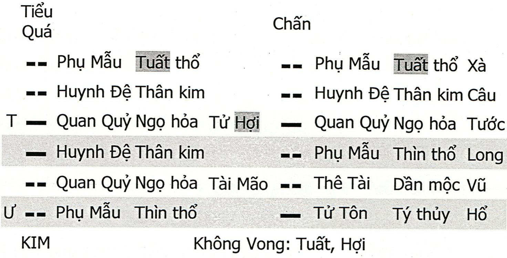

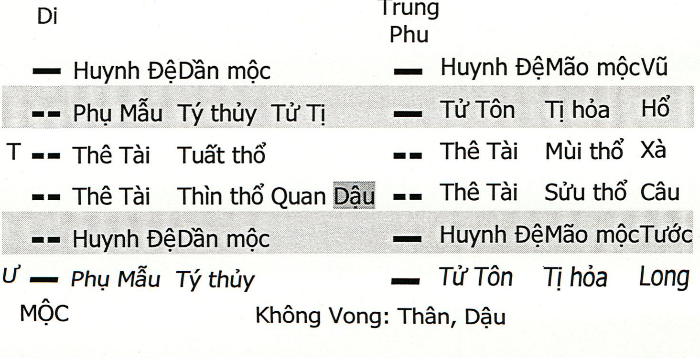

**Phán đoán:** Lấy Thê Tài làm Dụng thần. Trong quẻ Thê Tài lưỡng hiện, lấy hào Thế Thê Tài Tuất thổ làm Dụng thần. Dụng thần không được Nhật Nguyệt trợ giúp là hưu tù. Hào 2 Huynh Đệ Dần mộc phát động hóa Tiến thần đến khắc, mặc dù Nguyệt phá, nhưng Nhật hợp giải phá, Huynh Đệ có lực khắc Dụng thần. Thêm Phụ Mẫu Tý thủy lại đến sinh trợ, Kỵ thần vượng tướng mà Dụng thần nhược, tài vận không tốt đẹp, kinh doanh không phát đạt.

**Phản hồi:** Quả nhiên kinh doanh không phát đạt.

### Ví dụ 5: Ngày Đinh Mão tháng Tý năm Giáp Thân, nữ đoán xem cửa hàng kiều mạch kinh doanh ra sao? Được Thiên Trạch Lý biến Lôi Trạch Quy Muội.

| | Lý | | | Quy Muội | | |
| :---: | :---: | :--- | :--- | :---: | :--- | :--- |
| | — | Huynh Đệ Tuất thổ | | - - | Huynh Đệ Tuất thổ | Long |
| T | — | Tử Tôn Thân kim | Tài Tý | - - | Tử Tôn Thân kim | Vũ |
| | — | Phụ Mẫu Ngọ hỏa | | — | Phụ Mẫu Ngọ hỏa | Hổ |
| | - - | Huynh Đệ Sửu thổ | | - - | Huynh Đệ Sửu thổ | Xà |
| Ứ | — | Quan Quỷ Mão mộc | | — | Quan Quỷ Mão mộc | Câu |
| | — | Phụ Mẫu Tị hỏa | | — | Phụ Mẫu Tị hỏa | Tước |

THỔ Không Vong: Tuất, Hợi

**Phán đoán:** Lấy Thê Tài làm Dụng thần. Thê Tài Tý thủy không hiện trên quẻ, phục tàng dưới hào 5 Tử Tôn Thân kim. Dụng thần được Nguyệt trợ giúp, Nhật không đến khắc là vượng tướng, vốn là tượng cát, nhưng không nên ngoại quái phục ngâm, hào Thế hưu tù vô lực sinh Tài, vì vậy hiện nay kinh doanh không tốt. Thái Tuế trì Thế phục ngâm, năm nay là một năm bất lợi. Có điều là Thê Tài không bị khắc, qua năm nay vẫn có cơ hội xoay chuyển.

**Phản hồi:** Quả nhiên trước đây kinh doanh rất tốt, hai năm trước thì doanh số bắt đầu hạ xuống, vào năm nay thì kinh doanh rất khó khăn.

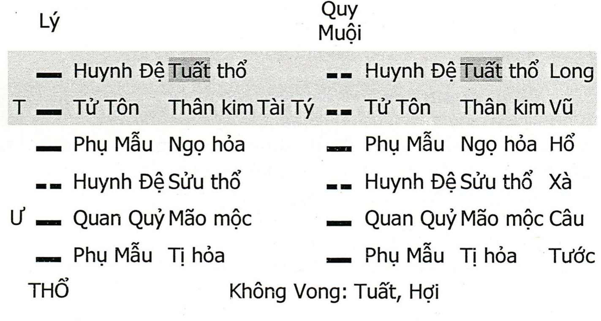

---

# Part 13 (Pages 241-260)

**Ví dụ 6:** Ngày Kỷ Mão tháng Thân, nam đoán xem nhà hàng kinh doanh ra sao? Được Phong Hỏa Gia Nhân biến Phong Thiên Tiểu Súc.

| | Gia Nhân | | | Tiểu Súc | |
| :---: | :---: | :--- | :---: | :--- | :--- |
| | — | Huynh Đệ Mão mộc | — | Huynh Đệ Mão mộc | Câu |
| Ư | — | Tử Tôn Tị hỏa | — | Tử Tôn Tị hỏa | Tước |
| | - - | Thê Tài Mùi thổ | - - | Thê Tài Mùi thổ | Long |
| | — | Phụ Mẫu Hợi thủy | — | Thê Tài Thìn thổ | Vũ |
| T | - - | Thê Tài Sửu thổ | — | Huynh Đệ Dần mộc | Hổ |
| | — | Huynh Đệ Mão mộc | — | Phụ Mẫu Tý thủy | Xà |

MỘC Không Vong: Thân, Dậu

**Phán đoán:** Lấy Thê Tài làm Dụng thần. Trong quẻ Thê Tài lưỡng hiện, lấy hào Thê Tài Sửu thổ phát động làm Dụng thần. Dụng thần không được Nhật Nguyệt trợ giúp, Nhật đến khắc, động hóa hồi đầu khắc, nhất định không phát đạt.

**Phản hồi:** Quả nhiên mắc nợ ngổn ngang, khó mà duy trì.

**Ví dụ 7:** Ngày Bính Tý tháng Tý, nam đoán xem quán cơm của vợ kinh doanh ra sao? Được Khảm Vi Thủy.

| | Khảm | | |
| :---: | :---: | :--- | :--- |
| T | - - | Huynh Đệ Tý thủy | Long |
| | — | Quan Quỷ Tuất thổ | Vũ |
| | - - | Phụ Mẫu Thân kim | Hổ |
| Ư | - - | Thê Tài Ngọ hỏa | Xà |
| | — | Quan Quỷ Thìn thổ | Câu |
| | - - | Tử Tôn Dần mộc | Tước |

THỦY Không Vong: Thân, Dậu

**Phán đoán:** Lấy Thê Tài làm Dụng thần, Thê Tài Ngọ hỏa không được Nhật Nguyệt trợ giúp, bị Nhật Nguyệt xung khắc là

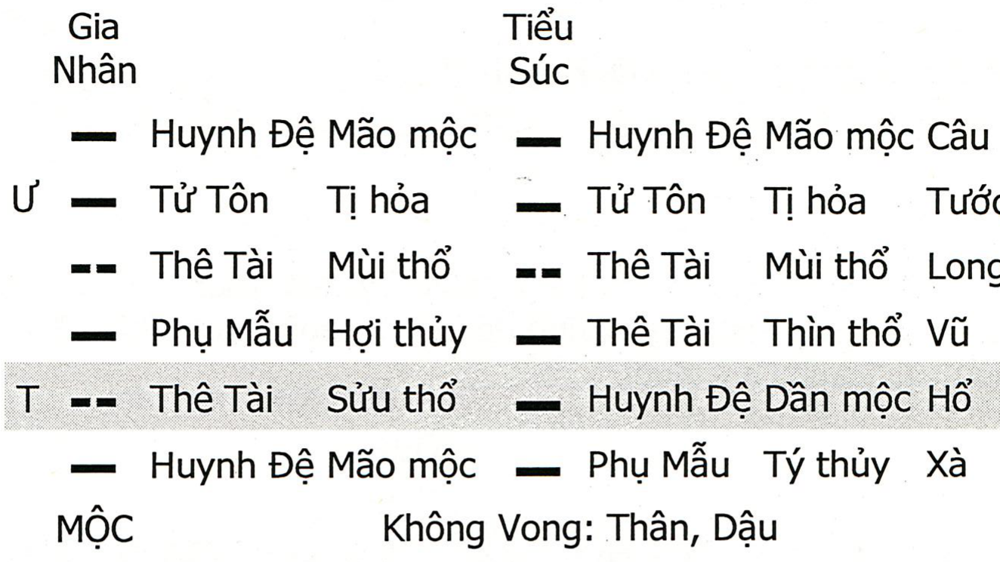

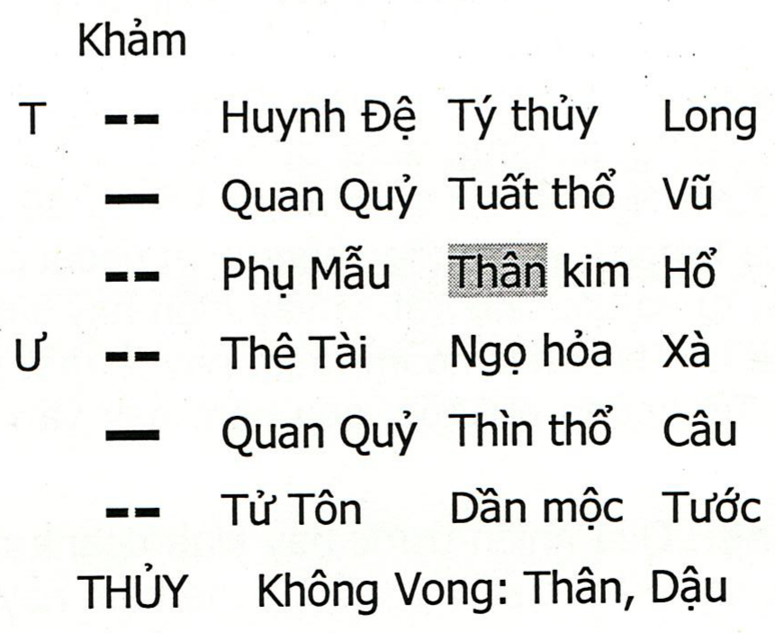

Nguyệt phá Nhật phá, lại là Huynh Đệ trì Thế quẻ lục xung, kinh doanh nhất định không thuận lợi.

**Phản hồi:** Quả nhiên tháng Hợi không thuận lợi, tháng Tý càng kém.

**Ví dụ 8:** Ngày Tân Mão tháng Ngọ, nữ đoán tiền đồ của nhà hàng, được Sơn Địa Bác biến Khôn Vi Địa.

| | Bác | | | Khôn | |
| :---: | :---: | :--- | :---: | :--- | :--- |
| | — | Thê Tài Dần mộc | - - | Huynh Đệ Dậu kim | Xà |
| T | - - | Tử Tôn Tý thủy | - - | Tử Tôn Hợi thủy | Câu |
| | - - | Phụ Mẫu Tuất thổ | - - | Phụ Mẫu Sửu thổ | Tước |
| | - - | Thê Tài Mão mộc | - - | Thê Tài Mão mộc | Long |
| Ư | - - | Quan Quỷ Tị hỏa | - - | Quan Quỷ Tị hỏa | Vũ |
| | - - | Phụ Mẫu Mùi thổ | - - | Phụ Mẫu Mùi thổ | Hổ |

KIM Không Vong: Ngọ, Mùi

**Phán đoán:** Lấy Thê Tài làm Dụng thần. Trong quẻ Thê Tài lưỡng hiện, lấy hào Thê Tài Dần mộc phát động làm Dụng thần. Dụng thần mặc dù được Nhật trợ giúp nhưng động hóa hồi đầu khắc, không cát. Hào 6 là điểm cuối của sự vật, chứng tỏ nhà hàng đã đến tình trạng không thể tái kinh doanh.

Hào Thế là người xin đoán, lâm Tử Tôn Nguyệt phá không thể sinh Tài, bản thân kinh doanh không giỏi, lâm thủy, thủy chủ trí, chủ suy xét vấn đề, là bản thân suy xét vấn đề không chu toàn. Lâm Câu Trần, Câu Trần chủ chậm chạp, bản thân suy nghĩ hồ đồ, căn bản không thể suy xét vấn đề.

Dự đoán kinh doanh nhà hàng là cầu tài dài hạn, cần xem hào Tử Tôn. Tử Tôn vô lực sinh Tài, chuyển nhượng càng nhanh càng tốt.

**Phản hồi:** Đã thua lỗ hơn 60 vạn tệ, hiện nay đang muốn chuyển nhượng nhưng người ta ra giá thì không đi. Kết quả sau cùng cần chờ tiếp tục phản hồi.

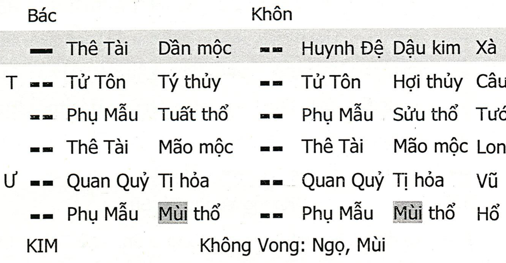

## 3. VÍ DỤ MỞ CỬA HÀNG TRANG PHỤC

**Ví dụ 1:** Ngày Nhâm Tuất tháng Dần năm Giáp Thân, nữ đoán về tình hình kinh doanh của cửa hàng quần áo trẻ em, được Địa Trạch Lâm biến Lôi Thiên Đại Tráng.

| | Lâm | | | Đại Tráng | | | |
| :---: | :---: | :--- | :--- | :---: | :--- | :--- | :--- |
| | - - | Tử Tôn | Dậu kim | - - | Huynh Đệ | Tuất thổ | Hổ |
| Ư | - - | Thê Tài | Hợi thủy | - - | Tử Tôn | Thân kim | Xà |
| | - - | Huynh Đệ | Sửu thổ | — | Phụ Mẫu | Ngọ hỏa | Câu |
| | - - | Huynh Đệ | Sửu thổ | — | Huynh Đệ | Thìn thổ | Tước |
| T | — | Quan Quỷ | Mão mộc | — | Quan Quỷ | Dần mộc | Long |
| | — | Phụ Mẫu | Tị hỏa | — | Thê Tài | Tý thủy | Vũ |

THỔ Không Vong: Tý, Sửu

**Phán đoán:** Lấy Thê Tài làm Dụng thần. Thê Tài Hợi thủy tại hào 5 bị Nguyệt hợp được khí, nhưng Nhật thần Tuất thổ đến khắc là hưu tù. Trong quẻ Huynh Đệ Sửu thổ lưỡng động, được Nhật trợ giúp, một hóa hồi đầu sinh, một hóa Tiến thần, mặc dù Không Vong nhưng vẫn có lực khắc Dụng thần, vì vậy hiệu quả kinh doanh không tốt. Năm trước là Quý Mùi, xung thực Huynh Đệ tất khắc Tài, năm 2003 nhất định phá tài.

**Phản hồi:** Quả nhiên kinh doanh thua lỗ ở năm Quý Mùi, năm nay cũng không thấy tình thế khả quan.

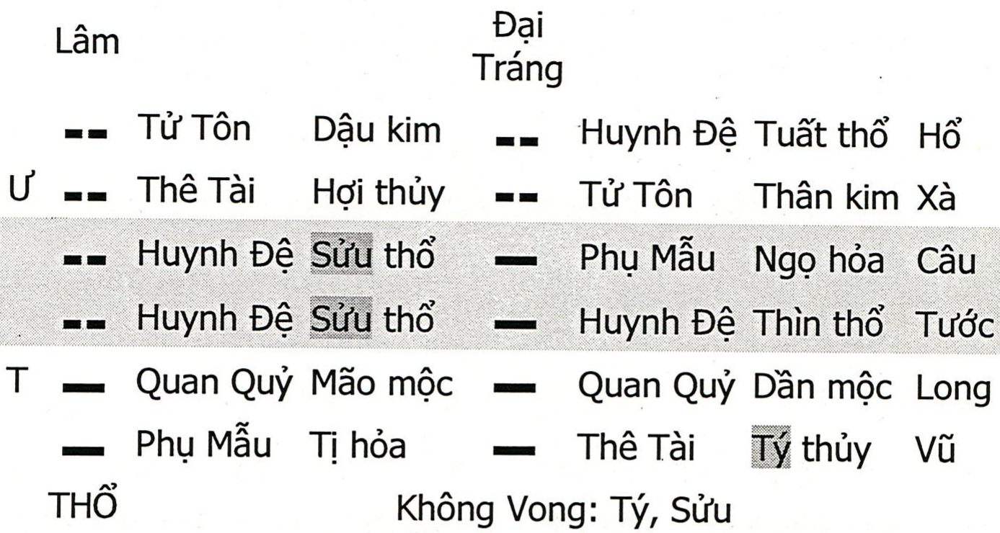

**Ví dụ 2:** Ngày Bính Dần tháng Mão, nam đoán bán sỉ quần áo sẽ ra sao? Được Thủy Lôi Truân biến Phong Hỏa Gia Nhân.

| | Truân | | | | Gia Nhân | | | |
| :---: | :---: | :--- | :--- | :--- | :---: | :--- | :--- | :--- |
| | - - | Huynh Đệ | Tý thủy | | — | Tử Tôn | Mão mộc | Long |
| Ư | — | Quan Quỷ | Tuất thổ | | — | Thê Tài | Tị hỏa | Vũ |
| | - - | Phụ Mẫu | Thân kim | | - - | Quan Quỷ | Mùi thổ | Hổ |
| | - - | Quan Quỷ | Thìn thổ | Tài Ngọ | — | Huynh Đệ | Hợi thủy | Xà |
| T | - - | Tử Tôn | Dần mộc | | - - | Quan Quỷ | Sửu thổ | Câu |
| | — | Huynh Đệ | Tý thủy | | — | Tử Tôn | Mão mộc | Tước |

THỦY Không Vong: Tuất, Hợi

**Phán đoán:** Lấy Thê Tài làm Dụng thần. Thê Tài Ngọ hỏa không hiện trên quẻ, phục tàng dưới hào 3 Quan Quỷ Thìn thổ. Dụng thần được Nhật Nguyệt sinh phù là vượng tướng, lợi nhuận kinh doanh không ít. Nhưng trong quẻ Huynh Đệ Tý thủy phát động, Phụ Mẫu Thân kim ám động, với hào động Thìn thổ tam hợp Huynh Đệ cục đến khắc Tài, đề phòng người khác hợp tác để lừa gạt.

**Phản hồi:** Quả nhiên là kinh doanh rất tốt. Mục đích đến xem quẻ chính là muốn dự đoán về một khách hàng cũ đã lấy của anh ta rất nhiều hàng nhưng sau đó không thấy tung tích, gọi điện thoại cũng không bắt máy, xem là có thể thu hồi được tiền hàng hay không.

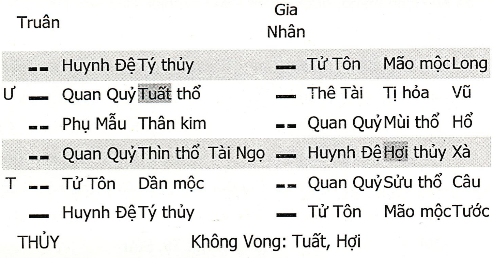

## 4. VÍ DỤ CẦU TÀI TRÊN INTETNET

**Ví dụ 1:** Ngày Nhâm Tuất tháng Ngọ, nữ đoán về cửa hàng đá quý trên mạng, được Thiên Sơn Độn biến Hỏa Sơn Lữ.

| | Độn | Phục thần | Lữ | Lục thú |
| :---: | :--- | :---: | :--- | :---: |
| | — Phụ Mẫu Tuất thổ | | — Quan Quỷ Tị hỏa | Hổ |
| Ứ | — Huynh Đệ Thân kim | | - - Phụ Mẫu Mùi thổ | Xà |
| | — Quan Quỷ Ngọ hỏa | | — Huynh Đệ Dậu kim | Câu |
| | — Huynh Đệ Thân kim | | — Huynh Đệ Thân kim | Tước |
| T | - - Quan Quỷ Ngọ hỏa | Tài Dần | - - Quan Quỷ Ngọ hỏa | Long |
| | - - Phụ Mẫu Thìn thổ | Tử Tý | - - Phụ Mẫu Thìn thổ | Vũ |

KIM      Không Vong: Tý, Sửu

**Phán đoán:** Lấy Thê Tài làm Dụng thần. Thê Tài Dần mộc không hiện trên quẻ, không được Nhật Nguyệt trợ giúp là hưu tù, vì vậy kinh doanh không phát đạt. Ứng lâm Huynh Đệ Thân kim phát động đến khắc, Ứng là người khác, Huynh Đệ là cạnh tranh, lâm Đằng Xà là mạng (internet), là trên mạng có đối thủ cạnh tranh tương tự.

**Phản hồi:** Quả nhiên là như vậy, trên mạng có rất nhiều cửa hàng tương tự, tiêu thụ không thuận lợi.

**Ví dụ 2:** Ngày Ất Sửu tháng Tuất, nữ đoán xem làm website có thu nhập hay không? Được Trạch Lôi Tùy.

| | Tùy | Phục thần | Lục thú |
| :---: | :--- | :---: | :---: |
| Ứ | - - Thê Tài Mùi thổ | | Vũ |
| | — Quan Quỷ Dậu kim | | Hổ |
| | — Phụ Mẫu Hợi thủy | Tử Ngọ | Xà |
| T | - - Thê Tài Thìn thổ | | Câu |
| | - - Huynh Đệ Dần mộc | | Tước |
| | — Phụ Mẫu Tý thủy | | Long |

MỘC      Không Vong: Tuất, Hợi

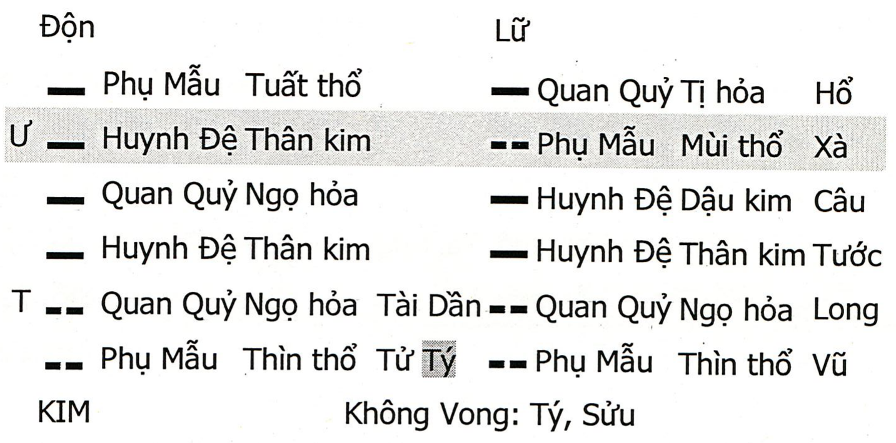

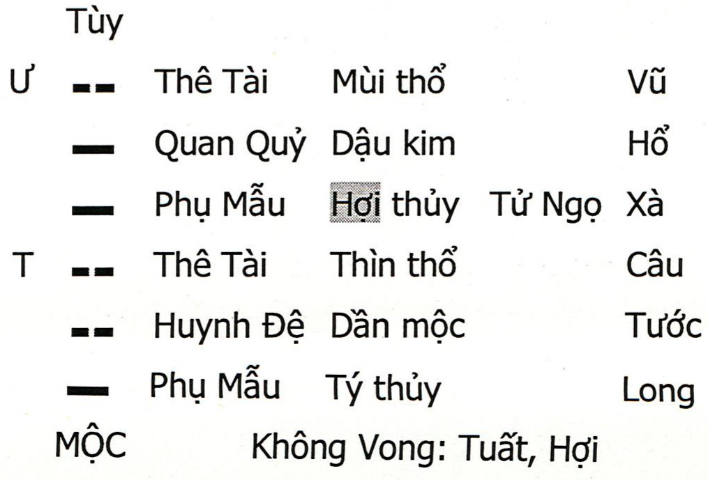

**Phán đoán:** Lấy Thê Tài làm Dụng thần. Trong quẻ Thê Tài lưỡng hiện, lấy hào Thê Tài Thìn thổ Nguyệt phá làm Dụng thần. Quẻ Trạch Lôi Tùy có ý nghĩa là tùy hòa, tùy tòng, chứng tỏ trên mạng đã có cách làm tương tự, là bắt chước theo người khác mà làm. Dụng thần được Nhật trợ giúp, cũng có thể thu được lợi nhuận, nhưng bởi vì Nguyệt phá, dựa vào internet thì không có hy vọng phát đại tài.

**Phản hồi:** Cô ấy cũng nhận thấy như vậy, chỉ cần có lợi nhuận là vừa lòng rồi.

**Ví dụ 3:** Ngày Nhâm Tý tháng Hợi, nữ đoán buôn bán trên mạng có thể phát tài không? Được Phong Hỏa Gia Nhân biến Ly Vi Hỏa.

| | Gia Nhân | Ly | Lục thú |
| :---: | :--- | :--- | :---: |
| | — Huynh Đệ Mão mộc | — Tử Tôn Tị hỏa | Hổ |
| Ứ | — Tử Tôn Tị hỏa | - - Thê Tài Mùi thổ | Xà |
| | - - Thê Tài Mùi thổ | — Quan Quỷ Dậu kim | Câu |
| | — Phụ Mẫu Hợi thủy | — Phụ Mẫu Hợi thủy | Tước |
| T | - - Thê Tài Sửu thổ | - - Thê Tài Sửu thổ | Long |
| | — Huynh Đệ Mão mộc | — Huynh Đệ Mão mộc | Vũ |

MỘC      Không Vong: Dần, Mão

**Phán đoán:** Lấy Thê Tài làm Dụng thần. Trong quẻ Thê Tài lưỡng hiện, lấy hào Thê Tài Mùi thổ phát động làm Dụng thần. Dụng thần không được Nhật Nguyệt sinh phù là hưu tù, nhưng cũng không bị Nhật Nguyệt khắc hại, có gốc rễ nhưng thiếu khí.

Tử Tôn Tị hỏa phát động đến sinh là thông tin tiến tài, nhưng Nguyên thần Nguyệt phá lại bị Nhật khắc, xét về dài hạn thì hiệu quả không cao. Nguyên thần Nguyệt phá, sang tháng bất phá có thể sinh Dụng thần, vì vậy tháng Tý có thể tiến tài.

**Phản hồi:** Quả nhiên tại tháng Tý đã thu được một ít tài.

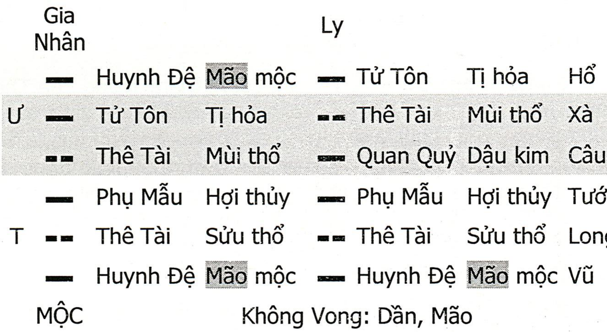

### Ví dụ 4: Ngày Quý Tị tháng Thân, nữ kinh doanh trên mạng đang đối mặt phá sản, hỏi có thể xoay chuyển không? Được Sơn Thiên Đại Súc biến Hỏa Sơn Lữ.

| | Đại Súc | Lữ | |
| :---: | :--- | :--- | :---: |
| | ━ Quan Quỷ Dần mộc | ━ Phụ Mẫu Tị hỏa | Hổ |
| Ứ | - - Thê Tài Tý thủy | - - Huynh Đệ Mùi thổ | Xà |
| | - - Huynh Đệ Tuất thổ | ━ Tử Tôn Dậu kim | Câu |
| | ━ Huynh Đệ Thìn thổ Tử Thân | ━ Tử Tôn Thân kim | Tước |
| T | ━ Quan Quỷ Dần mộc Phụ Ngọ | - - Phụ Mẫu Ngọ hỏa | Long |
| | ━ Thê Tài Tý thủy | - - Huynh Đệ Thìn thổ | Vũ |

THỔ Không Vong: Ngọ, Mùi

**Phán đoán:** Lấy Thê Tài làm Dụng thần. Trong quẻ Thê Tài lưỡng hiện, lấy hào Thê Tài Tý thủy phát động làm Dụng thần. Dụng thần được Nguyệt sinh phù, Nhật không đến khắc là vượng tướng. Nhưng trong quẻ Huynh Đệ Tuất thổ phát động khắc, Dụng thần lại hóa hồi đầu khắc, quả là nguy cơ chồng chất, may mà Thê Tài Tý thủy nhờ Nguyệt kiến miễn cưỡng tạo thành tam hợp cục đến sinh hào Thế, chứng tỏ vẫn có thể xoay chuyển, nhưng không thể phát đại tài.

**Phản hồi:** Sau khi hóa giải, cô ấy đã thu được một khoản tiền, công việc kinh doanh được duy trì.

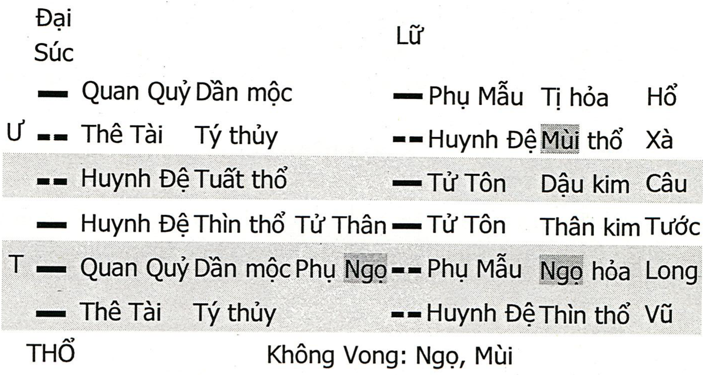

## 5. VÍ DỤ MỞ BỆNH VIỆN, PHÒNG KHÁM BỆNH

### Ví dụ 1: Ngày Canh Tuất tháng Tị, đoán tiền đồ của phòng khám bệnh, được Hỏa Sơn Lữ biến Khảm Vi Thủy.

| | Lữ | Khảm | |
| :---: | :--- | :--- | :---: |
| | ━ Huynh Đệ Tị hỏa | - - Quan Quỷ Tý thủy | Xà |
| | - - Tử Tôn Mùi thổ | ━ Tử Tôn Tuất thổ | Câu |
| Ứ | ━ Thê Tài Dậu kim | - - Thê Tài Thân kim | Tước |
| | ━ Thê Tài Thân kim | - - Huynh Đệ Ngọ hỏa | Long |
| | - - Huynh Đệ Ngọ hỏa | ━ Tử Tôn Thìn thổ | Vũ |
| T | - - Tử Tôn Thìn thổ | - - Phụ Mẫu Dần mộc | Hổ |

HỎA Không Vong: Dần, Mão

**Phán đoán:** Lấy Thê Tài làm Dụng thần. Trong quẻ Thê Tài lưỡng hiện và đều phát động, lấy hào Ứng Thê Tài Dậu kim làm Dụng thần, hào còn lại dùng để tham khảo. Nguyệt khắc Nhật sinh, suy vượng cân bằng, nhưng trong quẻ Thê Tài Dậu kim động mà hóa thoái, biểu thị kinh doanh dần dần sa sút. Ngoài ra, Dụng thần Thê Tài Thân kim động hóa hồi đầu khắc, cũng biểu thị thu nhập không tốt.

Trong quẻ có quá nhiều hào động, biểu thị kinh doanh rất gian nan. Hóa lục xung, sợ là rất khó duy trì hoạt động.

**Phản hồi:** Trên thực tế, ngay cả tiền thuê nhà cũng không trả nổi, kinh doanh ế ẩm.

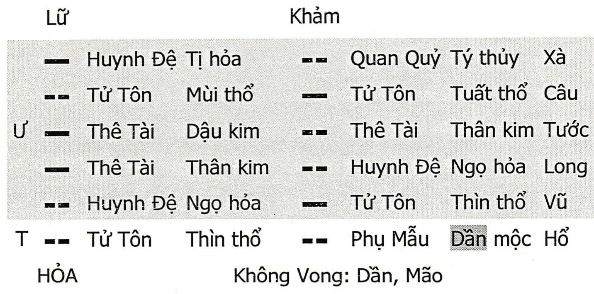

### Ví dụ 2: Ngày Canh Tuất tháng Tị, nữ đoán xem tiệm thuốc kinh doanh ra sao? Được Cấn Vi Sơn biến Hỏa Sơn Lữ.

| | Cấn | | | Lữ | |
| :---: | :---: | :--- | :---: | :--- | :--- |
| T | ━ | Quan Quỷ Dần mộc | ━ | Phụ Mẫu Tị hỏa | Xà |
| | ━ ━ | Thê Tài Tý thủy | ━ ━ | Huynh Đệ Mùi thổ | Câu |
| | ━ ━ | Huynh Đệ Tuất thổ | ━ | Tử Tôn Dậu kim | Tước |
| Ư | ━ | Tử Tôn Thân kim | ━ | Tử Tôn Thân kim | Long |
| | ━ ━ | Phụ Mẫu Ngọ hỏa | ━ ━ | Phụ Mẫu Ngọ hỏa | Vũ |
| | ━ ━ | Huynh Đệ Thìn thổ | ━ ━ | Huynh Đệ Thìn thổ | Hổ |

THỔ Không Vong: Dần, Mão

**Phán đoán:** Lấy Thê Tài làm Dụng thần. Thê Tài Tý thủy không được Nhật Nguyệt trợ giúp, Nhật khắc Dụng thần, hào 4 Huynh Đệ Tuất thổ phát động lại đến khắc, Huynh Đệ Thìn thổ ám động, hào Thế lại Không không được Thê Tài đến sinh, vì vậy kinh doanh không phát đạt.

**Phản hồi:** Quả nhiên kinh doanh vắng vẻ.

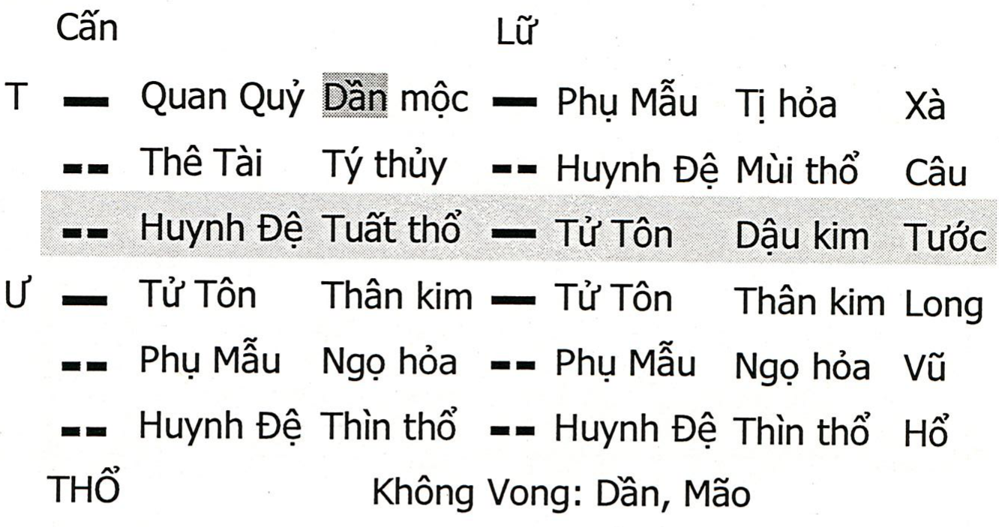

### Ví dụ 3: Ngày Đinh Hợi tháng Thân, nữ đoán tiền đồ của tiệm châm cứu mát xa, được Lôi Địa Dự biến Lôi Sơn Tiểu Quá.

| | Dự | | | | Tiểu Quá | |
| :---: | :---: | :--- | :---: | :---: | :--- | :--- |
| | ━ ━ | Thê Tài Tuất thổ | | ━ ━ | Thê Tài Tuất thổ | Long |
| | ━ ━ | Quan Quỷ Thân kim | | ━ ━ | Quan Quỷ Thân kim | Vũ |
| Ư | ━ | Tử Tôn Ngọ hỏa | | ━ | Tử Tôn Ngọ hỏa | Hổ |
| | ━ ━ | Huynh Đệ Mão mộc | | ━ | Quan Quỷ Thân kim | Xà |
| | ━ ━ | Tử Tôn Tị hỏa | | ━ ━ | Tử Tôn Ngọ hỏa | Câu |
| T | ━ ━ | Thê Tài Mùi thổ | Phụ Tý | ━ ━ | Thê Tài Thìn thổ | Tước |

MỘC Không Vong: Ngọ, Mùi

**Phán đoán:** Lấy Thê Tài làm Dụng thần, trong quẻ Thê Tài lưỡng hiện, lấy Thê Tài Mùi thổ Không Vong làm Dụng thần. Thê Tài Mùi thổ trì Thế, nhưng không được Nhật Nguyệt đến sinh, hơn nữa Không Vong, cộng thêm Huynh Đệ độc phát là Tử địa Dụng thần. Vì vậy, công việc kinh doanh của cửa hàng nhất định không thuận lợi.

Hào Ứng là khách, Không không thể sinh Thế, cửa hàng không nhiều khách. Thế Không, bản thân không có lòng tin làm tiếp.

Hào 2 Tử Tôn Tị hỏa ám động sinh Tài, ám động biểu thị không phải là quang minh chính đại, cho nên phán đoán là ngấm ngầm làm việc không cho người khác biết chuyện kiếm thêm thu nhập. Nhật Hợi thủy xung Tị hỏa, thủy thể hiện buổi tối, cho nên là làm việc kiếm tiền vào ban đêm.

**Phản hồi:** Trên thực tế là kinh doanh không thuận lợi, không đủ duy trì cuộc sống cho nên buổi tối đã đến quán rượu lân cận làm gái mát xa.

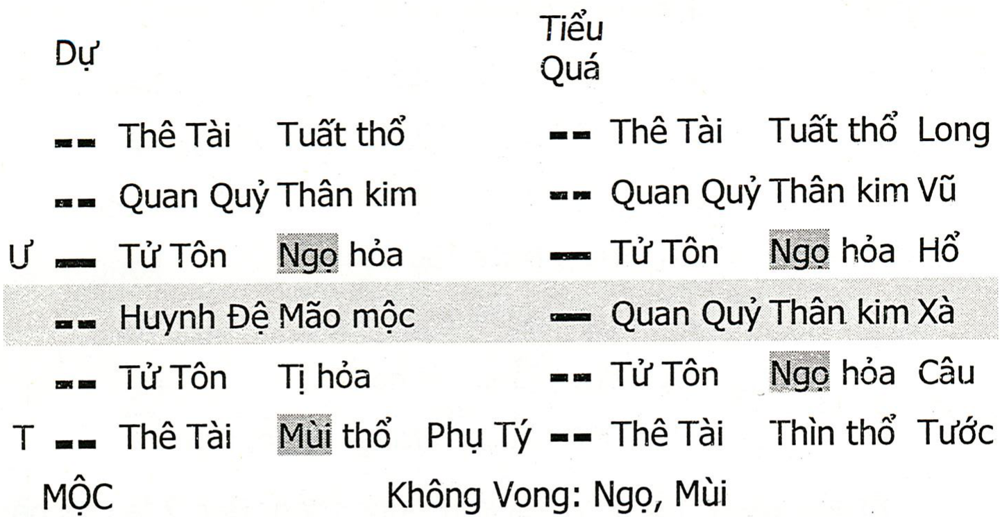

### Ví dụ 4: Ngày Canh Thìn tháng Dậu, nữ đoán tiền đồ của phòng khám nha khoa, được Thiên Trạch Lý.

| | Lý | | |
|---|---|---|---|
| | ━ Huynh Đệ Tuất thổ | | Xà |
| T | ━ Tử Tôn Thân kim | Tài Tý | Câu |
| | ━ Phụ Mẫu Ngọ hỏa | | Tước |
| | -- Huynh Đệ Sửu thổ | | Long |
| Ứ | ━ Quan Quỷ Mão mộc | | Vũ |
| | ━ Phụ Mẫu Tị hỏa | | Hổ |

THỔ Không Vong: Thân, Dậu

**Phán đoán:** Lấy Thê Tài làm Dụng thần. Hào 2 là cửa hàng, Thê Tài Tý thủy không hiện trên quẻ, phục dưới hào Thế Tử Tôn Thân kim. Nguyệt sinh Nhật khắc, suy vượng khó phân rõ. Hào 6 Huynh Đệ Tuất thổ bị Nhật xung thành ám động, khắc Dụng thần Tý thủy, mà hào Thế Không Vong an tĩnh, không thể dẫn hóa lực khắc của Huynh Đệ, vì vậy kinh doanh không tốt.

Huynh Đệ cũng là cạnh tranh, ám động hợp hào 2 Quan Quỷ Mão mộc, hào 2 là cửa hàng, phòng khám bệnh, chứng tỏ đối thủ cạnh tranh là người cùng nghề, họ mở tiệm gần phòng khám của cô ấy. Hào sơ là cấp dưới, nhân viên, lâm Bạch Hổ nhập Mộ ở Tuất thổ, Thân kim là Bệnh địa, hợp hào sơ, Bệnh địa chủ bệnh, Bạch Hổ lại chủ bệnh tật, bị thương,... cho nên cấp dưới sẽ xảy ra những sự việc này.

**Phản hồi:** Phòng khám kinh doanh đã ba năm, nhân viên không bị bệnh thì cũng xảy ra tai nạn, gần đó có mấy phòng khám cho nên kinh doanh khó khăn.

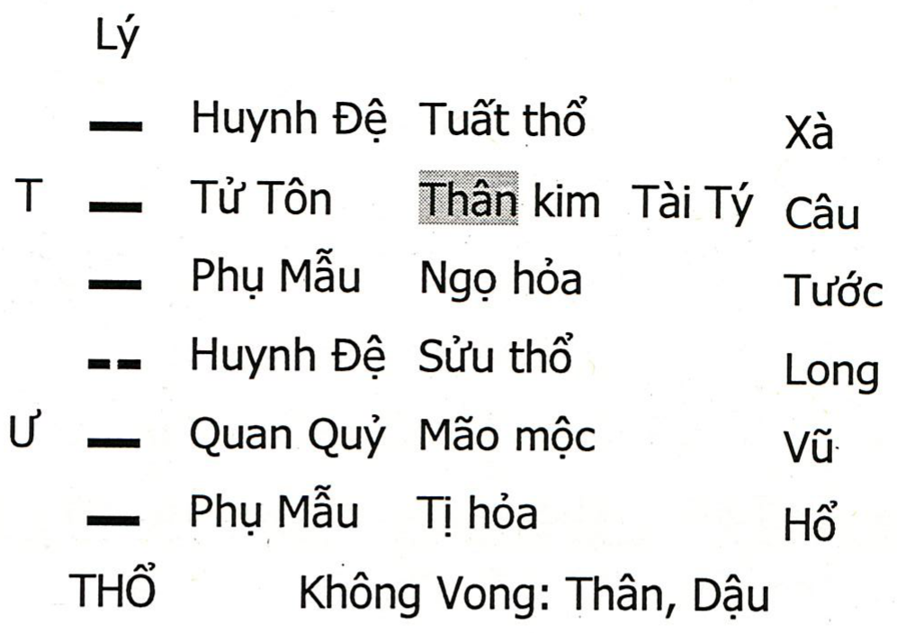

### Ví dụ 5: Ngày Giáp Tuất tháng Dần, nữ đoán xem bỏ việc để mở phòng khám sẽ ra sao? Được Thiên Lôi Vô Vọng biến Sơn Hỏa Bí.

| | Vô Vọng | | Bí | |
|---|---|---|---|---|
| | ━ Thê Tài Tuất thổ | ━ | Huynh Đệ Dần mộc | Vũ |
| | ━ Quan Quỷ Thân kim | -- | Phụ Mẫu Tý thủy | Hổ |
| T | ━ Tử Tôn Ngọ hỏa | -- | Thê Tài Tuất thổ | Xà |
| | -- Thê Tài Thìn thổ | ━ | Phụ Mẫu Hợi thủy | Câu |
| | -- Huynh Đệ Dần mộc | -- | Thê Tài Sửu thổ | Tước |
| Ứ | ━ Phụ Mẫu Tý thủy | ━ | Huynh Đệ Mão mộc | Long |

MỘC Không Vong: Thân, Dậu

**Phán đoán:** Lấy Thê Tài làm Dụng thần. Trong quẻ Thê Tài lưỡng hiện, lấy hào Thê Tài Thìn thổ phát động làm Dụng thần. Quan Quỷ Thân kim Không Phá là thông tin nghỉ việc. Hào Thế phát động hóa ra Thê Tài, nỗ lực thì có thể nhìn thấy lợi nhuận. Trong quẻ và Nhật Nguyệt tam hợp Tử Tôn hỏa cục đến sinh Dụng thần, phòng khám có tiền đồ phát triển rộng mở.

**Phản hồi:** Quả nhiên quyết đoán nghỉ việc để mở phòng khám, chưa đến mấy năm đã kinh doanh rất tốt, sau đó lại tiếp tục mở thêm chi nhánh.

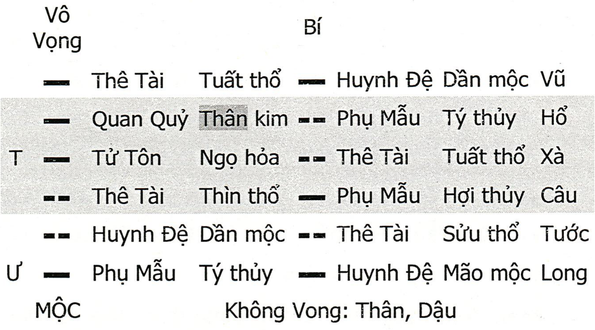

**Ví dụ 6:** Ngày Quý Hợi tháng Tuất, nam đoán xem kinh doanh phòng khám chỉnh hình sẽ ra sao? Được Trạch Địa Tụy biến Trạch Sơn Hàm.

| | Tụy | | | Hàm | |
| :--- | :---: | :--- | :---: | :--- | :--- |
| | - - | Phụ Mẫu Mùi thổ | - - | Phụ Mẫu Mùi thổ | Hổ |
| Ư | — | Huynh Đệ Dậu kim | — | Huynh Đệ Dậu kim | Xà |
| | — | Tử Tôn Hợi thủy | — | Tử Tôn Hợi thủy | Câu |
| | - - | Thê Tài Mão mộc | — | Huynh Đệ Thân kim | Tước |
| T | - - | Quan Quỷ Tị hỏa | - - | Quan Quỷ Ngọ hỏa | Long |
| | - - | Phụ Mẫu Mùi thổ | - - | Phụ Mẫu Thìn thổ | Vũ |

KIM Không Vong: Tý, Sửu

**Phán đoán:** Lấy Thê Tài làm Dụng thần. Thê Tài Mão mộc Nguyệt hợp được khí, Nhật sinh là vượng tướng. Nhưng không nên độc phát hóa Tuyệt, hóa hồi đầu khắc. Kinh doanh nhất định không thuận lợi.

**Phản hồi:** Quả nhiên năm Canh Thìn bắt đầu làm, đến lúc dự đoán là năm Giáp Thân thì liên tục gặp khó khăn.

**Ví dụ 7:** Ngày Bính Tý tháng Ngọ, nam đoán tiền đồ của phòng khám nha khoa, được Thiên Lôi Vô Vọng biến Càn Vi Thiên.

| | Vô Vọng | | | Càn | |
| :--- | :---: | :--- | :---: | :--- | :--- |
| | — | Thê Tài Tuất thổ | — | Thê Tài Tuất thổ | Long |
| | — | Quan Quỷ Thân kim | — | Quan Quỷ Thân kim | Vũ |
| T | — | Tử Tôn Ngọ hỏa | — | Tử Tôn Ngọ hỏa | Hổ |
| | - - | Thê Tài Thìn thổ | — | Thê Tài Thìn thổ | Xà |
| | - - | Huynh Đệ Dần mộc | — | Huynh Đệ Dần mộc | Câu |
| Ư | — | Phụ Mẫu Tý thủy | — | Phụ Mẫu Tý thủy | Tước |

MỘC Không Vong: Thân, Dậu

**Phán đoán:** Lấy Thê Tài làm Dụng thần. Trong quẻ Thê Tài lưỡng hiện, lấy hào Thê Tài Thìn thổ phát động làm Dụng thần.

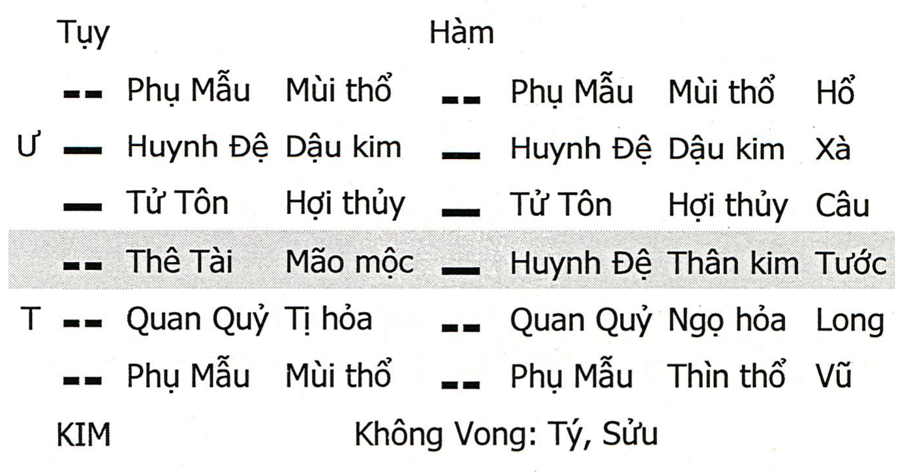

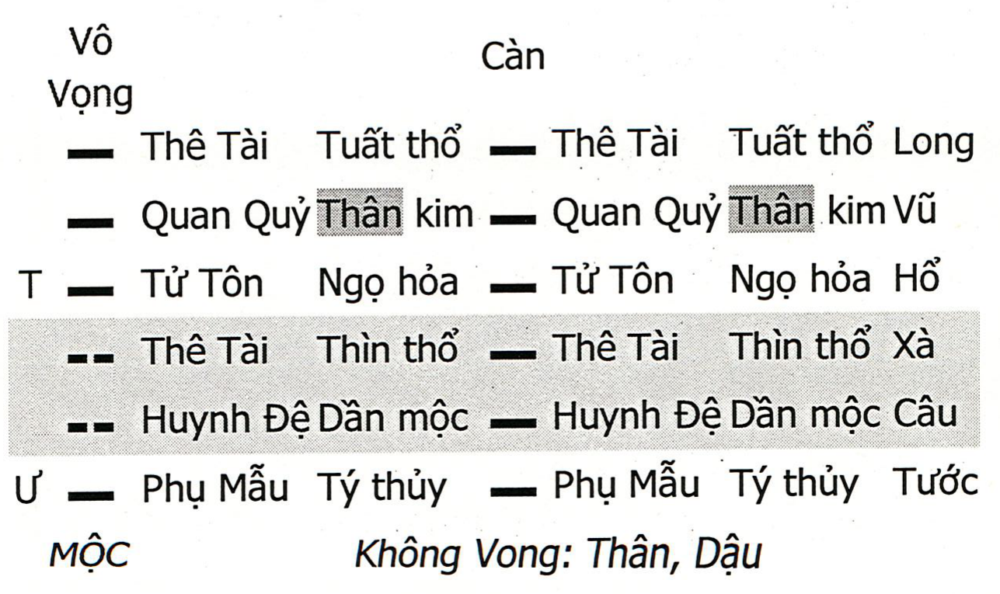

Dụng thần mặc dù được Nguyệt kiến sinh phù, nhưng nội quái phục ngâm, biểu thị bản thân rất khổ não, kinh doanh gặp khó khăn.

Hào Thế bị Nhật xung dẫn tới ám động đi sinh Thê Tài, Nhật thần nhập quẻ tại hào Ứng. Ứng là người khác, lâm Chu Tước chủ miệng, nói năng, là người khác giới thiệu khách hàng, cung cấp cho mình cơ hội kiếm tiền. Hào Thế lâm Bạch Hổ, Bạch Hổ chủ chữa bệnh, là tổ chức y tế giới thiệu khách hàng.

Kỵ thần tại hào 2 lâm Câu Trần phát động, hào 2 là phòng khám bệnh, Câu Trần là địa điểm làm việc, nơi làm việc tiêu hao nhiều chi phí, tiền thuê cao.

**Phản hồi:** Thực tế đúng là tiền thuê quá cao, kinh doanh lại không phát đạt, chủ yếu nhờ bệnh viện giới thiệu khách hàng.

**Ví dụ 8:** Ngày Nhâm Ngọ tháng Tý, nam đoán tiền đồ phát triển của phòng khám nha khoa, được Đoài Vi Trạch.

| | Đoài | | |
| :--- | :---: | :--- | :--- |
| T | - - | Phụ Mẫu Mùi thổ | Hổ |
| | — | Huynh Đệ Dậu kim | Xà |
| | — | Tử Tôn Hợi thủy | Câu |
| Ư | - - | Phụ Mẫu Sửu thổ | Tước |
| | — | Thê Tài Mão mộc | Long |
| | — | Quan Quỷ Tị hỏa | Vũ |

KIM Không Vong: Thân, Dậu

**Phán đoán:** Lấy Thê Tài làm Dụng thần, Thê Tài Mão mộc được Nguyệt sinh phù là vượng tướng, Nhật không đến khắc, hào Thế là Tài khố, vì vậy phát triển khá tốt. Chỉ là Nhật hợp hào Thế, Nhật là Quan Quỷ thể hiện công việc, hào Thế Phụ Mẫu biểu thị vất vả, Bạch Hổ chủ bận rộn, lục xung cũng biểu thị bận rộn, công việc bận rộn mà vất vả.

**Phản hồi:** Quả nhiên rất bận, nhưng thu nhập khá tốt.

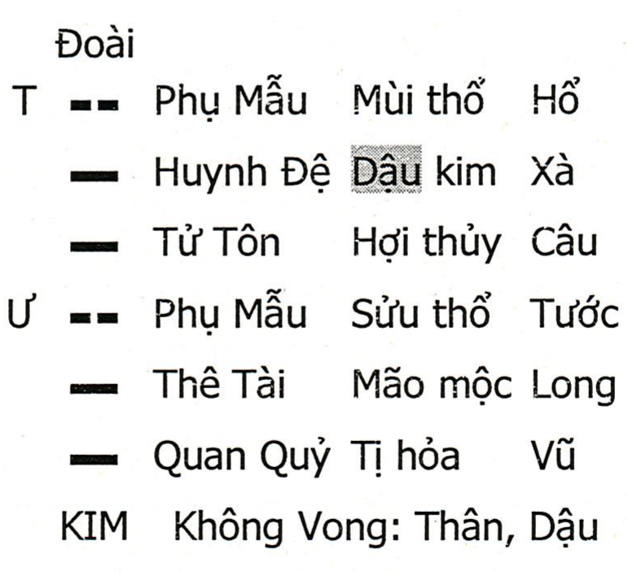

## 6. VÍ DỤ MỞ CỬA HÀNG ĐỒ CỔ

**Ví dụ 1:** Ngày Canh Tuất tháng Mùi, nữ đoán xem chồng mở cửa hàng đồ cổ sẽ ra sao? Được Địa Hỏa Minh Di biến Lôi Thiên Đại Tráng.

| Minh Di | Đại Tráng |
| :--- | :--- |
| -- Phụ Mẫu Dậu kim | -- Quan Quỷ Tuất thổ Xà |
| -- Huynh Đệ Hợi thủy | -- Phụ Mẫu Thân kim Câu |
| T -- Quan Quỷ Sửu thổ | — Thê Tài Ngọ hỏa Tước |
| — Huynh Đệ Hợi thủy Tài Ngọ | — Quan Quỷ Thìn thổ Long |
| -- Quan Quỷ Sửu thổ | — Tử Tôn Dần mộc Vũ |
| Ư — Tử Tôn Mão mộc | — Huynh Đệ Tý thủy Hổ |

THỦY Không Vong: Dần, Mão

**Phán đoán:** Lấy Thê Tài làm Dụng thần. Tử Tôn lâm hào Ứng chính là khách hàng. Thê Tài Ngọ hỏa không hiện trên quẻ, phục dưới hào 3 Huynh Đệ Hợi thủy. Nhật Nguyệt mặc dù không khắc Dụng thần nhưng nhập Mộ ở Nhật, đồ cổ tồn đọng, không xuất đi được. Ứng tại hào sơ lâm Bạch Hổ Không Vong không sinh Dụng thần, hào sơ là chân, Bạch Hổ chủ đường đi, Không biểu thị thiếu, chứng tỏ khách hàng không nhiều, người vào cửa hàng không nhiều.

Hào Thế động hóa Thê Tài Ngọ hỏa hồi đầu sinh, Tài được Nguyệt hợp được khí, cửa hàng chỉ có thể đủ duy trì mà thôi, căn bản không có lợi nhuận gì. Hào 2 là cửa hàng, Quan Quỷ lâm Huyền Vũ phát động, Huyền Vũ chủ đạo tặc, lừa gạt, phải đề phòng ăn trộm vào nhà hoặc có người lừa gạt. Hào 2 phát động, phát động thường chủ thay đổi. Quẻ du hồn, chủ di động, di chuyển. Chứng tỏ địa điểm kinh doanh cũng không ổn định.

**Phản hồi:** Trên thực tế là vừa đủ tiền thuê cửa hàng, đã từng bị người ta lừa gạt. Cô ấy nói rằng cửa hàng đã chuyển chỗ ba lần.

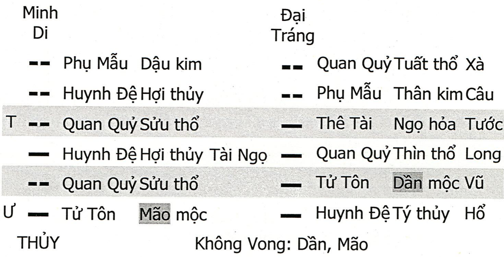

**Ví dụ 2:** Ngày Canh Dần tháng Tý, nam đoán về sinh ý của cửa hàng đồ cổ, được Hỏa Sơn Lữ biến Địa Phong Thăng.

| Lữ | Thăng |
| :--- | :--- |
| — Huynh Đệ Tị hỏa | -- Thê Tài Dậu kim Xà |
| -- Tử Tôn Mùi thổ | -- Quan Quỷ Hợi thủy Câu |
| Ư — Thê Tài Dậu kim | -- Tử Tôn Sửu thổ Tước |
| — Thê Tài Thân kim Quan Hợi | — Thê Tài Dậu kim Long |
| -- Huynh Đệ Ngọ hỏa | — Quan Quỷ Hợi thủy Vũ |
| T -- Tử Tôn Thìn thổ Phụ Mão | -- Tử Tôn Sửu thổ Hổ |

HỎA Không Vong: Ngọ, Mùi

**Phán đoán:** Lấy Thê Tài làm Dụng thần. Trong quẻ Thê Tài lưỡng hiện, lấy hào Thê Tài Dậu kim phát động làm Dụng thần. Ngoại quái Dụng thần tam hợp cục, chứng tỏ kinh doanh nhiều chủng loại, nhiều đồ vật. Nhưng Dụng thần không được Nhật Nguyệt trợ giúp, hào 2 Huynh Đệ Ngọ hỏa phát động khắc Dụng thần, Nhật đến sinh trợ Kỵ thần, biểu thị hiện nay làm ăn không phát đạt.

Hào 3 Thê Tài Thân kim ám động hợp trú hào 6 Huynh Đệ, hào 6 Huynh Đệ đến hợp Thân kim, hào 6 là phương xa, biểu thị chủ yếu dựa vào giao dịch ngầm để duy trì cửa hàng, có người vùng khác đến mua sắm.

Tử Tôn là khách hàng, hào 5 Tử Tôn Mùi thổ Không không sinh Thê Tài, hào 5 là đường. Biểu thị khách qua đường ít khi vào trong cửa hàng mua sắm.

**Phản hồi:** Dự đoán ăn khớp với tình hình thực tế.

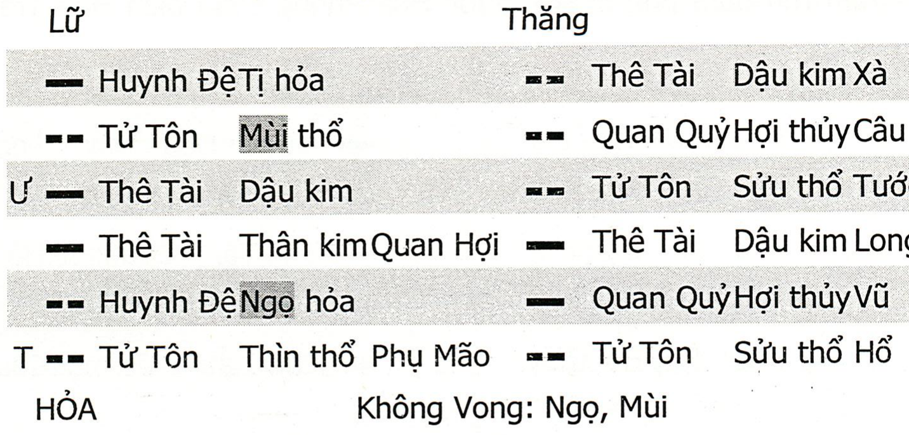

# 7. VÍ DỤ MỞ TRẠM THU GOM PHẾ PHẨM

**Ví dụ 1:** Ngày Đinh Tị tháng Thân, nam đoán tiền đồ của trạm thu gom phế phẩm, được Hỏa Phong Đỉnh biến Hỏa Trạch Khuê.

| | Đỉnh | Khuê | |
|---|---|---|---|
| | — Huynh Đệ Tị hỏa | — Huynh Đệ Tị hỏa | Long |
| Ứ | - - Tử Tôn Mùi thổ | - - Tử Tôn Mùi thổ | Vũ |
| | — Thê Tài Dậu kim | — Thê Tài Dậu kim | Hổ |
| | — Thê Tài Dậu kim | - - Tử Tôn Sửu thổ | Xà |
| T | — Quan Quỷ Hợi thủy | — Phụ Mẫu Mão mộc | Câu |
| | - - Tử Tôn Sửu thổ Phụ Mão | — Huynh Đệ Tị hỏa | Tước |

HỎA Không Vong: Tý, Sửu

**Phán đoán:** Lấy Thê Tài làm Dụng thần. Trong quẻ Thê Tài lưỡng hiện, lấy hào Thê Tài Dậu kim phát động làm Dụng thần. Dụng thần được Nguyệt tỉ phù, Nhật khắc suy vượng cân bằng. Nhưng may mà trong quẻ tam hợp Tài cục sinh hào Thế, cho nên có thể nói là vẫn có lợi nhận.

Tam hợp Tài cục, đây là nhiều người hợp tác, hóa Không là tam hợp cục không chặt chẽ, chứng tỏ hợp tác không đoàn kết.

**Phản hồi:** Thực tế là năm người hợp tác, họ thường xuyên tranh chấp vì phân chia lợi nhuận không đều. Nhưng nếu ít người thì bận rộn không xoay sở được, chỉ có thể hợp tác cùng làm.

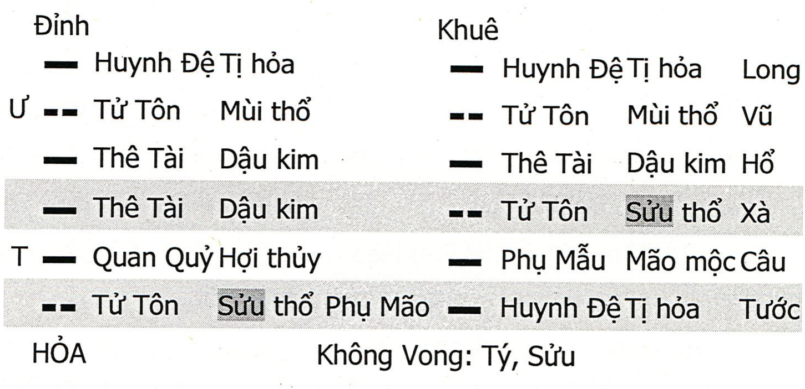

**Ví dụ 2:** Ngày Canh Tuất tháng Tuất, nam đoán xem làm trạm thu gom phế phẩm bên cạnh sở thú sẽ ra sao? Được Địa Thiên Thái biến Sơn Thiên Đại Súc.

| | Thái | Đại Súc | |
|---|---|---|---|
| Ứ | - - Tử Tôn Dậu kim | — Quan Quỷ Dần mộc | Xà |
| | - - Thê Tài Hợi thủy | - - Thê Tài Tý thủy | Câu |
| | - - Huynh Đệ Sửu thổ | - - Huynh Đệ Tuất thổ | Tước |
| T | — Huynh Đệ Thìn thổ | — Huynh Đệ Thìn thổ | Long |
| | — Quan Quỷ Dần mộc Phụ Tị | — Quan Quỷ Dần mộc | Vũ |
| | — Thê Tài Tý thủy | — Thê Tài Tý thủy | Hổ |

THỔ Không Vong: Dần, Mão

**Phán đoán:** Mục đích là lợi nhuận cho nên lấy Thê Tài làm Dụng thần. Trong quẻ Thê Tài lưỡng hiện, đều không phát động, cũng bất Không bất phá, lấy Thê Tài Hợi thủy gần hào Ứng làm Dụng thần. Dụng thần bị Nhật Nguyệt khắc chế là hưu tù vô căn. Nhưng Nguyên thần độc phát, gặp sinh được sinh, vẫn có thể có lợi nhuận nhưng không nhiều.

Hào Thế là Tài khố, bị Nhật Nguyệt xung phá, tiền kiếm được cũng sẽ bị bóc lột sạch. Huống hồ Nguyên thần động mà hóa Tuyệt, không thể lâu dài.

**Phản hồi:** Anh ta nói đã tìm được một chỗ khá tốt, nhưng tiền thuê cao, sở thú đòi phí ô nhiễm, vài người đầu tư vốn cho sở thú cũng đòi phí ảnh hưởng. Sau một thời gian, do không thể quản lý nên đã chuyển đi.

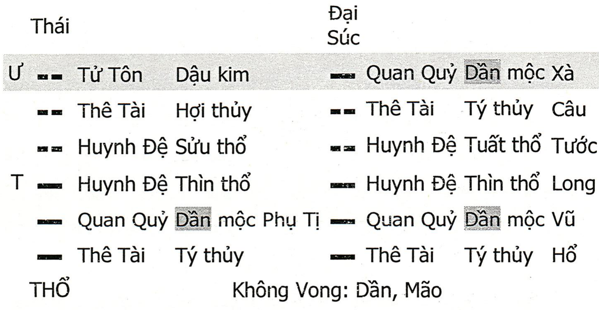

### Ví dụ 3

Ngày Đinh Dậu tháng Mão, nam đoán xem trạm thu gom phế phẩm có thể làm lâu dài hay không? Được Thủy Phong Tỉnh biến Địa Hỏa Minh Di.

| | Tỉnh | | | Minh Di | | |
| :---: | :---: | :--- | :---: | :---: | :--- | :--- |
| | -- | Phụ Mẫu Tý thủy | | -- | Quan Quỷ Dậu kim | Long |
| T | — | Thê Tài Tuất thổ | | -- | Phụ Mẫu Hợi thủy | Vũ |
| | -- | Quan Quỷ Thân kim | Tử Ngọ | -- | Thê Tài Sửu thổ | Hổ |
| | — | Quan Quỷ Dậu kim | | — | Phụ Mẫu Hợi thủy | Xà |
| Ư | — | Phụ Mẫu Hợi thủy | Huynh Dần | -- | Thê Tài Sửu thổ | Câu |
| | -- | Thê Tài Sửu thổ | | — | Huynh Đệ Mão mộc | Tước |

MỘC               Không Vong: Thìn, Tị

**Phán đoán:** Lấy Thê Tài làm Dụng thần. Trong quẻ Thê Tài lưỡng hiện, đều phát động nên đều có thể làm Dụng thần. Hào Thế Thê Tài Tuất thổ được Nguyệt hợp vượng, nhưng suy cho cùng thì Nhật Nguyệt không sinh phù, cho nên mặc dù có lợi nhưng rất ít. Hào sơ Thê Tài Sửu thổ hóa hồi đầu khắc, không thể kinh doanh lâu dài.

Hào 2 Phụ Mẫu là sân bãi, động hóa hồi đầu khắc, sân bãi cũng không thể sử dụng lâu dài. Lâm Câu Trần hóa hồi đầu khắc, Câu Trần chủ kiến trúc, cải tạo, tất vì sân bãi có biến cố mà không thể kinh doanh.

**Phản hồi:** Năm Quý Mùi dự đoán, quả nhiên tại năm Đinh Hợi phát sinh biến cố, bởi vì xung quanh có cải tạo công trình mà không thể kinh doanh.

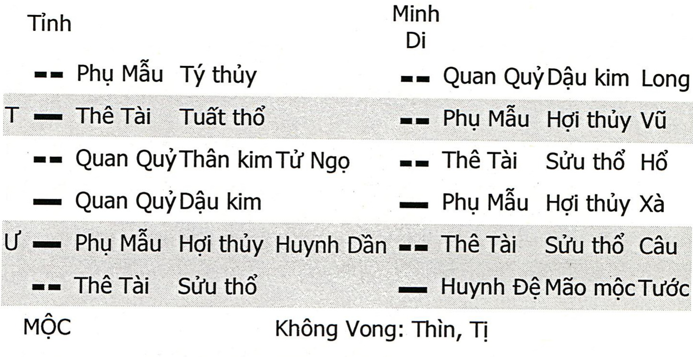

### Ví dụ 4

Ngày Ất Tị tháng Sửu, nam đoán về công ty thu gom phế phẩm, được Càn Vi Thiên biến Ly Vi Hỏa.

| | Càn | | Ly | | |
| :---: | :---: | :--- | :---: | :--- | :--- |
| T | — | Phụ Mẫu Tuất thổ | — | Quan Quỷ Tị hỏa | Vũ |
| | — | Huynh Đệ Thân kim | -- | Phụ Mẫu Mùi thổ | Hổ |
| | — | Quan Quỷ Ngọ hỏa | — | Huynh Đệ Dậu kim | Xà |
| Ư | — | Phụ Mẫu Thìn thổ | — | Tử Tôn Hợi thủy | Câu |
| | — | Thê Tài Dần mộc | -- | Phụ Mẫu Sửu thổ | Tước |
| | — | Tử Tôn Tý thủy | — | Thê Tài Mão mộc | Long |

KIM               Không Vong: Dần, Mão

**Phán đoán:** Lấy Thê Tài làm Dụng thần. Thê Tài Dần mộc hưu tù Không Vong, không được Nhật Nguyệt trợ giúp, đại tượng là Càn hóa Ly hồi đầu khắc, hỏa khắc Càn kim, lại thêm Tài lâm Chu Tước Không Vong, chắc chắc bất lợi, đề phòng hỏa hoạn phá tài.

**Phản hồi:** Quả nhiên toàn bộ vật liệu gỗ thu mua đều bị lửa lớn thiêu trụi.

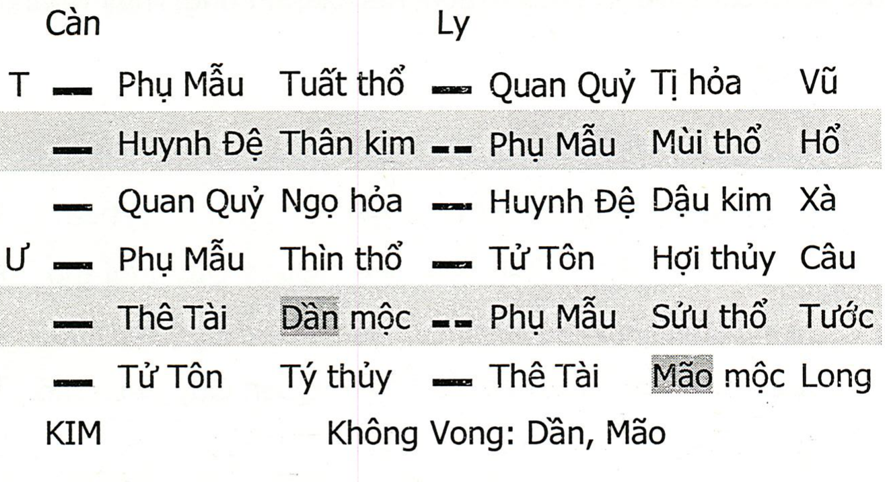

---

# Part 14 (Pages 261-280)

## 8. VÍ DỤ MỞ QUÁN TRÀ

**Ví dụ 1:** Ngày Giáp Tý tháng Ngọ, nữ đoán xem mở quán trà sẽ ra sao? Được Thủy Trạch Tiết biến Phong Thủy Hoán.

| | Tiết | Hoán | |
| :--- | :--- | :--- | :--- |
| | -- Huynh Đệ Tý thủy | — Tử Tôn Mão mộc | Vũ |
| | — Quan Quỷ Tuất thổ | — Thê Tài Tị hỏa | Hổ |
| Ứ | -- Phụ Mẫu Thân kim | -- Quan Quỷ Mùi thổ | Xà |
| | -- Quan Quỷ Sửu thổ | -- Thê Tài Ngọ hỏa | Câu |
| | — Tử Tôn Mão mộc | — Quan Quỷ Thìn thổ | Tước |
| T | — Thê Tài Tị hỏa | -- Tử Tôn Dần mộc | Long |

THỦY Không Vong: Tuất, Hợi

**Phán đoán:** Lấy Thê Tài làm Dụng thần. Thê Tài Tị hỏa lâm Thanh Long trì Thế, Thanh Long là ẩm thực, phù hợp với thông tin trà. Tài bị Nhật khắc Nguyệt phù, suy vượng cân bằng. Trong quẻ có Huynh Đệ phát động đến khắc, may mà Huynh Đệ Nguyệt phá, Dụng thần động hóa hồi đầu sinh cho nên gắng gượng có lời.

Tài và Ứng hợp, là hợp tác mở cửa hàng. Huynh Đệ lâm Huyền Vũ động, Huynh Đệ chủ tốn kém, Huyền Vũ là bí mật, Huynh Đệ bị Tài xung phá nên lực khắc Dụng thần bị suy yếu, chứng tỏ bí mật cho người ta tiền để duy trì quán trà.

**Phản hồi:** Trên thực tế đúng như vậy.

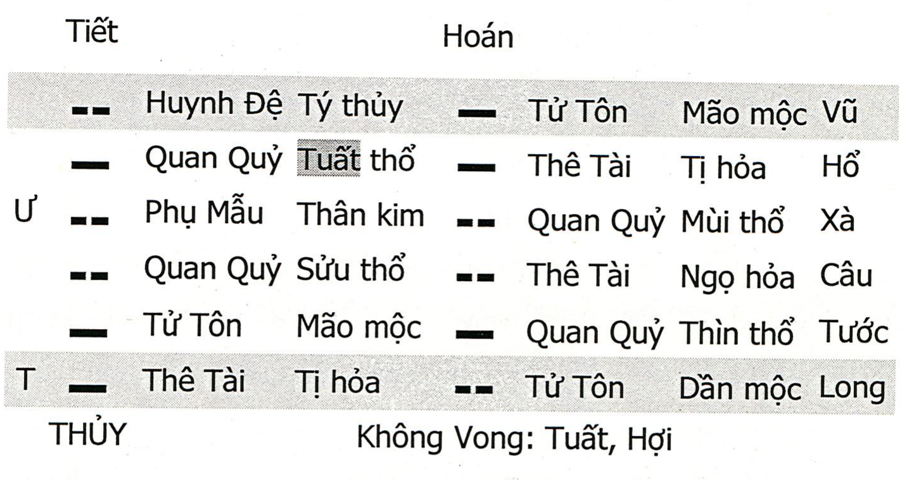

**Ví dụ 2:** Ngày Đinh Mão tháng Tuất, nữ đoán sự phát triển của quán trà, được Thiên Lôi Vô Vọng.

| | Vô Vọng | |
| :--- | :--- | :--- |
| | — Thê Tài Tuất thổ | Long |
| | — Quan Quỷ Thân kim | Vũ |
| T | — Tử Tôn Ngọ hỏa | Hổ |
| | -- Thê Tài Thìn thổ | Xà |
| | -- Huynh Đệ Dần mộc | Câu |
| Ứ | — Phụ Mẫu Tý thủy | Tước |

MỘC Không Vong: Tuất, Hợi

**Phán đoán:** Lấy Thê Tài làm Dụng thần. Trong quẻ Thê Tài lưỡng hiện, Tuất thổ Không Vong, Thìn thổ Nguyệt phá, Nhật khắc Thê Tài. Cho dù lấy hào nào làm Dụng thần cũng đều thể hiện thông tin không tốt. Tài lâm Nguyệt phá, tháng này lợi nhuận rất thấp. Quẻ gặp lục xung, khách hàng không ổn định. Tử Tôn trì Thế sinh Tài, Tử Tôn là khách hàng, chủ yếu là nhờ vào khách hàng quen biết với mình. Sợ là khó mà liên tục kinh doanh.

**Phản hồi:** Phán đoán phù hợp với tình hình thực tế, cuối cùng đã đóng cửa quán trà.

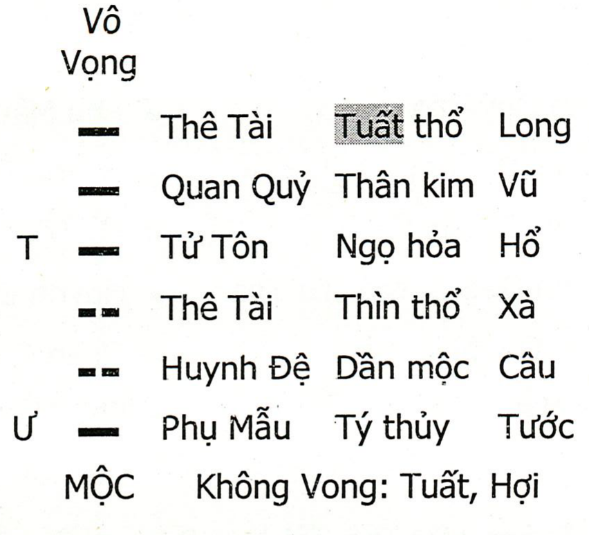

**Ví dụ 3: Ngày Nhâm Thân tháng Hợi, nữ đoán kinh doanh tiệm trà, được Phong Trạch Trung Phu biến Hỏa Trạch Khuê.**

| | Trung Phu | | Khuê | |
| :---: | :--- | :---: | :--- | :---: |
| | — Quan Quỷ Mão mộc | | — Phụ Mẫu Tị hỏa | Hổ |
| | — Phụ Mẫu Tị hỏa | Tài Tý | - - Huynh Đệ Mùi thổ | Xà |
| T | - - Huynh Đệ Mùi thổ | | — Tử Tôn Dậu kim | Câu |
| | - - Huynh Đệ Sửu thổ | Tử Thân | - - Huynh Đệ Sửu thổ | Tước |
| | — Quan Quỷ Mão mộc | | — Quan Quỷ Mão mộc | Long |
| Ư | — Phụ Mẫu Tị hỏa | | — Phụ Mẫu Tị hỏa | Vũ |

THỔ Không Vong: Tuất, Hợi

**Phán đoán:** Lấy Thê Tài làm Dụng thần. Thê Tài Tý thủy không hiện trên quẻ, phục dưới hào 5 Phụ Mẫu Tị hỏa. Dụng thần được Nguyệt trợ giúp và Nhật sinh là vượng tướng, nhưng không nên Huynh Đệ trì Thế phát động, Phi thần động mà Tuyệt Dụng thần, sinh trợ Kỵ thần, vì vậy tài vận không tốt đẹp, kinh doanh bất lợi.

**Phản hồi:** Quả nhiên cả năm kinh doanh không thuận lợi.

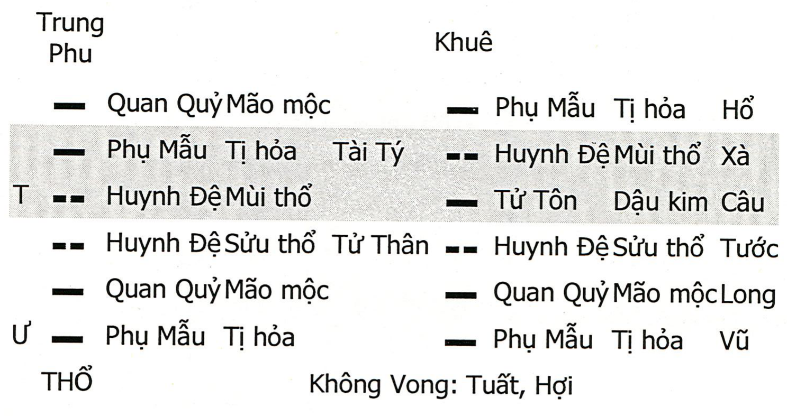

## 9. VÍ DỤ MỞ TRUNG TÂM GIẢI TRÍ

**Ví dụ:** Ngày Canh Thân tháng Tuất, nam xây dựng trung tâm giải trí sắp hoàn thành, đoán xem tương lai phát triển ra sao? Được Thủy Phong Tỉnh biến Tốn Vi Phong.

| | Tỉnh | | Tốn | |
| :---: | :--- | :---: | :--- | :---: |
| | - - Phụ Mẫu Tý thủy | | — Huynh Đệ Mão mộc | Xà |
| T | — Thê Tài Tuất thổ | | — Tử Tôn Tị hỏa | Câu |
| | - - Quan Quỷ Thân kim | Tử Ngọ | - - Thê Tài Mùi thổ | Tước |
| | — Quan Quỷ Dậu kim | | — Quan Quỷ Dậu kim | Long |
| Ư | — Phụ Mẫu Hợi thủy | Huynh Dần | — Phụ Mẫu Hợi thủy | Vũ |
| | - - Thê Tài Sửu thổ | | - - Thê Tài Sửu thổ | Hổ |

MỘC Không Vong: Tý, Sửu

**Phán đoán:** Lấy Thê Tài làm Dụng thần. Trong quẻ Thê Tài lưỡng hiện, lấy Thê Tài Sửu thổ Không Vong làm Dụng thần. Thê Tài mặc dù được Nguyệt tỉ phù, nhưng Nguyên thần Tử Tôn Ngọ hỏa hưu tù không hiện trên quẻ, Cừu thần Phụ Mẫu Tý thủy độc phát khắc Nguyên thần không cát.

Phụ Mẫu chủ văn thư, cáo trạng, lâm Đằng Xà chủ kiện tụng, chuyện phiền phức. Tài tại hào sơ Không Vong, hào sơ là giai đoạn cất bước, sợ là sẽ phát sinh kiện tụng ở giai đoạn cất bước thì ảnh hưởng đến tài vận. Quẻ biến lục xung, lục xung chủ tán, làm không đàng hoàng thì chẳng có trung tâm nào.

**Phản hồi:** Người này vô cùng tự tin, anh ta hoàn toàn không tin vào phán đoán của tôi. Anh ta nói rằng, mình kinh doanh hợp pháp thì sẽ không có kiện tụng. Kết quả là ngày hôm sau thì có người tố cáo công trình của anh ta không có thiết bị an toàn, phóng viên của đài phát thanh vào cuộc, họ đã phát hiện anh ta huy động vốn bất hợp pháp, thế là tòa nhà đã bị cưỡng chế dừng hoạt động. Những khách hàng thu trước tiền thuê thì yêu cầu hoàn tiền, mà anh ta đã đem đầu tư hết vào tòa nhà, không có khả năng bồi thường, một công trình hàng chục triệu đã sụp đổ như thế.

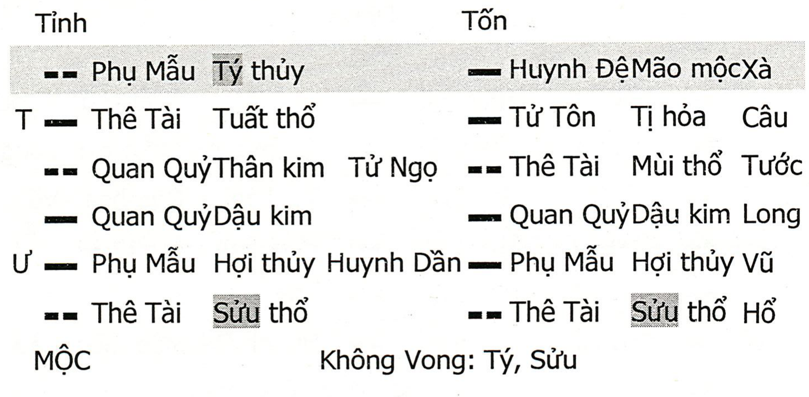

## 10. VÍ DỤ MỞ CỬA HÀNG LƯU ĐỘNG

**Ví dụ:** Ngày Mậu Thìn tháng Tuất, nam đoán tài vận cửa hàng lưu động, được Thiên Lôi Vô Vọng biến Thiên Hỏa Đồng Nhân.

| | Vô Vọng | | | Đồng Nhân | |
| :--- | :---: | :--- | :---: | :--- | :--- |
| | — | Thê Tài Tuất thổ | — | Thê Tài Tuất thổ | Tước |
| | — | Quan Quỷ Thân kim | — | Quan Quỷ Thân kim | Long |
| T | — | Tử Tôn Ngọ hỏa | — | Tử Tôn Ngọ hỏa | Vũ |
| | - - | Thê Tài Thìn thổ | — | Phụ Mẫu Hợi thủy | Hổ |
| | - - | Huynh Đệ Dần mộc | - - | Thê Tài Sửu thổ | Xà |
| Ứ | — | Phụ Mẫu Tý thủy | — | Huynh Đệ Mão mộc | Câu |

MỘC Không Vong: Tuất, Hợi

**Phán đoán:** Lấy Thê Tài làm Dụng thần. Trong quẻ Thê Tài lưỡng hiện, lấy hào Thê Tài Thìn thổ phát động làm Dụng thần. Dụng thần Nguyệt phá, động mà hóa Không, tài vận không tốt đẹp. Nguyên thần Ngọ hỏa trì Thế sinh Thê Tài, bản thân rất nỗ lực, nhưng Nhật Nguyệt không đến sinh phù, Nguyên thần hưu tù, lại nhập Mộ ở hào ám động Tuất thổ, Tuất thổ là Tài, là bản thân bị tài vây hãm, kinh tế không thể quay vòng, quẻ lục xung, cửa hàng này rất khó duy trì.

**Phản hồi:** Trên thực tế, đến lúc dự đoán thì đã mở cửa hàng được một năm bốn tháng, chưa từng có lợi nhuận.

# CHƯƠNG 6

## DỰ ĐOÁN NUÔI TRỒNG VÀ KHAI KHOÁNG

### 1. NUÔI TRỒNG

Trong xã hội nguyên thủy, với sự cải tiến về công cụ và trình độ săn bắn, người ta bắt đầu có dư thừa thú vật, thế là họ liền đem số con thú này nuôi dưỡng, từ đó mở ra ngành nghề chăn nuôi. Nếu suy đoán như vậy thì sự phát triển của ngành nghề chăn nuôi đã có năm đến sáu nghìn năm lịch sử. Ban đầu, mục đích mà người ta nuôi dưỡng động vật gia cầm là để ăn thịt, song xã hội phát triển đến hôm nay thì mục đích lại mở rộng hơn là để tạo ra lợi nhuận. Động vật gia cầm không chỉ là dùng để ăn thịt, mà còn được mở rộng đến các lĩnh vực khác như gia công da lông, làm thuốc, giải trí,...

Dự đoán thành bại của chăn nuôi thì lấy Tử Tôn làm Dụng thần. Tử Tôn đại diện cho các động vật gia cầm thường gặp như trâu, bò, ngựa, lợn, dê, cừu, mèo, chó, gà, vịt,... Ngoài ra, Tử Tôn cũng bao gồm các động vật quý hiếm, các loài chim, côn trùng và các sinh vật trong nước như cá, ba ba, tôm, cua,...

Tử Tôn vượng tướng gặp sinh phù thì chăn nuôi thành công, trưởng thành tốt đẹp. Hưu tù bị khắc gặp Không Phá thì bệnh tật tử vong. Quan Quỷ là tai họa; Phụ Mẫu là sân bãi, chuồng trại; Thê Tài là thức ăn gia súc; Huynh Đệ là giống loài, thể chất, phát dục,...

Nếu mục đích của chăn nuôi là để kiếm lợi nhuận thì lấy Thê Tài làm Dụng thần. Thê Tài vượng tướng thì lợi nhuận cao, hưu tù Không Phá thì không có lợi nhuận. Nhưng đồng thời nhất định phải xem hào Tử Tôn, Tử Tôn bị khắc gặp Không Phá thì động vật chăn nuôi có tổn thương.

Phụ Mẫu là giấy phép chăn nuôi, nhân tố bất lợi cho chăn nuôi. Nếu động vật dùng để lấy sức, như trâu bò dùng để cày ruộng, ngựa dùng để kéo xe hay để cưỡi, thì Tài là sức lực. Tài vượng tướng thì khỏe mạnh, chạy nhanh; Tài hưu tù Không Vong thì sức yếu, chạy chậm. Tài động hóa Quan Quỷ, không bị bệnh thì cũng tử vong, hóa hồi đầu khắc cũng phán đoán như vậy.

**Ví dụ 1:** Ngày Canh Ngọ tháng Thân, khi tôi đi khảo sát ở Diên Biên, một người phụ nữ bị mù hai mắt đến xin dự đoán về triển vọng nuôi bò, được Phong Trạch Trung Phu biến Thủy Trạch Tiết.

| | Trung Phu | | Tiết | |
| :--- | :--- | :--- | :--- | :--- |
| | — Quan Quỷ Mão mộc | | - - Thê Tài Tý thủy | Xà |
| | — Phụ Mẫu Tị hỏa | Tài Tý | — Huynh Đệ Tuất thổ | Câu |
| T | - - Huynh Đệ Mùi thổ | | - - Tử Tôn Thân kim | Tước |
| | - - Huynh Đệ Sửu thổ | Tử Thân | - - Huynh Đệ Sửu thổ | Long |
| | — Quan Quỷ Mão mộc | | — Quan Quỷ Mão mộc | Vũ |
| Ư | — Phụ Mẫu Tị hỏa | | — Phụ Mẫu Tị hỏa | Hổ |

THỔ Không Vong: Tuất, Hợi

**Phán đoán:** Tôi nói: "Trại bò của chị được xây dựng trên núi, vừa mới xây dựng cách đây không lâu, là chăn nuôi có rào chắn. Chị nuôi bò nhất định không thể vượt quá 100 con, nếu vượt quá thì sẽ phá đại tài. Về khía cạnh chăn nuôi này thì chị vẫn còn vài chỗ chưa thông thạo, cho nên bò của chị có tổn thương, ít nhất là đã chết hai con. Hiện tại vẫn chưa có lợi ích kinh tế, phải đến năm 2004 mới có thể thu lợi."

**Phản hồi:** Kết quả dự đoán rất chính xác. Cô ấy nói: "Tôi đã nuôi hơn 60 con bò, chưa đến nửa năm thì đã chết hai con. Tôi vốn là muốn nuôi nhiều hơn, nhưng chuyên gia nói rằng trại bò không thể nuôi quá nhiều, năng lực tối đa là 100 con. Nhiều hơn 100 con thì sẽ có vấn đề. Bò tôi nuôi là bò lấy thịt, bò giống hiện tại đã sinh bê con, có điều là bê đang còn bé, sang năm thì có thể mua."

Quẻ này phán đoán như sau:

Đoán nuôi bò, là thu lợi, lấy Thê Tài làm Dụng thần. Nhưng bò cũng là nguồn vốn để đắc tài, Tử Tôn là động vật, cho nên kiêm xem hào Tử Tôn.

Quẻ tại cung Cấn, Cấn là núi, cho nên đoán người đó mở trại bò ở trên núi. Tử Tôn phục dưới Huynh Đệ Sửu thổ, Sửu là Mộ

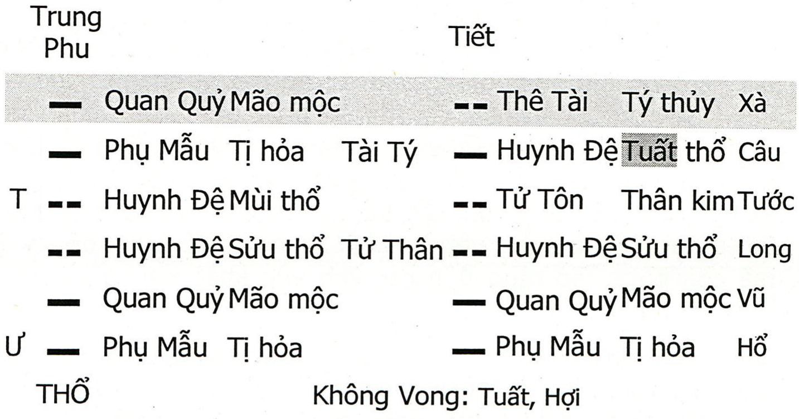 khố Tử Tôn, có thể hiểu là trại nuôi bò. Tử Tôn phục dưới Mộ khố, phục mà không được xuất, chính là thông tin dùng hàng rào để ngăn chặn, hạn chế hoạt động của bò. Lâm Thanh Long, Thanh Long chủ mới, cho nên trại bò mới được xây.

Nhật khắc Tử Tôn, đây là thông tin bò tử thương, hỏa là số 2 khắc Tử Tôn, bởi vì Tử Tôn được Nguyệt sinh phù nên sẽ không chết quá nhiều, cho nên đoán là chết ít nhất 2 con. Tài là Tý thủy, thủy là 1, vượng thì có thể hiểu là 100. Quan Quỷ Mão mộc động, Tài gặp Tử địa, lại Tuyệt ở hào Phi, không được đúng với con số 100, nếu là trọn 100 thì nhất định phá tài. Đây là phương pháp lợi dụng con số để biến đổi cát hung. Hào Tài phục tàng chứng tỏ hiện tại vẫn chưa nhìn thấy lợi nhuận. Năm 2004 là Giáp Thân, Tài được Trường Sinh thì mới có thể thu lợi.

**Ví dụ 2:** Ngày Mậu Tý tháng Dần, nam đoán triển vọng ký hợp đồng nuôi thỏ với một công ty, được Càn Vi Thiên biến Thiên Trạch Lý.

| | Càn | Lý | |
| :--- | :--- | :--- | :--- |
| T | — Phụ Mẫu Tuất thổ | — Phụ Mẫu Tuất thổ | Tước |
| | — Huynh Đệ Thân kim | — Huynh Đệ Thân kim | Long |
| | — Quan Quỷ Ngọ hỏa | — Quan Quỷ Ngọ hỏa | Vũ |
| Ư | — Phụ Mẫu Thìn thổ | - - Phụ Mẫu Sửu thổ | Hổ |
| | — Thê Tài Dần mộc | — Thê Tài Mão mộc | Xà |
| | — Tử Tôn Tý thủy | — Quan Quỷ Tị hỏa | Câu |

KIM Không Vong: Ngọ, Mùi

**Phán đoán:** Lấy Thê Tài làm Dụng thần. Phụ Mẫu là hợp đồng, hào Ứng là công ty thu mua thỏ. Thê Tài Dần mộc được Nguyệt tỉ phù và Nhật đến sinh là vượng tướng, nuôi thỏ có thể kiếm được lợi nhuận. Nhưng hào Ứng lâm Phụ Mẫu động mà hóa thoái, Phụ Mẫu là hợp đồng, hóa thoái là chùn chân, đối phương không muốn tiếp tục thực hiện hợp đồng. Quan Quỷ Ngọ hỏa ám động là Tử địa hào Tài, e rằng bán thỏ sẽ không thu được tiền mà trở thành nợ xấu.

**Phản hồi:** Quả nhiên đối phương mua thỏ không trả tiền mà là viết hóa đơn tạm.

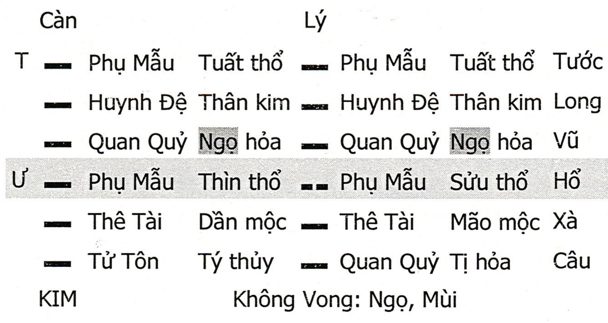

### Ví dụ 3: Ngày Ất Tị tháng Thìn, nam đoán về triển vọng nuôi kiến, được Lôi Thủy Giải biến Trạch Địa Tụy.

| | Giải | | | Tụy | |
| :--- | :--- | :--- | :--- | :--- | :--- |
| | - - | Thê Tài Tuất thổ | - - | Thê Tài Mùi thổ | Vũ |
| Ứ | - - | Quan Quỷ Thân kim | — | Quan Quỷ Dậu kim | Hổ |
| | — | Tử Tôn Ngọ hỏa | — | Phụ Mẫu Hợi thủy | Xà |
| | - - | Tử Tôn Ngọ hỏa | - - | Huynh Đệ Mão mộc | Câu |
| T | — | Thê Tài Thìn thổ | - - | Tử Tôn Tị hỏa | Tước |
| | - - | Huynh Đệ Dần mộc Phụ Tý | - - | Thê Tài Mùi thổ | Long |

MỘC Không Vong: Dần, Mão

**Phán đoán:** Nuôi kiến là để thu lợi, lấy Thê Tài làm Dụng thần. Nhưng kiến thuộc về động vật, lấy động vật để thu lợi thì nhất định phải kiêm xem hào Tử Tôn. Trước tiên, Thê Tài trì Thế chính là tượng tài lâm thân, Dụng thần và Nguyệt kiến giống nhau, được Nhật thần sinh phù, lại động hóa hồi đầu sinh, nuôi kiến nhất định có lãi.

Nhật thần tuy là Tuyệt địa Dụng thần, nhưng bởi vì Dụng thần vượng tướng nên không xem là Tuyệt. Tử Tôn là kiến, được Nhật tỉ phù là vượng, chứng tỏ kiến có sức sống rất mạnh mẽ. Hào 6 Tuất thổ là Mộ khố Tử Tôn, có thể hiểu là hộp để nuôi kiến, Nguyệt phá là hộp có khe hở, kiến chạy ra ngoài.

**Phản hồi:** Tất cả đúng như suy đoán.

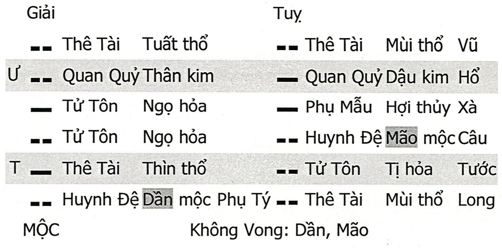

### Ví dụ 4: Ngày Tân Mùi tháng Tuất, nam đoán về triển vọng nuôi chó cảnh, được Hỏa Sơn Lữ biến Hỏa Địa Tấn.

| | Lữ | | | Tấn | |
| :--- | :--- | :--- | :--- | :--- | :--- |
| | — | Huynh Đệ Tị hỏa | — | Huynh Đệ Tị hỏa | Xà |
| | - - | Tử Tôn Mùi thổ | - - | Tử Tôn Mùi thổ | Câu |
| Ứ | — | Thê Tài Dậu kim | — | Thê Tài Dậu kim | Tước |
| | — | Thê Tài Thân kim Quan Hợi | - - | Phụ Mẫu Mão mộc | Long |
| | - - | Huynh Đệ Ngọ hỏa | - - | Huynh Đệ Tị hỏa | Vũ |
| T | - - | Tử Tôn Thìn thổ Phụ Mão | - - | Tử Tôn Mùi thổ | Hổ |

HỎA Không Vong: Tuất, Hợi

**Phán đoán:** Lấy Thê Tài làm Dụng thần, kiêm xem hào Tử Tôn. Trong quẻ Thê Tài lưỡng hiện, lấy hào Thê Tài Thân kim phát động làm Dụng thần. Dụng thần được Nhật Nguyệt đến sinh là vượng tướng, nhưng không nên Tử Tôn trì Thế Nguyệt phá, Tử Tôn Nguyệt phá thì nhất định có chó tử vong mà bị tổn thất. Dụng thần phát động nhưng không đến sinh hợp hào Thế mà tương hợp với Huynh Đệ Tị hỏa, chứng tỏ mặc dù có tài vào đáng kể nhưng lợi nhuận không nhiều.

**Phản hồi:** Người này giao dịch mỗi năm đạt mức 7200 vạn yên, nhưng chưa từng có lợi nhuận. Năm Giáp Thân, ba con chó mẹ tử vong đã khiến cho tỷ lệ sinh bị ảnh hưởng.

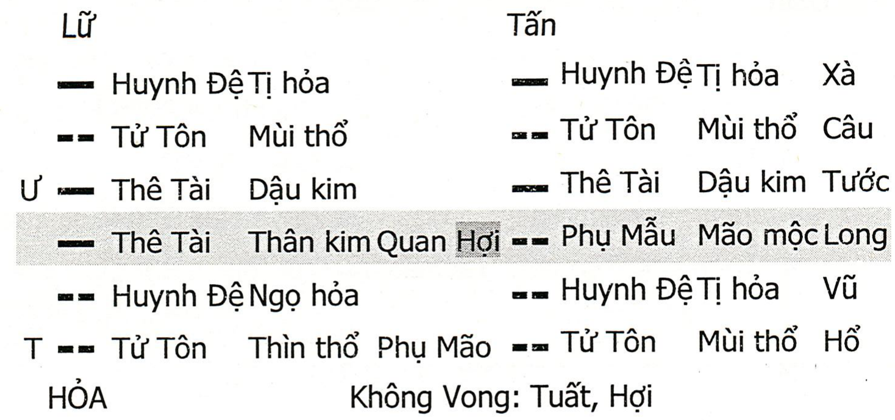

### Ví dụ 5: Ngày Quý Mùi tháng Tý, nam đoán về triển vọng hợp tác nuôi chó, được Trạch Sơn Hàm biến Thiên Phong Cấu.

| | Hàm | | | Cấu | |
| :--- | :--- | :--- | :--- | :--- | :--- |
| Ứ | - - | Phụ Mẫu Mùi thổ | — | Phụ Mẫu Tuất thổ | Hổ |
| | — | Huynh Đệ Dậu kim | — | Huynh Đệ Thân kim | Xà |
| | — | Tử Tôn Hợi thủy | — | Quan Quỷ Ngọ hỏa | Câu |
| T | — | Huynh Đệ Thân kim | — | Huynh Đệ Dậu kim | Tước |
| | - - | Quan Quỷ Ngọ hỏa Tài Mão | — | Tử Tôn Hợi thủy | Long |
| | - - | Phụ Mẫu Thìn thổ | - - | Phụ Mẫu Sửu thổ | Vũ |

KIM Không Vong: Thân, Dậu

**Phán đoán:** Lấy Thê Tài làm lợi nhuận, Tử Tôn là chó, Ứng là người hợp tác. Thê Tài Mão mộc không hiện trên quẻ, phục tàng dưới hào 2 Quan Quỷ Ngọ hỏa. Dụng thần được Nguyệt sinh và Nhật không khắc là vượng tướng, nhưng nhập Mộ ở hào Ứng, là đem tiền vốn giao cho người hợp tác, cho đối phương toàn quyền kinh doanh. Ứng lâm Tài khố sinh hào Thế, đối phương sẽ không lừa gạt mình.

Hào 2 Quan Quỷ hóa Tử Tôn, Phụ Mẫu lâm Bạch Hổ phát động khắc Tử Tôn, chó có tử thương mà ảnh hưởng đến lợi nhuận.

**Phản hồi:** Quả nhiên là đưa tiền vốn cho người hợp tác và cho họ phụ trách toàn quyền. Mối quan hệ giữa hai bên rất tốt, đối phương nỗ lực chăn nuôi, nhưng bởi vì chó bị người ta đầu độc tử vong mà phá tài.

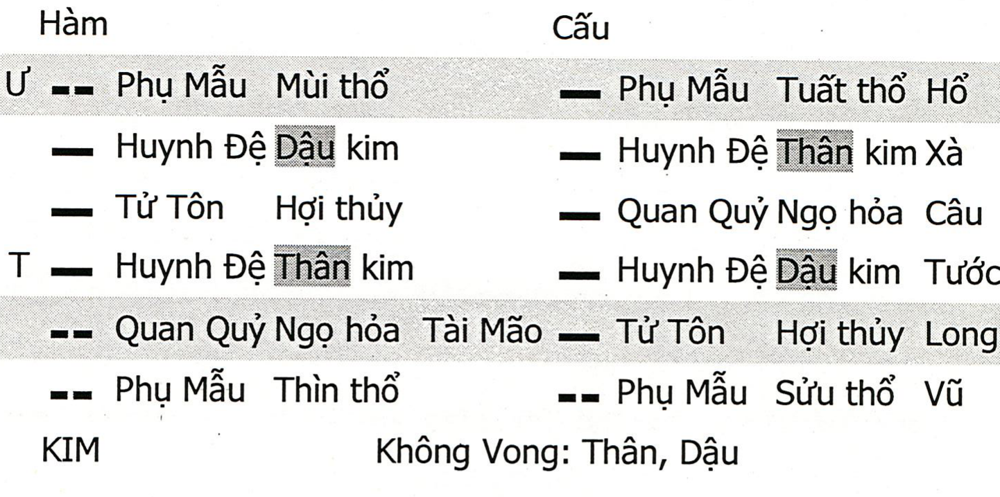

### Ví dụ 6: Ngày Canh Dần tháng Hợi, nam đoán triển vọng đến Thiên Tân hợp tác mở trại nuôi bò, được Hỏa Thủy Vị Tế biến Lôi Thủy Giải.

| | Vị Tế | | | Giải | |
| :--- | :--- | :--- | :--- | :--- | :--- |
| Ứ | — | Huynh Đệ Tị hỏa | - - | Tử Tôn Tuất thổ | Xà |
| | - - | Tử Tôn Mùi thổ | - - | Thê Tài Thân kim | Câu |
| | — | Thê Tài Dậu kim | — | Huynh Đệ Ngọ hỏa | Tước |
| T | - - | Huynh Đệ Ngọ hỏa | - - | Huynh Đệ Ngọ hỏa | Long |
| | — | Tử Tôn Thìn thổ | — | Tử Tôn Thìn thổ | Vũ |
| | - - | Phụ Mẫu Dần mộc | - - | Phụ Mẫu Dần mộc | Hổ |

HỎA Không Vong: Ngọ, Mùi

**Phán đoán:** Lấy Thê Tài làm lợi nhuận, Tử Tôn là bò, hào Ứng là người hợp tác. Thê Tài Dậu kim không được Nhật Nguyệt trợ giúp, hào Ứng Huynh Đệ độc phát khắc Tài không cát, nhất định không có lợi nhuận.

Ứng là người hợp tác, lâm Đằng Xà Nguyệt phá, Đằng Xà chủ xảo trá, chứng tỏ đối phương không trung thực. Động hóa Mộ, có tai họa lao ngục. Hào Thế Không Vong, bản thân do dự bất định.

**Phản hồi:** Thông qua dự đoán, anh ta đã làm chậm lại tiến độ hợp tác để xem tình hình của đối phương. Kết quả là không lâu sau thì người hợp tác bị bắt bởi vì lừa đảo.

## 2. KHAI KHOÁNG

Khai khoáng đã có một quá trình lịch sử. Loài người đã từng trải qua thời đại đồ đồng, thời đại đồ sắt, v.v. Những cột mốc này được sử dụng để phân chia giai đoạn văn minh, đồng thời cũng phản ánh được tầm quan trọng của khoáng sản và luyện kim đối với quá trình phát triển của xã hội.

Dự đoán khai khoáng cần đề cập đến một vài khía cạnh như sau: Giấy phép khai thác, trữ lượng, chất lượng của khoáng sản, thời gian khai thác, khả năng sinh lời, vốn đầu tư, chất lượng máy móc, v.v.

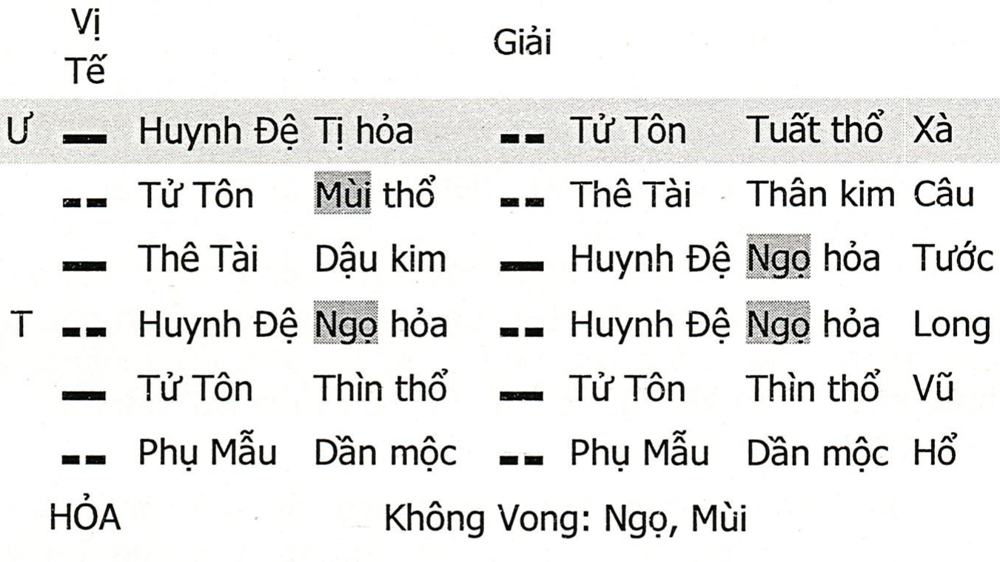

Giấy phép khai thác, lấy Phụ Mẫu làm Dụng thần, được Nhật Nguyệt hào động trợ giúp vượng tướng thì có thể được phúc đáp, hưu tù Không Phá thì không được xét duyệt. Phụ Mẫu Không Vong, không hiện trên quẻ; nhập Mộ ở Nhật Nguyệt, hào động; lâm Huyền Vũ v.v là khai thác không có giấy phép. Quan Quỷ là cơ quan phát giấy chứng nhận, cơ quan chính phủ, cơ quan quản lý, v.v.

Dự đoán trữ lượng và chất lượng, lấy Thê Tài làm Dụng thần, kiêm xem lợi nhuận và trữ lượng v.v, lấy Thê Tài làm lợi nhuận, Tử Tôn là trữ lượng, phương hướng mạch quặng, tình trạng nông sâu v.v. Thê Tài vượng tướng được sinh phù thì trữ lượng lớn, chất lượng tốt, hưu tù Không Phá thì khoáng sản ít, hoặc chất lượng không tốt. Tử Tôn hưu tù là trữ lượng ít, vượng tướng là nhiều.

Dự đoán tình trạng tiêu thụ khoáng vật, Thê Tài là giá cả, lợi ích; Tử Tôn là nguồn tiêu thụ, thị trường, v.v. Thê Tài vượng tướng được sinh phù, tiêu thụ tốt mà lợi nhuận nhiều. Tử Tôn Không Phá hưu tù, nguồn tiêu thụ không tốt hoặc không lâu dài.

Quan Quỷ là tai họa, sự cố v.v, rất không nên lâm Bạch Hổ phát động, lâm Bạch Hổ phát động thì sợ có xảy ra thương vong, sự cố. Lâm Chu Tước động thì sợ có hỏa hoạn, kiện tụng. Lâm Đằng Xà thì sợ có kẻ xấu dọa nạt, tống tiền. Lâm Huyền Vũ thì sợ có trộm cắp phát sinh.

Nếu dự đoán công nhân làm thuê thì lấy Thê Tài làm Dụng thần. Vượng tướng sinh hào Thế thì an toàn mà tạo ra nhiều lợi nhuận; hưu tù Không Phá, nhập Mộ, gặp Tử Tuyệt là bị thương, hoặc tử vong. Động hóa Không, có tượng bỏ trốn; lâm Huyền Vũ, ăn cắp đồ rồi bỏ trốn. Khắc hào Thế, tổn thương người chủ.

**Ví dụ 1: Ngày Bính Tuất tháng Hợi, nam đoán về triển vọng khai thác vật liệu đá, được Phong Trạch Trung Phu.**

### Trung Phu

| | | | | |
| :---: | :---: | :--- | :--- | :--- |
| | — | Quan Quỷ Mão mộc | | Long |
| | — | Phụ Mẫu Tị hỏa | Tài Tý | Vũ |
| T | - - | Huynh Đệ Mùi thổ | | Hổ |
| | - - | Huynh Đệ Sửu thổ | Tử Thân | Xà |
| | — | Quan Quỷ Mão mộc | | Câu |
| Ứ | — | Phụ Mẫu Tị hỏa | | Tước |

THỔ Không Vong: Ngọ, Mùi

**Phán đoán:** Thê Tài là lợi ích kinh tế, Phụ Mẫu là giấy phép khai thác. Phụ Mẫu lưỡng hiện là hai bộ thủ tục, văn thư Nguyệt phá bị khắc lại nhập Mộ, biểu thị hiện nay vẫn chưa được giải quyết giấy phép khai thác.

Hào Thế Không Vong, bản thân lo lắng sợ rằng không được giải quyết, lâm Bạch Hổ là có phần nôn nóng. Quẻ du hồn, địa điểm kinh doanh ở vùng khác. Thê Tài và Tử Tôn đều không hiện trên quẻ, chứng tỏ thiếu vốn, vốn bỏ không đúng chỗ.

Hào 5 là đường, bị Nguyệt xung phá, đường đi gập ghềnh. Bị thủy xung phá, lại lâm Huyền Vũ, Huyền Vũ chủ thủy, vào ngày có mưa thì đường càng khó đi. Hào 5 nhập Mộ ở Nhật, có đoạn đường bị tắc nghẽn không thông suốt.

Thê Tài mặc dù được Nguyệt tỉ phù, nhưng Nhật thần đến khắc, suy vượng cân bằng. Huynh Đệ trì Thế, Huynh Đệ lưỡng hiện trong quẻ, vượng mà khắc Thê Tài, không thể được lời.

**Phản hồi:** Người này vẫn muốn làm, bởi vì thiếu vốn nên đã thế chấp nhà cửa, mua được thiết bị để làm xưởng khai thác đá. Kết quả là đường đi bị trời mưa hủy hoại, đá khai thác được không thể vận chuyển ra ngoài, phải sửa đường nhiều hơn là khai thác, hại nhiều hơn lợi, đành phải dừng lại.

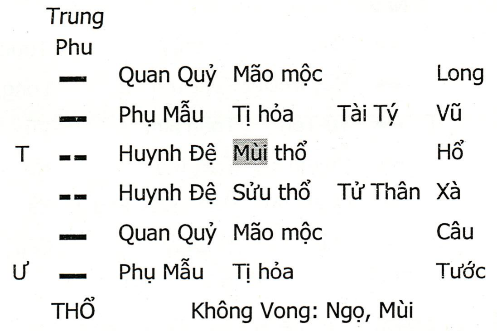

### Ví dụ 2: Ngày Mậu Tuất tháng Mùi, nữ đoán xem anh trai đào vàng ra sao? Được Thủy Thiên Nhu.

| | Nhu | | | |
| :---: | :---: | :--- | :---: | :---: |
| | - - | Thê Tài Tý thủy | | Tước |
| | — | Huynh Đệ Tuất thổ | | Long |
| T | - - | Tử Tôn Thân kim | | Vũ |
| | — | Huynh Đệ Thìn thổ | | Hổ |
| | — | Quan Quỷ Dần mộc | Phụ Tị | Xà |
| Ứ | — | Thê Tài Tý thủy | | Câu |

THỔ Không Vong: Thìn, Tị

**Phán đoán:** Lấy Thê Tài làm Dụng thần. Thê Tài Tý thủy lưỡng hiện, đều không phát động, lấy hào Ứng Thê Tài Tý thủy làm Dụng thần. Dụng thần bị Nhật Nguyệt khắc chế, trong quẻ Huynh Đệ lưỡng hiện, Thìn thổ ám động đến khắc, là Huynh Đệ quá vượng, Huynh nhiều thì trái lại không khắc Tài, có lãi.

Nhưng Huynh Đệ gặp tam hình, Huynh Đệ là anh trai người này, sợ rằng có tai họa lao ngục. Phụ Mẫu là giấy chứng nhận khai thác quặng, Phụ Mẫu Tị hỏa Không không hiện trên quẻ, nhập Mộ ở Nhật, là không có giấy phép khai thác, khai thác phi pháp.

**Phản hồi:** Quả nhiên là khai thác phi pháp, về sau ra sao không có phản hồi.

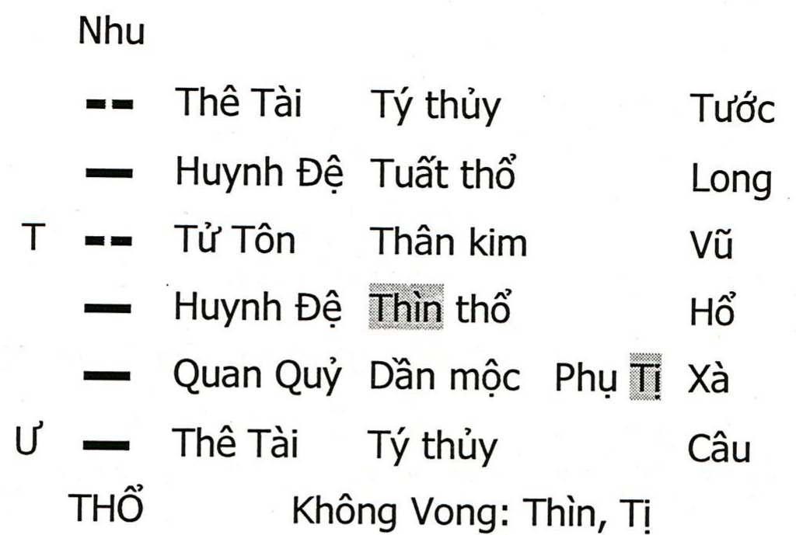

### Ví dụ 3: Ngày Kỷ Dậu tháng Thân, nam đoán về triển vọng khai thác quặng chì, được Phong Trạch Trung Phu biến Sơn Trạch Tổn.

| | Trung Phu | | | | Tổn | |
| :---: | :---: | :--- | :---: | :---: | :--- | :---: |
| | — | Quan Quỷ Mão mộc | | — | Quan Quỷ Dần mộc | Câu |
| | — | Phụ Mẫu Tị hỏa | Tài Tý | - - | Thê Tài Tý thủy | Tước |
| T | - - | Huynh Đệ Mùi thổ | | - - | Huynh Đệ Tuất thổ | Long |
| | - - | Huynh Đệ Sửu thổ | Tử Thân | - - | Huynh Đệ Sửu thổ | Vũ |
| | — | Quan Quỷ Mão mộc | | — | Quan Quỷ Mão mộc | Hổ |
| Ứ | — | Phụ Mẫu Tị hỏa | | — | Phụ Mẫu Tị hỏa | Xà |

THỔ Không Vong: Dần, Mão

**Phán đoán:** Lấy Thê Tài làm Dụng thần. Thê Tài Tý thủy không hiện trên quẻ, biểu thị khoáng vật ẩn sâu. Được Nhật Nguyệt sinh phù, mặc dù có thể luận là trữ lượng lớn, nhưng Phụ Mẫu Tị hỏa độc phát, Thê Tài gặp Tuyệt địa, độc phát lấy tượng làm chủ, khai thác rất khó thấy quặng chì ngay. Tuyệt địa là hỏa, hỏa chủ số 7, trong 70 mét sẽ không thấy. Tuyệt địa hóa ra Thê Tài, phải đến khi thất vọng mới có thể thấy.

**Phản hồi:** Quả nhiên khai thác đến 74 mét vẫn chưa thấy chì, rất là nóng ruột. Về sau kết quả ra sao, không có phản hồi.

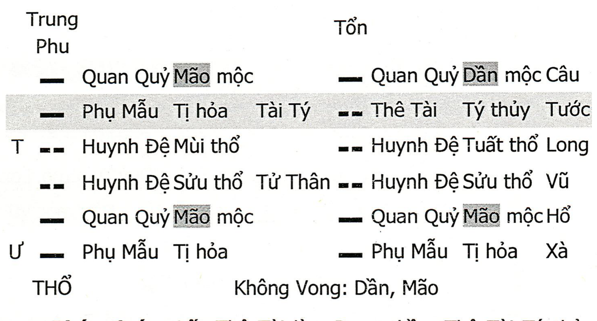

### Ví dụ 4: Ngày Tân Tị tháng Tý, nam đoán về triển vọng hợp tác khai thác mỏ than, được Địa Hỏa Minh Di biến Phong Thiên Tiểu Súc.

| | Minh Di | | Tiểu Súc | |
| :---: | :--- | :---: | :--- | :--- |
| | -- Phụ Mẫu Dậu kim | | — Tử Tôn Mão mộc | Xà |
| | -- Huynh Đệ Hợi thủy | | — Thê Tài Tị hỏa | Câu |
| T | -- Quan Quỷ Sửu thổ | | -- Quan Quỷ Mùi thổ | Tước |
| | — Huynh Đệ Hợi thủy | Tài Ngọ | — Quan Quỷ Thìn thổ | Long |
| | -- Quan Quỷ Sửu thổ | | — Tử Tôn Dần mộc | Vũ |
| Ứ | — Tử Tôn Mão mộc | | — Huynh Đệ Tý thủy | Hổ |

THỦY Không Vong: Thân, Dậu

**Phán đoán:** Lấy Thê Tài làm Dụng thần. Thê Tài Ngọ hỏa không hiện trên quẻ, phục dưới hào 3 Huynh Đệ Hợi thủy. Bị Nguyệt xung phá, được Nhật tỉ phù, suy vượng cân bằng. Bề ngoài thì Nhật là Thê Tài sinh hào Thế, có vẻ như có thể được tài, nhưng ngoại quái phản ngâm, chủ về hợp tác không thuận lợi, người hợp tác thay đổi thất thường, không thể tín nhiệm.

Gian hào Quan Quỷ Sửu thổ lâm Huyền Vũ động, gian hào là người trung gian, Quan Quỷ là người trung gian, Huyền Vũ chủ bí mật, chứng tỏ có người khác chen vào, không phải là chỉ có hai người hợp tác. Quẻ du hồn, người hợp tác không thể chung lòng cùng làm việc, mà là mỗi người đều có tính toán riêng. Thê Tài Nguyệt phá bị khắc, hào 5 Huynh Đệ lại đến khắc, sau cùng sợ là khó mà kiếm được tiền, không nên tham gia.

**Phản hồi:** Người này không nghe, sau hai tháng hợp tác thì vẫn kiếm được tiền, nhưng người hợp tác cấu kết với cảnh sát đoạt vốn và bị anh ta phát hiện, anh ta yêu cầu rút khỏi, đối phương không trả phần vốn của anh ta mà chỉ đưa cho anh ta một cái thẻ ngân hàng trống rỗng. Đòi nhiều lần không được, anh ta còn bị cảnh sát đến quấy nhiễu.

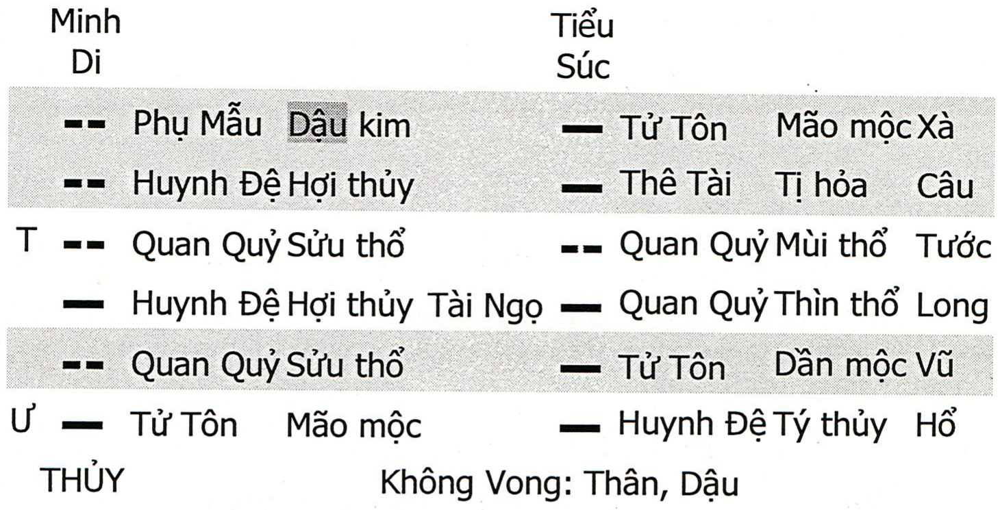

### Ví dụ 5: Ngày Giáp Tuất tháng Dần, nam đoán về mỏ than, được Phong Trạch Trung Phu.

| | Trung Phu | | |
| :---: | :--- | :--- | :--- |
| | — Quan Quỷ Mão mộc | | Vũ |
| | — Phụ Mẫu Tị hỏa | Tài Tý | Hổ |
| T | -- Huynh Đệ Mùi thổ | | Xà |
| | -- Huynh Đệ Sửu thổ | Tử Thân | Câu |
| | — Quan Quỷ Mão mộc | | Tước |
| Ứ | — Phụ Mẫu Tị hỏa | | Long |

THỔ Không Vong: Thân, Dậu

**Phán đoán:** Lấy Thê Tài làm Dụng thần. Thê Tài Tý thủy không hiện trên quẻ, phục dưới hào 5 Phụ Mẫu Tị hỏa. Dụng thần không được Nhật Nguyệt trợ giúp, trái lại bị Nhật khắc, Nguyên thần Tử Tôn không hiện trên quẻ, Nguyệt phá Không Vong không sinh Dụng thần. Vì vậy, tôi phán đoán hiện tại mỏ than đó đã ngừng sản xuất. Quẻ du hồn có ý nghĩa rút lui.

**Phản hồi:** Quả nhiên là như vậy, kinh doanh mỏ than đó phá tài 84 vạn tệ, đã ngừng sản xuất hơn một năm, dự định rút lui.

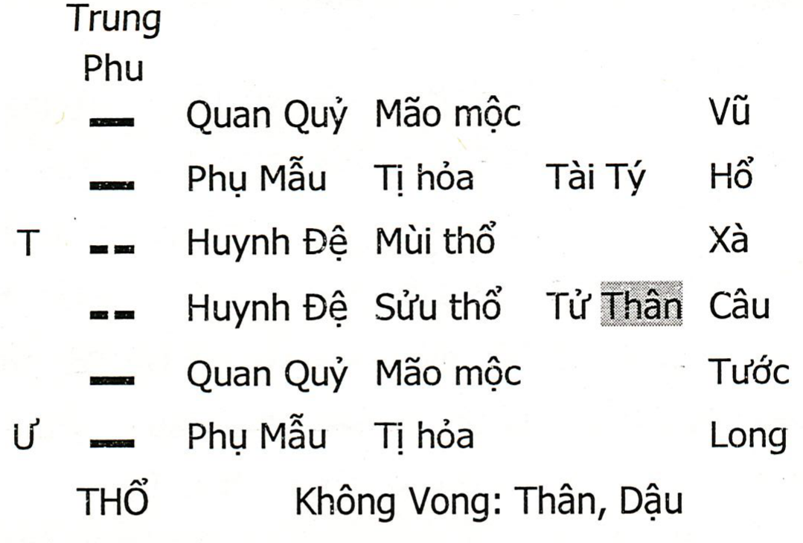

**Ví dụ 6:** Ngày Giáp Tuất tháng Dần, nam đoán khai thác quặng, được Thiên Lôi Vô Vọng biến Hỏa Lôi Phệ Hạp.

| Thế/Ứng | Vô Vọng | Phệ Hạp | Lục Thú |
| :---: | :--- | :--- | :---: |
| | — Thê Tài Tuất thổ | — Tử Tôn Tị hỏa | Vũ |
| | — Quan Quỷ Thân kim | - - Thê Tài Mùi thổ | Hổ |
| T | — Tử Tôn Ngọ hỏa | — Quan Quỷ Dậu kim | Xà |
| | - - Thê Tài Thìn thổ | - - Thê Tài Thìn thổ | Câu |
| | - - Huynh Đệ Dần mộc | - - Huynh Đệ Dần mộc | Tước |
| Ư | — Phụ Mẫu Tý thủy | — Phụ Mẫu Tý thủy | Long |

MỘC Không Vong: Thân, Dậu

**Phán đoán:** Lấy Thê Tài làm Dụng thần. Thê Tài lưỡng hiện, lấy Thê Tài Thìn thổ gặp xung làm Dụng thần. Quẻ này Quan Quỷ Thân kim tại hào 5 độc phát hóa Thê Tài, độc phát là điểm hiển thị thông tin, hào 5 Quan Quỷ là chính phủ, Không Phá không sinh hào Phụ Mẫu, chứng tỏ vẫn chưa làm giấy phép khai thác, chỉ có Thực Phá xuất Không mới có thể hóa ra Thê Tài. Vì vậy, tôi phán đoán một khi làm được giấy phép thì có thể được tài, hiện nay chủ yếu là không có giấy phép khai thác.

**Phản hồi:** Quả nhiên là như vậy, anh ta nói là đang chờ giấy phép để bắt đầu khai thác.

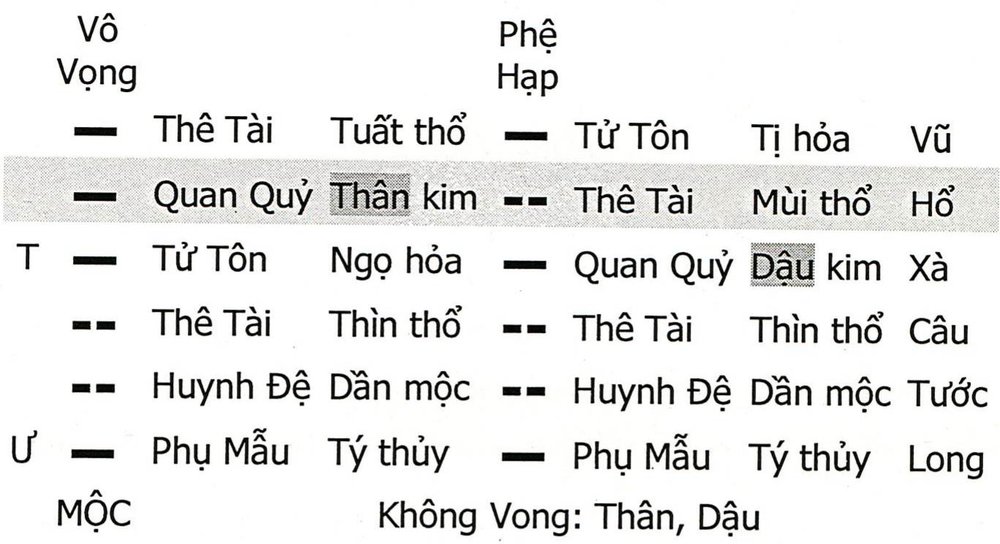

---

# Part 15 (Pages 281-300)

**Ví dụ 7:** Ngày Kỷ Tị tháng Mùi, nam đoán em trai khai thác vàng sẽ ra sao, được Phong Địa Quan biến Trạch Địa Tụy.

| | Quan | Tụy | |
| :---: | :---: | :---: | :---: |
| | ━ Thê Tài Mão mộc | ⚋ Phụ Mẫu Mùi thổ | Câu |
| | ━ Quan Quỷ Tị hỏa | ━ Huynh Đệ Dậu kim | Tước |
| T | ⚋ Phụ Mẫu Mùi thổ | ━ Tử Tôn Hợi thủy | Long |
| | ⚋ Thê Tài Mão mộc | ⚋ Thê Tài Mão mộc | Vũ |
| | ⚋ Quan Quỷ Tị hỏa | ⚋ Quan Quỷ Tị hỏa | Hổ |
| Ư | ⚋ Phụ Mẫu Mùi thổ | ⚋ Phụ Mẫu Mùi thổ | Xà |

KIM      Không Vong: Tuất, Hợi

**Phán đoán:** Thông thường mà nói, dự đoán triển vọng khai khoáng chủ yếu là lấy Thê Tài làm Dụng thần để phân tích, bởi vì mục đích của khai khoáng là lợi ích, mục đích là muốn phát tài. Vì vậy, Tài là vị trí đầu tiên, Tài vượng thì có thể phát, Tài nhược thì không thể phát, đây là thông tin thường phải phán đoán khi xem quẻ. Có điều là vài ba câu hồi đáp thì vấn đề này có vẻ như tỏ ra hơi đơn giản.

Quẻ này hào Tài lưỡng hiện, phương pháp chọn Dụng thần của lục hào chính là lấy hào phát động làm Dụng. Vì vậy, hào 6 Thê Tài Mão mộc chính là Dụng thần. Sau khi xác định xong Dụng thần thì phải xem Thê Tài Mão mộc và Nguyệt Nhật có quan hệ gì? Nguyệt là Mùi thổ là không sinh Tài, là quan hệ Mộ, mà Nhật là Tị hỏa cũng không sinh Tài, có điều là mặc dù Nhật Nguyệt không đến trợ giúp, nhưng cũng không khắc. Vì vậy, Tài này chỉ là hơi nhược, không thể nói là hưu tù vô căn. Trong quẻ Thê Tài Mão mộc phát động hóa Mùi thổ, xem như là nhập Mộ, hào 4 phát động cũng là Mộ của Dụng thần, hào 4 hóa ra Hợi thủy, miễn cưỡng thành tam hợp Tài cục. Có điều là Hợi không phải là do Tài hóa ra, mặc dù tam hợp có thể thành nhưng sức mạnh của tam hợp này sẽ bé hơn rất nhiều.

Xem kỹ hơn, trong quẻ có hai Tài, Thế Ứng đều là Mùi thổ, Mùi thổ là Mộ khố, Thế tại hào 4, Ứng tại hào sơ. Căn cứ vào một số tổ hợp và tình hình động biến, chúng ta có thể lý giải như sau:

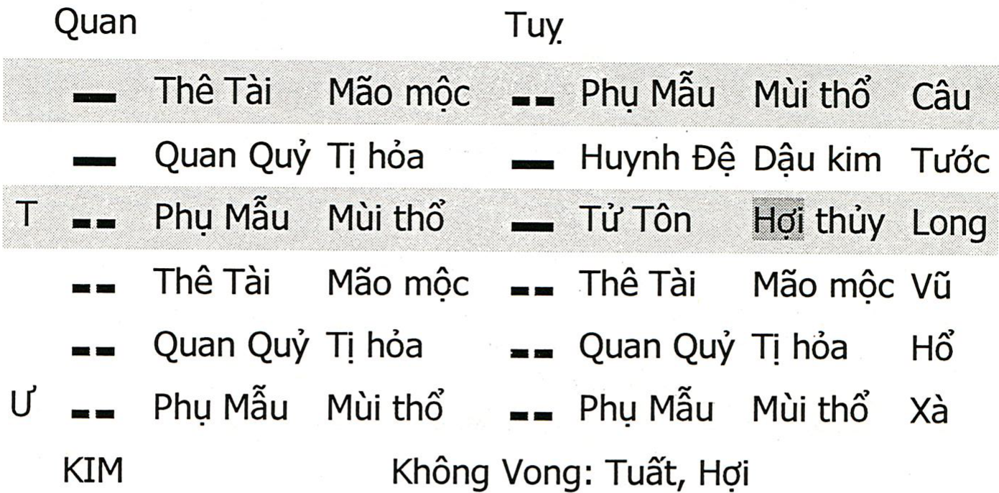

Tài thể hiện mỏ vàng, có vàng thì mới có thể kiếm được tiền. Tử Tôn sinh Tài, Tử Tôn chính là hàm lượng của mỏ vàng. Hàm lượng cao hay thấp, còn lượng dự trữ hay không thì phải xem tình hình suy vượng của Tử Tôn. Hai Tài có ý nghĩa nhất định, hai Tài khố cũng có ý nghĩa đặc biệt nhất định. Vì vậy, Tài khố này có thể hiểu là lớp quặng của mỏ vàng, cũng chính là nơi chôn giấu vàng.

Dụng thần trong quẻ này ở hào 6, lâm Câu Trần, những thông tin này không thể không xem. Thế lâm Phụ Mẫu Mùi thổ hóa Không cũng là một thông tin. Những yếu tố tham khảo này đều được sử dụng vào phán đoán.

Dự đoán lục hào không tách khỏi hào vị và lục thần, cũng không tách khỏi 12 cung trường sinh v.v. Tất cả những quy luật và ý nghĩa này đều được sử dụng cho dự đoán. Khi dự đoán mỏ vàng, Câu Trần này lý giải như thế nào? Kết hợp với hào vị thì lại lý giải như thế nào?

Câu Trần là cũ, mà hào 6 biểu thị điểm cuối của sự vật, là hào vị thoái hưu. Vì vậy, tôi phán đoán đó là mỏ vàng cũ, không phải là mới đào.

Hào Thế thể hiện em trai anh ta. Thế lâm Phụ Mẫu hóa Không, Phụ Mẫu là giấy phép khai thác, biểu thị giấy tờ của em trai anh ta vẫn chưa được giải quyết trọn vẹn. Lại liên hệ với hào Ứng, hai Tài khố. Tôi đoán là mỏ vàng được chia thành hai lớp, một lớp trên đã bị người ta khai thác, hiện tại có người chuyển nhượng cho em trai anh ta, Ứng Phụ Mẫu này chính là người ta. Tài ở hào 3 là một lớp phía trên, nhập Mộ hào Ứng, cho nên một lớp phía trên đã bị người ta lấy được. Quan hệ trên dưới này không phải là dựa vào cao thấp của hào, mà là căn cứ vào đặc điểm của hào vị sáu hào. Đào quặng thì đào từ trên xuống dưới, bởi vì hào 3 sớm hơn hào 6 cho nên hào 3 chính là lớp quặng phía trên.

Quặng còn lại ra sao? Chính là Tài ở hào 6. Tài này đến hào 6, biểu thị quặng đã không còn bao nhiêu. Đương nhiên vẫn phải tham khảo suy vượng của Tài. Bởi vì Tài không vượng, mà Tử Tôn Tý thủy không hiện trên quẻ, lại bị Nguyệt khắc, biểu thị không còn lượng dự trữ, cho nên hàm lượng quặng không phải là quá nhiều. Nhưng tam hợp cục này lại có ý nghĩa gì? Ý nghĩa của tam hợp là hợp lại, biểu thị có rất nhiều thứ tụ lại cùng một chỗ. Vì vậy, tôi đoán phạm vi của quặng tương đối rộng. Mở rộng ra xung quanh thì vẫn còn có quặng, nhưng quặng không có độ sâu, lớp quặng tương đối nông, cho nên muốn dựa vào quặng này để phát tài lớn thì không thể.

**Phản hồi:** Người này phản hồi đúng là mỏ vàng cũ, trước đây người ta đã khai thác, bây giờ họ muốn chuyển nhượng cho em trai anh ta. Một lớp phía trên đã bị đối phương đào, phía dưới lại lộ ra một lớp, xuống xem nhưng chưa khai thác nên chưa rõ, cần được nghiệm chứng sau khi khai thác. Hiện nay đang tích cực làm giấy phép khai thác.

**Ví dụ 8:** Ngày Kỷ Sửu tháng Tuất, nam đoán triển vọng khai thác mỏ than, được Lôi Sơn Tiểu Quá biến Hỏa Sơn Lữ.

| | Tiểu Quá | | | Lữ | |
| :---: | :--- | :---: | :---: | :--- | :---: |
| | - - Phụ Mẫu Tuất thổ | | — | Quan Quỷ Tị hỏa | Câu |
| | - - Huynh Đệ Thân kim | | - - | Phụ Mẫu Mùi thổ | Tước |
| T | — Quan Quỷ Ngọ hỏa | Tử Hợi | — | Huynh Đệ Dậu kim | Long |
| | — Huynh Đệ Thân kim | | — | Huynh Đệ Thân kim | Vũ |
| | - - Quan Quỷ Ngọ hỏa | Tài Mão | - - | Quan Quỷ Ngọ hỏa | Hổ |
| Ứ | - - Phụ Mẫu Thìn thổ | | - - | Phụ Mẫu Thìn thổ | Xà |

KIM Không Vong: Ngọ, Mùi

**Phán đoán:** Lấy Thê Tài làm Dụng thần. Thê Tài Mão mộc không hiện trên quẻ, phục tàng dưới hào 2 Quan Quỷ Ngọ hỏa, mặc dù được Nguyệt hợp là có khí nhưng suy cho cùng không được Nhật Nguyệt sinh phù, Nguyên thần bị Nhật Nguyệt khắc hại, Phụ Mẫu Tuất thổ độc phát hợp trú Dụng thần, vì vậy không thể được tài.

**Phản hồi:** Sau khi đầu tư, bởi vì chất lượng than không tốt, bán không được nên đã lỗ vốn.

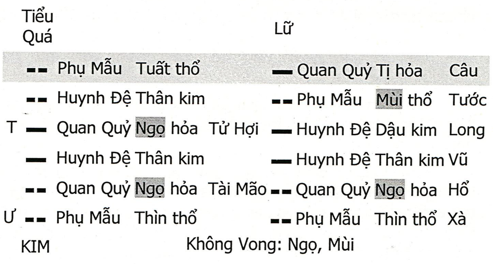

# CHƯƠNG 7
## DỰ ĐOÁN CÔNG TY XÍ NGHIỆP KINH DOANH

### 1. DỰ ĐOÁN TIỀN ĐỒ

Dự đoán triển vọng phát triển của công ty, nhà máy hay xí nghiệp thì phải phân tích nhiều khía cạnh. Nhưng khía cạnh quan trọng nhất là lợi ích kinh tế. Vì vậy, Tài là Dụng thần đầu tiên của dự đoán triển vọng. Thê Tài vượng tướng, được Nhật Nguyệt sinh phù thì lợi ích kinh tế tốt, triển vọng phát triển lớn; hưu tù Không Phá thì phát triển không thuận lợi, xuất hiện nguy cơ. Quy mô của công ty có trở nên lớn mạnh hay không, có bền vững trong mấy chục năm hay không, thì phải xem tình trạng của Tử Tôn. Tử Tôn lâm Nhật Nguyệt là cát nhất, không nên hưu tù Không Phá, hóa hồi đầu khắc, hóa Không hóa Phá. Nếu không thì có thể nói không có triển vọng. Tử Tôn vượng tướng, Thê Tài có khí không Không Phá, mặc dù hiện nay quy mô bé nhưng tương lai nhất định sẽ phát triển lớn mạnh.

Ngoài lợi ích kinh tế, chúng ta còn phải phân tích tính cách và năng lực của người quản lý xí nghiệp. Tính cách ảnh hưởng đến cảm xúc và năng lực của người quản lý. Bản thân người quản lý đến đoán, thông thường lấy hào Thế để phán đoán, rất mừng được Tử Tôn, Thê Tài, Quan Quỷ trì Thế. Hào Thế không nên hưu tù Không Phá, cũng không nên bị khắc. Lâm hào 5 thì cát nhất, tiếp theo là hào 4 và hào 3, cuối cùng là hào 2. Sự khác nhau về hào vị có thể biểu thị năng lực quản lý của một cá nhân, cũng biểu thị hình ảnh và địa vị tại công ty, xí nghiệp. Lâm hào sơ và hào 6 thường không cát.

Quan Quỷ thể hiện năng lực quản lý và chỉ huy. Thê Tài và Tử Tôn thể hiện khả năng tạo ra của cải. Đương nhiên không phải cứ Huynh Đệ trì Thế thì chắc chắn không tốt, thường gặp rất nhiều nhà doanh nghiệp là Huynh Đệ trì Thế, không phải là không kiếm được tiền mà là dám tiêu tiền. Huynh Đệ Tị hỏa là Trường Sinh địa của Thê Tài, Huynh Đệ Sửu thổ đa hợp Thê Tài Tý thủy, Huynh Đệ Thìn thổ là Tài khố, nếu kèm theo Thê Tài tốt đẹp thì trái lại có thể phát đại tài.

Nếu không tự mình đến dự đoán, mà là người dưới quyền hoặc là người khác đến dự đoán, thì có thể căn cứ vào hào 5 để phán đoán năng lực và tính cách của người quản lý. Hào 4 là quản lý nhân sự; hào 3 là kế toán; hào 2 là sân bãi, phòng làm việc; hào sơ là bộ hạ; hào 6 là công nhân viên lâu năm, nhân viên về hưu, cố vấn, v.v.

Phụ Mẫu có thể đại diện chứng chỉ hành nghề, giấy phép kinh doanh, địa điểm và quy mô của công ty nhà máy v.v. Hưu tù là nhỏ, vượng tướng là lớn, hóa tiến là mở rộng, hóa thoái là suy thoái v.v. Phụ Mẫu Không Phá, không hiện trên quẻ, lâm Huyền Vũ nhập Mộ, thường chủ kinh doanh không có giấy phép.

**Ví dụ 1:** Ngày Đinh Hợi tháng Mùi năm Giáp Thân, nam đoán tiền đồ của công ty, được Phong Địa Quan biến Phong Sơn Tiệm.

| Quan | | Tiệm | |
| :--- | :--- | :--- | :--- |
| — Thê Tài Mão mộc | | — Thê Tài Mão mộc | Long |
| — Quan Quỷ Tị hỏa | Huynh Thân | — Quan Quỷ Tị hỏa | Vũ |
| T - - Phụ Mẫu Mùi thổ | | - - Phụ Mẫu Mùi thổ | Hổ |
| - - Thê Tài Mão mộc | | — Huynh Đệ Thân kim | Xà |
| - - Quan Quỷ Tị hỏa | | - - Quan Quỷ Ngọ hỏa | Câu |
| Ư - - Phụ Mẫu Mùi thổ | Tử Tý | - - Phụ Mẫu Thìn thổ | Tước |

KIM Không Vong: Ngọ, Mùi

**Phán đoán:** Lấy Thê Tài làm Dụng thần. Trong quẻ Thê Tài lưỡng hiện, lấy hào Thê Tài Mão mộc phát động làm Dụng thần. Thê Tài mặc dù được Nhật sinh phù, nhưng độc phát động mà hóa Tuyệt, hóa hồi đầu khắc, chứng tỏ lợi ích kinh tế không tốt, đã xuất hiện vấn đề. Hào biến là Thái Tuế năm nay, vừa qua năm nay thì tài vận khó khăn.

Hào Thế Phụ Mẫu Mùi thổ Không Vong, Phụ Mẫu là công ty, hào Thế là mình, Không Vong là bất an, bởi vì chuyện của công ty mà bản thân đứng ngồi không yên, lâm Bạch Hổ là rất nóng ruột. Hào Thế Mùi thổ là Thái Tuế năm ngoái, bắt đầu từ năm ngoái thì bởi vì chuyện của công ty mà tâm trạng không tốt.

**Phản hồi:** Trên thực tế, năm Quý Mùi lúc tốt lúc xấu, vừa qua năm Giáp Thân thì bắt đầu hao tổn, cũng không có lợi nhuận, vì vậy mới muốn dự đoán.

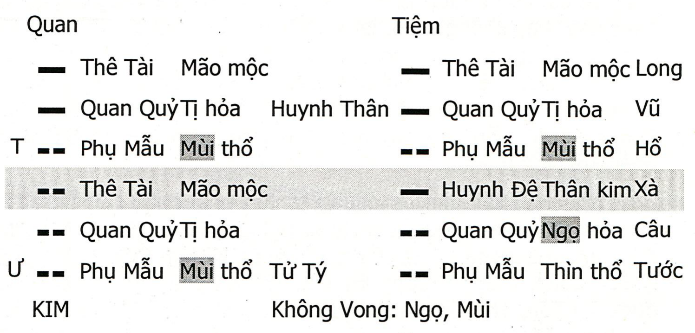

**Ví dụ 2:** Ngày Tân Mão tháng Dậu, nam đoán xem là nên tiếp tục làm thuê hay là nên ra ngoài mở công ty, được Địa Trạch Lâm biến Hỏa Trạch Khuê.

| Lâm | Khuê | |
| :--- | :--- | :--- |
| - - Tử Tôn Dậu kim | — Phụ Mẫu Tị hỏa | Xà |
| Ư - - Thê Tài Hợi thủy | - - Huynh Đệ Mùi thổ | Câu |
| - - Huynh Đệ Sửu thổ | — Tử Tôn Dậu kim | Tước |
| - - Huynh Đệ Sửu thổ | - - Huynh Đệ Sửu thổ | Long |
| T — Quan Quỷ Mão mộc | — Quan Quỷ Mão mộc | Vũ |
| — Phụ Mẫu Tị hỏa | — Phụ Mẫu Tị hỏa | Hổ |

THỔ Không Vong: Ngọ, Mùi

**Phán đoán:** Tự mình mở công ty cũng không tách khỏi lợi ích, có lợi ích thì nên làm, không có lợi ích thì không nên làm, cho nên lấy Thê Tài làm Dụng thần.

Thê Tài Hợi thủy tại hào 5, hào 5 là tôn vị, Tài được Nguyệt sinh Nhật không khắc, ngoại quái lại tam hợp Tử Tôn cục đến sinh Tài, nguồn tài dồi dào, hơn nữa không phải là tài bình thường, tài sản ít nhất là vài chục triệu đến trăm triệu tệ, chứng tỏ người này là cao thủ kiếm tiền. Nhưng Tài lâm hào Ứng, Ứng là người khác, kiếm nhiều tiền cũng là làm giàu cho người khác mà thôi.

Quan Quỷ Mão mộc trì Thế, Quan Quỷ là chức vụ, bản thân ở công ty hiện tại có đảm nhiệm chức vụ nhất định. Nguyệt kiến xung phá, Nhật lại Thực Phá, Nguyệt phá là vứt bỏ, Thực Phá là bù đắp, đoán là anh ta có ý nghĩ từ bỏ chức vụ hiện tại, nhưng công ty lại không thể thiếu anh ta. Bản thân nếu tách ra mở công ty nhất định cũng rất tốt.

**Phản hồi:** Trên thực tế, anh ta chính là một trong những người phụ trách của một xí nghiệp. Mỗi năm, anh ta đem lại lợi nhuận hàng chục triệu cho xí nghiệp, bản thân muốn tự mình mở công ty, nhưng xí nghiệp lại không thể thiếu anh ta.

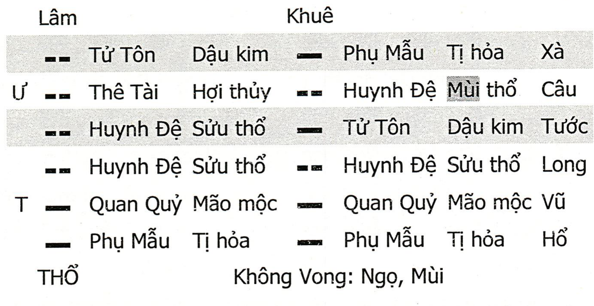

### Ví dụ 3: Ngày Kỷ Dậu tháng Dậu năm Giáp Thân, nữ đoán con trai hợp tác mở công ty sẽ ra sao? Được Địa Thủy Sư biến Địa Phong Thăng.

| | Sư | | | Thăng | |
| :---: | :---: | :--- | :---: | :--- | :--- |
| Ứ | - - | Phụ Mẫu Dậu kim | - - | Phụ Mẫu Dậu kim | Câu |
| | - - | Huynh Đệ Hợi thủy | - - | Huynh Đệ Hợi thủy | Tước |
| | - - | Quan Quỷ Sửu thổ | - - | Quan Quỷ Sửu thổ | Long |
| T | - - | Thê Tài Ngọ hỏa | — | Phụ Mẫu Dậu kim | Vũ |
| | — | Quan Quỷ Thìn thổ | - - | Huynh Đệ Hợi thủy | Hổ |
| | - - | Tử Tôn Dần mộc | - - | Quan Quỷ Sửu thổ | Xà |

THỦY Không Vong: Dần, Mão

**Phán đoán:** Lấy Phụ Mẫu làm công ty, Thê Tài là lợi nhuận, hào Thế là mình, hào Ứng là người hợp tác. Thê Tài Ngọ hỏa trì Thế phát động, hào Thế là mình, Thê Tài là tiền vốn, phát động biểu thị di chuyển, chính là thông tin mình muốn đầu tư vốn. Nhưng Tử Tôn Dần mộc Không Vong bị Nhật Nguyệt khắc thương, vô lực sinh Tài, công ty căn bản không thể có lãi.

Hào Thế Thê Tài Ngọ hỏa độc phát hóa Tử địa, độc phát lấy tượng làm chủ, chính là hợp tác mở công ty thì bản thân sẽ mất vốn vô ích. Thê Tài lâm Huyền Vũ hóa Tử địa, Huyền Vũ chủ lừa gạt, người hợp tác sẽ lừa gạt tiền của con trai cô ấy.

**Phản hồi:** Con trai cô ấy vẫn khăng khăng mở công ty, năm Giáp Thân bắt đầu kinh doanh, đến năm Đinh Hợi mới phát hiện bị lừa gạt, người hợp tác không biết từ khi nào đã rút tiền vốn trong tài khoản. 200 vạn tệ tiền đầu tư đã trở thành bong bóng xà phòng.

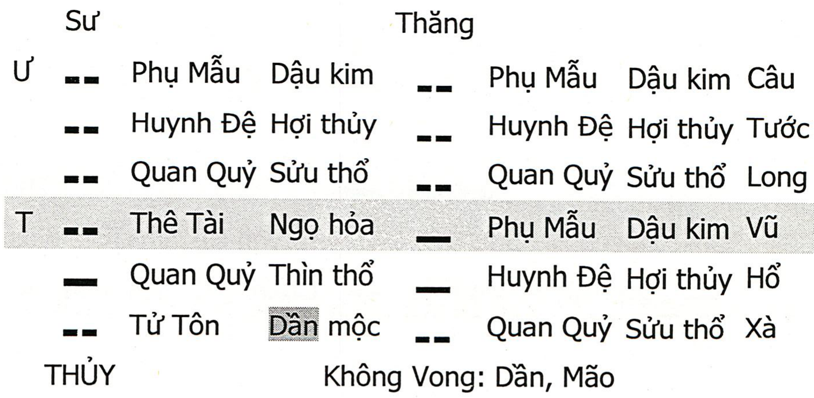

### Ví dụ 4: Ngày Ất Mùi tháng Tý năm Bính Tuất, nữ đoán tài vận năm Đinh Hợi của công ty mỹ phẩm, được Thủy Thiên Nhu.

| | Nhu | | | |
| :---: | :---: | :--- | :--- | :--- |
| | - - | Thê Tài Tý thủy | | Vũ |
| | — | Huynh Đệ Tuất thổ | | Hổ |
| T | - - | Tử Tôn Thân kim | | Xà |
| | — | Huynh Đệ Thìn thổ | | Câu |
| | — | Quan Quỷ Dần mộc | Phụ Tị | Tước |
| Ứ | — | Thê Tài Tý thủy | | Long |

THỔ Không Vong: Thìn, Tị

**Phán đoán:** Dự đoán tài vận công ty và tài vận cá nhân giống nhau, bởi vì trọng điểm ở tài, cho nên lấy Thê Tài làm Dụng thần. Trong quẻ Thê Tài Tý thủy lưỡng hiện, lấy hào Ứng Thê Tài Tý thủy làm Dụng thần.

Dụng thần được Nguyệt trợ giúp, Nhật mặc dù đến khắc nhưng quẻ này an tĩnh, Nguyên thần Tử Tôn Thân kim trì Thế vượng tướng, có thể hóa mất lực khắc của Nhật, cho nên tài vận năm Đinh Hợi rất tốt đẹp. Dụng thần tại hào sơ, hào sơ là cấp dưới, nhân viên, chứng tỏ nhân viên công ty rất nỗ lực, hăng hái tạo ra thành quả. Hào Thế vượng tướng sinh Tài, bản thân có quản lý năng lực khá tốt, biết phương hướng kinh doanh. Thế Ứng tương sinh, trên dưới đồng lòng. Thê Tài lưỡng hiện, đắc tài bằng nhiều cách, nguồn tài phong phú.

**Phản hồi:** Quả nhiên tài vận rất tốt đẹp, mức tiêu thụ tăng 130% so với năm trước.

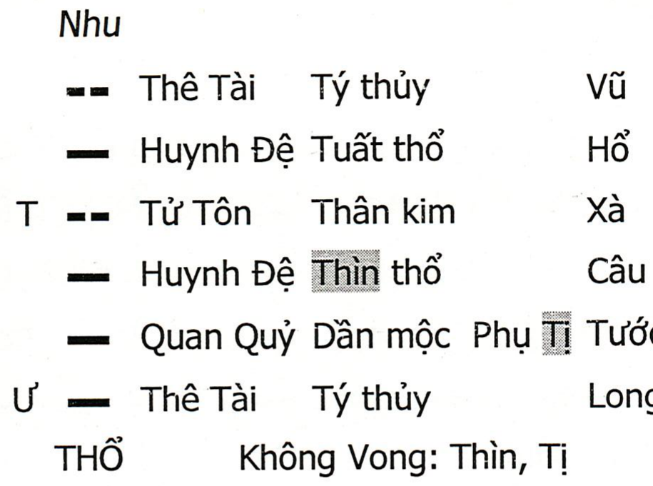

**Ví dụ 5:** Ngày Kỷ Mùi tháng Mùi, một người thỉnh đoán triển vọng phát triển của nhà máy, được Hỏa Thủy Vị Tế biến Thiên Sơn Độn.

| | Vị Tế | Độn | |
| :--- | :--- | :--- | :--- |
| Ư | ━ Huynh Đệ Tị hỏa | ━ Tử Tôn Tuất thổ | Câu |
| | -- Tử Tôn Mùi thổ | ━ Thê Tài Thân kim | Tước |
| | ━ Thê Tài Dậu kim | ━ Huynh Đệ Ngọ hỏa | Long |
| T | -- Huynh Đệ Ngọ hỏa | ━ Thê Tài Thân kim | Vũ |
| | ━ Tử Tôn Thìn thổ | -- Huynh Đệ Ngọ hỏa | Hổ |
| | -- Phụ Mẫu Dần mộc | -- Tử Tôn Thìn thổ | Xà |

HỎA Không Vong: Tý, Sửu

**Phán đoán:** Lấy Thê Tài làm Dụng thần. Thê Tài Dậu kim được Nhật Nguyệt sinh phù vốn là tượng cát, nhưng không nên hào 5 Tử Tôn Mùi thổ động lại đến sinh, hóa ra hào Tài, hào Thế động lại hóa Tài, hào 2 Tử Tôn động lại đến sinh Tài, Tử Tôn và Thê Tài đều quá nhiều. Thê Tài quá vượng thì vô tài, Tử Tôn thái quá không sinh Tài, phán đoán tài vận không tốt.

Hào Thế và Nhật Nguyệt tương hợp, hợp hào 5 Tử Tôn, hợp là ham mê, Tử Tôn là Nguyên thần sinh Tài có thể biểu thị là nhà máy tạo ra lợi nhuận. Vì vậy, tôi phán đoán anh ta đầu tư quá nhiều chỗ, có nhiều xí nghiệp, nhiều việc quấn lấy người, bận đến không xoay sở được, trái lại tài vận không tốt, hiệu quả không cao.

**Phản hồi:** Trên thực tế đúng là như vậy. Người này đã đầu tư bốn xí nghiệp, ngay lúc đó lại đang làm một dự án mới, có vẻ như có nhiều nhà máy nhưng không có cái nào kiếm được tiền.

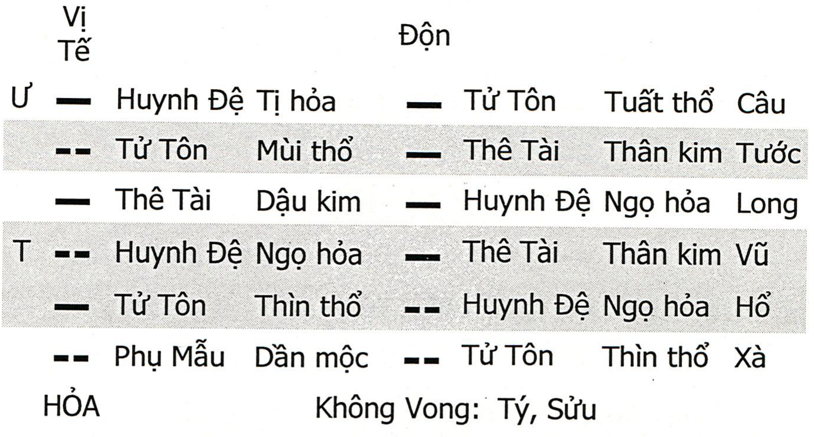

**Ví dụ 6:** Ngày Kỷ Mùi tháng Tị, một giám đốc nhà máy xi măng đoán tình tình phát triển của xí nghiệp, được Sơn Thiên Đại Súc biến Phong Thủy Hoán.

| Đại Súc | | | Hoán | | |
| :--- | :---: | :--- | :---: | :--- | :--- |
| | ━ | Quan Quỷ Dần mộc | ━ | Quan Quỷ Mão mộc | Câu |
| Ứ | ⚋ | Thê Tài Tý thủy | ━ | Phụ Mẫu Tị hỏa | Tước |
| | ⚋ | Huynh Đệ Tuất thổ | ⚋ | Huynh Đệ Mùi thổ | Long |
| | ━ | Huynh Đệ Thìn thổ Tử Thân | ⚋ | Phụ Mẫu Ngọ hỏa | Vũ |
| T | ━ | Quan Quỷ Dần mộc Phụ Ngọ | ━ | Huynh Đệ Thìn thổ | Hổ |
| | ━ | Thê Tài Tý thủy | ⚋ | Quan Quỷ Dần mộc | Xà |

**THỔ** Không Vong: Tý, Sửu

**Phán đoán:** Lấy Thê Tài làm Dụng thần. Quẻ này hào 5 Thê Tài Tý thủy và hào sơ Thê Tài Tý thủy động mà sinh Thế là chuyện tốt. Nhưng Dụng thần có lực hay không thì phải xem ảnh hưởng của Nhật, Nguyệt v.v đối với Thê Tài.

Quẻ này Nguyệt không sinh Tài, là Tuyệt địa Thê Tài, Nhật thần đến khắc là hưu tù. Vì vậy, có thể phán đoán là hiện nay lợi nhuận của xí nghiệp không tốt, đang đứng trước khó khăn. Tại sao lại không tốt? Do nguyên nhân gì gây ra? Cần phân tích một cách tỉ mỉ.

Trước tiên, tôi đoán anh ta là người làm việc không quyết đoán, quản lý không nghiêm. Trên thực tế đúng là như vậy.

Việc này phán đoán như thế nào? Là phán đoán từ hào Thế. Thế lâm Quan Quỷ Dần mộc, Quan Quỷ là quản lý, bản thân có năng lực quản lý, nhưng Quan Quỷ không vượng tướng lại nhập Nhật Mộ, lâm Bạch Hổ, đáng lẽ Bạch Hổ chủ cứng rắn nghiêm khắc, nhưng hào Thế là mộc, mộc chủ nhân từ, nhập Mộ ở Nhật, chính là bị một số sự việc trói buộc, do dự bất định, không quả quyết, biểu thị không có quyết tâm.

Hào 5 và hào sơ là Tý thủy, là Nguyên thần hào Thế, Nguyên thần chủ tư duy. Hào 5 Không, hào sơ Không, chứng tỏ suy nghĩ vấn đề không chặt chẽ, có thiếu sót. Thủy chủ trí tuệ, biểu thị suy nghĩ vấn đề không chu toàn.

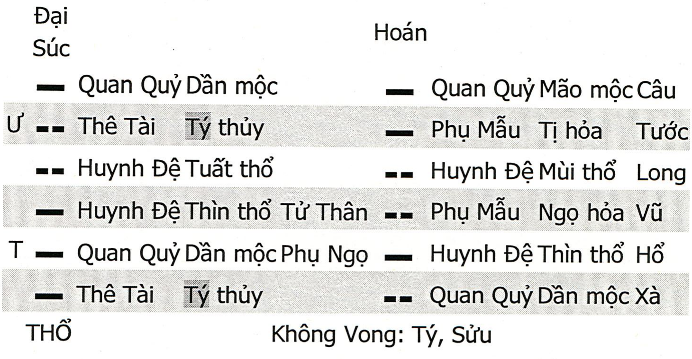

Mặc dù hào 5 là hào vị lãnh đạo, nhưng giám đốc tự mình đến đoán cho nên hào Thế là giám đốc, nếu xem hào 5 là giám đốc thì không đúng. Hào 5 lâm Chu Tước, Chu Tước chủ văn thư, đó là thư ký của anh ta, là người giúp anh ta bày mưu tính kế. Nhưng Không Vong, chứng tỏ thiếu một thư ký như vậy.

Con người suy xét vấn đề khó tránh khỏi có lúc không chu toàn, không thể quen với suy nghĩ một mình. Không Vong biểu thị suy nghĩ thoáng qua. Hóa Tuyệt biểu thị vấn đề này vẫn chưa nghĩ xong thì đã gặp trở ngại bên cạnh.

Tôi đoán là nhân công dưới quyền tương đối lỏng lẻo, làm việc không nghiêm túc. Hào sơ là công nhân, lâm Tài càng là công nhân. Không mà không sinh hào Thế, hào Thế có thể thể hiện sự nghiệp người này, Không là tư tưởng không tập trung. Lâm Đằng Xà là tượng biến hóa, biểu thị không làm việc theo quy củ, Đằng Xà chủ lừa gạt, biểu thị công nhân thường xuyên lừa gạt anh ta, không bán sức cho anh ta. Hào sơ động mà hóa Quan, Quan Quỷ thể hiện phiền phức, sẽ còn đem lại phiền phức cho anh ta.

Lại một hào 3 Thìn thổ động, hào 3 là cửa, hào 3 là kế toán, thủ môn, Thìn thổ là Tài khố, chính là quản lý tiền bạc, nhất định là kế toán. Lâm Huyền Vũ, Huyền Vũ chủ tham ô, chính là lấy tiền đút vào túi riêng.

**Phản hồi:** Những phán đoán trên đây hoàn toàn phù hợp với tình hình thực tế.

### Ví dụ 7: Ngày Bính Tuất tháng Mão, nữ tiếp quản công ty của em trai, đoán triển vọng phát triển sau này, được Sơn Thủy Mông biến Địa Thiên Thái.

| | Mông | Thái | |
| :---: | :--- | :--- | :---: |
| | ▅▅▅▅▅ Phụ Mẫu Dần mộc | ▅▅  ▅▅ Thê Tài Dậu kim | Long |
| | ▅▅  ▅▅ Quan Quỷ Tý thủy | ▅▅  ▅▅ Quan Quỷ Hợi thủy | Vũ |
| T | ▅▅  ▅▅ Tử Tôn Tuất thổ Tài Dậu | ▅▅  ▅▅ Tử Tôn Sửu thổ | Hổ |
| | ▅▅  ▅▅ Huynh Đệ Ngọ hỏa | ▅▅▅▅▅ Tử Tôn Thìn thổ | Xà |
| | ▅▅▅▅▅ Tử Tôn Thìn thổ | ▅▅▅▅▅ Phụ Mẫu Dần mộc | Câu |
| Ư | ▅▅  ▅▅ Phụ Mẫu Dần mộc | ▅▅▅▅▅ Quan Quỷ Tý thủy | Tước |

HỎA Không Vong: Ngọ, Mùi

**Phán đoán:** Lấy Thê Tài làm Dụng thần. Thê Tài Dậu kim không hiện trên quẻ, phục tàng dưới hào Thế Tuất thổ. Dụng thần bị Nguyệt xung phá, trong quẻ Huynh Đệ tam hợp thành cục đến khắc, kinh doanh nhất định không thuận lợi.

Hào Thế lâm Bạch Hổ chủ bản thân tính cách hấp tấp, suy nghĩ vấn đề không chu đáo chặt chẽ. Hào Thế lâm Nhật khiến Huynh Đệ thành tam hợp cục, chứng tỏ bản thân không biết kinh doanh, gây ra rất nhiều tổn thất cho công ty. Huynh Đệ Ngọ hỏa Không Vong, sợ Ngọ hỏa Thực Không và Tý thủy xung thực, Ngọ hỏa thể hiện phương Nam, Tý thủy thể hiện phương Bắc. Vì vậy, không nên phát triển về hai hướng này, nếu không thì chắc chắn xuất hiện bất lợi.

Thê Tài phục tàng dưới hào Thế, giữ tiền rất chặt. Huynh Đệ Ngọ hỏa là Nguyên thần, Nguyên thần thể hiện tư duy và thế giới nội tâm, Không Vong, lâm Đằng Xà, Không biểu thị lực khắc Tài yếu, Đằng Xà chủ bủn xỉn, keo kiệt, cho nên không nỡ tiêu tiền.

Hào Ứng là cấp dưới, lâm Chu Tước khắc hào Thế, Chu Tước chủ khẩu thiệt, ngôn ngữ, biểu thị cấp dưới có ý kiến bất mãn với cô ấy. Nguyệt kiến và hào sơ có ngũ hành giống nhau, xung phá Thê Tài, biểu thị người dưới quyền không nỗ lực làm việc khiến cho công ty bị thiệt hại.

Huynh Đệ Ngọ hỏa tại hào 3 lâm Đằng Xà Không Vong, hào 3 là hào vị Huynh Đệ, Không biểu thị mất mát, Đằng Xà chủ chết,

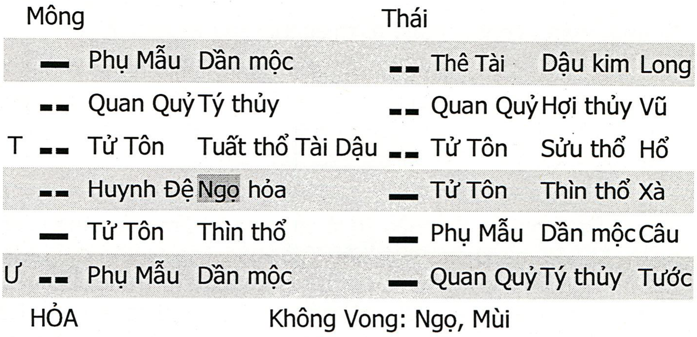

Ngọ hỏa tương ứng với năm Nhâm Ngọ, phán đoán em trai cô ấy tử vong tại năm Nhâm Ngọ (có tiếp quản công ty của em trai là gợi ý).

**Phản hồi:** Quả nhiên phán đoán phù hợp với thực tế.

### Ví dụ 8: Ngày Canh Tuất tháng Dậu, nam đoán xem công ty cổ phần của mình có thể trở thành chi nhánh của một công ty sắp niêm yết hay không? Được Càn Vi Thiên biến Hỏa Lôi Phệ Hạp.

| | Càn | Phệ Hạp | |
| :---: | :--- | :--- | :---: |
| T | ▅▅▅▅▅ Phụ Mẫu Tuất thổ | ▅▅▅▅▅ Quan Quỷ Tị hỏa | Xà |
| | ▅▅▅▅▅ Huynh Đệ Thân kim | ▅▅  ▅▅ Phụ Mẫu Mùi thổ | Câu |
| | ▅▅▅▅▅ Quan Quỷ Ngọ hỏa | ▅▅▅▅▅ Huynh Đệ Dậu kim | Tước |
| Ư | ▅▅▅▅▅ Phụ Mẫu Thìn thổ | ▅▅  ▅▅ Phụ Mẫu Thìn thổ | Long |
| | ▅▅▅▅▅ Thê Tài Dần mộc | ▅▅  ▅▅ Thê Tài Dần mộc | Vũ |
| | ▅▅▅▅▅ Tử Tôn Tý thủy | ▅▅▅▅▅ Tử Tôn Tý thủy | Hổ |

KIM Không Vong: Dần, Mão

**Phán đoán:** Lấy Phụ Mẫu làm Dụng thần. Trong quẻ Phụ Mẫu lưỡng hiện, lấy hào Phụ Mẫu Thìn thổ phát động làm Dụng thần. Nhưng hào Thế cũng là Phụ Mẫu, hào Thế lại thể hiện mình cho nên cũng có thể dùng để tham khảo.

Gian hào Huynh Đệ Thân kim động hóa Phụ Mẫu, gian hào là người trung gian, Huynh Đệ là bạn bè, hóa ra Phụ Mẫu, chính là có bạn bè giới thiệu xúc tiến chuyện này. Quẻ chính lục xung, biểu thị ý kiến không thống nhất, có người phản đối. Nội quái phục ngâm, biểu thị sự việc kéo dài, cần thời gian quá độ. Hào Thế nhập Mộ ở hào Ứng, chính là thông tin mình quy thuộc người khác, Dụng thần lâm hào Ứng, Ứng là người khác, chính là công ty của mình đứng dưới danh nghĩa của người khác. Vì vậy nhất định có thể thành. Phục ngâm ứng xung, năm nay Ất Dậu, năm Bính Tuất gặp xung sẽ thành.

**Phản hồi:** Quả nhiên là bạn bè làm trung gian giới thiệu, nhưng trong công ty có rất nhiều người phản đối. Về sau ở tháng Tuất năm Bính Tuất đã trở thành chi nhánh của đối phương.

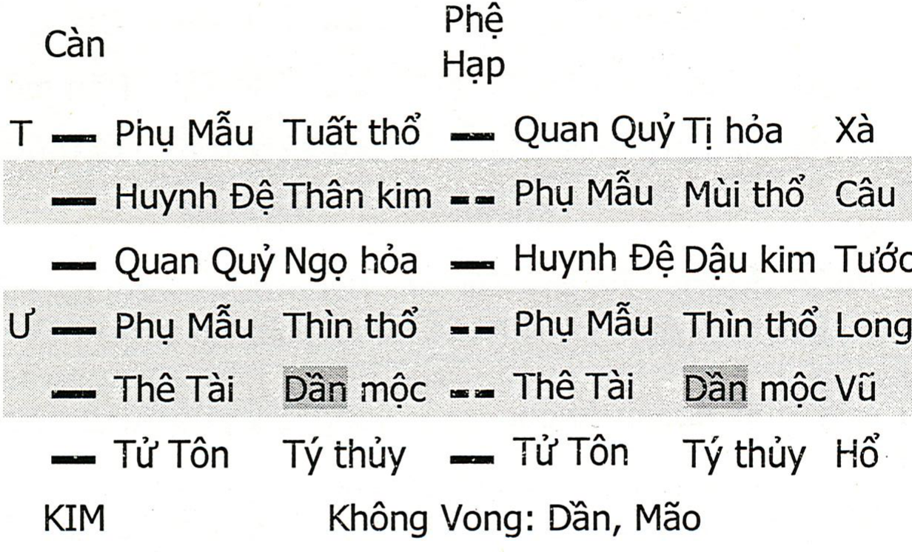

**Ví dụ 9:** Ngày Tân Mùi tháng Dậu năm Canh Thìn, nam đoán triển vọng phát triển của xí nghiệp, được Trạch Sơn Hàm biến Thủy Lôi Truân.

| Hàm | Phục thần | Truân | Lục thú |
| :--- | :--- | :--- | :--- |
| Ư - - Phụ Mẫu Mùi thổ | | - - Tử Tôn Tý thủy | Xà |
| — Huynh Đệ Dậu kim | | — Phụ Mẫu Tuất thổ | Câu |
| — Tử Tôn Hợi thủy | | - - Huynh Đệ Thân kim | Tước |
| T — Huynh Đệ Thân kim | | - - Phụ Mẫu Thìn thổ | Long |
| - - Quan Quỷ Ngọ hỏa | Tài Mão | - - Thê Tài Dần mộc | Vũ |
| - - Phụ Mẫu Thìn thổ | | — Tử Tôn Tý thủy | Hổ |

KIM Không Vong: Tuất, Hợi

**Phán đoán:** Lấy Thê Tài làm Dụng thần. Thê Tài Mão mộc không hiện trên quẻ, bị Nguyệt xung phá, lại nhập Mộ ở Nhật, Nguyệt phá là phá tài, nhập Mộ là bị vây hãm, biểu thị hiện nay hiệu quả kinh doanh không cao, vòng quay kinh tế không linh hoạt.

Hào sơ Thìn thổ là Thái Tuế năm nay, hóa Tử Tôn, Tử Tôn chủ đầu tư, biểu thị năm nay phải tiến hành đầu tư mới. Hào Thế Huynh Đệ hóa ra Thìn thổ, cũng biểu thị năm nay phải tốn rất nhiều tiền.

Tháng Mùi Thê Tài nhập Mộ, tháng Thân Thê Tài bị khắc, tháng Dậu Thê Tài Nguyệt phá, đã hao tổn liên tục trong ba tháng. Hào Thế lâm Thanh Long hóa Phụ Mẫu, Phụ Mẫu là dự án, quyết sách, Thanh Long là vui mừng, biểu thị dự án và quyết sách của xí nghiệp rất tốt.

Hào sơ là nhân viên, động sinh Huynh Đệ thì bất lợi cho Tài, biểu thị dùng người không thích hợp, lại có Tử Tôn Hợi thủy nhập Mộ Không Vong, Tử Tôn là thị trường, nhập Mộ biểu thị thị trường bị phong tỏa, không mở rộng được.

**Phản hồi:** Quả nhiên phù hợp với tình hình thực tế.

**Ví dụ 10:** Ngày Canh Tuất tháng Thìn, nữ đoán tình hình của một công ty ở Vũ Hán, được Hỏa Địa Tấn biến Hỏa Lôi Phệ Hạp.

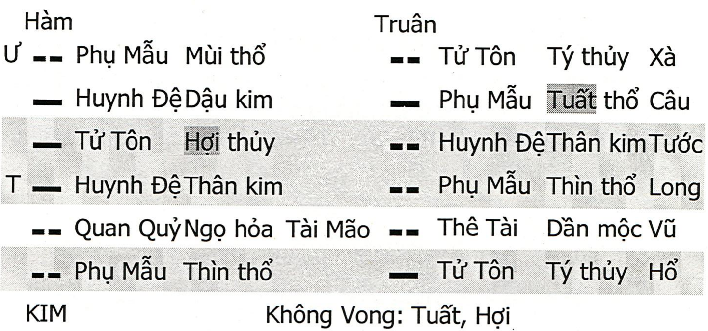

| Tấn | Phục thần | Phệ Hạp | Lục thú |
| :--- | :--- | :--- | :--- |
| — Quan Quỷ Tỵ hỏa | | — Quan Quỷ Tỵ hỏa | Xà |
| - - Phụ Mẫu Mùi thổ | | - - Phụ Mẫu Mùi thổ | Câu |
| T — Huynh Đệ Dậu kim | | — Huynh Đệ Dậu kim | Tước |
| - - Thê Tài Mão mộc | | - - Phụ Mẫu Thìn thổ | Long |
| - - Quan Quỷ Tỵ hỏa | | - - Thê Tài Dần mộc | Vũ |
| Ư - - Phụ Mẫu Mùi thổ | Tử Tý | — Tử Tôn Tý thủy | Hổ |

KIM Không Vong: Dần, Mão

**Phán đoán:** Lấy Thê Tài làm Dụng thần. Thê Tài Mão mộc Không Vong, không được Nhật Nguyệt trợ giúp là hưu tù. Nhật thần Tuất thổ hợp vướng chân Thê Tài, biểu thị hiện tại kinh tế quay vòng không linh hoạt.

Hào sơ Phụ Mẫu Mùi thổ độc phát, hào Tài nhập Mộ, hào sơ thể hiện cấp dưới, nhập Mộ chính là chiếm lợi ích của công ty, lấy tiền của công ty bỏ vào túi riêng. Quẻ chính du hồn, tinh thần của người trong công ty rệu rã.

**Phản hồi:** Quả nhiên không có hiệu quả, mỗi năm thua lỗ vốn hơn trăm vạn.

## 2. QUẢN LÝ VÀ SỬ DỤNG NHÂN TÀI

Công ty hay xí nghiệp đều không dựa vào sức lực của một cá nhân để chèo chống và phát triển. Lãnh đạo chỉ là một người dẫn đầu mà thôi, yêu cầu nhiều hơn phải là có quản lý ở mỗi khâu và nhân viên đắc lực để tạo ra giá trị cho công ty. Sự sinh thành và vận động của vũ trụ là không cân bằng, không thể vận động trên một bình diện, phải có phân biệt cao và thấp thì mới có thể có biến hóa. Vì vậy, mặc dù đều là nhân viên nhưng về tính cách, năng lực hay nhân phẩm thì lại có sự khác biệt rất lớn. Mà công ty thì cần phải có những nhân viên tốt để đảm bảo cho sự phát triển. Do đó, việc tuyển chọn hay tuyển dụng nhân tài đặc biệt quan trọng. Nếu có sâu bệnh thâm nhập vào nội bộ thì không những không thể mang lại lợi ích, mà còn có khả năng phản bội công ty, đem bí mật của công ty tiết lộ ra ngoài, tham ô tiền của công ty, thậm chí kéo công ty đến bờ vực sụp đổ.

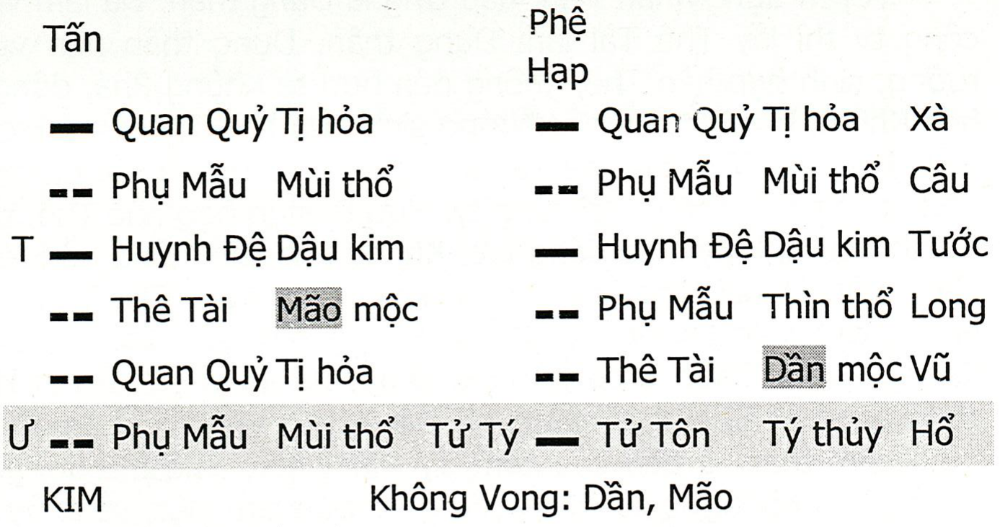

Tuyển dụng nhân viên, hào Ứng là Dụng thần. Đã làm việc ở công ty thì lấy Thê Tài làm Dụng thần. Dụng thần nên vượng tướng, sinh hợp hào Thế; không nên hưu tù Không Phá, động mà hóa Không hóa Phá. Vượng tướng sinh hợp hào Thế là nỗ lực làm việc. Ứng lâm Tử Tôn Thê Tài là tốt nhất, có thể tạo ra giá trị, lợi nhuận và trung thành với công ty. Hưu tù sinh hợp hào Thế, trung thành nhưng không có năng lực. Không Phá thì không nỗ lực làm việc, một dạ hai lòng, trốn tránh khó nhọc. Lâm Câu Trần nhập Mộ là làm việc không hăng hái, không tận sức. Lâm Bạch Hổ Không Phá bị khắc là có tai họa, lâm Tài, bởi vì sự cố mà khiến công ty phá tài. Ứng lâm Huynh Đệ Huyền Vũ khắc hào Thế thì trộm cắp, tham ô tiền của công ty. Xung hào Thế mà động hóa Tuyệt, hóa Không, biểu thị không thực tâm làm việc, sẽ nhảy đến chỗ khác. Động hợp hào bên cạnh, cấu kết với người khác làm chuyện xấu.

**Ví dụ 1:** Ngày Bính Ngọ tháng Hợi, đại diện của một công ty đoán về tuyển dụng một người, được Sơn Hỏa Bí biến Càn Vi Thiên.

| | Bí | | Càn | |
| :---: | :--- | :--- | :--- | :---: |
| | — Quan Quỷ Dần mộc | | — Huynh Đệ Tuất thổ | Long |
| | - - Thê Tài Tý thủy | | — Tử Tôn Thân kim | Vũ |
| Ứ | - - Huynh Đệ Tuất thổ | | — Phụ Mẫu Ngọ hỏa | Hổ |
| | — Thê Tài Hợi thủy | Tử Thân | — Huynh Đệ Thìn thổ | Xà |
| | - - Huynh Đệ Sửu thổ | Phụ Ngọ | — Quan Quỷ Dần mộc | Câu |
| T | — Quan Quỷ Mão mộc | | — Thê Tài Tý thủy | Tước |

THỔ Không Vong: Dần, Mão

**Phán đoán:** Lấy hào Ứng làm Dụng thần. Hào Ứng Huynh Đệ Tuất thổ được Nhật sinh hóa hồi đầu sinh, cơ thể khỏe mạnh. Lâm Bạch Hổ, tính cách nóng nảy. Mặc dù Thê Tài Tý thủy động hóa hồi đầu sinh, nhưng Huynh Đệ lưỡng động, không mang lại nhiều lợi ích cho công ty. Lục hợp hóa lục xung, làm không lâu dài.

**Phản hồi:** Nhà tuyển dụng hiểu rõ người này, quả là người này làm việc lỗ mãng, không cẩn thận. Vì vậy, sau khi dự đoán đã không tuyển dụng.

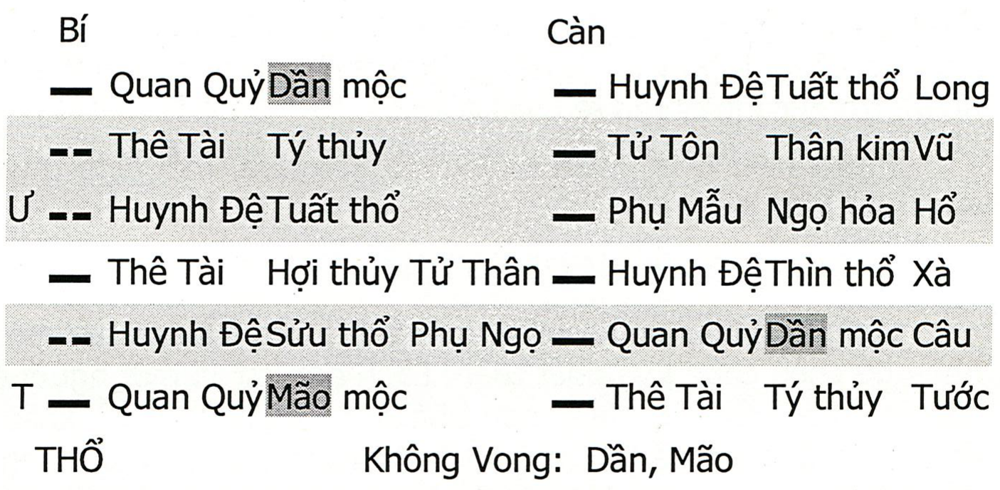

**Ví dụ 2:** Ngày Bính Thìn tháng Mão, nam đoán xem một nhân viên có thôi việc thật hay không? Được Thủy Địa Tỷ.

| | Tỷ | |
| :---: | :--- | :---: |
| Ứ | - - Thê Tài Tý thủy | Long |
| | — Huynh Đệ Tuất thổ | Vũ |
| | - - Tử Tôn Thân kim | Hổ |
| T | - - Quan Quỷ Mão mộc | Xà |
| | - - Phụ Mẫu Tị hỏa | Câu |
| | - - Huynh Đệ Mùi thổ | Tước |

THỔ Không Vong: Tý, Sửu

**Phán đoán:** Lấy Thê Tài làm Dụng thần. Dụng thần không được Nhật Nguyệt sinh phù, Nhật đến khắc thương là hưu tù, cộng thêm Dụng thần Không Vong, tâm đã ở nơi khác, khó mà giữ lại. Dụng thần tại hào 6, hào 6 là hào thoái hưu, chính là thông tin nghỉ việc rời khỏi công ty.

**Phản hồi:** Quả nhiên là sắp nghỉ việc thật, không phải nói đùa.

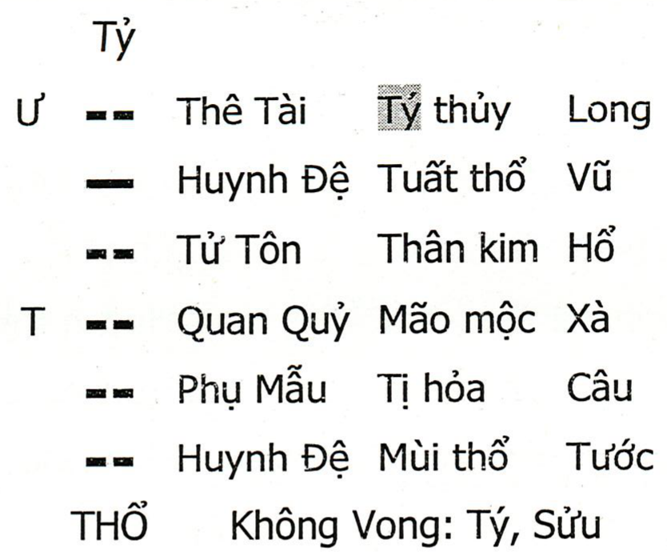

**Ví dụ 3:** Ngày Đinh Tị tháng Mùi, nam đoán xem một nhân viên có ảnh hưởng đến hoạt động kinh doanh của công ty hay không, có nên sa thải hay không? Được Thủy Sơn Kiển biến Hỏa Sơn Lữ.

| | Kiển | | Lữ | |
| :---: | :--- | :---: | :--- | :---: |
| | - - Tử Tôn Tý thủy | | — Quan Quỷ Tị hỏa | Long |
| | — Phụ Mẫu Tuất thổ | | - - Phụ Mẫu Mùi thổ | Vũ |
| T | - - Huynh Đệ Thân kim | | — Huynh Đệ Dậu kim | Hổ |
| | — Huynh Đệ Thân kim | | — Huynh Đệ Thân kim | Xà |
| | - - Quan Quỷ Ngọ hỏa | Tài Mão | - - Quan Quỷ Ngọ hỏa | Câu |
| Ứ | - - Phụ Mẫu Thìn thổ | | - - Phụ Mẫu Thìn thổ | Tước |

KIM Không Vong: Tý, Sửu

**Phán đoán:** Lấy Thê Tài làm Dụng thần. Dụng thần không được Nhật Nguyệt đến sinh, phục tàng dưới Quan Quỷ Ngọ hỏa, Quan Quỷ là công việc, biểu thị trốn tránh công việc, lâm Câu Trần, có phần lười biếng. Huynh Đệ trì Thế khắc Dụng thần, biểu thị mình muốn sa thải người này. Huynh Đệ động hóa Tiến thần, biểu thị mình sẽ càng ngày càng thiếu nhân tài.

Phụ Mẫu là công ty, Phụ Mẫu Tuất thổ động mà hóa thoái, biểu thị công ty suy thoái. Mà Dụng thần lại có thể hợp trú Phụ Mẫu Tuất thổ ngăn cản hóa thoái. Do đó, mặc dù người này không tốt nhưng vẫn có chỗ hữu dụng.

**Phản hồi:** Đến tháng Dậu, đột nhiên có một người nghỉ việc, công ty vội vàng tuyển dụng nhân viên mới, người này hiểu rõ nghiệp vụ công ty nên có thể trợ giúp cho người mới đến, bản thân người này cũng đã bắt đầu nỗ lực làm việc.

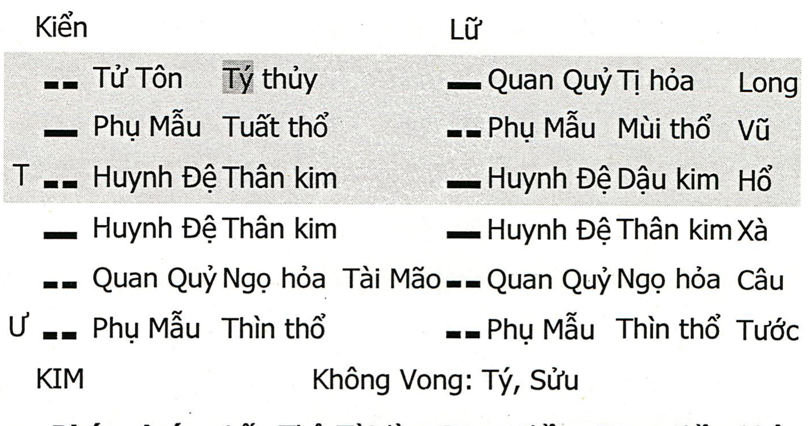

**Ví dụ 4:** Ngày Giáp Tuất tháng Tuất, nam đoán xem tuyển dụng một người nữ làm trợ lý cho mình sẽ ra sao? Được Đoài Vi Trạch biến Phong Thiên Tiểu Súc.

| | Đoài | Tiểu Súc | |
| :---: | :--- | :--- | :---: |
| T | - - Phụ Mẫu Mùi thổ | — Thê Tài Mão mộc | Vũ |
| | — Huynh Đệ Dậu kim | — Quan Quỷ Tị hỏa | Hổ |
| | — Tử Tôn Hợi thủy | - - Phụ Mẫu Mùi thổ | Xà |
| Ứ | - - Phụ Mẫu Sửu thổ | — Phụ Mẫu Thìn thổ | Câu |
| | — Thê Tài Mão mộc | — Thê Tài Dần mộc | Tước |
| | — Quan Quỷ Tị hỏa | — Tử Tôn Tý thủy | Long |

KIM Không Vong: Thân, Dậu

**Phán đoán:** Lấy hào Ứng làm Dụng thần. Hào Ứng Phụ Mẫu Sửu thổ động hóa Tiến thần, Phụ Mẫu là thần vất vả, biểu thị người nữ này có thể chịu được gian khổ. Nhưng Phụ Mẫu Sửu thổ cũng là hóa Nguyệt phá Nhật phá. Phụ Mẫu là văn thư, văn thư lâm phá, lại có Quan Quỷ Tị hỏa hưu tù nhập Mộ, Quan Quỷ thể hiện chồng, nhập Mộ biểu thị kết thúc, phán đoán người nữ này đã ly hôn.

Quẻ lục xung, Đoài Vi Trạch biểu thị khẩu thiệt, Ứng Phụ Mẫu khắc Tử Tôn, Tử Tôn chủ vui vẻ, Ứng đến khắc, đoán là không hợp với người nữ này, tính khí không tốt, thường xuyên khiến người khác không vui.

Mục đích của tuyển dụng là tạo ra của cải cho mình. Thê Tài hưu tù, không mang lại giá trị. Dụng thần xung hào Thế, không thể hòa nhã với mình. Vì vậy, không nên tuyển dụng.

**Phản hồi:** Nhưng anh ta cần nhân viên gấp nên vẫn nhờ cô ta trợ giúp cho mình, kết quả là chưa đến nửa tháng thì mối quan hệ đã lâm vào bế tắc.

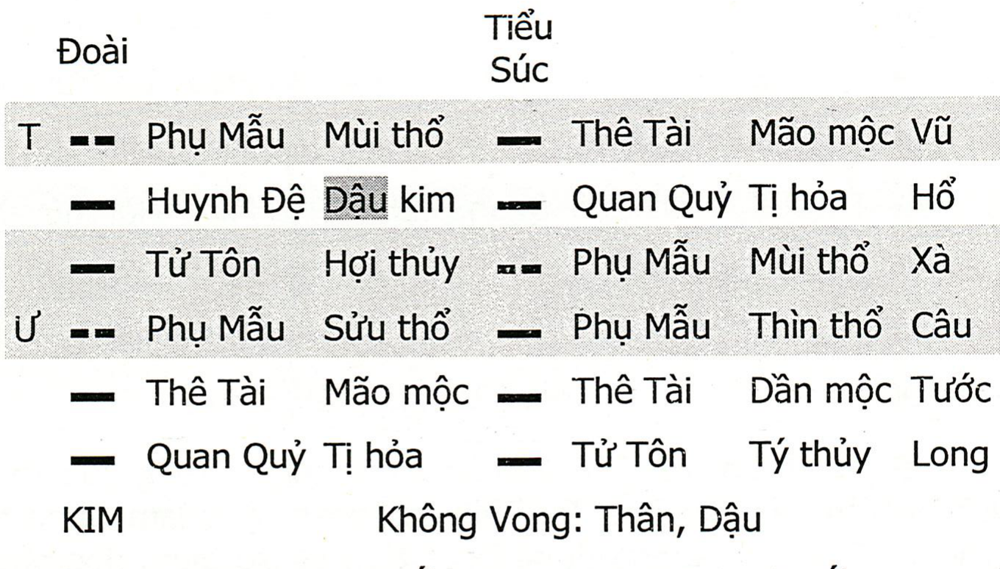

---

# Part 16 (Pages 301-320)

**Ví dụ 5:** Ngày Bính Tý tháng Tý, nam đoán tình trạng nhân viên nhà hàng, được Sơn Lôi Di biến Sơn Hỏa Bí.

| Di | Bí |
| :--- | :--- |
| — Huynh Đệ Dần mộc | — Huynh Đệ Dần mộc Long |
| - - Phụ Mẫu Tý thủy Tử Tị | - - Phụ Mẫu Tý thủy Vũ |
| T - - Thê Tài Tuất thổ | - - Thê Tài Tuất thổ Hổ |
| - - Thê Tài Thìn thổ Quan Dậu | — Phụ Mẫu Hợi thủy Xà |
| - - Huynh Đệ Dần mộc | - - Thê Tài Sửu thổ Câu |
| Ư — Phụ Mẫu Tý thủy | — Huynh Đệ Mão mộc Tước |

MỘC Không Vong: Thân, Dậu

**Phán đoán:** Lấy Thê Tài làm Dụng thần. Trong quẻ Thê Tài lưỡng hiện, lấy hào Thê Tài Thìn thổ phát động làm Dụng thần. Thê Tài Thìn thổ không được Nhật Nguyệt trợ giúp, độc phát và hào Thế tương xung, biểu thị nhân viên và mình xảy ra xung đột.

Hào Thế lâm Bạch Hổ, Bạch Hổ chủ tức giận, biểu thị không vui vẻ. Hào độc phát xem xu hướng xung hợp, Dụng thần và Quan Quỷ Không Vong phục tàng tương hợp, lại là quẻ du hồn, du hồn chủ ra ngoài, ly khai, biểu thị nhân viên bất hòa với mình đã rời khỏi nhà hàng.

Hào Thế lâm Tài, bản thân làm nhân viên. Sơn Lôi Di biểu thị tự cầu khẩu thực (tự tìm đồ ăn), tự lực cánh sinh. Ông chủ tự mình làm việc.

**Phản hồi:** Quả nhiên là nhân viên xảy ra mâu thuẫn với mình đã rời khỏi, nhất thời chưa tìm được nhân viên thích hợp nên đành phải tự mình làm việc.

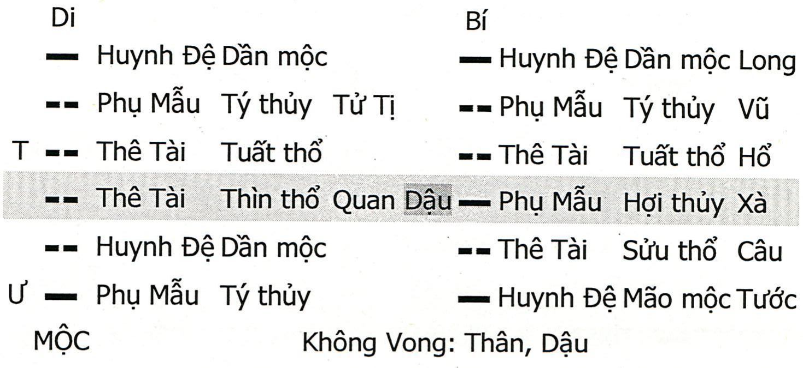

# CHƯƠNG 8
## DỰ ĐOÁN HỖN HỢP

### 1. MUA BÁN VÀ CHO THUÊ PHÒNG ỐC

Dự đoán mua bán và cho thuê phòng ốc, lấy hào Phụ Mẫu làm phòng ốc, lấy Thê Tài làm lợi nhuận.

Phụ Mẫu vượng tướng được sinh phù là thông tin phòng ốc dễ mua bán, dễ cho thuê, diện tích phòng ốc rộng, v.v. Hưu tù Không Phá là thông tin phòng ốc cũ nát, diện tích bé, khó mua bán, khó cho thuê, v.v.

Cho thuê phòng ốc hay cửa hàng, nếu trọng điểm là lợi ích kinh tế thì lấy Thê Tài làm Dụng thần chủ yếu. Hào Tài vượng tướng thì tiền thuê cao, lợi tức tốt; hưu tù Không Phá thì lợi tức kém, tiền thuê thấp.

**Ví dụ 1:** Ngày Giáp Dần tháng Dậu, nam đoán xem có thể thuê được nhà không? Được Thiên Phong Cấu biến Thiên Trạch Lý.

| Cấu | Lý |
| :--- | :--- |
| — Phụ Mẫu Tuất thổ | — Phụ Mẫu Tuất thổ Vũ |
| — Huynh Đệ Thân kim | — Huynh Đệ Thân kim Hổ |
| Ư — Quan Quỷ Ngọ hỏa | — Quan Quỷ Ngọ hỏa Xà |
| — Huynh Đệ Dậu kim | - - Phụ Mẫu Sửu thổ Câu |
| — Tử Tôn Hợi thủy Tài Dần | — Thê Tài Mão mộc Tước |
| T - - Phụ Mẫu Sửu thổ | — Quan Quỷ Tị hỏa Long |

KIM Không Vong: Tý, Sửu

**Phán đoán:** Lấy Phụ Mẫu làm Dụng thần. Trong quẻ Phụ Mẫu lưỡng hiện, lấy hào Phụ Mẫu Sửu thổ phát động làm Dụng thần. Phụ Mẫu trì Thế tại hào sơ hóa hồi đầu sinh, hào sơ là chân, động hóa hồi đầu sinh là bản thân đi khắp nơi tìm nhà. Không mà bị Nhật khắc, hào sơ lại thể hiện bắt đầu, cho nên lần đầu tiên đi uổng công, không tìm được nhà. Hóa hồi đầu sinh, thất bại một lần mới có thể tìm được.

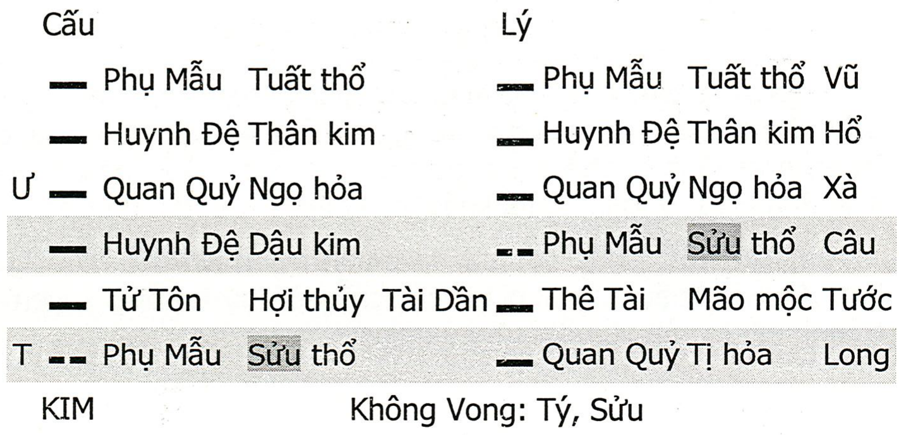

Hào 2 Huynh Đệ phát động hóa Phụ Mẫu, Huynh Đệ là bạn bè, Phụ Mẫu là nhà, cuối cùng là nhờ bạn bè mà tìm được nhà.

**Phản hồi:** Do không hiểu rõ tình hình bản địa, anh ta đã tìm cả buổi cũng không tìm được nhà phù hợp. Sau đó, anh ta đã nhờ vả bạn bè và tìm được nhà.

**Ví dụ 2:** Ngày Tân Dậu tháng Dần, nam muốn mở quán trà, đoán xem có thể tìm được nơi thích hợp hay không, được Khôn Vi Địa biến Địa Thủy Sư.

| | Khôn | | | Sư | | | |
|---|---|---|---|---|---|---|---|
| T | - - | Tử Tôn | Dậu kim | - - | Tử Tôn | Dậu kim | Xà |
| | - - | Thê Tài | Hợi thủy | - - | Thê Tài | Hợi thủy | Câu |
| | - - | Huynh Đệ | Sửu thổ | - - | Huynh Đệ | Sửu thổ | Tước |
| Ư | - - | Quan Quỷ | Mão mộc | - - | Phụ Mẫu | Ngọ hỏa | Long |
| | - - | Phụ Mẫu | Tị hỏa | — | Huynh Đệ | Thìn thổ | Vũ |
| | - - | Huynh Đệ | Mùi thổ | - - | Quan Quỷ | Dần mộc | Hổ |

THỔ Không Vong: Tý, Sửu

**Phán đoán:** Lấy Phụ Mẫu làm Dụng thần. Phụ Mẫu Tị hỏa được Nguyệt sinh là vượng tướng, lại lâm hào 2, hào 2 là cửa hàng, nhất định có thể tìm được nơi thích hợp. Hào Ứng ám động sinh Phụ Mẫu, Ứng là người khác, có người giúp đỡ tìm được.

**Phản hồi:** Nghe nói anh ta muốn mở quán trà, một người bạn đã giới thiệu cho anh ta một chỗ của họ thường xuyên bỏ trống, anh ta vừa xem thì ưng ý ngay.

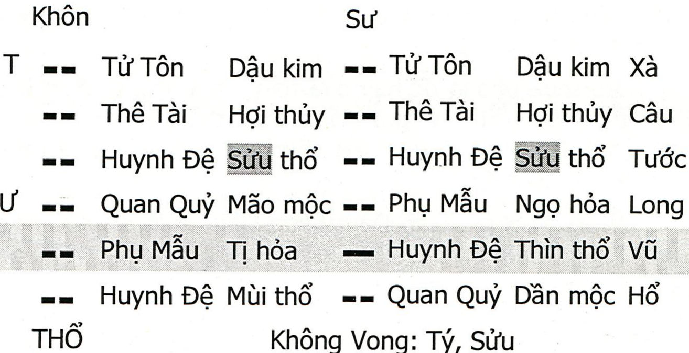

**Ví dụ 3:** Ngày Canh Tý tháng Tuất, nữ đoán xem cho thuê phòng có thể kiếm được tiền hay không? Được Thiên Thủy Tụng biến Hỏa Lôi Phệ Hạp.

| | Tụng | | | Phệ Hạp | | | |
|---|---|---|---|---|---|---|---|
| | — | Tử Tôn | Tuất thổ | — | Huynh Đệ | Tị hỏa | Xà |
| | — | Thê Tài | Thân kim | - - | Tử Tôn | Mùi thổ | Câu |
| T | — | Huynh Đệ | Ngọ hỏa | — | Thê Tài | Dậu kim | Tước |
| | - - | Huynh Đệ | Ngọ hỏa | - - | Tử Tôn | Thìn thổ | Long |
| | — | Tử Tôn | Thìn thổ | - - | Phụ Mẫu | Dần mộc | Vũ |
| Ư | - - | Phụ Mẫu | Dần mộc | — | Quan Quỷ | Tý thủy | Hổ |

HỎA Không Vong: Thìn, Tị

**Phán đoán:** Mặc dù Phụ Mẫu là nhà, nhưng mục đích của người xin đoán chủ yếu là xem có thể kiếm được tiền hay không. Do đó, Thê Tài là Dụng thần. Thê Tài Thân kim được Nguyệt sinh, Nhật không đến khắc là vượng tướng, động hóa hồi đầu sinh cũng cát. Nhưng Nguyên thần Tử Tôn Thìn thổ tại hào 2 Nguyệt phá, Không Vong, vừa động hóa hồi đầu khắc vừa bị hào Ứng đến khắc, hào 2 là trạch, Không Phá không thể sinh Tài, chính là không thể kiếm tiền nhờ bất động sản. Ứng là khách hàng, khắc hào trạch, ít người thuê phòng.

**Phản hồi:** Trên thực tế là không kiếm được tiền.

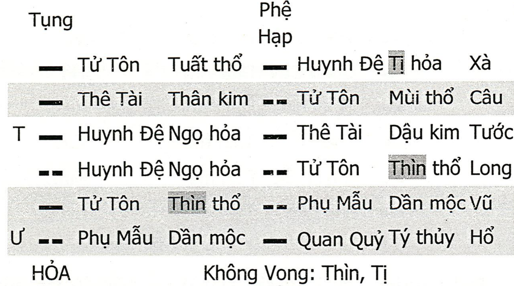

**Ví dụ 4:** Ngày Giáp Tý tháng Ngọ, nam muốn mở quán internet, anh ta đã hợp ý một địa điểm, đoán xem thuê chỗ này thì sẽ thế nào? Được Trạch Lôi Tùy.

| | Tùy | |
| :---: | :--- | :---: |
| Ư | - - Thê Tài Mùi thổ | Vũ |
| | — Quan Quỷ Dậu kim | Hổ |
| | — Phụ Mẫu Hợi thủy Tử Ngọ | Xà |
| T | - - Thê Tài Thìn thổ | Câu |
| | - - Huynh Đệ Dần mộc | Tước |
| | — Phụ Mẫu Tý thủy | Long |

MỘC Không Vong: Tuất, Hợi

**Phán đoán:** Lấy Phụ Mẫu làm Dụng thần. Trong quẻ Phụ Mẫu lưỡng hiện, lấy Phụ Mẫu Tý thủy Nguyệt phá làm Dụng thần. Phụ Mẫu Tý thủy được Nhật tỉ phù là cát, nhưng không nên bị Nguyệt xung phá, mặc dù Nhật thần Thực Phá nhưng chung quy vẫn có khuyết điểm.

Hào 2 là cửa hàng, lâm Chu Tước, Chu Tước chủ giáo dục, chứng tỏ gần trường học. Hào 2 là hào Huynh Đệ, gần hào Thế, khắc hào Thế Thê Tài bất lợi, quán internet quá gần trường học.

**Phản hồi:** Anh ta nói: "Chính là gần trường học mới có lợi, ông chưa biết nghề này, nghề này chủ yếu là kiếm tiền từ học sinh, càng gần trường học càng tốt." Kết quả là không nghe theo khuyến cáo. Sau khi mở chưa đến một tháng, chính phủ thông báo cách trường học 100 mét không cho phép có quán internet, anh ta đành phải dời chỗ.

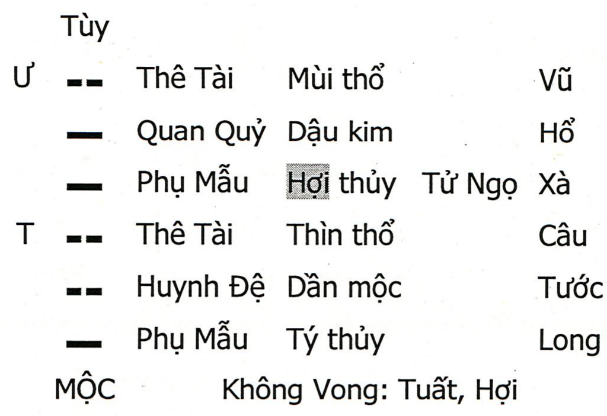

**Ví dụ 5:** Ngày Nhâm Ngọ tháng Dần, nữ đoán cửa hàng cho thuê, được Thiên Địa Bĩ biến Càn Vi Thiên.

| | Bĩ | Càn | |
| :---: | :--- | :--- | :---: |
| Ư | — Phụ Mẫu Tuất thổ | — Phụ Mẫu Tuất thổ | Hổ |
| | — Huynh Đệ Thân kim | — Huynh Đệ Thân kim | Xà |
| | — Quan Quỷ Ngọ hỏa | — Quan Quỷ Ngọ hỏa | Câu |
| T | - - Thê Tài Mão mộc | — Phụ Mẫu Thìn thổ | Tước |
| | - - Quan Quỷ Tị hỏa | — Thê Tài Dần mộc | Long |
| | - - Phụ Mẫu Mùi thổ Tử Tý | — Tử Tôn Tý thủy | Vũ |

KIM Không Vong: Thân, Dậu

**Phán đoán:** Lấy Phụ Mẫu làm Dụng thần. Trong quẻ Phụ Mẫu lưỡng hiện, lấy hào Phụ Mẫu Mùi thổ phát động làm Dụng thần. Phụ Mẫu Mùi thổ lâm hào sơ, cửa hàng ở tầng thấp.

Nhật sinh Nguyệt khắc, khó phân rõ suy vượng. Kỵ thần trì Thế phát động, được Nguyệt trợ giúp, hiện nay chính là khoảng thời gian bất lợi, cho nên nhất thời không cho thuê được. Hào 2 Tị hỏa phát động dẫn hóa Kỵ thần, tạo thành liên tục tương sinh, Dụng thần từ nhược trở nên vượng, cuối cùng nhất định có thể cho thuê. Tị hỏa trong quẻ này có vai trò then chốt, cho nên tháng Tị sẽ cho thuê được.

**Phản hồi:** Quả nhiên đã cho thuê tại tháng Tị.

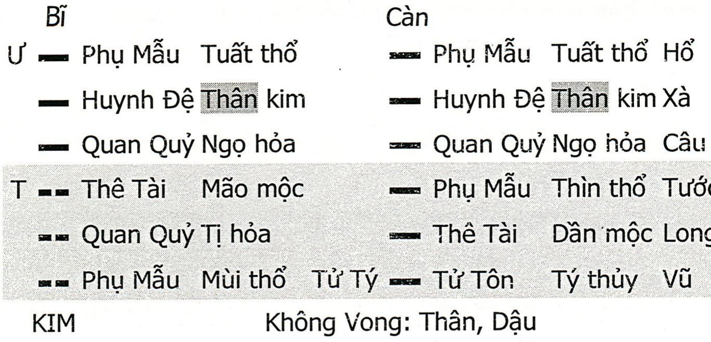

**Ví dụ 6:** Ngày Nhâm Tý tháng Sửu, có một tòa nhà thương mại đang thi công, sau khi hoàn thành sẽ thì hoạt động vào tháng 10. Muốn mở cửa hàng ở trong đó thì phải đăng ký sớm, một người đàn ông nhờ đoán xem có thể đăng ký được hay không? Tài vận ra sao? Được Hỏa Địa Tấn biến Khôn Vi Địa.

| | Tấn | Khôn | |
| :--- | :--- | :--- | :--- |
| | — Quan Quỷ Tị hỏa | - - Huynh Đệ Dậu kim | Hổ |
| | - - Phụ Mẫu Mùi thổ | - - Tử Tôn Hợi thủy | Xà |
| T | — Huynh Đệ Dậu kim | - - Phụ Mẫu Sửu thổ | Câu |
| | - - Thê Tài Mão mộc | - - Thê Tài Mão mộc | Tước |
| | - - Quan Quỷ Tị hỏa | - - Quan Quỷ Tị hỏa | Long |
| Ứ | - - Phụ Mẫu Mùi thổ Tử Tý | - - Phụ Mẫu Mùi thổ | Vũ |

KIM Không Vong: Dần, Mão

**Phán đoán:** Muốn xem có nhận được cửa hàng hay không thì lấy Phụ Mẫu làm Dụng thần, sau này có thể kiếm được tiền hay không thì phải xem hào Tài. Dụng thần lưỡng hiện, lấy hào Ứng Phụ Mẫu Mùi thổ làm Dụng thần. Phụ Mẫu Mùi thổ Nguyệt phá, không được Nhật sinh phù, rất khó đăng ký được.

Hào Tài Mão mộc mặc dù có Nhật sinh, nhưng Không Vong, Huynh Đệ Dậu kim tam hợp cục trì Thế, căn bản không kiếm được tiền. Thông thường, đăng ký cửa hàng là quan trọng nhất, không có cửa hàng thì không thể bàn về kiếm tiền. Nhưng quẻ này Huynh Đệ tam hợp tại hào Thế, chứng tỏ bản thân người này vận khí không tốt.

**Phản hồi:** Anh ta nói rằng mình thực sự cũng không có tiền, nhưng không mở cửa hàng thì không có cách nào để sinh sống, hiện tại đang cho vay sống qua ngày. Về sau, người ta cho biết là anh ta đăng ký thất bại.

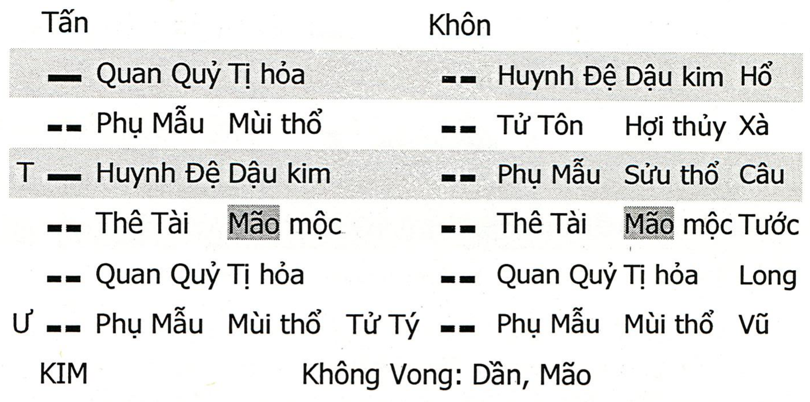

**Ví dụ 7:** Ngày Giáp Tuất tháng Thìn, nam đoán thuê cửa hàng để kinh doanh sẽ ra sao? Được Trạch Thiên Quải biến Trạch Hỏa Cách.

| | Quải | Cách | |
| :--- | :--- | :--- | :--- |
| | - - Huynh Đệ Mùi thổ | - - Huynh Đệ Mùi thổ | Long |
| T | — Tử Tôn Dậu kim | — Tử Tôn Dậu kim | Vũ |
| | — Thê Tài Hợi thủy | — Thê Tài Hợi thủy | Hổ |
| | — Huynh Đệ Thìn thổ | — Thê Tài Hợi thủy | Xà |
| Ứ | — Quan Quỷ Dần mộc Phụ Tị | - - Huynh Đệ Sửu thổ | Câu |
| | — Thê Tài Tý thủy | — Quan Quỷ Mão mộc | Tước |

THỔ Không Vong: Thân, Dậu

**Phán đoán:** Lấy Thê Tài làm lợi nhuận, Phụ Mẫu làm cửa hàng, hào 2 là cửa hàng, hào Ứng là người kinh doanh cửa hàng hiện tại. Trong quẻ Thê Tài lưỡng hiện, lấy hào Thê Tài Hợi thủy gặp hợp làm Dụng thần. Dụng thần không được Nhật Nguyệt trợ giúp, Nhật Nguyệt khắc Tài là hưu tù, cửa hàng này kinh doanh không tốt.

Hào Ứng phát động sinh Phụ Mẫu, đối phương rất muốn đem cửa hàng cho thuê, hào Ứng lâm Quan Quỷ phát động hóa Huynh Đệ, tổ hợp này chính là tiền bạc qua tay, bởi vì lâm hào 2, hào 2 là trạch và cửa hàng, chứng tỏ cửa hàng không phải là của người kinh doanh hiện tại, nhưng cho thuê lại, muốn đứng giữa kiếm lợi mà thôi. Hào Thế Không Vong, bản thân do dự bất định. Tôi đề nghị không nên thuê.

**Phản hồi:** Thực tế đúng là cho thuê lại, đối phương tiếp nhận cửa hàng này cũng mới được một tháng, bởi vì kinh doanh không tốt nên muốn cho thuê lại.

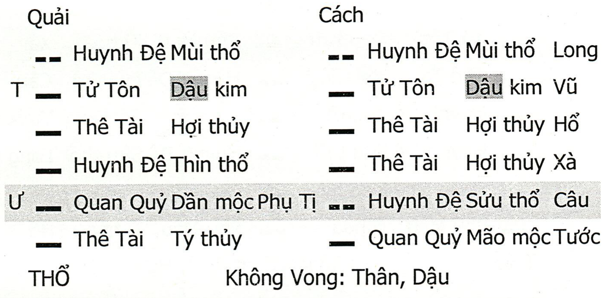

### Ví dụ 8: Ngày Canh Ngọ tháng Thân, nam đoán thầu lại cửa hàng của người khác có thể thành công hay không? Được Địa Trạch Lâm biến Hỏa Trạch Khuê.

| | Lâm | | | Khuê | | | |
| :---: | :---: | :---: | :---: | :---: | :---: | :---: | :---: |
| | - - | Tử Tôn | Dậu kim | — | Phụ Mẫu | Tị hỏa | Xà |
| Ứ | - - | Thê Tài | Hợi thủy | - - | Huynh Đệ | Mùi thổ | Câu |
| | - - | Huynh Đệ | Sửu thổ | — | Tử Tôn | Dậu kim | Tước |
| | - - | Huynh Đệ | Sửu thổ | - - | Huynh Đệ | Sửu thổ | Long |
| T | — | Quan Quỷ | Mão mộc | — | Quan Quỷ | Mão mộc | Vũ |
| | — | Phụ Mẫu | Tị hỏa | — | Phụ Mẫu | Tị hỏa | Hổ |

THỔ Không Vong: Tuất, Hợi

**Phán đoán:** Lấy hào Phụ Mẫu làm Dụng thần. Hào Thế là mình, hào Ứng là đối phương. Phụ Mẫu Tị hỏa lâm hào sơ được Nhật trợ giúp là vượng tướng, nhưng hào Thế bị Nguyệt kiến khắc thương, Nhật không trợ giúp, trong quẻ lại có tam hợp cục đến khắc hào Thế, hào Thế không có sức mạnh sinh hào Phụ Mẫu, sợ là thầu lại cửa hàng không thành công.

Hào Ứng Hợi thủy Không Vong, Ứng Không thì người ta không thật, bên kia do dự bất định. Lâm Câu Trần, chủ chậm chạp, biểu thị trì hoãn nhiều lần. Dụng thần tại hào sơ vượng tướng, biểu thị vừa khởi đầu thì thuận lợi, nhưng quái tượng biểu thị không thành, cho nên cuối cùng thầu lại không được.

**Phản hồi:** Mới đầu thì đối phương đồng ý, nhưng đột nhiên vợ chồng họ muốn ly hôn, người vợ không cho chuyển thầu, cuối cùng không thành công.

### Ví dụ 9: Ngày Quý Mùi tháng Thìn, nam muốn cho thuê cửa hàng mình đang kinh doanh, được Phong Trạch Trung Phu.

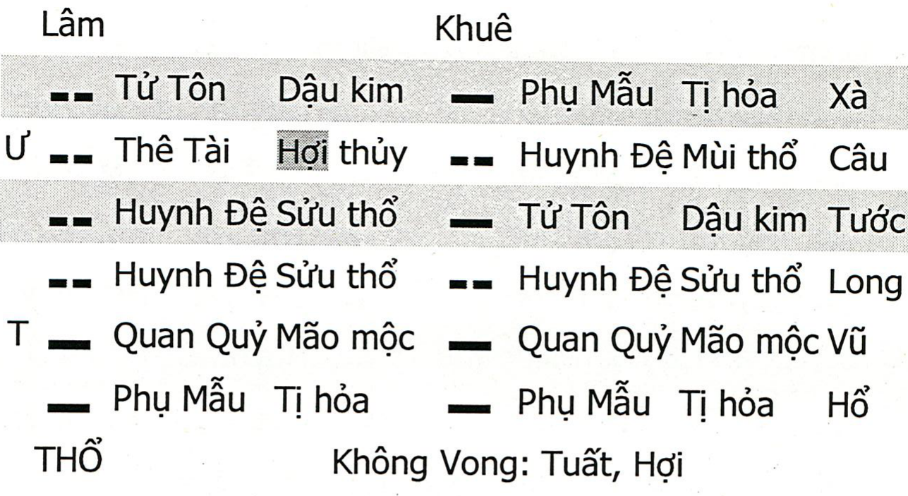

| | Trung Phu | | | | |
| :---: | :---: | :---: | :---: | :---: | :---: |
| | — | Quan Quỷ | Mão mộc | | Hổ |
| | — | Phụ Mẫu | Tị hỏa | Tài Tý | Xà |
| T | - - | Huynh Đệ | Mùi thổ | | Câu |
| | - - | Huynh Đệ | Sửu thổ | Tử Thân | Tước |
| | — | Quan Quỷ | Mão mộc | | Long |
| Ứ | — | Phụ Mẫu | Tị hỏa | | Vũ |

THỔ Không Vong: Thân, Dậu

**Phán đoán:** Lấy Phụ Mẫu làm Dụng thần. Trong quẻ Phụ Mẫu lưỡng hiện, lấy hào Ứng Phụ Mẫu Tị hỏa làm Dụng thần. Dụng thần lâm hào Ứng, Ứng là người khác, biểu thị cửa hàng sẽ đến tay của người khác. Nay Dụng thần hưu tù, phải đợi đến tháng Tị thì Dụng thần được vượng mà cho thuê thành công.

**Phản hồi:** Quả nhiên cho thuê ở tháng Tị.

### Ví dụ 10: Ngày Kỷ Tị tháng Mão, nam đoán về cho thuê cửa hàng, được Cấn Vi Sơn biến Sơn Phong Cổ.

| | Cấn | | | Cổ | | | |
| :---: | :---: | :---: | :---: | :---: | :---: | :---: | :---: |
| T | — | Quan Quỷ | Dần mộc | — | Quan Quỷ | Dần mộc | Câu |
| | - - | Thê Tài | Tý thủy | - - | Thê Tài | Tý thủy | Tước |
| | - - | Huynh Đệ | Tuất thổ | - - | Huynh Đệ | Tuất thổ | Long |
| Ứ | — | Tử Tôn | Thân kim | — | Tử Tôn | Dậu kim | Vũ |
| | - - | Phụ Mẫu | Ngọ hỏa | — | Thê Tài | Hợi thủy | Hổ |
| | - - | Huynh Đệ | Thìn thổ | - - | Huynh Đệ | Sửu thổ | Xà |

THỔ Không Vong: Tuất, Hợi

**Phán đoán:** Lấy Phụ Mẫu làm Dụng thần. Phụ Mẫu Ngọ hỏa được Nguyệt sinh Nhật phù là vượng tướng, nhưng động hóa hồi đầu khắc, lại quẻ là Cấn, là ngừng, cần dừng lại trong một thời gian rất dài mới có thể cho thuê thành công. Phán đoán tháng, tháng Tị xung mất hào biến mới thành.

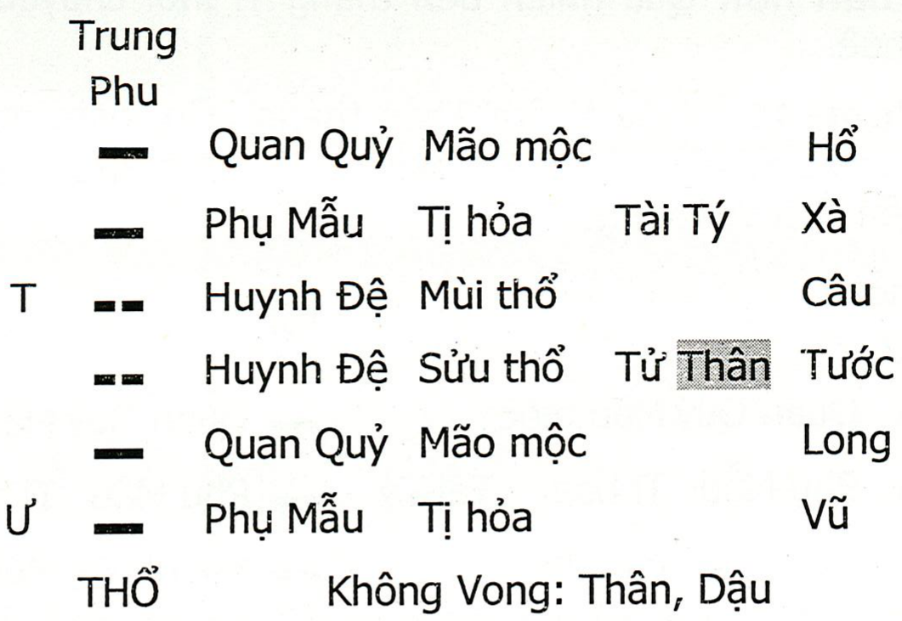

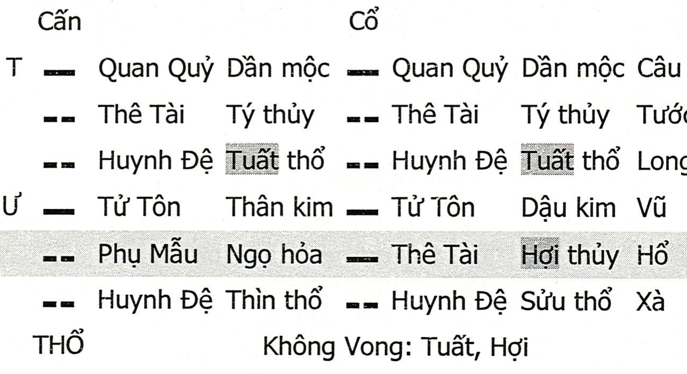

**Phản hồi:** Quả nhiên đến tháng Tị mới chuyển cho người khác thuê.

**Ví dụ 11:** Ngày Nhâm Thân tháng Dần, nam mới mua căn hộ, đoán xem ngày nào được bàn giao? Được Phong Trạch Trung Phu biến Tốn Vi Phong.

| | Trung Phu | | Tốn | |
| :---: | :--- | :---: | :--- | :---: |
| | — Quan Quỷ Mão mộc | | — Quan Quỷ Mão mộc | Hổ |
| | — Phụ Mẫu Tị hỏa | Tài Tý | — Phụ Mẫu Tị hỏa | Xà |
| T | - - Huynh Đệ Mùi thổ | | - - Huynh Đệ Mùi thổ | Câu |
| | - - Huynh Đệ Sửu thổ | Tử Thân | — Tử Tôn Dậu kim | Tước |
| | — Quan Quỷ Mão mộc | | — Thê Tài Hợi thủy | Long |
| Ư | — Phụ Mẫu Tị hỏa | | - - Huynh Đệ Sửu thổ | Vũ |

THỔ Không Vong: Tuất, Hợi

**Phán đoán:** Lấy Phụ Mẫu làm Dụng thần. Trong quẻ Phụ Mẫu lưỡng hiện, lấy hào Phụ Mẫu Tị hỏa phát động làm Dụng thần. Dụng thần được Nguyệt đến sinh, vượng tướng phát động sinh hào Thế, căn hộ có thể được bàn giao, chỉ là Nhật hợp Dụng thần, phải đợi xung khai. Ngày Hợi xung Dụng thần, ngày Hợi có thể được bàn giao.

**Phản hồi:** Quả nhiên đã nhận được chìa khóa căn hộ ở ngày thứ ba.

## 2. VAY TIỀN VÀ ĐÒI NỢ

Trong cuộc sống thường ngày, có người bởi vì vòng quay kinh tế nhất thời gặp trở ngại nên cần được hỗ trợ về tiền vốn, nhưng đôi khi vay ngân hàng cũng không dễ, cũng chưa chắc kịp thời. Với lại, nếu số tiền không lớn thì cũng không đáng để đến ngân hàng vay tiền, thế là họ đành phải vay tiền của bạn bè hoặc người thân. Có lẽ có một số người không cần vay tiền, nhưng đôi khi họ cũng sẽ bị người khác vay tiền của mình. Người đi vay thì lo lắng không trả được nợ, người cho vay thì lo lắng đối phương không có khả năng trả nợ, hoặc là không muốn trả nợ. Lòng người khó nắm bắt, chẳng ai nhìn thấy được nội tâm của người khác. Do đó, vấn đề này đã trở nên rất quan trọng trong dự đoán.

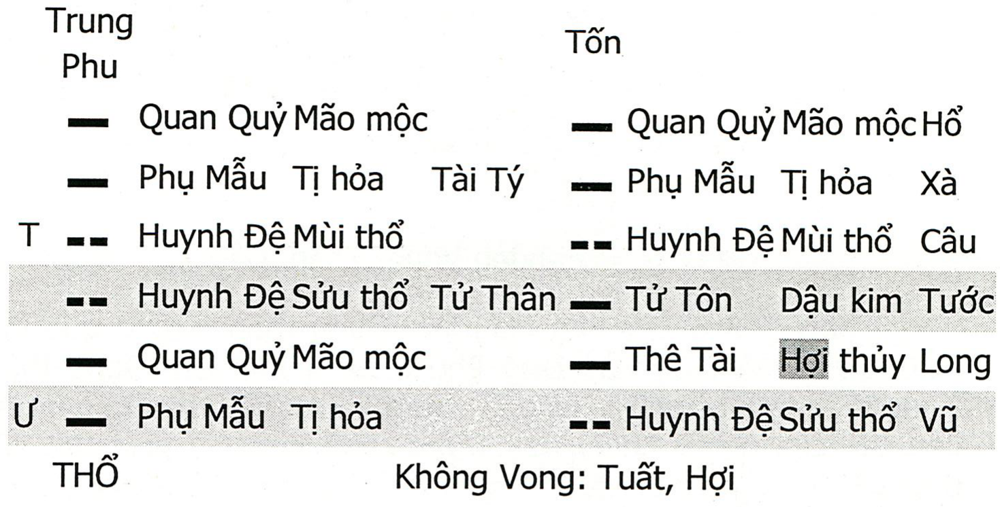

Bất kể là đi vay, hay là cho vay, Thê Tài là Dụng thần chủ yếu. Khi đi vay, Thê Tài vượng tướng gặp sinh phù, Tài động sinh hợp hào Thế, Tử Tôn phát động sinh hào Thế, hào Thế hào Ứng bất Không bất Phá, đi vay có thể toại nguyện. Ứng Không, đối phương khuất mặt, chính là có ý né tránh không muốn cho vay, vượng tướng Không Vong là muốn cho vay mà nhất thời không có tiền. Hưu tù mà sinh là muốn cho vay mà không có. Tối kỵ Huynh Đệ trì Thế phát động, đi vay chắc chắn tay không mà về.

Hào Thế phát động hóa Không, hóa Tuyệt, hóa Huynh Đệ, tiền trong tay hết rất nhanh. Quan Quỷ trì Thế hóa Huynh Đệ, cần dùng tiền gấp, mượn được là chi ra. Ứng lâm Huynh Đệ khắc hào Thế, chắc chắn từ chối cho vay, tay không mà về.

Nếu như có người đến vay tiền, Thê Tài vượng tướng không gặp khắc, bất Không bất Phá, cho vay có thể được trả lại. Rất sợ hào Ứng lâm Huynh Đệ Chu Tước Huyền Vũ ám động. Cũng sợ Ứng động hóa Không hóa Phá, Ứng hợp Thê Tài hóa Tuyệt, sau khi vay được tiền thì thế nào cũng bỏ trốn, không muốn trả lại. Ứng lâm Tài khố thêm Đằng Xà, đối phương có tiền cũng sẽ không trả.

Kinh doanh cho thiếu nợ hoặc đòi nợ cũng có thể phán đoán theo phương pháp này.

**Ví dụ 1:** Vào tháng 3 năm Đinh Hợi, khi tôi đến Lạc Dương để sát hạch, một vị nghiên cứu lục hào ở nơi đó có ý thăm dò trình độ dự đoán của tôi, ông ta đã viết lên giấy tình huống như sau, nhờ tôi phán đoán: Ngày Kỷ Sửu tháng Tý, một ông chủ đoán đi vay tiền, được Phong Sơn Tiệm biến Thủy Phong Tỉnh.

1. Có vay được hay không? 2. Nếu vay được thì số tiền là bao nhiêu? 3. Khi nào vay được?

| Tiệm | | | Tỉnh | |
| :--- | :--- | :--- | :--- | :--- |
| Ư — Quan Quỷ Mão mộc | | - - Thê Tài Tý thủy | Câu |
| — Phụ Mẫu Tị hỏa | Tài Tý | — Huynh Đệ Tuất thổ | Tước |
| - - Huynh Đệ Mùi thổ | | - - Tử Tôn Thân kim | Long |
| T — Tử Tôn Thân kim | | — Tử Tôn Dậu kim | Vũ |
| - - Phụ Mẫu Ngọ hỏa | | — Thê Tài Hợi thủy | Hổ |
| - - Huynh Đệ Thìn thổ | | - - Huynh Đệ Sửu thổ | Xà |

THỔ Không Vong: Ngọ, Mùi

**Phán đoán:** Hào Thế là người đi vay, Thê Tài là số tiền muốn vay, hào Ứng là người cho vay tiền. Hào Thế là Tử Tôn sinh Tài, là thông tin muốn nhận được tiền. Tài được Nguyệt trợ giúp là vượng tướng, hào Ứng phát động hóa Tài, chính là lấy tiền từ trong tay đối phương, biểu thị sẽ cho vay. Thê Tài Tý thủy tại hào 5, hào 5 là số tiền lớn, Tý thủy là số 1. Tổng hợp và phân tích, tôi phán đoán là 10 vạn tệ. Dụng thần phục tàng mà bị Nhật hợp trú, lại có Phụ Mẫu Ngọ hỏa động hóa Thê Tài, phục tàng cần xung xuất, hợp trú cần xung khai, động mà hóa ra cũng là ứng kỳ. Vì vậy, phán đoán là ngày Ngọ vay được.

**Phản hồi:** Nhưng trên thực tế là đã vay được 10 vạn tệ ở ngày Tị.

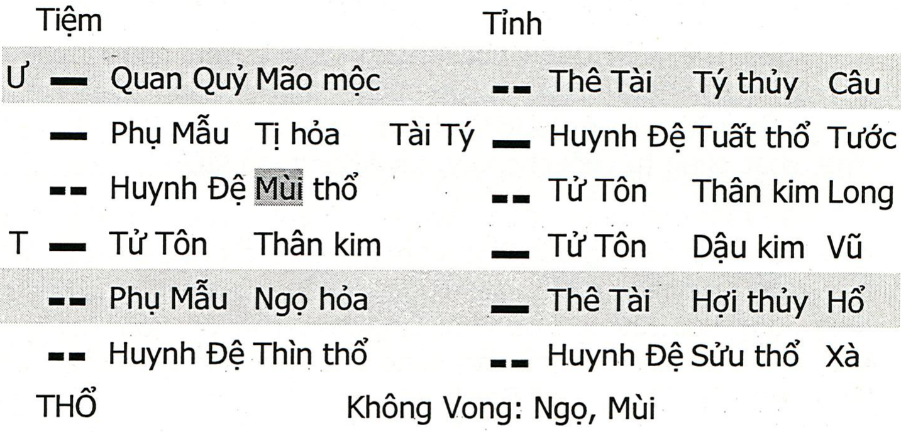

**Ví dụ 2:** Ngày Giáp Thân tháng Mão, nữ đoán vay ngân hàng mấy chục triệu có thành công không? Được Trạch Sơn Hàm.

| Hàm | | |
| :--- | :--- | :--- |
| Ư - - Phụ Mẫu Mùi thổ | | Vũ |
| — Huynh Đệ Dậu kim | | Hổ |
| — Tử Tôn Hợi thủy | | Xà |
| T — Huynh Đệ Thân kim | | Câu |
| - - Quan Quỷ Ngọ hỏa | Tài Mão | Tước |
| - - Phụ Mẫu Thìn thổ | | Long |

KIM Không Vong: Ngọ, Mùi

**Phán đoán:** Lấy Thê Tài làm Dụng thần. Thê Tài Mão mộc phục dưới hào 2, mặc dù không hiện trên quẻ nhưng được Nguyệt tỉ phù, Phi thần lại Không, Phục thần dưới hào Không thì dễ kéo ra, có thể vay được.

Hào Ứng là Tài khố, chủ ngân hàng, Không mà khiến hào Tài không nhập Mộ khố, chính là thông tin ngân hàng cởi mở, cho vay tiền. Dụng thần trị Nguyệt, tháng đó có thể vay được.

**Phản hồi:** Về sau đã vay được tiền trước tiết Thanh Minh một tuần.

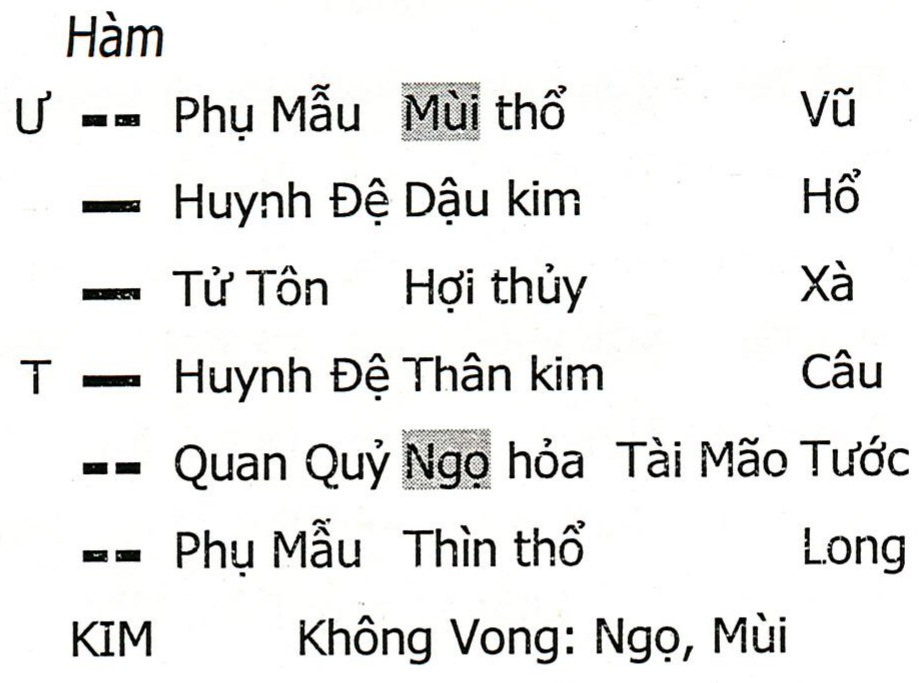

### Ví dụ 3: Ngày Canh Tuất tháng Sửu, nam đoán xem hỏi vay tiền một người sẽ ra sao? Được Sơn Địa Bác biến Khôn Vi Địa.

| | Bác | | | Khôn | |
| :---: | :---: | :--- | :---: | :--- | :---: |
| | — | Thê Tài Dần mộc | - - | Huynh Đệ Dậu kim | Xà |
| T | - - | Tử Tôn Tý thủy | - - | Tử Tôn Hợi thủy | Câu |
| | - - | Phụ Mẫu Tuất thổ | - - | Phụ Mẫu Sửu thổ | Tước |
| | - - | Thê Tài Mão mộc | - - | Thê Tài Mão mộc | Long |
| Ứ | - - | Quan Quỷ Tị hỏa | - - | Quan Quỷ Tị hỏa | Vũ |
| | - - | Phụ Mẫu Mùi thổ | - - | Phụ Mẫu Mùi thổ | Hổ |

KIM Không Vong: Dần, Mão

**Phán đoán:** Lấy Thê Tài làm Dụng thần. Trong quẻ Thê Tài lưỡng hiện, lấy hào Thê Tài Dần mộc phát động làm Dụng thần. Thê Tài Dần mộc không được Nhật Nguyệt trợ giúp, Không hóa hồi đầu khắc, nhất định không vay được tiền.

**Phản hồi:** Quả nhiên không vay được.

### Ví dụ 4: Ngày Tân Hợi tháng Sửu, đoán xem vay tiền có được không? Được Thiên Lôi Vô Vọng biến Thiên Hỏa Đồng Nhân.

| | Vô Vọng | | | Đồng Nhân | |
| :---: | :---: | :--- | :---: | :--- | :---: |
| | — | Thê Tài Tuất thổ | — | Thê Tài Tuất thổ | Xà |
| | — | Quan Quỷ Thân kim | — | Quan Quỷ Thân kim | Câu |
| T | — | Tử Tôn Ngọ hỏa | — | Tử Tôn Ngọ hỏa | Tước |
| | - - | Thê Tài Thìn thổ | — | Phụ Mẫu Hợi thủy | Long |
| | - - | Huynh Đệ Dần mộc | - - | Thê Tài Sửu thổ | Vũ |
| Ứ | — | Phụ Mẫu Tý thủy | — | Huynh Đệ Mão mộc | Hổ |

MỘC Không Vong: Dần, Mão

**Phán đoán:** Lấy Thê Tài làm Dụng thần. Trong quẻ Thê Tài lưỡng hiện, lấy hào phát động làm Dụng thần, Thê Tài Thìn thổ được Nguyệt trợ giúp, Nhật không đến khắc, có thể vay được.

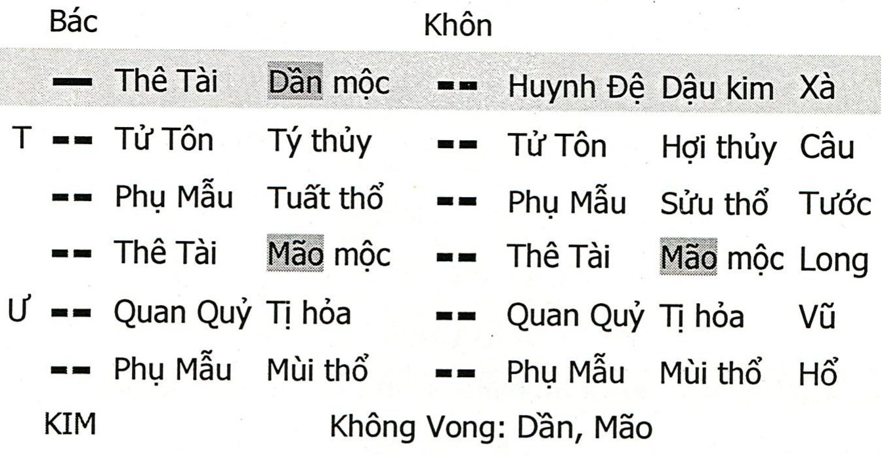

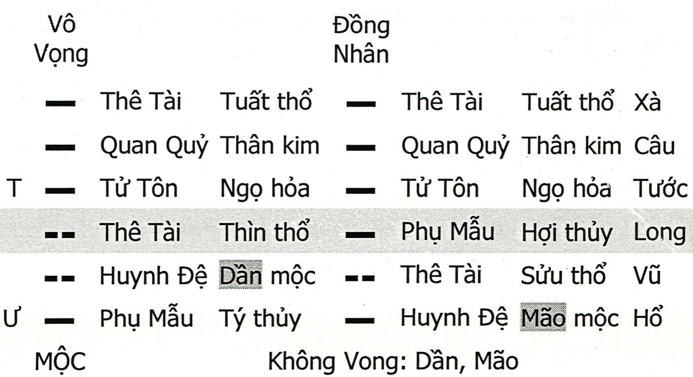

Dụng thần động mà hóa ra Nhật thần, có thể vay được ngay trong hôm đó.

**Phản hồi:** Quả nhiên vay được ở hôm đó.

### Ví dụ 5: Ngày Nhâm Tý tháng Mùi, một học trò của tôi đoán xem khi nào mới thu được tiền hàng? Được Thủy Trạch Tiết biến Phong Lôi Ích.

| | Tiết | | | Ích | |
| :---: | :---: | :--- | :---: | :--- | :---: |
| | - - | Huynh Đệ Tý thủy | — | Tử Tôn Mão mộc | Hổ |
| | — | Quan Quỷ Tuất thổ | — | Thê Tài Tị hỏa | Xà |
| Ứ | - - | Phụ Mẫu Thân kim | - - | Quan Quỷ Mùi thổ | Câu |
| | - - | Quan Quỷ Sửu thổ | - - | Quan Quỷ Thìn thổ | Tước |
| | — | Tử Tôn Mão mộc | - - | Tử Tôn Dần mộc | Long |
| T | — | Thê Tài Tị hỏa | — | Huynh Đệ Tý thủy | Vũ |

THỦY Không Vong: Dần, Mão

**Phán đoán:** Lấy Thê Tài làm Dụng thần. Thê Tài Tị hỏa trì Thế, không được Nhật Nguyệt đến sinh mà trái lại bị Nhật khắc là hưu tù. Huynh Đệ Tý thủy lại phát động trong quẻ, có vẻ như không có hy vọng. Nhưng Nguyên thần Tử Tôn phát động thành liên tục tương sinh, cho nên có thể thu được tiền hàng.

Tử Tôn Không mà hóa thoái, Không thì cần xung thực, hóa thoái thì cần xung Thoái thần, cho nên phán đoán tháng Thân có thể thu được tiền hàng. Nhưng bởi vì Thê Tài hưu tù, Huynh Đệ vượng tướng, vì vậy không thể thu được toàn bộ.

**Phản hồi:** Kết quả là tại ngày Ất Sửu tháng Thân đã được kết toán gần hết, còn lại 457 tệ chưa trả.

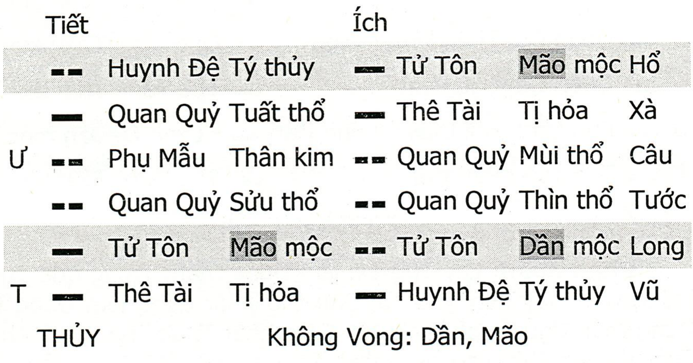

**Ví dụ 6:** Ngày Quý Sửu tháng Mùi, mẹ và mọi người cùng đòi tiền lương hưu bị đơn vị cắt xén, nữ đoán xem có thể đòi được không? Được Thủy Phong Tỉnh biến Thủy Thiên Nhu.

| | Tỉnh | | Phục thần | Nhu | | Lục thú |
| :---: | :---: | :--- | :---: | :---: | :--- | :---: |
| | -- | Phụ Mẫu Tý thủy | | -- | Phụ Mẫu Tý thủy | Hổ |
| T | ━ | Thê Tài Tuất thổ | | ━ | Thê Tài Tuất thổ | Xà |
| | -- | Quan Quỷ Thân kim | Tử Ngọ | -- | Quan Quỷ Thân kim | Câu |
| | ━ | Quan Quỷ Dậu kim | | ━ | Thê Tài Thìn thổ | Tước |
| Ứ | ━ | Phụ Mẫu Hợi thủy | Huynh Dần | ━ | Huynh Đệ Dần mộc | Long |
| | -- | Thê Tài Sửu thổ | | ━ | Phụ Mẫu Tý thủy | Vũ |

MỘC Không Vong: Dần, Mão

**Phán đoán:** Lấy Thê Tài làm Dụng thần. Trong quẻ Thê Tài lưỡng hiện, lấy hào Thê Tài Sửu thổ phát động làm Dụng thần. Dụng thần Nguyệt phá, nhưng được Nhật Thực Phá, lại là Thê Tài Tuất thổ trì Thế, cho nên nhất định có thể đòi được tiền lương. Chỉ là động mà hóa hợp, cần trì hoãn thời gian một chút.

**Phản hồi:** Vào giờ Thìn buổi sáng hôm đó, trên cuộc họp, họ đã bày tỏ được phát bổ sung tiền lương, sau đó được phát ở tháng Tuất.

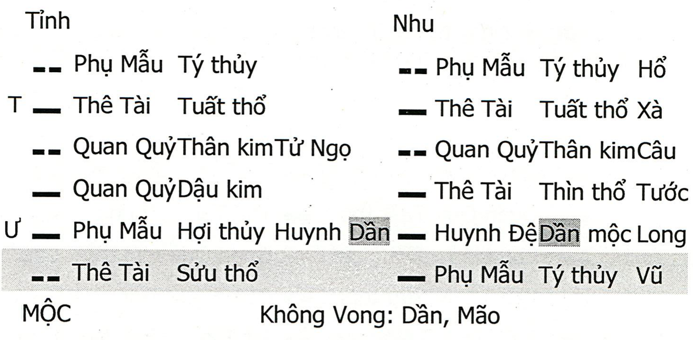

**Ví dụ 7:** Ngày Mậu Tý tháng Hợi, nam đoán xem có thể đòi được tiền của mình hay không? Được Thủy Lôi Truân.

| | Truân | | Phục thần | Lục thú |
| :---: | :---: | :--- | :---: | :---: |
| | -- | Huynh Đệ Tý thủy | | Tước |
| Ứ | ━ | Quan Quỷ Tuất thổ | | Long |
| | -- | Phụ Mẫu Thân kim | | Vũ |
| | -- | Quan Quỷ Thìn thổ | Tài Ngọ | Hổ |
| T | -- | Tử Tôn Dần mộc | | Xà |
| | ━ | Huynh Đệ Tý thủy | | Câu |

THỦY Không Vong: Ngọ, Mùi

**Phán đoán:** Lấy Thê Tài làm Dụng thần. Thê Tài Ngọ hỏa không hiện trên quẻ, phục tàng dưới Quan Quỷ Thìn thổ. Dụng thần Không Vong, lại bị Nhật Nguyệt khắc thương, hưu tù vô lực, căn bản không thể đòi.

Hào Ứng là người cầm tiền, hào Ứng Quan Quỷ Tuất thổ tại hào 5 lâm Thanh Long, hào 5 là lãnh đạo, Quan Quỷ là quan, Thanh Long là lãnh đạo chính quyền, người cầm tiền là một quan chức chính quyền. Ứng là Tài khố, đối phương giữ tiền không muốn lấy ra. Thê Tài là hỏa, hỏa chủ số 2, hưu tù thì giảm một nửa, là số 1, phán đoán là 10 vạn tệ.

**Phản hồi:** Quả nhiên là một lãnh đạo đã cầm của anh ta 10 vạn tệ, nói là để lo liệu việc cho anh ta, nhưng việc xử lý không xong mà tiền thì cũng không hoàn trả.

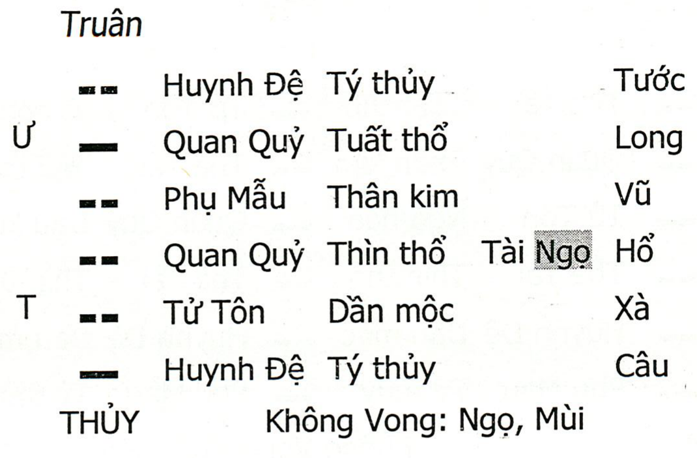

### Ví dụ 8: Ngày Mậu Tý tháng Dậu, nữ đoán đòi nợ, được Chấn Vi Lôi biến Hỏa Lôi Phệ Hạp.

| | Chấn | | | Phệ Hạp | |
| :---: | :---: | :--- | :---: | :--- | :---: |
| T | - - | Thê Tài Tuất thổ | — | Tử Tôn Tị hỏa | Tước |
| | - - | Quan Quỷ Thân kim | - - | Thê Tài Mùi thổ | Long |
| | — | Tử Tôn Ngọ hỏa | — | Quan Quỷ Dậu kim | Vũ |
| Ư | - - | Thê Tài Thìn thổ | - - | Thê Tài Thìn thổ | Hổ |
| | - - | Huynh Đệ Dần mộc | - - | Huynh Đệ Dần mộc | Xà |
| | — | Phụ Mẫu Tý thủy | — | Phụ Mẫu Tý thủy | Câu |

**MỘC** Không Vong: Ngọ, Mùi

**Phán đoán:** Lấy Thê Tài làm Dụng thần. Trong quẻ Thê Tài lưỡng hiện, lấy hào Thê Tài Tuất thổ phát động làm Dụng thần. Dụng thần không được Nhật Nguyệt trợ giúp, tại hào 6 lâm Chu Tước động hóa Tị hỏa, bởi vì hưu tù, luận sinh không luận Tuyệt. Hào 6 là điểm cuối của sự vật, Chu Tước chủ kiện tụng, cho nên phán đoán đòi nợ rất gian nan, đã đến bước đường cùng, đành phải lấy kiện tụng để đòi tiền.

Hào Ứng là đối phương thiếu nợ, hào Ứng được Nguyệt hợp là vượng tướng, Nguyệt kiến là Quan Quỷ, Quan Quỷ là thẩm phán, tòa án, đối phương có tòa án chống đỡ. Ứng là Tài khố, tương xung với hào Thế, đối phương giữ tiền không chịu trả. Nhưng hào Tài độc phát hóa hồi đầu sinh, có thể đòi được.

**Phản hồi:** Quả nhiên là sau khi làm công trình thì đối phương không chịu thanh toán, không còn cách nào khác nên đành phải khởi tố đối phương, mặc dù đối phương có người quen ở tòa án giúp trì hoãn vụ kiện nhiều lần nhưng cuối cùng vẫn đòi được tiền.

### Ví dụ 9: Ngày Ất Dậu tháng Ngọ, một học trò của tôi nhờ tôi đoán, có một nhà buôn ở chung tòa nhà lấy hàng của cô ấy cứ không thanh toán tiền hàng, đã đòi nhiều lần cũng không trả, hỏi có thể đòi được hay không? Được Địa Hỏa Minh Di.

| | Minh Di | | | |
| :---: | :---: | :--- | :---: | :---: |
| | - - | Phụ Mẫu Dậu kim | | Vũ |
| | - - | Huynh Đệ Hợi thủy | | Hổ |
| T | - - | Quan Quỷ Sửu thổ | | Xà |
| | — | Huynh Đệ Hợi thủy | Tài Ngọ | Câu |
| | - - | Quan Quỷ Sửu thổ | | Tước |
| Ư | — | Tử Tôn Mão mộc | | Long |

**THỦY** Không Vong: Ngọ, Mùi

**Phán đoán:** Lấy Thê Tài làm Dụng thần. Hào Thế là mình, Thê Tài là tiền hàng, hào Ứng là nhà buôn lấy hàng. Thê Tài Ngọ hỏa mặc dù không hiện trên quẻ lại gặp Không Vong, nhưng được Nguyệt tỉ phù là vượng tướng. Hào Ứng vốn an tĩnh, biểu thị không chủ động giao tiền hàng, nhưng bị Nhật xung, tạo thành ám động sinh Thê Tài, gặp xung là thôi thúc (thúc giục), đòi nhiều lần mới có thể được trả.

Ngày Quý Tị hào Tài được trợ, xung khai Phi thần, nhất định có thể đòi được. Dụng thần là hỏa, chủ số 2, ước chừng có 2000 tệ.

**Phản hồi:** Quả nhiên sau nhiều lần đòi nợ thì ở ngày Quý Tị lấy được tổng cộng 2100 tệ.

---

# Part 17 (Pages 321-340)

### Ví dụ 10: Ngày Quý Dậu tháng Tuất, nữ đoán xem bạn mượn tiền có trả không? Nếu trả thì khi nào trả? Được Địa Sơn Khiêm biến Địa Phong Thăng.

| Thế/Ứng | Khiêm | Phục thần | Thăng | Lục thú |
| :---: | :---: | :---: | :---: | :---: |
| | - - Huynh Đệ Dậu kim | | - - Huynh Đệ Dậu kim | Hổ |
| T | - - Tử Tôn Hợi thủy | | - - Tử Tôn Hợi thủy | Xà |
| | - - Phụ Mẫu Sửu thổ | | - - Phụ Mẫu Sửu thổ | Câu |
| | — Huynh Đệ Thân kim | | — Huynh Đệ Dậu kim | Tước |
| Ứ | - - Quan Quỷ Ngọ hỏa | Tài Mão | — Tử Tôn Hợi thủy | Long |
| | - - Phụ Mẫu Thìn thổ | | - - Phụ Mẫu Sửu thổ | Vũ |

KIM Không Vong: Tuất, Hợi

**Phán đoán:** Lấy Thê Tài làm Dụng thần. Thê Tài Mão mộc không hiện trên quẻ, phục tàng dưới hào 2 Quan Quỷ Ngọ hỏa. Dụng thần được Nguyệt hợp là có khí, phục tàng mừng được xung xuất, Nhật xung Dụng thần là cát.

Hào Thế Không Vong, lo lắng không trả, Quan Quỷ phát động lại là tượng lo âu, nhưng Quan Quỷ động hóa hồi đầu khắc, lo âu biến mất, cho nên nhất định sẽ trả. Ngày Tý xung khai Phi thần, xung mất Quan Quỷ, tiền liền đến tay, cũng không cần phải lo lắng nữa.

**Phản hồi:** Quả nhiên người bạn đã đem tiền trả cho cô ấy ở ngày Bính Tý.

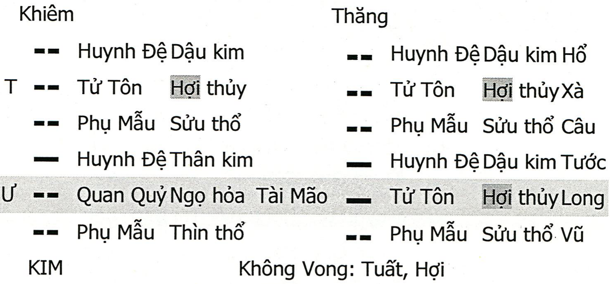

### Ví dụ 11: Ngày Đinh Mão tháng Tị, nam đoán xem người ta vay tiền khi nào trả lại? Được Hỏa Thiên Đại Hữu.

| Thế/Ứng | Đại Hữu | Lục thú |
| :---: | :---: | :---: |
| Ứ | — Quan Quỷ Tị hỏa | Long |
| | - - Phụ Mẫu Mùi thổ | Vũ |
| | — Huynh Đệ Dậu kim | Hổ |
| T | — Phụ Mẫu Thìn thổ | Xà |
| | — Thê Tài Dần mộc | Câu |
| | — Tử Tôn Tý thủy | Tước |

KIM Không Vong: Tuất, Hợi

**Phán đoán:** Lấy Thê Tài làm Dụng thần. Thê Tài Dần mộc được Nhật trợ giúp là vượng tướng. Nhưng khi xem quẻ này thì tôi không phán đoán khi nào người ta trả tiền cho anh ta, tôi nói: "Anh đoán về đòi nợ người ta, nhưng bản thân anh cũng vay người khác chưa trả, như nhau thôi."

**Phản hồi:** Quả nhiên là như vậy. Bởi vì Huynh Đệ Dậu kim ám động hợp hào Thế, Huynh Đệ là cái khắc tài, gần hào Thế đến hợp, chính là có người bám theo đòi tiền.

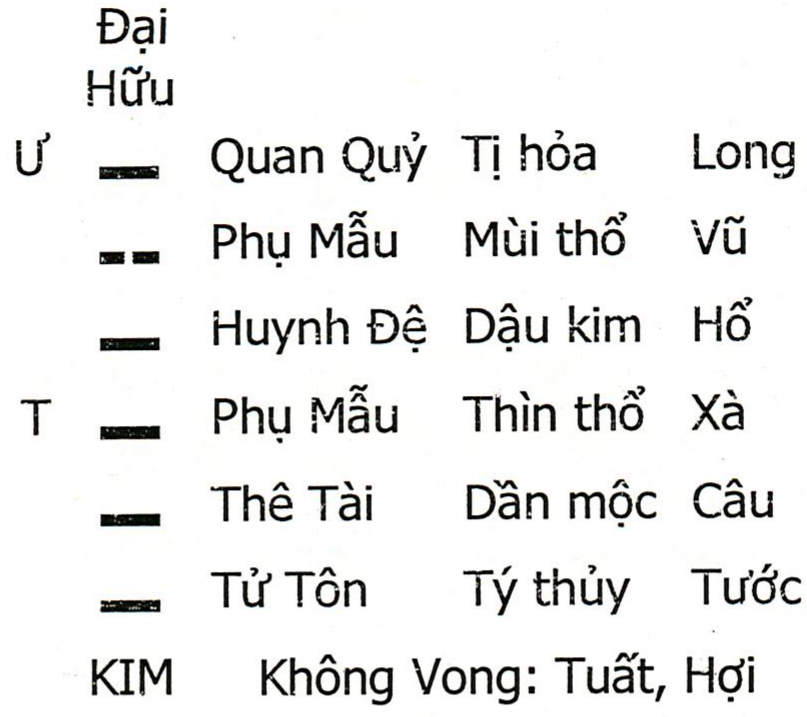

**Ví dụ 12:** Ngày Nhâm Dần tháng Mão, nam đoán xem người ta đòi nợ mình sẽ ra sao? Được Sơn Lôi Di biến Phong Địa Quan.

| | Di | Quan | |
| :--- | :--- | :--- | :--- |
| | — Huynh Đệ Dần mộc | — Huynh Đệ Mão mộc | Hổ |
| | - - Phụ Mẫu Tý thủy | — Tử Tôn Tị hỏa | Xà |
| T | - - Thê Tài Tuất thổ | - - Thê Tài Mùi thổ | Câu |
| | - - Thê Tài Thìn thổ | - - Huynh Đệ Mão mộc | Tước |
| | - - Huynh Đệ Dần mộc | - - Tử Tôn Tị hỏa | Long |
| Ứ | — Phụ Mẫu Tý thủy | - - Thê Tài Mùi thổ | Vũ |

**MỘC** Không Vong: Thìn, Tị

**Phán đoán:** Lấy Thê Tài làm Dụng thần, Thê Tài lưỡng hiện, lấy Thê Tài Thìn thổ Không Vong làm Dụng thần. Dụng thần bị Nhật Nguyệt khắc chế là hưu tù, trong quẻ Phụ Mẫu lưỡng hiện phát động, hào Ứng là người đòi nợ, lâm Phụ Mẫu phát động hóa Tài, Phụ Mẫu là đơn kiện, hóa Tài chính là muốn dựa vào kiện tụng để đòi tiền. Dụng thần lâm Chu Tước Không Vong, Chu Tước là kiện tụng, khẩu thiệt, Không Vong biểu thị mất mát, chính là thua kiện và phải trả nợ cho đối phương.

**Phản hồi:** Quả nhiên đối phương đi kiện đòi nợ. Anh ta đã thua kiện và phải trả tiền cho đối phương.

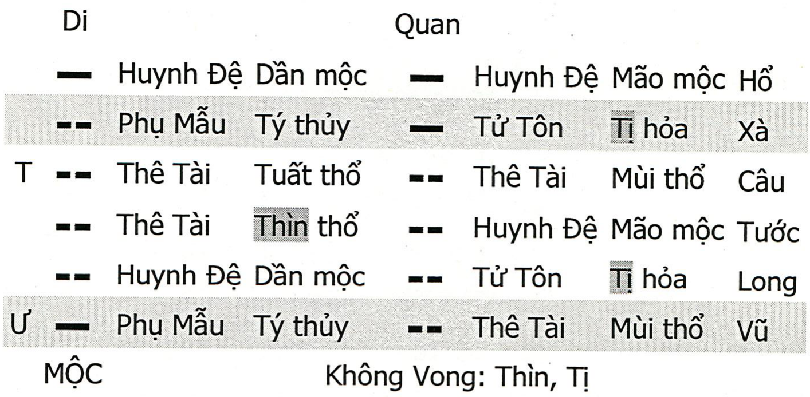

**Ví dụ 13:** Ngày Ất Tị tháng Tị, một học trò của tôi có bạn muốn vay tiền anh ta, đoán xem nếu cho vay thì có hoàn trả không? Được Lôi Hỏa Phong biến Địa Hỏa Minh Di.

| | Phong | Minh Di | |
| :--- | :--- | :--- | :--- |
| | - - Quan Quỷ Tuất thổ | - - Phụ Mẫu Dậu kim | Vũ |
| T | - - Phụ Mẫu Thân kim | - - Huynh Đệ Hợi thủy | Hổ |
| | — Thê Tài Ngọ hỏa | - - Quan Quỷ Sửu thổ | Xà |
| | — Huynh Đệ Hợi thủy | — Huynh Đệ Hợi thủy | Câu |
| Ứ | - - Quan Quỷ Sửu thổ | - - Quan Quỷ Sửu thổ | Tước |
| | — Tử Tôn Mão mộc | — Tử Tôn Mão mộc | Long |

**THỦY** Không Vong: Dần, Mão

**Phán đoán:** Lấy Thê Tài làm Dụng thần. Thê Tài Ngọ hỏa được Nhật Nguyệt trợ giúp là vượng tướng. Hào Ứng là người bạn vay tiền, sinh hào Thế bất Không bất phá, có thể cho vay. Nhật Nguyệt là Tài hợp hào Thế, tiền cho vay sẽ được trả lại.

**Phản hồi:** Thế là ở ngày Đinh Mùi anh ta cho bạn vay 5 vạn tệ, tại ngày Bính Thìn thì được bạn trả lại tiền.

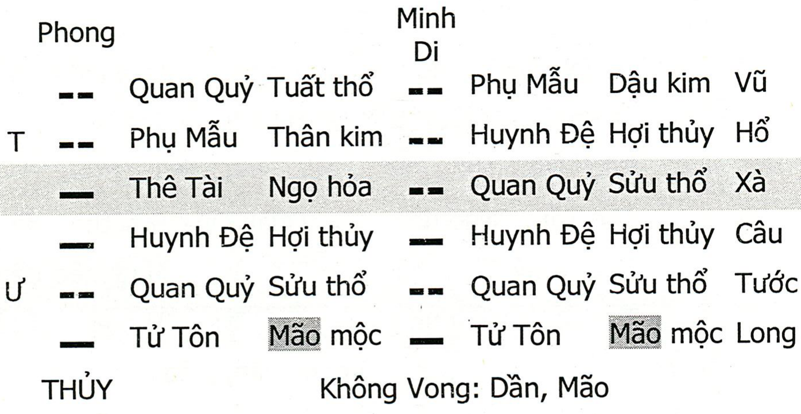

### Ví dụ 14: Ngày Đinh Mùi tháng Sửu, nam đoán xem tiền cho vay có thể được trả lại hay không? Được Khảm Vi Thủy biến Sơn Trạch Tổn.

| Khảm | | | Tổn | | |
| :---: | :---: | :--- | :---: | :--- | :--- |
| T | -- | Huynh Đệ Tý thủy | — | Tử Tôn Dần mộc | Long |
| | — | Quan Quỷ Tuất thổ | -- | Huynh Đệ Tý thủy | Vũ |
| | -- | Phụ Mẫu Thân kim | -- | Quan Quỷ Tuất thổ | Hổ |
| Ứ | -- | Thê Tài Ngọ hỏa | -- | Quan Quỷ Sửu thổ | Xà |
| | — | Quan Quỷ Thìn thổ | — | Tử Tôn Mão mộc | Câu |
| | -- | Tử Tôn Dần mộc | — | Thê Tài Tị hỏa | Tước |

THỦY Không Vong: Dần, Mão

**Phán đoán:** Lấy Thê Tài làm Dụng thần, hào Ứng là người đi vay. Dụng thần không được Nhật Nguyệt trợ giúp, nhập Mộ ở Quan Quỷ Tuất thổ, Nguyên thần hưu tù Không Vong, vô lực sinh Dụng thần, rất khó lấy lại tiền.

Ứng lâm Thê Tài Ngọ hỏa, bị Nhật hợp trú, Nhật hợp là giữ lại, trì hoãn nhiều lần không trả. Ứng lâm Đằng Xà, Đằng Xà chủ hám tiền, xảo trá, đối phương là kẻ đểu giả, không muốn trả tiền. Thê Tài nhập Mộ ở Quan Quỷ Tuất thổ, Tuất thổ lâm Huyền Vũ, Huyền Vũ chủ giấu giếm, che đậy, Mộ khố cũng là che đậy, đối phương đem tài sản giấu đi.

Dụng thần nhập Mộ bị hợp, mừng được xung xuất xung khai, hào Thế xung Tài, muốn lấy lại tiền, nhưng hưu tù vô lực nên không thể xung động Thê Tài, cho nên sẽ không lấy lại được.

**Phản hồi:** Quả nhiên sau khi mượn được tiền của anh ta thì đối phương đã chuyển tài sản và chuồn đi. Hắn đã xây một căn nhà lầu ở nơi khác, nhưng do vợ đứng tên, bề ngoài là ly hôn với vợ nhưng thực tế vẫn còn ở chung, công ty hắn mở thì đứng tên chị gái. Nhiều lần đòi tiền, hắn đều nói rằng mình chả có gì để trả.

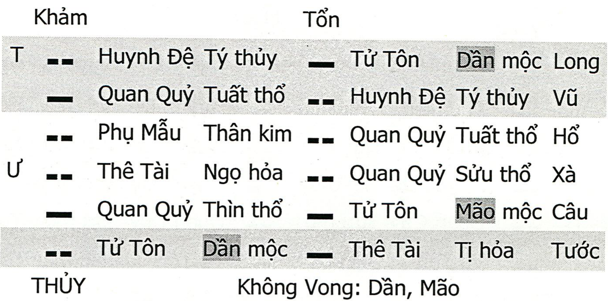

### Ví dụ 15: Ngày Canh Thìn tháng Dần, nam đoán xem đòi tiền công trình sẽ ra sao? Được Sơn Phong Cổ biến Sơn Thiên Đại Súc.

| Cổ | | | | Đại Súc | | |
| :---: | :---: | :--- | :---: | :---: | :--- | :--- |
| Ứ | — | Huynh Đệ Dần mộc | | — | Huynh Đệ Dần mộc | Xà |
| | -- | Phụ Mẫu Tý thủy | Tử Tị | -- | Phụ Mẫu Tý thủy | Câu |
| | -- | Thê Tài Tuất thổ | | -- | Thê Tài Tuất thổ | Tước |
| T | — | Quan Quỷ Dậu kim | | — | Thê Tài Thìn thổ | Long |
| | — | Phụ Mẫu Hợi thủy | | — | Huynh Đệ Dần mộc | Vũ |
| | -- | Thê Tài Sửu thổ | | — | Phụ Mẫu Tý thủy | Hổ |

MỘC Không Vong: Thân, Dậu

**Phán đoán:** Lấy Thê Tài làm Dụng thần. Trong quẻ Thê Tài lưỡng hiện, lấy hào Thê Tài Sửu thổ phát động làm Dụng thần. Dụng thần phát động bị hào biến hợp trú, tham hợp mà quên sinh hào Thế, đối phương trì hoãn nhiều lần không muốn trả tiền. Thế lâm Quan Quỷ Không Vong không được Tài đến sinh, Không Vong là lánh mặt, lâm Thế Không Vong, chính là mình đi đòi tiền thì người có trách nhiệm né tránh không thấy mặt.

Hào Thế nhập Mộ tại Thê Tài Sửu thổ, chứng tỏ hiện nay kinh tế cấp bách, đang gặp khó khăn về tài chính, muốn gấp rút thu hồi tiền công trình.

**Phản hồi:** Quả nhiên phù hợp với thực tế, đối phương mắc nợ anh ta hơn 100 vạn. Mỗi lần anh ta đi thì bị thư ký của đối phương cản trở, nói rằng người có trách nhiệm đã đi vắng, nhiều lần đòi nợ không có kết quả.

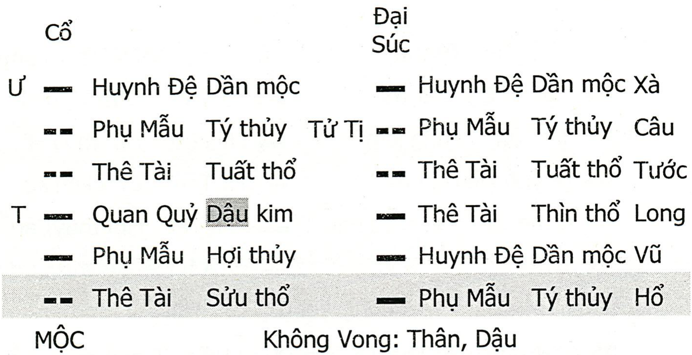

### Ví dụ 16: Ngày Ất Mão tháng Thìn, nam đoán đòi tiền công trình, được Thủy Thiên Nhu biến Trạch Phong Đại Quá.

| | Nhu | | | Đại Quá | |
| :--- | :--- | :--- | :--- | :--- | :--- |
| | - - | Thê Tài Tý thủy | - - | Huynh Đệ Mùi thổ | Long |
| | — | Huynh Đệ Tuất thổ | — | Tử Tôn Dậu kim | Vũ |
| T | - - | Tử Tôn Thân kim | — | Thê Tài Hợi thủy | Hổ |
| | — | Huynh Đệ Thìn thổ | — | Tử Tôn Dậu kim | Xà |
| | — | Quan Quỷ Dần mộc Phụ Tị | — | Thê Tài Hợi thủy | Câu |
| Ứ | — | Thê Tài Tý thủy | - - | Huynh Đệ Sửu thổ | Tước |

THỔ Không Vong: Tuất, Hợi

**Phán đoán:** Lấy Thê Tài làm Dụng thần. Trong quẻ Thê Tài lưỡng hiện, lấy hào Thê Tài Tý thủy phát động làm Dụng thần. Dụng thần không được Nhật Nguyệt trợ giúp, Nguyệt khắc Nhật không sinh là hưu tù. Hào Thế phát động sinh Thê Tài biểu thị bản thân muốn tiền về, nhưng hào Ứng Không hóa Không, lại bị hào biến hợp trú, dây dưa không muốn trả tiền, lâm Chu Tước Không Vong, nói rằng bản thân chưa có tiền.

Hào Thế động hóa ra Thê Tài Hợi thủy tiết khí, Thê Tài chủ ẩm thực, không những không lấy được tiền mà còn phải tốn tiền đãi khách ăn uống.

**Phản hồi:** Quả nhiên đúng như thông tin hiển thị trong quẻ.

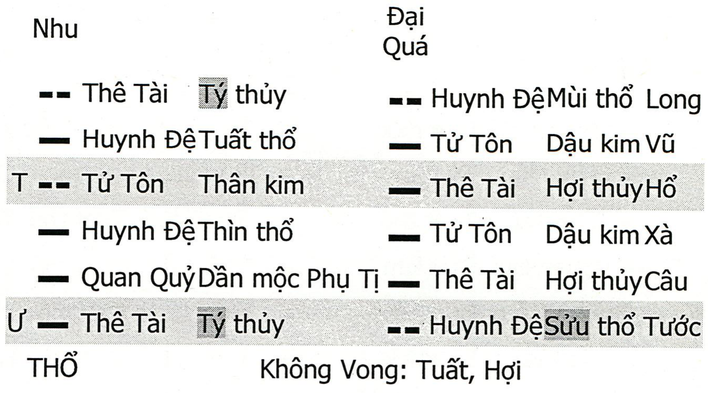

### Ví dụ 17: Ngày Quý Dậu tháng Thìn, nam đoán đòi nợ, được Khôn Vi Địa biến Lôi Phong Hằng.

| | Khôn | | | Hằng | |
| :--- | :--- | :--- | :--- | :--- | :--- |
| T | - - | Tử Tôn Dậu kim | - - | Huynh Đệ Tuất thổ | Hổ |
| | - - | Thê Tài Hợi thủy | - - | Tử Tôn Thân kim | Xà |
| | - - | Huynh Đệ Sửu thổ | — | Phụ Mẫu Ngọ hỏa | Câu |
| Ứ | - - | Quan Quỷ Mão mộc | — | Tử Tôn Dậu kim | Tước |
| | - - | Phụ Mẫu Tị hỏa | — | Thê Tài Hợi thủy | Long |
| | - - | Huynh Đệ Mùi thổ | - - | Huynh Đệ Sửu thổ | Vũ |

THỔ Không Vong: Tuất, Hợi

**Phán đoán:** Lấy Thê Tài làm Dụng thần. Thê Tài Hợi thủy Nguyệt khắc Nhật sinh, suy vượng tương đương. Nhưng không nên trong quẻ Huynh Đệ Sửu thổ phát động hóa hồi đầu sinh đến khắc, cộng thêm Dụng thần Không Vong, khắc nhiều sinh ít, rất khó đòi được. Nội quái phản ngâm, đã đòi rất nhiều lần.

**Phản hồi:** Quả nhiên là như vậy, đã đòi không dưới 15 lần, một xu cũng không lấy được.

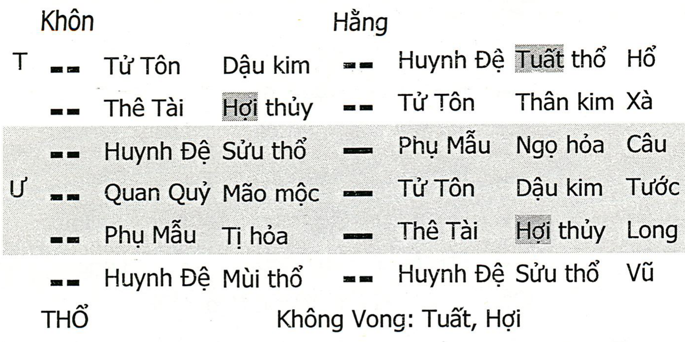

**Ví dụ 18:** Ngày Giáp Thân tháng Mùi, nam đoán xem cho vay thông qua người trung gian sẽ ra sao? Được Trạch Sơn Hàm.

| | Hàm | | |
| :---: | :---: | :---: | :---: |
| Ư | - - | Phụ Mẫu Mùi thổ | Vũ |
| | — | Huynh Đệ Dậu kim | Hổ |
| | — | Tử Tôn Hợi thủy | Xà |
| T | — | Huynh Đệ Thân kim | Câu |
| | - - | Quan Quỷ Ngọ hỏa Tài Mão | Tước |
| | - - | Phụ Mẫu Thìn thổ | Long |

KIM Không Vong: Ngọ, Mùi

**Phán đoán:** Lấy Thê Tài làm Dụng thần, hào Ứng là người trung gian muốn nhờ cậy. Thê Tài Mão mộc không được Nhật Nguyệt trợ giúp, Nhật đến khắc chế là hưu tù, không nên cho vay. Hào Ứng Mùi thổ lâm Huyền Vũ Không Vong, Ứng Không biểu thị người này không thể tín nhiệm, Huyền Vũ chủ lừa gạt, người trung gian này là một tên lừa đảo.

**Phản hồi:** Sau khi dự đoán, anh ta bí mật dò la và được biết người này đã từng ngồi tù ở năm Đinh Sửu vì lừa đảo.

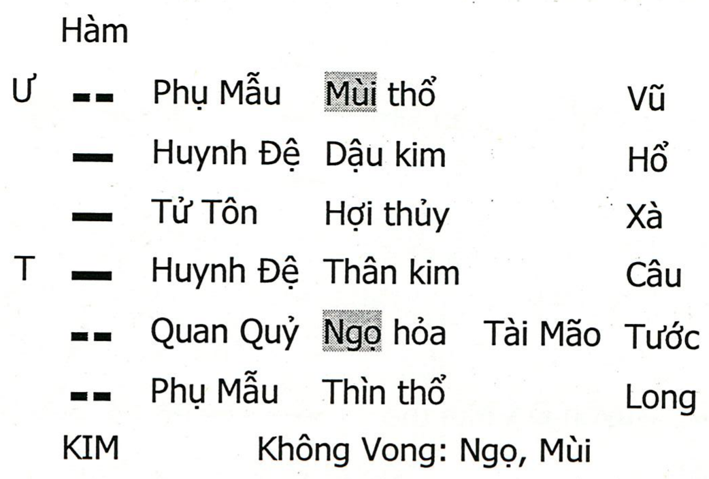

**Ví dụ 19:** Ngày Bính Thân tháng Thìn, nam đoán đòi nợ, được Thủy Hỏa Ký Tế biến Lôi Hỏa Phong.

| | Ký Tế | | | Phong | |
| :---: | :---: | :---: | :---: | :---: | :---: |
| Ứ | - - | Huynh Đệ Tý thủy | - - | Quan Quỷ Tuất thổ | Long |
| | — | Quan Quỷ Tuất thổ | - - | Phụ Mẫu Thân kim | Vũ |
| | - - | Phụ Mẫu Thân kim | — | Thê Tài Ngọ hỏa | Hổ |
| T | — | Huynh Đệ Hợi thủy Tài Ngọ | — | Huynh Đệ Hợi thủy | Xà |
| | - - | Quan Quỷ Sửu thổ | - - | Quan Quỷ Sửu thổ | Câu |
| | — | Tử Tôn Mão mộc | — | Tử Tôn Mão mộc | Tước |

THỦY Không Vong: Thìn, Tị

**Phán đoán:** Lấy Thê Tài làm Dụng thần. Thê Tài Ngọ hỏa không hiện trên quẻ, không được Nhật Nguyệt trợ giúp là hưu tù. Phi đến khắc Phục, trong quẻ Tuất thổ phát động, Thê Tài nhập Mộ, Cừu thần Phụ Mẫu Thân kim động khắc Nguyên thần, Nguyên thần hưu tù vô lực sinh Thê Tài, hào Ứng lại là Huynh Đệ, vì vậy rất khó đòi được.

**Phản hồi:** Kết quả là đòi nhiều lần nhưng đối phương không trả.

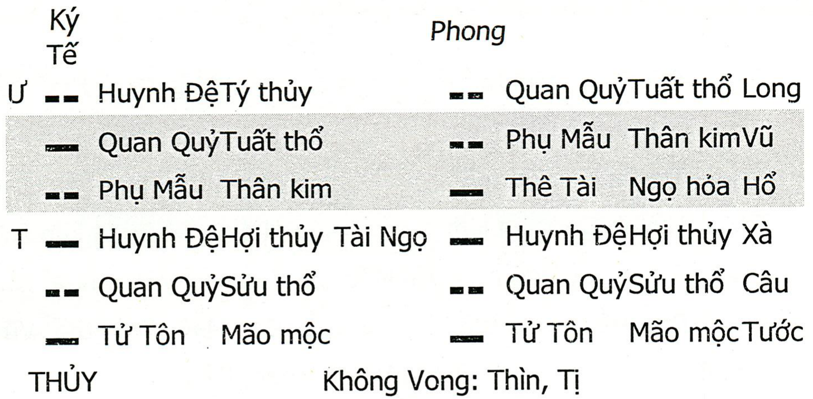

**Ví dụ 20: Ngày Quý Mùi tháng Tuất, nam đoán xem tiền cho vay có được trả lại hay không? Được Trạch Sơn Hàm biến Thiên Sơn Độn.**

| Hàm | Độn | |
| :--- | :--- | :--- |
| Ư - - Phụ Mẫu Mùi thổ | — Phụ Mẫu Tuất thổ | Hổ |
| — Huynh Đệ Dậu kim | — Huynh Đệ Thân kim | Xà |
| — Tử Tôn Hợi thủy | — Quan Quỷ Ngọ hỏa | Câu |
| T — Huynh Đệ Thân kim | — Huynh Đệ Thân kim | Tước |
| - - Quan Quỷ Ngọ hỏa Tài Mão | - - Quan Quỷ Ngọ hỏa | Long |
| - - Phụ Mẫu Thìn thổ | - - Phụ Mẫu Thìn thổ | Vũ |

KIM Không Vong: Thân, Dậu

**Phán đoán:** Lấy Thê Tài làm Dụng thần. Thê Tài Mão mộc không hiện trên quẻ, phục tàng dưới hào 2 Quan Quỷ Ngọ hỏa. Tài được Nguyệt hợp vốn là có khí, nhưng Huynh Đệ trì Thế, Nhật Nguyệt không sinh Dụng thần, Dụng thần nhập Mộ ở Nhật và hào động Phụ Mẫu Mùi thổ, Phụ Mẫu Mùi thổ lâm hào Ứng, Ứng là người ta, là thông tin đối phương không muốn trả lại tiền, tiền cho vay có đi không về.

**Phản hồi:** Quả nhiên cho vay đã 19 năm vẫn chưa được trả lại.

## 3. GIẤY PHÉP VÀ KHẾ ƯỚC

Mở cửa hàng, mở công ty hay thành lập xí nghiệp đều cần có giấy phép kinh doanh; mua nhà cũng cần làm sổ hồng v.v. Những vấn đề này đều thuộc về công việc văn thư. Vì vậy, khi dự đoán làm giấy phép, ký kết hợp đồng hay khế ước thì đều lấy Phụ Mẫu làm Dụng thần.

Làm giấy phép, Phụ Mẫu vượng tướng gặp sinh phù, Phụ Mẫu vượng tướng sinh hợp hào Thế, chắc chắn thuận lợi hoàn thành; nếu hưu tù Không Phá, Kỵ thần phát động, thì biểu thị có trở lực, khó mà làm được. Quẻ Phục Ngâm, bị gác lại mà trì hoãn. Quẻ Phản Ngâm, vì việc này mà bôn ba hết lần này đến lần khác.

Nếu là ký hợp đồng, khế ước, vượng tướng sinh hợp hào Thế thì có thể thành; hưu tù Không Phá thì không thành. Quẻ phản

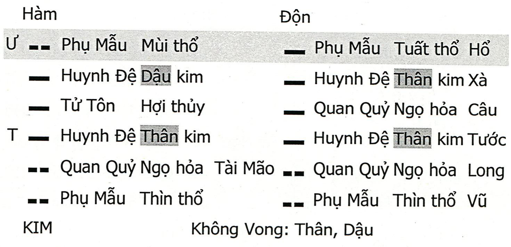 ngâm tất năm lần bảy lượt sửa chữa hoặc nuốt lời sau khi ký kết. Vượng tướng sinh hào Thế, nhưng gặp Không Phá, lâm Huyền Vũ Đằng Xà, hợp đồng nhất định có lừa gạt. Ký hợp đồng, khế ước, lấy gian hào, hào Quan Quỷ là người trung gian, người bảo lãnh. Dự đoán hợp đồng, khế ước, nhất định phải đồng thời xem tình trạng của hào Ứng. Hào Ứng động mà sinh hợp hào Thế là cát, không nên Không Phá, cũng không nên hóa Không hóa Phá, không nên khắc hào Thế. Lâm Huyền Vũ, Đằng Xà khắc hào Thế, tất có tượng lừa dối.

**Ví dụ 1: Ngày Kỷ Mùi tháng Hợi, nam đoán xem xin chỉ thị khắc con dấu cho viện nghiên cứu có được phê chuẩn không? Được Thiên Thủy Tụng biến Thiên Trạch Lý.**

| Tụng | Lý | |
| :--- | :--- | :--- |
| — Tử Tôn Tuất thổ | — Tử Tôn Tuất thổ | Câu |
| — Thê Tài Thân kim | — Thê Tài Thân kim | Tước |
| T — Huynh Đệ Ngọ hỏa | — Huynh Đệ Ngọ hỏa | Long |
| - - Huynh Đệ Ngọ hỏa Quan Hợi | - - Tử Tôn Sửu thổ | Vũ |
| — Tử Tôn Thìn thổ | — Phụ Mẫu Mão mộc | Hổ |
| Ư - - Phụ Mẫu Dần mộc | — Huynh Đệ Tị hỏa | Xà |

HỎA Không Vong: Tý, Sửu

**Phán đoán:** Lấy Phụ Mẫu làm Dụng thần. Phụ Mẫu Dần mộc được Nguyệt sinh phù, nhưng nhập Mộ ở Nhật, động mà hóa phá, không được phê chuẩn.

**Phản hồi:** Sau đó quả nhiên không phê chuẩn.

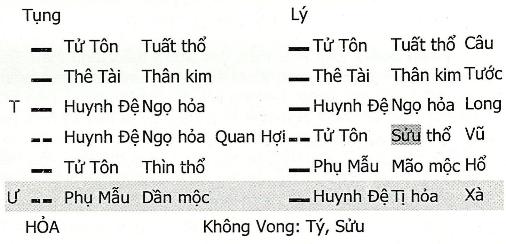

### Ví dụ 2: Ngày Mậu Tuất tháng Dậu, nam đoán xin mở phòng khám bệnh, được Thủy Hỏa Ký Tế biến Cấn Vi Sơn.

| Ký Tế | | | | Cấn | | |
| :--- | :---: | :--- | :---: | :---: | :--- | :--- |
| Ứ | - - | Huynh Đệ Tý thủy | | — | Tử Tôn Dần mộc | Tước |
| | — | Quan Quỷ Tuất thổ | | - - | Huynh Đệ Tý thủy | Long |
| | - - | Phụ Mẫu Thân kim | | - - | Quan Quỷ Tuất thổ | Vũ |
| T | — | Huynh Đệ Hợi thủy | Tài Ngọ | — | Phụ Mẫu Thân kim | Hổ |
| | - - | Quan Quỷ Sửu thổ | | - - | Thê Tài Ngọ hỏa | Xà |
| | — | Tử Tôn Mão mộc | | - - | Quan Quỷ Thìn thổ | Câu |

THỦY Không Vong: Thìn, Tị

**Phán đoán:** Lấy Phụ Mẫu làm Dụng thần. Phụ Mẫu Thân kim có Nguyệt kiến trợ giúp và Nhật lại đến sinh là vượng tướng, Dụng thần sinh Thế cũng là tượng cát. Nhưng hào 5 Nguyên thần Tuất thổ mặc dù động đến sinh Phụ Mẫu, lại bị hào sơ Mão mộc hợp cản trở. Quan Quỷ Tuất thổ tại hào 5, hào 5 là lãnh đạo, lâm Thanh Long càng là như vậy, bị hợp mà không thể sinh Phụ Mẫu, khiến cho thủ tục chậm trễ, không được giải quyết. Hào sơ thể hiện khởi đầu của sự vật, sự việc vừa bắt đầu thì đã bị cản trở.

Quan Quỷ Tuất thổ vừa sinh hào Phụ Mẫu vừa khiến Thê Tài nhập Mộ, Thê Tài Ngọ hỏa phục dưới hào Thế, hào Thế là mình, Tài phục tàng dưới hào Thế chính là tiền của mình, chứng tỏ lãnh đạo giải quyết thủ tục đòi anh ta hối lộ. Hào Ứng là bộ phận giải quyết thủ tục, hào Ứng Huynh Đệ Tý thủy lâm Chu Tước phát động, tổ hợp này là khẩu thiệt, chứng tỏ bởi vì làm thủ tục mà đã cãi nhau với bộ phận có liên quan.

Thông thường mà nói, hợp trú có thể ứng xung khai, xung khai thì có thể được giải quyết. Nhưng chúng ta nên phân tích quẻ này tỉ mỉ một chút. Nếu ứng xung khai cái hợp cản trở thì không ngoài Dậu kim và Thìn thổ. Dậu kim là Nguyệt kiến, là địa chi xung phá Mão mộc, Nhật hợp lại bất phá, cho nên mới có sức mạnh hợp trú Tuất thổ trong quẻ. Mà Nhật Tuất thổ và hào 5 Tuất thổ là một thứ, Nhật Tuất thổ cố ý khiến Mão mộc có sức mạnh hợp cản trở Nguyên thần không thể sinh Dụng thần. Do đó, lãnh đạo chủ quản cố ý trì hoãn không giải quyết. Mà Thìn thổ là hào

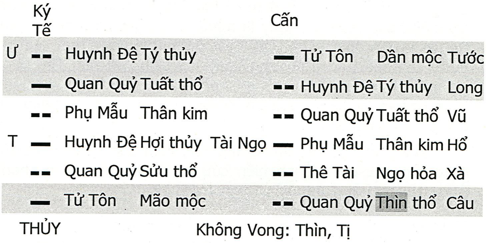 biến của Mão mộc, bởi vì Không Vong mà khiến Mão mộc không có sức mạnh hợp cản trở Tuất thổ, nhưng dùng Thìn thổ làm ứng kỳ, Mão mộc xuất Không hợp Tuất thổ thì hợp càng chặt, vì vậy không có cơ hội xung khai cái hợp này, huống hồ Nhật Tuất thổ cũng xung thực hào biến Thìn thổ, khiến lực Mão mộc hợp Tuất thổ càng lớn, càng chặt, cho nên bất cứ lúc nào lãnh đạo này cũng viện cớ trì hoãn. Là một quẻ không có ứng kỳ, đương nhiên thất bại.

Trên thực tế, đúng là lãnh đạo chủ quản đòi anh ta hối lộ, anh ta bực mình làm ầm lên, thành ra kết thù kết oán, cũng không giải quyết cho anh ta nữa, khiến thủ tục thất bại.

### Ví dụ 3: Ngày Bính Thìn tháng Mùi, nam đoán về làm giấy phép khai thác than, được Trạch Lôi Tùy biến Hỏa Thiên Đại Hữu.

| Tùy | | | | Đại Hữu | | |
| :--- | :---: | :--- | :---: | :---: | :--- | :--- |
| Ứ | - - | Thê Tài Mùi thổ | | — | Tử Tôn Tị hỏa | Long |
| | — | Quan Quỷ Dậu kim | | - - | Thê Tài Mùi thổ | Vũ |
| | — | Phụ Mẫu Hợi thủy | Tử Ngọ | — | Quan Quỷ Dậu kim | Hổ |
| T | - - | Thê Tài Thìn thổ | | — | Thê Tài Thìn thổ | Xà |
| | - - | Huynh Đệ Dần mộc | | — | Huynh Đệ Dần mộc | Câu |
| | — | Phụ Mẫu Tý thủy | | — | Phụ Mẫu Tý thủy | Tước |

MỘC Không Vong: Tý, Sửu

**Phán đoán:** Lấy Phụ Mẫu làm Dụng thần. Trong quẻ Phụ Mẫu lưỡng hiện, lấy Phụ Mẫu Tý thủy Không Vong làm Dụng thần. Dụng thần bị Nhật Nguyệt khắc chế là vô căn. Nội quái phục ngâm, công việc làm giấy phép bị trì hoãn nhiều lần, kề cà không xong.

Hào 5 Quan Quỷ Dậu kim phát động đến sinh Dụng thần. Hào 5 là lãnh đạo, Quan Quỷ là cơ quan quản lý, chứng tỏ có lãnh đạo ở cơ quan quản lý giúp giải quyết. Nhưng Quan Quỷ Dậu kim và Nhật Thê Tài Thìn thổ tương hợp, tham hợp quên sinh, người lãnh đạo này tham tiền, ngăn chặn không cho làm, đòi tiền.

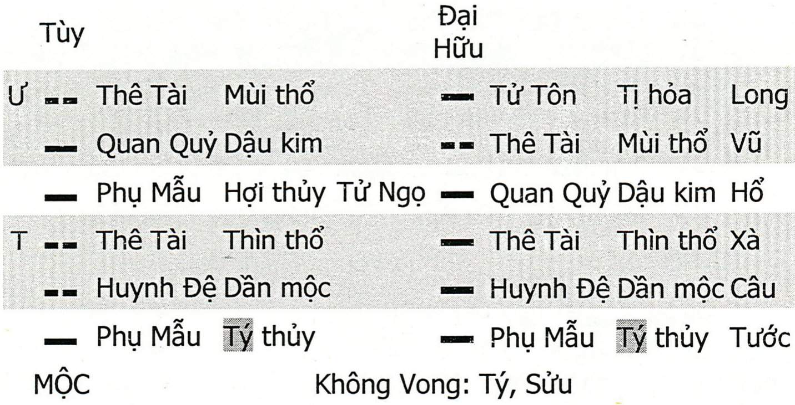

Nhật Nguyệt và trong quẻ tổng cộng có 6 Kỵ thần Thê Tài, là quá vượng. Cho nên khi Phụ Mẫu Tý thủy gặp khắc mới có thể hoàn thành, phán đoán tại tháng Tuất mới có thể được giải quyết.

**Phản hồi:** Tình hình thực tế và phán đoán giống nhau. Đúng là có một lãnh đạo cản trở không cho làm, đòi tiền anh ta, mặc dù đã đưa tiền nhưng vẫn không cho làm, đoán chừng là chê ít tiền. Về sau kết quả ra sao, không có phản hồi.

**Ví dụ 4:** Ngày Giáp Tuất tháng Thìn, nam đoán về mua nhãn hiệu sản phẩm nước ngoài, hỏi có ký kết hợp đồng hay không? Được Thủy Địa Tỷ biến Hỏa Thủy Vị Tế.

| | Tỷ | | Vị Tế | | |
| :---: | :---: | :--- | :---: | :--- | :---: |
| Ứ | - - | Thê Tài Tý thủy | — | Phụ Mẫu Tị hỏa | Vũ |
| | — | Huynh Đệ Tuất thổ | - - | Huynh Đệ Mùi thổ | Hổ |
| | - - | Tử Tôn Thân kim | — | Tử Tôn Dậu kim | Xà |
| T | - - | Quan Quỷ Mão mộc | - - | Phụ Mẫu Ngọ hỏa | Câu |
| | - - | Phụ Mẫu Tị hỏa | — | Huynh Đệ Thìn thổ | Tước |
| | - - | Huynh Đệ Mùi thổ | - - | Quan Quỷ Dần mộc | Long |

THỔ Không Vong: Thân, Dậu

**Phán đoán:** Lấy Phụ Mẫu làm Dụng thần. Phụ Mẫu Tị hỏa mặc dù Nhật Nguyệt không khắc, nhưng cũng không trợ giúp là hưu tù. Dụng thần nhập Mộ ở Nhật, lại nhập Mộ ở hào 5 Tuất thổ không cát. Hào Ứng là nhà máy, tại hào 6 biểu thị nước ngoài, động mà đến khắc, là không muốn ký hợp đồng.

**Phản hồi:** Quả nhiên đã không ký hợp đồng.

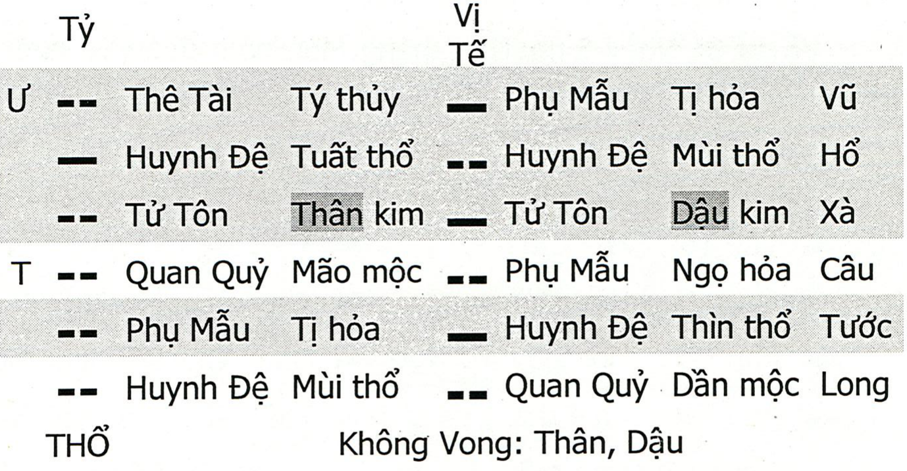

**Ví dụ 5:** Ngày Kỷ Hợi tháng Thìn, nam đoán về xin phê duyệt xây phòng cho đơn vị, được Phong Hỏa Gia Nhân biến Thiên Hỏa Đồng Nhân.

| | Gia Nhân | | Đồng Nhân | | |
| :---: | :---: | :--- | :---: | :--- | :---: |
| | — | Huynh Đệ Mão mộc | — | Thê Tài Tuất thổ | Câu |
| Ứ | — | Tử Tôn Tị hỏa | — | Quan Quỷ Thân kim | Tước |
| | - - | Thê Tài Mùi thổ | — | Tử Tôn Ngọ hỏa | Long |
| | — | Phụ Mẫu Hợi thủy | — | Phụ Mẫu Hợi thủy | Vũ |
| T | - - | Thê Tài Sửu thổ | - - | Thê Tài Sửu thổ | Hổ |
| | — | Huynh Đệ Mão mộc | — | Huynh Đệ Mão mộc | Xà |

MỘC Không Vong: Thìn, Tị

**Phán đoán:** Lấy Phụ Mẫu làm Dụng thần. Phụ Mẫu Hợi thủy lâm Nhật tỉ phù, nhưng Nguyệt kiến đến khắc, trong quẻ Thê Tài Mùi thổ phát động lại đến khắc, nhất định khó được phê duyệt.

**Phản hồi:** Quả nhiên xin thất bại.

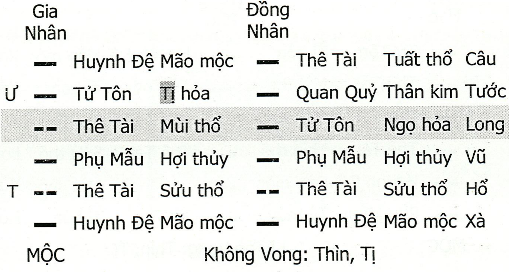

**Ví dụ 6:** Ngày Canh Tý tháng Hợi, nam đoán xem kế hoạch đổi mới kinh doanh của công ty có được chính quyền phê chuẩn không? Được Hỏa Lôi Phệ Hạp biến Phong Trạch Trung Phu.

| | Phệ Hạp | | | Trung Phu | |
| :---: | :---: | :--- | :---: | :--- | :--- |
| | — | Tử Tôn Tị hỏa | — | Huynh Đệ Mão mộc | Xà |
| T | - - | Thê Tài Mùi thổ | — | Tử Tôn Tị hỏa | Câu |
| | — | Quan Quỷ Dậu kim | - - | Thê Tài Mùi thổ | Tước |
| | - - | Thê Tài Thìn thổ | - - | Thê Tài Sửu thổ | Long |
| Ứ | - - | Huynh Đệ Dần mộc | — | Huynh Đệ Mão mộc | Vũ |
| | — | Phụ Mẫu Tý thủy | — | Tử Tôn Tị hỏa | Hổ |

MỘC Không Vong: Thìn, Tị

**Phán đoán:** Lấy Phụ Mẫu làm Dụng thần. Phụ Mẫu Tý thủy được Nhật Nguyệt trợ giúp là vượng tướng. Hào Thế hóa Không, lo lắng không thành. Hào Thế phát động đi sinh Nguyên thần Quan Quỷ, Quan Quỷ sinh Phụ Mẫu, thành liên tục tương sinh. Đây là mình đi tìm cán bộ hữu quan, cán bộ hữu quan phê chuẩn, một đường thông suốt.

**Phản hồi:** Sau được phê chuẩn ở ngày Tân Dậu tháng này.

**Ví dụ 7:** Ngày Nhâm Tuất tháng Thân, nữ đoán xem có thể ký kết hợp đồng công trình hay không? Được Sơn Thủy Mông biến Sơn Phong Cổ.

| | Mông | | | Cổ | | |
| :---: | :---: | :--- | :---: | :---: | :--- | :--- |
| | — | Phụ Mẫu Dần mộc | | — | Phụ Mẫu Dần mộc | Hổ |
| | - - | Quan Quỷ Tý thủy | | - - | Quan Quỷ Tý thủy | Xà |
| T | - - | Tử Tôn Tuất thổ | Tài Dậu | - - | Tử Tôn Tuất thổ | Câu |
| | - - | Huynh Đệ Ngọ hỏa | | — | Thê Tài Dậu kim | Tước |
| | — | Tử Tôn Thìn thổ | | — | Quan Quỷ Hợi thủy | Long |
| Ứ | - - | Phụ Mẫu Dần mộc | | - - | Tử Tôn Sửu thổ | Vũ |

HỎA Không Vong: Tý, Sửu

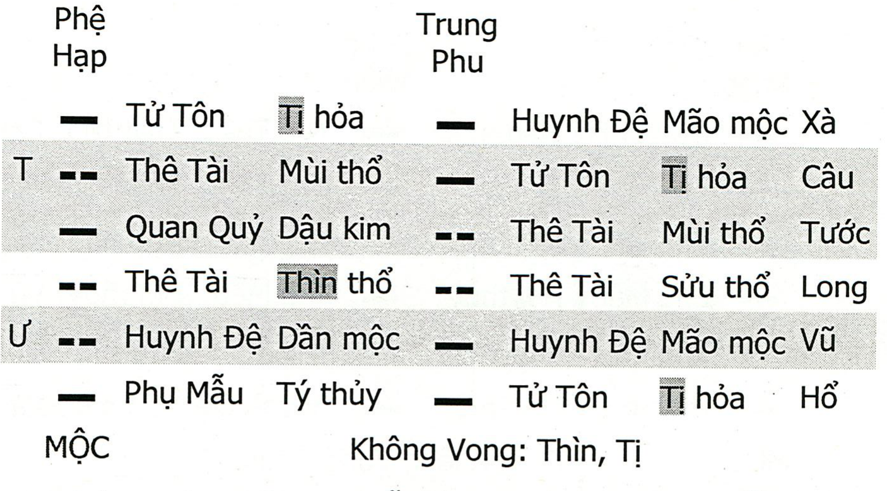

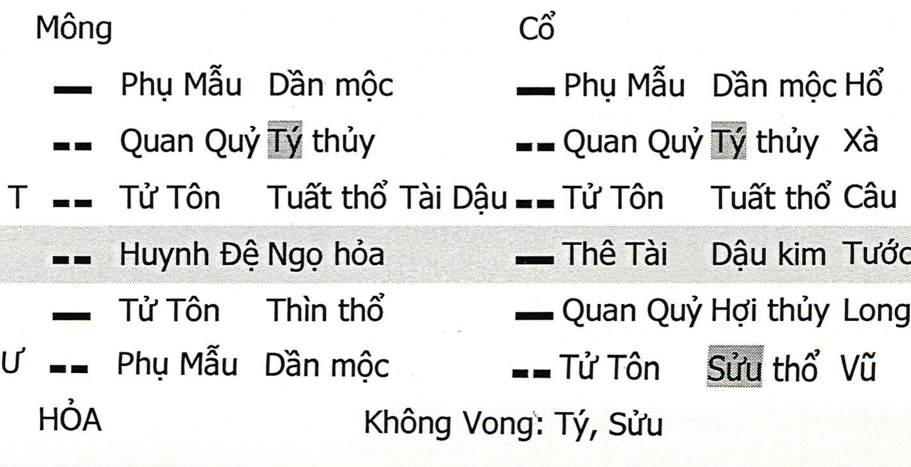

Lấy Phụ Mẫu làm Dụng thần. Phụ Mẫu Dần mộc Nguyệt phá, không được trợ giúp, hào độc phát lại là Tử địa Dụng thần, vì vậy không ký hợp đồng.

Quả nhiên không ký hợp đồng.

**Ví dụ 8:** Ngày Đinh Sửu tháng Sửu năm Tân Tị, nam đoán xem xin chính quyền phê duyệt thành lập trung tâm dịch vụ pháp lý kinh tế có thành công hay không, được Thủy Hỏa Ký Tế.

| | Ký Tế | | | |
| :---: | :---: | :--- | :--- | :--- |
| Ứ | - - | Huynh Đệ Tý thủy | | Long |
| | — | Quan Quỷ Tuất thổ | | Vũ |
| | - - | Phụ Mẫu Thân kim | | Hổ |
| T | — | Huynh Đệ Hợi thủy | Tài Ngọ | Xà |
| | - - | Quan Quỷ Sửu thổ | | Câu |
| | — | Tử Tôn Mão mộc | | Tước |

THỦY Không Vong: Thân, Dậu

**Phán đoán:** Lấy Phụ Mẫu làm Dụng thần. Phụ Mẫu Thân kim Không Vong, nhập Mộ ở Nhật Nguyệt, Mộ khố chủ phong bế (đóng kín), dừng lại, Thân kim Không Vong ứng xuất Không, vì vậy phán đoán dự án này đã trì hoãn trong thời gian rất dài, là bắt đầu xin tại năm Nhâm Thân, đến nay đã 10 năm. Dụng thần lâm hào 4 Không Vong, hào 4 là nhân sự, chủ yếu là do bộ phận nhân sự đã không thông qua. Nhập Mộ Không Vong đều mừng được xung, tháng Dần có thể có hy vọng làm xong.

**Phản hồi:** Quả nhiên là xin ở năm Nhâm Thân, liên tục không được phê chuẩn, chủ yếu là do nhân sự của chính quyền chủ quản chuyện này. Bởi vì sau đó không còn gặp lại người này nên không được biết kết quả.

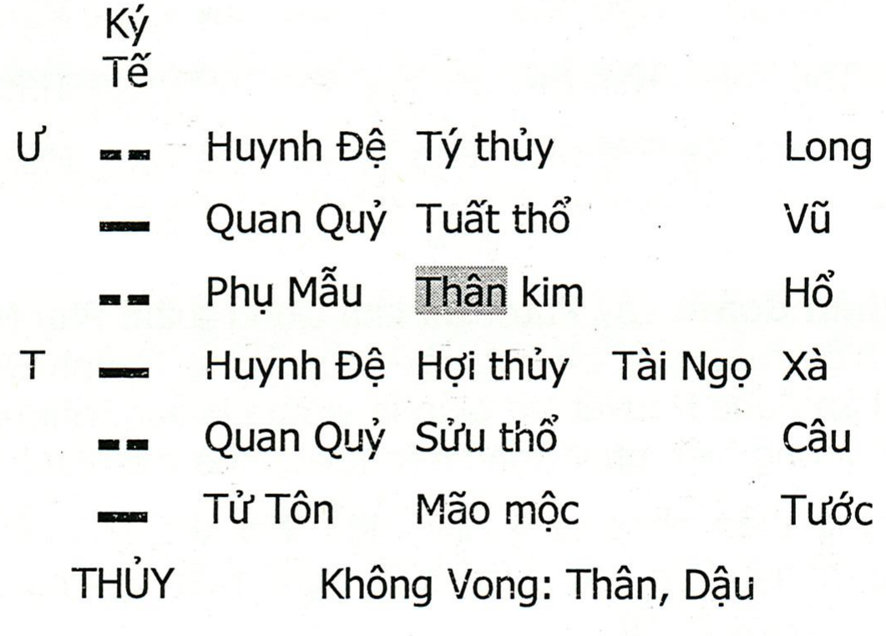

**Ví dụ 9: Ngày Ất Tị tháng Hợi, nam đoán về làm giấy phép khai thác than, được Lôi Thủy Giải biến Hỏa Địa Tấn.**

| | Giải | Phục thần | Tấn | Lục thú |
| :--- | :--- | :--- | :--- | :--- |
| | - - Thê Tài Tuất thổ | | — Tử Tôn Tị hỏa | Vũ |
| Ứ | - - Quan Quỷ Thân kim | | - - Thê Tài Mùi thổ | Hổ |
| | — Tử Tôn Ngọ hỏa | | — Quan Quỷ Dậu kim | Xà |
| | - - Tử Tôn Ngọ hỏa | | - - Huynh Đệ Mão mộc | Câu |
| T | — Thê Tài Thìn thổ | | - - Tử Tôn Tị hỏa | Tước |
| | - - Huynh Đệ Dần mộc | Phụ Tý | - - Thê Tài Mùi thổ | Long |

MỘC Không Vong: Dần, Mão

**Phán đoán:** Lấy Phụ Mẫu làm Dụng thần. Phụ Mẫu Tý thủy không hiện trên quẻ, phục tàng dưới hào sơ Huynh Đệ Dần mộc. Dụng thần được Nguyệt trợ giúp là vượng tướng, nhưng trong quẻ Kỵ thần lưỡng hiện phát động đến khắc, khó mà thành công.

Dụng thần phục tàng nhập Mộ, Mộ khố chủ kết thúc, Ứng Nguyên thần bị hợp không thể sinh Dụng thần, chứng tỏ nhà nước đã đình chỉ giải quyết.

**Phản hồi:** Quả nhiên là đã quá kỳ hạn giải quyết mà không có phê chuẩn.

## 4. DỰ ÁN CÔNG TRÌNH

Dự đoán dự án công trình thì cần xem ý muốn xin đoán thực tế, ý muốn khác nhau thì Dụng thần cũng khác nhau. Nếu chỉ dự đoán thành bại của một dự án, và dự đoán có thể nhận được dự án đó hay không, thì lấy Phụ Mẫu làm Dụng thần. Bởi vì Phụ Mẫu là hợp đồng, khế ước, không ký kết được hợp đồng thì không thể làm. Nhưng không thể không xem sự suy vượng của Tài, bởi vì không phải mọi dự án đều có thể kiếm được tiền. Có người nhận được dự án, nhưng làm xong lại không có lợi nhuận. Nếu muốn xem lợi nhuận ra sao thì tốt nhất là gieo một quẻ riêng biệt về tình hình lợi nhuận.

Nếu dự án không phải là vấn đề, mà là xem dự án đó có thể kiếm được tiền hay không, thì lấy Thê Tài làm Dụng thần. Dự án

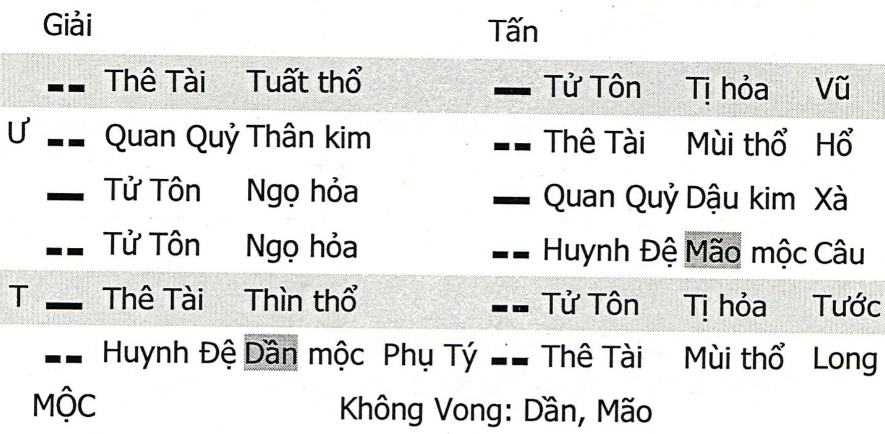 dài hạn thì cần phải kiêm xem hào Tử Tôn. Dự án chỉ có một lần thì có thể chỉ xem hào Tài.

**Ví dụ 1: Ngày Giáp Thìn tháng Sửu, nam đoán về tiền đồ làm viện phúc lợi, được Trạch Hỏa Cách biến Thủy Hỏa Ký Tế.**

| | Cách | Phục thần | Ký Tế | Lục thú |
| :--- | :--- | :--- | :--- | :--- |
| | - - Quan Quỷ Mùi thổ | | - - Huynh Đệ Tý thủy | Vũ |
| | — Phụ Mẫu Dậu kim | | — Quan Quỷ Tuất thổ | Hổ |
| T | — Huynh Đệ Hợi thủy | | - - Phụ Mẫu Thân kim | Xà |
| | — Huynh Đệ Hợi thủy | Tài Ngọ | — Huynh Đệ Hợi thủy | Câu |
| | - - Quan Quỷ Sửu thổ | | - - Quan Quỷ Sửu thổ | Tước |
| Ứ | — Tử Tôn Mão mộc | | — Tử Tôn Mão mộc | Long |

THỦY Không Vong: Dần, Mão

**Phán đoán:** Mục đích là đoán tiền đồ, cho nên trọng điểm ở Tài. Hào Thế động hóa Phụ Mẫu hồi đầu sinh, Phụ Mẫu vượng tướng, muốn làm là có thể làm được. Nhưng Thê Tài Ngọ hỏa không hiện trên quẻ, Nhật Nguyệt không đến sinh phù là hưu tù, Nguyên thần Tử Tôn Không Vong không có lực sinh Thê Tài. Do đó, có thể nói là không có lợi ích. Lại có Huynh Đệ trì Thế phát động, chỉ có tốn kém mà thôi.

Tử Tôn là nguồn vốn, tại hào sơ Không Vong, hào sơ là giai đoạn cất bước, chứng tỏ hiện nay vẫn chưa tập trung đủ tiền vốn khởi động.

**Phản hồi:** Trên thực tế đúng là như vậy. Tiền vốn vẫn chưa huy động đủ. Có điều là tiền vốn không phải vấn đề. Ngân sách xây dựng viện phúc lợi bỏ ra quá lớn, lại không thể thu lợi, vì vậy đã từ bỏ dự án này.

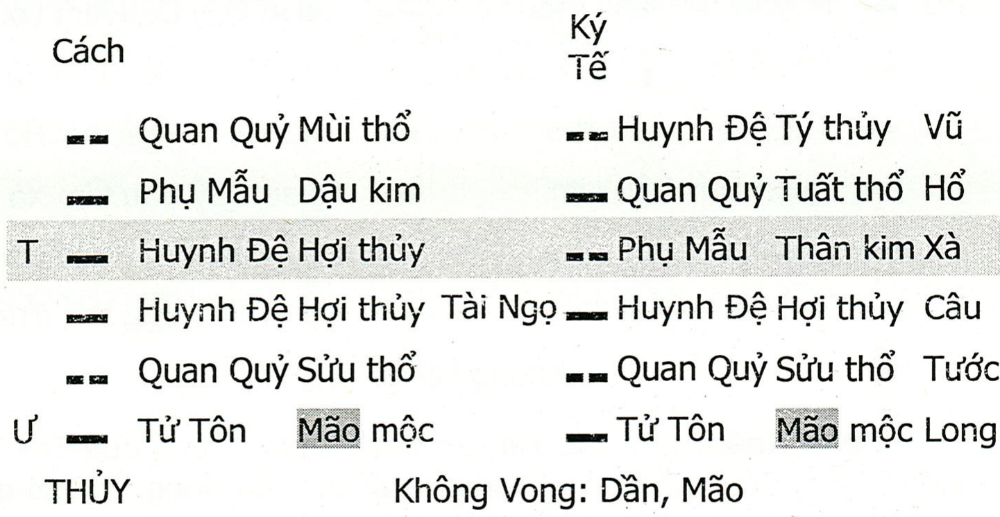

---

# Part 18 (Pages 341-360)

## Ví dụ 2: Ngày Bính Thìn tháng Tuất, nam đoán xem làm một dự án có thể thu lợi hay không, được quẻ Sơn Phong Cổ biến Địa Phong Thăng.

| | Cổ | | | Thăng | |
| :---: | :---: | :--- | :---: | :--- | :--- |
| Ứ | — | Huynh Đệ Dần mộc | - - | Quan Quỷ Dậu kim | Long |
| | - - | Phụ Mẫu Tý thủy Tử Tị | - - | Phụ Mẫu Hợi thủy | Vũ |
| | - - | Thê Tài Tuất thổ | - - | Thê Tài Sửu thổ | Hổ |
| T | — | Quan Quỷ Dậu kim | — | Quan Quỷ Dậu kim | Xà |
| | — | Phụ Mẫu Hợi thủy | — | Phụ Mẫu Hợi thủy | Câu |
| | - - | Thê Tài Sửu thổ | - - | Thê Tài Sửu thổ | Tước |

MỘC Không Vong: Tý, Sửu

**Phán đoán:** Lấy Thê Tài làm Dụng thần. Trong quẻ Thê Tài lưỡng hiện, Sửu thổ Không Vong, Tuất thổ ám động, cả hai đều có thể coi là Dụng thần. Nhật Nguyệt là Tài sinh hào Thế, là tượng đắc tài. Hào sơ Sửu thổ Không Vong, hào sơ là bắt đầu, Không Vong biểu thị xuất tài, tiêu tiền, biểu thị dự án vừa bắt đầu thì phải đầu tư vốn. Hào 4 Thê Tài Tuất thổ ám động sinh hào Thế, biểu thị giữa chừng thu được lợi nhuận.

Hào 6 Huynh Đệ phát động khắc Tài, mặc dù hóa hồi đầu khắc không có lực, nhưng vẫn phải tốn kém. Hào 6 là giai đoạn sau cùng, chứng tỏ sau cùng còn phải tiêu tốn một khoản tiền.

**Phản hồi:** Anh ta nói đúng là như vậy, dự án này cần bỏ vốn trước, giữa chừng có thể thu hồi chi phí và phần lợi nhuận, nhưng một khi có lợi nhuận thì phải trả hoa hồng cho đối phương.

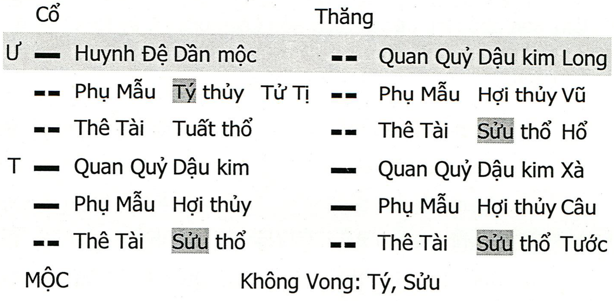

## Ví dụ 3: Ngày Nhâm Dần tháng Mùi, nam đoán mua một công ty, được Trạch Hỏa Cách biến Trạch Phong Đại Quá.

| | Cách | | | Đại Quá | |
| :---: | :---: | :--- | :---: | :--- | :--- |
| | - - | Quan Quỷ Mùi thổ | - - | Quan Quỷ Mùi thổ | Hổ |
| | — | Phụ Mẫu Dậu kim | — | Phụ Mẫu Dậu kim | Xà |
| T | — | Huynh Đệ Hợi thủy | — | Huynh Đệ Hợi thủy | Câu |
| | — | Huynh Đệ Hợi thủy Tài Ngọ | — | Phụ Mẫu Dậu kim | Tước |
| | - - | Quan Quỷ Sửu thổ | — | Huynh Đệ Hợi thủy | Long |
| Ứ | — | Tử Tôn Mão mộc | - - | Quan Quỷ Sửu thổ | Vũ |

THỦY Không Vong: Thìn, Tị

**Phán đoán:** Lấy Phụ Mẫu làm Dụng thần. Phụ Mẫu Dậu kim Nguyệt sinh và Nhật không khắc là vượng tướng, Dụng thần sinh Thế có thể thu mua thành công. Hào 2 Quan Quỷ Sửu thổ động đến sinh Dụng thần, nhưng Nguyệt phá, tháng này không thành, tháng sau là tháng Thân xuất Nguyệt bất phá, cho nên tháng Thân có thể mua thành công.

Hào Ứng là tình trạng công ty được mua, lâm Tử Tôn Mão mộc động mà hóa phá, lực sinh Tài bị giảm thiểu, vì vậy lợi ích kinh tế không tốt.

**Phản hồi:** Quả nhiên mua thành công ở tháng Thân.

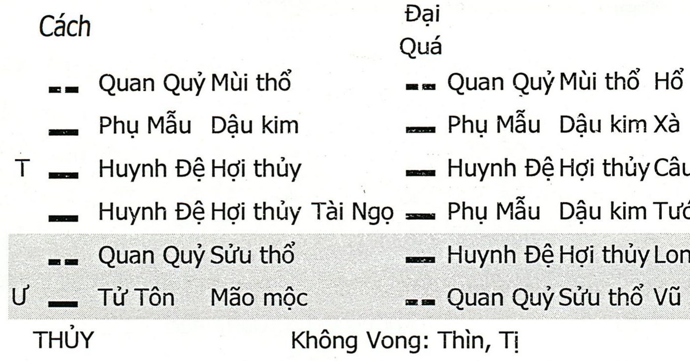

## Ví dụ 4: Ngày Canh Tuất tháng Thân, nam đoán mua một nhà máy rượu, được Địa Thiên Thái biến Lôi Sơn Tiểu Quá.

| | Thái | | | | Tiểu Quá | | |
| :--- | :---: | :--- | :--- | :---: | :--- | :--- | :--- |
| Ứ | - - | Tử Tôn | Dậu kim | - - | Huynh Đệ | Tuất thổ | Xà |
| | - - | Thê Tài | Hợi thủy | - - | Tử Tôn | Thân kim | Câu |
| | - - | Huynh Đệ | Sửu thổ | — | Phụ Mẫu | Ngọ hỏa | Tước |
| T | — | Huynh Đệ | Thìn thổ | — | Tử Tôn | Thân kim | Long |
| | — | Quan Quỷ | Dần mộc Phụ Tị | - - | Phụ Mẫu | Ngọ hỏa | Vũ |
| | — | Thê Tài | Tý thủy | - - | Huynh Đệ | Thìn thổ | Hổ |

THỔ Không Vong: Dần, Mão

**Phán đoán:** Lấy hào Phụ Mẫu làm Dụng thần. Phụ Mẫu Tị hỏa không hiện trên quẻ, phục dưới hào 2 Quan Quỷ Dần mộc, Quan Quỷ thể hiện chính phủ, nhà máy rượu này bị chính phủ kiểm soát. Hào Thế là Tài khố, lâm Thanh Long chủ vui vẻ, may mắn, hào Tài đa hiện, được Nguyệt sinh vượng, lại là tam hợp cục, hiện nay bản thân có nguồn tiền dồi dào, chính là lúc sự nghiệp đắc ý, hanh thông.

Hào Thế gặp xung là dao động, hóa quẻ du hồn biểu thị trong lòng bất an, đối với việc mua nhà máy rượu có phần do dự bất định. Hào Ứng là nhà máy rượu được mua, lâm Tử Tôn vượng tướng, quy mô của nhà máy rượu này rất lớn, cũng có thể đem lại lợi ích, chỉ là nhập Mộ tại Sửu thổ, hiện nay lợi nhuận tạo ra không cao. Lâm hào 6, hào 6 là hào vị thoái hưu và cổ xưa, đây là một nhà máy rượu lâu đời.

Phi thần của Phụ Mẫu Tị hỏa Không Phá, Phục thần dễ kéo ra, nếu muốn mua thì chắc chắn có thể thành công.

**Phản hồi:** Trên thực tế, đây là một nhà máy rượu trăm tuổi, chính phủ đã thay một vài quản đốc nhưng vẫn cứ lỗ vốn. Anh ta là người làm về bất động sản, tài sản đã có mấy trăm triệu, phát triển rất tốt. Để giữ gìn một thương hiệu lâu đời, chính phủ muốn anh ta mua nhà máy rượu, nhưng bản thân anh ta lại chưa từng kinh doanh rượu, vì vậy mà hơi do dự.

## Ví dụ 5: Ngày Kỷ Dậu tháng Thân, nam đoán nhận thầu dự án trang trí ở Nội Mông, được Trạch Phong Đại Quá biến Thủy Sơn Kiển.

| | Đại Quá | | | | Kiển | | |
| :--- | :---: | :--- | :--- | :---: | :--- | :--- | :--- |
| | - - | Thê Tài | Mùi thổ | - - | Phụ Mẫu | Tý thủy | Câu |
| | — | Quan Quỷ | Dậu kim | — | Thê Tài | Tuất thổ | Tước |
| T | — | Phụ Mẫu | Hợi thủy | - - | Quan Quỷ | Thân kim | Long |
| | — | Quan Quỷ | Dậu kim | — | Quan Quỷ | Thân kim | Vũ |
| | — | Phụ Mẫu | Hợi thủy | - - | Tử Tôn | Ngọ hỏa | Hổ |
| Ứ | - - | Thê Tài | Sửu thổ | - - | Thê Tài | Thìn thổ | Xà |

MỘC Không Vong: Dần, Mão

**Phán đoán:** Lấy Phụ Mẫu làm Dụng thần. Trong quẻ Phụ Mẫu lưỡng hiện, với lại đều phát động, lấy hào Thế Phụ Mẫu Hợi thủy làm Dụng thần. Dụng thần được Nhật Nguyệt đến sinh là vượng tướng, lại động hóa hồi đầu sinh, một Phụ Mẫu Hợi thủy khác đến trợ giúp, Nguyên thần lưỡng hiện thành quá vượng. Vật cực tất phản, dự án này sợ là không đến tay.

**Phản hồi:** Sau đó quả nhiên không đạt được thỏa thuận.

## Ví dụ 6: Ngày Giáp Thân tháng Ngọ, nam đoán cùng tổ chức lễ hội giấm với nhà máy giấm sẽ ra sao? Được Trạch Lôi Tùy.

| | Tùy | | |
| :---: | :---: | :--- | :--- |
| Ứ | - - | Thê Tài Mùi thổ | Vũ |
| | — | Quan Quỷ Dậu kim | Hổ |
| | — | Phụ Mẫu Hợi thủy | Xà |
| T | - - | Thê Tài Thìn thổ | Câu |
| | - - | Huynh Đệ Dần mộc | Tước |
| | — | Phụ Mẫu Tý thủy | Long |

MỘC Không Vong: Ngọ, Mùi

**Phán đoán:** Hào Thế là mình, hào Ứng là đơn vị hợp tác, Tài là lợi ích. Quẻ Trạch Lôi Tùy quẻ có ý nghĩa đi theo, Thê Tài trên Thế theo hào Ứng mà đến, nghĩa là người này muốn nhờ vào khả năng của đối phương để đạt được mục đích kiếm tiền.

Phụ Mẫu là giấy phép, Phụ Mẫu được Nhật Trường Sinh, hào Thế là Mộ khố Phụ Mẫu, chứng tỏ đã lấy được giấy phép. Nhưng hào Ứng Không Vong, đối phương không thành tâm, có biến cố.

**Phản hồi:** Kết quả, anh ta đã lên kế hoạch xong, nhà máy giấm đột nhiên nuốt lời không muốn làm.

## Ví dụ 7: Ngày Đinh Sửu tháng Thìn, nam nhập vật liệu thép ở một nơi nào đó để kinh doanh, đoán triển vọng phát triển, được Sơn Lôi Di biến Sơn Địa Bác.

| | Di | | | Bác | |
| :---: | :---: | :--- | :---: | :--- | :--- |
| | — | Huynh Đệ Dần mộc | — | Huynh Đệ Dần mộc | Long |
| | - - | Phụ Mẫu Tý thủy Tử Tị | - - | Phụ Mẫu Tý thủy | Vũ |
| T | - - | Thê Tài Tuất thổ | - - | Thê Tài Tuất thổ | Hổ |
| | - - | Thê Tài Thìn thổ Quan Dậu | - - | Huynh Đệ Mão mộc | Xà |
| | - - | Huynh Đệ Dần mộc | - - | Tử Tôn Tị hỏa | Câu |
| Ứ | — | Phụ Mẫu Tý thủy | - - | Thê Tài Mùi thổ | Tước |

MỘC Không Vong: Thân, Dậu

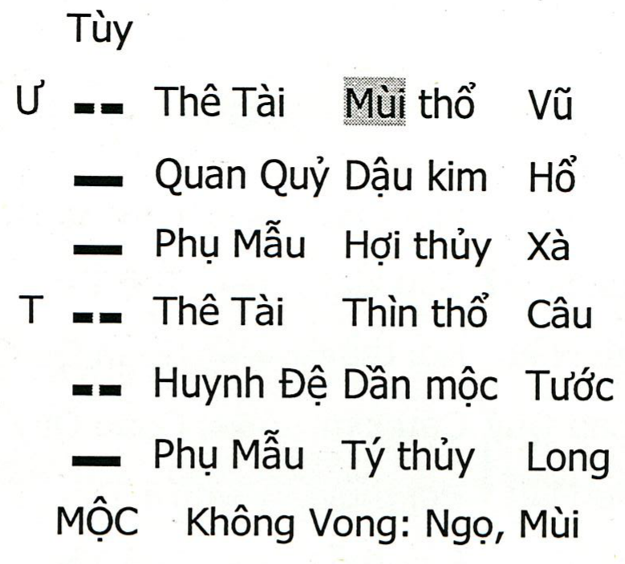

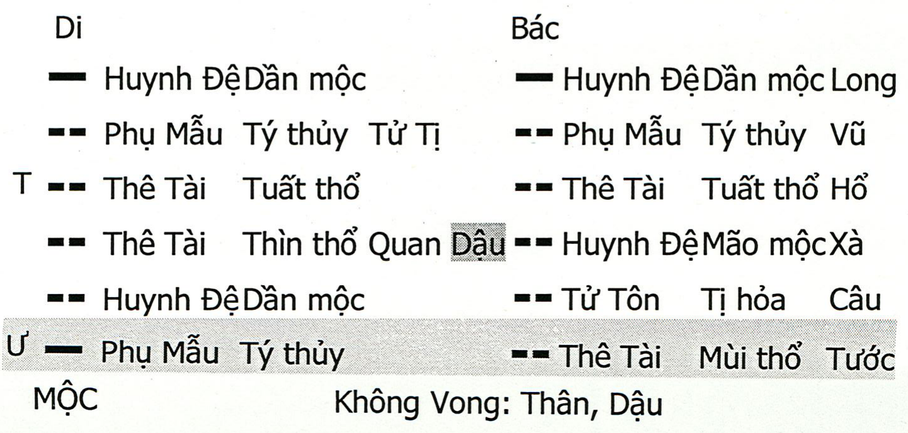

**Phán đoán:** Lấy Thê Tài làm Dụng thần. Hào Ứng là nơi nhập hàng. Trong quẻ Thê Tài lưỡng hiện, lấy hào Thế Thê Tài Tuất thổ làm Dụng thần. Thê Tài Tuất thổ Nguyệt phá biểu thị không có lợi nhuận. Kinh doanh dự án này thuộc về cầu tài dài hạn, vì vậy phải kiêm xem Tử Tôn. Tử Tôn không hiện trên quẻ, không được Nhật Nguyệt trợ giúp, Phụ Mẫu Tý thủy lại động đến khắc, đây cũng là thông tin không thể kinh doanh lâu dài.

Hào Ứng và Nhật Tài tinh tương hợp, động lại hóa ra Thê Tài, chứng tỏ đối phương có sản phẩm đa dạng, nhưng bản thân không thích hợp làm kinh doanh. Kinh doanh thế nào cũng phá tài.

**Phản hồi:** Quả nhiên đối phương có rất nhiều chủng loại vật liệu, anh ta đã làm một chuyến, sau khi nhập về thì thị trường vật liệu rớt giá và đã lỗ vốn.

## Ví dụ 8: Ngày Tân Dậu tháng Thìn, nam đoán xem có thể nhận thầu công trình hay không, được Lôi Thủy Giải biến Trạch Thủy Khốn.

| | Giải | | | Khốn | |
| :---: | :---: | :--- | :---: | :--- | :--- |
| | - - | Thê Tài Tuất thổ | - - | Thê Tài Mùi thổ | Xà |
| Ứ | - - | Quan Quỷ Thân kim | — | Quan Quỷ Dậu kim | Câu |
| | — | Tử Tôn Ngọ hỏa | — | Phụ Mẫu Hợi thủy | Tước |
| | - - | Tử Tôn Ngọ hỏa | - - | Tử Tôn Ngọ hỏa | Long |
| T | — | Thê Tài Thìn thổ | — | Thê Tài Thìn thổ | Vũ |
| | - - | Huynh Đệ Dần mộc Phụ Tý | - - | Huynh Đệ Dần mộc | Hổ |

MỘC Không Vong: Tý, Sửu

**Phán đoán:** Lấy Phụ Mẫu làm Dụng thần. Phụ Mẫu Tý thủy không hiện trên quẻ, Nguyệt khắc Nhật sinh, suy vượng tương đương. Ứng Quan Quỷ Thân kim hóa Tiến thần đến sinh, Ứng là người khác, hào 5 là lãnh đạo (quan chức), chứng tỏ có lãnh đạo giúp thúc đẩy cho anh ta làm dự án.

Hào Thế Thìn thổ là Mộ khố Dụng thần, biểu thị anh ta rất muốn nhận được dự án này. Nhưng Dụng thần Không Vong, hào Thế bị Nhật hợp trú, Mộ khố không thể mang lại tác dụng thu vào Dụng thần, nghĩa là anh ta không nhận được dự án này. Nhật là

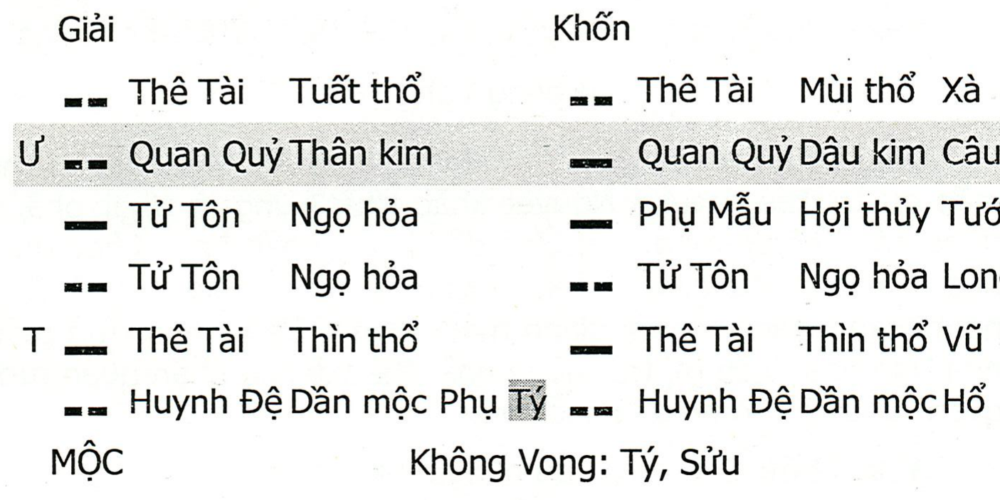

Quan Quỷ, chứng tỏ có một lãnh đạo khác cũng nhúng tay vào dự án này, không cho anh ta nhận được.

**Phản hồi:** Mặc dù có lãnh đạo giúp đỡ cho mình, nhưng người ta lại có lãnh đạo to hơn hỗ trợ, cuối cùng không nhận được công trình đó.

**Ví dụ 9:** Ngày Giáp Ngọ tháng Thìn, nam đoán bao tô[^1] quán rượu có thể thành không? Được Phong Thiên Tiểu Súc biến Thiên Sơn Độn.

| | | Tiểu Súc | | Độn | |
| :---: | :---: | :--- | :---: | :--- | :---: |
| | ━ | Huynh Đệ Mão mộc | ━ | Thê Tài Tuất thổ | Vũ |
| | ━ | Tử Tôn Tị hỏa | ━ | Quan Quỷ Thân kim | Hổ |
| Ứ | ━ ━ | Thê Tài Mùi thổ | ━ | Tử Tôn Ngọ hỏa | Xà |
| | ━ | Thê Tài Thìn thổ | ━ | Quan Quỷ Thân kim | Câu |
| | ━ | Huynh Đệ Dần mộc | ━ ━ | Tử Tôn Ngọ hỏa | Tước |
| T | ━ | Phụ Mẫu Tý thủy | ━ ━ | Thê Tài Thìn thổ | Long |

MỘC Không Vong: Thìn, Tị

**Phán đoán:** Lấy Phụ Mẫu làm Dụng thần. Phụ Mẫu Tý thủy mặc dù trì Thế, nhưng Nguyệt khắc Nhật xung là Nhật phá, lại động hóa Không Vong, hào Ứng đến khắc, nhất định không được, bao tô không thành. Gian hào Huynh Đệ phát động, Huynh Đệ là người cạnh tranh, người giành thầu. Huynh Đệ và hào Ứng thông hóa Ngọ hỏa, biểu thị trở thành nhất thể với chủ nhân quán rượu, quán rượu sẽ cho người khác thuê.

**Phản hồi:** Quả nhiên đã bị người khác bao tô.

[^1]: Bao tô (包租): thuê nhà hoặc ruộng đất để cho thuê lại.

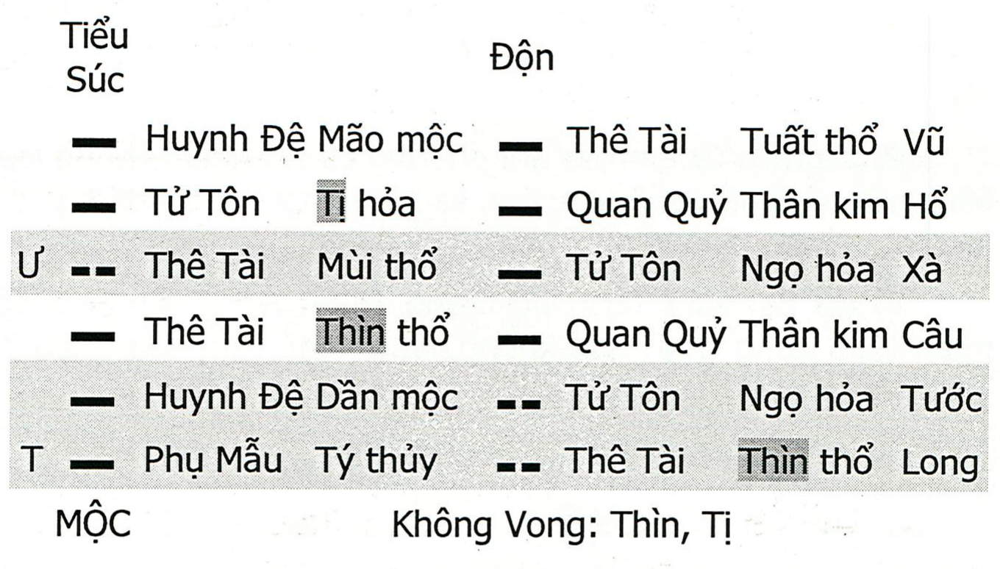

**Ví dụ 10:** Ngày Ất Mùi tháng Thìn, nam đoán nhận thầu công trình có thành công hay không? Được Sơn Phong Cổ.

| | | Cổ | |
| :---: | :---: | :--- | :---: |
| Ứ | ━ | Huynh Đệ Dần mộc | Vũ |
| | ━ ━ | Phụ Mẫu Tý thủy | Hổ |
| | ━ ━ | Thê Tài Tuất thổ | Xà |
| T | ━ | Quan Quỷ Dậu kim | Câu |
| | ━ | Phụ Mẫu Hợi thủy | Tước |
| | ━ ━ | Thê Tài Sửu thổ | Long |

MỘC Không Vong: Thìn, Tị

**Phán đoán:** Lấy Phụ Mẫu làm Dụng thần. Trong quẻ Phụ Mẫu lưỡng hiện, lấy Phụ Mẫu Hợi thủy gần hào Thế làm Dụng thần. Phụ Mẫu Hợi thủy không được Nhật Nguyệt trợ giúp, bị Nhật Nguyệt khắc chế hưu tù vô căn, vì vậy không nhận được công trình.

**Phản hồi:** Quả nhiên không nhận được.

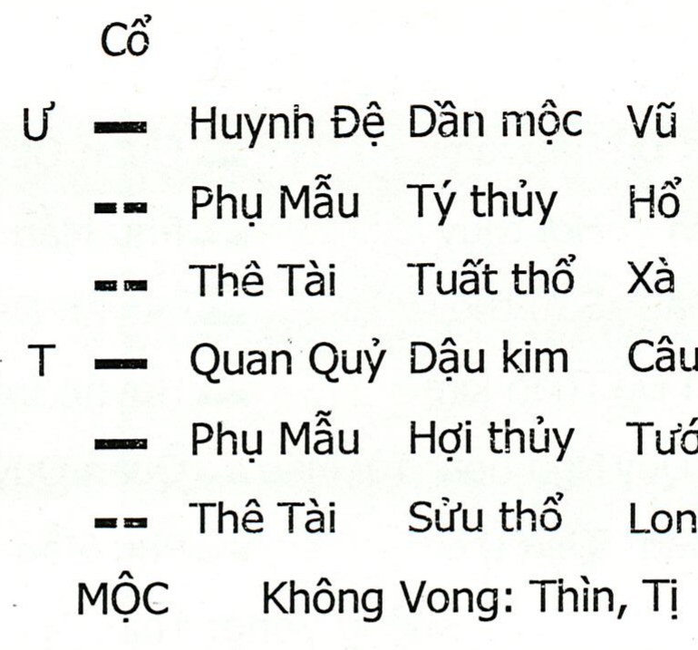

### Ví dụ 11: Ngày Đinh Dậu tháng Thìn, nam đoán xem có nhận được thầu công trình hay không? Được Địa Sơn Khiêm biến Hỏa Sơn Lữ.

| | Khiêm | | Lữ | |
| :---: | :--- | :---: | :--- | :---: |
| | - - Huynh Đệ Dậu kim | | — Quan Quỷ Tị hỏa | Long |
| T | - - Tử Tôn Hợi thủy | | - - Phụ Mẫu Mùi thổ | Vũ |
| | - - Phụ Mẫu Sửu thổ | | — Huynh Đệ Dậu kim | Hổ |
| | — Huynh Đệ Thân kim | | — Huynh Đệ Thân kim | Xà |
| Ư | - - Quan Quỷ Ngọ hỏa | Tài Mão | - - Quan Quỷ Ngọ hỏa | Câu |
| | - - Phụ Mẫu Thìn thổ | | - - Phụ Mẫu Thìn thổ | Tước |

KIM Không Vong: Thìn, Tị

**Phán đoán:** Lấy Phụ Mẫu làm Dụng thần. Trong quẻ Phụ Mẫu lưỡng hiện, lấy hào Phụ Mẫu Sửu thổ phát động làm Dụng thần. Dụng thần được Nguyệt kiến trợ giúp là vượng tướng, có thể nhận được công trình. Ứng sinh Dụng thần là đối phương tìm đến cửa giao công trình cho anh ta làm. Nhưng ngoại quái tam hợp Huynh Đệ cục, Thê Tài Mão mộc không hiện trên quẻ, bị Nhật thần khắc, vì vậy mặc dù có thể được công trình, nhưng sợ là làm xong đòi tiền khó khăn.

**Phản hồi:** Quả nhiên đã nhận được công trình ở ngày hôm sau, sau khi làm xong thì đòi tiền nhiều lần không được.

## 5. ĐẤU THẦU

Đấu thầu lấy Phụ Mẫu làm Dụng thần, bởi vì Phụ Mẫu là khế ước, hợp đồng. Thỏa thuận sơ bộ là điểm rất quan trọng, nếu thỏa thuận không thành công thì không thể bàn đến chuyện kiếm tiền. Dụng thần mừng được vượng tướng gặp sinh phù, không nên hưu tù Không Phá. Đấu thầu thường có đối thủ cạnh tranh, lấy hào Ứng làm đối thủ cạnh tranh, không nên Phụ Mẫu động mà sinh hào Ứng, xuất hiện vô tình.

Quan Quỷ thể hiện đơn vị gọi thầu, không nên Không Phá, hưu tù bị khắc, cũng không nên đi sinh hào Ứng. Dự đoán đấu thầu còn phải chú ý đến vấn đề Dụng thần quá vượng và quá suy.

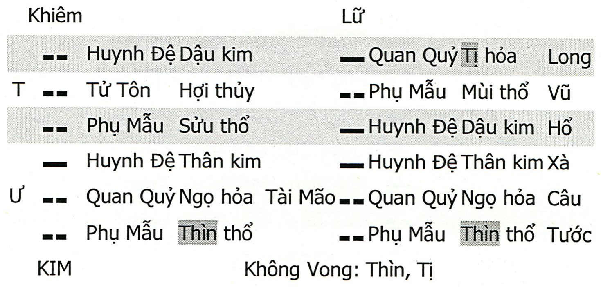

Kỵ thần vượng tướng, Phụ Mẫu quá suy có thể trúng thầu, Phụ Mẫu quá vượng trái lại không thể trúng thầu.

Nếu như muốn hỏi lợi nhuận, cần phải gieo riêng một quẻ xem lợi ích, lợi nhuận. Nếu là hỏi giá thầu thấp nhất, cần lấy Thê Tài và Phụ Mẫu làm Dụng thần, Thê Tài là giá thầu thấp nhất, Phụ Mẫu là thầu. Cũng có thể tự mình đặt ra một giá nào đó rồi xem có thể được thầu hay không, Phụ Mẫu vượng tướng thì có thể được, hưu tù thì không thể được.

Phụ Mẫu sinh hợp hào Thế là cát nhất, đấu thầu kỵ hào Huynh Đệ phát động, Huynh Đệ là thần cách trở, cũng là thông tin cạnh tranh, Huynh Đệ độc phát, phá tài mà không trúng thầu. Phụ Mẫu trì Thế, Quan Quỷ phát động sinh hợp hào Thế cũng cát.

### Ví dụ 1: Ngày Giáp Ngọ tháng Sửu, nam đoán về khả năng trúng thầu, được Thủy Trạch Tiết.

| | Tiết | |
| :---: | :--- | :---: |
| | - - Huynh Đệ Tý thủy | Vũ |
| | — Quan Quỷ Tuất thổ | Hổ |
| Ư | - - Phụ Mẫu Thân kim | Xà |
| | - - Quan Quỷ Sửu thổ | Câu |
| | — Tử Tôn Mão mộc | Tước |
| T | — Thê Tài Tị hỏa | Long |

THỦY Không Vong: Thìn, Tị

**Phán đoán:** Lấy Phụ Mẫu làm Dụng thần. Phụ Mẫu Thân kim được Nguyệt sinh, bị Nhật khắc, suy vượng cân bằng. Dụng thần lâm Ứng, thầu này có khả năng bị người ta cướp mất. Hào Thế hợp Dụng thần, bản thân muốn lấy được thầu này, nhưng Không mà không thể hợp trú Dụng thần, biểu thị không nhận được thầu.

**Phản hồi:** Kết quả là không trúng thầu.

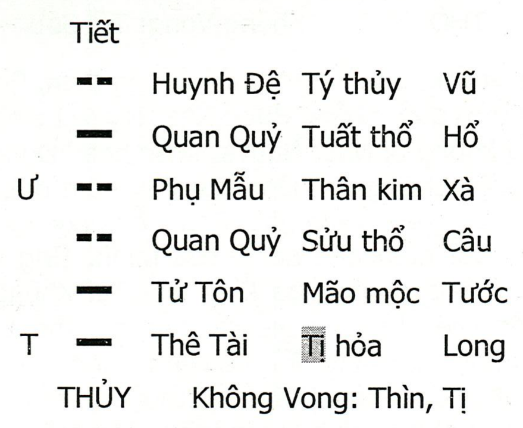

**Ví dụ 2:** Ngày Nhâm Tuất tháng Tuất, gần nhà ngài Morita có một mảnh đất trống đang mở thầu bán đấu giá, ông ta muốn mua mảnh đất này, đoán xem có thể mua được không? Được Sơn Thiên Đại Súc.

| | Đại Súc | | |
|---|---|---|---|
| | — Quan Quỷ Dần mộc | | Hổ |
| Ứ | - - Thê Tài Tý thủy | | Xà |
| | - - Huynh Đệ Tuất thổ | | Câu |
| | — Huynh Đệ Thìn thổ | Tử Thân | Tước |
| T | — Quan Quỷ Dần mộc | Phụ Ngọ | Long |
| | — Thê Tài Tý thủy | | Vũ |

THỔ Không Vong: Tý, Sửu

**Phán đoán:** Lấy Phụ Mẫu làm Dụng thần, Phụ Mẫu Ngọ hỏa không hiện trên quẻ, Không được Nhật Nguyệt sinh phù là hưu tù, nhưng cũng không bị Nhật Nguyệt khắc hại. Dụng thần nhập Mộ ở Nhật Nguyệt, chứng tỏ mảnh đất này nằm dưới sự quản lý và giám sát của cơ quan chính phủ. Phụ Mẫu phục tại hào 2, hào 2 là trạch, mảnh đất nằm gần nơi ở của mình. Ứng là đối thủ cạnh tranh, hào Thế là mình. Hào Ứng lâm Tài Không Vong bị Nhật Nguyệt khắc chế, Tài chủ giá cả đưa ra, Không Vong biểu thị không thích hợp, chứng tỏ đối thủ cạnh tranh ra giá không hợp lý. Dụng thần phục dưới hào Thế là vật thuộc sở hữu của ta. Hào Thế mặc dù hưu tù nhưng sinh Dụng thần, bản thân có thể dùng sức mạnh nhỏ bé đánh bại đối thủ để nhận được mảnh đất.

**Phản hồi:** Ông ta quyết định tham gia đấu thầu. Ông ta theo tôi học dự đoán lục hào, tự mình gieo quẻ tổng cộng 9 lần để xác định giá hợp lý nhất. Tham gia đấu thầu có 23 công ty bất động sản, chỉ có mình ông ta là hành vi cá nhân. Cuối cùng, ông ta đã vượt qua những người khác với chênh lệch rất nhỏ.

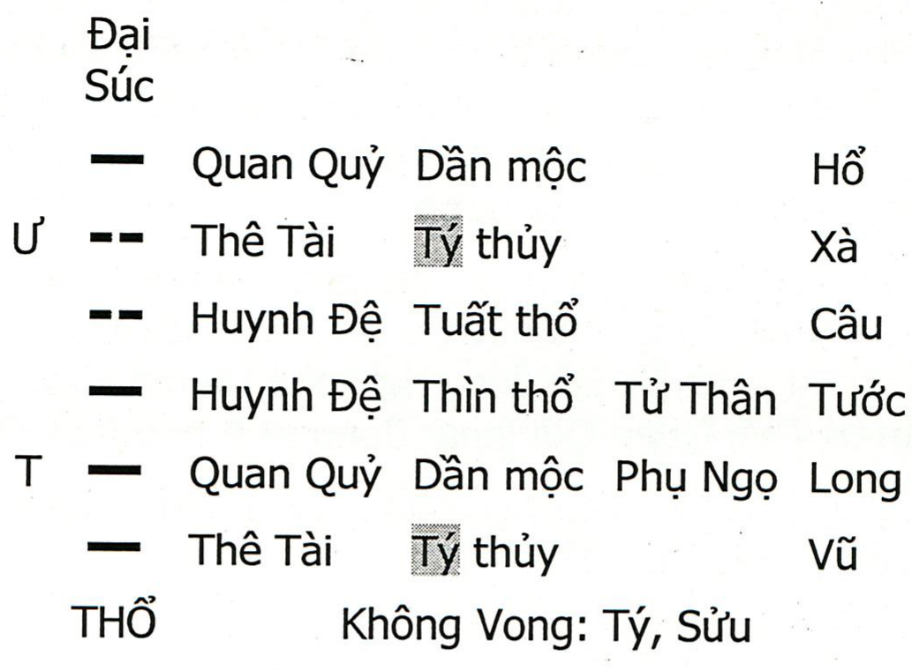

**Ví dụ 3:** Ngày Kỷ Sửu tháng Hợi, nam đoán về khả năng trúng thầu, được Thiên Trạch Lý biến Đoài Vi Trạch.

| | Lý | | Đoài | |
|---|---|---|---|---|
| | — Huynh Đệ Tuất thổ | | - - Huynh Đệ Mùi thổ | Câu |
| T | — Tử Tôn Thân kim | Tài Tý | — Tử Tôn Dậu kim | Tước |
| | — Phụ Mẫu Ngọ hỏa | | — Thê Tài Hợi thủy | Long |
| | - - Huynh Đệ Sửu thổ | | - - Huynh Đệ Sửu thổ | Vũ |
| Ứ | — Quan Quỷ Mão mộc | | — Quan Quỷ Mão mộc | Hổ |
| | — Phụ Mẫu Tị hỏa | | — Phụ Mẫu Tị hỏa | Xà |

THỔ Không Vong: Ngọ, Mùi

**Phán đoán:** Lấy Phụ Mẫu làm Dụng thần. Trong quẻ Phụ Mẫu lưỡng hiện, Phụ Mẫu Ngọ hỏa Không Vong, Tị hỏa Nguyệt phá, lấy Phụ Mẫu Ngọ hỏa gần hào Thế làm Dụng thần. Dụng thần Không Vong bị Nguyệt khắc chế, không được Nhật thần đến sinh trợ là hưu tù. Huynh Đệ Tuất thổ độc phát, Huynh Đệ là người giành thầu, độc phát lấy tượng làm chủ, Dụng thần nhập Mộ ở Huynh Đệ không cát, đây là thông tin thầu bị người giành mất, vì vậy không thành.

**Phản hồi:** Sau đó quả nhiên không trúng thầu.

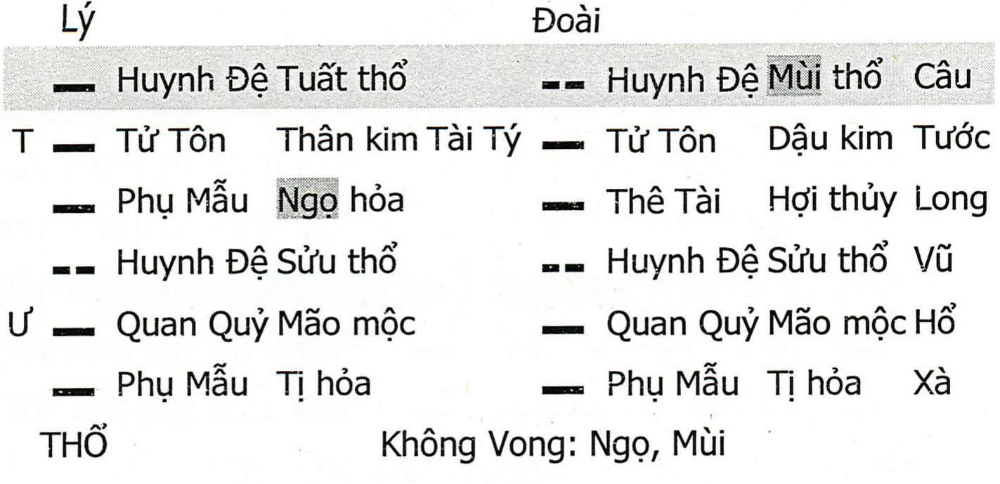

**Ví dụ 4:** Ngày Kỷ Sửu tháng Hợi, cùng ngày, một người hợp tác với người ở ví dụ 3 cũng đoán khả năng trúng thầu, được Địa Thủy Sư biến Địa Phong Thăng.

| | Sư | | | Thăng | |
| :---: | :---: | :--- | :---: | :--- | :--- |
| Ứ | - - | Phụ Mẫu Dậu kim | - - | Phụ Mẫu Dậu kim | Câu |
| | - - | Huynh Đệ Hợi thủy | - - | Huynh Đệ Hợi thủy | Tước |
| | - - | Quan Quỷ Sửu thổ | - - | Quan Quỷ Sửu thổ | Long |
| T | - - | Thê Tài Ngọ hỏa | — | Phụ Mẫu Dậu kim | Vũ |
| | — | Quan Quỷ Thìn thổ | — | Huynh Đệ Hợi thủy | Hổ |
| | - - | Tử Tôn Dần mộc | - - | Quan Quỷ Sửu thổ | Xà |

THỦY Không Vong: Ngọ, Mùi

**Phán đoán:** Lấy Phụ Mẫu làm Dụng thần. Phụ Mẫu Dậu kim Nguyệt không khắc, Nhật đến sinh là vượng tướng. Nhưng Phụ Mẫu lâm Ứng này là thông tin thầu rơi vào tay người khác. Hào Thế động mà khắc hào Ứng, là thông tin tranh giành thầu, nhưng hào Thế Không Vong hưu tù không có lực khắc hào Ứng, tranh không lại người ta.

**Phản hồi:** Kết quả giống như ví dụ 3.

**Ví dụ 5:** Ngày Nhâm Thìn tháng Sửu, một người đoán đấu thầu mua đất, được Trạch Phong Đại Quá biến Địa Sơn Khiêm.

| | Đại Quá | | | Khiêm | |
| :---: | :---: | :--- | :---: | :--- | :--- |
| | - - | Thê Tài Mùi thổ | - - | Quan Quỷ Dậu kim | Hổ |
| | — | Quan Quỷ Dậu kim | - - | Phụ Mẫu Hợi thủy | Xà |
| T | — | Phụ Mẫu Hợi thủy | - - | Thê Tài Sửu thổ | Câu |
| | — | Quan Quỷ Dậu kim | — | Quan Quỷ Thân kim | Tước |
| | — | Phụ Mẫu Hợi thủy | - - | Tử Tôn Ngọ hỏa | Long |
| Ứ | - - | Thê Tài Sửu thổ | - - | Thê Tài Thìn thổ | Vũ |

MỘC Không Vong: Ngọ, Mùi

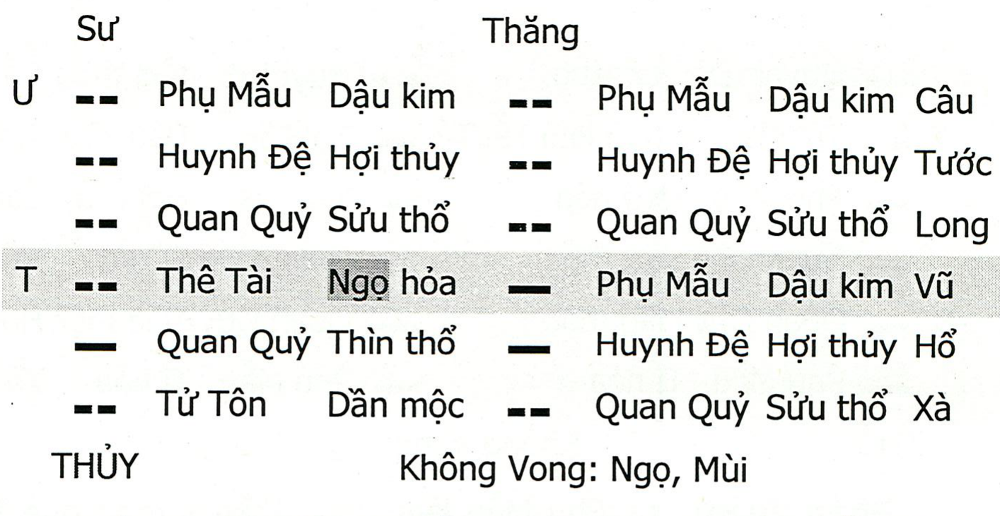

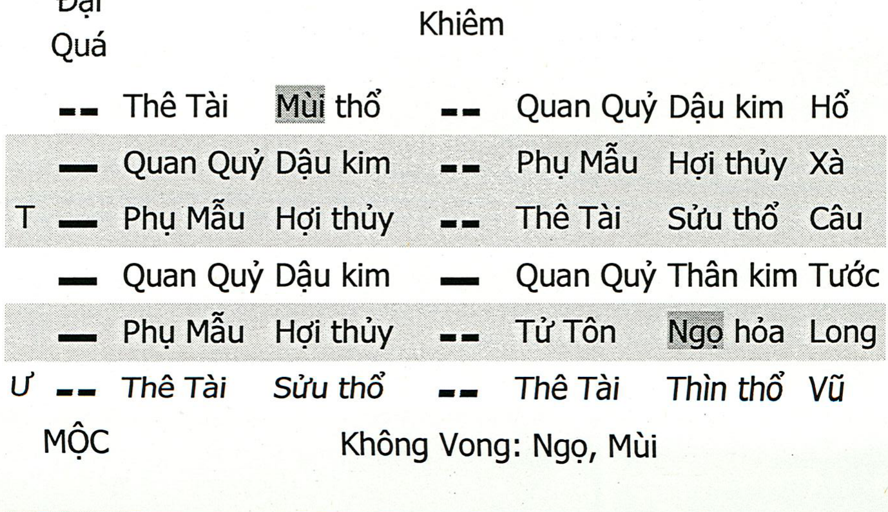

**Phán đoán:** Lấy hào Phụ Mẫu làm Dụng thần, quẻ này Phụ Mẫu lưỡng hiện, đều là Hợi thủy hơn nữa đồng thời phát động, có thể kiêm làm Dụng thần. Nhật Nguyệt đồng thời khắc chế Dụng thần, hào 4 Phụ Mẫu động hóa hồi đầu khắc, hào 2 Phụ Mẫu động mà hóa Không, trong quẻ Kỵ thần lưỡng hiện, mặc dù Nguyên thần Quan Quỷ phát động nhưng bị Nhật thần hợp trú, tham hợp quên sinh, Dụng thần nhược đến cực điểm, thầu này tất được. Ứng tại ngày khắc Dụng thần.

**Phản hồi:** Quả nhiên trúng thầu ở ngày Ất Mùi.

**Ví dụ 6:** Ngày Nhâm Tuất tháng Dần, một người Nhật Bản tìm tôi dự đoán đấu thầu mua đất, xem đưa ra bao nhiêu tiền là thích hợp, được Thiên Địa Bĩ.

| | Bĩ | | | |
| :---: | :---: | :--- | :--- | :--- |
| Ứ | — | Phụ Mẫu Tuất thổ | | Hổ |
| | — | Huynh Đệ Thân kim | | Xà |
| | — | Quan Quỷ Ngọ hỏa | | Câu |
| T | - - | Thê Tài Mão mộc | | Tước |
| | - - | Quan Quỷ Tị hỏa | | Long |
| | - - | Phụ Mẫu Mùi thổ | Tử Tý | Vũ |

KIM Không Vong: Tý, Sửu

**Phán đoán:** Lấy Phụ Mẫu làm Dụng thần, trong quẻ Phụ Mẫu lưỡng hiện, lấy Ứng Phụ Mẫu Tuất thổ làm Dụng.

Phụ Mẫu được Nhật củng phù là vượng, hào Thế lâm Tài hợp Dụng thần, trong quẻ hiển thị rõ ràng là dùng tiền có thể mua được mảnh đất này. Trọng điểm của quẻ này là số tiền đấu thầu. Bởi vì Thế lâm hào Tài hợp Dụng thần cho nên dùng hào này để phán đoán số tiền.

Hào Thế Thê Tài nạp can chi là Ất Mão, dùng phạm vi số tiên thiên để phán đoán, Ất là số 8, Mão là số 6, cộng lại là 14. Vì vậy, tôi phán đoán anh ta đấu thầu 1400 vạn yên là được.

**Phản hồi:** Cuối cùng anh ta đã mua được mảnh đất này, giá thầu thấp nhất ban đầu là 1350 vạn yên.

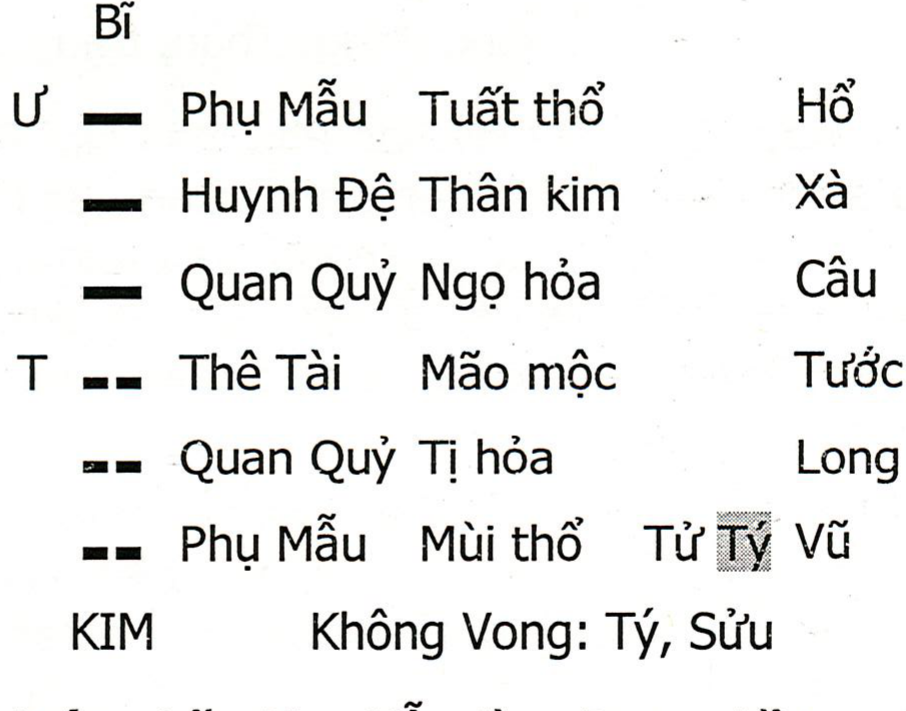

**Ví dụ 7:** Ngày Quý Mùi tháng Dần, một người đấu thầu đồ gốm, xem có thể được không? Được Hỏa Trạch Khuê biến Khôn Vi Địa.

| | Khuê | | Khôn | |
| :---: | :--- | :---: | :--- | :---: |
| | — Phụ Mẫu Tị hỏa | | - - Tử Tôn Dậu kim | Hổ |
| | - - Huynh Đệ Mùi thổ | Tài Tý | - - Thê Tài Hợi thủy | Xà |
| T | — Tử Tôn Dậu kim | | - - Huynh Đệ Sửu thổ | Câu |
| | - - Huynh Đệ Sửu thổ | | - - Quan Quỷ Mão mộc | Tước |
| | — Quan Quỷ Mão mộc | | - - Phụ Mẫu Tị hỏa | Long |
| Ứ | — Phụ Mẫu Tị hỏa | | - - Huynh Đệ Mùi thổ | Vũ |

THỔ Không Vong: Thân, Dậu

**Phán đoán:** Quẻ này lấy hào Phụ Mẫu làm Dụng thần, Phụ Mẫu Tị hỏa được Nguyệt kiến đến sinh, trong quẻ lại có Quan Quỷ động đến sinh trợ, vượng tướng không nghi ngờ gì, nhưng không nên lâm hào Ứng động mà khắc Thế, tất chủ không được thầu này, hào Thế Không Vong cũng là một trong những nhân tố bất lợi, rất khó trúng thầu.

**Phản hồi:** Sau đó quả nhiên không trúng thầu. Có lẽ có người sẽ hỏi: Phụ Mẫu, hào Thế và hào biến của hào Thế tạo thành tam hợp cục không phải là rất tốt à? Tam hợp cục này không phải Phụ Mẫu mà là Tử Tôn, trái lại khiến Phụ Mẫu thay đổi tính chất, càng là không thể trúng thầu.

**Ví dụ 8:** Ngày Kỷ Hợi tháng Hợi, một người hỏi bạn đấu thầu có thể thành công hay không? Được Hỏa Địa Tấn biến Thiên Lôi Vô Vọng.

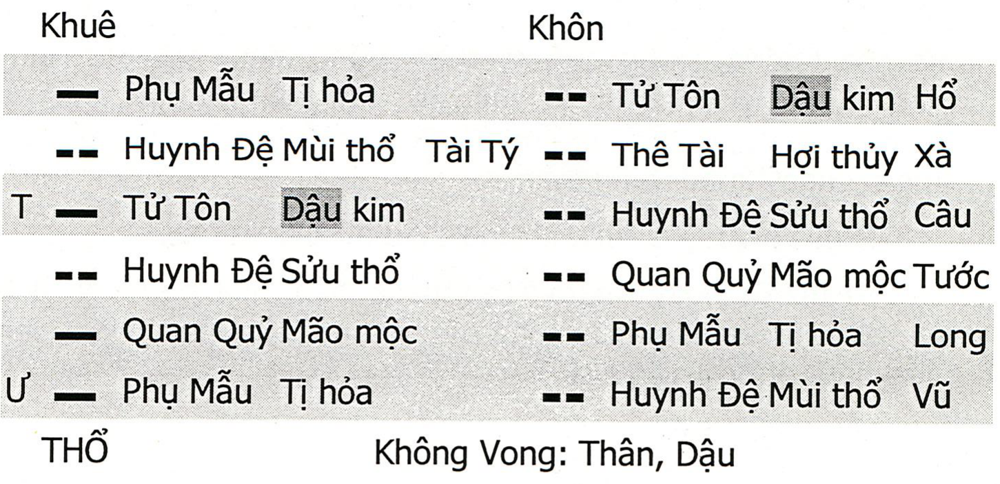

| | Tấn | | Vô Vọng | |
| :---: | :--- | :---: | :--- | :---: |
| | — Quan Quỷ Tị hỏa | | — Phụ Mẫu Tuất thổ | Câu |
| | - - Phụ Mẫu Mùi thổ | | — Huynh Đệ Thân kim | Tước |
| T | — Huynh Đệ Dậu kim | | — Quan Quỷ Ngọ hỏa | Long |
| | - - Thê Tài Mão mộc | | - - Phụ Mẫu Thìn thổ | Vũ |
| | - - Quan Quỷ Tị hỏa | | - - Thê Tài Dần mộc | Hổ |
| Ứ | - - Phụ Mẫu Mùi thổ | Tử Tý | — Tử Tôn Tý thủy | Xà |

KIM Không Vong: Thìn, Tị

**Phán đoán:** Lấy Phụ Mẫu làm Dụng thần, trong quẻ Phụ Mẫu lưỡng hiện đều phát động đến sinh hào Thế, mặc dù hưu tù nhưng Nhật Nguyệt không khắc, gốc rễ không xấu, thần triệu cơ ở động, Dụng thần sinh Thế nhất định có thể trúng thầu, hiện tại Nguyên thần Nguyệt phá, sang tháng Tý xuất Nguyệt bất phá, nhất định có thể trúng thầu.

**Phản hồi:** Sau đó quả nhiên trúng thầu.

**Ví dụ 9:** Ngày Ất Hợi tháng Tuất, một người đoán khả năng trúng thầu, được Phong Thiên Tiểu Súc biến Thủy Thiên Nhu.

| | Tiểu Súc | | Nhu | |
| :---: | :--- | :---: | :--- | :---: |
| | — Huynh Đệ Mão mộc | | - - Phụ Mẫu Tý thủy | Vũ |
| | — Tử Tôn Tị hỏa | | — Thê Tài Tuất thổ | Hổ |
| Ứ | - - Thê Tài Mùi thổ | | - - Quan Quỷ Thân kim | Xà |
| | — Thê Tài Thìn thổ | Quan Dậu | — Thê Tài Thìn thổ | Câu |
| | — Huynh Đệ Dần mộc | | — Huynh Đệ Dần mộc | Tước |
| T | — Phụ Mẫu Tý thủy | | — Phụ Mẫu Tý thủy | Long |

MỘC Không Vong: Thân, Dậu

**Phán đoán:** Lấy hào Phụ Mẫu làm Dụng thần, Phụ Mẫu Tý thủy trì Thế, được Nhật củng phù là cát, nhưng bị Nguyệt khắc, suy vượng cân bằng. Điều không nên là hào 6 Mão mộc một hào

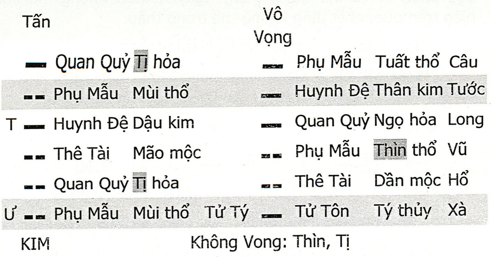

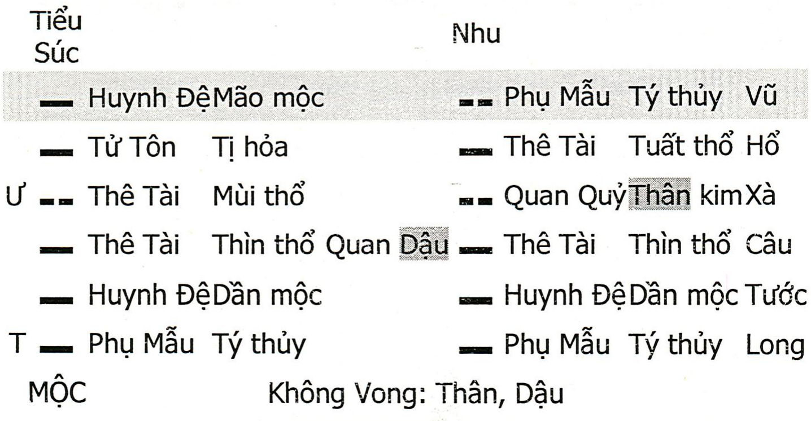 độc phát, là Tử địa Dụng thần, Nguyên thần Không mà không hiện trên quẻ, nhất định không thể trúng thầu.

**Phản hồi:** Sau đó quả nhiên không trúng.

**Ví dụ 10:** Ngày Canh Ngọ tháng Tuất, một người đoán khả năng trúng thầu, được Phong Địa Quan biến Thiên Địa Bĩ.

| | Quan | | | Bĩ | |
| :---: | :---: | :--- | :---: | :--- | :--- |
| | — | Thê Tài Mão mộc | — | Phụ Mẫu Tuất thổ | Xà |
| | — | Quan Quỷ Tị hỏa | — | Huynh Đệ Thân kim | Câu |
| T | -- | Phụ Mẫu Mùi thổ | — | Quan Quỷ Ngọ hỏa | Tước |
| | -- | Thê Tài Mão mộc | -- | Thê Tài Mão mộc | Long |
| | -- | Quan Quỷ Tị hỏa | -- | Quan Quỷ Tị hỏa | Vũ |
| Ứ | -- | Phụ Mẫu Mùi thổ | -- | Phụ Mẫu Mùi thổ | Hổ |

KIM Không Vong: Tuất, Hợi

**Phán đoán:** Lấy hào Phụ Mẫu làm Dụng thần, trong quẻ Phụ Mẫu lưỡng hiện, lấy Phụ Mẫu Mùi thổ phát động làm Dụng, Dụng thần được Nguyệt trợ giúp, Nhật thần đến sinh, lại là lưỡng hiện, Nguyên thần cũng lưỡng hiện, lại tự động hóa hồi đầu sinh, vốn là quá vượng, nhưng quẻ này là một hào độc phát, lại là Dụng thần trì Thế, thông tin hiển hiện ở độc phát, nhất định có thể trúng thầu.

**Phản hồi:** Sau đó quả nhiên trúng thầu.

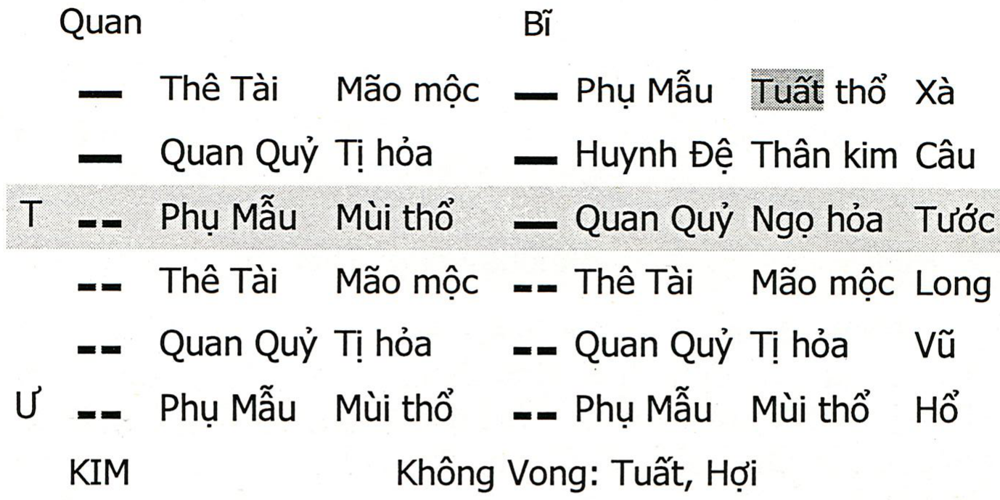

**Ví dụ 11:** Ngày Đinh Dậu tháng Dần, nam đoán xem đấu thầu có thể trúng không? Được Địa Thiên Thái.

| | Thái | | | |
| :---: | :---: | :--- | :--- | :--- |
| Ứ | -- | Tử Tôn Dậu kim | | Long |
| | -- | Thê Tài Hợi thủy | | Vũ |
| | -- | Huynh Đệ Sửu thổ | | Hổ |
| T | — | Huynh Đệ Thìn thổ | | Xà |
| | — | Quan Quỷ Dần mộc | Phụ Tị | Câu |
| | — | Thê Tài Tý thủy | | Tước |

THỔ Không Vong: Thìn, Tị

**Phán đoán:** Lấy Phụ Mẫu làm Dụng thần. Phụ Mẫu Tị hỏa không hiện trên quẻ, mặc dù Nguyệt sinh Nhật không khắc, Phi đến sinh phục là cát, nhưng không nên Dụng thần Không Vong, hào Thế cũng Không Vong, phục cư Không địa, sự dữ tâm vi¹, hào Thế gặp Không, làm việc không thành. Vì vậy phán đoán không thể trúng thầu.

**Phản hồi:** Quả nhiên không trúng thầu.

---
¹ Phục dưới Không thì việc trái với lòng.

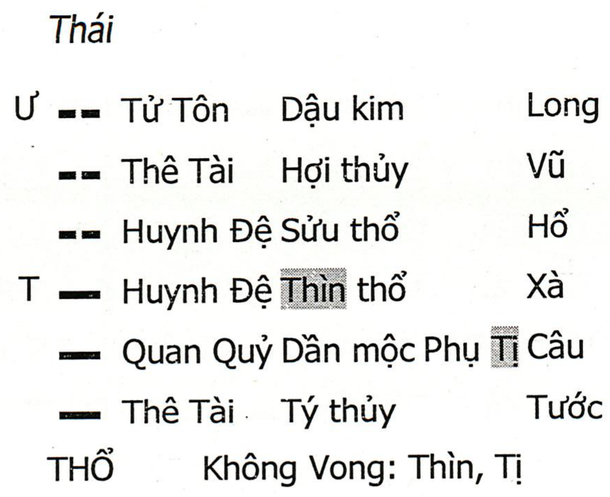

**Ví dụ 12:** Ngày Mậu Tý tháng Tý, công ty của một học viên đấu thầu, anh ta đoán xem có trúng thầu hay không? Được Phong Lôi Ích biến Ly Vi Hỏa.

| | Ích | Ly | Lục thú |
| :---: | :--- | :--- | :---: |
| Ứ | ━ Huynh Đệ Mão mộc | ━ Tử Tôn Tị hỏa | Tước |
| | ━ Tử Tôn Tị hỏa | ⚋ Thê Tài Mùi thổ | Long |
| | ⚋ Thê Tài Mùi thổ | ━ Quan Quỷ Dậu kim | Vũ |
| T | ⚋ Thê Tài Thìn thổ | ━ Phụ Mẫu Hợi thủy | Hổ |
| | ⚋ Huynh Đệ Dần mộc | ⚋ Thê Tài Sửu thổ | Xà |
| | ━ Phụ Mẫu Tý thủy | ━ Huynh Đệ Mão mộc | Câu |

MỘC Không Vong: Ngọ, Mùi

**Phán đoán:** Lấy Phụ Mẫu làm Dụng thần. Trong quẻ mặc dù có Phụ Mẫu Tý thủy, nhưng không xem hào này. Kỵ thần Thê Tài Thìn thổ trì Thế hóa ra Phụ Mẫu Hợi thủy, lấy hào này để phán đoán. Kỵ thần trì Thế hóa Dụng thần là tổ hợp đặc biệt trong quẻ lục hào. Hào Thế biểu thị mình, hóa ra Dụng thần biểu thị mình mình và sự việc theo đuổi gặp nhau, Dụng thần lại được Nhật Nguyệt trợ giúp là vượng tướng, vì vậy nhất định trúng thầu.

Quả nhiên tại ngày hôm sau trúng thầu.

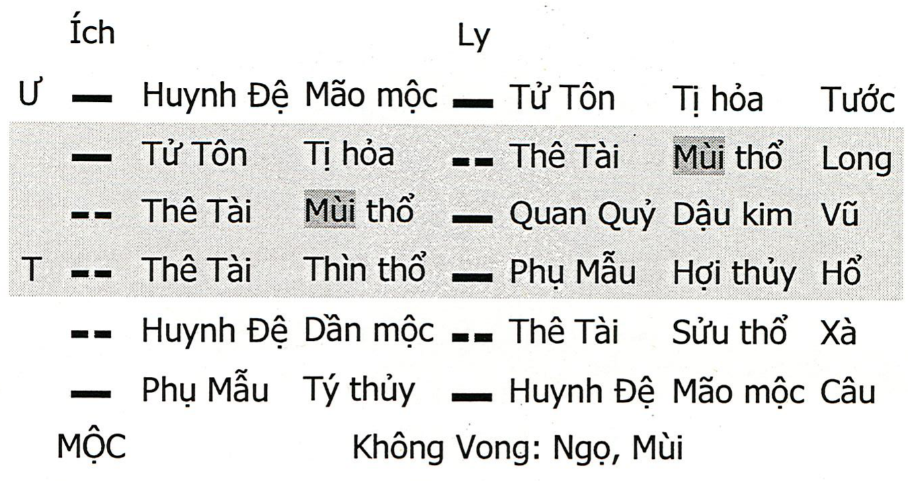

**Ví dụ 13:** Ngày Tân Hợi tháng Hợi, nam đoán đấu thầu, được Lôi Phong Hằng biến Lôi Sơn Tiểu Quá.

| | Hằng | Tiểu Quá | Lục thú |
| :---: | :--- | :--- | :---: |
| Ứ | ⚋ Thê Tài Tuất thổ | ⚋ Thê Tài Tuất thổ | Xà |
| | ⚋ Quan Quỷ Thân kim | ⚋ Quan Quỷ Thân kim | Câu |
| | ━ Tử Tôn Ngọ hỏa | ━ Tử Tôn Ngọ hỏa | Tước |
| T | ━ Quan Quỷ Dậu kim | ━ Quan Quỷ Thân kim | Long |
| | ━ Phụ Mẫu Hợi thủy Huynh Dần | ⚋ Tử Tôn Ngọ hỏa | Vũ |
| | ⚋ Thê Tài Sửu thổ | ⚋ Thê Tài Thìn thổ | Hổ |

MỘC Không Vong: Dần, Mão

**Phán đoán:** Lấy Phụ Mẫu làm Dụng thần. Phụ Mẫu Hợi thủy được Nhật Nguyệt trợ giúp là vượng tướng vốn là cát, nhưng Dụng thần độc phát, cần xem xu hướng xung hợp của địa chi Dụng thần, đúng lúc Dụng thần và Dần mộc Không Vong phục tàng tương hợp, biểu thị lạc Không (rơi vào Không), không cát.

**Phản hồi:** Quả nhiên không trúng thầu, chỉ thiếu 1 vạn 2 ngàn yên.

## 6. KÊU GỌI ĐẦU TƯ VÀ TÀI TRỢ

Mục đích là nhận được tiền vốn cho nên lấy Thê Tài làm Dụng thần. Đồng thời cũng phải xem hào Ứng. Hào Ứng là đối phương cung cấp tiền vốn, không nên Không Phá, càng không nên lâm Huynh Đệ phát động khắc Tài. Hào Ứng phản ánh thái độ và thành ý của đối phương ra sao. Thê Tài hưu tù thì không được, vượng tướng sinh hợp hào Thế thì được. Việc này rất giống với dự đoán cầu tài, chi tiết có thể tham khảo ở chương cầu tài.

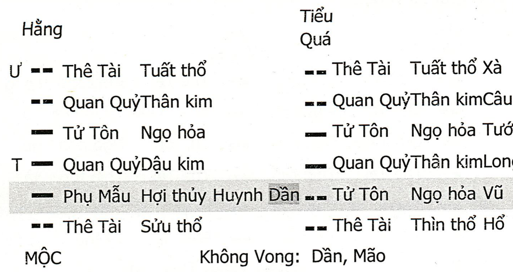

---

# Part 19 (Pages 361-371)

**Ví dụ 1:** Ngày Đinh Mão tháng Tuất, một người đoán xem việc kêu gọi đầu tư có tin cậy không? Được Hỏa Lôi Phệ Hạp biến Thiên Lôi Vô Vọng.

| | Phệ Hạp | Vô Vọng | |
| :--- | :--- | :--- | :--- |
| | — Tử Tôn Tị hỏa | — Thê Tài Tuất thổ | Long |
| T | - - Thê Tài Mùi thổ | — Quan Quỷ Thân kim | Vũ |
| | — Quan Quỷ Dậu kim | — Tử Tôn Ngọ hỏa | Hổ |
| | - - Thê Tài Thìn thổ | - - Thê Tài Thìn thổ | Xà |
| Ư | - - Huynh Đệ Dần mộc | - - Huynh Đệ Dần mộc | Câu |
| | — Phụ Mẫu Tý thủy | — Phụ Mẫu Tý thủy | Tước |

MỘC Không Vong: Tuất, Hợi

**Phán đoán:** Lấy Thê Tài làm Dụng thần, hào Ứng là người cấp vốn. Quẻ này Thê Tài lưỡng hiện, lấy hào Thê Tài Mùi thổ phát động làm Dụng thần. Thê Tài trì Thế được Nguyệt tỉ phù có vẻ như rất cát, nhưng Nhật đến làm tổn thương, lực suy vượng cân bằng.

Tài tại hào 5, tiền vốn kêu gọi đầu tư không phải là con số nhỏ. Lâm Huyền Vũ có tượng lừa gạt. Điều rất không nên là Dụng thần độc phát hóa Quan Quỷ tiết khí, hào 4 Quan Quỷ ám động lại đến tiết khí, Quan Quỷ là kẻ xấu, đa hiện gần hào Thế, sợ là băng nhóm lừa đảo mê hoặc mình. Hào Ứng Huynh Đệ là lục thân khắc Tài, người giúp gọi vốn không đáng tin.

**Phản hồi:** Anh ta nói rằng mình cần gấp tiền vốn, có người nó là họ có thể kêu gọi đầu tư vào 200 vạn, nhưng phải cho họ trước 1 vạn tệ tiền hoa hồng. Sau khi dự đoán thì trong lòng người này đã biết trước, anh ta cẩn thận chu toàn, phát hiện đối phương là tên lừa đảo liền tố giác.

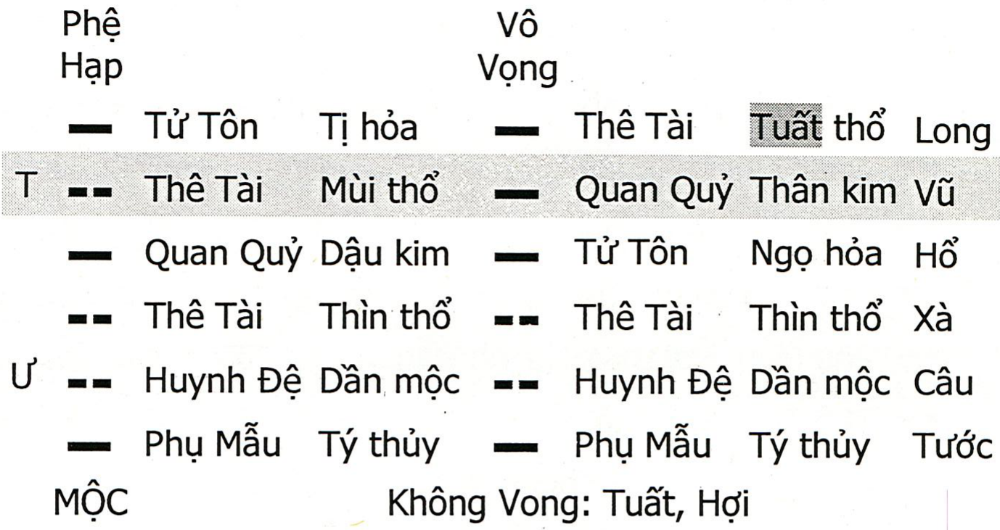

**Ví dụ 2:** Ngày Đinh Hợi tháng Thân, một ông lão đoán về huy động tiền vốn tu sửa miếu thờ, được Đoài Vi Trạch biến Chấn Vi Lôi.

| | Đoài | Chấn | |
| :--- | :--- | :--- | :--- |
| T | - - Phụ Mẫu Mùi thổ | - - Phụ Mẫu Tuất thổ | Long |
| | — Huynh Đệ Dậu kim | - - Huynh Đệ Thân kim | Vũ |
| | — Tử Tôn Hợi thủy | — Quan Quỷ Ngọ hỏa | Hổ |
| Ư | - - Phụ Mẫu Sửu thổ | - - Phụ Mẫu Thìn thổ | Xà |
| | — Thê Tài Mão mộc | - - Thê Tài Dần mộc | Câu |
| | — Quan Quỷ Tị hỏa | — Tử Tôn Tý thủy | Tước |

KIM Không Vong: Ngọ, Mùi

**Phán đoán:** Đoán tiền vốn, Thê Tài là Dụng thần. Thê Tài Mão mộc tại hào 2 lâm Câu Trần phát động hóa thoái, hóa Nguyệt phá, Câu Trần chủ kiến trúc, hào 2 là trạch, là tiền trong nhà, hóa thoái là tiêu đi, hóa phá là đã dùng hết tất cả. Vì vậy, phán đoán ông ta đã bắt đầu sửa miếu, chủ yếu là dùng tiền của mình để sửa, nhưng hiện tại đã không còn tiền. Thê Tài là mộc, mộc chủ số 3, phán đoán ông ta đã tốn 30 vạn tệ để tu sửa miếu.

Thế tại hào 6, hào 6 là chùa miếu, lâm Thanh Long chủ ẩm thực, quẻ cung Đoài cũng chủ miệng, ẩm thực, phán đoán ông ta sống trong miếu, ăn trong miếu.

Phụ Mẫu Mùi thổ Không Vong, trong miếu vắng vẻ, diện tích quá lớn. Lục xung hóa lục xung, rất khó huy động đủ tiền vốn, sợ là lúc còn sống không sửa xong.

**Phản hồi:** Quả nhiên là ông lão sống trong miếu, ăn trong miếu. Ông tự mình tu sửa và đã tiêu tốn 30 vạn tệ, toàn bộ số tiền để dành của bản thân đều đã dùng hết, nhưng cần quá nhiều vốn, vì vậy ông ta muốn xem có thể huy động được hay không.

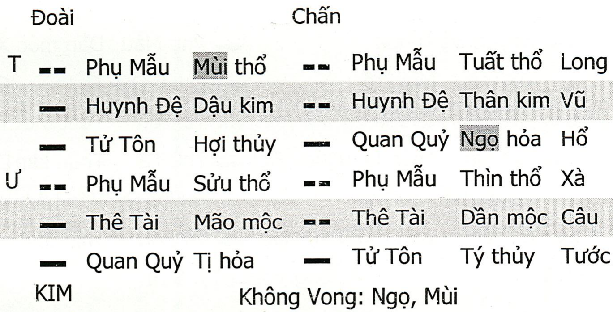

**Ví dụ 3:** Ngày Canh Thân tháng Dần, nam mua máy photocopy, đoán xem người khác tài trợ ra sao? Được Hỏa Sơn Lữ biến Cấn Vi Sơn.

| | Lữ | Cấn | |
| :---: | :--- | :--- | :---: |
| | — Huynh Đệ Tị hỏa | — Phụ Mẫu Dần mộc | Xà |
| | - - Tử Tôn Mùi thổ | - - Quan Quỷ Tý thủy | Câu |
| Ứ | — Thê Tài Dậu kim | - - Tử Tôn Tuất thổ | Tước |
| | — Thê Tài Thân kim Quan Hợi | — Thê Tài Thân kim | Long |
| | - - Huynh Đệ Ngọ hỏa | - - Huynh Đệ Ngọ hỏa | Vũ |
| T | - - Tử Tôn Thìn thổ Phụ Mão | - - Tử Tôn Thìn thổ | Hổ |

HỎA      Không Vong: Tý, Sửu

**Phán đoán:** Lấy Thê Tài làm Dụng thần. Trong quẻ Thê Tài lưỡng hiện, lấy hào Thê Tài Dậu kim phát động làm Dụng thần. Dụng thần lâm hào Ứng phát động, được Nhật trợ giúp là vượng tướng, động mà hợp hào Thế, Ứng là người khác, hợp hào Thế là mình nhận được, thông tin được người khác cấp tiền rất rõ ràng, nhất định có thể được tài trợ.

Quả nhiên đã được cấp 2 vạn tệ ở ngày thứ ba Nhâm Tuất.

**Ví dụ 5:** Ngày Bính Dần tháng Tuất, nữ đoán về gây quỹ cho miếu Viêm Đế, được Trạch Thủy Khốn biến Địa Phong Thăng.

| | Khốn | Thăng | |
| :---: | :--- | :--- | :---: |
| | - - Phụ Mẫu Mùi thổ | - - Huynh Đệ Dậu kim | Long |
| | — Huynh Đệ Dậu kim | - - Tử Tôn Hợi thủy | Vũ |
| Ứ | — Tử Tôn Hợi thủy | - - Phụ Mẫu Sửu thổ | Hổ |
| | - - Quan Quỷ Ngọ hỏa | — Huynh Đệ Dậu kim | Xà |
| | — Phụ Mẫu Thìn thổ | — Tử Tôn Hợi thủy | Câu |
| T | - - Thê Tài Dần mộc | - - Phụ Mẫu Sửu thổ | Tước |

KIM      Không Vong: Tuất, Hợi

**Phán đoán:** Lấy Thê Tài làm Dụng thần. Thê Tài Dần mộc được Nhật trợ giúp là vượng tướng. Nhưng Tử Tôn Hợi thủy bị

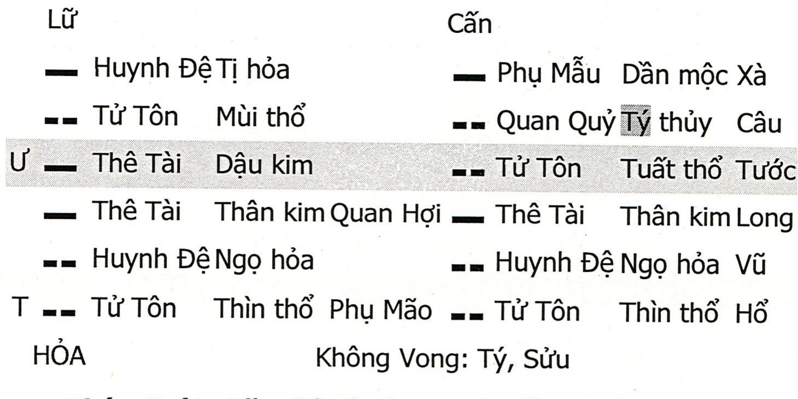

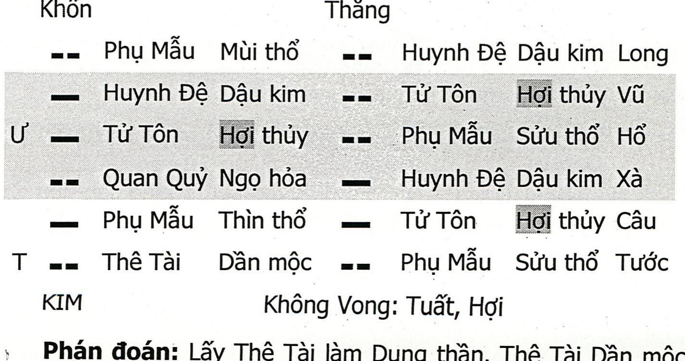

Nguyệt khắc, Nhật không trợ giúp là hưu tù. Nhật hợp trú Nguyên thần, tham hợp quên sinh, lại động hóa hồi đầu khắc, Huynh Đệ Dậu kim phát động đến khắc Thê Tài, Tử Tôn không thể dẫn hóa, vì vậy số tiền huy động được không quá nhiều.

Hào Thế tại hào sơ, Thê Tài Dần mộc trì Thế, biểu thị đã huy động được một ít tiền, nhưng địa vị xã hội của bản thân quá thấp, không có sức kêu gọi, rất khó huy động được khoản tiền lớn.

Quả nhiên sau một thời gian rất dài cũng không huy động được số tiền đáng kể.

**Ví dụ 6:** Ngày Giáp Thìn tháng Dần, nam được người ta đồng ý tài trợ cho anh ta một khoản tiền, đoán xem khi nào được cấp? Được Địa Lôi Phục biến Lôi Thiên Đại Tráng.

| | Phục | Đại Tráng | |
| :---: | :--- | :--- | :---: |
| | - - Tử Tôn Dậu kim | - - Huynh Đệ Tuất thổ | Vũ |
| | - - Thê Tài Hợi thủy | - - Tử Tôn Thân kim | Hổ |
| Ứ | - - Huynh Đệ Sửu thổ | — Phụ Mẫu Ngọ hỏa | Xà |
| | - - Huynh Đệ Thìn thổ | — Huynh Đệ Thìn thổ | Câu |
| | - - Quan Quỷ Dần mộc Phụ Tị | — Quan Quỷ Dần mộc | Tước |
| T | — Thê Tài Tý thủy | — Thê Tài Tý thủy | Long |

THỔ      Không Vong: Dần, Mão

**Phán đoán:** Lấy Thê Tài làm Dụng thần. Trong quẻ Thê Tài lưỡng hiện, lấy hào Thê Tài Hợi thủy gặp hợp làm Dụng. Dụng thần không được Nhật Nguyệt trợ giúp, mặc dù Nguyệt hợp được khí, nhưng bị Nhật khắc thương, trong quẻ Huynh Đệ phát động lại đến khắc, nội quái phục ngâm, người ta sẽ không tài trợ.

**Phản hồi:** Quả nhiên đã bảy năm trôi qua không nhận được tài trợ.

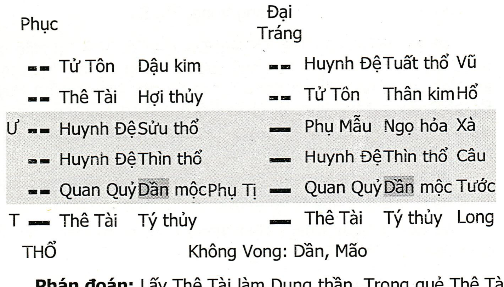

**Ví dụ 7:** Ngày Tân Dậu tháng Tý, nam đoán xem người ta cấp tài trợ khi nào đến tay? Được Trạch Địa Tụy biến Chấn Vi Lôi.

| | Tụy | Chấn | |
| :---: | :--- | :--- | :---: |
| | - - Phụ Mẫu Mùi thổ | - - Phụ Mẫu Tuất thổ | Xà |
| Ư | — Huynh Đệ Dậu kim | - - Huynh Đệ Thân kim | Câu |
| | — Tử Tôn Hợi thủy | — Quan Quỷ Ngọ hỏa | Tước |
| | - - Thê Tài Mão mộc | - - Phụ Mẫu Thìn thổ | Long |
| T | - - Quan Quỷ Tị hỏa | - - Thê Tài Dần mộc | Vũ |
| | - - Phụ Mẫu Mùi thổ | — Tử Tôn Tý thủy | Hổ |

KIM Không Vong: Tý, Sửu

**Phán đoán:** Lấy Thê Tài làm Dụng thần. Thê Tài Mão mộc được Nguyệt sinh Nhật khắc, suy vượng tương đương, Nhật xung ám động sinh hào Thế là đồng ý cấp tài trợ. Nhưng Ứng Huynh Đệ phát động đến khắc, lại nhập Mộ ở hào sơ Mùi thổ, như vậy sức lực bị suy yếu, sợ là không thể mãn nguyện. Ứng là người khác, chứng tỏ có người ở giữa giở trò xấu.

**Phản hồi:** Quả nhiên đồng ý cấp tài trợ, nhưng bị người khác ngăn chặn, không nhận được.

**Ví dụ 8:** Ngày Nhâm Thìn tháng Ngọ, nam đoán tình hình gọi vốn từ Mỹ, được Địa Lôi Phục.

| | Phục | |
| :---: | :--- | :---: |
| | - - Tử Tôn Dậu kim | Hổ |
| | - - Thê Tài Hợi thủy | Xà |
| Ư | - - Huynh Đệ Sửu thổ | Câu |
| | - - Huynh Đệ Thìn thổ | Tước |
| | - - Quan Quỷ Dần mộc Phụ Tị | Long |
| T | — Thê Tài Tý thủy | Vũ |

THỔ Không Vong: Ngọ, Mùi

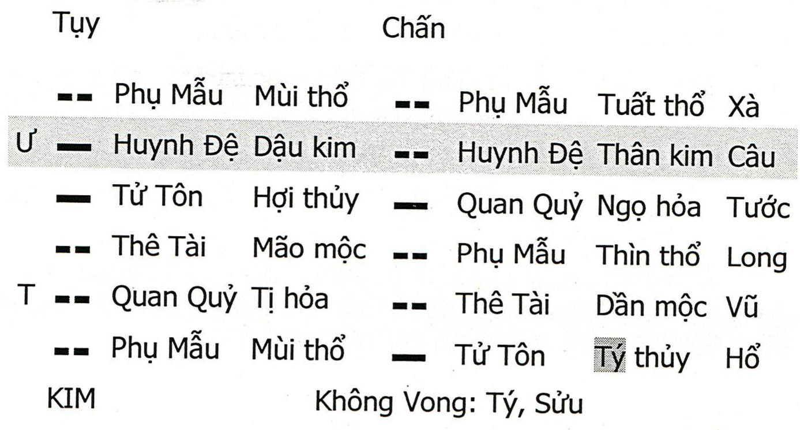

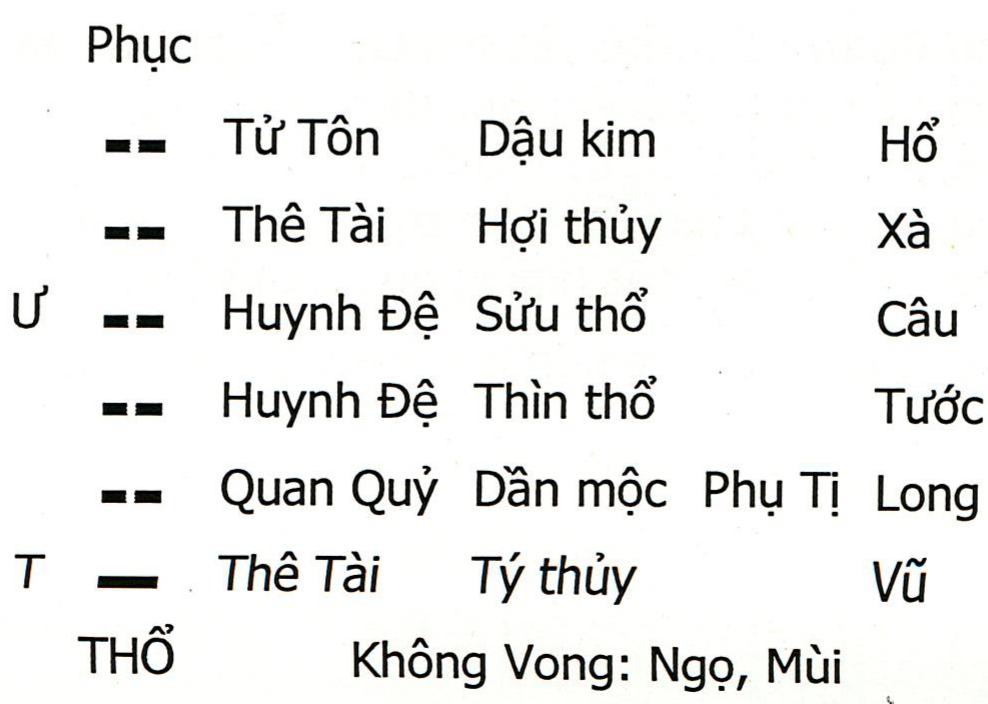

**Phán đoán:** Lấy Thê Tài làm Dụng thần, trong quẻ Thê Tài lưỡng hiện, lấy Thê Tài Tý thủy tới Thế làm Dụng thần. Dụng thần Nguyệt phá, nhập Mộ ở Nhật, hưu tù vô khí, hào Ứng lại là Huynh Đệ, không thể trợ giúp Dụng thần, vì vậy gọi vốn không thành.

Quả nhiên đã ba năm trôi qua cũng không thành công.

## 7. TRANH CHẤP KINH DOANH

Tranh chấp kinh doanh thì phải xem do nguyên nhân gì dẫn tới. Nếu là tranh chấp giữa thương gia và thương gia thì lấy hào Thế thể hiện mình, hào Ứng thể hiện đối phương. Thê Tài thể hiện tiền hàng, tiền vốn, hàng hóa v.v, căn cứ vào tình huống tranh chấp cụ thể mà thủ tượng một cách linh hoạt. Nếu là tranh chấp giữa thương gia và khách hàng, thương gia đến đoán thì hào Ứng là khách hàng, khách hàng đến đoán thì hào Ứng là thương gia, Tài là hàng hóa.

Phụ Mẫu Quan Quỷ lâm Đằng Xà, Chu Tước phát động nhất định tranh giành dẫn tới kiện tụng, khẩu thiệt. Tài lâm Huyền Vũ bị khắc, hoặc Huynh Đệ lâm Huyền Vũ phát động, biểu thị bởi vì có sự việc lừa gạt, lừa đảo mà phát sinh tranh chấp. Hào Ứng Không Vong, biểu thị đối phương không tích cực chủ động giải quyết vấn đề. Tùy vào tình huống cụ thể, hào Thế Không Vong có thể biểu thị bản thân chột dạ, lo lắng, sợ hãi, hoặc không tích cực giải quyết vấn đề, né tránh vấn đề.

Dụng thần vượng tướng, hào Thế bất Không bất Phá, sự việc giải quyết thuận lợi, hưu tù Không Phá, giải quyết không thuận lợi, không thành công. Cần phải phán đoán linh hoạt. Nếu bởi vì lo lắng mà đoán, Tử Tôn vượng tướng phát động, giải quyết thuận lợi, Quan Quỷ trì Thế phát động, sự việc giải quyết không thuận lợi, phiền não quấn lấy mình.

**Ví dụ 1:** Ngày Canh Tuất tháng Tuất, thẩm mỹ viện của vợ nhuộm tóc cho một khách hàng dẫn tới dị ứng, đoán xem kết quả sẽ ra sao? Được Địa Phong Thăng.

| | Thăng | | | | |
| :---: | :---: | :---: | :---: | :---: | :---: |
| | - - | Quan Quỷ | Dậu kim | | Xà |
| | - - | Phụ Mẫu | Hợi thủy | | Câu |
| T | - - | Thê Tài | Sửu thổ | Tử Ngọ | Tước |
| | — | Quan Quỷ | Dậu kim | | Long |
| | — | Phụ Mẫu | Hợi thủy | Huynh Dần | Vũ |
| Ư | - - | Thê Tài | Sửu thổ | | Hổ |

MỘC Không Vong: Dần, Mão

**Phán đoán:** Lấy hào Ứng làm Dụng thần. Hào Ứng là khách hàng, phân tích quan hệ với hào Thế và Thê Tài để phán đoán. Hào Ứng Thê Tài Sửu thổ lâm Bạch Hổ, Bạch Hổ là bệnh tật chứng tỏ là dị ứng thật.

Hào Ứng được Nhật Nguyệt trợ giúp là vượng tướng, vấn đề hoàn toàn không nghiêm trọng. Thê Tài vượng tướng, không có dấu hiệu phá tài, vì vậy khách hàng sẽ không nhân cơ hội bắt chẹt.

Thế Ứng tỷ hòa, khách hàng có thể nghĩ cho chủ tiệm, tích cực trị khỏi bệnh cho khách thì sẽ không có phiền phức.

**Phản hồi:** Anh ta chủ động mang khách hàng đến bệnh viện xem bệnh, bởi vì vấn đề không lớn nên khách hàng không khiếu nại, cũng không yêu cầu bồi thường.

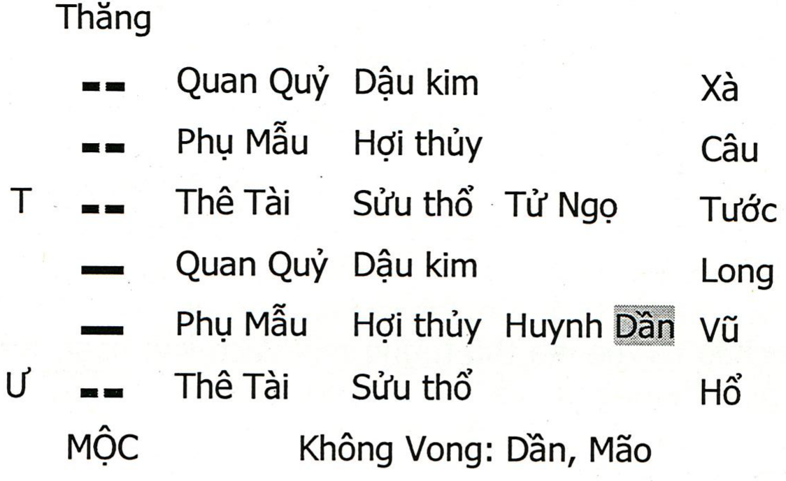

**Ví dụ 2:** Ngày Đinh Mão tháng Ngọ, thẩm mỹ viện xin lỗi một khách hàng, nữ đoán xem kết quả ra sao? Được Trạch Lôi Tùy biến Thủy Lôi Truân.

| | Tùy | | | | Truân | | | |
| :---: | :---: | :---: | :---: | :---: | :---: | :---: | :---: | :---: |
| Ư | - - | Thê Tài | Mùi thổ | | - - | Phụ Mẫu | Tý thủy | Long |
| | — | Quan Quỷ | Dậu kim | | — | Thê Tài | Tuất thổ | Vũ |
| | — | Phụ Mẫu | Hợi thủy | Tử Ngọ | - - | Quan Quỷ | Thân kim | Hổ |
| T | - - | Thê Tài | Thìn thổ | | - - | Thê Tài | Thìn thổ | Xà |
| | - - | Huynh Đệ | Dần mộc | | - - | Huynh Đệ | Dần mộc | Câu |
| | — | Phụ Mẫu | Tý thủy | | — | Phụ Mẫu | Tý thủy | Tước |

MỘC Không Vong: Tuất, Hợi

**Phán đoán:** Lấy hào Ứng làm Dụng thần. Hào Ứng lâm Thê Tài Mùi thổ được Nguyệt sinh là vượng tướng, quẻ này là Trạch Lôi Tùy, có ý nghĩa là đi theo, thuận theo. Chứng tỏ khách hàng này có thể mang lại tài vận cho mình.

Phụ Mẫu Hợi thủy lâm Bạch Hổ độc phát, hào độc phát có thể biểu thị tính chất, trạng thái, nguyên nhân. Bạch Hổ chủ tức giận, Phụ Mẫu cũng là tức giận, cho nên khách hàng này không hài lòng. Ứng lâm hào 6, hào 6 là hào vị lâu năm, đây là một khách hàng cũ.

Nguyên thần không hiện, bị hào độc phát khắc thương, Nguyên thần chủ tư duy, nội tâm, là mình đã làm tổn thương trái tim của khách. Nhật khắc Dụng thần nên tạm thời sẽ không thứ lỗi.

**Phản hồi:** Trên thực tế là đã đắc tội với một khách hàng lâu năm ở tháng Mão. Từ khi vị khách này bỏ đi thì kinh doanh khó khăn, mặc dù bản thân đã tự mình đến nhà nhận lỗi nhưng đối phương vẫn chưa quay lại.

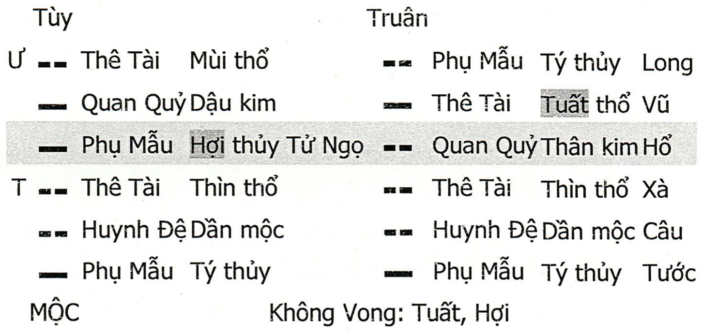

**Ví dụ 3:** Ngày Tân Dậu tháng Tuất, nam đặt mua một máy lọc nước ở nước ngoài nhưng có chất lượng không tốt, đã trả lại nơi tiêu thụ, nhưng đối phương không cho đổi cái mới, cũng không hoàn tiền, thế là yêu cầu gửi lại máy lọc nước cho mình, đoán xem có được trả lại hay không? Được Trạch Lôi Tùy biến Ly Vi Hỏa.

| | Tùy | | Ly | | |
| :---: | :---: | :--- | :---: | :--- | :---: |
| Ứ | - - | Thê Tài Mùi thổ | — | Tử Tôn Tị hỏa | Xà |
| | — | Quan Quỷ Dậu kim | - - | Thê Tài Mùi thổ | Câu |
| | — | Phụ Mẫu Hợi thủy | — | Quan Quỷ Dậu kim | Tước |
| T | - - | Thê Tài Thìn thổ | — | Phụ Mẫu Hợi thủy | Long |
| | - - | Huynh Đệ Dần mộc | - - | Thê Tài Sửu thổ | Vũ |
| | — | Phụ Mẫu Tý thủy | — | Huynh Đệ Mão mộc | Hổ |

MỘC Không Vong: Tý, Sửu

**Phán đoán:** Lấy Thê Tài làm Dụng thần. Trong quẻ Thê Tài lưỡng hiện, đều phát động, lấy Thìn thổ Nguyệt phá lâm hào Thế làm Dụng thần. Bởi vì hào Thế là đồ vật hoặc tiền tài của mình.

Dụng thần Nguyệt phá, được Nhật hợp vốn là hợp phá là cát, nhưng không nên hào 5 Quan Quỷ Dậu kim lại động đến hợp, là trở thành hợp mất. Thế Thê Tài bị Quan Quỷ hợp mất, chính là lấy đi đồ của mình, không giao cho mình.

**Phản hồi:** Kết quả là không giao bình lọc nước, tiền cũng không được trả lại.

**Ví dụ 4:** Ngày Giáp Tý tháng Hợi, anh trai hợp tác kinh doanh với người ta, sau khi thua lỗ thì bị người hợp tác gây phiền phức, nữ đoán xem kết quả ra sao? Được Hỏa Địa Tấn biến Lôi Địa Dự.

| | Tấn | | Dự | | |
| :---: | :---: | :--- | :---: | :--- | :---: |
| | — | Quan Quỷ Tị hỏa | - - | Phụ Mẫu Tuất thổ | Vũ |
| | - - | Phụ Mẫu Mùi thổ | - - | Huynh Đệ Thân kim | Hổ |
| T | — | Huynh Đệ Dậu kim | — | Quan Quỷ Ngọ hỏa | Xà |
| | - - | Thê Tài Mão mộc | - - | Thê Tài Mão mộc | Câu |
| | - - | Quan Quỷ Tị hỏa | - - | Quan Quỷ Tị hỏa | Tước |
| Ứ | - - | Phụ Mẫu Mùi thổ Tử Tý | - - | Phụ Mẫu Mùi thổ | Long |

KIM Không Vong: Tuất, Hợi

**Phán đoán:** Lấy Huynh Đệ làm Dụng thần. Huynh Đệ Dậu kim không được Nhật Nguyệt trợ giúp là hưu tù, nhưng cũng không bị Nhật Nguyệt khắc chế. Quan Quỷ Tị hỏa phát động khắc Huynh Đệ, hào động này chính là người gây phiền phức.

Hào Thế lâm Đằng Xà, Đằng Xà chủ bất an, lo lắng, chứng tỏ rất lo lắng cho an nguy của anh trai. Nhưng Quan Quỷ Nguyệt phá, Nhật Nguyệt khắc chế, không có lực khắc Dụng thần. Quan Quỷ lâm Huyền Vũ, Huyền Vũ chủ trộm cắp, lừa đảo, chứng tỏ đối phương là băng nhóm trộm cắp, lừa gạt. Động mà hóa Mộ, đối phương vào tù sẽ không còn đến uy hiếp.

Quả nhiên đối phương bị bắt vào tù ở ngày Kỷ Mão.
