# Lục Hào Kỹ Pháp và Ứng Dụng

## Trang bìa

**Tác phẩm:** LỤC HÀO KỸ PHÁP VÀ ỨNG DỤNG  
**Tác giả:** Vương Hổ Ứng  
**Dịch giả:** An Hạ  

---

## Mục lục

- Lời Dịch giả: Lý và Tượng trong Lục Hào (trang 3)
- Chương 1: Trường sinh mười hai cung bí pháp (trang 5)
- Chương 2: Bí mật của Phi – Phục (trang 9)
- Chương 3: Không vong hoạt dụng (trang 12)
- Chương 4: Quẻ do ai đến gieo! (trang 14)
- Chương 5: Quẻ đoán mộng (trang 24)
- Chương 6: Lục hào xạ phúc (trang 26)
- Chương 7: Lục hào đoán tướng mạo (trang 28)
- Chương 8: Ngàn vạn không thể bổ (trang 31)
- Chương 9: Giếng nước nghiên cứu cùng nghiệm chứng luận (trang 33)
- Chương 10: Con đường trong Lục hào (trang 37)
- Chương 11: Đoán bệnh tất lấy Quan quỷ là bệnh sao? (trang 41)

---

## Lời dịch giả: Lý và Tượng trong Lục Hào

### Lý và Tượng trong Luận đoán Bốc Dịch

Sau khi hoàn thành bản dịch tác phẩm *Lục hào Chiêm nghiệm Bí pháp*, dự định ban đầu của tôi là dịch tặng quý Dịch hữu một tập ghi chép trong khóa đào tạo trung – cao cấp của Thầy $\text{Vương Hổ Ứng}$. Tuy nhiên, sau khi thẩm định kỹ lưỡng, tập tư liệu đó vốn do một học viên ghi lại nên kết cấu còn phân tán, khó biên dịch trọn vẹn; mặt khác, hệ thống tri thức trong tập tài liệu đó hàm chứa nhiều tầng lý luận quá cao siêu, rất khó tiếp cận nếu chưa có nền tảng vững chắc. Do đó, tôi quyết định tạm dừng để lựa chọn một tác phẩm khác phù hợp hơn.

Cơ duyên đưa tôi đến tập tạp ghi này của $\text{Vương Hổ Ứng}$. Dù mang tính chất tạp lục, tác phẩm lại khai mở và giải đáp trực diện các nút thắt học thuật căn cốt, đặc biệt là mối giao thoa giữa việc khởi quẻ theo $\text{Mai Hoa Dịch Số}$ và phương pháp luận giải sâu sắc theo hệ thống $\text{Lục Hào}$.

Trong quá trình nghiên cứu và thực hành dịch thuật, có hai trọng điểm mang tính nguyên tắc cần được làm sáng tỏ nhằm giúp người học xác lập độ chuẩn xác tối đa khi khởi quẻ và dự đoán:

#### 1. Quy chuẩn Khởi quẻ theo Lịch Tiết Khí
$\text{Vương Hổ Ứng}$ đặc biệt nhấn mạnh rằng muốn luận đoán ứng nghiệm xác thực, khâu lập quẻ đòi hỏi sự nghiêm cẩn cao độ. Một nguyên tắc cốt lõi là việc định vị thời gian bắt buộc phải căn cứ theo **Lịch Tiết Khí**, xuất phát từ ba căn cứ thực tiễn:
- **Căn cứ Lịch sử:** Người xưa không áp dụng hệ thống dương lịch với ngày tháng cơ học như hiện đại, mà vận hành hoàn toàn dựa trên sự dịch chuyển của Tiết Khí (ví dụ: tiết $\text{Lập Xuân}$ là khởi đầu năm mới, tiết $\text{Lập Hạ}$ là bước sang mùa hè). Toàn bộ các môn thuật số đỉnh cao như $\text{Tử Vi}$, $\text{Bát Tự}$ đều lấy Tiết Khí làm mốc định tọa độ thiên văn để thu thập tham số chuẩn xác khi đoán quẻ.
- **Căn cứ Nghiệm lý:** Trong nghiên cứu thuật số, việc lấy sai giờ sinh do dùng giờ hành chính cơ học luôn gây ra nhiều sai lệch trầm trọng. Thời khắc $\text{Giờ Ngọ}$ thực tế được xác định trùng khớp với thời điểm bóng mặt trời ngắn nhất trên cọc đo quang trắc (chân thái dương thời). Dưới sự vận hành của Tiết Khí, độ dài các canh giờ trong ngày liên tục biến thiên linh hoạt.
- **Thực chứng từ các Quẻ mẫu của Vương Hổ Ứng:** Khi dịch tập sách đầu tiên, nhiều quẻ ban đầu tưởng chừng có sai lệch về mặt lý thuyết. Tuy nhiên, ngay khi chuyển đổi thời gian sang tọa độ Lịch Tiết Khí, toàn bộ hệ thống can chi, can ngày, can tháng đều khớp lệnh chuẩn xác tuyệt đối.

### Kỹ pháp Đoán Tượng của Vương Hổ Ứng

Trong nghệ thuật luận đoán $\text{Lục Hào}$, toàn bộ cấu trúc được phân định thành hai trụ cột song hành:
1. **Lý (Nguyên lý sinh khắc ngũ hành):** Là nền tảng cơ bản nhất của thuật bốc phệ. Phần lớn các thư tịch lưu hành phổ biến tại Việt Nam, điển hình như *Tăng San Bốc Dịch*, tập trung chủ yếu vào **Lý**. Lý giải quyết bài toán xu hướng tổng quát: định đoạt cát hung, suy vượng, thành bại của sự việc thông qua các tương tác sinh, khắc, chế, hóa.
2. **Tượng (Hình tượng, trạng thái vi tế):** Là linh hồn của kỹ pháp đỉnh cao do $\text{Vương Hổ Ứng}$ khai triển. Nếu chỉ dừng lại ở Lý, người đoán quẻ chỉ biết sự việc cát hay hung một cách thô ráp mà hoàn toàn mù mờ trước diễn biến cụ thể. **Tượng** nắm giữ chìa khóa miêu tả chi tiết hình dáng, bản chất, tâm lý nhân sự, bối cảnh không gian và đóng vai trò quyết định trong việc định vị chính xác **Ứng kỳ** (thời điểm xảy ra sự việc).

---

## Chương 1: Trường sinh mười hai cung bí pháp

### Cơ chế Lý thuyết Mười Hai Cung Trường Sinh

#### Nguồn gốc Cổ pháp và Đột phá Biện Nghĩa
Các trường phái dự đoán học cổ truyền đều đề cập đến vòng $\text{12 Cung Trường Sinh}$, song do phương pháp và mục đích tiếp cận khác nhau nên quan điểm ứng dụng cũng xuất hiện nhiều điểm dị biệt.

Khi vận dụng vòng $\text{12 Cung Trường Sinh}$ vào $\text{Lục Hào}$ (thuật bốc phệ), người xưa thường chỉ câu nệ vào bốn trạng thái chính gồm:
$$\text{Sinh} \quad - \quad \text{Vượng} \quad - \quad \text{Mộ} \quad - \quad \text{Tuyệt}$$
Các cung bậc còn lại hầu như bị lược bỏ hoàn toàn. Lối tiếp cận này làm thất thoát một dung lượng thông tin dự trắc vô cùng đồ sộ. Căn nguyên là do cổ nhân chỉ dùng vòng Trường Sinh làm thước đo cân nhắc mức độ cát hung của $\text{Dụng Thần}$.

Mặc dù bốn trạng thái $\text{Sinh}$, $\text{Vượng}$, $\text{Mộ}$, $\text{Tuyệt}$ có tác động trực tiếp đến cường độ của $\text{Dụng Thần}$, bản chất chân chính của vòng $\text{12 Cung Trường Sinh}$ là dùng để **Biện Nghĩa (đoán Tượng)**, hoàn toàn **không dùng để định Cát Hung**:
- Cát hung của một quẻ do quy luật **Ngũ Hành sinh khắc** quyết định tuyệt đối.
- $\text{12 Cung Trường Sinh}$ phác họa trạng thái tâm lý, thể chất, môi trường, diễn biến ẩn tàng và diện mạo cụ thể của sự vật hiện tượng.

Thư tịch kinh điển *Bốc Phệ Chính Tông* từng đúc kết hàm nghĩa cốt tủy của các cung Dưỡng, Thai, Mộ, Bệnh, Mộc Dục qua khẩu quyết:
> *"Dưỡng chủ hồ nghi, mộ phần nhiều là ám vị. Hóa bệnh là thương tổn, hóa thai là câu liên. Hung hóa trường sinh, mạnh mà không tan; cát gắn với mộc dục, bại mà không thành."*

Trong thực tế dự trắc trước những sự kiện nhân sinh đa đoan, chỉ khi người học mở rộng trường thông tin biểu tượng của toàn bộ 12 cung thì mới đạt tới cảnh giới phân tích những chi tiết tinh vi, chuẩn xác.

#### Tượng ý Chi tiết Mười Hai Cung Trường Sinh

Dưới đây là bảng nghĩa lý tượng học thực chiến được đúc kết qua nhiều năm thực nghiệm của $\text{Vương Hổ Ứng}$:

- **$\text{Trường Sinh}$:** Nguồn gốc, khởi điểm, cội nguồn, gốc rễ, nguyên thủy, mới ra đời, sinh trưởng, sinh ra, phát sinh, trợ giúp, cứu trợ, nương tựa, chỗ dựa vững chắc, người giúp đỡ, được cứu vớt, bồi dưỡng, chăm sóc, nhận được, tìm kiếm, thức tỉnh, ăn cơm.
- **$\text{Mộc Dục}$:** Tắm rửa, nhập thủy, thoát y (cởi quần áo), khỏa thân, dâm loạn, dâm tiết, đại tiểu tiện, đổ nát, khó coi, vô sỉ, ân trạch, chỗ tốt, làm dịu, chiếu cố, có lợi, bại lộ, nhẵn bóng, trơ trụi, sáng bóng, thẳng thắn, hưởng thụ, ngủ, điểm bạc nhược, nơi trí mạng, từ bỏ phòng vệ, không đề phòng, thiếu năng lực tự vệ.
- **$\text{Quan Đái}$:** Mặc quần áo, đội mũ, y phục, trang điểm, bao bì, đóng gói, túi xách, trang sức, diện mạo bên ngoài, cao quý, thăng cấp, vinh dự, khen ngợi, phần thưởng, đạt chứng thư/văn bằng, phòng hộ, bảo quản, che đậy, nhập ngũ.
- **$\text{Lâm Quan}$:** Nhà nước, cơ quan công quyền, doanh nghiệp quốc doanh, quan phủ, làm quan, có vận quan trường, địa vị xã hội, nhân viên công vụ, công chức, viên chức, a dua đón rước, nịnh hót; mang bệnh tật, tai họa, cách cái chết không xa (ly tử bất viễn), nguy hiểm, sầu lo; tự lực cánh sinh, nỗ lực tự thân, trưởng thành, sắp thành công, phát nguyện, ước hẹn, biến hóa khôn lường, xuất quỷ nhập thần, có nam nhân cận kề.
- **$\text{Đế Vượng}$:** Vinh hiển, phát đạt, thăng chức, lên cao, đắc ý, thần khí ngạo nghễ, ra vẻ tự phụ, tinh thần phấn chấn, huy hoàng, cực hạn, cao trào, tột đỉnh, điểm cuối, kết cục, cường đại, hùng vĩ, cao lớn, am hiểu sâu sắc, sở trường, nắm giữ quyền lực.
- **$\text{Suy}$:** Vô lực, sức yếu, mềm yếu, suy nhược, nhỏ bé, yếu trí, tàn tạ, sa sút, tiêu điều, suy tàn, xui xẻo, lùi bước, nhược điểm, nhát gan, thấp cổ bé họng, mất chỗ dựa, bất tài vô năng, không có bản lĩnh, bất học vô thuật, tiến thoái lưỡng nan (cao không tới thấp không thông), không dám phản kháng.
- **$\text{Bệnh}$:** Bệnh tật, ổ bệnh, thương tổn, cần dùng thuốc, khuyết điểm, thiếu sót, nhược điểm, tật xấu, sơ hở, điểm yếu chí mạng trên cơ thể, vị trí trọng yếu, tâm bệnh, tha hóa hủ bại, vấn đề tồn đọng, gặp ôn thần, căm ghét, thù hằn, coi như cừu nhân, tìm thú tiêu khiển.
- **$\text{Tử}$:** Tử vong, chung kết, chấm dứt, ngưng đọng, ứ tắc, đáng sợ, yên tĩnh, trống trải, tịch mịch, tàn tạ, sa sút, thiếu sinh khí, chấp nhặt chuyện vụn vặt, bế tắc, thiếu linh hoạt, ngoan cố bướng bỉnh, đâm đầu vào ngõ tối, khô khan, cứng nhắc, vụng về, tâm tính hẹp hòi, mất đường lui.
- **$\text{Mộ}$:** Kho tàng, ngăn cách bốn bề, bao dung, cất chứa, chôn giấu, ẩn nấp, đóng kín, thu gom, quyền hạn, quản lý, quản chế, thuộc quyền sở hữu, khống chế, điều khiển, chỉ huy, thâu tóm, cạm bẫy, mất tự do, bị quản thúc, bảo vệ, che chở, hôn mê, trở lực tăm tối, bế tắc không thông, ám muội, mê muội, hồ đồ, u mê cố chấp, nghĩ không thông.
- **$\text{Tuyệt}$:** Mất lối thoát, nguy hiểm, tuyệt địa, bờ vực, chia tay, đoạn tuyệt, trận chiến quyết định, thất vọng, tâm tro ý lạnh, hết hy vọng, tuyệt vọng, hết thuốc chữa, không thể phát huy lực lượng, lạnh lùng tàn nhẫn, đình chỉ, biến mất hoàn toàn, bặt vô âm tín.
- **$\text{Thai}$:** Mang thai, non nớt, nhỏ tuổi, ngây thơ, sơ khai, khởi bước ban đầu, công tác chuẩn bị, dự tính sơ bộ, lập kế hoạch, manh nha hình thành, di truyền, tiên thiên bẩm sinh, bản tính khó dời, cấu kết, bận lòng, ấp ủ ý tưởng; thai là tiểu mộ nên có phần nghĩ không thông, phản ứng chậm chạp.
- **$\text{Dưỡng}$:** Nhận nuôi, nghỉ ngơi, điều dưỡng, dinh dưỡng, bồi bổ, nuôi dạy, nâng đỡ, nương tựa, hoài nghi (dưỡng chủ hồ nghi), bất an, áy náy, chột dạ, không nỡ buông, quan tâm chăm sóc, mới ra đời, ký thác, nhận làm con thừa tự, yếu ớt.

---

### Nghiệm chứng Thực tế: Đoán Thai sản

#### Bối cảnh và Dữ liệu Quẻ Dịch
Vào ngày $\text{Nhâm Thìn}$, tháng $\text{Nhâm Tý}$, năm $\text{Đinh Sửu}$, một người đàn ông đến xin dự đoán về tình trạng thai nghén của vợ.

- **Thời gian lập quẻ:** $18:41:01$ ngày $16/12/1997$ (nhằm giờ $\text{Kỷ Dậu}$, ngày $10/11/1997$ Âm lịch theo Lịch Tiết Khí).
- **Can Chi:** Giờ $\text{Kỷ Dậu}$, ngày $\text{Nhâm Thìn}$, tháng $\text{Nhâm Tý}$, năm $\text{Đinh Sửu}$.
- **Tiết khí:** $\text{Đại Tuyết}$.
- **Nguyệt lệnh:** $\text{Tý - Thủy}$.
- **Nhật thần:** $\text{Nhâm Thìn}$ (Tuần Giáp Thân, $\text{Tuần Không}$ tại $\text{Ngọ - Mùi}$).
- **Quẻ khởi:** $\text{Thiên Trạch Lý}$ biến $\text{Thiên Thủy Tụng}$.

#### Bảng Quẻ Dịch

- Quẻ khởi Thiên Trạch Lý biến Thiên Thủy Tụng phản ánh cấu trúc tương tác thai sản:
  - **Hình 1.** Bảng quẻ Thiên Trạch Lý biến Thiên Thủy Tụng
    - 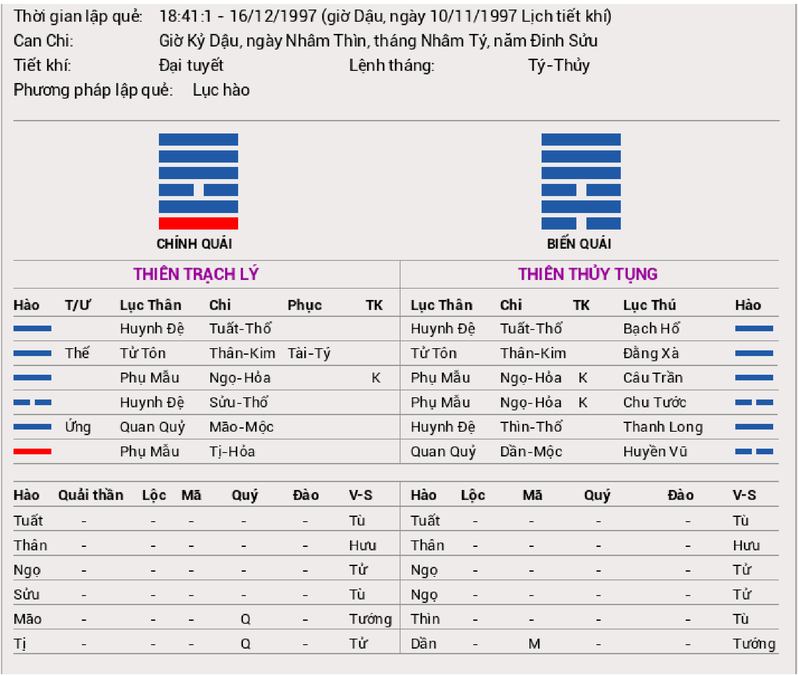
    - **Hình này chứng minh điều gì**
      - Quẻ Lý biến Tụng thể hiện Phụ Mẫu Tị hỏa động biến Dần mộc hình Tử Tôn Thân kim.
    - **Từ đâu mà thấy được**
      - Hào 1 và hào 3 động biến kích hoạt tổ hợp tam hình Dần - Tị - Thân.

##### Bảng cấu trúc Hào Quái: $\text{Thiên Trạch Lý}$ biến $\text{Thiên Thủy Tụng}$

| Hào | Thế / Ứng | Lục Thân (Chính) | Can Chi (Chính) | Phục Thần | Tuần Không | Lục Thân (Biến) | Can Chi (Biến) | Tuần Không | Lục Thú | Biểu Tượng Hào |
| :---: | :---: | :---: | :---: | :---: | :---: | :---: | :---: | :---: | :---: | :---: |
| 6 | | $\text{Huynh Đệ}$ | $\text{Tuất - Thổ}$ | | | $\text{Huynh Đệ}$ | $\text{Tuất - Thổ}$ | | $\text{Bạch Hổ}$ | ▅▅▅▅▅ |
| 5 | $\text{Thế}$ | $\text{Tử Tôn}$ | $\text{Thân - Kim}$ | $\text{Thê Tài Tý - Thủy}$ | | $\text{Tử Tôn}$ | $\text{Thân - Kim}$ | | $\text{Đằng Xà}$ | ▅▅▅▅▅ |
| 4 | | $\text{Phụ Mẫu}$ | $\text{Ngọ - Hỏa}$ | | $\text{Không}$ | $\text{Phụ Mẫu}$ | $\text{Ngọ - Hỏa}$ | $\text{Không}$ | $\text{Câu Trần}$ | ▅▅▅▅▅ |
| 3 | | $\text{Huynh Đệ}$ | $\text{Sửu - Thổ}$ | | | $\text{Phụ Mẫu}$ | $\text{Ngọ - Hỏa}$ | $\text{Không}$ | $\text{Chu Tước}$ | ▅▅  ▅▅ (Động) |
| 2 | $\text{Ứng}$ | $\text{Quan Quỷ}$ | $\text{Mão - Mộc}$ | | | $\text{Huynh Đệ}$ | $\text{Thìn - Thổ}$ | | $\text{Thanh Long}$ | ▅▅▅▅▅ |
| 1 | | $\text{Phụ Mẫu}$ | $\text{Tị - Hỏa}$ | | | $\text{Quan Quỷ}$ | $\text{Dần - Mộc}$ | | $\text{Huyền Vũ}$ | ▅▅▅▅▅ (Động) |

##### Bảng Thần Sát và Trạng Thái Vượng Tướng

| Hào | Địa Chi | Quái Thần | Lộc Tinh | Dịch Mã | Quý Nhân | Đào Hoa | Vượng Suy | Biến Chi | Lộc Tinh | Dịch Mã | Quý Nhân | Đào Hoa | Vượng Suy |
| :---: | :---: | :---: | :---: | :---: | :---: | :---: | :---: | :---: | :---: | :---: | :---: | :---: | :---: |
| 6 | $\text{Tuất}$ | - | - | - | - | - | $\text{Tù}$ | $\text{Tuất}$ | - | - | - | - | $\text{Tù}$ |
| 5 | $\text{Thân}$ | - | - | - | - | - | $\text{Hưu}$ | $\text{Thân}$ | - | - | - | - | $\text{Hưu}$ |
| 4 | $\text{Ngọ}$ | - | - | - | - | - | $\text{Tử}$ | $\text{Ngọ}$ | - | - | - | - | $\text{Tử}$ |
| 3 | $\text{Sửu}$ | - | - | - | - | - | $\text{Tù}$ | $\text{Ngọ}$ | - | - | - | - | $\text{Tử}$ |
| 2 | $\text{Mão}$ | - | - | - | Q | - | $\text{Tướng}$ | $\text{Thìn}$ | - | - | - | - | $\text{Tù}$ |
| 1 | $\text{Tị}$ | - | - | - | Q | - | $\text{Tử}$ | $\text{Dần}$ | - | M | - | - | $\text{Tướng}$ |

#### Luận giải Kỹ pháp Chi tiết

##### 1. Xác định Dụng Thần và Dấu hiệu Mang Thai
- Trong dự trắc thai sản, lấy hào $\text{Tử Tôn}$ làm $\text{Dụng Thần}$.
- Hào 5 $\text{Tử Tôn Thân Kim}$ lâm trì $\text{Thế}$, biểu thị thai nhi đã nhập vào bản thân gia đình, là dấu hiệu xác nhận việc mang thai.
- Xét theo vòng Trường Sinh, hào Thai của hành $\text{Kim}$ cư tại $\text{Mão}$ (Kim tuyệt tại Dần, thai tại Mão). Trong quẻ, hào 2 $\text{Quan Quỷ Mão Mộc}$ chính là hào mang nạp âm thai vị, lại cư đúng vị trí hào 2 (vị trí thai bào, tử cung), củng cố điềm thụ thai chuẩn xác.

##### 2. Tượng ý Mộc Dục và Trạng thái Phôi thai
- $\text{Nguyệt Kiến Tý Thủy}$ tương sinh cho hào thai $\text{Quan Quỷ Mão Mộc}$ (Thủy sinh Mộc).
- Tuy nhiên, xét theo 12 cung, $\text{Tý Thủy}$ là đất $\text{Mộc Dục}$ của $\text{Mão Mộc}$. 
- Vận dụng tượng ý của $\text{Mộc Dục}$ (khỏa thân, trơ trụi, nhẵn bóng, chưa hình thành lông tóc), có thể kết luận phôi thai vừa mới thụ hình, các cơ quan và lông tóc của thai nhi hoàn toàn chưa phát triển, tức mới cấn thai trong thời gian rất ngắn.

##### 3. Hình khắc Tam Hình và Nguy cơ Sảy thai
- Về cát hung cơ bản: Hào $\text{Tử Tôn Thân Kim}$ lâm đất $\text{Tử}$ tại $\text{Nguyệt Kiến Tý Thủy}$.
- Trong quẻ, hào 1 $\text{Phụ Mẫu Tị Hỏa}$ phát động khắc chế trực tiếp $\text{Tử Tôn Thân Kim}$.
- Động hào $\text{Phụ Mẫu Tị Hỏa}$ biến xuất $\text{Quan Quỷ Dần Mộc}$; hào biến $\text{Dần Mộc}$ cùng với động hào $\text{Tị Hỏa}$ và thế hào $\text{Thân Kim}$ kết hợp tạo thành tổ hợp $\text{Tam Hình}$ hoàn chỉnh:
$$\text{Dần} \quad - \quad \text{Tị} \quad - \quad \text{Thân} \quad (\text{Vô Ân Chi Hình})$$
- Tượng $\text{Tam Hình}$ kích phát hung sát cực nặng, dự báo phôi thai này khó có khả năng sinh hạ an toàn.

##### 4. Nhận diện Giới tính và Động cơ Nạo thai
- **Giới tính:** Hào $\text{Tử Tôn Thân Kim}$ là hào Dương, quẻ $\text{Thiên Trạch Lý}$ thuộc cung $\text{Cấn}$ (Cấn là Dương quái, biểu thị thiếu nam) $\rightarrow$ kết luận thai nhi là bé trai (nam hài).
- **Động cơ:** Xét nguyên nhân tổn hại thai nhi, $\text{Nguyệt Kiến Tý Thủy}$ vừa là đất $\text{Tử}$ của $\text{Tử Tôn Thân Kim}$, vừa hình khắc trực tiếp hào thai vị $\text{Mão Mộc}$ (hình phạt vô lễ $\text{Tý} - \text{Mão}$). Mặt khác, $\text{Tý Thủy}$ trong hệ thống lục thân đóng vai trò là $\text{Thê Tài}$ (đại diện cho người vợ). Tượng này chỉ rõ người vợ sẽ chủ động có ý định nạo phá thai.

##### 5. Tượng Ám động, Hôn thư và Tình trạng Sống chung
- Hào 6 $\text{Huynh Đệ Tuất Thổ}$ được động hào $\text{Phụ Mẫu Tị Hỏa}$ sinh trợ, lại bị $\text{Nhật Thần Thìn Thổ}$ xung kích thành $\text{Ám Động}$ để khắc đoạt $\text{Thê Tài}$.
- $\text{Thê Tài Tý Thủy}$ không hiện trên các hào chính, nhập $\text{Mộ}$ tại $\text{Nhật Thần Thìn Thổ}$, lâm $\text{Tuyệt}$ tại hào động $\text{Phụ Mẫu Tị Hỏa}$. Quẻ biến $\text{Thiên Thủy Tụng}$ là quẻ $\text{Du Hồn}$, báo hiệu quan hệ đôi bên tất sẽ ly tán, chia tay.
- Hào $\text{Phụ Mẫu}$ chủ về hôn thú, giấy chứng nhận kết hôn. Hào 1 $	ext{Phụ Mẫu Tị Hỏa}$ lâm $\text{Huyền Vũ}$ (tượng giao ước ngầm, lén lút), lại nhập $\text{Mộ}$ tại hào ám động $\text{Huynh Đệ Tuất Thổ}$, biểu thị không thể đưa ra được tờ giấy đăng ký kết hôn hợp pháp.
- $\text{Thê Tài}$ phục tàng dưới hào $\text{Thế}$, lại nhập $\text{Mộ}$ tại Nhật: Đây là tượng *"Kim ốc tàng kiều"* (nhà vàng giấu mỹ nữ). Sự việc chứng minh hai người chưa hề làm thủ tục kết hôn; người nữ trên danh nghĩa là vợ thực chất chỉ là bạn tình chung sống không giá thú.

##### 6. Xác định Ứng kỳ và Kết quả Nghiệm chứng
- Hào $\text{Tử Tôn Thân Kim}$ lâm đất $\text{Tuyệt}$ tại năm $\text{Mậu Dần}$ ($1998$), đồng thời Địa Chi $\text{Dần}$ của năm xung thực hào $\text{Thân}$, kích hoạt trọn vẹn hung cục $\text{Tam Hình}$ $\text{Dần} - \text{Tị} - \text{Thân}$.
- **Nghiệm chứng:** Thực tế hai người sống chung bất hợp pháp, người nữ mang thai. Đến tháng $\text{Mão}$ năm $\text{Mậu Dần}$, do phát sinh mâu thuẫn cãi vã kịch liệt, người phụ nữ kiên quyết đòi chia tay và tự ý đi phá thai. Thai nhi bị phá bỏ đúng là một bé trai.

---

## Chương 2: Bí mật của Phi – Phục

### Nguyên lý Phi Thần và Phục Thần

#### Bốn Pháp tắc Truyền thống của Cổ nhân
Trong thuật $\text{Lục Hào}$, khi một hào đại diện cho $\text{Dụng Thần}$ không xuất hiện trên sáu hào của chính quái, hào đó sẽ ẩn tàng dưới một hào chính quái tương ứng, gọi là $\text{Phục Thần}$; hào hiện diện bên trên che chở gọi là $\text{Phi Thần}$.

Cổ nhân đúc kết tương tác giữa $\text{Phi Thần}$ và $\text{Phục Thần}$ thành bốn mối quan hệ cơ bản:
1. **$\text{Phi sinh Phục}$:** Được trường sinh (tương sinh, có lợi cho $\text{Phục Thần}$).
2. **$\text{Phục sinh Phi}$:** Bị tiết khí (tiêu hao lực lượng của $\text{Phục Thần}$).
3. **$\text{Phi khắc Phục}$:** Bị tổn hại (bị áp chế, mang điềm hung hiểm).
4. **$\text{Phục khắc Phi}$:** Xuất bạo (bứt phá xuất hiện, chuyển biến đột ngột).

#### Đột phá Tượng học của Vương Hổ Ứng
Các nguyên tắc cổ điển trên chủ yếu tiếp cận vấn đề dưới góc độ cát hung đơn thuần, mang tính khuôn mẫu máy móc. Trong thực tế đời sống phức tạp, mối quan hệ giữa $\text{Phi Thần}$ và $\text{Phục Thần}$ là một kho tàng thông tin vi mô:
- $\text{Phi Thần}$ biểu thị cho môi trường che chở, bối cảnh không gian, người trung gian, nơi ẩn náu, hoặc đối tượng đang trực tiếp tác động lên $\text{Phục Thần}$.
- $\text{Phục Thần}$ phản ánh tâm tư, tung tích, tình trạng ẩn giấu của nhân sự hoặc đồ vật cần tìm kiếm.
- Chỉ khi phân tích mối quan hệ $\text{Phi - Phục}$ gắn liền với ngũ hành sinh khắc, thập nhị cung trường sinh và hào vị thì mới định vị chính xác những uẩn khúc không ngờ.

---

### Nghiệm chứng Thực tế: Tìm Tung tích Chồng

#### Bối cảnh và Dữ liệu Quẻ Dịch
Vào ngày $\text{Ất Dậu}$, tháng $\text{Nhâm Thìn}$, năm $\text{Bính Tý}$, Thôi nữ sĩ đến thỉnh đoán về việc chồng bỏ nhà đi, muốn biết bao giờ chồng trở về.

- **Thời gian lập quẻ:** $18:41:01$ ngày $18/04/1996$ (nhằm giờ $\text{Ất Dậu}$, ngày $15/03/1996$ Âm lịch theo Lịch Tiết Khí).
- **Can Chi:** Giờ $\text{Ất Dậu}$, ngày $\text{Ất Dậu}$, tháng $\text{Nhâm Thìn}$, năm $\text{Bính Tý}$.
- **Tiết khí:** $\text{Thanh Minh}$.
- **Nguyệt lệnh:** $\text{Thìn - Thổ}$.
- **Nhật thần:** $\text{Ất Dậu}$ (Tuần Giáp Thân, $\text{Tuần Không}$ tại $\text{Ngọ - Mùi}$).
- **Quẻ khởi:** $\text{Hỏa Sơn Lữ}$ biến $\text{Bát Thuần Cấn}$.

#### Bảng Quẻ Dịch

- Quẻ khởi Hỏa Sơn Lữ biến Bát Thuần Cấn giải đoán tung tích người chồng:
  - **Hình 2.** Bảng quẻ Hỏa Sơn Lữ biến Bát Thuần Cấn
    - 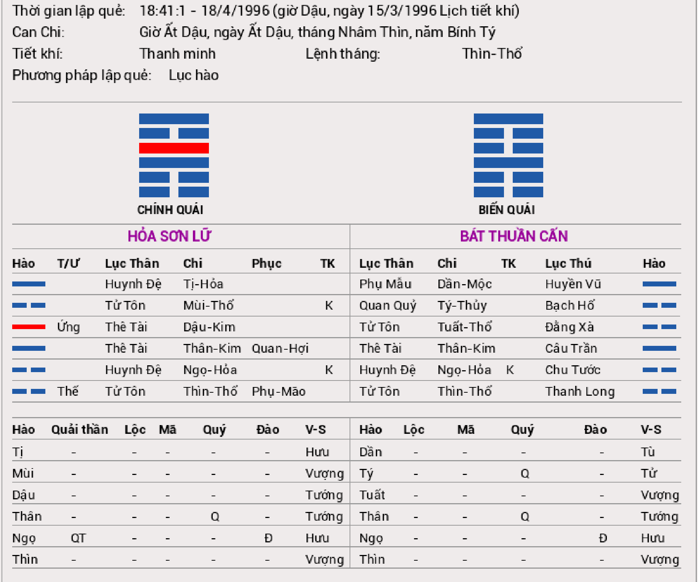
    - **Hình này chứng minh điều gì**
      - Quan Quỷ Hợi Thủy phục dưới Thê Tài Thân kim ở Cấn cung hướng Đông Bắc.
    - **Từ đâu mà thấy được**
      - Cột Phục Thần tại hào 2 mang Quan Quỷ Hợi Thủy dưới phi thần Thân kim.

##### Bảng cấu trúc Hào Quái: $\text{Hỏa Sơn Lữ}$ biến $\text{Bát Thuần Cấn}$

| Hào | Thế / Ứng | Lục Thân (Chính) | Can Chi (Chính) | Phục Thần | Tuần Không | Lục Thân (Biến) | Can Chi (Biến) | Tuần Không | Lục Thú | Biểu Tượng Hào |
| :---: | :---: | :---: | :---: | :---: | :---: | :---: | :---: | :---: | :---: | :---: |
| 6 | | $\text{Huynh Đệ}$ | $\text{Tị - Hỏa}$ | | | $\text{Phụ Mẫu}$ | $\text{Dần - Mộc}$ | | $\text{Huyền Vũ}$ | ▅▅  ▅▅ (Động) |
| 5 | | $\text{Tử Tôn}$ | $\text{Mùi - Thổ}$ | | $\text{Không}$ | $\text{Quan Quỷ}$ | $\text{Tý - Thủy}$ | | $\text{Bạch Hổ}$ | ▅▅  ▅▅ (Động) |
| 4 | $\text{Ứng}$ | $\text{Thê Tài}$ | $\text{Dậu - Kim}$ | | | $\text{Tử Tôn}$ | $\text{Tuất - Thổ}$ | | $\text{Đằng Xà}$ | ▅▅▅▅▅ (Động) |
| 3 | | $\text{Thê Tài}$ | $\text{Thân - Kim}$ | $\text{Quan Quỷ Hợi - Thủy}$ | | $\text{Thê Tài}$ | $\text{Thân - Kim}$ | | $\text{Câu Trần}$ | ▅▅  ▅▅ |
| 2 | | $\text{Huynh Đệ}$ | $\text{Ngọ - Hỏa}$ | | $\text{Không}$ | $\text{Huynh Đệ}$ | $\text{Ngọ - Hỏa}$ | $\text{Không}$ | $\text{Chu Tước}$ | ▅▅  ▅▅ |
| 1 | $\text{Thế}$ | $\text{Tử Tôn}$ | $\text{Thìn - Thổ}$ | $\text{Phụ Mẫu Mão - Mộc}$ | | $\text{Tử Tôn}$ | $\text{Thìn - Thổ}$ | | $\text{Thanh Long}$ | ▅▅  ▅▅ |

##### Bảng Thần Sát và Trạng Thái Vượng Tướng

| Hào | Địa Chi | Quái Thần | Lộc Tinh | Dịch Mã | Quý Nhân | Đào Hoa | Vượng Suy | Biến Chi | Lộc Tinh | Dịch Mã | Quý Nhân | Đào Hoa | Vượng Suy |
| :---: | :---: | :---: | :---: | :---: | :---: | :---: | :---: | :---: | :---: | :---: | :---: | :---: | :---: |
| 6 | $\text{Tị}$ | - | - | - | - | - | $\text{Hưu}$ | $\text{Dần}$ | - | - | - | - | $\text{Tù}$ |
| 5 | $\text{Mùi}$ | - | - | - | - | - | $\text{Vượng}$ | $\text{Tý}$ | - | - | Q | - | $\text{Tử}$ |
| 4 | $\text{Dậu}$ | - | - | - | - | - | $\text{Tướng}$ | $\text{Tuất}$ | - | - | - | - | $\text{Vượng}$ |
| 3 | $\text{Thân}$ | - | - | - | Q | - | $\text{Tướng}$ | $\text{Thân}$ | - | - | Q | - | $\text{Tướng}$ |
| 2 | $\text{Ngọ}$ | QT | - | - | - | Đ | $\text{Hưu}$ | $\text{Ngọ}$ | - | - | - | Đ | $\text{Hưu}$ |
| 1 | $\text{Thìn}$ | - | - | - | - | - | $\text{Vượng}$ | $\text{Thìn}$ | - | - | - | - | $\text{Vượng}$ |

#### Luận giải Kỹ pháp Chi tiết

##### 1. Định vị Dụng Thần và Tượng Xuất Ngoại
- Nữ hỏi về tung tích chồng, quy chuẩn lấy hào $\text{Quan Quỷ}$ làm $\text{Dụng Thần}$.
- Trong quẻ $\text{Hỏa Sơn Lữ}$, $\text{Quan Quỷ Hợi Thủy}$ không xuất hiện trên sáu hào mà phục tàng dưới hào 3 $\text{Thê Tài Thân Kim}$.
- Điềm báo $\text{Dụng Thần}$ không hiện, kết hợp tên quẻ là $\text{Lữ}$ (Lữ mang ý nghĩa lữ hành, phiêu bạt, ly hương) $\rightarrow$ chồng vì bất mãn đã trốn đi xa.

##### 2. Phân tích Nguyên nhân Mâu thuẫn
- Hào $\text{Thế}$ đại diện cho Thôi nữ sĩ; hào 1 $\text{Tử Tôn Thìn Thổ}$ trì $\text{Thế}$.
- Theo ngũ hành: $\text{Thổ}$ khắc $\text{Thủy}$, hào $\text{Thế}$ trì $\text{Tử Tôn}$ tương khắc trực diện với $\text{Dụng Thần Quan Quỷ Hợi Thủy}$.
- Tượng này biểu thị người vợ mang khẩu khí lấn lướt, nặng lời trách mắng, cãi vã khiến người chồng uất ức bỏ nhà ra đi.
- **Thực tế:** Thôi nữ sĩ xác nhận đúng $3$ ngày trước (ngày $\text{Quý Mùi}$), hai vợ chồng nảy sinh tranh cãi kịch liệt, bà mắng chồng *"Cút đi!"*, sau đó bà vào bếp rửa bát, khi quay ra thì chồng đã mang đồ bỏ đi, bặt vô âm tín suốt ba ngày.

##### 3. Đánh giá An nguy qua Tượng Trường Sinh
- $\text{Quan Quỷ Hợi Thủy}$ được $\text{Nhật Thần Ất Dậu}$ tương sinh (Kim sinh Thủy).
- Trong nội quái, hào 4 $\text{Thê Tài Dậu Kim}$ phát động sinh phù cho Dụng thần.
- Đáng chú ý nhất, $\text{Phục Thần Quan Quỷ Hợi Thủy}$ phục dưới $\text{Phi Thần Thê Tài Thân Kim}$ là đất $\text{Trường Sinh}$ của hành Thủy:
$$\text{Kim (Thân)} \xrightarrow{\text{Trường Sinh}} \text{Thủy (Hợi)}$$
- Tượng $\text{Trường Sinh}$ chỉ rõ người chồng ở bên ngoài an toàn tuyệt đối, được chăm lo bồi dưỡng chu đáo, không gặp bất kỳ hiểm nguy nào.

##### 4. Định vị Không gian và Nơi cư ngụ
- $\text{Phục Thần Quan Quỷ Hợi Thủy}$ phục dưới nội quái $\text{Cấn}$. Quái $\text{Cấn}$ đại diện cho phương **Đông Bắc** $\rightarrow$ chồng đã di chuyển về hướng Đông Bắc.
- $\text{Quan Quỷ}$ phục dưới $\text{Thê Tài}$ (Tài đại diện cho phụ nữ) $\rightarrow$ người chồng hiện đang tá túc tại tư gia của một người phụ nữ ở hướng Đông Bắc.

##### 5. Mối quan hệ Phi - Phục và Thân phận Người cưu mang
- $\text{Phi Thần Thê Tài Thân Kim}$ là đất $\text{Trường Sinh}$ của $\text{Hợi Thủy}$. Trường sinh là yêu thương, chăm sóc, nâng niu $\rightarrow$ người phụ nữ này đối đãi với chồng bà Thôi hết sức ân cần, chu đáo.
- Quẻ nội thuộc quái $\text{Cấn}$ (Cấn mang nghĩa dừng lại, an cư, quê quán). Hào 3 trong trật tự hào vị đại diện cho quê hương, đồng thời cũng là vị trí của $\text{Huynh Đệ}$.
- Tổng hợp toàn bộ các tín hiệu: Người chồng đã về quê quán và đang ở tại nhà người chị gái ruột của mình.
- **Nghi vấn đối chất:** Thôi nữ sĩ xác nhận quê chồng đúng ở hướng Đông Bắc, nhưng quả quyết chồng tuyệt đối không có chị gái. Thầy $\text{Vương Hổ Ứng}$ khẳng định dù có chị hay không, người chồng chắc chắn đang ở nhà một nữ nhân đối xử vô cùng tốt với anh ta.

##### 6. Xác định Ứng kỳ và Kết quả Nghiệm chứng
- Quẻ chính là $\text{Hỏa Sơn Lữ}$, quẻ biến thuần $\text{Cấn}$ (tương hợp), $\text{Dụng Thần}$ đắc khí vượng tướng nên chắc chắn người chồng sẽ trở về.
- $\text{Dụng Thần}$ phục tàng phải đợi ngày xuất hiện (xuất phục). Dự kiến ứng vào ngày $\text{Đinh Hợi}$ (Dụng thần xuất phục lộ diện). Nếu ngày $\text{Hợi}$ chưa về thì ứng vào ngày $\text{Quý Tị}$ (Nhật thần Tị xung mở Phi thần Thân kim để Phục thần lộ diện). Khoảng $20$ ngày nữa sự việc sẽ sáng tỏ.
- **Nghiệm chứng:** Đúng vào giờ $\text{Hợi}$ ngày $\text{Đinh Hợi}$, người chồng trở về nhà. Anh giãi bày do tâm trạng bực tức nên đã về quê nghỉ lại nhà của người chị ruột. Đôi bên kết hôn nhiều năm nhưng Thôi nữ sĩ hoàn toàn không hay biết chồng mình vẫn còn một người chị ruột ở quê.

---

## Chương 3: Không vong hoạt dụng

### Biện chứng Chân Không và Giả Không

#### Cơ chế Tuần Không và Phân định Bản chất
Trong thuật dự trắc $\text{Lục Hào}$, chu kỳ phối hợp giữa $10$ Thiên Can và $12$ Địa Chi tạo thành một Tuần gồm $10$ ngày. Do $12$ Địa Chi nhiều hơn $10$ Thiên Can $2$ chi, hai Địa Chi bị dư ra không có Thiên Can phối chiếu được gọi là **Tuần Không** (hay $\text{Không Vong}$).

Cổ pháp phân định $\text{Không Vong}$ thành hai trạng thái bản chất hoàn toàn trái ngược nhau:

##### 1. Giả Không (Hữu Dụng Không Vong)
- Hào tuy lâm $\text{Tuần Không}$ nhưng được $\text{Nguyệt Kiến}$ hoặc $\text{Nhật Thần}$ sinh phù trợ giúp.
- Hào lâm trạng thái $\text{Vượng Tướng}$ trong mùa.
- Hào phát động rồi hóa Không, hoặc hào phục tàng gặp Không nhưng có gốc rễ vững vàng.
- Khi bước sang tuần mới (ngày $\text{Xuất Không}$) hoặc gặp ngày tương xung với chi Không Vong (ngày $\text{Xung Không}$), hào sẽ lập tức phát huy toàn bộ năng lực cát hung.

##### 2. Chân Không (Vô Dụng Không Vong)
- Hào lâm $\text{Hưu Tù}$, vô khí, bị cả Nhật Nguyệt khắc phạt nặng nề.
- Hào tĩnh tọa phùng Không, lại lâm đất $\text{Tuyệt}$.
- Rơi vào $\text{Chân Không}$ là trạng thái mục nát, hoàn toàn rỗng không, không thể cứu vãn; mưu cầu sự việc tất bại và vĩnh viễn không có ứng kỳ thành công.

#### Hoạt dụng Tượng Không Vong trong Luận đoán Sự tình
$\text{Không Vong}$ không đơn thuần chỉ là thước đo suy giảm vượng suy ngũ hành, mà nắm giữ tầng tượng học vô cùng tinh vi:
- **Tâm lý:** Biểu thị lòng dạ không chân thật, hoang mang, nghi ngại, tâm hư, giả dối, bất an, trốn tránh.
- **Sự việc:** Biểu thị tình trạng hư danh vô thực, chưa thành tựu, thiếu hụt giấy tờ, không có sự ràng buộc pháp lý, hữu danh vô thực, sự việc tan biến như mây khói.

---

### Nghiệm chứng Thực tế: Đoán Cầu hôn

#### Bối cảnh và Dữ liệu Quẻ Dịch
Vào ngày $\text{Bính Ngọ}$, tháng $\text{Quý Tị}$, năm $\text{Bính Tý}$, một nam thanh niên ngoài $20$ tuổi đến xem quẻ hỏi về chuyện hôn nhân duyên phận.

- **Thời gian lập quẻ:** Giờ $\text{Đinh Dậu}$, ngày $\text{Bính Ngọ}$, tháng $\text{Quý Tị}$, năm $\text{Bính Tý}$.
- **Tiết khí:** $\text{Lập Hạ}$.
- **Nguyệt lệnh:** $\text{Tị - Hỏa}$.
- **Nhật thần:** $\text{Bính Ngọ}$ (Tuần Giáp Thìn, $\text{Tuần Không}$ tại $\text{Dần - Mão}$).
- **Quẻ khởi:** $\text{Sơn Thủy Mông}$ biến $\text{Thiên Phong Cấu}$.

#### Bảng Quẻ Dịch

- Quẻ khởi Sơn Thủy Mông biến Thiên Phong Cấu giải đoán hôn nhân cầu thân:
  - **Hình 3.** Sơ đồ quẻ Sơn Thủy Mông biến Thiên Phong Cấu
    - 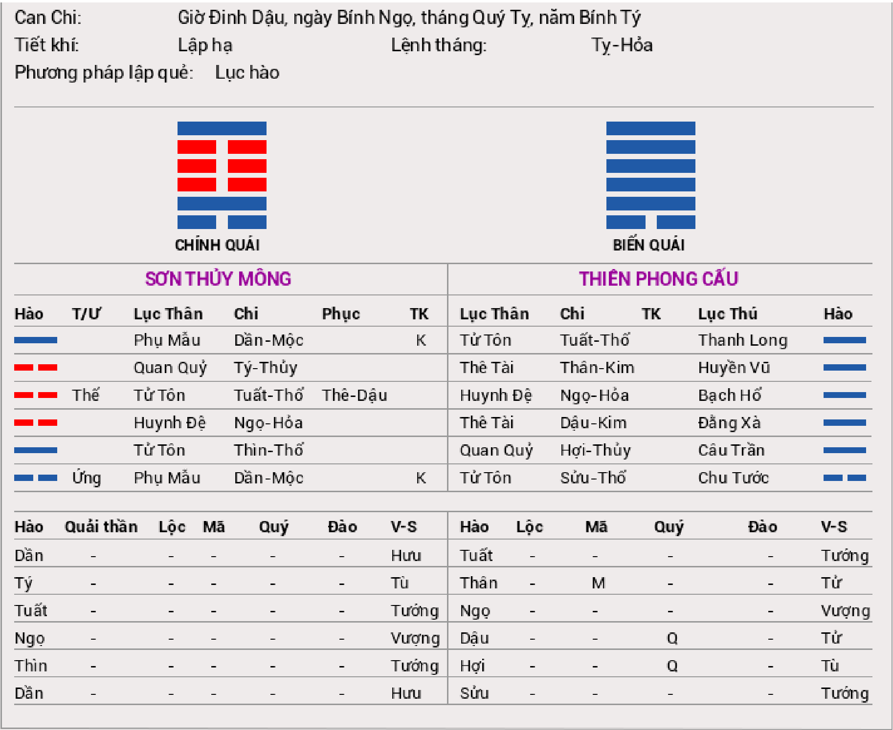
    - **Hình này chứng minh điều gì**
      - Ứng hào Tuất thổ lâm không vong và Thê Tài không hiện trên quẻ.
    - **Từ đâu mà thấy được**
      - Cột Thế Ứng và Tuần Không chỉ rõ hào Ứng lâm không vong tuần Giáp Ngọ.

##### Bảng cấu trúc Hào Quái: $\text{Sơn Thủy Mông}$ biến $\text{Thiên Phong Cấu}$

| Hào | Thế / Ứng | Lục Thân (Chính) | Can Chi (Chính) | Phục Thần | Tuần Không | Lục Thân (Biến) | Can Chi (Biến) | Tuần Không | Lục Thú | Biểu Tượng Hào |
| :---: | :---: | :---: | :---: | :---: | :---: | :---: | :---: | :---: | :---: | :---: |
| 6 | | $\text{Phụ Mẫu}$ | $\text{Dần - Mộc}$ | | $\text{Không}$ | $\text{Tử Tôn}$ | $\text{Tuất - Thổ}$ | | $\text{Thanh Long}$ | ▅▅  ▅▅ (Động) |
| 5 | | $\text{Quan Quỷ}$ | $\text{Tý - Thủy}$ | | | $\text{Thê Tài}$ | $\text{Thân - Kim}$ | | $\text{Huyền Vũ}$ | ▅▅  ▅▅ (Động) |
| 4 | $\text{Thế}$ | $\text{Tử Tôn}$ | $\text{Tuất - Thổ}$ | $\text{Thê Tài Dậu - Kim}$ | | $\text{Huynh Đệ}$ | $\text{Ngọ - Hỏa}$ | | $\text{Bạch Hổ}$ | ▅▅  ▅▅ (Động) |
| 3 | | $\text{Huynh Đệ}$ | $\text{Ngọ - Hỏa}$ | | | $\text{Thê Tài}$ | $\text{Dậu - Kim}$ | | $\text{Đằng Xà}$ | ▅▅  ▅▅ (Động) |
| 2 | | $\text{Tử Tôn}$ | $\text{Thìn - Thổ}$ | | | $\text{Quan Quỷ}$ | $\text{Hợi - Thủy}$ | | $\text{Câu Trần}$ | ▅▅▅▅▅ (Động) |
| 1 | $\text{Ứng}$ | $\text{Phụ Mẫu}$ | $\text{Dần - Mộc}$ | | $\text{Không}$ | $\text{Tử Tôn}$ | $\text{Sửu - Thổ}$ | | $\text{Chu Tước}$ | ▅▅  ▅▅ |

##### Bảng Thần Sát và Trạng Thái Vượng Tướng

| Hào | Địa Chi | Quái Thần | Lộc Tinh | Dịch Mã | Quý Nhân | Đào Hoa | Vượng Suy | Biến Chi | Lộc Tinh | Dịch Mã | Quý Nhân | Đào Hoa | Vượng Suy |
| :---: | :---: | :---: | :---: | :---: | :---: | :---: | :---: | :---: | :---: | :---: | :---: | :---: | :---: |
| 6 | $\text{Dần}$ | - | - | - | - | - | $\text{Hưu}$ | $\text{Tuất}$ | - | - | - | - | $\text{Tướng}$ |
| 5 | $\text{Tý}$ | - | - | - | - | - | $\text{Tù}$ | $\text{Thân}$ | - | M | - | - | $\text{Tử}$ |
| 4 | $\text{Tuất}$ | - | - | - | - | - | $\text{Tướng}$ | $\text{Ngọ}$ | - | - | - | - | $\text{Vượng}$ |
| 3 | $\text{Ngọ}$ | - | - | - | - | - | $\text{Vượng}$ | $\text{Dậu}$ | - | - | Q | - | $\text{Tử}$ |
| 2 | $\text{Thìn}$ | - | - | - | - | - | $\text{Tướng}$ | $\text{Hợi}$ | - | - | Q | - | $\text{Tù}$ |
| 1 | $\text{Dần}$ | - | - | - | - | - | $\text{Hưu}$ | $\text{Sửu}$ | - | - | - | - | $\text{Tướng}$ |

#### Luận giải Kỹ pháp Chi tiết

##### 1. Định vị Dụng Thần và Tượng Cầu Hôn
- Nam giới chiêm đoán hôn nhân tất lấy hào $\text{Thê Tài}$ làm $\text{Dụng Thần}$.
- Trên sáu hào của chính quái $\text{Sơn Thủy Mông}$, $\text{Thê Tài}$ hoàn toàn không xuất hiện, chỉ phục tàng dưới hào 4 $\text{Thế}$ ($\text{Thê Tài Dậu Kim}$ phục dưới $\text{Tử Tôn Tuất Thổ}$).
- Việc $\text{Thê Tài}$ không hiện diện trên quẻ biểu thị trong cuộc sống hiện thực chàng trai chưa hề có bạn gái hay đối tượng kết hôn chính thức. Do đó, bản chất của quẻ này là xem về việc đang đơn phương tìm kiếm, theo đuổi một người nữ.

##### 2. Ý nghĩa Không Vong tại Ứng Hào và Hôn Thư
- Hào 1 $\text{Phụ Mẫu Dần Mộc}$ lâm $\text{Ứng}$ là thê vị (vị trí đại diện cho đối phương). Hào $\text{Ứng}$ lâm $\text{Dần Mộc}$ rơi đúng vào $\text{Tuần Không}$ $\rightarrow$ đối phương không có lòng dạ chân thành, không muốn đón nhận tình cảm.
- Hào $\text{Phụ Mẫu}$ tượng trưng cho hôn thư, giá thú, sính lễ cưới hỏi. Hào $\text{Phụ Mẫu}$ phùng $\text{Không}$ khẳng định hai người chưa từng có bất kỳ thỏa ước hôn nhân nào.
- Hào $\text{Phụ Mẫu}$ còn đại diện cho trưởng bối, bà mối chủ hôn. Hào $\text{Phụ Mẫu}$ lâm $\text{Không}$ chứng tỏ mối quan hệ này không có người mai mối hay gia đình hai bên vun vén, hoàn toàn do chàng trai tự ý hành động.

##### 3. Vị trí Đối phương và Dấu hiệu Đồng hương
- Hào 4 $\text{Thế}$ là $\text{Tử Tôn Tuất Thổ}$ phát động sinh phù cho $\text{Thê Tài}$ (Thổ sinh Kim), biểu thị người nam đang vô cùng chủ động, cuồng nhiệt theo đuổi đối phương.
- Phục Thần $\text{Thê Tài Dậu Kim}$ phục tàng ngay dưới hào $\text{Thế}$ $\rightarrow$ cô gái này có khoảng cách sinh sống rất gần gũi với anh ta.
- **Biện chứng Đồng hương:**
  - Cổ nhân có định chế: *"Hào ba hào bốn là quê hương"* (Tam tứ hào vi hương địa). Hào Thế cư đúng vị trí hào 4.
  - Mặt khác, $\text{Thê Tài Dậu Kim}$ đắc $\text{Trường Sinh}$ tại $\text{Nguyệt Kiến Tị Hỏa}$ (Kim trường sinh tại Tị).
  - Hào $\text{Thế Tử Tôn Tuất Thổ}$ cũng được $\text{Nguyệt Lệnh Tị Hỏa}$ tương sinh (Hỏa sinh Thổ).
  - Cả $\text{Thế}$ và $\text{Tài}$ đều cùng đón nhận sinh khí từ một cội nguồn $\text{Nguyệt Lệnh Tị Hỏa}$ $\rightarrow$ cô gái mà chàng trai đang theo đuổi chính là người cùng quê (đồng hương).

##### 4. Thái độ Đối phương và Tượng Cưỡng ép
- Hào $\text{Ứng Phụ Mẫu Dần Mộc}$ phùng $\text{Tuần Không}$, lại mang hành $\text{Mộc}$ tương khắc ngược lại hào $\text{Thế Tử Tôn Tuất Thổ}$ (Mộc khắc Thổ) $\rightarrow$ trong lòng cô gái không hề có chút tình cảm nào, ngược lại vô cùng chán ghét và bài xích chàng trai.
- Hào $\text{Thê Tài}$ không hiện trên quẻ biểu thị cô gái luôn tìm mọi cách trốn tránh, không muốn chạm mặt anh ta.
- Đáng chú ý, hào 3 $\text{Huynh Đệ Ngọ Hỏa}$ phát động hóa xuất $\text{Thê Tài Dậu Kim}$. $\text{Huynh Đệ}$ là thần cướp đoạt tài vật; Huynh động hóa Tài là tượng cưỡng bức, ép buộc. Hào 3 lại lâm $\text{Đằng Xà}$ (Đằng Xà chủ quấn quýt si mê, dính chặt không buông) $\rightarrow$ chàng trai dùng thủ đoạn bám riết không rời, quấy rầy thô bạo khiến cô gái vô cùng sợ hãi và phiền toái.

##### 5. Đánh giá Cát hung Tổng thể
- $\text{Thê Tài Dậu Kim}$ rơi vào đất $\text{Tử}$ tại Nhật nguyệt $\text{Tị - Ngọ}$ (Hỏa vượng Kim tiêu, bị khắc phạt kiệt quệ).
- Quẻ nội hào 3 $\text{Huynh Đệ Ngọ Hỏa}$ phát động khắc chế $\text{Tài Hào}$.
- Hào $\text{Ứng}$ lâm $\text{Không}$ lại tương khắc hào $\text{Thế}$.
- Toàn bộ cục diện đều chỉ hướng thất bại triệt để; mối quan hệ này hoàn toàn vô vọng, không thể thành đôi.

##### 6. Kết quả Nghiệm chứng Thực tế
- Toàn bộ phán đoán ứng nghiệm tuyệt đối: Chàng trai thừa nhận đang liều mạng theo đuổi một cô gái cùng quê; tuy nhiên cô gái kiên quyết khước từ, liên tục lẩn tránh mọi cuộc gặp. Cuối cùng nỗ lực theo đuổi hoàn toàn tan vỡ, không mang lại kết quả.

## Chương 4: Quẻ Do Ai Đến Gieo!

### 1. Cơ Sở Lý Luận Và Bản Chất Của Thao Tác Gieo Quẻ

#### 1.1. Phê Phán Khuynh Hướng Sai Lệch Trong Học Thuật Lục Hào

##### 1.1.1. Hiện Tượng "Nay Tần Mai Sở" Và Nhận Thức Sai Lầm Về Kỳ Môn, Lục Nhâm
- Trong giới nghiên cứu và thực hành dự đoán học thuật phương Đông, một hiện tượng tâm lý phổ biến nhưng tối kỵ là trạng thái "nay Tần mai Sở" — học tập thiếu kiên định, đứng núi này trông núi nọ, không đi đến nơi đến chốn.
- Nhiều người sau khi tiếp cận môn $\text{Lục Hào}$ trong một thời gian ngắn thường nảy sinh tâm lý thoái thác, cho rằng môn học này phức tạp và bất tiện hơn so với $\text{Kỳ Môn Độn Giáp}$ hoặc $\text{Đại Lục Nhâm}$. Họ lập luận rằng:
  - $\text{Kỳ Môn}$ và $\text{Lục Nhâm}$ chỉ cần căn cứ vào mốc thời gian khách quan, phương vị không gian, hoặc con số ngẫu nhiên do người hỏi cung cấp là có thể khởi bàn lập trắc cục. Người muốn dự trắc thậm chí không cần xuất đầu lộ diện, không cần gặp mặt trực tiếp.
  - Ngược lại, $\text{Lục Hào}$ theo quy chuẩn cổ điển đòi hỏi phải có đồng tiền gieo quẻ, dẫn đến việc khi thân chủ ở xa hoặc trong hoàn cảnh cấp bách thì không thể lập quẻ.
- Từ ngộ nhận này, nhiều học viên vội vã từ bỏ $\text{Lục Hào}$ để chạy theo các bộ môn khác, hoặc tìm cách chắp vá phương pháp một cách tùy tiện.

##### 1.1.2. Hạn Chế Bản Chất Khi Dùng Mai Hoa Dịch Số Để Lập Quẻ Lục Hào
- Để bù đắp sự khó khăn trong khâu thu thập quẻ tượng từ xa, một số người đã vay mượn phương pháp khởi quẻ của $\text{Mai Hoa Dịch Số}$ (dựa vào thời gian, âm thanh, số đo, chữ viết) rồi áp đặt hệ thống lục thân, thế ứng, can chi của $\text{Lục Hào}$ vào giải đoán. Dưới góc độ thao tác, cách làm này tạo cảm giác linh hoạt và đa dạng, nhưng trên thực tế nó làm suy giảm nghiêm trọng dung lượng thông tin dự trắc:
  - **Giới hạn số lượng biến hóa:** Quẻ $\text{Mai Hoa Dịch Số}$ bản chất chỉ có duy nhất một hào động. Với $64$ quẻ, mỗi quẻ chỉ có $6$ loại biến hóa đơn lẻ, tổng cộng toàn hệ thống chỉ sản sinh $64 \times 6 = 384$ đồ hình biến hóa (khóa biến). Do đó, phương pháp này bắt buộc phải phụ thuộc vào việc bóc tách thông tin từ Quẻ Chủ, Quẻ Hỗ và Quẻ Biến để bù đắp sự thiếu hụt.
  - **Dung lượng thông tin khổng lồ của Lục Hào:** Trong $\text{Lục Hào}$, mỗi quẻ gồm $6$ hào độc lập, mỗi hào đều mang tiềm năng động hoặc tĩnh theo luật xác suất ngẫu nhiên. Số trạng thái động tĩnh cơ bản của một quẻ là $2^6 = 64$. Khi kết hợp $64$ quẻ gốc với $64$ trạng thái biến đổi toàn phần, số lượng biến quẻ cơ bản trong một ngày đã đạt mức:
    $$64 \times 64 = 4.096 \text{ biến hóa}$$
    Hơn thế nữa, khi tích hợp các tham số thực tế đa chiều:
    - Sự kiện hỏi khác biệt (hôn nhân, quan vận, tài vận, tật bệnh, xuất hành...).
    - Nhân khẩu học của thân chủ (giới tính, tuổi tác, niên mệnh Can Chi).
    - Trục thời gian vũ trụ biến thiên theo từng Năm ($\text{Thái Tuế}$), Tháng ($\text{Nguyệt Lệnh}$), Ngày ($\text{Nhật Thần}$), Giờ ($\text{Thời Thần}$).
    Tổng số tổ hợp thông tin thực tế mở rộng lên đến hàng triệu, thậm chí hàng chục triệu biến số. Dung lượng thông tin mà $\text{Lục Hào}$ dung nạp phong phú và sâu sắc hơn hẳn so với $\text{Mai Hoa Dịch Số}$.
  - **Sự xung đột về phương thức nạp quái:** Bản chất cấu trúc hai phương pháp đối nghịch nhau: $\text{Mai Hoa Dịch Số}$ định hình ngoại quái (thượng quái) trước rồi mới định nội quái (hạ quái); trong khi $\text{Lục Hào}$ kiến tạo từ dưới lên trên, bắt đầu từ $\text{Sơ hào}$ tuần tự tiến lên $\text{Thượng hào}$.
  - **Mất mát các hình thái dự trắc đặc thù:** Mặc dù việc dùng số $\text{Mai Hoa}$ luận $\text{Lục Hào}$ đôi khi vẫn có sự trùng khớp ngẫu nhiên, nhưng do bị bó hẹp trong phạm vi một hào động, quẻ tượng hoàn toàn triệt tiêu khả năng xuất hiện các cách cục biến hóa tầng cao như:
    - Phục ngâm ($\text{Phục Ngâm}$) và Phản ngâm ($\text{Phản Ngâm}$).
    - Tam hợp cục ngũ hành ($\text{Tam Hợp}$).
    - Nhiều hào cùng động tạo thế tương xung, tương khắc, hóa tiến thần hoặc hóa thoái thần.
    Sự thiếu hụt này làm méo mó độ chuẩn xác trong việc định vị cát hung cũng như tính toán $\text{Ứng kỳ}$. Vì vậy, phương thức lập quẻ tối ưu và chuẩn xác nhất của $\text{Lục Hào}$ vẫn dứt khoát phải là thao tác gieo quẻ bằng đồng tiền.

---

#### 1.2. Giải Quyết Vấn Đề Khoảng Cách Địa Lý Và Tâm Lý Cổ Truyền

##### 1.2.1. Phản Biện Quan Điểm Truyền Thống "Tâm Thành Tất Linh"
- Khi thân chủ ở khoảng cách xa không thể diện kiến, hoặc trong các tình huống khẩn cấp, việc thu thập quẻ tượng gặp nhiều rào cản. Sách vở cổ nhân từ xưa luôn đóng khung tư duy người học bằng tín điều "tâm thành tất linh" — cho rằng người gieo quẻ phải tĩnh tâm tuyệt đối, tập trung toàn bộ tâm trí vào sự việc muốn hỏi thì quẻ mới ứng.
- Khi quẻ giải đoán không linh nghiệm, các nhà thuật số truyền thống thường đổ lỗi cho việc người gieo "tâm loạn", thiếu thành kính.
- Đây là cách giải thích phi khoa học và che đậy hạn chế nhận thức. Trong thực tế lâm sàng, sự thất bại của một ca dự đoán bắt nguồn từ nhiều nguyên nhân khách quan:
  - Bản thân dự đoán sư trình độ nhận định còn non kém, giải đoán sai lệch hào vị và dụng thần.
  - Thân chủ do quá căng thẳng hoặc suy nghĩ kéo dài dẫn đến trạng thái "động niệm quá lâu", gây nhiễu loạn thời điểm ngắt mạch thông tin.
  - Hệ thống lý luận của người học chưa hoàn thiện, chưa khám phá hết các quy luật tinh vi ẩn tàng trong dịch lý.

##### 1.2.2. Nguyên Nhân Quẻ Không Ứng Nghiệm Trong Thực Tế
- Không thể quy kết mọi quẻ sai lệch cho sự thiếu thành tâm. Qua hàng ngàn ca thực nghiệm dự trắc, Vương Hổ Ứng phát hiện ra rằng cốt lõi của quẻ tượng nằm ở chính **ý niệm khởi phát ban đầu** của người muốn xem.
- Chỉ cần trong tâm trí thân chủ xuất hiện một ý niệm muốn dự trắc — bất kể trong khoảnh khắc đó họ có mang tâm trạng căng thẳng cao độ hay chỉ hỏi một cách tình cờ, bâng quơ — thì trường thông tin vũ trụ đã lập tức được kích hoạt. Quẻ tượng thu được luôn phản ánh trung thực một lát cắt tình trạng thực tế tương ứng với họ.

---

#### 1.3. Bản Chất Trường Thông Tin Vũ Trụ Và Phê Phán Mật Chú Mê Tín

##### 1.3.1. Cơ Chế Ma Trận Thông Tin Vũ Trụ (Cosmic Information Field)
- Thao tác gieo ba đồng tiền thực chất chỉ là một **công cụ rút mẫu ngẫu nhiên** (random sampling mechanism) nhằm bắt sóng trường thông tin vũ trụ tại thời điểm ý niệm phát sinh.
- **Tính khả hoán của người gieo quẻ:** Vì bản chất là sự truyền dẫn trường ý niệm trong ma trận thông tin vũ trụ, nên:
  - Bản thân người muốn xem trực tiếp gieo quẻ.
  - Dự đoán sư tự tay gieo quẻ thay cho thân chủ (khi nhận điện thoại hoặc thư từ, email).
  - Một người thứ ba bất kỳ đang có mặt bên cạnh dự đoán sư gieo quẻ hộ.
  Cả ba hình thức trên đều mang lại giá trị phản ánh thông tin hoàn toàn tương đương, không làm suy giảm mảy may độ chuẩn xác của quẻ tượng.
- **Sự giải phóng khỏi gánh nặng tâm lý:** Người đứng ra gieo thay hoàn toàn không cần phải suy nghĩ trong đầu xem mình đang gieo cho ai, đang hỏi việc gì. Chỉ cần thả lỏng tự nhiên, buông rơi các đồng tiền để thu được quẻ tượng. Khi tiến hành giải quẻ, dự đoán sư vẫn áp dụng nguyên tắc chọn $\text{Dụng thần}$ theo đúng mối quan hệ của thân chủ như thường lệ.

##### 1.3.2. Bác Bỏ Các Hành Vi Thần Bí Hóa, Nghi Thức Và Mật Chú Trục Lợi
- Trong xã hội đương thời, xuất hiện một số người truyền bá các tà thuyết mê tín dị đoan: yêu cầu trước khi gieo quẻ phải đọc thần chú bí truyền, tụng niệm mật ngữ, thắp hương khấn vái quỷ thần để quẻ thêm phần linh ứng.
- Vương Hổ Ứng kịch liệt phê phán những chiêu trò này. Đây thuần túy là những thủ đoạn lòe bịp thần bí nhằm thao túng tâm lý và trục lợi tiền bạc từ khách hàng nhẹ dạ cả tin.
- Nguyên lý vận hành của $\text{Bát Quái}$ và $\text{Lục Hào}$ không có bất kỳ liên hệ nào với thần linh, ma quỷ hay thế lực siêu nhiên. Đây là quy luật phản ánh khách quan của hệ thống trường thông tin vũ trụ. Khi gieo quẻ, tuyệt đối không cần lập bàn cầu nguyện, không cần cử hành nghi lễ tôn giáo, và càng không cần niệm bất kỳ mật chú nào.

---

### 2. Bốn Án Lệ Thực Nghiệm Minh Họa Các Hình Thức Gieo Quẻ

#### 2.1. Ví Dụ 1: Gieo Quẻ Trực Tiếp Khi Thân Chủ Không Có Ý Niệm Cụ Thể

##### 2.1.1. Bối Cảnh Tiếp Xúc Và Dữ Liệu Khởi Quẻ
- **Bối cảnh:** Ngày $\text{Kỷ Mão}$, tháng $\text{Đinh Sửu}$, năm $\text{Kỷ Mão}$, một người bạn học thời đại học đột ngột liên lạc mời tác giả đến gặp mặt một vị khách người Nhật Bản. Người khách này là bạn thâm giao nhiều năm của người bạn học, nghe danh tác giả am hiểu Kinh Dịch nên tò mò muốn trải nghiệm xem bốc dịch diễn ra như thế nào. Sau khi trao đổi ngắn gọn, vị khách bảo muốn thử xem một quẻ. Tác giả đưa cho ông ta ba đồng tiền để tự gieo.
- **Thời gian lập quẻ:** 18:41:01 – Ngày 22/01/2000 (Dương lịch).
  - Tiết khí: $\text{Đại hàn}$ (Lệnh tháng: $\text{Sửu-Thổ}$).
  - Bát tự thời gian: Giờ $\text{Quý Dậu}$, ngày $\text{Kỷ Mão}$, tháng $\text{Đinh Sửu}$, năm $\text{Kỷ Mão}$.
  - Tuần không: Ngày $\text{Kỷ Mão}$ thuộc tuần $\text{Giáp Tuất}$ $\rightarrow$ $\text{Thân-Kim}$ và $\text{Dậu-Kim}$ lâm $\text{Tuần Không}$.
  - Phương pháp lập quẻ: Gieo đồng tiền truyền thống $\rightarrow$ Đạt được quẻ thuần tĩnh: $\text{Thiên Trạch Lý}$.

##### 2.1.2. Thiết Lập Bảng Quẻ Thiên Trạch Lý

- Quẻ khởi Thiên Trạch Lý giải đoán sự nghiệp và vận mệnh người tự do:
  - **Hình 4.** Bảng quẻ Lục Hào: Thiên Trạch Lý
    - 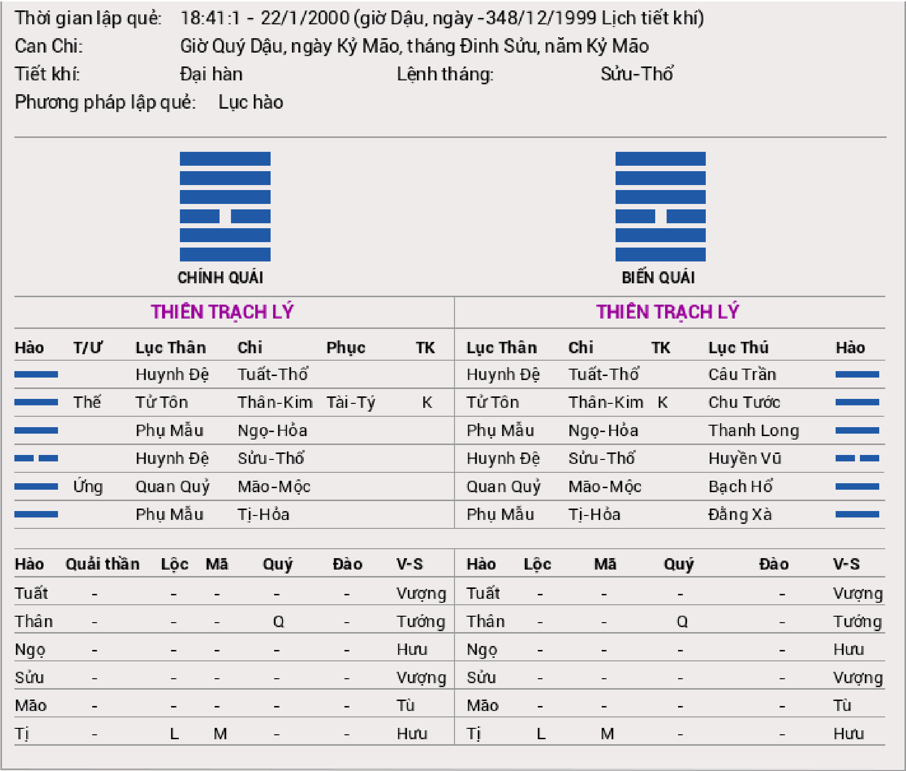
    - **Hình này chứng minh điều gì**
      - Quan Quỷ lâm Ứng hào và Tử Tôn Thân kim trì Thế được Nguyệt sinh.
    - **Từ đâu mà thấy được**
      - Hào 5 Thế Tử Tôn Thân kim hưu tù nhưng vô bệnh, không theo nghiệp quan trường.

*Bảng cấu trúc chi tiết quẻ Thiên Trạch Lý:*

| Hào | Thế / Ứng | Lục Thân | Địa Chi - Ngũ Hành | Phục Thần | Tiệt Lộ | Lục Thú | Trạng Thái Quẻ |
| :---: | :---: | :---: | :---: | :---: | :---: | :---: | :---: |
| 6 | | $\text{Huynh Đệ}$ | $\text{Tuất-Thổ}$ | | | $\text{Câu Trần}$ | — (Dương) |
| 5 | $\text{Thế}$ | $\text{Tử Tôn}$ | $\text{Thân-Kim}$ | $\text{Tài-Tý}$ | K | $\text{Chu Tước}$ | — (Dương) |
| 4 | | $\text{Phụ Mẫu}$ | $\text{Ngọ-Hỏa}$ | | | $\text{Thanh Long}$ | — (Dương) |
| 3 | | $\text{Huynh Đệ}$ | $\text{Sửu-Thổ}$ | | | $\text{Huyền Vũ}$ | - - (Âm) |
| 2 | $\text{Ứng}$ | $\text{Quan Quỷ}$ | $\text{Mão-Mộc}$ | | | $\text{Bạch Hổ}$ | — (Dương) |
| 1 | | $\text{Phụ Mẫu}$ | $\text{Tị-Hỏa}$ | | | $\text{Đằng Xà}$ | — (Dương) |

*Bảng tra Thần Sát và Ngũ Hành Vượng Tướng:*

| Địa Chi | Quái Thân | Lộc Thần | Dịch Mã | Quý Nhân | Đào Hoa | Vượng Suy |
| :---: | :---: | :---: | :---: | :---: | :---: | :---: |
| $\text{Tuất-Thổ}$ | - | - | - | - | - | $\text{Vượng}$ |
| $\text{Thân-Kim}$ | - | - | - | $\text{Quý}$ | - | $\text{Tướng}$ (Lâm Không) |
| $\text{Ngọ-Hỏa}$ | - | - | - | - | - | $\text{Hưu}$ |
| $\text{Sửu-Thổ}$ | - | - | - | - | - | $\text{Vượng}$ |
| $\text{Mão-Mộc}$ | - | - | - | - | - | $\text{Tù}$ |
| $\text{Tị-Hỏa}$ | - | $\text{Lộc}$ | $\text{Mã}$ | - | - | $\text{Hưu}$ |

##### 2.1.3. Tiến Trình Luận Giải Chi Tiết Sáu Tầng Tượng
Sau khi gieo xong quẻ, tác giả hỏi vị khách muốn xem về việc gì. Ông ta đáp rằng không có việc gì cụ thể muốn hỏi, chỉ muốn xem tổng quát vận mệnh. Tác giả khai thác trường thông tin trong quẻ thuần tĩnh $\text{Thiên Trạch Lý}$ qua sáu tầng phân tích:

- **Tầng 1: Tính cách và tâm thái:**
  - Hào 5 $\text{Thế}$ hào mang $\text{Tử Tôn Thân-Kim}$. Trong $\text{Lục Hào}$, $\text{Tử Tôn}$ được định danh là "Khoái hoạt chi thần" (vị thần của niềm vui và sự thanh thản).
  - Khi $\text{Tử Tôn}$ trì $\text{Thế}$, chủ thể là người có lối sống an nhiên, vô ưu vô lo, không màng danh lợi bon chen, thuộc mẫu người của trường phái hưởng thụ sự tự do và bình yên trong tâm hồn.

- **Tầng 2: Năng khiếu và đam mê nghề nghiệp:**
  - $\text{Tử Tôn}$ đồng thời là "Nghệ thuật chi tinh" (sao nghệ thuật, sáng tạo thẩm mỹ).
  - Hào $\text{Thế}$ mang $\text{Thân-Kim}$ lâm $\text{Tuần Không}$ trong ngày $\text{Kỷ Mão}$. Theo nguyên lý dịch học kinh điển: *"Kim không tắc minh"* ($\text{Kim}$ gặp chân không thì phát ra tiếng vang lớn như chuông đồng rỗng ruột).
  - Lại xét mối tương quan với thời gian: $\text{Thân-Kim}$ nhập Mộ tại $\text{Nguyệt Lệnh}$ $\text{Sửu-Thổ}$ ($\text{Kim}$ mộ tại $\text{Sửu}$). Tượng nhập Mộ tại Nguyệt là biểu hiện của trạng thái say mê cuồng nhiệt, "như say như dại", đắm chìm toàn bộ tâm trí vào đam mê.
  - Hào 5 lại lâm linh thú $\text{Chu Tước}$ (chủ về thanh âm, ca hát, ngôn từ).
  - $\rightarrow$ Đoán định: Vị khách cực kỳ đam mê nghệ thuật, có danh tiếng nhất định trong giới chuyên môn và rất yêu thích ca hát.

- **Tầng 3: Đặc điểm vận động và xuất hành:**
  - Quẻ có tôn danh là $\text{Thiên Trạch Lý}$ ($\text{Lý}$ mang ý nghĩa hành tẩu, bước đi trên con đường phiêu bạt).
  - $\text{Sơ hào}$ tượng trưng cho đôi chân. Tại sơ hào ngự trị $\text{Phụ Mẫu Tị-Hỏa}$, lâm $\text{Dịch Mã}$ (ngày $\text{Mão}$ lấy $\text{Tị}$ làm $\text{Dịch Mã}$).
  - Địa chi $\text{Tị-Hỏa}$ lục hợp trực tiếp với hào $\text{Thế}$ $\text{Thân-Kim}$ ($\text{Tị - Thân}$ tương hợp). Chân mang $\text{Dịch Mã}$ hợp chặt vào thân mệnh $\rightarrow$ tượng đôi chân không bao giờ chịu ngồi yên một chỗ, quanh năm suốt tháng bốn mùa chu du khắp các quốc gia trên thế giới.

- **Tầng 4: Quan vận và cơ cấu nghề nghiệp:**
  - Xét hệ thống dụng thần công danh: Trong toàn quẻ, hào $\text{Quan Quỷ Mão-Mộc}$ hoàn toàn cô độc, không có $\text{Nguyên Thần}$ sinh trợ (hào $\text{Thê Tài Tý-Thủy}$ phục tàng dưới hào 5 không xuất hiện trên quẻ chủ).
  - Thân mệnh lại bị $\text{Tử Tôn}$ trì $\text{Thế}$ khắc chế $\text{Quan Quỷ}$. Quẻ lại có $\text{Phụ Mẫu}$ lưỡng hiện ($\text{Tị-Hỏa}$ tại sơ hào và $\text{Ngọ-Hỏa}$ tại hào 4).
  - $\rightarrow$ Đoán định: Cả đời ông ta không có vận làm quan, không có công việc cố định theo giờ giấc hành chính, không biên chế tại bất kỳ cơ quan nhà nước hay tập đoàn nào; hoàn toàn là một người hoạt động tự do.

- **Tầng 5: Năng lực tài chính:**
  - $\text{Thê Tài Tý-Thủy}$ phục tàng dưới hào $\text{Thế}$ $\text{Thân-Kim}$. Tài phục dưới $\text{Thế}$ biểu thị tiền bạc luôn theo sát bên mình, không bao giờ thiếu thốn chi tiêu thường nhật.
  - Tuy nhiên, $\text{Tý-Thủy}$ ở vào trạng thái Hưu tù tại tháng $\text{Sửu-Thổ}$ và ngày $\text{Mão-Mộc}$, nên quy mô tài chính ở mức ổn định đủ dùng chứ không phải tầng lớp đại phú gia tích lũy tài sản khổng lồ.

- **Tầng 6: Thể chất và nhân cách xã hội:**
  - $\text{Tử Tôn}$ trì $\text{Thế}$ được $\text{Nguyệt Lệnh}$ $\text{Sửu-Thổ}$ tương sinh ($\text{Thổ}$ sinh $\text{Kim}$).
  - Hào $\text{Quan Quỷ Mão-Mộc}$ (chủ bệnh tật, tai ương) ngự tại hào $\text{Ứng}$. Hào $\text{Thế}$ $\text{Thân-Kim}$ khắc chế hào $\text{Ứng}$ $\text{Mão-Mộc}$ ($\text{Kim}$ khắc $\text{Mộc}$).
  - Bản mệnh khắc chế mầm bệnh nên cả đời thể chất kiện khang, không mắc bệnh nan y nguy hiểm. Ngược lại, mang tâm tính của $\text{Tử Tôn}$ vượng tướng, ông ta luôn biết hy sinh vì người khác, có xu hướng giúp đỡ tha nhân xoa dịu nỗi đau và mang lại niềm vui cho cộng đồng.

##### 2.1.4. Đối Chiếu Thực Nghiệm Và Đúc Kết Kỹ Pháp
- **Đối chiếu thực tế:** Người bạn học và vị khách Nhật Bản vô cùng kinh ngạc xác nhận toàn bộ 6 luận điểm đều chính xác tuyệt đối. Vị khách không có công việc cố định, là một **nhiếp ảnh gia tự do** nổi tiếng. Hàng năm, ông dành hơn nửa thời gian chu du khắp nơi trên thế giới để săn ảnh nghệ thuật, sau đó tổ chức các triển lãm cá nhân tại Nhật Bản được công chúng đón nhận nhiệt liệt. Nguồn thu nhập duy nhất của ông đến từ các tác phẩm nhiếp ảnh.
- **Kỹ pháp đúc kết:** Trường hợp này chứng minh rằng, ngay cả khi người hỏi không mang cảm xúc mãnh liệt hay sự việc cấp bách nào trong đầu, quẻ tượng do chính họ gieo ra vẫn chiết xuất chuẩn xác toàn bộ bức tranh chân dung số phận. Vấn đề không nằm ở sự "thành tâm", mà nằm ở năng lực giải mã biểu tượng của dự đoán sư.

---

#### 2.2. Ví Dụ 2: Dự Đoán Sư Gieo Quẻ Thay Thân Chủ Qua Điện Thoại

##### 2.2.1. Tình Huống Liên Lạc Khẩn Cấp Và Dữ Liệu Thời Gian
- **Bối cảnh:** Ngày $\text{Đinh Dậu}$, tháng $\text{Canh Thân}$, năm $\text{Mậu Dần}$, một người quen tên Hàn tiên sinh gọi điện thoại khẩn thiết mời tác giả đến nhà để xem giúp nguyên nhân dẫn đến hàng loạt biến cố bất an trong gia đạo gần đây. Thời điểm đó thời tiết nắng nóng oi bức, tác giả ngại di chuyển nên bảo: *"Hai ba phút nữa anh gọi lại nhé"*. Sau khi gác máy, tác giả liền cầm ba đồng tiền tiện tay gieo một quẻ thay cho người gọi.
- **Thời gian lập quẻ:** 18:41:01 – Ngày 18/08/1998 (Dương lịch).
  - Tiết khí: $\text{Lập thu}$ (Lệnh tháng: $\text{Thân-Kim}$).
  - Bát tự thời gian: Giờ $\text{Kỷ Dậu}$, ngày $\text{Đinh Dậu}$, tháng $\text{Canh Thân}$, năm $\text{Mậu Dần}$.
  - Tuần không: Ngày $\text{Đinh Dậu}$ thuộc tuần $\text{Giáp Ngọ}$ $\rightarrow$ $\text{Thìn-Thổ}$ và $\text{Tị-Hỏa}$ lâm $\text{Tuần Không}$.
  - Phương pháp lập quẻ: Dự đoán sư tự gieo thay $\rightarrow$ Đạt được quẻ: $\text{Phong Lôi Ích}$ biến $\text{Thủy Trạch Tiết}$.

##### 2.2.2. Thiết Lập Bảng Quẻ Phong Lôi Ích Biến Thủy Trạch Tiết

- Quẻ khởi Phong Lôi Ích biến Thủy Trạch Tiết dự báo tai nạn va quẹt và cửa nhà kẹt cứng:
  - **Hình 5.** Sơ đồ quẻ Phong Lôi Ích biến Thủy Trạch Tiết
    - 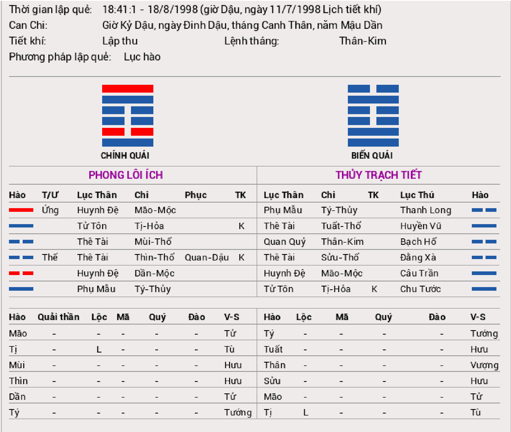
    - **Hình này chứng minh điều gì**
      - Hào 2 và hào 3 động biến thể hiện xe cộ đụng ngã và cửa tự động đóng kẹt.
    - **Từ đâu mà thấy được**
      - Hào 2 Quan Quỷ Dần mộc động biến hóa Huynh Đệ Mão mộc lâm Chu Tước.

*Bảng cấu trúc chi tiết quẻ Phong Lôi Ích biến Thủy Trạch Tiết:*

| Hào | Thế / Ứng | Lục Thân | Địa Chi | Phục Thần | TK | Biến Quái Lục Thân | Biến Chi | TK | Lục Thú | Động / Tĩnh |
| :---: | :---: | :---: | :---: | :---: | :---: | :---: | :---: | :---: | :---: | :---: |
| 6 | $\text{Ứng}$ | $\text{Huynh Đệ}$ | $\text{Mão-Mộc}$ | | | $\text{Phụ Mẫu}$ | $\text{Tý-Thủy}$ | | $\text{Thanh Long}$ | — $\rightarrow$ - - |
| 5 | | $\text{Tử Tôn}$ | $\text{Tị-Hỏa}$ | | K | $\text{Thê Tài}$ | $\text{Tuất-Thổ}$ | | $\text{Huyền Vũ}$ | - - $\rightarrow$ — |
| 4 | | $\text{Thê Tài}$ | $\text{Mùi-Thổ}$ | | | $\text{Quan Quỷ}$ | $\text{Thân-Kim}$ | | $\text{Bạch Hổ}$ | - - (Tĩnh) |
| 3 | $\text{Thế}$ | $\text{Thê Tài}$ | $\text{Thìn-Thổ}$ | $\text{Quan-Dậu}$ | K | $\text{Thê Tài}$ | $\text{Sửu-Thổ}$ | | $\text{Đằng Xà}$ | - - (Tĩnh) |
| 2 | | $\text{Huynh Đệ}$ | $\text{Dần-Mộc}$ | | | $\text{Huynh Đệ}$ | $\text{Mão-Mộc}$ | | $\text{Câu Trần}$ | - - $\rightarrow$ — |
| 1 | | $\text{Phụ Mẫu}$ | $\text{Tý-Thủy}$ | | | $\text{Tử Tôn}$ | $\text{Tị-Hỏa}$ | K | $\text{Chu Tước}$ | — $\rightarrow$ — |

*Bảng tra Thần Sát và Trạng Thái Vượng Suy:*

| Chi Chính | Mã / Lộc | Vượng Suy Chính | Chi Biến | Mã / Lộc | Vượng Suy Biến |
| :---: | :---: | :---: | :---: | :---: | :---: |
| $\text{Mão-Mộc}$ | - | $\text{Tử}$ | $\text{Tý-Thủy}$ | - | $\text{Tướng}$ |
| $\text{Tị-Hỏa}$ | $\text{Lộc}$ | $\text{Tù}$ (Lâm Không) | $\text{Tuất-Thổ}$ | - | $\text{Hưu}$ |
| $\text{Mùi-Thổ}$ | - | $\text{Hưu}$ | $\text{Thân-Kim}$ | - | $\text{Vượng}$ |
| $\text{Thìn-Thổ}$ | - | $\text{Hưu}$ (Lâm Không) | $\text{Sửu-Thổ}$ | - | $\text{Hưu}$ |
| $\text{Dần-Mộc}$ | - | $\text{Tử}$ | $\text{Mão-Mộc}$ | - | $\text{Tử}$ |
| $\text{Tý-Thủy}$ | - | $\text{Tướng}$ | $\text{Tị-Hỏa}$ | $\text{Lộc}$ | $\text{Tù}$ |

##### 2.2.3. Phân Tích Động Biến, Hào Vị Và Tượng Đồ
Khi nhìn vào đồ hình quẻ, tác giả lập tức thấy các tín hiệu trùng khớp với tình trạng bất an của Hàn tiên sinh:
- **Tâm thái thân chủ:** Hào 3 mang $\text{Thế}$ hào $\text{Thìn-Thổ}$ ngộ $\text{Tuần Không}$, lại lâm thần thú $\text{Đằng Xà}$ ($\text{Đằng Xà}$ chủ về kinh hãi, quái dị, đứng ngồi không yên, tâm thần bất định). Đồng thời $\text{Tử Tôn Tị-Hỏa}$ tại hào 5 cũng lâm $\text{Tuần Không}$ $\rightarrow$ phản ánh người nhà và con cái đều rơi vào trạng thái hoang mang lo sợ.
- **Tín hiệu phá tài:** Hào 2 $\text{Huynh Đệ Dần-Mộc}$ phát động hóa $\text{Huynh Đệ Mão-Mộc}$ (hóa Tiến thần), khắc chế trực tiếp vào hào $\text{Thế}$ $\text{Thê Tài Thìn-Thổ}$. $\text{Huynh Đệ}$ vượng động khắc $\text{Tài}$ là điềm báo chắc chắn vừa xảy ra tổn thất tài chính lớn.
- **Nguyên nhân sự cố:**
  - Hào 6 $\text{Huynh Đệ Mão-Mộc}$ ngự tại hào $\text{Ứng}$, lâm linh thú $\text{Thanh Long}$ phát động khắc $\text{Thế}$. Hào $\text{Ứng}$ đại diện cho tha phương, nơi đất khách quê người; $\text{Thanh Long}$ chủ về việc đi thăm hỏi thân quyến, bạn bè.
  - Hào 2 là trạch hào (đại diện cho căn nhà), có $\text{Huynh Đệ Dần-Mộc}$ lâm $\text{Câu Trần}$ phát động. $\text{Câu Trần}$ đới ngũ hành $\text{Mộc}$ động chủ về công việc sửa chữa, cải tạo, xây dựng, cơi nới các vật dụng bằng gỗ trong gia đình.
- **Kết luận thông báo qua điện thoại:** Khi Hàn tiên sinh gọi lại sau 3 phút, tác giả liền nói:
  1. Gần đây gia đạo rất bất thuận, mọi người đều hoang mang lo lắng, vừa bị phá tài.
  2. Nguyên nhân thứ nhất do đi xa thăm người thân mà gặp họa.
  3. Nguyên nhân thứ hai do trong nhà gần đây có tu sửa, cải tạo đồ gỗ gây phong thủy bất an.

##### 2.2.4. Đối Chiếu Thực Nghiệm Và Đúc Kết Kỹ Pháp
- **Đối chiếu thực tế:** Hàn tiên sinh thừa nhận toàn bộ sự việc:
  - Bố vợ lâm bệnh nặng ở quê, cả gia đình 3 người lái xe về thăm. Do bệnh tình trở nặng, người vợ ở lại chăm sóc, anh ta tự lái xe chở con về nhà. Trên đường về, xe anh va chạm vào một người đi xe máy. May mắn người không nguy kịch, nhưng anh phải đền bù hơn $5.000$ tệ mới dàn xếp xong xuôi (đúng tượng đi thăm thân mà bị phá tài).
  - Cách đó hai ngày, gia đình sắp xếp lại đồ đạc và sửa chữa cửa gỗ trong nhà. Đứa con đi học về mở cửa bước vào, thấy nhà oi bức nên không khép cửa. Đột nhiên cánh cửa tự động sập mạnh lại, khi đứa bé quay ra mở thì phát hiện cửa đã bị khóa chặt từ bên ngoài. Đứa bé hoảng sợ tột độ nghĩ có ma quỷ, phải gọi điện khóc lóc cầu cứu cha (đúng tượng quái dị của $\text{Đằng Xà}$ và động trạch tại hào 2).
- **Kỹ pháp đúc kết:** Quẻ do tác giả tự tay gieo cách xa hàng chục cây số, nhưng trường thông tin bắt được chính xác đến từng chi tiết như thể thân chủ tự gieo. Điều này chứng minh: khoảng cách không gian không thể ngăn cách trường thông tin, và dự đoán sư hoàn toàn có thể gieo thay thân chủ.

---

#### 2.3. Ví Dụ 3: Dự Đoán Sư Gieo Quẻ Tại Chỗ Cho Người Đến Hỏi

##### 2.3.1. Bối Cảnh Tiếp Nhận Yêu Cầu Và Dữ Liệu Can Chi
- **Bối cảnh:** Ngày $\text{Ất Dậu}$, tháng $\text{Quý Hợi}$, năm $\text{Mậu Dần}$, tác giả đang ngồi đàm đạo dịch lý cùng bạn tri kỷ Đoạn Kiến Nghiệp và một người bạn khác. Một nữ giáo viên công tác tại một cửa hàng sách (sinh năm Tân Sửu 1961, tuổi mụ 38) tìm đến ngỏ ý muốn xem về tình trạng hôn nhân. Tác giả tự tay cầm ba đồng tiền gieo quẻ giúp cô ấy.
- **Thời gian lập quẻ:**
  - Can Chi: Giờ $\text{Ất Dậu}$, ngày $\text{Ất Dậu}$, tháng $\text{Quý Hợi}$, năm $\text{Mậu Dần}$.
  - Tiết khí: $\text{Tiểu tuyết}$ (Lệnh tháng: $\text{Hợi-Thủy}$).
  - Tuần không: Ngày $\text{Ất Dậu}$ thuộc tuần $\text{Giáp Thân}$ $\rightarrow$ $\text{Ngọ-Hỏa}$ và $\text{Mùi-Thổ}$ lâm $\text{Tuần Không}$.
  - Phương pháp lập quẻ: Tác giả gieo thay tại chỗ $\rightarrow$ Đạt được quẻ: $\text{Thiên Phong Cấu}$ biến $\text{Phong Địa Quán}$.

##### 2.3.2. Thiết Lập Bảng Quẻ Thiên Phong Cấu Biến Phong Địa Quán

- Quẻ khởi Thiên Phong Cấu biến Phong Địa Quán giải đoán hôn nhân bất hòa:
  - **Hình 6.** Sơ đồ quẻ Thiên Phong Cấu biến Phong Địa Quán
    - 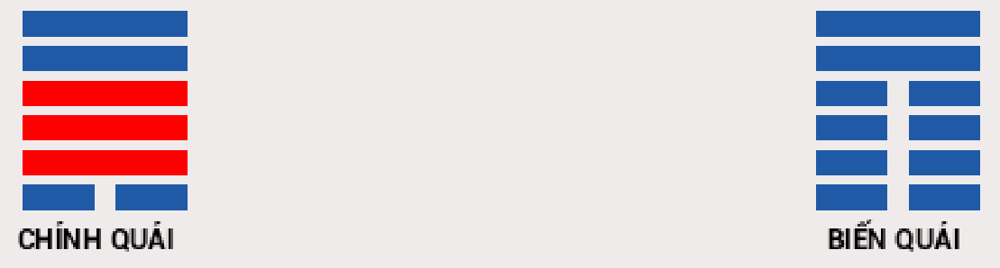
    - **Hình này chứng minh điều gì**
      - Quẻ nội phản ngâm và Quan Quỷ Ngọ hỏa tuần không biến hợp Phụ Mẫu Mùi thổ.
    - **Từ đâu mà thấy được**
      - Hào 2 Quan Quỷ Ngọ hỏa không vong phát động hóa xuất Mùi thổ tương hợp.

*Bảng cấu trúc chi tiết quẻ Thiên Phong Cấu biến Phong Địa Quán:*

| Hào | Thế / Ứng | Lục Thân | Địa Chi | Phục Thần | TK | Biến Quái Lục Thân | Biến Chi | TK | Lục Thú | Động / Tĩnh |
| :---: | :---: | :---: | :---: | :---: | :---: | :---: | :---: | :---: | :---: | :---: |
| 6 | | $\text{Phụ Mẫu}$ | $\text{Tuất-Thổ}$ | | | $\text{Thê Tài}$ | $\text{Mão-Mộc}$ | | $\text{Huyền Vũ}$ | — (Tĩnh) |
| 5 | | $\text{Huynh Đệ}$ | $\text{Thân-Kim}$ | | | $\text{Quan Quỷ}$ | $\text{Tị-Hỏa}$ | | $\text{Bạch Hổ}$ | — (Tĩnh) |
| 4 | $\text{Ứng}$ | $\text{Quan Quỷ}$ | $\text{Ngọ-Hỏa}$ | | K | $\text{Phụ Mẫu}$ | $\text{Mùi-Thổ}$ | K | $\text{Đằng Xà}$ | — $\rightarrow$ - - |
| 3 | | $\text{Huynh Đệ}$ | $\text{Dậu-Kim}$ | | | $\text{Thê Tài}$ | $\text{Mão-Mộc}$ | | $\text{Câu Trần}$ | — $\rightarrow$ - - |
| 2 | | $\text{Tử Tôn}$ | $\text{Hợi-Thủy}$ | $\text{Tài-Dần}$ | | $\text{Quan Quỷ}$ | $\text{Tị-Hỏa}$ | | $\text{Chu Tước}$ | — $\rightarrow$ - - |
| 1 | $\text{Thế}$ | $\text{Phụ Mẫu}$ | $\text{Sửu-Thổ}$ | | | $\text{Phụ Mẫu}$ | $\text{Mùi-Thổ}$ | K | $\text{Thanh Long}$ | - - $\rightarrow$ - - |

*Bảng tra Thần Sát và Trạng Thái Vượng Suy:*

| Chi Chính | Quái Thân | Lộc / Mã / Đào | Vượng Suy Chính | Chi Biến | Lộc / Mã / Đào | Vượng Suy Biến |
| :---: | :---: | :---: | :---: | :---: | :---: | :---: |
| $\text{Tuất-Thổ}$ | - | - | $\text{Tù}$ | $\text{Mão-Mộc}$ | $\text{Lộc}$ | $\text{Tướng}$ |
| $\text{Thân-Kim}$ | - | $\text{Quý}$ | $\text{Hưu}$ | $\text{Tị-Hỏa}$ | - | $\text{Tử}$ |
| $\text{Ngọ-Hỏa}$ | $\text{QT}$ | $\text{Đào}$ | $\text{Tử}$ (Lâm Không) | $\text{Mùi-Thổ}$ | - | $\text{Tù}$ (Lâm Không) |
| $\text{Dậu-Kim}$ | - | - | $\text{Hưu}$ | $\text{Mão-Mộc}$ | $\text{Lộc}$ | $\text{Tướng}$ |
| $\text{Hợi-Thủy}$ | - | $\text{Mã}$ | $\text{Vượng}$ | $\text{Tị-Hỏa}$ | - | $\text{Tử}$ |
| $\text{Sửu-Thổ}$ | - | - | $\text{Tù}$ | $\text{Mùi-Thổ}$ | - | $\text{Tù}$ |

##### 2.3.3. Luận Giải Đa Chiều: Hôn Nhân, Lưu Sản, Ngoại Tình Và Kiện Tụng
Xem hôn nhân cho phụ nữ, lấy hào $\text{Quan Quỷ}$ làm $\text{Dụng thần}$:

- **Bước 1: Nhận định tổng quan cuộc hôn nhân:**
  - $\text{Quan Quỷ Ngọ-Hỏa}$ ngự tại hào 4 gặp $\text{Tuần Không}$. $\text{Nguyên Thần}$ không hiện trên quẻ, phục tàng dưới hào 2 ($\text{Thê Tài Dần-Mộc}$).
  - $\text{Quan Quỷ}$ bị $\text{Nguyệt Lệnh}$ $\text{Hợi-Thủy}$ và hào 2 $\text{Tử Tôn Hợi-Thủy}$ phát động khắc phạt tàn khốc.
  - Ba hào quẻ nội (sơ hào, hào 2, hào 3) cùng động biến thành quẻ $\text{Khôn-Thổ}$, tạo thành cách cục **quẻ nội Phản ngâm** ($\text{Phản Ngâm}$). Phản ngâm chủ về mâu thuẫn lặp đi lặp lại, đau khổ dằn vặt, trắc trở triền miên.

- **Bước 2: Định năm kết hôn:**
  - $\text{Quan Quỷ Ngọ-Hỏa}$ động hóa xuất $\text{Phụ Mẫu Mùi-Thổ}$ tương hợp ($\text{Ngọ - Mùi}$ lục hợp).
  - Kinh Dịch có quy tắc: *"Không phùng xung tắc thực, hợp phùng xung tắc khai"* (Hào lâm Không gặp Xung thì thành thực, Hào gặp Hợp thì phải đợi Xung mới phát tác).
  - Năm Giáp Tý (1984), cô gái $24$ tuổi mụ (tuổi kết hôn): Địa chi $\text{Tý-Thủy}$ xung thực $\text{Quan Quỷ Ngọ-Hỏa}$, đồng thời xung khai hợp cục $\text{Ngọ - Mùi}$.
  - Mặt khác, $\text{Tý-Thủy}$ lục hợp với hào $\text{Thế}$ $\text{Phụ Mẫu Sửu-Thổ}$ ($\text{Tý - Sửu}$ tương hợp). $\text{Phụ Mẫu}$ lâm $\text{Thanh Long}$ đại diện cho hôn thú và tin vui hỷ sự. Hào $\text{Thế}$ được Thái Tuế hợp mang ý nghĩa đạt được hôn thú.
  - $\rightarrow$ Đoán định: Cô kết hôn vào năm 1984 (Giáp Tý). Thân chủ xác nhận chính xác.

- **Bước 3: Vấn đề sinh sản và con cái:**
  - Hào 2 $\text{Tử Tôn Hợi-Thủy}$ cùng $\text{Nguyệt Lệnh}$ tạo thành cách cục $\text{Hợi - Hợi}$ tự hình.
  - Hào 2 trong cơ thể học đại diện cho vị trí tử cung, thai bào. $\text{Tử Tôn}$ lâm thai vị lại động hóa $\text{Quan Quỷ Tị-Hỏa}$ (tượng hóa Quỷ) và hóa Tuyệt ($\text{Thủy}$ tuyệt tại $\text{Tị}$).
  - Thai hào $\text{Ngọ-Hỏa}$ ngộ $\text{Tuần Không}$.
  - Nội quái Phản ngâm chủ về biến cố lặp lại.
  - $\rightarrow$ Đoán định: Cô từng bị lưu sản (sảy thai) nhiều lần. Thực tế cô đã sảy thai đúng 2 lần.

- **Bước 4: Thực trạng quan hệ vợ chồng và lý do chưa ly hôn:**
  - $\text{Quan Quỷ Ngọ-Hỏa}$ động sinh trợ hào $\text{Thế}$ $\text{Sửu-Thổ}$ $\rightarrow$ Người chồng trên thực tế đối xử rất tốt với cô.
  - Tuy nhiên, phu tinh bị suy kiệt, bị khắc thương nặng nề, nội quái phản ngâm không có Tài cứu viện $\rightarrow$ Cô vợ kiên quyết muốn ly hôn.
  - Hào 2 $\text{Tử Tôn Hợi-Thủy}$ lâm $\text{Chu Tước}$ (chủ về cãi vã, khẩu thiệt tại nhà) động khắc $\text{Quan Quỷ}$ $\rightarrow$ Ngày nào hai vợ chồng cũng nổ ra xung đột gay gắt.
  - Sở dĩ chưa ly hôn được vì $\text{Quan Quỷ}$ ngự tại hào Ứng (phu vị) vẫn đang hợp với $\text{Phụ Mẫu Mùi-Thổ}$ (giấy đăng ký kết hôn). Nhưng $\text{Mùi-Thổ}$ lâm $\text{Tuần Không}$ $\rightarrow$ Người chồng đang cất giữ và siết chặt tờ giấy hôn thú, dứt khoát không chịu buông tay. Cô vợ làm loạn nhiều lần vẫn không thể giải quyết dứt điểm.

- **Bước 5: Thâm nhập góc khuất sinh lý và chuyện ngoại tình:**
  - Hào $\text{Thế}$ lâm $\text{Thanh Long}$ $\rightarrow$ Cô gái có nhan sắc rất xinh đẹp, đồng thời mang tính phong tình.
  - Quẻ danh là $\text{Thiên Phong Cấu}$, Thoán từ ghi rõ: *"Nữ tráng, vật dụng thủ nữ"* (Người nữ quá mạnh mẽ, không nên cưới làm vợ).
  - Hào $\text{Thế}$ $\text{Sửu-Thổ}$ gặp $\text{Nhật Thần}$ $\text{Dậu-Kim}$ là đất $\text{Mộc Dục}$ (tắm rửa, phóng túng tình dục).
  - Hào 2 là hào vị của cơ quan sinh dục, $\text{Tử Tôn}$ (kỵ thần của Quan) đóng tại đây động hóa $\text{Quan Quỷ Tị-Hỏa}$ lâm Tuyệt địa. $\text{Quan Quỷ}$ chủ bệnh tật $\rightarrow$ Chồng cô mắc bệnh kín, hoàn toàn bất lực trong sinh hoạt tình dục.
  - Quẻ vốn có $\text{Quan Quỷ Ngọ-Hỏa}$ ở hào 4, nay hào 2 lại động biến sinh thêm một $\text{Quan Quỷ Tị-Hỏa}$ khác $\rightarrow$ Tượng "dẫn lang nhập thất" (đưa người đàn ông khác vào nhà), dấu hiệu ngoại tình rõ rệt.
  - Năm Bính Tý (1996), $\text{Tý-Thủy}$ xung thực $\text{Quan Quỷ}$, xuất hiện người thứ ba theo đuổi và hối thúc cô ly hôn. Hào 2 $\text{Tử Tôn Hợi-Thủy}$ lâm $\text{Chu Tước}$ phát động, $\text{Hợi-Thủy}$ là đất $\text{Lâm Quan}$ của hào $\text{Thế}$ $\rightarrow$ Có một người đàn ông ngoại tình gắn bó sâu sắc.
  - Ban đầu cô kịch liệt phủ nhận, nhưng khi tác giả dừng lại không đoán tiếp, cô đành ngượng ngùng thừa nhận có người thứ ba theo đuổi tha thiết và giục cô bỏ chồng.

- **Bước 6: Xác định ứng kỳ ly hôn chính thức:**
  - Tác giả khẳng định: Sang tháng sau (tháng $\text{Bính Tý}$ năm Mậu Dần), việc ly hôn sẽ dứt điểm.
  - Lý do: $\text{Tý-Thủy}$ xung khai hợp cục $\text{Ngọ - Mùi}$, khiến người chồng buộc phải từ bỏ việc giữ giấy kết hôn; đồng thời $\text{Tý}$ xung thực $\text{Quan Quỷ Ngọ-Hỏa}$ đang lâm Không.
  - Hào 2 $\text{Tử Tôn Hợi-Thủy}$ lâm $\text{Chu Tước}$ chủ về quan tụng kiện cáo; hào $\text{Thế}$ gặp $\text{Hợi-Thủy}$ là đất $\text{Lâm Quan}$ (chủ về công đường, tòa án) $\rightarrow$ Hai bên sẽ đưa nhau ra tòa xét xử.

##### 2.3.4. Đối Chiếu Thực Nghiệm Và Đúc Kết Kỹ Pháp
- **Đối chiếu thực tế:** Đúng vào tháng $\text{Tý}$ năm 1998, tòa án nhân dân đã chính thức phán quyết cho cô ly hôn.
- **Kỹ pháp đúc kết:** Tác giả trực tiếp gieo quẻ cho người ngồi trước mặt, trong đầu không hề suy nghĩ về đời tư của đối phương, nhưng tầng tầng lớp lớp thông tin tế vi từ bệnh lý sinh dục của người chồng đến hành vi ngoại tình kín đáo đều hiển lộ rõ nét trên quẻ tượng.

---

#### 2.4. Ví Dụ 4: Người Thứ Ba Gieo Quẻ Khảo Sát Sự Kiện Thời Sự

##### 2.4.1. Bối Cảnh Tin Tức Đại Chúng Và Dữ Liệu Khởi Quẻ
- **Bối cảnh:** Ngày $\text{Tân Mão}$, tháng $\text{Kỷ Mão}$, năm $\text{Canh Thìn}$, truyền hình quốc tế đưa tin khẩn cấp: Thủ tướng Nhật Bản đương nhiệm Obuchi Keizō (Tiểu Viễn Huệ Tam) đột ngột đột quỵ, hôn mê sâu và phải nhập viện cấp cứu. Lúc đó, một phụ nữ người Nhật tên Mutō đang có mặt tại nhà tác giả, nghe tin vô cùng lo lắng cho tình trạng nguyên thủ quốc gia nên hỏi xem cát hung thế nào. Tác giả liền bảo một vị khách thứ ba đang ngồi chơi bên cạnh cầm tiền gieo một quẻ.
- **Thời gian lập quẻ:** 18:41:01 – Ngày 03/04/2000 (Dương lịch).
  - Tiết khí: $\text{Xuân phân}$ (Lệnh tháng: $\text{Mão-Mộc}$).
  - Bát tự thời gian: Giờ $\text{Đinh Dậu}$, ngày $\text{Tân Mão}$, tháng $\text{Kỷ Mão}$, năm $\text{Canh Thìn}$.
  - Tuần không: Ngày $\text{Tân Mão}$ thuộc tuần $\text{Giáp Thân}$ $\rightarrow$ $\text{Ngọ-Hỏa}$ và $\text{Mùi-Thổ}$ lâm $\text{Tuần Không}$.
  - Phương pháp lập quẻ: Một vị khách thứ ba gieo thay $\rightarrow$ Đạt được quẻ: $\text{Thiên Hỏa Đồng Nhân}$ biến $\text{Hỏa Phong Đỉnh}$.

##### 2.4.2. Thiết Lập Bảng Quẻ Thiên Hỏa Đồng Nhân Biến Hỏa Phong Đỉnh

- Quẻ khởi Thiên Hỏa Đồng Nhân biến Hỏa Phong Đỉnh dự đoán thọ mệnh Thủ tướng Nhật Bản:
  - **Hình 7.** Sơ đồ quẻ Thiên Hỏa Đồng Nhân biến Hỏa Phong Đỉnh
    - 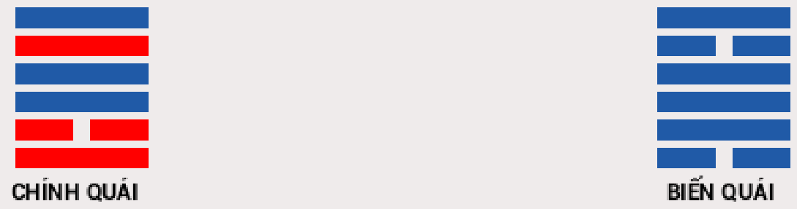
    - **Hình này chứng minh điều gì**
      - Thê Tài Thân kim lâm tuyệt địa và nhập mộ tháng Thìn khó qua khỏi tháng Tị.
    - **Từ đâu mà thấy được**
      - Hào 3 và hào 6 động biến thể hiện Dụng thần suy kiệt đến hạn hung hiểm.

*Bảng cấu trúc chi tiết quẻ Thiên Hỏa Đồng Nhân biến Hỏa Phong Đỉnh:*

| Hào | Thế / Ứng | Lục Thân | Địa Chi | Phục Thần | TK | Biến Quái Lục Thân | Biến Chi | TK | Lục Thú | Động / Tĩnh |
| :---: | :---: | :---: | :---: | :---: | :---: | :---: | :---: | :---: | :---: | :---: |
| 6 | $\text{Ứng}$ | $\text{Tử Tôn}$ | $\text{Tuất-Thổ}$ | | | $\text{Huynh Đệ}$ | $\text{Tị-Hỏa}$ | | $\text{Đằng Xà}$ | — $\rightarrow$ - - |
| 5 | | $\text{Thê Tài}$ | $\text{Thân-Kim}$ | | | $\text{Tử Tôn}$ | $\text{Mùi-Thổ}$ | K | $\text{Câu Trần}$ | — $\rightarrow$ - - |
| 4 | | $\text{Huynh Đệ}$ | $\text{Ngọ-Hỏa}$ | | K | $\text{Thê Tài}$ | $\text{Dậu-Kim}$ | | $\text{Chu Tước}$ | — (Tĩnh) |
| 3 | $\text{Thế}$ | $\text{Quan Quỷ}$ | $\text{Hợi-Thủy}$ | | | $\text{Thê Tài}$ | $\text{Dậu-Kim}$ | | $\text{Thanh Long}$ | — (Tĩnh) |
| 2 | | $\text{Tử Tôn}$ | $\text{Sửu-Thổ}$ | | | $\text{Quan Quỷ}$ | $\text{Hợi-Thủy}$ | | $\text{Huyền Vũ}$ | - - $\rightarrow$ — |
| 1 | | $\text{Phụ Mẫu}$ | $\text{Mão-Mộc}$ | | | $\text{Tử Tôn}$ | $\text{Sửu-Thổ}$ | | $\text{Bạch Hổ}$ | — $\rightarrow$ - - |

*Bảng tra Thần Sát và Trạng Thái Vượng Suy:*

| Chi Chính | Quái Thân | Lộc / Mã / Đào | Vượng Suy Chính | Chi Biến | Lộc / Mã / Đào | Vượng Suy Biến |
| :---: | :---: | :---: | :---: | :---: | :---: | :---: |
| $\text{Tuất-Thổ}$ | - | - | $\text{Tử}$ | $\text{Tị-Hỏa}$ | $\text{Mã}$ | $\text{Tướng}$ |
| $\text{Thân-Kim}$ | - | - | $\text{Tù}$ | $\text{Mùi-Thổ}$ | - | $\text{Tử}$ (Lâm Không) |
| $\text{Ngọ-Hỏa}$ | - | $\text{Quý}$ | $\text{Tướng}$ (Lâm Không) | $\text{Dậu-Kim}$ | $\text{Lộc}$ | $\text{Tù}$ |
| $\text{Hợi-Thủy}$ | - | - | $\text{Hưu}$ | $\text{Dậu-Kim}$ | $\text{Lộc}$ | $\text{Tù}$ |
| $\text{Sửu-Thổ}$ | - | - | $\text{Tử}$ | $\text{Hợi-Thủy}$ | - | $\text{Hưu}$ |
| $\text{Mão-Mộc}$ | - | - | $\text{Vượng}$ | $\text{Sửu-Thổ}$ | - | $\text{Tử}$ |

##### 2.4.3. Bệnh Lý Não Bộ, Hệ Hô Hấp Và Định Lượng Ứng Kỳ Tử Vong
Xem bệnh cho một nhân vật chính trị xa lạ, không có quan hệ thân tộc, lấy hào $\text{Ứng}$ làm $\text{Dụng thần}$:

- **Bước 1: Xác định Dụng thần và mức độ nguy kịch:**
  - Hào 6 mang $\text{Ứng}$ hào $\text{Tử Tôn Tuất-Thổ}$ làm $\text{Dụng thần}$.
  - $\text{Tuất-Thổ}$ bị cả $\text{Nhật Thần}$ $\text{Mão-Mộc}$ và $\text{Nguyệt Lệnh}$ $\text{Mão-Mộc}$ đồng thời khắc phạt.
  - Trong quẻ, hào 1 $\text{Phụ Mẫu Mão-Mộc}$ lại phát động khắc thẳng vào Dụng thần.
  - Cả ba luồng mộc khí hùng mạnh ($\text{Tam Mão}$) cùng hợp sức tấn công khắc một $\text{Tuất-Thổ}$ suy nhược $\rightarrow$ Bệnh tình cực kỳ hung hiểm, tính mạng ngàn cân treo sợi tóc.

- **Bước 2: Định vị bệnh lý sọ não và mạch máu:**
  - Hào 6 đại diện cho vùng đầu não.
  - $\text{Tử Tôn}$ trong phân loại cơ thể học đại diện cho hệ thống huyết quản (mạch máu).
  - Kỵ thần $\text{Phụ Mẫu Mão-Mộc}$ lâm linh thú $\text{Bạch Hổ}$ phát động ($\text{Bạch Hổ}$ chủ về huyết quang, tai biến xuất huyết).
  - Quẻ thuộc cung $\text{Ly}$ ($\text{Bát Thuần Ly}$ tượng trưng cho tâm hỏa, huyết dịch và mạch máu).
  - Kết hợp các tượng: Mạch máu vùng đầu bị tổn thương vỡ xuất huyết nghiêm trọng.
  - Dụng thần lâm $\text{Đằng Xà}$ ($\text{Đằng Xà}$ chủ về co thắt, co rút, chật hẹp) $\rightarrow$ Nguyên nhân trực tiếp là do mạch máu não đột ngột co thắt cục bộ gây vỡ hoặc tắc nghẽn.
  - Ngũ hành $\text{Tuất-Thổ}$ gặp $\text{Mão-Mộc}$ là đất $\text{Tử}$. Ba hào $\text{Mão-Mộc}$ đồng thời khắc Dụng $\rightarrow$ Có ít nhất ba vùng xuất huyết não đã bị hoại tử hoàn toàn.
  - Kỵ thần khắc Dụng trong thế tương hợp ($\text{Mão - Tuất}$ lục hợp) $\rightarrow$ "Khắc trung hữu hợp" là tượng mầm bệnh bám rễ chặt chẽ vào cơ thể, bóng ma tử thần không thể xua tan.

- **Bước 3: Tình trạng tim mạch, hệ hô hấp và biện pháp cứu trợ:**
  - Hào 4 $\text{Nguyên Thần Huynh Đệ Ngọ-Hỏa}$ ngộ $\text{Tuần Không}$. Hào 4 là hào vị của trái tim, ngũ hành $\text{Hỏa}$ chủ hệ tuần hoàn. $\text{Nguyên Thần}$ ngộ Không không thể sinh trợ Dụng thần $\rightarrow$ Trái tim suy kiệt, chức năng bơm máu nuôi cơ thể không đủ.
  - Hào 5 $\text{Thê Tài Thân-Kim}$ phát động hóa xuất $\text{Tử Tôn Mùi-Thổ}$. Địa chi $\text{Thân}$ là đất $\text{Trường Sinh}$ của Dụng thần $\text{Tuất-Thổ}$.
  - Hào 5 đại diện cho khoang mũi và miệng; $\text{Thê Tài}$ chủ về hơi thở, đường hô hấp; $\text{Tử Tôn}$ chủ về y dược và phương tiện điều trị.
  - $\rightarrow$ Bệnh viện đang sử dụng biện pháp đặt ống nội khí quản và máy thở nhân tạo (hút oxy cứu trợ).
  - Quẻ có $\text{Tử Tôn}$ đa hiện (hào 6, hào 2, biến hào 5, biến hào 1) $\rightarrow$ Bệnh viện đang huy động tối đa mọi trang thiết bị và đội ngũ chuyên gia y tế giỏi nhất để cứu chữa.
  - Hào 2 $\text{Tử Tôn Sửu-Thổ}$ động hóa $\text{Quan Quỷ Hợi-Thủy}$ $\rightarrow$ Chức năng bài tiết tiểu tiện bị tắc nghẽn, đồng thời xuất hiện phản ứng phụ nghiêm trọng từ thuốc điều trị.

- **Bước 4: Luận định hạn kỳ tử vong (Ứng kỳ):**
  - Tháng $\text{Canh Thìn}$ (tháng 3 âm lịch): $\text{Thìn}$ xung $\text{Tuất}$, phá vỡ thế hợp $\text{Mão - Tuất}$ (hợp xứ phùng xung). Đồng thời, $\text{Tuất-Thổ}$ nhập Mộ tại $\text{Thìn}$ $\rightarrow$ Rất hung hiểm.
  - Tháng $\text{Tân Tị}$ (tháng 4 âm lịch): Dụng thần $\text{Tuất-Thổ}$ lâm đất $\text{Tuyệt}$ tại $\text{Tị}$. Mặt khác, hào khắc chế kỵ thần là $\text{Thê Tài Thân-Kim}$ bị Nguyệt lệnh $\text{Tị-Hỏa}$ tương hợp khắc chế ($\text{Tị - Thân}$ hợp hình phá), khiến $\text{Mão-Mộc}$ hoàn toàn mất kiểm soát. $\text{Thê Tài}$ (đại diện cho hơi thở) bị khắc triệt $\rightarrow$ Một hơi thở không lên được là dứt mệnh.
  - $\rightarrow$ Phán đoán quyết đoán: Tháng $\text{Thìn}$ nếu không qua khỏi thì sang tháng $\text{Tị}$ chắc chắn qua đời, không thể vượt qua tháng $\text{Tị}$.

##### 2.4.4. Đối Chiếu Thực Nghiệm Lịch Sử Và Đúc Kết Kỹ Pháp
- **Đối chiếu lịch sử:** Sau một thời gian hôn mê sâu và duy trì sự sống bằng máy thở, cựu Thủ tướng Obuchi Keizō đã chính thức qua đời tại bệnh viện Tokyo vào ngày $\text{Nhâm Thân}$, tháng $\text{Tân Tị}$ (ngày 14 tháng 5 năm 2000 Dương lịch), hoàn toàn khớp với ứng kỳ tháng $\text{Tị}$ đã định lượng.
- **Kỹ pháp đúc kết:** Quẻ do một người thứ ba hoàn toàn xa lạ gieo giúp, nhằm khảo sát số phận của một chính khách ngoại quốc xem qua truyền hình. Trường thông tin vũ trụ vẫn vận hành chuẩn xác tuyệt đối đến từng chi tiết giải phẫu y học và ngày giờ qua đời.

---

### 3. Quy Tắc Chuẩn Hóa Thao Tác Gieo Quẻ Trong Lục Hào Hiện Đại

Từ hệ thống lý luận và 4 án lệ thực nghiệm kinh điển nêu trên, các nguyên tắc vận hành thao tác gieo quẻ trong $\text{Lục Hào}$ hiện đại được đúc kết như sau:

- **Nguyên tắc 1: Giải phóng rào cản chủ thể:**
  - Người gieo quẻ có thể là bản thân thân chủ, là dự đoán sư gieo thay, hoặc là một người thứ ba bất kỳ được nhờ gieo giúp.
  - Tính chuẩn xác của quẻ tượng được bảo toàn nguyên vẹn $100\%$, không phụ thuộc vào việc ai là người trực tiếp cầm đồng tiền.

- **Nguyên tắc 2: Tối giản hóa tâm thức khi gieo:**
  - Người gieo quẻ không cần phải gồng mình tập trung suy nghĩ, không cần cố gắng hình dung diện mạo hay biến cố của người được xem.
  - Chỉ cần giữ tâm thái thả lỏng tự nhiên, buông rơi các đồng tiền để quy luật xác suất ngẫu nhiên bắt sóng trường thông tin vũ trụ.

- **Nguyên tắc 3: Nhất quán trong phương pháp phân tích:**
  - Bất kể ai là người gieo quẻ, khi tiến hành giải quẻ, dự đoán sư vẫn áp dụng quy tắc chọn $\text{Dụng thần}$ nhất quán theo đối tượng và sự việc của người muốn hỏi (hỏi về cha mẹ lấy $\text{Phụ Mẫu}$, hỏi về con cái lấy $\text{Tử Tôn}$, hỏi về bản thân lấy $\text{Thế}$ hào, hỏi về người ngoài không quen lấy $\text{Ứng}$ hào...).

- **Nguyên tắc 4: Kiên quyết loại bỏ tà thuyết thần bí:**
  - Tuyệt đối không sử dụng mật chú, bùa chú, bài vị cầu nguyện hay các nghi thức ma mị khi lập quẻ.
  - Nhận thức sâu sắc rằng $\text{Lục Hào}$ là bộ môn khoa học dự đoán dựa trên ma trận thông tin vũ trụ và triết học Âm Dương Ngũ Hành, hoàn toàn tách biệt với các yếu tố quỷ thần và mê tín dị đoan.

<!-- Fragment: ch03_doan_mong_xa_phuc_tuong_mao_branches.md -->
<!-- Source: slice_chunk_03.md (Pages 24-30) -->

## Chương 5: Quẻ gián đoán mộng

Trích dẫn từ tác phẩm kinh điển: « Lục hào quẻ lệ nói thật » (*Lục Hào Quẻ Lệ Thuyết Chân* - Vương Hổ Ứng).

### Cơ chế Giải mộng qua Hào vị và Đằng Xà

#### Khái niệm Gián đoán và Vai trò của Đằng Xà trong Chiêm mộng
- **Nguyên lý Gián đoán (間斷):** Trong thực tế luận đoán Lục Hào, người hỏi thường chỉ khởi tâm chiêm bốc về một sự vụ thế tục cụ thể như công danh, sự nghiệp, kinh doanh, kiện tụng hoặc bệnh tật. Tuy nhiên, quẻ tượng Lục Hào mang tính toàn đồ thông tin vũ trụ. Bên cạnh sự vụ chính, quẻ còn phản ánh những biến cố sinh hoạt kín đáo, thói quen sinh lý, trạng thái tâm lý dưới tầng tiềm thức và đặc biệt là những giấc mơ kỳ lạ của thân chủ. Người dự đoán giỏi có thể nắm bắt cơ chế "gián đoán" (đoán xen kẽ, chen ngang) để vạch trần chuẩn xác các điềm mộng mị bí ẩn mà đương sự chưa từng hé lộ.
- **Ý nghĩa Lục thú Đằng Xà ($\text{Đằng Xà}$):** 
  - Trong hệ thống Lục Thần, $\text{Đằng Xà}$ thuộc hành Hỏa/Thổ biến hóa, chủ về hư kinh, quái đản, sợ hãi, bứt rứt, trằn trọc, ác mộng, tà khí và những biến cố tâm thần kỳ dị.
  - Khi $\text{Đằng Xà}$ lâm vào hào vị phát động, hoặc kết hợp với các thần sát xung hình, chủ thể tất đêm ngủ bất an, thần trí hoang mang, thường xuyên chiêm bao thấy những cảnh tượng kỳ quái, kinh hoàng.

#### Hào vị Giường nằm và Cơ chế Tương tác Biến hóa của Giấc mơ
- **Định vị Sàng vị ($\text{Sàng sàng chi vị}$ - 床床之位):** Trong cơ thể học và trạch pháp Lục Hào, $\text{Hào tam}$ (hào 3) là hào vị đại diện cho giường chiếu, phòng ngủ, phản nằm và trạng thái nằm nghỉ.
- **Quy tắc phối hợp giải mã nội dung giấc mộng:**
  - **Mộng tìm nước uống:** Khi $\text{Hào tam}$ phát động lâm $\text{Đằng Xà}$ (chủ mộng mị trên giường), lại tương hợp với $\text{Thê Tài}$ hào (chủ ẩm thực, thức ăn nước uống) hoặc $\text{Thủy}$ hào $\rightarrow$ điềm báo trong đêm ngủ cổ họng khô rát, thường xuyên chiêm bao đi tìm nước uống hoặc thức giấc giữa đêm giải khát.
  - **Mộng chém giết hung hãn:** Khi hào giường phát động tương xung với $\text{Thế hào}$, hoặc $\text{Thế hào}$ lâm $\text{Bạch Hổ}$ ($\text{Bạch Hổ}$ chủ huyết quang, đao thương kiếm kích, đấu đá tàn bạo, truy sát) $\rightarrow$ điềm báo trong giấc ngủ liên tục chiêm bao thấy cảnh cầm hung khí ẩu đả, chém giết hoặc bị truy sát kinh hoàng.

---

### Ví dụ thực tiễn: Giải Ác mộng Đánh nhau và Tìm Nước (Trung Phu biến Tốn)

**Bối cảnh:** Ngày $\text{Đinh Sửu}$, tháng $\text{Quý Mùi}$, năm $\text{Canh Thìn}$, Vương tiên sinh đến nhờ dự đoán về tiền đồ công việc, gieo được quẻ $\text{Phong Trạch Trung Phu}$ biến $\text{Bát Thuần Tốn}$.

#### Dữ liệu Lập quẻ và Toàn cảnh Quái tượng
- **Thời gian lập quẻ:** 18:41:01 - 18/07/2000 (giờ $\text{Dậu}$, ngày 12 tháng 6 năm Canh Thìn Lịch tiết khí).
- **Can Chi:** Giờ $\text{Kỷ Dậu}$, ngày $\text{Đinh Sửu}$, tháng $\text{Quý Mùi}$, năm $\text{Canh Thìn}$.
- **Tiết khí:** Tiểu thử.
- **Nguyệt lệnh:** $\text{Mùi-Thổ}$. **Nhật thần:** $\text{Sửu-Thổ}$.
- **Tuần không:** $\text{Thân} - \text{Dậu}$ (tuần $\text{Giáp Tuất}$).
- **Phương pháp lập quẻ:** Lục hào gieo đồng tiền.

- Quẻ khởi Phong Trạch Trung Phu biến Bát Thuần Tốn gián đoán ác mộng đánh nhau:
  - **Hình 8.** Sơ đồ quẻ Phong Trạch Trung Phu biến Bát Thuần Tốn
    - 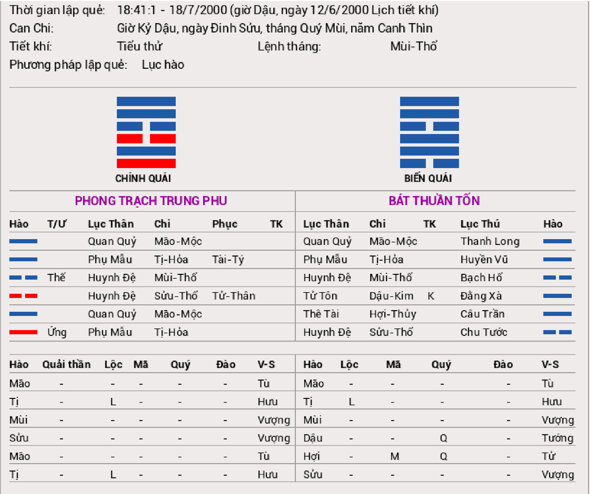
    - **Hình này chứng minh điều gì**
      - Động hào hào 3 và hào Ứng Phụ Mẫu Tị hỏa lâm Đằng Xà chủ ác mộng kinh sợ.
    - **Từ đâu mà thấy được**
      - Hào 4 và hào 3 phát động liên hợp hóa Huynh Đệ Sửu thổ và Tử Tôn Dậu kim.

##### Bảng Lục Hào Phân Tích: Phong Trạch Trung Phu Biến Bát Thuần Tốn

| Hào vị | Thế/Ứng | Lục Thân (Chính) | Địa Chi & Ngũ Hành | Phục Thần | Tuần Không | Lục Thân (Biến) | Chi Biến | TK Biến | Lục Thú | Hào Tượng Biến |
| :---: | :---: | :---: | :---: | :---: | :---: | :---: | :---: | :---: | :---: | :---: |
| **Lục** | | $\text{Quan Quỷ}$ | $\text{Mão-Mộc}$ | | | $\text{Quan Quỷ}$ | $\text{Mão-Mộc}$ | | $\text{Thanh Long}$ | ▅▅▅▅▅ |
| **Ngũ** | | $\text{Phụ Mẫu}$ | $\text{Tị-Hỏa}$ | $\text{Thê Tài Tý-Thủy}$ | | $\text{Phụ Mẫu}$ | $\text{Tị-Hỏa}$ | | $\text{Huyền Vũ}$ | ▅▅▅▅▅ |
| **Tứ** | **Thế** | $\text{Huynh Đệ}$ | $\text{Mùi-Thổ}$ | | | $\text{Huynh Đệ}$ | $\text{Mùi-Thổ}$ | | $\text{Bạch Hổ}$ | ▅▅ ▅▅ |
| **Tam** | | $\text{Huynh Đệ}$ | $\text{Sửu-Thổ}$ (động) | $\text{Tử Tôn Thân-Kim}$ | | $\text{Tử Tôn}$ | $\text{Dậu-Kim}$ | **K** | $\text{Đằng Xà}$ | ▅▅▅▅▅ |
| **Nhị** | | $\text{Quan Quỷ}$ | $\text{Mão-Mộc}$ | | | $\text{Thê Tài}$ | $\text{Hợi-Thủy}$ | | $\text{Câu Trần}$ | ▅▅▅▅▅ |
| **Sơ** | **Ứng** | $\text{Phụ Mẫu}$ | $\text{Tị-Hỏa}$ (động) | | | $\text{Huynh Đệ}$ | $\text{Sửu-Thổ}$ | | $\text{Chu Tước}$ | ▅▅ ▅▅ |

##### Thần Sát và Trạng Thái Vượng Suy Địa Chi

| Địa Chi Hào | Quái Thần | Lộc Thần | Dịch Mã | Quý Nhân | Đào Hoa | Vượng/Suy (Chính) | Địa Chi Biến | Lộc Biến | Mã Biến | Quý Biến | Đào Biến | Vượng/Suy (Biến) |
| :---: | :---: | :---: | :---: | :---: | :---: | :---: | :---: | :---: | :---: | :---: | :---: | :---: |
| $\text{Mão}$ | — | — | — | — | — | **Tù** | $\text{Mão}$ | — | — | — | — | **Tù** |
| $\text{Tị}$ | — | $\text{Lộc}$ | — | — | — | **Hưu** | $\text{Tị}$ | $\text{Lộc}$ | — | — | — | **Hưu** |
| $\text{Mùi}$ | — | — | — | — | — | **Vượng** | $\text{Mùi}$ | — | — | — | — | **Vượng** |
| $\text{Sửu}$ | — | — | — | — | — | **Vượng** | $\text{Dậu}$ | — | — | $\text{Quý}$ | — | **Tướng (K)** |
| $\text{Mão}$ | — | — | — | — | — | **Tù** | $\text{Hợi}$ | — | $\text{Mã}$ | $\text{Quý}$ | — | **Tử** |
| $\text{Tị}$ | — | $\text{Lộc}$ | — | — | — | **Hưu** | $\text{Sửu}$ | — | — | — | — | **Vượng** |

---

#### Luận giải Đa tầng: Sự vụ Kiêm chức, Bệnh tật và Giải mã Ác mộng

##### 1. Luận việc kiêm hai chức và nguy cơ phá sản của doanh nghiệp ngoài
- **Xác định Dụng thần:** Chiêm đoán về tiền đồ công tác, sự nghiệp, lấy $\text{Quan Quỷ}$ làm Dụng thần chủ về chức vị, công việc; lấy $\text{Phụ Mẫu}$ làm Dụng thần chủ về đơn vị công tác, cơ quan chủ quản.
- **Tượng kiêm hai chức vụ:** Trong quẻ xuất hiện hai hào $\text{Quan Quỷ Mão-Mộc}$ (tại hào 2 và hào 6), đồng thời xuất hiện hai hào $\text{Phụ Mẫu Tị-Hỏa}$ (tại hào 1 và hào 5). Đây là tượng hiển nhiên của việc "thân kiêm hai chức", đồng thời làm việc tại hai cơ quan, đơn vị khác nhau.
- **Trạng thái suy bại của sự nghiệp:** Cả $\text{Quan Quỷ}$ lẫn $\text{Phụ Mẫu}$ đều suy nhược trong tháng $\text{Mùi-Thổ}$ ($\text{Mão-Mộc}$ nhập đất hưu tù, $\text{Tị-Hỏa}$ hưu khí), biểu thị bản thân công việc lẫn hiệu quả hoạt động kinh tế của cả hai cơ quan đều đang rơi vào cảnh đình trệ, bế tắc.
- **Năng lực quản lý và trắc trở quan lộ:** $\text{Thế hào Huynh Đệ Mùi-Thổ}$ là Mộ khố của $\text{Quan Quỷ Mão-Mộc}$, lại lâm $\text{Bạch Hổ}$. $\text{Bạch Hổ}$ chủ sự uy nghiêm, quả đoán, phong thái quyền uy và năng lực điều hành xuất sắc, chứng minh đương số là người có chức vụ quản lý thực quyền. Tuy nhiên, $\text{Quan Quỷ}$ hưu tù khắc Thế $\rightarrow$ vận làm quan bế tắc, thăng tiến bất lợi.
- **Phân định cơ quan chính và cơ quan kiêm chức:**
  - $\text{Thế hào}$ tại ngoại quái, bên cạnh có $\text{Quan Quỷ Mão-Mộc}$ và $\text{Phụ Mẫu Tị-Hỏa}$ an tĩnh bất động $\rightarrow$ cơ quan chính tuy đang đình trệ nhưng bộ máy vẫn giữ được sự ổn định tương đối.
  - $\text{Ứng hào}$ đại diện cho nơi khác, đối tác bên ngoài. Tại sơ hào, $\text{Phụ Mẫu Tị-Hỏa}$ phát động $\rightarrow$ báo hiệu nơi kiêm chức tất có biến động dữ dội. $\text{Phụ Mẫu Tị-Hỏa}$ là Tuyệt địa của $\text{Thê Tài}$ (Thủy tuyệt tại Tị) $\rightarrow$ hiệu quả tài chính và lợi nhuận của đơn vị kiêm chức cực kỳ kém cỏi.
- **Cơ chế "Cách sơn hóa hào" (隔山化爻) và nguy cơ giải thể:**
  - Hào 1 $\text{Phụ Mẫu Tị-Hỏa}$ động hóa $\text{Huynh Đệ Sửu-Thổ}$.
  - Hào 3 $\text{Huynh Đệ Sửu-Thổ}$ lại phát động hóa $\text{Tử Tôn Dậu-Kim}$.
  - Đây là hình thái đặc thù trong Lục Hào gọi là **Cách sơn hóa hào**, có hiệu lực tương đương như việc $\text{Phụ Mẫu Tị-Hỏa}$ trực tiếp hóa xuất $\text{Tử Tôn Dậu-Kim}$.
  - $\text{Dậu-Kim}$ là đất tử địa của Hỏa ($\text{Hỏa}$ trường sinh tại $\text{Dần}$, tử tại $\text{Dậu}$) $\rightarrow$ đơn vị kiêm chức đang lâm vào tử lộ, nguy cơ đóng cửa, phá sản kề cận.
  - Hào ngăn cách ở giữa chính là $\text{Huynh Đệ Sửu-Thổ}$, trong quẻ lại tuyệt đối không thấy $\text{Thê Tài}$ xuất hiện $\rightarrow$ căn nguyên dẫn tới bờ vực sụp đổ chính là do hao tổn tiền bạc, thua lỗ nặng nề, thiếu hụt dòng vốn.
- **Góp vốn bất thành:** Hào hóa xuất $\text{Tử Tôn Dậu-Kim}$ là Nguyên thần của $\text{Thê Tài}$, lại cách hào tương hợp với Phục thần $\text{Thê Tài Tý-Thủy}$ ($\text{Sửu}$ hợp $\text{Tý}$), đồng thời $\text{Tị} - \text{Dậu} - \text{Sửu}$ tại quẻ biến hội thành Kim cục $\rightarrow$ đây là tượng đơn vị đang khẩn thiết kêu gọi cổ phần hóa, huy động vốn đóng góp từ nhân viên để phát triển. Song $\text{Tử Tôn Dậu-Kim}$ lại lâm **Tuần Không** $\rightarrow$ nguồn vốn không cách nào huy động được, kế hoạch phá sản hoàn toàn.

##### 2. Luận bản thể bệnh tật, tính khí và thận hư
- $\text{Thế hào}$ lâm $\text{Bạch Hổ}$: $\text{Bạch Hổ}$ chủ sự hung bạo, nóng nảy, tính khí cộc cằn, khó kiềm chế.
- $\text{Bạch Hổ}$ đồng thời chủ về bệnh tật; $\text{Thế hào Mùi-Thổ}$ là Mộ khố của $\text{Quan Quỷ}$ ($\text{Quan Quỷ}$ chủ bệnh) $\rightarrow$ mầm mống bệnh tật đang ẩn tàng sâu trong cơ thể.
- $\text{Thế hào}$ vượng tướng lại bị Nhật thần $\text{Sửu-Thổ}$ xung thành **Ám động**, được $\text{Phụ Mẫu Tị-Hỏa}$ sinh trợ. Có sinh trợ mà không có tiết chế khiến hỏa thổ quá vượng $\rightarrow$ lấy $\text{Hỏa}$ vượng làm bệnh chứng (chứng nhiệt bốc lên), lấy $\text{Thủy}$ làm Hỷ thần làm mát.
- Toàn quẻ hỏa thổ khô cằn, khuyết thiếu $\text{Thủy}$ hoàn toàn. $\text{Thủy}$ chủ Thận $\rightarrow$ Thận khí hư nhược, đau nhức vùng thắt lưng, eo mỏi.
- $\text{Huynh Đệ}$ động chủ hao tài tốnของ; $\text{Tử Tôn}$ chủ y dược $\rightarrow$ tốn kém tiền bạc đi viện khám và mua thuốc uống. Vì bệnh do nhiệt hỏa vượng, đoán loại thuốc từng dùng là thuốc "Thanh nhiệt giải độc, lương huyết". Hiện tại $\text{Tử Tôn Dậu-Kim}$ lâm Tuần Không và phục tàng $\rightarrow$ trước mắt đương số đã tự ý dừng thuốc.

##### 3. Tuyệt kỹ gián đoán giấc mơ qua Đằng Xà và hào vị giường
- **Hào 3 lâm Đằng Xà chủ mộng tại giường:** Hào 3 ($\text{Hào tam}$) $\text{Huynh Đệ Sửu-Thổ}$ lâm $\text{Đằng Xà}$ phát động. Hào 3 là hào vị của giường ngủ, $\text{Đằng Xà}$ chủ mộng mị, chiêm bao quái dị.
- **Giải mã giấc mộng khát nước:** $\text{Sửu-Thổ}$ động mà tương hợp với Phục thần $\text{Thê Tài Tý-Thủy}$ (ẩn dưới hào 5 $\text{Phụ Mẫu Tị-Hỏa}$). $\text{Thê Tài}$ chủ về ẩm thực, thức ăn đồ uống $\rightarrow$ luận đoán ban đêm nằm ngủ thường xuyên chiêm bao thấy khô khát cổ họng, phải bật dậy đi tìm nước uống.
- **Giải mã ác mộng cầm dao truy sát:** Hào 3 $\text{Huynh Đệ Sửu-Thổ}$ phát động xung $\text{Thế hào Mùi-Thổ}$, trong khi Thế hào vượng tướng ám động xung khắc trở lại $\text{Sửu-Thổ}$ $\rightarrow$ tượng hai bên xung đột, huyết chiến quyết liệt. $\text{Thế hào}$ lâm $\text{Bạch Hổ}$ ($\text{Bạch Hổ}$ chủ đao thương, binh khí, đánh nhau đổ máu) $\rightarrow$ luận đoán ban đêm trong giấc ngủ thường xuyên gặp ác mộng thấy mình cầm dao truy đuổi, chém giết người khác dữ dội.

#### Nghiệm chứng thực tế
- Vương tiên sinh xác nhận bản thân đúng là đang kiêm hai chức vụ. Cơ quan chính hiệu quả rất kém, cơ quan kiêm chức hiện tại lâm vào khủng hoảng nặng nề.
- Tại đơn vị kiêm chức, ông giữ vai trò quản lý. Công ty do bế tắc vốn nên đang triển khai cổ phần hóa, vận động mua cổ phần; nhưng ông nhận thấy tương lai u ám nên do dự chưa dám bỏ tiền mua.
- Bản thân tính khí rất nóng nảy, bác sĩ đông y chẩn đoán can hỏa vượng, từng kê đơn thuốc thanh nhiệt giải độc, nay ông đã ngừng uống. Vùng eo và thắt lưng thường xuyên đau nhức.
- Đặc biệt, ông kinh ngạc xác nhận: Ban đêm quả thực thường xuyên chiêm bao khát khô họng phải dậy tìm nước uống, và liên tục mơ thấy cảnh cầm đao truy sát người khác!

---

## Chương 6: Lục hào xạ phúc

Tác giả Vương Hổ Ứng đúc kết từ hơn 10 ca thực tiễn xạ phúc điển hình, vận dụng thuần thục hệ thống sinh khắc ngũ hành, lục thân và hào biến của Lục Hào, thiết lập nên phương pháp đoán xạ phúc có tính xác thực và chiều sâu thấu triệt so với Mai Hoa Dịch Số.

### Kỹ pháp Đoán Vật Ẩn tàng qua Tượng Quái

#### Bản chất Xạ phúc trong Lục Hào so với Mai Hoa Dịch Số
- **Hạn chế của Mai Hoa Dịch Số:** Mai Hoa Dịch Số chỉ lấy 8 quẻ đơn và sinh khắc ngũ hành thể dụng, chỉ có 1 hào động và tối đa 384 biến hóa. Phương pháp này dễ thiên về suy diễn cảm tính theo quẻ tượng hình học đơn giản, khó phản ánh được các đặc tính nội tại vi mô như bao bì đóng gói, độ rỗng, tính biến thái bành trướng hay số lượng nhiều ít.
- **Ưu thế tuyệt đối của Lục Hào Xạ Phúc:** Lục Hào mỗi ngày sở hữu 4.096 loại hình biến hóa, kết hợp chặt chẽ giữa:
  - Can Chi năm, tháng, ngày, giờ.
  - Lục Thân ($\text{Phụ Mẫu}$, $\text{Quan Quỷ}$, $\text{Tử Tôn}$, $\text{Thê Tài}$, $\text{Huynh Đệ}$).
  - Lục Thần ($\text{Thanh Long}$, $\text{Chu Tước}$, $\text{Câu Trần}$, $\text{Đằng Xà}$, $\text{Bạch Hổ}$, $\text{Huyền Vũ}$).
  - Thập nhị cung Trường Sinh, Thần Sát, Tuần Không, Mộ Tuyệt.
  - Tiến Thần, Thoái Thần, Phục Thần và Tam hợp cục.

#### Phương pháp Định vị Dụng thần và Đọc Tượng Vật thể
- **Định vị Dụng thần:** Trong Lục Hào xạ phúc, lấy **$\text{Ứng hào}$** làm Dụng thần đại diện cho vật thể ẩn giấu (khách thể bị che đậy). $\text{Thế hào}$ đại diện cho tính chất, công năng tương tác đối với con người.
- **Quy tắc phân loại vật thể theo Lục Thân:**
  - $\text{Quan Quỷ}$: Vật thể có tính biến ảo kỳ dị, hình dáng quái lạ, vật sống động vật, vật sắc nhọn kim loại, hoặc vật thể có khả năng biến đổi trạng thái mạnh mẽ.
  - $\text{Phụ Mẫu}$: Sách báo, văn thư, giấy tờ, tài liệu có chữ viết, quần áo, bao bì, hộp đựng, vật che chở, xe cộ.
  - $\text{Thê Tài}$: Thực phẩm, đồ ăn thức uống, tiền bạc, tài sản quý, nữ trang.
  - $\text{Tử Tôn}$: Hoa quả, bánh kẹo, đồ chơi, vật tiêu khiển giải trí, thuốc men dược liệu.
  - $\text{Huynh Đệ}$: Vật ngăn cách, đồ dùng chung, vật xốp mềm, màng mỏng, vật chia cắt.
- **Quy tắc đọc hình thể và thuộc tính qua Lục Thần & Thần Sát:**
  - $\text{Đằng Xà}$: Vật có hình thù kỳ dị, vặn vẹo, cong queo, có khả năng bành trướng biến hình; màu đen hoặc nâu xám.
  - $\text{Thanh Long}$: Đồ ăn thức uống tươi ngon, sạch sẽ, quý giá; màu xanh biếc.
  - $\text{Chu Tước}$: Văn tự, chữ viết, giấy tờ in ấn, phát ra âm thanh; màu đỏ.
  - $\text{Câu Trần}$: Dày đặc, vuông vức, đất đá, đồ gốm sứ; màu vàng.
  - $\text{Bạch Hổ}$: Kim khí, cứng rắn, sắc nhọn, nguy hiểm; màu trắng.
  - $\text{Huyền Vũ}$: Chất lỏng, đồ uống, vật ẩm ướt, màu đen tối bí mật.
  - **Tứ Mạnh Chi ($\text{Dần}, \text{Thân}, \text{Tị}, \text{Hợi}$):** Vật thể có góc cạnh, hai đầu mang hình thon nhọn.
  - **Tứ Trọng Chi ($\text{Tý}, \text{Ngọ}, \text{Mão}, \text{Dậu}$):** Vật thể tròn trịa, bằng phẳng, trơn nhẵn.
  - **Tứ Mộ Chi ($\text{Thìn}, \text{Tuất}, \text{Sửu}, \text{Mùi}$):** Vật dạng bột, dạng khối vuông, vật bọc kín.
  - **Tiến Thần:** $\text{Quan Quỷ}$ hóa Tiến thần ($\text{Thân} \rightarrow \text{Dậu}$) biểu thị vật có khả năng hút nước bành trướng, nở to mà ruột rỗng xốp.
  - **Quan Đái:** Dụng thần lâm Quan đái biểu thị vật có vỏ bọc ngoài, có bao bì đóng gói.
  - **Nhật/Nguyệt nhập quẻ:** Báo hiệu số lượng vật thể không phải đơn lẻ một chiếc mà có nhiều cái.

---

### Ví dụ 1: Đoán Vật trong Túi (Lôi Thủy Giải biến Trạch Thủy Khốn)

**Bối cảnh:** Ngày $\text{Nhâm Thân}$, tháng $\text{Quý Mùi}$, năm $\text{Canh Thìn}$, tác giả cùng hai bằng hữu là Đoạn Kiến Nghiệp và Vương Khai Vũ đàm đạo Dịch học. Đoạn Kiến Nghiệp đố tác giả đoán xem trong túi áo mình đang đựng vật gì. Tác giả gieo quẻ được $\text{Lôi Thủy Giải}$ biến $\text{Trạch Thủy Khốn}$.

#### Dữ liệu Lập quẻ và Toàn cảnh Quái tượng
- **Thời gian lập quẻ:** 18:41:01 - 13/07/2000 (giờ $\text{Dậu}$, ngày 7 tháng 6 năm Canh Thìn Lịch tiết khí).
- **Can Chi:** Giờ $\text{Kỷ Dậu}$, ngày $\text{Nhâm Thân}$, tháng $\text{Quý Mùi}$, năm $\text{Canh Thìn}$.
- **Tiết khí:** Tiểu thử. **Nguyệt lệnh:** $\text{Mùi-Thổ}$. **Nhật thần:** $\text{Thân-Kim}$.
- **Tuần không:** $\text{Tuất} - \text{Hợi}$ (tuần $\text{Giáp Dần}$).
- **Phương pháp lập quẻ:** Lục hào.

- Quẻ khởi Lôi Thủy Giải biến Trạch Thủy Khốn xạ phúc đoán hạt đười ươi trong túi:
  - **Hình 9.** Bảng quẻ Lôi Thủy Giải biến Trạch Thủy Khốn
    - 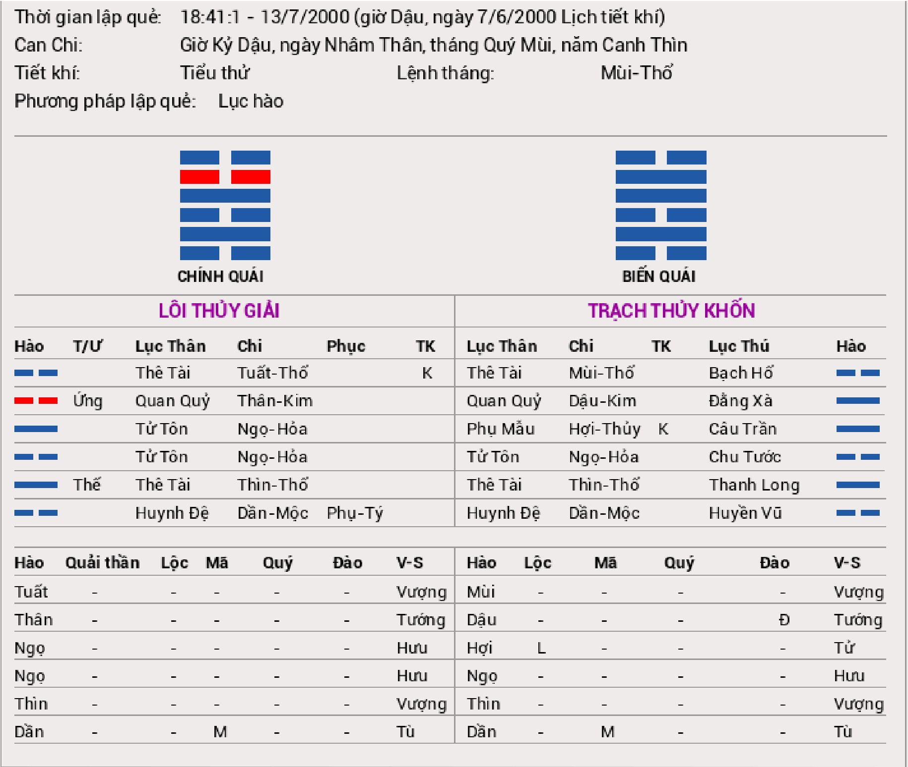
    - **Hình này chứng minh điều gì**
      - Thế lâm Thê Tài Ngọ hỏa ăn được và Quan Quỷ Thân kim lâm Quan đái có vỏ bọc.
    - **Từ đâu mà thấy được**
      - Hào 6 Đằng Xà lâm Thân kim đóng gói, bản chất là thực vật mộc quả.

##### Bảng Lục Hào Phân Tích: Lôi Thủy Giải Biến Trạch Thủy Khốn

| Hào vị | Thế/Ứng | Lục Thân (Chính) | Địa Chi & Ngũ Hành | Phục Thần | Tuần Không | Lục Thân (Biến) | Chi Biến | TK Biến | Lục Thú | Hào Tượng Biến |
| :---: | :---: | :---: | :---: | :---: | :---: | :---: | :---: | :---: | :---: | :---: |
| **Lục** | | $\text{Thê Tài}$ | $\text{Tuất-Thổ}$ | | **K** | $\text{Thê Tài}$ | $\text{Mùi-Thổ}$ | | $\text{Bạch Hổ}$ | - - |
| **Ngũ** | **Ứng** | $\text{Quan Quỷ}$ | $\text{Thân-Kim}$ (động) | | | $\text{Quan Quỷ}$ | $\text{Dậu-Kim}$ | | $\text{Đằng Xà}$ | --- |
| **Tứ** | | $\text{Tử Tôn}$ | $\text{Ngọ-Hỏa}$ (động) | | | $\text{Phụ Mẫu}$ | $\text{Hợi-Thủy}$ | **K** | $\text{Câu Trần}$ | --- |
| **Tam** | | $\text{Tử Tôn}$ | $\text{Ngọ-Hỏa}$ | | | $\text{Tử Tôn}$ | $\text{Ngọ-Hỏa}$ | | $\text{Chu Tước}$ | - - |
| **Nhị** | **Thế** | $\text{Thê Tài}$ | $\text{Thìn-Thổ}$ | | | $\text{Thê Tài}$ | $\text{Thìn-Thổ}$ | | $\text{Thanh Long}$ | --- |
| **Sơ** | | $\text{Huynh Đệ}$ | $\text{Dần-Mộc}$ | $\text{Phụ Mẫu Tý-Thủy}$ | | $\text{Huynh Đệ}$ | $\text{Dần-Mộc}$ | | $\text{Huyền Vũ}$ | - - |

##### Thần Sát và Trạng Thái Vượng Suy Địa Chi

| Địa Chi Hào | Quái Thần | Lộc Thần | Dịch Mã | Quý Nhân | Đào Hoa | Vượng/Suy (Chính) | Địa Chi Biến | Lộc Biến | Mã Biến | Quý Biến | Đào Biến | Vượng/Suy (Biến) |
| :---: | :---: | :---: | :---: | :---: | :---: | :---: | :---: | :---: | :---: | :---: | :---: | :---: |
| $\text{Tuất}$ | — | — | — | — | — | **Vượng (K)** | $\text{Mùi}$ | — | — | — | — | **Vượng** |
| $\text{Thân}$ | — | — | — | — | — | **Tướng** | $\text{Dậu}$ | — | — | — | $\text{Đào}$ | **Tướng** |
| $\text{Ngọ}$ | — | — | — | — | — | **Hưu** | $\text{Hợi}$ | $\text{Lộc}$ | — | — | — | **Tử (K)** |
| $\text{Ngọ}$ | — | — | — | — | — | **Hưu** | $\text{Ngọ}$ | — | — | — | — | **Hưu** |
| $\text{Thìn}$ | — | — | — | — | — | **Vượng** | $\text{Thìn}$ | — | — | — | — | **Vượng** |
| $\text{Dần}$ | — | — | $\text{Mã}$ | — | — | **Tù** | $\text{Dần}$ | — | $\text{Mã}$ | — | — | **Tù** |

---

#### Phân tích Cơ chế Dự đoán Bàn Đại Hải (Hạt đười ươi)
- **Định vị Dụng thần:** Lấy $\text{Ứng hào}$ tại hào 5 làm Dụng thần. Hào 5 lâm $\text{Quan Quỷ Thân-Kim}$ phát động.
  - $\text{Quan Quỷ}$ chủ về vật có tính chất biến ảo khó lường, lâm $\text{Đằng Xà}$ càng chủ về sự kỳ quái, biến dị trạng thái.
- **Khả năng bành trướng ruột rỗng:** $\text{Quan Quỷ Thân-Kim}$ động hóa Tiến thần $\text{Quan Quỷ Dậu-Kim}$. Tượng của Tiến thần trong xạ phúc biểu thị vật thể có khả năng nở to, bành trướng phồng lên gấp nhiều lần kích thước ban đầu mà bên trong lại rỗng xốp.
- **Tính chất ẩm thực:** $\text{Thế hào}$ tại hào 2 là $\text{Thê Tài Thìn-Thổ}$ lâm $\text{Thanh Long}$. $\text{Thê Tài}$ chủ thực phẩm, đồ ăn thức uống; $\text{Thanh Long}$ chủ sự thanh nhã, bổ dưỡng $\rightarrow$ vật này có công năng ăn hoặc pha nước uống được.
- **Có bao bì đóng gói:** $\text{Quan Quỷ Thân-Kim}$ sinh vào tháng $\text{Mùi-Thổ}$ là đất **Quan đái** ($\text{Kim}$ trường sinh tại $\text{Tị}$, mộc dục tại $\text{Ngọ}$, quan đái tại $\text{Mùi}$) $\rightarrow$ vật thể có vỏ bọc ngoài hoặc được đóng gói trong túi cẩn thận.
- **Số lượng nhiều:** $\text{Quan Quỷ Thân-Kim}$ lâm Nhật thần ($\text{Thân}$ nhật) nhập quẻ $\rightarrow$ số lượng vật thể trong túi không chỉ có một chiếc đơn lẻ mà có nhiều hạt.
- **Nguồn gốc thực vật:** Quẻ $\text{Lôi Thủy Giải}$ thuộc **Chấn cung**. $\text{Chấn}$ là Mộc $\rightarrow$ nguồn gốc của vật thuộc về thực vật thảo mộc.
- **Hình thể và sắc thái:**
  - Dụng thần lâm $\text{Đằng Xà}$ $\rightarrow$ sắc thái bên ngoài màu đen, bên trong ngả màu vàng nâu.
  - Dụng thần lâm Tứ Mạnh Chi ($\text{Dần}, \text{Thân}, \text{Tị}, \text{Hợi}$) $\rightarrow$ hình dáng vật thể mang hai đầu hơi thon nhọn.

#### Nghiệm chứng thực tế
Sau khi nghe luận đoán chi tiết về vật thực vật có đóng gói, đầu hơi nhọn, màu đen nâu, ăn uống được và có khả năng ngâm nước nở phồng to, Đoạn Kiến Nghiệp liền thò tay vào túi áo móc ra: Đó chính là mấy hạt **Bàn Đại Hải** (Bàng Đại Hải / 胖大海 - quả đười ươi dùng để hãm nước uống thanh nhiệt)!

---

### Ví dụ 2: Đoán Vật trong Bình Nước (Hỏa Trạch Khuê biến Hỏa Lôi Phệ Hạp)

**Bối cảnh:** Ngày $\text{Giáp Thân}$, tháng $\text{Mậu Thân}$, năm $\text{Đinh Sửu}$, trong buổi tọa đàm Dịch học chuyên đề về Lục Hào Xạ Phúc, một học viên cầm một bình giữ nhiệt uống nước đưa lên thách đố xem bên trong bình thả vật gì. Tác giả gieo được quẻ $\text{Hỏa Trạch Khuê}$ biến $\text{Hỏa Lôi Phệ Hạp}$.

#### Dữ liệu Lập quẻ và Toàn cảnh Quái tượng
- **Thời gian lập quẻ:** 18:41:01 - 10/08/1997 (giờ $\text{Dậu}$, ngày 4 tháng 7 năm Đinh Sửu Lịch tiết khí).
- **Can Chi:** Giờ $\text{Quý Dậu}$, ngày $\text{Giáp Thân}$, tháng $\text{Mậu Thân}$, năm $\text{Đinh Sửu}$.
- **Tiết khí:** Lập thu. **Nguyệt lệnh:** $\text{Thân-Kim}$. **Nhật thần:** $\text{Thân-Kim}$.
- **Tuần không:** $\text{Ngọ} - \text{Mùi}$ (tuần $\text{Giáp Ngọ}$).
- **Phương pháp lập quẻ:** Lục hào.

- Quẻ khởi Hỏa Trạch Khuê biến Hỏa Lôi Phệ Hạp xạ phúc đoán cuộn tiền trong bình nước:
  - **Hình 10.** Sơ đồ quẻ Hỏa Trạch Khuê biến Hỏa Lôi Phệ Hạp
    - 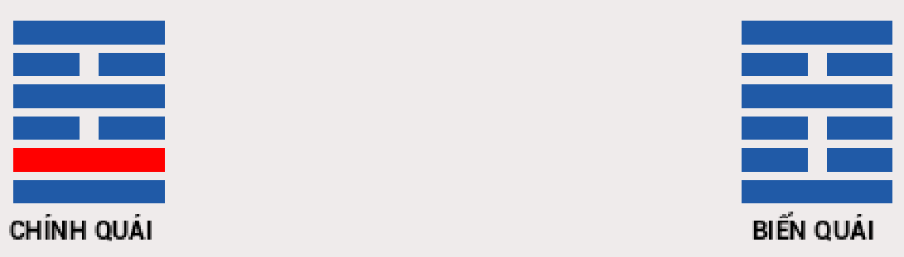
    - **Hình này chứng minh điều gì**
      - Tượng giấy có chữ trùng điệp hợp bên trong mang hình tạo thành cuộn tiền.
    - **Từ đâu mà thấy được**
      - Hào 1 phát động hóa xuất Huynh Đệ Dần mộc tạo thế trùng điệp có văn tự.

##### Bảng Lục Hào Phân Tích: Hỏa Trạch Khuê Biến Hỏa Lôi Phệ Hạp

| Hào vị | Thế/Ứng | Lục Thân (Chính) | Địa Chi & Ngũ Hành | Phục Thần | Tuần Không | Lục Thân (Biến) | Chi Biến | TK Biến | Lục Thú | Hào Tượng Biến |
| :---: | :---: | :---: | :---: | :---: | :---: | :---: | :---: | :---: | :---: | :---: |
| **Lục** | | $\text{Phụ Mẫu}$ | $\text{Tị-Hỏa}$ | | | $\text{Phụ Mẫu}$ | $\text{Tị-Hỏa}$ | | $\text{Huyền Vũ}$ | — |
| **Ngũ** | | $\text{Huynh Đệ}$ | $\text{Mùi-Thổ}$ | $\text{Thê Tài Tý-Thủy}$ | **K** | $\text{Huynh Đệ}$ | $\text{Mùi-Thổ}$ | **K** | $\text{Bạch Hổ}$ | - - |
| **Tứ** | **Thế** | $\text{Tử Tôn}$ | $\text{Dậu-Kim}$ | | | $\text{Tử Tôn}$ | $\text{Dậu-Kim}$ | | $\text{Đằng Xà}$ | — |
| **Tam** | | $\text{Huynh Đệ}$ | $\text{Sửu-Thổ}$ | | | $\text{Huynh Đệ}$ | $\text{Thìn-Thổ}$ | | $\text{Câu Trần}$ | - - |
| **Nhị** | | $\text{Quan Quỷ}$ | $\text{Mão-Mộc}$ (động) | | | $\text{Quan Quỷ}$ | $\text{Dần-Mộc}$ | | $\text{Chu Tước}$ | - - |
| **Sơ** | **Ứng** | $\text{Phụ Mẫu}$ | $\text{Tị-Hỏa}$ (động) | | | $\text{Thê Tài}$ | $\text{Tý-Thủy}$ | | $\text{Thanh Long}$ | — |

##### Thần Sát và Trạng Thái Vượng Suy Địa Chi

| Địa Chi Hào | Quái Thần | Lộc Thần | Dịch Mã | Quý Nhân | Đào Hoa | Vượng/Suy (Chính) | Địa Chi Biến | Lộc Biến | Mã Biến | Quý Biến | Đào Biến | Vượng/Suy (Biến) |
| :---: | :---: | :---: | :---: | :---: | :---: | :---: | :---: | :---: | :---: | :---: | :---: | :---: |
| $\text{Tị}$ | — | — | — | — | — | **Tù** | $\text{Tị}$ | — | — | — | — | **Tù** |
| $\text{Mùi}$ | — | — | — | $\text{Quý}$ | — | **Hưu (K)** | $\text{Mùi}$ | — | — | $\text{Quý}$ | — | **Hưu (K)** |
| $\text{Dậu}$ | — | — | — | — | $\text{Đào}$ | **Vượng** | $\text{Dậu}$ | — | — | — | $\text{Đào}$ | **Vượng** |
| $\text{Sửu}$ | — | — | — | $\text{Quý}$ | — | **Hưu** | $\text{Thìn}$ | — | — | — | — | **Hưu** |
| $\text{Mão}$ | $\text{QT}$ | $\text{Lộc}$ | — | — | — | **Tử** | $\text{Dần}$ | $\text{Lộc}$ | $\text{Mã}$ | — | — | **Tử** |
| $\text{Tị}$ | — | — | — | — | — | **Tù** | $\text{Tý}$ | — | — | $\text{Quý}$ | — | **Tướng** |

---

#### Phân tích Cơ chế Đoán Chồng Giấy có Chữ (Cuộn Tiền)
- **Định vị Dụng thần:** Lấy $\text{Ứng hào}$ tại sơ hào $\text{Phụ Mẫu Tị-Hỏa}$ làm Dụng thần. $\text{Phụ Mẫu}$ là biểu tượng kinh điển của văn thư, sách vở, giấy tờ, chứng từ, vật phẩm ghi chép thông tin.
- **Tượng văn tự in ấn:** Hào 2 $\text{Quan Quỷ Mão-Mộc}$ lâm $\text{Chu Tước}$ phát động sinh phù cho Dụng thần $\text{Phụ Mẫu Tị-Hỏa}$. $\text{Chu Tước}$ chủ về chữ viết, lời nói, văn chương $\rightarrow$ khẳng định chắc chắn đây là loại giấy tờ có in chữ viết rõ ràng.
- **Tượng lớp lớp trùng điệp:** Dụng thần $\text{Phụ Mẫu Tị-Hỏa}$ được cả Nhật thần lẫn Nguyệt lệnh song trùng ($\text{Thân}$ nguyệt và $\text{Thân}$ nhật) cùng đến tương hợp ($\text{Tị}$ hợp $\text{Thân}$). Hai tầng Kim hợp một Hỏa $\rightarrow$ tượng vật thể gồm nhiều tờ xếp chồng lớp lớp lên nhau (trùng điệp chi tượng).
- **Trùng điệp không theo quy tắc:** Trong quan hệ Địa Chi, $\text{Tị}$ và $\text{Thân}$ vừa là quan hệ tương hợp, nhưng đồng thời lại nằm trong bộ Tam hình ($\text{Dần} - \text{Tị} - \text{Thân}$). "Hợp xứ đới hình" (trong hợp có hình) $\rightarrow$ tượng các lớp giấy này tuy xếp chồng lên nhau nhưng không phẳng phiu ngay ngắn theo quy tắc trang sách, mà bị uốn cong, cuộn tròn hoặc vặn vẹo.
- **Tổng hợp kết luận:** Một chồng giấy có chữ viết được cuộn tròn không ngay ngắn đặt trong bình nước.

#### Nghiệm chứng thực tế
Người học viên liền mở nắp bình uống nước ra đổ ra bàn: Bên trong bình hoàn toàn không có nước mà là **một cuộn tiền giấy**! Tiền giấy chính là giấy tờ có in chữ số văn tự ($\text{Phụ Mẫu}$ + $\text{Chu Tước}$), nhiều tờ cuộn tròn xếp lớp đan xen không theo quy tắc đóng quyển ($\text{Tị}$ hợp $\text{Thân}$ mang hình).

---

## Chương 7: Lục hào đoán tướng mạo

Kỹ pháp đoán tướng mạo, vóc dáng và diện mạo con người trong Lục Hào là một đỉnh cao nghệ thuật tượng số. Không chỉ suy đoán cát hung trừu tượng, Lục Hào có thể phục dựng chi tiết từng đường nét khuôn mặt, vóc dáng cơ thể, khuyết tật sẹo rỗ và phong thái cử chỉ của đối tượng.

### Phân bổ Hào vị và Lục Thần Đoán Hình thể

#### Hệ thống Hào vị Cơ thể học từ Chân lên Đầu
Mỗi quẻ Lục Hào từ sơ hào đến hào 6 mô phỏng một cấu trúc cơ thể sống hoàn chỉnh theo trục thẳng đứng:
- **$\text{Sơ hào}$ (Hào 1):** Bàn chân, ngón chân, gót chân, cước lực (sức đi đứng, chạy nhảy), đế giày dép.
- **$\text{Hào nhị}$ (Hào 2):** Cẳng chân, đầu gối, bắp đùi, cơ quan sinh dục, hậu môn, vùng đáy chậu.
- **$\text{Hào tam}$ (Hào 3):** Bụng dưới, eo hông, rốn, bờ mông (phía sau lưng), cột sống thắt lưng.
- **$\text{Hào tứ}$ (Hào 4):** Lồng ngực, nhũ phòng (bầu ngực), lưng trên, nội y, áo lót, áo khoác.
- **$\text{Hào ngũ}$ (Hào 5):** Khuôn mặt, ngũ quan, sống mũi, gò má, đôi mắt, miệng, cổ họng.
- **$\text{Hào lục}$ (Hào 6):** Đỉnh đầu, sọ não, mái tóc, mũ nón, vương miện.

#### Tượng Ngũ Hành, Lục Thân và Lục Thần trong Định dạng Diện mạo
- **Tượng Ngũ Hành:**
  - $\text{Hỏa}$: Đôi mắt, thần sắc quang minh, tính nhiệt, tia nhìn sắc sảo.
  - $\text{Thổ}$: Sống mũi (trung ương thổ), da thịt, vóc dáng đẫy đà mập mạp.
  - $\text{Mộc}$: Chiều cao, vóc dáng thanh mảnh, xương dài, mái tóc.
  - $\text{Kim}$: Răng, gò má cao, khung xương cứng cáp, giọng nói vang giòn.
  - $\text{Thủy}$: Máu huyết, dịch thể, đôi tai, vẻ mềm mại uyển chuyển.
- **Tượng Lục Thân:**
  - $\text{Tử Tôn}$: Nhũ phòng (bầu ngực nữ giới), cơ quan sinh sản, nét mặt hoan hỷ tươi trẻ.
  - $\text{Phụ Mẫu}$: Áo lót, trang phục, kính mắt, lồng ngực che chở thân thể.
  - $\text{Quan Quỷ}$: Bệnh tật, dị tật, vết sẹo, nốt ruồi ác, thương tổn ngoại khoa.
  - $\text{Thê Tài}$: Da thịt, vóc dáng đầy đặn, nét đẫy đà gợi dục.
- **Tượng Lục Thần:**
  - $\text{Thanh Long}$: Đoan trang, thanh tú, mắt sáng rực rỡ, phong thái cao quý.
  - $\text{Chu Tước}$: Đôi môi đỏ, khuôn miệng đẹp, hay cười nói, nốt ruồi son.
  - $\text{Câu Trần}$: Thô dày, đẫy đà quá khổ, da ngăm vàng, chậm chạp.
  - $\text{Đằng Xà}$: Vết sẹo lồi lõm, hoa văn dị thường, nốt ruồi tàn nhang, mắt láo liên xảo quyệt.
  - $\text{Bạch Hổ}$: Trắng trẻo sắc sảo, ánh mắt uy nghiêm lạnh lùng, vết sẹo đao kiếm.
  - $\text{Huyền Vũ}$: Quyến rũ, gợi cảm, phong tình lẳng lơ, thu hút dục vọng mãnh liệt.
- **Quy tắc đặc thù:**
  - **Quẻ Lục Hợp:** Vóc dáng người đẫy đà, nở nang, cân đối, liên kết hài hòa.
  - **Tứ Mạnh Chi ($\text{Dần}, \text{Thân}, \text{Tị}, \text{Hợi}$):** Mặt trái xoan, cằm thon nhọn.
  - **Hỏa nội quái / Quẻ Lục hợp:** Tượng đôi mắt hai mí to rõ ràng.

---

### Ví dụ 1: Đoán Mặt Cận, Sẹo Mũi và Vóc dáng (Thủy Trạch Tiết)

**Bối cảnh:** Ngày $\text{Quý Mùi}$, tháng $\text{Quý Mùi}$, năm $\text{Canh Thìn}$, tác giả cùng bạn học Vương Khai Vũ bàn về Lục Hào đoán hình thể tướng mạo. Vương Khai Vũ đưa ra một quẻ thử tài xem có thể nhìn ra bao nhiêu thông tin về một cô gái mà anh quen biết. Quẻ gieo được là $\text{Thủy Trạch Tiết}$ (quẻ Tĩnh).

#### Dữ liệu Lập quẻ và Toàn cảnh Quái tượng
- **Thời gian lập quẻ:** 18:41:01 - 24/07/2000 (giờ $\text{Dậu}$, ngày 18 tháng 6 năm Canh Thìn Lịch tiết khí).
- **Can Chi:** Giờ $\text{Tân Dậu}$, ngày $\text{Quý Mùi}$, tháng $\text{Quý Mùi}$, năm $\text{Canh Thìn}$.
- **Tiết khí:** Đại thử. **Nguyệt lệnh:** $\text{Mùi-Thổ}$. **Nhật thần:** $\text{Mùi-Thổ}$.
- **Tuần không:** $\text{Thân} - \text{Dậu}$ (tuần $\text{Giáp Tuất}$).
- **Phương pháp lập quẻ:** Lục hào (Tĩnh quái).

- Quẻ tĩnh Thủy Trạch Tiết dự đoán diện mạo tật cận thị và vết sẹo sống mũi:
  - **Hình 11.** Sơ đồ quẻ Thủy Trạch Tiết
    - 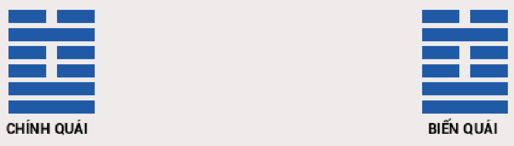
    - **Hình này chứng minh điều gì**
      - Hào 5 Mộ khố của Hỏa chủ mắt cận và Phụ Mẫu Thân kim không vong không đeo kính.
    - **Từ đâu mà thấy được**
      - Cột lục thần và hào vị từ hào 4 đến hào 5 phản ánh khuôn mặt và ngực nhỏ.

##### Bảng Lục Hào Phân Tích: Thủy Trạch Tiết (Tĩnh Quái)

| Hào vị | Thế/Ứng | Lục Thân | Địa Chi & Ngũ Hành | Phục Thần | Tuần Không | Lục Thú | Hào Tượng |
| :---: | :---: | :---: | :---: | :---: | :---: | :---: | :---: |
| **Lục** | | $\text{Huynh Đệ}$ | $\text{Tý-Thủy}$ | | | $\text{Bạch Hổ}$ | - - |
| **Ngũ** | | $\text{Quan Quỷ}$ | $\text{Tuất-Thổ}$ | | | $\text{Đằng Xà}$ | — |
| **Tứ** | **Ứng** | $\text{Phụ Mẫu}$ | $\text{Thân-Kim}$ | | **K** | $\text{Câu Trần}$ | - - |
| **Tam** | | $\text{Quan Quỷ}$ | $\text{Sửu-Thổ}$ | $\text{Thê Tài Ngọ-Hỏa}$ | | $\text{Chu Tước}$ | - - |
| **Nhị** | | $\text{Tử Tôn}$ | $\text{Mão-Mộc}$ | | | $\text{Thanh Long}$ | — |
| **Sơ** | **Thế** | $\text{Thê Tài}$ | $\text{Tị-Hỏa}$ | | | $\text{Huyền Vũ}$ | — |

##### Thần Sát và Trạng Thái Vượng Suy Địa Chi

| Địa Chi Hào | Quái Thần | Lộc Thần | Dịch Mã | Quý Nhân | Đào Hoa | Vượng/Suy |
| :---: | :---: | :---: | :---: | :---: | :---: | :---: |
| $\text{Tý}$ | $\text{QT}$ | $\text{Lộc}$ | — | — | $\text{Đào}$ | **Tử** |
| $\text{Tuất}$ | — | — | — | — | — | **Vượng** |
| $\text{Thân}$ | — | — | — | — | — | **Tướng (K)** |
| $\text{Sửu}$ | — | — | — | — | — | **Vượng (Nguyệt Phá)** |
| $\text{Mão}$ | — | — | — | $\text{Quý}$ | — | **Tù** |
| $\text{Tị}$ | — | — | $\text{Mã}$ | $\text{Quý}$ | — | **Hưu** |

---

#### Luận giải Chi tiết Diện mạo, Thần thái và Hình thể

##### 1. Luận dáng dấp tổng thể và khuôn mặt trái xoan gợi cảm
- **Xác định Dụng thần:** Vì quẻ lập ra chuyên chú khảo sát diện mạo của một người phụ nữ cụ thể, nên lấy **$\text{Thế hào}$** làm đối tượng trung tâm. $\text{Thế hào}$ tọa tại sơ hào $\text{Thê Tài Tị-Hỏa}$.
- **Vóc dáng đẫy đà:** Quẻ $\text{Thủy Trạch Tiết}$ là quẻ **Lục Hợp**. Người gặp quẻ Lục Hợp thân hình tất đầy đặn, nở nang, da thịt mỡ màng cân đối.
- **Mặt trái xoan cằm thon:** $\text{Thế hào}$ lâm $\text{Tị-Hỏa}$. Trong lý luận Lục Hào, Tứ Mạnh Chi ($\text{Dần}, \text{Thân}, \text{Tị}, \text{Hợi}$) chủ về hình thế góc nhọn $\rightarrow$ cô gái sở hữu khuôn mặt trái xoan, cằm thon gọn thanh thoát.
- **Thần thái quyến rũ lôi cuốn:** $\text{Thế hào}$ lâm $\text{Huyền Vũ}$, lại kết hợp tính chất của quẻ Lục Hợp $\rightarrow$ dung mạo và ánh mắt toát lên vẻ cực kỳ phong tình, gợi cảm, có ma lực hấp dẫn người khác phái mãnh liệt.

##### 2. Luận ngũ quan: Sẹo ở sống mũi và tật cận thị không đeo kính
- **Vết sẹo trên sống mũi:** Hào 5 $\text{Quan Quỷ Tuất-Thổ}$ lâm $\text{Đằng Xà}$. Hào 5 là hào vị khuôn mặt; hành Thổ chủ về sống mũi (trung ương); $\text{Quan Quỷ}$ chủ bệnh tật hoặc vết tích khiếm khuyết; $\text{Đằng Xà}$ chủ hoa văn, vết thâm sẹo $\rightarrow$ đoán chắc chắn trên sống mũi cô gái có một vết sẹo rõ nét.
- **Tật cận thị:** Hào 5 $\text{Tuất-Thổ}$ là Mộ khố của Hỏa ($\text{Hỏa}$ trường sinh tại Dần, mộ tại Tuất). Ngũ hành Hỏa chủ đôi mắt; đôi mắt lọt vào Mộ khố của $\text{Quan Quỷ}$ $\rightarrow$ thị lực suy giảm, bị tật cận thị.
- **Không đeo kính mắt:** Kính mắt lấy $\text{Phụ Mẫu}$ làm Dụng thần. $\text{Phụ Mẫu Thân-Kim}$ tọa tại hào 4 lâm **Tuần Không**, không nhận lực sinh trợ từ hào 5 $\text{Tuất-Thổ}$ $\rightarrow$ cô gái tuy bị cận thị nhưng lại không hề đeo kính mắt.
- **Mắt hai mí to tròn:** $\text{Thế hào}$ lâm $\text{Tị-Hỏa}$ là mắt; gặp quẻ Lục Hợp là tượng hai mí mắt liên kết; đồng thời $\text{Hỏa}$ tọa ở nội quái cũng là tượng hiển thị mắt hai mí rất rõ ràng.

##### 3. Luận hình thể: Vòng ngực khiêm tốn với nội y ngoại cỡ
- Hào 4 là hào vị của lồng ngực; lục thân $\text{Phụ Mẫu}$ chủ về khung ngực; $\text{Tử Tôn}$ chủ về nhũ phòng (bầu ngực phụ nữ).
- $\text{Phụ Mẫu Thân-Kim}$ là Tuyệt địa của $\text{Tử Tôn Mão-Mộc}$ ($\text{Mộc}$ trường sinh tại Hợi, tuyệt tại Thân). Bản thân $\text{Tử Tôn Mão-Mộc}$ trong quẻ lại hưu tù suy nhược tại tháng Mùi ngày Mùi $\rightarrow$ bầu ngực nhỏ, vòng một khiêm tốn.
- Mặt khác, $\text{Phụ Mẫu}$ tại hào 4 đại diện cho áo ngực (nội y); lâm $\text{Câu Trần}$ chủ về kích thước to dày, ngoại cỡ; nhưng hào này lại lâm **Tuần Không** (bên trong trống rỗng) $\rightarrow$ luận đoán cô gái ngực tuy nhỏ nhưng lại thường mặc áo ngực rất to (độn rỗng bên trong).

##### 4. Luận dáng đi và vòng ba phân tách lắc lư
- Hào 3 $\text{Quan Quỷ Sửu-Thổ}$ bị Nguyệt kiến $\text{Mùi-Thổ}$ tương xung thành **Nguyệt Phá** ($\text{Sửu}$ xung $\text{Mùi}$). Phá chủ về sự phân tách, chia đôi; Hào 3 lại là âm hào chủ về phía sau lưng $\rightarrow$ hào 3 chính là bờ mông hai bên phân tách.
- Nhật thần $\text{Mùi-Thổ}$ đồng thời xung hào 3 thành **Ám động** (xung khởi). Hào mông phát động $\rightarrow$ khi bước đi thì bờ mông lắc lư, uốn éo điệu đà.

#### Nghiệm chứng thực tế
Vương Khai Vũ vô cùng bái phục xác nhận toàn bộ các chi tiết luận đoán đều chuẩn xác 100%: Cô gái có khuôn mặt trái xoan, vóc dáng nở nang gợi cảm, trên sống mũi đúng là có vết sẹo nhỏ, mắt bị cận thị nhưng kiên quyết không chịu đeo kính, mắt hai mí to rõ, ngực nhỏ nhưng thích mặc áo lót độn cỡ lớn, và khi bước đi mông lắc lư uốn éo rất đặc trưng!

---

### Ví dụ 2: Đoán Hành trình Đón Mệnh lý sư Hách Kim Dương (Phong Hỏa Gia Nhân biến Phong Địa Quán)

**Bối cảnh:** Ngày $\text{Giáp Thân}$, tháng $\text{Bính Ngọ}$, năm $\text{Đinh Sửu}$, bằng hữu Đoạn Kiến Nghiệp có kế hoạch cử xe đi đón vị danh sư manh phái (bói mù) Hách Kim Dương tiên sinh đến tỉnh thành giảng dịch, bèn gieo quẻ hỏi chuyến đi đón người diễn ra thế nào. Quẻ gieo được là $\text{Phong Hỏa Gia Nhân}$ biến $\text{Phong Địa Quán}$.

#### Dữ liệu Lập quẻ và Toàn cảnh Quái tượng
- **Thời gian lập quẻ:** 18:41:01 - 11/06/1997 (giờ $\text{Dậu}$, ngày 7 tháng 5 năm Đinh Sửu Lịch tiết khí).
- **Can Chi:** Giờ $\text{Quý Dậu}$, ngày $\text{Giáp Thân}$, tháng $\text{Bính Ngọ}$, năm $\text{Đinh Sửu}$.
- **Tiết khí:** Mang chủng. **Nguyệt lệnh:** $\text{Ngọ-Hỏa}$. **Nhật thần:** $\text{Thân-Kim}$.
- **Tuần không:** $\text{Ngọ} - \text{Mùi}$ (tuần $\text{Giáp Ngọ}$).
- **Phương pháp lập quẻ:** Lục hào.

- Quẻ khởi Phong Hỏa Gia Nhân biến Phong Địa Quán giải đoán chuyến đón Hách Kim Dương:
  - **Hình 12.** Sơ đồ quẻ Phong Hỏa Gia Nhân biến Phong Địa Quán
    - 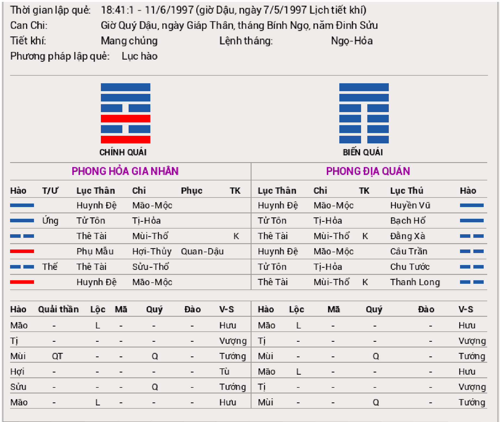
    - **Hình này chứng minh điều gì**
      - Ứng hào Tử Tôn Tị hỏa vượng tướng sinh Thế báo người nhất định sẽ đến.
    - **Từ đâu mà thấy được**
      - Hào 1 và hào 3 động biến hợp cục nhưng Thế hào vượng tướng bình an.

##### Bảng Lục Hào Phân Tích: Phong Hỏa Gia Nhân Biến Phong Địa Quán

| Hào vị | Thế/Ứng | Lục Thân (Chính) | Địa Chi & Ngũ Hành | Phục Thần | Tuần Không | Lục Thân (Biến) | Chi Biến | TK Biến | Lục Thú | Hào Tượng Biến |
| :---: | :---: | :---: | :---: | :---: | :---: | :---: | :---: | :---: | :---: | :---: |
| **Lục** | | $\text{Huynh Đệ}$ | $\text{Mão-Mộc}$ | | | $\text{Huynh Đệ}$ | $\text{Mão-Mộc}$ | | $\text{Huyền Vũ}$ | ▅▅▅▅▅ |
| **Ngũ** | **Ứng** | $\text{Tử Tôn}$ | $\text{Tị-Hỏa}$ | | | $\text{Tử Tôn}$ | $\text{Tị-Hỏa}$ | | $\text{Bạch Hổ}$ | ▅▅▅▅▅ |
| **Tứ** | | $\text{Thê Tài}$ | $\text{Mùi-Thổ}$ | | **K** | $\text{Thê Tài}$ | $\text{Mùi-Thổ}$ | **K** | $\text{Đằng Xà}$ | ▅▅  ▅▅ |
| **Tam** | | $\text{Phụ Mẫu}$ | $\text{Hợi-Thủy}$ (động) | $\text{Quan Quỷ Dậu-Kim}$ | | $\text{Huynh Đệ}$ | $\text{Mão-Mộc}$ | | $\text{Câu Trần}$ | ▅▅  ▅▅ |
| **Nhị** | **Thế** | $\text{Thê Tài}$ | $\text{Sửu-Thổ}$ (động) | | | $\text{Tử Tôn}$ | $\text{Tị-Hỏa}$ | | $\text{Chu Tước}$ | ▅▅  ▅▅ |
| **Sơ** | | $\text{Huynh Đệ}$ | $\text{Mão-Mộc}$ (động) | | | $\text{Thê Tài}$ | $\text{Mùi-Thổ}$ | **K** | $\text{Thanh Long}$ | ▅▅  ▅▅ |

##### Thần Sát và Trạng Thái Vượng Suy Địa Chi

| Địa Chi Hào | Quái Thần | Lộc Thần | Dịch Mã | Quý Nhân | Đào Hoa | Vượng/Suy (Chính) | Địa Chi Biến | Lộc Biến | Mã Biến | Quý Biến | Đào Biến | Vượng/Suy (Biến) |
| :---: | :---: | :---: | :---: | :---: | :---: | :---: | :---: | :---: | :---: | :---: | :---: | :---: |
| $\text{Mão}$ | — | $\text{Lộc}$ | — | — | — | **Hưu** | $\text{Mão}$ | $\text{Lộc}$ | — | — | — | **Hưu** |
| $\text{Tị}$ | — | — | — | — | — | **Vượng** | $\text{Tị}$ | — | — | — | — | **Vượng** |
| $\text{Mùi}$ | $\text{QT}$ | — | — | $\text{Quý}$ | — | **Tướng (K)** | $\text{Mùi}$ | — | — | $\text{Quý}$ | — | **Tướng (K)** |
| $\text{Hợi}$ | — | — | — | — | — | **Tù** | $\text{Mão}$ | $\text{Lộc}$ | — | — | — | **Hưu** |
| $\text{Sửu}$ | — | — | — | $\text{Quý}$ | — | **Tướng** | $\text{Tị}$ | — | — | — | — | **Vượng** |
| $\text{Mão}$ | — | $\text{Lộc}$ | — | — | — | **Hưu** | $\text{Mùi}$ | — | — | $\text{Quý}$ | — | **Tướng (K)** |

---

#### Luận giải Xuất hành, Dụng thần Thuật sĩ và Trở ngại Giao thông
- **Định vị Dụng thần Thuật sĩ giang hồ:** Hách Kim Dương tiên sinh là bậc thầy mệnh lý giang hồ trứ danh, cả đời lấy bói toán đoán mệnh nuôi thân, phiêu bạt tự do không thuộc biên chế nhà nước $\rightarrow$ lấy **$\text{Tử Tôn}$** làm Dụng thần ($\text{Tử Tôn}$ chủ nghệ nhân, thuật sĩ, tăng đạo, người tự do nhàn tản).
- **Khẳng định người nhất định sẽ đến:** $\text{Ứng hào Tử Tôn Tị-Hỏa}$ được Nguyệt lệnh $\text{Ngọ-Hỏa}$ tương trợ vượng tướng, lại sinh trợ cho $\text{Thế hào Thê Tài Sửu-Thổ}$ $\rightarrow$ Hách tiên sinh chắc chắn sẽ đồng ý đến tỉnh thành.
- **Biện chứng Hợp xứ phùng xung (合處逢沖):** Dụng thần $\text{Tị-Hỏa}$ tuy cùng Nhật thần $\text{Thân-Kim}$ tương hợp ($\text{Tị}$ hợp $\text{Thân}$, tượng như bị vướng mắc níu giữ); song trong quẻ hào 3 $\text{Phụ Mẫu Hợi-Thủy}$ phát động xung phá $\text{Tị-Hỏa}$ ($\text{Hợi}$ xung $\text{Tị}$). Đây là tượng "Hợp gặp xung thì giải phóng", lực trói buộc bị phá bỏ, chuyến đi không hề bị hủy bỏ.
- **Cơ chế nghẽn xe tại ngã ba đường:**
  - Trong quẻ, ba hào nội quái đều phát động: $\text{Hợi} - \text{Mão} - \text{Mùi}$ tam hợp Mộc cục $\text{Huynh Đệ}$ khắc Thế. May nhờ $\text{Thế hào Thê Tài Sửu-Thổ}$ vượng tướng, Mộc suy mùa hè nên không thành đại hung.
  - Tuy nhiên, sách xưa dạy: *"Huynh động tất có ngăn trở"* ($\text{Huynh Đệ}$ chủ sự cản trở, đình trệ).
  - Lục thân $\text{Phụ Mẫu}$ là xe cộ; Hào 3 $\text{Phụ Mẫu Hợi-Thủy}$ động hóa $\text{Huynh Đệ Mão-Mộc}$; mà $\text{Mão-Mộc}$ là tử địa của $\text{Hợi-Thủy}$ ($\text{Thủy}$ tử tại $\text{Mão}$).
  - Sơ hào $\text{Huynh Đệ Mão-Mộc}$ phát động: Sơ hào là bàn chân, cước lực, mặt đường di chuyển $\rightarrow$ tượng phương tiện xe cộ bị tắc nghẽn ngay trên mặt đất.
  - Chi $\text{Mão}$ mang tượng cành cây phân nhánh, lối rẽ $\rightarrow$ đoán chuyến xe đi đón Hách tiên sinh sẽ bị kẹt cứng giao thông tại một ngã ba đường.

#### Nghiệm chứng thực tế
Ngày hôm sau, tài xế lái xe khởi hành đi đón Hách tiên sinh. Xe chạy đến nửa đường thì tới một ngã ba, đúng lúc tại ngã ba đó có một đám đông người tụ tập gây rối, phong tỏa hoàn toàn tuyến giao thông khiến xe không thể nhích lên được. Tài xế buộc phải quay đầu chuyển sang tuyến đường vòng khác, cuối cùng vẫn đón được Hách Kim Dương tiên sinh về tỉnh thành an toàn ngay trong ngày!

## Chương 8: Ngàn vạn không thể bổ

### 1. Nguyên lý Y lý Dịch học: Cấm kỵ Thuốc bổ trong Nội nhiệt Thực chứng

#### 1.1. Bản chất Nội nhiệt Thực chứng trong Lục Hào
- Trong hệ thống Bốc dịch Y học và Đông y truyền thống, bệnh tật được phân định rành mạch thành hai trạng thái: **Hư chứng** (chính khí suy vi, cần bồi bổ) và **Thực chứng** (tà khí thịnh vượng, tạng phủ quá thừa nhiệt hoặc ứ trệ, cần thanh nhiệt tả hỏa hoặc trục ứ).
- Trạng thái nội nhiệt thực chứng trên quẻ biểu hiện qua các dấu hiệu:
  - Dụng thần hoặc Thế hào mang hành $\text{Hỏa}$ đạt mức cực vượng, được Nhật thần, Nguyệt kiến đồng thời sinh trợ hoặc lâm hào động ngũ hành $\text{Mộc}$ dốc toàn lực sinh phù ($\text{Mộc} \rightarrow \text{Hỏa}$).
  - Lâm Lục thần $\text{Chu Tước}$ (chủ viêm nhiệt, sốt cao, nóng bức, hỏa khí bốc lên đầu và ngũ quan).
  - Khái niệm *"Vật cực tất phản"*: Khi một ngũ hành đạt tới trạng thái vượng cực vô chế, nó không còn tiếp nhận thêm sinh trợ. Bất kỳ sự tiếp ứng sinh phù nào từ Nguyên thần đều trở thành tác nhân hủy hoại, đẩy trạng thái nội nhiệt thành ngọn lửa thiêu đốt tân dịch và tạng phủ. Trong hoàn cảnh này, **Nguyên thần biến chất thành Cừu thần**.

#### 1.2. Hậu quả Bệnh lý khi Dùng Thuốc Bổ và Cơ chế Thoát nhiệt
- Bản chất của thuốc bổ (kể cả dung dịch đường truyền, sâm nhung, dược liệu bổ khí trợ dương): ngũ hành quy về $\text{Mộc}$ hoặc $\text{Thổ}$ sinh $\text{Hỏa}$, mang tính năng bồi bổ sinh lực. Khi đưa thuốc bổ vào cơ thể đang thực nhiệt vượng $\text{Hỏa}$, tương đương với hành vi "thêm dầu vào lửa" (*tiếp Mộc trợ Hỏa*).
- Hậu quả trực tiếp:
  - Khí nhiệt uất kết không thể phát tiết, bức bách huyết dịch vận hành hỗn loạn (*nhiệt bức huyết vọng hành*), làm vỡ mạch máu dẫn đến xuất huyết dữ dội ở khiếu (mũi, miệng, đường tiết niệu).
  - Tạng phủ bị nung nấu khiến thân nhiệt tăng vọt, nội tạng như thiêu đốt, rơi vào hôn mê sâu và dẫn đến tử vong đột ngột.
- Quy tắc điều trị và cứu vãn dựa trên biến dịch:
  - Tuyệt đối cấm dùng ngũ hành $\text{Thủy}$ để trực tiếp dội tắt ngọn lửa khi trong quẻ có $\text{Mộc}$ vượng phát động. Bởi vì ngũ hành vận hành theo vòng tuần hoàn tương sinh: $\text{Thủy}$ sinh $\text{Mộc}$, $\text{Mộc}$ lại tiếp tục sinh $\text{Hỏa}$, dẫn tới hiện tượng "dùng Thủy trợ Hỏa" phản tác dụng.
  - Phải dùng ngũ hành $\text{Kim}$ (đại diện bởi $\text{Tử Tôn}$) để phạt $\text{Mộc}$ ($\text{Kim}$ khắc $\text{Mộc}$), chặt đứt nguồn cung dưỡng của Cừu thần. Dùng đồ trang sức vàng bạc, tượng đồng, hoặc cho uống nước nấu từ vàng/đồng (*hoàng kim canh*).
  - Cần xung khai Mộ khố của $\text{Hỏa}$ (Mộ khố $\text{Tuất}$ Thổ cần hào $\text{Thìn}$ Thổ xung khai) để tạo lối thoát cho nhiệt khí tích tụ trong cơ thể giải tỏa ra ngoài.
  - Khi quẻ nội lâm **Phục Ngâm**, bệnh nhân rên rỉ liệt giường, thần khí bế tắc, tuyệt đối cấm kỵ di chuyển chỗ ở hoặc thay đổi môi trường tĩnh dưỡng.

---

### 2. Nghiên cứu Thực nghiệm: Đoán Bệnh Nguy kịch và Xuất huyết Mũi (Thủy Thiên Nhu biến Địa Lôi Phục)

#### 2.1. Dữ liệu Quẻ Khí và Tình huống Khảo sát
- **Thời gian lập quẻ:** Ngày $\text{Ất Mão}$, tháng $\text{Mão}$ ($\text{Mão}$ nguyệt $\text{Ất Mão}$ nhật).
- **Tuần không:** Tuần $\text{Giáp Dần}$ ($\text{Tý}$, $\text{Sửu}$ Không vong).
- **Bối cảnh:** Một phụ nữ làm tiếp tân nhà khách nhận được điện thoại khẩn từ quê nhà báo tin cha ruột bệnh tình nguy kịch, đã hấp hối chuẩn bị hậu sự, yêu cầu về gấp. Trước khi lên đường, người phụ nữ gieo quẻ hỏi sinh mệnh của cha.
- **Quẻ tượng:** **Thủy Thiên Nhu** biến **Địa Lôi Phục** ($\text{Thủy Thiên Nhu} \rightarrow \text{Địa Lôi Phục}$).

- Quẻ khởi Thủy Thiên Nhu biến Địa Lôi Phục cảnh báo cấm kỵ dùng thuốc bổ khi nhiệt cực thịnh:
  - **Hình 13.** Sơ đồ quẻ Thủy Thiên Nhu biến Địa Lôi Phục
    - 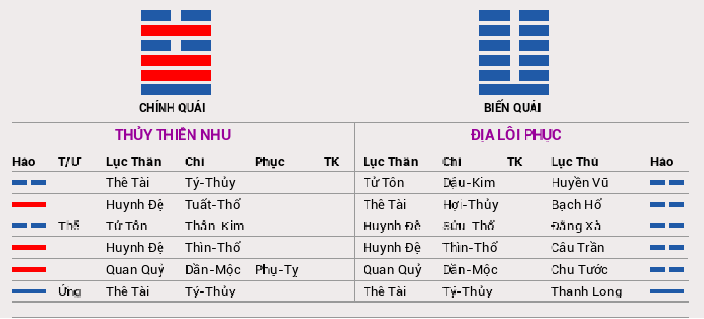
    - **Hình này chứng minh điều gì**
      - Bệnh gần gặp quẻ biến Lục Hợp và Phục Ngâm khó qua khỏi ngày Đinh Mão.
    - **Từ đâu mà thấy được**
      - Quẻ nội phục ngâm càn biến chấn và Tử Tôn Thân kim hưu tù bất lực.

##### Bảng phối quẻ Lục Hào chi tiết:
- **Chính quái:** $\text{Thủy Thiên Nhu}$ (Quái cung: $\text{Khôn}$ vi Địa - Du Hồn quái).
- **Biến quái:** $\text{Địa Lôi Phục}$ (Quái cung: $\text{Khôn}$ vi Địa - Lục Hợp quái).

| Hào | Thế / Ứng | Lục Thân (Chính) | Nạp Chi | Phục Thần | Can Chi Biến | Lục Thân (Biến) | Biến Hào | Lục Thú | Trạng Thái Động / Tĩnh |
| :---: | :---: | :---: | :---: | :---: | :---: | :---: | :---: | :---: | :---: |
| 6 | | Thê Tài | $\text{Tý}$ - Thủy | | $\text{Dậu}$ - Kim | Tử Tôn | $- -$ | Huyền Vũ | Tĩnh (Tuần không) |
| 5 | | Huynh Đệ | $\text{Tuất}$ - Thổ | | $\text{Hợi}$ - Thủy | Thê Tài | $- -$ | Bạch Hổ | Động phát (Hóa Thoái/Tài) |
| 4 | Thế | Tử Tôn | $\text{Thân}$ - Kim | | $\text{Sửu}$ - Thổ | Huynh Đệ | $- -$ | Đằng Xà | Tĩnh (Tuyệt tại Nhật Nguyệt) |
| 3 | | Huynh Đệ | $\text{Thìn}$ - Thổ | | $\text{Thìn}$ - Thổ | Huynh Đệ | $- -$ | Câu Trần | Động phát (Xung khố hào 5) |
| 2 | | Quan Quỷ | $\text{Dần}$ - Mộc | $\text{Phụ Mẫu Tỵ - Hỏa}$ | $\text{Dần}$ - Mộc | Quan Quỷ | $- -$ | Chu Tước | Động phát (Phi hào động) |
| 1 | Ứng | Thê Tài | $\text{Tý}$ - Thủy | | $\text{Tý}$ - Thủy | Thê Tài | $—$ | Thanh Long | Tĩnh (Tuần không) |

---

#### 2.2. Phân tích Kỹ pháp và Cơ chế Bệnh lý Tạng phủ

##### 2.2.1. Xác định Dụng Thần và Vị trí Bệnh nhân
- Hỏi bệnh của cha ruột, lấy hào **Phụ Mẫu** làm Dụng thần.
- Trên quẻ chính $\text{Thủy Thiên Nhu}$, hào Phụ Mẫu không xuất hiện trên sáu hào, phải tra tìm Phục thần từ quẻ gốc bản cung $\text{Bát Thuần Khôn}$: Phụ Mẫu $\text{Tỵ}$ Hỏa phục dưới hào 2 Quan Quỷ $\text{Dần}$ Mộc ($\text{Dần}$ sinh $\text{Tỵ}$).
- Hào 2 là trạch hào, đại diện cho phòng ốc, giường nằm. Phục thần lâm hào 2 phản ánh rõ hình thái: người cha bệnh nặng đang nằm liệt trên giường bệnh tại nhà.

##### 2.2.2. Biện chứng Nhiệt Độc Cực Vượng và Nguyên Thần Hóa Cừu Địch
- Phụ Mẫu $\text{Tỵ}$ Hỏa đắc cả Nguyệt kiến $\text{Mão}$ Mộc lẫn Nhật thần $\text{Mão}$ Mộc sinh trợ, lại có Phi hào hào 2 Quan Quỷ $\text{Dần}$ Mộc động phát trường sinh trợ giúp.
- Trong toàn quẻ, Dụng thần $\text{Tỵ}$ Hỏa chỉ có sinh mà không hề chịu một tia khắc chế nào $\rightarrow$ Hỏa vượng thái quá thành đại họa. Dụng thần quá vượng kết hợp Phi hào lâm $\text{Chu Tước}$ (hỏa thần) xác nhận bệnh lý là chứng thực nhiệt sốt cao cấp tính.
- Phi hào Quan Quỷ $\text{Dần}$ Mộc động: tháng $\text{Dần}$ là tiết Lập xuân, báo hiệu mầm mống căn bệnh bắt đầu khởi phát từ tháng Giêng (tháng $\text{Dần}$).
- Vì Dụng thần quá vượng, Nguyên thần $\text{Dần}$ Mộc động sinh trở thành kẻ thù (*Cừu thần*), thúc ép ngọn lửa bùng phát thiêu rụi nguyên khí. Hào 2 chủ bộ phận sinh dục và đường tiết niệu, lâm $\text{Chu Tước}$ $\rightarrow$ nước tiểu có màu vàng sẫm hoặc đỏ ngầu.

##### 2.2.3. Tượng Quái Du Hồn, Phục Ngâm và Cơ chế Xuất huyết Mũi
- **Du Hồn quái:** Quẻ Nhu là quẻ Du hồn của cung Khôn, chủ thần hồn phiêu tán, đầu óc mơ hồ, mất trí nhớ, sinh mệnh lâm vào tình trạng hấp hối.
- **Nội quái Phục Ngâm:** Nội quái $\text{Càn}$ biến nội quái $\text{Chấn}$ mang các địa chi hào 1, 2, 3 ($\text{Tý}$, $\text{Dần}$, $\text{Thìn}$) y hệt nhau, tạo thành cách Phục ngâm. Tượng Phục ngâm chủ rên rỉ, đau đớn dữ dội, bệnh tình dày vò triền miên trên giường bệnh.
- **Cơ chế xuất huyết mũi qua Hào 5:**
  - Hào 5 Huynh Đệ $\text{Tuất}$ Thổ là **Mộ khố** của Dụng Thần $\text{Tỵ}$ Hỏa ($\text{Tỵ}$ Mộ tại $\text{Tuất}$). Khi Hỏa vượng cực độ, quy luật ngũ hành đòi hỏi phải có Mộ khố dung nạp, cất giữ để hạ nhiệt.
  - Hào 5 trên cơ thể tượng trưng cho ngũ quan, mặt và **mũi**. Hào 5 phát động lâm $\text{Bạch Hổ}$ (chủ huyết quang, sát thương) hóa xuất Thê Tài $\text{Hợi}$ Thủy (Tài chủ huyết dịch) $\rightarrow$ Hỏa khí bức huyết xông thẳng lên mũi gây xuất huyết mũi dữ dội (*chảy máu cam nghiêm trọng*).
- **Vai trò Hỉ Thần của Hào 3:**
  - Nguyệt kiến $\text{Mão}$ Mộc và Nhật thần $\text{Mão}$ Mộc hợp chặt Mộ khố $\text{Tuất}$ Thổ ($\text{Mão - Tuất}$ tương hợp bế khố), làm cho hỏa khí không thể giáng nạp vào khố, nhiệt độc bị giữ lại nung đốt cơ thể.
  - May nhờ hào 3 Huynh Đệ $\text{Thìn}$ Thổ đồng thời phát động xung khai $\text{Tuất}$ Thổ ($\text{Thìn - Tuất}$ tương xung), phá vỡ liên kết bế tắc của Nhật Nguyệt, giúp khố mở ra cứu mạng lâm thời. Do đó $\text{Thìn}$ Thổ đóng vai trò Hỉ thần duy nhất.
  - Tuy nhiên, $\text{Thìn}$ Thổ lâm mùa xuân suy nhược hưu tù, lại bị tam trọng Mộc (Nhật, Nguyệt, hào 2) khắc phạt nặng nề. Hào 3 là vùng bụng, quẻ gốc thuộc $\text{Khôn}$ cung cũng chủ bụng, lại lâm $\text{Câu Trần}$ (chủ sưng phù, ứ trệ) $\rightarrow$ bụng dưới sưng trướng, đau đớn khó chịu.

##### 2.2.4. Trạng thái Trị liệu và Biến quái Lục Hợp
- Thế hào hào 4 Tử Tôn $\text{Thân}$ Kim: Tử Tôn là y dược, thuốc men, tự thân dùng thuốc. Nhưng $\text{Thân}$ Kim ở mùa xuân tháng $\text{Mão}$ ngày $\text{Mão}$ lâm Tuyệt địa, hoàn toàn hưu tù vô lực $\rightarrow$ việc dùng thuốc thông thường không mang lại hiệu quả.
- Hào Thê Tài $\text{Tý}$ Thủy lâm Tuần không: Thê Tài chủ ẩm thực, đồ ăn thức uống lâm Không vong $\rightarrow$ bệnh nhân đã cạn kiệt khả năng ăn uống, nuốt thức ăn vô cùng khó khăn.
- **Biến quái Lục Hợp ($\text{Địa Lôi Phục}$):** Cổ ngữ bốc dịch định tắc: *"Cận bệnh phùng xung tắc dũ, phùng hợp tất tử"* (bệnh mới phát gặp quẻ xung thì mau lành, gặp quẻ biến Lục Hợp ắt bỏ mạng). Biến quẻ Lục Hợp giam hãm bệnh nhân trong tử địa.
- **Ứng kỳ cát hung:**
  - Ngày xem ($\text{Ất Mão}$): Bệnh dù hung hiểm tột cùng nhưng chưa thể chết ngay, bởi đến giờ $\text{Dậu}$ trong ngày sẽ xung khai liên kết $\text{Mão - Tuất}$ hợp khố, tạm thời giải nguy.
  - Bước sang tuần giáp tiếp theo ($\text{Giáp Tý}$): Tuần Giáp Tý có $\text{Tuất}$ và $\text{Hợi}$ lâm Không vong. Hào 5 $\text{Tuất}$ Thổ nhập Không vong sẽ mất hoàn toàn năng lực thu nạp hỏa khí. Đến ngày $\text{Đinh Mão}$, can $\text{Đinh}$ tiếp ứng Hỏa, chi $\text{Mão}$ lại liên kết bế khố và sinh $\text{Tỵ}$ Hỏa $\rightarrow$ đến ngày $\text{Đinh Mão}$ chắc chắn đại hạn không qua khỏi.
- **Biện pháp cứu viện:** Cần mang trên người đồ vật bằng đồng, trang sức vàng hoặc uống nước hoàng kim canh để dùng Kim chế ngự Mộc độc phát. Tuyệt đối cấm dùng Thủy giải nhiệt (tránh Thủy sinh Mộc) và cấm uống thuốc bổ.

---

#### 2.3. Nghiệm chứng Thực tế và Bài học Cảnh tỉnh
- Triệu chứng thực tế hoàn toàn trùng khớp với lời đoán: bệnh nhân bị chảy máu mũi liên tục, trong bụng nóng rát như có lò lửa nung nấu, rơi vào trạng thái bất tỉnh nhân sự. Gia đình đã mua sẵn quan tài và may áo liệm.
- Người con gái sau khi về nhà, đêm đó thấy cha tỉnh lại theo đúng giờ dự đoán, liền đem tượng Phật bằng đồng nhỏ đeo cho cha, nhưng người cha không thích nên gỡ bỏ.
- Do thiếu hiểu biết về cấm kỵ của quẻ Phục ngâm, người anh trai đã di chuyển cha về nhà mình để tiện chăm sóc, vi phạm nghiêm trọng cấm kỵ *"Phục ngâm bất khả di trạch"*.
- Trong cơn đau đớn dữ dội, người cha từng nuốt một chiếc nhẫn vàng để tự sát, nhưng chiếc nhẫn bị mắc kẹt tại cổ họng không trôi xuống được và được người nhà móc ra $\rightarrow$ ngũ hành Kim không thể thẩm thấu vào cơ thể để cứu vãn.
- Đến ngày $\text{Đinh Mão}$, người chị gái thấy cha nhịn ăn quá lâu nên tự ý cho uống nước đường glucose để bồi bổ sức khỏe (cho rằng bệnh viện vẫn truyền đường). Sau khi uống nước đường vào bụng, nhiệt độc bốc hỏa dữ dội, toàn thân phát sốt nóng rực không thể chịu nổi. Người cha cởi hết quần áo nhảy vào thùng nước lạnh ngâm mình để hạ hỏa nhưng vô vọng, và đã qua đời ngay trong ngày $\text{Đinh Mão}$ đúng như quẻ đoán.

---

## Chương 9: Giếng nước nghiên cứu cùng nghiệm chứng luận

### 1. Cơ sở Lý luận và Đính chính Cổ thư « Dịch Ẩn »

#### 1.1. Giá trị của Giếng nước và Tầm nhìn Hiện đại Hóa
- Nguồn nước là huyết mạch sinh tồn của con người. Trong xã hội cổ đại, giếng nước là công trình cung cấp nguồn nước uống chủ yếu của mỗi gia đình và làng xã, vì vậy cổ nhân rất chú trọng phép chiêm đoán về giếng nước.
- Trong các tài liệu Lục Hào cổ đại, không có trước tác nào luận đoán về giếng nước đồ sộ, chi tiết bằng cuốn « Dịch Ẩn » với hàng chục trang sách chuyên khảo. Tuy nhiên, tác giả Vương Hổ Ứng chỉ rõ: dù « Dịch Ẩn » hàm chứa một số tư duy khoáng đạt, nhưng phần lớn nội dung không bắt nguồn từ thực tiễn bốc dịch mà do tác giả cổ đại ngồi trong thư phòng tưởng tượng, suy diễn chủ quan, tạo ra hàng loạt công thức ngụy tạo sai lệch hoàn toàn với Dịch lý nạp giáp.
- Trong đời sống hiện đại, giếng nước dần được thay thế bằng hệ thống nước máy, đường ống dẫn nước và hệ thống cống rãnh thoát nước. Tuy nhiên, việc khảo cứu và đính chính các sai lầm của « Dịch Ẩn » có ý nghĩa học thuật sống còn để giữ vững tính chính xác của học thuyết Lục Hào.

#### 1.2. Định vị Chuẩn xác Tượng Giếng Nước trong Lục Hào
- **Sơ hào vi tỉnh:** Khảo nghiệm thực tiễn khẳng định sơ hào (hào 1) là mặt đất sâu, nền móng, đáy giếng, giếng nước $\rightarrow$ hoàn toàn chuẩn xác.
- **Góc độ Lục thân:** Hào **Thê Tài** đại diện cho thực phẩm, đồ ăn thức uống. Vì vậy, hào Thê Tài mang ngũ hành $\text{Thủy}$ chủ về nguồn nước uống sinh hoạt là hợp lý.
- **Tử Tôn $\text{Thân}$ Kim:** Ngũ hành $\text{Thân}$ Kim là đất **Trường sinh** của ngũ hành $\text{Thủy}$ ($\text{Thân}$ sinh $\text{Tý}$ Thủy). Lấy trường sinh của Thủy để định vị nguồn sinh dưỡng của nước giếng là hoàn toàn hợp quy luật sinh khắc.
- **Góc độ Lục thần:** $\text{Bạch Hổ}$ chủ về đường sá; giếng nước là mạch nước ngầm lưu thông (thủy lộ) nên lâm Bạch Hổ là có căn cứ. Mặt khác, $\text{Thanh Long}$ trong Lục Hào chủ về ẩm thực thanh khiết, nên hào giếng lâm Thanh Long cũng chủ về nước uống trong lành.

#### 1.3. Vạch trần 7 Luận điểm Ngụy tạo Sai lệch trong « Dịch Ẩn Gia Đình Chiêm »

##### (1) Phê phán Luận điểm "Sơ hợp hào tam, phòng tỉnh tương liên"
- *Văn bản cổ:* Hào 1 tương hợp với hào 3 thì phòng ốc và giếng nước liền kề nhau.
- *Sai lầm học thuật:* Theo quy tắc nạp giáp 64 quẻ, các địa chi nạp vào hào 1 và hào 3 của cùng một quẻ nội luôn có tính chất cùng dương hoặc cùng âm theo bước nhảy địa chi (cách 1 cung). Địa chi hào 1 và hào 3 **vĩnh viễn không bao giờ tạo thành quan hệ lục hợp** (ví dụ: $\text{Tý}$ đi với $\text{Thìn}$, $\text{Dần}$ đi với $\text{Ngọ}$, $\text{Thìn}$ đi với $\text{Thân}$... không bao giờ có $\text{Tý - Sửu}$, $\text{Dần - Hợi}$, $\text{Mão - Tuất}$ xuất hiện ở hào 1 và hào 3).

##### (2) Phê phán Luận điểm "Sơ kim xà động, tỉnh mai thi cốt"
- *Văn bản cổ:* Hào 1 mang hành Kim lâm Đằng Xà phát động thì đáy giếng có chôn xác xương người/động vật.
- *Sai lầm học thuật:* Trong toàn bộ hệ thống nạp giáp 64 quẻ, ngũ hành Kim ($\text{Thân}$ Kim hoặc $\text{Dậu}$ Kim) **vĩnh viễn không bao giờ được nạp vào sơ hào** của bất kỳ quẻ nào. (Sơ hào của bát quái chỉ nạp: Càn-$\text{Tý}$, Khảm-$\text{Dần}$, Cấn-$\text{Thìn}$, Chấn-$\text{Tý}$, Tốn-$\text{Sửu}$, Ly-$\text{Mão}$, Khôn-$\text{Mùi}$, Đoài-$\text{Tỵ}$). Không có sơ hào mang hành Kim thì công thức trên hoàn toàn là bịa đặt.

##### (3) Phê phán Luận điểm "Sơ Nhâm Quý động, toàn đa"
- *Văn bản cổ:* Hào 1 mang thiên can Nhâm hoặc Quý phát động thì mạch suối giếng nước dồi dào.
- *Sai lầm học thuật:* Trong phép phối nạp thiên can bát quái, can $\text{Nhâm}$ chỉ nạp cho ngoại quái của quẻ Càn, can $\text{Quý}$ chỉ nạp cho ngoại quái của quẻ Khôn. Thiên can $\text{Nhâm}$ và $\text{Quý}$ **chỉ xuất hiện ở quẻ ngoại (các hào 4, 5, 6)**, tuyệt đối không bao giờ lâm vào sơ hào (thuộc quẻ nội).

##### (4) Phê phán Luận điểm về Ngũ Hành Nạp Âm bên Giếng
- *Văn bản cổ:* Hào 1 thuộc Mộc bên giếng có cây: "Canh Dần Tân Mão tùng bách mộc, Canh Thân Tân Dậu thạch lựu mộc, Kỷ Tị quế mộc, Mậu Thìn trúc mộc, Nhâm Ngọ Quý Mùi dương liễu mộc".
- *Sai lầm học thuật:* Hào 1 có thể mang địa chi hành Mộc ($\text{Dần}$ hoặc $\text{Mão}$), nhưng toàn bộ các tổ hợp hoa giáp can chi nạp âm mà sách liệt kê **không có một tổ hợp nào có thể nạp vào sơ hào**. Hơn thế nữa, trong toàn bộ 64 quẻ dịch, **hoàn toàn không tồn tại bất kỳ hào nào mang can chi Quý Mùi**.

##### (5) Phê phán Luận điểm "Hào nhị Hổ Kim hợp, tỉnh thạch lan"
- *Văn bản cổ:* Hào 2 lâm Bạch Hổ Kim tương hợp thì giếng có thành lan can bằng đá.
- *Sai lầm học thuật:* Xét theo phân hào, hào 2 là thành giếng là đúng lý. Nhưng trong nạp giáp, **hào 2 không bao giờ nạp Thân Kim hoặc Dậu Kim** (hào 2 chỉ nạp: Càn-$\text{Dần}$, Khảm-$\text{Thìn}$, Cấn-$\text{Ngọ}$, Chấn-$\text{Dần}$, Tốn-$\text{Hợi}$, Ly-$\text{Sửu}$, Khôn-$\text{Tỵ}$, Đoài-$\text{Mão}$). Chỉ có trường hợp hào khác mang hành Kim đến hợp hào 2 là khả dĩ.

##### (6) Phê phán Luận điểm "Canh Tuất Tân Hợi xung sơ hào, sức trụy tỉnh"
- *Văn bản cổ:* Hoa giáp Canh Tuất, Tân Hợi xung sơ hào thì đồ trang sức rơi xuống giếng.
- *Sai lầm học thuật:* Trong 64 quẻ, hoa giáp $\text{Tân Hợi}$ duy nhất chỉ xuất hiện tại hào 2 của quẻ thuộc cung Tốn (quẻ nội Tốn nạp can Tân: hào 1 $\text{Tân Sửu}$, hào 2 $\text{Tân Hợi}$, hào 3 $\text{Tân Dậu}$). Mà hào 2 và hào 1 trong cùng quẻ thì **vĩnh viễn không thể tương xung nhau**.

##### (7) Phê phán Luận điểm "Sơ cầm kim xà động, thiết câu lạc tỉnh"
- *Văn bản cổ:* Hào 1 mang hành Kim lâm Đằng Xà động thì móc sắt rơi xuống giếng.
- *Sai lầm học thuật:* Sai lầm hoàn toàn tương tự mục (2), ngũ hành Kim không hiện diện ở sơ hào.

---

### 2. Nghiên cứu Thực nghiệm: Tìm Dê Chết Ven Giếng Cạn (Thiên Sơn Độn biến Thiên Địa Bĩ)

#### 2.1. Dữ liệu Quẻ Khí và Tình huống Khảo sát
- **Thời gian lập quẻ:** 18:41:01 ngày 28/05/1999 (Giờ $\text{Ất Dậu}$, ngày $\text{Canh Thìn}$, tháng $\text{Kỷ Tỵ}$, năm $\text{Kỷ Mão}$).
- **Tiết khí:** Tiểu mãn. **Nguyệt lệnh:** $\text{Tỵ}$ Hỏa.
- **Tuần không:** Tuần $\text{Giáp Tuất}$ ($\text{Thân}$, $\text{Dậu}$ Không vong).
- **Bối cảnh:** Mùa hè năm Kỷ Mão, chuyên gia Dịch học Đoạn Kiến Nghiệp đi dã ngoại tại vùng núi nắng nóng gắt gao. Khi trở về Thái Nguyên, ông đưa ra một quẻ hỏi Vương Hổ Ứng: *"Thịt dê có ăn được hay không?"*.
- **Quẻ tượng:** **Thiên Sơn Độn** biến **Thiên Địa Bĩ** ($\text{Thiên Sơn Độn} \rightarrow \text{Thiên Địa Bĩ}$).

- Quẻ khởi Thiên Sơn Độn biến Thiên Địa Bĩ tìm xác đàn dê ven giếng cạn:
  - **Hình 14.** Sơ đồ quẻ Thiên Sơn Độn biến Thiên Địa Bĩ
    - 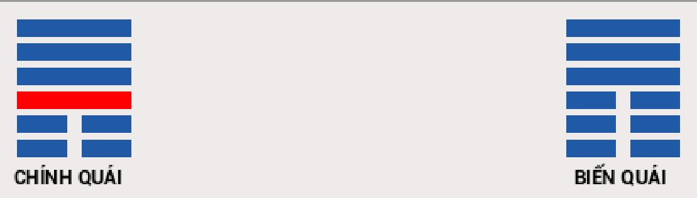
    - **Hình này chứng minh điều gì**
      - Sơ hào Phụ Mẫu Thìn thổ lâm Bạch Hổ và Tử Tôn Tý thủy phục tàng định vị giếng cạn.
    - **Từ đâu mà thấy được**
      - Sơ hào Thìn thổ là đất mộ khố của Thủy biểu thị xác dê chết dưới giếng.

##### Bảng phối quẻ Lục Hào chi tiết:
- **Chính quái:** $\text{Thiên Sơn Độn}$ (Quái cung: $\text{Càn}$ vi Thiên).
- **Biến quái:** $\text{Thiên Địa Bĩ}$ (Quái cung: $\text{Càn}$ vi Thiên - Lục Hợp quái).

| Hào | Thế / Ứng | Lục Thân (Chính) | Nạp Chi | Phục Thần | Can Chi Biến | Lục Thân (Biến) | Biến Hào | Lục Thú | Thần Sát & Vượng Tướng |
| :---: | :---: | :---: | :---: | :---: | :---: | :---: | :---: | :---: | :---: |
| 6 | | Phụ Mẫu | $\text{Tuất}$ - Thổ | | $\text{Tuất}$ - Thổ | Phụ Mẫu | $—$ | Đằng Xà | Ám động (Xung với Nhật $\text{Thìn}$), Tướng |
| 5 | Ứng | Huynh Đệ | $\text{Thân}$ - Kim | | $\text{Thân}$ - Kim | Huynh Đệ | $—$ | Câu Trần | Lộc, Tuần không, Tử |
| 4 | | Quan Quỷ | $\text{Ngọ}$ - Hỏa | | $\text{Ngọ}$ - Hỏa | Quan Quỷ | $—$ | Chu Tước | Quý nhân, Vượng |
| 3 | | Huynh Đệ | $\text{Thân}$ - Kim | | $\text{Mão}$ - Mộc | Thê Tài | $- -$ | Thanh Long | Động phát, Lộc, Tuần không hóa Tử |
| 2 | Thế | Quan Quỷ | $\text{Ngọ}$ - Hỏa | $\text{Thê Tài Dần - Mộc}$ | $\text{Tị}$ - Hỏa | Quan Quỷ | $- -$ | Huyền Vũ | Quý nhân, Vượng hóa Vượng |
| 1 | | Phụ Mẫu | $\text{Thìn}$ - Thổ | $\text{Tử Tôn Tý - Thủy}$ | $\text{Mùi}$ - Thổ | Phụ Mẫu | $- -$ | Bạch Hổ | Nhật kiến, Tướng hóa Tướng |

---

#### 2.2. Phân tích Kỹ pháp Tượng và Lý

##### 2.2.1. Phân định Khả năng Ăn Thịt Dê và Nguồn gốc Ngoại lai
- Thịt dê là thức ăn, ẩm thực $\rightarrow$ lấy hào **Thê Tài** làm Dụng thần.
- Thê Tài $\text{Dần}$ Mộc không hiện lên trên sáu hào của quẻ Độn, phục tàng dưới hào 2 Thế hào Quan Quỷ $\text{Ngọ}$ Hỏa.
- Phục thần Thê Tài $\text{Dần}$ Mộc tương sinh với Thế hào $\text{Ngọ}$ Hỏa ($\text{Dần}$ Mộc sinh $\text{Ngọ}$ Hỏa), hoàn toàn không khắc phạt hay gây tổn thương cho Thế hào $\rightarrow$ kết luận dứt khoát: **thịt dê này ăn được, không gây ngộ độc chết người**.
- **Cơ chế nhặt được dê qua hào động:** Cổ ngữ có câu *"Thần cơ ở hào động"*. Quẻ này duy nhất hào 3 Huynh Đệ $\text{Thân}$ Kim độc phát biến Thê Tài $\text{Mão}$ Mộc. Huynh Đệ là thần cướp đoạt, Huynh phát động hóa ra Thê Tài mang tượng *"đoạt được của cải từ bên ngoài"* $\rightarrow$ thịt dê này là do nhặt được mà có.
- **Tình trạng con dê đã chết:** Thê Tài $\text{Dần}$ Mộc phục dưới hào 2 $\text{Ngọ}$ Hỏa. Theo 12 Cung Trường Sinh, $\text{Ngọ}$ Hỏa chính là cung **Tử** của ngũ hành Mộc ($\text{Dần}$ gặp $\text{Ngọ}$ là Tử địa) $\rightarrow$ con dê đã chết trước khi lấy thịt.
- **Hiện tượng thịt có tì vết, hơi ươn mục:** Dụng thần $\text{Dần}$ Mộc tiết khí quá nặng cho Nguyệt lệnh $\text{Tỵ}$ Hỏa (lâm Bệnh địa), lại lâm Lục thú $\text{Huyền Vũ}$ (chủ lở loét, mục rữa, ẩm mốc) $\rightarrow$ thịt dê đã bắt đầu biến chất nhẹ, có chỗ hơi thối rữa.

##### 2.2.2. Nguyên nhân Chết của Con Dê và Không gian Ẩn tàng
- Quẻ mang tên **Thiên Sơn Độn** là tượng ẩn náu, che giấu. Dụng thần Thê Tài phục tàng, Nguyên thần Tử Tôn cũng phục tàng $\rightarrow$ con dê không nằm ở nơi trống trải, quang đãng ngoài đường cái mà nằm ở vị trí khuất lấp, sâu kín.
- **Tử Tôn là Nguyên thần của Tài**, đồng thời đại diện cho loài súc vật: Tử Tôn $\text{Tý}$ Thủy chính là con dê.
- Hào 3 Huynh Đệ $\text{Thân}$ Kim là đất **Trường sinh** của Tử Tôn $\text{Tý}$ Thủy. Trường sinh mang hàm nghĩa dinh dưỡng, thức ăn nuôi sống, lại lâm $\text{Thanh Long}$ (chủ ẩm thực) $\rightarrow$ đại diện cho cỏ và thức ăn của dê. Tuy nhiên, hào $\text{Thân}$ Kim này động hóa ra $\text{Mão}$ Mộc (chính là đất **Tử** của Tử Tôn $\text{Tý}$ Thủy) $\rightarrow$ con dê ăn phải thức ăn lạ hoặc cỏ độc mà lăn ra chết.
- Hào 6 Phụ Mẫu $\text{Tuất}$ Thổ bị Nhật thần $\text{Thìn}$ Thổ xung thành **Ám động**, khắc phạt trực tiếp Tử Tôn $\text{Tý}$ Thủy; hào 6 lâm $\text{Đằng Xà}$ (chủ ruột, co rút, quằn quại) $\rightarrow$ dê bị đau quặn ruột mà chết.
- **Định vị không gian nhặt được dê:**
  - Tử Tôn $\text{Tý}$ Thủy phục dưới sơ hào Phụ Mẫu $\text{Thìn}$ Thổ. $\text{Thìn}$ Thổ là **Thủy khố** (ao đầm chứa nước). Vào tháng $\text{Tỵ}$, ngũ hành Thủy lâm Tuyệt địa $\rightarrow$ ao nước đã cạn kiệt đáy.
  - Sơ hào lâm nội quái $\text{Cấn}$ (chủ núi non, đường núi) kết hợp Lục thú $\text{Bạch Hổ}$ (chủ con đường) $\rightarrow$ ban đầu Vương Hổ Ứng tổng hợp dữ liệu suy đoán: dê chết nhặt được tại một cái ao cạn ven đường núi.

#### 2.3. Nghiệm chứng và Sự Tinh Diệu của "Sơ Hào Vi Tỉnh"
- Sau khi nghe phân tích, Đoạn Kiến Nghiệp vô cùng kinh ngạc xác nhận: Mọi chi tiết luận đoán đều chính xác hoàn toàn từ việc dê ăn phải cỏ độc chết, thịt được nhặt về và ăn được, chỉ duy nhất một chi tiết sai lệch nhỏ về địa điểm: **con dê không phải nhặt trong ao cạn, mà nhặt tại một chiếc giếng cạn ven đường**.
- Bối cảnh thực tế: Khi xuống vùng nông thôn, dân làng kể có con dê đi ăn cỏ lăn ra chết bất đắc dĩ. Vùng quê nghèo rất quý thịt nhưng sợ dê bị dịch bệnh nên đem vứt xuống chiếc giếng cạn ven đường. Đoạn Kiến Nghiệp nhớ vị trí đó, sau khi lập quẻ xác định thịt ăn được đã cùng mọi người vớt dê lên làm thịt liên hoan.
- **Bài học học thuật:** Tác giả lập tức nhận ra chân lý: sơ hào chính là **Giếng nước** (*Sơ hào vi tỉnh*) như người xưa đã đúc kết. Việc mình đoán thành ao cạn là do câu nệ vào tượng $\text{Thìn}$ Thổ vi Thủy khố mà quên mất cốt lõi hào vị sơ hào là giếng cạn. Điều này chứng minh Dịch học vô cùng tinh vi vi diệu.

---

## Chương 10: Con đường trong Lục hào

### 1. Kỹ pháp Định vị Con đường: Hào vị, Lục thần và Lục thân

#### 1.1. So sánh Hệ thống Cổ điển và Thực nghiệm Mới
- **Theo Hào vị:** Cổ nhân xác định **hào 5** đại diện cho con đường (*Đạo lộ*). Trải qua hàng ngàn năm kiểm nghiệm, định vị hào 5 là đường đi cực kỳ chính xác và ứng nghiệm cao.
- **Theo Lục thần:** Sách cổ « Bốc Phệ Chính Tông » và « Dịch Ẩn » đều lấy $\text{Đằng Xà}$ làm Dụng thần để xem về đường sá, xuất phát từ quan niệm trực quan đường đi uốn khúc quanh co giống hình dáng con rắn. Tuy nhiên, qua hàng trăm trường hợp thực tế, Vương Hổ Ứng chứng minh: **lấy Đằng Xà đoán đường sá hoàn toàn không linh nghiệm**.
- **Phát kiến thực nghiệm của Vương Hổ Ứng:**
  - Trong lục thần, **$\text{Bạch Hổ}$ mới thực sự là con đường**. Định lý này đồng quy hoàn toàn với học thuyết của thuật **Lục Nhâm Thần Khóa** (*Bạch Hổ vi đạo lộ*). Bạch Hổ mang tính chất động, sát khí, tốc độ và lối đi lưu thông.
  - Về phương diện Lục thân: Hào **Tử Tôn** đại diện cho con đường, bởi Tử Tôn mang tượng xuất hành, thông lộ hanh thông, không gặp trở ngại cản trở.

#### 1.2. Mô hình Tích hợp Đa chiều Nhận diện Đạo lộ
Để đạt độ chuẩn xác tuyệt đối khi đoán sự kiện liên quan đến giao thông, đường sá, phá dỡ giải tỏa hay tai nạn, nhà dự đoán phải đan kết 3 trục tọa độ:
$$\text{Đạo lộ} = \text{Hào vị (Hào 5)} \ \cap \ \text{Lục thần (Bạch Hổ)} \ \cap \ \text{Lục thân (Tử Tôn)}$$
- Khi cả ba yếu tố này đồng quy tại một hào hoặc tác động qua lại với Trạch hào (hào 2) hay Thế hào, thông tin về mở đường, tai nạn giao thông, ngã cầu thang hay giải tỏa nhà cửa sẽ hiện lên rõ nét.

---

### 2. Nghiên cứu Thực nghiệm 1: Mở đường Phá dỡ Nhà và Họa Thai sản (Lôi Thiên Đại Tráng)

#### 2.1. Dữ liệu Quẻ Khí và Tình huống Khảo sát
- **Thời gian lập quẻ:** Năm 1979, ngày $\text{Ất Hợi}$, tháng $\text{Dậu}$.
- **Tuần không:** Tuần $\text{Giáp Tuất}$ ($\text{Thân}$, $\text{Dậu}$ Không vong).
- **Bối cảnh:** Tác giả đi họp mặt bạn học sau 19 năm xa cách. Một người bạn nghiên cứu Mai Hoa Dịch Số nhờ xem phong thủy nhà ở xem cát hung thế nào.
- **Quẻ tượng:** **Lôi Thiên Đại Tráng** (Tĩnh quái).

- Quẻ tĩnh Lôi Thiên Đại Tráng dự đoán nhà ở bị giải tỏa mở đường và hỏa hoạn:
  - **Hình 15.** Sơ đồ quẻ Lôi Thiên Đại Tráng
    - 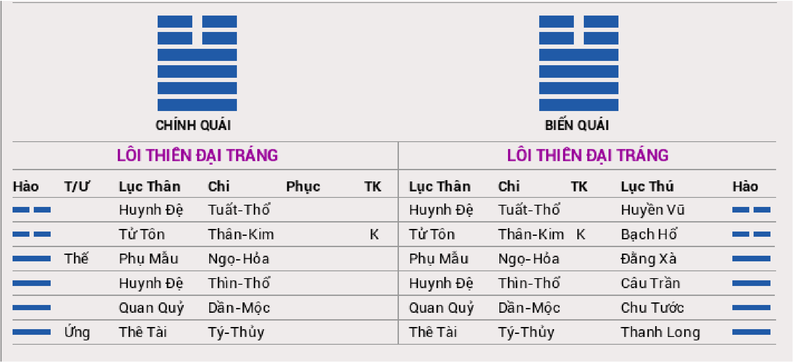
    - **Hình này chứng minh điều gì**
      - Bạch Hổ lâm hào 5 lộ trình và quẻ Lục Xung báo hiệu nhà bị phá dỡ mở đường.
    - **Từ đâu mà thấy được**
      - Hào 5 Thân kim lâm Bạch Hổ chủ đường sá xung phá trạch thổ.

##### Bảng phối quẻ Lục Hào chi tiết:
- **Chính quái:** $\text{Lôi Thiên Đại Tráng}$ (Quái cung: $\text{Khôn}$ vi Địa - Lục Xung quái).

| Hào | Thế / Ứng | Lục Thân | Nạp Chi | Biến Hào | Lục Thú | Trạng Thái Thần Sát |
| :---: | :---: | :---: | :---: | :---: | :---: | :---: |
| 6 | | Huynh Đệ | $\text{Tuất}$ - Thổ | $- -$ | Huyền Vũ | Hưu tù |
| 5 | | Tử Tôn | $\text{Thân}$ - Kim | $- -$ | Bạch Hổ | Vượng tướng, Tuần không, Đạo lộ |
| 4 | Thế | Phụ Mẫu | $\text{Ngọ}$ - Hỏa | $—$ | Đằng Xà | Hưu tù |
| 3 | | Huynh Đệ | $\text{Thìn}$ - Thổ | $—$ | Câu Trần | Hưu tù |
| 2 | | Quan Quỷ | $\text{Dần}$ - Mộc | $—$ | Chu Tước | Hưu tù, Trạch hào |
| 1 | Ứng | Thê Tài | $\text{Tý}$ - Thủy | $—$ | Thanh Long | Tướng |

---

#### 2.2. Phân tích Dịch lý Phong thủy và Vận hạn Gia trạch

##### 2.2.1. Tọa hướng, Cấu trúc Nhà ở và Lịch sử Sở hữu
- **Tọa hướng căn nhà:** Thế hào lâm hào 4 Phụ Mẫu $\text{Ngọ}$ Hỏa. Thế hào chủ tọa sơn của ngôi nhà. Ngọ thuộc phương Nam $\rightarrow$ kết luận nhà tọa Nam hướng Bắc.
- **Nguồn gốc nhà công sở hóa giá:** Trạch hào (hào 2) lâm Quan Quỷ $\text{Dần}$ Mộc. Quan Quỷ đại diện cho nhà nước, công quyền; lại được hào 1 Thê Tài $\text{Tý}$ Thủy sinh phù. Thế hào là Phụ Mẫu chủ nhà cửa, Thế hào là chính mình $\rightarrow$ đây là căn nhà nguyên thuộc sở hữu của cơ quan nhà nước, sau đó cá nhân bỏ tiền mua lại (nhà hóa giá).
- **Nhà lầu nhiều tầng:** Trạch hào hào 2 $\text{Dần}$ Mộc được Nhật thần $\text{Hợi}$ Thủy tương hợp ($\text{Dần - Hợi}$ lục hợp). Tượng tương hợp trong phong thủy biểu thị sự trùng điệp, tầng lớp chồng lên nhau $\rightarrow$ đoán đây là nhà lầu (thực tế nhà 2 tầng).

##### 2.2.2. Hỏa hoạn, Cửa Kẹt và Sự cố Phá dỡ do Mở đường
- **Tai nạn hỏa hoạn:** Hào 2 là trạch hào, lâm Quan Quỷ $\text{Dần}$ Mộc mang Lục thú $\text{Chu Tước}$ ($\text{Chu Tước}$ là hỏa thần, Mộc Quỷ sinh Hỏa). Hỏa thần Quan Quỷ nhập trạch $\rightarrow$ căn nhà đã từng phát sinh hỏa hoạn, cháy nhà.
- **Cửa nhà trục trặc, khó dùng:** Hào 3 là vị trí môn hộ (cửa nhà), lâm $\text{Câu Trần}$ (chủ ràng buộc, vướng víu, câu quẩn), lại tương hợp với Nguyệt kiến $\text{Dậu}$ Kim $\rightarrow$ cửa nhà bị xô lệch, then khóa kẹt cứng, đóng mở vô cùng khó khăn.
- **Cơ chế phá dỡ nhà do làm đường:**
  - Hào 5 là đường đi theo vị trí hào.
  - Hào 5 mang Lục thân **Tử Tôn** (chủ đạo lộ) và mang Lục thú **Bạch Hổ** (chủ đường sá). Tam trùng thông tin đạo lộ quy tụ tại hào 5 $\text{Thân}$ Kim.
  - Hào 5 $\text{Thân}$ Kim xung khắc trực diện hào 2 Trạch hào Quan Quỷ $\text{Dần}$ Mộc ($\text{Thân}$ Kim xung phá $\text{Dần}$ Mộc) $\rightarrow$ con đường sẽ xung phá vào ngôi nhà, buộc phải đập phá dỡ bỏ nhà cửa để làm đường!
  - **Ứng kỳ phá dỡ:** Hào 5 $\text{Thân}$ Kim đang lâm Tuần không. Ứng kỳ phá nhà phải đợi khi thực không. Năm 1998 là năm $\text{Mậu Dần}$ ($\text{Dần}$ xung $\text{Thân}$ thực không), vào tháng $\text{Thân}$ (tháng 7 âm lịch năm 1998) ngôi nhà chính thức bị phá dỡ giải tỏa để mở đường.
- **Họa thai sản (Lưu sản):** Tử Tôn là con cái, lâm Tuần không lại gặp Lục thú $\text{Bạch Hổ}$ ($\text{Bạch Hổ}$ chủ huyết quang, sát khí, trụy thai) $\rightarrow$ vợ người này bị hư thai, sảy thai.

---

### 3. Nghiên cứu Thực nghiệm 2: Ngã Cầu thang Gãy xương và Bệnh Tiểu đường (Trạch Hỏa Cách biến Trạch Thiên Quải)

#### 3.1. Dữ liệu Quẻ Khí và Tình huống Khảo sát
- **Thời gian lập quẻ:** 18:41:01 ngày 21/07/1998 (Giờ $\text{Quý Dậu}$, ngày $\text{Kỷ Tỵ}$, tháng $\text{Kỷ Mùi}$, năm $\text{Mậu Dần}$).
- **Tiết khí:** Tiểu thử. **Nguyệt lệnh:** $\text{Mùi}$ Thổ.
- **Tuần không:** Tuần $\text{Giáp Tý}$ ($\text{Tuất}$, $\text{Hợi}$ Không vong).
- **Bối cảnh:** Một học viên xem bệnh cho mẹ ruột.
- **Quẻ tượng:** **Trạch Hỏa Cách** biến **Trạch Thiên Quải** ($\text{Trạch Hỏa Cách} \rightarrow \text{Trạch Thiên Quải}$).

- Quẻ khởi Trạch Hỏa Cách biến Trạch Thiên Quải chẩn đoán ngã xe gãy xương chân và bệnh tiểu đường:
  - **Hình 16.** Sơ đồ quẻ Trạch Hỏa Cách biến Trạch Thiên Quải
    - 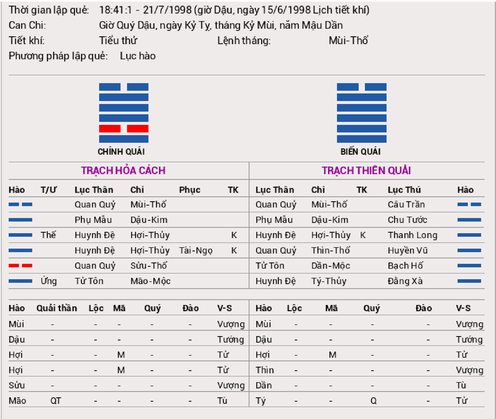
    - **Hình này chứng minh điều gì**
      - Hào 2 lâm Bạch Hổ nguyệt phá chủ xương chân gãy và Khảm cung chủ nội tiết tiểu đường.
    - **Từ đâu mà thấy được**
      - Hào 2 Sửu thổ lâm Bạch Hổ động hóa Dần mộc kẹp thế nguyệt phá tổn thương.

##### Bảng phối quẻ Lục Hào chi tiết:
- **Chính quái:** $\text{Trạch Hỏa Cách}$ (Quái cung: $\text{Khảm}$ vi Thủy).
- **Biến quái:** $\text{Trạch Thiên Quải}$ (Quái cung: $\text{Càn}$ vi Thiên).

| Hào | Thế / Ứng | Lục Thân (Chính) | Nạp Chi | Phục Thần | Can Chi Biến | Lục Thân (Biến) | Biến Hào | Lục Thú | Thần Sát & Vượng Tướng |
| :---: | :---: | :---: | :---: | :---: | :---: | :---: | :---: | :---: | :---: |
| 6 | | Quan Quỷ | $\text{Mùi}$ - Thổ | | $\text{Mùi}$ - Thổ | Quan Quỷ | $- -$ | Câu Trần | Nguyệt kiến, Vượng |
| 5 | | Phụ Mẫu | $\text{Dậu}$ - Kim | | $\text{Dậu}$ - Kim | Phụ Mẫu | $—$ | Chu Tước | Đắc Nguyệt sinh, Trường sinh tại Nhật, Tướng |
| 4 | Thế | Huynh Đệ | $\text{Hợi}$ - Thủy | | $\text{Hợi}$ - Thủy | Huynh Đệ | $—$ | Thanh Long | Mã tinh, Tuần không bị Nhật xung (Ám động), Tử |
| 3 | | Huynh Đệ | $\text{Hợi}$ - Thủy | $\text{Thê Tài Ngọ - Hỏa}$ | $\text{Thìn}$ - Thổ | Quan Quỷ | $—$ | Huyền Vũ | Mã tinh, Tuần không |
| 2 | | Quan Quỷ | $\text{Sửu}$ - Thổ | | $\text{Dần}$ - Mộc | Tử Tôn | $—$ | Bạch Hổ | Động phát, Nguyệt phá, hóa Hồi đầu khắc |
| 1 | Ứng | Tử Tôn | $\text{Mão}$ - Mộc | | $\text{Tý}$ - Thủy | Huynh Đệ | $—$ | Đằng Xà | Quái thần, Tù |

---

#### 3.2. Phân tích Bệnh lý Đa tầng và Vết thương Đạo lộ

##### 3.2.1. Tình trạng Tính mạng Dụng Thần và Hệ thống Bệnh Cung Khảm
- Hỏi bệnh của mẹ, lấy hào **Phụ Mẫu** làm Dụng thần. Phụ Mẫu $\text{Dậu}$ Kim ngự tại hào 5, được Nguyệt kiến $\text{Mùi}$ Thổ sinh phù, đắc Trường sinh tại Nhật thần $\text{Tỵ}$ Hỏa $\rightarrow$ Dụng thần cực kỳ vượng tướng, tính mạng bình an không có nguy cơ tử vong.
- Quẻ gốc $\text{Trạch Hỏa Cách}$ thuộc cung **Khảm** ($\text{Bát Thuần Khảm}$). Cung Khảm chủ về thận, bàng quang, huyết dịch tuần hoàn, đường tiết niệu và nước tiểu.
- **Bác bỏ Quan Quỷ hào 6:** Hào 6 Quan Quỷ $\text{Mùi}$ Thổ ngự trên đỉnh quẻ là Nguyên thần của Phụ Mẫu Dụng thần, lại tĩnh tại không bị khắc thương. Mặc dù là Quan Quỷ nhưng ở đây đóng vai trò bảo hộ Dụng thần, tuyệt đối không được coi là ổ bệnh.
- **Nhận diện bệnh Tiểu đường qua Hào 2 Độc phát:**
  - Hào 2 Quan Quỷ $\text{Sửu}$ Thổ độc phát, bị Nguyệt kiến $\text{Mùi}$ Thổ xung phá thành **Nguyệt phá**, lại động hóa xuất Tử Tôn $\text{Dần}$ Mộc quay lại **Hồi đầu khắc** ($\text{Dần}$ Mộc khắc $\text{Sửu}$ Thổ).
  - Hào 2 trên cơ thể đại diện cho bộ phận sinh dục và bài tiết; biến hào Tử Tôn cũng chủ về cơ quan sinh dục/bài tiết. Nơi này bị tổn thương hồi đầu khắc, phối hợp với bệnh lý cung Khảm $\rightarrow$ nội tiết tố mất cân bằng nghiêm trọng, nước tiểu biến chất $\rightarrow$ chính xác là **bệnh tiểu đường (đái tháo đường)**.

##### 3.2.2. Đoán Gãy Xương Chân do Ngã Cầu thang trong Nhà
- Hào 2 trên thân thể đại diện cho cẳng chân, bàn chân. Lâm Lục thú $\text{Bạch Hổ}$ (chủ tai nạn, đổ máu, gãy vỡ thương tật); Quan Quỷ lâm Nguyệt phá mang tượng nứt nẻ, gãy lìa $\rightarrow$ xương chân có khe nứt, gãy xương chân. Nguyệt phá báo hiệu tai nạn xảy ra ngay trong tháng $\text{Mùi}$ này.
- **Cơ chế xác định con đường trong nhà (Cầu thang):**
  - Hào 2 lâm $\text{Bạch Hổ}$ chủ về đường đi; biến hào Tử Tôn $\text{Dần}$ Mộc cũng chủ về đường đi.
  - Nhưng hào 2 là trạch hào (đại diện cho ngôi nhà), đường đi nằm ngay tại hào 2 tức là **con đường nằm bên trong ngôi nhà**.
  - Quẻ thuộc cung $\text{Khảm}$, Khảm có tượng hiểm trở, mấp mô gập ghềnh cao thấp $\rightarrow$ con đường gập ghềnh cao thấp trong nhà chính là **cầu thang**. Mẹ anh ta bị ngã cầu thang trong nhà dẫn đến gãy xương chân!

##### 3.2.3. Định vị Cấu trúc Nhà ở, Tầng Lầu và Vị trí Gãy Chân
- **Hướng nhà:** Thế hào $\text{Hợi}$ Thủy lâm Tuần không, bị Nhật thần $\text{Tỵ}$ Hỏa tương xung thành Ám động. Lấy quy tắc phản nghịch đảo chiều $\rightarrow$ nhà tọa Nam hướng Bắc (cửa chính mở hướng Bắc).
- **Tầng nhà đang ở:** Xem nhà ở lấy Phụ Mẫu làm Dụng thần. Phụ Mẫu $\text{Dậu}$ Kim: theo Hà Đồ Lạc Thư, ngũ hành Kim mang số 4, Phụ Mẫu lại cư ngụ tại hào 5 $\rightarrow$ nhà anh ta nếu không ở tầng 4 thì ở tầng 5 (thực tế gia đình ở tầng 4).
- **Vị trí bậc thang bị ngã:** Hào 2 Quan Quỷ $\text{Sửu}$ Thổ bị biến hào Tử Tôn $\text{Dần}$ Mộc hồi đầu khắc. Căn cứ khẩu quyết số lượng Bát quái: *"Dần Mão tam bát chân"* ($\text{Dần}$, $\text{Mão}$ ứng số 3 và số 8) $\rightarrow$ mẹ anh ta bị ngã tại khu vực **cầu thang tầng 3** dẫn lên tầng 4!
- **Ứng kỳ bình phục:** Hào 2 $\text{Sửu}$ Thổ lâm Nguyệt phá, đến tháng $\text{Tý}$ tương hợp với $\text{Sửu}$ Thổ ($\text{Tý - Sửu}$ lục hợp giải phá) thì xương chân liền lại và khỏi hẳn. Tuy nhiên, bệnh tiểu đường do hào động hóa hồi đầu khắc nên sẽ dây dưa mãn tính khó chữa khỏi hoàn toàn.

---

## Chương 11: Đoán bệnh tất lấy Quan quỷ là bệnh sao?

### 1. Phê phán Giáo điều Cổ thư và Hệ thống Chẩn bệnh Toàn diện

#### 1.1. Giới hạn Chết người của Thuyết "Dĩ Quan Quỷ vi Bệnh"
- Từ xưa đến nay, các sách bốc phệ cổ điển đều rập khuôn một định thức: hễ đoán bệnh là chăm chăm tìm hào Quan Quỷ để luận đoán cơ quan phát bệnh. Đây là lối mòn chỉ dựa duy nhất vào ý nghĩa biểu trưng hẹp hòi của Lục thân.
- Người đời sau thiếu tư duy biện chứng, không lấy ngũ hành sinh khắc chế hóa làm gốc rễ, quẻ nào cũng xoay quanh Quan Quỷ. Hệ quả là khi gặp bệnh nhân mang đa chứng bệnh phức tạp, các thầy bói hoàn toàn bế tắc, không thể chẩn đoán chính xác căn nguyên lâm sàng. Một người có thể đồng thời mắc suy thận, tắc nghẽn mạch máu, viêm ruột và thoái hóa xương, một hào Quan Quỷ duy nhất không thể nào đại diện cho toàn bộ các tổn thương này.

#### 1.2. Nguyên lý Chuyển đổi Lục Thân và Suy thoái Tạng phủ Hiện đại
- Bất kỳ hào nào trong Lục thân cũng có thể trở thành căn cứ chẩn bệnh xác đáng.
- **Nguyên lý chuyển đổi Lục thân (*Khắc ngã giả vi Quan Quỷ*):** Khi người hỏi tự xem bệnh, Thế hào là bản thân. Bất kỳ hào Kỵ thần nào trong quẻ phát động khắc phạt Thế hào thì chính hào đó đóng vai trò gây bệnh, mang bản chất thực sự của Quan Quỷ!
- **Tạng phủ suy kiệt tại Hào Nguyên thần:** Khi một cơ quan bị bệnh không phải do tà khí quá vượng (Quan Quỷ), mà do chính khí suy kiệt, tạng phủ teo tóp, hoại tử, thì ổ bệnh sẽ xuất hiện tại chính hào đại diện cho cơ quan đó khi nó lâm vào các trạng thái: **Hưu tù, Tuần không, Nguyệt phá, Nhập Mộ hoặc Tuyệt địa**.
- **Hệ thống phân định Hào vị cơ thể và Lục thú chẩn bệnh:**
  - Hào 6: Đầu não, hộp sọ, hệ thần kinh trung ương, tóc, mắt.
  - Hào 5: Cổ họng, khí quản, thực quản, tim, phổi, ngực, ngũ quan.
  - Hào 4: Ngực, vú, lưng, dạ dày trên.
  - Hào 3: Bụng, dạ dày, lá lách, thắt lưng, rốn.
  - Hào 2: Ruột, bàng quang, tử cung, cơ quan sinh dục, bắp chân, đầu gối.
  - Hào 1: Bàn chân, ngón chân, gót chân.
  - Phối Lục thú: $\text{Bạch Hổ}$ chủ huyết dịch, phẫu thuật, gãy xương; $\text{Chu Tước}$ chủ viêm sưng, sốt; $\text{Huyền Vũ}$ chủ mục rữa, u ám, choáng váng; $\text{Câu Trần}$ chủ sưng phù, khối u trệ; $\text{Đằng Xà}$ chủ co rút đường ruột, ác mộng, tinh thần hoảng loạn; $\text{Thanh Long}$ chủ đau nhức dữ dội.

---

### 2. Nghiên cứu Thực nghiệm 1: Bệnh Tắc Mạch Máu Não và Đau Đầu Dữ Dội (Sơn Thủy Mông biến Địa Thủy Sư)

#### 2.1. Dữ liệu Quẻ Khí và Tình huống Khảo sát
- **Thời gian lập quẻ:** 18:41:01 ngày 24/01/1999 (Giờ $\text{Đinh Dậu}$, ngày $\text{Bính Tý}$, tháng $\text{Ất Sửu}$, năm $\text{Mậu Dần}$).
- **Tiết khí:** Đại hàn. **Nguyệt lệnh:** $\text{Sửu}$ Thổ.
- **Tuần không:** Tuần $\text{Giáp Tuất}$ ($\text{Thân}$, $\text{Dậu}$ Không vong).
- **Bối cảnh:** Dịch hữu Vương Dịch mời tác giả đến nhà và đưa ra một quẻ do một người đàn ông tự gieo hỏi về bệnh tình của mình, nhờ Vương Hổ Ứng phân tích xem mắc bệnh gì.
- **Quẻ tượng:** **Sơn Thủy Mông** biến **Địa Thủy Sư** ($\text{Sơn Thủy Mông} \rightarrow \text{Địa Thủy Sư}$).

- Quẻ khởi Sơn Thủy Mông biến Địa Thủy Sư chẩn đoán tắc mạch máu não và đau đầu dữ dội:
  - **Hình 17.** Sơ đồ quẻ Sơn Thủy Mông biến Địa Thủy Sư
    - 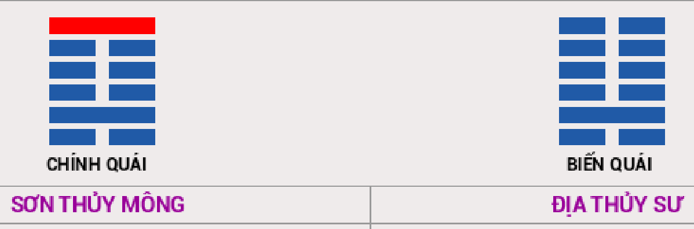
    - **Hình này chứng minh điều gì**
      - Hào 6 Phụ Mẫu Dần mộc nhập mộ tại Nhật và lâm Huyền Vũ chủ đầu đau tắc nghẽn.
    - **Từ đâu mà thấy được**
      - Hào 4 và hào 6 động biến suy thoái tạng phủ chỉ rõ bệnh không nằm ở Quan Quỷ.

##### Bảng phối quẻ Lục Hào chi tiết:
- **Chính quái:** $\text{Sơn Thủy Mông}$ (Quái cung: $\text{Ly}$ vi Hỏa).
- **Biến quái:** $\text{Địa Thủy Sư}$ (Quái cung: $\text{Khảm}$ vi Thủy - Quy Hồn quái).

| Hào | Thế / Ứng | Lục Thân (Chính) | Nạp Chi | Phục Thần | Can Chi Biến | Lục Thân (Biến) | Biến Hào | Lục Thú | Thần Sát & Vượng Tướng |
| :---: | :---: | :---: | :---: | :---: | :---: | :---: | :---: | :---: | :---: |
| 6 | | Phụ Mẫu | $\text{Dần}$ - Mộc | | $\text{Dậu}$ - Kim | Thê Tài | $- -$ | Thanh Long | Động phát, Mã tinh, Tù hóa Tuyệt/Tiến |
| 5 | | Quan Quỷ | $\text{Tý}$ - Thủy | | $\text{Hợi}$ - Thủy | Quan Quỷ | $- -$ | Huyền Vũ | Đắc Nhật kiến, Tử |
| 4 | Thế | Tử Tôn | $\text{Tuất}$ - Thổ | $\text{Thê Tài Dậu - Kim}$ | $\text{Sửu}$ - Thổ | Tử Tôn | $- -$ | Bạch Hổ | Vượng tướng |
| 3 | | Huynh Đệ | $\text{Ngọ}$ - Hỏa | | $\text{Ngọ}$ - Hỏa | Huynh Đệ | $- -$ | Đằng Xà | Hưu tù |
| 2 | | Tử Tôn | $\text{Thìn}$ - Thổ | | $\text{Thìn}$ - Thổ | Tử Tôn | $—$ | Câu Trần | Vượng tướng |
| 1 | Ứng | Phụ Mẫu | $\text{Dần}$ - Mộc | | $\text{Dần}$ - Mộc | Phụ Mẫu | $- -$ | Chu Tước | Mã tinh, Tù |

---

#### 2.2. Phân tích Kỹ pháp Chẩn bệnh Toàn diện Vượt qua Quan Quỷ

##### 2.2.1. Bác bỏ Phán đoán Sai lầm về Quan Quỷ Hào 5
- Trong quẻ, hào 5 Quan Quỷ $\text{Tý}$ Thủy ngự trên quẻ ngoại, lại lâm Nhật thần $\text{Tý}$ Thủy vượng tướng. Nếu người học câu nệ sách cổ, ắt sẽ khẳng định ngay: Quan Quỷ là Thủy nên người này bị bệnh thận, bàng quang hoặc hệ tiết niệu.
- Tuy nhiên, người bệnh tự xem quẻ, Thế hào là bản thân: Thế hào cư hào 4 Tử Tôn $\text{Tuất}$ Thổ. Ngũ hành của Thế hào là $\text{Thổ}$, Thổ khắc chế $\text{Tý}$ Thủy. Quan Quỷ $\text{Tý}$ Thủy tĩnh tại hoàn toàn không thể khắc hại Thế hào $\rightarrow$ bệnh nhân không hề mắc bệnh thận.

##### 2.2.2. Xác định Ổ bệnh Tắc Mạch Máu Não qua Kỵ thần Hào 6
- Trong toàn bộ quẻ, chỉ duy nhất hào 6 Phụ Mẫu $\text{Dần}$ Mộc phát động!
- Áp dụng nguyên lý chuyển đổi Lục thân: $\text{Dần}$ Mộc phát động khắc phạt trực tiếp Thế hào $\text{Tuất}$ Thổ ($\text{Mộc}$ khắc $\text{Thổ}$). Kỵ thần khắc Thế chính là căn nguyên sinh ra bệnh tật.
- **Xác định vị trí tạng phủ tổn thương:**
  - Thế hào mang Lục thân **Tử Tôn**: Trong cơ thể, Tử Tôn đại diện cho hệ thống huyết quản, mạch máu. Lại lâm Lục thú **$\text{Bạch Hổ}$** (chủ huyết dịch, máu huyết) $\rightarrow$ Thế hào Tử Tôn Bạch Hổ đại diện cho mạch máu.
  - Hào 6 là vị trí đỉnh đầu; Lục thân **Phụ Mẫu** cũng chủ về đầu não. Mặt khác, xét theo 12 Cung Trường Sinh, $\text{Dần}$ Mộc chính là cung **Bệnh** của ngũ hành Thổ ($\text{Tuất}$ Thổ gặp $\text{Dần}$ là Bệnh địa).
  - Hào 6 Phụ Mẫu $\text{Dần}$ Mộc phát động khắc phạt mạch máu Thế hào $\rightarrow$ xác định chính xác: **mạch máu trên đầu bị nghẽn tắc (tắc mạch máu não, nhồi máu não nhẹ)**.
  - Hào 6 lâm Lục thú $\text{Thanh Long}$: Thanh Long trong đoán bệnh tật chủ về sự đau nhức nhối dữ dội. Do đó bệnh nhân phải chịu đựng những cơn đau đầu kịch liệt hành hạ từng giờ.

---

### 3. Nghiên cứu Thực nghiệm 2: Bệnh Tắc Ruột, Tinh trùng Yếu và Choáng đầu (Lôi Thiên Đại Tráng biến Bát Thuần Càn)

#### 3.1. Dữ liệu Quẻ Khí và Tình huống Khảo sát
- **Thời gian lập quẻ:** 18:41:01 ngày 14/12/1998 (Giờ $\text{Ất Dậu}$, ngày $\text{Ất Mùi}$, tháng $\text{Giáp Tý}$, năm $\text{Mậu Dần}$).
- **Tiết khí:** Đại tuyết. **Nguyệt lệnh:** $\text{Tý}$ Thủy.
- **Tuần không:** Tuần $\text{Giáp Ngọ}$ ($\text{Thìn}$, $\text{Tỵ}$ Không vong).
- **Bối cảnh:** Một người đàn ông ngoài 30 tuổi tìm đến Vương Hổ Ứng gieo quẻ hỏi: *"Năm nào mới có con cái?"*.
- **Quẻ tượng:** **Lôi Thiên Đại Tráng** biến **Bát Thuần Càn** ($\text{Lôi Thiên Đại Tráng} \rightarrow \text{Bát Thuần Càn}$).

- Quẻ khởi Lôi Thiên Đại Tráng biến Bát Thuần Càn chẩn đoán viêm tắc ruột và choáng đầu mãn tính:
  - **Hình 18.** Sơ đồ quẻ Lôi Thiên Đại Tráng biến Bát Thuần Càn
    - 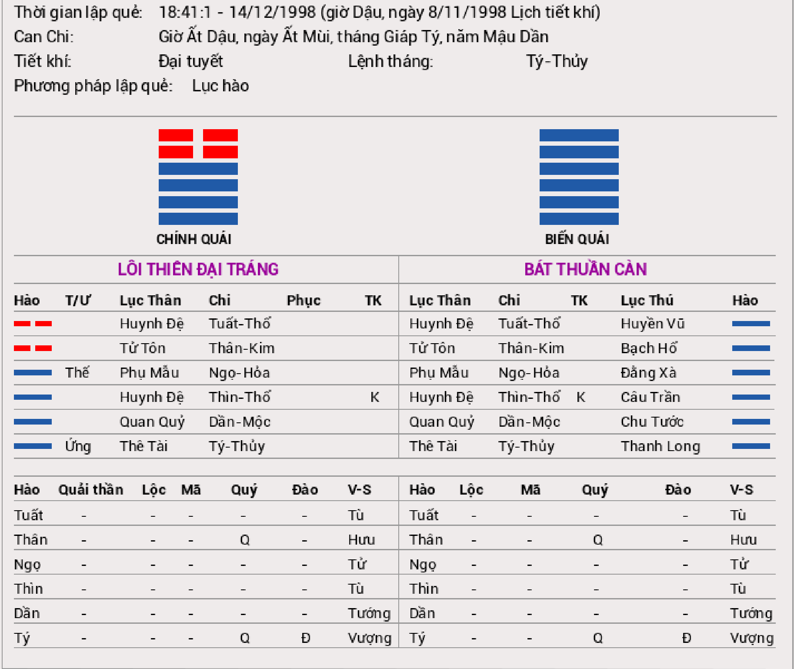
    - **Hình này chứng minh điều gì**
      - Hào 2 Quan Quỷ Dần mộc lâm Chu Tước nhập mộ tại Mùi thổ chủ chứng viêm tắc ruột.
    - **Từ đâu mà thấy được**
      - Hào 6 Tuất thổ động hóa Càn kim và hào 2 Dần mộc bị Nhật thần Mùi thổ mộ nhập.

##### Bảng phối quẻ Lục Hào chi tiết:
- **Chính quái:** $\text{Lôi Thiên Đại Tráng}$ (Quái cung: $\text{Khôn}$ vi Địa - Lục Xung quái).
- **Biến quái:** $\text{Bát Thuần Càn}$ (Quái cung: $\text{Càn}$ vi Thiên - Lục Xung quái).

| Hào | Thế / Ứng | Lục Thân (Chính) | Nạp Chi | Phục Thần | Can Chi Biến | Lục Thân (Biến) | Biến Hào | Lục Thú | Thần Sát & Vượng Tướng |
| :---: | :---: | :---: | :---: | :---: | :---: | :---: | :---: | :---: | :---: |
| 6 | | Huynh Đệ | $\text{Tuất}$ - Thổ | | $\text{Tuất}$ - Thổ | Huynh Đệ | $—$ | Huyền Vũ | Động phát, Tù |
| 5 | | Tử Tôn | $\text{Thân}$ - Kim | | $\text{Thân}$ - Kim | Tử Tôn | $—$ | Bạch Hổ | Động phát, Quý nhân, Hưu |
| 4 | Thế | Phụ Mẫu | $\text{Ngọ}$ - Hỏa | | $\text{Ngọ}$ - Hỏa | Phụ Mẫu | $—$ | Đằng Xà | Tử địa |
| 3 | | Huynh Đệ | $\text{Thìn}$ - Thổ | | $\text{Thìn}$ - Thổ | Huynh Đệ | $—$ | Câu Trần | Tuần không, Tù |
| 2 | | Quan Quỷ | $\text{Dần}$ - Mộc | | $\text{Dần}$ - Mộc | Quan Quỷ | $—$ | Chu Tước | Tướng |
| 1 | Ứng | Thê Tài | $\text{Tý}$ - Thủy | | $\text{Tý}$ - Thủy | Thê Tài | $—$ | Thanh Long | Đào hoa, Nguyệt kiến, Vượng |

---

#### 3.2. Phân tích Đa Tạng Bệnh lý và Khảo sát Hiếm muộn Nam khoa

##### 3.2.1. Cơ năng Sinh sản Bất túc và Nỗi Ám ảnh Cầu Tự
- Xem về đường con cái, lấy hào **Tử Tôn** làm Dụng thần. Tử Tôn $\text{Thân}$ Kim ở tháng $\text{Tý}$ lâm vào **Tử địa**, chỉ được Nhật thần $\text{Mùi}$ Thổ sinh phù yếu ớt.
- Quẻ ngoại Chấn hóa Càn biến hào tạo thành thế **Phục Ngâm** (chủ u sầu dằn vặt, bi thương thống khổ). Nguyên thần của Dụng thần là Huynh Đệ $\text{Thìn}$ Thổ lâm **Tuần không**. Kỵ thần Phụ Mẫu $\text{Ngọ}$ Hỏa trì Thế. Toàn quẻ là **Lục xung biến Lục xung** $\rightarrow$ cách cục cực kỳ bất lợi cho việc sinh con đẻ cái.
- **Tâm bệnh sâu kín:** Tử Tôn $\text{Thân}$ Kim theo 12 Cung Trường Sinh chính là cung **Bệnh** của Thế hào $\text{Ngọ}$ Hỏa ($\text{Ngọ}$ Hỏa gặp $\text{Thân}$ là Bệnh địa). Điều này chỉ ra rằng khát vọng có con chính là "tâm bệnh" lớn nhất dày vò người này suốt cuộc đời.
- **Chẩn đoán Vô sinh Nam do Tinh trùng Yếu:**
  - Nguyên thần sinh dưỡng Tử Tôn là Huynh Đệ $\text{Thìn}$ Thổ ngự tại hào 3 lâm Tuần không. Hào 3 là vị trí của cơ quan sinh dục; $\text{Thìn}$ Thổ đại diện cho chức năng sinh lý sinh sản.
  - Ngũ hành $\text{Thìn}$ Thổ là **Mộ khố của Thê Tài Thủy** ($\text{Tý}$ Thủy mộ tại $\text{Thìn}$). Trong nam khoa bốc dịch, Thê Tài Thủy đại diện cho **tinh dịch**. Khố tinh dịch lâm Không vong $\rightarrow$ lượng tinh dịch bài xuất quá ít, mật độ tinh trùng thấp.
  - $\text{Thìn}$ Thổ lâm Không vong nên không thể sinh trợ Tử Tôn $\text{Thân}$ Kim $\rightarrow$ tỷ lệ tinh trùng sống sót cực kỳ thấp, khả năng thụ thai tự nhiên gần như bằng không.

##### 3.2.2. Chẩn đoán Chứng Choáng Đầu Mãn tính
- Hào 6 Huynh Đệ $\text{Tuất}$ Thổ phát động: Ngũ hành Hỏa nhập Mộ tại Thổ ($\text{Ngọ}$ Mộ tại $\text{Tuất}$). Hào 6 động khiến Thế hào $\text{Ngọ}$ Hỏa rơi vào trạng thái **Nhập Mộ**.
- Hào 6 là phần đầu não; lại lâm Lục thú **$\text{Huyền Vũ}$** (chủ u ám, tối tăm, choáng váng mờ mắt) $\rightarrow$ người này bị chứng hoa mắt, chóng mặt, choáng đầu mãn tính. Người đàn ông xác nhận vừa uống thuốc Đông y chữa trị dứt điểm chứng bệnh này.

##### 3.2.3. Chẩn đoán Bệnh Viêm Tắc Ruột và Vết mổ Phẫu thuật
- Hào 2 Quan Quỷ $\text{Dần}$ Mộc là Nguyên thần sinh cho Thế hào $\text{Ngọ}$ Hỏa.
- Ngũ hành Mộc đại diện cho đường ruột; hào 2 là vị trí của ruột (tiểu tràng và đại tràng). Lâm Lục thú **$\text{Chu Tước}$** chủ về chứng sưng viêm nóng rát $\rightarrow$ ruột bị viêm cấp tính.
- Quan Quỷ $\text{Dần}$ Mộc nhập Mộ tại Nhật thần $\text{Mùi}$ Thổ ($\text{Dần}$ Mộc Mộ tại $\text{Mùi}$). Vì bị nhốt chặt trong Mộ khố nên $\text{Dần}$ Mộc mất khả năng sinh trợ Thế hào, ứ đọng lại thành khối tắc nghẽn $\rightarrow$ chẩn đoán mắc **chứng tắc ruột nghiêm trọng**.
- **Dấu hiệu phẫu thuật:** Hào 5 Tử Tôn $\text{Thân}$ Kim lâm $\text{Bạch Hổ}$ phát động xung khắc trực tiếp hào 2 Quan Quỷ $\text{Dần}$ Mộc ($\text{Thân}$ Kim xung khắc $\text{Dần}$ Mộc). Tử Tôn đại diện cho thầy thuốc, dao mổ y tế; Bạch Hổ đại diện cho phẫu thuật ngoại khoa đổ máu $\rightarrow$ kết luận người này đã từng trải qua một cuộc đại phẫu thuật mổ bụng thông ruột để giữ mạng sống.

---

#### 3.3. Đúc kết Quy luật Chẩn bệnh Toàn diện
Qua hai ví dụ kinh điển trên, tác giả Vương Hổ Ứng khẳng định chân lý cốt lõi của môn Lục Hào:
1. **Trường hợp 1 (Sơn Thủy Mông):** Vứt bỏ hoàn toàn hào Quan Quỷ $\text{Tý}$ Thủy không dùng, phát hiện bệnh tắc mạch máu não nhờ hào Kỵ thần Phụ Mẫu $\text{Dần}$ Mộc phát động khắc Thế và lâm vào Bệnh địa.
2. **Trường hợp 2 (Lôi Thiên Đại Tráng):** Lại lấy chính hào Quan Quỷ $\text{Dần}$ Mộc nhập Mộ và bị Tử Tôn Bạch Hổ xung khắc để định vị ca phẫu thuật viêm tắc ruột, đồng thời phối hợp hào Thìn Thổ Không vong để đoán tinh trùng yếu.

Người học Dịch thuật chân chính tuyệt đối không được cứng nhắc câu nệ vào một danh xưng Lục thân, mà phải quán triệt toàn bộ dòng chảy ngũ hành sinh khắc, trạng thái suy vượng mộ tuyệt của 12 cung trường sinh, vị trí phân hào thân thể và đặc tính của lục thần mới có thể chạm tới tầng mức dự đoán thần kỳ.
