# Lục Hào Nghi Hoặc Chỉ Mê

## Lời nói đầu

- Luận điểm phân tích:
  - Sau khi đọc sách của tôi, nhiều người cảm thấy bản thân tiến bộ rất nhanh, họ liên tục gọi điện hoặc gửi thư hỏi tôi có còn sách khác hay không. Thực ra tôi còn rất nhiều thứ muốn viết, nhưng bởi vì khá bận rộn nên trong thời gian ngắn không thể viết ra toàn bộ thành quả nghiên cứu dự đoán lục hào trong nhiều năm cho mọi người được, tôi phải dành thời gian viết từng chút một. E rằng phải mất vài năm mới có thể hoàn thành đầy đủ.

- Luận điểm phân tích:
  - Tuy nhiên, để nâng cao trình độ dự đoán cho mọi người trong ngắn hạn, tránh tình trạng phải đi đường vòng, tôi đã dành thời gian chỉnh lý một số vấn đề rất dễ nhầm lẫn và mập mờ trong dự đoán lục hào, viết thành bản thảo, phụng hiến cho độc giả, hy vọng mọi người có thể có được một nhận thức rõ ràng thông qua cuốn sách này. Cuốn sách này vừa giải đáp các thắc mắc mà mọi người gặp phải trong quá trình học tập, vừa sửa chữa những quan điểm sai lầm cá biệt và bổ sung các phần còn thiếu sót trong những cuốn sách trước đây của tôi.

- Luận điểm phân tích:
  - Để mọi người dễ học, trong sách này tôi đã sử dụng hình thức vấn đáp. Tuy rằng viết bằng hình thức vấn đáp, nhưng hoàn toàn không phải chỉ là giải đáp thắc mắc kiểu chắp vá, mà là trình bày sâu sắc xoay quanh các vấn đề chủ yếu nhất và dễ sai nhất trong dự đoán.

- Luận điểm phân tích:
  - Trong hầu hết các giải đáp thắc mắc, tôi đã cố gắng bổ sung một số quái lệ để giúp cho mọi người hiểu rõ vấn đề. Do đó, cuốn sách này không viết cho người mới học. Bởi vì số trang có hạn, trong sách này sẽ không giải đáp chi tiết một số vấn đề cơ bản mà người mới học nhắc đến, bởi vì những vấn đề đó đã được tôi giới thiệu trong "Tế Thuyết Lục Hào Dự Trắc Học", khi chưa nắm được thì có thể xem lại cuốn sách này.

- Luận điểm phân tích:
  - Vương Hổ Ứng

- Luận điểm phân tích:
  - ---

## Chương 1: Những thắc mắc liên quan đến gieo quẻ

### Câu hỏi 1: Trong dự đoán lục hào, người gieo quẻ là dự trắc sư hay là người xem?

- Giải đáp trọng tâm:
  - Hai tình huống đều có khả năng. Trước kia, khi chưa lấy quẻ bằng đồng xu, nếu như có người đến thỉnh cầu dự đoán thì luôn là dự trắc sư lập quẻ, sau này mới chuyển sang gieo quẻ bằng đồng xu thì người xem gieo quẻ. Thực ra, trích xuất quái tượng chỉ là phương tiện, mấu chốt là ở chỗ người xem có thực sự đã động niệm hay chưa, loại động niệm này chính là mong muốn có được thông tin cát hung về người hoặc sự việc nào đó thông qua sử dụng quẻ, chỉ cần đã có loại mong muốn này thì bất kể là ai đến gieo quẻ đều được. Quan điểm này đã được tôi giải thích trong "Lục Hào Quái Lệ Thuyết Chân", đồng thời cũng đã đưa ra rất nhiều ví dụ, mọi người có thể xem cuốn sách này.

- Luận điểm phân tích:
  - Từ thời xưa, người ta đã ý thức được vấn đề này. Trong chương Hoàng Kim Sách và Thiên Kim Phú của Tăng San Bốc Dịch đã giảng qua một tình huống như sau:

- Quái lệ thực tế:
  - Bối cảnh: Có một hôm, ở chỗ Dã Hạc Lão Nhân có mấy người đến thỉnh cầu dự đoán. Trong đó có một người trẻ tuổi muốn hỏi về công danh, một người lớn tuổi muốn hỏi về bệnh của con mình. Lúc đó, người trẻ tuổi là người đầu tiên đề xuất dự đoán công danh của bản thân, nhưng bởi vì có trưởng bối ở đó, người xưa rất có quy củ, tôn trưởng vi tiên, cho nên đã mời trưởng bối gieo quẻ trước xem bệnh của con mình.

- Quái lệ thực tế:
  - Bối cảnh: Ngày Quý Mùi tháng Thìn, người lớn tuổi gieo được quẻ Thiên Phong Cấu biến Phong Thủy Hoán.

- Quái lệ dự đoán thực tế cho Quẻ Thiên Phong Cấu biến Phong Thủy Hoán:
  - **Hình 1.** Quẻ Thiên Phong Cấu biến Phong Thủy Hoán
    - 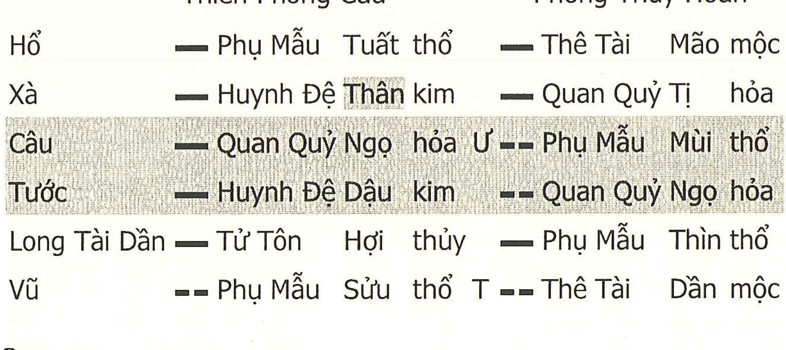
    - **Hình này chứng minh điều gì**
      - Làm sáng tỏ diễn biến cát hung và quy luật ứng nghiệm của Quẻ Thiên Phong Cấu biến Phong Thủy Hoán đối với sự việc được hỏi.
    - **Từ đâu mà thấy được**
      - Căn cứ Thời gian lập quẻ: Ngày Quý Mùi tháng Thìn; Dụng thần rất vượng. Nhìn vào động niệm hay chưa.

- Quái lệ thực tế:
  - Bối cảnh: Người trẻ tuổi tự gieo được quẻ Thiên Trạch Lý.

- Quái lệ dự đoán thực tế cho Quẻ Thiên Trạch Lý:
  - **Hình 2.** Quẻ Thiên Trạch Lý
    - 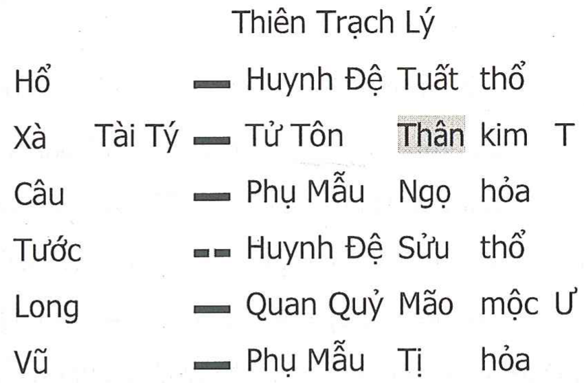
    - **Hình này chứng minh điều gì**
      - Làm sáng tỏ diễn biến cát hung và quy luật ứng nghiệm của Quẻ Thiên Trạch Lý đối với sự việc được hỏi.
    - **Từ đâu mà thấy được**
      - Căn cứ Thời gian lập quẻ: Ngày Quý Mùi tháng Thìn; Dụng thần rất vượng. Nhìn vào động niệm hay chưa.

- Kết quả ứng nghiệm thực tế:
  - Đối với tình huống này, Dã Hạc Lão Nhân đã nắm bắt rất thỏa đáng, ông đã lấy quẻ của người lớn tuổi gieo trước để đoán công danh của người trẻ tuổi, còn quẻ của người trẻ tuổi gieo sau thì dùng để đoán bệnh của con trưởng bối, kết quả ứng nghiệm.

- Kết quả ứng nghiệm thực tế:
  - Nếu như không linh hoạt, dùng quẻ của trưởng bối gieo để đoán bệnh của con ông ta, dùng quẻ của người trẻ tuổi gieo để đoán công danh của người trẻ tuổi, thì rất có khả năng trong cuộc đời dự đoán của Dã Hạc sẽ phạm thêm hai sai lầm hoặc tăng thêm hai quái lệ không ứng nghiệm.

- Luận điểm phân tích:
  - Lúc đó Dã Hạc đã đoán như sau: Nếu lấy quẻ trước đoán bệnh con, con của người này tất chết. Tại sao vậy? Bởi vì Hợi thủy Tử Tôn bị Nhật Nguyệt thương khắc, hào Thế ám động lại thương Tử Tôn, Nguyên thần Dậu kim lại bị Ngọ hỏa khắc hoại, như vậy là Kỵ thần vượng mà Nguyên thần suy, xu thế tất chết. Nào ngờ ta khởi niệm trước, quẻ trước lại ứng vào công danh, Quan Ngọ hỏa động mà sinh Thế, Thế động Quan hưng, tháng 5 thăng chức. Quẻ sau lại ứng với cha chiêm bệnh con, Tử Tôn Thân kim được Nhật Nguyệt sinh, ngày hôm sau sẽ khỏi bệnh.

- Luận điểm phân tích:
  - Một lần khác lại gặp phải tình huống như sau:

- Quái lệ thực tế:
  - Bối cảnh: Ngày Tân Tị tháng Tị, có người chiêm về bệnh của cha, bỗng gặp quan trên đến, nhường quan chiêm trước, được quẻ Tỉnh biến Thăng.

- Quái lệ dự đoán thực tế cho Quẻ Thủy Phong Tỉnh biến Địa Phong Thăng:
  - **Hình 3.** Quẻ Thủy Phong Tỉnh biến Địa Phong Thăng
    - 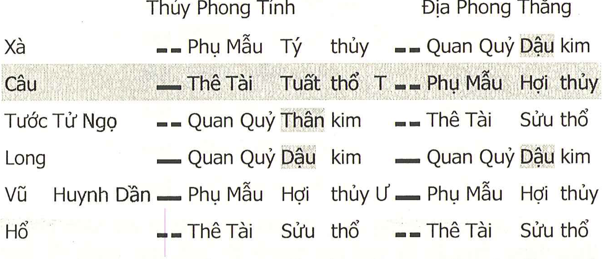
    - **Hình này chứng minh điều gì**
      - Làm sáng tỏ diễn biến cát hung và quy luật ứng nghiệm của Quẻ Thủy Phong Tỉnh biến Địa Phong Thăng đối với sự việc được hỏi.
    - **Từ đâu mà thấy được**
      - Căn cứ Thời gian lập quẻ: Ngày Quý Mùi tháng Thìn; Dụng thần rất vượng. Nhìn vào động niệm hay chưa.

- Luận điểm phân tích:
  - Quẻ này quan trên xem về việc điền khuyết, có bốn người nhưng chỉ có ba vị trí, cho nên hỏi xem mình có được hay không? Đoán rằng: Quan Thân Dậu đều gặp Không địa, lại bị Nhật Nguyệt khắc, Không mà bị khắc, trước mắt không được. May được Tuất thổ sinh Quan, mùa thu mới có thể có hy vọng. Nào ngờ quẻ này lại ứng với người đầu tiên chiêm bệnh cho cha, Tài Tuất thổ động mà khắc Phụ, Phụ Mẫu Hợi thủy Nhật phá, Nguyệt phá, Nguyên thần Không mà bị khắc, chết ở ngày Tuất. Sau khi quan rời đi, chiêm cho người lúc đầu, được quẻ Càn biến Gia Nhân.

- Quái lệ dự đoán thực tế cho Quẻ Càn Vi Thiên biến Phong Hỏa Gia Nhân:
  - **Hình 4.** Quẻ Càn Vi Thiên biến Phong Hỏa Gia Nhân
    - 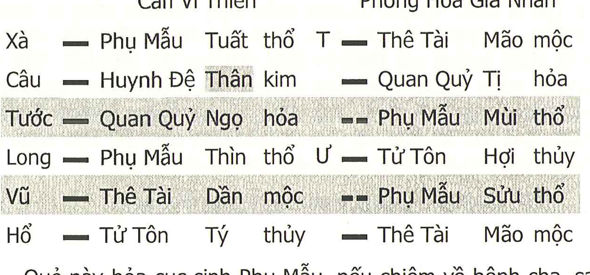
    - **Hình này chứng minh điều gì**
      - Làm sáng tỏ diễn biến cát hung và quy luật ứng nghiệm của Quẻ Càn Vi Thiên biến Phong Hỏa Gia Nhân đối với sự việc được hỏi.
    - **Từ đâu mà thấy được**
      - Căn cứ Thời gian lập quẻ: Ngày Quý Mùi tháng Thìn; Dụng thần rất vượng. Nhìn vào động niệm hay chưa.

- Luận điểm phân tích:
  - Quẻ này hỏa cục sinh Phụ Mẫu, nếu chiêm về bệnh cha, sao chết được? Nào ngờ quẻ này lại ứng với ý niệm cầu công danh của quan trên. Hai hào Dần Ngọ, Tài Quan đều động, tam hợp hào Thế mà thành Quan cục, bởi vì Thế tại hào 6, cho nên được điền khuyết tại phủ Triệu Khánh, Quảng Đông.

- Luận điểm phân tích:
  - Hai quẻ này chẳng phải không linh nghiệm, tiếc rằng người nhường nhưng thần không nhường theo, quẻ thu được vẫn theo thứ tự động niệm vậy.

- Kết quả ứng nghiệm thực tế:
  - Đây là quẻ mà Dã Hạc Lão Nhân đã nắm bắt không tốt và đã đoán sai. Tuy nhiên, ông ta đã nghĩ đến nguyên nhân sai sót của mình. Tôi nghĩ rằng, khi chúng ta dự đoán thì nhất định có một số quẻ không ứng nghiệm, có thể chính là do tình trạng này.

- Luận điểm phân tích:
  - Cho dù chỉ có một cá nhân đến dự đoán nhưng cũng có tình huống như sau: Trên đường đi thì người ta muốn dự đoán về công việc của bản thân, nhưng sau khi đến thì đột nhiên lại thay đổi chủ ý, muốn dự đoán về việc học của con cái hay về việc khác, nếu đúng như vậy, quẻ mà người đó gieo ra có khả năng là về vấn đề suy nghĩ trên đường đi, không phải là về vấn đề mà người đó đề xuất sau khi đến nhà. Do đó, dự trắc sư phải biết rõ ý định của người đến, nắm bắt đủ loại tình huống mới có thể giảm thiểu sai sót, không phải cứ thấy việc luận việc, không phải cứ chỉ dán mắt vào quẻ mà thôi.

- Luận điểm phân tích:
  - Có người nói: "Công phu ở bên ngoài quẻ", tôi nghĩ rằng trong câu nói này đã bao hàm những đạo lý ở trên. Không thể không khiến chúng ta suy ngẫm.

- Kết quả ứng nghiệm thực tế:
  - Tôi thường gặp một số người mang quẻ không ứng nghiệm đến hỏi tôi tại sao, trong đó có nguyên nhân là do người đó chưa hiểu thấu quẻ mà xem sai, nhưng cũng có rất nhiều nguyên nhân không phải như vậy. Hy vọng sau khi xem phần này, nếu như sau này trong dự đoán gặp phải sai sót, mọi người có thể tìm được nguyên nhân trong quẻ cũng như nguyên nhân bên ngoài quẻ, như vậy thì trình độ dự đoán của bản thân sẽ thực sự được nâng cao.

- Luận điểm phân tích:
  - Dưới đây xin nêu ra một vài ví dụ mà bản thân tôi đã gặp phải trong thực tế, nhằm giúp mọi người ấn tượng sâu sắc hơn và hiểu rõ hơn về tầm quan trọng của vấn đề này.

- Luận điểm phân tích:
  - Tôi có một đồng hương làm về đặt tên cửa hiệu, lúc nhàn rỗi, tôi thường xuyên đến chỗ ông ta trò chuyện. Có một lần, ông ta lấy ra hai quẻ mời tôi xem. Nói rằng có một người đã gieo hai quẻ khác nhau, xem bản thân kinh doanh nhà hàng Nam Tử Hán và tiệm dương tạp cát[^1] sẽ ra sao?

- Luận điểm phân tích:
  - Ở ngày Canh Dần tháng Hợi, quẻ gieo đầu tiên hỏi về kinh doanh nhà hàng Nam Tử Hán sẽ ra sao? Được quẻ Sơn Phong Cổ biến Sơn Thiên Đại Súc.

- Quái lệ dự đoán thực tế cho Quẻ Sơn Phong Cổ biến Sơn Thiên Đại Súc:
  - **Hình 5.** Quẻ Sơn Phong Cổ biến Sơn Thiên Đại Súc
    - 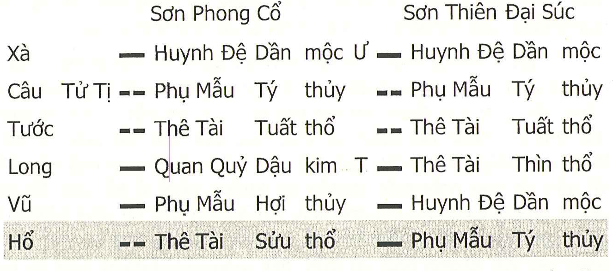
    - **Hình này chứng minh điều gì**
      - Làm sáng tỏ diễn biến cát hung và quy luật ứng nghiệm của Quẻ Sơn Phong Cổ biến Sơn Thiên Đại Súc đối với sự việc được hỏi.
    - **Từ đâu mà thấy được**
      - Căn cứ Thời gian lập quẻ: Ngày Quý Mùi tháng Thìn; Dụng thần rất vượng. Nhìn vào động niệm hay chưa.

- Kết quả ứng nghiệm thực tế:
  - Sau đó lại gieo quẻ hỏi kinh doanh tiệm dương tạp cát sẽ ra sao? Được quẻ Sơn Địa Bác biến Thủy Lôi Truân.

- Quái lệ dự đoán thực tế cho Quẻ Sơn Địa Bác biến Thủy Lôi Truân:
  - **Hình 6.** Quẻ Sơn Địa Bác biến Thủy Lôi Truân
    - 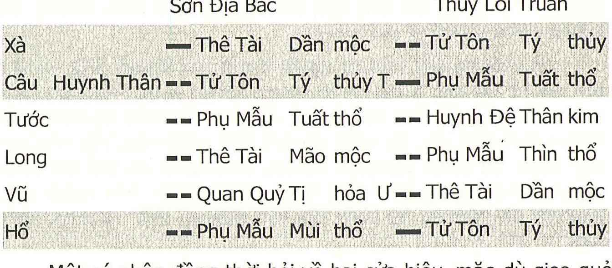
    - **Hình này chứng minh điều gì**
      - Làm sáng tỏ diễn biến cát hung và quy luật ứng nghiệm của Quẻ Sơn Địa Bác biến Thủy Lôi Truân đối với sự việc được hỏi.
    - **Từ đâu mà thấy được**
      - Căn cứ Thời gian lập quẻ: Ngày Quý Mùi tháng Thìn; Dụng thần rất vượng. Nhìn vào động niệm hay chưa.

- Luận điểm phân tích:
  - Một cá nhân đồng thời hỏi về hai cửa hiệu, mặc dù gieo quẻ tách biệt, nhưng loại tình huống này rất dễ xuất hiện nhầm lẫn. Bởi vì thứ tự động niệm trước sau khác nhau, nhất là khi gặp phải một số người do dự bất định, không thể quyết định hỏi cái gì trước, điều này sẽ ảnh hưởng rất lớn đến tính chính xác của quẻ. Với tư cách một dự trắc sư, nếu không thể nắm bắt và hiểu rõ

- Luận điểm phân tích:
  - [^1]: Dương tạp cát (羊杂割) là một loại món ăn bình dân ở Sơn Tây, được chế biến từ nội tạng dê kết hợp với các loại gia vị, thêm vào miến, bún để ăn.

- Luận điểm phân tích:
  - Tôi thấy quẻ đầu tiên Tài lâm Bạch Hổ, Bạch Hổ là máu, phẫu thuật v.v, có thể hiểu rộng ra là mổ, cắt, do đó tôi phán đoán quẻ này phải ứng với tiệm dương tạp cát. Trong quẻ Thê Tài Sửu thổ hưu tù, Nguyệt không sinh, bị Nhật khắc, lại bị hào biến hợp cản trở, do đó đoán tiệm dương tạp cát kinh doanh không tốt.

- Luận điểm phân tích:
  - Còn quẻ sau thì hào 6 Tài động hóa hồi đầu sinh, Nguyệt sinh, Nhật tỉ phù, hào 5 Tử Tôn lại động đến sinh nó, Dụng thần rất vượng, hào Tài lưỡng hiện, dường như hơi quá vượng, nhưng hào sơ Phụ Mẫu Mùi thổ phát động, đây gọi là Dụng thần trùng điệp, cần Mộ khố để thu tàng, quẻ sau nhất định ứng với nhà hàng Nam Tử Hán, do đó đoán nhà hàng Nam Tử Hán kinh doanh rất tốt.

- Kết quả ứng nghiệm thực tế:
  - Kết quả ứng nghiệm. Quả nhiên tiệm dương tạp cát kinh doanh không tốt, nhà hàng Nam Tử Hán kinh doanh rất tốt. Đồng hương nói, lúc đó ông ta đã không linh hoạt, phán đoán dựa vào thứ tự gieo quẻ, kết quả là đã đoán ngược lại. Xem ra không phải là quẻ không ứng nghiệm, mà là ý niệm với thứ tự của gieo quẻ cũng liên quan đến tính chính xác của phán đoán.

- Quái lệ thực tế:
  - Bối cảnh: **Một ví dụ khác:** Một ngày trong năm 2002, có một người phụ nữ gọi điện và hẹn hôm sau sẽ đến chỗ tôi để dự đoán về công việc của con trai đang làm ở Thâm Quyến. Ngày hôm sau, tức ngày Bính Tý tháng Tị, trước khi cô ấy đến, tôi đã gieo trước một quẻ, được Sơn Phong Cổ biến Phong Thiên Tiểu Súc.

- Luận điểm phân tích:
  - Sau khi gieo ra quẻ, tôi coi như quẻ này là đối phương gieo, tự mình phân tích trước và viết kết quả phán đoán lên giấy:

- Luận điểm phân tích:
  - Quan Quỷ trì Thế là thông tin có công việc, được Nguyệt kiến Trường Sinh, là mới tham gia công việc. Hào Thế Không Vong lâm Trình Xà, Trình Xà chủ bất an, Không Vong cũng chủ bất an, chứng tỏ con trai cô ấy không thể an tâm công tác. Quan Quỷ hưu tù lại lâm Không Vong, không có cửa làm quan. Hào sơ là tâm sự, lâm hào Tài phát động hóa ra Phụ Mẫu, Tài là kinh doanh buôn bán, Phụ Mẫu là công ty, tổng hợp phán đoán là bản thân muốn làm kinh doanh.

- Luận điểm phân tích:
  - Hào 5 Phụ Mẫu Tý thủy phát động, Phụ Mẫu là môi trường làm việc, môi trường biến động chính là có thông tin thay đổi đơn vị, nhưng bị hào sơ Sửu thổ hợp cản trở, do đó rất khó biến động. Đồng thời hào Thế Quan Quỷ nhập Mộ ở hào sơ Sửu thổ, cũng là thông tin công việc không thể thay đổi. Hơn nữa, hào Ứng là nơi muốn đến, lâm Thanh Long, bề ngoài thấy rất tốt, nhưng Ứng là Huynh Đệ, lợi ích kinh tế thực tế không tốt, không phát đạt cho lắm.

- Luận điểm phân tích:
  - Tôi làm như vậy cũng là để nghiệm chứng một số thứ, từ nội tâm, tôi không nắm chắc cho lắm. Sau khi viết xong các nhận định này, tôi đã để tờ giấy vào trong ngăn kéo và chờ cô ấy đến.

- Quái lệ dự đoán thực tế cho Quẻ Sơn Phong Cổ biến Phong Thiên Tiểu Súc:
  - **Hình 7.** Quẻ Sơn Phong Cổ biến Phong Thiên Tiểu Súc
    - 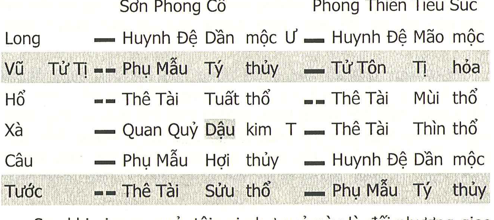
    - **Hình này chứng minh điều gì**
      - Làm sáng tỏ diễn biến cát hung và quy luật ứng nghiệm của Quẻ Sơn Phong Cổ biến Phong Thiên Tiểu Súc đối với sự việc được hỏi.
    - **Từ đâu mà thấy được**
      - Căn cứ Thời gian lập quẻ: Ngày Quý Mùi tháng Thìn; Dụng thần rất vượng. Nhìn vào động niệm hay chưa.

- Luận điểm phân tích:
  - Một tiếng sau, người phụ nữ đó dẫn theo con trai của cô ấy đến, tôi định lấy kết quả phán đoán ban nãy cho họ xem, nhưng lại lo lắng thông tin của quẻ không chính xác. Trong lòng nghĩ, con trai cô ấy cũng đã đến, chi bằng bảo nó tự mình gieo một quẻ.

- Luận điểm phân tích:
  - Con trai cô ấy gieo quẻ, được Sơn Phong Cổ.

- Quái lệ dự đoán thực tế cho Sơn Phong Cổ:
  - **Hình 8.** Sơn Phong Cổ
    - 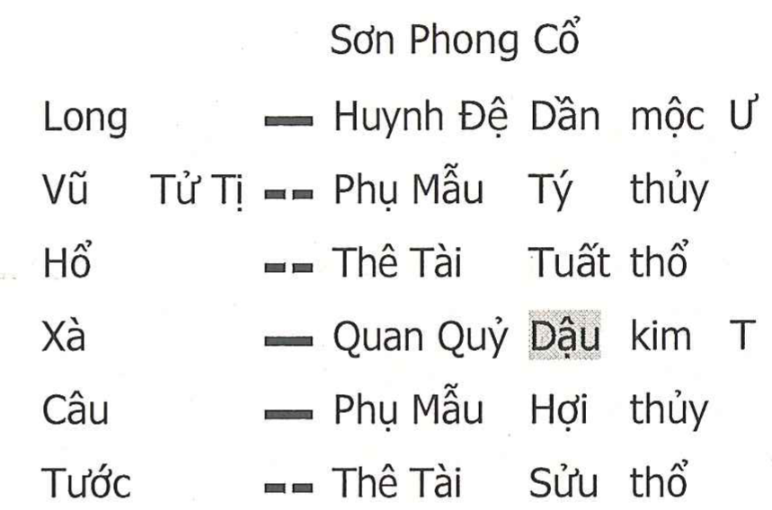
    - **Hình này chứng minh điều gì**
      - Làm sáng tỏ diễn biến cát hung và quy luật ứng nghiệm của Sơn Phong Cổ đối với sự việc được hỏi.
    - **Từ đâu mà thấy được**
      - Căn cứ Thời gian lập quẻ: Ngày Quý Mùi tháng Thìn; Dụng thần rất vượng. Nhìn vào động niệm hay chưa.

- Luận điểm phân tích:
  - Tôi thấy quẻ này và quẻ chính ban nãy hoàn toàn giống nhau, chỉ là không có hào động, thế là kiên định lòng tin, liền lấy tờ giấy trong ngăn kéo ra và nói với họ rằng: "Tôi đã đoán xong sự việc quý vị muốn đoán ở đây, mời quý vị xem thử có chính xác hay không? "

- Luận điểm phân tích:
  - Sau khi xem kết quả phán đoán trên tờ giấy, người phụ nữ đó hết sức kinh ngạc, nói rằng: "Tôi đã từng tham gia lớp đào tạo dự đoán Chu Dịch của thầy Thiệu Vĩ Hoa, tôi tự học dự đoán cũng đã mấy năm, nhưng chưa từng thấy có phương thức dự đoán giống như thế này, người chưa đến mà đã miêu tả trước được sự việc, hơn nữa đoán cũng rất đúng. Sau này xin thỉnh giáo ông nhiều."

- Luận điểm phân tích:
  - Thực ra, phương pháp tự mình gieo một quẻ trước khi người ta chưa đến và viết kết quả sự việc người ta muốn đoán lên giấy cũng là lần đầu tiên tôi sử dụng, cũng là muốn làm một thử nghiệm mới.

- Luận điểm phân tích:
  - Theo kinh nghiệm dự đoán nhiều năm của tôi, loại phương pháp này là khả thi, bởi vì khi gieo quẻ có thể áp dụng hai loại hình thức gieo quẻ là người đến gieo quẻ hoặc dự trắc sư gieo quẻ. Khi cô ấy gọi điện thoại hẹn trước thì thông tin đã sớm truyền đạt qua, ai gieo quẻ đều cũng chính xác như nhau.

### Câu hỏi 2: Nên dùng đồng xu nào để gieo quẻ?

- Kết quả ứng nghiệm thực tế:
  - **Đáp:** Miễn là đồng xu có thể phân ra mặt chính và mặt phản (mặt trái) thì đều có thể làm công cụ gieo quẻ, cũng có thể tự mình làm công cụ gieo quẻ. Có người nói gieo quẻ bằng đồng Càn Long thì sẽ linh nghiệm, điều này hoàn toàn không có căn cứ. Sự ứng nghiệm của quẻ được quyết định bởi tâm niệm của người hỏi quẻ và trình độ đoán quẻ của dự trắc sư như thế nào chứ không phụ thuộc vào công cụ gieo quẻ. Hình thức gieo quẻ bằng đồng xu đã được phát minh trước thời Càn Long, chẳng lẽ trước đó người ta gieo quẻ đồng xu khác thì dự đoán chẳng linh nghiệm hay sao?

- Luận điểm phân tích:
  - Tôi đã từng gieo quẻ bằng đồng xu nhân dân tệ, đồng xu Yên, đồng xu Singapore, đồng xu cổ thời Đường, đồng xu cổ thời Tống, đồng xu cổ thời Kim, cũng có đồng xu tự làm v.v, thực tế chứng minh gieo quẻ bằng công cụ nào cũng được, tuyệt nhiên không bởi vì công cụ khác nhau mà ảnh hưởng đến kết quả dự đoán.

- Luận điểm phân tích:
  - Để nghiệm chứng tính chính xác của các loại đồng xu gieo quẻ, qua một thời gian thì tôi lại thay đổi công cụ, đã tích lũy được rất nhiều ví dụ, đủ để chứng minh sử dụng đồng xu nào cũng đều khả thi.

- Quái lệ thực tế:
  - Bối cảnh: **Ví dụ 1:** Tháng 10 năm 2000, tôi và nhóm bạn người Nhật Bản đến thành phố H để khảo sát hiện tượng siêu thường, bởi vì đối tượng khảo sát vẫn chưa xuất hiện, người liên hệ trung gian đã mời phó tỉnh trưởng của tỉnh đó và chủ nhiệm ủy ban kiểm tra kỷ luật đến nhà khách cùng chơi mạt chược. Trong lúc trò chuyện, bọn họ hỏi rằng nhóm chúng tôi có khảo sát Kinh Dịch dự đoán không. Một lão tiên sinh đi cùng tôi đã nói với đối phương: "Thầy Vương của chúng tôi chính là người nghiên cứu dự đoán, người của các ông ở đây nếu trình độ cao hơn ông ấy thì gọi đến, nếu trình độ bình thường thì thôi." Nói năng như vậy, khẩu khí có phần khiêu khích khiến đối phương rất không vui.

- Luận điểm phân tích:
  - Mấy người đó vừa mới nghe tôi nghiên cứu dự đoán thì khăng khăng đòi tôi đoán cho bằng được, chẳng qua là muốn thử trình độ cao thấp mà thôi.

- Luận điểm phân tích:
  - Lúc đó tiền xu tôi đem theo bị mất một đồng, vị phó tỉnh trưởng đó đã tìm được ba đồng một tệ trong nhà khách, ở ngày

- Luận điểm phân tích:
  - Tân Sửu tháng Tuất gieo được quẻ Thủy Phong Tỉnh biến Địa Phong Thăng.

- Luận điểm phân tích:
  - Tôi hỏi ông ta muốn hỏi chuyện gì? Đáp rằng: "Xem về vận khí của con trai." Tôi nói: "Con trai của ông đã ngồi tù bởi vì vụ án kinh tế. Cảnh sát đã bắt nó ở giữa đường chứ không phải bắt ở nhà ông. Trong nửa năm không ra được, phải đến tháng giêng năm sau mới có thể được thả ra."

- Luận điểm phân tích:
  - Sau khi nghe xong phán đoán, vị phó tỉnh trưởng đó liên tục nói rằng chính xác. Trong số những người ông ta biết, không có ai dự đoán chuẩn giống như vậy. Ông ta còn nói cho tôi biết, con trai ông ta bị bắt khi lái xe cho một người bạn buôn lậu xe hơi, sự việc xảy ra đã nửa năm. Lúc đầu định tội buôn lậu, sau khi thông qua các mối quan hệ đã được đổi thành tội di chuyển tang vật.

- Luận điểm phân tích:
  - Đây là lần đầu tiên tôi gieo quẻ phán đoán bằng đồng xu nhân dân tệ, kết quả rất chính xác.

- Quái lệ dự đoán thực tế cho Quẻ Thủy Phong Tỉnh biến Địa Phong Thăng:
  - **Hình 9.** Quẻ Thủy Phong Tỉnh biến Địa Phong Thăng
    - 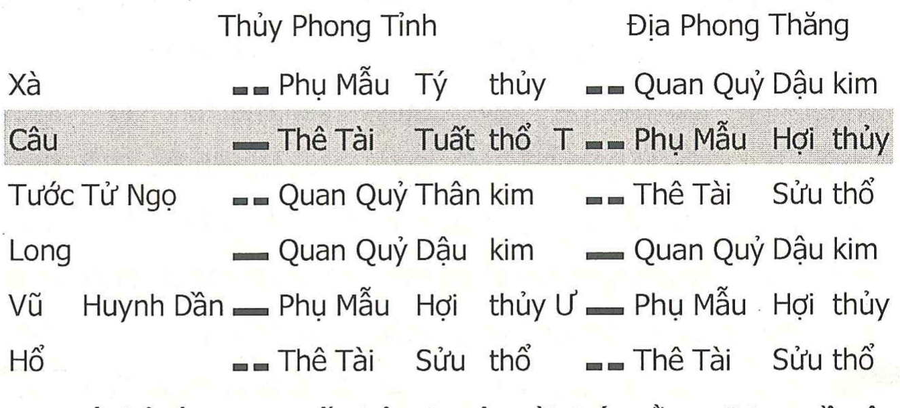
    - **Hình này chứng minh điều gì**
      - Làm sáng tỏ diễn biến cát hung và quy luật ứng nghiệm của Quẻ Thủy Phong Tỉnh biến Địa Phong Thăng đối với sự việc được hỏi.
    - **Từ đâu mà thấy được**
      - Căn cứ Thời gian lập quẻ: Ngày Mậu Ngọ tháng Tuất; Dụng thần là không muốn đứa con này. Nhìn vào biến Địa Phong Thăng.

- Quái lệ thực tế:
  - Bối cảnh: **Ví dụ 2:** Ngày Mậu Ngọ tháng Tuất, một cô gái thỉnh cầu dự đoán về tình hình mang thai, tôi bảo cô ấy dùng ba đồng xu 10 yên gieo quẻ, được Thủy Thiên Nhu biến Khảm Vi Thủy.

- Luận điểm phân tích:
  - **Đoán:** Lấy hào Tử Tôn làm Dụng thần, Tử Tôn trì Thế, được Nguyệt sinh phù là vượng. Chứng tỏ đã mang thai, nhưng Nhật khắc Tử Tôn, Nguyên thần Thìn thổ Nguyệt phá, động mà hóa ra Kỵ thần là không cát. Thìn thổ cũng là Nguyên thần hào Thế, hào Thế là người xem, Nguyên thần là tâm tư, tư duy của một người, phá mà không sinh Dụng thần là không muốn đứa con này, hóa ra Kỵ thần là muốn bỏ đứa con này. Huống hồ Tý thủy phát động, là Dụng thần lâm Tử địa, thai này khó giữ.

- Kết quả ứng nghiệm thực tế:
  - Sau đó ở giờ Tị của ngày Ất Sửu, ngày Tử Tôn nhập Mộ, cô gái này đã phá thai.

- Quái lệ thực tế:
  - Bối cảnh: **Ví dụ 3:** Ngày Mậu Ngọ tháng Tuất, nam thích một cô gái, xem có thể yêu đương với cô ấy hay không? Tôi bảo anh ta dùng ba đồng 1 yên gieo quẻ, được Lôi Thiên Đại Tráng biến Lôi Phong Hằng.

- Quái lệ dự đoán thực tế cho Quẻ Thủy Thiên Nhu biến Khảm Vi Thủy:
  - **Hình 10.** Quẻ Thủy Thiên Nhu biến Khảm Vi Thủy
    - 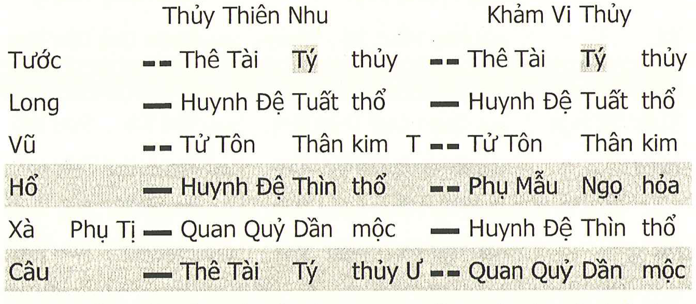
    - **Hình này chứng minh điều gì**
      - Làm sáng tỏ diễn biến cát hung và quy luật ứng nghiệm của Quẻ Thủy Thiên Nhu biến Khảm Vi Thủy đối với sự việc được hỏi.
    - **Từ đâu mà thấy được**
      - Căn cứ Thời gian lập quẻ: Ngày Mậu Ngọ tháng Tuất; Dụng thần là không muốn đứa con này. Nhìn vào biến Địa Phong Thăng.

- Quái lệ dự đoán thực tế cho Quẻ Lôi Thiên Đại Tráng biến Lôi Phong Hằng:
  - **Hình 11.** Quẻ Lôi Thiên Đại Tráng biến Lôi Phong Hằng
    - 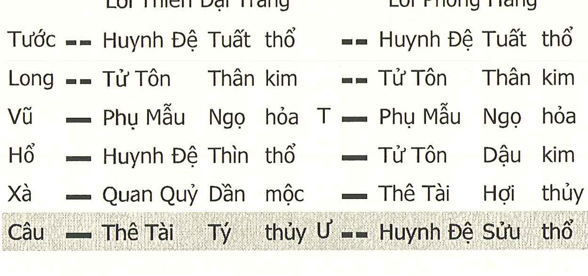
    - **Hình này chứng minh điều gì**
      - Làm sáng tỏ diễn biến cát hung và quy luật ứng nghiệm của Quẻ Lôi Thiên Đại Tráng biến Lôi Phong Hằng đối với sự việc được hỏi.
    - **Từ đâu mà thấy được**
      - Căn cứ Thời gian lập quẻ: Ngày Mậu Ngọ tháng Tuất; Dụng thần là không muốn đứa con này. Nhìn vào biến Địa Phong Thăng.

- Luận điểm phân tích:
  - **Đoán:** Lấy Thê Tài làm Dụng thần, đồng thời tham khảo hào Ứng, hào Tài bị Nguyệt kiến khắc thương, Nhật xung là phá, là tán. Tài lâm hào Ứng, Ứng là người khác, Tài phá tương hợp với hào biến, người nữ này đã đồng cư phá thân với người khác.

- Luận điểm phân tích:
  - Dụng thần không cát, do đó người xem không có cơ hội yêu đương với người nữ này.

- Luận điểm phân tích:
  - Người này đã thăm dò tình trạng của đối phương bằng nhiều cách, quả như phán đoán, thế là đã từ bỏ theo đuổi.

- Quái lệ thực tế:
  - Bối cảnh: **Ví dụ 4:** Ngày Canh Thìn tháng Dần, nữ đoán thi trợ lý ngân hàng sẽ ra sao? Tôi dùng đồng xu giả cổ do mình tự chế, bảo cô ấy gieo quẻ, được Lôi Trạch Quy Muội.

- Quái lệ dự đoán thực tế cho Lôi Trạch Quy Muội:
  - **Hình 12.** Lôi Trạch Quy Muội
    - 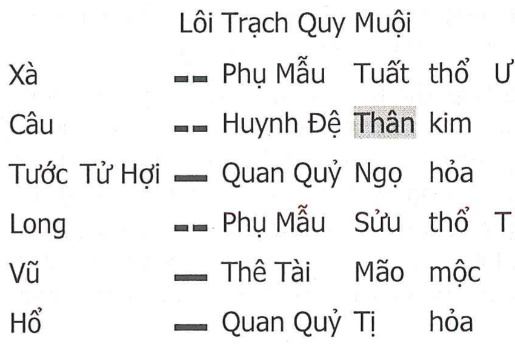
    - **Hình này chứng minh điều gì**
      - Làm sáng tỏ diễn biến cát hung và quy luật ứng nghiệm của Lôi Trạch Quy Muội đối với sự việc được hỏi.
    - **Từ đâu mà thấy được**
      - Căn cứ Thời gian lập quẻ: Ngày Mậu Ngọ tháng Tuất; Dụng thần là không muốn đứa con này. Nhìn vào biến Địa Phong Thăng.

- Luận điểm phân tích:
  - **Đoán:** Lấy Quan Quỷ làm Dụng thần, Quan Quỷ được Nguyệt sinh phù là vượng tướng, Quan vượng sinh Thế, nhất định có thể thi đậu.

- Luận điểm phân tích:
  - Giờ Dậu hôm đó, cô ấy gọi đến cho biết, hơn 100 người tham gia dự thi, chỉ tuyển chọn 30 người, cô ấy đã thi đậu.

### Câu hỏi 3: Khi gieo quẻ có cần liên tục nghĩ về sự việc muốn dự đoán hay không?

- Giải đáp trọng tâm:
  - Có sách nói rằng, khi gieo quẻ phải liên tục nghĩ về sự việc mình muốn dự đoán, nếu phán đoán không đúng thì đổ lỗi cho người xem không thành tâm, tư tưởng tạp loạn, trong quẻ không phản ánh ra thông tin mà người đó yêu cầu. Đây chính là dự trắc sư tự tìm lối thoát cho bản thân.

- Luận điểm phân tích:
  - Trước đây tôi cũng cho rằng như vậy, và cũng đã từng viết trong sách rằng khi gieo quẻ phải chuyên tâm nghĩ về sự việc bản thân muốn dự đoán. Một khi dự đoán không chính xác thì lại nghĩ

- Luận điểm phân tích:
  - Khi nghiên cứu về vấn đề dự trắc sư gieo quẻ, tôi đã phát hiện khi gieo quẻ hoàn toàn không cần phải liên tục nghĩ về sự việc muốn dự đoán. Bởi vì người ta chỉ đến để dự đoán, cho nên tâm thái và ý niệm dự đoán đã sớm có ở trong đầu của người đó rồi, người ta chỉ nhờ sóng não truyền đạt thông tin sự việc mà họ quan tâm thông qua ba đồng xu. Do đó, khi gieo quẻ, người đến xem không cần liên tục nghĩ về sự việc mình muốn dự đoán. Đã có ý niệm thì có thể gieo quẻ dự đoán.

- Luận điểm phân tích:
  - Qua thực tiễn chứng minh, người gieo quẻ có thể là người xem, nhưng cũng có thể là dự trắc sư. Đôi khi bảo người thứ ba có mặt gieo quẻ cũng chính xác như vậy.

- Kết quả ứng nghiệm thực tế:
  - Trường hợp dự trắc sư gieo quẻ, thông thường không cần thêm ý niệm gì, hơn nữa trong đầu càng không nghĩ gì thì quẻ gieo ra càng chính xác. Đối với tôi, nếu như có người gọi điện yêu cầu dự đoán, thông thường, tôi đều tự mình gieo quẻ, khi gieo quẻ, trong đầu chẳng nghĩ điều gì, chiểu theo quẻ gieo ra phán đoán không hề do dự, quẻ đã ứng nghiệm như vậy không chỉ có một hai, do đó hoàn toàn có thể khẳng định quan điểm này là chính xác.

- Quái lệ thực tế:
  - Bối cảnh: **Ví dụ:** Khoảng 10 giờ tối ngày 15 tháng 3 năm 2006, bạn của tôi, bác sĩ Trung y trứ danh Cao Minh Ngũ gọi đến, nói rằng mẹ của bạn ông ta ra ngoài từ hơn 6 giờ chiều đến bây giờ vẫn chưa trở về, ngay cả điện thoại cũng không có, bảo tôi dự đoán thử xem tình hình cát hung ra sao, giờ Nhâm Tuất ngày Quý Mão tháng Tân Mão năm Bính Tuất, tôi gieo quẻ được Thủy Hỏa Ký Tế.

- Quái lệ dự đoán thực tế cho Thủy Hỏa Ký Tế:
  - **Hình 13.** Thủy Hỏa Ký Tế
    - 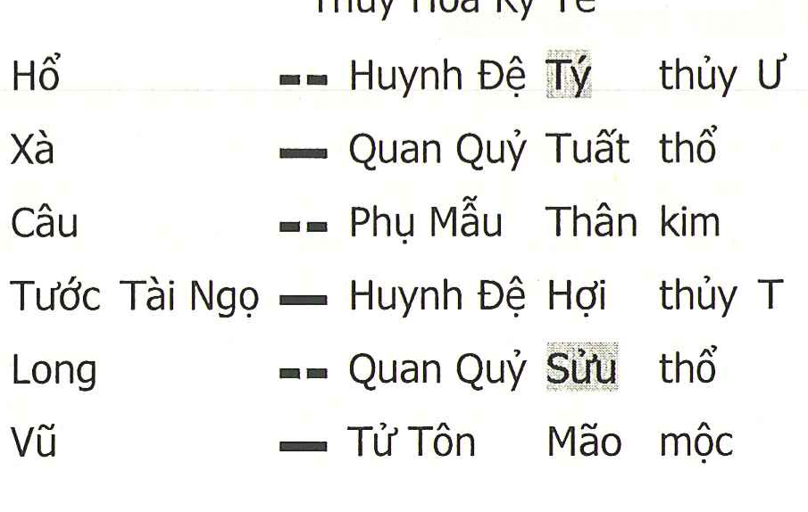
    - **Hình này chứng minh điều gì**
      - Làm sáng tỏ diễn biến cát hung và quy luật ứng nghiệm của Thủy Hỏa Ký Tế đối với sự việc được hỏi.
    - **Từ đâu mà thấy được**
      - Căn cứ Dụng thần an tĩnh. Nhìn vào động đến cục công an.

- Luận điểm phân tích:
  - Quẻ này là bạn ông ta hỏi ông ta, ông ta lại gọi điện thoại hỏi tôi, quẻ của tôi gieo. Bạn ông ta không biết tôi sẽ dự đoán, ý định ban đầu không phải là tìm tôi dự đoán, mà là tìm bác sĩ Cao dự đoán, nhưng khi phán đoán gặp phải khó khăn, bác sĩ Cao mới hỏi tôi.

- Luận điểm phân tích:
  - Bác sĩ Cao thường dùng Mai Hoa Dịch Số, còn tôi dùng dự đoán lục hào. Mặc dù quẻ này là tôi gieo, nhưng đương nhiên cũng giống như bạn ông ta hỏi quẻ, do đó lấy Phụ Mẫu làm Dụng thần. Phụ Mẫu Thân kim tuy rằng không được Nhật Nguyệt sinh phù, nhưng cũng không bị Nhật Nguyệt khắc thương, do đó căn không hoại, lại thêm quẻ tĩnh, biểu thị an nhiên, cho nên mẹ ông ta ra ngoài không có hung tượng, bình an vô sự.

- Luận điểm phân tích:
  - Khi nào trở về? Dụng thần an tĩnh, thông thường ứng tĩnh mà gặp trị gặp xung. Cái xung Dụng thần là Dần, Dần tương ứng với sáng 3 – 5 giờ sáng, về tối như vậy thông thường không phù hợp với tình huống thực tế, do đó phải là giờ Thân trở về. Giờ Thân của ngày đầu tiên đã qua, vậy thì ứng giờ Thân của ngày thứ hai. Đồng thời Nguyên thần Tuất thổ bị Nhật hợp, tham hợp quên sinh, ngày hôm sau là ngày Thìn, xung khai sinh Thế, ngày Thìn chắc chắn về. Tôi đoán 3 – 5 giờ chiều ngày Giáp Thìn trở về.

- Luận điểm phân tích:
  - Trên thực tế, vừa đến 4 giờ thì mẹ của bạn ông ta đã trở về, nói là đã đến một địa phương ở hướng Tây Nam để du ngoạn. Bởi vì bạn của ông ta là một nhân vật quan trọng tại cơ quan chính quyền tỉnh, sự việc này đã kinh động đến cục công an, bọn họ đã đồng thời mời 6 người tiến hành dự đoán, chỉ có tôi phán đoán chính xác.

- Luận điểm phân tích:
  - Lúc đó tôi không đoán phương hướng, nhưng quẻ này rất phù hợp với tình hình thực tế, phương hướng chính là hướng tương ứng với Dụng thần Thân kim.

### Câu hỏi 4: Khi gieo quẻ, đồng xu rơi xuống đất thì xử lý như thế nào?

- Giải đáp trọng tâm:
  - Khi dự đoán cho người khác, đôi khi chúng ta sẽ gặp phải tình huống có đồng xu rơi xuống mặt đất, hoặc rơi xuống dưới gầm bàn, có trường hợp thậm chí rơi vào chỗ mắt không nhìn thấy. Tệ hơn nữa, đồng xu dựng đứng ở góc tường, không đổ xuống. Người mới học không biết xử lý ra sao? Đồng xu rơi đến chỗ khác có được tính không? Đồng xu dựng đứng phải xem là mặt gì?

- Luận điểm phân tích:
  - Nếu như gặp phải tình huống này, không cần phải gieo lại quẻ lần nữa. Khi gieo quẻ, cho dù đồng xu rơi ở đâu cũng đều phải tính vào, tìm đồng xu và xem nó là mặt chính hay là mặt phản, đem nó đến cùng một chỗ với đồng xu không rơi xuống đất để xem tình hình chính phản. Nếu như có đồng xu đứng dựa vào một vật thể nào đó, không đổ xuống, vậy thì lấy mặt nhìn thấy để nhận định chính phản. Trong thực tiễn, tôi cũng thường xuyên gặp phải tình huống này, đều sử dụng như vậy, hoàn toàn không ảnh hưởng đến tính chính xác của quẻ.

- Luận điểm phân tích:
  - Nhưng nếu muốn giảm bớt phiền phức do rơi đồng xu, chúng ta có thể tìm một đồ vật đáy phẳng, chẳng hạn như cái đĩa, làm công cụ để tiếp nhận đồng xu, như vậy có thể giảm bớt tỷ lệ rơi ra ngoài. Cũng có thể tìm một cái bàn lớn một chút để gieo quẻ.

- Quái lệ thực tế:
  - Bối cảnh: **Ví dụ:** Ngày Bính Thìn tháng Hợi, một người đoán tài vận trong ngắn hạn, gieo quẻ được Sơn Lôi Di. Ở lần gieo thứ hai, đồng xu đã rơi xuống dưới gầm bàn, nhặt lên kết hợp với các đồng xu trên bàn xem tình hình chính phản, hai lưng một chữ, xem là vạch đứt.

- Quái lệ dự đoán thực tế cho Sơn Lôi Di:
  - **Hình 14.** Sơn Lôi Di
    - 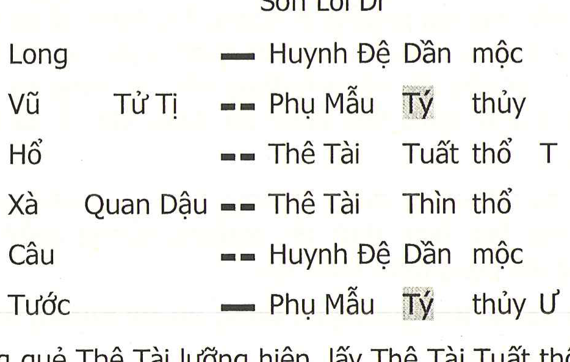
    - **Hình này chứng minh điều gì**
      - Làm sáng tỏ diễn biến cát hung và quy luật ứng nghiệm của Sơn Lôi Di đối với sự việc được hỏi.
    - **Từ đâu mà thấy được**
      - Căn cứ Thời gian lập quẻ: Ngày Bính Thìn tháng Hợi. Nhìn vào Vị trí hào Thế, hào Ứng, hào động và hào biến sinh khắc Dụng thần.

- Luận điểm phân tích:
  - Trong quẻ Thê Tài lưỡng hiện, lấy Thê Tài Tuất thổ trên Thế gặp xung làm Dụng thần. Nguyệt không khắc, Nhật trong xung có phù, là ám động. Hào Tài Thìn thổ lâm Nhật xung Thế, hôm nay có tài, quả nhiên hôm đó được 1000 tệ.

### Câu hỏi 5: Chỉ riêng một sự việc, có thể liên tục gieo quẻ đoán hay không?

- Giải đáp trọng tâm:
  - Đương nhiên có thể. Nhưng nếu một quẻ đã phản ánh ra sự việc muốn hỏi thì không cần thiết phải gieo lại quẻ lần thứ hai nữa, chỉ khi thông tin trong quẻ đầu tiên không rõ ràng, hoặc không dễ phán đoán thì mới cần gieo lại một quẻ, kết hợp hai quẻ để phán đoán.

- Quái lệ thực tế:
  - Bối cảnh: **Ví dụ 1:** Ngày Nhâm Dần tháng Sửu, một người phụ nữ Nhật Bản đoán con gái có thi đậu đại học hay không, được quẻ Thiên Sơn Độn.

- Quái lệ dự đoán thực tế cho Quẻ Thiên Sơn Độn:
  - **Hình 15.** Quẻ Thiên Sơn Độn
    - 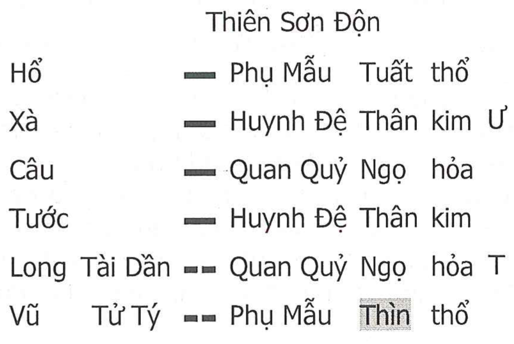
    - **Hình này chứng minh điều gì**
      - Làm sáng tỏ diễn biến cát hung và quy luật ứng nghiệm của Quẻ Thiên Sơn Độn đối với sự việc được hỏi.
    - **Từ đâu mà thấy được**
      - Căn cứ Thời gian lập quẻ: Ngày Nhâm Dần tháng Sửu; Dụng thần thứ nhất. Nhìn vào biến Chấn Vi Lôi.

- Luận điểm phân tích:
  - **Đoán:** Quan Quỷ là Dụng thần thứ nhất, Phụ Mẫu dùng để tham khảo. Trong quẻ Quan Quỷ lưỡng hiện, lấy Quan Quỷ Ngọ hỏa trên Thế làm Dụng, hào Phụ Mẫu thì lấy Phụ Mẫu Thìn thổ lâm Không Vong làm Dụng.

- Luận điểm phân tích:
  - Quan Quỷ được Nhật sinh trợ là vượng, lâm Thanh Long là hỷ, mặc dù Phụ Mẫu Thìn thổ Không Vong nhưng được Nguyệt kiến củng phù cũng vượng, tổng hợp phán đoán có thể thi đậu.

- Luận điểm phân tích:
  - Sau quả nhiên thi đậu.

- Luận điểm phân tích:
  - Ngày Đinh Mùi tháng Sửu, người phụ nữ này lại gieo quẻ đoán tình hình con gái thi đại học, được quẻ Trạch Phong Đại Quá.

- Quái lệ dự đoán thực tế cho Quẻ Trạch Phong Đại Quá:
  - **Hình 16.** Quẻ Trạch Phong Đại Quá
    - 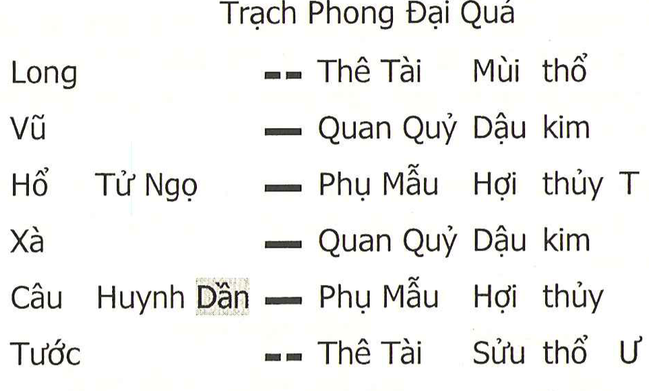
    - **Hình này chứng minh điều gì**
      - Làm sáng tỏ diễn biến cát hung và quy luật ứng nghiệm của Quẻ Trạch Phong Đại Quá đối với sự việc được hỏi.
    - **Từ đâu mà thấy được**
      - Căn cứ Thời gian lập quẻ: Ngày Nhâm Dần tháng Sửu; Dụng thần thứ nhất. Nhìn vào biến Chấn Vi Lôi.

- Luận điểm phân tích:
  - Lấy Quan Quỷ làm Dụng thần, hào Phụ Mẫu dùng để tham khảo. Quan Quỷ được Nhật Nguyệt sinh phù là vượng tướng, Phụ Mẫu tuy là bị Nhật Nguyệt khắc chế là hưu tù, nhưng người xưa nói rằng: "Vượng Quan có thể sinh suy Phụ", dự đoán học hành thi cử lấy Quan Quỷ làm trọng, Phụ Mẫu làm khinh, hào vượng tướng trong quẻ tĩnh có thể sinh phù hào hưu tù, Quan vượng sinh Thế, do đó cũng có thể phán đoán con gái người đó thi đậu đại học.

- Kết quả ứng nghiệm thực tế:
  - Tình hình ứng nghiệm, tham khảo quẻ trước.

- Quái lệ thực tế:
  - Bối cảnh: Ngày Mậu Thân tháng Sửu, cô ấy lại gieo quẻ hỏi tình hình con gái thi đại học, được Lôi Phong Hằng biến Chấn Vi Lôi.

- Quái lệ dự đoán thực tế cho Quẻ Lôi Phong Hằng biến Chấn Vi Lôi:
  - **Hình 17.** Quẻ Lôi Phong Hằng biến Chấn Vi Lôi
    - 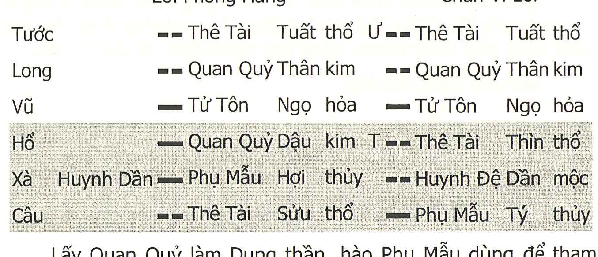
    - **Hình này chứng minh điều gì**
      - Làm sáng tỏ diễn biến cát hung và quy luật ứng nghiệm của Quẻ Lôi Phong Hằng biến Chấn Vi Lôi đối với sự việc được hỏi.
    - **Từ đâu mà thấy được**
      - Căn cứ Thời gian lập quẻ: Ngày Nhâm Dần tháng Sửu; Dụng thần thứ nhất. Nhìn vào biến Chấn Vi Lôi.

- Luận điểm phân tích:
  - Lấy Quan Quỷ làm Dụng thần, hào Phụ Mẫu dùng để tham khảo. Trong quẻ Quan Quỷ lưỡng hiện, lấy Quan Quỷ Dậu kim trên Thế phát động làm Dụng thần, Quan Quỷ Nguyệt sinh Nhật

- Kết quả ứng nghiệm thực tế:
  - Kết quả giống như ví dụ trước.

- Luận điểm phân tích:
  - Cùng ngày, cô ấy lại gieo được quẻ Lôi Phong Hằng biến Lôi Thiên Đại Tráng.

- Quái lệ dự đoán thực tế cho Quẻ Lôi Phong Hằng biến Lôi Thiên Đại Tráng:
  - **Hình 18.** Quẻ Lôi Phong Hằng biến Lôi Thiên Đại Tráng
    - 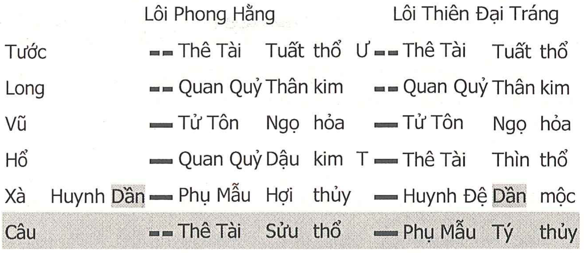
    - **Hình này chứng minh điều gì**
      - Làm sáng tỏ diễn biến cát hung và quy luật ứng nghiệm của Quẻ Lôi Phong Hằng biến Lôi Thiên Đại Tráng đối với sự việc được hỏi.
    - **Từ đâu mà thấy được**
      - Căn cứ Thời gian lập quẻ: Ngày Nhâm Dần tháng Sửu; Dụng thần thứ nhất. Nhìn vào biến Chấn Vi Lôi.

- Luận điểm phân tích:
  - Quẻ này có phần tương tự với quẻ vừa rồi. Lấy Quan Quỷ Dậu kim lâm hào Thế làm Dụng thần. Dụng thần được Nhật Nguyệt sinh phù vượng mà trì Thế, Tài động sinh Quan, may mắn gọi tên, có thể thi đậu.

- Kết quả ứng nghiệm thực tế:
  - Tình hình ứng nghiệm tham khảo phía trước.

- Luận điểm phân tích:
  - [^1]: Thái quá thì bớt đi sẽ thành.

- Quái lệ thực tế:
  - Bối cảnh: **Ví dụ 2:** Một học viên Nhật Bản sắp đi máy bay đến Tokyo, anh ta bèn tự đoán tình hình cát hung của xuất hành, nhưng gieo hai quẻ đều cảm thấy không dễ phán đoán, thế là gọi điện thoại hỏi tôi.

- Luận điểm phân tích:
  - Sau khi đã xem hai quẻ đầu, tôi cho rằng là cát, nhưng anh ta vẫn hơi lo lắng, hỏi tôi là có thể gieo lại một quẻ hay không, tôi nói đương nhiên có thể, thế là anh ta lại gieo một quẻ, quẻ thứ ba phản ánh tình hình cát hung rõ ràng hơn hai quẻ trước một chút, anh ta mới vững tâm. Những quái lệ này rất đáng để chúng ta nghiền ngẫm.

- Kết quả ứng nghiệm thực tế:
  - Trên thực tế, ba quẻ đều phản ánh là cát, kết quả ứng nghiệm rất có ý nghĩa, mỗi quẻ phản ánh tình hình cát hung của các khoảng thời gian khác nhau khi ra ngoài, ba quẻ này như sau:

- Quái lệ thực tế:
  - Bối cảnh: Ngày Canh Thìn tháng Dần, anh ta đoán cát hung của việc đi máy bay đến Tokyo, gieo quẻ được Thủy Địa Tỷ biến Thủy Lôi Truân.

- Quái lệ dự đoán thực tế cho Quẻ Thủy Địa Tỷ biến Thủy Lôi Truân:
  - **Hình 19.** Quẻ Thủy Địa Tỷ biến Thủy Lôi Truân
    - 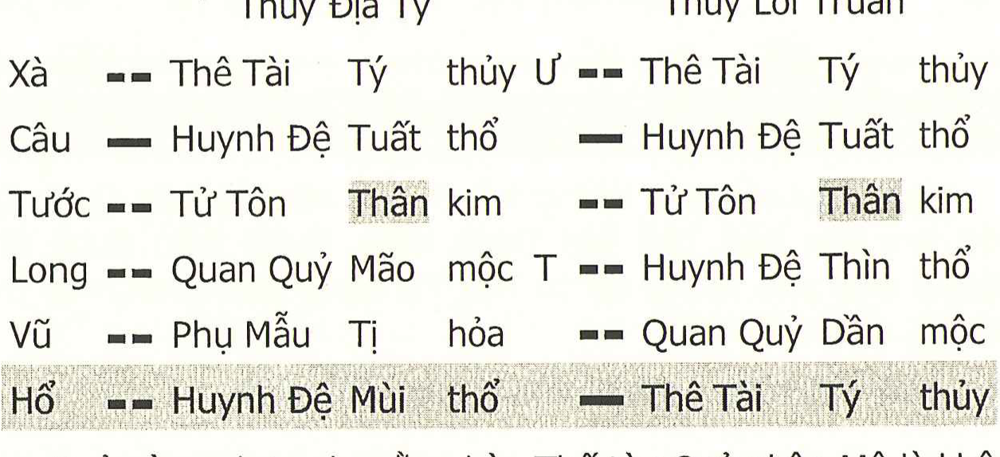
    - **Hình này chứng minh điều gì**
      - Làm sáng tỏ diễn biến cát hung và quy luật ứng nghiệm của Quẻ Thủy Địa Tỷ biến Thủy Lôi Truân đối với sự việc được hỏi.
    - **Từ đâu mà thấy được**
      - Căn cứ Thời gian lập quẻ: Ngày Nhâm Dần tháng Sửu; Dụng thần thứ nhất. Nhìn vào biến Chấn Vi Lôi.

- Luận điểm phân tích:
  - Quẻ này anh ta cho rằng hào Thế tùy Quỷ nhập Mộ là không cát, do đó lại gieo quẻ thứ hai. Nhưng thực ra quẻ này hào Thế được Nguyệt củng phù vượng tướng, xem cát hung phải lấy suy vượng của hào Thế làm chủ.

- Luận điểm phân tích:
  - Một hào độc phát, mặc dù gặp phải Mộ khố không tốt, nhưng cũng phải xem dự đoán chuyện gì, xem thông tin Mộ ứng với cái gì, không cát có chia thành mức độ nặng nhẹ, không thể cứ vừa thấy Mộ khố thì cho rằng là tử vong. Khi dự đoán cát hung không nên câu nệ hào Thế lâm lục thân gì. Quẻ này hào Thế nhập Mộ ở hào sơ, hào sơ là chân, chính là chân bị cản trở, không thể

- Luận điểm phân tích:
  - Quẻ thứ hai của anh ta gieo là Trạch Phong Đại Quá biến Trạch Sơn Hàm.

- Quái lệ dự đoán thực tế cho Trạch Phong Đại Quá biến Trạch Sơn Hàm:
  - **Hình 20.** Trạch Phong Đại Quá biến Trạch Sơn Hàm
    - 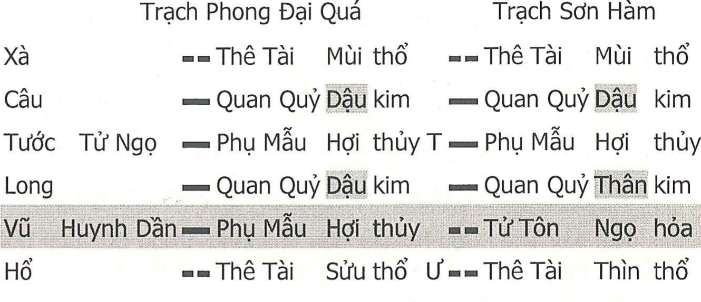
    - **Hình này chứng minh điều gì**
      - Làm sáng tỏ diễn biến cát hung và quy luật ứng nghiệm của Trạch Phong Đại Quá biến Trạch Sơn Hàm đối với sự việc được hỏi.
    - **Từ đâu mà thấy được**
      - Căn cứ Thời gian lập quẻ: Ngày Nhâm Dần tháng Sửu; Dụng thần thứ nhất. Nhìn vào biến Chấn Vi Lôi.

- Luận điểm phân tích:
  - Anh ta nói rằng, quẻ này Phụ Mẫu Hợi thủy Nguyệt không sinh phù, Nhật lại đến khắc, lại nhập Mộ ở Nhật, hào 2 Phụ Mẫu Hợi thủy phát động, hình thành tự hình với hào Thế, so với quẻ trước càng không tốt, nhưng không thể không đi, do đó gọi điện thoại hỏi tôi, nhưng không liên lạc được với tôi, ngày thứ hai gọi được mới bàn về hai quẻ trên.

- Luận điểm phân tích:
  - Lúc đó, tôi phán đoán quẻ thứ hai hào Thế và Nguyệt kiến tương hợp là vượng tướng, nhập Mộ ở Nhật, có phần tương đồng với quẻ đầu tiên, cũng là thông tin bản thân bị cản trở, máy bay sẽ trễ giờ. Hào 2 Phụ Mẫu Hợi thủy phát động không nên xem là tự hình, bởi vì trong dự đoán lục hào, hình chỉ dùng để phân biệt ý nghĩa, thông thường không chủ cát hung, do đó ở đây Hợi thủy phát động là trợ vượng hào Thế.

- Luận điểm phân tích:
  - Phụ Mẫu là xe thuyền, phương tiện giao thông, trong quẻ này biểu thị máy bay, do đó tôi phán đoán anh ta xuất hành sẽ gặp phải chuyến bay trì hoãn, đổi sang đi máy bay khác.

- Luận điểm phân tích:
  - Quẻ thứ ba của anh ta gieo tại ngày Tân Tị tháng Dần sau khi liên hệ được với tôi, được Trạch Hỏa Cách biến Trạch Địa Tụy.

- Quái lệ dự đoán thực tế cho Trạch Hỏa Cách biến Trạch Địa Tụy:
  - **Hình 21.** Trạch Hỏa Cách biến Trạch Địa Tụy
    - 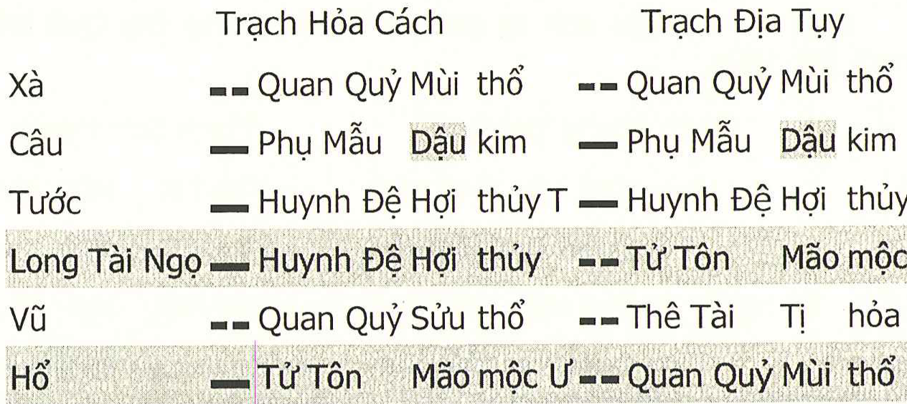
    - **Hình này chứng minh điều gì**
      - Làm sáng tỏ diễn biến cát hung và quy luật ứng nghiệm của Trạch Hỏa Cách biến Trạch Địa Tụy đối với sự việc được hỏi.
    - **Từ đâu mà thấy được**
      - Căn cứ Thời gian lập quẻ: Ngày Nhâm Dần tháng Sửu; Dụng thần thứ nhất. Nhìn vào biến Chấn Vi Lôi.

- Luận điểm phân tích:
  - Quẻ này Thế được Nguyệt hợp là vượng, trong quẻ tam hợp Tử Tôn, tượng vô ưu, ra ngoài nhất định bình an vô sự.

- Kết quả ứng nghiệm thực tế:
  - Kết quả quẻ đầu tiên đã ứng với lúc anh ta xuất hành, máy bay trễ giờ, nhưng bình an cất cánh. Quẻ thứ hai đã ứng với lúc anh ta trở về, máy bay trễ giờ không thể cất cánh, công ty hàng không đã sắp xếp một chiếc máy bay khác an toàn bay tới điểm đến. Quẻ thứ ba thì cho anh ta biết rằng toàn bộ lần xuất hành này là an toàn.

- Luận điểm phân tích:
  - Ba quái lệ này đã cho chúng ta một gợi ý, khi một việc gieo quẻ nhiều lần, nếu như quẻ trước và quẻ sau xuất hiện mâu thuẫn, rất có thể không phải là quẻ có vấn đề, cũng không phải là bản thân thuật dự đoán lục hào có vấn đề, mà là mỗi quẻ đã phản ánh mỗi góc độ về tình hình sự vật mà người ta muốn dự đoán. Trong Tăng San Bốc Dịch đã có ví dụ như vậy, mọi người có thể xem Tăng San Bốc Dịch Bình Thích của tôi viết. Đối với tình huống này, mấu chốt là người dự đoán nắm bắt vấn đề như thế nào, có thể nhìn ra bí ẩn từ trong quẻ hay không.

- Quái lệ thực tế:
  - Bối cảnh: **Ví dụ 3:** Hơn năm giờ chiều ngày Ất Mùi tháng Mùi, giữa lúc sắp hết giờ làm, bầu trời bỗng nhiên mây đen dày đặc, sấm vang chớp giật, xung quanh trở nên giống như nửa đêm, mưa to như trút nước. Bèn đoán khi nào ngừng mưa, được Phệ Hạp biến Ly.

- Quái lệ dự đoán thực tế cho Hỏa Lôi Phệ Hạp biến Ly Vi Hỏa:
  - **Hình 22.** Hỏa Lôi Phệ Hạp biến Ly Vi Hỏa
    - 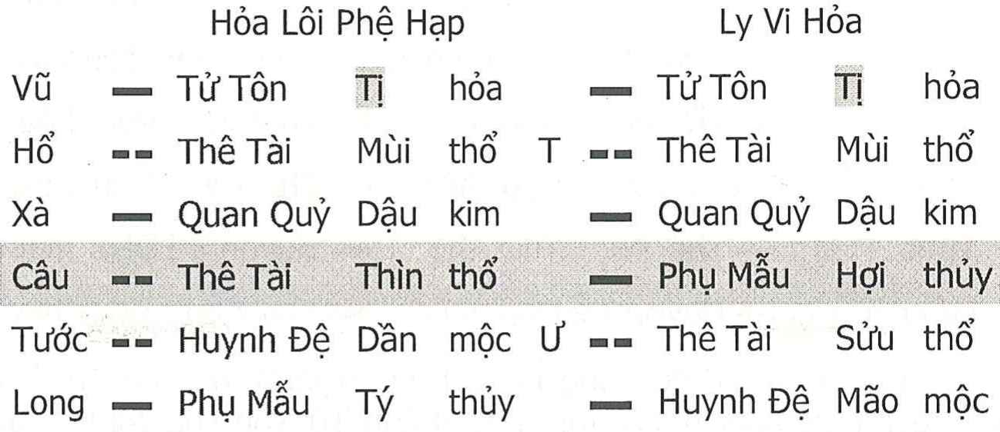
    - **Hình này chứng minh điều gì**
      - Làm sáng tỏ diễn biến cát hung và quy luật ứng nghiệm của Hỏa Lôi Phệ Hạp biến Ly Vi Hỏa đối với sự việc được hỏi.
    - **Từ đâu mà thấy được**
      - Căn cứ Thời gian lập quẻ: Ngày Nhâm Dần tháng Sửu; Dụng thần thứ nhất. Nhìn vào biến Chấn Vi Lôi.

- Luận điểm phân tích:
  - Thê Tài Thìn thổ vượng mà độc phát, Phụ Mẫu nhập Mộ, mưa nhất định sẽ ngừng, nhưng bởi vì Thìn thổ Tuần Không, giờ Tuất xung thực, tôi đoán bảy giờ tạnh mưa. Lại nghi ngờ Tài động hóa Phụ, ngày Thìn Thìn thổ xuất Không cũng mưa. Quả nhiên vừa mới đến bảy giờ, mưa lớn liền dừng lại.

- Luận điểm phân tích:
  - Đến ngày Nhâm Dần tháng Mùi, bầu trời mây đen, chiêm hôm nay có mưa không? Được Ích biến Ký Tế.

- Quái lệ dự đoán thực tế cho Phong Lôi Ích biến Thủy Hỏa Ký Tế:
  - **Hình 23.** Phong Lôi Ích biến Thủy Hỏa Ký Tế
    - 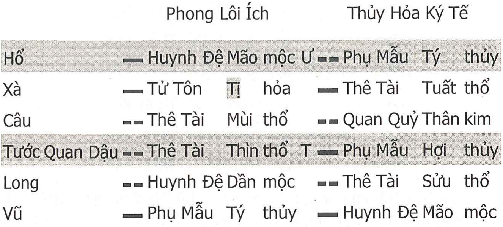
    - **Hình này chứng minh điều gì**
      - Làm sáng tỏ diễn biến cát hung và quy luật ứng nghiệm của Phong Lôi Ích biến Thủy Hỏa Ký Tế đối với sự việc được hỏi.
    - **Từ đâu mà thấy được**
      - Căn cứ Thời gian lập quẻ: Ngày Nhâm Dần tháng Sửu; Dụng thần thứ nhất. Nhìn vào biến Chấn Vi Lôi.

- Luận điểm phân tích:
  - Quẻ này và quẻ trước tương tự, Phụ Mẫu không động, Thê Tài Thìn thổ động mà hóa Phụ Mẫu, liền đoán hôm nay không mưa, ngày mai Thìn thổ xuất Không tất mưa. Hôm nay quả nhiên không có mưa.

- Luận điểm phân tích:
  - Đến ngày Giáp Thìn, xem thời tiết hôm đó, được Giải biến Đại Tráng.

- Quái lệ dự đoán thực tế cho Lôi Thủy Giải biến Lôi Thiên Đại Tráng:
  - **Hình 24.** Lôi Thủy Giải biến Lôi Thiên Đại Tráng
    - 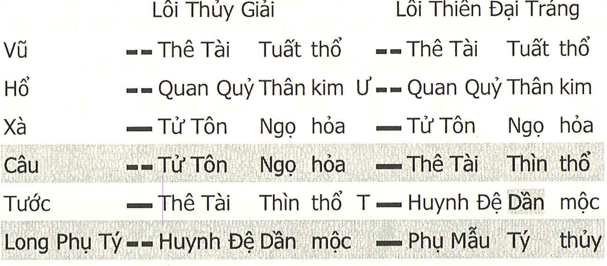
    - **Hình này chứng minh điều gì**
      - Làm sáng tỏ diễn biến cát hung và quy luật ứng nghiệm của Lôi Thủy Giải biến Lôi Thiên Đại Tráng đối với sự việc được hỏi.
    - **Từ đâu mà thấy được**
      - Căn cứ Thời gian lập quẻ: Ngày Nhâm Dần tháng Sửu; Dụng thần thứ nhất. Nhìn vào biến Chấn Vi Lôi.

- Luận điểm phân tích:
  - Hai quẻ trước đều ứng ngày Thìn có mưa, quẻ này Tử Tôn và Huynh Đệ phát động, tam hợp thành Tử Tôn cục với hào ám động Tuất thổ, mà Phụ Mẫu an tĩnh, chẳng lẽ hôm nay không mưa? Tôi nhớ lại ví dụ của Dã Hạc trong Tăng San Bốc Dịch, liền đoán: Giờ Ngọ sẽ mưa. Quả nhiên đến giờ Ngọ đã nổi mưa.

- Quái lệ thực tế:
  - Bối cảnh: **Ví dụ 4:** Có một người phụ nữ trung niên bị bệnh, ngày Đinh Dậu tháng Dậu, chồng đoán bệnh của cô ấy, được quẻ Lôi Sơn Tiểu Quá.

- Quái lệ dự đoán thực tế cho Lôi Sơn Tiểu Quá:
  - **Hình 25.** Lôi Sơn Tiểu Quá
    - 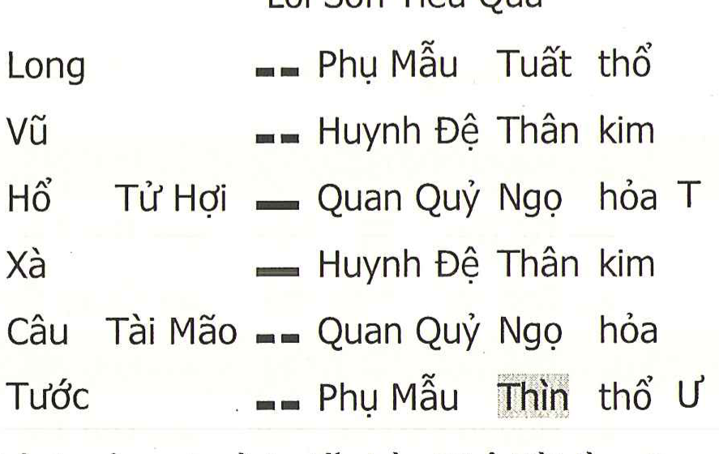
    - **Hình này chứng minh điều gì**
      - Làm sáng tỏ diễn biến cát hung và quy luật ứng nghiệm của Lôi Sơn Tiểu Quá đối với sự việc được hỏi.
    - **Từ đâu mà thấy được**
      - Căn cứ Thời gian lập quẻ: Ngày Nhâm Dần tháng Sửu; Dụng thần thứ nhất. Nhìn vào biến Chấn Vi Lôi.

- Luận điểm phân tích:
  - Đoán bệnh của vợ mình, lấy hào Thê Tài làm Dụng thần. Thê Tài Mão mộc bị Nhật Nguyệt xung khắc, là Nhật phá Nguyệt phá, rất hưu tù. Dụng thần phục dưới Quan Quỷ Ngọ hỏa, bị Quan Quỷ áp chế, là tượng đại hung, chứng tỏ vợ anh ta đã bị bệnh tật hành hạ trong thời gian dài, bệnh rất nghiêm trọng.

- Luận điểm phân tích:
  - Lâm Câu Trần là ung thư. Tại hào 2, hào 2 là hào vị bộ phận sinh dục, Phi thần là Thai địa của Tử Tôn, áp chế Dụng thần, nói

- Luận điểm phân tích:
  - Dụng thần Nguyệt phá, tháng Tuất hợp phá là hung, sau đó, vợ người này chết vì ung thư tử cung ở giờ Mùi ngày Canh Tuất tháng Tuất.

- Luận điểm phân tích:
  - Vẫn là chuyện của người bệnh này, ở ngày Đinh Dậu tháng Dậu, chị gái của người bệnh gieo quẻ đoán cát hung của em gái, được quẻ Thủy Phong Tỉnh biến Khảm.

- Quái lệ dự đoán thực tế cho Quẻ Thủy Phong Tỉnh biến Khảm Vi Thủy:
  - **Hình 26.** Quẻ Thủy Phong Tỉnh biến Khảm Vi Thủy
    - 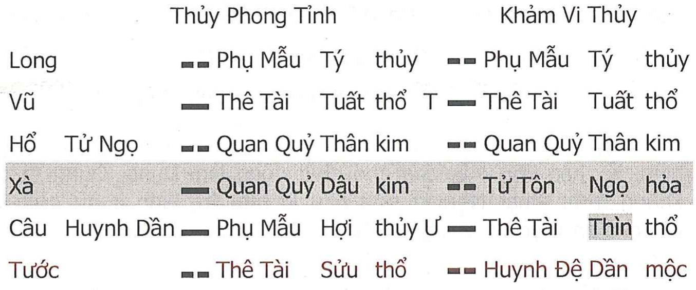
    - **Hình này chứng minh điều gì**
      - Làm sáng tỏ diễn biến cát hung và quy luật ứng nghiệm của Quẻ Thủy Phong Tỉnh biến Khảm Vi Thủy đối với sự việc được hỏi.
    - **Từ đâu mà thấy được**
      - Căn cứ Thời gian lập quẻ: Ngày Nhâm Dần tháng Sửu; Dụng thần thứ nhất. Nhìn vào biến Chấn Vi Lôi.

- Luận điểm phân tích:
  - **Đoán:** Dự đoán bệnh em gái lấy hào Huynh Đệ làm Dụng thần. Quẻ này và quẻ trước mặc dù mối quan hệ giữa người hỏi quẻ và người bệnh khác nhau, nhưng kết quả là như nhau.

- Luận điểm phân tích:
  - Quẻ này Dụng thần cũng là phục tại hào 2, bị Nhật Nguyệt khắc chế, lại có hào động Quan Quỷ Dậu kim đến khắc, Dụng thần hoàn toàn không có sức sống, cũng là lành ít dữ nhiều, nhưng Kỵ thần động mà bị Ngọ hỏa khắc chế, đến tháng Tuất Ngọ hỏa nhập Mộ Kỵ thần vô chế, thì sẽ có sức lực khắc Dụng thần, ứng kỳ thống nhất với ví dụ trước. Ngày Tuất tháng Tuất, Ngọ hỏa nhập Mộ, giờ Mùi bị hợp không thể chế phục Quan Quỷ Dậu kim, cho nên ứng ngày đó tháng đó giờ đó mà chết.

- Luận điểm phân tích:
  - Ngày Đinh Dậu tháng Dậu, cháu gái của người bệnh cũng gieo quẻ hỏi bệnh tật của cô, được Địa Sơn Khiêm biến Lôi Sơn Tiểu Quá.

- Quái lệ dự đoán thực tế cho Quẻ Địa Sơn Khiêm biến Lôi Sơn Tiểu Quá:
  - **Hình 27.** Quẻ Địa Sơn Khiêm biến Lôi Sơn Tiểu Quá
    - 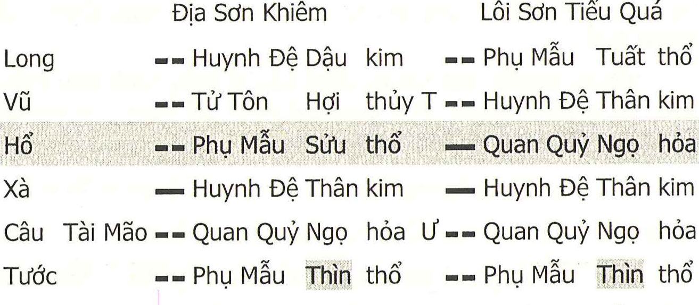
    - **Hình này chứng minh điều gì**
      - Làm sáng tỏ diễn biến cát hung và quy luật ứng nghiệm của Quẻ Địa Sơn Khiêm biến Lôi Sơn Tiểu Quá đối với sự việc được hỏi.
    - **Từ đâu mà thấy được**
      - Căn cứ Thời gian lập quẻ: Ngày Nhâm Dần tháng Sửu; Dụng thần thứ nhất. Nhìn vào biến Chấn Vi Lôi.

- Luận điểm phân tích:
  - Lấy hào Phụ Mẫu làm Dụng thần, trong quẻ Phụ Mẫu lưỡng hiện, lấy hào Phụ Mẫu Sửu thổ phát động làm Dụng, Dụng thần không được Nhật Nguyệt sinh phù là hưu tù, lành ít dữ nhiều. Dụng thần mặc dù động mà hóa hồi đầu sinh nhưng chỉ là tạm thời.

- Luận điểm phân tích:
  - Thông thường, quẻ độc phát cho dù Dụng thần lại nhược cũng là gặp sinh được sinh, nhưng quẻ này không phải là quẻ đầu tiên, phía trước đã có mấy người gieo, do đó quẻ này chủ yếu cho biết ứng kỳ hung mà thôi. Đến tháng Tuất Nguyên thần nhập Mộ, Dụng thần vô sinh, tất nhiên là hung, hào Phụ Mẫu khác là Thìn thổ Không Vong tương hợp với Nhật, bệnh lâu gặp Không thì chết, nay hợp với Nhật, cũng là tạm thời không vấn đề gì. Đến tháng Tuất hợp xứ phùng xung, xung Không tắc Thực, tất nhiên là hung.

- Kết quả ứng nghiệm thực tế:
  - Tình hình ứng nghiệm tham khảo ví dụ ở trên.

- Luận điểm phân tích:
  - Nhóm quái lệ trên đây, do mối quan hệ giữa người gieo quẻ và người bệnh khác nhau, cho nên Dụng thần xoay quanh phán đoán cũng không giống nhau, mỗi quẻ phản ánh cát hung của người bệnh theo từng góc độ.

### Câu hỏi 6: Dự đoán lục hào chỉ có thể dùng hình thức gieo quẻ để trích xuất quái tượng?

- Giải đáp trọng tâm:
  - Cũng không hẳn, bởi vì đôi khi gặp phải sự hạn chế về địa điểm, nơi đó không thích hợp để gieo quẻ, nếu gặp phải tình huống như vậy thì có thể sử dụng hai phương thức dưới đây để

- Luận điểm phân tích:
  - (1) Cho ba đồng xu vào trong túi, dùng tay đảo ngẫu nhiên, sau đó lấy ra đặt vào trong tay kia đã duỗi phẳng, xem tình hình chính phản của chúng, tiếp tục bỏ vào trong túi đảo lần nữa, lại lấy ra để xem tình hình chính phản của chúng, lặp đi lặp lại như vậy sáu lần thì được một quẻ, phương thức này thực chất tương đồng với hình thức gieo quẻ thông thường.

- Quái lệ thực tế:
  - Bối cảnh: **Ví dụ 1:** Ngày Nhâm Thân tháng Thân, một người bạn của tôi sắp trở về Thái Nguyên từ Nhật Bản, ông ta hẹn tôi đợi trước ở nơi ông ta sẽ trọ lại. Lịch bay là đến vào 8:20 tối, nhưng tôi đợi đến 10:20 vẫn chưa thấy bóng dáng của ông ta, trời chỉ đang mưa nhỏ, tôi đoán là không phải vì nguyên nhân thời tiết mà kéo dài chuyến bay, thế là gọi điện thoại hỏi thử quầy thông tin sân bay, quầy thông tin trả lời rằng máy bay đã đến từ lâu. Điều này khiến tôi cảm thấy khó hiểu, bởi vì lộ trình từ sân bay đến nơi trọ chỉ có nửa tiếng đồng hồ, lúc đó tôi đột nhiên nảy sinh ý nghĩ dùng quẻ để dự đoán thử xem ông ta khi nào đến, nhưng do hoàn cảnh không thích hợp để gieo quẻ, do đó tôi đã lấy quẻ theo phương pháp nói trên, được Lôi Phong Hằng biến Hỏa Phong Đỉnh.

- Luận điểm phân tích:
  - **Đoán:** Lấy hào Huynh Đệ làm Dụng thần, Huynh Đệ Dần mộc bất thượng quái, phục dưới Phụ Mẫu Hợi thủy, Nguyệt xung là phá, khi dự đoán sự tình khẩn cấp phải tham khảo giờ lúc đó, lúc này giờ Hợi, tương hợp với Dụng thần là hợp phá, Dụng thần phục tàng, Nhật kiến xung xuất, hôm đó tất đến, giờ Hợi Dụng thần thực phá, ứng tại giờ Hợi đến. Trong quẻ Tuất thổ độc phát, người xưa nói: Thần triệu cơ ở động, Tuất thổ phát động, nhất

- Quái lệ dự đoán thực tế cho Quẻ Lôi Phong Hằng biến Hỏa Phong Đỉnh:
  - **Hình 28.** Quẻ Lôi Phong Hằng biến Hỏa Phong Đỉnh
    - 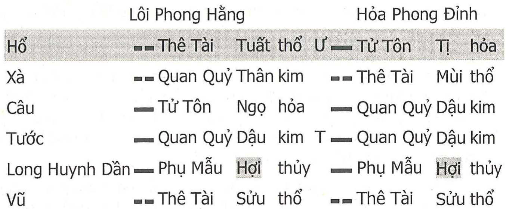
    - **Hình này chứng minh điều gì**
      - Làm sáng tỏ diễn biến cát hung và quy luật ứng nghiệm của Quẻ Lôi Phong Hằng biến Hỏa Phong Đỉnh đối với sự việc được hỏi.
    - **Từ đâu mà thấy được**
      - Căn cứ Thời gian lập quẻ: Ngày Nhâm Thân tháng Thân; Dụng thần là hợp phá. Nhìn vào biến Lôi Sơn Tiểu Quá](assets/page_0034_img_01.

- Quái lệ thực tế:
  - Bối cảnh: **Ví dụ 2:** Ngày Canh Thìn tháng Tuất, tôi nhận được tin nhắn của một Dịch hữu, cô ấy hỏi rằng sắp tới bản thân có phá tài hay không? Dùng phương pháp nói trên để lấy quẻ, được Lôi Phong Hằng biến Địa Phong Thăng.

- Luận điểm phân tích:
  - **Đoán:** Bởi vì câu hỏi đề cập đến tình hình của tài, cho nên phải lấy Tài làm Dụng thần. Trong quẻ hào Tài lưỡng hiện, Nhật Nguyệt lại đều là hào Tài, hào 4 Tử Tôn Ngọ hỏa lại động hóa Thê Tài Sửu thổ, Tài đa vượng cực là thái quá, phải đoán ngược lại, do đó tôi đoán cô ấy nhất định phá tài.

- Luận điểm phân tích:
  - Tôi hỏi cô ấy vì sao lại hỏi câu này, cô ấy nói rằng cục công an bảo phải giữ bí mật, sau này lại cho tôi biết, kết quả là ngày hôm sau cô ấy gửi tin nhắn nói rằng mình bị lừa gạt 2000 tệ, thì ra cô ấy nhận được một thông tin nói rằng thẻ ngân hàng của cô ấy bị chi tiêu ở một cửa hàng, bảo cô ấy lập tức liên hệ với số điện thoại được cung cấp, người trong điện thoại giả làm nhân viên công an bảo cô ấy giữ bí mật chuyện này, không cho cô ấy nói tình hình với người ngoài, nói là vì sự an toàn của số tiền trong thẻ của cô ấy, bảo cô ấy chuyển tiền vào một thẻ an toàn do nhân

- Quái lệ dự đoán thực tế cho Quẻ Lôi Phong Hằng biến Địa Phong Thăng:
  - **Hình 29.** Quẻ Lôi Phong Hằng biến Địa Phong Thăng
    - 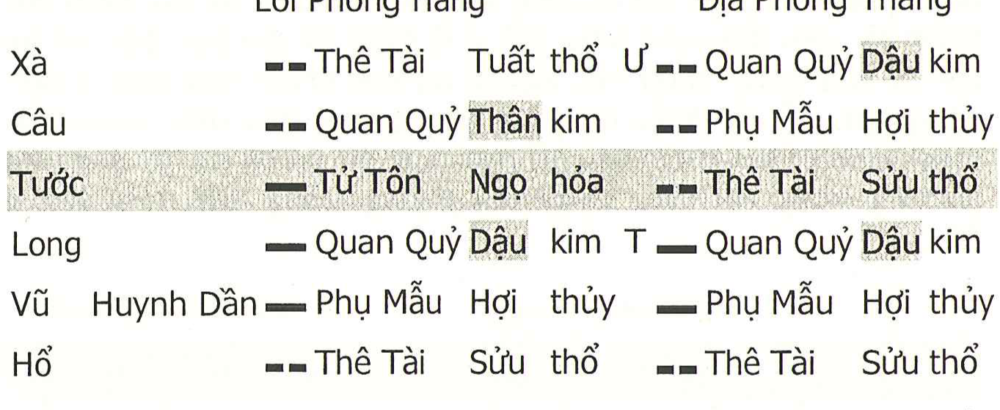
    - **Hình này chứng minh điều gì**
      - Làm sáng tỏ diễn biến cát hung và quy luật ứng nghiệm của Quẻ Lôi Phong Hằng biến Địa Phong Thăng đối với sự việc được hỏi.
    - **Từ đâu mà thấy được**
      - Căn cứ Thời gian lập quẻ: Ngày Nhâm Thân tháng Thân; Dụng thần là hợp phá. Nhìn vào biến Lôi Sơn Tiểu Quá](assets/page_0034_img_01.

- Luận điểm phân tích:
  - (2) Dùng quân cờ vây để lấy quẻ, 3 đen 3 trắng, đen trắng biểu thị âm dương, 3 biểu thị tam nguyên thiên địa nhân, phương pháp của nó là cho 6 quân cờ vào trong túi và đảo ngẫu nhiên, lấy ra ngẫu nhiên 3 quân, lấy đen trắng để định âm dương của hào, 1 trắng 2 đen là thiếu dương, 2 trắng 1 đen là thiếu âm, 3 trắng là lão dương, 3 đen là lão âm, như vậy tìm được quái tượng.

- Quái lệ thực tế:
  - Bối cảnh: **Ví dụ 1:** Ngày Kỷ Mão tháng Dậu, một người hỏi cha vợ làm thuê ở ngoài khi nào về, tôi bảo anh ta dùng quân cờ vây, được quẻ Thiên Thủy Tụng.

- Quái lệ dự đoán thực tế cho Quẻ Thiên Thủy Tụng:
  - **Hình 30.** Quẻ Thiên Thủy Tụng
    - 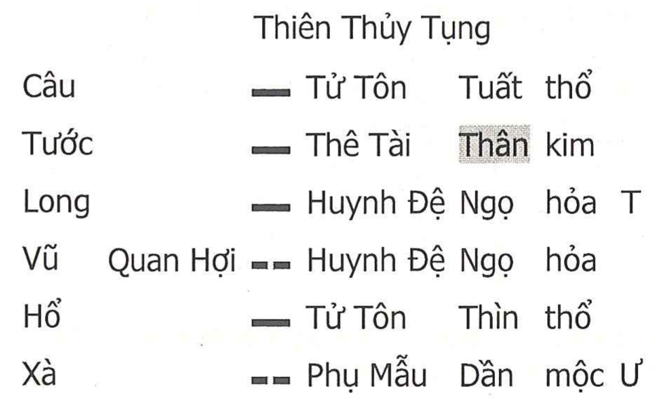
    - **Hình này chứng minh điều gì**
      - Làm sáng tỏ diễn biến cát hung và quy luật ứng nghiệm của Quẻ Thiên Thủy Tụng đối với sự việc được hỏi.
    - **Từ đâu mà thấy được**
      - Căn cứ Thời gian lập quẻ: Ngày Nhâm Thân tháng Thân; Dụng thần là hợp phá. Nhìn vào biến Lôi Sơn Tiểu Quá](assets/page_0034_img_01.

- Kết quả ứng nghiệm thực tế:
  - Lấy Phụ Mẫu làm Dụng thần, Phụ Mẫu Dần mộc Nguyệt khắc Nhật phù suy vượng tương đương, Nguyên thần Hợi thủy phục tại hào 3, bởi vì là thong thả đến hỏi quẻ, phải lấy tháng để đoán ứng kỳ. Dụng thần Nguyệt khắc, ứng lúc gặp Trường Sinh về, tức tháng Hợi về. Kết quả là trở về ở Lập Đông.

- Quái lệ thực tế:
  - Bối cảnh: **Ví dụ 2:** Ngày Nhâm Dần tháng Tuất, dùng quân cờ vây lấy quẻ đoán sách gửi từ Nhật Bản khi nào đến, được Lôi Trạch Quy Muội.

- Quái lệ dự đoán thực tế cho Quẻ Lôi Trạch Quy Muội:
  - **Hình 31.** Quẻ Lôi Trạch Quy Muội
    - 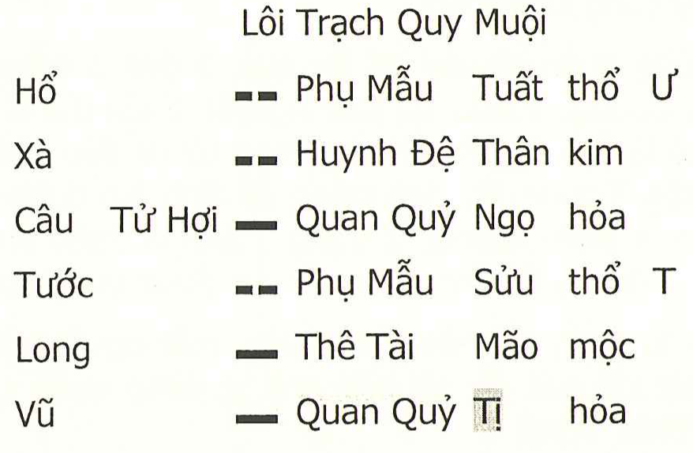
    - **Hình này chứng minh điều gì**
      - Làm sáng tỏ diễn biến cát hung và quy luật ứng nghiệm của Quẻ Lôi Trạch Quy Muội đối với sự việc được hỏi.
    - **Từ đâu mà thấy được**
      - Căn cứ Thời gian lập quẻ: Ngày Nhâm Thân tháng Thân; Dụng thần là hợp phá. Nhìn vào biến Lôi Sơn Tiểu Quá](assets/page_0034_img_01.

- Kết quả ứng nghiệm thực tế:
  - Lấy hào Phụ Mẫu làm Dụng thần. Trong quẻ Phụ Mẫu lưỡng hiện, đều không có Nguyệt phá Không Vong, một lâm Thế, một lâm Ứng, lại đều không gặp xung hợp, lấy hào vượng, do đó lấy Phụ Mẫu Tuất thổ lâm Nguyệt kiến làm Dụng. Dụng thần được Nguyệt kiến tỉ phù là vượng, lâm Nguyệt kiến tháng đó có thể đến, Dụng thần an tĩnh, tĩnh mà gặp trị gặp xung, ngày Thìn xung Dụng thần sẽ đến. Kết quả là ở ngày Giáp Thìn nhận được sách gửi từ Nhật Bản.

### Câu hỏi 7: Dự đoán lục hào có thể dùng thời gian, chữ số v.v để lập quẻ hay không?

- Kết quả ứng nghiệm thực tế:
  - **Đáp:** Khi sự tình khẩn cấp nhưng hoàn cảnh không cho phép gieo quẻ, thỉnh thoảng có thể dùng thử, có tỷ lệ ứng nghiệm nhất định, nhưng tôi không chủ trương dùng phương pháp này, bởi vì hình thức lắp ráp quẻ của nó là trước định ngoại quái sau định nội quái, có sự khác biệt về bản chất so với phương pháp lắp ráp quẻ từ hào sơ của lục hào, đạo pháp xem trọng tự nhiên. Hào động có hay không cũng như nhiều hay ít đều có huyền cơ trong đó, chỉ có dùng phương pháp gieo quẻ mới có thể xuất hiện tình trạng này, còn quẻ dùng thời gian, chữ số v.v lập ra thì đều là một hào động, quẻ nào cũng vậy, căn bản không xuất hiện các hình thức tổ hợp như phục ngâm, phản ngâm, tam hợp cục v.v, đã ảnh hưởng rất lớn đến thông tin của quẻ.

### Câu hỏi 8: Dự đoán lục hào có cần tham khảo hào từ để phán đoán hay không?

- Giải đáp trọng tâm:
  - Người giỏi dùng thì có thể xem để tham khảo, nhưng dự đoán lục hào thông thường không cần dùng hào từ, bởi vì dự đoán lục hào lấy ngũ hành sinh khắc làm chủ, căn nguyên của nó chính là thoát ly hào từ, hình thành hệ thống dự đoán riêng biệt. Không tham khảo hào từ vẫn phản ánh đầy đủ cát hung của sự vật.

### Câu hỏi 9: Trước khi gieo quẻ có cần rửa tay thắp nhang hay không?

- Giải đáp trọng tâm:
  - Dự đoán lục hào chẳng liên quan đến quỷ thần, trong lòng có ý định dự đoán thì có thể gieo quẻ, rửa tay thắp nhang hoàn toàn thừa thãi, người xưa mê tín, cho rằng dự đoán lục hào có quỷ thần bí mật ảnh hưởng, cho nên mới có thuyết này.

### Câu hỏi 10: Dự đoán lục hào có cần tu thân dưỡng tính hay không?

- Giải đáp trọng tâm:
  - Thông thường thì không cần phải tu luyện cái gì, nhưng là một dự trắc sư chân chính thì phải có sự tu dưỡng về đạo đức, phải dùng thuật dự đoán này để giúp người khác giải quyết vấn đề, không được dùng nó để lừa gạt người khác, nếu thu phí thì phải hợp lý. Đối với người yếu thế và người nghèo khổ thì có thể không thu phí.

### Câu hỏi 11: Dự đoán lục hào chủ yếu dựa vào lý luận hay linh cảm?

- Giải đáp trọng tâm:
  - Dự đoán lục hào là một môn huyền học, là kết quả của lý luận kết hợp với linh cảm, lấy lý luận làm chủ, linh cảm có vai trò phụ trợ. Dự đoán cát hung, ứng kỳ và giai đoạn sơ cấp thông thường dựa vào lý luận chặt chẽ của nó để hoàn thành. Nếu muốn dự đoán những chỗ nhỏ nhặt, nhất là khi dùng "tượng" cấp độ cao để dự đoán thì cần phải thông qua linh cảm để biến những thứ trừu tượng thành sự vật cụ thể. Tuy nhiên linh cảm cũng được bồi dưỡng dựa trên cơ sở lý luận vững chắc. Chỉ có linh cảm mà không có lý luận thì trình độ dự đoán của bản thân cũng không thể đạt đến cảnh giới xuất thần nhập hóa.

### Câu hỏi 12: Làm sao mới có thể nhanh chóng nâng cao trình độ dự đoán?

- Giải đáp trọng tâm:
  - Học tập dự đoán cần một thầy giỏi và tài liệu tốt, bởi vì bản thân mới học thì chưa biết cái gì là đúng, cái gì là sai. Có rất nhiều sách viết về dự đoán lục hào, nhưng không phải tất cả các nội dung viết trong sách đều là chính xác. Nếu như đọc sai sách, đi sai đường, cho dù lãng phí nhiều năm học tập cũng là vô ích. Do đó, việc lựa chọn thầy và tài liệu là hết sức quan trọng. Khi đã có thầy giỏi, không nên học vẹt một cách máy móc những gì thầy dạy cho bạn, mà là phải học tư duy đoán quẻ của thầy, thầy dẫn dắt vào cửa, tu hành ở cá nhân, thầy không thể mỗi giờ mỗi khắc đều ở bên cạnh phụ đạo cho bạn. Do đó, việc học tập tư duy đoán quẻ là hết sức quan trọng. Khi tư duy đã được mở rộng, những điều thầy chưa từng nói qua cũng sẽ tự mình phân tích và phán đoán ra. Ngoài ra, bản thân phải chịu khó nghiền ngẫm, chịu khó thực hành, như vậy mới có thể biến những điều thầy dạy thành kiến thức của mình. Khi đọc sách, trong đầu phải luôn suy nghĩ tại sao, không nên chỉ tiếp thu một mực, bởi vì thiên hạ không có thần tiên, thầy cũng có lúc hồ đồ, nếu như đọc sách có thể tìm ra khuyết điểm trong sách thì chứng tỏ bạn đã tiến bộ, đồng thời cũng học được phương pháp nâng cao trình độ dự đoán.

### Câu hỏi 13: Những cuốn sách lục hào cổ đại nào đáng để tham khảo?

- Giải đáp trọng tâm:
  - Người mới nhập môn thì có thể đọc Tăng San Bốc Dịch nhiều lần, bởi vì cuốn sách này nói về nội dung cơ sở, hơn nữa đều xem trọng lý luận và quái lệ, đây là tài liệu tham khảo tốt nhất cho người mới bắt đầu luyện tập các kỹ thuật cơ bản, sau khi đọc kỹ cuốn sách này, hãy đọc Bốc Phệ Chính Tông. Chỉ sau khi đọc hai cuốn sách này, chúng ta mới có thể đọc Dịch Ẩn, Dịch Mạo, Dịch Lâm Bổ Di, Đoán Dịch Thiên Cơ v.v. Bởi vì trong sách cổ đại có rất nhiều sai lầm, hơn nữa lý luận của các loại sách không chỉ một trường phái, người mới học tùy tiện đọc thì sẽ càng học càng hỗn loạn, không những vô ích mà trái lại còn có hại.

### Câu hỏi 14: Quẻ không thể khuyên là gì?

- Kết quả ứng nghiệm thực tế:
  - **Đáp:** Cũng chính là nói khi một cá nhân không có ý nghĩ dự đoán thì đừng khuyên người ta gieo quẻ, bởi vì dự đoán là tâm linh có cảm mà thành tượng, bản thân người ta không động niệm thì quẻ sẽ không phản ánh chuyện của người ta. Vấn đề này đã được nói đến trong Tăng San Bốc Dịch, "tha niệm do tha động, thận vật đề tha[^1]" chính là ý nghĩa này. Đôi khi có người vốn không muốn dự đoán, nhưng bởi vì nể mặt của người khuyên bảo mà miễn cưỡng gieo quẻ. Trong quẻ gieo ra như vậy thường không phản ánh chuyện của người gieo quẻ, mà đôi khi lại phản ánh chuyện của người khuyên anh ta gieo quẻ. Cho nên học tập dự đoán lục hào phải hiểu rõ điểm này, gặp quẻ không ứng nghiệm, rất có khả năng có liên quan đến ý niệm của người gieo quẻ, khi dự đoán nhất định phải chú ý.

### Câu hỏi 15: Có phải tại ngày Tý không thể gieo quẻ dự đoán?

- Kết quả ứng nghiệm thực tế:
  - Trong Tăng San Bốc Dịch đã nói: "Phệ tất thành tâm, hà phương Tý nhật?[^2]" Mấu chốt ở chỗ người xem đã động niệm hay chưa, tôi có rất nhiều ví dụ dự đoán ứng nghiệm tại ngày Tý, đủ thấy ngày Tý dự đoán sẽ không ảnh hưởng đến tính chính xác của dự đoán.

- Quái lệ thực tế:
  - Bối cảnh: **Ví dụ 1:** Người bạn Nhật Bản của tôi, ngài Morita, là người chuyên nghiên cứu về các hiện tượng thần bí như công năng đặc dị, đồng thời ông ta cũng theo tôi học tập dự đoán lục hào. Khi trò chuyện với ông ta, tôi đã nói rằng công năng đặc dị có thể nhìn thấu đồ vật bị ngăn cách, dự đoán lục hào cũng có thể làm được. Để nghiệm chứng ý kiến của tôi, ở ngày Nhâm Tý tháng Tuất năm 2001, trong một khách sạn ở Thái Nguyên, ông ta bảo trợ lý vào nhà vệ sinh lấy ra một cái cốc sứ có để đồ vật, yêu cầu tôi dự đoán thử xem đồ vật trong cốc là cái gì. Tôi gieo quẻ, được quẻ Địa Thiên Thái biến Sơn Địa Bác.

- Luận điểm phân tích:
  - [^1]: Suy nghĩ của người ta do người ta động, đừng nhắc người ta.
[^2]: Bói phải thành tâm, ngại gì ngày Tý?

- Quái lệ dự đoán thực tế cho Quẻ Địa Thiên Thái biến Sơn Địa Bác:
  - **Hình 32.** Quẻ Địa Thiên Thái biến Sơn Địa Bác
    - 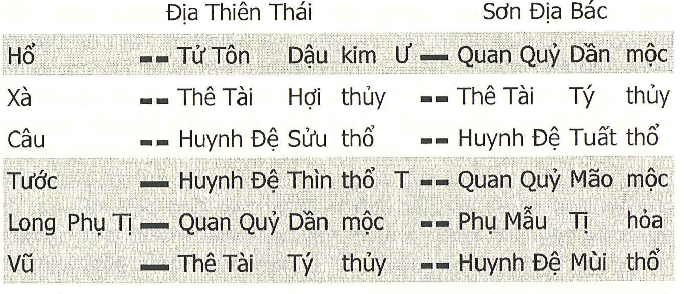
    - **Hình này chứng minh điều gì**
      - Làm sáng tỏ diễn biến cát hung và quy luật ứng nghiệm của Quẻ Địa Thiên Thái biến Sơn Địa Bác đối với sự việc được hỏi.
    - **Từ đâu mà thấy được**
      - Căn cứ Thời gian lập quẻ: Ngày Giáp Tý tháng Tị; Dụng thần động mà hợp Thế. Nhìn vào động niệm hay chưa.

- Luận điểm phân tích:
  - Ở thời xưa, phương pháp dự đoán vật để ở bên trong một vật đựng được gọi là xạ phúc, đây là một trò chơi cao cấp giúp kiểm tra trình độ dự đoán và được các nhà dự đoán dùng để giải trí. Phương pháp xạ phúc cũng đã từng được bàn luận trong sách lục hào cổ đại "Hỏa Châu Lâm" và "Hải Để Nhãn", tuy nhiên khi ứng dụng lại hoàn toàn không linh nghiệm. Chúng ta biết rằng, dự đoán lục hào trước hết liên quan đến việc chọn Dụng thần, nhưng vấn đề này lại không được đề cập trong sách cổ. Trong thực tiễn, tôi thấy rằng dùng lục hào để xạ phúc thì lấy hào Ứng làm Dụng thần. Về phương pháp dự đoán cụ thể, tôi đã trình bày chi tiết ở chương "Giải đáp những thắc mắc liên quan đến phương diện chọn Dụng thần", mọi người có thể tham khảo.

- Luận điểm phân tích:
  - Quẻ này lấy hào Ứng làm Dụng thần, hào Thế là công dụng và đặc điểm bên ngoài của vật thể, ngoại quái là bên ngoài, nội quái là bên trong, quẻ chính là bên ngoài, quẻ biến là bên trong, còn lục thần là màu sắc và tính chất của vật thể.

- Luận điểm phân tích:
  - Quẻ này hào Ứng là Tử Tôn Dậu kim, Tử Tôn là vật tiểu xảo (xinh xắn), lâm kim, kim là vật nhẵn bóng, cứng. Tý Ngọ Mão Dậu là tròn, cho nên vật trong cốc có hình tròn. Lâm Bạch Hổ, Bạch Hổ là màu trắng, chứng tỏ màu sắc chính của vật này là màu trắng, Bạch Hổ lại chủ y dược, vật này có liên quan đến y dược. Dụng thần động mà hợp Thế, Thế lâm Chu Tước, Chu Tước là màu đỏ, chứng tỏ vật này bên ngoài màu trắng nhẵn bóng có hoa văn màu đỏ. Quẻ là lục hợp, chứng tỏ vật này có nắp, bởi vì hợp là tượng trùng điệp. Dụng thần động mà hóa Không, quẻ biến, hào biến là bên trong, bên trong vật là rỗng, có khe hở, hóa Quan Quỷ, Quan Quỷ chủ biến hóa, bên trong vật này còn có thể động, quẻ biến là Cấn, Cấn là chỉ (dừng), vật này được cố định ở trên một vật thể

- Luận điểm phân tích:
  - Đoán đến đây, tôi bảo trợ lý của ông ta mở cốc ra để nghiệm chứng, kết quả là bên trong để một chiếc đồng hồ đeo ngực cho y tá. Bề ngoài màu trắng nhẵn bóng, kim giây là màu đỏ, có nắp, bên trong là rỗng, đồng hồ này không thể chống nước, bị dầm nước thì không thể sử dụng. Có thể thấy ngày Tý dự đoán vẫn chính xác. Nếu không phải ngày Tý, có lẽ không đoán ra vật này gặp nước thì hỏng.

- Kết quả ứng nghiệm thực tế:
  - Sau này, tôi đem ví dụ này đi thảo luận với một người bạn, ông ta nói rằng vật đó chính là một chiếc đồng hồ. Tôi không hiểu bèn hỏi, ông ta nói: "Dựa vào kiến giải của ông, Dụng thần hợp Thế, hào Thế là tính chất của vật thể, hào Thế Thìn¹ thổ là thời gian, chúng ta thường nói thời gian sinh ra là sinh thần (ngày sinh), chứng tỏ Thìn chính là ý nghĩa của thời gian, là cai quản thời gian, đương nhiên cũng chính là đồng hồ". Có thể nói là một lời ngàn vàng. Có thể thấy, việc không thể đưa ra phán đoán cụ thể không phải do quẻ không ứng nghiệm, mà là do trình độ dự đoán của chúng ta vẫn chưa tốt mà thôi.

- Quái lệ thực tế:
  - Bối cảnh: **Ví dụ 2:** Ngày Giáp Tý tháng Tị, nam đoán việc thuê nhà mở hiệu cắt tóc sẽ ra sao? Được quẻ Trạch Phong Đại Quá biến Trạch Sơn Hàm.

- Quái lệ dự đoán thực tế cho Trạch Phong Đại Quá biến Trạch Sơn Hàm:
  - **Hình 33.** Trạch Phong Đại Quá biến Trạch Sơn Hàm
    - 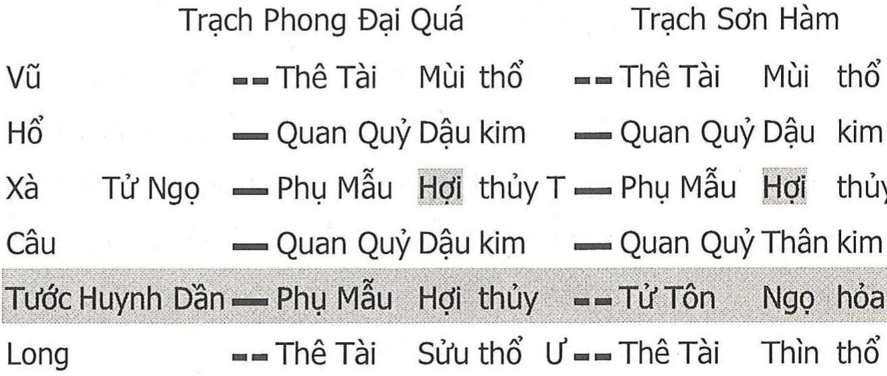
    - **Hình này chứng minh điều gì**
      - Làm sáng tỏ diễn biến cát hung và quy luật ứng nghiệm của Trạch Phong Đại Quá biến Trạch Sơn Hàm đối với sự việc được hỏi.
    - **Từ đâu mà thấy được**
      - Căn cứ Thời gian lập quẻ: Ngày Giáp Tý tháng Tị; Dụng thần động mà hợp Thế. Nhìn vào động niệm hay chưa.

- Luận điểm phân tích:
  - Mở cửa hiệu xem Tài, cửa hiệu xem hào 2. Muốn thuê cửa hiệu, cũng phải xem hào Ứng, hào Ứng là chủ nhà. Trước hết xem Tài, hào Tài lưỡng hiện, Nguyệt kiến sinh, Nhật là đất Đế Vượng, thoạt nhìn trông rất tốt. Nhưng hào Thế Không Phá, dự đoán mọi

- Luận điểm phân tích:
  - ¹ 辰 đọc là Thìn, thần. 辰 cũng có ý nghĩa là thời gian.

- Kết quả ứng nghiệm thực tế:
  - Kết quả, bởi vì giá thuê cửa hiệu không thỏa đáng, đối phương chào giá quá cao, không mở thành công.

### Câu hỏi 16: Giờ Tý ban đêm gieo quẻ thì xác định ngày như thế nào?

- Giải đáp trọng tâm:
  - Giờ Tý là từ 11 giờ đêm đến 1 giờ sáng. Bởi vì khởi đầu của một ngày được tính từ 12 giờ sáng, do đó không giống với giờ Tý và các giờ khác, một giờ trải qua hai ngày. Trước 12 giờ đêm là ngày hôm trước, nếu đã qua 12 giờ đêm thì tính là ngày hôm sau.

- Luận điểm phân tích:
  - Để nghiệm chứng, tôi đã từng gieo quẻ trước và sau giờ Tý, kết quả thực tế đã chứng minh 12 giờ đêm là ranh giới của một ngày.

- Quái lệ thực tế:
  - Bối cảnh: **Ví dụ 1:** Vào 11:15 tối ngày Ất Hợi tháng Tuất, mèo con của nhà tôi nuôi đã biến mất, đoán xem mèo con có quay về hay không? Được Thủy Lôi Truân biến Sơn Hỏa Bí.

- Quái lệ dự đoán thực tế cho Thủy Lôi Truân biến Sơn Hỏa Bí:
  - **Hình 34.** Thủy Lôi Truân biến Sơn Hỏa Bí
    - 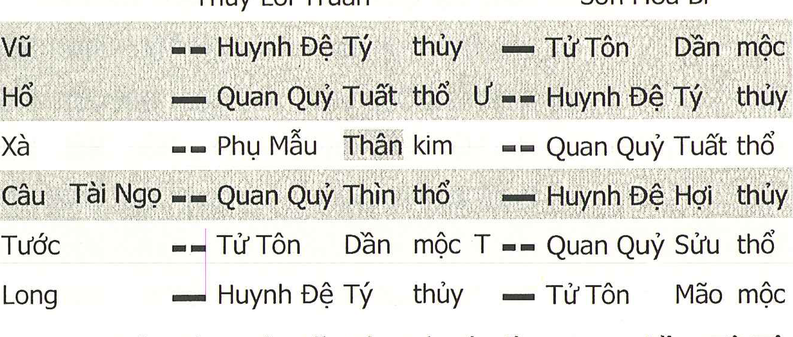
    - **Hình này chứng minh điều gì**
      - Làm sáng tỏ diễn biến cát hung và quy luật ứng nghiệm của Thủy Lôi Truân biến Sơn Hỏa Bí đối với sự việc được hỏi.
    - **Từ đâu mà thấy được**
      - Căn cứ Thời gian lập quẻ: Ngày Bính Tý tháng Tuất; Dụng thần và Nhật tương hợp. Nhìn vào biến mất.

- Luận điểm phân tích:
  - Dự đoán động vật, lấy hào Tử Tôn làm Dụng thần. Tử Tôn Dần mộc Nguyệt không khắc Nhật đến sinh, trong quẻ lại có Huynh Đệ Tý thủy động mà đến sinh, là vượng tướng. Tử Tôn trì Thế lại nhập hào trạch, con mèo nhất định có thể trở về, Dụng thần và Nhật tương hợp, hợp thì bị cản trở, con mèo chắc là bị

- Luận điểm phân tích:
  - 12:20 tối hôm đó, tôi lại gieo quẻ đoán khi nào con mèo quay về? Ngày Bính Tý tháng Tuất, được Sơn Lôi Di biến Phong Thiên Tiểu Súc.

- Luận điểm phân tích:
  - Tử Tôn Tị hỏa bất thượng quái, phục dưới hào 5 Phụ Mẫu Tý thủy, Nguyệt không sinh Nhật đến khắc, hào Phi động mà đến khắc, xét suy vượng thì có vẻ như con mèo sẽ không trở về, nhưng Phụ Mẫu Tý thủy lâm Nhật hóa ra Tử Tôn Tị hỏa, từ góc độ tượng cho biết giờ Tị hôm đó con mèo có thể xuất hiện. Nội quái phục ngâm, con mèo nhất định đang kêu la ở đâu đó.

- Kết quả ứng nghiệm thực tế:
  - Kết quả: Tại giờ Tị, tình cờ nghe thấy tiếng mèo kêu từ trong kho, hóa ra không biết con mèo bị nhốt trong đó từ khi nào.

- Quái lệ thực tế:
  - Bối cảnh: **Ví dụ 2:** Tối ngày Tân Dậu tháng Tý, tôi đang trọ lại ở một khách sạn. Sau một ngày mệt nhọc, tôi đang chuẩn bị nghỉ ngơi thì đột nhiên nhận được tin nhắn của một người phụ nữ gửi đến, cô ấy yêu cầu xem mối quan hệ giữa cô ấy và bạn trai sẽ phát triển ra sao? Tôi thấy thời gian là 12:07 tối, lấy 12:00 làm ranh giới, hiện tại đã là ngày Nhâm Tuất, thế là quyết định dựa vào ngày Nhâm Tuất để đoán quẻ, gieo quẻ được Thủy Thiên Nhu biến Địa Thiên Thái.

- Quái lệ dự đoán thực tế cho Quẻ Sơn Lôi Di biến Phong Thiên Tiểu Súc:
  - **Hình 35.** Quẻ Sơn Lôi Di biến Phong Thiên Tiểu Súc
    - 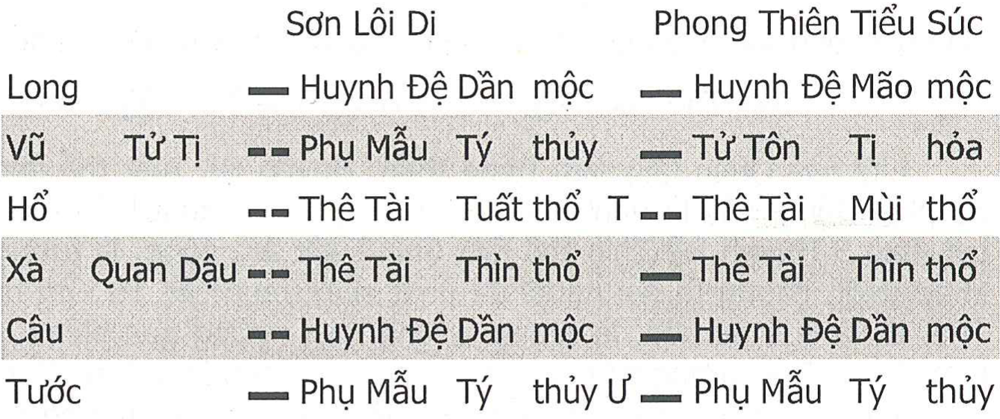
    - **Hình này chứng minh điều gì**
      - Làm sáng tỏ diễn biến cát hung và quy luật ứng nghiệm của Quẻ Sơn Lôi Di biến Phong Thiên Tiểu Súc đối với sự việc được hỏi.
    - **Từ đâu mà thấy được**
      - Căn cứ Thời gian lập quẻ: Ngày Bính Tý tháng Tuất; Dụng thần và Nhật tương hợp. Nhìn vào biến mất.

- Luận điểm phân tích:
  - Lấy hào Quan Quỷ làm Dụng thần, Huynh Đệ Tuất thổ lâm Xà phát động, vậy là tình cảm giữa hai người đã xuất hiện cách trở, hào 3 Huynh Đệ Thìn thổ lâm Chu Tước ám động, là tượng khẩu thiệt, chứng tỏ hai người đã phát sinh tranh cãi, Tử Tôn trì Thế, lại là quẻ du hồn, là tượng sẽ chia tay, nhưng quẻ biến lục hợp, Quan Quỷ vượng tướng, vẫn sẽ hòa giải, tình hình thực tế là hai người xảy ra cãi nhau, người nam đề xuất chia tay, nhưng tại ngày Tuất lại gọi điện thoại đề xuất hòa giải.

- Quái lệ thực tế:
  - Bối cảnh: **Ví dụ 3:** 11:51 ngày Mậu Tuất tháng Mão, một người phụ nữ đoán tình cảm với một ca sĩ nổi tiếng sẽ phát triển như thế nào? Được Lôi Sơn Tiểu Quá biến Khôn Vi Địa.

- Luận điểm phân tích:
  - Nữ dự đoán hôn nhân, lấy Quan Quỷ làm Dụng thần, trong quẻ Quan Quỷ lưỡng hiện, lấy hào Quan Quỷ Ngọ hỏa trì Thế phát động làm Dụng. Dụng thần được Nguyệt sinh phù là vượng tướng, nhưng nhập Mộ ở Nhật, động mà sinh Ứng là vô tình. Nguyên thần phục tàng, bị Nhật hợp, lại bị hào động Huynh Đệ Thân kim khắc Tuyệt, quẻ biến lục xung, tình cảm của hai người sẽ không có kết quả viên mãn. Nguyên thần là tư duy và thế giới nội tâm

- Quái lệ dự đoán thực tế cho Quẻ Thủy Thiên Nhu biến Địa Thiên Thái:
  - **Hình 36.** Quẻ Thủy Thiên Nhu biến Địa Thiên Thái
    - 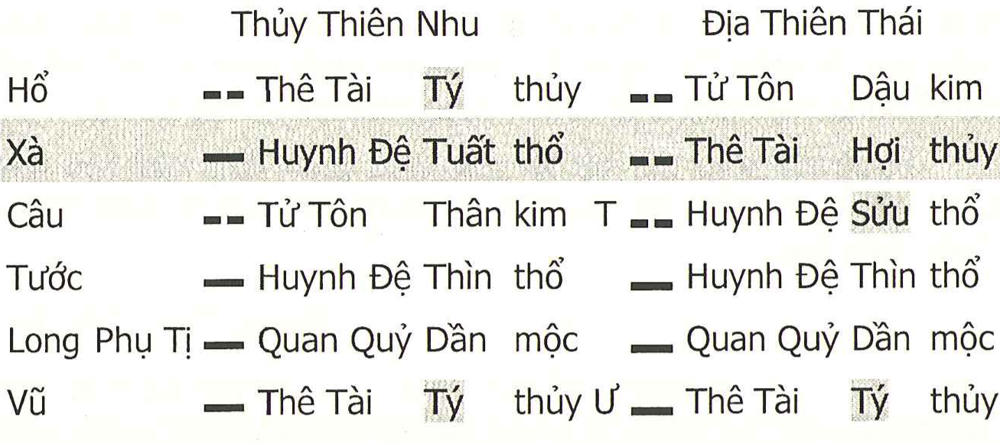
    - **Hình này chứng minh điều gì**
      - Làm sáng tỏ diễn biến cát hung và quy luật ứng nghiệm của Quẻ Thủy Thiên Nhu biến Địa Thiên Thái đối với sự việc được hỏi.
    - **Từ đâu mà thấy được**
      - Căn cứ Thời gian lập quẻ: Ngày Bính Tý tháng Tuất; Dụng thần và Nhật tương hợp. Nhìn vào biến mất.

- Quái lệ dự đoán thực tế cho Quẻ Lôi Sơn Tiểu Quá biến Khôn Vi Địa:
  - **Hình 37.** Quẻ Lôi Sơn Tiểu Quá biến Khôn Vi Địa
    - 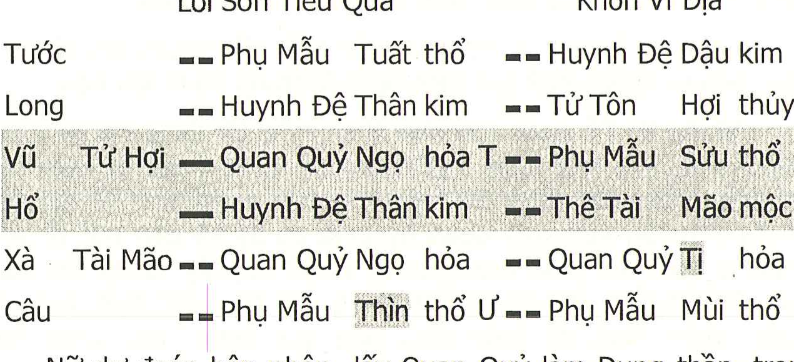
    - **Hình này chứng minh điều gì**
      - Làm sáng tỏ diễn biến cát hung và quy luật ứng nghiệm của Quẻ Lôi Sơn Tiểu Quá biến Khôn Vi Địa đối với sự việc được hỏi.
    - **Từ đâu mà thấy được**
      - Căn cứ Thời gian lập quẻ: Ngày Bính Tý tháng Tuất; Dụng thần và Nhật tương hợp. Nhìn vào biến mất.

- Luận điểm phân tích:
  - 12:15 sáng ngày Kỷ Hợi tháng Mão, người nữ này lại gieo quẻ hỏi sự phát triển tình cảm giữa hai người, được Trạch Địa Tụy biến Trạch Thủy Khốn.

- Luận điểm phân tích:
  - Lấy Quan Quỷ làm Dụng thần, Quan Quỷ được Nguyệt sinh phù, nhưng bị Nhật khắc, suy vượng tương đương, nhưng không nên Dụng thần Tuần Không động mà lại hóa Không Vong, tuy là hóa thành quẻ lục hợp, nhưng cũng là không cát. Sau này quả nhiên hai người không ở bên nhau.

### Câu hỏi 17: Khi dự đoán xuyên quốc gia có cần đổi thời gian hay không?

- Giải đáp trọng tâm:
  - Đây cũng là một vấn đề khá quan trọng, lúc này phải xem chênh lệch bao nhiêu múi giờ, xem có trong một phạm vi ngày hay không, bởi vì giữa các quốc gia đông tây có sự thay đổi về ngày. Thông qua một số quái lệ, tôi nhận thấy khi gặp phải tình huống này thì xem là ai đến gieo quẻ, nơi chốn gieo quẻ, từ đó quyết định ngày của quẻ. Thông thường là lấy thời gian ở nơi của người gieo quẻ làm chuẩn. Khi vị trí của người xem và dự trắc sư không đồng nhất về ngày, nếu là người xem gieo quẻ thì dựa vào ngày ở chỗ người thỉnh cầu đoán để phán đoán, nếu là dự trắc sư gieo quẻ thì lấy ngày ở chỗ dự trắc sư để phán đoán.

- Quái lệ thực tế:
  - Bối cảnh: **Ví dụ 1:** Ngày 3 tháng 8 dương lịch năm 2003, một cô gái bị thất lạc hành lý ở sân bay bên Mỹ, tự mình gieo quẻ được Thiên Sơn Độn biến Hỏa Sơn Lữ.

- Quái lệ dự đoán thực tế cho Quẻ Trạch Địa Tụy biến Trạch Thủy Khốn:
  - **Hình 38.** Quẻ Trạch Địa Tụy biến Trạch Thủy Khốn
    - 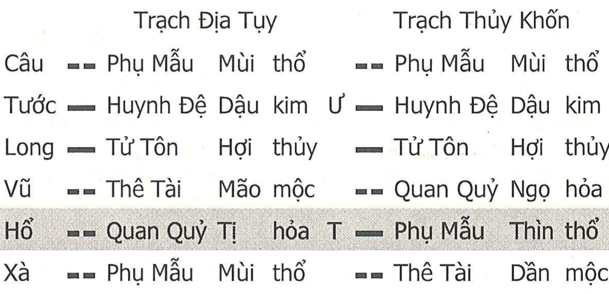
    - **Hình này chứng minh điều gì**
      - Làm sáng tỏ diễn biến cát hung và quy luật ứng nghiệm của Quẻ Trạch Địa Tụy biến Trạch Thủy Khốn đối với sự việc được hỏi.
    - **Từ đâu mà thấy được**
      - Căn cứ Thời gian lập quẻ: Ngày 3 tháng 8 dương lịch năm 2003; Dụng thần vượng tướng. Nhìn vào biến Hỏa Sơn Lữ.

- Luận điểm phân tích:
  - **Đoán:** Đây là quẻ của người yêu cầu dự đoán gieo tại Mỹ, nếu dựa vào thời gian ở Mỹ để dự đoán thì là ngày Đinh Mùi, còn dựa vào thời gian Trung Quốc để dự đoán, bởi vì Trung Quốc sớm hơn Mỹ 13 tiếng đồng hồ, thì là ngày Mậu Thân.

- Kết quả ứng nghiệm thực tế:
  - Lúc đó vẫn chưa hoàn toàn hiểu rõ vấn đề này cho nên đã lấy ngày Mậu Thân để phán đoán. Mất hành lý lấy hào Phụ Mẫu làm Dụng thần, Dụng thần vượng tướng, được Nguyệt kiến tỉ phù, hành lý bị mất sẽ có thể tìm lại được. Hào 5 Huynh Đệ Thân kim lâm Nhật phát động hóa ra Phụ Mẫu, hôm đó có dấu hiệu tìm được. Kết quả theo thời gian Trung Quốc thì tại ngày Dậu tìm được hành lý. Nếu dựa vào thời gian của Mỹ để phán đoán, Thân kim động mà hóa ra Phụ Mẫu, nhất định tại ngày Thân tìm được hành lý, như vậy khá phù hợp với quái lý. Ngày Dậu ở Trung Quốc vừa đúng là ngày Thân ở Mỹ, từ ví dụ này nhận thấy, ngày của dự đoán cần phải lấy thời gian bản địa của người gieo quẻ làm chuẩn.

- Quái lệ thực tế:
  - Bối cảnh: **Ví dụ 2:** Một người phụ nữ ở Mỹ bị mất ngủ, thỉnh cầu hóa giải, ở ngày Canh Thân tháng Dần (đây là thời gian ở Mỹ, không đổi thành ngày ở Trung Quốc) gieo quẻ được Càn Vi Thiên.

- Quái lệ dự đoán thực tế cho Quẻ Thiên Sơn Độn biến Hỏa Sơn Lữ:
  - **Hình 39.** Quẻ Thiên Sơn Độn biến Hỏa Sơn Lữ
    - 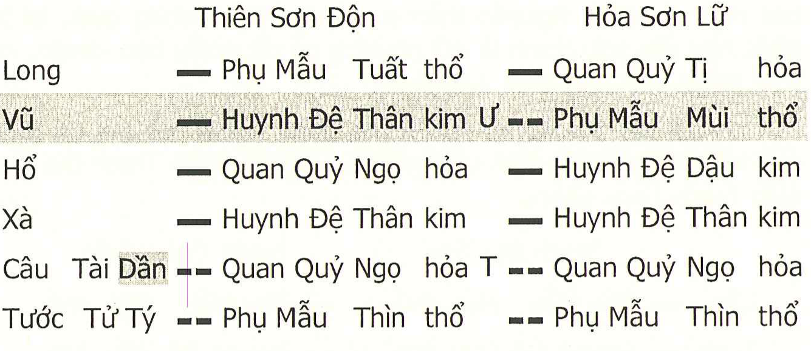
    - **Hình này chứng minh điều gì**
      - Làm sáng tỏ diễn biến cát hung và quy luật ứng nghiệm của Quẻ Thiên Sơn Độn biến Hỏa Sơn Lữ đối với sự việc được hỏi.
    - **Từ đâu mà thấy được**
      - Căn cứ Thời gian lập quẻ: Ngày 3 tháng 8 dương lịch năm 2003; Dụng thần vượng tướng. Nhìn vào biến Hỏa Sơn Lữ.

- Quái lệ dự đoán thực tế cho Quẻ Càn Vi Thiên:
  - **Hình 40.** Quẻ Càn Vi Thiên
    - 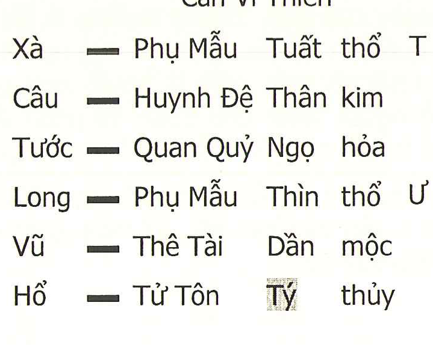
    - **Hình này chứng minh điều gì**
      - Làm sáng tỏ diễn biến cát hung và quy luật ứng nghiệm của Quẻ Càn Vi Thiên đối với sự việc được hỏi.
    - **Từ đâu mà thấy được**
      - Căn cứ Thời gian lập quẻ: Ngày 3 tháng 8 dương lịch năm 2003; Dụng thần vượng tướng. Nhìn vào biến Hỏa Sơn Lữ.

- Luận điểm phân tích:
  - Lấy hào Thế làm Dụng thần, hào 2 Dần mộc lâm Nguyệt kiến, ám động đến khắc hào Thế, Càn là đầu, hào 6 là đầu, mộc chủ thần kinh, là thông tin suy nhược thần kinh. Bởi vì hào Thế bị hào ám động Dần mộc khắc, sử dụng nguyên lý Dần và Hợi hợp, khiến Dần mộc tham hợp quên khắc, thì có thể mang lại tác dụng kiềm chế Kỵ thần, do đó bảo người đó viết một chữ "Hợi" (亥) trên tờ giấy trắng, để dưới cái gối, màu trắng là kim, có thể khắc mộc, chữ Hợi hợp Dần mộc, bởi vì là suy nhược thần kinh, hào 6 là đầu, gối vừa đúng là bộ vị của đầu, do đó để vật hóa giải ở dưới gối có thể sản sinh khí trường đặc biệt để bảo vệ phần đầu.

- Quái lệ thực tế:
  - Bối cảnh: Ngày Giáp Tý, cô ấy gửi email phải hồi, sau khi hóa giải như vậy thì tối hôm đó hiện tượng mất ngủ đã biến mất.

- Quái lệ thực tế:
  - Bối cảnh: **Ví dụ 3:** Ngày Quý Hợi tháng Dần (đây là thời gian ở Mỹ, không đổi thành ngày ở Trung Quốc), một cô gái ở Mỹ bị mọc mụn trên mặt, thỉnh cầu hóa giải, tại Mỹ gieo quẻ được Thủy Phong Tỉnh biến Trạch Sơn Hàm.

- Quái lệ dự đoán thực tế cho Thủy Phong Tỉnh biến Trạch Sơn Hàm:
  - **Hình 41.** Thủy Phong Tỉnh biến Trạch Sơn Hàm
    - 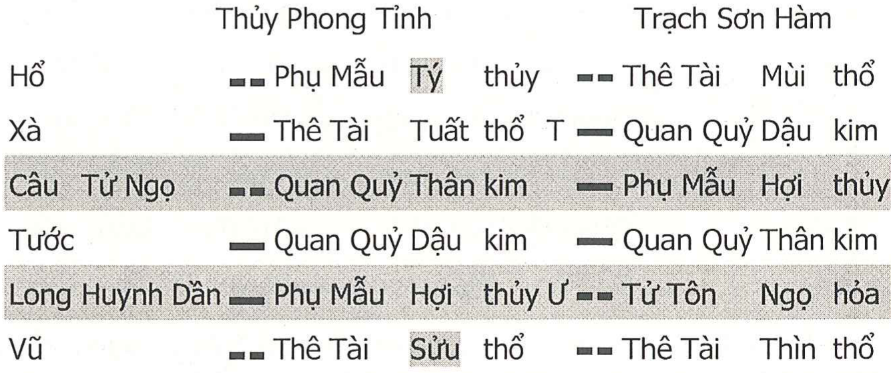
    - **Hình này chứng minh điều gì**
      - Làm sáng tỏ diễn biến cát hung và quy luật ứng nghiệm của Thủy Phong Tỉnh biến Trạch Sơn Hàm đối với sự việc được hỏi.
    - **Từ đâu mà thấy được**
      - Căn cứ Thời gian lập quẻ: Ngày 3 tháng 8 dương lịch năm 2003; Dụng thần vượng tướng. Nhìn vào biến Hỏa Sơn Lữ.

- Luận điểm phân tích:
  - Lấy hào Thế làm Dụng thần, Thế tại hào 5, hào 5 là ngũ quan, lâm thổ, thổ là da, bị Nguyệt kiến khắc, là thông tin da không tốt, lâm Trình Xà, Trình Xà là vết sẹo, tổng hợp lại là thông tin trên mặt có mụn. Quẻ này Cừu thần tại hào 2 phát động khắc Nguyên thần, Quan Quỷ Thân kim lại động đến trợ vượng Cừu thần, khiến hỏa không thể sinh thổ, đây cũng là nguyên nhân khiến da không tốt.

- Luận điểm phân tích:
  - Tiến hành hóa giải: Một là phải chế phục Cừu thần, hai là phải sinh phù hào Thế, do đó, tôi bảo cô ấy viết 7 chữ "Tị" (巳) màu đỏ trên một tờ hoàng chỉ, dán tại hướng Tây Bắc của phòng ngủ, bởi vì màu vàng là thổ, vừa có thể trợ vượng hào Thế, lại có

- Quái lệ thực tế:
  - Bối cảnh: **Ví dụ 4:** Ngày 2 tháng 4 năm 2003, một cô gái đi máy bay từ Paris đến Milan, sau khi xuống máy bay đã bị mất một vật quý giá, thế là gieo quẻ đoán có thể tìm được hay không? Được Trạch Hỏa Cách biến Thủy Lôi Truân. Dựa vào thời gian ở Italia là ngày Ất Tị tháng Mão.

- Quái lệ dự đoán thực tế cho Trạch Hỏa Cách biến Thủy Lôi Truân:
  - **Hình 42.** Trạch Hỏa Cách biến Thủy Lôi Truân
    - 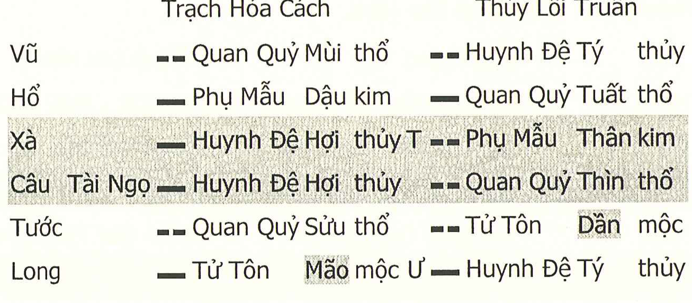
    - **Hình này chứng minh điều gì**
      - Làm sáng tỏ diễn biến cát hung và quy luật ứng nghiệm của Trạch Hỏa Cách biến Thủy Lôi Truân đối với sự việc được hỏi.
    - **Từ đâu mà thấy được**
      - Căn cứ Thời gian lập quẻ: Ngày 3 tháng 8 dương lịch năm 2003; Dụng thần vượng tướng. Nhìn vào biến Hỏa Sơn Lữ.

- Luận điểm phân tích:
  - Bởi vì là vật phẩm quý giá, do đó lấy hào Tài làm Dụng thần. Thê Tài Ngọ hỏa phục tàng, nhưng được Nguyệt kiến sinh, Nhật thần tỉ phù là vượng tướng, do đó có thể tìm được. Ngày thứ hai Dụng thần gặp trị, ngày Ngọ có thể tìm được.

- Luận điểm phân tích:
  - Trên thực tế, 1 giờ 30 sáng ngày Ngọ, nhân viên sân bay đã mang vật bị mất đến khách sạn giao cho cô ấy.

### Câu hỏi 18: Lục hào có thể dự đoán thông tin trước đây hay không?

- Giải đáp trọng tâm:
  - Lục hào dự đoán vượt thời gian – không gian, có thể dự đoán sự việc trước mắt và tương lai, đương nhiên cũng có thể dự đoán sự việc quá khứ.

- Quái lệ thực tế:
  - Bối cảnh: **Ví dụ 1:** Ngày Bính Ngọ tháng Sửu, một người Nhật Bản đến tìm tôi dự đoán, để nghiệm chứng tính chính xác của quẻ, anh ta hỏi tôi có thể dự đoán sự việc quá khứ hay không, tôi nói rằng dựa vào lý luận lục hào thì có thể, thế là anh ta yêu cầu dự đoán 3 năm trước anh ta đã từng bị bệnh gì, gieo được Sơn Thiên Đại Súc biến Sơn Thủy Mông.

- Luận điểm phân tích:
  - Lấy hào Thế làm Dụng thần, bị khắc là bệnh, nhưng bởi vì hào Thế không bị khắc, do đó lấy Nguyên thần để phán đoán. Nguyên thần lưỡng hiện, lấy hào Thê Tài Tý thủy phát động để phán đoán, hào 3 Thìn thổ hóa ra Ngọ hỏa hồi đầu sinh, lại được Nhật hỏa vượng đến sinh trợ, vượng khắc Nguyên thần, hào 3 là hào vị tim, hỏa lại tăng cường sức mạnh hào khắc Nguyên thần, Nhật hỏa vượng xung Nguyên thần, do đó tôi phán đoán anh ta 3 năm trước đã từng bị bệnh tim, Nguyên thần tại hào sơ động mà hóa Quỷ, hào sơ là chân, Quan Quỷ là bệnh, chân cũng đã từng xuất hiện vấn đề.

- Luận điểm phân tích:
  - Anh ta phản hồi: 3 năm trước bị vỡ tim mạch, đột nhiên hôn mê được đưa vào bệnh viện, đã từng bị đau chân một tháng không thể đi lại.

- Quái lệ dự đoán thực tế cho Sơn Thiên Đại Súc biến Sơn Thủy Mông:
  - **Hình 43.** Sơn Thiên Đại Súc biến Sơn Thủy Mông
    - 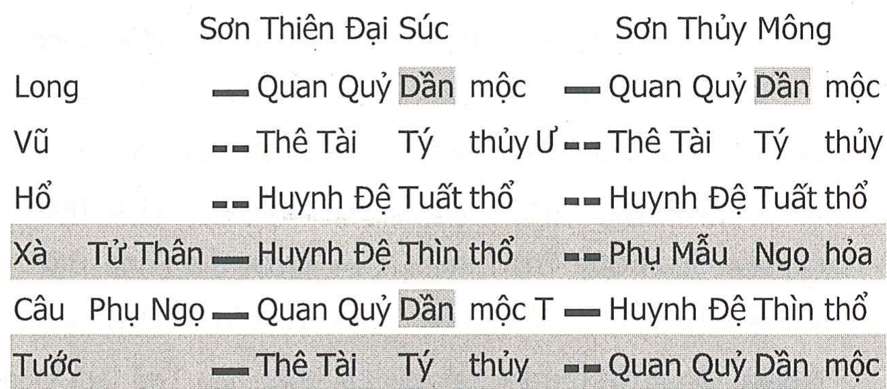
    - **Hình này chứng minh điều gì**
      - Làm sáng tỏ diễn biến cát hung và quy luật ứng nghiệm của Sơn Thiên Đại Súc biến Sơn Thủy Mông đối với sự việc được hỏi.
    - **Từ đâu mà thấy được**
      - Căn cứ Thời gian lập quẻ: Ngày Bính Ngọ tháng Sửu. Nhìn vào biến Thủy Lôi Truân](assets/page_0050_img_01.

- Quái lệ thực tế:
  - Bối cảnh: **Ví dụ 2:** Ông Từ ở một công ty trang trí đến đoán tình hình đầu tư, bởi vì có thái độ hoài nghi đối với dự đoán, do đó trước tiên bảo tôi đoán xem ngón tay của ông ta bị đứt ở năm nào? Ở ngày Quý Tị tháng Thìn được quẻ Khảm Vi Thủy biến Phong Thủy Hoán.

- Kết quả ứng nghiệm thực tế:
  - **Đoán:** Đoán về thương tai, lấy cái khắc hào Thế làm Dụng thần, trong quẻ Quan Quỷ Tuất thổ và Thìn thổ lưỡng hiện, lại đều là hào tĩnh, nhưng Tuất thổ bị Nguyệt kiến xung phá, do vậy lấy hào Tuất thổ Nguyệt phá làm Dụng. Năm Giáp Tuất (năm 1994) là năm Quan Quỷ Tuất thổ thực phá, nhất định ngón tay bị đứt ở năm Giáp Tuất. Kết quả ứng nghiệm.

### Câu hỏi 19: Người tu đạo hỏi quẻ, dùng lục hào đoán có chính xác không?

- Giải đáp trọng tâm:
  - Có rất nhiều sách Dịch học nói rằng phàm là người xuất gia, người thờ phật và người tu đạo thì đoán không chính xác. Quan điểm này hoàn toàn không có căn cứ, dự đoán lục hào dùng ngũ hành sinh khắc, cho dù người xuất gia hay là người tu đạo, tu luyện ra sao, ít khi có người có thể thoát khỏi sự ràng buộc của ngũ hành. Chỉ cần tồn tại ở trong vũ trụ thì sẽ luôn bị ngũ hành chế ước.

- Luận điểm phân tích:
  - Chúng ta biết rằng, sự phát triển và diệt vong của vạn sự vạn vật trong vũ trụ đều là kết quả của ngũ hành tương sinh tương khắc. Những người xuất gia tu đạo này, cho dù có tu luyện cao đến đâu thì cũng sẽ có một ngày kết thúc sinh mệnh, tử vong. Chứng tỏ họ vẫn chịu sự chế ước của ngũ hành. Nếu từ miệng người xuất gia và người tu đạo nói rằng dùng phương pháp bát quái không thể đoán được bọn họ thì đó chỉ là sự khoe

- Quái lệ dự đoán thực tế cho Khảm Vi Thủy biến Phong Thủy Hoán:
  - **Hình 44.** Khảm Vi Thủy biến Phong Thủy Hoán
    - 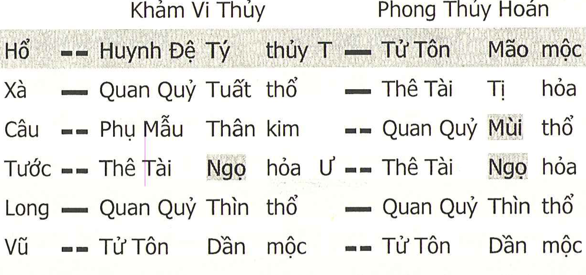
    - **Hình này chứng minh điều gì**
      - Làm sáng tỏ diễn biến cát hung và quy luật ứng nghiệm của Khảm Vi Thủy biến Phong Thủy Hoán đối với sự việc được hỏi.
    - **Từ đâu mà thấy được**
      - Căn cứ Thời gian lập quẻ: Ngày Bính Thìn tháng Tý; Dụng thần Thê Tài Tuất thổ ám động sinh hào Ứng Quan Quỷ. Nhìn vào hào Thế nhập Mộ ở Ứng; biến Phong Thủy Hoán](assets/page_0052_img_01.

- Luận điểm phân tích:
  - Tôi đã từng dự đoán cho không ít người xuất gia và người tu đạo, cho dù bọn họ tu luyện ra sao, vẫn có thể phán đoán ra rất nhiều sự việc. Tính chính xác của dự đoán phụ thuộc vào sự lý giải và nắm bắt quẻ, chứ không phụ thuộc vào đối phương là người gì.

- Quái lệ thực tế:
  - Bối cảnh: **Ví dụ 1:** Ngày Bính Thìn tháng Tý, một người xuất gia tên là Vạn Đức dự đoán tài vận của mình, được Lôi Thủy Giải.

- Quái lệ dự đoán thực tế cho Quẻ Lôi Thủy Giải:
  - **Hình 45.** Quẻ Lôi Thủy Giải
    - 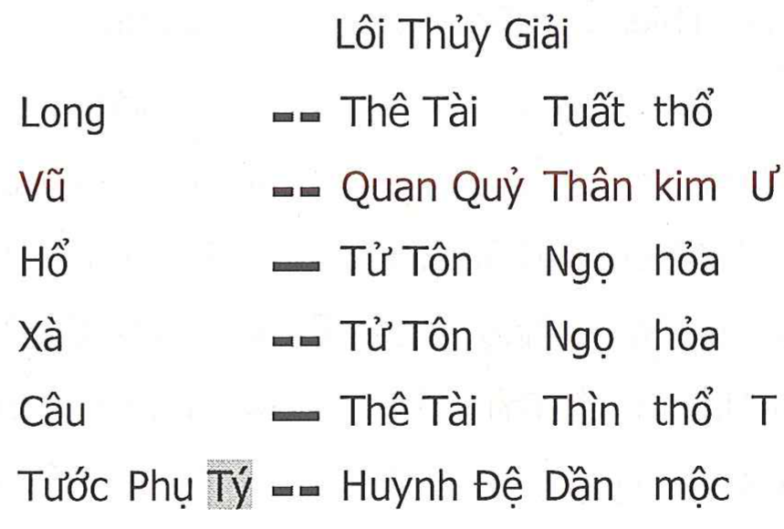
    - **Hình này chứng minh điều gì**
      - Làm sáng tỏ diễn biến cát hung và quy luật ứng nghiệm của Quẻ Lôi Thủy Giải đối với sự việc được hỏi.
    - **Từ đâu mà thấy được**
      - Căn cứ Thời gian lập quẻ: Ngày Bính Thìn tháng Tý; Dụng thần Thê Tài Tuất thổ ám động sinh hào Ứng Quan Quỷ. Nhìn vào hào Thế nhập Mộ ở Ứng; biến Phong Thủy Hoán](assets/page_0052_img_01.

- Luận điểm phân tích:
  - **Đoán:** Lấy hào Tài làm Dụng thần, trong quẻ Thê Tài lưỡng hiện, lấy hào Thê Tài Tuất thổ ám động làm Dụng, hào Tài còn lại dùng để tham khảo. Hào Tài trì Thế, được Nhật tỉ phù là vượng tướng, chứng tỏ anh ta có rất nhiều tiền. Trong quẻ Tử Tôn lưỡng hiện là tiền tài có từ nhiều nguồn. Hào 3 Tử Tôn Ngọ hỏa lâm Trình Xà, Trình Xà chủ kỹ nghệ, chứng tỏ anh ta có nhất nghệ tinh, do đó có thể đắc tài. Tử Tôn Ngọ hỏa kia lâm Bạch Hổ, Bạch Hổ chủ uy nghiêm, trong Phật giáo gọi là vô úy (không sợ hãi). Sinh hào Thế Tài, gọi là vô úy thí, chứng tỏ có rất nhiều tín đồ quyên tiền cho anh ta. Dụng thần Thê Tài Tuất thổ ám động sinh hào Ứng Quan Quỷ, Ứng tại hào 5 chủ đường, chính là đã tiêu tốn tiền trên đường. Quẻ này là quẻ cung Chấn, Chấn là động, do đó tôi phán đoán anh ta thích vân du, đã tiêu toàn bộ số tiền bản thân kiếm được trên đường vân du.

- Luận điểm phân tích:
  - Bây giờ nhìn từ góc độ tượng, Nhật thần cũng là Mộ khố của hào Tài, Tử Tôn Nguyệt phá, lực sinh Tài yếu đi: Hào Tài nhập Mộ cũng là khốn đốn vì tiền bạc, chứng tỏ hiện nay anh ta đang thiếu tiền. Dụng thần Tuất thổ ám động, động mà gặp trị gặp hợp, tôi đoán anh ta năm 1999 (năm Kỷ Mão) tài vận rất tốt, năm 2000 là năm Canh Thìn, là năm trị hào Tài, năm này tài vận khá tốt. Hiện nay Tử Tôn Nguyệt phá, năm sau vừa đúng là năm Nhâm Ngọ, Tử Tôn thực phá, hiện nay mặc dù tài vận không tốt nhưng năm sau sẽ khá lên. Thì ra trước khi xuất gia thì người này học trường nghệ thuật, vẽ tranh chữ rất khéo tay, có rất nhiều cư sĩ bỏ tiền ra mua tác phẩm của anh ta, thu nhập mỗi năm rất nhiều. Sau khi kiếm được tiền thì anh ta đi vân du khắp nơi, ít khi để dành tiền. Hiện nay bởi vì đã mua một cuốn sách cổ đặc biệt quý giá cho nên cảm thấy kinh tế có phần túng thiếu.

- Quái lệ thực tế:
  - Bối cảnh: **Ví dụ 2:** Ngày Canh Dần tháng Hợi, nữ dự đoán tình hình tu hành, được Lôi Thiên Đại Tráng biến Sơn Hỏa Bí.

- Quái lệ dự đoán thực tế cho Quẻ Lôi Thiên Đại Tráng biến Sơn Hỏa Bí:
  - **Hình 46.** Quẻ Lôi Thiên Đại Tráng biến Sơn Hỏa Bí
    - 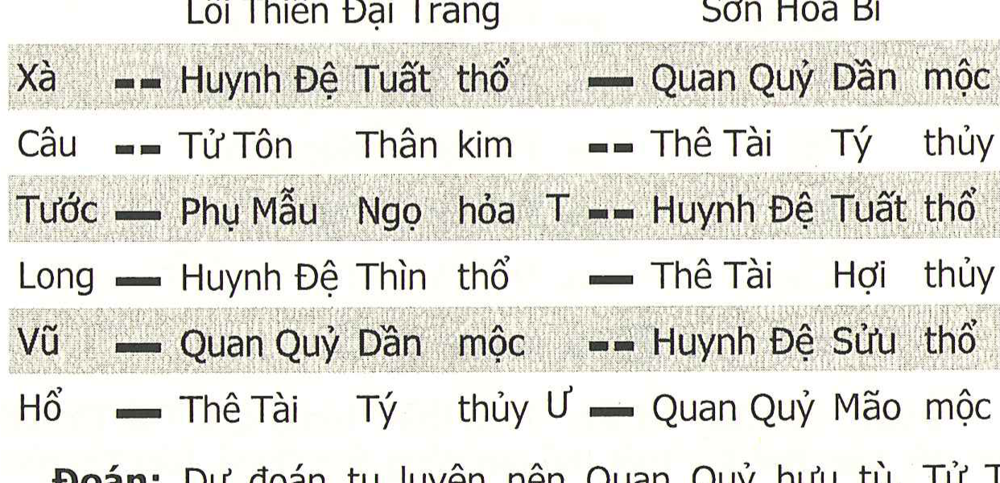
    - **Hình này chứng minh điều gì**
      - Làm sáng tỏ diễn biến cát hung và quy luật ứng nghiệm của Quẻ Lôi Thiên Đại Tráng biến Sơn Hỏa Bí đối với sự việc được hỏi.
    - **Từ đâu mà thấy được**
      - Căn cứ Thời gian lập quẻ: Ngày Bính Thìn tháng Tý; Dụng thần Thê Tài Tuất thổ ám động sinh hào Ứng Quan Quỷ. Nhìn vào hào Thế nhập Mộ ở Ứng; biến Phong Thủy Hoán](assets/page_0052_img_01.

- Luận điểm phân tích:
  - **Đoán:** Dự đoán tu luyện nên Quan Quỷ hưu tù, Tử Tôn vượng tướng phát động trong quẻ. Bởi vì Quan Quỷ là tạp niệm, Quan Quỷ vượng tướng tất nhiều tạp niệm, không thể nhập tĩnh. Quẻ này Phụ Mẫu trì Thế lâm Chu Tước, chủ người người này hằng ngày niệm chú hoặc kinh thư. Hào Thế nhập Mộ ở hào 6, hào 6 là chùa miếu, chứng tỏ cô ấy thường thích chạy đến miếu. Hào Thế gặp Không, là tượng không thể nhập định, không thể an tâm tu luyện. Quan Quỷ tại hào 2, hào 2 là phu vị, Quan Quỷ là đàn ông, tổng hợp phán đoán Quan Quỷ này chính là chồng của cô ấy. Lâm Huyền Vũ động mà sinh Thế, Huyền Vũ chủ tượng ám muội, chính là chồng cô ấy muốn cùng giường với cô ấy. Nhưng hào Thế gặp Không, Không không được sinh, chính là thông tin

- Quái lệ thực tế:
  - Bối cảnh: **Ví dụ 3:** Ngày Tân Mão tháng Tị, một ni cô tìm tôi dự đoán, cô ấy muốn mua nhà nhưng không có tiền, hỏi mua vé số có thể phát tài hay không, được Càn Vi Thiên biến Đoài Vi Trạch.

- Quái lệ dự đoán thực tế cho Càn Vi Thiên biến Đoài Vi Trạch:
  - **Hình 47.** Càn Vi Thiên biến Đoài Vi Trạch
    - 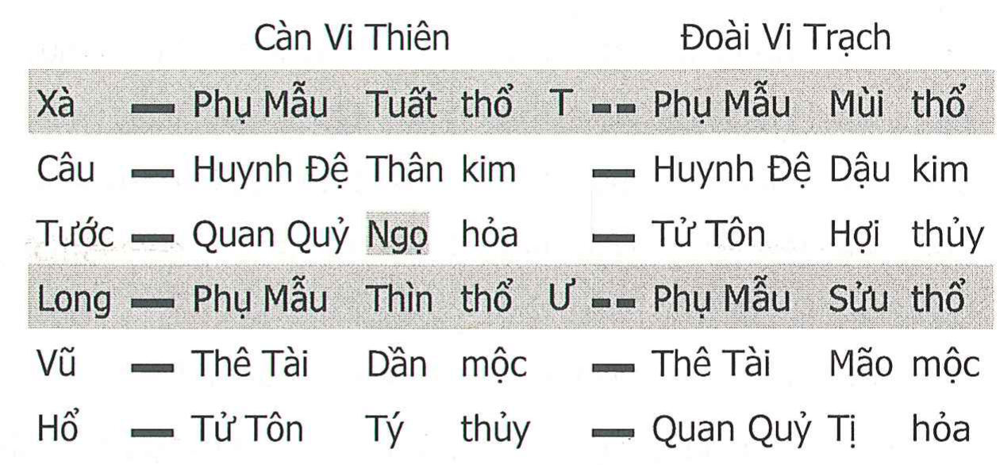
    - **Hình này chứng minh điều gì**
      - Làm sáng tỏ diễn biến cát hung và quy luật ứng nghiệm của Càn Vi Thiên biến Đoài Vi Trạch đối với sự việc được hỏi.
    - **Từ đâu mà thấy được**
      - Căn cứ Thời gian lập quẻ: Ngày Bính Thìn tháng Tý; Dụng thần Thê Tài Tuất thổ ám động sinh hào Ứng Quan Quỷ. Nhìn vào hào Thế nhập Mộ ở Ứng; biến Phong Thủy Hoán](assets/page_0052_img_01.

- Luận điểm phân tích:
  - Phát tài xem Tài, nhà xem Phụ Mẫu. Hào Tài lâm Nhật hợp Thế, là có tài, nhưng động mà hóa ra Tài khố Không, là không tích trữ được tiền, không có tích góp. Tài được Nhật phù mặc dù có khí, nhưng không phải đại tài, do đó không thể phát tài thông qua vé số. Phụ Mẫu trì Thế là cô ấy có nhà, nhưng động mà hóa Không hóa thoái, đã dọn ra khỏi nhà. Lâm Trình Xà, Trình Xà chủ hẹp, căn nhà đã rời khỏi khá chật hẹp. Ứng Phụ Mẫu cũng động hóa thoái, là có người đã dọn ra khỏi nhà, lâm Thanh Long là mới, hào Thế nhập Mộ ở Ứng, bản thân muốn căn nhà của người khác.

- Luận điểm phân tích:
  - Hào 6 là tự viện, hào Thế lâm hào 6 là thông tin đến tự viện xuất gia, nhưng động hóa thoái hóa Không, không thường xuyên sống trong miếu. Thế là Quỷ khố, có phiền não chưa gạt bỏ, Lâm Trình Xà hóa Không, ở trong tự viện cô độc vô trợ, rất cô đơn.

- Kết quả ứng nghiệm thực tế:
  - Cô ấy cho biết, mặc dù xuất gia nhưng cô ấy ở tự viện một mình, ngày thường cũng có cư sĩ đến dâng hương hỏa, trái lại thu nhập cũng tạm được, nhưng bản thân vẫn còn có một cậu con trai chưa lập gia đình, do đó muốn mua nhà cho con trai. Ban đầu cô ấy có nhà, nhưng là nhà của công ty. Sau đó bởi vì bản thân xuất gia nên căn nhà đã được giao lại cho công ty. Hiện nay có người có một căn nhà mới muốn bán, cô ấy nghe được và muốn mua lại cho con trai, nhưng giá quá cao, bản thân không mua nổi, do đó

- Quái lệ thực tế:
  - Bối cảnh: **Ví dụ 4:** Ngày Nhâm Ngọ tháng Sửu, một tiểu hòa thượng đến chỗ tôi dự đoán bệnh tật, gieo quẻ được Địa Thủy Sư biến Thủy Địa Tỷ.

- Quái lệ dự đoán thực tế cho Địa Thủy Sư biến Thủy Địa Tỷ:
  - **Hình 48.** Địa Thủy Sư biến Thủy Địa Tỷ
    - 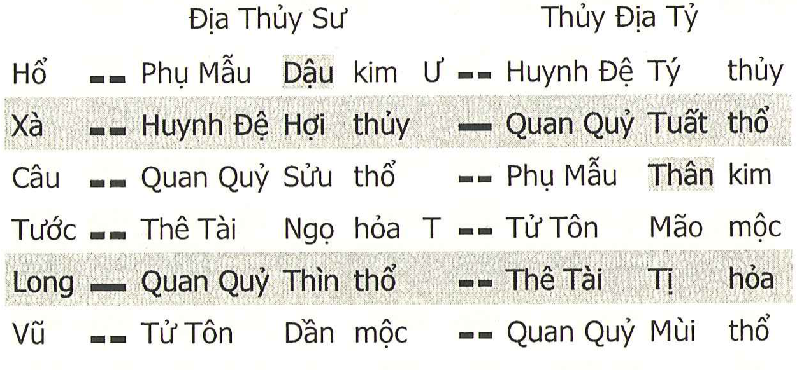
    - **Hình này chứng minh điều gì**
      - Làm sáng tỏ diễn biến cát hung và quy luật ứng nghiệm của Địa Thủy Sư biến Thủy Địa Tỷ đối với sự việc được hỏi.
    - **Từ đâu mà thấy được**
      - Căn cứ Thời gian lập quẻ: Ngày Bính Thìn tháng Tý; Dụng thần Thê Tài Tuất thổ ám động sinh hào Ứng Quan Quỷ. Nhìn vào hào Thế nhập Mộ ở Ứng; biến Phong Thủy Hoán](assets/page_0052_img_01.

- Luận điểm phân tích:
  - Lấy hào Thế làm Dụng thần. Thế được Nhật thần tỉ phù, không bị Nguyệt kiến đến khắc, có bệnh không nặng. Thủy tại hào 5 động mà đến khắc, lại động hóa ra Quan Quỷ, thủy là miệng và họng, chứng tỏ họng có bệnh. Lâm Trình Xà, là khô cổ họng. Hô hấp không thông.

- Luận điểm phân tích:
  - Thế tại hào 3 bị hào lâm Trình Xà đến khắc, hào 3 là giường, Xà chủ mộng, chứng tỏ ngủ không tốt, hào 2 Quỷ động đến tiết khí của hào Thế, lâm Thanh Long, Thanh Long chủ sắc, động mà hóa ra Thê Tài, Tài là tinh dịch, có bệnh mộng tinh, Thìn là thủy khố, chủ thận, thận hư. Ngoại quái, Huynh Quan hỗ hóa, đề phòng tay chân xảy ra thương tật.

- Luận điểm phân tích:
  - Quỷ vượng động trong quẻ, tạp niệm nhiều mà không thể tĩnh tu, Thế sinh hào 2, hào 2 là hào trạch, thường xuyên muốn về nhà.

- Luận điểm phân tích:
  - Hào 6 Phụ Mẫu Dậu kim lâm hào âm là mẹ, ở hào 6, hào 6 là hào vị của tự viện, Phụ Mẫu và Quan Quỷ Thìn thổ tương hợp, Quan Quỷ chủ thần phật, chứng tỏ mẹ anh ta cũng tin phật, cũng là một Phật tử.

- Luận điểm phân tích:
  - Tất cả đúng như dự đoán. Bản thân người này bị khô họng, ngủ không tốt, thường xuyên thận hư mộng tinh. Tê tay chân. Mặc dù xuất gia nhưng thường xuyên về nhà thăm mẹ anh ta, mẹ anh ta là một Phật tử đã thờ Phật hơn 20 năm.

- Luận điểm phân tích:
  - ---

## Chương 2: Những thắc mắc về Lục Hào cơ sở

### Câu hỏi 1: Thiên can có công dụng gì trong dự đoán?

- Giải đáp trọng tâm:
  - Lục hào dự đoán cát hung thông thường lấy địa chi sinh khắc làm chủ, thiên can ít có tác dụng, nhưng không hoàn toàn vô dụng trong dự đoán. Trong dự đoán thực tế, tôi phát hiện thiên can dùng để phán đoán chữ số rất hữu dụng, thông thường dùng trong phán đoán số tiền, cấp độ động đất, chiều cao của cơ thể, điểm thi v.v. Phương pháp lấy số cụ thể, có thể tham khảo "Lục Hào Xu Cát Tị Hung Hóa Giải Bí Truyền".

- Quái lệ thực tế:
  - Bối cảnh: **Ví dụ:** Một người Nhật Bản tìm tôi dự đoán, muốn tham gia đấu thầu mua đất, hỏi chi ra bao nhiêu tiền có thể trúng thầu? Ở ngày Nhâm Tuất tháng Dần, được Thiên Địa Bĩ.

- Quái lệ dự đoán thực tế cho Thiên Địa Bĩ:
  - **Hình 49.** Thiên Địa Bĩ
    - 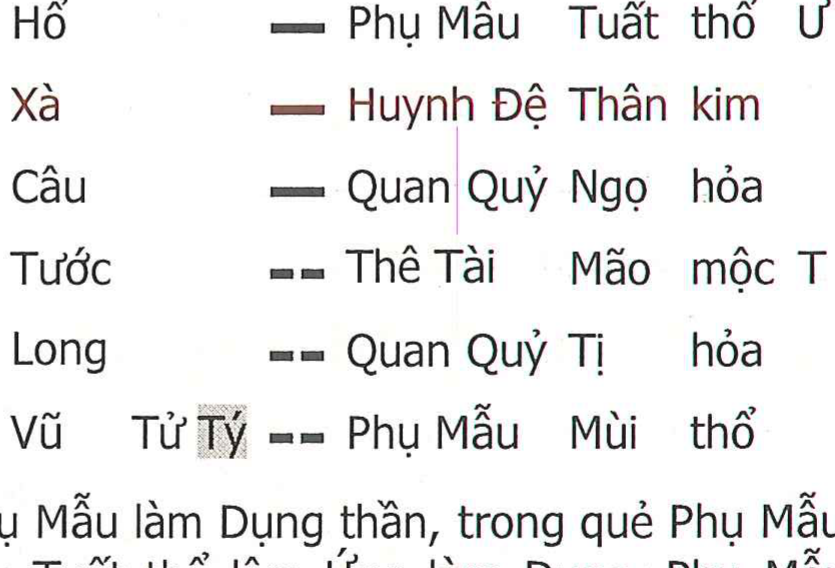
    - **Hình này chứng minh điều gì**
      - Làm sáng tỏ diễn biến cát hung và quy luật ứng nghiệm của Thiên Địa Bĩ đối với sự việc được hỏi.
    - **Từ đâu mà thấy được**
      - Căn cứ Can Chi ngày tháng, Nguyệt kiến và Nhật thần tương tác với quẻ. Nhìn vào động đất.

- Luận điểm phân tích:
  - Lấy Phụ Mẫu làm Dụng thần, trong quẻ Phụ Mẫu lưỡng hiện, lấy Phụ Mẫu Tuất thổ lâm Ứng làm Dụng, Phụ Mẫu được Nhật củng phù là vượng, hào Thế lâm Tài hợp Dụng thần, trong quẻ hiển thị rõ ràng dùng tiền có thể mua được mảnh đất này, quẻ này trọng điểm ở số tiền đấu thầu, bởi vì hào Thế Tài hợp Dụng thần, do đó dùng hào này để phán đoán số tiền, hào Thế Thê Tài nạp can chi là Ất Mão, dùng phạm vi số tiên thiên để phán đoán, Ất là số 8, Mão là số 6, cộng lại là 14, do đó tôi phán đoán anh ta đấu thầu 14 triệu yên sẽ được, sau cùng anh ta đã mua được mảnh đất này, giá cơ bản ban đầu là 12,5 triệu yên. Ban đầu anh ta định đấu giá 20 triệu yên, dự đoán này đã giúp anh ta tiết kiệm được rất nhiều tiền.

### Câu hỏi 2: Quái thân có công dụng gì trong dự đoán lục hào?

- Giải đáp trọng tâm:
  - Người xưa nói "quái thân trùng điệp, tu tri sự thể lưỡng giao quan[^1]" cho rằng quái thân rất quan trọng, nhưng thực tiễn chứng minh quái thân và cát hung của sự việc không có quan hệ, quái thân thỉnh thoảng có thể dùng để phán đoán ý đồ đến, tìm Khuê Phòng và Sàng Trướng. Cách dùng cụ thể có thể tham khảo "Lục Hào Nhân Duyên Dự Trắc Học".

- Quái lệ thực tế:
  - Bối cảnh: **Ví dụ:** Ngày Ất Sửu tháng Tuất năm 2000, khi tôi đang ở Bắc Kinh, bằng hữu Vương Khai Vũ đã dẫn bạn của ông ta đến dự đoán hôn nhân, một người đàn ông sinh năm 1958 gieo quẻ, được quẻ Sơn Trạch Tổn biến Hỏa Thủy Vị Tế.

- Quái lệ dự đoán thực tế cho Sơn Trạch Tổn biến Hỏa Thủy Vị Tế:
  - **Hình 50.** Sơn Trạch Tổn biến Hỏa Thủy Vị Tế
    - 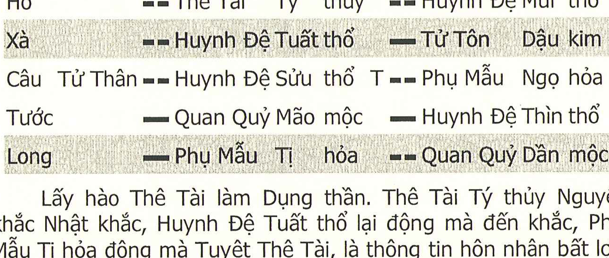
    - **Hình này chứng minh điều gì**
      - Làm sáng tỏ diễn biến cát hung và quy luật ứng nghiệm của Sơn Trạch Tổn biến Hỏa Thủy Vị Tế đối với sự việc được hỏi.
    - **Từ đâu mà thấy được**
      - Căn cứ Thời gian lập quẻ: Ngày Ất Sửu tháng Tuất năm 2000; Dụng thần và hào Thế tương hợp. Nhìn vào biến Hỏa Thủy Vị Tế.

- Luận điểm phân tích:
  - Lấy hào Thê Tài làm Dụng thần. Thê Tài Tý thủy Nguyệt khắc Nhật khắc, Huynh Đệ Tuất thổ lại động mà đến khắc, Phụ Mẫu Tị hỏa động mà Tuyệt Thê Tài, là thông tin hôn nhân bất lợi. Nhưng dựa vào điểm này đoán ly dị hay là không tìm được đối tượng thì rất khó kết luận, tôi bèn tham khảo Sàng Trướng để phán đoán. Quẻ này quái thân tại Thân, hào mà quái thân sinh là Tý thủy Sàng Trướng, Sàng Trướng hưu tù lâm Tuyệt, biểu thị không có gia đình, do đó tôi phán đoán ông ta lúc đó không có kết hôn.

- Luận điểm phân tích:
  - Dụng thần và hào Thế tương hợp, là tượng được vợ, nhưng Tài này cũng bị Nhật hợp là cản trở, năm 2002 Nhâm Ngọ xung khai hào Tài Tý thủy, có thể kết hôn. Nhưng Nhật Sửu thổ và ngũ hành hào Thế giống nhau, chính là người cùng giới tính với mình,

- Luận điểm phân tích:
  - [^1]: Quái thân trùng điệp biết sự việc có liên hệ.

- Luận điểm phân tích:
  - Tài sau khi hợp qua Nhật Sửu thổ mới hợp đến Thế, cũng tức là người vợ ông ta lấy là người kết hôn lần hai.

- Kết quả ứng nghiệm thực tế:
  - Kết quả là lúc đó người này quả nhiên tuổi tác đã rất lớn nhưng vẫn chưa kết hôn, tại tháng Hợi năm 2001 quen biết một người phụ nữ đã ly hôn, tháng Sửu nhận giấy chứng nhận kết hôn, năm 2002 chính thức cử hành hôn lễ.

### Câu hỏi 3: Thần sát có hữu dụng trong dự đoán lục hào hay không?

- Kết quả ứng nghiệm thực tế:
  - **Đáp:** Dự đoán lục hào lấy ngũ hành sinh khắc làm chủ, không có thần sát vẫn có thể đoán đúng cát hung của sự vật, tuy nhiên tham khảo thần sát cá biệt cũng có thể trích xuất được một số thông tin, các thần sát ứng nghiệm thường dùng gồm có Thiên Ất Quý Nhân, Dịch Mã, Đào Hoa, các thần sát khác có thể bỏ qua.

- Quái lệ thực tế:
  - Bối cảnh: **Ví dụ 1:** Vào năm 2000, khi tôi đang nghỉ tại một khách sạn ở Bắc Kinh, ngày Bính Dần tháng Tuất, một người Nhật Bản xem tình hình đi học của con gái, được quẻ Thủy Thiên Nhu biến Thủy Phong Tỉnh.

- Quái lệ dự đoán thực tế cho Quẻ Thủy Thiên Nhu biến Thủy Phong Tỉnh:
  - **Hình 51.** Quẻ Thủy Thiên Nhu biến Thủy Phong Tỉnh
    - 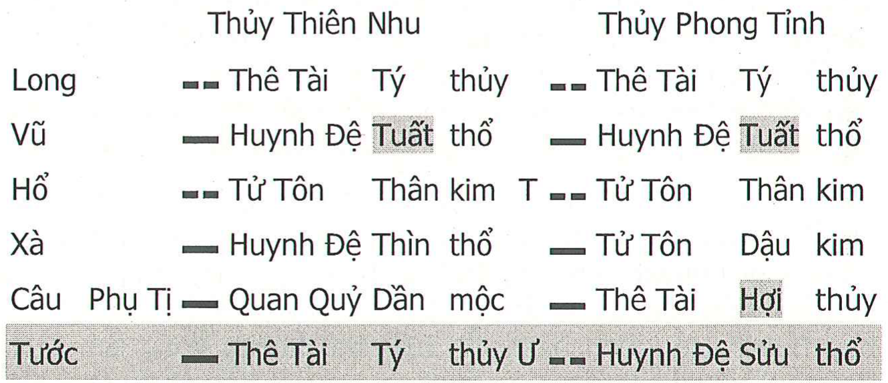
    - **Hình này chứng minh điều gì**
      - Làm sáng tỏ diễn biến cát hung và quy luật ứng nghiệm của Quẻ Thủy Thiên Nhu biến Thủy Phong Tỉnh đối với sự việc được hỏi.
    - **Từ đâu mà thấy được**
      - Căn cứ Thời gian lập quẻ: Ngày Canh Ngọ tháng Mão; dụng thần sát đoán ra. Nhìn vào biến Thủy Phong Tỉnh.

- Luận điểm phân tích:
  - Sau khi xem quái tượng, tôi đoán rằng con gái người này tinh nghịch, bướng bỉnh, không thích học tập, thường xuyên trốn học. Đối phương rất kinh ngạc, cho rằng tôi có công năng đặc dị. Thực ra đều là dùng quẻ suy ra.

- Luận điểm phân tích:
  - Tử Tôn là con gái của người này, Phụ Mẫu là học nghiệp (việc học). Trong quẻ Tài động khắc Phụ Mẫu, Phụ Mẫu bất thượng quái, vì vậy đoán không thích học tập. Tử Tôn lâm Bạch Hổ, Bạch Hổ chủ bướng bỉnh, vì vậy đoán là tinh nghịch. Tử Tôn được Nguyệt sinh phù vượng tướng, lâm Dịch Mã ám động, lại là

- Luận điểm phân tích:
  - Đây là quẻ sử dụng thần sát đoán ra, có thể thấy thần sát cũng có chỗ hữu dụng.

- Quái lệ thực tế:
  - Bối cảnh: **Ví dụ 2:** Ngày Canh Ngọ tháng Mão, một người đàn ông chiêm lưu niên cho bạn, được quẻ Cấn biến Bác.

- Quái lệ dự đoán thực tế cho Quẻ Cấn Vi Sơn biến Sơn Địa Bác:
  - **Hình 52.** Quẻ Cấn Vi Sơn biến Sơn Địa Bác
    - 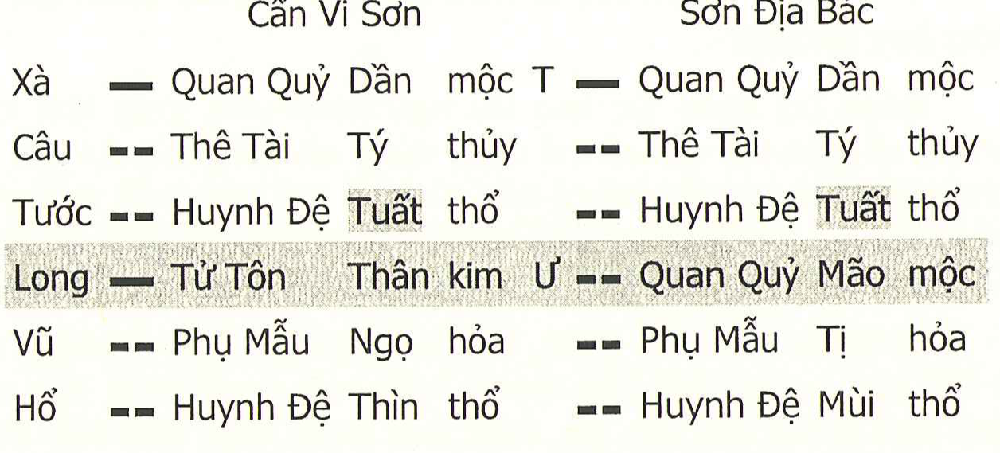
    - **Hình này chứng minh điều gì**
      - Làm sáng tỏ diễn biến cát hung và quy luật ứng nghiệm của Quẻ Cấn Vi Sơn biến Sơn Địa Bác đối với sự việc được hỏi.
    - **Từ đâu mà thấy được**
      - Căn cứ Thời gian lập quẻ: Ngày Canh Ngọ tháng Mão; dụng thần sát đoán ra. Nhìn vào biến Thủy Phong Tỉnh.

- Luận điểm phân tích:
  - Tôi đoán rằng bạn của người này đang bị kiện cáo bởi vì vấn đề phụ nữ hoặc kinh tế. Ông ta cho biết đúng là bạn đang bị kiện cáo, nhưng đã bị bắt thẩm tra vì vấn đề kinh tế, không liên quan gì đến phụ nữ. Sau buổi sáng dự đoán, buổi chiều người này lại đến và nói rằng tôi đoán rất đúng, đúng là bạn đã bị một người phụ nữ sống chung tố cáo. Hỏi tôi làm sao mới có thể giải thoát?

- Luận điểm phân tích:
  - Tôi bảo ông ta tìm người cầm tinh con trâu giúp đỡ giải quyết chuyện này, sau đó quả nhiên có người cầm tinh con trâu đã giúp giải quyết kiện cáo, được bình an. Quẻ này khi phán đoán đã dùng thần sát. Dự đoán bạn bè, lấy Huynh Đệ làm Dụng thần, hào Huynh Đệ lưỡng hiện, lấy Tuất thổ Không Vong làm Dụng. Huynh Đệ Tuất thổ lâm Chu Tước, bị Nguyệt kiến Quan Quỷ khắc thương, Chu Tước là khẩu thiệt quan ti, bạn người này tất có chuyện phát sinh về phương diện này. Quẻ lưu niên thông thường không nên Quan Quỷ trì Thế, nay Quan Quỷ trì Thế, lưu niên tất không thuận lợi. Tử Tôn động mà sinh Thê Tài, Thê Tài ám động sinh Kỵ thần Quan Quỷ, Thê Tài là kinh tế, tiền tài, phụ nữ, đồng thời Tử Tôn lâm Thanh Long động mà hóa Quan, Thanh Long là tửu sắc, do đó đoán không phải vì vấn đề kinh tế thì vì vấn đề phụ nữ dẫn đến kiện cáo. Thiên can ngày chiêm quẻ là Canh, Giáp Mậu Canh ngưu dương, Quý Nhân tại Sửu Mùi, Sửu thổ và Thê Tài

- Luận điểm phân tích:
  - Tý thủy tương hợp, khiến Tý thủy không sinh Kỵ thần, lại trợ giúp Dụng thần, do đó đoán là tìm người cầm tinh con trâu giúp đỡ.

- Kết quả ứng nghiệm thực tế:
  - Trong dự đoán cũng không thể nhất loạt dùng thần sát để che đậy, phải kết hợp với Dụng thần hỷ kỵ, như vậy mới có thể có tỷ lệ ứng nghiệm cao.

### Câu hỏi 4: Mới học đoán quẻ cần phải bắt đầu như thế nào?

- Giải đáp trọng tâm:
  - (1) Trước tiên phải đánh dấu hào Không Vong, hào Nguyệt phá và hào ám động để tham khảo khi phán đoán, sau đó bắt đầu tìm Dụng thần.

- Luận điểm phân tích:
  - (2) Sau khi đã xác định được Dụng thần, bước tiếp theo là xem ảnh hưởng của Nhật Nguyệt đối với Dụng thần ra sao? Bởi vì Nhật Nguyệt là căn bản (gốc rễ), Dụng thần có căn hay không, căn có bị hoại hay không? Đều dựa vào ảnh hưởng của Nhật Nguyệt đối với Dụng thần để nhận định.

- Luận điểm phân tích:
  - (3) Nếu trong quẻ có hào động thì lại phải xem ảnh hưởng của hào động đối với Dụng thần. Hào động thường báo trước xu thế và quá trình phát triển phức tạp của sự vật.

- Luận điểm phân tích:
  - (4) Xoay quanh Dụng thần khi phán đoán, kết hợp với hào vị, lục thần, mười hai trạng thái trường sinh v.v, tổng hợp phán đoán.

- Luận điểm phân tích:
  - (5) Nếu không có hào động thì phải xem ảnh hưởng của hào vượng tướng đối với Dụng thần.

- Luận điểm phân tích:
  - Dưới đây xin đưa ra hai quái lệ cụ thể, hy vọng thông qua hai ví dụ này, mọi người sẽ có được một nhận thức sơ bộ về trình tự đoán quẻ.

- Quái lệ thực tế:
  - Bối cảnh: **Ví dụ 1:** Ngày Nhâm Dần tháng Mão, một người dự đoán công ty sẽ phát triển ra sao sau khi mình trở thành tổng giám đốc? Được Trạch Lôi Tùy.

- Quái lệ dự đoán thực tế cho Trạch Lôi Tùy:
  - **Hình 53.** Trạch Lôi Tùy
    - 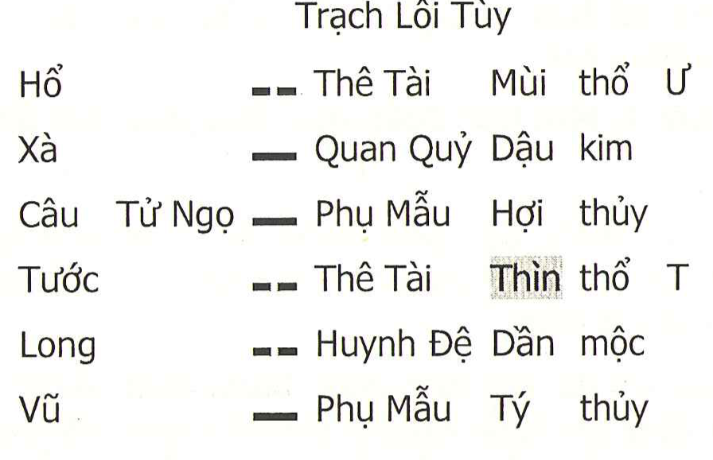
    - **Hình này chứng minh điều gì**
      - Làm sáng tỏ diễn biến cát hung và quy luật ứng nghiệm của Trạch Lôi Tùy đối với sự việc được hỏi.
    - **Từ đâu mà thấy được**
      - Căn cứ Thời gian lập quẻ: Ngày Nhâm Dần tháng Mão; Dụng thần ra sao? Bởi vì Nhật Nguyệt là căn bản (gốc rễ). Nhìn vào động để tham khảo khi phán đoán.

- Luận điểm phân tích:
  - Sau khi một quẻ xuất hiện, trước tiên phải tìm ra hào Nguyệt phá, hào Không Vong và hào phục tàng, để khi đoán quẻ lấy đó làm căn cứ phán đoán cát hung và tình tiết, nếu không thì có thể không xem được cái gì, sẽ bỏ lỡ rất nhiều tình tiết, thậm chí có khi bởi vì không nhìn thấy Nguyệt phá và Không Vong của hào mà ảnh hưởng đến cát hung thành bại của sự việc. Ảnh hưởng của Nguyệt phá và Không Vong đối với hào là rất lớn, nhất là khi lâm Dụng thần, Nguyên thần và Kỵ thần, phải suy xét những ảnh hưởng này, như vậy mới có thể nắm bắt được cát hung thành bại của sự vật.

- Luận điểm phân tích:
  - Nếu Nguyệt phá và Không Vong lâm một hào không liên quan đến phán đoán thì có thể bỏ qua.

- Luận điểm phân tích:
  - Xem quẻ này, trước tiên chúng ta có thể thấy hào 5 Quan Quỷ Dậu kim là Nguyệt phá, hào Thế Thê Tài Thìn thổ là Không Vong, Nguyên thần Tử Tôn Ngọ hỏa bất thượng quái. Sau khi tìm ra những điều kiện này, chúng ta cần phải xem lấy hào nào làm trung tâm triển khai để phán đoán, đây chính là tìm Dụng thần trong lục hào.

- Luận điểm phân tích:
  - Nếu Dụng thần lưỡng hiện thì cần tập trung sự việc phán đoán vào một hào trong đó, hào còn lại dùng để tham khảo. Liên quan đến điểm này, mọi người có thể tham khảo chương Dụng thần lưỡng hiện trong "Tế Thuyết Lục Hào Dự Trắc Học". Lấy quẻ này làm ví dụ, trong quẻ Thê Tài lưỡng hiện, phải lấy Thê Tài Thìn thổ lâm Không Vong trì Thế làm Dụng thần.

- Luận điểm phân tích:
  - Suy vượng của Dụng thần, trước tiên đánh giá từ ảnh hưởng của Nhật Nguyệt đối với Dụng thần, Dụng thần hỷ được Nhật Nguyệt sinh phù tỉ trợ, Nhật Nguyệt là căn (gốc rễ), Dụng thần được một trong Nhật Nguyệt sinh phù tỉ trợ là có căn, Nhật Nguyệt không sinh phù tỉ trợ Dụng thần nhưng cũng không khắc Dụng thần thì Dụng thần mặc dù hưu tù nhưng không hoại căn, nếu được hào động trong quẻ đến sinh, không có khắc tiết, thì đoán cát, nếu Nhật Nguyệt đều khắc Dụng thần, Dụng thần là vô căn, nếu Dụng thần không tự thân phát động hóa hồi đầu sinh, thông thường đều xem là hung, quẻ này Dụng thần Thê Tài Thìn thổ bị Nhật Nguyệt khắc chế là vô căn.

- Luận điểm phân tích:
  - Đây là quẻ tĩnh, Dụng thần không động mà hóa hồi đầu sinh, Dụng thần hoàn toàn không có sức sống. Quẻ không có hào động, hào vượng tướng có thể sinh phù hào hưu tù, cũng có thể khắc chế hào hưu tù. Hào sinh phù Dụng thần là Nguyên thần Tử Tôn Ngọ hỏa phục tàng. Còn hào Huynh Đệ Dần mộc khắc chế Dụng thần thì được Nhật Nguyệt tỉ trợ, vượng mà khắc Dụng thần. Do đó, nếu muốn hỏi sau này công ty phát triển ra sao thì khẳng định là không tốt. Thê Tài hưu tù lại Không Vong, cho thấy kinh tế cực kỳ nguy hiểm, nguy hiểm tại thời gian nào, đây chính là phán đoán ứng kỳ.

- Luận điểm phân tích:
  - Phán đoán ứng kỳ, phải tổng hợp phân tích xoay quanh Dụng thần và hào động có ảnh hưởng đối với Dụng thần. Phán đoán các loại ứng kỳ, tham khảo chương ứng kỳ trong sách khác do tôi viết. Quẻ này không có hào động, mọi phán đoán xoay quanh Dụng thần, Nhật Nguyệt khắc Dụng thần, nhưng Dụng thần nằm ở Không Vong, đây là gặp Không tạm thời khó khắc, nhưng một khi xuất Không sẽ bị khắc, công ty sẽ đối mặt phá sản. Bởi vì quẻ này là quẻ tĩnh, biểu thị sự phát triển cát hung của sự vật không phải là chuyện ngày một ngày hai, do đó thông thường dùng tháng để phán đoán ứng kỳ, hiện tại là tháng Mão, tháng sau chính là tháng Thìn, tháng Thìn vừa đúng là tháng Dụng thần xuất Không. Do đó tháng Thìn e rằng sẽ đối mặt nguy cơ phá sản. Quẻ thông thường phán đoán ra cát hung và ứng kỳ thì coi như đã hoàn thành nhiệm vụ dự đoán, nếu muốn đi sâu hơn thì cũng có thể phán đoán các tình tiết khác.

- Luận điểm phân tích:
  - Hào Thế và hào 5 tương hợp, hào 5 là hào vị lãnh đạo, hào Thế đi sinh hợp hào 5 là thông tin bản thân anh ta muốn đi làm tổng giám đốc công ty, bản thân nghĩ đến vị trí đó. Thế lâm Chu

- Luận điểm phân tích:
  - Tước Không Vong, Chu Tước thông thường là nói, bàn luận, nhưng gặp phải Không Vong, đa số sẽ xuất hiện kết quả tương phản. Chứng tỏ người này ăn nói kém, nói không nên lời. Hào 5 Quan Quỷ Nguyệt phá, lại Tuyệt ở Nhật, tương hợp với hào Thìn thổ Không Vong, biểu thị người ban đầu ở vị trí lãnh đạo đã tiêu vong. Hào 5 lâm Trình Xà, Trình Xà chủ chết, chứng tỏ lãnh đạo ban đầu đã chết. Chết như thế nào nhỉ? Quan Quỷ Dậu kim bị mộc (Mão) đến xung phá, lại Tuyệt ở mộc (Dần), lâm Trình Xà, Trình Xà là dây thừng, hào 5 là cổ. Mộc cộng với Trình Xà khi bất lợi đối với Dụng thần thường là treo cổ tự tử.

- Luận điểm phân tích:
  - Tình hình thực tế, nguyên tổng giám đốc của công ty đã treo cổ tự tử bởi vì công ty nợ nần chồng chất. Sau khi bản thân người xem kế nhiệm thì cũng không thay đổi được cục diện của công ty, đến tháng Thìn thì công ty đã không thể duy trì, đành phải tuyên bố phá sản.

- Quái lệ thực tế:
  - Bối cảnh: **Ví dụ 2:** Ngày Bính Dần tháng Tuất, một người phụ nữ Nhật Bản sinh năm 1961 hỏi về hôn nhân của cô ấy, được Địa Thiên Thái biến Sơn Hỏa Bí.

- Quái lệ dự đoán thực tế cho Địa Thiên Thái biến Sơn Hỏa Bí:
  - **Hình 54.** Địa Thiên Thái biến Sơn Hỏa Bí
    - 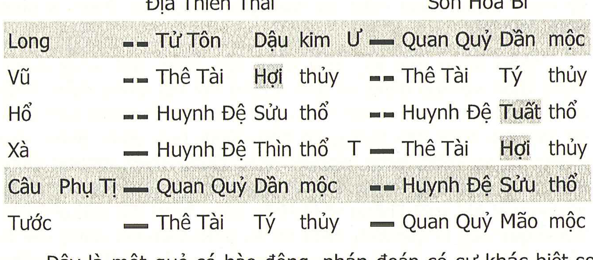
    - **Hình này chứng minh điều gì**
      - Làm sáng tỏ diễn biến cát hung và quy luật ứng nghiệm của Địa Thiên Thái biến Sơn Hỏa Bí đối với sự việc được hỏi.
    - **Từ đâu mà thấy được**
      - Căn cứ Thời gian lập quẻ: Ngày Nhâm Dần tháng Mão; Dụng thần ra sao? Bởi vì Nhật Nguyệt là căn bản (gốc rễ). Nhìn vào động để tham khảo khi phán đoán.

- Luận điểm phân tích:
  - Đây là một quẻ có hào động, phán đoán có sự khác biệt so với quẻ tĩnh, sự khác biệt cụ thể sẽ được bàn luận ở chỗ khác trong sách này, mọi người có thể tham khảo. Ở đây sẽ nói về trình tự đoán quẻ:

- Luận điểm phân tích:
  - Trước hết tìm Nguyệt phá và Không Vong của hào trong quẻ, quẻ này Thê Tài Hợi thủy Không Vong, hào Thế Huynh Đệ Thìn thổ Nguyệt phá, khi đoán quẻ liên quan đến những hào này thì phải chú ý đến cách dùng của chúng.

- Luận điểm phân tích:
  - Chọn Dụng thần, bởi vì là nữ hỏi hôn nhân, do đó lấy hào Quan Quỷ làm Dụng thần, bởi vì hào Quan Quỷ là thông tin về chồng, sau khi xác định được Dụng thần, phải xem ảnh hưởng của Nhật Nguyệt đối với Dụng thần ra sao.

- Luận điểm phân tích:
  - Nguyệt kiến là Tuất thổ, không có tác dụng sinh phù đối với Dụng thần, nhưng cũng không khắc Dụng thần, ngũ hành địa chi của Nhật thần và Dụng thần hoàn toàn giống nhau, có tác dụng tỉ phù Dụng thần, do đó Dụng thần này là vượng tướng.

- Luận điểm phân tích:
  - Tiếp theo xem ảnh hưởng của hào động trong quẻ đối với Dụng thần. Đầu tiên Dụng thần tự thân phát động, thông thường mà nói, Dụng thần vượng tướng an tĩnh là thông tin hôn nhân ổn định. Nhưng quẻ này Dụng thần phát động, cho thấy hôn nhân sẽ có biến hóa. Dụng thần khắc Thế, chứng tỏ chồng không tốt với cô ấy. Quan Quỷ Dần mộc với địa chi năm 1998 thống nhất, chứng tỏ chồng năm này đã không tốt với cô ấy.

- Luận điểm phân tích:
  - Sau khi xem xong Dụng thần, xem thêm ảnh hưởng của hào khác đối với Dụng thần. Trong quẻ hào 6 Tử Tôn Dậu kim phát động đến khắc Quan Quỷ Dần mộc, Dụng thần bị khắc cũng là thông tin hôn nhân có vấn đề. Tổng hợp phán đoán thì có thể nói rằng hôn nhân của cô ấy không tốt cho lắm. Quẻ này lục hợp biến lục hợp, cho thấy hôn nhân của cô ấy tạm thời vẫn tương đối ổn định. Nhưng sức mạnh của Kỵ thần rất lớn, chia tay là chuyện sớm muộn.

- Luận điểm phân tích:
  - Vấn đề tiếp theo chính là ứng kỳ, bởi vì Dụng thần được Nhật đến tỉ trợ, chứng tỏ trong ngắn hạn sẽ không ly hôn. Mà Nguyệt không khắc Dụng thần, cho nên tháng đó sẽ không ly hôn. Khi phán đoán ứng kỳ phải chú ý đến suy vượng của Dụng thần và Kỵ thần, hào biến của Dụng thần và Kỵ thần. Tháng này sinh trợ Kỵ thần, cho thấy mối quan hệ hiện nay giữa hai người không quá tốt. Mà Dụng thần hóa ra Huynh Đệ Sửu thổ, ám chỉ tháng Sửu hôn nhân có thể có biến hóa. Lại xem thử tình hình ảnh hưởng của các tháng sau này đối với Dụng thần. Tháng sau là tháng Hợi, sinh hợp Dụng thần, Kỵ thần không được trợ, sức mạnh của Dụng thần lớn hơn Kỵ thần, Kỵ thần không khắc được Dụng thần. Do đó tháng Hợi sẽ không ly hôn. Sau tháng Hợi là tháng Tý, tình hình tháng Tý và tháng Hợi gần giống nhau, cũng là thời gian Kỵ thần hưu tù, Dụng thần được vượng. Do đó tháng Tý cũng không thể ly hôn. Tiếp theo là tháng Sửu, tháng Sửu Kỵ thần được trợ, Dụng thần không được sinh phù, và đúng lúc thống nhất địa chi với hào biến của Dụng thần hóa ra. Do đó, khả năng cô ấy ly hôn ở tháng Sửu là rất lớn.

- Luận điểm phân tích:
  - Xem chi tiết hơn, khi Dụng thần phát động, phải xem nó sản sinh ảnh hưởng với hào nào. Quẻ này Quan Quỷ Dần mộc động mà tương hợp với Thê Tài Hợi thủy, Thê Tài có ý nghĩa là phụ nữ, Quan Quỷ động mà hợp Thê Tài, thông thường là thông tin chồng có ngoại tình. Nhưng quẻ này Thê Tài Hợi thủy Không Vong, chứng tỏ sự việc này không tồn tại. Do đó đoán quẻ thì phải chú ý đến tình huống Không Vong, Nguyệt phá v.v. Không thể thấy gặp hợp thì tùy tiện nhận định.

- Luận điểm phân tích:
  - Nếu vẫn muốn phán đoán sâu hơn, cần kết hợp với hào vị và lục thần lâm Dụng thần, quẻ này Quan Quỷ Dần mộc tại hào 2, hào 2 là trạch, lâm Câu Trần, Câu Trần có ý nghĩa là chậm chạp, lười biếng, chứng tỏ chồng cô ấy không phải là một người siêng năng nhanh nhẹn, lúc nào cũng ru rú ở trong nhà. Quan Quỷ Dần mộc động mà đi hợp Hợi thủy, Thê Tài Hợi thủy này có thể coi là tiền, chứng tỏ chồng cô ấy rất thích tiền, muốn nhận được tiền. Nhưng Thê Tài Không Vong, anh ta không nhận được bao nhiêu. Tiền này nhận được từ đâu? Bởi vì hào Thế là Tài khố, chứng tỏ tiền là do người xem quản lý, chồng cô ấy muốn có tiền thì phải xin từ chỗ cô ấy. Quẻ phân tích đến đây, chúng ta đã có thể thấy chồng cô ấy là dạng người gì – là một người ham ăn lười làm, ru rú ở trong nhà không làm việc, chỉ muốn chìa tay xin tiền vợ.

- Luận điểm phân tích:
  - Tiếp tục phán đoán sâu hơn, có thể dùng lục hợp và mười hai trường sinh. Cách dùng mười hai trường sinh là xét mối quan hệ Nhật Nguyệt, hào động, hào Thế v.v với Dụng thần v.v. Về cách dùng chi tiết, có thể xem cuốn "Lục Hào Quái Lệ Thuyết Chân" do tôi viết. Quẻ này Nguyệt kiến Tuất thổ là Dưỡng địa của Dụng thần Quan Quỷ Dần mộc, lại thêm hào Ứng phu vị động mà đến hợp hào Thế, Ứng là người khác, là tượng người khác theo ta. Do đó, chồng cô ấy là người ở rể, chẳng khác nào phụ nữ nuôi đàn ông.

- Luận điểm phân tích:
  - Lại xem mối quan hệ giữa hào Thế với Quan Quỷ Dần mộc, hào Thế là người xem, đối với Dụng thần Quan Quỷ mà nói, hào Thế là Suy địa của Quan Quỷ. Chứng tỏ chồng là người ở trạng thái nhược tiểu trước cô ấy, nhược tiểu này có thể nói là năng lực không mạnh bằng cô ấy, cũng có thể nói là tuổi tác nhỏ hơn cô ấy. Vậy thì phán đoán sẽ nhỏ hơn bao nhiêu tuổi, có rất nhiều phương pháp, tùy vào sự vận dụng linh hoạt. Dựa vào thứ tự sắp xếp của 12 địa chi, Dần mộc ở trước Thìn thổ, Dần mộc là lớn. Từ Dần mộc đếm đến Thìn thì không đúng, do đó cần phải xem khoảng cách giữa hào Thế đến Dụng thần để phán đoán. Từ Thìn thổ đến Dần mộc cách nhau 10 địa chi, do đó phán đoán chồng nhỏ hơn cô ấy khoảng 10 tuổi. Trên thực tế, chồng cô ấy sinh năm 1971, nhỏ hơn cô ấy vừa đúng 10 tuổi.

- Luận điểm phân tích:
  - Đối với Dụng thần Quan Quỷ, Kỵ thần Tử Tôn Dậu kim là Thai địa của Dụng thần, Thai là dự định, Thai địa hợp đến hào Thế cũng chính là người xem có dự định ly hôn với chồng. Dự đoán hôn nhân, phán đoán đến đây, chi tiết như vậy là đã đủ. Nhưng hào Thế Nguyệt phá, lâm Trình Xà, cho thấy tâm trạng hiện nay của cô ấy không tốt, bởi vì Trình Xà chủ tượng bất an, tôi thấy cô ấy vẻ mặt bất an, liền hỏi cô ấy có phải vẫn còn vấn đề gì muốn hỏi, cô ấy nói rằng còn muốn xem một chút về tình hình sức khỏe của mình.

- Luận điểm phân tích:
  - Đến đây lại phán đoán không liên quan đến hôn nhân thì thuộc về nhất quái đa đoán. Khi người xem vẫn còn vấn đề khác, mà câu hỏi mới không trùng lặp với Dụng thần ban đầu, thì có thể không cần phải gieo lại quẻ, dùng quẻ này vẫn có thể phán đoán. Phán đoán sức khỏe của mình, cần chọn Dụng thần khác.

- Luận điểm phân tích:
  - Hào Thế là người xem, thông tin bất lợi đối với hào Thế chính là thông tin bệnh tật. Do đó phải lấy hào Thế làm Dụng thần để triển khai.

- Luận điểm phân tích:
  - Quẻ này hào Thế Nguyệt phá, Nhật thần đến khắc, hào 2 Quan Quỷ lại động đến tương khắc, Nguyên thần không hiện, hào Thế rất nhược, nếu là quẻ chỉ dự đoán bệnh tật thì cực kỳ xấu. Nhưng quẻ này là kiêm hỏi, do đó không thể phán đoán cô ấy có nỗi lo về tính mạng, chỉ là sức khỏe không tốt mà thôi.

- Luận điểm phân tích:
  - Tiếp theo sẽ phân tích phán đoán cụ thể là bệnh gì, phán đoán chi tiết liên quan đến bệnh tật, có thể xem cuốn "Lục Hào Tật Bệnh Dự Trắc Học" do tôi viết.

- Luận điểm phân tích:
  - Quẻ này Thế tại hào 3, ngũ hành lâm thổ, quái cung lại là cung Khôn. Khôn lại là thổ, chủ tỳ vị, đồng thời hào 2 lại là hào vị của dạ dày, Nguyệt phá bị khắc, là dạ dày có bệnh. Mà hào Thế là thủy khố, thủy lại chủ thận, đồng thời Quan Quỷ lâm Nhật đến khắc, hào 3 là hào vị thắt lưng, khi Quan Quỷ lâm Nhật tại hào 2 hào 3 thường là thông tin thắt lưng không tốt, hào 2 lại chủ chân, do đó phán đoán cô ấy thận hư, có bệnh đau thắt lưng, đau chân.

- Luận điểm phân tích:
  - Hào 6 Tử Tôn động mà hóa ra Quan Quỷ, hào 6 là đầu, Quan Quỷ là bệnh, cho thấy bộ vị tương ứng, cũng chính là phần đầu cũng có bệnh. Lâm Thanh Long, Thanh Long chủ đau nhức, chứng tỏ cô ấy có bệnh đau đầu.

- Kết quả ứng nghiệm thực tế:
  - Tất cả các phán đoán trên đây đều ứng nghiệm.

### Câu hỏi 5: Nạp âm có hữu dụng trong dự đoán lục hào hay không?

- Giải đáp trọng tâm:
  - Ở phương diện dự đoán cát hung sự vật, nạp âm không có tác dụng, bởi vì nạp âm trong 64 quẻ vốn không đầy đủ, nhưng khi phán đoán quái tượng thì có thể kết hợp nạp âm với lục thân để trích xuất thông tin tham khảo, đồng thời khi dùng lục hào hóa giải cũng dùng đến nạp âm. Cách dùng cụ thể, có thể tham khảo cuốn "Lục Hào Xu Cát Tị Hung Hóa Giải Bí Truyền" do tôi viết.

- Luận điểm phân tích:
  - Để mọi người hiểu rõ cách dùng của nạp âm, dưới đây tôi xin đưa ra một quái lệ sử dụng đến nạp âm.

- Quái lệ thực tế:
  - Bối cảnh: **Ví dụ:** Ngày Mậu Dần tháng Hợi, người phụ nữ ở một nhà in dự đoán bệnh tật của chồng và tình hình tài vận, gieo quẻ được Lôi Sơn Tiểu Quá biến Sơn Phong Cổ.

- Luận điểm phân tích:
  - Phán đoán bệnh của chồng, lấy Quan Quỷ làm Dụng thần. Quan Quỷ lưỡng hiện và đều phát động, địa chi hoàn toàn tương đồng, do đó đều có thể coi là Dụng thần phán đoán. Nguyệt khắc Nhật sinh, suy vượng tương đương.

- Luận điểm phân tích:
  - Quan tại hào 4 lâm Huyền Vũ hóa Mộ nhập động Mộ, dự đoán bệnh tật thường là thông tin nhập viện. Bệnh nhẹ thông thường thì sẽ không nhập viện, do đó nhất định là bệnh nặng.

- Quái lệ dự đoán thực tế cho Quẻ Lôi Sơn Tiểu Quá biến Sơn Phong Cổ:
  - **Hình 55.** Quẻ Lôi Sơn Tiểu Quá biến Sơn Phong Cổ
    - 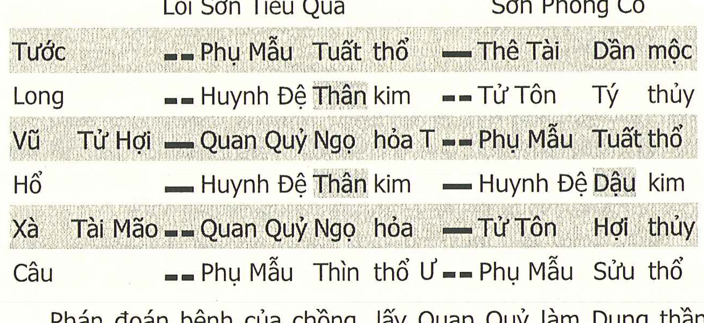
    - **Hình này chứng minh điều gì**
      - Làm sáng tỏ diễn biến cát hung và quy luật ứng nghiệm của Quẻ Lôi Sơn Tiểu Quá biến Sơn Phong Cổ đối với sự việc được hỏi.
    - **Từ đâu mà thấy được**
      - Căn cứ Thời gian lập quẻ: Ngày Mậu Dần tháng Hợi; Dụng thần phán đoán. Nhìn vào biến Sơn Phong Cổ.

- Luận điểm phân tích:
  - Quẻ tại cung Đoài, Đoài là kim chủ phổi, hào 4 lại là hào vị của phổi, Huynh Đệ Thân kim lưỡng hiện giáp Dụng thần ám động, Thân là Bệnh địa của Quan Quỷ, kim cũng là phổi, hai Bệnh địa và hai Mộ, do đó tôi phán đoán chồng cô ấy đã từng nhập viện hai lần bởi vì bệnh phổi. Căn cứ phương pháp di thần biện hào, Quan Quỷ của hào 4 vừa lâm Huyền Vũ vừa lâm Trình Xà, Huyền Vũ chủ màu đen, chủ lở loét, Trình Xà chủ vi khuẩn, bệnh khuẩn v.v, kết hợp lại là bệnh lao, do đó tôi đoán chồng cô ấy nhập viện hai lần bởi vì bệnh lao.

- Luận điểm phân tích:
  - Ngoài ra, một Quan tại hào 2 động hóa hồi đầu khắc, Đoài là ruột, hào 2 là hào vị của ruột, hỏa cũng là ruột, lâm Trình Xà, Trình Xà là vật thon dài cũng là tượng của ruột, do đó đoán ruột của chồng cô ấy không tốt, dễ tiêu chảy.

- Luận điểm phân tích:
  - Phán đoán Tài, lấy Tài làm Dụng thần tiến hành phán đoán. Hào Tài Mão mộc bất thượng quái, phục dưới hào 2 Quan Quỷ Ngọ hỏa, được Nguyệt sinh Nhật phù là vượng tướng. Đồng thời Tài lâm Nhật sinh Thế, là thông tin có tài, tài vận tốt đẹp. Cô ấy hỏi tài về cái gì, tôi thấy Thê Tài Đinh Mão, nạp âm là Lư Trung Hỏa, có liên quan đến bếp lò, đồng thời hào Tài Mão mộc và Phụ Mẫu Tuất thổ lâm Chu Tước tương hợp, Chu Tước là miệng, Phụ Mẫu là cửa hàng, tại quẻ Đoài, Đoài lại là miệng, do đó phán đoán tài của chồng cô ấy là tài liên quan đến ẩm thực, mở nhà hàng.

- Luận điểm phân tích:
  - Phán đoán bệnh tật rất chính xác, chồng cô ấy đúng là đang mở nhà hàng, tài vận cũng rất tốt.

### Câu hỏi 6: Hiện tượng quẻ sai đoán đúng lý giải như thế nào?

- Giải đáp trọng tâm:
  - Quẻ sai được nói đến ở đây không phải là tình huống người mới học không biết lắp ráp quẻ dẫn tới sai quẻ. Mà là chỉ sau khi trình độ dự đoán đã đến giai đoạn nhất định, khi dự đoán lại xem sai lục thân, quái cung và Thế Ứng v.v của quẻ một cách vô thức, dùng quẻ sai đã đoán đúng tình hình của quẻ.

- Luận điểm phân tích:
  - Đây là một hiện tượng rất bình thường trong dự đoán, khi đang dự đoán nếu phát hiện quẻ đã lắp ráp sai thì có thể lấy quẻ đã sửa lại, nhưng nếu dự đoán xong mới phát hiện đã lấy quẻ sai thì không cần cải chính, tức là lấy quẻ sai mà đoán.

- Luận điểm phân tích:
  - Suy nghĩ sinh từ tâm, quẻ hiển thị theo suy nghĩ. Dự đoán lục hào là một loại huyền học, khi dự đoán, trạng thái và linh cảm của con người cũng thường đóng một vai trò nhất định trong đó. Khi dự trắc sư đang bước vào trạng thái cao độ, quẻ trước mặt không chút hoài nghi, lúc này, quẻ chỉ là một loại ký hiệu khơi gợi linh cảm của dự trắc sư mà thôi, một gợi ý nhỏ trong quẻ cũng có thể khơi gợi linh cảm của dự trắc sư, tính phức tạp và tổ hợp biến hóa của quẻ thường biến hóa theo sự nâng cao của trình độ dự đoán, e rằng lúc đó dùng tổ hợp 64 quẻ không thể phản ánh ra sự việc muốn dự đoán, cho nên phải căn cứ vào trạng thái đã xuất hiện tình huống quẻ sai của dự trắc sư. Quẻ lấy một loại hình thức gọi là sai để biểu đạt xu thế phát triển thực sự của sự vật.

- Luận điểm phân tích:
  - Tuy nhiên, đây chỉ là nhận thức cá nhân của tôi mà thôi, chưa hẳn đã là cách giải thích chính xác đối với hiện tượng này. Trong dự đoán thực tế, tôi cũng đã từng gặp qua hiện tượng này, mặc dù không nhiều, nhưng đây là hiện tượng tồn tại khách quan, dưới đây là một ví dụ.

- Quái lệ thực tế:
  - Bối cảnh: **Ví dụ:** Ngày Mậu Dần tháng Tị, nữ đoán bệnh chị gái, được quẻ Lôi Thủy Giải. Lúc đó tôi cho rằng quẻ này là quẻ cung Khảm, đã lắp ráp quẻ như sau.

- Quái lệ dự đoán thực tế cho Quẻ Lôi Thủy Giải:
  - **Hình 56.** Quẻ Lôi Thủy Giải
    - 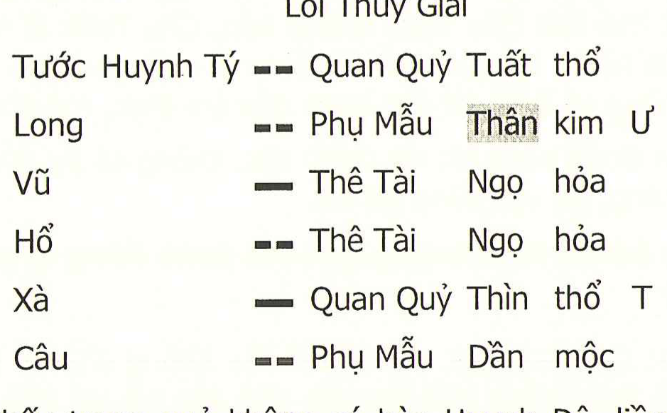
    - **Hình này chứng minh điều gì**
      - Làm sáng tỏ diễn biến cát hung và quy luật ứng nghiệm của Quẻ Lôi Thủy Giải đối với sự việc được hỏi.
    - **Từ đâu mà thấy được**
      - Căn cứ Thời gian lập quẻ: Ngày Mậu Dần tháng Tị. Nhìn vào biến hóa của quẻ thường biến hóa theo sự nâng cao của trình độ dự đoán.

- Luận điểm phân tích:
  - Tôi thấy trong quẻ không có hào Huynh Đệ, liền tìm phục tàng, Huynh Đệ Tý thủy phục dưới hào 6, Phi thần khắc nó, Phi thần là Quan Quỷ, chứng tỏ chị gái cô ấy đã bị bệnh hành hạ trong thời gian dài. Huynh Đệ lâm thủy bị khắc, phục mà không được xuất, thế là đoán chị gái cô ấy không đi tiểu được. Đối phương nói rằng phán đoán chính xác. Nhưng sau khi đoán xong, trên đường về nhà, tôi đột nhiên cảm thấy quẻ có chỗ không đúng, nhớ lại hình như từ trước đến nay không có khả năng Huynh Đệ phục tại hào 6, do đó đã lấy quẻ xem lại một lần, lúc đó mới biết là đã xem sai quái cung, đã lắp ráp sai lục thân.

- Luận điểm phân tích:
  - Quẻ chính xác như sau:

- Quái lệ dự đoán thực tế cho Lôi Thủy Giải:
  - **Hình 57.** Lôi Thủy Giải
    - 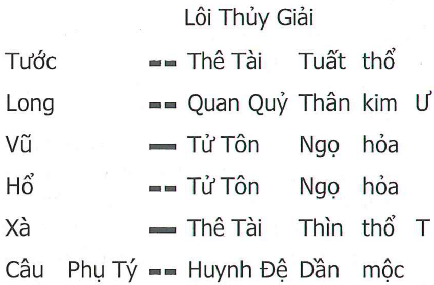
    - **Hình này chứng minh điều gì**
      - Làm sáng tỏ diễn biến cát hung và quy luật ứng nghiệm của Lôi Thủy Giải đối với sự việc được hỏi.
    - **Từ đâu mà thấy được**
      - Căn cứ Thời gian lập quẻ: Ngày Mậu Dần tháng Tị. Nhìn vào biến hóa của quẻ thường biến hóa theo sự nâng cao của trình độ dự đoán.

### Câu hỏi 7: Thế nào là chiêm việc này ứng việc khác?

- Giải đáp trọng tâm:
  - Đó là khi trong quẻ gieo ra không xuất hiện thông tin về sự việc mình muốn dự đoán, mà trái lại phản ánh sự việc không muốn hỏi, hoặc là quẻ phản ánh đồng thời sự việc muốn dự đoán và sự việc người xem không muốn hỏi. Đây gọi là chiêm việc này ứng việc khác.

- Luận điểm phân tích:
  - Loại quái lệ này cũng có ở trong sách cổ. Vậy trong tình huống nào thì thông tin xuất hiện trong quẻ là chiêm việc này ứng việc khác nhỉ? Đối với vấn đề này, mặc dù cần trình độ dự đoán của dự trắc sư có bản lĩnh nhất định mới có thể nhìn ra, tuy nhiên đây hoàn toàn không phải vấn đề tạp loạn, vẫn có thể tìm được quy luật nhất định của nó.

- Luận điểm phân tích:
  - Thông thường, loại quẻ này ít khi là quẻ tĩnh, trong quẻ nhất định có hào động xuất hiện. Người xưa nói rằng "thần triệu cơ ở động", "thần hào khởi loạn phát[^1]", nghĩa là động tất có nguyên nhân, mỗi sự xuất hiện của hào động đều không phải là sự ngẫu nhiên, mà là tiềm ẩn sự phản ánh thông tin.

- Luận điểm phân tích:
  - Khi hào động trong quẻ và tổ hợp của quẻ xuất hiện một loại thông tin mãnh liệt nào đó, nhưng đồng thời thông tin này không có mối liên hệ bản chất với sự việc mà người xem muốn hỏi, thì sự biến hóa của những hào đó và tổ hợp của quẻ rất có thể đang ám chỉ rằng người xem có sự việc khác quan trọng hơn phát sinh. Thông tin thể hiện bởi chiêm việc này ứng việc khác thường phản

- Luận điểm phân tích:
  - [^1]: Hào thần lẽ nào phát động bừa bãi.

- Luận điểm phân tích:
  - Tại sao có hiện tượng này xuất hiện? Tôi cho rằng, quẻ là sự mở rộng thông tin tiềm thức của con người, là một loại ký hiệu đặc biệt để giải mã tiềm thức. Do đó, khi ý thức của chúng ta vẫn chưa biết thì tiềm thức đã dùng hình thức quẻ Dịch để báo cho chúng ta biết sự việc sẽ xảy ra trong tương lai, đây chính là nguyên lý của chiêm việc này ứng việc khác. Đây cũng chính là nguyên nhân tại sao một quẻ có thể đoán được nhiều sự việc. Trong Tăng San Bốc Dịch đã nói về vấn đề này, mọi người có thể tham khảo. Ở đây tôi xin nêu ra một số quái lệ trong thực tiễn của bản thân để giúp mọi người hiểu và ứng dụng hiện tượng này.

- Quái lệ thực tế:
  - Bối cảnh: **Ví dụ 1:** Ngày Ất Sửu tháng Tý năm 2000, một người đàn ông hỏi về điều động công tác, được Tốn Vi Phong biến Phong Thủy Hoán.

- Quái lệ dự đoán thực tế cho Tốn Vi Phong biến Phong Thủy Hoán:
  - **Hình 58.** Tốn Vi Phong biến Phong Thủy Hoán
    - 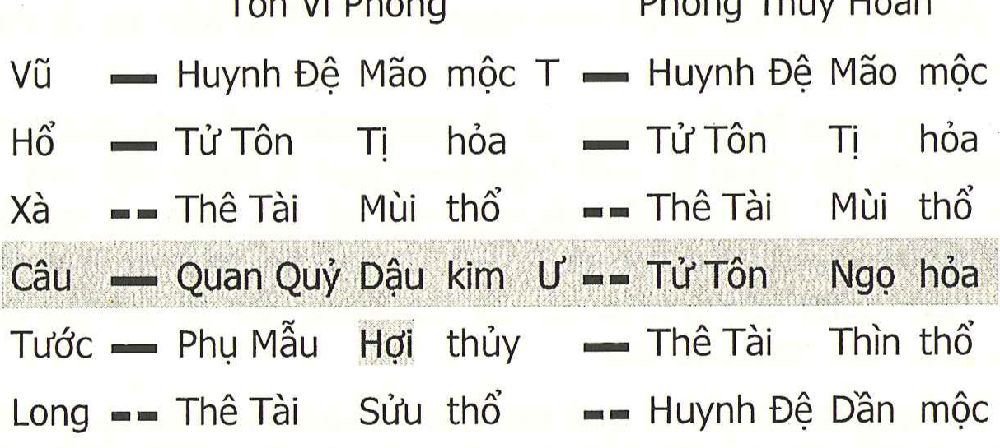
    - **Hình này chứng minh điều gì**
      - Làm sáng tỏ diễn biến cát hung và quy luật ứng nghiệm của Tốn Vi Phong biến Phong Thủy Hoán đối với sự việc được hỏi.
    - **Từ đâu mà thấy được**
      - Căn cứ Thời gian lập quẻ: Ngày Ất Sửu tháng Tý năm 2000; Dụng thần đồng thời cũng khắc hào Thế. Nhìn vào Thế nào là chiêm việc này ứng việc khác?; hào động xuất hiện.

- Luận điểm phân tích:
  - **Đoán:** Lấy hào Quan Quỷ làm Dụng thần, Quan Quỷ phát động chính là thông tin biến động công tác. Nhưng động mà hóa phá, hiện nay rất khó điều động thành công. Quan Quỷ nhập Mộ ở Nhật, Mộ là cản trở không thể động, cũng là thông tin hiện nay không thể điều động thành công. Năm 2002 là năm Nhâm Ngọ, hào biến Quan Quỷ thực phá, có thể điều động thành công. Quẻ tại cung Tốn, Tốn là Đông Nam, sẽ được điều đến hướng Đông Nam.

- Luận điểm phân tích:
  - Nhưng quẻ này Quan Quỷ động mà khắc Thế, hào 4 Thê Tài Mùi thổ ám động, khiến hào Thế nhập Mộ, hào Thế lại có Nguyệt đến tương hình. Điều động công tác tất có bệnh tai phát sinh. Không vào tù thì cũng có bệnh nặng. Anh ta cười nói: "Tôi khỏe mạnh bình thường không có bệnh tật gì, lại không làm việc trái

- Quái lệ thực tế:
  - Bối cảnh: **Ví dụ 2:** Ngày Đinh Mão tháng Dần năm 2001, một người phụ nữ đoán có thể làm giấy kết hôn thành công hay không? Được Lôi Phong Hằng biến Sơn Phong Cổ.

- Luận điểm phân tích:
  - **Đoán:** Mặc dù hào Phụ Mẫu là giấy kết hôn nhưng thành công hay không thì phải xem hào Quan Quỷ. Quẻ này Quan Quỷ lưỡng hiện, lấy hào Quan Quỷ Thân kim Nguyệt phá làm Dụng thần. Quan Quỷ Nguyệt phá không được Nhật thần sinh phù là hưu tù, trong quẻ lại thêm tam hợp Tử Tôn cục, khắc Dụng thần. Hôn nhân này bất thành, không thể làm được giấy kết hôn. Huống hồ Phụ Mẫu Hợi thủy thể hiện giấy kết hôn Không Vong, lại bị Thê Tài Tuất thổ trong quẻ khắc. Thê Tài lâm Ứng khắc Phụ Mẫu, Ứng là đối phương, là đối phương không muốn kết hôn.

- Kết quả ứng nghiệm thực tế:
  - Quẻ này Tử Tôn tam hợp cục khắc Dụng thần đồng thời cũng khắc hào Thế, Tử Tôn lâm Bạch Hổ, Bạch Hổ chủ bệnh, tai họa đổ máu. Đề phòng bản thân có tai họa bất trắc. Tử Tôn Tuất thổ động mà hóa Không, xuất Không bất phá, do đó phải chú ý, cần đề phòng bệnh tật phát sinh. Tử Tôn Ngọ hỏa là Thái Tuế của năm 2002, năm 2002 cũng không được lơ là. Kết quả: Người này không những không kết hôn thành công với người đàn ông đó mà còn phát hiện ung thư tử cung ở tháng Mão năm 2001, trải qua

- Quái lệ dự đoán thực tế cho Lôi Phong Hằng biến Sơn Phong Cổ:
  - **Hình 59.** Lôi Phong Hằng biến Sơn Phong Cổ
    - 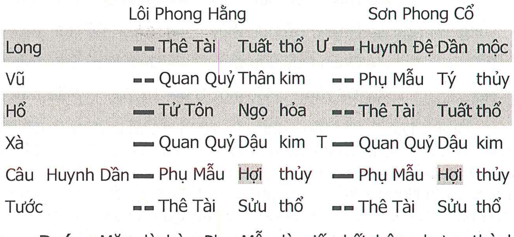
    - **Hình này chứng minh điều gì**
      - Làm sáng tỏ diễn biến cát hung và quy luật ứng nghiệm của Lôi Phong Hằng biến Sơn Phong Cổ đối với sự việc được hỏi.
    - **Từ đâu mà thấy được**
      - Căn cứ Thời gian lập quẻ: Ngày Ất Sửu tháng Tý năm 2000; Dụng thần đồng thời cũng khắc hào Thế. Nhìn vào Thế nào là chiêm việc này ứng việc khác?; hào động xuất hiện.

- Quái lệ thực tế:
  - Bối cảnh: **Ví dụ 3:** Ngày Tân Sửu tháng Tị, một người phụ nữ dự đoán triển vọng phát triển của công ty bất động sản, được Trạch Hỏa Cách biến Sơn Hỏa Bí.

- Luận điểm phân tích:
  - **Đoán:** Dự đoán triển vọng của công ty, mục đích là để đạt được thêm lợi ích. Do đó lấy hào Thê Tài làm Dụng thần, Thê Tài Ngọ hỏa bất thượng quái, phục dưới hào 3 Huynh Đệ Hợi thủy, Phi thần bị Nguyệt kiến xung phá, vốn là tượng cát, nhưng không nên hào Thế Nguyệt phá, động mà hóa Quỷ hồi đầu khắc, đừng nói cầu tài, sinh mệnh của bản thân cũng có nguy hiểm. Hào Thế bị Nguyệt kiến hỏa đến xung phá. Thế lâm Chu Tước hóa Quỷ, lại là hỏa mộ đến hồi đầu khắc, phải đề phòng hỏa tai. Về sau, công ty của người này vẫn không phát triển nổi, đến tháng Tuất trong nhà phát sinh hỏa hoạn, mặt bị thương vì lửa thiêu.

- Quái lệ dự đoán thực tế cho Trạch Hỏa Cách biến Sơn Hỏa Bí:
  - **Hình 60.** Trạch Hỏa Cách biến Sơn Hỏa Bí
    - 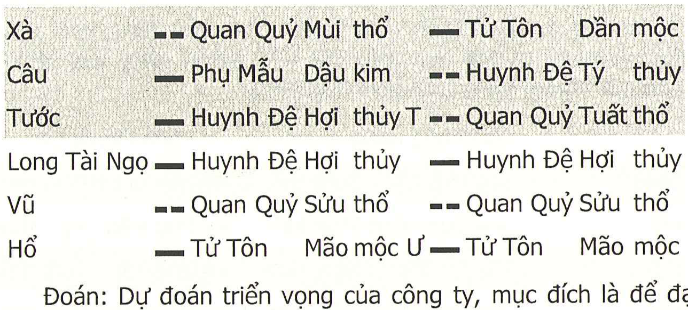
    - **Hình này chứng minh điều gì**
      - Làm sáng tỏ diễn biến cát hung và quy luật ứng nghiệm của Trạch Hỏa Cách biến Sơn Hỏa Bí đối với sự việc được hỏi.
    - **Từ đâu mà thấy được**
      - Căn cứ Thời gian lập quẻ: Ngày Ất Sửu tháng Tý năm 2000; Dụng thần đồng thời cũng khắc hào Thế. Nhìn vào Thế nào là chiêm việc này ứng việc khác?; hào động xuất hiện.

- Quái lệ thực tế:
  - Bối cảnh: **Ví dụ 4:** Ngày Mậu Tuất tháng Kỷ Mùi năm Quý Mùi, một người phụ nữ đoán cát hung về việc sinh con, được Phong Thiên Tiểu Súc biến Địa Trạch Lâm.

- Luận điểm phân tích:
  - **Đoán:** Lấy hào Tử Tôn làm Dụng thần, Tử Tôn tại ngoại quái phản ngâm, hào động hóa hồi đầu khắc, lại nhập Mộ ở Nhật, phản ngâm chủ tượng lặp đi lặp lại, Tử Tôn Không Vong hóa Tuyệt, nhất định chủ hiện tại không phải thai đầu, trước đây đã từng lưu sản tiểu hài. Nay Tử Tôn phát động, động mà gặp trị gặp hợp. Tháng sau tháng Thân Tử Tôn gặp hợp, sẽ sinh hạ hài tử. Tử Tôn hưu tù, động mà hóa hào âm, lại tại cung Tốn, Tốn lại là nữ, do đó sẽ sinh con gái. Quẻ phản ngâm tất chủ sinh con không thuận, là sinh khó.

- Luận điểm phân tích:
  - Quẻ này hào 3 Thê Tài Thìn thổ lâm Bạch Hổ phát động, sự biến hóa của hào động này hoàn toàn không có mối quan hệ với hào Tử Tôn. Sách cổ nói rằng "Tài lâm Hổ động, phó âm chí" (thư báo tang đến), có nghĩa là, Thê Tài lâm Bạch Hổ động, trong nhà sẽ có tang. Trong quẻ Thìn thổ động mà hóa thoái, lại bị Nhật xung, đề phòng lúc Thìn thổ gặp hợp. Nếu tháng Dậu không có chuyện gì phát sinh thì phải đề phòng năm Dậu người già trong nhà xảy ra vấn đề.

- Quái lệ thực tế:
  - Bối cảnh: Ngày Giáp Thân tháng Thân, người nữ này đã sinh mổ một con gái, đã từng lưu sản một thai ở năm 2002. Tháng Thìn năm Ất Dậu, mẹ người này đã qua đời vì ung thư tuyến giáp.

- Quái lệ dự đoán thực tế cho Quẻ Phong Thiên Tiểu Súc biến Địa Trạch Lâm:
  - **Hình 61.** Quẻ Phong Thiên Tiểu Súc biến Địa Trạch Lâm
    - 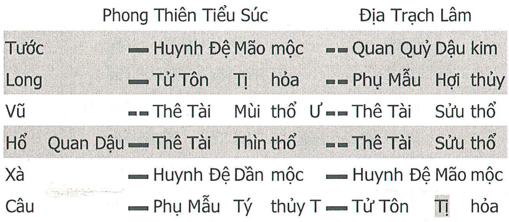
    - **Hình này chứng minh điều gì**
      - Làm sáng tỏ diễn biến cát hung và quy luật ứng nghiệm của Quẻ Phong Thiên Tiểu Súc biến Địa Trạch Lâm đối với sự việc được hỏi.
    - **Từ đâu mà thấy được**
      - Căn cứ Thời gian lập quẻ: Ngày Ất Sửu tháng Tý năm 2000; Dụng thần đồng thời cũng khắc hào Thế. Nhìn vào Thế nào là chiêm việc này ứng việc khác?; hào động xuất hiện.

- Luận điểm phân tích:
  - Rất thú vị là ở tháng Tuất năm 2003, bởi vì phải kiện đơn vị để đòi tiền lương, mẹ của người nữ này cũng đã đến tìm tôi, ở ngày Đinh Mão tháng Tuất, gieo quẻ được Hỏa Sơn Lữ.

- Luận điểm phân tích:
  - Bởi vì từ trong quẻ đoán về sinh con của con gái bà ấy, tôi đã đoán người này tại tháng Dậu có khả năng gặp hung, thế nhưng bà ấy đã trải qua tháng Dậu một cách bình an vô sự, khi bà ấy gieo ra quẻ này, một cảm giác sợ hãi lướt qua đầu tôi. Quẻ này mặc dù là hỏi về kiện tụng, nhưng hào Thế Nguyệt phá, lại bị Nhật khắc, Nhật là Tử địa của hào Thế, hỏi về kiện tụng gì đó nhưng lại có nỗi lo về tính mạng. Hào Thế Nguyệt phá, năm Ất Dậu hợp phá, tháng Thìn thực phá, ắt là không tốt. Tôi bèn nói với bà ấy rằng: "Tiền chỉ là vật ngoài thân, kiện cáo chỉ là thứ yếu, bảo dưỡng thân thể của mình mới là điều quan trọng nhất, tôi sợ rằng bà có một cửa ải ở năm 2005."

- Luồng đối thoại và phán đoán thực tế:
  - Bà ấy đáp: "Khi dự đoán về sinh con cho con gái tôi, ông nói rằng tháng trước của tôi không tốt, nhưng trên thực tế tôi đã không xảy ra chuyện gì. Hôm nay tôi không dự đoán về cát hung của mình, chắc là sẽ không có vấn đề, tôi hiện nay bệnh tật gì cũng không có. Ông cứ xem tôi có thắng kiện được không, những việc khác không cần xem."

- Luận điểm phân tích:
  - Chúng ta dự đoán cho người khác thì phải cung cấp cho đối phương một số kiến nghị hợp lý, khi thấy trong quẻ có thông tin không tốt thì phải nhắc nhở đối phương chú ý, nhưng người ta không nghe thì cũng không nên miễn cưỡng.

- Luận điểm phân tích:
  - Trong quẻ Tài lâm Ứng động ám hợp Thế, thông qua thưa kiện, đối phương (đơn vị) sẽ đồng ý trả tiền, nhưng hào Thế Nguyệt phá Nhật khắc là không có sức mạnh, mặc dù là hào Tử

- Quái lệ dự đoán thực tế cho Quẻ Hỏa Sơn Lữ:
  - **Hình 62.** Quẻ Hỏa Sơn Lữ
    - 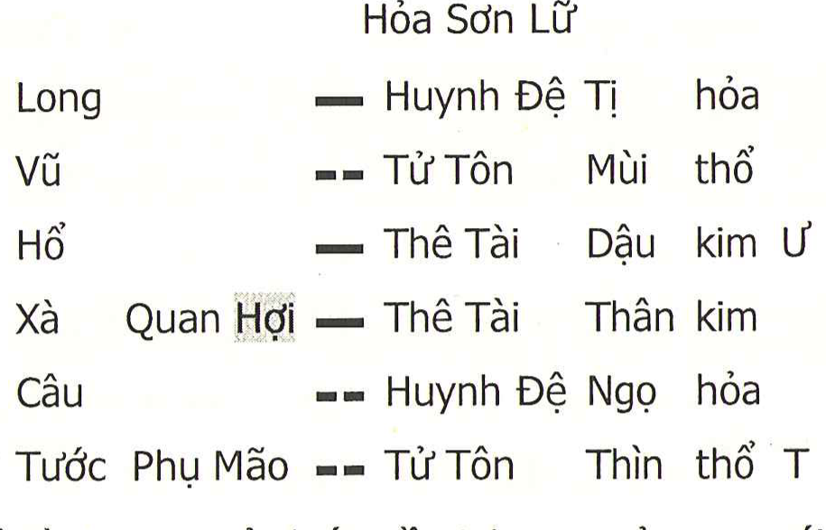
    - **Hình này chứng minh điều gì**
      - Làm sáng tỏ diễn biến cát hung và quy luật ứng nghiệm của Quẻ Hỏa Sơn Lữ đối với sự việc được hỏi.
    - **Từ đâu mà thấy được**
      - Căn cứ Thời gian lập quẻ: Ngày Ất Sửu tháng Tý năm 2000; Dụng thần đồng thời cũng khắc hào Thế. Nhìn vào Thế nào là chiêm việc này ứng việc khác?; hào động xuất hiện.

- Luận điểm phân tích:
  - Tôn nhưng không sinh nổi cho Tài, cuối cùng tiền vẫn khó đòi được.

- Kết quả ứng nghiệm thực tế:
  - Quả nhiên như dự đoán, đã thắng kiện nhưng không đòi được tiền, đơn vị đồng ý trả nhưng lần lữa không trả. Sau đó, người này đã qua đời ở tháng Thìn năm Ất Dậu. Lúc lâm chung, bản thân hối hận vì đã không nghe theo lời khuyên của tôi, bà ấy đã dặn dò con gái nhiều lần rằng sau này có sự việc gì thì phải tìm tôi xem trước. Tại năm Ất Dậu, con gái của bà ấy đến tìm tôi, khi nhắc đến chuyện đau lòng, cô ấy đã khóc đủ nửa tiếng đồng hồ.

- Quái lệ thực tế:
  - Bối cảnh: **Ví dụ 5:** Ngày Canh Thân tháng Tuất, một người đoán triển vọng phát triển của trung tâm giải trí sắp hoàn thành, được Thủy Phong Tỉnh biến Tốn Vi Phong.

- Quái lệ dự đoán thực tế cho Quẻ Thủy Phong Tỉnh biến Tốn Vi Phong:
  - **Hình 63.** Quẻ Thủy Phong Tỉnh biến Tốn Vi Phong
    - 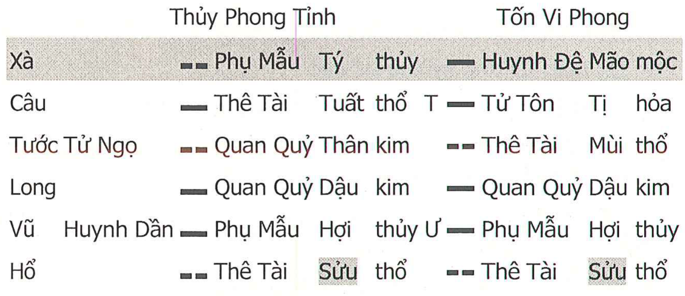
    - **Hình này chứng minh điều gì**
      - Làm sáng tỏ diễn biến cát hung và quy luật ứng nghiệm của Quẻ Thủy Phong Tỉnh biến Tốn Vi Phong đối với sự việc được hỏi.
    - **Từ đâu mà thấy được**
      - Căn cứ Thời gian lập quẻ: Ngày Ất Sửu tháng Tý năm 2000; Dụng thần đồng thời cũng khắc hào Thế. Nhìn vào Thế nào là chiêm việc này ứng việc khác?; hào động xuất hiện.

- Luận điểm phân tích:
  - **Đoán:** Thê Tài trì Thế tại hào 5, hào 5 là hào vị lãnh đạo, Tài là kinh tế, đây là tổ hợp của chủ doanh nghiệp tư nhân.

- Luận điểm phân tích:
  - Hào Tài vượng tướng, Đế Vượng tại Tý thủy, là thông tin phát tài, nhưng Phụ Mẫu Tý thủy lâm Trình Xà phát động, hóa ra Huynh Đệ. Phụ Mẫu là thông tin đơn kiện, Trình Xà là chuyện phiền phức, Huynh Đệ chủ phá tài, nên đề phòng có người gây phiền phức, khiếu nại mà phá tài.

- Luồng đối thoại và phán đoán thực tế:
  - Người này liền hồi đáp: "Tôi kinh doanh như vậy đã nhiều năm vẫn chưa từng có người tố cáo tôi." Kết quả là ngày hôm sau anh ta gọi đến, nói là trung tâm giải trí đang lắp đặt thiết bị thì đột nhiên có người tố cáo anh ta, nói là công nhân không có biện pháp an toàn, đã bị niêm phong, sau này phải tốn rất nhiều tiền mới giải quyết được chuyện này.

- Luận điểm phân tích:
  - ---

## Chương 3: Những thắc mắc liên quan đến hào động

### Câu hỏi 1: Xem quẻ độc tĩnh, quẻ độc phát như thế nào?

- Giải đáp trọng tâm:
  - Về vấn đề độc tĩnh độc phát, người xưa cũng đã từng bàn luận, nhưng phần lớn là bàn luận theo góc độ ứng kỳ. Trong "Hải Để Nhãn" có khẩu quyết một hào đoán sự việc, nhưng cũng không bàn cụ thể về vấn đề này.

- Luận điểm phân tích:
  - Qua thời gian dài thực hành và nghiên cứu, tôi phát hiện độc tĩnh độc phát không những có liên quan đến ứng kỳ của sự việc mà còn có liên quan đến nguyên nhân và thành bại của sự việc phán đoán.

- Luận điểm phân tích:
  - Hào độc phát có một số tác dụng sau đây:

- Luận điểm phân tích:
  - (1) Biểu thị ứng kỳ của sự việc.

- Luận điểm phân tích:
  - (2) Biểu thị nguyên nhân và tính chất của sự việc.

- Luận điểm phân tích:
  - (3) Làm nhẹ vai trò của ngũ hành sinh khắc, lấy tượng làm chủ, biểu thị cát hung của sự việc.

- Luận điểm phân tích:
  - (4) Chiêm việc này ứng việc khác, phản ánh ra sự việc quan trọng hơn mà người xem không hỏi.

- Luận điểm phân tích:
  - Hào độc tĩnh có một số tác dụng sau đây:

- Luận điểm phân tích:
  - (1) Biểu thị ứng kỳ của sự việc.

- Luận điểm phân tích:
  - (2) Biểu thị nguyên nhân và tính chất của sự việc.

- Luận điểm phân tích:
  - Dưới đây tôi xin đưa ra một số quái lệ để mọi người hiểu rõ hơn vấn đề này.

- Luận điểm phân tích:
  - **Độc phát chủ ứng kỳ:** Thông thường là ứng với trị hào động hoặc là hợp hào động, tức là động mà gặp trị gặp hợp. Lấy độc phát đoán ứng kỳ, thông thường thì mối quan hệ giữa hào động này và Dụng thần khá chặt chẽ, đương nhiên cũng không loại trừ hào không có mối quan hệ với Dụng thần làm ứng kỳ.

- Quái lệ thực tế:
  - Bối cảnh: **Ví dụ 1:** Ngày Kỷ Sửu tháng Nhâm Thân năm Giáp Thân, một người phụ nữ đoán bệnh của con chó, được Đoài Vi Trạch biến Lôi Trạch Quy Muội.

- Quái lệ dự đoán thực tế cho Đoài Vi Trạch biến Lôi Trạch Quy Muội:
  - **Hình 64.** Đoài Vi Trạch biến Lôi Trạch Quy Muội
    - 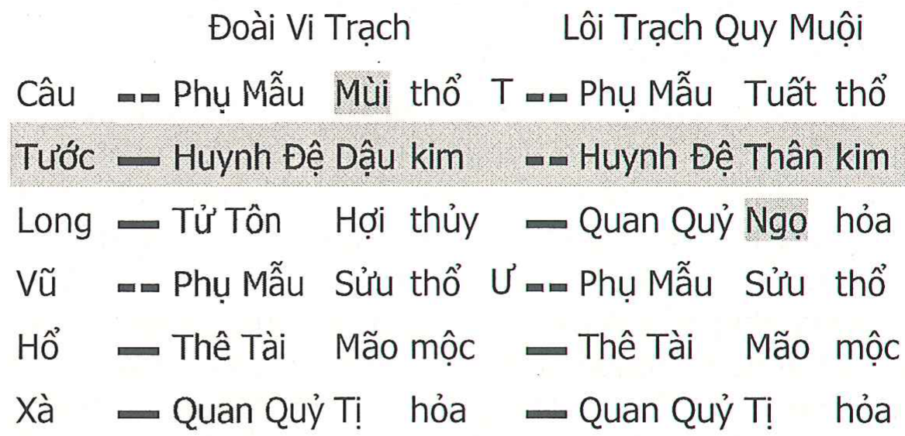
    - **Hình này chứng minh điều gì**
      - Làm sáng tỏ diễn biến cát hung và quy luật ứng nghiệm của Đoài Vi Trạch biến Lôi Trạch Quy Muội đối với sự việc được hỏi.
    - **Từ đâu mà thấy được**
      - Căn cứ Thời gian lập quẻ: Ngày Kỷ Sửu tháng Nhâm Thân năm Giáp Thân; Dụng thần khá chặt chẽ. Nhìn vào hào Thế nhập Mộ ứng xung; hào động hoặc là hợp hào động.

- Kết quả ứng nghiệm thực tế:
  - Lấy hào Tử Tôn làm Dụng thần, Nguyệt sinh Nhật khắc suy vượng tương đương, Nguyên thần phát động đến sinh, lẽ ra có thể trợ vượng sức lực của Dụng thần, nhưng Nguyên thần động mà hóa thoái, đây là một hào độc phát, biểu thị sức khỏe của con chó này dần dần suy yếu, ngày một yếu đi. Sau đó con chó này đã chết ở tháng Dậu năm Ất Dậu.

- Luận điểm phân tích:
  - Năm và tháng đều đã ứng độc phát. Sự liên hệ giữa hào động và Dụng thần trong quẻ này là hết sức chặt chẽ, do đó độc phát chủ ứng kỳ.

- Quái lệ thực tế:
  - Bối cảnh: **Ví dụ 2:** Ngày Giáp Dần tháng Dần, một người đàn ông dự đoán về buôn bán thép, được Phong Địa Quan biến Phong Sơn Tiệm.

- Quái lệ dự đoán thực tế cho Phong Địa Quan biến Phong Sơn Tiệm:
  - **Hình 65.** Phong Địa Quan biến Phong Sơn Tiệm
    - 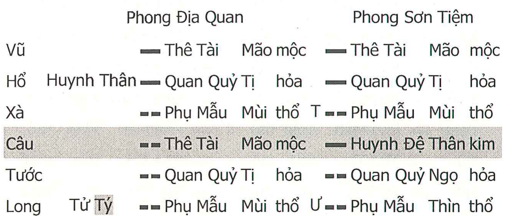
    - **Hình này chứng minh điều gì**
      - Làm sáng tỏ diễn biến cát hung và quy luật ứng nghiệm của Phong Địa Quan biến Phong Sơn Tiệm đối với sự việc được hỏi.
    - **Từ đâu mà thấy được**
      - Căn cứ Thời gian lập quẻ: Ngày Kỷ Sửu tháng Nhâm Thân năm Giáp Thân; Dụng thần khá chặt chẽ. Nhìn vào hào Thế nhập Mộ ứng xung; hào động hoặc là hợp hào động.

- Luận điểm phân tích:
  - Lấy hào Tài làm Dụng thần, hào Tài được Nhật Nguyệt tỉ phù là vượng tướng, nhưng không nên Dụng thần độc phát hóa Tuyệt, nhất định sẽ có tổn thất lớn. Người này không nghe, vẫn đi buôn thép sống, kết quả là bắt đầu từ tháng Mão đã liên tục lỗ vốn,

- Luận điểm phân tích:
  - **Độc phát chủ cát hung:** Nếu trong quẻ chỉ có một hào động (không tính hào ám động) thì khi phán đoán cát hung của sự việc phải hết sức cẩn thận. Bởi vì quẻ độc phát giống như đã làm nhẹ quy luật ngũ hành sinh khắc, thay vào đó là tượng chiếm địa vị chủ đạo. Cũng tức là 12 cung trường sinh có vai trò rất quan trọng khi phán đoán cát hung trong quẻ. Trường Sinh, Mộc Dục, Đế Vượng phần lớn là thông tin cát. Tử, Mộ, Tuyệt phần lớn là thông tin hung. Có quẻ Dụng thần cho dù rất nhược, nhưng gặp được Trường Sinh, Mộc Dục, Lâm Quan, Đế Vượng thì sẽ xuất hiện cơ hội sống; có quẻ Dụng thần vượng tướng, nhưng gặp phải Tử, Mộ, Tuyệt thì sẽ có chiều hướng xấu. Trong thực tiễn, tôi phát hiện Tử là thông tin xấu nhất, tiếp đó là Tuyệt, sau cùng mới là Mộ, mức độ cát hung có sự khác nhau.

- Luận điểm phân tích:
  - Có hai tình huống hào độc phát chủ cát hung. Một là hào không phải Dụng thần phát động ảnh hưởng đến Dụng thần theo góc độ tượng. Hai là Dụng thần tự mình phát động, hào biến phát sinh ảnh hưởng đối với Dụng thần. Sau đây tôi xin đưa ra một số quái lệ.

- Quái lệ thực tế:
  - Bối cảnh: **Ví dụ 1:** Ngày Tân Sửu tháng Tị, một người chiêm cát hung của việc đi xa, được Hỏa Thiên Đại Hữu biến Lôi Thiên Đại Tráng.

- Quái lệ dự đoán thực tế cho Hỏa Thiên Đại Hữu biến Lôi Thiên Đại Tráng:
  - **Hình 66.** Hỏa Thiên Đại Hữu biến Lôi Thiên Đại Tráng
    - 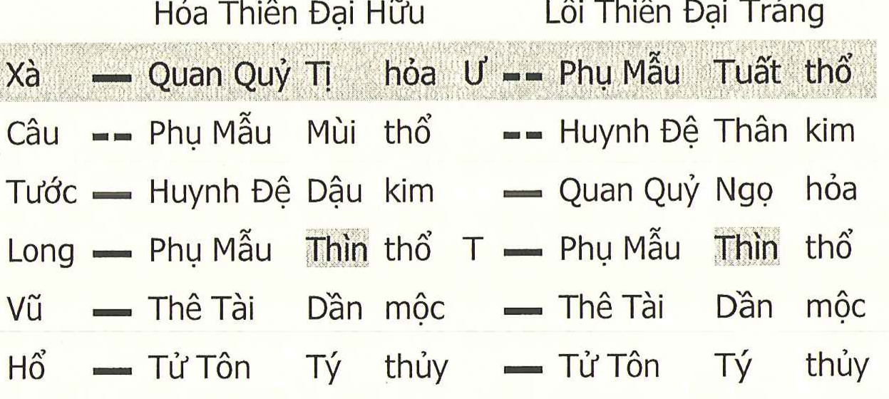
    - **Hình này chứng minh điều gì**
      - Làm sáng tỏ diễn biến cát hung và quy luật ứng nghiệm của Hỏa Thiên Đại Hữu biến Lôi Thiên Đại Tráng đối với sự việc được hỏi.
    - **Từ đâu mà thấy được**
      - Căn cứ Thời gian lập quẻ: Ngày Kỷ Sửu tháng Nhâm Thân năm Giáp Thân; Dụng thần khá chặt chẽ. Nhìn vào hào Thế nhập Mộ ứng xung; hào động hoặc là hợp hào động.

- Luận điểm phân tích:
  - Đây là quẻ của một Dịch hữu ở Đông Bắc hỏi tôi. Quẻ này là một hào độc phát, xem theo ngũ hành sinh khắc, dự đoán xuất hành, Ứng là nơi đến, hào Thế vượng tướng, Ứng động sinh Thế, nhất định là cát. Nhưng trên thực tế người này đi xa ở ngày Ất Tị đã gặp phải tai nạn xe cộ và chết.

- Luận điểm phân tích:
  - Xem theo tượng, Quan Quỷ Tị hỏa độc phát, không phải sinh hào Thế mà là Tuyệt hào Thế, đi xa nhất định lành ít dữ nhiều. Nay Tị hỏa Không Vong, xuất Không sẽ không tốt. Đồng thời ứng kỳ cũng là đã ứng độc phát.

- Quái lệ thực tế:
  - Bối cảnh: Ví dụ dưới đây có điểm rất giống với ví dụ này.

- Quái lệ thực tế:
  - Bối cảnh: **Ví dụ 2:** Ngày Đinh Sửu tháng Ngọ, học viên Sử Vĩ Dân của tôi hỏi một quẻ, một người phụ nữ đoán bệnh của cha, được Thiên Địa Bĩ biến Thiên Thủy Tụng.

- Quái lệ dự đoán thực tế cho Thiên Địa Bĩ biến Thiên Thủy Tụng:
  - **Hình 67.** Thiên Địa Bĩ biến Thiên Thủy Tụng
    - 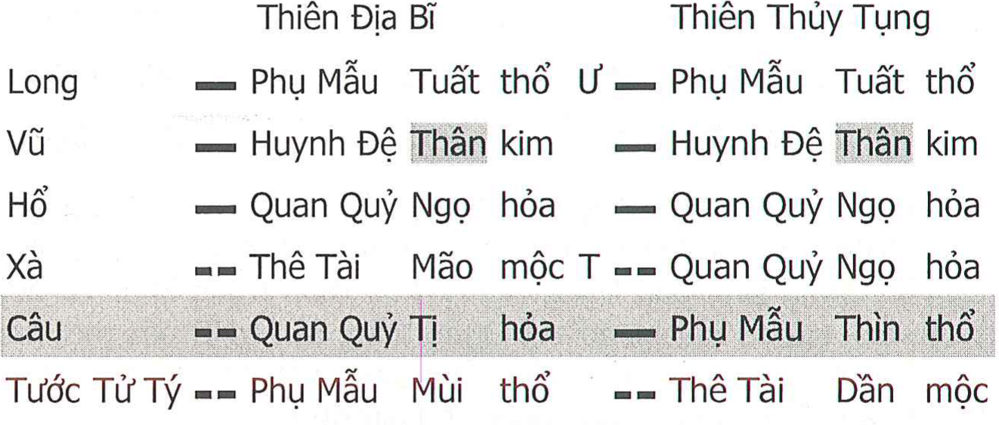
    - **Hình này chứng minh điều gì**
      - Làm sáng tỏ diễn biến cát hung và quy luật ứng nghiệm của Thiên Địa Bĩ biến Thiên Thủy Tụng đối với sự việc được hỏi.
    - **Từ đâu mà thấy được**
      - Căn cứ Thời gian lập quẻ: Ngày Kỷ Sửu tháng Nhâm Thân năm Giáp Thân; Dụng thần khá chặt chẽ. Nhìn vào hào Thế nhập Mộ ứng xung; hào động hoặc là hợp hào động.

- Luận điểm phân tích:
  - Lấy hào Phụ Mẫu làm Dụng thần. Trong quẻ Phụ Mẫu lưỡng hiện, lấy hào Phụ Mẫu Mùi thổ ám động làm Dụng. Quan Quỷ Tị hỏa một hào độc phát, luận Tuyệt không luận sinh, bệnh này rất hung, Tuyệt địa lâm Câu Trần, Câu Trần chủ ung thư, do đó nhận định đầu tiên của tôi là người này bị ung thư, hơn nữa rất hung, mệnh sẽ không lâu dài. Dụng thần lâm hào sơ ám động, hào sơ là chân, người này thích chạy ngược chạy xuôi, lâm Chu Tước, Chu Tước chủ nói, chứng tỏ đã bị bệnh nhưng vẫn đi lại khắp nơi tìm người tán gẫu. Kỵ thần là mộc tại hào 3 chủ gan, ung thư là bệnh lâu, bệnh lâu sợ xung, Nhật xung Dụng thần, đối với Dụng thần bất lợi, Nhật Sửu thổ cũng là gan, do đó là ung thư gan.

- Kết quả ứng nghiệm thực tế:
  - Tôi đoán người này tháng Mùi không chết thì tháng Thân tất chết. Sau đó, người này đã chết ở ngày Canh Thân tháng Mùi. Đây là ứng Dụng thần gặp tháng trị, hào độc phát gặp ngày hợp.

- Quái lệ thực tế:
  - Bối cảnh: **Ví dụ 3:** Ngày Quý Mão tháng Hợi, bởi vì đơn vị của con xảy ra biến động, mẹ dự đoán con có giữ được công việc hay không? Tôi gieo quẻ được Thủy Trạch Tiết biến Khảm Vi Thủy.

- Quái lệ dự đoán thực tế cho Thủy Trạch Tiết biến Khảm Vi Thủy:
  - **Hình 68.** Thủy Trạch Tiết biến Khảm Vi Thủy
    - 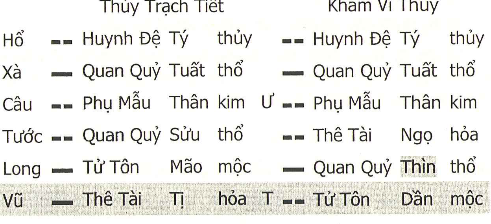
    - **Hình này chứng minh điều gì**
      - Làm sáng tỏ diễn biến cát hung và quy luật ứng nghiệm của Thủy Trạch Tiết biến Khảm Vi Thủy đối với sự việc được hỏi.
    - **Từ đâu mà thấy được**
      - Căn cứ Thời gian lập quẻ: Ngày Kỷ Sửu tháng Nhâm Thân năm Giáp Thân; Dụng thần khá chặt chẽ. Nhìn vào hào Thế nhập Mộ ứng xung; hào động hoặc là hợp hào động.

- Luận điểm phân tích:
  - **Đoán:** Lấy Quan Quỷ làm Dụng thần, trong quẻ Quan Quỷ lưỡng hiện, lấy hào Quan Quỷ Tuất thổ hợp Nhật làm Dụng, Nhật Nguyệt không sinh phù Dụng thần, Nhật thần trong khắc có hợp là cản trở, cực kỳ bất lợi đối với Dụng thần, hào sơ Tị hỏa một hào độc phát, Dụng thần lâm Tuyệt, công việc nhất định sẽ mất, ngày Ất Tị phản hồi công việc đã không thể giữ được.

- Quái lệ thực tế:
  - Bối cảnh: **Ví dụ 4:** Ngày Giáp Dần tháng Dần, một người phụ nữ đoán tình cảm với một người đàn ông sẽ phát triển ra sao? Được quẻ Hỏa Phong Đỉnh biến Lôi Phong Hằng.

- Quái lệ dự đoán thực tế cho Hỏa Phong Đỉnh biến Lôi Phong Hằng:
  - **Hình 69.** Hỏa Phong Đỉnh biến Lôi Phong Hằng
    - 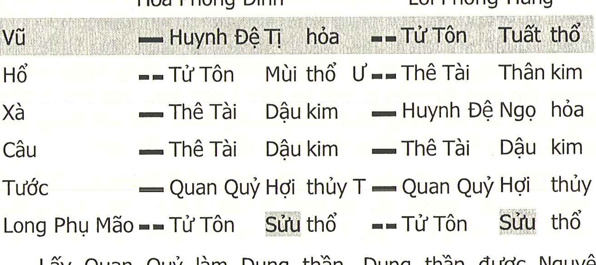
    - **Hình này chứng minh điều gì**
      - Làm sáng tỏ diễn biến cát hung và quy luật ứng nghiệm của Hỏa Phong Đỉnh biến Lôi Phong Hằng đối với sự việc được hỏi.
    - **Từ đâu mà thấy được**
      - Căn cứ Thời gian lập quẻ: Ngày Kỷ Sửu tháng Nhâm Thân năm Giáp Thân; Dụng thần khá chặt chẽ. Nhìn vào hào Thế nhập Mộ ứng xung; hào động hoặc là hợp hào động.

- Luận điểm phân tích:
  - Lấy Quan Quỷ làm Dụng thần, Dụng thần được Nguyệt tương hợp lẽ ra là vượng, nhưng không nên hào 6 Tị hỏa độc phát, Dụng thần lâm Tuyệt, hai người chắc chắn khó mà lâu dài, Quan hợp Nhật Phụ Mẫu, người đàn ông này là người đã kết hôn.

- Kết quả ứng nghiệm thực tế:
  - Kết quả là chia tay ở ngày Kỷ Mão.

- Quái lệ thực tế:
  - Bối cảnh: **Ví dụ 5:** Ngày Mậu Tuất tháng Sửu, một người đàn ông đoán cục thuế đến kiểm toán thì sẽ ra sao? Được Hỏa Thủy Vị Tế biến Lôi Thủy Giải.

- Quái lệ dự đoán thực tế cho Hỏa Thủy Vị Tế biến Lôi Thủy Giải:
  - **Hình 70.** Hỏa Thủy Vị Tế biến Lôi Thủy Giải
    - 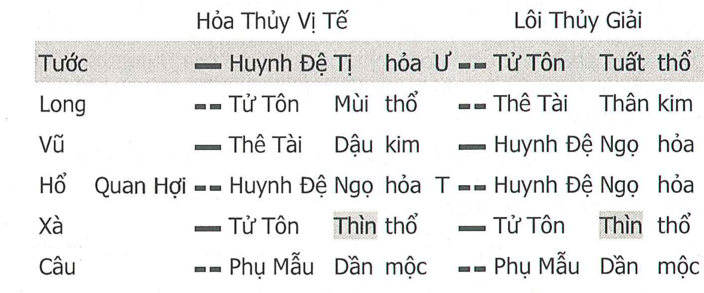
    - **Hình này chứng minh điều gì**
      - Làm sáng tỏ diễn biến cát hung và quy luật ứng nghiệm của Hỏa Thủy Vị Tế biến Lôi Thủy Giải đối với sự việc được hỏi.
    - **Từ đâu mà thấy được**
      - Căn cứ Thời gian lập quẻ: Ngày Kỷ Sửu tháng Nhâm Thân năm Giáp Thân; Dụng thần khá chặt chẽ. Nhìn vào hào Thế nhập Mộ ứng xung; hào động hoặc là hợp hào động.

- Luận điểm phân tích:
  - **Đoán:** Lấy Quan Quỷ làm nhân viên cục thuế, xem tình hình giữa Quan Quỷ và hào Thế. Quỷ Hợi thủy mặc dù khắc Thế, nhưng phục mà không hiện, bị Nhật Nguyệt khắc chế, Tị hỏa độc phát lại là Tuyệt địa, vô lực khắc chế hào Thế, nhất định sẽ không làm khó dễ mình, không tìm ra vấn đề, sau đó quả nhiên không tìm ra vấn đề gì.

- Quái lệ thực tế:
  - Bối cảnh: **Ví dụ 6:** Ngày Giáp Tuất tháng Mùi, một người có con bị bắt cóc chiêm tình hình cát hung, được Thủy Địa Tỷ biến Phong Địa Quan.

- Quái lệ dự đoán thực tế cho Thủy Địa Tỷ biến Phong Địa Quan:
  - **Hình 71.** Thủy Địa Tỷ biến Phong Địa Quan
    - 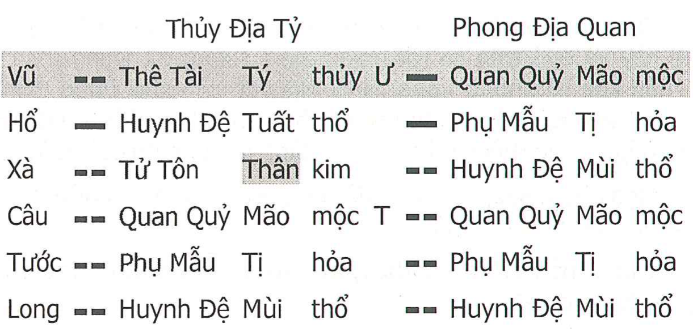
    - **Hình này chứng minh điều gì**
      - Làm sáng tỏ diễn biến cát hung và quy luật ứng nghiệm của Thủy Địa Tỷ biến Phong Địa Quan đối với sự việc được hỏi.
    - **Từ đâu mà thấy được**
      - Căn cứ Thời gian lập quẻ: Ngày Kỷ Sửu tháng Nhâm Thân năm Giáp Thân; Dụng thần khá chặt chẽ. Nhìn vào hào Thế nhập Mộ ứng xung; hào động hoặc là hợp hào động.

- Luận điểm phân tích:
  - Đây là quái lệ do một Dịch hữu cung cấp.

- Luận điểm phân tích:
  - Xem cát hung của con, lấy hào Tử Tôn làm Dụng thần. Tử Tôn Không Vong lâm Trình Xà, Không Vong biểu thị mất, sợ hãi, tâm hư, Trình Xà biểu thị sợi dây trói buộc, nhát gan. Đây là

- Luận điểm phân tích:
  - Nếu lấy ngũ hành sinh khắc thông thường để xem, Nhật Nguyệt sinh phù Tử Tôn, Tử Tôn xuất Không thì có thể trở về, nhưng quẻ này hào 6 Tý thủy độc phát, quẻ độc phát chủ yếu lấy tượng để phân biệt cát hung, Tý thủy là Tử địa của Dụng thần, Tử địa độc phát, nhất định là hung. Tình hình thực tế, đứa trẻ bị bọn bắt cóc giết.

- Quái lệ thực tế:
  - Bối cảnh: **Ví dụ 7:** Ngày Quý Mùi tháng Mùi, con trai của một người ra ngoài hai ngày không về nhà, hỏi cát hung ra sao? Được Cấn Vi Sơn biến Phong Sơn Tiệm.

- Quái lệ dự đoán thực tế cho Cấn Vi Sơn biến Phong Sơn Tiệm:
  - **Hình 72.** Cấn Vi Sơn biến Phong Sơn Tiệm
    - 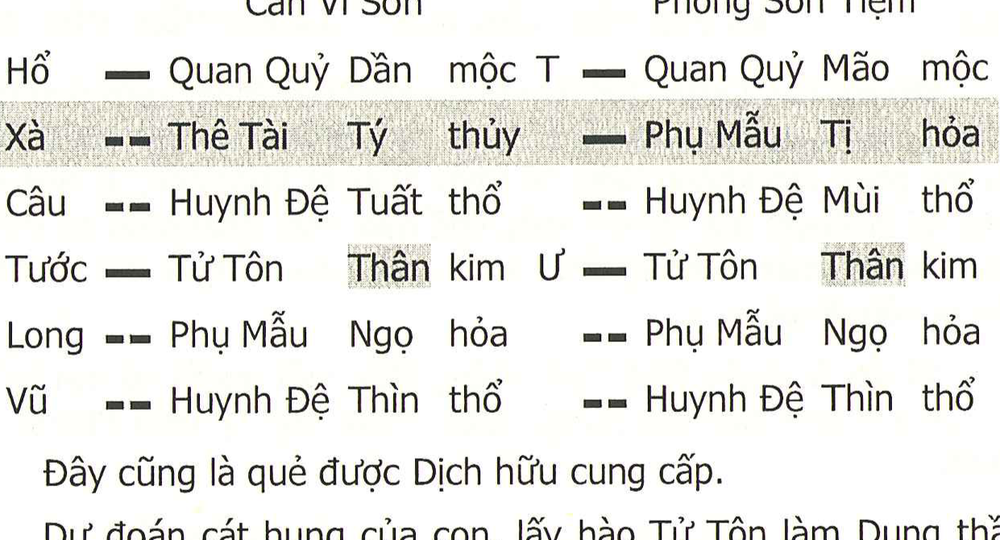
    - **Hình này chứng minh điều gì**
      - Làm sáng tỏ diễn biến cát hung và quy luật ứng nghiệm của Cấn Vi Sơn biến Phong Sơn Tiệm đối với sự việc được hỏi.
    - **Từ đâu mà thấy được**
      - Căn cứ Thời gian lập quẻ: Ngày Kỷ Sửu tháng Nhâm Thân năm Giáp Thân; Dụng thần khá chặt chẽ. Nhìn vào hào Thế nhập Mộ ứng xung; hào động hoặc là hợp hào động.

- Luận điểm phân tích:
  - Đây cũng là quẻ được Dịch hữu cung cấp.

- Luận điểm phân tích:
  - Dự đoán cát hung của con, lấy hào Tử Tôn làm Dụng thần. Quẻ này và quẻ trên có rất nhiều điểm tương tự, Dụng thần đều là Thân kim lại Không Vong, Nhật Nguyệt sinh phù Dụng thần, có vẻ như vượng tướng, nhưng Tý thủy một hào độc phát, Dụng thần gặp Tử địa, hỏi cát hung nhất định là hung nhiều cát ít.

- Luận điểm phân tích:
  - Ngày hôm sau, người ta đã tìm được thi thể của đứa trẻ, hóa ra là đứa trẻ bị chết đuối.

- Luận điểm phân tích:
  - Dụng thần Tử tại Tý thủy, đứa trẻ chết ở trong nước, có thể nói là thần nghiệm.

- Quái lệ thực tế:
  - Bối cảnh: **Ví dụ 8:** Ngày Đinh Mão tháng Thìn, một người đoán mở cửa hàng quần áo sẽ ra sao? Được Hỏa Địa Tấn biến Hỏa Lôi Phệ Hạp.

- Quái lệ dự đoán thực tế cho Quẻ Hỏa Địa Tấn biến Hỏa Lôi Phệ Hạp:
  - **Hình 73.** Quẻ Hỏa Địa Tấn biến Hỏa Lôi Phệ Hạp
    - 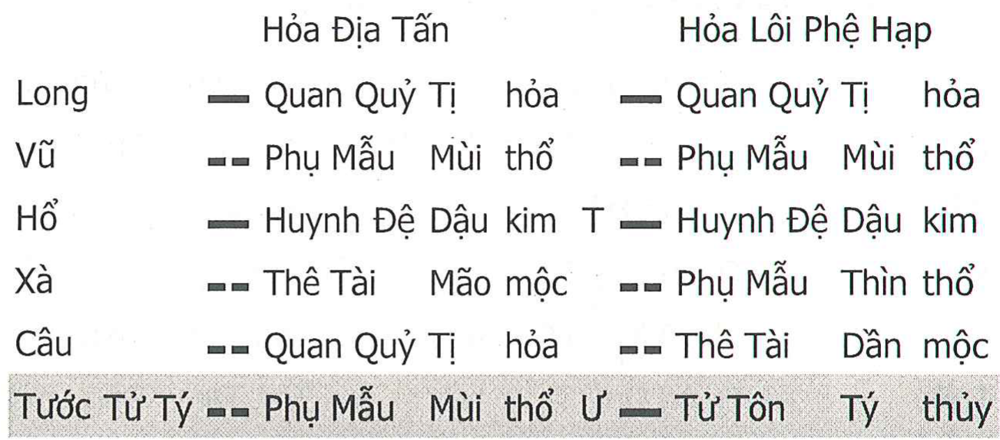
    - **Hình này chứng minh điều gì**
      - Làm sáng tỏ diễn biến cát hung và quy luật ứng nghiệm của Quẻ Hỏa Địa Tấn biến Hỏa Lôi Phệ Hạp đối với sự việc được hỏi.
    - **Từ đâu mà thấy được**
      - Căn cứ Thời gian lập quẻ: Ngày Kỷ Sửu tháng Nhâm Thân năm Giáp Thân; Dụng thần khá chặt chẽ. Nhìn vào hào Thế nhập Mộ ứng xung; hào động hoặc là hợp hào động.

- Luận điểm phân tích:
  - Lấy Thê Tài làm Dụng thần, Nguyệt kiến không sinh Dụng thần, cũng không khắc Dụng thần, Dụng thần được Nhật tỉ phù là vượng, nhưng không nên Mộ khố lâm hào Ứng độc phát, phán đoán quẻ độc phát lấy tượng làm chủ, Dụng thần nhập Mộ, lại thêm Huynh Đệ Dậu kim lâm hào Thế ám động, mở cửa hàng nhất định không thể cầu được tài. Ứng là khách hàng, đối với Dụng thần bất lợi, khách hàng rất ít.

- Luận điểm phân tích:
  - Tình hình thực tế, bởi vì ít khách hàng, cửa hàng lại bị người ta ăn trộm, đành phải chuyển nhượng nghỉ bán.

- Quái lệ thực tế:
  - Bối cảnh: **Ví dụ 9:** Ngày Canh Ngọ tháng Dần, một người đoán mở quán trà sẽ ra sao? Được Lôi Trạch Quy Muội biến Địa Trạch Lâm.

- Quái lệ dự đoán thực tế cho Quẻ Lôi Trạch Quy Muội biến Địa Trạch Lâm:
  - **Hình 74.** Quẻ Lôi Trạch Quy Muội biến Địa Trạch Lâm
    - 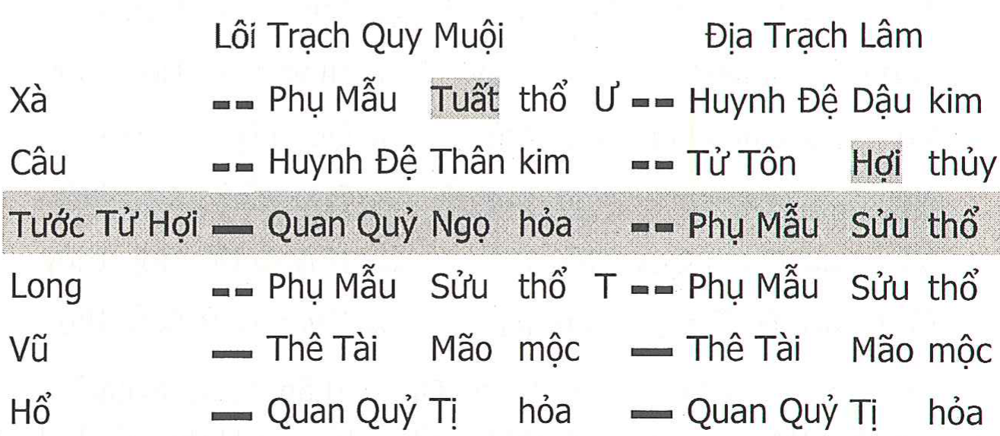
    - **Hình này chứng minh điều gì**
      - Làm sáng tỏ diễn biến cát hung và quy luật ứng nghiệm của Quẻ Lôi Trạch Quy Muội biến Địa Trạch Lâm đối với sự việc được hỏi.
    - **Từ đâu mà thấy được**
      - Căn cứ Thời gian lập quẻ: Ngày Kỷ Sửu tháng Nhâm Thân năm Giáp Thân; Dụng thần khá chặt chẽ. Nhìn vào hào Thế nhập Mộ ứng xung; hào động hoặc là hợp hào động.

- Luận điểm phân tích:
  - Lấy hào Tài làm Dụng thần, Dụng thần được Nguyệt trợ giúp là vượng tướng, nhưng không nên Quan Quỷ Ngọ hỏa độc phát, Tài gặp Tử địa, nhất định không thể cầu được tài, sau đó mở

- Quái lệ thực tế:
  - Bối cảnh: **Ví dụ 10:** Ngày Ất Sửu tháng Dần, một người đoán niên vận, được Thiên Địa Bĩ biến Thiên Lôi Vô Vọng.

- Quái lệ dự đoán thực tế cho Quẻ Thiên Địa Bĩ biến Thiên Lôi Vô Vọng:
  - **Hình 75.** Quẻ Thiên Địa Bĩ biến Thiên Lôi Vô Vọng
    - 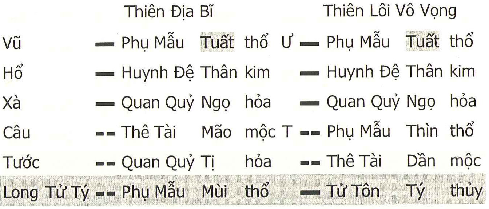
    - **Hình này chứng minh điều gì**
      - Làm sáng tỏ diễn biến cát hung và quy luật ứng nghiệm của Quẻ Thiên Địa Bĩ biến Thiên Lôi Vô Vọng đối với sự việc được hỏi.
    - **Từ đâu mà thấy được**
      - Căn cứ Thời gian lập quẻ: Ngày Kỷ Sửu tháng Nhâm Thân năm Giáp Thân; Dụng thần khá chặt chẽ. Nhìn vào hào Thế nhập Mộ ứng xung; hào động hoặc là hợp hào động.

- Luận điểm phân tích:
  - Quẻ niên vận lấy cát hung làm trọng điểm đầu tiên, Tài Quan thứ hai, quẻ này một hào độc phát, hào Thế nhập Mộ là tượng đại hung, may được Nhật thần xung khai Mộ khố, không đến mức chết, hào Thế nhập Mộ ứng xung, tháng Dậu cần đề phòng bệnh tai phát sinh. Trên thực tế, ở tháng Dậu, người này bị viêm tai giữa, lại suýt bị xe hơi tông chết.

- Quái lệ thực tế:
  - Bối cảnh: **Ví dụ 11:** Ngày Mậu Ngọ tháng Dần, một người đàn ông đoán tình hình tài vận, được Địa Thủy Sư biến Địa Phong Thăng.

- Quái lệ dự đoán thực tế cho Quẻ Địa Thủy Sư biến Địa Phong Thăng:
  - **Hình 76.** Quẻ Địa Thủy Sư biến Địa Phong Thăng
    - 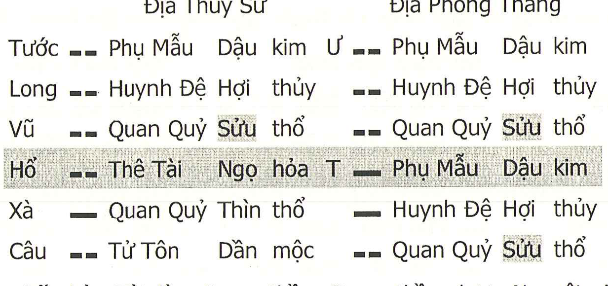
    - **Hình này chứng minh điều gì**
      - Làm sáng tỏ diễn biến cát hung và quy luật ứng nghiệm của Quẻ Địa Thủy Sư biến Địa Phong Thăng đối với sự việc được hỏi.
    - **Từ đâu mà thấy được**
      - Căn cứ Thời gian lập quẻ: Ngày Kỷ Sửu tháng Nhâm Thân năm Giáp Thân; Dụng thần khá chặt chẽ. Nhìn vào hào Thế nhập Mộ ứng xung; hào động hoặc là hợp hào động.

- Luận điểm phân tích:
  - Lấy hào Tài làm Dụng thần, Dụng thần được Nguyệt sinh phù được Nhật tỉ phù, là vượng tướng, nhưng không nên Dụng thần độc phát hóa Tử địa, do đó tài vận chắc chắn không tốt. Trên thực tế, người này làm thuê ở một cửa hàng kim khí, tiền lương mỗi tháng chỉ có 3 đến 4 trăm tệ, cuộc sống rất khó khăn.

- Luận điểm phân tích:
  - **Tình huống Dụng thần độc phát lấy tượng chủ cát hung:** Dụng thần độc phát, nên hóa Trường Sinh, hóa hồi đầu sinh, hóa Tiến thần, không nên hóa Tử, Mộ, Tuyệt.

- Quái lệ thực tế:
  - Bối cảnh: **Ví dụ:** Ngày Kỷ Tị tháng Thân, một người đoán bà ngoại làm phẫu thuật (do bị ngã) có nguy hiểm gì không? Được Trạch Thủy Khốn biến Trạch Địa Tụy.

- Luận điểm phân tích:
  - Đây là quái lệ của học viên hỏi ở trong lớp trên mạng. Quái lệ này thuộc phạm vi độc phát tượng chủ cát hung.

- Luận điểm phân tích:
  - Dự đoán cát hung của bà ngoại, lấy hào Phụ Mẫu làm Dụng thần. Trong quẻ Phụ Mẫu lưỡng hiện, lấy hào Phụ Mẫu Thìn thổ phát động làm Dụng, Dụng thần độc phát, không lấy suy vượng định cát hung, mà là lấy tượng để phán đoán, Dụng thần động mà hóa ra Tị hỏa, xem là hóa Tuyệt, không xem là hóa hồi đầu sinh, do đó quẻ này nhất định ứng hung, lâm Bạch Hổ, Bạch Hổ có ý nghĩa là điệt đả tổn thương và phẫu thuật.

- Luận điểm phân tích:
  - Tình hình thực tế: Bà ngoại của người này phẫu thuật xong thì chết.

- Luận điểm phân tích:
  - **Tình huống độc phát biểu thị nguyên nhân và tính chất:** Hào độc phát đôi khi không biểu thị ứng kỳ, cũng không biểu thị cát hung, mà là biểu thị nguyên nhân của sự việc dự đoán.

- Quái lệ dự đoán thực tế cho Trạch Thủy Khốn biến Trạch Địa Tụy:
  - **Hình 77.** Trạch Thủy Khốn biến Trạch Địa Tụy
    - 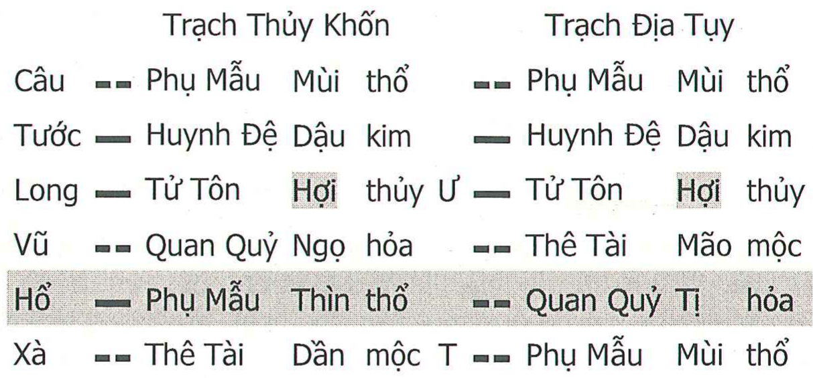
    - **Hình này chứng minh điều gì**
      - Làm sáng tỏ diễn biến cát hung và quy luật ứng nghiệm của Trạch Thủy Khốn biến Trạch Địa Tụy đối với sự việc được hỏi.
    - **Từ đâu mà thấy được**
      - Căn cứ Thời gian lập quẻ: Ngày Kỷ Sửu tháng Nhâm Thân năm Giáp Thân; Dụng thần khá chặt chẽ. Nhìn vào hào Thế nhập Mộ ứng xung; hào động hoặc là hợp hào động.

- Quái lệ thực tế:
  - Bối cảnh: **Ví dụ 1:** Ngày Nhâm Dần tháng Mùi, một Dịch hữu trên mạng đoán bệnh, được Phong Hỏa Gia Nhân biến Phong Lôi Ích.

- Luận điểm phân tích:
  - **Đoán:** Lấy hào Thế làm Dụng thần, hào Thế Nguyệt phá Nhật khắc là hưu tù, lấy ngũ hành suy vượng để xem, bệnh này tất hung, nhưng đây là quẻ một hào độc phát, lấy tượng làm chủ, hào 3 Hợi thủy phát động, là đất Lâm Quan của hào Thế, có bệnh không sao, hào độc phát lâm Chu Tước chủ viêm, hào 2 là bộ vị bộ phận sinh dục, thủy tại nội quái là nước tiểu, tổng hợp phán đoán, tôi đoán anh ta bị viêm niệu đạo, tháng Thân có thể chuyển biến tốt, đây là hào Thế Nguyệt phá, ra khỏi tháng bất phá.

- Luận điểm phân tích:
  - Anh ta nói đúng là viêm niệu đạo.

- Quái lệ thực tế:
  - Bối cảnh: **Ví dụ 2:** Ngày Mậu Tý tháng Thân, một người đàn ông đoán bệnh, được Sơn Phong Cổ biến Cấn Vi Sơn.

- Luận điểm phân tích:
  - Lấy hào Thế làm Dụng thần, hào Thế được Nguyệt phù là vượng tướng, có bệnh cũng không sao. Phụ Mẫu Hợi thủy độc phát là Bệnh địa của hào Thế, hào độc phát biểu thị tính chất nguyên nhân, cho nên lấy Bệnh địa làm căn cứ phán đoán bệnh

- Quái lệ dự đoán thực tế cho Phong Hỏa Gia Nhân biến Phong Lôi Ích:
  - **Hình 78.** Phong Hỏa Gia Nhân biến Phong Lôi Ích
    - 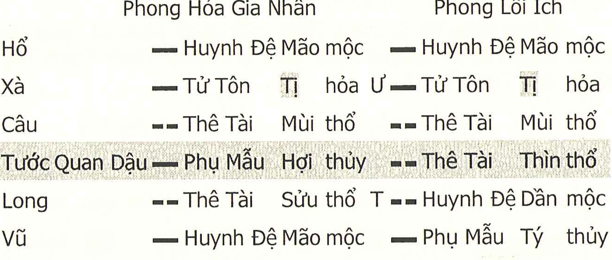
    - **Hình này chứng minh điều gì**
      - Làm sáng tỏ diễn biến cát hung và quy luật ứng nghiệm của Phong Hỏa Gia Nhân biến Phong Lôi Ích đối với sự việc được hỏi.
    - **Từ đâu mà thấy được**
      - Căn cứ Thời gian lập quẻ: Ngày Kỷ Sửu tháng Nhâm Thân năm Giáp Thân; Dụng thần khá chặt chẽ. Nhìn vào hào Thế nhập Mộ ứng xung; hào động hoặc là hợp hào động.

- Quái lệ dự đoán thực tế cho Sơn Phong Cổ biến Cấn Vi Sơn:
  - **Hình 79.** Sơn Phong Cổ biến Cấn Vi Sơn
    - 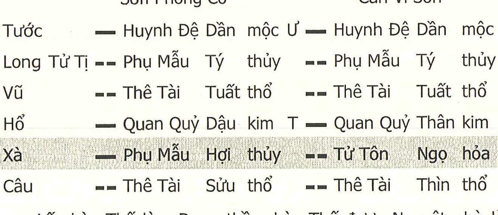
    - **Hình này chứng minh điều gì**
      - Làm sáng tỏ diễn biến cát hung và quy luật ứng nghiệm của Sơn Phong Cổ biến Cấn Vi Sơn đối với sự việc được hỏi.
    - **Từ đâu mà thấy được**
      - Căn cứ Thời gian lập quẻ: Ngày Kỷ Sửu tháng Nhâm Thân năm Giáp Thân; Dụng thần khá chặt chẽ. Nhìn vào hào Thế nhập Mộ ứng xung; hào động hoặc là hợp hào động.

- Quái lệ thực tế:
  - Bối cảnh: **Ví dụ 3:** Ngày Nhâm Thân tháng Dần, một người đoán tình hình tài vận những ngày sắp tới, được quẻ Sơn Hỏa Bí biến Sơn Lôi Di.

- Quái lệ dự đoán thực tế cho Quẻ Sơn Hỏa Bí biến Sơn Lôi Di:
  - **Hình 80.** Quẻ Sơn Hỏa Bí biến Sơn Lôi Di
    - 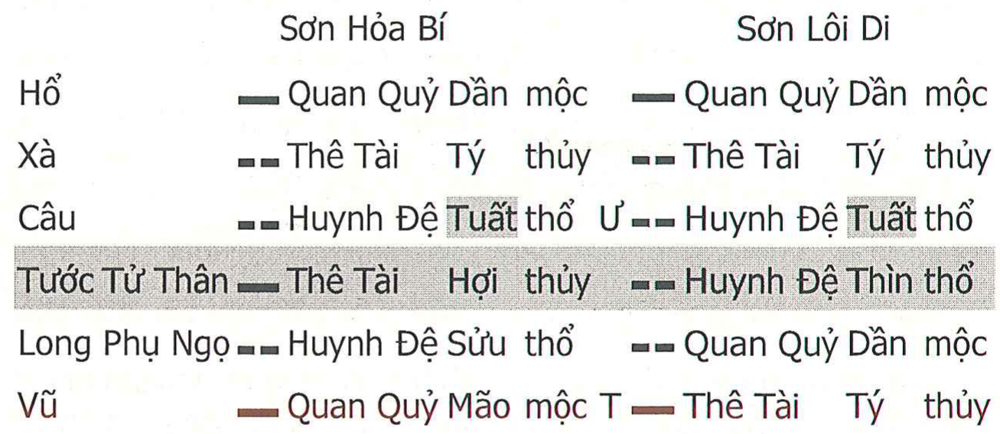
    - **Hình này chứng minh điều gì**
      - Làm sáng tỏ diễn biến cát hung và quy luật ứng nghiệm của Quẻ Sơn Hỏa Bí biến Sơn Lôi Di đối với sự việc được hỏi.
    - **Từ đâu mà thấy được**
      - Căn cứ Thời gian lập quẻ: Ngày Kỷ Sửu tháng Nhâm Thân năm Giáp Thân; Dụng thần khá chặt chẽ. Nhìn vào hào Thế nhập Mộ ứng xung; hào động hoặc là hợp hào động.

- Luận điểm phân tích:
  - **Phán đoán:** Lấy Thê Tài làm Dụng thần. Trong quẻ Thê Tài lưỡng hiện, lấy hào Thê Tài Hợi thủy phát động làm Dụng thần. Dụng thần được Nguyệt hợp vượng, lại được Nhật sinh phù, động mà sinh Thế, đây là tượng sắp tới đắc tài, nhưng Dụng thần động mà nhập Mộ ở hào biến, lại động hóa hồi đầu khắc, ngày hôm sau hào biến bị hợp không khắc Dụng thần, giờ Tị Dụng thần từ trong Mộ khố xung ra, có thể tiến tài, ngày Tuất xung mất hào biến cũng có thể tiến tài. Dụng thần động mà lâm Chu Tước, Chu Tước chủ miệng, nhất định là miệng nói mà đắc tài.

- Kết quả ứng nghiệm thực tế:
  - **Kết quả:** Ở giờ Tị ngày hôm sau và giờ Tị ngày Tuất, giới thiệu sinh ý cho người ta, mỗi người kiếm được 200 tệ.

- Quái lệ thực tế:
  - Bối cảnh: **Ví dụ 1:** Ngày Bính Thân tháng Hợi, một học viên của tôi được lãnh đạo đơn vị yêu cầu chuyển công tác xuống đơn vị cấp dưới, bản thân không muốn đi nên đã tìm người nói giúp với lãnh đạo, hỏi có điều động công tác hay không? Được Trạch Thiên Quải biến Phong Địa Quan.

- Quái lệ dự đoán thực tế cho Quẻ Trạch Thiên Quải biến Phong Địa Quan:
  - **Hình 81.** Quẻ Trạch Thiên Quải biến Phong Địa Quan
    - 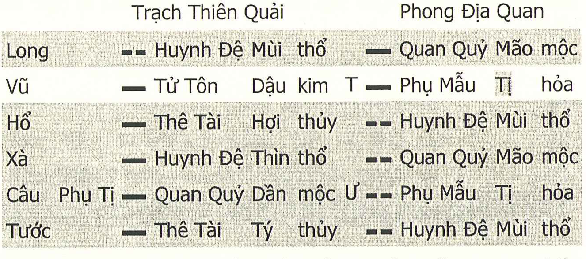
    - **Hình này chứng minh điều gì**
      - Làm sáng tỏ diễn biến cát hung và quy luật ứng nghiệm của Quẻ Trạch Thiên Quải biến Phong Địa Quan đối với sự việc được hỏi.
    - **Từ đâu mà thấy được**
      - Căn cứ Thời gian lập quẻ: Ngày Kỷ Sửu tháng Nhâm Thân năm Giáp Thân; Dụng thần khá chặt chẽ. Nhìn vào hào Thế nhập Mộ ứng xung; hào động hoặc là hợp hào động.

- Luận điểm phân tích:
  - Dự đoán điều động công tác thông thường lấy Quan Quỷ làm Dụng thần, Quan Quỷ vượng tướng có thể điều động, Quan Quỷ phát động cũng có thể điều động, nhưng quẻ này rất đặc biệt, ngoại trừ hào Thế, tất cả các hào vị khác đều phát động, đây là quẻ độc tĩnh, khi có một hào động, hào động là dấu hiệu biến hóa của sự vật, nhưng quẻ độc tĩnh trái lại không lấy hào động làm chủ để phán đoán, mà là coi hào độc tĩnh là dấu hiệu phát triển của sự vật.

- Luận điểm phân tích:
  - Quẻ này bỏ Dụng thần Quan Quỷ mà không xem, chỉ xem hào độc tĩnh. Hào độc tĩnh trì Thế lại là Tử Tôn khắc Quan Quỷ, chính là Quan Quỷ bị khắc, chỉ ta bất động, do đó tôi phán đoán anh ta sẽ không bị điều động công tác. Anh ta trả lời rằng chuyện này đã biết kết quả, lãnh đạo đã không điều anh ta đến nơi khác.

- Quái lệ thực tế:
  - Bối cảnh: **Ví dụ 2:** Học viên Trương Khánh Học đã hỏi một quẻ như sau: Ngày Đinh Tị tháng Mùi, một người đoán bệnh, được Trạch Địa Tụy biến Sơn Phong Cổ.

- Quái lệ dự đoán thực tế cho Trạch Địa Tụy biến Sơn Phong Cổ:
  - **Hình 82.** Trạch Địa Tụy biến Sơn Phong Cổ
    - 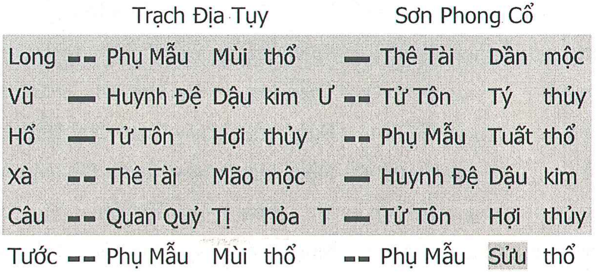
    - **Hình này chứng minh điều gì**
      - Làm sáng tỏ diễn biến cát hung và quy luật ứng nghiệm của Trạch Địa Tụy biến Sơn Phong Cổ đối với sự việc được hỏi.
    - **Từ đâu mà thấy được**
      - Căn cứ Thời gian lập quẻ: Ngày Kỷ Sửu tháng Nhâm Thân năm Giáp Thân; Dụng thần khá chặt chẽ. Nhìn vào hào Thế nhập Mộ ứng xung; hào động hoặc là hợp hào động.

- Luận điểm phân tích:
  - Hào sơ độc tĩnh lâm Chu Tước, Chu Tước chủ viêm, tại cung Đoài chủ phổi, khí quản, nhất định phương diện này đã có vấn đề.

- Luận điểm phân tích:
  - Trên thực tế, bởi vì viêm khí quản không trị khỏi mà dẫn tới viêm phổi.

- Luận điểm phân tích:
  - Tuy nhiên, độc phát lấy tượng làm chủ cũng không phải phương pháp bất biến, cần phải xem tình hình biến hóa trong quẻ. Hiểu rõ ý tứ thể hiện trong quẻ mới có thể đạt được tỷ lệ chính xác cao.

- Luận điểm phân tích:
  - Một quái lệ sau đây có thể nói rõ vấn đề này.

- Luận điểm phân tích:
  - Quẻ tìm chiếc nhẫn của vợ học viên Trương Khánh Học. Ngày Mậu Dần tháng Thìn, được quẻ Lôi Địa Dự biến Hỏa Địa Tấn.

- Quái lệ dự đoán thực tế cho Lôi Địa Dự biến Hỏa Địa Tấn:
  - **Hình 83.** Lôi Địa Dự biến Hỏa Địa Tấn
    - 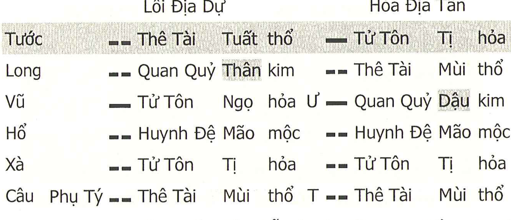
    - **Hình này chứng minh điều gì**
      - Làm sáng tỏ diễn biến cát hung và quy luật ứng nghiệm của Lôi Địa Dự biến Hỏa Địa Tấn đối với sự việc được hỏi.
    - **Từ đâu mà thấy được**
      - Căn cứ Thời gian lập quẻ: Ngày Kỷ Sửu tháng Nhâm Thân năm Giáp Thân; Dụng thần khá chặt chẽ. Nhìn vào hào Thế nhập Mộ ứng xung; hào động hoặc là hợp hào động.

- Luận điểm phân tích:
  - Vợ anh ta thường để chiếc nhẫn ở trên đồ trang điểm, do vội xem phim truyền hình, đến khi tìm lại thì đã không thấy. Rõ ràng biết là ở trong nhà nhưng lại không thể tìm được. Đến 23 giờ vẫn chưa tìm được. Do đó đã gieo quẻ ở trên.

- Luận điểm phân tích:
  - Ngày hôm sau, anh ta đã nhắn tin cho tôi, tôi trả lời ngay: "Tài Tuất thổ Nguyệt phá động hóa Tuyệt, Nguyệt phá là không tìm thấy, Nhật khắc lại là thông tin bất lợi, hóa Tuyệt là thông tin vật đã biến mất. Nguyệt phá Nhật khắc, hai điều kiện này đã có thể nói rõ không tìm thấy vật, không cần lấy thêm hình thức độc phát hóa Tuyệt. Tuất thổ hóa Tị hỏa là trong Tuyệt có sinh, sau cùng có thể tìm được. Lôi Địa Dự là quẻ lục hợp, biểu thị có thể gặp gỡ, hôm nay là ngày Kỷ Mão, phá đợi hợp. Hôm nay có thể tìm được".

- Luận điểm phân tích:
  - Vợ anh ta sáng sớm thức dậy đã đi tìm ngay, tìm đến lúc đi làm vẫn không thấy, buổi chiều trở về lại tiếp tục tìm, vẫn không thấy bóng dáng chiếc nhẫn. Chẳng lẽ không cánh mà bay? Đến tối, tất cả chúng tôi đều đã muốn bỏ cuộc, nào ngờ kỳ tích đã xuất hiện, đột nhiên tìm được chiếc nhẫn. Sự tình là thế này, một người khách đã đến nhà anh ta, sau khi quẹt diêm châm thuốc, khách đã vứt tàn diêm xuống sàn nhà. Trương Khánh Học là người rất thích sạch sẽ, sau khi khách về, anh ta liền đi nhặt tàn diêm vứt trên sàn, đúng lúc phát hiện tàn diêm đè lên chiếc nhẫn. Thời gian là giờ Tuất, chính là lúc Dụng thần thực phá.

- Luận điểm phân tích:
  - Quẻ này Dụng thần lâm Chu Tước, hóa hỏa hồi đầu sinh, nhờ diêm mà tìm được vật, có thể nói rằng thông tin của quẻ phản ánh rất chính xác.

- Luận điểm phân tích:
  - Đây cũng là độc phát, nhưng tôi lại không lấy hóa Tuyệt để phán đoán, mà là lấy hóa hồi đầu sinh, có thể nhiều người sẽ không hiểu. Không phải nói rằng độc phát xem tượng, thổ hóa Tị là Tuyệt ư? Chúng ta hãy xem lại quẻ trước và so sánh với quẻ này sẽ phát hiện sự khác biệt. Quẻ trước thổ động hóa Tị là thổ vượng, còn quẻ này thổ hoàn toàn không có khí. Có lẽ có người sẽ hỏi, nếu như luận hồi đầu sinh, quẻ này Nguyệt phá Nhật khắc, Dụng thần không có căn cho nên là sinh phù bất khởi? Thực ra quẻ này còn là một hào độc phát, lấy tượng làm chủ phán đoán, cho dù Dụng thần không căn, gặp sinh được sinh. Do đó Dụng thần nhược như vậy vẫn có thể tìm được vật bị mất.

### Câu hỏi 2: Tạo thành tam hợp cục cần điều kiện gì?

- Giải đáp trọng tâm:
  - Rất nhiều người không hiểu rõ điều kiện tạo thành tam hợp cục, đến lúc dự đoán thì không thể nắm bắt chính xác. Vậy rốt cuộc thì tình huống nào mới là tam hợp cục?

- Luận điểm phân tích:
  - Người xưa đã nhìn nhận tam hợp cục như sau: "Tam hợp có bốn dạng: Thứ nhất, trong một quẻ có ba hào động mà hợp cục. Thứ hai, hai hào động, một hào bất động, cũng thành hợp cục. Thứ ba, hào sơ và hào 3 ở nội quái động, cùng hào biến ra tạo thành tam hợp. Thứ tư, hào 4 và hào 6 ở ngoại quái động, cùng hào biến ra tạo thành tam hợp."

- Luận điểm phân tích:
  - Cũng tức là, tam hợp cục ở trong quẻ phải ít nhất là hai hào động, với lại địa chi ở giữa trong tam hợp cục (Tý Ngọ Mão Dậu) phải xuất hiện phát động trong quẻ. Nếu địa chi ở giữa xuất hiện không phát động, hai địa chi còn lại phát động thì không phải tam hợp cục; nếu địa chi ở giữa không xuất hiện trong quẻ chính, xuất hiện trong hào biến cũng không phải tam hợp cục; nếu hai địa chi kia phát động trong quẻ, địa chi ở giữa xuất hiện tại Nhật Nguyệt cũng không phải tam hợp cục; khi trong quẻ có hai hào phát động (bao gồm địa chi ở giữa), thiếu một địa chi thì gọi là thiếu một chờ dùng (hư nhất đãi dụng), khi Nhật Nguyệt xuất hiện địa chi còn lại thì có thể tập hợp thành cục, cũng có thể mượn hào ám động để tập hợp thành cục, hoặc đợi thời gian sau này bổ sung địa chi còn lại, tập hợp thành cục. Nếu trong quẻ chỉ có địa chi ở giữa phát động, cho dù Nhật Nguyệt là hai địa chi còn lại của tam hợp cục thì cũng không thành tam hợp cục. Sau đây, chúng ta sẽ bàn luận về các tình huống thành lập tam hợp cục thông qua các quái lệ cụ thể.

- Quái lệ thực tế:
  - Bối cảnh: **Ví dụ 1: Ngày Tân Sửu tháng Hợi, một người Nhật Bản hỏi bệnh, được Thủy Địa Tỷ biến Trạch Sơn Hàm.**

- Quái lệ dự đoán thực tế cho Thủy Địa Tỷ biến Trạch Sơn Hàm:
  - **Hình 84.** Thủy Địa Tỷ biến Trạch Sơn Hàm
    - 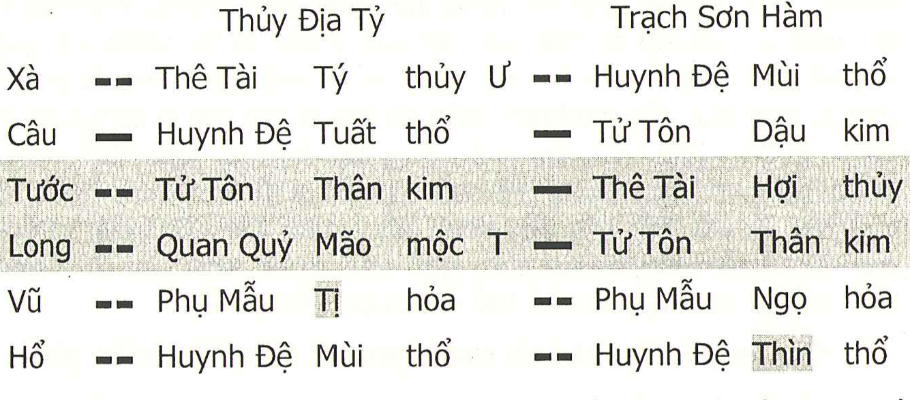
    - **Hình này chứng minh điều gì**
      - Làm sáng tỏ diễn biến cát hung và quy luật ứng nghiệm của Thủy Địa Tỷ biến Trạch Sơn Hàm đối với sự việc được hỏi.
    - **Từ đâu mà thấy được**
      - Căn cứ Thời gian lập quẻ: Ngày Tân Sửu tháng Hợi; Dụng thần động mà hóa hồi đầu khắc. Nhìn vào hào động mà hợp cục.

- Luận điểm phân tích:
  - Lấy hào Thế làm Dụng thần, hào Thế được Nguyệt sinh phù là vượng tướng, nhưng không nên Kỵ thần phát động đến khắc và Dụng thần động mà hóa hồi đầu khắc, may mà được hào sơ ám động, hào Thế, Nguyệt kiến và hào ám động tạo thành tam hợp cục đã tăng cường sức mạnh hào Thế, do đó tạm thời không có nỗi lo về tính mạng. Nhưng Kỵ thần vượng hơn Dụng thần, bệnh này phát triển cực kỳ bất lợi cho bản thân. Hào Thế Mão mộc lâm hào 3 bị khắc, mộc là gan mật, hào 3 cũng là hào vị gan mật, mật là dương, gan là âm, Mão mộc là âm, do đó là bệnh gan. Kỵ thần lâm Chu Tước đến khắc, Chu Tước chủ viêm, cho nên là viêm gan, hào Thế nhập Mộ ở hào sơ, là tượng nhập viện. Trên thực tế, người này nhập viện vì viêm gan C, sau thời gian dài điều trị vẫn không thuyên giảm.

- Quái lệ thực tế:
  - Bối cảnh: **Ví dụ 2:** Ngày Canh Thìn tháng Ngọ, một người đoán tình hình quan vận, được Thiên Thủy Tụng biến Phong Trạch Trung Phu.

- Quái lệ dự đoán thực tế cho Quẻ Thiên Thủy Tụng biến Phong Trạch Trung Phu:
  - **Hình 85.** Quẻ Thiên Thủy Tụng biến Phong Trạch Trung Phu
    - 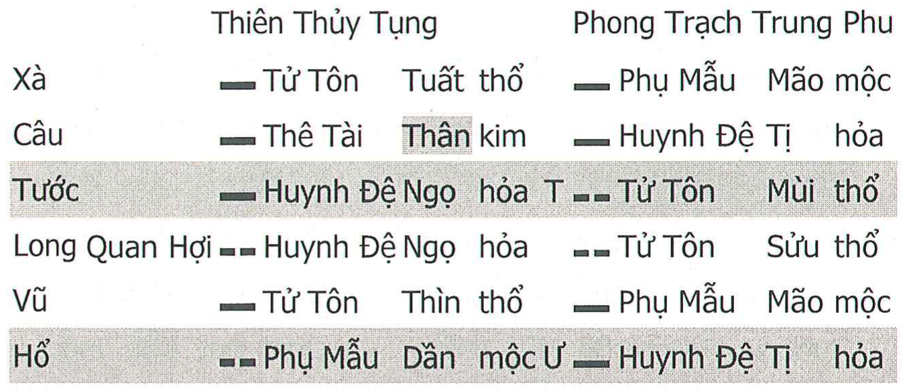
    - **Hình này chứng minh điều gì**
      - Làm sáng tỏ diễn biến cát hung và quy luật ứng nghiệm của Quẻ Thiên Thủy Tụng biến Phong Trạch Trung Phu đối với sự việc được hỏi.
    - **Từ đâu mà thấy được**
      - Căn cứ Thời gian lập quẻ: Ngày Tân Sửu tháng Hợi; Dụng thần động mà hóa hồi đầu khắc. Nhìn vào hào động mà hợp cục.

- Luận điểm phân tích:
  - **Đoán:** Lấy hào Quan Quỷ làm Dụng thần, Quan Quỷ Hợi thủy bất thượng quái, Nguyệt kiến không sinh, nhập Mộ ở Nhật, lại bị Nhật khắc là hưu tù. Nguyên thần Thê Tài tại hào 5, Không mà không sinh Quan Quỷ, hào 5 là hào vị lãnh đạo, Không không thể sinh Dụng thần, là lãnh đạo không đề bạt.

- Luận điểm phân tích:
  - Hào Thế lâm Huynh Đệ Ngọ hỏa phát động, cùng hào sơ Dần mộc và hào ám động hào 6 Tuất thổ hình thành tam hợp cục. Tam hợp cục này là Huynh Đệ, là tượng phá tài tiêu tiền, tam hợp Huynh Đệ chính là đã tốn rất nhiều tiền, hơn nữa là tiêu tiền khắp nơi. Tổng hợp lại, quẻ này là phá tài nhưng không được quan.

- Luận điểm phân tích:
  - Trên thực tế, để thăng chức, người này đã tặng quà cho các lãnh đạo, đã tốn hơn 40 vạn nhưng vẫn không được thăng chức.

- Quái lệ thực tế:
  - Bối cảnh: **Ví dụ 3:** Ngày Đinh Mùi tháng Hợi, nữ đoán có thể kết hôn với người đàn ông hay không? Được quẻ Khôn Vi Địa biến Hỏa Thủy Vị Tế.

- Quái lệ dự đoán thực tế cho Quẻ Khôn Vi Địa biến Hỏa Thủy Vị Tế:
  - **Hình 86.** Quẻ Khôn Vi Địa biến Hỏa Thủy Vị Tế
    - 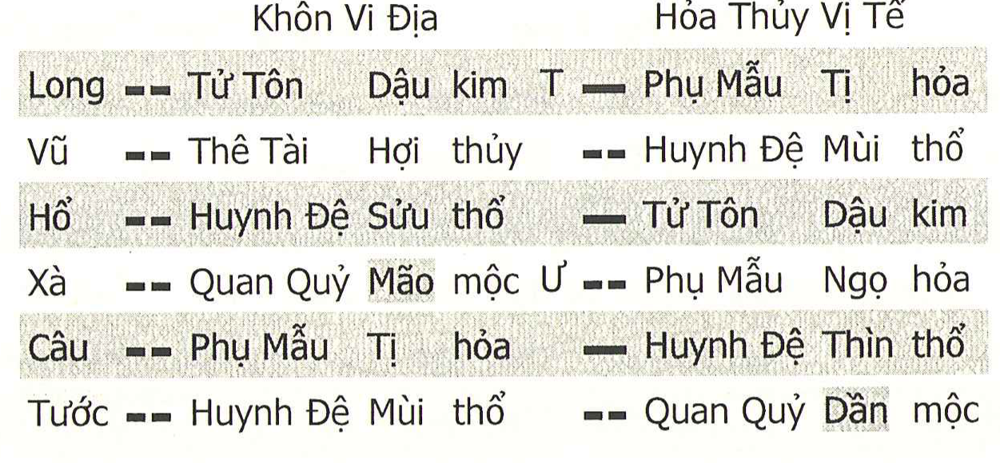
    - **Hình này chứng minh điều gì**
      - Làm sáng tỏ diễn biến cát hung và quy luật ứng nghiệm của Quẻ Khôn Vi Địa biến Hỏa Thủy Vị Tế đối với sự việc được hỏi.
    - **Từ đâu mà thấy được**
      - Căn cứ Thời gian lập quẻ: Ngày Tân Sửu tháng Hợi; Dụng thần động mà hóa hồi đầu khắc. Nhìn vào hào động mà hợp cục.

- Luận điểm phân tích:
  - **Đoán:** Lấy hào Quan Quỷ làm Dụng thần, Quan Quỷ được Nguyệt sinh phù là vượng tướng, quẻ này Quan Quỷ Mão mộc tĩnh mà bất động, mặc dù cùng với Nhật Nguyệt Hợi Mão Mùi đầy đủ 3 địa chi, nhưng bởi vì địa chi ở giữa là Mão mộc không phát động, trong quẻ lại không có một địa chi khác để tạo thành bán cục, do đó tam hợp cục này không thành lập. Luận là Quan Quỷ Mão mộc được Nguyệt kiến sinh phù, nhập Mộ ở Nhật.

- Luận điểm phân tích:
  - Trong quẻ này, Dụng thần không thành tam hợp, mà Kỵ thần Tử Tôn Dậu kim bởi vì Tị hỏa hào 2, Sửu thổ hào 4 và sự phát động của bản thân Dậu kim, hình thành tam hợp Tử Tôn cục, đi xung khắc Dụng thần, Dụng thần từ vượng chuyển nhược, do đó mối quan hệ của hai người sẽ không lâu dài. Quả nhiên tại năm Ất Dậu hai người chia tay.

- Quái lệ thực tế:
  - Bối cảnh: **Ví dụ 4:** Ngày Ất Mùi tháng Hợi, một người đoán thăng chức, được Sơn Địa Bác biến Cấn Vi Sơn.

- Quái lệ dự đoán thực tế cho Sơn Địa Bác biến Cấn Vi Sơn:
  - **Hình 87.** Sơn Địa Bác biến Cấn Vi Sơn
    - 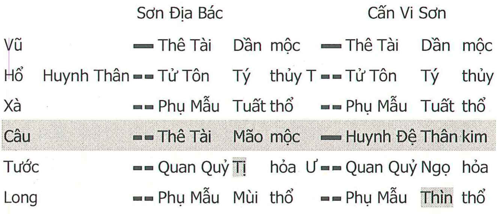
    - **Hình này chứng minh điều gì**
      - Làm sáng tỏ diễn biến cát hung và quy luật ứng nghiệm của Sơn Địa Bác biến Cấn Vi Sơn đối với sự việc được hỏi.
    - **Từ đâu mà thấy được**
      - Căn cứ Thời gian lập quẻ: Ngày Tân Sửu tháng Hợi; Dụng thần động mà hóa hồi đầu khắc. Nhìn vào hào động mà hợp cục.

- Luận điểm phân tích:
  - **Đoán:** Lấy hào Quan Quỷ làm Dụng thần, Quan Quỷ Tị hỏa bị Nguyệt kiến xung khắc là Nguyệt phá, đồng thời lại không nhận được sinh phù của Nhật, Dụng thần rất hưu tù. Tổ hợp của quẻ này, hào Thế tại hào 5, hào 5 là tôn vị, Thế lâm tôn vị, khắc Quan Ứng, đáng lẽ là tượng mình đạt được quyền lợi, lật đổ người khác. Nhưng hào Ứng Quan Quỷ quá hưu tù, không có vị trí để người này giành lấy, đây là Dụng thần vô căn, do đó rất khó thăng chức. Trong quẻ Nguyên thần Thê Tài Mão mộc phát động sinh Quan, đây là tượng tiêu tiền cầu quan, Nhật Nguyệt mặc dù có Hợi thủy Mùi thổ, Mão mộc cũng phát động, nhưng bởi vì Mão mộc độc phát, không hình thành tam hợp cục, chỉ luận Mão mộc hóa hồi đầu khắc, do đó nói tiêu tiền cũng không thể thăng chức. Người này quả nhiên không được thăng chức.

- Quái lệ thực tế:
  - Bối cảnh: **Ví dụ 5:** Ngày Tân Mão tháng Hợi, một người đoán về việc con gái thi cấp ba, được Sơn Địa Bác biến Sơn Trạch Tổn.

- Quái lệ dự đoán thực tế cho Sơn Địa Bác biến Sơn Trạch Tổn:
  - **Hình 88.** Sơn Địa Bác biến Sơn Trạch Tổn
    - 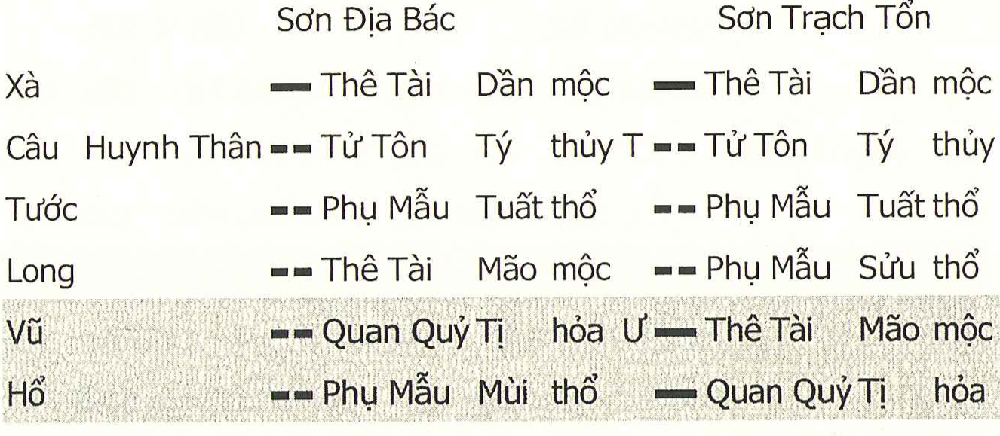
    - **Hình này chứng minh điều gì**
      - Làm sáng tỏ diễn biến cát hung và quy luật ứng nghiệm của Sơn Địa Bác biến Sơn Trạch Tổn đối với sự việc được hỏi.
    - **Từ đâu mà thấy được**
      - Căn cứ Thời gian lập quẻ: Ngày Tân Sửu tháng Hợi; Dụng thần động mà hóa hồi đầu khắc. Nhìn vào hào động mà hợp cục.

- Luận điểm phân tích:
  - **Đoán:** Lấy Quan Quỷ làm Dụng thần, hào Phụ Mẫu chỉ tham khảo, quẻ này Quan Quỷ Tị hỏa mặc dù bị Nguyệt kiến xung phá, nhưng được Nhật sinh, là có căn, đồng thời lại hóa hồi đầu sinh, Quan Quỷ được vượng, nhất định có thể thi đậu. Quẻ này hào sơ Mùi thổ phát động, với Nguyệt kiến và Nhật thần, mặc dù Hợi Mão Mùi đầy đủ 3 địa chi, nhưng địa chi ở giữa trên Nhật không ở trong quẻ, vì vậy không thể xem là tam hợp cục, chỉ xem ngũ hành sinh khắc thông thường.

- Quái lệ thực tế:
  - Bối cảnh: **Ví dụ 6:** Ngày Tân Dậu tháng Dần, một người phụ nữ dự đoán bệnh tật của cha chồng, được Hỏa Phong Đỉnh biến Địa Phong Thăng.

- Quái lệ dự đoán thực tế cho Hỏa Phong Đỉnh biến Địa Phong Thăng:
  - **Hình 89.** Hỏa Phong Đỉnh biến Địa Phong Thăng
    - 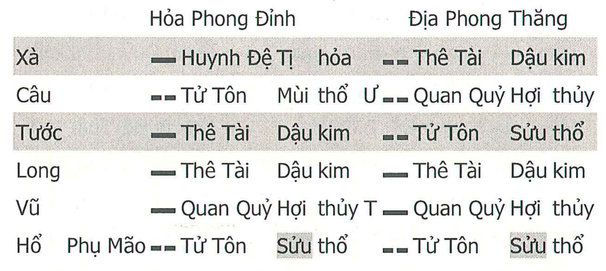
    - **Hình này chứng minh điều gì**
      - Làm sáng tỏ diễn biến cát hung và quy luật ứng nghiệm của Hỏa Phong Đỉnh biến Địa Phong Thăng đối với sự việc được hỏi.
    - **Từ đâu mà thấy được**
      - Căn cứ Thời gian lập quẻ: Ngày Tân Sửu tháng Hợi; Dụng thần động mà hóa hồi đầu khắc. Nhìn vào hào động mà hợp cục.

- Luận điểm phân tích:
  - **Đoán:** Lấy hào Phụ Mẫu làm Dụng thần, Phụ Mẫu Mão mộc phục dưới hào sơ Sửu thổ, Phi thần Không Vong, Dụng thần được Nguyệt củng phù, vốn là tượng cát, nhưng không nên Kỵ thần lâm Nhật, xung khắc Dụng thần.

- Luận điểm phân tích:
  - Ở ngoại quái, địa chi ở giữa của tam hợp phát động, một địa chi khác cũng phát động, lại mượn hào biến của Dậu kim hình thành tam hợp cục. Tị Dậu Sửu lại hợp thành cục đến khắc Dụng thần, khắc nhiều sinh ít, do đó không cát, nay Dụng thần phục tàng, rất sợ xuất hiện, do đó đề phòng tháng Mão gặp hung.

- Kết quả ứng nghiệm thực tế:
  - Sau đó, cha chồng người này đã chết ở giờ Tý tối ngày 25 tháng giêng, thời gian mặc dù tại tháng giêng, nhưng ngày này đúng lúc là ngày giao tiết lệnh, giờ Tuất ngày này giao tiết lệnh, giờ Tý đã vào tháng Mão, do đó ngày này phải là ngày Mậu Tý tháng Mão, có thể thấy tiết lệnh rất quan trọng đối với dự đoán.

- Quái lệ thực tế:
  - Bối cảnh: **Ví dụ 7:** Một quái lệ trong Tăng San Bốc Dịch. Ngày Bính Thân tháng Dần, chiêm về thăng tiến, được quẻ Cấn biến Sơn Lôi Di:

- Quái lệ dự đoán thực tế cho Cấn Vi Sơn biến Sơn Lôi Di:
  - **Hình 90.** Cấn Vi Sơn biến Sơn Lôi Di
    - 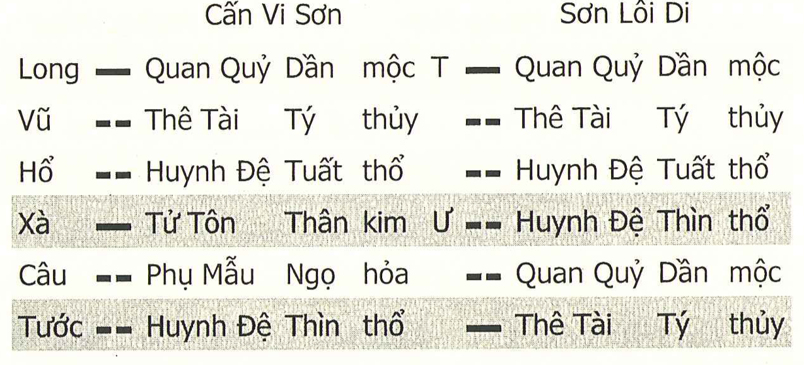
    - **Hình này chứng minh điều gì**
      - Làm sáng tỏ diễn biến cát hung và quy luật ứng nghiệm của Cấn Vi Sơn biến Sơn Lôi Di đối với sự việc được hỏi.
    - **Từ đâu mà thấy được**
      - Căn cứ Thời gian lập quẻ: Ngày Tân Sửu tháng Hợi; Dụng thần động mà hóa hồi đầu khắc. Nhìn vào hào động mà hợp cục.

- Kết quả ứng nghiệm thực tế:
  - **Nguyên đoán:** Dần mộc Quan tinh trì Thế, lâm Nguyệt kiến mà vượng tướng, tuy bị ngày Thân xung khắc, hỷ Thân Tý Thìn hợp thành thủy cục, để sinh Thế, không những vô hại, mà nhất định tháng 3 sẽ được thăng chức. Quả nhiên ở tháng 3 được thăng chức đi Vân Nam. Sở dĩ được ứng nghiệm thăng chức, là vì hào được thủy cục sinh phù. Ứng nghiệm vào tháng ba, vì đó là tháng Thìn thổ xuất Không. Ứng nghiệm vào Vân Nam, là do Thế và Quan tinh đều nằm tại hào 6.

- Quái lệ thực tế:
  - Bối cảnh: Ví dụ này giải thích có sai lầm, trong tam hợp cục, địa chi ở giữa nằm trong quẻ biến thông thường không thể sinh khắc Dụng thần, trừ phi hào biến của Dụng thần là địa chi ở giữa trong tam hợp cục. Quẻ này Thê Tài Tý thủy là do hào sơ biến ra, thông thường chỉ có thể ảnh hưởng đến hào bản vị của nó, tức là hào sơ, mà không thể tác động đến các hào khác.

- Luận điểm phân tích:
  - Quẻ này xem về điều phái, không phải thăng chức. Ngày nay chúng ta gọi là điều động công tác. Quan Quỷ trì Thế ám động, lại hóa du hồn, là tượng biến động chức vụ. Ngày xưa Vân Nam thuộc về vùng sát biên giới, kẻ bị phái đi đến đây là bị giáng chức, cho dù chức quan có cao hơn ban đầu thì cũng chẳng tốt lành gì. Ứng động xung Thế là tượng người khác thôi thúc, bởi vì hào Ứng hóa Không cho nên việc ứng tại tháng Thìn xuất Không.

- Luận điểm phân tích:
  - Trên đây đã liệt kê rất nhiều quái lệ liên quan đến tam hợp cục, hy vọng mọi người nghiên cứu kỹ.

- Luận điểm phân tích:
  - ---

## Chương 4: Những thắc mắc liên quan đến năm tháng ngày giờ

### Câu hỏi 1: Khi Dụng thần là thổ, Nguyệt kiến xung thì có phải Nguyệt phá?

- Giải đáp trọng tâm:
  - Nguyệt phá không phân biệt là ngũ hành gì, hễ là hào Nguyệt xung thì là Nguyệt phá. Có sách cho rằng khi Nguyệt kiến và Dụng thần là thổ tương xung thì coi là ám động, điều này là sai lầm. Dưới đây là ví dụ thuyết minh.

- Quái lệ thực tế:
  - Bối cảnh: Ngày Tân Dậu tháng Mùi, một người đàn ông có bút danh là Trình Bưu đoán xuất bản sách có thể thành công hay không, được Sơn Phong Cổ.

- Quái lệ dự đoán thực tế cho Sơn Phong Cổ:
  - **Hình 91.** Sơn Phong Cổ
    - 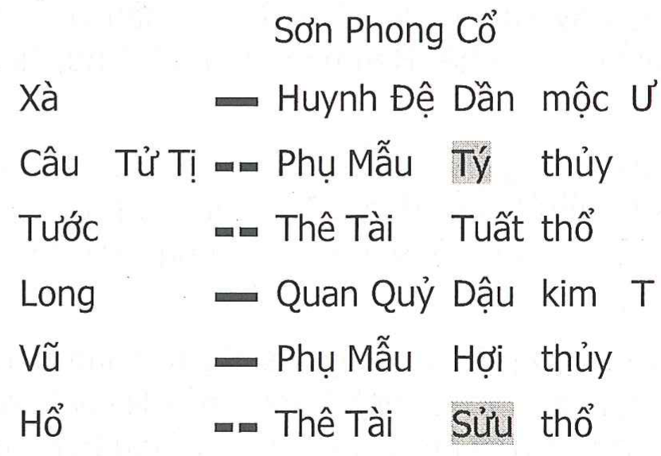
    - **Hình này chứng minh điều gì**
      - Làm sáng tỏ diễn biến cát hung và quy luật ứng nghiệm của Sơn Phong Cổ đối với sự việc được hỏi.
    - **Từ đâu mà thấy được**
      - Căn cứ Thời gian lập quẻ: Ngày Tân Dậu tháng Mùi; Dụng thần là thổ. Nhìn vào Vị trí hào Thế, hào Ứng, hào động và hào biến sinh khắc Dụng thần.

- Luận điểm phân tích:
  - Xuất bản sách lấy Phụ Mẫu làm Dụng thần, trong quẻ Phụ Mẫu lưỡng hiện, lấy Phụ Mẫu Tý thủy Không Vong làm Dụng. Đây là quẻ tĩnh, Dụng thần mặc dù bị Nguyệt khắc thương, nhưng Nhật sinh Dụng thần, sinh khắc trung hòa, trong quẻ tĩnh, hào vượng tướng có thể ảnh hưởng đến hào hưu tù, hào Thế là mình, vượng mà sinh Phụ Mẫu, chứng tỏ bản thân đã rất nỗ lực để xuất bản sách này, hào sơ Thê Tài Sửu thổ bị Nguyệt xung là phá, đã tốn kém không ít tiền để xuất bản. Dụng thần tại hào 5, hào 5 là kinh thành, có thể đến Bắc Kinh tìm nhà xuất bản, rất có lợi cho việc xuất bản sách. Nay Dụng thần bị Nguyệt khắc, tháng Thân sau này Dụng thần được sinh, có thể xuất bản.

- Kết quả ứng nghiệm thực tế:
  - Sau đó quả nhiên đã tìm được nhà xuất bản ở Bắc Kinh, để xuất bản cuốn sách này, trước sau đã tốn 16 vạn tệ. Sau khi xuất bản cũng đã tặng tôi một cuốn làm kỷ niệm. Có rất nhiều ví dụ về

### Câu hỏi 2: Trường hợp nào mới là ám động?

- Kết quả ứng nghiệm thực tế:
  - **Đáp:** Ám động là một hiện tượng rất quan trọng trong dự đoán lục hào, mỗi quẻ đều phải xem kỹ, nếu bỏ sót, đôi khi sẽ ảnh hưởng đến phán đoán cát hung của Dụng thần. Ám động có hai trường hợp, một là ám động do Nhật xung gây ra, hai là ám động do hào xung gây ra, chúng ta khá hiểu rõ trường hợp đầu tiên nhưng có lẽ vẫn chưa quen với trường hợp thứ hai. Trải qua thời gian dài thực hành, tôi nhận thấy hai trường hợp đều ứng nghiệm. Bây giờ tôi xin giới thiệu chi tiết hai trường hợp này như sau.

- Luận điểm phân tích:
  - **Trường hợp 1:** Ám động do Nhật xung gây ra. Người xưa mô tả vấn đề này tương đối đơn giản: "Hào tĩnh hưu tù, Nhật thần xung gọi là Nhật phá. Hào tĩnh vượng tướng, Nhật thần xung là ám động."

- Luận điểm phân tích:
  - Nhưng xét trong thực tiễn, có rất ít hào Nhật phá, hầu hết các trường hợp đều là ám động. Tùy theo ảnh hưởng của Nguyệt kiến và hào động khác đối với hào bị xung, ám động có sự phân biệt suy vượng.

- Luận điểm phân tích:
  - (1) Hào bị xung được Nguyệt sinh, tỉ, củng phù là ám động vượng nhất, nói cách khác, tình huống này Nguyệt kiến nhất định là Nguyên thần của hào ám động, hoặc là ngũ hành giống với hào ám động (trừ trường hợp Nguyệt xung, Nguyệt xung Nhật lại xung là Nguyệt phá Nhật phá). Ám động như vậy rất có lực, ảnh hưởng đối với hào khác rất lớn.

- Luận điểm phân tích:
  - (2) Hào Nguyệt hợp bị Nhật xung cũng là ám động. Ở đây được chia thành ba trường hợp, thứ nhất là Nguyệt sinh hợp hào này và Nhật xung, sức lực của ám động này giống như (1), cũng rất lớn. Thứ hai là Nguyệt không sinh cũng không khắc, chỉ là Nguyệt hợp Nhật xung, sức lực của hào này yếu hơn một chút so với hào vừa rồi. Thứ ba là Nguyệt kiến trong khắc có hợp và bị Nhật xung, ám động này yếu nhất trong Nguyệt hợp.

- Quái lệ thực tế:
  - Bối cảnh: **Ví dụ:** Ngày Canh Thìn tháng Mão, một người phụ nữ dự đoán về việc điều động công tác, được Lôi Thiên Đại Tráng.

- Luận điểm phân tích:
  - Lôi Thiên Đại Tráng

- Luận điểm phân tích:
  - Xà - - Huynh Đệ Tuất thổ  
Câu - - Tử Tôn Thân kim  
Tước — Phụ Mẫu Ngọ hỏa T  
Long — Huynh Đệ Thìn thổ  
Vũ — Quan Quỷ Dần mộc  
Hổ — Thê Tài Tý thủy Ứ

- Luận điểm phân tích:
  - **Đoán:** Lấy Quan Quỷ làm Dụng thần. Quan Quỷ được Nguyệt tỉ phù, vượng mà sinh Thế, công tác có thể biến động. Quan tại hào 2, hào 2 là trong nhà, chứng tỏ công việc của cô ấy là ngồi văn phòng, làm việc trong nhà.

- Luận điểm phân tích:
  - Quẻ gặp lục xung, chủ bản thân không an tâm công tác. Thế lâm Chu Tước Phụ Mẫu vượng tướng, chủ bản thân có trình độ học vấn cao. Huynh Đệ Tuất thổ mặc dù Nguyệt khắc, nhưng trong khắc có hợp, bị Nhật xung là ám động. Thế nhập Mộ khố Huynh Đệ, Huynh Đệ là đồng nghiệp, chứng tỏ cô ấy bị đồng nghiệp kiềm chế và ức hiếp ở đơn vị.

- Luận điểm phân tích:
  - Ứng là đơn vị muốn đến. Tại hào sơ, là muốn được điều đến đơn vị cơ sở. Lâm Bạch Hổ, chủ ngành công kiểm pháp. Ứng khắc hào Thế, nơi muốn đến có áp lực công việc lớn, không như đơn vị hiện tại.

- Luận điểm phân tích:
  - Cô ấy cho biết tình hình thực tế đúng là như vậy, cô ấy tốt nghiệp đại học, hằng ngày đi làm ở cơ quan đơn vị rất nhàn hạ, nhưng ở đơn vị luôn có người ức hiếp cô ấy, do đó cô ấy muốn rời khỏi đơn vị này và đến một văn phòng luật để công tác.

- Luận điểm phân tích:
  - (3) Hào Trường Sinh ở Nguyệt kiến bị Nhật xung dẫn tới ám động. Nguyệt kiến Trường Sinh đồng thời cũng sinh hào này, Nhật lại xung nó, chắc chắn là ám động, cho dù Nguyệt kiến đối với hào này là trong Trường Sinh có khắc, thì Nhật thần đến xung cũng sẽ dẫn tới ám động. Ví dụ như ở tháng Tị mà Dậu kim gặp ngày Mão, Thân kim gặp ngày Dần v.v, tuy rằng Nguyệt là ngũ

- Quái lệ dự đoán thực tế cho Quẻ Lôi Thiên Đại Tráng:
  - **Hình 92.** Quẻ Lôi Thiên Đại Tráng
    - 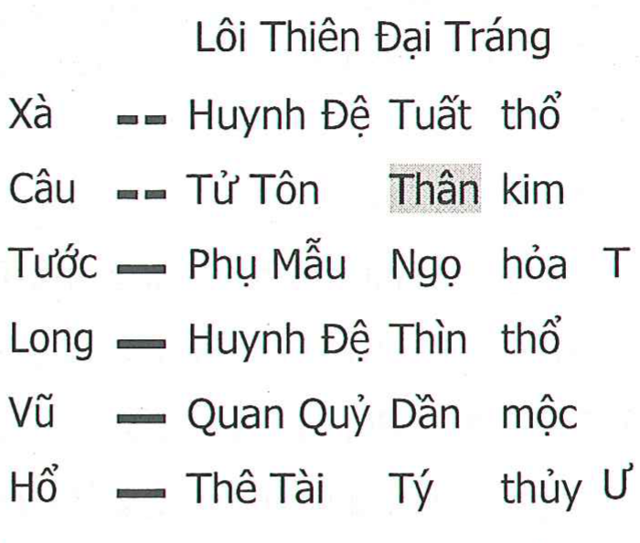
    - **Hình này chứng minh điều gì**
      - Làm sáng tỏ diễn biến cát hung và quy luật ứng nghiệm của Quẻ Lôi Thiên Đại Tráng đối với sự việc được hỏi.
    - **Từ đâu mà thấy được**
      - Căn cứ Thời gian lập quẻ: Ngày Canh Thìn tháng Mão; Dụng thần Nguyệt phá. Nhìn vào động?**.

- Quái lệ thực tế:
  - Bối cảnh: **Ví dụ:** Ngày Ất Mão tháng Tị, một người dự đoán bệnh của vợ, được Trạch Thiên Quải biến Thủy Thiên Nhu. (Ví dụ này đã có trong "Lục Hào Tật Bệnh Dự Trắc Học".)

- Luận điểm phân tích:
  - **Đoán:** Lấy hào Thê Tài làm Dụng thần. Trong quẻ Thê Tài lưỡng hiện, Hợi thủy Nguyệt phá phát động và Tý thủy Tuần Không có thể đều làm Dụng thần, kiêm đoán.

- Luận điểm phân tích:
  - Hợi thủy Nguyệt phá, động hóa hồi đầu sinh, trong quẻ lại có Tử Tôn Dậu kim trì Thế ám động sinh trợ, có bệnh cũng không sao, Tý thủy Tuần Không, bệnh gần là tượng cát.

- Luận điểm phân tích:
  - Quẻ thuộc cung Khôn, Khôn chủ dạ dày, hào 4 Thê Tài Hợi thủy Nguyệt phá, Tài là ẩm thực, hào 4 chủ dạ dày, nhất định là bệnh dạ dày.

- Luận điểm phân tích:
  - Trong quẻ Tử Tôn trì Thế ám động, là cầu y vấn dược (khám bệnh). Nhưng Dụng thần Nguyệt phá, Tuần Không, trong ngắn hạn sẽ không có hiệu nghiệm. Dụng thần Nguyệt phá, sang tháng bất phá, tháng sau Ngọ hỏa trị Nguyệt xung thực Thê Tài Tý thủy mới có thể khỏi bệnh.

- Kết quả ứng nghiệm thực tế:
  - **Tình hình ứng nghiệm:** Do đau dạ dày, đến bệnh viện khám thì phát hiện loét dạ dày. Sau vài ngày uống thuốc tây không có hiệu quả, lại gặp tác dụng phụ nên đã ngừng uống, mãi đến tiết Mang Chủng mới khỏi bệnh.

- Luận điểm phân tích:
  - Trong quẻ này, Tử Tôn Dậu kim mặc dù Nguyệt khắc, nhưng trong khắc mang theo Trường Sinh, Nhật xung là ám động, không phải Nhật phá.

- Quái lệ dự đoán thực tế cho Quẻ Trạch Thiên Quải biến Thủy Thiên Nhu:
  - **Hình 93.** Quẻ Trạch Thiên Quải biến Thủy Thiên Nhu
    - 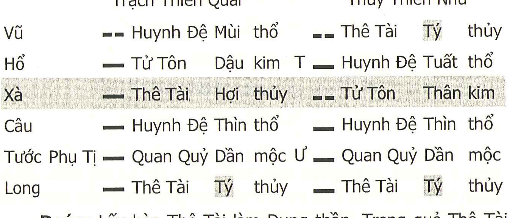
    - **Hình này chứng minh điều gì**
      - Làm sáng tỏ diễn biến cát hung và quy luật ứng nghiệm của Quẻ Trạch Thiên Quải biến Thủy Thiên Nhu đối với sự việc được hỏi.
    - **Từ đâu mà thấy được**
      - Căn cứ Thời gian lập quẻ: Ngày Canh Thìn tháng Mão; Dụng thần Nguyệt phá. Nhìn vào động?**.

- Luận điểm phân tích:
  - (4) Nguyệt không sinh phù tỉ phù hào này, nhưng cũng không khắc hào này, gặp Nhật xung thì cũng là ám động. Ví dụ như ở tháng Hợi mà hào Thân gặp ngày Dần, Thân chính là ám động, ở tháng Mão mà hào Tý gặp ngày Ngọ, Tý thủy cũng là ám động.

- Quái lệ thực tế:
  - Bối cảnh: **Ví dụ 1:** Ngày Ất Dậu tháng Ngọ, học viên Thanh Thanh hỏi một công ty nợ tiền của công ty cô ấy, đã đòi nhiều lần không được, có thể đòi được hay không? Gieo quẻ được Địa Hỏa Minh Di.

- Quái lệ dự đoán thực tế cho Địa Hỏa Minh Di:
  - **Hình 94.** Địa Hỏa Minh Di
    - 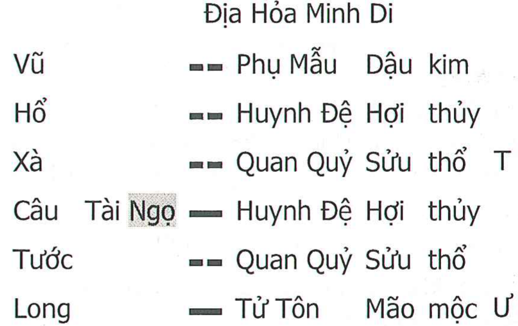
    - **Hình này chứng minh điều gì**
      - Làm sáng tỏ diễn biến cát hung và quy luật ứng nghiệm của Địa Hỏa Minh Di đối với sự việc được hỏi.
    - **Từ đâu mà thấy được**
      - Căn cứ Thời gian lập quẻ: Ngày Canh Thìn tháng Mão; Dụng thần Nguyệt phá. Nhìn vào động?**.

- Luận điểm phân tích:
  - Lấy Thê Tài làm Dụng thần, Thê Tài mặc dù bất thượng quái, nhưng được Nguyệt kiến tỉ phù là vượng tướng, hào Tài Không mà không hiện, là thông tin không nhận được tiền.

- Luận điểm phân tích:
  - Hào Ứng Mão mộc Nguyệt không sinh phù cũng không tỉ phù, nhưng không bị Nguyệt khắc thương, gặp Nhật đến xung là ám động, hào Ứng ám động sinh Tài, Tài này nhất định có thể đến tay. Hào Ứng sinh Tài, là tượng đối phương trả tiền, sự ám động của hào Ứng là do Nhật xung gây ra, do đó tiền này cần phải đòi mới có thể thu hồi, đối phương sẽ không chủ động trả tiền.

- Luận điểm phân tích:
  - Tài phục dưới Huynh Đệ Hợi thủy, ngày Quý Tị xung mất Phi thần, tại ngày này đòi tiền có thể sẽ được, sau đó quả nhiên đã đòi được tiền ở ngày này.

- Quái lệ thực tế:
  - Bối cảnh: **Ví dụ 2:** Ngày Canh Dần tháng Hợi, một người đoán đến Sơn Đông có tài hay không? Được Thủy Trạch Tiết.

- Quái lệ dự đoán thực tế cho Thủy Trạch Tiết:
  - **Hình 95.** Thủy Trạch Tiết
    - 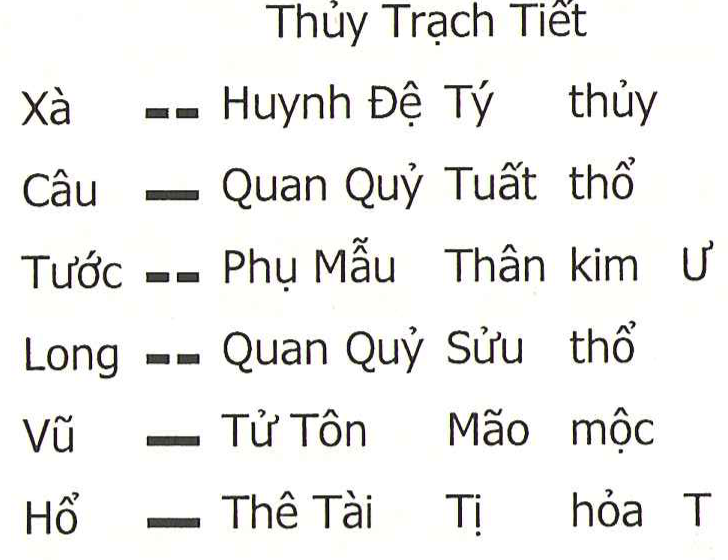
    - **Hình này chứng minh điều gì**
      - Làm sáng tỏ diễn biến cát hung và quy luật ứng nghiệm của Thủy Trạch Tiết đối với sự việc được hỏi.
    - **Từ đâu mà thấy được**
      - Căn cứ Thời gian lập quẻ: Ngày Canh Thìn tháng Mão; Dụng thần Nguyệt phá. Nhìn vào động?**.

- Luận điểm phân tích:
  - Lấy hào Tài làm Dụng thần, hào Tài trì Thế được Nhật sinh phù, nhưng không nên Nguyệt kiến xung phá, may mà có hào Ứng Phụ Mẫu Thân kim ám động, nơi phá gặp hợp, đây là hợp phá, Ứng là nơi đến, Phụ Mẫu là trưởng bối, đây là thông qua trưởng bối mà được tài, quả như dự đoán.

- Luận điểm phân tích:
  - (5) Nguyệt không sinh tỉ, nhưng được hào động đến sinh, hoặc Nguyệt khắc hào này, nhưng được hào động trong quẻ đến sinh, gặp Nhật xung nó, cũng có thể trở thành ám động. Nhưng tình huống Nguyệt xung Nhật xung không phải ám động, là Nguyệt phá Nhật phá.

- Quái lệ thực tế:
  - Bối cảnh: **Ví dụ 1:** Ngày Giáp Tý tháng Hợi, một người dự đoán quan vận thăng chức, được Lôi Thủy Giải biến Lôi Trạch Quy Muội.

- Quái lệ dự đoán thực tế cho Lôi Thủy Giải biến Lôi Trạch Quy Muội:
  - **Hình 96.** Lôi Thủy Giải biến Lôi Trạch Quy Muội
    - 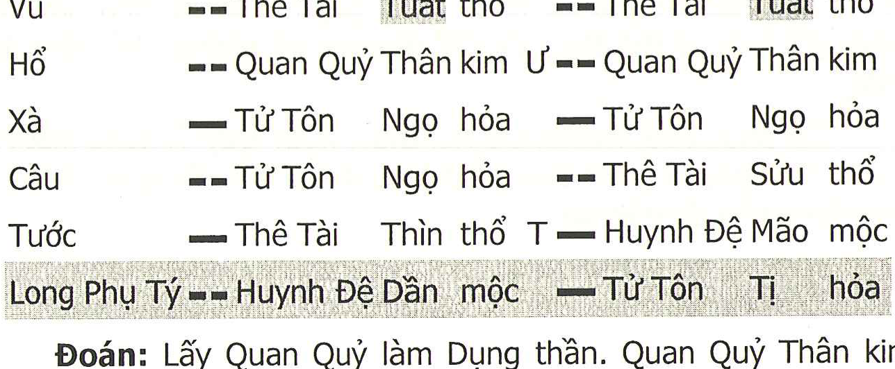
    - **Hình này chứng minh điều gì**
      - Làm sáng tỏ diễn biến cát hung và quy luật ứng nghiệm của Lôi Thủy Giải biến Lôi Trạch Quy Muội đối với sự việc được hỏi.
    - **Từ đâu mà thấy được**
      - Căn cứ Thời gian lập quẻ: Ngày Canh Thìn tháng Mão; Dụng thần Nguyệt phá. Nhìn vào động?**.

- Luận điểm phân tích:
  - **Đoán:** Lấy Quan Quỷ làm Dụng thần. Quan Quỷ Thân kim không được Nhật Nguyệt sinh phù, Nguyên thần Tuất thổ Không Vong, Dụng thần không có sức mạnh. Kỵ thần Tử Tôn trong quẻ

- Kết quả ứng nghiệm thực tế:
  - Anh ta nói quả nhiên là có hai người âm thầm phá rối, một nam một nữ, không muốn để anh ta lên chức. Sau đó không thăng chức thành công.

- Quái lệ thực tế:
  - Bối cảnh: **Ví dụ 2:** Một quái lệ trong Tăng San Bốc Dịch. Ngày Kỷ Mùi tháng Dần, chiêm về việc con gái lên đậu, được Khôn biến Sư.

- Luận điểm phân tích:
  - **Nguyên đoán:** Tử Tôn Dậu kim, tuy là xuân lệnh hưu tù, nhưng được Nhật thần sinh nó, hào 2 Tị hỏa động mà khắc kim, được ngày Mùi xung động Sửu thổ, hỏa động sinh thổ, thổ động sinh kim, đậu mùa tuy đã lên dày nhưng vẫn được sống. Người kia nói: "Bây giờ rất nguy cấp."

- Luồng đối thoại và phán đoán thực tế:
  - Ta đáp: "Không sao, giờ Mùi giờ Thân hôm nay có cứu." Quả nhiên ở giờ Thân gặp được thầy thuốc giỏi cứu chữa. Như vậy sao có thể nói là ứng nghiệm chậm?

- Kết quả ứng nghiệm thực tế:
  - Quẻ này Sửu thổ ám động sinh Dụng thần là một phương diện, nhưng đây cũng là quẻ độc phát, quẻ độc phát lấy tượng làm chủ định cát hung, Tị hỏa độc phát Trường Sinh Dụng thần, quẻ này là cát. Độc phát chủ ứng kỳ, lúc gặp hợp là ứng nghiệm. Do đó ứng giờ Thân.

- Luận điểm phân tích:
  - Vậy Nhật phá là gì? Chính là Nguyệt khắc hào này, đồng thời Nguyệt lại không phải Trường Sinh, cũng không phải mối quan hệ hợp, tình huống này gặp Nhật xung thì mới là Nhật phá, hoặc

- Quái lệ dự đoán thực tế cho Khôn Vi Địa biến Địa Thủy Sư:
  - **Hình 97.** Khôn Vi Địa biến Địa Thủy Sư
    - 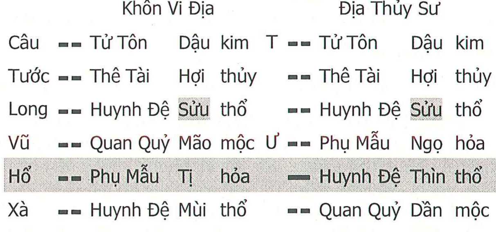
    - **Hình này chứng minh điều gì**
      - Làm sáng tỏ diễn biến cát hung và quy luật ứng nghiệm của Khôn Vi Địa biến Địa Thủy Sư đối với sự việc được hỏi.
    - **Từ đâu mà thấy được**
      - Căn cứ Thời gian lập quẻ: Ngày Canh Thìn tháng Mão; Dụng thần Nguyệt phá. Nhìn vào động?**.

- Quái lệ thực tế:
  - Bối cảnh: **Ví dụ 3:** Ngày Đinh Tị tháng Mão, nam dự đoán yêu đương với một cô gái, tình hình phát triển như thế nào? Được Thiên Phong Cấu biến Trạch Phong Đại Quá.

- Luận điểm phân tích:
  - **Đoán:** Lấy Thê Tài làm Dụng thần. Hào Tài Dần mộc bất thượng quái, phục dưới hào 2 Tử Tôn Hợi thủy, Dụng thần được Nguyệt tỉ phù vượng tướng, vốn là cát, nhưng không nên hào Thế Không Vong, Nguyên thần Tử Tôn Hợi thủy không được Nguyệt kiến sinh tỉ, hào động Tuất thổ đến khắc, Nhật xung là phá. Thủy cần có nguồn, mộc cần có rễ, Nguyên thần Nhật phá, hai người ăn ở với nhau sẽ không lâu dài. Nguyên thần bị Tị hỏa xung phá, biến nhập quẻ du hồn, tháng Tị nhất định chia tay.

- Kết quả ứng nghiệm thực tế:
  - Kết quả là chia tay ở ngày Ất Hợi tháng Tị.

- Luận điểm phân tích:
  - Hào phục tàng cho dù vượng tướng, Nhật xung cũng không phải ám động, là xung xuất. Bởi vì ám động chỉ nói đến hào tĩnh xuất hiện trong quẻ chính. Do đó, Phục thần không ám động, hào biến không ám động, hào động không ám động. Hào động vốn là động, khi vượng mà bị Nhật xung gọi là xung nó động mạnh hơn, sức mạnh sinh khắc lớn hơn so với hào động thông thường, còn khi hào động rất hưu tù bị Nhật xung, gọi là xung tán, không có quyền sinh khắc hào khác.

- Quái lệ dự đoán thực tế cho Thiên Phong Cấu biến Trạch Phong Đại Quá:
  - **Hình 98.** Thiên Phong Cấu biến Trạch Phong Đại Quá
    - 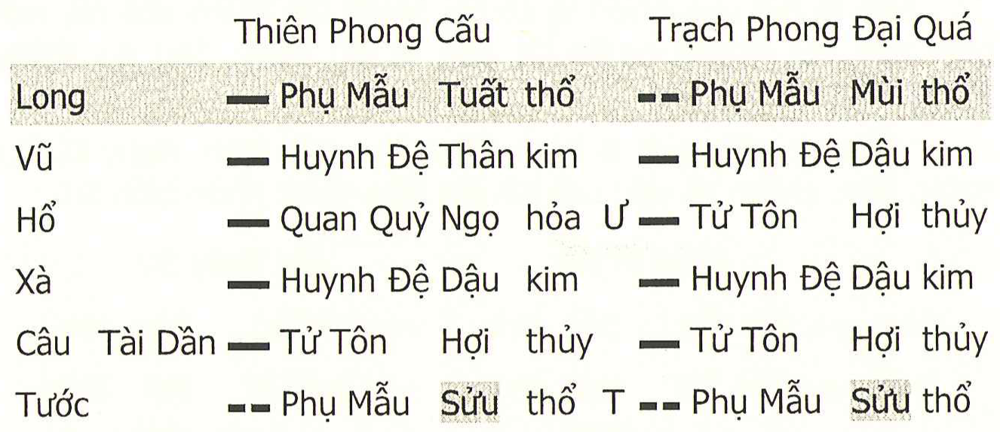
    - **Hình này chứng minh điều gì**
      - Làm sáng tỏ diễn biến cát hung và quy luật ứng nghiệm của Thiên Phong Cấu biến Trạch Phong Đại Quá đối với sự việc được hỏi.
    - **Từ đâu mà thấy được**
      - Căn cứ Thời gian lập quẻ: Ngày Canh Thìn tháng Mão; Dụng thần Nguyệt phá. Nhìn vào động?**.

- Luận điểm phân tích:
  - **Trường hợp 2: Hào ám động không phải do Nhật xung gây ra, mà là do sự biến hóa của một hào động khác gây ra.**

- Luận điểm phân tích:
  - Loại ám động này cần có một số điều kiện. Đầu tiên, quẻ này nhất định là một hào độc phát, nếu trong quẻ có hai hào động thì sẽ không có ám động do hào xung gây ra. Thứ hai, yêu cầu hào phát động phải vượng tướng, chỉ có vượng tướng mới có sức lực xung động hào an tĩnh. Hào động này không được Không Phá, gặp Nhật và hào biến hợp nó, bởi vì một khi bị hợp, tham hợp quên xung, hào này bị cản trở thì không thể khiến hào khác ám động. Một điều kiện nữa là hào bị hào động xung nhất định phải có vượng tướng, hoặc có khí. Điều này giống như một người giúp một người khác đứng lên, người nâng đỡ người khác phải có sức lực, và người được nâng đỡ cũng phải có chút sức lực mới được, nếu là một người bệnh nguy kịch ngay cả sức lực trở mình cũng không có, thì việc đỡ người này đứng dậy cũng là điều rất khó khăn.

- Luận điểm phân tích:
  - Trong tổng đoán Hoàng Kim Sách trực giải Thiên Kim Phú – Bốc Phệ Chính Tông quyển thứ 4 có một đoạn đề cập đến ám động như sau: Tĩnh đắc xung nhi ám hưng (tĩnh gặp xung thì ám động). Nói chung, hào không phát động không thể đều nói là an tĩnh, nếu bị Nhật thần xung nó thì tuy tĩnh cũng động, gọi là ám động. Giống như người nằm ngủ mà bị người khác gọi, thì không thể an nhiên mà ngủ. Hào đã phát động trong quẻ có thể xung được hào an tĩnh, mà hào gặp ám động cũng như người làm việc một cách bí mật vậy, hào ám động sinh phù ta, ắt được một người âm thầm giúp đỡ, còn nếu như khắc hại ta, ắt bị một người ngầm hại, lý của nó sâu xa, việc ứng vào ngày hợp.

- Quái lệ thực tế:
  - Bối cảnh: Có một Dịch hữu lúc đầu là người luôn dùng lục hào truyền thống, cũng đã từng viết sách về lục hào truyền thống, nhưng sau đó đột nhiên chối bỏ lục hào truyền thống, trở thành người phê phán lục hào truyền thống và tôn sùng lục hào tân pháp. Người này còn đưa ra ví dụ để phát biểu quan điểm của anh ta trên các tạp chí Dịch học. Trong đó có một ví dụ như sau:

- Quái lệ thực tế:
  - Bối cảnh: Ngày Giáp Dần tháng Bính Ngọ năm Nhâm Ngọ, một người đoán về con chó bị mất, được Thiên Thủy Tụng biến Trạch Thủy Khốn.

- Quái lệ dự đoán thực tế cho Thiên Thủy Tụng biến Trạch Thủy Khốn:
  - **Hình 99.** Thiên Thủy Tụng biến Trạch Thủy Khốn
    - 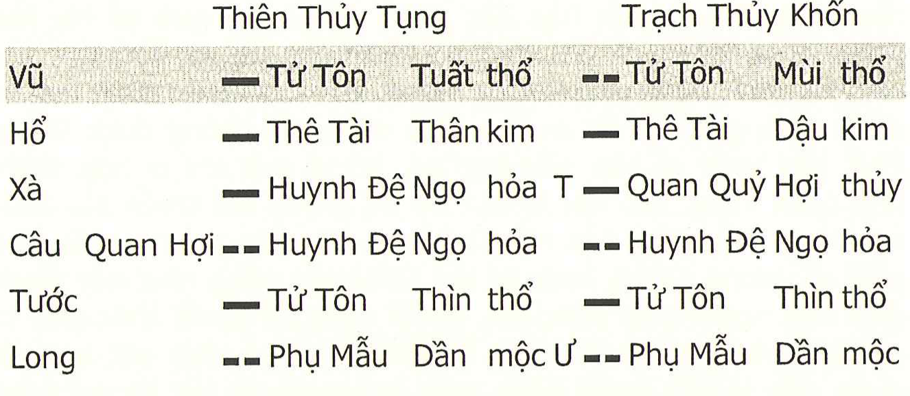
    - **Hình này chứng minh điều gì**
      - Làm sáng tỏ diễn biến cát hung và quy luật ứng nghiệm của Thiên Thủy Tụng biến Trạch Thủy Khốn đối với sự việc được hỏi.
    - **Từ đâu mà thấy được**
      - Căn cứ Thời gian lập quẻ: Ngày Canh Thìn tháng Mão; Dụng thần Nguyệt phá. Nhìn vào động?**.

- Luận điểm phân tích:
  - Anh ta nói rằng theo phương pháp truyền thống thì lấy Tử Tôn làm Dụng thần, Dụng thần động mà hóa thoái, con chó sẽ không trở về, nhưng lại chủ trương vứt bỏ Dụng thần, xem suy vượng của hào Thế để phán đoán, căn bản không hiểu chính xác cách dùng của lục hào truyền thống. Anh ta hoàn toàn không biết rằng, dự đoán người và động vật đi mất, vật phẩm bị mất v.v, Dụng thần hóa thoái là tượng trở về. Hóa Tiến thần mới là không cát. Cách dùng của loại tiến thoái này, tùy vào sự việc dự đoán khác nhau, cát hung là không giống nhau. Về cách dùng liên quan đến Thoái thần, tôi đã trình bày trong Lục Hào Quái Lệ Thuyết Chân, mọi người có thể tham khảo.

- Luận điểm phân tích:
  - Sau này con chó trở về ở ngày Dậu, vị Dịch hữu phê bình lục hào truyền thống này nói rằng dựa vào lục hào truyền thống thì không thể đoán ra con chó trở về ở ngày Dậu, thực ra anh ta đã không hiểu về thứ truyền thống, hơn nữa cũng đã không nghiên cứu kỹ lưỡng thư tịch lục hào truyền thống. Câu nói của người xưa: "Lý của nó sâu xa, việc ứng vào ngày hợp." chính là nói về ứng kỳ này.

- Quái lệ thực tế:
  - Bối cảnh: Ví dụ này không những đã không phản bác lục hào truyền thống không ứng nghiệm, mà trái lại còn là bằng chứng khẳng định lục hào truyền thống cực kỳ ứng nghiệm.

### Câu hỏi 3: Nhật hợp là cản trở có phân biệt hào động và hào tĩnh không?

- Kết quả ứng nghiệm thực tế:
  - **Đáp:** Người xưa nói "động trị hợp nhi bán trú" (động gặp hợp mà bị cản trở) là đơn chỉ hào động, chính là tình huống Dụng thần phát động, bị Nhật hoặc hào động khác hợp cản trở mà không thể động, việc ứng cần xung khai. Nhưng xét từ kết quả ứng nghiệm thực tế thì không phải như vậy. Dụng thần cho dù là phát động hoặc là an tĩnh, bị Nhật và hào động khác v.v hợp, thì chính là bị cản trở. Xin mời xem các quái lệ dưới đây, mọi người sẽ hiểu rõ, Nhật hợp là cản trở thì không phân biệt hào động hào tĩnh. Có sách nói rằng, hào tĩnh bị Nhật hợp là hợp khởi, phải xem là hào động, đây là điều sai lầm.

- Quái lệ thực tế:
  - Bối cảnh: **Ví dụ 1:** Ngày Quý Dậu tháng Ngọ, một người nữ cãi vã với chồng, chồng bỏ đi, đoán ngày nào chồng trở về? Được quẻ Địa Thủy Sư biến Địa Lôi Phục.

- Luận điểm phân tích:
  - Trong quẻ Quan Quỷ lưỡng hiện. Lấy hào Quan Quỷ Thìn thổ phát động làm Dụng, Nguyệt kiến Ngọ hỏa sinh trợ Quan Quỷ là vượng, trong quẻ tuy có Tử Tôn phát động khắc chế Quan Quỷ, Quan Quỷ phát động hóa hồi đầu khắc, nhưng Nguyệt không trợ giúp Tử Tôn, Nhật khắc Tử Tôn, Tử Tôn vô lực khắc Quan Quỷ, do đó không thể bị nạn, Quan Quỷ động mà tương hợp với Nhật, hợp thì vướng chân, ngày mai Giáp Tuất xung khai Quan Quỷ nhất định trở về. Quẻ chính quy hồn cũng có ý trở về.

- Luận điểm phân tích:
  - Chồng người này quả nhiên trở về ở giờ Thìn ngày hôm sau.

- Quái lệ dự đoán thực tế cho Quẻ Địa Thủy Sư biến Địa Lôi Phục:
  - **Hình 100.** Quẻ Địa Thủy Sư biến Địa Lôi Phục
    - 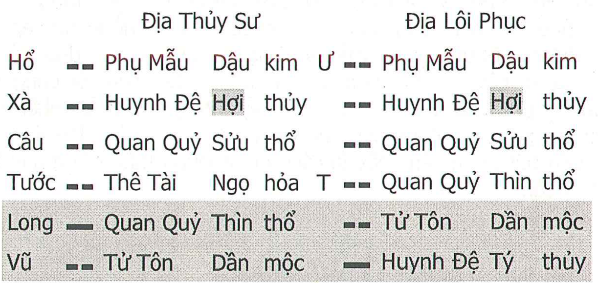
    - **Hình này chứng minh điều gì**
      - Làm sáng tỏ diễn biến cát hung và quy luật ứng nghiệm của Quẻ Địa Thủy Sư biến Địa Lôi Phục đối với sự việc được hỏi.
    - **Từ đâu mà thấy được**
      - Căn cứ Thời gian lập quẻ: Ngày Quý Dậu tháng Ngọ; Dụng thần phát động. Nhìn vào hào động và hào tĩnh không?.

- Quái lệ thực tế:
  - Bối cảnh: **Ví dụ 2:** Ngày Kỷ Sửu tháng Hợi, bạn của tôi hỏi cát hung về việc cha mẹ đến Hải Nam du lịch, được quẻ Sơn Lôi Di biến Khôn Vi Địa.

- Kết quả ứng nghiệm thực tế:
  - **Phán đoán:** Lấy Phụ Mẫu làm Dụng thần. Trong quẻ Phụ Mẫu lưỡng hiện, lấy hào Phụ Mẫu Tý thủy phát động làm Dụng thần. Phụ Mẫu Tý thủy được Nguyệt kiến tỉ phù là vượng tướng, lâm hào sơ phát động, hào sơ là chân, đây là thông tin sắp sửa lên đường. Nhưng Dụng thần và Nhật tương hợp, tôi đoán là cha mẹ người này có việc nên đi bất thành. Bạn của tôi cũng biết phương pháp dự đoán lục hào, nhưng không hiểu được nhận định của tôi. Sau đó, quả nhiên cha mẹ người này đi bất thành bởi vì chuyện bất động sản. Đây là cách dùng Dụng thần động gặp hợp mà bị cản trở.

- Quái lệ dự đoán thực tế cho Quẻ Sơn Lôi Di biến Khôn Vi Địa:
  - **Hình 101.** Quẻ Sơn Lôi Di biến Khôn Vi Địa
    - 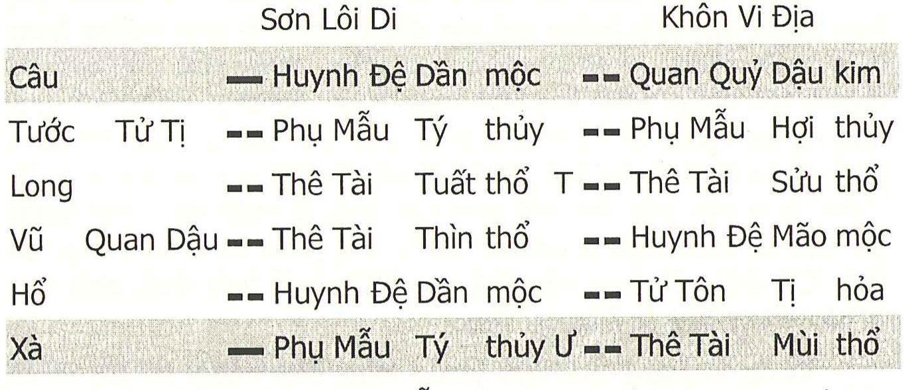
    - **Hình này chứng minh điều gì**
      - Làm sáng tỏ diễn biến cát hung và quy luật ứng nghiệm của Quẻ Sơn Lôi Di biến Khôn Vi Địa đối với sự việc được hỏi.
    - **Từ đâu mà thấy được**
      - Căn cứ Thời gian lập quẻ: Ngày Quý Dậu tháng Ngọ; Dụng thần phát động. Nhìn vào hào động và hào tĩnh không?.

- Quái lệ thực tế:
  - Bối cảnh: **Ví dụ 3:** Một học viên Nhật Bản của tôi, anh ta là một nhà hoạt động xã hội, ngày thường rất bận rộn, có một nữ đồng chí muốn đến thăm anh ta nhân ngày nghỉ 1/5, nếu đối phương thực sự muốn đến thì sẽ sắp xếp thời gian gặp mặt, thế là anh ta ở ngày Ất Dậu tháng Thìn đoán đối phương có đến trong thời gian đã nói hay không, được Càn Vi Thiên biến Lôi Thiên Đại Tráng.

- Quái lệ dự đoán thực tế cho Quẻ Càn Vi Thiên biến Lôi Thiên Đại Tráng:
  - **Hình 102.** Quẻ Càn Vi Thiên biến Lôi Thiên Đại Tráng
    - 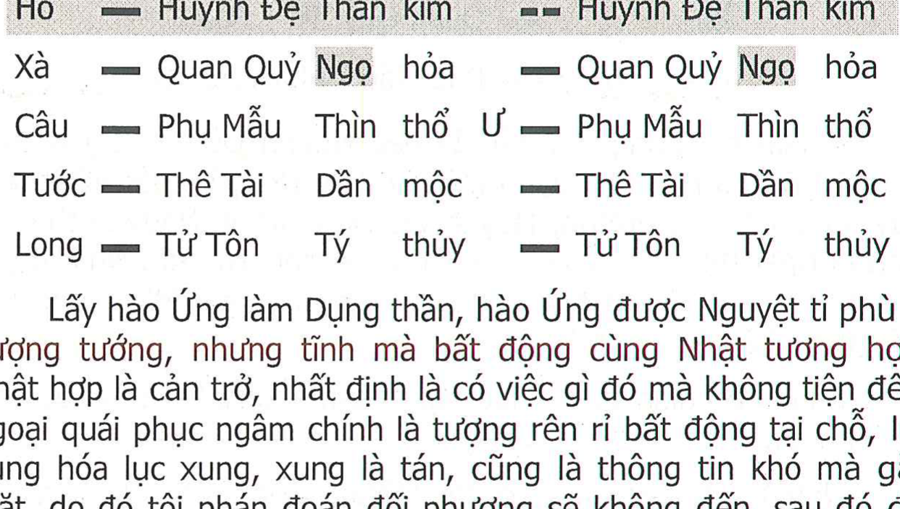
    - **Hình này chứng minh điều gì**
      - Làm sáng tỏ diễn biến cát hung và quy luật ứng nghiệm của Quẻ Càn Vi Thiên biến Lôi Thiên Đại Tráng đối với sự việc được hỏi.
    - **Từ đâu mà thấy được**
      - Căn cứ Thời gian lập quẻ: Ngày Quý Dậu tháng Ngọ; Dụng thần phát động. Nhìn vào hào động và hào tĩnh không?.

- Luận điểm phân tích:
  - Lấy hào Ứng làm Dụng thần, hào Ứng được Nguyệt tỉ phù là vượng tướng, nhưng tĩnh mà bất động cùng Nhật tương hợp, Nhật hợp là cản trở, nhất định là có việc gì đó mà không tiện đến, ngoại quái phục ngâm chính là tượng rên rỉ bất động tại chỗ, lục xung hóa lục xung, xung là tán, cũng là thông tin khó mà gặp mặt, do đó tôi phán đoán đối phương sẽ không đến, sau đó đối phương gọi điện thoại cho biết bởi vì giao thông trong ngày nghỉ tắc nghẽn mà không thể đến.

- Quái lệ thực tế:
  - Bối cảnh: **Ví dụ 4:** Một ví dụ cổ đại, ngày Mậu Thìn tháng Ngọ, chiêm cát hung về em gái sắp sinh, được quẻ Hỏa Địa Tấn.

- Quái lệ dự đoán thực tế cho Quẻ Hỏa Địa Tấn:
  - **Hình 103.** Quẻ Hỏa Địa Tấn
    - 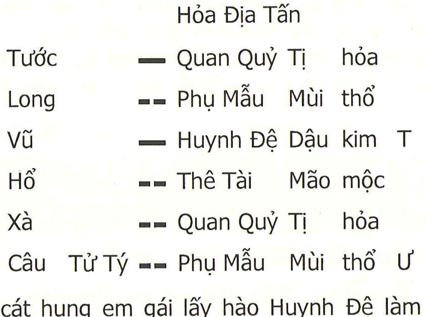
    - **Hình này chứng minh điều gì**
      - Làm sáng tỏ diễn biến cát hung và quy luật ứng nghiệm của Quẻ Hỏa Địa Tấn đối với sự việc được hỏi.
    - **Từ đâu mà thấy được**
      - Căn cứ Thời gian lập quẻ: Ngày Quý Dậu tháng Ngọ; Dụng thần phát động. Nhìn vào hào động và hào tĩnh không?.

- Luận điểm phân tích:
  - Chiêm cát hung em gái lấy hào Huynh Đệ làm Dụng thần, hào Tử Tôn là hài tử, Huynh Đệ Dậu kim Nguyệt khắc Nhật sinh, suy vượng tương đương, Huynh Đệ Dậu kim là Nguyên thần Tử Tôn bị Nhật thần hợp cản trở không thể sinh Tử Tôn, Nhật hợp là cản trở, đây là thông tin sinh khó, ngày mai giờ Mão xung khai Dậu kim nhất định sinh hạ.

- Luận điểm phân tích:
  - Sau quả nhiên ở giờ Mão ngày hôm sau sinh hạ hài tử, mẫu tử bình an.

- Luận điểm phân tích:
  - Người xưa tuy rằng có nói "động phùng hợp nhi bán trú", nhưng xét từ ví dụ này, trên thực tế cũng xem tĩnh mà gặp hợp là cản trở.

- Luận điểm phân tích:
  - Hai ví dụ vừa rồi đều là Dụng thần an tĩnh, bị Nhật thần hợp đều xem là Nhật hợp là cản trở. Do đó không nên câu nệ vào "động phùng hợp nhi bán trú". Nhật hợp là cản trở được phân tích từ lý pháp, từ tượng pháp cũng có thể sử dụng một cách xảo diệu lý luận Nhật hợp là cản trở để phán đoán ra một số tình tiết.

- Quái lệ thực tế:
  - Bối cảnh: **Ví dụ 5:** Ngày Đinh Hợi tháng Thìn, một người nữ dự đoán bệnh tật, được quẻ Thiên Lôi Vô Vọng biến Trạch Lôi Tùy.

- Luận điểm phân tích:
  - **Đoán:** Lấy hào Thế làm Dụng thần. Nguyệt không sinh Nhật khắc, bị khắc chỉnh là có bệnh. Thế lâm Bạch Hổ bị khắc, Bạch Hổ là máu, Thế tại hào 4 lâm Ngọ hỏa, hào 4 là hào vị tim, hỏa cũng là tim, là tim có vấn đề, cộng thêm thông tin Bạch Hổ, chính là tim cung máu có vấn đề.

- Luận điểm phân tích:
  - Hào 6 Tuất thổ độc phát, hào Thế nhập Mộ ở hào 6, hào 6 là đầu, lâm Thanh Long, Thanh Long là đau nhức, là bệnh đau đầu. Nhưng Mộ khố Nguyệt phá, không quá nghiêm trọng. Nguyên thần Huynh Đệ Dần mộc tại hào 2, bị Nhật hợp, Nhật hợp là cản trở, hợp cản trở không thể sinh hào Thế, cũng là thông tin có bệnh. Hào 2 là hào vị bộ phận sinh dục, lâm Câu Trần, Câu Trần là sưng trướng. Là các bệnh như u tử cung và u nang buồng trứng.

- Luận điểm phân tích:
  - Trên thực tế: Người này bị đau đầu, tim cung máu không tốt, tâm trạng hoang mang, có khối u tử cung và u nang buồng trứng.

- Quái lệ dự đoán thực tế cho Quẻ Thiên Lôi Vô Vọng biến Trạch Lôi Tùy:
  - **Hình 104.** Quẻ Thiên Lôi Vô Vọng biến Trạch Lôi Tùy
    - 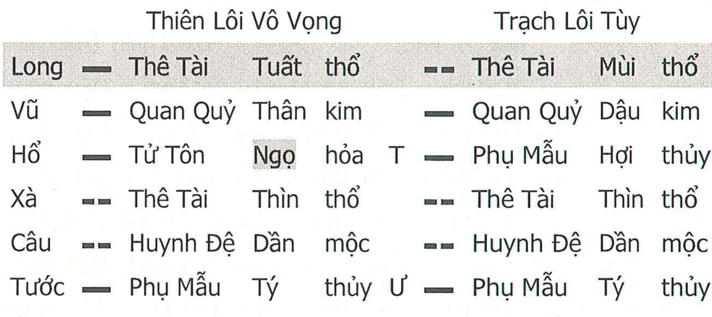
    - **Hình này chứng minh điều gì**
      - Làm sáng tỏ diễn biến cát hung và quy luật ứng nghiệm của Quẻ Thiên Lôi Vô Vọng biến Trạch Lôi Tùy đối với sự việc được hỏi.
    - **Từ đâu mà thấy được**
      - Căn cứ Thời gian lập quẻ: Ngày Quý Dậu tháng Ngọ; Dụng thần phát động. Nhìn vào hào động và hào tĩnh không?.

- Quái lệ thực tế:
  - Bối cảnh: **Ví dụ 6:** Ngày Đinh Dậu tháng Sửu, cô Cao Đẳng đoán bệnh con gái, (con 11 tuổi), có thể khỏi hay không? Được Địa Lôi Phục biến Địa Thiên Thái.

- Luận điểm phân tích:
  - **Đoán:** Lấy hào Tử Tôn làm Dụng thần, Tử Tôn Nguyệt sinh Nhật phù là vượng tướng, chứng tỏ bệnh của con gái cô ấy sẽ không có nỗi lo về tính mạng. Hào 3 Thìn thổ phát động, có vẻ sẽ sinh Dụng thần, nhưng bị Nhật thần hợp, tham hợp quên sinh, đây là then chốt của quẻ, Nhật thần hợp Nguyên thần cũng là Tử Tôn, chứng tỏ bệnh của con gái cô ấy đến từ bản thân, chứ không phải do ngoại giới gây ra. Hào 3 là giường, bị Nhật hợp không thể sinh Dụng thần, lại thêm nội quái phục ngâm, phục là tượng không thể động, cho thấy con gái cô ấy bị liệt trên giường không thể đi lại.

- Luận điểm phân tích:
  - Tình hình thực tế, con gái cô ấy bị bại não dẫn tới chi dưới tê liệt, ra vào làm bạn với xe lăn.

- Quái lệ dự đoán thực tế cho Quẻ Địa Lôi Phục biến Địa Thiên Thái:
  - **Hình 105.** Quẻ Địa Lôi Phục biến Địa Thiên Thái
    - 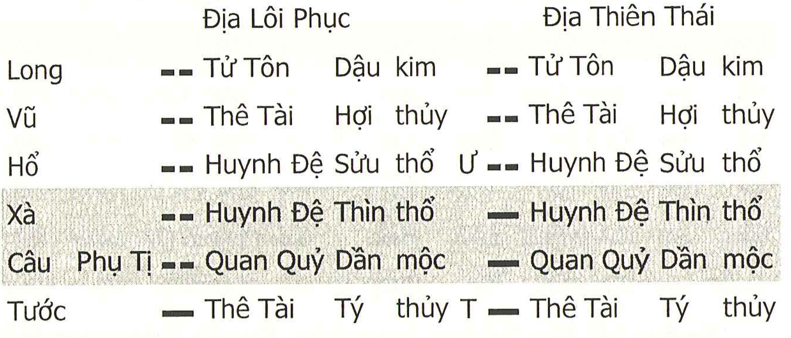
    - **Hình này chứng minh điều gì**
      - Làm sáng tỏ diễn biến cát hung và quy luật ứng nghiệm của Quẻ Địa Lôi Phục biến Địa Thiên Thái đối với sự việc được hỏi.
    - **Từ đâu mà thấy được**
      - Căn cứ Thời gian lập quẻ: Ngày Quý Dậu tháng Ngọ; Dụng thần phát động. Nhìn vào hào động và hào tĩnh không?.

- Quái lệ thực tế:
  - Bối cảnh: **Ví dụ 7:** Ngày Mậu Thìn tháng Dần, một người nữ hơn 30 tuổi đoán duyên khác giới, được Lôi Phong Hằng biến Địa Phong Thăng.

- Quái lệ dự đoán thực tế cho Quẻ Lôi Phong Hằng biến Địa Phong Thăng:
  - **Hình 106.** Quẻ Lôi Phong Hằng biến Địa Phong Thăng
    - 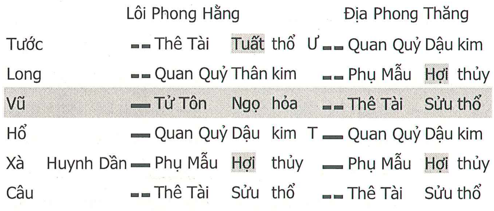
    - **Hình này chứng minh điều gì**
      - Làm sáng tỏ diễn biến cát hung và quy luật ứng nghiệm của Quẻ Lôi Phong Hằng biến Địa Phong Thăng đối với sự việc được hỏi.
    - **Từ đâu mà thấy được**
      - Căn cứ Thời gian lập quẻ: Ngày Quý Dậu tháng Ngọ; Dụng thần phát động. Nhìn vào hào động và hào tĩnh không?.

- Luận điểm phân tích:
  - **Đoán:** Lấy Quan Quỷ làm Dụng thần, trong quẻ Quan Quỷ lưỡng hiện, hào 5 Quan Quỷ Nguyệt phá, hào 2 Quan Quỷ và Nhật hợp, có thể đều lấy làm Dụng thần. Quan Quỷ trì Thế vượng tướng là thông tin có bạn trai, lâm hào 3, hào 3 là giường, lại thấy hào động Ngọ hỏa là đất Mộc Dục, chứng tỏ đã ở cùng một nơi. Nhưng Quan Quỷ và Nhật thần tương hợp, Nhật thần là Tài, Tài là nữ nhân, người nam này đồng thời lại ăn ở với người nữ khác. Hào Ứng ám động sinh Quan Quỷ, đồng thời còn có một người nữ khác thích người nam này, Quan Quỷ Tuyệt ở Nguyệt kiến, Tử Tôn Ngọ hỏa độc phát, cho thấy tình cảm giữa hai người đã xuất hiện vấn đề, Quan lâm Bạch Hổ, Bạch Hổ là bệnh, Nhật hợp là cản trở, lại hào 3 là giường, chứng tỏ người nam này nằm giường vì bệnh, Tử Tôn vượng tướng phát động, tháng Mão Quan Quỷ gặp xung hai người chắc chắn chia tay.

- Luận điểm phân tích:
  - Tình hình thực tế: Người nữ này chung sống với người nam đã có vợ, người nam này đột nhiên liệt trên giường vì bệnh, thế là cô ấy muốn chia tay với người này, sau này chia tay ở tháng Mão.

- Quái lệ thực tế:
  - Bối cảnh: **Ví dụ 8:** Ngày Kỷ Tị tháng Ngọ, một người đoán bệnh của mẹ, được quẻ Lôi Hỏa Phong biến Địa Hỏa Minh Di.

- Quái lệ dự đoán thực tế cho Quẻ Lôi Hỏa Phong biến Địa Hỏa Minh Di:
  - **Hình 107.** Quẻ Lôi Hỏa Phong biến Địa Hỏa Minh Di
    - 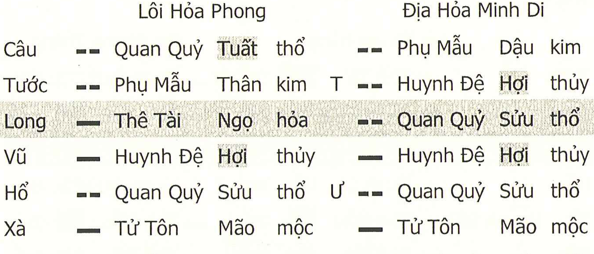
    - **Hình này chứng minh điều gì**
      - Làm sáng tỏ diễn biến cát hung và quy luật ứng nghiệm của Quẻ Lôi Hỏa Phong biến Địa Hỏa Minh Di đối với sự việc được hỏi.
    - **Từ đâu mà thấy được**
      - Căn cứ Thời gian lập quẻ: Ngày Quý Dậu tháng Ngọ; Dụng thần phát động. Nhìn vào hào động và hào tĩnh không?.

- Luận điểm phân tích:
  - Lấy Phụ Mẫu làm Dụng thần. Nhật Nguyệt đều đến khắc Dụng thần. Trong quẻ Kỵ thần lại động đến khắc chế, Dụng rất nhược, cho thấy sức khỏe của mẹ anh ta rất không tốt.

- Luận điểm phân tích:
  - Hỏa tại hào 4 đến khắc, là tim không tốt. Hào 6 Nguyên thần Không không sinh Dụng, là trên đầu cũng có bệnh. Lâm Câu Trần, Câu Trần là tượng trì hoãn (chậm chạp), là thông tin si ngốc. Dụng thần là kim, lâm Chu Tước chủ âm thanh, bị khắc là sẽ không nói được hoặc nói không lưu loát. Nhật là Kỵ thần khắc mà hợp Dụng thần, Nhật hợp là cản trở, là thông tin bệnh tật quấn lấy người, Dụng thần tại hào 5 bị hợp, hào 5 là đường, Nhật hợp cản trở, là thông tin không thể đi.

- Luận điểm phân tích:
  - **Tình hình thực tế** là mẹ anh ta có bệnh tim và chứng Alzheimer, nói năng không linh hoạt, đi lại khó khăn.

### Câu hỏi 4: Hào bị Nguyệt kiến hợp có phải cũng luận là bị cản trở?

- Giải đáp trọng tâm:
  - Không phải, Nhật hợp và Nguyệt hợp có sự khác biệt về bản chất, Nhật hợp là cản trở, Nguyệt hợp là vượng.

- Luận điểm phân tích:
  - Trong Tăng San Bốc Dịch bàn về Nguyệt hợp như sau: "Nguyệt tướng là chủ soái đương quyền, vạn quẻ lấy đó làm cương lĩnh. Hào suy nhược, Nguyệt tướng có thể sinh, hợp, tỉ, củng, phù, suy cũng thành vượng. Hào cường vượng, Nguyệt tướng có thể xung, khắc, hình, phá, vượng cũng thành suy." "Hào gặp Nguyệt hợp mà hữu dụng, hào gặp Nguyệt phá mà vô công."

- Luận điểm phân tích:
  - Người xưa đã chỉ rõ Nguyệt hợp vượng, Nguyệt xung là nhược, thế nhưng người thời nay đọc sách không cẩn thận, khi ứng dụng đã lẫn lộn cách thức, tôi thấy nhiều sách hiện nay nói rằng Nguyệt hợp là cản trở, Nguyệt kiến là thổ, càng xung thổ càng vượng v.v, đọc cuốn sách như vậy thực là hại người.

- Quái lệ thực tế:
  - Bối cảnh: **Ví dụ 1:** Trong Tăng San Bốc Dịch có một ví dụ như sau: Ngày Mậu Thìn tháng Mão, em gái chiêm việc kiện tụng của anh trai, đã bị phán trọng hình hỏi có cứu hay không? Được Thiên Địa Bĩ biến Thiên Thủy Tụng.

- Quái lệ dự đoán thực tế cho Thiên Địa Bĩ biến Thiên Thủy Tụng:
  - **Hình 108.** Thiên Địa Bĩ biến Thiên Thủy Tụng
    - 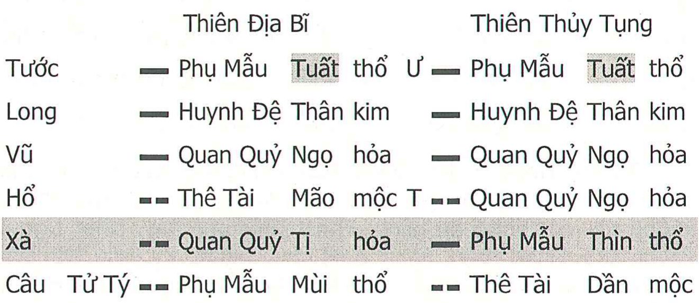
    - **Hình này chứng minh điều gì**
      - Làm sáng tỏ diễn biến cát hung và quy luật ứng nghiệm của Thiên Địa Bĩ biến Thiên Thủy Tụng đối với sự việc được hỏi.
    - **Từ đâu mà thấy được**
      - Căn cứ Thời gian lập quẻ: Ngày Mậu Thìn tháng Mão; Dụng thần vốn được Nhật sinh phù là có căn. Nhìn vào biến Địa Hỏa Minh Di](assets/page_0118_img_01.

- Luận điểm phân tích:
  - Hào Huynh Thân kim làm Dụng thần, Quan Quỷ Tị hỏa lâm Trình Xà đến hình khắc Dụng thần, hình là thụ hình, Trình Xà là dây thừng, đây là tổ hợp tiêu chuẩn của thông tin lao ngục.

- Luận điểm phân tích:
  - Bề ngoài là Quan Quỷ động mà đến khắc Dụng thần, có vẻ như không cát, nhưng đây là một hào độc phát, một hào độc phát lấy tượng làm chủ, tượng chủ cát hung, hào động cũng là đất Trường Sinh của Dụng thần, gặp Trường Sinh là cát. Đồng thời, trong quẻ Tuất thổ được Nguyệt kiến đến hợp là vượng, lại được Quan Quỷ Tị hỏa sinh nó, do đó Nhật xung là ám động. Ám động sinh Huynh Đệ Thân kim, lại thêm Nhật Nguyệt không khắc Dụng thần, Dụng thần vốn được Nhật sinh phù là có căn, do đó trong hung có cứu. Sau cùng bởi vì cha mẹ cao tuổi nên được miễn chết.

- Quái lệ thực tế:
  - Bối cảnh: **Ví dụ 2:** Một ngày trong năm 2001, Dương tiên sinh ở thành phố Đại Liên đã gọi điện thoại cho tôi, nhờ tôi phán đoán cát hung cho tiểu hài qua quẻ lưu niên của ông ấy. Ngày Bính Ngọ tháng Dần, chiêm được quẻ Lôi Trạch Quy Muội biến Càn Vi Thiên.

- Quái lệ dự đoán thực tế cho Lôi Trạch Quy Muội biến Càn Vi Thiên:
  - **Hình 109.** Lôi Trạch Quy Muội biến Càn Vi Thiên
    - 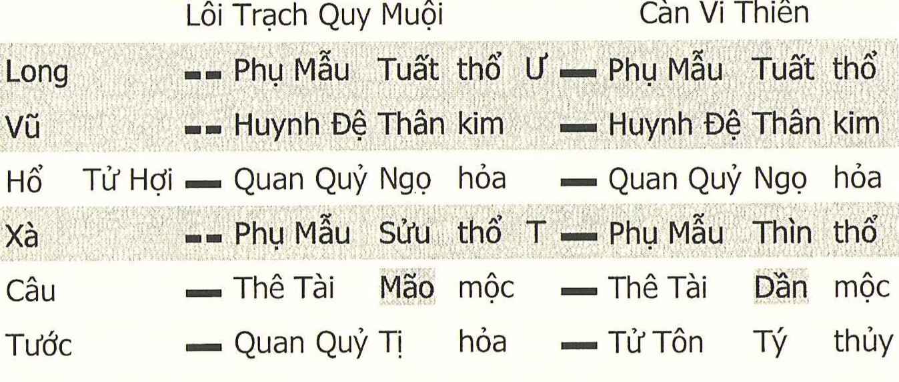
    - **Hình này chứng minh điều gì**
      - Làm sáng tỏ diễn biến cát hung và quy luật ứng nghiệm của Lôi Trạch Quy Muội biến Càn Vi Thiên đối với sự việc được hỏi.
    - **Từ đâu mà thấy được**
      - Căn cứ Thời gian lập quẻ: Ngày Mậu Thìn tháng Mão; Dụng thần vốn được Nhật sinh phù là có căn. Nhìn vào biến Địa Hỏa Minh Di](assets/page_0118_img_01.

- Luận điểm phân tích:
  - Tử Tôn Hợi thủy làm Dụng thần, Dụng thần bất thượng quái, phục dưới hào 4 Quan Quỷ, Quan Quỷ là bệnh, là sức khỏe hài tử không tốt, có thông tin bệnh. Thoạt nhìn quẻ này, Nhật Nguyệt không sinh Dụng thần, ngoại quái phục ngâm, Kỵ thần Phụ Mẫu lưỡng động, Nguyên thần nhập Mộ, rất là không tốt, nhưng chỗ huyền diệu của quẻ, nếu như không xét kỹ, thì sẽ không nhìn ra. Thảo nào Dương tiên sinh trước sau đã hỏi qua ý kiến của hơn 80 cao thủ lục hào có chút tiếng tăm trong nước, họ đều luận là hung, nói rằng năm đó con gái của ông chắc chắn sẽ chết.

- Luận điểm phân tích:
  - Tôi phân tích quẻ này, Nhật Nguyệt không khắc Tử Tôn, căn của Tử Tôn không hoại, Nguyệt hợp Dụng thần là vượng, trong quẻ mặc dù có Kỵ thần hai nơi phát động đến khắc, nhưng Nguyên thần động mà tương giải, tham sinh quên khắc, hình thành liên tục tương sinh, Tử Tôn được cứu, căn bản sẽ không có hung. Tôi đoán tiểu hài chỉ là chức năng phổi không tốt, không có hung tai gì lớn, sẽ bình an vượt qua năm này.

- Luận điểm phân tích:
  - Sau cùng tôi là người duy nhất dự đoán đúng.

### Câu hỏi 5: Thái Tuế có hữu dụng trong dự đoán hay không?

- Giải đáp trọng tâm:
  - Rất nhiều sách nói đến Dụng thần Tuế phá, Thái Tuế sinh khắc Dụng thần v.v, dường như Thái Tuế cũng chiếm vị trí rất quan trọng trong dự đoán. Thực ra, Thái Tuế hoàn toàn không tham gia sinh khắc bất cứ hào nào.

- Luận điểm phân tích:
  - Người xưa nói rằng: "Thái Tuế tuy nắm lệnh một năm, tôn quý mà không thân, cao mà khó nhờ cậy, cát hung đều không bằng Nhật Nguyệt. Xưa cho rằng Thái Tuế không đếm xỉa đến những việc vặt trong gia đình, cái lý này cũng đúng. Do đó, Thái Tuế xung hào là Tuế phá không cho là hung, hợp hào là Tuế hợp không cho là cát. Hào suy, Thái Tuế không thể sinh nó, hào vượng, Thái Tuế không thể chế nó. Hào gặp Nguyệt phá liền phá, gặp Tuần Không liền Không, cho nên uy lực của Thái Tuế không thể bằng Nguyệt kiến Nhật kiến."

- Luận điểm phân tích:
  - Bởi vì người xưa đã nói như thế, vậy thì khi dự đoán chúng ta có thể không xem Thái Tuế ư? Điều này không đúng. Khi dự đoán, chúng ta nhất thiết phải chú ý Dụng thần hoặc Kỵ thần, Nguyên thần v.v có lâm Thái Tuế hay không, Thái Tuế không phải không có công dụng trong dự đoán mà là nó biểu thị một phạm vi thời gian, Thái Tuế có Thái Tuế quá khứ, Thái Tuế năm nay, Thái Tuế tương lai v.v.

- Luận điểm phân tích:
  - Thái Tuế năm nay, được Nhật Nguyệt sinh tỉ vượng mà nhập phát động thì có quyền sinh khắc hào khác. Thái Tuế năm nay không nhập hào, hoặc là hưu tù bất động, thì không có sức mạnh ảnh hưởng đến hào khác.

- Luận điểm phân tích:
  - Thái Tuế lưu niên khác, bất kể là Thái Tuế quá khứ hay là Thái Tuế tương lai, thường có sinh khắc xung hợp đối với một hào nào đó trong quẻ, dùng để phán đoán ứng kỳ phát sinh sự việc, và Thái Tuế của năm đó không vượt quyền đến năm nay để quản một hào nào đó trong quẻ.

- Quái lệ thực tế:
  - Bối cảnh: **Ví dụ 1:** Ngày Canh Tý tháng Dậu năm 2001, nam đoán bệnh mẹ, được quẻ Phong Trạch Trung Phu biến Phong Thủy Hoán. Quái lệ này cũng đã được nêu ra trong "Lục Hào Tật Bệnh Dự Trắc Học".

- Quái lệ dự đoán thực tế cho Phong Trạch Trung Phu biến Phong Thủy Hoán:
  - **Hình 110.** Phong Trạch Trung Phu biến Phong Thủy Hoán
    - 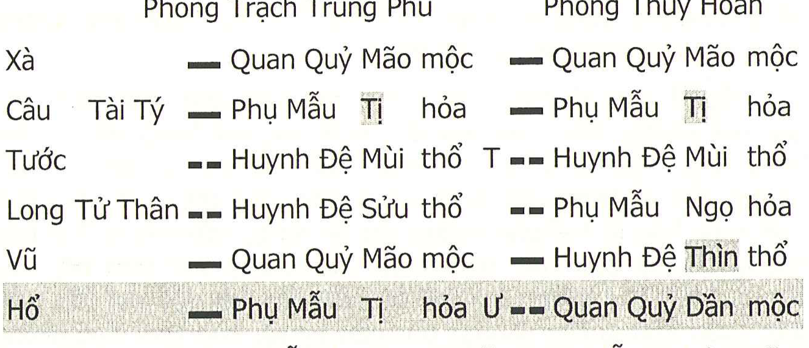
    - **Hình này chứng minh điều gì**
      - Làm sáng tỏ diễn biến cát hung và quy luật ứng nghiệm của Phong Trạch Trung Phu biến Phong Thủy Hoán đối với sự việc được hỏi.
    - **Từ đâu mà thấy được**
      - Căn cứ Thời gian lập quẻ: Ngày Canh Tý tháng Dậu năm 2001; Dụng thần Tuế phá. Nhìn vào thế nhưng rốt cuộc ứng vào ngày Hợi; phát động thì có quyền sinh khắc hào khác.

- Luận điểm phân tích:
  - **Đoán:** Lấy Phụ Mẫu làm Dụng thần. Phụ Mẫu Tị hỏa lưỡng hiện, lấy hào Phụ Mẫu động làm Dụng thần. Dụng thần tuy động hóa hồi đầu sinh, nhưng Dụng thần Không không được sinh, bị Nhật thần khắc, Nguyệt kiến lại là Tử địa của Dụng thần, lại thêm Bạch Hổ có ý nghĩa tử vong lâm Dụng thần, mẹ người này bệnh tất hung.

- Luận điểm phân tích:
  - Dụng thần Tị hỏa là Thái Tuế năm nay, động mà hóa Quan Quỷ, đây là thông tin năm nay biến quỷ, trong năm tất hung. Tháng Hợi hợp Nguyên thần không sinh Dụng thần, Dụng thần gặp xung không cát.

- Luận điểm phân tích:
  - Phán đoán chứng bệnh, tham khảo cả hai Dụng thần. Dụng thần lâm Câu Trần, Nguyệt kiến là Tử địa Dụng thần, đây là thông tin ung thư. Dụng thần Tử tại Dậu kim, kim là Tử Tôn, nhất định bệnh tật tương ứng với Tử Tôn mà hung. Tử Tôn là ruột, đường hô hấp, thực quản, vú v.v, kết hợp thông tin Dụng thần lâm hào 5, đoán mẹ người đó bị ung thư thực quản.

- Kết quả ứng nghiệm thực tế:
  - Tình hình ứng nghiệm: Quả nhiên mẹ người này bị ung thư thực quản. Năm Giáp Thân, trên đường đi làm, tôi đột nhiên bắt gặp người này, hỏi anh ta mới biết kết quả, mẹ anh ta quả nhiên qua đời ở tháng Hợi.

- Quái lệ thực tế:
  - Bối cảnh: **Ví dụ 2:** Ngày Giáp Dần tháng Tị năm 1997, một người đàn ông ở viện bảo tàng đoán bệnh vợ, được quẻ Lôi Hỏa Phong biến Địa Lôi Phục.

- Quái lệ dự đoán thực tế cho Quẻ Lôi Hỏa Phong biến Địa Lôi Phục:
  - **Hình 111.** Quẻ Lôi Hỏa Phong biến Địa Lôi Phục
    - 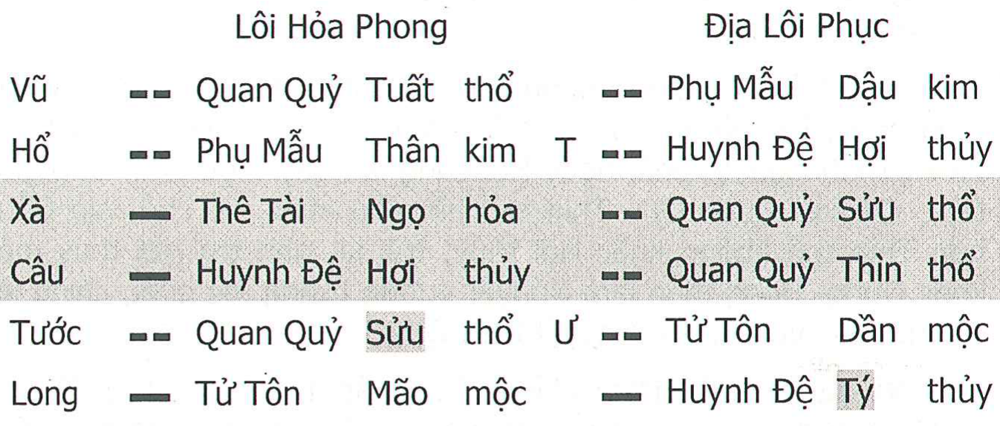
    - **Hình này chứng minh điều gì**
      - Làm sáng tỏ diễn biến cát hung và quy luật ứng nghiệm của Quẻ Lôi Hỏa Phong biến Địa Lôi Phục đối với sự việc được hỏi.
    - **Từ đâu mà thấy được**
      - Căn cứ Thời gian lập quẻ: Ngày Canh Tý tháng Dậu năm 2001; Dụng thần Tuế phá. Nhìn vào thế nhưng rốt cuộc ứng vào ngày Hợi; phát động thì có quyền sinh khắc hào khác.

- Luận điểm phân tích:
  - **Đoán:** Lấy hào Thê Tài làm Dụng thần. Dụng thần được Nguyệt kiến tỉ phù, Nhật thần sinh trợ vượng tướng, nhưng không nên Tài động hóa Không hóa Quỷ. Cổ quyết nói rằng, "Dụng liên Quỷ sát mục hạ lập kiến khuynh nguy¹", bệnh này nguy hiểm.

- Luận điểm phân tích:
  - Dụng thần hóa ra Quan Quỷ Sửu thổ, Thái Tuế nhập hào (đoán năm Đinh Sửu), trong năm có hung, Kỵ thần Huynh Đệ Hợi thủy phát động khắc Dụng, nay lâm Nguyệt phá, đề phòng ngày tháng điền thực, bởi vì Dụng thần vượng tướng, tháng Hợi có hiểm.

- Luận điểm phân tích:
  - Quẻ tại cung Khảm, Khảm là thủy chủ tiểu ra máu, tất là bệnh về tiểu ra máu. Dụng thần Ngọ hỏa lâm hào 4 bị khắc, hào 4 là tim, Ngọ hỏa cũng là tim, tim bị ảnh hưởng, Kỵ lâm Câu Trần hóa Quan Quỷ Thìn thổ, Câu Trần chủ sưng trướng, Hợi thủy chủ nước tiểu, hào 3 chủ âm, Thìn thổ là bàng quang, là tiểu tiện có vấn đề. Hào 5 Phụ Mẫu Thân kim lâm Hổ ám động, hào 5 là ngực phổi, Phụ Mẫu chủ ngực, kim là phổi, Thân chủ truyền tống, Bạch Hổ chủ máu, ám động khắc Tử Tôn sinh Kỵ thần, Tử Tôn là mạch máu, là mạch máu ở phổi đã xảy ra vấn đề. Lâm Thân, là bị ở tháng Thân. Trong quẻ kim thủy là Kỵ, người bệnh không nên đeo đồ trang sức vàng bạc. Phụ Mẫu trì Thế, Tử Tôn lâm Nhật xung động, Tử Tôn là y dược, Phụ Mẫu chủ bôn ba, là bôn ba khắp nơi để tìm thầy trị bệnh. Tử lâm mộc là Nguyên thần, nên đến phương Đông tìm thầy thuốc.

- Luận điểm phân tích:
  - ¹ Dụng biến thành Quỷ, trước mắt tất nguy hiểm.

- Kết quả ứng nghiệm thực tế:
  - **Tình hình ứng nghiệm:** Vợ người này bị bệnh tắc nghẽn mạch máu phổi ở tháng Thân năm Bính Tý, khiến cho tim cung máu không đủ, mất cân bằng, tiểu tiện chẳng được toàn thân phù thũng, mềm yếu vô lực, sau 10 ngày dự đoán, ở giờ Dậu ngày Quý Hợi qua đời.

- Luận điểm phân tích:
  - Lúc đó Dụng thần vượng tướng, không dám xác định hung theo ngày, thế nhưng rốt cuộc ứng vào ngày Hợi. Ứng ngày Hợi, do Kỵ thần Nguyệt phá, ngày Hợi cũng là ngày thực phá. Ứng giờ Dậu, Kỵ hóa Quan Quỷ Thìn thổ hồi đầu khắc, có chế, giờ Dậu hợp Thìn thổ không khắc Hợi thủy, trái lại sinh trợ Hợi thủy mà khắc Dụng. Dụng thần lâm Nguyệt vượng tướng mà chết, chính là do thừa lúc vượng lâm Nguyệt biến Quỷ.

- Quái lệ thực tế:
  - Bối cảnh: **Ví dụ 3:** Ngày Đinh Mão tháng Giáp Tuất năm Giáp Thân, một người đàn ông dự đoán khi nào có thể chia tay với bạn gái, được quẻ Trạch Địa Tụy biến Thủy Địa Tỷ.

- Quái lệ dự đoán thực tế cho Quẻ Trạch Địa Tụy biến Thủy Địa Tỷ:
  - **Hình 112.** Quẻ Trạch Địa Tụy biến Thủy Địa Tỷ
    - 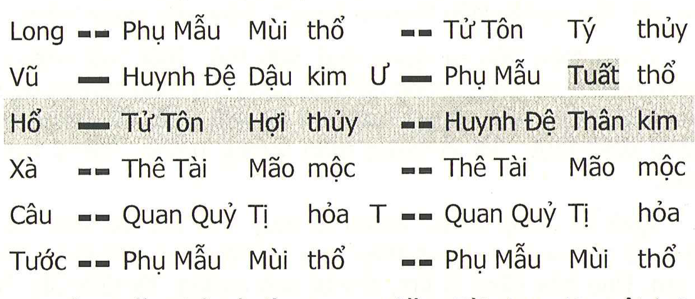
    - **Hình này chứng minh điều gì**
      - Làm sáng tỏ diễn biến cát hung và quy luật ứng nghiệm của Quẻ Trạch Địa Tụy biến Thủy Địa Tỷ đối với sự việc được hỏi.
    - **Từ đâu mà thấy được**
      - Căn cứ Thời gian lập quẻ: Ngày Canh Tý tháng Dậu năm 2001; Dụng thần Tuế phá. Nhìn vào thế nhưng rốt cuộc ứng vào ngày Hợi; phát động thì có quyền sinh khắc hào khác.

- Luận điểm phân tích:
  - **Đoán:** Lấy Thê Tài làm Dụng thần. Tài được Nguyệt hợp là vượng, lại được Nhật thần tỉ phù, Nguyên thần động mà đến sinh, nhất thời rất khó chia tay. Tài hợp Phụ Mẫu trên Nguyệt, Phụ Mẫu là giấy kết hôn, chứng tỏ người nữ này là người đã kết hôn. Nguyên thần là tâm tư của một người, Nguyên thần của Tài lâm Bạch Hổ độc phát đến khắc Thế, Bạch Hổ chủ đánh nhau, nếu như chia tay, người nữ này sẽ muốn đánh anh, bất lợi cho anh.

- Luận điểm phân tích:
  - Người này hồi đáp, quả là như vậy, bản thân đã phát sinh quan hệ với một người nữ có chồng, sau một thời gian ở chung, anh ta phát hiện tư tưởng của người nữ này quá cực đoan, bèn đề xuất chia tay, nhưng người nữ này đã cảnh cáo anh ta, nếu đòi chia tay thì sẽ giết anh ta, vì vậy mà tâm lý rất là phiền não.

- Luận điểm phân tích:
  - Bởi vì phiền não mà chiêm, trong quẻ Huynh Đệ Dậu kim ám động khắc Tài, Dậu là Thái Tuế năm sau, chứng tỏ năm sau hai người nhất định chia tay, vậy thì đợi một năm nữa. Tử Tôn mặc dù là Nguyên thần của Tài đến khắc Thế, nhưng bởi vì người lo lắng mà chiêm, Tử Tôn độc phát là tượng giải ưu, động mà khắc đi Quỷ bên mình, nhất định sẽ không bị làm hại.

- Luận điểm phân tích:
  - Sau quả nhiên chia tay bình yên ở năm Ất Dậu.

- Quái lệ thực tế:
  - Bối cảnh: **Ví dụ 4:** Ngày Canh Thìn tháng Giáp Tuất năm Giáp Thân, dự đoán hôn nhân của một người phụ nữ, được Lôi Thủy Giải biến Lôi Trạch Quy Muội.

- Quái lệ dự đoán thực tế cho Lôi Thủy Giải biến Lôi Trạch Quy Muội:
  - **Hình 113.** Lôi Thủy Giải biến Lôi Trạch Quy Muội
    - 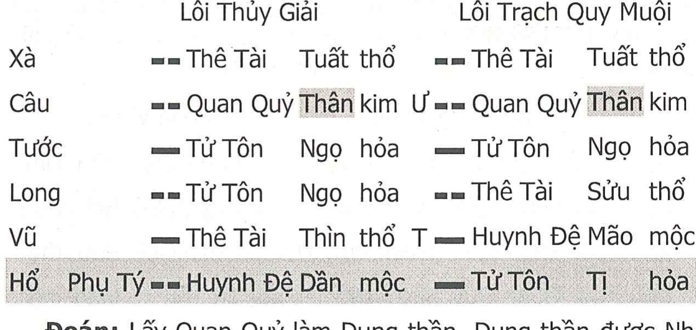
    - **Hình này chứng minh điều gì**
      - Làm sáng tỏ diễn biến cát hung và quy luật ứng nghiệm của Lôi Thủy Giải biến Lôi Trạch Quy Muội đối với sự việc được hỏi.
    - **Từ đâu mà thấy được**
      - Căn cứ Thời gian lập quẻ: Ngày Canh Tý tháng Dậu năm 2001; Dụng thần Tuế phá. Nhìn vào thế nhưng rốt cuộc ứng vào ngày Hợi; phát động thì có quyền sinh khắc hào khác.

- Luận điểm phân tích:
  - **Đoán:** Lấy Quan Quỷ làm Dụng thần. Dụng thần được Nhật Nguyệt sinh phù là vượng tướng, nhưng Dụng thần trị Thái Tuế năm nay mà Không, Huynh Đệ Dần mộc một hào độc phát, Tuyệt Dụng thần Quan Quỷ, độc phát lấy tượng làm chủ, do đó hôn nhân này nhất định lìa tan, hơn nữa ứng tại năm nay.

- Luận điểm phân tích:
  - Thân cũng là địa chi của tháng Thân, tháng Thân có thể Thực Không. Đồng thời xem Hương Khuê, quái thân tại Sửu, Hương Khuê tại thủy, Nhật Nguyệt khắc, nhập Mộ ở Nhật lại bất thượng quái, khẳng định đã ly hôn. Do đó tôi đoán cô ấy đã ly hôn tại tháng Thân.

- Luận điểm phân tích:
  - Hào Thế Thìn thổ được Nhật thần phù sinh Quan Quỷ, Tuất thổ ám động cũng sinh Quan Quỷ, bản thân lại lén lút thích người đàn ông khác. Quan Quỷ tại hào 5, hào 5 là hào vị lãnh đạo, là lãnh đạo có mối quan hệ ám muội với mình.

- Kết quả ứng nghiệm thực tế:
  - Tất cả phán đoán đều ứng nghiệm.

### Câu hỏi 6: Thời thần (giờ) có hữu dụng khi dự đoán không?

- Giải đáp trọng tâm:
  - Dự đoán lục hào lấy Nhật Nguyệt sinh khắc làm chủ, thông thường chỉ xem ảnh hưởng của Nhật Nguyệt đối với hào trong quẻ, về cơ bản không xem thời thần khi dự đoán.

- Luận điểm phân tích:
  - Tuy nhiên, khi người xem hỏi về sự tình bất thường, thời thần lại tỏ ra rất quan trọng, khi đó phán đoán cát hung của quẻ phải xem thời thần.

- Quái lệ thực tế:
  - Bối cảnh: **Ví dụ 1:** Giờ Dậu ngày Giáp Ngọ tháng Ngọ, một người nữ đến dự đoán, nói rằng hai con trai của cô ấy sau buổi trưa tan học đã không về nhà, cũng không báo với cha mẹ, không biết đã đi đâu, cho đến bây giờ vẫn không có tin tức gì, do đó mà hỏi cát hung, được Thủy Trạch Tiết biến Khôn Vi Địa.

- Quái lệ dự đoán thực tế cho Thủy Trạch Tiết biến Khôn Vi Địa:
  - **Hình 114.** Thủy Trạch Tiết biến Khôn Vi Địa
    - 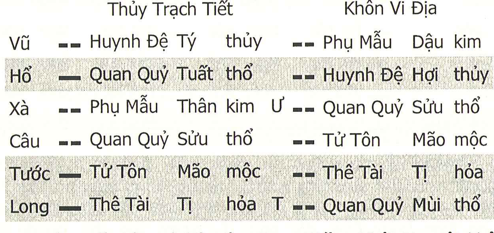
    - **Hình này chứng minh điều gì**
      - Làm sáng tỏ diễn biến cát hung và quy luật ứng nghiệm của Thủy Trạch Tiết biến Khôn Vi Địa đối với sự việc được hỏi.
    - **Từ đâu mà thấy được**
      - Căn cứ Dụng thần lâm Nhật lộ ra. Nhìn vào biến Khôn Vi Địa.

- Luận điểm phân tích:
  - **Đoán:** Lấy hào Tử Tôn làm Dụng thần, Nhật Nguyệt không khắc Tử Tôn, Tử Tôn lâm hào 2 động mà sinh Thế, hào 2 là trạch, hài tử nhất định sẽ trở về nhà.

- Luận điểm phân tích:
  - Hào 5 Tuất thổ động mà hợp Dụng thần, động gặp hợp mà bị cản trở, nhưng giờ này giờ Dậu hợp xứ phùng xung, xung khai Dụng thần, chứng tỏ hiện tại tiểu hài đã về đến nhà. Tử Tôn tại hào 2 lâm Chu Tước sinh Thế, Chu Tước chủ ngôn ngữ, tin tức, hài tử sẽ gọi điện thoại cho cô ấy từ trong nhà.

- Luận điểm phân tích:
  - Vừa mới đoán xong, điện thoại của cô ấy đã đổ chuông, đúng là con trai gọi đến từ trong nhà. Hỏi chúng nó buổi trưa đã đi đâu? Chúng nó nói là đã đến nhà bạn học chơi.

- Quái lệ thực tế:
  - Bối cảnh: **Ví dụ 2:** Giờ Dậu ngày Đinh Mão tháng Thân, trong nhóm QQ những người yêu thích Chu Dịch, Dịch hữu Đăng Nhi đã hỏi gấp về việc công ty bị mất một thùng hàng, xem tìm lại được hay không? Được quẻ Thủy Sơn Kiển.

- Luận điểm phân tích:
  - **Đoán:** Lấy hào Thê Tài làm Dụng thần, Thê Tài Mão mộc phục dưới hào 2 Quan Quỷ Ngọ hỏa, Nguyệt khắc Nhật tỉ, suy vượng tương đương, quẻ này là quẻ tĩnh, hào vượng tướng có thể sinh hào hưu tù, Nguyên thần Tý thủy được Nguyệt sinh phù có lực là vượng tướng. Có thể sinh trợ Dụng thần, Dụng thần lâm Nhật lộ ra, hàng hóa có thể tìm được.

- Luận điểm phân tích:
  - Nhưng sự tình khẩn cấp, phải tham khảo giờ hỏi quẻ. Giờ này là giờ Dậu, xung khắc Dụng thần, xung ứng hợp, ngày mai ngày Thìn hợp Dậu kim, Dụng thần không bị xung khắc thì có thể tìm được hàng hóa.

- Kết quả ứng nghiệm thực tế:
  - Kết quả là ngày hôm sau đã tìm được hàng hóa bị mất.

- Quái lệ dự đoán thực tế cho Quẻ Thủy Sơn Kiển:
  - **Hình 115.** Quẻ Thủy Sơn Kiển
    - 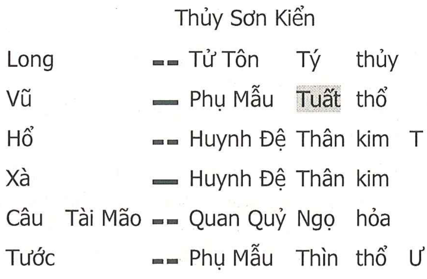
    - **Hình này chứng minh điều gì**
      - Làm sáng tỏ diễn biến cát hung và quy luật ứng nghiệm của Quẻ Thủy Sơn Kiển đối với sự việc được hỏi.
    - **Từ đâu mà thấy được**
      - Căn cứ Dụng thần lâm Nhật lộ ra. Nhìn vào biến Khôn Vi Địa.

- Luận điểm phân tích:
  - ---

## Chương 5: Giải đáp những thắc mắc liên quan đến phương diện chọn Dụng thần

### Câu hỏi 1: Dự đoán về giành giải thưởng thì lấy cái gì làm Dụng thần?

- Giải đáp trọng tâm:
  - Nếu là giành giải thưởng có tính thi đấu, có thứ bậc, thì lấy Quan Quỷ làm Dụng thần, bởi vì Quan Quỷ thể hiện thứ bậc, nếu chỉ đơn giản là nhận giấy chứng nhận giải thưởng, thì lấy Phụ Mẫu làm Dụng thần.

- Quái lệ thực tế:
  - Bối cảnh: **Ví dụ:** Ngày Đinh Hợi tháng Mùi, một học viên Nhật Bản của tôi đoán tham gia thi đấu thái cực quyền có thể đạt được thứ bậc tốt hay không, tổng cộng có 52 người tham gia, lấy 8 người đứng đầu, gieo quẻ được Lôi Sơn Tiểu Quá biến Sơn Phong Cổ.

- Luận điểm phân tích:
  - **Đoán:** Lấy Quan Quỷ làm Dụng thần, trong quẻ Quan Quỷ lưỡng hiện, hơn nữa đều phát động, lấy Quan Quỷ trên Thế làm Dụng thần, một Quan Quỷ khác dùng để tham khảo.

- Luận điểm phân tích:
  - Dụng thần mặc dù được Nguyệt hợp là vượng, nhưng Nhật khắc Không Vong, nhập động Mộ hóa Mộ, một Quan Quỷ khác hóa hồi đầu khắc, Dụng thần động mà sinh hào Ứng, đây là vô tình, một số phương diện hiển thị bất lợi cho mình, do đó khẳng định sẽ không vào 8 người đứng đầu.

- Kết quả ứng nghiệm thực tế:
  - Kết quả là chỉ được thứ 13.

- Quái lệ dự đoán thực tế cho Quẻ Lôi Sơn Tiểu Quá biến Sơn Phong Cổ:
  - **Hình 116.** Quẻ Lôi Sơn Tiểu Quá biến Sơn Phong Cổ
    - 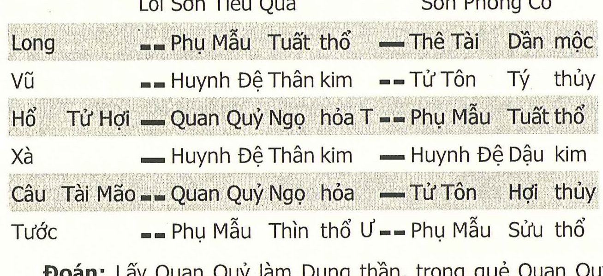
    - **Hình này chứng minh điều gì**
      - Làm sáng tỏ diễn biến cát hung và quy luật ứng nghiệm của Quẻ Lôi Sơn Tiểu Quá biến Sơn Phong Cổ đối với sự việc được hỏi.
    - **Từ đâu mà thấy được**
      - Căn cứ Thời gian lập quẻ: Ngày Đinh Hợi tháng Mùi; Dụng thần mặc dù được Nguyệt hợp là vượng. Nhìn vào biến Sơn Phong Cổ.

### Câu hỏi 2: Làm hộ chiếu và visa thì lấy cái gì làm Dụng thần?

- Giải đáp trọng tâm:
  - Dự đoán hộ chiếu và visa cần phải xem tách biệt, cả hai đều là lấy hào Phụ Mẫu làm Dụng thần, bởi vì cả hai đều thuộc về phạm trù giấy chứng nhận. Làm hộ chiếu thì Quan Quỷ là cơ quan cấp, làm visa thì Quan Quỷ là đại sứ quán.

- Quái lệ thực tế:
  - Bối cảnh: **Ví dụ 1:** Ngày Nhâm Ngọ tháng Mùi, một học viên Nhật Bản của tôi hỏi em họ làm visa đến Mỹ khi nào làm xong? Được Địa Sơn Khiêm biến Lôi Sơn Tiểu Quá.

- Quái lệ dự đoán thực tế cho Quẻ Địa Sơn Khiêm biến Lôi Sơn Tiểu Quá:
  - **Hình 117.** Quẻ Địa Sơn Khiêm biến Lôi Sơn Tiểu Quá
    - 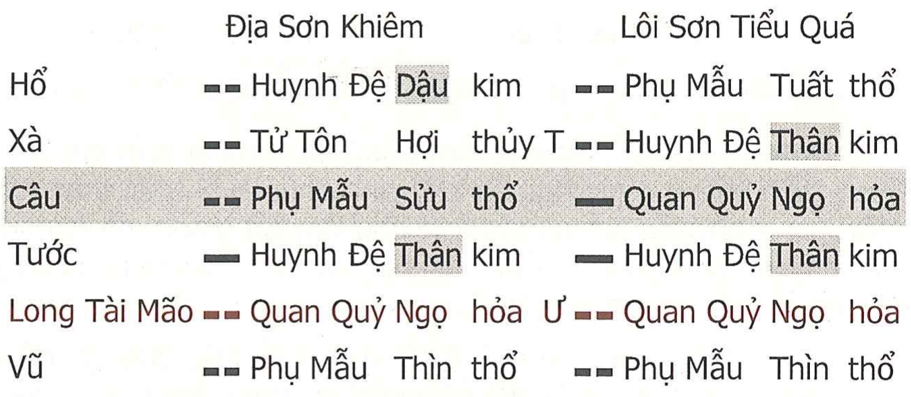
    - **Hình này chứng minh điều gì**
      - Làm sáng tỏ diễn biến cát hung và quy luật ứng nghiệm của Quẻ Địa Sơn Khiêm biến Lôi Sơn Tiểu Quá đối với sự việc được hỏi.
    - **Từ đâu mà thấy được**
      - Căn cứ Thời gian lập quẻ: Ngày Nhâm Ngọ tháng Mùi; Dụng thần Sửu thổ mặc dù Nguyệt phá. Nhìn vào biến Lôi Sơn Tiểu Quá.

- Kết quả ứng nghiệm thực tế:
  - **Đoán:** Lấy hào Phụ Mẫu làm Dụng thần, trong quẻ Phụ Mẫu lưỡng hiện, lấy hào Phụ Mẫu Sửu thổ Nguyệt phá phát động làm Dụng, Dụng thần Sửu thổ mặc dù Nguyệt phá, nhưng được Nhật thần sinh phù, lại động hóa hồi đầu sinh, visa có thể làm được. Dụng thần Nguyệt phá, gặp ngày hợp có thể làm xong. Sau đó, ở ngày Bính Tuất trình giấy tờ, ngày Mậu Tý đã được giải quyết.

- Quái lệ thực tế:
  - Bối cảnh: **Ví dụ 2:** Ngày Bính Ngọ tháng Mão, một người bạn của tôi đoán làm hộ chiếu ngày nào có thể xong? Được quẻ Khảm Vi Thủy biến Đoài Vi Trạch.

- Quái lệ dự đoán thực tế cho Quẻ Khảm Vi Thủy biến Đoài Vi Trạch:
  - **Hình 118.** Quẻ Khảm Vi Thủy biến Đoài Vi Trạch
    - 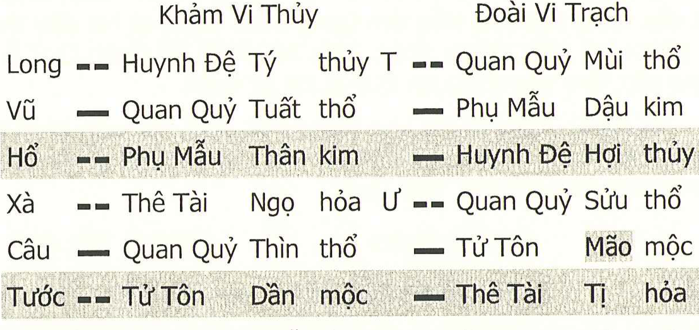
    - **Hình này chứng minh điều gì**
      - Làm sáng tỏ diễn biến cát hung và quy luật ứng nghiệm của Quẻ Khảm Vi Thủy biến Đoài Vi Trạch đối với sự việc được hỏi.
    - **Từ đâu mà thấy được**
      - Căn cứ Thời gian lập quẻ: Ngày Nhâm Ngọ tháng Mùi; Dụng thần Sửu thổ mặc dù Nguyệt phá. Nhìn vào biến Lôi Sơn Tiểu Quá.

- Luận điểm phân tích:
  - **Đoán:** Lấy hào Phụ Mẫu làm Dụng thần, thoạt nhìn quẻ này, Dụng thần không được Nguyệt kiến sinh phù, lại bị Nhật thần đến khắc, lục xung biến lục xung, có vẻ như làm bất thành, nhưng quẻ này là Khảm biến Đoài, là quẻ biến hồi đầu sinh (Đoài sinh Khảm), do đó hộ chiếu có thể làm được.

- Luận điểm phân tích:
  - Dụng thần động mà sinh Thế, theo quy luật ứng kỳ, động mà gặp trị gặp hợp, ngày Mậu Thân là trị Dụng thần, ngày Mậu Thân có thể được giải quyết. Quả nhiên ở giờ Tị ngày Mậu Thân làm được hộ chiếu.

- Quái lệ thực tế:
  - Bối cảnh: **Ví dụ 3:** Ngày Nhâm Thìn tháng Mùi, một Dịch hữu đoán tình hình làm visa, được Địa Hỏa Minh Di.

- Luận điểm phân tích:
  - **Đoán:** Lấy hào Phụ Mẫu làm Dụng thần, Phụ Mẫu được Nhật Nguyệt sinh phù là vượng tướng, visa nhất định có thể làm được, nhưng Nhật thần và Dụng thần tương hợp, Nhật hợp là cản trở, làm visa sẽ bị trì hoãn, cần thời gian rất dài. Nguyên thần trì Thế Nguyệt phá, tháng Tý hợp Nguyên thần, có thể lấy được visa. Sau quả nhiên ở tháng Tý lấy được visa.

- Quái lệ thực tế:
  - Bối cảnh: **Ví dụ 4:** Ngày Nhâm Thìn tháng Tị, tôi tự đoán khi nào làm được visa, được Thủy Hỏa Ký Tế.

- Luận điểm phân tích:
  - **Đoán:** Lấy hào Phụ Mẫu làm Dụng thần, Phụ Mẫu được Nguyệt hợp Nhật sinh là vượng, Quan Quỷ Tuất thổ ám động sinh Dụng thần, visa nhất định có thể làm được. Dụng thần Phụ Mẫu là Thân kim, dựa vào quy luật ứng kỳ để phán đoán, tĩnh mà gặp trị gặp xung, ngày Bính Thân là trị Dụng thần, nhất định ở ngày này làm được.

- Luận điểm phân tích:
  - Quả nhiên ở ngày đó đã lấy được visa.

- Quái lệ dự đoán thực tế cho Địa Hỏa Minh Di:
  - **Hình 119.** Địa Hỏa Minh Di
    - 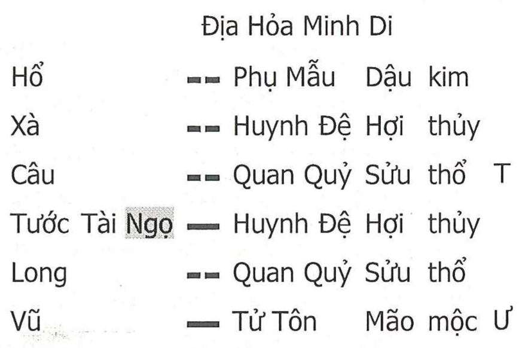
    - **Hình này chứng minh điều gì**
      - Làm sáng tỏ diễn biến cát hung và quy luật ứng nghiệm của Địa Hỏa Minh Di đối với sự việc được hỏi.
    - **Từ đâu mà thấy được**
      - Căn cứ Thời gian lập quẻ: Ngày Nhâm Ngọ tháng Mùi; Dụng thần Sửu thổ mặc dù Nguyệt phá. Nhìn vào biến Lôi Sơn Tiểu Quá.

- Quái lệ dự đoán thực tế cho Thủy Hỏa Ký Tế:
  - **Hình 120.** Thủy Hỏa Ký Tế
    - 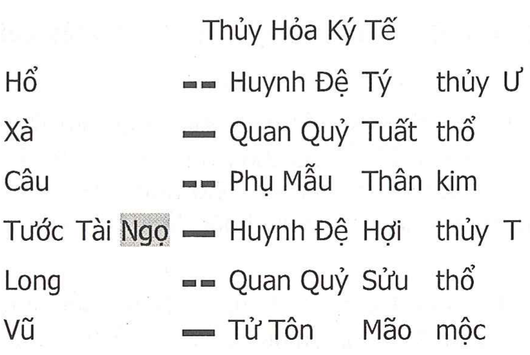
    - **Hình này chứng minh điều gì**
      - Làm sáng tỏ diễn biến cát hung và quy luật ứng nghiệm của Thủy Hỏa Ký Tế đối với sự việc được hỏi.
    - **Từ đâu mà thấy được**
      - Căn cứ Thời gian lập quẻ: Ngày Nhâm Ngọ tháng Mùi; Dụng thần Sửu thổ mặc dù Nguyệt phá. Nhìn vào biến Lôi Sơn Tiểu Quá.

- Quái lệ thực tế:
  - Bối cảnh: **Ví dụ 5:** Ngày Bính Dần tháng Dần, một người bạn của tôi đoán đến Hồng Kông có thể thành công hay không? Được Lôi Phong Hằng biến Sơn Thủy Mông.

- Kết quả ứng nghiệm thực tế:
  - **Đoán:** Lấy hào Phụ Mẫu làm Dụng thần, kiêm xem hào Thế, Phụ Mẫu Hợi thủy bị Nguyệt kiến hợp khởi, vốn là tượng cát. Nhưng không nên Không mà bị Nhật kiến hợp, Nhật hợp là cản trở, Không là không nhận được giấy thông hành. Hào Thế Tuyệt ở Nhật Nguyệt, bị tam hợp cục Tử Tôn Ngọ hỏa đến khắc. Lại tự động hóa hồi đầu khắc, hào Thế bị khắc quá nặng, không thể sinh Phụ Mẫu Hợi thủy, chứng tỏ là không làm được giấy thông hành. Kết quả là đi bất thành vì SARS.

### Câu hỏi 3: Cho thuê nhà, bán nhà thì lấy cái gì làm Dụng thần?

- Giải đáp trọng tâm:
  - Thông thường lấy hào Phụ Mẫu làm Dụng thần, hào Tài chỉ xem là tham khảo mà thôi, hào Phụ Mẫu bị khắc hưu tù, nhà cho thuê không được, bán không được. Hào Phụ Mẫu vượng tướng được hào Ứng sinh hợp hoặc lâm hào Ứng, nhà dễ cho thuê, dễ bán.

- Quái lệ thực tế:
  - Bối cảnh: **Ví dụ 1:** Ngày Canh Tuất tháng Thìn, một người phụ nữ ở Bắc Kinh hỏi biệt thự của mình khi nào có thể bán được, được Thủy Sơn Kiển biến Phong Sơn Tiệm.

- Quái lệ dự đoán thực tế cho Lôi Phong Hằng biến Sơn Thủy Mông:
  - **Hình 121.** Lôi Phong Hằng biến Sơn Thủy Mông
    - 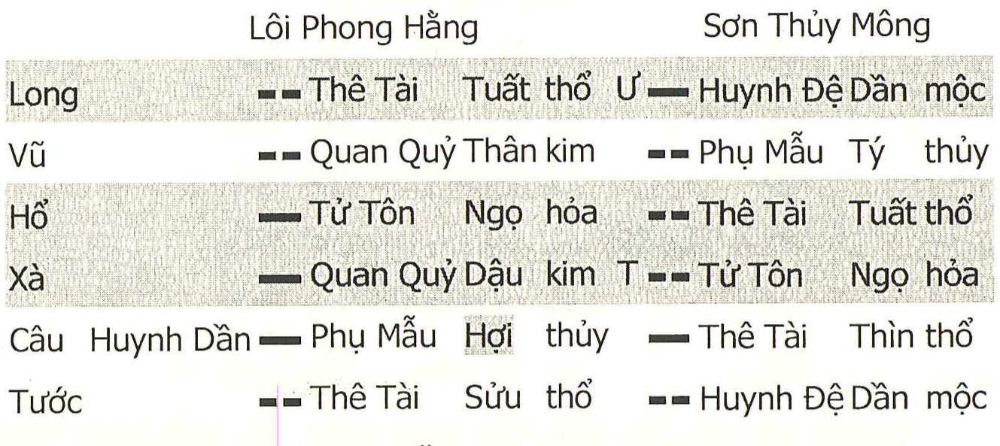
    - **Hình này chứng minh điều gì**
      - Làm sáng tỏ diễn biến cát hung và quy luật ứng nghiệm của Lôi Phong Hằng biến Sơn Thủy Mông đối với sự việc được hỏi.
    - **Từ đâu mà thấy được**
      - Căn cứ Thời gian lập quẻ: Ngày Canh Tuất tháng Thìn; Dụng thần ám động lâm hào Ứng sinh Thế. Nhìn vào biến Phong Sơn Tiệm.

- Quái lệ dự đoán thực tế cho Thủy Sơn Kiển biến Phong Sơn Tiệm:
  - **Hình 122.** Thủy Sơn Kiển biến Phong Sơn Tiệm
    - 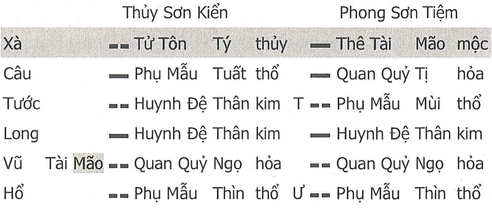
    - **Hình này chứng minh điều gì**
      - Làm sáng tỏ diễn biến cát hung và quy luật ứng nghiệm của Thủy Sơn Kiển biến Phong Sơn Tiệm đối với sự việc được hỏi.
    - **Từ đâu mà thấy được**
      - Căn cứ Thời gian lập quẻ: Ngày Canh Tuất tháng Thìn; Dụng thần ám động lâm hào Ứng sinh Thế. Nhìn vào biến Phong Sơn Tiệm.

- Luận điểm phân tích:
  - **Đoán:** Lấy hào Phụ Mẫu làm Dụng thần, trong quẻ Phụ Mẫu lưỡng hiện, lấy Phụ Mẫu Tuất thổ Nguyệt phá làm Dụng, một hào Phụ Mẫu khác dùng để tham khảo.

- Kết quả ứng nghiệm thực tế:
  - Trong quẻ Phụ Mẫu lưỡng hiện, là có hai biệt thự, hào 5 Phụ Mẫu Tuất thổ lâm Câu Trần, Nguyệt phá Nhật lại điền thực, Câu Trần chủ cũ kỹ, Nguyệt phá là phá tổn, điền thực là tu bổ, tại ngoại quái chủ nửa trên của ngôi nhà, hào 6 Tý thủy động hóa Kỵ thần, hào 6 là mái nhà, tôi đoán mái nhà biệt thự cũ dột nước đã từng tu bổ, điểm này ứng nghiệm.

- Luận điểm phân tích:
  - Tôi hỏi cô ấy là muốn bán biệt thự mới hay là biệt thự cũ? Cô ấy nói cái cũ không được bán, muốn bán cái mới, bởi vì Phụ Mẫu Tuất thổ thể hiện biệt thự cũ, do đó muốn xem biệt thự mới thì phải lấy Phụ Mẫu Thìn thổ làm Dụng thần, Phụ Mẫu Thìn thổ Nguyệt kiến tỉ phù, Nhật thần xung là ám động, Dụng thần ám động lâm hào Ứng sinh Thế, nhà nhất định có người mua, dựa vào quy luật ứng kỳ phán đoán nơi xung gặp hợp, tháng Dậu có thể bán được nhà, ngoài ra tham khảo Thê Tài Mão mộc, phục tàng bị Nhật hợp, tháng Dậu xung xuất xung khai, cũng là lúc này có thể bán đi, hào Tài là mộc, mộc chủ 3, 8, đoán là có thể bán được khoảng 800 vạn.

- Luận điểm phân tích:
  - Sau này bán được ở tháng Dậu, được tròn 800 vạn.

- Quái lệ thực tế:
  - Bối cảnh: **Ví dụ 2:** Ngày Quý Mùi tháng Thìn, một người bởi vì cửa hàng mình thuê kinh doanh không phát đạt, muốn cho thuê lại, hỏi khi nào có thể cho thuê lại? Được Phong Trạch Trung Phu.

- Quái lệ dự đoán thực tế cho Phong Trạch Trung Phu:
  - **Hình 123.** Phong Trạch Trung Phu
    - 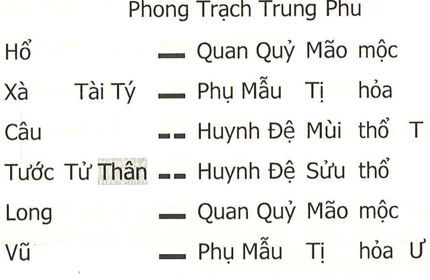
    - **Hình này chứng minh điều gì**
      - Làm sáng tỏ diễn biến cát hung và quy luật ứng nghiệm của Phong Trạch Trung Phu đối với sự việc được hỏi.
    - **Từ đâu mà thấy được**
      - Căn cứ Thời gian lập quẻ: Ngày Canh Tuất tháng Thìn; Dụng thần ám động lâm hào Ứng sinh Thế. Nhìn vào biến Phong Sơn Tiệm.

- Luận điểm phân tích:
  - **Đoán:** Lấy hào Phụ Mẫu làm Dụng thần, Phụ Mẫu không được Nhật Nguyệt sinh phù, nhưng cũng không bị Nhật Nguyệt khắc thương, mặc dù không vượng, nhưng căn không hoại, Dụng thần lâm Ứng sinh Thế, nhà nhất định có thể cho thuê lại.

- Luận điểm phân tích:
  - Tháng Tị trị Dụng thần, vượng mà sinh Thế, thì có thể cho thuê lại. Quả như dự đoán.

- Quái lệ thực tế:
  - Bối cảnh: **Ví dụ 3:** Ngày Kỷ Tị tháng Mão, một người dự đoán khi nào có thể cho thuê cửa hàng, được Cấn Vi Sơn biến Sơn Phong Cổ.

- Quái lệ dự đoán thực tế cho Cấn Vi Sơn biến Sơn Phong Cổ:
  - **Hình 124.** Cấn Vi Sơn biến Sơn Phong Cổ
    - 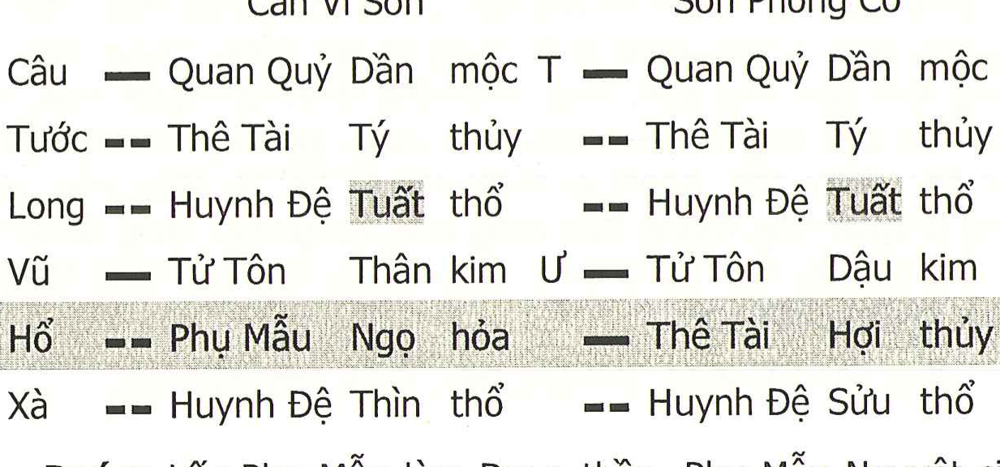
    - **Hình này chứng minh điều gì**
      - Làm sáng tỏ diễn biến cát hung và quy luật ứng nghiệm của Cấn Vi Sơn biến Sơn Phong Cổ đối với sự việc được hỏi.
    - **Từ đâu mà thấy được**
      - Căn cứ Thời gian lập quẻ: Ngày Canh Tuất tháng Thìn; Dụng thần ám động lâm hào Ứng sinh Thế. Nhìn vào biến Phong Sơn Tiệm.

- Luận điểm phân tích:
  - **Đoán:** Lấy Phụ Mẫu làm Dụng thần. Phụ Mẫu Nguyệt sinh Nhật phù, Dụng thần vượng tướng, cửa hàng nhất định có thể cho thuê, nhưng hiềm Dụng thần động mà hóa hồi đầu khắc, phải đợi đến lúc xung mất hào biến Hợi thủy, Dụng thần không bị khắc chế mới có thể cho thuê thành công.

- Luận điểm phân tích:
  - Sau này cho thuê ở tháng Tị. Chính là ứng tháng xung mất hào biến Hợi thủy.

### Câu hỏi 4: Dự đoán về cát hung của hàng xóm thì lấy cái gì làm Dụng thần?

- Giải đáp trọng tâm:
  - Dự đoán hàng xóm cũng là một cách tốt để luyện tập và nâng cao trình độ dự đoán. Người ta không đến hỏi, nhưng mình lại muốn dự đoán, sau khi dự đoán lại có thể biết kết quả sau cùng, do đó ngoài việc dự đoán chuyện của mình, cũng có thể dự đoán chuyện của người khác. Dự đoán hàng xóm thông thường lấy hào Ứng làm Dụng thần, bất kể độ tuổi lớn nhỏ, đều xem hào Ứng. Trừ khi mình và hàng xóm có mối quan hệ cực kỳ tốt, giống như bạn thân, vậy thì xem hào Huynh Đệ.

- Quái lệ thực tế:
  - Bối cảnh: **Ví dụ 1:** Ngày Bính Dần tháng Ngọ, một Dịch hữu nghe nói mẹ của người hàng xóm bị bệnh, đoán cát hung của mẹ người đó, được quẻ Thiên Sơn Độn biến Hỏa Sơn Lữ.

- Quái lệ dự đoán thực tế cho Quẻ Thiên Sơn Độn biến Hỏa Sơn Lữ:
  - **Hình 125.** Quẻ Thiên Sơn Độn biến Hỏa Sơn Lữ
    - 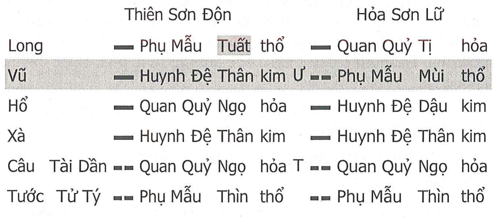
    - **Hình này chứng minh điều gì**
      - Làm sáng tỏ diễn biến cát hung và quy luật ứng nghiệm của Quẻ Thiên Sơn Độn biến Hỏa Sơn Lữ đối với sự việc được hỏi.
    - **Từ đâu mà thấy được**
      - Căn cứ Thời gian lập quẻ: Ngày Bính Dần tháng Ngọ; Dụng thần Nguyệt khắc Nhật xung. Nhìn vào biến Hỏa Sơn Lữ.

- Luận điểm phân tích:
  - **Đoán:** Quẻ này rất dễ chọn sai Dụng thần, bất kể là hàng xóm, hay là mẹ người đó, không có bất kỳ mối quan hệ gì với mình, do đó lấy hào Ứng làm Dụng.

- Luận điểm phân tích:
  - Dụng thần Nguyệt khắc Nhật xung, quái tượng hiển thị rất không tốt. Mặc dù Dụng thần động hóa hồi đầu sinh, nhưng Nhật Nguyệt đều ảnh hưởng không tốt đối với Dụng thần, Dụng thần vô căn, gặp sinh bất khởi, do đó là hung. Quẻ cung Càn, Càn là đầu, hào 6 Nguyên thần Không mà bị Nhật khắc thương, hào 6 là đầu, bệnh tại phần đầu.

- Luận điểm phân tích:
  - Động mà gặp trị gặp hợp, nơi xung ứng hợp, ngày Tị lại là tam hình, kết quả là mẹ của người hàng xóm chết ở ngày Kỷ Tị

- Quái lệ thực tế:
  - Bối cảnh: **Ví dụ 2:** Ngày Mậu Thìn tháng Dần, một Dịch hữu đoán bệnh của một người đàn ông hàng xóm, được quẻ Hỏa Sơn Lữ biến Cấn Vi Sơn.

- Quái lệ dự đoán thực tế cho Quẻ Hỏa Sơn Lữ biến Cấn Vi Sơn:
  - **Hình 126.** Quẻ Hỏa Sơn Lữ biến Cấn Vi Sơn
    - 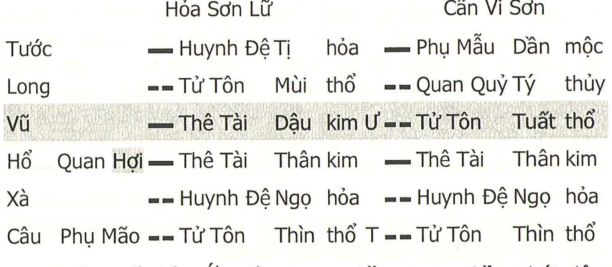
    - **Hình này chứng minh điều gì**
      - Làm sáng tỏ diễn biến cát hung và quy luật ứng nghiệm của Quẻ Hỏa Sơn Lữ biến Cấn Vi Sơn đối với sự việc được hỏi.
    - **Từ đâu mà thấy được**
      - Căn cứ Thời gian lập quẻ: Ngày Bính Dần tháng Ngọ; Dụng thần Nguyệt khắc Nhật xung. Nhìn vào biến Hỏa Sơn Lữ.

- Luận điểm phân tích:
  - **Đoán:** Lấy hào Ứng làm Dụng thần. Dụng thần phát động hóa Không hóa phá, là không cát. Hôm nay Dụng thần cản trở Dụng thần không hóa, ngày Giáp Tuất xung khai, khiến Dụng thần hóa phá, lại thêm Dụng thần Thực Không, thực phá, nhất định là không cát.

- Kết quả ứng nghiệm thực tế:
  - Kết quả là người đàn ông hàng xóm chết ở giờ Tý ngày Giáp Tuất, bởi vì Dụng thần là kim, kim Tử tại Tý.

### Câu hỏi 5: Dự đoán về con dấu bị mất thì lấy cái gì làm Dụng thần?

- Giải đáp trọng tâm:
  - Nếu chỉ nói đến con dấu đỏ in trên giấy thì là hào Phụ Mẫu, nếu là bản thân con dấu thì là hào Tài, do đó con dấu bị mất xem hào Tài.

- Quái lệ thực tế:
  - Bối cảnh: **Ví dụ 1:** Ngày Canh Thân tháng Thân, một học viên Nhật Bản của tôi đoán về con dấu bị mất, đoán có thể tìm được hay không? Được Trạch Thiên Quải.

- Luận điểm phân tích:
  - **Đoán:** Lấy Thê Tài làm Dụng thần, trong quẻ Thê Tài lưỡng hiện, lấy Thê Tài Tý thủy Không Vong làm Dụng. Tử Tôn trì Thế là mình làm mất, Nhật Nguyệt sinh trợ Dụng thần, Dụng thần vượng tướng, con dấu bị mất có thể tìm được, hiện nay Dụng thần Không Vong, xuất Không có thể tìm được.

- Kết quả ứng nghiệm thực tế:
  - Sau đó ở ngày Giáp Tý đã tìm được con dấu trong chiếc xe mà bản thân lái hằng ngày.

- Quái lệ thực tế:
  - Bối cảnh: **Ví dụ 2:** Ngày Canh Ngọ tháng Ngọ, học viên Lưu Hy Khánh trên mạng hỏi quẻ này, con dấu của đơn vị đã không thấy nữa, có thể tìm được hay không, được quẻ Phong Lôi Ích.

- Luận điểm phân tích:
  - **Đoán:** Tôi nói quẻ này trước hết là định Dụng thần, phải lấy Thê Tài làm Dụng thần. Trong quẻ hào Tài lưỡng hiện, lấy Thê Tài Thìn thổ lâm hào Thế làm Dụng thần, Dụng thần trì Thế được Nhật Nguyệt sinh phù, chứng tỏ con dấu không mất. Dụng thần lâm Thanh Long là một con dấu khá quan trọng, cung Tốn trong quẻ, Tốn là mộc, vật ở chỗ có liên quan đến mộc khí (đồ gỗ), Thìn thổ là Mộ khố của Phụ Mẫu, Phụ Mẫu chủ văn thư, nhất định để

- Quái lệ dự đoán thực tế cho Trạch Thiên Quải:
  - **Hình 127.** Trạch Thiên Quải
    - 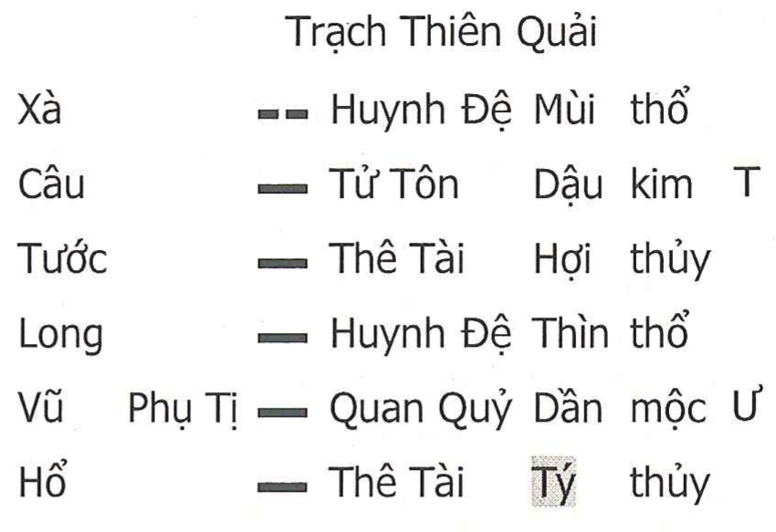
    - **Hình này chứng minh điều gì**
      - Làm sáng tỏ diễn biến cát hung và quy luật ứng nghiệm của Trạch Thiên Quải đối với sự việc được hỏi.
    - **Từ đâu mà thấy được**
      - Căn cứ Thời gian lập quẻ: Ngày Canh Thân tháng Thân; Dụng thần vượng tướng. Nhìn vào biến Cấn Vi Sơn](assets/page_0136_img_01.

- Quái lệ dự đoán thực tế cho Phong Lôi Ích:
  - **Hình 128.** Phong Lôi Ích
    - 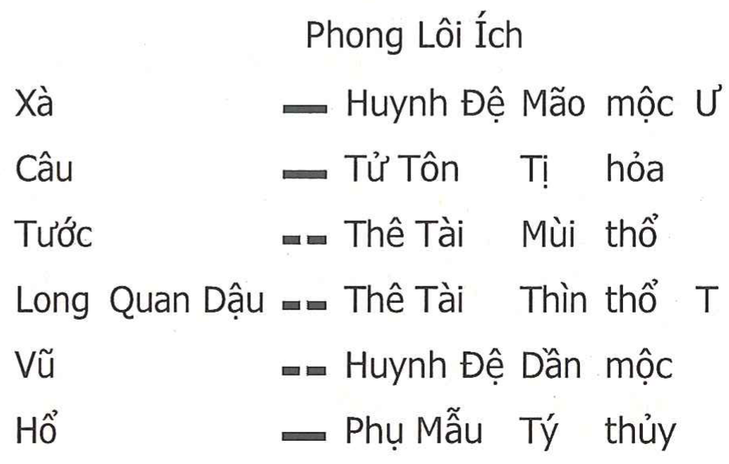
    - **Hình này chứng minh điều gì**
      - Làm sáng tỏ diễn biến cát hung và quy luật ứng nghiệm của Phong Lôi Ích đối với sự việc được hỏi.
    - **Từ đâu mà thấy được**
      - Căn cứ Thời gian lập quẻ: Ngày Canh Thân tháng Thân; Dụng thần vượng tướng. Nhìn vào biến Cấn Vi Sơn](assets/page_0136_img_01.

- Luận điểm phân tích:
  - Anh ta phản hồi rằng, quẻ này trước sau đã hỏi qua 6 người, bọn họ đều lấy hào Phụ Mẫu làm Dụng thần, nói rằng Phụ Mẫu Nguyệt phá, Nhật phá, lại là Kỵ thần trì Thế, đoán là con dấu không tìm được, xem ra đã chọn sai Dụng thần, còn trên thực tế thì con dấu bị một nhân viên vệ sinh của công ty nhìn thấy để trên bàn, sợ mất nó, bèn tiện tay bỏ vào trong ngăn kéo tủ. Con dấu đã được tìm thấy ở ngày hôm đó.

- Luận điểm phân tích:
  - Lúc đó, anh ta còn gieo được một quẻ khác về việc này là Thủy Hỏa Ký Tế biến Thủy Sơn Kiển.

- Luận điểm phân tích:
  - **Đoán:** Quẻ này và quẻ trước mặc dù khác nhau, nhưng ý nghĩa biểu đạt giống nhau, hào Tài phục dưới Thế, được Nhật tỉ phù, lại có Tử Tôn phát động đến sinh, là con dấu sẽ không mất, Dụng thần phục tàng, lâm Nhật kiến lộ ra, là hôm đó tìm được, mộc động đến sinh cũng là tìm được ở nơi có mộc khí. Nếu lấy hào Phụ Mẫu làm Dụng thần, Nhật Nguyệt khắc Phụ Mẫu, Cừu thần phát động tất nhiên không tìm được, căn bản không ăn khớp với tình hình thực tế, có thể thấy mất con dấu lấy hào Tài làm Dụng là điều không nghi ngờ gì nữa.

- Quái lệ dự đoán thực tế cho Thủy Hỏa Ký Tế biến Thủy Sơn Kiển:
  - **Hình 129.** Thủy Hỏa Ký Tế biến Thủy Sơn Kiển
    - 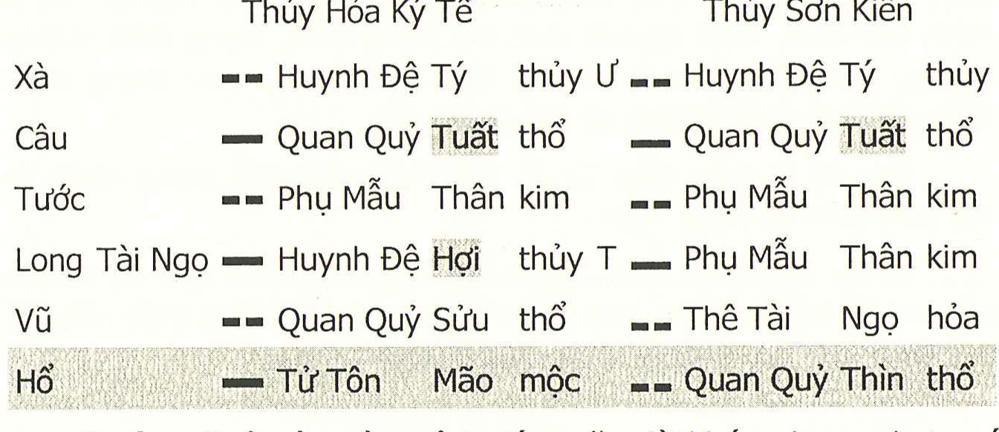
    - **Hình này chứng minh điều gì**
      - Làm sáng tỏ diễn biến cát hung và quy luật ứng nghiệm của Thủy Hỏa Ký Tế biến Thủy Sơn Kiển đối với sự việc được hỏi.
    - **Từ đâu mà thấy được**
      - Căn cứ Thời gian lập quẻ: Ngày Canh Thân tháng Thân; Dụng thần vượng tướng. Nhìn vào biến Cấn Vi Sơn](assets/page_0136_img_01.

- Quái lệ thực tế:
  - Bối cảnh: **Ví dụ 3:** Ngày Giáp Thìn tháng Tý, một người bạn Nhật Bản của tôi đoán về con dấu bị mất, được Lôi Hỏa Phong.

- Quái lệ dự đoán thực tế cho Lôi Hỏa Phong:
  - **Hình 130.** Lôi Hỏa Phong
    - 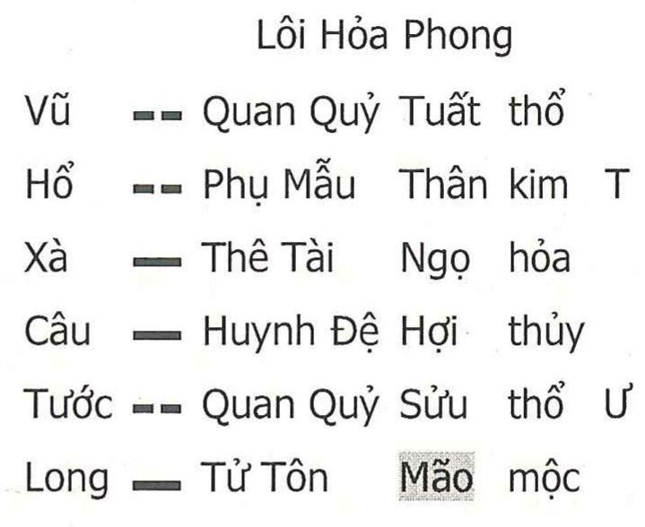
    - **Hình này chứng minh điều gì**
      - Làm sáng tỏ diễn biến cát hung và quy luật ứng nghiệm của Lôi Hỏa Phong đối với sự việc được hỏi.
    - **Từ đâu mà thấy được**
      - Căn cứ Thời gian lập quẻ: Ngày Canh Thân tháng Thân; Dụng thần vượng tướng. Nhìn vào biến Cấn Vi Sơn](assets/page_0136_img_01.

- Luận điểm phân tích:
  - **Đoán:** Lấy hào Thê Tài làm Dụng thần, Thê Tài Ngọ hỏa Nguyệt phá, Nhật không sinh phù, Nguyên thần Tử Tôn Mão mộc lại Không Vong, bị hào ám động Quan Quỷ Tuất thổ hợp, tham hợp quên sinh, Dụng thần hoàn toàn không có sức sống, rất khó tìm lại, quả nhiên không tìm lại được.

### Câu hỏi 6: Dự đoán về hành lý bị mất thì lấy cái gì làm Dụng thần?

- Giải đáp trọng tâm:
  - Phải lấy hào Phụ Mẫu làm Dụng thần. Điều này đã sớm được kết luận trong sách cổ.

- Quái lệ thực tế:
  - Bối cảnh: **Ví dụ:** Ngày Giáp Ngọ tháng Mão, học viên Nhật Bản của tôi hỏi hành lý ký gửi bị mất có thể tìm được hay không? Được Hỏa Phong Đỉnh biến Hỏa Thủy Vị Tế.

- Quái lệ dự đoán thực tế cho Hỏa Phong Đỉnh biến Hỏa Thủy Vị Tế:
  - **Hình 131.** Hỏa Phong Đỉnh biến Hỏa Thủy Vị Tế
    - 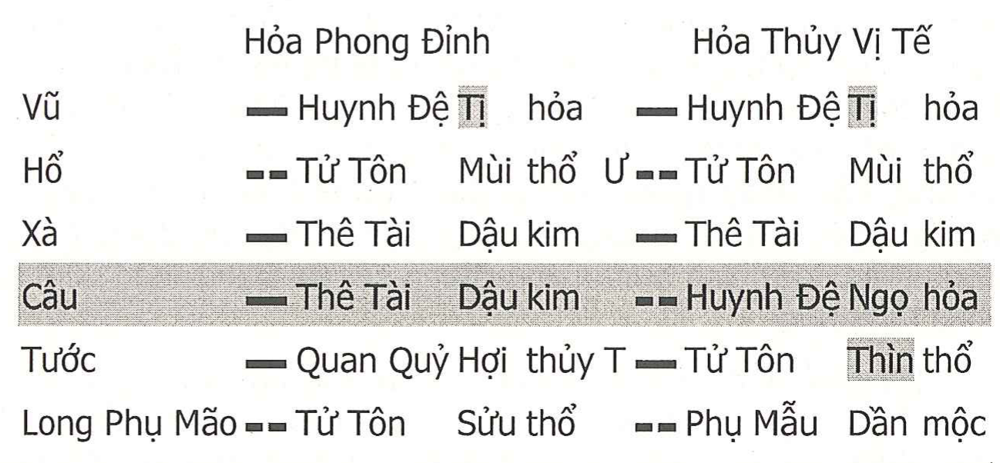
    - **Hình này chứng minh điều gì**
      - Làm sáng tỏ diễn biến cát hung và quy luật ứng nghiệm của Hỏa Phong Đỉnh biến Hỏa Thủy Vị Tế đối với sự việc được hỏi.
    - **Từ đâu mà thấy được**
      - Căn cứ Thời gian lập quẻ: Ngày Giáp Ngọ tháng Mão; Dụng thần phục tàng. Nhìn vào biến Hỏa Thủy Vị Tế.

- Luận điểm phân tích:
  - **Đoán:** Lấy hào Phụ Mẫu làm Dụng thần, Phụ Mẫu Mão mộc phục dưới hào sơ Tử Tôn Sửu thổ, được Nguyệt kiến củng phù là

- Luận điểm phân tích:
  - Sau quả nhiên tìm được ở giờ Dậu ngày Ất Mùi. Ứng giờ Dậu là bởi vì Dụng thần phục tàng, bị xung xuất hiện, nếu như quẻ này xem hào Tài thì hành lý đã không tìm được.

### Câu hỏi 7: Lục hào xạ phúc lấy cái gì làm Dụng thần?

- Giải đáp trọng tâm:
  - Dùng phương pháp Kinh Dịch dự đoán để phán đoán vật giấu bên trong một vật đựng, cổ đại gọi là xạ phúc. Đây là việc cực kỳ khó trong dự đoán, cần trình độ dự đoán rất cao mới có thể làm được. Cổ đại có rất nhiều dự trắc sư đã xem đây là một trò chơi dự đoán để thi đấu với nhau. Phương pháp này vừa có thể dùng để giải trí, vừa có thể giúp nâng cao tư duy dự đoán của bản thân.

- Luận điểm phân tích:
  - Trong hai cuốn sách "Hỏa Châu Lâm" và "Hải Để Nhãn" có phần trình bày về phương pháp dự đoán cụ thể. Nhưng nếu như dùng phương pháp được giới thiệu trong sách để dự đoán thì tỷ lệ chính xác rất thấp. Ngoài điển tịch lục hào, trong các sách khác cũng có đề cập đến tình huống xạ phúc, song phương pháp được dùng hoàn toàn không phải lục hào, có sự khác biệt về bản chất so với lục hào phán đoán xoay quanh Dụng thần, chúng ta đã nghiên cứu dự đoán lục hào, thì nên sử dụng phương pháp lục hào, không nên sao chép những phương pháp đó.

- Luận điểm phân tích:
  - Qua nhiều năm nghiên cứu và thực hành, tôi đã phát hiện và tổng kết ra một phương pháp hoàn chỉnh là dùng tư duy lục hào tiến hành xạ phúc. Dùng lục hào để xạ phúc thì lấy hào Ứng làm Dụng thần, hào Ứng chính là vật mà mình muốn phán đoán. Khi tiến hành xạ phúc, cũng như phương pháp dự đoán thông thường, cần xoay quanh Dụng thần, đồng thời tham khảo suy vượng, ngũ hành, lục thân, lục thần, quái cung, hào động v.v của Dụng thần. Xem ảnh hưởng của chúng đối với Dụng thần để phán đoán tổng hợp.

- Luận điểm phân tích:
  - (1) Quái cung thông thường phản ánh ngoại hình, kết cấu hoặc tính chất của vật. Ngoại quái là phần trên của vật, nội quái là phần dưới của vật, hoặc ngoại quái là bên ngoài của vật, nội quái là bên trong của vật. Quẻ chính là bên ngoài của vật, quẻ biến là bên trong của vật.

- Luận điểm phân tích:
  - Càn là vật hình tròn, vật cao cấp, kim loại, trái cây, châu báu, tinh thể, gương, mũ nón, thịt ngựa, vật cay v.v.

- Luận điểm phân tích:
  - Khôn là vật hình vuông, vật có góc cạnh, vật mềm mại, vải vóc, tơ lụa, đồ gốm, sản phẩm đất sét, vật trong đất, đồ dùng phụ nữ, thịt bò, vật ngọt v.v.

- Luận điểm phân tích:
  - Chấn là sản phẩm gỗ, sản phẩm tre, hoa cỏ cây cối, thực vật, vật có trạng thái động, máy móc, vật có thể sản sinh âm thanh, vật chua v.v.

- Luận điểm phân tích:
  - Tốn là hàng mỹ nghệ tre trúc, sản phẩm gỗ, vật thẳng, vật có cán, vật thon dài, dây thừng, thịt gà, rau, vật chua v.v.

- Luận điểm phân tích:
  - Khảm là vật trong nước, vật hình tròn, chất lỏng, vật gồ ghề, vật lõm xuống, vật mặn v.v.

- Luận điểm phân tích:
  - Ly là mỹ lệ, tươi đẹp, vật có hoa văn, là cua, rùa, chim trĩ, trai sông, vật tỏa nhiệt phát sáng, vật có văn tự, vật dùng điện, vật đắng v.v.

- Luận điểm phân tích:
  - Cấn là vật cố định, tĩnh vật, vật trong đất, khoáng thạch, vật trong núi, vật ngọt, thịt chó v.v.

- Luận điểm phân tích:
  - Đoài là vật kim loại, vật có mũi nhọn, vật phá tổn, vật có miệng, nhạc cụ, vật thể sản sinh âm thanh, đồ ăn, phế phẩm, vật cay v.v.

- Luận điểm phân tích:
  - (2) Lục thần dùng để phán đoán màu sắc, tính chất hoặc công dụng của vật thể.

- Luận điểm phân tích:
  - Thanh Long là đồ trang trí, thức ăn, vật quý giá, vật xinh xắn, vật màu lục, vật mới, đồ trang điểm v.v.

- Luận điểm phân tích:
  - Chu Tước là vật liên quan đến điện, thư tín, văn tự, thức ăn, vật có âm thanh, vật sáng bóng, vật màu đỏ v.v.

- Luận điểm phân tích:
  - Câu Trần là vật mềm mại, vật cũ kỹ, vật trong đất, vật hình dạng phồng, vật xù xì, vật nối liền, vật màu vàng v.v.

- Luận điểm phân tích:
  - Trình Xà là vật uốn lượn, vật thon dài, vật hình xoắn ốc, vật hiếm thấy, vật trạng thái động, màu trà, màu nâu, vật bất quy tắc (dị thường) v.v.

- Luận điểm phân tích:
  - Bạch Hổ là vật cứng nhọn, vật có mũi nhọn, vật hình nhọn, vật liên quan đến y dược, vật cứng, vật màu trắng v.v.

- Luận điểm phân tích:
  - Huyền Vũ là vật xám xịt không sáng bóng, vật màu đen, vật bẩn thỉu, chất lỏng, vật sắc tình, vật thối rữa v.v.

- Luận điểm phân tích:
  - (3) Lục thân thường dùng để phán đoán tính chất của vật.

- Luận điểm phân tích:
  - Huynh Đệ chủ vật cứng nhọn, tiêu hao phẩm, công cụ v.v.

- Luận điểm phân tích:
  - Thê Tài là thức ăn, vật có thể ăn được, vật lưu thông, đồ dùng hàng ngày v.v.

- Luận điểm phân tích:
  - Tử Tôn là đồ chơi, vật xinh xắn dễ thương, động vật, dược phẩm, vật giải trí v.v.

- Luận điểm phân tích:
  - Phụ Mẫu là vật mềm mại, vật đóng gói, chất hữu cơ, che phủ, phương tiện giao thông, trang phục, văn thư, vải vóc v.v.

- Luận điểm phân tích:
  - Quan Quỷ là vật biến dạng, vật bất quy tắc, vật biến hóa phong phú, vật trạng thái động, vật mà mắt không nhìn thấy v.v.

- Luận điểm phân tích:
  - (4) Dùng 12 địa chi cũng có thể phán đoán hình dáng của vật thể.

- Luận điểm phân tích:
  - Dần Thân Tị Hợi là vật hình nhọn; Tý Ngọ Mão Dậu là vật hình tròn; Thìn Tuất Sửu Mùi là vật hình vuông, hoặc là vật bất quy tắc.

- Luận điểm phân tích:
  - (5) Lấy Thế Ứng phán đoán tính chất và bề ngoài của vật.

- Luận điểm phân tích:
  - Thế Ứng có ngũ hành tương đồng, là vật đối xứng; Thế Ứng tương hợp, là vật trùng điệp (chồng lên nhau); Thế Ứng tương sinh, là vật tương liên; Thế Ứng tương sinh hợp, là vật tương khảm (khảm nạm); Thế Ứng tương khắc, là vật tiêu hao v.v.

- Luận điểm phân tích:
  - (6) Từ sinh khắc của hào động đối với Dụng thần, có thể phán đoán điểm tinh tế của vật thể.

- Luận điểm phân tích:
  - Dụng thần Không Vong hoặc động mà hóa Không, bên trong vật thể là trống rỗng, hoặc là vật có khe hở, có lỗ hổng. Nguyệt phá Nhật phá, là vật có mối nối, vật nứt ra, hoặc là vật phá tổn. Gặp tam hình vật thể có phá tổn, hoặc là vật biến dạng. Bị khắc hưu tù, là vật cũ kỹ. Được sinh được Trường Sinh vượng tướng, là vật mới. Gặp hợp là vật trùng điệp, vật có nắp, vật trọn bộ, hoặc là vật tổ hợp mà thành. Dụng thần nhập Mộ là vật có đóng gói, vật có hộp, vật khảm nạm. Phục ngâm là vật bên trong phát ra âm thanh, hoặc bên trong có thể động. Phản ngâm là vật chấn động, đong đưa. Quẻ du hồn là vật ngoại dụng (dùng bôi ngoài), hoặc là vật có thể tháo rời. Quẻ quy hồn là vật nội dụng (dùng uống), hoặc là vật phụ thuộc v.v.

- Luận điểm phân tích:
  - Trên đây đã nói sơ lược về các quy tắc dự đoán cơ bản của xạ phúc, khi đã có trình độ dự đoán cao, chúng ta còn có thể thêm vào 12 trường sinh, tiến hành tổng hợp phán đoán.

- Quái lệ thực tế:
  - Bối cảnh: **Ví dụ 1:** Ngày Nhâm Tý tháng Dậu, vợ nói với tôi rằng khi cô ấy tham gia hội nghị sẽ được phát một thứ, bảo tôi đoán xem là thứ gì? Tôi gieo quẻ được Trạch Phong Đại Quá biến Trạch Hỏa Cách.

- Luận điểm phân tích:
  - **Đoán:** Lấy hào Ứng làm Dụng thần. Ứng là Thê Tài, vật này có liên quan đến ẩm thực. Động mà hóa Huynh Đệ chính là công cụ. Nhật hợp Dụng thần, vật được tạo thành từ hai bộ phận, cái hợp Dụng là Phụ Mẫu, Phụ Mẫu là cái che chở ta, chính là nắp. Chứng tỏ là vật có nắp. Dụng thần gặp Nguyệt kiến là Mộc Dục, bề mặt vật thể nhẵn bóng.

- Luận điểm phân tích:
  - Ngoại quái là Đoài, Đoài là miệng, phía trên của vật mở miệng, hạ là Tốn, Tốn là nhập, phía dưới có chỗ lõm vào. Hào sơ là phần dưới của vật, động mà hóa Không hóa phá, là phần đế có mở miệng, hoặc có chỗ lõm vào. Quẻ chính tại cung Chấn, Chấn là động, là đồ vật máy móc. Nội quái biến Ly, Ly là hỏa là điện, là vật dùng điện. Hào 2 Hợi thủy lâm Thanh Long hóa ra lục thân Thê Tài giống Dụng thần, Thanh Long chủ ẩm thực, Thê Tài cũng chủ ẩm thực, hào 2 lại là bếp, chứng tỏ vật là đồ dùng nhà bếp, thông qua nước có thể nấu ăn. Tôi tổng hợp phán đoán là nồi lẩu điện, trên thực tế là một nồi cơm điện.

- Quái lệ dự đoán thực tế cho Quẻ Trạch Phong Đại Quá biến Trạch Hỏa Cách:
  - **Hình 132.** Quẻ Trạch Phong Đại Quá biến Trạch Hỏa Cách
    - 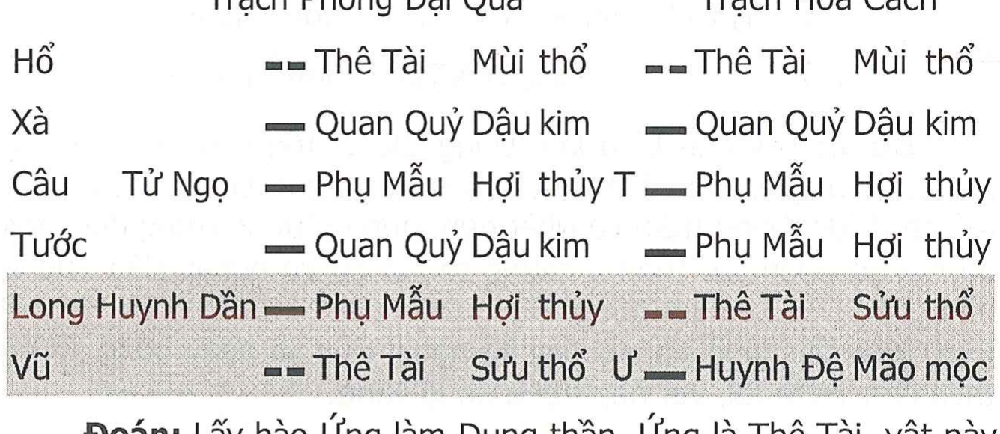
    - **Hình này chứng minh điều gì**
      - Làm sáng tỏ diễn biến cát hung và quy luật ứng nghiệm của Quẻ Trạch Phong Đại Quá biến Trạch Hỏa Cách đối với sự việc được hỏi.
    - **Từ đâu mà thấy được**
      - Căn cứ Thời gian lập quẻ: Ngày Nhâm Tý tháng Dậu; Dụng thần để phán đoán tổng hợp. Nhìn vào hào động v.

- Quái lệ thực tế:
  - Bối cảnh: **Ví dụ 2:** Ngày Tân Mão tháng Tý, bạn của tôi lấy một vật để vào trong hộp đựng đĩa quang, bảo tôi đoán vật đó là gì, tôi gieo quẻ được Lôi Phong Hằng.

- Luận điểm phân tích:
  - **Đoán:** Lấy hào Ứng làm Dụng thần. Ứng lâm Thê Tài, vật này có liên quan đến ẩm thực. Thế lâm Thanh Long, vật này có thể ăn được. Dụng thần và Nhật hợp, hợp là tượng trùng điệp, vật do hai bộ phận tạo thành, chứng tỏ vật có vỏ ngoài. Hào Thế là bề ngoài, Dậu kim ám động, Dụng thần được Mộc Dục địa, Dậu là tròn, Mộc Dục là lộ ra, vật này bề ngoài tròn và nhẵn bóng. Dụng thần lâm Trình Xà, vật này trong đỏ lộ vàng.

- Luận điểm phân tích:
  - Trên thực tế là bên trong để một quả trứng gà vỏ đỏ.

- Quái lệ thực tế:
  - Bối cảnh: **Ví dụ 3:** Ngày Tân Mùi tháng Ngọ, học viên Trương Khánh Học đến Thái Nguyên học tập, lúc sắp đi, anh ta muốn xem thử xạ phúc là cái gì, anh ta đã lấy một vật bỏ vào trong ống trà, bảo tôi dự đoán, tôi gieo quẻ được Thiên Địa Bĩ biến Sơn Thủy Mông.

- Luận điểm phân tích:
  - **Đoán:** Lấy hào Ứng làm Dụng thần. Ngoại quái là bề ngoài, ngoại quái là Càn, Càn là tròn, vật thể bề ngoài là tròn, quẻ lục

- Quái lệ dự đoán thực tế cho Quẻ Lôi Phong Hằng:
  - **Hình 133.** Quẻ Lôi Phong Hằng
    - 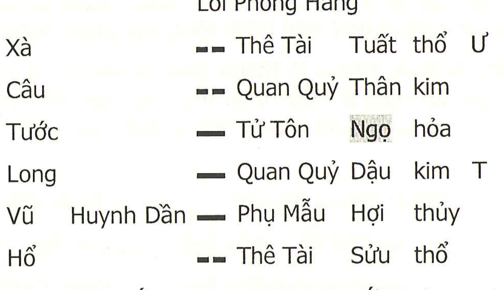
    - **Hình này chứng minh điều gì**
      - Làm sáng tỏ diễn biến cát hung và quy luật ứng nghiệm của Quẻ Lôi Phong Hằng đối với sự việc được hỏi.
    - **Từ đâu mà thấy được**
      - Căn cứ Thời gian lập quẻ: Ngày Nhâm Tý tháng Dậu; Dụng thần để phán đoán tổng hợp. Nhìn vào hào động v.

- Quái lệ dự đoán thực tế cho Quẻ Thiên Địa Bĩ biến Sơn Thủy Mông:
  - **Hình 134.** Quẻ Thiên Địa Bĩ biến Sơn Thủy Mông
    - 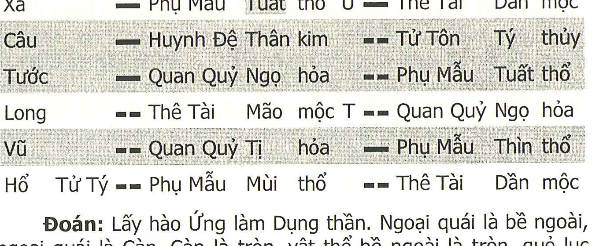
    - **Hình này chứng minh điều gì**
      - Làm sáng tỏ diễn biến cát hung và quy luật ứng nghiệm của Quẻ Thiên Địa Bĩ biến Sơn Thủy Mông đối với sự việc được hỏi.
    - **Từ đâu mà thấy được**
      - Căn cứ Thời gian lập quẻ: Ngày Nhâm Tý tháng Dậu; Dụng thần để phán đoán tổng hợp. Nhìn vào hào động v.

- Luận điểm phân tích:
  - Trên thực tế, bên trong để một quả trứng gà.

- Quái lệ thực tế:
  - Bối cảnh: **Ví dụ 4:** Ngày Canh Tuất tháng Mùi, một người bạn để một vật vào trong cốc trà bảo tôi đoán là cái gì, tôi gieo quẻ được Phong Hỏa Gia Nhân biến Phong Địa Quan.

- Quái lệ dự đoán thực tế cho Phong Hỏa Gia Nhân biến Phong Địa Quan:
  - **Hình 135.** Phong Hỏa Gia Nhân biến Phong Địa Quan
    - 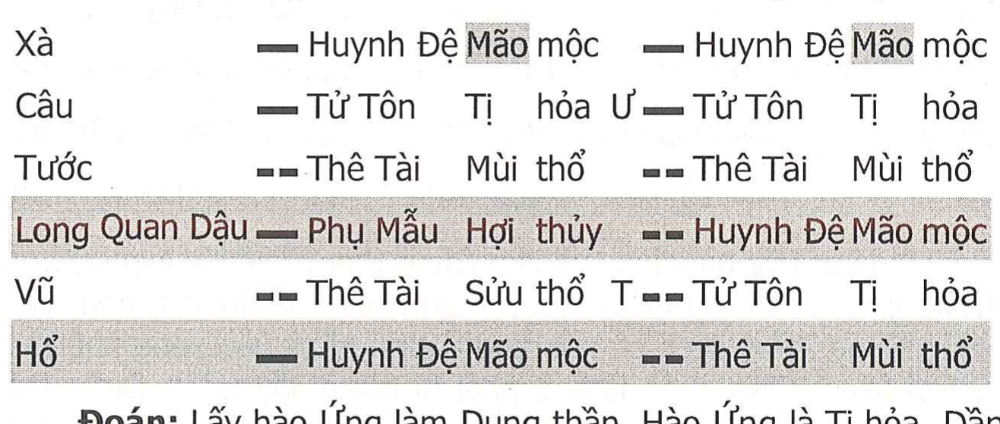
    - **Hình này chứng minh điều gì**
      - Làm sáng tỏ diễn biến cát hung và quy luật ứng nghiệm của Phong Hỏa Gia Nhân biến Phong Địa Quan đối với sự việc được hỏi.
    - **Từ đâu mà thấy được**
      - Căn cứ Thời gian lập quẻ: Ngày Nhâm Tý tháng Dậu; Dụng thần để phán đoán tổng hợp. Nhìn vào hào động v.

- Luận điểm phân tích:
  - **Đoán:** Lấy hào Ứng làm Dụng thần. Hào Ứng là Tị hỏa, Dần Thân Tị Hợi là nhọn, hỏa lại chủ vật hình nhọn, chứng tỏ vật bên trong có hình nhọn. Tam hợp cục đến sinh Dụng thần. Vật do nhiều cái tạo thành, nhưng Hợi thủy phát động, Dụng thần lâm Tuyệt, hiện tại vật để bên trong chỉ là một cái trong đó. Dụng thần nhập Mộ ở Nhật, bề ngoài của vật này có vỏ hoặc đóng gói, Mão mộc phát động, là đất Mộc Dục của Dụng thần, chứng tỏ vỏ ngoài của vật đã bị loại bỏ. Dụng do hào sơ đến sinh, hào sơ là mặt đất, lại thêm Dụng thần lâm Câu Trần, Câu Trần là điền thổ, chứng tỏ vật này là vật sinh trưởng trong đất. Hào Thế lâm Tài, Tài là ẩm thực, chủ vật này có thể ăn được, Thế là bề ngoài, lâm Huyền Vũ, Huyền Vũ chủ thối rữa, vật này bề ngoài có thối rữa.

- Luận điểm phân tích:
  - Tình hình thực tế, bên trong để một tép tỏi, bề ngoài đã thối rữa một ít.

### Câu hỏi 8: Dự đoán chìa khóa lấy cái gì làm Dụng thần?

- Giải đáp trọng tâm:
  - Lấy Thê Tài làm Dụng thần, có sách nói rằng lấy Tử Tôn làm Dụng thần, điều này hoàn toàn là sai lầm.

- Quái lệ thực tế:
  - Bối cảnh: **Ví dụ 1:** Ngày Nhâm Tý tháng Mão, một người đàn ông đoán về chìa khóa bị mất, được Thủy Hỏa Ký Tế biến Địa Thiên Thái.

- Quái lệ dự đoán thực tế cho Thủy Hỏa Ký Tế biến Địa Thiên Thái:
  - **Hình 136.** Thủy Hỏa Ký Tế biến Địa Thiên Thái
    - 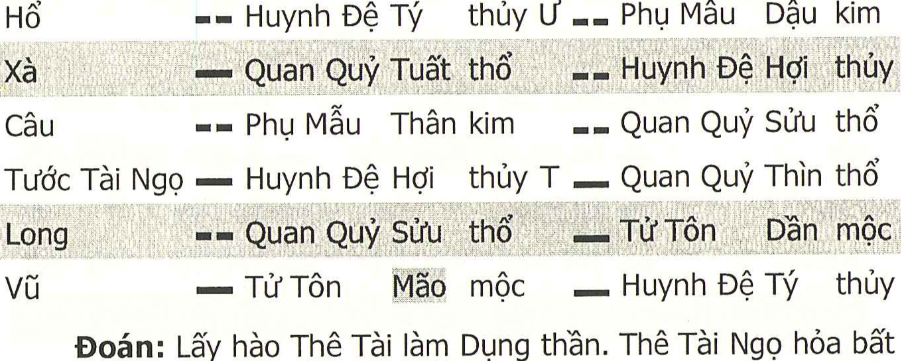
    - **Hình này chứng minh điều gì**
      - Làm sáng tỏ diễn biến cát hung và quy luật ứng nghiệm của Thủy Hỏa Ký Tế biến Địa Thiên Thái đối với sự việc được hỏi.
    - **Từ đâu mà thấy được**
      - Căn cứ Thời gian lập quẻ: Ngày Nhâm Tý tháng Mão; Dụng thần nhập Mộ ở Quan Quỷ Thìn thổ. Nhìn vào biến Địa Thiên Thái.

- Luận điểm phân tích:
  - **Đoán:** Lấy hào Thê Tài làm Dụng thần. Thê Tài Ngọ hỏa bất thượng quái, nhưng được Nguyệt sinh phù là vượng tướng, Nhật xung Dụng thần, sách cổ nói rằng: Dụng phục gặp xung không có người trộm. Chìa khóa không phải bị người lấy trộm, Dụng thần nhập Mộ ở Quan Quỷ Thìn thổ, là tượng cất giấu, Huynh Đệ trì Thế, đè Dụng thần, Huynh Đệ là đồng nghiệp, trì Thế là bạn thân, chứng tỏ bạn của anh ta trêu đùa đã giấu chìa khóa đi, ngày Ngọ có thể tìm được.

- Luận điểm phân tích:
  - Tình hình thực tế là tại giờ Ngọ ngày Mùi tìm được trong ngăn kéo của đồng nghiệp. Khi trêu anh ta, đồng nghiệp đã lấy chìa khóa bỏ vào trong ngăn kéo mà quên trả lại cho anh ta. Ứng ngày Mùi là bởi vì Dụng thần nơi xung gặp hợp. Ứng giờ Ngọ, Dụng thần phục tàng gặp xuất hiện.

- Quái lệ thực tế:
  - Bối cảnh: **Ví dụ 2:** Ngày Quý Mão tháng Mùi, một người phụ nữ ở đơn vị tôi đoán về chìa khóa bị mất, được Ly Vi Hỏa biến Sơn Hỏa Bí.

- Luận điểm phân tích:
  - **Đoán:** Lấy hào Thê Tài làm Dụng thần, Thê Tài được Nguyệt sinh phù lại động hóa hồi đầu sinh, nhưng không nên Kỵ thần trì Thế, sách cổ nói rằng, Thế khắc Dụng thần vật khó tìm. Đồng thời Dụng thần động mà sinh hào Ứng, đây là vô tình, nhất định không tìm lại được chìa khóa, Thê Tài lâm kim, kim chủ 4, mất 4 chìa khóa, quả nhiên đã mất 4 chìa khóa, sau cùng không tìm lại được.

- Quái lệ thực tế:
  - Bối cảnh: **Ví dụ 3:** Ngày Canh Tuất tháng Mùi, một người phụ nữ đoán về chìa khóa bị mất, được Địa Hỏa Minh Di.

- Luận điểm phân tích:
  - **Đoán:** Lấy hào Thê Tài làm Dụng thần, hào Tài tuy được Nguyệt hợp là vượng nhưng không nên nhập Mộ ở Nhật, Phi đến khắc Phục, hào Thế Nguyệt phá, lại là quẻ du hồn, rất khó tìm lại được chìa khóa, sau quả nhiên không tìm được.

- Quái lệ dự đoán thực tế cho Quẻ Ly Vi Hỏa biến Sơn Hỏa Bí:
  - **Hình 137.** Quẻ Ly Vi Hỏa biến Sơn Hỏa Bí
    - 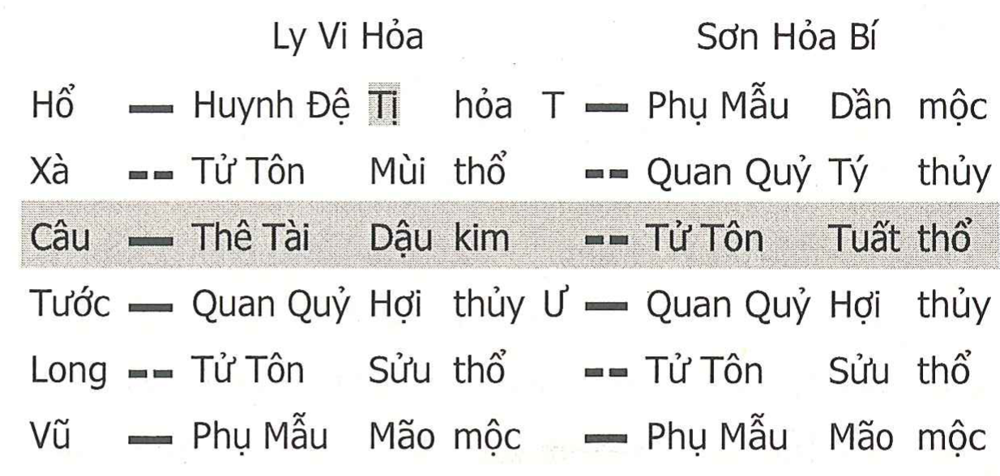
    - **Hình này chứng minh điều gì**
      - Làm sáng tỏ diễn biến cát hung và quy luật ứng nghiệm của Quẻ Ly Vi Hỏa biến Sơn Hỏa Bí đối với sự việc được hỏi.
    - **Từ đâu mà thấy được**
      - Căn cứ Thời gian lập quẻ: Ngày Nhâm Tý tháng Mão; Dụng thần nhập Mộ ở Quan Quỷ Thìn thổ. Nhìn vào biến Địa Thiên Thái.

- Quái lệ dự đoán thực tế cho Quẻ Địa Hỏa Minh Di:
  - **Hình 138.** Quẻ Địa Hỏa Minh Di
    - 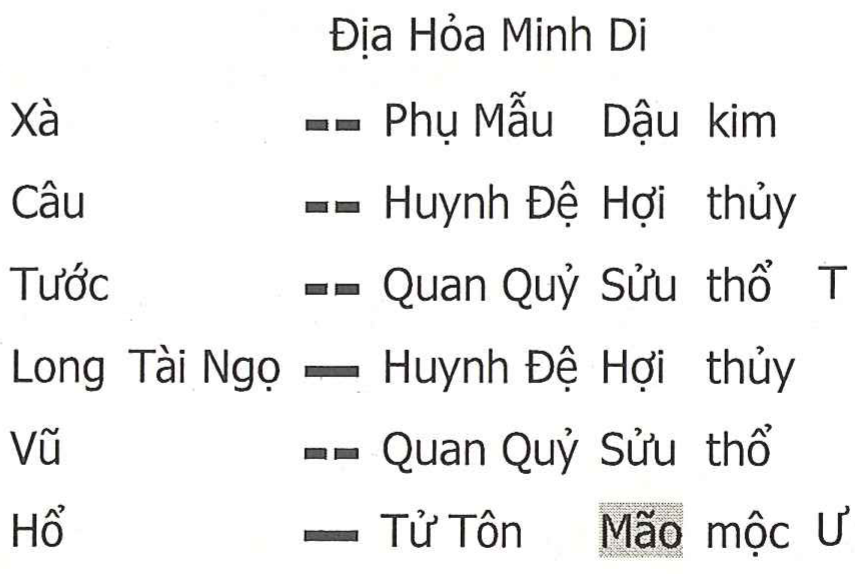
    - **Hình này chứng minh điều gì**
      - Làm sáng tỏ diễn biến cát hung và quy luật ứng nghiệm của Quẻ Địa Hỏa Minh Di đối với sự việc được hỏi.
    - **Từ đâu mà thấy được**
      - Căn cứ Thời gian lập quẻ: Ngày Nhâm Tý tháng Mão; Dụng thần nhập Mộ ở Quan Quỷ Thìn thổ. Nhìn vào biến Địa Thiên Thái.

### Câu hỏi 9: Dự đoán kính đeo mắt lấy cái gì làm Dụng?

- Giải đáp trọng tâm:
  - Tượng của kính đeo mắt là hào Phụ Mẫu, nhưng dự đoán kính đeo mắt bị mất thì lấy Thê Tài làm Dụng thần.

- Quái lệ thực tế:
  - Bối cảnh: **Ví dụ 1:** Ngày Canh Thìn tháng Mão, một học viên Nhật Bản của tôi đoán về kính đeo mắt của chồng bị mất, tìm được hay không, được Tốn Vi Phong biến Thiên Phong Cấu.

- Kết quả ứng nghiệm thực tế:
  - **Đoán:** Lấy Thê Tài làm Dụng thần. Trong quẻ Thê Tài lưỡng hiện, lấy Thê Tài Mùi thổ phát động làm Dụng thần. Nguyệt khắc Nhật phù, suy vượng tương đương. Nhưng Dụng thần động mà hóa hồi đầu sinh, từ nhược biến cường, do đó kính đeo mắt có thể tìm được. Dụng thần lâm Mùi thổ, Mùi thổ là Tây Nam, lâm Chu Tước được hỏa sinh, nơi để kính đeo mắt có liên quan đến hỏa. Sau đó phát hiện ở hướng Tây Nam của nhà mình có lò sưởi, đã tìm được kính của chồng trong đó.

- Quái lệ thực tế:
  - Bối cảnh: **Ví dụ 2:** Ngày Bính Dần tháng Mùi, một người phụ nữ ở đơn vị tôi đoán kính đeo mắt bị mất có thể tìm lại được hay không?
Được Thủy Địa Tỷ biến Trạch Địa Tụy.

- Quái lệ dự đoán thực tế cho Quẻ Tốn Vi Phong biến Thiên Phong Cấu:
  - **Hình 139.** Quẻ Tốn Vi Phong biến Thiên Phong Cấu
    - 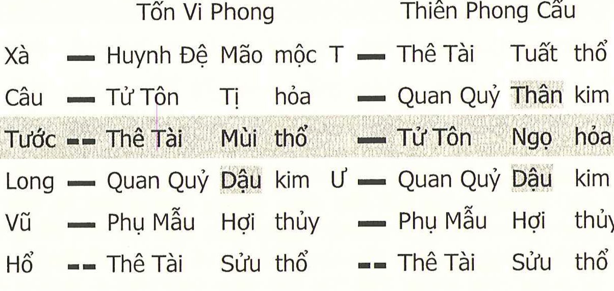
    - **Hình này chứng minh điều gì**
      - Làm sáng tỏ diễn biến cát hung và quy luật ứng nghiệm của Quẻ Tốn Vi Phong biến Thiên Phong Cấu đối với sự việc được hỏi.
    - **Từ đâu mà thấy được**
      - Căn cứ Thời gian lập quẻ: Ngày Canh Thìn tháng Mão; Dụng thần động mà hóa hồi đầu sinh. Nhìn vào biến Thiên Phong Cấu.

- Quái lệ dự đoán thực tế cho Quẻ Thủy Địa Tỷ biến Trạch Địa Tụy:
  - **Hình 140.** Quẻ Thủy Địa Tỷ biến Trạch Địa Tụy
    - 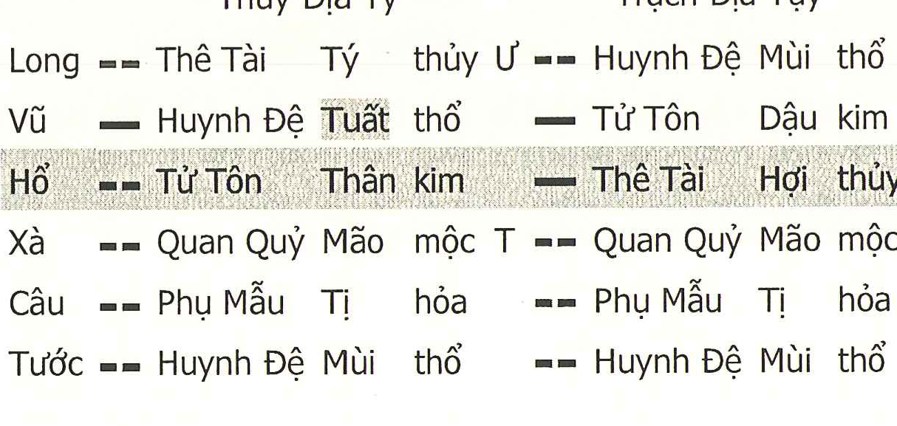
    - **Hình này chứng minh điều gì**
      - Làm sáng tỏ diễn biến cát hung và quy luật ứng nghiệm của Quẻ Thủy Địa Tỷ biến Trạch Địa Tụy đối với sự việc được hỏi.
    - **Từ đâu mà thấy được**
      - Căn cứ Thời gian lập quẻ: Ngày Canh Thìn tháng Mão; Dụng thần động mà hóa hồi đầu sinh. Nhìn vào biến Thiên Phong Cấu.

- Luận điểm phân tích:
  - **Đoán:** Lấy hào Thê Tài làm Dụng thần, hào Tài là thủy, lâm hào Ứng bị Nguyệt khắc, Ứng là nơi khác, kính bị mất ở nơi có thủy, Tử Tôn Thân kim độc phát, lấy tượng làm chủ, vốn chủ có thể quay về, nhưng Tử Tôn bị Nhật xung mất, lại hóa Không Vong, không thể sinh Dụng, do đó sau cùng không tìm lại được.

- Luận điểm phân tích:
  - Trên thực tế là một cặp kính bơi, đã làm mất nó ở bể bơi, không tìm lại được.

### Câu hỏi 10: Dự đoán bưu kiện lấy cái gì làm Dụng thần?

- Giải đáp trọng tâm:
  - Lấy hào Phụ Mẫu làm Dụng thần. Mặc dù trong bưu kiện là vật dùng hàng ngày, nhưng không lấy Thê Tài để phán đoán, phải lấy Phụ Mẫu để phán đoán. Bởi vì bưu kiện là nhờ người khác gửi qua bưu điện, Phụ Mẫu là nhờ, ỷ lại, do đó lấy Phụ Mẫu làm Dụng thần.

- Quái lệ thực tế:
  - Bối cảnh: **Ví dụ 1:** Một học viên của tôi có một quẻ nghĩ không thông bèn đến hỏi tôi, ngày Ất Mão tháng Mùi, đoán quà tặng người khác gửi cho anh ta khi nào nhận được? Được Thiên Phong Cấu biến Hỏa Phong Đỉnh.

- Luận điểm phân tích:
  - **Đoán:** Bất kể gửi thứ gì cũng đều lấy hào Phụ Mẫu làm Dụng thần, quẻ này nếu như lấy Tài làm Dụng, Huynh Đệ độc phát, xung khắc Dụng thần, tất nhiên sẽ không nhận được, nhưng trên thực tế là tại tháng Thân nhận được quà tặng, đó là bởi vì lấy hào Phụ Mẫu làm Dụng thần, Phụ Mẫu Nguyệt phá, sang tháng bất phá, Huynh Đệ Thân kim độc phát động mà hóa ra Phụ Mẫu, nghĩa là tháng Thân nhận được bưu kiện.

- Quái lệ dự đoán thực tế cho Quẻ Thiên Phong Cấu biến Hỏa Phong Đỉnh:
  - **Hình 141.** Quẻ Thiên Phong Cấu biến Hỏa Phong Đỉnh
    - 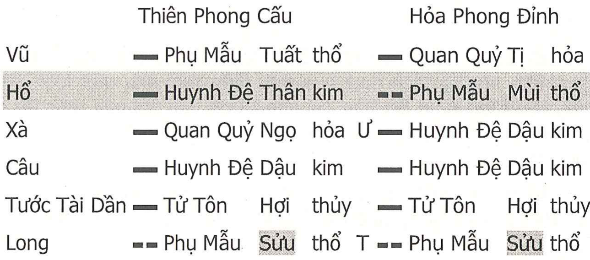
    - **Hình này chứng minh điều gì**
      - Làm sáng tỏ diễn biến cát hung và quy luật ứng nghiệm của Quẻ Thiên Phong Cấu biến Hỏa Phong Đỉnh đối với sự việc được hỏi.
    - **Từ đâu mà thấy được**
      - Căn cứ Thời gian lập quẻ: Ngày Ất Tị tháng Hợi. Nhìn vào biến Hỏa Phong Đỉnh.

- Quái lệ thực tế:
  - Bối cảnh: **Ví dụ 2:** Ngày Ất Tị tháng Hợi, một học viên Nhật Bản của tôi đoán hàng thủ công mỹ nghệ gửi cho bạn tại sao chưa nhận được? Được Phong Địa Quan.

- Luận điểm phân tích:
  - **Đoán:** Lấy hào Phụ Mẫu làm Dụng thần, Dụng được Nhật sinh phù là vượng tướng, Phụ Mẫu lâm hào Ứng, là thông tin đối phương đã nhận được vật đó, bèn bảo đối phương kiểm tra kỹ thùng thư thử xem, kết quả là phát hiện bưu phẩm bị kẹt ở phía trên thùng thư không rơi xuống, tưởng rằng chưa nhận được.

### Câu hỏi 11: Dự đoán sách gửi qua bưu điện lấy cái gì làm Dụng thần?

- Giải đáp trọng tâm:
  - Có Dịch hữu cho rằng, mặc dù lục thân của sách là Phụ Mẫu, nhưng sách mua qua bưu điện xem như một loại hàng hóa, cho rằng phải lấy hào Tài làm Dụng. Lời nói này mặc dù có lý, nhưng thực tiễn đã chứng minh rằng lấy Phụ Mẫu làm Dụng là chính xác.

- Quái lệ thực tế:
  - Bối cảnh: **Ví dụ 1:** Ngày Kỷ Sửu tháng Tuất, học viên đoán sách tôi gửi cho anh ta ngày nào đến? Được Địa Hỏa Minh Di biến Hỏa Sơn Lữ.

- Quái lệ dự đoán thực tế cho Quẻ Phong Địa Quan:
  - **Hình 142.** Quẻ Phong Địa Quan
    - 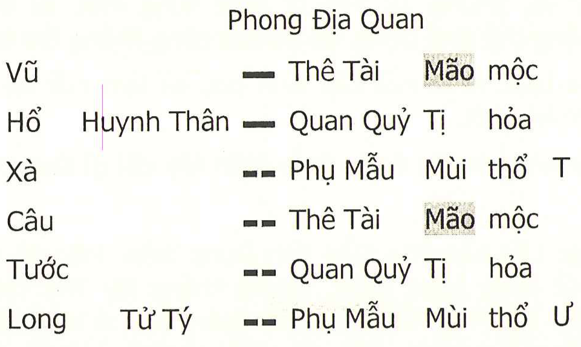
    - **Hình này chứng minh điều gì**
      - Làm sáng tỏ diễn biến cát hung và quy luật ứng nghiệm của Quẻ Phong Địa Quan đối với sự việc được hỏi.
    - **Từ đâu mà thấy được**
      - Căn cứ Thời gian lập quẻ: Ngày Kỷ Sửu tháng Tuất. Nhìn vào biến Hỏa Sơn Lữ.

- Luồng đối thoại và phán đoán thực tế:
  - **Đoán:** Lấy Phụ Mẫu làm Dụng thần. Phụ Mẫu được Nhật Nguyệt sinh phù, ngoại quái Tị Dậu Sửu tam hợp thành cục là vượng tướng, sách có thể đến, hào Thế lâm Nhật hóa ra Phụ Mẫu, hào Thế là mình, lâm Nhật biểu thị ngay hôm đó, hóa ra Phụ Mẫu, Phụ Mẫu là sách, biểu thị ngay hôm đó có thể nhìn thấy sách, quả nhiên ở giờ Dậu hôm đó nhận được sách. Lúc đó anh ta hỏi: Quẻ này tại sao không dùng tam hợp cục trong quẻ để xét Dụng thần? Tôi nói quẻ này rất vi diệu, tam hợp cục chính là một thông tin khác, biểu thị sách đã gửi không phải một cuốn mà là ba cuốn.

- Quái lệ thực tế:
  - Bối cảnh: **Ví dụ 2:** Ngày Bính Thân tháng Tị, học viên Trương Khánh Học của tôi đoán sách mua qua bưu điện ngày nào đến? Được Khảm Vi Thủy biến Thủy Phong Tỉnh.

- Luận điểm phân tích:
  - **Đoán:** Lấy hào Phụ Mẫu làm Dụng thần, trong quẻ Phụ Mẫu Thân kim được Nguyệt hợp là vượng, Phụ Mẫu lâm Nhật sinh Thế, nhất định hôm đó nhận được.

- Luận điểm phân tích:
  - Hào 3 Ngọ hỏa độc phát, hóa ra Phụ Mẫu Dậu kim, thần triệu cơ ở động, quẻ này đã phản ánh hôm đó có thể nhận được

- Quái lệ dự đoán thực tế cho Địa Hỏa Minh Di biến Hỏa Sơn Lữ:
  - **Hình 143.** Địa Hỏa Minh Di biến Hỏa Sơn Lữ
    - 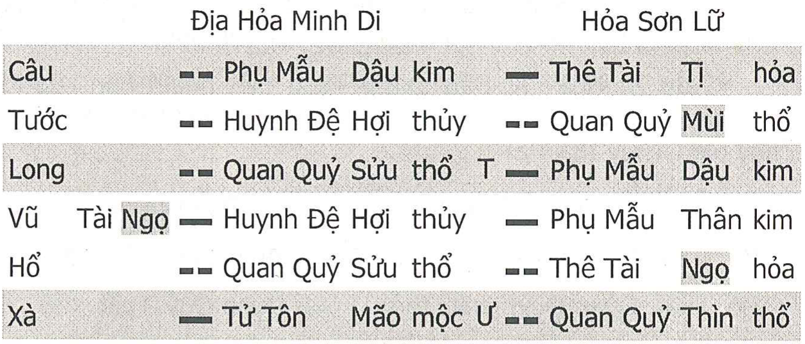
    - **Hình này chứng minh điều gì**
      - Làm sáng tỏ diễn biến cát hung và quy luật ứng nghiệm của Địa Hỏa Minh Di biến Hỏa Sơn Lữ đối với sự việc được hỏi.
    - **Từ đâu mà thấy được**
      - Căn cứ Thời gian lập quẻ: Ngày Kỷ Sửu tháng Tuất. Nhìn vào biến Hỏa Sơn Lữ.

- Quái lệ dự đoán thực tế cho Khảm Vi Thủy biến Thủy Phong Tỉnh:
  - **Hình 144.** Khảm Vi Thủy biến Thủy Phong Tỉnh
    - 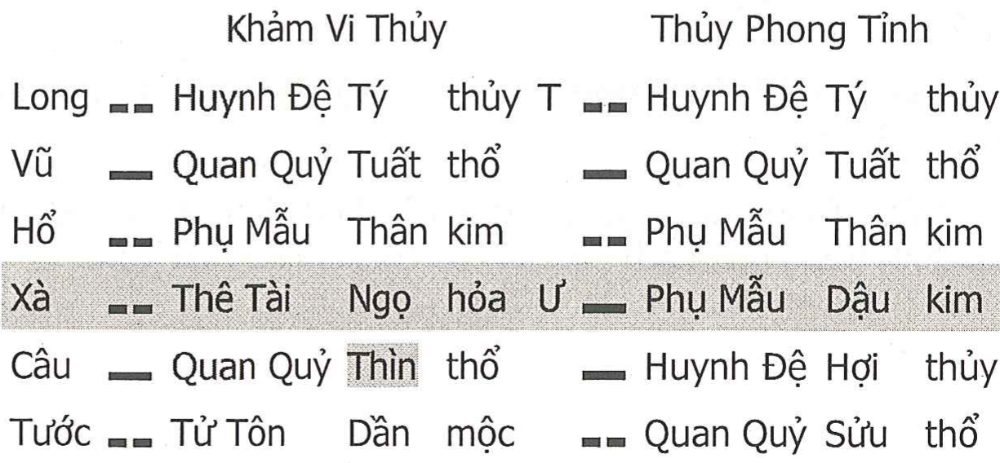
    - **Hình này chứng minh điều gì**
      - Làm sáng tỏ diễn biến cát hung và quy luật ứng nghiệm của Khảm Vi Thủy biến Thủy Phong Tỉnh đối với sự việc được hỏi.
    - **Từ đâu mà thấy được**
      - Căn cứ Thời gian lập quẻ: Ngày Kỷ Sửu tháng Tuất. Nhìn vào biến Hỏa Sơn Lữ.

- Quái lệ thực tế:
  - Bối cảnh: **Ví dụ 3:** Ngày Ất Dậu tháng Tuất, một người bạn của tôi đoán sách gửi vận chuyển hôm đó có đến không? Được Khảm Vi Thủy biến Thủy Địa Tỷ.

- Luận điểm phân tích:
  - **Đoán:** Lấy hào Phụ Mẫu làm Dụng thần, Phụ Mẫu Nguyệt sinh Nhật phù là vượng tướng, Phụ Mẫu lâm Nhật sinh Thế, nhất định hôm đó đến, Nguyên thần phát động sinh Dụng thần, nhưng Nguyệt phá, Nhật thần hợp nó là hợp phá, cũng là thông tin hôm đó đến.

- Luận điểm phân tích:
  - Tôi vừa phán đoán xong quẻ này, điện thoại của anh ta đã đổ chuông, đúng lúc công ty vận chuyển thông báo sách của anh ta đã đến.

### Câu hỏi 12: Dự đoán tình hình học tập lấy cái gì làm Dụng thần?

- Giải đáp trọng tâm:
  - Thành tích học tập xem hào Phụ Mẫu, đồng thời phán đoán tình trạng tính cách của con cái thì xem hào Tử Tôn.

- Quái lệ dự đoán thực tế cho Khảm Vi Thủy biến Thủy Địa Tỷ:
  - **Hình 145.** Khảm Vi Thủy biến Thủy Địa Tỷ
    - 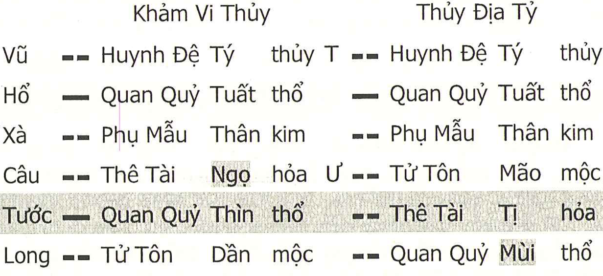
    - **Hình này chứng minh điều gì**
      - Làm sáng tỏ diễn biến cát hung và quy luật ứng nghiệm của Khảm Vi Thủy biến Thủy Địa Tỷ đối với sự việc được hỏi.
    - **Từ đâu mà thấy được**
      - Căn cứ Thời gian lập quẻ: Ngày Bính Dần tháng Tuất năm 2000. Nhìn vào biến Thủy Địa Tỷ](assets/page_0152_img_01.

- Quái lệ thực tế:
  - Bối cảnh: **Ví dụ 1:** Ngày Bính Dần tháng Tuất năm 2000, khi tôi ở Bắc Kinh, một người đàn ông Nhật Bản khoảng năm sáu chục tuổi dự đoán tình hình đi học của con gái ông ta, được Thủy Thiên Nhu biến Thủy Phong Tỉnh.

- Quái lệ dự đoán thực tế cho Thủy Thiên Nhu biến Thủy Phong Tỉnh:
  - **Hình 146.** Thủy Thiên Nhu biến Thủy Phong Tỉnh
    - 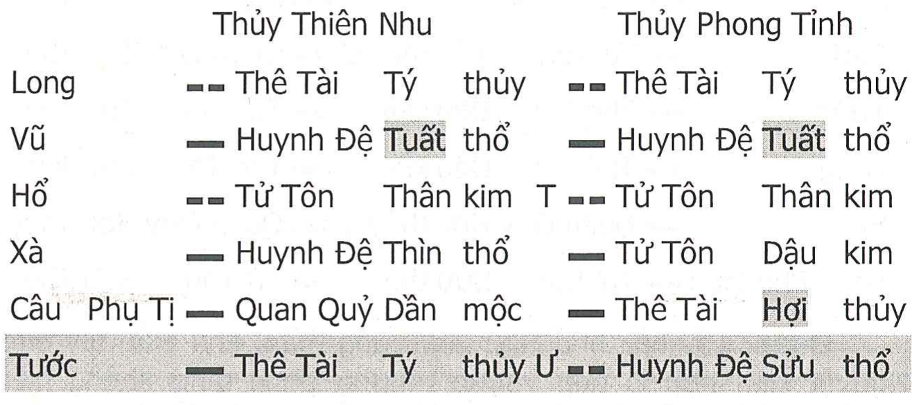
    - **Hình này chứng minh điều gì**
      - Làm sáng tỏ diễn biến cát hung và quy luật ứng nghiệm của Thủy Thiên Nhu biến Thủy Phong Tỉnh đối với sự việc được hỏi.
    - **Từ đâu mà thấy được**
      - Căn cứ Thời gian lập quẻ: Ngày Bính Dần tháng Tuất năm 2000. Nhìn vào biến Thủy Địa Tỷ](assets/page_0152_img_01.

- Luận điểm phân tích:
  - **Đoán:** Xem trẻ nhỏ học tập lấy hào Phụ Mẫu làm Dụng thần, hào Tử Tôn là tính cách và tình trạng của con.

- Luận điểm phân tích:
  - Quẻ này hào Phụ Mẫu Tị hỏa mặc dù được Nhật sinh phù, nhưng phục mà bất thượng quái, nhập Mộ ở Nguyệt, hào Tài độc phát, lâm Chu Tước đến khắc, chứng tỏ con không thích học tập.

- Luận điểm phân tích:
  - Tử Tôn lâm Bạch Hổ ám động là Dịch Mã, lại là quẻ du hồn, Bạch Hổ là bướng bỉnh càn quấy, lâm Dịch Mã ám động, là tượng đi lại khắp nơi, người xưa nói rằng: "Du hồn đi ngàn dặm", là dấu hiệu của đi xa. Những tổ hợp này vừa khớp với một câu khẩu quyết trong sách cổ: "Vượng Mã du hồn trẻ trốn học", do đó tôi phán đoán con của anh ta không thích học tập, thường xuyên trốn học.

- Luận điểm phân tích:
  - Sau khi phán đoán, người Nhật Bản này liên tục hỏi tôi có phải có công năng đặc dị hay không, làm sao có thể biết con gái anh ta không thích học và thường xuyên trốn học. Trên thực tế, người biết lục hào phân tích kỹ quẻ này thì đều có thể phán đoán ra. Có thể thấy rằng sách dự đoán cổ xưa hết sức lợi hại. Khi đã học tinh thông thì giống như được mở thiên nhãn, mọi thứ đều có thể nhìn thấu.

- Quái lệ thực tế:
  - Bối cảnh: **Ví dụ 2:** Ngày Canh Thân tháng Tuất, một người đoán về con trai học tập, được Hỏa Phong Đỉnh biến Sơn Phong Cổ.

- Quái lệ dự đoán thực tế cho Hỏa Phong Đỉnh biến Sơn Phong Cổ:
  - **Hình 147.** Hỏa Phong Đỉnh biến Sơn Phong Cổ
    - 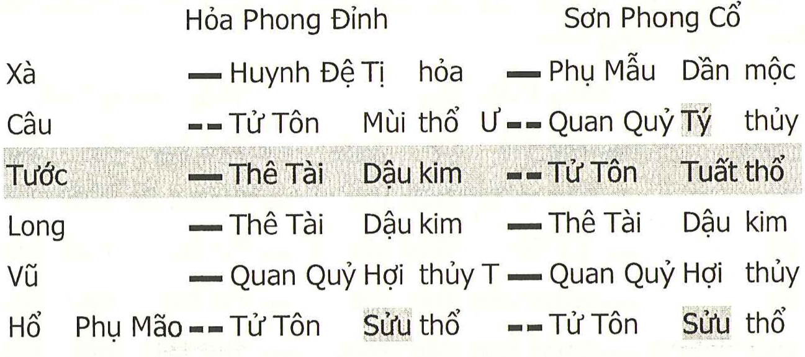
    - **Hình này chứng minh điều gì**
      - Làm sáng tỏ diễn biến cát hung và quy luật ứng nghiệm của Hỏa Phong Đỉnh biến Sơn Phong Cổ đối với sự việc được hỏi.
    - **Từ đâu mà thấy được**
      - Căn cứ Thời gian lập quẻ: Ngày Bính Dần tháng Tuất năm 2000. Nhìn vào biến Thủy Địa Tỷ](assets/page_0152_img_01.

- Luận điểm phân tích:
  - **Đoán:** Lấy hào Phụ Mẫu làm Dụng thần, Phụ Mẫu tuy được Nguyệt kiến hợp là hợp vượng, nhưng phục tàng không hiện, Tuyệt ở Nhật. Hào Tài động mà đến khắc, thành tích học tập của con anh ta nhất định không tốt. Phụ Mẫu là học nghiệp, phục tàng không hiện, chính là thông tin nghỉ học ở nhà. Tử Tôn Sửu thổ Không mà lâm Bạch Hổ, Bạch Hổ là bướng bỉnh, con anh ta quả nhiên bởi vì phá phách, thầy cô đã từ chối nó cho đến trường.

- Quái lệ thực tế:
  - Bối cảnh: **Ví dụ 3:** Ngày Ất Mão tháng Hợi, một người dự đoán tình hình đi học của con, được Hỏa Địa Tấn biến Trạch Địa Tụy.

- Quái lệ dự đoán thực tế cho Hỏa Địa Tấn biến Trạch Địa Tụy:
  - **Hình 148.** Hỏa Địa Tấn biến Trạch Địa Tụy
    - 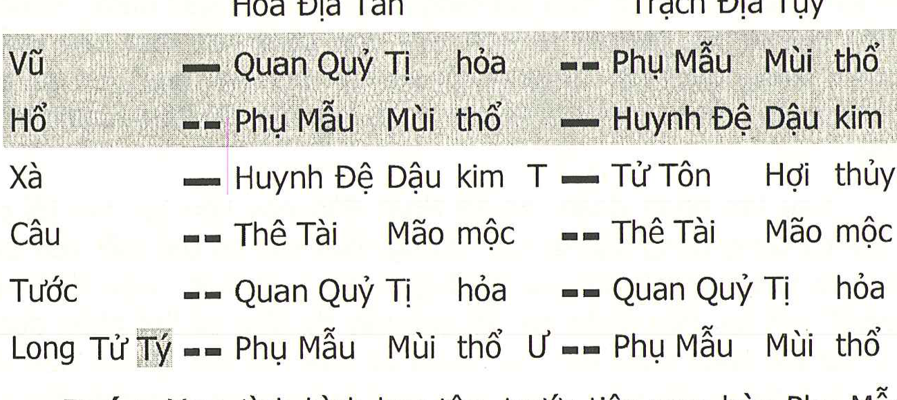
    - **Hình này chứng minh điều gì**
      - Làm sáng tỏ diễn biến cát hung và quy luật ứng nghiệm của Hỏa Địa Tấn biến Trạch Địa Tụy đối với sự việc được hỏi.
    - **Từ đâu mà thấy được**
      - Căn cứ Thời gian lập quẻ: Ngày Bính Dần tháng Tuất năm 2000. Nhìn vào biến Thủy Địa Tỷ](assets/page_0152_img_01.

- Luận điểm phân tích:
  - **Đoán:** Xem tình hình học tập, trước tiên xem hào Phụ Mẫu. Phụ Mẫu không được Nhật Nguyệt sinh phù, trái lại bị Nhật đến khắc thương, hưu tù phát động, cho thấy thành tích học tập không tốt, không ổn định. Tử Tôn không ở trong quẻ, phục tàng là tượng trốn tránh, lại là quẻ du hồn, chứng tỏ con anh ta không thích học, thường xuyên trốn học.

- Luận điểm phân tích:
  - Con của người này quả nhiên đúng là như vậy.

- Quái lệ thực tế:
  - Bối cảnh: **Ví dụ 4:** Ngày Canh Tý tháng Sửu, một người nữ dự đoán tình hình học tập của con, được Lôi Phong Hằng biến Hỏa Sơn Lữ.

- Luận điểm phân tích:
  - **Đoán:** Xem thành tích học tập, lấy Phụ Mẫu làm Dụng thần. Phụ Mẫu mặc dù được Nhật tỉ phù, nhưng bị Nguyệt khắc thương, đồng thời lại có hào động Thê Tài Tuất thổ đến khắc, khắc nhiều sinh ít, thành tích học tập nhất định không tốt.

- Luận điểm phân tích:
  - Tử Tôn Ngọ hỏa là Dịch Mã, ám động nhập Mộ ở hào động Tuất thổ, cũng là tượng trốn tránh, chứng tỏ con của cô ấy không thích học tập, không muốn đi học.

- Luận điểm phân tích:
  - Tình hình thực tế đúng là như vậy, con cái không thích học tập, thường xuyên trốn học.

### Câu hỏi 13: Dự đoán máy vi tính lấy cái gì làm Dụng thần?

- Giải đáp trọng tâm:
  - Nếu như máy vi tính bị mất thì lấy hào Tài làm Dụng thần; nếu như máy vi tính bị hư hại, hỏi khi nào khi nào sửa xong thì lấy hào Phụ Mẫu làm Dụng thần.

- Quái lệ dự đoán thực tế cho Lôi Phong Hằng biến Hỏa Sơn Lữ:
  - **Hình 149.** Lôi Phong Hằng biến Hỏa Sơn Lữ
    - 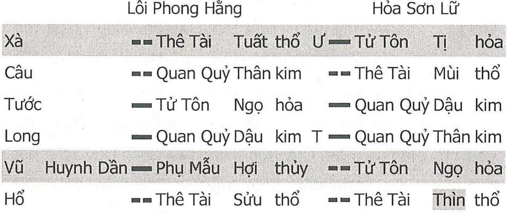
    - **Hình này chứng minh điều gì**
      - Làm sáng tỏ diễn biến cát hung và quy luật ứng nghiệm của Lôi Phong Hằng biến Hỏa Sơn Lữ đối với sự việc được hỏi.
    - **Từ đâu mà thấy được**
      - Căn cứ Thời gian lập quẻ: Ngày Đinh Mão tháng Mùi; Dụng thần được Nhật sinh trợ là vượng tướng. Nhìn vào biến Hỏa Sơn Lữ](assets/page_0155_img_01.

- Quái lệ thực tế:
  - Bối cảnh: **Ví dụ 1:** Ngày Đinh Mão tháng Mùi, một học viên hỏi máy vi tính của mình bị hư đem đi sửa khi nào có thể sửa xong? Được Lôi Sơn Tiểu Quá biến Lôi Địa Dự.

- Luận điểm phân tích:
  - **Đoán:** Lấy hào Phụ Mẫu làm Dụng thần, trong quẻ hào Phụ Mẫu lưỡng hiện, lấy Phụ Mẫu Tuất thổ Không Vong làm Dụng, Phụ Mẫu lâm Thanh Long là máy mới, Không Vong là máy không thể hiển thị hình ảnh. Huynh Đệ Thân kim lâm Trình Xà động hóa Thê Tài Mão mộc, Huynh Đệ là tượng cản trở, Trình Xà là vật thon dài thể hiện đường dây, chứng tỏ đường dây ở đâu đó không thông. Quẻ tại cung Đoài, Đoài là miệng là chỗ nối đầu sợi có vấn đề, Phụ Mẫu Tuất thổ Không Vong xuất Không có thể sửa xong.

- Luận điểm phân tích:
  - Sau này sửa xong ở ngày Bính Tuất, thì ra là do điểm kết nối của công tắc bị đứt.

- Quái lệ thực tế:
  - Bối cảnh: **Ví dụ 2:** Ngày Đinh Tị tháng Thân, một người bạn của tôi đoán máy vi tính bị hư khi nào sửa xong? Được Đoài Vi Trạch biến Trạch Địa Tụy.

- Quái lệ dự đoán thực tế cho Lôi Sơn Tiểu Quá biến Lôi Địa Dự:
  - **Hình 150.** Lôi Sơn Tiểu Quá biến Lôi Địa Dự
    - 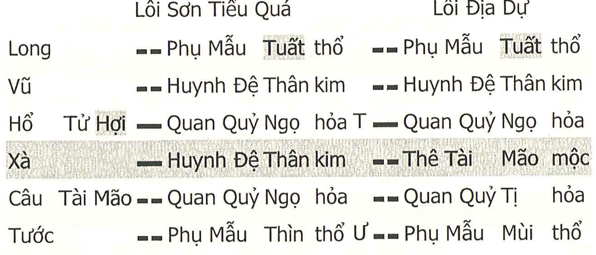
    - **Hình này chứng minh điều gì**
      - Làm sáng tỏ diễn biến cát hung và quy luật ứng nghiệm của Lôi Sơn Tiểu Quá biến Lôi Địa Dự đối với sự việc được hỏi.
    - **Từ đâu mà thấy được**
      - Căn cứ Thời gian lập quẻ: Ngày Đinh Mão tháng Mùi; Dụng thần được Nhật sinh trợ là vượng tướng. Nhìn vào biến Hỏa Sơn Lữ](assets/page_0155_img_01.

- Quái lệ dự đoán thực tế cho Đoài Vi Trạch biến Trạch Địa Tụy:
  - **Hình 151.** Đoài Vi Trạch biến Trạch Địa Tụy
    - 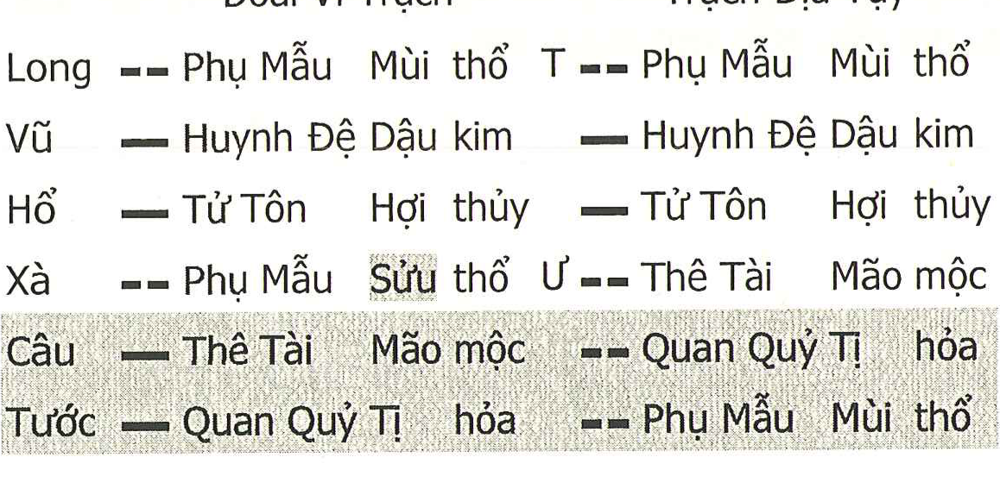
    - **Hình này chứng minh điều gì**
      - Làm sáng tỏ diễn biến cát hung và quy luật ứng nghiệm của Đoài Vi Trạch biến Trạch Địa Tụy đối với sự việc được hỏi.
    - **Từ đâu mà thấy được**
      - Căn cứ Thời gian lập quẻ: Ngày Đinh Mão tháng Mùi; Dụng thần được Nhật sinh trợ là vượng tướng. Nhìn vào biến Hỏa Sơn Lữ](assets/page_0155_img_01.

- Luận điểm phân tích:
  - **Đoán:** Lấy hào Phụ Mẫu làm Dụng thần, trong quẻ Phụ Mẫu lưỡng hiện, lấy Phụ Mẫu Sửu thổ Không Vong lâm hào Ứng làm Dụng thần, Sửu thổ Không Vong là máy vi tính không có hình ảnh, Kỵ thần lâm Câu Trần phát động khắc Dụng thần, nhưng Nguyên thần cũng đồng thời phát động, thành liên tục tương sinh, lại thêm Dụng thần được Nhật sinh trợ là vượng tướng, máy có thể sửa được. Dụng thần lâm đất Tử Tuyệt (Tử ở Mão, Tuyệt ở Tị, đây là xem từ góc độ tượng), nơi Tuyệt lâm Chu Tước, Chu Tước là tài liệu, tập tin, có thể là không cẩn thận đã xóa tập tin nào đó trong máy.

- Luận điểm phân tích:
  - Quả nhiên là đã thiếu một tập tin, sau khi thêm nó, máy đã có thể hiển thị, máy sửa xong tại ngày Kỷ Mùi, đây là bởi vì Dụng thần Không Vong, xung Không tắc Thực.

- Quái lệ thực tế:
  - Bối cảnh: **Ví dụ 3:** Ngày Tân Mão tháng Mão, một người đoán máy vi tính khi nào sửa xong? Được Thiên Thủy Tụng biến Sơn Thủy Mông.

- Quái lệ dự đoán thực tế cho Thiên Thủy Tụng biến Sơn Thủy Mông:
  - **Hình 152.** Thiên Thủy Tụng biến Sơn Thủy Mông
    - 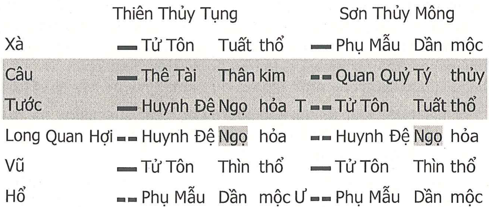
    - **Hình này chứng minh điều gì**
      - Làm sáng tỏ diễn biến cát hung và quy luật ứng nghiệm của Thiên Thủy Tụng biến Sơn Thủy Mông đối với sự việc được hỏi.
    - **Từ đâu mà thấy được**
      - Căn cứ Thời gian lập quẻ: Ngày Đinh Mão tháng Mùi; Dụng thần được Nhật sinh trợ là vượng tướng. Nhìn vào biến Hỏa Sơn Lữ](assets/page_0155_img_01.

- Luận điểm phân tích:
  - **Đoán:** Lấy hào Phụ Mẫu làm Dụng thần, hào Phụ Mẫu được Nhật Nguyệt tỉ phù là vượng tướng, máy có thể sửa được, Phụ Mẫu sinh Thế, nhưng hào Thế Không mà nhập Mộ, không được Phụ Mẫu sinh, ngày Thìn xung khai Mộ khố, giờ Ngọ Thực Không, có thể sửa xong. Quả nhiên ở giờ Ngọ ngày hôm sau sửa xong.

- Quái lệ thực tế:
  - Bối cảnh: **Ví dụ 4:** Ngày Canh Ngọ tháng Tuất, một học viên hỏi máy vi tính bị hư của mình khi nào sửa xong? Được Thủy Thiên Nhu biến Phong Thiên Tiểu Súc.

- Quái lệ dự đoán thực tế cho Thủy Thiên Nhu biến Phong Thiên Tiểu Súc:
  - **Hình 153.** Thủy Thiên Nhu biến Phong Thiên Tiểu Súc
    - 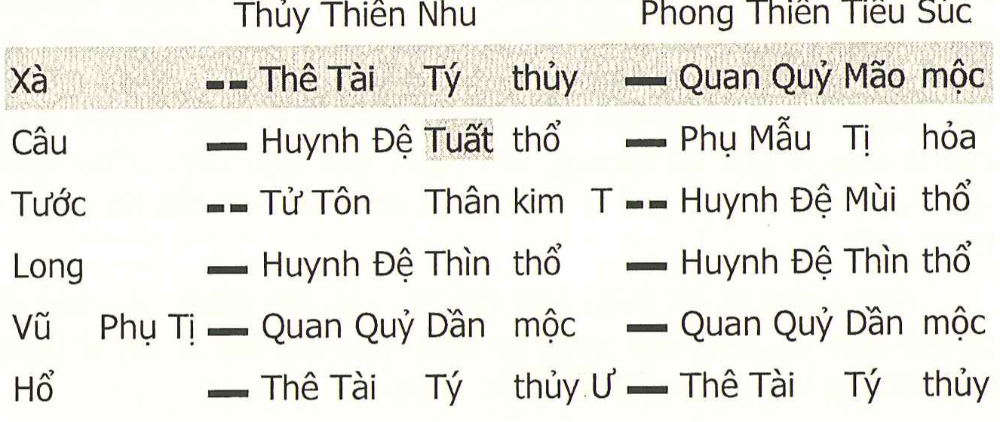
    - **Hình này chứng minh điều gì**
      - Làm sáng tỏ diễn biến cát hung và quy luật ứng nghiệm của Thủy Thiên Nhu biến Phong Thiên Tiểu Súc đối với sự việc được hỏi.
    - **Từ đâu mà thấy được**
      - Căn cứ Thời gian lập quẻ: Ngày Đinh Mão tháng Mùi; Dụng thần được Nhật sinh trợ là vượng tướng. Nhìn vào biến Hỏa Sơn Lữ](assets/page_0155_img_01.

- Luận điểm phân tích:
  - **Đoán:** Lấy hào Phụ Mẫu làm Dụng thần. Phụ Mẫu Tị hỏa phục dưới hào 2 Quan Quỷ Dần mộc, Nguyệt kiến không khắc Nhật thần tỉ phù là vượng tướng, đồng thời Phi thần lại đến sinh Dụng thần là cát, trong quẻ Thê Tài Tý thủy mặc dù động đến khắc Dụng thần, nhưng Tý thủy Nguyệt khắc Nhật xung, xung này là tán, căn bản không có sức lực khắc Dụng thần, chứng tỏ máy vi tính về cơ bản không có trục trặc gì, Kỵ thần lâm Trình Xà, Trình Xà là tượng thon dài, nhất định là đường kết nối đã xảy ra vấn đề.

- Kết quả ứng nghiệm thực tế:
  - Kết quả, anh ta đã nhờ đến nhân viên sửa chữa, lúc sửa chữa thấy ngay máy hoàn toàn không bị hư, chỉ là do dây cắm bị lỏng, ở giờ Thân đã trở lại bình thường.

- Quái lệ thực tế:
  - Bối cảnh: **Ví dụ 5:** Ngày Đinh Hợi tháng Mão, tôi tự dự đoán về máy vi tính bị hư, khi nào có thể sửa xong? Được Phong Sơn Tiệm biến Phong Thủy Hoán.

- Quái lệ dự đoán thực tế cho Phong Sơn Tiệm biến Phong Thủy Hoán:
  - **Hình 154.** Phong Sơn Tiệm biến Phong Thủy Hoán
    - 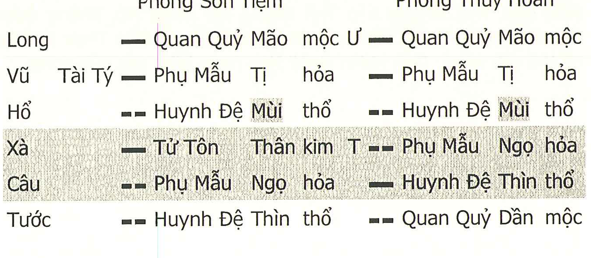
    - **Hình này chứng minh điều gì**
      - Làm sáng tỏ diễn biến cát hung và quy luật ứng nghiệm của Phong Sơn Tiệm biến Phong Thủy Hoán đối với sự việc được hỏi.
    - **Từ đâu mà thấy được**
      - Căn cứ Thời gian lập quẻ: Ngày Đinh Mão tháng Mùi; Dụng thần được Nhật sinh trợ là vượng tướng. Nhìn vào biến Hỏa Sơn Lữ](assets/page_0155_img_01.

- Luận điểm phân tích:
  - **Đoán:** Lấy hào Phụ Mẫu làm Dụng thần, trong quẻ hào Phụ Mẫu lưỡng hiện, Phụ Mẫu Tị hỏa ám động, Phụ Mẫu Ngọ hỏa Không Vong phát động, lấy Phụ Mẫu Ngọ hỏa Không Vong phát động làm Dụng.

- Luận điểm phân tích:
  - Dụng thần được Nguyệt đến sinh phù là vượng tướng. Dụng thần gặp Không Vong, xuất Không thì xong. Dụng thần phát động, động mà gặp trị gặp hợp. Cũng ứng ngày Ngọ, kết quả là sửa xong ở giờ Mùi ngày Ngọ.

- Quái lệ thực tế:
  - Bối cảnh: **Ví dụ 6:** Ngày Tân Sửu tháng Dậu, một người bạn của tôi đoán về máy vi tính bị mất, được Lôi Thủy Giải biến Lôi Địa Dực.

- Luận điểm phân tích:
  - **Đoán:** Lấy Thê Tài làm Dụng thần, trong quẻ Thê Tài lưỡng hiện, lấy Thê Tài Thìn thổ phát động trên Thế làm Dụng thần. Thoạt nhìn quẻ này, Dụng thần được Nguyệt hợp, Nhật thần củng phù là vượng, đồng thời Tài động hóa hồi đầu sinh, cần phải đoán là có thể tìm được.

- Luận điểm phân tích:
  - Nhưng đây là một hào độc phát, không lấy lý pháp ngũ hành sinh khắc làm chủ, mà là lấy tượng pháp phán đoán cát hung. Dụng thần Không Vong biểu thị mất, động mà hóa Tuyệt lại hóa Không, biểu thị không tìm lại được, lâm Thế hóa Không hóa Tuyệt, biểu thị là mình làm mất.

- Luận điểm phân tích:
  - Sau quả nhiên không tìm lại được.

- Quái lệ dự đoán thực tế cho Lôi Thủy Giải biến Lôi Địa Dực:
  - **Hình 155.** Lôi Thủy Giải biến Lôi Địa Dực
    - 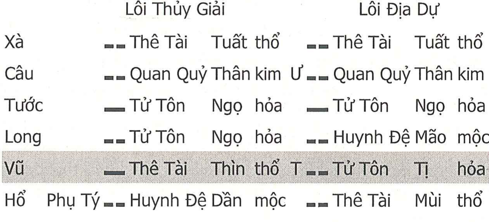
    - **Hình này chứng minh điều gì**
      - Làm sáng tỏ diễn biến cát hung và quy luật ứng nghiệm của Lôi Thủy Giải biến Lôi Địa Dực đối với sự việc được hỏi.
    - **Từ đâu mà thấy được**
      - Căn cứ Thời gian lập quẻ: Ngày Đinh Mão tháng Mùi; Dụng thần được Nhật sinh trợ là vượng tướng. Nhìn vào biến Hỏa Sơn Lữ](assets/page_0155_img_01.

- Quái lệ thực tế:
  - Bối cảnh: **Ví dụ 7:** Ngày Quý Mùi tháng Dần, tổng giám đốc của một công ty ở Tây Tạng khi đến phương Nam công tác đã bị ăn trộm máy tính xách tay mang theo, ông ta gọi điện thoại hỏi tôi có thể tìm lại máy tính được không, bởi vì trong máy có tài liệu rất quan trọng, tôi gieo quẻ được Trạch Phong Đại Quá biến Thiên Hỏa Đồng Nhân.

- Luận điểm phân tích:
  - **Đoán:** Lấy hào Tài làm Dụng thần, trong quẻ hào Tài lưỡng hiện, hơn nữa đều phát động, đều có thể xem là Dụng thần, hào 6 Tài động hóa Tiến thần, dự đoán vật bị mất, hóa thoái có thể tìm lại, hóa tiến là tượng vật rời xa mình, do đó là thông tin không tìm lại được.

- Luận điểm phân tích:
  - Hào sơ Thê Tài Sửu thổ Nguyệt khắc động hóa hồi đầu khắc, là hưu tù, bị Nhật xung là Nhật phá, xung tán, máy vi tính bị mất nhất định không tìm lại được.

- Luận điểm phân tích:
  - Sau này quả nhiên không tìm được.

### Câu hỏi 14: Dự đoán đồ cổ thì lấy cái gì làm Dụng thần?

- Giải đáp trọng tâm:
  - Loại tranh chữ thì lấy hào Phụ Mẫu làm Dụng thần, vật quý giá thông thường thì lấy Thê Tài làm Dụng thần. Vượng tướng là thật, hưu tù Không Phá là giả.

- Quái lệ dự đoán thực tế cho Trạch Phong Đại Quá biến Thiên Hỏa Đồng Nhân:
  - **Hình 156.** Trạch Phong Đại Quá biến Thiên Hỏa Đồng Nhân
    - 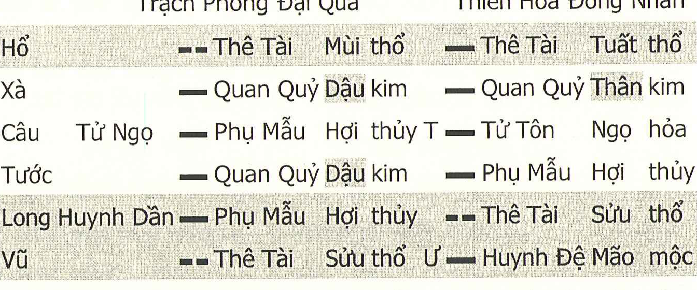
    - **Hình này chứng minh điều gì**
      - Làm sáng tỏ diễn biến cát hung và quy luật ứng nghiệm của Trạch Phong Đại Quá biến Thiên Hỏa Đồng Nhân đối với sự việc được hỏi.
    - **Từ đâu mà thấy được**
      - Căn cứ Thời gian lập quẻ: Ngày Giáp Thìn tháng Mùi; Dụng thần là vượng tướng. Nhìn vào biến Thiên Hỏa Đồng Nhân](assets/page_0160_img_01.

- Quái lệ thực tế:
  - Bối cảnh: **Ví dụ 1:** Ngày Giáp Thìn tháng Mùi, một đồng nghiệp ở đơn vị tôi đoán đồ gốm sứ mua được là thật hay giả? Được Sơn Thủy Mông biến Sơn Thiên Đại Súc.

- Quái lệ dự đoán thực tế cho Sơn Thủy Mông biến Sơn Thiên Đại Súc:
  - **Hình 157.** Sơn Thủy Mông biến Sơn Thiên Đại Súc
    - 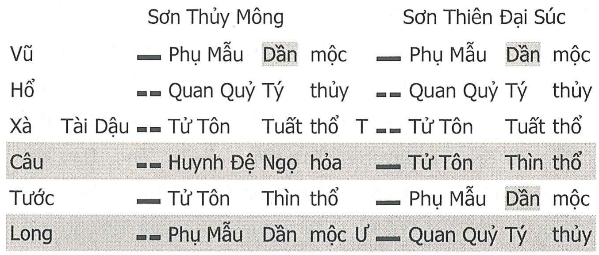
    - **Hình này chứng minh điều gì**
      - Làm sáng tỏ diễn biến cát hung và quy luật ứng nghiệm của Sơn Thủy Mông biến Sơn Thiên Đại Súc đối với sự việc được hỏi.
    - **Từ đâu mà thấy được**
      - Căn cứ Thời gian lập quẻ: Ngày Giáp Thìn tháng Mùi; Dụng thần là vượng tướng. Nhìn vào biến Thiên Hỏa Đồng Nhân](assets/page_0160_img_01.

- Luận điểm phân tích:
  - **Đoán:** Lấy hào Thê Tài làm Dụng thần, Nhật Nguyệt sinh phù Dụng thần là vượng tướng, đồ gốm sứ này là thật.

- Luận điểm phân tích:
  - Dụng thần phục tàng, tương hợp với Nhật, sách cổ nói rằng: Nhật hợp Dụng thần, tất bị che lấp. Chứng tỏ vật này được chôn trong đất. Phi thần Tuất thổ ám động đến sinh, Tuất là hỏa khố, chủ lò nung, vật này thu được từ trong đống đổ nát của lò nung gốm sứ cổ.

- Luận điểm phân tích:
  - Dụng lâm Trình Xà, vật này hiếm thấy, Dụng thần gặp Ngọ hỏa là đất Mộc Dục, đồng thời kim lại chủ cứng chắc nhẵn bóng, chứng tỏ bề mặt của vật rất nhẵn bóng. Hào sơ phát động Tuyệt Dụng thần, lại lâm Không Vong, hóa ra Quan Quỷ, hào sơ là phần đáy của vật, Tuyệt là khuyết thiếu, tàn khuyết, Không Vong là có kẽ hở, Quan Quỷ là thương tật, thủy là chất lỏng, tổng hợp phán đoán, phần đáy của vật có vết nứt, sau khi cho nước vào sẽ rò rỉ nước.

- Luận điểm phân tích:
  - Tình hình thực tế là anh ta đã mua được một cái thủy chú¹ thời Kim từ trong tay của một người dân. Theo lời người bán, vật này được phát hiện từ trong đống đổ nát của lò gốm sứ cổ bản địa, bề mặt của vật nhẵn bóng, phần đáy đã có một vết nứt.

- Luận điểm phân tích:
  - ¹ Một dụng cụ văn phòng cổ xưa, dùng để trữ nước và nhỏ nước khi mài mực.

- Quái lệ thực tế:
  - Bối cảnh: **Ví dụ 2:** Ngày Đinh Mão tháng Sửu, một người phát hiện một tờ thánh chỉ cổ đại, không biết nó thật hay giả, hỏi quẻ được Sơn Thiên Đại Súc biến Sơn Phong Cổ.

- Quái lệ dự đoán thực tế cho Sơn Thiên Đại Súc biến Sơn Phong Cổ:
  - **Hình 158.** Sơn Thiên Đại Súc biến Sơn Phong Cổ
    - 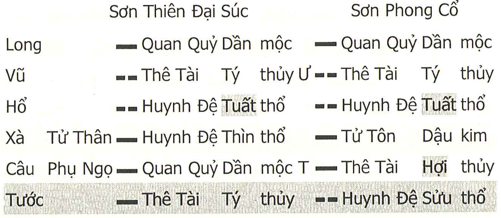
    - **Hình này chứng minh điều gì**
      - Làm sáng tỏ diễn biến cát hung và quy luật ứng nghiệm của Sơn Thiên Đại Súc biến Sơn Phong Cổ đối với sự việc được hỏi.
    - **Từ đâu mà thấy được**
      - Căn cứ Thời gian lập quẻ: Ngày Giáp Thìn tháng Mùi; Dụng thần là vượng tướng. Nhìn vào biến Thiên Hỏa Đồng Nhân](assets/page_0160_img_01.

- Luận điểm phân tích:
  - **Đoán:** Lấy hào Phụ Mẫu làm Dụng thần, Phụ Mẫu Ngọ hỏa phục dưới hào 2 Quan Quỷ Dần mộc, được Nhật sinh phù, lại được hào Phi đến sinh vượng tướng, vật này là thật, lâm Câu Trần là vật của gia đình quan lại.

- Luận điểm phân tích:
  - Hào sơ Thê Tài lâm Chu Tước phát động, xung khắc Dụng thần, xung là tán, khắc là có tổn hại, lâm Chu Tước chủ văn tự, chứng tỏ thánh chỉ này không toàn vẹn, hào biến và hào động tương hợp, khiến Thê Tài Tý thủy tham hợp quên khắc, vật này vẫn có khả năng bổ cứu.

- Kết quả ứng nghiệm thực tế:
  - **Kết quả:** Tôi và anh ta cùng đi xem thánh chỉ đó, quả nhiên là thánh chỉ thật, nhưng nó không đầy đủ, chỉ có một nửa, thánh chỉ vốn là một tờ nguyên vẹn, là bảo vật gia truyền của lão nhân để lại. Bởi vì có hai anh em, nhưng thánh chỉ chỉ có một tờ, khi hai người ở riêng đã cắt đôi thánh chỉ, mỗi người lấy một nửa. Về sau người này đã mua lại nửa thánh chỉ này, sau đó cũng mua được nửa còn lại từ trong tay của người anh em kia.

- Quái lệ thực tế:
  - Bối cảnh: **Ví dụ 3:** Ngày Đinh Mão tháng Sửu, chiêm bản ghi chú cổ là thật hay giả? Được Địa Hỏa Minh Di biến Ly Vi Hỏa.

- Luận điểm phân tích:
  - **Đoán:** Lấy hào Phụ Mẫu làm Dụng thần, Phụ Mẫu Dậu kim được Nguyệt sinh phù là vượng, bản ghi chú là thật. Dụng thần tam hợp, chứng tỏ không chỉ có một mảnh, là do nhiều mảnh tạo thành. Lâm Thanh Long, nét chữ thanh tú.

- Kết quả ứng nghiệm thực tế:
  - Sau đó đi xem bản ghi chú quả nhiên là thật. Là bản ghi chú của một tiến sĩ thời Thanh viết, gồm hai mảnh tạo thành.

- Quái lệ thực tế:
  - Bối cảnh: **Ví dụ 4:** Ngày Ất Dậu tháng Mão, một người nói là có một cái đỉnh đồng, muốn mua nhưng không biết nó thật hay giả, gieo quẻ được Thủy Trạch Tiết biến Sơn Địa Bác.

- Luận điểm phân tích:
  - **Đoán:** Vật dụng cụ thể lấy hào Tài làm Dụng thần, hào Tài được Nguyệt sinh phù, Nhật thần không khắc, là vượng tướng. Lại lâm Thanh Long, Thanh Long là tượng cao quý, chứng tỏ đỉnh đồng này là thật, và là một vật tương đối có giá trị.

- Luận điểm phân tích:
  - Hào 2 Tử Tôn Mão mộc lâm Chu Tước động mà đến sinh. Chu Tước chủ nói, Tử Tôn là gian hào, đây là thông tin có người trung gian giới thiệu, mời anh ta mua vật này.

- Quái lệ dự đoán thực tế cho Quẻ Địa Hỏa Minh Di biến Ly Vi Hỏa:
  - **Hình 159.** Quẻ Địa Hỏa Minh Di biến Ly Vi Hỏa
    - 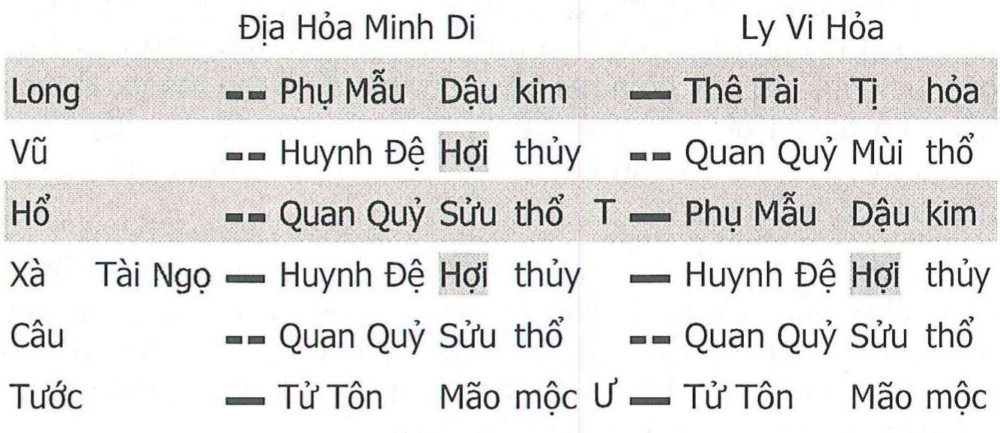
    - **Hình này chứng minh điều gì**
      - Làm sáng tỏ diễn biến cát hung và quy luật ứng nghiệm của Quẻ Địa Hỏa Minh Di biến Ly Vi Hỏa đối với sự việc được hỏi.
    - **Từ đâu mà thấy được**
      - Căn cứ Thời gian lập quẻ: Ngày Giáp Thìn tháng Mùi; Dụng thần là vượng tướng. Nhìn vào biến Thiên Hỏa Đồng Nhân](assets/page_0160_img_01.

- Quái lệ dự đoán thực tế cho Quẻ Thủy Trạch Tiết biến Sơn Địa Bác:
  - **Hình 160.** Quẻ Thủy Trạch Tiết biến Sơn Địa Bác
    - 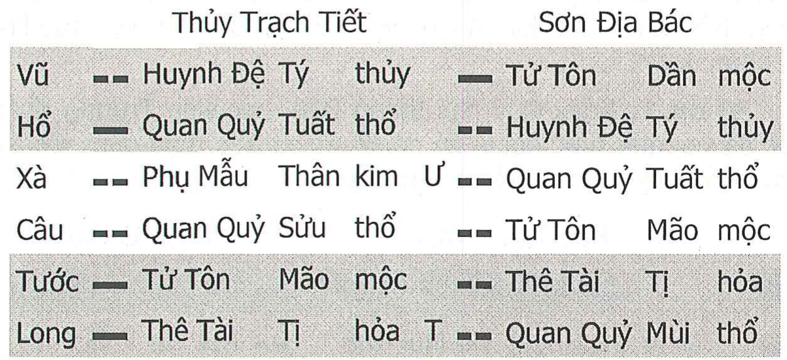
    - **Hình này chứng minh điều gì**
      - Làm sáng tỏ diễn biến cát hung và quy luật ứng nghiệm của Quẻ Thủy Trạch Tiết biến Sơn Địa Bác đối với sự việc được hỏi.
    - **Từ đâu mà thấy được**
      - Căn cứ Thời gian lập quẻ: Ngày Giáp Thìn tháng Mùi; Dụng thần là vượng tướng. Nhìn vào biến Thiên Hỏa Đồng Nhân](assets/page_0160_img_01.

- Luận điểm phân tích:
  - Dụng thần nhập Mộ ở Quan Quỷ Tuất thổ, Quỷ là thi thể, lâm Bạch Hổ chủ tử vong. Rõ ràng là lấy được từ trong mộ. Quẻ gặp lục hợp, vật này gồm hai bộ phận trên dưới tạo thành, là đỉnh đồng có nắp. Hào 6 Huynh Đệ Tý thủy lâm Huyền Vũ động mà đến khắc, Huyền Vũ chủ mục nát. Hào 6 là phần đầu, chứng tỏ nắp có chỗ bị ăn mòn.

- Luận điểm phân tích:
  - Hào Tài trì Thế hóa Quan hóa Không, lại nhập Mộ ở Quan Quỷ. Mua vật này nhất định không cát, hóa Quan Quỷ là thấy quan, nhập Mộ chủ lao ngục. Hóa Không là mất vật dụng, sau khi mua đỉnh đồng này, không những không giữ được nó, mà còn có thể dẫn đến tai họa kiện cáo và lao ngục.

- Kết quả ứng nghiệm thực tế:
  - Sau đó, người dẫn tôi đi xem vật này đã không mua theo lời khuyên của tôi.

### Câu hỏi 15: Đấu thầu lấy cái gì làm Dụng thần?

- Giải đáp trọng tâm:
  - Lấy hào Phụ Mẫu làm Dụng thần. Bởi vì việc có thể trúng thầu hay không có liên quan rất lớn đến việc ký kết hợp đồng. Có thể ký kết hợp đồng thì biểu thị có thể trúng thầu. Có người nói là xem Tài, điều này không đúng, đã trúng thầu cũng chưa hẳn là có thể kiếm được tiền, có trường hợp thậm chí còn thua lỗ, do đó lấy hào Tài để phán đoán hiển nhiên là không đúng. Nếu muốn hỏi lợi nhuận thì có thể gieo thêm một quẻ khác để phán đoán.

- Quái lệ thực tế:
  - Bối cảnh: **Ví dụ 1:** Ngày Quý Mùi tháng Dần, học viên Trương Khánh Học đã hỏi quẻ này, nói là có người muốn đấu thầu gốm sứ, gieo được Hỏa Trạch Khuê biến Khôn Vi Địa.

- Luận điểm phân tích:
  - Quẻ này lấy hào Phụ Mẫu làm Dụng thần, Phụ Mẫu Tị hỏa được Nguyệt kiến đến sinh, trong quẻ lại có Quan Quỷ động đến

- Quái lệ dự đoán thực tế cho Quẻ Hỏa Trạch Khuê biến Khôn Vi Địa:
  - **Hình 161.** Quẻ Hỏa Trạch Khuê biến Khôn Vi Địa
    - 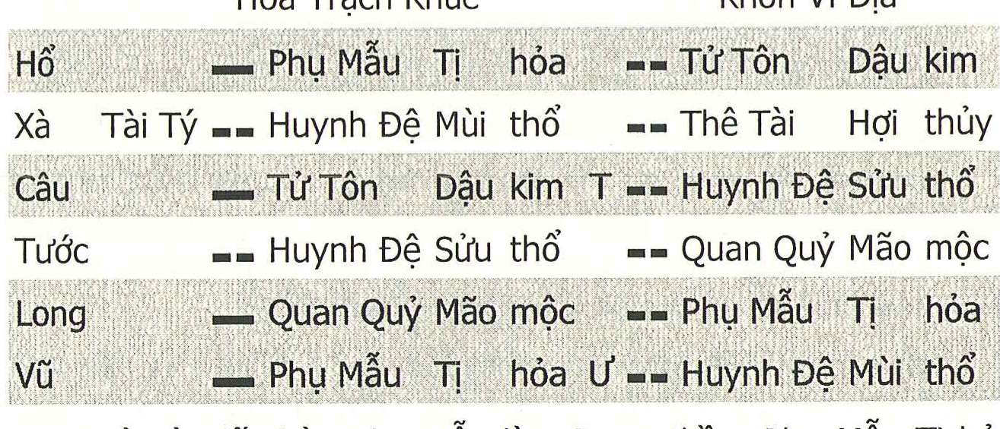
    - **Hình này chứng minh điều gì**
      - Làm sáng tỏ diễn biến cát hung và quy luật ứng nghiệm của Quẻ Hỏa Trạch Khuê biến Khôn Vi Địa đối với sự việc được hỏi.
    - **Từ đâu mà thấy được**
      - Căn cứ Thời gian lập quẻ: Ngày Quý Mùi tháng Dần; Dụng thần sinh Thế tất nhiên có thể trúng thầu. Nhìn vào biến Khôn Vi Địa.

- Luận điểm phân tích:
  - Sau quả nhiên không trúng thầu. Có lẽ có người sẽ hỏi, Phụ Mẫu, hào Thế và hào biến của hào Thế thành tam hợp cục không phải rất tốt hay sao? Tam hợp cục này không phải Phụ Mẫu mà là Tử Tôn, trái lại đã khiến Phụ Mẫu biến đổi tính chất, càng là không thể trúng thầu.

- Quái lệ thực tế:
  - Bối cảnh: **Ví dụ 2:** Ngày Kỷ Hợi tháng Hợi, một Dịch hữu ở Sơn Đông hỏi bạn đấu thầu công trình có thể nhận được hay không? Được Hỏa Địa Tấn biến Thiên Lôi Vô Vọng.

- Quái lệ dự đoán thực tế cho Quẻ Hỏa Địa Tấn biến Thiên Lôi Vô Vọng:
  - **Hình 162.** Quẻ Hỏa Địa Tấn biến Thiên Lôi Vô Vọng
    - 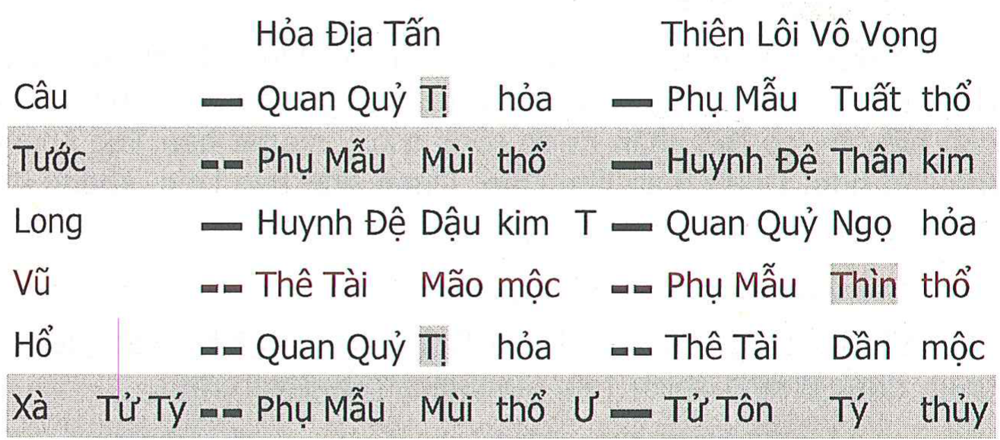
    - **Hình này chứng minh điều gì**
      - Làm sáng tỏ diễn biến cát hung và quy luật ứng nghiệm của Quẻ Hỏa Địa Tấn biến Thiên Lôi Vô Vọng đối với sự việc được hỏi.
    - **Từ đâu mà thấy được**
      - Căn cứ Thời gian lập quẻ: Ngày Quý Mùi tháng Dần; Dụng thần sinh Thế tất nhiên có thể trúng thầu. Nhìn vào biến Khôn Vi Địa.

- Luận điểm phân tích:
  - **Đoán:** Lấy Phụ Mẫu làm Dụng thần, trong quẻ Phụ Mẫu lưỡng hiện đều động đến sinh Thế, mặc dù hưu tù nhưng Nhật Nguyệt không khắc, căn không hoại, thần triệu cơ ở động, Dụng thần sinh Thế tất nhiên có thể trúng thầu, hiện tại Nguyên thần Nguyệt phá, tháng sau tháng Tý sang tháng bất phá, nhất định có thể trúng thầu, sau quả nhiên trúng thầu.

- Quái lệ thực tế:
  - Bối cảnh: **Ví dụ 3:** Ngày Giáp Ngọ tháng Sửu, một người bạn hỏi có thể trúng thầu công trình hay không? Được Thủy Trạch Tiết.

- Quái lệ dự đoán thực tế cho Quẻ Thủy Trạch Tiết:
  - **Hình 163.** Quẻ Thủy Trạch Tiết
    - 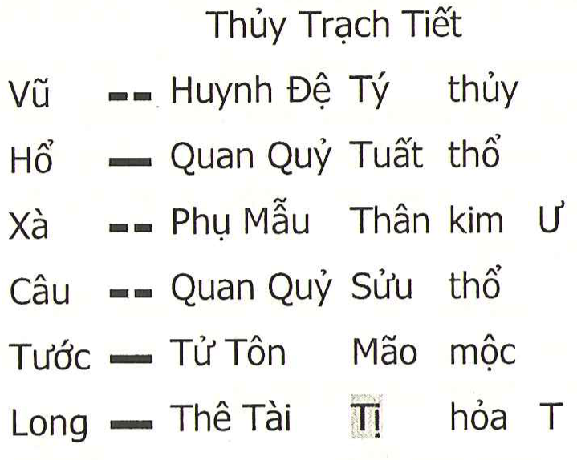
    - **Hình này chứng minh điều gì**
      - Làm sáng tỏ diễn biến cát hung và quy luật ứng nghiệm của Quẻ Thủy Trạch Tiết đối với sự việc được hỏi.
    - **Từ đâu mà thấy được**
      - Căn cứ Thời gian lập quẻ: Ngày Quý Mùi tháng Dần; Dụng thần sinh Thế tất nhiên có thể trúng thầu. Nhìn vào biến Khôn Vi Địa.

- Luận điểm phân tích:
  - **Đoán:** Lấy Phụ Mẫu làm Dụng thần, Phụ Mẫu Nguyệt sinh Nhật khắc, suy vượng tương đương, Dụng thần hợp Thế vốn là cát, biểu thị có thể nhận được công trình, nhưng hào Thế Không mà khó hợp, Dụng thần lâm Ứng, Quan sinh hào Ứng, không thể trúng thầu.

- Luận điểm phân tích:
  - Sau quả nhiên không trúng thầu.

- Quái lệ thực tế:
  - Bối cảnh: **Ví dụ 4:** Ngày Ất Hợi tháng Tuất, một người hỏi kết quả đấu thầu, được Phong Thiên Tiểu Súc biến Thủy Thiên Nhu.

- Quái lệ dự đoán thực tế cho Quẻ Phong Thiên Tiểu Súc biến Thủy Thiên Nhu:
  - **Hình 164.** Quẻ Phong Thiên Tiểu Súc biến Thủy Thiên Nhu
    - 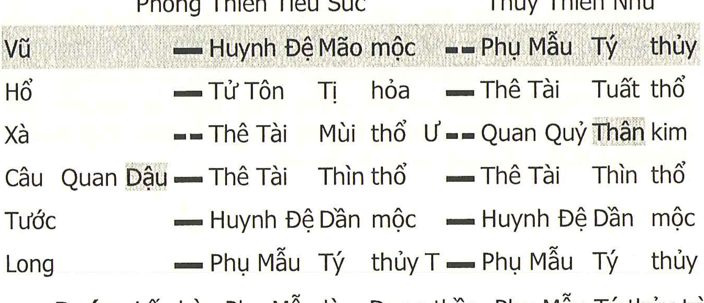
    - **Hình này chứng minh điều gì**
      - Làm sáng tỏ diễn biến cát hung và quy luật ứng nghiệm của Quẻ Phong Thiên Tiểu Súc biến Thủy Thiên Nhu đối với sự việc được hỏi.
    - **Từ đâu mà thấy được**
      - Căn cứ Thời gian lập quẻ: Ngày Quý Mùi tháng Dần; Dụng thần sinh Thế tất nhiên có thể trúng thầu. Nhìn vào biến Khôn Vi Địa.

- Luận điểm phân tích:
  - **Đoán:** Lấy hào Phụ Mẫu làm Dụng thần, Phụ Mẫu Tý thủy trì Thế, được Nhật cùng phù là cát, nhưng bị Nhật khắc, suy vượng cân bằng. Hào 6 Mão mộc một hào độc phát, là Tử địa Dụng thần, Nguyên thần Không mà bất thượng quái, tất nhiên không thể trúng thầu. Sau quả nhiên không trúng.

- Quái lệ thực tế:
  - Bối cảnh: **Ví dụ 5:** Ngày Canh Ngọ tháng Tuất, một người đoán có thể trúng thầu hay không? Được Phong Địa Quan biến Thiên Địa Bĩ.

- Quái lệ dự đoán thực tế cho Quẻ Phong Địa Quan biến Thiên Địa Bĩ:
  - **Hình 165.** Quẻ Phong Địa Quan biến Thiên Địa Bĩ
    - 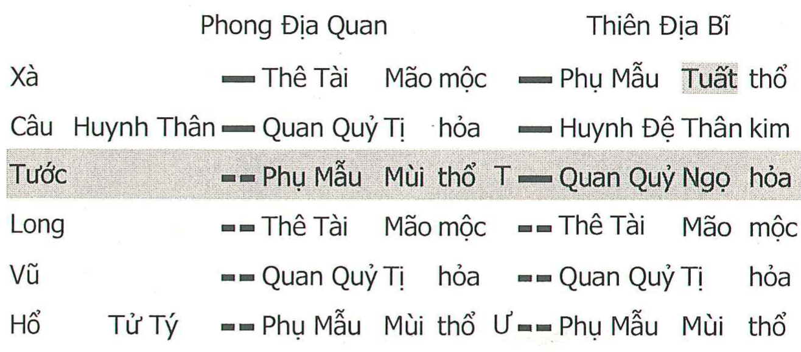
    - **Hình này chứng minh điều gì**
      - Làm sáng tỏ diễn biến cát hung và quy luật ứng nghiệm của Quẻ Phong Địa Quan biến Thiên Địa Bĩ đối với sự việc được hỏi.
    - **Từ đâu mà thấy được**
      - Căn cứ Thời gian lập quẻ: Ngày Quý Mùi tháng Dần; Dụng thần sinh Thế tất nhiên có thể trúng thầu. Nhìn vào biến Khôn Vi Địa.

- Luận điểm phân tích:
  - **Đoán:** Lấy hào Phụ Mẫu làm Dụng thần, trong quẻ Phụ Mẫu lưỡng hiện, lấy Phụ Mẫu Mùi thổ phát động trên Thế làm Dụng, Dụng thần được Nguyệt trợ giúp, Nhật thần đến sinh, lại tự động hóa hồi đầu sinh, nhất định có thể trúng thầu. Sau quả nhiên trúng thầu.

### Câu hỏi 16: Dự đoán cầu y vấn dược thì lấy Tử Tôn làm Dụng thần phải không?

- Giải đáp trọng tâm:
  - Trong lục thân, mặc dù hào Tử Tôn thể hiện y dược, nhưng khi dự đoán riêng về cầu y vấn dược thì không xem mối quan hệ giữa Tử Tôn và Dụng thần, mà là xem mối quan hệ giữa hào Ứng và Dụng thần. Bởi vì Ứng là y dược, quan điểm này đã được trình bày trong cổ thư Tăng San Bốc Dịch, tôi thông qua thực tiễn cũng đã chứng minh quan điểm này là chính xác.

- Kết quả ứng nghiệm thực tế:
  - Thông thường mà nói, khi Dụng thần là Quan Quỷ, hào Ứng nên lâm Tử Tôn khắc Quan Quỷ, đây là khắc đi bệnh của bệnh nhân, đặc biệt là Quan Quỷ trì Thế khắc bệnh của mình, ứng nghiệm nhất. Khi Dụng thần là lục thân khác, nếu Dụng thần vượng tướng cũng nên Ứng khắc Dụng thần, nhưng trừ trường hợp Quan Quỷ lâm Ứng, Quan Quỷ khắc Dụng thần, nhất định là hung. Nếu Dụng thần hưu tù, trái lại hào Ứng nên sinh Dụng thần, tổ hợp này là cát, ngược lại là hung. Dụng thần khắc Ứng, và hào Ứng hưu tù Không Phá, đều là y dược không có hiệu quả.

- Quái lệ thực tế:
  - Bối cảnh: **Ví dụ 1:** Ngày Nhâm Ngọ tháng Tuất, một người đoán tìm bác sĩ khám bệnh hiệu quả ra sao? Được Hỏa Phong Đỉnh.

- Quái lệ dự đoán thực tế cho Quẻ Hỏa Phong Đỉnh:
  - **Hình 166.** Quẻ Hỏa Phong Đỉnh
    - 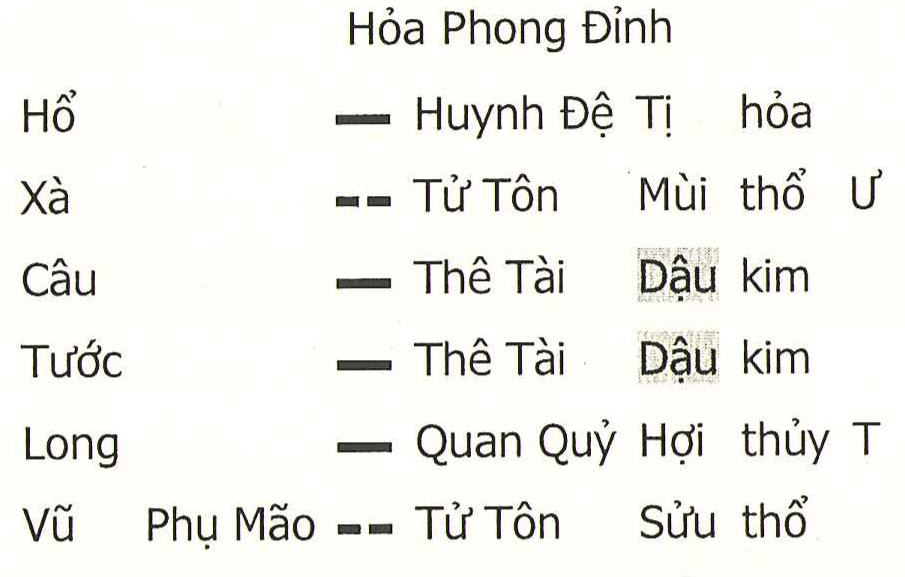
    - **Hình này chứng minh điều gì**
      - Làm sáng tỏ diễn biến cát hung và quy luật ứng nghiệm của Quẻ Hỏa Phong Đỉnh đối với sự việc được hỏi.
    - **Từ đâu mà thấy được**
      - Căn cứ Thời gian lập quẻ: Ngày Nhâm Ngọ tháng Tuất; Dụng thần phải không?**. Nhìn vào Thế khắc hào Ứng; biến Thiên Địa Bĩ](assets/page_0167_img_01.

- Luận điểm phân tích:
  - **Đoán:** Lấy hào Ứng làm Dụng thần, Ứng lâm Tử Tôn khắc Thế, tất có hiệu quả, quả nhiên như vậy.

- Quái lệ thực tế:
  - Bối cảnh: **Ví dụ 2:** Ngày Nhâm Ngọ tháng Ngọ, học viên Trương Khánh Học hỏi cha uống thuốc chữa bệnh hiệu quả ra sao? Được Phong Trạch Trung Phu biến Phong Lôi Ích.

- Quái lệ dự đoán thực tế cho Quẻ Phong Trạch Trung Phu biến Phong Lôi Ích:
  - **Hình 167.** Quẻ Phong Trạch Trung Phu biến Phong Lôi Ích
    - 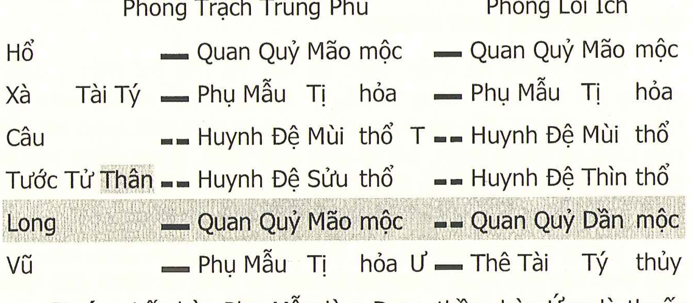
    - **Hình này chứng minh điều gì**
      - Làm sáng tỏ diễn biến cát hung và quy luật ứng nghiệm của Quẻ Phong Trạch Trung Phu biến Phong Lôi Ích đối với sự việc được hỏi.
    - **Từ đâu mà thấy được**
      - Căn cứ Thời gian lập quẻ: Ngày Nhâm Ngọ tháng Tuất; Dụng thần phải không?**. Nhìn vào Thế khắc hào Ứng; biến Thiên Địa Bĩ](assets/page_0167_img_01.

- Luận điểm phân tích:
  - **Đoán:** Lấy hào Phụ Mẫu làm Dụng thần, hào Ứng là thuốc, Dụng thần lâm hào Ứng, chứng tỏ đã bắt đầu uống thuốc này. Dụng thần có vẻ như vượng tướng, tuy nhiên không thích hợp Nguyên thần động mà hóa thoái, hiệu quả của uống thuốc nhất định không tốt, quả nhiên là như vậy.

- Quái lệ thực tế:
  - Bối cảnh: **Ví dụ 3:** Ngày Đinh Mùi tháng Dậu, một cô gái Nhật Bản đoán cắt mắt một mí thành hai mí cát hung sẽ ra sao? Được Ly Vi Hỏa biến Hỏa Sơn Lữ.

- Luận điểm phân tích:
  - **Đoán:** Lấy hào Thế làm Dụng thần, hào Thế hưu tù, Ứng khắc hào Thế, làm phẫu thuật nhất định sẽ có mặt bất lợi. Nhưng được Nguyên thần độc phát đến sinh hào Thế, phẫu thuật có thể thành công, lục xung biến lục hợp, chính là thông tin mắt một mí biến thành mắt hai mí.

- Luận điểm phân tích:
  - Thế tại hào 6 lâm Tị hỏa, hào 6 là đầu, hỏa chủ mắt, Thanh Long chủ mỹ mạo, sau khi cắt mắt hai mí thì mắt sẽ trở nên rất đẹp, chỉ có điều Nguyên thần Nguyệt phá Không Vong lại nhập Mộ ở Nhật, lâm Chu Tước, Chu Tước chủ viêm, phải chú ý phát viêm sau phẫu thuật.

- Luận điểm phân tích:
  - Quả nhiên cắt mắt hai mí thành công, nhưng đã phát viêm bởi vì nhiễm trùng vết thương, sau một thời gian uống thuốc đã không khỏi.

- Quái lệ dự đoán thực tế cho Quẻ Ly Vi Hỏa biến Hỏa Sơn Lữ:
  - **Hình 168.** Quẻ Ly Vi Hỏa biến Hỏa Sơn Lữ
    - 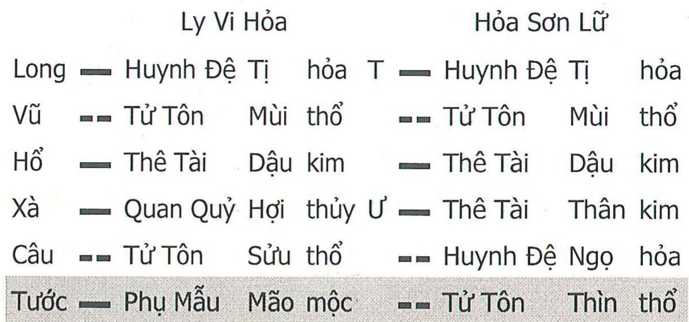
    - **Hình này chứng minh điều gì**
      - Làm sáng tỏ diễn biến cát hung và quy luật ứng nghiệm của Quẻ Ly Vi Hỏa biến Hỏa Sơn Lữ đối với sự việc được hỏi.
    - **Từ đâu mà thấy được**
      - Căn cứ Thời gian lập quẻ: Ngày Nhâm Ngọ tháng Tuất; Dụng thần phải không?**. Nhìn vào Thế khắc hào Ứng; biến Thiên Địa Bĩ](assets/page_0167_img_01.

- Quái lệ thực tế:
  - Bối cảnh: **Ví dụ 4:** Ngày Đinh Dậu tháng Mão, một học viên Nhật Bản của tôi hỏi hiệu quả của thuốc điều trị ung thư ra sao? Được Sơn Địa Bác biến Chấn Vi Lôi.

- Luận điểm phân tích:
  - **Đoán:** Hào Thế là mình, hào Ứng là thuốc, hào Thế được Nhật sinh phù là vượng, hào Ứng nên khắc Thế, nhưng quẻ này Thế khắc hào Ứng, hào Ứng gặp Không, biểu thị thuốc này hiệu quả không tốt, trong quẻ Tuất thổ Mùi thổ phát động đến khắc hào Thế, là thông tin có tác dụng phụ.

- Luận điểm phân tích:
  - Quả nhiên là như vậy.

- Quái lệ thực tế:
  - Bối cảnh: **Ví dụ 5:** Ngày Giáp Tý tháng Tý, đoán hiệu quả của uống thuốc, được Thiên Trạch Lý biến Phong Hỏa Gia Nhân.

- Luận điểm phân tích:
  - **Đoán:** Lấy hào Ứng làm Dụng thần, Thế khắc hào Ứng, thuốc này không có hiệu quả, Ứng lâm Quan Quỷ vượng tướng phát động. Không những thuốc không có hiệu quả mà còn có tác dụng phụ rất lớn, trái lại sẽ làm cho bệnh tình phát triển.

- Quái lệ dự đoán thực tế cho Quẻ Sơn Địa Bác biến Chấn Vi Lôi:
  - **Hình 169.** Quẻ Sơn Địa Bác biến Chấn Vi Lôi
    - 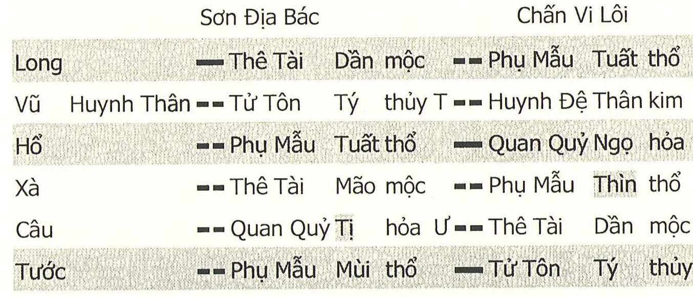
    - **Hình này chứng minh điều gì**
      - Làm sáng tỏ diễn biến cát hung và quy luật ứng nghiệm của Quẻ Sơn Địa Bác biến Chấn Vi Lôi đối với sự việc được hỏi.
    - **Từ đâu mà thấy được**
      - Căn cứ Thời gian lập quẻ: Ngày Nhâm Ngọ tháng Tuất; Dụng thần phải không?**. Nhìn vào Thế khắc hào Ứng; biến Thiên Địa Bĩ](assets/page_0167_img_01.

- Quái lệ dự đoán thực tế cho Quẻ Thiên Trạch Lý biến Phong Hỏa Gia Nhân:
  - **Hình 170.** Quẻ Thiên Trạch Lý biến Phong Hỏa Gia Nhân
    - 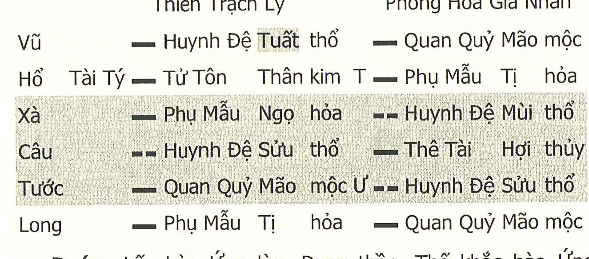
    - **Hình này chứng minh điều gì**
      - Làm sáng tỏ diễn biến cát hung và quy luật ứng nghiệm của Quẻ Thiên Trạch Lý biến Phong Hỏa Gia Nhân đối với sự việc được hỏi.
    - **Từ đâu mà thấy được**
      - Căn cứ Thời gian lập quẻ: Ngày Nhâm Ngọ tháng Tuất; Dụng thần phải không?**. Nhìn vào Thế khắc hào Ứng; biến Thiên Địa Bĩ](assets/page_0167_img_01.

- Luận điểm phân tích:
  - Quả nhiên sau khi uống thuốc không những không có hiệu quả mà trái lại bệnh tình nặng thêm. Thế là ngừng uống.

- Quái lệ thực tế:
  - Bối cảnh: **Ví dụ 6:** Ngày Bính Dần tháng Tý, một người hỏi hiệu quả của uống thuốc, được Địa Sơn Khiêm.

- Luận điểm phân tích:
  - **Đoán:** Lấy hào Ứng làm Dụng thần, Quan Quỷ lâm Ứng vượng tướng, thuốc này hiệu quả bình thường, Thế khắc hào Ứng, hào Thế lại gặp Không Vong, uống thuốc không có hiệu quả, sau khi uống thuốc quả nhiên không có hiệu quả.

- Quái lệ thực tế:
  - Bối cảnh: **Ví dụ 7:** Ngày Kỷ Hợi tháng Mùi, một người đàn ông hỏi tìm một bác sĩ điều trị hiệu quả sẽ ra sao? Được Phong Hỏa Gia Nhân biến Thủy Thiên Nhu.

- Luận điểm phân tích:
  - **Đoán:** Hào Ứng là bác sĩ, hào Thế là người xem. Hào Thế Nguyệt phá, không được Nhật thần sinh phù, lại động hóa hồi đầu khắc, đây là hào Thế hưu tù. Hào Thế hưu tù hỷ hào Ứng đến sinh hào Thế. Ứng lâm Tử Tôn ám động đến sinh hào Thế. Mời bác sĩ này điều trị nhất định có hiệu quả. Hào Ứng ám động sinh

- Quái lệ dự đoán thực tế cho Địa Sơn Khiêm:
  - **Hình 171.** Địa Sơn Khiêm
    - 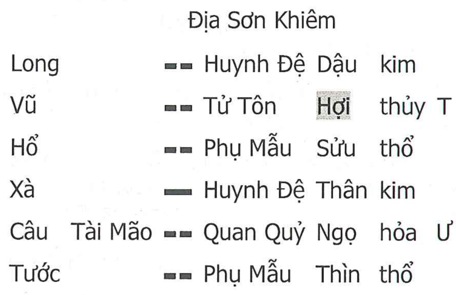
    - **Hình này chứng minh điều gì**
      - Làm sáng tỏ diễn biến cát hung và quy luật ứng nghiệm của Địa Sơn Khiêm đối với sự việc được hỏi.
    - **Từ đâu mà thấy được**
      - Căn cứ Thời gian lập quẻ: Ngày Nhâm Ngọ tháng Tuất; Dụng thần phải không?**. Nhìn vào Thế khắc hào Ứng; biến Thiên Địa Bĩ](assets/page_0167_img_01.

- Quái lệ dự đoán thực tế cho Phong Hỏa Gia Nhân biến Thủy Thiên Nhu:
  - **Hình 172.** Phong Hỏa Gia Nhân biến Thủy Thiên Nhu
    - 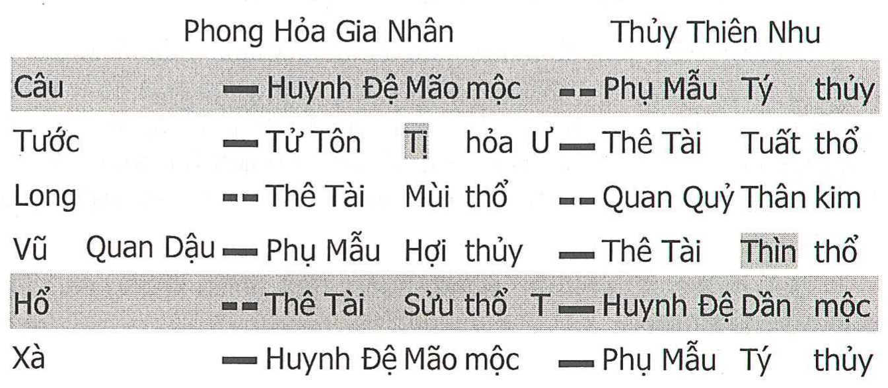
    - **Hình này chứng minh điều gì**
      - Làm sáng tỏ diễn biến cát hung và quy luật ứng nghiệm của Phong Hỏa Gia Nhân biến Thủy Thiên Nhu đối với sự việc được hỏi.
    - **Từ đâu mà thấy được**
      - Căn cứ Thời gian lập quẻ: Ngày Nhâm Ngọ tháng Tuất; Dụng thần phải không?**. Nhìn vào Thế khắc hào Ứng; biến Thiên Địa Bĩ](assets/page_0167_img_01.

- Luận điểm phân tích:
  - Thế, là lén lút tìm bác sĩ, chứng tỏ bệnh của người này không thể công khai nói với người khác.

- Luận điểm phân tích:
  - Thế tại hào 2 lâm Bạch Hổ, Nguyệt phá mà bị hồi đầu khắc. Hào 2 là hào vị bộ phận sinh dục, Bạch Hổ chủ bệnh tật, người này nhất định có bệnh hoa liễu. Hào Thế Nguyệt phá, sang tháng bất phá, tháng sau là tháng Thân, xung mất hào biến thì hào Thế không còn bị khắc, bệnh tật sẽ trị khỏi.

- Luận điểm phân tích:
  - Người này quả nhiên đã mắc bệnh lậu, đã bí mật đi tìm bác sĩ, sau một tháng điều trị đã khỏi.

- Quái lệ thực tế:
  - Bối cảnh: **Ví dụ 8:** Ngày Quý Mùi tháng Mão, một người đoán uống thuốc trị bệnh hiệu quả ra sao? Được Hỏa Lôi Phệ Hạp biến Lôi Trạch Quy Muội.

- Luận điểm phân tích:
  - **Đoán:** Hào Thế là mình, hào Ứng là thuốc, hào Thế được Nhật tỉ phù là vượng tướng, hỷ hào Ứng động mà hóa Tiến thần khắc Thế, nhưng Tử Tôn Tị hỏa tại hào 6 phát động, khiến hào Ứng không thể trực tiếp khắc Thế, thành thế liên tục tương sinh. Hào Ứng tham sinh quên khắc, chứng tỏ thuốc này hiệu quả không tốt.

- Luận điểm phân tích:
  - Sau một thời gian thử uống thuốc, quả nhiên không có hiệu quả nên đã từ bỏ.

- Quái lệ dự đoán thực tế cho Hỏa Lôi Phệ Hạp biến Lôi Trạch Quy Muội:
  - **Hình 173.** Hỏa Lôi Phệ Hạp biến Lôi Trạch Quy Muội
    - 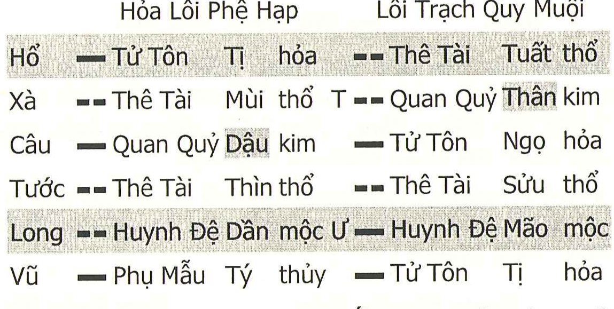
    - **Hình này chứng minh điều gì**
      - Làm sáng tỏ diễn biến cát hung và quy luật ứng nghiệm của Hỏa Lôi Phệ Hạp biến Lôi Trạch Quy Muội đối với sự việc được hỏi.
    - **Từ đâu mà thấy được**
      - Căn cứ Thời gian lập quẻ: Ngày Nhâm Ngọ tháng Tuất; Dụng thần phải không?**. Nhìn vào Thế khắc hào Ứng; biến Thiên Địa Bĩ](assets/page_0167_img_01.

- Luận điểm phân tích:
  - ---

## Chương 6: Những thắc mắc về các hiện tượng đặc thù trong Lục Hào

### Câu hỏi 1: Trong tình huống nào thì hào Tử Tôn là tượng giải ưu?

- Giải đáp trọng tâm:
  - Khi dự đoán quẻ thường lấy ngũ hành sinh khắc làm căn cứ để phán đoán cát hung của sự vật, nhưng cũng có tình huống đặc biệt, quẻ không lấy ngũ hành sinh khắc định cát hung, mà là lấy hình thức tượng để thể hiện cát hung.

- Luận điểm phân tích:
  - Theo thực tiễn nhiều năm của tôi, trong tình huống thông thường, một hào độc phát thường lấy tượng để phán đoán cát hung. Trong tình huống cá biệt, lấy tổ hợp lục thân trong quẻ để biểu thị cát hung. Thực ra đây cũng là một loại tượng. Tử Tôn là thần giải ưu chính là một tình huống trong đó. Điều này là bởi vì Quan Quỷ có ý nghĩa là tai họa, phiền não, lo lắng, Tử Tôn là cái khắc Quan Quỷ, Tử Tôn vượng thì có thể khắc Quan Quỷ, Quan Quỷ bị khắc thì phiền não, tai họa sẽ không xuất hiện, trên ý nghĩa này, Tử Tôn đã trở thành thần giải ưu.

- Luận điểm phân tích:
  - Khi người đến dự đoán thông thường, Quan Quỷ là Dụng thì Tử Tôn phát động trong quẻ là thông tin bất lợi. Khi người đến có tâm trạng lo lắng hoặc có tâm bệnh đến dự đoán thì Tử Tôn trở thành thần giải ưu, cho dù Dụng thần là Quan Quỷ cũng đoán là cát.

- Luận điểm phân tích:
  - Trên thực tế, loại tư duy xem quẻ này đã bắt đầu manh nha ở Tăng San Bốc Dịch, chỉ là trong đó chưa nhắc đến một cách rõ ràng mà thôi. Giống như bệnh gần gặp Không, gặp xung thì khỏi, bệnh lâu gặp Không gặp xung thì chết, bệnh gần gặp hợp thì hung, bệnh lâu gặp hợp thì khỏi chính là lấy tượng để định cát hung, chứ không phải là lấy ngũ hành sinh khắc.

- Quái lệ thực tế:
  - Bối cảnh: **Ví dụ 1:** Ngày Ất Hợi tháng Dần, một người nam đoán về mẹ vợ bị teo não, đã liệt giường nhiều năm, bị người đó liên lụy, hỏi khi nào mẹ vợ chết? Được Thiên Thủy Tụng biến Trạch Thủy Khốn.

- Quái lệ dự đoán thực tế cho Thiên Thủy Tụng biến Trạch Thủy Khốn:
  - **Hình 174.** Thiên Thủy Tụng biến Trạch Thủy Khốn
    - 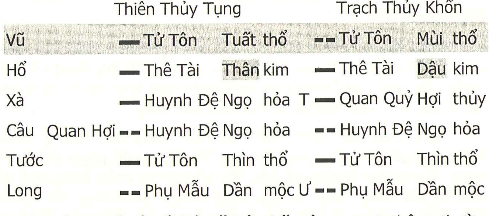
    - **Hình này chứng minh điều gì**
      - Làm sáng tỏ diễn biến cát hung và quy luật ứng nghiệm của Thiên Thủy Tụng biến Trạch Thủy Khốn đối với sự việc được hỏi.
    - **Từ đâu mà thấy được**
      - Căn cứ Thời gian lập quẻ: Ngày Ất Hợi tháng Dần; Dụng thần là Quan Quỷ cũng đoán là cát. Nhìn vào phát động trong quẻ là thông tin bất lợi.

- Luận điểm phân tích:
  - **Đoán:** Quẻ này là hỏi về cái chết của mẹ vợ, thông thường phải lấy hào Phụ Mẫu làm Dụng thần, nhưng quẻ này hào Tử Tôn độc phát, sách cổ nói rằng "thần triệu cơ ở động", Tử Tôn là thần giải ưu, đối với anh ta mà nói, cái chết của mẹ vợ là một loại giải thoát. Mẹ vợ chết thì anh ta sẽ vui. Do đó, hào Tử Tôn phát động chính là thông tin mẹ vợ anh ta sắp tử vong, không thể máy móc xem hào Phụ Mẫu, quẻ này Tử Tôn động mà hóa thoái. Tháng Mão hợp, Tử Tôn sẽ không thoái, do đó mẹ vợ anh ta nhất định chết ở tháng Mão.

- Luận điểm phân tích:
  - Mẹ vợ anh ta quả nhiên chết ở tháng Mão.

- Luận điểm phân tích:
  - Quẻ này rất giống với một quẻ trong Tăng San Bốc Dịch, để mọi người tiện học tập, cùng đặt ở đây để tham khảo.

- Quái lệ thực tế:
  - Bối cảnh: **Ví dụ 2:** Ngày Đinh Hợi tháng Ngọ, đề phòng nước lụt hại lúa, chiêm ngày nào tạnh mưa? Được Thiên Hỏa Đồng Nhân biến Trạch Hỏa Cách.

- Quái lệ dự đoán thực tế cho Quẻ Thiên Hỏa Đồng Nhân biến Trạch Hỏa Cách:
  - **Hình 175.** Quẻ Thiên Hỏa Đồng Nhân biến Trạch Hỏa Cách
    - 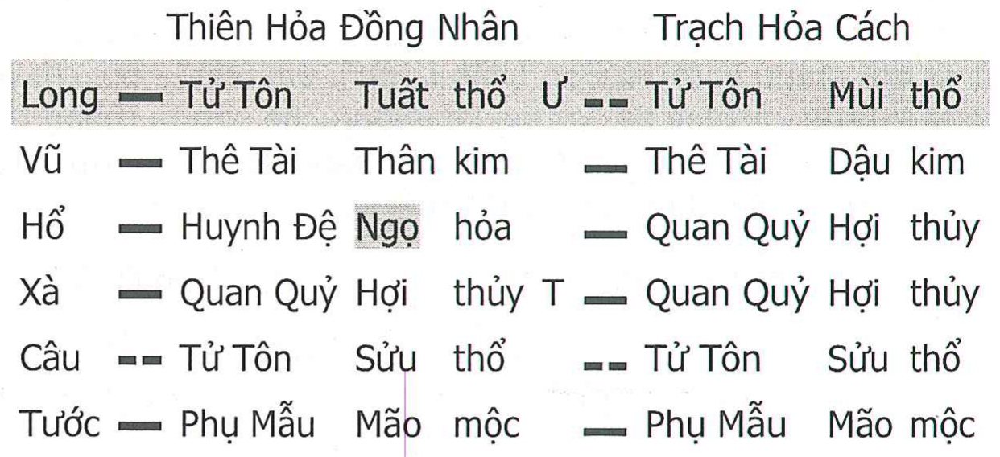
    - **Hình này chứng minh điều gì**
      - Làm sáng tỏ diễn biến cát hung và quy luật ứng nghiệm của Quẻ Thiên Hỏa Đồng Nhân biến Trạch Hỏa Cách đối với sự việc được hỏi.
    - **Từ đâu mà thấy được**
      - Căn cứ Thời gian lập quẻ: Ngày Ất Hợi tháng Dần; Dụng thần là Quan Quỷ cũng đoán là cát. Nhìn vào phát động trong quẻ là thông tin bất lợi.

- Luận điểm phân tích:
  - Người bạn cầm quẻ này hỏi ta rằng: "Tử Tôn Tuất thổ một hào độc phát, hôm qua Bính Tuất, ắt phải tạnh ráo, tại sao vẫn mưa?"

- Luồng đối thoại và phán đoán thực tế:
  - Ta đáp: "Anh lo lúa bị nước lụt, thần lấy Tử Tôn phát động khắc đi Quỷ bên mình, bảo anh đừng lo, chứ không phải ứng với tạnh mưa. Tuy hiện giờ chưa tạnh, nhưng nhất định sẽ không lụt. Nếu lấy quẻ này mà quyết râm tạnh, ngày Mão tất trời tạnh."

- Luồng đối thoại và phán đoán thực tế:
  - Người này hỏi: "Tại sao?"

- Luồng đối thoại và phán đoán thực tế:
  - Ta đáp: "Động mà gặp ngày hợp, trời sẽ tạnh, anh sẽ không lo nữa." Quả nhiên ở ngày Mão tạnh hẳn.

- Luận điểm phân tích:
  - Quẻ này Tử Tôn động mà vô ưu, nhưng bởi vì Tử Tôn động mà hóa thoái, ngày Mão hợp Tử Tôn không thoái, ngày này tâm được yên ổn.

- Quái lệ thực tế:
  - Bối cảnh: **Ví dụ 3:** Một học viên đã từng tham gia lớp trực diện của tôi, là người Phủ Thuận, Liêu Ninh, trong thời gian lên lớp, anh ta đã bảo tôi đoán tình hình thăng tiến của anh ta, tôi đã đoán là anh ta được thăng chức ở tháng Tuất, sau quả nhiên ứng nghiệm. Sau khi được thăng chức, đã công bố thông tin trên báo, nhưng anh ta đột nhiên bị thị trưởng nhắn là phải tìm ông ta nói chuyện, anh ta lo lắng có phải thị trưởng lại không cho anh ta thăng chức hay không, thế là tại ngày Giáp Thân tháng Tuất gieo quẻ được Lôi Thiên Đại Tráng biến Trạch Thiên Quải.

- Quái lệ dự đoán thực tế cho Quẻ Lôi Thiên Đại Tráng biến Trạch Thiên Quải:
  - **Hình 176.** Quẻ Lôi Thiên Đại Tráng biến Trạch Thiên Quải
    - 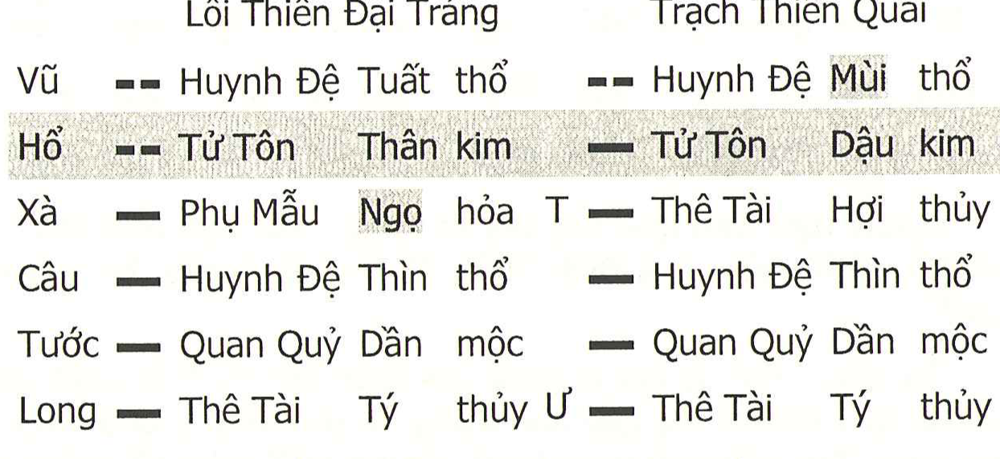
    - **Hình này chứng minh điều gì**
      - Làm sáng tỏ diễn biến cát hung và quy luật ứng nghiệm của Quẻ Lôi Thiên Đại Tráng biến Trạch Thiên Quải đối với sự việc được hỏi.
    - **Từ đâu mà thấy được**
      - Căn cứ Thời gian lập quẻ: Ngày Ất Hợi tháng Dần; Dụng thần là Quan Quỷ cũng đoán là cát. Nhìn vào phát động trong quẻ là thông tin bất lợi.

- Luận điểm phân tích:
  - Trong tình huống thông thường, dự đoán thăng quan lấy Quan Quỷ làm Dụng thần, nhưng quẻ này bởi vì lo lắng mà gieo quẻ, không thể rập khuôn máy móc. Anh ta tự gieo được quẻ này, càng cảm thấy không tốt, phán đoán rằng Quan Quỷ hưu tù, Tử Tôn tại hào 5 phát động lại khắc, hào 5 là lãnh đạo, Kỵ thần động hóa Tiến thần khắc Quan. Lãnh đạo muốn cướp đi quan này của ta, xem ra lần này thăng bất thành. Thế là gọi điện thoại hỏi tôi. Tôi phán đoán như sau: "Quẻ của anh gieo ra trong tình trạng rất lo lắng, không phải dự đoán thăng chức thông thường. Quẻ này Tử Tôn vượng tướng động hóa Tiến thần, Tử Tôn chính là thần giải ưu, Tử Tôn động trong quẻ chính là cho anh biết không có vấn đề. Bảo anh không cần lo lắng."

- Kết quả ứng nghiệm thực tế:
  - Sau đó, ở ngày Bính Tuất, anh ta đã gọi đến cho tôi biết, một cơn sợ bóng sợ gió, thị trưởng không phải muốn thu lại quan của mình, mà là bởi vì đàm thoại với anh ta về việc khác.

- Quái lệ thực tế:
  - Bối cảnh: **Ví dụ 4:** Vợ bạn học của tôi bị mọc khối u trên thận, bệnh viện nhận định là u ác tính, nói là cần làm phẫu thuật ngay, và nói rõ, người bệnh rất có thể sẽ chết trên bàn phẫu thuật. Làm thì vẫn còn tia hy vọng, không làm thì chỉ có thể chờ chết. Vì chuyện này, anh ta vô cùng lo lắng, thậm chí bỏ ăn bỏ uống, thế là tại ngày Bính Dần tháng Tuất gieo quẻ, được Thủy Thiên Nhu.

- Quái lệ dự đoán thực tế cho Quẻ Thủy Thiên Nhu:
  - **Hình 177.** Quẻ Thủy Thiên Nhu
    - 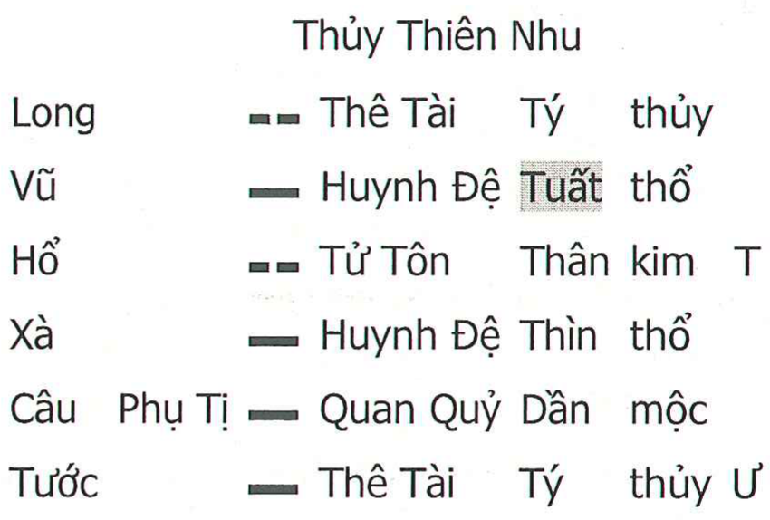
    - **Hình này chứng minh điều gì**
      - Làm sáng tỏ diễn biến cát hung và quy luật ứng nghiệm của Quẻ Thủy Thiên Nhu đối với sự việc được hỏi.
    - **Từ đâu mà thấy được**
      - Căn cứ Thời gian lập quẻ: Ngày Ất Hợi tháng Dần; Dụng thần là Quan Quỷ cũng đoán là cát. Nhìn vào phát động trong quẻ là thông tin bất lợi.

- Luận điểm phân tích:
  - **Đoán:** Trong tình huống thông thường, liên quan đến cát hung của vợ, cần phải lấy Thê Tài làm Dụng thần. Nếu lấy Tài để phán đoán, Nguyệt khắc Thê Tài, Nhật không sinh phù, căn của Dụng thần bị hoại, khẳng định không tốt. Nhưng là quẻ của anh ta gieo trong tình trạng rất lo lắng. Do đó tôi thấy Tử Tôn trì Thế ám động, Tử Tôn là thần giải ưu, không lấy Dụng thần vô căn sinh củng bất khởi để xem, đoán là phẫu thuật nhất định thành công, không có nguy hiểm gì.

- Kết quả ứng nghiệm thực tế:
  - Sau đó phẫu thuật rất thuận lợi, không chút nguy hiểm.

### Câu hỏi 2: Quẻ ở tình huống nào là quá vượng?

- Giải đáp trọng tâm:
  - Mọi thứ đều không nên thái quá, âm dương nói về sự cân bằng và đạo trung dung, chính là vật cực tất phản. Người xưa cũng bàn luận nhiều về phương diện này. "Thái quá giả, tổn chi tư thành", "Tử tuy phúc đức, đa phản vô công", "Huynh nhược thái quá, phản bất khắc Tài" v.v, nhưng nhiều người đọc sách không cẩn thận, đã bỏ qua điểm này, khiến cho một số quẻ đoán không đúng.

- Luận điểm phân tích:
  - Quẻ quá vượng có một số quy luật như sau: Nhật Nguyệt nhất định đồng thời sản sinh tác dụng sinh phù củng tỉ đối với hào này. Nếu có một cái trong đó không sinh phù tỉ trợ, hào này chưa hẳn quá vượng. Trong quẻ Dụng thần hoặc là lưỡng hiện, hoặc là lại có hào động hóa ra. Có Nguyên thần đến sinh, hoặc là động hóa hồi đầu sinh v.v.

- Luận điểm phân tích:
  - Một số tình huống quá vượng:

- Luận điểm phân tích:
  - (1) Dụng thần quá vượng. Tình huống này cần Dụng thần có chế, hoặc Mộ khố thu tàng là cát, có sinh không khắc là hung. Ở đây có điểm này phải chú ý, Dụng thần mặc dù rất vượng, nhưng động hóa phá hóa Không thì không phải quá vượng.

- Luận điểm phân tích:
  - (2) Nguyên thần quá vượng. Quy luật của tình huống này giống với tình huống Dụng thần quá vượng. Có thể tham khảo tình huống Dụng thần.

- Luận điểm phân tích:
  - (3) Kỵ thần quá vượng. Tình huống này trái ngược với tình huống Dụng thần quá vượng, Dụng thần hưu tù vô căn, Kỵ thần vượng đến cực điểm, trái lại là cát. Dụng thần có căn thì không phải. Dụng thần nhược cực điểm có thể quy vào đây, lúc này trái lại hỷ Dụng thần động mà hóa Không hóa phá.

- Quái lệ thực tế:
  - Bối cảnh: **Ví dụ 1:** Ngày Đinh Mùi tháng Dậu, một người phụ nữ đoán tài vận, được Hỏa Phong Đỉnh biến Tốn Vi Phong.

- Quái lệ dự đoán thực tế cho Quẻ Hỏa Phong Đỉnh biến Tốn Vi Phong:
  - **Hình 178.** Quẻ Hỏa Phong Đỉnh biến Tốn Vi Phong
    - 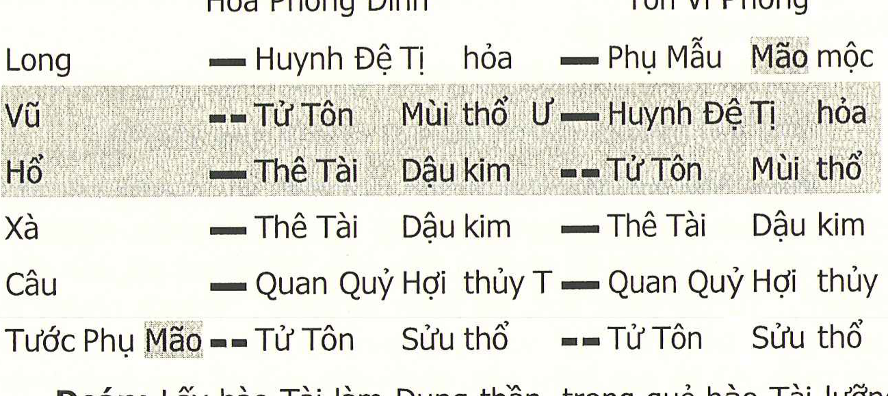
    - **Hình này chứng minh điều gì**
      - Làm sáng tỏ diễn biến cát hung và quy luật ứng nghiệm của Quẻ Hỏa Phong Đỉnh biến Tốn Vi Phong đối với sự việc được hỏi.
    - **Từ đâu mà thấy được**
      - Căn cứ Thời gian lập quẻ: Ngày Đinh Mùi tháng Dậu; Dụng thần hoặc là lưỡng hiện. Nhìn vào hào động hóa ra.

- Luận điểm phân tích:
  - **Đoán:** Lấy hào Tài làm Dụng thần, trong quẻ hào Tài lưỡng hiện, Nguyệt tỉ Nhật sinh, hào Tài tự động hóa hồi đầu sinh, Tử Tôn Mùi thổ lại động mà đến sinh, Tử Tôn Sửu thổ ám động cũng đến sinh, sinh tới quá nhiều, đây là thái quá, vật cực tất phản, tài vận nhất định không tốt.

- Luận điểm phân tích:
  - Tình hình thực tế là tài vận rất kém.

- Quái lệ thực tế:
  - Bối cảnh: **Ví dụ 2:** Ngày Ất Mão tháng Mão, nữ đoán bệnh của cha, được Thủy Thiên Nhu biến Địa Lôi Phục.

- Quái lệ dự đoán thực tế cho Quẻ Thủy Thiên Nhu biến Địa Lôi Phục:
  - **Hình 179.** Quẻ Thủy Thiên Nhu biến Địa Lôi Phục
    - 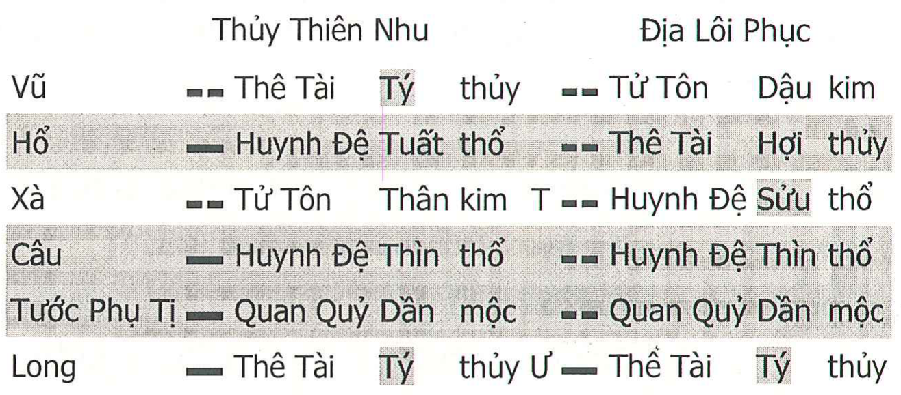
    - **Hình này chứng minh điều gì**
      - Làm sáng tỏ diễn biến cát hung và quy luật ứng nghiệm của Quẻ Thủy Thiên Nhu biến Địa Lôi Phục đối với sự việc được hỏi.
    - **Từ đâu mà thấy được**
      - Căn cứ Thời gian lập quẻ: Ngày Đinh Mùi tháng Dậu; Dụng thần hoặc là lưỡng hiện. Nhìn vào hào động hóa ra.

- Luận điểm phân tích:
  - **Đoán:** Lấy Phụ Mẫu làm Dụng thần. Dụng thần Phụ Mẫu Tị hỏa bất thượng quái, phục dưới hào 2 Quan Quỷ Dần mộc, hào 2 là nhà, chứng tỏ cha người này nằm bệnh ở nhà.

- Luận điểm phân tích:
  - Dụng thần được Nhật Nguyệt sinh phù, lại được hào Phi động mà sinh nó, Kỵ thần hưu tù, Tuần Không bất động lại nhập Mộ Thìn thổ, Dụng thần có sinh không khắc là thái quá. Quẻ này Nguyên thần là Nhật, Nguyệt, hào động và hào biến, xuất hiện khắp nơi.

- Luận điểm phân tích:
  - Hào Phụ hỏa vượng lâm Chu Tước là chứng nhiệt. Nội quái phục ngâm, trong bụng người bệnh khó chịu, quẻ gặp du hồn, người bệnh thần trí không tỉnh táo. Hào 5 Huynh Đệ Tuất thổ là Mộ khố Dụng thần, Dụng thần quá vượng, cần Mộ khố thu tàng, nhưng hào này bị Nhật Nguyệt khắc, lâm Bạch Hổ phát động hóa ra Thê Tài Hợi thủy, thổ tại hào 5 có thể đoán mũi, Tài là máu, Bạch Hổ chủ máu, nhất định chảy máu mũi.

- Luận điểm phân tích:
  - Hiện nay Nhật thần hợp Mộ khố, hỏa khố không mở, khó mà giáng hỏa, chủ hôm đó hung hiểm. Nhưng trong quẻ Thìn thổ phát động xung khai Tuất thổ là hữu kinh vô hiểm, thần hữu dụng Thìn thổ bị Nhật Nguyệt khắc chế, lâm Câu Trần lại tại cung Khôn, Khôn là bụng, hào 3 là bụng, cha người này tất trướng bụng. Hào 2 Quan Quỷ là Nguyên thần, Dụng thần đã vượng, nhưng lại động mà sinh trợ, Nguyên thần cũng thành cừu địch, hào 2 là bộ phận sinh dục, lâm Chu Tước, nước tiểu màu đỏ vàng.

- Luận điểm phân tích:
  - Quả nhiên cha người này bị chứng nhiệt, hôm đó bất tỉnh nhân sự, người nhà đều cho rằng sẽ chết, đến buổi tối bỗng nhiên tỉnh lại, đến ngày Đinh Mão mới chết.

- Quái lệ thực tế:
  - Bối cảnh: **Ví dụ 3:** Ngày Kỷ Dậu tháng Dậu, học viên Ngôn Thập đoán xu hướng tuần tới của Hằng Thuận Thổ Nghiệp, được Hỏa Phong Đỉnh biến Sơn Phong Cổ.

- Quái lệ dự đoán thực tế cho Quẻ Hỏa Phong Đỉnh biến Sơn Phong Cổ:
  - **Hình 180.** Quẻ Hỏa Phong Đỉnh biến Sơn Phong Cổ
    - 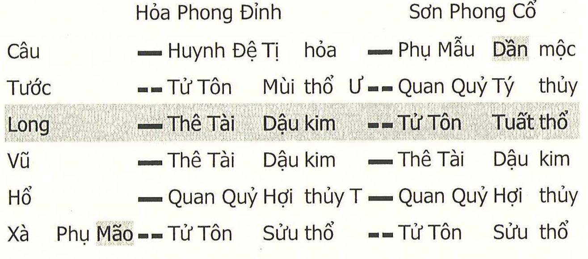
    - **Hình này chứng minh điều gì**
      - Làm sáng tỏ diễn biến cát hung và quy luật ứng nghiệm của Quẻ Hỏa Phong Đỉnh biến Sơn Phong Cổ đối với sự việc được hỏi.
    - **Từ đâu mà thấy được**
      - Căn cứ Thời gian lập quẻ: Ngày Đinh Mùi tháng Dậu; Dụng thần hoặc là lưỡng hiện. Nhìn vào hào động hóa ra.

- Luận điểm phân tích:
  - Anh ta dùng nguyên lý quá vượng mà tôi nói để phán đoán, lấy Tài làm Dụng, Nhật Nguyệt đều là hào Tài, trong quẻ hào Tài lại lưỡng hiện, hào 4 Thê Tài Dậu kim động hóa hồi đầu sinh, trong quẻ hào Tử Tôn lưỡng trùng, hào Tài điệp kiến, đây là quá vượng, cổ phiếu nhất định rớt giá, quả nhiên rớt giá.

- Quái lệ thực tế:
  - Bối cảnh: **Ví dụ 4:** Ngày Đinh Mùi tháng Dậu, Ngôn Thập đoán xu thế hôm nay của Diêm Hồ Giáp Phì, được Hỏa Sơn Lữ biến Cấn Vi Sơn.

- Quái lệ dự đoán thực tế cho Quẻ Hỏa Sơn Lữ biến Cấn Vi Sơn:
  - **Hình 181.** Quẻ Hỏa Sơn Lữ biến Cấn Vi Sơn
    - 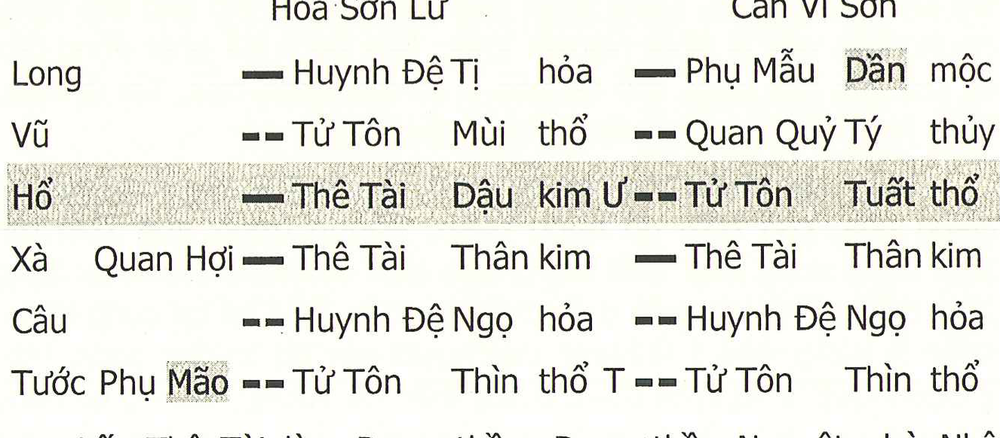
    - **Hình này chứng minh điều gì**
      - Làm sáng tỏ diễn biến cát hung và quy luật ứng nghiệm của Quẻ Hỏa Sơn Lữ biến Cấn Vi Sơn đối với sự việc được hỏi.
    - **Từ đâu mà thấy được**
      - Căn cứ Thời gian lập quẻ: Ngày Đinh Mùi tháng Dậu; Dụng thần hoặc là lưỡng hiện. Nhìn vào hào động hóa ra.

- Luận điểm phân tích:
  - Lấy Thê Tài làm Dụng thần, Dụng thần Nguyệt phù Nhật sinh, trong quẻ Thê Tài lưỡng hiện, hào 4 Thê Tài động hóa hồi đầu sinh, Tử Tôn cũng là lưỡng trùng, giống với quẻ vừa rồi, cũng

- Quái lệ thực tế:
  - Bối cảnh: **Ví dụ 5:** Ngôn Thập đã cung cấp một ví dụ, một hộ cá thể ở Hà Bắc đoán đến Sơn Đông kinh doanh con dế sẽ ra sao? Ở ngày Tân Dậu tháng Nhâm Thân được quẻ Hỏa Sơn Lữ biến Tốn Vi Phong.

- Luận điểm phân tích:
  - Lấy Thê Tài làm Dụng thần, kiêm xem Tử Tôn, Nhật Nguyệt đều là Thê Tài, trong quẻ hào Tài lưỡng hiện, hào 4 Thê Tài Dậu kim động hóa hồi đầu sinh, hào 5 Tử Tôn phát động, lại động đến sinh Tài, trong quẻ tuy có Huynh Đệ Ngọ hỏa phát động, nhưng Ngọ hỏa động hóa hồi đầu khắc, vô lực khắc Tài, lại cùng Tử Tôn Mùi thổ hình thành thế liên tục tương sinh, tham sinh quên khắc, hào Tài quá vượng. Nhất định không thể lấy được tài, sau quả nhiên không kiếm được tiền.

- Quái lệ dự đoán thực tế cho Quẻ Hỏa Sơn Lữ biến Tốn Vi Phong:
  - **Hình 182.** Quẻ Hỏa Sơn Lữ biến Tốn Vi Phong
    - 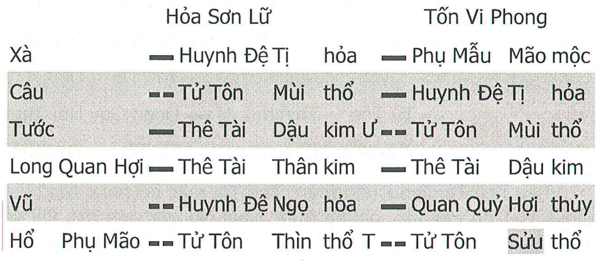
    - **Hình này chứng minh điều gì**
      - Làm sáng tỏ diễn biến cát hung và quy luật ứng nghiệm của Quẻ Hỏa Sơn Lữ biến Tốn Vi Phong đối với sự việc được hỏi.
    - **Từ đâu mà thấy được**
      - Căn cứ Thời gian lập quẻ: Ngày Đinh Mùi tháng Dậu; Dụng thần hoặc là lưỡng hiện. Nhìn vào hào động hóa ra.

- Quái lệ thực tế:
  - Bối cảnh: **Ví dụ 6:** Tản Bộ Đích Ngư cung cấp một quẻ, ngày Canh Tuất tháng Mùi năm Giáp Thân, một người hỏi mở tiệm chụp ảnh sẽ ra sao? Được Phong Thủy Hoán biến Tốn Vi Phong.

- Luận điểm phân tích:
  - Lấy Thê Tài làm Dụng thần, Thê Tài mặc dù phục tàng dưới hào 4 Tử Tôn Mùi thổ, nhưng được Nhật Nguyệt sinh trợ, Phi đến sinh Phục, hào 2 Tử Tôn Thìn thổ ám động, hào 3 Huynh Đệ lại hóa ra Tài, Huynh Đệ Ngọ hỏa động sinh Tử Tôn Thìn thổ, Tử Tôn Thìn thổ sinh Thê Tài, cũng là hình thành thế liên tục tương sinh, Huynh Đệ Ngọ hỏa không khắc Thê Tài, Nhật Nguyệt và trong quẻ có 4 tầng Tử Tôn, điều này cũng giống như câu nói "Tử tuy phúc đức, đa phản vô công" của người xưa. Tử Tôn trùng điệp sinh Thê Tài, là hào Tài thái quá, nhất định không thể đắc tài.

- Luận điểm phân tích:
  - Quả nhiên đến tháng Dậu năm Ất Dậu khách hàng thưa thớt, liên tục lỗ vốn.

- Quái lệ thực tế:
  - Bối cảnh: **Ví dụ 7:** Sử Vĩ Dân cung cấp một quẻ, ngày Tân Mùi tháng Tuất, một người phụ nữ hỏi tình hình tài vận, được Hỏa Phong Đỉnh biến Trạch Thiên Quải.

- Quái lệ dự đoán thực tế cho Quẻ Phong Thủy Hoán biến Tốn Vi Phong:
  - **Hình 183.** Quẻ Phong Thủy Hoán biến Tốn Vi Phong
    - 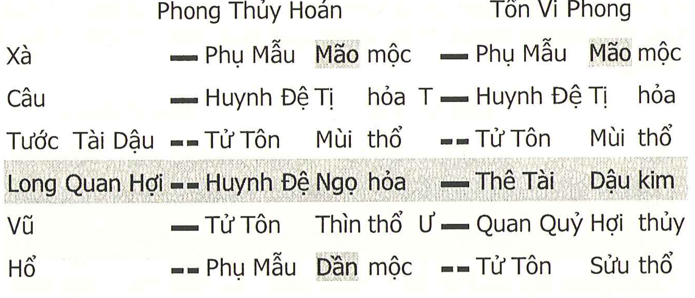
    - **Hình này chứng minh điều gì**
      - Làm sáng tỏ diễn biến cát hung và quy luật ứng nghiệm của Quẻ Phong Thủy Hoán biến Tốn Vi Phong đối với sự việc được hỏi.
    - **Từ đâu mà thấy được**
      - Căn cứ Thời gian lập quẻ: Ngày Đinh Mùi tháng Dậu; Dụng thần hoặc là lưỡng hiện. Nhìn vào hào động hóa ra.

- Quái lệ dự đoán thực tế cho Quẻ Hỏa Phong Đỉnh biến Trạch Thiên Quải:
  - **Hình 184.** Quẻ Hỏa Phong Đỉnh biến Trạch Thiên Quải
    - 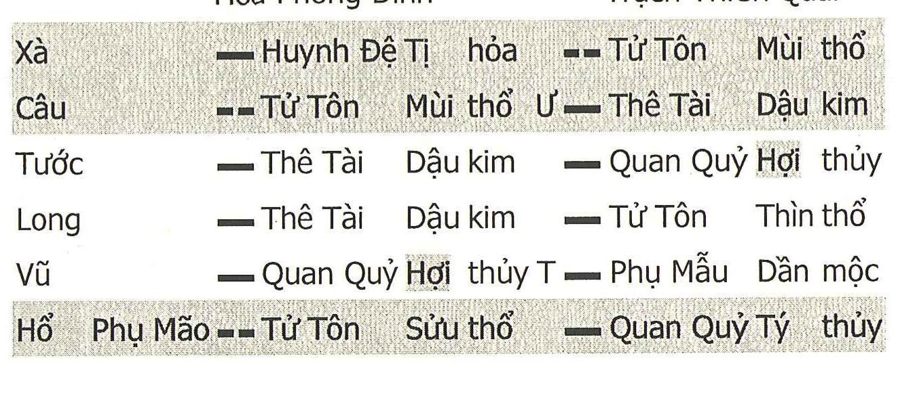
    - **Hình này chứng minh điều gì**
      - Làm sáng tỏ diễn biến cát hung và quy luật ứng nghiệm của Quẻ Hỏa Phong Đỉnh biến Trạch Thiên Quải đối với sự việc được hỏi.
    - **Từ đâu mà thấy được**
      - Căn cứ Thời gian lập quẻ: Ngày Đinh Mùi tháng Dậu; Dụng thần hoặc là lưỡng hiện. Nhìn vào hào động hóa ra.

- Luận điểm phân tích:
  - Trong quẻ Thê Tài lưỡng hiện, Nhật Nguyệt cùng đến sinh Tài, trong quẻ lại có hai tầng Tử Tôn phát động, hào 5 Tử Tôn động hóa Thê Tài, hào 6 Huynh Đệ động hóa Tử Tôn, Tử Tôn Thê Tài trong quẻ và Nhật Nguyệt trùng điệp tương kiến, hào Tài quá vượng, nhất định tài vận không tốt. Tình hình thực tế đúng là như vậy.

- Quái lệ thực tế:
  - Bối cảnh: **Ví dụ 8:** Học viên "Gia" cung cấp một quẻ, ngày Quý Mùi tháng Thân, một người hỏi tình hình cầu tài, được Hỏa Phong Đỉnh biến Phong Thủy Hoán.

- Quái lệ dự đoán thực tế cho Hỏa Phong Đỉnh biến Phong Thủy Hoán:
  - **Hình 185.** Hỏa Phong Đỉnh biến Phong Thủy Hoán
    - 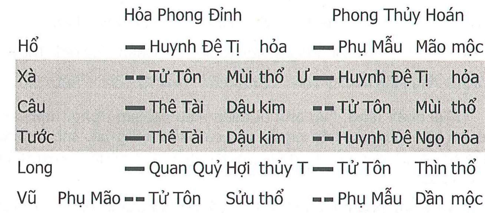
    - **Hình này chứng minh điều gì**
      - Làm sáng tỏ diễn biến cát hung và quy luật ứng nghiệm của Hỏa Phong Đỉnh biến Phong Thủy Hoán đối với sự việc được hỏi.
    - **Từ đâu mà thấy được**
      - Căn cứ Thời gian lập quẻ: Ngày Đinh Mùi tháng Dậu; Dụng thần hoặc là lưỡng hiện. Nhìn vào hào động hóa ra.

- Luận điểm phân tích:
  - Quẻ này cũng là Thê Tài lưỡng hiện, Nguyệt phù Nhật sinh, Tài động hóa hồi đầu sinh, Tử Tôn động mà lại đến sinh Tài, hào Tài cũng là vượng cực điểm, nhưng hào Tài hóa Ngọ hỏa hồi đầu khắc, hào Tài bị khắc, dường như không xem là quá vượng, nhưng hào biến tương hợp với Nhật, Nhật hợp là cản trở, hào biến Huynh Đệ Ngọ hỏa không khắc Thê Tài Dậu kim, cũng là quẻ quá vượng. Hỏi về tài vận tất nhiên không tốt. Tài lâm hào 3 động mà sinh Thế, hào 3 là cửa, tài mới vào cửa thì đã phá tài.

- Luận điểm phân tích:
  - Tình hình thực tế, người này kinh doanh vừa mới thu tiền cọc của khách hàng thì bị khiếu nại, không thể tiếp tục kinh doanh.

- Quái lệ thực tế:
  - Bối cảnh: **Ví dụ 9:** Ngày Mậu Thân tháng Dậu, một học viên của lớp trực diện nói rằng trước khi đến thì vợ yêu cầu dự đoán sức khỏe cho cô ấy, thế là học viên này gieo được quẻ Hỏa Phong Đỉnh biến Sơn Phong Cổ.

- Quái lệ dự đoán thực tế cho Hỏa Phong Đỉnh biến Sơn Phong Cổ:
  - **Hình 186.** Hỏa Phong Đỉnh biến Sơn Phong Cổ
    - 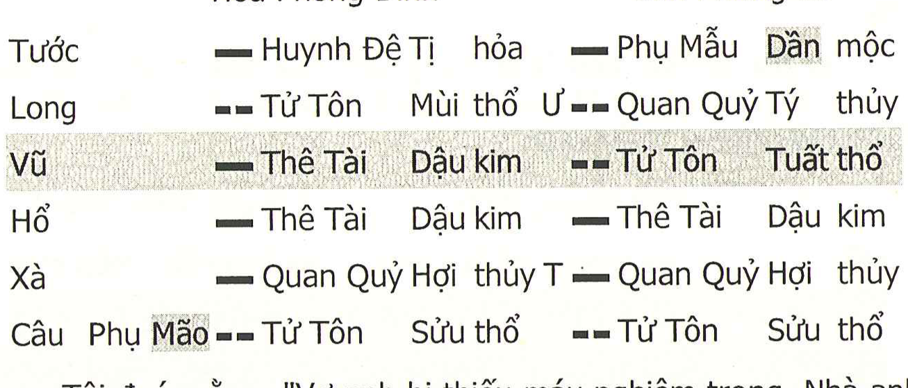
    - **Hình này chứng minh điều gì**
      - Làm sáng tỏ diễn biến cát hung và quy luật ứng nghiệm của Hỏa Phong Đỉnh biến Sơn Phong Cổ đối với sự việc được hỏi.
    - **Từ đâu mà thấy được**
      - Căn cứ Thời gian lập quẻ: Ngày Đinh Mùi tháng Dậu; Dụng thần hoặc là lưỡng hiện. Nhìn vào hào động hóa ra.

- Luận điểm phân tích:
  - Tôi đoán rằng: "Vợ anh bị thiếu máu nghiêm trọng. Nhà anh có hai lớp cửa, cửa bên ngoài lớn, cửa bên trong bé, ảnh hưởng đến tài vận." Mặc dù chỉ đoán vài lời ngắn gọn nhưng hoàn toàn chính xác.

- Luận điểm phân tích:
  - Quẻ này phán đoán như sau. Vợ dặn dò trước khi đến, chính là ý niệm của vợ, tuy là học viên này gieo được, nhưng phải lấy hào Thế làm Dụng thần. Hào Thế Hợi thủy được Nhật Nguyệt sinh phù, lại có Thê Tài Dậu kim động hóa hồi đầu sinh sinh trợ hào Thế là quá vượng. Dụng thần quá vượng cũng là hung. Quẻ cung Ly, Ly là máu, thủy là máu, Tài cũng là máu, lại thêm một hào Tài khác lâm Bạch Hổ, Bạch Hổ cũng là máu, vượng cực tất phản, cho nên là vô cùng thiếu máu. Hào 3 hào 4 là cửa, 3 4 giống nhau, là trong ngoài hai lớp cửa, hào 4 là ngoại, hào 3 là nội, bởi vì hào 4 động hóa hồi đầu sinh, cho nên cửa bên ngoài lớn hơn cửa bên trong, Tài quá vượng tất bất lợi cho tài.

- Quái lệ thực tế:
  - Bối cảnh: **Ví dụ 10:** Ngày Giáp Tuất tháng Tuất, một người đoán về khảo thí, được Thủy Thiên Nhu biến Lôi Trạch Quy Muội. Đây là một ví dụ của học viên đưa cho tôi xem.

- Luận điểm phân tích:
  - Lấy hào Quan Quỷ làm Dụng thần đầu tiên, đồng thời xem thêm hào Phụ Mẫu, Nhật Nguyệt không sinh Quan Quỷ, Tử Tôn trì Thế phát động khắc Quan Quỷ, Phụ Mẫu lại nhập Mộ ở Nhật Nguyệt, Quan Phụ lưỡng suy, mà Kỵ thần Tử Tôn trì Thế phát động. Được Nhật Nguyệt sinh phù, lại được hào 5 và hào 3 thổ trong quẻ động đến sinh, vượng đến cực điểm, mặc dù hóa ra Phụ Mẫu hồi đầu khắc, nhưng Phụ Mẫu nhập Mộ ở Nhật Nguyệt, không có sức mạnh khắc Tử Tôn, đây là Kỵ thần quá vượng, vật cực tất phản. Khảo thí nhất định có thể thông qua. Sau vài ngày đã biết kết quả, điểm chuẩn tuyển chọn là 100, người này đã thi được 220 điểm.

- Quái lệ dự đoán thực tế cho Thủy Thiên Nhu biến Lôi Trạch Quy Muội:
  - **Hình 187.** Thủy Thiên Nhu biến Lôi Trạch Quy Muội
    - 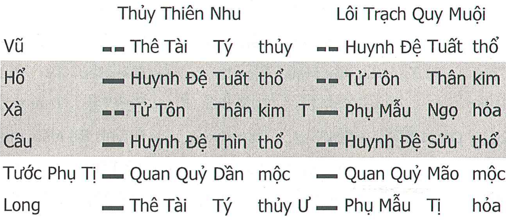
    - **Hình này chứng minh điều gì**
      - Làm sáng tỏ diễn biến cát hung và quy luật ứng nghiệm của Thủy Thiên Nhu biến Lôi Trạch Quy Muội đối với sự việc được hỏi.
    - **Từ đâu mà thấy được**
      - Căn cứ Thời gian lập quẻ: Ngày Đinh Mùi tháng Dậu; Dụng thần hoặc là lưỡng hiện. Nhìn vào hào động hóa ra.

- Quái lệ thực tế:
  - Bối cảnh: **Ví dụ 11:** Ngày Canh Thìn tháng Sửu, một người nam đoán bệnh của mẹ, hỏi tháng này có nguy hiểm không? Được Sơn Lôi Di biến Sơn Địa Bác.

- Luận điểm phân tích:
  - Lấy hào Phụ Mẫu làm Dụng thần, trong quẻ Phụ Mẫu Tý thủy lưỡng hiện, lấy Phụ Mẫu Tý thủy trên Ứng làm Dụng. Phụ Mẫu nhập Mộ ở Nhật là thông tin nhập viện, Dụng thần nhập Mộ ở Tài là người bệnh không nghĩ tới ăn uống. Dụng thần mặc dù được Nguyệt kiến tương hợp là có khí, nhưng Nhật Nguyệt khắc chế Dụng thần, Thê Tài Tuất thổ ám động lại đến khắc chế, Dụng thần động mà hóa phá, lành ít dữ nhiều. Dụng thần lâm thủy mà bị khắc là bệnh thận.

- Luận điểm phân tích:
  - Quẻ này Nhật Nguyệt và trong quẻ có 5 tầng Thê Tài, dường như Kỵ thần vượng cực điểm, trái lại không khắc Dụng thần, nhưng quẻ này không phải, bởi vì Dụng thần và Nguyệt tương hợp, là có căn, Dụng thần không phải suy cực điểm, lại có Dụng thần hóa phá, chỉ luận phá và không luận hồi đầu khắc, Dụng thần hóa phá, lúc thực phá thì hung.

- Luận điểm phân tích:
  - Sau chết ở ngày Mùi.

- Quái lệ dự đoán thực tế cho Sơn Lôi Di biến Sơn Địa Bác:
  - **Hình 188.** Sơn Lôi Di biến Sơn Địa Bác
    - 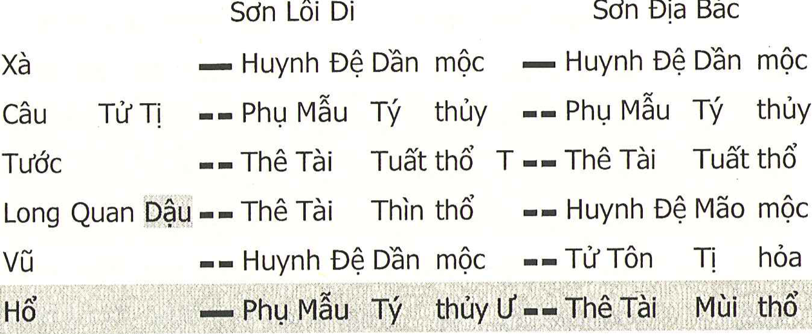
    - **Hình này chứng minh điều gì**
      - Làm sáng tỏ diễn biến cát hung và quy luật ứng nghiệm của Sơn Lôi Di biến Sơn Địa Bác đối với sự việc được hỏi.
    - **Từ đâu mà thấy được**
      - Căn cứ Thời gian lập quẻ: Ngày Đinh Mùi tháng Dậu; Dụng thần hoặc là lưỡng hiện. Nhìn vào hào động hóa ra.

- Quái lệ thực tế:
  - Bối cảnh: **Ví dụ 12:** Ngày Nhâm Thìn tháng Sửu, một người hỏi đấu thầu mua đất sẽ ra sao? Được Trạch Phong Đại Quá biến Địa Sơn Khiêm.

- Luận điểm phân tích:
  - Lấy hào Phụ Mẫu làm Dụng thần, quẻ này Phụ Mẫu lưỡng hiện, đều là Hợi thủy hơn nữa đồng thời phát động, có thể kiêm làm Dụng thần, Nhật Nguyệt đồng thời khắc chế Dụng thần, hào 4 Phụ Mẫu động hóa hồi đầu khắc, hào 2 Phụ Mẫu động mà hóa Không, trong quẻ Kỵ thần lưỡng hiện, mặc dù Nguyên thần Quan Quỷ phát động, nhưng bị Nhật thần hợp, tham hợp quên sinh, Dụng thần nhược đến cực điểm, thầu này tất được. Hơn nữa nhất định ứng tại ngày khắc Dụng thần.

- Luận điểm phân tích:
  - Quả nhiên ở ngày Ất Mùi trúng thầu.

- Quái lệ dự đoán thực tế cho Quẻ Trạch Phong Đại Quá biến Địa Sơn Khiêm:
  - **Hình 189.** Quẻ Trạch Phong Đại Quá biến Địa Sơn Khiêm
    - 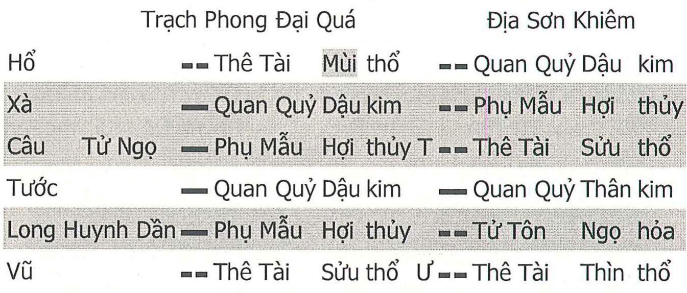
    - **Hình này chứng minh điều gì**
      - Làm sáng tỏ diễn biến cát hung và quy luật ứng nghiệm của Quẻ Trạch Phong Đại Quá biến Địa Sơn Khiêm đối với sự việc được hỏi.
    - **Từ đâu mà thấy được**
      - Căn cứ Thời gian lập quẻ: Ngày Đinh Mùi tháng Dậu; Dụng thần hoặc là lưỡng hiện. Nhìn vào hào động hóa ra.

- Quái lệ thực tế:
  - Bối cảnh: **Ví dụ 13:** Một Dịch hữu cầm một quẻ hỏi tôi, nói là ngày Bính Thìn tháng Ngọ, một người hỏi rằng bản thân có một mảnh đất, tương lai có tăng giá không? Nếu không tăng giá thì dự định bán đi, được Lôi Thiên Đại Tráng biến Hỏa Địa Tấn.

- Luận điểm phân tích:
  - Quẻ này mục đích là để cầu tài, do đó lấy hào Tài làm Dụng thần. Trong quẻ Thê Tài Không Phá Nhật khắc, lại nhập Nhật Mộ, Huynh Đệ hai tầng phát động đến khắc, Dụng thần phát động lại hóa hồi đầu khắc, hào Tài suy đến cực điểm, nếu nói hào Tài vượng tướng được tài, hào Tài hưu tù không được tài, thì mảnh đất muốn hỏi sau này nhất định không tăng giá, nhưng quẻ này là Dụng thần nhược cực điểm, trái lại phải phán đoán là có tăng giá.

- Luận điểm phân tích:
  - Lúc tăng giá không phải là lúc Dụng thần được sinh, mà là lúc Dụng thần bị khắc thì giá đất sẽ tăng. Dụng thần nhập Mộ, ứng xung khai, do đó tháng Tuất nhất định sẽ tăng lên. Nhưng lúc đó có nhiều người xem qua quẻ này đều cho rằng không tăng giá, thế là người này đã bán tháo mảnh đất này, ai ngờ đến tháng Tuất giá đất tăng lên, do người này đã sớm bán mảnh đất nên đã tổn thất 20 vạn tệ.

- Quái lệ dự đoán thực tế cho Quẻ Lôi Thiên Đại Tráng biến Hỏa Địa Tấn:
  - **Hình 190.** Quẻ Lôi Thiên Đại Tráng biến Hỏa Địa Tấn
    - 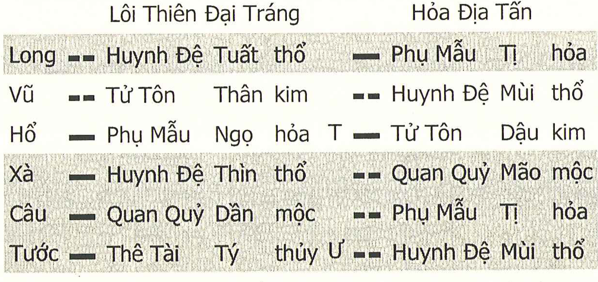
    - **Hình này chứng minh điều gì**
      - Làm sáng tỏ diễn biến cát hung và quy luật ứng nghiệm của Quẻ Lôi Thiên Đại Tráng biến Hỏa Địa Tấn đối với sự việc được hỏi.
    - **Từ đâu mà thấy được**
      - Căn cứ Thời gian lập quẻ: Ngày Đinh Mùi tháng Dậu; Dụng thần hoặc là lưỡng hiện. Nhìn vào hào động hóa ra.

- Quái lệ thực tế:
  - Bối cảnh: **Ví dụ 14:** Ngày Kỷ Sửu tháng Tuất, học viên "Gia" hỏi làm giấy chứng minh sẽ ra sao? Được Trạch Lôi Tùy biến Thiên Lôi Vô Vọng.

- Luận điểm phân tích:
  - Lấy Phụ Mẫu làm Dụng thần. Trong quẻ hào Phụ Mẫu lưỡng hiện, lấy Phụ Mẫu Tý thủy tương hợp với Nhật làm Dụng. Nhật Nguyệt khắc Dụng thần, Kỵ thần phát động hóa Tiến thần lại đến khắc Dụng thần, trong quẻ Kỵ thần lưỡng hiện, trong đó một trì Thế, Dụng thần lại bị Nhật hợp cản trở, Nguyên thần nhập Mộ, có thể nói là Dụng thần không có một chút sinh khí, nhược đến cực điểm. Vật cực tất phản, do đó tôi đoán làm giấy chứng minh thuận lợi.

- Kết quả ứng nghiệm thực tế:
  - Kết quả, ngày Dần đi làm giấy chứng minh, ngày Mão đã nhận được.

- Quái lệ dự đoán thực tế cho Trạch Lôi Tùy biến Thiên Lôi Vô Vọng:
  - **Hình 191.** Trạch Lôi Tùy biến Thiên Lôi Vô Vọng
    - 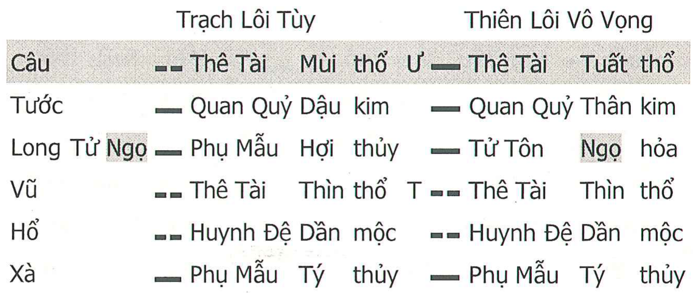
    - **Hình này chứng minh điều gì**
      - Làm sáng tỏ diễn biến cát hung và quy luật ứng nghiệm của Trạch Lôi Tùy biến Thiên Lôi Vô Vọng đối với sự việc được hỏi.
    - **Từ đâu mà thấy được**
      - Căn cứ Thời gian lập quẻ: Ngày Đinh Mùi tháng Dậu; Dụng thần hoặc là lưỡng hiện. Nhìn vào hào động hóa ra.

- Quái lệ thực tế:
  - Bối cảnh: **Ví dụ 15:** Ngày Bính Ngọ tháng Dậu, một người đoán khách sạn kinh doanh ra sao? Được Trạch Địa Tụy biến Lôi Sơn Tiểu Quá.

- Luận điểm phân tích:
  - Lấy hào Tài làm Dụng thần, quẻ này thoạt nhìn hào Tài bị Nguyệt kiến xung khắc, Nhật không sinh phù, mà hào Huynh Đệ lâm Nguyệt, hào Tài hóa ra Huynh Đệ hồi đầu khắc, hào 5 Huynh Đệ lại động hóa ra Huynh Đệ, có vẻ như Tài nhược cực điểm, Huynh Đệ quá vượng, là kinh doanh tốt đẹp, nhưng phân tích kỹ lưỡng thì Huynh Đệ có Nhật khắc chế, hào 5 Huynh Đệ động mà hóa thoái, không là thái quá, chỉ khi Nhật Nguyệt đồng thời sinh trợ Huynh Đệ, trong quẻ lại có Huynh Đệ phát động mới là Huynh Đệ thái quá, do đó quẻ này luận là Huynh Đệ khắc Tài, hào Tài hưu tù, kinh doanh không tốt. Trên thực tế, khách sạn đó rất ít khách, thu không đủ chi.

- Quái lệ dự đoán thực tế cho Trạch Địa Tụy biến Lôi Sơn Tiểu Quá:
  - **Hình 192.** Trạch Địa Tụy biến Lôi Sơn Tiểu Quá
    - 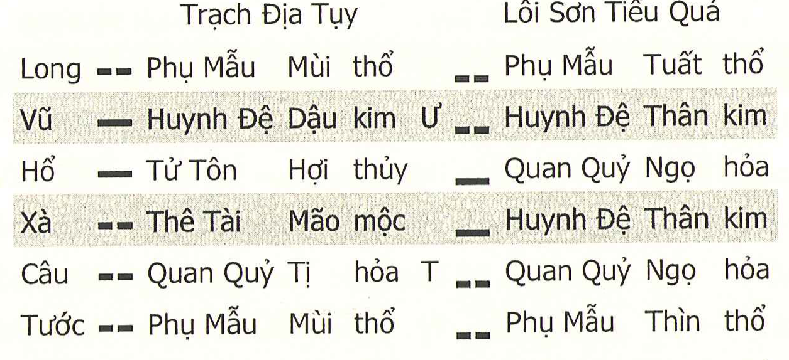
    - **Hình này chứng minh điều gì**
      - Làm sáng tỏ diễn biến cát hung và quy luật ứng nghiệm của Trạch Địa Tụy biến Lôi Sơn Tiểu Quá đối với sự việc được hỏi.
    - **Từ đâu mà thấy được**
      - Căn cứ Thời gian lập quẻ: Ngày Đinh Mùi tháng Dậu; Dụng thần hoặc là lưỡng hiện. Nhìn vào hào động hóa ra.

- Quái lệ thực tế:
  - Bối cảnh: **Ví dụ 16:** Ngày Đinh Sửu tháng Tuất, một người đoán bệnh của cha, được Phong Lôi Ích biến Thủy Sơn Kiển.

- Quái lệ dự đoán thực tế cho Phong Lôi Ích biến Thủy Sơn Kiển:
  - **Hình 193.** Phong Lôi Ích biến Thủy Sơn Kiển
    - 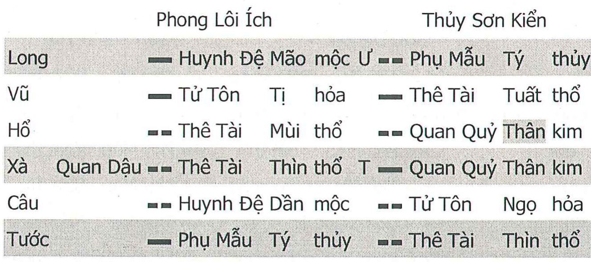
    - **Hình này chứng minh điều gì**
      - Làm sáng tỏ diễn biến cát hung và quy luật ứng nghiệm của Phong Lôi Ích biến Thủy Sơn Kiển đối với sự việc được hỏi.
    - **Từ đâu mà thấy được**
      - Căn cứ Thời gian lập quẻ: Ngày Đinh Mùi tháng Dậu; Dụng thần hoặc là lưỡng hiện. Nhìn vào hào động hóa ra.

- Luận điểm phân tích:
  - Lấy hào Phụ Mẫu làm Dụng thần, Dụng thần bị Nhật Nguyệt khắc chế, trong quẻ Kỵ thần lưỡng hiện, trong đó Thìn thổ động đến khắc Dụng, Dụng thần lại động hóa ra Kỵ thần, Kỵ thần đa hiện, giống như là quẻ suy cực điểm, kỳ thực không phải, bởi vì Dụng thần động mà hóa phá, hóa phá thông thường không luận hồi đầu khắc. Quẻ này là Dụng thần nhược, hóa phá là hung, Kỵ thần bởi vì Nguyệt phá, không phải quá vượng, cũng không phải Dụng thần quá suy. Do đó nhất định là một loại bệnh rất không tốt.

- Luận điểm phân tích:
  - Trên thực tế là ung thư gan.

- Quái lệ thực tế:
  - Bối cảnh: **Ví dụ 17:** Ngày Tân Tị tháng Ngọ, một học viên của tôi đoán cát hung về việc con đi xa tham gia trại hè, được Sơn Địa Bác biến Sơn Trạch Tổn.

- Quái lệ dự đoán thực tế cho Sơn Địa Bác biến Sơn Trạch Tổn:
  - **Hình 194.** Sơn Địa Bác biến Sơn Trạch Tổn
    - 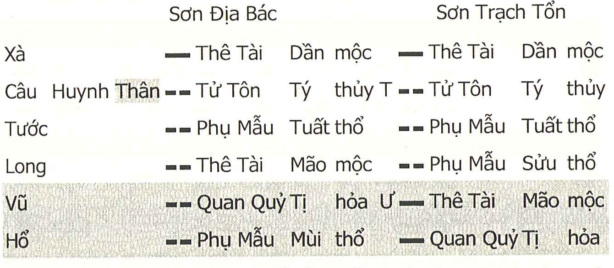
    - **Hình này chứng minh điều gì**
      - Làm sáng tỏ diễn biến cát hung và quy luật ứng nghiệm của Sơn Địa Bác biến Sơn Trạch Tổn đối với sự việc được hỏi.
    - **Từ đâu mà thấy được**
      - Căn cứ Thời gian lập quẻ: Ngày Đinh Mùi tháng Dậu; Dụng thần hoặc là lưỡng hiện. Nhìn vào hào động hóa ra.

- Luận điểm phân tích:
  - Lấy Tử Tôn làm Dụng, cô ấy thấy quẻ này Tử Tôn hưu tù, Nguyệt phá, Phụ Mẫu động đến khắc Tử Tôn, rất là không cát, nhưng con rất muốn đi, do đó nhờ tôi phán đoán.

- Luận điểm phân tích:
  - Tôi nói đây là quẻ Kỵ thần quá vượng điển hình, vật cực tất phản, đi xa nhất định bình an vô sự. Tại sao lại như vậy? Tử Tôn Nguyệt phá, Nhật Tuyệt Tử Tôn, không có căn. Lại xem Kỵ thần Phụ Mẫu, được Nhật Nguyệt sinh, Phụ Mẫu lưỡng hiện, hào sơ Phụ Mẫu hóa hồi đầu sinh, lại được hào 2 Quỷ động đến sinh, Phụ Mẫu vượng cực điểm, do đó trái lại không khắc Tử Tôn.

- Kết quả ứng nghiệm thực tế:
  - Sau đó đi tham gia trại hè quả nhiên bình an. Nếu như không nắm bắt được quẻ như vậy thì chớ tùy tiện phán đoán, không thể lấy mạng sống của người ta làm trò đùa.

- Quái lệ thực tế:
  - Bối cảnh: **Ví dụ 18:** Một người bạn của học viên Trương Khánh Học bị công an bắt giữ, gọi điện hỏi khi nào mình có thể được ra? Ngày Tân Sửu tháng Ngọ, Trương Khánh Học gieo được Phong Thiên Tiểu Súc biến Phong Thủy Hoán.

- Quái lệ dự đoán thực tế cho Phong Thiên Tiểu Súc biến Phong Thủy Hoán:
  - **Hình 195.** Phong Thiên Tiểu Súc biến Phong Thủy Hoán
    - 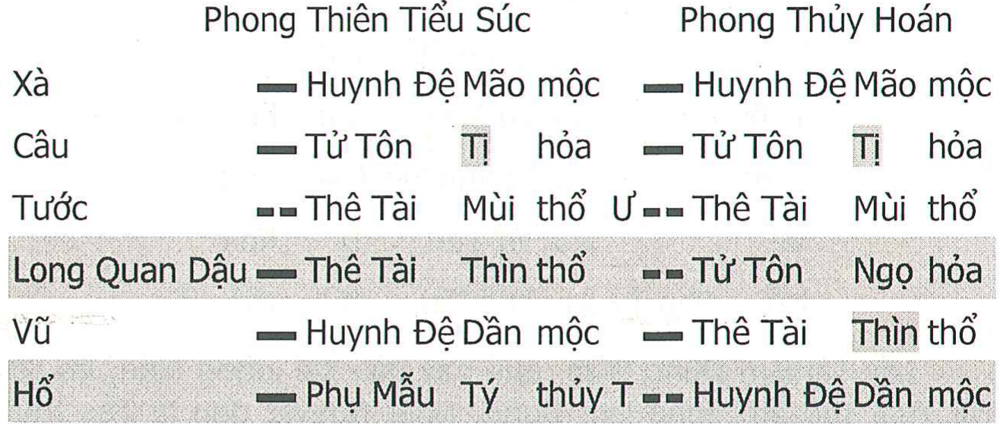
    - **Hình này chứng minh điều gì**
      - Làm sáng tỏ diễn biến cát hung và quy luật ứng nghiệm của Phong Thiên Tiểu Súc biến Phong Thủy Hoán đối với sự việc được hỏi.
    - **Từ đâu mà thấy được**
      - Căn cứ Thời gian lập quẻ: Ngày Đinh Mùi tháng Dậu; Dụng thần hoặc là lưỡng hiện. Nhìn vào hào động hóa ra.

- Kết quả ứng nghiệm thực tế:
  - Bởi vì là bản thân anh ta nhờ đoán, do đó là quẻ do học viên của tôi gieo, phải lấy Thế làm Dụng thần. Học viên của tôi không nắm bắt được quẻ này, lại gọi điện thoại hỏi tôi, tôi phán đoán là ngày Thìn ra được. Quả nhiên ứng nghiệm. Anh ta không hiểu.

- Luận điểm phân tích:
  - Quẻ này giải như sau. Hào Thế Nguyệt phá Nhật khắc hợp, không có một chút khí, là vô căn. Kỵ thần hào Tài trong quẻ lưỡng hiện, Thê Tài Thìn thổ động đến khắc, nếu dựa vào ngũ hành sinh khắc thông thường để phán đoán, khắc nhiều không sinh, nhất định không có cơ hội được thả ra. Nhưng phán đoán như vậy thì sai.

- Luận điểm phân tích:
  - Quẻ này thuộc về Kỵ thần quá vượng, trái lại khắc nhiều là cát. Chúng ta thấy Kỵ thần hào Tài không phải quá vượng. Tài lưỡng hiện, được Nguyệt sinh Nhật phù, động hóa hồi đầu sinh, trong quẻ lại có một Tử Tôn, mặc dù bất động nhưng cũng có thể tăng thêm sức mạnh cho Tài. Chỉ có điều Thìn thổ Không Vong tạm thời không thể khắc hào Thế, ngày Thìn xuất Không, Kỵ thần sản sinh tác dụng, hào Thế bị khắc là cát, do đó phán đoán ngày này ra.

- Luận điểm phân tích:
  - Khi mới bắt đầu viết cuốn sách này, tôi cho rằng quẻ quá vượng nhất định là quẻ có hào động, nhưng sau đó đã phát hiện không hoàn toàn là như vậy, đôi khi quẻ tĩnh cũng có tình huống quá vượng.

- Quái lệ thực tế:
  - Bối cảnh: **Ví dụ 19:** Một người học Dịch hỏi tôi quẻ này, ngày Canh Thìn tháng Mùi, nam đoán về yêu đương, được quẻ Lôi Địa Dự.

- Quái lệ dự đoán thực tế cho Lôi Địa Dự:
  - **Hình 196.** Lôi Địa Dự
    - 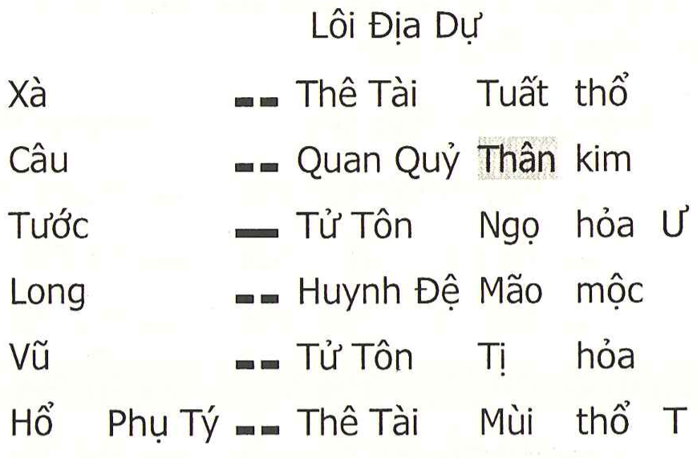
    - **Hình này chứng minh điều gì**
      - Làm sáng tỏ diễn biến cát hung và quy luật ứng nghiệm của Lôi Địa Dự đối với sự việc được hỏi.
    - **Từ đâu mà thấy được**
      - Căn cứ Thời gian lập quẻ: Ngày Đinh Mùi tháng Dậu; Dụng thần hoặc là lưỡng hiện. Nhìn vào hào động hóa ra.

- Luận điểm phân tích:
  - Lấy Tài làm Dụng thần, quẻ này hào Tài lưỡng hiện, lấy Thê Tài Tuất thổ ám động làm Dụng, Nhật Nguyệt đều là Tài, trong quẻ lại có lưỡng Tài, Tử Tôn lại lưỡng hiện sinh Tài, có tượng hào Tài trùng điệp thái quá. Nhưng tôi lúc đó không dám khẳng định quẻ tĩnh cũng có thuyết quá vượng, chỉ lấy Tài lâm Thế, gặp lục hợp có thể thành công, kết quả là đã sai.

- Luận điểm phân tích:
  - Phán đoán sai sót của quẻ này khiến tôi nhận thức được quẻ tĩnh cũng có thuyết thái quá. Trước khi quẻ này xuất hiện, học viên của tôi cũng đã từng đề xuất vấn đề này, lúc đó tôi nói rằng vẫn cần nghiệm chứng, xem ra quẻ tĩnh đúng là có quá vượng.

- Quái lệ thực tế:
  - Bối cảnh: **Ví dụ 20:** Một quẻ của học viên Đảng Thuận hỏi, ngày Bính Dần tháng Dần, một người đoán vận khí, được quẻ Phong Lôi Ích.

- Quái lệ dự đoán thực tế cho Phong Lôi Ích:
  - **Hình 197.** Phong Lôi Ích
    - 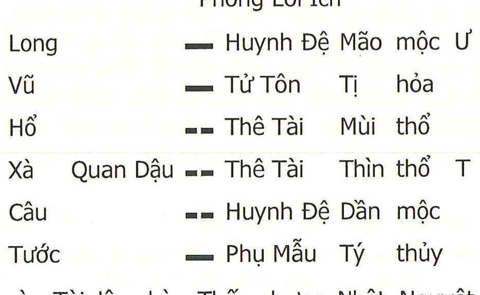
    - **Hình này chứng minh điều gì**
      - Làm sáng tỏ diễn biến cát hung và quy luật ứng nghiệm của Phong Lôi Ích đối với sự việc được hỏi.
    - **Từ đâu mà thấy được**
      - Căn cứ Thời gian lập quẻ: Ngày Đinh Mùi tháng Dậu; Dụng thần hoặc là lưỡng hiện. Nhìn vào hào động hóa ra.

- Luận điểm phân tích:
  - Quẻ này Tài lâm hào Thế, nhưng Nhật Nguyệt khắc Tài, trong quẻ lại có Huynh Đệ lưỡng hiện, được Nhật Nguyệt tỉ phù khắc Tài, tháng giêng đã đắc tài, bản thân cũng bình an vô sự.

- Luận điểm phân tích:
  - Hào Tài suy như thế mà được tài, lúc đó anh ta cho rằng phải chăng Kỵ thần quá vượng, tôi chưa thể khẳng định, bây giờ xem ra quẻ tĩnh xác thực cũng có thể xuất hiện quá vượng.

### Câu hỏi 3: Dụng thần hữu căn vô căn là gì?

- Giải đáp trọng tâm:
  - Căn của Dụng thần được đánh giá từ ảnh hưởng của Nhật Nguyệt đối với Dụng thần. Trong Nhật Nguyệt chỉ cần có một trong đó sinh phù củng tỉ Dụng thần, Trường Sinh Dụng thần, Nguyệt hợp Dụng thần, thì đều là Dụng thần có căn. Một khắc một sinh cũng là có căn. Dụng thần vô căn có 3 trường hợp:

- Luận điểm phân tích:
  - (1) Dụng thần bị Nhật Nguyệt đều khắc.

- Luận điểm phân tích:
  - (2) Nguyệt phá, Nhật khắc cũng là vô căn.

- Luận điểm phân tích:
  - (3) Nguyệt khắc Nhật không sinh, phải xem sức mạnh của Kỵ thần trong quẻ để xác định nó có căn hay không, quẻ như vậy thường là quẻ tĩnh.

- Quái lệ thực tế:
  - Bối cảnh: **Ví dụ 1:** Ngày Đinh Tị tháng Dậu, Trương Khánh Học hỏi một quẻ đoán về con chó, được Trạch Hỏa Cách.

- Quái lệ dự đoán thực tế cho Trạch Hỏa Cách:
  - **Hình 198.** Trạch Hỏa Cách
    - 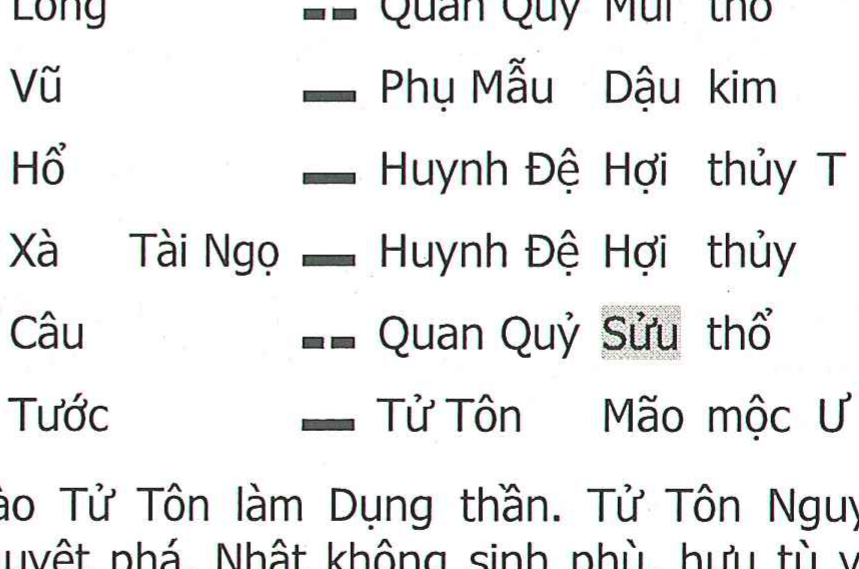
    - **Hình này chứng minh điều gì**
      - Làm sáng tỏ diễn biến cát hung và quy luật ứng nghiệm của Trạch Hỏa Cách đối với sự việc được hỏi.
    - **Từ đâu mà thấy được**
      - Căn cứ Thời gian lập quẻ: Ngày Đinh Tị tháng Dậu; Dụng thần hữu căn vô căn là gì?**. Nhìn vào động đến sinh Dụng thần.

- Luận điểm phân tích:
  - Lấy hào Tử Tôn làm Dụng thần. Tử Tôn Nguyệt khắc lại xung, là Nguyệt phá, Nhật không sinh phù, hưu tù vô căn. Lâm Chu Tước bị khắc, là không thể ăn uống. Trong quẻ mặc dù có hai Hợi thủy bị Nhật xung thành ám động đến sinh Dụng thần, nhưng Dụng thần vô căn, sinh phù bất khởi, do đó là hung. Sau chết ở ngày Kỷ Mùi, đây là ứng Dụng thần nhập Mộ.

- Quái lệ thực tế:
  - Bối cảnh: **Ví dụ 2:** Chó của học viên Tôn Quý Tân cũng bị bệnh, bác sĩ đã nói không thể cứu, ở ngày Mậu Ngọ tháng Tị, hỏi quẻ được Trạch Hỏa Cách biến Thủy Lôi Truân.

- Quái lệ dự đoán thực tế cho Trạch Hỏa Cách biến Thủy Lôi Truân:
  - **Hình 199.** Trạch Hỏa Cách biến Thủy Lôi Truân
    - 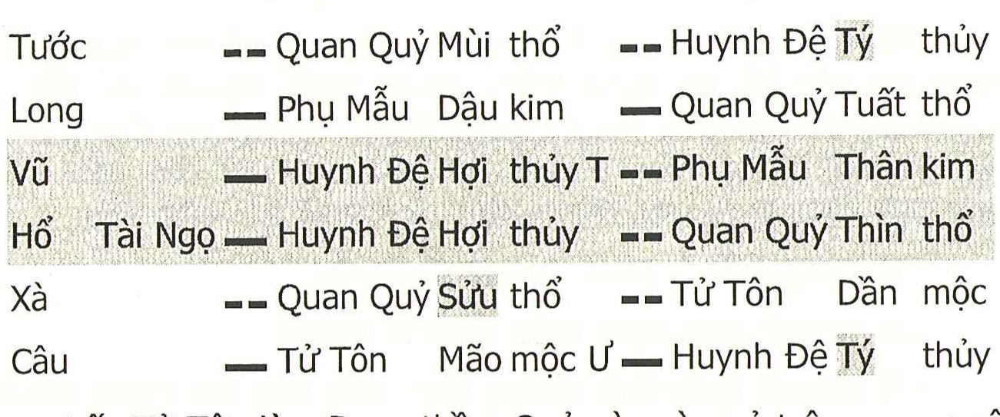
    - **Hình này chứng minh điều gì**
      - Làm sáng tỏ diễn biến cát hung và quy luật ứng nghiệm của Trạch Hỏa Cách biến Thủy Lôi Truân đối với sự việc được hỏi.
    - **Từ đâu mà thấy được**
      - Căn cứ Thời gian lập quẻ: Ngày Đinh Tị tháng Dậu; Dụng thần hữu căn vô căn là gì?**. Nhìn vào động đến sinh Dụng thần.

- Luận điểm phân tích:
  - Lấy Tử Tôn làm Dụng thần. Quẻ này và quẻ trên xem ra rất giống nhau, nhưng xem kỹ lại thấy khác biệt rất lớn. Quẻ trên Nguyệt kiến khắc Tử Tôn, lại xung phá Dụng thần, còn trong quẻ này Nhật Nguyệt mặc dù không sinh Tử Tôn, nhưng cũng không xung khắc, nói cách khác, căn của Dụng thần đã không bị hoại.

- Luận điểm phân tích:
  - Trong quẻ Nguyên thần lưỡng hiện lại đều phát động đến sinh Dụng thần, con chó nhất định có thể sống. Nguyên thần Nguyệt phá, sang tháng bất phá, sang tháng sau, gặp ngày thực phá hợp phá, con chó có thể khỏi bệnh.

- Luận điểm phân tích:
  - Sau quả nhiên con chó đã khỏi bệnh ở ngày Bính Dần tháng Ngọ.

- Quái lệ thực tế:
  - Bối cảnh: **Ví dụ 3:** Ngày Canh Tý tháng Hợi, một người đã bỏ hút thuốc nhưng họng vẫn đau, hỏi có thể khỏi hay không, được Lôi Phong Hằng biến Lôi Thủy Giải.

- Quái lệ dự đoán thực tế cho Lôi Phong Hằng biến Lôi Thủy Giải:
  - **Hình 200.** Lôi Phong Hằng biến Lôi Thủy Giải
    - 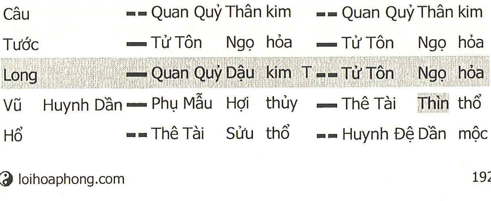
    - **Hình này chứng minh điều gì**
      - Làm sáng tỏ diễn biến cát hung và quy luật ứng nghiệm của Lôi Phong Hằng biến Lôi Thủy Giải đối với sự việc được hỏi.
    - **Từ đâu mà thấy được**
      - Căn cứ Thời gian lập quẻ: Ngày Đinh Tị tháng Dậu; Dụng thần hữu căn vô căn là gì?**. Nhìn vào động đến sinh Dụng thần.

- Luận điểm phân tích:
  - Lấy hào Thế làm Dụng thần. Nhật Nguyệt không sinh phù hào Thế, nhưng cũng không xung khắc hào Thế, Dụng thần không hoại căn. Mặc dù hào Thế động mà hóa hồi đầu khắc, nhưng hào biến bị Nhật Nguyệt khắc chế, Nhật lại xung mất hào biến, họng nhất định không có gì nghiêm trọng, có thể khỏi. Kỵ thần là hỏa, thủy khắc hỏa, uống nhiều nước sẽ thuyên giảm.

- Luận điểm phân tích:
  - Sau quả nhiên đã khỏi.

- Quái lệ thực tế:
  - Bối cảnh: **Ví dụ 4:** Một Dịch hữu lấy ra hai ví dụ trong Tăng San Bốc Dịch và nói rằng hai quẻ này đề cập đến vấn đề Dụng thần hữu căn vô căn, Dã Hạc Lão Nhân không thể tự bào chữa hai quẻ này, hỏi tôi đánh giá như thế nào về hai quẻ này? Hai quẻ này như sau:

- Luận điểm phân tích:
  - (1) Ngày Ất Mùi tháng Tị, tự chiêm bệnh, được quẻ Trạch Phong Đại Quá biến Hỏa Phong Đỉnh.

- Luận điểm phân tích:
  - Tự chiêm bệnh, hào Thế Hợi thủy là Dụng thần, bị Kỵ thần Mùi thổ động mà khắc thủy, may nhờ có Nguyên thần Dậu kim cũng động, Kỵ thần Mùi thổ trái lại sinh Nguyên thần Dậu kim, kim sinh Hợi thủy, tiếp tục tương sinh, hóa hung thành cát. Đâu biết Hợi thủy Nguyệt xung Nhật khắc, trị Nguyệt phá mà bị khắc, tuy có sinh phù, sinh tới bất khởi, như cây không gốc rễ, mùa xuân chẳng về hang lạnh. Quả nhiên chết ở ngày Quý Mão. Ứng ngày Mão, là ngày xung mất Nguyên thần vậy. Đây gọi là Dụng thần vô căn, Nguyên thần có lực cũng khó sinh.

- Quái lệ dự đoán thực tế cho Quẻ Trạch Phong Đại Quá biến Hỏa Phong Đỉnh:
  - **Hình 201.** Quẻ Trạch Phong Đại Quá biến Hỏa Phong Đỉnh
    - 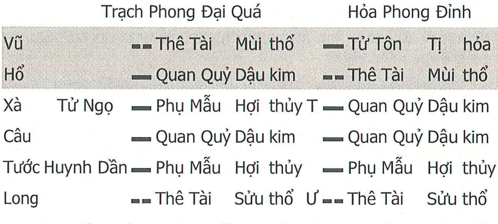
    - **Hình này chứng minh điều gì**
      - Làm sáng tỏ diễn biến cát hung và quy luật ứng nghiệm của Quẻ Trạch Phong Đại Quá biến Hỏa Phong Đỉnh đối với sự việc được hỏi.
    - **Từ đâu mà thấy được**
      - Căn cứ Thời gian lập quẻ: Ngày Đinh Tị tháng Dậu; Dụng thần hữu căn vô căn là gì?**. Nhìn vào động đến sinh Dụng thần.

- Luận điểm phân tích:
  - (2) Ngày Kỷ Mão tháng Mão, em trai chiêm anh trai đang có tội nặng, mẹ đi kêu oan có thể cứu được không? Được quẻ Địa Lôi Phục biến quẻ Chấn.

- Luận điểm phân tích:
  - Hào Huynh Đệ là Dụng thần, Huynh Sửu thổ động bị Nhật Nguyệt khắc, hiện rõ tội lớn khó thoát, may mà được hào Huynh Sửu thổ hóa Phụ Mẫu Ngọ hỏa hồi đầu tương sinh. Đoán rằng: "Nhanh đi kêu oan! Phụ Mẫu sinh Huynh, thần đã nói rõ." Sau quả nhiên được miễn chết.

- Quái lệ thực tế:
  - Bối cảnh: Ví dụ đầu tiên, hào Thế Nguyệt phá Nhật khắc, Nhật Nguyệt không mảy may sinh phù Dụng thần, quẻ này Dụng thần hưu tù, là vô căn, lại thêm hào 6 Mùi thổ phát động đến khắc, sức lực của Dụng thần lại yếu đi rất nhiều, quẻ này hai hào phát động, kiêm xem lý tượng, mặc dù Nguyên thần phát động, nhưng theo góc độ lý, khó sinh Dụng vô căn, do đó ngày Mão xung mất Nguyên thần là hung.

- Quái lệ thực tế:
  - Bối cảnh: Ví dụ thứ hai, Dụng thần Sửu thổ bị Nhật Nguyệt khắc thương cũng là vô căn, nhưng tại sao gặp hung hóa cát? Đây là bởi vì một hào độc phát, lấy tượng làm chủ, gặp sinh được sinh, gặp tử thì chết, đặc biệt là khi Dụng thần độc phát hóa hồi đầu sinh, đã là hưu tù vô căn, nếu như hóa hồi đầu sinh cũng là trong hung có cứu.

- Quái lệ dự đoán thực tế cho Quẻ Địa Lôi Phục biến Chấn Vi Lôi:
  - **Hình 202.** Quẻ Địa Lôi Phục biến Chấn Vi Lôi
    - 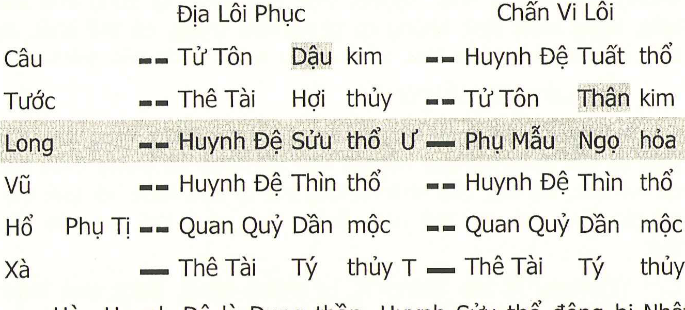
    - **Hình này chứng minh điều gì**
      - Làm sáng tỏ diễn biến cát hung và quy luật ứng nghiệm của Quẻ Địa Lôi Phục biến Chấn Vi Lôi đối với sự việc được hỏi.
    - **Từ đâu mà thấy được**
      - Căn cứ Thời gian lập quẻ: Ngày Đinh Tị tháng Dậu; Dụng thần hữu căn vô căn là gì?**. Nhìn vào động đến sinh Dụng thần.

- Quái lệ thực tế:
  - Bối cảnh: **Ví dụ 5:** Ngày Tân Dậu tháng Tý, một người Giang Tô đoán phát triển công ty tại Sơn Tây sẽ ra sao? Được Thủy Trạch Tiết.

- Luận điểm phân tích:
  - Thủy Trạch Tiết

- Luận điểm phân tích:
  - Xà -- Huynh Đệ Tý thủy
Câu — Quan Quỷ Tuất thổ
Tước -- Phụ Mẫu Thân kim Ứ
Long -- Quan Quỷ Sửu thổ
Vũ — Tử Tôn Mão mộc
Hổ — Thê Tài Tị hỏa T

- Luận điểm phân tích:
  - **Đoán:** Phát triển sự nghiệp công ty, lấy lợi ích làm trọng, do đó lấy hào Tài làm Dụng thần, hào Tài bị Nguyệt kiến khắc, Nhật không sinh phù, là Dụng thần vô căn, trong quẻ tuy có Tử Tôn Mão mộc ám động đến sinh, nhưng cũng là sinh phù bất khởi, Tử Tôn ám động, là sau lưng có người giúp, nhưng hào Tài trên Thế hưu tù, chứng tỏ thực lực kinh tế của người này kém, sự nghiệp rất khó phát triển lên.

- Luận điểm phân tích:
  - Sau quả nhiên không đạt được thành công.

### Câu hỏi 4: Lý giải Phục thần dưới Không dễ dàng xuất hiện như thế nào?

- Giải đáp trọng tâm:
  - Tức là khi Dụng thần bất thượng quái, Dụng thần mặc dù hưu tù, nhưng Phi thần Không Vong, thông thường đoán là cát. Bởi vì Phi thần là cái áp chế Dụng thần, Phi thần đã Không, Dụng thần không còn bị áp chế, dễ dàng hiện ra, đây cũng là một trong những tình huống phá bỏ ngũ hành sinh khắc làm chủ, lấy tượng phán đoán cát hung.

- Quái lệ dự đoán thực tế cho Thủy Trạch Tiết:
  - **Hình 203.** Thủy Trạch Tiết
    - 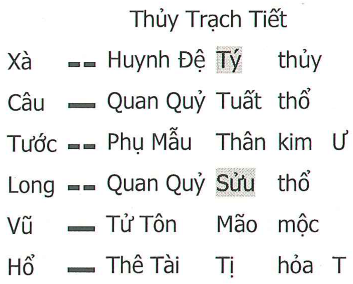
    - **Hình này chứng minh điều gì**
      - Làm sáng tỏ diễn biến cát hung và quy luật ứng nghiệm của Thủy Trạch Tiết đối với sự việc được hỏi.
    - **Từ đâu mà thấy được**
      - Căn cứ Thời gian lập quẻ: Ngày Giáp Dần tháng Dậu; Dụng thần bất thượng quái. Nhìn vào biến Hỏa Lôi Phệ Hạp.

- Quái lệ thực tế:
  - Bối cảnh: **Ví dụ 1:** Ngày Giáp Dần tháng Dậu, một người nữ đoán bệnh của mẹ, được Sơn Hỏa Bí biến Hỏa Lôi Phệ Hạp.

- Luận điểm phân tích:
  - Sơn Hỏa Bí Hỏa Lôi Phệ Hạp

- Luận điểm phân tích:
  - Vũ — Quan Quỷ Dần mộc — Phụ Mẫu Tị hỏa
Hổ -- Thê Tài Tý thủy -- Huynh Đệ Mùi thổ
Xà -- Huynh Đệ Tuất thổ Ứ — Tử Tôn Dậu kim
Câu Tử Thân — Thê Tài Hợi thủy -- Huynh Đệ Thìn thổ
Tước Phụ Ngọ -- Huynh Đệ Sửu thổ -- Quan Quỷ Dần mộc
Long — Quan Quỷ Mão mộc T — Thê Tài Tý thủy

- Luận điểm phân tích:
  - Lấy hào Phụ Mẫu làm Dụng thần, Phụ Mẫu Ngọ hỏa bất thượng quái, phục dưới hào 2 Huynh Đệ Sửu thổ, Nhật thần sinh là vượng, trong quẻ Tuất thổ phát động, khiến Dụng thần nhập Mộ, chính là thông tin nhập viện, Dụng thần Tuyệt tại Thê Tài, lại lâm Chu Tước, là ăn uống khó nuốt, Kỵ thần mặc dù phát động, nhưng tương hợp với Nhật, hợp là cản trở, tham hợp quên khắc, người bệnh tạm thời không có nguy hiểm đến tính mạng, rất cát là Phi thần Không Vong, người xưa nói rằng "Phục thần dưới Không dễ dàng xuất hiện", có bệnh cũng không sao.

- Luận điểm phân tích:
  - Sau ở tháng Tý phản hồi, bệnh của mẹ người này đã thuyên giảm rất nhiều. Mẹ cô ấy bị khối u thực quản.

- Quái lệ dự đoán thực tế cho Sơn Hỏa Bí biến Hỏa Lôi Phệ Hạp:
  - **Hình 204.** Sơn Hỏa Bí biến Hỏa Lôi Phệ Hạp
    - 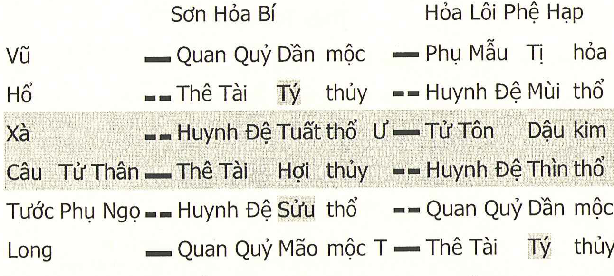
    - **Hình này chứng minh điều gì**
      - Làm sáng tỏ diễn biến cát hung và quy luật ứng nghiệm của Sơn Hỏa Bí biến Hỏa Lôi Phệ Hạp đối với sự việc được hỏi.
    - **Từ đâu mà thấy được**
      - Căn cứ Thời gian lập quẻ: Ngày Giáp Dần tháng Dậu; Dụng thần bất thượng quái. Nhìn vào biến Hỏa Lôi Phệ Hạp.

- Quái lệ thực tế:
  - Bối cảnh: **Ví dụ 2:** Ngày Ất Mùi tháng Sửu, nam gọi điện thoại đoán về việc vợ bỏ đi, hỏi có thể trở về hay không? Nếu trở về, khi nào về? Tôi gieo quẻ được Phong Trạch Trung Phu biến Sơn Hỏa Bí.

- Luận điểm phân tích:
  - **Đoán:** Lấy Thê Tài làm Dụng thần. Thê Tài Tý thủy bất thượng quái, phục dưới hào 5 Phụ Mẫu Tị hỏa, Dụng thần bị Nhật Nguyệt khắc thương, vốn là hưu tù không cát. Nhưng may mà được Nguyệt hợp Dụng thần, đồng thời Phi thần Không Vong, Phục thần dưới Không dễ dàng xuất hiện, lại thêm hào 3 là cửa động mà hóa ra Thê Tài, cận nhật có thể về. Dụng thần hưu tù, gặp ngày Trường Sinh về, ngày mai sẽ về.

- Luận điểm phân tích:
  - Sau quả nhiên ở ngày thứ hai trở về.

- Quái lệ thực tế:
  - Bối cảnh: **Ví dụ 3:** Ví dụ trong Tăng San Bốc Dịch. Ngày Bính Thìn tháng Dậu, chiêm bệnh của con, được Địa Phong Thăng.

- Luận điểm phân tích:
  - Hoàng Kim Sách nói rằng: Phục thần dưới Không dễ dàng xuất hiện. Quẻ này Tử Tôn Ngọ hỏa phục dưới Sửu thổ. Sửu thổ Tuần Không Phục thần dễ xuất hiện, ngày Ngọ Tử Tôn xuất hiện tất khỏi bệnh, quả nhiên rời giường ở ngày Ngọ.

- Quái lệ dự đoán thực tế cho Phong Trạch Trung Phu biến Sơn Hỏa Bí:
  - **Hình 205.** Phong Trạch Trung Phu biến Sơn Hỏa Bí
    - 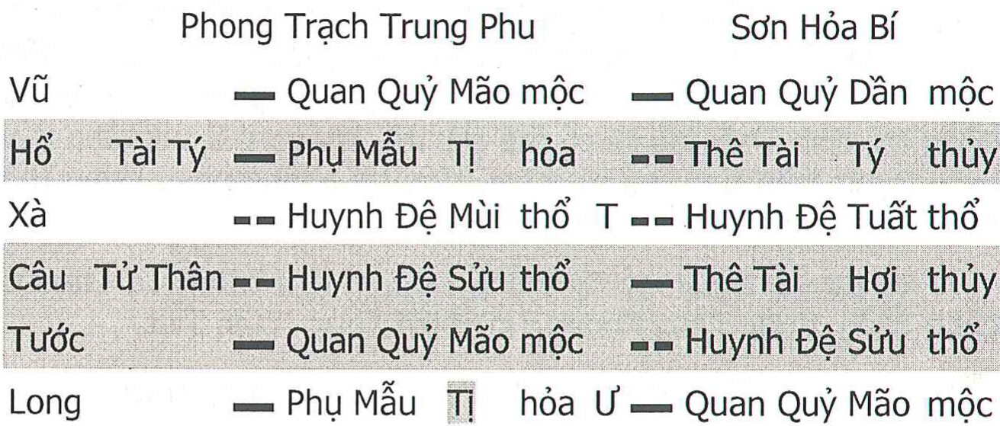
    - **Hình này chứng minh điều gì**
      - Làm sáng tỏ diễn biến cát hung và quy luật ứng nghiệm của Phong Trạch Trung Phu biến Sơn Hỏa Bí đối với sự việc được hỏi.
    - **Từ đâu mà thấy được**
      - Căn cứ Thời gian lập quẻ: Ngày Giáp Dần tháng Dậu; Dụng thần bất thượng quái. Nhìn vào biến Hỏa Lôi Phệ Hạp.

- Quái lệ dự đoán thực tế cho Địa Phong Thăng:
  - **Hình 206.** Địa Phong Thăng
    - 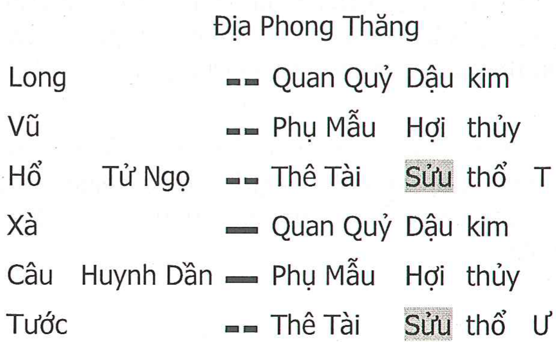
    - **Hình này chứng minh điều gì**
      - Làm sáng tỏ diễn biến cát hung và quy luật ứng nghiệm của Địa Phong Thăng đối với sự việc được hỏi.
    - **Từ đâu mà thấy được**
      - Căn cứ Thời gian lập quẻ: Ngày Giáp Dần tháng Dậu; Dụng thần bất thượng quái. Nhìn vào biến Hỏa Lôi Phệ Hạp.

### Câu hỏi 5: Trong quẻ xuất hiện vô tình là gì?

- Giải đáp trọng tâm:
  - Khi Dụng thần phát động không sinh hào Thế mà sinh hào Ứng, cho dù Dụng thần vượng tướng cũng là không cát, Ứng là người khác, là thành tựu người khác mà không thành tựu mình, đây gọi là vô tình. Quy luật này phải là hào Dụng thần phát động sinh hào Ứng, nếu hào Ứng cũng đồng thời phát động, với lại động mà sinh Thế, trái lại có thể giải trừ, không thể cho rằng là vô tình. Dụng thần tĩnh mà sinh hào Ứng thì không phải, Dụng thần lâm hào Ứng cũng không phải.

- Quái lệ thực tế:
  - Bối cảnh: **Ví dụ 1:** Ngày Kỷ Tị tháng Dậu, chiêm tranh cử chủ tịch công đoàn, được Thủy Phong Tỉnh biến Thủy Trạch Tiết.

- Luận điểm phân tích:
  - **Phân tích:** Đây là ví dụ trong Lục Hào Dự Trắc Tam Viên. Trong quẻ Dụng thần Quan Quỷ Dậu kim được Nguyệt kiến tỉ, lại có Tị Dậu Sửu hợp thành Quan cục, bất Không bất Phá lẽ ra trúng cử, nhưng kết quả lại không trúng cử, chẳng phải cách chọn Dụng thần truyền thống có sai lầm, mà là Dụng thần sinh Ứng xuất hiện vô tình.

- Luận điểm phân tích:
  - Tam hợp cục thể hiện một tập thể, một thế lực, tam hợp Quan cục sinh Ứng, có một lượng lớn người giúp đối phương, lại thêm hào Ứng Phụ Mẫu ám động, chứng tỏ có người lén lút lôi kéo phiếu bầu.

- Quái lệ dự đoán thực tế cho Thủy Phong Tỉnh biến Thủy Trạch Tiết:
  - **Hình 207.** Thủy Phong Tỉnh biến Thủy Trạch Tiết
    - 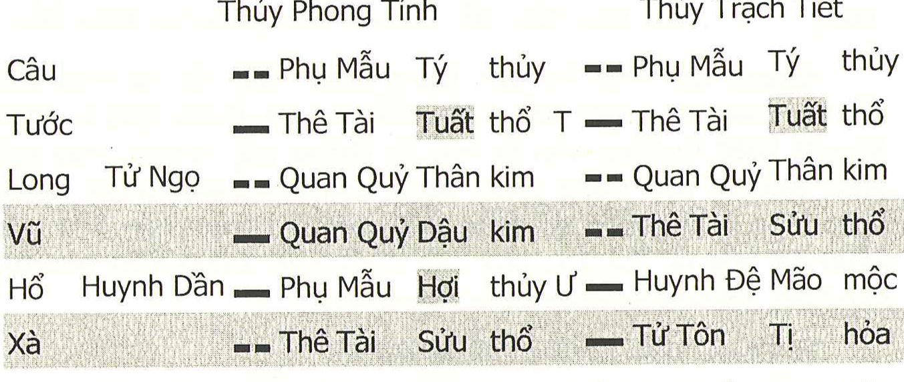
    - **Hình này chứng minh điều gì**
      - Làm sáng tỏ diễn biến cát hung và quy luật ứng nghiệm của Thủy Phong Tỉnh biến Thủy Trạch Tiết đối với sự việc được hỏi.
    - **Từ đâu mà thấy được**
      - Căn cứ Thời gian lập quẻ: Ngày Kỷ Tị tháng Dậu; Dụng thần phát động không sinh hào Thế mà sinh hào Ứng. Nhìn vào hào Thế mà sinh hào Ứng; phát động không sinh hào Thế mà sinh hào Ứng.

- Quái lệ thực tế:
  - Bối cảnh: **Ví dụ 2:** Ngày Ất Hợi tháng Thân, chiêm có được chọn vào chức vị trống hay không? Được quẻ Thủy Phong Tỉnh biến Thủy Trạch Tiết.

- Quái lệ dự đoán thực tế cho Quẻ Thủy Phong Tỉnh biến Thủy Trạch Tiết:
  - **Hình 208.** Quẻ Thủy Phong Tỉnh biến Thủy Trạch Tiết
    - 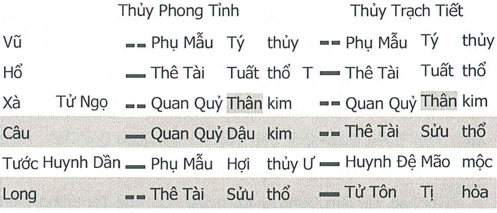
    - **Hình này chứng minh điều gì**
      - Làm sáng tỏ diễn biến cát hung và quy luật ứng nghiệm của Quẻ Thủy Phong Tỉnh biến Thủy Trạch Tiết đối với sự việc được hỏi.
    - **Từ đâu mà thấy được**
      - Căn cứ Thời gian lập quẻ: Ngày Kỷ Tị tháng Dậu; Dụng thần phát động không sinh hào Thế mà sinh hào Ứng. Nhìn vào hào Thế mà sinh hào Ứng; phát động không sinh hào Thế mà sinh hào Ứng.

- Luận điểm phân tích:
  - **Phân tích:** Đây là ví dụ trong Tăng San Bốc Dịch. Quẻ này hoàn toàn tương đồng với quẻ trước, cũng là Dụng thần thành tam hợp cục sinh hào Ứng, và không được tuyển chọn, người khác được chọn.

- Quái lệ thực tế:
  - Bối cảnh: **Ví dụ 3:** Ngày Nhâm Dần tháng Thân, nam đoán có thể được thăng quan hay không? Được Lôi Sơn Tiểu Quá biến Sơn Thủy Mông.

- Quái lệ dự đoán thực tế cho Quẻ Lôi Sơn Tiểu Quá biến Sơn Thủy Mông:
  - **Hình 209.** Quẻ Lôi Sơn Tiểu Quá biến Sơn Thủy Mông
    - 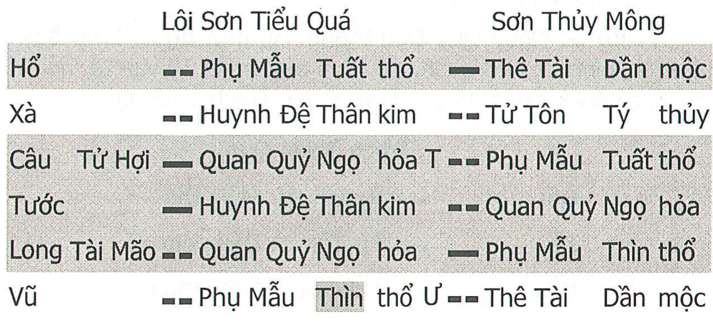
    - **Hình này chứng minh điều gì**
      - Làm sáng tỏ diễn biến cát hung và quy luật ứng nghiệm của Quẻ Lôi Sơn Tiểu Quá biến Sơn Thủy Mông đối với sự việc được hỏi.
    - **Từ đâu mà thấy được**
      - Căn cứ Thời gian lập quẻ: Ngày Kỷ Tị tháng Dậu; Dụng thần phát động không sinh hào Thế mà sinh hào Ứng. Nhìn vào hào Thế mà sinh hào Ứng; phát động không sinh hào Thế mà sinh hào Ứng.

- Luận điểm phân tích:
  - Lấy Quan Quỷ làm Dụng thần, Quan Quỷ được Nhật sinh phù trì Thế, lại thành tam hợp cục, vốn là tượng cát, nhưng không nên động mà sinh Ứng, xuất hiện vấn đề, là tượng quan bị người khác giành được, mình không có quan, sau quả nhiên không nhận được.

- Quái lệ thực tế:
  - Bối cảnh: **Ví dụ 4:** Ngày Mậu Ngọ tháng Tị, một người nam đoán tài vận, được Trạch Thiên Quải biến Thủy Thiên Nhu.

- Quái lệ dự đoán thực tế cho Quẻ Trạch Thiên Quải biến Thủy Thiên Nhu:
  - **Hình 210.** Quẻ Trạch Thiên Quải biến Thủy Thiên Nhu
    - 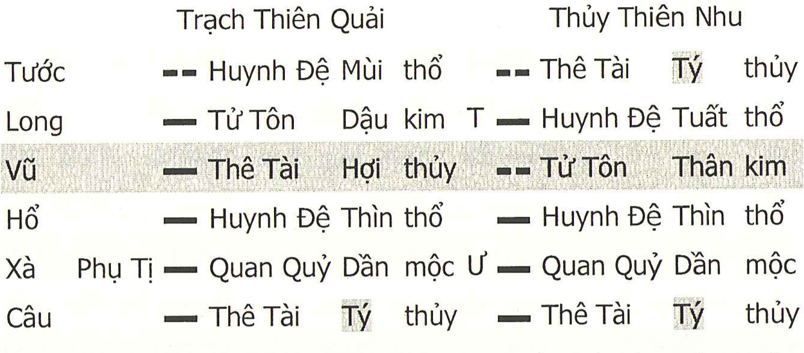
    - **Hình này chứng minh điều gì**
      - Làm sáng tỏ diễn biến cát hung và quy luật ứng nghiệm của Quẻ Trạch Thiên Quải biến Thủy Thiên Nhu đối với sự việc được hỏi.
    - **Từ đâu mà thấy được**
      - Căn cứ Thời gian lập quẻ: Ngày Kỷ Tị tháng Dậu; Dụng thần phát động không sinh hào Thế mà sinh hào Ứng. Nhìn vào hào Thế mà sinh hào Ứng; phát động không sinh hào Thế mà sinh hào Ứng.

- Luận điểm phân tích:
  - Lấy hào Tài làm Dụng thần, trong quẻ Thê Tài lưỡng hiện, lấy hào Thê Tài Hợi thủy phát động làm Dụng, Thê Tài Hợi thủy độc phát, động mà hóa hồi đầu sinh, vốn là tượng cát, nhưng không nên bị Nguyệt kiến xung phá, động mà sinh Ứng, trong quẻ xuất hiện vô tình, mặc dù Tài động hóa hồi đầu sinh có thể được tài, nhưng Tài sinh hào Ứng, lại là tượng bất lợi tài, là tiền chảy vào trong túi của người khác.

- Luận điểm phân tích:
  - Tình hình thực tế, người này làm công trình đã phát tài, nhưng không đòi được tiền.

- Quái lệ thực tế:
  - Bối cảnh: **Ví dụ 5:** Ngày Quý Dậu tháng Tý, một người trình bày dự toán tài chính cho cơ quan, đã trình bày thiếu 10 vạn tệ, hỏi trình bày lại có được duyệt hay không? Được Trạch Thiên Quải.

- Quái lệ dự đoán thực tế cho Quẻ Trạch Thiên Quải:
  - **Hình 211.** Quẻ Trạch Thiên Quải
    - 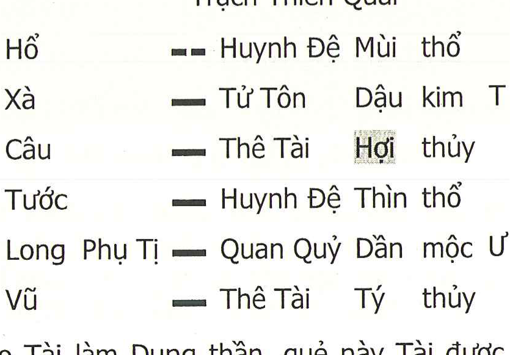
    - **Hình này chứng minh điều gì**
      - Làm sáng tỏ diễn biến cát hung và quy luật ứng nghiệm của Quẻ Trạch Thiên Quải đối với sự việc được hỏi.
    - **Từ đâu mà thấy được**
      - Căn cứ Thời gian lập quẻ: Ngày Kỷ Tị tháng Dậu; Dụng thần phát động không sinh hào Thế mà sinh hào Ứng. Nhìn vào hào Thế mà sinh hào Ứng; phát động không sinh hào Thế mà sinh hào Ứng.

- Luận điểm phân tích:
  - Lấy hào Tài làm Dụng thần, quẻ này Tài được Nguyệt kiến phù, Nhật thần đến sinh là vượng tướng, quẻ này thoạt nhìn cũng là Tài sinh hào Ứng, nhưng Dụng thần không phát động, không

- Kết quả ứng nghiệm thực tế:
  - Thê Tài Hợi thủy Không Vong, xuất Không sẽ được, quả nhiên ứng nghiệm.

- Quái lệ thực tế:
  - Bối cảnh: **Ví dụ 6:** Ngày Kỷ Mão tháng Tý, một cô gái Nhật Bản đoán bạn trai có kết hôn với mình hay không? Được Thủy Sơn Kiển biến Khảm Vi Thủy.

- Quái lệ dự đoán thực tế cho Thủy Sơn Kiển biến Khảm Vi Thủy:
  - **Hình 212.** Thủy Sơn Kiển biến Khảm Vi Thủy
    - 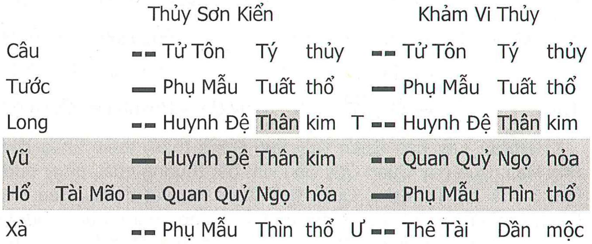
    - **Hình này chứng minh điều gì**
      - Làm sáng tỏ diễn biến cát hung và quy luật ứng nghiệm của Thủy Sơn Kiển biến Khảm Vi Thủy đối với sự việc được hỏi.
    - **Từ đâu mà thấy được**
      - Căn cứ Thời gian lập quẻ: Ngày Kỷ Tị tháng Dậu; Dụng thần phát động không sinh hào Thế mà sinh hào Ứng. Nhìn vào hào Thế mà sinh hào Ứng; phát động không sinh hào Thế mà sinh hào Ứng.

- Luận điểm phân tích:
  - **Đoán:** Lấy Quan Quỷ làm Dụng thần, Quan Quỷ mặc dù bị Nguyệt kiến xung phá, nhưng được Nhật thần sinh phù là vượng. Dụng thần vượng tướng vốn là cát, nhưng không nên khắc Thế mà sinh hào Ứng, Quan Quỷ khắc Thế, là bạn trai không tốt với cô ấy, không thích cô ấy. Dụng thần sinh hào Ứng, đây là vô tình, chính là tốt với người khác.

- Luận điểm phân tích:
  - Dụng thần hóa ra Phụ Mẫu sinh hào Ứng, Phụ Mẫu là giấy kết hôn, là muốn kết hôn với người khác, không muốn kết hôn với cô ấy. Hào Thế Không Vong, bản thân tâm phiền ý loạn, đứng ngồi không yên.

- Luận điểm phân tích:
  - Trên thực tế, cô gái này đã mang thai và sinh con với bạn trai 3 năm trước, nhưng bạn trai lần lữa không chịu kết hôn với cô ấy. Tháng Thìn năm nay (năm Ất Dậu), anh ta đã kết hôn với một cô gái khác. Cô ấy tố cáo, muốn giải quyết thông qua tòa án, nhưng kết thúc trong thua kiện.

- Quái lệ thực tế:
  - Bối cảnh: **Ví dụ 7:** Ngày Bính Ngọ tháng Dậu, một người phụ nữ Nhật Bản đoán con gái có thi đậu đại học đã ghi danh hay không, được Sơn Lôi Di biến Ly Vi Hỏa.

- Quái lệ dự đoán thực tế cho Sơn Lôi Di biến Ly Vi Hỏa:
  - **Hình 213.** Sơn Lôi Di biến Ly Vi Hỏa
    - 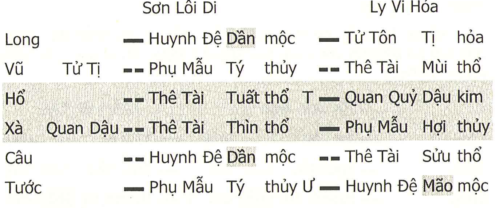
    - **Hình này chứng minh điều gì**
      - Làm sáng tỏ diễn biến cát hung và quy luật ứng nghiệm của Sơn Lôi Di biến Ly Vi Hỏa đối với sự việc được hỏi.
    - **Từ đâu mà thấy được**
      - Căn cứ Thời gian lập quẻ: Ngày Kỷ Tị tháng Dậu; Dụng thần phát động không sinh hào Thế mà sinh hào Ứng. Nhìn vào hào Thế mà sinh hào Ứng; phát động không sinh hào Thế mà sinh hào Ứng.

- Luận điểm phân tích:
  - **Đoán:** Lấy hào Quan Quỷ làm Dụng thần, tham khảo hào Phụ Mẫu. Quẻ này Quan Quỷ Dậu kim bất thượng quái, phục dưới hào 3 Thê Tài Thìn thổ, Quan Quỷ được Nguyệt tỉ phù, quẻ này Quan Quỷ cũng sinh hào Ứng, nhưng không phải vô tình, bởi vì Quan Quỷ không phát động, mặc dù với hào Ứng là quan hệ tương sinh, nhưng không xem là vô tình. Quẻ này Dụng thần Nguyệt phù Nhật khắc, sức mạnh tương đương. May được hào Tài trong quẻ động mà đến sinh, đây là sinh nhiều khắc ít, là cát. Người xưa nói rằng "Tài động sinh Quan, may mắn gọi tên" do đó vừa vặn có thể trúng tuyển. Sau cùng đã thi đậu đại học.

- Quái lệ thực tế:
  - Bối cảnh: **Ví dụ 8:** Ngày Bính Tý Tháng Tý, đoán con gái thi đại học sẽ ra sao? Được Phong Sơn Tiệm.

- Quái lệ dự đoán thực tế cho Phong Sơn Tiệm:
  - **Hình 214.** Phong Sơn Tiệm
    - 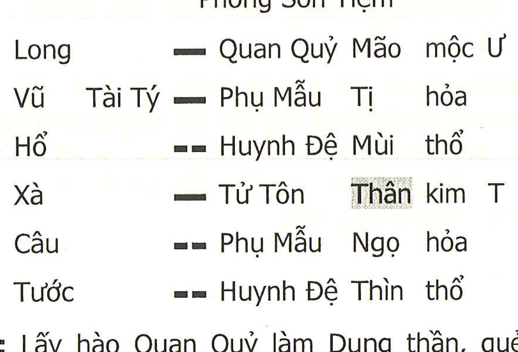
    - **Hình này chứng minh điều gì**
      - Làm sáng tỏ diễn biến cát hung và quy luật ứng nghiệm của Phong Sơn Tiệm đối với sự việc được hỏi.
    - **Từ đâu mà thấy được**
      - Căn cứ Thời gian lập quẻ: Ngày Kỷ Tị tháng Dậu; Dụng thần phát động không sinh hào Thế mà sinh hào Ứng. Nhìn vào hào Thế mà sinh hào Ứng; phát động không sinh hào Thế mà sinh hào Ứng.

- Luận điểm phân tích:
  - **Đoán:** Lấy hào Quan Quỷ làm Dụng thần, quẻ này Dụng thần được Nhật Nguyệt sinh phù là vượng tướng, Quan Quỷ lâm

- Luận điểm phân tích:
  - Ứng, không thể gọi là vô tình, hỷ Tử Tôn trì Thế, khắc Quan trên Ứng, hào Thế mặc dù Không Vong, nhưng Kỵ thần Không Vong không phải đề phòng. Phụ Mẫu Nguyệt phá, Nhật phá, dự đoán thi thì lấy Quan Quỷ làm trọng, do đó Quan Quỷ vượng tướng sẽ đậu. Sau cùng đã thi đậu đại học.

- Quái lệ thực tế:
  - Bối cảnh: **Ví dụ 9:** Ngày Nhâm Tuất tháng Dần, một người đoán về thăng chức, được Hỏa Địa Tấn biến Hỏa Trạch Khuê.

- Quái lệ dự đoán thực tế cho Quẻ Hỏa Địa Tấn biến Hỏa Trạch Khuê:
  - **Hình 215.** Quẻ Hỏa Địa Tấn biến Hỏa Trạch Khuê
    - 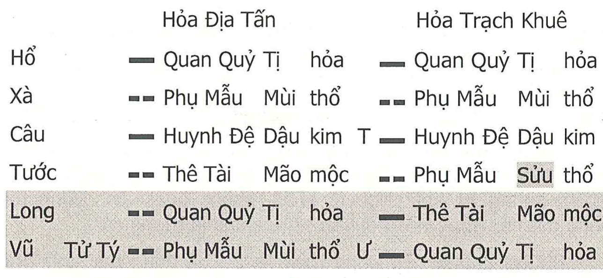
    - **Hình này chứng minh điều gì**
      - Làm sáng tỏ diễn biến cát hung và quy luật ứng nghiệm của Quẻ Hỏa Địa Tấn biến Hỏa Trạch Khuê đối với sự việc được hỏi.
    - **Từ đâu mà thấy được**
      - Căn cứ Thời gian lập quẻ: Ngày Kỷ Tị tháng Dậu; Dụng thần phát động không sinh hào Thế mà sinh hào Ứng. Nhìn vào hào Thế mà sinh hào Ứng; phát động không sinh hào Thế mà sinh hào Ứng.

- Luận điểm phân tích:
  - **Đoán:** Lấy hào Quan Quỷ làm Dụng thần, trong quẻ Quan Quỷ lưỡng hiện, lấy hào phát động Quan Quỷ Tị hỏa làm Dụng thần, Dụng thần được Nguyệt sinh phù, vốn là tượng cát. Nhưng không nên khắc Thế sinh Ứng, đây là vô tình, lẽ ra phải đoán hung, nhưng may được hào Ứng phát động. Quan động sinh Ứng, hào Ứng động đến sinh Thế. Điểm dừng chân cuối cùng của quẻ này lại đến hào Thế. Biến vô tình thành hữu tình, nhất định có thể lên chức.

- Luận điểm phân tích:
  - Quả nhiên đã đạt được một chức vụ rất trọng yếu.

- Quái lệ thực tế:
  - Bối cảnh: **Ví dụ 10:** Ngày Tân Dậu Tháng Tuất, chiêm ngày nào được bổ quan, được Kiển biến Nhu.

- Quái lệ dự đoán thực tế cho Quẻ Thủy Sơn Kiển biến Thủy Thiên Nhu:
  - **Hình 216.** Quẻ Thủy Sơn Kiển biến Thủy Thiên Nhu
    - 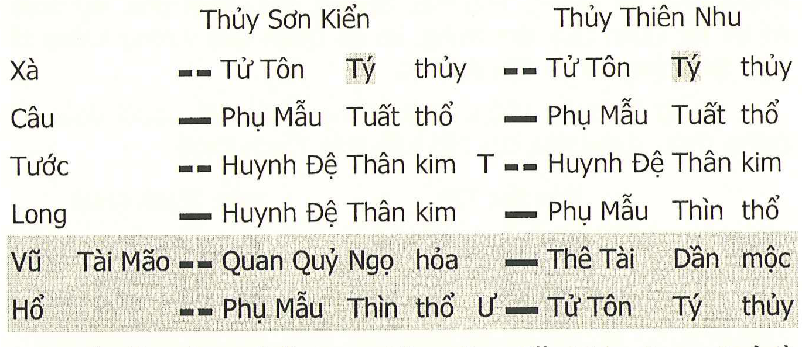
    - **Hình này chứng minh điều gì**
      - Làm sáng tỏ diễn biến cát hung và quy luật ứng nghiệm của Quẻ Thủy Sơn Kiển biến Thủy Thiên Nhu đối với sự việc được hỏi.
    - **Từ đâu mà thấy được**
      - Căn cứ Thời gian lập quẻ: Ngày Kỷ Tị tháng Dậu; Dụng thần phát động không sinh hào Thế mà sinh hào Ứng. Nhìn vào hào Thế mà sinh hào Ứng; phát động không sinh hào Thế mà sinh hào Ứng.

- Luận điểm phân tích:
  - Đây là một quái lệ trong Tăng San Bốc Dịch. Quan Quỷ là Dụng thần, Dụng thần mặc dù không được Nhật Nguyệt sinh phù, nhưng không bị Nhật Nguyệt khắc, không hoại căn. Đồng thời Dụng thần tự động hóa hồi đầu sinh, chính là tượng cát.

- Luận điểm phân tích:
  - Nhưng không nên Dụng thần khắc Thế động mà sinh Ứng. Giống như là vô tình, may mà Ứng phát động sinh Thế, thành liên tục tương sinh, biến bất lợi thành có lợi. Hào Ứng Nguyệt phá hóa Không khó mà dẫn hóa, Nhật hợp hào Ứng giải phá, tháng Tý xuất Không mà được thăng.

### Câu hỏi 6: Đại tượng sinh khắc luận cát hung là gì?

- Giải đáp trọng tâm:
  - Khi gặp quẻ bát thuần biến quẻ bát thuần, thường lấy đại tượng phân tích cát hung, chứ không lấy ngũ hành sinh khắc của Dụng thần làm chủ định cát hung. Đây cũng là một hiện tượng đặc biệt trong dự đoán lục hào. Cũng là đã vượt qua lý ngũ hành sinh khắc, lấy tượng làm chủ luận cát hung.

- Luận điểm phân tích:
  - Người xưa đã trình bày về vấn đề này như sau: "Cái biến của quẻ: Có biến sinh, biến khắc, biến Mộ, biến Tuyệt, biến tỷ hòa. Ta được nghiệm, phàm gặp quẻ hóa khắc, bất kể Dụng thần suy hay vượng, đều suy ra là hung."

- Luận điểm phân tích:
  - Trong thực tế, tôi thấy rằng quẻ biến chỉ lấy hồi đầu sinh và hồi đầu khắc mà định cát hung thì tương đối thỏa đáng.

- Luận điểm phân tích:
  - Quẻ biến hóa hồi đầu khắc, như Càn biến Ly, Đoài biến Ly, Khảm biến Khôn, Khảm biến Cấn, Tốn biến Càn v.v; quẻ biến hồi đầu sinh, như Khảm biến Đoài, Ly biến Chấn v.v. Biến Mộ, như Ly

- Quái lệ thực tế:
  - Bối cảnh: **Ví dụ 2:** Ngày Mậu Thìn tháng Ngọ, một người đoán có thể làm được giấy tờ xuất ngoại hay không? Được Càn Vi Thiên biến Ly Vi Hỏa.

- Quái lệ dự đoán thực tế cho Càn Vi Thiên biến Ly Vi Hỏa:
  - **Hình 217.** Càn Vi Thiên biến Ly Vi Hỏa
    - 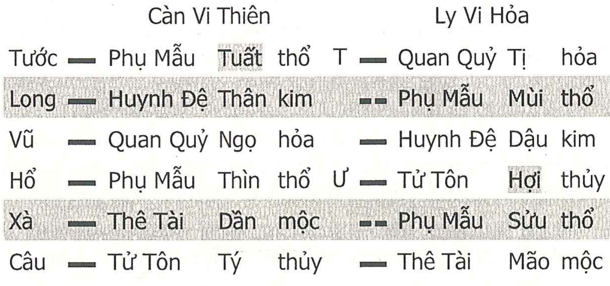
    - **Hình này chứng minh điều gì**
      - Làm sáng tỏ diễn biến cát hung và quy luật ứng nghiệm của Càn Vi Thiên biến Ly Vi Hỏa đối với sự việc được hỏi.
    - **Từ đâu mà thấy được**
      - Căn cứ Thời gian lập quẻ: Ngày Mậu Thìn tháng Ngọ; Dụng thần làm chủ định cát hung. Nhìn vào biến quẻ bát thuần.

- Luận điểm phân tích:
  - Quẻ này nếu lấy Dụng thần để phán đoán, lấy hào Phụ Mẫu làm Dụng thần, Phụ Mẫu Tuất thổ trì Thế, được Nguyệt kiến đến sinh là vượng tướng, Nhật thần xung Thế, văn thư ám động, dường như có thể làm được giấy tờ xuất ngoại, nhưng quẻ này là quẻ bát thuần biến quẻ bát thuần, lấy đại tượng sinh khắc làm chủ, Càn biến Ly Vi Hỏa tượng biến hồi đầu khắc, rất khó làm được giấy tờ.

- Luận điểm phân tích:
  - Quả nhiên không làm được.

- Quái lệ thực tế:
  - Bối cảnh: **Ví dụ 3:** Một Dịch hữu hỏi tôi quẻ này, đoán bệnh của mẹ, ngày Đinh Hợi tháng Thân, được Khảm Vi Thủy biến Khôn Vi Địa.

- Quái lệ dự đoán thực tế cho Khảm Vi Thủy biến Khôn Vi Địa:
  - **Hình 218.** Khảm Vi Thủy biến Khôn Vi Địa
    - 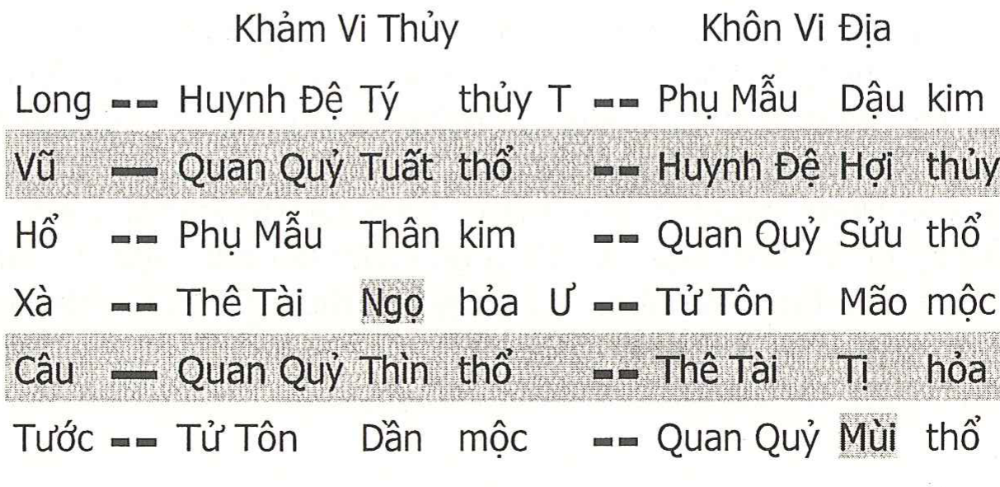
    - **Hình này chứng minh điều gì**
      - Làm sáng tỏ diễn biến cát hung và quy luật ứng nghiệm của Khảm Vi Thủy biến Khôn Vi Địa đối với sự việc được hỏi.
    - **Từ đâu mà thấy được**
      - Căn cứ Thời gian lập quẻ: Ngày Mậu Thìn tháng Ngọ; Dụng thần làm chủ định cát hung. Nhìn vào biến quẻ bát thuần.

- Luận điểm phân tích:
  - Tôi đoán, mẹ người này tất chết. Anh ta hỏi, quẻ này Phụ Mẫu vượng tướng sao có thể chết? Tôi nói quẻ này thuộc về bát thuần hóa bát thuần, không xem Dụng thần, chỉ xem đại tượng hồi đầu khắc.

- Quái lệ thực tế:
  - Bối cảnh: **Ví dụ 1:** Ngày Bính Ngọ tháng Mão, một người nam đoán tình hình làm hộ chiếu, được Khảm Vi Thủy biến Đoài Vi Trạch.

- Quái lệ dự đoán thực tế cho Khảm Vi Thủy biến Đoài Vi Trạch:
  - **Hình 219.** Khảm Vi Thủy biến Đoài Vi Trạch
    - 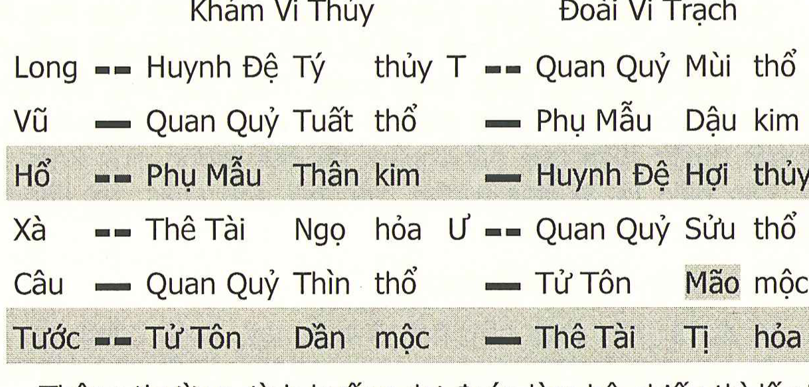
    - **Hình này chứng minh điều gì**
      - Làm sáng tỏ diễn biến cát hung và quy luật ứng nghiệm của Khảm Vi Thủy biến Đoài Vi Trạch đối với sự việc được hỏi.
    - **Từ đâu mà thấy được**
      - Căn cứ Thời gian lập quẻ: Ngày Mậu Thìn tháng Ngọ; Dụng thần làm chủ định cát hung. Nhìn vào biến quẻ bát thuần.

- Luận điểm phân tích:
  - Thông thường, tình huống dự đoán làm hộ chiếu thì lấy Phụ Mẫu làm Dụng thần, quẻ này Phụ Mẫu không được Nguyệt kiến sinh phù, bị Nhật khắc thương, lại Tuyệt ở hào động Tử Tôn Dần mộc, lục xung biến lục xung, là tượng không tốt, nhưng quẻ này là quẻ bát thuần biến quẻ bát thuần, không lấy ngũ hành sinh khắc của Dụng thần làm chủ, mà là dùng đại tượng định cát hung, quẻ này Khảm biến Đoài, là đại tượng biến hồi đầu sinh, hộ chiếu nhất định có thể làm được, gặp ngày kim thủy tất thành. Hai ngày sau là ngày Mậu Thân, lại đồng nhất với Phụ Mẫu Thân kim. Ngày Thân có thể làm được, quả nhiên tại ngày Mậu Thân làm được.

- Luận điểm phân tích:
  - Anh ta nói, thì ra là như vậy, tôi đã hiểu tại sao quẻ này là mẹ anh ta chết.

- Quái lệ thực tế:
  - Bối cảnh: **Ví dụ 4:** Khi mới đến Thái Nguyên gặp tôi, học viên Tiền Bảo Thuận đã nói đến một quẻ gặp phải khi dự đoán, là quẻ dự đoán công việc của một người phụ nữ, được Càn Vi Thiên biến Ly Vi Hỏa.

- Quái lệ dự đoán thực tế cho Càn Vi Thiên biến Ly Vi Hỏa:
  - **Hình 220.** Càn Vi Thiên biến Ly Vi Hỏa
    - 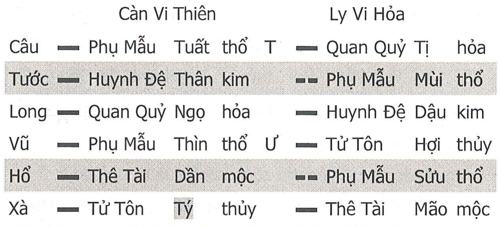
    - **Hình này chứng minh điều gì**
      - Làm sáng tỏ diễn biến cát hung và quy luật ứng nghiệm của Càn Vi Thiên biến Ly Vi Hỏa đối với sự việc được hỏi.
    - **Từ đâu mà thấy được**
      - Căn cứ Thời gian lập quẻ: Ngày Mậu Thìn tháng Ngọ; Dụng thần làm chủ định cát hung. Nhìn vào biến quẻ bát thuần.

- Luận điểm phân tích:
  - Lúc đó, tôi không hỏi anh ta thời gian gieo quẻ, đã cho rằng quẻ này không cát, không chỉ công việc không tốt đẹp mà còn có nỗi lo về tính mạng. Tôi phán đoán tại tháng Tị người này có nỗi lo về tính mạng, nhưng trên thực tế thì người này chết vì ung thư máu ở ngày Nhâm Ngọ tháng Nhâm Ngọ năm Ất Dậu.

- Luận điểm phân tích:
  - Đây cũng là bởi vì nguyên nhân đại tượng biến hồi đầu khắc. Quẻ này trên thực tế là ở ngày Kỷ Mùi tháng Thân năm Giáp Thân.

- Luận điểm phân tích:
  - Quẻ này và quẻ làm giấy tờ xuất ngoại ở trên đều là Càn biến Ly, tại sao quẻ này lại có nỗi lo về tính mạng, còn quẻ giấy tờ xuất ngoại thì không? Đó là bởi vì quẻ kiểu này dùng đại tượng để định sinh khắc, do đó sự tình muốn hỏi và ý nghĩa của tượng có quan hệ rất lớn.

- Luận điểm phân tích:
  - Càn là công việc sự nghiệp, bản thân cô ấy hỏi về công việc, do đó sự tình liên quan đến tính mạng, nếu như xuất hiện đại tượng hồi đầu khắc, không những việc muốn hỏi không tốt mà còn có nỗi lo về tính mạng. Hơn nữa, quẻ chính và Nguyệt có ngũ hành tương đồng, hóa đại tượng hồi đầu khắc cũng không tốt, gọi là lâm Nhật Nguyệt biến hoại.

- Luận điểm phân tích:
  - Để phán đoán và nắm bắt quy luật của loại quẻ này tốt hơn, tôi cũng sẽ liệt kê các quái lệ trong Tăng San Bốc Dịch ở đây.

- Quái lệ thực tế:
  - Bối cảnh: **Ví dụ 5:** Ngày Tân Tị tháng Mão, người đến không nói việc gì. Chiêm được quẻ Tốn biến quẻ Càn.

- Quái lệ dự đoán thực tế cho Tốn Vi Phong biến Càn Vi Thiên:
  - **Hình 221.** Tốn Vi Phong biến Càn Vi Thiên
    - 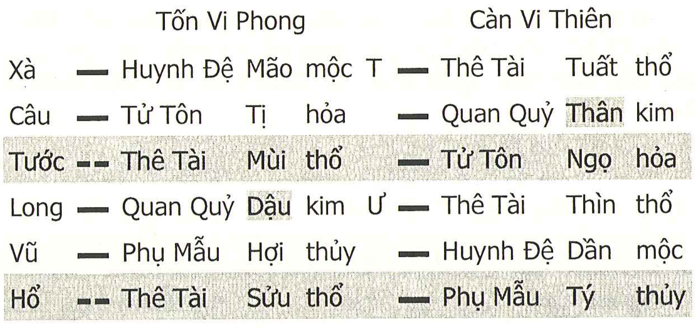
    - **Hình này chứng minh điều gì**
      - Làm sáng tỏ diễn biến cát hung và quy luật ứng nghiệm của Tốn Vi Phong biến Càn Vi Thiên đối với sự việc được hỏi.
    - **Từ đâu mà thấy được**
      - Căn cứ Thời gian lập quẻ: Ngày Mậu Thìn tháng Ngọ; Dụng thần làm chủ định cát hung. Nhìn vào biến quẻ bát thuần.

- Luận điểm phân tích:
  - Hỏi người này chiêm việc gì?

- Luận điểm phân tích:
  - Người đó nói: Chiêm hộ công danh của trưởng bối.

- Luận điểm phân tích:
  - Ta nói: Công danh cần phải tự chiêm, chiêm hộ khó chọn Dụng thần, trước nay không dám đoán, nhưng may là quẻ này rõ ràng dễ thấy, Tốn mộc hóa Càn kim, chính là hóa hồi đầu khắc, cũng là quẻ Tuyệt, đừng nói công danh, mà tuổi thọ cũng chẳng được lâu. Quả nhiên bị cách chức ở tháng Ngọ, tháng 7 chết.

- Quái lệ thực tế:
  - Bối cảnh: **Ví dụ 6:** Ngày Bính Dần tháng Ngọ, chiêm bệnh của chủ, được quẻ Ly biến quẻ Khảm.

- Quái lệ dự đoán thực tế cho Ly Vi Hỏa biến Khảm Vi Thủy:
  - **Hình 222.** Ly Vi Hỏa biến Khảm Vi Thủy
    - 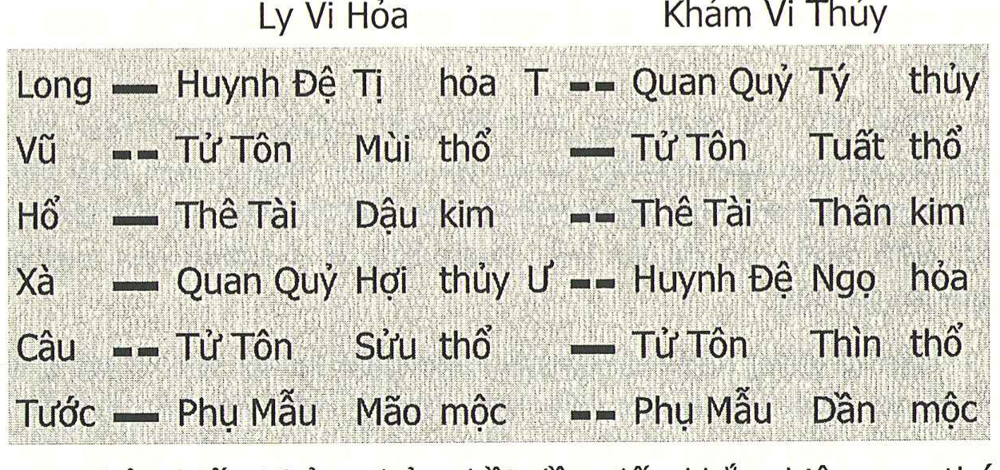
    - **Hình này chứng minh điều gì**
      - Làm sáng tỏ diễn biến cát hung và quy luật ứng nghiệm của Ly Vi Hỏa biến Khảm Vi Thủy đối với sự việc được hỏi.
    - **Từ đâu mà thấy được**
      - Căn cứ Thời gian lập quẻ: Ngày Mậu Thìn tháng Ngọ; Dụng thần làm chủ định cát hung. Nhìn vào biến quẻ bát thuần.

- Luận điểm phân tích:
  - Ly hỏa biến Khảm thủy, hồi đầu đến khắc, hiện nay tháng Ngọ hỏa vượng, mùa đông tất nguy. Quả nhiên chết ở ngày Đinh Hợi tháng 9. Những quẻ như vậy không xem suy vượng của Dụng thần.

- Quái lệ thực tế:
  - Bối cảnh: **Ví dụ 7:** Một người ở ngày Ất Dậu tháng Mão chiêm đòi tiền nhà, được Khảm biến Khôn.

- Luận điểm phân tích:
  - Quẻ biến hồi đầu khắc, tiền nhà chỉ là chuyện nhỏ, mọi việc năm nay nên cẩn thận. Sau ở tháng 4 lật thuyền mà chết. Chiêm việc này ứng việc khác, thần báo hiệu để người biết trước tránh hung vậy. Xưa cho rằng chiêm việc lớn kỵ gặp quẻ biến khắc, nhưng quẻ này chẳng phải chiêm việc nhỏ vẫn ứng đại hung đấy sao?!

- Luận điểm phân tích:
  - Dưới đây là bình luận của Tăng San Bốc Dịch đối với một số quái lệ trong Dịch Mạo.

- Quái lệ thực tế:
  - Bối cảnh: **Ví dụ 8:** Ngày Giáp Tý tháng Dần, chiêm bệnh của mẹ, được Khôn biến Tốn.

- Luận điểm phân tích:
  - Khôn thổ hóa Tốn mộc, chính là hồi đầu khắc, nhưng sách này lại viết rằng: Tuy hóa Tuần Không, nhưng phản ngâm hưu tù vẫn hung. Đã cho rằng Không Phá là nghiêm trọng, nhưng lại nói vẫn hung, lại giải thích là do Hợi thủy xung phá Tị hỏa, cho nên là hung. Không biết rằng khi được quẻ biến, chỉ xem quái tượng,

- Quái lệ dự đoán thực tế cho Khảm Vi Thủy biến Khôn Vi Địa:
  - **Hình 223.** Khảm Vi Thủy biến Khôn Vi Địa
    - 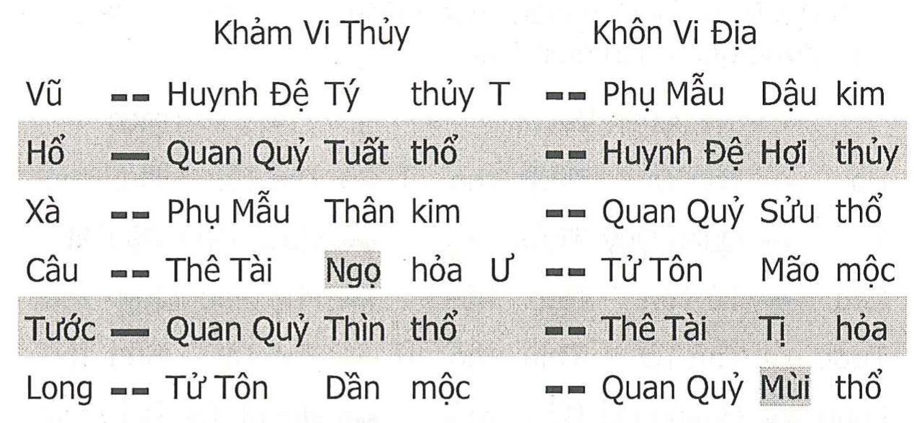
    - **Hình này chứng minh điều gì**
      - Làm sáng tỏ diễn biến cát hung và quy luật ứng nghiệm của Khảm Vi Thủy biến Khôn Vi Địa đối với sự việc được hỏi.
    - **Từ đâu mà thấy được**
      - Căn cứ Thời gian lập quẻ: Ngày Mậu Thìn tháng Ngọ; Dụng thần làm chủ định cát hung. Nhìn vào biến quẻ bát thuần.

- Quái lệ dự đoán thực tế cho Khôn Vi Địa biến Tốn Vi Phong:
  - **Hình 224.** Khôn Vi Địa biến Tốn Vi Phong
    - 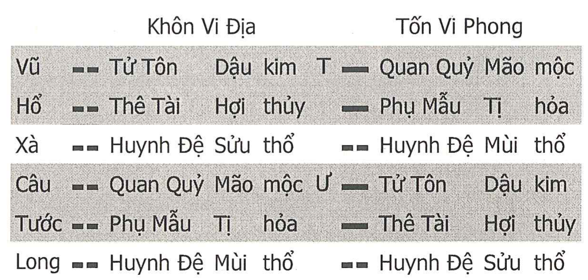
    - **Hình này chứng minh điều gì**
      - Làm sáng tỏ diễn biến cát hung và quy luật ứng nghiệm của Khôn Vi Địa biến Tốn Vi Phong đối với sự việc được hỏi.
    - **Từ đâu mà thấy được**
      - Căn cứ Thời gian lập quẻ: Ngày Mậu Thìn tháng Ngọ; Dụng thần làm chủ định cát hung. Nhìn vào biến quẻ bát thuần.

- Quái lệ thực tế:
  - Bối cảnh: **Ví dụ 9:** Ngày Quý Dậu tháng Dần, chiêm bệnh của con trai trưởng, được quẻ Chấn biến Đoài.

- Luận điểm phân tích:
  - Đây chẳng phải Chấn mộc hóa Đoài kim hồi đầu khắc ư? Quẻ này lại không thấy rằng, thổ bị mộc khắc, mộc bị kim thương, lấy Chấn làm trưởng nam, chiêm con trai trưởng do đó không cát. Nào ngờ quẻ biến hồi đầu tới khắc, thiếu nữ (con gái út) cũng khó giữ, nay lấy chiêm nghiệm của những quẻ này mà nói những sai lầm trong đó.

- Quái lệ dự đoán thực tế cho Chấn Vi Lôi biến Đoài Vi Trạch:
  - **Hình 225.** Chấn Vi Lôi biến Đoài Vi Trạch
    - 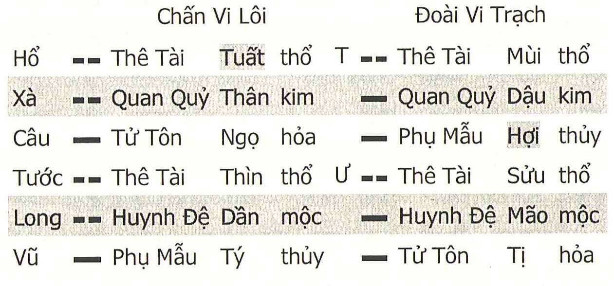
    - **Hình này chứng minh điều gì**
      - Làm sáng tỏ diễn biến cát hung và quy luật ứng nghiệm của Chấn Vi Lôi biến Đoài Vi Trạch đối với sự việc được hỏi.
    - **Từ đâu mà thấy được**
      - Căn cứ Thời gian lập quẻ: Ngày Mậu Thìn tháng Ngọ; Dụng thần làm chủ định cát hung. Nhìn vào biến quẻ bát thuần.

- Luận điểm phân tích:
  - 1. Tăng San Bốc Dịch Bình Thích
2. Lục Hào Tật Bệnh Dự Trắc Học
3. Lục Hào Nhân Duyên Dự Trắc Học
4. Lục Hào Xu Cát Tị Hung Hóa Giải Bí Truyền
5. Lục Hào Phong Thủy Dự Trắc Học
6. Lục Hào Kinh Tế Dự Trắc Học
7. Tế Thuyết Lục Hào Dự Trắc Học
8. Lục Hào Quái Lệ Thuyết Chân
9. Lục Hào Quái Tượng Giải Mật
10. Lục Hào Nghi Hoặc Chỉ Mê
11. Lục Hào Dự Trắc Ngộ Trung Ngộ
12. Dịch Hồn – Bát Quái Tượng Số Dự Trắc Pháp
13. Giáo Trình Tượng Đoán Lục Hào Sơ Cấp

- Luận điểm phân tích:
  - LOIHOAPHONG.COM

- Luận điểm phân tích:
  - ---

- Luận điểm phân tích:
  - ☯ Lục Hào Nghi Hoặc Chỉ Mê

- Luận điểm phân tích:
  - Vương Hổ Ứng

- Luận điểm phân tích:
  - ---

- Luận điểm phân tích:
  - ● Lục Hào Cổ Pháp Dự Trắc Học ●

- Luận điểm phân tích:
  - LOIHOAPHONG.COM

- Luận điểm phân tích:
  - **Tìm đọc:**

- Luận điểm phân tích:
  - 1. Tăng San Bốc Dịch Bình Thích
2. Lục Hào Tật Bệnh Dự Trắc Học
3. Lục Hào Nhân Duyên Dự Trắc Học
4. Lục Hào Xu Cát Tị Hung Hóa Giải Bí Truyền
5. Lục Hào Phong Thủy Dự Trắc Học
6. Lục Hào Kinh Tế Dự Trắc Học
7. Tế Thuyết Lục Hào Dự Trắc Học
8. Lục Hào Quái Lệ Thuyết Chân
9. Lục Hào Quái Tượng Giải Mật
10. Lục Hào Nghi Hoặc Chỉ Mê
11. Lục Hào Dự Trắc Ngộ Trung Ngộ
12. Dịch Hồn – Bát Quái Tượng Số Dự Trắc Pháp
13. Giáo Trình Tượng Đoán Lục Hào Sơ Cấp

- Luận điểm phân tích:
  - LOIHOAPHONG.COM
