# Lục Hào Nhân Duyên Dự Trắc Học

## LỜI TỰA

### Tầm quan trọng của hôn nhân và gia đình trong xã hội

- **Gia đình là nền tảng cơ bản của xã hội:**
  - Gia đình chính là đơn vị cấu thành cơ bản nhất của xã hội; từng gia đình riêng lẻ tập hợp và tạo dựng nên toàn bộ cấu trúc xã hội loài người.
  - Hôn nhân đóng vai trò là sợi dây gắn kết cốt lõi, giữ vai trò duy trì sự tồn tại, gắn bó và phát triển bền vững của mỗi gia đình.

- **Quy luật âm dương và sự hình thành tổ ấm:**
  - Cổ nhân đúc kết: *"Cô âm bất sinh, cô dương bất trường"* (âm đơn độc không thể sinh sôi, dương lẻ loi không thể phát triển).
  - Khi một người trưởng thành, việc đi tìm nửa kia của bản thân để thông qua hôn nhân xây dựng tổ ấm riêng là quy luật tất yếu, đóng vai trò then chốt trong tiến trình phát triển và tiếp nối của nhân loại.

- **Vị thế hôn nhân trong văn hóa truyền thống:**
  - Từ xưa đến nay, trong văn hóa truyền thống phương Đông nói chung và Trung Quốc nói riêng, hôn nhân luôn được tôn vinh là *"chung thân đại sự"* (việc lớn của cả một đời người), chiếm vị trí tối quan trọng trong tư tưởng và tâm thức dân gian.
  - Hôn nhân thời xưa chủ yếu dựa trên *"ý cha mẹ, lời mối mai"*, chịu sự ước thúc và khuôn phép chặt chẽ của luân lý đạo đức truyền thống (tam cương ngũ thường), nhờ vậy cấu trúc hôn nhân giữ được sự ổn định tương đối cao.

- **Biến thiên thời đại và những thách thức mới:**
  - Cùng với sự phát triển hiện đại và sự du nhập của các luồng tư tưởng phương Tây, hệ thống giá trị và quan niệm về tình cảm, hôn nhân đang trải qua những biến đổi sâu sắc và thầm lặng.
  - Tính ràng buộc truyền thống dần suy giảm, kéo theo thực trạng tỷ lệ ly hôn ngày càng gia tăng rõ rệt qua từng năm.

---

### Vai trò và giá trị của Lục Hào Dự Trắc Học đối với nhân duyên

- **Thực trạng bất hạnh hôn nhân và nhu cầu xã hội:**
  - Hôn nhân mỹ mãn là nền tảng vững chắc bảo đảm cho gia đình ấm êm hạnh phúc, là ước muốn cháy bỏng của mỗi cá nhân.
  - Tuy nhiên trên thực tế, không phải ai cũng đạt được sở nguyện; những bi kịch, đổ vỡ và bất hạnh trong đời sống hôn nhân xuất hiện ở khắp mọi nơi.
  - Trong suốt quá trình thực hành dự đoán thực tế của tác giả Vương Hổ Ứng, số lượng thân chủ tìm đến xin xem quẻ về nhân duyên, tình duyên chiếm một tỷ trọng rất lớn. Điều này phản ánh rõ mức độ quan tâm sâu sắc của con người đối với hạnh phúc lứa đôi cũng như tính chất phức tạp, trắc trở của vấn đề tình cảm đời sống.

- **Căn nguyên của bất hạnh và sự cần thiết của việc thấu suốt tương lai:**
  - Tác giả khẳng định: *"Một kết quả bất hạnh, chắc chắn là bắt nguồn từ một sai lầm khởi đầu."*
  - Nếu ngay từ lúc khởi sự không nhận định thấu đáo bản chất đối phương và xu thế phát triển của mối quan hệ, đương số rất dễ bước vào vết xe đổ sai lầm khó cứu vãn.

- **Cơ chế dự đoán vượt không - thời gian của Lục Hào:**
  - Bắt nguồn từ nền tảng nguyên lý Dịch học nghìn năm, Lục Hào dự đoán học sở hữu cơ chế dự báo vượt thời gian và không gian, phản ánh một cách hoàn toàn khách quan tiến trình phát sinh, biến đổi và kết cục cuối cùng của nhân duyên.
  - Phương pháp này không mang tính mê tín suy đoán viển vông, mà cung cấp những cơ sở tham chiếu khách quan, chuẩn xác và vô cùng giá trị, giúp con người có được định hướng đúng đắn trong việc lựa chọn người bạn đời và quản trị hạnh phúc gia đình.

---

### Đóng góp thực tiễn và định hướng phát triển của tác giả

- **Tổng kết quy luật và phương pháp luận mới:**
  - Qua nhiều năm miệt mài nghiên cứu và thực hành quẻ dịch thực tiễn, tác giả đã phát hiện và đúc kết được rất nhiều quy luật, kỹ pháp tinh vi trong lĩnh vực dự đoán nhân duyên bằng Lục Hào.
  - Các kỹ pháp này giúp định vị chi tiết tính cách, hoàn cảnh gia đình, tình trạng hôn nhân thực tế, tiền sử tình cảm, nguy cơ chia tay hay cơ duyên hòa hợp.

- **Đính chính những sai lầm của cổ nhân:**
  - Tác giả thẳng thắn chỉ ra và đính chính những nhận thức phiến diện, sai lầm hoặc giáo điều của người xưa về mặt dự đoán hôn nhân, giúp học thuyết thích ứng hoàn hảo với các tình huống xã hội hiện đại.

- **Kêu gọi nghiên cứu vì hạnh phúc xã hội:**
  - Trước kho tàng Dịch học uyên thâm, tác giả khiêm tốn nhận định vẫn còn rất nhiều phương diện cần tiếp tục đào sâu nghiên cứu.
  - Tác giả tha thiết kêu gọi những bậc thức giả có cùng chí hướng hãy cùng gia nhập đội ngũ nghiên cứu Lục Hào dự đoán học, chung tay phát huy di sản học thuật nghìn năm để góp phần xây dựng từng gia đình ấm êm và thúc đẩy một xã hội ngày càng hài hòa, thịnh vượng.

- **Tác giả:** Vương Hổ Ứng.

## PHẦN CƠ SỞ

### CHƯƠNG 1: DỤNG THẦN

#### 1. Nguyên tắc xác định Dụng thần trong dự đoán hôn nhân

- **Xác định Dụng thần theo giới tính đương số và mục đích dự đoán:**
  - Nam tự dự đoán hôn nhân: Lấy hào Thê Tài làm Dụng thần. Thê Tài đại diện cho vợ, người yêu hoặc đối tượng muốn kết hôn.
  - Nữ tự dự đoán hôn nhân: Lấy hào Quan Quỷ làm Dụng thần. Quan Quỷ đại diện cho chồng, bạn trai hoặc đối tượng hôn phối.
  - Hào Ứng: Luôn đại diện cho đối phương cùng gia đình, hoàn cảnh, bối cảnh gia đình của đối phương.
  - Trường hợp người thân, bạn bè hỏi thay:
    - Đại diện cho phía nhà trai (cha mẹ, người nhà, bạn bè của người nam) đến xem: Lấy hào Thê Tài làm Dụng thần.
    - Đại diện cho phía nhà gái (cha mẹ, người nhà, bạn bè của người nữ) đến xem: Lấy hào Quan Quỷ làm Dụng thần.
  - Dự đoán hôn nhân của cha mẹ: Lấy hào Phụ Mẫu làm Dụng thần.
  - Dự đoán chuyện ngoại tình, tình cảm ngoài luồng: Vẫn căn cứ theo giới tính, nam lấy Thê Tài làm Dụng thần, nữ lấy Quan Quỷ làm Dụng thần.
  - Dự đoán thăm dò về một cá nhân cụ thể: Nếu chỉ hỏi thăm dò thông tin, tính tình, tình trạng cá nhân của đối phương mà không hỏi xem bản thân mình và họ có thành đôi hay không, quy ước lấy hào Thế làm Dụng thần đại diện cho người đó (không xét Thê Tài hay Quan Quỷ).

- **Xác định Dụng thần cho các sự vụ và đối tượng phụ trợ:**
  - Giấy chứng nhận kết hôn (hôn thư, pháp lý ràng buộc): Lấy hào Phụ Mẫu làm Dụng thần.
  - Người làm mối, môi giới hôn nhân: Lấy hào Ứng làm Dụng thần.
  - Hoàn cảnh sống và thái độ của gia đình đối phương: Lấy hào Ứng làm Dụng thần.

- **Quy luật vượng suy và biến hóa cát hung của Dụng thần:**
  - Dụng thần nên vượng tướng: Được Nhật kiến, Nguyệt lệnh tương sinh tương trợ (sinh phù), được hào động sinh trợ, hoặc động hóa hồi đầu sinh là điềm cát lành, hôn sự dễ thành.
  - Phân tích Kỵ thần phát động: Cần xét thực lực vượng suy của Kỵ thần. Nếu Kỵ thần hưu tù vô khí thì sự trở ngại chỉ mang tính chất tạm thời; đợi đến khi Kỵ thần bị chế phục hoặc suy kiệt thì sự việc sẽ có chuyển biến tốt đẹp.
  - Cấm kỵ Dụng thần quá vượng: Dụng thần nếu quá vượng sẽ phạm vào quy luật "vật cực tất phản", là thông tin bất lợi báo trước sự biến đổi xấu trong hôn nhân.

#### 2. Các quái lệ thực tế minh họa phương pháp luận Dụng thần

- **Ví dụ 1:** Ngày Tân Sửu tháng Tị năm Ất Dậu, mẹ dự đoán hôn sự cho con gái, được quẻ Địa Sơn Khiêm biến Địa Thủy Sư (Tuần không: Thìn, Tị).
  - **Hình 2.** Quẻ Địa Sơn Khiêm biến Địa Thủy Sư
    - 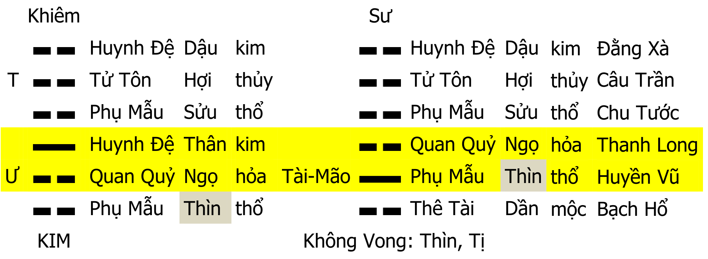
    - **Hình này chứng minh điều gì**
      - Quan Quỷ vượng tướng chứng minh hôn sự có thể thành; Phục thần Thê Tài cùng biến hào Phụ Mẫu Tuần Không chứng minh bạn trai đã có vợ nhưng sắp ly hôn; hào Thế Tử Tôn bị Nguyệt phá chỉ rõ con gái mất trinh năm Tân Tị.
    - **Từ đâu mà thấy được**
      - Quan Quỷ Ngọ hỏa hào 2 được Nguyệt Tị hỏa phù trợ, động hóa Phụ Mẫu Thìn thổ Không Vong; dưới Dụng thần phục Thê Tài Mão mộc; Thế hào Tử Tôn Hợi thủy bị Nguyệt kiến Tị hỏa xung phá.
  - **Phán đoán chi tiết:**
    - Căn cứ: Người mẹ đại diện cho bên nhà gái hỏi việc hôn nhân của con gái, vì vậy quy tắc lấy Quan Quỷ làm Dụng thần. Xét thấy Quan Quỷ Ngọ hỏa tại hào 2 được Nguyệt lệnh Tị hỏa đồng hành phù trợ nên vượng tướng hữu khí, chủ về hôn sự có cơ sở tiến triển thành công.
    - Nhìn vào:
      - Tình trạng hôn nhân của người nam: Dưới Dụng thần Quan Quỷ Ngọ hỏa có Phục thần Thê Tài Mão mộc ẩn tàng, báo hiệu đối phương hiện đang có bạn gái hoặc đã có gia đình riêng. Mặt khác, Quan Quỷ động hóa Phụ Mẫu Thìn thổ; Phụ Mẫu tượng trưng cho giấy chứng nhận kết hôn, chứng minh người đàn ông này đã kết hôn hợp pháp. Tuy nhiên, Phụ Mẫu Thìn thổ lâm Tuần Không (tuần Giáp Ngọ tuần không Thìn Tị), điềm báo giấy kết hôn sắp trở nên vô hiệu lực, tức đối phương sắp ly hôn vợ.
      - Chuyện trinh tiết của người con gái: Hào Thế Tử Tôn Hợi thủy đại diện trực tiếp cho người con gái. Tử Tôn Hợi thủy bị Nguyệt kiến Tị hỏa (Quan Quỷ) xung phá thành Nguyệt phá. Trong dự đoán nhân duyên, Quan Quỷ là đàn ông, Quan Quỷ xung phá hào Thế Tử Tôn là tượng người con gái đã thất thân, mất trinh tiết. Quy luật ứng kỳ Nguyệt phá ứng vào năm trị hoặc xung phá, do đó khẳng định con gái đã mất trinh vào năm Tân Tị (2001).
  - **Ứng nghiệm thực tế:**
    - Người mẹ phản hồi quả nhiên người con gái đã mất trinh vào năm Tân Tị (2001). Bạn trai hiện tại của con gái quả thực đang có vợ hợp pháp, và đúng 3 ngày sau khi gieo quẻ, hai vợ chồng người nam đó đã chính thức ký đơn hoàn tất thủ tục ly hôn.

- **Ví dụ 2:** Ngày Đinh Sửu tháng Ngọ, người nữ tự dự đoán hôn nhân của bản thân, được quẻ Phong Lôi Ích biến Hỏa Lôi Phệ Hạp (Tuần không: Thân, Dậu).
  - **Hình 3.** Quẻ Phong Lôi Ích biến Hỏa Lôi Phệ Hạp
    - 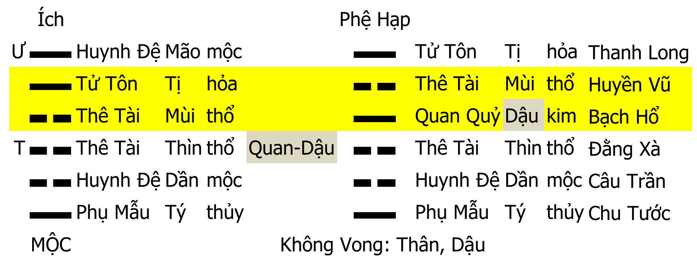
    - **Hình này chứng minh điều gì**
      - Phụ Mẫu Nguyệt phá chứng minh chưa kết hôn; Quan Quỷ phục tàng Không Vong chứng minh đã có bạn trai nhưng người nam lạnh nhạt trốn tránh; hào Thế lâm Đằng Xà và hào 4 động hóa Quan Quỷ chứng minh người nữ phiền não vì xuất hiện người mới.
    - **Từ đâu mà thấy được**
      - Hào sơ Phụ Mẫu Tý thủy bị Nguyệt xung phá; Quan Quỷ Dậu kim Tuần Không phục dưới Thế hào Thê Tài Thìn thổ lâm Đằng Xà; hào 4 Thê Tài Mùi thổ động hóa Quan Quỷ Dậu kim.
  - **Phán đoán chi tiết:**
    - Căn cứ: Nữ tự xem hôn nhân lấy Quan Quỷ làm Dụng thần.
    - Nhìn vào:
      - Hiện trạng hôn nhân và tình cảm hiện tại: Xét thần sát Hương Khuê tại Dần mộc và Mão mộc hưu tù lại nhập Mộ; hào Quan Quỷ không xuất hiện trên quẻ chính mà lâm Tuần Không (tuần Giáp Tuất tuần không Thân Dậu). Hào Phụ Mẫu đại diện cho giấy kết hôn, tại hào sơ Phụ Mẫu Tý thủy bị Nguyệt kiến Ngọ hỏa xung phá (Nguyệt phá), thuyết minh đương số chưa từng đăng ký kết hôn. Tuy nhiên, Phục thần Quan Quỷ Dậu kim lại phục tàng dưới hào Thế Thê Tài Thìn thổ, cho thấy cô gái trên thực tế đã có bạn trai.
      - Thái độ của người bạn trai: Hào Thế Thê Tài Thìn thổ sinh Dụng thần Quan Quỷ Dậu kim, nhưng Dậu kim lâm Tuần Không nên không thể nhận được sự tương sinh, vả lại bản thân đang phục tàng biểu thị tâm lý né tránh, trốn chạy. Điều này chứng minh người nam có thái độ không tích cực, lạnh nhạt và không mặn mà đón nhận tình yêu của cô.
      - Tâm trạng bế tắc và người mới xuất hiện: Hào Thế lâm Đằng Xà, Đằng Xà chủ về trăn trở, kinh sợ, phiền não bất an, cho thấy tâm trạng cô đang rơi vào khủng hoảng, dày vò. Đồng thời, hào 4 Thê Tài Mùi thổ phát động hóa ra Quan Quỷ Dậu kim, báo hiệu hiện tại lại xuất hiện thêm một người đàn ông khác bước vào đời cô, khiến cô rơi vào hoàn cảnh phân vân, do dự không biết xử trí ra sao.
  - **Ứng nghiệm thực tế:**
    - Cô gái xác nhận thực tế diễn ra hoàn toàn chính xác như lời phán đoán: Cô đã có bạn trai nhưng anh ta đối xử vô cùng hời hợt, né tránh trách nhiệm, cùng lúc đó lại có một người đàn ông khác nhiệt tình theo đuổi khiến tâm trạng cô vô cùng bối rối và phiền muộn.

- **Ví dụ 3:** Ngày Mậu Tuất tháng Dậu, nam dự đoán hôn nhân cho cháu gái, được quẻ Sơn Thiên Đại Súc biến Hỏa Lôi Phệ Hạp (Tuần không: Thìn, Tị).
  - **Phán đoán chi tiết:**
    - Căn cứ: Xem hôn nhân cho phái nữ lấy Quan Quỷ làm Dụng thần. Trong quẻ Quan Quỷ xuất hiện hai lần (hào 2 và hào 6), theo nguyên tắc chọn Dụng thần trong Lục Hào, khi Dụng thần lưỡng hiện thì ưu tiên chọn hào phát động làm Dụng thần. Tại đây, hào 2 Quan Quỷ Dần mộc phát động trì Thế nên được chọn làm Dụng thần chủ chốt.
    - Nhìn vào:
      - Tình trạng chung sống không hôn thú: Quan Quỷ phát động trì Thế biểu thị người cháu gái hiện đã có bạn trai kề cận. Hào Phụ Mẫu đại diện cho hôn thư, giấy kết hôn; trong quẻ Phụ Mẫu Ngọ hỏa phục tàng dưới hào Thế Dần mộc, lại nhập Mộ tại Nhật kiến Tuất thổ và hào 4 Huynh Đệ Tuất thổ lâm Huyền Vũ. Hào Phụ Mẫu vừa phục tàng vừa nhập Mộ biểu thị mối quan hệ hôn nhân không thể công khai với pháp luật và xã hội; Huyền Vũ lại chủ về sự che giấu, lén lút, từ đó khẳng định hai người chưa hề đăng ký kết hôn nhưng đã dọn về ăn ở chung với nhau như vợ chồng.
      - Chiều hướng tương lai của mối quan hệ: Dụng thần Quan Quỷ Dần mộc lâm mùa thu tháng Dậu bị Nguyệt kiến khắc chế nên hưu tù suy kiệt; nội quái lại rơi vào cảnh phục ngâm, biểu thị nội tâm và gia đạo luôn dằn vặt, bất an, hai người tính cách xung khắc dữ dội, không thể dung hòa hay duy trì tình cảm lâu dài.
  - **Ứng nghiệm thực tế:**
    - Người hỏi thừa nhận quả nhiên hai người đang sống chung với nhau mà không có hôn thú, nhưng cả hai bất hòa gay gắt, không thể nói chuyện hay thấu hiểu nhau, về sau đã chính thức chia tay giải thoát cho nhau.

- **Ví dụ 4:** Ngày Giáp Thìn tháng Dậu, người nữ tự dự đoán việc ly hôn với chồng, được quẻ Hỏa Sơn Lữ biến Hỏa Địa Tấn (Tuần không: Dần, Mão).
  - **Phán đoán chi tiết:**
    - Căn cứ: Nữ hỏi việc ly hôn với chồng thì chồng vẫn là Quan Quỷ, lấy Quan Quỷ làm Dụng thần. Trong quẻ chính Quan Quỷ không hiện, phục tàng dưới hào 3 Thê Tài Thân kim là Quan Quỷ Hợi thủy.
    - Nhìn vào:
      - Hiện tượng chồng ngoại tình và bỏ bê gia đình: Quan Quỷ Hợi thủy phục tàng không xuất đầu lộ diện, biểu thị người chồng thường xuyên vắng nhà, không chịu về sum họp gia đình. Phi thần Thê Tài Thân kim tại hào 3 độc phát (chỉ có duy nhất một hào động trong quẻ), trong Lục Hào Thê Tài là phụ nữ, hào 3 là hào vị của giường chiếu (sàng vị); Thê Tài tại sàng vị phát động tương sinh cho Dụng thần Quan Quỷ Hợi thủy, chỉ rõ người chồng đã có phụ nữ khác bên ngoài và có quan hệ xác thịt vụng trộm. Thê Tài Thân kim động hóa Phụ Mẫu Mão mộc lâm Tuần Không (tuần Giáp Thìn tuần không Dần Mão), Phụ Mẫu là giấy kết hôn, giấy kết hôn lâm Không chứng minh người phụ nữ ngoại tình kia là một người đã ly hôn chồng.
      - Khả năng giải quyết việc ly hôn: Hào Thế lâm Tử Tôn Thìn thổ (Tử Tôn là Kỵ thần chuyên khắc chế Quan Quỷ), biểu thị ý chí chủ quan của người vợ rất cương quyết, bản thân tha thiết muốn ly hôn dứt khoát với chồng. Tuy nhiên, Dụng thần Quan Quỷ Hợi thủy được Nguyệt kiến Dậu kim tương sinh, lại được hào động Thê Tài Thân kim sinh phù mạnh mẽ nên vượng tướng hữu khí. Dụng thần vượng tướng thì duyên nợ chưa thể đứt đoạn, do đó vụ ly hôn không thể tiến hành thành công.
  - **Ứng nghiệm thực tế:**
    - Kết quả người phụ nữ dù uất ức và tìm mọi cách đưa đơn nhưng rốt cuộc người chồng không chấp thuận, thủ tục bế tắc và cô vẫn không thể ly hôn được.

- **Ví dụ 5:** Ngày Giáp Dần tháng Dần, người nữ hỏi: "Mối quan hệ với người đàn ông này sẽ phát triển ra sao?", được quẻ Hỏa Phong Đỉnh biến Lôi Phong Hằng (Tuần không: Tý, Sửu).
  - **Phán đoán chi tiết:**
    - Căn cứ: Nữ đoán mối quan hệ với nam giới lấy Quan Quỷ làm Dụng thần.
    - Nhìn vào:
      - Bản chất mối quan hệ sống chung mờ ám: Quan Quỷ Hợi thủy trì Thế, chứng tỏ hai người đã sớm gắn bó khăng khít, trên thực tế đã về ở cùng nhau. Hào 6 Huynh Đệ Tị hỏa lâm Huyền Vũ độc phát, theo nguyên lý giải quẻ "độc phát biểu thị tính chất của sự việc", Huyền Vũ chủ về sự ám muội, khuất tất, lén lút, kết hợp lại chỉ rõ đây là mối quan hệ sống thử, sống chung trong bóng tối, không được thừa nhận danh chính ngôn thuận.
      - Tình trạng gia đình của người đàn ông: Dụng thần Quan Quỷ Hợi thủy tương hợp với Nhật kiến Dần mộc (Dần Hợi lục hợp). Trong quẻ Hỏa Phong Đỉnh (thuộc cung Càn hoặc quẻ hành Hỏa), Dần mộc đóng vai trò là hào Phụ Mẫu đại diện cho giấy đăng ký kết hôn; Quan Quỷ hợp với Phụ Mẫu chứng minh người đàn ông này trên thực tế đã có vợ hợp pháp.
      - Hạn định kết thúc mối quan hệ: Lấy tượng hào độc phát làm chủ, hào 6 Tị hỏa phát động tuyệt tại Hợi thủy (Dụng thần trì Thế lâm Tuyệt địa độc phát), biểu thị sự việc đi vào ngõ cụt, quan hệ bế tắc không thể kéo dài.
  - **Ứng nghiệm thực tế:**
    - Quả nhiên người đàn ông kia đã có gia đình vợ con đề huề từ trước. Mối quan hệ lén lút này không duy trì được bao lâu, đến ngày Kỷ Mão ngay trong tháng Dần đó, mâu thuẫn bùng phát và hai người chính thức chia tay dứt khoát.

- **Ví dụ 6:** Ngày Canh Thân tháng Dần, nam dự đoán hôn nhân cho một người bạn học nữ, được quẻ Hỏa Thiên Đại Hữu (Tuần không: Tý, Sửu).
  - **Phán đoán chi tiết:**
    - Căn cứ: Hỏi cho phái nữ thì lấy Quan Quỷ làm Dụng thần đại diện cho người chồng của cô bạn. Hào Thế Phụ Mẫu Thìn thổ được quy ước đại diện cho chính người bạn học nữ (người được hỏi thay).
    - Nhìn vào:
      - Nguồn gốc mối quan hệ quen biết: Hào Thế là Phụ Mẫu Thìn thổ, hào Ứng là Quan Quỷ Tị hỏa; hai hào này đồng vị tại cung Tốn (theo nạp giáp bát quái), vì vậy phán đoán người hỏi và cô bạn học nếu không phải là người bà con thân thích thì chắc chắn là bạn học đồng môn từ xưa.
      - Chuyện ngoại tình của cả hai vợ chồng: Dụng thần Quan Quỷ Tị hỏa tương hợp với Nhật kiến Canh Thân (Tị Thân lục hợp), Nhật kiến là Huynh Đệ đại diện cho người khác, biểu thị người chồng đang có quan hệ tình cảm mờ ám bên ngoài với một phụ nữ khác. Dù vậy, Quan Quỷ Tị hỏa lại tương sinh cho hào Thế Thìn thổ, chứng tỏ trong thâm tâm người chồng vẫn còn nặng tình, yêu thương và muốn gìn giữ gia đình với cô bạn. Ngược lại, xét về phía người bạn học nữ, hào Thế Thìn thổ lại tương hợp với hào 4 Huynh Đệ Dậu kim (Thìn Dậu lục hợp), chứng minh bản thân cô bạn học này cũng đang có mối quan hệ ngoại tình bên ngoài.
      - Kết quả việc ly hôn: Dụng thần Quan Quỷ Tị hỏa được Nguyệt kiến Dần mộc tương sinh là vượng tướng, lại tương sinh chặt chẽ cho hào Thế Thìn thổ, tình nghĩa chưa dứt nên hai người không thể ly hôn.
  - **Ứng nghiệm thực tế:**
    - Người hỏi phản hồi quả nhiên cả hai vợ chồng cô bạn đều đang ngoại tình song song. Cô bạn học vì chán chường nên rất muốn ly hôn, nhưng người chồng nhất quyết níu kéo không chịu buông tay, hôn nhân không thể giải quyết ly dị.

- **Ví dụ 7:** Ngày Đinh Mão tháng Dần, người nữ tự dự đoán việc làm thủ tục đăng ký kết hôn (lấy giấy kết hôn), được quẻ Lôi Phong Hằng biến Sơn Phong Cổ (Tuần không: Tuất, Hợi).
  - **Hình 4.** Sơ đồ quẻ Lôi Phong Hằng biến Sơn Phong Cổ
    - 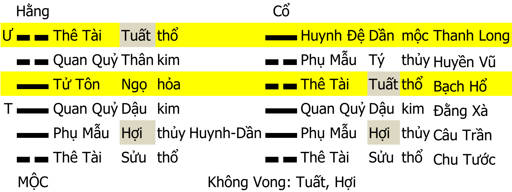
    - **Hình này chứng minh điều gì**
      - Quan Quỷ Nguyệt phá bị tam hợp Tử Tôn cục khắc chứng minh hôn sự tan vỡ, không thể làm giấy kết hôn; Bạch Hổ Tử Tôn cực vượng động hóa Tuất thổ chứng minh đương số mắc bệnh hiểm nghèo và qua đời vào hạn Ngọ hỏa, Tuất thổ.
    - **Từ đâu mà thấy được**
      - Hào 5 Quan Quỷ Thân kim bị Nguyệt phá; Hào 4 Tử Tôn Ngọ hỏa lâm Bạch Hổ động hợp Dần Ngọ Tuất Hỏa cục khắc Quan Quỷ Thân kim và hào Thế Dậu kim; Phụ Mẫu Hợi thủy Tuần Không bị Ứng hào Tuất thổ khắc; ứng nghiệm tử vong năm Nhâm Ngọ tháng Tuất.
  - **Phán đoán chi tiết:**
    - Căn cứ: Đương số hỏi về việc làm giấy đăng ký kết hôn, thông thường Phụ Mẫu là giấy tờ hôn thư, nhưng gốc rễ của hôn nhân có thành tựu để đi đến hôn thư hay không bắt buộc phải lấy hào Quan Quỷ làm Dụng thần. Quẻ xuất hiện hai hào Quan Quỷ (hào 3 Quan Quỷ Dậu kim trì Thế và hào 5 Quan Quỷ Thân kim), theo phép chọn Dụng thần ưu tiên chọn hào bị thương tổn, lấy Quan Quỷ Thân kim tại hào 5 bị Nguyệt kiến Dần mộc xung phá (Nguyệt phá) làm Dụng thần.
    - Nhìn vào:
      - Việc đăng ký kết hôn bất thành: Quan Quỷ Thân kim bị Nguyệt phá, lại không được Nhật kiến Mão mộc sinh trợ nên rơi vào cảnh hưu tù suy kiệt cực độ. Trong quẻ, hào 4 Tử Tôn Ngọ hỏa phát động, kết hợp với Nguyệt kiến Dần mộc và hào biến Thê Tài Tuất thổ tạo thành thế tam hợp Dần - Ngọ - Tuất Hỏa cục (Tử Tôn cục). Hỏa cục cực vượng dồn lực khắc sát trực tiếp vào Dụng thần Quan Quỷ Kim, do đó việc hôn nhân chắc chắn thất bại, hoàn toàn không thể lấy được giấy chứng nhận kết hôn. Thêm vào đó, hào Phụ Mẫu Hợi thủy lâm Tuần Không, lại bị hào Ứng Thê Tài Tuất thổ khắc hãm; hào Ứng đại diện cho đối phương, chứng tỏ chính người bạn trai là bên thoái thác, không muốn kết hôn.
      - Họa sát thân và ác tật hiểm nghèo: Tam hợp Tử Tôn Hỏa cục phát động không những khắc sát Dụng thần Quan Quỷ Thân kim mà còn khắc liệt hào Thế Quan Quỷ Dậu kim. Hào 4 Tử Tôn Ngọ hỏa lại lâm Bạch Hổ; trong Dịch học, Bạch Hổ chủ về ác tật, bệnh tật hiểm nghèo và tai nạn huyết quang đổ máu dữ dội, là điềm báo đương số sắp gặp đại họa sinh tử khôn lường.
      - Ứng kỳ hung họa: Hào 4 Tử Tôn Ngọ hỏa động hóa Thê Tài Tuất thổ lâm Tuần Không, quy luật khi xuất Không (tháng Tuất, năm Tuất) thì sức sát thương sẽ phát tác mãnh liệt. Hơn nữa, Tử Tôn Ngọ hỏa đến năm 2002 (năm Nhâm Ngọ) sẽ trực tiếp lâm Thái Tuế, kích hoạt toàn bộ hung sát của quẻ, vì thế năm 2002 là cửa ải sinh tử đại nạn không thể xem nhẹ.
  - **Ứng nghiệm thực tế:**
    - Kết cục bi thảm diễn ra đúng như dự báo: Người nữ không những hôn sự tan vỡ hoàn toàn, mà đến tháng Tuất năm Tân Tị (2001) cô bất ngờ phát hiện bị ung thư cổ tử cung giai đoạn nặng. Dù gia đình đã dốc sức chạy chữa qua nhiều bệnh viện nhưng bệnh tình vô phương cứu chữa, cuối cùng cô đã qua đời vào đúng tháng Tuất năm Nhâm Ngọ (2002).

- **Ví dụ 8:** Ngày Bính Ngọ tháng Thìn, người nam dự đoán tình hình tổng quát của một người phụ nữ 31 tuổi, được quẻ Sơn Thủy Mông (Tuần không: Dần, Mão).
  - **Hình 5.** Sơ đồ quẻ Sơn Thủy Mông
    - 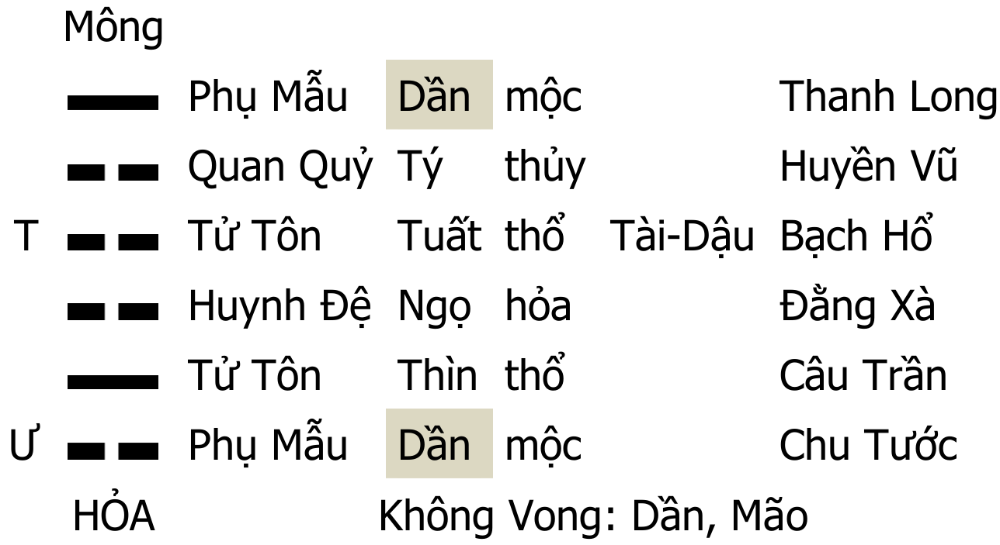
    - **Hình này chứng minh điều gì**
      - Thế hào Tuất thổ lâm Bạch Hổ chứng minh tính nóng, người mập; Ứng hào Phụ Mẫu Dần mộc xuất Không năm Mậu Dần chứng minh năm 1998 kết hôn; Tử Tôn Nguyệt phá lâm Bạch Hổ chứng minh từng lưu sản; Kỷ Mão hợp phá chứng minh năm 1999 sinh con và ly thân.
    - **Từ đâu mà thấy được**
      - Hào 4 Tử Tôn Tuất thổ trì Thế lâm Bạch Hổ bị Nguyệt kiến Thìn thổ xung phá; Hào sơ Phụ Mẫu Dần mộc Tuần Không; Quan Quỷ Tý thủy hưu tù bị Thế hào Tử Tôn khắc mạnh vào năm Kỷ Mão.
  - **Phán đoán chi tiết:**
    - Căn cứ: Phân định ranh giới chọn Dụng thần trong trường hợp hỏi cho người khác:
      - Nếu hỏi chung về cát hung họa phúc của người ngoài thì lấy hào Ứng làm Dụng thần.
      - Nếu hỏi xem bản thân mình và người phụ nữ đó có khả năng kết duyên hay phát triển tình cảm hay không thì lấy hào Thê Tài làm Dụng thần.
      - Tuy nhiên, trong trường hợp này người hỏi chỉ muốn thăm dò tình hình cá nhân (ngoại hình, tính nết, gia đạo, con cái) của người nữ, vì vậy quy tắc Lục Hào lấy hào Thế làm Dụng thần đại diện cho chính người phụ nữ đó.
    - Nhìn vào:
      - Tính cách và tướng mạo đương số: Hào 4 Tử Tôn Tuất thổ trì Thế lâm Bạch Hổ; Bạch Hổ chủ về nóng nảy, hung hăng, quả quyết, nên người phụ nữ này tính tình rất nóng nảy, bộc trực. Ngũ hành Thổ chủ về dày dặn, đẫy đà, mập mạp, do đó tướng mạo là người mập mạp, béo tốt.
      - Năm kết hôn trong quá khứ: Hào Ứng Phụ Mẫu Dần mộc đại diện cho giấy đăng ký kết hôn, hiện lâm Tuần Không (tuần Giáp Thìn tuần không Dần Mão). Đến năm Mậu Dần (1998), Thái Tuế Dần mộc xuất Không kích hoạt hào Phụ Mẫu, vì vậy xác định cô đã kết hôn vào năm 1998.
      - Tiền sử sảy thai / nạo phá thai (lưu sản): Hào Thế Tử Tôn Tuất thổ bị Nguyệt kiến Thìn thổ xung phá thành Nguyệt phá. Tử Tôn là con cái, lâm Bạch Hổ chủ về máu huyết và sảy thai, lại gặp Nguyệt phá chủ về thương tật, tổn hại huyết nhục, từ đó khẳng định người phụ nữ này trong quá khứ từng bị lưu sản (sảy thai hoặc nạo phá thai - thai kỳ không đủ 28 tuần, thể trọng dưới 1000g).
      - Năm sinh con: Tử Tôn Tuất thổ bị Nguyệt phá thì cần đợi thời điểm hợp phá để phục hồi sinh khí ứng việc sinh nở. Đến năm Kỷ Mão (1999), chi Mão tương hợp với Tuất thổ (Mão Tuất lục hợp để hợp phá), giải tỏa Nguyệt phá, vì vậy đoán định năm 1999 cô sinh con.
      - Tình trạng gia đạo mâu thuẫn và ly thân: Hào Quan Quỷ Tý thủy (tượng người chồng) bị Nguyệt kiến Thìn thổ khắc hãm, lại bị Nhật kiến Ngọ hỏa xung phá nên hưu tù suy kiệt; hào Thế lại là Tử Tôn trì Thế (Tử Tôn là khắc tinh của Quan Quỷ), là điềm báo vợ chồng bất hòa triền miên, hôn nhân lục đục. Vào năm Kỷ Mão (1999), hào Thế Tử Tôn Tuất thổ được hợp phá nên có thêm sức mạnh khắc chế mạnh mẽ Quan Quỷ Tý thủy, vì thế khẳng định bắt đầu từ năm 1999 vợ chồng cô nảy sinh xung đột gay gắt và dẫn đến cảnh ly thân.
  - **Ứng nghiệm thực tế:**
    - Người đàn ông đến xem bói vô cùng thán phục và xác nhận từng chi tiết: Người phụ nữ đó quả thực thân hình rất mập mạp và tính tình cực kỳ nóng nảy; cô kết hôn vào năm 1998; trước đây từng bị lưu sản một lần; đến năm 1999 thì sinh được một người con trai; và cũng chính từ năm 1999 hai vợ chồng xung đột kịch liệt rồi bắt đầu sống ly thân cho đến tận bây giờ.

### CHƯƠNG 2: CÁCH DÙNG HÀO VỊ

#### Tầm quan trọng và phạm vi ứng dụng của hào vị trong dự đoán nhân duyên
- Mặc dù hào vị trong dự đoán hôn nhân không có tần suất ứng dụng bao quát như trong dự đoán bệnh tật (nơi hào vị ứng với từng bộ phận cơ thể) hay dự đoán phong thủy (nơi hào vị ứng với kết cấu nhà cửa), nhưng vẫn là một trong những tầng thông tin tham khảo cốt yếu, không thể tách rời.
- Tác dụng cốt lõi của hào vị trong nhân duyên:
  - Phán đoán nghề nghiệp, lĩnh vực công tác và chức vụ chuyên môn của đương số cũng như đối tượng hôn phối.
  - Phán đoán khoảng cách địa lý, cự ly xa gần, gốc tích xuất thân (người cùng làng xóm, người bản địa, hay người phương xa, tỉnh khác, ngoại quốc).
  - Phán đoán không gian sinh hoạt gia đình, phòng ốc, trạch xá, giường chiếu (hương khuê) và các biến động kín đáo chốn phòng the.
  - Phán đoán mức độ tiến triển của tình cảm, cán cân quyền lực thực tế giữa vợ và chồng trong gia đình (ai làm chủ, ai bị kiểm soát hay lấn át).
  - Phán đoán diện mạo, tướng mạo, phẩm hạnh và các đặc điểm hành vi ứng xử đặc thù.

#### Phân tầng ý nghĩa tượng trưng của lục hào vị
- **Hào sơ (Sơ hào):**
  - Không gian và địa lý: Đất đai, nền móng, cơ sở sở tại, nông thôn, địa bàn bản xứ.
  - Quan hệ xã hội và gia đạo: Hàng xóm láng giềng, thường dân, cá nhân, con cái thế hệ sau (đời sau).
  - Tiến trình thời gian và trạng thái: Bước đầu khởi điểm, vừa mới bắt đầu, thời kỳ sơ khai của mối quan hệ tình cảm.
  - Bộ phận cơ thể: Bàn chân, gót chân, phần dưới cùng của thân thể.
- **Hào 2 (Nhị hào):**
  - Gia đạo và hôn nhân: Hào vị phu thê (vợ chồng), biểu thị vị thế, phẩm chất và trách nhiệm của người bạn đời trong tổ ấm.
  - Không gian sinh sống: Trạch xá (nhà ở), nơi cư trú, bên trong gian nhà, quê quán gốc gác, văn phòng làm việc nội bộ.
  - Bộ phận cơ thể: Bắp chân, đầu gối, vùng bụng, dạ dày.
- **Hào 3 (Tam hào):**
  - Chức năng và nghề nghiệp: Kế toán, thủ quỹ, tài chính, kiểm ngân, người quản lý xuất nhập, bộ phận giữ cửa.
  - Không gian nội thất: Cửa ngõ then chốt, cửa phòng, giường ngủ, phòng riêng, lối ra vào.
  - Quan hệ xã hội: Người đồng hương, bạn bè lối xóm.
  - Ý nghĩa đặc thù trong nhân duyên: Hào 3 là vị trí Hương Khuê (phòng khuê, giường chiếu); trạng thái Không Vong hoặc động hóa của hào 3 phản ánh trực tiếp sự trống trải phòng the, việc dựng thêm giường chiếu ngoài luồng hoặc chung chạ bất chính.
- **Hào 4 (Tứ hào):**
  - Không gian và cự ly: Ngoại ô, bên ngoài nhà ở, nơi khác, phương xa lân cận.
  - Quan hệ xã hội: Người đồng hương sinh sống ở phương khác, đối tượng đến từ bên ngoài ranh giới gia đình.
  - Cấu trúc kiến trúc: Bậc cửa ngoài, cửa lớn thông ra bên ngoài, hành lang kết nối.
- **Hào 5 (Ngũ hào):**
  - Vị thế quyền lực: Tôn vị, quân vị, cương vị lãnh đạo, thủ trưởng, cán bộ trọng yếu, gia trưởng nắm quyền sinh sát trong nhà.
  - Địa lý và giao thông: Con đường lớn huyết mạch, trục lộ giao thông, thủ đô, thành phố lớn, đô thị trung tâm.
  - Tâm lý và thái độ: Đối tượng nắm quyền quyết định chủ đạo, người được tôn sùng yêu thích hoặc kẻ có xu hướng chuyên quyền, độc đoán, lấn át bạn đời.
- **Hào 6 (Lục hào - Thượng hào):**
  - Cự ly và địa lý: Phương xa xôi, tỉnh ngoài, vùng sâu vùng xa, hải ngoại, ngoại quốc, biên giới ngoài cùng.
  - Trạng thái vận động: Điểm kết thúc, thoái hưu (nghỉ hưu), rút lui khỏi trung tâm quyền lực, không còn can dự vào việc gia đình.
  - Ý nghĩa gia tộc: Đại diện cho quê hương bản quán xa xôi hoặc cha mẹ của đối phương ở vùng miền khác.

#### Nguyên tắc phối hợp biện chứng giữa hào vị, lục thần và thần sát
- Không được câu nệ máy móc vào ý nghĩa đơn lẻ của từng hào vị, mà cần mở rộng phạm vi luận giải phù hợp với bối cảnh thực tế của câu hỏi.
- Luôn kết hợp hào vị với Lục thân (Thê Tài, Quan Quỷ, Tử Tôn, Phụ Mẫu, Huynh Đệ) và Lục thần (Thanh Long, Chu Tước, Câu Trần, Đằng Xà, Bạch Hổ, Huyền Vũ).
- Đối chiếu toàn diện với các trạng thái tương tác nhật nguyệt: Tuần Không, Nguyệt phá, Ám động, Độc phát, Quy vị, Tiến thần, Thoái thần, Hóa Mộ, Hóa Tuyệt, Hóa Sinh, Hóa Khắc.
- Khi các tầng tín hiệu này quy tụ về một hào vị, thông tin dự đoán về tâm tư kín đáo, hành vi ngoài luồng hay biến cố hôn nhân sẽ đạt độ chuẩn xác tuyệt đối.

#### Các quái lệ thực tế ứng dụng hào vị trong dự đoán nhân duyên
- **Ví dụ 1: Ngày Ất Mùi tháng Sửu năm Canh Thìn, nam 29 tuổi đoán khi nào có hôn nhân (Được quẻ Thiên Địa Bĩ)**
  - **Hình 6.** Quẻ Thiên Địa Bĩ
    - 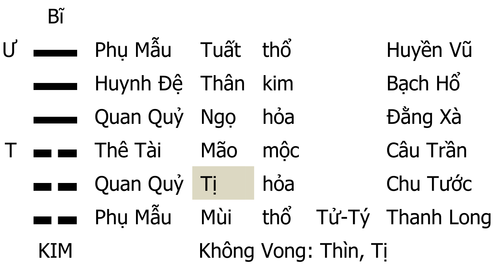
    - **Hình này chứng minh điều gì**
      - Thê Tài Mão mộc tại hào 3 lâm Câu Trần, nhập Mộ tại hào sơ và hợp Phụ Mẫu Tuất thổ ở hào 6.
    - **Từ đâu mà thấy được**
      - Hào 3 chủ cửa ngõ/kế toán, hào sơ bản địa có tài khố, hào 6 chỉ đối phương ở phương xa có hộ khẩu nơi đó.
  - **Phán đoán chi tiết:**
    - Căn cứ: Lấy Thê Tài làm Dụng thần đại diện cho người vợ; hào Phụ Mẫu định ứng kỳ kết hôn; hào vị và lục thần suy ra nghề nghiệp và nguồn gốc xuất thân.
    - Nhìn vào: Thê Tài Mão mộc không được Nhật Nguyệt trợ giúp là hưu tù, lại nhập Mộ tại Nhật kiến Mùi thổ, biểu thị đây là người muộn vợ, lập gia đình trễ.
    - Căn cứ: Quan sát trạng thái của Sàng Trướng (giường chiếu) để định tình trạng hôn nhân hiện tại.
    - Nhìn vào: Sàng Trướng Tử Tôn Tý thủy phục dưới hào sơ Phụ Mẫu Mùi thổ, bị cả Nhật Nguyệt tương khắc thương tổn nặng nề là hưu tù, lại không xuất hiện trên quẻ, khẳng định hiện nay đương số chưa từng kết hôn.
    - Căn cứ: Phụ Mẫu Mùi thổ lâm Nhật kiến, lấy hào Phụ Mẫu (giấy đăng ký kết hôn) để tính toán thời điểm thành gia thất.
    - Nhìn vào: Phụ Mẫu Mùi thổ bị Nguyệt kiến Sửu thổ xung là Nguyệt phá, nguyên tắc giải phá cần hợp phá hoặc thực phá: năm Nhâm Ngọ (2002) Ngọ Mùi tương hợp là hợp phá; năm Quý Mùi (2003) Mùi thổ lâm trị là thực phá, chắc chắn sẽ cưới xin trong hai năm này.
    - Căn cứ: Nghề nghiệp của vợ được nhận định qua hào vị hào 3 và lục thần Câu Trần.
    - Nhìn vào: Thê Tài Mão mộc ngự tại hào 3 lâm Câu Trần; hào 3 là cửa ngõ biểu thị bộ phận canh giữ cửa vào; Câu Trần chủ văn phòng; ngũ hành Mão mộc sinh hỏa mà hỏa chủ văn thư, chữ nghĩa, sổ sách, kết hợp lại suy ra nghề kế toán. Thêm vào đó, hào sơ Phụ Mẫu Mùi thổ là Tài khố (kho tiền), củng cố kết luận người vợ tương lai làm công việc quản lý tiền bạc.
    - Căn cứ: Xuất thân địa lý và hộ khẩu của vợ được xác định qua hào Ứng ở hào 6 và hào sơ.
    - Nhìn vào: Dụng thần Thê Tài hợp với hào Ứng Phụ Mẫu Tuất thổ tại hào 6; hào 6 là phương xa, biểu thị cha mẹ bên nữ ở nơi khác, cô gái là người ngoại tỉnh. Nhưng Thê Tài lại nhập Mộ tại hào sơ (hào sơ chủ bản địa), Phụ Mẫu là hộ khẩu văn thư, báo hiệu cô gái này đã nhập hộ tịch tại địa phương sở tại.
  - **Ứng nghiệm thực tế:**
    - Đúng năm Nhâm Ngọ (2002), đương số kết hôn với một cô gái làm công việc kế toán tại ngân hàng, quê ở xa nhưng đã nhập hộ khẩu địa phương.

- **Ví dụ 2: Ngày Bính Tý tháng Mão, nữ đoán có ly hôn không (Được quẻ Phong Sơn Tiệm biến Thiên Sơn Độn)**
  - **Hình 7.** Quẻ Phong Sơn Tiệm biến Thiên Sơn Độn
    - 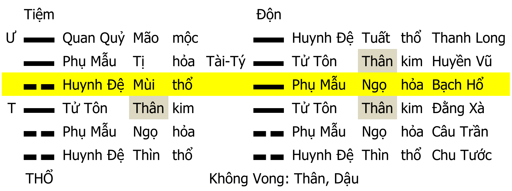
    - **Hình này chứng minh điều gì**
      - Quan Quỷ Mão mộc hào 6 nhập Mộ tại động hào Mùi thổ (nguyên thần hào Thế), Thế Tử Tôn Thân kim Không Vong khắc Dụng thần.
    - **Từ đâu mà thấy được**
      - Hào 6 thoái hưu nhu nhược, hào Thế kim Không tắc minh mắng mỏ chồng, hào 2 Phụ Mẫu ám động ngăn cản.
  - **Phán đoán chi tiết:**
    - Căn cứ: Lấy Quan Quỷ làm Dụng thần tượng trưng cho người chồng; xem xét tương quan sinh khắc giữa hào Thế và Dụng thần để định kết quả hôn nhân.
    - Nhìn vào: Quan Quỷ Mão mộc ngự tại hào 6 lâm Thanh Long, được Nguyệt kiến Mão mộc đồng hành trợ giúp và Nhật kiến Tý thủy tương sinh là vượng tướng hữu khí, khẳng định chắc chắn hai vợ chồng sẽ không ly hôn.
    - Căn cứ: Hào vị hào 6 và ngũ hành của Dụng thần bộc lộ tính cách và vị thế của người chồng.
    - Nhìn vào: Hào 6 là hào vị thoái hưu (vị trí nghỉ hưu, buông bỏ), chứng tỏ người chồng trong gia đình hoàn toàn không có thực quyền, không làm chủ được việc nhà. Dụng thần lâm Mộc chủ tính tình hiền lành, mềm mỏng, có phần nhu nhược.
    - Căn cứ: Hào 4 Huynh Đệ Mùi thổ độc phát hóa Phụ Mẫu Ngọ hỏa tác động lên Dụng thần và hào Thế.
    - Nhìn vào: Dụng thần Quan Quỷ Mão mộc nhập Mộ tại hào độc phát Mùi thổ, biểu thị người chồng hoàn toàn bị khống chế, giam cầm ý chí. Hào động Mùi thổ là Thổ sinh trợ cho Tử Tôn Thân kim (hào Thế), chính là Nguyên thần của hào Thế; Nguyên thần đại diện cho tư duy, ý đồ, cho thấy chính người vợ luôn tìm mọi cách kiểm soát, kìm kẹp chồng chặt chẽ.
    - Căn cứ: Hào Thế khắc Dụng thần và hiện tượng hào Thế lâm Không Vong.
    - Nhìn vào: Thế là Tử Tôn Thân kim khắc chế Dụng thần Mão mộc, bộc lộ thái độ của vợ đối với chồng rất tệ bạc, khắc nghiệt. Hào Thế lại lâm ngũ hành Kim rơi vào Không Vong (Tuần Không Thân, Dậu); tục ngữ Lục Hào có câu "Kim Không tắc minh" (kim loại rỗng ruột thì phát ra tiếng vang lớn), chủ về khẩu thiệt âm thanh, chứng minh người vợ này mở miệng ra là mắng mỏ, chì chiết chồng tối ngày.
    - Căn cứ: Hào 2 Phụ Mẫu Ngọ hỏa ám động tác động điều giải xung đột.
    - Nhìn vào: Hào 2 Phụ Mẫu Ngọ hỏa được Nguyệt sinh là hữu khí, bị Nhật kiến Tý thủy xung thành ám động; Phụ Mẫu động khắc chế Tử Tôn Thân kim (hào Thế), làm suy giảm đáng kể lực khắc của vợ lên chồng. Hào 2 là trạch xá (nhà ở), Phụ Mẫu là cha mẹ, chính là gia đình nhà mẹ đẻ; cha mẹ vợ can ngăn kịp thời, nghiêm khắc dạy bảo không cho phép cô mắng nhiếc và đối xử thô bạo với chồng.
  - **Ứng nghiệm thực tế:**
    - Toàn bộ suy luận hoàn toàn trùng khớp với thực tế gia đình đương sự; người phụ nữ thừa nhận tính khí mình cay nghiệt hay mắng chồng, được bố mẹ đẻ can gián nên gia đình vẫn giữ được, không ly hôn.

- **Ví dụ 3: Ngày Ất Mão tháng Tị năm Ất Dậu, nữ sinh năm Đinh Mùi bối rối về tình cảm (Được quẻ Hỏa Trạch Khuê biến Hỏa Thiên Đại Hữu)**
  - **Hình 8.** Sơ đồ quẻ Hỏa Trạch Khuê biến Hỏa Thiên Đại Hữu
    - 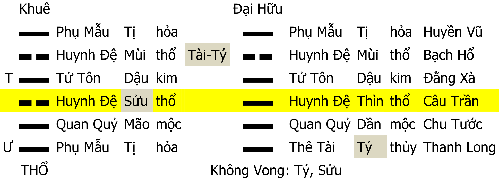
    - **Hình này chứng minh điều gì**
      - Dụng thần quy vị hào 2, hào 3 Hương Khuê Không Vong động hóa tiến thần và là Mộ khố Tử Tôn Không Vong.
    - **Từ đâu mà thấy được**
      - Hào 2 phu thê hòa thuận, giường hào 3 bày thêm giường khác (ngoại tình), Mộ khố Không Vong chỉ phá thai.
  - **Phán đoán chi tiết:**
    - Căn cứ: Lấy Quan Quỷ làm Dụng thần xem xét tình trạng người chồng chính thức; đối chiếu hào vị hào 2.
    - Nhìn vào: Quan Quỷ Mão mộc ngự tại hào 2 được Nhật kiến Mão mộc trợ lực; hào 2 vốn là hào vị phu thê, nay Dụng thần Quan Quỷ an tọa tại đây gọi là Dụng thần quy vị (về đúng vị trí tôn nghiêm), biểu thị người chồng làm tròn bổn phận gia đình, rất có trách nhiệm và thương yêu chăm sóc vợ con. Dụng thần là Mộc chủ tâm địa thiện lương, chất phác.
    - Căn cứ: Biến động bất thường tại hào 3 Sửu thổ và tương tác từ Nhật kiến Mão mộc.
    - Nhìn vào: Hào 3 Huynh Đệ Sửu thổ phát động nhưng lâm Tuần Không (Tuần Không Tý, Sửu), Không Vong thì không thể sinh trợ cho hào Thế. Hào 3 là giường chiếu, đồng thời là Hương Khuê (chốn phòng the kín đáo); Hương Khuê lâm Không Vong biểu thị chiếc giường trống trải, phòng the lạnh lẽo, hai vợ chồng thiếu thốn thời gian ân ái gần gũi bên nhau.
    - Căn cứ: Nhật kiến Mão mộc mang hành Quan Quỷ tương xung với hào Thế Tử Tôn Dậu kim.
    - Nhìn vào: Nhật kiến Mão mộc là Quan Quỷ đại diện cho người đàn ông bên ngoài, mang khí thế xung thẳng vào hào Thế; xung biểu thị sự săn đón, theo đuổi ráo riết; Nhật kiến chỉ hiện tại, cho thấy gần đây có một gã đàn ông quyết liệt theo đuổi khiến tâm can người phụ nữ xao xuyến, lạc lối.
    - Căn cứ: Tượng hào 3 Hương Khuê phát động hóa Tiến thần (Sửu thổ hóa Thìn thổ) và liên kết với Mộ khố Tử Tôn.
    - Nhìn vào: Hào 3 là giường ngủ, nay Hương Khuê lâm Không mà lại động hóa Tiến thần; tượng quẻ rõ ràng là bên cạnh chiếc giường trống Không của vợ chồng lại kê thêm một chiếc giường khác bên ngoài, minh chứng cho hành vi ngoại tình, chung sống phi pháp với người đàn ông khác.
    - Căn cứ: Hào Thế mang Tử Tôn và hào 3 Sửu thổ là Mộ khố của Tử Tôn (Kim mộ tại Sửu).
    - Nhìn vào: Tử Tôn trì Thế chủ về con cái, thai nhi; hào 3 lại là Mộ khố của Tử Tôn mang tượng hoài thai, mang bầu. Song Mộ khố Tử Tôn Sửu thổ lại lâm Không Vong, Mộ khố Không thì thai nhi bị chôn vùi trong hư không, chính là tín hiệu nạo phá thai. Từ đó khẳng định đương sự đã lén lút ăn nằm có thai với nhân tình rồi đi phá thai.
    - Căn cứ: Trạng thái tinh thần phản ánh qua hào Thế lâm Đằng Xà và ám động.
    - Nhìn vào: Quan Quỷ xung hào Thế khiến tâm thần bất định; hào Thế lâm Đằng Xà chủ về kinh hoàng, lo âu, bế tắc tột cùng, cho thấy gã nhân tình bám riết không tha khiến cô hoảng loạn, sợ hãi dai dẳng. Hào Thế Dậu kim được Nguyệt sinh có khí, bị Nhật xung thành ám động; Tử Tôn chủ về hỷ lạc, giải trừ âu lo, chứng tỏ trong lòng cô đang khao khát thoát khỏi vũng lầy tội lỗi này.
  - **Ứng nghiệm thực tế:**
    - Người phụ nữ kết hôn hơn 10 năm, chồng rất tốt nhưng từ khi sinh con thì tình cảm lạnh nhạt. Cô bị một người đàn ông tấn công dồn dập, ngã lòng sống chung và dính bầu. Sau khi có thai mới biết kẻ đó đã có vợ con nên cô quyết định phá thai. Gã nhân tình trở mặt đe dọa bám riết tống tình khiến cô vô cùng hoảng loạn, đúng như từng chi tiết quẻ dự báo.

- **Ví dụ 4: Ngày Canh Tý tháng Hợi, nam đoán hôn nhân (Được quẻ Sơn Trạch Tổn biến Sơn Thủy Mông)**
  - **Hình 9.** Sơ đồ quẻ Sơn Trạch Tổn biến Sơn Thủy Mông
    - 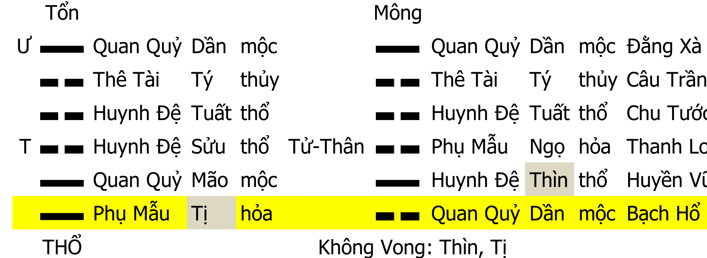
    - **Hình này chứng minh điều gì**
      - Thê Tài Tý thủy hào 5 tôn vị vượng tướng hợp Thế, hào 1 Phụ Mẫu Tị hỏa độc phát lâm Tuyệt địa Dụng thần.
    - **Từ đâu mà thấy được**
      - Hào 5 lấn át chuyên quyền kiểm soát chồng, Phụ Mẫu độc phát Nguyệt phá Không Vong định rõ kết cục ly hôn.
  - **Phán đoán chi tiết:**
    - Căn cứ: Lấy Thê Tài làm Dụng thần đại diện cho người vợ; Sàng Trướng và Phụ Mẫu xem xét giấy tờ pháp lý hôn nhân.
    - Nhìn vào: Thê Tài Tý thủy ngự tại hào 5, được cả Nguyệt kiến Hợi thủy và Nhật kiến Tý thủy phù trợ nên vượng tướng cực độ. Thần sát Sàng Trướng cũng là Tý thủy vượng tướng đồng cung với Dụng thần, khẳng định đương sự là người đã kết hôn hợp pháp.
    - Căn cứ: Hào sơ Phụ Mẫu Tị hỏa độc phát lâm Nguyệt phá và Tuần Không (Tuần Không Thìn, Tị).
    - Nhìn vào: Phụ Mẫu là hôn thư, chứng nhận kết hôn; nay Phụ Mẫu Tị hỏa phát động đơn độc (độc phát) nhưng lại bị Nguyệt kiến Hợi thủy xung phá (Nguyệt phá), đồng thời lâm Tuần Không. Giấy kết hôn lâm Không phá thì chỉ là danh nghĩa hão huyền, tờ giấy đăng ký kết hôn biến thành tờ giấy trắng vô giá trị.
    - Căn cứ: Vị trí của Dụng thần tại hào 5 và tương tác hợp hào Thế.
    - Nhìn vào: Dụng thần Thê Tài Tý thủy tọa tại hào 5; hào 5 là chí tôn chi vị (ngôi vị tối cao của người làm chủ), phản ánh người vợ có tính khí ngang ngược, hống hách, luôn muốn xưng bá làm chủ trong nhà. Hào 5 Tý thủy tương hợp với hào Thế Sửu thổ (Tý Sửu nhị hợp), bộc lộ dã tâm muốn thao túng, kiểm soát chặt chẽ từng đường đi nước bước của chồng, thực thi chế độ chuyên quyền gia đình.
    - Căn cứ: Bản chất hào Thế Huynh Đệ Sửu thổ lâm Thanh Long.
    - Nhìn vào: Hào Thế mang hành Thổ chủ về tính cách đôn hậu, thật thà, chất phác; lâm Thanh Long chủ tính tình hiền lành, nhẫn nhịn, giữ lễ nghĩa, vì vậy luôn chịu lép vế trước sự lấn lướt của vợ.
    - Căn cứ: Quy luật độc phát và trạng thái sinh tuyệt của Dụng thần để định đoạt hôn nhân và ứng kỳ.
    - Nhìn vào: Trong Lục Hào, quẻ có độc phát thì sự việc ứng vào hào độc phát. Hào 1 Phụ Mẫu Tị hỏa chính là Tuyệt địa của Dụng thần Thê Tài Tý thủy (Thủy tuyệt ở Tị), Dụng thần lâm Tuyệt địa thì kết cục ly hôn là điều chắc chắn, không thể cứu vãn.
    - Căn cứ: Định mốc thời gian ly hôn qua Dụng thần và hào động.
    - Nhìn vào: Dụng thần là Tý thủy nên ứng vào tháng Tý ly hôn; mặt khác Phụ Mẫu Tị hỏa bị Nguyệt phá tại tháng Hợi, ứng kỳ phá tán phải chờ bước sang tháng sau (ra khỏi tháng Hợi tức tháng Tý).
  - **Ứng nghiệm thực tế:**
    - Sang tháng Tý, hai vợ chồng chính thức hoàn tất thủ tục ly dị đúng như quẻ phán đoán.

- **Ví dụ 5: Ngày Nhâm Tý tháng Mão năm Giáp Thân, nữ đoán quan hệ phát triển ra sao (Được quẻ Sơn Thủy Mông)**
  - **Hình 10.** Sơ đồ quẻ Sơn Thủy Mông
    - 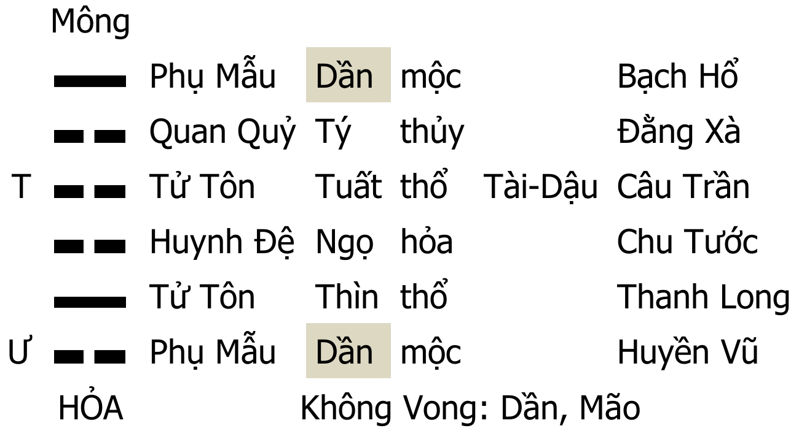
    - **Hình này chứng minh điều gì**
      - Quan Quỷ Tý thủy tại hào 5 lâm Nhật kiến vượng tướng, hào sơ Phụ Mẫu Dần mộc Không Vong lâm Huyền Vũ.
    - **Từ đâu mà thấy được**
      - Hào 5 lãnh đạo chức vụ, hào sơ nền tảng sống chung lén lút, năm Nhâm Ngọ xung Dụng tĩnh làm quen.
  - **Phán đoán chi tiết:**
    - Căn cứ: Lấy Quan Quỷ làm Dụng thần tượng trưng cho người bạn trai; khảo sát hào vị của Dụng thần để nhận biết thân thế đối phương.
    - Nhìn vào: Quan Quỷ Tý thủy ngự tại hào 5; hào 5 là hào vị tôn quý của lãnh đạo, cán bộ cấp cao, chứng tỏ người đàn ông này là người có địa vị xã hội, giữ chức vụ lãnh đạo thực tế trong cơ quan, tổ chức.
    - Căn cứ: Xem xét hào sơ Phụ Mẫu Dần mộc lâm Huyền Vũ và Tuần Không (Tuần Không Dần, Mão) để biết tình trạng quan hệ ban đầu.
    - Nhìn vào: Hào sơ là bước đầu sơ khai, là nền tảng; Phụ Mẫu đại diện cho nhà cửa, chốn cư ngụ; lâm Huyền Vũ chủ sự mờ ám, giấu giếm; lâm Tuần Không chủ sự không công khai. Tổ hợp này chứng minh hai người đã vượt qua giới hạn tình cảm, đã bí mật ăn nằm và sống chung với nhau từ trước.
    - Căn cứ: Xác định thời điểm bắt đầu quen biết thông qua Dụng thần an tĩnh.
    - Nhìn vào: Dụng thần Quan Quỷ Tý thủy là tĩnh hào; quy luật ứng kỳ của tĩnh hào là chờ năm xung để kích động (xung khởi). Vào năm Nhâm Ngọ (2002), chi Ngọ hỏa tương xung Tý thủy, chính là thời điểm hai người tương ngộ, quen biết nhau.
    - Căn cứ: Độ vượng suy của Dụng thần để định tương lai lâu dài.
    - Nhìn vào: Dụng thần Quan Quỷ Tý thủy lâm ngay Nhật kiến Nhâm Tý, nhận được khí vượng tuyệt đối từ ngày xem quẻ, báo hiệu mối quan hệ giữa hai người rất khăng khít, gắn bó sâu sắc và có thể phát triển bền vững lâu dài.
  - **Ứng nghiệm thực tế:**
    - Người phụ nữ xác nhận hai người quen nhau đúng vào năm Nhâm Ngọ (2002); đối phương là một cán bộ lãnh đạo, cả hai đã sống chung lén lút và hiện tại mối quan hệ vô cùng mặn nồng.

- **Ví dụ 6: Ngày Nhâm Tý tháng Tuất năm Nhâm Ngọ, nữ đoán ly hôn thành hay không (Được quẻ Thủy Thiên Nhu)**
  - **Hình 11.** Sơ đồ quẻ Thủy Thiên Nhu
    - 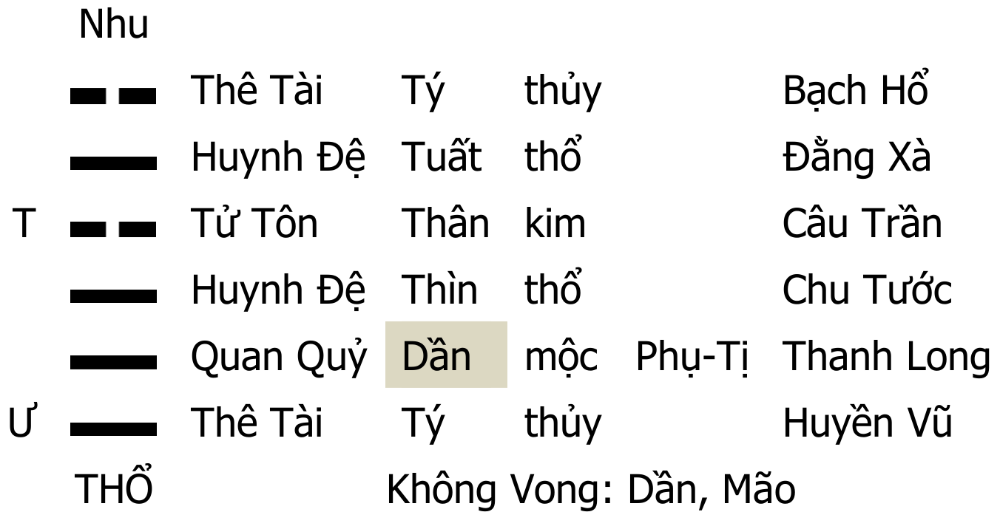
    - **Hình này chứng minh điều gì**
      - Quan Quỷ Dần mộc hào 2 Không Vong lâm Mộc Dục, quẻ Du Hồn Thế khắc Dụng nhưng Dụng thần vượng có Nguyên thần sinh.
    - **Từ đâu mà thấy được**
      - Hào 2 trạch Không biểu thị chồng vắng nhà trăng hoa, quẻ Du Hồn muốn ly hôn nhưng Dụng vượng khó phân ly.
  - **Phán đoán chi tiết:**
    - Căn cứ: Lấy Quan Quỷ làm Dụng thần đại diện cho người chồng; hào vị hào 2 nhận biết hành tung của chồng đối với gia đình.
    - Nhìn vào: Quan Quỷ Dần mộc tọa tại hào 2 lại lâm Tuần Không (Tuần Không Dần, Mão); hào 2 là trạch xá (ngôi nhà chung), Dụng thần lâm Không ở hào 2 biểu thị người chồng hoàn toàn vắng bóng trong nhà, thường xuyên đi biệt tăm không ngó ngàng đến gia đình.
    - Căn cứ: Trạng thái Thập nhị Trường sinh của Dụng thần đối chiếu với Nhật kiến và quái tượng Du Hồn.
    - Nhìn vào: Quan Quỷ Dần mộc gặp Nhật kiến Tý thủy là đất Mộc Dục (Dần mộc mộc dục tại Tý); Mộc Dục chủ về dâm dục, phóng túng, háo sắc, cho thấy người chồng là kẻ trăng hoa, đam mê tửu sắc bên ngoài. Toàn quẻ là Thủy Thiên Nhu - quẻ Du Hồn; Du Hồn chủ tâm hồn phiêu bạt, chứng minh trái tim và tâm trí của người chồng đã bay bổng nơi khác, không còn chút tha thiết nào với vợ con.
    - Căn cứ: Hào Thế mang Tử Tôn và quái tượng Du Hồn bộc lộ ý định của người vợ.
    - Nhìn vào: Hào Thế mang Tử Tôn Thân kim là thần khắc phạt Quan Quỷ, lại lâm vào quẻ Du Hồn mang tâm lý chán chường muốn thay đổi, khẳng định người vợ kiên quyết muốn ly hôn để giải thoát bản thân.
    - Căn cứ: Khảo sát gốc rễ sinh trợ của Dụng thần để kết luận khả năng ly hôn.
    - Nhìn vào: Quan Quỷ Dần mộc được Nhật kiến Tý thủy tương sinh, lại có Nguyên thần Thê Tài Tý thủy lưỡng hiện tại hào sơ và hào 6 liên tục sinh phù trợ lực; Dụng thần được sinh vượng vững vàng thì sợi dây hôn nhân không thể đứt gãy, cuộc ly hôn này rất khó thành, không cách nào chia tay dứt điểm.
    - Căn cứ: Dự báo tai họa của người hỏi thông qua Nguyên thần của hào Thế.
    - Nhìn vào: Hào Thế Tử Tôn Thân kim lấy Thổ làm Nguyên thần; hào 3 Huynh Đệ Thìn thổ bị Nguyệt kiến Tuất thổ xung là Nguyệt phá; khi Nguyên thần của Thế lâm Nguyệt phá, cần đặc biệt đề phòng đến năm Bính Tuất (2006) khi năm Tuất đến thực phá xung hào, ắt có tai họa nghiêm trọng đe dọa tính mạng.
  - **Ứng nghiệm thực tế:**
    - Hai người giằng co nhưng rốt cuộc không thể làm thủ tục ly hôn. Đến năm Bính Tuất (2006), người phụ nữ này vì uống quá nhiều nhân sâm đại bổ dẫn đến trúng độc/bội bổ mà qua đời.

- **Ví dụ 7: Ngày Canh Thân tháng Tý, nam đoán có chia tay bạn gái không (Được quẻ Sơn Thiên Đại Súc biến Lôi Trạch Quy Muội)**
  - **Hình 12.** Sơ đồ quẻ Sơn Thiên Đại Súc biến Lôi Trạch Quy Muội
    - 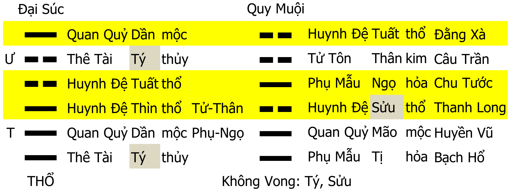
    - **Hình này chứng minh điều gì**
      - Thê Tài Tý thủy hào 5 Không Vong không sinh hào 2 trạch, nhập Mộ tại Kỵ thần Huynh Đệ Thìn thổ động.
    - **Từ đâu mà thấy được**
      - Hào 5 đường sá bôn ba không về nhà, Huynh Đệ lưỡng động cướp Tài khiến bạn gái ngã vào tay người khác.
  - **Phán đoán chi tiết:**
    - Căn cứ: Lấy Thê Tài làm Dụng thần tượng trưng cho bạn gái; khi Dụng thần lưỡng hiện chọn hào Ứng làm tiêu điểm.
    - Nhìn vào: Trong quẻ Thê Tài Tý thủy xuất hiện ở cả hào sơ và hào 5, theo quy tắc chọn hào Ứng Thê Tài Tý thủy tại hào 5 làm Dụng thần chính.
    - Căn cứ: Khảo sát thần sát hôn thư Phụ Mẫu Ngọ hỏa phục tàng và nhập Mộ.
    - Nhìn vào: Phụ Mẫu Ngọ hỏa phục tàng dưới hào 2 Quan Quỷ Dần mộc (hào Thế), lâm Huyền Vũ; Phụ Mẫu phục tàng lại nhập Mộ tại hào 4 Huynh Đệ Tuất thổ phát động; Phụ Mẫu là giấy kết hôn hay chuyện chung sống, Huyền Vũ là mờ ám, nhập Mộ là che giấu kín đáo, tổ hợp này khẳng định hai người chưa cưới nhưng đã dọn về sống chung như vợ chồng từ lâu.
    - Căn cứ: Dụng thần tọa tại hào 5 lâm Tuần Không (Tuần Không Tý, Sửu) ảnh hưởng đến hào 2.
    - Nhìn vào: Thê Tài Tý thủy ngự tại hào 5; hào 5 là đường lộ, giao thông đi lại; nay lâm Không Vong thì không thể sinh trợ cho hào 2 (hào 2 là trạch xá, nhà ở); biểu thị cô bạn gái này suốt ngày lang bạt ngoài đường, bôn ba đi lại bên ngoài, dứt khoát không chịu quay trở về sống chung nhà với người nam.
    - Căn cứ: Tác động của Kỵ thần Huynh Đệ lưỡng động đối với Dụng thần.
    - Nhìn vào: Trong quẻ Kỵ thần Huynh Đệ phát động dữ dội ở cả hào 3 (Thìn thổ động) và hào 4 (Tuất thổ động); Dụng thần Thê Tài Tý thủy bị cuốn vào và nhập Mộ tại Huynh Đệ Thìn thổ phát động (Thủy mộ tại Thìn); Huynh Đệ đại diện cho người đàn ông khác, Dụng thần nhập Mộ vào Huynh Đệ là hình ảnh cô bạn gái đã ngã trọn vào vòng tay, sống chung với người đàn ông khác.
    - Căn cứ: Hào 4 Huynh Đệ Tuất thổ phát động lâm Chu Tước.
    - Nhìn vào: Chu Tước chủ về khẩu thiệt, thị phi, cãi vã lớn tiếng; Huynh Đệ lâm Chu Tước động chứng tỏ giữa hai người thường xuyên bùng nổ những trận cãi vã kịch liệt, xúc phạm nặng nề lẫn nhau.
  - **Ứng nghiệm thực tế:**
    - Đương số và bạn gái đã ăn nằm sống chung; trong một trận cãi vã nảy lửa, anh ta đuổi bạn gái ra khỏi nhà. Sau đó hối hận gọi cô về, nhưng vừa về lại tiếp tục cãi cọ dữ dội khiến cô gái bỏ đi hẳn theo một người đàn ông khác. Đương số gọi điện thoại thì cô không nghe máy, thậm chí tình mới của cô gái còn cầm máy gọi lại chửi bới, đe dọa anh ta thậm tệ.

### CHƯƠNG 3: Ý NGHĨA CỦA LỤC THÂN

#### Ý nghĩa căn bản của Lục thân trong dự đoán nhân duyên

- **Khái niệm và vị trí của Lục thân trong dự đoán Lục Hào:**
  - Lục thân (Phụ Mẫu, Quan Quỷ, Thê Tài, Tử Tôn, Huynh Đệ) trong Lục Hào dự trắc học là hệ thống định vị nhân sự và sự vật cốt lõi.
  - Căn cứ vào đối tượng dự đoán cụ thể và bối cảnh câu hỏi, mỗi Lục thân sẽ đại diện cho những thông tin đa chiều khác nhau, là cơ sở tối quan trọng để người dự đoán trích xuất thông tin, định vị Dụng thần và nhận định xu cát tị hung.

- **Nội hàm chi tiết của từng Lục thân trong lĩnh vực hôn nhân - tình cảm:**
  - **Phụ Mẫu:**
    - Đại diện cho các bậc bề trên, cha mẹ hai bên, người lớn tuổi trong gia đình.
    - Tượng trưng cho hôn thư, giấy chứng nhận kết hôn, khế ước tình cảm, sự công nhận hợp pháp của pháp luật và xã hội đối với mối quan hệ.
    - Biểu thị tin tức, thư từ liên lạc, thông điệp tình cảm, nhà cửa, trạch xá nơi cư trú.
    - Đại diện cho người mai mối, người làm trung gian giới thiệu nhân duyên.
  - **Quan Quỷ:**
    - Đại diện cho người đàn ông, bạn trai, người chồng trong quẻ đoán nhân duyên của nữ giới.
    - Biểu thị công danh, chức nghiệp, cơ quan nhà nước, chính quyền hoặc các rào cản mang tính quy ước xã hội.
    - Tượng trưng cho bệnh tật, tai họa, âu lo, tâm bệnh hoặc tình trạng áp lực tâm lý của đương số.
    - Tượng trưng cho danh tính, họ tên, danh dự gia tộc của đối phương.
  - **Thê Tài:**
    - Đại diện cho người phụ nữ, bạn gái, người vợ trong quẻ đoán nhân duyên của nam giới.
    - Biểu thị tiền tài, kinh tế, tài chính, của cải vật chất, điều kiện sinh hoạt gia đình.
    - Tượng trưng cho tình cảm, sự dịu dàng, mức độ hòa hợp về thể xác và tinh thần trong đời sống lứa đôi.
  - **Tử Tôn:**
    - Đại diện cho con cái, con thơ, sự kế thừa và sinh sôi nảy nở của thế hệ sau.
    - Tượng trưng cho nguồn vui, sự giải tỏa ưu phiền, lạc quan, khoái lạc và đời sống tình dục hòa hợp.
    - Là Phúc thần giải tai trừ họa, thuốc men trị bệnh tật.
    - Trong dự đoán hôn nhân của nữ giới, Tử Tôn là thần khắc Quan Quỷ (chồng), nên Tử Tôn vượng động thường là dấu hiệu bất lợi, chủ về khắc phu, ly hôn, chia tay hoặc bất hòa với chồng.
  - **Huynh Đệ:**
    - Đại diện cho bạn bè, đồng nghiệp, anh em người thân bằng hữu.
    - Biểu thị trở lực, trắc trở, sự cạnh tranh, tranh đoạt tình cảm.
    - Đại diện cho "người thứ ba", tình địch chen ngang phá hoại mối quan hệ.
    - Trong dự đoán hôn nhân của nam giới, Huynh Đệ là thần khắc Thê Tài (vợ), nên Huynh Đệ phát động thường là tín hiệu xấu, chủ về hao tán tiền của, khắc vợ, lục đục gia đạo hoặc nguy cơ đổ vỡ hôn nhân.

---

#### Các quái lệ thực chứng chuyên sâu

- **Ví dụ 1: Ngày Bính Ngọ tháng Sửu, nam đoán hôn nhân cho con gái, được quẻ Thủy Lôi Truân (Tuần không: Dần, Mão)**
  - **Hình 13.** Sơ đồ quẻ Thủy Lôi Truân
    - 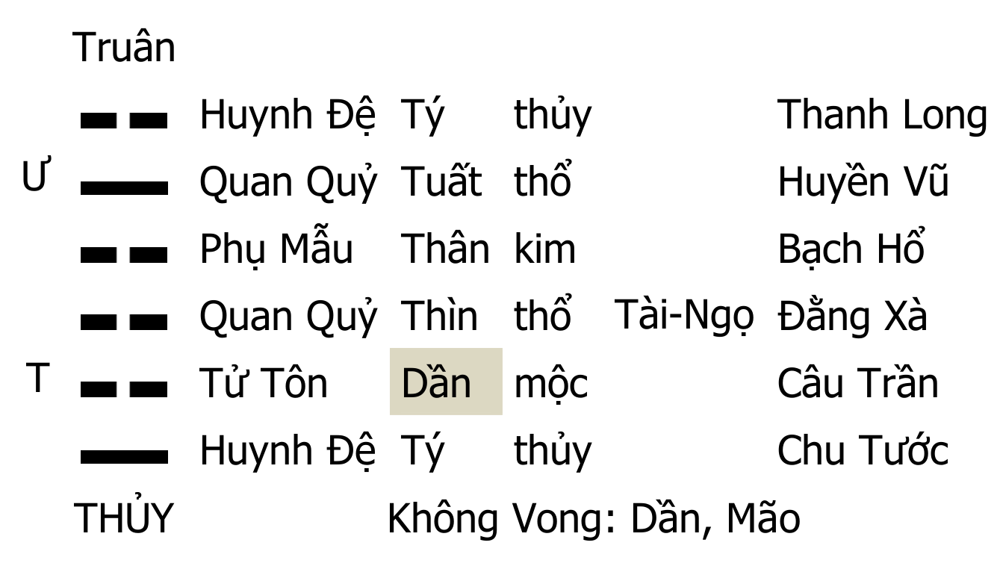
    - **Hình này chứng minh điều gì**
      - Con gái tính tình hướng nội, cố thủ trong nhà không chịu lấy chồng; cha lo lắng thành tâm bệnh dù nhiều người mai mối.
    - **Từ đâu mà thấy được**
      - Quan Quỷ vượng tướng nhưng Tử Tôn Dần mộc (con gái) tại hào 2 (trạch) lâm Câu Trần Không Vong trì Thế; quẻ Truân có tượng đóng trại bất động.
  - **Phán đoán chi tiết:**
    - Căn cứ: Nam đoán hôn nhân cho con gái lấy Quan Quỷ làm Dụng thần (tượng trưng cho con rể, người chồng tương lai), đồng thời kết hợp xem xét hào Tử Tôn (đại diện cho người con gái) và hào Thế (tâm tư, suy nghĩ của người cha).
    - Nhìn vào:
      - Trong quẻ có Quan Quỷ lưỡng hiện (Quan Quỷ Tuất thổ tại hào 5 và Quan Quỷ Thìn thổ tại hào 3), lại được Nguyệt kiến Sửu thổ trợ giúp và Nhật thần Ngọ hỏa sinh phù nên cực kỳ vượng tướng; điều này biểu thị cơ hội kết duyên rất nhiều, có vô số đối tượng và người làm mai mối tìm đến.
      - Tuy nhiên, Tử Tôn Dần mộc tại hào 2 lâm Câu Trần và Tuần Không. Tử Tôn là con gái, hào 2 là trạch (ngôi nhà), Câu Trần mang tượng cố thủ, bất động, không muốn di dời. Quẻ Thủy Lôi Truân mang ý nghĩa dựng trại đóng quân, ẩn nhẫn một chỗ. Tổ hợp tượng này chứng tỏ người con gái chỉ muốn ở riết trong nhà, sống khép kín, bài xích việc ra ngoài xã hội và nảy sinh ý định ở vậy suốt đời với cha mẹ chứ không chịu xuất giá.
      - Tử Tôn Dần mộc đồng thời trì Thế, biểu thị người cha ngày đêm bận tâm sâu sắc đến chuyện lập gia đình của con, lo nghĩ không ít. Mặt khác, Tử Tôn trì Thế gặp Tuần Không cho thấy trong thâm tâm người cha hoàn toàn không hề muốn giữ con gái ở cạnh mình cả đời, rất mong mỏi con gái yên bề gia thất.
  - **Ứng nghiệm thực tế:**
    - Người cha thở dài xác nhận phán đoán hoàn toàn ứng nghiệm: Con gái ông tính cách cực kỳ hướng nội, hết giờ làm ở cơ quan là về thẳng nhà đóng cửa đọc sách, không bao giờ ra đường hay gặp gỡ bạn bè; dù rất nhiều mối tốt dạm hỏi nhưng cô kiên quyết không đi xem mặt, chuyện hôn sự vì vậy trở thành tâm bệnh đau đáu của người cha.

- **Ví dụ 2: Ngày Quý Sửu tháng Dậu, nam đoán với bạn gái phát triển như thế nào, được quẻ Đoài Vi Trạch biến Trạch Hỏa Cách (Tuần không: Dần, Mão)**
  - **Hình 14.** Sơ đồ quẻ Đoài Vi Trạch biến Trạch Hỏa Cách
    - 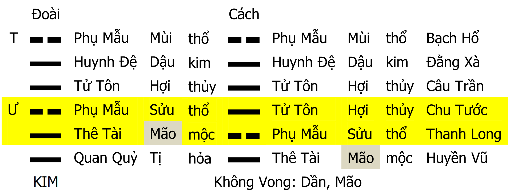
    - **Hình này chứng minh điều gì**
      - Tình cảm bạn gái từng dao động do có đối tượng khác ve vãn chen vào rạn nứt, nhưng cuối cùng đôi bên vẫn đính hôn vào tháng Tý.
    - **Từ đâu mà thấy được**
      - Thê Tài Mão mộc hưu tù Không Vong bị Nguyệt lệnh Huynh Đệ Dậu kim xung phá; hào Ứng Phụ Mẫu Sửu thổ lâm Nhật động hóa hợp.
  - **Phán đoán chi tiết:**
    - Căn cứ: Nam nhân hỏi tương lai tình cảm với bạn gái lấy Thê Tài làm Dụng thần, hào Thế đại diện cho bản thân người hỏi, hào Ứng và Phụ Mẫu đại diện cho hôn ước, kỳ hạn thành hôn.
    - Nhìn vào:
      - Thê Tài Mão mộc không được Nhật Nguyệt sinh trợ nên hưu tù suy nhược. Hào Thế Phụ Mẫu Mùi thổ ám động (do Nhật thần Sửu thổ tương xung) làm cho Dụng thần Thê Tài Mão mộc nhập Mộ tại Thế, biểu hiện người nam vô cùng say đắm, yêu thương và muốn che chở bạn gái trong lòng. Tuy nhiên, Dụng thần Mão mộc lại lâm Tuần Không, phản ánh tâm trạng người bạn gái dao động bất định, chưa thực sự quyết đoán hướng về chàng trai.
      - Thê Tài Mão mộc bị Nguyệt kiến Dậu kim xung khắc trực diện thành Nguyệt phá; Nguyệt kiến mang lục thân Huynh Đệ đại diện cho người đàn ông khác, kẻ cạnh tranh, tình địch. Nguyệt phá chủ tình cảm xuất hiện rạn nứt, vì vậy tổ hợp này báo trước có đối tượng khác chen ngang theo đuổi, làm nảy sinh khoảng cách và trở ngại giữa hai người.
      - Tuy nhiên, hào Ứng Phụ Mẫu Sửu thổ lâm Nhật thần chủ về hôn kỳ, phát động hóa Tử Tôn Hợi thủy; theo quy tắc "động mà phùng trị phùng hợp", Sửu thổ sẽ ứng hợp tại tháng Tý (Tý Sửu lục hợp), dự báo đến tháng Tý hai người sẽ chính thức đính hôn.
  - **Ứng nghiệm thực tế:**
    - Quả nhiên trong thời gian đó người bạn gái bị nhiều người đàn ông lui tới tán tỉnh khiến tâm lý xao động chao đảo, nhưng cuối cùng cô vẫn quyết tâm chọn gắn bó với anh; sang tháng Tý hai người cử hành lễ đính hôn thuận lợi.

- **Ví dụ 3: Ngày Bính Thìn tháng Sửu, nữ chọn ngày kết hôn cho em trai, được quẻ Khảm Vi Thủy biến Địa Trạch Lâm (Tuần không: Tý, Sửu)**
  - **Hình 15.** Sơ đồ quẻ Khảm Vi Thủy biến Địa Trạch Lâm
    - 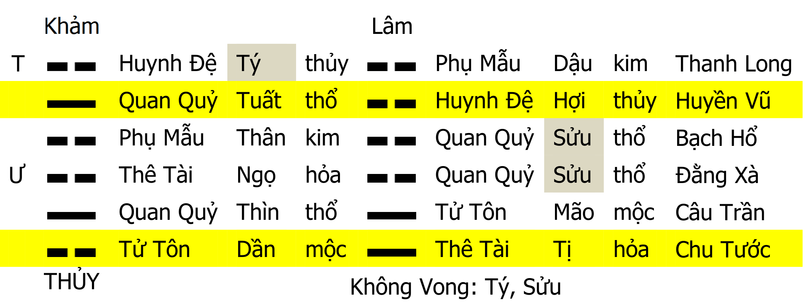
    - **Hình này chứng minh điều gì**
      - Chọn ngày cưới cho em trai thứ hai; cô dâu từng qua một đời chồng và mang theo con riêng; chọn ngày Ngọ để xung Thế vượng Tài.
    - **Từ đâu mà thấy được**
      - Quẻ Khảm (trung nam), Huynh Đệ trì Thế Không Vong; Thê Tài Ngọ hỏa nhập Mộ Quan Quỷ Tuất thổ bị Nhật xung khai; Dần mộc hóa Tài.
  - **Phán đoán chi tiết:**
    - Căn cứ: Nữ xem ngày cưới cho em trai lấy Thê Tài làm Dụng thần (em dâu), hào Thế đại diện người hỏi và người em trai (lục thân Huynh Đệ).
    - Nhìn vào:
      - Quẻ được là Khảm Vi Thủy thuộc bát thuần quẻ, trong Bát quái tượng Khảm đại diện cho trung nam (người con trai thứ hai), cho thấy người hỏi đến chọn ngày lành kết hôn cho người em trai thứ hai trong gia đình.
      - Huynh Đệ Tý thủy trì Thế lâm Tuần Không, thể hiện người chị canh cánh lo toan, dốc lòng quan tâm đến hạnh phúc của em mình. Thê Tài Ngọ hỏa dù không được Nhật Nguyệt sinh phù nhưng không bị khắc hại, lại được hào sơ Tử Tôn Dần mộc phát động sinh phù, là điềm lành cho hôn nhân.
      - Thê Tài Ngọ hỏa nhập Mộ ở hào 5 động Quan Quỷ Tuất thổ; Quan Quỷ là người đàn ông, mang tượng cô gái này trước đây đã từng kết hôn hoặc sống chung như vợ chồng với người đàn ông khác. Thế nhưng Mộ khố Tuất thổ này lại bị Nhật thần Thìn thổ xung khai (Thìn Tuất tương xung), biểu thị cuộc hôn nhân trước đã kết thúc dứt khoát bằng việc ly hôn, tức cô gái này đi bước nữa (tái hôn).
      - Hào sơ Tử Tôn Dần mộc động hóa Thê Tài Tị hỏa; hào sơ là vị trí "tiểu khẩu" (trẻ nhỏ), Tử Tôn lại là con cái, chứng minh người phụ nữ này dẫn theo con riêng khi về nhà chồng.
      - Do hào Thế Tý thủy lâm Tuần Không, tác giả khuyên nên chọn ngày Ngọ để xung động hào Thế thoát Không, đồng thời ngày Ngọ giúp Thê Tài Ngọ hỏa lâm trị đắc vượng, vẹn toàn đôi đường.
  - **Ứng nghiệm thực tế:**
    - Toàn bộ chi tiết phán đoán đều chuẩn xác tuyệt đối với thực tế: Người em trai đúng là con thứ hai, người vợ sắp cưới đã qua một lần đò và mang theo con riêng; ngày cưới được ấn định vào ngày Ngọ diễn ra vô cùng tốt đẹp.

- **Ví dụ 4: Ngày Mậu Thìn tháng Thân, nữ đoán hôn nhân, được quẻ Cấn Vi Sơn biến Sơn Phong Cổ (Tuần không: Tuất, Hợi)**
  - **Hình 16.** Sơ đồ quẻ Cấn Vi Sơn biến Sơn Phong Cổ
    - 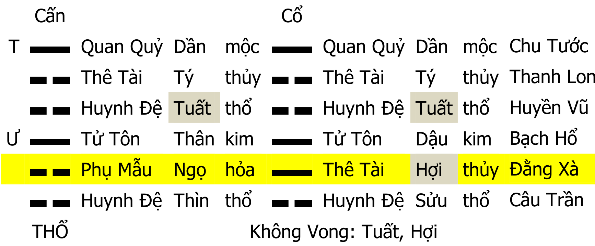
    - **Hình này chứng minh điều gì**
      - Đôi bên sống chung bất hợp pháp, bạn trai cao ráo khéo ăn nói; quan hệ không bền và bị kẻ khác dùng thủ đoạn phá hoại vào tháng Dần.
    - **Từ đâu mà thấy được**
      - Quan Quỷ Dần mộc trì Thế lâm Chu Tước; Phụ Mẫu Ngọ hỏa hưu tù nhập Mộ Huyền Vũ Tuất thổ; quẻ Lục Xung, Dụng thần Nguyệt phá độc phát hóa Tử.
  - **Phán đoán chi tiết:**
    - Căn cứ: Nữ nhân tự xem hôn nhân lấy Quan Quỷ làm Dụng thần (bạn trai/chồng), hào Thế là bản thân, hào Phụ Mẫu tượng trưng cho hôn thú và tính hợp pháp của mối quan hệ.
    - Nhìn vào:
      - Quan Quỷ Dần mộc trì Thế, tức Dụng thần và hào Thế cùng đóng tại hào 6, chứng tỏ ban đầu tình cảm hai người rất khăng khít mặn nồng, một lòng một dạ hướng về nhau.
      - Tuy nhiên, Phụ Mẫu Ngọ hỏa hưu tù, lại nhập Mộ tại hào Huynh Đệ Tuất thổ ám động (do Thìn nhật tương xung). Phụ Mẫu là giấy chứng nhận kết hôn, hưu tù là không có giấy tờ, nhập Mộ biểu thị không thể đưa ra ánh sáng pháp lý, Mộ khố lại lâm Huyền Vũ chủ sự mờ ám, hẹn ước lén lút riêng tư. Tổ hợp này phản ánh hai người đang sống chung bất hợp pháp (vị hôn đồng cư, không đăng ký kết hôn).
      - Về tướng mạo và tính tình đối phương: Dụng thần Quan Quỷ Dần mộc lâm Chu Tước chủ về ngôn ngữ biểu đạt, người nam hoạt ngôn, dẻo miệng, ăn nói rất khéo léo. Dần mộc chủ dáng người cao gầy, do hưu tù nên kết hợp số quẻ Cấn (Cấn vi số 7), suy đoán chiều cao khoảng 1m77.
      - Về tương lai: Quẻ Cấn Vi Sơn là quẻ Lục Xung chủ sự tan vỡ, ly tán; Dụng thần Dần mộc bị Nguyệt kiến Thân kim xung phá thành Nguyệt phá là điềm xấu; trong quẻ hào độc phát lại là Tử địa của Dụng thần, báo hiệu mối tình này không thể duy trì dài lâu.
  - **Ứng nghiệm thực tế:**
    - Dự đoán chuẩn xác hoàn toàn: Hai người chỉ sống chung lén lút chứ không kết hôn, người bạn trai cao đúng 1m77 và nói năng rất hoạt bát; đến tháng Dần năm sau, đôi bên bị kẻ xấu giở thủ đoạn chia rẽ phá hoại dẫn đến tan vỡ đường ai nấy đi.

- **Ví dụ 5: Ngày Đinh Mão tháng Tuất, nữ đoán hôn nhân con gái (36 tuổi), được quẻ Thủy Phong Tỉnh biến Địa Sơn Khiêm (Tuần không: Tuất, Hợi)**
  - **Hình 17.** Sơ đồ quẻ Thủy Phong Tỉnh biến Địa Sơn Khiêm
    - 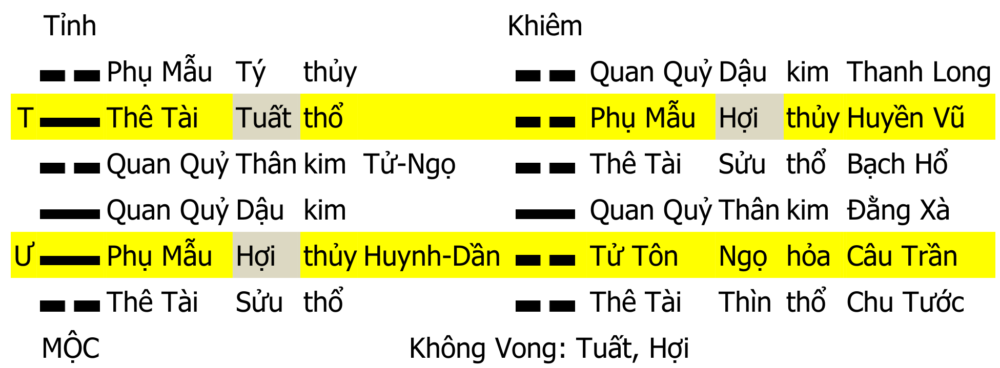
    - **Hình này chứng minh điều gì**
      - Con gái và chồng nguội lạnh, cả hai đều ngoại tình; mẹ đẻ mắc bệnh hô hấp và đường ruột do Thế Không bị khắc và Quan Quỷ vượng.
    - **Từ đâu mà thấy được**
      - Quan Quỷ Dậu kim ám động Dịch Mã sinh Ứng; Thế Tuất thổ Không lâm Huyền Vũ hóa Phụ Mẫu Không; Quan Quỷ kim vượng khắc Thế.
  - **Phán đoán chi tiết:**
    - Căn cứ: Người mẹ hỏi hôn nhân cho con gái lấy Quan Quỷ làm con rể / chồng của con gái, hào Thế đại diện con gái (hoặc người mẹ khi chuyển sang hỏi bệnh); kết hợp hào vị, lục thân, Thần sát và biến hóa sinh khắc để bóc tách đa tầng thông tin.
    - Nhìn vào:
      - *Về tình trạng hôn nhân và ngoại tình của con gái:*
        - Trong quẻ Quan Quỷ lưỡng hiện (Thân kim tại hào 4 và Dậu kim tại hào 3), lấy hào ám động Quan Quỷ Dậu kim (do Mão nhật tương xung) làm Dụng thần người chồng. Dậu kim lâm Dịch Mã biểu thị người chồng thường xuyên đi xa hoặc làm việc ở ngoài; hào 2 (trạch) lâm Tuần Không nên Dụng thần không sinh nhập trạch, báo hiệu người chồng rất ít khi về nhà.
        - Dụng thần Quan Quỷ Dậu kim ám động sinh hào Ứng Phụ Mẫu Hợi thủy, Ứng là người ngoài, biểu thị người chồng đang có tình ý dan díu với phụ nữ khác; song hào Ứng Hợi thủy lại lâm Tuần Không nên không tiếp nhận sinh trợ, chứng tỏ đối phương ngoài luồng không mấy mặn mà với anh ta.
        - Hào Thế Thê Tài Tuất thổ lâm Tuần Không nên không sinh Quan Quỷ, phản ánh người con gái đã hoàn toàn cạn kiệt tình cảm với chồng. Đáng chú ý, hào Thế lâm Huyền Vũ (chủ ám muội) động hóa Phụ Mẫu Hợi thủy lâm Tuần Không (không danh phận hôn thú, chung sống phi pháp), lại bị Nhật thần Mão mộc khắc hợp (Mão Tuất hợp mang tượng quan hệ tình cảm ràng buộc kín đáo), vạch trần việc chính con gái cũng đang ngoại tình ngoài giá thú.
        - Phân tích nhân tình của con gái qua Quan Quỷ Thân kim: Thân kim là đất Trường Sinh của hào Thế Tuất thổ, cho thấy người đàn ông này rất yêu chiều, đối xử chu đáo với con gái. Dưới Thân kim có Tử Tôn Ngọ hỏa phục tàng, tiết lộ người đàn ông này vốn đã có con riêng. Hào Thế và Quan Quỷ Thân kim nằm kề cận liền hào (hào 4 và hào 5), chứng tỏ hai người rất gắn bó quấn quýt. Tuy nhiên, hào Thế bị Nhật thần Huynh Đệ Mão mộc hợp giữ (Huynh Đệ là đối thủ cạnh tranh, tức người vợ hợp pháp của nhân tình), tạo thành rào cản ngăn không cho cô sinh phù Thân kim; vì đối phương không thể ly hôn vợ nên mối tình vụng trộm này mãi rơi vào bế tắc, không thể kết thành phu thê.
      - *Về sức khỏe của người mẹ (khi người hỏi hỏi thêm cho bản thân):*
        - Chuyển lấy hào Thế Tuất thổ làm Dụng thần đại diện cho người mẹ: Hào Thế cư hào 5 (ngực, cổ họng, bộ máy hô hấp) lâm Tuần Không lại bị Nhật thần khắc hợp; Thê Tài chủ về hô hấp và tiêu hóa ăn uống, Không mà bị hợp cản trở tượng trưng cho hô hấp không thông suốt, lồng ngực bí bách, ăn uống kém ngon miệng.
        - Quan Quỷ vượng tướng mang tượng bệnh tật; trong quẻ hào 3 và hào 4 đều là Quan Quỷ Thân Dậu kim đắc lệnh vượng tướng, ngũ hành Kim chủ về bệnh thuộc hệ thống hô hấp (phế quản, phổi) và hệ tiêu hóa, đường ruột.
  - **Ứng nghiệm thực tế:**
    - Toàn bộ phán đoán kỳ diệu ở trên đều ứng nghiệm hoàn toàn: Con gái và con rể đã ly thân trên thực tế, cả hai bên đều có người tình ngoài luồng; người con gái đúng là đang qua lại với người đàn ông đã có vợ con nhưng bế tắc không cưới được. Bản thân người mẹ thời gian qua đúng là bị khó thở, tức ngực và mắc các chứng bệnh tiêu hóa, đường ruột hành hạ triền miên.

- **Ví dụ 6: Ngày Ất Mão tháng Dậu, nam (người Nhật Bản) đoán có thể kết hôn không, được quẻ Thủy Trạch Tiết biến Chấn Vi Lôi (Tuần không: Tý, Sửu)**
  - **Hình 18.** Sơ đồ quẻ Thủy Trạch Tiết biến Chấn Vi Lôi
    - 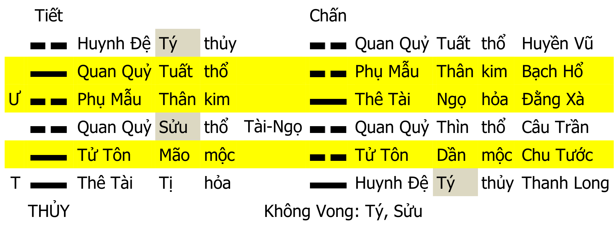
    - **Hình này chứng minh điều gì**
      - Cha bạn gái ban đầu phản đối, sau yêu cầu con gái giữ họ gốc không đổi họ theo chồng thì mới cho cưới; Quan Quỷ chủ dòng họ.
    - **Từ đâu mà thấy được**
      - Dụng thần Thê Tài Tị hỏa trì Thế; Phụ Mẫu Thân kim tại Ứng động hợp Thế; hào 5 Quan Quỷ Tuất thổ giữ Tử Tôn Mão mộc không thoái.
  - **Phán đoán chi tiết:**
    - Căn cứ: Nam nhân hỏi về việc cưới xin lấy Thê Tài làm Dụng thần, hào Thế đại diện bản thân, hào Ứng và Phụ Mẫu đại diện gia đình bạn gái và các bậc bề trên, Quan Quỷ mang tượng họ tên, gia tộc.
    - Nhìn vào:
      - Thê Tài Tị hỏa trì Thế, biểu thị bản thân người nam rất tha thiết yêu thương bạn gái; hào Thế lâm Thanh Long là thần cát khánh chủ niềm vui, sự hân hoan, cho thấy anh cảm thấy vô cùng hạnh phúc khi ở bên cô. Dụng thần tuy không được Nguyệt lệnh Dậu kim tương trợ nhưng được Nhật thần Mão mộc sinh phù vượng tướng.
      - Hào Ứng Phụ Mẫu Thân kim phát động đến hợp hào Thế (Tị Thân lục hợp). Hào Ứng đại diện cho gia đình đối phương, Phụ Mẫu chủ về cha mẹ, trưởng bối; hào này động hợp vào Thế mang tượng muốn níu giữ con gái ở bên cạnh mình, tiết lộ cha mẹ bạn gái kịch liệt phản đối hôn sự, không muốn gả con.
      - Nguyên thần của Dụng thần là Tử Tôn Mão mộc phát động nhưng bị Nguyệt kiến Dậu kim xung phá (Nguyệt phá), lại biến thoái thành Dần mộc (hóa thoái) là điềm trở ngại nguy hại. May mắn thay, hào 5 Quan Quỷ Tuất thổ tương hợp với Tử Tôn Mão mộc (Mão Tuất lục hợp); cái hợp này mang hai ý nghĩa cứu vãn sinh tử: một là hợp để giải trừ Nguyệt phá, hai là giữ chặt kéo Mão mộc lại không cho thoái lui.
      - Hào 5 là ngôi vị tôn quý của gia trưởng, người có tiếng nói quyết định trong nhà, cho thấy mấu chốt tháo gỡ nút thắt nằm ở người cha của cô gái. Quan Quỷ trong trường hợp này đại diện cho tên họ, dòng họ gia tộc.
  - **Ứng nghiệm thực tế:**
    - Cha mẹ bạn gái ban đầu phản đối kịch liệt hôn sự; đến tháng Tuất (ứng với hào 5 Quan Quỷ Tuất thổ nắm quyền quyết định), người cha cô gái chủ động đề xuất điều kiện: Sau khi kết hôn, con gái không được đổi sang họ của chồng theo tập tục truyền thống Nhật Bản mà phải giữ nguyên họ cha sinh mẹ đẻ, nếu nhà trai chấp thuận điều kiện này thì ông sẽ ưng thuận cho cưới. Đôi bên đồng ý và tiến tới hôn nhân êm ấm.

- **Ví dụ 7: Ngày Tân Sửu tháng Tị, nữ đoán hôn nhân em trai, được quẻ Sơn Trạch Tổn biến Phong Thủy Hoán (Tuần không: Thìn, Tị)**
  - **Hình 19.** Sơ đồ quẻ Sơn Trạch Tổn biến Phong Thủy Hoán
    - 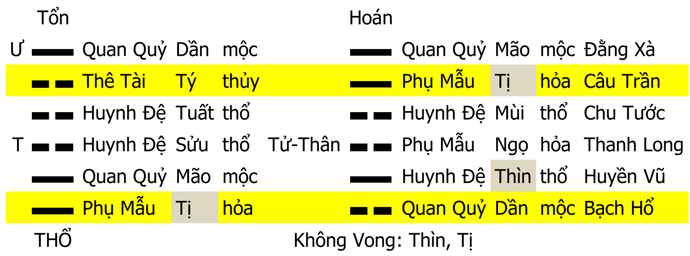
    - **Hình này chứng minh điều gì**
      - Vợ thường bỏ về nhà mẹ đẻ bặt tăm; năm Thân kết hôn và sinh con; sau đó vợ chồng hòa giải, vợ bế con quay về nhà sum họp.
    - **Từ đâu mà thấy được**
      - Thê Tài Tý thủy động hóa Phụ Mẫu Tị hỏa Không Tuyệt; Tý thủy Trường Sinh tại Thân; Tử Tôn Thân kim phục Thế không hiện.
  - **Phán đoán chi tiết:**
    - Căn cứ: Chị gái xem hôn nhân cho em trai lấy Thê Tài làm Dụng thần (vợ của em trai), hào Thế Sửu thổ đại diện cho em trai (lục thân Huynh Đệ), biến hào và phục thần định vị tung tích và con cái.
    - Nhìn vào:
      - Thê Tài Tý thủy phát động tương hợp với hào Thế Huynh Đệ Sửu thổ (Tý Sửu lục hợp), ngoài mặt cho thấy hai vợ chồng hòa thuận gắn bó. Tuy nhiên, Dụng thần Tý thủy động hóa Phụ Mẫu Tị hỏa lâm Tuần Không, lại lâm Tuyệt địa (thủy tuyệt ở Tị), mang tượng người vợ thường xuyên biến mất không để lại dấu tích. Hào biến là Phụ Mẫu tượng trưng cho nhà cha mẹ, tiết lộ người vợ hễ có mâu thuẫn là bỏ đi biệt tăm, về ẩn náu tại nhà mẹ đẻ.
      - Thê Tài Tý thủy rơi vào hưu tù trong tháng Tị, theo nguyên lý Dịch học về ứng kỳ của hào suy nhược sẽ ứng vào đất Trường Sinh; thủy Trường Sinh tại Thân, vì vậy xác định hai người kết hôn vào năm Giáp Thân.
      - Hào Tử Tôn Thân kim phục tàng dưới hào Thế Sửu thổ mà không xuất hiện trên quẻ, mang hai hàm ý tinh vi:
        - Một là phục thần gặp Trường Sinh ứng kỳ xuất hiện, khẳng định năm Giáp Thân đôi bên đã sinh con.
        - Hai là hiện tại con cái phục tàng không thấy trên quẻ, báo hiệu đứa bé hiện cũng không có ở nhà nội mà đang bị người mẹ mang theo về bên ngoại.
  - **Ứng nghiệm thực tế:**
    - Người hỏi vô cùng thán phục vì mọi việc đúng y như quẻ chỉ ra: Hai vợ chồng kết hôn năm Giáp Thân và sinh một con, người vợ giận dỗi dắt con về nhà mẹ đẻ ở lì khiến gia đình bối rối. Sau khi tác giả luận giải và hướng dẫn, đôi bên đã hòa giải thành công, người vợ đưa con trở về đoàn tụ êm ấm.

### CHƯƠNG 4: TƯỢNG LỤC THẦN

#### Bản chất và công năng của Lục Thần trong dự đoán nhân duyên

- **Ý nghĩa biểu đạt nguyên nhân và tính chất sự vật:**
  - Lục Thần trong dự đoán Lục Hào (Thanh Long, Chu Tước, Câu Trần, Đằng Xà, Bạch Hổ, Huyền Vũ) không nắm quyền sinh sát cát hung trực tiếp như ngũ hành sinh khắc suy vượng, mà đóng vai trò chủ chốt trong việc phản ánh bản chất, duyên do phát sinh và tính chất nội tại của sự vật, hiện tượng.
  - Được ứng dụng sâu rộng để trích xuất thông tin đa chiều: Tính cách, tướng mạo, phong thái cá nhân; mức độ gắn kết hoặc rạn nứt trong quan hệ lứa đôi; thái độ ứng xử tâm lý; nguyên nhân tranh chấp gia đình; nghề nghiệp và hoàn cảnh xuất thân của đối phương.

#### Hệ thống ý tượng của sáu Lục Thần trong hôn nhân

- **Thanh Long (Mộc thần - Cát khánh & Hỷ khí):**
  - **Tướng mạo và phong thái:** Đại diện cho khuôn mặt đẹp, tuấn tú thanh tú, ưa nhìn, biết trang điểm, hóa trang lộng lẫy, làm dáng, phong thái cao quý, thanh nhã, hào hoa tao nhã.
  - **Bản chất sự việc:** Chủ sự khởi đầu thuận lợi, sự việc mới mẻ, điềm vui mừng hỷ khánh, niềm hạnh phúc mỹ mãn, tiệc rượu yến tiệc liên hoan, sang giàu, vinh hoa, được người trân trọng quý mến; liên quan đến tửu sắc, việc thụ thai và sinh nở thuận hòa.
- **Chu Tước (Hỏa thần - Khẩu thiệt & Văn thư):**
  - **Tướng mạo và phong thái:** Khuôn mặt tươi cười rạng rỡ, mắt cười híp mí; tính tình cởi mở, hoạt bát, có tài ăn nói, khéo đàm luận, thích giao tiếp, chủ động bộc lộ tình cảm và thái độ.
  - **Bản chất sự việc:** Chủ về ngôn ngữ, lời ăn tiếng nói, đàm luận trao đổi, thông tin liên lạc, thư từ, văn thư giấy tờ, giấy đăng ký kết hôn; mặt tiêu cực chủ về cãi cọ, tranh chấp gay gắt, đôi co to tiếng, khẩu thiệt thị phi, kiện cáo tố tụng; nghề nghiệp liên quan đến giáo dục, giảng dạy, truyền thông, thuyết trình.
- **Câu Trần (Thổ thần - Điềm đạm & Dây dưa):**
  - **Tướng mạo và phong thái:** Tướng mạo đầy đặn, thân hình đẫy đà, béo phì, thân thể có chỗ nhô lên hoặc phồng lên; tính tình thật thà phúc hậu, trung hậu, an phận thủ thường, trầm tĩnh cẩn trọng; mặt tiêu cực là vụng về, chậm chạp, không nhạy bén, lười biếng, bảo thủ, cố chấp hoặc ngu độn.
  - **Bản chất sự việc:** Chủ về các mối quan hệ dây dưa, dính líu chằng chéo, liên quan nhiều bên khó dứt; chủ về nhà cửa, đất đai trạch vị, việc tu tạo sửa sang xây dựng; sự việc tiến triển chậm chạp, trì trệ kéo dài.
- **Đằng Xà (Hỏa/Thổ thần - Hư kinh & Quái dị):**
  - **Tướng mạo và phong thái:** Vóc dáng mảnh khảnh, gầy gò, quanh co khúc khuỷu; tính cách đa nghi, xảo quyệt, giảo hoạt, quái gở lập dị, cô độc ít giao tiếp; tâm lý nhát gan rụt rè, hay sợ hãi lo lắng bất an, tham tài hám lợi, hẹp hòi ích kỷ, nói nhiều lải nhải.
  - **Bản chất sự việc:** Chủ về sự việc kỳ quái hiếm gặp, nỗi kinh hoàng giật mình, chuyện quanh co uẩn khúc, sự ràng buộc trói buộc như dây thừng xiềng xích; có khiếu năng khiếu về nghệ thuật, kỹ nghệ tinh xảo hoặc tâm linh huyền bí.
- **Bạch Hổ (Kim thần - Hung bạo & Quyền uy):**
  - **Tướng mạo và phong thái:** Tướng mạo uy nghiêm, cương nghị, sắc sảo; tính khí nóng nảy, hung dữ, hay cáu gắt gắt gỏng, thô bạo lỗ mãng, nôn nóng vội vàng, làm việc nhanh chóng quyết liệt, phong thái nghiêm khắc, uy vũ uy mãnh.
  - **Bản chất sự việc:** Chủ về sự việc bận rộn hối hả, cơn tức giận lôi đình; mặt tiêu cực chủ về xô xát, đánh nhau thương tích, tổn thương bạo lực, ốm đau bệnh tật nặng, đổ máu tai nạn; trong thai sản chủ về sinh non, sảy thai, phá thai (lưu sản); trong xã hội chủ về cơ quan chấp pháp quyền uy như quân đội, công an, kiểm sát, tòa án tư pháp.
- **Huyền Vũ (Thủy thần - Ám muội & Dục vọng):**
  - **Tướng mạo và phong thái:** Nước da hơi đen hoặc bánh mật, dáng vẻ gợi cảm, quyến rũ đa tình; tính tình thâm trầm kín đáo, thích việc thầm kín riêng tư; mặt tiêu cực là dâm loạn, xảo trá gian dối, lọc lừa lừa gạt, trộm cắp, đầu cơ, cờ bạc cá độ.
  - **Bản chất sự việc:** Chủ về hành vi lén lút vụng trộm, ám muội mờ ám, quan hệ bất chính ngoài hôn nhân, ngoại tình giấu giếm, sống chung phi hôn nhân (vị hôn đồng cư); nội tâm u uất sầu não, buồn bực phiền muộn, nhiều tâm sự không thể giãi bày.

#### Quái lệ thực tiễn luận giải tượng Lục Thần

- **Ví dụ 1: Ngày Giáp Ngọ tháng Hợi, nam đoán tình trạng hiện nay của nữ (Quẻ Hỏa Thiên Đại Hữu biến Sơn Thiên Đại Súc)**
  - **Hình 20.** Quẻ Hỏa Thiên Đại Hữu biến Sơn Thiên Đại Súc
    - 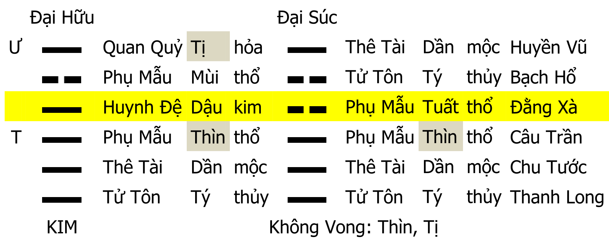
    - **Hình này chứng minh điều gì**
      - Quẻ Đại Hữu biến Đại Súc; Thế Thìn thổ lâm Câu Trần Tuần Không; Ứng Quan Quỷ Tị hỏa lâm Huyền Vũ Nguyệt phá; hào 4 Dậu kim lâm Đằng Xà động hóa Mộ khố Quan Quỷ.
    - **Từ đâu mà thấy được**
      - Hào 3 Thế Phụ Mẫu Thìn thổ lâm Câu Trần; hào 6 Ứng Quan Quỷ Tị hỏa lâm Huyền Vũ; hào 4 Huynh Đệ Dậu kim động hóa Tuất thổ trong quẻ Hỏa Thiên Đại Hữu biến Sơn Thiên Đại Súc.
  - **Phán đoán chi tiết:**
    - Căn cứ: Đoán tình trạng của một người nào đó thì lấy hào Thế làm người được dự đoán. Hào Thế tại hào 3 là Phụ Mẫu Thìn thổ mang ngũ hành Thổ chủ thận trọng; lâm Câu Trần lại chủ tính thành thật, cẩn trọng. Tuy nhiên, ngày Giáp Ngọ tuần giáp Thìn Tị Không Vong, hào Thế Thìn thổ lâm Không Vong nên ý tượng bị đảo ngược, bề ngoài có vẻ thận trọng trầm tĩnh nhưng thực tế tính tình hấp tấp, nóng nảy, rất dễ bị kích động.
    - Nhìn vào: Quẻ thuộc cung Càn chủ khí chất cao ngạo; hào Thế Thìn thổ là Thủy khố (Mộ khố của Tử Tôn Tý thủy), Tử Tôn đại diện cho nghệ thuật; hào 4 Huynh Đệ Dậu kim là hào độc phát hợp với hào Thế (Thìn Dậu lục hợp), Dậu kim lại lâm Đằng Xà, Đằng Xà chủ nghệ thuật, suy ra cô gái có năng khiếu và khiếu thẩm mỹ về nghệ thuật.
    - Căn cứ tiếp theo: Quan Quỷ Tị hỏa lâm hào 6 (Ứng) bị Nguyệt kiến Hợi thủy xung phá thành Nguyệt phá; hào độc phát Dậu kim lại là Tử địa của Tị hỏa (hỏa sinh ở Dần, tử ở Dậu), cho thấy người chồng tuy trên danh nghĩa có nhưng thực tế như không. Thêm vào đó Thế (Thìn thổ) và Ứng (Tị hỏa) đều lâm Không Vong, biểu thị vợ chồng nghi kỵ, không hề tin tưởng lẫn nhau.
    - Nhìn vào quan hệ vợ chồng: Hào Thế Thìn thổ và hào Ứng Tị hỏa cùng an tại cung Tốn theo phương vị 12 địa chi, biểu thị hai vợ chồng vốn là đồng nghiệp cùng cơ quan hoặc bạn học cùng lớp từ trước.
    - Căn cứ hành vi phạm pháp của chồng: Hào Ứng Quan Quỷ Tị hỏa lâm Huyền Vũ, Huyền Vũ chủ hành vi lén lút, gian dối lừa gạt hoặc trộm cắp. Hào độc phát Dậu kim lâm Đằng Xà động hóa ra Phụ Mẫu Tuất thổ là Mộ khố của Quan Quỷ Tị hỏa; độc phát chỉ tính chất sự việc, Đằng Xà tượng trưng cho dây thừng trói buộc xiềng xích, Mộ khố chủ sự giam giữ đóng kín, tạo thành tượng người chồng bị bắt giam ngồi tù.
  - **Ứng nghiệm thực tế:**
    - Phán đoán quả nhiên hoàn toàn chính xác: Người phụ nữ này tốt nghiệp đại học chuyên ngành nghệ thuật, hai vợ chồng vốn là bạn học cùng lớp, và người chồng trước đây đã từng phạm pháp phải ngồi tù.
- **Ví dụ 2: Ngày Tân Hợi tháng Dậu, nam đoán khi nào vợ có con (Quẻ Thiên Sơn Độn)**
  - **Hình 21.** Quẻ Thiên Sơn Độn
    - 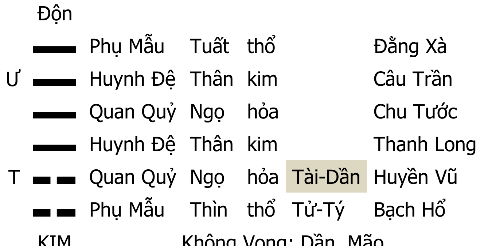
    - **Hình này chứng minh điều gì**
      - Quẻ Độn là tượng ẩn trốn; Dụng thần Tử Tôn Tý thủy phục tàng dưới hào sơ Thìn thổ; Thê Tài Dần mộc Không Vong phục tàng dưới Thế; Thế lâm Huyền Vũ u sầu.
    - **Từ đâu mà thấy được**
      - Quẻ tĩnh Thiên Sơn Độn; Tử Tôn Tý thủy phục dưới Phụ Mẫu Thìn thổ; Thê Tài Dần mộc phục dưới hào 2 Thế Quan Quỷ Ngọ hỏa lâm Huyền Vũ.
  - **Phán đoán chi tiết:**
    - Căn cứ: Hỏi về con cái lấy Tử Tôn làm Dụng thần. Trong quẻ tĩnh Thiên Sơn Độn, Tử Tôn Tý thủy phục tàng dưới hào sơ Phụ Mẫu Thìn thổ, hoàn toàn không xuất hiện trên quẻ. Quẻ Độn mang ý nghĩa quy ẩn, trốn tránh, thoái lui; Tử Tôn phục tàng kết hợp với tượng quẻ Độn chỉ ra rằng người vợ đã đem con lén lút trốn đi nơi khác, cố tình không cho người cha được gặp con.
    - Nhìn vào: Hào Thê Tài đại diện cho người vợ là Thê Tài Dần mộc phục tàng dưới hào 2 Thế Quan Quỷ Ngọ hỏa. Ngày Tân Hợi tuần giáp Thìn Dần Mão Không Vong, Thê Tài Dần mộc vừa lâm Không Vong vừa phục tàng; trong Lục Hào, Không Vong biểu thị mất đi, phục tàng biểu thị rời xa, báo hiệu người đàn ông thực tế đã ly hôn với vợ từ trước.
    - Căn cứ tâm lý: Hào Thế trì Quan Quỷ Ngọ hỏa lâm Huyền Vũ; Huyền Vũ chủ sự u uất, buồn phiền, sầu não giấu kín trong lòng, cho thấy tâm trạng đương sự đang vô cùng buồn bực, đau khổ và bức bối.
  - **Ứng nghiệm thực tế:**
    - Khách hàng xác nhận sự thật đúng như vậy: Hai người đã ly hôn, người vợ cũ mang theo đứa con trốn biệt tích không cho anh ta gặp mặt, khiến anh sống trong buồn bã sầu não.
- **Ví dụ 3: Ngày Quý Sửu tháng Dậu, nữ đoán hôn nhân ra sao (Quẻ Sơn Phong Cổ biến Hỏa Phong Đỉnh)**
  - **Hình 22.** Quẻ Sơn Phong Cổ biến Hỏa Phong Đỉnh
    - 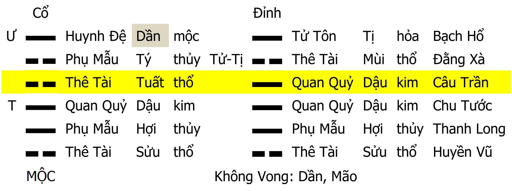
    - **Hình này chứng minh điều gì**
      - Quẻ Cổ biến Đỉnh; Dụng thần Quan Quỷ Dậu kim vượng tướng trì Thế lâm Chu Tước; Hương Khuê Thê Tài Tuất thổ độc phát sinh hào Thế; người chồng làm nghề giáo dục.
    - **Từ đâu mà thấy được**
      - Hào 3 Thế Quan Quỷ Dậu kim lâm Chu Tước; hào 4 Thê Tài Tuất thổ phát động hóa Quan Quỷ Dậu kim trong quẻ Sơn Phong Cổ biến Hỏa Phong Đỉnh.
  - **Phán đoán chi tiết:**
    - Căn cứ: Nữ hỏi hôn nhân lấy Quan Quỷ làm Dụng thần. Trong quẻ, Dụng thần Quan Quỷ Dậu kim được Nguyệt kiến Dậu kim lâm trị, Nhật thần Sửu thổ sinh trợ (Sửu thổ sinh Dậu kim), vượng tướng hữu lực trì Thế, chứng tỏ đương số đã kết hôn.
    - Nhìn vào hôn kỳ: Hào 4 Thê Tài Tuất thổ là Hương Khuê vượng tướng phát động sinh hào Thế, động hóa ra Quan Quỷ Dậu kim; hào động Tuất thổ tương ứng năm Giáp Tuất (1994), phán đoán hai người chính thức kết hôn vào năm 1994.
    - Căn cứ tình cảm vợ chồng: Hào 4 Thê Tài Tuất thổ đóng vai trò Nguyên thần của Quan Quỷ độc phát sinh trợ hào Thế, trong Lục Hào tượng độc phát sinh Thế chủ gia đạo hòa thuận thắm thiết, vợ chồng yêu thương nâng đỡ lẫn nhau.
    - Nhìn vào nghề nghiệp người chồng: Dụng thần Quan Quỷ Dậu kim lâm Chu Tước; Chu Tước mang tượng ngôn từ, khẩu tài, văn chương bài giảng, truyền thụ kiến thức; Quan Quỷ vượng tướng lâm Chu Tước trì Thế biểu thị người chồng làm việc trong ngành giáo dục, là nhà giáo.
  - **Ứng nghiệm thực tế:**
    - Đương số xác nhận hoàn toàn chuẩn xác: Hai vợ chồng kết hôn đúng vào năm Giáp Tuất 1994, đời sống vợ chồng luôn hòa thuận hạnh phúc, và người chồng hiện đang là một giáo sư giảng dạy tại trường đại học.
- **Ví dụ 4: Ngày Nhâm Tý tháng Mão, nữ đoán chia tay người yêu ra sao (Quẻ Ly Vi Hỏa biến Hỏa Lôi Phệ Hạp)**
  - **Hình 23.** Quẻ Ly Vi Hỏa biến Hỏa Lôi Phệ Hạp
    - 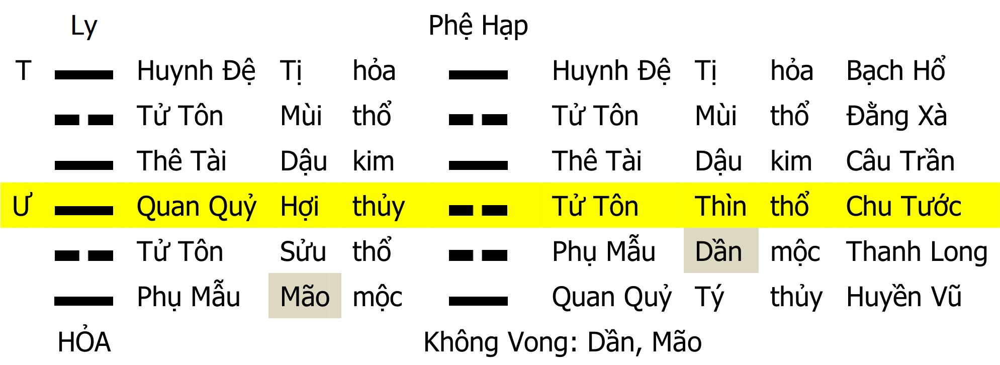
    - **Hình này chứng minh điều gì**
      - Quẻ Ly lục xung; Dụng thần Quan Quỷ Hợi thủy tại hào Ứng lâm Chu Tước xung khắc hào Thế Tị hỏa; Dụng thần độc phát hóa Mộ tại Thìn thổ, tháng Thìn ắt chia tay.
    - **Từ đâu mà thấy được**
      - Hào 3 Ứng Quan Quỷ Hợi thủy lâm Chu Tước phát động hóa Tử Tôn Thìn thổ xung khắc hào 6 Thế Huynh Đệ Tị hỏa trong quẻ Ly Vi Hỏa biến Hỏa Lôi Phệ Hạp.
  - **Phán đoán chi tiết:**
    - Căn cứ: Nữ hỏi về người yêu lấy Quan Quỷ làm Dụng thần. Hào 3 Ứng Quan Quỷ Hợi thủy phát động lâm Chu Tước, trực tiếp xung khắc hào 6 Thế Huynh Đệ Tị hỏa (Hợi thủy xung khắc Tị hỏa). Chu Tước chủ ngôn ngữ, lời qua tiếng lại; tương xung chủ bất hòa mâu thuẫn; tương khắc chủ ác cảm, phản cảm gay gắt; tổ hợp này chứng minh hai người hoàn toàn không có tiếng nói chung, hễ mở miệng là cãi vã, không thể nói chuyện hòa bình.
    - Nhìn vào kết cục và ứng kỳ: Quẻ gốc Ly Vi Hỏa là quẻ lục xung chủ sự việc tan rã mau chóng. Dụng thần Quan Quỷ Hợi thủy là hào độc phát động hóa Tử Tôn Thìn thổ, Thìn thổ là Mộ khố của Hợi thủy (Dụng thần hóa Mộ). Hóa Mộ chỉ sự bế tắc, chấm dứt, vùi lấp mối quan hệ. Quẻ xem vào tháng Mão, sang tháng Thìn Mộ thần nắm lệnh xuất hiện thì cuộc tình chính thức tan vỡ.
  - **Ứng nghiệm thực tế:**
    - Kết quả ứng nghiệm hoàn toàn chính xác: Bước sang tháng Thìn hai người phát sinh bất đồng gay gắt không thể điều đình và đã dứt khoát chia tay.
- **Ví dụ 5: Ngày Tân Hợi tháng Tuất năm Nhâm Ngọ, nữ đoán hôn nhân (Quẻ Thiên Thủy Tụng biến Thiên Địa Bĩ)**
  - **Hình 24.** Quẻ Thiên Thủy Tụng biến Thiên Địa Bĩ
    - 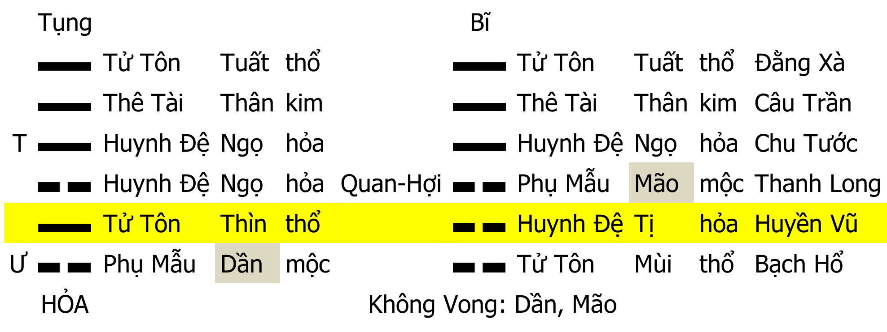
    - **Hình này chứng minh điều gì**
      - Quẻ Tụng du hồn; Tử Tôn Thìn thổ độc phát lâm Huyền Vũ tại hào 2 trạch vị hóa hồi đầu sinh; Quan Quỷ nhập Mộ tại hào 2; mang thai ngoài giá thú rồi phá thai chia tay.
    - **Từ đâu mà thấy được**
      - Hào 2 Tử Tôn Thìn thổ lâm Huyền Vũ động hóa Huynh Đệ Tị hỏa; phục thần Quan Quỷ Hợi thủy phục dưới hào 3 Huynh Đệ Ngọ hỏa trong quẻ Thiên Thủy Tụng biến Thiên Địa Bĩ.
  - **Phán đoán chi tiết:**
    - Căn cứ tiền sử hôn nhân (đã ly hôn): Nữ xem hôn nhân lấy Quan Quỷ làm Dụng thần. Quan Quỷ Hợi thủy phục tàng dưới hào 3 Huynh Đệ Ngọ hỏa, bị Nguyệt kiến Tuất thổ khắc nhưng được Nhật thần Hợi thủy trợ phù, suy vượng giằng co. Hào sơ Phụ Mẫu Dần mộc hợp với Nhật thần Hợi thủy; Phụ Mẫu là giấy đăng ký kết hôn, hợp Nhật chủ hôn kỳ, cho thấy từng có cuộc hôn nhân hợp pháp. Tuy nhiên, hào 2 Tử Tôn Thìn thổ phát động khắc Quan Quỷ, quẻ Tụng lại là quẻ Du Hồn chủ sự phiêu lưu chia lìa. Hào động Thìn thổ bị Nguyệt kiến Tuất thổ xung là Nguyệt phá; năm Canh Thìn (2000) thực phá xung động khắc Quan, nên phán đoán đương số đã chính thức ly hôn vào năm Canh Thìn.
    - Nhìn vào tình trạng sống thử hiện tại: Hào 2 Tử Tôn Thìn thổ lâm Huyền Vũ độc phát; hào 2 là trạch vị (nhà ở), Quan Quỷ Hợi thủy nhập Mộ tại Thìn thổ hào 2, biểu thị có người đàn ông bước vào sống trong nhà. Huyền Vũ chủ hành vi lén lút ám muội, độc phát lâm Huyền Vũ ở trạch vị chủ hiện tượng vị hôn đồng cư (sống chung như vợ chồng khi chưa kết hôn) với một người đàn ông khác.
    - Căn cứ bối cảnh người đàn ông: Dụng thần Hợi thủy phục dưới hào 3 Huynh Đệ Ngọ hỏa; Huynh Đệ là người cạnh tranh, mang cùng ngũ hành hỏa với hào Thế Ngọ hỏa (đồng loại nữ giới), biểu thị người đàn ông sống chung này vốn đã có vợ hoặc đang có người phụ nữ khác bên ngoài.
    - Nhìn vào việc mang thai và phá thai: Hào 2 Tử Tôn Thìn thổ Nguyệt phá, Nhật không sinh là hưu tù; động hóa Huynh Đệ Tị hỏa; hào hưu tù không lấy tuyệt luận mà là hồi đầu sinh. Hào 2 là thai vị và tử cung, Tử Tôn đại diện con cái, được hóa hồi đầu sinh biểu thị cô gái đã mang thai; lâm Huyền Vũ chủ đứa con ngoài giá thú. Nhưng do Tử Tôn Thìn thổ bị Nguyệt phá chủ tâm lý không muốn giữ đứa bé; khi gặp kỳ thực phá thì phát động khắc Quan Quỷ, do đó phán đoán cô sẽ phá thai rồi dứt khoát chia tay người đàn ông này.
  - **Ứng nghiệm thực tế:**
    - Khách hàng thừa nhận thực tế hoàn toàn trùng khớp: Cô đang sống chung với một người đàn ông nhưng sau mới biết anh ta đã có người phụ nữ khác; cô đã mang thai, nhiều lần thương lượng căng thẳng không thể giải quyết ổn thỏa nên cuối cùng đã phá thai và cắt đứt quan hệ.
- **Ví dụ 6: Ngày Kỷ Dậu tháng Ngọ năm Nhâm Ngọ, nam đoán quan vận và hôn nhân (Quẻ Địa Sơn Khiêm)**
  - **Hình 25.** Sơ đồ quẻ Địa Sơn Khiêm
    - 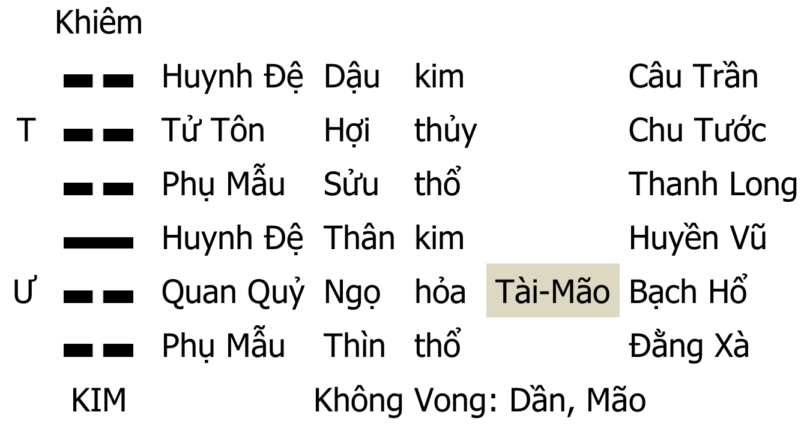
    - **Hình này chứng minh điều gì**
      - Quẻ Khiêm; hào 5 Thế Tử Tôn Hợi thủy khắc hào 2 Ứng Quan Quỷ Ngọ hỏa lâm Bạch Hổ; Thê Tài Mão mộc phục dưới Quan Quỷ bị Nhật xung; chức phó, vợ ngoại tình lãnh đạo pháp chế.
    - **Từ đâu mà thấy được**
      - Quẻ tĩnh Địa Sơn Khiêm; hào 5 Thế Tử Tôn Hợi thủy; hào 2 Ứng Quan Quỷ Ngọ hỏa lâm Bạch Hổ đè phục thần Thê Tài Mão mộc.
  - **Phán đoán chi tiết:**
    - Luận giải quan vận:
      - Căn cứ: Đoán công danh quan vận lấy Quan Quỷ làm Dụng thần. Hào 2 Quan Quỷ Ngọ hỏa được Nguyệt kiến Ngọ hỏa trợ giúp là vượng tướng hữu lực. Hào Thế Tử Tôn Hợi thủy tọa lạc tại hào 5; hào 5 là ngôi vị cao quý của bậc quân vương, lãnh đạo cơ quan, chứng tỏ bản thân đương sự đang nắm giữ chức vị lãnh đạo. Ngũ hành hào Thế mang âm Thủy (Hợi thủy), ở thế phụ trợ nên xác định chức vị là cấp phó (phó giám đốc cơ quan).
      - Nhìn vào: Hào Thế Tử Tôn Hợi thủy tại hào 5 phát lực khắc chế hào 2 Ứng Quan Quỷ Ngọ hỏa; hào Ứng đại diện cho người khác, Thế khắc Ứng mang tượng truất quyền, tước đoạt chức vị của đối thủ cạnh tranh để đoạt lấy ghế lãnh đạo, chứng tỏ chức vị này đạt được thông qua đấu tranh nội bộ kịch liệt mà có.
    - Luận giải hôn nhân:
      - Căn cứ hôn kỳ: Nam đoán hôn nhân lấy Thê Tài làm Dụng thần. Hào Thế Hợi thủy tương sinh Dụng thần Thê Tài Mão mộc; Hợi thủy ứng với năm Ất Hợi (1995), trong phép đoán lục hào đây là tượng hưu tù gặp Trường Sinh, phán đoán anh kết hôn vào năm 1995.
      - Nhìn vào dấu hiệu vợ ngoại tình: Dụng thần Thê Tài Mão mộc lâm Tuần Không, phục tàng dưới hào 2 Ứng Quan Quỷ Ngọ hỏa; hình tượng Thê Tài nép dưới Quan Quỷ là thông tin rõ ràng về việc người vợ ngoại tình vụng trộm với người đàn ông khác. Mão mộc tương ứng năm Kỷ Mão (1999), xác định năm 1999 người vợ phát sinh quan hệ bất chính. Nhật thần Dậu kim trực tiếp xung khắc Dụng thần Mão mộc (Mão Dậu tương xung), xung chủ bại lộ, bị phát hiện bắt quả tang tại trận.
      - Căn cứ thân thế người tình của vợ: Phi thần Quan Quỷ Ngọ hỏa chính là người đàn ông ngoại tình với vợ. Quan Quỷ lâm Nguyệt kiến lại lâm Bạch Hổ; Quan Quỷ lâm Nguyệt kiến là tượng của ngành công kiểm pháp (công an, viện kiểm sát, tư pháp); Bạch Hổ chủ chấp pháp quyền uy, chứng minh người đàn ông tư thông với vợ đương số là cán bộ lãnh đạo nắm quyền lực trong bộ phận pháp chế, chính trị tư pháp.
  - **Ứng nghiệm thực tế:**
    - Khách hàng xác nhận hoàn toàn chuẩn xác: Anh đang giữ chức phó giám đốc một cơ quan. Năm 1999, anh tận mắt bắt quả tang vợ ngoại tình; đối phương chính là lãnh đạo của bộ phận pháp chế, do thế lực đối phương quá lớn nên anh đành nén giận không dám làm to chuyện.
- **Ví dụ 7: Ngày Mậu Dần tháng Tý, nữ đoán chồng muốn ly hôn (Quẻ Đoài Vi Trạch biến Thiên Trạch Lý)**
  - **Hình 26.** Sơ đồ quẻ Đoài Vi Trạch biến Thiên Trạch Lý
    - 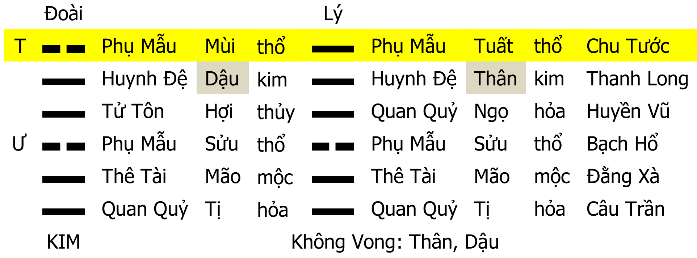
    - **Hình này chứng minh điều gì**
      - Quẻ Đoài thuần khẩu thiệt cãi vã; hào 6 Thế Phụ Mẫu Mùi thổ là Tài khố lâm Chu Tước độc phát hóa Tuất thổ; Dụng thần Quan Quỷ Tị hỏa sinh Thế; không ly hôn.
    - **Từ đâu mà thấy được**
      - Hào 6 Thế Phụ Mẫu Mùi thổ lâm Chu Tước động hóa Phụ Mẫu Tuất thổ; hào sơ Quan Quỷ Tị hỏa sinh Thế trong quẻ Đoài Vi Trạch biến Thiên Trạch Lý.
  - **Phán đoán chi tiết:**
    - Căn cứ: Nữ hỏi về chồng lấy Quan Quỷ làm Dụng thần. Quan Quỷ Tị hỏa tại hào sơ bị Nguyệt kiến Tý thủy khắc nhưng được Nhật thần Dần mộc sinh trợ (Dần hình sinh Tị), tuy suy vượng giằng co khó phân nhưng then chốt là Dụng thần Quan Quỷ Tị hỏa tương sinh hào Thế Phụ Mẫu Mùi thổ (Tị hỏa sinh Mùi thổ), chứng tỏ trong lòng người chồng vẫn còn tình cảm yêu thương và gắn bó với vợ.
    - Nhìn vào bản chất mâu thuẫn: Quẻ gốc là Đoài Vi Trạch thuộc bát thuần Đoài, quái tượng Đoài tượng trưng cho cái miệng, lời ăn tiếng nói (khẩu thiệt). Hào 6 Thế Phụ Mẫu Mùi thổ độc phát hóa Phụ Mẫu Tuất thổ, lâm Chu Tước; Chu Tước chủ về tranh luận, đấu khẩu, cãi cọ; hào độc phát chỉ ra bản chất sự việc, toàn bộ cuộc xung đột giữa hai vợ chồng thực chất chỉ là khẩu thiệt cãi vã nhất thời lúc nóng giận, người chồng nói đòi ly hôn chỉ là lời bốc đồng chứ không hề muốn ly hôn thật sự.
    - Căn cứ vị thế kinh tế gia đình: Hào Thế Mùi thổ là Mộc khố (kho chứa Thê Tài Mão mộc), tức hào Thế chính là Tài khố quản lý tiền bạc; người vợ nắm giữ toàn bộ tài quyền kinh tế của gia đình và công ty, nên người chồng chắc chắn sẽ không ly hôn với cô.
  - **Ứng nghiệm thực tế:**
    - Quả nhiên bởi vì cãi nhau, chồng tức giận nói muốn ly hôn nhưng không phải thật sự. Cô đảm nhận vai trò kế toán trong công ty của chồng, bốn năm sau lại sinh thêm một đứa con trai, gia đình vẫn gắn bó hạnh phúc.

### CHƯƠNG 5: TƯỢNG LỤC THÂN HỖ HÓA

#### 1. Nguyên lý căn bản về Lục Thân hỗ hóa trong dự đoán Lục Hào

- **Bản chất của Hào Động và Hào Biến:**
  - Trong dự đoán Lục Hào, hào động là khởi đầu, là động cơ và quá trình phát sinh của sự vật hiện tượng; hào biến là kết quả, đích đến và xu hướng biến hóa chung cuộc.
  - Sự tương tác biến hóa giữa hào động và hào biến phân biệt rõ rệt cát hung qua các mối quan hệ sinh khắc chế hóa: Hồi đầu sinh, Hồi đầu khắc, hóa Tuyệt, hóa Mộ, hóa Không, hóa Phá, hóa Hợp, hóa Xung,... Tất cả đều phản ánh sự vận động tinh vi của dịch lý qua từng hào vị biến hóa thể hiện ra.
  - Ngoài ra, bản thân Lục Thân của hào động và Lục Thân của hào biến kết hợp với nhau tạo thành "Tượng Lục Thân hỗ hóa". Tượng này biểu đạt ý nghĩa và lượng thông tin nhân sự vô cùng phong phú, vừa hỗ trợ phụ họa cho Dụng thần, vừa dùng để thủ tượng phán đoán trực tiếp tình tiết đời sống, tâm lý và các mối quan hệ tình cảm.

#### 2. Tượng hỗ hóa của Phụ Mẫu hào

- **Ý nghĩa tượng trưng của Phụ Mẫu:** Phụ Mẫu đại diện cho cha mẹ, bậc trưởng bối, người chủ hôn, người mai mối, giấy tờ hôn thú, hôn ước, nhà cửa và giấy chứng nhận kết hôn.
- **Các hình thái hỗ hóa của Phụ Mẫu:**
  - **Phụ Mẫu hóa Phụ Mẫu:** Cần xem xét thế Tiến thần hay Thoái thần. Hóa Tiến thần biểu thị hôn ước được củng cố vững chắc, thủ tục đăng ký kết hôn thuận lợi có thể thành; hóa Thoái thần biểu thị có sự thoái lui, bội ước, chần chừ hoặc hủy bỏ hôn ước đã định.
  - **Phụ Mẫu hóa Quan Quỷ:** Cha mẹ, bậc trưởng bối hoặc cấp trên giới thiệu bạn trai cho đương số.
  - **Phụ Mẫu hóa Thê Tài:** Cha mẹ, bề trên giới thiệu bạn gái cho nam giới; hoặc trong một số trường hợp là điềm báo bội ước, hủy hôn ước do vướng mắc tiền bạc hay ý kiến người lớn.
  - **Phụ Mẫu hóa Huynh Đệ:** Nam giới xem hôn nhân thì hôn ước bị hủy bỏ, trục trặc giấy tờ hoặc có kẻ chen ngang phá hoại.
  - **Phụ Mẫu hóa Tử Tôn:** Nữ giới xem hôn nhân thì hôn ước bị hủy bỏ, bất lợi về mặt thủ tục cưới hỏi.

#### 3. Tượng hỗ hóa của Quan Quỷ hào

- **Ý nghĩa tượng trưng của Quan Quỷ:** Quan Quỷ đại diện cho người chồng, bạn trai, người đàn ông, hôn nhân (đối với nữ), đồng thời cũng đại diện cho tai họa, tật bệnh, quan tụng hoặc kẻ thứ ba.
- **Các hình thái hỗ hóa của Quan Quỷ:**
  - **Quan Quỷ hóa Quan Quỷ:** Cần phân biệt Tiến thần hay Thoái thần:
    - *Quan Quỷ hóa Tiến thần:* Nữ giới chưa kết hôn xem thì người nam theo đuổi dồn dập, tình cảm đôi bên ngày càng thắm thiết sâu nặng; đối với người đã kết hôn thì lại là điềm báo tình cảm phai nhạt dần, phát sinh mâu thuẫn hoặc người chồng sinh tâm lý khác.
    - *Quan Quỷ hóa Thoái thần:* Nữ giới chưa kết hôn thì chủ hủy hôn, đối phương thoái lui, tình cảm lạnh nhạt dần; đối với người đã ly hôn thì lại là điềm báo gương vỡ lại lành, tái hợp cùng chồng cũ.
  - **Quan Quỷ hóa Phụ Mẫu:** Nữ đoán hôn nhân thì biểu thị gia đình bạn trai có cha mẹ chồng đứng ra lo liệu; nam đoán hôn nhân thì biểu thị có người trung gian đứng ra làm chủ hôn hoặc mai mối.
  - **Quan Quỷ hóa Thê Tài:** Nữ đoán hôn nhân thì người nam có tình cảm ngoài luồng, thay lòng đổi dạ theo người phụ nữ khác; nam đoán hôn nhân thì có kẻ nhòm ngó, ức hiếp hoặc tán tỉnh vợ mình.
  - **Quan Quỷ hóa Huynh Đệ:** Tình cảm và hôn nhân gặp trở ngại trùng điệp, nhiều người dèm pha cản trở.
  - **Quan Quỷ hóa Tử Tôn:** Người nam đã từng có con riêng; hoặc đối với nữ giới xem hôn sự thì Tử Tôn khắc Quan Quỷ nên chủ bất lợi cho quan hệ vợ chồng.

#### 4. Tượng hỗ hóa của Thê Tài hào

- **Ý nghĩa tượng trưng của Thê Tài:** Thê Tài đại diện cho người vợ, bạn gái, người phụ nữ, tiền bạc của cải, cảm xúc nhục dục và sự chung thủy.
- **Các hình thái hỗ hóa của Thê Tài:**
  - **Thê Tài hóa Thê Tài:** Nam giới xem hôn nhân, Thê Tài hóa Tiến thần biểu thị bạn gái chủ động theo đuổi nhiệt tình, tình cảm đôi lứa ngày càng mặn nồng; Thê Tài hóa Thoái thần biểu thị tình cảm dần trở nên lạnh nhạt, người nữ xa cách và rời bỏ mình.
  - **Thê Tài hóa Quan Quỷ:** Nam giới đoán hôn nhân thì người vợ nảy sinh tình cảm ngoài luồng (ngoại tình), hoặc người vợ bị ốm đau, sức khỏe suy giảm sút kém.
  - **Thê Tài hóa Huynh Đệ:** Nam giới đoán hôn nhân thì gặp cảnh bất lợi, hao tài tốn của, tình cảm rạn nứt hoặc bị người khác tranh đoạt người yêu.
  - **Thê Tài hóa Tử Tôn:** Bạn gái là người đáng tin cậy, tâm đầu ý hợp, tình cảm nồng thắm; hoặc mang tượng người nữ mang theo con riêng đến chung sống.
  - **Thê Tài hóa Phụ Mẫu:** Người nữ từng trải qua một đời hôn nhân (từng có giá thú); hoặc người vợ là người chịu thương chịu khó, gánh vác cực khổ nhẫn nại lo toan cho gia đình.

#### 5. Tượng hỗ hóa của Tử Tôn hào

- **Ý nghĩa tượng trưng của Tử Tôn:** Tử Tôn là Phúc thần, đại diện cho con cái, niềm vui, sự tự do, nhưng đồng thời là Kỵ thần khắc chế Quan Quỷ (chồng, công danh).
- **Các hình thái hỗ hóa của Tử Tôn:**
  - **Tử Tôn hóa Tử Tôn:** Cần xét Tiến thần hay Thoái thần:
    - *Hóa Tiến thần:* Nữ giới đoán hôn nhân thì vô cùng bất lợi, sức khắc phạt người chồng càng lúc càng tăng, hôn nhân dễ tan vỡ.
    - *Hóa Thoái thần:* Giảm thiểu sự khắc chế và trở ngại đối với hôn nhân.
    - *Nam giới đoán:* Tử Tôn hóa Thoái thần thì tình cảm của bạn gái đối với mình dần dần trở nên nguội lạnh.
  - **Tử Tôn hóa Phụ Mẫu:** Phụ Mẫu khắc Tử Tôn, là tượng điển hình của sảy thai, phá thai (lưu sản).
  - **Tử Tôn hóa Quan Quỷ:** Bạn trai đã có con riêng; hoặc đối với người phụ nữ đang muốn ly hôn thì là điềm báo sẽ tái giá, đi bước nữa.
  - **Tử Tôn hóa Huynh Đệ:** Nữ giới xem thì bất lợi cho hôn nhân; nam giới xem thì Huynh Đệ sinh trợ Tử Tôn, Tử Tôn lại sinh Tài nên chủ hôn nhân lâu bền, hòa thuận.

#### 6. Tượng hỗ hóa của Huynh Đệ hào

- **Ý nghĩa tượng trưng của Huynh Đệ:** Huynh Đệ đại diện cho bạn bè, anh em, đồng nghiệp, nhưng cũng là Kỵ thần khắc Thê Tài, đại diện cho sự tranh đoạt, cản trở, người thứ ba và hao tổn tiền bạc.
- **Các hình thái hỗ hóa của Huynh Đệ:**
  - **Huynh Đệ hóa Huynh Đệ:** Trở ngại rất lớn, gặp phải sự cạnh tranh khốc liệt hoặc xuất hiện kẻ thứ ba chen chân vào mối quan hệ.
  - **Huynh Đệ hóa Phụ Mẫu:** Cha mẹ, bậc trưởng bối trong gia đình phản đối kịch liệt, ngăn cấm chuyện tình cảm đôi lứa.
  - **Huynh Đệ hóa Quan Quỷ:** Bạn bè, đồng nghiệp hoặc anh em giới thiệu bạn trai cho đương số.
  - **Huynh Đệ hóa Thê Tài:** Bạn bè, người quen giới thiệu bạn gái cho nam giới.
  - **Huynh Đệ hóa Tử Tôn:** Nam giới xem hôn nhân thì vì chuyện con cái mà gia đình nảy sinh mâu thuẫn, bất hòa, tranh cãi.
- **Nguyên tắc biện chứng linh hoạt trong dự đoán:**
  - Các quy luật hỗ hóa nêu trên là kim chỉ nam mở ra tư duy dự trắc sắc bén.
  - Khi thực hành luận giải, bắt buộc phải căn cứ sinh khắc xung hợp, Không Vong, Nguyệt phá, Lục thần, tuần không,... để phán đoán linh hoạt, tránh máy móc rập khuôn.

#### 7. Hệ thống quái lệ thực tế (Ví dụ minh họa chi tiết)

- **Ví dụ 1: Nữ đoán con trai khi nào kết hôn (Địa Lôi Phục biến Sơn Hỏa Bí)**
  - **Thông tin quẻ:** Ngày Đinh Sửu, tháng Dậu, năm Canh Thìn. Nữ đoán con trai khi nào kết hôn. Quẻ Địa Lôi Phục biến Sơn Hỏa Bí. Tuần không: Thân, Dậu.
  - **Hình 27.** Quẻ Địa Lôi Phục biến Sơn Hỏa Bí
    - 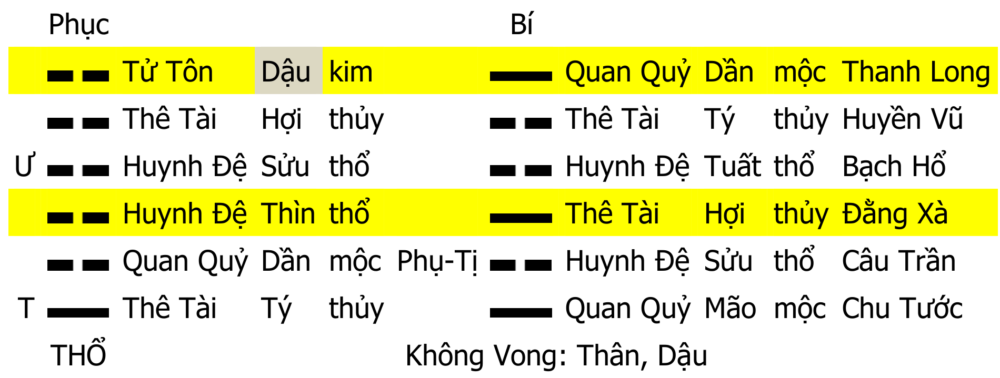
    - **Hình này chứng minh điều gì**
      - Con trai người hỏi từng chịu cảnh tù tội vì trộm cướp khiến hôn sự lỡ dở; đến tháng Hợi quen bạn gái, tháng Sửu sống chung và tháng Mão năm sau kết hôn.
    - **Từ đâu mà thấy được**
      - Tử Tôn Dậu kim ngộ Không hóa Quan Quỷ Dần mộc, bị Hào 3 Thìn thổ Đằng Xà hợp trú giam cầm (tù tội); Hào 3 Thìn thổ Thái tuế hóa Thê Tài Hợi thủy (tháng Hợi có người yêu); năm sau Tị hỏa xuất hiện sinh trợ, tháng Mão xung thực Tử Tôn xung khai hợp để thành hôn.
  - **Phán đoán chi tiết:**
    - Căn cứ:
      - Dự đoán hôn nhân cho con trai thì lấy Thê Tài làm Dụng thần (đại diện cho con dâu, bạn gái của con trai).
      - Trong quẻ Thê Tài lưỡng hiện: Hào sơ Thê Tài Tý thủy và Hào 5 Thê Tài Hợi thủy. Do Thê Tài Tý thủy tại hào sơ được Nhật thần Sửu thổ hợp (Tý Sửu lục hợp) nên chọn Thê Tài Tý thủy làm Dụng thần.
    - Nhìn vào:
      - Tượng người yêu xuất hiện: Hào 3 Huynh Đệ Thìn thổ lâm Thái tuế phát động hóa ra Thê Tài Hợi thủy. Thê Tài là con dâu, Thái tuế động biến ra Thê Tài nên năm Canh Thìn con trai nhất định sẽ tìm được bạn gái. Lúc xem quẻ đang là tháng Dậu; theo quy tắc "hào động ứng năm, hào biến ứng tháng", hào biến là Hợi thủy nên định kỳ tháng Hợi sẽ xuất hiện đối tượng.
      - Ứng kỳ kết hôn: Nguyên thần của Thê Tài là Tử Tôn Dậu kim lâm Tuần Không, lại bị hào động Thìn thổ hợp trú (Thìn Dậu hợp) nên bị kìm kẹp không thể sinh trợ Thê Tài. Hào Phụ Mẫu (đại diện cho giấy chứng nhận kết hôn, hôn thư) phục tàng tại Hào 2 dưới Quan Quỷ Dần mộc (Phụ Mẫu Tị hỏa phục tàng). Sang năm Tân Tị (2001), Phụ Mẫu Tị hỏa xuất đầu đắc lệnh; đến tháng Mão xung thực Tử Tôn Dậu kim (xung xuất Tuần Không) đồng thời Mão xung khai thế hợp Thìn Dậu, giải phóng lực sinh phù cho Dụng thần. Do đó phán đoán tháng Mão năm sau (Tân Tị) sẽ cử hành hôn lễ.
      - Tượng từng chịu cảnh ngục tù: Hào Tử Tôn Dậu kim ngộ Không Vong phát động hóa ra Quan Quỷ Dần mộc, lại bị Hào 3 Thìn thổ lâm Đằng Xà hợp trú. Hợp trú biểu thị mất tự do, giam cầm; Đằng Xà chủ dây thừng trói buộc, xích sắt; Tử Tôn là con cái mà hóa Quan Quỷ là gặp quan tai tội vạ. Phối hợp các tượng này, tác giả luận giải con trai của bà từng phải ngồi tù.
  - **Ứng nghiệm thực tế:**
    - Người mẹ nghe xong vô cùng kinh ngạc và xác nhận: Con trai bà trước đây từng ngồi tù vì tội trộm cướp, chính vì thế mà đến nay hôn nhân vẫn trì trệ chưa thành.
    - Về sau diễn biến hoàn toàn đúng như quẻ định: Đến tháng Hợi anh ta quen một cô gái, sang tháng Sửu hai người dọn về chung sống cùng nhau, và đến tháng Mão năm Tân Tị thì tổ chức hôn lễ.

- **Ví dụ 2: Nam đoán năm nay có vận đào hoa không (Sơn Thủy Mông biến Hỏa Phong Đỉnh)**
  - **Thông tin quẻ:** Ngày Ất Hợi, tháng Dần. Nam đoán năm nay có vận đào hoa không. Quẻ Sơn Thủy Mông biến Hỏa Phong Đỉnh. Tuần không: Thân, Dậu.
  - **Hình 28.** Quẻ Sơn Thủy Mông biến Hỏa Phong Đỉnh
    - 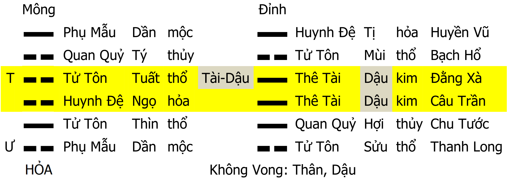
    - **Hình này chứng minh điều gì**
      - Đương số có vận đào hoa rực rỡ với nhiều phụ nữ vây quanh và phát sinh quan hệ thể xác, song đều là tình cảm thoáng qua không ai thành tri kỷ.
    - **Từ đâu mà thấy được**
      - Thê Tài Dậu kim phục dưới Thế, Thế lại động hóa Thê Tài kẹp chặt lấy mình, Hào 3 cũng hóa Thê Tài (nhiều phụ nữ); nhưng Dụng thần ngộ Tuần Không và thất lệnh nên không thể dài lâu.
  - **Phán đoán chi tiết:**
    - Căn cứ:
      - Nam giới xem vận đào hoa, tình duyên lãng mạn thì lấy Thê Tài làm Dụng thần (đại diện cho phụ nữ, người tình, đối tượng tiếp xúc ái ân).
      - Hào Thế đại diện cho bản thân người hỏi.
    - Nhìn vào:
      - Tượng phụ nữ vây quanh: Thê Tài Dậu kim phục tàng dưới Hào 4 Tử Tôn Tuất thổ (hào Thế), đồng thời Hào Thế Tuất thổ lại phát động biến hóa ra Thê Tài Dậu kim. Như vậy hào Thế vừa ôm phục thần Thê Tài vừa hóa ra Thê Tài, tạo thành thế "Thê Tài kẹp chặt hào Thế".
      - Không những thế, Hào 3 Huynh Đệ Ngọ hỏa cũng phát động hóa ra Thê Tài Dậu kim. Các hào động biến đều hướng về Thê Tài, tạo nên hình tượng nhiều phụ nữ đồng thời vây quanh, tiếp cận đương số.
      - Chất lượng mối quan hệ: Dụng thần Thê Tài Dậu kim sinh vào tháng Dần là đất Tuyệt (Mộc vượng Kim tuyệt), ngày Hợi bị tiết khí, lại rơi vào Tuần Không (Thân, Dậu Không Vong). Dụng thần suy nhược ngộ Không biểu thị tuy phụ nữ vây quanh nhiều nhưng tất cả chỉ là những cuộc gặp gỡ chốc lát, duyên phận hời hợt thoảng qua, hoàn toàn không thể quen biết lâu dài hay phát triển thành tình cảm tri kỷ, gắn bó.
  - **Ứng nghiệm thực tế:**
    - Người đàn ông sau đó phản hồi: Quả nhiên trong năm đó anh ta có cơ hội phát sinh quan hệ xác thịt với 4 cô gái khác nhau, nhưng đúng như lời dự đoán, không có bất kỳ ai trở thành người yêu sâu đậm hay gắn bó tri kỷ được lâu bền.

- **Ví dụ 3: Nam đoán hôn nhân (Thủy Thiên Nhu biến Sơn Thiên Đại Súc)**
  - **Thông tin quẻ:** Ngày Bính Dần, tháng Thân. Nam đoán hôn nhân. Quẻ Thủy Thiên Nhu biến Sơn Thiên Đại Súc. Tuần không: Tuất, Hợi.
  - **Hình 29.** Quẻ Thủy Thiên Nhu biến Sơn Thiên Đại Súc
    - 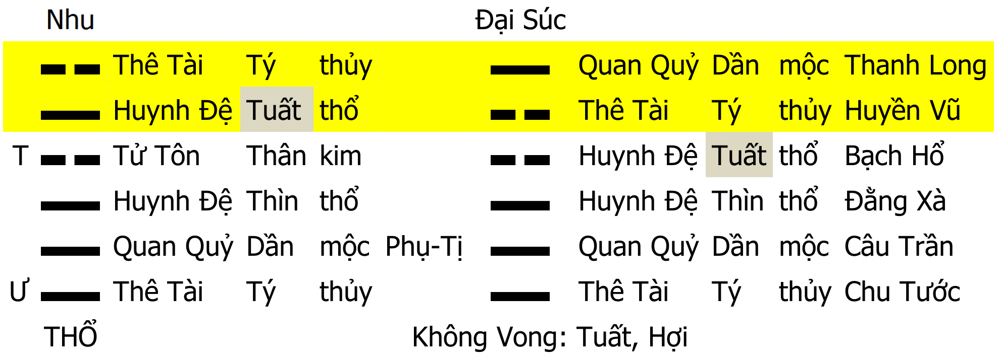
    - **Hình này chứng minh điều gì**
      - Cuộc hôn nhân tan vỡ do người vợ ngoại tình chung chạ với kẻ khác, hai người đã chính thức ly hôn vào tháng Thìn dù người chồng vẫn còn vương vấn.
    - **Từ đâu mà thấy được**
      - Quẻ Nhu du hồn chủ phân ly; Dụng thần Thê Tài Tý thủy tại hào 6 hóa Nguyệt phá; Hào 5 Huynh Đệ Tuất thổ Huyền Vũ hóa Thê Tài (chung vợ với người); Phụ Mẫu Tị hỏa phục tàng nhập Mộ tại Tuất thổ bị Thìn thổ xung khai.
  - **Phán đoán chi tiết:**
    - Căn cứ:
      - Nam đoán hôn nhân lấy Thê Tài làm Dụng thần (người vợ), Phụ Mẫu đại diện cho giấy đăng ký kết hôn, hôn thư.
      - Trong quẻ Thê Tài lưỡng hiện: Hào sơ Thê Tài Tý thủy và Hào 6 Thê Tài Tý thủy. Do Hào 6 Thê Tài Tý thủy phát động nên lấy hào động này làm Dụng thần.
    - Nhìn vào:
      - Tượng chia lìa gãy gánh: Quẻ Thủy Thiên Nhu là quẻ Du Hồn, trong Lục Hào quẻ Du Hồn chủ về trôi nổi phiêu dạt, tâm tính bất định, gia đạo chia lìa tan tác. Dụng thần Thê Tài Tý thủy tuy được Nguyệt kiến Thân kim sinh phù là vượng tướng, nhưng lại động hóa Quan Quỷ Dần mộc. Tháng Thân xung phá Dần mộc khiến Dần mộc thành Nguyệt phá (Dụng thần động hóa Phá). Thêm vào đó, Dụng thần ngự tại Hào 6 (hào trên cùng, tượng thoái vị, thoái hưu, rời bỏ), cho thấy người vợ không thể chung sống với đương số đến răng long đầu bạc.
      - Tượng vợ ngoại tình: Hào 5 Huynh Đệ Tuất thổ phát động hóa ra Thê Tài Tý thủy, lại lâm Huyền Vũ (chủ việc ám muội, lén lút, quan hệ bất chính). Trong đoán tài vận thì Huynh Đệ hóa Tài là cùng bạn hùn hạp kiếm tiền, nhưng trong dự đoán hôn nhân thì Huynh Đệ hóa Tài lại mang tượng "dùng chung một vợ với kẻ khác". Do Dụng thần hóa Phá tại Quan Quỷ (Quan Quỷ đại diện cho người đàn ông khác), chứng tỏ nguyên nhân ly hôn xuất phát từ việc người vợ có quan hệ tình ái vụng trộm bên ngoài.
      - Thời điểm ly hôn trên thực tế: Phụ Mẫu Tị hỏa vượng tướng vốn chủ kết hôn, nhưng lại phục tàng dưới Hào 2 Quan Quỷ Dần mộc và nhập Mộ tại Tuất thổ. Phục tàng chủ không thấy, nhập Mộ chủ cất giấu đi, giấy kết hôn bị giấu đi chính là thông tin ly hôn. Hào Tuất thổ lâm Tuần Không, đến tháng Thìn xung Tuất (xung Không) khiến Huynh Đệ Tuất thổ phát động khắc Thê Tài đồng thời dẫn Phụ Mẫu nhập Mộ, vì thế phán đoán hai người đã chính thức ly hôn vào tháng Thìn.
      - Tâm tư của người chồng: Hào Thế Tử Tôn Thân kim bị Nhật thần Dần mộc xung thành ám động, Thân kim ám động quay lại sinh phù cho Dụng thần Thê Tài Tý thủy, chứng tỏ dù bị phản bội sâu sắc nhưng bản thân người chồng trong lòng vẫn còn yêu thương vợ tha thiết.
  - **Ứng nghiệm thực tế:**
    - Người đàn ông đau đớn xác nhận mọi phán đoán đều chính xác như hiện thực: Vợ anh ta quả nhiên ngoại tình với người đàn ông khác, hai người đã hoàn tất thủ tục ly hôn vào tháng Thìn, và trong lòng anh ta vẫn chưa thể nguôi ngoai tình cảm dành cho vợ cũ.

- **Ví dụ 4: Nam 32 tuổi đoán khi nào kết hôn (Sơn Địa Bác biến Phong Địa Quan)**
  - **Thông tin quẻ:** Ngày Tân Tị, tháng Tuất, năm Ất Dậu. Nam 32 tuổi đoán khi nào kết hôn. Quẻ Sơn Địa Bác biến Phong Địa Quan. Tuần không: Thân, Dậu.
  - **Hình 30.** Quẻ Sơn Địa Bác biến Phong Địa Quan
    - 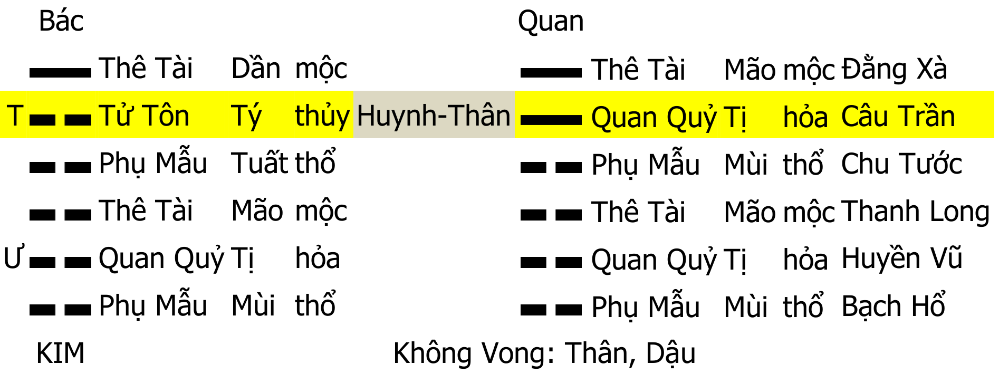
    - **Hình này chứng minh điều gì**
      - Đương số kết hôn muộn do cảnh bôn ba lưu lạc, từng sống chung với phụ nữ và khiến đối phương lưu sản năm Tân Tị; dự kiến đến năm Mậu Tý mới lập gia đình.
    - **Từ đâu mà thấy được**
      - Dụng thần Thê Tài Mão mộc hưu tù; Sàng Trướng Thân kim Tuần Không; Thế hào Tý thủy lâm Dịch Mã tại hào 5 động sinh Dụng thần nên năm Mậu Tý ứng kỳ; Thế động hóa Quan Quỷ Tị hỏa biểu thị lưu sản năm Tân Tị.
  - **Phán đoán chi tiết:**
    - Căn cứ:
      - Nam đoán hôn nhân lấy Thê Tài làm Dụng thần.
      - Trong quẻ Thê Tài lưỡng hiện: Hào 3 Thê Tài Mão mộc và Hào 6 Thê Tài Dần mộc. Do Hào 3 Mão mộc được Nguyệt kiến Tuất thổ hợp (Mão Tuất lục hợp) nên chọn Thê Tài Mão mộc làm Dụng thần.
    - Nhìn vào:
      - Duyên cớ muộn màng: Dụng thần Thê Tài Mão mộc không được Nhật thần Tị hỏa sinh phù (ngược lại bị tiết khí) và rơi vào đất Hưu tù dưới Nguyệt kiến Tuất thổ, biểu thị hôn nhân muộn màng. Thần Sàng Trướng (giường chiếu loan phụng) là Huynh Đệ Thân kim phục tàng dưới Hào 5 lại lâm Tuần Không không xuất hiện trên quẻ, chứng minh đến tuổi 32 đương số vẫn chưa từng kết hôn.
      - Hoàn cảnh bôn ba của đương số: Hào Thế Tử Tôn Tý thủy ngự tại Hào 5 lâm Dịch Mã phát động. Hào 5 là đường sá, Dịch Mã chủ sự bôn tẩu nay đây mai đó, phản ánh đương số quanh năm phiêu bạt làm ăn phương xa, không có nơi cư trú cố định nên chưa thể an cư lập nghiệp để thành hôn.
      - Ứng kỳ kết hôn: Quẻ có hào độc phát là Hào Thế Tử Tôn Tý thủy động sinh cho Dụng thần Thê Tài Mão mộc (Thủy sinh Mộc). Thế động sinh Tài là tượng bản thân chủ động tìm kiếm và gắn kết nhân duyên, do đó phán đoán đến năm Mậu Tý (khi Thái tuế Tý thủy đáo vị hào Thế phát huy uy lực sinh Tài) sẽ chính thức kết hôn.
      - Dấu vết lưu sản trong quá khứ: Hào Thế Tử Tôn Tý thủy phát động biến hóa ra Quan Quỷ Tị hỏa. Tị hỏa ứng trực tiếp với năm Tân Tị (2001). Tử Tôn đại diện cho con cái, phát động hóa Quan Quỷ là tượng thai nhi bị tổn hại, tử vong. Từ tổ hợp này, tác giả luận giải đương số từng sống chung như vợ chồng với một người phụ nữ trong quá khứ và hai người đã từng bị sảy thai hoặc phá thai (lưu sản) vào năm Tân Tị.
  - **Ứng nghiệm thực tế:**
    - Đương số xác nhận hoàn toàn chuẩn xác: Vào năm Tân Tị (2001), anh ta quả thực từng sống chung với một người phụ nữ và người đó đã bị lưu sản một đứa con. Về ứng kỳ kết hôn vào năm Mậu Tý, do thời điểm xem quẻ chưa tới năm đó nên chưa có phản hồi kiểm chứng.

- **Ví dụ 5: Nữ 29 tuổi đoán hôn nhân (Hỏa Phong Đỉnh biến Càn Vi Thiên)**
  - **Thông tin quẻ:** Ngày Canh Thìn, tháng Giáp Tuất, năm Giáp Thân. Nữ 29 tuổi đoán hôn nhân. Quẻ Hỏa Phong Đỉnh biến Càn Vi Thiên. Tuần không: Thân, Dậu.
  - **Hình 31.** Sơ đồ quẻ Hỏa Phong Đỉnh biến Càn Vi Thiên
    - 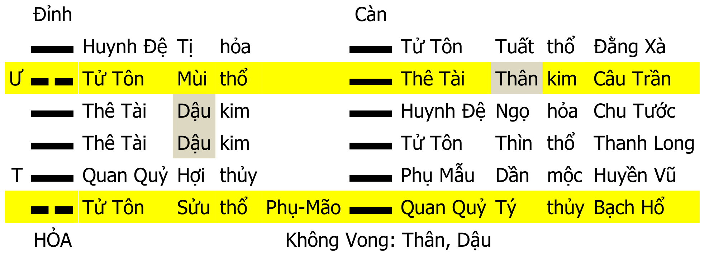
    - **Hình này chứng minh điều gì**
      - Đương số đã kết hôn nhưng phát sinh quan hệ vụng trộm ngoài giá thú với người đàn ông có gia đình, trong quá khứ từng mang thai và lưu sản năm 19 tuổi.
    - **Từ đâu mà thấy được**
      - Quan Quỷ Hợi thủy trì Thế ngộ Huyền Vũ, hào sơ Tử Tôn Sửu thổ Bạch Hổ động hóa Quan Quỷ (từng lưu sản và có nhân tình); Phụ Mẫu Mão mộc phục tàng nhập Mộ tại hào động Tử Tôn Mùi thổ (tình cảm ngoài giá thú).
  - **Phán đoán chi tiết:**
    - Căn cứ:
      - Nữ đoán hôn nhân lấy Quan Quỷ làm Dụng thần (người chồng, người đàn ông).
      - Hào Thế đại diện cho bản thân người phụ nữ đến xem quẻ.
    - Nhìn vào:
      - Thực trạng hôn nhân: Quan Quỷ Hợi thủy trì Thế tại Hào 2. Hào 2 là trạch hào (ngôi nhà, gia đình), Quan Quỷ trì Thế tại trạch hào chứng tỏ đương số hiện đã có gia đình, đã kết hôn. Tuy nhiên, Dụng thần Quan Quỷ Hợi thủy bị cả Nhật thần Thìn thổ lẫn Nguyệt kiến Tuất thổ đồng thời khắc phạt thương tổn; lại bị Kỵ thần Hào 5 Tử Tôn Mùi thổ phát động khắc xuống, Hào sơ Tử Tôn Sửu thổ phát động khắc lên. Dụng thần quá mức suy nhược, trong khi Nguyên thần Thê Tài Dậu kim lâm Tuần Không không thể tương sinh. Điều này phản ánh cuộc hôn nhân rất lục đục, mỏng manh và không bền chắc.
      - Dấu vết quan hệ ngoài luồng (ngoại tình): Hào Thế Quan Quỷ Hợi thủy lâm Huyền Vũ (chủ việc mờ ám, nhục dục lén lút sau lưng chồng). Hào Phụ Mẫu Mão mộc (hôn thư, giá thú) phục tàng dưới Hào sơ lại nhập Mộ tại hào động Tử Tôn Mùi thổ. Tổ hợp Huyền Vũ trì Thế cùng hôn thư phục tàng nhập Mộ là tượng điển hình của tình cảm ngoài giá thú, phản ánh bản thân đương số đang có quan hệ xác thịt lén lút với người đàn ông khác ngoài hôn nhân.
      - Quá khứ phá thai và kẻ thứ ba: Hào sơ Tử Tôn Sửu thổ lâm Bạch Hổ phát động hóa ra Quan Quỷ Tý thủy. Tử Tôn đại diện cho con cái, Bạch Hổ chủ huyết quang và lưu sản, Quan Quỷ chủ tử vong, do đó phán đoán đương số trong quá khứ từng có lần sảy thai hoặc phá thai. Đồng thời, việc hào động biến hóa ra Quan Quỷ cũng chính là hình tượng xuất hiện thêm một người đàn ông khác, củng cố mạnh mẽ kết luận về mối quan hệ tình cảm ngoài giá thú.
  - **Ứng nghiệm thực tế:**
    - Người phụ nữ kinh ngạc xác nhận mọi chi tiết đều đúng như sự thật: Năm 19 tuổi cô từng quan hệ tình dục dẫn đến có thai và phải lưu sản (phá thai). Đến năm Kỷ Mão (1999) cô kết hôn với người chồng hiện tại. Tuy nhiên đến nay cô đang lén lút duy trì mối quan hệ tình ái ngoài luồng với một người đàn ông đã có vợ con.

- **Ví dụ 6: Nữ bồi bàn đoán thời vận tình cảm và công việc (Khôn Vi Địa biến Cấn Vi Sơn)**
  - **Thông tin quẻ:** Ngày Giáp Ngọ, tháng Ngọ, năm Đinh Hợi. Dự đoán thời vận tình cảm và công việc cho một nữ bồi bàn. Quẻ Khôn Vi Địa biến Cấn Vi Sơn. Tuần không: Thìn, Tị.
  - **Hình 32.** Sơ đồ quẻ Khôn Vi Địa biến Cấn Vi Sơn
    - 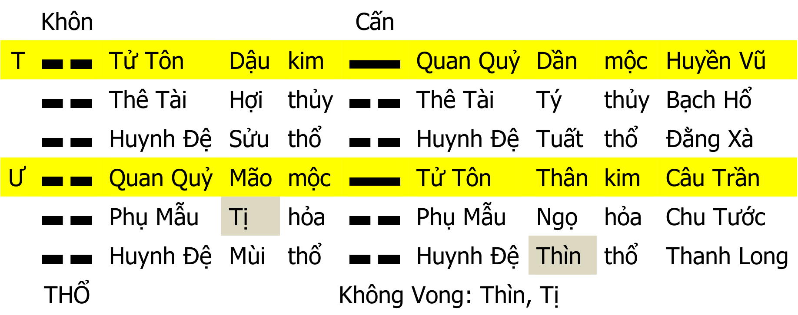
    - **Hình này chứng minh điều gì**
      - Công việc của nữ đương số trắc trở trong các năm Thân - Dậu nhưng ổn định từ năm Tuất; đường tình duyên đã chia tay bạn trai cũ và đón nhận bạn trai mới.
    - **Từ đâu mà thấy được**
      - Hào 3 Quan Quỷ Mão mộc động hóa hồi đầu khắc (năm Thân, Dậu công việc bất ổn, năm Tuất hợp Mão giải khắc); Hào 6 Tử Tôn Dậu kim trì Thế động khắc Quan Quỷ rồi lại hóa Quan Quỷ Dần mộc (bỏ người cũ, đổi người mới).
  - **Phán đoán chi tiết:**
    - Căn cứ:
      - Người hỏi không đặt ra một câu hỏi cụ thể mà nhờ luận đoán tổng quát, vì vậy căn cứ vào các hào động biến trọng yếu trong quẻ để trích xuất thông tin: Quan Quỷ quản về công việc sự nghiệp và đàn ông/người yêu; Tử Tôn quản về tâm lý, hành động cự tuyệt và khắc chế Quan Quỷ.
    - Nhìn vào:
      - Biến động công việc: Hào 3 Quan Quỷ Mão mộc phát động biến ra Tử Tôn Thân kim (Mộc động hóa Kim), tạo thành thế "hóa hồi đầu khắc". Vào các năm Giáp Thân (2004) và Ất Dậu (2005), Thái tuế Kim vượng khắc phạt dữ dội Quan Quỷ Mão mộc, do đó công việc trong hai năm này vô cùng bấp bênh, trắc trở, liên tục thay đổi bất như ý. Đến năm Bính Tuất (2006), Thái tuế Tuất thổ đến hợp trú Quan Quỷ Mão mộc (Mão Tuất lục hợp), giải tỏa thế hồi đầu khắc, từ đó công việc mới bước vào giai đoạn ổn định.
      - Tình duyên chia tay người cũ, đón người mới: Hào 6 Tử Tôn Dậu kim trì Thế phát động hóa ra Quan Quỷ Dần mộc. Vào năm Ất Dậu (2005), Thái tuế Dậu kim đáo vị hào Thế hóa xuất Quan Quỷ, nên phán đoán đương số bắt đầu có bạn trai từ năm Ất Dậu.
      - Phân tích tổ hợp động biến vi tế: Bản thân Hào Thế là Tử Tôn Dậu kim phát động khắc Quan Quỷ Mão mộc, nhưng chính Hào Thế lại biến hóa ra Quan Quỷ Dần mộc. Tử Tôn khắc Quan Quỷ là tượng chủ động cự tuyệt, bài xích, dứt khoát chia tay người yêu cũ; việc hóa ra Quan Quỷ mới lại là tượng lập tức có đối tượng đàn ông khác xuất hiện thay thế. Do đó, tổ hợp này thể hiện rõ ràng quá trình đương số đã chia tay bạn trai cũ để bắt đầu một mối quan hệ với bạn trai mới.
  - **Ứng nghiệm thực tế:**
    - Cô gái bồi bàn tấm tắc khen ngợi vì sự việc ứng nghiệm chuẩn xác đến từng mốc thời gian: Năm 2004 và 2005 công việc của cô vô cùng chật vật lận đận, sang năm 2006 mới ổn định; năm 2005 cô có người yêu nhưng sau đó mâu thuẫn dẫn đến chia tay dứt khoát, và ngay sau đó cô đã nhận lời yêu một người bạn trai mới.

### CHƯƠNG 6: Ý NGHĨA CỦA DỤNG THẦN LƯỠNG HIỆN

#### 1. Bản chất và giá trị thông tin của Dụng thần lưỡng hiện trong dự trắc hôn nhân
- **Hiện tượng Dụng thần lưỡng hiện trong Lục hào:**
  - Trong dự đoán Lục hào tổng quát, khi quẻ xuất hiện hai hoặc nhiều hào mang cùng lục thân của Dụng thần (gọi là Dụng thần lưỡng hiện), nguyên tắc quy ước thông thường là chọn một hào đại diện tiêu biểu (ưu tiên hào phát động, hào lâm Nhật Nguyệt, hào thế/ứng, hào không vong, hoặc hào trì thế) để định cát hung cho sự vụ.
  - Tuy nhiên, trong dự trắc nhân duyên và hôn nhân gia đình, tình huống Dụng thần lưỡng hiện mang hàm nghĩa cực kỳ tinh tế, sâu sắc và chứa đựng nhiều tầng thông tin đa chiều. Cổ nhân và thực tiễn cho thấy không thể đơn thuần bỏ hào này lấy hào kia một cách máy móc, bởi mỗi hào Dụng thần xuất hiện đều mang theo một thông điệp thực tại riêng biệt.
- **Ý nghĩa tinh tế và đa diện trong hôn nhân:**
  - **Hôn nhân hai lần:** Dụng thần xuất hiện hai nơi thường ám chỉ việc trải qua hai lần đò, tái hôn, hoặc trong đời có hai mối quan hệ hôn nhân chính thức.
  - **Mối quan hệ tay ba và ngoại tình:** Phân định rõ ràng giữa người phối ngẫu chính thức (vợ/chồng danh chính ngôn thuận) và người tình ngoài hôn nhân (người thứ ba). Thông thường, hào tĩnh, hào có danh phận hợp cách đại diện cho người hôn phối tại gia; hào động, hào lâm Đào Hoa, Huyền Vũ hoặc biến hóa đại diện cho nhân tình bên ngoài.
  - **Thông tin quá khứ và tương lai:** Một hào có thể đại diện cho người yêu cũ/mối tình đã qua trong quá khứ (thường lâm Không Vong, Nguyệt phá, hưu tù, hoặc hào tĩnh thoái vị), trong khi hào kia đại diện cho đối tượng hiện tại hoặc tương lai (vượng tướng, phát động, lâm Nhật Nguyệt).
  - **Mô tả toàn diện và đa góc cạnh về một đối tượng:** Khi hai hào Dụng thần cùng xuất hiện mang cùng địa chi hoặc bổ trợ nhau, chúng cùng khắc họa đa chiều về nhân dáng, diện mạo, tính cách, đạo đức, và hoàn cảnh sống của đối phương (ví dụ một hào biểu thị dung nhan, một hào biểu thị tính cách ứng xử).
  - **Quy luật về ứng kỳ:** Hai hào Dụng thần còn có thể đại diện cho các mốc thời gian khác nhau của mối quan hệ, chỉ điểm thời điểm gặp gỡ, kết hôn hoặc thời điểm chia tay tan vỡ dựa trên trạng thái xung - hợp - tuần không của từng hào.
- **Phương pháp luận giải quyết đoán:**
  - Không bao giờ loại bỏ phiến diện một hào Dụng thần khi xem nhân duyên; cần quan sát sự tương tác sinh, khắc, xung, hợp, tuần không, phục tàng, động biến và lục thần lâm phối của cả hai hào.
  - Xem xét vị trí hào (hào 2 là trạch/phu thê vị, hào 5 là đường đi/quân vị, hào thế/ứng) kết hợp tính chất động tĩnh để giải mã trọn vẹn bức tranh nhân duyên.

#### 2. Các quái lệ thực chứng về Dụng thần lưỡng hiện

- **Ví dụ 1: Nữ đoán về chuyện ngoại tình (Ngày Giáp Dần tháng Mùi năm Giáp Thân)**
  - **Bối cảnh & Chọn Dụng thần:**
    - Ngày Giáp Dần tháng Mùi năm Giáp Thân (Tuần không: Tý, Sửu).
    - Nữ nhân đến gieo quẻ hỏi về chuyện ngoại tình, được quẻ Thủy Phong Tỉnh biến Trạch Phong Đại Quá.
    - Lấy Quan Quỷ làm Dụng thần. Trong quẻ Quan Quỷ lưỡng hiện: Quan Quỷ Thân kim tại hào 4 (phát động) và Quan Quỷ Dậu kim tại hào 3 (tĩnh).
  - **Hình 33.** Quẻ Thủy Phong Tỉnh biến Trạch Phong Đại Quá
    - 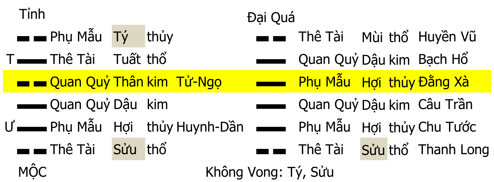
    - **Hình này chứng minh điều gì**
      - Thể hiện thế cục ngoại tình công khai, phân định rõ giữa người chồng hiền lành và nhân tình lăng nhăng phản bội.
    - **Từ đâu mà thấy được**
      - Quan Quỷ lưỡng hiện (Thân kim động là tình nhân, Dậu kim tĩnh là chồng); Thân kim bị Nhật xung và hợp Hương Khuê Hợi thủy; Thân kim sinh hào Ứng.
  - **Phán đoán chi tiết:**
    - Căn cứ:
      - Hai Dụng thần mỗi hào giữ một công năng chuyên biệt: Hào động Quan Quỷ Thân kim là người tình ngoài hôn nhân; hào tĩnh Quan Quỷ Dậu kim là người chồng hợp pháp của đương số.
      - Hào 3 Quan Quỷ Dậu kim lâm Câu Trần: Câu Trần chủ đôn hậu, thành thật, chứng tỏ người chồng rất hiền lành, nhu mì, chất phác.
      - Hào 4 Quan Quỷ Thân kim lâm Thái Tuế (năm Giáp Thân) phát động: biểu thị người tình mới quen biết trong năm Thân này. Thân kim lâm Dịch Mã động hóa Phụ Mẫu Hợi thủy (Phụ Mẫu và Dịch Mã đều chủ phương tiện giao thông/xe cộ), lại lâm Đằng Xà chủ kỹ thuật, tay nghề khéo léo, chỉ rõ đối phương làm nghề lái xe.
      - Hào Thế Thê Tài Tuất thổ tại hào 5: Hào 5 là tôn vị (ông chủ), Thê Tài chủ kinh doanh tài vật, cho thấy đương số là chủ hộ kinh doanh cá thể. Hào Thế sinh Dụng thần Thân kim, chứng tỏ bản thân rất yêu chiều và sẵn sàng chu cấp tiền bạc cho gã tình nhân.
      - Hương Khuê Tý thủy và Hợi thủy lưỡng hiện trong quẻ: biểu thị việc sống chung nhiều nơi. Hào Ứng Phụ Mẫu Hợi thủy hợp với Nhật Thần Dần mộc (Nhật chủ hiện tại), cho thấy đương số hiện đang rất sốt sắng, bận tâm với người tình.
      - Quan Quỷ Thân kim bị Nhật Thần Huynh Đệ Dần mộc xung phá, lại tương hợp nhập vào Hương Khuê Hợi thủy: Huynh Đệ là tượng tranh đoạt, kẻ cạnh tranh/tình địch hợp vào Hương Khuê biểu thị có người đàn bà khác đến quyến rũ giật mất người tình; tượng xung cũng chủ việc chuyện vụng trộm bị người ngoài phát hiện, bắt gặp tận mắt.
      - Quan Quỷ Thân kim sinh hào Ứng Hợi thủy: Dụng thần đi sinh Ứng là sinh cho người khác, biểu lộ sự vô tình, bạc bẽo; gã nhân tình hiện tại quay sang đối tốt với kẻ khác mà lạnh nhạt, ghẻ lạnh đương số.
      - Hào Thế lâm Bạch Hổ: Bạch Hổ chủ thịnh nộ, bực dọc, tâm trạng đương số đang cực kỳ căm phẫn, ấm ức không nguôi.
    - Nhìn vào:
      - Sự tương phản sâu sắc giữa hào tĩnh Dậu kim lâm Câu Trần (chồng an phận) và hào động Thân kim lâm Đằng Xà Dịch Mã (tình nhân lái xe phong lưu, lăng nhăng).
      - Mối liên kết Nhật Huynh Đệ xung khắc hào động và kéo vào Hương Khuê, lột tả trọn vẹn cảnh tình nhân bị hàng xóm phát hiện ở chung với kẻ thứ ba.
  - **Ứng nghiệm thực tế:**
    - Lời đoán hoàn toàn chuẩn xác với thực tế đời sống của đương sự:
      - Người tình ngoài hôn nhân của cô ta quả thực là một tài xế lái xe cho một cơ quan nhà nước.
      - Bản thân người phụ nữ này là chủ một cửa hàng kinh doanh quần áo thời trang, buôn bán phát đạt, thường xuyên chi tiền cho nhân tình tiêu xài vì rất say mê hắn.
      - Người chồng của cô bản tính hiền lành thật thà, an phận không hề can thiệp hay cản trở mối quan hệ bên ngoài, khiến mối tình ngoài luồng này diễn ra gần như công khai.
      - Vài ngày trước khi gieo quẻ, hàng xóm xung quanh tình cờ phát hiện gã nhân tình đang lén lút ăn nằm sống chung với một người phụ nữ khác và báo lại cho cô biết. Cô vô cùng phẫn nộ, ghen tuông lồng lộn (đúng tượng Bạch Hổ trì Thế), nhưng khi tìm đến thì gã tài xế này tỏ thái độ lạnh lùng tuyệt tình, hoàn toàn phớt lờ không thèm đếm xỉa đến cô.

- **Ví dụ 2: Nam đoán quan hệ phát triển với người nữ (Ngày Kỷ Tị tháng Nhâm Thân năm Giáp Thân)**
  - **Bối cảnh & Chọn Dụng thần:**
    - Ngày Kỷ Tị tháng Nhâm Thân năm Giáp Thân (Tuần không: Tuất, Hợi).
    - Nam nhân đến dự trắc xem mối quan hệ với một người nữ sẽ phát triển ra sao, được quẻ Lôi Phong Hằng (quẻ tĩnh).
    - Lấy Thê Tài làm Dụng thần. Trong quẻ Thê Tài lưỡng hiện: Thê Tài Tuất thổ tại hào 6 (lâm Tuần Không) và Thê Tài Sửu thổ tại hào sơ.
  - **Hình 34.** Quẻ Lôi Phong Hằng
    - 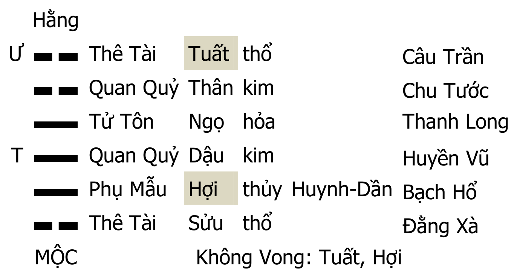
    - **Hình này chứng minh điều gì**
      - Định vị quan hệ ngoài luồng bất chính với người tình (không chính thức) và ấn định năm Bính Tuất tất chia tay.
    - **Từ đâu mà thấy được**
      - Thê Tài lưỡng hiện (Tuất thổ Không Vong là người tình, Sửu thổ là vợ); Thế Quan Quỷ Dậu kim lâm Đào Hoa Huyền Vũ; Phụ Mẫu Hợi thủy ám động Không Vong.
  - **Phán đoán chi tiết:**
    - Căn cứ:
      - Thê Tài lưỡng hiện trong quẻ: Thông thường ưu tiên lấy hào lâm Tuần Không Thê Tài Tuất thổ làm Dụng thần trực tiếp đại diện cho người nữ được hỏi. Đồng thời còn hào Thê Tài Sửu thổ ở hào sơ, cần phối hợp toàn cục để trích xuất ý nghĩa.
      - Hào Thế Quan Quỷ Dậu kim tại hào 3 lâm Huyền Vũ: Dậu kim là sao Đào Hoa, Huyền Vũ chủ sự việc mờ ám, vụng trộm lén lút, không quang minh chính đại.
      - Hào 2 Phụ Mẫu Hợi thủy bị Nhật Thần Tị hỏa xung thành ám động, nhưng bản thân lại lâm Tuần Không: Phụ Mẫu là giấy tờ hôn thú, pháp lý, chứng nhận kết hôn; Phụ Mẫu ám động lâm Không Vong biểu thị việc giấu giếm, che đậy giấy tờ hôn nhân.
      - Tổ hợp hào Thế lâm Đào Hoa Huyền Vũ cùng Phụ Mẫu Không Vong chỉ ra người nữ được hỏi hoàn toàn không phải đối tượng yêu đương đường hoàng để kết hôn, mà thực chất là quan hệ bồ bịch nhân tình ngoài luồng; do đó hào Thê Tài Sửu thổ ở hào sơ chính là người vợ hợp pháp ở nhà của người nam.
      - Dụng thần Thê Tài Tuất thổ được Nhật Thần Tị hỏa sinh là vượng tướng, nhưng hiện tại đang lâm Tuần Không. Theo quy luật ứng kỳ, đến năm Bính Tuất (2006) khi Tuất thổ xuất Không, thực Không thì mối duyên này ắt sẽ chấm dứt, đôi bên chia tay.
    - Nhìn vào:
      - Sự phối hợp tài tình giữa Dụng thần Tuần Không và hào Thế Đào Hoa Huyền Vũ để lật tẩy bản chất quan hệ ngoại tình ngay khi người hỏi chỉ hỏi chung chung "quan hệ phát triển ra sao".
      - Phân định rõ ràng hai đối tượng nữ giới: một người là vợ danh chính ngôn thuận tại hào sơ, một người là nhân tình lâm Không Vong tại hào 6.
  - **Ứng nghiệm thực tế:**
    - Quả nhiên đến năm Bính Tuất (2006), khi chi Tuất xuất Không, người đàn ông này và cô nhân tình đã chính thức đường ai nấy đi, chia tay đúng như lời dự đoán.

- **Ví dụ 3: Nữ đoán nhân duyên vợ chồng (Ngày Quý Mão tháng Thân năm Hợi)**
  - **Bối cảnh & Chọn Dụng thần:**
    - Ngày Quý Mão tháng Thân năm Hợi (Tuần không: Thìn, Tị).
    - Người phụ nữ đến xem vận số nhân duyên vợ chồng, được quẻ Địa Hỏa Minh Di biến Thủy Sơn Kiển.
    - Lấy Quan Quỷ làm Dụng thần. Trong quẻ Quan Quỷ lưỡng hiện: Quan Quỷ Sửu thổ tại hào 2 và Quan Quỷ Sửu thổ trì Thế tại hào 4.
  - **Hình 35.** Sơ đồ quẻ Địa Hỏa Minh Di biến Thủy Sơn Kiển
    - 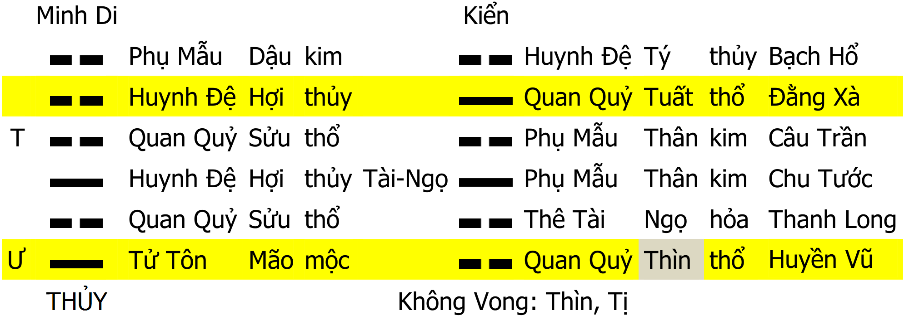
    - **Hình này chứng minh điều gì**
      - Làm rõ rạn nứt hôn nhân hiện tại và ý định muốn ly hôn chồng để kết hôn với người đàn ông khác mới quen trong năm.
    - **Từ đâu mà thấy được**
      - Quan Quỷ trì Thế hưu tù bị Nhật khắc; Tử Tôn hào sơ động khắc Quan Quỷ hóa Quan Quỷ; hào 5 động hóa Quan Quỷ tại Thái Tuế năm Hợi.
  - **Phán đoán chi tiết:**
    - Căn cứ:
      - Quan Quỷ lưỡng hiện: Lấy hào Thế Quan Quỷ Sửu thổ làm Dụng thần đại diện cho người chồng. Dụng thần trì Thế biểu thị người phụ nữ này bản thân đã có gia đình, đã kết hôn.
      - Dụng thần Quan Quỷ Sửu thổ trì Thế không được Nguyệt Thân kim sinh phù, lại bị Nhật Thần Mão mộc khắc thương. Nhật Thần đại diện cho hiện tại, Dụng thần suy bại hưu tù bị khắc báo hiệu tình cảm vợ chồng hiện tại vô cùng lạnh nhạt, bất hòa, rạn nứt sâu sắc.
      - Kỵ thần Tử Tôn Mão mộc tại hào sơ phát động khắc Quan Quỷ. Năm 1993 Quý Dậu có Phụ Mẫu Dậu kim xung khắc chế ngự Kỵ thần Mão mộc, năm này hai người thành hôn kết tóc.
      - Quẻ chính Địa Hỏa Minh Di là quẻ Du Hồn, chủ tâm trí dao động, trôi dạt phân ly. Hào sơ đại diện cho tâm tư, ý niệm thầm kín; Tử Tôn Mão mộc tại hào sơ phát động khắc Quan Quỷ lại biến thành Quan Quỷ Thìn thổ: tổ hợp này cho thấy đương số trong lòng đang nung nấu ý định dứt khoát ly hôn với người chồng hiện tại để tái giá với một người đàn ông khác.
      - Hào 5 Huynh Đệ Hợi thủy phát động hóa Quan Quỷ Tuất thổ: Hợi thủy chính là Thái Tuế của năm dự trắc (năm Hợi), Quan Quỷ đại diện cho phái nam; điều này biểu thị người đàn ông mới kia chính là người cô ta vừa nảy sinh tình cảm yêu đương trong chính năm nay.
    - Nhìn vào:
      - Quẻ Du Hồn kết hợp hào sơ Tử Tôn động khắc Dụng rồi biến Dụng: một quy trình tâm lý biến chuyển trọn vẹn từ chán ghét hôn nhân cũ đến mưu cầu đối tượng hôn nhân mới.
      - Sự ứng nghiệm của Thái Tuế lâm hào động biến Quan Quỷ chỉ đích danh mốc thời gian xuất hiện của người đàn ông thứ hai.
  - **Ứng nghiệm thực tế:**
    - Người phụ nữ xác nhận toàn bộ lời phán hoàn toàn đúng với tâm cảnh và thực trạng: tình cảm với chồng đã cạn kiệt, hai người thường xuyên xung đột; trong năm Hợi này cô đã đem lòng yêu một người đàn ông khác và đang chuẩn bị thủ tục ly hôn chồng để kết hôn với người tình mới.

- **Ví dụ 4: Nữ đoán hôn nhân (Ngày Kỷ Hợi tháng Ngọ)**
  - **Bối cảnh & Chọn Dụng thần:**
    - Ngày Kỷ Hợi tháng Ngọ (Tuần không: Thìn, Tị).
    - Nữ nhân đến gieo quẻ dự đoán về cuộc sống hôn nhân, được quẻ Lôi Hỏa Phong biến Địa Sơn Khiêm.
    - Lấy Quan Quỷ làm Dụng thần. Trong quẻ Quan Quỷ lưỡng hiện: Quan Quỷ Sửu thổ tại hào 2 (hào Ứng) và Quan Quỷ Tuất thổ tại hào 6.
  - **Hình 36.** Sơ đồ quẻ Lôi Hỏa Phong biến Địa Sơn Khiêm
    - 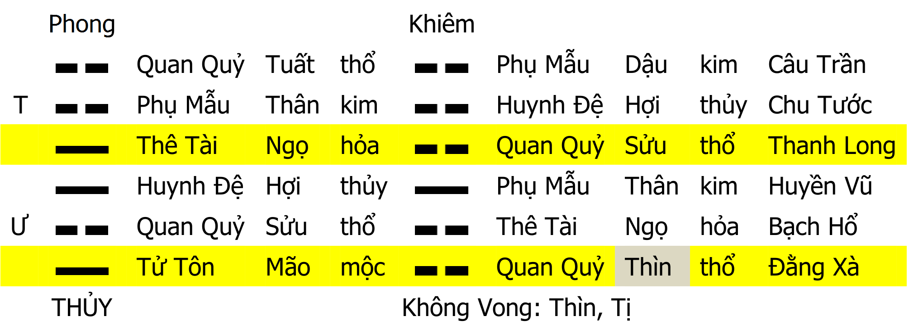
    - **Hình này chứng minh điều gì**
      - Vạch trần việc chồng nóng nảy từng ngồi tù quản thúc vợ, trong khi vợ ngoại tình với người tình mập mạp và mưu tính ly hôn.
    - **Từ đâu mà thấy được**
      - Hào 2 Quan Quỷ Sửu thổ lâm Bạch Hổ bị Tử Tôn Mão mộc lâm Đằng Xà khắc; hào 6 Quan Quỷ Tuất thổ lâm Câu Trần; Thê Tài Ngọ hỏa lâm Thanh Long động hóa Quan Quỷ.
  - **Phán đoán chi tiết:**
    - Căn cứ:
      - Lấy hào Ứng Quan Quỷ Sửu thổ tại hào 2 làm Dụng thần chính đại diện cho người chồng: Hào 2 là trạch vị, cũng là phu thê vị. Quan Quỷ Sửu thổ được Nguyệt Thần Ngọ hỏa tương sinh vượng tướng nhập trạch, hào Thế có Phụ Mẫu Thân kim trì Thế, xác nhận hai người đã kết hôn chính thức.
      - Quan Quỷ Sửu thổ lâm Bạch Hổ: Bạch Hổ chủ hung hãn, bạo liệt, tính cách người chồng vô cùng nóng nảy, cộc cằn.
      - Hào sơ Tử Tôn Mão mộc lâm Đằng Xà phát động khắc Sửu thổ: Đằng Xà chủ xiềng xích, dây thừng trói buộc; chứng tỏ người chồng này trong quá khứ đã từng có tiền án, từng phải ngồi tù.
      - Hào 6 xuất hiện Quan Quỷ Tuất thổ, đồng thời hào 4 Thê Tài Ngọ hỏa lâm Thanh Long phát động hóa thành Quan Quỷ Sửu thổ: bản thân người vợ có quan hệ bất chính ngoài hôn nhân. Thanh Long chủ tửu sắc, ăn uống yến tiệc, quen biết gã nhân tình tại các tụ điểm vui chơi giải trí.
      - Quan Quỷ Tuất thổ (nhân tình) lâm Câu Trần: Câu Trần chủ đẫy đà, phục phịch, nhân tình có tướng mạo rất béo tốt.
      - Hào Thế Phụ Mẫu Thân kim lâm Dịch Mã tại hào 5 (hào đường đi): đương số bản tính thích ngao du, hay chạy loạn khắp nơi. Trong khi Quan Quỷ Sửu thổ là Mộ khố của hào Thế Thân kim: người chồng muốn giam cầm, quản thúc chặt chẽ, tìm mọi cách cấm đoán không cho cô ra ngoài giao du.
      - Hào sơ Tử Tôn Mão mộc động hóa Quan Quỷ Thìn thổ: biểu lộ dã tâm muốn ly hôn người chồng hiện tại để danh chính ngôn thuận đến với người tình béo mập.
    - Nhìn vào:
      - Sự đối lập hoàn toàn giữa người chồng (Sửu thổ nhập trạch lâm Bạch Hổ, bị Đằng Xà trói buộc - tiền án) và người tình (Tuất thổ tại hào viễn xứ lâm Câu Trần - mập mạp).
      - Tượng hào Thế lâm Dịch Mã hào 5 muốn bay nhảy nhưng bị Dụng thần làm Mộ khố giam hãm, khắc họa bức tranh gia đình ngột ngạt kiểm soát.
  - **Ứng nghiệm thực tế:**
    - Đương số kinh ngạc thừa nhận toàn bộ chi tiết dự đoán: Chồng cô tính tình vô cùng cục cằn dữ tợn, từng phải ngồi tù vì vi phạm pháp luật. Sau khi ra tù hắn quản lý cô rất ngặt nghèo, cấm không cho đi lại tự do. Bản thân cô trong một lần đi tụ tập ăn uống giải trí đã quen một người đàn ông mập mạp và nảy sinh quan hệ tình cảm lén lút; cô đang rắp tâm tìm cách ly hôn chồng để tiến tới với người tình này.

- **Ví dụ 5: Nam đoán về người bạn gái trước đây (Ngày Canh Thân tháng Tuất)**
  - **Bối cảnh & Chọn Dụng thần:**
    - Ngày Canh Thân tháng Tuất (Tuần không: Tý, Sửu).
    - Người nam đến gieo quẻ hỏi về người bạn gái cũ trước đây, được quẻ Hỏa Phong Đỉnh biến Trạch Sơn Hàm.
    - Lấy Thê Tài làm Dụng thần. Trong quẻ Thê Tài lưỡng hiện: Thê Tài Dậu kim tại hào 3 và Thê Tài Dậu kim tại hào 4.
  - **Hình 37.** Sơ đồ quẻ Hỏa Phong Đỉnh biến Trạch Sơn Hàm
    - 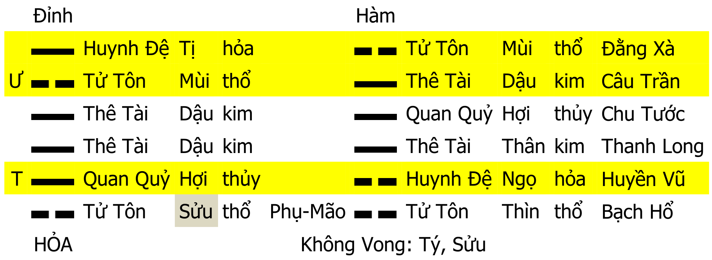
    - **Hình này chứng minh điều gì**
      - Tái hiện dung nhan, tính cách người bạn gái cũ từng chung sống và lý do đổ vỡ do chính người nam thay lòng ruồng bỏ.
    - **Từ đâu mà thấy được**
      - Thê Tài Dậu kim lưỡng hiện (hào 3 lâm Thanh Long là đẹp, hào 4 lâm Chu Tước là khéo nói); Phụ Mẫu phục tàng nhập Mộ tại Mùi thổ động; Thế động hóa Huynh Đệ.
  - **Phán đoán chi tiết:**
    - Căn cứ:
      - Thê Tài lưỡng hiện nhưng đều mang cùng địa chi Dậu kim: thông thường chọn một hào đại diện, song vì hai hào đồng nhất ngũ hành và chi vị nên phối hợp quán xét cả hai để khắc họa toàn diện dung nhan và tâm tính người bạn gái cũ.
      - Hào 3 Thê Tài Dậu kim lâm Thanh Long: Thanh Long chủ mỹ mạo, thanh tú, đoan trang; cho thấy người bạn gái có dung mạo rất xinh đẹp, gương mặt ưa nhìn.
      - Hào 4 Thê Tài Dậu kim lâm Chu Tước: Chu Tước chủ văn tinh, ngôn ngữ, hoạt bát; phản ánh cô gái có tính cách hướng ngoại cởi mở, giao tiếp ứng xử vô cùng khéo léo, hoạt ngôn.
      - Hào Phụ Mẫu Mão mộc (tượng của phòng ốc, hôn ước, sự chung sống) phục tàng dưới hào sơ Tử Tôn Sửu thổ, không xuất hiện trên quẻ, lại nhập Mộ tại hào Ứng Tử Tôn Mùi thổ phát động: chứng tỏ hai người trong quá khứ đã từng dọn về sống chung với nhau như vợ chồng một thời gian.
      - Hào Thế Quan Quỷ Hợi thủy phát động biến thành Huynh Đệ Ngọ hỏa: Hào Thế tự thân phát động biểu thị chính bản thân người nam đổi ý thay lòng; hào biến hóa ra Huynh Đệ (Huynh Đệ chủ khắc phạt Thê Tài, chia rẽ tình cảm), chỉ rõ nguyên nhân tan vỡ là do người nam chủ động ruồng rẫy, phụ bạc bỏ rơi bạn gái.
    - Nhìn vào:
      - Nghệ thuật phối hợp hai hào Dụng thần cùng chi nhưng khác hào vị và lục thần để tả chân trọn vẹn từ sắc diện đến tài ăn nói của đương số.
      - Tượng Thế động hóa Huynh Đệ vạch trần tâm lý và trách nhiệm thuộc về người hỏi, không đổ lỗi cho ngoại cảnh.
  - **Ứng nghiệm thực tế:**
    - Người hỏi quẻ hoàn toàn khâm phục và xác nhận: Người yêu cũ của anh ta quả thực rất xinh đẹp và có tài ăn nói duyên dáng. Hai người từng thuê nhà sống chung với nhau một thời gian dài, nhưng sau đó chính anh ta thay lòng đổi dạ, chán nản nên đã chủ động nói lời chia tay và bỏ rơi cô gái.

- **Ví dụ 6: Người mẹ đoán hôn nhân cho con gái (Ngày Ất Mùi tháng Mão năm Nhâm Ngọ)**
  - **Bối cảnh & Chọn Dụng thần:**
    - Ngày Ất Mùi tháng Mão năm Nhâm Ngọ (Tuần không: Thìn, Tị).
    - Người mẹ đến gieo quẻ hỏi về chuyện hôn nhân của con gái, được quẻ Thiên Địa Bĩ biến Sơn Địa Bác.
    - Lấy Quan Quỷ làm Dụng thần (đối tượng bạn trai / hôn phu của con gái). Trong quẻ Quan Quỷ lưỡng hiện: Quan Quỷ Tị hỏa tại hào 2 (lâm Tuần Không) và Quan Quỷ Ngọ hỏa tại hào 4 (phát động).
  - **Hình 38.** Sơ đồ quẻ Thiên Địa Bĩ biến Sơn Địa Bác
    - 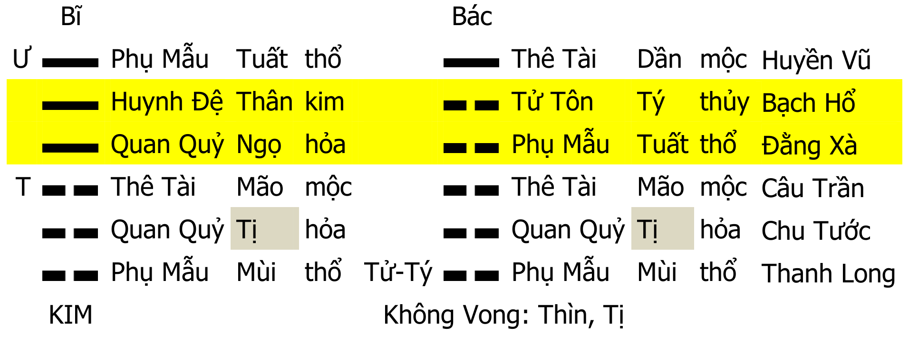
    - **Hình này chứng minh điều gì**
      - Khẳng định con gái đã bí mật đăng ký kết hôn nhưng vẫn là trinh nữ, từng chia tay bạn trai cũ và mẹ chưa chấp nhận con rể.
    - **Từ đâu mà thấy được**
      - Quan Quỷ Ngọ hỏa động vượng hợp Nhật Phụ Mẫu Mùi thổ; Tử Tôn phục tàng không gặp Quan; Thế nhập Mộ tại Nhật; Quan Quỷ Tị hỏa hào 2 lâm Tuần Không.
  - **Phán đoán chi tiết:**
    - Căn cứ:
      - Trong quẻ Quan Quỷ lưỡng hiện: Lấy hào phát động Quan Quỷ Ngọ hỏa tại hào 4 làm Dụng thần chính đại diện cho người bạn trai hiện tại.
      - Dụng thần Quan Quỷ Ngọ hỏa được Nguyệt Thần Mão mộc tương sinh là vượng tướng, lại cùng Nhật Thần Mùi thổ tương hợp: hợp mang ý nghĩa đạt được, thành tựu. Nhật Thần Mùi thổ là Phụ Mẫu, chủ giấy chứng nhận kết hôn, hôn thú pháp lý. Điều này chỉ rõ con gái hiện tại đã có bạn trai và trên thực tế hai người đã hoàn tất thủ tục đăng ký kết hôn, đã cầm giấy hôn thú trong tay.
      - Quan Quỷ Ngọ hỏa phát động hóa Phụ Mẫu Tuất thổ là Mộ khố của Ngọ hỏa: Dụng thần nhập Mộ cần xung khai phá Mộ mới khởi phát; vào năm Canh Thìn (2000) có địa chi Thìn xung Tuất khai mở Mộ khố, chỉ điểm năm quen biết người bạn trai này chính là năm Canh Thìn.
      - Hào Tử Tôn Tý thủy đại diện cho con gái người hỏi, phục tàng tại hào sơ dưới Phụ Mẫu Mùi thổ, không hề xuất hiện trên mặt quẻ và không trực tiếp giao hội với Quan Quỷ; kết hợp hào Phụ Mẫu vượng tướng che chắn không bị Không Vong, trong quẻ tuyệt nhiên không có dấu hiệu sống chung phòng the: chứng minh con gái cô tuy đã đăng ký kết hôn nhưng vẫn giữ gìn thân thể trong trắng, vẫn là trinh nữ.
      - Hào Thế Thê Tài Mão mộc đại diện cho người mẹ đến hỏi quẻ: Mão mộc tuy sinh phù cho Dụng thần Ngọ hỏa nhưng lại nhập Mộ tại Nhật Thần Phụ Mẫu Mùi thổ; tượng nhập Mộ chủ tâm trạng dùng dằng do dự, khó mở lòng, trong tâm can vẫn chưa thực sự tán thành hay chấp thuận chàng rể này.
      - Quan Quỷ Tị hỏa tại hào 2 là hào tĩnh lâm Tuần Không: Hào Dụng thần thứ hai tĩnh và Không Vong đại diện cho quá khứ đã qua; phản ánh trước mối tình hiện tại, cô con gái từng trải qua một mối tình sâu đậm nhưng đã chia tay với người bạn trai trước đó.
    - Nhìn vào:
      - Sự phân lập rành mạch giữa hào động vượng tướng hợp Nhật (bạn trai hiện tại đã đăng ký kết hôn) và hào tĩnh lâm Không Vong (bạn trai cũ đã chia tay trong quá khứ).
      - Nhận định độc đáo, thấu suốt về trinh tiết của con gái dựa trên tương quan Tử Tôn phục tàng không gặp Quan Quỷ và Phụ Mẫu nghiêm cẩn che chắn.
  - **Ứng nghiệm thực tế:**
    - Người mẹ vô cùng thán phục xác nhận mọi việc đúng như từng lời luận giải: Con gái bà quen bạn trai từ năm Canh Thìn (2000), vừa qua hai đứa đã tự ý đi đăng ký kết hôn lấy giấy chứng nhận. Tuy nhiên gia đình hai bên chưa tổ chức cưới hỏi nên đôi trẻ chưa hề chung sống, con gái bà thực sự vẫn là trinh nữ. Bản thân người mẹ trong lòng vẫn lấn cấn chưa ưng ý chàng rể này. Đồng thời, bà xác nhận trước đây con gái từng có một mối tình tha thiết nhưng sau đó đã chia tay.

#### 3. Quy tắc tổng kết khi xử lý Dụng thần lưỡng hiện trong thực chiến
- **Phân định ranh giới giữa chính và phụ:**
  - Hào tĩnh, hào đắc vị, hào sinh hợp danh chính ngôn thuận thường là người phối ngẫu chính thức tại gia (vợ/chồng).
  - Hào động, hào lâm Đào Hoa, Huyền Vũ, hoặc hào biến hóa thường biểu thị người tình ngoài hôn nhân hoặc kẻ thứ ba can dự.
- **Phân định chiều kích thời gian (Quá khứ - Hiện tại - Tương lai):**
  - Hào lâm Tuần Không, Nguyệt phá, hưu tù, thoái vị thường phản ánh mối tình đã qua, bạn trai/bạn gái cũ đã chia tay.
  - Hào động, vượng tướng, lâm Thái Tuế, Nhật Nguyệt chỉ đối tượng hiện tại hoặc tương lai sắp xuất hiện.
- **Phối hợp đa chiều diện mạo và tính cách:**
  - Khi hai hào Dụng thần cùng chi xuất hiện, không loại bỏ hào nào mà kết hợp cả hai hào vị cùng lục thần tương ứng để miêu tả trọn vẹn ngoại hình, ngôn ngữ và tính nết của đối phương.

### CHƯƠNG 7: Ý NGHĨA CỦA DỤNG THẦN PHỤC TÀNG

#### Ý nghĩa cốt lõi của Dụng thần phục tàng và quan hệ Phục - Phi thần

- **Bản chất tượng trưng của Dụng thần phục tàng trong nhân duyên:**
  - Trong dự đoán Lục Hào, khi Dụng thần không hiển hiện trên các hào của quẻ chính mà phải ẩn phục dưới một hào khác (gọi là Phục thần), điều đó phản ánh những trạng thái đặc thù của đối tượng được dự đoán tùy theo bối cảnh câu hỏi.
  - Các hàm nghĩa thực tế phổ biến gồm có:
    - Đối phương không lộ diện, né tránh, tránh mặt, cố tình không muốn gặp gỡ hoặc hoàn cảnh đôi bên chưa thể tương kiến.
    - Vợ chồng không thường xuyên ở nhà cùng nhau, hai người sống xa cách, không ở chung một mái nhà, đi làm ăn xa hoặc bỏ nhà ra đi.
    - Mối quan hệ tình cảm bí mật, vụng trộm, qua lại lén lút ngoài luồng trong bóng tối, không được công khai minh bạch.
- **Mối quan hệ tương tác giữa Phục thần và Phi thần:**
  - Phi thần chính là hào hiển lộ trên quẻ đè trực tiếp lên Phục thần; Phi thần mang ý nghĩa ước thúc, kiềm chế, áp chế, khống chế, quản thúc hoặc quyền sở thuộc đối với Phục thần.
  - Mối quan hệ sinh khắc giữa Phi thần và Phục thần quyết định mức độ xuất hiện hoặc khó khăn của đối tượng:
    - *Phi sinh Phục:* Được nâng đỡ, dễ dàng trồi lên (xuất phục) khi gặp thời điểm thích hợp.
    - *Phi khắc Phục:* Bị áp chế, tổn thương nặng nề, khó lòng hiển lộ ra bên ngoài.
    - *Phục sinh Phi:* Tiết khí hao tổn, tâm lực hướng về Phi thần.
    - *Phục khắc Phi:* Vùng vẫy phản kháng, muốn phá vỡ sự kiềm tỏa của Phi thần để bước ra ngoài ánh sáng.

---

#### Quy luật nhận định đối phương và người thứ ba theo giới tính

- **Nữ dự đoán hôn nhân (lấy Quan Quỷ làm Dụng thần):**
  - *Quan Quỷ phục tàng dưới Thê Tài:* Người nam là đối tượng đã có phụ nữ khác kề cận, đã kết hôn hoặc đang bao bọc người tình bên ngoài.
  - *Quan Quỷ phục tàng dưới Huynh Đệ:* Huynh Đệ là người cạnh tranh (tình địch), biểu thị người đàn ông đang bị người phụ nữ khác vây quanh, tranh giành hoặc thuộc về kẻ khác.
  - *Phi thần có ngũ hành đồng điệu với hào Thế:* Thể hiện sự gắn kết hoặc bản thân người hỏi có mối liên hệ mật thiết, nhưng nếu phục dưới hào khác thì chủ yếu là xuất hiện kẻ thứ ba xen ngang.
  - Phần lớn phản ánh đối phương đã có người khác giới, đã lập gia đình, hoặc bản thân từng trải qua đổ vỡ tình cảm.
- **Nam dự đoán hôn nhân (lấy Thê Tài làm Dụng thần):**
  - *Thê Tài phục tàng dưới Quan Quỷ:* Người phụ nữ đã có bạn trai, đã kết hôn, hoặc đang sống chung lén lút với một người đàn ông khác.
  - *Thê Tài phục tàng dưới Huynh Đệ:* Huynh Đệ khắc đoạt Thê Tài, chủ về người nữ bị ngăn cấm, bị người khác tranh đoạt, hoặc đã thuộc về nơi chốn khác.
  - *Phi thần có ngũ hành giống hào Thế:* Phải kết hợp phân định rõ ngôi thứ để biết người nữ có tình ý với mình hay đang vướng mắc với người đàn ông khác.
- **Yếu tố phối hợp định lượng chuẩn xác:**
  - Khi xét Dụng thần phục tàng, bắt buộc phải kết hợp toàn diện với trạng thái Tuần Không (Không Vong), Nguyệt phá, Mộ khố, Tuyệt địa và vòng 12 cung Trường sinh.
  - Dụng thần đắc Nhật Nguyệt sinh phù hoặc gặp ngày tháng xung xuất, xung Không, xung khai Mộ khố thì mới có cơ hội xuất phục thành sự; ngược lại nếu suy bại hưu tù, lâm Tuyệt nhập Mộ lại bị khắc thì sự việc vĩnh viễn tiêu tan, khó lòng cứu vãn.

---

#### Các quái lệ thực tế luận giải Dụng thần phục tàng

- **Ví dụ 1:** Ngày Tân Mùi tháng Thìn, người mẹ xem quẻ đoán hôn nhân của con trai, được quẻ Thiên Sơn Độn biến Hỏa Thiên Đại Hữu (Không Vong: Tuất, Hợi).
  - **Hình 39.** Sơ đồ quẻ Thiên Sơn Độn biến Hỏa Thiên Đại Hữu
    - 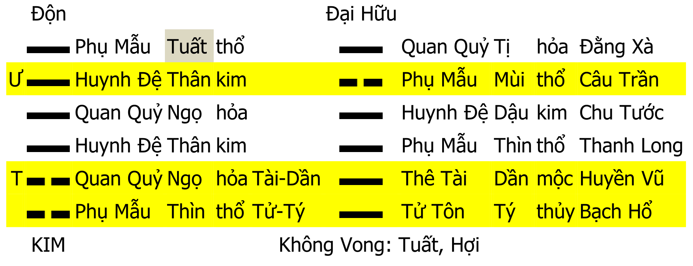
    - **Hình này chứng minh điều gì**
      - Dụng thần Thê Tài phục tàng nhưng con trai có chủ kiến tự quyết, người mẹ phản đối cũng không ngăn cản được hôn sự.
    - **Từ đâu mà thấy được**
      - Thê Tài Dần mộc phục dưới hào 2 Thế Ngọ hỏa; Tử Tôn Tý thủy xuất phục đắc Thân Tý Thìn hợp cục sinh Tài xung hào Thế.
  - **Phán đoán chi tiết:**
    - Căn cứ: Mẹ đoán hôn nhân cho con trai, lấy Thê Tài làm Dụng thần đại diện bạn gái con trai, Tử Tôn làm con trai, hào Thế đại diện người mẹ, hào Ứng đại diện gia đình nhà gái.
    - Nhìn vào:
      - Thê Tài Dần mộc không hiện trên quẻ, phục tàng dưới hào 2 Quan Quỷ Ngọ hỏa (hào Thế), lâm Huyền Vũ: Huyền Vũ chủ màu đen, cho thấy cô gái có làn da ngăm đen.
      - Hào Thế Quan Quỷ Ngọ hỏa đè nén Dụng thần, Dụng thần Dần mộc nhập Mộ tại Nhật thần Mùi thổ, ở trạng thái hưu tù không thể lộ ra: Biểu thị bản thân người mẹ ra sức đè nén, kịch liệt phản đối cuộc hôn nhân này.
      - Hào Ứng Huynh Đệ Thân kim là Kỵ thần tại hào 5 phát động khắc Dụng thần: Hào Ứng là gia đình đối phương, hào 5 là ngôi gia trưởng; cho thấy trục trặc bắt nguồn từ phía gia trưởng nhà gái ảnh hưởng nghiêm trọng đến hôn sự.
      - Huynh Đệ được Nhật Nguyệt sinh trợ, lại hóa hồi đầu sinh (Mùi thổ hóa Thân kim), hào sơ Thìn thổ động đến sinh, trên quẻ Huynh Đệ lưỡng hiện: Huynh Đệ quá vượng dẫn đến nghịch lý "vật cực tất phản", ngược lại không khắc phạt được Dụng thần Thê Tài, nên trở lực từ nhà gái không ngăn cản nổi hôn sự.
      - Tử Tôn Tý thủy đại diện người con trai, phục tàng dưới hào sơ Phụ Mẫu Thìn thổ: Nay Thìn thổ phát động hóa ra Tý thủy khiến phục thần xuất phục; lâm Bạch Hổ chủ cương quyết, có chủ kiến mạnh mẽ và nắm quyền tự quyết định hôn nhân của mình.
      - Hợp cục tam hợp Thân Tý Thìn hội thành Thủy cục sinh trợ Dụng thần Dần mộc: Thể hiện người con trai vô cùng say đắm, yêu thương và ngưỡng mộ đối phương; Thủy cục xung khắc trực diện hào Thế Ngọ hỏa khiến người mẹ hoàn toàn bất lực, không thể cản trở đám cưới này.
  - **Ứng nghiệm thực tế:**
    - Người mẹ xác nhận cô gái quả thực có nước da ngăm đen.
    - Mẹ của cô gái mắc bệnh tâm thần phân liệt (đúng như tượng hào Ứng gia trưởng gặp vấn đề), khiến bản thân bà mẹ ra sức phản đối nhưng con trai vẫn kiên quyết tiến tới hôn nhân.

- **Ví dụ 2:** Ngày Tân Hợi tháng Mão, một người nữ mới quen biết một người đàn ông, dự đoán kết quả mối quan hệ phát triển ra sao, được quẻ Phong Lôi Ích biến Phong Địa Quan (Không Vong: Dần, Mão).
  - **Hình 40.** Quẻ Phong Lôi Ích biến Phong Địa Quan
    - 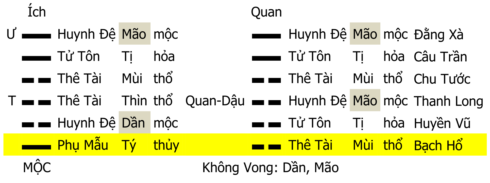
    - **Hình này chứng minh điều gì**
      - Đối phương đã có vợ từ trước; hai người ở bên nhau vui vẻ nồng nàn nhưng không có duyên kết hôn và cuối cùng đứt gánh.
    - **Từ đâu mà thấy được**
      - Quan Quỷ Dậu kim phục dưới Thế Thìn thổ lâm Thanh Long tương hợp; Dụng thần bị Nguyệt phá, hào sơ Phụ Mẫu độc phát là Tử địa hóa Tài.
  - **Phán đoán chi tiết:**
    - Căn cứ: Nữ đoán tình duyên lấy Quan Quỷ làm Dụng thần tượng trưng cho người đàn ông, hào Thế đại diện bản thân cô gái, hào Ứng và Nguyệt kiến đại diện đối phương và người ngoài.
    - Nhìn vào:
      - Quan Quỷ Dậu kim không hiện trên quẻ, phục tàng dưới hào 3 Thê Tài Thìn thổ (hào Thế).
      - Hào Thế Thìn thổ sinh Dụng thần Dậu kim: Bản thân cô gái vô cùng si mê, yêu thích đối phương.
      - Dụng thần Dậu kim và hào Thế Thìn thổ tương hợp (Thìn Dậu hợp): Người đàn ông cũng rất thích tiếp cận và gần gũi cô.
      - Dụng thần phục tàng ngay dưới hào Thế: Thể hiện tâm lý cô gái tha thiết muốn giữ người đàn ông ở lại mãi bên mình, không muốn rời xa.
      - Hào Thế và Dụng thần cùng ngự tại một hào vị lâm Thanh Long: Thanh Long chủ hỷ lạc, hoan hỷ, biểu thị hai người khi ở chung một chỗ cảm thấy vô cùng hạnh phúc, vui vẻ và ngọt ngào.
      - Dụng thần Dậu kim bị Nguyệt kiến Mão mộc xung phá (thành Nguyệt phá): Nguyệt kiến là Huynh Đệ chủ về tình địch, người cạnh tranh; Huynh Đệ Mão mộc lại nhập quẻ lâm hào Ứng (Ứng chủ người khác), chứng tỏ đã có người phụ nữ khác nhanh chân đến trước chiếm giữ anh ta.
      - Hào sơ Phụ Mẫu Tý thủy độc phát là Tử địa của Dụng thần Dậu kim: Lấy tượng hào độc phát làm chủ đạo của sự việc; Tử địa biểu thị sự việc không thể thành tựu. Phụ Mẫu là giấy đăng ký kết hôn, lâm Tử địa là không thể có danh phận vợ chồng chính thức.
      - Hào độc phát Tý thủy hóa Thê Tài Mùi thổ: Tử địa hóa Thê Tài, Thê Tài đại diện cho người phụ nữ khác, biểu thị người đàn ông đã đăng ký kết hôn và thuộc về một người phụ nữ khác.
  - **Ứng nghiệm thực tế:**
    - Đúng như phán đoán, người đàn ông này thực chất đã có vợ con đề huề từ trước.
    - Kể từ tháng Dần, hai người cắt đứt liên lạc, không còn qua lại với nhau nữa.

- **Ví dụ 3:** Ngày Canh Tý tháng Dần năm Tân Tị, nữ hỏi xem trong năm nay bản thân có thể có bạn trai hay không, được quẻ Phong Lôi Ích biến Khảm Vi Thủy (Không Vong: Thìn, Tị).
  - **Hình 41.** Quẻ Phong Lôi Ích biến Khảm Vi Thủy
    - 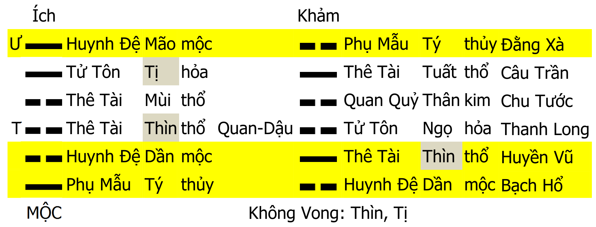
    - **Hình này chứng minh điều gì**
      - Trong cả năm đương số không tìm được bạn trai, mong ước tình cảm rơi vào hư không, nội tâm buồn rầu lo lắng.
    - **Từ đâu mà thấy được**
      - Quan Quỷ Dậu kim phục dưới Thế Thìn thổ lâm Không Vong; các hào động không trợ Dụng thần, Huynh Đệ khắc Thế khiến Dụng thần không thể lộ diện.
  - **Phán đoán chi tiết:**
    - Căn cứ: Nữ dự đoán nhân duyên lấy Quan Quỷ làm Dụng thần, hào Thế đại diện bản thân đương số.
    - Nhìn vào:
      - Quan Quỷ Dậu kim không hiện trên quẻ, phục tàng dưới hào 3 Thế Thê Tài Thìn thổ.
      - Dụng thần Dậu kim gặp tháng Dần ngày Tý đều không được sinh phù, ở trạng thái hưu tù vô khí.
      - Hào Thế Thìn thổ ngũ hành sinh Dụng thần Quan Quỷ: Biểu thị nội tâm cô gái vô cùng mong mỏi, khao khát tìm được một người bạn trai để trao gửi tình cảm.
      - Tuy nhiên hào Thế Thìn thổ lâm Tuần Không: Không Vong biểu thị sự trống rỗng, hụt hẫng và trạng thái âu lo, phiền muộn vì mãi không gặp được đối tượng như ý.
      - Trong quẻ có ba hào phát động (hào 1, hào 3, hào 6) nhưng không có bất kỳ hào nào sinh trợ cho Dụng thần.
      - Huynh Đệ Dần mộc đắc lệnh tháng Dần vượng tướng phát động khắc phạt hào Thế Thìn thổ, làm hào Thế bị thương tổn nặng nề, hoàn toàn mất sức sinh dưỡng Quan Quỷ.
      - Phục thần Quan Quỷ Dậu kim không được trợ lực nên bị đè nén chặt dưới Phi thần, vĩnh viễn không thể trồi lên (xuất phục), đồng nghĩa với việc không nhìn thấy bóng dáng bạn trai trong thực tế.
      - Vì vậy kết luận trong suốt năm Tân Tị sẽ tuyệt đối không xuất hiện người bạn trai nào.
  - **Ứng nghiệm thực tế:**
    - Trọn vẹn cả năm đó cô gái vẫn hoàn toàn đơn côi lẻ bóng, không quen biết hay tìm được người bạn trai nào.

- **Ví dụ 4:** Ngày Đinh Sửu tháng Tý năm Ất Dậu, nữ đoán tình cảnh hôn nhân và tiền đồ gia đình, được quẻ Sơn Lôi Di biến Địa Hỏa Minh Di (Không Vong: Thân, Dậu).
  - **Hình 42.** Quẻ Sơn Lôi Di biến Địa Hỏa Minh Di
    - 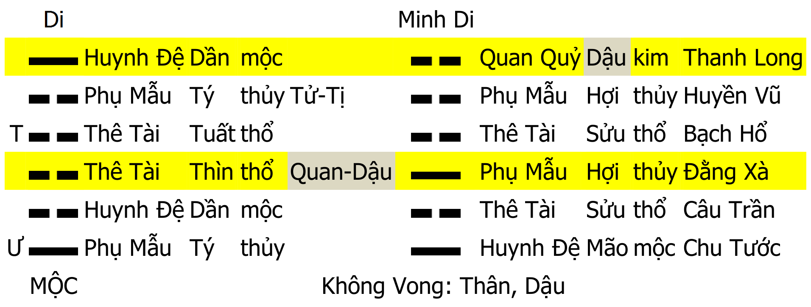
    - **Hình này chứng minh điều gì**
      - Người nữ đã ly hôn từ năm Kỷ Mão vì chồng sa vào bẫy quyến rũ của nhân tình; sau đó vực dậy kinh doanh gặt hái tài lộc dồi dào.
    - **Từ đâu mà thấy được**
      - Quan Quỷ Dậu kim phục tàng lâm Không nhập Mộ Nhật; quẻ du hồn biến du hồn; Tài trì Thế gặp năm Mùi, Thân, Dậu hóa giải triệt để Kỵ thần Dần mộc.
  - **Phán đoán chi tiết:**
    - Căn cứ: Nữ dự đoán hôn nhân lấy Quan Quỷ làm Dụng thần tượng trưng cho chồng, Phụ Mẫu làm hôn thú, hào Thế đại diện bản thân người vợ, Thê Tài đại diện tiền của và phụ nữ khác.
    - Nhìn vào:
      - Quan Quỷ Dậu kim không hiện trên quẻ, phục tàng dưới hào 3 Thê Tài Thìn thổ, lại lâm Tuần Không và nhập Mộ tại Nhật thần Sửu thổ:
        - Dụng thần không hiện là không còn thấy mặt chồng trong gia đình.
        - Dụng thần lâm Không là hôn nhân đã tan biến vào hư vô.
        - Dụng thần nhập Mộ là duyên phận vợ chồng đã bị chôn vùi, kết thúc hoàn toàn.
      - Hào 1 và hào 5 Phụ Mẫu Tý thủy lâm Chu Tước nhập Mộ ở Nhật thần: Chu Tước Phụ Mẫu là giấy chứng nhận kết hôn, nhập Mộ chính là giấy hôn thú đã bị thu hồi, cất đi (đã hoàn tất thủ tục ly hôn).
      - Quẻ chính Sơn Lôi Di là quẻ du hồn, biến quẻ Địa Hỏa Minh Di cũng là quẻ du hồn: Tượng "du hồn biến du hồn" chủ về phân tán, chia lìa đôi ngả không thể cứu vãn. Tổng hợp các yếu tố khẳng định gia đình đã tan vỡ, vợ chồng đã ly hôn từ trước.
      - Thời điểm ly hôn ứng vào năm Kỷ Mão (1999):
        - Dụng thần Dậu kim phục tàng, lâm Không, lại bị Phi thần Thê Tài Thìn thổ hợp trú (Thìn Dậu hợp).
        - Phục tàng thì ứng vào năm xung (Mão xung Dậu); Không Vong cũng ứng vào năm xung khai (xung Không); Hợp trú cũng phải chờ năm xung giải hợp. Năm Kỷ Mão xung động Dậu kim và hợp Thìn thổ giải trừ kiềm tỏa, nên chính là năm ký giấy ly dị.
        - Dụng thần Dậu kim hợp với Thê Tài Thìn thổ (Thìn là phụ nữ khác), trong khi Thìn thổ lại xung kích trực diện hào Thế Thê Tài Tuất thổ: Tượng người chồng bị phụ nữ bên ngoài dụ dỗ, cám dỗ mà phát sinh xung đột gay gắt rồi bỏ vợ.
      - Tài vận của người vợ sau ly hôn:
        - Thê Tài Tuất thổ trì Thế đắc Nhật thần Sửu thổ tương trợ là vượng tướng, song trong quẻ Huynh Đệ Dần mộc phát động khắc Thế, ban đầu báo hiệu tài vận khó khăn chật vật.
        - Đến năm Quý Mùi (2003): Kỵ thần Huynh Đệ nhập Mộ tại Mùi thổ, Mùi Tuất trợ giúp hào Thế, bắt đầu có bước ngoặt khởi sắc lớn.
        - Đến năm Giáp Thân (2004): Thân kim xung khắc đánh tan Huynh Đệ Dần mộc, tài vận bước lên một nấc thang mới vững chắc.
        - Đến năm Ất Dậu (2005): Hào biến của Huynh Đệ là Dậu kim xuất Không khắc chế hoàn toàn Huynh Đệ Dần mộc; đồng thời Dậu kim tương hợp giữ chặt Thê Tài Thìn thổ, biến tài của người khác thành tài của mình, kinh doanh đại phát.
  - **Ứng nghiệm thực tế:**
    - Người phụ nữ xác nhận đúng năm 1999 chồng cô bị nhân tình dụ dỗ dẫn đến ly hôn, khiến cô đau khổ suy sụp suốt nhiều năm.
    - Đến năm 2003 (Quý Mùi), cô vực dậy mở công ty riêng; năm 2004 (Giáp Thân) làm ăn phát đạt vượt bậc; năm 2005 (Ất Dậu) thu về lợi nhuận khổng lồ tới hơn 500.000 Nhân dân tệ.

- **Ví dụ 5:** Ngày Tân Tị tháng Mão, một người đàn ông dự đoán về tình cảnh hôn nhân gia đình hiện tại, được quẻ Thiên Phong Cấu biến Trạch Phong Đại Quá (Không Vong: Thân, Dậu).
  - **Hình 43.** Sơ đồ quẻ Thiên Phong Cấu biến Trạch Phong Đại Quá
    - 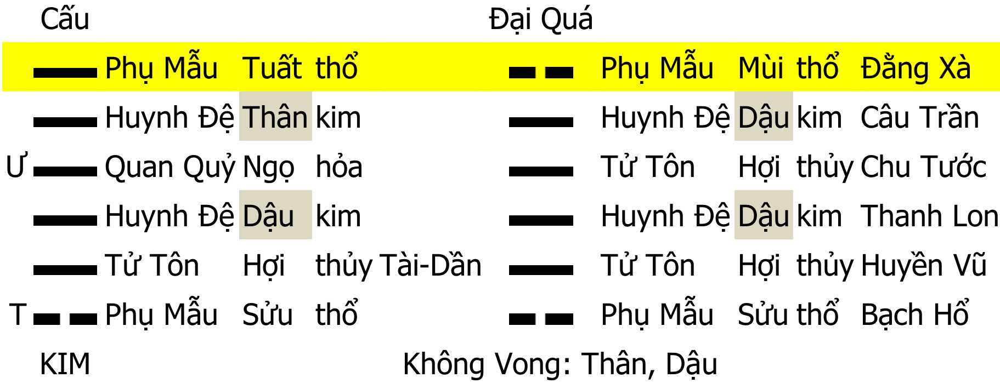
    - **Hình này chứng minh điều gì**
      - Hai vợ chồng bị hoàn cảnh công việc chia cắt sống xa nhau nhiều năm; người chồng luôn trăn trở và sang năm Thân mới có thể sum họp.
    - **Từ đâu mà thấy được**
      - Thê Tài Dần mộc phục tàng dưới hào 2 Tử Tôn Hợi thủy; quẻ Cấu chủ tương ngộ; Phụ Mẫu Tuất thổ độc phát lâm Đằng Xà biến du hồn.
  - **Phán đoán chi tiết:**
    - Căn cứ: Nam nhân hỏi về hôn nhân lấy Thê Tài làm Dụng thần đại diện người vợ, hào Thế đại diện bản thân người chồng.
    - Nhìn vào:
      - Thê Tài Dần mộc đắc Nguyệt kiến Mão mộc trợ giúp là vượng tướng, nhưng không lộ trên quẻ, phục tàng dưới hào 2 Tử Tôn Hợi thủy.
      - Quẻ gốc là Thiên Phong Cấu: Cấu có nghĩa là tao ngộ, gặp gỡ; ngụ ý tâm lý hai vợ chồng đang vô cùng khát khao được tương ngộ, sum họp.
      - Dụng thần không hiện trên quẻ: Tượng trưng cho việc hai vợ chồng mặt đối mặt không thấy nhau, trong cuộc sống thực tế không sống chung một mái nhà, chịu cảnh ngăn sông cách núi.
      - Hào 6 Phụ Mẫu Tuất thổ là hào độc phát, lâm Đằng Xà, động hóa Phụ Mẫu Mùi thổ biến thành quẻ du hồn (Đại Quá là quẻ du hồn):
        - Hào độc phát tiết lộ nguồn cơn cốt lõi của sự việc.
        - Phụ Mẫu chủ về công việc, đơn vị công tác, hộ khẩu, giấy tờ thủ tục.
        - Đằng Xà chủ về lo lắng, day dứt, muộn phiền không dứt.
        - Biến quẻ du hồn chủ về phiêu bạt tha hương, tâm tư bất an, phân tâm vì hoàn cảnh chia cách.
        - Cho thấy nguyên nhân chia cắt bắt nguồn từ thủ tục công việc/nơi đóng quân, khiến bản thân đương số luôn đau đáu phiền muộn vì không thể kề cận chăm sóc vợ.
      - Ứng kỳ đoàn tụ: Năm Giáp Thân (2004) địa chi Thân kim xung Dần mộc (xung xuất Phục thần), Thê Tài Dần mộc được xung bừng xuất hiện trên thực tế, báo hiệu năm Giáp Thân hai vợ chồng sẽ chính thức về chung một nhà đoàn tụ.
  - **Ứng nghiệm thực tế:**
    - Người đàn ông chia sẻ bản thân đang phục vụ trong quân đội, cưới vợ đã nhiều năm nhưng do tính chất quân ngũ nên chế độ chuyển vùng cho vợ chưa giải quyết xong, hai vợ chồng phải sống xa nhau.
    - Hiện cấp trên trong quân đội đã chấp thuận phương án và hứa hẹn sang năm sẽ giải quyết ổn thỏa cho vợ chồng đoàn tụ.

- **Ví dụ 6:** Ngày Kỷ Sửu tháng Dần, một người nam đã 47 tuổi đến xem quẻ bói về đường hôn nhân của bản thân, được quẻ Phong Sơn Tiệm biến Phong Hỏa Gia Nhân (Không Vong: Ngọ, Mùi).
  - **Hình 44.** Sơ đồ quẻ Phong Sơn Tiệm biến Phong Hỏa Gia Nhân
    - 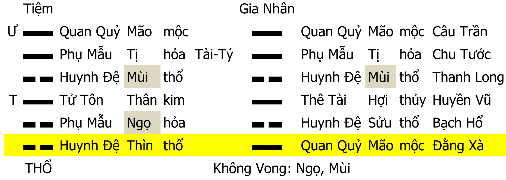
    - **Hình này chứng minh điều gì**
      - Đương số dù đã 47 tuổi nhưng chưa từng kết hôn do tính cách nhút nhát trước nữ giới; đây là cách cục đại muộn duyên, tới năm Tý mới có hy vọng.
    - **Từ đâu mà thấy được**
      - Thê Tài Tý thủy hưu tù phục tàng, bị Nhật hợp khắc và nhập Mộ; Thế Thân kim Nguyệt phá nhập Mộ lâm Huyền Vũ; quẻ Tiệm chủ tiệm tiến trì trệ.
  - **Phán đoán chi tiết:**
    - Căn cứ: Nam nhân hỏi về chuyện vợ chồng lấy Thê Tài làm Dụng thần, hào Thế làm bản thân đương số.
    - Nhìn vào:
      - Thê Tài Tý thủy không hiện trên quẻ, phục tàng dưới hào 5 Phụ Mẫu Tị hỏa.
      - Dụng thần Tý thủy không được Nguyệt kiến Dần mộc sinh phù, lại bị Nhật thần Sửu thổ hợp (Sửu hợp Tý là trong hợp mang khắc), đồng thời nhập Mộ tại hào sơ Huynh Đệ Thìn thổ phát động:
        - Vừa nhìn qua cấu trúc quẻ đã thấy thông tin hôn nhân cực kỳ trắc trở, bất lợi. Vấn đề cần phân định là: Đã kết hôn rồi ly hôn, hay chưa từng kết hôn (kết hôn muộn)?
        - Dụng thần hưu tù vô khí: Thể hiện nhân duyên với phái nữ trong đời vô cùng mỏng manh, cạn cợt.
        - Thê Tài không hiện trên quẻ: Cho thấy trong đời sống thực tế không hề có bóng dáng người phụ nữ nào kề cận.
        - Dụng thần nhập Mộ tại hào động Thìn thổ: Tượng trưng cho người nữ bị chôn giấu, không hề xuất hiện.
        - Dụng thần bị Nhật thần Sửu thổ hợp trói (hợp bán): Hợp là ngăn trở, cầm giữ; Phục thần vốn đã ẩn náu lại còn bị trói chặt thì càng bế tắc, không cách nào trồi lên được.
      - Xét hào Thế Tử Tôn Thân kim:
        - Bị Nguyệt kiến Dần mộc xung thành Nguyệt phá: Bản thân suy yếu, hoàn toàn không có đủ năng lực sinh dưỡng Thê Tài.
        - Hào Thế lại nhập Mộ tại Nhật thần Sửu thổ: Tượng bị nhốt kín, bị động, thiếu năng động trong giao tế.
        - Thế lâm Huyền Vũ: Huyền Vũ chủ về thầm kín, e thẹn, hướng nội, ngại ngùng; cho thấy tính cách trước mặt phái nữ thì rụt rè, không dám mở lời tán tỉnh, bàn chuyện yêu đương.
      - Tên quẻ là Phong Sơn Tiệm: "Tiệm" nghĩa là tiệm tiến, chậm chạp, trì hoãn kéo dài; khẳng định đây là cách cục kết hôn cực muộn, khó khăn nan giải chứ không phải đã ly hôn.
      - Dự báo thời điểm kết hôn: Muốn thành hôn thì bắt buộc phải đợi đến thời điểm Dụng thần Thê Tài xuất hiện để xuất phục, tức phải chờ đến năm Mậu Tý (2008).
  - **Ứng nghiệm thực tế:**
    - Thân chủ thừa nhận bản thân đang làm phát thanh viên đài phát thanh; bình thường trong công việc thì ăn nói vô cùng lưu loát, hoạt ngôn, sắc sảo.
    - Thế nhưng kỳ lạ là hễ cứ giáp mặt con gái là anh ta lại lúng túng, ấp úng, nói năng lộn xộn mất kiểm soát và hoàn toàn không biết cách mở lời yêu đương, đến 47 tuổi vẫn độc thân.

- **Ví dụ 7:** Ngày Đinh Sửu tháng Tý, nữ nhân đến gieo quẻ dự đoán xem bản thân và chồng có phải đi đến bước đường ly hôn hay không, được quẻ Phong Thủy Hoán biến Thiên Địa Bĩ (Không Vong: Thân, Dậu).
  - **Hình 45.** Quẻ Phong Thủy Hoán biến Thiên Địa Bĩ
    - 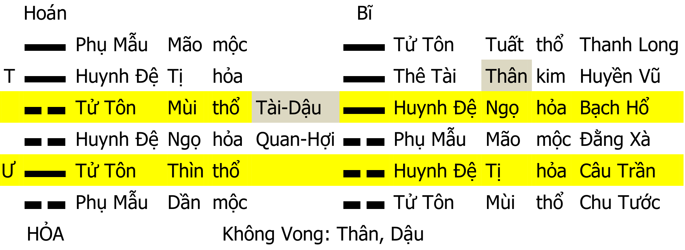
    - **Hình này chứng minh điều gì**
      - Kẻ thứ ba ngang nhiên nhảy vào chiếm giữ gia đình; người chồng mê muội bỏ nhà ra đi theo nhân tình, kết cục ly hôn tất yếu xảy ra.
    - **Từ đâu mà thấy được**
      - Quan Quỷ Hợi thủy phục dưới Huynh Đệ Ngọ hỏa xung khắc Thế; hào Ứng Thìn thổ động tại trạch hào nhập Mộ Dụng thần; Kỵ thần lưỡng động khắc Quan.
  - **Phán đoán chi tiết:**
    - Căn cứ: Nữ dự đoán quan hệ phu thê lấy Quan Quỷ làm Dụng thần tượng trưng cho người chồng, hào Thế đại diện bản thân người vợ, hào Ứng đại diện người khác/kẻ thứ ba.
    - Nhìn vào:
      - Quan Quỷ Hợi thủy không hiện trên quẻ, phục tàng dưới hào 3 Huynh Đệ Ngọ hỏa.
      - Dụng thần Hợi thủy và hào Thế Huynh Đệ Tị hỏa hình thành thế xung khắc trực diện (Thủy Hỏa tương xung tương khắc): Cho thấy đời sống vợ chồng nảy sinh mâu thuẫn gay gắt, thường xuyên cãi vã, bất hòa nảy lửa.
      - Dụng thần phục tàng không xuất hiện: Biểu thị người chồng đã bỏ nhà ra đi, không chịu về nhà.
      - Phục tàng dưới hào Huynh Đệ Ngọ hỏa: Huynh Đệ trong quẻ nữ đoán chủ về phụ nữ khác, người tranh đoạt, chứng minh người chồng hiện đang chung sống hoặc che giấu mối quan hệ ngoài luồng với một người đàn bà khác.
      - Hào Ứng Tử Tôn Thìn thổ phát động ngay tại hào 2:
        - Hào Ứng đại diện cho người ngoài, kẻ lạ.
        - Hào 2 là trạch hào (ngôi nhà, gia đạo).
        - Đây chính là tượng "Ứng phi nhập trạch" (người ngoài bay vào chiếm ngự ngôi nhà), giống như chim tu hú ngang nhiên chiếm tổ chim khách, ngụ ý kẻ thứ ba thọc sâu vào gia đình phá vỡ tổ ấm.
      - Quan Quỷ Hợi thủy nhập Mộ tại hào động Thìn thổ: Thìn là Mộ của Thủy, biểu thị người chồng hoàn toàn bị người đàn bà này mê hoặc, câu dẫn và giam lỏng tâm can. Dụng thần là Hợi thủy nên ứng nghiệm vào tháng Hợi.
      - Dụng thần Hợi thủy tuy được Nguyệt kiến Tý thủy trợ giúp, nhưng bị Nhật thần Sửu thổ khắc phạt; hơn nữa trong quẻ hai hào Tử Tôn (hào 2 Thìn thổ và hào 4 Mùi thổ) đều là Kỵ thần đồng loạt phát động khắc chế Quan Quỷ: Hôn nhân đổ vỡ tan tành, việc ly hôn chỉ là chuyện sớm muộn không thể xoay chuyển.
  - **Ứng nghiệm thực tế:**
    - Người vợ xác nhận hai vợ chồng liên tục xảy ra xung đột dữ dội do có người phụ nữ thứ ba chen chân phá hoại.
    - Người chồng đã dọn đồ bỏ nhà ra đi sống cùng nhân tình đúng như quẻ đã báo trước.

### CHƯƠNG 8: Ý NGHĨA CỦA TIẾN THẦN VÀ THOÁI THẦN

#### Khái niệm và nguyên lý ứng dụng của Tiến thần và Thoái thần trong nhân duyên

- **Nguyên lý căn bản:**
  - Ý nghĩa của Tiến thần và Thoái thần biến hóa linh hoạt tùy thuộc vào từng bối cảnh cụ thể của sự việc dự đoán (trước hôn nhân, sau hôn nhân, hay sau khi ly hôn và chia tay).
- **Giai đoạn trước khi thành hôn (đang yêu đương, tìm hiểu):**
  - **Dụng thần hóa Tiến thần:** Biểu thị mối quan hệ phát triển ngày càng sâu sắc, đối phương theo đuổi nhiệt tình, tình cảm lứa đôi ngày một mặn nồng, gắn bó khăng khít.
  - **Kỵ thần hóa Thoái thần:** Biểu thị các yếu tố trở ngại, bất lợi dần được triệt tiêu; xuất hiện bước ngoặt thuận lợi cho hôn sự (như người phản đối chuyển sang đồng thuận, rào cản tan biến).
- **Giai đoạn sau khi kết hôn (đã thành vợ chồng):**
  - **Dụng thần kỵ hóa Thoái thần:** Biểu thị tình cảm vợ chồng biến chuyển theo hướng lạnh nhạt, hờ hững, dần đánh mất sự nhiệt tình; thậm chí dẫn tới tâm lý lùi bước, né tránh, xa cách hoặc ly thân, chia tay.
- **Giai đoạn sau khi ly hôn hoặc chia tay:**
  - **Dụng thần hóa Tiến thần:** Biểu thị rạn nứt triệt để không thể hàn gắn, đối phương đã dứt khoát hạ quyết tâm dứt áo ra đi, tình cảm đôi bên ngày càng xa cách, không còn cơ hội tái hợp.
  - **Dụng thần hóa Thoái thần:** Điềm báo tương lai có thể quay về, hòa giải tái hợp, đối phương sinh tâm hối hận và chủ động trở lại bên mình để nối lại duyên xưa.

#### Hệ thống quái lệ thực tiễn minh họa Tiến thần và Thoái thần

- **Ví dụ 1: Nữ đoán cách cắt đứt quan hệ với chồng cũ đã ly hôn (ngày Ất Mão tháng Mùi)**
  - **Hình 46.** Quẻ Trạch Hỏa Cách biến Càn Vi Thiên
    - 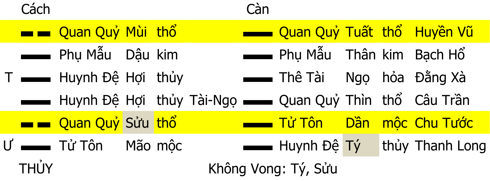
    - **Hình này chứng minh điều gì**
      - Người chồng dù đã ly hôn vẫn liên tục tìm đến quấy rầy, lừa gạt đòi tiền và không chịu buông tha cho người vợ cũ.
    - **Từ đâu mà thấy được**
      - Hào 6 Quan Quỷ Mùi thổ động hóa Tiến thần Tuất thổ khắc Thế, lâm Huyền Vũ hợp Thê Tài Ngọ hỏa; hào 2 Sửu thổ Nguyệt phá Không Vong hóa Dần mộc khắc hồi đầu.
  - **Phán đoán chi tiết:**
    - Căn cứ:
      - Lấy Quan Quỷ làm Dụng thần; trong quẻ Quan Quỷ lưỡng hiện (hào 2 Sửu thổ và hào 6 Mùi thổ) và đều phát động.
      - Hào 2 Quan Quỷ Sửu thổ lâm Chu Tước, gặp Tuần không (Tý, Sửu không), đồng thời bị Nguyệt phá (tháng Mùi xung Sửu), Nhật khắc (ngày Mão khắc Sửu), hóa Tử Tôn Dần mộc hồi đầu khắc.
      - Hào 6 Quan Quỷ Mùi thổ là hào thoái hưu, động hóa Tiến thần Tuất thổ khắc hào Thế Huynh Đệ Hợi thủy, lâm Huyền Vũ và hợp với Thê Tài Ngọ hỏa (phục tại hào 3).
    - Nhìn vào:
      - Hào 2 là trạch (nhà), Dụng thần Sửu thổ tại hào 2 Nguyệt phá, Không Vong, hóa khắc biểu thị người chồng đã ly hôn và rời khỏi nhà từ trước, đây là thông tin về việc đã qua. Chu Tước chủ lời nói, Không Vong chủ dối trá, lâm Chu Tước Không Vong khắc Thế cho thấy người chồng lúc trước luôn lừa dối và đối xử tệ bạc với vợ.
      - Để xem tình trạng sau ly hôn, phải chuyển sang hào 6 Quan Quỷ Mùi thổ. Hào 6 là ngôi vị thoái hưu, biểu thị hôn nhân đã chấm dứt hoàn toàn. Tuy nhiên, Mùi thổ phát động khắc hào Thế Hợi thủy, lại hóa Tiến thần Tuất thổ nên sau khi ly hôn người này vẫn tiếp tục tìm đến quấy rối, hết lần này đến lần khác không dứt.
      - Quan Quỷ Mùi thổ tương hợp Thê Tài Ngọ hỏa, hợp Tài là ý đồ muốn lấy tiền; kết hợp lâm Huyền Vũ chủ xảo quyệt, lừa lọc nên mục đích tìm đến chỉ là để bòn rút tiền bạc.
  - **Ứng nghiệm thực tế:**
    - Người phụ nữ xác nhận thực tế đúng hoàn toàn: Dù đã ly hôn dứt khoát, người chồng cũ vẫn liên tục tìm đến cô để mượn tiền rồi quỵt nợ không trả, thậm chí tiền cấp dưỡng nuôi con chung cũng rũ bỏ, bỏ mặc không đóng.

- **Ví dụ 2: Nam đoán có thể phát triển quan hệ ngoại tình với người nữ hay không (ngày Mậu Thìn tháng Tuất)**
  - **Hình 47.** Quẻ Thiên Địa Bĩ biến Trạch Địa Tụy
    - 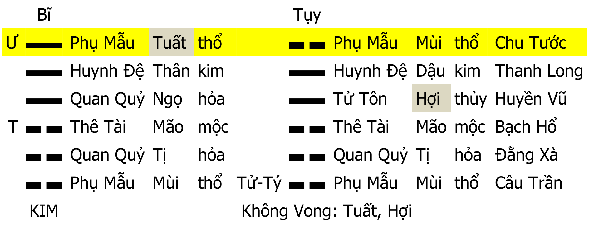
    - **Hình này chứng minh điều gì**
      - Đối phương ở xa chỉ gọi điện kể khổ về bế tắc hôn nhân cá nhân chứ không hề có tình ý hay cơ hội phát triển thành tình nhân.
    - **Từ đâu mà thấy được**
      - Thê Tài Mão mộc trì Thế bị hào 6 Phụ Mẫu Tuất thổ lâm Chu Tước độc phát hợp mất; Phụ Mẫu Tuất thổ là Mộ của Quan Quỷ lâm Không hóa Thoái thần Mùi thổ.
  - **Phán đoán chi tiết:**
    - Căn cứ:
      - Lấy Thê Tài làm Dụng thần; Thê Tài Mão mộc trì Thế được Nguyệt hợp (Mão Tuất hợp) là hữu khí, nhưng Nhật Nguyệt không tương sinh trợ giúp.
      - Hào 6 Phụ Mẫu Tuất thổ độc phát lâm Chu Tước, gặp Tuần không (Tuất, Hợi không), động hóa Thoái thần Phụ Mẫu Mùi thổ.
      - Tuất thổ là Mộ khố của Quan Quỷ (Hỏa Mộ tại Tuất); hào 6 là hào vị thoái hưu, tượng trưng cho phương xa, trời cao hoặc nước ngoài.
    - Nhìn vào:
      - Thê Tài trì Thế chỉ thể hiện tâm lý đơn phương của bản thân người nam luôn tơ tưởng, mơ tưởng về cô gái chứ không phải đối phương chủ động tìm đến mình. Thêm nữa, Dụng thần Mão mộc bị hào Ứng Phụ Mẫu Tuất thổ độc phát hợp mất, nên hoàn toàn không có cơ hội trở thành tình nhân ngoài luồng.
      - Hào 6 độc phát là nơi tập trung thông tin cốt lõi: hào 6 là nước ngoài; Phụ Mẫu chủ thông tin, thư từ, ngôn ngữ; Chu Tước chủ lời nói; lâm Không Vong là tượng vô tuyến (sóng điện thoại viễn thông). Do đó người phụ nữ này đang ở nước ngoài và thường xuyên gọi điện thoại đường dài cho anh ta.
      - Tuất thổ là Mộ khố của Quan Quỷ (Quan Quỷ là ưu tư, phiền muộn), chứng tỏ đối phương chất chứa vô vàn sầu muộn, bế tắc trong lòng. Lâm Không Vong là nhu cầu thổ lộ, trút bỏ phiền não ra ngoài. Hào 6 là vị trí thoái hưu, Ứng là đối phương, Phụ Mẫu là giấy hôn thú nên biểu thị cô ấy đang chuẩn bị ly hôn; mục đích gọi điện chỉ để trút bớt gánh nặng tâm lý chứ không hề có ý thích người nam.
      - Phụ Mẫu Tuất thổ động hóa Thoái thần Mùi thổ, vì đang Không Vong nên tạm thời chưa thoái, khi nào xuất Không giải tỏa được áp lực thì sẽ hóa thoái. Nghĩa là khi tâm bệnh được cởi bỏ, đối phương sẽ không còn đau khổ để kể lể và sẽ ngừng liên lạc, không gọi điện thoại cho anh ta nữa.
  - **Ứng nghiệm thực tế:**
    - Đúng như suy đoán, hai người chỉ quen nhau qua mạng Internet. Người phụ nữ định cư ở nước ngoài, hôn nhân bế tắc nên thường gọi điện kể khổ muốn ly hôn. Người nam ảo tưởng đối phương thích mình nên mới xem quẻ. Sau đó, người phụ nữ đã hoàn tất thủ tục ly hôn, tâm lý được giải tỏa và dứt khoát không hề gọi điện thoại cho anh ta nữa.

- **Ví dụ 3: Người mẹ đoán hôn nhân cho con trai sinh năm 1976 (ngày Giáp Dần tháng Hợi năm Bính Tuất)**
  - **Hình 48.** Quẻ Trạch Phong Đại Quá biến Thiên Phong Cấu
    - 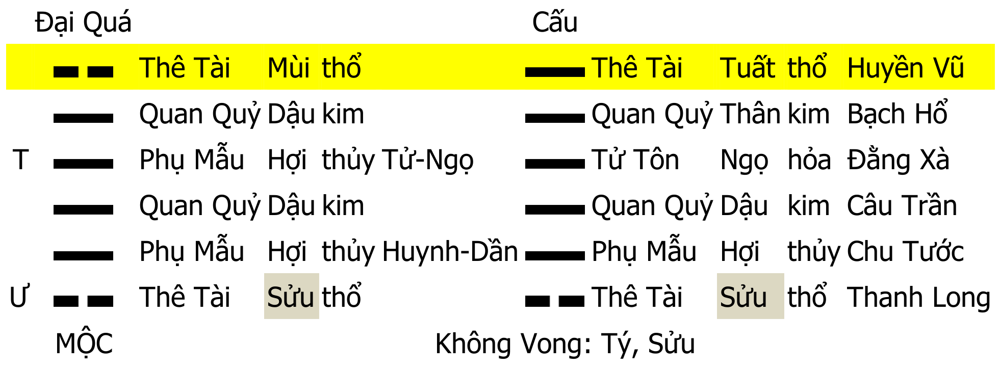
    - **Hình này chứng minh điều gì**
      - Con trai lấy vợ lớn tuổi hơn do có bầu trước, bị vợ quản thúc vô cùng khắt khe và đến năm Kỷ Sửu 2009 sẽ ly hôn.
    - **Từ đâu mà thấy được**
      - Thê Tài Mùi thổ hào 6 động hóa Tiến thần Tuất thổ khắc Thế Phụ Mẫu Hợi thủy, hợp năm Nhâm Ngọ 2002 hóa Mộ Tử Tôn, và hào Sửu thổ xuất Không xung Mùi thổ vào năm 2009.
  - **Phán đoán chi tiết:**
    - Căn cứ:
      - Lấy Thê Tài làm Dụng thần; Thê Tài lưỡng hiện (hào sơ Sửu thổ và hào 6 Mùi thổ), chọn hào phát động Thê Tài Mùi thổ làm Dụng thần.
      - Hào Thế Phụ Mẫu Hợi thủy trì Thế tương hợp với Nhật thần Giáp Dần (Dần Hợi hợp); Thê Tài Mùi thổ động hóa Tiến thần Tuất thổ (Mộ khố của Tử Tôn).
      - Hào sơ Thê Tài Sửu thổ lâm Tuần không (Tý, Sửu không).
    - Nhìn vào:
      - Nhật hợp Phụ Mẫu trì Thế là tượng giấy chứng nhận kết hôn đã thành, biểu thị con trai hiện tại đã có gia đình.
      - Quy tắc "Động mà phùng trị phùng hợp": Năm Nhâm Ngọ (2002) tương hợp với Dụng thần Thê Tài Mùi thổ (Ngọ Mùi hợp), nên năm 2002 chính là năm kết hôn. Lưu niên Ngọ hỏa là hào Tử Tôn, kết hợp với việc Dụng thần Mùi thổ hóa Tuất thổ là Mộ khố của Tử Tôn, cho thấy cuộc hôn nhân năm 2002 bắt nguồn từ việc đối phương đã mang thai có con trước khi cưới.
      - Trong phép bói hộ con cái, Tử Tôn hoặc hào Thế đều đại diện cho người con trai. Dụng thần Thê Tài Mùi thổ cư hào 6 (hào vị tối cao, chủ sự già dặn/lớn tuổi), đồng thời Mùi thổ là Dưỡng địa của Thế Hợi thủy, thuyết minh người phụ nữ này nhiều tuổi hơn con trai cô.
      - Dụng thần Thê Tài Mùi thổ phát động khắc hào Thế Hợi thủy biểu thị tính khí người vợ rất nghiêm khắc, quản chế chồng chặt chẽ. Hào Tài lại động hóa Tiến thần Tuất thổ chứng tỏ mức độ kiểm soát ngày càng gay gắt, ghen tuông trói buộc không chịu nới lỏng nửa bước.
      - Hào sơ Thê Tài Sửu thổ gặp Không Vong, đến năm Kỷ Sửu (2009) địa chi Sửu thổ điền thực xuất Không, xung phá Dụng thần Mùi thổ (Sửu Mùi tương xung), dự báo năm 2009 hai vợ chồng sẽ chính thức ly hôn.
  - **Ứng nghiệm thực tế:**
    - Người mẹ xác nhận: Con trai bà kết hôn vào đúng năm 2002 vì ăn ở có thai trước. Người vợ lớn hơn con trai bà 8 tuổi, bản tính cực kỳ hay ghen và quản thúc chồng rất khắt khe. Đến năm Kỷ Sửu (2009), hai người đã chính thức ra tòa ly hôn.

- **Ví dụ 4: Nam đoán thủ tục ly hôn có thành công dứt điểm hay không (ngày Nhâm Thân tháng Tuất năm Giáp Thân)**
  - **Hình 49.** Quẻ Đoài Vi Trạch biến Thiên Lôi Vô Vọng
    - 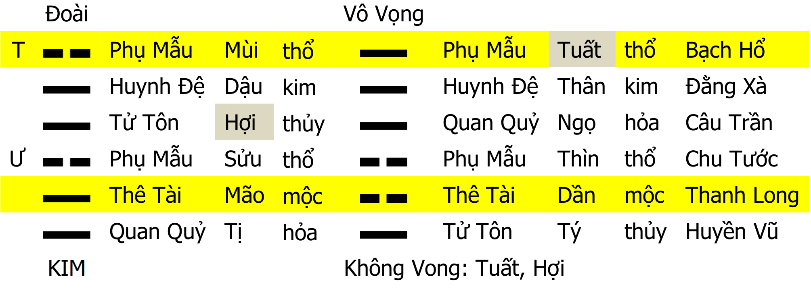
    - **Hình này chứng minh điều gì**
      - Người chồng kiên quyết muốn ly hôn nhưng người vợ hóa Thoái thần nên níu kéo đòi hòa giải, khiến việc ly hôn bị kéo dài bế tắc.
    - **Từ đâu mà thấy được**
      - Thê Tài Mão mộc hào 2 động hóa Thoái thần Dần mộc; hào Thế Phụ Mẫu Mùi thổ hóa Tuất thổ Không Vong; quẻ Đoài Vi Trạch Lục xung hóa Thiên Lôi Vô Vọng Lục xung.
  - **Phán đoán chi tiết:**
    - Căn cứ:
      - Lấy Thê Tài làm Dụng thần; Thê Tài Mão mộc tại hào 2 phát động hóa Thoái thần Thê Tài Dần mộc.
      - Hào Thế Phụ Mẫu Mùi thổ tại hào 6 là hào vị thoái hưu, động hóa Phụ Mẫu Tuất thổ lâm Tuần không (Tuất, Hợi không).
      - Quẻ Đoài Vi Trạch là quẻ Lục xung biến Thiên Lôi Vô Vọng cũng là quẻ Lục xung.
    - Nhìn vào:
      - Hào 2 là trạch (nhà cửa), Thê Tài Mão mộc động tại hào 2 cho thấy thực trạng hai vợ chồng hiện nay đã sống ly thân, mỗi người một nơi. Thông thường, khi đoán việc muốn bỏ nhau rất mừng Dụng thần hóa Tiến thần (biểu thị đối phương quyết chí dứt áo ra đi). Ngược lại, ở đây Dụng thần hóa Thoái thần lại là thông tin người vợ muốn lùi bước, đổi ý muốn quay về hàn gắn với chồng, do đó việc ly hôn rất khó giải quyết nhanh chóng.
      - Hào Thế lâm Phụ Mẫu ở ngôi thoái hưu, Phụ Mẫu tượng trưng cho hôn thú, giấy chứng nhận kết hôn; Thế hóa Không Vong biểu thị người chồng quyết tâm muốn hủy bỏ tờ hôn thú, kiên định ý định cắt đứt quan hệ.
      - Quẻ Lục xung biến Lục xung là tượng mâu thuẫn vợ chồng vô cùng gay gắt, xung đột khó bề dung hòa. Tuy nhiên do Dụng thần hóa Thoái thần níu kéo, nên vụ việc sẽ bị cù cưa trì hoãn kéo dài, phải chờ đến năm Dần (khi Thân xung Dần, Dần mộc điền thực Thoái thần) mới có thể giải quyết dứt điểm.
  - **Ứng nghiệm thực tế:**
    - Người vợ nhất quyết đòi quay lại làm lành, kiên quyết không chịu ký vào đơn ly hôn. Đến tận năm Đinh Hợi (2007), người chồng phản hồi lại cho biết hai bên vẫn giằng co và chưa thể hoàn tất thủ tục ly hôn.

- **Ví dụ 5: Nữ đoán có thể kết hôn với người đàn ông mình thương hay không (ngày Kỷ Mão tháng Tuất)**
  - **Hình 50.** Quẻ Lôi Hỏa Phong biến Trạch Thiên Quải
    - 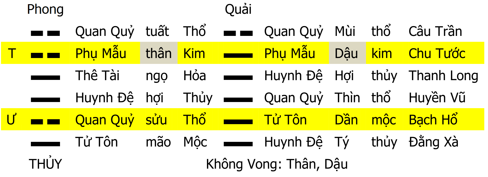
    - **Hình này chứng minh điều gì**
      - Đương số si mê đối phương trong tâm trạng hoang mang tột độ nhưng hôn sự bất thành do Dụng thần bị hồi đầu khắc và đối phương cưới người khác.
    - **Từ đâu mà thấy được**
      - Hào Thế Phụ Mẫu Thân kim lâm Chu Tước Không Vong hóa Tiến thần Dậu kim nhập Mộ Quan Quỷ Sửu thổ; Dụng thần Sửu thổ bị Nhật Mão khắc và hóa Tử Tôn Dần mộc hồi đầu khắc.
  - **Phán đoán chi tiết:**
    - Căn cứ:
      - Lấy Quan Quỷ làm Dụng thần; quẻ xuất hiện Quan Quỷ lưỡng hiện (hào 2 Sửu thổ và hào 6 Tuất thổ), chọn hào phát động Quan Quỷ Sửu thổ làm Dụng thần.
      - Dụng thần Quan Quỷ Sửu thổ lâm hào Ứng; hào Thế Phụ Mẫu Thân kim lâm Chu Tước, gặp Tuần không (Thân, Dậu không), động hóa Tiến thần Phụ Mẫu Dậu kim.
      - Thế Thân kim nhập Mộ tại Dụng thần Sửu thổ (Kim Mộ tại Sửu); Dụng thần Sửu thổ bị Nhật thần Kỷ Mão khắc, lại động hóa Tử Tôn Dần mộc hồi đầu khắc.
    - Nhìn vào:
      - Dụng thần lâm hào Ứng biểu thị người nữ dành trọn tình cảm hướng về đối phương. Thêm vào đó, hào Thế nhập Mộ tại Dụng thần cho thấy bản thân cô gái hoàn toàn bị người đàn ông này mê hoặc, đắm đuối say mê không thể dứt ra được.
      - Hào Thế lâm Tuần không phản ánh tâm lý hoang mang, bất an, cảm giác chông chênh không có gì chắc chắn. Thế là hành Kim lâm Chu Tước gặp Không, cổ nhân có câu "Kim Không tắc minh" (chuông rỗng thì kêu vang), ám chỉ ngày đêm trong tâm trí cô luôn thì thầm, nhắc nhớ khôn nguôi tên của đối phương. Thế lại động hóa Tiến thần Dậu kim khiến sự âu lo, sầu muộn trong lòng ngày một chất chồng, bức bối nặng nề.
      - Dù Quan Quỷ Sửu thổ được Nguyệt kiến Tuất thổ trợ giúp, nhưng vừa bị Nhật thần Mão mộc khắc, vừa bị hào biến Dần mộc hồi đầu khắc cực nặng (Mộc khắc Thổ), nên Dụng thần suy bại hoàn toàn, tượng trưng hôn sự tất yếu tan vỡ, không thể thành duyên.
  - **Ứng nghiệm thực tế:**
    - Dự đoán ứng nghiệm chuẩn xác: Người đàn ông đó sau đó đã dứt khoát kết hôn với một người phụ nữ khác, khiến cô gái đau khổ ôm nỗi thất vọng.

- **Ví dụ 6: Nam đoán có chia tay bạn gái hay không (ngày Kỷ Tị tháng Thân)**
  - **Hình 51.** Quẻ Lôi Trạch Quy Muội biến Đoài Vi Trạch
    - 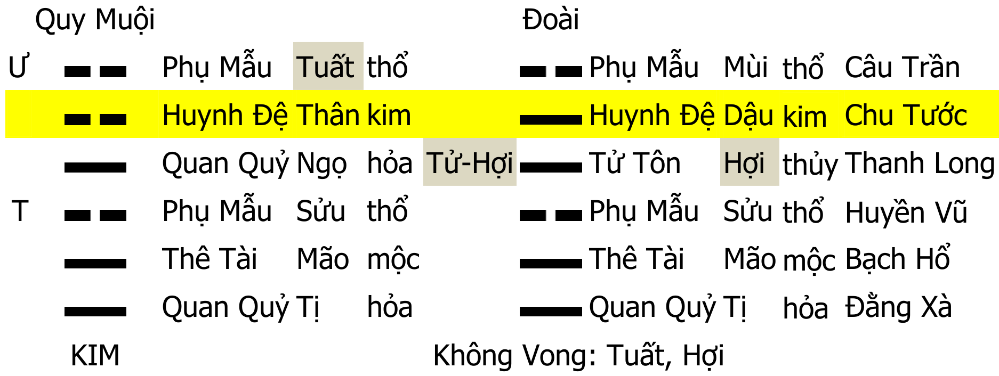
    - **Hình này chứng minh điều gì**
      - Mâu thuẫn cãi vã giữa hai người leo thang gay gắt và chắc chắn sẽ chia tay vào tháng Hợi do Kỵ thần Huynh Đệ hóa Tiến thần khắc Dụng thần hưu tù.
    - **Từ đâu mà thấy được**
      - Thê Tài Mão mộc hưu tù bị Nguyệt Thân khắc; Kỵ thần Huynh Đệ Thân kim lâm Chu Tước động hóa Tiến thần Dậu kim, gặp Nhật hợp Tị hỏa đến tháng Hợi xung khai sẽ chia tay.
  - **Phán đoán chi tiết:**
    - Căn cứ:
      - Lấy Thê Tài làm Dụng thần; Thê Tài Mão mộc cư hào 2 bị Nguyệt kiến Thân kim khắc, lại không được Nhật thần Tị hỏa tương sinh trợ giúp nên lâm vào cảnh hưu tù vô khí.
      - Kỵ thần Huynh Đệ Thân kim tại hào 5 lâm Chu Tước phát động hóa Tiến thần Huynh Đệ Dậu kim.
      - Kỵ thần Huynh Đệ Thân kim hiện tại được Nhật thần Tị hỏa tương hợp (Tị Thân lục hợp).
    - Nhìn vào:
      - Kỵ thần Huynh Đệ chuyên khắc Thê Tài phát động hóa Tiến thần, biểu thị xung đột, mâu thuẫn giữa hai bên ngày càng leo thang căng thẳng, không có dấu hiệu dịu đi. Hào động lâm Chu Tước chủ khẩu thiệt, tranh chấp, cho thấy đôi bên thường xuyên nổ ra cãi vã kịch liệt, lời qua tiếng lại gay gắt.
      - Dụng thần Thê Tài Mão mộc đã hưu tù lại gặp Kỵ thần hóa Tiến thần hung hãn bức bách nên sự đổ vỡ là khó tránh khỏi. Hiện tại do Nhật thần Tị hỏa hợp với Huynh Đệ Thân kim nên Huynh Đệ tham hợp tạm thời hoãn lực khắc Thê Tài.
      - Đến tháng Hợi (tháng 10 âm lịch), địa chi Hợi thủy xung khai Nhật hợp Tị hỏa (Tị Hợi tương xung), giải phóng toàn bộ hung lực của Kỵ thần Huynh Đệ để khắc phạt Thê Tài, do đó tháng Hợi chắc chắn là thời điểm đôi lứa chính thức chia tay.
  - **Ứng nghiệm thực tế:**
    - Diễn biến hoàn toàn chuẩn xác: Sau đó hai người liên tục nảy sinh mâu thuẫn tranh cãi triền miên và đến đúng tháng Hợi thì chính thức đường ai nấy đi.

- **Ví dụ 7: Nam đoán chiều hướng phát triển quan hệ với bạn gái (ngày Tân Hợi tháng Tuất năm Nhâm Ngọ)**
  - **Hình 52.** Sơ đồ quẻ Địa Trạch Lâm biến Địa Lôi Phục
    - 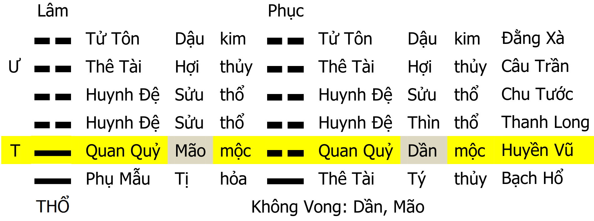
    - **Hình này chứng minh điều gì**
      - Hai người đang sống chung thân mật nhưng người nam sẽ thay đổi tình cảm, dần thoái lui và chia tay bạn gái vào năm Giáp Thân 2004.
    - **Từ đâu mà thấy được**
      - Hào Thế Quan Quỷ Mão mộc lâm Tuần không, Huyền Vũ động hóa Thoái thần Dần mộc; Phụ Mẫu Tị hỏa nhập Mộ tại Nguyệt Tuất thổ; năm Giáp Thân xung Thoái thần là ứng kỳ chia tay.
  - **Phán đoán chi tiết:**
    - Căn cứ:
      - Lấy Thê Tài làm Dụng thần; Thê Tài Hợi thủy tại hào 5 lâm Ứng được Nhật thần Hợi thủy đồng hành tương trợ, lại phát sinh tương sinh với hào Thế Quan Quỷ Mão mộc (Thủy sinh Mộc).
      - Hào Thế Quan Quỷ Mão mộc lâm Huyền Vũ, gặp Tuần không (Dần, Mão không), phát động hóa Thoái thần Quan Quỷ Dần mộc.
      - Hào sơ Phụ Mẫu Tị hỏa nhập Mộ tại Nguyệt kiến Tuất thổ (Hỏa Mộ tại Tuất).
    - Nhìn vào:
      - Dụng thần Thê Tài vượng tướng sinh Thế cho thấy ở thời điểm hiện tại mối quan hệ giữa hai người vô cùng nồng thắm, tốt đẹp, đối phương rất yêu thương và chăm sóc cho người nam.
      - Hào Thế lâm Huyền Vũ chủ sự việc kín đáo, ám muội; Phụ Mẫu là giấy hôn thú lại bị giam hãm nơi Mộ khố của Nguyệt kiến, đây là dấu hiệu đặc trưng của việc hai người chưa làm đám cưới hay đăng ký kết hôn nhưng đã dọn về chung sống như vợ chồng (vị hôn đồng cư).
      - Tuy nhiên, hào Thế lâm Tuần không lại phát động hóa Thoái thần Quan Quỷ Dần mộc: Thế là chính mình, Thế hóa Thoái là điềm báo bản thân người nam sẽ dần nguội lạnh nhiệt huyết, thay đổi lòng dạ, có tâm lý lùi bước, né tránh và muốn rời xa người bạn gái.
      - Năm Giáp Thân (2004), địa chi Thân kim xung Thoái thần Dần mộc (Dần Thân tương xung) chính là ứng kỳ phát động việc thoái lui dứt khoát, định đoạt cuộc chia tay.
  - **Ứng nghiệm thực tế:**
    - Diễn biến thực tế chuẩn xác từng chi tiết: Dù lúc gieo quẻ hai người đang mặn nồng sống chung, nhưng sau đó tình cảm của người nam dần phai nhạt và đến đúng năm Giáp Thân (2004) thì hai người chính thức chia tay.

- **Ví dụ 8: Nữ đoán có thể quay lại làm hòa với bạn trai đã chia tay hay không (ngày Tân Mão tháng Mùi)**
  - **Hình 53.** Sơ đồ quẻ Địa Trạch Lâm biến Chấn Vi Lôi
    - 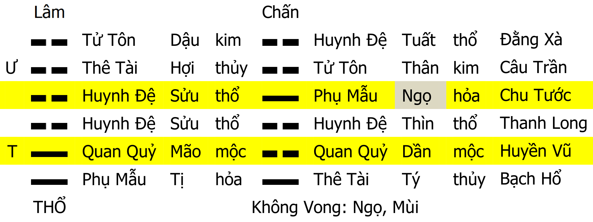
    - **Hình này chứng minh điều gì**
      - Người bạn trai sau khi chia tay sẽ đổi ý hối hận và chủ động quay lại làm hòa với đương số vào tháng Thân.
    - **Từ đâu mà thấy được**
      - Quan Quỷ Mão mộc trì Thế được Nhật thần Mão mộc tương phù vượng tướng, phát động hóa Thoái thần Quan Quỷ Dần mộc; sau chia tay Dụng thần hóa Thoái chủ quay về; tháng Thân xung Dần là ứng kỳ.
  - **Phán đoán chi tiết:**
    - Căn cứ:
      - Lấy Quan Quỷ làm Dụng thần; Quan Quỷ Mão mộc trì Thế được Nhật thần Tân Mão đồng hành trợ giúp nên thuộc diện vượng tướng hữu khí.
      - Tuần không tại Ngọ và Mùi (Ngọ, Mùi không).
      - Dụng thần Quan Quỷ Mão mộc trì Thế phát động hóa Thoái thần Quan Quỷ Dần mộc.
    - Nhìn vào:
      - Trong dự đoán tình cảm, nếu sau khi đã chia tay hoặc ly hôn mà Dụng thần hóa Tiến thần thì đối phương dứt khoát rời đi không bao giờ quay đầu. Ngược lại, khi Dụng thần động hóa Thoái thần thì lại mang ý nghĩa cát lành: biểu thị người kia sau chia tay sẽ hồi tâm chuyển ý, cảm thấy hối hận và muốn lùi lại bước đi trước đó để trở về bên mình.
      - Đặc biệt, Quan Quỷ Mão mộc lại trì Thế, Thế đại diện cho chính bản thân người nữ, nên tượng Dụng thần hóa Thoái trì Thế là người bạn trai sẽ tự động quay trở lại bên cạnh đương số để nối lại tình xưa.
      - Quan Quỷ hóa Thoái thần Dần mộc, đến tháng Thân (tháng 7 âm lịch), địa chi Thân kim xung khai Dần mộc (Dần Thân tương xung), đây chính là thời điểm ứng kỳ Thoái thần phát huy tác dụng thực tế để hai người tái hợp.
  - **Ứng nghiệm thực tế:**
    - Kết quả đúng như quẻ đã chỉ dẫn: Đến đúng tháng Thân năm đó, người bạn trai đã chủ động liên lạc tìm gặp, xin làm hòa và hai người đã chính thức tái hợp hạnh phúc bên nhau.

### CHƯƠNG 9: Ý NGHĨA CỦA NGUYỆT PHÁ

#### Bản chất và hệ thống tượng nghĩa của Nguyệt phá
- **Khái niệm cốt lõi:**
  - Nguyệt phá là một trong những trạng thái suy bại, biến động mạnh mẽ nhất của hào trong dự đoán Lục hào, phát sinh khi địa chi của hào bị địa chi của Nguyệt kiến trực tiếp tương xung (ví dụ: tháng Tý xung Ngọ, tháng Sửu xung Mùi, tháng Dần xung Thân, tháng Mão xung Dậu, tháng Thìn xung Tuất, tháng Tị xung Hợi).
  - Tác động của Nguyệt phá phụ thuộc hoàn toàn vào vị trí rơi vào: Lục thân nào (Phụ Mẫu, Huynh Đệ, Tử Tôn, Thê Tài, Quan Quỷ), cung vị nào, đóng tại hào Thế (bản thân), hào Ứng (đối phương), Dụng thần (đối tượng sự việc), hay Nguyên thần (nguồn sinh dưỡng, nội tâm).
- **Hệ thống tượng nghĩa đa tầng:**
  - Tượng nghĩa tình cảm - nhân duyên: Rạn nứt, chia tách, bất đồng sâu sắc, ý kiến phản đối kịch liệt, tổn thương tâm hồn, nghi kỵ, chia tay, tan vỡ, ly thân, ly hôn.
  - Tượng nghĩa hình thể - sự vật: Phá hoại, biến dạng, khuyết tật, tàn tật, hư hỏng, đình trệ.
  - Tượng nghĩa động thái - ứng kỳ: Khi hào gặp Nguyệt phá, nếu là hỷ thần thì phá là hung, nếu là kỵ thần thì phá tạm thời chưa tác họa nhưng khi "thực phá" (đến ngày/tháng lâm trị) hoặc "hợp phá" (được hào khác hợp) thì sự việc sẽ bộc phát ứng nghiệm.
- **Quy tắc phân tích chuyên sâu:**
  - Xem xét hào phát động hóa phá, thoái thần hóa phá hay tiến thần hóa phá để định cát hung chuyển hóa.
  - Áp dụng nguyên lý "Phá cần Hợp": Hào lâm Nguyệt phá mang tâm lý chán nản, trống vắng, bức bách, rất dễ bị hào khác hợp trú kéo đi (như bị người thứ ba cám dỗ).
  - Phối hợp chuyển đổi Lục thân và Lục thần để vạch rõ động cơ kín đáo, thế giới nội tâm và hành vi thực tế của các đương sự.

#### Phân tích chuyên sâu các quái lệ thực chứng
- **Ví dụ 1: Ngày Ất Mão tháng Hợi năm Bính Tuất, nữ (40 tuổi) đoán thân thể và thời điểm kết hôn**
  - **Hình 54.** Sơ đồ quẻ Hỏa Thiên Đại Hữu
    - 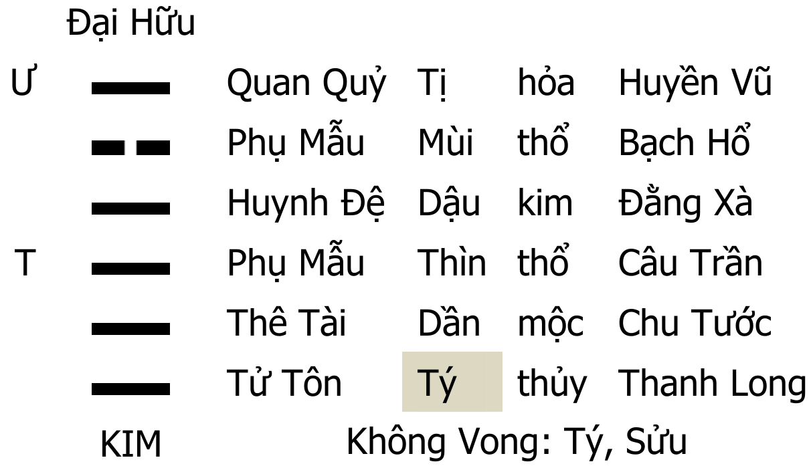
    - **Hình này chứng minh điều gì**
      - Chứng minh Quan Quỷ là Nguyên thần của Thế lâm Nguyệt phá chủ tâm lý bài xích hôn nhân, đồng thời phản ánh tật bệnh đau dạ dày và chóng mặt.
    - **Từ đâu mà thấy được**
      - Hào Thế Thìn thổ bị Nhật khắc (dạ dày), Nguyên thần hào 6 Tị hỏa bị Nguyệt Hợi xung phá lâm Huyền Vũ tại quẻ Càn (chứng chóng mặt), hào 6 là già (kết hôn muộn).
  - **Bối cảnh và câu hỏi dự trắc:**
    - Thời gian: Ngày Ất Mão, tháng Hợi, năm Bính Tuất (Tuần không: Tý, Sửu).
    - Đối tượng: Người nữ 40 tuổi đến hỏi hai việc trọng đại: Tình trạng sức khỏe thân thể và thời điểm nào có thể bước vào hôn nhân.
    - Quẻ cát hung: Được quẻ thuần tĩnh Hỏa Thiên Đại Hữu.
  - **Phán đoán chi tiết:**
    - Căn cứ:
      - Dự trắc thân thể lấy hào Thế làm trung tâm; dự trắc hôn nhân nữ lấy Quan Quỷ làm Dụng thần.
      - Hào vị cơ thể: Hào 3 chủ về bụng và dạ dày (tỳ vị); ngũ hành Thổ chủ tỳ vị. Hào 6 và quái Càn chủ về đầu não.
      - Tượng Lục thần và Nguyệt phá: Lâm Huyền Vũ chủ về tối tăm, mông muội, chóng mặt, tâm lý hướng nội, trầm uất. Hào 6 là ngôi vị cao nhất trong quẻ, tượng trưng cho tuổi tác đã cao, muộn màng.
      - Quan hệ Thế - Dụng - Nguyên thần: Quan Quỷ Tị hỏa tại hào 6 vừa là Dụng thần hôn nhân, vừa là Nguyên thần sinh cho hào Thế Phụ Mẫu Thìn thổ. Nguyên thần đại diện cho cội nguồn suy nghĩ và thế giới nội tâm của đương số.
    - Nhìn vào:
      - Về sức khỏe: Hào Thế Thìn thổ tọa tại hào 3 bị Nhật thần Mão mộc khắc chế dữ dội, cho thấy đương số mắc chứng đau dạ dày, hệ tiêu hóa suy nhược. Đồng thời, Nguyên thần của hào Thế là Tị hỏa tại hào 6 (thuộc quái Càn) bị Nguyệt kiến Hợi thủy xung phá thành Nguyệt phá, lại lâm Huyền Vũ, cho thấy vùng đầu não thường xuyên choáng váng, hoa mắt chóng mặt.
      - Về hôn nhân: Quan Quỷ Tị hỏa tuy được Nhật thần Mão mộc sinh nhưng bị Nguyệt Hợi xung phá, lại ngự tại hào 6 (hào già), biểu thị hôn nhân đến rất muộn màng. Do Quan Quỷ đồng thời là Nguyên thần của Thế lâm Nguyệt phá, điều này vạch rõ tâm lý bài xích, e ngại hôn nhân xuất phát từ chính chủ quan đương số. Lâm Huyền Vũ thể hiện tính cách trầm cảm, hướng nội, lo âu và sợ tiếp xúc với nam giới.
  - **Ứng nghiệm thực tế:**
    - Đương số xác nhận toàn bộ phán đoán hoàn toàn ứng nghiệm: Bản thân thường xuyên đau dạ dày và chóng mặt. Về hôn nhân, cô rất sợ tiếp xúc với đàn ông, hễ có người mai mối giới thiệu đối tượng là tâm lý hoảng sợ, né tránh.

- **Ví dụ 2: Ngày Đinh Sửu tháng Tý, nữ đoán tình cảm với người đàn ông sau này ra sao**
  - **Hình 55.** Quẻ Thủy Sơn Kiển biến Thủy Phong Tỉnh
    - 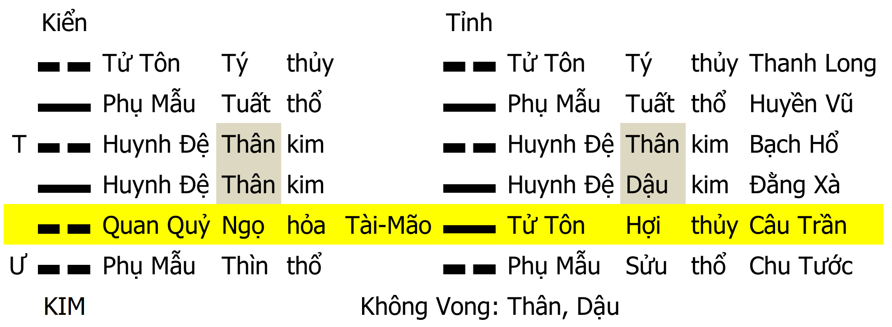
    - **Hình này chứng minh điều gì**
      - Chứng minh Dụng thần lâm Nguyệt phá lại hóa hồi đầu khắc biểu thị quan hệ tình cảm rạn nứt khó duy trì, ứng kỳ đổ vỡ vào ngày thực phá.
    - **Từ đâu mà thấy được**
      - Quan Quỷ Ngọ hỏa bị Nguyệt Tý xung phá, động hóa Tử Tôn Hợi thủy hồi đầu khắc, Thê Tài Mão mộc phục dưới Dụng thần (đối phương đã có vợ), ứng vỡ lở vào ngày Canh Ngọ.
  - **Bối cảnh và câu hỏi dự trắc:**
    - Thời gian: Ngày Đinh Sửu, tháng Tý (Tuần không: Thân, Dậu).
    - Đối tượng: Người nữ muốn biết tương lai quan hệ tình cảm với một người đàn ông sẽ phát triển như thế nào.
    - Quẻ cát hung: Được quẻ Thủy Sơn Kiển biến Thủy Phong Tỉnh.
  - **Phán đoán chi tiết:**
    - Căn cứ:
      - Nữ đoán tình duyên lấy Quan Quỷ làm Dụng thần.
      - Nguyệt phá mang tượng rạn nứt, đổ vỡ, chia tách. Dụng thần gặp Nguyệt phá không có sinh phù là vô khí, lại phát động hóa hồi đầu khắc chủ sự việc tuyệt giao, không thể kéo dài.
      - Ứng kỳ Nguyệt phá: Ứng nghiệm tại ngày "thực phá" (ngày lâm chi bị phá, tức ngày Ngọ).
      - Tượng hào phục tàng: Hào Thê Tài phục dưới Quan Quỷ biểu thị người đàn ông đã có vợ hoặc bạn gái ràng buộc.
    - Nhìn vào:
      - Quan Quỷ Ngọ hỏa tại hào 2 là Dụng thần, bị Nguyệt kiến Tý thủy xung phá dữ dội thành Nguyệt phá, không được Nhật thần Sửu thổ sinh phù.
      - Quan Quỷ Ngọ hỏa phát động lại hóa ra Tử Tôn Hợi thủy (hồi đầu khắc), cho thấy mối quan hệ giữa hai người tất yếu đi đến kết cục chia rẽ, không thể duy trì lâu dài.
      - Tượng Nguyệt phá cho thấy vết rạn nứt tình cảm đã âm ỉ từ trước. Căn cứ quy tắc ứng kỳ thực phá, tác giả phán đoán vào đúng ngày Canh Ngọ hai người sẽ bùng nổ mâu thuẫn cãi vã kịch liệt rồi dứt tình.
      - Dưới Dụng thần Quan Quỷ Ngọ hỏa có hào Thê Tài Mão mộc phục tàng, chứng minh đối phương thực tế là người đàn ông đã có gia đình riêng.
  - **Ứng nghiệm thực tế:**
    - Người đàn ông đó quả thực đã có vợ. Đến đúng ngày Canh Ngọ, hai người xảy ra cuộc tranh cãi nảy lửa rồi chính thức chia tay, về sau hoàn toàn cắt đứt liên lạc, không thể hàn gắn.

- **Ví dụ 3: Ngày Kỷ Hợi tháng Mão, nữ đoán tình cảm vợ chồng**
  - **Hình 56.** Quẻ Sơn Lôi Di biến Thiên Trạch Lý
    - 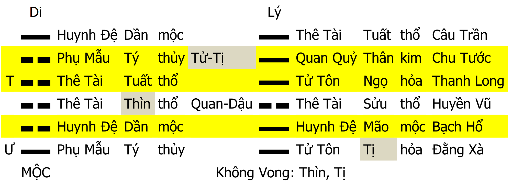
    - **Hình này chứng minh điều gì**
      - Chứng minh Dụng thần phục tàng bị Nguyệt phá kết hợp quẻ Du hồn chủ tâm lý người chồng trống trải, bị người phụ nữ khác nhân cơ hội xen vào.
    - **Từ đâu mà thấy được**
      - Quan Quỷ Dậu kim phục dưới Thê Tài Thìn thổ bị Nguyệt Mão xung phá, lâm Huyền Vũ (háo sắc), Phi thần Thìn thổ hợp Dụng thần (người đàn bà khác chen vào), Thế phát động sinh Dụng (vợ muốn cứu vãn).
  - **Bối cảnh và câu hỏi dự trắc:**
    - Thời gian: Ngày Kỷ Hợi, tháng Mão (Tuần không: Thìn, Tị).
    - Đối tượng: Người phụ nữ lo lắng về đời sống hôn nhân, muốn biết thực trạng tình cảm vợ chồng và cách ứng xử.
    - Quẻ cát hung: Được quẻ Sơn Lôi Di biến Thiên Trạch Lý.
  - **Phán đoán chi tiết:**
    - Căn cứ:
      - Nữ đoán hôn nhân lấy Quan Quỷ làm Dụng thần (chồng), hào Thế là bản thân.
      - Dụng thần không hiện trên quẻ biểu thị người chồng thường xuyên vắng nhà; quẻ Du hồn chủ tâm tính phiêu bạt, bất an, không chịu an cư.
      - Quy luật "Phá cần Hợp": Hào lâm Nguyệt phá tâm hồn bị tổn thương, cô đơn, chán chường, bức thiết cần hào khác tương hợp. Phi thần Thê Tài hợp với Dụng thần ngụ ý phụ nữ khác xen vào.
      - Lục thần: Lâm Huyền Vũ chủ mờ ám, háo sắc, phóng túng.
      - Quan hệ Thế - Dụng: Hào Thế phát động sinh phù Dụng thần thể hiện lòng vị tha, yêu thương và khát vọng cứu vãn tổ ấm.
    - Nhìn vào:
      - Quan Quỷ Dậu kim không hiện trên quẻ, phục tàng dưới hào 3 Thê Tài Thìn thổ (lâm Tuần không). Quẻ Sơn Lôi Di là quẻ Du hồn, Dụng thần phục tàng biểu thị người chồng không ở nhà mà thường xuyên bỏ đi làm ăn phương xa.
      - Quan Quỷ Dậu kim bị Nguyệt kiến Mão mộc xung phá (Nguyệt phá), cho thấy tâm trạng người chồng nơi xứ người vô cùng trống trải, sa sút và chán nản.
      - Trong tình cảnh Nguyệt phá bức bách, Phi thần Thê Tài Thìn thổ lại hợp trú với Dụng thần (Thìn Dậu lục hợp). Thê Tài là người đàn bà khác, chứng tỏ đúng lúc chồng trống vắng tâm hồn thì một người phụ nữ khác đã thừa cơ chen chân quyến rũ. Dụng thần lâm Huyền Vũ càng chỉ rõ người chồng bản tính háo sắc, buông thả, không giữ được mình.
      - Hào Thế Thê Tài Tuất thổ phát động tương sinh Quan Quỷ Dậu kim, cho thấy trong lòng người vợ vẫn rất mực thương yêu chồng, chủ động muốn nhẫn nhịn và hy sinh để kéo trái tim chồng quay về.
  - **Ứng nghiệm thực tế:**
    - Thực tế người chồng đến vùng khác làm việc và chung sống như vợ chồng với một người phụ nữ bản địa trẻ đẹp. Sau khi biết chuyện, người vợ không làm ầm ĩ mà thu xếp việc nhà lặn lội đến tận nơi ở cùng chồng, hy vọng sự chăm sóc và bao dung sẽ giúp thức tỉnh trái tim anh ta.

- **Ví dụ 4: Ngày Giáp Ngọ tháng Dậu năm Quý Mùi, nữ (41 tuổi) đoán hôn nhân gia đình**
  - **Hình 57.** Quẻ Địa Lôi Phục biến Lôi Trạch Quy Muội
    - 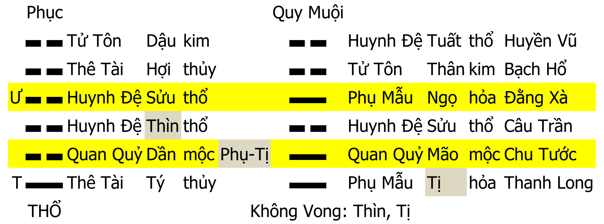
    - **Hình này chứng minh điều gì**
      - Chứng minh hào Dụng thần động hóa Tiến thần nhưng gặp Nguyệt phá chủ sau khi dọn nhà trường khí biến đổi khiến hôn nhân nảy sinh rạn nứt, đôi bên đều có khúc mắc tình cảm.
    - **Từ đâu mà thấy được**
      - Quan Quỷ Dần mộc tại hào 2 (trạch) hóa Mão mộc bị Nguyệt Dậu xung phá lâm Chu Tước (cãi vã), hào Thế Tý thủy lâm Mộc Dục (ngoại tình), quẻ Lục hợp hóa Quy hồn (không muốn ly hôn).
  - **Bối cảnh và câu hỏi dự trắc:**
    - Thời gian: Ngày Giáp Ngọ, tháng Dậu, năm Quý Mùi (Tuần không: Thìn, Tị).
    - Đối tượng: Người nữ 41 tuổi đến hỏi về vận mệnh hôn nhân và sự êm ấm của gia đạo.
    - Quẻ cát hung: Được quẻ Địa Lôi Phục biến Lôi Trạch Quy Muội.
  - **Phán đoán chi tiết:**
    - Căn cứ:
      - Nữ lấy Quan Quỷ làm Dụng thần. Hào 2 là trạch hào (nhà ở), phát động là có sự di dời nơi ở.
      - Tiến thần hóa Phá: Hào động hóa Tiến thần là có bước tiến mới, nhưng hóa ra hào bị Nguyệt phá chỉ phong thủy hoặc trường khí nơi mới mang lại xáo trộn, rạn nứt.
      - Chu Tước chủ khẩu thiệt, tranh cãi triền miên.
      - Hào Hương Khuê và Phụ Mẫu tuần không phục tàng chỉ hành vi lén lút vụng trộm. Hào Thế gặp Nguyệt kiến tại đất Mộc Dục (Đào hoa) chỉ dục vọng ngoại tình.
      - Chuyển đổi Lục thân: Hào Ứng Huynh Đệ Sửu thổ động hợp hào Thế Tý thủy (Sửu thổ khắc Tý thủy đóng vai trò Quan Quỷ tình nhân ngoài luồng).
      - Thế ám động sinh Dụng thần; quẻ Lục hợp biến Quy hồn chủ quy tụ, không muốn phân ly.
    - Nhìn vào:
      - Quan Quỷ Dần mộc tại hào 2 phát động hóa Tiến thần Quan Quỷ Mão mộc, nhưng Mão mộc lại bị Nguyệt kiến Dậu kim xung phá (hóa Nguyệt phá). Hào 2 là nhà ở, động hóa phá phản ánh gia đình vừa chuyển sang nhà mới; trường khí nơi ở mới thay đổi đã tạo ra vết rạn nứt sâu sắc trong hôn nhân. Dụng thần lâm Chu Tước chỉ vợ chồng cãi vã, xung đột liên miên không dứt.
      - Về phía người vợ: Hào Hương Khuê Phụ Mẫu Tị hỏa lâm Tuần không và phục tàng dưới hào 2, biểu thị hành vi vụng trộm lén lút sống chung với người khác. Hào Ứng Huynh Đệ Sửu thổ động hợp hào Thế Tý thủy (theo chuyển đổi Lục thân là tình nhân); lại thêm hào Thế Tý thủy gặp Nguyệt Dậu là đất Mộc Dục, chứng tỏ đương số đã có quan hệ ngoại tình bên ngoài.
      - Về phía người chồng: Quan Quỷ Dần mộc phát động tương hợp Thê Tài Hợi thủy tại hào 5, Thê Tài là người nữ khác, chứng minh người chồng cũng bắt đầu có bồ nhí bên ngoài.
      - Tuy nhiên, hào Thế Tý thủy bị Nhật thần Ngọ hỏa xung thành ám động sinh Dụng thần Dần mộc, hào sơ lại là tâm sự thầm kín, cho thấy trong sâu thẳm tâm can cô vẫn rất yêu chồng. Kết hợp quẻ Lục hợp (Phục) hóa Quy hồn (Quy Muội), cả hai vợ chồng dù lầm lỡ ngoài luồng nhưng đều kiên quyết không muốn ly hôn, mong muốn duy trì mái ấm.
  - **Ứng nghiệm thực tế:**
    - Quả nhiên sau khi dọn nhà mới, vợ chồng nảy sinh mâu thuẫn tranh cãi gay gắt kéo dài. Cả hai người đều có quan hệ tình ái ngoài luồng, nhưng trong thâm tâm vẫn thương yêu nhau và kiên quyết không ai chịu ly hôn.

- **Ví dụ 5: Ngày Giáp Tuất tháng Hợi, nam đoán mối quan hệ với người nữ sau này ra sao**
  - **Hình 58.** Quẻ Lôi Thủy Giải biến Hỏa Thủy Vị Tế
    - 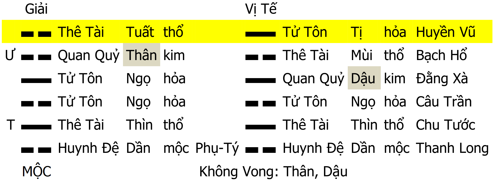
    - **Hình này chứng minh điều gì**
      - Chứng minh hào Thê Tài động xung Thế chủ người thứ ba bức bách ly hôn, và động hóa Tử Tôn lâm Nguyệt phá biểu thị từng có thai rồi lưu sản.
    - **Từ đâu mà thấy được**
      - Hào Thế lâm Thê Tài Thìn thổ tại hào 2 (đã có vợ), Thê Tài Tuất thổ hào 6 phát động xung Thế Thìn thổ (ép ly hôn), Tuất là mộ Tử Tôn hóa Tị hỏa bị Nguyệt Hợi xung phá (nạo phá thai).
  - **Bối cảnh và câu hỏi dự trắc:**
    - Thời gian: Ngày Giáp Tuất, tháng Hợi (Tuần không: Thân, Dậu).
    - Đối tượng: Người nam muốn biết quan hệ tương lai với một người phụ nữ bên ngoài sẽ diễn biến ra sao.
    - Quẻ cát hung: Được quẻ Lôi Thủy Giải biến Hỏa Thủy Vị Tế.
  - **Phán đoán chi tiết:**
    - Căn cứ:
      - Nam đoán tình duyên lấy Thê Tài làm Dụng thần. Quẻ có Thê Tài lưỡng hiện thì lấy hào phát động làm Dụng thần chính.
      - Hào 2 là trạch hào (nhà), Thê Tài trì Thế ngự tại hào 2 chứng minh trong nhà đã có vợ chính thức. Hào Thê Tài phát động ở hào khác đại diện cho nhân tình bên ngoài.
      - Huyền Vũ chủ mờ ám, dâm tà, phản ánh phẩm hạnh và tính cách người nữ.
      - Mộ khố Tử Tôn tượng trưng cho việc mang thai. Động hóa ra Tử Tôn lâm Nguyệt phá là tượng thai nhi bị tiêu tán (lưu sản, phá thai).
      - Động hào xung hào Thế: Tượng người phụ nữ bên ngoài cố tình gây áp lực, muốn lật đổ vị trí người vợ chính thức.
    - Nhìn vào:
      - Trong quẻ Thê Tài lưỡng hiện: Hào 2 Thê Tài Thìn thổ trì Thế (đã có vợ ở nhà), hào 6 Thê Tài Tuất thổ phát động được lấy làm Dụng thần (người phụ nữ bên ngoài).
      - Hào 6 Thê Tài Tuất thổ lâm Huyền Vũ, cho thấy cô gái này là người không đứng đắn, xuất thân từ chốn ăn chơi phức tạp, tâm tính gian xảo.
      - Tuất thổ là Hỏa khố (Mộ khố của Tử Tôn Ngọ hỏa), là tượng mang thai. Tuy nhiên Tuất thổ lại động hóa ra Tử Tôn Tị hỏa, mà Tị hỏa bị Nguyệt kiến Hợi thủy xung phá thành Nguyệt phá, chứng minh người phụ nữ này trước đây từng có thai với anh ta nhưng đã nạo phá thai (lưu sản).
      - Dụng thần Thê Tài Tuất thổ phát động xung thẳng vào hào Thế Thê Tài Thìn thổ (Thìn Tuất tương xung), chứng tỏ ý đồ thực sự của cô ta là muốn đánh bật người vợ hợp pháp ra khỏi gia đình, ép buộc người nam phải ly hôn vợ để cưới mình.
  - **Ứng nghiệm thực tế:**
    - Người nam thừa nhận quen cô gái này ở quán karaoke, từng có thai với anh ta rồi đi phá thai. Gần đây cô ta lại giả vờ loan báo mình có bầu để gây sức ép nặng nề, buộc anh ta phải bỏ vợ để kết hôn với cô ta.

- **Ví dụ 6: Ngày Bính Tý tháng Nhâm Tý năm Đinh Hợi, nữ đoán với người đàn ông kết quả ra sao**
  - **Hình 59.** Quẻ Hỏa Sơn Lữ biến Hỏa Thủy Vị Tế
    - 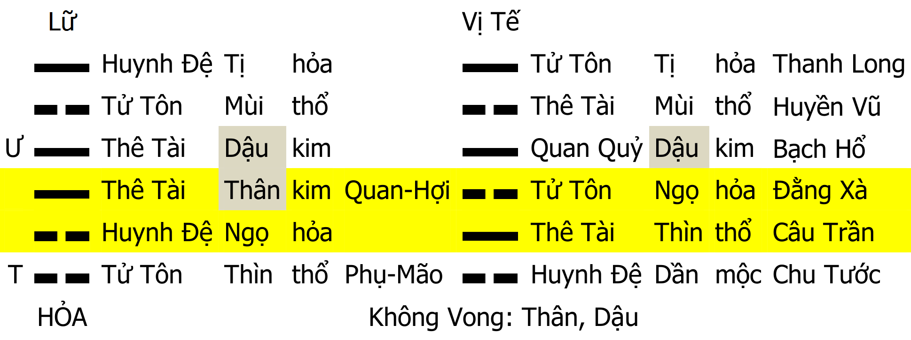
    - **Hình này chứng minh điều gì**
      - Chứng minh Phi thần của Quan Quỷ lâm Không Vong động hóa Nguyệt phá là tượng đối phương đã ly hôn, và gian hào động chủ có kẻ gièm pha phá hoại.
    - **Từ đâu mà thấy được**
      - Quan Quỷ Hợi thủy phục dưới Thê Tài Thân kim lâm Không Vong hóa Ngọ hỏa Nguyệt phá (đối phương ly hôn vợ), gian hào Huynh Đệ Ngọ hỏa phát động (bạn bè gièm pha cản trở).
  - **Bối cảnh và câu hỏi dự trắc:**
    - Thời gian: Ngày Bính Tý, tháng Nhâm Tý, năm Đinh Hợi (Tuần không: Thân, Dậu).
    - Đối tượng: Người nữ hỏi về kết cục tình cảm với một người đàn ông mình đang gắn bó.
    - Quẻ cát hung: Được quẻ Hỏa Sơn Lữ biến Hỏa Thủy Vị Tế.
  - **Phán đoán chi tiết:**
    - Căn cứ:
      - Nữ lấy Quan Quỷ làm Dụng thần (người nam).
      - Dụng thần phục tàng dưới Thê Tài vốn là tượng đối phương đã có vợ hoặc bạn gái. Tuy nhiên, nếu Phi thần lâm Tuần không lại phát động hóa Nguyệt phá thì cuộc hôn nhân trước đó đã tan vỡ (đối phương là người đã ly dị).
      - Gian hào (hào nằm giữa Thế và Ứng) phát động: Đại diện cho người thứ ba hoặc bạn bè ở giữa can thiệp; Huynh Đệ chủ tranh chấp, cản trở, gièm pha.
      - Thế là Mộ khố của Dụng thần: Thế là Thủy khố (Thìn thổ), Dụng thần là Thủy (Hợi thủy), biểu thị lòng khát khao chiếm trọn và gắn bó chặt chẽ với đối phương.
      - Dụng thần phục tàng kết hợp gian hào động cản trở: Tượng đối phương lẩn tránh, xa lánh.
    - Nhìn vào:
      - Quan Quỷ Hợi thủy không xuất hiện trên quẻ, phục tàng dưới hào 3 Thê Tài Thân kim. Phi thần Thân kim vừa lâm Tuần không lại động hóa ra Ngọ hỏa bị Nguyệt kiến Tý thủy xung phá (hóa Nguyệt phá), chứng minh người đàn ông này trước đó đã ly hôn dứt điểm với vợ cũ.
      - Quan Quỷ Hợi thủy được Thái tuế Hợi thủy trị phù, lại được Nguyệt kiến Tý thủy và Nhật thần Tý thủy tương trợ nên cực kỳ vượng tướng. Hào Thế Tử Tôn Thìn thổ là Thủy khố (Mộ khố của Quan Quỷ Hợi thủy), biểu thị trong lòng người nữ rất khao khát có được người đàn ông này, mong muốn trọn đời chung sống.
      - Tuy nhiên, tại hào 2 (gian hào) Huynh Đệ Ngọ hỏa phát động, Huynh Đệ là bạn bè, gian hào là trung gian; Huynh Đệ động hóa Thê Tài Thìn thổ chứng tỏ có bạn bè người quen ở giữa liên tục buông lời gièm pha chia rẽ. Thêm vào đó Dụng thần phục tàng biểu thị người đàn ông chịu áp lực và đang tìm cách né tránh cô.
  - **Ứng nghiệm thực tế:**
    - Quả nhiên người đàn ông này đã ly hôn vợ trước khi quen biết và chung sống với cô. Ban đầu hai người chung sống rất êm ấm, nhưng do bạn bè của anh ta liên tục gièm pha đâm thọc nên anh ta thay đổi tâm tính, tìm cách lẩn tránh khiến mối quan hệ đổ vỡ không thành.

- **Ví dụ 7: Ngày Giáp Ngọ tháng Ngọ, nam đoán tình trạng hiện tại của người nữ**
  - **Hình 60.** Quẻ Thiên Trạch Lý
    - 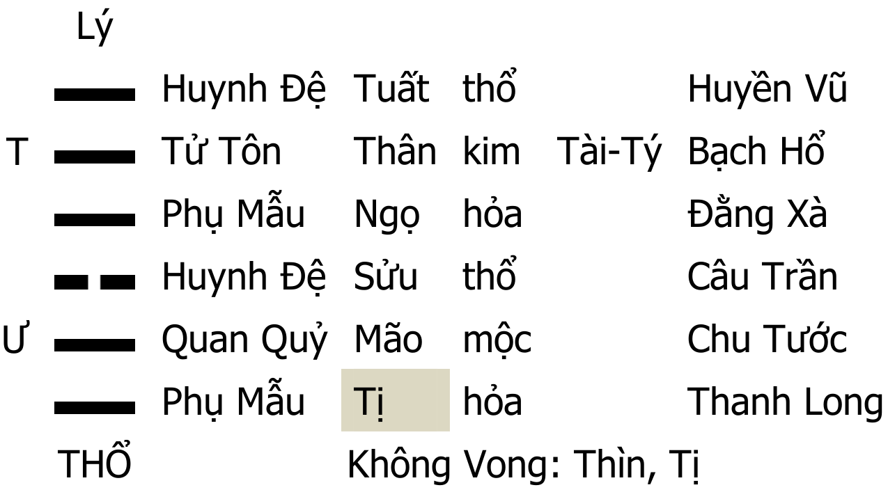
    - **Hình này chứng minh điều gì**
      - Chứng minh Dụng thần phục tàng bị cả Nhật Nguyệt là Phụ Mẫu xung phá biểu thị đối phương đã hai lần ly hôn, và Phụ Mẫu tuần không chủ mất liên lạc.
    - **Từ đâu mà thấy được**
      - Thê Tài Tý thủy phục hào 5 bị Nhật Nguyệt Ngọ hỏa (Phụ Mẫu - giấy chứng nhận kết hôn) xung phá lưỡng trùng (ly hôn 2 lần), Phụ Mẫu Tị hỏa tuần không (bặt vô âm tín).
  - **Bối cảnh và câu hỏi dự trắc:**
    - Thời gian: Ngày Giáp Ngọ, tháng Ngọ (Tuần không: Thìn, Tị).
    - Đối tượng: Người nam muốn biết thực trạng cuộc sống hiện nay của một người phụ nữ quen biết cũ.
    - Quẻ cát hung: Được quẻ tĩnh Thiên Trạch Lý.
  - **Phán đoán chi tiết:**
    - Căn cứ:
      - Nam đoán người nữ lấy Thê Tài làm Dụng thần; hào Thế đại diện cho người hỏi.
      - Dụng thần không hiện trên quẻ, phục tàng: Đối phương đang ở phương xa cách trở, không ở cạnh nhau.
      - Nhật Nguyệt đồng xung (lưỡng trùng phá): Vừa là Nguyệt phá vừa là Nhật phá. Cả Nhật và Nguyệt đều là Phụ Mẫu Ngọ hỏa. Phụ Mẫu đại diện cho giấy hôn thú, hôn nhân pháp lý; bị hai tầng Phụ Mẫu xung phá biểu thị đối phương đã hai lần ly hôn.
      - Thế sinh Dụng thần: Đương số vẫn ôm ấp tình cảm, nhớ nhung đối phương.
      - Phụ Mẫu lâm Tuần không: Phụ Mẫu chủ về tin tức, thư từ, phương tiện liên lạc. Phụ Mẫu phùng Không là đứt gãy thông tin, mất liên lạc hoàn toàn.
    - Nhìn vào:
      - Thê Tài Tý thủy là Dụng thần không xuất hiện trên quẻ, phục tàng dưới hào 5 Tử Tôn Thân kim, cho thấy người nữ đang lưu lạc ở phương trời xa xôi.
      - Dụng thần Tý thủy bị cả Nguyệt kiến Ngọ hỏa và Nhật thần Ngọ hỏa xung phá dữ dội. Nhật Nguyệt đều mang ngũ hành Hỏa lâm Phụ Mẫu (chứng nhận kết hôn). Việc hai tầng Phụ Mẫu cùng xung phá Dụng thần khẳng định người phụ nữ này đã trải qua hai cuộc hôn nhân đổ vỡ (ly hôn hai lần).
      - Hào Thế Tử Tôn Thân kim tương sinh cho Thê Tài Tý thủy, chứng tỏ trong lòng người nam vẫn luôn vương vấn, quan tâm nhớ nghĩ đến cô. Tuy nhiên hào 1 Phụ Mẫu Tị hỏa lại lâm Tuần không, Phụ Mẫu chủ tin tức liên lạc, phùng Không biểu thị tin tức bị gián đoạn, hiện nay đôi bên hoàn toàn không còn bất kỳ liên lạc nào.
  - **Ứng nghiệm thực tế:**
    - Hoàn toàn chính xác: Người phụ nữ ấy quả thực đã ly hôn hai lần, và hai người đã mất liên lạc từ rất nhiều năm nay.

### CHƯƠNG 10: Ý NGHĨA CỦA KHÔNG VONG

#### Nguyên lý cơ bản và biểu hiện tổng quan của Không Vong
- **Tầm quan trọng của Không Vong trong dự đoán hôn nhân:**
  - Không Vong là khâu then chốt trong quá trình dự đoán Lục Hào, chi phối cả việc định tính cát hung lẫn suy đoán chi tiết tình tiết sự việc và xác định thời gian ứng kỳ.
  - Quy tắc phân định theo tính chất hào:
    - Hào Dụng thần và Nguyên thần tối kỵ lâm Không Vong, bởi vì lâm Không Vong biểu thị sự hư nhược, vô lực, mất đi điểm tựa, hôn nhân khó bề thành tựu hoặc duy trì.
    - Hào Kỵ thần và Cừu thần lại rất nên lâm Không Vong, bởi vì khi rơi vào Không Vong thì năng lực xung khắc, cản trở hay phá hoại mối quan hệ hôn nhân sẽ suy giảm hoặc bị triệt tiêu hoàn toàn.
  - Mối quan hệ giữa Không Vong, vượng suy và ứng kỳ:
    - Không thể chỉ đơn thuần nhìn vào Không Vong mà vội vàng kết luận cát hung; bắt buộc phải căn cứ vào sự vượng suy của hào dưới sự tác động của Nhật nguyệt để phân tích thấu đáo.
    - Hào vượng tướng gặp Không Vong là trạng thái "Chân Không tạm thời", khi gặp ngày tháng xuất Không hoặc xung Không sẽ phát huy trọn vẹn tác dụng; ngược lại hào hưu tù vô khí gặp Không Vong là "Hút Không", hoàn toàn mất đi sức sống.
- **Ý nghĩa biểu trưng tổng quát của Không Vong:**
  - Trạng thái tâm lý và hành vi: Dao động, bất an, sợ hãi, đứng núi này trông núi nọ, do dự không quyết đoán, tâm ý không chân thật, né tránh, lảng tránh gặp mặt, lừa dối giả tạo, chưa chín muồi, thiếu thận trọng, trôi nổi bất định.
  - Hiện tượng thực tế khách quan: Người không ở nhà, đi công tác xa, ly biệt chia tay, qua đời, mất tích, thiếu hụt điều kiện, không tồn tại hoặc khuyết thiếu giấy tờ bằng chứng.

#### Ý nghĩa Không Vong phối hợp Thế Ứng, Lục Thân và Lục Thần
- **Không Vong tại hào Thế và hào Ứng:**
  - Hào Thế lâm Không Vong (hoặc Thế động hóa Không): Bản thân người bói trong lòng lo lắng, bất an, tâm ý không thành thật, bản thân không muốn gánh vác, thay đổi ý định, có tư tưởng trốn tránh hoặc thoái thác trách nhiệm.
  - Hào Ứng lâm Không Vong (hoặc Ứng động hóa Không): Đối phương tâm ý không chân thành, muốn né tránh, thay đổi quyết định, còn do dự chần chừ không dứt khoát hoặc chủ động thoái thác mối quan hệ.
- **Không Vong kết hợp Lục Thân:**
  - Phụ Mẫu lâm Không Vong: Không có giấy chứng nhận kết hôn, thiếu người mai mối chắp nối, không có nhà cửa chốn ở ổn định, thiếu vắng cha mẹ hoặc không có trưởng bối đứng ra chủ trì hôn sự, thiếu hộ khẩu.
  - Thê Tài lâm Không Vong: Nam mệnh chưa có bạn gái hoặc không gặp được bạn gái; kinh tế không có thu nhập hoặc thu nhập eo hẹp; vợ đi vắng xa, vợ qua đời; của hồi môn ít ỏi nghèo nàn.
  - Quan Quỷ lâm Không Vong: Nữ mệnh chưa có bạn trai hoặc đánh mất bạn trai; chồng qua đời, chồng thường xuyên vắng nhà; cuộc sống không chịu nhiều gánh nặng áp lực.
  - Huynh Đệ lâm Không Vong: Ít bạn bè bằng hữu qua lại, ít gặp chướng ngại ngăn trở hôn nhân, ít tốn kém hao tổn tiền bạc.
  - Tử Tôn lâm Không Vong: Chưa có con cái, hiếm muộn, đẻ non, lưu sản (sảy thai hoặc nạo phá thai), chi tiêu gia đình ít phát sinh.
- **Không Vong kết hợp Lục Thần:**
  - Lâm Thanh Long Không Vong: Niềm vui không trọn vẹn, mừng hụt, bên ngoài hào nhoáng nhưng bên trong trống rỗng.
  - Lâm Bạch Hổ Không Vong: Tính tình không nóng nảy hung bạo, thong thả điềm đạm, không thúc ép hay dùng vũ lực.
  - Lâm Chu Tước Không Vong: Không khéo ăn nói, ngại giao tiếp trò chuyện, hiếm khi cười đùa, thiếu vắng sự vui tươi sôi nổi.
  - Lâm Câu Trần Không Vong: Thiếu sự thành thật, đứng ngồi không yên, hiếu động bất định, lập trường không kiên định.
  - Lâm Đằng Xà Không Vong: Tâm thần bồn chồn bất an, hoài nghi, có sự lừa gạt dối trá, mất đi sự tin cậy lẫn nhau.
  - Lâm Huyền Vũ Không Vong: Thiếu sức hấp dẫn quyến rũ, không giữ được thể diện hay lòng tự trọng.
  - Nguyên tắc biến hóa linh hoạt: Các tổ hợp tượng trưng trên không hề cố định máy móc, người dự đoán bắt buộc phải căn cứ vào sự biến hóa sinh khắc hợp xung trong toàn quẻ để linh hoạt suy luận.

#### Phân tích chi tiết các quái lệ thực tế
- **Ví dụ 1: Nam đoán tình cảm vợ chồng (Ngày Đinh Sửu tháng Ngọ - Quẻ Hỏa Thủy Vị Tế)**
  - **Hình 61.** Quẻ Hỏa Thủy Vị Tế
    - 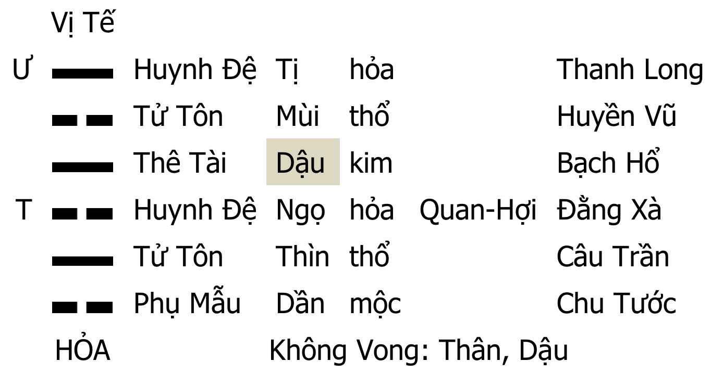
    - **Hình này chứng minh điều gì**
      - Thê Tài Dậu kim lâm Không Vong, Nguyệt khắc, nhập Mộ ở Nhật và khắc Thế; người vợ tính khí nóng nảy, ham chơi bỏ bê gia đình.
    - **Từ đâu mà thấy được**
      - Hào 4 Thê Tài Dậu kim tuần Không, bị Nguyệt kiến Ngọ hỏa khắc, nhập Mộ tại Nhật thần Sửu thổ; hào 3 Thế Ngọ hỏa lâm Đằng Xà một mình cô đơn.
  - **Bối cảnh quẻ:** Ngày Đinh Sửu tháng Ngọ (tuần Giáp Tuất: Thân, Dậu Không Vong), người nam gieo quẻ hỏi về tình cảm vợ chồng, được quẻ Hỏa Thủy Vị Tế thuần quẻ.
  - **Phán đoán chi tiết:**
    - Căn cứ: Lấy Thê Tài làm Dụng thần. Thê Tài Dậu kim lâm Không Vong, bị Nguyệt kiến Ngọ hỏa khắc, nhập Mộ tại Nhật thần Sửu thổ và tương khắc với hào Thế.
    - Nhìn vào: Hào Thế Huynh Đệ Ngọ hỏa tại hào 3 lâm Đằng Xà; Đằng Xà chủ phiền não, cô độc, hào 3 là vị trí giường ngủ, chủ một mình nằm ôm gối chiếc, trong lòng vô cùng sầu não bực bội. Thế khắc Dụng thần biểu thị bản thân người chồng rất bất mãn, không hài lòng với vợ. Dụng thần Thê Tài Dậu kim lâm Bạch Hổ; Bạch Hổ chủ giận dữ, chứng tỏ tính nết người vợ hung hăng nóng nảy. Dụng thần Không Vong không sinh hợp hào 2 (hào Trạch là nhà cửa), biểu thị vợ không tha thiết với mái ấm gia đình, thường xuyên bỏ nhà ra ngoài. Nhập Mộ tại Nhật thần Sửu thổ (Tử Tôn chủ du hý, vui chơi ăn uống), cho thấy người vợ đắm chìm vào các cuộc vui chơi thâu đêm suốt sáng.
  - **Ứng nghiệm thực tế:** Đương số xác nhận thực tế đúng hoàn toàn như suy đoán; hai vợ chồng bất hòa sâu sắc, người vợ tính nết ngang bướng, chỉ mải mê tụ tập bạn bè vui chơi bên ngoài bỏ bê việc nhà.

- **Ví dụ 2: Nữ đoán tình cảm với chồng (Ngày Đinh Sửu tháng Ngọ - Quẻ Hỏa Lôi Phệ Hạp)**
  - **Hình 62.** Quẻ Hỏa Lôi Phệ Hạp
    - 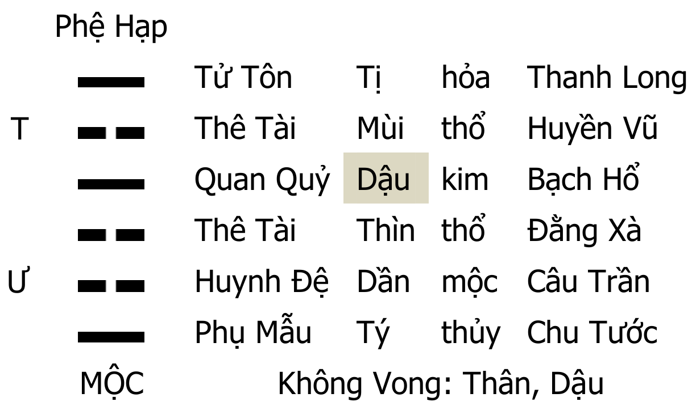
    - **Hình này chứng minh điều gì**
      - Quan Quỷ Dậu kim Không Vong, Nguyệt khắc, nhập Mộ ở Nhật, không nhận sinh phù; người chồng say đắm nhân tình bên ngoài, khước từ tình cảm của vợ.
    - **Từ đâu mà thấy được**
      - Hào 4 Quan Quỷ Dậu kim tuần Không, Nguyệt khắc, nhập Mộ tại Sửu thổ; hào Thế Mùi thổ ám động sinh Dụng nhưng Dụng Không bất thụ sinh.
  - **Bối cảnh quẻ:** Ngày Đinh Sửu tháng Ngọ (tuần Giáp Tuất: Thân, Dậu Không Vong), người nữ gieo quẻ hỏi về tình cảm với chồng, được quẻ Hỏa Lôi Phệ Hạp.
  - **Phán đoán chi tiết:**
    - Căn cứ: Lấy Quan Quỷ làm Dụng thần. Quan Quỷ Dậu kim bị Nguyệt kiến Ngọ hỏa khắc hại, nhập Mộ ở Nhật thần Sửu thổ, lại lâm Không Vong nên không tiếp nhận được sự sinh trợ từ hào Thế, quan hệ đôi bên rạn nứt nghiêm trọng.
    - Nhìn vào: Hào 5 Thế Thê Tài Mùi thổ bị Nhật thần Sửu thổ xung thành ám động, hào Thế ám động sinh cho Dụng thần biểu thị trong lòng người vợ vẫn rất mực yêu thương, muốn vun vén hàn gắn với chồng. Tuy nhiên Dụng thần Quan Quỷ Dậu kim rơi vào Không Vong, theo quy tắc "Không bất thụ sinh" nên hoàn toàn cự tuyệt, không tiếp nhận tình yêu thương của cô. Mặt khác Quan Quỷ Dậu kim nhập Mộ ở Nhật thần Sửu thổ, Nguyệt kiến Ngọ hỏa là đất sinh tài hoặc đại diện cho phụ nữ khác, Mộ chủ mê đắm chìm ngập, chứng minh người chồng đang si mê theo đuổi một người phụ nữ khác bên ngoài.
  - **Ứng nghiệm thực tế:** Quả nhiên người chồng đã có tình nhân bên ngoài, say đắm không dứt và lạnh lùng khước từ mọi nỗ lực hàn gắn tình cảm của người vợ.

- **Ví dụ 3: Nam đoán mối quan hệ với bạn gái phát triển ra sao (Ngày Quý Dậu tháng Tuất - Quẻ Sơn Địa Bác biến Thiên Lôi Vô Vọng)**
  - **Hình 63.** Quẻ Sơn Địa Bác biến Thiên Lôi Vô Vọng
    - 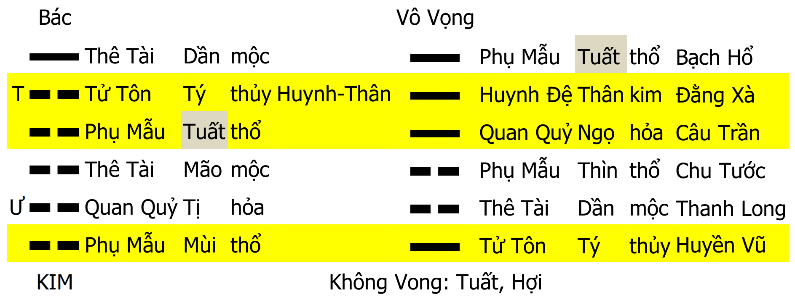
    - **Hình này chứng minh điều gì**
      - Dụng thần Thê Tài Mão mộc ám động do Nhật xung, hợp Phụ Mẫu Tuất thổ Không Vong; bạn gái dao động tình cảm vì người khác nhưng sau cùng hồi tâm chuyển ý.
    - **Từ đâu mà thấy được**
      - Hào 3 Thê Tài Mão mộc bị Nhật thần Dậu kim xung thành ám động, hợp với hào 4 Tuất thổ lâm Nguyệt kiến và Không Vong.
  - **Bối cảnh quẻ:** Ngày Quý Dậu tháng Tuất (tuần Giáp Tý: Tuất, Hợi Không Vong), người nam gieo quẻ hỏi mối quan hệ với bạn gái phát triển thế nào, được quẻ Sơn Địa Bác biến Thiên Lôi Vô Vọng.
  - **Phán đoán chi tiết:**
    - Căn cứ: Lấy Thê Tài làm Dụng thần. Trong quẻ Thê Tài lưỡng hiện (hào 3 Mão mộc và hào 6 Dần mộc), chọn hào Thê Tài Mão mộc ám động làm Dụng thần chính.
    - Nhìn vào: Hào Thế Tử Tôn Tý thủy phát động tương sinh Dụng thần Mão mộc, cho thấy chàng trai rất chân thành và yêu quý bạn gái. Song Nhật thần Huynh Đệ Dậu kim xung Dụng thần khiến Mão mộc phát sinh ám động; Huynh Đệ là người đàn ông khác chen chân vào, khiến cô gái bị phân tâm, tình cảm nảy sinh xao xao động đứng núi này trông núi nọ. Dụng thần Mão mộc tương hợp với Phụ Mẫu Tuất thổ lâm Không Vong (Mão Tuất lục hợp), Không Vong biểu thị "điểm mù", cho thấy bạn gái xuất hiện khoảnh khắc mù quáng trong tình cảm. Tuy nhiên Tuất thổ là Nguyệt kiến lâm vượng địa hợp nâng Dụng thần, điểm mù này trải qua rồi trái lại giúp cô gái thức tỉnh, củng cố lòng tin và sự kiên định phát triển tình cảm bền chặt với anh.
  - **Ứng nghiệm thực tế:** Quả nhiên người bạn gái nửa đường dao động tình cảm, phải lòng người đàn ông khác; nhưng sau đó cô hồi tâm chuyển ý nhận ra người nào thật lòng với mình, đến tháng Tý cùng năm hai người đã chính thức đính hôn.

- **Ví dụ 4: Nữ đoán tương lai mối quan hệ với người tình (Ngày Quý Mùi tháng Ngọ - Quẻ Trạch Thiên Quải biến Địa Phong Thăng)**
  - **Hình 64.** Quẻ Trạch Thiên Quải biến Địa Phong Thăng
    - 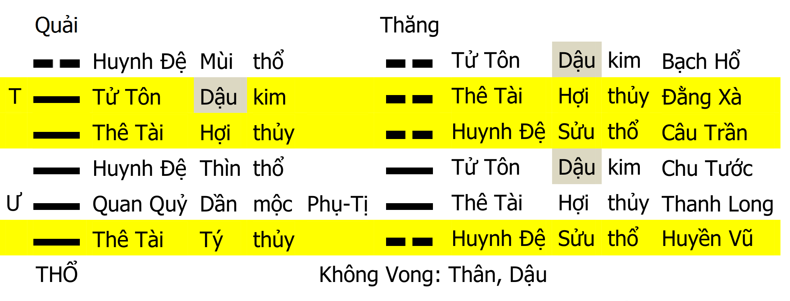
    - **Hình này chứng minh điều gì**
      - Thế Tử Tôn Dậu kim Không Vong lâm Đằng Xà, Dụng thần nhập Mộ tại Nhật và nguồn sinh hóa khắc; mối quan hệ với người tình đi đến hồi kết thúc.
    - **Từ đâu mà thấy được**
      - Hào 5 Thế Dậu kim tuần Không lâm Đằng Xà; Dụng thần Quan Quỷ Dần mộc nhập Mộ ở Nhật thần Mùi thổ, hai hào Thê Tài phát động đều hóa hồi đầu khắc.
  - **Bối cảnh quẻ:** Ngày Quý Mùi tháng Ngọ (tuần Giáp Tuất: Thân, Dậu Không Vong), người phụ nữ băn khoăn về tương lai quan hệ với người tình, gieo quẻ được Trạch Thiên Quải biến Địa Phong Thăng.
  - **Phán đoán chi tiết:**
    - Căn cứ: Lấy Quan Quỷ làm Dụng thần. Quan Quỷ Dần mộc lâm hào Ứng, người nữ dành tình cảm sâu đậm và rất quý mến đối phương.
    - Nhìn vào: Dụng thần Quan Quỷ Dần mộc tương hợp với Thê Tài Hợi thủy, Thê Tài đại diện cho vợ cả, chứng tỏ người đàn ông này đã có gia đình riêng. Dụng thần thuộc Mộc biểu thị vóc dáng cao ráo, lâm Thanh Long chứng tỏ tính tình đàng hoàng, phong nhã, người tử tế. Hào Thế Tử Tôn Dậu kim lâm Không Vong lại gặp Đằng Xà; Không chủ bất an bồn chồn, Đằng Xà chủ phiền não dày vò, cho thấy tinh thần cô gái hiện tại vô cùng chông chênh, tâm trạng u uất. Dụng thần Dần mộc hưu tù, không được Nhật nguyệt tương trợ; hai Nguyên thần là Thê Tài Tý thủy (hào sơ) và Thê Tài Hợi thủy (hào 4) đồng loạt phát động nhưng đều biến thành hồi đầu khắc, cội nguồn sinh dưỡng bị chặt đứt, mối quan hệ không thể duy trì lâu bền. Dụng thần nhập Mộ ở Nhật thần Mùi thổ, Mộ chủ kết thúc chôn vùi, Nhật thần chủ việc trước mắt, thời điểm đôi bên chia tay đã cận kề.
  - **Ứng nghiệm thực tế:** Quả đúng như dự đoán, người tình do yêu cầu công tác đột xuất phải chuyển công tác tới vùng đất rất xa nên chủ động đề nghị cắt đứt quan hệ, làm cô vô cùng buồn phiền. Đến tháng Dậu cùng năm, khi hào Thế Dậu kim xuất Không phát động khắc Quan Quỷ Dần mộc, hai người chính thức đường ai nấy đi.

- **Ví dụ 5: Nam đoán đi xem mặt ra sao (Ngày Ất Dậu tháng Thìn - Quẻ Thủy Sơn Kiển biến Thủy Hỏa Ký Tế)**
  - **Hình 65.** Quẻ Thủy Sơn Kiển biến Thủy Hỏa Ký Tế
    - 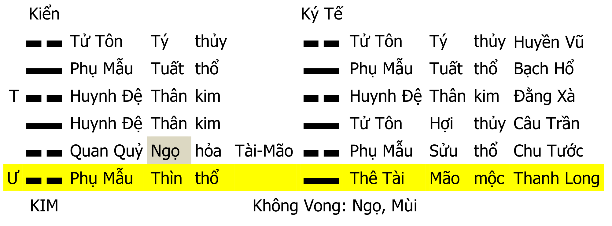
    - **Hình này chứng minh điều gì**
      - Thê Tài phục tàng dưới Quan Quỷ lâm Không Vong là tượng vọng môn quả; người nữ xem mặt là góa phụ, việc hôn nhân bất thành.
    - **Từ đâu mà thấy được**
      - Hào 2 Thê Tài Mão mộc phục dưới Quan Quỷ Ngọ hỏa tuần Không; Dụng thần hưu tù bị Nhật khắc, hào Ứng Phụ Mẫu Thìn thổ động hóa hồi đầu khắc.
  - **Bối cảnh quẻ:** Ngày Ất Dậu tháng Thìn (tuần Giáp Thân: Ngọ, Mùi Không Vong), người nam gieo quẻ hỏi về kết quả buổi đi xem mặt, được quẻ Thủy Sơn Kiển biến Thủy Hỏa Ký Tế.
  - **Phán đoán chi tiết:**
    - Căn cứ: Lấy Thê Tài làm Dụng thần. Thê Tài Mão mộc phục tàng dưới Phi thần Quan Quỷ Ngọ hỏa tại hào 2.
    - Nhìn vào: Thông thường Tài phục dưới Quỷ là tượng người nữ đã có chồng hoặc đang sống chung với bạn trai khác. Song ở đây Phi thần Quan Quỷ Ngọ hỏa lâm Không Vong; cổ nhân có khẩu quyết: "Tài phục Quỷ Không, vọng môn quả" (Thê Tài phục dưới Quan Quỷ lâm Không Vong là người phụ nữ góa bụa trước khi cưới), chứng minh người phụ nữ này chồng trước đã chết, hiện tại là quả phụ. Dụng thần Thê Tài Mão mộc suy nhược hưu tù lại bị Nhật thần Dậu kim xung khắc tàn hại. Hào Ứng Phụ Mẫu Thìn thổ (chủ hôn sự, người làm mối) tuy hợp Nhật Dậu nhưng phát động hóa ra Thê Tài Mão mộc hồi đầu khắc, báo hiệu hôn sự không thể thành.
  - **Ứng nghiệm thực tế:** Đối phương đúng thật là một góa phụ; phía gia đình chàng trai sau khi gặp gỡ xem mặt cảm thấy không vừa ý nên đã từ chối, chuyện hôn sự tan vỡ hoàn toàn.

- **Ví dụ 6: Nữ đoán hôn nhân gia đình (Ngày Canh Dần tháng Tuất - Quẻ Hỏa Thủy Vị Tế biến Sơn Trạch Tổn)**
  - **Hình 66.** Sơ đồ quẻ Hỏa Thủy Vị Tế biến Sơn Trạch Tổn
    - 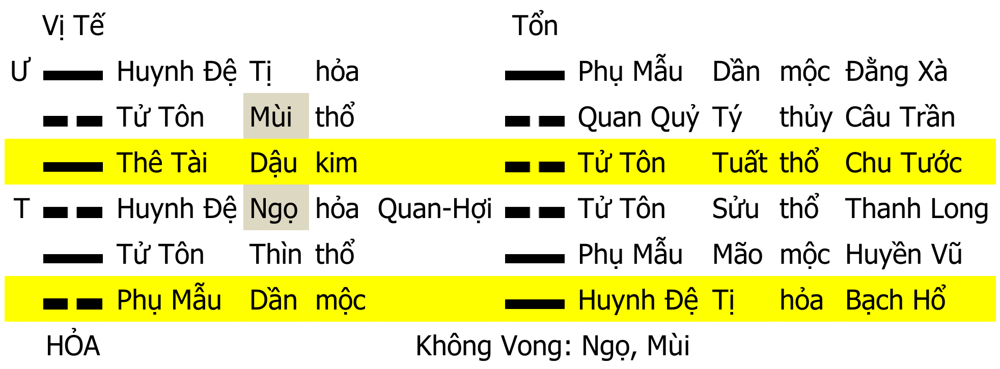
    - **Hình này chứng minh điều gì**
      - Thế lâm Không Vong ở hào 3, Quan Quỷ phục tàng được Tài sinh và Phụ Mẫu hợp; chồng làm nghề vận tải có nhân tình, vợ vì con cái và hôn thú nên không ly hôn.
    - **Từ đâu mà thấy được**
      - Hào 3 Thế Ngọ hỏa tuần Không; Quan Quỷ Hợi thủy phục tàng được hào 4 Thê Tài Dậu kim động sinh và hào sơ Phụ Mẫu Dần mộc động hợp.
  - **Bối cảnh quẻ:** Ngày Canh Dần tháng Tuất (tuần Giáp Thân: Ngọ, Mùi Không Vong), người nữ hỏi về tình hình hôn nhân gia đình, gieo được quẻ Hỏa Thủy Vị Tế biến Sơn Trạch Tổn.
  - **Phán đoán chi tiết:**
    - Căn cứ: Lấy Quan Quỷ làm Dụng thần. Quan Quỷ Hợi thủy không xuất hiện trên quẻ mà phục tàng dưới hào 3 Huynh Đệ Ngọ hỏa, cho thấy người chồng thường xuyên vắng mặt ở nhà.
    - Nhìn vào: Hào sơ Phụ Mẫu Dần mộc phát động tương hợp với Dụng thần Hợi thủy (Dần Hợi hợp); hào sơ là bàn chân chủ đi lại bước đi, lâm Bạch Hổ chủ đường sá giao thông huyết mạch, Phụ Mẫu là xe cộ phương tiện, chứng minh người chồng thường xuyên vắng nhà là do làm nghề lái xe vận tải đường dài. Tuy nhiên Dụng thần phục tại hào 3 lâm Thanh Long; hào 3 là giường chiếu, Thanh Long chủ hưởng lạc tửu sắc tình ái; lại có hào 4 Thê Tài Dậu kim phát động đến sinh phù Dụng thần, Dậu kim là đất Mộc Dục (đào hoa, dâm dật) của Thủy, minh chứng người chồng ra ngoài bươn chải đã lén lút có quan hệ bất chính với người phụ nữ khác. Hào Thế Huynh Đệ Ngọ hỏa lâm Không Vong ngay tại hào 3 (giường ngủ); giường chiếu Không Vong phản ánh cảnh gối chiếc phòng không, người chồng không bên cạnh bầu bạn, tâm trạng cô luôn bất an bế tắc. Phụ Mẫu Dần mộc tại hào sơ động hợp giữ chặt Quan Quỷ; hào sơ là tâm tư sâu kín, lại là Nguyên thần sinh cho hào Thế, biểu đạt nguyện vọng cốt lõi của đương số. Hợp trú là níu giữ, Phụ Mẫu là giấy chứng nhận kết hôn, chứng tỏ cô không đành lòng phá vỡ hôn nhân; hơn nữa hào sơ cũng là vị trí con cái, chứng minh vì tương lai con nhỏ mà cô nuốt nước mắt duy trì gia đình.
  - **Ứng nghiệm thực tế:** Người phụ nữ xúc động công nhận từng lời đoán đều chính xác như thấy tận mắt: chồng lái xe tải đường dài thường xuyên vắng nhà và cặp kè người khác bên ngoài, còn cô vì thương con nhỏ dại và tiếc danh phận gia đình nên cắn răng chịu đựng không muốn ly hôn.

- **Ví dụ 7: Nữ đoán chia tay người tình ra sao (Ngày Quý Dậu tháng Ngọ - Quẻ Thiên Phong Cấu biến Thủy Phong Tỉnh)**
  - **Hình 67.** Sơ đồ quẻ Thiên Phong Cấu biến Thủy Phong Tỉnh
    - 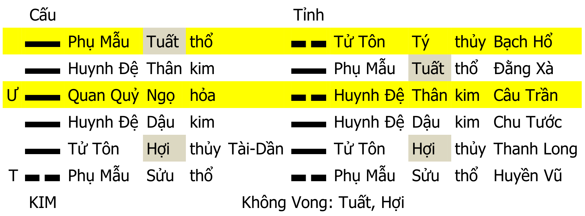
    - **Hình này chứng minh điều gì**
      - Dụng thần Quan Quỷ nhập Mộ khố Không Vong lâm Bạch Hổ ở hào 6; người tình có tư tưởng bế tắc, dùng cái chết và tự sát để uy hiếp cản trở việc chia tay.
    - **Từ đâu mà thấy được**
      - Hào 4 Quan Quỷ Ngọ hỏa phát động nhập Mộ tại hào 6 Phụ Mẫu Tuất thổ động hóa thoái, hào Tuất thổ lâm Không Vong và Bạch Hổ.
  - **Bối cảnh quẻ:** Ngày Quý Dậu tháng Ngọ (tuần Giáp Tý: Tuất, Hợi Không Vong), người nữ băn khoăn muốn dứt khoát chia tay người tình, gieo được quẻ Thiên Phong Cấu biến Thủy Phong Tỉnh.
  - **Phán đoán chi tiết:**
    - Căn cứ: Lấy Quan Quỷ làm Dụng thần. Quan Quỷ Ngọ hỏa được Nguyệt kiến Ngọ hỏa lâm trị nâng đỡ nên cực vượng, lại phát động sinh trợ hào Thế Phụ Mẫu Sửu thổ, biểu thị người tình rất say mê, yêu cô tha thiết và tuyệt đối không muốn buông tay.
    - Nhìn vào: Hào 6 Phụ Mẫu Tuất thổ phát động khiến Dụng thần Ngọ hỏa nhập Mộ (Tuất là Mộ khố của Hỏa). Hào 6 là đầu não chủ suy nghĩ tư duy; Mộ khố chủ sự bức bối, tư duy hẹp hòi cực đoan quẩn quanh. Mộ khố Tuất thổ lại lâm tuần Không Vong, Không Vong chủ sự biến mất, mất mạng; kết hợp lâm Bạch Hổ là hung thần chủ về đổ máu, tử vong và hình thương. Tổng hợp các tượng này cho thấy người đàn ông suy nghĩ cùng quẫn, nếu bị cự tuyệt sẽ nghĩ quẩn tìm đến cái chết (tự tử) để đe dọa. Do đó việc cắt đứt quan hệ ngay lúc này là cực kỳ nan giải và nguy hiểm.
  - **Ứng nghiệm thực tế:** Khi đương số vừa đề cập tới việc chia tay, người tình lập tức phát điên đe dọa sẽ nhảy lầu tự sát để bắt cô phải ân hận suốt đời, khiến cô hoảng sợ tột cùng và chưa dám dứt khoát chia tay.

### CHƯƠNG 11: Ý NGHĨA CỦA LỤC HỢP VÀ LỤC XUNG

#### Khái niệm cơ bản và ý nghĩa biểu tượng của Lục Hợp và Lục Xung
- **Nguyên lý cốt lõi trong dự đoán:**
  - Lục Hợp và Lục Xung là hai khái niệm nền tảng trong Lục Hào dự trắc học, liên quan trực tiếp đến cát hung tổng quát của sự việc, thời điểm ứng kỳ và thủ tượng trích xuất thông tin.
  - Phán đoán căn bản nhất trong thuật bói: "Lục xung chủ tán, lục hợp chủ thành".
  - Ứng dụng trong nhân duyên gia đạo: Bói hôn nhân tối hỷ gặp Lục Hợp (tượng hòa hợp, gắn bó, kết duyên), tối kỵ gặp Lục Xung (tượng ly tán, chia rẽ, xung đột, đổ vỡ).
- **Hệ thống hàm nghĩa của Lục Hợp:**
  - Phần lớn chủ về: Gặp gỡ, hẹn hò, đoàn tụ, hòa hợp, sống chung, kết hợp thành gia đình, cùng nhau chung sống, chạm mặt tương phùng, móc nối quan hệ, giao lưu tình cảm, thành tựu hôn sự, hòa giải mâu thuẫn, cám dỗ quyến rũ, trói buộc liên quan, đạt được nguyện vọng,...
- **Hệ thống hàm nghĩa của Lục Xung:**
  - Phần lớn chủ về: Chia ly tan tác, xa xôi cách trở, phá hoại tình cảm, ly hôn đổ vỡ, mâu thuẫn bất hòa, gây gổ xích mích, xung đột kịch liệt, rạn nứt quan hệ, người ra đi tha hương, di động bất định, trao đổi thay đổi đối tượng,...

#### Phân tích các quái lệ thực chứng về Lục Hợp và Lục Xung
- **Ví dụ 1:** Ngày Mậu Tuất tháng Mùi, nữ đoán hôn nhân gia đình và tài vận, được quẻ Sơn Hỏa Bí biến Địa Lôi Phục.
  - **Hình 68.** Quẻ Sơn Hỏa Bí biến Địa Lôi Phục
    - 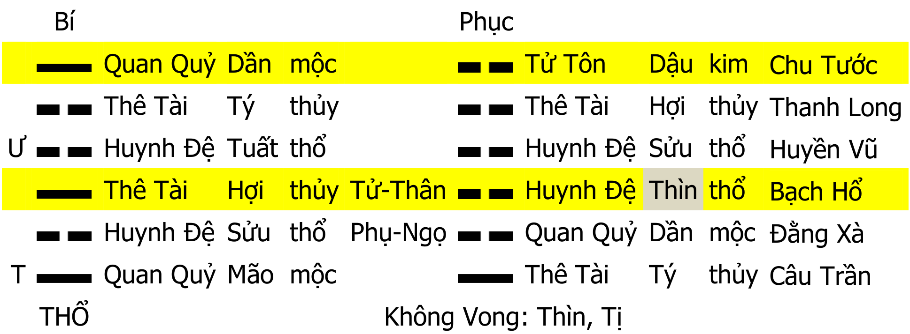
    - **Hình này chứng minh điều gì**
      - Quan Quỷ hưu tù hóa hồi đầu khắc chủ vợ chồng bất hòa, hào 3 hóa Mộ Không chứng minh ly thân và bệnh phụ khoa.
    - **Từ đâu mà thấy được**
      - Hào 6 Quan Quỷ Dần mộc động hóa Tử Tôn Dậu kim, hào 3 Hợi thủy lâm Bạch Hổ hóa Thìn thổ Mộ Không.
  - **Bối cảnh và câu hỏi dự đoán:**
    - Người phụ nữ đến xin dự trắc hai việc quan trọng: tình cảm hôn nhân gia đình và tình hình tài vận cá nhân.
    - Ngày Mậu Tuất, tháng Mùi (Tuần không: Thìn, Tị).
  - **Phán đoán chi tiết:**
    - Căn cứ:
      - Trong dự đoán lục hào, bói hôn nhân lấy Quan Quỷ làm Dụng thần, bói tài vận lấy Thê Tài làm Dụng thần.
      - Khi Dụng thần lưỡng hiện, nguyên tắc trích xuất là ưu tiên hào phát động làm Dụng thần chính.
      - Vợ chồng đồng sàng hay dị mộng nhìn vào hào 3 (hào vị của giường chiếu) và Hương Khuê; tình trạng ngoại tình nhìn vào hào Quan Quỷ tương hợp với Thê Tài nào.
      - Tình trạng tài vận nhìn vào Thê Tài và hào Thế; tật bệnh nhìn vào Quan Quỷ phát động và hào vị tương ứng trên cơ thể.
    - Nhìn vào:
      - Về hôn nhân: Quan Quỷ lưỡng hiện tại hào sơ (Mão mộc) và hào 6 (Dần mộc), lấy hào 6 Quan Quỷ Dần mộc phát động làm Dụng thần. Quan Quỷ Dần mộc sinh vào tháng Mùi ngày Tuất hoàn toàn không được trợ giúp nên hưu tù, lại phát động biến ra Tử Tôn Dậu kim hồi đầu khắc Dần mộc, báo hiệu tình cảm vợ chồng rạn nứt, xung khắc nặng nề.
      - Về việc ly thân ngủ riêng: Dụng thần ở hào 6 là vị trí xa xôi, ngoài biên giới. Nguyên thần sinh Dụng thần là Thê Tài Hợi thủy tại hào 3 động hóa Huynh Đệ Thìn thổ (là Mộ khố của Thủy) và hóa Tuần Không, lại bị thổ của Nhật Nguyệt khắc chế nên không thể sinh Quan Quỷ. Hào 3 là giường nằm; hào 3 Không Vong tức trên giường không có bóng người, nhập Mộ tức chỗ nằm đã bị gấp dọn bỏ không, cho thấy hai vợ chồng đã không còn chung giường. Lại thêm Hương Khuê Ngọ hỏa phục dưới hào 2 Sửu thổ, nhập Mộ tại ngày Tuất, càng củng cố chắc chắn thông tin ly thân ngủ riêng.
      - Về việc chồng ngoại tình: Hào 6 Quan Quỷ Dần mộc phát động tương hợp với Thê Tài Hợi thủy (Dần Hợi lục hợp). Thê Tài đại diện cho nữ giới, cho thấy người chồng đang lén lút chung sống hoặc qua lại mật thiết với một người phụ nữ khác bên ngoài.
      - Về tài vận: Thê Tài lưỡng hiện (hào 3 Hợi thủy, hào 5 Tý thủy) nhưng đều bị Nhật Nguyệt Mùi Tuất thổ khắc chế tổn thương nặng nề, không có sức sinh Thế. Hào Thế ngụ tại hào sơ làm chân, chủ bôn ba lặn lội kiếm ăn cực kỳ vất vả mà tài chính vẫn túng thiếu.
      - Về sức khỏe bệnh tật: Hào 3 Thê Tài Hợi thủy là Nguyên thần hào Thế lâm Bạch Hổ bị khắc, hóa Mộ Không không sinh được Thế; Bạch Hổ chủ huyết quang máu huyết, hào 3 là vị trí tử cung, cho thấy kinh nguyệt không đều, mắc bệnh phụ khoa. Hào 6 Quan Quỷ phát động chủ tật bệnh; hào 6 là đầu, hành mộc chủ đau nhức, chứng tỏ thường xuyên bị chứng đau nhức đầu hành hạ.
  - **Ứng nghiệm thực tế:**
    - Người phụ nữ xác nhận toàn bộ các phán đoán về vợ chồng không chung giường, chồng có bồ nhí bên ngoài, bản thân bôn ba kiếm tiền chật vật cùng các chứng bệnh đau đầu và kinh nguyệt không đều đều hoàn toàn ứng nghiệm chính xác.
- **Ví dụ 2:** Ngày Đinh Hợi tháng Tý năm Ất Dậu, nữ đoán hôn nhân ra sao, được quẻ Lôi Thiên Đại Tráng biến Sơn Địa Bác.
  - **Hình 69.** Quẻ Lôi Thiên Đại Tráng biến Sơn Địa Bác
    - 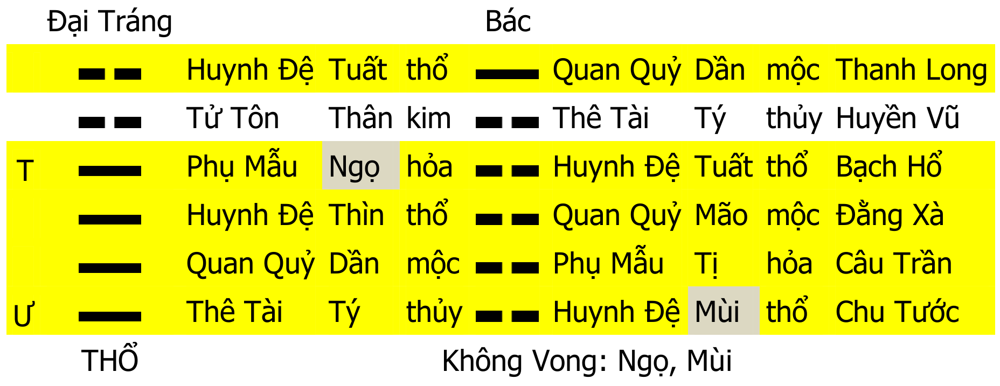
    - **Hình này chứng minh điều gì**
      - Quẻ lục xung năm hào phát động chứng minh hôn nhân cả đời bất định, nhiều lần kết hôn rồi ly hôn và ở chung phức tạp.
    - **Từ đâu mà thấy được**
      - Đại Tráng lục xung, nhiều hào hóa Quan Quỷ, tam hợp Phụ Mẫu Ngọ hỏa lâm Nguyệt phá, Không Vong nhập Mộ.
  - **Bối cảnh và câu hỏi dự đoán:**
    - Nữ đương số muốn xem tiền đồ hôn nhân cả đời của mình sẽ ra sao.
    - Ngày Đinh Hợi, tháng Tý, năm Ất Dậu (Tuần không: Ngọ, Mùi).
  - **Phán đoán chi tiết:**
    - Căn cứ:
      - Lấy Quan Quỷ làm Dụng thần đại diện cho người chồng/hôn nhân.
      - Quẻ Lục Xung chủ về sự chia ly, bất ổn, không thể duy trì hôn nhân lâu bền.
      - Quẻ có nhiều hào động biểu thị cuộc đời biến động liên miên; hào biến ra Quan Quỷ nhiều lần biểu thị nhiều đời chồng/nhiều đàn ông.
      - Phụ Mẫu là giấy chứng nhận kết hôn; Phụ Mẫu hợp cục phùng xung phùng phá biểu thị cưới nhiều lần và bỏ nhiều lần.
    - Nhìn vào:
      - Quái tượng tổng quan: Quẻ Lôi Thiên Đại Tráng là quẻ Lục Xung. Trong quẻ có tới 5 hào phát động (hào 1, 2, 3, 4, 6), duy nhất hào 5 Kỵ thần Tử Tôn Thân kim độc tĩnh. Đây là điềm báo cuộc đời hôn nhân vô cùng sóng gió, cả đời phiêu bạt bất định, rất khó có được một mái ấm gia đình yên ổn.
      - Dấu hiệu đa phu, đa hôn: Quan Quỷ Dần mộc ngụ hào 2; hào 3 Huynh Đệ Thìn thổ động hóa Quan Quỷ Mão mộc; hào 6 Huynh Đệ Tuất thổ động hóa Quan Quỷ Dần mộc. Hào 2, 3, 6 đều xuất hiện Quan Quỷ, tượng trưng cho việc người nữ này sẽ có nhiều mối quan hệ phu thê liên tiếp trong đời.
      - Giấy đăng ký kết hôn bị phá vỡ nhiều lần: Hào 2 Dần mộc, hào 4 Phụ Mẫu Ngọ hỏa trì Thế, hào 6 Tuất thổ hợp thành Dần - Ngọ - Tuất tam hợp Phụ Mẫu cục (chủ kết hôn). Tuy nhiên hào Thế Phụ Mẫu Ngọ hỏa lại lâm Nguyệt phá (tháng Tý xung Ngọ) và Tuần Không. Hào 2 động biến ra Phụ Mẫu Tị hỏa lại bị Nhật phá (ngày Hợi xung Tị). Điềm báo kết hôn rồi ly hôn lặp đi lặp lại nhiều lần.
      - Phán đoán ứng kỳ chi tiết các cuộc hôn nhân:
        - Năm Mậu Dần (1998): Quan Quỷ Dần mộc gặp trực thái tuế, kết hôn lần thứ nhất.
        - Năm Giáp Thân (2004): Thân Tý Thìn tam hợp Thủy cục xung phá Phụ Mẫu Ngọ hỏa, lại xung khắc Dụng thần Dần mộc, ly hôn lần thứ nhất.
        - Năm Ất Dậu (2005): Huynh Đệ Thìn thổ động hóa Quan Quỷ Mão mộc (Thìn Dậu hợp thái tuế, Mão Tuất hợp), động mà phùng hợp nên kết hôn lần thứ hai. Nhưng Dậu kim khắc mộc nên không bền, Phụ Mẫu lại lâm Nguyệt phá tại tháng Tý nên ngay trong tháng Tý năm Ất Dậu đã ly hôn lần hai.
        - Năm Bính Tuất (2006): Hào 6 Tuất thổ động hóa Quan Quỷ Dần mộc dẫn phát, lại xuất hiện một cuộc tình/hôn nhân mới.
      - Hiện tượng chung sống không giá thú với nhiều đàn ông: Tam hợp Phụ Mẫu lâm Không Vong lại nhập Mộ tại Tuất thổ. Không mà nhập Mộ là tượng sống chung như vợ chồng nhưng không đăng ký kết hôn; tam hợp Không nhập Mộ tức chung sống với nhiều người đàn ông khác nhau.
      - Lưu niên các mối quan hệ sống chung: Năm Tân Tị (2001) hào biến Phụ Mẫu Tị hỏa xuất hiện thực phá nên ngoại tình lén lút; năm Bính Tuất (2006) Phụ Mẫu nhập Mộ nên sống chung; năm Đinh Hợi (2007) Quan Quỷ Dần mộc phùng Hợi thủy lục hợp nên lại tiếp tục sống chung với người khác.
  - **Ứng nghiệm thực tế:**
    - Phản hồi thực tế hoàn toàn trùng khớp: Cô kết hôn năm 1998 (Mậu Dần). Năm 2001 (Tân Tị) quan hệ mờ ám với cấp trên khiến vợ chồng xích mích. Năm 2004 (Giáp Thân) ly hôn chồng đầu. Năm 2005 (Ất Dậu) lấy chồng thứ hai nhưng lập tức ngoại tình và ly hôn ngay trong năm đó. Sang năm 2006 (Bính Tuất) sống chung như vợ chồng với một người đàn ông rồi chia tay. Đến năm 2007 (Đinh Hợi) lại tiếp tục dọn về sống chung với một người đàn ông khác.
- **Ví dụ 3:** Ngày Mậu Thân tháng Dậu, nữ đoán quan hệ với người đàn ông phát triển ra sao? Được quẻ Trạch Thiên Quải biến Cấn Vi Sơn.
  - **Hình 70.** Quẻ Trạch Thiên Quải biến Cấn Vi Sơn
    - 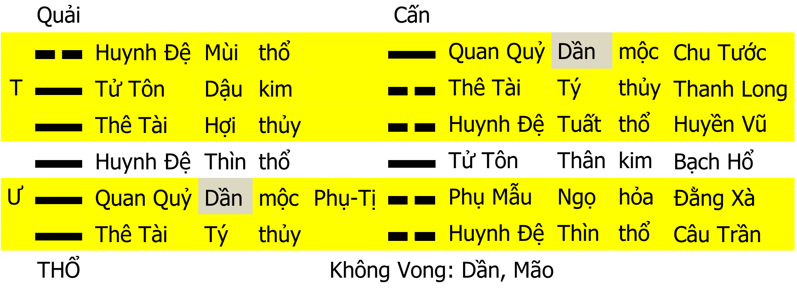
    - **Hình này chứng minh điều gì**
      - Quan hệ vụng trộm với người có vợ tan vỡ do đối phương nhát gan sợ vợ và biến quẻ Lục Xung chủ phân tán.
    - **Từ đâu mà thấy được**
      - Dụng thần Dần mộc Không phá nhập Mộ lâm Đằng Xà, Thê Tài động hợp, Kỵ thần trì Thế hóa Cấn Vi Sơn Lục Xung.
  - **Bối cảnh và câu hỏi dự đoán:**
    - Người phụ nữ hỏi về sự tiến triển tình cảm giữa mình và một người đàn ông đang qua lại.
    - Ngày Mậu Thân, tháng Dậu (Tuần không: Dần, Mão).
  - **Phán đoán chi tiết:**
    - Căn cứ:
      - Lấy Quan Quỷ làm Dụng thần. Dụng thần suy kiệt, phùng Không phùng Phá biểu thị sự việc không có gốc rễ phát triển.
      - Phụ Mẫu là giấy tờ hôn thú; Phụ Mẫu phục tàng mà phùng hợp là điềm báo vụng trộm ở chung phi pháp chứ không phải kết hôn đường hoàng.
      - Tính cách người nam nhìn vào lục thần và trạng thái Mộ khố của Dụng thần.
      - Quẻ biến Lục Xung chủ hậu quả chia lìa tan tác.
    - Nhìn vào:
      - Đánh giá khả năng thành vợ chồng: Quan Quỷ Dần mộc tại hào 2 lâm hào Ứng, bị Nguyệt kiến Dậu kim và Nhật thần Thân kim khắc phạt nặng nề, hưu tù vô căn, lại lâm Tuần Không và bị Nhật xung thành Nhật phá. Dụng thần vừa hưu tù, vừa Không vừa Phá, khẳng định mối quan hệ này không có tiền đồ, hai người vĩnh viễn không thể trở thành vợ chồng chính thức.
      - Dấu hiệu chung sống lén lút: Phụ Mẫu Tị hỏa phục dưới hào 2 Dần mộc, hưu tù không hiện trên quẻ nhưng lại cùng Nhật thần Thân kim tương hợp (Tị Thân hợp). Phụ Mẫu hợp Nhật vốn là tín hiệu ngày cưới, nhưng ở đây phục tàng ẩn khuất mà hợp nên chỉ là thông tin hai người lén lút sống chung mà thôi.
      - Tâm lý sợ sệt của người đàn ông: Dụng thần Dần mộc Không Vong, lâm Đằng Xà lại nhập Mộ tại hào 6 Huynh Đệ Mùi thổ. Không Vong chủ lo sợ bất an, Đằng Xà chủ kinh hãi quái gở, nhập Mộ chủ nhút nhát rụt rè, cho thấy người đàn ông này cực kỳ hèn nhát, khi qua lại với cô lúc nào cũng nơm nớp sợ hãi bị phát hiện.
      - Người đàn ông đã có vợ và sự cản trở: Hào 4 Thê Tài Hợi thủy phát động tương hợp với Dụng thần Dần mộc (Dần Hợi hợp), Thê Tài đại diện cho vợ cả, chứng minh đối phương đã có gia đình vợ con đề huề. Hào Huynh Đệ tĩnh làm trở lực cản trở mối quan hệ.
      - Hậu vận chia tay: Kỵ thần Tử Tôn Dậu kim trì Thế phát động biến thành Cấn Vi Sơn là quẻ Lục Xung. Lục xung chủ tan rã chia lìa, tình cảm vụng trộm tất yếu sẽ tan tành tro bụi, không có kết quả tốt.
  - **Ứng nghiệm thực tế:**
    - Đương số thừa nhận người đàn ông đó đã có vợ. Sau đó vụ việc bị người vợ phát hiện; người vợ làm dữ kiên quyết không chịu ly hôn. Bản thân người phụ nữ nhận thấy người tình quá nhút nhát và sự việc bế tắc không còn hy vọng nên đã chủ động rút lui, cắt đứt quan hệ.
- **Ví dụ 4:** Ngày Canh Thân tháng Tuất năm Tân Tị, nữ (29 tuổi) đoán hôn nhân, được quẻ Thiên Lôi Vô Vọng biến Hỏa Lôi Phệ Hạp.
  - **Hình 71.** Quẻ Thiên Lôi Vô Vọng biến Hỏa Lôi Phệ Hạp
    - 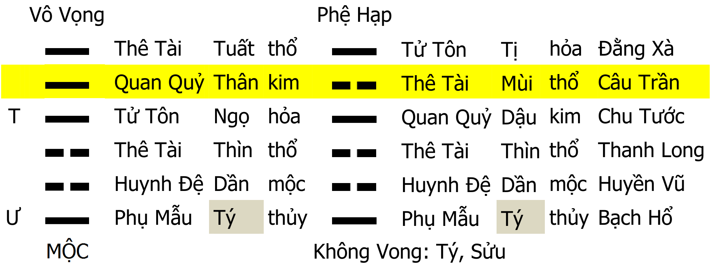
    - **Hình này chứng minh điều gì**
      - Đương số chưa từng kết hôn, không thiết tha hôn nhân do quẻ Lục Xung và đã quy y cửa Phật công quả.
    - **Từ đâu mà thấy được**
      - Phụ Mẫu Tý thủy hào Ứng Không Vong, Hương Khuê Nguyệt phá, Tử Tôn lâm Chu Tước nhập Mộ Tuất thổ ở hào 6.
  - **Bối cảnh và câu hỏi dự đoán:**
    - Người phụ nữ 29 tuổi đến xem tương lai hôn nhân của mình.
    - Ngày Canh Thân, tháng Tuất, năm Tân Tị (Tuần không: Tý, Sửu).
  - **Phán đoán chi tiết:**
    - Căn cứ:
      - Lấy Quan Quỷ làm Dụng thần. Xem tình trạng đã từng kết hôn hay chưa nhìn vào Phụ Mẫu (giấy đăng ký kết hôn) và Hương Khuê.
      - Tâm lý với hôn nhân nhìn vào lục thân trì Thế, quẻ Lục Xung và tính chất ngũ hành.
      - Tôn giáo, chùa chiền nhìn vào hào 6 và chi Tuất thổ (Hỏa khố).
    - Nhìn vào:
      - Tình trạng hôn nhân quá khứ: Phụ Mẫu Tý thủy lâm hào Ứng (phu vị) gặp Tuần Không; Phụ Mẫu là hôn thư, Ứng là vị trí người chồng, lâm Không tức chưa từng có giấy kết hôn và chưa từng có chồng. Thêm vào đó, Hương Khuê Thê Tài Thìn thổ ở hào 3 bị Nguyệt kiến Tuất thổ xung phá (Nguyệt phá), khẳng định cô gái 29 tuổi này chưa từng kết hôn bao giờ.
      - Thái độ chán ghét đàn ông: Dụng thần Quan Quỷ Thân kim tại hào 5 trì Thế được Nguyệt sinh Nhật phù, lại hóa Mùi thổ hồi đầu sinh nên cực kỳ vượng tướng. Tuy nhiên, quẻ gốc Thiên Lôi Vô Vọng là quẻ Lục Xung, hào 4 Tử Tôn Ngọ hỏa (Kỵ thần của Quan Quỷ) phát động. Nữ nhân bói quẻ mà Tử Tôn phát động chủ bài xích, lạnh nhạt, ghét bỏ đàn ông, trong lòng luôn có mâu thuẫn gay gắt với tình cảm lứa đôi. Quẻ Lục Xung chủ tâm lý bất định, hoàn toàn không định tâm suy nghĩ lập gia đình.
      - Căn duyên quy y Phật pháp: Hào 4 Tử Tôn Ngọ hỏa là hành hỏa, quẻ Lục Xung chủ tính tình nóng nảy bộc trực. Tử Tôn Ngọ hỏa nhập Mộ tại Nguyệt kiến Tuất thổ; Nguyệt kiến Tuất thổ lại nhập quẻ ngụ tại hào 6. Hào 6 là hào vị của chùa chiền, am miếu; chi Tuất thổ là Mộ khố của Hỏa cũng chủ nơi cửa thiền thanh tịnh, chứng minh đương số đã quy y cửa Phật.
      - Khẩu tụng kinh Phật và tài vận tổn hao: Hào 4 Tử Tôn Ngọ hỏa lâm Chu Tước; Chu Tước chủ ngôn ngữ, tiếng nói, tụng niệm sớm chiều, chủ hoan hỷ niệm kinh kệ. Mặt khác, Nguyệt kiến Tuất thổ xung phá hào 3 Thê Tài Thìn thổ (tài khố), cho thấy vì quan hệ dốc lòng phụng sự chùa chiền mà tài vận bị ảnh hưởng, nhiều năm không giữ được tiền bạc.
  - **Ứng nghiệm thực tế:**
    - Người phụ nữ xác nhận vì một lòng quy y tín ngưỡng Phật giáo nên hoàn toàn nguội lạnh tâm tư, không có chút hứng thú nào với đàn ông và chuyện lập gia đình. Hàng ngày cô đều đến chùa làm công quả giúp việc, suốt 8 năm ròng rã không có lấy một xu dính túi.
- **Ví dụ 5:** Ngày Giáp Thân tháng Sửu năm Nhâm Ngọ, nữ đoán khi nào có người yêu? Được quẻ Lôi Thiên Đại Tráng biến Địa Thiên Thái.
  - **Hình 72.** Quẻ Lôi Thiên Đại Tráng biến Địa Thiên Thái
    - 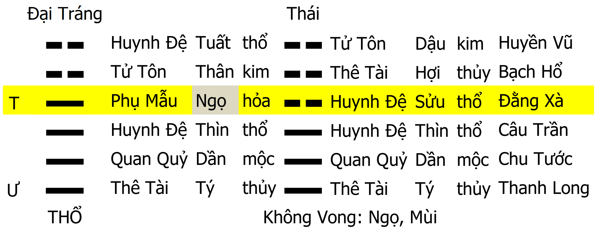
    - **Hình này chứng minh điều gì**
      - Nội tâm trống rỗng, khao khát bến đỗ yên ổn nhưng nghi ngại người theo đuổi chỉ vì gia tài chục triệu.
    - **Từ đâu mà thấy được**
      - Đại Tráng Lục Xung biến Thái Lục Hợp, Thế Phụ Mẫu Ngọ hỏa Không Vong lâm Đằng Xà, Quan Quỷ Dần mộc ám động sinh Thế.
  - **Bối cảnh và câu hỏi dự đoán:**
    - Người phụ nữ độc thân hỏi khi nào mình mới tìm được người yêu đích thực.
    - Ngày Giáp Thân, tháng Sửu, năm Nhâm Ngọ (Tuần không: Ngọ, Mùi).
  - **Phán đoán chi tiết:**
    - Căn cứ:
      - Lấy Quan Quỷ làm Dụng thần. Phân tích diễn biến tâm lý qua trạng thái quẻ Lục Xung biến Lục Hợp kết hợp với hào Thế.
      - Hào ngộ Nhật xung: Hào hưu tù gặp Nhật xung thành Ám Động nếu có khí, hoặc Ám Động sinh Thế chủ có người âm thầm tán tỉnh.
      - Hào Thế Không Vong chủ tâm trạng hư vô và không tiếp nhận sinh trợ.
    - Nhìn vào:
      - Trạng thái tâm lý qua Lục Xung biến Lục Hợp: Hào Thế Phụ Mẫu Ngọ hỏa lâm Tuần Không lại cưỡi Đằng Xà. Quẻ gốc Lôi Thiên Đại Tráng là quẻ Lục Xung, biến thành Địa Thiên Thái là quẻ Lục Hợp. Lục xung chủ tâm trí xáo trộn, tâm loạn bất an; Lục hợp chủ khao khát kết hợp, đoàn tụ, bình yên ổn định; Không Vong chủ nội tâm trống trải, hư không; Đằng Xà chủ lo âu, bồn chồn, đa nghi. Tổng hợp tượng quẻ: Hiện tại tâm trạng cô cực kỳ cô đơn, trống rỗng, tâm thần bấp bênh, tha thiết mong cầu một bến đỗ bình yên. Người đàn ông cô cần lúc này không nhất thiết phải có tiền của, mà cốt sao trở thành chỗ dựa tinh thần khiến mình hạnh phúc.
      - Thực tế có người theo đuổi nhưng bản thân cự tuyệt: Hào 2 Quan Quỷ Dần mộc bị Nhật thần Thân kim xung (Thân Dần tương xung), Dần mộc thụ xung hóa thành Ám Động sinh cho hào Thế Phụ Mẫu Ngọ hỏa. Ám động sinh Thế là tượng đang có một người đàn ông lén lút, âm thầm theo đuổi cô. Tuy nhiên, hào Thế Ngọ hỏa ngộ Không Vong nên không được sinh, chứng tỏ bản thân cô không hề có cảm tình, hoàn toàn không thích đối phương.
  - **Ứng nghiệm thực tế:**
    - Người phụ nữ này là một nữ đại gia sở hữu khối tài sản hàng chục triệu tệ. Thực tế đúng là đang có người đàn ông nhiệt tình theo đuổi, nhưng cô không thích đối phương vì luôn nảy sinh tâm lý lo lắng, ngờ vực rằng tất cả đàn ông tiếp cận mình đều chỉ coi trọng tiền tài tài sản của cô. Kết quả sau 5 năm trôi qua, cô vẫn sống một thân một mình độc thân.
- **Ví dụ 6:** Ngày Canh Thìn tháng Hợi năm Tân Tị, nam đoán vợ chưa cưới như thế nào, được quẻ Thiên Lôi Vô Vọng biến Thiên Phong Cấu.
  - **Hình 73.** Quẻ Thiên Lôi Vô Vọng biến Thiên Phong Cấu
    - 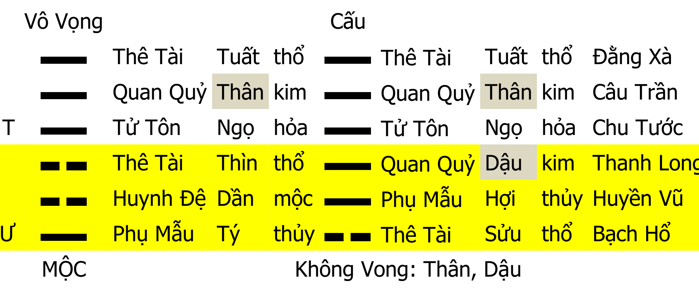
    - **Hình này chứng minh điều gì**
      - Hôn ước đổ vỡ, người vợ chưa cưới thay lòng đổi dạ theo người đàn ông khác dẫn đến từ hôn dứt khoát.
    - **Từ đâu mà thấy được**
      - Vô Vọng lục xung, hào 3 Thê Tài Thìn thổ hóa Quan Quỷ Dậu kim, Huynh Đệ Dần mộc hóa hồi đầu sinh khắc Tài.
  - **Bối cảnh và câu hỏi dự đoán:**
    - Người đàn ông đã đính hôn đến hỏi về tương lai và tình hình của người vợ chưa cưới.
    - Ngày Canh Thìn, tháng Hợi, năm Tân Tị (Tuần không: Thân, Dậu).
  - **Phán đoán chi tiết:**
    - Căn cứ:
      - Nam đoán hôn nhân lấy Thê Tài làm Dụng thần.
      - Truy nguyên quá khứ quen biết và đính hôn dựa vào hào Phụ Mẫu và hào Thê Tài tương hợp với địa chi năm tháng.
      - Thê Tài động hóa Quan Quỷ là tượng người nữ ngoại tình, ngả vào vòng tay người đàn ông khác.
      - Quẻ Lục Xung chủ sự việc tan vỡ, từ hôn; Huynh Đệ vượng động khắc Tài là điềm chia tay dứt khoát.
    - Nhìn vào:
      - Ứng kỳ quen biết và đính hôn trong quá khứ: Hào sơ Phụ Mẫu Tý thủy (lâm hào Ứng) động hóa Thê Tài Sửu thổ (động mà phùng hợp, Tý Sửu hợp). Năm Đinh Sửu (1997) hợp với Tý thủy, hào biến lại là Sửu thổ, cho thấy năm Đinh Sửu hai người quen biết nhau. Hào 6 Thê Tài Tuất thổ gặp Thìn xung có thể ứng hợp; hào 3 Thê Tài Thìn thổ phát động cùng hào biến Quan Quỷ Dậu kim tương hợp (Thìn Dậu hợp trú). Năm Kỷ Mão (1999) địa chi Mão xung khai Dậu kim (xung khai hợp thần), năm Kỷ Mão hai bên chính thức làm lễ đính hôn.
      - Biến cố ngoại tình và thay lòng đổi dạ: Hào 3 Thê Tài Thìn thổ lâm Nhật thần phát động hóa ra Quan Quỷ Dậu kim. Thê Tài là đối tượng hôn phối, Quan Quỷ là người đàn ông khác; Tài động hóa Quỷ là dấu hiệu vợ chưa cưới bây giờ lại thích người đàn ông khác. Hào Ứng Phụ Mẫu Tý thủy phát động cũng chứng minh phía đối phương có sự thay đổi.
      - Tan vỡ hôn ước: Quẻ gốc Thiên Lôi Vô Vọng là quẻ Lục Xung, tượng của sự chia lìa, muốn từ hôn. Hào 2 Huynh Đệ Dần mộc được Nguyệt lệnh Hợi thủy sinh phù, lại phát động hóa ra Phụ Mẫu Hợi thủy hồi đầu sinh, Huynh Đệ vượng cực khắc Thê Tài thổ, khẳng định chắc chắn sẽ chia tay, hủy bỏ hôn ước.
  - **Ứng nghiệm thực tế:**
    - Không lâu sau đó, hai bên đã chính thức hủy bỏ hôn ước, đường ai nấy đi.
- **Ví dụ 7:** Ngày Quý Sửu tháng Dậu, nam đoán hôn nhân, được quẻ Thiên Lôi Vô Vọng biến Trạch Địa Tụy.
  - **Hình 74.** Quẻ Thiên Lôi Vô Vọng biến Trạch Địa Tụy
    - 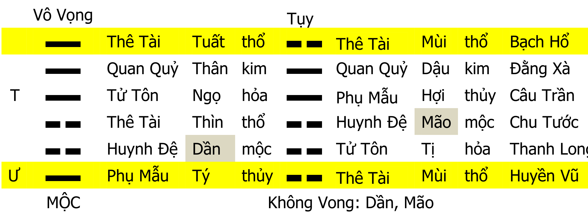
    - **Hình này chứng minh điều gì**
      - Đương số quan hệ với nhiều phụ nữ (người có chồng, người ở xa), Thế nhập Mộ Tài nhưng quẻ Lục Xung hóa Thoái nên cả đời cô độc.
    - **Từ đâu mà thấy được**
      - Thê Tài trùng trùng xuất hiện, hào 3 Thìn Dậu hợp lâm Chu Tước, hào 6 Tuất thổ hóa Thoái, Thế Ngọ hỏa nhập Mộ Tuất thổ.
  - **Bối cảnh và câu hỏi dự đoán:**
    - Nam đương số đến hỏi về đường hôn nhân của bản thân.
    - Ngày Quý Sửu, tháng Dậu (Tuần không: Dần, Mão).
  - **Phán đoán chi tiết:**
    - Căn cứ:
      - Nam đoán hôn nhân lấy Thê Tài làm Dụng thần. Khi Thê Tài đa hiện khắp các tầng quẻ biểu thị người nam có vô số mối quan hệ tình ái với nhiều phụ nữ.
      - Hào Thê Tài hợp Quan Quỷ là người nữ đã có chồng; lâm Chu Tước là người khéo ăn nói.
      - Hào 6 là viễn phương đất khách; hào Thế nhập Mộ tại Thê Tài biểu thị bản thân si mê, bị đối phương cuốn hút, tâm hồn trao trọn cho đối phương.
      - Quẻ Lục Xung kết hợp Dụng thần hóa Thoái thần biểu thị hôn nhân bất thành, cả đời phiêu dạt cô độc.
    - Nhìn vào:
      - Dấu hiệu quan hệ lăng nhăng phức tạp: Trong quẻ Thê Tài xuất hiện dồn dập nhiều nơi: hào 6 Thê Tài Tuất thổ động hóa Thê Tài Mùi thổ, hào 3 Thê Tài Thìn thổ, Nhật thần mang Thê Tài Sửu thổ, hào sơ Phụ Mẫu Tý thủy lại động biến ra Thê Tài Mùi thổ. Thê Tài trùng trùng biểu thị anh chàng này qua lại với vô số phụ nữ khác nhau.
      - Người phụ nữ thứ nhất đã có gia đình: Hào 3 Thê Tài Thìn thổ tương hợp với Nguyệt lệnh Quan Quỷ Dậu kim (Thìn Dậu lục hợp). Thê Tài hợp với Quan Quỷ biểu thị một trong những người phụ nữ đó là người đã có chồng. Hào này lâm Chu Tước, chứng tỏ người phụ nữ đó có tài ăn nói lưu loát, khéo mồm khéo miệng.
      - Người phụ nữ thứ hai ở nơi phương xa và sự si mê: Hào 6 Thê Tài Tuất thổ cư ngụ ở hào 6; hào 6 là nơi khác, xa xôi, cho thấy có một người nữ ở nơi khác. Hào Thế Tử Tôn Ngọ hỏa lại nhập Mộ tại hào 6 Thê Tài Tuất thổ. Thế nhập Mộ tại hào Tài ở hào 6 là tượng bản thân anh ta bị người nữ này mê hoặc, đem trọn tấm lòng hướng về cô ấy.
      - Hậu vận hôn nhân cô độc: Quẻ gốc Thiên Lôi Vô Vọng là quẻ Lục Xung. Hào 6 Thê Tài Tuất thổ động biến Thê Tài Mùi thổ là hóa Thoái thần. Quẻ Lục Xung chủ tán, Dụng thần hóa Thoái chủ thoái lui tan vỡ, cho thấy hôn nhân sau đó rất khó có được sự ổn định lâu dài.
  - **Ứng nghiệm thực tế:**
    - Người đàn ông thừa nhận lúc bấy giờ quả nhiên có quen biết và qua lại với hai người phụ nữ đúng y như phán đoán (một người có chồng ăn nói khéo và một người ở phương xa). Năm năm sau, mặc dù anh ta đã tiếp tục quen biết qua vài người phụ nữ nữa nhưng rốt cuộc vẫn phòng không gối chiếc, sống một thân một mình độc thân không lấy được vợ.

### CHƯƠNG 12: Ý NGHĨA CỦA PHẢN NGÂM VÀ PHỤC NGÂM

#### 1. Nguyên lý và Tượng ý của Phục Ngâm và Phản Ngâm trong Dự đoán Hôn nhân
- **Bản chất của Phục Ngâm và Phản Ngâm:**
  - Trong dự đoán Lục Hào, Phản ngâm và Phục ngâm phần lớn phản ánh thông tin hung hại, trắc trở, bất lợi; khi xem về nhân duyên và đời sống hôn nhân lại càng là điềm báo không tốt.
- **Tượng ý đặc trưng của Phục Ngâm:**
  - Tâm trạng và cảm xúc: Chủ về tâm trạng bế tắc, u uất, tình cảm lạnh nhạt; trong lòng luôn đau khổ dằn vặt, rên rỉ than vãn, ấm ức không giải tỏa được.
  - Tiến trình sự việc: Bị đình trệ, giam cầm, không có sự tiến triển hay chuyển biến tích cực; các mâu thuẫn âm ỉ kéo dài không dứt; đương số do dự không quyết đoán, bế tắc trong suy nghĩ.
  - Đời sống tình cảm: Gia đạo bất hòa, cãi vã ồn ào; đau khổ vì chuyện ngoại tình hoặc sự chen chân của kẻ thứ ba; lâm vào cảnh sống cô độc, lạnh lẽo, thiếu vắng sự sẻ chia.
- **Tượng ý đặc trưng của Phản Ngâm:**
  - Biến động sự việc: Chủ về sự việc thay đổi thất thường, phản đi phục lại, biến chuyển đảo điên ngoài tầm kiểm soát; lúc tốt lúc xấu, nhiều lần nỗ lực mưu cầu đều chuốc lấy thất bại tái diễn.
  - Tình cảm và thái độ: Tình cảm chao đảo, không ổn định; chủ ý không kiên định, lập trường mâu thuẫn, thái độ mập mờ thiếu dứt khoát; trải qua cảnh chia tay rồi lại làm hòa, hợp rồi lại tan.
  - Mâu thuẫn xung đột: Thường xuyên xảy ra tranh chấp kịch liệt, cãi vã to tiếng, bất hòa sâu sắc, thậm chí dẫn đến xô xát, đánh nhau gay gắt trong quan hệ gia đình.

#### 2. Các Quái Lệ Thực Tế Luận Giải Phục Ngâm và Phản Ngâm Trong Hôn Nhân
- **Ví dụ 1: Nữ sinh năm 1977 đoán hôn nhân vào ngày Bính Thân tháng Mùi năm Giáp Thân**
  - **Hình 75.** Quẻ Thiên Sơn Độn biến Lôi Phong Hằng
    - 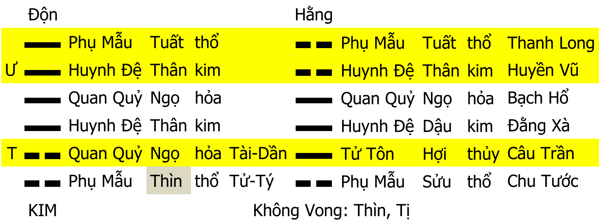
    - **Hình này chứng minh điều gì**
      - Ngoại quái phục ngâm, hào Thế Quan Quỷ nhập Mộ hóa hồi đầu khắc chỉ cảnh hôn nhân cay đắng bị chồng giam cầm mất tự do.
    - **Từ đâu mà thấy được**
      - Ngoại quái Càn giữ nguyên hào (Ngọ, Thân, Tuất) tạo phục ngâm; hào 2 Thế Quan Quỷ Ngọ hỏa hóa Hợi thủy khắc, nhập Mộ Tuất thổ lâm Câu Trần.
  - **Phán đoán chi tiết:**
    - Căn cứ: Lấy Quan Quỷ làm Dụng thần. Trong quẻ Quan Quỷ lưỡng hiện tại hào 2 và hào 4, lấy hào phát động Quan Quỷ Ngọ hỏa ở hào 2 làm Dụng thần. Dụng thần được Nguyệt kiến Mùi thổ nhị hợp là vượng, song không được Nhật thần Thân kim hay Nguyệt kiến trực tiếp sinh phù, nên không thể xem là cực vượng tướng.
    - Nhìn vào:
      - Ứng kỳ kết hôn sớm: Quan Quỷ trì Thế tại hào 2 chủ kết hôn sớm. Hào Thế Ngọ hỏa động hóa Tử Tôn Hợi thủy hồi đầu khắc, lại nhập Mộ tại Phụ Mẫu Tuất thổ ở hào 6. Đến năm Canh Thìn (2000, khi đương số 23 tuổi), Thìn thổ khắc chế hào biến Hợi thủy, lại xung khai Mộ khố Tuất thổ, đồng thời hào sơ Phụ Mẫu Thìn thổ xuất Không (thực Không) ứng giấy chứng nhận kết hôn, do đó xác định năm Canh Thìn 23 tuổi kết hôn.
      - Hôn nhân ngột ngạt mất tự do: Hào Dụng thần động hóa hồi đầu khắc, ngoại quái phục ngâm chủ rên rỉ, đau khổ triền miên. Hào Thế lâm Câu Trần chủ bất động, nhập Mộ khố Tuất thổ chủ bị vây hãm, giam cầm. Tượng "Thân theo Quỷ nhập Mộ" biểu thị từ sau khi kết hôn cô đã hoàn toàn mất tự do, bị chồng kiểm soát khắt khe trong bốn bức tường.
      - Tính cách lười biếng và không biết nấu nướng: Hào Thế lâm Câu Trần chủ bất động, lười biếng; nhập Mộ cũng chủ không chịu vận động, thể hiện bản thân lười nhác. Mộ khố Tuất thổ lâm Thanh Long chủ ăn uống; Thê Tài cũng chủ việc ăn uống bếp núc nhưng không hiện trên quẻ mà phục tàng dưới hào 2 (phòng bếp, bếp lò). Hào Thế Ngọ hỏa lại là Tử địa của Thê Tài Dần mộc, chứng minh bản thân cô rất vụng về, hoàn toàn không biết nấu ăn.
  - **Ứng nghiệm thực tế:** Đương số xác nhận kết hôn năm Canh Thìn (2000). Cuộc sống hôn nhân vô cùng ngột ngạt bất hạnh, thường xuyên bị chồng khóa cửa nhốt trong nhà cấm không cho ra ngoài; bản thân cô lười biếng và quả thực không biết nấu ăn.

- **Ví dụ 2: Nữ đoán duyên phận với người nam vào ngày Giáp Thìn tháng Sửu**
  - **Hình 76.** Quẻ Sơn Phong Cổ biến Hỏa Địa Tấn
    - 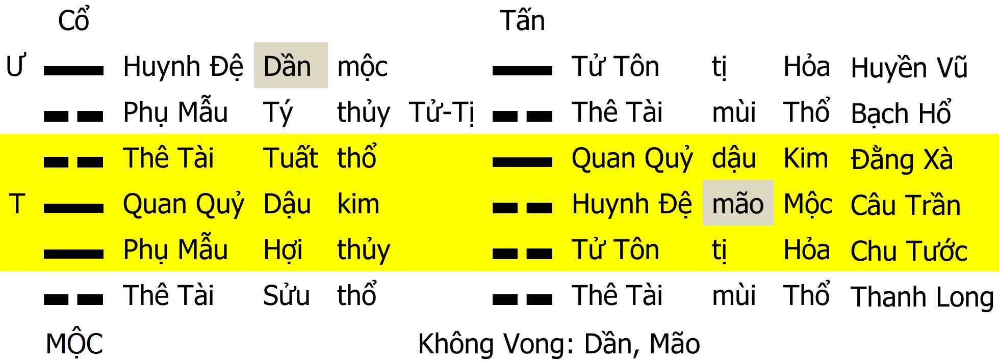
    - **Hình này chứng minh điều gì**
      - Nội quái phản ngâm cùng quẻ Quy hồn hóa Du hồn chỉ mối quan hệ nhân duyên chập chờn với người đàn ông đã có vợ.
    - **Từ đâu mà thấy được**
      - Nội quái Tốn biến Khôn (Sửu-Mùi, Hợi-Tị, Dậu-Mão) tương xung phản ngâm; Thế Quan Quỷ Dậu kim là Đào hoa hóa Mão mộc Không Vong; Nhật Thê Tài Thìn thổ hợp Dụng thần.
  - **Phán đoán chi tiết:**
    - Căn cứ: Lấy Quan Quỷ làm Dụng thần. Quan Quỷ Dậu kim trì Thế tại hào 3, được Nguyệt kiến Sửu thổ sinh phù và Nhật thần Thìn thổ sinh hợp là vượng tướng, vốn dĩ là điềm lành.
    - Nhìn vào:
      - Duyên phận bấp bênh lúc gần lúc xa: Nội quái Tốn mộc biến Khôn thổ tạo thành nội quái phản ngâm (các chi hào sơ Sửu biến Mùi, hào 2 Hợi biến Tị, hào 3 Dậu biến Mão đều tương xung). Dụng thần Quan Quỷ Dậu kim trì Thế động hóa Mão mộc lâm Tuần Không (Dần, Mão không vong). Động hóa Không chủ mộng ảo, tan biến; phản ngâm chủ lặp đi lặp lại thất thường, cho thấy mối quan hệ giữa hai người chập chờn, lúc gần lúc xa, khi nồng thắm khi lạnh nhạt.
      - Tượng sớm tụ rồi lại tan: Quẻ Sơn Phong Cổ là quẻ Quy hồn biến quẻ Hỏa Địa Tấn là quẻ Du hồn. Quy hồn hóa Du hồn chủ cảnh ngộ vừa ở bên nhau không được bao lâu thì đã phải chia xa cách trở.
      - Thân phận người tình đã có gia đình: Quan Quỷ Dậu kim lâm Đào hoa (Nhật thần Thìn thấy Dậu là Đào hoa). Nhật thần Thìn thổ hợp hào Dụng thần Dậu kim, mà Thìn thổ mang lục thân Thê Tài (đại diện cho người đàn bà khác). Điều này khẳng định người nam này không phải là chồng tương lai mà là người tình ngoài luồng vụng trộm, bản thân anh ta đã có vợ con đề huề.
  - **Ứng nghiệm thực tế:** Đương số xác nhận toàn bộ sự thật đúng như vậy. Đối phương là người đàn ông đã có gia đình, hai người qua lại lén lút như nhân tình, tình cảm bấp bênh không ổn định lúc gần lúc xa.

- **Ví dụ 3: Nữ đoán chuyện ngoại tình vào ngày Quý Sửu tháng Mùi**
  - **Hình 77.** Quẻ Địa Thiên Thái biến Chấn Vi Lôi
    - 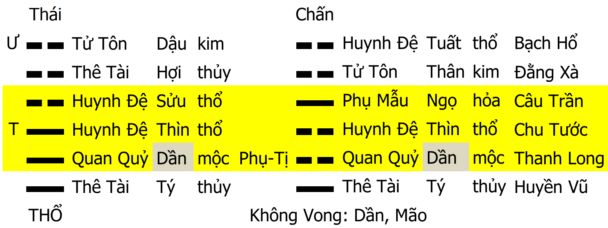
    - **Hình này chứng minh điều gì**
      - Quẻ Lục hợp biến Lục xung với nội quái phục ngâm chỉ mối tình vụng trộm tan vỡ cay đắng do người tình thay lòng đổi dạ vì kẻ khác.
    - **Từ đâu mà thấy được**
      - Nội quái Càn biến Chấn giữ nguyên chi Tý-Dần-Thìn tạo phục ngâm; quẻ Thái biến Chấn từ hợp sang xung; Dụng thần Quan Quỷ Dần mộc hưu tù lâm Không Vong, hợp Thê Tài Hợi thủy.
  - **Phán đoán chi tiết:**
    - Căn cứ: Lấy Quan Quỷ làm Dụng thần. Quan Quỷ Dần mộc ở hào 2 không được Nguyệt kiến Mùi thổ hay Nhật thần Sửu thổ sinh trợ nên ở trạng thái hưu tù suy yếu. Tuần không rơi vào Dần, Mão nên Dụng thần lâm Tuần Không.
    - Nhìn vào:
      - Người tình nguội lạnh thay lòng: Dụng thần Quan Quỷ Dần mộc đã hưu tù lại rơi vào Không Vong, biểu thị đối phương đã cạn kiệt tình cảm, nguội lạnh tâm can, không còn tha thiết gì với mối quan hệ này nữa.
      - Nội tâm đau khổ dằn vặt: Nội quái Càn kim biến Chấn mộc giữ nguyên địa chi các hào (hào sơ Tý thủy, hào 2 Dần mộc, hào 3 Thìn thổ), tạo thành nội quái phục ngâm. Phục ngâm chủ tâm trạng đương sự vô cùng bế tắc, đau khổ, rên rỉ u uất, không lối thoát.
      - Kết cục chia tay tất yếu: Quẻ gốc Địa Thiên Thái là quẻ Lục hợp biến quẻ Chấn Vi Lôi là quẻ Lục xung (Bát thuần Chấn). Tượng "Lục hợp biến Lục xung" báo hiệu dù ban đầu có khăng khít hòa hợp đến đâu thì cuối cùng hai người cũng tan vỡ, chắc chắn phải đường ai nấy đi.
      - Người tình có người phụ nữ khác: Quan Quỷ Dần mộc nhị hợp với Thê Tài Hợi thủy ở hào 5. Thê Tài đối với Quan Quỷ chính là nữ nhân. Dụng thần đem lòng hợp với Thê Tài khác cho thấy người đàn ông này đã có bóng hình người phụ nữ mới và đang say đắm kẻ thứ ba.
  - **Ứng nghiệm thực tế:** Quả nhiên người tình đã lạnh nhạt ruồng bỏ cô, anh ta không còn yêu thích cô nữa mà đã quay sang theo đuổi và cặp kè với một người phụ nữ khác.

- **Ví dụ 4: Nam đoán theo đuổi người nữ thành hay không vào ngày Ất Sửu tháng Ngọ**
  - **Hình 78.** Quẻ Lôi Sơn Tiểu Quá biến Thiên Phong Cấu
    - 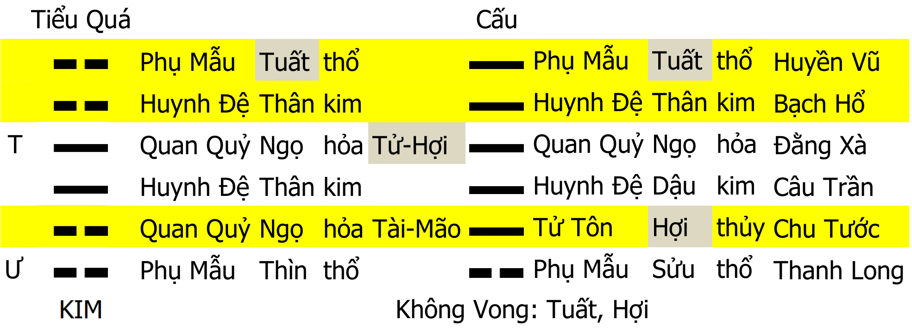
    - **Hình này chứng minh điều gì**
      - Ngoại quái phục ngâm, Dụng thần Thê Tài phục tàng dưới Quan Quỷ chỉ việc theo đuổi thất bại do đối phương đã có chồng và chủ động né tránh.
    - **Từ đâu mà thấy được**
      - Ngoại quái Chấn biến Càn giữ nguyên chi Ngọ-Thân-Tuất tạo phục ngâm; Thê Tài Mão mộc phục hào 2 dưới Quan Quỷ Ngọ hỏa, bị Phụ Mẫu Tuất thổ hào 6 động hợp.
  - **Phán đoán chi tiết:**
    - Căn cứ: Nam hỏi tình duyên lấy Thê Tài làm Dụng thần. Trong quẻ Thê Tài Mão mộc không xuất hiện trên quẻ chính mà phục tàng dưới hào 2 Quan Quỷ Ngọ hỏa. Tuần không tại Tuất, Hợi.
    - Nhìn vào:
      - Đối phương là phụ nữ đã có gia đình: Thê Tài Mão mộc phục tàng dưới Phi thần Quan Quỷ Ngọ hỏa (Quan Quỷ đại diện cho người chồng). Lại có hào 6 Phụ Mẫu Tuất thổ phát động hợp với Dụng thần Mão mộc (Mão Tuất nhị hợp), mà Phụ Mẫu là giấy chứng nhận kết hôn hợp pháp. Hai dữ kiện này chỉ rõ người phụ nữ mà anh ta theo đuổi thực chất đã có chồng con danh chính ngôn thuận.
      - Việc cầu hôn bất thành và sự lẩn tránh: Dụng thần Thê Tài Mão mộc ở tháng Ngọ bị tiết khí, ngày Sửu không sinh phù nên hưu tù vô lực, không được Nhật Nguyệt tương trợ nên việc mưu cầu tình duyên không thể thành công. Dụng thần phục tàng biểu thị đối phương đang cố tình tránh né, lẩn trốn, từ chối tiếp nhận tình cảm của anh ta.
      - Theo đuổi gian nan ôm nỗi sầu muộn: Ngoại quái Chấn mộc biến Càn kim giữ nguyên chi các hào 4, 5, 6 (Ngọ hỏa, Thân kim, Tuất thổ), tạo thành ngoại quái phục ngâm. Phục ngâm chủ sự tình đình trệ, lặp đi lặp lại nhiều lần mà chuốc lấy thất bại, khiến tâm trạng của anh ta vô cùng bế tắc, muộn phiền đau khổ.
  - **Ứng nghiệm thực tế:** Quả nhiên mọi chuyện đúng như dự đoán, người phụ nữ kia đã có gia đình nên luôn tìm cách lẩn tránh anh ta; anh ta kiên trì theo đuổi nhiều lần đều thất bại cay đắng, tự chuốc lấy nỗi đau khổ trong lòng.

- **Ví dụ 5: Nữ đoán có thể kết hôn với người nam hay không vào ngày Ất Dậu tháng Mão**
  - **Hình 79.** Quẻ Phong Sơn Tiệm biến Địa Phong Thăng
    - 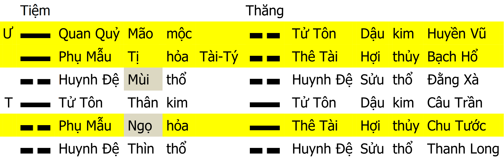
    - **Hình này chứng minh điều gì**
      - Ngoại quái phản ngâm cùng Phụ Mẫu Không hóa Tuyệt chỉ cảnh sống chung không hôn thú và tình cảm hợp tan biến động liên miên.
    - **Từ đâu mà thấy được**
      - Ngoại quái Tốn biến Khôn (Mùi-Sửu, Tị-Hợi, Mão-Dậu) tương xung phản ngâm; Phụ Mẫu Ngọ hỏa Không Vong động hóa Tuyệt Hợi thủy; Thế Thân kim ngộ Mộc Dục tại Ngọ hỏa.
  - **Phán đoán chi tiết:**
    - Căn cứ: Nữ hỏi hôn nhân lấy Quan Quỷ làm Dụng thần. Dụng thần Quan Quỷ Mão mộc lâm hào Ứng (hào 6), được Nguyệt kiến Mão mộc trợ phù vượng tướng nhưng lại bị Nhật thần Dậu kim xung khắc (Nhật phá), do đó khó phân định rõ ràng là vượng hay suy.
    - Nhìn vào:
      - Tượng sống chung không giá thú: Nội quái có hào 2 Phụ Mẫu Ngọ hỏa phát động. Phụ Mẫu là giấy chứng nhận kết hôn, lâm Tuần Không (tuần Giáp Thân tuần không Ngọ, Mùi) lại động hóa Tử Tôn Hợi thủy là hóa Tuyệt (hỏa tuyệt tại Hợi). Phụ Mẫu lâm Không Vong biểu thị không có hôn thư; Phụ Mẫu hóa Tuyệt cũng chủ không có ràng buộc pháp lý hôn nhân. Mặt khác, Ngọ hỏa là đất Mộc Dục của hào Thế Tử Tôn Thân kim (Thân kim trường sinh tại Tị, mộc dục tại Ngọ). Hào Thế tại hào 3 gặp Mộc Dục chủ tình cảm buông thả, gần gũi xác thịt; kết hợp với Phụ Mẫu Không hóa Tuyệt minh chứng hai người dọn về sống chung với nhau mà không hề đăng ký kết hôn.
      - Quan hệ phản ngâm hợp tan thất thường: Ngoại quái Tốn mộc biến Khôn thổ tạo thành ngoại quái phản ngâm (hào 4 Mùi xung Sửu, hào 5 Tị xung Hợi, hào 6 Mão xung Dậu). Phản ngâm chủ sự việc trắc trở, biến động khôn lường, lặp đi lặp lại: hai người hợp rồi lại phân, chia tay rồi lại làm hòa, dùng dằng bấp bênh không dứt.
  - **Ứng nghiệm thực tế:** Đương số phản hồi hai người đều là những người từng ly hôn, hiện đang dọn về sống chung mà không có giấy kết hôn. Tuy nhiên, người con riêng của người nam liên tục trở về nhà quấy rối khiến cô nhiều lần phải dọn đi rồi lại quay về, tình cảnh hợp tan thất thường đảo lộn khiến cô vô cùng đau khổ.

- **Ví dụ 6: Nam đoán theo đuổi người nữ thành hay không vào ngày Tân Hợi tháng Tý**
  - **Hình 80.** Quẻ Tốn Vi Phong biến Địa Trạch Lâm
    - 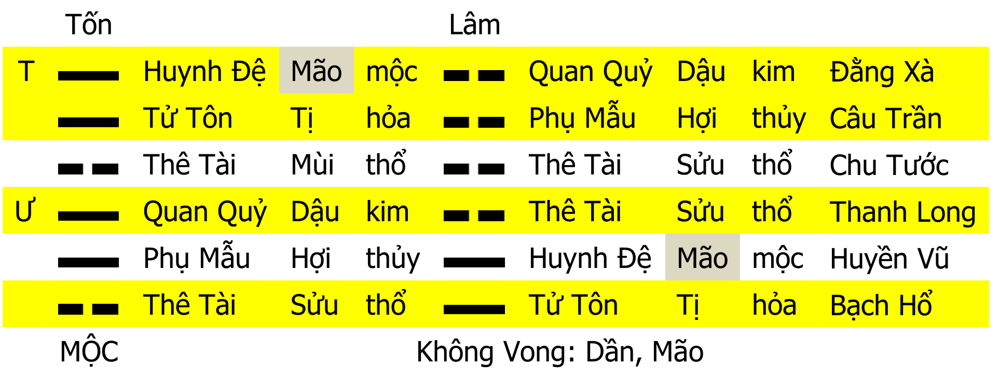
    - **Hình này chứng minh điều gì**
      - Ngoại quái phản ngâm, Dụng thần động hóa Nhật phá lâm Bạch Hổ và tam hợp cục Quan Quỷ khắc Thế chỉ việc theo đuổi thất bại do đối phương đã có chồng và kiên quyết cự tuyệt.
    - **Từ đâu mà thấy được**
      - Ngoại quái Tốn biến Khôn (Mùi-Sửu, Tị-Hợi, Mão-Dậu) tương xung phản ngâm; Thế Mão mộc lâm Đằng Xà Không Vong; Thê Tài Sửu thổ lâm Bạch Hổ hóa Tị hỏa Nhật phá; Tị Dậu Sửu hợp Quan Quỷ cục khắc Thế.
  - **Phán đoán chi tiết:**
    - Căn cứ: Nam hỏi tình cảm lấy Thê Tài làm Dụng thần. Trong quẻ Thê Tài lưỡng hiện tại hào sơ Sửu thổ và hào 4 Mùi thổ, lấy hào phát động Thê Tài Sửu thổ làm Dụng thần. Tuần không rơi vào Dần, Mão.
    - Nhìn vào:
      - Tâm trạng bồn chồn đứng ngồi không yên: Hào Thế Huynh Đệ Mão mộc lâm hào 6 gặp Đằng Xà và Tuần Không. Đằng Xà chủ lo lắng bất an, giật mình hoảng hốt; Không Vong chủ trống rỗng bồn chồn. Điều này phản ánh tâm trạng người nam vì say đắm người phụ nữ này mà đứng ngồi không yên, tâm trí xáo trộn.
      - Ngoại quái phản ngâm nhiều lần bày tỏ: Ngoại quái Tốn mộc biến Khôn thổ tạo thành ngoại quái phản ngâm (Mùi xung Sửu, Tị xung Hợi, Mão xung Dậu). Phản ngâm chủ hành động lặp đi lặp lại, cho thấy anh ta nhiều lần đến tìm gặp để bày tỏ tình cảm với đối phương.
      - Phía nữ tức giận cự tuyệt và rào cản hôn nhân: Dụng thần Thê Tài Sửu thổ không được Nguyệt kiến Tý thủy hay Nhật thần Hợi thủy sinh phù, lại động hóa Tử Tôn Tị hỏa bị Nhật thần Hợi thủy tương xung thành Nhật phá (Tị Hợi tương xung). Dụng thần hóa Nhật phá chủ sự việc bất thành, phía nữ hoàn toàn không có ý định qua lại. Hào động Sửu thổ lâm Bạch Hổ chủ hung bạo, tức giận, chứng tỏ đối phương cực kỳ tức giận trước sự quấy rầy này. Đặc biệt, hào động Sửu thổ cùng hào biến Tị hỏa và hào 3 Quan Quỷ Dậu kim tam hợp thành Kim cục (Tị Dậu Sửu tam hợp Quan Quỷ cục) hồi đầu khắc ngược lại hào Thế Mão mộc. Quan Quỷ đại diện cho người chồng; Quan Quỷ cục khắc Thế minh chứng cô gái này đã có gia đình, đã kết hôn, nên kiên quyết từ chối thẳng thừng mọi sự tiếp cận.
  - **Ứng nghiệm thực tế:** Quả nhiên ứng nghiệm như phán đoán. Người phụ nữ kia thực sự đã có chồng, khi anh ta nhiều lần bày tỏ tình cảm đã bị cô ấy nổi giận mắng nhiếc thậm tệ và cự tuyệt dứt khoát không tiếp xúc nữa.

- **Ví dụ 7: Nữ đoán chuyện yêu đương vào ngày Nhâm Thân tháng Tuất**
  - **Hình 81.** Sơ đồ quẻ Thủy Địa Tỷ biến Thủy Phong Tỉnh
    - 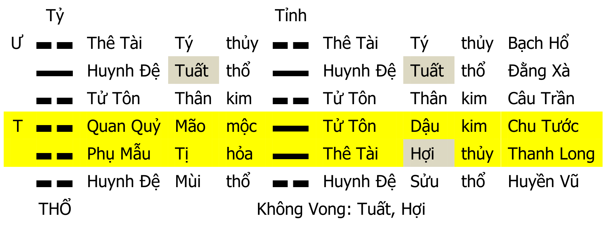
    - **Hình này chứng minh điều gì**
      - Nội quái phản ngâm, Dụng thần Mão mộc trì Thế hóa hồi đầu khắc và nhập Mộ chỉ tiến trình quen tháng Mão, chia tay tháng Mùi, tháng Tuất tái hợp nhưng cãi vã liên miên dẫn đến đổ vỡ.
    - **Từ đâu mà thấy được**
      - Nội quái Khôn biến Tốn (Mùi-Sửu, Tị-Hợi, Mão-Dậu) tương xung phản ngâm; Dụng thần Thế Quan Quỷ Mão mộc lâm Chu Tước hóa Dậu kim hồi đầu khắc; tháng Mùi nhập Mộ chia tay, tháng Tuất hợp Dụng thần làm hòa.
  - **Phán đoán chi tiết:**
    - Căn cứ: Nữ hỏi tình duyên lấy Quan Quỷ làm Dụng thần. Trong quẻ Quan Quỷ Mão mộc trì Thế tại hào 3. Tuần không tại Tuất, Hợi.
    - Nhìn vào:
      - Thời điểm bắt đầu mối quan hệ: Quan Quỷ Mão mộc trì Thế là tượng người yêu nhập thân, ứng vào tháng Mão cô ấy đã quen và bắt đầu có bạn trai.
      - Nội quái phản ngâm và đứt đoạn giữa đường: Nội quái Khôn thổ biến Tốn mộc tạo thành nội quái phản ngâm (hào sơ Mùi xung Sửu, hào 2 Tị xung Hợi, hào 3 Mão xung Dậu). Phản ngâm chủ trắc trở gập ghềnh, phân phân hợp hợp. Hào Dụng thần Quan Quỷ Mão mộc bị Nhật thần Thân kim khắc chế, lại động hóa Tử Tôn Dậu kim hồi đầu khắc (Mão Dậu tương xung khắc). Đến tháng Mùi (Mùi thổ là Mộ khố của Mão mộc), Dụng thần nhập Mộ, do đó hai người đã chia tay đứt đoạn giữa đường vào tháng Mùi.
      - Tạm thời làm hòa nhưng xung đột khó cứu vãn: Hiện tại gieo quẻ vào tháng Tuất, Nguyệt kiến Tuất thổ tương hợp với Dụng thần Quan Quỷ Mão mộc (Mão Tuất nhị hợp), Nguyệt hợp làm vượng Dụng thần nên hiện tại hai người vừa mới làm lành, tái hợp với nhau. Tuy nhiên, hào Thế lâm Chu Tước chủ khẩu thiệt, tranh cãi to tiếng; bản thân hào Thế lại động hóa hồi đầu khắc Quan Quỷ, chứng tỏ hai người hễ ở chung là cãi lộn không ngừng nghỉ, và chính bản thân cô gái cũng đã quá mệt mỏi, trong lòng không còn tha thiết muốn tiếp tục chung sống với người này nữa.
  - **Ứng nghiệm thực tế:** Đương số xác nhận toàn bộ diễn biến đúng từng chi tiết. Hai người quen nhau từ tháng Mão, chia tay đứt gánh vào tháng Mùi, vừa mới quay lại với nhau vào tháng Tuất nhưng ngày nào cũng cãi vã om sòm khiến cô vô cùng chán nản và muốn dứt khoát chia tay.

### CHƯƠNG 13: Ý NGHĨA CỦA DU HỒN VÀ QUY HỒN

#### Ý nghĩa căn bản của Quẻ Du Hồn và Quẻ Quy Hồn trong dự đoán nhân duyên

Trong phép dự đoán Lục Hào về hôn nhân và tình cảm, quẻ Du Hồn và quẻ Quy Hồn mang những biểu tượng thông tin đặc thù phản ánh xu hướng tâm lý, không gian khoảng cách và chiều hướng phát triển của mối quan hệ:

- **Ý nghĩa quẻ Du Hồn:**
  - Du hồn chủ về sự phân ly, chia tay, xa cách, trôi dạt, đi đến nơi phương xa, di chuyển không cố định.
  - Về mặt tâm lý và tình cảm: Chủ về trạng thái si mê cuồng nhiệt (chết mê chết mệt), tâm tính hay thay đổi thất thường, ngoài mặt đồng thuận nhưng trong lòng bất nhất (bằng mặt không bằng lòng), chần chừ do dự, thiếu quyết đoán, tư tưởng cởi mở hoặc buông thả.
  - Về tình trạng hôn nhân: Báo hiệu cảnh ly thân, ly hôn, rạn nứt không thể níu giữ.
- **Ý nghĩa quẻ Quy Hồn:**
  - Quy hồn chủ về sự hồi tâm chuyển ý, quay về nguồn cội, hướng về chốn cũ, người bản địa, người cùng quê (đồng hương).
  - Về mặt tâm lý và tình cảm: Thể hiện sự quyến luyến, hoài niệm, bảo thủ, cố chấp, cẩn trọng, khép kín, e dè với thế giới bên ngoài.
  - Về tình trạng hôn nhân: Báo hiệu sự khôi phục tình cảm, tái hợp, hòa giải, tái hôn, cùng nhau chung sống, hoặc phụ nữ trở về nhà mẹ đẻ, người thân không rời khỏi gia đình.
- **Nguyên tắc luận đoán phối hợp:**
  - Tuy Du Hồn và Quy Hồn hàm chứa những ý nghĩa tượng trưng rõ rệt như trên, nhưng người dự trắc tuyệt đối không được cô lập một dấu hiệu để vội vàng đưa ra kết luận.
  - Khi phán đoán, bắt buộc phải kết hợp chặt chẽ giữa sự biến hóa sinh khắc chế hóa của các hào trong quẻ cùng trạng thái suy vượng, hưu tù, Không Vong của Dụng thần để định tính sự việc. Du Hồn và Quy Hồn đóng vai trò là nguồn thông tin tham khảo then chốt để gia tăng độ chuẩn xác và chiều sâu khi luận giải.

#### Phân tích chi tiết các quái lệ thực tế

- **Ví dụ 1:** Ngày Đinh Sửu tháng Ngọ (Tuần không: Thân, Dậu), nữ đoán có thể khôi phục quan hệ với bạn trai không? Được quẻ Phong Trạch Trung Phu biến Lôi Trạch Quy Muội.
  - **Hình 82.** Sơ đồ quẻ Phong Trạch Trung Phu biến Lôi Trạch Quy Muội
    - 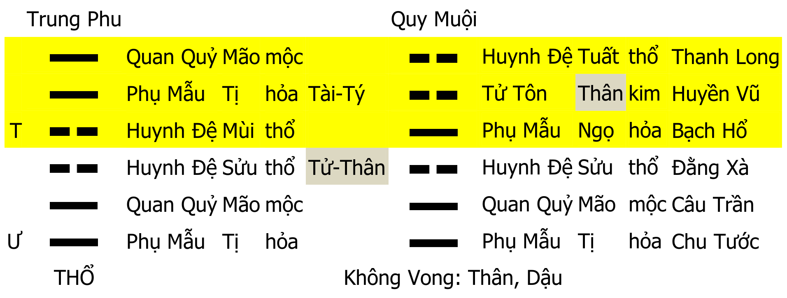
    - **Hình này chứng minh điều gì**
      - Tượng du hồn biến quy hồn biểu thị trước tan sau hợp; tuy nhiên Dụng thần khắc Thế và Phụ Mẫu hóa Không nên hàn gắn thất bại.
    - **Từ đâu mà thấy được**
      - Quẻ Trung Phu (Du Hồn) biến Quy Muội (Quy Hồn); Quan Quỷ Mão mộc động hào 6 khắc Thế Mùi thổ; Phụ Mẫu Tị hỏa động hóa Thân kim Không Vong bị hợp trú.
  - **Phán đoán chi tiết:**
    - Căn cứ: Nữ hỏi về bạn trai lấy Quan Quỷ làm Dụng thần. Quẻ gốc Trung Phu là quẻ Du Hồn, biến sang quẻ Quy Muội là quẻ Quy Hồn; tổ hợp Du Hồn biến Quy Hồn mang hình tượng "trước tan sau hợp". Trong quẻ Quan Quỷ lưỡng hiện, lấy hào Quan Quỷ Mão mộc phát động tại hào 6 làm Dụng thần. Hào Thế Mùi thổ là Mộ khố của Dụng thần. Hào 5 Phụ Mẫu Tị hỏa phát động sinh trợ hào Thế.
    - Nhìn vào:
      - Dụng thần Quan Quỷ Mão mộc không được Nhật Nguyệt (Đinh Sửu, Ngọ nguyệt) trợ giúp, lại phát động tại hào 6 — vị trí thoái hưu, hào trên cùng của quẻ — biểu thị mối quan hệ giữa hai người đã thực sự đi tới hồi kết. Quẻ gốc là Du Hồn chủ về phân ly, chia rẽ, cho thấy thực tế hai người đã chia tay.
      - Tuy nhiên quẻ biến nhập Quy Hồn, biểu thị nhân duyên vẫn còn cơ hội kết nối lại, hai bên có thể gặp mặt hoặc liên lạc với nhau thêm một lần nữa.
      - Hào Thế Mùi thổ là Mộ khố của Dụng thần Mão mộc, thể hiện rõ tâm lý của người nữ vẫn còn tha thiết, mong muốn giữ chặt và chiếm lấy đối phương.
      - Trái lại, Dụng thần Mão mộc phát động quay lại khắc phạt hào Thế Mùi thổ, vạch trần thái độ của người nam vô cùng tuyệt tình, không hề có tình cảm hay ý định quay lại với cô.
      - Hào 5 Phụ Mẫu Tị hỏa phát động, xét về lý ngũ hành có thể tạo thế liên tục tương sinh (Dụng thần Mão mộc sinh Phụ Mẫu Tị hỏa, Tị hỏa sinh Thế Mùi thổ). Phụ Mẫu chủ về ngôn từ, tin nhắn, thư từ, giao tiếp; đồng thời là Nguyên thần của hào Thế (chủ tư duy, suy nghĩ), cho thấy cô gái muốn thông qua trò chuyện chân thành nhằm tháo gỡ bất đồng và hàn gắn quan hệ đối kháng giữa đôi bên.
      - Song đáng tiếc Phụ Mẫu Tị hỏa động hóa Tử Tôn Thân kim lâm Tuần không (ngày Đinh Sửu tuần không Thân, Dậu), lại bị hào biến Thân kim tương hợp níu giữ (Tị Thân lục hợp) nên lâm vào thế hợp trú, không thể dẫn hóa sinh cho hào Thế. Do đó cuộc đối thoại định mệnh này sẽ không mang lại kết quả, đôi bên nói chuyện không hợp ý và hoàn toàn bế tắc.
  - **Ứng nghiệm thực tế:**
    - Quả nhiên ngay trong tháng Ngọ đó, cô gái đã chủ động gọi điện tìm gặp bạn trai; nhưng chỉ vừa trao đổi được vài câu ngắn ngủi thì người nam đã tỏ thái độ lạnh nhạt, bực bội và dứt khoát từ chối, quyết không quay lại với cô.

- **Ví dụ 2:** Ngày Đinh Sửu tháng Ngọ (Tuần không: Thân, Dậu), nữ đoán hôn nhân, được quẻ Trạch Phong Đại Quá tĩnh.
  - **Hình 83.** Quẻ Trạch Phong Đại Quá
    - 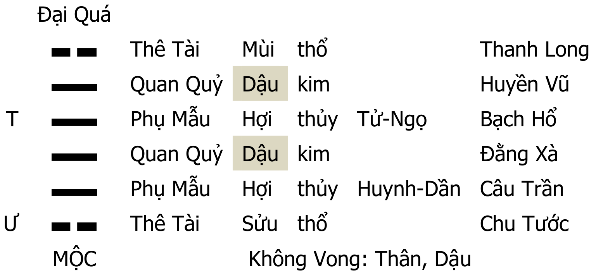
    - **Hình này chứng minh điều gì**
      - Quẻ Du Hồn thể hiện tâm trạng do dự, chần chừ không quyết đoán trước sự theo đuổi của hai đối tượng đàn ông cùng lúc.
    - **Từ đâu mà thấy được**
      - Quẻ Trạch Phong Đại Quá là quẻ Du Hồn; hai hào Quan Quỷ Dậu kim Không Vong kẹp chặt hào Thế Phụ Mẫu Hợi thủy ở hào 4.
  - **Phán đoán chi tiết:**
    - Căn cứ: Nữ xem chuyện hôn nhân lấy Quan Quỷ làm Dụng thần. Quẻ Trạch Phong Đại Quá thuộc nhóm quẻ Du Hồn.
    - Nhìn vào:
      - Trong quẻ xuất hiện hai hào Quan Quỷ Dậu kim tại hào 3 và hào 5, tạo thành thế gọng kìm kẹp chặt hào Thế Phụ Mẫu Hợi thủy ở hào 4 vào chính giữa. Hình tượng này phản ánh thực trạng hiện tại có hai người đàn ông đang vây quanh, cùng tiếp cận và tán tỉnh cô.
      - Cả hai hào Quan Quỷ Dậu kim đều lâm Tuần không (ngày Đinh Sửu tuần không Thân, Dậu), cho thấy cô gái vẫn chưa thể chính thức xác định hay đồng ý nhận lời với bất kỳ người nào.
      - Quẻ Đại Quá là quẻ Du Hồn, phản ánh rõ nét trạng thái tâm lý dao động, chần chừ, "bằng mặt không bằng lòng", do dự không quyết đoán, lúng túng không biết nên chọn ai bỏ ai.
  - **Ứng nghiệm thực tế:**
    - Quả nhiên thực tế diễn ra hoàn toàn đúng như phán đoán; người nữ đang bị kẹt giữa hai người theo đuổi và phân vân khó nghĩ chưa thể quyết định.

- **Ví dụ 3:** Ngày Ất Hợi tháng Dần (Tuần không: Thân, Dậu), người mẹ đoán con trai (40 tuổi) khi nào kết hôn, được quẻ Địa Phong Thăng biến Sơn Phong Cổ.
  - **Hình 84.** Quẻ Địa Phong Thăng biến Sơn Phong Cổ
    - 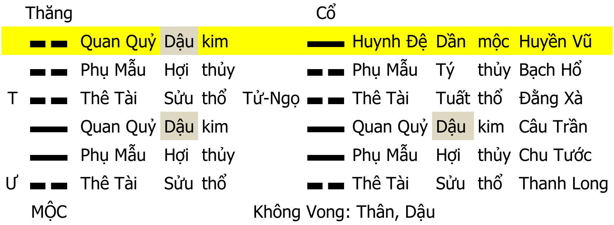
    - **Hình này chứng minh điều gì**
      - Tượng biến Quy Hồn phản ánh người con lệ thuộc hoàn toàn vào mẹ, tính độc lập kém, thần kinh có bệnh không thể tự lập.
    - **Từ đâu mà thấy được**
      - Quẻ biến Sơn Phong Cổ là quẻ Quy Hồn; Tử Tôn Ngọ hỏa lâm Đằng Xà phục dưới hào Thế; Quan Quỷ Dậu kim Không Vong độc phát tại hào 6.
  - **Phán đoán chi tiết:**
    - Căn cứ: Mẹ đoán hôn nhân cho con trai lấy Thê Tài làm Dụng thần (vợ của con); đồng thời bắt buộc phải khảo sát hào Tử Tôn (con trai) nhằm nắm bắt tình trạng nhân thân vì con đã 40 tuổi mà chưa thành gia lập thất. Quẻ biến Cổ là quẻ Quy Hồn.
    - Nhìn vào:
      - Trong quẻ Thê Tài Sửu thổ lưỡng hiện, lấy Thê Tài Sửu thổ trì Thế làm Dụng thần. Dụng thần Sửu thổ không được Nhật Nguyệt trợ giúp, lại bị Nguyệt kiến Dần mộc khắc thương nặng nề nên hôn sự rất khó thành tựu.
      - Con trai đã đến tuổi 40 chưa lấy vợ là biểu hiện bất thường, do đó phải truy xét hào Tử Tôn. Hào Tử Tôn Ngọ hỏa lâm Đằng Xà phục tàng dưới hào Thế Sửu thổ. Đằng Xà chủ về sự cổ quái, kỳ dị, tâm thần bất ổn.
      - Hào 6 Quan Quỷ Dậu kim lâm Tuần không độc phát hóa Dần mộc. Hào độc phát biểu thị nguồn cơn sâu xa; hào 6 là vị trí đỉnh đầu, Quan Quỷ chủ về bệnh tật. Sự phát động của Quan Quỷ ở hào 6 chỉ rõ đầu óc, hệ thần kinh của người con trai có dị tật, bệnh lý.
      - Tử Tôn Ngọ hỏa phục tàng dưới hào Thế (người mẹ), cho thấy người con bám chặt lấy mẹ, không thể sống thiếu sự chăm sóc của mẹ.
      - Quẻ biến Cổ là quẻ Quy Hồn; bản chất của Quy Hồn là "quy phục cố thổ, không rời khỏi gia đình, thu mình về nhà cũ", chứng tỏ người con trai này hoàn toàn không có khả năng bước ra xã hội tự lập bôn ba, tính độc lập sinh hoạt cực kỳ yếu kém.
  - **Ứng nghiệm thực tế:**
    - Người mẹ bùi ngùi thừa nhận con trai bị thiểu năng/bệnh thần kinh không thể tự chăm sóc bản thân. Bà tha thiết muốn tìm cho con một người vợ chỉ với hy vọng sau khi bà qua đời thì có người tiếp tục chăm lo bữa ăn giấc ngủ cho con mình.

- **Ví dụ 4:** Ngày Bính Tuất tháng Tuất năm Ất Dậu (Tuần không: Ngọ, Mùi), nữ đoán theo đuổi người nam có thành không, được quẻ Sơn Lôi Di biến Thiên Lôi Vô Vọng.
  - **Hình 85.** Quẻ Sơn Lôi Di biến Thiên Lôi Vô Vọng
    - 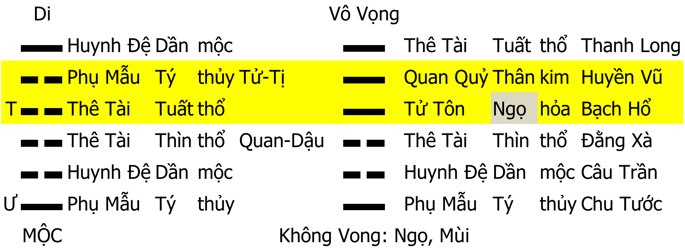
    - **Hình này chứng minh điều gì**
      - Quẻ Du Hồn thể hiện sự si mê mù quáng, đối phương có nhiều cô gái vây quanh và đã có bạn gái nên việc theo đuổi thất bại.
    - **Từ đâu mà thấy được**
      - Quẻ gốc Sơn Lôi Di là quẻ Du Hồn; Dụng thần Quan Quỷ Dậu kim phục dưới hào 3 được Nhật Nguyệt, Thế và Phi thần cùng sinh quá vượng; hào 5 động hóa Quan Quỷ Thân kim.
  - **Phán đoán chi tiết:**
    - Căn cứ: Nữ đoán tình duyên lấy Quan Quỷ làm Dụng thần. Quẻ gốc Sơn Lôi Di là quẻ Du Hồn.
    - Nhìn vào:
      - Quan Quỷ Dậu kim phục tàng dưới hào 3 Thê Tài Thìn thổ. Xét tương quan ngũ hành: Dụng thần được Nhật Nguyệt Tuất thổ tương sinh, hào Thế Thê Tài Tuất thổ phát động tới sinh, Phi thần Thê Tài Thìn thổ cũng sinh Dụng thần. Các hào Thê Tài (đại diện cho phụ nữ) sinh Dụng thần quá nhiều tạo thành thế "Nguyên thần thái quá trái lại bất lợi". Điều này chứng minh chàng trai rất đào hoa, có vô số cô gái vây quanh theo đuổi, bản thân người nữ này khó lòng cạnh tranh nổi.
      - Hào Thế Thê Tài Tuất thổ phát động sinh Quan Quỷ Dậu kim, lại ngự trong quẻ Du Hồn (Di), mang ý nghĩa "chết mê chết mệt, say đắm quên mình", cho thấy cô gái yêu đối phương một cách mù quáng, si tình đến mức mất kiểm soát.
      - Hào 5 Phụ Mẫu Tý thủy động hóa Quan Quỷ Thân kim: Quan Quỷ mới xuất hiện tại hào biến tượng trưng cho đối tượng mới, báo hiệu phải đợi đến năm Tý (khi thực hào động Tý thủy) cô mới có thể gặp gỡ và bắt đầu mối tình thực sự của đời mình.
  - **Ứng nghiệm thực tế:**
    - Quả nhiên cô gái dũng cảm chủ động bày tỏ tình cảm nhưng bị chàng trai thẳng thừng từ chối vì anh ta vốn dĩ đã có người yêu.

- **Ví dụ 5:** Ngày Nhâm Tuất tháng Hợi (Tuần không: Tý, Sửu), nữ đoán quan hệ với bạn trai phát triển ra sao, được quẻ Thủy Thiên Nhu biến Địa Thiên Thái.
  - **Hình 86.** Quẻ Thủy Thiên Nhu biến Địa Thiên Thái
    - 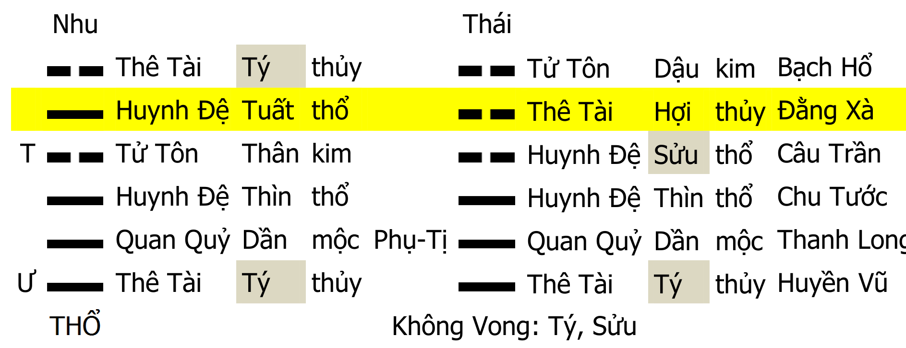
    - **Hình này chứng minh điều gì**
      - Quẻ Du Hồn báo hiệu tình cảm rạn nứt, đối phương muốn chia tay do vướng mắc gia đình (đã có vợ).
    - **Từ đâu mà thấy được**
      - Quẻ Thủy Thiên Nhu là quẻ Du Hồn; Quan Quỷ Dần mộc hợp Nguyệt kiến Hợi thủy (Thê Tài); Phụ Mẫu Tị hỏa phục tàng nhập Mộ; Huynh Đệ Thìn thổ lâm Chu Tước ám động; hào Ứng Không Vong.
  - **Phán đoán chi tiết:**
    - Căn cứ: Nữ hỏi về bạn trai lấy Quan Quỷ làm Dụng thần. Quẻ Thủy Thiên Nhu thuộc nhóm quẻ Du Hồn.
    - Nhìn vào:
      - Quan Quỷ Dần mộc tại hào 2 được Nguyệt kiến Hợi thủy sinh phù là vượng tướng. Hào Phụ Mẫu Tị hỏa phục tàng dưới Dụng thần, không hiện trên quẻ, lại nhập Mộ ở Nhật kiến Tuất thổ và hào 5 Huynh Đệ Tuất thổ động. Phụ Mẫu chủ về giấy tờ hôn thú; việc Phụ Mẫu phục tàng nhập Mộ là dấu hiệu điển hình của việc hai người đang sống thử mà không kết hôn (vị hôn đồng cư).
      - Nguyệt kiến Hợi thủy là Thê Tài (người vợ hợp pháp) nhị hợp với Dụng thần Quan Quỷ Dần mộc (Dần Hợi lục hợp), chứng minh người bạn trai này thực chất là người đàn ông đã có vợ con đề huề.
      - Hào Ứng Thê Tài Tý thủy lâm Tuần không (ngày Nhâm Tuất tuần không Tý, Sửu), chỉ ra đối phương không hề thật lòng thật dạ gắn bó với cô.
      - Quẻ chính Thủy Thiên Nhu là quẻ Du Hồn, chủ về chia ly, ly tán, rời xa; phản ánh ý định của người nam muốn dứt bỏ, chia tay cô.
      - Hào 3 Huynh Đệ Thìn thổ lâm Chu Tước bị Nhật Tuất xung thành ám động; Chu Tước chủ về khẩu thiệt tranh chấp, biểu thị giữa hai người đã bùng phát mâu thuẫn cãi vã dữ dội. Thêm vào đó Nguyên thần Không Vong, Cừu thần phát động, mối quan hệ không cách nào duy trì lâu dài.
  - **Ứng nghiệm thực tế:**
    - Người bạn trai quả thực đã có vợ và kiên quyết không chịu ly hôn, chủ động đòi cắt đứt quan hệ tình cảm với cô gái. Đôi bên nổ ra tranh cãi kịch liệt, sau đó dứt khoát chia tay.

- **Ví dụ 6:** Ngày Kỷ Hợi tháng Mão năm Bính Tuất (Tuần không: Thìn, Tị), nam đoán cãi nhau với vợ ra sao, được quẻ Địa Hỏa Minh Di biến Địa Thiên Thái.
  - **Hình 87.** Quẻ Địa Hỏa Minh Di biến Địa Thiên Thái
    - 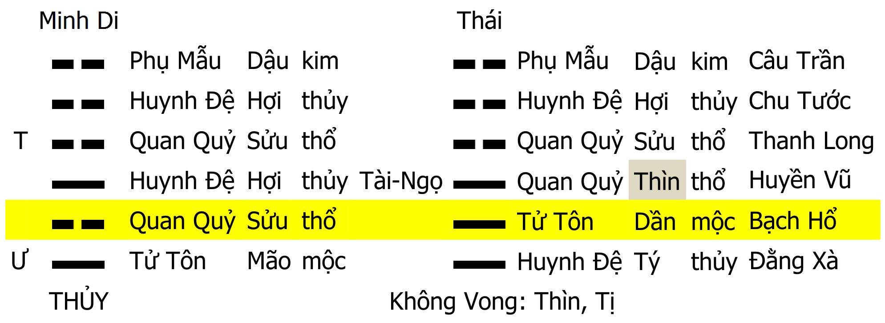
    - **Hình này chứng minh điều gì**
      - Quẻ Du Hồn kết hợp Dụng thần phục tàng thể hiện vợ giận bỏ nhà trốn đi do bị chồng bạo lực, tâm trạng người chồng suy sụp u uất.
    - **Từ đâu mà thấy được**
      - Quẻ Minh Di là quẻ Du Hồn; Thê Tài Ngọ hỏa phục dưới hào 3 Huynh Đệ Hợi thủy bị Phi thần khắc; Quan Quỷ Sửu thổ lâm Bạch Hổ động tại hào 2 hóa Dần mộc; Phụ Mẫu Dậu kim Nguyệt phá nhập Mộ.
  - **Phán đoán chi tiết:**
    - Căn cứ: Nam hỏi về chuyện vợ chồng lấy Thê Tài làm Dụng thần. Quẻ Địa Hỏa Minh Di là quẻ Du Hồn.
    - Nhìn vào:
      - Thê Tài Ngọ hỏa không hiện trên quẻ, phục tàng dưới hào 3 Huynh Đệ Hợi thủy. Dụng thần được Nguyệt kiến Mão mộc sinh nhưng bị Nhật kiến Hợi thủy khắc, suy vượng khó phân. Phi thần Huynh Đệ Hợi thủy khắc chặt Phục thần Thê Tài Ngọ hỏa là điềm hung.
      - Dụng thần phục tàng tượng trưng cho việc lẩn tránh, trốn mặt; kết hợp quẻ Du Hồn chủ về ra đi, tha hương, chứng tỏ người vợ sau cơn cãi vã đã phẫn nộ bỏ nhà trốn đi biệt tích.
      - Hào 2 Quan Quỷ Sửu thổ lâm Bạch Hổ độc phát. Độc phát chỉ ra cội nguồn biến cố; Bạch Hổ chủ về vũ lực, ẩu đả, thương tích, vạch trần việc người chồng đã động tay động chân đánh vợ khiến cô ấy uất ức bỏ đi.
      - Hào độc phát Sửu thổ động hóa Tử Tôn Dần mộc ứng vào mốc thời gian: mâu thuẫn vợ chồng bắt đầu gay gắt từ tháng Sửu năm ngoái, sang đến tháng Dần đầu năm nay thì người vợ chính thức bỏ trốn.
      - Hào 6 Phụ Mẫu Dậu kim bị Nguyệt phá (tháng Mão xung Dậu), lại nhập Mộ ở Thái tuế Tuất thổ. Phụ Mẫu là tin tức, điện thoại, giấy tờ; bị phá nhập Mộ chứng tỏ hiện tại đứt đoạn liên lạc, gọi điện thoại không thể kết nối.
      - Quẻ Du Hồn còn phản ánh tâm thế người chồng: tinh thần rệu rã, hoang mang, thất thần, uể oải suy sụp. Nguyên thần của hào Thế Sửu thổ chính là Thê Tài Ngọ hỏa; Nguyên thần chủ tư duy, tâm tưởng, cho thấy tâm trí anh ta giờ đây đều đặt hết vào người vợ. Hỏa bị Thủy khắc tại hào 3 (chủ trái tim), khiến trong lòng anh ta bứt rứt, cắn rứt khôn nguôi.
      - Thê Tài Ngọ hỏa phục tàng sinh hào Thế Sửu thổ: Trong thâm tâm người vợ thực ra vẫn muốn quay về. Tuy nhiên Phi thần Huynh Đệ Hợi thủy khắc Phục thần khiến Thê Tài không thể xuất đầu lộ diện. Hào 3 là hào vị Huynh Đệ, Huynh Đệ đại diện cho anh chị em, nghĩa là anh chị em bên nhà vợ quyết liệt can ngăn, không cho cô ấy quay lại. Năm Bính Tuất Huynh Đệ chưa quá vượng nên chưa dứt hẳn; sang năm Đinh Hợi (2007) Thái tuế Hợi thủy trợ lực cho Phi thần cực vượng, tất khó tránh khỏi họa ly hôn.
  - **Ứng nghiệm thực tế:**
    - Toàn bộ phán đoán đều linh nghiệm chuẩn xác; người vợ bặt vô âm tín, và đúng sang năm Đinh Hợi hai người chính thức ra tòa ly hôn.

- **Ví dụ 7:** Ngày Kỷ Hợi tháng Mão năm Quý Mùi (Tuần không: Thìn, Tị), nữ sống chung với người đàn ông đã ly hôn, nay con cái anh ta muốn cha về ở cùng nên hai người tạm xa nhau; cô hỏi sau này anh ta có trở lại không? Được quẻ Địa Thủy Sư.
  - **Hình 88.** Quẻ Địa Thủy Sư
    - 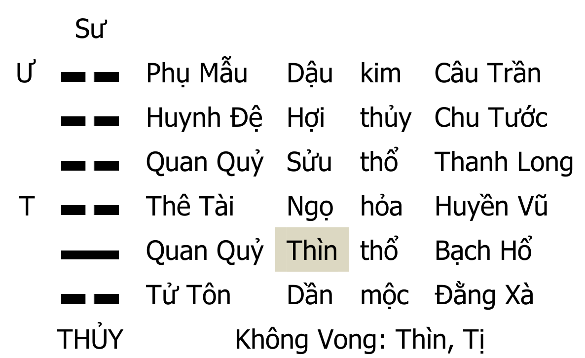
    - **Hình này chứng minh điều gì**
      - Quẻ Quy Hồn chủ tái hợp, quay về đoàn tụ và ở chung sau thời gian chia cách.
    - **Từ đâu mà thấy được**
      - Quẻ Địa Thủy Sư là quẻ Quy Hồn; hào Thế Thê Tài Ngọ hỏa lâm Huyền Vũ tại hào 3; Quan Quỷ Thìn thổ Không Vong được Thế sinh; ứng kỳ xung thực năm Bính Tuất.
  - **Phán đoán chi tiết:**
    - Căn cứ: Nữ hỏi về người tình/bạn trai lấy Quan Quỷ làm Dụng thần. Quẻ Địa Thủy Sư thuộc nhóm quẻ Quy Hồn.
    - Nhìn vào:
      - Hào Thế Thê Tài Ngọ hỏa lâm Huyền Vũ ngự tại hào 3; Huyền Vũ chủ sự mập mờ kín đáo, hào 3 là vị trí nội thất cửa ngõ; tổ hợp này khắc họa rõ nét cảnh hai người chung sống không hôn thú (vị hôn đồng cư).
      - Trong quẻ Quan Quỷ lưỡng hiện (Sửu thổ tại hào 4 và Thìn thổ tại hào 2), lấy Quan Quỷ Thìn thổ lâm Tuần không (ngày Kỷ Hợi tuần không Thìn, Tị) làm Dụng thần.
      - Hào Thế Ngọ hỏa tương sinh Quan Quỷ Thìn thổ, chứng tỏ bản thân cô gái rất tha thiết muốn tiếp tục gắn bó và chung sống với anh ta.
      - Tuy nhiên Dụng thần Thìn thổ đang lâm Không Vong, chỉ rõ trước mắt chưa thể đoàn tụ. Kỵ thần Huynh Đệ Hợi thủy được Nhật Nguyệt sinh phù vượng tướng, Dụng thần lâm hưu tù, nên trong ngắn hạn chưa thể toại nguyện.
      - Thế nhưng quẻ Địa Thủy Sư là quẻ Quy Hồn. Quy Hồn mang hàm nghĩa cốt tử là "hồi tâm chuyển ý, quy phục, quay về chốn cũ, tái hợp, hòa giải, lại ở chung", khẳng định chắc chắn sẽ có ngày hai người trở về sống bên nhau.
      - Việc lâu dài lấy năm (Thái tuế) làm ứng kỳ. Dụng thần Thìn thổ lâm Không Vong, phải đợi đến năm Bính Tuất (2006) khi Thái tuế Tuất thổ xung thực Thìn thổ mới có cơ hội tái hợp thành công.
  - **Ứng nghiệm thực tế:**
    - Quả nhiên phải chờ đến đúng năm Bính Tuất (2006), người đàn ông mới quay trở lại và hai người tiếp tục chung sống hạnh phúc bên nhau.

- **Ví dụ 8:** Ngày Canh Thân tháng Tý (Tuần không: Tý, Sửu), nam đoán theo đuổi người nữ ra sao, được quẻ Sơn Lôi Di biến Phong Lôi Ích.
  - **Hình 89.** Quẻ Sơn Lôi Di biến Phong Lôi Ích
    - 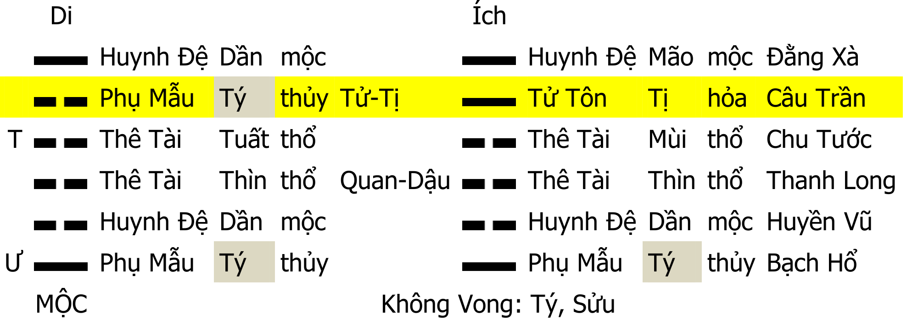
    - **Hình này chứng minh điều gì**
      - Quẻ Du Hồn chỉ ra tính cách cô gái rất cởi mở, phóng khoáng trong tình ái; quẻ vạch rõ cô gái không còn trinh trắng và có tật khúc xạ ở mắt.
    - **Từ đâu mà thấy được**
      - Quẻ Sơn Lôi Di là quẻ Du Hồn; Thê Tài Thìn thổ phục dưới Đào hoa Quan Quỷ Dậu kim; Huynh Đệ Dần mộc ám động khắc Tài; Phụ Mẫu Tý thủy độc phát tại hào 5 hóa Tử Tôn Tị hỏa.
  - **Phán đoán chi tiết:**
    - Căn cứ: Nam đoán việc theo đuổi phụ nữ lấy Thê Tài làm Dụng thần. Quẻ gốc Sơn Lôi Di là quẻ Du Hồn.
    - Nhìn vào:
      - Trong quẻ Thê Tài lưỡng hiện (Thê Tài Tuất thổ trì Thế tại hào 4 và Thê Tài Thìn thổ tại hào 3). Hào Thế là bản thân người gieo quẻ, do đó lấy Thê Tài Thìn thổ ngoài hào Thế làm Dụng thần (cô gái được theo đuổi).
      - Hào Ứng Phụ Mẫu Tý thủy là thông tin đối phương, lâm Tuần không (ngày Canh Thân tuần không Tý, Sửu). Phụ Mẫu là giấy kết hôn, lâm Không biểu thị cô gái chưa từng kết hôn, hiện độc thân.
      - Về phía người nam: Thê Tài Tuất thổ trì Thế; đàn ông gieo quẻ mà hào Thế mang Thê Tài biểu thị bản thân người hỏi vốn dĩ đã có vợ con.
      - Dụng thần Thê Tài Thìn thổ phục tàng dưới Quan Quỷ Dậu kim. Thân Tý Thìn hợp cục đào hoa tại Dậu, do đó Dậu kim chính là Đào hoa Quan Quỷ. Lại có Huynh Đệ Dần mộc lưỡng hiện bị Nhật Thân xung thành ám động kịch liệt khắc Dụng thần. Tổ hợp này chứng minh cô gái đã không còn là trinh nữ, trước đó đã từng quan hệ tình ái với nhiều người đàn ông nhanh chân đến trước.
      - Quẻ gốc là quẻ Du Hồn, chủ về tư tưởng cởi mở, phóng túng, biểu thị cô gái này có quan niệm tình cảm và lối sống rất thoáng, dễ dãi.
      - Hào 5 Phụ Mẫu Tý thủy độc phát khắc Nguyên thần hỏa của hào Thế (Tử Tôn hỏa). Ngũ hành hỏa chủ về thị giác, đôi mắt; hào độc phát khắc hỏa lại động hóa xuất hiện Tử Tôn Tị hỏa, tổ hợp này là dấu hiệu điển hình chỉ ra mắt của cô gái có tật khúc xạ và phải đeo kính mắt.
  - **Ứng nghiệm thực tế:**
    - Mọi luận đoán về tình trạng gia cảnh hai bên, thân phận không còn trinh trắng, tính cách cởi mở và đặc điểm đeo kính mắt của cô gái đều hoàn toàn trùng khớp với thực tế.

### CHƯƠNG 14: ỨNG DỤNG CỦA 12 CUNG TRƯỜNG SINH

#### Ý nghĩa tượng trưng của 12 cung Trường Sinh trong dự đoán hôn nhân

- **Vai trò của 12 cung Trường Sinh trong dự đoán Lục Hào:**
  - 12 cung Trường Sinh là một bộ phận lý luận then chốt không thể thiếu trong dự đoán Lục Hào nói chung và dự đoán nhân duyên hôn nhân nói riêng.
  - Trong dự đoán hôn nhân, 12 cung Trường Sinh chủ yếu được vận dụng linh hoạt để định vị tính cách, trạng thái tâm lý, mức độ quan hệ tình cảm, hoàn cảnh gia đình cũng như tương quan tuổi tác giữa hai bên.

- **Chi tiết hàm nghĩa tượng trưng của từng cung vị:**
  - **Trường Sinh (Sinh trưởng, bắt đầu và chỗ dựa):**
    - Hàm nghĩa tượng trưng: trợ giúp, dựa vào, chỗ dựa, cho ăn, cội nguồn, gốc rễ, nguyên thủy, sản sinh, tìm kiếm, được, phát sinh, bắt đầu, tuổi trẻ,...
    - Ứng dụng nhân duyên: biểu thị tình cảm mới bắt đầu nảy nở, đối phương là chỗ dựa tin cậy, tuổi tác trẻ trung, hoặc mối quan hệ nhận được sự nâng đỡ, vun đắp từ người khác.
  - **Mộc Dục (Tắm gội, trần trụi và dục vọng):**
    - Hàm nghĩa tượng trưng: tắm rửa, vào nước, lõa thể, dâm loạn, dâm tục, cởi quần áo, ơn trạch, chỗ tốt, có lợi, bại lộ, trọc lốc, sạch sẽ, bóng loáng, hưởng thụ, thẳng thắn, ngủ, đổ nát, khó coi, vô liêm sỉ, ngoại tình, háo sắc, thoải mái, chăm sóc,...
    - Ứng dụng nhân duyên: chủ về người có tính phong lưu, đào hoa, quan hệ tình ái lén lút, sống buông thả, ngoại tình hoặc hành vi tình dục ám muội không đứng đắn.
  - **Quan Đới (Trang phục, chuẩn bị và che giấu):**
    - Hàm nghĩa tượng trưng: mặc quần áo, chuẩn bị, không cởi quần áo, trang điểm, đóng gói, trang sức, quần áo, đội mũ, che đậy, che giấu, bề ngoài, cao quý,...
    - Ứng dụng nhân duyên: biểu thị người chú trọng hình thức bên ngoài, tính cách cao quý, hoặc có khuynh hướng che đậy những khuyết điểm, bí mật trong quan hệ tình cảm.
  - **Lâm Quan (Thành danh, công quyền và tự lập):**
    - Hàm nghĩa tượng trưng: quan phủ, có bệnh, tai họa, có đàn ông ở bên cạnh, làm quan, có địa vị, công chức, tự lực cánh sinh, tự mình nỗ lực, trưởng thành, sắp thành công, quốc doanh, nguy hiểm,...
    - Ứng dụng nhân duyên: biểu thị đối phương là người có địa vị, làm việc trong cơ quan nhà nước (công chức), tính cách tự lập tự cường, hoặc người phụ nữ bên cạnh đã có đàn ông.
  - **Đế Vượng (Đỉnh cao, cường thịnh và cực điểm):**
    - Hàm nghĩa tượng trưng: vinh phát, phát đạt, đắc ý, tinh thần, hưng phấn, thần khí, mạnh mẽ, hùng tráng, cao to, am hiểu, lớn mạnh, huy hoàng, phát triển, lên cao, có quyền, cực hạn, cao trào, đỉnh điểm, cường tráng, tuổi trẻ,...
    - Ứng dụng nhân duyên: chỉ người tính tình mạnh mẽ, quyền thế, vóc dáng cao to, tình cảm đang ở giai đoạn nồng nhiệt tột đỉnh; tuy nhiên quá vượng dễ chuyển sang suy thoái nếu không biết nhẫn nhịn.
  - **Suy (Thoái trào, yếu ớt và suy nhược):**
    - Hàm nghĩa tượng trưng: không có sức, mềm yếu, suy nhược, nhỏ yếu, sa sút, nhược trí, suy tàn, sức yếu, xui xẻo, lùi bước, không chỗ dựa, nhược điểm, nhát gan, suy yếu, thấp bé, vô năng, không bản lĩnh, vô học, cao không với tới thấp không bằng lòng, không dám phản kháng, nhỏ tuổi,...
    - Ứng dụng nhân duyên: chỉ người thiếu bản lĩnh, người già cả đã qua thời thanh xuân sung sức, tính tình nhu nhược, nhút nhát hoặc không có tiếng nói trong hôn nhân.
  - **Bệnh (Khiếm khuyết, tật xấu và tâm bệnh):**
    - Hàm nghĩa tượng trưng: bệnh tật, ổ bệnh, chán ghét, căm hận, kẻ thù, coi là kẻ thù, chỗ thiếu sót, khuyết điểm, khiếm khuyết, tật xấu, nhược điểm, sơ hở, nắm đằng chuôi, chỗ yếu, tâm bệnh, vấn đề,...
    - Ứng dụng nhân duyên: chủ về đối phương mang tật xấu khó bỏ, thân mang bệnh tật, hoặc hai bên có hiềm khích coi nhau như cừu địch, hôn nhân tồn tại ung nhọt tâm lý.
  - **Tử (Bế tắc, chết chóc và ngõ cụt):**
    - Hàm nghĩa tượng trưng: tử vong, đi vào chỗ bế tắc, không linh hoạt, không thể biến báo, ngưng lại, chung kết, xong đời, cứng đầu, không có chỗ trống, không có sinh khí, không có sức sống, khô khan, vụng về, nghĩ không ra, lòng dạ hẹp hòi, không có đường lui, trống trải, yên tĩnh, đáng sợ, thất bại,...
    - Ứng dụng nhân duyên: chỉ hôn nhân rơi vào bế tắc hoàn toàn không thể cứu vãn, tình cảm nguội lạnh, suy nghĩ quẩn quanh cố chấp, là dấu hiệu chắc chắn của sự ly hôn.
  - **Mộ (Bao bọc, giam hãm và quản chế):**
    - Hàm nghĩa tượng trưng: bao dung, cất giữ, đóng kín, thu thập, gửi, quản chế, thuộc về, khống chế, thao túng, chỉ huy, bao hàm, bao quát, cạm bẫy, không tự do, mê ly, bị quản thúc, ẩn giấu, bảo vệ, hộ vệ, quyền cho phép, ảm đạm, hồ đồ, hắc ám, không trôi chảy, không thông suốt, kết thúc, trở ngại,...
    - Ứng dụng nhân duyên: tượng sống chung che giấu, bị đối phương quản thúc chặt chẽ mất tự do, hoặc bản thân u uất, lòng dạ hẹp hòi, quan hệ tình cảm rơi vào tăm tối.
  - **Tuyệt (Đoạn tuyệt, cùng đường và tan biến):**
    - Hàm nghĩa tượng trưng: không có đường lui, chia tay, đoạn tuyệt, thất vọng, nản lòng thoái chí, hết hy vọng, bất lực, vô tình, nghiệt ngã, không dàn xếp, chấm dứt, tan biến, hoàn toàn biến mất,...
    - Ứng dụng nhân duyên: chủ về dứt tình cạn nghĩa, chia tay dứt khoát không còn cơ hội tái hợp, tình cảm hoàn toàn tan biến, đối phương ruồng rẫy tuyệt tình.
  - **Thai (Ấp ủ, manh nha và bẩm sinh):**
    - Hàm nghĩa tượng trưng: mang thai, ấp ủ, dự định ban đầu, kế hoạch, hình thành, bẩm sinh, vốn có, trời sinh, bản tính khó dời, sơ cấp, cấu kết, lo lắng, bận tâm, ý nghĩ, ấu trĩ, nhỏ yếu, nhỏ tuổi, cất bước,...
    - Ứng dụng nhân duyên: mang thai thực tế, tình cảm mới manh nha nhen nhóm, hoặc tính cách còn non nớt ấu trĩ, lòng dạ hay lo lắng bận tâm trăn trở.
  - **Dưỡng (Nuôi dưỡng, nâng đỡ và nhỏ tuổi):**
    - Hàm nghĩa tượng trưng: sinh ra, sinh trưởng, ký thác, nhận nuôi, dựa vào, dinh dưỡng, tẩm bổ, giúp đỡ, hoài nghi, không yên tâm, không kiên định, thiếu tự tin, bận tâm, nhận làm con thừa tự, bồi dưỡng, dưỡng dục, nhỏ yếu, nâng đỡ,...
    - Ứng dụng nhân duyên: biểu thị người bạn đời có tuổi tác còn rất nhỏ, tính cách cần được chăm sóc nâng đỡ, hoặc trạng thái tình cảm còn hoài nghi, thiếu sự tin tưởng vững chắc.

#### Các quái lệ thực nghiệm về ứng dụng 12 cung Trường Sinh trong hôn nhân

- **Ví dụ 1: Nữ đoán hôn nhân (Càn Vi Thiên biến Phong Thiên Tiểu Súc)**
  - **Hình 90.** Sơ đồ quẻ Càn Vi Thiên biến Phong Thiên Tiểu Súc
    - 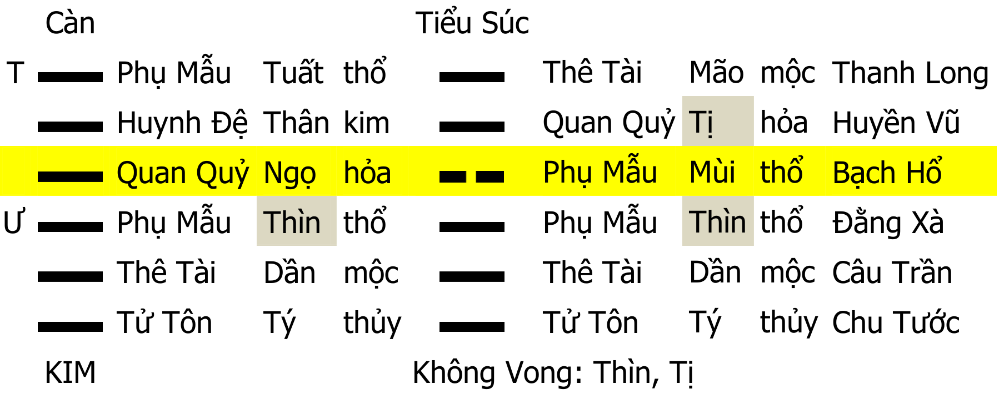
    - **Hình này chứng minh điều gì**
      - Quan Quỷ gặp Nguyệt là Mộc Dục chủ quan hệ người tình ám muội; Phụ Mẫu lâm Không Vong báo hiệu đã ly hôn.
    - **Từ đâu mà thấy được**
      - Hào Ứng Phụ Mẫu Thìn thổ Không Vong (ly hôn năm Thìn); Quan Quỷ Ngọ hỏa độc phát sinh Thế, gặp Nguyệt Mão mộc là Mộc Dục, hóa Phụ Mẫu Mùi thổ hợp.
  - **Thông tin quẻ:**
    - Ngày Bính Thân tháng Mão năm Quý Mùi (Tuần Không: Thìn, Tị).
    - Quẻ Càn Vi Thiên biến Phong Thiên Tiểu Súc.
    - Dụng thần: Quan Quỷ Ngọ hỏa.
  - **Phán đoán chi tiết:**
    - Căn cứ: Lấy Quan Quỷ làm Dụng thần. Hào Ứng là phu vị (vị trí người chồng), Phụ Mẫu là giấy chứng nhận kết hôn, văn thư pháp lý.
    - Nhìn vào:
      - Hào Ứng Phụ Mẫu Thìn thổ lâm Tuần Không: Ứng là phu vị, Phụ Mẫu là giấy chứng nhận kết hôn, Không Vong biểu thị sự mất đi, chính là thông tin ly hôn. Điều này chứng minh hiện tại cô đã ly hôn. Hào Thìn thổ tương ứng với năm Canh Thìn (2000), khẳng định thời điểm ly hôn là năm Canh Thìn.
      - Hào 4 Quan Quỷ Ngọ hỏa độc phát sinh hào Thế Tuất thổ: hiện nay đang có một người đàn ông đối xử rất tốt với đương số.
      - Quan Quỷ Ngọ hỏa gặp Nguyệt kiến Mão mộc là Mộc Dục: theo 12 cung Trường Sinh của Hỏa (Hỏa sinh tại Dần, Mộc Dục tại Mão), Quan Quỷ gặp Mão là lâm đất Mộc Dục. Mộc Dục chủ tắm rửa, trần trụi, phong lưu dâm dục; lại thêm Hương Khuê lâm Huyền Vũ chủ sự việc lén lút ám muội, vì vậy khẳng định người nam này là người tình bí mật chứ không phải quan hệ vợ chồng đường hoàng.
      - Quan Quỷ Ngọ hỏa động hóa ra Phụ Mẫu Mùi thổ tương hợp: Phụ Mẫu là văn thư, giấy kết hôn, việc hợp với Phụ Mẫu biểu thị người đàn ông này bản thân đã có gia đình riêng.
      - Hào biến Mùi thổ lâm Thái Tuế năm Quý Mùi: biểu thị hai người mới quen biết nhau trong năm nay.
      - Quẻ thuần Càn thuộc cung Càn: Càn chủ cơ quan nhà nước, quyền lực công quyền, biểu thị anh ta là công chức, cán bộ nhà nước có chức vụ.
  - **Ứng nghiệm thực tế:**
    - Người phụ nữ xác nhận quả nhiên cô đã ly hôn vào năm Canh Thìn (2000).
    - Đến tháng Dần năm Quý Mùi (2003), cô quen biết một vị lãnh đạo cơ quan nhà nước và hai người đã nảy sinh quan hệ người tình bí mật.

- **Ví dụ 2: Nam đoán chia tay với bạn gái có thể khôi phục quan hệ hay không (Trạch Sơn Hàm biến Lôi Sơn Tiểu Quá)**
  - **Hình 91.** Sơ đồ quẻ Trạch Sơn Hàm biến Lôi Sơn Tiểu Quá
    - 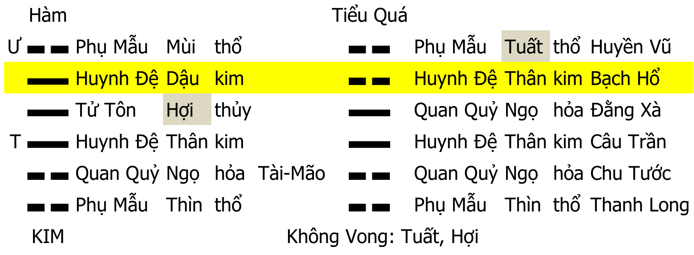
    - **Hình này chứng minh điều gì**
      - Thê Tài nhập Mộ gặp Kỵ thần khắc, khó phục hồi tình cảm; Dụng nhập Mộ bề trên ám muội chỉ quan hệ loạn luân.
    - **Từ đâu mà thấy được**
      - Thê Tài Mão mộc phục hào 2 Ngọ hỏa nhập Mộ Mùi thổ lâm Huyền Vũ ám động; Kỵ thần Dậu kim động hóa Thân kim.
  - **Thông tin quẻ:**
    - Ngày Ất Sửu tháng Thân (Tuần Không: Tuất, Hợi).
    - Quẻ Trạch Sơn Hàm biến Lôi Sơn Tiểu Quá.
    - Dụng thần: Thê Tài Mão mộc.
  - **Phán đoán chi tiết:**
    - Căn cứ: Lấy Thê Tài làm Dụng thần. Thê Tài Mão mộc không hiện trên quẻ, phục tàng dưới hào 2 Quan Quỷ Ngọ hỏa.
    - Nhìn vào:
      - Hào 2 Quan Quỷ Ngọ hỏa là Sàng Trướng (giường chiếu); hào 6 Phụ Mẫu Mùi thổ lâm Huyền Vũ ám động đến hợp với phục thần Thê Tài Mão mộc, biểu thị hai người trước đây đã dọn về chung sống như vợ chồng.
      - Kỵ thần Huynh Đệ Dậu kim phát động hóa Thoái thần Thân kim: tháng Dần xung Thoái thần làm ứng kỳ phát sinh sự việc, do đó phán đoán vào tháng Dần hai người quen nhau và bắt đầu sống chung.
      - Kỵ thần Huynh Đệ phát động nhưng nhập Mộ ở Nhật thần Sửu thổ; đến tháng Mùi xung khai Mộ khố (Sửu Mùi tương xung giải Mộ), đồng thời Mùi thổ cũng chính là Mộ khố của Thê Tài Mão mộc (Thê Tài nhập Mộ chủ rời đi, chôn vùi tình cảm). Vì vậy phán đoán người bạn gái đã bỏ anh ta ra đi vào tháng Mùi.
      - Dụng thần Thê Tài Mão mộc hưu tù, bị Nguyệt kiến Thân kim khắc chế, Nhật thần Sửu thổ không tương trợ, lại thêm Kỵ thần độc phát khắc hại nên hai người rất khó khôi phục lại quan hệ.
      - Kỵ thần Huynh Đệ tại hào 5 phát động đến khắc: hào 5 là hào vị gia trưởng, phụ mẫu, cho thấy nguyên nhân cản trở chủ yếu bắt nguồn từ phía gia trưởng của đối phương.
      - Hào 6 Phụ Mẫu Mùi thổ lâm Huyền Vũ ám động khiến Thê Tài Mão mộc nhập Mộ: Hào 6 là người già, tôn trưởng; Phụ Mẫu chủ bậc cha chú; Mùi là Mộ địa của Mộc; Huyền Vũ chủ sự việc dâm ô, ám muội. Căn cứ vào các tổ hợp thông tin này, tác giả luận đoán người bạn gái có mối quan hệ xác thịt bất chính với chính cha ruột của cô ta.
  - **Ứng nghiệm thực tế:**
    - Quái chủ kinh ngạc xác nhận: Quả nhiên hai người quen nhau từ tháng Dần và dọn về sống chung, đến tháng Mùi thì bạn gái dứt áo ra đi.
    - Về chuyện người cha: Vào năm 2001 (Tân Tị), người bạn gái đã từng có quan hệ xác thịt loạn luân với chính cha đẻ của mình, điều này do chính miệng cô bạn gái tâm sự và thú nhận với anh ta.

- **Ví dụ 3: Nữ 24 tuổi đoán hôn nhân (Thiên Trạch Lý biến Ly Vi Hỏa)**
  - **Hình 92.** Quẻ Thiên Trạch Lý biến Ly Vi Hỏa
    - 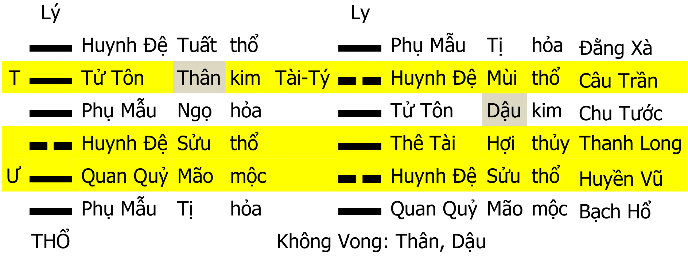
    - **Hình này chứng minh điều gì**
      - Đối phương lớn tuổi lâm Suy địa đã có bạn đời lâu năm; hào Thế Tử Tôn lâm Không cố đoạt lấy nhưng bất thành.
    - **Từ đâu mà thấy được**
      - Quan Quỷ Mão mộc lâm Ứng gặp Nhật Thìn là Suy địa, hợp Nguyệt Tuất thổ; Thế Tử Tôn Thân kim Không Vong khắc Ứng.
  - **Thông tin quẻ:**
    - Ngày Canh Thìn tháng Tuất (Tuần Không: Thân, Dậu).
    - Quẻ Thiên Trạch Lý biến Ly Vi Hỏa.
    - Dụng thần: Quan Quỷ Mão mộc.
  - **Phán đoán chi tiết:**
    - Căn cứ: Lấy Quan Quỷ làm Dụng thần. Quan Quỷ Mão mộc lâm hào Ứng đại diện cho đối tượng khác phái, người hôn phối.
    - Nhìn vào:
      - Dụng thần Quan Quỷ Mão mộc cư hào Ứng: hào Ứng là vị trí vợ chồng, biểu thị cô gái hiện tại đã có mục tiêu theo đuổi cụ thể trong lòng.
      - Dụng thần lâm Huyền Vũ: Huyền Vũ chủ phong nhã, quyến rũ, người nam này có vẻ ngoài rất thu hút phụ nữ.
      - Dụng thần Quan Quỷ Mão mộc gặp Nhật thần Thìn thổ là Suy địa: theo 12 cung Trường Sinh của Mộc (Trường Sinh ở Hợi, Mộc Dục ở Tý, Quan Đới ở Sửu, Lâm Quan ở Dần, Đế Vượng ở Mão, Suy ở Thìn), Mão mộc gặp Thìn thổ là đất Suy. Cung Suy chủ già dặn, sa sút phong độ thanh xuân, biểu thị đối phương là người đàn ông có tuổi tác khá lớn so với cô gái 24 tuổi.
      - Dụng thần Mão mộc và Nguyệt kiến Tuất thổ tương hợp (Mão Tuất lục hợp): Nguyệt kiến đại diện cho khoảng thời gian dài lâu trong quá khứ, tương hợp biểu thị đối phương đã có người phụ nữ gắn bó từ lâu (đã có bạn gái hoặc vợ lâu năm).
      - Dụng thần Quan Quỷ Mão mộc động hóa Huynh Đệ Sửu thổ: Huynh Đệ chủ hao tán tài vật, biểu thị đối phương là người tiêu tiền rất hào phóng, rộng rãi.
      - Hào Thế Tử Tôn Thân kim phát động khắc hào Ứng Quan Quỷ Mão mộc: Thế trì Tử Tôn khắc Quan Quỷ ở hào Ứng (vị trí người khác) thể hiện tâm lý muốn chủ động tranh đoạt người đàn ông từ tay người phụ nữ khác.
      - Nhưng hào Thế Tử Tôn Thân kim lâm Tuần Không: Không Vong chủ hư tâm, trong lòng không hề nắm chắc. Lại thêm Dụng thần hưu tù trong tháng Tuất, do đó việc theo đuổi này chắc chắn thất bại.
  - **Ứng nghiệm thực tế:**
    - Quả nhiên cô gái đem lòng yêu một người đàn ông lớn tuổi đã có người yêu. Người đàn ông đó và bạn gái đã yêu nhau thắm thiết suốt 10 năm qua. Trước sự chủ động tấn công của cô gái trẻ, anh ta hoàn toàn lạnh nhạt, không mảy may để ý tới.

- **Ví dụ 4: Nữ hỏi hôn nhân gia đình (Sơn Phong Cổ biến Tốn Vi Phong)**
  - **Hình 93.** Quẻ Sơn Phong Cổ biến Tốn Vi Phong
    - 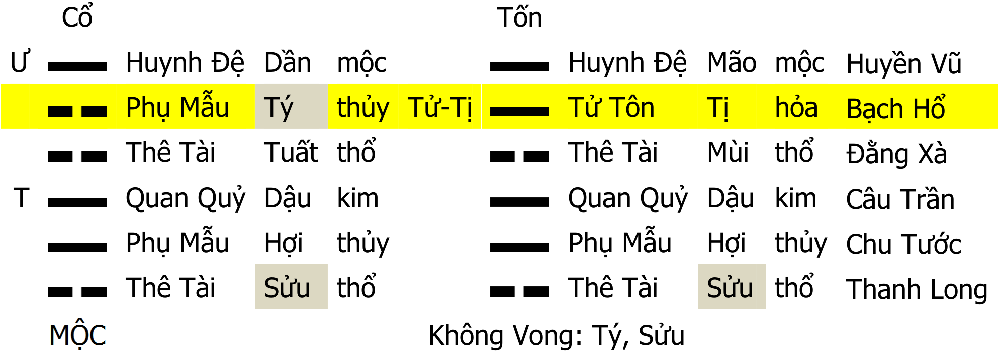
    - **Hình này chứng minh điều gì**
      - Dụng thần gặp Tử địa chỉ hôn nhân lâm vào ngõ cụt; Phụ Mẫu Đào hoa động báo hiệu chồng ngoại tình đòi ly dị.
    - **Từ đâu mà thấy được**
      - Quan Quỷ Dậu kim trì Thế hưu tù; Phụ Mẫu Tý thủy độc phát là Tử địa của Kim; quẻ biến Tốn Vi Phong lục xung.
  - **Thông tin quẻ:**
    - Ngày Giáp Dần tháng Hợi (Tuần Không: Tý, Sửu).
    - Quẻ Sơn Phong Cổ biến Tốn Vi Phong.
    - Dụng thần: Quan Quỷ Dậu kim.
  - **Phán đoán chi tiết:**
    - Căn cứ: Lấy Quan Quỷ làm Dụng thần. Quan Quỷ Dậu kim trì Thế.
    - Nhìn vào:
      - Quan Quỷ Dậu kim trì Thế: biểu thị người vợ trong lòng vẫn còn tha thiết níu giữ, nghĩ đến chồng và gia đình.
      - Dụng thần Quan Quỷ Dậu kim tuyệt tại Nhật thần Dần mộc, tiết khí sinh tháng Hợi nên hưu tù vô khí, tình cảnh hết sức bất lợi.
      - Hào 5 Phụ Mẫu Tý thủy độc phát: theo 12 cung Trường Sinh của Kim (Kim Trường Sinh ở Tị, Mộc Dục ở Ngọ, Quan Đới ở Mùi, Lâm Quan ở Thân, Đế Vượng ở Dậu, Suy ở Tuất, Bệnh ở Hợi, Tử ở Tý), Dụng thần Kim gặp Tý thủy chính là lâm đất Tử (Tử địa). Tượng Tử chủ bế tắc, diệt vong, không thể xoay chuyển, cho thấy cuộc hôn nhân đã đi vào ngõ cụt hoàn toàn, không cách nào duy trì được nữa.
      - Phụ Mẫu là giấy chứng nhận kết hôn: Dụng thần Tử tại Phụ Mẫu biểu thị tờ giấy kết hôn bị khai tử, tức muốn ly hôn.
      - Hào phát động Tý thủy là Đào hoa: Đào hoa phát động chủ chuyện ngoại tình ong bướm; biểu thị người chồng vì vướng vào tình nhân bên ngoài mà kiên quyết đòi ly hôn với cô.
      - Dụng thần hưu tù gặp Tử địa, lại quẻ biến Tốn Vi Phong là quẻ thuần bát thuần (lục xung quái): lục xung chủ tan vỡ chia lìa, khẳng định chắc chắn phải ly hôn.
  - **Ứng nghiệm thực tế:**
    - Người vợ đau đớn xác nhận đúng là người chồng đã mê mệt một người phụ nữ nước ngoài và kiên quyết đòi ly hôn để đến với người tình ngoại quốc.

- **Ví dụ 5: Nam đoán quan hệ với người nữ có thành hay không (Hỏa Trạch Khuê biến Lôi Trạch Quy Muội)**
  - **Hình 94.** Quẻ Hỏa Trạch Khuê biến Lôi Trạch Quy Muội
    - 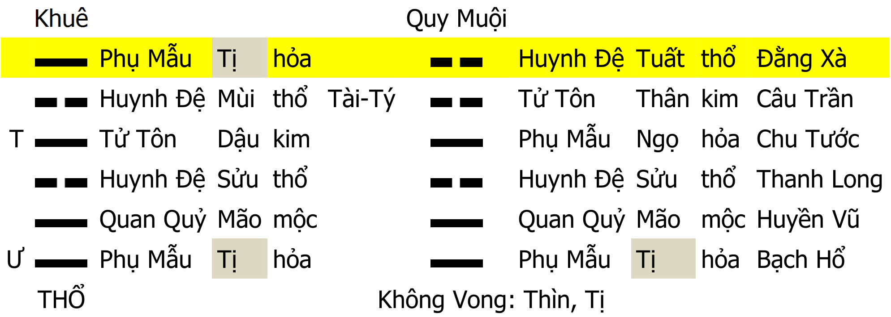
    - **Hình này chứng minh điều gì**
      - Dụng thần Thê Tài phục tàng lâm Tuyệt địa báo hiệu duyên dứt; Nhật thần hợp Tài chỉ đối phương có tình mới.
    - **Từ đâu mà thấy được**
      - Thê Tài Tý thủy phục hào 5 Mùi thổ, bị Nguyệt Tị khắc; hào 6 Phụ Mẫu Tị hỏa độc phát là Tuyệt địa của Thủy.
  - **Thông tin quẻ:**
    - Ngày Tân Sửu tháng Tị (Tuần Không: Thìn, Tị).
    - Quẻ Hỏa Trạch Khuê biến Lôi Trạch Quy Muội.
    - Dụng thần: Thê Tài Tý thủy.
  - **Phán đoán chi tiết:**
    - Căn cứ: Lấy Thê Tài làm Dụng thần. Thê Tài Tý thủy không hiện trên quẻ, phục tàng dưới hào 5 Huynh Đệ Mùi thổ.
    - Nhìn vào:
      - Dụng thần Thê Tài Tý thủy ở tháng Tị bị tuyệt khí, ngày Sửu bị khắc, không được Nhật Nguyệt sinh trợ là hưu tù vô khí.
      - Thê Tài phục tàng: phục tàng chủ ẩn trốn, né tránh, biểu thị đối phương đang cố tình tránh mặt, không muốn gặp gỡ quái chủ.
      - Nhật thần Sửu thổ hợp với Dụng thần Tý thủy (Tý Sửu lục hợp): Nhật thần Sửu thổ là Thổ, cũng là Huynh Đệ trong quẻ; Huynh Đệ chủ bạn bè, đối thủ cạnh tranh tình cảm. Nhật thần hợp Dụng thần cho thấy đã có người đàn ông khác chen vào và chiếm được tình cảm của cô gái.
      - Hào 6 Phụ Mẫu Tị hỏa độc phát: theo 12 cung Trường Sinh của Thủy (Thủy Trường Sinh ở Thân, Mộc Dục ở Dậu, Quan Đới ở Tuất, Lâm Quan ở Hợi, Đế Vượng ở Tý, Suy ở Sửu, Bệnh ở Dần, Tử ở Mão, Mộ ở Thìn, Tuyệt ở Tị), Thủy gặp Tị hỏa chính là đất Tuyệt (Tuyệt địa). Hào độc phát là xu hướng kết quả; Dụng thần lâm Tuyệt địa khẳng định hai người không thể có kết quả tốt đẹp, quan hệ dứt khoát chấm dứt.
  - **Ứng nghiệm thực tế:**
    - Quả nhiên phía người nữ đã đem lòng yêu người đàn ông khác và chủ động chia tay với quái chủ.

- **Ví dụ 6: Nam đoán hôn nhân gia đình (Tốn Vi Phong biến Thiên Trạch Lý)**
  - **Hình 95.** Quẻ Tốn Vi Phong biến Thiên Trạch Lý
    - 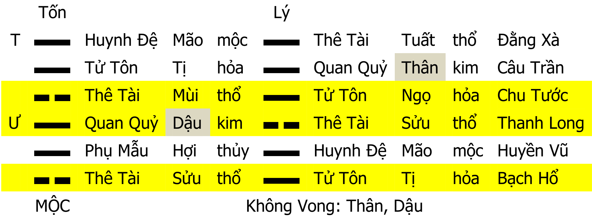
    - **Hình này chứng minh điều gì**
      - Vợ phóng đãng trốn theo nhiều nhân tình; chồng uất ức nhập Mộ uống thuốc độc tự sát dẫn đến tan vỡ.
    - **Từ đâu mà thấy được**
      - Thê Tài Mùi thổ động hóa Ngọ hỏa Đào hoa, sinh hào Ứng tam hợp Quan cục; Thế Mão mộc nhập Mộ Mùi, bị Dậu khắc.
  - **Thông tin quẻ:**
    - Ngày Tân Tị tháng Hợi (Tuần Không: Thân, Dậu).
    - Quẻ Tốn Vi Phong biến Thiên Trạch Lý.
    - Dụng thần: Thê Tài Mùi thổ.
  - **Phán đoán chi tiết:**
    - Căn cứ: Lấy Thê Tài làm Dụng thần. Trong quẻ Thê Tài lưỡng hiện (Sửu thổ và Mùi thổ), lấy hào Thê Tài Mùi thổ phát động hóa hợp làm Dụng thần.
    - Nhìn vào:
      - Thê Tài Mùi thổ động hóa Tử Tôn Ngọ hỏa: Ngọ hỏa là Đào hoa (ngày Tị Đào hoa tại Ngọ), Thê Tài động hóa Đào hoa lại tương hợp với Đào hoa (Ngọ Mùi lục hợp), chỉ rõ người vợ là kẻ phóng đãng, buông thả dục vọng.
      - Thê Tài Mùi thổ phát động sinh trợ cho hào Ứng Quan Quỷ Dậu kim: Ứng là người đàn ông khác ngoài xã hội, vợ động sinh Ứng là mê đắm đàn ông bên ngoài. Hào Ứng Dậu kim kết hợp với Nhật thần Tị hỏa và hào sơ Sửu thổ tạo thành Tị Dậu Sửu tam hợp Quan Quỷ cục: Quan Quỷ là đàn ông, tam hợp Quan cục biểu thị người vợ thích và qua lại không chỉ một mà là rất nhiều đàn ông cùng lúc.
      - Hào Thế Huynh Đệ Mão mộc lâm Đằng Xà: Đằng Xà chủ lo âu, quái dị, hẹp hòi. Hào Thế Mão mộc nhập Mộ tại Thê Tài Mùi thổ (theo 12 cung Trường Sinh, Mộc nhập Mộ tại Mùi): Thế nhập Mộ ở Tài biểu thị người chồng tính tình vô cùng hẹp hòi, quản thúc khắt khe và hay uất ức với vợ.
      - Dụng thần Thê Tài Mùi thổ lâm Dịch Mã động sinh hào Ứng lâm Tuần Không: biểu thị người vợ đã dứt áo bỏ nhà ra đi theo nhân tình.
      - Quan Quỷ Dậu kim lâm Thanh Long khắc hào Thế Mão mộc: Hào Thế cư hào 6 là điểm cùng cực kết thúc của sự vật; Thanh Long chủ độc chất, thuốc độc; kết hợp với việc hào Thế nhập Mộ chủ suy nghĩ quẫn bách, bế tắc không lối thoát. Đây chính là thông tin uống thuốc độc tự sát, chứng minh người chồng từng tự sát vì chuyện lăng loàn của vợ.
  - **Ứng nghiệm thực tế:**
    - Người chồng đau xót cho biết vì vợ không chịu về nhà mà sống buông thả phóng đãng với nhiều người đàn ông, anh ta đã 2 lần uống thuốc độc tự sát nhưng may mắn được cứu sống kịp thời.
    - Quẻ gốc Tốn Vi Phong là quẻ lục xung: quẻ lục xung chủ sự tan vỡ, khó giữ lại trái tim của vợ; sau đó hai người đã chính thức ly hôn.

- **Ví dụ 7: Nam đoán quan hệ với người tình ra sao (Địa Thủy Sư biến Lôi Thủy Giải)**
  - **Hình 96.** Quẻ Địa Thủy Sư biến Lôi Thủy Giải
    - 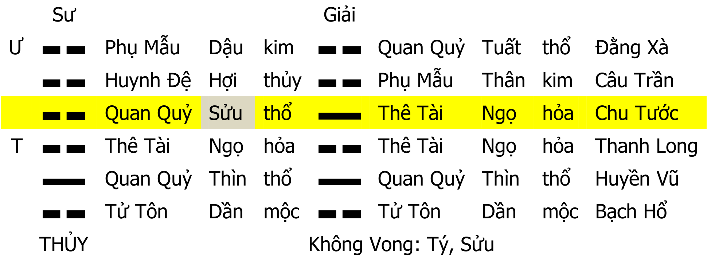
    - **Hình này chứng minh điều gì**
      - Người tình trẻ tuổi sau chia tay muốn nối lại duyên xưa; quẻ Quy hồn phản ánh sự quay đầu hàn gắn.
    - **Từ đâu mà thấy được**
      - Thê Tài Ngọ hỏa lâm Thế Nguyệt phá; quẻ quy hồn; Quan Quỷ Sửu thổ độc phát là Dưỡng địa của Hỏa.
  - **Thông tin quẻ:**
    - Ngày Canh Thân tháng Tý (Tuần Không: Tý, Sửu).
    - Quẻ Địa Thủy Sư biến Lôi Thủy Giải.
    - Dụng thần: Thê Tài Ngọ hỏa.
  - **Phán đoán chi tiết:**
    - Căn cứ: Lấy Thê Tài làm Dụng thần.
    - Nhìn vào:
      - Thê Tài Ngọ hỏa trì Thế, ở tháng Tý bị Nguyệt kiến xung phá (Tý Ngọ tương xung) gọi là Nguyệt phá: Nguyệt phá chủ tan vỡ, chia ly, chứng tỏ hai người trên thực tế đã chia tay nhau.
      - Quẻ Địa Thủy Sư là quẻ Quy Hồn: Quy Hồn chủ sự việc quay trở lại chốn cũ, biểu thị đối phương sau khi chia tay lại có ý muốn quay trở lại bên cạnh quái chủ.
      - Hào độc phát biểu thị tính chất cốt lõi của sự việc: Hào 4 Quan Quỷ Sửu thổ độc phát hóa Thê Tài Ngọ hỏa. Xét theo 12 cung Trường Sinh của Hỏa (Hỏa trường sinh tại Dần, dưỡng tại Sửu), Sửu thổ chính là cung Dưỡng của Hỏa.
      - Tượng Dưỡng chủ nhỏ tuổi, ấu trĩ, cần nuôi dưỡng nâng đỡ: Hào độc phát là Dưỡng địa của Dụng thần biểu thị tuổi tác của người tình rất nhỏ, trẻ hơn quái chủ khá nhiều tuổi.
  - **Ứng nghiệm thực tế:**
    - Quả nhiên cô gái này nhỏ hơn quái chủ vài tuổi. Sau khi chia tay nhau một thời gian, cô ta lại chủ động muốn hòa giải và tái hợp mối quan hệ.

## PHẦN KỸ THUẬT

### CHƯƠNG 1: PHƯƠNG PHÁP PHÁN ĐOÁN TÍNH CÁCH

#### 1. Cơ sở và nguyên lý phán đoán tính cách trong hôn nhân
- **Tầm quan trọng của tính cách đối với hạnh phúc gia đình:**
  - Hôn nhân mỹ mãn, hòa thuận lâu dài đòi hỏi sự tương đồng và hòa hợp về mặt tính cách giữa hai vợ chồng.
  - Khi chưa bước vào cuộc sống chung, nhiều người không thấu hiểu tính cách đối phương; chỉ sau một thời gian chung sống mới phát hiện ra nhiều tật xấu, khuyết điểm, dẫn đến xung đột, cãi vã triền miên.
  - Tính cách bất hòa là nguồn cơn dẫn đến bạo lực gia đình, ngược đãi về thể xác và tinh thần, thậm chí dẫn đến đổ vỡ ly hôn hoặc những bi kịch thương tâm. Do đó, phán đoán tính cách là mắt xích trọng yếu trong dự đoán hôn nhân của Lục hào.
- **Phương pháp luận cốt lõi trong Lục hào dự đoán học:**
  - Phán đoán tính cách con người dựa trên sự kết hợp toàn diện giữa:
    - Bát quái cung vị của Dụng thần (khí chất nền tảng).
    - Ngũ hành của Dụng thần (bản chất tâm lý cốt lõi).
    - Lục thần phối hợp lâm Dụng thần (hành vi và sắc thái cảm xúc bên ngoài).
- **Nguyên lý phân chia tính hai mặt Âm - Dương của tính cách:**
  - Mỗi yếu tố (cung vị, ngũ hành, lục thần) đều hàm chứa hai phương diện: mặt tích cực (mặt Dương) và mặt tiêu cực (mặt Âm).
  - Quy tắc định hướng suy luận: Căn cứ vào trạng thái suy vượng, hưu tù, sinh khắc, hợp xung của Dụng thần và bối cảnh cụ thể của quẻ để linh hoạt phán đoán:
    - Khi Dụng thần vượng tướng, đắc sinh đắc trợ, lâm cát thần thì bộc lộ mặt tích cực.
    - Khi Dụng thần hưu tù vô khí, bị hình xung khắc hại, lâm hung sát hoặc quá vượng dẫn đến thái quá thì bộc lộ mặt tiêu cực.

#### 2. Phán đoán tính cách theo Bát quái Cung vị
- **Dụng thần cư cung Càn:**
  - Mặt tích cực: Khí chất phi phàm, uy nghiêm đĩnh đạc, được mọi người kính trọng, lòng ôm chí lớn, phong độ đàng hoàng.
  - Mặt tiêu cực: Tự cao tự đại, ngạo mạn, kiêu căng, độc đoán, khó hòa đồng với mọi người.
- **Dụng thần cư cung Khôn:**
  - Mặt tích cực: Thận trọng điềm đạm, thành thật trung hậu, giữ trọn chữ tín, tấm lòng rộng lượng dung nạp vạn vật.
  - Mặt tiêu cực: Trầm lặng ít nói, nhu nhược mềm yếu, dễ bị người khác ức hiếp ngược đãi, thiếu chí khí phấn đấu, không có chủ kiến riêng.
- **Dụng thần cư cung Khảm:**
  - Mặt tích cực: Thông minh linh hoạt, cơ trí mưu lược, trí tuệ sâu sắc nhạy bén.
  - Mặt tiêu cực: Xảo quyệt giảo hoạt, nhiều ý đồ xấu xa, thiếu thành thật, ăn nói dối trá không đáng tin cậy.
- **Dụng thần cư cung Ly:**
  - Mặt tích cực: Hoạt bát nhiệt tình, tràn trề sức sống, tính tình cởi mở phóng khoáng.
  - Mặt tiêu cực: Nóng nảy bộp chộp, dễ nổi giận lôi đình, bốc đồng, làm việc thiếu kiên trì, đầu voi đuôi chuột.
- **Dụng thần cư cung Chấn:**
  - Mặt tích cực: Tâm tính lương thiện, giàu lòng từ bi nhân ái, chuộng sự đổi mới.
  - Mặt tiêu cực: Dễ nổi nóng cáu gắt, nôn nóng hấp tấp, làm việc nông nổi thiếu cân nhắc chín chắn.
- **Dụng thần cư cung Tốn:**
  - Mặt tích cực: Tính tình hiền lành, từ ái hòa nhã, nhân hậu độ lượng.
  - Mặt tiêu cực: Do dự thiếu quyết đoán, ba phải, lập trường dao động không kiên định.
- **Dụng thần cư cung Cấn:**
  - Mặt tích cực: Trầm tĩnh kiên định, bảo thủ cẩn trọng, làm việc điềm đạm chắc chắn.
  - Mặt tiêu cực: Lười biếng ỳ trệ, nhút nhát nhát gan, phản ứng chậm chạp.
- **Dụng thần cư cung Đoài:**
  - Mặt tích cực: Lạc quan yêu đời, hòa nhã dễ gần, khéo ăn nói, có duyên đàm luận, thích giao lưu ẩm thực rượu ngon.
  - Mặt tiêu cực: Nói nhiều lải nhải, lảm nhảm dài dòng, hay buôn chuyện thị phi phù phiếm.

#### 3. Phán đoán tính cách theo Ngũ hành của Dụng thần
- **Hào Dụng là Kim:**
  - Mặt tích cực: Có khí phách nam nhi trượng phu, coi trọng nghĩa khí, giữ trọn chữ tín, chuộng lẽ phải và công lý.
  - Mặt tiêu cực: Hiếu thắng thích tranh giành, háo sắc phong lưu, nóng vội hấp tấp, hung ác bạo ngược.
- **Hào Dụng là Mộc:**
  - Mặt tích cực: Nhân từ lương thiện, chính trực ngay thẳng, giàu lòng từ bi trắc ẩn, khoan dung độ lượng.
  - Mặt tiêu cực: Yếu đuối nhu nhược, mềm nắn rắn buông, thiếu quyết đoán.
- **Hào Dụng là Thủy:**
  - Mặt tích cực: Thông minh cơ trí, năng lực trí tuệ xuất chúng, phong thái thanh cao, ứng biến linh hoạt.
  - Mặt tiêu cực: Xảo quyệt mưu mô, dâm loạn buông thả, tùy tiện lăng nhăng, lật lọng không giữ lời hứa.
- **Hào Dụng là Hỏa:**
  - Mặt tích cực: Tràn đầy nhiệt huyết và sức sống, hoạt bát vui tươi, tính cách hướng ngoại nồng nhiệt.
  - Mặt tiêu cực: Dễ nổi giận bốc hỏa, tính tình nôn nóng cáu bẳn, thiếu nhẫn nại.
- **Hào Dụng là Thổ:**
  - Mặt tích cực: Đôn hậu trầm ổn, thành thật chất phác, coi trọng chữ tín, trước sau như một.
  - Mặt tiêu cực: Cố chấp cứng nhắc, không hoạt bát linh hoạt, chậm chạp đần độn.

#### 4. Phán đoán tính cách theo Lục thần phối hợp
- **Thanh Long:**
  - Lòng dạ lương thiện nhân từ, lễ phép nhã nhặn, nho nhã lễ độ, khoan dung rộng lượng, tính tình từ thiện.
  - Ưa chuộng cái đẹp, thích chưng diện làm dáng, thích sạch sẽ tươm tất, phong thái tao nhã; mặt tiêu cực có thể háo sắc phong lưu.
- **Chu Tước:**
  - Tính tình vui vẻ hòa đồng, nụ cười luôn nở trên môi, khéo ăn khéo nói, nhanh mồm nhanh miệng, hoạt ngôn dễ bắt chuyện.
  - Mặt tiêu cực là lải nhải lắm lời, cằn nhằn nói dai, thích tranh cãi khẩu thiệt, thậm chí ưa chửi bới lăng mạ người khác.
- **Câu Trần:**
  - Đoan chính ngay thẳng, thành thật trung hậu, tính tình ưa tĩnh tại, cẩn thận thận trọng, giữ chữ tín.
  - Mặt tiêu cực là trì trệ chậm chạp, lười biếng, cứng nhắc thiếu linh hoạt, vụng về không khéo léo.
- **Đằng Xà:**
  - Bí hiểm khó đoán, tâm lý cổ quái khác người, quái gở không hòa đồng, tính cách độc lạ mới mẻ.
  - Mặt tiêu cực là hẹp hòi keo kiệt, tham lam tài lợi, thất hứa tráo trở, nhát gan nhưng biến đổi khôn lường.
- **Bạch Hổ:**
  - Cương trực khẳng khái, thẳng thắn ngay thẳng, hào sảng, cử chỉ toát lên uy nghiêm, nghịch ngợm bộc trực.
  - Mặt tiêu cực là hung hãn tàn bạo, dễ tức giận nổi lôi đình, hiếu chiến thích tranh đấu dữ dội, nóng nảy thô bạo.
- **Huyền Vũ:**
  - Cơ trí mưu lược, thông minh ngầm, có tài ứng biến, tính cách kín đáo thâm trầm hướng nội.
  - Mặt tiêu cực là xảo quyệt gian trá, nham hiểm khó dò, dâm loạn háo sắc, u uất trầm cảm, ít nói thâm sâu.

#### 5. Các quái lệ thực tế chứng nghiệm
- **Ví dụ 1: Nữ đoán tình trạng người đàn ông mình thích (Sơn Thủy Mông biến Hỏa Thủy Vị Tế)**
  - **Hình 97.** Quẻ Sơn Thủy Mông biến Hỏa Thủy Vị Tế
    - 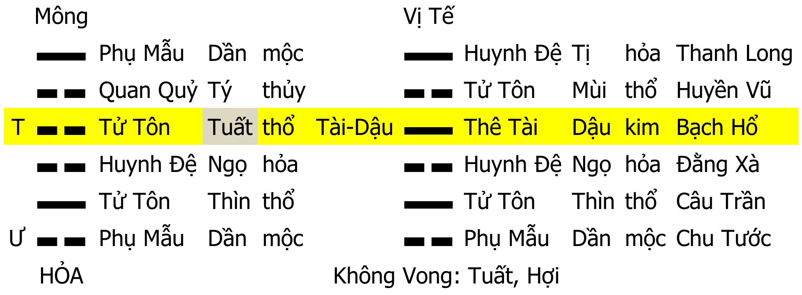
    - **Hình này chứng minh điều gì**
      - Quẻ Mông biến Vị Tế thể hiện Dụng thần Quan Quỷ Tý thủy ở hào 5 cung Ly lâm Huyền Vũ, đối phương thông minh hoạt bát nhưng đương số chỉ yêu đơn phương.
    - **Từ đâu mà thấy được**
      - Quan Quỷ Tý thủy cư hào 5 cung Ly lâm Huyền Vũ; hào Thế Tử Tôn Tuất thổ lâm Bạch Hổ phát động khắc chế Quan Quỷ.
  - **Bối cảnh quẻ:** Ngày Đinh Mão tháng Dần (Tuần Không: Tuất, Hợi), người phụ nữ đến xin dự đoán về người đàn ông mình thầm thích. Quẻ được Sơn Thủy Mông biến Hỏa Thủy Vị Tế, lấy Quan Quỷ Tý thủy làm Dụng thần.
  - **Phán đoán chi tiết:**
    - Căn cứ vào Quái cung và Hào vị: Quan Quỷ Tý thủy cư cung Ly và ngự tại hào 5. Nhìn vào đó: Cung Ly chủ hoạt bát, hào 5 là ngôi chí tôn độc lập, chủ có ý chí tiến thủ mạnh mẽ. Phán đoán người đàn ông này tính cách rất hoạt bát, có sự nghiệp riêng độc lập.
    - Căn cứ vào Ngũ hành và Lục thần: Dụng thần là Thủy lâm Huyền Vũ. Nhìn vào đó: Thủy chủ thông minh cơ trí, Huyền Vũ chủ sự quyến rũ ngầm và mưu lược. Phán đoán anh ta dùng đầu óc rất giỏi, ngoại hình hấp dẫn lôi cuốn phụ nữ khiến đương số say mê.
    - Căn cứ vào Hào Thế: Tử Tôn trì Thế (Tuất thổ). Nhìn vào đó: Tử Tôn chủ con cái, biểu thị đương số bản thân đã có con riêng.
    - Căn cứ vào Không Vong và Lục thần của hào Thế: Tử Tôn Tuất thổ lâm Tuần Không lại lâm Bạch Hổ. Nhìn vào đó: Tuần Không chủ sự mất mát, Bạch Hổ chủ xuất huyết, phẫu thuật lưu sản. Phán đoán đương số trong quá khứ từng bị sảy thai hoặc phá thai.
    - Căn cứ vào Tương quan Dụng - Thế: Quan Quỷ Tý thủy suy nhược không được Nhật Nguyệt tương sinh, lại bị Tử Tôn trì Thế phát động khắc chế dữ dội. Nhìn vào đó: Dự báo hai người không có duyên phận kết tóc se duyên, chỉ là quan hệ một chiều.
  - **Ứng nghiệm thực tế:**
    - Về tính cách và sự nghiệp: Người phụ nữ xác nhận đối phương rất hoạt bát, vài năm trước đã tự mình gây dựng sự nghiệp riêng.
    - Về trí tuệ và ngoại hình: Người phụ nữ phản hồi anh ta sử dụng đầu óc rất tốt; dù đã ngoài 40 tuổi nhưng thể hình vẫn rất đẹp, mông nhỏ chân dài đúng mẫu người cô thích, vừa gặp lần đầu đã bị hớp hồn.
    - Về con cái: Người phụ nữ xác nhận mình đã có một bé trai 18 tháng tuổi.
    - Về lưu sản: Khi thầy phán đã từng lưu sản, cô kinh ngạc thốt lên: "Vậy mà cũng thấy được sao? Đúng! Đúng! Năm 21 tuổi tôi đã từng bị lưu sản một lần."
    - Về duyên phận: Người phụ nữ buồn bã thừa nhận: "Tôi chỉ tương tư đơn phương."
- **Ví dụ 2: Nữ đoán người đàn ông mình thích (Phong Thiên Tiểu Súc biến Càn Vi Thiên)**
  - **Hình 98.** Quẻ Phong Thiên Tiểu Súc biến Càn Vi Thiên
    - 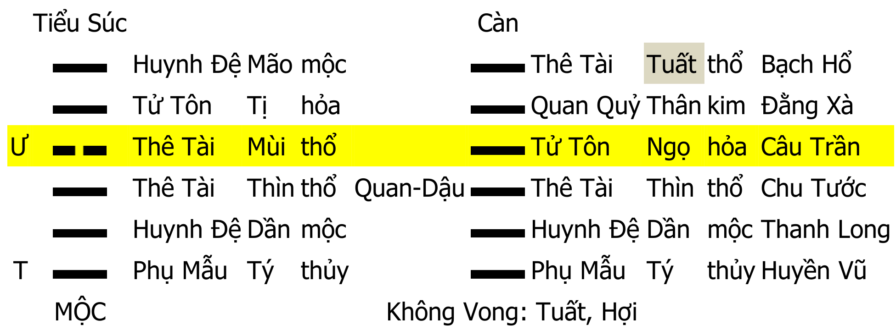
    - **Hình này chứng minh điều gì**
      - Quẻ Tiểu Súc biến Càn cho thấy Dụng thần phục tàng dưới Thê Tài, lâm Chu Tước và Đào hoa, chứng minh người đàn ông hiền lành, lạc quan, được nhiều phụ nữ theo đuổi.
    - **Từ đâu mà thấy được**
      - Quan Quỷ Dậu kim phục dưới hào 3 Thê Tài Thìn thổ thuộc cung Tốn, lâm Chu Tước; Ứng Thê Tài Mùi thổ động sinh Quan Quỷ.
  - **Bối cảnh quẻ:** Ngày Nhâm Thân tháng Dần (Tuần Không: Tuất, Hợi), người phụ nữ xin dự đoán về người đàn ông mình thầm thích. Quẻ được Phong Thiên Tiểu Súc biến Càn Vi Thiên. Lấy Quan Quỷ làm Dụng thần; Quan Quỷ Dậu kim không hiện trên quẻ, phục tàng dưới hào 3 Thê Tài Thìn thổ.
  - **Phán đoán chi tiết:**
    - Căn cứ vào Quái cung: Quan Quỷ Dậu kim ngự tại cung Tốn. Nhìn vào đó: Cung Tốn chủ hiền lành, từ ái, nhân hậu. Phán đoán người đàn ông này tính tình lương thiện, hiền lành tử tế.
    - Căn cứ vào Ngũ hành và Nhật thần sinh phù: Dụng thần là Kim, lại được Nhật Thân kim tương trợ vượng tướng. Nhìn vào đó: Kim chủ trượng nghĩa trọng chữ tín, vượng tướng chủ thể chất kiện khang. Phán đoán anh ta rất coi trọng nghĩa khí, cơ thể cường tráng vạm vỡ.
    - Căn cứ vào Thần sát và Hào Ứng: Quan Quỷ Dậu kim lâm Đào hoa (Dần kiến Dậu vi Đào hoa), phục dưới Thê Tài; hào Ứng Thê Tài Mùi thổ phát động sinh Quan Quỷ (Ứng là người khác, Thê Tài là phụ nữ). Nhìn vào đó: Phán đoán có rất nhiều phụ nữ chủ động vây quanh theo đuổi anh ta.
    - Căn cứ vào Lục thần lâm Dụng: Quan Quỷ Dậu kim lâm Chu Tước. Nhìn vào đó: Chu Tước chủ vui vẻ lạc quan, hoạt ngôn thân thiện. Phán đoán anh ta tính tình rất lạc quan, nụ cười luôn rạng rỡ trên khuôn mặt.
  - **Ứng nghiệm thực tế:**
    - Về tâm tính hiền lành: Người phụ nữ xác nhận: "Đúng, người rất tốt, lòng dạ lương thiện."
    - Về nghĩa khí và thể hình: Cô phản hồi anh ta rất trọng nghĩa khí, thân hình cường tráng và đang phụ trách hoạt động thể thao tại câu lạc bộ.
    - Về nhân duyên đào hoa: Cô xác nhận: "Đúng vậy, rất nhiều phụ nữ theo đuổi anh ta."
    - Về sự lạc quan: Cô cho biết: "Đúng, anh ta rất lạc quan, hiếm khi thấy anh ta tức giận."
- **Ví dụ 3: Nam đoán tính cách bạn gái (Trạch Phong Đại Quá)**
  - **Hình 99.** Sơ đồ quẻ Trạch Phong Đại Quá
    - 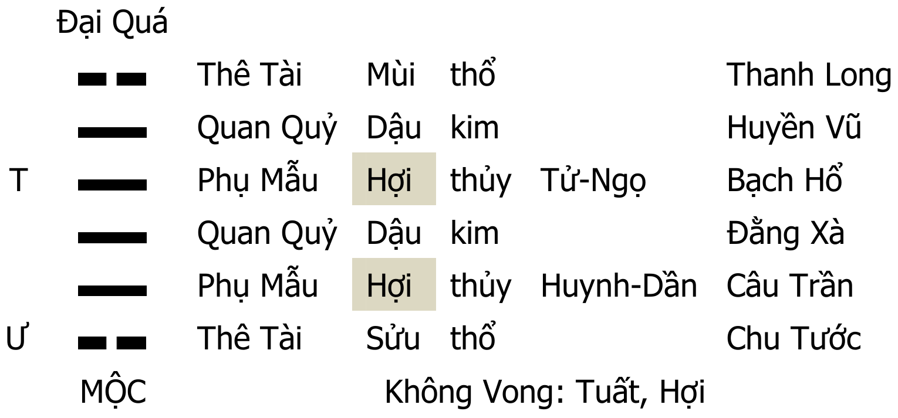
    - **Hình này chứng minh điều gì**
      - Quẻ Đại Quá thể hiện Thê Tài Sửu thổ lâm Ứng và Chu Tước, chứng minh bạn gái thật thà vui vẻ; hào Thế lâm Không tại quẻ Du Hồn thể hiện tính cách đương số.
    - **Từ đâu mà thấy được**
      - Thê Tài Sửu thổ tại hào Ứng lâm Chu Tước; hào Thế Phụ Mẫu Hợi thủy Tuần Không tương hợp Nhật Nguyệt Dần mộc.
  - **Bối cảnh quẻ:** Ngày Bính Dần tháng Dần (Tuần Không: Tuất, Hợi), người nam dự đoán về bạn gái. Quẻ được Trạch Phong Đại Quá (quẻ tĩnh). Trong quẻ Thê Tài lưỡng hiện, lấy hào Ứng Thê Tài Sửu thổ làm Dụng thần.
  - **Phán đoán chi tiết:**
    - Căn cứ vào Ngũ hành và Lục thần của Dụng thần: Dụng thần là Thổ lâm Chu Tước. Nhìn vào đó: Thổ chủ đôn hậu thật thà, an phận chất phác; Chu Tước chủ tươi vui, hay cười, hoạt bát. Phán đoán bạn gái rất hiền lành thật thà, nụ cười luôn nở trên môi, luôn mang niềm vui đến cho người khác.
    - Căn cứ vào Hào Thế và Nhật Nguyệt: Hào Thế Phụ Mẫu Hợi thủy tương hợp với Nhật Nguyệt Dần mộc (Dần Hợi hợp), Nhật Nguyệt là Huynh Đệ (bạn bè bằng hữu). Nhìn vào đó: Phán đoán đương số là người giao thiệp rộng rãi, có rất nhiều bạn bè thân thiết.
    - Căn cứ vào Quái cung và Trạng thái Tuần Không của Thế: Hào Thế lâm Tuần Không tại quẻ Du Hồn thuộc cung Chấn (Chấn chủ động). Nhìn vào đó: Bản chất đương số vốn dĩ tính khí bộp chộp nôn nóng, nhưng vì hào Thế lâm Không Vong nên bề ngoài lại biểu hiện giống như một người trầm lặng, thanh tĩnh.
  - **Ứng nghiệm thực tế:**
    - Về bạn gái: Người nam phản hồi cô ấy rất thật thà, thật thà đến mức dễ bị người ta lừa gạt; cô ấy chẳng những vui vẻ mà còn luôn đem lại tiếng cười vui vẻ cho mọi người xung quanh.
    - Về quan hệ bạn bè của bản thân: Người nam xác nhận đúng là mình có rất nhiều bạn bè.
    - Về tính cách bản thân: Người nam khẳng định phán đoán hoàn toàn chính xác.
- **Ví dụ 4: Nữ đoán hôn nhân (Phong Địa Quan biến Phong Sơn Tiệm)**
  - **Hình 100.** Sơ đồ quẻ Phong Địa Quan biến Phong Sơn Tiệm
    - 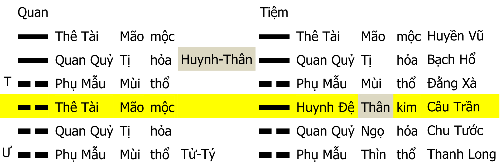
    - **Hình này chứng minh điều gì**
      - Quẻ Quan biến Tiệm cho thấy hào 2 Quan Quỷ vượng tướng ám động, Thế lâm Đằng Xà và Quan lâm Chu Tước, chứng minh vợ chồng bất hòa và có người thứ ba.
    - **Từ đâu mà thấy được**
      - Hào 2 Quan Quỷ Tị hỏa lâm trạch ám động; hai Quan Quỷ cùng sinh Thế Phụ Mùi lâm Đằng Xà; hào 3 Câu Trần khắc hào 4 Thế.
  - **Bối cảnh quẻ:** Ngày Ất Hợi tháng Dần, người phụ nữ đến dự đoán về cuộc hôn nhân của mình. Quẻ được Phong Địa Quan biến Phong Sơn Tiệm. Lấy Quan Quỷ làm Dụng thần; trong quẻ Quan Quỷ lưỡng hiện, lấy hào 2 Quan Quỷ Tị hỏa làm Dụng thần.
  - **Phán đoán chi tiết:**
    - Căn cứ vào Hào vị và Trạng thái Dụng thần: Quan Quỷ Tị hỏa được Nguyệt Dần sinh phù vượng tướng, cư hào 2 (hào 2 là trạch - nhà ở). Nhìn vào đó: Biểu thị đã có người đàn ông vào ở trong nhà, chứng minh đương số là người đã kết hôn.
    - Căn cứ vào Biến động hào và Nguyên thần: Quan Quỷ Tị hỏa bị Nhật Hợi xung kích thành ám động; Nguyên thần Thê Tài Mão mộc phát động hóa Huynh Đệ Thân kim bị hồi đầu khắc. Nhìn vào đó: Nguồn sinh bị đứt gãy, Dụng thần ám động bất an, dự báo cuộc hôn nhân không ổn định, tiềm ẩn nguy cơ rạn nứt sâu sắc.
    - Căn cứ vào Lưỡng Quan ám động sinh Thế: Hai hào Quan Quỷ Tị hỏa (hào 2 và hào 5) đều ám động cùng sinh hào Thế Phụ Mẫu Mùi thổ. Nhìn vào đó: Phán đoán có người đàn ông khác ngoài hôn nhân cũng động tình, sợ rằng xuất hiện kẻ thứ ba xen vào quan hệ vợ chồng.
    - Căn cứ vào Lục thần lâm Thế và lâm Dụng: Hào Thế lâm Đằng Xà (chủ cổ quái, hẹp hòi, thất thường); Quan Quỷ lâm Chu Tước (chủ khẩu thiệt, tranh cãi). Nhìn vào đó: Phán đoán bản thân người vợ có tính cô độc, nóng nảy, tính khí thất thường khó đoán; người chồng tính tình cũng rất xấu, hung bạo và hay chửi bới xúc phạm người khác.
    - Căn cứ vào Bệnh tật trên cơ thể: Hào Thế Mùi thổ là Tài khố, ngự tại hào 4 (vị trí ngực, vú), bị Nguyệt Dần và hào 3 Mão mộc phát động khắc hại; hào 3 lại lâm Câu Trần (chủ sưng phù, khối u, xơ hóa). Nhìn vào đó: Phán đoán đương số bị bệnh ở tuyến vú, cụ thể là chứng tăng sinh tuyến vú (nhũ tuyến tăng sinh).
  - **Ứng nghiệm thực tế:**
    - Người phụ nữ xác nhận tất cả mọi phán đoán từ mâu thuẫn vợ chồng, tính khí hai bên đến bệnh lý tăng sinh tuyến vú đều hoàn toàn trùng khớp với thực tế.
- **Ví dụ 5: Nữ đoán quan hệ phát triển với bạn trai (Hỏa Lôi Phệ Hạp biến Hỏa Địa Tấn)**
  - **Hình 101.** Sơ đồ quẻ Hỏa Lôi Phệ Hạp biến Hỏa Địa Tấn
    - 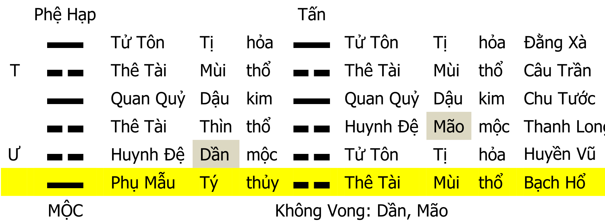
    - **Hình này chứng minh điều gì**
      - Quẻ Phệ Hạp biến Tấn cho thấy Quan Quỷ lâm Chu Tước, hào sơ độc phát lâm Bạch Hổ là Tử địa của Dụng thần, dự báo bạn trai nóng tính và kết cục chia tay.
    - **Từ đâu mà thấy được**
      - Quan Quỷ Dậu kim lâm Chu Tước; Phụ Mẫu Tý thủy độc phát lâm Bạch Hổ (Tý là Tử địa của Dậu); Thế Thê Tài Mùi thổ lâm Câu Trần bị Nguyệt phá.
  - **Bối cảnh quẻ:** Ngày Tân Hợi tháng Sửu (Tuần Không: Dần, Mão), người phụ nữ đến dự đoán quan hệ tình cảm với bạn trai sẽ phát triển ra sao. Quẻ được Hỏa Lôi Phệ Hạp biến Hỏa Địa Tấn, lấy Quan Quỷ Dậu kim làm Dụng thần.
  - **Phán đoán chi tiết:**
    - Căn cứ vào Lục thần lâm Dụng: Quan Quỷ Dậu kim lâm Chu Tước. Nhìn vào đó: Chu Tước chủ hoạt ngôn, khẩu tài. Phán đoán người bạn trai ăn nói rất khéo léo, nhanh mồm nhanh miệng.
    - Căn cứ vào Hào chức vụ và Hào Thế: Hào 5 là ngôi vị quan chức, nhưng hào Thế Thê Tài Mùi thổ lâm hào 5 bị Nguyệt Sửu xung thành Nguyệt phá, không có lực sinh Dụng thần Quan Quỷ. Nhìn vào đó: Phán đoán bạn trai không có công danh quan vận, không nắm giữ chức vụ gì.
    - Căn cứ vào Hào độc phát: Hào sơ Phụ Mẫu Tý thủy độc phát lâm Bạch Hổ (độc phát phản ánh bản chất căn nguyên sự việc, Bạch Hổ chủ hung bạo nóng nảy). Nhìn vào đó: Phán đoán tính khí người bạn trai rất xấu, nóng nảy cục cằn, dễ nổi cơn thịnh nộ.
    - Căn cứ vào Trạng thái của hào Thế: Hào Thế Mùi thổ bị Nguyệt phá. Nhìn vào đó: Dự báo tương lai đương số sẽ nguội lạnh tình cảm, thay lòng đổi dạ.
    - Căn cứ vào Kết cục tương lai: Hào độc phát Phụ Mẫu Tý thủy là Tử địa của Dụng thần Quan Quỷ Dậu kim (Kim tử tại Tý), biến quái Hỏa Địa Tấn lại là quẻ Du Hồn (chủ trôi dạt bất định). Nhìn vào đó: Phán đoán hai người sẽ không thể đi đến hôn nhân, tất yếu dẫn đến kết cục chia tay ly tán.
  - **Ứng nghiệm thực tế:**
    - Tính cách của người bạn trai hoàn toàn đúng như dự đoán: nói năng khéo léo nhưng tính tình thô bạo, cục cằn.
    - Sau này hai người thường xuyên xảy ra cãi vã dữ dội, không thể nói chuyện hòa thuận được với nhau nên cuối cùng đã chia tay.

### CHƯƠNG 2: PHƯƠNG PHÁP PHÁN ĐOÁN TƯỚNG MẠO

Khi dự đoán hôn nhân, người ta thường tha thiết hỏi đối phương có ưu điểm gì, dung nhan diện mạo ra sao? Tuy rằng vẻ đẹp tâm hồn luôn được đề cao trong luân lý truyền thống, nhưng nếu có thể tìm được người bạn đời tài mạo song toàn thì chẳng khác nào như gấm thêm hoa. Ít nhất một nửa số người khi đi xem bói chú trọng hàng đầu vào ngoại hình của ý trung nhân; vì vậy tướng mạo, phong thái ăn nói, cử chỉ đi đứng đóng vai trò quyết định đối với ấn tượng đầu tiên khi đôi bên gặp gỡ.

Dùng Lục Hào dự đoán tướng mạo có khả năng soi chiếu tường tận từ đỉnh đầu đến gót chân. Tuy nhiên, dự đoán tướng mạo không phải là sự rập khuôn theo công thức máy móc, mà người dự đoán bắt buộc phải căn cứ vào biến hóa sinh động trong quẻ, kết hợp "dụng tượng phân tích" mới đạt đến độ chuẩn xác vi diệu. Quá trình phán đoán là sự tổng hợp hữu cơ giữa quái cung, ngũ hành, lục thần, lục thân, hào vị, sinh khắc xung hợp, Nguyệt phá và Tuần Không.

#### Nguyên tắc phán đoán theo hào vị

Hào vị trong quẻ phân bổ tuần tự tương ứng với các bộ phận trên cơ thể con người từ trên xuống dưới:
- **Hào 6:** Đầu tóc, vật trang sức trên đầu, mũ nón, vai, hai cánh tay, bàn tay,...
- **Hào 5:** Tai, mắt, mũi, miệng, gương mặt, chòm râu, yết hầu cổ họng, kính mắt,...
- **Hào 4:** Lồng ngực, bầu vú, tấm lưng, phần thân trên,...
- **Hào 3:** Vùng bụng, rốn, eo lườn, bờ mông, hậu âm,...
- **Hào 2:** Bắp đùi, đầu gối, cẳng chân, tử cung/bộ phận sinh dục,...
- **Hào sơ:** Bàn chân, gót chân, ngón chân, bước chân đi lại,...

#### Nguyên tắc phán đoán thể hình qua ngũ hành

Căn cứ vào ngũ hành của Dụng thần cùng trạng thái vượng suy để phán đoán vóc dáng:
- **Dụng thần thuộc Kim:** Đắc khí vượng tướng thì thể trạng cường tráng, vóc người khôi ngô, gân cốt rắn chắc, làn da trắng nõn, tiếng nói sang sảng vang dội; hưu tù thì gầy gò ốm yếu, da bọc xương.
- **Dụng thần thuộc Mộc:** Đắc khí vượng tướng thì vóc dáng thon thả, yểu điệu, thân hình cao ráo, sống lưng thẳng tắp; hưu tù thì khẳng khiu, gầy gò, mỏng manh.
- **Dụng thần thuộc Thủy:** Đắc khí vượng tướng thì dung mạo kiều diễm, dáng đi mềm mại uyển chuyển, tính tình nhu thuận mà hoạt bát, linh hoạt nhanh nhẹn; hưu tù thì yếu ớt, uể oải.
- **Dụng thần thuộc Hỏa:** Tướng người to con đầu nhỏ, khi đi đứng thân hình lắc lư không ngừng, sắc mặt hồng hào, đỉnh đầu hơi nhọn.
- **Dụng thần thuộc Thổ:** Đắc khí vượng tướng thì thân hình cao lớn, đẫy đà, vạm vỡ mập mạp; hưu tù thì vóc người thấp lùn, béo phì hoặc thô kệch.

#### Nguyên tắc phán đoán đầu tóc qua lục thần và suy vượng

Đầu tóc được soi chiếu qua trạng thái hưu tù vượng suy của hào đại diện cùng Lục thần phối chiếu:
- **Về độ dày mỏng:** Hào mang tượng tóc đắc vượng tướng thì tóc dày dặn, rậm rạp, đen mượt; lâm hưu tù suy kiệt thì sợi tóc mảnh mai, thưa thớt, dễ rụng.
- **Về hình thái và màu sắc tóc theo Lục thần:**
  - **Lâm Thanh Long:** Mái tóc được chải chuốt chỉnh tề, duyên dáng, xinh xắn, phối kèm phụ kiện kẹp tóc hay trang sức mới mẻ, độc đáo.
  - **Lâm Chu Tước:** Tóc có màu hoe đỏ, tóc nhuộm hoặc có thói quen xõa tóc bồng bềnh.
  - **Lâm Huyền Vũ:** Tóc đen nhánh, dày óng ả, toát lên nét quyến rũ.
  - **Lâm Bạch Hổ:** Sợi tóc cứng ráp, hoặc sớm xuất hiện sợi tóc bạc, tóc hoa râm.
  - **Lâm Câu Trần:** Tóc hơi ngả vàng, xơ xác, phong cách đầu tóc lôi thôi lếch thếch.
  - **Lâm Đằng Xà:** Tóc xoăn tự nhiên hoặc uốn lượn lọn sóng thời trang.

#### Nguyên tắc phán đoán khuôn mặt và ngũ quan

- **Hình thái khuôn mặt qua Địa chi và Bát quái:**
  - **Tý, Ngọ, Mão, Dậu:** Khuôn mặt tròn trịa, đầy đặn, phúc hậu.
  - **Dần, Thân, Tị, Hợi:** Khuôn mặt dài, cằm thon nhọn hoặc mặt trái xoan thanh thoát.
  - **Thìn, Tuất, Sửu, Mùi:** Khuôn mặt vuông vức, mặt chữ quốc (国).
  - **Kết hợp quái cung:** Càn chủ tròn trịa; Khôn chủ vuông vức; Tốn chủ thon dài; Đoài chủ răng miệng khuyết hãm; Cấn chủ sống mũi nhô cao; Ly chủ đôi mắt tinh anh; Khảm chủ đôi tai sâu lắng.
  - **Ngũ hành Nguyệt phá:** Báo hiệu tướng mạo có khuyết điểm xấu xí, hoặc trên mặt mang vết tích, thương tật.
- **Sắc diện và thần thái qua Lục thần:**
  - **Lâm Thanh Long:** Dung nhan thanh tú, khôi ngô tuấn tú hoặc kiều diễm, khí chất đoan trang.
  - **Lâm Chu Tước:** Gương mặt hồng hào rạng rỡ, khóe miệng luôn nở nụ cười tươi tắn.
  - **Lâm Câu Trần:** Vẻ mặt khô khan, nghiêm nghị, đờ đẫn, thiếu vắng biểu cảm.
  - **Lâm Đằng Xà:** Trên mặt có sẹo vết thương tật, nhiều nếp nhăn nheo, hoặc hay nhăn nhó cau có.
  - **Lâm Bạch Hổ:** Nét mặt lạnh lùng, uy nghiêm, cương nghị khiến người đối diện phải kính sợ.
  - **Lâm Huyền Vũ:** Nước da ngăm đen, trên mặt có nốt ruồi đen duyên dáng, hoặc toát ra vẻ ma mị, khêu gợi phong tình.
- **Phân chia chi tiết ngũ quan trên khuôn mặt:**
  - **Hành Hỏa - Đôi mắt:** Hỏa bị khắc thì mắt cận thị hoặc có tật; hỏa bị hợp hay nhập Mộ thì đeo kính mắt; gặp xung thì hay nháy mắt lia lịa; ngộ Không Vong thì hốc mắt lõm sâu; lâm Thanh Long thì mắt sáng long lanh; lâm Đằng Xà thì mắt hí hoặc lé lệch; lâm Huyền Vũ thì mắt lờ đờ mờ mịt; lâm Câu Trần thì mắt lồi to; lâm Chu Tước thì mắt biết cười; lâm Bạch Hổ thì ánh mắt sắc sảo, có thần uy.
  - **Hành Thủy - Miệng, môi và cổ họng:** Thủy bị hợp thì đôi môi khép kín chặt; gặp xung thì khuôn miệng méo lệch; nhập Mộ lâm Chu Tước thì thích lấy tay che miệng khi cười; Mộ tại Nhật Nguyệt thì hàm trên vẩu hô; Mộ tại hào bên dưới thì hàm dưới nhô ra; lâm Thanh Long thì bờ môi hồng hào, gợi cảm; lâm Câu Trần thì miệng nhô hoặc môi dày thô.
  - **Hành Thổ - Sống mũi:** Thổ bị hợp thì lỗ mũi nhỏ kín; gặp xung thì sống mũi xiêu vẹo; gặp Không Vong thì sống mũi tẹt lõm hoặc thông thoáng thính mũi; lâm Thanh Long thì sống mũi cao thẳng thanh tú; lâm Chu Tước thì chóp mũi ửng đỏ; lâm Câu Trần thì cánh mũi dày bè to tướng; lâm Đằng Xà thì sống mũi thon nhỏ gầy guộc.
  - **Hành Kim - Hàm răng và tai:** Kim lâm Nguyệt phá thì kẽ răng thưa hở; gặp Không Vong thì bị ù tai, nặng tai, điếc; lâm Đằng Xà thì hàm răng khấp khểnh, xấu xí; ngộ Không Vong kèm Đằng Xà thì bị sâu răng mục tủy; lâm Thanh Long thì hàm răng đều đặn tăm tắp như hạt bắp.
  - **Hành Mộc - Lông mày và râu tóc:** Mộc lâm Không Vong thì lông mày thưa thớt, ít tóc; gặp xung thì tóc bồng bềnh bay trong gió; nhập Mộ thì hay đội mũ nón trùm kín đầu.

#### Nguyên tắc phán đoán chiều cao đối phương

- **Định tính theo ngũ hành và trạng thái sinh vượng:**
  - Ngũ hành thuộc Mộc, Kim, Thủy: Vóc người tương đối cao ráo, thanh thoát.
  - Ngũ hành thuộc Hỏa, Thổ: Chiều cao thường khiêm tốn, thấp đậm hoặc trung bình.
  - Dụng thần đắc vượng tướng: Thân hình phát triển cao lớn vượt trội.
  - Dụng thần lâm hưu tù suy nhược: Thể trạng thấp bé, nhỏ con.
  - Vận dụng 12 cung Trường Sinh: Ngộ đất Thai, Dưỡng, Suy, Bệnh, Tử, Tuyệt thì dáng người thấp; ngộ đất Trường Sinh, Quan Đới, Lâm Quan, Đế Vượng thì tầm vóc cao lớn.
- **Định lượng con số chiều cao qua dịch số:**
  - Dựa vào quái số Bát quái kết hợp hào động và hào vị Dụng thần (thường ghép sau số 1 mét): Càn 1, Đoài 2, Ly 3, Chấn 4, Tốn 5, Khảm 6, Cấn 7, Khôn 8 (ví dụ quẻ số 8 định lượng là 1m78).
  - Kết hợp phổ số Tiên thiên: Giáp Kỷ Tý Ngọ 9; Ất Canh Sửu Mùi 8; Bính Tân Dần Thân 7; Đinh Nhâm Mão Dậu 6; Mậu Quý Thìn Tuất 5; Tị Hợi 4.
  - Quy tắc vận dụng: Phán đoán con số chiều cao không có điều lệ cứng nhắc cố định, đòi hỏi người dự đoán phải linh hoạt châm chước dựa trên mức độ vượng suy thực tế của quẻ tượng.

#### Các quái lệ thực tế luận đoán tướng mạo

- **Ví dụ 1:** Ngày Ất Mão tháng Dậu, nam đoán có thể kết hôn với bạn gái không? Được quẻ Thủy Trạch Tiết biến Chấn Vi Lôi.
  - **Hình 102.** Quẻ Thủy Trạch Tiết biến Chấn Vi Lôi
    - 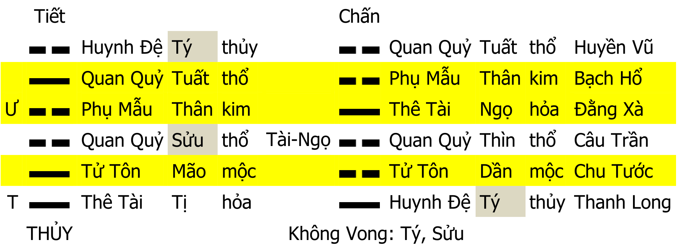
    - **Hình này chứng minh điều gì**
      - Thể hình bạn gái to con đầu nhỏ, tính hướng ngoại, hiền lành; bị chứng đau bụng kinh và bị gia đình cha mẹ ngăn cấm.
    - **Từ đâu mà thấy được**
      - Thê Tài Tị hỏa trì Thế vượng tại Khảm, lâm Thanh Long; Nguyên thần Mão mộc hào 2 Nguyệt phá hóa thoái; Dụng thần nhập Mộ hào 5.
  - **Phán đoán chi tiết:**
    - Căn cứ: Lấy Thê Tài làm Dụng thần. Thê Tài Tị hỏa trì Thế, được Nhật thần Ất Mão tương sinh nên đắc khí vượng tướng.
    - Nhìn vào thể hình và tướng mạo: Dụng thần tọa lạc tại cung Khảm chủ người thông minh lanh lợi; mang ngũ hành hỏa chủ tính tình hoạt bát, cởi mở hướng ngoại; hành hỏa tượng trưng cho vóc người to con đầu nhỏ, chiều cao khiêm tốn; chi Tị hỏa là dáng dấp thon dài; lâm Thanh Long biểu thị phong thái lịch thiệp, biết lễ phép, tâm tính hiền hòa đoan chính.
    - Nhìn vào bệnh tật cơ thể: Hào 2 Nguyên thần Tử Tôn Mão mộc lâm Nguyệt phá lại động hóa thoái thần (Dần mộc); hào 2 là cung vị tử cung, hành mộc chủ gân cốt đau nhức, nên đoán bạn gái thường xuyên phải chịu đựng chứng đau bụng kinh dữ dội.
    - Nhìn vào rào cản hôn nhân: Dụng thần nhập Mộ tại hào 5 (hào phụ huynh gia trưởng), biểu thị hôn sự bị cha mẹ quản thúc gò bó; hào Ứng mang Phụ Mẫu đại diện cho cha mẹ bạn gái lại tương hợp câu thúc Dụng thần, chứng tỏ phụ huynh phản đối gay gắt, muốn giữ chặt con gái bên mình không chịu gả đi xa.
  - **Ứng nghiệm thực tế:**
    - Người nam xác nhận mọi chi tiết đều đúng y như quẻ chỉ ra: Bạn gái ngoại hình và tính cách đúng như mô tả, thường xuyên bị đau bụng kinh và cha mẹ cô đang ra sức ngăn cản không đồng ý cho cưới.

- **Ví dụ 2:** Ngày Mậu Tuất tháng Dậu, nữ đoán hôn nhân, được quẻ Lôi Thủy Giải.
  - **Hình 103.** Quẻ Lôi Thủy Giải
    - 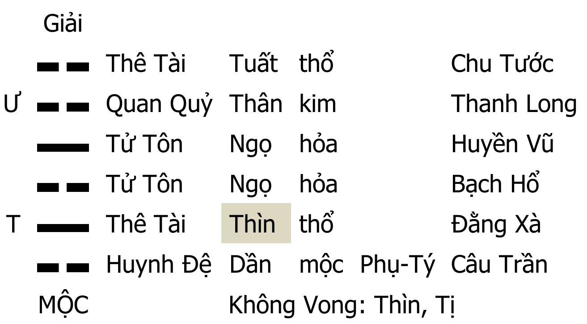
    - **Hình này chứng minh điều gì**
      - Bạn trai là cảnh vệ người Mỹ cao to, đẹp trai, tóc hoe đỏ; hai người chưa kết hôn và cô gái lòng đầy thấp thỏm lo âu.
    - **Từ đâu mà thấy được**
      - Quan Quỷ Thân kim lâm Nguyệt kiến, Thanh Long vượng tướng; Hào 6 Tuất thổ Chu Tước sinh Quan; Phụ Mẫu Tý thủy và Hương Khuê phục tàng; Thế lâm Đằng Xà Không Vong.
  - **Phán đoán chi tiết:**
    - Căn cứ: Lấy Quan Quỷ làm Dụng thần. Hào Ứng Quan Quỷ Thân kim đắc Nguyệt kiến, lại được Nhật thần Mậu Tuất tương sinh nên cực kỳ vượng tướng.
    - Nhìn vào tình trạng kết hôn: Phụ Mẫu Tý thủy (tượng trưng cho hôn thú) không hiện trên quẻ; hào Thế Thê Tài Thìn thổ ngự tại hào 2 lại ngộ Tuần Không, hào 2 là trạch nhà, Không chủ cô độc một mình trông coi căn nhà trống; thần Hương Khuê Tý thủy cũng phục tàng không xuất hiện, do đó khẳng định đôi bên chưa từng làm lễ thành hôn.
    - Nhìn vào nghề nghiệp và tướng mạo đối phương: Quan Quỷ mang hành Kim, Nguyệt kiến lâm Quan Quỷ chủ đối phương là quân nhân phục vụ trong quân ngũ; hào lâm Thanh Long chủ diện mạo rất khôi ngô tuấn tú; đắc Nguyệt phù Nhật sinh vượng tướng chủ tầm vóc cao lớn, vạm vỡ. Hào 6 là Nguyên thần Tuất thổ sinh phù Quan Quỷ, hào 6 là cung vị đầu tóc, ngũ hành thổ chủ màu vàng còn Chu Tước chủ màu đỏ rực, kết hợp lại chỉ người có mái tóc đỏ hoặc vàng hoe.
    - Nhìn vào tâm lý người nữ: Hào Thế Thê Tài Thìn thổ ám động sinh Dụng thần cho thấy trong nội tâm cô gái vô cùng say đắm đối phương; tuy nhiên Thế ngộ Không Vong lại hội Đằng Xà chủ tâm trạng bồn chồn, hoang mang, bất an lo sợ; song nhờ Dụng thần đại vượng nên hôn sự vẫn có hy vọng tiến triển thành tựu.
  - **Ứng nghiệm thực tế:**
    - Cô gái xác nhận: Bạn trai vốn là một chàng trai người Mỹ, hiện công tác tại đội cảnh vệ vũ trang, người cao lớn, rất đẹp trai, tóc màu hung đỏ, hiện tại hai người vẫn chưa kết hôn.

- **Ví dụ 3:** Ngày Ất Mão tháng Ngọ năm Giáp Thân, nữ đoán tình yêu ngoài hôn nhân, được quẻ Trạch Phong Đại Quá biến Hỏa Phong Đỉnh.
  - **Hình 104.** Quẻ Trạch Phong Đại Quá biến Hỏa Phong Đỉnh
    - 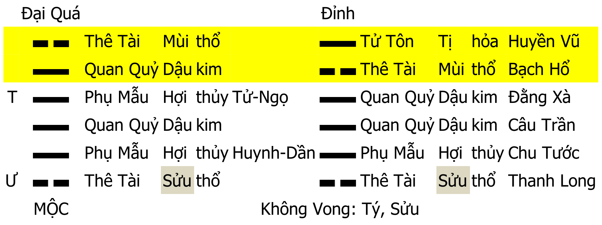
    - **Hình này chứng minh điều gì**
      - Người tình làm công an chuyển sang kinh doanh, tính nóng, mặt tròn, bị đứt ngón tay giữa và quen nhau vào tháng Thìn.
    - **Từ đâu mà thấy được**
      - Quan Quỷ Dậu kim hào 5 Bạch Hổ hóa Tài Mùi thổ lâm Dịch Mã; Nguyên thần hào 6 bị Nhật khắc, ngoại Đoài khuyết, thổ trung ương.
  - **Phán đoán chi tiết:**
    - Căn cứ: Lấy Quan Quỷ làm Dụng thần. Trong quẻ Quan Quỷ lưỡng hiện, chọn hào phát động Quan Quỷ Dậu kim tại hào 5 làm Dụng thần chính.
    - Nhìn vào nghề nghiệp và biến động cuộc đời: Hào 5 là ngôi vị lãnh đạo quyền thế, lâm Bạch Hổ chủ vũ trang gươm súng nên ban đầu công tác trong lực lượng công an; Dụng thần lâm Dịch Mã chủ bôn ba dịch chuyển, động hóa Thê Tài biểu thị về sau xuất ngũ chuyển hướng sang làm kinh doanh buôn bán.
    - Nhìn vào thời điểm kết duyên và diện mạo tính tình: Quan Quỷ phát động, động mà ứng hợp vào tháng Thìn năm Thân là thời điểm đôi bên bắt đầu quen biết nhau. Dụng thần lâm Bạch Hổ chủ tính khí nóng nảy, cộc cằn; chi Dậu kim chủ khuôn mặt tròn trịa.
    - Nhìn vào thái độ tình cảm: Dụng thần tương sinh hào Thế cho thấy người này rất mực yêu quý cô gái; tuy nhiên Quan Quỷ bị Nguyệt Ngọ khắc phạt, lại bị Nhật Mão xung thành hưu tù suy kiệt, lực sinh Thế yếu ớt nên hiện tại không thể lo chu toàn hay trợ giúp được nhiều cho cô.
    - Luồng đối thoại và phán đoán khuyết tật ly kỳ:
      - Cô gái thốt lên: "Ông phán đoán rất đúng, ông xem trên người anh ấy có khuyết hãm cái gì không?".
      - Tác giả quan sát kỹ lưỡng: Thấy Nguyên thần Thê Tài Mùi thổ tại hào 6 bị Nhật thần Mão mộc khắc chế; hào 6 là cung vị đôi bàn tay, ngoại quái là Đoài chủ sứt mẻ khuyết tật; ngũ hành thổ chủ vị trí trung ương chính giữa. Do đó tác giả quả quyết: Anh ta bị mất một ngón tay giữa! Lời đoán thần tình khiến mọi người xung quanh đều sững sờ kinh ngạc.
  - **Ứng nghiệm thực tế:**
    - Cô gái xác nhận: Người đàn ông này thời kỳ làm công an từng bị thương tật trong khi truy bắt tội phạm, bị đứt mất nửa ngón tay giữa.

- **Ví dụ 4:** Ngày Bính Ngọ tháng Hợi, nữ đoán tình yêu ra sao? Được quẻ Hỏa Phong Đỉnh biến Địa Phong Thăng.
  - **Hình 105.** Quẻ Hỏa Phong Đỉnh biến Địa Phong Thăng
    - 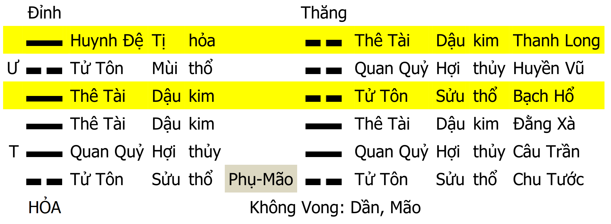
    - **Hình này chứng minh điều gì**
      - Tình duyên chắc chắn thành công; bạn trai cao ráo 1m78, khuôn mặt dài, bị cận thị và luôn đeo kính mắt.
    - **Từ đâu mà thấy được**
      - Quan Quỷ Hợi thủy trì Thế vượng tướng đắc tam hợp Nguyên thần sinh; Quẻ số 8; Hào 5 Huyền Vũ bị Nhật hỏa hợp.
  - **Phán đoán chi tiết:**
    - Căn cứ: Lấy Quan Quỷ làm Dụng thần. Quan Quỷ Hợi thủy trì Thế được Nguyệt kiến Hợi thủy đồng hành trợ lực nên đắc lệnh cực vượng; ngoại quái biến xuất tam hợp cục Tị Dậu Sửu (Kim cục Nguyên thần) tương sinh mãnh liệt cho Dụng thần, khẳng định tình yêu chắc chắn đi đến thắng lợi viên mãn.
    - Nhìn vào tầm vóc và khuôn mặt: Dụng thần vượng tướng chủ vóc người cao ráo; chi Hợi thủy đại diện cho khuôn mặt dài; quẻ chính mang tượng số 8 (quẻ Đỉnh số 8 hoặc Ly 3 Tốn 5 hợp thành 8), kết hợp định lượng chiều cao là 1m78.
    - Nhìn vào tật khúc xạ ở mắt: Hào Ứng đại diện cho bạn trai tọa tại hào 5 ngũ quan hội Huyền Vũ; Huyền Vũ chủ tối tăm, u ám, biểu thị mắt bị tật khúc xạ cận thị; lại gặp Nhật thần Bính Ngọ mang ngũ hành hỏa đến tương hợp, hành hỏa chủ đôi mắt bị hợp nhập Mộ/hợp kết thành vật che chắn, chứng tỏ người này có đeo kính mắt.
  - **Ứng nghiệm thực tế:**
    - Cô gái vô cùng khâm phục xác nhận: Bạn trai cao đúng 1m78, mặt dài, bị cận thị nặng và luôn phải đeo kính mắt; tình cảm đôi bên đang vô cùng thắm thiết.

- **Ví dụ 5:** Ngày Quý Hợi tháng Dần, nữ đoán duyên phận với chồng, được quẻ Địa Hỏa Minh Di biến Sơn Trạch Tổn.
  - **Hình 106.** Quẻ Địa Hỏa Minh Di biến Sơn Trạch Tổn
    - 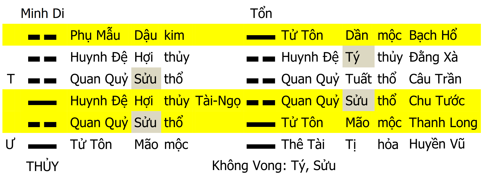
    - **Hình này chứng minh điều gì**
      - Hôn nhân tan vỡ vì đồng sàng dị mộng; chồng mặt vuông, thấp béo, mũi thính; vợ đã lén lút có nhân tình mới.
    - **Từ đâu mà thấy được**
      - Quẻ Du hồn, Quan Quỷ Sửu thổ hào 2 lâm Không động hóa thoái/khắc; Thế lâm Không; hào 3 động hóa Quan Quỷ.
  - **Phán đoán chi tiết:**
    - Căn cứ: Lấy Quan Quỷ làm Dụng thần. Trong quẻ Quan Quỷ lưỡng hiện, chọn hào phát động Quan Quỷ Sửu thổ tại hào 2 làm Dụng thần đại diện cho người chồng.
    - Nhìn vào thực trạng hôn nhân và tâm lý đôi bên: Dụng thần ngự tại hào 2 (trạch nhà), chứng tỏ chồng vẫn đang ở trong nhà nhưng lâm Tuần Không, biểu thị hình bóng người vợ đã không còn tồn tại trong tâm trí người chồng; hào Thế Quan Quỷ Sửu thổ tại hào 4 cũng lâm Không Vong, chứng tỏ trong lòng người vợ cũng nguội lạnh, không còn nghĩ đến chồng; quẻ thuộc thể Du hồn chủ phiêu bạt chia ly, lại thêm Quan Quỷ động hóa hồi đầu khắc, khẳng định bản thân người nữ chủ động muốn dứt áo ly hôn.
    - Nhìn vào tính tình và tướng mạo người chồng: Quẻ thuộc cung Khảm chủ trí tuệ nhanh nhạy, nhưng lâm Không Vong lại biến thành kẻ giảo hoạt, lươn lẹo, không đáng tin cậy; ngự tại hào 2 Không Vong chủ tâm không đặt ở tổ ấm gia đình. Về diện mạo: ngũ hành thổ chủ khuôn mặt vuông vức (mặt chữ quốc); thổ lâm hưu tù bị Nguyệt Dần khắc phạt nên vóc dáng thấp lùn mà béo mập; thổ chủ cơ quan mũi, lâm Không Vong chủ lỗ mũi thông thoáng, khứu giác cực kỳ nhạy bén (rất thính mũi).
    - Nhìn vào quan hệ tình cảm vụng trộm của người vợ: Hào 3 nội quái là cung vị giường ngủ phát động hóa xuất Quan Quỷ Sửu thổ; Quan Quỷ chủ người đàn ông khác, chứng tỏ người vợ sau lưng chồng đã có nhân tình mới ở bên ngoài.
  - **Ứng nghiệm thực tế:**
    - Người nữ ngậm ngùi thừa nhận: Quẻ đoán chuẩn xác đến từng chân tơ kẽ tóc; chồng thấp béo, lươn lẹo, hai người sống chung nhà nhưng đã nguội lạnh; bản thân cô hiện đã có người đàn ông khác và đang chuẩn bị nộp đơn ly hôn.

- **Ví dụ 6:** Ngày Nhâm Thân tháng Dần, nữ (57 tuổi) đoán có thể kết hôn với người đàn ông hay không? Được quẻ Thủy Sơn Kiển biến Thủy Hỏa Ký Tế.
  - **Hình 107.** Quẻ Thủy Sơn Kiển biến Thủy Hỏa Ký Tế
    - 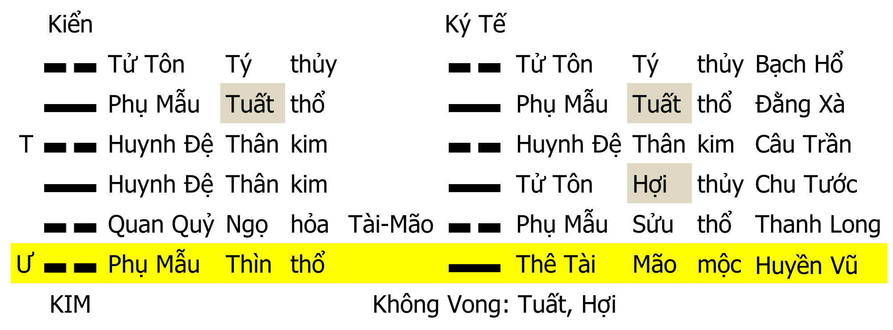
    - **Hình này chứng minh điều gì**
      - Đối phương khôi ngô, đã ly hôn nhưng chỉ muốn sống chung không chịu cưới; người nữ 57 tuổi lòng đầy do dự.
    - **Từ đâu mà thấy được**
      - Quan Quỷ Ngọ hỏa Thanh Long vượng; Thê Tài phục bị Nhật khắc; Ứng Phụ Mẫu Thìn thổ Huyền Vũ độc phát hóa Đào hoa; Nguyên thần Thế ngộ Không.
  - **Phán đoán chi tiết:**
    - Căn cứ: Lấy Quan Quỷ làm Dụng thần. Quan Quỷ Ngọ hỏa ngự tại hào 2 được Nguyệt kiến Dần mộc tương sinh nên đắc khí vượng tướng.
    - Nhìn vào tướng mạo và gia cảnh người nam: Dụng thần lâm Thanh Long chủ nhân mạo khôi ngô, phong thái đẹp đẽ, đĩnh đạc; lâm Dịch Mã biểu thị cuộc sống hay bôn ba, di chuyển không cố định; thần Thê Tài Mão mộc phục tàng dưới hào 2 bị Nhật thần Thân kim khắc phạt gắt gao, chứng minh người đàn ông này trước đó đã ly dị vợ.
    - Nhìn vào mưu tính và thái độ đối phương: Hào Ứng đại diện cho đối phương mang Phụ Mẫu Thìn thổ lâm Huyền Vũ độc phát tại hào sơ, biến xuất Đào hoa Mão mộc; hào sơ là tâm sự kín đáo; Phụ Mẫu (giấy đăng ký kết hôn) lâm Huyền Vũ chủ sự việc mờ ám, không chính danh, là thông tin sống chung không giá thú (vị hôn đồng cư); hào động lại sinh hào Thế, bộc lộ rõ ý định của ông ta là chỉ muốn hai người về sống chung như nhân tình chứ dứt khoát không chịu đăng ký kết hôn.
    - Nhìn vào nội tâm người phụ nữ: Hào 5 Phụ Mẫu Tuất thổ là Nguyên thần sinh hào Thế (Huynh Đệ Thân kim); Nguyên thần chủ tư duy, ý nghĩ sâu kín; nay Phụ Mẫu Tuất thổ lâm Không Vong biểu thị tâm trạng bà cụ 57 tuổi đang chao đảo, dùng dằng, do dự không quyết đoán được nên tiến hay nên lui.
  - **Ứng nghiệm thực tế:**
    - Người phụ nữ 57 tuổi thở dài giãi bày: Thầy luận giải không sai một chữ; ông ấy rất khôi ngô, từng ly hôn, nhưng ngỏ ý chỉ muốn hai người già về ở chung chăm sóc nhau chứ không chịu làm hôn thú; chính vì thế bản thân bà vô cùng đắn đo, chưa dám gật đầu nhận lời.

- **Ví dụ 7:** Ngày Kỷ Mùi tháng Thìn, nam đoán tình trạng người nữ, được quẻ Hỏa Thủy Vị Tế biến Lôi Phong Hằng.
  - **Hình 108.** Quẻ Hỏa Thủy Vị Tế biến Lôi Phong Hằng
    - 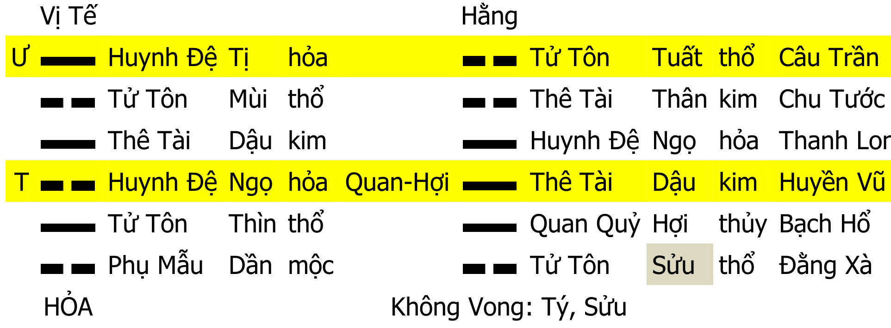
    - **Hình này chứng minh điều gì**
      - Người nữ quyến rũ, tóc ngắn thích đội mũ; chồng đi làm ăn xa; tài vận kiếm tiền tốt nhưng tiêu xài rất hoang phí.
    - **Từ đâu mà thấy được**
      - Hào Thế Ngọ hỏa Huyền Vũ; Nguyên thần mộc hưu tù nhập Mộ Nhật; Quan Quỷ phục tàng; Thế động hóa Tài; Hào 6 Huynh Đệ phát động.
  - **Phán đoán chi tiết:**
    - Căn cứ: Hỏi thăm tình trạng tổng quát của một người phụ nữ quen biết, lấy hào Thế làm tiêu điểm quy chiếu đại diện cho người đó.
    - Nhìn vào diện mạo và mái tóc: Hào Thế Huynh Đệ Ngọ hỏa hội Huyền Vũ, Huyền Vũ chủ phong tình, quyến rũ, cho thấy người nữ có dung mạo khêu gợi, cuốn hút phái mạnh; Nguyên thần Phụ Mẫu Dần mộc chủ râu tóc, lâm hưu tù lại nhập Mộ tại Nhật thần Kỷ Mùi, tượng trưng cho mái tóc cắt ngắn; nhập Mộ mang nghĩa che phủ, bao trùm, nên phán đoán cô này rất thích đội mũ nón thời trang để che đậy mái tóc ngắn của mình.
    - Nhìn vào hôn nhân và người chồng: Quan Quỷ Hợi thủy không xuất hiện trên quẻ (phục tàng dưới hào Thế), biểu thị người chồng thường xuyên vắng nhà, đi biền biệt ít khi ở cạnh vợ.
    - Nhìn vào tài chính và tiêu dùng: Hào Thế Huynh Đệ phát động hóa Thê Tài Dậu kim, tiền của tự tìm đến tay, biểu thị tài vận kiếm tiền rất khá; tuy nhiên hào 6 Huynh Đệ Tị hỏa phát động lâm Câu Trần, Huynh Đệ chủ hao tán tài sản, cho thấy tính tình cô này vung tay quá trán, tiêu pha mua sắm cực kỳ tốn kém.
  - **Ứng nghiệm thực tế:**
    - Người nam kinh ngạc phản hồi cả 3 phương diện đều chuẩn xác tuyệt đối: Cô gái rất gợi cảm, cắt tóc ngắn và hễ ra ngoài là đội mũ; chồng cô đi làm ăn xa nhà quanh năm; bản thân cô kiếm được nhiều tiền nhưng thói quen chi tiêu mua sắm lại hoang phí vô độ.

- **Ví dụ 8:** Ngày Giáp Tý tháng Thìn, nam hỏi có thể quen lâu dài với bạn gái không? Được quẻ Phong Thiên Tiểu Súc.
  - **Hình 109.** Quẻ Phong Thiên Tiểu Súc
    - 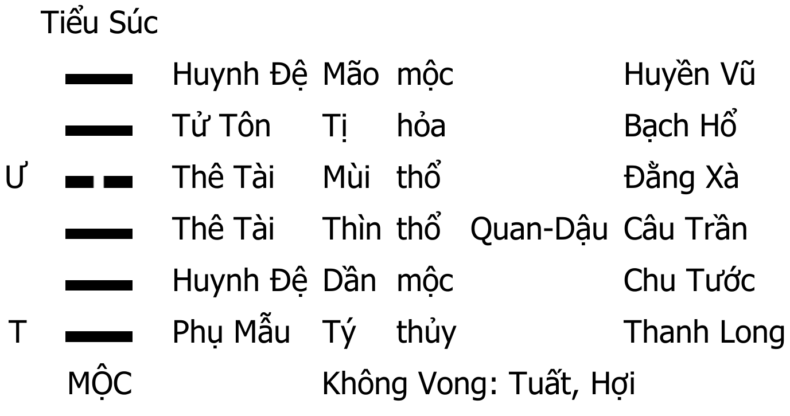
    - **Hình này chứng minh điều gì**
      - Bạn gái mập mạp, quái tính, mắt trái cận, từng mổ cổ họng, tóc dài đen; duyên không bền do dao động người cũ.
    - **Từ đâu mà thấy được**
      - Thê Tài Mùi thổ Đằng Xà tại Tốn; Thìn thổ Câu Trần; Hào 5 Tị hỏa Bạch Hổ bị Nhật khắc thương tuyệt thủy; Hào 6 Mão mộc vượng Huyền Vũ; Nguyên thần suy.
  - **Phán đoán chi tiết:**
    - Căn cứ: Lấy Thê Tài làm Dụng thần. Trong quẻ Thê Tài lưỡng hiện, chọn Thê Tài Mùi thổ lâm hào Ứng làm Dụng thần chính, Thê Tài Thìn thổ tại hào 3 làm hào tham chiếu bổ trợ.
    - Nhìn vào tính cách và vóc dáng: Thê Tài Mùi thổ hội Đằng Xà, Đằng Xà chủ quái đản, dị biệt, cô gái có cá tính rất mạnh, không theo chuẩn mực thông thường; hào Tài Thìn thổ lâm Câu Trần, Câu Trần chủ đẫy đà, mập mạp, cho thấy cô gái có ngoại hình béo tốt; Dụng thần cư cung Tốn chủ tâm ý bất định, gió chiều nào theo chiều nấy; lại bị Nguyệt kiến Thìn thổ là Mộ khố thu nạp, Dụng thần nhập Mộ biểu thị bản thân bị người khác thao túng, không có quyền tự chủ và thiếu hẳn chủ kiến độc lập.
    - Nhìn vào ngũ quan, bệnh mắt và vết thương phẫu thuật họng: Hào 5 là Nguyên thần Tử Tôn Tị hỏa, đồng thời hào 5 là cung vị ngũ quan; Tử Tôn chủ khí quan, hỏa chủ đôi mắt; nay Tị hỏa bị Nhật thần Tý thủy xung khắc thương tổn, lại hội Bạch Hổ chủ bệnh tật gươm đao, biểu thị mắt bị tật khúc xạ cận thị; hào 5 là hào vị dương (bên trái), xác định đích xác là mắt bên trái bị cận thị. Thêm nữa, Tử Tôn là y dược, Bạch Hổ là phẫu thuật dao kéo, chi Tị hỏa là Tuyệt địa của hành thủy, thủy chủ miệng và cuống họng; họng gặp Tuyệt địa tức bị khuyết hãm một phần, do đó đoán cô gái từng trải qua ca phẫu thuật cắt bỏ hoặc can thiệp ở cuống họng.
    - Nhìn vào mái tóc: Hào 6 là cung vị đầu tóc, ngũ hành mộc chủ lông tóc; Huynh Đệ Mão mộc tại hào 6 đắc Nhật thần Tý thủy sinh phù vượng tướng, đoán tóc dài; lâm Huyền Vũ chủ màu đen tuyền, óng mượt.
    - Diễn biến cuộc đối thoại xác minh trực tiếp: Nghe luận giải đến đây, người nam vô cùng thán phục về tính cách và vóc dáng mập mạp, xác nhận cô ta bị cận nhưng chưa rõ mắt nào cận nặng hơn, cũng không rõ chuyện phẫu thuật họng. Anh ta bèn bấm điện thoại gọi hỏi thẳng bạn gái: Kết quả xác minh hoàn toàn chính xác, mắt trái cận thị và cô từng phẫu thuật cắt amiđan/cuống họng!
    - Nhìn vào tiền đồ mối quan hệ: Dụng thần tuy vượng nhưng Nguyên thần hưu tù bị Nhật khắc phạt nặng nề; muốn biết tình cảm dài lâu hay ngắn ngủi bắt buộc phải xét Nguyên thần; Nguyên thần hưu tù thương tổn thì không thể duy trì dài lâu; lại mang quẻ danh "Tiểu Súc" (chứa chấp nhỏ, tạm bợ), báo hiệu cuộc tình sớm tan vỡ.
  - **Ứng nghiệm thực tế:**
    - Khi dự đoán hai người đang mặn nồng như keo như sơn, dọn về sống chung. Thế nhưng đến tháng Tuất (xung khai Mộ khố), người bạn trai cũ bất ngờ quay lại tìm cô; cô gái tính tình không chủ kiến liền dùng dằng, do dự phân vân không dứt khoát. Người nam tức giận yêu cầu cô dứt điểm, cô lần lữa chần chừ, cuối cùng anh ta dứt khoát nói lời chia tay và chấm dứt mối tình.

- **Ví dụ 9:** Ngày Quý Mùi tháng Mùi, nam đoán tình trạng bạn gái cũ, được quẻ Thủy Trạch Tiết.
  - **Hình 110.** Sơ đồ quẻ Thủy Trạch Tiết
    - 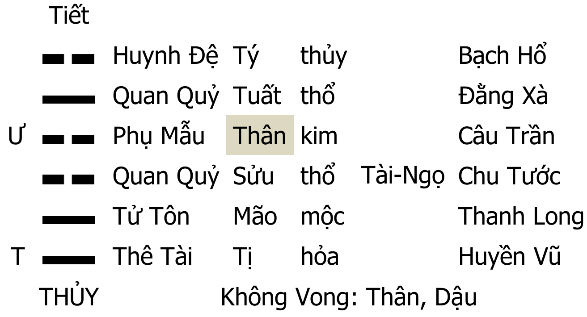
    - **Hình này chứng minh điều gì**
      - Bạn gái cũ gợi cảm, mặt trái xoan, mắt mí lót, có sẹo ở mũi, cận thị không đeo kính, ngực nhỏ mặc áo ngực to, mông lắc lư khi đi.
    - **Từ đâu mà thấy được**
      - Quẻ lục hợp; Thế Tị hỏa Huyền Vũ; Hào 5 Quan Quỷ Tuất thổ Đằng Xà; Phụ Mẫu Thân kim Không Vong; Hào 4 Câu Trần Không Vong; Hào 3 Sửu thổ Nguyệt phá Nhật xung.
  - **Phán đoán chi tiết:**
    - Căn cứ phương pháp đặc thù: Hai người đã chia tay dứt khoát, hỏi là để biết tình trạng diện mạo hiện tại chứ không cầu cát hung hợp tan; do đó toàn bộ 6 hào trong quẻ là bức tranh tái hiện hình bóng người bạn gái; lấy hào Thê Tài Tị hỏa kiêm xem cùng hào Thế.
    - Nhìn vào vóc dáng và thần thái: Quẻ đắc Lục hợp chủ thân hình đẫy đà, nở nang; hào Thế mang chi Tị hỏa (thuộc nhóm Dần Thân Tị Hợi) chủ dáng mặt thon nhọn, tức khuôn mặt trái xoan thanh tú; lâm Huyền Vũ kết hợp quẻ Lục hợp biểu thị người nữ mang nét đẹp cực kỳ quyến rũ, gợi cảm, toát ra ma lực cuốn hút phái mạnh.
    - Nhìn vào mắt, mí mắt và kính: Hào Thế mang hành hỏa chủ đôi mắt, đắc Lục hợp là mắt hai mí; hỏa ngự tại nội quái (bên trong) là mắt mí lót; hào 5 Tuất thổ là hỏa khố (Mộ khố của hỏa mắt), hỏa nhập Mộ Quan Quỷ tất chủ tật cận thị; kính mắt lấy Phụ Mẫu làm đại diện, hào 4 Phụ Mẫu Thân kim lâm Tuần Không lại không được hào 5 tương sinh, chứng minh cô gái tuy cận thị nhưng điệu đà không chịu đeo kính mắt.
    - Nhìn vào vết sẹo ở mũi: Hào 5 là cung vị gương mặt, ngũ hành thổ chủ sống mũi; nay hào 5 Quan Quỷ Tuất thổ lâm Đằng Xà, Quan Quỷ chủ tì vết bệnh tật, Đằng Xà chủ sẹo vết, khẳng định ngay trên sống mũi có một vết sẹo rõ rệt.
    - Nhìn vào vòng một và trang phục nội y: Hào 4 là cung ngực, lâm Phụ Mẫu càng tượng trưng cho lồng ngực; thần Tử Tôn đại diện cho bầu vú, mà Phụ Mẫu Thân kim là Tuyệt địa của Tử Tôn (kim tuyệt mộc), lại thêm Tử Tôn hưu tù suy nhược, khẳng định cô gái có vòng một khiêm tốn (vú nhỏ); hào 4 Phụ Mẫu còn tượng trưng cho nịt vú, lâm Câu Trần chủ dày cộm to bè, nhưng ngộ Tuần Không là bên trong trống rỗng; kết luận sắc bén: Cô gái vú nhỏ nhưng chuyên mặc nịt vú độn rất to để đánh lừa thị giác.
    - Nhìn vào bờ mông và tướng đi: Hào 3 là cung vị xương chậu và mông; Sửu thổ lâm hào âm ở nội quái chủ phần sau thân thể (bờ mông); chi Sửu thổ bị Nguyệt phá mang tượng phân chia hai múi mông rõ rệt; lại gặp Nhật thần Mùi thổ xung động (xung khởi), khiến phần mông chuyển động liên tục; do đó đoán mỗi khi sải bước đi thì bờ mông đung đưa lắc lư rất mạnh.
  - **Ứng nghiệm thực tế:**
    - Chàng trai kinh ngạc xác nhận toàn bộ chi tiết nhỏ nhất đều nghiệm đúng trăm phần trăm: Bạn gái cũ mặt trái xoan, mắt mí lót, trên mũi có sẹo nhỏ, cận thị nhưng không đeo kính, ngực nhỏ mà thích mang áo ngực ngoại cỡ, và bước đi có tướng lắc mông rất gợi tình.

- **Ví dụ 10:** Ngày Quý Mùi tháng Mùi, nam đoán tình trạng bạn gái cũ, được quẻ Phong Sơn Tiệm.
  - **Hình 111.** Sơ đồ quẻ Phong Sơn Tiệm
    - 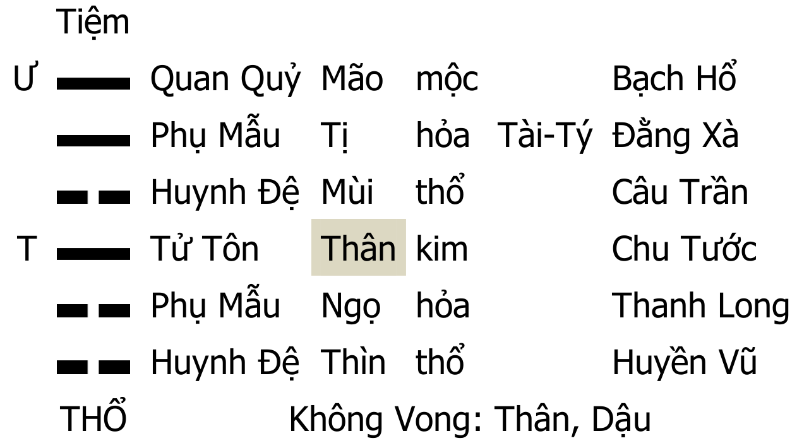
    - **Hình này chứng minh điều gì**
      - Bạn gái cũ mặt tròn, bảo thủ, mắt trái cận, mê ca hát giọng vang, ngực nhỏ kinh nguyệt ít, thích mặc quần dài không mặc váy.
    - **Từ đâu mà thấy được**
      - Tài Tý thủy phục hào 5; Quẻ cung Cấn; Thế Tử Tôn Thân kim Chu Tước ngộ Không; Hào 3 Tử Tôn lâm Không không sinh Tài; Hào 2 Phụ Mẫu Ngọ hỏa hợp Nhật Nguyệt.
  - **Phán đoán chi tiết:**
    - Căn cứ: Thám thính tình trạng bạn gái cũ, lấy Thê Tài Tý thủy kiêm xem cùng hào Thế Tử Tôn Thân kim, toàn quẻ phản ánh thể trạng và thói quen sinh hoạt của đối phương.
    - Nhìn vào khuôn mặt và tâm tính: Thê Tài mang chi Tý thủy (thuộc nhóm Tý Ngọ Mão Dậu) chủ khuôn mặt tròn trịa, phúc hậu; quẻ thuộc cung Cấn chủ trầm tĩnh, bất động, cho thấy cô gái có tính cách bảo thủ, nếp sống cổ điển và kín kẽ.
    - Nhìn vào đôi mắt và tật cận thị: Dụng thần Thê Tài Tý thủy phục tàng dưới hào 5 Phụ Mẫu Tị hỏa; hào 5 là cung vị ngũ quan, ngũ hành hỏa chủ đôi mắt; thủy bị hỏa khắc tuyệt nên đôi mắt có tật cận thị; Phụ Mẫu Tị hỏa thuộc hào dương, xác định cô gái chủ yếu bị cận thị ở con mắt bên trái.
    - Nhìn vào khiếu văn nghệ ca hát: Hào Thế mang Tử Tôn Thân kim hội Chu Tước; Chu Tước chủ ngôn ngữ thanh âm, ca xướng; Tử Tôn chủ niềm vui du hý giải trí; Thân kim lâm Tuần Không tạo nên tượng "kim Không tắc minh" (chuông rỗng gõ kêu vang dội), phán đoán cô gái có chất giọng rất trong trẻo và cực kỳ say mê ca hát.
    - Nhìn vào vú và sinh lý phụ nữ: Tử Tôn chủ bầu ngực, ngộ Không Vong tức vị trí lồng ngực bằng phẳng, ngực nhỏ; Tử Tôn ngự tại hào 3 (cung vị tử cung, cơ quan sinh sản), Thê Tài chủ kinh nguyệt phụ nữ; nay Tử Tôn lâm Không nên không thể sinh dưỡng Thê Tài, phản ánh kinh nguyệt không điều hòa, lượng kinh ra rất ít.
    - Nhìn vào gu trang phục (quần hay váy): Phụ Mẫu chủ quần áo trang phục; Phụ Mẫu Ngọ hỏa ngự tại hào 2 (cung vị đôi chân), y phục ở chân chính là quần hoặc váy; chi Ngọ hỏa là đất Mộc Dục của hào Thế Thân kim, Mộc Dục chủ phơi bày da thịt, thông thường giải là mặc váy ngắn hoặc quần đùi; tuy nhiên Ngọ hỏa lại tương hợp chặt chẽ với cả Nhật thần và Nguyệt kiến Mùi thổ (Ngọ Mùi hợp), "hợp chủ che đậy, bao bọc kín mít", biến tượng hở hang thành kín đáo; do đó đoán cô gái có gu ăn mặc rất kín đáo, thích mặc quần dài, không thích mặc váy ngắn.
  - **Ứng nghiệm thực tế:**
    - Người nam xác nhận tất cả mọi suy đoán từ dáng mặt tròn, mắt trái cận, niềm đam mê ca hát, bệnh lý ngực nhỏ kinh nguyệt ít cho đến thói quen chỉ thích mặc quần dài kín cổng cao tường đều hoàn toàn chính xác.

### CHƯƠNG 3: HƯƠNG KHUÊ VÀ SÀNG TRƯỚNG

#### 1. Khái niệm và ý nghĩa dự đoán của Hương Khuê và Sàng Trướng
- **Mục đích dự đoán:** Khi xem bói Lục Hào về quan hệ nam nữ, để nhận biết đối phương đã kết hôn hay chưa, hai người đã phát sinh quan hệ thể xác (lên giường) hay chưa, hoặc đã dọn về sống chung hay chưa, phương pháp then chốt là khảo sát Hương Khuê hoặc Sàng Trướng.
- **Phân định giới tính:**
  - Nữ coi bói xem Hương Khuê (đại diện cho khuê phòng của nữ nhân).
  - Nam coi bói xem Sàng Trướng (đại diện cho giường chiếu, màn trướng của nam nhân).
- **Nguyên lý vượng suy và ứng nghiệm:**
  - Hương Khuê hoặc Sàng Trướng vượng tướng, xuất hiện trên quẻ: Chủ hai người đã ở chung hoặc đã kết hôn chính thức.
  - Hương Khuê hoặc Sàng Trướng hưu tù, lâm Không Vong hoặc Nguyệt phá: Chủ chưa kết hôn hoặc chưa từng sống chung, chưa phát sinh quan hệ thể xác.
- **Mối quan hệ với Lục thân:**
  - Lâm Phụ Mẫu: Chủ đã kết hôn (Phụ Mẫu đại diện cho giấy hôn thú, hôn nhân hợp pháp).
  - Lâm Phụ Mẫu lâm Không Phá: Chủ đã ly hôn, ly dị.
  - Lâm Tử Tôn: Chủ đã sống chung và có thai hoặc sinh con.
  - Lâm Dụng thần: Biểu thị nhân duyên hòa hợp, hôn sự có thể tác thành.
- **Nguyên tắc kết hợp toàn diện:** Hương Khuê và Sàng Trướng không quyết định tuyệt đối đơn lẻ mà phải phối hợp chặt chẽ với Lục thân, Lục thần và tình hình sinh khắc hợp xung của Dụng thần mới đạt độ chuẩn xác cao.

#### 2. Phương pháp xác định Quái Thân
- **Nguồn gốc suy diễn:** Hương Khuê và Sàng Trướng đều được suy ra từ Quái Thân của quẻ.
- **Quy tắc tìm Quái Thân:**
  - Hào Thế mang tính Dương: Khởi địa chi Tý từ hào sơ, đếm thuận theo thứ tự hào: hào sơ Tý, hào 2 Sửu, hào 3 Dần, hào 4 Mão, hào 5 Thìn, hào 6 Tị. Đếm đến hào Thế thì dừng lại, địa chi rơi vào hào Thế chính là Quái Thân.
  - Hào Thế mang tính Âm: Khởi địa chi Ngọ từ hào sơ, đếm thuận theo thứ tự hào: hào sơ Ngọ, hào 2 Mùi, hào 3 Thân, hào 4 Dậu, hào 5 Tuất, hào 6 Hợi. Đếm đến hào Thế thì dừng lại, địa chi rơi vào hào Thế chính là Quái Thân.
- **Đặc điểm tồn tại:** Không phải quẻ nào cũng có Quái Thân hiển hiện trên quẻ (nếu địa chi suy ra không xuất hiện trong các hào thì quẻ không có Quái Thân).

#### 3. Quy luật suy diễn Hương Khuê và Sàng Trướng từ Quái Thân
- **Định nghĩa ngũ hành:**
  - Ngũ hành bị Quái Thân khắc là Hương Khuê (Quái Thân khắc vi Hương Khuê / Khuê Phòng).
  - Ngũ hành được Quái Thân sinh là Sàng Trướng (Quái Thân sinh vi Sàng Trướng).
- **Bảng quy nạp chi tiết theo Quái Thân:**
  - Quái Thân Tý, Hợi (hành Thủy):
    - Hương Khuê (Thủy khắc Hỏa): Tị, Ngọ.
    - Sàng Trướng (Thủy sinh Mộc): Dần, Mão.
  - Quái Thân Dần, Mão (hành Mộc):
    - Hương Khuê (Mộc khắc Thổ): Thìn, Tuất, Sửu, Mùi.
    - Sàng Trướng (Mộc sinh Hỏa): Tị, Ngọ.
  - Quái Thân Tị, Ngọ (hành Hỏa):
    - Hương Khuê (Hỏa khắc Kim): Thân, Dậu.
    - Sàng Trướng (Hỏa sinh Thổ): Thìn, Tuất, Sửu, Mùi.
  - Quái Thân Thân, Dậu (hành Kim):
    - Hương Khuê (Kim khắc Mộc): Dần, Mão.
    - Sàng Trướng (Kim sinh Thủy): Tý, Hợi.
  - Quái Thân Thìn, Tuất, Sửu, Mùi (hành Thổ):
    - Hương Khuê (Thổ khắc Thủy): Tý, Hợi.
    - Sàng Trướng (Thổ sinh Kim): Thân, Dậu.

#### 4. Phân tích các quái lệ thực tế
- **Ví dụ 1:** Ngày Bính Dần tháng Dần (Tuần Không: Tuất, Hợi), nữ đoán theo đuổi mục tiêu ngoài hôn nhân, được quẻ Thủy Sơn Kiển biến Địa Sơn Khiêm.
  - **Hình 112.** Sơ đồ quẻ Thủy Sơn Kiển biến Địa Sơn Khiêm
    - 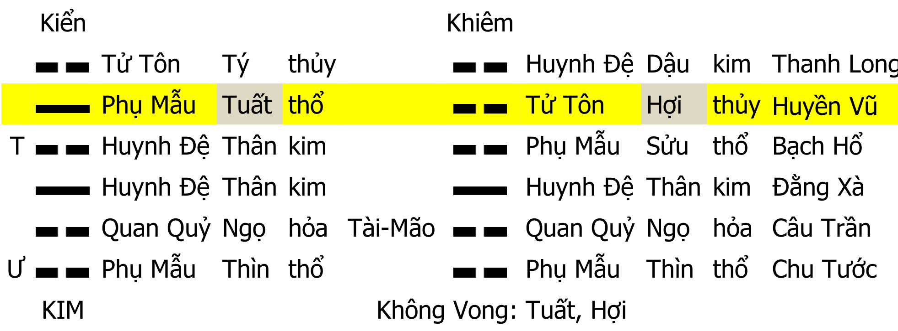
    - **Hình này chứng minh điều gì**
      - Đối phương có số đào hoa và đang chung sống với phụ nữ; đương số tính tình hoạt bát, đã nhiều lần quan hệ thể xác và từng ly hôn nhiều lần.
    - **Từ đâu mà thấy được**
      - Sàng Trướng Tý thủy hưu tù, Phụ Mẫu Tuất thổ Không Vong lâm Huyền Vũ có Tài phục; hào Thế Dịch Mã bị xung phá, Phụ Mẫu Không hóa Không sinh Thế.
  - **Phán đoán chi tiết:**
    - Căn cứ xác định Dụng thần:
      - Nữ đoán về đối tượng ngoài hôn nhân, lấy Quan Quỷ Ngọ hỏa tại hào 2 làm Dụng thần.
    - Căn cứ & Nhìn vào tướng mạo, tính cách của đối phương:
      - Căn cứ Dụng thần Quan Quỷ Ngọ hỏa tại cung Đoài, nhìn vào thấy người nam giỏi ăn nói, tính cách cởi mở, vui vẻ, lạc quan; lâm hỏa biểu thị năng lực xã giao rất mạnh.
      - Căn cứ Dụng thần hỏa được Nhật Nguyệt Dần mộc đồng thời tương sinh nên vượng tướng tột cùng, nhìn vào thấy tính tình nóng nảy, dễ nổi giận bốc hỏa dữ dội.
      - Căn cứ Dụng thần vượng tướng lâm Câu Trần, nhìn vào thấy thân thể tráng kiện, cơ bắp cuồn cuộn.
      - Căn cứ ngũ hành Dụng thần là hỏa, nhìn vào thấy thể hình người to lớn nhưng đầu nhỏ.
      - Căn cứ địa chi Dụng thần là Ngọ hỏa, nhìn vào thấy khuôn mặt tròn trịa.
    - Căn cứ & Nhìn vào tình trạng hôn nhân và sống chung của người nam:
      - Căn cứ Sàng Trướng Tý thủy không được Nhật Nguyệt trợ giúp, bị Tuất thổ khắc chế nên hưu tù suy nhược; Phụ Mẫu Tuất thổ lâm Tuần Không, nhìn vào thấy người nam này chưa kết hôn chính thức.
      - Nhìn vào Phụ Mẫu Tuất thổ Không Vong lâm Huyền Vũ (chủ mờ ám) và Thê Tài Mão mộc phục tàng dưới Quan Quỷ Ngọ hỏa, suy ra người nam này đang có phụ nữ sống chung như vợ chồng.
    - Căn cứ & Nhìn vào bản thân đương số (nữ):
      - Căn cứ hào Thế Huynh Đệ Thân kim lâm Dịch Mã, nhìn vào thấy bản thân cô tính tình hoạt bát, hiếu động, hiếm khi ở yên một chỗ lâu dài.
      - Căn cứ hào 5 Phụ Mẫu Tuất thổ Không hóa Không đến sinh hào Thế; đồng thời hào Thế Thân kim bị Nhật Nguyệt Dần mộc xung phá (xung phá chủ phá trinh, Phụ Mẫu là giấy chứng nhận kết hôn, Không hóa Không là tượng ly hôn): suy ra bản thân cô đã nhiều lần quan hệ thể xác với đàn ông và đã từng ly hôn nhiều lần.
  - **Ứng nghiệm thực tế và luồng đối thoại:**
    - Về tướng mạo tính cách đối phương: Người nữ xác nhận đối phương có giọng nói hay, rất thích nói đùa, cởi mở, xã giao cực giỏi. Khi nổi nóng rất đáng sợ như lửa bốc cháy nhưng cô lại thích tính cách đó; anh tập thể dục nên cơ bắp phát triển, râu tóc tốt, vóc người cao lớn, đầu nhỏ, mặt tròn.
    - Về việc người nam sống chung: Người nữ xác nhận đúng là có phụ nữ sống chung với anh ấy, có lẽ không chỉ một người; anh ấy mang số đào hoa và rất có duyên với nữ giới nên cô rất say đắm.
    - Về bản thân đương số: Người nữ xác nhận tính tình hoạt bát đúng như quẻ đoán; về hôn nhân cô thừa nhận bản thân đã ly hôn không chỉ một lần.
- **Ví dụ 2:** Ngày Bính Dần tháng Dần (Tuần Không: Tuất, Hợi), nam đoán người nữ mình thích, được quẻ Trạch Lôi Tùy biến Thiên Thủy Tụng.
  - **Hình 113.** Sơ đồ quẻ Trạch Lôi Tùy biến Thiên Thủy Tụng
    - 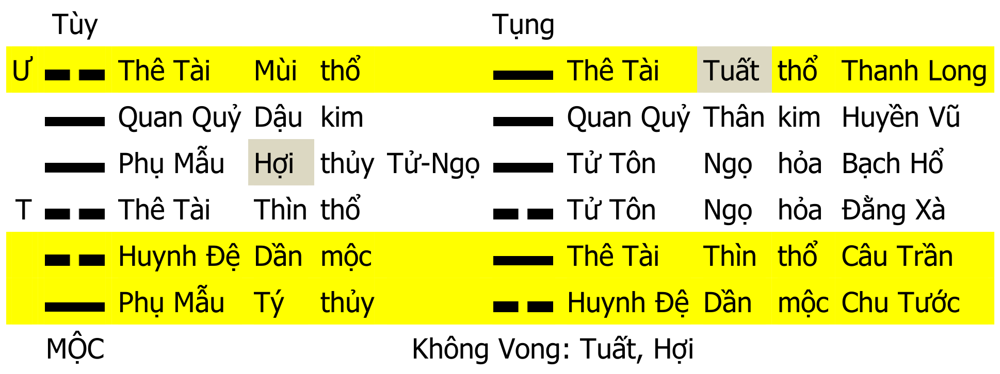
    - **Hình này chứng minh điều gì**
      - Người nữ là người nước ngoài, da đẹp, mắt sâu, không còn trinh trắng; đương số sống độc thân, quan hệ hai người nảy sinh bất hòa và chia tay.
    - **Từ đâu mà thấy được**
      - Thê Tài Mùi thổ tại hào 6 lâm Thanh Long, hỏa phục; hào Thế Đằng Xà, Sàng Trướng Tý thủy hưu tù; quẻ Tùy biến Tụng du hồn, Dụng động hóa Không.
  - **Phán đoán chi tiết:**
    - Căn cứ xác định Dụng thần:
      - Nam đoán người nữ mình thích, lấy Thê Tài Mùi thổ tại hào 6 làm Dụng thần.
    - Căn cứ & Nhìn vào tính cách người nữ:
      - Căn cứ Dụng thần Thê Tài Mùi thổ thuộc quái Chấn (quẻ Tùy), quái Chấn chủ động và xung động nên tính cách hơi nóng nảy; nhưng Dụng thần là hành thổ chủ đôn hậu, nhìn vào thấy không phải người tùy tiện.
    - Căn cứ & Nhìn vào tướng mạo người nữ:
      - Căn cứ Dụng thần ngự tại hào 6 lâm thổ kết hợp Thanh Long (chủ mỹ mạo), nhìn vào thấy nước da rất đẹp, khuôn mặt thanh tú.
      - Căn cứ Nguyên thần Tị hỏa/Ngọ hỏa (hành hỏa chủ đôi mắt) phục tàng không hiện trên quẻ, nhìn vào thấy hốc mắt sâu.
      - Căn cứ hào 2 Huynh Đệ Dần mộc (Kỵ thần) lâm Câu Trần khắc Dụng thần (hào 2 là hào vị chân đùi và vùng bụng, Câu Trần chủ phồng lên), nhìn vào thấy phần bụng có mỡ thừa, hơi phồng.
    - Căn cứ & Nhìn vào xuất thân và lịch sử tình cảm của người nữ:
      - Căn cứ Dụng thần tại hào 6 lại lâm hào Ứng (hào 6 là nơi xa xôi, nước ngoài; hào Ứng đại diện cho phương xa đối đãi với hào Thế), nhìn vào suy ra người nữ này là người nước ngoài.
      - Căn cứ quẻ chủ Trạch Lôi Tùy (Tùy mang nghĩa phụ họa, theo sau người khác), nhìn vào thấy bản thân đương số không phải bạn trai đầu tiên, cô gái trước đó đã có người yêu.
    - Căn cứ & Nhìn vào đương số và kết cục mối quan hệ:
      - Căn cứ hào Thế Thê Tài Thìn thổ lâm Dịch Mã, nhìn vào thấy đương số tính tình hoạt bát, hiếu động, thường hấp tấp làm việc mù quáng.
      - Căn cứ hào Thế lâm Đằng Xà (chủ cô đơn), Sàng Trướng Tý thủy hưu tù suy nhược, nhìn vào thấy đương số vẫn sống độc thân, chưa từng lên giường hay ở chung với đối phương.
      - Căn cứ quẻ biến Thiên Thủy Tụng là quẻ Du Hồn chủ chia tách; Dụng thần Thê Tài Mùi thổ bị Nhật Nguyệt Dần mộc khắc thương lại phát động hóa Tuất thổ Tuần Không, nhìn vào suy ra đôi bên sẽ nảy sinh bất hòa rồi chia tay.
  - **Ứng nghiệm thực tế và luồng đối thoại:**
    - Về người nữ: Người nam phản hồi cô tương đối tùy hứng, làm việc không ổn định (do con một) nhưng bụng dạ rất tốt. Hốc mắt sâu, mắt to rất đẹp, da dẻ đẹp; cô rất để ý mỡ bụng vì hơi thừa mỡ, chân đùi không mập. Xác nhận cô là người nước ngoài. Khi hỏi chuyện trinh tiết thì cô bảo đừng hỏi, nghe nói đã không còn là trinh nữ.
    - Về đương số và kết quả: Người nam xác nhận bản thân làm việc khá hấp tấp, mù quáng; là người sống rất cô đơn, nhóm máu A, chưa từng kết hôn và chưa từng lên giường với cô gái. Thực tế hai người đang có mâu thuẫn vì cô kém anh 20 tuổi, sau đó quẻ ứng nghiệm chia tay.
- **Ví dụ 3:** Ngày Kỷ Mão tháng Sửu năm Nhâm Ngọ (Tuần Không: Thân, Dậu), nữ đoán quan hệ phát triển ra sao? Được quẻ Lôi Trạch Quy Muội biến Thủy Hỏa Ký Tế.
  - **Hình 114.** Sơ đồ quẻ Lôi Trạch Quy Muội biến Thủy Hỏa Ký Tế
    - 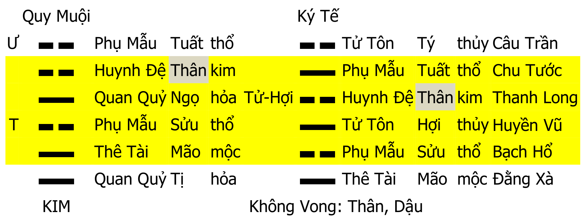
    - **Hình này chứng minh điều gì**
      - Hai người đã có quan hệ thể xác và gắn bó khăng khít; tương lai người nam sẽ thay lòng đổi dạ theo người phụ nữ khác vào năm Giáp Thân.
    - **Từ đâu mà thấy được**
      - Hương Khuê Mão mộc lâm Nhật, Thế lâm Huyền Vũ tại hào 3 được Dụng Quan Quỷ Ngọ hỏa sinh; Dụng thần động hóa Huynh Đệ Thân kim Không Vong.
  - **Phán đoán chi tiết:**
    - Căn cứ xác định Dụng thần:
      - Nữ đoán tình duyên, lấy Quan Quỷ Ngọ hỏa tại hào 4 làm Dụng thần.
    - Căn cứ & Nhìn vào tình cảm hiện tại và quan hệ xác thịt:
      - Căn cứ Quan Quỷ Ngọ hỏa được Nhật thần Mão mộc tương sinh là vượng tướng, lại sinh cho hào Thế Phụ Mẫu Sửu thổ, nhìn vào thấy người nam hiện tại đối xử với đương số vô cùng tốt.
      - Căn cứ Hương Khuê là Mão mộc lâm Nhật thần (chủ hiện tại); hào Thế lâm Huyền Vũ tại hào 3 (hào 3 là hào vị giường chiếu, Huyền Vũ chủ ám muội, ân ái) lại được Quan Quỷ Ngọ hỏa tới sinh, nhìn vào suy ra hai người đã có quan hệ thể xác, hiện tại quấn quýt khăng khít khó mà chia lìa.
    - Căn cứ & Nhìn vào xu hướng tương lai và thời điểm chia tay:
      - Căn cứ Quan Quỷ Ngọ hỏa phát động hóa Huynh Đệ Thân kim Tuần Không: Quan Quỷ hóa Huynh Đệ là tượng người nam đem lòng yêu người phụ nữ khác (Huynh Đệ là đối thủ cạnh tranh tình cảm); hóa Không Vong là lòng dạ đổi thay, rời bỏ đương số.
      - Nhìn vào địa chi hào biến là Thân kim, suy ra biến cố phản bội và chia tay sẽ ứng nghiệm vào năm Giáp Thân (2004) khi Thân kim xuất Không điền thực.
  - **Ứng nghiệm thực tế:**
    - Quả nhiên cô gái quen người nam vào tháng Dần năm đó, nhanh chóng dọn về chung sống cùng nhau, ngày ngày hình bóng không rời.
    - Đúng đến năm Giáp Thân (2004), người nam thay lòng đổi dạ, thích người phụ nữ khác và chính thức chia tay cô.
- **Ví dụ 4:** Ngày Giáp Dần tháng Tý (Tuần Không: Tý, Sửu), nam đoán vợ bỏ đi ra sao? Được quẻ Phong Hỏa Gia Nhân biến Phong Sơn Tiệm.
  - **Hình 115.** Quẻ Phong Hỏa Gia Nhân biến Phong Sơn Tiệm
    - 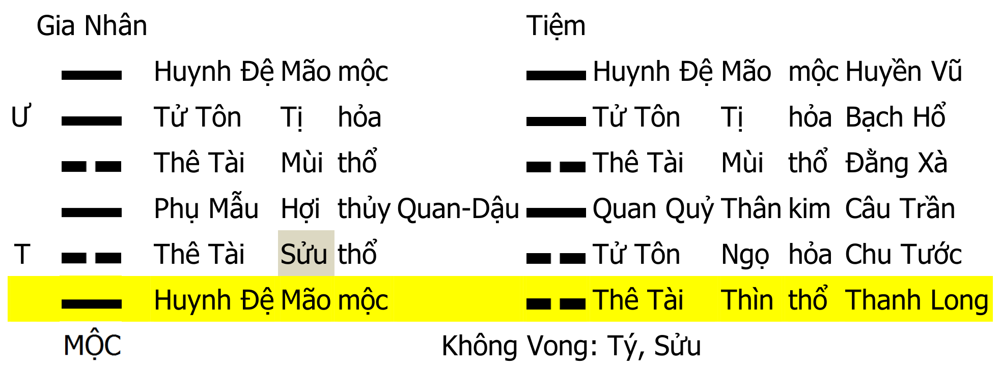
    - **Hình này chứng minh điều gì**
      - Vợ đã ngoại tình với người khác rồi bỏ nhà ra đi, hai vợ chồng đã ly thân và kết cục chắc chắn ly hôn.
    - **Từ đâu mà thấy được**
      - Thê Tài Sửu thổ trì Thế tại hào 2 lâm Không Vong; Sàng Trướng Dậu kim hưu tù phục tàng; hào sơ Huynh Đệ Mão mộc động hóa Tài khắc Dụng.
  - **Phán đoán chi tiết:**
    - Căn cứ xác định Dụng thần:
      - Nam đoán về vợ, lấy Thê Tài làm Dụng thần. Quẻ có Thê Tài Sửu thổ (hào 2) và Thê Tài Mùi thổ (hào 4) lưỡng hiện, chọn Thê Tài Sửu thổ trì Thế tại hào 2 làm Dụng thần.
    - Căn cứ & Nhìn vào tình trạng vợ bỏ nhà và ly thân:
      - Căn cứ Dụng thần Thê Tài Sửu thổ trì Thế tại hào 2: Hào 2 là nhà cửa, Tài trì Thế tại hào 2 vốn là tượng vợ ở trong nhà. Nhưng Sửu thổ lâm Tuần Không, Không chủ mất đi, rời rạc, nhìn vào thấy vợ đã bỏ nhà ra đi.
      - Căn cứ Quái Thân suy ra Sàng Trướng là Dậu kim (phục tàng dưới hào 3 Phụ Mẫu Hợi thủy): Sàng Trướng hưu tù lại không hiện trên quẻ, nhìn vào thấy vợ chồng đã ly thân.
    - Căn cứ & Nhìn vào nguyên nhân vợ bỏ đi và kết cục hôn nhân:
      - Căn cứ hào sơ Huynh Đệ Mão mộc phát động hóa Thê Tài Thìn thổ: Huynh Đệ là người đàn ông khác, động hóa Tài là biểu thị người đàn ông khác kết hợp với một người phụ nữ; tổ hợp này chỉ rõ người vợ đã ngoại tình lén lút bên ngoài.
      - Căn cứ Dụng thần Thê Tài Sửu thổ hưu tù tại Nguyệt lệnh, bị Nhật thần Dần mộc khắc và bị hào sơ Mão mộc động tới khắc, nhìn vào thấy chắc chắn phải ly hôn.
  - **Ứng nghiệm thực tế:**
    - Quả nhiên người vợ ngoại tình bên ngoài bị anh ta phát hiện; anh ta tức giận đánh vợ, người vợ bỏ nhà đi và sau đó hai người chính thức ly hôn.
- **Ví dụ 5:** Ngày Kỷ Mão tháng Tuất năm Nhâm Ngọ (Tuần Không: Thân, Dậu), nam đoán năm 1999 phát sinh sự việc gì? Được quẻ Khôn Vi Địa biến Thủy Sơn Kiển.
  - **Hình 116.** Quẻ Khôn Vi Địa biến Thủy Sơn Kiển
    - 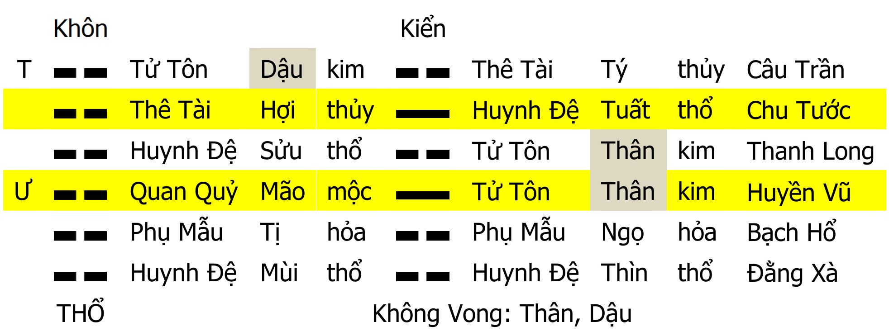
    - **Hình này chứng minh điều gì**
      - Năm 1999 (Kỷ Mão) người nam sống chung như vợ chồng với một phụ nữ (kết hôn), nhưng vì lục xung và Tài bị khắc nên nhanh chóng ly hôn.
    - **Từ đâu mà thấy được**
      - Thái Tuế Mão mộc (Sàng Trướng) nhập quẻ tại hào 3 lâm Huyền Vũ, xung thực Thế sinh Tài Hợi thủy; Tài hóa hồi đầu khắc, quẻ Khôn lục xung biến Kiển.
  - **Phán đoán chi tiết:**
    - Căn cứ phương pháp định hướng khi quẻ không có Dụng thần cụ thể:
      - Quẻ hỏi về sự kiện đã diễn ra trong một năm quá khứ (năm 1999 - Kỷ Mão) mà không nêu rõ sự vụ, do đó không định một Dụng thần cố định mà căn cứ vào sự vận hành của Thái Tuế lưu niên tác động lên các hào trong quẻ.
    - Căn cứ & Nhìn vào sự kiện sống chung và kết hôn trong năm 1999 (Kỷ Mão):
      - Căn cứ lưu niên 1999 là Kỷ Mão, Thái Tuế Mão mộc nhập quẻ tại hào 3 Quan Quỷ Mão mộc lâm Huyền Vũ phát động.
      - Căn cứ hào Thế Tử Tôn Dậu kim lâm Tuần Không ám động muốn sinh Thê Tài Hợi thủy nhưng vì Không nên không thể sinh; đến năm Kỷ Mão Thái Tuế Mão mộc xung thực hào Thế (Mão Dậu tương xung, xung thực), hào Thế liền phát huy lực lượng sinh Thê Tài.
      - Căn cứ hào 5 Thê Tài Hợi thủy động hóa Huynh Đệ Tuất thổ hồi đầu khắc, nhưng gặp Thái Tuế Mão mộc tại hào 3 hợp trú hào biến Tuất thổ (Mão Tuất lục hợp), trói chặt Kỵ thần khiến hào biến không thể khắc Thê Tài.
      - Căn cứ hào 3 là hào vị giường chiếu, lâm Huyền Vũ chủ tình dục ám muội; Thê Tài là phụ nữ; địa chi Mão mộc chính là Sàng Trướng (đối với nam giới): các tượng cùng hội tụ tại hào 3 chỉ rõ trong năm 1999 anh ta và một phụ nữ đã sống chung như vợ chồng và kết hôn.
    - Căn cứ & Nhìn vào kết cục phân ly nhanh chóng:
      - Nhìn vào Thê Tài Hợi thủy bị Nguyệt kiến Tuất thổ khắc chế, Nhật thần Mão mộc không trợ sinh, hào biến Tuất thổ sau khi hết trói vẫn tiềm tàng khắc phạt.
      - Quẻ Khôn Vi Địa là quẻ Lục Xung, chủ việc không thể lâu dài, biến cố chia tách; vì vậy nhìn vào suy ra mối quan hệ hôn nhân này nhanh chóng tan vỡ.
  - **Ứng nghiệm thực tế:**
    - Người coi bói phản hồi chuẩn xác: Đúng vào năm 1999 (Kỷ Mão) anh ta đã kết hôn với một người phụ nữ, nhưng cũng chính trong năm đó hai người nảy sinh biến cố và nhanh chóng ly hôn.

### CHƯƠNG 4: ĐÀO HOA VÀ DỊCH MÃ

#### Ý nghĩa và cách tra cứu thần sát Đào hoa trong dự đoán nhân duyên
- **Bản chất và vai trò của Đào hoa:**
  - Đào hoa (còn gọi là Hàm Trì) là thần sát chủ đạo thường dùng để phán đoán thái độ đối với tình cảm lứa đôi, phong thái ái tình và quan điểm về mối quan hệ nam nữ.
  - Trong Lục Hào dự trắc học, Đào hoa là một trong những căn cứ then chốt để định vị duyên số, sức hút giới tính và tính chất của mối quan hệ, mức độ ứng nghiệm trên thực tế rất cao.
  - Giai đoạn hoặc thời gian đương số liên tục xuất hiện nhiều mối lương duyên với người khác phái được gọi là "vận đào hoa".
  - Nhận thức biện chứng về Đào hoa: Không phải cứ xuất hiện Đào hoa là điều xấu xa hay dâm loạn. Đào hoa nếu ngộ cát thần (như Thanh Long, Quý Nhân), ngũ hành tương sinh, sinh vượng cho hào Thế hay Dụng thần thì biểu thị người phong nhã, ngoại hình xinh đẹp, có khiếu nghệ thuật, giao tiếp hoạt bát và được nhiều người mến mộ; chỉ khi Đào hoa ngộ hung thần (như Huyền Vũ dâm dật), lâm hào suy bại, bị hình xung khắc hại hoặc hóa hung thì mới biến thành đào hoa sát, đào hoa kiếp gây tan vỡ gia đình.
- **Phương pháp xác định Đào hoa theo ngày tháng:**
  - Quy tắc tra cứu căn cứ theo Tam hợp cục của Địa chi tháng hoặc Địa chi ngày dự đoán:
    - Cục Thân - Tý - Thìn: Đào hoa tại Dậu.
    - Cục Dần - Ngọ - Tuất: Đào hoa tại Mão.
    - Cục Tị - Dậu - Sửu: Đào hoa tại Ngọ.
    - Cục Hợi - Mão - Mùi: Đào hoa tại Tý.
  - Diễn giải cụ thể: Dự đoán vào các tháng Thân, Tý, Thìn hoặc các ngày Thân, Tý, Thìn, nếu trên quẻ xuất hiện Địa chi Dậu kim thì Dậu kim chính là Đào hoa. Quy tắc áp dụng tương tự đối với các chi ngày tháng khác.

#### Ý nghĩa và cách tra cứu thần sát Dịch mã trong dự đoán nhân duyên
- **Bản chất và biểu tượng của Dịch mã:**
  - Dịch mã là thần sát đại diện cho sự xê dịch, di động nhanh chóng, bôn ba vất vả, khoảng cách địa lý xa xôi, hiện tượng trên đường đi lại, phương tiện giao thông, hoạt động buôn bán thương nghiệp, xuất hành đi xa, dời chuyển chỗ ở, chia lìa và ly tán.
  - Trong dự đoán hôn nhân và nhân duyên: Dịch mã biểu thị người bạn đời ở phương xa, tâm tính hay thay đổi dao động thất thường, hiện tượng dọn đồ rời khỏi nhà ở riêng, ly thân, hoặc các biến cố phân ly, ly hôn diễn ra mau lẹ.
- **Phương pháp xác định Dịch mã theo ngày tháng:**
  - Quy tắc tra cứu căn cứ theo vị trí Địa chi xung với đầu Tam hợp cục của ngày hoặc tháng:
    - Cục Thân - Tý - Thìn: Dịch mã tại Dần (đối ứng hướng Dần Ngọ Tuất).
    - Cục Dần - Ngọ - Tuất: Dịch mã tại Thân (đối ứng hướng Thân Tý Thìn).
    - Cục Hợi - Mão - Mùi: Dịch mã tại Tị (đối ứng hướng Tị Dậu Sửu).
    - Cục Tị - Dậu - Sửu: Dịch mã tại Hợi (đối ứng hướng Hợi Mão Mùi).
  - Biến hóa thực tế: Dịch mã lâm Không Vong chủ tâm tư do dự, có ý định rời đi nhưng chưa thể đi; khi xuất Không hoặc xung Không thì việc rời nhà ly thân lập tức ứng nghiệm. Dịch mã bị Nguyệt phá chủ tâm tính trồi sụt, lúc thì cực kỳ hiếu động, lúc lại chán nản lười vận động.

#### Các quái lệ thực tế ứng dụng Đào hoa và Dịch mã trong dự đoán nhân duyên
- **Ví dụ 1: Ngày Bính Dần tháng Dần, nam đoán bạn gái (Được quẻ Địa Hỏa Minh Di biến Trạch Thiên Quải)**
  - **Hình 117.** Quẻ Địa Hỏa Minh Di biến Trạch Thiên Quải
    - 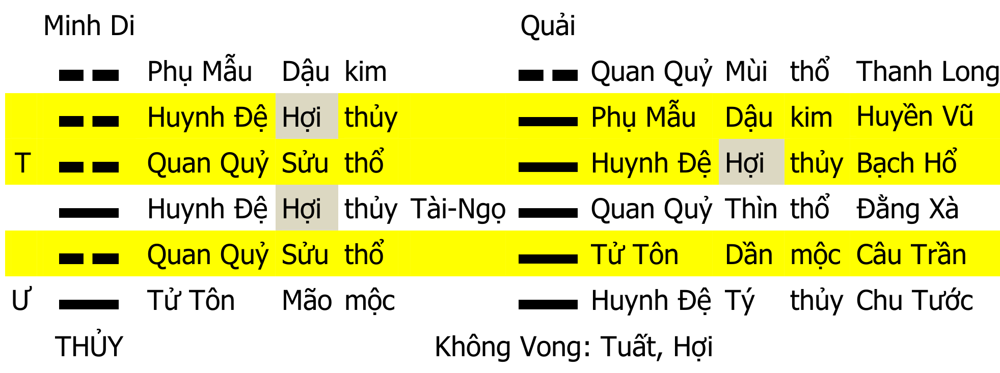
    - **Hình này chứng minh điều gì**
      - Hào Ứng Mão mộc lâm Đào hoa chứng minh bạn gái xinh đẹp gợi cảm; hai Quan Quỷ Sửu thổ động kẹp Dụng thần Ngọ hỏa chỉ cô đã qua hai đời chồng và có con riêng.
    - **Từ đâu mà thấy được**
      - Ngày Dần tháng Dần lấy Mão làm Đào hoa; Thê Tài Ngọ hỏa phục tại hào 3 bị hai hào Quan Quỷ động kẹp; hào Ứng lâm Tử Tôn; Thế lâm Bạch Hổ bị nhật nguyệt khắc mang thương tật.
  - **Phán đoán chi tiết:**
    - Căn cứ: Lấy Thê Tài làm Dụng thần đại diện cho bạn gái; xét cung vị của quẻ để định mức độ thông minh.
    - Nhìn vào: Thê Tài Ngọ hỏa không hiện trên quẻ, phục tàng dưới hào 3 Huynh Đệ Hợi thủy thuộc Khảm cung; Khảm chủ trí tuệ, suy ra cô gái này rất thông minh, đầu óc nhanh nhạy.
    - Căn cứ: Ngũ hành của Dụng thần biểu thị tính cách và khí chất đương số.
    - Nhìn vào: Dụng thần lâm ngũ hành Hỏa; Hỏa chủ nhiệt tình, xán lạn và cởi mở, chứng tỏ cô ấy là người rất hoạt bát, tràn đầy sức sống, thích giao tiếp với mọi người, luôn mỉm cười và dễ chiếm được cảm tình của người khác.
    - Căn cứ: Lục thần phối hợp với phục thần biểu thị năng khiếu nghệ thuật.
    - Nhìn vào: Dụng thần phục dưới hào 3 lâm Đằng Xà; Đằng Xà chủ nghệ thuật biến hóa linh hoạt, phán đoán cô ấy có khiếu về nghệ thuật, đặc biệt là tài ca hát biểu diễn.
    - Căn cứ: Hào Ứng là Nguyên thần sinh Dụng thần kết hợp với thần sát Đào hoa định nhan sắc ngoại hình.
    - Nhìn vào: Ngày Dần tháng Dần thuộc Dần Ngọ Tuất đào hoa tại Mão; hào Ứng Tử Tôn Mão mộc chính là Đào hoa sinh trợ Dụng thần, lại lâm Chu Tước, khẳng định bạn gái có ngoại hình vô cùng xinh đẹp, vóc dáng gợi cảm quyến rũ.
    - Căn cứ: Hai hào Quan Quỷ phát động tác động lên hào Thế định biến cố cơ thể của thân chủ.
    - Nhìn vào: Trong quẻ có hai hào Quan Quỷ Sửu thổ cùng phát động (hào 2 và hào 4); hào Thế Sửu thổ lâm Bạch Hổ bị cả Nhật kiến và Nguyệt kiến Dần mộc tương khắc nặng nề; Bạch Hổ chủ huyết quang đao thương, báo hiệu bản thân thân chủ từng trải qua tai nạn thương tích rất nặng để lại sẹo.
    - Căn cứ: Quan Quỷ phát động kẹp hào Dụng thần phục tàng và lục thân tại hào Ứng định tiền sử hôn nhân của bạn gái.
    - Nhìn vào: Hai hào Quan Quỷ phát động kẹp chặt hào 3 nơi Thê Tài Ngọ hỏa phục tàng; Quan Quỷ là người đàn ông/chồng, tượng kẹp này cho thấy cô ấy từng trải qua hai đời chồng. Hào Ứng lại lâm Tử Tôn (con cái), chứng tỏ cô ấy đã có con riêng từ cuộc hôn nhân trước.
  - **Luồng đối thoại thực tế và phản hồi của thân chủ:**
    - Tác giả nhận định: "Cô ấy là người có đầu óc rất thông minh, linh hoạt." Thân chủ xác nhận: "Đúng, đầu óc cô ấy rất tốt."
    - Tác giả: "Cô ấy tính tình rất hoạt bát, yêu đời." Thân chủ vui vẻ tiếp lời: "Đúng, rất hoạt bát, tràn đầy sức sống. Thích giao tiếp với mọi người, luôn mỉm cười, là loại người thấy người là được người yêu mến."
    - Tác giả: "Cô ấy có khiếu về nghệ thuật." Thân chủ thán phục: "Cô ấy hát rất hay, trước đây từng kiếm tiền bằng nghề ca hát."
    - Tác giả: "Ngoại hình cô ấy nhìn rất đẹp và rất gợi cảm." Thân chủ tự hào: "Đúng thế. Ngay cả bản thân cô ấy cũng rất tự hào về ngoại hình đẹp của mình."
    - Tác giả nhìn vào hào Thế: "Bản thân anh đã từng bị thương tật rất nặng trên người." Thân chủ bùi ngùi kể: "Đúng vậy, hồi còn học cấp ba tôi từng bị một tai nạn lớn, báo chí đều đăng tải, cho đến tận bây giờ trên khuôn mặt vẫn còn lưu lại vết sẹo lớn."
    - Tác giả phân tích nhân duyên bạn gái: "Cô ấy phải trải qua hai lần hôn nhân, và hiện nay đã có con riêng." Thân chủ gật đầu: "Đúng thế. Cô ấy đã từng ly hôn một lần và có con riêng."
  - **Ứng nghiệm thực tế:**
    - Toàn bộ các thông tin về tính cách thông minh, hoạt bát, tài năng ca hát, dung mạo đào hoa gợi cảm, tiền sử ly hôn có con riêng của bạn gái và vết sẹo tai nạn trên mặt người hỏi đều ứng nghiệm chính xác tuyệt đối.

- **Ví dụ 2: Ngày Nhâm Thân tháng Dần, nữ đoán người đàn ông mình thích (Được quẻ Hỏa Phong Đỉnh biến Lôi Hỏa Phong)**
  - **Hình 118.** Quẻ Hỏa Phong Đỉnh biến Lôi Hỏa Phong
    - 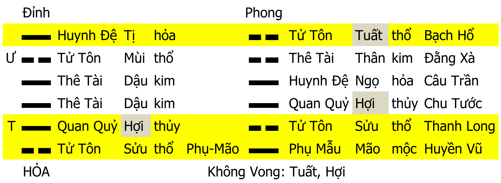
    - **Hình này chứng minh điều gì**
      - Thê Tài Dậu kim lưỡng hiện lâm Đào hoa sinh Quan Quỷ chứng minh đối phương rất đào hoa được nhiều phụ nữ theo đuổi; nhưng Dụng thần Không Vong hóa hồi đầu khắc chỉ hôn duyên bất thành.
    - **Từ đâu mà thấy được**
      - Ngày Thân tháng Dần lấy Dậu làm Đào hoa; Quan Quỷ Hợi thủy trì Thế lâm Tuần Không nên không nhận sinh từ Đào hoa; hào biến Tử Tôn Sửu thổ quay lại hồi đầu khắc Dụng thần.
  - **Phán đoán chi tiết:**
    - Căn cứ: Quan Quỷ trì Thế định mức độ tình cảm của đương số đối với đối tượng.
    - Nhìn vào: Quan Quỷ Hợi thủy ngự tại hào Thế (hào 2); trong quẻ nữ đoán người yêu, Quan Quỷ là đối tượng tình cảm, nay ngự tại hào Thế chứng tỏ trong lòng cô vị trí của người đàn ông này cực kỳ quan trọng, cô dành trọn vẹn tình cảm cho anh ta.
    - Căn cứ: Cung vị quẻ gốc bộc lộ tính tình, phong thái của đối phương.
    - Nhìn vào: Quẻ Đỉnh thuộc Ly cung; Ly tượng trưng cho hỏa, tính chất phát tán quang minh, suy ra người đàn ông này rất hoạt bát, ăn nói lưu loát và có mối quan hệ bạn bè rộng rãi.
    - Căn cứ: Ngũ hành của Dụng thần kết hợp với lục thần Thanh Long định diện mạo người nam.
    - Nhìn vào: Dụng thần là Thủy (Hợi thủy) lâm Thanh Long; Thanh Long chủ dung mạo khôi ngô tú mỹ, Thủy chủ phong lưu tuấn tú, kết hợp lại khẳng định anh ta là một chàng trai rất đẹp trai.
    - Căn cứ: Thần sát Đào hoa sinh trợ Dụng thần xác định vận số đào hoa của người nam.
    - Nhìn vào: Ngày Thân tháng Dần thuộc Thân Tý Thìn đào hoa tại Dậu; trong quẻ có Thê Tài Dậu kim lưỡng hiện tại hào 3 và hào 4 đều lâm Đào hoa cùng đến sinh cho Quan Quỷ Hợi thủy, chứng tỏ anh ta có sức hút mãnh liệt, rất được nhiều phụ nữ săn đón vây quanh.
    - Căn cứ: Trạng thái Tuần Không của Dụng thần định thái độ của anh ta trước sự theo đuổi của phụ nữ.
    - Nhìn vào: Quan Quỷ Hợi thủy lâm Tuần Không (Tuần Không Tuất, Hợi); lâm Không thì không thể tiếp nhận lực sinh từ Thê Tài, biểu thị anh ta có tính khí kiêu kỳ, tiêu chuẩn chọn bạn gái cao, hiếm khi bị cám dỗ bởi những người phụ nữ bình thường.
    - Căn cứ: Dụng thần ngộ Không Vong lại phát động biến hào hồi đầu khắc định kết cục mối quan hệ.
    - Nhìn vào: Quan Quỷ Hợi thủy lâm Tuần Không lại phát động biến ra Tử Tôn Sửu thổ (Sửu thổ quay lại khắc Hợi thủy) thành hồi đầu khắc; Dụng thần vừa hư Không vừa bị khắc chế nặng nề, báo hiệu duyên phận giữa hai người khó lòng thành tựu, không có kết quả tốt đẹp.
  - **Luồng đối thoại thực tế và phản hồi của thân chủ:**
    - Tác giả: "Trong lòng cô, người đàn ông này có vị trí vô cùng quan trọng." Nữ thân chủ xác nhận: "Đúng thế. Bản thân tôi thực sự rất thích anh ấy."
    - Tác giả: "Anh ấy là người rất hoạt bát, năng nổ." Thân chủ gật đầu: "Đúng thế. Anh ấy có nhiều bạn bè và nói rất nhiều."
    - Tác giả: "Anh ấy có vẻ ngoài rất đẹp trai." Thân chủ mỉm cười: "Đúng, nhìn anh ấy rất đẹp trai."
    - Tác giả: "Anh ấy rất được phụ nữ săn đón, nhưng lại chẳng mấy bận tâm đến họ." Thân chủ đồng tình: "Đúng thế. Anh ấy rất được phụ nữ săn đón. Tuy nhiên anh ấy không thèm để ý tới những phụ nữ bình thường."
    - Tác giả chỉ ra trở ngại: "Dụng thần Không Vong lại hóa hồi đầu khắc, e rằng cô khó có thể nên nhân duyên với anh ta." Thân chủ thở dài: "Tôi cũng rất lo lắng sẽ không thành."
  - **Ứng nghiệm thực tế:**
    - Mọi nét phán đoán về tính cách hoạt bát, diện mạo tuấn tú và sức hút đào hoa của người nam đều đúng; về sau tình cảm đôi bên không thể tiến triển do chịu sự cản trở của cách cục hồi đầu khắc và Không Vong.

- **Ví dụ 3: Ngày Bính Dần tháng Dần, nam đoán người phụ nữ mình đang tương tư (Được quẻ Thủy Sơn Kiển biến Thủy Hỏa Ký Tế)**
  - **Hình 119.** Sơ đồ quẻ Thủy Sơn Kiển biến Thủy Hỏa Ký Tế
    - 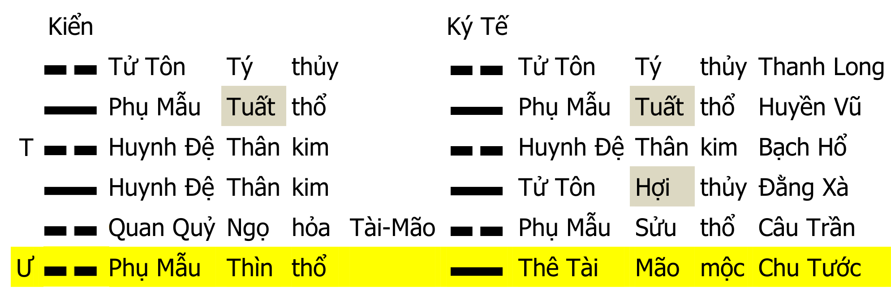
    - **Hình này chứng minh điều gì**
      - Hào Thế Thân kim lâm Dịch Mã Nguyệt phá thể hiện tâm tính trồi sụt thất thường; Dụng thần Thê Tài Mão mộc phục tàng lâm Đào hoa chỉ người nữ xinh đẹp thon cao nhưng đã có bạn trai (phục dưới Quan Quỷ).
    - **Từ đâu mà thấy được**
      - Ngày Dần tháng Dần lấy Thân làm Dịch Mã (bị Dần xung là Phá), lấy Mão làm Đào hoa; Thê Tài Mão mộc phục dưới Quan Quỷ Ngọ hỏa tại hào 2; cung Đoài chủ nụ cười, Mộc vượng chủ dáng cao thon.
  - **Phán đoán chi tiết:**
    - Căn cứ: Hào Thế lâm Dịch Mã và bị nhật nguyệt xung định tâm lý cảm xúc của thân chủ.
    - Nhìn vào: Hào Thế Huynh Đệ Thân kim ngự tại hào 4; ngày Dần tháng Dần thuộc Dần Ngọ Tuất dịch mã tại Thân, hào Thế chính là lâm Dịch Mã. Tuy nhiên Thân kim bị cả Nguyệt kiến và Nhật kiến Dần mộc xung thành Nguyệt phá; Dịch Mã ngộ Phá chủ dao động bất thường, biểu thị tâm tính người này lên xuống thất thường, lúc cảm xúc lên cao thì rất hoạt bát hiếu động, lúc tụt dốc thì lười biếng chẳng buồn động đậy.
    - Căn cứ: Lấy Thê Tài làm Dụng thần kết hợp thần sát Đào hoa định dung nhan người nữ trong mộng.
    - Nhìn vào: Thê Tài Mão mộc không hiện trên quẻ, phục tàng dưới hào 2 Quan Quỷ Ngọ hỏa. Ngày Dần tháng Dần lấy Mão làm Đào hoa; Dụng thần lâm Đào hoa, khẳng định người phụ nữ mà anh ta đang ôm mối tương tư có diện mạo rất xinh đẹp, dễ thương.
    - Căn cứ: Cung vị của quẻ đối với thần thái biểu cảm.
    - Nhìn vào: Quẻ Kiển thuộc Đoài cung; Đoài chủ duyệt (vui tươi, tươi cười rạng rỡ), chứng tỏ cô gái này lúc nào cũng tươi cười, tính tình vui vẻ hòa nhã.
    - Căn cứ: Ngũ hành và vượng tướng của Dụng thần định vóc dáng cơ thể.
    - Nhìn vào: Dụng thần là Mộc (Mão mộc) được Nhật Nguyệt Dần mộc đồng hành trợ giúp là cực kỳ vượng tướng; Mộc chủ dáng dấp mảnh khảnh, thanh tú và dong dỏng cao, suy ra cô gái có vóc dáng thon thả, cao ráo.
    - Căn cứ: Hào Phi thần nơi Dụng thần nép bóng định tình trạng hôn nhân thực tế của cô gái.
    - Nhìn vào: Thê Tài Mão mộc phục tàng dưới hào 2 Quan Quỷ Ngọ hỏa; Quan Quỷ đại diện cho người đàn ông khác, việc nép bóng dưới Quan Quỷ chứng minh cô gái này đã có bạn trai hoặc đã lập gia đình, không còn là người tự do.
  - **Luồng đối thoại thực tế và phản hồi của thân chủ:**
    - Tác giả: "Bản thân anh tính tình có lúc hiếu động, có lúc không chịu vận động, cảm xúc lên xuống thất thường." Thân chủ thừa nhận: "Đúng thế. Cảm xúc của tôi lên xuống khá lớn, khi cảm xúc lên cao thì rất hoạt bát, khi xuống thì lười động đậy."
    - Tác giả: "Người phụ nữ anh đang tương tư nhìn rất xinh đẹp, dễ thương." Thân chủ say sưa: "Nhìn rất đẹp, rất dễ thương."
    - Tác giả: "Cô ấy luôn luôn vui vẻ mỉm cười." Thân chủ gật đầu đồng tình.
    - Tác giả: "Dáng người cô ấy dong dỏng cao và rất thon thả." Thân chủ thốt lên: "Dáng người của cô ấy như con dao nhỏ cắt kim loại, rất thon thả."
    - Tác giả vạch rõ sự thật: "Cô ấy đã có người đàn ông khác rồi." Thân chủ buồn bã thú nhận: "Đúng, cô ấy đã có bạn trai rồi, là tôi tương tư đơn phương."
  - **Ứng nghiệm thực tế:**
    - Tất cả các nét dự đoán từ cảm xúc trồi sụt của đương số, dung nhan rạng rỡ thon thả của người đẹp, đến việc cô ấy đã có bạn trai khiến anh phải ôm mối tình đơn phương đều chuẩn xác từng chi tiết.

- **Ví dụ 4: Ngày Ất Mão tháng Ngọ, nữ đoán duyên phận với người nam (Được quẻ Thủy Phong Tỉnh biến Phong Thủy Hoán)**
  - **Hình 120.** Sơ đồ quẻ Thủy Phong Tỉnh biến Phong Thủy Hoán
    - 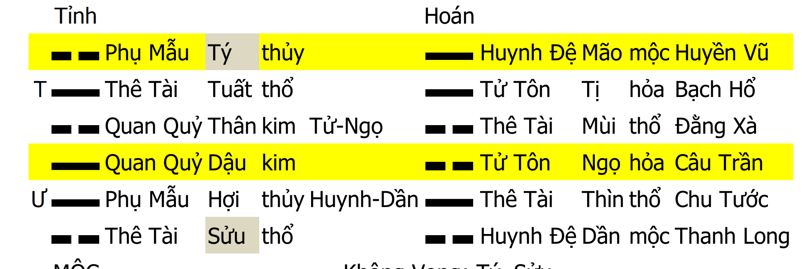
    - **Hình này chứng minh điều gì**
      - Quan Quỷ Dậu kim lâm Mộc Dục hóa hồi đầu khắc và bị Nhật xung chỉ người nam lăng nhăng thay lòng đổi dạ; Phụ Mẫu Tý thủy Không Vong lâm Huyền Vũ và Đào hoa Nguyệt phá chứng minh việc sống chung đổ vỡ vì kẻ thứ ba.
    - **Từ đâu mà thấy được**
      - Tháng Ngọ ngày Mão lấy Tý làm Đào hoa (bị Ngọ xung phá); Dậu kim lâm Mộc Dục tại Ngọ; Thế Thê Tài Tuất thổ sinh Dụng thần Quan Quỷ Dậu kim chỉ nữ lụy tình còn nam bội bạc.
  - **Phán đoán chi tiết:**
    - Căn cứ: Chọn Dụng thần khi Quan Quỷ lưỡng hiện và phân tích sinh khắc nhật nguyệt cùng biến hào.
    - Nhìn vào: Trong quẻ có Quan Quỷ Thân kim tại hào 4 và Quan Quỷ Dậu kim tại hào 3 phát động; ưu tiên lấy hào phát động Quan Quỷ Dậu kim làm Dụng thần. Dụng thần Dậu kim bị Nguyệt kiến Ngọ hỏa khắc (hưu tù), phát động lại biến ra Tử Tôn Ngọ hỏa quay lại khắc Dụng thần (hồi đầu khắc), đồng thời bị Nhật kiến Mão mộc xung thành Nhật xung (xung tán); tam trùng khắc xung cho thấy duyên phận của người nữ với người đàn ông này vô cùng mỏng manh, không thể lâu bền.
    - Căn cứ: Hào Phụ Mẫu lâm Không Vong phối hợp lục thần Huyền Vũ định chuyện sống chung ngoài giá thú.
    - Nhìn vào: Hào 6 Phụ Mẫu Tý thủy lâm Tuần Không (Tuần Không Tý, Sửu) lại lâm Huyền Vũ; Phụ Mẫu là giấy đăng ký kết hôn và nơi cư trú, Huyền Vũ chủ sự việc thầm kín, dục vọng thể xác; Phụ Mẫu Không Vong lâm Huyền Vũ chứng minh hai người đã sống chung như vợ chồng và phát sinh quan hệ xác thịt nhưng chưa từng kết hôn chính thức.
    - Căn cứ: Tương quan giữa hào Thế và Dụng thần phản ánh tấm lòng của người nữ.
    - Nhìn vào: Hào Thế Thê Tài Tuất thổ sinh trợ cho Dụng thần Quan Quỷ Dậu kim (Thổ sinh Kim); hào Thế sinh Dụng thần biểu thị người phụ nữ rất yêu thương, chiều chuộng và thật lòng đối đãi với bạn trai.
    - Căn cứ: Trạng thái Mộc Dục và thần sát Đào hoa định thói trăng hoa và nguyên nhân đổ vỡ.
    - Nhìn vào: Dụng thần Dậu kim lâm bại địa Mộc Dục tại Nguyệt kiến Ngọ hỏa và hào biến Ngọ hỏa (Kim trường sinh tại Tị, tắm gội Mộc Dục tại Ngọ); Mộc Dục chủ phóng túng nhục dục, chứng tỏ người nam này bản tính lăng nhăng, quen thói trêu hoa ghẹo nguyệt, không hề thật lòng trân trọng cô.
    - Căn cứ: Phụ Mẫu Tý thủy lâm Đào hoa bị xung phá định lý do chia tay.
    - Nhìn vào: Ngày Mão tháng Ngọ thuộc Hợi Mão Mùi đào hoa tại Tý; Phụ Mẫu Tý thủy chính là Đào hoa, nhưng bị Nguyệt kiến Ngọ hỏa xung phá thành Nguyệt phá; Đào hoa bị xung phá biểu thị người nam này đã phải lòng một phụ nữ khác bên ngoài dẫn tới việc chấm dứt chung sống và vứt bỏ cô gái.
  - **Luồng đối thoại thực tế và phản hồi của thân chủ:**
    - Tác giả phân tích quẻ: "Duyên phận giữa cô và người này rất mỏng manh, anh ta tính tình lăng nhăng lâm Mộc Dục, hai người đã vượt rào sống chung trước hôn nhân nhưng nay anh ta đã thay lòng đổi dạ theo đuổi người khác mà đòi chia tay."
    - Nữ thân chủ đau xót kể lại: "Quả nhiên tôi và anh ấy đã sống chung với nhau suốt hai năm qua. Nhưng gần đây anh ta lại đi thích một người phụ nữ lớn tuổi hơn anh ta và dứt khoát đề xuất chia tay với tôi, tôi quá bế tắc nên mới đến xin xem quẻ."
  - **Ứng nghiệm thực tế:**
    - Sự thật về mối tình sống chung 2 năm không hôn thú và việc người đàn ông phản bội chạy theo một phụ nữ lớn tuổi hơn đều ứng nghiệm chuẩn xác theo tượng Đào hoa Mộc Dục bị Nguyệt phá và hồi đầu khắc.

- **Ví dụ 5: Ngày Nhâm Tuất tháng Ngọ năm Giáp Thân, nam đoán vận khí (Được quẻ Lôi Trạch Quy Muội biến Khôn Vi Địa)**
  - **Hình 121.** Sơ đồ quẻ Lôi Trạch Quy Muội biến Khôn Vi Địa
    - 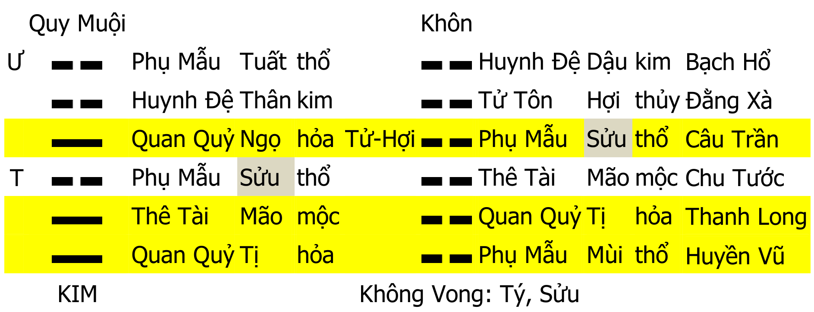
    - **Hình này chứng minh điều gì**
      - Thê Tài Mão mộc lâm Đào hoa Thanh Long phát động khắc Thế hợp Nhật Phụ Mẫu chỉ người phụ nữ có chồng rất đẹp chủ động theo đuổi đương số; đồng thời Mão mộc hợp Ứng phản ánh đầu tư làm ăn phát đạt năm Thìn.
    - **Từ đâu mà thấy được**
      - Tháng Ngọ ngày Tuất lấy Mão làm Đào hoa; Thê Tài Mão mộc lâm Thanh Long khắc Thế Phụ Mẫu Sửu thổ; Mão hợp Nhật Phụ Mẫu Tuất thổ (giấy kết hôn); năm Canh Thìn xung khai hợp thần giúp tài vận đỉnh cao.
  - **Phán đoán chi tiết:**
    - Căn cứ: Đoán vận khí tổng quát không có Dụng thần cố định, phân tích hào phát động và xu hướng biến hóa trong quẻ.
    - Nhìn vào: Thê Tài Mão mộc tại hào 2 phát động hợp hào Ứng Phụ Mẫu Tuất thổ; Thê Tài là tiền vốn, hợp hào Ứng (nơi khác, đối tác) biểu thị đương số có ý định đem tiền đi đầu tư làm ăn bên ngoài. Hào Tài lại được Nhật kiến Tuất thổ tương hợp, cho thấy việc làm ăn là hùn hạp chung vốn cùng bạn bè. Hào Thế Phụ Mẫu Sửu thổ lâm Tuần Không (Tuần Không Tý, Sửu), bộc lộ tâm lý thân chủ bên trong còn nhiều lo âu thấp thỏm.
    - Căn cứ: Vòng sinh vượng của hào Tài định mốc khởi sắc của tài vận.
    - Nhìn vào: Năm Ất Hợi (1995), chi Hợi là đất Trường Sinh của Mão mộc; đây chính là thời điểm tài vận của anh ta bắt đầu cất bước phát triển. Thê Tài sinh Quan Quỷ, Quan Quỷ sinh Phụ Mẫu (sinh hào Thế), chuỗi tương sinh này cho thấy việc kinh doanh làm ăn chủ yếu dựa vào sự nâng đỡ của chức quyền và quan chức.
    - Căn cứ: Hiện tượng hợp trú và ứng kỳ xung khai hợp thần định đỉnh cao tài lộc.
    - Nhìn vào: Thê Tài Mão mộc bị Nhật kiến Tuất thổ hợp trú; quy tắc dự đoán cần gặp năm xung khai: Năm Canh Thìn (2000), Thìn thổ xung khai Tuất thổ (Thìn Tuất tương xung), giải phóng hợp thần, đây chính là năm đương số đạt tài vận đỉnh cao rực rỡ nhất.
    - Căn cứ: Thần sát Đào hoa kết hợp lục thần Thanh Long định điềm báo nhân duyên ngoài luồng.
    - Nhìn vào: Ngày Tuất tháng Ngọ thuộc Dần Ngọ Tuất đào hoa tại Mão; Thê Tài Mão mộc chính là Đào hoa, lại lâm lục thần Thanh Long; Thanh Long chủ dung mạo diễm lệ tuyệt trần, Thê Tài đại diện cho phụ nữ. Đào hoa Thê Tài Mão mộc phát động khắc hào Thế Sửu thổ, biểu thị có một người phụ nữ với nhan sắc vô cùng xinh đẹp đang chủ động tấn công, theo đuổi anh ta.
    - Căn cứ: Hợp xứ phùng xung và hào Nhật kiến tương hợp định lai lịch và thời điểm xuất hiện của người nữ.
    - Nhìn vào: Hợp xứ phùng xung ứng vào năm Canh Thìn (2000), chứng tỏ mối duyên đào hoa này xuất hiện đúng năm 2000. Thê Tài Mão mộc lại tương hợp với Nhật kiến Phụ Mẫu Tuất thổ; Phụ Mẫu đại diện cho giấy hôn thú, hôn nhân gia đình, chứng minh người phụ nữ xinh đẹp theo đuổi anh ta là người đã có chồng.
  - **Luồng đối thoại thực tế và phản hồi của thân chủ:**
    - Tác giả phán đoán trọn vẹn: "Anh đầu tư tiền bạc cùng bạn bè, tài vận khởi sắc từ năm 1995 nhờ cậy vào quan hệ chức quyền, đỉnh cao phát tài lớn rơi vào năm 2000. Đặc biệt đúng vào năm 2000, có một phụ nữ diện mạo vô cùng xinh đẹp nhưng đã có chồng si mê theo đuổi anh ráo riết."
    - Thân chủ vô cùng thán phục: "Phán đoán quả nhiên chính xác từng chi tiết! Chuyện làm ăn thịnh vượng nhất vào năm 2000 nhờ quan chức, và đúng năm đó có một phụ nữ đã kết hôn dung mạo tuyệt đẹp theo đuổi tôi."
  - **Ứng nghiệm thực tế:**
    - Cả hai phương diện sự nghiệp kinh doanh đỉnh cao năm Canh Thìn và sự xuất hiện chuẩn xác của mối tình đào hoa với một phụ nữ đã có chồng dung nhan kiều diễm đều ứng nghiệm trọn vẹn.

- **Ví dụ 6: Ngày Quý Dậu tháng Thân, nam đoán mâu thuẫn với vợ, có ly hôn không? (Được quẻ Hỏa Phong Đỉnh)**
  - **Hình 122.** Sơ đồ quẻ Hỏa Phong Đỉnh
    - 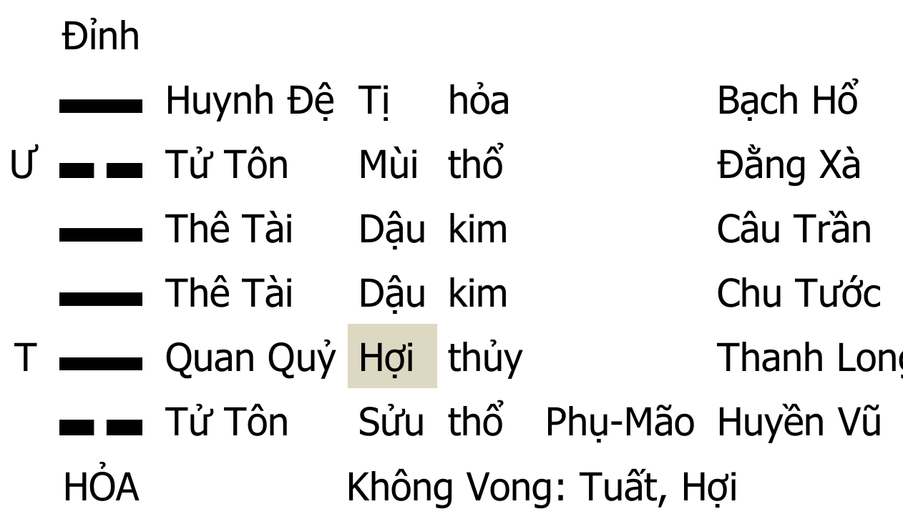
    - **Hình này chứng minh điều gì**
      - Hào Thế Hợi thủy tại hào 2 lâm Dịch Mã Không Vong chứng minh đương số dọn đồ rời nhà ly thân trong tháng Hợi; Thê Tài Dậu kim quá vượng tại tháng Sửu nhập Mộ chuyển cát làm hai vợ chồng tái hôn sau khi ly dị.
    - **Từ đâu mà thấy được**
      - Ngày Dậu lấy Hợi làm Dịch Mã; hào 2 là trạch xá, hào Thế Quan Quỷ Hợi thủy lâm Không Vong; Dậu kim nắm nhật nguyệt quá vượng, tháng Hợi xuất Không ứng chia ly, tháng Sửu Dậu kim nhập Sửu Mộ làm vượng khí thu liễm mà hòa hợp lại.
  - **Phán đoán chi tiết:**
    - Căn cứ: Chọn Dụng thần Thê Tài lưỡng hiện và nhận định mức độ vượng suy thái quá.
    - Nhìn vào: Lấy Thê Tài làm Dụng thần; trong quẻ có Thê Tài Dậu kim lưỡng hiện tại hào 3 và hào 4. Dậu kim được Nguyệt kiến Thân kim tương trợ, lại tọa ngay Nhật kiến Dậu kim là quá vượng (thái quá). Cổ nhân dạy "vật cực tất phản", vượng quá hóa suy, biểu thị người vợ tính cách nhu nhược, mềm yếu, thiếu quyết đoán và không có chủ kiến riêng.
    - Căn cứ: Tương quan giữa hào Ứng và hào Thế định thái độ của gia đình bên vợ.
    - Nhìn vào: Hào Ứng là Tử Tôn Mùi thổ đại diện cho gia đình nhà vợ; Mùi thổ khắc chế hào Thế Quan Quỷ Hợi thủy (Thổ khắc Thủy), biểu thị gia đình nhà vợ rất có thành kiến, phản đối và không ưa chàng rể.
    - Căn cứ: Thần sát Dịch mã và hào vị trạch xá lâm Không Vong định hành vi dọn ra ngoài ly thân.
    - Nhìn vào: Ngày Dậu tháng Thân thuộc Tị Dậu Sửu dịch mã tại Hợi; hào Thế Quan Quỷ Hợi thủy ngự tại hào 2 chính là lâm Dịch Mã, đồng thời lại rơi vào Tuần Không (Tuần Không Tuất, Hợi). Hào 2 là hào vị của nhà cửa (trạch xá); hào 2 lâm Không Vong biểu thị vắng nhà, không ở trong nhà; lâm Dịch Mã chủ sự xê dịch, rời đi. Kết hợp lại suy ra đến tháng Hợi khi hào Thế xuất Không, người chồng sẽ dọn đồ đạc rời khỏi nhà, hai vợ chồng sống ly thân.
    - Căn cứ: Nguyên thần hưu tù đối với Dụng thần quá vượng định phán đoán ban đầu về việc ly hôn.
    - Nhìn vào: Dụng thần Thê Tài quá vượng tuy là tượng bất thường, nhưng Nguyên thần Tử Tôn Sửu thổ và Mùi thổ đều hưu tù không sinh thêm; do đó tác giả ban đầu nhận định mâu thuẫn vợ chồng chỉ là sóng gió nhất thời, chưa đến mức tan vỡ và sẽ không ly hôn.
    - Căn cứ: Chiêm nghiệm thực tế về nguyên lý "Quá vượng phùng Mộ chuyển cát".
    - Nhìn vào: Tháng Hợi khi Dịch Mã xuất Không, xung đột bùng nổ dữ dội khiến hai người thực sự đã ký đơn ly hôn; tuy nhiên đến tháng Sửu (Sửu là Mộ khố của Kim - Thê Tài Dậu kim nhập Mộ), ngũ hành Thê Tài vốn quá vượng gặp nhập Mộ thì khí vượng thái quá được thu liễm điều hòa, hung chuyển thành cát, dẫn đến kết quả hai người hối hận và quay lại với nhau.
  - **Luồng đối thoại thực tế và phản hồi của thân chủ:**
    - Tác giả dự đoán: "Vợ anh tính tình nhu nhược, nhà vợ không ưa anh; tháng Hợi anh sẽ rời khỏi nhà sống ly thân, nhưng tôi nghĩ hai người sẽ không ly hôn đâu."
    - Diễn biến bất ngờ từ phản hồi: "Ai mà ngờ được, đúng vào tháng Hợi mâu thuẫn bùng nổ hai người đã ra tòa ly hôn! Thế nhưng đến tháng Sửu cả hai đều nguôi giận, nhận ra sai lầm và dắt nhau đi đăng ký tái hôn lại!"
  - **Ứng nghiệm thực tế và bài học dịch lý:**
    - Quẻ ứng nghiệm ly thân và ly hôn đúng tháng Hợi Dịch Mã xuất Không. Điểm ảo diệu của quẻ dịch nằm ở chỗ đến tháng Sửu Thê Tài quá vượng nhập Mộ khố, chuyển hóa hung thành cát khiến hai vợ chồng tái hôn bền chặt, để lại bài học kinh nghiệm sâu sắc cho học giả Lục Hào.

- **Ví dụ 7: Ngày Canh Tý tháng Mùi, nam đoán duyên phận với vợ (Được quẻ Sơn Lôi Di biến Phong Lôi Ích)**
  - **Hình 123.** Sơ đồ quẻ Sơn Lôi Di biến Phong Lôi Ích
    - 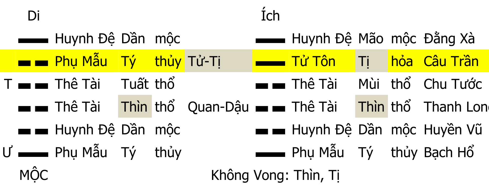
    - **Hình này chứng minh điều gì**
      - Hào 3 Thê Tài Thìn thổ Không Vong hợp Đào hoa Quan Quỷ Dậu kim phục tàng chứng minh vợ ngoại tình và ly thân; Phụ Mẫu Tý thủy lâm Đào hoa khắc Nguyên thần kết hợp quẻ Du Hồn khẳng định hôn nhân tan vỡ chắc chắn ly hôn.
    - **Từ đâu mà thấy được**
      - Ngày Tý lấy Dậu làm Đào hoa, tháng Mùi lấy Tý làm Đào hoa; hào 3 giường chiếu lâm Không Vong; Thìn thổ hợp Quan Quỷ Dậu kim phục dưới giường; Phụ Mẫu Tý thủy khắc Tử Tôn Tị hỏa; quẻ Du Hồn chủ trôi nổi chia ly.
  - **Phán đoán chi tiết:**
    - Căn cứ: Chọn Dụng thần khi Thê Tài lưỡng hiện và phân tích hào vị giường chiếu (hương khuê).
    - Nhìn vào: Trong quẻ có Thê Tài Tuất thổ tại hào 4 và Thê Tài Thìn thổ tại hào 3; lấy hào Thê Tài Thìn thổ lâm Tuần Không (Tuần Không Thìn, Tị) làm Dụng thần. Hào 3 là hào vị của giường chiếu, phòng ngủ (hương khuê); nay Dụng thần ngự tại hào 3 lại lâm Không Vong, chiếc giường trống rỗng, báo hiệu người vợ không còn ở nhà, hai vợ chồng đã sống ly thân trong thực tế.
    - Căn cứ: Quan hệ tương hợp giữa Dụng thần và phục thần dưới hào vị giường chiếu cùng thần sát Đào hoa.
    - Nhìn vào: Thê Tài Thìn thổ phục tàng dưới nó là Quan Quỷ Dậu kim (Thìn Dậu tương hợp); Quan Quỷ đại diện cho người đàn ông khác. Ngày Canh Tý tháng Mùi thuộc Thân Tý Thìn đào hoa tại Dậu; do đó Quan Quỷ Dậu kim phục tàng chính là Đào hoa! Hình tượng Thê Tài ở giường chiếu hợp ngầm với Đào hoa Quan Quỷ giấu kín bên dưới vạch trần sự thật cay đắng: người vợ đã có mối quan hệ ngoại tình lén lút, vụng trộm với người đàn ông khác.
    - Căn cứ: Hào Phụ Mẫu lâm Đào hoa khắc hại Nguyên thần định kết cục hôn nhân.
    - Nhìn vào: Tháng Mùi ngày Tý, theo tháng thì Hợi Mão Mùi đào hoa tại Tý; hào sơ Phụ Mẫu Tý thủy và hào 5 Phụ Mẫu Tý thủy đều lâm Đào hoa. Phụ Mẫu Tý thủy lâm Đào hoa phát động/ám động khắc thương tổn Nguyên thần Tử Tôn Tị hỏa (Tử Tôn là gốc sinh tài, bảo vệ hôn nhân); Nguyên thần không hiện trên quẻ lại bị Đào hoa Phụ Mẫu tương khắc, tình cảm vợ chồng không còn nguồn sinh dưỡng, chắc chắn phải đi đến bước đường ly hôn. Tý thủy là Đào hoa, nguyên nhân đổ vỡ cốt lõi chính là do thói trăng hoa ngoại tình.
    - Căn cứ: Thể quẻ Du Hồn khẳng định biến động chia lìa.
    - Nhìn vào: Quẻ Sơn Lôi Di là quẻ Du Hồn của Tốn vi Phong; Du Hồn chủ về tâm thần bất định, phiêu bạt trôi nổi, chia lìa ly tán, không có ngày đoàn tụ, củng cố phán đoán hai vợ chồng sẽ đường ai nấy đi.
  - **Luồng đối thoại thực tế và phản hồi của thân chủ:**
    - Tác giả trầm ngâm vạch trần: "Vợ anh hiện không ở nhà, hai người đã ly thân. Dưới giường có Quan Quỷ đào hoa hợp với vợ, cô ấy đã ngoại tình với người khác. Quẻ này đào hoa khắc Nguyên thần lại là quẻ Du Hồn, hôn nhân của anh không cứu vãn được nữa, chắc chắn sẽ ly hôn."
    - Người chồng cay đắng xác nhận: "Quả nhiên đúng như thầy phán, vì phát hiện vợ thích người đàn ông khác và ngoại tình bên ngoài nên chúng tôi đã sống ly thân và dứt khoát làm thủ tục ly hôn."
  - **Ứng nghiệm thực tế:**
    - Toàn bộ sự thật đau lòng về chiếc giường ly thân, mối quan hệ gian dâm ngoài luồng của người vợ và kết cục tan vỡ không thể hàn gắn đều ứng nghiệm chính xác tuyệt đối theo từng nét biến hóa của quẻ dịch.

### CHƯƠNG 5: PHƯƠNG VỊ NHÂN DUYÊN

#### Nguyên lý cốt lõi về phương vị nhân duyên trong Lục Hào
- **Bốn yếu tố căn bản để phán đoán phương vị:**
  - Dự đoán phương vị nhân duyên trong Lục Hào chủ yếu căn cứ vào bốn yếu tố cốt lõi:
    - Địa chi của Dụng thần (Thê Tài đối với nam, Quan Quỷ đối với nữ).
    - Địa chi của hào biến mà Dụng thần hóa ra.
    - Địa chi tương hợp với Dụng thần (hợp Dụng thần).
    - Quái cung mà Dụng thần hoặc quẻ an ngự.
- **Quy tắc phương vị theo Thập nhị Địa chi:**
  - Hào Tý: Tương ứng phương Bắc.
  - Hào Sửu và Hào Dần: Tương ứng phương Đông Bắc.
  - Hào Mão: Tương ứng phương Đông.
  - Hào Thìn và Hào Tị: Tương ứng phương Đông Nam.
  - Hào Ngọ: Tương ứng phương Nam.
  - Hào Mùi và Hào Thân: Tương ứng phương Tây Nam.
  - Hào Dậu: Tương ứng phương Tây.
  - Hào Tuất và Hào Hợi: Tương ứng phương Tây Bắc.
- **Quy tắc phương vị theo Bát quái cửu cung:**
  - Cung Càn: Đại diện phương Tây Bắc.
  - Cung Khôn: Đại diện phương Tây Nam.
  - Cung Chấn: Đại diện phương Đông.
  - Cung Tốn: Đại diện phương Đông Nam.
  - Cung Khảm: Đại diện phương Bắc.
  - Cung Ly: Đại diện phương Nam.
  - Cung Cấn: Đại diện phương Đông Bắc.
  - Cung Đoài: Đại diện phương Tây.
- **Quy tắc phối hợp không gian và tính chất di chuyển:**
  - Quẻ Du hồn hoặc Dụng thần lâm Dịch Mã biểu thị đối tượng ở phương xa, người xứ khác, hoặc có xu hướng tha hương lập nghiệp.
  - Dụng thần phục tàng kết hợp quái cung phục tàng và địa chi hào phi giúp truy tìm xuất thân nguyên quán hoặc nơi ẩn náu của đối tượng.
  - Độc phát (chỉ có duy nhất một hào phát động trong quẻ) mang thông tin trọng yếu về sự biến chuyển gia đạo, hành tung bí mật hoặc phương vị then chốt của đối tượng.

#### Hệ thống quái lệ thực nghiệm phán đoán phương vị nhân duyên
- **Ví dụ 1:** Ngày Nhâm Tý tháng Mão, nam đoán tình cảm ngoài hôn nhân, được quẻ Phong Trạch Trung Phu biến Thủy Trạch Tiết (Tuần không: Dần, Mão).
  - **Hình 124.** Sơ đồ quẻ Phong Trạch Trung Phu biến Thủy Trạch Tiết
    - 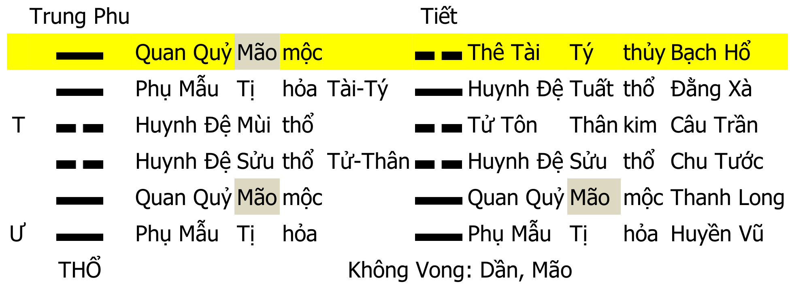
    - **Hình này chứng minh điều gì**
      - Đối tượng ngoài hôn nhân là người phụ nữ phương Bắc đã ly hôn, xuất hiện vào tháng Ngọ.
    - **Từ đâu mà thấy được**
      - Thê Tài Tý thủy phục tàng dưới Phụ Mẫu Tị hỏa hào 5; hào 6 Quan Quỷ Mão mộc Không Vong hóa Tý thủy; quẻ Trung Phu là du hồn.
  - **Phán đoán chi tiết:**
    - Căn cứ: Nam đoán duyên ngoài hôn nhân lấy Thê Tài làm Dụng thần; phương vị lấy theo địa chi Dụng thần và tính chất quái du hồn.
    - Nhìn vào: Thê Tài Tý thủy không hiện trên quẻ mà phục tàng dưới hào 5 Phụ Mẫu Tị hỏa; phục thần gặp xung xuất nên đến tháng Ngọ xung Tị hỏa thì Tý thủy sẽ lộ diện, biểu thị tháng Ngọ sẽ quen biết đối tượng.
    - Nhìn vào: Hào 6 Quan Quỷ Mão mộc lâm Tuần không phát động hóa ra Thê Tài Tý thủy; hào 6 là vị trí thoái hưu (rời bỏ), Quan Quỷ là người chồng của người nữ; Quan Quỷ tại hào 6 Không Vong biểu thị người chồng đã thoái lui, người nữ này đã ly hôn với chồng.
    - Nhìn vào: Quẻ chính Phong Trạch Trung Phu là quẻ du hồn, chủ người ở nơi xa xứ khác; Dụng thần mang địa chi Tý thủy chủ về phương Bắc, kết luận đối phương là người phụ nữ ở phương Bắc.
  - **Ứng nghiệm thực tế:**
    - Quả nhiên đúng vào tháng Ngọ cùng năm, người nam quen biết một người phụ nữ phương Bắc đã từng ly hôn chồng.
- **Ví dụ 2:** Ngày Mậu Tý tháng Dậu, nữ đoán hôn nhân con gái, được quẻ Lôi Địa Dự biến Lôi Hỏa Phong (Tuần không: Ngọ, Mùi).
  - **Hình 125.** Quẻ Lôi Địa Dự biến Lôi Hỏa Phong
    - 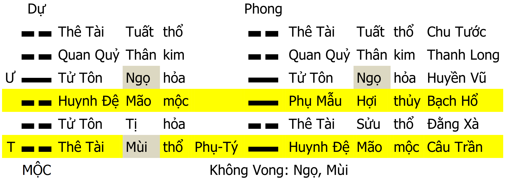
    - **Hình này chứng minh điều gì**
      - Bạn trai con gái là sĩ quan quân đội người phương Tây Nam, mẹ phản đối vì không muốn con gái theo về quê bạn trai.
    - **Từ đâu mà thấy được**
      - Quan Quỷ Thân kim lâm hào 5 vượng tướng kết hợp Thanh Long; Thế Mùi thổ Không Vong hóa khắc; Ứng Tử Tôn Ngọ hỏa ám động hợp Thế.
  - **Phán đoán chi tiết:**
    - Căn cứ: Mẹ đoán bạn trai cho con gái lấy Quan Quỷ làm Dụng thần; Tử Tôn đại diện cho con gái; hào Thế là người mẹ.
    - Nhìn vào: Quan Quỷ Thân kim ngự tại hào 5, được Nguyệt kiến Dậu kim tương trợ vượng tướng; kim chủ quân đội, hào 5 là quan chức nhà nước, lại lâm Thanh Long chủ tôn quý, chứng tỏ bạn trai con gái là sĩ quan quân đội.
    - Nhìn vào: Dụng thần mang địa chi Thân kim, tương ứng với phương Tây Nam, xác định bạn trai quê quán ở phía Tây Nam.
    - Nhìn vào: Hào Thế Thê Tài Mùi thổ ngộ Tuần không, lại động hóa Huynh Đệ Mão mộc hồi đầu khắc không sinh cho Dụng thần Quan Quỷ, biểu thị người mẹ kiên quyết phản đối mối hôn sự này.
    - Nhìn vào: Tử Tôn Ngọ hỏa tại hào Ứng bị Nhật kiến Tý thủy xung thành ám động; Ứng là tha hương (quê bạn trai), Tử Tôn là con gái, ngụ ý con gái muốn theo bạn trai về quê hương phương xa; nhưng hào Thế Mùi thổ hợp hào Ứng Ngọ hỏa (Ngọ Mùi nhị hợp), người mẹ tìm mọi cách níu giữ con gái bên mình.
  - **Ứng nghiệm thực tế:**
    - Người mẹ xác nhận bạn trai con gái đúng là học viên trường sĩ quan quân đội, quê ở phía Tây Nam; anh muốn sau khi tốt nghiệp đưa con gái về quê sinh sống nên người mẹ một mực không đồng ý.
- **Ví dụ 3:** Ngày Ất Hợi tháng Tuất, nam đoán quan hệ với người nữ phát triển ra sao, được quẻ Thiên Sơn Độn biến Thiên Thủy Tụng (Tuần không: Thân, Dậu).
  - **Hình 126.** Quẻ Thiên Sơn Độn biến Thiên Thủy Tụng
    - 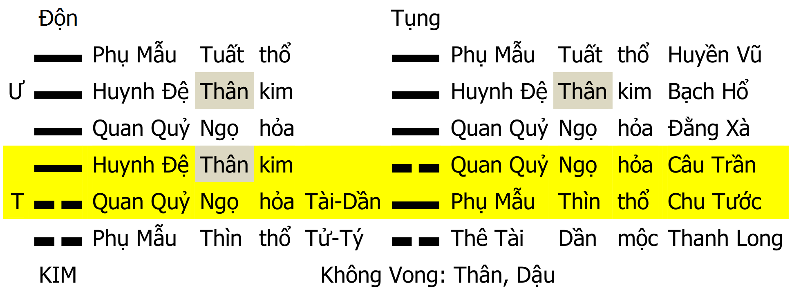
    - **Hình này chứng minh điều gì**
      - Cô gái là người phương Đông Bắc, quan hệ phức tạp từng bị cưỡng bức, chưa kết hôn nhưng duyên tình với người hỏi không bền.
    - **Từ đâu mà thấy được**
      - Thê Tài Dần mộc phục dưới cung Cấn, quẻ biến Tụng du hồn; Dần mộc hợp Nhật Hợi thủy, bị hào 3 Thân kim phát động xung khắc; hào biến là Tuyệt/Tử địa.
  - **Phán đoán chi tiết:**
    - Căn cứ: Nam đoán quan hệ tình cảm lấy Thê Tài làm Dụng thần; phương vị xét theo địa chi phục thần và nội quái.
    - Nhìn vào: Thê Tài Dần mộc không hiện trên quẻ, biến quẻ Tụng là quẻ du hồn nên cô ấy là người ở phương xa; Dần mộc đại diện phương Đông Bắc, phục tàng dưới nội quái Cấn cũng là Đông Bắc, xác định cô gái đến từ phía Đông Bắc.
    - Nhìn vào: Thê Tài Dần mộc tương hợp với Nhật kiến Hợi thủy, chủ đối phương giao du phóng túng với nhiều đàn ông; trong quẻ Quan Quỷ lưỡng hiện, hào 3 Huynh Đệ Thân kim phát động xung khắc Dần mộc (hào 3 là giường, Huynh Đệ là đàn ông, xung khắc là bạo lực cưỡng bức), cho thấy cô gái có quan hệ thể xác với nhiều người mà ban đầu là do bị người ta cưỡng hiệp.
    - Nhìn vào: Thê Tài Dần mộc được Nhật sinh vượng tướng nên vóc dáng cao ráo; lâm Chu Tước chủ tính cách hoạt ngôn, miệng luôn cười nhưng thích đấu võ mồm; Phụ Mẫu Thìn thổ Nguyệt phá và Quan Quỷ hưu tù biểu thị cô gái chưa từng kết hôn.
    - Nhìn vào: Dụng thần Dần mộc phục dưới hào Thế Ngọ hỏa nên người nam này cũng đã chung đụng xác thịt với cô; song hai hào động là Tuyệt địa (Thân kim) và Tử địa (Ngọ hỏa) của Dụng thần, lại Phụ Mẫu bị Nguyệt phá, báo hiệu cuộc tình này sớm tan vỡ.
  - **Ứng nghiệm thực tế:**
    - Toàn bộ chi tiết về lai lịch phương Đông Bắc, tính cách, quá khứ đau buồn và việc đôi bên nhanh chóng chia tay đều ứng nghiệm chuẩn xác.
- **Ví dụ 4:** Ngày Kỷ Sửu tháng Hợi năm Nhâm Ngọ, nam đoán vợ bỏ đi, được quẻ Lôi Địa Dự biến Hỏa Thủy Vị Tế (Tuần không: Ngọ, Mùi).
  - **Hình 127.** Quẻ Lôi Địa Dự biến Hỏa Thủy Vị Tế
    - 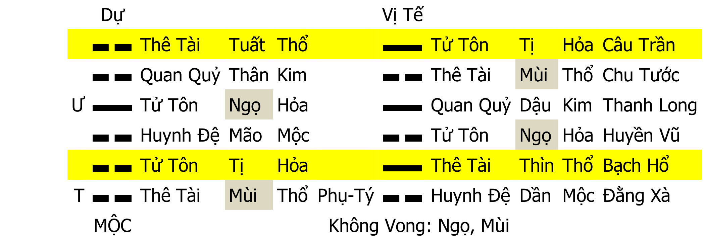
    - **Hình này chứng minh điều gì**
      - Người vợ trốn đi về phương Đông Nam ở chung với người đàn ông khác trong tầng hầm, bất đồng sâu sắc và dứt khoát ly hôn.
    - **Từ đâu mà thấy được**
      - Hào phát động Thê Tài Tuất thổ hóa Tị hỏa (Đông Nam) Dịch Mã; Tuất thổ hợp hào 3 Huynh Đệ Mão mộc lâm Huyền Vũ; Nguyên thần Tị hỏa Nguyệt phá, Thế Ứng Không Vong.
  - **Phán đoán chi tiết:**
    - Căn cứ: Đoán người vợ lấy Thê Tài làm Dụng thần; trong quẻ lưỡng Tài chọn hào phát động Thê Tài Tuất thổ tại hào 6 làm Dụng thần.
    - Nhìn vào: Hào Thế Mùi thổ ngộ Tuần không lâm Đằng Xà, Không chủ hẫng hụt bất an, Đằng Xà chủ bồn chồn lo sợ, thể hiện tâm trạng người chồng đứng ngồi không yên vì vợ trốn đi.
    - Nhìn vào: Hào 2 Tử Tôn Tị hỏa bị Nguyệt phá động hóa Thê Tài Thìn thổ, đến năm Tân Tị (2001) Thái Tuế thực phá ứng kỳ, là thời điểm hai người bắt đầu về chung sống.
    - Nhìn vào: Dụng thần Tuất thổ động hóa Tử Tôn Tị hỏa lâm Dịch Mã, chủ người vợ tính thích đi lại lông bông; Tị hỏa đại diện phương Đông Nam, chỉ rõ hướng trốn của người vợ là phương Đông Nam.
    - Nhìn vào: Dụng thần Tuất thổ phát động tương hợp với hào 3 Huynh Đệ Mão mộc (Mão Tuất nhị hợp); hào 3 là giường chiếu, Huynh Đệ là người đàn ông tranh đoạt, lâm Huyền Vũ là vụng trộm ám muội, chứng tỏ người vợ đang chung sống giường chiếu với người đàn ông khác.
    - Nhìn vào: Tị hỏa là Nguyên thần của Thê Tài đồng thời là Nguyên thần của Thế, tượng trưng cho tiếng nói chung, nay bị Nguyệt kiến Hợi thủy xung phá (Nguyệt phá), cho thấy tư tưởng đôi bên hoàn toàn rạn nứt; Thế Ứng đều Không Vong khẳng định hôn nhân tan vỡ.
  - **Ứng nghiệm thực tế:**
    - Người chồng lần theo hướng Đông Nam tìm thấy vợ đang ở chung với một người đàn ông trong tầng hầm; người vợ dứt khoát cự tuyệt quay về và hai người làm thủ tục ly hôn sau đó.
- **Ví dụ 5:** Ngày Nhâm Tuất tháng Tuất, nam đoán với người tình phát triển ra sao, được quẻ Phong Sơn Tiệm biến Phong Thủy Hoán (Tuần không: Tý, Sửu).
  - **Hình 128.** Quẻ Phong Sơn Tiệm biến Phong Thủy Hoán
    - 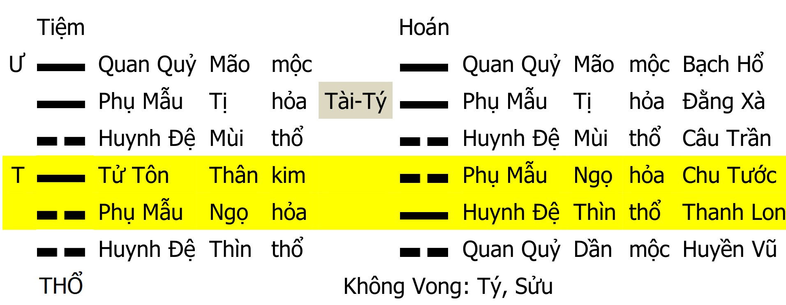
    - **Hình này chứng minh điều gì**
      - Người tình là người phương Bắc, mối quan hệ gặp trùng điệp trở lực và nhanh chóng đổ vỡ.
    - **Từ đâu mà thấy được**
      - Thê Tài Tý thủy (phương Bắc) phục tàng dưới Tị hỏa hào 5, bị Nhật Nguyệt cùng khắc lại ngộ Tuần không; hào Thế Thân kim động hóa hồi đầu khắc và bị hào 2 khắc.
  - **Phán đoán chi tiết:**
    - Căn cứ: Nam đoán mối quan hệ với người tình ngoài hôn nhân lấy Thê Tài làm Dụng thần; phương vị căn cứ theo địa chi Dụng thần.
    - Nhìn vào: Thê Tài Tý thủy không hiện trên quẻ, phục tàng dưới hào 5 Phụ Mẫu Tị hỏa; Tý thủy bị cả Nhật kiến Tuất thổ lẫn Nguyệt kiến Tuất thổ hợp lực khắc phạt nặng nề, bản thân lại rơi vào Tuần không, biểu thị mối duyên mỏng manh vô vọng, khó lòng duy trì lâu dài.
    - Nhìn vào: Hào Thế Tử Tôn Thân kim phát động sinh cho Thê Tài Tý thủy, chứng tỏ người nam rất say đắm và muốn chăm sóc người tình; tuy nhiên Thế động hóa Phụ Mẫu Ngọ hỏa hồi đầu khắc, hào 2 Phụ Mẫu Ngọ hỏa cũng động khắc Thế, cho thấy bản thân người nam gặp áp lực cản trở tứ bề, không thể thuận lợi qua lại.
    - Nhìn vào: Dụng thần mang địa chi Tý thủy, tương ứng với phương Bắc, phán đoán người tình là người ở phương Bắc.
  - **Ứng nghiệm thực tế:**
    - Người hỏi xác nhận đối phương đúng là người phương Bắc; do gặp nhiều rào cản xã hội và áp lực đôi bên nên mối quan hệ nhanh chóng chấm dứt.
- **Ví dụ 6:** Ngày Tân Sửu tháng Hợi, nam đoán có thể trở thành người tình của người nữ không, được quẻ Thiên Địa Bĩ biến Thiên Thủy Tụng (Tuần không: Thìn, Tị).
  - **Hình 129.** Quẻ Thiên Địa Bĩ biến Thiên Thủy Tụng
    - 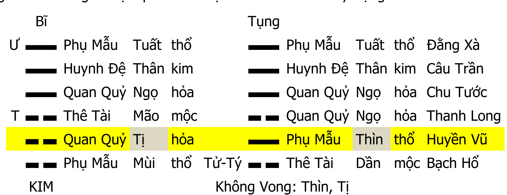
    - **Hình này chứng minh điều gì**
      - Người nữ ở phương Đông Nam, gia đình rạn nứt do chồng ngoại tình; giữa hai người chỉ là tình một đêm thoáng qua.
    - **Từ đâu mà thấy được**
      - Hào 2 Quan Quỷ Tị hỏa độc phát (Đông Nam) Không hóa Không lâm Huyền Vũ; Thê Tài Mão mộc trì Thế hào 3 lâm Thanh Long; biến quẻ Tụng du hồn.
  - **Phán đoán chi tiết:**
    - Căn cứ: Lấy Thê Tài làm Dụng thần; độc phát là chìa khóa then chốt giải mã phương vị và sự biến của đối tượng.
    - Nhìn vào: Thê Tài Mão mộc trì Thế trong quẻ lục hợp Thiên Địa Bĩ, cho thấy đôi bên là bạn bè quen biết từ lâu; Mão mộc lâm Thanh Long được Nguyệt kiến Hợi thủy sinh phù, cô gái có dung mạo xinh đẹp, dáng người dong dỏng thanh tú.
    - Nhìn vào: Hào 2 Quan Quỷ Tị hỏa là hào độc phát đại diện cho phương Đông Nam, chứng minh cô gái là người ở phương Đông Nam.
    - Nhìn vào: Quẻ Bĩ vốn lục hợp chủ vợ chồng thuận hòa, nhưng Quan Quỷ Tị hỏa (người chồng) tại hào 2 (nhà cửa) độc phát ngộ Tuần không lại hóa Phụ Mẫu Thìn thổ Không Vong (Không hóa Không), lâm Huyền Vũ chủ ám muội gian dâm, biểu thị người chồng ngoại tình dẫn đến gia đạo tan vỡ vào tháng Tị; biến quẻ Tụng là du hồn báo hiệu kết cục ly hôn.
    - Nhìn vào: Hào Thế Thê Tài Mão mộc ở hào 3 là vị trí giường chiếu, lâm Thanh Long chủ sắc dục hoan lạc, biểu thị hai người có duyên phát sinh quan hệ xác thịt; song quẻ biến Tụng du hồn nên chỉ là cuộc tình chớp nhoáng, không thể thành người tình lâu dài.
  - **Ứng nghiệm thực tế:**
    - Người nam phản hồi cô gái là bạn học đại học ở phương Đông Nam; đúng tháng Tị vợ chồng cô xảy ra biến cố lớn vì chồng có bồ; sau đó anh ta và người nữ chỉ có quan hệ tình một đêm rồi chia tay, không tiến xa hơn.
- **Ví dụ 7:** Ngày Nhâm Ngọ tháng Mùi, nam đoán có thể kết hôn với bạn gái hay không, được quẻ Trạch Thiên Quải biến Thủy Hỏa Ký Tế (Tuần không: Thân, Dậu).
  - **Hình 130.** Quẻ Trạch Thiên Quải biến Thủy Hỏa Ký Tế
    - 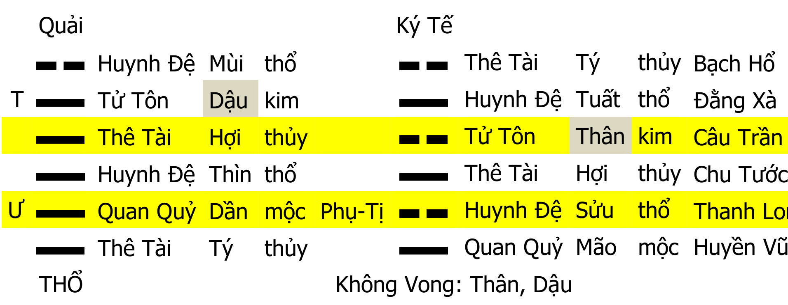
    - **Hình này chứng minh điều gì**
      - Bạn gái ở phương Tây Bắc, cha mẹ bạn gái phản đối và gả cô cho người khác, hôn nhân không thành.
    - **Từ đâu mà thấy được**
      - Hào 4 Thê Tài Hợi thủy (Tây Bắc) động bị Nguyệt Mùi thổ khắc; hào Ứng Quan Quỷ Dần mộc động hợp Dụng thần Hợi thủy.
  - **Phán đoán chi tiết:**
    - Căn cứ: Nam đoán việc cưới vợ lấy Thê Tài làm Dụng thần; quẻ lưỡng Tài chọn hào phát động Thê Tài Hợi thủy tại hào 4 làm Dụng thần.
    - Nhìn vào: Hợi thủy đại diện cho phương Tây Bắc, phán đoán bạn gái là người cư ngụ ở phương Tây Bắc.
    - Nhìn vào: Thê Tài Hợi thủy tuy động hóa Tử Tôn Thân kim hồi đầu sinh, song Nguyệt kiến Mùi thổ trực tiếp khắc phạt Hợi thủy; Nguyệt kiến tượng trưng cho cha mẹ bạn gái, chứng tỏ cha mẹ cô kịch liệt phản đối mối lương duyên này.
    - Nhìn vào: Hào Ứng Quan Quỷ Dần mộc phát động đến tương hợp với Dụng thần Hợi thủy (Dần Hợi hợp); hào Ứng là gia đình bạn gái và người ngoài, Quan Quỷ là người đàn ông khác, ngụ ý cha mẹ cô gái đã nhắm và mai mối cô cho một người đàn ông khác.
  - **Ứng nghiệm thực tế:**
    - Người hỏi xác nhận nhà bạn gái ở đúng phía Tây Bắc và hai người không làm cùng huyện; cha mẹ bạn gái kịch liệt phản đối và sau đó ép gả cô cho người đàn ông khác.
- **Ví dụ 8:** Ngày Ất Tị tháng Mùi, nữ đoán duyên phận với người đàn ông ra sao, được quẻ Thủy Sơn Kiển tĩnh (Tuần không: Dần, Mão).
  - **Hình 131.** Quẻ Thủy Sơn Kiển
    - 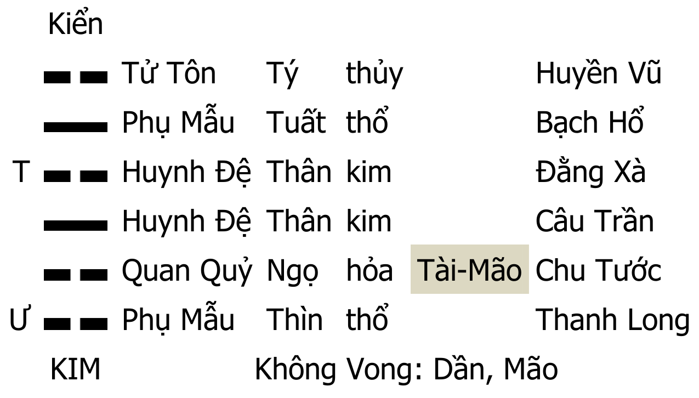
    - **Hình này chứng minh điều gì**
      - Người nam là người phương Nam làm việc ở Đông Bắc, giỏi tiếng Anh, có nhà xe, đã ly hôn; người nữ do dự vì chỉ được chọn công việc hoặc tình yêu, lại đang vướng bận quan hệ với người có vợ.
    - **Từ đâu mà thấy được**
      - Quan Quỷ Ngọ hỏa (phương Nam) lâm Chu Tước thuộc cung Đoài, nội quái Cấn (Đông Bắc); Thê Tài Mão mộc phục Không Vong; Nguyệt hợp Dụng tại hào 2, hào sơ Phụ Mẫu Thìn thổ; Thế lâm Đằng Xà; Nhật Tị hỏa Quan Quỷ hợp Thế và hợp Huynh Đệ Thân kim.
  - **Phán đoán chi tiết:**
    - Căn cứ: Nữ đoán người yêu lấy Quan Quỷ làm Dụng thần; Quan Quỷ kiêm đại diện cho chức nghiệp công danh; phương vị phối hợp địa chi Dụng thần và quái cung.
    - Nhìn vào: Quan Quỷ Ngọ hỏa hành Hỏa chủ tính cách sôi nổi, hướng ngoại; quẻ Kiển thuộc cung Đoài chủ miệng lưỡi, ngôn ngữ, phương Tây và dịch thuật; Dụng thần lâm Chu Tước chủ tài ăn nói phát ngôn, phán đoán người đàn ông có trình độ ngoại ngữ tiếng Anh xuất sắc. (Phản hồi: Tốt nghiệp đại học ngoại ngữ chuyên ngành tiếng Anh).
    - Nhìn vào: Thê Tài Mão mộc phục dưới Quan Quỷ Ngọ hỏa chủ đã có vợ, song Mão mộc ngộ Tuần không nên đã ly hôn. (Phản hồi: Đã ly hôn).
    - Nhìn vào: Dụng thần Ngọ hỏa đại diện phương Nam, nội quái Cấn đại diện phương Đông Bắc, kết luận anh là người phương Nam nhưng hiện đang sinh sống và lập nghiệp tại phương Đông Bắc. (Phản hồi: Hoàn toàn chính xác).
    - Nhìn vào: Nguyệt kiến Phụ Mẫu Mùi thổ hợp Dụng thần Quan Quỷ Ngọ hỏa (Ngọ Mùi nhị hợp), Dụng thần ngự tại hào 2 (nhà ở), Phụ Mẫu cũng là nhà nên người này có nhà riêng; hào Ứng lâm Phụ Mẫu Thìn thổ tại hào sơ (mặt đất), Phụ Mẫu là xe cộ chạy trên mặt đất nên người này có ô tô riêng. (Phản hồi: Đúng, anh có nhà có xe, là chủ doanh nghiệp).
    - Nhìn vào: Hào Thế Thân kim lâm Đằng Xà chủ nội tâm rối bời do dự; trong quẻ chỉ có duy nhất một hào Quan Quỷ Ngọ hỏa vừa đại diện cho người đàn ông vừa đại diện cho công việc, nên bắt buộc chỉ được chọn một trong hai; nếu dứt khoát bỏ việc theo anh ta thì thành, giữ công việc thì duyên tan.
    - Nhìn vào: Nhật kiến Tị hỏa cũng là Quan Quỷ đến tương hợp với Thế Thân kim (Tị Thân hợp), cho thấy người nữ đang có quan hệ tình cảm với một người đàn ông khác; Nhật Tị hỏa đồng thời hợp hào 3 Huynh Đệ Thân kim (Huynh Đệ là người phụ nữ khác/vợ người ta), chứng minh người tình hiện tại của cô là người đã có gia đình (đã có vợ); Nhật hợp mang tính níu giữ trói buộc khiến cô không thể rời đi.
  - **Ứng nghiệm thực tế:**
    - Người nữ phân trần: "Tôi đã làm việc tại cơ quan nhà nước được 20 năm, anh ấy bảo tôi bỏ việc sang công ty anh làm; ngộ nhỡ tôi bỏ việc mà anh ta không cưới thì tôi mất trắng, nên tôi dùng dằng mãi."
    - Kết quả từ năm Quý Mùi (2003) xem quẻ đến tận năm Mậu Tý (2008), cô gái vẫn không hề nghỉ việc chuyển đi theo người đàn ông phương Nam, mà tiếp tục duy trì mối quan hệ lén lút với người đàn ông đã có vợ kia.

### CHƯƠNG 6: KHOẢNG CÁCH NHÂN DUYÊN

#### 1. Nguyên lý xác định khoảng cách không gian (Gần - Xa, Cùng quê - Ngoại xứ)

- **Phân định theo quái vị và hào vị:**
  - **Ở gần, người cùng quê:**
    - Dụng thần xuất hiện tại Nội quái (quẻ nội chủ gần, trong nhà, bản xứ).
    - Dụng thần lâm hào Thế (chủ bản thân, nơi đương số đang cư ngụ).
    - Quẻ Quy Hồn (chủ quay về gốc gác, người quen thuộc, người bản địa).
    - Dụng thần phục tàng ngay dưới hào Thế (người cận kề bên mình, không rời xa).
  - **Phương xa, người khác xứ:**
    - Dụng thần xuất hiện tại Ngoại quái (quẻ ngoại chủ xa xôi, đất khách, bên ngoài).
    - Dụng thần lâm hào Ứng (chủ phương khác, đối phương ở nơi xa).
    - Quẻ Du Hồn (chủ phiêu lưu, trôi nổi, tha hương cầu thực, người phương xa).
    - Dụng thần phục tàng không hiện dưới các hào khác (ở nơi khuất lấp xa xôi, khó nắm bắt).
  - **Cách trở không gian địa lý:**
    - Giữa hào Thế và Dụng thần có hào khác phát động xen vào: gọi là tượng "ngăn cách", biểu thị hai người bị chia cắt về địa lý, người ở phương xa khó gặp gỡ.
    - Hào Thế ở hào 6 (tượng trưng cho Trời), Dụng thần ở hào sơ (tượng trưng cho Đất): cách nhau xa nhất trong quẻ, gọi là tượng "cách trở trời đất" (thiên địa huyền cách), biểu thị khoảng cách chỗ ở đôi bên xa xôi vạn dặm.

#### 2. Nhận định mối quan hệ quen biết qua Quái Cung (Cùng Cung)

- **Định nghĩa Cùng Cung:**
  - Hào Thế và Dụng thần có địa chi cùng đóng tại một quái cung trong Bát quái (ví dụ: Thế Thìn thổ và Ứng Tị hỏa cùng thuộc cung Tốn; hoặc Thế và Dụng thần cùng thuộc cung Khôn).
  - Ý nghĩa cốt lõi: Thế và Dụng thần cùng cung biểu thị hai người vốn đã quen biết nhau từ trước, không phải người xa lạ tình cờ gặp gỡ. Cổ nhân đúc kết nguyên lý nổi tiếng: *"Cùng một cung thân càng thêm thân"*.
- **Ý nghĩa thực tế của quan hệ cùng cung:**
  - Biểu thị các mối quan hệ xã hội sẵn có: đồng nghiệp làm chung cơ quan, người thân thích họ hàng, bạn học cùng lớp/trường, đồng hương cùng làng xã, hàng xóm láng giềng kề cận, đồng hành cùng ngành nghề kinh doanh, người có chung tín ngưỡng tôn giáo...
- **Phân biệt tính chất cụ thể dựa vào Lục Thần lâm Thế hoặc Dụng thần:**
  - **Thanh Long:** Bạn bè thân thích, bà con ruột thịt trong dòng họ.
  - **Câu Trần:** Đồng nghiệp cùng cơ quan, người cùng quê quán (đồng hương), người làm việc chung văn phòng/công sở.
  - **Đằng Xà:** Đồng hành cùng ngành nghề chuyên môn, người có chung sở thích hoặc đam mê đặc thù.
  - **Bạch Hổ:** Bạn đường, người quen biết trên đường đi hoặc kết giao trong hoàn cảnh đặc biệt.
  - **Huyền Vũ:** Người cùng chung tín ngưỡng tôn giáo, hoặc quen biết qua các mối quan hệ mờ ám, bí mật.
  - *Tham khảo phối hợp:* Kết hợp trạng thái của 12 cung Trường Sinh để định vị hoàn cảnh và nguồn gốc quen biết sâu sắc hơn.

#### 3. Phương Cục (Tam Hội Cục) và Phương Hợp

- **Bốn Phương Cục trong dự trắc:**
  - **Dần - Mão - Thìn:** Phương Đông Mộc cục.
  - **Tị - Ngọ - Mùi:** Phương Nam Hỏa cục.
  - **Thân - Dậu - Tuất:** Phương Tây Kim cục.
  - **Hợi - Tý - Sửu:** Phương Bắc Thủy cục.
- **Ý nghĩa dự trắc của Phương Cục:**
  - Cũng mang ý nghĩa hai người vốn đã có mối quan hệ gắn bó, ràng buộc từ trước (đồng nghiệp, thân thích, bạn học, đồng hương, hàng xóm, chung tín ngưỡng...).
  - Quy tắc cấu thành phương cục:
    - Phán đoán chủ yếu dựa vào Lục Thần lâm hào Thế làm chủ để định tính chất mối quan hệ.
    - Trong quẻ tĩnh: Các hào vượng tướng kết hợp cùng Nhật thần, Nguyệt kiến đều có thể hợp thành phương cục.
    - Trong quẻ động: Hào phát động, hào biến, hào ám động, kết hợp cùng Nhật thần và Nguyệt kiến đều có thể cấu thành phương cục.
- **Tổ hợp Phương Hợp đặc thù:**
  - **Ngọ - Mùi:** Phương Nam hợp (hai địa chi phương Nam tương hợp).
  - **Tý - Sửu:** Phương Bắc hợp (hai địa chi phương Bắc tương hợp).
  - Phương Hợp cũng phản ánh đôi bên vốn có mối liên hệ quen biết từ trước; phương pháp luận đoán tương tự như Phương Cục và Cùng Cung.

#### 4. Hệ thống quái lệ thực tiễn về khoảng cách nhân duyên

- **Ví dụ 1: Nữ đoán hôn nhân năm Mậu Dần (Chồng ngoại tình với bạn học)**
  - **Hình 132.** Quẻ Sơn Phong Cổ biến Sơn Thủy Mông
    - 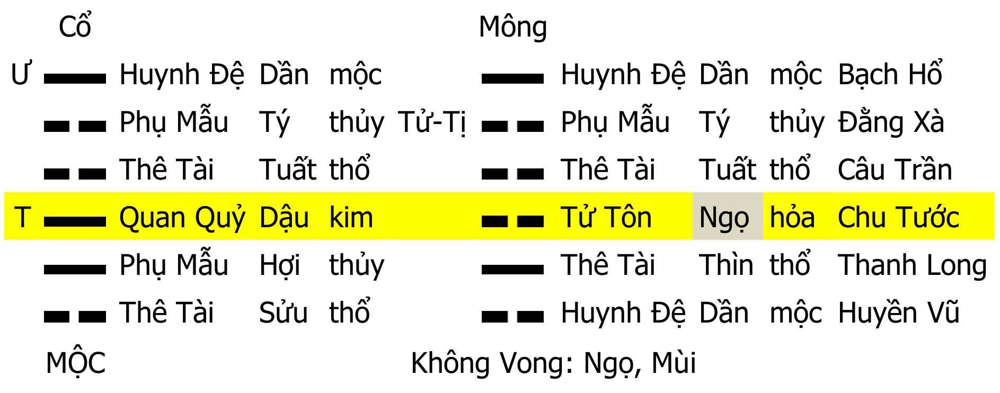
    - **Hình này chứng minh điều gì**
      - Thấy được Quan Quỷ Dậu kim trì Thế hợp Nhật Thìn, Tuất thổ ám động sinh Thế cùng Nguyệt Thân kim tạo phương Tây Kim cục, người thứ ba là bạn học.
    - **Từ đâu mà thấy được**
      - Quan Quỷ Dậu kim trì Thế gặp Thân - Dậu - Tuất kim cục, Thế lâm Chu Tước chủ trường lớp học hành, Dậu kim động hóa hồi đầu khắc hóa Không.
  - **Bối cảnh quẻ:**
    - Ngày Nhâm Thìn tháng Thân năm Mậu Dần (1998), người nữ sinh năm 1963 (Quý Mão - 36 tuổi) đến xin dự đoán về tình trạng hôn nhân, gieo được quẻ Sơn Phong Cổ biến Sơn Thủy Mông (Không Vong tại Ngọ, Mùi).
  - **Phán đoán chi tiết:**
    - Căn cứ: Lấy Quan Quỷ làm Dụng thần đại diện cho người chồng.
    - Nhìn vào:
      - Quan Quỷ Dậu kim trì Thế, được Nguyệt kiến Thân kim trợ giúp, Nhật thần Thìn thổ sinh hợp nên cực kỳ vượng tướng; Quan Quỷ trì Thế biểu thị "đã có", thuyết minh người này đã kết hôn.
      - Quan Quỷ Dậu kim là hào độc phát trong quẻ; phán đoán ứng kỳ kết hôn theo nguyên tắc "động mà gặp trị, gặp hợp", kết hợp với tuổi tác của đương số (sinh năm 1963) suy đoán kết hôn vào năm Mậu Thìn (1988) khi Thìn Dậu tương hợp.
      - Tử Tôn Tị hỏa phục tàng dưới hào 5 Phụ Mẫu Tý thủy; phục tàng ứng xuất hiện, suy đoán sinh con vào năm Kỷ Tị (1989).
      - Quan Quỷ Dậu kim phát động hóa Tử Tôn Ngọ hỏa hồi đầu khắc, đồng thời Ngọ hỏa lâm Không Vong; hào Ứng Dần mộc (phu vị) bị Nguyệt kiến Thân kim xung phá (Nguyệt phá), cho thấy hôn nhân khó lòng đi cùng nhau đến cuối đời.
      - Quan Quỷ Dậu kim là Đào hoa (ngày Thìn, Dậu là Đào hoa) tương hợp với Nhật thần Thìn thổ; hào 4 Thê Tài Tuất thổ ám động sinh phù Quan Quỷ; Thê Tài đại diện cho phụ nữ, ám động biểu thị có người đàn bà lén lút thầm thương trộm nhớ chồng cô, chứng minh chính sự xuất hiện của kẻ thứ ba đã phá vỡ hạnh phúc gia đình.
      - Hào Thế Dậu kim, hào ám động Tuất thổ và Nguyệt kiến Thân kim kết hợp thành Phương Tây Kim Cục (Thân - Dậu - Tuất); hào Thế lâm Chu Tước chủ về văn thư, trường học, giấy tờ học tập, từ đó đoán định người phụ nữ thứ ba chen chân vào gia đình chính là bạn học của người chồng.
      - Thê Tài Tuất thổ ám động tương ứng với năm Giáp Tuất (1994) là thời điểm người bạn học lén lút quan hệ bất chính với người chồng; hào Ứng phu vị Nguyệt phá đến năm Ất Hợi (1995) gặp hợp phá (Dần Hợi hợp); lại thêm Phụ Mẫu Hợi thủy (giấy đăng ký kết hôn) nhập Mộ ở Nhật thần Thìn thổ, biểu thị giấy chứng nhận kết hôn bị thu hồi trong năm Hợi thủy; do đó đoán chính xác năm 1995 cô đã ly dị.
      - Năm Mậu Dần (1998) hào Ứng thực phá, tuy có người mai mối đối tượng nhưng rơi vào Tuyệt địa của Quan Quỷ nên không thành; Quan Quỷ Dậu kim hiện hợp với Nhật thần, đến năm Kỷ Mão (1999) xung khai sẽ có niềm vui tái hôn, song do Quan Quỷ hóa hồi đầu khắc và hóa Không nên hôn nhân mới vẫn khó trọn vẹn như ý.
  - **Ứng nghiệm thực tế:**
    - Người nữ bàng hoàng xác nhận mọi sự chuẩn xác phi thường: Chồng cô quả thực thường xuyên lui tới nhà cô bạn học cũ. Hai người kết hôn năm 1988, sinh con năm 1989, năm 1994 chồng ngoại tình với bạn học và năm 1995 chính thức ly dị. Năm 1998 có người giới thiệu mai mối nhưng không hợp ý nên không thành; riêng chuyện năm 1999 sau này không có phản hồi thêm.

- **Ví dụ 2: Nữ đoán duyên phận vợ chồng năm Bính Tý (Hai vợ chồng là đồng hương)**
  - **Hình 133.** Quẻ Phong Thủy Hoán biến Tốn Vi Phong
    - 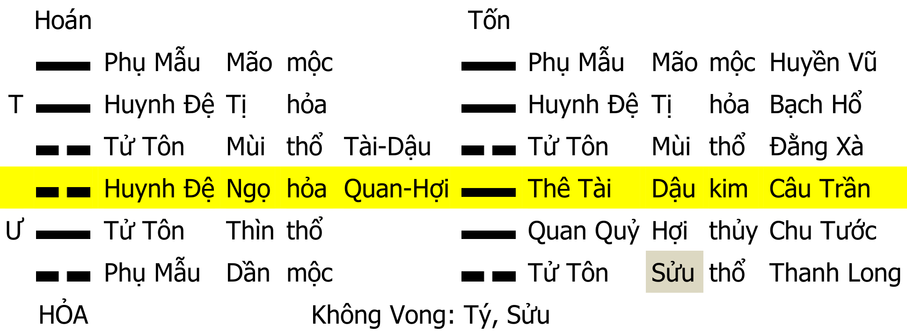
    - **Hình này chứng minh điều gì**
      - Thấy được hào Thế Tị hỏa và hào Ứng Thìn thổ cùng đóng tại quẻ Tốn (cùng cung), chứng minh hai vợ chồng vốn là người cùng quê ("thân càng thêm thân").
    - **Từ đâu mà thấy được**
      - Thế Tị hỏa tại hào 5 và Ứng Thìn thổ tại hào 2 thuộc cung Tốn, Dụng thần Quan Quỷ Hợi thủy phục tàng hưu tù dưới hào 3 hợp Phụ Mẫu Dần mộc.
  - **Bối cảnh quẻ:**
    - Ngày Giáp Dần tháng Mão năm Bính Tý (1996), người nữ sinh năm 1964 (Giáp Thìn - 33 tuổi) đến xem duyên phận vợ chồng ra sao, gieo được quẻ Phong Thủy Hoán biến Tốn Vi Phong (Không Vong tại Tý, Sửu).
  - **Phán đoán chi tiết:**
    - Căn cứ: Lấy Quan Quỷ làm Dụng thần đại diện cho người chồng.
    - Nhìn vào:
      - Dụng thần Quan Quỷ Hợi thủy phục tàng dưới hào 3 Huynh Đệ Ngọ hỏa, hưu tù vô khí, cho thấy duyên phận vợ chồng vô cùng mỏng manh; Dụng thần phục tàng biểu thị người chồng hiện không có ở nhà.
      - Hào Hương Khuê đối với nữ là Hợi thủy (nơi khuê phòng), đóng cùng một hào với Dụng thần Quan Quỷ phục tàng, phản ánh chính xác cảnh ngộ người vợ phải lẻ bóng một mình trông coi nhà cửa sau khi chồng bỏ đi.
      - Phụ Mẫu Dần mộc đồng hành với Nhật thần Dần mộc; lấy hào Phụ Mẫu (giấy hôn thú) định kỳ kết hôn: Phụ Mẫu yên tĩnh thì gặp trị gặp xung (ứng năm Thân); đồng thời Dụng thần Quan Quỷ Hợi thủy hưu tù cần đất Trường Sinh (Thân là Trường Sinh của Thủy), kết hợp tuổi tác đoán định kết hôn vào năm Nhâm Thân (1992).
      - Quan Quỷ Hợi thủy tương hợp với Phụ Mẫu Dần mộc; Phụ Mẫu là giấy chứng nhận kết hôn, chứng minh người đàn ông này trước đó đã từng kết hôn một lần, đây là cuộc hôn nhân thứ hai của anh ta.
      - Hào Thế là Tị hỏa cư hào 5, hào Ứng là Thìn thổ cư hào 2; cả Thìn và Tị đều cùng đóng tại quái cung Tốn (phương Đông Nam), biểu thị hai vợ chồng vốn là người cùng quê, ứng nghiệm câu cổ nhân: *"Cùng một cung thân càng thêm thân"*.
      - Năm Giáp Tuất (1994) là năm thổ vượng khắc chế mạnh mẽ Quan Quỷ Hợi thủy, do đó phán đoán hai người đã ly hôn vào năm 1994.
  - **Ứng nghiệm thực tế:**
    - Người nữ xác nhận hoàn toàn chuẩn xác: Cô kết hôn với một người đàn ông hàng xóm ngay tại quê nhà vào năm 1992; đối phương đúng là người đã qua một đời vợ. Sau khi kết hôn hai bên liên tục phát sinh bất hòa gay gắt và đã chính thức ly hôn vào năm 1994.

- **Ví dụ 3: Nữ đoán kết quả với người đàn ông mình thích (Cách trở trời đất, ở xa muôn trùng)**
  - **Hình 134.** Quẻ Đoài Vi Trạch biến Thiên Sơn Độn
    - 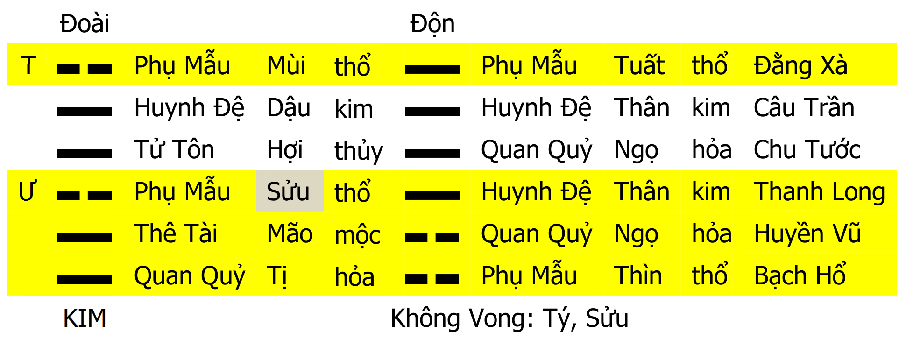
    - **Hình này chứng minh điều gì**
      - Thấy được hào Thế ở hào 6 (trời) và Dụng thần Quan Quỷ Tị hỏa ở hào sơ (đất), tượng trời đất cách trở biểu thị khoảng cách chỗ ở đôi bên cách nhau rất xa.
    - **Từ đâu mà thấy được**
      - Thế vị tại hào 6 cực cao, Quan Quỷ tại hào 1 cực thấp, quẻ lục xung chủ không thể gần gũi, Quan Quỷ động hóa Phụ Mẫu Thìn thổ thể hiện đối phương đã có vợ.
  - **Bối cảnh quẻ:**
    - Ngày Tân Dậu tháng Ngọ, người nữ đến hỏi về kết cục tình cảm với người đàn ông mà bản thân đang thầm thương trộm nhớ, gieo được quẻ Đoài Vi Trạch biến Thiên Sơn Độn (Không Vong tại Tý, Sửu).
  - **Phán đoán chi tiết:**
    - Căn cứ: Lấy Quan Quỷ làm Dụng thần đại diện cho người đàn ông.
    - Nhìn vào:
      - Quan Quỷ Tị hỏa tại hào sơ phát động hóa Phụ Mẫu Thìn thổ; Phụ Mẫu chủ về giấy chứng nhận kết hôn, chứng minh người đàn ông này là người đã có gia đình, đã kết hôn.
      - Hào Ứng Phụ Mẫu Sửu thổ lâm Không Vong, phản ánh tâm trạng của đối phương đang rơi vào thế do dự, trù trừ không dứt khoát.
      - Hào Thế Phụ Mẫu Mùi thổ tọa tại hào 6 (ngôi cao nhất, tượng trưng cho Trời), trong khi Dụng thần Quan Quỷ Tị hỏa đóng tại hào sơ (ngôi thấp nhất, tượng trưng cho Đất); khoảng cách giữa hào Thế và Dụng thần xa cách tột cùng, tượng trưng cho cách trở trời đất, chứng minh nơi ở thực tế của hai người cách xa nhau muôn trùng ngàn dặm.
      - Dụng thần Quan Quỷ Tị hỏa được Nguyệt kiến Ngọ hỏa phò trợ, phát động sinh hào Thế, chứng tỏ người đàn ông cũng có hảo cảm và tình ý sâu nặng với cô; tuy nhiên toàn quẻ lại là Đoài Vi Trạch (quẻ Lục Xung), biểu thị hai người không thể dung hợp gắn bó mật thiết, giữa đôi bên luôn tồn tại một hố sâu khoảng cách ngăn trở.
      - Hào Thế lâm Đằng Xà, chủ về tâm trạng luôn thấp thỏm, hoang mang, đứng ngồi không yên.
  - **Ứng nghiệm thực tế:**
    - Thân chủ nghẹn ngào thừa nhận tình hình thực tế đúng y như quẻ đoán: Người đàn ông ở một nơi rất xa, đã có vợ con đề huề, đôi bên dù có tình cảm với nhau nhưng luôn bị rào cản địa lý và gia cảnh chia cắt, trong lòng cô luôn dằn vặt bất an khôn nguôi.

- **Ví dụ 4: Nữ đoán hôn nhân năm Quý Mùi (Tình nhân cùng cơ quan quản lý tài liệu mật)**
  - **Hình 135.** Quẻ Sơn Hỏa Bí biến Địa Sơn Khiêm
    - 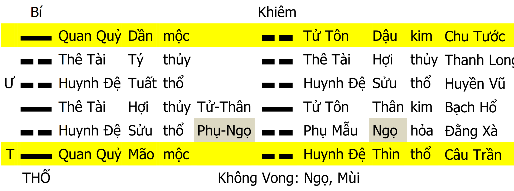
    - **Hình này chứng minh điều gì**
      - Thấy được hào Thế Quan Quỷ Mão mộc kết hợp hào 6 Quan Quỷ Dần mộc động và biến hào Thìn thổ tạo phương Đông Mộc cục, tình nhân cùng một đơn vị.
    - **Từ đâu mà thấy được**
      - Dần Mão Thìn cấu thành phương cục, hào Thế lâm Câu Trần chủ văn phòng công sở, Dần mộc hợp Thê Tài Hợi thủy chứng minh tình nhân đã có vợ.
  - **Bối cảnh quẻ:**
    - Ngày Mậu Tý tháng Mùi năm Quý Mùi (2003), người nữ sinh năm 1972 (Nhâm Tý - 32 tuổi) đến xem quẻ hôn nhân, gieo được quẻ Sơn Hỏa Bí biến Địa Sơn Khiêm (Không Vong tại Ngọ, Mùi).
  - **Phán đoán chi tiết:**
    - Căn cứ: Lấy Quan Quỷ làm Dụng thần.
    - Nhìn vào:
      - Trong quẻ Quan Quỷ lưỡng hiện và đều phát động (Quan Quỷ Mão mộc tại hào sơ và Quan Quỷ Dần mộc tại hào 6); ưu tiên lấy Quan Quỷ Mão mộc trì Thế phát động làm Dụng thần đại diện cho người chồng chính thức.
      - Quan Quỷ Mão mộc trì Thế được Nhật thần Tý thủy sinh trợ là vượng tướng, chứng minh bản thân người nữ là người đã có chồng đàng hoàng.
      - Hào 6 lại xuất hiện một hào Quan Quỷ Dần mộc phát động; hào Thế Mão mộc gặp Nhật thần Tý thủy là đất Mộc Dục (chủ phong lưu, dục vọng), chứng tỏ bản thân cô đang ngoại tình vụng trộm, đã xuất hiện người tình bên ngoài.
      - Quan Quỷ Dần mộc tương hợp với hào 3 Thê Tài Hợi thủy; Thê Tài đại diện cho người phụ nữ/vợ, chứng minh người tình này cũng là người đàn ông đã có gia đình vợ con.
      - Quan Quỷ Dần mộc (hào 6), Quan Quỷ Mão mộc (hào Thế) kết hợp với Huynh Đệ Thìn thổ (biến hào của hào sơ) tạo thành Phương Đông Mộc Cục (Dần - Mão - Thìn); hào Thế lâm Câu Trần (Câu Trần chủ văn phòng, công sở, nơi làm việc), khẳng định người tình và cô vốn là người cùng làm chung trong một cơ quan, đơn vị.
      - Hào Ứng Huynh Đệ Tuất thổ là đại diện của đối phương; Tuất thổ là Mộ khố của Phụ Mẫu (Phụ Mẫu chủ văn thư, hồ sơ, giấy tờ), lại lâm Huyền Vũ (chủ cơ mật, bí mật), suy đoán người tình đảm nhiệm công việc phụ trách quản lý hồ sơ, tài liệu cơ mật trong cơ quan.
      - Quan Quỷ Dần mộc phát động hóa Tử Tôn Dậu kim hồi đầu khắc phạt, báo trước mối quan hệ ngoài luồng bất chính này tuyệt đối không thể kéo dài bền lâu.
  - **Ứng nghiệm thực tế:**
    - Người nữ vô cùng thán phục xác nhận toàn bộ dự đoán hoàn toàn chính xác: Cô đã có chồng nhưng đang dan díu với một nam đồng nghiệp cùng cơ quan; anh ta đã có vợ, phụ trách phòng văn thư hồ sơ lưu trữ tài liệu mật; hai người gần đây xảy ra nhiều xung đột và mối quan hệ đang đứng trước bờ vực đổ vỡ.

- **Ví dụ 5: Mẹ đoán hôn nhân cho con trai năm Quý Mùi (Bạn gái cùng quê từng phá thai)**
  - **Hình 136.** Quẻ Phong Thủy Hoán biến Phong Thiên Tiểu Súc
    - 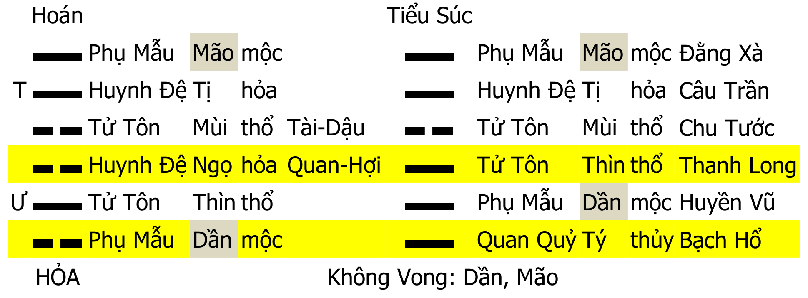
    - **Hình này chứng minh điều gì**
      - Thấy được Thê Tài Dậu kim phục dưới hào 4 Tử Tôn Mùi thổ (hào 4 là quê hương), chứng minh người nữ là người cùng quê và hiện đã sống chung với con trai.
    - **Từ đâu mà thấy được**
      - Dụng thần phục dưới Mùi thổ Thái Tuế (Tử Tôn), Huynh Đệ Ngọ hỏa là Mộc Dục động hóa Tử Tôn thể hiện người nữ có lối sống phong lưu từng phá thai.
  - **Bối cảnh quẻ:**
    - Ngày Tân Hợi tháng Ngọ năm Quý Mùi (2003), người mẹ đến xin xem nhân duyên cho con trai sinh năm 1969 (Kỷ Dậu - 35 tuổi), gieo được quẻ Phong Thủy Hoán biến Phong Thiên Tiểu Súc (Không Vong tại Dần, Mão).
  - **Phán đoán chi tiết:**
    - Căn cứ: Đoán hôn nhân cho con trai nên lấy Thê Tài làm Dụng thần đại diện cho người con dâu tương lai.
    - Nhìn vào:
      - Thê Tài Dậu kim không hiện trên quẻ, phục tàng dưới hào 4 Tử Tôn Mùi thổ; Dụng thần không được Nhật Nguyệt sinh phù (bị Nguyệt kiến Ngọ hỏa khắc, Nhật thần Hợi thủy tiết khí) nên hôn nhân của con trai gặp muôn vàn trắc trở, lận đận.
      - Hào 3 Huynh Đệ Ngọ hỏa phát động; Ngọ hỏa là đất Mộc Dục của Dụng thần Dậu kim, đồng thời cũng là Thai địa của hào Tử Tôn; Ngọ hỏa động lại hóa xuất Tử Tôn Thìn thổ, biểu thị người phụ nữ này có lối sống buông thả phóng túng, trong quá khứ từng mang thai và đã nạo phá thai với người đàn ông khác.
      - Dụng thần Thê Tài phục tàng tại hào 4; hào 4 là ngôi vị đại diện cho quê hương xứ sở, chứng minh người nữ này là người cùng quê quán, gái bản địa.
      - Dụng thần phục dưới Tử Tôn Mùi thổ; Mùi thổ chính là Thái Tuế của năm Quý Mùi, Tử Tôn đại diện cho con trai của người mẹ, báo hiệu hiện tại con trai bà đã tự ý dọn về chung sống như vợ chồng với cô gái này.
      - Hào Thế Tị hỏa ám động (được Nguyệt trợ, Nhật xung) khắc phạt Dụng thần Thê Tài Dậu kim, bộc lộ rõ trong thâm tâm người mẹ cực lực bài xích, phản đối kịch liệt cuộc hôn nhân này.
      - Phụ Mẫu Mão mộc lâm Không Vong tương hợp với Nhật thần Hợi thủy định kỳ hôn sự; Sàng Trướng (giường chiếu) lâm ngay tại Dụng thần, cho thấy sợi dây duyên nợ giữa con trai và cô gái này quá sâu nặng, không thể không lấy nhau; hào Phụ Mẫu Không Vong lưỡng hiện, dự báo con trai trong đời phải trải qua hai lần đò.
      - Dụng thần phục tàng hưu tù chủ về kết hôn muộn; căn cứ tuổi tác, năm Canh Thìn (2000 - 32 tuổi) có cơ hội thành hôn; năm Nhâm Ngọ (2002) ứng với Huynh Đệ Ngọ hỏa khắc Tài nên hôn nhân tan vỡ ly dị; đến năm Giáp Thân (2004) xung thực Phụ Mẫu Dần mộc và xung khai hợp Nhật, con trai sẽ chính thức tái hôn với người bạn gái này.
  - **Ứng nghiệm thực tế:**
    - Người mẹ thở dài giãi bày: Con trai bà si mê cô gái này từ lâu, nhưng cô ta từng ăn nằm mang thai rồi phá thai với người đàn ông khác khiến cả làng đều hay biết, gia đình bà kịch liệt cấm cản. Không chia cắt được hai đứa nên bà bắt con tòng quân đi lính; trong thời gian đó cô gái đã đi lấy chồng. Con trai xuất ngũ về thấy hết hy vọng liền vội vã cưới vợ vào năm 2000, nhưng sống bất hòa nên đã ly hôn năm 2002. Trớ trêu thay năm 2003 cô gái kia cũng vừa ly dị chồng; hai đứa lập tức tìm lại nhau và dọn về sống chung, kiên quyết đòi cưới bằng được.

- **Ví dụ 6: Nữ đoán nhân duyên với người đàn ông (Người tỉnh khác, thay lòng khi đối phương phá sản)**
  - **Hình 137.** Quẻ Đoài Vi Trạch biến Thiên Trạch Lý
    - 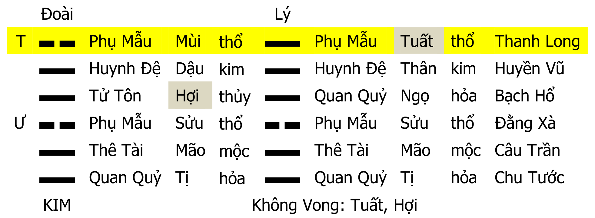
    - **Hình này chứng minh điều gì**
      - Thấy được hào Thế ở hào 6 và Dụng thần Quan Quỷ Tị hỏa ở hào sơ cách trở trời đất, chứng minh người nam là người phương xa (ngoại tỉnh).
    - **Từ đâu mà thấy được**
      - Thế hào 6 động hóa Không Vong, hào sơ Quan Quỷ sinh Thế, quẻ lục xung chủ tranh cãi chia tay, Thế Mùi thổ động mộ Thê Tài Mão mộc vì mê tiền.
  - **Bối cảnh quẻ:**
    - Ngày Bính Dần tháng Mùi, người nữ đến hỏi về nhân duyên với người đàn ông mình đang gắn bó, gieo được quẻ Đoài Vi Trạch biến Thiên Trạch Lý (Không Vong tại Tuất, Hợi).
  - **Phán đoán chi tiết:**
    - Căn cứ: Lấy Quan Quỷ làm Dụng thần đại diện cho người nam.
    - Nhìn vào:
      - Dụng thần Quan Quỷ Tị hỏa tại hào sơ được Nhật thần Dần mộc tương sinh là vượng tướng; Dụng thần lại sinh hào Thế Mùi thổ, chứng tỏ người đàn ông đối đãi với cô vô cùng chân thành, tử tế và hết mực chu cấp tiền tài.
      - Hào Thế ngự tại hào 6 (tượng Trời), Dụng thần Quan Quỷ đóng tại hào sơ (tượng Đất); hai hào cách trở muôn trùng trời đất, thuyết minh người đàn ông này không phải dân bản địa mà là người phương xa, người từ tỉnh khác tới.
      - Thân chủ phản hồi: Đúng là người tỉnh khác, anh ấy rất sẵn lòng chi tiền chu cấp cho cô.
      - Hào Thế tại hào 6 phát động hóa Tuất thổ Không Vong; Thế hóa Không chủ về bản thân sẽ thay lòng đổi dạ; hào 6 là hào vị thoái hưu (rút lui), báo hiệu bản thân cô muốn chủ động rút chân khỏi thế giới hai người. Toàn quẻ là Đoài Vi Trạch (quẻ Lục Xung), Đoài chủ về khẩu thiệt thị phi cãi vã; hào Thế lại bị Nhật thần Dần mộc khắc phạt, chứng tỏ hiện tại bản thân đang ở thế yếu, phát sinh xung đột kịch liệt với người ngoài, khó tránh khỏi kết cục chia tay.
      - Thân chủ phản hồi tiếp: Anh ta vốn đã có gia đình, mối quan hệ ngoài luồng bị vợ phát giác, hỏi tác giả liệu anh ta có thể ly dị vợ được không?
      - Hào Thế lâm Nguyệt kiến Mùi thổ xung phá hào Ứng Phụ Mẫu Sửu thổ (Phụ Mẫu là giấy kết hôn, hào Ứng là anh ta), vạch trần việc chính cô là căn nguyên khiến hôn nhân của anh ta rạn nứt; tuy nhiên Nhật thần Thê Tài Dần mộc sinh phù Quan Quỷ Tị hỏa, chứng tỏ người vợ quyết không buông tay, không chịu ly hôn.
      - Quan Quỷ Tị hỏa vượng tướng nên năm nay Ất Dậu chưa thể ly dị; phải đợi đến năm Đinh Hợi (2007) xung khắc Dụng thần Tị hỏa thì việc ly hôn mới xảy ra; song lúc đó hào Thế đã hóa Không, chỉ sợ chính cô không còn muốn cưới anh ta nữa.
      - Thân chủ một mực khẳng định: "Sẽ không bao giờ! Tôi rất yêu anh ấy, chỉ cần anh ấy ly hôn là tôi lập tức cưới liền!".
      - Tác giả truy vấn: Hào Thế Mùi thổ phát động khiến Thê Tài Mão mộc nhập Mộ (Mùi là Mộ của Mộc), thực chất cô chỉ mê đắm tiền bạc của anh ta; nếu anh ta khánh kiệt trắng tay liệu cô có còn yêu? Cô gái khẳng định chắc nịch: "Đương nhiên vẫn yêu!".
  - **Ứng nghiệm thực tế:**
    - Đến năm Đinh Hợi (2007), người đàn ông quả nhiên ly hôn vợ, nhưng toàn bộ gia sản đều phải giao lại cho vợ cũ. Anh ta tay trắng một thân một mình tìm đến người nữ mong nối lại duyên xưa; kết cục cay đắng là cô gái lúc này đã ngả vào vòng tay một người đàn ông giàu có khác, vứt bỏ anh ta không chút thương tiếc.

- **Ví dụ 7: Nữ đoán hôn nhân năm Tân Tị (Hai vợ chồng cùng quê nhưng chồng hướng ngoại)**
  - **Hình 138.** Quẻ Thủy Phong Tỉnh
    - 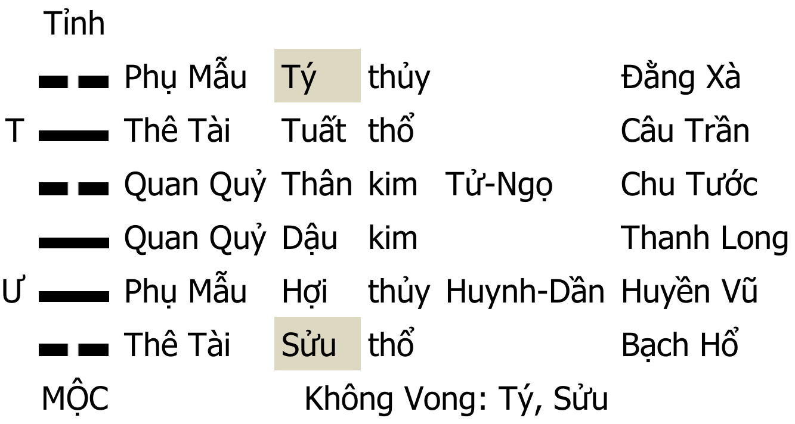
    - **Hình này chứng minh điều gì**
      - Thấy được hào Thế Thê Tài Tuất thổ và hào Ứng Phụ Mẫu Hợi thủy cùng thuộc quái cung Khôn, Thế lâm Câu Trần thể hiện hai vợ chồng là người cùng quê.
    - **Từ đâu mà thấy được**
      - Quẻ Tỉnh thuộc Khôn cung, Thế lâm thổ gặp Câu Trần, Dụng thần Quan Quỷ Thân kim sinh hào Ứng cho thấy người chồng hướng lòng về người phụ nữ khác.
  - **Bối cảnh quẻ:**
    - Ngày Canh Thân tháng Tuất năm Tân Tị (2001), người nữ 33 tuổi (Kỷ Dậu) đến xem quẻ hôn nhân, gieo được quẻ Thủy Phong Tỉnh (quẻ tĩnh, Không Vong tại Tý, Sửu).
  - **Phán đoán chi tiết:**
    - Căn cứ: Lấy Quan Quỷ làm Dụng thần đại diện cho người chồng.
    - Nhìn vào:
      - Trong quẻ Quan Quỷ lưỡng hiện (Thân kim tại hào 4 và Dậu kim tại hào 3); lấy Quan Quỷ Thân kim lâm Nhật thần làm Dụng thần chủ đạo; Quan Quỷ được Nguyệt kiến Tuất thổ sinh, Nhật thần Thân kim phò trợ nên vượng tướng hữu khí, minh chứng đây là người phụ nữ đã có gia đình.
      - Hào sơ Thê Tài Sửu thổ là Nguyên thần sinh Dụng thần lâm Không Vong; đến năm Tân Mùi (1991) Thái Tuế xung thực Sửu thổ, phán đoán kết hôn vào năm 1991.
      - Hào Thế lâm hành Thổ lại gặp Câu Trần, biểu thị bản tính chân chất, thật thà, chất phác; hào Thế yên tĩnh sinh Dụng thần Quan Quỷ Thân kim, cho thấy bản thân không biết biểu lộ tình cảm một cách lãng mạn, ngọt ngào; hào Thế cư hào 5 lâm Thê Tài (hào 5 là ngôi vị ông chủ, Thê Tài là tiền tài buôn bán), chứng tỏ cô là chủ một hộ kinh doanh cá thể tự làm chủ.
      - Hào Thế (hào 5) và hào Ứng (hào 2) đều cùng đóng tại quái cung Khôn Vi Địa; hào Thế lại lâm Câu Trần (Câu Trần chủ đồng hương, làng xóm quê mùa), khẳng định chắc chắn hai vợ chồng là người cùng chung một quê hương bản quán.
      - Dụng thần Quan Quỷ Thân kim không sinh Thế mà lại đi tương sinh hào Ứng Phụ Mẫu Hợi thủy, phản ánh tâm trí của người chồng đã hướng về người phụ nữ khác bên ngoài, tình cảm vợ chồng nguội lạnh.
      - Nguyên thần của hào Thế là Tử Tôn Ngọ hỏa không hiện trên quẻ, phục tàng dưới hào 4 Quan Quỷ Thân kim; Nguyên thần đại diện cho tư duy, tâm tưởng; phục tàng biểu thị tâm trí của cô lúc này cũng không còn thiết tha gắn bó với mái ấm này nữa; Phi thần là Quan Quỷ chủ về lo toan, phiền muộn, thể hiện tâm trạng đương số đang vô cùng ngột ngạt, bế tắc; hào Thế Tuất thổ là Mộ khố của Tử Tôn, lý do cô chưa dứt áo ra đi là vì trong lòng còn nặng nợ, không nỡ bỏ rơi con nhỏ.
  - **Ứng nghiệm thực tế:**
    - Người nữ ngậm ngùi xác nhận quả đúng trăm phần trăm: Vợ chồng cùng quê nhưng tình cảm rạn nứt trầm trọng, chồng lạnh nhạt có người khác khiến cô u uất muốn bỏ nhà ra đi, song vì thương con nhỏ nên đau đớn cam chịu giằng xé nội tâm.

- **Ví dụ 8: Nam đoán mối quan hệ với nhân tình tháng Dần (Người tình cùng quê ở gần)**
  - **Hình 139.** Quẻ Sơn Thủy Mông
    - 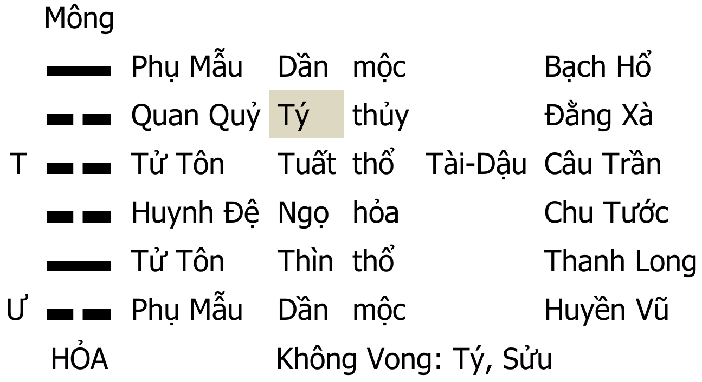
    - **Hình này chứng minh điều gì**
      - Thấy được Thê Tài Dậu kim phục tàng dưới hào Thế Tử Tôn Tuất thổ tại hào 4, thể hiện người nữ ở gần mình, là người cùng quê bản địa.
    - **Từ đâu mà thấy được**
      - Dụng thần phục dưới Thế, hào 4 là hào vị quê hương, Thế lâm Câu Trần chủ đồng hương, hào Ứng Dần mộc lâm Huyền Vũ khắc Thế khó bền lâu.
  - **Bối cảnh quẻ:**
    - Ngày Quý Hợi tháng Dần, người nam đến hỏi về mối quan hệ tình cảm với người tình nhân sẽ phát triển ra sao, gieo được quẻ Sơn Thủy Mông (quẻ tĩnh, Không Vong tại Tý, Sửu).
  - **Phán đoán chi tiết:**
    - Căn cứ: Nam đoán về nhân tình nên lấy Thê Tài làm Dụng thần.
    - Nhìn vào:
      - Thê Tài Dậu kim không hiện trên quẻ, phục tàng dưới hào Thế Tử Tôn Tuất thổ tại hào 4; Dụng thần phục ngay dưới chân hào Thế biểu thị khoảng cách giữa người phụ nữ này và đương số rất gần gũi, ở ngay cạnh bên mình.
      - Vị trí hào 3 và hào 4 trong quẻ Lục Hào tượng trưng cho hào vị quê hương nội xứ; thêm vào đó hào Thế lâm Câu Trần (Câu Trần chủ về đồng hương, quen biết gần gũi), khẳng định cô gái này là người cùng quê, sống cùng địa phương bản xứ.
      - Hào Ứng Phụ Mẫu Dần mộc lâm Huyền Vũ (chủ ám muội, mờ ám) quay lại khắc phạt hào Thế Tuất thổ, cảnh báo hai người tuy ở gần nhau nhưng thân phận trớ trêu, hoàn cảnh cấm kỵ nên không thể công khai sống chung thường xuyên bên nhau.
  - **Ứng nghiệm thực tế:**
    - Người nam kinh ngạc gật đầu thừa nhận: Cô ấy đúng là người cùng quê quán sống ngay gần nhà anh; hai người nảy sinh tình cảm vụng trộm nhưng vì vướng bận gia đình xã hội nên không thể công khai hay thường xuyên ở bên nhau được.

- **Ví dụ 9: Nữ đoán hôn nhân tháng Ngọ (Vợ chồng ở riêng hai nơi, dan díu với bạn học cũ)**
  - **Hình 140.** Quẻ Đoài Vi Trạch biến Trạch Thiên Quải
    - 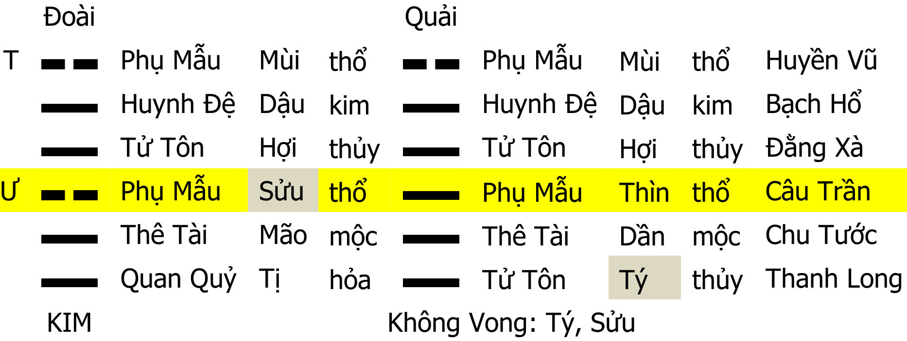
    - **Hình này chứng minh điều gì**
      - Thấy được Thế ở hào 6 và Quan Quỷ ở hào sơ cách nhau vời vợi biểu thị vợ chồng ở riêng hai nơi, Thế lâm Huyền Vũ hợp Nguyệt chứng minh có gian tình.
    - **Từ đâu mà thấy được**
      - Thế hào 6 và Dụng thần hào sơ cách trở trời đất, Phụ Mẫu Sửu thổ Không động hóa Mộ là sống không hôn thú, Thế lâm Huyền Vũ hợp Quan Quỷ Ngọ hỏa.
  - **Bối cảnh quẻ:**
    - Ngày Giáp Dần tháng Ngọ, người nữ đến xin đoán quẻ về tình hình hôn nhân của bản thân, gieo được quẻ Đoài Vi Trạch biến Trạch Thiên Quải (Không Vong tại Tý, Sửu).
  - **Phán đoán chi tiết:**
    - Căn cứ: Lấy Quan Quỷ làm Dụng thần đại diện cho người chồng.
    - Nhìn vào:
      - Dụng thần Quan Quỷ Tị hỏa tại hào sơ được Nhật thần Dần mộc sinh trợ là vượng tướng, lại tương sinh hào Thế Phụ Mẫu Mùi thổ; Phụ Mẫu trì Thế (Phụ Mẫu là giấy chứng nhận kết hôn), thuyết minh người này chắc chắn đã kết hôn.
      - Hào Thế Mùi thổ và hào Ứng Phụ Mẫu Sửu thổ tương xung lẫn nhau (Thế Ứng tương xung); toàn quẻ là Đoài Vi Trạch (Đoài chủ về khuyết tổn, sứt mẻ, khiếm khuyết), phản ánh tình cảm vợ chồng lạnh nhạt, thường xuyên xung khắc, hôn nhân không hề viên mãn.
      - Hào Thế ngự tại hào 6 (ngôi cao nhất, tượng Trời), Quan Quỷ đóng tại hào sơ (ngôi thấp nhất, tượng Đất); hai hào cách biệt vời vợi, hình thành tượng cách trở trời đất, khẳng định hai vợ chồng không chung sống dưới một mái nhà mà đang sống ly thân ở riêng hai nơi xa cách.
      - Hào 3 Phụ Mẫu Sửu thổ lâm Không Vong, phát động hóa Mộ (nhập Mộ tại Thìn thổ biến hào); Phụ Mẫu đại diện cho giấy hôn thú, hôn thú vừa rơi vào Không Vong vừa nhập Mộ chính là tượng chung sống mờ ám mà không có đăng ký kết hôn chính thức.
      - Nguyệt kiến Ngọ hỏa cũng mang hành Hỏa là Quan Quỷ (tượng người đàn ông khác ngoài luồng), tạo thế Ngọ Mùi tương hợp với hào Thế; hào Thế lại lâm Huyền Vũ (chủ ám muội, vụng trộm lén lút), vạch trần việc cô đang có một người đàn ông khác lén lút qua lại và ăn nằm chung sống như vợ chồng.
  - **Ứng nghiệm thực tế:**
    - Người nữ hoàn toàn tâm phục khẩu phục cúi đầu nhận tội: Chồng cô đi công tác làm ăn xa xôi biền biệt, bản thân cô vò võ một mình trông nom nhà cửa; gần đây một người bạn nam học chung thời cấp ba thường xuyên ghé thăm chuyện trò, cô đơn trống trải nên hai người đã ngã vào lòng nhau và chung sống bất chính.

### CHƯƠNG 7: HÔN NHÂN SỚM HAY MUỘN

#### Tính tương đối và bối cảnh văn hóa - địa lý của quan niệm kết hôn sớm hay muộn
- Quan niệm kết hôn sớm hay kết hôn muộn mang tính tương đối sâu sắc, chịu sự chi phối chặt chẽ bởi phong tục tập quán, điều kiện kinh tế - xã hội và văn hóa vùng miền:
  - Cùng một độ tuổi kết hôn (ví dụ 25 đến 28 tuổi), ở các vùng nông thôn hoặc cộng đồng truyền thống có thể đã bị xem là kết hôn muộn, nhưng tại các đô thị phát triển hoặc trong môi trường học thuật hiện đại thì độ tuổi này hoàn toàn bình thường, thậm chí còn được coi là kết hôn sớm.
  - Khi ứng dụng Dịch học Lục Hào vào dự trắc hôn nhân, người dự đoán bắt buộc phải kết hợp linh hoạt giữa quái tượng với hoàn cảnh xuất thân, độ tuổi đương số và quan niệm văn hóa của từng địa phương để đưa ra kết luận chuẩn xác, tránh võ đoán máy móc.

#### Tổng hợp hệ thống quy tắc cốt lõi phân định kết hôn sớm hay muộn trong Lục Hào
- **Quy luật về sự hiển hiện và vị trí hào của Dụng thần:**
  - *Dụng thần xuất hiện so với Phục tàng:* Dụng thần hiển hiện rõ ràng trên quẻ chủ là tượng nhân duyên sớm hiển lộ, thường chủ về kết hôn sớm; Dụng thần phục tàng dưới phi thần là tượng nhân duyên bị che khuất, trắc trở ẩn chìm, định sẵn kết hôn muộn.
  - *Hào vị của Dụng thần:* Dụng thần an vị tại hào sơ hoặc hào 2 (hào vị cơ sở, gốc rễ, trạch xá gia đình) biểu thị mối duyên khởi phát sớm, kết hôn sớm; ngược lại, Dụng thần hoặc hào Thế ngự tại hào 6 (thượng hào, vị trí tột cùng thoái hưu, biên giới xa xôi) biểu thị nhân duyên đến muộn màng.
- **Quy luật về vượng suy nhật nguyệt và trạng thái động tĩnh:**
  - *Vượng tướng so với Hưu tù:* Dụng thần được Nhật Nguyệt sinh phù trợ lực, lâm vượng tướng hữu khí là điềm kết hôn sớm; Dụng thần hưu tù vô khí, bị nhật nguyệt khắc hại suy nhược là điềm kết hôn muộn.
  - *Động tĩnh của Dụng thần:* Dụng thần phát động chủ động thái mau lẹ, xúc tiến nhân duyên nhanh chóng nên kết hôn sớm; Dụng thần yên tĩnh bất động chủ trì trệ, chậm chạp nên kết hôn muộn.
  - *Tương quan Trì Thế:* Dụng thần trì Thế (nam Thê Tài trì Thế, nữ Quan Quỷ trì Thế) là nhân duyên cận kề thân mình, kết hôn sớm; Kỵ thần trì Thế (nam Huynh Đệ trì Thế, nữ Tử Tôn trì Thế) tất bị cản trở duyên lành, chủ về kết hôn muộn.
- **Quy luật về Xung - Hợp và biến hóa Sinh - Khắc:**
  - *Gặp Xung so với Gặp Hợp:* Quẻ gặp xung hoặc Dụng thần phùng xung thường chủ tính chất gấp rút, sớm thành đôi lứa; quẻ gặp hợp (như quẻ Lục Hợp) hoặc Dụng thần bị hợp trói thường chủ dây dưa kéo dài, cản trở bước tiến, chủ kết hôn muộn.
  - *Động biến thoái, Mộ, Tuyệt:* Dụng thần phát động nhưng hóa Tuyệt, hóa Mộ, hoặc động hóa hồi đầu khắc đều biểu thị tình duyên đứt gãy giữa đường, kết hôn muộn hoặc thậm chí cả đời khó lập gia thất.
- **Hệ thống thần sát và tiêu chí phụ trợ then chốt:**
  - *Sàng Trướng (giường chiếu) và Hương Khuê (phòng khuê):* Hào Sàng Trướng/Hương Khuê hưu tù, lâm Không Vong, bị Nhật Nguyệt khắc phá hoặc lâm Tuyệt địa là dấu hiệu phòng không chiếc bóng, chưa từng kết hôn hoặc tình duyên dang dở.
  - *Hào Phụ Mẫu (hôn thư, giấy chứng nhận kết hôn):* Phụ Mẫu lâm Không Vong, nhập Mộ tại Nhật Nguyệt hoặc hưu tù bất động biểu thị đương số chưa từng đăng ký kết hôn, hiện trạng vẫn là người độc thân.
  - *Tượng đặc thù sống chung sớm không hôn thú:* Dụng thần quy vị tại hào 2 phát động tương xung với hào Thế, đồng thời hào Thế nhập Mộ tại hào 3 (giường chiếu) lâm Huyền Vũ là biểu tượng sống chung như vợ chồng từ rất sớm mà không có hôn thư chính thức.

#### Chiêm nghiệm thực tiễn qua 11 quái lệ kinh điển dự đoán hôn nhân sớm hay muộn
- **Ví dụ 1: Ngày Ất Sửu tháng Tuất năm Canh Thìn, nam sinh năm 1958 đoán hôn nhân (Được quẻ Sơn Trạch Tổn biến Hỏa Thủy Vị Tế)**
  - **Hình 141.** Sơ đồ quẻ Sơn Trạch Tổn biến Hỏa Thủy Vị Tế
    - 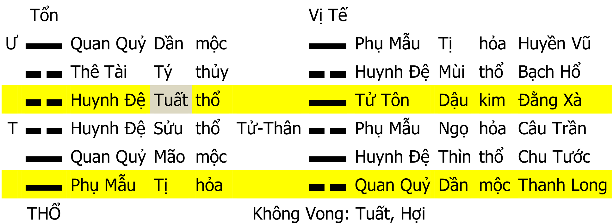
    - **Hình này chứng minh điều gì**
      - Thê Tài Tý thủy hưu tù bị Nhật Nguyệt khắc hợp, Kỵ thần trì Thế, Phụ Mẫu nhập Mộ chủ kết hôn muộn với phụ nữ tái giá.
    - **Từ đâu mà thấy được**
      - Thê Tài hào 5 bị Tuất khắc Sửu hợp, Thế Huynh Đệ Sửu thổ, Phụ Mẫu Tị hỏa nhập Mộ Tuất thổ, Nhật là Huynh Đệ hợp Tài.
  - **Phán đoán chi tiết:**
    - Căn cứ: Lấy Thê Tài làm Dụng thần đại diện cho người vợ; xem xét nhật nguyệt sinh khắc, hào trì Thế và trạng thái của Sàng Trướng, Phụ Mẫu để định hôn nhân sớm muộn và hiện trạng độc thân.
    - Nhìn vào: Thê Tài Tý thủy ngự tại hào 5, bị Nguyệt kiến Tuất thổ khắc và Nhật kiến Sửu thổ khắc hợp, Dụng thần cực kỳ hưu tù lại bị hợp trói; trên quẻ Kỵ thần Huynh Đệ Sửu thổ trì Thế, đây là dấu hiệu chắc chắn sẽ kết hôn muộn.
    - Căn cứ: Khảo sát Sàng Trướng (giường chiếu) và hào Phụ Mẫu (giấy đăng ký kết hôn, hôn thư) để phán đoán đương số đã từng lập gia đình hay chưa.
    - Nhìn vào: Sàng Trướng Tý thủy hưu tù không vượng biểu thị chưa từng kết hôn. Phụ Mẫu Tị hỏa đại diện cho giấy chứng nhận kết hôn nhập Mộ tại Nguyệt kiến Tuất thổ, chứng minh đương số hoàn toàn chưa có giấy đăng ký kết hôn, thực tế vẫn đang trong tình trạng độc thân.
    - Căn cứ: Đánh giá cơ hội kết hôn dựa trên tương tác động hào và lực phản phục của Dụng thần nhược cực.
    - Nhìn vào: Dụng thần Tý thủy tuy bị Nhật Nguyệt khắc thương nặng nề, Huynh Đệ trì Thế lại phát động, nhưng có hào sơ Phụ Mẫu Tị hỏa phát động sinh trợ Kỵ thần; đây là thế Dụng thần quá suy nhược chuyển hóa (nhược cực phản sinh), cho thấy đương số vẫn còn cơ hội kết hôn trong tương lai.
    - Căn cứ: Định ứng kỳ kết hôn theo nguyên tắc Dụng thần yên tĩnh phùng hợp thì ứng kỳ tại phùng xung; kết hợp hào Nhật kiến Huynh Đệ hợp Dụng thần để phán đoán bối cảnh của người bạn đời.
    - Nhìn vào: Thê Tài Tý thủy tĩnh bị Nhật Sửu hợp trú, cần xung để khai mở; đến năm Nhâm Ngọ (2002) Ngọ hỏa xung động Dụng thần Tý thủy lại sinh trợ hào Huynh Đệ, do đó quyết đoán đương số sẽ cử hành hôn lễ vào năm Nhâm Ngọ. Mặt khác, Nhật kiến là Huynh Đệ hợp với Thê Tài, Huynh Đệ tượng trưng cho người đàn ông khác, chứng tỏ người phụ nữ này trước đó đã từng chung sống với người đàn ông khác, là người kết hôn lần hai (đã qua một lần đò).
  - **Ứng nghiệm thực tế:**
    - Vào tháng Hợi năm Tân Tị (2001), đương số quen biết một người phụ nữ đã ly hôn; đến tháng Sửu cùng năm thì đăng ký nhận giấy chứng nhận kết hôn, và đúng năm Nhâm Ngọ (2002) đã tổ chức hôn lễ viên mãn.

- **Ví dụ 2: Ngày Nhâm Tuất tháng Dần năm Tân Tị, nữ sinh năm 1974 đoán hôn nhân (Được quẻ Hỏa Lôi Phệ Hạp biến Hỏa Địa Tấn)**
  - **Hình 142.** Sơ đồ quẻ Hỏa Lôi Phệ Hạp biến Hỏa Địa Tấn
    - 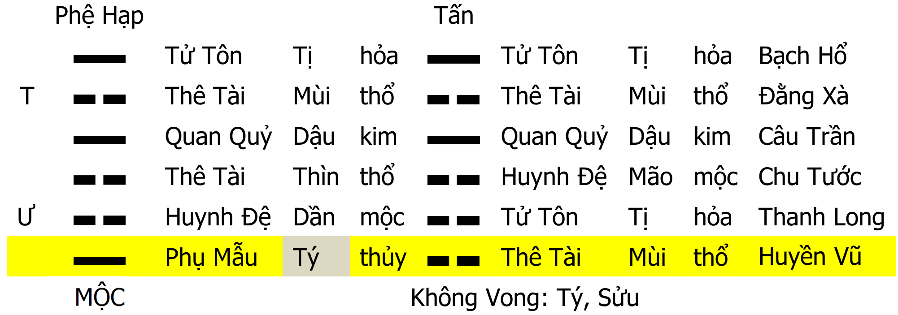
    - **Hình này chứng minh điều gì**
      - Quan Quỷ gặp Tử địa độc phát, Hương Khuê Không Vong, Ứng khắc Thế chủ kết hôn muộn, yêu đương không quá một tháng.
    - **Từ đâu mà thấy được**
      - Hào sơ Phụ Mẫu Tý thủy Không Vong độc phát là Tử địa của Quan Dậu kim, Ứng Dần mộc khắc Thế Mùi thổ, Thế lâm Đằng Xà hào 5.
  - **Phán đoán chi tiết:**
    - Căn cứ: Lấy Quan Quỷ làm Dụng thần đại diện cho người chồng/bạn trai; đối chiếu sinh khắc nhật nguyệt và biến động hào độc phát để định tiến trình tình cảm.
    - Nhìn vào: Quan Quỷ Dậu kim ngự tại hào 4, Nguyệt kiến Dần mộc không sinh nhưng được Nhật kiến Tuất thổ tương sinh là vượng tướng. Tuy nhiên, hào sơ Phụ Mẫu Tý thủy độc phát, mà Kim gặp Tý là đất Tử (Dụng thần lâm Tử địa), báo hiệu đường hôn nhân đầy trắc trở, không thuận lợi.
    - Căn cứ: Xác định trạng thái kết hôn hiện thời qua Hương Khuê (phòng khuê) và hào Phụ Mẫu (giấy đăng ký kết hôn).
    - Nhìn vào: Hào vị Hương Khuê rơi đúng vào hào sơ Phụ Mẫu Tý thủy; Tý thủy hưu tù lại lâm Tuần Không (Tuần Không Tý, Sửu), Phụ Mẫu đại diện cho hôn thú bị Không Vong, khẳng định đương số hiện thời vẫn chưa kết hôn.
    - Căn cứ: Phán đoán hôn nhân muộn và các mối quan hệ tình cảm ngắn ngủi trong quá khứ qua hào vị và số ngũ hành.
    - Nhìn vào: Dụng thần Quan Quỷ ở ngoại quái gặp Tử địa chủ hôn nhân muộn màng; hào Ứng Huynh Đệ Dần mộc lại khắc hào Thế Thê Tài Mùi thổ, cũng là biểu hiện rõ rệt của kết hôn muộn. Quan Quỷ được Nhật sinh cho thấy có cơ hội quen biết bạn trai; nhưng Tử địa nằm ngay tại hào sơ (khởi điểm), tượng trưng cho việc vừa mới chớm bắt đầu đã lụi tàn; ngũ hành Thủy thuộc số 1, từ đó phán đoán trước đây dù từng có người yêu nhưng mỗi lần nói chuyện yêu đương không thể vượt quá 1 tháng.
    - Căn cứ: Phán đoán tính cách của đương sự qua vị trí hào Thế và lục thần phối chiếu.
    - Nhìn vào: Hào Thế Thê Tài Mùi thổ ngự tại hào 5 (tôn vị), biểu thị bản thân mang tính cách kiêu ngạo, tự phụ; quẻ Hỏa Lôi Phệ Hạp tượng trưng cho sự cắn xé, tranh chấp; hào Thế lâm Đằng Xà chủ biến hóa đa đoan, cho thấy tâm tính thất thường, hay đổi ý khiến đối phương khó hòa hợp.
  - **Ứng nghiệm thực tế:**
    - Toàn bộ phán đoán của tác giả từ việc tính tình kiêu ngạo, tình yêu chưa từng quá một tháng cho đến hiện trạng muộn chồng đều hoàn toàn chuẩn xác với thực tế đời sống của đương số.

- **Ví dụ 3: Ngày Ất Hợi tháng Ngọ năm Giáp Thân, nữ đoán khi nào kết hôn (Được quẻ Phong Sơn Tiệm biến Địa Phong Thăng)**
  - **Hình 143.** Sơ đồ quẻ Phong Sơn Tiệm biến Địa Phong Thăng
    - 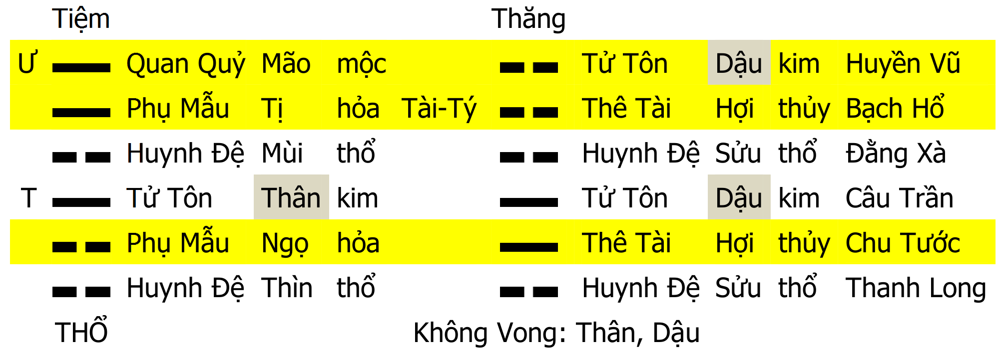
    - **Hình này chứng minh điều gì**
      - Quan Quỷ ngự hào 6, Kỵ thần trì Thế Không Vong, Phụ Mẫu ám động hợp Thế chủ kết hôn muộn do gia đình áp đặt hôn sự.
    - **Từ đâu mà thấy được**
      - Quan Quỷ Mão mộc hào 6, Thế Tử Tôn Thân kim Không Vong, hào 5 Phụ Mẫu Tị hỏa ám động hợp Thế, Dụng thần tĩnh cần Dậu xung.
  - **Phán đoán chi tiết:**
    - Căn cứ: Lấy Quan Quỷ làm Dụng thần đại diện cho người chồng; xem xét hào vị của Dụng thần và lục thân trì Thế để nhận định thời điểm kết hôn.
    - Nhìn vào: Quan Quỷ Mão mộc ngự tại hào 6 (thượng hào); hào 6 là điểm tột cùng kết thúc của sự vật, lại thêm Kỵ thần Tử Tôn Thân kim trì Thế, khẳng định đây là hình mẫu kết hôn tương đối muộn.
    - Căn cứ: Quan sát trạng thái tâm lý đương số qua hào Thế lâm Không và quan hệ Thế - Ứng.
    - Nhìn vào: Hào Thế Thân kim lâm Tuần Không (Tuần Không Thân, Dậu), cho thấy tâm trạng đương số đang vô cùng bất an, đau khổ và nôn nóng muộn phiền. Quan Quỷ lâm hào Ứng thể hiện nguyện vọng mãnh liệt muốn tự mình tìm kiếm một ý trung nhân hợp ý.
    - Căn cứ: Nhận diện sự can thiệp của gia đình đối với hôn nhân qua hào vị và biến động ám động.
    - Nhìn vào: Hào 5 Phụ Mẫu Tị hỏa được Nguyệt kiến Ngọ hỏa sinh phù hữu khí, bị Nhật kiến Hợi thủy xung phát thành ám động; Tị hỏa ám động tương hợp hào Thế Thân kim (Tị Thân hợp); hào 5 là vị trí gia trưởng, Phụ Mẫu đại diện cho cha mẹ, tương hợp chủ sự khống chế và ràng buộc, cho thấy các bậc trưởng bối trong gia đình đang nắm quyền kiểm soát, muốn cưỡng ép dàn xếp mối duyên của cô.
    - Căn cứ: Định ứng kỳ kết hôn theo quy tắc Dụng thần vượng tĩnh phùng xung.
    - Nhìn vào: Dụng thần Quan Quỷ Mão mộc được Nhật kiến Hợi thủy tương sinh là vượng tướng, hiện đang yên tĩnh bất động; đến năm Ất Dậu (2005) khi địa chi Dậu kim xung động Dụng thần Mão mộc thì hôn sự mới có thể viên thành.
  - **Ứng nghiệm thực tế:**
    - Khi đến gieo quẻ đương số đã 27 tuổi mà chưa tìm được người vừa ý, trong lòng trĩu nặng âu lo; cô muốn tự do yêu đương nhưng từ nhỏ mẹ cô đã đi xem bói đồng bóng, khăng khăng bắt con gái phải tìm đối tượng đúng theo tiêu chuẩn bà đồng đặt ra.

- **Ví dụ 4: Ngày Canh Ngọ tháng Tị, nam đoán hôn nhân (Được quẻ Địa Lôi Phục biến Địa Sơn Khiêm)**
  - **Hình 144.** Quẻ Địa Lôi Phục biến Địa Sơn Khiêm
    - 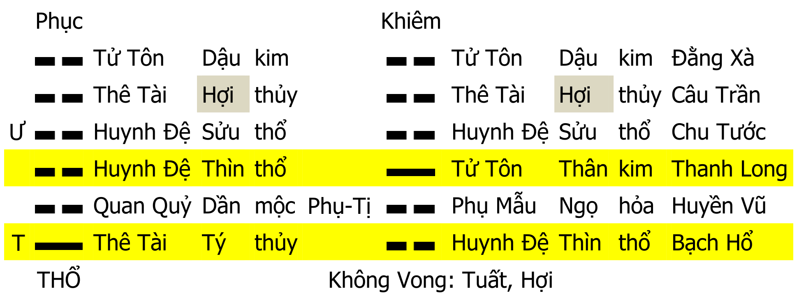
    - **Hình này chứng minh điều gì**
      - Thê Tài phát động hóa hồi đầu khắc, quẻ Lục Hợp, Sàng Trướng hưu tù chủ kết hôn rất muộn, độc thân tuổi trung niên.
    - **Từ đâu mà thấy được**
      - Thê Tài Tý thủy hào sơ động hóa Huynh Đệ Thìn thổ, hào 3 Thìn thổ khắc, Sàng Trướng Dần mộc hưu tù, quẻ Phục Lục Hợp.
  - **Phán đoán chi tiết:**
    - Căn cứ: Lấy Thê Tài làm Dụng thần đại diện cho người vợ; nguyên tắc chọn Dụng thần khi xuất hiện lưỡng hiện và phân tích sinh khắc động biến.
    - Nhìn vào: Trong quẻ Thê Tài lưỡng hiện (hào sơ Thê Tài Tý thủy và hào 5 Thê Tài Hợi thủy); theo quy tắc chọn hào phát động làm Dụng thần nên lấy Thê Tài Tý thủy làm chuẩn.
    - Căn cứ: Đánh giá độ vượng suy và tác động khắc hại từ nhật nguyệt cùng biến hào.
    - Nhìn vào: Thê Tài Tý thủy hoàn toàn không được Nhật Nguyệt (tháng Tị, ngày Ngọ hỏa) trợ giúp mà bị hưu tù, lại phát động hóa Huynh Đệ Thìn thổ (hóa hồi đầu khắc thương tổn nặng nề). Chưa dừng lại ở đó, hào 3 Huynh Đệ Thìn thổ trong nội quái cũng phát động hợp lực khắc chế Tý thủy.
    - Căn cứ: Xem xét trạng thái của Sàng Trướng (giường chiếu) và cấu trúc toàn quẻ.
    - Nhìn vào: Sàng Trướng Quan Quỷ Dần mộc hưu tù không lực; thêm vào đó Địa Lôi Phục là quẻ Lục Hợp, người chưa lập gia đình gặp quẻ Lục Hợp thường chủ nhân duyên dây dưa, trì trệ kéo dài, là triệu chứng của việc kết hôn cực kỳ muộn.
  - **Ứng nghiệm thực tế:**
    - Đương số trên thực tế đã 44 tuổi nhưng vẫn sống một mình, chưa từng một lần kết hôn.

- **Ví dụ 5: Ngày Nhâm Tuất tháng Tị, nam đoán hôn nhân (Được quẻ Thủy Lôi Truân)**
  - **Hình 145.** Quẻ Thủy Lôi Truân
    - 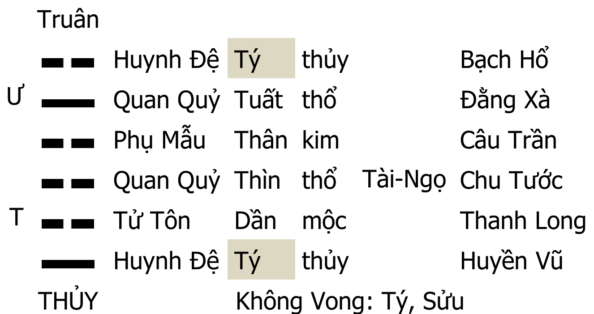
    - **Hình này chứng minh điều gì**
      - Dụng thần Thê Tài phục tàng lại nhập Mộ tại Nhật kiến chủ kết hôn muộn, sống độc thân kéo dài.
    - **Từ đâu mà thấy được**
      - Thê Tài Ngọ hỏa phục dưới hào 3 Quan Quỷ Thìn thổ, nhập Mộ tại Nhật kiến Tuất thổ, quẻ Truân bất động.
  - **Phán đoán chi tiết:**
    - Căn cứ: Lấy Thê Tài làm Dụng thần đại diện cho người vợ; xem xét trạng thái hiển hiện hay phục tàng và quy luật Mộ khố của nhật nguyệt.
    - Nhìn vào: Thê Tài Ngọ hỏa mặc dù được Nguyệt kiến Tị hỏa đồng khí trợ giúp là vượng, tuy nhiên không hề xuất hiện trên quẻ mà phải phục tàng dưới hào 3 Quan Quỷ Thìn thổ.
    - Căn cứ: Phân tích tương tác giữa Dụng thần phục thần với Nhật kiến.
    - Nhìn vào: Dụng thần Thê Tài Ngọ hỏa phục tàng, lại bị Nhật kiến Tuất thổ thu nạp vào Mộ (Hỏa Mộ tại Tuất). Dụng thần vừa ẩn tàng lại vừa nhập Mộ khố giam hãm thì không thể phát huy tác dụng, là tín hiệu chuẩn xác chỉ việc nhân duyên bế tắc, kết hôn muộn.
  - **Ứng nghiệm thực tế:**
    - Thực tế đương sự đã 40 tuổi nhưng đường tình duyên vẫn hoàn toàn trống vắng, tiếp tục sống độc thân.

- **Ví dụ 6: Ngày Ất Hợi tháng Thìn, nữ đoán hôn nhân (Được quẻ Phong Lôi Ích biến Phong Trạch Trung Phu)**
  - **Hình 146.** Quẻ Phong Lôi Ích biến Phong Trạch Trung Phu
    - 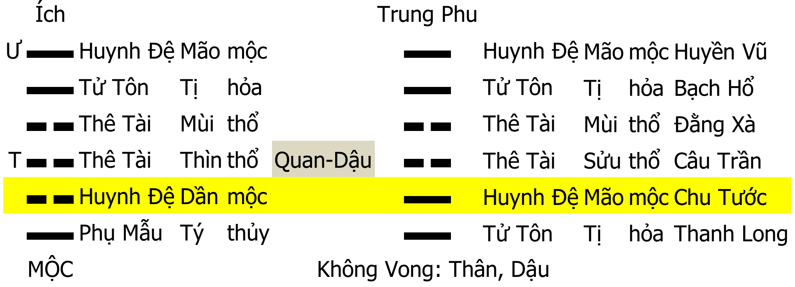
    - **Hình này chứng minh điều gì**
      - Quan Quỷ phục tàng Không Vong, hào độc phát khiến Dụng thần lâm Tuyệt địa Hương Khuê chủ kết hôn muộn.
    - **Từ đâu mà thấy được**
      - Quan Quỷ Dậu kim phục dưới hào 3 Thìn thổ lâm Không Vong, hào 2 Huynh Đệ Dần mộc độc phát là Tuyệt địa và Hương Khuê.
  - **Phán đoán chi tiết:**
    - Căn cứ: Lấy Quan Quỷ làm Dụng thần đại diện cho người chồng; khảo sát sự ẩn hiện, tuần không và tương tác của hào độc phát.
    - Nhìn vào: Quan Quỷ Dậu kim tuy được Nguyệt kiến Thìn thổ sinh hợp, nhưng lại lâm Tuần Không (Tuần Không Thân, Dậu) và không hiện lên quẻ, phải phục tàng dưới hào 3 Thê Tài Thìn thổ.
    - Căn cứ: Phân tích hào độc phát Huynh Đệ Dần mộc và hào vị Hương Khuê (phòng khuê).
    - Nhìn vào: Trong quẻ hào 2 Huynh Đệ Dần mộc độc phát; theo trường sinh thập nhị cung thì Kim tuyệt tại Dần, khiến Dụng thần Quan Quỷ Dậu kim rơi vào Tuyệt địa. Mặt khác, hào 2 chính là vị trí của Hương Khuê; Hương Khuê vừa lâm Độc phát vừa là Tuyệt địa của Dụng thần, Dụng thần phục tàng Không Vong lại gặp Tuyệt địa, hội tụ đầy đủ thông tin kết hôn muộn.
  - **Ứng nghiệm thực tế:**
    - Đương số đã bước sang tuổi 36 nhưng nhân duyên trắc trở lận đận, vẫn chưa một lần bước vào ngưỡng cửa hôn nhân.

- **Ví dụ 7: Ngày Kỷ Sửu tháng Thìn, nam đoán hôn nhân (Được quẻ Địa Thủy Sư biến Lôi Địa Dự)**
  - **Hình 147.** Quẻ Địa Thủy Sư biến Lôi Địa Dự
    - 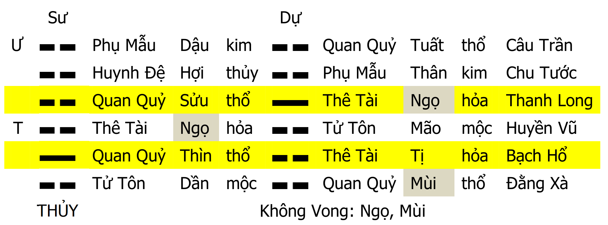
    - **Hình này chứng minh điều gì**
      - Thê Tài hưu tù Không Vong bị Quan Quỷ hai bên kẹp tiết khí, Sàng Trướng bị khắc chủ kết hôn muộn, bạn gái đều theo người khác.
    - **Từ đâu mà thấy được**
      - Thê Tài Ngọ hỏa trì Thế Không Vong, hào 2 Quan Thìn thổ và hào 4 Quan Sửu thổ động kẹp tiết, Sàng Trướng Hợi thủy bị khắc.
  - **Phán đoán chi tiết:**
    - Căn cứ: Lấy Thê Tài làm Dụng thần đại diện cho người vợ; đánh giá vượng suy theo nhật nguyệt và trạng thái Không Vong của Dụng thần trì Thế.
    - Nhìn vào: Thê Tài Ngọ hỏa ngự tại hào 3 trì Thế, không được Nhật Nguyệt (tháng Thìn, ngày Sửu thổ tiết khí) trợ giúp nên thuộc diện hưu tù; bản thân Dụng thần lại rơi vào Tuần Không (Tuần Không Ngọ, Mùi).
    - Căn cứ: Xem xét trạng thái của Sàng Trướng (giường chiếu) để định tình trạng hôn nhân.
    - Nhìn vào: Sàng Trướng Huynh Đệ Hợi thủy bị cả Nguyệt kiến Thìn thổ lẫn Nhật kiến Sửu thổ liên tiếp khắc hại thương tổn nặng nề, cũng là biểu hiện của việc hôn nhân muộn màng.
    - Căn cứ: Phân tích thế kẹp tiết khí của hai động hào Quan Quỷ đối với Dụng thần Thê Tài để luận giải duyên phận bạn gái.
    - Nhìn vào: Dụng thần Thê Tài Ngọ hỏa nằm ở hào 3 bị Quan Quỷ Thìn thổ ở hào 2 và Quan Quỷ Sửu thổ ở hào 4 đồng thời phát động kẹp chặt ở giữa tiết tán nguyên khí (Hỏa sinh Thổ); Quan Quỷ đại diện cho người đàn ông khác, chứng tỏ những cô gái mà đương số từng quen biết đều vô duyên với anh ta, rốt cuộc đều bỏ anh ta mà đi lấy người đàn ông khác.
  - **Ứng nghiệm thực tế:**
    - Đương số thực tế đã 43 tuổi nhưng vẫn hoàn toàn độc thân, chưa từng lập gia đình.

- **Ví dụ 8: Ngày Ất Dậu tháng Thân, nam đoán hôn nhân (Được quẻ Cấn Vi Sơn biến Phong Sơn Tiệm)**
  - **Hình 148.** Quẻ Cấn Vi Sơn biến Phong Sơn Tiệm
    - 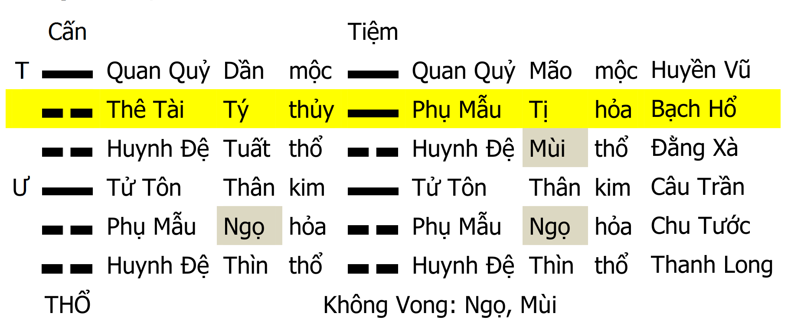
    - **Hình này chứng minh điều gì**
      - Dụng thần động phát hóa Tuyệt, hào Thế ngự hào 6 bị Nguyệt phá chủ hôn nhân muộn màng.
    - **Từ đâu mà thấy được**
      - Thê Tài Tý thủy hào 5 động hóa Phụ Mẫu Tị hỏa (hóa Tuyệt), Thế Quan Quỷ Dần mộc hào 6 bị Nguyệt kiến Thân kim xung phá.
  - **Phán đoán chi tiết:**
    - Căn cứ: Lấy Thê Tài làm Dụng thần đại diện cho người vợ; đối chiếu sinh phù của nhật nguyệt với xu hướng biến hóa của động hào.
    - Nhìn vào: Thê Tài Tý thủy ngự tại hào 5, tuy được cả Nguyệt kiến Thân kim lẫn Nhật kiến Dậu kim đồng thời sinh phù là vượng tướng, nhưng hào 5 Thê Tài lại phát động hóa ra Phụ Mẫu Tị hỏa; theo thập nhị cung Thủy tuyệt tại Tị, tức Dụng thần động phát hóa Tuyệt, nhân duyên ban đầu tưởng vượng nhưng về sau lại tuyệt khí tiêu tán.
    - Căn cứ: Phân tích hào Thế theo hào vị và tương tác phá bại từ nguyệt kiến.
    - Nhìn vào: Hào Thế Quan Quỷ Dần mộc bị Nguyệt kiến Thân kim xung thành Nguyệt phá; hào Thế lại ngự ở hào 6 là vị trí tột cùng (thoái hưu thoái vị). Mặc dù được Dụng thần Thê Tài phát động tương sinh, nhưng bản thân hào Thế đã bị phá tan nát, Dụng thần lại hóa Tuyệt, tạo thành tổ hợp thông tin đặc trưng của kết hôn muộn.
  - **Ứng nghiệm thực tế:**
    - Đương số đã bước qua tuổi 30 mà vẫn chưa thể kết hôn, đường tình duyên trễ tràng.

- **Ví dụ 9: Ngày Quý Tị tháng Dần, nam đoán hôn nhân (Được quẻ Thủy Thiên Nhu biến Đoài Vi Trạch)**
  - **Hình 149.** Quẻ Thủy Thiên Nhu biến Đoài Vi Trạch
    - 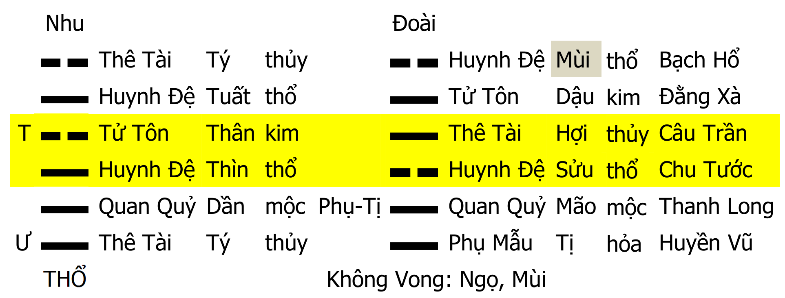
    - **Hình này chứng minh điều gì**
      - Thê Tài hưu tù nhập Mộ bị Kỵ thần động khắc, Nguyên thần hào Thế Nguyệt phá vô lực sinh Dụng chủ cả đời khó lấy vợ.
    - **Từ đâu mà thấy được**
      - Ứng Thê Tài Tý thủy hào sơ hưu tù, Huynh Đệ Thìn thổ hào 3 động khắc và thu Mộ, Thế Tử Tôn Thân kim bị Dần xung phá.
  - **Phán đoán chi tiết:**
    - Căn cứ: Lấy Thê Tài làm Dụng thần đại diện cho người vợ; nguyên tắc chọn Dụng thần khi quẻ có lưỡng hiện và khảo sát sinh khắc nhật nguyệt.
    - Nhìn vào: Trong quẻ Thê Tài lưỡng hiện (hào sơ Thê Tài Tý thủy và hào 6 Thê Tài Tý thủy); trường hợp này lấy hào Ứng Thê Tài Tý thủy tại hào sơ làm Dụng thần. Dụng thần Tý thủy không được Nhật Nguyệt trợ giúp (Nguyệt Dần tiết khí, Nhật Tị hỏa) nên ở trạng thái hưu tù suy nhược.
    - Căn cứ: Phân tích sự uy hiếp từ động hào Kỵ thần đối với Dụng thần.
    - Nhìn vào: Hào 3 Huynh Đệ Thìn thổ phát động khắc phạt Dụng thần Tý thủy tàn khốc; Thìn thổ đồng thời là Thủy khố (Mộ của Thủy), khiến Dụng thần vừa bị khắc vừa bị chôn vùi nhập Mộ.
    - Căn cứ: Khảo sát hào Thế đóng vai trò Nguyên thần của Dụng thần để định lực cứu giải.
    - Nhìn vào: Hào Thế Tử Tôn Thân kim chính là Nguyên thần sinh cho Thê Tài Tý thủy, nhưng Thân kim lại bị Nguyệt kiến Dần mộc xung thành Nguyệt phá, đồng thời lâm đất Tuyệt tại Nhật kiến Tị hỏa, hoàn toàn kiệt quệ không có chút lực nào để sinh trợ cho Dụng thần. Dụng thần suy bại nhập Mộ bị khắc, Nguyên thần Nguyệt phá tuyệt khí, e rằng suốt đời nhân duyên khó thành, phải chịu cảnh cô độc đến già.
  - **Ứng nghiệm thực tế:**
    - Đương số trên thực tế đã 46 tuổi nhưng vẫn lẻ bóng một mình, hoàn toàn không có cơ hội bước vào đời sống hôn nhân.

- **Ví dụ 10: Ngày Bính Thìn tháng Mão, nữ đoán hôn nhân (Được quẻ Sơn Thủy Mông biến Sơn Phong Cổ)**
  - **Hình 150.** Quẻ Sơn Thủy Mông biến Sơn Phong Cổ
    - 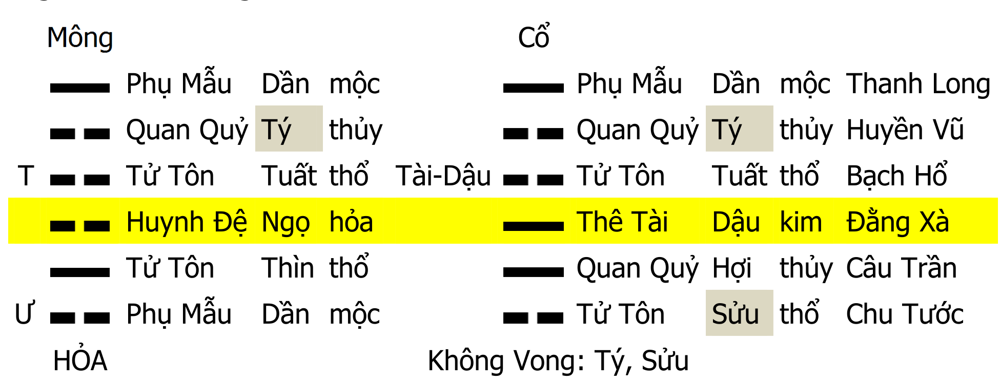
    - **Hình này chứng minh điều gì**
      - Quan Quỷ Không Vong nhập Mộ tại Nhật kiến, Kỵ thần trì Thế ám động khắc Dụng chủ khó lòng kết hôn sớm.
    - **Từ đâu mà thấy được**
      - Quan Quỷ Tý thủy hào 5 Không Vong nhập Mộ Nhật Thìn, Thế Tử Tôn Tuất thổ hào 4 bị Nhật xung thành ám động khắc Tý thủy.
  - **Phán đoán chi tiết:**
    - Căn cứ: Lấy Quan Quỷ làm Dụng thần đại diện cho người chồng; xem xét sinh khắc nhật nguyệt, Tuần Không và Mộ khố.
    - Nhìn vào: Quan Quỷ Tý thủy ngự tại hào 5, hoàn toàn không được Nhật Nguyệt sinh trợ (Nguyệt kiến Mão mộc tiết khí, Nhật kiến Thìn thổ khắc thương), lại nhập Mộ tại Nhật kiến Thìn thổ (Thủy Mộ tại Thìn). Bản thân Quan Quỷ Tý thủy lại rơi vào Tuần Không (Tuần Không Tý, Sửu), vừa hưu tù, vừa Không Vong lại vừa nhập Mộ.
    - Căn cứ: Phân tích Kỵ thần trì Thế và hiện tượng ám động khắc thương Dụng thần.
    - Nhìn vào: Hào Thế là Kỵ thần Tử Tôn Tuất thổ ngự tại hào 4; Tuất thổ được Nguyệt kiến Mão mộc tương hợp hữu khí, lại bị Nhật kiến Thìn thổ xung thành ám động; Kỵ thần trì Thế ám động ra sức khắc phạt Dụng thần Quan Quỷ Tý thủy đã suy tàn, tạo thành cục diện nhân duyên bị cản trở nặng nề, rất khó kết hôn sớm.
  - **Ứng nghiệm thực tế:**
    - Đương sự đã bước sang tuổi 31 nhưng vẫn chưa từng kết hôn, tình duyên lận đận chưa có hồi kết.

- **Ví dụ 11: Ngày Kỷ Sửu tháng Tị năm Quý Mùi, nữ sinh năm 1979 đoán hôn nhân (Được quẻ Hỏa Trạch Khuê biến Ly Vi Hỏa)**
  - **Hình 151.** Quẻ Hỏa Trạch Khuê biến Ly Vi Hỏa
    - 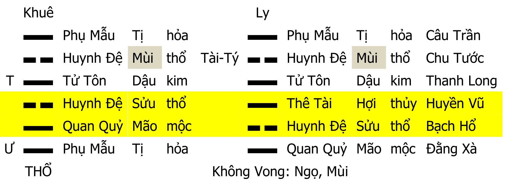
    - **Hình này chứng minh điều gì**
      - Dụng thần hào 2 động xung Thế chủ sống chung sớm lúc 18 tuổi, bạn trai ly hôn ba lần vũ phu qua kỹ pháp cách sơn hóa hào.
    - **Từ đâu mà thấy được**
      - Quan Quỷ Mão mộc hào 2 động xung Thế Dậu kim, Thế nhập Mộ giường hào 3 lâm Huyền Vũ, Quan nhập Mộ Huynh Mùi ám động Không Vong.
  - **Phán đoán chi tiết:**
    - Căn cứ: Lấy Quan Quỷ làm Dụng thần đại diện cho bạn trai/chồng; phân tích hào vị quy vị, hào động tương xung và hào Thế nhập Mộ để định hiện tượng kết hôn/sống chung sớm.
    - Nhìn vào: Quan Quỷ Mão mộc ngự tại hào 2; hào 2 là trạch xá (nhà ở), Dụng thần quy vị tại trạch xá lại phát động xung hào Thế Tử Tôn Dậu kim (Mão Dậu tương xung), đây là tượng Dụng thần chủ động nhập trạch đến với mình, báo hiệu việc kết hôn hoặc chung sống từ rất sớm.
    - Căn cứ: Khảo sát hào Thế nhập Mộ tại giường chiếu hào 3 và lục thần Huyền Vũ để vạch trần hình thức sống chung không hôn thú.
    - Nhìn vào: Hào Thế Tử Tôn Dậu kim nhập Mộ tại hào 3 Huynh Đệ Sửu thổ; hào 3 là vị trí của giường ngủ, lại lâm Huyền Vũ; Huyền Vũ chủ ám muội, lén lút, không công khai danh chính ngôn thuận, chứng tỏ đây là việc ăn ở chung chạ như vợ chồng nhưng không hề đăng ký kết hôn. Mộ khố là Sửu thổ chỉ điểm sự việc khởi phát vào năm Đinh Sửu (1997); đương số sinh năm Kỷ Mùi (1979), vào năm Đinh Sửu mới tròn 18 tuổi.
    - Căn cứ: Nhận diện lai lịch đối phương đã từng ly hôn qua hiện tượng Dụng thần nhập Mộ Huynh Đệ lâm Không.
    - Nhìn vào: Quan Quỷ Mão mộc nhập Mộ tại hào 5 Huynh Đệ Mùi thổ ám động (Mùi thổ được Nguyệt sinh, bị Nhật Sửu xung); Huynh Đệ đại diện cho người phụ nữ khác, Quan Quỷ nhập Mộ Huynh Đệ nghĩa là người đàn ông này đang nằm gọn trong vòng tay người đàn bà khác; tuy nhiên Mùi thổ lại lâm Tuần Không (Tuần Không Ngọ, Mùi), biểu thị người phụ nữ đó đã rời đi; kết hợp hào sơ Phụ Mẫu Tị hỏa lâm Nguyệt kiến chủ việc hôn phối chính thức trước kia, chứng minh bạn trai của cô là người đàn ông đã từng ly hôn.
    - Căn cứ: Ứng dụng kỹ pháp cao cấp "Cách sơn hóa hào" để khám phá quá khứ phức tạp của người đàn ông.
    - Nhìn vào: Quan Quỷ Mão mộc tại hào 2 động biến xuất hào 2 Huynh Đệ Sửu thổ; hào 3 Huynh Đệ Sửu thổ lại động biến xuất hào 3 Thê Tài Hợi thủy (Hợi là đất Trường Sinh của Mão mộc); tổ hợp này trong Lục Hào gọi là "cách sơn hóa hào" (vượt núi hóa hào), tương đương việc Quan Quỷ động hóa Trường Sinh một cách gián tiếp qua trung gian Huynh Đệ. Quan Quỷ hóa Trường Sinh là biểu hiện người đàn ông đã từng có duyên tình sâu nặng, nhưng vì phải cách qua tầng Huynh Đệ (phụ nữ khác) mới tới Trường Sinh nên cô gái không phải người đàn bà đầu tiên của anh ta. Quan sát toàn quẻ: Nhật kiến Sửu thổ, hào 2 Sửu thổ biến, hào 3 Sửu thổ và hào 5 Mùi thổ cấu thành 4 hào Huynh Đệ, chứng tỏ người đàn ông này trước đó đã có quan hệ sâu sắc với nhiều người phụ nữ.
    - Căn cứ: Phân tích sự phản đối của cha mẹ qua hào gia trưởng và thói bạo hành của đối phương qua Bạch Hổ tương xung.
    - Nhìn vào: Hào 5 Huynh Đệ Mùi thổ là hào vị gia trưởng, ám động tương sinh cho hào Thế Tử Tôn Dậu kim, chứng tỏ cha mẹ và người thân trong gia đình kịch liệt phản đối cô tiếp tục qua lại với anh ta. Quan Quỷ Mão mộc lâm Bạch Hổ phát động xung khắc hào Thế; xung chủ xung đột kịch liệt, Bạch Hổ chủ đả thương hung bạo, phán đoán anh ta đối xử với cô rất tàn nhẫn, thường xuyên thượng cẳng chân hạ cẳng tay đánh đập cô.
    - Căn cứ: Kết cục mối quan hệ dựa trên hào Thế Tử Tôn trì Thế khắc chế Dụng thần.
    - Nhìn vào: Hào Thế là Tử Tôn Dậu kim nắm quyền trì Thế, mà Tử Tôn chuyên khắc chế Quan Quỷ, biểu thị bản thân người phụ nữ cuối cùng cũng tỉnh ngộ, dứt khoát không cam tâm chịu đựng mà quyết định từ bỏ, chia tay người đàn ông này.
  - **Ứng nghiệm thực tế:**
    - Đúng như dự đoán, cô gái bắt đầu chung sống như vợ chồng với người đàn ông này từ năm 18 tuổi (năm 1997 Đinh Sửu). Gia đình cha mẹ đôi bên kiên quyết phản đối kịch liệt. Người đàn ông này hơn cô 14 tuổi, thực tế đã ly hôn tới ba lần. Trong quá trình chung sống, anh ta thường xuyên bạo hành, đánh đập dã man khiến cô không chịu nổi; cuối cùng cô đã hạ quyết tâm dứt áo ra đi, chấm dứt hoàn toàn mối quan hệ nghiệt ngã.

### CHƯƠNG 8: ỨNG KỲ HÔN NHÂN

#### Nguyên lý cơ bản và cơ chế định ứng kỳ trong dự đoán hôn nhân
- Bản chất và quy luật ứng kỳ trong dự đoán Lục Hào:
  - Thông thường trong các chuyên đề dự đoán khác (như cầu tài, quan vận, bệnh tật, phong thủy), việc định ứng kỳ chủ yếu dựa trên trạng thái vượng suy, động tĩnh, tuần không, nguyệt phá, mộ tuyệt của hào Dụng thần và hào Nguyên thần.
  - Dự đoán hôn nhân mang tính đặc thù sâu sắc: Hôn nhân không chỉ là sự hòa hợp tình cảm giữa hai cá nhân mà còn là sự gắn kết pháp lý, công nhận của gia đình và xã hội. Do đó, ngoài việc căn cứ vào Dụng thần (Thê Tài đối với nam, Quan Quỷ đối với nữ), Lục Hào còn đặc biệt chú trọng hào Phụ Mẫu để tiến hành định ứng kỳ.
- Vai trò pháp lý và vị thế đặc thù của hào Phụ Mẫu trong định ứng kỳ:
  - Hào Phụ Mẫu đại diện cho giấy chứng nhận kết hôn, hôn ước, hôn lễ chính thức, hộ tịch và sự chuẩn thuận của hai bên cha mẹ.
  - Khẩu quyết then chốt: Nhất là khi hào Phụ Mẫu lâm Nhật thần, hoặc hào Phụ Mẫu hợp Nhật thần, việc định chuẩn thời điểm kết hôn phần lớn đều căn cứ trực tiếp vào hào Phụ Mẫu để quyết đoán ứng kỳ.
- Hệ thống quy tắc định ứng kỳ theo các trạng thái biến hóa của Dụng thần và Phụ Mẫu:
  - Hào phát động (Độc phát): Động thì phùng Trị, phùng Hợp; hào độc phát nắm giữ then chốt thời cơ của quẻ, lưu niên lâm trị hoặc hợp hào độc phát chính là thời điểm sự việc ứng nghiệm.
  - Hào lâm Tuần Không: Định kỳ tại thời điểm xuất Không hoặc phùng xung (xung Không tắc thực, đối với hào vượng; nếu hào hưu tù mà xung Không thì lại là điềm hung, ứng kỳ tan vỡ).
  - Hào lâm Nguyệt Phá: Định kỳ tại thời điểm hợp Phá hoặc thực Phá.
  - Hào bị Hợp (động hóa hợp, hoặc bị hào khác hợp trú): Định kỳ tại thời điểm phùng Xung để xung khai mối hợp (như Tý Sửu hợp cần năm Ngọ xung Tý).
  - Hào nhập Mộ: Định kỳ tại thời điểm xung khai Mộ khố để hào xuất Mộ phát huy tác dụng.
  - Hào Phục tàng: Định kỳ tại thời điểm xung khai Phi thần, hoặc lưu niên sinh trợ, xuất phục lộ diện.
  - Hào Kỵ thần phát động: Định kỳ tại thời điểm Kỵ thần bị xung khử hoặc bị chế ngự hoàn toàn.
  - Định kỳ tan vỡ, ly hôn, chia tay: Khi Dụng thần hoặc hào Phụ Mẫu lâm Tuyệt địa, động hóa Tuyệt, động hóa hồi đầu khắc, hoặc quẻ Lục xung gặp lưu niên xung phá Dụng thần.

#### Các quái lệ thực tế ứng dụng định ứng kỳ hôn nhân

- **Ví dụ 1: Ngày Quý Tị tháng Mùi năm Giáp Thân, nam đoán quan hệ với người tình có lâu dài không (Được quẻ Sơn Địa Bác biến Hỏa Địa Tấn)**
  - **Hình 152.** Quẻ Sơn Địa Bác biến Hỏa Địa Tấn
    - 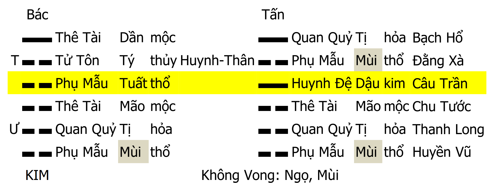
    - **Hình này chứng minh điều gì**
      - Thê Tài Mão mộc hưu tù hóa du hồn, hào 4 Phụ Mẫu Tuất thổ độc phát hợp trú Dụng thần.
    - **Từ đâu mà thấy được**
      - Tuất thổ độc phát tạm thời duy trì hợp, sang năm Ất Dậu Dậu kim xung khắc Mão mộc tất sẽ chia tay.
  - **Phán đoán chi tiết:**
    - Căn cứ: Nam đoán quan hệ với người tình ngoài hôn nhân lấy Thê Tài làm Dụng thần; xử lý tình huống Thê Tài lưỡng hiện và trạng thái quẻ.
    - Nhìn vào: Trong quẻ Thê Tài lưỡng hiện: Thê Tài Dần mộc ở hào 6 và Thê Tài Mão mộc ở hào 3. Thê Tài Mão mộc tại hào 3 được hào 4 Phụ Mẫu Tuất thổ độc phát hợp trú (Mão Tuất lục hợp), theo nguyên tắc "hào gặp hợp được ưu tiên chọn", lấy Thê Tài Mão mộc làm Dụng thần.
    - Căn cứ: Xét mức độ suy vượng dưới tác động của Nhật Nguyệt và thể quẻ để nhận định sự lâu dài.
    - Nhìn vào: Mão mộc sinh vào tháng Mùi là mùa hưu tù, ngày Tị bị tiết khí, hoàn toàn không được Nhật Nguyệt sinh trợ nên hưu tù vô khí. Quẻ gốc Sơn Địa Bác là quẻ quy hồn, biến sang Hỏa Địa Tấn là quẻ du hồn; du hồn chủ về phiêu dạt, bất định, biến động không ngừng, khẳng định mối quan hệ nhân tình này không thể duy trì dài lâu.
    - Căn cứ: Tác động của hào độc phát hào 4 Phụ Mẫu Tuất thổ và chu kỳ lưu niên để quyết đoán thời điểm chia tay.
    - Nhìn vào: Hào 4 Phụ Mẫu Tuất thổ độc phát hợp trú chặt chẽ lấy Dụng thần Mão mộc, cho thấy trước mắt hai người tạm thời vẫn duy trì được mối quan hệ nhờ lực hợp này. Tuy nhiên, bước sang năm Ất Dậu (2005), Thái tuế Dậu kim mang hành Kim cực vượng xung khắc thẳng vào Dụng thần Mão mộc (Mão Dậu tương xung tương khắc), đồng thời phá vỡ liên kết Mão Tuất hợp, do đó quyết đoán sang năm Ất Dậu hai người tất sẽ chia tay dứt khoát.
  - **Ứng nghiệm thực tế:**
    - Quả nhiên đúng vào năm Ất Dậu (2005), hai người phát sinh bất hòa và chính thức chia tay nhau.

- **Ví dụ 2: Ngày Giáp Thìn tháng Thân, nữ đoán hôn nhân và tài vận thẩm mỹ viện (Được quẻ Địa Thiên Thái biến Địa Phong Thăng)**
  - **Hình 153.** Quẻ Địa Thiên Thái biến Địa Phong Thăng
    - 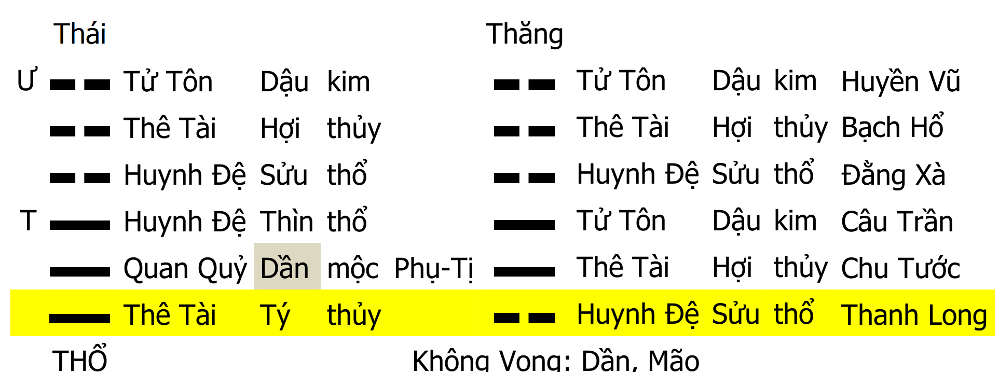
    - **Hình này chứng minh điều gì**
      - Quan Quỷ Dần mộc Không Phá, Nguyên thần Tý thủy động hóa Sửu thổ hợp trú và nhập Mộ tại Nhật.
    - **Từ đâu mà thấy được**
      - Năm Mậu Dần thực Không thực Phá suýt cưới, năm Nhâm Ngọ xung khai hợp và Mộ khố mới thành hôn.
  - **Phán đoán chi tiết:**
    - Căn cứ: Nữ đoán hôn sự lấy Quan Quỷ làm Dụng thần; đoán việc kinh doanh tài vận viện thẩm mỹ lấy Thê Tài làm Dụng thần.
    - Nhìn vào: Quan Quỷ Dần mộc ngự tại hào 2, lâm Tuần Không (tuần Giáp Thìn Không tại Dần, Mão), lại bị Nguyệt kiến Thân kim xung thành Nguyệt phá (Thân Dần tương xung). Dụng thần vừa Không vừa Phá, phản ánh tiền duyên trắc trở, đối tượng hôn phối lúc ẩn lúc hiện.
    - Căn cứ: Luận giải cơ hội kết hôn tại lưu niên Mậu Dần (1998) qua quy luật thực Không thực Phá.
    - Nhìn vào: Vào năm Mậu Dần (1998), Thái tuế Dần mộc lâm trị, vừa làm thực Không vừa làm thực Phá, giải tỏa thế Không Phá của Dụng thần, nên năm này có cơ hội hôn nhân rõ rệt, suýt chút nữa người nữ đã kết hôn.
    - Căn cứ: Nguyên lý "Thiên cơ tại hào động" để tìm căn nguyên đích thực định chuẩn ứng kỳ kết hôn.
    - Nhìn vào: Hào sơ Thê Tài Tý thủy độc phát mang vai trò Nguyên thần sinh trợ cho Quan Quỷ Dần mộc (Thủy sinh Mộc). Thế nhưng Tý thủy phát động lại hóa ra Huynh Đệ Sửu thổ, tạo thành thế Tý Sửu lục hợp (động hóa hợp trú, bị níu giữ); đồng thời Nhật kiến là Thìn thổ chính là Thủy khố, khiến Nguyên thần Tý thủy lập tức nhập Mộ tại Nhật kiến. Bị hợp trói lại bị chôn vùi trong Mộ khố, Tý thủy hoàn toàn tê liệt, không thể sinh trợ Dụng thần.
    - Căn cứ: Tìm thời điểm xung khai mối hợp và xung xuất Mộ khố để giải phóng Nguyên thần.
    - Nhìn vào: Phải đợi đến năm Nhâm Ngọ (2002), Thái tuế Ngọ hỏa mang khí thế xung khai Tý Sửu hợp (Tý Ngọ tương xung giải hợp), đồng thời xung chấn Mộ khố, Nguyên thần Tý thủy mới thoát khỏi giam hãm để sinh Dụng thần, do đó quyết đoán năm Nhâm Ngọ (2002) mới chính thức thành hôn. Tuy nhiên do Dụng thần gốc lâm Không Phá, tượng "có chồng như không", sau khi cưới vợ chồng ắt sẽ bất hòa sâu sắc.
    - Căn cứ: Luận giải tài vận mở viện thẩm mỹ qua Thê Tài, hào Thế và lục thần.
    - Nhìn vào: Thê Tài lưỡng hiện, lấy hào sơ Thê Tài Tý thủy phát động làm Dụng thần tài lộc. Tý thủy lâm Thanh Long (chủ nhan sắc, làm đẹp, trang điểm), rất tương hợp với ngành thẩm mỹ viện. Nhưng Tý thủy động hóa Sửu thổ (Huynh Đệ) là thế "hồi đầu khắc" tàn hại Tài tinh; lại thêm Huynh Đệ Thìn thổ trì Thế chuyên khắc đoạt tiền của, báo hiệu việc kinh doanh thẩm mỹ viện sẽ lụn bại, không thể thu lợi.
  - **Ứng nghiệm thực tế:**
    - Năm Mậu Dần (1998) người này suýt cưới nhưng hỏng; mãi đến đúng năm Nhâm Ngọ (2002) mới kết hôn, song cuộc sống vợ chồng cơm chẳng lành canh chẳng ngọt. Viện thẩm mỹ kinh doanh ế ẩm, thua lỗ nặng nề và về sau buộc phải đóng cửa.

- **Ví dụ 3: Ngày Kỷ Mão tháng Tý năm Ất Dậu, nam đoán hôn nhân gia đình (Được quẻ Sơn Trạch Tổn biến Sơn Thủy Mông)**
  - **Hình 154.** Quẻ Sơn Trạch Tổn biến Sơn Thủy Mông
    - 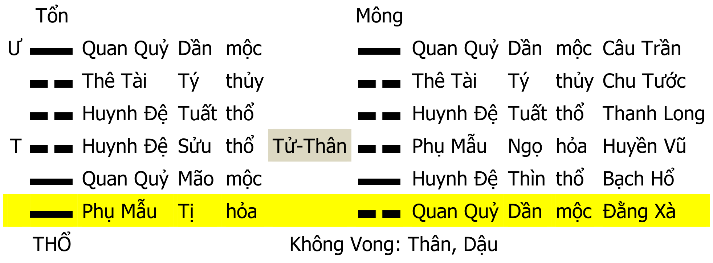
    - **Hình này chứng minh điều gì**
      - Thê Tài Tý thủy hào 5 lâm Đào hoa, Phụ Mẫu Tị hỏa độc phát là Tuyệt địa của Dụng thần.
    - **Từ đâu mà thấy được**
      - Năm Nhâm Ngọ xung phá Thê Tài Tý thủy và hợp khởi ứng kỳ hôn thú đoạn tuyệt, dẫn tới ly hôn.
  - **Phán đoán chi tiết:**
    - Căn cứ: Nam đoán hôn nhân lấy Thê Tài làm Dụng thần đại diện cho người vợ; hào Phụ Mẫu chủ về hôn thú; hào vị và thần sát xét tính cách đôi bên.
    - Nhìn vào: Thê Tài Tý thủy ngự tại hào 5, được Nguyệt kiến Tý thủy đồng hành trợ vượng nên rất vượng tướng, thoạt nhìn là cát lợi. Tuy nhiên, thiên cơ nằm ở hào sơ Phụ Mẫu Tị hỏa độc phát (động hóa Quan Quỷ Dần mộc hồi đầu sinh); nguyên tắc dự đoán là "lấy tượng độc phát làm chủ".
    - Căn cứ: Tương quan ngũ hành giữa Dụng thần Thê Tài Tý thủy và hào độc phát Phụ Mẫu Tị hỏa.
    - Nhìn vào: Thủy tuyệt tại Tị, tức Tị hỏa chính là Tuyệt địa của Dụng thần Tý thủy. Phụ Mẫu đại diện cho giấy hôn thú; nay hôn thú phát động rơi thẳng vào Tuyệt địa của vợ, chắc chắn dẫn đến kết cục ly hôn đoạn tuyệt.
    - Căn cứ: Hào vị, ngũ hành và thần sát bộc lộ phẩm hạnh và tính cách vợ chồng.
    - Nhìn vào: Hào Thế là Huynh Đệ Sửu thổ: Thổ tính chủ đôn hậu, an phận, biểu thị người chồng hiền lành, an phận thủ thường. Ngược lại, Thê Tài Tý thủy ngự tại hào 5 (tôn vị, quân vị, cương vị gia trưởng lãnh đạo) lại lâm Đào hoa (ngày Kỷ Mão có Đào hoa tại Tý). Hào 5 lâm Đào hoa biểu thị người vợ tính tình cay nghiệt, bá đạo, muốn thao túng toàn quyền trong gia đình. Hơn nữa, Thủy tính chủ dâm dật kết hợp với Đào hoa chứng tỏ người vợ lăng nhăng ngoài luồng, tư thông với đàn ông khác, không giữ trọn đạo làm vợ.
    - Căn cứ: Định ứng kỳ ly hôn qua tương tác lưu niên xung khắc Dụng thần.
    - Nhìn vào: Vào năm Nhâm Ngọ (2002), Thái tuế Ngọ hỏa xung thẳng vào Thê Tài Tý thủy (Tý Ngọ tương xung), làm tan vỡ gia đạo, đồng thời kích hoạt hào Phụ Mẫu Tị hỏa; vì vậy phán đoán người này đã chính thức ly hôn vào năm 2002.
  - **Ứng nghiệm thực tế:**
    - Toàn bộ sự việc hoàn toàn trùng khớp dự đoán: người vợ ngoại tình, lấn lướt gia đình và hai người đã hoàn tất thủ tục ly hôn vào đúng năm Nhâm Ngọ (2002).

- **Ví dụ 4: Ngày Nhâm Ngọ tháng Tý năm Ất Dậu, nữ 30 tuổi đoán khi nào kết hôn (Được quẻ Thủy Địa Tỷ)**
  - **Hình 155.** Quẻ Thủy Địa Tỷ
    - 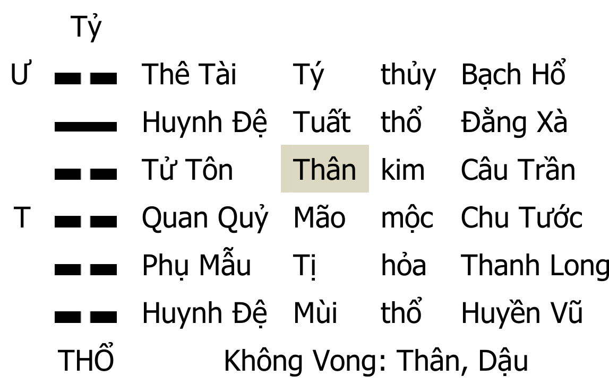
    - **Hình này chứng minh điều gì**
      - Quan Quỷ Mão mộc trì Thế vượng tướng, hào Ứng Thê Tài Tý thủy ám động tương sinh.
    - **Từ đâu mà thấy được**
      - Nguyên thần Tý thủy ám động sinh Thế, đến năm Mậu Tý Thái tuế lâm trị tất sẽ kết hôn.
  - **Phán đoán chi tiết:**
    - Căn cứ: Nữ đoán hôn nhân lấy Quan Quỷ làm Dụng thần; xem xét tương quan giữa hào Thế, hào Ứng và trợ lực Nhật Nguyệt.
    - Nhìn vào: Quan Quỷ Mão mộc trì Thế ngự tại hào 3, được Nguyệt kiến Tý thủy tương sinh (Thủy sinh Mộc) là vượng tướng hữu khí. Người nữ có Quan Quỷ trì Thế vượng tướng chứng tỏ bản thân có duyên phận sâu đậm, đường tình cảm có căn cơ tốt.
    - Căn cứ: Trạng thái của hào Ứng Thê Tài Tý thủy ở hào 6 dưới tác động của Nhật kiến Nhâm Ngọ.
    - Nhìn vào: Hào Ứng Thê Tài Tý thủy đóng vai trò Nguyên thần sinh trợ cho Quan Quỷ Mão mộc. Tý thủy được Nguyệt kiến trợ vượng cực điểm, bị Nhật kiến Ngọ hỏa xung (Tý Ngọ tương xung). Theo lý Lục Hào, hào vượng tướng bị Nhật xung không bị tan mà trở thành "ám động".
    - Căn cứ: Tượng ám động sinh Thế và định ứng kỳ thành hôn.
    - Nhìn vào: Hào Ứng Nguyên thần Tý thủy ám động ngầm sinh trợ cho hào Thế Quan Quỷ Mão mộc, báo hiệu duyên lành âm thầm đưa tới, có đối tượng ngầm theo đuổi săn sóc, hôn sự nhất định sẽ thành tựu. Quy luật ứng kỳ: Hào ám động thì thời điểm ứng nghiệm sẽ rơi vào năm mà hào đó gặp trị (Thái tuế lâm hào). Do đó, quyết đoán đến năm Mậu Tý (2008), khi Thái tuế Tý thủy lâm trị xuất hiện công khai thì người nữ sẽ kết hôn.
  - **Ứng nghiệm thực tế:**
    - Đến năm Đinh Hợi (2007), người nữ quen biết và yêu thương bạn trai (Hợi Mão bán hợp), sau đó đúng năm Mậu Tý (2008) hai người đã tổ chức hôn lễ viên mãn.

- **Ví dụ 5: Ngày Đinh Mùi tháng Dậu năm Nhâm Ngọ, nam đoán khi nào kết hôn (Được quẻ Phong Sơn Tiệm biến Thiên Lôi Vô Vọng)**
  - **Hình 156.** Quẻ Phong Sơn Tiệm biến Thiên Lôi Vô Vọng
    - 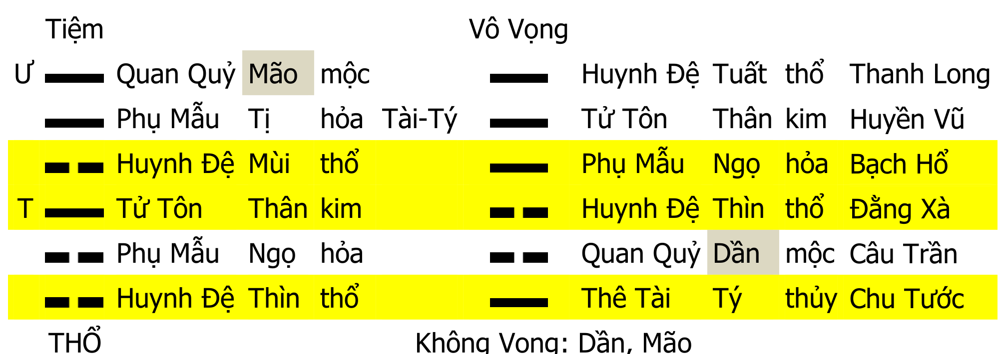
    - **Hình này chứng minh điều gì**
      - Thê Tài Tý thủy phục tàng hào 5, hai hào Huynh Đệ động khắc nhưng Tử Tôn Thân kim động thông quan.
    - **Từ đâu mà thấy được**
      - Hôn nhân muộn; đến năm Đinh Hợi xung khắc Phi thần Tị hỏa, Dụng thần xuất phục kết hôn.
  - **Phán đoán chi tiết:**
    - Căn cứ: Nam đoán hôn nhân lấy Thê Tài làm Dụng thần; phân tích vị trí Dụng thần, tương quan hào động và nguyên nhân muộn hôn.
    - Nhìn vào: Thê Tài Tý thủy không hiện trên quẻ mà phục tàng dưới hào 5 Phụ Mẫu Tị hỏa. Xét về lực nhật nguyệt: Tý thủy được Nguyệt kiến Dậu kim sinh nhưng bị Nhật kiến Mùi thổ khắc, lực sinh khắc cân bằng, khó phân suy vượng.
    - Căn cứ: Quan sát thế trận hào động trong quẻ để nhận định trở lực tình cảm.
    - Nhìn vào: Trong quẻ có hai hào Huynh Đệ đồng thời phát động: hào 4 Huynh Đệ Mùi thổ động hóa Phụ Mẫu Ngọ hỏa, hào sơ Huynh Đệ Thìn thổ động hóa Thê Tài Tý thủy. Huynh Đệ là Kỵ thần chuyên khắc đoạt Thê Tài, nay hai hào cùng động kết hợp với Thê Tài phục tàng không hiện trên quẻ, tạo thành chỉ dấu rõ ràng: đương số là người kết hôn muộn, duyên nợ lận đận trắc trở.
    - Căn cứ: Hào Thế phát động và thế trận liên hoàn tương sinh hóa giải hiểm cục.
    - Nhìn vào: Hào 3 Tử Tôn Thân kim trì Thế phát động (hóa Huynh Đệ Thìn thổ). Hào Thế động biểu thị bản thân đương số vô cùng chủ động, khát khao lấy vợ; Tử Tôn lại là Nguyên thần sinh Tài. Dù hai hào Huynh Đệ phát động ngăn trở cơ duyên, nhưng hào Thế Tử Tôn Thân kim cùng động đã tạo thành thế liên tục tương sinh kỳ diệu: Huynh Đệ Thổ sinh Tử Tôn Kim, Tử Tôn Kim lại sinh Thê Tài Thủy. Khí khắc của Huynh Đệ được Tử Tôn thông quan chuyển hóa thành lực sinh trợ dồi dào, do đó khẳng định chắc chắn sẽ có cơ hội cưới vợ.
    - Căn cứ: Nguyên tắc xử lý hào phục tàng để định chuẩn niên hạn thành hôn.
    - Nhìn vào: Thê Tài Tý thủy phục dưới Phi thần Phụ Mẫu Tị hỏa (hào 5). Để phục thần thoát khỏi sự kìm kẹp bước ra đời thực, cần phải xung phá Phi thần Tị hỏa. Xét tiến trình lưu niên, phải đợi đến năm Đinh Hợi (2007), Thái tuế Hợi thủy mang khí xung bạt Phi thần Tị hỏa (Tị Hợi tương xung phá phi), giải phóng phục thần Tý thủy xuất hiện.
  - **Ứng nghiệm thực tế:**
    - Trải qua nhiều năm lận đận tình duyên, quả nhiên đúng vào tháng Dậu năm Đinh Hợi (2007), người nam đã chính thức kết hôn với vợ hiền.

- **Ví dụ 6: Ngày Tân Sửu tháng Giáp Thân năm Canh Thìn, nữ đoán khi nào kết hôn (Được quẻ Thiên Thủy Tụng biến Hỏa Thủy Vị Tế)**
  - **Hình 157.** Quẻ Thiên Thủy Tụng biến Hỏa Thủy Vị Tế
    - 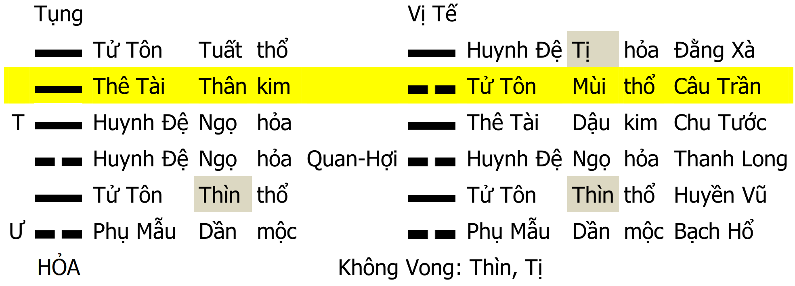
    - **Hình này chứng minh điều gì**
      - Quan Quỷ Hợi thủy phục tàng, hào 5 Thê Tài Thân kim độc phát sinh phù Dụng thần.
    - **Từ đâu mà thấy được**
      - Năm Tân Tị hợp hào độc phát Thân kim và xung xuất Dụng thần Hợi thủy tất sẽ kết hôn.
  - **Phán đoán chi tiết:**
    - Căn cứ: Nữ đoán thời điểm kết hôn lấy Quan Quỷ làm Dụng thần; xem xét vị trí phục tàng và tương tác sinh trợ từ hào độc phát.
    - Nhìn vào: Quan Quỷ Hợi thủy phục tàng dưới hào 3 Huynh Đệ Ngọ hỏa. Xét tương quan nhật nguyệt: Hợi thủy được Nguyệt kiến Thân kim tương sinh nhưng bị Nhật kiến Sửu thổ tương khắc, thế lực giằng co khó định vượng suy.
    - Căn cứ: Đánh giá vai trò của hào độc phát hào 5 Thê Tài Thân kim.
    - Nhìn vào: Hào 5 Thê Tài Thân kim độc phát (động hóa Tử Tôn Mùi thổ). Thân kim là ngũ hành Kim cực vượng sinh trực tiếp cho Dụng thần Hợi thủy (Kim sinh Thủy). Cán cân lực lúc này nghiêng hẳn về sinh nhiều khắc ít; Dụng thần được Nguyên thần độc phát tiếp thêm sinh khí dồi dào, khẳng định chắc chắn người nữ sẽ lấy được chồng.
    - Căn cứ: Khẩu quyết định ứng kỳ theo hào độc phát: "Động thì phùng trị phùng hợp".
    - Nhìn vào: Quẻ độc phát thì chính hào độc phát nắm giữ thiên cơ định ngày giờ ứng nghiệm. Hào 5 Thân kim phát động, đến năm kế tiếp là năm Tân Tị (2001):
      - Thái tuế Tị hỏa lục hợp với hào độc phát Thân kim (Tị Thân tương hợp - ứng kỳ phùng hợp).
      - Đồng thời, Thái tuế Tị hỏa tương xung trực diện với Dụng thần phục tàng Hợi thủy (Tị Hợi tương xung - xung xuất phục thần lộ diện).
      - Thế quẻ vừa hợp độc phát vừa xung xuất Dụng thần, lực đẩy kép hoàn mỹ, do đó quyết đoán năm 2001 (Tân Tị) sẽ cử hành hôn lễ.
  - **Ứng nghiệm thực tế:**
    - Đúng như lời phán đoán, bước sang năm Tân Tị (2001), người nữ đã chính thức kết hôn trong niềm hoan hỷ của hai gia đình.

- **Ví dụ 7: Ngày Bính Dần tháng Tị năm Đinh Hợi, nữ đoán kết hôn (Được quẻ Sơn Lôi Di biến Hỏa Lôi Phệ Hạp)**
  - **Hình 158.** Quẻ Sơn Lôi Di biến Hỏa Lôi Phệ Hạp
    - 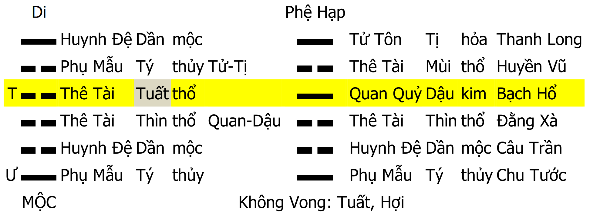
    - **Hình này chứng minh điều gì**
      - Quan Quỷ Dậu kim phục tàng hưu tù, hào Thế Thê Tài Tuất thổ độc phát hóa Quan Quỷ Dậu kim.
    - **Từ đâu mà thấy được**
      - Thế hóa Quan Quỷ chủ động thành công; tháng Tuất xung khai Phi thần, ngày Dậu Dụng thần xuất hiện.
  - **Phán đoán chi tiết:**
    - Căn cứ: Nữ đoán hôn nhân lấy Quan Quỷ làm Dụng thần; đánh giá trạng thái phục tàng và đường hướng biến hóa của hào Thế.
    - Nhìn vào: Quan Quỷ Dậu kim phục tàng dưới hào 3 Thê Tài Thìn thổ. Xét nhật nguyệt: Dậu kim bị Nguyệt kiến Tị hỏa khắc hại, lại không được Nhật kiến Dần mộc sinh phù nên rơi vào thế hưu tù vô khí cực kỳ bất lợi.
    - Căn cứ: Quan sát hào độc phát hào 4 Thê Tài Tuất thổ trì Thế phát động biến sinh.
    - Nhìn vào: Hào Thế Thê Tài Tuất thổ độc phát hóa xuất Quan Quỷ Dậu kim. Hào Thế đại diện cho bản thân người nữ; Thế động hóa Quan Quỷ mang ý nghĩa chính người phụ nữ này chủ động mở lòng, tích cực hành động thúc đẩy mối quan hệ đi đến hôn nhân. Quan Quỷ Dậu kim hóa xuất vừa hợp vừa trợ giúp cho Dụng thần phục tàng, chuyển nguy thành an, khẳng định việc cưới hỏi chắc chắn sẽ thành công tốt đẹp.
    - Căn cứ: Định chuẩn ứng kỳ kết hôn đến tận ngày tháng qua tương tác của hào độc phát và hào phục thần.
    - Nhìn vào:
      - Góc độ thứ nhất: Hào Thế Tuất thổ độc phát biến ra Dậu kim, tượng hào chỉ rõ ứng kỳ tại tháng Tuất ngày Dậu.
      - Góc độ thứ hai: Xét từ hào Dụng thần phục tàng Quan Quỷ Dậu kim: Dậu kim phục dưới Phi thần Thê Tài Thìn thổ (bị Thìn thổ hợp trói). Đến tháng Tuất, Nguyệt kiến Tuất thổ xung thẳng vào Phi thần Thìn thổ (Thìn Tuất tương xung phá phi giải hợp), mở cửa cho Dậu kim thoát khỏi phục tàng; đến ngày Dậu thì Dụng thần Dậu kim lâm trị nắm lệnh.
      - Hai tầng lập luận hoàn toàn đồng quy về một mốc thời gian duy nhất: tháng Tuất ngày Dậu.
  - **Ứng nghiệm thực tế:**
    - Hôn sự diễn ra vô cùng suôn sẻ, đúng vào ngày Dậu tháng Tuất năm Đinh Hợi (2007), đôi uyên ương đã chính thức tổ chức lễ thành hôn.

- **Ví dụ 8: Ngày Bính Thân tháng Thân năm Đinh Hợi, nữ sinh năm Tân Hợi đoán hôn nhân (Được quẻ Khảm Vi Thủy biến Thủy Phong Tỉnh)**
  - **Hình 159.** Quẻ Khảm Vi Thủy biến Thủy Phong Tỉnh
    - 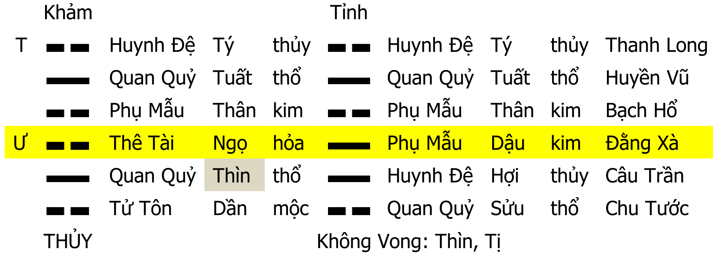
    - **Hình này chứng minh điều gì**
      - Quẻ lục xung, Quan Quỷ Thìn thổ Không Vong, Phụ Mẫu Thân kim lâm Nhật định hôn kỳ lần một.
    - **Từ đâu mà thấy được**
      - Năm Bính Tý xung Kỵ thần Ngọ hỏa cưới lần 1; năm Bính Tuất xung Dụng thần ly hôn; năm Mậu Tý tái hôn.
  - **Phán đoán chi tiết:**
    - Căn cứ: Nữ đoán hôn nhân lấy Quan Quỷ làm Dụng thần; xử lý trường hợp Dụng thần lưỡng hiện và phân tích kết cấu quẻ.
    - Nhìn vào: Trong quẻ Quan Quỷ lưỡng hiện: Quan Quỷ Tuất thổ ở hào 5 và Quan Quỷ Thìn thổ ở hào 2. Theo nguyên tắc chọn Dụng thần, hào Quan Quỷ Thìn thổ lâm Tuần Không (tuần Bính Thân Không tại Thìn, Tị) nên được chọn làm Dụng thần.
    - Căn cứ: Đánh giá tổng quan vận mệnh hôn nhân qua thể quẻ và trạng thái Dụng thần.
    - Nhìn vào: Quẻ gốc là Khảm Vi Thủy thuộc thể quẻ Lục Xung, tượng của sự xung đột, bất hòa, phân ly tan vỡ. Dụng thần Quan Quỷ Thìn thổ bị cả tháng Thân và ngày Thân tiết khí trầm trọng (Kim nhiều Thổ hư), hoàn toàn không được Nhật Nguyệt sinh phù nên hưu tù vô khí, lại còn lâm Tuần Không. Quẻ Lục Xung kết hợp với Dụng thần hưu tù lâm Không khẳng định con đường hôn nhân vô cùng gập ghềnh trắc trở, cuộc đời người này chắc chắn phải trải qua ít nhất hai cuộc hôn nhân (tái hôn).
    - Căn cứ: Khẩu quyết "Phụ Mẫu lâm Nhật phần lớn lấy hào Phụ Mẫu phán đoán ứng kỳ kết hôn" để định cuộc hôn nhân thứ nhất.
    - Nhìn vào: Hào 4 Phụ Mẫu Thân kim đồng thời lâm cả Nguyệt kiến và Nhật kiến (tháng Thân ngày Thân). Phụ Mẫu đại diện cho giấy đăng ký kết hôn, hôn ước chính thức. Trong quẻ, hào 3 Thê Tài Ngọ hỏa phát động biến Phụ Mẫu Dậu kim; Ngọ hỏa phát động mang vai trò Kỵ thần trực tiếp khắc phạt Phụ Mẫu Thân kim (Hỏa khắc Kim), ngăn trở việc lấy giấy hôn thú. Muốn thành hôn, phải có lực xung khử Kỵ thần Ngọ hỏa.
    - Xét lưu niên quá khứ: Vào năm Bính Tý (1996), Thái tuế Tý thủy mang hành Thủy cực vượng xung thẳng vào Kỵ thần Ngọ hỏa (Tý Ngọ tương xung), diệt trừ lực cản, giải phóng cho hào Phụ Mẫu Thân kim phát huy quyền năng. Năm đó đương số 25 tuổi mụ, vừa đúng lứa tuổi thành gia lập thất đẹp nhất đời người, vì vậy quyết đoán đương số đã kết hôn lần đầu vào năm Bính Tý (1996).
    - Căn cứ: Định thời điểm ly hôn của cuộc hôn nhân thứ nhất qua tương tác xung phá Dụng thần và Mộ khố.
    - Nhìn vào: Dụng thần Quan Quỷ Thìn thổ rơi vào Tuần Không. Bước sang năm Bính Tuất (2006), Thái tuế Tuất thổ xung thẳng vào Thìn thổ (Thìn Tuất tương xung). Quy luật Lục Hào: hào suy nhược lâm Không mà bị xung thì gọi là "xung Không tắc phá" (vỡ tổ, xung tan tác). Hơn nữa, Tuất thổ là Hỏa Mộ, khiến Nguyên thần của Quan Quỷ là Hỏa (Tài sinh Quan) lập tức nhập Mộ tại Tuất. Chồng bị xung phá, nguồn sinh bị chôn vùi, báo hiệu gia đình tan vỡ; vì vậy khẳng định chắc chắn đương số đã ly hôn vào năm Bính Tuất (2006).
    - Căn cứ: Luận giải diện mạo, tính khí đương sự và bệnh trạng của con cái qua lục thân, lục thần và hào vị.
    - Nhìn vào: Hào Thế Huynh Đệ Tý thủy lâm Thanh Long: Thanh Long chủ mỹ mạo, đoan trang, phong nhã, chứng tỏ bản thân người nữ rất thích ăn diện, chải chuốt làm duyên. Thế nhưng quẻ là Lục Xung, lại thêm Nguyên thần của hào Thế lâm Bạch Hổ (Bạch Hổ chủ nóng nảy, hung dữ), phản ánh tính khí cô rất gắt gỏng, cay nghiệt, khó chiều. Hào Thế Tý thủy vượng tướng (được song Thân kim tương sinh) cho thấy vóc dáng dong dỏng cao ráo.
    - Về con cái: Hào sơ Tử Tôn Dần mộc bị cả Nhật kiến và Nguyệt kiến (song Thân kim) hợp lực xung khắc tàn khốc (Thân Dần tương xung tương khắc). Hào sơ đại diện cho đôi chân, Dần mộc lại bị Kim khắc (Kim chủ phổi, đường hô hấp); từ đó phán đoán đứa con của cô đôi chân có tật bệnh hoặc yếu ớt, đồng thời hệ hô hấp và phổi cũng rất kém.
    - Căn cứ: Định ứng kỳ cho cuộc hôn nhân lần thứ hai (tái hôn).
    - Nhìn vào: Hôn sự lần hai được phán đoán sẽ ứng vào năm Mậu Tý (2008), khi Thái tuế Tý thủy lâm trị, khôi phục sinh khí cho hào Thế và tương hợp Dụng thần.
  - **Ứng nghiệm thực tế:**
    - Ngoại trừ mốc thời gian tái hôn ở năm Mậu Tý (2008) cần chờ thời gian kiểm chứng tiếp theo, toàn bộ các phán đoán về năm cưới lần đầu (1996 Bính Tý), năm ly hôn (2006 Bính Tuất), tướng mạo cao ráo thích làm đẹp, tính nết nóng nảy, cùng bệnh tật ở chân và phổi của con đều được người phụ nữ gật đầu xác nhận chuẩn xác 100%.

## PHẦN THỰC TẾ

### CHƯƠNG 1: TÌNH YÊU

#### 1. Nguyên lý và phương pháp dự trắc tình cảm nam nữ
- **Phân định đối tượng và định vị Dụng thần:**
  - Dự đoán tình duyên, tình yêu được phân biệt rõ ràng giữa nam và nữ gieo quẻ:
    - Phái nam dự đoán: Lấy Thê Tài làm Dụng thần đại diện cho người yêu, bạn gái hoặc đối tượng nữ giới đang tìm hiểu.
    - Phái nữ dự đoán: Lấy Quan Quỷ làm Dụng thần đại diện cho bạn trai, người yêu hoặc đối tượng nam giới hướng đến.
  - Nội dung dự trắc tình yêu bao quát toàn diện các khía cạnh: trạng thái tâm lý, tình cảm thực lòng của đôi bên, tính cách, diện mạo, hoàn cảnh gia đình, thái độ của cha mẹ hai bên, sự xuất hiện của kẻ thứ ba hoặc người yêu cũ, và kết cục cuối cùng của mối quan hệ.
- **Vai trò phối hợp giữa Hào Thế và Hào Ứng:**
  - Hào Thế đại diện cho bản thân người gieo quẻ (chủ thể); hào Ứng đại diện cho đối phương (khách thể, người bạn trai/bạn gái).
  - Khi xem tình duyên, không chỉ xem Dụng thần suy vượng mà bắt buộc phải kết hợp xem xét chặt chẽ hào Ứng:
    - Hào Ứng suy hay vượng ảnh hưởng không mang tính quyết định tuyệt đối, nhưng tối kỵ lâm Tuần Không hoặc Nguyệt phá (Không Phá biểu thị đối phương không thật lòng, hời hợt hoặc tình cảm đã nguội lạnh).
    - Hào Ứng sinh hợp hào Thế là cát cách, biểu thị đối phương yêu mến, hướng về mình. Dù hào Ứng không trực tiếp sinh Thế, nhưng sinh hợp Dụng thần cũng là điềm lành.
    - Hào Thế khắc hào Ứng, hoặc hào Ứng khắc hào Thế, hoặc Thế Ứng tương xung thường chủ đôi bên bất hòa, xung đột tính cách, khó tìm được tiếng nói chung.
- **Các cấm kỵ và quy tắc động biến trong quẻ tình duyên:**
  - Cả Dụng thần và hào Ứng đều tối kỵ động hóa Không Vong, động hóa Nguyệt phá, hoặc động hóa hồi đầu khắc; biến hóa này báo hiệu sự việc nửa đường đứt gánh, đối phương thay lòng đổi dạ hoặc biến cố bất ngờ làm tan vỡ mối quan hệ.
  - Gian hào (các hào nằm giữa hào Thế và hào Ứng) kỵ phát động: Gian hào chủ người trung gian, bạn bè, người mai mối hoặc trở ngại ngăn cách. Gian hào phát động thường là tượng có kẻ chọc gậy bánh xe, người ngoài can thiệp làm chia rẽ tình cảm.
- **Tiêu chuẩn quyết đoán cát hung thành bại:**
  - **Tình duyên dễ thành, hòa hợp:** Dụng thần vượng tướng, đắc sinh đắc trợ, sinh hợp hào Thế hoặc trì Thế; hào Ứng tương sinh tương hợp với Thế; quẻ xuất hiện Lục Hợp.
  - **Tình duyên trắc trở, thất bại:** Dụng thần hưu tù, vô khí, lâm Tuần Không, Nguyệt phá, bị khắc thương nặng nề; Dụng thần động hóa Thoái, hóa Tuyệt, hóa Mộ; hào Thế động hóa Kỵ thần hoặc động hóa Tuyệt; quẻ biến Du Hồn hoặc Lục Xung biến Lục Xung.
- **Khai thác thông tin chuyên sâu qua Tượng và Hào vị:**
  - **Diện mạo và tính cách:** Căn cứ ngũ hành của Dụng thần/Nguyên thần kết hợp Lục thú (Thanh Long chủ đẹp đẽ; Bạch Hổ chủ hung hãn, cộc cằn hoặc làm ngành y/pháp luật; Chu Tước chủ khéo ăn nói; Huyền Vũ chủ quyến rũ hoặc mờ ám; Đằng Xà chủ lo âu, thắt lưng thon; Câu Trần chủ đôn hậu, chậm chạp).
  - **Tình địch và ngoại tình:** Quan Quỷ hoặc Thê Tài lưỡng hiện, hoặc hào động tương hợp với Dụng thần/Thế, chỉ điểm sự xuất hiện của người thứ ba hoặc tình cũ quay lại quấy nhiễu.
  - **Sự can thiệp của gia đình:** Hào 5 và hào Phụ Mẫu tượng trưng cho cha mẹ, gia trưởng hai bên; Phụ Mẫu động khắc Thế/Ứng hoặc động hóa Kỵ biểu thị phụ huynh kịch liệt phản đối hôn sự.

#### 2. Các quái lệ thực chứng về tình yêu

- **Ví dụ 1: Nữ đoán kết quả tình yêu với bạn trai (Ngày Đinh Hợi tháng Dần năm Bính Tuất)**
  - **Bối cảnh & Chọn Dụng thần:**
    - Ngày Đinh Hợi tháng Dần năm Bính Tuất (Tuần không: Ngọ, Mùi).
    - Nữ nhân đến gieo quẻ hỏi về kết quả tình yêu với bạn trai ra sao, được quẻ Địa Phong Thăng biến Hỏa Sơn Lữ.
    - Lấy Quan Quỷ làm Dụng thần. Trong quẻ Quan Quỷ lưỡng hiện (hào 3 và hào 6), chọn hào phát động Quan Quỷ Dậu kim tại hào 6 làm Dụng thần.
  - **Hình 160.** Sơ đồ quẻ Địa Phong Thăng biến Hỏa Sơn Lữ
    - 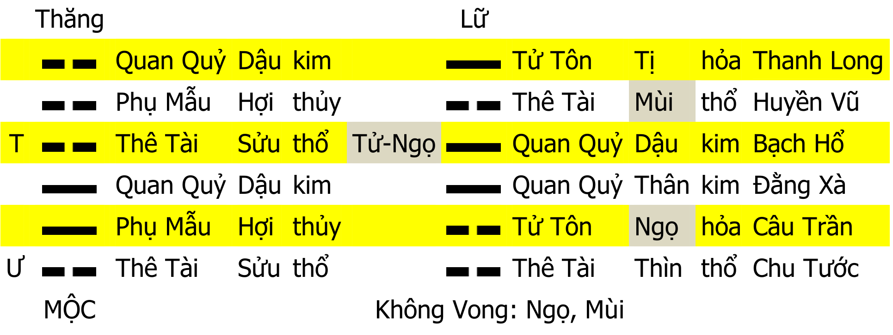
    - **Hình này chứng minh điều gì**
      - Vạch trần tình cảnh hai nữ tranh một nam, bạn trai phản bội cưới người khác dù cô gái đã có thai.
    - **Từ đâu mà thấy được**
      - Thế và Ứng đều là Mộ khố Dụng thần; Phụ Mẫu Hợi thủy động hóa Không; Tử Tôn Ngọ hỏa phục dưới Thế lâm Dưỡng địa.
  - **Phán đoán chi tiết:**
    - Căn cứ:
      - Hào Thế Thê Tài Sửu thổ tại hào 4 phát động sinh Dụng thần Quan Quỷ Dậu kim: bản thân cô gái rất yêu thích người bạn trai này.
      - Hào Thế Sửu thổ là Mộ khố của Dụng thần Quan Quỷ Dậu kim: Mộ khố biểu thị sự cất giấu, chiếm giữ, nghĩa là cô gái rất khao khát lấy được anh ta làm chồng, muốn gắn bó trọn đời.
      - Dụng thần nhập Mộ ở Sửu thổ, theo quy luật ứng kỳ thì nhập Mộ cần xung Mộ để phát tác; năm Quý Mùi (2003) chi Mùi xung khai Mộ khố Sửu thổ, do đó hai người bắt đầu mối tình nồng thắm vào năm Quý Mùi.
      - Quẻ Địa Phong Thăng là tượng quẻ tranh đoạt. Trong quẻ cả hào Thế Sửu thổ và hào Ứng Sửu thổ đều là Mộ khố của Quan Quỷ: hào Thế là đương số, hào Ứng là người phụ nữ khác, tạo nên thế "hai nữ tranh một nam", có người thứ ba chen chân tranh giành người yêu.
      - Hào 5 Phụ Mẫu Hợi thủy lâm Nhật thần phát động: Phụ Mẫu là giấy chứng nhận kết hôn, lâm Nhật vượng tướng vốn là điềm thành hôn; tuy nhiên lại động hóa Thê Tài Mùi thổ lâm Tuần Không, biểu thị hôn sự bị đứt gánh giữa đường, kết hôn bất thành.
      - Nguyệt kiến Dần mộc lục hợp với Phụ Mẫu Hợi thủy (Dần Hợi hợp): Nguyệt kiến hợp Phụ Mẫu là thông tin đối phương kết hôn với người phụ nữ khác. Rõ ràng bạn trai đã thay lòng đổi dạ, bội ước cưới kẻ khác.
      - Tử Tôn Ngọ hỏa được Nguyệt kiến Dần mộc Trường Sinh, phục tàng dưới hào Thế Sửu thổ: Hào Thế phát động là Dưỡng địa của Tử Tôn (Hỏa dưỡng tại Sửu), Dưỡng chủ mang thai, nuôi dưỡng; tượng này chỉ rõ bản thân cô gái đã từng có thai với người bạn trai này.
    - Nhìn vào:
      - Thế cục hai phụ nữ cùng giữ Mộ khố của Quan Quỷ khắc họa chân thực cảnh tình địch tranh đoạt.
      - Hào Phụ Mẫu lâm Nhật động hóa Tuần Không kết hợp Nguyệt hợp Phụ Mẫu vạch trần kẻ bội bạc kết hôn với người khác sau khi làm bạn gái mang thai.
  - **Ứng nghiệm thực tế:**
    - Ba năm trước (năm Quý Mùi 2003) hai người bắt đầu yêu nhau tha thiết. Trong thời gian yêu đương, cô gái đã mang thai với anh ta.
    - Vốn tưởng sẽ đi đến hôn nhân êm ấm, nào ngờ người bạn trai trở mặt từ chối cưới, và đã lén lút đi đăng ký kết hôn với một người phụ nữ khác vào năm Ất Dậu (2005). Cô gái uất ức nộp đơn kiện ra tòa án, nhưng tòa án không thụ lý giải quyết.

- **Ví dụ 2: Nữ đoán tình yêu ra sao (Ngày Tân Mão tháng Dần)**
  - **Bối cảnh & Chọn Dụng thần:**
    - Ngày Tân Mão tháng Dần (Tuần không: Ngọ, Mùi).
    - Nữ nhân gieo quẻ dự đoán diễn biến chuyện tình yêu của mình, được quẻ Trạch Thiên Quải biến Lôi Thiên Đại Tráng.
    - Lấy Quan Quỷ làm Dụng thần. Quan Quỷ Dần mộc lâm hào Ứng (hào 2).
  - **Hình 161.** Sơ đồ quẻ Trạch Thiên Quải biến Lôi Thiên Đại Tráng
    - 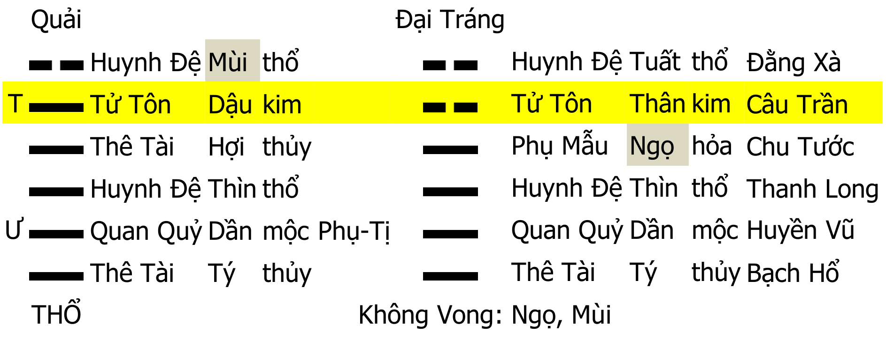
    - **Hình này chứng minh điều gì**
      - Thể hiện sự giằng xé do dự muốn chia tay khi có người đàn ông mới xuất hiện, định kỳ tháng Thìn quyết định.
    - **Từ đâu mà thấy được**
      - Kỵ thần Tử Tôn Dậu kim trì Thế động hóa Thoái; Nhật thần Quan Quỷ Mão mộc xung Thế; Dụng thần Dần mộc vượng tướng lâm Ứng.
  - **Phán đoán chi tiết:**
    - Căn cứ:
      - Quan Quỷ Dần mộc lâm hào Ứng được Nguyệt kiến lâm trị, Nhật thần Mão mộc trợ giúp là cực kỳ vượng tướng. Dụng thần lâm Ứng biểu thị bản thân cô gái rất thích và hướng về người bạn trai này.
      - Tuy nhiên, Nhật thần Mão mộc cũng là Quan Quỷ (hành Mộc), Nhật thần đến trực tiếp xung hào Thế Tử Tôn Dậu kim (Mão Dậu tương xung): điều này tiết lộ trong cuộc sống hiện tại vừa xuất hiện thêm một người đàn ông khác xông vào quấy nhiễu cõi lòng cô gái.
      - Kỵ thần Tử Tôn Dậu kim trì Thế tại hào 5 khắc Dụng thần: bản thân cô gái nảy sinh ý định muốn chia tay với bạn trai.
      - Tuy nhiên, Tử Tôn Dậu kim phát động lại hóa Tử Tôn Thân kim (động hóa Thoái thần): lực khắc bị triệt tiêu, phản ánh tâm trạng chần chừ do dự, nửa muốn chia tay dứt khoát, nửa lại không nỡ buông tay.
      - Đến tháng Thìn (Thìn hợp Dậu), Thìn thổ hợp trợ Dậu kim đắc sinh đắc hợp, không còn thoái lui; khi đó Kỵ thần vượng khí tất khắc mạnh Dụng thần, dự đoán đến tháng Thìn cô gái mới có thể hạ quyết tâm chia tay dứt khoát.
    - Nhìn vào:
      - Tượng Kỵ thần trì Thế hóa Thoái diễn tả trọn vẹn trạng thái tâm lý do dự, chùng chình không dứt khoát.
      - Nhật Quan Quỷ xung Thế báo trước sự can thiệp của người đàn ông mới làm chao đảo tình cảm cũ.
  - **Ứng nghiệm thực tế:**
    - Lời dự đoán hoàn toàn trùng khớp với thực tế nội tâm và hoàn cảnh của đương số: cô đang có một người đàn ông khác theo đuổi và đang rất phân vân chưa biết có nên dứt tình với bạn trai hiện tại hay không. Về sau kết quả chia tay ra sao thì không có phản hồi thêm.

- **Ví dụ 3: Nam đoán quan hệ với bạn gái phát triển ra sao (Ngày Giáp Thân tháng Tuất)**
  - **Bối cảnh & Chọn Dụng thần:**
    - Ngày Giáp Thân tháng Tuất (Tuần không: Ngọ, Mùi).
    - Nam nhân đến dự đoán mối quan hệ với bạn gái sẽ tiến triển thế nào, được quẻ Hỏa Lôi Phệ Hạp biến Sơn Lôi Di.
    - Lấy Thê Tài làm Dụng thần. Trong quẻ Thê Tài lưỡng hiện: Thê Tài Thìn thổ (hào 3) và Thê Tài Mùi thổ (hào 5).
  - **Hình 162.** Quẻ Hỏa Lôi Phệ Hạp biến Sơn Lôi Di
    - 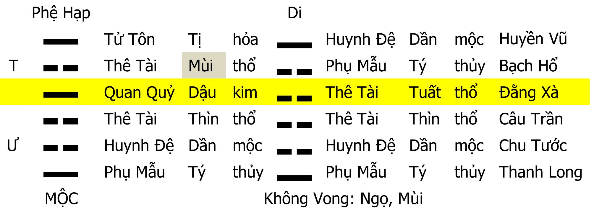
    - **Hình này chứng minh điều gì**
      - Làm rõ việc bạn gái bị kẻ khác quyến rũ nhưng cuối cùng nhờ Sàng Trướng hợp giải phá mà thành hôn.
    - **Từ đâu mà thấy được**
      - Dụng thần Thìn thổ Nguyệt phá được hào 4 Quan Quỷ Dậu kim độc phát hợp; Dậu kim là Sàng Trướng vượng tướng.
  - **Phán đoán chi tiết:**
    - Căn cứ:
      - Thê Tài lưỡng hiện: Lấy hào Thê Tài Thìn thổ tại hào 3 bị Nguyệt kiến Tuất thổ xung phá (Nguyệt phá) nhưng gặp hợp làm Dụng thần trực tiếp.
      - Hào Thế Thê Tài Mùi thổ lâm Tuần Không: Thế lâm Không biểu thị người nam trong lòng vô cùng lo âu, thấp thỏm, hoang mang về tương lai với bạn gái.
      - Dụng thần Thìn thổ bị Nguyệt kiến xung phá, tuy được Nhật thần Thân kim đến sinh trường sinh nhưng rốt cuộc không sinh phù trực tiếp vượng tướng cho Thổ, nên khó tránh khỏi trắc trở, thế nào cũng phát sinh sự việc chia tay rạn nứt.
      - Hào 4 Quan Quỷ Dậu kim độc phát tương hợp với Dụng thần Thê Tài Thìn thổ (Thìn Dậu hợp): Quan Quỷ là người đàn ông khác, chứng minh có kẻ thứ ba đến ve vãn quyến rũ bạn gái, và cô gái đã xiêu lòng thích người khác.
      - Tuy nhiên, Dụng thần Thìn thổ bị Nguyệt phá lại được chính Dậu kim hợp trú (hợp để giải trừ Nguyệt phá). Sàng Trướng (giường chiếu nhân duyên) trong quẻ vừa đúng là Dậu kim vượng tướng, hợp giải cứu Dụng thần; vì vậy cuối cùng bạn gái vẫn hồi tâm chuyển ý quay về thành hôn với anh ta.
    - Nhìn vào:
      - Phép đoán vi diệu "Nguyệt phá phùng hợp": hào động vừa là tình địch lôi kéo vừa đóng vai trò Sàng Trướng giải cứu Dụng thần bị phá.
  - **Ứng nghiệm thực tế:**
    - Quả nhiên bạn gái đã từng phải lòng một người đàn ông khác khiến đôi bên rạn nứt tưởng như tan vỡ. Tuy nhiên sau đó cô gái đã suy nghĩ lại, cắt đứt với người kia và hai người chính thức đính hôn vào ngày Quý Mùi tháng Tý.

- **Ví dụ 4: Nam đoán người nữ trong cơ quan có thành người yêu không (Ngày Ất Tị tháng Dậu năm Nhâm Ngọ)**
  - **Bối cảnh & Chọn Dụng thần:**
    - Ngày Ất Tị tháng Dậu năm Nhâm Ngọ (Tuần không: Dần, Mão).
    - Nam nhân hỏi xem nữ đồng nghiệp trong cơ quan có thể phát triển thành người yêu hay không, được quẻ Hỏa Địa Tấn biến Hỏa Sơn Lữ.
    - Lấy Thê Tài làm Dụng thần. Thê Tài Mão mộc tại hào 3.
  - **Hình 163.** Quẻ Hỏa Địa Tấn biến Hỏa Sơn Lữ
    - 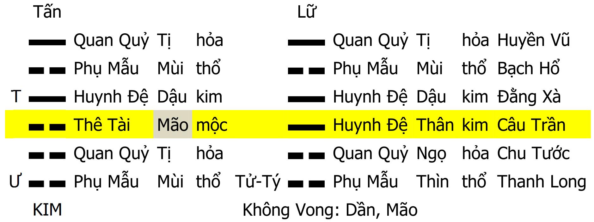
    - **Hình này chứng minh điều gì**
      - Định đoạt tình duyên tuyệt đối không thành và cô gái sẽ sớm chuyển công tác rời khỏi cơ quan.
    - **Từ đâu mà thấy được**
      - Thê Tài Mão mộc Nguyệt phá, Tuần Không, động hóa hồi đầu khắc; Thế Dụng tương xung; quẻ Du Hồn biến Lữ.
  - **Phán đoán chi tiết:**
    - Căn cứ:
      - Thê Tài Mão mộc không được Nhật Nguyệt sinh trợ, bị Nguyệt kiến Dậu kim xung phá (Nguyệt phá), đồng thời lâm Tuần Không.
      - Dụng thần Mão mộc phát động lại hóa Huynh Đệ Thân kim (hóa hồi đầu khắc): Dụng thần vừa Không, vừa Phá, lại hóa hồi đầu khắc, khẳng định tình duyên tuyệt đối không thành.
      - Hào Thế Huynh Đệ Dậu kim tương xung với Dụng thần Thê Tài Mão mộc (Mão Dậu tương xung): căn bản giữa hai người không có chút duyên phận nào.
      - Quẻ chính Hỏa Địa Tấn là quẻ Du Hồn, quẻ biến lại là Hỏa Sơn Lữ: Du Hồn chủ rời đi lang bạt, Lữ mang ý nghĩa lữ hành, dời chuyển. Tổ hợp này báo hiệu cô gái sẽ sớm rời khỏi đơn vị này, về sau hai người cũng không còn cơ hội gặp lại nhau.
    - Nhìn vào:
      - Sự bế tắc toàn diện của Dụng thần (Không, Phá, Thế Dụng tương xung, động hóa hồi đầu khắc).
      - Tượng quẻ Du Hồn hóa Lữ báo trước sự phân ly về mặt không gian địa lý.
  - **Ứng nghiệm thực tế:**
    - Cô gái này vốn đang hẹn hò với một nam đồng nghiệp khác trong cơ quan được vài ngày, hoàn toàn không có tình cảm hay ý định yêu đương gì với người hỏi quẻ. Đến tháng 6 năm sau cô gái được điều chuyển công tác đi nơi khác, và từ đó anh ta cũng không bao giờ gặp lại cô ấy nữa.

- **Ví dụ 5: Nữ đoán quan hệ với bạn trai phát triển ra sao (Ngày Mậu Thân tháng Sửu năm Ất Dậu)**
  - **Bối cảnh & Chọn Dụng thần:**
    - Ngày Mậu Thân tháng Sửu năm Ất Dậu (Tuần không: Dần, Mão).
    - Nữ nhân đến hỏi về chiều hướng phát triển quan hệ với bạn trai, được quẻ Hỏa Thủy Vị Tế biến Lôi Thủy Giải.
    - Lấy Quan Quỷ làm Dụng thần. Quan Quỷ Hợi thủy phục tàng dưới hào 3 Huynh Đệ Ngọ hỏa.
  - **Hình 164.** Quẻ Hỏa Thủy Vị Tế biến Lôi Thủy Giải
    - 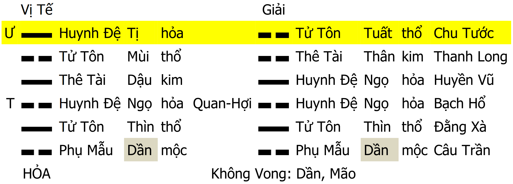
    - **Hình này chứng minh điều gì**
      - Vạch rõ bạn trai tính tình cộc cằn thô bạo khắc bạn gái, tình cảm đi vào Tuyệt địa tất phải chia tay.
    - **Từ đâu mà thấy được**
      - Dụng thần Hợi thủy phục dưới Thế lâm Bạch Hổ khắc Thế; hào 6 Tị hỏa độc phát là Tuyệt địa của Dụng thần.
  - **Phán đoán chi tiết:**
    - Căn cứ:
      - Quan Quỷ Hợi thủy không hiện trên quẻ, phục tàng dưới hào 3 Huynh Đệ Ngọ hỏa. Dụng thần bị Nguyệt khắc Nhật sinh, suy vượng giằng co khó phân định.
      - Dụng thần tuy phục dưới hào Thế nhưng lại lâm Bạch Hổ khắc Thế (Hợi thủy khắc Ngọ hỏa): Bạch Hổ chủ hung bạo, thô lỗ, cộc cằn; việc Dụng thần lâm Bạch Hổ khắc Thế chỉ rõ người bạn trai tính khí rất tồi tệ, đối xử thô bạo, gia trưởng với bạn gái, không hề có sự dịu dàng yêu thương.
      - Hào 6 Huynh Đệ Tị hỏa độc phát: Tị hỏa xung Hợi thủy, đồng thời Tị là Tuyệt địa của Dụng thần Quan Quỷ Hợi thủy. Dụng thần lâm Tuyệt địa độc phát, mối quan hệ tình cảm này chắc chắn không thể duy trì dài lâu, sớm muộn sẽ tan vỡ.
    - Nhìn vào:
      - Dụng thần phục tàng lâm Bạch Hổ khắc Thế lột tả tính khí bạo lực của người bạn trai.
      - Hào độc phát Tị hỏa kích hoạt Tuyệt địa báo trước dấu chấm hết của cuộc tình.
  - **Ứng nghiệm thực tế:**
    - Quả nhiên hai người thường xuyên cãi vã do tính nết thô lỗ của bạn trai, và đến tháng Thìn năm Bính Tuất thì đôi bên chính thức chia tay.

- **Ví dụ 6: Nữ đoán bạn trai đã chia tay có quay lại hay không (Ngày Nhâm Ngọ tháng Thân)**
  - **Bối cảnh & Chọn Dụng thần:**
    - Ngày Nhâm Ngọ tháng Thân (Tuần không: Thân, Dậu).
    - Nữ nhân hỏi xem người bạn trai đã chia tay có cơ hội quay lại hòa giải hay không, được quẻ Địa Thủy Sư biến Thiên Thủy Tụng.
    - Lấy Quan Quỷ làm Dụng thần. Trong quẻ Quan Quỷ lưỡng hiện (hào 2 Thìn thổ và hào 4 Sửu thổ), chọn hào phát động Quan Quỷ Sửu thổ làm Dụng thần.
  - **Hình 165.** Quẻ Địa Thủy Sư biến Thiên Thủy Tụng
    - 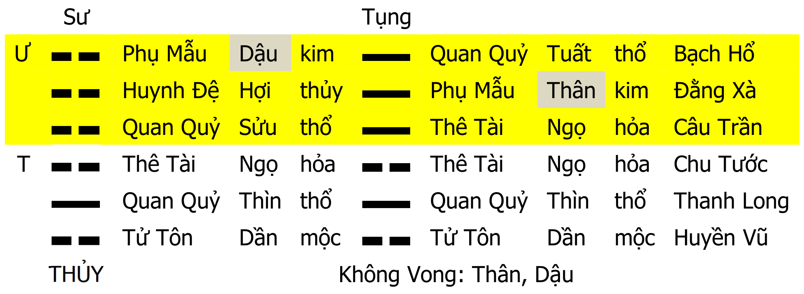
    - **Hình này chứng minh điều gì**
      - Xác nhận bạn trai sẽ chủ động quay lại hòa giải và hàn gắn mối quan hệ tình cảm.
    - **Từ đâu mà thấy được**
      - Dụng thần Quan Quỷ Sửu thổ được Nhật thần sinh lại động hóa Thê Tài Ngọ hỏa hồi đầu sinh.
  - **Phán đoán chi tiết:**
    - Căn cứ:
      - Lấy hào động Quan Quỷ Sửu thổ tại hào 4 làm Dụng thần.
      - Dụng thần Sửu thổ tuy không được Nguyệt kiến Thân kim sinh phù, nhưng được Nhật thần Ngọ hỏa tương sinh vượng tướng.
      - Đặc biệt, Quan Quỷ Sửu thổ phát động hóa Thê Tài Ngọ hỏa (Hỏa sinh Thổ - động hóa hồi đầu sinh): Dụng thần vừa đắc Nhật sinh vừa hóa hồi đầu sinh, nguyên khí cực kỳ mạnh mẽ, biểu thị tình cảm sẽ được hồi sinh, bạn trai nhất định sẽ chủ động quay lại hòa giải để tiếp tục mối quan hệ.
    - Nhìn vào:
      - Tượng hào động hóa hồi đầu sinh là lực đẩy mạnh mẽ đảo ngược tình thế chia tay, mở ra cơ hội tái hợp vững chắc.
  - **Ứng nghiệm thực tế:**
    - Lời đoán ứng nghiệm chuẩn xác: Đến ngày Kỷ Tị tháng Dậu, người bạn trai cũ đã chủ động tìm gặp nói lời xin lỗi, hai người làm lành và hòa giải êm đẹp.

- **Ví dụ 7: Nam đoán tình yêu với người nữ ra sao (Ngày Canh Thân tháng Tý)**
  - **Bối cảnh & Chọn Dụng thần:**
    - Ngày Canh Thân tháng Tý (Tuần không: Tý, Sửu).
    - Nam nhân đến hỏi về kết quả mối quan hệ tình cảm với một người nữ, được quẻ Trạch Thủy Khốn biến Thiên Thủy Tụng.
    - Lấy Thê Tài làm Dụng thần. Thê Tài Dần mộc tại hào sơ trì Thế.
  - **Hình 166.** Quẻ Trạch Thủy Khốn biến Thiên Thủy Tụng
    - 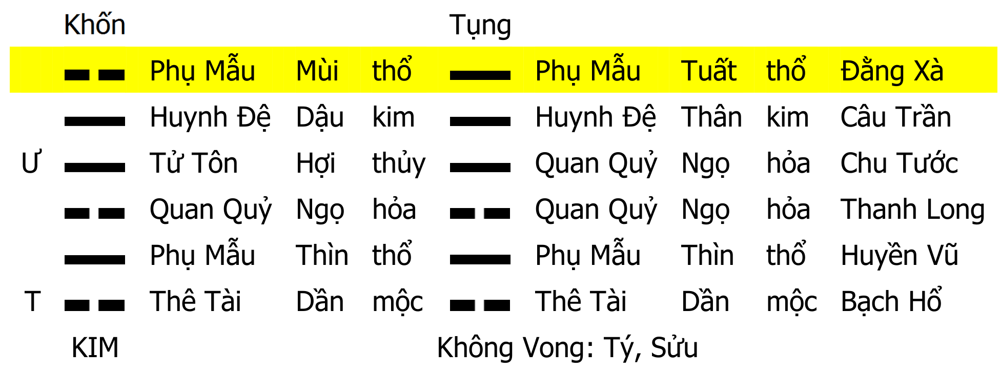
    - **Hình này chứng minh điều gì**
      - Xác định nghề nghiệp y tế của đối phương và dự báo tình cảm bế tắc tan rã vào tháng Sửu.
    - **Từ đâu mà thấy được**
      - Thê Tài Dần mộc lâm Bạch Hổ (y dược); Phụ Mẫu Mùi thổ độc phát là Mộ khố của Dụng thần; quẻ biến Du Hồn.
  - **Phán đoán chi tiết:**
    - Căn cứ:
      - Thê Tài Dần mộc trì Thế lâm Bạch Hổ: Bạch Hổ chủ máu me, y dược, bệnh viện, phán đoán đối phương là nhân viên y tế (bác sĩ/y tá).
      - Dụng thần Dần mộc được Nguyệt kiến Tý thủy sinh nhưng bị Nhật thần Thân kim xung khắc, suy vượng giằng co bất định.
      - Tuy nhiên, hào 6 Phụ Mẫu Mùi thổ độc phát: Mùi thổ chính là Mộ khố của Dụng thần Dần mộc (Mộc mộ tại Mùi), Dụng thần bị động hào thu nhập Mộ khố.
      - Quẻ biến Thiên Thủy Tụng là quẻ Du Hồn: Du Hồn chủ trôi dạt phân ly, không có kết quả bền vững; vì vậy tình cảm này chắc chắn không thành.
    - Nhìn vào:
      - Tượng Dụng thần nhập Mộ bởi hào độc phát kết hợp quẻ Du Hồn báo trước kết cục chia tay không thể đảo ngược.
  - **Ứng nghiệm thực tế:**
    - Tình cảm quả nhiên không thành. Đến tháng Sửu (Sửu Mùi tương xung khai Mộ khố) thì hai người chính thức chia tay đường ai nấy đi.

- **Ví dụ 8: Nam đoán quan hệ với bạn gái phát triển ra sao (Ngày Giáp Thân tháng Tuất)**
  - **Bối cảnh & Chọn Dụng thần:**
    - Ngày Giáp Thân tháng Tuất (Tuần không: Ngọ, Mùi).
    - Nam nhân hỏi về chiều hướng phát triển tình cảm với bạn gái, được quẻ Hỏa Lôi Phệ Hạp biến Sơn Lôi Di.
    - Lấy Thê Tài làm Dụng thần. Trong quẻ Thê Tài lưỡng hiện: Thê Tài Thìn thổ (hào 3) và Thê Tài Mùi thổ (hào 5).
  - **Hình 167.** Quẻ Hỏa Lôi Phệ Hạp biến Sơn Lôi Di
    - 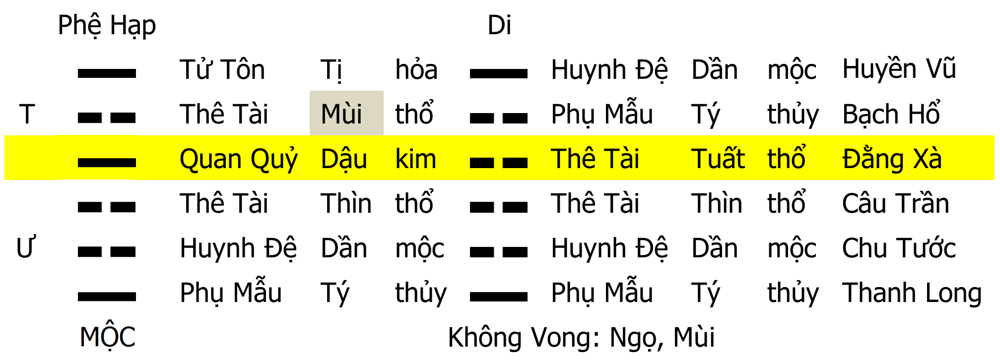
    - **Hình này chứng minh điều gì**
      - Vạch trần bạn gái thay lòng lén lút qua lại với người đàn ông đào hoa đã có vợ, dẫn đến xung đột cãi vã.
    - **Từ đâu mà thấy được**
      - Thế lâm Bạch Hổ Không Vong; quẻ biến Du Hồn; hào 4 Quan Quỷ Dậu kim Đào hoa động hợp Thìn thổ rồi hóa Thê Tài Tuất thổ.
  - **Phán đoán chi tiết:**
    - Căn cứ:
      - Lấy Thê Tài Thìn thổ tại hào 3 bị Nguyệt kiến Tuất thổ xung phá (Nguyệt phá) làm Dụng thần.
      - Hào Thế Thê Tài Mùi thổ lâm Tuần Không: Thế lâm Không biểu thị tâm trạng người nam vô cùng bất an, lo sợ kết cục tồi tệ của mối quan hệ. Quẻ Hỏa Lôi Phệ Hạp chủ cắn xé, cãi vã; hào Thế lâm Bạch Hổ chủ thịnh nộ, tức giận dữ dội.
      - Quẻ biến Sơn Lôi Di là quẻ Du Hồn: chủ tâm ý bạn gái đứng núi này trông núi nọ, không an định chung tình.
      - Hào 4 Quan Quỷ Dậu kim phát động tương hợp với Dụng thần Thê Tài Thìn thổ: Quan Quỷ là đàn ông khác, Dậu kim là sao Đào hoa, chỉ rõ bạn gái bị một người đàn ông đào hoa quyến rũ lôi kéo.
      - Quan Quỷ Dậu kim động hóa Thê Tài Tuất thổ tương hợp: Tuất thổ là Thê Tài (vợ người khác), chứng tỏ gã đàn ông chen chân này là người đã có vợ con đề huề.
    - Nhìn vào:
      - Thế lâm Bạch Hổ Tuần Không lột tả sự phẫn nộ và bất an của người nam.
      - Quan Quỷ Đào hoa động hợp bạn gái rồi hóa Thê Tài vạch trần kẻ thứ ba đã có gia đình.
  - **Ứng nghiệm thực tế:**
    - Quả nhiên bạn gái đã xiêu lòng qua lại với một người đàn ông đã có vợ; người nam phát hiện ra vô cùng tức giận, hai bên cãi vã nảy lửa và rạn nứt sâu sắc.

- **Ví dụ 9: Nữ đoán tỏ tình có thành không (Ngày Kỷ Tị tháng Tý)**
  - **Bối cảnh & Chọn Dụng thần:**
    - Ngày Kỷ Tị tháng Tý (Tuần không: Tuất, Hợi).
    - Nữ nhân đến gieo quẻ hỏi xem bản thân chủ động tỏ tình với người nam thì có thành công hay không, được quẻ Sơn Trạch Tổn biến Sơn Hỏa Bí.
    - Lấy Quan Quỷ làm Dụng thần. Quan Quỷ Mão mộc tại hào 2.
  - **Hình 168.** Quẻ Sơn Trạch Tổn biến Sơn Hỏa Bí
    - 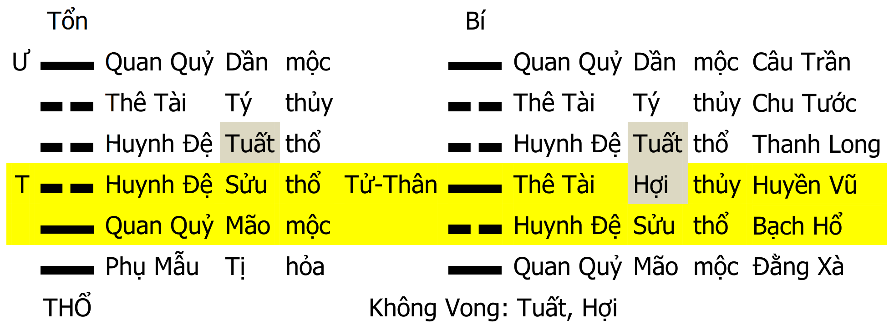
    - **Hình này chứng minh điều gì**
      - Khẳng định việc chủ động tỏ tình sẽ bị đối phương cự tuyệt, từ chối thẳng thừng.
    - **Từ đâu mà thấy được**
      - Thế Huynh Đệ Sửu thổ động hóa Thê Tài Hợi thủy lâm Tuần Không; Dụng thần Quan Quỷ Mão mộc vượng động khắc Thế.
  - **Phán đoán chi tiết:**
    - Căn cứ:
      - Hào Thế Huynh Đệ Sửu thổ tại hào 3 phát động hóa Thê Tài Hợi thủy lâm Tuần Không: Thế động hóa Không biểu thị bản thân cô gái trong lòng rất hoang mang, tự ti, không hề có chút tự tin hay nắm chắc phần thắng nào khi đi tỏ tình.
      - Dụng thần Quan Quỷ Mão mộc được Nguyệt kiến Tý thủy tương sinh là cực vượng tướng (Tý Thủy sinh Mão Mộc).
      - Quan Quỷ Mão mộc phát động trực tiếp khắc phạt hào Thế Huynh Đệ Sửu thổ (Mộc khắc Thổ): Dụng thần vượng động khắc Thế là điềm hung hiểm trong cầu duyên, báo hiệu đối phương sẽ từ chối thẳng thừng, gạt phăng lời bày tỏ tình cảm.
    - Nhìn vào:
      - Thế động hóa Không phản ánh sự e dè, thiếu tự tin của người chủ động.
      - Dụng thần vượng động khắc Thế chỉ điểm kết cục bị cự tuyệt phũ phàng.
  - **Ứng nghiệm thực tế:**
    - Quả nhiên khi cô gái lấy hết can đảm chủ động bày tỏ tình cảm thì bị người nam dứt khoát từ chối; về sau người nam này đã kết hôn với một người phụ nữ khác.

- **Ví dụ 10: Nữ đoán tình yêu (Ngày Đinh Mão tháng Thìn)**
  - **Bối cảnh & Chọn Dụng thần:**
    - Ngày Đinh Mão tháng Thìn (Tuần không: Tuất, Hợi).
    - Nữ nhân gieo quẻ dự đoán về tình duyên hiện tại, được quẻ Lôi Trạch Quy Muội biến Thủy Trạch Tiết.
    - Lấy Quan Quỷ làm Dụng thần. Trong quẻ Quan Quỷ lưỡng hiện (hào sơ Tị hỏa và hào 4 Ngọ hỏa), chọn hào phát động Quan Quỷ Ngọ hỏa tại hào 4 làm Dụng thần.
  - **Hình 169.** Quẻ Lôi Trạch Quy Muội biến Thủy Trạch Tiết
    - 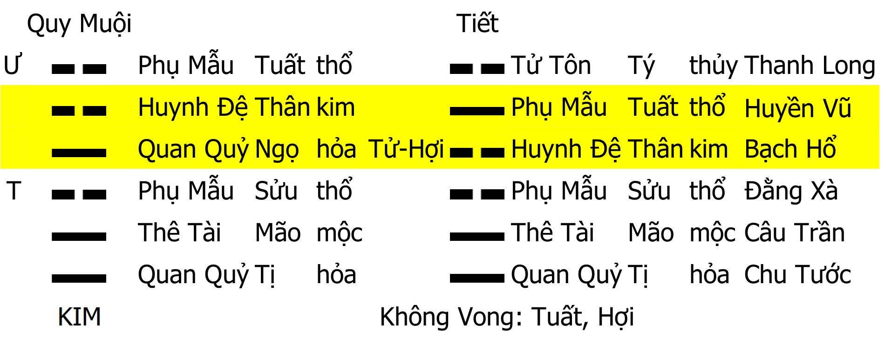
    - **Hình này chứng minh điều gì**
      - Khắc họa bạn trai cũ tính khí hung bạo ít bạn sắp đi xa, đồng thời xuất hiện bạn trai mới khéo ăn nói.
    - **Từ đâu mà thấy được**
      - Hào 4 Ngọ hỏa lâm Bạch Hổ động sinh Thế nhưng hóa Thân kim Không Phá; hào sơ Tị hỏa đắc Nhật sinh lâm Chu Tước.
  - **Phán đoán chi tiết:**
    - Căn cứ:
      - Quan Quỷ Ngọ hỏa phát động sinh hào Thế Phụ Mẫu Sửu thổ: cô gái hiện đã có bạn trai, và người này đối xử với cô khá tốt. Tuy nhiên hào Thế lâm Đằng Xà: Đằng Xà chủ u uất, rối bời, cô gái cảm thấy rất phiền não, mệt mỏi khi quen biết anh ta.
      - Quan Quỷ Ngọ hỏa lâm Bạch Hổ: Bạch Hổ chủ thô bạo, nóng nảy; bạn trai này tính tình rất cộc cằn, hung bạo. Hào động hóa Huynh Đệ Thân kim chủ giao du kết bạn, nhưng hào 5 Huynh Đệ Thân kim hóa Không hóa Phá (cách sơn hóa hào): bạn bè dần dần xa lánh hắn ta, chứng tỏ nhân phẩm kém, ít bạn bè thân thiết.
      - Quan Quỷ Ngọ hỏa lâm Dịch Mã, hào cách biến hóa Không: công việc sự nghiệp biến động lớn. Hào biến Phụ Mẫu Tuất thổ ở hào 6 lâm hào Ứng: Ứng là tha hương, hào 6 là nơi xa xôi, báo hiệu người bạn trai này sẽ rời đi đến phương xa làm ăn.
      - Hào sơ Quan Quỷ Tị hỏa được Nhật thần Mão mộc sinh phù: hào sơ là khởi đầu, Nhật sinh cũng là mới manh nha, báo hiệu hiện tại cô gái vừa mới có thêm một người bạn trai mới. Hào sơ lâm Chu Tước: tài ăn nói lưu loát, khéo giao tiếp; lại lục hợp với Huynh Đệ Thân kim nên rất thích kết giao bạn bè, quan hệ xã hội rất rộng rãi.
    - Nhìn vào:
      - Sự tương phản sâu sắc giữa người bạn trai cũ (hào 4 Ngọ hỏa lâm Bạch Hổ bạo lực ít bạn) và bạn trai mới (hào sơ Tị hỏa lâm Chu Tước khéo léo nhiều bạn).
  - **Ứng nghiệm thực tế:**
    - Thực tế diễn biến hoàn toàn đúng như lời giải quẻ: Cô gái đang vô cùng chán nản vì người bạn trai tính tình cộc cằn, hung hãn chuẩn bị chuyển đi nơi xa; đồng thời cô vừa mới quen một người bạn trai mới rất hoạt ngôn, khéo léo.

- **Ví dụ 11: Nữ đoán hôn nhân (Ngày Giáp Dần tháng Ngọ)**
  - **Bối cảnh & Chọn Dụng thần:**
    - Ngày Giáp Dần tháng Ngọ (Tuần không: Tý, Sửu).
    - Nữ nhân đến dự đoán nhân duyên hôn sự, được quẻ Thủy Lôi Truân biến Phong Lôi Ích.
    - Lấy Quan Quỷ làm Dụng thần. Trong quẻ Quan Quỷ lưỡng hiện: Quan Quỷ Thìn thổ (hào 3) và Quan Quỷ Tuất thổ (hào 5).
  - **Hình 170.** Quẻ Thủy Lôi Truân biến Phong Lôi Ích
    - 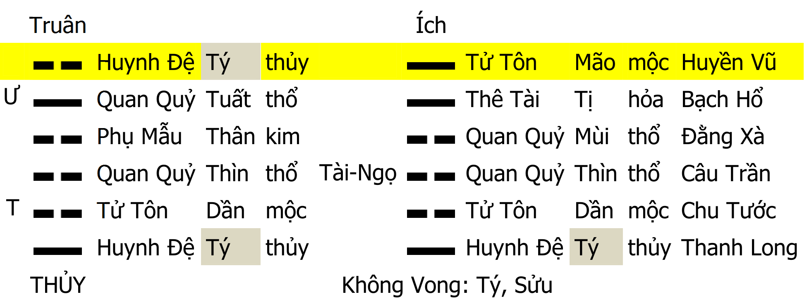
    - **Hình này chứng minh điều gì**
      - Vạch rõ việc cô gái chưa kết hôn, bắt cá hai tay, lối sống phong lưu không nghiêm túc với hôn nhân.
    - **Từ đâu mà thấy được**
      - Phụ Mẫu Thân kim Nhật phá Nguyệt khắc; Quan Quỷ lưỡng hiện; hào 6 Huynh Đệ Tý thủy lâm Huyền Vũ động sinh Thế tại Mộc Dục.
  - **Phán đoán chi tiết:**
    - Căn cứ:
      - Phụ Mẫu Thân kim tại hào 4 là giấy chứng nhận kết hôn, bị Nguyệt kiến Ngọ hỏa khắc chế, trong quẻ không có hào động cứu viện, lại bị Nhật thần Dần mộc xung thành Nhật phá: Phụ Mẫu bị Phá xác nhận hiện tại người nữ này vẫn chưa hề kết hôn.
      - Quan Quỷ Thìn thổ và Tuất thổ lưỡng hiện trong quẻ: hiện tại cô gái đang qua lại, hẹn hò cùng lúc với hai người bạn trai.
      - Hào 6 Huynh Đệ Tý thủy lâm Huyền Vũ độc phát sinh hào Thế Tử Tôn Dần mộc: Tý thủy đối với Dần mộc là đất Mộc Dục (Thủy sinh Mộc, Mộc Dục tại Tý). Mộc Dục kết hợp Huyền Vũ chủ chuyện tình ái, xác thịt phóng túng; điều này chỉ ra bản thân cô gái đã không còn là trinh nữ.
      - Nguyên thần đại diện cho tư duy, nhận thức lâm Không Vong Nguyệt phá, lại thêm Kỵ thần Tử Tôn trì Thế: Tử Tôn là thần khắc chế Quan Quỷ, chủ tâm tính chần chừ do dự, đứng núi này trông núi nọ, không có lòng chân thành gắn bó với hôn nhân, dự báo suốt đời nhân duyên long đong, khó bề yên bề gia thất.
    - Nhìn vào:
      - Hào độc phát Tý thủy lâm Huyền Vũ tại đất Mộc Dục sinh Thế lột tả lối sống tình cảm buông thả.
      - Phụ Mẫu Nhật phá phối hợp Quan Quỷ lưỡng hiện khẳng định chưa chồng nhưng cùng lúc bắt cá hai tay.
  - **Ứng nghiệm thực tế:**
    - Thực tế cô gái này thường xuyên giao du và bắt cá hai tay với hai người bạn trai cùng một lúc; tâm tính thất thường, hễ thấy đối phương có điểm không vừa ý là lập tức thay đổi người khác.

- **Ví dụ 12: Nam đoán tình yêu ra sao (Ngày Đinh Mão tháng Thân)**
  - **Bối cảnh & Chọn Dụng thần:**
    - Ngày Đinh Mão tháng Thân (Tuần không: Tuất, Hợi).
    - Nam nhân hỏi về chiều hướng phát triển tình yêu với bạn gái, được quẻ Sơn Phong Cổ biến Lôi Trạch Quy Muội.
    - Lấy Thê Tài làm Dụng thần. Trong quẻ Thê Tài lưỡng hiện: Thê Tài Sửu thổ (hào sơ) và Thê Tài Tuất thổ (hào 4).
  - **Hình 171.** Quẻ Sơn Phong Cổ biến Lôi Trạch Quy Muội
    - 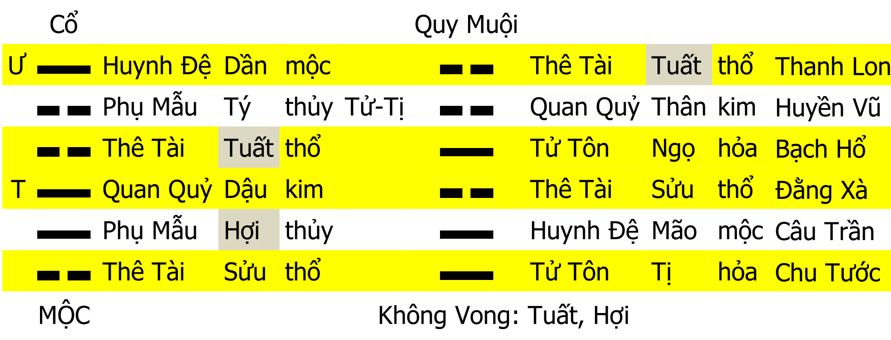
    - **Hình này chứng minh điều gì**
      - Làm rõ việc bạn trai cũ quay lại kéo bạn gái đi (tham hợp quên sinh) dẫn đến cãi cọ chia tay.
    - **Từ đâu mà thấy được**
      - Dụng thần Tuất thổ Không Vong bị Nhật Huynh Đệ Mão mộc hợp; hào 6 Huynh Đệ Dần mộc thoái vị động hóa Không.
  - **Phán đoán chi tiết:**
    - Căn cứ:
      - Thê Tài lưỡng hiện: Lấy hào Thê Tài Tuất thổ tại hào 4 gặp hợp với Nhật thần Mão mộc làm Dụng thần trực tiếp.
      - Hào Thế Quan Quỷ Dậu kim tại hào 3 lâm Đằng Xà: Đằng Xà chủ rối rắm, lo âu, tâm trạng người nam hiện rất phiền muộn, bực dọc. Quẻ xuất hiện tam hợp Quan Quỷ cục (Tị - Dậu - Sửu): Quan Quỷ chủ ưu tư, tam hợp cục biểu thị mọi nỗi phiền muộn đang dồn nén lại thành một khối bế tắc.
      - Thê Tài Tuất thổ vốn tương sinh cho hào Thế Dậu kim (Thổ sinh Kim), cho thấy bạn gái thực lòng yêu thích anh ta. Tuy nhiên Tuất thổ lâm Tuần Không, biểu thị tâm trí bạn gái đang dao động, phân vân không quyết.
      - Nhật thần Huynh Đệ Mão mộc hợp trú Dụng thần Tuất thổ (Mão Tuất hợp): đây là tượng "tham hợp quên sinh". Huynh Đệ là người tranh đoạt/tình địch; việc Huynh Đệ hợp bạn gái chỉ ra hiện có một người đàn ông khác xuất hiện lôi kéo cô ấy, khiến cô không biết phải chọn ai.
      - Xét hào Huynh Đệ trong quẻ: không có Mão mộc, lấy hào 6 Huynh Đệ Dần mộc thay thế để trích xuất thông tin. Dần mộc tại hào 6 khắc Thê Tài, hào 6 là hào thoái vị (quá khứ), lại động hóa Không Vong: chứng tỏ người đàn ông này chính là bạn trai cũ trước đây của cô gái.
      - Dụng thần tuy hóa hồi đầu sinh nhưng Nhật Nguyệt đều không trợ giúp, thế cục bế tắc không thể cứu vãn.
    - Nhìn vào:
      - Tượng "tham hợp quên sinh" của Dụng thần Tuần Không bị Nhật Huynh Đệ hợp mất.
      - Hào 6 Huynh Đệ thoái vị vạch rõ sự xuất hiện trở lại của người yêu cũ phá vỡ mối tình.
  - **Ứng nghiệm thực tế:**
    - Quả nhiên người bạn trai cũ của cô gái bất ngờ quay lại tìm cô, khiến mối quan hệ giữa người nam này và bạn gái nảy sinh mâu thuẫn cãi vã kịch liệt, cuối cùng đi đến kết cục chia tay.

- **Ví dụ 13: Nam đoán tình yêu có thành hay không (Ngày Đinh Dậu tháng Dần)**
  - **Bối cảnh & Chọn Dụng thần:**
    - Ngày Đinh Dậu tháng Dần (Tuần không: Thìn, Tị).
    - Nam nhân đến hỏi xem mối tình với bạn gái có thể đi đến hôn nhân thành công hay không, được quẻ Phong Hỏa Gia Nhân biến Sơn Hỏa Bí.
    - Lấy Thê Tài làm Dụng thần. Trong quẻ Thê Tài lưỡng hiện: Thê Tài Sửu thổ (hào 2 trì Thế) và Thê Tài Mùi thổ (hào 4).
  - **Hình 172.** Quẻ Phong Hỏa Gia Nhân biến Sơn Hỏa Bí
    - 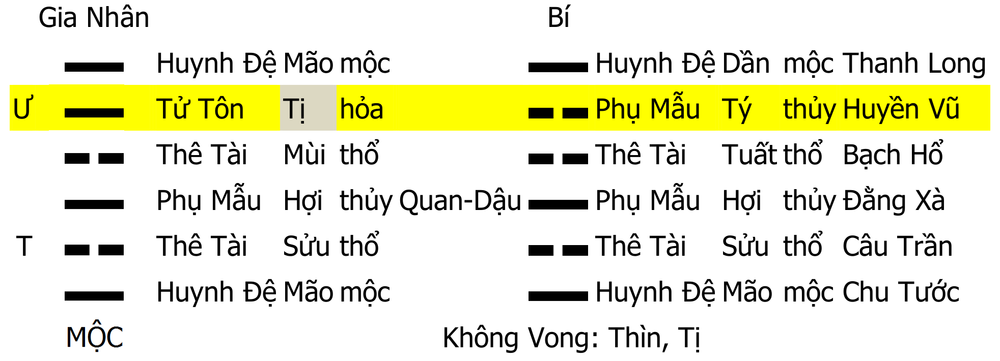
    - **Hình này chứng minh điều gì**
      - Tả rõ diện mạo bạn gái mắt sâu quyến rũ da ngăm đen và việc cha mẹ đối phương kịch liệt phản đối chia tay vào tháng Tị.
    - **Từ đâu mà thấy được**
      - Hào Ứng Tị hỏa tại hào 5 động lâm Không hóa Phụ Mẫu hồi đầu khắc; Hỏa chủ mắt lâm Huyền Vũ; bị Thủy khắc chủ da đen.
  - **Phán đoán chi tiết:**
    - Căn cứ:
      - Chọn Thê Tài Sửu thổ trì Thế tại hào 2 làm Dụng thần. Dụng thần không được Nhật Nguyệt sinh trợ, bị Nguyệt kiến Dần mộc khắc là hưu tù vô khí.
      - Hào Ứng Tử Tôn Tị hỏa tại hào 5 phát động sinh Dụng thần Thê Tài Sửu thổ: hào Ứng là đối phương, phát động sinh Thế biểu thị phía nữ rất yêu thích người nam.
      - Tuy nhiên hào Ứng Tị hỏa lâm Tuần Không phát động: đối phương tâm ý dao động, thiếu kiên định. Đặc biệt hào Ứng tại hào 5 động hóa Phụ Mẫu Tý thủy (hóa hồi đầu khắc): hào 5 là ngôi vị gia trưởng, Phụ Mẫu cũng chủ cha mẹ bề trên, lâm hào Ứng chính là cha mẹ của cô gái. Việc hào 5 hóa hồi đầu khắc chỉ rõ phụ huynh đối phương kịch liệt cấm cản, phản đối gay gắt cuộc hôn nhân này.
      - Tị hỏa đang lâm Tuần Không, đến tháng Tị xuất Không thì hung họa phát tác, đôi bên tất phải chia tay.
      - Luận diện mạo đối phương: Thê Tài được Tị hỏa sinh, Tị là hướng Đông Nam, bạn gái đến từ phương Đông Nam. Nguyên thần Tị hỏa độc phát tại hào 5 (ngũ quan), Hỏa chủ đôi mắt, lâm Huyền Vũ chủ quyến rũ gợi cảm, nên cô gái có đôi mắt rất đẹp; Tị hỏa lâm Tuần Không nên hốc mắt sâu giống như người Ấn Độ. Mặt khác Nguyên thần bị Thủy khắc (Thủy chủ màu đen), lại lâm Huyền Vũ (chủ màu đen), nên nước da cô gái hơi ngăm đen.
    - Nhìn vào:
      - Hào 5 gia trưởng hóa Phụ Mẫu hồi đầu khắc hào Ứng Tuần Không báo trước sự can thiệp chia rẽ của cha mẹ đối phương.
      - Khả năng họa hình diện mạo kỳ tài (mắt sâu, da ngăm đen) qua tượng ngũ hành hào 5 độc phát.
  - **Ứng nghiệm thực tế:**
    - Quả nhiên cô gái có diện mạo đúng như mô tả. Đến tháng Tị, do cha mẹ cô gái kịch liệt phản đối và ngăn cản dữ dội, hai người đành ngậm ngùi nói lời chia tay.

- **Ví dụ 14: Nữ đoán tình yêu của em gái và người nam ra sao (Ngày Giáp Thìn tháng Hợi)**
  - **Bối cảnh & Chọn Dụng thần:**
    - Ngày Giáp Thìn tháng Hợi (Tuần không: Dần, Mão).
    - Người chị đến hỏi về tình cảm giữa em gái và bạn trai phát triển ra sao, được quẻ Sơn Thiên Đại Súc biến Hỏa Phong Đỉnh.
    - Lấy Quan Quỷ làm Dụng thần (đoán bạn trai cho em gái). Trong quẻ Quan Quỷ lưỡng hiện: Quan Quỷ Dần mộc tại hào 2 và hào 6.
  - **Hình 173.** Quẻ Sơn Thiên Đại Súc biến Hỏa Phong Đỉnh
    - 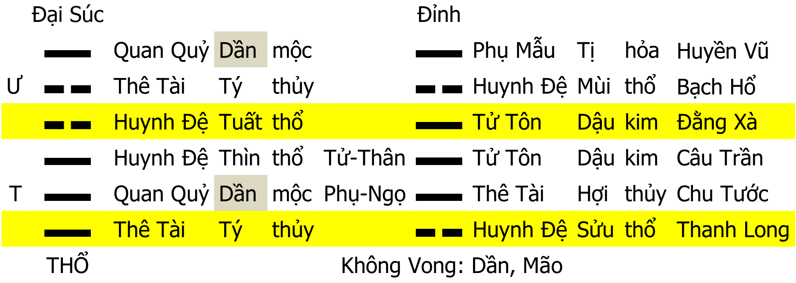
    - **Hình này chứng minh điều gì**
      - Vạch rõ em gái do dự vì nhà trai quá nghèo, định kỳ năm Giáp Thân xung thực tam hợp mới kết hôn.
    - **Từ đâu mà thấy được**
      - Hào Thế Quan Quỷ Dần mộc vượng tướng lâm Tuần Không Chu Tước; hào Ứng Thê Tài Tý thủy nhập Mộ bị Huynh Đệ Tuất thổ động khắc.
  - **Phán đoán chi tiết:**
    - Căn cứ:
      - Chọn Quan Quỷ Dần mộc tại hào 2 trì Thế làm Dụng thần. Dụng thần được Nguyệt kiến Hợi thủy tương sinh vượng tướng (Dần Hợi hợp sinh), lại trì Thế: người em gái rất có tình cảm và yêu thương người nam này.
      - Tuy nhiên hào Thế Dần mộc lại lâm Tuần Không: Tuần Không biểu thị người em gái trong lòng đang rất do dự, đắn đo chưa quyết.
      - Quan Quỷ trì Thế lâm Chu Tước Tuần Không: Chu Tước chủ ngôn ngữ, lâm Không chủ ít nói, hai người ít khi tâm sự cởi mở với nhau.
      - Hào Ứng Thê Tài Tý thủy đại diện cho gia cảnh người nam: Thê Tài Tý thủy nhập Mộ ở Nhật thần Thìn thổ, lại bị hào 4 Huynh Đệ Tuất thổ phát động khắc phạt: Huynh Đệ khắc Tài, Tài nhập Mộ chỉ rõ hoàn cảnh gia đình người nam rất bần hàn, kinh tế vô cùng eo hẹp. Chính vì gia cảnh nghèo túng này mà người em gái mới do dự chưa muốn tiến tới.
      - Hiện tại là năm Nhâm Ngọ (2002); cần đợi đến năm Giáp Thân (2004) xung thực Dụng thần Dần mộc giải Không, đồng thời Thân Tý Thìn hợp Thủy cục sinh Dụng thần, khi đó hai người mới có thể cử hành hôn lễ.
    - Nhìn vào:
      - Hào Ứng Thê Tài nhập Mộ bị Huynh Đệ động khắc vạch trần gia cảnh nghèo túng của nhà trai.
      - Quy luật định ứng kỳ kết hôn chuẩn xác tại năm Giáp Thân xung thực Tuần Không kích hoạt tam hợp cục Nguyên thần.
  - **Ứng nghiệm thực tế:**
    - Quả nhiên người em gái vì e ngại gia cảnh anh ta quá nghèo túng nên chần chừ do dự. Nhưng nhận thấy bản chất anh ta tốt, sau hơn một năm kiên trì yêu nhau, hai người đã chính thức kết hôn vào đúng năm Giáp Thân (2004).

- **Ví dụ 15: Nam đoán tình yêu với bạn gái ra sao (Ngày Đinh Mão tháng Tuất)**
  - **Bối cảnh & Chọn Dụng thần:**
    - Ngày Đinh Mão tháng Tuất (Tuần không: Tuất, Hợi).
    - Nam thanh niên (hơn 20 tuổi) đến hỏi về chuyện tình cảm với bạn gái, được quẻ Thủy Địa Tỷ biến Phong Sơn Tiệm.
    - Lấy Thê Tài làm Dụng thần. Thê Tài Tý thủy tại hào 6 (hào Ứng).
  - **Hình 174.** Quẻ Thủy Địa Tỷ biến Phong Sơn Tiệm
    - 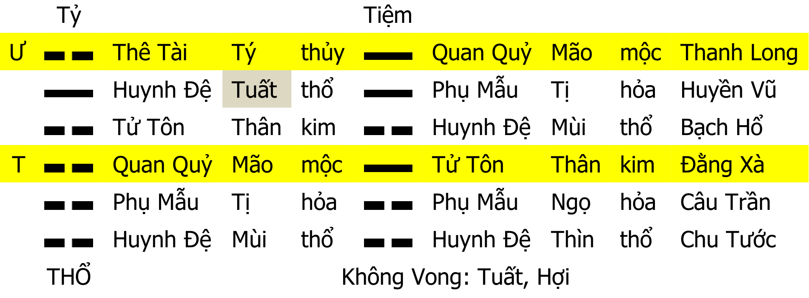
    - **Hình này chứng minh điều gì**
      - Vạch trần bạn gái thay lòng yêu người đàn ông khác, dẫn đến cãi cọ xung đột và tình cảm khó duy trì.
    - **Từ đâu mà thấy được**
      - Hào Ứng Thê Tài Tý thủy động hóa Quan Quỷ Mão mộc; Thế lâm Đằng Xà; Nguyệt kiến Tuất thổ khắc Dụng thần.
  - **Phán đoán chi tiết:**
    - Căn cứ:
      - Hào Thế Quan Quỷ Mão mộc tại hào 3 lâm Đằng Xà: Đằng Xà chủ bất an, tâm trạng người nam đang rất rối bời, bồn chồn lo lắng.
      - Hào Ứng Thê Tài Tý thủy phát động hóa Quan Quỷ Mão mộc: Thê Tài động biến Quan Quỷ (Quan Quỷ là đàn ông), biểu thị bạn gái lại đem lòng yêu say đắm một người đàn ông khác.
      - Tuy nhiên Thê Tài Tý thủy phát động vẫn tương sinh cho hào Thế Quan Quỷ Mão mộc (Thủy sinh Mộc): cho thấy cô gái vẫn chưa dứt khoát đoạn tuyệt hẳn, vẫn chưa cắt đứt hoàn toàn quan hệ với anh ta.
      - Dù vậy, Nguyệt kiến Tuất thổ khắc chế Dụng thần Tý thủy, Nhật thần Mão mộc không trợ giúp cho Dụng thần: Dụng thần suy bại bị khắc, mối quan hệ này chắc chắn khó có thể duy trì dài lâu.
    - Nhìn vào:
      - Tượng Thê Tài động hóa Quan Quỷ vạch trần sự thay lòng đổi dạ của bạn gái.
      - Thế Dụng tương sinh nhưng Dụng thần bị Nguyệt khắc tàn tạ báo hiệu kết cục chia ly không thể tránh khỏi.
  - **Ứng nghiệm thực tế:**
    - Quả nhiên người bạn gái đã lén lút qua lại với một người đàn ông khác; anh ta phát hiện ra vô cùng giận dữ, hai bên cãi vã kịch liệt và tình cảm rạn nứt sâu sắc.

- **Ví dụ 16: Nam đoán khi nào có người yêu (Ngày Quý Mùi tháng Tuất)**
  - **Bối cảnh & Chọn Dụng thần:**
    - Ngày Quý Mùi tháng Tuất (Tuần không: Thân, Dậu).
    - Nam nhân đến hỏi khi nào bản thân có thể tìm được người yêu, được quẻ Thiên Thủy Tụng biến Thủy Địa Tỷ.
    - Lấy Thê Tài làm Dụng thần. Thê Tài Thân kim tại hào 5 lâm Tuần Không.
  - **Hình 175.** Sơ đồ quẻ Thiên Thủy Tụng biến Thủy Địa Tỷ
    - 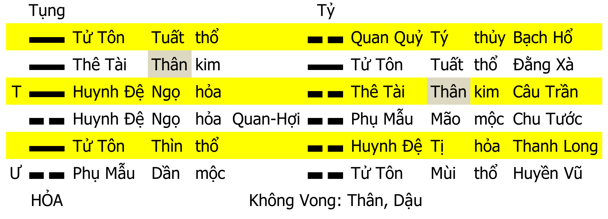
    - **Hình này chứng minh điều gì**
      - Dự đoán chính xác ngày mai bạn giới thiệu đối tượng nữ làm an ninh, đeo kính, từng ly hôn có con riêng.
    - **Từ đâu mà thấy được**
      - Thế động hóa Thê Tài Thân kim xuất Không vào ngày Thân; cung Ly, Tuất thổ lâm Bạch Hổ; hào 2 Thìn thổ Nguyệt phá động sinh Dụng.
  - **Phán đoán chi tiết:**
    - Căn cứ:
      - Thê Tài Thân kim tại hào 5 lâm Tuần Không. Hào Thế Huynh Đệ Ngọ hỏa tại hào 4 phát động hóa xuất Thê Tài Thân kim.
      - Ngày dự đoán là ngày Quý Mùi, ngày tiếp theo là ngày Giáp Thân, Thê Tài Thân kim sẽ xuất Không: vì vậy phán đoán ngay ngày hôm sau sẽ có đối tượng xuất hiện.
      - Huynh Đệ trì Thế phát động hóa Thê Tài: Huynh Đệ chủ bạn bè, người mai mối, chỉ rõ đối tượng này là do bạn bè giới thiệu cho anh ta.
    - Luồng đối thoại & trích xuất thông tin chi tiết:
      - *Người hỏi phản hồi:* Thật sự có người bạn muốn giới thiệu cho tôi một đối tượng vào ngày mai. Vậy tình hình diện mạo và hoàn cảnh của đối tượng này như thế nào?
      - *Tác giả luận giải diện mạo:* Dụng thần Thê Tài Thân kim tại hào 5: Kim chủ khuôn mặt dài, cằm nhọn. Thân kim lâm Tuần Không: "Kim không tắc minh" (Kim rỗng thì tiếng vang lớn), do đó người nữ này có giọng nói rất to, hào sảng.
      - *Người hỏi hỏi tiếp:* Có thể đoán tỉ mỉ, cụ thể hơn về nghề nghiệp và thân thế không?
      - *Tác giả luận giải nghề nghiệp và gia cảnh:*
        - Quẻ thuộc cung Ly, Ly chủ binh đao, giáp trụ. Hào 6 Tử Tôn Tuất thổ lâm Nguyệt kiến và lâm Bạch Hổ phát động sinh Dụng thần Thân kim: Bạch Hổ chủ chấp pháp, pháp luật, quân đội, nên người nữ này làm việc trong bộ phận chính trị, pháp luật, an ninh.
        - Hỏa khắc Dụng thần Kim: thị lực kém, mắt không tốt; Tuất thổ là Hỏa khố (kho lửa), có tượng kính mắt, sinh Dụng thần Kim nên cô gái này có đeo kính.
        - Hào 2 Tử Tôn Thìn thổ bị Nguyệt phá phát động sinh Dụng thần: Hào 2 là trạch vị, phu thê vị. Thìn thổ là Mộ khố của Quan Quỷ (chồng), biểu thị cô ấy từng có chồng (đã từng kết hôn); Nguyệt phá biểu thị hôn nhân đã tan vỡ, tức đã ly dị.
        - Thìn thổ đồng thời là Mộ khố của Tử Tôn (con cái), hào Thế Huynh Đệ Ngọ hỏa hợp Nhật thần Mùi thổ (Tử Tôn) hóa Thê Tài: khi đến với nhau, người nữ này sẽ mang theo con riêng đi cùng.
        - Dụng thần tại hào 5 (tôn vị): người phụ nữ có chức tước, giữ chức vụ lãnh đạo nhất định.
        - Quẻ biến Du Hồn, Huynh Đệ trì Thế khắc Dụng thần: người nam trong lòng chần chừ do dự, không mấy mặn mà muốn qua lại.
  - **Ứng nghiệm thực tế:**
    - Ngày hôm sau người hỏi quẻ kinh ngạc phản hồi lại: Toàn bộ thông tin chuẩn xác một cách kỳ diệu!
    - Phía nữ hiện công tác tại Bộ An Ninh, trước đây từng phục vụ trong quân đội.
    - Đã ly hôn chồng và đang nuôi con riêng.
    - Có đeo kính mắt, khuôn mặt dài, cằm nhọn, giọng nói rất to.
    - Là cán bộ cấp phòng (cán bộ lãnh đạo).
    - Sau buổi gặp mặt, bản thân người nam cảm thấy e ngại không muốn tiếp tục nói chuyện, nhưng người nữ thì lại rất có thiện chí và bằng lòng muốn tìm hiểu sâu hơn.

- **Ví dụ 17: Nam đoán tình yêu ra sao (Ngày Đinh Mùi tháng Dậu)**
  - **Bối cảnh & Chọn Dụng thần:**
    - Ngày Đinh Mùi tháng Dậu (Tuần không: Dần, Mão).
    - Nam nhân đến hỏi về tình cảm với một người nữ, được quẻ Trạch Địa Tụy biến Trạch Hỏa Cách.
    - Lấy Thê Tài làm Dụng thần. Thê Tài Mão mộc tại hào 3.
  - **Hình 176.** Sơ đồ quẻ Trạch Địa Tụy biến Trạch Hỏa Cách
    - 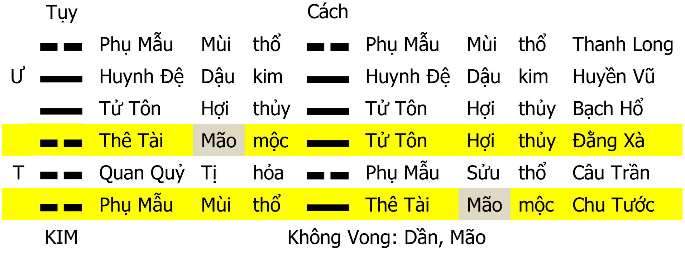
    - **Hình này chứng minh điều gì**
      - Tả rõ dáng vóc cô gái thon thả eo nhỏ và quyết đoán tình duyên thất bại do phạm tam bại Phá, Không, Mộ.
    - **Từ đâu mà thấy được**
      - Thê Tài Mão mộc Nguyệt phá, Tuần Không, nhập Mộ tại Nhật Mùi thổ; Mộc hưu tù lâm Đằng Xà tại hào 3 (eo).
  - **Phán đoán chi tiết:**
    - Căn cứ:
      - Thê Tài Mão mộc tại hào 3 bị Nguyệt kiến Dậu kim xung phá (Nguyệt phá), bản thân lâm Tuần Không, lại nhập Mộ ở Nhật thần Mùi thổ (Mộc mộ tại Mùi).
      - Dụng thần phạm cả ba đại kỵ: vừa Nguyệt phá, vừa Tuần Không, vừa nhập Mộ ở Nhật: điềm bế tắc tột cùng, mối tình này tuyệt đối không thể thành.
      - Luận dáng vóc: Dụng thần là Mộc hưu tù: người hành Mộc hưu tù vóc dáng cao ráo nhưng gầy gò, thanh mảnh. Dụng thần tại hào 3 lâm Đằng Xà: hào 3 là thắt lưng/vòng eo, Đằng Xà chủ uốn lượn thon nhỏ, nên cô gái có vòng eo rất nhỏ nhắn, thon gọn.
      - Trong quẻ xuất hiện tam hợp cục Dụng thần (Hợi Mão Mùi tam hợp Mộc cục): tam hợp Thê Tài biểu thị trong quá khứ người nam này đã từng yêu đương qua lại với nhiều cô gái nhưng tất cả đều dở dang thất bại.
    - Nhìn vào:
      - Thế cục tam bại (Phá, Không, Mộ) quyết định sự đổ vỡ không thể cứu vãn.
      - Tượng Dụng thần Mộc hưu tù tại hào 3 lâm Đằng Xà phác họa thần tình dáng dấp eo thon chuẩn xác.
  - **Ứng nghiệm thực tế:**
    - Quả nhiên với cô gái này không thành công. Người nam thừa nhận trước đây anh ta đã từng quen và hẹn hò với hơn mười cô gái nhưng tất cả đều không đi đến kết quả nào.

- **Ví dụ 18: Nam đoán khi nào tìm được đối tượng thích hợp (Ngày Đinh Mùi tháng Sửu)**
  - **Bối cảnh & Chọn Dụng thần:**
    - Ngày Đinh Mùi tháng Sửu (Tuần không: Dần, Mão).
    - Nam nhân đến hỏi khi nào mới tìm được đối tượng kết hôn thích hợp, được quẻ Phong Thủy Hoán biến Sơn Thiên Đại Súc.
    - Lấy Thê Tài làm Dụng thần. Thê Tài Dậu kim phục tàng dưới hào 4 Tử Tôn Mùi thổ.
  - **Hình 177.** Sơ đồ quẻ Phong Thủy Hoán biến Sơn Thiên Đại Súc
    - 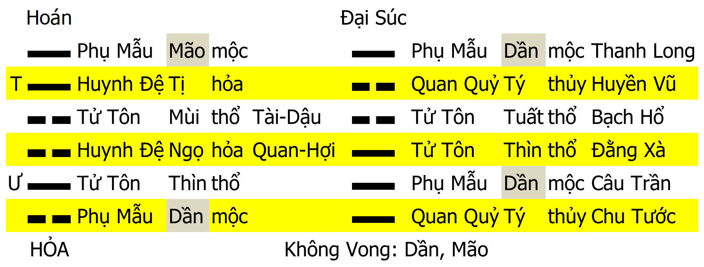
    - **Hình này chứng minh điều gì**
      - Vạch rõ tính cách thô bạo bám mẹ, phải thất bại 4 lần yêu đương mới thành, và vừa mới quen bạn gái thứ 4.
    - **Từ đâu mà thấy được**
      - Thế Tị hỏa tại hào 5 động hóa Quỷ; Huynh Đệ trùng trùng khắc Tài; hào sơ Phụ Mẫu Dần mộc động sinh Thế hưu tù.
  - **Phán đoán chi tiết:**
    - Căn cứ:
      - Hào Thế Huynh Đệ Tị hỏa tại hào 5: Thế thuộc Hỏa, tính khí rất nóng nảy, thiếu kiềm chế; động biến Quan Quỷ Tý thủy (Quan Quỷ là kẻ xấu, tính tình thô bạo): chủ bản thân tính nết thô lỗ, cộc cằn. Lại cư tại hào 5 (vị trí cao ngạo), cư xử không nể nang ai, luôn tự cho mình là đúng lý.
      - Huynh Đệ trì Thế, lại có Huynh Đệ Ngọ hỏa tại hào 3 phát động trong quẻ: Huynh Đệ trùng trùng khắc phạt Thê Tài. Dụng thần Thê Tài Dậu kim phục tàng dưới hào 4 Tử Tôn Mùi thổ. Kim chủ số 4 (Thân Dậu Kim số 4, 9): bị Huynh Đệ khắc phạt nặng nề nên dự đoán phải trải qua ít nhất 4 lần yêu đương thất bại mới mong có cơ hội thành công.
      - Phi thần Tử Tôn Mùi thổ lâm Nhật thần tương sinh Phục thần Thê Tài Dậu kim (Thổ sinh Kim): Phi thần sinh Phục thần biểu thị người nam này vừa mới quen biết một người bạn gái mới.
      - Hào Thế Tị hỏa hưu tù vô khí, được hào sơ Phụ Mẫu Dần mộc phát động tương sinh: Phụ Mẫu là hỉ thần của Thế, hào sơ là thuở ấu thơ, hào Phụ Mẫu mang tượng mẹ: từ nhỏ người này được mẹ hết lòng nuông chiều, bảo bọc, bản thân rất bám mẹ, dựa dẫm vào mẹ không rời. Vì tâm lý bám mẹ nên xu hướng luôn thích tìm người phụ nữ lớn tuổi hơn mình để yêu.
    - Nhìn vào:
      - Thế Hỏa động hóa Quỷ tại hào 5 phản ánh tính cách gia trưởng, thô lỗ, khó hòa hợp.
      - Hào sơ Phụ Mẫu sinh Thế hưu tù giải thích nguồn cơn tâm lý phụ thuộc người mẹ từ thuở ấu thơ.
  - **Ứng nghiệm thực tế:**
    - Người nam xác nhận: Đến nay anh đã thất bại ê chề qua 3 mối tình; hiện tại vừa mới quen một người bạn gái thứ 4. Bản thân từ nhỏ quá bám mẹ nên luôn thích tìm các cô gái nhiều tuổi hơn mình. Tính khí anh ta rất nóng nảy, thô bạo và khó chịu, nên rất khó có cô gái nào có thể hòa hợp, chung sống lâu dài với anh ta.

- **Ví dụ 19: Nam đoán kết quả tình yêu ra sao (Ngày Mậu Tuất tháng Dậu)**
  - **Bối cảnh & Chọn Dụng thần:**
    - Ngày Mậu Tuất tháng Dậu (Tuần không: Thìn, Tị).
    - Nam nhân đến hỏi về kết cục mối quan hệ tình cảm với bạn gái, được quẻ Hỏa Thủy Vị Tế biến Hỏa Thiên Đại Hữu.
    - Lấy Thê Tài làm Dụng thần. Thê Tài Dậu kim tại hào 4.
  - **Hình 178.** Sơ đồ quẻ Hỏa Thủy Vị Tế biến Hỏa Thiên Đại Hữu
    - 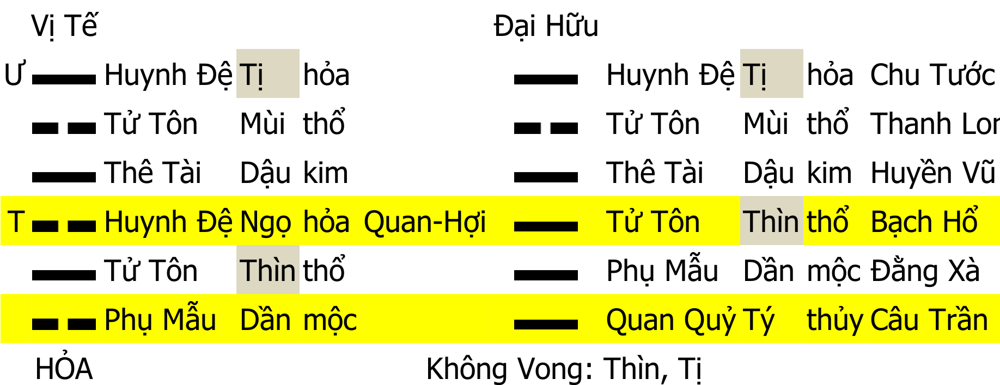
    - **Hình này chứng minh điều gì**
      - Định đoạt tình duyên đổ vỡ do tam hợp Huynh Đệ cục khắc Tài, bạn gái chủ động chia tay sau 4 lần hẹn.
    - **Từ đâu mà thấy được**
      - Thế Huynh Đệ Ngọ hỏa cùng sơ hào Dần mộc và Nhật Tuất thổ tam hợp Huynh Đệ cục khắc Tài; hào Ứng Tuần Không.
  - **Phán đoán chi tiết:**
    - Căn cứ:
      - Thê Tài Dậu kim tại hào 4 được Nguyệt kiến Dậu kim lâm trị và Nhật thần Tuất thổ tương sinh là cực kỳ vượng tướng.
      - Tuy nhiên, hào Thế Huynh Đệ Ngọ hỏa tại hào 3 kết hợp với hào sơ Phụ Mẫu Dần mộc phát động và Nhật thần Tuất thổ tạo thành tam hợp Huynh Đệ Dần - Ngọ - Tuất Hỏa cục: Huynh Đệ cục cực vượng khắc phạt mạnh mẽ Dụng thần Thê Tài Dậu kim (Hỏa khắc Kim); do đó cuộc tình e rằng khó thành.
      - Hào Ứng Huynh Đệ Tị hỏa (đối phương): Ứng lâm Huynh Đệ Tuần Không, không sinh hào Thế, chứng tỏ cô gái hoàn toàn không có ý định muốn qua lại hay gắn bó với người nam này.
    - Nhìn vào:
      - Thế cục tam hợp Huynh Đệ cục khắc Dụng thần tàn khốc phá vỡ mối nhân duyên dù Dụng thần đắc lệnh.
      - Hào Ứng Tuần Không vạch trần thái độ dửng dưng, vô tình của đối phương.
  - **Ứng nghiệm thực tế:**
    - Sau 4 lần hẹn hò gặp gỡ, vào đúng giờ Tị ngày Dần, người bạn gái đã chủ động gọi điện thoại đến đề nghị chia tay dứt khoát.

### CHƯƠNG 2: XEM MẶT

#### 1. Nguyên lý và phương pháp luận dự trắc xem mặt
- **Quy tắc định vị Dụng thần cốt lõi:**
  - Trong dự đoán xem mặt (tương thân), bất kể là đương sự tự mình gieo quẻ hay người thân trong gia đình (cha mẹ, anh chị em) gieo quẻ hỏi hộ, nguyên tắc chọn Dụng thần đều đồng nhất:
    - Phía nam gieo quẻ: Lấy hào Thê Tài làm Dụng thần đại diện cho người nữ được xem mặt.
    - Phía nữ gieo quẻ: Lấy hào Quan Quỷ làm Dụng thần đại diện cho người nam được xem mặt.
  - Luôn luôn phải phối hợp tham khảo hào Ứng: Hào Ứng là vị trí phản ánh toàn diện tình hình gia cảnh, hoàn cảnh gia đình, điều kiện xã hội, cũng như thái độ, tâm tư, ý nguyện thực sự của đối phương đối với cuộc gặp mặt.
- **Quy luật cát hung của Dụng thần và hào Ứng:**
  - Điều tối kỵ: Cả Dụng thần và hào Ứng đều tối kỵ rơi vào trạng thái Không Vong, Nguyệt phá. Nếu lâm Không Phá, chủ về hư ảo vô thực, đối phương vô tâm vô tình hoặc hôn sự dễ tan vỡ giữa chừng.
  - Trạng thái cát lợi của Dụng thần: Rất nên được Nguyệt kiến, Nhật thần sinh phù; nên động hóa hồi đầu sinh, vượng tướng, sinh hào Thế hoặc hợp hào Thế.
  - Trạng thái hung kỵ của Dụng thần: Không nên phát động hóa hồi đầu khắc, hóa Tuyệt, hóa Mộ, hóa Tuần Không, hoặc bị Nhật kiến, hào biến, hào động khác trong quẻ hợp trú (trói buộc không đến được hoặc bị người khác giữ chân).
- **Ý nghĩa chuyển động của hào Ứng, hào Thế và Gian hào:**
  - **Hào Ứng phát động:**
    - Nếu hào Ứng động hóa Không Phá: Biểu thị đối phương có sự dao động, thay đổi ý định vào phút chót, không bằng lòng tiến tới, hoặc đối phương vốn dĩ vô tâm, không tha thiết với cuộc xem mặt này.
    - Nếu hào Ứng phát động tương khắc hào Thế: Biểu thị đối phương chê bai, cự tuyệt hoặc thẳng thừng từ chối đương số.
  - **Hào Thế phát động:**
    - Nếu hào Thế động hóa Không Phá: Biểu thị chính bản thân đương số đổi ý, trong lòng không ưng thuận, tự mình thoái thác không muốn tham gia hoặc từ chối đối phương.
  - **Gian hào phát động:**
    - Gian hào (các hào nằm giữa hào Thế và hào Ứng) đại diện cho người làm mối, bạn bè trung gian hoặc kẻ thứ ba chen vào giữa hai bên.
    - Nếu Gian hào phát động khắc phạt Dụng thần: Biểu thị ở giữa có người phá hoại, người mai mối giở trò cản trở, hoặc có kẻ thứ ba chen ngang phá đám khiến buổi xem mặt bất thành.
- **Giải mã tình trạng hôn nhân và tiền sử tình cảm:**
  - **Dụng thần tương hợp với hào Phụ Mẫu Không Phá:** Phụ Mẫu là giấy chứng nhận kết hôn, hôn thư; Không Phá là dấu hiệu đã bị hủy bỏ, rách nát. Điềm báo đối phương là người đã từng ly hôn một lần.
  - **Hào Thế tương hợp với hào Phụ Mẫu Không Phá:** Biểu thị chính bản thân đương số trong quá khứ đã từng trải qua một lần kết hôn và ly hôn.
  - **Dụng thần hợp Huynh Đệ hoặc hợp hào có ngũ hành đồng đẳng với Thế:** Biểu thị đối phương có thể là người tái hôn, hoặc là người từng có người yêu sâu sắc trong quá khứ, hoặc cảnh báo người này sau khi quen biết rất dễ thay lòng đổi dạ, bắt cá hai tay.
- **Nhận diện nguồn gốc người mai mối qua lục thân biến hóa:**
  - **Huynh Đệ động hóa Dụng thần:** Do bạn bè, đồng nghiệp, anh em ngang hàng đứng ra giới thiệu.
  - **Phụ Mẫu động hóa Dụng thần:** Do trưởng bối, cha mẹ, người lớn tuổi trong gia đình mai mối, sắp đặt.
  - **Hào Ứng động hóa Dụng thần:** Do người quen biết, bạn bè hoặc người nhà của chính đối phương giới thiệu.
- **Tiêu chí định đoạt thành bại của buổi xem mặt:**
  - Phải xem xét toàn diện tương quan vượng suy và tương tác sinh khắc hợp xung giữa Dụng thần, hào Thế và hào Ứng:
    - **Dụng thần sinh hào Thế:** Đối phương hài lòng, ưng thuận, bằng lòng mở lòng tìm hiểu đương số.
    - **Hào Thế sinh hào Ứng hoặc sinh Dụng thần:** Bản thân đương số vừa ý, chủ động muốn theo đuổi đối phương.
    - **Hào Thế và Dụng thần cùng phát động tương sinh tương hợp:** Đôi bên tâm đầu ý hợp, hai bên đều hài lòng và muốn gắn kết, mối duyên tất thành.

#### 2. Các quái lệ thực chứng về xem mặt

- **Ví dụ 1: Nam đoán người giới thiệu có dẫn cô gái đến xem mặt hay không (Ngày Mậu Thìn tháng Ngọ)**
  - **Bối cảnh & Chọn Dụng thần:**
    - Ngày Mậu Thìn tháng Ngọ (Tuần không: Tuất, Hợi).
    - Một người nam đến xin dự trắc: Có người làm mối giới thiệu đối tượng cho anh ta, liệu người đó có dẫn cô gái đến chỗ anh ta để xem mặt hay không?
    - Gieo được quẻ Lôi Địa Dự biến Lôi Hỏa Phong.
    - Nam đoán lấy Thê Tài làm Dụng thần. Trong quẻ Thê Tài lưỡng hiện: Thê Tài Tuất thổ tại hào 6 (tĩnh) và Thê Tài Mùi thổ tại hào sơ (trì Thế, phát động). Chọn hào phát động Thê Tài Mùi thổ làm Dụng thần.
  - **Hình 179.** Sơ đồ quẻ Lôi Địa Dự biến Lôi Hỏa Phong
    - 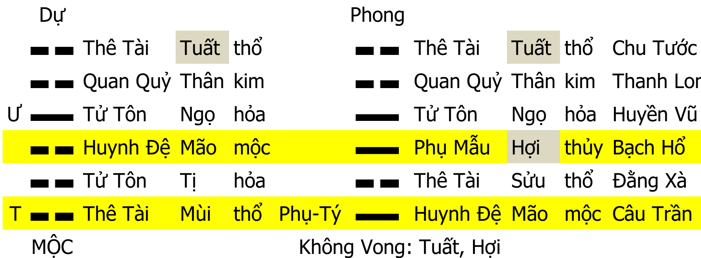
    - **Hình này chứng minh điều gì**
      - Chứng minh đối tượng không đến xem mặt do có kẻ thứ ba chen ngang giới thiệu mối khác tốt hơn.
    - **Từ đâu mà thấy được**
      - Dụng thần Thê Tài Mùi thổ động hóa Huynh Đệ Mão mộc hồi đầu khắc; gian hào 3 Huynh Đệ Mão mộc phát động khắc Tài.
  - **Phán đoán chi tiết:**
    - Căn cứ:
      - Xét vượng suy ban đầu: Dụng thần Thê Tài Mùi thổ được Nguyệt kiến Ngọ hỏa tương sinh tương hợp (Ngọ Mùi lục hợp), lại được Nhật kiến Thìn thổ tỉ phù nên khí thế rất vượng; thêm vào đó Dụng thần lại lâm ngay hào Thế, thoạt nhìn tưởng như chắc chắn cô gái sẽ đến gặp mặt.
      - Tuy nhiên xét kỹ hào biến và hào động: Dụng thần Thê Tài Mùi thổ phát động hóa ra Huynh Đệ Mão mộc, tạo thành thế cục "hồi đầu khắc" hung hiểm.
      - Gian hào Huynh Đệ Mão mộc tại hào 3 lại phát động khắc phạt hào Tài. Gian hào nằm giữa hào Thế và hào Ứng, tượng trưng cho người trung gian hoặc môi trường kết nối. Huynh Đệ là thần cướp đoạt, cản trở hôn nhân.
      - Sự xuất hiện đồng thời của gian hào Huynh Đệ phát động và hào biến hồi đầu khắc báo hiệu rõ ràng: ở giữa có người xen vào phá hoại, tác động làm phân tâm đối tượng được giới thiệu, vì vậy quyết đoán cô gái sẽ không đến xem mặt.
    - Nhìn vào:
      - Sự tương phản giữa Dụng thần vượng tướng trì Thế với hung họa bị gian hào và hào biến Huynh Đệ đồng thời khắc chế.
      - Gian hào Huynh Đệ Mão mộc phát động chính là kẻ mai mối thứ hai xuất hiện giữa đường cướp mất đối tượng.
  - **Ứng nghiệm thực tế:**
    - Kết quả xảy ra hoàn toàn bất ngờ ngoài dự kiến:
      - Đúng thời điểm đó, lại có một người khác giới thiệu cho cô gái này một người bạn trai mới.
      - Phía cô gái cảm thấy điều kiện kinh tế và gia cảnh của người mới kia tốt hơn nhiều nên đã nhận lời hẹn ước với anh ta, do đó đã hủy hẹn và không đến chỗ người nam này để xem mặt.

- **Ví dụ 2: Nữ đoán xem mặt đối tượng mới (Ngày Tân Mùi tháng Thân)**
  - **Bối cảnh & Chọn Dụng thần:**
    - Ngày Tân Mùi tháng Thân (Tuần không: Tuất, Hợi).
    - Người phụ nữ đến xin dự đoán xem việc đi xem mặt một người đàn ông sẽ ra sao.
    - Gieo được quẻ Thiên Trạch Lý biến Thiên Thủy Tụng.
    - Nữ đoán hôn nhân lấy Quan Quỷ làm Dụng thần. Quan Quỷ Mão mộc tại hào 2 (lâm Ứng).
  - **Hình 180.** Quẻ Thiên Trạch Lý biến Thiên Thủy Tụng
    - 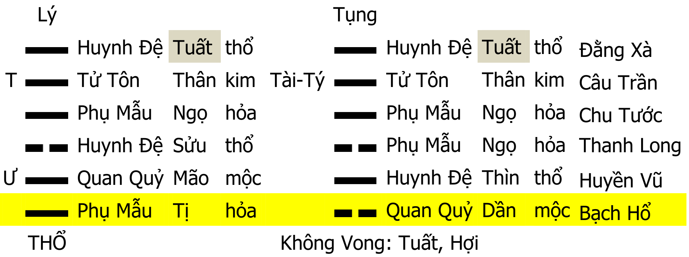
    - **Hình này chứng minh điều gì**
      - Chứng minh xem mặt không thành, đối phương ở xa; giải mã toàn bộ quá khứ: kết hôn 1996, ly hôn 1998, chồng cũ đã chết, hiện nuôi con.
    - **Từ đâu mà thấy được**
      - Quan Quỷ Mão mộc lâm Ứng bị Nguyệt khắc Nhật mộ; Phụ Mẫu Tị hỏa động hợp Thế hóa Quan Quỷ Dần mộc Phá Mộ lâm Bạch Hổ; Phụ Mẫu Ngọ hỏa hợp Nhật; Thế Tử Tôn Thân kim lâm Dưỡng.
  - **Phán đoán chi tiết:**
    - Căn cứ:
      - Kết quả cuộc xem mặt: Dụng thần Quan Quỷ Mão mộc bị Nguyệt kiến Thân kim khắc tuyệt, lại nhập Mộ tại Nhật kiến Mùi thổ, rơi vào cảnh hưu tù vô khí nghiêm trọng, vì vậy cuộc xem mặt này chắc chắn không thành.
      - Nguồn gốc đối phương: Dụng thần lâm hào Ứng; hào Ứng chủ về phương xa, tha hương, chỉ rõ đối tượng là người từ nơi khác đến (người ngoại tỉnh).
      - Người làm mối: Hào sơ Phụ Mẫu Tị hỏa phát động hóa Quan Quỷ Dần mộc. Phụ Mẫu là người làm mối, chủ hôn; Phụ Mẫu hóa Quan Quỷ làm thông tin mai mối càng thêm đậm nét. Hào sơ Phụ Mẫu Tị hỏa động hợp với hào Thế Tử Tôn Thân kim (Tị Thân lục hợp), chứng tỏ người mai mối có mối quan hệ thân thích họ hàng hoặc bạn bè thân cận với chính đương số.
      - Tiền sử hôn nhân của đương số: Phụ Mẫu đại diện cho giấy chứng nhận kết hôn. Phụ Mẫu Tị hỏa động hợp hào Thế biểu thị bản thân đương số đã từng có một đời chồng chính thức trong quá khứ.
      - Mốc thời gian kết hôn: Hào 4 Phụ Mẫu Ngọ hỏa hợp với Nhật kiến Mùi thổ (Ngọ Mùi hợp), quy luật hợp thì ứng xung khai. Đến năm Bính Tý (1996), chi Tý xung khai Phụ Mẫu Ngọ hỏa, định đoán đương số kết hôn vào năm 1996.
      - Mốc thời gian ly hôn: Hào sơ Phụ Mẫu Tị hỏa động hóa Quan Quỷ Dần mộc; Dần mộc bị Nguyệt kiến Thân kim xung thành Nguyệt phá (động hóa Phá chủ về rách nát, hủy bỏ hôn thư). Đến năm Mậu Dần (1998) là năm thực Phá, định đoán năm 1998 là năm cô hoàn tất thủ tục ly hôn.
      - Tình trạng người chồng cũ: Hào biến Quan Quỷ Dần mộc vừa bị Nguyệt phá, vừa nhập Mộ tại Nhật kiến Mùi thổ, lại lâm Bạch Hổ (Bạch Hổ chủ tang tóc, chết chóc), từ đó quyết đoán người chồng cũ sau khi ly hôn đã qua đời.
      - Con cái hiện tại: Hào Thế có Tử Tôn Thân kim trì Thế, gặp Nhật kiến Mùi thổ là cung Dưỡng địa (chủ về nuôi nấng, chăm sóc con nhỏ), biểu thị hiện tại cô đang có con và một mình nuôi con.
    - Nhìn vào:
      - Dụng thần hưu tù lâm Ứng nhập Mộ chỉ rõ buổi xem mặt thất bại với người phương xa.
      - Chuỗi suy luận tinh vi về Phụ Mẫu hợp Thế (từng kết hôn), Phụ Mẫu hợp Nhật xung khai tại năm Tý (kết hôn 1996), Phụ Mẫu hóa Phá tại năm Dần (ly hôn 1998), và Quan Quỷ Dần mộc lâm Bạch Hổ Phá Mộ (chồng cũ đã chết).
  - **Ứng nghiệm thực tế:**
    - Toàn bộ lời phán đoán ứng nghiệm chuẩn xác đến từng chi tiết:
      - Đối tượng xem mặt là người ngoại tỉnh, hai bên gặp gỡ nhưng không thành;
      - Người mai mối đúng là người thân họ hàng trong gia đình cô;
      - Cô kết hôn đúng năm 1996 (Bính Tý);
      - Vợ chồng ly hôn đúng năm 1998 (Mậu Dần);
      - Sau khi ly hôn một thời gian, người chồng cũ chẳng may qua đời vì bạo bệnh;
      - Hiện tại cô đang một mình nuôi nấng đứa con nhỏ đúng như tượng Tử Tôn trì Thế lâm Dưỡng địa.

- **Ví dụ 3: Nữ đoán đối tượng được mẹ nuôi giới thiệu (Ngày Quý Hợi tháng Dần)**
  - **Bối cảnh & Chọn Dụng thần:**
    - Ngày Quý Hợi tháng Dần (Tuần không: Tý, Sửu).
    - Người phụ nữ đến xin dự đoán xem đối tượng được mẹ nuôi mai mối cho mình là người như thế nào và hôn sự ra sao.
    - Gieo được quẻ Thủy Sơn Kiển biến Phong Thiên Tiểu Súc.
    - Nữ đoán hôn nhân lấy Quan Quỷ làm Dụng thần. Quan Quỷ Ngọ hỏa tại hào 2.
  - **Hình 181.** Quẻ Thủy Sơn Kiển biến Phong Thiên Tiểu Súc
    - 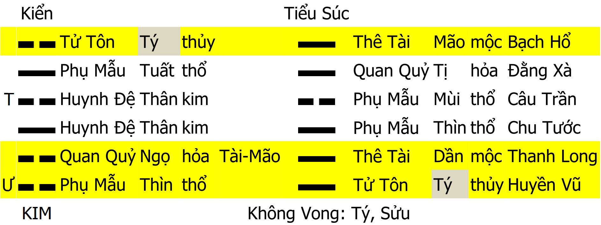
    - **Hình này chứng minh điều gì**
      - Vạch trần người đàn ông giàu có nhưng là nhân tình của mẹ nuôi; mẹ nuôi gán ghép để ràng buộc nhân tình; xem mặt không thành.
    - **Từ đâu mà thấy được**
      - Quan Quỷ Ngọ hỏa phục Tài hóa Tài, sinh Phụ Mẫu Thìn thổ lâm Huyền Vũ hóa Đào Hoa Tý thủy; Ứng sinh Thế; Thế Huynh Đệ Thân kim Nguyệt phá; Tử Tôn Tý thủy động.
  - **Phán đoán chi tiết:**
    - Căn cứ:
      - Đánh giá vượng suy của Dụng thần: Quan Quỷ Ngọ hỏa được Nguyệt kiến Dần mộc tương sinh nhưng lại bị Nhật kiến Hợi thủy tương khắc, vừa được sinh vừa bị khắc nên suy vượng giằng co khó phân định rõ ràng.
      - Sự giàu có của người nam: Dưới thân Quan Quỷ Ngọ hỏa có phục tàng Thê Tài Mão mộc, đồng thời hào 2 phát động lại biến ra Thê Tài Dần mộc. Thê Tài vừa phục dưới thân vừa biến xuất hiện ở các hào khác, biểu thị người đàn ông này tiền bạc rủng rỉnh khắp chốn, là thương gia vô cùng giàu có.
      - Thân phận và tính cách người mẹ nuôi: Hào sơ Phụ Mẫu Thìn thổ lâm hào Ứng đại diện cho mẹ nuôi (Phụ Mẫu là mẹ, Ứng là người ngoài/mẹ nuôi). Phụ Mẫu Thìn thổ lâm Huyền Vũ, phát động biến ra Tử Tôn Tý thủy (Tý thủy là sao Đào Hoa trong tam hợp Thân Tý Thìn). Hào Phụ Mẫu lâm Huyền Vũ lại hóa Đào Hoa chỉ rõ người mẹ nuôi này là người đàn bà phong lưu, phóng đãng, lẳng lơ ngoài xã hội.
      - Mối quan hệ mờ ám giữa mẹ nuôi và đối tượng: Quan Quỷ Ngọ hỏa phát động tương sinh với hào sơ Phụ Mẫu Thìn thổ (Hỏa sinh Thổ), người đàn ông sinh cho mẹ nuôi, chứng tỏ giữa hai người họ có mối quan hệ ám muội, trên thực tế chính là quan hệ người tình của nhau.
      - Động cơ mai mối của mẹ nuôi: Hào Ứng Phụ Mẫu Thìn thổ phát động tương sinh với hào Thế Huynh Đệ Thân kim (Thổ sinh Kim), chứng tỏ người mẹ nuôi này đang dốc toàn lực, nỗ lực hết mình vun vén và thúc ép mối duyên này.
      - Kết cục hôn sự: Hào Thế Huynh Đệ Thân kim bị Nguyệt kiến Dần mộc xung thành Nguyệt phá, lại thêm hào 6 Kỵ thần Tử Tôn Tý thủy phát động (Tử Tôn khắc Quan Quỷ), do đó cuộc hôn nhân này chắc chắn không thể thành tựu.
    - Nhìn vào:
      - Tượng Quan Quỷ phục Tài hóa Tài sinh cho Phụ Mẫu lâm Huyền Vũ hóa Đào Hoa: phơi bày trọn vẹn mối quan hệ nhân tình vụng trộm giữa đại gia và mẹ nuôi.
      - Tượng Ứng sinh Thế nhưng Thế bị Nguyệt phá và Tử Tôn Kỵ thần động khắc: đương số tỉnh ngộ và kiên quyết cự tuyệt cái bẫy hôn nhân.
  - **Ứng nghiệm thực tế:**
    - Kết quả thực tế hoàn toàn đúng như quẻ đã vạch trần:
      - Người mẹ nuôi làm kinh doanh buôn bán, tính nết phóng túng;
      - Người đàn ông được giới thiệu là một doanh nhân rất giàu có, và từ lâu đã có mối quan hệ lén lút vụng trộm với chính người mẹ nuôi;
      - Mẹ nuôi có ý đồ gả cô con gái nuôi cho người đàn ông này cốt để dùng cô làm sợi dây ràng buộc, giữ chân ông ta bên mình lâu dài;
      - Sau khi nắm rõ sự thật ô uế đó, cô gái đã lập tức hủy bỏ cuộc xem mặt và chấm dứt mọi ý định hôn sự.

- **Ví dụ 4: Nữ đoán đối tượng được giới thiệu cho em trai xem mặt (Ngày Ất Tị tháng Hợi)**
  - **Bối cảnh & Chọn Dụng thần:**
    - Ngày Ất Tị tháng Hợi (Tuần không: Dần, Mão).
    - Người phụ nữ đến xin dự đoán xem đối tượng được người khác giới thiệu cho em trai mình xem mặt có tốt không, hôn sự ra sao.
    - Gieo được quẻ Hỏa Sơn Lữ biến Lôi Thiên Đại Tráng.
    - Đoán việc hôn nhân cho em trai thì lấy Thê Tài làm Dụng thần. Trong quẻ Thê Tài lưỡng hiện: Thê Tài Dậu kim tại hào 4 (lâm Ứng, tĩnh) và Thê Tài Thân kim tại hào 3 (phát động). Chọn hào phát động Thê Tài Thân kim hợp với Nhật kiến Tị hỏa làm Dụng thần.
  - **Hình 182.** Quẻ Hỏa Sơn Lữ biến Lôi Thiên Đại Tráng
    - 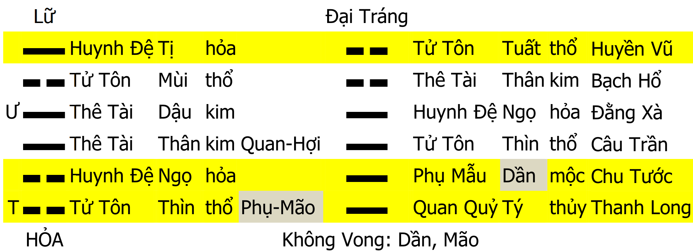
    - **Hình này chứng minh điều gì**
      - Chứng minh đối tượng không phù hợp, bị nhiều lực lượng cản trở và cuộc mai mối cho em trai thất bại hoàn toàn.
    - **Từ đâu mà thấy được**
      - Thê Tài Thân kim bị Nhật Tị hỏa khắc hợp, hưu tù vô khí; trong quẻ Huynh Đệ lưỡng hiện (Tị hỏa và Ngọ hỏa) cùng phát động khắc Tài dữ dội.
  - **Phán đoán chi tiết:**
    - Căn cứ:
      - Đánh giá trạng thái Dụng thần: Thê Tài Thân kim sinh vào tháng Hợi bị tiết khí, hoàn toàn không được Nguyệt kiến sinh phù; gặp Nhật kiến Tị hỏa thì bị Nhật thần Tị hỏa tương hợp nhưng bản chất là hỏa khắc kim (khắc hợp), khiến Dụng thần rơi vào cảnh suy kiệt, hưu tù vô khí và bị trói buộc.
      - Lực lượng cản trở trong quẻ: Trong quẻ có Huynh Đệ lưỡng hiện và đều phát động (hào 2 Huynh Đệ Ngọ hỏa động và hào 6 Huynh Đệ Tị hỏa động). Huynh Đệ là Kỵ thần chuyên khắc phạt Thê Tài.
      - Hai hào Huynh Đệ cùng bốc cháy phát động vây hãm khắc phạt Dụng thần suy nhược, biểu thị lực cản trở quá lớn, đối tượng này tuyệt đối không thể chọn lựa và cuộc mai mối nhất định đổ vỡ.
    - Nhìn vào:
      - Dụng thần Thê Tài Thân kim vừa hưu tù vừa bị Nhật thần khắc hợp trói chân.
      - Hai hào Kỵ thần Huynh Đệ cùng lúc bộc phát điên cuồng khắc Tài, báo hiệu sự cự tuyệt và chia rẽ không thể hàn gắn.
  - **Ứng nghiệm thực tế:**
    - Quả nhiên cuộc xem mặt của người em trai diễn ra không như ý, hai bên bất đồng quan điểm và hôn sự nhanh chóng tan rã, không thành.

- **Ví dụ 5: Nam đoán đích thân đi xem mặt kết quả ra sao (Ngày Quý Hợi tháng Ngọ)**
  - **Bối cảnh & Chọn Dụng thần:**
    - Ngày Quý Hợi tháng Ngọ (Tuần không: Tý, Sửu).
    - Một người nam đến xin dự đoán xem chuyến đích thân đi xem mặt bạn gái sắp tới kết quả sẽ ra sao.
    - Gieo được quẻ Lôi Địa Dự biến Địa Lôi Phục.
    - Nam đoán xem mặt lấy Thê Tài làm Dụng thần. Trong quẻ Thê Tài lưỡng hiện: Thê Tài Tuất thổ tại hào 6 (tĩnh) và Thê Tài Mùi thổ tại hào sơ (trì Thế, phát động). Chọn hào phát động Thê Tài Mùi thổ làm Dụng thần.
  - **Hình 183.** Sơ đồ quẻ Lôi Địa Dự biến Địa Lôi Phục
    - 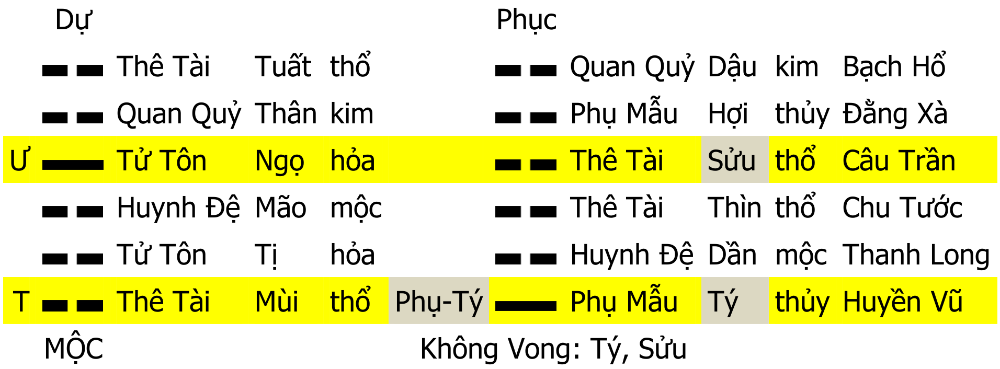
    - **Hình này chứng minh điều gì**
      - Chứng minh xem mặt bị gia đình giục giã nhưng thất bại do đôi bên thoái lui; mô tả chân thực tướng mạo đối phương (da đen, ngực to, răng nanh xấu).
    - **Từ đâu mà thấy được**
      - Tử Tôn Ứng sinh Dụng thần; Thế động hóa Phụ Mẫu Không Phá; hào 2 Tử Tôn ám động; Thê Tài lâm Huyền Vũ; hào 4 Câu Trần vượng; hào 5 Đằng Xà Quan Quỷ kim; Thế Ứng đều động hóa Không.
  - **Phán đoán chi tiết:**
    - Căn cứ:
      - Nguồn gốc việc xem mặt: Hào 4 Tử Tôn Ngọ hỏa lâm hào Ứng phát sinh tương sinh với Thê Tài Mùi thổ (Hỏa sinh Thổ, lại Ngọ Mùi hợp). Hào Ứng là người ngoài, người khác; Ứng sinh Dụng thần chính là hình ảnh người mai mối đứng ra giới thiệu bạn gái cho anh ta.
      - Tâm lý của bản thân người nam: Hào Thế Thê Tài Mùi thổ phát động hóa ra Phụ Mẫu Tý thủy. Hào biến Tý thủy vừa bị Nguyệt kiến Ngọ hỏa xung phá (Nguyệt phá), vừa lâm Tuần Không (tuần Giáp Dần Không tại Tý Sửu). Thế động hóa Không Phá biểu thị bản thân đương số thực lòng chán nản, không muốn đi xem mặt.
      - Áp lực từ phía gia đình: Hào 2 Tử Tôn Tị hỏa bị Nhật kiến Hợi thủy xung động thành ám động (Tị Hợi xung). Tị hỏa ám động lại sinh phù cho Dụng thần Thê Tài Mùi thổ. Hào 2 là hào Trạch (nhà cửa, gia đạo). Nhật thần Hợi thủy có cùng ngũ hành Thủy với hào Phụ Mẫu Tý thủy (Phụ Mẫu là cha mẹ). Điều này chứng minh chính cha mẹ và người trong nhà liên tục thúc ép anh ta phải đi gặp mặt.
      - Tướng mạo, hình thể của người nữ (lấy hào Thê Tài và các hào liên quan làm trung tâm):
        - Sắc da: Dụng thần Thê Tài Mùi thổ lâm Huyền Vũ (Huyền Vũ chủ màu tối, đen đúa), cho thấy da mặt cô gái ngăm đen, diện mạo tối tăm.
        - Vòng một (ngực): Hào 4 Tử Tôn Tị hỏa được Nguyệt kiến tỉ phù nên rất vượng tướng. Hào 4 trong cơ thể người là vị trí của bộ ngực; Tử Tôn trong lục thân mang nghĩa vú sữa, ngực nở. Lại lâm Câu Trần (Câu Trần chủ gồ ghề, phồng to, u nhô lên), kết luận vòng một của cô gái rất lớn đẫy đà.
        - Hàm răng và khuôn mặt: Hào 5 Quan Quỷ Thân kim. Hào 5 là hào vị của ngũ quan trên khuôn mặt; hành Kim tại hào 5 đại diện cho hàm răng, xương cốt. Quan Quỷ chủ bệnh tật, khuyết tật xấu xí; lại lâm Đằng Xà (Đằng Xà chủ quái dị, khó coi), kết luận hàm răng cô gái rất xấu, mọc lệch hoặc chìa ra trông giống như răng nanh.
        - Chiều cao thân hình: Dụng thần Thê Tài thuộc hành Thổ, được Nguyệt kiến sinh phù vượng tướng, ngũ hành Thổ chủ tầm thước, đôn hậu, cho thấy vóc dáng không cao không thấp, vừa tầm người.
      - Kết cục buổi gặp mặt: Cả Thế và Ứng đều phát động. Thế động hóa Không (hóa Tý thủy Không Phá), Ứng Ngọ hỏa động hóa Thê Tài Sửu thổ (Sửu thổ lâm Tuần Không). Thế Ứng đều lâm Không Vong thì cuối cùng đôi bên đều hối hận, nản lòng và tự rút lui. Cuộc xem mặt này hoàn toàn bất thành.
    - Nhìn vào:
      - Sự vận dụng tài tình giữa hào vị (hào 2 Trạch, hào 4 ngực, hào 5 ngũ quan/răng) và lục thú (Huyền Vũ, Câu Trần, Đằng Xà) để vẽ nên bức chân dung sống động của đối phương trước khi gặp mặt.
      - Tượng Thế Ứng cùng động hóa Không Phá xác quyết sự thoái lui từ cả hai phía.
  - **Ứng nghiệm thực tế:**
    - Toàn bộ sự việc diễn ra chuẩn xác đúng như từng chi tiết đã định đoán:
      - Đương số vốn không hề muốn đi xem mặt nhưng bị cha mẹ ở nhà thúc ép ráo riết nên đành phải đi;
      - Khi gặp mặt, người nữ quả nhiên có nước da ngăm đen, vòng một phát triển rất lớn đẫy đà, nhưng hàm răng lại mọc khấp khểnh chìa ra ngoài như răng nanh rất khó nhìn;
      - Sau buổi gặp, cả hai bên đều không có cảm tình với nhau, cùng lẳng lặng rút lui và không hề liên lạc lại.

- **Ví dụ 6: Nữ đoán đi xem mặt kết quả ra sao (Ngày Ất Dậu tháng Ngọ)**
  - **Bối cảnh & Chọn Dụng thần:**
    - Ngày Ất Dậu tháng Ngọ (Tuần không: Ngọ, Mùi).
    - Người phụ nữ đến xin dự đoán xem buổi đi xem mặt sắp tới sẽ diễn ra như thế nào.
    - Gieo được quẻ Thiên Thủy Tụng biến Phong Thủy Hoán.
    - Nữ đoán hôn nhân lấy Quan Quỷ làm Dụng thần. Trong quẻ Quan Quỷ Hợi thủy không xuất hiện, phục tàng dưới hào 3 Huynh Đệ Ngọ hỏa.
  - **Hình 184.** Sơ đồ quẻ Thiên Thủy Tụng biến Phong Thủy Hoán
    - 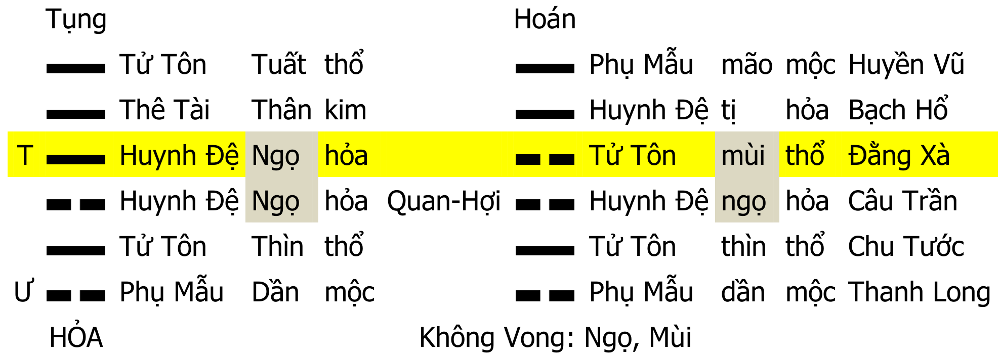
    - **Hình này chứng minh điều gì**
      - Chứng minh đối phương ăn mặc chải chuốt nhưng quá nhát gan không dám ngẩng đầu; cô gái chê bai từ chối, xem mặt thất bại.
    - **Từ đâu mà thấy được**
      - Quan Quỷ Hợi thủy phục dưới hào 3 lâm Câu Trần, gặp Nhật Dậu kim là Mộc Dục; quẻ Du Hồn; Thế Huynh Đệ Ngọ hỏa lâm Đằng Xà Không Vong động hóa Tử Tôn Mùi thổ.
  - **Phán đoán chi tiết:**
    - Căn cứ:
      - Trang phục diện mạo của người nam: Dụng thần Quan Quỷ Hợi thủy gặp Nhật kiến Dậu kim là đất Mộc Dục (Thân Tý Thìn mộc dục tại Dậu; Hợi thủy lấy Dậu làm đất tắm gội/mộc dục). Mộc Dục chủ về trang điểm, chải chuốt, ăn mặc bảnh bao diện mạo. Điều này cho thấy người nam rất coi trọng buổi xem mặt này, chuẩn bị quần áo trang phục vô cùng tươm tất, cầu kỳ.
      - Tính khí và biểu hiện của người nam: Phục thần Quan Quỷ Hợi thủy lâm Câu Trần (Câu Trần chủ đôn hậu, cục mịch, chất phác, nhút nhát). Hơn nữa Dụng thần lại phục tàng mà không hiện trên quẻ, quẻ chính Thiên Thủy Tụng lại là quẻ Du Hồn. Quẻ Du Hồn kết hợp Dụng thần phục tàng chỉ rõ đối phương tính tình cực kỳ nhát gan, e thẹn, vừa thấy phụ nữ đã run sợ hết hồn, không dám ngẩng mặt lên nhìn. Do đó định đoán trong suốt buổi xem mặt này, e rằng ngay cả khuôn mặt của đối phương cô cũng không thể nhìn rõ.
      - Tâm trạng của người nữ (đương số): Hào Thế Huynh Đệ Ngọ hỏa lâm Đằng Xà, lại lâm Tuần Không (tuần Giáp Ngọ Không tại Ngọ Mùi). Thế lâm Đằng Xà Không Vong biểu thị trong lòng cô gái đang vô cùng bồn chồn, hồi hộp, lo âu, tâm trạng rối bời. Hào Thế phát động hóa ra Tử Tôn Mùi thổ (Tử Tôn là Kỵ thần khắc Quan Quỷ), dự báo bản thân cô sau khi gặp sẽ không hài lòng, thất vọng và cự tuyệt đối phương.
    - Nhìn vào:
      - Tượng Dụng thần phục tàng lâm Câu Trần gặp Nhật Mộc Dục: ăn vận bảnh bao nhưng nhút nhát đến mức cúi gằm mặt suốt buổi.
      - Tượng Thế lâm Đằng Xà Không Vong động hóa Kỵ thần Tử Tôn: tâm lý dao động bất an chuyển thành quyết định từ chối thẳng thừng.
  - **Ứng nghiệm thực tế:**
    - Diễn biến thực tế của buổi xem mặt chuẩn xác đến kinh ngạc:
      - Người nam đến chỗ hẹn với bộ trang phục được chải chuốt vô cùng bảnh bao, tươm tất;
      - Tuy nhiên, anh ta nhút nhát đến mức run rẩy sợ hãi, suốt buổi gặp mặt chỉ cúi gằm đầu xuống đất không dám ngẩng lên nhìn cô gái lấy một lần;
      - Cho đến khi buổi xem mặt kết thúc ra về, cô gái vẫn không thể nào nhìn rõ được diện mạo khuôn mặt của anh ta;
      - Về sau cô gái cảm thấy anh chàng này quá hiền lành, nhu nhược và nhát gan nên đã dứt khoát không đồng ý tiếp tục qua lại.

- **Ví dụ 7: Nữ đoán xem mặt đối tượng mới (Ngày Ất Dậu tháng Sửu)**
  - **Bối cảnh & Chọn Dụng thần:**
    - Ngày Ất Dậu tháng Sửu (Tuần không: Ngọ, Mùi).
    - Người phụ nữ đến xin dự đoán xem việc đi xem mặt một người đàn ông mới sẽ ra sao.
    - Gieo được quẻ Thiên Phong Cấu biến Phong Thủy Hoán.
    - Nữ đoán hôn nhân lấy Quan Quỷ làm Dụng thần. Trong quẻ có Quan Quỷ Ngọ hỏa tại hào 4 (lâm Ứng, phát động).
  - **Hình 185.** Quẻ Thiên Phong Cấu biến Phong Thủy Hoán
    - 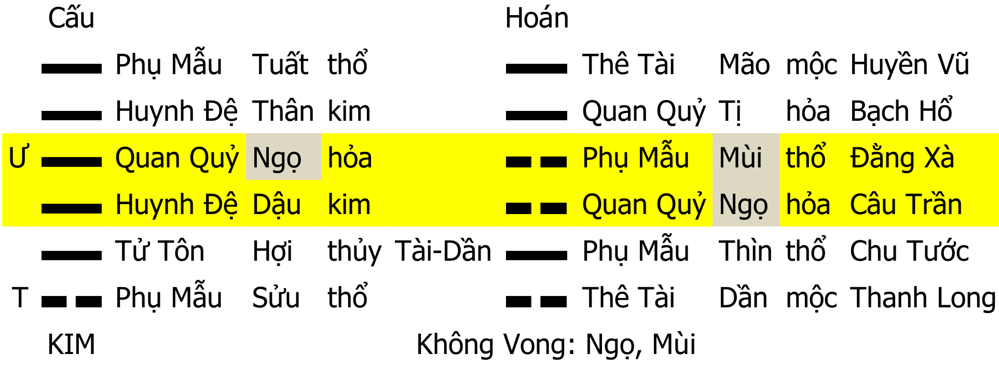
    - **Hình này chứng minh điều gì**
      - Vạch rõ đối phương là người đã ly hôn, keo kiệt bủn xỉn, không chủ động liên lạc và cuộc xem mặt nhanh chóng tan vỡ.
    - **Từ đâu mà thấy được**
      - Huynh Đệ Dậu kim động hóa Quan Quỷ; Ứng Quan Quỷ Ngọ hỏa động hóa Phụ Mẫu Mùi thổ Không Phá; Dụng thần lâm Đằng Xà Không hóa Không; Thê Tài phục tàng hưu tù.
  - **Phán đoán chi tiết:**
    - Căn cứ:
      - Nguồn gốc mai mối: Hào 3 Huynh Đệ Dậu kim phát động hóa Quan Quỷ Ngọ hỏa. Huynh Đệ đại diện cho bạn bè, người quen ngang hàng; Huynh Đệ hóa Quan Quỷ chỉ rõ cuộc gặp gỡ này do bạn bè đứng ra mai mối, giới thiệu.
      - Tiền sử hôn nhân của người nam: Hào Ứng Quan Quỷ Ngọ hỏa phát động biến Phụ Mẫu Mùi thổ. Phụ Mẫu là giấy chứng nhận kết hôn, pháp lý hôn nhân; Ngọ Mùi tương hợp biểu thị từng có giấy đăng ký kết hôn chính thức. Tuy nhiên Ngọ hỏa và Mùi thổ đều lâm Tuần Không (tuần Giáp Ngọ Không tại Ngọ Mùi), lại bị Nguyệt kiến Sửu thổ xung phá (Sửu Mùi tương xung thành Nguyệt phá). Giấy chứng nhận kết hôn lâm Không Phá biểu thị hôn thư đã bị hủy bỏ, rách nát, khẳng định chắc chắn đối phương là người đàn ông đã từng ly hôn một đời vợ.
      - Thái độ và tâm địa của đối phương: Hào Ứng Quan Quỷ Ngọ hỏa sinh cho hào Thế Phụ Mẫu Sửu thổ (Hỏa sinh Thổ), thoạt nhìn ngỡ như đối phương bằng lòng qua lại. Nhưng vì Dụng thần bản thân lâm Tuần Không, lại động hóa Phụ Mẫu Mùi thổ Không Phá, tạo thành cách cục "Không hóa Không Phá", biểu thị lòng dạ không chân thật, chỉ là xã giao hời hợt, không hề có tâm ý kết duyên nghiêm túc.
      - Ứng xử sau buổi gặp: Hào Ứng lâm Không Vong thì lực sinh bị triệt tiêu, không thực sự sinh cho Phụ Mẫu Sửu thổ ở Thế. Phụ Mẫu đại diện cho tin tức, thư từ, điện thoại liên lạc; do đó đoán đối phương sau buổi xem mặt sẽ không bao giờ chủ động gọi điện thoại hay nhắn tin cho cô.
      - Bản tính keo kiệt: Trong quẻ Thê Tài Dần mộc phục tàng dưới hào 2, không hiện trên quẻ lại hưu tù vô khí (không có tiền bạc chu cấp cho người nữ); hào Ứng Quan Quỷ lại lâm Đằng Xà (Đằng Xà chủ toan tính, bủn xỉn, keo kiệt, hẹp hòi). Từ đó đoán đối phương tính tình vô cùng keo kiệt, cùng nhau đi chơi ngay cả một món quà nhỏ hay cốc nước cũng không nỡ bỏ tiền mua cho cô.
      - Kết cục hôn sự: Dụng thần hưu tù, lâm Không Vong lại động hóa Không Vong, cuộc xem mặt hoàn toàn thất bại và không đi tới đâu.
    - Nhìn vào:
      - Tượng Ứng Quan Quỷ động hóa Phụ Mẫu Không Phá vạch trần tiền sử ly hôn của đối phương.
      - Dụng thần Đằng Xà Không hóa Không kết hợp Thê Tài phục tàng hưu tù lột tả trọn vẹn bản chất keo kiệt bủn xỉn và thái độ lạnh nhạt, không chủ động của người nam.
  - **Ứng nghiệm thực tế:**
    - Sự việc trên thực tế hoàn toàn đúng như quẻ đã định đoán:
      - Người đàn ông này quả thực là người đã ly hôn một đời vợ;
      - Sau buổi gặp mặt đầu tiên, anh ta tuyệt nhiên không bao giờ chủ động gọi điện thoại hay liên lạc hỏi thăm cô gái;
      - Những lần cùng ra phố đi dạo, anh ta tỏ ra vô cùng bủn xỉn và keo kiệt, không mua bất kỳ món quà hay đồ ăn thức uống nào cho cô;
      - Nhận thấy đối phương không có thành ý lại quá mức bủn xỉn, cô gái đã nhanh chóng chủ động chấm dứt mối quan hệ.

### CHƯƠNG 3: VỊ HÔN ĐỒNG CƯ

#### Bản chất và cơ sở lý luận về vị hôn đồng cư (chung sống phi hôn nhân)

- **Khái niệm và thực tiễn xã hội:**
  - Vị hôn đồng cư (未婚同居) là hiện tượng nam nữ chung sống như vợ chồng trước khi hoàn tất thủ tục đăng ký kết hôn theo pháp luật hoặc chưa tổ chức hôn lễ truyền thống.
  - Trong dự đoán Lục Hào cổ điển cũng như hiện đại, việc bóc tách chuẩn xác hiện tượng này đòi hỏi người dự trắc phải thấu triệt ý nghĩa tượng trưng của lục thân và thần sát, đặc biệt là hào Phụ Mẫu và sao Huyền Vũ.

- **Ý nghĩa tượng trưng của hào Phụ Mẫu:**
  - Hào Phụ Mẫu là đại diện cho giấy chứng nhận kết hôn, hôn ước, gia đình, giấy tờ pháp lý và sự công nhận chính thức của xã hội đối với mối quan hệ vợ chồng.
  - Khi hào Phụ Mẫu vượng tướng, hữu khí, không bị hình xung khắc hại và hiện rõ trên quẻ, đó là dấu hiệu hôn nhân quang minh chính đại, có đăng ký kết hôn hợp pháp.
  - Ngược lại, khi Phụ Mẫu suy bại, tàng phục, Không Vong, nhập Mộ hoặc bị thần sát mờ ám tác động, đó là tín hiệu cho thấy hôn nhân thiếu tính pháp lý, hai bên về chung sống bí mật hoặc chưa có giấy tờ giá thú.

- **Ý nghĩa tượng trưng của thần sát Huyền Vũ:**
  - Huyền Vũ chủ về sự mờ ám, bí mật, riêng tư, lén lút, không công khai và cũng chủ về quan hệ tình dục, dục vọng nam nữ.
  - Sự kết hợp giữa hào Phụ Mẫu và Huyền Vũ phản ánh mối quan hệ hôn nhân diễn ra trong bí mật, không có sự chứng nhận công khai của pháp luật và dòng họ.

- **Ý nghĩa của Mộ khố và Không Vong:**
  - Mộ khố chủ về cất giấu, che đậy, chìm đắm, giam hãm hoặc việc bước vào phòng the, chung sống trong một không gian kín.
  - Không Vong chủ về danh nghĩa hư ảo, không có thực tế pháp lý, hữu danh vô thực hoặc chưa đến thời điểm công nhận.

#### Hệ thống 16 quy luật cốt lõi nhận biết vị hôn đồng cư

- **Quy luật 1: Phụ Mẫu tàng phục lâm Huyền Vũ:**
  - Hôn ước, giấy chứng nhận kết hôn ẩn giấu dưới hào khác lại mang tính chất mờ ám của Huyền Vũ, biểu thị đôi bên đã phát sinh quan hệ và chung sống bí mật mà chưa đăng ký kết hôn.
- **Quy luật 2: Phụ Mẫu tàng phục Không Vong nhập Mộ:**
  - Giấy kết hôn vừa không xuất hiện, vừa rơi vào trạng thái hư không (Không Vong), lại bị chôn vùi trong Mộ khố, cho thấy sự gắn kết thực tế diễn ra trong buồng the nhưng hoàn toàn thiếu vắng tính pháp lý.
- **Quy luật 3: Phụ Mẫu xuất hiện, lâm Huyền Vũ nhập Mộ:**
  - Dù hào Phụ Mẫu có hiện trên quẻ nhưng bị Huyền Vũ bao phủ và thu vào Mộ khố, chứng minh hôn ước bị che khuất, hai người đã về ở chung một nhà trước khi cưới.
- **Quy luật 4: Phụ Mẫu Không Vong lâm Huyền Vũ, cùng hào Thế tương hợp:**
  - Hào Thế (bản thân người xem) tương hợp với Phụ Mẫu mờ ám, hư ảo; biểu thị bản thân đang tiếp nhận và duy trì trạng thái chung sống phi hôn nhân.
- **Quy luật 5: Phụ Mẫu phát động hóa Không Vong, đồng thời nhập Mộ:**
  - Ý định tiến tới hôn thú bị hóa Không và rơi vào Mộ khố, chuyển hóa thực tế thành việc dọn về sống chung trước, giấy tờ đình trệ.
- **Quy luật 6: Phụ Mẫu lâm Huyền Vũ độc phát:**
  - Trong toàn quẻ chỉ duy nhất một hào Phụ Mẫu lâm Huyền Vũ phát động; độc phát là chủ thể chi phối nguyên nhân và tính chất sự việc, khẳng định chắc chắn tình trạng sống chung lén lút.
- **Quy luật 7: Phụ Mẫu phục tàng nhập Mộ:**
  - Hôn thư bị giấu kín trong Mộ khố của hào phục, phản ánh đời sống vợ chồng thực tế đã hình thành trong bóng tối.
- **Quy luật 8: Phụ Mẫu nhập Mộ, Mộ khố lâm Huyền Vũ:**
  - Căn nhà, phòng the chứa đựng quan hệ vợ chồng (Mộ khố) bị Huyền Vũ ám chiếu, biểu thị nơi chốn hai người sống chung chưa được công khai danh chính ngôn thuận.
- **Quy luật 9: Phụ Mẫu lâm Huyền Vũ phát động cùng hào Không Vong tương hợp:**
  - Động hào Phụ Mẫu mờ ám hợp với hào Không Vong, biểu thị hành vi kết hợp thực tế nhưng danh phận trống rỗng.
- **Quy luật 10: Phụ Mẫu bị hào lâm Huyền Vũ phát động đến hợp, lại thêm Không Vong:**
  - Giấy chứng nhận kết hôn Không Vong bị một hào mang thần sát Huyền Vũ lôi kéo, phản ánh việc bị cuốn vào mối quan hệ sống chung không giá thú.
- **Quy luật 11: Hào Thế nhập Mộ tại hào 3, hào 3 phát động, hào Thế hoặc Mộ khố lâm Huyền Vũ:**
  - Hào 3 là hào vị phòng the, cửa ngõ nội gia; hào Thế nhập Mộ tại hào 3 phát động lại lâm Huyền Vũ, cho thấy đương số đã bước vào chăn gối, chung sống kín đáo với đối phương.
- **Quy luật 12: Phụ Mẫu phát động, tương hợp với địa chi Không mà phục tàng:**
  - Hôn ước động hợp với đối tượng phục tàng Không Vong, biểu thị mối quan hệ sống chung không có sự chứng thực chính thức.
- **Quy luật 13: Hào Thế lâm Huyền Vũ phát động, nam cùng Thê Tài hợp, nữ cùng Quan Quỷ hợp:**
  - Bản thân đương số mang tâm lý mờ ám, chủ động phát động để tương hợp với Dụng thần người yêu, chủ động dọn về sống chung trước hôn nhân.
- **Quy luật 14: Nam đoán Thê Tài phục tàng lâm Huyền Vũ; Nữ đoán Quan Quỷ phục tàng lâm Huyền Vũ, hào Thế Không Vong:**
  - Người bạn đời ẩn giấu mang tính chất mờ ám, bản thân đương số rơi vào Không Vong (thiếu vị trí, danh phận chính thức trong gia đình), chỉ tình trạng sống chung bí mật.
- **Quy luật 15: Hào Thế lâm Huyền Vũ động hóa Phụ Mẫu, Phụ Mẫu Không Vong:**
  - Bản thân muốn có hôn nhân nhưng hào biến Phụ Mẫu rơi vào Không Vong, kết hợp Huyền Vũ ám chiếu, chứng minh việc sống chung đã diễn ra còn hôn thư vẫn là hư ảnh.
- **Quy luật 16: Dụng thần lâm Huyền Vũ phát động hóa Phụ Mẫu đến hợp hào Thế:**
  - Nam đoán có Thê Tài lâm Huyền Vũ hóa Phụ Mẫu hợp Thế; Nữ đoán có Quan Quỷ phát động lâm Huyền Vũ hóa Phụ Mẫu hợp Thế; đối phương chủ động mang chuyện phòng the, dọn đồ đến ở chung cùng đương số khi chưa đăng ký kết hôn.

#### Phân tích chuyên sâu 11 quái lệ thực nghiệm điển hình

- **Ví dụ 1:** Ngày Đinh Sửu tháng Ngọ, nữ đoán quan hệ với bạn trai hiện tại phát triển ra sao? Được quẻ Địa Phong Thăng biến Thủy Phong Tỉnh.
  - **Hình 186.** Quẻ Địa Phong Thăng biến Thủy Phong Tỉnh
    - 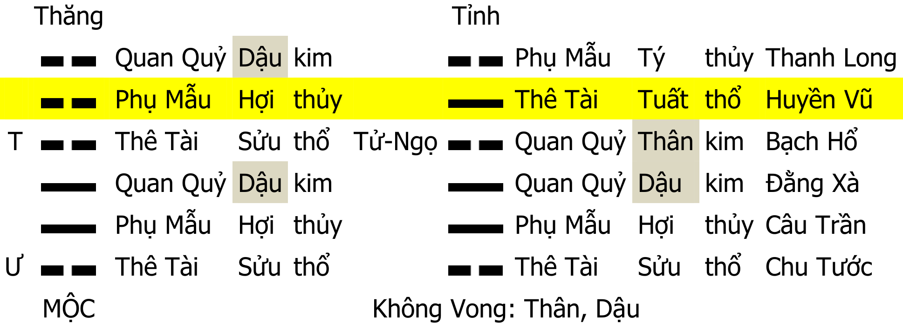
    - **Hình này chứng minh điều gì**
      - Tượng sống chung không giá thú và bạn trai lăng nhăng có người khác dẫn đến chia tay.
    - **Từ đâu mà thấy được**
      - Hào độc phát Phụ Mẫu Hợi thủy lâm Huyền Vũ và Dụng thần Quan Quỷ Dậu kim lâm Mộc Dục, nhập Mộ tại Nhật.
  - **Bối cảnh & Dụng thần:**
    - Ngày Đinh Sửu tháng Ngọ (Mộc Không Vong: Thân, Dậu).
    - Nữ đoán tình duyên lấy Quan Quỷ làm Dụng thần. Trong quẻ Quan Quỷ lưỡng hiện (hào 3 Quan Quỷ Dậu kim và hào 6 Quan Quỷ Dậu kim), quy tắc dự đoán ưu tiên lấy hào gần hào Thế (hào 3 Quan Quỷ Dậu kim kề cận hào 4 Thế Thê Tài Sửu thổ) làm Dụng thần đại diện cho người bạn trai hiện tại.
  - **Phán đoán chi tiết:**
    - Căn cứ:
      - Dụng thần Quan Quỷ Dậu kim bị Nguyệt lệnh Ngọ hỏa khắc thương, lại nhập Mộ tại Nhật thần Sửu thổ (Sửu là kim khố), đồng thời lâm Không Vong (tuần không Thân Dậu), đây là điềm hung không cát lợi.
      - Dậu kim gặp Nguyệt lệnh Ngọ hỏa là đất Mộc Dục, Mộc Dục chủ háo sắc, phong lưu, phóng túng. Hào 5 Phụ Mẫu Hợi thủy là hào độc phát lâm Huyền Vũ (chủ dâm loạn, ám muội); độc phát biểu thị tính chất và căn nguyên sự việc, chứng minh người bạn trai có bản tính lăng nhăng, phong lưu lén lút.
      - Dụng thần nhập Mộ tại Nhật thần Sửu thổ, Nhật thần mang lục thân Thê Tài (đại diện cho phụ nữ), Mộ chủ say đắm, mê muội; thuyết minh anh ta đang đắm say một người phụ nữ khác bên ngoài.
      - Hào độc phát là Phụ Mẫu Hợi thủy lâm Huyền Vũ: Phụ Mẫu chủ giấy đăng ký kết hôn, hôn ước; Huyền Vũ chủ bí mật, giấu giếm, không minh bạch. Tổ hợp này là thông tin điển hình chỉ ra hai người đang sống chung mà chưa kết hôn (vị hôn đồng cư).
      - Hào 6 Quan Quỷ Dậu kim ngự ở hào vị thoái hưu, đào thải, lại Không Vong bị khắc nhập Mộ (Mộ khố chủ kết thúc, đình chỉ); kết hợp với tượng Phụ Mẫu lưỡng hiện, cho thấy bản thân người nữ trước đây đã từng có một cuộc hôn nhân đổ vỡ và đã ly hôn.
    - Nhìn vào:
      - Hào độc phát Phụ Mẫu Hợi thủy lâm Huyền Vũ để kết luận hai người đang sống chung phi hôn nhân.
      - Dụng thần hào 3 lâm Mộc Dục nhập Mộ tại Thê Tài để vạch trần bạn trai ngoại tình với người phụ nữ khác.
      - Hào 6 Quan Quỷ hưu thoái nhập Mộ để chỉ ra bản thân người nữ đã từng qua một lần đò.
  - **Ứng nghiệm thực tế:**
    - Người nữ xác nhận bản thân đúng là đã từng ly hôn một lần và hiện đang sống chung với bạn trai chưa cưới.
    - Đến tháng Thìn, cô phát hiện anh ta lén lút qua lại với người phụ nữ khác đúng như phán đoán. Hai người sau đó đã chính thức chia tay.

- **Ví dụ 2:** Ngày Ất Mùi tháng Mùi, nam đoán mối quan hệ với bạn gái, được quẻ Hỏa Trạch Khuê biến Lôi Thiên Đại Tráng.
  - **Hình 187.** Quẻ Hỏa Trạch Khuê biến Lôi Thiên Đại Tráng
    - 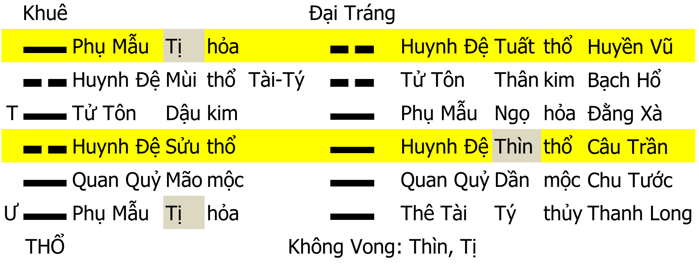
    - **Hình này chứng minh điều gì**
      - Tượng hai người đã sống chung trước hôn nhân và sau đó tiến tới kết hôn viên mãn.
    - **Từ đâu mà thấy được**
      - Hào 6 Phụ Mẫu Tị hỏa lâm Huyền Vũ Không Vong nhập Mộ, và tượng Huynh Đệ quá vượng phản cực không khắc Tài.
  - **Bối cảnh & Dụng thần:**
    - Ngày Ất Mùi tháng Mùi (Thổ Không Vong: Thìn, Tị).
    - Nam đoán hôn nhân lấy Thê Tài làm Dụng thần. Thê Tài Tý thủy không hiện trên quẻ, phục tàng dưới hào 5 Huynh Đệ Mùi thổ.
  - **Phán đoán chi tiết:**
    - Căn cứ:
      - Thê Tài Tý thủy phục dưới hào 5 Phi thần Huynh Đệ Mùi thổ (Phi khắc Phục), lại bị Nhật Nguyệt tháng Mùi ngày Mùi đồng loạt khắc phạt. Hào 3 Huynh Đệ Sửu thổ phát động hóa Tiến thần Thìn thổ đến khắc, hào 6 Phụ Mẫu Tị hỏa động hóa Huynh Đệ Tuất thổ.
      - Tổng cộng trong quẻ, hào biến và Nhật Nguyệt có tới 6 tầng Huynh Đệ thổ (hào 3 Sửu, hào biến Thìn, hào 5 Mùi, hào biến Tuất, nguyệt Mùi, nhật Mùi). Đây là tượng Huynh Đệ cực vượng. Theo quy luật "vật cực tất phản" trong dịch học, Huynh Đệ thái quá trái lại không khắc được Tài, do đó hôn nhân cuối cùng vẫn có thể kết thành.
      - Hào 6 Phụ Mẫu Tị hỏa lâm Huyền Vũ, rơi vào tuần Không Vong (Thìn Tị tuần không) lại nhập Mộ tại Nhật Nguyệt Mùi thổ (hoặc hóa Mộ Tuất thổ). Phụ Mẫu chủ hôn thú, Phụ Mẫu Không Vong lâm Huyền Vũ nhập Mộ biểu thị đôi bên đã bí mật sống chung với nhau mà chưa đăng ký kết hôn.
    - Nhìn vào:
      - Hào 6 Phụ Mẫu Tị hỏa lâm Huyền Vũ Không Vong nhập Mộ để đoán hai người đã vị hôn đồng cư.
      - Quy luật biến dịch ngũ hành Huynh Đệ 6 tầng quá vượng phản cực không khắc Tài để đoán hai người cuối cùng vẫn lấy được nhau.
  - **Ứng nghiệm thực tế:**
    - Đương số xác nhận quả thực hai người đã dọn về sống chung với nhau từ trước đó.
    - Về sau hai người chính thức kết hôn đúng như dự đoán.

- **Ví dụ 3:** Ngày Bính Tuất tháng Thân, nữ và chồng chưa cưới cùng mua nhà ra sao? Được quẻ Lôi Thiên Đại Tráng biến Chấn Vi Lôi.
  - **Hình 188.** Quẻ Lôi Thiên Đại Tráng biến Chấn Vi Lôi
    - 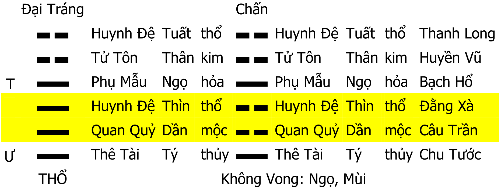
    - **Hình này chứng minh điều gì**
      - Tượng sống chung trước hôn nhân, việc mua nhà bất thành và bản thân từng trải qua một lần ly hôn.
    - **Từ đâu mà thấy được**
      - Phụ Mẫu Ngọ hỏa trì Thế Không Vong nhập Mộ ở Nhật, nội quái phục ngâm, hào 2 Quan Quỷ phục ngâm Nguyệt phá.
  - **Bối cảnh & Dụng thần:**
    - Ngày Bính Tuất tháng Thân (Thổ Không Vong: Ngọ, Mùi).
    - Hỏi về mua nhà đất lấy Phụ Mẫu làm Dụng thần. Phụ Mẫu Ngọ hỏa tuy trì Thế nhưng hưu tù, không được Nhật Nguyệt sinh trợ.
  - **Phán đoán chi tiết:**
    - Căn cứ:
      - Dụng thần Phụ Mẫu Ngọ hỏa trì Thế lâm tuần Không Vong (Ngọ Mùi không) và nhập Mộ tại Nhật thần Tuất thổ (Tuất là hỏa khố). Nội quái Càn biến nội quái Chấn là phục ngâm, chủ trắc trở, đau buồn, bất cát. Căn nhà cuối cùng sẽ không thuộc về bản thân người nữ.
      - Dù đây là quẻ hỏi mua nhà nhưng thông tin hôn nhân hiện rõ: Phụ Mẫu là giấy chứng nhận kết hôn, lâm Không Vong nhập Mộ tại Nhật biểu thị hai người tuy mang danh nghĩa vợ chồng sắp cưới nhưng thực tế đã dọn về ở chung trước khi đăng ký kết hôn.
      - Hào 2 Quan Quỷ Dần mộc phục ngâm hóa Quan Quỷ Dần mộc, lại bị Nguyệt kiến Thân kim tương xung thành Nguyệt phá. Quan Quỷ phục ngâm hóa Quan Quỷ chủ hai cuộc hôn nhân, cho thấy người nữ trước đó đã từng ly hôn một lần.
    - Nhìn vào:
      - Hào Thế Phụ Mẫu Ngọ hỏa Không Vong nhập Mộ và nội quái phục ngâm để phán đoán việc mua nhà không thành và hai người đang vị hôn đồng cư.
      - Hào 2 Quan Quỷ bị Nguyệt phá phục ngâm để khẳng định người nữ đã qua một đời chồng.
  - **Ứng nghiệm thực tế:**
    - Người nữ xác nhận đúng là hai người đang sống chung phi hôn nhân (vị hôn đồng cư) và bản thân cô từng ly hôn một lần, đây là cuộc hôn nhân thứ hai.

- **Ví dụ 4:** Ngày Canh Thìn tháng Tuất, nữ đoán quan hệ với bạn trai phát triển như thế nào? Được quẻ Địa Trạch Lâm.
  - **Hình 189.** Quẻ Địa Trạch Lâm
    - 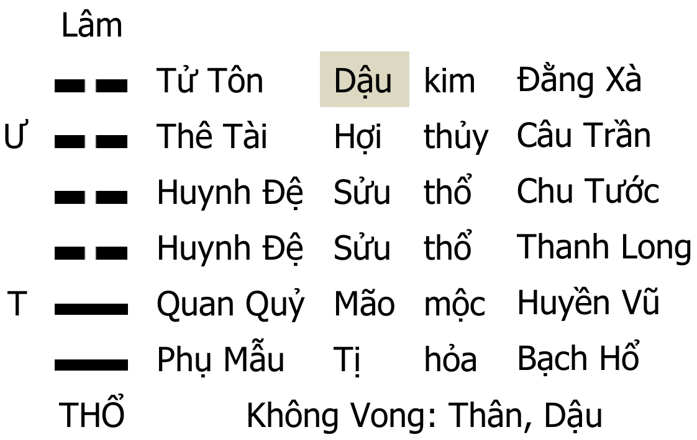
    - **Hình này chứng minh điều gì**
      - Tượng sống chung không giá thú và bạn trai ra ngoài lăng nhăng mua dâm từ tháng trước.
    - **Từ đâu mà thấy được**
      - Hào sơ Phụ Mẫu Tị hỏa nhập Mộ tại Nguyệt, Dụng thần Quan Quỷ Mão mộc lâm Huyền Vũ tại hào 2 và hợp Nguyệt kiến Huynh Đệ Tuất thổ.
  - **Bối cảnh & Dụng thần:**
    - Ngày Canh Thìn tháng Tuất (Thổ Không Vong: Thân, Dậu). Quẻ tĩnh Địa Trạch Lâm.
    - Nữ đoán tình cảm bạn trai lấy Quan Quỷ làm Dụng thần. Quan Quỷ Mão mộc trì Thế tại hào 2.
  - **Phán đoán chi tiết:**
    - Căn cứ:
      - Quan Quỷ Mão mộc hưu tù, không được Nhật Nguyệt Thìn Tuất trợ giúp. Nguyên thần Thê Tài Hợi thủy tại hào 5 bị Nhật Nguyệt đồng thời khắc phạt, cội nguồn suy kiệt, báo hiệu tình cảm không có nền tảng vững chắc, không thể thắm thiết lâu dài.
      - Hào sơ Phụ Mẫu Tị hỏa không được sinh trợ, nhập Mộ tại Nguyệt kiến Tuất thổ. Phụ Mẫu là giấy hôn thú, hưu tù nhập Mộ là tượng sống chung không đăng ký kết hôn (vị hôn đồng cư).
      - Dụng thần Quan Quỷ Mão mộc ngự tại hào 2 (trạch vị, hào vị nhà ở) lại lâm Huyền Vũ (chủ ám muội, mờ ám), xác nhận thông tin hai người đang ở chung một nhà nhưng không quang minh chính đại.
      - Dụng thần Mão mộc tương hợp với Nguyệt kiến Huynh Đệ Tuất thổ (Mão Tuất hợp). Nguyệt kiến Huynh Đệ chủ đối thủ cạnh tranh, người phụ nữ khác ngoài xã hội, cho thấy bạn trai có thói lăng nhăng. Quẻ tĩnh lấy xung làm ứng kỳ, việc này đã phát sinh vào tháng trước (tháng Dậu, Dậu xung Mão).
    - Nhìn vào:
      - Phụ Mẫu Tị hỏa nhập Mộ tại Nguyệt kết hợp hào 2 trạch vị lâm Huyền Vũ để kết luận hai người đang ở chung.
      - Dụng thần hợp Huynh Đệ Nguyệt kiến và ứng kỳ tháng Dậu để chỉ ra việc bạn trai đã lén lút quan hệ với gái mại dâm vào tháng trước.
  - **Ứng nghiệm thực tế:**
    - Người nữ xác nhận hai người đúng là đã dọn về ở chung một nhà.
    - Đúng vào tháng Dậu trước đó, cô phát hiện bạn trai đã ra ngoài quan hệ với gái bán dâm, khiến cô vô cùng hoang mang, lo lắng cho tương lai mối quan hệ.

- **Ví dụ 5:** Ngày Canh Thìn tháng Tuất năm Giáp Thân, nữ đoán hôn nhân, được quẻ Lôi Thủy Giải biến Lôi Trạch Quy Muội.
  - **Hình 190.** Sơ đồ quẻ Lôi Thủy Giải biến Lôi Trạch Quy Muội
    - 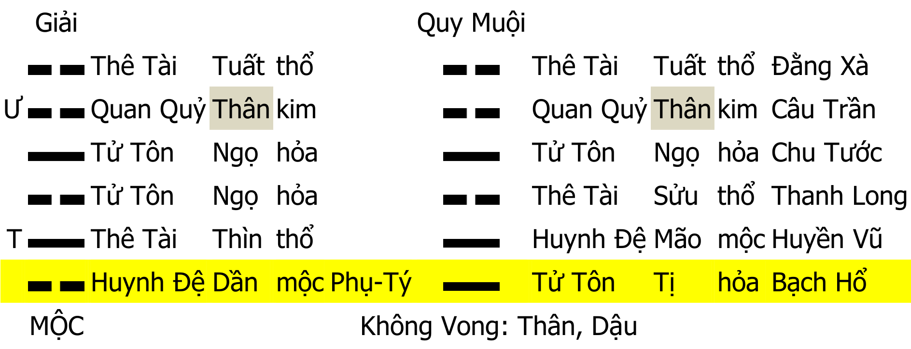
    - **Hình này chứng minh điều gì**
      - Tượng ly hôn do người nữ ngoại tình, sống chung lang chạ với nhiều người đàn ông.
    - **Từ đâu mà thấy được**
      - Quan Quỷ Thân kim Không Vong gặp độc phát là Tử địa, Phụ Mẫu Tý thủy nhập Mộ ở Nhật, hào Thế lâm Huyền Vũ và Mộ khố lưỡng hiện.
  - **Bối cảnh & Dụng thần:**
    - Ngày Canh Thìn tháng Tuất năm Giáp Thân (Mộc Không Vong: Thân, Dậu).
    - Nữ đoán hôn nhân lấy Quan Quỷ làm Dụng thần. Quan Quỷ Thân kim ngự tại hào Ứng (phu vị), được Nhật Nguyệt sinh phù là vượng tướng.
  - **Phán đoán chi tiết:**
    - Căn cứ:
      - Quan Quỷ Thân kim tuy ngự phu vị nhưng rơi vào Không Vong (tuần Thân Dậu không). Hào 3 Tử Tôn Ngọ hỏa độc phát biến Thê Tài Sửu thổ; Ngọ hỏa là đất Tử của Dụng thần Thân kim, báo hiệu người nữ hiện tại đã không còn chồng.
      - Không Vong ứng vào thời điểm xuất Không. Thân kim lại chính là Thái Tuế năm Giáp Thân, nên phán đoán việc ly hôn đã xảy ra vào tháng Thân năm đó.
      - Phụ Mẫu Tý thủy bị Nhật Nguyệt khắc thương, hưu tù phục tàng dưới hào sơ Huynh Đệ Dần mộc, lại nhập Mộ tại Nhật thần Thìn thổ. Đây là dấu hiệu của vị hôn đồng cư hoặc người đã có gia đình thì có hành vi ngoại tình lén lút.
      - Hào 2 Thê Tài Thìn thổ nhập quẻ trì Thế, lâm Huyền Vũ (chủ dâm loạn, phong tình). Mộ khố Thìn và Tuất lưỡng hiện trong quẻ, chỉ ra người phụ nữ này đã chung sống lang chạ với nhiều người đàn ông khác nhau.
    - Nhìn vào:
      - Hào Ứng Quan Quỷ lâm Không gặp độc phát Tử địa để định ngày ly hôn ở tháng Thân.
      - Phụ Mẫu nhập Mộ tại Nhật kết hợp hào Thế lâm Huyền Vũ có Mộ khố lưỡng hiện để vạch trần việc ăn nằm với nhiều người đàn ông.
  - **Ứng nghiệm thực tế:**
    - Quả nhiên người phụ nữ này trước sau đã lén lút ăn nằm với 5 người đàn ông khác nhau.
    - Người chồng phát hiện sự việc vô cùng tức giận và hai người đã chính thức ly hôn vào đúng tháng Thân năm Giáp Thân.

- **Ví dụ 6:** Ngày Nhâm Dần tháng Sửu năm Quý Mùi, nữ đoán hôn nhân gia đình, được quẻ Hỏa Thủy Vị Tế biến Thiên Phong Cấu.
  - **Hình 191.** Sơ đồ quẻ Hỏa Thủy Vị Tế biến Thiên Phong Cấu
    - 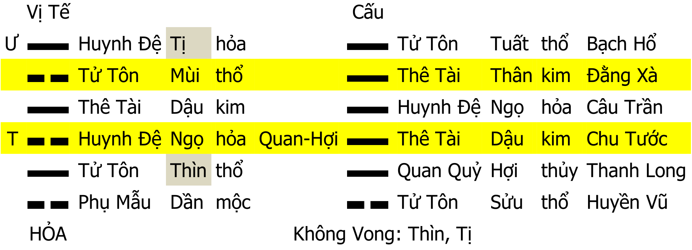
    - **Hình này chứng minh điều gì**
      - Tượng bản thân ngoại tình với bạn học cũ, chồng phản đối ly hôn bằng cách đòi tự sát, kiện tụng ra tòa.
    - **Từ đâu mà thấy được**
      - Phụ Mẫu Dần mộc lâm Huyền Vũ nhập Mộ tại Mùi thổ, Dụng thần Quan Quỷ Hợi thủy hợp trú Nhật kiến, Nguyên thần Mộ Tuyệt.
  - **Bối cảnh & Dụng thần:**
    - Ngày Nhâm Dần tháng Sửu năm Quý Mùi (Hỏa Không Vong: Thìn, Tị).
    - Nữ đoán hôn nhân gia đình lấy Quan Quỷ làm Dụng thần. Quan Quỷ Hợi thủy không hiện trên quẻ, phục tàng dưới hào 3 Thế Huynh Đệ Ngọ hỏa.
  - **Phán đoán chi tiết:**
    - Căn cứ:
      - Quan Quỷ Hợi thủy phục tàng biểu thị người chồng thường xuyên vắng nhà. Dụng thần phục dưới hào Thế, Phụ Mẫu Dần mộc lâm Nhật kiến cho thấy hai người trên pháp lý vẫn chưa ly hôn.
      - Hào sơ Phụ Mẫu Dần mộc lâm Huyền Vũ nhập Mộ tại hào 5 động Tử Tôn Mùi thổ (Mùi là Mộ của Dần mộc). Đối với phụ nữ đã có gia đình, tổ hợp Phụ Mẫu lâm Huyền Vũ nhập Mộ là thông tin chắc chắn bản thân có quan hệ ngoại tình, sống chung phi pháp với người đàn ông khác.
      - Hào Thế Ngọ hỏa phát động sinh Kỵ thần Tử Tôn Mùi thổ, cho thấy bản thân cô ta đã chán ghét, dứt khoát không muốn tiếp tục sống cùng chồng. Hào 5 Tử Tôn Mùi thổ động lâm Thái Tuế (năm Quý Mùi), báo hiệu năm này xảy ra mâu thuẫn ly hôn dữ dội.
      - Nhưng Tử Tôn Mùi thổ bị Nguyệt kiến Sửu thổ xung là Nguyệt phá, lực khắc Quan Quỷ bị suy giảm nên chưa thể ly hôn ngay. Hào Thế động hợp với hào Nguyệt phá (Ngọ Mùi tương hợp), hào Thế lâm Chu Tước (chủ kiện tụng, khẩu thiệt) nên việc ly hôn phải đưa ra tòa án giải quyết.
      - Dụng thần Quan Quỷ Hợi thủy hợp trú với Nhật kiến Phụ Mẫu Dần mộc (Dần Hợi hợp), Phụ Mẫu là giấy kết hôn, hợp trú là nắm chặt không buông, chứng tỏ người chồng kiên quyết không chịu ly hôn.
      - Dụng thần Hợi thủy hưu tù trong tháng Sửu, Nguyên thần Thê Tài Dậu kim nhập Mộ tại Nguyệt Sửu và Tuyệt tại Nhật Dần. Nguyên thần chủ tư duy, suy nghĩ; gặp Mộ Tuyệt là bế tắc, nghĩ quẩn, manh động dùng hành vi tự sát để đe dọa phản đối ly hôn.
      - Người tình được xác định qua hào Ứng: Hào Thế (Ngọ hỏa) và hào Ứng (Tị hỏa) đều thuộc hành Hỏa, chủ có mối quan hệ đồng môn, tương đồng; hào Thế lâm Chu Tước (chủ văn thư, trường học, học hành), chứng minh nhân tình chính là bạn học cũ.
      - Ứng kỳ: Phải chờ đến năm Đinh Hợi khi Dụng thần Quan Quỷ Hợi thủy xuất hiện trị Thái Tuế mới có thể hoàn tất thủ tục ly hôn.
    - Nhìn vào:
      - Phụ Mẫu lâm Huyền Vũ nhập Mộ để chỉ ra hành vi ngoại tình sống chung lén lút của người vợ.
      - Thế lâm Chu Tước hợp phá và Dụng thần hợp trú Phụ Mẫu để phán đoán vụ án ly hôn ra tòa nhưng bị chồng cản trở.
      - Nguyên thần gặp Mộ Tuyệt để vạch trần hành động tự tử của người chồng và ngũ hành hào Thế - Ứng lâm Chu Tước để xác định nhân tình là bạn học.
  - **Ứng nghiệm thực tế:**
    - Người vợ thừa nhận toàn bộ các phán đoán trên hoàn toàn chính xác: Cô đã ngoại tình với bạn học cũ và đòi ly hôn, nhưng người chồng kiên quyết không ký đơn, thậm chí đòi tự sát để đe dọa, vụ việc phải kéo nhau ra tòa án.
    - Ngoại trừ ứng kỳ năm Đinh Hợi chưa tới thời điểm nghiệm chứng, tất cả các chi tiết đều chuẩn xác phi thường.

- **Ví dụ 7:** Ngày Giáp Thân tháng Tị, nữ (20 tuổi) đoán hôn nhân, được quẻ Trạch Sơn Hàm biến Trạch Địa Tụy.
  - **Hình 192.** Sơ đồ quẻ Trạch Sơn Hàm biến Trạch Địa Tụy
    - 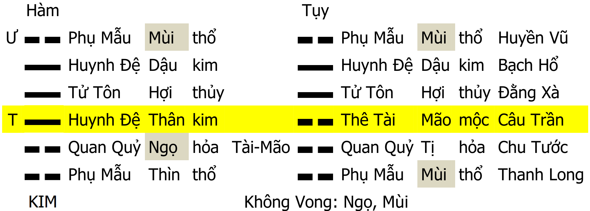
    - **Hình này chứng minh điều gì**
      - Tượng sống chung trước hôn nhân với một người đàn ông đã từng ly hôn vợ.
    - **Từ đâu mà thấy được**
      - Quan Quỷ Ngọ hỏa vượng tướng nhập trạch hào 2, Phụ Mẫu Mùi thổ lâm Huyền Vũ Không Vong, Thê Tài phục dưới Quan Quỷ.
  - **Bối cảnh & Dụng thần:**
    - Ngày Giáp Thân tháng Tị (Kim Không Vong: Ngọ, Mùi). Nữ đương số 20 tuổi.
    - Nữ đoán hôn nhân lấy Quan Quỷ làm Dụng thần. Hào 2 Quan Quỷ Ngọ hỏa được Nguyệt lệnh Tị hỏa trợ giúp là vượng tướng.
  - **Phán đoán chi tiết:**
    - Căn cứ:
      - Dụng thần Quan Quỷ Ngọ hỏa ngự tại hào 2 (trạch vị, vị trí nhà cửa), Quan Quỷ vượng tướng nhập trạch biểu thị có người đàn ông đã dọn vào ở chung trong nhà.
      - Hào Ứng Phụ Mẫu Mùi thổ lâm Huyền Vũ lại rơi vào tuần Không Vong (Ngọ Mùi không). Phụ Mẫu chủ hôn thú, Không Vong lâm Huyền Vũ là biểu tượng xác thực của vị hôn đồng cư, khẳng định người nữ đang sống chung với bạn trai khi chưa cưới.
      - Hào Ứng đại diện cho đối phương lâm Phụ Mẫu Không Vong có hai khả năng: hoặc chưa từng kết hôn, hoặc đã ly hôn. Xét thấy Thê Tài Mão mộc phục tàng dưới hào 2 Quan Quỷ Ngọ hỏa, Thê Tài phục dưới Quan Quỷ biểu thị người đàn ông này trước đó đã có vợ; kết hợp với hào Ứng Phụ Mẫu Không Vong khẳng định đối phương là người đàn ông đã ly dị vợ.
    - Nhìn vào:
      - Hào 2 Quan Quỷ vượng tướng nhập trạch và hào Ứng Phụ Mẫu lâm Huyền Vũ Không Vong để đoán hai người đang sống chung phi hôn nhân.
      - Hào Ứng Phụ Mẫu Không Vong kết hợp Thê Tài phục dưới Dụng thần để chỉ ra người đàn ông kia đã ly hôn một đời vợ.
  - **Ứng nghiệm thực tế:**
    - Cô gái 20 tuổi xác nhận toàn bộ dự đoán đều chuẩn xác: Cô hiện đang sống chung với một người bạn trai lớn tuổi hơn, và người này đã từng có một đời vợ và đã hoàn tất thủ tục ly hôn.

- **Ví dụ 8:** Ngày Canh Dần tháng Tuất, nữ đoán hôn nhân, được quẻ Thiên Trạch Lý biến Phong Trạch Trung Phu.
  - **Hình 193.** Sơ đồ quẻ Thiên Trạch Lý biến Phong Trạch Trung Phu
    - 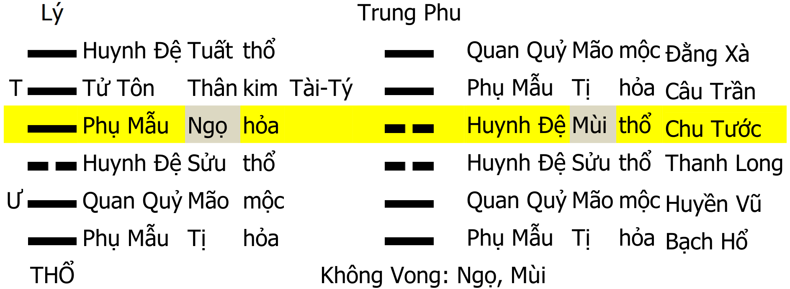
    - **Hình này chứng minh điều gì**
      - Tượng sống chung trước hôn nhân, người nữ muốn cướp đoạt người đàn ông đã có vợ làm chồng của mình.
    - **Từ đâu mà thấy được**
      - Dụng thần Quan Quỷ Mão mộc hợp Nguyệt kiến Huynh Đệ Tuất thổ, Phụ Mẫu Ngọ hỏa Không Vong nhập Nguyệt Mộ, hào Thế tại hào 5 động khắc Ứng.
  - **Bối cảnh & Dụng thần:**
    - Ngày Canh Dần tháng Tuất (Thổ Không Vong: Ngọ, Mùi).
    - Nữ đoán hôn nhân lấy Quan Quỷ làm Dụng thần. Hào 2 Quan Quỷ Mão mộc lâm hào Ứng, được Nhật kiến Dần mộc trợ giúp là vượng tướng.
  - **Phán đoán chi tiết:**
    - Căn cứ:
      - Quan Quỷ Mão mộc tương hợp với Nguyệt kiến Huynh Đệ Tuất thổ (Mão Tuất nhị hợp). Nguyệt kiến Huynh Đệ là người nữ khác ngoài xã hội, việc Quan Quỷ hợp Huynh Đệ biểu thị người đàn ông này hiện là người đã có gia đình, đang có vợ.
      - Dụng thần lâm hào Ứng, chứng tỏ bản thân người nữ rất yêu thích và say đắm đối phương.
      - Hào Thế Tử Tôn Thân kim ngự tại hào 5 phát động hóa Phụ Mẫu Tị hỏa, đem lực khắc phạt hào Ứng Quan Quỷ Mão mộc. Hào 5 là ngôi tôn vị, ngôi gia trưởng nắm quyền làm chủ gia đình, hào Ứng là người khác; hào 5 Thế động khắc Ứng biểu thị người nữ nuôi dã tâm muốn làm chủ một gia đình riêng, quyết tâm cướp đoạt người đàn ông từ tay người phụ nữ khác.
      - Hào 4 Phụ Mẫu Ngọ hỏa rơi vào tuần Không Vong (Ngọ Mùi không) và nhập Mộ tại Nguyệt kiến Tuất thổ. Phụ Mẫu là đăng ký kết hôn, Không Vong nhập Mộ chứng tỏ hai người dù danh phận bất chính nhưng thực tế đã dọn về ăn ở chung với nhau (vị hôn đồng cư).
    - Nhìn vào:
      - Dụng thần Quan Quỷ hợp Nguyệt kiến Huynh Đệ để xác định đối phương là người đàn ông có gia đình.
      - Hào 5 Thế phát động khắc Ứng để vạch trần tâm lý muốn giành giật chồng người khác.
      - Hào 4 Phụ Mẫu Không Vong nhập Nguyệt Mộ để khẳng định tình trạng sống chung lén lút.
  - **Ứng nghiệm thực tế:**
    - Người nữ thừa nhận hoàn toàn đúng với thực tế: Cô đang sống chung với một người đàn ông đã có vợ và bản thân cô đang tìm mọi cách để buộc anh ta bỏ vợ cưới mình.

- **Ví dụ 9:** Ngày Giáp Thìn tháng Sửu, nữ đoán hôn nhân, được quẻ Càn Vi Thiên biến Thiên Sơn Độn.
  - **Hình 194.** Sơ đồ quẻ Càn Vi Thiên biến Thiên Sơn Độn
    - 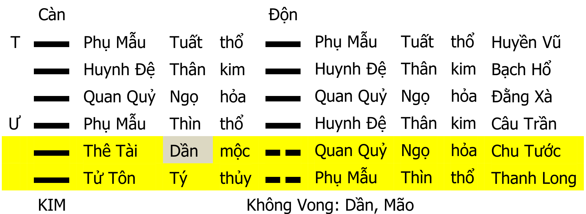
    - **Hình này chứng minh điều gì**
      - Tượng sống chung không giá thú cùng lúc với hai người đàn ông (bắt cá hai tay) sau khi đã ly hôn.
    - **Từ đâu mà thấy được**
      - Hào Thế Phụ Mẫu Tuất thổ ám động khiến Quan Quỷ nhập Mộ, quẻ Càn lục xung, Phụ Mẫu lâm Huyền Vũ nhập Mộ, hào 2 Dần mộc động hóa Quan Quỷ Ngọ hỏa.
  - **Bối cảnh & Dụng thần:**
    - Ngày Giáp Thìn tháng Sửu (Kim Không Vong: Dần, Mão).
    - Nữ đoán hôn nhân lấy Quan Quỷ làm Dụng thần. Trong quẻ có Quan Quỷ Ngọ hỏa tại hào 4.
  - **Phán đoán chi tiết:**
    - Căn cứ:
      - Hào Thế Phụ Mẫu Tuất thổ tại hào 6 được tháng Sửu tương trợ, gặp ngày Thìn tương xung thành ám động. Tuất thổ là Hỏa khố phát động thu hút Quan Quỷ Ngọ hỏa nhập Mộ. Hào 6 là hào vị cùng tận, thoái hưu, kết thúc; Phụ Mẫu là giấy kết hôn nằm ở hào 6 lại kết hợp quẻ Càn Vi Thiên là quẻ lục xung, cho thấy dấu hiệu đã từng ly hôn.
      - Hào Thế Phụ Mẫu Tuất thổ lâm Huyền Vũ lại nhập Mộ tại Nhật thần Thìn thổ (hoặc Thìn Tuất tương xung phá Mộ), tổ hợp Phụ Mẫu lâm Huyền Vũ nhập Mộ chính là bằng chứng xác thực của việc sống chung mà không có hôn thú (vị hôn đồng cư).
      - Hào 4 Quan Quỷ Ngọ hỏa lâm Đằng Xà, Đằng Xà chủ keo kiệt, tính toán bủn xỉn, cho thấy người bạn trai này có tính cách hẹp hòi, bủn xỉn về tiền bạc.
      - Điểm đặc biệt: Hào 2 Thê Tài Dần mộc phát động hóa xuất Quan Quỷ Ngọ hỏa. Hào 4 đã có Quan Quỷ Ngọ hỏa, hào 2 lại động biến sinh ra thêm một Quan Quỷ Ngọ hỏa nữa. Đây là tượng "bắt cá hai tay", người phụ nữ cùng lúc có mối quan hệ sâu sắc và sống chung với hai người đàn ông khác nhau.
    - Nhìn vào:
      - Quẻ lục xung và hào 6 Phụ Mẫu ám động nhập Mộ Quan Quỷ để phán đoán đương số đã ly hôn.
      - Phụ Mẫu lâm Huyền Vũ nhập Mộ ở Nhật để kết luận tình trạng vị hôn đồng cư.
      - Hào 4 Quan Quỷ lâm Đằng Xà kết hợp hào 2 động hóa Quan Quỷ để vạch trần việc sống chung đồng thời với hai người đàn ông, trong đó có một người keo kiệt.
  - **Ứng nghiệm thực tế:**
    - Người phụ nữ thừa nhận đúng như lời phán: Cô đã ly hôn chồng và hiện tại đang sống chung bí mật cùng lúc với hai người đàn ông.

- **Ví dụ 10:** Ngày Canh Thân tháng Thìn, nam đoán mối quan hệ với bạn gái phát triển ra sao? Được quẻ Thủy Sơn Kiển biến Thủy Phong Tỉnh.
  - **Hình 195.** Quẻ Thủy Sơn Kiển biến Thủy Phong Tỉnh
    - 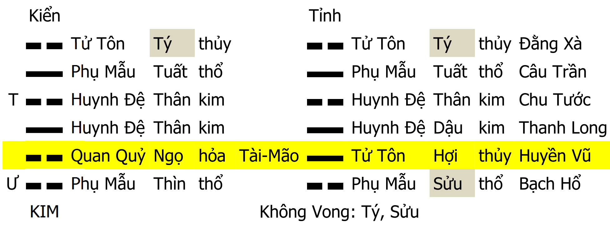
    - **Hình này chứng minh điều gì**
      - Tượng hai người đã sống chung trước hôn nhân, đối phương từng ly hôn và sẽ chia tay vào tháng Ngọ.
    - **Từ đâu mà thấy được**
      - Thê Tài Mão mộc phục dưới Quan Quỷ hóa Tuyệt, hào 2 Quan Quỷ Ngọ hỏa độc phát lâm Huyền Vũ là đất Mộc Dục của Thế và Tử địa của Dụng thần.
  - **Bối cảnh & Dụng thần:**
    - Ngày Canh Thân tháng Thìn (Kim Không Vong: Tý, Sửu).
    - Nam đoán quan hệ bạn gái lấy Thê Tài làm Dụng thần. Thê Tài Mão mộc không hiện trên quẻ, phục tàng dưới hào 2 Quan Quỷ Ngọ hỏa.
  - **Phán đoán chi tiết:**
    - Căn cứ:
      - Dụng thần Thê Tài Mão mộc phục dưới Quan Quỷ Ngọ hỏa (Quan Quỷ là chồng), biểu thị người bạn gái này trước đó đã từng có một đời chồng. Nhưng Quan Quỷ Ngọ hỏa động hóa Tử Tôn Hợi thủy là hóa Tuyệt (Ngọ tuyệt tại Hợi), cho thấy cô ấy đã ly hôn chồng cũ.
      - Hào 2 Quan Quỷ Ngọ hỏa là hào độc phát lâm Huyền Vũ đè nén Dụng thần phục tàng. Độc phát biểu thị tính chất: Hào 2 Ngọ hỏa chính là đất Mộc Dục của hào Thế Huynh Đệ Thân kim (Thân kim mộc dục tại Ngọ), Mộc Dục chủ chăn gối thân mật, biểu thị hai người đã dọn về sống chung với nhau (vị hôn đồng cư).
      - Độc phát biểu thị cát hung: Ngọ hỏa phát động lại là đất Tử của Dụng thần Thê Tài Mão mộc (Mão mộc tử tại Ngọ), cho thấy mối quan hệ này không có nền tảng lâu dài, kết cục tất phải tan vỡ.
      - Độc phát biểu thị ứng kỳ: Ngọ hỏa độc phát trực tiếp điểm rõ thời gian phân ly, hai người sẽ chính thức chia tay vào tháng Ngọ.
    - Nhìn vào:
      - Thê Tài phục dưới Quan Quỷ động hóa Tuyệt để đoán bạn gái đã từng ly hôn một lần.
      - Hào 2 độc phát lâm Huyền Vũ là đất Mộc Dục của Thế để xác định hai người đã sống chung.
      - Hào độc phát là đất Tử của Dụng thần để phán quyết kết cục chia tay tại tháng Ngọ.
  - **Ứng nghiệm thực tế:**
    - Người nam xác nhận bạn gái đúng là đã từng ly hôn một lần và hai người đang sống chung với nhau.
    - Đến đúng tháng Ngọ ngày Bính Dần, giữa hai người nảy sinh mâu thuẫn gay gắt không thể hàn gắn và đã chính thức chia tay.

- **Ví dụ 11:** Ngày Quý Dậu tháng Ngọ, nam đoán có thể hòa giải với bạn gái hay không? Được quẻ Địa Trạch Lâm biến Lôi Trạch Quy Muội.
  - **Hình 196.** Quẻ Địa Trạch Lâm biến Lôi Trạch Quy Muội
    - 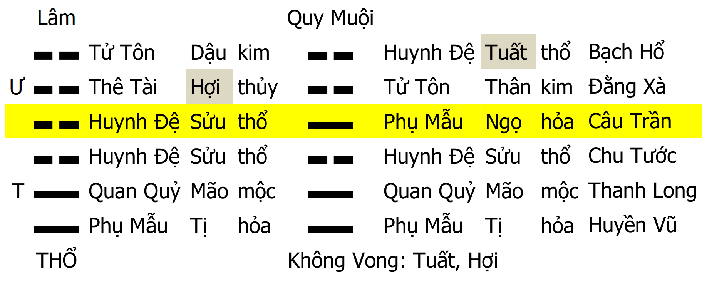
    - **Hình này chứng minh điều gì**
      - Tượng việc hòa giải hoàn toàn thất bại do người nữ do dự và gia đình bên ngoại kịch liệt ngăn cấm.
    - **Từ đâu mà thấy được**
      - Dụng thần Thê Tài Hợi thủy lâm Không Vong, Kỵ thần Huynh Đệ Sửu thổ là gian hào độc phát hóa Phụ Mẫu Ngọ hỏa hồi đầu sinh.
  - **Bối cảnh & Dụng thần:**
    - Ngày Quý Dậu tháng Ngọ (Thổ Không Vong: Tuất, Hợi). Tiếp nối diễn biến sau khi chia tay ở Ví dụ 10.
    - Nam đoán việc cứu vãn tình cảm lấy Thê Tài làm Dụng thần. Hào 5 Thê Tài Hợi thủy lâm hào Ứng.
  - **Phán đoán chi tiết:**
    - Căn cứ:
      - Dụng thần Thê Tài Hợi thủy tuy được Nhật kiến Dậu kim sinh trợ, nhưng lại rơi vào tuần Không Vong (Tuất Hợi không). Không Vong chủ hư tâm, do dự không quyết, biểu thị trong lòng người bạn gái còn nhiều hoang mang, mâu thuẫn, hoàn toàn không thể hạ quyết tâm quay lại hàn gắn.
      - Hào 4 Huynh Đệ Sửu thổ là Kỵ thần khắc Tài, ngự tại gian hào (vị trí nằm giữa hào Thế và hào Ứng, chủ sự việc cản trở ở giữa), phát động hóa Phụ Mẫu Ngọ hỏa hồi đầu sinh cho Kỵ thần.
      - Huynh Đệ đại diện cho anh chị em, bạn bè của đối phương; Phụ Mẫu là cha mẹ đôi bên. Gian hào Kỵ thần độc phát hóa Phụ Mẫu hồi đầu sinh chứng minh gia đình người bạn gái gồm cả cha mẹ và anh chị em đều kịch liệt phản đối, cương quyết ngăn cản việc hai người tiếp tục qua lại. Mối quan hệ vì thế tuyệt đối không thể hòa giải.
    - Nhìn vào:
      - Dụng thần Thê Tài Hợi thủy Không Vong để chỉ ra tâm lý do dự, chối từ của bạn gái.
      - Gian hào Huynh Đệ độc phát hóa Phụ Mẫu hồi đầu sinh để phán đoán việc bị cả gia đình cha mẹ và anh chị em nhà gái cản trở triệt để.
  - **Ứng nghiệm thực tế:**
    - Quả nhiên thực tế diễn ra đúng như dự đoán: Bạn gái một mực cự tuyệt và phía gia đình cô ấy phản đối quyết liệt. Hai người hoàn toàn không thể hòa giải và vĩnh viễn chấm dứt quan hệ.

### CHƯƠNG 4: ĐỜI SỐNG VỢ CHỒNG

#### 1. Tổng quan và các quy luật phán đoán đời sống vợ chồng trong Lục hào
- **Bản chất âm dương và tính đa dạng trong hôn nhân:**
  - Vợ chồng là biểu hiện cụ thể của quy luật âm dương tương phối, tương hợp trong vũ trụ. Tuy nhiên, âm dương trong thực tế đời sống không thể lúc nào cũng duy trì ở trạng thái cân bằng tuyệt đối. Do đó, giữa vợ chồng khó tránh khỏi những mâu thuẫn, va chạm phát sinh từ đời sống thường nhật.
  - "Trăm cặp vợ chồng thì có trăm kiểu cuộc sống gia đình khác nhau": Có đôi vợ chồng tình cảm mặn nồng thắm thiết nhưng một người lại gặp phải tai ương bất hạnh; có cặp bên ngoài danh nghĩa là vợ chồng nhưng bên trong mỗi người đều mang tâm địa toan tính riêng; có cặp một bên chung thủy sắt son nhưng bên kia phản bội trăng hoa; có xung đột bắt nguồn từ sự biến đổi tâm tính, có bi kịch do người thứ ba chen chân phá hoại, và cũng có những trường hợp chịu đựng sự ngược đãi, bạo lực gia đình tàn khốc.
- **Phương pháp luận tổng hợp và tư duy phán đoán cốt lõi:**
  - Dự đoán đời sống vợ chồng là sự kết hợp nhuần nhuyễn, tổng hòa các kỹ năng dự trắc từ nhiều chuyên đề khác nhau: hào vị, lục thần, ngũ hành sinh khắc chế hóa, tuần không, phục tàng, động biến và thần sát.
  - **Hào vị trong đời sống vợ chồng:**
    - Hào sơ: Đại diện cho thuở mới quen, kết hôn sớm, tâm tư ban đầu.
    - Hào 2 (Trạch vị/Phu thê vị): Đại diện cho ngôi nhà, mái ấm gia đình, việc chung sống dưới một mái nhà.
    - Hào 3 (Sàng vị): Đại diện cho giường chiếu, sinh hoạt tình dục chăn gối vợ chồng.
    - Hào 4 (Gian hào): Đại diện cho người thứ ba, kẻ chen ngang vào giữa hai vợ chồng.
    - Hào 5 (Tôn vị/Gia trưởng vị): Đại diện cho người chủ gia đình, người gánh vác trụ cột, vị thế lãnh đạo trong nhà.
    - Hào 6: Đại diện cho nơi phương xa viễn xứ, tư duy đầu não, hoặc điểm tận cùng/kết thúc của sự vật.
  - **Lục thần biểu thị tính cách và hành vi quan hệ:**
    - Thanh Long: Hòa duyệt, vui vẻ, mỹ mạo, đoan trang, hoặc đam mê tửu sắc.
    - Chu Tước: Văn tinh, khéo ăn nói, nhưng khi gặp xung khắc thì chủ khẩu thiệt, tranh cãi, mắng nhiếc, chửi bới thậm tệ.
    - Câu Trần: Đôn hậu chất phác, nhưng cũng chủ chậm chạp, lười biếng, không biết chăm sóc gia đình.
    - Đằng Xà: Bất an, nghi ngại, lo lắng, hoặc "đồng sàng dị mộng" (chung giường nhưng khác mộng, toan tính riêng).
    - Bạch Hổ: Hung hãn, bạo ngược, tính khí nóng nảy, chủ ẩu đả, bạo hành gia đình, đánh đập thương tích.
    - Huyền Vũ: Ám muội, lén lút, phong lưu đào hoa, ngoại tình vụng trộm, hoặc tôn giáo thần phật.
  - **Tượng quẻ và hào động biến đặc thù:**
    - Quẻ Lục Xung: Chủ sự phân tán, chia ly, khó duy trì lâu dài.
    - Quẻ Phản Ngâm: Chủ sự việc đảo lộn, phản phúc thất thường, cưới đi cưới lại, kết hôn rồi ly hôn nhiều lần.
    - Quẻ Du Hồn: Chủ tâm tính phiêu bạt bất định, tình cảm trôi dạt, ly thân chia rẽ.
    - Hào thoái thần / hóa thoái: Chủ ý định rời bỏ nhà cửa, bỏ đi nơi khác hoặc sang ở rể.
    - Mộ khố: Biểu thị sự say đắm si mê, che giấu vụng trộm, hoặc sự kết thúc, chôn vùi hôn nhân.

#### 2. Các quái lệ thực chứng về đời sống vợ chồng

- **Ví dụ 1: Nữ đoán hôn nhân cho em trai (Ngày Ất Hợi tháng Ngọ năm Ất Dậu)**
  - **Bối cảnh & Chọn Dụng thần:**
    - Ngày Ất Hợi tháng Ngọ năm Ất Dậu (Tuần không: Thân, Dậu).
    - Nữ nhân đến gieo quẻ hỏi về chuyện hôn nhân của em trai, được quẻ Địa Thiên Thái biến Địa Trạch Lâm.
    - Lấy Thê Tài làm Dụng thần. Trong quẻ Thê Tài lưỡng hiện: Thê Tài Tý thủy tại hào sơ và Thê Tài Hợi thủy tại hào 5.
  - **Hình 197.** Quẻ Địa Thiên Thái biến Địa Trạch Lâm
    - 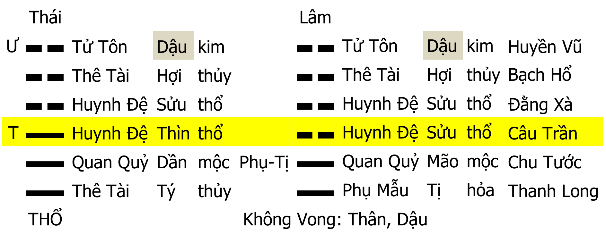
    - **Hình này chứng minh điều gì**
      - Em trai đã ly hôn mối tình đầu, hiện say mê bạn học cũ và quyết chí bỏ nhà đi ở rể.
    - **Từ đâu mà thấy được**
      - Thê Tài Tý thủy Nguyệt phá (ly hôn); Thê Tài Hợi thủy lâm Nhật hào 5 nhập Mộ Thế động hóa thoái hợp Ứng.
  - **Phán đoán chi tiết:**
    - Căn cứ:
      - Trong quẻ Thê Tài lưỡng hiện: Chọn hào Thê Tài Tý thủy tại hào sơ bị Nguyệt lệnh Ngọ hỏa Phụ Mẫu xung phá (Nguyệt phá) làm Dụng thần cho mối hôn nhân đầu.
      - Thê Tài Tý thủy được Nhật Thần Hợi thủy trợ giúp là vượng tướng, lâm Thanh Long chủ hòa duyệt, đóng ở hào sơ là tượng kết hôn sớm. Tuy nhiên, Dụng thần bị Nguyệt Phụ Mẫu xung phá (Phụ Mẫu là giấy chứng nhận kết hôn, hộ khẩu), báo hiệu kết hôn sớm tất phải thất bại, dẫn tới ly hôn.
      - Hào Sàng Trướng Tị hỏa được Nguyệt kiến trợ giúp vượng tướng, vừa đúng là hào Phụ Mẫu, biểu thị đã từng có hôn ước chính thức; nhưng Sàng Trướng không hiện trên quẻ, khẳng định đã ly hôn giải tán giường chiếu.
      - Hào 5 xuất hiện Thê Tài Hợi thủy: Thông tin về người vợ thứ hai. Hợi thủy lâm Nhật Thần, Nhật Thần chủ hiện tại, cho thấy người phối ngẫu tái hôn đang ở ngay trước mắt.
      - Hào Thế Huynh Đệ Thìn thổ (đại diện cho người em trai) phát động thu Thê Tài Hợi thủy nhập Mộ (Thìn là Thủy khố): Chứng tỏ người em trai vô cùng si mê say đắm người phụ nữ này, quyết tâm cưới bằng được.
      - Thê Tài Hợi thủy ngự tại hào 5: Hào 5 là tôn vị, vị trí gia trưởng, cho thấy người phụ nữ này là trụ cột kinh tế gánh vác toàn bộ gia đình.
      - Hào Thế Huynh Đệ Thìn thổ phát động hóa thoái (biến Sửu thổ), đồng thời động hợp với hào Ứng Tử Tôn Dậu kim (Thìn Dậu lục hợp): Hóa thoái biểu thị rời bỏ ngôi nhà của mình; hợp Ứng biểu thị đi đến gia đình nhà gái định cư, chấp nhận ở rể.
    - Nhìn vào:
      - Sự phân định rạch ròi giữa Thê Tài Tý thủy hào sơ Nguyệt phá (vợ trước kết hôn sớm đã ly dị) và Thê Tài Hợi thủy hào 5 lâm Nhật nhập Mộ Thế (vợ sau đang say đắm).
      - Thế động hóa thoái kết hợp hợp Ứng chỉ điểm chuẩn xác hành động từ bỏ gia nghiệp để sang ở rể nhà vợ.
  - **Ứng nghiệm thực tế:**
    - Người em trai đã ly hôn vợ cũ vào tháng Hợi năm Giáp Thân, hai người có 4 mặt con, đứa con út hiện do ông bà nội chăm sóc.
    - Gần đây anh ta tình cờ gặp lại cô bạn gái thời trung học, người này cũng vừa ly hôn vào năm Giáp Thân. Đôi bên vừa hội ngộ đã gắn bó như keo sơn.
    - Người em trai vốn là con trưởng trong nhà, có trách nhiệm kế thừa gia nghiệp tổ tông; tuy nhiên cô bạn gái này đã tiếp quản toàn bộ trang trại nuôi gà rộng lớn của cha mẹ nên dứt khoát không thể về làm dâu, yêu cầu anh phải sang ở rể. Người em trai nhất quyết xin thôi việc hiện tại để sang trang trại gà của cô ấy làm ăn, mặc cho cả gia đình ra sức kịch liệt phản đối.

- **Ví dụ 2: Nữ đoán tình cảm vợ chồng (Ngày Kỷ Mùi tháng Thìn)**
  - **Bối cảnh & Chọn Dụng thần:**
    - Ngày Kỷ Mùi tháng Thìn (Tuần không: Tý, Sửu).
    - Phụ nữ đến xem bói về tình cảm vợ chồng, được quẻ Thủy Phong Tỉnh (quẻ tĩnh).
    - Lấy Quan Quỷ làm Dụng thần. Trong quẻ Quan Quỷ lưỡng hiện: Quan Quỷ Dậu kim tại hào 3 và Quan Quỷ Thân kim tại hào 4.
  - **Hình 198.** Quẻ Thủy Phong Tỉnh
    - 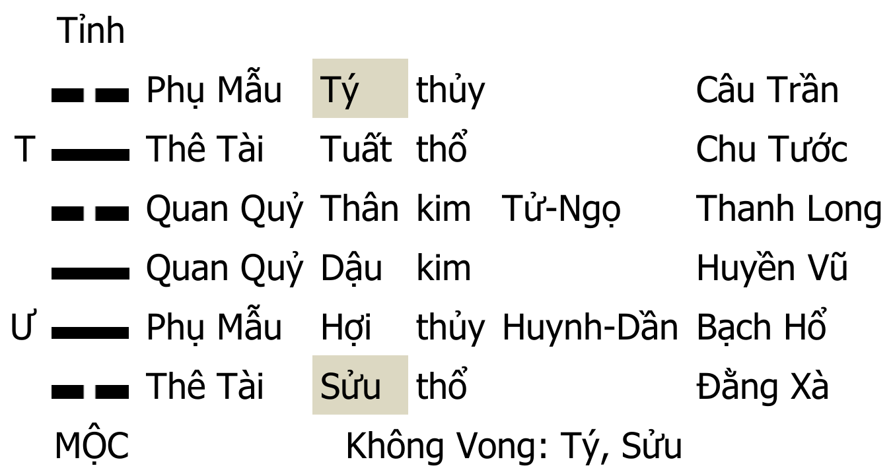
    - **Hình này chứng minh điều gì**
      - Vợ chồng đều ngoại tình: Chồng bị gái mạng mê hoặc, vợ có người tình chức vụ cao hơn chồng.
    - **Từ đâu mà thấy được**
      - Thân - Dậu - Tuất phương cục; Dậu kim lâm Huyền Vũ nhập Mộ Tài ám động; Thân kim hào 4 lâm Thanh Long.
  - **Phán đoán chi tiết:**
    - Căn cứ:
      - Trong quẻ Quan Quỷ lưỡng hiện: Chọn hào Quan Quỷ Dậu kim tại hào 3 được Nguyệt lệnh Thìn thổ tương hợp (Thìn Dậu hợp) làm Dụng thần chính đại diện cho người chồng.
      - Hào Thế là Thê Tài Tuất thổ, Dụng thần là Quan Quỷ Dậu kim, lại có Quan Quỷ Thân kim vượng tướng xuất hiện tại hào 4: Ba hào tạo thành phương Tây Kim cục (Thân - Dậu - Tuất). Hào Thế lâm Chu Tước (chủ văn tinh, trường học), chỉ ra hai vợ chồng vốn là bạn học đồng môn từ trước.
      - Hào Thế Thê Tài Tuất thổ sinh Dụng thần Quan Quỷ Dậu kim: Bản thân người vợ từ đáy lòng vẫn còn yêu thương chồng. Tuy nhiên, hào Thế bị Nguyệt lệnh Thê Tài Thìn thổ xung phá (Nguyệt phá), sức sinh cho Quan Quỷ suy giảm; Thê Tài đại diện cho phụ nữ, chứng tỏ do sự xuất hiện của người phụ nữ khác đã làm tình cảm vợ chồng rạn nứt.
      - Hào sơ Thê Tài Sửu thổ bị Nhật Thần Mùi thổ xung thành ám động; Dụng thần Dậu kim lâm Huyền Vũ nhập Mộ tại Sửu thổ: Huyền Vũ chủ mờ ám vụng trộm, nhập Mộ chủ say đắm mê muội, chứng minh người chồng đang bị một người đàn bà khác mê hoặc quyến rũ. Nguyệt Thê Tài Thìn thổ hợp Dụng thần Dậu kim cũng củng cố việc chồng có quan hệ bất chính với phụ nữ bên ngoài.
      - Quan Quỷ lưỡng hiện cùng hào Thế tạo phương cục: Báo hiệu chính bản thân người vợ cũng đang có người tình ngoài luồng. Quan Quỷ Thân kim lâm Thanh Long (chủ quan chức nhà nước), đóng ở hào 4 cao hơn Quan Quỷ Dậu kim ở hào 3, cho thấy nhân tình của cô có chức vụ, địa vị xã hội lớn hơn chồng.
      - Hào Thế Tuất thổ bị Nguyệt phá, đến năm 1994 Giáp Tuất thực phá sinh vượng Quan Quỷ, ấn định năm kết hôn là năm 1994.
    - Nhìn vào:
      - Thế cục phương Tây Kim cục kết hợp Dụng thần lâm Huyền Vũ nhập Mộ Tài để lật tẩy chuyện ngoại tình từ cả hai phía.
      - Sự đối sánh vị trí hào và lục thần giữa Dậu kim hào 3 (chồng) và Thân kim hào 4 lâm Thanh Long (người tình chức vụ cao hơn).
  - **Ứng nghiệm thực tế:**
    - Hai người quả thực kết hôn vào năm 1994. Gần đây cô tình cờ phát hiện trong máy điện thoại của chồng có số lạ, gọi thử thì có giọng nữ nghe máy. Sau nhiều lần truy vấn gắt gao, người chồng thú nhận đó là cô gái quen qua mạng Internet, hai người mới đi ăn cơm vài lần và thề thốt sẽ chấm dứt, nhưng cô hoàn toàn không tin.
    - Bản thân người phụ nữ này cũng đang nuôi bồ nhí bên ngoài: Người chồng hiện là cán bộ cấp phòng, còn người tình bí mật của cô là cán bộ phó cấp sở.

- **Ví dụ 3: Nam đoán tài vận nuôi chó và hôn nhân (Ngày Quý Tị tháng Tuất)**
  - **Bối cảnh & Chọn Dụng thần:**
    - Ngày Quý Tị tháng Tuất (Tuần không: Ngọ, Mùi).
    - Người nam đến dự đoán tài vận nghề nuôi chó và tình trạng hôn nhân, được quẻ Chấn Vi Lôi biến Địa Trạch Lâm.
    - Lấy Thê Tài làm Dụng thần. Thê Tài Tuất thổ tại hào 6 (trì Thế) và Thê Tài Thìn thổ tại hào 3 (hào Ứng).
  - **Hình 199.** Quẻ Chấn Vi Lôi biến Địa Trạch Lâm
    - 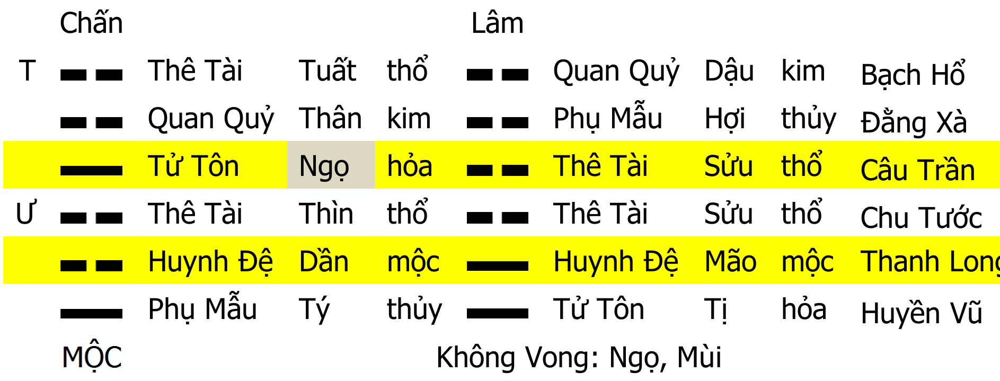
    - **Hình này chứng minh điều gì**
      - Xung đột sinh tử giữa nuôi chó và giữ vợ: Có chó mất vợ, đàn chó chết hết dẫn tới ly hôn.
    - **Từ đâu mà thấy được**
      - Hào Ứng Thê Tài Thìn thổ bị Nguyệt Tuất (chó) xung phá; Tử Tôn Ngọ hỏa Không Vong bị Tý thủy động khắc.
  - **Phán đoán chi tiết:**
    - Căn cứ:
      - Xét về tài vận nuôi chó: Hào Thê Tài Tuất thổ trì Thế, được Nguyệt lệnh phù trì và Nhật Thần sinh trợ là cực vượng. Trong quẻ mặc dù có Huynh Đệ Dần mộc phát động khắc Tài, nhưng Tử Tôn Ngọ hỏa cũng phát động tạo thành thế liên tục tương sinh (Huynh sinh Tử, Tử sinh Tài), vốn dĩ là điềm kiếm được rất nhiều tiền. Tuy nhiên, Tử Tôn Ngọ hỏa lâm Tuần Không, lại bị Phụ Mẫu Tý thủy tại hào sơ phát động khắc hại, chắc chắn sẽ xảy ra tai họa đàn chó bị chết hàng loạt.
      - Xét về phương diện hôn nhân: Đoán hôn nhân cũng xem hào Tài, nhưng phải chú trọng vào hào Ứng Thê Tài Thìn thổ. Hào Ứng Thìn thổ bị Nguyệt lệnh Tuất thổ xung phá (Nguyệt phá). Địa chi Tuất tượng trưng cho loài chó (Tuất vi khuyển). Điều này phản ánh sự xung đột đối kháng trực diện, không thể dung hòa giữa việc nuôi chó và cuộc sống hôn nhân: "Có chó thì không có vợ, có vợ thì không có chó!".
      - Nếu anh ta quyết tâm nuôi chó thì gia đạo tất suy vi, hôn nhân đổ vỡ, và sẽ vì chuyện nuôi chó mà phá sản tan nát gia đình.
    - Nhìn vào:
      - Tượng Tuất thổ (chó) xung phá hào Ứng Thê Tài Thìn thổ (vợ) vẽ nên bức tranh đối đầu hy hữu giữa vật nuôi và người phối ngẫu.
      - Tử Tôn Không Vong bị Phụ Mẫu Tý thủy khắc báo trước điềm tang thương cho đàn gia súc.
  - **Ứng nghiệm thực tế:**
    - Người đàn ông này mở trại nuôi chó giống, đàn chó mẹ sinh ra rất nhiều chó con thuần chủng tuyệt đẹp. Khách hàng từ xa hàng trăm dặm nườm nượp kéo đến xin mua với giá rất cao.
    - Trớ trêu thay, người vợ thấy đàn chó con quá đáng yêu nên nhất quyết cấm không cho chồng bán, đích thân ra xua đuổi tất cả người mua về. Kết quả đàn chó không bán được, sau đó bùng phát dịch bệnh chết sạch không còn một con. Người chồng uất ức tột độ, hai vợ chồng xung đột gay gắt dẫn tới ly hôn.

- **Ví dụ 4: Nữ đoán chồng còn yêu mình hay không (Ngày Bính Tuất tháng Ngọ)**
  - **Bối cảnh & Chọn Dụng thần:**
    - Ngày Bính Tuất tháng Ngọ (Tuần không: Ngọ, Mùi).
    - Phụ nữ đến hỏi xem chồng còn yêu mình hay không, được quẻ Lôi Thủy Giải biến Lôi Phong Hằng.
    - Lấy Quan Quỷ làm Dụng thần. Quan Quỷ Thân kim ngự tại hào 5 (hào Ứng).
  - **Hình 200.** Quẻ Lôi Thủy Giải biến Lôi Phong Hằng
    - 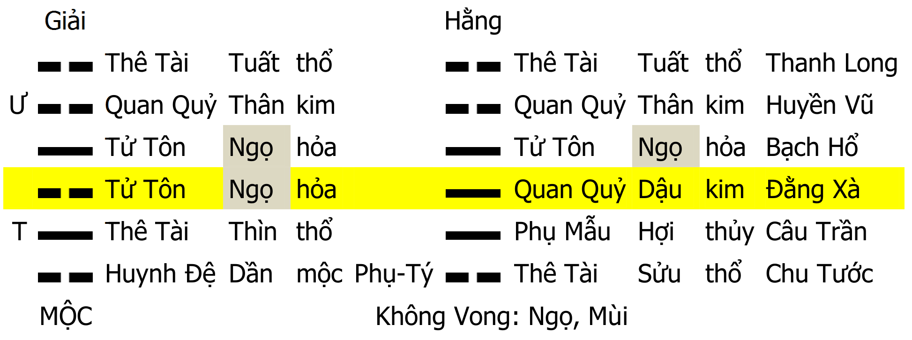
    - **Hình này chứng minh điều gì**
      - Chồng phong lưu theo nhân tình bỏ nhà đi ly thân; người vợ vẫn yêu chồng tha thiết và cố níu kéo.
    - **Từ đâu mà thấy được**
      - Thế Thìn thổ ám động sinh Dụng hào 5; gian hào Ngọ hỏa độc phát khắc Dụng lâm Huyền Vũ; Hương Khuê Nguyệt phá.
  - **Phán đoán chi tiết:**
    - Căn cứ:
      - Quan hệ Thế và Dụng: Dụng thần Quan Quỷ Thân kim tại hào Ứng; hào Thế Thê Tài Thìn thổ được Nhật Thần Tuất thổ xung thành ám động sinh trợ Quan Quỷ Thân kim, chứng tỏ người vợ từ tận đáy lòng vẫn yêu thương tha thiết người chồng. Quan Quỷ tại hào 5 (tôn vị), người chồng chiếm vị trí vô cùng tôn quý, trọng yếu trong lòng cô.
      - Về phía người chồng: Dụng thần Thân kim bị Nguyệt lệnh Ngọ hỏa khắc, nhưng được Nhật Thần Tuất thổ sinh trợ, sinh khắc giữ thế cân bằng.
      - Sự xuất hiện của kẻ thứ ba: Hào 3 Tử Tôn Ngọ hỏa là gian hào (nằm giữa Thế và Ứng), độc phát khắc thẳng vào Dụng thần Quan Quỷ Thân kim. Gian hào đại diện cho người thứ ba chen ngang. Ngọ hỏa là đất Mộc Dục (chủ phong lưu đào hoa), lại thêm Dụng thần Thân kim lâm Huyền Vũ (chủ ám muội phong tình), khẳng định có nhân tình bên ngoài xen vào phá hoại tình cảm vợ chồng.
      - Tình trạng chung sống: Kỵ thần Ngọ hỏa lâm Tuần Không nên hiện tại chưa đến mức ly hôn dứt điểm. Song hào Hương Khuê Tý thủy phục tàng không xuất hiện trên quẻ, lại bị Nguyệt phá Nhật khắc (Ngọ xung Tý, Tuất khắc Tý), chứng tỏ hai người đã sống ly thân. Hương Khuê bị Ngọ hỏa xung phá, nguyên nhân ly thân chính do ả nhân tình gây nên.
      - Hào Thế Thìn thổ ám động tiết hóa Kỵ thần Ngọ hỏa để sinh Dụng thần Thân kim, cho thấy người vợ đang ra sức nhẫn nhục, nỗ lực hòa giải để cứu vãn gia đình.
    - Nhìn vào:
      - Sự tương phản giữa tấm lòng bao dung của người vợ (Thế ám động sinh Dụng hào 5) và thói trăng hoa của người chồng (gian hào Mộc Dục độc phát khắc Dụng lâm Huyền Vũ).
      - Hương Khuê phục tàng Nguyệt phá chỉ ra cảnh phòng không cô quạnh của đương số.
  - **Ứng nghiệm thực tế:**
    - Người chồng quả nhiên đã lén lút dọn đồ bỏ nhà ra đi, thuê nhà sống chung công khai với một người phụ nữ khác bên ngoài.

- **Ví dụ 5: Nữ đoán duyên phận vợ chồng (Ngày Bính Ngọ tháng Ngọ năm Tân Tị)**
  - **Bối cảnh & Chọn Dụng thần:**
    - Ngày Bính Ngọ tháng Ngọ năm Tân Tị (Tuần không: Dần, Mão).
    - Phụ nữ đến xem tiền duyên và hậu vận vợ chồng, được quẻ Sơn Phong Cổ biến Thủy Phong Tỉnh.
    - Lấy Quan Quỷ làm Dụng thần. Quan Quỷ Dậu kim trì Thế tại hào 3.
  - **Hình 201.** Quẻ Sơn Phong Cổ biến Thủy Phong Tỉnh
    - 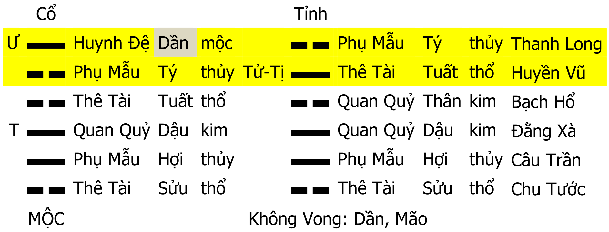
    - **Hình này chứng minh điều gì**
      - Ly hôn trên pháp lý nhưng vẫn ngủ chung giường (đồng sàng dị mộng), không thể tái hợp.
    - **Từ đâu mà thấy được**
      - Phụ Mẫu Tý thủy Nguyệt phá hóa hồi đầu khắc; Dụng thần Dậu kim trì Thế hào 3 lâm Đằng Xà bị Nhật Nguyệt khắc.
  - **Phán đoán chi tiết:**
    - Căn cứ:
      - Dụng thần Quan Quỷ Dậu kim trì Thế, bị cả Nhật Thần và Nguyệt kiến Ngọ hỏa khắc hại tàn nhẫn (hỏa khắc kim), mối quan hệ vợ chồng đã hoàn toàn tan vỡ, suy bại.
      - Hào 5 Phụ Mẫu Tý thủy bị Nguyệt phá, Nhật xung, lại phát động hóa hồi đầu khắc (hóa Thê Tài Tuất thổ khắc Tý thủy): Phụ Mẫu là giấy chứng nhận kết hôn, Nguyệt phá chủ xé bỏ, hủy hoại, chứng tỏ hai người trên thực tế pháp lý đã hoàn tất thủ tục ly hôn.
      - Tình trạng chung sống thực tế: Dụng thần Quan Quỷ Dậu kim trì Thế đóng tại hào 3. Trì Thế là ở ngay bên mình, hào 3 là sàng vị (giường ngủ). Điều này hé lộ một sự thật kỳ lạ: Dù đã ly hôn trên giấy tờ nhưng hai người vẫn ngủ chung trên một chiếc giường!
      - Quan Quỷ lâm Đằng Xà: Đằng Xà chủ mộng mị, hư ảo; đây chính là cảnh tượng "đồng sàng dị mộng" điển hình, tuy chung một chăn gối nhưng mỗi người đều mang mưu tính, toan tính riêng biệt.
      - Ứng kỳ quá khứ và tương lai: Hào Ứng Huynh Đệ Dần mộc lâm Tuần Không hóa Phụ Mẫu Tý thủy Nguyệt phá, năm Mậu Dần (1998) xuất Không chính là năm hai người ra tòa ly hôn. Dụng thần hưu tù, hào biến lâm đất Tử Tuyệt, tuyệt đối không có khả năng gương vỡ lại lành hay tái hôn cùng nhau.
    - Nhìn vào:
      - Sự kết hợp tinh vi giữa Phụ Mẫu Nguyệt phá hóa khắc (đã ly dị) và Dụng thần trì Thế hào 3 lâm Đằng Xà (vẫn nằm chung giường mưu tính riêng).
      - Dụng thần lâm Tử Tuyệt dập tắt hoàn toàn hy vọng quay lại của đương số.
  - **Ứng nghiệm thực tế:**
    - Quả nhiên hai người đã ly hôn từ năm 1998 nhưng vì điều kiện nhà cửa vẫn chấp nhận ngủ chung giường suốt mấy năm trời. Sau buổi đoán quẻ một thời gian, đôi bên chính thức dọn ra ở riêng và mỗi người đều tự đi tìm hạnh phúc mới, tái hôn với người khác.

- **Ví dụ 6: Nam đoán sự nghiệp, hôn nhân, con trai (Ngày Quý Mùi tháng Tuất năm Bính Tuất)**
  - **Bối cảnh & Chọn Dụng thần:**
    - Ngày Quý Mùi tháng Tuất năm Bính Tuất (Tuần không: Thân, Dậu).
    - Nam nhân hỏi về tiền tài sự nghiệp, hôn nhân và xem trong số mệnh có con trai hay không, được quẻ Hỏa Lôi Phệ Hạp biến Sơn Lôi Di.
    - Phối hợp luận giải toàn diện: Thê Tài làm sự nghiệp & vợ; Tử Tôn làm con cái; Huynh Đệ làm anh em.
  - **Hình 202.** Quẻ Hỏa Lôi Phệ Hạp biến Sơn Lôi Di
    - 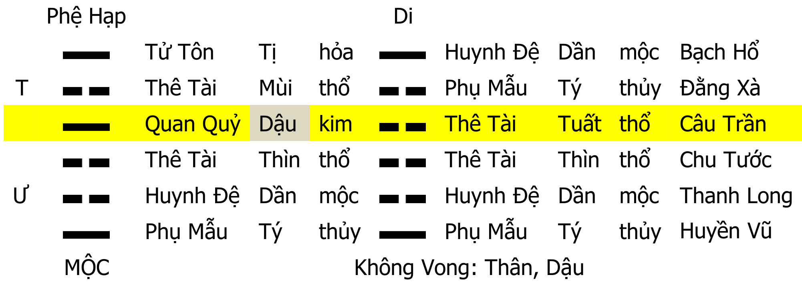
    - **Hình này chứng minh điều gì**
      - Chủ kinh doanh mất quyền vào tay vợ; ngoại tình sinh con gái rơi ngoài giá thú; con trai chết yểu; ly hôn.
    - **Từ đâu mà thấy được**
      - Dụng Tài Thìn thổ hào 3 Nguyệt phá; Dậu kim động hợp giải phá hóa Tài; Tử Tôn Tị hỏa hào 6 nhập Mộ Nguyệt hóa Du hồn.
  - **Phán đoán chi tiết:**
    - Căn cứ:
      - Sự nghiệp và tài vận: Hào Thế Thê Tài Mùi thổ đóng tại hào 5 (ngôi vị ông chủ, lãnh đạo), Thê Tài là hàng hóa tiền bạc, cho thấy đương số là chủ hộ kinh doanh cá thể. Quẻ có Thê Tài lưỡng hiện: Chọn hào Thê Tài Thìn thổ tại hào 3 bị Nguyệt phá làm Dụng thần kinh doanh. Tài Nguyệt phá chủ những năm gần đây làm ăn thất bát. May mắn có hào 4 Quan Quỷ Dậu kim phát động hợp Thìn thổ giải trừ Nguyệt phá (Thìn Dậu hợp); Dậu kim ứng năm Ất Dậu (2005) nên từ năm này tài vận khởi sắc, lại Dậu kim động hóa Tài chủ được tiền tài trong năm Dậu.
      - Quyền lực trong gia đình: Thế lâm Tài hào 5 vốn là tượng ông chủ, nhưng Dụng thần kinh doanh lại là Thê Tài Thìn thổ hào 3 (hào 3 là giường, vợ cùng giường), chứng tỏ công việc kinh doanh thực tế do người vợ thâu tóm toàn quyền quyết định, anh ta chỉ đứng tên danh nghĩa. Dậu kim động hợp Tài mang ý nghĩa đoạt lại quyền hành, nên năm Ất Dậu anh ta mới giành lại được quyền quản lý kinh doanh từ tay vợ.
      - Cha mẹ: Phụ Mẫu Tý thủy tại hào sơ bị cả Nhật Mùi và Nguyệt Tuất khắc thương; hào sơ chủ thuở ấu thơ, Phụ Mẫu là cha mẹ, chứng tỏ cha mẹ anh ta đều mất sớm từ khi còn nhỏ.
      - Hôn nhân và ngoại tình: Thê Tài Thìn thổ Nguyệt phá, Thế Mùi thổ khắc Ứng Dần mộc, quẻ Phệ Hạp chủ cãi cọ, biến quẻ Du Hồn chủ ly tán, vợ chồng bất hòa triền miên tất phải ly hôn. Dậu kim động hợp Dụng thần Thìn thổ chỉ là hòa giải giả tạo vì Dậu kim lâm Tuần Không. Hào động Dậu kim là đất Mộc Dục của Thế Mùi thổ, Nhật Nguyệt đều là Tài, hào Thế là Tài, hào 3 là Tài, hào biến hóa Tài; Phụ Mẫu Tý thủy hưu tù lâm Huyền Vũ: Những tổ hợp này vạch trần anh ta là kẻ vô cùng trăng hoa, ngoại tình bên ngoài. Năm Ất Dậu Dậu kim xuất Không hóa Tài nên bắt đầu dan díu bồ bịch từ năm 2005.
      - Con cái: Tử Tôn Tị hỏa ngự tại hào 6 (số Hỏa là 2, định số có 2 con). Tị hỏa là dương hào vốn chủ con trai, nhưng Dậu kim độc phát là đất Tử của Tị hỏa, báo trước không thể nuôi được con trai, sinh con trai ắt chết yểu, chỉ có 2 con gái. Tử Tôn tại hào 6 (nơi xa xôi viễn xứ), nhập Mộ tại Nguyệt Tuất (bên ngoài quẻ), hóa quẻ Du Hồn, chỉ ra một đứa con gái là con rơi lưu lạc bên ngoài.
      - Anh em: Huynh Đệ Dần mộc (số Mộc là 3), trong nhà có 3 anh em.
    - Nhìn vào:
      - Nghệ thuật bóc tách đa tầng thông tin: Tài hào 3 Nguyệt phá quy tụ trọn vẹn cả sự nghiệp bị vợ lấn quyền lẫn rạn nứt hôn nhân.
      - Tượng Tử Tôn Tị hỏa hào 6 lâm Tử địa và nhập Mộ Nguyệt khắc họa chuẩn xác cái chết của con trai và đứa con rơi bên ngoài.
  - **Ứng nghiệm thực tế:**
    - Toàn bộ lời đoán đều chuẩn xác kỳ lạ: Vợ anh ta từng sinh được một bé trai nhưng không may chết yểu từ sớm, sau đó sinh một bé gái.
    - Vì vợ chồng mâu thuẫn nặng nề không còn quan hệ chăn gối, anh ta khao khát có con trai nối dõi nên đã lén lút tìm đến cô bạn gái cũ (chồng cô này đi công tác xa dài ngày). Anh ta dụ dỗ bạn gái cũ sinh con trai cho mình, nhưng kết quả lại sinh ra một bé gái. Anh ta lập tức rũ bỏ trách nhiệm, để mặc bạn gái cũ tự nuôi con mà không hề quay lại. Người chồng của cô bạn gái cũ đáng thương hoàn toàn không hay biết gì.
    - Sau đó, anh ta đã chính thức hoàn tất thủ tục ly hôn với vợ vào năm Đinh Hợi (2007).

- **Ví dụ 7: Nữ đoán hôn nhân gia đình (Ngày Kỷ Hợi tháng Hợi năm Nhâm Ngọ)**
  - **Bối cảnh & Chọn Dụng thần:**
    - Ngày Kỷ Hợi tháng Hợi năm Nhâm Ngọ (Tuần không: Thìn, Tị).
    - Phụ nữ (38 tuổi) đến dự đoán về cuộc sống hôn nhân và gia đình, được quẻ Thủy Phong Tỉnh (quẻ tĩnh).
    - Lấy Quan Quỷ làm Dụng thần. Trong quẻ Quan Quỷ lưỡng hiện: Quan Quỷ Thân kim tại hào 4 và Quan Quỷ Dậu kim tại hào 3.
  - **Hình 203.** Sơ đồ quẻ Thủy Phong Tỉnh
    - 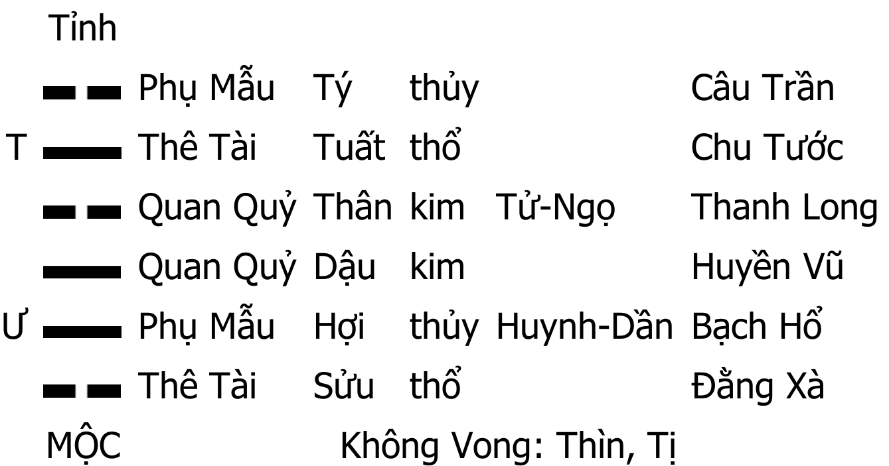
    - **Hình này chứng minh điều gì**
      - Xung đột mẹ chồng nàng dâu gay gắt; chồng nhu nhược bám mẹ góa bụa, bỏ bê tình cảm với vợ.
    - **Từ đâu mà thấy được**
      - Quan Quỷ Dậu kim sinh Ứng Phụ Mẫu Hợi thủy tại hào 2 lâm Nhật Nguyệt thái vượng; Thế Tuất thổ lâm Chu Tước khắc Ứng.
  - **Phán đoán chi tiết:**
    - Căn cứ:
      - Trong quẻ Quan Quỷ lưỡng hiện: Lấy hào Quan Quỷ Dậu kim lâm Dịch Mã tại hào 3 làm Dụng thần đại diện cho người chồng. Dụng thần không được Nhật Nguyệt Hợi thủy trợ giúp (bị tiết khí), ngự tại hào 3 lâm Huyền Vũ quay sang sinh hào Ứng Phụ Mẫu Hợi thủy: Hào Ứng là người khác, cho thấy toàn bộ tâm tư tình cảm của người chồng đều hướng về người khác chứ không màng tới vợ.
      - Đối tượng người chồng hướng về: Hào Ứng Phụ Mẫu Hợi thủy đóng tại hào 2 (trạch vị - ngôi nhà), chứng tỏ người được yêu quý là người sống chung một mái nhà. Phụ Mẫu chủ bậc trưởng bối, lại lâm cả Nhật Thần và Nguyệt kiến (Nhật Nguyệt ví như trời đất sinh thành, chủ cha mẹ), khẳng định người mà chồng yêu quý sâu sắc chính là mẹ đẻ của anh ta.
      - Cảnh ngộ của người mẹ: Phụ Mẫu Hợi thủy được cả Nhật và Nguyệt nâng đỡ vượng tướng, trong quẻ Phụ Mẫu lại lưỡng hiện thành ra thái vượng (quá vượng). Vật cực tất phản, quá vượng hóa suy, biểu thị người mẹ phải chịu cảnh góa bụa, đơn chiếc, cô độc một mình.
      - Quan hệ mẹ chồng - nàng dâu: Hào Thế Thê Tài Tuất thổ lâm Chu Tước tương khắc hào Ứng Phụ Mẫu Hợi thủy. Chu Tước chủ khẩu thiệt, tranh cãi mắng mỏ, phản ánh mâu thuẫn mẹ chồng nàng dâu vô cùng căng thẳng, hai bên khắc khẩu triệt để.
    - Nhìn vào:
      - Dụng thần Quan Quỷ Dậu kim sinh Ứng Phụ Mẫu Hợi thủy hào 2 lâm Nhật Nguyệt thái vượng lột tả trọn vẹn sự phụ thuộc tâm lý bất thường của người chồng vào mẹ.
      - Thế Tuất thổ lâm Chu Tước khắc Ứng vạch trần cuộc chiến âm ỉ nhưng khốc liệt giữa mẹ chồng và con dâu.
  - **Ứng nghiệm thực tế:**
    - Mẹ chồng góa bụa một mình từ sớm, sinh tâm lý chiếm hữu và đố kỵ ghen ghét với hạnh phúc của vợ chồng con trai, dẫn tới cảnh mẹ chồng nàng dâu bất hòa sâu sắc, tranh cãi liên miên.
    - Người chồng là con trai độc nhất, bản tính nhu nhược yếu đuối, từ nhỏ đã ngủ chung một chăn với mẹ. Dù nay đã lập gia đình trưởng thành nhưng anh ta vẫn bám chặt lấy mẹ không rời, và người mẹ cũng quyết giữ chặt con trai bên mình, hoàn toàn bỏ rơi cảm xúc của người vợ.

- **Ví dụ 8: Nữ đoán hôn nhân (Ngày Mậu Ngọ tháng Mão)**
  - **Bối cảnh & Chọn Dụng thần:**
    - Ngày Mậu Ngọ tháng Mão (Tuần không: Tý, Sửu).
    - Phụ nữ (45 tuổi) đến dự đoán hôn nhân, được quẻ Lôi Trạch Quy Muội biến Thiên Trạch Lý.
    - Lấy Quan Quỷ làm Dụng thần. Trong quẻ Quan Quỷ lưỡng hiện: Quan Quỷ Tị hỏa tại hào sơ và Quan Quỷ Ngọ hỏa tại hào 4.
  - **Hình 204.** Sơ đồ quẻ Lôi Trạch Quy Muội biến Thiên Trạch Lý
    - 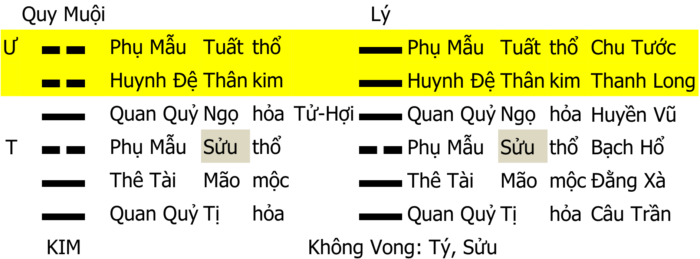
    - **Hình này chứng minh điều gì**
      - Vợ đam mê tu luyện thần tiên cấm vận chăn gối; chồng cô đơn nên sa vào ngoại tình với phụ nữ bên ngoài.
    - **Từ đâu mà thấy được**
      - Thế Sửu thổ hào 3 Không Vong; Nguyên thần Thế Ngọ hỏa lâm Huyền Vũ nhập Mộ hào 6 Chu Tước; Thân kim động hợp Dụng lâm Thanh Long.
  - **Phán đoán chi tiết:**
    - Căn cứ:
      - Trong quẻ Quan Quỷ lưỡng hiện: Lấy hào Quan Quỷ Tị hỏa gặp tương hợp làm Dụng thần chính. Quan Quỷ được Nguyệt lệnh Mão mộc sinh trợ và Nhật Thần Ngọ hỏa phù trì là cực kỳ vượng tướng. Dụng thần Tị hỏa sinh hào Thế Phụ Mẫu Sửu thổ: Người chồng đối xử rất ân cần, chu đáo và tốt với vợ.
      - Thái độ của người vợ: Hào Thế Phụ Mẫu Sửu thổ đóng tại hào 3 lâm Tuần Không, từ chối tiếp nhận sự tương sinh của Dụng thần. Hào 3 là sàng vị (giường ngủ), lâm Không Vong là trốn tránh, biểu thị chính bản thân người vợ lảng tránh, cấm vận không chịu sinh hoạt tình dục chăn gối với chồng.
      - Thế giới nội tâm của người vợ: Nguyên thần của hào Thế là Quan Quỷ Ngọ hỏa lâm Huyền Vũ. Huyền Vũ chủ tôn giáo tín ngưỡng, Quan Quỷ chủ thần phật linh giới; Ngọ hỏa lại nhập Mộ tại hào 6 Phụ Mẫu Tuất thổ (hào 6 là trời cao, đỉnh đầu), biểu thị đương số nuôi mộng tu hành thoát tục để lên trời làm thần tiên! Ngoại quái phục ngâm, Mộ khố lâm Chu Tước (chủ kinh chú, mật ngữ), hàng ngày cô chỉ miệt mài tụng kinh niệm chú tu luyện pháp thuật.
      - Hành vi của người chồng: Hào 5 Huynh Đệ Thân kim phát động tương hợp Quan Quỷ Tị hỏa (Tị Thân lục hợp), lâm Thanh Long chủ tửu sắc ái tình: Có người phụ nữ bên ngoài chủ động tìm đến quyến rũ chồng; người chồng vì không chịu nổi cảnh phòng không quạnh quẽ nên đã sa vào ngoại tình.
      - Tài chính gia đình: Hào 2 Thê Tài Mão mộc tương hợp hào Ứng Phụ Mẫu Tuất thổ; hào 2 là trạch (nhà), Thê Tài là tiền của, hào Ứng là phu vị (chồng), cho thấy toàn bộ tài sản tiền bạc trong gia đình đều nằm trong tay người chồng quản lý.
    - Nhìn vào:
      - Tượng hào Thế Sửu thổ hào 3 Không Vong kết hợp Nguyên thần Ngọ hỏa lâm Huyền Vũ nhập Mộ hào 6 Chu Tước khắc họa trọn vẹn chân dung một nữ đạo hữu mê tu cấm vận tình dục.
      - Hào 5 Thân kim lâm Thanh Long động hợp Dụng thần vạch rõ nguyên nhân chồng ngoại tình do thiếu thốn hơi ấm gia đình.
  - **Ứng nghiệm thực tế:**
    - Người phụ nữ này bẩm sinh sở hữu công năng đặc dị, có chút danh tiếng trong giới huyền thuật, hàng ngày đóng cửa chuyên tâm tọa thiền trì chú tu luyện, tuyệt đối không cho chồng đụng chạm vào người. Người chồng vì cô đơn lâu ngày nên đã ra ngoài tìm phụ nữ khác để giải tỏa và nảy sinh quan hệ bất chính.

- **Ví dụ 9: Nam đoán hôn nhân (Ngày Ất Hợi tháng Hợi năm Tân Tị)**
  - **Bối cảnh & Chọn Dụng thần:**
    - Ngày Ất Hợi tháng Hợi năm Tân Tị (Tuần không: Thân, Dậu).
    - Nam nhân (35 tuổi) đến dự đoán về cuộc sống hôn nhân, được quẻ Phong Sơn Tiệm biến Thủy Phong Tỉnh.
    - Lấy Thê Tài làm Dụng thần. Thê Tài Tý thủy phục tàng dưới hào 5 Phụ Mẫu Tị hỏa.
  - **Hình 205.** Sơ đồ quẻ Phong Sơn Tiệm biến Thủy Phong Tỉnh
    - 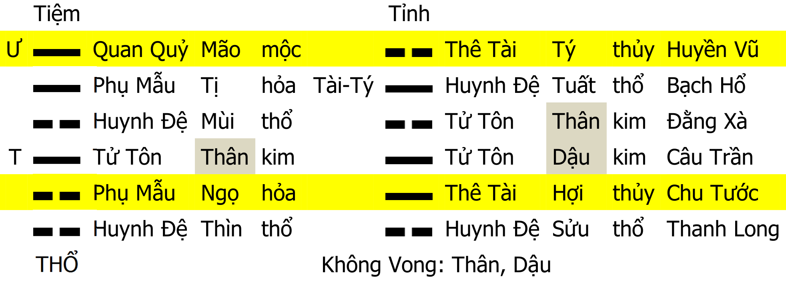
    - **Hình này chứng minh điều gì**
      - Vợ tác oai tác quái hung dữ như hổ; chồng lười biếng nhu nhược trở thành túi trút giận bị mắng chửi triền miên.
    - **Từ đâu mà thấy được**
      - Thê Tài Tý thủy hào 5 lâm Bạch Hổ vượng tướng; Thế Thân kim Không Vong lâm Câu Trần; Phụ Mẫu Ngọ hỏa hào 2 lâm Chu Tước khắc Thế.
  - **Phán đoán chi tiết:**
    - Căn cứ:
      - Thê Tài Tý thủy tuy phục tàng nhưng được cả Nhật Thần và Nguyệt kiến Hợi thủy sinh phù là cực vượng. Dụng thần phục tại hào 5 lâm Bạch Hổ: Hào 5 là ngôi vị gia trưởng (người nắm quyền trong nhà); Bạch Hổ chủ hung hãn, bạo ngược, vũ lực. Điều này cho thấy người vợ ở nhà vô cùng dữ tợn, nắm trọn quyền sinh sát, tác oai tác quái, nói sao phải nghe vậy, tính tình ngang ngược hung hãn.
      - Về phía người chồng: Hào Thế Tử Tôn Thân kim sinh trợ Dụng thần Thê Tài Tý thủy, chứng tỏ người chồng rất yêu chiều và nể sợ vợ. Tuy nhiên, hào Thế lại lâm Tuần Không và lâm Câu Trần: Tuần Không khiến lực sinh Tài bất lực; Câu Trần chủ chậm chạp, lười biếng. Người chồng ít biết quan tâm chăm sóc vợ, bản tính lười nhác, ở nhà khoanh tay đứng nhìn, chẳng chịu mó tay vào bất cứ công việc gì.
      - Xung đột thường nhật: Hào 2 Phụ Mẫu Ngọ hỏa lâm Chu Tước phát động khắc thẳng vào hào Thế Thân kim: Hào 2 là trạch vị (nhà), Chu Tước chủ khẩu thiệt mắng chửi, chì chiết. Người chồng hễ bước chân về đến nhà là biến thành "túi trút giận", thường xuyên bị người vợ đay nghiến, mắng nhiếc tơi bời.
    - Nhìn vào:
      - Sự áp chế hoàn toàn giữa Dụng thần Tài Tý thủy hào 5 lâm Bạch Hổ (vợ bá quyền dữ tợn) đối với hào Thế Thân kim Không Vong Câu Trần (chồng lười biếng nhu nhược).
      - Hào 2 Chu Tước khắc Thế tái hiện sinh động cảnh gia đình luôn ngập tràn tiếng quát tháo mắng chửi.
  - **Ứng nghiệm thực tế:**
    - Hoàn toàn ăn khớp với thực tế gia cảnh: Người đàn ông này ở nhà bản tính lười biếng quen thân, không chịu làm lụng việc nhà, thường xuyên bị cô vợ dữ dằn mắng chửi thậm tệ, coi như bia đỡ đạn xả giận mỗi ngày.

- **Ví dụ 10: Nữ đoán hôn nhân (Ngày Nhâm Thìn tháng Hợi năm Quý Mùi)**
  - **Bối cảnh & Chọn Dụng thần:**
    - Ngày Nhâm Thìn tháng Hợi năm Quý Mùi (Tuần không: Ngọ, Mùi).
    - Phụ nữ đến xem bói về tình trạng hôn nhân, được quẻ Lôi Sơn Tiểu Quá biến Địa Thủy Sư.
    - Lấy Quan Quỷ làm Dụng thần. Trong quẻ Quan Quỷ lưỡng hiện: Quan Quỷ Ngọ hỏa tại hào 2 và Quan Quỷ Ngọ hỏa tại hào 4 (trì Thế).
  - **Hình 206.** Sơ đồ quẻ Lôi Sơn Tiểu Quá biến Địa Thủy Sư
    - 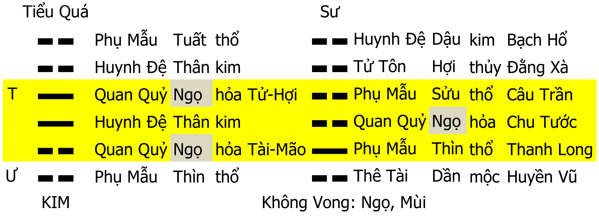
    - **Hình này chứng minh điều gì**
      - Chồng ngoại tình bỏ nhà đi theo bồ nhí đòi ly hôn; vợ không chịu ly hôn cam chịu cảnh phòng không gối chiếc.
    - **Từ đâu mà thấy được**
      - Dụng Quan Ngọ hỏa hào 2 Không Vong phục Tài Mão mộc; Huynh Thân kim lâm Chu Tước động; Ứng xung Mộ Tuất thổ thu Dụng.
  - **Phán đoán chi tiết:**
    - Căn cứ:
      - Trong quẻ Quan Quỷ lưỡng hiện: Lấy hào 2 Quan Quỷ Ngọ hỏa làm Dụng thần chính. Quan Quỷ Ngọ hỏa tại hào 2 lâm Tuần Không: Hào 2 là trạch vị (ngôi nhà), lâm Không Vong là người chồng vắng bóng, không hề ở nhà. Hào Thê Tài Mão mộc phục tàng ngay dưới Dụng thần hào 2: Người chồng đang nuôi bồ nhí bên ngoài, theo nhân tình không chịu về nhà.
      - Xung đột gia đình: Hào 3 Huynh Đệ Thân kim lâm Chu Tước phát động: Chu Tước chủ khẩu thiệt thị phi, hai người hễ giáp mặt nhau là cãi vã nảy lửa. Dụng thần Ngọ hỏa bị Nguyệt lệnh Hợi thủy khắc, Nhật Thìn không sinh, hôn nhân đã rạn nứt không thể cứu vãn.
      - Tình trạng quan hệ: Dù Quan Quỷ Ngọ hỏa trì Thế tại hào 4 (danh nghĩa vẫn là vợ chồng), nhưng lại lâm Tuần Không và bị Nguyệt khắc nên "có chồng cũng như không", hoàn toàn không có sinh hoạt chăn gối vợ chồng.
      - Ý định ly hôn: Hào Ứng Phụ Mẫu Thìn thổ lâm Nhật Thần xung động Phụ Mẫu Tuất thổ tại hào 6, khiến Tuất thổ ám động thu Dụng thần Ngọ hỏa nhập Mộ (Tuất là Hỏa khố). Mộ khố chủ kết thúc chấm dứt; Ứng là đối phương, chỉ rõ người chồng rắp tâm ép buộc đòi ly hôn dứt điểm. Song hào Thế Ngọ hỏa phát động trợ giúp Dụng thần: Người vợ quyết không chấp nhận ký đơn ly hôn.
      - Ứng kỳ: Năm Nhâm Ngọ (2002) Dụng thần lâm Ngọ xuất Không, hai người chính thức ly thân. Năm Tân Tị (2001) Thái Tuế hợp trú Huynh Đệ Thân kim (kẻ tranh đoạt, tình địch), người chồng bắt đầu ngoại tình từ năm 2001. Dụng thần suy kiệt, việc ly hôn chỉ còn là vấn đề thời gian.
    - Nhìn vào:
      - Hào 2 Quan Quỷ Không Vong phục Tài Mão mộc vạch trần việc chồng bỏ nhà theo gái.
      - Tượng hào Ứng xung Mộ thu Dụng (chồng đòi ly hôn) đối chọi hào Thế động trợ Dụng (vợ kiên quyết không buông).
  - **Ứng nghiệm thực tế:**
    - Người chồng bắt đầu ngoại tình từ năm 2001, đến năm 2002 Nhâm Ngọ thì dọn hẳn đồ đạc ra ngoài sống chung như vợ chồng với ả nhân tình, cắt đứt không về nhà. Người chồng nhiều lần gây áp lực đòi ly hôn nhưng cô nhất quyết không đồng ý, cắn răng chịu đựng cảnh sống cô độc một mình trong ngôi nhà vắng vẻ.

- **Ví dụ 11: Nữ đoán hôn nhân (Ngày Nhâm Tuất tháng Ngọ năm Nhâm Ngọ)**
  - **Bối cảnh & Chọn Dụng thần:**
    - Ngày Nhâm Tuất tháng Ngọ năm Nhâm Ngọ (Tuần không: Tý, Sửu).
    - Phụ nữ (hơn 40 tuổi) đến dự đoán về cuộc hôn nhân bế tắc, được quẻ Cấn Vi Sơn biến Trạch Thiên Quải.
    - Lấy Quan Quỷ làm Dụng thần. Quan Quỷ Dần mộc trì Thế tại hào 6.
  - **Hình 207.** Sơ đồ quẻ Cấn Vi Sơn biến Trạch Thiên Quải
    - 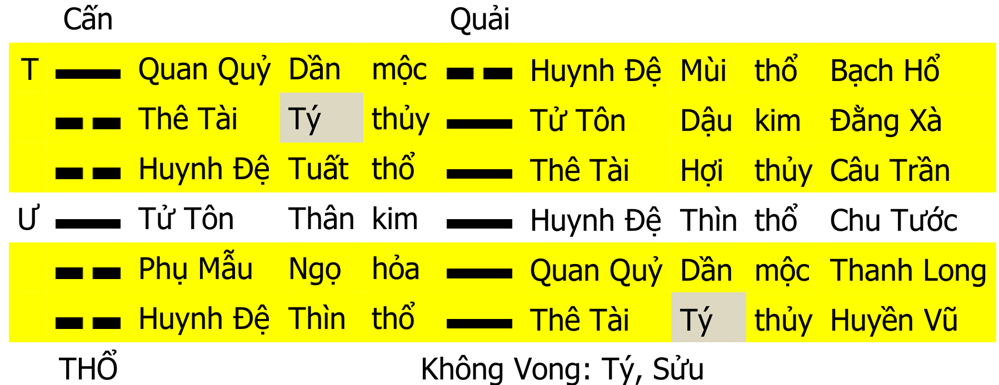
    - **Hình này chứng minh điều gì**
      - Bạo lực gia đình tàn khốc khiến người vợ bế tắc u uất tự sát 3 lần bất thành.
    - **Từ đâu mà thấy được**
      - Thế Dần mộc hào 6 lâm Bạch Hổ hóa Mộ; Ứng Thân kim độc tĩnh khắc Thế; Nguyên thần Tý thủy Không Vong Nguyệt phá nhập Mộ.
  - **Phán đoán chi tiết:**
    - Căn cứ:
      - Hôn nhân pháp lý: Trong quẻ có Dần - Ngọ - Tuất tam hợp Phụ Mẫu Hỏa cục, Quan Quỷ Dần mộc trì Thế, xác nhận hai người đã kết hôn danh chính ngôn thuận.
      - Bất hạnh gia đình: Toàn quẻ 5 hào đều phát động, duy chỉ có hào 3 Tử Tôn Thân kim tại hào Ứng độc tĩnh. Tử Tôn là Kỵ thần khắc phu, độc tĩnh khắc thẳng vào hào Thế Quan Quỷ Dần mộc; hào Ứng là phu vị, báo hiệu cuộc hôn nhân vô cùng nghiệt ngã, chồng là kẻ khắc tinh tàn độc.
      - Bạo lực gia đình: Hào Thế lâm Bạch Hổ (chủ bạo lực, đánh đập, thương tích đổ máu), bị hào độc tĩnh Thân kim lâm Chu Tước tại hào Ứng khắc hại: Người chồng tính tình vũ phu tàn bạo, thường xuyên thượng cẳng chân hạ cẳng tay, đánh đập vợ dã man.
      - Bế tắc và tự sát: Hào Thế Dần mộc suy bại ngự tại hào 6 (hào 6 là đầu não, tư duy), động hóa Huynh Đệ Mùi thổ nhập Mộ (Mùi là Mộc khố). Hóa Mộ chủ tư duy bế tắc, trầm cảm cùng cực. Đặc biệt, Nguyên thần của hào Thế là Thê Tài Tý thủy lâm Tuần Không, bị Nguyệt phá và nhập Mộ tại Nhật Thần Tuất thổ. Nguyên thần chủ tinh thần và ý chí sinh tồn; Nguyệt phá nhập Mộ là điềm báo tự sát, vì bế tắc trước đòn roi bạo lực mà muốn tìm đến cái chết để giải thoát!
      - Lời khuyên xung quanh: Huynh Đệ trùng điệp phát động sinh cho Kỵ thần Tử Tôn Thân kim; Huynh Đệ là bạn bè chòm xóm, bạn bè xung quanh đều xúm vào khuyên cô nên dứt khoát ly hôn. Song Nguyên thần Tý thủy Không Vong nên cô vẫn còn nhu nhược, do dự chưa dám dứt khoát dứt áo ra đi.
    - Nhìn vào:
      - Ứng Thân kim độc tĩnh khắc Thế lâm Bạch Hổ vạch trần bộ mặt vũ phu bạo lực tàn bạo của người chồng.
      - Hào 6 hóa Mộ kết hợp Nguyên thần Nguyệt phá nhập Mộ khắc họa cảnh ngộ trầm cảm muốn quyên sinh của người vợ.
  - **Ứng nghiệm thực tế:**
    - Vừa nghe thầy phán xong câu chuyện, người phụ nữ đã bật khóc nức nở trong cay đắng, thừa nhận bản thân bị chồng bạo hành dã man suốt nhiều năm trời, uất ức đến mức đã 3 lần uống thuốc tự tử nhưng may mắn đều được gia đình phát hiện đưa đi cấp cứu rửa ruột kịp thời.

- **Ví dụ 12: Nam đoán hôn nhân (Ngày Kỷ Dậu tháng Thân)**
  - **Bối cảnh & Chọn Dụng thần:**
    - Ngày Kỷ Dậu tháng Thân (Tuần không: Dần, Mão).
    - Người đàn ông đến xem bói về cuộc hôn nhân đang rạn nứt, được quẻ Thiên Sơn Độn biến Thiên Hỏa Đồng Nhân.
    - Lấy Thê Tài làm Dụng thần. Thê Tài Dần mộc phục tàng dưới hào 2 Quan Quỷ Ngọ hỏa.
  - **Hình 208.** Quẻ Thiên Sơn Độn biến Thiên Hỏa Đồng Nhân
    - 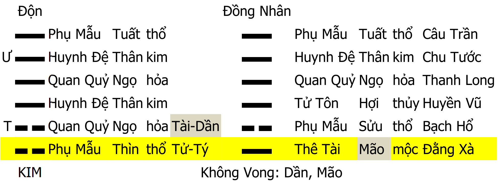
    - **Hình này chứng minh điều gì**
      - Vợ ly thân dắt con về nhà ngoại, ngăn cấm cha gặp con; chắc chắn ly hôn.
    - **Từ đâu mà thấy được**
      - Thê Tài Dần mộc Nguyệt phá phục tàng Không Vong; Tử Tôn Tý thủy nhập Mộ Phụ Mẫu Thìn thổ độc phát sinh Ứng.
  - **Phán đoán chi tiết:**
    - Căn cứ:
      - Tình trạng vợ chồng: Hào sơ Phụ Mẫu Thìn thổ phát động hợp Nhật Thần Dậu kim (Thìn Dậu hợp) là dấu hiệu đã kết hôn hợp pháp. Tuy nhiên, Thìn thổ phát động lại hóa Tuần Không (biến Thê Tài Mão mộc lâm Không); Dụng thần Thê Tài Dần mộc phục tàng lại lâm Tuần Không không hiện trên quẻ, chứng tỏ người vợ đã bỏ nhà ra đi sống ly thân.
      - Khả năng duy trì hôn nhân: Dụng thần Dần mộc bị Nguyệt lệnh Thân kim xung phá (Nguyệt phá), hưu tù, lâm Không Vong phục tàng: Hôn nhân hoàn toàn đổ vỡ, ly hôn là điều chắc chắn không thể tránh khỏi.
      - Con cái lưu lạc: Hào Tử Tôn Tý thủy phục tàng dưới hào sơ Phụ Mẫu Thìn thổ không xuất hiện trên quẻ, chứng tỏ con cái hiện không ở bên cạnh người cha; Tử Tôn nhập Mộ tại Phụ Mẫu Thìn thổ phát động. Thìn thổ lại sinh hào Ứng Huynh Đệ Thân kim (hào Ứng là nhà vợ), vì vậy Phụ Mẫu Thìn thổ chính là cha mẹ vợ (ông bà ngoại). Con cái hiện đang bị người vợ mang về nương náu ở nhà bà ngoại.
      - Tâm trạng người cha: Mộ khố Tử Tôn Thìn thổ lâm Đằng Xà độc phát: Đằng Xà chủ lo âu, bồn chồn, day dứt khôn nguôi; Mộ khố là thu tàng, biểu thị người cha vô cùng khắc khoải, nhớ con và khao khát được đón con về ở cùng.
      - Tái hôn trong tương lai: Năm Bính Tuất (2006) xung khai Phụ Mẫu Thìn thổ (hợp xứ phùng xung), hào biến Mão mộc bị Tuất thổ hợp trú, có cơ duyên tái hôn sau khi chia tay vợ cũ.
    - Nhìn vào:
      - Tượng Dụng thần Dần mộc Nguyệt phá Không Vong phục tàng khẳng định kết cục ly hôn không thể cứu vãn.
      - Tử Tôn nhập Mộ Phụ Mẫu Thìn thổ độc phát sinh Ứng lột tả trọn vẹn cảnh vợ giấu con bên nhà ngoại không cho chồng gặp.
  - **Ứng nghiệm thực tế:**
    - Hai vợ chồng đã sống ly thân trong tình trạng căng thẳng tột độ. Người vợ bế con dứt áo về hẳn nhà ngoại sinh sống và kiên quyết ngăn cấm, không cho anh ta được gặp mặt con dù chỉ một lần, khiến anh vô cùng đau khổ dằn vặt. Kết cục giải quyết ly hôn sau đó chưa có phản hồi.

- **Ví dụ 13: Nữ đoán hôn nhân gia đình (Ngày Nhâm Dần tháng Mùi năm Quý Mùi)**
  - **Bối cảnh & Chọn Dụng thần:**
    - Ngày Nhâm Dần tháng Mùi năm Quý Mùi (Tuần không: Thìn, Tị).
    - Phụ nữ (44 tuổi) đến xem dự đoán về cuộc sống hôn nhân gia đình, được quẻ Sơn Địa Bác biến Khôn Vi Địa.
    - Lấy Quan Quỷ làm Dụng thần. Quan Quỷ Tị hỏa đóng tại hào 2 (hào Ứng).
  - **Hình 209.** Quẻ Sơn Địa Bác biến Khôn Vi Địa
    - 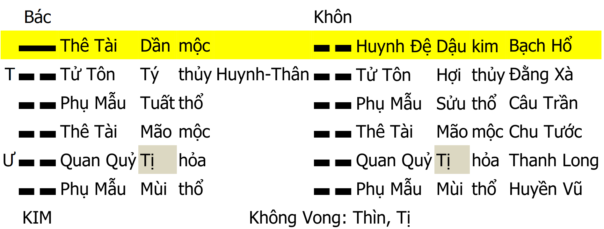
    - **Hình này chứng minh điều gì**
      - Chồng đi làm ăn buôn bán xa vắng nhà khiến vợ bất an; hôn nhân bền vững không ly hôn nếu vợ đi theo chồng.
    - **Từ đâu mà thấy được**
      - Quan Quỷ Tị hỏa hào 2 lâm Không Vong, Dịch Mã Thanh Long; Thê Tài Dần mộc độc phát sinh Dụng thần.
  - **Phán đoán chi tiết:**
    - Căn cứ:
      - Vượng suy Dụng thần: Quan Quỷ Tị hỏa được Nhật Thần Dần mộc tương sinh, Nguyệt lệnh Mùi thổ không khắc phạt là vượng tướng. Tuy nhiên, Dụng thần đóng tại hào 2 lại lâm Tuần Không: Hào 2 là trạch vị (ngôi nhà), lâm Không Vong là người chồng vắng bóng, không có mặt ở nhà.
      - Nghề nghiệp và lý do vắng nhà: Dụng thần Quan Quỷ Tị hỏa lâm Dịch Mã (Hợi Mão Mùi mã tại Tị), Dịch Mã chủ bôn ba kinh doanh buôn bán, lại lâm Thanh Long chủ tiền tài hàng hóa. Điều này chỉ rõ người chồng phải đi xa làm ăn, bươn chải kinh doanh kiếm tiền nơi đất khách quê người nên hiếm khi có mặt ở nhà.
      - Lịch sử hôn nhân: Hào 6 Thê Tài Dần mộc phát động sinh trợ Quan Quỷ Tị hỏa, nhưng động hóa hồi đầu khắc (hóa Huynh Đệ Dậu kim khắc Dần mộc). Đến năm 1987 Đinh Mão, chi Mão xung đi hào biến Dậu kim, giải trừ hồi đầu khắc để Dần mộc sinh vượng Quan Quỷ, năm này hai người thành hôn kết tóc.
      - Tình cảm và tâm lý: Quan Quỷ lâm hào Ứng, người vợ rất yêu thương tôn trọng chồng; nhưng vì Quan Quỷ lâm Không Vong nên người chồng mải mê công việc mà chưa thấu hiểu hết sự thiếu thốn tình cảm của vợ. Hào Thế Tử Tôn Tý thủy lâm Đằng Xà: Đằng Xà chủ bồn chồn, bất an, tâm can người vợ luôn thấp thỏm lo âu khi sống cảnh vắng chồng.
      - Hướng giải quyết: Hào độc phát sinh Quan Quỷ nên hôn nhân bền vững, tuyệt đối không có chuyện ly hôn. Biện pháp tốt nhất là người vợ nên thu xếp công việc gia đình để chuyển đến sống cạnh chồng nơi đất khách.
    - Nhìn vào:
      - Tượng Dụng thần Tị hỏa hào 2 lâm Không Vong phối hợp Dịch Mã Thanh Long định vị chuẩn xác cảnh chồng bôn ba làm ăn xa xứ.
      - Hào độc phát sinh Dụng khẳng định sợi dây liên kết hôn nhân vẫn bền chặt, giải tỏa nỗi bất an cho đương số.
  - **Ứng nghiệm thực tế:**
    - Nghe theo lời khuyên thấu tình đạt lý của tác giả, người phụ nữ sau đó đã quyết định xin nghỉ hẳn công việc tại quê nhà để chuyển đến sinh sống cùng chồng nơi anh đang mở cơ sở kinh doanh, gia đình từ đó lại thuận hòa, ấm êm.

- **Ví dụ 14: Nam đoán hôn nhân cho bạn (Ngày Đinh Sửu tháng Tuất)**
  - **Bối cảnh & Chọn Dụng thần:**
    - Ngày Đinh Sửu tháng Tuất (Tuần không: Thân, Dậu).
    - Nam nhân đến gieo quẻ hỏi về cuộc sống hôn nhân của người bạn thân, được quẻ Hỏa Phong Đỉnh biến Lôi Sơn Tiểu Quá.
    - Lấy Thê Tài làm Dụng thần. Trong quẻ Thê Tài lưỡng hiện: Thê Tài Dậu kim tại hào 3 và Thê Tài Dậu kim tại hào 4.
  - **Hình 210.** Quẻ Hỏa Phong Đỉnh biến Lôi Sơn Tiểu Quá
    - 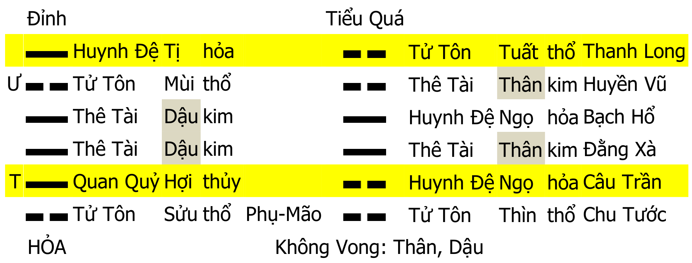
    - **Hình này chứng minh điều gì**
      - Vợ nguội lạnh bỏ bê nhà cửa có nhân tình tán tỉnh; chồng chán nản muốn dứt khoát ly hôn năm Ất Dậu.
    - **Từ đâu mà thấy được**
      - Thê Tài Dậu kim hào 3 Không Vong không sinh Thế hào 2; Ứng Mùi thổ lâm Huyền Vũ ám động sinh Dụng; Thế hóa Huynh Đệ.
  - **Phán đoán chi tiết:**
    - Căn cứ:
      - Trong quẻ Thê Tài lưỡng hiện: Chọn hào Thê Tài Dậu kim tại hào 3 gần hào Thế làm Dụng thần chính đại diện cho người vợ. Thê Tài được cả Nhật Sửu và Nguyệt Tuất sinh phù là vượng tướng. Tuy nhiên, Dụng thần lâm Tuần Không nên không sinh cho hào Thế Quan Quỷ Hợi thủy, chứng tỏ trái tim của người vợ đã hoàn toàn nguội lạnh, không còn hướng về người chồng.
      - Bỏ bê gia đình: Dụng thần ngự tại hào 3 (sàng vị - giường ngủ) lâm Tuần Không không sinh Thế, cho thấy hai vợ chồng rất hiếm khi sinh hoạt chăn gối cùng nhau. Hào 2 là trạch vị (nhà), Thê Tài lâm Không không sinh hào 2, người vợ cũng hiếm khi bước chân về nhà, bỏ bê nhà cửa lạnh tanh.
      - Người thứ ba dòm ngó: Hào Ứng Tử Tôn Mùi thổ lâm Huyền Vũ bị Nhật Thần Sửu thổ xung thành ám động sinh trợ Dụng thần Thê Tài Dậu kim: Hào Ứng là người đàn ông khác, Huyền Vũ chủ ám muội lén lút, chỉ rõ có kẻ thứ ba bên ngoài đang thầm thương trộm nhớ, tán tỉnh dan díu với cô vợ.
      - Ý định ly hôn và ứng kỳ: Hào Thế Quan Quỷ Hợi thủy phát động hóa ra Kỵ thần Huynh Đệ Ngọ hỏa: Chính bản thân người chồng đã nung nấu ý định ly hôn dứt điểm. Biến quẻ là Du Hồn chủ sự phân ly; trên quẻ lại có hào 6 Huynh Đệ Tị hỏa phát động khắc trực diện Thê Tài, khẳng định kết cục tất yếu phải ly hôn. Hiện tại Dụng thần Dậu kim đang lâm Tuần Không, đến khi xuất Không sẽ giải quyết dứt điểm. Ấn định năm Ất Dậu (2005) xuất Không sẽ chính thức ra tòa ly hôn.
    - Nhìn vào:
      - Dụng thần Dậu kim hào 3 Không Vong không sinh Thế và không sinh hào 2 khắc họa chân dung người vợ lãnh đạm, bỏ bê gia đình.
      - Ứng lâm Huyền Vũ ám động sinh Dụng kết hợp Thế hóa Huynh Đệ báo hiệu kết cục tan vỡ không thể cứu vãn.
  - **Ứng nghiệm thực tế:**
    - Người vợ quả thực không mấy khi ở nhà, mỗi tuần chỉ tạt qua nhà đúng một lần như khách trọ rồi lại bỏ đi biệt tăm. Tình cảm đôi bên đã rạn nứt cạn kiệt, người chồng vô cùng chán nản muốn dứt khoát ly hôn nhưng còn đôi chút do dự, bạn bè ai cũng khuyên anh nên sớm giải thoát. Diễn biến sau đó không có phản hồi thêm.

- **Ví dụ 15: Nam đoán hôn nhân (Ngày Mậu Dần tháng Tuất)**
  - **Bối cảnh & Chọn Dụng thần:**
    - Ngày Mậu Dần tháng Tuất (Tuần không: Thân, Dậu).
    - Người đàn ông (hơn 50 tuổi) đến dự đoán về số mệnh hôn nhân của mình, được quẻ Khôn Vi Địa biến Phong Lôi Ích.
    - Lấy Thê Tài làm Dụng thần. Thê Tài Hợi thủy ngự tại hào 5.
  - **Hình 211.** Quẻ Khôn Vi Địa biến Phong Lôi Ích
    - 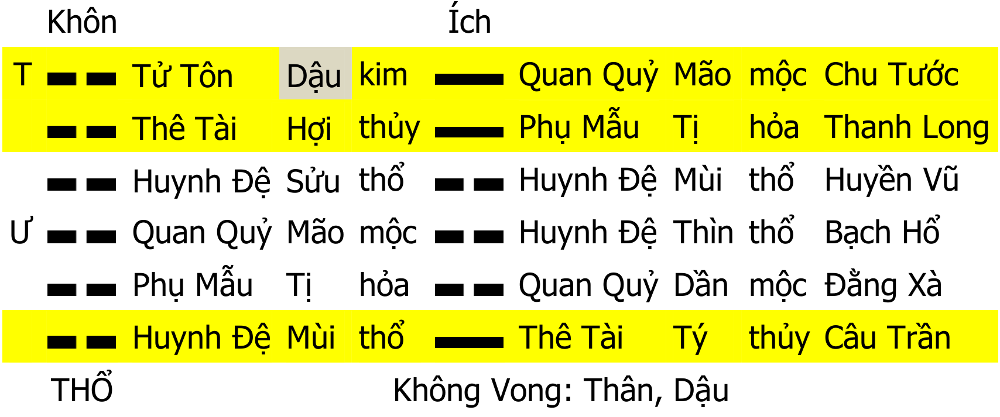
    - **Hình này chứng minh điều gì**
      - Tật xấu chửi bới đánh đập vợ khiến 3 đời vợ đều bỏ đi; cuối đời cô độc không nơi nương tựa.
    - **Từ đâu mà thấy được**
      - Ngoại quái phản ngâm; Thế Dậu kim hào 6 lâm Không Chu Tước xung Ứng Bạch Hổ; Huynh động hóa Tài; hào 5 Tài hợp Nhật Quan.
  - **Phán đoán chi tiết:**
    - Căn cứ:
      - Quẻ tượng bất thường: Thê Tài Hợi thủy không được Nhật Dần hay Nguyệt Tuất trợ giúp (bị Nguyệt khắc, Nhật hợp tiết khí), lại nằm trong quẻ Lục Xung, hào sơ Huynh Đệ Mùi thổ phát động khắc Tài. Theo lẽ thường, đây là tượng cả đời không có hôn nhân hoặc hôn nhân chết yểu. Tuy nhiên, ngoại quái biến Phản Ngâm (Khôn biến Tốn, các hào vị phản ngâm tương xung tương khắc): Phản ngâm chủ việc lặp đi lặp lại, đảo lộn, biến động thất thường. Do đó không phải là không có vợ, mà là cưới rồi lại bỏ, ly hôn rồi lại cưới, trải qua nhiều đời vợ nhưng không bao giờ yên ổn.
      - Tâm tính và tật xấu của người chồng: Hào Thế Tử Tôn Dậu kim phát động sinh Thê Tài Hợi thủy, bản thân rất ham thích phụ nữ, khao khát lấy vợ. Song hào Thế lâm Tuần Không lại nằm trong quẻ Phản Ngâm: Tính tình thất thường lúc nóng lúc lạnh, không biết cách yêu thương phụ nữ. Hào Thế lâm Chu Tước lại thuộc hành Kim: "Kim phùng Không tắc minh" (kim rỗng kêu to), Chu Tước chủ khẩu thiệt mắng chửi thậm tệ; hào Thế động xung khắc thẳng vào hào Ứng Quan Quỷ Mão mộc, hào Ứng lại lâm Bạch Hổ (chủ bạo lực vũ phu). Người đàn ông này mắc tật xấu cực kỳ bạo lực: Vừa mở mồm là chửi bới mạt sát thậm tệ, lại có thói quen đánh đập vợ tàn bạo.
      - Vợ ngoại tình: Hào sơ Huynh Đệ Mùi thổ phát động hóa Thê Tài Tý thủy; hào 5 Thê Tài Hợi thủy lại tương hợp với Quan Quỷ Dần mộc tại Nhật Thần: Người vợ sống với anh ta rất dễ sinh lòng trắc nết, ngoại tình với người đàn ông khác.
      - Kết cục cuối đời: Hào Thế đóng tại hào 6 lâm Tuần Không, Tử Tôn phát động hóa Quan Quỷ: Hào 6 là điểm tận cùng của sự vật, báo trước kết cục tuổi già rơi vào cảnh cô độc hiu quạnh, không vợ không con nương tựa.
    - Nhìn vào:
      - Tượng Ngoại quái Phản Ngâm kết hợp Thế lâm Chu Tước "Kim Không tắc minh" xung khắc Ứng Bạch Hổ giải mã toàn bộ bi kịch 3 đời vợ tan vỡ vì bạo hành.
      - Hào 6 Thế Không hóa Quỷ chỉ điểm bức tranh bi đát cô độc đến già của đương số.
  - **Ứng nghiệm thực tế:**
    - Người đàn ông này thực tế đã trải qua 3 đời vợ, nhưng tất cả đều vì không chịu nổi những trận đòn roi và sự chửi mắng thậm tệ của anh ta mà lần lượt dứt áo ra đi:
      - Người vợ đầu tiên ngoại tình với người đàn ông khác rồi ly hôn.
      - Người vợ thứ hai bị đánh đập dã man nhiều lần bỏ trốn, anh ta tìm bắt về nhưng sau đó cô cũng yêu người khác rồi kiên quyết ly dị.
      - Người vợ thứ ba từng qua một lần đò, về chung sống với anh ta cũng bị bạo hành ngược đãi tàn nhẫn nên cuối cùng cũng phải đâm đơn ra tòa ly hôn.

### CHƯƠNG 5: NGOẠI TÌNH

#### Dấu hiệu người chồng ngoại tình (Nữ xem hôn nhân)
- **Thê Tài phục dưới Quan Quỷ:** Biểu thị người chồng giấu giếm người phụ nữ khác bên dưới, có bồ nhí hoặc qua lại lén lút.
- **Quan Quỷ phát động tương hợp với hào Huynh Đệ:** Chồng chủ động đi hợp với phụ nữ khác hoặc người cùng trang lứa, đồng nghiệp nữ.
- **Hào Huynh Đệ phát động tương hợp với Quan Quỷ:** Có phụ nữ khác chủ động tiếp cận, câu dẫn, tương hợp với người chồng.
- **Quan Quỷ phát động tương hợp với hào Thê Tài:** Chồng chủ động hợp với cung tài/người nữ khác ngoài quẻ.
- **Hào Thê Tài phát động tương hợp với Quan Quỷ:** Phụ nữ bên ngoài chủ động tìm đến tương hợp với chồng.
- **Quan Quỷ phát động tương hợp với hào cùng ngũ hành với hào Thế:** Hào có cùng ngũ hành với hào Thế biểu thị phụ nữ khác đồng loại với đương số; Quan Quỷ phát động hợp hào này là tìm người phụ nữ khác.
- **Hào cùng ngũ hành với hào Thế phát động tương hợp với Quan Quỷ:** Người phụ nữ khác đồng loại phát động tương hợp với người chồng.
- **Huynh Đệ phát động hóa Quan Quỷ:** Người phụ nữ khác biến thành đàn ông của họ, biểu thị mối quan hệ ngoại tình hình thành.
- **Quan Quỷ phục dưới Thê Tài:** Chồng nương náu, cất giấu dưới bóng người phụ nữ khác.
- **Quan Quỷ phục dưới hào cùng ngũ hành với hào Thế:** Chồng phục dưới người phụ nữ khác cùng ngũ hành với người vợ.
- **Nhật Nguyệt là Huynh Đệ cùng Quan Quỷ tương hợp:** Nhật Nguyệt là người phụ nữ bên ngoài, tạo thế tương hợp gắn kết với Quan Quỷ.
- **Quan Quỷ phát động sinh hào Ứng:** Chồng đem lòng yêu thương, hướng về người khác thay vì sinh trợ hào Thế.
- **Quan Quỷ lâm Huyền Vũ phát động hóa ra Phụ Mẫu Không Vong:** Huyền Vũ chủ mờ ám bất chính, hóa Phụ Mẫu Không Vong biểu thị che giấu việc hôn thú, hoặc có hôn thư vô hiệu với người khác.
- **Quan Quỷ nhập Mộ tại hào Huynh Đệ hoặc hào Thê Tài:** Chồng bị vùi mình, say đắm, mê muội trong lồng ngực người phụ nữ khác.
- **Quan Quỷ lâm Huyền Vũ phát động khiến Thê Tài hoặc Huynh Đệ nhập Mộ:** Chồng lén lút khiến phụ nữ khác mê muội đắm chìm vào mình.
- **Quan Quỷ phát động khiến Phụ Mẫu lâm Huyền Vũ Không Vong nhập Mộ:** Bức màn hôn nhân mờ ám bị che đậy, giấy kết hôn bị chôn vùi.

#### Dấu hiệu bản thân người nữ ngoại tình (Nữ xem hôn nhân)
- **Trong quẻ đã có Quan Quỷ lại có hào động hóa ra Quan Quỷ:** Đã có chồng/bạn trai nhưng lại xuất hiện thêm người đàn ông khác.
- **Trong quẻ Quan Quỷ lưỡng hiện, hào Quan Quỷ bên phía hào Ứng phát động tương hợp với hào Thế:** Quan Quỷ phía người khác chủ động tìm đến tư thông với đương số.
- **Quan Quỷ lưỡng hiện, hào Thế phát động tương hợp với hào Quan Quỷ bên phía hào Ứng:** Bản thân người phụ nữ chủ động ngã vào vòng tay người đàn ông bên ngoài.
- **Trong quẻ có Quan Quỷ, hào Thế tương hợp với Nhật Nguyệt Quan Quỷ:** Bản thân có mối quan hệ tình cảm sâu đậm ngoài luồng với người đàn ông bên ngoài ứng với Nhật Nguyệt.
- **Phụ Mẫu Không Vong lâm Huyền Vũ nhập Mộ:** Giấy kết hôn danh nghĩa không có thực lực, lâm mờ ám và bị chôn giấu.
- **Hào Thế phát động lâm Huyền Vũ hóa ra Phụ Mẫu Không Vong:** Bản thân lén lút tạo lập quan hệ hôn nhân ảo hoặc không công khai.
- **Hào Thế lâm Huyền Vũ nhập Mộ ở Quan Quỷ hoặc hào Ứng:** Bản thân đắm say mê mệt, vùi mình vào người tình bên ngoài.
- **Hào Thế tại hào 3 lâm Huyền Vũ và tương hợp với hào khác:** Hào 3 là giường chiếu, lâm Huyền Vũ chủ ám muội, tương hợp hào khác là phát sinh quan hệ thể xác vụng trộm.
- **Hào Thế lâm Huyền Vũ, Đào hoa và hợp hào Ứng:** Bản thân đa tình, mang tâm lý mờ ám dan díu với người khác.
- **Hào Thế phát động lâm Huyền Vũ khiến Quan Quỷ nhập Mộ:** Bản thân lén lút biến người đàn ông khác thành bạn tình si mê mình.

#### Dấu hiệu người vợ ngoại tình (Nam xem hôn nhân)
- **Quan Quỷ phục dưới hào Thê Tài:** Dưới bóng người vợ có bóng dáng người đàn ông khác ẩn nấp.
- **Thê Tài phát động tương hợp với Quan Quỷ:** Vợ chủ động tìm kiếm, tư thông với người đàn ông khác.
- **Quan Quỷ phát động tương hợp Thê Tài:** Người đàn ông bên ngoài phát động ve vãn, tương hợp với vợ.
- **Thê Tài phát động tương hợp với hào Huynh Đệ:** Vợ tư thông với người đàn ông đồng trang lứa.
- **Hào Huynh Đệ phát động tương hợp hào Thê Tài:** Đàn ông bên ngoài chủ động tương hợp với vợ.
- **Hào có cùng ngũ hành với hào Thế phát động tương hợp với hào Thê Tài:** Người đàn ông khác (cùng ngũ hành với Thế) dan díu với vợ.
- **Thê Tài phát động tương hợp với hào có cùng ngũ hành với hào Thế:** Vợ chủ động qua lại với người đàn ông khác giống người chồng.
- **Thê Tài phục dưới Quan Quỷ:** Vợ ẩn nấp, nương náu dưới một người đàn ông khác.
- **Thê Tài phục dưới hào có cùng ngũ hành với hào Thế:** Vợ ẩn náu dưới người đàn ông khác ngoài xã hội.
- **Thê Tài lâm Đào hoa, Huyền Vũ cùng Nhật Nguyệt tương hợp:** Vợ mang tính lăng nhăng phóng túng, lén lút qua lại với người ngoài.
- **Thê Tài lâm Huyền Vũ hoặc gặp Mộc Dục, phát động sinh hào Ứng:** Vợ đắm chìm trong dục vọng nhục thể, đem tình cảm và thể xác dâng hiến cho người khác.
- **Thê Tài lâm Huyền Vũ nhập Mộ ở Quan Quỷ, Huynh Đệ hoặc hào cùng ngũ hành với Thế:** Vợ mê muội vùi mình vào lòng người đàn ông khác.
- **Huynh Đệ hóa Thê Tài:** Có hiện tượng phụ nữ hóa thành người tình của kẻ khác.
- **Thê Tài lâm Huyền Vũ phát động hóa ra Phụ Mẫu Không Vong:** Vợ lén lút làm biến mất sự ràng buộc của giấy đăng ký kết hôn.
- **Thê Tài lâm Huyền Vũ cùng hào Ứng tương hợp:** Vợ mờ ám tương hợp sâu sắc với người ngoài.

#### Dấu hiệu bản thân người nam ngoại tình (Nam xem hôn nhân)
- **Trong quẻ đã có Thê Tài lại có hào động hóa ra Thê Tài:** Đã có vợ/người yêu nhưng lại xuất hiện thêm phụ nữ mới.
- **Trong quẻ Thê Tài lưỡng hiện, hào Thế phát động cùng hào Thê Tài phía hào Ứng tương hợp:** Người nam chủ động vươn ra tìm kiếm và tương hợp nhân tình bên ngoài.
- **Trong quẻ Thê Tài lưỡng hiện, hào Thê Tài phía hào Ứng phát động tương hợp với hào Thế:** Người phụ nữ bên ngoài chủ động ngã vào lòng đương số.
- **Trong quẻ đã có Thê Tài, hào Thế hợp với Nhật Nguyệt Tài tinh:** Bản thân dan díu mặn nồng với phụ nữ ứng với Nhật Nguyệt.
- **Phụ Mẫu Không Vong lâm Huyền Vũ nhập Mộ:** Hôn nhân hợp pháp bị chôn vùi, tư thông lén lút không danh phận.
- **Hào Thế phát động lâm Huyền Vũ hóa ra Phụ Mẫu Không Vong:** Bản thân giấu giếm tình trạng hôn nhân để quan hệ mờ ám bên ngoài.
- **Hào Thế lâm Huyền Vũ nhập Mộ ở Thê Tài hoặc hào Ứng:** Bản thân mê mẩn vùi đầu vào lòng nhân tình.
- **Hào Thế tại hào 3 lâm Huyền Vũ và tương hợp với hào khác:** Bản thân tại cung giường chiếu phát sinh quan hệ tình dục bất chính.
- **Hào Thế lâm Huyền Vũ, Đào hoa và hợp hào Ứng:** Bản thân trăng hoa phóng túng, hợp với người ngoài luồng.
- **Hào Thế phát động lâm Huyền Vũ khiến Thê Tài nhập Mộ:** Bản thân lén lút cuốn người phụ nữ khác vào lưới tình mê muội.

#### Nguyên tắc và lưu ý trọng yếu khi luận đoán ngoại tình
- **Không áp dụng máy móc, rập khuôn:** Dù xác suất ứng nghiệm của các quy luật trên rất cao nhưng tuyệt đối không được suy diễn võ đoán thiếu linh hoạt.
- **Xem xét Không Vong của hào tương hợp:** Nếu hào hợp lâm Không Vong thì có thể sự việc hợp không thành, hoặc đó chỉ là tin tức từng xảy ra trong quá khứ chứ hiện tại không còn duy trì.
- **Kết hợp chặt chẽ Thần sát và trạng thái ngũ hành:** Bắt buộc phải phối hợp đối chiếu Đào Hoa, đất Mộc Dục, Huyền Vũ (mờ ám, dâm tà), Thanh Long (hỉ lạc, sắc dục, phong lưu) để xác định chính xác động cơ, hoàn cảnh và bản chất của sự việc, tránh võ đoán sai lầm.

#### Các quái lệ thực tế dự đoán ngoại tình
- **Ví dụ 1:** Ngày Bính Thìn tháng Tị năm Ất Dậu, nữ (sinh năm Mậu Ngọ) đoán duyên phận vợ chồng (Quẻ Trạch Thiên Quải biến Thủy Thiên Nhu, Không Vong: Tý, Sửu)
  - **Hình 212.** Sơ đồ quẻ Trạch Thiên Quải biến Thủy Thiên Nhu
    - 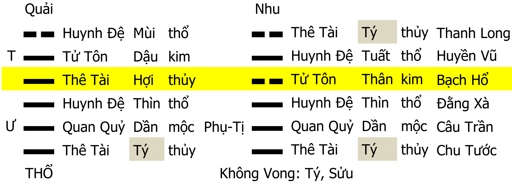
    - **Hình này chứng minh điều gì**
      - Tượng cả hai vợ chồng đều có quan hệ ngoài luồng và nguy cơ hôn nhân rạn nứt sâu sắc.
    - **Từ đâu mà thấy được**
      - Quan Quỷ Dần mộc hợp Thê Tài Hợi thủy động; hào Thế Dậu kim lâm Huyền Vũ, Đào hoa hợp Nhật.
  - **Phán đoán chi tiết:**
    - Căn cứ: Lấy Quan Quỷ làm Dụng thần. Quan Quỷ Dần mộc tại hào 2, kiêm hào Ứng, hào 2 và hào Ứng đều là phu vị, Dụng thần quy vị vốn là dấu hiệu tốt đẹp.
    - Nhìn vào suy vượng: Dụng thần hưu tù không được Nhật Nguyệt sinh trợ; Nguyên thần Thê Tài Tý thủy lâm hào sơ bị Nguyệt phá, lại nhập Mộ ở Nhật Thìn thổ, nguồn sinh Dụng thần bị triệt hạ nên tình cảm không thể đầu bạc răng long. Nguyên thần bị Phụ Mẫu Tị hỏa lâm Nguyệt xung phá (Phụ Mẫu là giấy hôn thú), mâu thuẫn rạn nứt đến mức muốn ly hôn.
    - Nhìn vào chồng ngoại tình: Quan Quỷ Dần mộc tương hợp với hào động Thê Tài Hợi thủy (hào 4), Thê Tài đại diện cho người phụ nữ khác, chứng tỏ người chồng đang lén lút qua lại với phụ nữ bên ngoài.
    - Nhìn vào vợ ngoại tình: Hào Thế Tử Tôn Dậu kim là Đào hoa, lâm Huyền Vũ và tương hợp Nhật kiến Bính Thìn, chứng tỏ bản thân cô vợ cũng đang có bồ. Nhật Thìn thổ chính là nhân tình của cô, nhập quẻ tại hào 3 lâm Đằng Xà; Thìn là Tài khố, Đằng Xà chủ keo kiệt, cho thấy nhân tình giữ tiền rất chặt chẽ, bủn xỉn.
    - Nhìn vào ứng kỳ: Hào Thế Dậu kim là Thái Tuế bị Nhật hợp trú, tháng Mão xung khai Dậu kim khắc Quan Quỷ nên tháng Mão quan hệ vợ chồng xung đột gay gắt nhất. Do Kỵ thần lâm Thái Tuế bị hợp nên năm Ất Dậu chưa thể ly hôn ngay, phải đợi đến năm Bính Tuất xung khai Thìn thổ giải hợp hào Thế mới thành.
  - **Ứng nghiệm thực tế:**
    - Hiện trạng vợ chồng ngoại tình và mâu thuẫn gia đình hoàn toàn đúng như phán đoán; về sau không có phản hồi thời điểm ly hôn.
- **Ví dụ 2:** Ngày Đinh Mão tháng Tý, nam đoán mối quan hệ với cô gái cùng đơn vị phát triển ra sao? (Quẻ Hỏa Sơn Lữ biến Hỏa Phong Đỉnh, Không Vong: Tuất, Hợi)
  - **Hình 213.** Quẻ Hỏa Sơn Lữ biến Hỏa Phong Đỉnh
    - 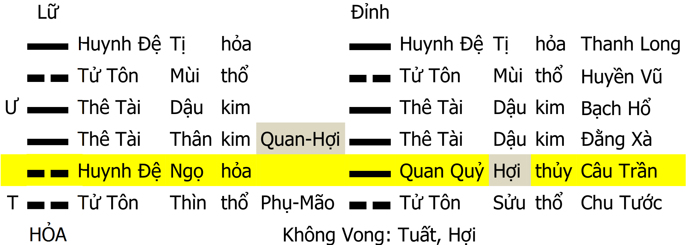
    - **Hình này chứng minh điều gì**
      - Đối phương thuận tình qua lại và có quan hệ thể xác nhưng cuộc tình không thể lâu bền do bị ngăn trở.
    - **Từ đâu mà thấy được**
      - Thê Tài Dậu kim là Đào hoa gặp Mộc Dục, ám động hợp Thế; hào 2 Huynh Đệ Ngọ hỏa phát động khắc Dụng thần.
  - **Phán đoán chi tiết:**
    - Căn cứ: Lấy Thê Tài làm Dụng thần. Trong quẻ Thê Tài lưỡng hiện (Thân kim hào 3, Dậu kim hào 4), lấy hào Ứng Thê Tài Dậu kim làm Dụng thần.
    - Nhìn vào quan hệ xác thịt: Hào 2 Ngọ hỏa phát động, Dụng thần Dậu kim gặp đất Mộc Dục (Mộc Dục chủ nhục dục). Hào Ứng Dậu kim là Đào hoa, được Nhật kiến Mão mộc xung thành ám động tương hợp hào Thế Thìn thổ, chứng tỏ cô gái bằng lòng qua lại với anh ta và hai người đã phát sinh quan hệ thể xác.
    - Nhìn vào tính cách đôi bên: Dụng thần lâm Bạch Hổ thể hiện tính khí cô gái nóng nảy, dữ dằn. Hào Thế lâm Chu Tước cho thấy đương số trong lòng tràn ngập ấm ức, oán thán.
    - Nhìn vào sự ngăn trở đổ vỡ: Hào 2 Huynh Đệ Ngọ hỏa được Nhật Mão sinh, phát động khắc mạnh Dụng thần Dậu kim, báo hiệu hai người không thể đi đường dài cùng nhau. Ngọ hỏa hiện động hóa hồi đầu khắc (Hợi thủy), cần đề phòng tháng Dần hợp Hợi thủy, giúp Ngọ hỏa thoát khắc và được sinh mà khắc hại Dụng thần dẫn tới chia tay.
  - **Ứng nghiệm thực tế:**
    - Về sau hai người chia tay đúng như phán đoán, nhưng không rõ mốc thời gian cụ thể.
- **Ví dụ 3:** Ngày Quý Hợi tháng Sửu, nữ (sinh năm Nhâm Tý) đoán hôn nhân (Quẻ Khảm Vi Thủy biến Trạch Địa Tụy, Không Vong: Tý, Sửu)
  - **Hình 214.** Quẻ Khảm Vi Thủy biến Trạch Địa Tụy
    - 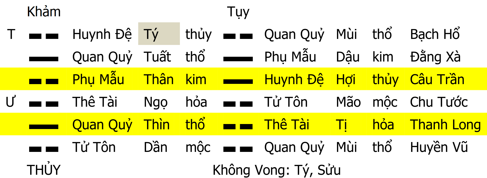
    - **Hình này chứng minh điều gì**
      - Chồng liệt dương gây bế tắc, vợ ngoại tình với người quen cũ bị nhân tình ép ly hôn tới mức đập đầu vào tường.
    - **Từ đâu mà thấy được**
      - Quan Quỷ Thìn thổ hào 2 mộ Thế hóa Tị hỏa Phá; Nguyệt Sửu Quan Quỷ hợp Thế Không Vong lâm Bạch Hổ.
  - **Phán đoán chi tiết:**
    - Căn cứ: Lấy Quan Quỷ làm Dụng thần. Quan Quỷ lưỡng hiện (Thìn thổ hào 2, Tuất thổ hào 5), lấy hào Quan Quỷ Thìn thổ phát động làm Dụng thần.
    - Nhìn vào kết hôn muộn: Dụng thần tại hào 2 (trạch, hào vị phu thê) lâm Thanh Long phát động là hỉ khí nhập trạch, quy vị báo hiệu có kết hôn. Nhưng hào Thế tại hào 6 cách xa Dụng thần, động thì gặp Trị gặp Hợp, năm Canh Thìn tròn 28 tuổi thuộc diện kết hôn muộn nên năm này thành hôn.
    - Nhìn vào vợ ngoại tình: Quan Quỷ lưỡng hiện, hào Thế Tý thủy là Đào hoa, Nguyệt kiến Quan Quỷ Sửu thổ tương hợp hào Thế (Tý Sửu lục hợp là phương hợp, người tình vốn là người quen biết từ trước).
    - Nhìn vào chồng liệt dương: Hào Thế Tý thủy ở hào 6 Không Vong (hào 6 là đầu, tư tưởng tinh thần trống rỗng). Thế nhập Mộ ở hào 2 Quan Quỷ Thìn thổ (Quan Quỷ là chồng, hào 2 là sinh dục, Thanh Long chủ sắc, nhập Mộ là phiền não bế tắc sinh hoạt tình dục). Thìn thổ động hóa Tị hỏa Nhật phá, suy giảm sức mạnh, chủ chồng bị suy giảm sinh lý, liệt dương. Năm Nhâm Ngọ xung thực hào Thế khỏa lấp trống vắng nên ngoại tình từ năm này.
    - Nhìn vào nhân tình đe dọa: Quẻ lục xung chủ bất an; Thế Không Vong lẩn trốn, hào 6 là vị thoái hưu biểu thị cô muốn né tránh, mệt mỏi buông xuôi. Nguyệt kiến Quan Quỷ Sửu thổ hợp Thế Không Vong lâm Bạch Hổ (Không Vong chủ tử, Bạch Hổ chủ tử), người tình đem cái chết ra uy hiếp ép cô ly hôn chồng.
    - Nhìn vào sức khỏe: Thế tại hào 6 Không Vong không có Nguyên thần sinh, hào 6 là đầu, Thủy và Bạch Hổ chủ máu nên bị thiếu máu não, nhập Mộ chủ váng đầu chóng mặt.
  - **Ứng nghiệm thực tế:**
    - Kết hôn đúng năm Canh Thìn, sau cưới chồng liệt dương không đáp ứng được nhu cầu; năm Nhâm Ngọ gặp lại người quen cũ rồi ngoại tình. Nhân tình ép cô bỏ chồng nhưng cô không chịu, hắn liền đập đầu vào tường tự tử khiến cô khốn đốn (hào 6 là tường, Bạch Hổ chủ va đập, ẩu đả). Bệnh thiếu máu chóng mặt cũng hoàn toàn chính xác.
- **Ví dụ 4:** Ngày Tân Tị tháng Mão, nam đoán ngoại tình (Quẻ Lôi Sơn Tiểu Quá biến Hỏa Sơn Lữ, Không Vong: Thân, Dậu)
  - **Phán đoán chi tiết:**
    - Căn cứ: Lấy Thê Tài làm Dụng thần. Thê Tài Mão mộc phục tàng dưới hào 2 Quan Quỷ Ngọ hỏa.
    - Nhìn vào tình trạng đối phương: Phục dưới Quan Quỷ (đàn ông), lại có Phụ Mẫu Tuất thổ tương hợp Dụng thần (Phụ Mẫu là hôn thư), biểu thị người phụ nữ này đã có gia đình, là hoa đã có chủ.
    - Nhìn vào mức độ tình cảm: Dụng thần Mão mộc lâm Nguyệt kiến vượng tướng sinh trợ hào Thế Quan Quỷ Ngọ hỏa, cho thấy cô gái rất yêu thích và say đắm người hỏi quẻ.
    - Nhìn vào cơ duyên gặp gỡ: Hào 6 Phụ Mẫu Tuất thổ độc phát, quẻ thuộc cung Đoài (Đoài là miếu tự, chùa chiền), hào 6 cũng là chùa miếu, Mộ khố của Quan Quỷ là chùa miếu. Dụng thần Mão mộc hợp Tuất thổ làm Thế nhập Mộ Tuất thổ, biểu thị hai người quen biết nhau tại một ngôi chùa khiến đương số mê mẩn đắm đuối.
  - **Ứng nghiệm thực tế:**
    - Người hỏi quẻ thừa nhận đúng là hai người quen nhau tại một ngôi chùa và cô gái thực sự là phụ nữ đã có chồng.
- **Ví dụ 5:** Ngày Canh Tuất tháng Dậu, nam đoán ngoại tình (Quẻ Lôi Phong Hằng biến Lôi Thiên Đại Tráng, Không Vong: Dần, Mão)
  - **Phán đoán chi tiết:**
    - Căn cứ: Lấy Thê Tài làm Dụng thần. Thê Tài lưỡng hiện (Sửu thổ hào sơ, Tuất thổ hào 6), lấy hào Thê Tài Sửu thổ phát động làm Dụng thần.
    - Nhìn vào quan hệ xác thịt: Hào Thế Quan Quỷ Dậu kim lâm Thanh Long tại hào 3, nhập Mộ ở Dụng thần Thê Tài Sửu thổ (Thanh Long chủ sắc tình, hào 3 là giường chiếu, Thế nhập Mộ Tài hào sơ là nằm trên giường vùi vào lồng ngực người nữ), chứng tỏ hai người đã phát sinh quan hệ thể xác.
    - Nhìn vào tình trạng người nữ: Dụng thần Sửu thổ động hóa Phụ Mẫu Tý thủy tương hợp (Phụ Mẫu là hôn thư, biểu thị người phụ nữ này đã từng kết hôn).
    - Nhìn vào ý định ly hôn: Hào sơ là tâm tư suy nghĩ, Sửu thổ độc phát khiến Quan Quỷ Thân kim hào 5 (chồng cô ấy) nhập Mộ (nhập Mộ là kết thúc), cho thấy cô gái hiện tại đang tính chuyện ly hôn chồng để đến với đương số.
  - **Ứng nghiệm thực tế:**
    - Thực tế cô gái đã có chồng và đang xúc tiến thủ tục ly hôn, hai người đã có quan hệ sâu sắc đúng như quẻ chỉ ra.
- **Ví dụ 6:** Ngày Bính Thân tháng Tị, nam đoán vợ có ngoại tình hay không? (Quẻ Đoài Vi Trạch biến Lôi Thiên Đại Tráng, Không Vong: Thìn, Tị)
  - **Phán đoán chi tiết:**
    - Căn cứ: Lấy Quan Quỷ làm Dụng thần để tầm soát người đàn ông bên ngoài của vợ.
    - Nhìn vào thực hư nghi vấn: Quan Quỷ Tị hỏa tuy lâm Nguyệt kiến tương trợ nhưng rơi vào Tuần Không (Không Vong biểu thị không có thực, hư ảo).
    - Nhìn vào kết cấu quẻ: Quẻ Đoài Vi Trạch biến Lôi Thiên Đại Tráng là tượng lục xung hóa lục xung, lục xung chủ tiêu tán không thành, thuyết minh người vợ hoàn toàn trong sạch, không hề có chuyện ngoại tình.
  - **Ứng nghiệm thực tế:**
    - Người chồng sau đó dùng nhiều biện pháp theo dõi, dò xét nhưng không hề phát hiện bất kỳ dấu vết ngoại tình nào của vợ.
- **Ví dụ 7:** Ngày Mậu Tý tháng Sửu năm Quý Mùi, nam đoán bản thân sẽ có ngoại tình hay không? (Quẻ Thiên Thủy Tụng biến Trạch Thủy Khốn, Không Vong: Ngọ, Mùi)
  - **Phán đoán chi tiết:**
    - Căn cứ: Lấy Thê Tài làm Dụng thần. Thê Tài Thân kim tại hào 5 chính là Thái Tuế của năm sau (năm Giáp Thân).
    - Nhìn vào cơ hội ngoại tình: Thê Tài Thân kim được Nguyệt kiến Sửu thổ sinh phù, hào 6 Tử Tôn Tuất thổ động hóa thoái sinh trợ Thân kim, báo hiệu chắc chắn sẽ nảy sinh quan hệ ngoài luồng.
    - Nhìn vào thời điểm và độ bền: Hào Thế Huynh Đệ Ngọ hỏa gặp Tuần Không, đến tháng Ngọ xuất Không thì tình cảm bùng phát. Tuy nhiên, Nguyên thần Tử Tôn Tuất thổ động hóa thoái (Mùi thổ), hào Thế Huynh Đệ trì Thế ám động khắc Tài, nên cuộc tình này chỉ là thoáng qua, không thể duy trì lâu dài.
  - **Ứng nghiệm thực tế:**
    - Đến tháng Ngọ năm sau anh ta có nhân tình mới, nhưng mối quan hệ kéo dài không bao lâu và đến tháng Tuất cùng năm thì chia tay.
- **Ví dụ 8:** Ngày Mậu Tý tháng Sửu, nam đoán bản thân sẽ có ngoại tình hay không? (Quẻ Địa Trạch Lâm biến Sơn Trạch Tổn, Không Vong: Ngọ, Mùi)
  - **Hình 215.** Quẻ Địa Trạch Lâm biến Sơn Trạch Tổn
    - 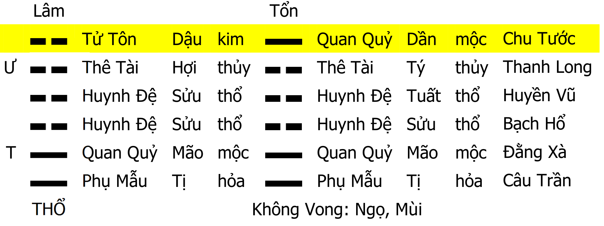
    - **Hình này chứng minh điều gì**
      - Điềm báo sẽ phát sinh quan hệ ngoài luồng ngắn ngủi nhưng nhanh chóng chấm dứt do Nguyên thần hóa Tuyệt.
    - **Từ đâu mà thấy được**
      - Thê Tài Hợi thủy được Nhật Tý trợ giúp, Tử Tôn Dậu kim độc phát sinh Dụng thần nhưng hóa Dần mộc Tuyệt địa.
  - **Phán đoán chi tiết:**
    - Căn cứ: Lấy Thê Tài làm Dụng thần. Thê Tài Hợi thủy tại hào 5 được Nhật kiến Tý thủy tương trợ, lại có Tử Tôn Dậu kim hào 6 độc phát đến sinh, Dậu là đất Mộc Dục của Thủy, báo hiệu sẽ có ngoại tình.
    - Nhìn vào thời điểm xuất hiện: Độc phát hào 6 Tử Tôn Dậu kim là Nguyên thần; năm sau là năm Giáp Thân Thê Tài được Trường Sinh, tới tháng Dậu ứng với hào độc phát thì người tình xuất hiện.
    - Nhìn vào thời lượng ngắn ngủi: Tử Tôn Dậu kim động hóa Quan Quỷ Dần mộc là động hóa Tuyệt địa, gốc sinh bị triệt tiêu nên mối quan hệ không thể kéo dài.
  - **Ứng nghiệm thực tế:**
    - Đúng tháng Dậu năm sau xuất hiện người tình, nhưng chưa đầy một tháng sau thì hai bên đã đường ai nấy đi.
- **Ví dụ 9:** Ngày Tân Hợi tháng Dần, nữ (35 tuổi) đoán mối quan hệ với bạn trai ra sao (Quẻ Lôi Thiên Đại Tráng biến Hỏa Trạch Khuê, Không Vong: Dần, Mão)
  - **Hình 216.** Quẻ Lôi Thiên Đại Tráng biến Hỏa Trạch Khuê
    - 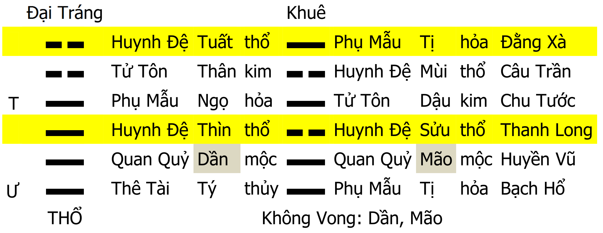
    - **Hình này chứng minh điều gì**
      - Tình cảm sống chung bất hòa, bạn trai làm nghề cảnh sát bắt cá hai tay và không thật lòng với cô gái.
    - **Từ đâu mà thấy được**
      - Quan Quỷ Dần mộc lâm Nguyệt (cảnh sát), Không Vong lâm Huyền Vũ hợp Nhật Hợi, Phụ Mẫu nhập Mộ hào 6 Tuất thổ động.
  - **Phán đoán chi tiết:**
    - Căn cứ: Lấy Quan Quỷ làm Dụng thần. Quan Quỷ Dần mộc tại hào 2, được Nguyệt kiến Dần mộc lâm trị, Nhật kiến Hợi thủy sinh hợp là cực kỳ vượng tướng. Hào 2 là trạch, đàn ông dọn vào nhà ở chung.
    - Nhìn vào sống chung không hôn thú: Phụ Mẫu Ngọ hỏa nhập Mộ tại hào động Huynh Đệ Tuất thổ hào 6 (vị hôn đồng cư, sống chung chưa cưới). Hào 2 lâm Huyền Vũ chủ quan hệ lén lút mờ ám.
    - Nhìn vào xung đột và bắt cá hai tay: Quẻ lục xung chủ đôi bên bất hòa sâu sắc. Hào 3 Huynh Đệ Thìn thổ phát động tạo trở ngại, tranh đoạt. Quan Quỷ Dần mộc gặp Tuần Không thể hiện anh ta không thật lòng, lại lâm Huyền Vũ tương hợp với Nhật kiến Hợi thủy (Hợi thủy là phụ nữ khác) cho thấy bạn trai đang lăng nhăng bắt cá hai tay.
    - Nhìn vào nghề nghiệp bạn trai: Quan Quỷ lâm Nguyệt kiến, có uy quyền, cho biết anh ta là cảnh sát.
  - **Ứng nghiệm thực tế:**
    - Cô gái xác nhận tình trạng thực tế hoàn toàn đúng: bạn trai là cảnh sát, đang sống chung nhưng lăng nhăng và hai người liên tục cãi vã.
- **Ví dụ 10:** Ngày Tân Hợi tháng Dần, nam đoán tình cảm vợ chồng (Quẻ Thủy Lôi Truân biến Trạch Lôi Tùy, Không Vong: Dần, Mão)
  - **Hình 217.** Quẻ Thủy Lôi Truân biến Trạch Lôi Tùy
    - 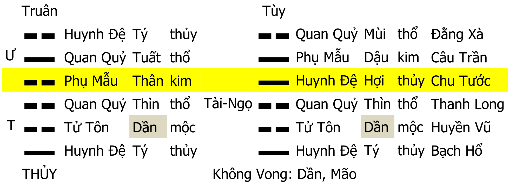
    - **Hình này chứng minh điều gì**
      - Người vợ ra ngoài ngoại tình với sếp có chức quyền, người chồng ghen tuông nhưng bất lực do phải ăn bám vợ.
    - **Từ đâu mà thấy được**
      - Thê Tài Ngọ hỏa phục dưới hào 3 Quan Quỷ Thìn thổ lâm Thanh Long; hào Thế Dần mộc Không Vong hóa quy hồn.
  - **Phán đoán chi tiết:**
    - Căn cứ: Lấy Thê Tài làm Dụng thần. Thê Tài Ngọ hỏa không xuất hiện trên quẻ, phục tàng dưới hào 3 Quan Quỷ Thìn thổ.
    - Nhìn vào vợ ngoại tình với cấp trên: Thê Tài phục tàng không hiện chứng tỏ người vợ quanh năm bôn ba ở bên ngoài. Dụng thần phục dưới Quan Quỷ Thìn thổ lâm Thanh Long, chứng tỏ người vợ ở ngoài có quan hệ bất chính với một người đàn ông có chức vụ quyền hạn.
    - Nhìn vào tâm lý và tình cảnh người chồng: Hào Thế Tử Tôn Dần mộc gặp Không Vong thể hiện trong lòng vô cùng bất an, lâm Huyền Vũ chủ nổi máu ghen tuông. Phụ Mẫu Thân kim bị Nguyệt phá động hóa Huynh Đệ Hợi thủy, Nhật kiến và hào Thế tương đồng xung phá Phụ Mẫu (Phụ Mẫu là giấy kết hôn) cho thấy anh ta rất muốn ly hôn, nhưng Thế lâm Không Vong nên do dự không quyết.
    - Nhìn vào nguyên nhân không dám bỏ vợ: Hào Thế ở hào 2 bị Không Vong nên không có sức sinh Thê Tài; quẻ Truân biến Tùy là quẻ quy hồn, quy hồn chủ ở lì trong nhà, bản thân hằng ngày không đi làm, không có thu nhập độc lập mà phải sống phụ thuộc kinh tế vào vợ, nên không thể hạ quyết tâm ly hôn.
  - **Ứng nghiệm thực tế:**
    - Người chồng thừa nhận hoàn cảnh thực tế chuẩn xác từng chi tiết, bản thân bất lực không thể dứt bỏ cuộc hôn nhân.
- **Ví dụ 11:** Ngày Bính Thân tháng Hợi, nam đoán vợ có ngoại tình hay không? (Quẻ Càn Vi Thiên biến Thiên Hỏa Đồng Nhân, Không Vong: Thìn, Tị)
  - **Hình 218.** Sơ đồ quẻ Càn Vi Thiên biến Thiên Hỏa Đồng Nhân
    - 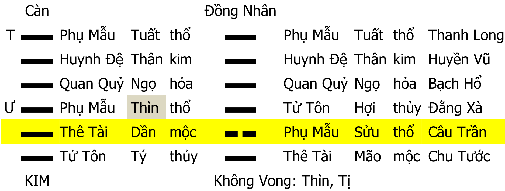
    - **Hình này chứng minh điều gì**
      - Vợ chỉ là người thích đi lại bôn ba khắp nơi (Dịch Mã), hoàn toàn không có chuyện ngoại tình như người chồng nghi ngờ.
    - **Từ đâu mà thấy được**
      - Quan Quỷ Ngọ hỏa bị Nguyệt khắc, Nhật không sinh là hưu tù vô lực; Thê Tài Dần mộc lâm Dịch Mã phát động.
  - **Phán đoán chi tiết:**
    - Căn cứ: Lấy Quan Quỷ làm Dụng thần để xét đối tượng nghi vấn ngoại tình của vợ.
    - Nhìn vào thực trạng: Quan Quỷ Ngọ hỏa tại hào 4 bị Nguyệt kiến Hợi thủy khắc, Nhật kiến Thân kim không sinh trợ nên hưu tù vô khí, chứng tỏ không có người đàn ông nào bên ngoài xen vào.
    - Nhìn vào nguyên nhân nghi ngờ: Thê Tài Dần mộc tại hào 2 lâm Dịch Mã (ngày Thân thì Dần là Dịch Mã) phát động, biểu thị người vợ tính cách năng động, thích chạy đôn chạy đáo, đi lại liên miên ở bên ngoài khiến người chồng sinh tâm nghi hoặc.
  - **Ứng nghiệm thực tế:**
    - Người chồng thừa nhận vợ hay đi ra ngoài lung tung nên nghi ngờ theo dõi, nhưng sau thời gian dài quan sát cẩn thận không phát hiện bất kỳ dấu hiệu ngoại tình nào.
- **Ví dụ 12:** Ngày Bính Thân tháng Tị, nam đoán khi nào có ngoại tình? (Quẻ Thủy Hỏa Ký Tế tĩnh, Không Vong: Thìn, Tị)
  - **Hình 219.** Sơ đồ quẻ Thủy Hỏa Ký Tế
    - 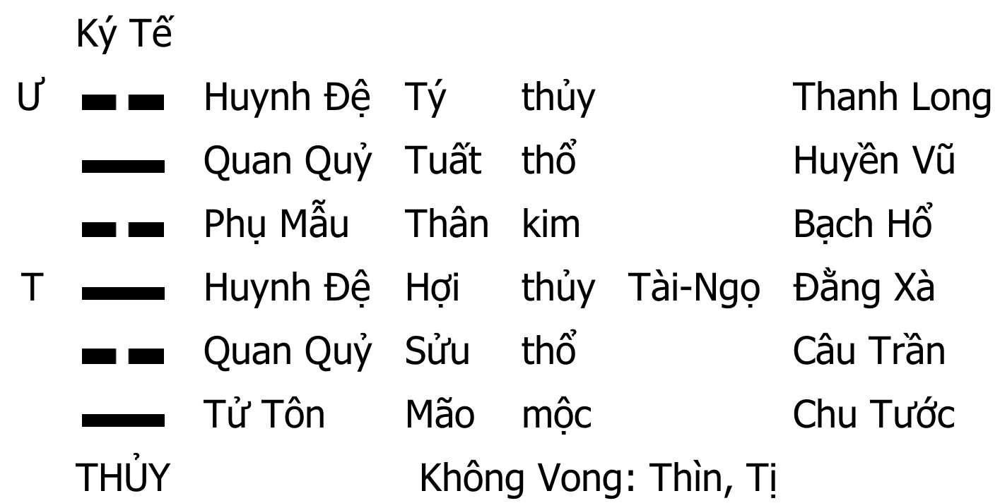
    - **Hình này chứng minh điều gì**
      - Người nam sẽ nảy sinh tình cảm vụng trộm ngoài hôn nhân vào đúng tháng Ngọ khi Dụng thần Đào hoa xuất hiện.
    - **Từ đâu mà thấy được**
      - Thê Tài Ngọ hỏa là Đào hoa phục dưới hào Thế Huynh Đệ Hợi thủy, được Nguyệt kiến Tị hỏa trợ giúp vượng tướng.
  - **Phán đoán chi tiết:**
    - Căn cứ: Lấy Thê Tài làm Dụng thần. Thê Tài Ngọ hỏa không hiện trên quẻ, phục tàng dưới hào Thế Huynh Đệ Hợi thủy hào 3.
    - Nhìn vào điềm báo ngoại tình: Thê Tài Ngọ hỏa được Nguyệt kiến Tị hỏa cùng hành hỏa nâng đỡ nên vượng tướng; bản thân Ngọ hỏa chính là Đào hoa, lại phục ngay dưới Thế báo hiệu chắc chắn sẽ có người tình bí mật.
    - Nhìn vào thời điểm ứng nghiệm: Dụng thần phục tàng thì ứng kỳ là khi Phục thần gặp xuất hiện (Trị/Xung), đến tháng Ngọ Dụng thần trực tháng xuất hiện thì sẽ phát sinh sự việc.
  - **Ứng nghiệm thực tế:**
    - Đúng vào tháng Ngọ cùng năm, người đàn ông này đã bắt đầu mối quan hệ vụng trộm với một người phụ nữ.
- **Ví dụ 13:** Ngày Giáp Thìn tháng Tị, nam (50 tuổi) đoán hôn nhân (Quẻ Sơn Lôi Di biến Địa Lôi Phục, Không Vong: Dần, Mão)
  - **Hình 220.** Sơ đồ quẻ Sơn Lôi Di biến Địa Lôi Phục
    - 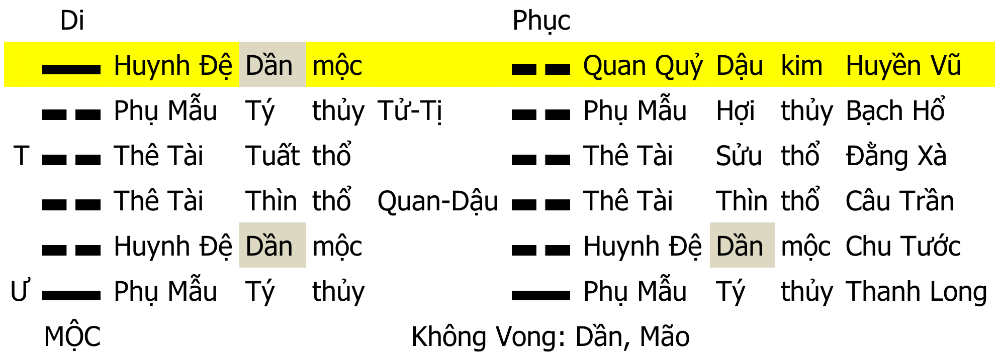
    - **Hình này chứng minh điều gì**
      - Người nam sống chung bất hợp pháp với hai phụ nữ, mắc bệnh sinh dục lây cho nhân tình và bị phì đại tuyến tiền liệt.
    - **Từ đâu mà thấy được**
      - Dần mộc lâm Huyền Vũ độc phát hóa Quan Quỷ Dậu kim Đào hoa phục hào 3 khắc Thế; Câu Trần hợp Thìn thủy khố.
  - **Phán đoán chi tiết:**
    - Căn cứ: Lấy Thê Tài làm Dụng thần. Trong quẻ Thê Tài lưỡng hiện (Thìn thổ hào 3, Tuất thổ hào 4), cả hai đều có thể làm Dụng thần.
    - Nhìn vào sống chung phi pháp với hai người: Hào 6 Huynh Đệ Dần mộc lâm Huyền Vũ độc phát (độc phát chủ tính chất sự việc, Huyền Vũ chủ ám muội, lén lút). Phụ Mẫu Tý thủy lưỡng hiện hưu tù và nhập Mộ ở Nhật kiến Thìn thổ (Phụ Mẫu là hôn thú bị Mộ, không có giá trị pháp lý), chứng tỏ ông ta đồng thời sống chung bất hợp pháp như vợ chồng với hai người phụ nữ.
    - Nhìn vào bệnh hoa liễu lây lan: Hào 6 Huyền Vũ Dần mộc động hóa Quan Quỷ Dậu kim khắc ngược về hào Thế Thê Tài Tuất thổ. Quan Quỷ Dậu kim là Đào hoa phục tàng dưới hào 3 (hào 3 là bộ phận sinh dục), vì quan hệ phụ nữ mà mắc bệnh lây truyền qua đường tình dục. Hào Thế bị khắc, hào 3 Thê Tài Thìn thổ cũng bị tổn thương, chứng tỏ bệnh sinh dục đã lây sang cho người phụ nữ sống cùng.
    - Nhìn vào bệnh tuyến tiền liệt: Quan Quỷ Dậu kim lâm Câu Trần tại hào 3 tương hợp với Thìn thổ (Thìn là thủy khố chủ hệ tiết niệu), biểu thị bị bệnh phì đại tuyến tiền liệt. Quẻ du hồn chủ tâm trạng bất an, do dự dằn vặt.
  - **Ứng nghiệm thực tế:**
    - Người này thừa nhận sống chung với hai người phụ nữ một lúc, bị lây bệnh hoa liễu tốn rất nhiều tiền chữa trị và về sau bị biến chứng viêm phì đại tuyến tiền liệt.
- **Ví dụ 14:** Ngày Canh Ngọ tháng Thìn, nữ đoán hôn nhân (Quẻ Chấn Vi Lôi biến Hỏa Trạch Khuê, Không Vong: Tuất, Hợi)
  - **Hình 221.** Quẻ Chấn Vi Lôi biến Hỏa Trạch Khuê
    - 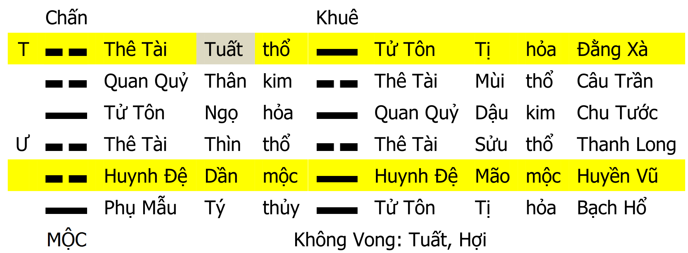
    - **Hình này chứng minh điều gì**
      - Chồng ngoại tình làm tổn thương vợ sâu sắc dẫn tới ly hôn dứt khoát vào tháng Thân dù người vợ còn vương vấn con cái.
    - **Từ đâu mà thấy được**
      - Huynh Đệ Dần mộc lâm Huyền Vũ động xung Dụng thần Quan Quỷ; hào Thế Tuất thổ Không Phá hóa Tử Tôn Tị hỏa.
  - **Phán đoán chi tiết:**
    - Căn cứ: Lấy Quan Quỷ làm Dụng thần. Quan Quỷ Thân kim tại hào 5 được Nguyệt Thìn sinh nhưng bị Nhật Ngọ khắc, khó phân suy vượng.
    - Nhìn vào ý định ly hôn của vợ: Hào Thế Thê Tài Tuất thổ tại hào 6 lâm Tuần Không lại bị Nguyệt xung thành Nguyệt phá (Không Phá), không sinh cho Quan Quỷ chứng tỏ bản thân không còn tình cảm với chồng. Hào 6 là hào vị thoái hưu, ngụ ý muốn dứt áo ra đi. Thế động hóa Tử Tôn Tị hỏa là động thái muốn ly hôn. Tuy nhiên hào Thế Tuất thổ là Mộ khố của Tử Tôn (Tử Tôn là con cái), Thế lâm Đằng Xà chủ lo âu, do dự vì thương con.
    - Nhìn vào chồng có nhân tình gây tổn thương: Hào 2 Huynh Đệ Dần mộc lâm Huyền Vũ phát động xung Quan Quỷ Thân kim (Huyền Vũ chủ mờ ám, Huynh Đệ là kẻ tranh đoạt/tình địch) chứng tỏ chồng có phụ nữ khác bên ngoài. Hào Ứng Thê Tài Thìn thổ lâm Nguyệt kiến xung phá hào Thế, hào Ứng là phu vị, chồng vì người đàn bà khác mà làm tổn thương cay đắng người vợ.
    - Nhìn vào thời điểm ly hôn: Quẻ Chấn Vi Lôi là lục xung chủ phân ly; Phụ Mẫu Tý thủy hào sơ bị Nhật phá; Huynh Đệ động hóa Tiến thần; hào Thế Không Phá chắc chắn dẫn tới đổ vỡ vào tháng Thân (khi Quan Quỷ gặp Trị).
  - **Ứng nghiệm thực tế:**
    - Đến tháng Thân cùng năm, hai vợ chồng đã chính thức hoàn tất thủ tục ly hôn đúng như dự đoán.
- **Ví dụ 15:** Ngày Bính Tuất tháng Hợi, nam đoán khi nào có ngoại tình? (Quẻ Trạch Thủy Khốn biến Thiên Thủy Tụng, Không Vong: Ngọ, Mùi)
  - **Hình 222.** Quẻ Trạch Thủy Khốn biến Thiên Thủy Tụng
    - 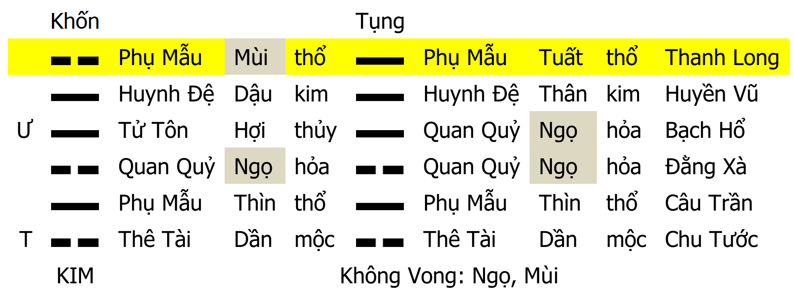
    - **Hình này chứng minh điều gì**
      - Quá khứ từng quan hệ với phụ nữ đã ly hôn, tương lai đến tháng Ngọ năm Thân xung xuất Mộ khố lại tiếp tục ngoại tình.
    - **Từ đâu mà thấy được**
      - Thê Tài Dần mộc trì Thế nhập Mộ Phụ Mẫu Mùi thổ Thái Tuế độc phát; năm Thân xung Dần mộc xuất Mộ.
  - **Phán đoán chi tiết:**
    - Căn cứ: Lấy Thê Tài làm Dụng thần. Thê Tài Dần mộc trì Thế, được Nguyệt kiến Hợi thủy sinh hợp là vượng tướng, biểu thị có cơ duyên đào hoa ngoại tình.
    - Nhìn vào vết tích quá khứ: Hào 6 Phụ Mẫu Mùi thổ lâm Thái Tuế (Quý Mùi) phát động làm Dụng thần Dần mộc nhập Mộ, biểu thị trong năm Quý Mùi chưa có bồ mới. Hào độc phát biểu thị sự việc đã qua: năm ngoái Nhâm Ngọ hợp trú hào động Mùi thổ, chứng tỏ năm Nhâm Ngọ đã từng ngoại tình. Thái Tuế Mùi thổ Không Vong là Phụ Mẫu (giấy hôn thú), Không Vong chủ ly hôn, người tình năm Nhâm Ngọ là phụ nữ đã ly dị.
    - Nhìn vào dự đoán tương lai: Muốn nảy sinh ngoại tình mới thì Dụng thần nhập Mộ cần phải được xung khai xuất Mộ. Năm sau Giáp Thân xung hào Thế Thê Tài Dần mộc thì người tình mới sẽ xuất hiện.
  - **Ứng nghiệm thực tế:**
    - Năm Nhâm Ngọ quả thực anh ta đã từng qua lại với một phụ nữ ly hôn; đến tháng Ngọ năm Giáp Thân lại tiếp tục phát sinh quan hệ bất chính với một người phụ nữ đã ly dị khác.
- **Ví dụ 16:** Bính Tuất tháng Hợi năm Quý Mùi, nam đoán ngoại tình (Quẻ Địa Phong Thăng biến Thủy Thiên Nhu, Không Vong: Ngọ, Mùi)
  - **Hình 223.** Quẻ Địa Phong Thăng biến Thủy Thiên Nhu
    - 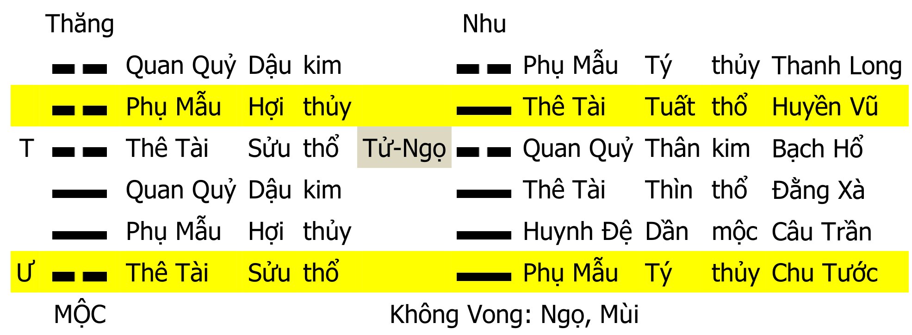
    - **Hình này chứng minh điều gì**
      - Đương số là kẻ phong lưu đa tình, lưu tình khắp nơi, ngoại tình liên tiếp qua các năm và ngay trong tháng dự đoán.
    - **Từ đâu mà thấy được**
      - Thê Tài hiện dày đặc: Sửu thổ trì Thế, hào sơ Sửu thổ phát động, hào 5 Phụ Mẫu Hợi thủy hóa ra Thê Tài Tuất thổ.
  - **Phán đoán chi tiết:**
    - Căn cứ: Lấy Thê Tài làm Dụng thần. Trong quẻ Thê Tài xuất hiện nhiều nơi: Thê Tài Sửu thổ trì Thế tại hào 4, hào sơ Thê Tài Sửu thổ phát động, hào 5 Phụ Mẫu Hợi thủy lại động hóa ra Thê Tài Tuất thổ.
    - Nhìn vào bản chất trăng hoa: Tổ hợp Thê Tài dày đặc khắp quẻ là tượng "khắp nơi Đào hoa", chứng tỏ người này có tính trăng hoa bừa bãi, ngoại tình liên miên nhiều lần với nhiều người.
    - Nhìn vào các mốc thời gian: Hào sơ Sửu thổ động hóa hợp (Tý thủy), năm ngoái Nhâm Ngọ xung khai hợp nên năm Nhâm Ngọ đã từng ngoại tình. Năm nay Quý Mùi xung khai hào Thế Sửu thổ cũng phát sinh quan hệ vụng trộm. Riêng hào 5 Hợi thủy lâm Nguyệt kiến động hóa Thê Tài Tuất thổ nên ngay trong tháng Hợi đang xem bói cũng có nhân tình mới.
  - **Ứng nghiệm thực tế:**
    - Người hỏi thừa nhận năm Nhâm Ngọ có bồ, và ngay trong tháng Hợi này cũng đang đắm chìm trong mối quan hệ ngoài luồng.
- **Ví dụ 17:** Ngày Đinh Dậu tháng Mùi, nam đoán ngoại tình (Quẻ Đoài Vi Trạch biến Thủy Lôi Truân, Không Vong: Thìn, Tị)
  - **Phán đoán chi tiết:**
    - Căn cứ: Lấy Thê Tài làm Dụng thần. Hào 2 Thê Tài Mão mộc phát động động hóa Dần mộc là hóa thoái thần.
    - Nhìn vào tình cảm chưa dứt: Dụng thần động hóa thoái chủ người phụ nữ đã chủ động rời xa anh ta. Tuy nhiên, trong quẻ có Tử Tôn Hợi thủy hào 4, Nguyệt kiến Mùi thổ và Dụng thần Mão mộc tạo thành tam hợp cục Hợi - Mão - Mùi (Mộc cục). Nguyệt kiến Mùi thổ có cùng ngũ hành và địa chi với hào Thế Phụ Mẫu Mùi thổ, cho thấy tuy đã chia tay trên danh nghĩa nhưng sợi dây tình cảm vẫn dùng dằng chưa dứt hẳn.
    - Nhìn vào người tình sinh con: Tử Tôn Hợi thủy lâm Bạch Hổ, Dụng thần Mão mộc lâm đất Trường Sinh ở Hợi, biểu thị người tình đang mang thai và chuẩn bị sinh nở.
  - **Ứng nghiệm thực tế:**
    - Hai người thực tế đã sống xa nhau, nhưng đến tháng Dậu người tình hạ sinh một đứa con và cô gái vẫn nhắn tin bày tỏ nỗi nhớ nhung, không thể quên được anh ta.
- **Ví dụ 18:** Ngày Nhâm Ngọ tháng Ngọ, nữ đoán khi nào chia tay với người tình? (Quẻ Trạch Thiên Quải biến Trạch Sơn Hàm, Không Vong: Thân, Dậu)
  - **Phán đoán chi tiết:**
    - Căn cứ: Lấy Quan Quỷ làm Dụng thần. Quan Quỷ Dần mộc tại hào 2 (hào Ứng) không được Nhật Nguyệt (Ngọ hỏa) trợ giúp là hưu tù vô lực.
    - Nhìn vào thói tật người tình: Dụng thần lâm Thanh Long (Thanh Long chủ tửu sắc), người tình là kẻ nghiện rượu chè nhậu nhẹt. Dụng thần phát động khiến hào Thế Dậu kim lâm Tuyệt địa, chứng tỏ người đàn ông này sau khi say sưa thường xuyên gây gổ, cãi lộn ầm ĩ xúc phạm cô.
    - Nhìn vào tình trạng hôn nhân người tình: Phụ Mẫu Tị hỏa phục tàng dưới Dụng thần, Dụng thần lại động hóa Phụ Mẫu Ngọ hỏa (Phụ Mẫu là giấy kết hôn) chứng minh anh ta là người đàn ông đã có vợ con đàng hoàng.
    - Nhìn vào tâm lý và kết cục: Hào Thế Tử Tôn Dậu kim lâm Kỵ thần khắc Dụng thần, bản thân cô rất muốn dứt khoát chia tay. Thế lâm Đằng Xà chủ tâm trạng phiền não, do dự chưa quyết. Dụng thần động hóa Nguyệt kiến Ngọ hỏa là hóa vượng nên trước mắt tạm thời chưa thể dứt ngay được. Tuy nhiên Nguyên thần của Dụng thần (Thê Tài Tý thủy) bị Nguyệt phá lại động hóa hồi đầu khắc, cội rễ đã mục ruỗng nên sớm muộn cũng sẽ tan vỡ.
  - **Ứng nghiệm thực tế:**
    - Phán đoán hiện trạng và tính nết người tình hoàn toàn chính xác; kết quả thời điểm chia tay dứt khoát về sau không có phản hồi.
- **Ví dụ 19:** Ngày Giáp Thân tháng Ngọ, nam đoán ngoại tình (Quẻ Thủy Hỏa Ký Tế biến Địa Hỏa Minh Di, Không Vong: Ngọ, Mùi)
  - **Phán đoán chi tiết:**
    - Căn cứ: Lấy Thê Tài làm Dụng thần. Thê Tài Ngọ hỏa không hiện trên quẻ, phục tàng dưới hào Thế Huynh Đệ Hợi thủy tại hào 3.
    - Nhìn vào người nữ có chồng kiểm soát: Thê Tài Ngọ hỏa được Nguyệt kiến Ngọ hỏa trợ giúp là vượng tướng, nhưng lâm Tuần Không và nhập Mộ tại Quan Quỷ Tuất thổ hào 5. Quan Quỷ là đàn ông, chồng của người nữ, chứng tỏ cô gái đã có chồng và bị chồng kiểm soát, theo dõi vô cùng nghiêm ngặt.
    - Nhìn vào họa hại rình rập: Hào 5 Quan Quỷ Tuất thổ phát động khắc ngược về hào Thế Huynh Đệ Hợi thủy, điềm báo người nam sẽ vì mối quan hệ vụng trộm này mà rước họa vào thân, bị chồng cô gái tìm tới trừng phạt.
  - **Ứng nghiệm thực tế:**
    - Đúng như dự đoán, mối tình vụng trộm bị người chồng phát hiện và anh ta đã kéo người tới tìm đương số để tính sổ, thanh toán.
- **Ví dụ 20:** Ngày Giáp Thân tháng Ngọ, nữ đoán mối quan hệ với người tình ra sao? (Quẻ Sơn Thủy Mông biến Hỏa Địa Tấn, Không Vong: Ngọ, Mùi)
  - **Phán đoán chi tiết:**
    - Căn cứ: Lấy Quan Quỷ làm Dụng thần. Quan Quỷ Tý thủy tại hào 5 tuy được Nhật kiến Thân kim sinh trợ nhưng lại bị Nguyệt kiến Ngọ hỏa xung phá (Nguyệt phá).
    - Nhìn vào ý định đoạn tuyệt: Hào Thế Tử Tôn Tuất thổ là Kỵ thần trì Thế lại phát động khắc trực tiếp Dụng thần Quan Quỷ Tý thủy, chứng tỏ bản thân cô gái đã chán chường, dứt khoát không muốn tiếp tục mối quan hệ bất chính này nữa.
    - Nhìn vào kết cục chia tay: Dưới hào 2 lại có thêm một hào Tử Tôn Thìn thổ phát động khắc Thủy, trong quẻ khắc nhiều sinh ít, Dụng thần bị Nguyệt phá lại chịu lưỡng trùng Kỵ thần khắc phạt nên mối quan hệ chắc chắn tan vỡ, chia tay không thể cứu vãn.
  - **Ứng nghiệm thực tế:**
    - Sau khi xem quẻ ít lâu, hai người đã chính thức đường ai nấy đi, chấm dứt hoàn toàn mối quan hệ.

### CHƯƠNG 6: ĐỒNG TÍNH

#### 1. Dấu hiệu nhận biết xu hướng đồng tính trong dự đoán hôn nhân

- **Quy tắc phán đoán đối với nam giới (Đồng tính nam):**
  - Thê Tài trì Thế kết hợp thần sát:
    - Khi nam giới tự xem chuyện tình cảm hoặc hôn nhân mà hào Thê Tài trì Thế nhưng lâm Đằng Xà hoặc Huyền Vũ, chủ về tâm tư tình cảm khác lạ, khúc khuỷu, kín đáo hoặc mang tính chất che giấu thế giới nội tâm thực sự.
  - Tương tác sinh hợp giữa Thế hào, Nguyên thần và Quan Quỷ:
    - Nguyên thần của hào Thế tương hợp với Quan Quỷ, hoặc bản thân hào Thế trực tiếp tương hợp với Quan Quỷ. Trong dự đoán nhân duyên, Quan Quỷ tượng trưng cho nam giới; khi hào Thế hoặc cội nguồn tư duy (Nguyên thần) hướng về Quan Quỷ, biểu thị tình cảm bản năng hướng về người cùng giới.
    - Hào Thế phát động tương hợp với Quan Quỷ hoặc Huynh Đệ: Huynh Đệ đại diện cho người cùng phái (bạn bè, đồng giới), Thế động hợp Huynh Đệ hoặc Quan Quỷ là điềm báo có khuynh hướng đồng tính luyến ái rõ nét.
  - Vị thế Kỵ thần và sự suy bại của Thê Tài:
    - Thê Tài là Kỵ thần của hào Thế (ví dụ hào Thế là Phụ Mẫu, bị Thê Tài khắc), biểu thị sự bài xích đối với nữ giới.
    - Thê Tài lâm Tuần Không, Nguyệt phá, hưu tù vô khí, phản ánh thực tế đương số không có sự rung động, hứng thú hay nhu cầu gắn bó với phụ nữ.

- **Quy tắc phán đoán đối với nữ giới (Đồng tính nữ):**
  - Quan Quỷ trì Thế lâm Đằng Xà tương hợp Thê Tài:
    - Phụ nữ xem tình cảm mà Quan Quỷ trì Thế, nhưng lại lâm Đằng Xà (tâm lý biến hóa kỳ dị) và tương hợp với hào Thê Tài (tượng trưng cho nữ giới), chủ về đối tượng khao khát kết đôi là phụ nữ.
  - Tử Tôn trì Thế kết hợp Thê Tài hoặc Huynh Đệ:
    - Tử Tôn là thần khắc chế Quan Quỷ (khắc phu chi thần), khi Tử Tôn trì Thế hoặc ngự tại ngôi vị phối ngẫu, đồng thời tương hợp với hào Thê Tài hoặc Huynh Đệ, cho thấy xu hướng cự tuyệt phái mạnh và gắn bó yêu đương với người cùng giới.
  - Hào Thế lâm Tuyệt địa của Quan Quỷ:
    - Khi hào Thế là Tuyệt địa của Dụng thần Quan Quỷ, kết hợp hào Quan Quỷ hưu tù phục tàng, cho thấy nội tâm triệt để cự tuyệt đàn ông, hào vị phối ngẫu lại hướng về Thê Tài phục tàng.

#### 2. Các quái lệ thực tế minh họa phương pháp luận đồng tính

- **Ví dụ 1:** Ngày Quý Mão tháng Mão, người nam tự đoán bao giờ có thể gặp được "anh ấy" (bạn trai đồng tính), được quẻ Phong Lôi Ích biến Thủy Thiên Nhu (Tuần không: Thìn, Tị).
  - **Hình 224.** Quẻ Phong Lôi Ích biến Thủy Thiên Nhu
    - 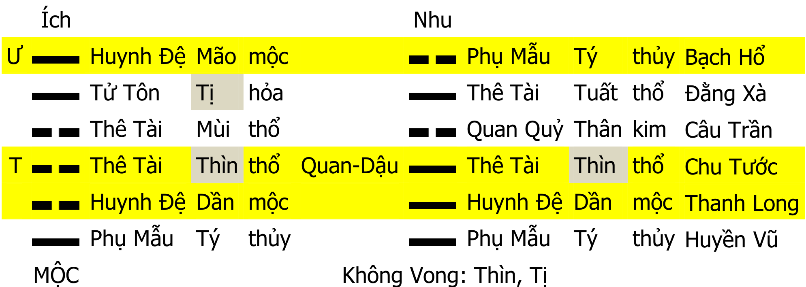
    - **Hình này chứng minh điều gì**
      - Thê Tài trì Thế Không Vong chứng minh không hứng thú phụ nữ; Thế hợp Quan Quỷ phục tàng chứng minh thích đàn ông; Dụng thần Nhật Nguyệt phá và Thế Không chứng minh nhút nhát, tỏ tình thất bại.
    - **Từ đâu mà thấy được**
      - Thế hào Thê Tài Thìn thổ Tuần Không hợp Phục thần Quan Quỷ Dậu kim; Dậu kim bị Nhật Nguyệt Mão mộc xung phá; hào 3, 4, 5 phát động, quẻ biến Thủy Thiên Nhu có chi nội quái phục ngâm.
  - **Phán đoán chi tiết:**
    - Căn cứ: Đương số là nam giới hỏi khi nào có bạn trai ("anh ấy"), vì vậy quy tắc dự đoán phải lấy Quan Quỷ làm Dụng thần đại diện cho người yêu.
    - Nhìn vào:
      - Tình trạng Dụng thần và xu hướng tình cảm: Quan Quỷ Dậu kim không xuất hiện trên quẻ chính mà phục tàng dưới hào Thế Thê Tài Thìn thổ. Quan Quỷ Dậu kim bị cả Nguyệt kiến Mão mộc và Nhật kiến Mão mộc xung khắc dữ dội, rơi vào cảnh vừa Nguyệt phá vừa Nhật phá, hưu tù vô khí cực độ.
      - Tâm lý đối với nữ giới và khao khát bạn trai: Hào Thế lâm Thê Tài Thìn thổ nhưng lại gặp Tuần Không (tuần Giáp Ngọ tuần không Thìn, Tị). Thê Tài đại diện cho phụ nữ, Thê Tài trì Thế lâm Không biểu thị bản thân đương số hoàn toàn không có cảm xúc, hứng thú hay ham muốn đối với phái nữ. Mặt khác, hào Thế Thê Tài Thìn thổ lại tương hợp chặt chẽ với Phục thần Quan Quỷ Dậu kim (Thìn Dậu lục hợp); Quan Quỷ đại diện cho nam giới, Thế hợp Quan Quỷ chứng minh dục vọng và tình cảm của đương số chỉ hướng về phái nam.
      - Trạng thái tâm lý bế tắc và triển vọng tình cảm: Nội quái quẻ biến giữ nguyên địa chi quẻ gốc (Tý, Dần, Thìn) tạo thành thế phục ngâm; phục ngâm chủ về nội tâm u uất, dày vò, mỗi ngày trôi qua đều sống trong dằn vặt và đau khổ triền miên. Dụng thần Quan Quỷ Dậu kim bị phá nặng nề lại không được Nhật Nguyệt tương trợ, báo hiệu rất khó tìm được người yêu như ý nguyện. Thêm vào đó, hào Thế lâm Tuần Không chủ về tính cách nhút nhát, rụt rè, tự ti, không dám công khai chủ động theo đuổi người mình yêu thích.
  - **Ứng nghiệm thực tế:**
    - Người hỏi phản hồi: Vào năm Ất Dậu (2005 - năm Dụng thần thực phá), anh ta đã lấy hết can đảm hướng về một đồng nghiệp nam cùng cơ quan để tỏ tình. Tuy nhiên vì bản tính quá nhút nhát, cách biểu đạt ấp úng vụng về khiến đối phương hoàn toàn không hiểu được ý tứ tình cảm là gì nên cuộc tỏ tình thất bại. Sau đó, bản thân cảm thấy bối rối, mặc cảm và khó tiếp tục chạm mặt nhau ở chỗ làm nên đã nộp đơn xin nghỉ việc.

- **Ví dụ 2:** Ngày Đinh Mão tháng Ngọ, người nam tự dự đoán hôn nhân, được quẻ Lôi Thiên Đại Tráng biến Trạch Lôi Tùy (Tuần không: Tuất, Hợi).
  - **Hình 225.** Quẻ Lôi Thiên Đại Tráng biến Trạch Lôi Tùy
    - 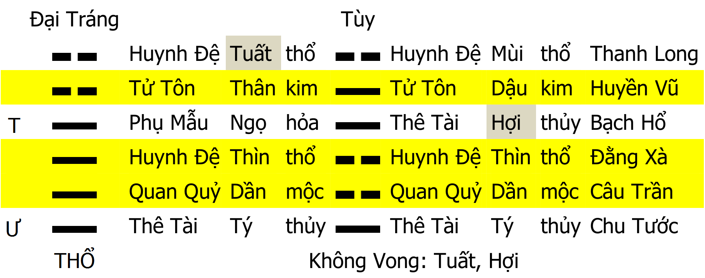
    - **Hình này chứng minh điều gì**
      - Thê Tài hào sơ Nguyệt phá là Kỵ thần chứng minh từ nhỏ không thích phụ nữ; Tử Tôn hào 5 động sinh Tài chứng minh cha mẹ ép cưới; Nguyên thần là Quan Quỷ chứng minh nội tâm thích đàn ông.
    - **Từ đâu mà thấy được**
      - Hào sơ Thê Tài Tý thủy bị Nguyệt kiến Ngọ hỏa xung phá, khắc Thế hào Phụ Mẫu Ngọ hỏa; Hào 5 Tử Tôn Thân kim động sinh Dụng thần; Nguyên thần Quan Quỷ Dần mộc sinh hào Thế.
  - **Phán đoán chi tiết:**
    - Căn cứ: Nam giới hỏi việc hôn nhân thông thường lấy hào Thê Tài làm Dụng thần.
    - Nhìn vào:
      - Thái độ đối với phụ nữ từ thuở nhỏ: Trong quẻ, Thê Tài Tý thủy lâm hào sơ, bị Nguyệt kiến Ngọ hỏa xung phá (Nguyệt phá), lại không được Nhật kiến Mão mộc sinh phù nên rơi vào cảnh hưu tù suy kiệt. Hào sơ là vị trí khởi đầu, tượng trưng cho giai đoạn ấu thơ, thuở nhỏ. Xét tương quan với hào Thế Phụ Mẫu Ngọ hỏa, Thê Tài Tý thủy khắc Phụ Mẫu Ngọ hỏa nên Thê Tài chính là Kỵ thần của hào Thế. Thê Tài là Kỵ thần lại ngự tại hào sơ cho thấy đương số ngay từ thời thơ ấu đã không hề có hứng thú hay thiện cảm luyến ái với phái nữ.
      - Áp lực hôn nhân từ gia đình bề trên: Hào 5 Tử Tôn Thân kim phát động tương sinh cho Dụng thần Thê Tài Tý thủy. Hào 5 là ngôi vị tôn quý của trưởng bối, phụ mẫu trong nhà; hào 5 động sinh Dụng thần Thê Tài biểu thị cha mẹ và người lớn trong dòng họ vô cùng sốt ruột, ráo riết thúc ép và kiên quyết bắt anh ta phải tìm đối tượng kết hôn.
      - Thế giới nội tâm và nỗi thống khổ giằng xé: Nội quái quẻ biến giữ nguyên địa chi quẻ gốc (Tý, Dần, Thìn) rơi vào thế phục ngâm, biểu thị đương số vì áp lực hôn nhân gia đình mà vô cùng đau khổ, tâm trạng bồn chồn đứng ngồi không yên. Xét về Nguyên thần của hào Thế Phụ Mẫu Ngọ hỏa là Quan Quỷ Dần mộc (Mộc sinh Hỏa); Nguyên thần đại diện cho cội nguồn tư duy, tiềm thức và thế giới nội tâm sâu kín nhất. Quan Quỷ tượng trưng cho nam giới, Nguyên thần của Thế là Quan Quỷ chứng minh trong thâm tâm anh ta thực chất chỉ say đắm và thích đàn ông.
  - **Ứng nghiệm thực tế:**
    - Người hỏi thừa nhận trên thực tế bản thân đúng là người đồng tính luyến ái nam, hoàn toàn không có cảm xúc với phụ nữ nhưng đang bị gia đình thúc ép cưới vợ kịch liệt.

- **Ví dụ 3:** Ngày Đinh Sửu tháng Tuất, người nam tự dự đoán hôn nhân, được quẻ Địa Sơn Khiêm biến Cấn Vi Sơn (Tuần không: Thân, Dậu).
  - **Hình 226.** Quẻ Địa Sơn Khiêm biến Cấn Vi Sơn
    - 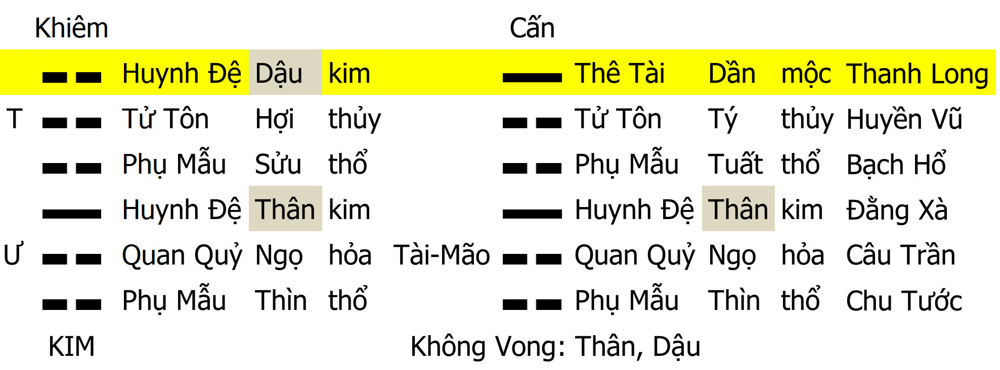
    - **Hình này chứng minh điều gì**
      - Thê Tài hưu tù phục tàng chứng minh không có duyên với nữ; Hào Ứng lâm Quan Quỷ chứng minh đối tượng hôn phối là đàn ông; Huynh Đệ động sinh Thế chứng minh xu hướng đồng tính.
    - **Từ đâu mà thấy được**
      - Thê Tài Mão mộc hưu tù phục dưới hào 2; Hào Ứng là ngôi vị phối ngẫu lâm Quan Quỷ Ngọ hỏa; Hào 6 Huynh Đệ Dậu kim phát động tương sinh Thế hào Tử Tôn Hợi thủy lâm Huyền Vũ.
  - **Phán đoán chi tiết:**
    - Căn cứ: Nam giới hỏi hôn nhân theo nguyên tắc thông thường lấy hào Thê Tài làm Dụng thần.
    - Nhìn vào:
      - Sự suy bại của duyên phận với nữ giới: Thê Tài Mão mộc không xuất hiện trên quẻ chính mà phục tàng dưới hào 2 Quan Quỷ Ngọ hỏa. Tháng Tuất Mão Tuất tương hợp hưu tù, ngày Sửu không sinh trợ, Thê Tài hưu tù vô khí lại ẩn tàng biểu thị nhân duyên với phái nữ hoàn toàn mờ nhạt, không có bóng dáng người nữ nào trong đời sống thực tế.
      - Đối tượng hôn phối trong tâm trí: Hào Thế Tử Tôn Hợi thủy lâm Huyền Vũ; Huyền Vũ chủ về sự mờ ám, bí mật, riêng tư khó thổ lộ. Hào Ứng là ngôi vị phối ngẫu đại diện cho người vợ tương lai, nhưng hào Ứng trong quẻ lại lâm Quan Quỷ Ngọ hỏa. Quan Quỷ đại diện cho người nam, việc hào vị phối ngẫu lâm Quan Quỷ chỉ rõ đối tượng kết đôi và hướng tới trong lòng đương số thực chất là một người đàn ông.
      - Thế giới nội tâm và bản chất tình cảm đồng tính: Hào 6 Huynh Đệ Dậu kim phát động tương sinh cho hào Thế Tử Tôn Hợi thủy. Hào sinh hào Thế chính là Nguyên thần của Thế, mà Nguyên thần phản ánh tư duy, nhận thức và thế giới nội tâm sâu kín; Huynh Đệ đại diện cho người cùng giới tính, bạn đồng giới. Việc Huynh Đệ đóng vai trò là Nguyên thần phát động sinh Thế hào chứng minh tư tưởng tình cảm của anh ta xuất phát từ sự rung động với người cùng giới, khẳng định có khuynh hướng đồng tính luyến ái.
  - **Ứng nghiệm thực tế:**
    - Người hỏi xác nhận lời dự đoán hoàn toàn chính xác, trên thực tế anh ta đúng là người đồng tính luyến ái.

- **Ví dụ 4:** Ngày Đinh Mùi tháng Mùi, người nữ tự dự đoán hôn nhân, được quẻ Phong Thủy Hoán biến Phong Sơn Tiệm (Tuần không: Dần, Mão).
  - **Hình 227.** Quẻ Phong Thủy Hoán biến Phong Sơn Tiệm
    - 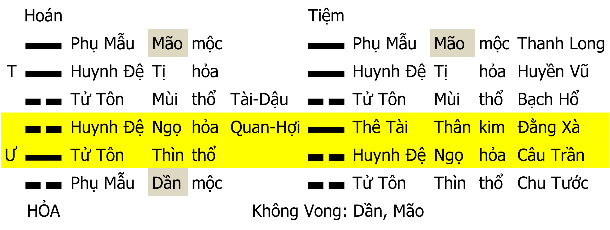
    - **Hình này chứng minh điều gì**
      - Quan Quỷ hưu tù phục tàng và Thế lâm Tuyệt địa chứng minh cự tuyệt đàn ông; Hào vị phối ngẫu lâm Tử Tôn động hợp Thê Tài chứng minh xu hướng đồng tính nữ yêu phụ nữ.
    - **Từ đâu mà thấy được**
      - Quan Quỷ Hợi thủy bị Nhật Nguyệt Mùi thổ khắc phục dưới hào 3; Thế hào Tị hỏa là Tuyệt địa của Quan Quỷ; Ứng hào Tử Tôn Thìn thổ động tương hợp Phục thần Thê Tài Dậu kim.
  - **Phán đoán chi tiết:**
    - Căn cứ: Nữ giới dự đoán hôn nhân thông thường lấy Quan Quỷ làm Dụng thần.
    - Nhìn vào:
      - Sự cự tuyệt hoàn toàn đối với nam giới: Xét hào Quan Quỷ Hợi thủy bị cả Nguyệt kiến Mùi thổ lẫn Nhật kiến Mùi thổ đồng thời khắc phạt nặng nề, Quan Quỷ rơi vào cảnh suy tàn hưu tù và không xuất hiện trên quẻ chính mà phải phục tàng dưới hào 3 Huynh Đệ Ngọ hỏa. Thêm vào đó, hào Thế Huynh Đệ Tị hỏa là Tuyệt địa của Quan Quỷ Hợi thủy (Thủy tuyệt tại Tị). Hào Thế ngự tại Tuyệt địa của Dụng thần Quan Quỷ là tượng bản thân người nữ này triệt để bài xích, cự tuyệt đàn ông, hoàn toàn không thích cũng không có nhu cầu tiếp cận phái mạnh.
      - Xu hướng tình cảm hướng về phái nữ: Hào Ứng là ngôi vị phối ngẫu hôn nhân lại lâm Tử Tôn Thìn thổ (Tử Tôn là thần khắc Quan Quỷ, chủ về không cần chồng). Đặc biệt, hào Ứng Tử Tôn Thìn thổ phát động tương hợp chặt chẽ với Phục thần Thê Tài Dậu kim ẩn tàng dưới hào 4 (Thìn Dậu lục hợp). Thê Tài đại diện cho phái nữ, việc ngôi vị phối ngẫu phát động tương hợp với Thê Tài chứng minh đối tượng mà cô khao khát kết đôi và yêu thương chính là phụ nữ. Từ các căn cứ này khẳng định đương số có xu hướng đồng tính luyến ái nữ (lesbian).
  - **Ứng nghiệm thực tế:**
    - Người nữ phản hồi trên thực tế bản thân đúng là người đồng tính luyến ái nữ, không hề có tình cảm với đàn ông mà chỉ yêu thương phụ nữ.

### CHƯƠNG 7: HÔN NHÂN BẤT HẠNH

#### Tổng quan và nguyên lý dự đoán hôn nhân bất hạnh

Trong dự trắc học Lục Hào, hôn nhân bất hạnh bao gồm nhiều trạng thái bi kịch như sinh ly, tử biệt, bệnh tật nan y, tai nạn huyết quang, lao ngục giam cầm hoặc ngoại tình phản bội dẫn đến đổ vỡ gia đình. Để nắm bắt chuẩn xác nguyên nhân và hậu quả, người dự đoán cần dựa trên các quy luật cốt lõi sau:

- **Dấu hiệu thông tin sinh ly và tử biệt:**
  - Dụng thần hưu tù suy nhược, không được Nhật Nguyệt sinh phù hoặc bị Nhật Nguyệt khắc phạt nặng nề.
  - Dụng thần lâm Bạch Hổ phát động hóa Hồi đầu khắc: Bạch Hổ là thần của tang tóc, huyết quang, bệnh tật hiểm nghèo; hóa khắc là tượng tử vong khó tránh.
  - Dụng thần động hóa Quan Quỷ: Quan Quỷ là quỷ thần, tai họa, bệnh hoạn và tử vong; người sống biến thành quỷ là biểu hiện rõ rệt của sinh ly tử biệt âm dương cách trở ("hóa Quỷ chủ tử biệt").
  - Dụng thần động hóa Không Vong hoặc hóa Mộ: Không Vong là tiêu tán, mất mát, không còn tồn tại; nhập Mộ là kết thúc sự sống, đi vào nấm mồ chôn cất.
- **Phương pháp nhận định nguyên nhân hung họa qua Hào vị và Lục thần:**
  - **Phối hợp Lục thần:**
    - *Bạch Hổ:* Chủ về tai nạn đổ máu, tang tóc, tử vong bất ngờ hoặc bạo bệnh hiểm nghèo.
    - *Câu Trần:* Chủ về bệnh tật kinh niên kéo dài, ung thư, khối u xơ, vướng vòng lao ngục, tranh chấp đất đai giam hãm.
    - *Chu Tước:* Chủ về thị phi cãi vã, khẩu thiệt, tranh chấp pháp lý, án kiện quan ti làm tổn hại tài sản và hòa khí.
    - *Huyền Vũ:* Chủ về sự mờ ám, ngoại tình dâm loạn, lừa gạt dối trá, trộm cắp thất thoát, hoặc tính cách trầm uất nội tâm.
    - *Thanh Long:* Chủ về tửu sắc hoan lạc, cơ quan sinh dục, bệnh đường sinh sản hoặc hỷ sự biến thành bi kịch.
    - *Đằng Xà:* Chủ về quái dị, kinh sợ, hoang mang lo lắng, tâm lý bất an hoặc bệnh tật kỳ lạ.
  - **Phối hợp Hào vị:**
    - *Hào 1 (Sơ hào):* Đại diện cho thường dân áo vải, tâm tư thầm kín, hoặc khu vực bộ phận sinh dục, mầm mống gốc rễ của sự việc.
    - *Hào 2:* Đại diện cho trạch (nhà ở, gia đạo), nhà mẹ đẻ, tử cung của người nữ.
    - *Hào 3, Hào 4:* Đại diện cho cánh cửa, giường chiếu, chuyện phòng the và nội tâm trung gian.
    - *Hào 5:* Đại diện cho con đường lộ đạo, việc di chuyển giao thông ngoài đường.
    - *Hào 6:* Đại diện cho phương xa, nơi hẻo lánh, nước ngoài, hoặc vị trí thoái hưu kết thúc sự việc.
- **Ý nghĩa cấu trúc Quẻ Du Hồn và Quẻ Quy Hồn:**
  - Quẻ Du Hồn mang hình tượng trôi dạt, bất định, xa cách, phiêu bạt phân ly; người phối ngẫu rời bỏ ra đi hoặc cuộc đời nhiều lần đứt gánh.
  - Quẻ Quy Hồn mang hình tượng quay về nguồn cội, nương náu chốn cũ, người phụ nữ trở về nương tựa nhà mẹ đẻ sau biến cố ly tán.

#### Phân tích hệ thống quái lệ thực tiễn về hôn nhân bất hạnh

- **Ví dụ 1: Nữ đoán cuộc sống sau này ra sao (ngày Ất Hợi tháng Ngọ)**
  - **Hình 228.** Quẻ Sơn Phong Cổ biến Sơn Trạch Tổn
    - 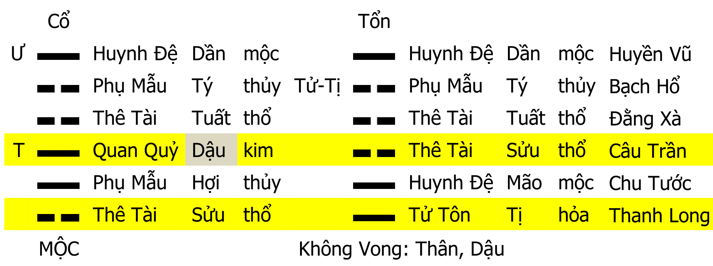
    - **Hình này chứng minh điều gì**
      - Người chồng đã qua đời vì bệnh ung thư, người vợ bơ vơ muốn quay về nhà mẹ đẻ nương tựa.
    - **Từ đâu mà thấy được**
      - Quan Quỷ Dậu kim trì Thế lâm Câu Trần Không Vong động hóa Mộ Sửu thổ; Thế sinh hào 2 Phụ Mẫu Hợi thủy trong quẻ Quy Hồn.
  - **Phán đoán chi tiết:**
    - Căn cứ:
      - Nữ xem về cuộc sống và chồng lấy Quan Quỷ làm Dụng thần; trong quẻ Quan Quỷ Dậu kim trì Thế phát động.
      - Ngày Ất Hợi (Tuần không: Thân, Dậu); Dụng thần Quan Quỷ Dậu kim gặp Tuần không.
      - Tháng Ngọ khắc Dậu kim, Nhật Hợi không sinh trợ, hào Thế Dậu kim lâm thế hưu tù suy nhược.
      - Dụng thần lâm Câu Trần, động hóa Thê Tài Sửu thổ (Dậu kim nhập Mộ tại Sửu thổ).
      - Quẻ Sơn Phong Cổ là quẻ Quy Hồn; hào Thế Dậu kim phát động sinh trợ hào 2 Phụ Mẫu Hợi thủy lâm Chu Tước.
    - Nhìn vào:
      - Quan Quỷ trì Thế biểu thị đã có chồng; hào Phụ Mẫu lâm Nhật thần là tượng đã có hôn ước chính thức; hào Hương Khuê Sửu thổ vượng tướng cũng khẳng định là người phụ nữ đã lập gia đình.
      - Hào Thế Quan Quỷ Dậu kim lâm Không Vong thể hiện tâm trạng hoang mang cực độ, mất phương hướng, ngơ ngác đứng trước ngã tư cuộc đời.
      - Quan Quỷ Dậu kim bị Nguyệt lệnh Ngọ hỏa khắc hại, Nhật không tương sinh, lâm Câu Trần Không Vong động mà hóa Mộ Sửu thổ là điềm đại hung cho hôn nhân. Không Vong chủ về mất mát, nhập Mộ chủ về kết thúc sự sống và nấm mồ chôn cất.
      - Nguyệt lệnh Ngọ hỏa là Bệnh địa của Dậu kim, chỉ rõ nguyên nhân tử vong là do bệnh tật. Lục thần lâm Câu Trần đại diện cho khối u, ung thư, do đó phán đoán người chồng mắc bệnh hiểm nghèo và đã qua đời vì bệnh ung thư.
      - Hào Thế phát động tương sinh hào 2, hào 2 là trạch (nhà ở), cũng là tượng trưng cho nhà mẹ đẻ; quẻ Cổ là quẻ Quy Hồn chủ về quay trở lại chốn xưa. Điều này chứng minh người phụ nữ sau khi mất chồng đang có ý định quay trở về nương tựa nhà mẹ đẻ.
  - **Ứng nghiệm thực tế:**
    - Người phụ nữ đau đớn xác nhận người chồng vừa mới qua đời vì bệnh hiểm nghèo hôm trước. Hiện cô bế tắc không biết phải xoay xở cuộc sống ra sao nên muốn dọn về nhà mẹ đẻ tá túc tạm thời.

- **Ví dụ 2: Nam 43 tuổi đoán tiền vận hôn nhân (ngày Nhâm Ngọ tháng Tuất năm Ất Dậu)**
  - **Hình 229.** Quẻ Thiên Hỏa Đồng Nhân biến Sơn Hỏa Bí
    - 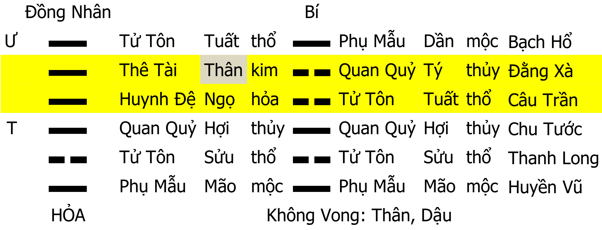
    - **Hình này chứng minh điều gì**
      - Vợ đã mất vì ung thư xương vào năm Giáp Thân; muốn tái hôn phải chờ đến năm Mậu Tý xung Kỵ thần mới thành.
    - **Từ đâu mà thấy được**
      - Thê Tài Thân kim hào 5 Không Vong bị Huynh Đệ Ngọ hỏa động khắc, động hóa Quan Quỷ Tý thủy; năm Giáp Thân thực Không hóa Quỷ.
  - **Phán đoán chi tiết:**
    - Căn cứ:
      - Nam đoán hôn nhân lấy Thê Tài làm Dụng thần; Thê Tài Thân kim ngự tại hào 5.
      - Ngày Nhâm Ngọ (Tuần không: Thân, Dậu); Dụng thần Thê Tài Thân kim lâm Tuần không.
      - Thê Tài Thân kim được Nguyệt kiến Tuất thổ tương sinh nhưng bị Nhật thần Ngọ hỏa khắc phạt, ở thế suy vượng cân bằng.
      - Hào 4 Huynh Đệ Ngọ hỏa lâm Câu Trần phát động khắc mạnh Dụng thần Thê Tài Thân kim.
      - Thê Tài Thân kim phát động hóa Quan Quỷ Tý thủy.
    - Nhìn vào:
      - Dụng thần lâm Tuần không lại bị hào động Huynh Đệ Ngọ hỏa điên cuồng khắc sát, thông thường là tượng vợ chồng lục đục gay gắt, nặng thì ly hôn.
      - Điều tối kỵ nhất là Dụng thần Thê Tài tự mình phát động hóa ra Quan Quỷ Tý thủy. Dụng thần động hóa Quỷ chính là điềm báo tử biệt âm dương chia cắt.
      - Dụng thần Thê Tài Thân kim lâm Tuần không, đến năm Giáp Thân (2004) địa chi Thân xuất Không điền thực, đúng thời điểm bị hỏa khắc và ứng nghiệm hóa Quỷ. Do đó khẳng định vợ anh ta đã qua đời vào năm Giáp Thân 2004.
      - Về việc tục huyền tái hôn: Trong quẻ Huynh Đệ Ngọ hỏa phát động khắc Thê Tài là rào cản ngăn chặn nhân duyên mới. Muốn lấy vợ khác, bắt buộc phải đợi đến năm Mậu Tý (2008), khi địa chi Tý thủy xung khử Huynh Đệ Ngọ hỏa (Tý Ngọ tương xung giải trừ Kỵ thần) thì mới có cơ hội tái hôn.
  - **Ứng nghiệm thực tế:**
    - Người nam xác nhận vợ anh đã qua đời vì bệnh ung thư xương vào tháng Sửu năm Giáp Thân (2004). Việc tái hôn ở thời điểm xem quẻ vẫn đang chờ ứng nghiệm vào năm Mậu Tý.

- **Ví dụ 3: Nữ đoán hôn nhân cả đời và số phận hai người chồng đầu (ngày Nhâm Tuất tháng Tuất năm Nhâm Ngọ)**
  - **Hình 230.** Quẻ Lôi Sơn Tiểu Quá
    - 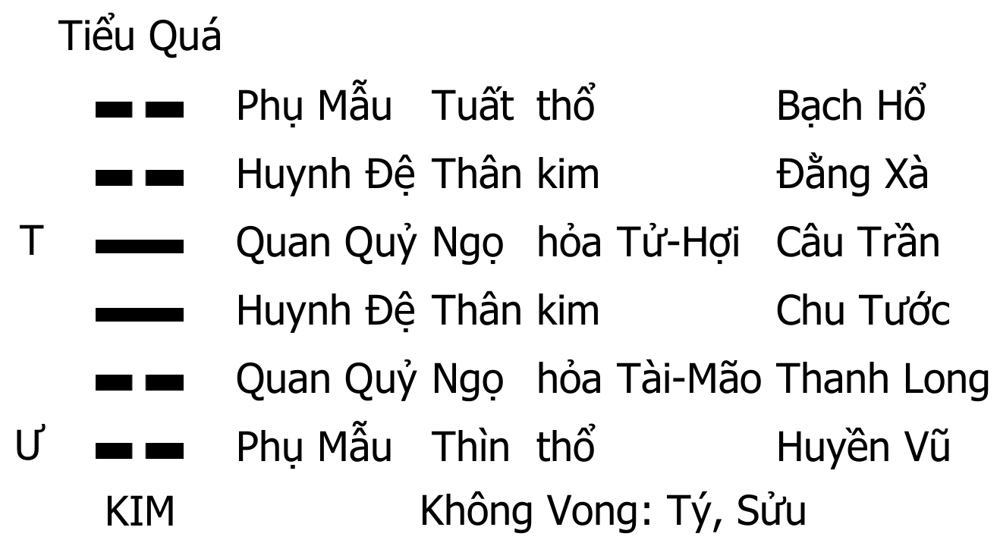
    - **Hình này chứng minh điều gì**
      - Đời người hai lần đò trôi nổi; người chồng đầu dính án tù tội rồi ly hôn, người chồng thứ hai chết vì tai nạn xe cộ.
    - **Từ đâu mà thấy được**
      - Quẻ Lôi Sơn Tiểu Quá là quẻ Du Hồn; Quan Quỷ Ngọ hỏa lưỡng hiện nhập Mộ Tuất thổ; hào 4 lâm Câu Trần; Phụ Mẫu là xe cộ.
  - **Phán đoán chi tiết:**
    - Căn cứ:
      - Nữ xem hôn nhân lấy Quan Quỷ làm Dụng thần; trong quẻ Quan Quỷ Ngọ hỏa lưỡng hiện tại hào 2 và hào 4 (hào Thế).
      - Quẻ Lôi Sơn Tiểu Quá thuộc cung Đoài, là quẻ Du Hồn.
      - Tháng Tuất ngày Tuất; hào Thế Quan Quỷ Ngọ hỏa nhập Mộ ở cả Nhật lẫn Nguyệt (Hỏa Mộ tại Tuất).
      - Hào 4 Quan Quỷ Ngọ hỏa lâm Câu Trần; hào 2 Quan Quỷ Ngọ hỏa lâm Thanh Long có Thê Tài Mão mộc phục tàng dưới chân.
      - Thê Tài Mão mộc không hiện trên quẻ, bị Nhật Nguyệt Tuất thổ hợp trú.
    - Nhìn vào:
      - Quan Quỷ lưỡng hiện biểu thị đương số sẽ trải qua ít nhất hai cuộc hôn nhân trong đời. Quẻ Du Hồn chủ về phiêu bạt, trôi nổi, chia ly cách trở, chỉ rõ tất cả những người chồng đều lần lượt rời bỏ cô mà đi.
      - Hào Thế Quan Quỷ Ngọ hỏa nhập Mộ ở Nhật Nguyệt biểu thị tư tưởng u uất nặng nề, cuộc sống bế tắc, rơi vào hoàn cảnh tù túng không lối thoát. Quan Quỷ kiêm đại diện cho công việc, lâm hưu tù nhập Mộ cho thấy công việc bấp bênh, sự nghiệp không có bước phát triển lớn.
      - Hào 4 Quan Quỷ Ngọ hỏa lâm Câu Trần nhập Mộ: Câu Trần chủ ngục tù xiềng xích, nhập Mộ chủ giam hãm cách ly, vạch trần người chồng đầu tiên từng vướng vào vòng lao lý tù tội.
      - Quan Quỷ nhập Mộ tại Phụ Mẫu Tuất thổ: Phụ Mẫu tượng trưng cho xe cộ; nhập Mộ tại Phụ Mẫu là điềm báo bị xe cộ tước đoạt sinh mạng, báo trước một người chồng bị chết do tai nạn giao thông.
      - Hào 2 Quan Quỷ Ngọ hỏa có Thê Tài Mão mộc phục tàng: Hào 2 là trạch, Thê Tài phục dưới Quan Quỷ chứng minh người chồng thứ hai đã từng có một đời vợ trước khi đến với cô.
      - Về tài vận và sức khỏe đương số: Thê Tài Mão mộc phục thần bị Nhật Nguyệt hợp trú nên dòng tiền bị ứ trệ, kinh tế khó khăn, không tích lũy được tiền bạc. Hào Thế nhập Mộ chủ hôn mê, choáng váng đầu óc. Nguyên thần Mão mộc không hiện bị hợp kẹt ở cung Đoài (Đoài chủ khuyết thiếu, Mão mộc chủ huyết) gây ra chứng thiếu máu não. Hào 2 là vị trí tử cung phụ nữ, lại là Thai địa của Tử Tôn, lâm Thanh Long chủ bộ phận sinh dục; hào Thế lâm Câu Trần (chủ khối u) chỉ rõ cô bị bệnh u xơ tử cung. Tuy nhiên nhập Mộ ở Nhật là tượng chấm dứt mầm bệnh, đã được phẫu thuật điều trị khỏi vào năm Canh Ngọ (1990). Cung Đoài chủ ăn uống nên hệ tiêu hóa, dạ dày cũng bị tổn thương.
  - **Ứng nghiệm thực tế:**
    - Người phụ nữ nghẹn ngào thừa nhận: Người chồng đầu tiên của cô phải vào tù, sau khi cô dốc sức chạy vạy cứu ra thì hai người ly hôn. Người chồng thứ hai từng có một đời vợ, cô hết lòng yêu thương nhưng không may anh đã qua đời thảm khốc trong một vụ tai nạn xe cộ. Bản thân cô bị chóng mặt, đau dạ dày và từng mổ u xơ tử cung năm Canh Ngọ.

- **Ví dụ 3 (tiếp theo): Vận dụng phép phân chia thái cực đoán về người chồng thứ ba (ngày Nhâm Tuất tháng Tuất)**
  - **Hình 231.** Quẻ Sơn Hỏa Bí biến Sơn Lôi Di
    - 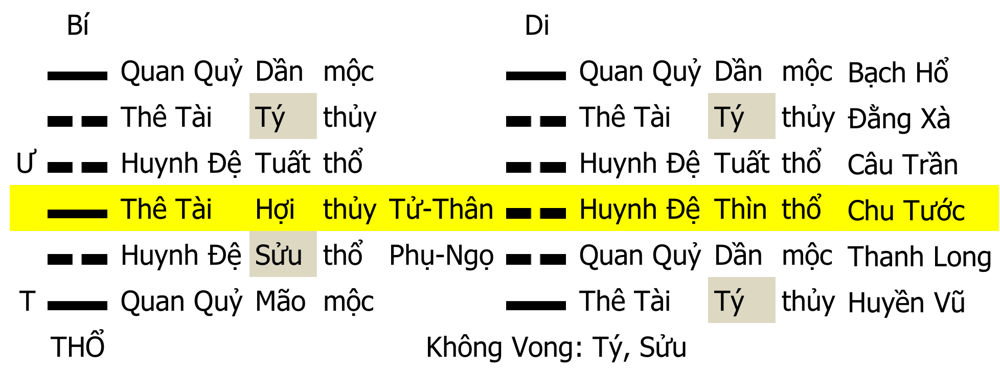
    - **Hình này chứng minh điều gì**
      - Người chồng thứ ba chỉ là chung sống không hôn thú, tính hướng nội, làm ăn thất bại phá tài và sẽ chia tay vào tháng Thìn năm sau.
    - **Từ đâu mà thấy được**
      - Phụ Mẫu Ngọ hỏa phục tàng nhập Mộ; Thế Quan Quỷ Mão mộc lâm Huyền Vũ quẻ Lục hợp; Thê Tài Hợi thủy hóa Hồi đầu khắc Thìn thổ.
  - **Phán đoán chi tiết:**
    - Căn cứ:
      - Đương số hỏi tiếp người chồng thứ ba; tác giả chuyển đổi thái cực điểm, biến chuyển thành quẻ mới Sơn Hỏa Bí biến Sơn Lôi Di.
      - Ngày Nhâm Tuất tháng Tuất (Tuần không: Tý, Sửu).
      - Quẻ này tương đương việc người chồng thứ ba tự gieo quẻ, do đó hào Thế Quan Quỷ Mão mộc đại diện cho chính người chồng thứ ba.
      - Phụ Mẫu Ngọ hỏa hưu tù phục tàng dưới hào 2 Huynh Đệ Sửu thổ, nhập Mộ tại Nhật Nguyệt Tuất thổ.
      - Hào Thế Quan Quỷ Mão mộc lâm Huyền Vũ ở nội quái; quẻ gốc Sơn Hỏa Bí là quẻ Lục hợp.
      - Hào Thế Mão mộc tương hợp Nhật Nguyệt Tuất thổ (Mão Tuất hợp).
      - Trong quẻ cùng Nhật Nguyệt và hào biến có tổng cộng 5 hào Huynh Đệ (hào 4 Tuất thổ, Nhật Nguyệt 2 Tuất thổ, hào 2 Sửu thổ, hào biến Thìn thổ).
      - Hào 3 Thê Tài Hợi thủy lâm Chu Tước phát động hóa Huynh Đệ Thìn thổ (hồi đầu khắc); Thìn thổ bị Nguyệt kiến Tuất thổ xung là Nguyệt phá.
    - Nhìn vào:
      - Phụ Mẫu là giấy chứng nhận kết hôn; Phụ Mẫu Ngọ hỏa không hiện trên quẻ lại nhập Mộ tại Nhật Nguyệt, biểu thị mối quan hệ với người đàn ông này thực chất là sống chung trước hôn nhân (vị hôn đồng cư), không có giá thú hợp pháp.
      - Hào Thế lâm Huyền Vũ tại nội quái cho thấy tính tình người này thâm trầm, hướng nội, ít bộc lộ cảm xúc. Quẻ Lục hợp chủ về tĩnh lặng, ngại giao tiếp và không ưa xáo trộn.
      - Hào Thế Quan Quỷ kết hợp với Tuất thổ ở Nhật Nguyệt tạo thành nhiều lần hợp; Quan Quỷ đại diện cho công việc, chỉ ra người này từ trước đến nay đã từng trải qua 3 lần thay đổi công việc. Quan Quỷ hưu tù ngự tại hào sơ (hào của thứ dân) khẳng định anh ta không có quan vận, chỉ là một người lao động bình thường.
      - Toàn quẻ có 5 hào Huynh Đệ chứng minh gia đình anh ta có tất cả 5 anh em. Nguyên thần hào Thế là Thủy lưỡng hiện (hào 5 Tý thủy và hào 3 Hợi thủy), lấy Nguyên thần đại diện cho người mẹ sinh ra mình; Nguyên thần lưỡng hiện lại thêm hào 3 Hợi thủy động hóa Huynh Đệ chứng tỏ 5 anh em không cùng một mẹ sinh ra (cùng cha khác mẹ).
      - Thê Tài Tý thủy Không Vong, Thê Tài Hợi thủy bị Nhật Nguyệt khắc phạt lại động hóa hồi đầu khắc; Thìn thổ là Nguyệt phá, đến năm Canh Thìn (2000) điền thực phá thần nên tài vận bắt đầu sụp đổ. Tài lâm Chu Tước bị khắc là tượng vì kiện tụng, thị phi tranh chấp miệng tiếng mà tổn hao tài sản.
      - Thê Tài Hợi thủy đại diện cho người phụ nữ sống chung (chính là cô gái đi xem bói). Hợi thủy bị Thìn thổ khắc, đến tháng Thìn năm sau (năm Tân Tỵ 2001) khi Thìn thổ điền thực lực khắc, mối quan hệ đồng cư sẽ tan vỡ, hai người dứt khoát chia tay.
  - **Ứng nghiệm thực tế:**
    - Mọi phán đoán đều ứng nghiệm chuẩn xác: Năm Canh Thìn (2000), người đàn ông này mở cửa hàng buôn bán thì bị trộm khoắng sạch đồ đạc; sau đó lái xe tông phải người ta, bị cảnh sát giam bằng lái và bồi thường số tiền lớn. Đến tháng Thìn năm sau (2001), hai người đã chính thức đường ai nấy đi.

- **Ví dụ 4: Nam 44 tuổi đoán tình trạng hôn nhân (ngày Mậu Tuất tháng Tuất)**
  - **Hình 232.** Sơ đồ quẻ Địa Sơn Khiêm biến Địa Trạch Lâm
    - 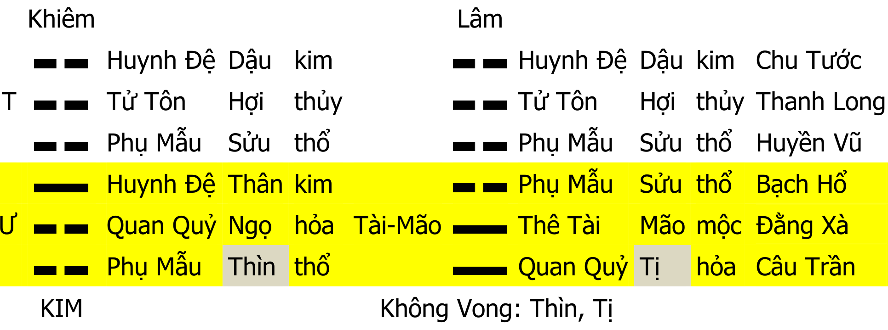
    - **Hình này chứng minh điều gì**
      - Vợ mới qua đời vào tháng Dậu; người chồng đau xót khôn nguôi nhưng sẽ nhanh chóng tái hôn vào tháng Chạp cùng năm.
    - **Từ đâu mà thấy được**
      - Thê Tài Mão mộc phục dưới Quan Quỷ Ngọ hỏa bị Huynh Đệ Thân kim Bạch Hổ động khắc; hào 2 Tử địa động hóa Thê Tài.
  - **Phán đoán chi tiết:**
    - Căn cứ:
      - Nam đoán hôn nhân lấy Thê Tài làm Dụng thần; Thê Tài Mão mộc không hiện trên quẻ, phục tàng dưới hào 2 Quan Quỷ Ngọ hỏa.
      - Ngày Mậu Tuất tháng Tuất (Tuần không: Thìn, Tị).
      - Dụng thần Mão mộc được Nguyệt kiến Tuất thổ tương hợp là có khí, nhưng Nhật Nguyệt đều là thổ không sinh mộc, rốt cuộc là hưu tù vô trợ.
      - Phi thần Quan Quỷ Ngọ hỏa phát động: Ngọ hỏa chính là đất Tử của Dụng thần Mão mộc (Mộc tử tại Ngọ).
      - Hào 3 Kỵ thần Huynh Đệ Thân kim được Nhật Nguyệt sinh trợ vượng tướng, lâm Bạch Hổ phát động hóa Phụ Mẫu Sửu thổ.
      - Hào 2 Quan Quỷ Ngọ hỏa động hóa Thê Tài Mão mộc.
    - Nhìn vào:
      - Phi thần là Tử địa phát động, kết hợp với Kỵ thần Huynh Đệ Thân kim lâm Bạch Hổ (chủ tang tóc, huyết quang, tử vong) phát động khắc phạt dữ dội, tạo thành tượng hôn nhân đại hung: người vợ đã tạ thế qua đời (tử biệt thê tử).
      - Huynh Đệ Thân kim đồng thời là Nguyên thần của hào Thế Tử Tôn Hợi thủy; Nguyên thần chủ về hoạt động tư duy, tâm tư tình cảm. Thân kim phát động hóa Mộ tại Sửu thổ biểu thị người chồng đến nay vẫn chưa thể nguôi ngoai nỗi đau mất mát, trong lòng trĩu nặng u sầu phiền muộn, chứng tỏ vợ mất cách đây chưa lâu.
      - Ứng kỳ vợ mất: Tháng trước là tháng Dậu, địa chi Dậu kim xung động Dụng thần phục tàng Mão mộc (Mão Dậu tương xung xuất phục bị khắc), chính là thời điểm người vợ trút hơi thở cuối cùng.
      - Về việc tái hôn: Hào 2 là trạch (nhà ở), hào 2 Ngọ hỏa là Tử địa phát động biến hóa ra Thê Tài Mão mộc. Hình tượng "Tử địa động hóa Thê Tài ngay trong trạch hào" báo hiệu một biến chuyển kỳ lạ: Sau khi người vợ cũ qua đời, trong nhà sẽ nhanh chóng có người phụ nữ khác bước vào thay thế, tức sẽ sớm tục huyền cưới vợ mới.
  - **Ứng nghiệm thực tế:**
    - Người đàn ông buồn bã xác nhận vợ anh vừa qua đời vì bạo bệnh vào đúng tháng Dậu trước đó. Kỳ lạ thay, đúng như quẻ dự báo, ngay trong tháng Chạp (tháng Sửu) cuối năm đó, anh ta đã tái hôn với người phụ nữ khác.

- **Ví dụ 5: Nữ đoán hôn nhân gia đình (ngày Giáp Ngọ tháng Tị)**
  - **Hình 233.** Sơ đồ quẻ Phong Thiên Tiểu Súc biến Thủy Thiên Nhu
    - 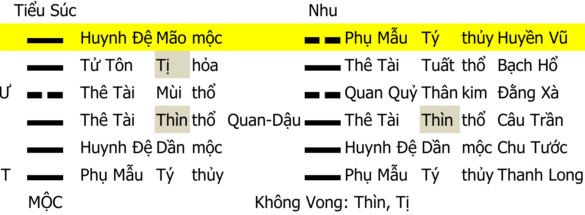
    - **Hình này chứng minh điều gì**
      - Vợ chồng rạn nứt vì đôi bên đều ngoại tình; chồng chết vì tai nạn giao thông vào tháng Tuất và thất thoát toàn bộ gia sản.
    - **Từ đâu mà thấy được**
      - Hào 6 Huynh Đệ Mão mộc Đào hoa độc phát hình Thế xung Dụng; Kỵ thần hào 5 Tị hỏa Bạch Hổ khắc Quan Quỷ Dậu kim phục tàng.
  - **Phán đoán chi tiết:**
    - Căn cứ:
      - Nữ đoán hôn nhân gia đình lấy Quan Quỷ làm Dụng thần; Quan Quỷ Dậu kim không hiện trên quẻ, phục tàng dưới hào 3 Thê Tài Thìn thổ.
      - Ngày Giáp Ngọ tháng Tị (Tuần không: Thìn, Tị).
      - Dụng thần Quan Quỷ Dậu kim bị cả Nguyệt lệnh Tị hỏa lẫn Nhật thần Ngọ hỏa khắc hại tàn khốc, không được cứu trợ, lâm vào tuyệt địa hung hiểm.
      - Phi thần Thê Tài Thìn thổ gặp Tuần không, tương hợp với Dụng thần Quan Quỷ Dậu kim (Thìn Dậu lục hợp).
      - Hào 6 Huynh Đệ Mão mộc là Đào hoa độc phát (đơn độc phát động) hóa Phụ Mẫu Tý thủy.
      - Quẻ biến Thủy Thiên Nhu là quẻ Du Hồn.
      - Hào 5 Tử Tôn Tị hỏa lâm Bạch Hổ vượng tướng ngự tại đường đi.
    - Nhìn vào:
      - Hào 6 Huynh Đệ Mão mộc là Đào hoa sát độc phát, phát động hình phạt hào Thế Phụ Mẫu Tý thủy (Tý Mão tương hình - vô lễ chi hình), đồng thời trực tiếp xung phạt Dụng thần Quan Quỷ Dậu kim (Mão Dậu tương xung). Điều này chỉ rõ căn nguyên rạn nứt hôn nhân là do người thứ ba (tình cảm ngoài luồng, ngoại tình) chen chân phá hoại gia đình. Quẻ biến Du Hồn báo hiệu đôi bên ly tán phiêu bạt, không thể chung sống trọn đời.
      - Phi thần Thê Tài Thìn thổ tương hợp chặt chẽ với Quan Quỷ Dậu kim, biểu thị người chồng nắm giữ toàn bộ quyền lực kinh tế và quản lý mọi nguồn tiền bạc trong gia đình.
      - Hào 5 Tử Tôn Tị hỏa lâm Nguyệt vượng tướng đại diện cho con cái; ngũ hành Hỏa ứng với số 2, cho biết hai vợ chồng có 2 người con.
      - Dụng thần Quan Quỷ bị Nhật Nguyệt hỏa vượng điên cuồng khắc sát, lại có Kỵ thần Tử Tôn Tị hỏa lâm Bạch Hổ (chủ huyết quang, tai nạn) cư ngụ tại hào 5 (hào tượng trưng cho đường sá lộ đạo). Đây là điềm báo tử biệt cực kỳ nguy hiểm: Người chồng sẽ gặp tai nạn xe cộ thảm khốc khi đang lưu thông trên đường.
      - Ứng kỳ tai nạn: Hào 6 Mão mộc độc phát tương hợp với Tuất thổ (Mão Tuất hợp), dự báo tai họa kinh hoàng sẽ giáng xuống vào tháng Tuất (tháng 9 âm lịch).
  - **Ứng nghiệm thực tế:**
    - Người phụ nữ thú nhận tình cảm vợ chồng từ lâu đã lạnh nhạt rạn nứt, cả hai người đều có mối quan hệ ngoại tình bên ngoài, họ có hai người con trai. Đến ngày Canh Thân tháng Tuất cùng năm đó, người chồng quả nhiên bị tai nạn giao thông thảm khốc và tử vong tại chỗ. Do toàn bộ tài sản kinh doanh hàng triệu tệ đều do người chồng một tay nắm giữ nên sau khi anh qua đời đột ngột, toàn bộ số tiền đó biến mất không để lại dấu vết.

### CHƯƠNG 8: KẾT HÔN

#### Nguyên lý và quy tắc phán đoán kết hôn
- **Nguyên tắc định Dụng thần và xét suy vượng:**
  - Định Dụng thần theo giới tính đương số:
    - Nam xem bói lấy hào Thê Tài làm Dụng thần, đại diện cho vợ hoặc bạn gái.
    - Nữ xem bói lấy hào Quan Quỷ làm Dụng thần, đại diện cho chồng hoặc bạn trai.
  - Điều kiện hôn nhân thành tựu:
    - Dụng thần vượng tướng (được Nhật Nguyệt sinh phù, tỷ hòa hoặc lâm vượng địa), sinh hào Thế, hợp hào Thế hoặc Thế Dụng tương sinh tương hợp, tương hòa không hình xung khắc hại; biểu thị hai người tâm đầu ý hợp, duyên phận chín muồi, dễ dàng tiến tới hôn nhân bền vững.
  - Dấu hiệu hôn sự bất thành hoặc gặp trở ngại:
    - Dụng thần lâm hưu tù vô khí, lâm Tuần Không, Nguyệt phá, bị Nhật Nguyệt xung khắc, hoặc động hóa hồi đầu khắc, hóa Thoái thần, hóa Tuyệt, hóa Không; biểu thị nhân duyên mỏng manh hoặc đối phương thiếu chân tình, khó thành gia thất.
    - Dụng thần sinh hào Ứng hoặc hợp hào Ứng: Hào Ứng đại diện cho đối phương hoặc người khác; Dụng thần hướng về hào Ứng chứng tỏ tâm ý đối phương đặt ở nơi khác, đang yêu thương hoặc theo đuổi người khác, bản thân khó lòng kết duyên cùng họ.
- **Vai trò của hào Phụ Mẫu trong dự đoán kết hôn:**
  - Hào Phụ Mẫu là biểu trưng của giấy chứng nhận kết hôn, hôn thư, khế ước, nhà cửa (hào Trạch), sự tác hợp và chấp thuận của cha mẹ hai bên.
  - Phụ Mẫu lâm Nhật thần hoặc được Nhật thần tương hợp (hợp Nhật): Chủ hôn kỳ cận kề, thủ tục pháp lý thuận lợi, giấy tờ nhanh chóng hoàn tất, rất dễ thành hôn.
  - Phụ Mẫu lâm Nguyệt kiến ("Phụ Mẫu lâm Nguyệt không nên thành"): Nguyệt kiến chủ thời gian lâu dài hoặc sự quản thúc, áp đặt; Phụ Mẫu lâm Nguyệt thường chủ hôn kỳ bị trì hoãn kéo dài, hoặc cha mẹ hai bên can thiệp sâu khiến việc cưới xin gặp nhiều trở ngại, không thể xúc tiến nhanh chóng.

#### Các quái lệ thực tế về dự đoán kết hôn
- **Ví dụ 1: Nam đoán chuyện kết hôn (Ngày Mậu Tuất tháng Mùi năm Giáp Thân - Quẻ Trạch Thủy Khốn)**
  - **Hình 234.** Sơ đồ quẻ Trạch Thủy Khốn
    - 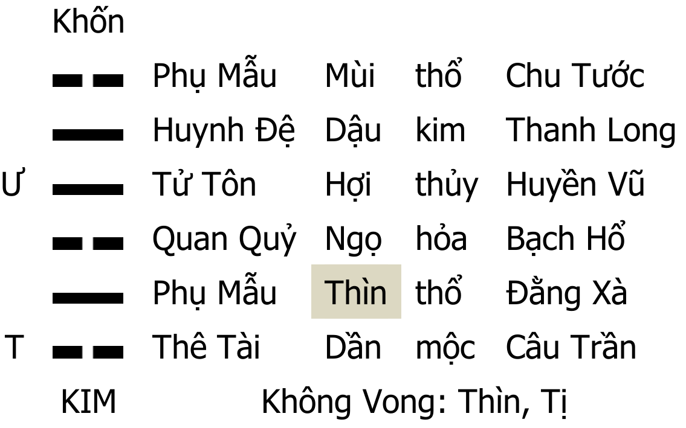
    - **Hình này chứng minh điều gì**
      - Thê Tài Dần mộc trì Thế cho thấy đã có bạn gái; Phụ Mẫu Thìn thổ lâm hào 2 Không Vong bị Nhật xung ám động biểu thị vì chưa có nhà ở nên hôn kỳ phải hoãn sang năm Ất Dậu mới cưới được.
    - **Từ đâu mà thấy được**
      - Hào sơ Thê Tài Dần mộc trì Thế; hào 2 Phụ Mẫu Thìn thổ tuần Không bị Nhật thần Tuất thổ xung thành ám động, hào 2 là trạch (nhà cửa).
  - **Bối cảnh quẻ:** Ngày Mậu Tuất tháng Mùi năm Giáp Thân (tuần Giáp Ngọ: Thìn, Tị Không Vong), người nam gieo quẻ hỏi về việc kết hôn, được quẻ Trạch Thủy Khốn thuần quẻ.
  - **Phán đoán chi tiết:**
    - Căn cứ: Nam bói lấy Thê Tài làm Dụng thần, Phụ Mẫu làm giấy chứng nhận kết hôn và nhà ở (hào 2 là trạch hào).
    - Nhìn vào:
      - Hào sơ Thê Tài Dần mộc trì Thế: Thuyết minh bản thân hiện tại đã có bạn gái gắn bó.
      - Nhật thần Mậu Tuất là Phụ Mẫu, xung Phụ Mẫu Thìn thổ tại hào 2 phát sinh ám động: Phụ Mẫu là giấy chứng nhận kết hôn, Phụ Mẫu lâm Nhật thần chủ về hôn kỳ, biểu thị hai người đang tích cực bàn tính dự định kết hôn.
      - Tuy nhiên Phụ Mẫu Thìn thổ tại hào 2 lâm Tuần Không: Hào 2 là trạch (nhà cửa), Không Vong biểu thị sức lực chưa đủ, thiếu thốn điều kiện thực tế, nguyên nhân chính là chưa có nhà riêng nên tạm thời chưa thể kết hôn ngay được.
      - Xác định ứng kỳ: Sang năm sau Ất Dậu (2005), Thái Tuế Dậu kim đến hợp với Phụ Mẫu Thìn thổ (Thìn Dậu lục hợp giải Không), đến tháng Hợi Thê Tài Dần mộc gặp đất Trường Sinh, khi ấy nhà cửa hoàn thành thì có thể cử hành hôn lễ.
  - **Ứng nghiệm thực tế:** Hai người từ lâu đã muốn kết hôn nhưng vì chưa có nhà ở nên phải hoãn lại đến nay; đương số vừa đóng tiền xây nhà, sang năm hoàn thiện xong là có thể tổ chức đám cưới đúng như dự đoán.

- **Ví dụ 2: Nam đoán có thể kết hôn với bạn gái hay không (Ngày Mậu Thìn tháng Mùi năm Bính Tuất - Quẻ Trạch Lôi Tùy biến Chấn Vi Lôi)**
  - **Hình 235.** Sơ đồ quẻ Trạch Lôi Tùy biến Chấn Vi Lôi
    - 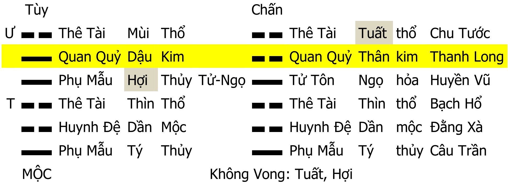
    - **Hình này chứng minh điều gì**
      - Thê Tài Thìn thổ trì Thế lâm Nhật chứng minh rất yêu bạn gái và chiều chuộng nàng; Quan Quỷ Dậu kim độc phát hóa Thoái thần hợp Dụng thần báo hiệu bạn trai cũ quay lại tìm khiến hai người chia tay.
    - **Từ đâu mà thấy được**
      - Hào 3 Thê Tài Thìn thổ trì Thế lâm Nhật; hào 5 Quan Quỷ Dậu kim độc phát hóa Thoái thần Thân kim hợp với Thê Tài Thìn thổ.
  - **Bối cảnh quẻ:** Ngày Mậu Thìn tháng Mùi năm Bính Tuất (tuần Giáp Tý: Tuất, Hợi Không Vong), người nam gieo quẻ hỏi có thể kết hôn với bạn gái không, được quẻ Trạch Lôi Tùy biến Chấn Vi Lôi.
  - **Phán đoán chi tiết:**
    - Căn cứ: Nam bói lấy Thê Tài làm Dụng thần. Quẻ có Thê Tài lưỡng hiện (hào 3 Thìn thổ và hào 6 Mùi thổ), lấy hào Thê Tài Thìn thổ trì Thế lâm Nhật thần làm Dụng thần chính.
    - Nhìn vào:
      - Dụng thần trì Thế: Trong lòng người nam luôn hướng về đối phương, rất yêu quý bạn gái. Tên quẻ Trạch Lôi Tùy có nghĩa là thuận theo, đi theo, phụ họa; chứng minh bạn gái trước đây đã từng có bạn trai (bản thân anh không phải người đầu tiên), đồng thời anh rất chiều chuộng, mọi sự đều chiều theo tâm tính của cô ấy.
      - Dụng thần Thìn thổ bị Quan Quỷ Dậu kim hào 5 độc phát hợp trú: Năm Bính Tuất Thái Tuế xung khai hợp, tháng Mão xung mất hợp thần Dậu kim, chính là bắt đầu yêu nhau từ tháng Mão năm nay.
      - Dấu hiệu bất cát: Quan Quỷ Dậu kim là người đàn ông khác, động hóa Thoái thần Thân kim đến hợp Dụng thần Thìn thổ; Quan Quỷ hóa Thoái biểu thị sự quay trở lại của người cũ, hợp chính là nối lại quan hệ; do đó e rằng người bạn trai trước đây sẽ tìm đến cô ấy để hàn gắn.
  - **Ứng nghiệm thực tế:** Quả nhiên sau đó người bạn trai cũ lại đến tìm cô gái; vì thế cô gái đã chủ động nói lời chia tay với anh ta.

- **Ví dụ 3: Nam đoán hôn nhân với người phụ nữ nước ngoài có thành hay không (Ngày Kỷ Tị tháng Tý năm Quý Mùi - Quẻ Sơn Hỏa Bí biến Sơn Địa Bác)**
  - **Bối cảnh quẻ:** Ngày Kỷ Tị tháng Tý năm Quý Mùi (tuần Giáp Tý: Tuất, Hợi Không Vong), người nam gieo quẻ hỏi hôn nhân với người phụ nữ ngoại quốc có thành hay không, được quẻ Sơn Hỏa Bí biến Sơn Địa Bác.
  - **Phán đoán chi tiết:**
    - Căn cứ: Trong quẻ Quan Quỷ lưỡng hiện (hào sơ Mão mộc và hào 6 Dần mộc), lấy hào Quan Quỷ Mão mộc phát động tại hào sơ làm Dụng thần (hoặc hào phối chiếu hôn nhân đại diện cho mối duyên ràng buộc).
    - Nhìn vào:
      - Hào sơ Quan Quỷ Mão mộc phát động hóa Huynh Đệ Mùi thổ, phối hợp cùng Thê Tài Hợi thủy phục tàng tại hào 3 tạo thành thế tam hợp Hợi Mão Mùi Mộc cục.
      - Dụng thần được Nguyệt kiến Tý thủy đến tương sinh, khí thế vượng tướng vững chắc; thế tam hợp Mộc cục chủ sự kết tụ bền chặt, vượt qua thử thách cách trở về địa lý và phong tục, chắc chắn có thể tiến tới hôn nhân.
  - **Ứng nghiệm thực tế:** Trải qua vài năm dài kiên trì thử thách tình cảm, đến năm Ất Dậu (2005) hai người đã chính thức cử hành hôn lễ kết hôn.

- **Ví dụ 4: Nữ đoán có thể kết hôn với người đàn ông hay không (Ngày Đinh Mùi tháng Hợi - Quẻ Khôn Vi Địa biến Hỏa Thủy Vị Tế)**
  - **Bối cảnh quẻ:** Ngày Đinh Mùi tháng Hợi (tuần Giáp Thìn: Dần, Mão Không Vong), người nữ gieo quẻ hỏi có thể kết hôn với người đàn ông này không, được quẻ Khôn Vi Địa biến Hỏa Thủy Vị Tế.
  - **Phán đoán chi tiết:**
    - Căn cứ: Nữ bói lấy Quan Quỷ làm Dụng thần, Tử Tôn là Kỵ thần khắc hại Quan Quỷ.
    - Nhìn vào:
      - Quan Quỷ Mão mộc tại hào 3 tuy được Nguyệt kiến Hợi thủy sinh phù, nhưng lại lâm Tuần Không và nhập Mộ tại Nhật thần Mùi thổ (Mão mộc nhập Mộ ở Mùi).
      - Kỵ thần Tử Tôn Dậu kim tại hào 6 phát động, tạo thành tam hợp cục Tị Dậu Sửu Kim cục động khắc trực tiếp vào Dụng thần Quan Quỷ Mão mộc.
      - Quẻ Khôn Vi Địa thuần quẻ là quẻ Lục xung: Tượng của sự xung đột, giải tán, đổ vỡ. Dụng thần vừa lâm Không Vong vừa nhập Mộ, lại bị Kỵ thần tam hợp cục khắc hại và quẻ Lục xung phá tán, hôn sự tuyệt đối không thể thành.
  - **Ứng nghiệm thực tế:** Quả nhiên sau đó hai người không thành hôn, mối quan hệ nhanh chóng chấm dứt.

- **Ví dụ 5: Nam đoán có thể kết hôn với bạn gái hay không (Ngày Tân Hợi tháng Dậu - Quẻ Lôi Hỏa Phong)**
  - **Bối cảnh quẻ:** Ngày Tân Hợi tháng Dậu (tuần Giáp Thìn: Dần, Mão Không Vong), người nam gieo quẻ hỏi có thể kết hôn với bạn gái không, được quẻ Lôi Hỏa Phong thuần quẻ.
  - **Phán đoán chi tiết:**
    - Căn cứ: Nam bói lấy Thê Tài làm Dụng thần; Nguyên thần của Thê Tài là Tử Tôn đại diện cho tư duy, suy nghĩ nội tâm của bạn gái.
    - Nhìn vào:
      - Thê Tài Ngọ hỏa tại hào 4 không được Nguyệt kiến Dậu kim trợ giúp, lại bị Nhật thần Hợi thủy khắc thương nên ở trạng thái hưu tù suy nhược. Dụng thần là Ngọ hỏa, tương ứng với năm Nhâm Ngọ (2002), vì vậy phán đoán hai người bắt đầu quen biết yêu nhau từ năm 2002.
      - Nguyên thần Tử Tôn Mão mộc cư hào sơ: Bị Nguyệt kiến Dậu kim xung phá thành Nguyệt phá, lại lâm Tuần Không. Hào sơ là vị trí tâm tư, Nguyên thần chủ về thế giới nội tâm; Không Vong biểu thị do dự không quyết, thiếu lập trường vững vàng. Nguyệt kiến là Phụ Mẫu đại diện cho cha mẹ đối phương; bị Phụ Mẫu xung phá chứng tỏ bạn gái không có chủ kiến cá nhân, hoàn toàn phó mặc tùy ý theo cha mẹ sắp đặt, khó lòng thành đôi.
  - **Ứng nghiệm thực tế:** Quả nhiên bạn gái hoàn toàn không có chủ kiến riêng; cha mẹ cô ấy đi tìm thầy bói xem số phán hai người không hợp hôn nên kiên quyết phản đối, rốt cuộc không đồng ý cho kết hôn.

- **Ví dụ 6: Nam đoán khi nào kết hôn (Ngày Đinh Mùi tháng Dậu năm Nhâm Ngọ - Quẻ Phong Sơn Tiệm biến Thiên Lôi Vô Vọng)**
  - **Bối cảnh quẻ:** Ngày Đinh Mùi tháng Dậu năm Nhâm Ngọ (tuần Giáp Thìn: Dần, Mão Không Vong), người nam gieo quẻ hỏi khi nào kết hôn, được quẻ Phong Sơn Tiệm biến Thiên Lôi Vô Vọng.
  - **Phán đoán chi tiết:**
    - Căn cứ: Nam bói lấy Thê Tài làm Dụng thần.
    - Nhìn vào:
      - Thê Tài Tý thủy không xuất hiện trên quẻ (phục tàng dưới hào 5 Phụ Mẫu Tị hỏa), bị Nhật thần Mùi thổ khắc hại; trong quẻ Huynh Đệ lưỡng động (hào sơ Thìn thổ động hóa Thê Tài Tý thủy, hào 3 Thân kim động) khắc phạt Thê Tài, hôn nhân tất phải muộn màng.
      - Hào Thế Tử Tôn Thân kim phát động tương sinh Thê Tài thủy, chứng tỏ bản thân rất khao khát muốn sớm kết hôn.
      - Dụng thần Tý thủy phục tàng được Nguyệt kiến Dậu kim sinh trợ; đến năm Đinh Hợi (2007), Thái Tuế Hợi thủy xung khai Phi thần Phụ Mẫu Tị hỏa (Tị Hợi tương xung phóng xuất phục thần Tý thủy), khi ấy mới có thể kết hôn.
  - **Ứng nghiệm thực tế:** Về sau người nam kết hôn vào đúng tháng Dậu năm Đinh Hợi (2007) như quẻ đã báo.

- **Ví dụ 7: Nữ đoán có thể kết hôn với người đàn ông hay không (Ngày Bính Tý tháng Tý - Quẻ Tốn Vi Phong biến Sơn Lôi Di)**
  - **Hình 236.** Quẻ Tốn Vi Phong biến Sơn Lôi Di
    - 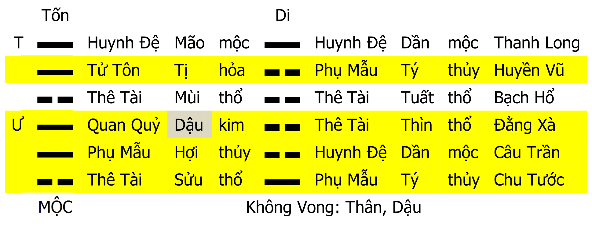
    - **Hình này chứng minh điều gì**
      - Dụng thần Quan Quỷ Dậu kim Không Vong tương xung hào Thế, hai người quen qua mạng chưa từng gặp mặt; Dụng thần động hợp Thê Tài Thìn thổ cho thấy anh ta đã có bạn gái.
    - **Từ đâu mà thấy được**
      - Hào 3 Quan Quỷ Dậu kim lâm Ứng tuần Không, xung hào 6 Thế Mão mộc; Dậu kim động hóa Thê Tài Thìn thổ tương hợp; quẻ Lục xung hóa Du hồn.
  - **Bối cảnh quẻ:** Ngày Bính Tý tháng Tý (tuần Giáp Tuất: Thân, Dậu Không Vong), người nữ gieo quẻ hỏi có thể kết hôn với người đàn ông này không, được quẻ Tốn Vi Phong biến Sơn Lôi Di.
  - **Phán đoán chi tiết:**
    - Căn cứ: Nữ bói lấy Quan Quỷ làm Dụng thần.
    - Nhìn vào:
      - Dụng thần Quan Quỷ Dậu kim không được Nhật Nguyệt Tý thủy trợ giúp (bị tiết khí) nên ở trạng thái hưu tù.
      - Dụng thần lâm hào Ứng tại hào 3 tương xung với hào Thế Mão mộc tại hào 6 (Mão Dậu tương xung): Gặp xung chủ "đối diện bất tương phùng", chứng tỏ hai người trên thực tế căn bản chưa từng gặp mặt nhau ngoài đời.
      - Dụng thần lâm Tuần Không: Đối phương không thật lòng, vô tâm. Lại thấy Quan Quỷ Dậu kim động hóa ra Thê Tài Thìn thổ tương hợp (Thìn Dậu hợp): Thê Tài là phụ nữ, chứng tỏ đối phương ngoài đời đã có bạn gái bên cạnh.
      - Toàn quẻ: Thuần Tốn là quẻ Lục xung lại biến Sơn Lôi Di là quẻ Du hồn, tượng trôi nổi phân tán, duyên mỏng không thể thành đôi.
  - **Ứng nghiệm thực tế:** Quả nhiên hai người chỉ quen biết trên mạng Internet, chưa từng gặp mặt nhau ngoài đời; đối phương thực tế đã có bạn gái, hôn sự không thành.

- **Ví dụ 8: Nữ đoán khi nào kết hôn (Ngày Mậu Thìn tháng Tý năm Nhâm Ngọ - Quẻ Địa Lôi Phục biến Thiên Hỏa Đồng Nhân)**
  - **Hình 237.** Quẻ Địa Lôi Phục biến Thiên Hỏa Đồng Nhân
    - 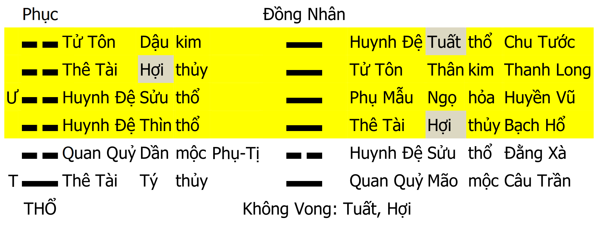
    - **Hình này chứng minh điều gì**
      - Quẻ Phục có tượng lặp lại, người nam đang quen từng ly hôn và có người khác; cô gái sẽ chia tay người này và đến năm Đinh Hợi mới kết hôn với một người từng qua một lần đò.
    - **Từ đâu mà thấy được**
      - Hào 2 Quan Quỷ Dần mộc vượng hợp Thê Tài Hợi thủy Không Vong; hào Ứng Sửu thổ hóa Phụ Mẫu Ngọ hỏa Nguyệt phá; hào sơ Thế sinh Dụng nhưng Nguyên thần Không Phá.
  - **Bối cảnh quẻ:** Ngày Mậu Thìn tháng Tý năm Nhâm Ngọ (tuần Giáp Tý: Tuất, Hợi Không Vong), người nữ gieo quẻ hỏi khi nào kết hôn, được quẻ Địa Lôi Phục biến Thiên Hỏa Đồng Nhân.
  - **Phán đoán chi tiết:**
    - Căn cứ: Nữ bói lấy Quan Quỷ làm Dụng thần.
    - Nhìn vào:
      - Quan Quỷ Dần mộc cư hào 2 được Nguyệt kiến Tý thủy sinh phù, Nhật thần Thìn thổ không khắc nên vượng tướng. Cư hào 2 (hào Trạch) biểu thị có đàn ông vào nhà; Phụ Mẫu Tị hỏa phục tàng không hiện trên quẻ, hào Ứng Sửu thổ lâm Huyền Vũ động hóa Phụ Mẫu Ngọ hỏa: Chứng tỏ bản thân đã cùng người đàn ông này sống chung như vợ chồng mà chưa có hôn thú.
      - Dụng thần Dần mộc hợp Thê Tài Hợi thủy (Dần Hợi hợp), Hợi thủy lâm Tuần Không biểu thị người nam từng có người phụ nữ khác nhưng mối quan hệ đó đã chấm dứt. Hào Ứng là thông tin đối phương hóa Phụ Mẫu chủ từng kết hôn, hóa Nguyệt phá chủ đã ly hôn; vì vậy người đàn ông đang quen đã từng ly hôn một lần.
      - Quá khứ của người nam: Thê Tài Hợi thủy Không Vong, đến năm Ất Hợi (1995) xuất Không thì anh ta ly hôn. Hợi thủy động hóa Tử Tôn Thân kim hồi đầu sinh, năm đó ly hôn xong lại quen người đàn bà khác; đến năm Đinh Sửu (1997) Huynh Đệ Sửu thổ động khắc Thê Tài nên năm 1997 lại chia tay người đó. Đến năm Tân Tị (2001) Tị hỏa xung thực Hợi thủy, bản thân cô và người nam này mới quen biết và về ở chung.
      - Tương lai mối quan hệ: Hào Thế Tý thủy sinh Quan Quỷ Dần mộc, bản thân cô rất yêu đối phương. Song Nguyên thần Thê Tài Hợi thủy lâm Không Vong, bị Nhật khắc và hai hào thổ động khắc dữ dội, lực sinh Thế suy yếu; Nguyên thần đại diện cho tư duy, tâm ý của anh ta không đặt ở nơi cô, mối tình này khó bề thành tựu.
      - Quẻ Địa Lôi Phục có tượng lặp đi lặp lại, cần phải tìm người đàn ông khác mới thành; Dụng thần cần Nguyên thần xuất Không, đến năm Đinh Hợi (2007) Hợi thủy xuất Không mới có thể kết hôn.
  - **Ứng nghiệm thực tế:** Quả nhiên sang năm thứ hai cô gái đã chia tay với người đàn ông đó; về sau đúng đến năm Đinh Hợi (2007) cô tìm được người mới và kết hôn với một người đàn ông cũng từng qua một cuộc hôn nhân.

- **Ví dụ 9: Nữ đoán có thể kết hôn với người đàn ông hay không (Ngày Ất Sửu tháng Dần - Quẻ Phong Sơn Tiệm biến Thiên Địa Bĩ)**
  - **Hình 238.** Quẻ Phong Sơn Tiệm biến Thiên Địa Bĩ
    - 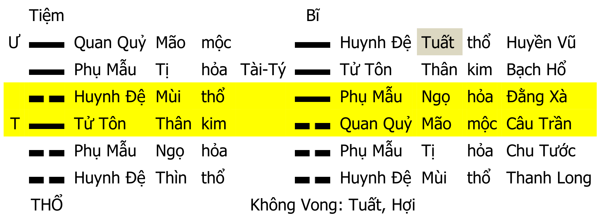
    - **Hình này chứng minh điều gì**
      - Người đàn ông đã có vợ nhưng sắp ly hôn; bản thân cô đã thất thân và sống chung với anh ta, nhưng quẻ Thế Tử Tôn động hóa Quan Quỷ nên sẽ chia tay để kết hôn với người khác.
    - **Từ đâu mà thấy được**
      - Hào 6 Quan Quỷ Mão mộc nhập Mộ ở Huynh Đệ Mùi thổ hóa Phụ Mẫu; hào 3 Thế Tử Tôn Thân kim bị Nguyệt xung nhập Mộ ở Nhật, động hóa Quan Quỷ Mão mộc.
  - **Bối cảnh quẻ:** Ngày Ất Sửu tháng Dần (tuần Giáp Tý: Tuất, Hợi Không Vong), người nữ gieo quẻ hỏi có thể kết hôn với người đàn ông này không, được quẻ Phong Sơn Tiệm biến Thiên Địa Bĩ.
  - **Phán đoán chi tiết:**
    - Căn cứ: Nữ bói lấy Quan Quỷ làm Dụng thần.
    - Nhìn vào:
      - Quan Quỷ Mão mộc lâm hào 6 được Nguyệt kiến Dần mộc trợ giúp là vượng tướng.
      - Dụng thần nhập Mộ tại Huynh Đệ Mùi thổ ở hào 4, Huynh Đệ Mùi thổ lại động hóa Phụ Mẫu Ngọ hỏa: Huynh Đệ là người cùng giới (người phụ nữ khác), nhập Mộ là ở trong vòng tay người khác, Phụ Mẫu là giấy chứng nhận kết hôn; biểu thị người đàn ông này hiện đã có gia đình hợp pháp. Song Nhật thần Sửu thổ xung khai Mộ khố Mùi thổ (Sửu Mùi tương xung phóng thích Quan Quỷ), cho thấy không lâu sau anh ta sẽ ly hôn với vợ.
      - Hào Thế Tử Tôn Thân kim tại hào 3 bị Nguyệt kiến Quan Quỷ Dần mộc xung phá, lại nhập Mộ tại Nhật thần Sửu thổ: Hào 3 là giường chiếu, Quan Quỷ là đàn ông, xung phá chủ bản thân đã không còn là trinh nữ, nhập Mộ chủ hiện tại đã dọn về sống chung với người đàn ông này.
      - Kết cục hôn nhân: Hào Thế trì Tử Tôn Thân kim (Kỵ thần của Quan Quỷ) vượng tướng phát động được Nhật và hào động sinh phù, báo hiệu không thể thành hôn với anh ta; song hào Thế động hóa ra Quan Quỷ Mão mộc, chứng tỏ sau này cô sẽ kết hôn với một người đàn ông khác.
  - **Ứng nghiệm thực tế:** Năm Quý Mùi (2003) dự đoán; người nam sau đó sớm ly hôn vợ, nhưng hai người chỉ sống chung mà không làm đám cưới, sau đó chia tay; cô gái đi kết hôn với một người đàn ông khác đúng như quẻ đã định.

- **Ví dụ 10: Nam đoán vận khí và hôn nhân ra sao (Ngày Bính Ngọ tháng Dậu - Quẻ Thủy Địa Tỷ)**
  - **Hình 239.** Sơ đồ quẻ Thủy Địa Tỷ
    - 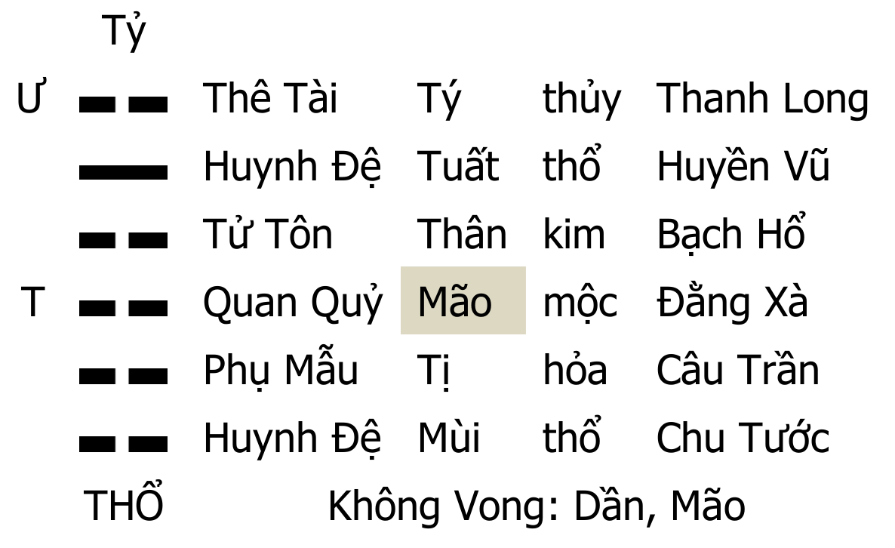
    - **Hình này chứng minh điều gì**
      - Thê Tài Tý thủy vượng ám động sinh Thế nhưng hào Thế Không Phá nên trông thấy tiền mà không giữ được; lấy vợ phương xa muộn màng (năm Đinh Hợi mới thành); học quyền thuật bỏ dở.
    - **Từ đâu mà thấy được**
      - Hào 6 Thê Tài Tý thủy lâm Ứng được Nguyệt sinh Nhật xung ám động; hào 3 Thế Quan Quỷ Mão mộc lâm Tuần Không Nguyệt phá; hào 2 Phụ Mẫu Tị hỏa lâm Câu Trần.
  - **Bối cảnh quẻ:** Ngày Bính Ngọ tháng Dậu (tuần Giáp Thìn: Dần, Mão Không Vong), người nam gieo quẻ hỏi về vận khí và hôn nhân của bản thân, được quẻ Thủy Địa Tỷ thuần quẻ.
  - **Phán đoán chi tiết:**
    - Căn cứ: Tài vận xem Thê Tài, quan vận xem Quan Quỷ, hôn nhân kết hợp tổng quan Dụng thần, Thế Ứng và Phụ Mẫu.
    - Nhìn vào:
      - Tài vận: Thê Tài Tý thủy ở hào 6 được Nguyệt kiến Dậu kim sinh phù, Nhật thần Ngọ hỏa xung kích thành ám động để sinh hào Thế. Tuy nhiên hào Thế Quan Quỷ Mão mộc lâm Tuần Không lại bị Nguyệt phá (Mão Dậu tương xung): Hào Thế Không Phá nên không thể tiếp nhận nguồn sinh trợ, trông thấy rất nhiều tiền trước mắt nhưng không giữ được trong tay, thường sắp thành lại hỏng, vận khí hiện tại rất suy bại.
      - Quan vận: Quan Quỷ Mão mộc trì Thế vừa Không vừa Phá, không được Nhật Nguyệt trợ giúp nên hoàn toàn không có quan vận, không theo đường hoạn lộ được.
      - Hôn sự: Dụng thần Thê Tài Tý thủy tại hào 6 lại lâm hào Ứng (ngoại quái, hào vị phương xa), biểu thị sẽ lấy vợ ở vùng khác (ngoại tỉnh/nơi xa). Hôn sự đến muộn. Phụ Mẫu Tị hỏa cư hào 2 lâm Nhật thần, đợi đến năm Đinh Hợi (2007) Thái Tuế Hợi thủy xung Phụ Mẫu Tị hỏa thì mới có thể kết hôn.
      - Tính cách và việc luyện quyền: Hào Thế lâm Tuần Không và Đằng Xà: Đằng Xà chủ thay đổi, Không Vong chủ không kiên định, làm việc đầu voi đuôi chuột, thường bỏ cuộc giữa chừng; cần sửa khuyết điểm này mới mong nắm bắt cơ hội làm giàu. Khi người này hỏi thêm về việc luyện quyền: Thế lâm Đằng Xà chủ biến hóa, Nguyên thần thủy ám động sinh Thế chủ tư duy ý niệm, chứng tỏ học Hình Ý quyền; song Thế Không nên chưa nắm được yếu lĩnh và không duy trì luyện tập đều đặn mỗi ngày.
  - **Ứng nghiệm thực tế:** Ngoại trừ kết quả kết hôn cần chờ ứng kỳ năm Đinh Hợi, toàn bộ các phán đoán về tính cách, tài vận, sự nghiệp và việc học võ thuật đều được đương số xác nhận chính xác tuyệt đối.

- **Ví dụ 11: Mẹ đoán hôn nhân cho con gái ở xa (Ngày Nhâm Thân tháng Thìn - Quẻ Lôi Phong Hằng biến Hỏa Sơn Lữ)**
  - **Hình 240.** Sơ đồ quẻ Lôi Phong Hằng biến Hỏa Sơn Lữ
    - 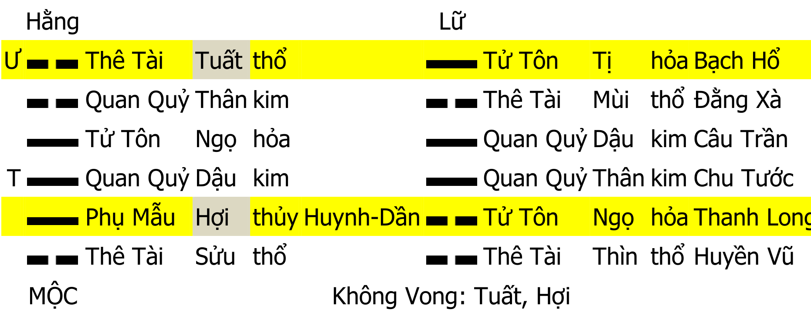
    - **Hình này chứng minh điều gì**
      - Con gái tính cách như con trai, nói nhiều nhưng gặp đàn ông lại câm nín, tin Phật, chữ đẹp, viêm mũi dị ứng; từng từ chối người ngoại quốc da trắng, đến năm Tân Mão mới lấy chồng.
    - **Từ đâu mà thấy được**
      - Hào 3 Thế Quan Quỷ Dậu kim lâm Chu Tước; hào 6 Ứng Tuất thổ Không Phá lâm Bạch Hổ; hào 2 Hợi thủy động lâm Thanh Long; biến quẻ nhập Cung Ly.
  - **Bối cảnh quẻ:** Ngày Nhâm Thân tháng Thìn (tuần Giáp Tý: Tuất, Hợi Không Vong), một phụ nữ mời tác giả đến nhà dự đoán hôn nhân cho con gái. Đúng lúc vừa bước vào nhà thì con gái từ bên Mỹ gọi điện thoại về; vì con gái không có mặt nên tác giả trực tiếp gieo quẻ, được quẻ Lôi Phong Hằng biến Hỏa Sơn Lữ.
  - **Phán đoán chi tiết:**
    - Căn cứ: Nữ xem hôn nhân lấy Quan Quỷ làm Dụng thần; hào Thế đại diện người con gái, hào Ứng và các hào động biểu thị chi tiết tính tình, tật bệnh, duyên phận.
    - Nhìn vào:
      - Tính cách và giao tiếp: Hào Thế Quan Quỷ Dậu kim lâm Chu Tước; kim chủ âm thanh, Chu Tước chủ nói chuyện, phán đoán con gái thường ngày là người nói rất nhiều. Song hào Ứng Tuất thổ Không Vong Nguyệt phá không thể sinh Quan Quỷ lâm Chu Tước, nên khi gặp chuyện yêu đương hoặc tiếp xúc với đàn ông thì lại không nói được câu nào. (Người mẹ xác nhận: Bình thường nói nhiều, khi gặp đàn ông thì câm nín).
      - Tín ngưỡng: Hào 6 Thê Tài Tuất thổ là Mộ khố của Tử Tôn (Tử Tôn là tăng đạo, Mộ khố là chùa chiền), hào 6 là vị trí chùa chiền miếu mạo; Tuất thổ và Hợi thủy cùng phát động thuộc cung Càn (Càn là thần phật), đoán con gái có lòng kính tín Phật pháp. (Người mẹ xác nhận: Cả nhà đều tin Phật).
      - Phong thái và sinh hoạt: Thế trì Quan Quỷ lâm hào 3, được hào 6 Bạch Hổ động sinh Thế (Bạch Hổ uy nghiêm, Quan Quỷ chủ nam giới), tính cách mạnh mẽ như đàn ông. Hào 3 là giường, Nguyên thần Tuất thổ Không Vong không sinh hào Thế hào 3, thói quen đi ngủ rất muộn. (Người mẹ xác nhận: Tính như con trai, đêm nào cũng ngủ rất trễ).
      - Năng khiếu: Thế lâm Chu Tước chủ văn tự chữ nghĩa, quẻ biến hóa nhập cung Ly, tượng "Chu Tước nhập Ly tinh thông thư họa", chữ viết rất đẹp. (Người mẹ xác nhận: Trình độ thư pháp của con gái rất cao).
      - Tật bệnh: Nguyên thần Tuất thổ Không Vong Nguyệt phá lâm Bạch Hổ (chủ bệnh tật) ở hào 6 (khuôn mặt, thổ là mũi), chỉ mũi có bệnh. Bệnh địa Hợi thủy phát động lâm Thanh Long (Thanh Long chủ ngứa, thủy là chất lỏng dịch nhầy), thường xuyên bị ngứa và chảy nước mũi (viêm mũi dị ứng). (Người mẹ xác nhận: Từng bị viêm mũi dị ứng).
      - Duyên phận và ứng kỳ kết hôn: Năm ngoái Bính Tuất, hào Ứng Tuất thổ thực Phá thực Không, đến tháng Tuất sinh Quan Quỷ nên có cơ hội yêu đương. Hào 6 là nước ngoài, hào Ứng là tha hương, lâm Bạch Hổ là người da trắng; lâm Dịch Mã là kinh doanh buôn bán. Người ngoại quốc da trắng làm kinh doanh theo đuổi nhưng cô gái không đáp lại nên người ta đã từ bỏ. Dụng thần tĩnh cần xung, Nguyên thần Không Phá cần hợp phá, đoán đến năm Tân Mão (2011) mới có thể kết hôn.
  - **Ứng nghiệm thực tế:** Toàn bộ phán đoán chi tiết về diện mạo, tính tình, bệnh viêm mũi, chuyện người da trắng theo đuổi đều được người mẹ xác nhận chuẩn xác phi thường; kết quả hôn nhân chờ năm Tân Mão ứng nghiệm.

- **Ví dụ 12: Cha đoán con trai khi nào kết hôn (Ngày Kỷ Hợi tháng Tị năm Giáp Thân - Quẻ Lôi Trạch Quy Muội biến Lôi Thủy Giải)**
  - **Hình 241.** Quẻ Lôi Trạch Quy Muội biến Lôi Thủy Giải
    - 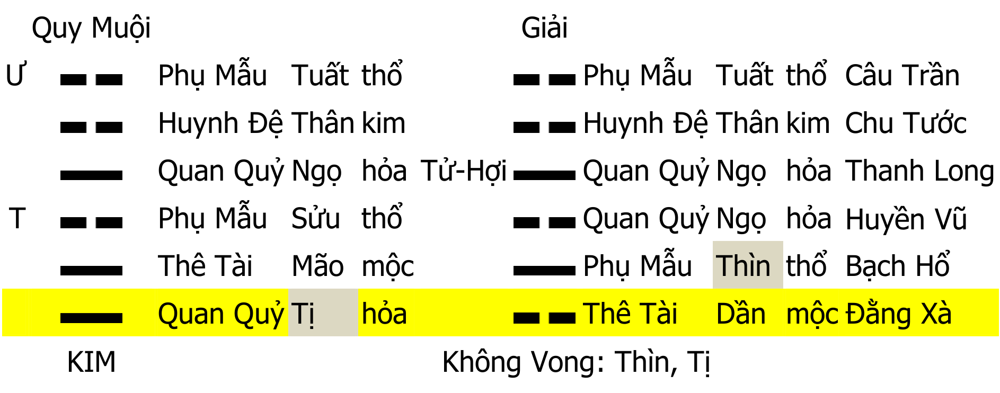
    - **Hình này chứng minh điều gì**
      - Con trai đã có bạn gái làm nghề y từ lâu nhưng chưa công khai; sang năm Ất Dậu xung Dụng thần sẽ kết hôn; năm Đinh Hợi sinh con đúng như quẻ định.
    - **Từ đâu mà thấy được**
      - Hào 2 Thê Tài Mão mộc lâm Bạch Hổ được Nhật Hợi thủy sinh; hào sơ Quan Quỷ Tị hỏa lâm Nguyệt Không Vong động hóa Thê Tài; Tử Tôn Hợi thủy phục tàng được Nhật thực phá.
  - **Bối cảnh quẻ:** Ngày Kỷ Hợi tháng Tị năm Giáp Thân (tuần Giáp Tý: Thìn, Tị Không Vong), người cha gieo quẻ hỏi con trai khi nào kết hôn, được quẻ Lôi Trạch Quy Muội biến Lôi Thủy Giải.
  - **Phán đoán chi tiết:**
    - Căn cứ: Cha đoán cho con trai lấy Thê Tài làm Dụng thần (bạn gái con trai), lấy Tử Tôn làm cháu nội.
    - Nhìn vào:
      - Tình trạng quan hệ: Thê Tài Mão mộc không bị Nguyệt khắc, được Nhật thần Hợi thủy đến tương sinh. Lại có Quan Quỷ Tị hỏa lâm Nguyệt kiến phát động hóa ra Thê Tài Dần mộc; Nguyệt kiến đại diện cho thời gian dài lâu, chứng tỏ con trai đã có bạn gái từ lâu rồi. Tị hỏa lâm Tuần Không, biểu thị hai người chưa chính thức công khai xác định mối quan hệ với gia đình. Dụng thần Mão mộc lâm Bạch Hổ: Bạch Hổ chủ về y liệu chữa bệnh, bạn gái làm trong ngành y tế.
      - Ứng kỳ kết hôn và sinh con: Dụng thần Thê Tài Mão mộc an tĩnh, sang năm sau Ất Dậu (2005) Dậu kim đến xung kích động hào Dụng thần (Mão Dậu tương xung), năm đó sẽ cử hành hôn lễ. Hào Tử Tôn Hợi thủy phục tàng bị Nguyệt phá nhưng được Nhật thần thực phá; đến năm Đinh Hợi (2007) tương ứng với Thái Tuế Tử Tôn Hợi thủy thì con dâu sẽ sinh con.
  - **Ứng nghiệm thực tế:** Người cha xác nhận con trai đã có bạn gái là người học ngành y; đến tháng Dậu năm đó hai người đính hôn, sang năm sau cử hành đám cưới, và đúng tháng Sửu năm Đinh Hợi (2007) sinh con đầu lòng.

- **Ví dụ 13: Nữ đoán có thể kết hôn với người đàn ông hay không (Ngày Nhâm Thân tháng Thìn - Quẻ Địa Hỏa Minh Di biến Địa Phong Thăng)**
  - **Hình 242.** Quẻ Địa Hỏa Minh Di biến Địa Phong Thăng
    - 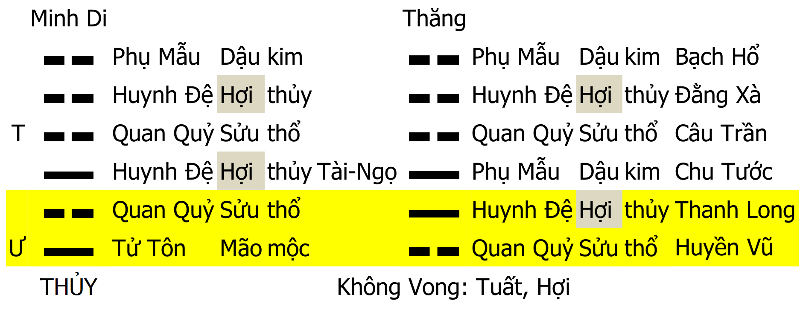
    - **Hình này chứng minh điều gì**
      - Quan Quỷ Sửu thổ động hóa Không Vong, bị Kỵ thần Tử Tôn Mão mộc động khắc; quẻ Du hồn chủ chia ly trôi dạt nên hôn sự không thành.
    - **Từ đâu mà thấy được**
      - Hào 2 Quan Quỷ Sửu thổ động hóa Huynh Đệ Hợi thủy lâm Tuần Không; hào sơ Ứng Tử Tôn Mão mộc phát động khắc Dụng thần; quẻ Minh Di là quẻ Du hồn.
  - **Bối cảnh quẻ:** Ngày Nhâm Thân tháng Thìn (tuần Giáp Tý: Tuất, Hợi Không Vong), người nữ gieo quẻ hỏi có thể kết hôn với người đàn ông này không, được quẻ Địa Hỏa Minh Di biến Địa Phong Thăng.
  - **Phán đoán chi tiết:**
    - Căn cứ: Nữ bói lấy Quan Quỷ làm Dụng thần. Quẻ có Quan Quỷ lưỡng hiện (hào 2 và hào 4), lấy hào Quan Quỷ Sửu thổ tại hào 2 phát động làm Dụng thần chính.
    - Nhìn vào:
      - Quan Quỷ Sửu thổ tuy được Nguyệt kiến Thìn thổ trợ giúp là cát, nhưng phát động lại biến hóa ra Huynh Đệ Hợi thủy lâm Tuần Không (động hóa Không Vong).
      - Hào sơ Ứng Tử Tôn Mão mộc (Kỵ thần) phát động tương khắc trực tiếp vào Dụng thần Quan Quỷ Sửu thổ.
      - Bản thân quẻ Địa Hỏa Minh Di là quẻ Du hồn, mang tượng chia ly trôi dạt, không bến đỗ; do đó cuộc hôn nhân này không thể thành tựu.
  - **Ứng nghiệm thực tế:** Quả nhiên sau đó hai người nảy sinh bất đồng rồi chia tay, không có chuyện kết hôn.

- **Ví dụ 14: Nam đoán khi nào kết hôn (Ngày Bính Tuất tháng Hợi năm Quý Mùi - Quẻ Lôi Sơn Tiểu Quá biến Địa Phong Thăng)**
  - **Hình 243.** Quẻ Lôi Sơn Tiểu Quá biến Địa Phong Thăng
    - 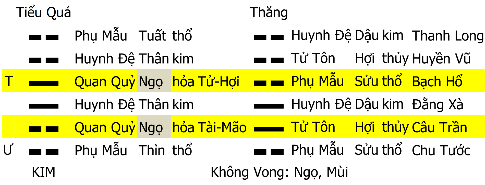
    - **Hình này chứng minh điều gì**
      - Bạn gái dáng cao thon thả, là tín đồ tôn giáo, từng suýt cưới người khác; bản thân anh còn trai tân, từng suýt cưới năm 1999; năm Ất Dậu xung xuất Thê Tài mới kết hôn.
    - **Từ đâu mà thấy được**
      - Thê Tài Mão mộc phục hào 2 dưới Quan Quỷ Ngọ hỏa Không Mộ, hợp Nhật Tuất thổ tại hào 6 cung Đoài; Thế Không Vong; Phụ Mẫu Thìn thổ lâm Nhật ám động.
  - **Bối cảnh quẻ:** Ngày Bính Tuất tháng Hợi năm Quý Mùi (tuần Giáp Thân: Ngọ, Mùi Không Vong), người nam gieo quẻ hỏi khi nào kết hôn, được quẻ Lôi Sơn Tiểu Quá biến Địa Phong Thăng.
  - **Phán đoán chi tiết:**
    - Căn cứ: Nam bói lấy Thê Tài làm Dụng thần.
    - Nhìn vào:
      - Tình trạng quan hệ và lai lịch bạn gái: Thê Tài Mão mộc được Nguyệt kiến Hợi thủy sinh phù, lại được Nhật thần Tuất thổ hợp (Mão Tuất lục hợp), biểu thị hiện tại đang có bạn gái lui tới. Dụng thần phục tàng dưới Quan Quỷ Ngọ hỏa vốn chủ bạn gái từng có chồng; tuy nhiên Quan Quỷ Ngọ hỏa lâm Tuần Không và nhập Mộ tại Nhật thần Tuất thổ, biểu thị việc kết hôn trước đó chưa thành sự thật, tức là bạn gái từng suýt kết hôn (đính hôn) với người khác.
      - Bản thân người nam: Dụng thần không xuất hiện trên quẻ, hào Thế Quan Quỷ Ngọ hỏa tại hào 4 lâm Tuần Không, biểu thị bản thân anh vẫn giữ thân trai tân, chưa từng sống chung với bạn gái.
      - Tướng mạo và tín ngưỡng: Dụng thần là Mão mộc vượng tướng, bạn gái dáng người thon thả, dong dỏng cao. Dụng thần tương hợp với Nhật thần Phụ Mẫu Tuất thổ rơi vào hào 6; hào 6 là chùa chiền miếu mạo, cung Đoài cũng chủ nơi thờ tự tôn giáo; do đó bạn gái là một tín đồ tôn giáo thuần thành.
      - Năm suýt kết hôn trong quá khứ: Thê Tài Mão mộc tương ứng với năm Kỷ Mão (1999), phục tàng gặp xuất hiện; hào Thế động hóa Phụ Mẫu Sửu thổ, bản thân anh vào năm 1999 cũng từng suýt nữa kết hôn.
      - Ứng kỳ tương lai: Hào Ứng Phụ Mẫu Thìn thổ bị Nhật thần Tuất thổ xung thành ám động; đến năm Ất Dậu (2005), Thái Tuế Dậu kim đến hợp Phụ Mẫu Thìn thổ (Thìn Dậu hợp) đồng thời xung xuất phục thần Thê Tài Mão mộc (Mão Dậu xung) thì mới có thể kết hôn.
  - **Ứng nghiệm thực tế:** Tháng Dậu năm đó anh quen bạn gái hiện tại; cô gái quả thực từng đính hôn với người khác rồi hủy hôn; bản thân anh năm 1999 cũng từng suýt cưới vợ; bạn gái hiện tại là tín đồ Công giáo đúng như lời đoán.

- **Ví dụ 15: Nam đoán khi nào kết hôn (Ngày Quý Sửu tháng Dậu năm Quý Mùi - Quẻ Địa Thiên Thái biến Địa Thủy Sư)**
  - **Hình 244.** Quẻ Địa Thiên Thái biến Địa Thủy Sư
    - 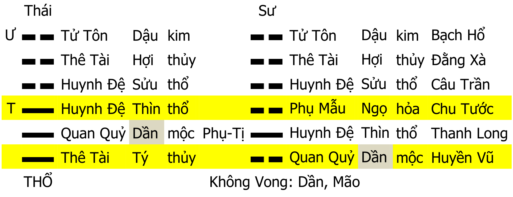
    - **Hình này chứng minh điều gì**
      - Thê Tài Tý thủy động hóa Không bị Nhật khắc nên hiện tại chưa có người yêu; Thế động nhập Mộ biểu thị rất khao khát lấy vợ; vợ tương lai từng qua một lần đò, năm Mậu Tý mới cưới.
    - **Từ đâu mà thấy được**
      - Hào sơ Thê Tài Tý thủy động hóa Quan Quỷ Dần mộc tuần Không, bị Nhật Sửu thổ khắc; hào 3 Thế Huynh Đệ Thìn thổ động hóa Phụ Mẫu Ngọ hỏa; Tý thủy hợp Nhật Sửu thổ.
  - **Bối cảnh quẻ:** Ngày Quý Sửu tháng Dậu năm Quý Mùi (tuần Giáp Dần: Dần, Mão Không Vong), người nam gieo quẻ hỏi khi nào kết hôn, được quẻ Địa Thiên Thái biến Địa Thủy Sư.
  - **Phán đoán chi tiết:**
    - Căn cứ: Nam bói lấy Thê Tài làm Dụng thần. Quẻ có Thê Tài lưỡng hiện (hào sơ Tý thủy và hào 5 Hợi thủy), lấy hào Thê Tài Tý thủy phát động làm Dụng thần chính.
    - Nhìn vào:
      - Tình trạng hiện tại: Thê Tài Tý thủy được Nguyệt kiến Dậu kim sinh phù là vượng tướng, song phát động lại hóa ra Quan Quỷ Dần mộc lâm Tuần Không (động hóa Không Vong), lại bị Nhật thần Sửu thổ hợp khắc; vì vậy hiện tại anh hoàn toàn chưa có bạn gái.
      - Tâm lý người nam: Hào Thế Huynh Đệ Thìn thổ là Mộ khố của Dụng thần Thê Tài Tý thủy (Thủy Mộ tại Thìn); hào Thế phát động khiến Dụng thần nhập Mộ vào bản thân, chứng tỏ trong lòng anh vô cùng khao khát, thiết tha muốn sớm kết hôn lập gia đình.
      - Quá khứ của người vợ tương lai: Thê Tài Tý thủy tương hợp với Nhật thần Huynh Đệ Sửu thổ (Tý Sửu hợp); Huynh Đệ đại diện cho người đàn ông khác, chứng minh người vợ tương lai từng có một đời chồng (từng trải qua hôn nhân).
      - Ứng kỳ kết hôn: Dụng thần là Tý thủy, phải đợi đến năm Mậu Tý (2008) khi Thái Tuế Tý thủy lâm trị thì mới có thể kết hôn.
  - **Ứng nghiệm thực tế:** Quả nhiên sau nhiều năm chờ đợi, đúng vào tháng Thìn năm Mậu Tý (2008), người nam đã chính thức kết hôn với người phụ nữ từng qua một lần đò đúng như quẻ đã báo.

### CHƯƠNG 9: LY HÔN

#### 1. Nguyên lý và phương pháp luận dự trắc ly hôn
- **Tương quan suy vượng giữa hào Thế và Dụng thần:**
  - Hào Thế vượng tướng được sinh trợ: Biểu thị bản thân đương sự vẫn tha thiết mang hy vọng về hôn nhân, luôn muốn gìn giữ tổ ấm gia đình; trường hợp này phần lớn khó ly hôn.
  - Dụng thần vượng tướng được sinh trợ: Biểu thị đối phương vẫn còn tình cảm và hy vọng duy trì hôn nhân, chưa nỡ dứt tình; trường hợp này phần lớn cũng khó ly hôn.
  - Hào Thế hưu tù, bị khắc, Không Vong hoặc Nguyệt phá: Biểu thị bản thân nản lòng buông xuôi, nguội lạnh tình cảm, không còn hy vọng cứu vãn hôn nhân; trường hợp này rất dễ ly hôn.
  - Dụng thần hưu tù, bị khắc, Không Vong hoặc Nguyệt phá: Biểu thị đối phương cạn tình cạn nghĩa, không còn vương vấn hay kỳ vọng gì vào cuộc sống hôn nhân; trường hợp này rất dễ dẫn đến ly hôn.
- **Vị trí của Kỵ thần biểu thị chủ mưu ly hôn:**
  - Kỵ thần trì Thế: Phần lớn chủ về bản thân người gieo quẻ là bên chủ động muốn đưa đơn ly hôn, muốn chấm dứt quan hệ vợ chồng.
  - Kỵ thần trì Ứng: Phần lớn chủ về đối phương là người chán ghét, chủ động khởi xướng và kiên quyết đòi ly hôn.
- **Tác động của Gian hào đối với cục diện hôn nhân:**
  - Định nghĩa Gian hào: Gian hào (hào 3 và hào 4 nằm giữa hào Thế và hào Ứng) đại diện cho người trung gian, bạn bè, họ hàng thân thích hoặc các nhân tố ngoại cảnh can thiệp vào chuyện vợ chồng.
  - Gian hào sinh trợ Kỵ thần hoặc xung khắc Dụng thần: Có người ngoài châm dầu vào lửa, xúi giục, thúc đẩy quá trình ly hôn diễn ra nhanh chóng hơn.
  - Gian hào xung khắc Kỵ thần hoặc sinh trợ Dụng thần: Có người tốt đứng ra hòa giải, khuyên nhủ can ngăn, tạo trở lực cản trở việc ly hôn, giúp hai bên có cơ hội tái hợp.
  - Trạng thái động tĩnh của Gian hào:
    - Gian hào an tĩnh: Không có người ngoài nhúng tay hoặc can dự vào chuyện nội bộ gia đình.
    - Gian hào phát động: Người ngoài can thiệp mạnh mẽ, quấy nhiễu sâu sắc, đa số là điềm báo không cát lợi cho sự êm ấm của hôn nhân.

#### 2. Các quái lệ dự trắc ly hôn thực tế (Từ Ví dụ 1 đến Ví dụ 5)
- **Ví dụ 1: Nữ đoán chồng muốn ly hôn, kết quả ra sao (Ngày Kỷ Hợi tháng Mão - Quẻ Sơn Phong Cổ)**
  - **Hình 245.** Quẻ Sơn Phong Cổ
    - 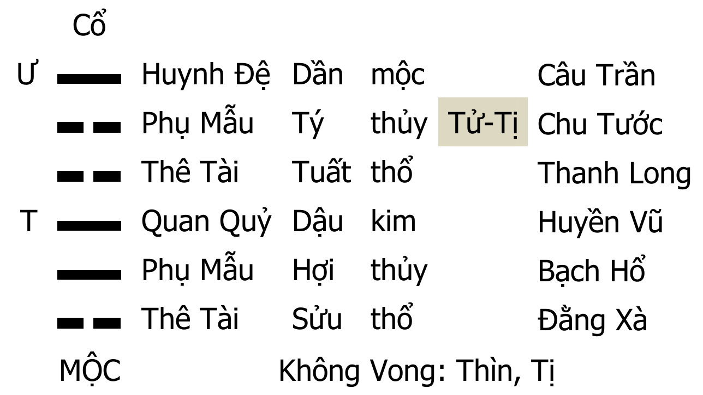
    - **Hình này chứng minh điều gì**
      - Chứng minh Quan Quỷ Dậu kim trì Thế bị Nguyệt phá, Nhật tiết không trợ, hôn nhân tan vỡ tất yếu dẫn đến ly hôn ngay trong tháng Mão hoặc tháng Thìn.
    - **Từ đâu mà thấy được**
      - Nhìn vào hào 3 Quan Quỷ Dậu kim lâm Huyền Vũ bị Nguyệt kiến Mão mộc xung phá, Nhật thần Hợi thủy hưu tù không sinh, hào Thê Tài Sửu thổ và Tuất thổ không có trợ lực.
  - **Bối cảnh quẻ:** Ngày Kỷ Hợi tháng Mão (tuần Giáp Ngọ: Thìn, Tị Không Vong), người phụ nữ đến gieo quẻ hỏi về việc người chồng nhất quyết muốn ly hôn thì kết quả hôn nhân sẽ ra sao, được quẻ Sơn Phong Cổ tĩnh quẻ.
  - **Phán đoán chi tiết:**
    - Căn cứ: Nữ đoán về chồng lấy Quan Quỷ làm Dụng thần. Quan Quỷ Dậu kim tại hào 3 trì Thế bị Nguyệt kiến Mão mộc xung thành Nguyệt phá.
    - Nhìn vào: Quan Quỷ Dậu kim bị Nguyệt xung phá nên trở thành suy bại vô khí, Nhật thần Hợi thủy lại tiết khí chứ không đến tương trợ, hai hào Thê Tài Sửu thổ và Tuất thổ (Nguyên thần) đều hưu tù không có lực tương sinh. Dụng thần vừa Nguyệt phá vừa hoàn toàn cô lập không nhận được sinh trợ, chứng tỏ mâu thuẫn hôn nhân đã đi tới bước đường cùng không thể cứu vãn, việc ly hôn là điều đã nằm chắc trong dự tính. Về thời gian ứng kỳ: tháng Mão này nếu chưa hoàn tất thủ tục thì sang tháng sau (tháng Thìn hợp Dậu xuất phá) tất phải hoàn tất ly hôn.
  - **Ứng nghiệm thực tế:** Quả nhiên hai vợ chồng đã làm thủ tục ly hôn dứt điểm ngay trong tháng Mão đó.

- **Ví dụ 2: Nữ đoán chồng muốn ly hôn với mình, bản thân rất lo lắng (Ngày Tân Dậu tháng Dần - Quẻ Khôn Vi Địa biến Hỏa Địa Tấn)**
  - **Bối cảnh quẻ:** Ngày Tân Dậu tháng Dần (tuần Giáp Dần: Tý, Sửu Không Vong), người phụ nữ mang tâm trạng lo lắng tột cùng vì chồng đòi ly hôn, đến hỏi kết quả xem gia đình có tan vỡ hay không, được quẻ Khôn Vi Địa biến Hỏa Địa Tấn.
  - **Phán đoán chi tiết:**
    - Căn cứ: Phụ nữ đoán việc ly hôn thông thường lấy Quan Quỷ làm Dụng thần. Tuy nhiên, trường hợp này người hỏi đến gieo quẻ với tâm trạng hoảng hốt, lo âu cùng cực, vì vậy người luận giải bắt buộc phải căn cứ vào biến hóa cốt lõi của toàn quẻ để linh hoạt suy đoán.
    - Nhìn vào: Hào Thế Tử Tôn Dậu kim tại hào 6 phát động, hào 4 Huynh Đệ Sửu thổ phát động, hợp cùng hào biến Phụ Mẫu Tị hỏa tạo thành tam hợp cục Tị - Dậu - Sửu (hóa Tử Tôn kim cục vượng tướng), lại được Nhật thần Dậu kim đồng hành trợ lực cực vượng. Trong Lục Hào, Tử Tôn là thần phúc đức, đóng vai trò giải trừ âu lo phiền muộn ("giải ưu chi thần"). Khi đương sự gieo quẻ vì lo lắng, Tử Tôn trì Thế kết thành tam hợp cục vượng tướng là điềm đại cát giúp xóa tan phiền não, đại biểu cho việc mối lo sẽ tự tiêu trừ. Mặc dù quẻ Khôn Vi Địa là quẻ bát thuần lục xung (lục xung vốn chủ về phân tán, chia ly), nhưng nhờ tam hợp cục giải ưu vượng tướng chi phối toàn cục nên hai người không thể ly hôn.
  - **Ứng nghiệm thực tế:** Quả nhiên sau đó hai vợ chồng dù tranh cãi ầm ĩ suốt một thời gian rất dài nhưng rốt cuộc vẫn không hề ly hôn.

- **Ví dụ 3: Nữ đoán ly hôn với chồng có thể thành hay không (Ngày Canh Dần tháng Ngọ - Quẻ Phong Trạch Trung Phu biến Càn Vi Thiên)**
  - **Bối cảnh quẻ:** Ngày Canh Dần tháng Ngọ (tuần Giáp Thân: Ngọ, Mùi Không Vong), người phụ nữ chủ động gieo quẻ hỏi xem mình muốn ly hôn với chồng thì có thành công hay không, được quẻ Phong Trạch Trung Phu biến Càn Vi Thiên.
  - **Phán đoán chi tiết:**
    - Căn cứ: Nữ đoán chồng lấy Quan Quỷ làm Dụng thần. Trong quẻ Quan Quỷ lưỡng hiện (hào 2 Mão mộc và hào 6 Mão mộc), chọn hào Quan Quỷ Mão mộc tại hào 2 làm Dụng thần chính.
    - Nhìn vào: Dụng thần Quan Quỷ Mão mộc được Nhật thần Dần mộc đồng hành trợ giúp, lâm vượng khí quay lại hình khắc hào Thế Huynh Đệ Mùi thổ; Dụng thần khắc Thế chứng tỏ người chồng nắm thế thượng phong, kiên quyết phản đối, việc muốn ly hôn không thể thuận lợi thành tựu theo ý muốn của cô. Mặt khác, hào Thế Huynh Đệ Mùi thổ lâm Không Vong phát động hóa ra Phụ Mẫu Ngọ hỏa cũng lâm Không Vong, hào biến Ngọ hỏa lại quay lại hợp với hào Thế Mùi thổ. Phụ Mẫu là giấy chứng nhận kết hôn, lâm Không Vong biểu thị cho lời hẹn ước hão huyền, hôn nhân không chính thức (sống chung phi hôn nhân); quẻ biến chuyển hóa du hồn biểu thị đối tượng người đàn ông này không phải là người chồng hợp pháp mà là người tình bên ngoài. Tổ hợp thông tin này vạch trần việc đương sự đang lén lút chung sống với người đàn ông khác ngoài giá thú nên mới nằng nặc đòi ly hôn chồng. Phụ Mẫu Ngọ hỏa lâm Nguyệt kiến đến hợp hào Thế Mùi thổ (Ngọ Mùi phương hợp); Nguyệt kiến chủ việc xưa cũ lâu dài, chứng tỏ người đàn ông sống chung này chính là bạn trai cũ đã quen biết sâu đậm từ trước.
  - **Ứng nghiệm thực tế:** Đương số thừa nhận đúng như lời đoán, nhân lúc chồng đi công tác xa vắng nhà, cô đã nối lại tình xưa và sống chung với bạn trai cũ nên nảy sinh ý định ly hôn chồng để đến với người này, song người chồng không đồng ý nên việc ly hôn hoàn toàn thất bại.

- **Ví dụ 4: Nữ đoán có thể ly hôn với chồng hay không (Ngày Tân Mùi tháng Tuất năm Ất Dậu - Quẻ Hỏa Phong Đỉnh biến Trạch Thiên Quải)**
  - **Bối cảnh quẻ:** Ngày Tân Mùi tháng Tuất năm Ất Dậu (tuần Giáp Tý: Tuất, Hợi Không Vong), người phụ nữ băn khoăn hỏi có thể ly hôn với chồng hay không, gieo được quẻ Hỏa Phong Đỉnh biến Trạch Thiên Quải.
  - **Phán đoán chi tiết:**
    - Căn cứ: Nữ đoán chồng lấy Quan Quỷ làm Dụng thần. Quan Quỷ Hợi thủy tại hào 2 trì Thế.
    - Nhìn vào: Quan Quỷ Hợi thủy trì Thế tại hào 2 nhưng lại lâm Tuần Không. Hào 2 là trạch (nhà ở), trì Thế biểu thị người chồng ở bên cạnh hoặc ở chung nhà, song vì lâm Không Vong nên thực tế người chồng hiện không hề ở nhà, đang đi xa biệt tích. Hào Thế lâm Huyền Vũ (chủ việc mờ ám, giấu giếm); hào Phụ Mẫu Mão mộc (giấy đăng ký kết hôn) không xuất hiện trên quẻ mà phục tàng dưới hào sơ Tử Tôn Sửu thổ và nhập Mộ tại hào 5 Tử Tôn Mùi thổ phát động, chứng minh hai người sống chung mà không có giấy chứng nhận kết hôn hợp pháp. Hào sơ Tử Tôn Sửu thổ phát động khắc Dụng thần Quan Quỷ Hợi thủy, nhưng chính hào Sửu thổ lại hóa ra Quan Quỷ Tý thủy; Tử Tôn khắc Quỷ chủ muốn dứt áo bỏ chồng cũ, hóa ra Quan Quỷ mới chủ sau khi bỏ chồng cũ sẽ kết hôn với người đàn ông khác. Hiện tại Dụng thần Quan Quỷ Hợi thủy lâm Không Vong nên chưa thể giải quyết thủ tục ngay, phải chờ đến năm Đinh Hợi (2007) khi hào Dụng thần xuất Không mới có thể dứt khoát ly hôn.
  - **Ứng nghiệm thực tế:** Người phụ nữ xác nhận chồng đã bỏ đi xa suốt hai năm ròng rã, bản thân cô đang qua lại với một người đàn ông khác nên rất nóng lòng muốn ly hôn chồng cũ để tái giá. (Kết quả ứng kỳ sau cùng chưa có phản hồi).

- **Ví dụ 5: Nữ đoán anh trai và chị dâu có ly hôn hay không (Ngày Mậu Thân tháng Hợi - Quẻ Hỏa Trạch Khuê)**
  - **Hình 246.** Sơ đồ quẻ Hỏa Trạch Khuê
    - 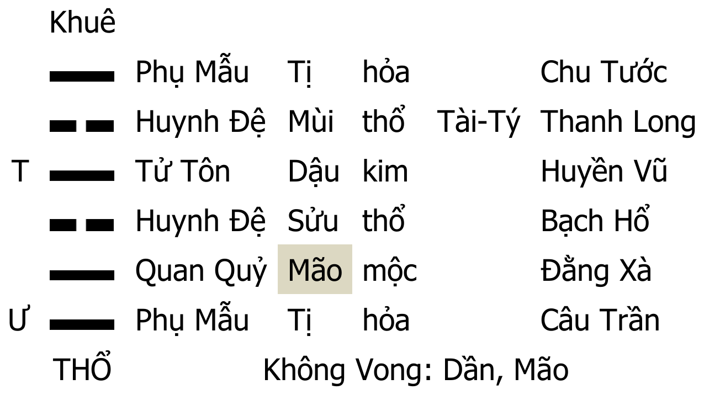
    - **Hình này chứng minh điều gì**
      - Chứng minh Thê Tài Tý thủy phục dưới Huynh Đệ Mùi thổ lâm Thanh Long thể hiện chị dâu có nhan sắc và có nhân tình bên ngoài, song Dụng thần vượng tướng, Kỵ thần tĩnh nên không ly hôn.
    - **Từ đâu mà thấy được**
      - Nhìn vào Thê Tài Tý thủy phục dưới hào 5 Huynh Đệ Mùi thổ, được Nguyệt kiến Hợi thủy phù và Nhật thần Thân kim sinh vượng tướng, hào 2 Mão mộc Không Vong.
  - **Bối cảnh quẻ:** Ngày Mậu Thân tháng Hợi (tuần Giáp Thìn: Dần, Mão Không Vong), người phụ nữ lo lắng đến hỏi xem việc hôn nhân của anh trai và chị dâu có dẫn đến ly hôn hay không, được quẻ Hỏa Trạch Khuê tĩnh quẻ.
  - **Phán đoán chi tiết:**
    - Căn cứ: Đoán về chị dâu lấy Thê Tài làm Dụng thần. Thê Tài Tý thủy tại hào 5 phục tàng dưới hào Huynh Đệ Mùi thổ lâm Thanh Long.
    - Nhìn vào: Thanh Long chủ về dung mạo đoan trang xinh đẹp, chứng tỏ người chị dâu có nhan sắc nổi bật. Dụng thần Thê Tài phục tàng dưới hào Huynh Đệ; phục tàng chủ ở bên ngoài, Huynh Đệ là người tranh đoạt (người đàn ông khác), biểu thị chị dâu đã có nhân tình bên ngoài. Hào 2 Quan Quỷ Mão mộc lâm Không Vong (hào 2 là trạch - ngôi nhà, Quan Quỷ là người chồng / anh trai), Dụng thần Tý thủy không sinh cho hào 2 Mão mộc vì Mão mộc Không Vong, chứng minh người chị dâu rất ít khi về nhà, thường xuyên vắng mặt. Tuy nhiên, Dụng thần Thê Tài Tý thủy được Nguyệt kiến Hợi thủy phù trợ, lại được Nhật thần Thân kim tương sinh nên cực kỳ vượng tướng; Kỵ thần Huynh Đệ trong quẻ an tĩnh không phát động nên không thể khắc hại được Thê Tài. Dụng thần vượng tướng mà Kỵ thần tĩnh thì hôn nhân tuy có sóng gió nhưng tuyệt đối không thể ly hôn.
  - **Ứng nghiệm thực tế:** Quả nhiên trải qua suốt 4 năm, dù người chị dâu có quan hệ bên ngoài và ít khi về nhà nhưng hai anh chị vẫn không hề ly hôn.

#### 3. Các quái lệ dự trắc ly hôn thực tế (Từ Ví dụ 6 đến Ví dụ 10)
- **Ví dụ 6: Nữ đoán có ly hôn với chồng không (Ngày Đinh Hợi tháng Thân - Quẻ Khảm Vi Thủy biến Trạch Phong Đại Quá)**
  - **Hình 247.** Sơ đồ quẻ Khảm Vi Thủy biến Trạch Phong Đại Quá
    - 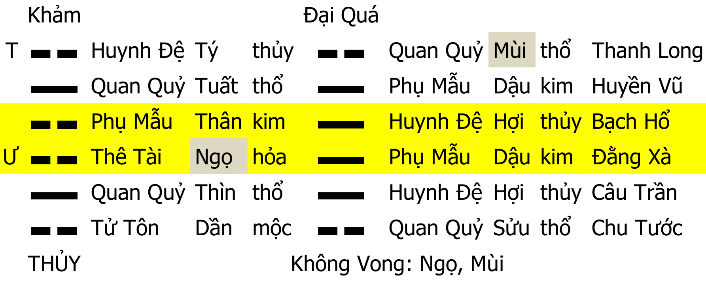
    - **Hình này chứng minh điều gì**
      - Chứng minh quẻ lục xung hóa du hồn, Quan Quỷ Tuất thổ lâm Huyền Vũ khắc Thế và chứa Thê Tài Ngọ hỏa Không Vong tại hào 3; chồng phong lưu, vợ chồng ly thân không chung giường nhưng khó ly hôn.
    - **Từ đâu mà thấy được**
      - Nhìn vào hào 5 Quan Quỷ Tuất thổ lâm Huyền Vũ khắc Thế Tý thủy, hào 3 Thê Tài Ngọ hỏa Không Vong động hóa Phụ Mẫu Dậu kim, toàn quẻ lục xung biến du hồn.
  - **Bối cảnh quẻ:** Ngày Đinh Hợi tháng Thân (tuần Giáp Thân: Ngọ, Mùi Không Vong), người phụ nữ hỏi liệu mình và chồng có ly hôn với nhau hay không, gieo được quẻ Khảm Vi Thủy biến Trạch Phong Đại Quá.
  - **Phán đoán chi tiết:**
    - Căn cứ: Nữ đoán chồng lấy Quan Quỷ làm Dụng thần. Trong quẻ Quan Quỷ lưỡng hiện (hào 2 Thìn thổ và hào 5 Tuất thổ), chọn hào Quan Quỷ Tuất thổ gần hào Thế làm Dụng thần chính.
    - Nhìn vào: Dụng thần Quan Quỷ Tuất thổ lâm Huyền Vũ tương khắc hào Thế Huynh Đệ Tý thủy. Huyền Vũ chủ phong lưu ám muội, đối xử tệ bạc; chứng tỏ người chồng có tính phong lưu lăng nhăng và đối xử với vợ rất lạnh nhạt, bất công. Tuất thổ là Mộ khố của Thê Tài (Hỏa); hào 3 Thê Tài Ngọ hỏa lâm hào Ứng (Thê Tài là phụ nữ, Ứng là người ngoài), việc Quan Quỷ là Mộ khố Thê Tài chứng minh trong tâm trí người chồng lúc nào cũng chỉ si mê, ôm ấp hình bóng người phụ nữ khác bên ngoài. Quẻ Khảm Vi Thủy là quẻ lục xung, chủ vợ chồng thường xuyên bất hòa kịch liệt. Tuy nhiên, Dụng thần Quan Quỷ Tuất thổ được Nguyệt kiến Thân kim sinh trợ, không bị Nhật Nguyệt khắc hoại, nên quan hệ vợ chồng dù rất căng thẳng nhưng rất khó ly hôn dứt điểm. Quẻ biến Trạch Phong Đại Quá là du hồn; hào 3 Thê Tài Ngọ hỏa lâm Không Vong không thể sinh Dụng thần. Hào 3 là vị trí giường ngủ, giường ngủ lâm Không Vong biểu thị hai vợ chồng đã sống ly thân, không còn ngủ chung giường.
  - **Ứng nghiệm thực tế:** Quả nhiên hai vợ chồng đã ly thân nhiều năm không chung giường, nhưng dùng dằng mãi vẫn không ly hôn.

- **Ví dụ 7: Nữ đoán khi nào người tình sẽ ly hôn với vợ (Ngày Tân Hợi tháng Sửu năm Bính Tuất - Quẻ Sơn Hỏa Bí biến Sơn Thiên Đại Súc)**
  - **Hình 248.** Sơ đồ quẻ Sơn Hỏa Bí biến Sơn Thiên Đại Súc
    - 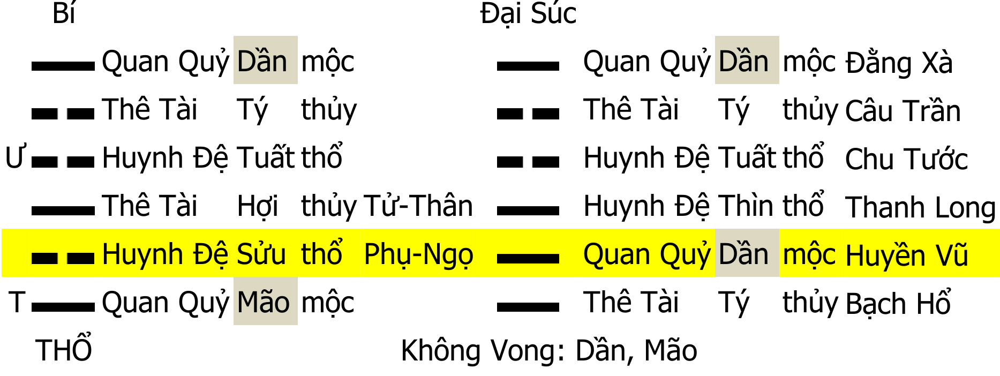
    - **Hình này chứng minh điều gì**
      - Chứng minh Huynh Đệ Sửu thổ độc phát khắc Dụng thần Thê Tài Hợi thủy, ứng kỳ ly hôn vào tháng Thìn năm Đinh Hợi khi Dụng thần nhập Mộ; hào Thế Không Vong chủ đương sự đổi ý không kết hôn.
    - **Từ đâu mà thấy được**
      - Nhìn vào hào 2 Huynh Đệ Sửu thổ độc phát hóa Quan Quỷ Dần mộc khắc hào 3 Thê Tài Hợi thủy lâm Nhật, hào sơ Thế Quan Quỷ Mão mộc lâm Không Vong và Bạch Hổ.
  - **Bối cảnh quẻ:** Ngày Tân Hợi tháng Sửu năm Bính Tuất (tuần Giáp Thìn: Dần, Mão Không Vong), người phụ nữ hỏi khi nào người tình của mình sẽ hoàn tất thủ tục ly hôn với vợ, được quẻ Sơn Hỏa Bí biến Sơn Thiên Đại Súc.
  - **Phán đoán chi tiết:**
    - Căn cứ: Đoán việc người tình ly hôn với vợ thì người vợ chính là Thê Tài, nên lấy Thê Tài làm Dụng thần. Trong quẻ Thê Tài lưỡng hiện (hào 5 Tý thủy và hào 3 Hợi thủy), lấy Thê Tài Hợi thủy lâm Nhật thần làm Dụng thần đại diện cho người vợ.
    - Nhìn vào: Dụng thần Thê Tài Hợi thủy tuy được Nhật thần Hợi thủy trợ giúp nhưng bị Nguyệt kiến Sửu thổ khắc, ở vào thế giằng co khó phân suy vượng. Tuy nhiên, trong nội quái hào 2 Huynh Đệ Sửu thổ độc phát khắc Dụng thần; Huynh Đệ là thần khắc Tài, Huynh Đệ độc phát thì việc người tình ly hôn vợ đã là cục diện định sẵn, chỉ còn là vấn đề thời gian. Về thời gian ứng kỳ: Dụng thần Thê Tài Hợi thủy trùng hợp với Thái Tuế năm sau là năm Đinh Hợi (2007), do đó chắc chắn sang năm Đinh Hợi người tình sẽ ly hôn vợ. Cụ thể vào tháng nào: đến mùa xuân tháng Dần và tháng Mão, Mộc vượng chế ngự hào độc phát Sửu thổ nên Sửu thổ chưa đủ lực khắc hại; phải đợi đến tháng Thìn (tháng 3 âm lịch) khi Thổ nắm lệnh vượng tướng, đồng thời Thìn thổ là Mộ khố của Hợi thủy (Dụng thần nhập Mộ), Thê Tài vừa bị khắc vừa nhập Mộ thì việc ly hôn tất sẽ hoàn tất. Về phía người nữ hỏi quẻ: Hào Thế Quan Quỷ Mão mộc lâm Tuần Không; Thế Không biểu thị tâm ý đương sự bất định, không chắc chắn sẽ kết hôn với người tình sau khi anh ta ly hôn.
  - **Ứng nghiệm thực tế:** Quả nhiên đúng vào tháng Thìn năm Đinh Hợi (2007), đối phương đã hoàn tất thủ tục ly hôn với vợ, nhưng lúc đó cô gái đã có bạn trai mới nên rốt cuộc không kết hôn với người tình ban đầu.

- **Ví dụ 8: Nữ đoán có ly hôn với chồng hay không (Ngày Nhâm Tuất tháng Thìn - Quẻ Địa Lôi Phục biến Địa Trạch Lâm)**
  - **Hình 249.** Quẻ Địa Lôi Phục biến Địa Trạch Lâm
    - 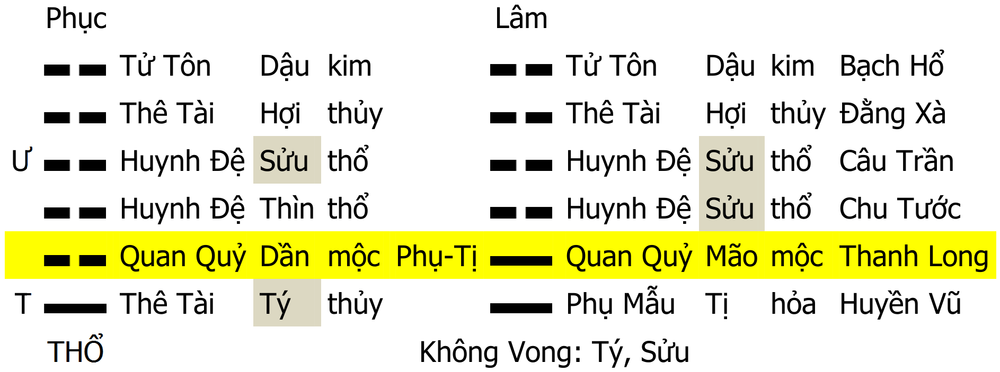
    - **Hình này chứng minh điều gì**
      - Chứng minh Dụng thần Quan Quỷ Dần mộc tại hào Trạch hóa tiến thần rời nhà và hợp Thê Tài Hợi thủy, Thế Ứng đều Không; hai vợ chồng đồng thuận ly hôn tại tháng Thân.
    - **Từ đâu mà thấy được**
      - Nhìn vào hào 2 Quan Quỷ Dần mộc động hóa tiến thần Mão mộc hợp hào 5 Thê Tài Hợi thủy, hào sơ Thế Tý thủy và hào 4 Ứng Sửu thổ đều lâm Không Vong.
  - **Bối cảnh quẻ:** Ngày Nhâm Tuất tháng Thìn (tuần Giáp Dần: Tý, Sửu Không Vong), người phụ nữ gieo quẻ hỏi xem mình và chồng có ly hôn hay không, được quẻ Địa Lôi Phục biến Địa Trạch Lâm.
  - **Phán đoán chi tiết:**
    - Căn cứ: Nữ đoán chồng lấy Quan Quỷ làm Dụng thần.
    - Nhìn vào: Dụng thần Quan Quỷ Dần mộc lâm hào 2 phát động hóa tiến thần Quan Quỷ Mão mộc. Hào 2 là trạch (nhà cửa), Quan Quỷ là người chồng, hóa tiến thần là tượng người chồng dứt áo ra đi, dời khỏi tổ ấm, báo hiệu việc ly hôn là chuyện sớm muộn tất yếu xảy ra. Quan Quỷ Dần mộc phát động tương hợp với Thê Tài Hợi thủy tại hào 5 (Dần Hợi lục hợp), Thê Tài là phụ nữ, chứng tỏ người chồng đã có mối quan hệ dan díu với người phụ nữ khác bên ngoài. Hào sơ Thế Thê Tài Tý thủy lâm Tuần Không, không thể sinh dưỡng cho Dụng thần Dần mộc, phản ánh tình cảm đã nguội lạnh, bản thân cô không còn chút yêu thương hay lưu luyến gì với chồng. Toàn cục Dụng thần Quan Quỷ Dần mộc không được Nhật nguyệt Thìn Tuất sinh phù (bị hưu tù); hào Thế Tý thủy và hào Ứng Sửu thổ đều rơi vào Không Vong (Thế Ứng giai Không), biểu thị cả hai vợ chồng đều chán nản buông tay, cùng có ý định ly hôn dứt khoát. Về ứng kỳ: đến tháng Thân (tháng 7 âm lịch), Thân kim xung phá Quan Quỷ Dần mộc, khắc hại Dụng thần, tất sẽ chính thức ly hôn.
  - **Ứng nghiệm thực tế:** Quả nhiên đúng vào ngày Hợi tháng Thân cùng năm, hai vợ chồng đã chính thức ký giấy ly hôn ra tòa.

- **Ví dụ 9: Nữ đoán chồng muốn ly hôn, kết quả ra sao (Ngày Đinh Tị tháng Tuất - Quẻ Thủy Phong Tỉnh biến Địa Phong Thăng)**
  - **Hình 250.** Quẻ Thủy Phong Tỉnh biến Địa Phong Thăng
    - 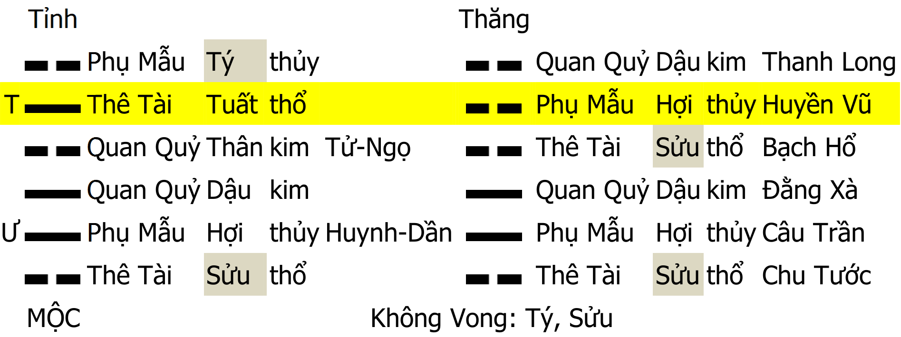
    - **Hình này chứng minh điều gì**
      - Chứng minh hào Thế Thê Tài Tuất thổ động sinh Dụng thần Quan Quỷ Thân kim vượng tướng hợp Nhật, người vợ yêu chồng tha thiết; chồng tán tỉnh bên ngoài bất thành và quay về hòa giải.
    - **Từ đâu mà thấy được**
      - Nhìn vào hào 5 Thế Thê Tài Tuất thổ phát động sinh hào 4 Quan Quỷ Thân kim, Quan Quỷ Thân kim hợp Nhật thần Tử Tôn Tị hỏa, Dụng thần vượng tướng không thể ly hôn.
  - **Bối cảnh quẻ:** Ngày Đinh Tị tháng Tuất (tuần Giáp Dần: Tý, Sửu Không Vong), người phụ nữ bối rối đến hỏi quẻ vì chồng nằng nặc đòi ly hôn, xem kết quả ra sao, được quẻ Thủy Phong Tỉnh biến Địa Phong Thăng.
  - **Phán đoán chi tiết:**
    - Căn cứ: Nữ đoán chồng lấy Quan Quỷ làm Dụng thần. Trong quẻ Quan Quỷ lưỡng hiện (hào 3 Dậu kim và hào 4 Thân kim), lấy hào Quan Quỷ Thân kim tương hợp với Nhật thần Tị hỏa làm Dụng thần chính.
    - Nhìn vào: Hào Thế Thê Tài Tuất thổ phát động tương sinh cho Dụng thần Quan Quỷ Thân kim, biểu thị trong lòng người vợ vẫn rất mực yêu thương, tha thiết muốn gắn bó với chồng, hoàn toàn không muốn ly hôn. Dụng thần Quan Quỷ Thân kim tương hợp với Nhật thần Tị hỏa (Tị Thân lục hợp); hợp chủ mê đắm ham muốn, chứng tỏ người chồng có tính trăng hoa háo sắc, đam mê bên ngoài. Tuy nhiên, Nhật thần Tị hỏa trong quẻ là hào Tử Tôn (không phải Thê Tài, cũng không phải Huynh Đệ), Tử Tôn chủ vui chơi giải trí đơn thuần chứ không phải là người phụ nữ tình nhân thực sự; vì vậy người chồng tuy có lăng nhăng tán tỉnh lung tung nhưng không tụ thành vận đào hoa kết quả. Dụng thần Quan Quỷ Thân kim được Nguyệt kiến Tuất thổ sinh phù, hào Thế Tuất thổ động sinh, lại được Nhật hợp nâng đỡ nên rất vượng tướng; Dụng thần vượng tướng và được Thế tương sinh thì tuyệt đối không thể ly hôn.
  - **Ứng nghiệm thực tế:** Quả nhiên người chồng phải lòng một người phụ nữ đã có gia đình, ngày nào cũng theo đuổi người ta, thậm chí về nhà đòi ly hôn vợ; nhưng đối phương kiên quyết cự tuyệt sự theo đuổi của anh ta. Đến ngày Canh Thân cùng tháng, người chồng chán nản từ bỏ và đã chủ động làm hòa với vợ, cuộc hôn nhân không hề tan vỡ.

- **Ví dụ 10: Nam đoán ly hôn với vợ (Ngày Kỷ Sửu tháng Hợi - Quẻ Lôi Thủy Giải)**
  - **Hình 251.** Quẻ Lôi Thủy Giải
    - 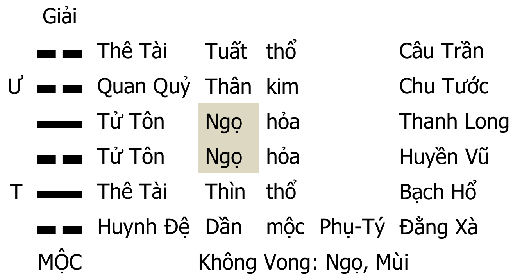
    - **Hình này chứng minh điều gì**
      - Chứng minh Dụng thần Thê Tài Thìn thổ trì Thế tại hào Trạch được Nhật thần trợ vượng tướng, nền tảng hôn nhân vững chắc khiến việc ly hôn không thể xảy ra.
    - **Từ đâu mà thấy được**
      - Nhìn vào hào 2 Thế Thê Tài Thìn thổ lâm Bạch Hổ được Nhật thần Sửu thổ phù trợ là vượng tướng, an tĩnh không bị hình khắc phá hoại.
  - **Bối cảnh quẻ:** Ngày Kỷ Sửu tháng Hợi (tuần Giáp Thân: Ngọ, Mùi Không Vong), người nam đến gieo quẻ hỏi về việc có ly hôn với vợ hay không, được quẻ Lôi Thủy Giải tĩnh quẻ.
  - **Phán đoán chi tiết:**
    - Căn cứ: Nam đoán ly hôn với vợ lấy Thê Tài làm Dụng thần. Trong quẻ Thê Tài lưỡng hiện (hào 2 Thìn thổ và hào 6 Tuất thổ), lấy hào Thê Tài Thìn thổ trì Thế tại hào 2 làm Dụng thần chính.
    - Nhìn vào: Dụng thần Thê Tài Thìn thổ an ngự tại hào 2 (hào 2 là trạch - ngôi nhà gia đình), vừa trì Thế vừa được Nhật thần Sửu thổ đồng hành tương trợ nên cực kỳ vượng tướng. Theo nguyên lý cốt lõi của Lục Hào về dự trắc ly hôn: Dụng thần an ngự tại trạch vượng tướng biểu thị nền tảng gia đình vững vàng, người vợ có vị trí vững chắc trong mái ấm; Dụng thần vượng tướng thì trái lại rất khó có thể ly hôn.
  - **Ứng nghiệm thực tế:** Quả nhiên trải qua suốt 4 năm, dù đôi bên có bất đồng mâu thuẫn nhưng hai vợ chồng vẫn sống cùng nhau, hoàn toàn không ly hôn.

### CHƯƠNG 10: TÁI HÔN

#### Nguyên lý cơ bản phán đoán tái hôn trong Lục Hào
- **Định vị Dụng thần và nền tảng suy vượng:**
  - Nam giới dự đoán tái hôn lấy hào Thê Tài làm Dụng thần; nữ giới dự đoán tái hôn lấy hào Quan Quỷ làm Dụng thần.
  - Phân định rõ bối cảnh tái hợp: Nếu dự đoán tái hôn với người cũ (phục hôn), trọng điểm xem xét Dụng thần tàng phục, Dụng thần hào động hóa thoái thần hoặc hào vị phu thê tại trạch; nếu dự đoán kết hôn với người mới, chú trọng hào Quan Quỷ/Thê Tài mới xuất hiện trong quẻ biến hoặc biến hào sinh hợp với Thế.
  - Suy vượng của Dụng thần là cốt lõi hàng đầu: Dụng thần phải có căn khí, được Nhật Nguyệt sinh phù mới có cơ hội thành tựu; nếu Dụng thần suy tàn, không gốc rễ thì dù có hào động sinh phù cũng khó bề khởi sắc.
- **Các tiêu chuẩn then chốt định hình cát hung:**
  - Các dấu hiệu tái hôn dễ thành:
    - Dụng thần vượng tướng, hữu khí, nhận được sự sinh trợ từ Nhật Nguyệt hoặc hào động.
    - Hào Dụng thần phát động hóa thoái thần: Hóa thoái mang tượng quay đầu trở lại với tình xưa chốn cũ, người cũ hồi tâm chuyển ý.
    - Quẻ Quy hồn: Mang ý nghĩa "vạn vật quy bản", người đi xa quay về nhà, vợ chồng chia cách nay đoàn tụ tụ họp một nhà.
    - Quẻ Lục xung biến Lục hợp: Quẻ gốc lục xung chủ trước đây mâu thuẫn xung đột dẫn đến ly tán phân ly; quẻ biến lục hợp chủ sau này hòa giải, tái kết duyên lành, tái hôn dễ thành.
    - Hào Thế bị Nguyệt phá nhưng được Nhật thần hợp: Thế hào lâm thế "Hợp giải Phá", hàn gắn vết thương quá khứ để bước vào hôn nhân mới.
  - Các dấu hiệu tái hôn không thành hoặc đổ vỡ:
    - Dụng thần hưu tù, lâm tuần Không Vong, Nguyệt phá, Nhật khắc, Tuyệt địa hoặc Mộ địa: Tựa như "cây không rễ, sinh phù bất khởi", mất hẳn khả năng thành tựu hôn nhân.
    - Hào Dụng thần phát động hóa Tiến thần: Hóa tiến mang tượng hướng về tương lai phía trước, dứt khoát không quay lại mối duyên cũ, hoặc sự xung đột ngăn trở ngày một gia tăng.
    - Quẻ Lục xung hóa Lục xung: Trước sau đều xung phá, mâu thuẫn nội tại kéo dài dai dẳng, tuyệt đối không thể hòa hợp bền lâu.
    - Gặp quẻ Du hồn: Chủ tâm tính trôi dạt bất định, tình cảm phiêu bạt không chốn neo đậu, mang tượng chia ly tán lạc.
    - Kỵ thần trì Thế hoặc tam hợp thành Kỵ thần cục: Nam gieo Huynh Đệ trì Thế hợp cục khắc Tài; nữ gieo Tử Tôn trì Thế hợp cục khắc Quỷ; đều là tượng hôn sự bị hủy hoại hoàn toàn.
    - Cừu thần độc phát trói buộc Nguyên thần: Khiến cội nguồn sinh trợ Dụng thần bị phong tỏa, dù có kết hôn cũng nhanh chóng dẫn tới nguy cơ tan vỡ lần nữa.

#### Phân tích chi tiết các quái lệ thực tế
- **Ví dụ 1: Nữ 77 tuổi đoán tái hôn (Ngày Kỷ Dậu tháng Dậu năm Đinh Hợi - Quẻ Sơn Thiên Đại Súc biến Thủy Trạch Tiết)**
  - **Hình 252.** Sơ đồ quẻ Sơn Thiên Đại Súc biến Thủy Trạch Tiết
    - 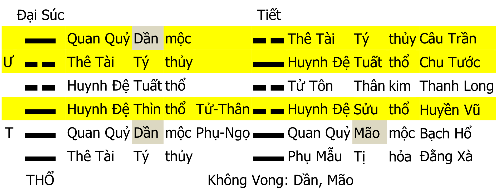
    - **Hình này chứng minh điều gì**
      - Dụng thần Quan Quỷ Không Vong bị Nhật Nguyệt khắc hại; khó có cơ hội tái hôn, năm Ngọ xung Tý đã ly hôn.
    - **Từ đâu mà thấy được**
      - Hào 6 Quan Quỷ Dần mộc động hóa Tý thủy hồi đầu sinh nhưng tuần Không, bị Nguyệt khắc Nhật khắc; Thế hào 2 Không Vong.
  - **Bối cảnh quẻ:** Ngày Kỷ Dậu tháng Dậu năm Đinh Hợi (tuần Giáp Thìn: Dần, Mão Không Vong), một cụ bà 77 tuổi đến gieo quẻ hỏi về việc tái hôn, được quẻ Sơn Thiên Đại Súc biến Thủy Trạch Tiết.
  - **Phán đoán chi tiết:**
    - Căn cứ: Lấy Quan Quỷ làm Dụng thần. Trong quẻ Quan Quỷ lưỡng hiện (hào 2 Quan Quỷ Dần mộc và hào 6 Quan Quỷ Dần mộc), chọn hào phát động Quan Quỷ Dần mộc tại hào 6 làm Dụng thần chính.
    - Nhìn vào: Dụng thần Quan Quỷ Dần mộc tuy phát động hóa Thê Tài Tý thủy hồi đầu sinh, nhưng bản thân Dần mộc lại lâm tuần Không Vong, lại gieo vào tháng Dậu ngày Dậu bị cả Nhật thần và Nguyệt kiến đồng thời khắc hại (Dậu kim khắc Dần mộc). Đây là tượng "cây không có gốc rễ, sinh phù bất khởi" (cây đã bị đốn cụt rễ thì dù có tưới nước Tý thủy vào cũng không cứu sống được), vì thế khó có cơ hội tái hôn. Hào Thế tại hào 2 là Quan Quỷ Dần mộc cũng lâm Không Vong, tượng trưng cho tâm lý trong lòng vô cùng trống trải bơ vơ; hào 2 là hào Trạch (nhà ở), hào Trạch lâm Không Vong cho thấy bà cụ sống một mình cô đơn quạnh quẽ trong căn nhà vắng. Về thời điểm ly hôn trước đây: Dụng thần động hóa Tý thủy hồi đầu sinh, Tý thủy gặp Ngọ hỏa tất bị xung tán; vì vậy phán đoán nhất định là năm Nhâm Ngọ (2002) do xung mất Tý thủy mà đôi bên ly hôn.
  - **Ứng nghiệm thực tế:** Quả nhiên bà cụ xác nhận đã ly hôn vào năm Nhâm Ngọ. Hiện tại bà rất mong muốn được tái hôn, nhưng người chồng vẫn không biểu quyết, kiên quyết không đồng ý quay lại.

- **Ví dụ 2: Nữ đoán tái hôn với chồng cũ (Ngày Ất Mão tháng Thìn - Quẻ Sơn Lôi Di biến Sơn Trạch Tổn)**
  - **Hình 253.** Sơ đồ quẻ Sơn Lôi Di biến Sơn Trạch Tổn
    - 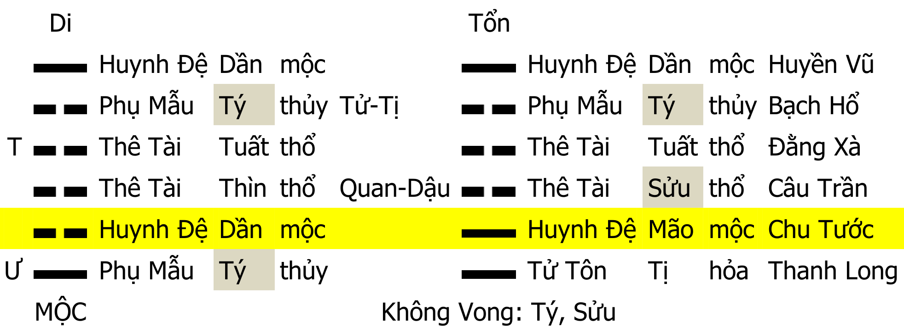
    - **Hình này chứng minh điều gì**
      - Quan Quỷ phục tàng và Tuyệt tại trạch, tái hôn với chồng cũ bất thành; sau quen người đàn ông kém 20 tuổi làm hao tốn tiền của.
    - **Từ đâu mà thấy được**
      - Hào Ứng Tý thủy tuần Không; hào 2 Huynh Đệ Dần mộc độc phát là Tuyệt địa của Kim Quỷ; hào Thế Tuất thổ Nguyệt phá lâm Đằng Xà.
  - **Bối cảnh quẻ:** Ngày Ất Mão tháng Thìn (tuần Giáp Dần: Tý, Sửu Không Vong), người phụ nữ đến gieo quẻ hỏi về việc có thể tái hôn với chồng cũ hay không, được quẻ Sơn Lôi Di biến Sơn Trạch Tổn.
  - **Phán đoán chi tiết:**
    - Căn cứ: Lấy Quan Quỷ làm Dụng thần. Quan Quỷ Dậu kim không xuất hiện trên quẻ mà phục tàng dưới hào 3 Thê Tài Thìn thổ, cho thấy người chồng hiện không có ở bên cạnh. Hào Ứng là phu vị (vị trí của người chồng) lâm Phụ Mẫu Tý thủy tuần Không, biểu thị vị trí người chồng hiện tại bỏ trống không có người.
    - Nhìn vào: Quẻ chính Sơn Lôi Di là tượng há miệng cầu xin dưỡng dục (hai hàm mở ra), phản ánh tâm trạng cô rất tha thiết muốn tái hôn với chồng. Nhưng hào Thế Thê Tài Tuất thổ lâm hào 4 bị Nguyệt kiến Thìn thổ xung phá (Thìn Tuất tương xung) thành Nguyệt phá, lại lâm Đằng Xà chủ bồn chồn kinh sợ bất an, chứng tỏ bản thân cô vì chuyện này mà trong lòng vô cùng đau khổ, phiền não. Hào 2 Huynh Đệ Dần mộc độc phát; hào 2 là trạch (nhà ở), Dần mộc là Tuyệt địa của Kim Quỷ (Dụng thần Tuyệt tại Dần), Dụng thần Tuyệt tại trạch chứng minh người chồng tuyệt tình dứt khoát không bao giờ quay về nhà nữa. Hơn nữa Sơn Lôi Di là quẻ Du hồn chủ chia ly tán lạc, nên việc tái hợp với chồng cũ hoàn toàn bất thành.
    - Phán đoán nhân duyên mới: Hào Thế Nguyệt phá tượng trưng cho cõi lòng đã tan nát, nhưng được Nhật thần Huynh Đệ Mão mộc đến tương hợp để giải phá (Mão Tuất lục hợp). Trong hợp có khắc (Mộc khắc Thổ); áp dụng nguyên lý khắc ta là Quan Quỷ thì Huynh Đệ Mão mộc cũng có thể luận là người đàn ông mới xuất hiện hàn gắn vết thương lòng cho cô. Hào Thế bị phá ở tháng Thìn, ra khỏi tháng bước sang tháng Tị sẽ hết phá nên tháng sau người đàn ông mới sẽ xuất hiện. Nhưng vì Huynh Đệ Mão mộc vừa hợp phá vừa khắc phạt hào Thế Thê Tài, nên người đàn ông mới này sẽ tiêu pha tiêu tốn rất nhiều tiền bạc của cô.
  - **Ứng nghiệm thực tế:** Quả nhiên việc tái hôn với chồng cũ không thành. Đến tháng Tị, cô quen biết một người đàn ông kém cô tới 20 tuổi; hai người dọn về sống chung với nhau và cô phải kiếm tiền chu cấp nuôi đối phương.
  - **Đối thoại vấn đáp học thuật giữa học trò và tác giả:**
    - Học trò hỏi: "Thưa Vương lão sư, vì sao tại tháng Tị cô ấy lại quen biết một người đàn ông khác? Và làm thế nào từ trong quẻ nhìn ra được người đàn ông đó nhỏ tuổi hơn cô ta rất nhiều?"
    - Vương Hổ Ứng lão sư giải đáp: "Ứng kỳ vào tháng Tị là bởi vì hào Thế đang bị Nguyệt phá ở tháng Thìn, phải qua hết tháng Thìn sang tháng Tị xuất Nguyệt thì Thế hào mới thực sự không còn bị phá. Còn về việc phán đoán tuổi tác nhỏ hơn rất nhiều: hào 2 Dần mộc độc phát là cái khắc ta, dùng nguyên lý chuyển đổi lục thân có thể coi như Quan Quỷ, tượng trưng cho người đàn ông mới xuất hiện trong trạch; Dần thuộc mộc, gặp Nguyệt kiến Thìn thổ là suy địa (Mộc suy tại Thìn), vì suy nhược nhỏ bé nên người đàn ông đó kém tuổi cô ta rất nhiều."

- **Ví dụ 3: Nữ đoán có tái hôn với chồng được không (Ngày Tân Mão tháng Thân - Quẻ Sơn Thiên Đại Súc biến Địa Thủy Sư)**
  - **Hình 254.** Sơ đồ quẻ Sơn Thiên Đại Súc biến Địa Thủy Sư
    - 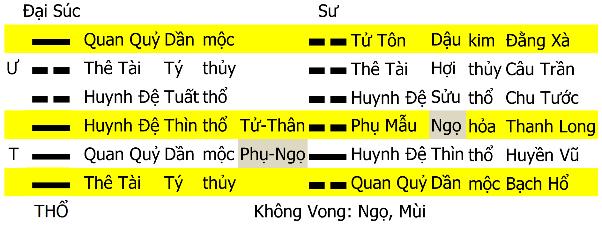
    - **Hình này chứng minh điều gì**
      - Tái hôn với chồng cũ không thành do Dụng thần Nguyệt phá hóa hồi đầu khắc; tương lai kết hôn với người khác.
    - **Từ đâu mà thấy được**
      - Hào 6 Quan Quỷ Dần mộc phát động bị Nguyệt Thân kim xung phá, hóa Tử Tôn Dậu kim hồi đầu khắc; hào sơ Tý thủy động hóa Quỷ Dần mộc.
  - **Bối cảnh quẻ:** Ngày Tân Mão tháng Thân (tuần Giáp Thân: Ngọ, Mùi Không Vong), người phụ nữ gieo quẻ hỏi có thể tái hôn với người chồng cũ được không, được quẻ Sơn Thiên Đại Súc biến Địa Thủy Sư.
  - **Phán đoán chi tiết:**
    - Căn cứ: Lấy Quan Quỷ làm Dụng thần. Trong quẻ Quan Quỷ lưỡng hiện tại hào 2 và hào 6, chọn hào phát động Quan Quỷ Dần mộc tại hào 6 làm Dụng thần chính.
    - Nhìn vào: Dụng thần Quan Quỷ Dần mộc tuy được Nhật thần Mão mộc đồng hành trợ giúp, nhưng lại bị Nguyệt kiến Thân kim xung phá mãnh liệt (Dần Thân tương xung) thành Nguyệt phá. Đã bị Nguyệt phá, hào động lại biến ra Tử Tôn Dậu kim quay lại khắc phạt tàn khốc (hồi đầu khắc). Dụng thần vừa phá vừa bị hồi đầu khắc là điềm hung tuyệt không thể cứu vãn, do đó việc tái hôn với chồng cũ chắc chắn không thành.
    - Nhận định về tương lai: Hào sơ Thê Tài Tý thủy phát động hóa ra Quan Quỷ Dần mộc; hào sơ là sự khởi đầu mới, quẻ biến xuất hiện Quan Quỷ khác, cho thấy tương lai cô sẽ kết hôn với một người đàn ông khác.
  - **Ứng nghiệm thực tế:** Quả nhiên việc tái hôn với người chồng cũ không thành công.

- **Ví dụ 4: Nam đoán có thể tái hôn được không (Ngày Tân Hợi tháng Tị - Quẻ Khảm Vi Thủy biến Thiên Địa Bĩ)**
  - **Hình 255.** Sơ đồ quẻ Khảm Vi Thủy biến Thiên Địa Bĩ
    - 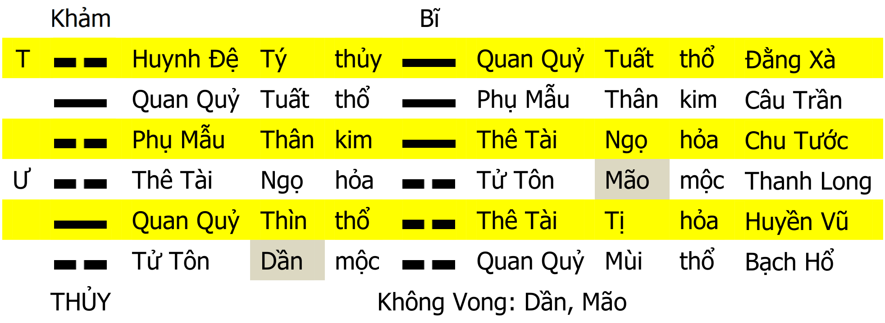
    - **Hình này chứng minh điều gì**
      - Nam đoán tái hôn không thành do Huynh Đệ trì Thế, Kỵ thần tam hợp cục vượng khắc Thê Tài, quẻ thuần lục xung.
    - **Từ đâu mà thấy được**
      - Hào Thế Huynh Đệ Tý thủy lâm Đằng Xà; hào 3 Thê Tài Ngọ hỏa bị Nhật khắc; quẻ Khảm Vi Thủy lục xung biến Bĩ lục hợp nhưng Kỵ thần vượng.
  - **Bối cảnh quẻ:** Ngày Tân Hợi tháng Tị (tuần Giáp Thìn: Dần, Mão Không Vong), người nam gieo quẻ hỏi bản thân có thể tái hôn được không, được quẻ Khảm Vi Thủy biến Thiên Địa Bĩ.
  - **Phán đoán chi tiết:**
    - Căn cứ: Nam đoán việc hôn nhân lấy Thê Tài làm Dụng thần. Trong quẻ Thê Tài Ngọ hỏa tọa hào 3 lâm hào Ứng.
    - Nhìn vào: Dụng thần Thê Tài Ngọ hỏa tuy được Nguyệt kiến Tị hỏa trợ giúp, nhưng lại bị Nhật thần Hợi thủy xung khắc (Tị Hợi tương xung, Hợi thủy khắc Ngọ hỏa), khiến cho thế lực suy vượng giằng co khó phân định. Điểm mấu chốt quyết định là hào Thế: Hào Thế là Huynh Đệ Tý thủy (hào 6) trì Thế; Huynh Đệ là Kỵ thần chuyên khắc tài đoạt vợ, Kỵ thần trì Thế đã là rào cản lớn ngăn trở hôn sự. Trong quẻ có các hào phát động phối hợp với hào Thế: hào 4 Phụ Mẫu Thân kim động, hào Thế Tý thủy động, hào 2 Quan Quỷ Thìn thổ động, tạo thành Thân - Tý - Thìn tam hợp Thủy cục (Kỵ thần Huynh Đệ cục) cực vượng xung khắc dập tắt Thê Tài Ngọ hỏa. Quẻ gốc Khảm Vi Thủy lại là quẻ thuần Lục Xung chủ về tan rã chia lìa, dù biến Bĩ lục hợp nhưng do Kỵ thần Huynh Đệ tam hợp cục quá hung hãn nên việc tái hôn tuyệt đối không thành.
  - **Ứng nghiệm thực tế:** Quả nhiên việc tái hôn bất thành.

- **Ví dụ 5: Nữ đoán tái hôn (Ngày Mậu Ngọ tháng Mão - Quẻ Hỏa Trạch Khuê biến Hỏa Thiên Đại Hữu)**
  - **Hình 256.** Sơ đồ quẻ Hỏa Trạch Khuê biến Hỏa Thiên Đại Hữu (Ví dụ 5)
    - 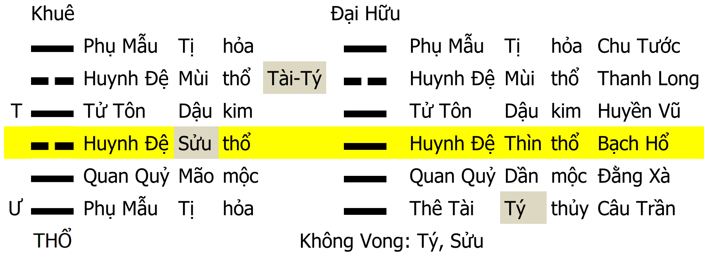
    - **Hình này chứng minh điều gì**
      - Nữ đoán tái hôn thất bại do Cừu thần độc phát hợp mất Nguyên thần, hào Thế bị Nguyệt Dụng thần xung phá chủ chồng không đồng ý.
    - **Từ đâu mà thấy được**
      - Hào 3 Huynh Đệ Sửu thổ tuần Không động hóa Thìn thổ hợp Nguyên thần Tý thủy; Thế hào 4 Dậu kim bị Nguyệt kiến Quan Quỷ Mão mộc xung phá.
  - **Bối cảnh quẻ:** Ngày Mậu Ngọ tháng Mão (tuần Giáp Thân: Tý, Sửu Không Vong), người phụ nữ gieo quẻ hỏi về việc tái hôn, được quẻ Hỏa Trạch Khuê biến Hỏa Thiên Đại Hữu.
  - **Phán đoán chi tiết:**
    - Căn cứ: Nữ bói hôn nhân lấy Quan Quỷ làm Dụng thần. Quan Quỷ Mão mộc tại hào 2 lâm Nguyệt kiến nên đương quyền vượng tướng.
    - Nhìn vào: Xét cội nguồn sinh dưỡng, Nguyên thần Thê Tài Tý thủy không hiện trên quẻ (phục tàng dưới hào 5 Huynh Đệ Mùi thổ), lại lâm tuần Không Vong (Tý, Sửu Không Vong), ở mùa xuân hưu tù hoàn toàn vô khí. Mặt khác Cừu thần Huynh Đệ Sửu thổ tại hào 3 độc phát (cũng lâm tuần Không động hóa Thìn thổ), Sửu thổ phát động tương hợp trói chặt Nguyên thần Tý thủy (Tý Sửu lục hợp), khiến Nguyên thần bị cầm chân không thể phát huy tác dụng sinh trợ cho Dụng thần Quan Quỷ Mão mộc. Nghiêm trọng nhất là hào Thế Tử Tôn Dậu kim tại hào 4 bị chính Nguyệt kiến Quan Quỷ Mão mộc xung phá thành Nguyệt phá; Thế là bản thân mình, Dụng thần lâm Nguyệt xung phá hào Thế biểu thị người chồng dứt khoát không đồng ý, trong lòng vô cùng ghét bỏ, cự tuyệt cô. Vì vậy chuyện tái hôn không thành.
  - **Ứng nghiệm thực tế:** Quả nhiên việc tái hôn hoàn toàn thất bại.

- **Ví dụ 6: Nữ đoán tái hôn (Ngày Mậu Thìn tháng Mão - Quẻ Hỏa Trạch Khuê biến Hỏa Thiên Đại Hữu)**
  - **Hình 257.** Sơ đồ quẻ Hỏa Trạch Khuê biến Hỏa Thiên Đại Hữu (Ví dụ 6)
    - 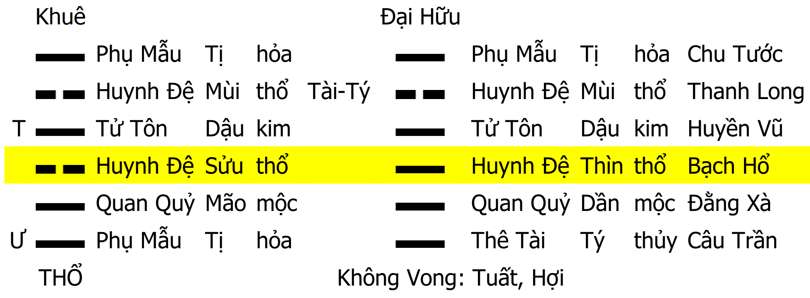
    - **Hình này chứng minh điều gì**
      - Tái hôn miễn cưỡng thành do Thế bị Nguyệt phá nhưng được Nhật hợp giải phá, biến Quy hồn; song Nguyên thần vô lực nên sau lại muốn ly hôn.
    - **Từ đâu mà thấy được**
      - Hào 4 Thế Tử Tôn Dậu kim bị Nguyệt xung phá được Nhật Thìn hợp giải phá; quẻ biến Đại Hữu là Quy hồn; Nguyên thần Tý thủy phục hưu tù.
  - **Bối cảnh quẻ:** Ngày Mậu Thìn tháng Mão (tuần Giáp Tý: Tuất, Hợi Không Vong), một người phụ nữ khác cũng gieo quẻ hỏi về việc tái hôn, ngẫu nhiên cùng được quẻ Hỏa Trạch Khuê biến Hỏa Thiên Đại Hữu như Ví dụ 5 nhưng khác ngày gieo.
  - **Phán đoán chi tiết:**
    - Căn cứ: Lấy Quan Quỷ làm Dụng thần. Dụng thần Quan Quỷ Mão mộc lâm Nguyệt kiến đắc lệnh vượng tướng.
    - So sánh và phân tích then chốt: Quẻ này giống hệt quẻ ở Ví dụ 5 về mặt cấu trúc quẻ và tháng bói (tháng Mão), Nguyên thần Thê Tài Tý thủy hưu tù phục tàng, Cừu thần Huynh Đệ Sửu thổ độc phát động hóa Thìn thổ (nhưng ở tuần Giáp Tý thì Sửu thổ không còn lâm Không Vong). Điểm khác biệt mang tính chất quyết định nằm ở Nhật thần: Ở Ví dụ 5 gieo ngày Mậu Ngọ, hào Thế Tử Tôn Dậu kim bị Nguyệt kiến Mão mộc xung phá không có cứu trợ; còn ở Ví dụ 6 gieo ngày Mậu Thìn, hào Thế Dậu kim tuy bị Nguyệt kiến Mão mộc xung phá nhưng lại được Nhật thần Thìn thổ đến hợp (Thìn Dậu lục hợp). Theo định luật Lục Hào: hào bị Nguyệt phá gặp Nhật thần hợp thì gọi là "Hợp giải Phá", Thế hào được cứu vãn, không còn bị coi là phá nữa. Hơn nữa, quẻ biến Hỏa Thiên Đại Hữu chính là quẻ Quy hồn thuộc Càn cung ("Đại Hữu quy hồn"), chủ về sự trở về, đoàn tụ chốn cũ. Do đó hai người miễn cưỡng có thể tái hôn thành công. Tuy nhiên, vì cội nguồn Nguyên thần Thê Tài Tý thủy hưu tù vô lực, nền tảng tình cảm và sinh dưỡng quá mỏng manh, lại có Cừu thần Sửu thổ phát động ngầm cản trở, nên cuộc tái hôn này không thể duy trì dài lâu.
  - **Ứng nghiệm thực tế:** Quả nhiên sau khi tái hôn xong xuôi, hai người lại tiếp tục nảy sinh mâu thuẫn rạn nứt sâu sắc và người vợ lại muốn ly hôn lần nữa.

### CHƯƠNG 11: CÔ ĐỘC SUỐT ĐỜI

#### Nguyên lý và các dấu hiệu nhận biết số mệnh cô độc suốt đời

- **Khái lược nguyên lý dự đoán nhân duyên trọn đời:**
  - Trong dự đoán hôn nhân suốt đời (chung thân quẻ), việc một người có thể kết hôn, sinh con hay phải chịu cảnh cô đơn tịch mịch đến già phụ thuộc vào mối tương quan tổng hòa giữa Thế hào, Dụng thần (Quan Quỷ hoặc Thê Tài), Tử Tôn hào và các thần sát trợ duyên.
  - Khi xuất hiện các tổ hợp tượng quẻ hung hiểm sau đây, phần lớn là biểu hiện của số phận cô độc suốt đời, khó có cơ hội lập gia đình:
- **Các dấu hiệu then chốt chỉ báo số phận cô độc:**
  - **Kỵ thần trì Thế:** Người nữ xem hôn nhân gặp Tử Tôn trì Thế khắc Quan Quỷ; người nam xem gặp Huynh Đệ trì Thế khắc Thê Tài. Kỵ thần chiếm cứ bản thân (Thế hào) làm tắc nghẽn duyên nợ lứa đôi.
  - **Dụng thần suy bại cực độ:** Dụng thần (Quan Quỷ đối với nữ, Thê Tài đối với nam) lâm vào cảnh hưu tù vô khí, gặp Tuần không, Nguyệt phá, lại rơi vào các cung vị Tử, Mộ, Tuyệt mà không hề có Nguyên thần tương sinh hay cứu ứng.
  - **Tử Tôn suy tuyệt hoặc Không Phá:** Tử Tôn là Dụng thần của con cái. Khi Tử Tôn bị hưu tù, Không Vong, Nguyệt phá, bị khắc hại hoặc động hóa Quỷ/Tử địa, báo hiệu không có con nối dõi, về già không người phụng dưỡng chăm sóc.
  - **Hào Thế cư vị bất lợi:** Hào Thế an tại hào 6 là ngôi vị chí cao nhưng thoái hưu, tượng trưng cho tuổi già bóng xế, hết duyên phận, không nơi nương tựa; nếu hào Thế lâm Không Vong hoặc bị xung phá thì tính chất cô quả càng lộ rõ.
  - **Lâm Đằng Xà và quái dị tinh sát:** Hào Thế hoặc hào độc phát lâm Đằng Xà, chủ tính tình quái dị, hướng nội, cô độc, lẻ loi trơ trọi; hoặc Hương Khuê nhập Mộ, Không hóa Không, Phụ Mẫu (giấy đăng ký kết hôn) không hiện trên quẻ.
  - **Quẻ Lục xung và Nguyên thần bị diệt:** Quẻ Lục xung chủ cả đời phiêu bạt, bất an, duyên đến rồi tan biến; Nguyên thần của Thế hoặc Dụng thần động hóa hồi đầu khắc, hóa Tuyệt hoặc hóa Không, triệt tiêu hoàn toàn sinh khí.

#### Hệ thống quái lệ thực tiễn luận giải số mệnh cô độc trọn đời

- **Ví dụ 1: Nữ đoán vận mệnh trọn đời (ngày Ất Hợi tháng Thìn)**
  - **Hình 258.** Sơ đồ quẻ Trạch Sơn Hàm biến Phong Sơn Tiệm
    - 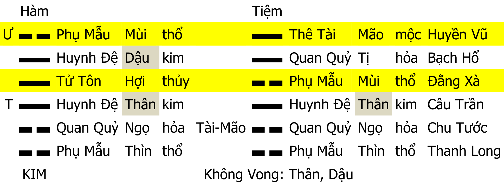
    - **Hình này chứng minh điều gì**
      - Người nữ có số mệnh cô độc suốt đời, không chồng không con, tuổi già hiu quạnh không nơi nương tựa.
    - **Từ đâu mà thấy được**
      - Hào Thế Thân kim Không Vong; Quan Quỷ Ngọ hỏa và Tử Tôn Hợi thủy đều bị khắc thương; Ứng Mùi thổ hóa Mão mộc hồi đầu khắc.
  - **Phán đoán chi tiết:**
    - Căn cứ:
      - Hào Thế Huynh Đệ Thân kim gặp Tuần không (Thân, Dậu không), không được Nguyên thần sinh trợ.
      - Hào Ứng là Nguyên thần Phụ Mẫu Mùi thổ tại hào 6 phát động nhưng động hóa Thê Tài Mão mộc hồi đầu khắc.
      - Tử Tôn Hợi thủy tại hào 4 phát động, được Nhật thần Hợi thủy trợ giúp nhưng bị Nguyệt kiến Thìn thổ và hào 6 Phụ Mẫu Mùi thổ khắc hại; bản thân hào Thế Không Vong không thể sinh Tử Tôn.
      - Quan Quỷ Ngọ hỏa tại hào 2 không được Nhật Nguyệt tương trợ, bị Nhật thần Hợi thủy khắc, lại bị hào 4 Tử Tôn Hợi thủy phát động khắc thương.
    - Nhìn vào:
      - Hào Thế lâm Không Vong biểu thị bản thân thiếu nơi nương tựa, hư không bất định. Nguyên thần Mùi thổ tại hào 6 phát động sinh Thế nhưng lại hóa hồi đầu khắc, mất sạch lực sinh. Hào 6 là hào vị của tuổi già, Nguyên thần suy bại hóa khắc ở ngôi vị tuổi già chỉ rõ lúc về già không người trông cậy, cuộc đời cô độc.
      - Luận về con cái: Nữ xem con lấy Tử Tôn làm Dụng thần. Tử Tôn Hợi thủy bị Nguyệt khắc, bị hào 6 Mùi thổ động khắc, hào Thế lâm Không Vong không thể sinh xuất Tử Tôn, do đó là thông tin trọn đời không có con cái.
      - Luận về hôn nhân: Nữ xem chồng lấy Quan Quỷ làm Dụng thần. Quan Quỷ Ngọ hỏa vừa bị Nhật thần khắc phạt, vừa bị hào động Tử Tôn Hợi thủy khắc sát triệt để, dấu hiệu hoàn toàn không có duyên phận vợ chồng.
      - Tổng hợp quẻ tượng: Cả phu tinh (Quan Quỷ) và tử tức (Tử Tôn) đều bị khắc tận diệt, Thế hào Không Vong, tuổi già lẻ loi một bóng.
  - **Ứng nghiệm thực tế:**
    - Thực tế đương số đúng là người phụ nữ sống cô độc một mình trọn đời, không kết hôn và không có con cái.

- **Ví dụ 2: Nữ đoán số phận trọn đời (ngày Kỷ Mùi tháng Mão)**
  - **Hình 259.** Sơ đồ quẻ Khôn Vi Địa biến Sơn Lôi Di
    - 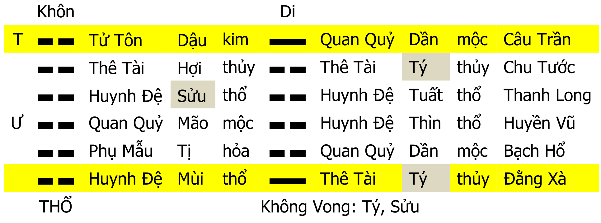
    - **Hình này chứng minh điều gì**
      - Người nữ mồ côi cha mẹ từ sớm, mắc bệnh tâm thần, suốt đời bất an, không chồng con và cô độc bế tắc.
    - **Từ đâu mà thấy được**
      - Quẻ Lục xung; Thế hào 6 Nguyệt phá hóa Quỷ; hào sơ hóa Không; Quan Quỷ nhập Mộ kép tại Nhật và động hào Mùi thổ.
  - **Phán đoán chi tiết:**
    - Căn cứ:
      - Quẻ Khôn Vi Địa là quẻ Lục xung thuần âm.
      - Hào Thế Tử Tôn Dậu kim tại hào 6 bị Nguyệt kiến Mão mộc xung thành Nguyệt phá, động hóa Quan Quỷ Dần mộc.
      - Nguyên thần của Thế là Huynh Đệ Mùi thổ tại hào sơ động hóa Thê Tài Tý thủy gặp Tuần không (Tý, Sửu không).
      - Quan Quỷ Mão mộc lâm hào Ứng nhập Mộ tại Nhật thần Mùi thổ, đồng thời nhập Mộ tại hào sơ Huynh Đệ Mùi thổ phát động; Nguyên thần Thê Tài Hợi thủy hưu tù không sinh được Quan Quỷ.
    - Nhìn vào:
      - Hào 6 tượng trưng cho tuổi già, hào sơ tượng trưng cho thời thơ ấu thuở nhỏ. Hào sơ Nguyên thần động hóa Không biểu thị từ thuở nhỏ đã không được người nâng đỡ chở che (cha mẹ mất sớm); hào Thế tại hào 6 Nguyệt phá chỉ tuổi già cô độc bơ vơ. Quẻ Lục xung biểu thị cuộc đời sóng gió, bấp bênh, vĩnh viễn không thể an cư lạc nghiệp.
      - Luận về con cái: Nữ xem con lấy Tử Tôn làm Dụng thần. Tử Tôn Dậu kim trì Thế vừa Nguyệt phá lại động hóa Quan Quỷ (Tử Tôn hóa Quỷ), Nguyên thần hóa Không nên cả đời tuyệt đối không có con cái.
      - Luận về hôn nhân: Kỵ thần Tử Tôn trì Thế chủ khắc phu; Dụng thần Quan Quỷ Mão mộc nhập Mộ tầng tầng lớp lớp ở Nhật thần và hào động Mùi thổ; quẻ Lục xung xung tán nhân duyên, Thê Tài hưu tù không sinh Quỷ, vì vậy duyên phận hôn nhân không thể thành.
      - Luận về sức khỏe tâm thần: Hào Thế tại hào 6 chủ phần đầu não; Mộc chủ hệ thống thần kinh; hào Thế bị Mộc (Quan Quỷ Mão mộc) xung phá, lại động hóa Mộc (Quan Quỷ Dần mộc). Thêm vào đó, Nguyên thần chủ về tư duy đóng tại hào sơ động hóa Không, bản thân hào sơ cũng là chủ quản tư duy ban sơ. Đầu não bị Quỷ khắc, hệ thần kinh rối loạn, tư duy rơi vào Không Vong, chứng tỏ người này đầu óc bất bình thường, mắc bệnh tâm thần phân liệt.
  - **Ứng nghiệm thực tế:**
    - Trên thực tế, người phụ nữ này mồ côi cha mẹ từ nhỏ, bản thân mang bệnh tâm thần nặng, là một người sống cô độc, khốn khổ suốt cả cuộc đời.

- **Ví dụ 3: Nam đoán vận mệnh trọn đời (ngày Mậu Dần tháng Dần)**
  - **Hình 260.** Quẻ Địa Thiên Thái biến Sơn Trạch Tổn
    - 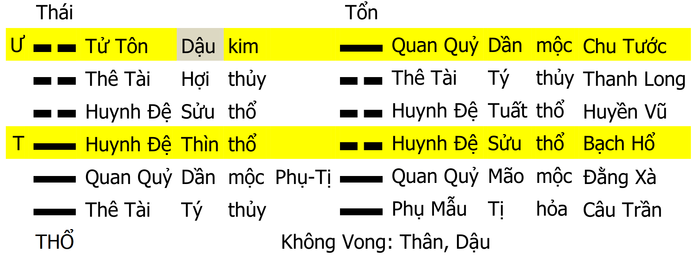
    - **Hình này chứng minh điều gì**
      - Người đàn ông có số mệnh cô đơn trọn kiếp, đến 57 tuổi vẫn sống lẻ bóng một mình, không vợ không con.
    - **Từ đâu mà thấy được**
      - Kỵ thần Huynh Đệ Thìn thổ trì Thế hóa thoái; Thê Tài hưu tù bị Nhật Nguyệt hợp tiết; Tử Tôn Dậu kim Không Vong hóa Quỷ tuyệt địa.
  - **Phán đoán chi tiết:**
    - Căn cứ:
      - Nam đoán hôn nhân lấy Thê Tài làm Dụng thần; trong quẻ Kỵ thần Huynh Đệ Thìn thổ trì Thế động hóa Huynh Đệ Sửu thổ (hóa Thoái thần).
      - Thê Tài Tý thủy và Thê Tài Hợi thủy hưu tù vô khí trong tháng Dần ngày Dần, bị Quan Quỷ Dần mộc vượng tướng tiết khí nặng nề; Thê Tài Hợi thủy bị Nhật Nguyệt Dần mộc hợp trú (Dần Hợi hợp).
      - Nguyên thần của Thê Tài là Tử Tôn Dậu kim lâm Tuần không (Thân, Dậu không), động hóa Quan Quỷ Dần mộc (hóa Tuyệt và tuyệt tại Nhật Nguyệt).
    - Nhìn vào:
      - Kỵ thần Huynh Đệ trì Thế là cách cục cản trở hôn nhân sâu sắc. Dụng thần Thê Tài đã hưu tù lại bị Nhật Nguyệt hợp giam hãm, tiết khí cùng kiệt. Nguyên thần Tử Tôn Dậu kim lâm Không Vong hóa Quỷ, lại rơi vào tuyệt địa tại Nhật Nguyệt nên hoàn toàn mất khả năng sinh trợ Thê Tài. Do đó, người nam suốt đời không có duyên phận kết hôn.
      - Luận về con cái: Hào Tử Tôn Dậu kim không được Nhật Nguyệt trợ giúp, gặp Không Vong lại động hóa Quỷ. Bản thân hào Thế Huynh Đệ Thìn thổ động hóa Thoái thần, lại bị Nhật Nguyệt Dần mộc đồng khắc hại, Thế hào suy kiệt thoái lui không đủ sức sinh dưỡng Tử Tôn, phản ánh thông tin không thể có con nối dõi.
      - Tổng hợp tượng quẻ: Kỵ thần trì Thế, Tài tuyệt Tử không, kết luận trọn đời cô đơn một bóng.
  - **Ứng nghiệm thực tế:**
    - Thực tế đương số khi đến gieo quẻ đã 57 tuổi nhưng vẫn sống độc thân một mình, chưa từng một lần kết hôn hay sinh con.

- **Ví dụ 4: Nam 47 tuổi đoán khi nào có thể kết hôn (ngày Bính Thìn tháng Ngọ)**
  - **Hình 261.** Quẻ Khảm Vi Thủy biến Thủy Phong Tỉnh
    - 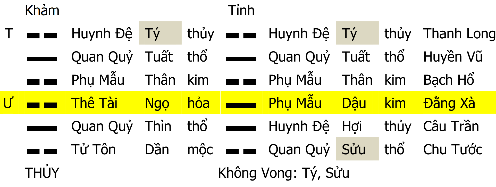
    - **Hình này chứng minh điều gì**
      - Người nam 47 tuổi hỏi ngày cưới nhưng thực chất mang số mệnh cô độc suốt đời, hoàn toàn không có vợ con.
    - **Từ đâu mà thấy được**
      - Dụng thần Thê Tài Ngọ hỏa độc phát lâm Đằng Xà hóa Tử địa Dậu kim; Thế Tý thủy cư hào 6 lâm Không Vong bị Tài xung phá.
  - **Phán đoán chi tiết:**
    - Căn cứ:
      - Nam xem hôn nhân lấy Thê Tài làm Dụng thần; Thê Tài Ngọ hỏa tại hào 3 lâm Nguyệt kiến là vượng tướng.
      - Hào 3 Thê Tài Ngọ hỏa là hào độc phát trong quẻ, lâm Đằng Xà, động hóa Phụ Mẫu Dậu kim (hóa Tử địa).
      - Hào Thế Huynh Đệ Tý thủy cư hào 6 gặp Tuần không (Tý, Sửu không), bị hào độc phát Thê Tài Ngọ hỏa tương xung phá.
      - Quẻ Khảm Vi Thủy là quẻ Lục xung.
    - Nhìn vào:
      - Dụng thần Thê Tài Ngọ hỏa tuy vượng tướng nhưng lại là hào độc phát hóa Tử địa (Hỏa Tử tại Dậu), độc phát hóa Tử là điềm cực hung, báo hiệu hôn sự chẳng lành.
      - Hào Thế Tý thủy ngự tại hào 6: hào 6 là đỉnh điểm thoái hưu, tượng trưng cho tuổi già bóng xế, duyên phận cạn kiệt; Thế lâm Không Vong là điềm báo cô độc trơ trọi. Hào độc phát Thê Tài Ngọ hỏa lâm Đằng Xà, mà Đằng Xà chủ sự quái đản, cô quả lẻ loi.
      - Hào 6 chủ vô duyên, hào Thế Tý thủy lại bị Dụng thần Thê Tài phát động xung phá, hai bên tương xung tương khắc không thể hòa hợp. Hào độc phát lại là Tử địa của Tử Tôn Dần mộc (Mộc Tử tại Ngọ), thể hiện dấu hiệu không có cả vợ lẫn con cái.
      - Dù đương số ôm ấp hy vọng hỏi khi nào thành gia lập thất, quẻ tượng đã phơi bày chân tướng cô độc trọn đời.
  - **Ứng nghiệm thực tế:**
    - Trên thực tế, người đàn ông 47 tuổi này là một người sống cô độc từ trước tới nay, không hề có vợ con.

- **Ví dụ 5: Nữ 49 tuổi đoán chung thân đại sự (ngày Đinh Mùi tháng Tý năm Tân Tị)**
  - **Hình 262.** Quẻ Địa Sơn Khiêm biến Địa Hỏa Minh Di
    - 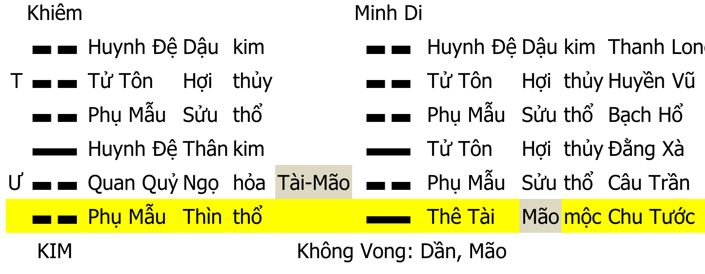
    - **Hình này chứng minh điều gì**
      - Người nữ 49 tuổi lỡ dở lương duyên vì phụng dưỡng bề trên tàn tật, sống khép kín u uất và chịu lời càm ràm khổ não.
    - **Từ đâu mà thấy được**
      - Quan Quỷ Ngọ hỏa Nguyệt phá, Nguyên thần Không Vong; Thế Hợi thủy lâm Huyền Vũ nhập Mộ Phụ Mẫu Thìn thổ Chu Tước độc phát.
  - **Phán đoán chi tiết:**
    - Căn cứ:
      - Nữ xem hôn nhân lấy Quan Quỷ làm Dụng thần; Quan Quỷ Ngọ hỏa tại hào 2 bị Nguyệt kiến Tý thủy xung phá thành Nguyệt phá.
      - Nguyên thần của Quan Quỷ là Thê Tài Mão mộc phục tàng dưới hào 2 lâm Tuần không (Dần, Mão không).
      - Hào Thế Tử Tôn Hợi thủy lâm Huyền Vũ, bị Nhật thần Đinh Mùi khắc, lại nhập Mộ tại hào sơ Phụ Mẫu Thìn thổ độc phát.
      - Phụ Mẫu lâm Nhật thần Mùi thổ chủ về hôn kỳ và hôn thú; trong quẻ hào sơ Phụ Mẫu Thìn thổ độc phát hóa Thê Tài Mão mộc hồi đầu khắc; thần sát Hương Khuê Hợi thủy nhập Mộ.
    - Nhìn vào:
      - Dụng thần Quan Quỷ Ngọ hỏa đã Nguyệt phá, Nguyên thần Thê Tài Mão mộc lại phục tàng gặp Không Vong không thể sinh trợ, Dụng thần suy tàn triệt để nên cả đời khó lòng bước vào hôn nhân. Hào Thế Tử Tôn bị Nhật khắc, nhập Mộ tại Thìn thổ nên cũng không có con cái.
      - Hào Phụ Mẫu đại diện cho giấy đăng ký kết hôn độc phát hóa khắc, thần sát Hương Khuê Hợi thủy nhập Mộ, biểu thị cánh cửa hôn nhân đã khép chặt suốt đời.
      - Phân tích tâm lý và hoàn cảnh sống: Hào Thế Tử Tôn Hợi thủy lâm Huyền Vũ (chủ u sầu, trầm cảm, buồn bã), nhập Mộ tại hào sơ Phụ Mẫu Thìn thổ độc phát, phản ánh tính cách sống khép kín, thu mình trong bốn bức tường, gần như cắt đứt giao tiếp với thế giới bên ngoài.
      - Mộ khố giam hãm Thế hào là Phụ Mẫu lâm Chu Tước: Phụ Mẫu đại diện cho bậc trưởng bối, bề trên; Chu Tước chủ ngôn ngữ, lời nói càm ràm, trách móc. Tượng quẻ chỉ rõ đương số bị người bề trên trong gia đình trói buộc, quản thúc và thường xuyên cằn nhằn càm ràm khiến tâm tư vô cùng u uất, buồn khổ.
  - **Ứng nghiệm thực tế:**
    - Thực tế ứng nghiệm chuẩn xác: Người phụ nữ 49 tuổi vì phải ở nhà tận tình chăm sóc người dì tàn tật không nơi nương tựa nên lỡ làng cả thanh xuân, đến nay vẫn chưa thể lấy chồng. Bản thân người dì tính tình khó chịu, thường xuyên càm ràm trách mắng khiến cô vô cùng khổ tâm, sầu muộn.

- **Ví dụ 6: Nữ 48 tuổi đoán chung thân đại sự (ngày Mậu Ngọ tháng Tý năm Tân Tị)**
  - **Hình 263.** Sơ đồ quẻ Trạch Thiên Quải biến Trạch Phong Đại Quá
    - 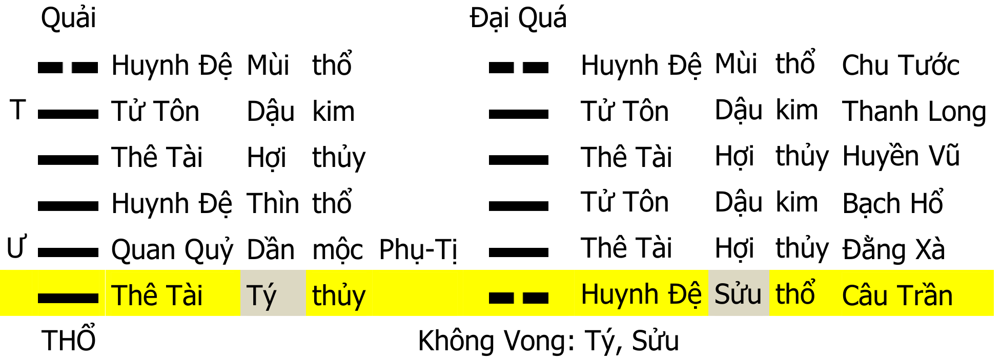
    - **Hình này chứng minh điều gì**
      - Người nữ 48 tuổi ôm mối tình đầu dang dở chờ đợi bạn học cũ suốt đời, không thể tái tục tiền duyên và cô độc đến già.
    - **Từ đâu mà thấy được**
      - Kỵ thần Tử Tôn Dậu kim trì Thế; Nguyên thần Tý thủy Không hóa Không; Phụ Mẫu Tị hỏa phục tàng; năm Giáp Dần phùng Trị gặp duyên lỡ.
  - **Phán đoán chi tiết:**
    - Căn cứ:
      - Nữ xem hôn nhân lấy Quan Quỷ làm Dụng thần; Quan Quỷ Dần mộc ngự tại hào 2 (lâm hào Ứng), được Nguyệt kiến Tý thủy tương sinh là vượng tướng.
      - Kỵ thần Tử Tôn Dậu kim trì Thế (khắc Quan Quỷ).
      - Thần sát Hương Khuê là Thê Tài Tý thủy tại hào sơ gặp Tuần không (Tý, Sửu không), phát động hóa Huynh Đệ Sửu thổ cũng lâm Tuần không (Không hóa Không).
      - Phụ Mẫu Tị hỏa (hôn thú, giấy kết hôn) phục tàng dưới hào 2 không hiện trên quẻ.
      - Nguyên thần của Quan Quỷ là Thê Tài Tý thủy lâm Không hóa Không, triệt tiêu khả năng sinh trợ Dụng thần; Tử Tôn Dậu kim lâm Tử địa tại hào độc phát Tý thủy.
    - Nhìn vào:
      - Dù Dụng thần Quan Quỷ vượng tướng nhưng Kỵ thần Tử Tôn trì Thế là cách cục cản trở hôn nhân điển hình. Nguyên thần Tý thủy lâm Không hóa Không không thể sinh dưỡng phu tinh; Phụ Mẫu là chứng nhận hôn nhân phục tàng không xuất hiện; Tử Tôn lâm Tử địa ở hào độc phát, tất cả hội tụ chỉ rõ mệnh số không chồng không con, phải chịu cảnh cô độc suốt đời.
      - Truy tìm duyên phận quá khứ: Vào năm Giáp Dần (1974), đương số tròn 21 tuổi - độ tuổi thanh xuân đẹp nhất để kết hôn. Lưu niên Giáp Dần phùng Trị với Dụng thần Quan Quỷ Dần mộc trong quẻ (Dụng thần gặp Trị), biểu thị năm 21 tuổi đã từng xuất hiện cơ duyên tình ái sâu sắc.
  - **Ứng nghiệm thực tế:**
    - Người phụ nữ xác nhận thực tế: Vào năm Giáp Dần (1974), năm 21 tuổi, cô đã yêu tha thiết một người bạn học cùng lớp nhưng mối duyên trắc trở không thành. Người bạn trai sau đó đã kết hôn với người phụ nữ khác, còn cô ôm trọn mối tình đầu khắc cốt ghi tâm, một lòng ở vậy chờ đợi người xưa suốt mấy chục năm. Đến năm Canh Thìn (2000), tình cờ gặp lại anh ta, tình cảm xưa cũ bùng cháy khiến cô gieo quẻ xem liệu có thể nối lại duyên xưa (tái tục tiền duyên) hay không. Nhưng quẻ tượng đã định rõ cô vẫn phải sống cô độc đến trọn đời.

### CHƯƠNG 12: PHÂN TÍCH LƯU NIÊN HÔN NHÂN

#### 1. Nguyên lý và phương pháp luận phán đoán lưu niên hôn nhân
- **Bản chất của phán đoán lưu niên trong Lục hào nhân duyên:**
  - Dự trắc lưu niên hôn nhân có sự khác biệt căn bản so với các phép phán đoán sự vụ thông thường. Cốt lõi của phương pháp này là phải dựa trên quan hệ sinh, khắc, chế, hóa, xung, hợp, hỷ, kỵ của địa chi lưu niên (Thái Tuế từng năm) đối với Dụng thần và hào Thế để định luận cát hung.
  - Phải biết chuyển hóa địa chi lưu niên thành Lục thân tương ứng trong quẻ. Lục thân của lưu niên không cố định theo ngũ hành bản thể mà căn cứ trực tiếp vào hệ thống Lục thân được an định theo quái cung của quẻ dự trắc. Thông qua việc quy đổi Thái Tuế thành Quan Quỷ, Thê Tài, Tử Tôn, Phụ Mẫu hay Huynh Đệ, người dự đoán mới nắm bắt được bản chất sự việc diễn ra trong năm đó.
- **Quy luật vận dụng ứng kỳ thay vì suy diễn tuần tự từng năm:**
  - Tuyệt đối không được phán đoán máy móc dàn trải từ năm này qua năm khác theo kiểu liệt kê niên biểu thông thường.
  - Phán đoán lưu niên chuẩn xác bắt buộc phải dựa vào hào động biến hóa trong quẻ, trạng thái Không Vong, Nguyệt Phá, xung hợp, sinh khắc của Dụng thần và hào Thế, từ đó vận dụng các quy luật ứng kỳ kinh điển của Lục hào để điểm định mốc thời gian phát sinh sự kiện (như ứng kỳ xung khai hào hợp, hợp trú hào động, xung thực tuần không, thực phá, xuất mộ, hoặc kỵ thần bị chế phục).
- **Quy luật biểu hiện thông tin mãnh liệt (Tượng quẻ ứng đại bất ứng tiểu):**
  - Tượng quẻ Lục hào vận hành theo nguyên lý phản ánh các xung lực thông tin mãnh liệt nhất trong tâm thức và trường khí của đương số.
  - Những sự kiện mờ nhạt, thông tin thứ yếu không quan trọng hoặc không can hệ trực tiếp đến nội dung tâm niệm dự trắc thường sẽ bị ẩn tàng, không hiển lộ trên quẻ.
  - Quẻ luôn ứng sự kiện lớn mà không ứng sự kiện nhỏ, ứng thời điểm gần mà không ứng thời điểm xa xôi mơ hồ; chỉ những biến động cốt lõi mang tính bước ngoặt (kết hôn, sinh con, ngoại tình, ly hôn, rạn nứt) mới được tượng quẻ khắc họa sắc nét.

#### 2. Các quái lệ thực chứng về phân tích lưu niên hôn nhân

- **Ví dụ 1: Nữ đoán hôn nhân qua các lưu niên (Ngày Canh Tý tháng Mùi năm Giáp Thân)**
  - **Bối cảnh & Chọn Dụng thần:**
    - Ngày Canh Tý tháng Mùi năm Giáp Thân (Tuần không: Thìn, Tị).
    - Nữ nhân sinh năm 1970 (Canh Tuất, 34 tuổi) đến gieo quẻ dự đoán vận trình hôn nhân trọn đời, được quẻ Lôi Hỏa Phong biến Lôi Thiên Đại Tráng.
    - Lấy Quan Quỷ làm Dụng thần. Trong quẻ Quan Quỷ lưỡng hiện: Quan Quỷ Sửu thổ tại hào 2 phát động và Quan Quỷ Tuất thổ tại hào 6 tĩnh. Lấy hào động Quan Quỷ Sửu thổ làm Dụng thần chính.
  - **Hình 264.** Sơ đồ quẻ Lôi Hỏa Phong biến Lôi Thiên Đại Tráng
    - 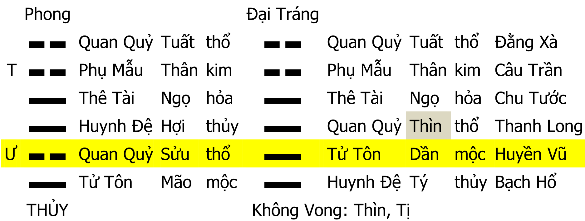
    - **Hình này chứng minh điều gì**
      - Thể hiện diễn biến hôn nhân qua các lưu niên: kết hôn năm Hợi, ly hôn năm Sửu, tái hôn năm Thân.
    - **Từ đâu mà thấy được**
      - Quan Quỷ Sửu thổ động hóa Dần mộc hồi đầu khắc; năm Ất Hợi hợp Dần; năm Canh Thân xung Dần mộc.
  - **Phán đoán chi tiết:**
    - Căn cứ:
      - Quan Quỷ Sửu thổ bị Nguyệt lệnh Mùi thổ xung phá (Nguyệt phá), lại tự động hóa Tử Tôn Dần mộc hồi đầu khắc: dấu hiệu hôn nhân đầu đời ắt phải chịu cảnh đổ vỡ, chia ly bất hòa.
      - Dụng thần lâm hào 2 (trạch vị, phu thê vị) vốn là tượng thành gia lập thất sớm, nhưng vì hưu tù lại bị khắc nên tuổi kết hôn bị chậm lại một chút, song không phải là kết hôn quá muộn.
      - Quan Quỷ lưỡng hiện, Dụng thần Sửu thổ bị Nguyệt phá nhưng lại được Nhật thần Canh Tý hợp để giải Phá: biểu thị sau khi cuộc hôn nhân đầu tiên tan vỡ, chắc chắn đương số sẽ bước vào cuộc hôn nhân thứ hai.
      - Năm 1995 Ất Hợi: Lưu niên Hợi thủy hợp trú hào biến Dần mộc (Dần Hợi lục hợp), trói buộc Kỵ thần khiến Dần mộc không thể hồi đầu khắc hại Dụng thần Sửu thổ; do đó phán đoán năm 1995 kết hôn lần đầu.
      - Năm 1997 Đinh Sửu: Dụng thần Sửu thổ lâm Thái Tuế gặp Trị (thực Phá), xuất hiện để chịu hào biến Dần mộc hồi đầu khắc; phán đoán năm này chính thức ly hôn.
      - Năm 1998 Mậu Dần và năm 1999 Kỷ Mão: Đều là các năm Kỵ thần Mộc vượng tướng khắc phạt Dụng thần Thổ; Dụng thần lâm đất tử tuyệt, không có cơ hội tái hôn hay phát triển tình cảm.
      - Năm 2000 Canh Thìn: Thìn thổ xung khai Quan Quỷ Tuất thổ tại hào 6, có manh mối bàn chuyện cưới xin, song chưa giải quyết được thế bị khắc hãm của Dụng thần Sửu thổ nên việc không thành.
      - Năm 2001 Tân Tị và năm 2002 Nhâm Ngọ: Là các năm Hỏa vượng tương sinh Quan Quỷ, tuy có cơ hội gặp gỡ người khác giới nhưng không thỏa mãn tiêu chuẩn ứng kỳ giải cứu Dụng thần, nên việc hôn sự vẫn dở dang.
      - Năm 2003 Quý Mùi: Quan Quỷ Sửu thổ vốn hợp Nhật thần Tý thủy nay bị Thái Tuế Mùi thổ xung khai hợp; tượng xung khai biểu thị có dịp bàn thảo hôn nhân, nhưng xung khai lại khiến Sửu thổ trơ trọi chịu hào biến Dần mộc khắc chế, nên chỉ dừng lại ở mức bàn bạc mà không thành tựu.
      - Năm 2004 Giáp Thân (năm dự trắc): Thái Tuế Thân kim lâm quyền xung khắc mất hào biến Dần mộc (Dần Thân tương xung), chặt đứt nguồn cơn hồi đầu khắc, giải phóng Dụng thần Sửu thổ; khẳng định năm nay đương số sẽ tái hôn.
      - Phân định hai người chồng: Quan Quỷ Sửu thổ là người chồng đầu tiên; Quan Quỷ Tuất thổ ở hào 6 là người chồng thứ hai. Quan Quỷ Tuất thổ là Mộ khố của Thê Tài (Hỏa mộ tại Tuất, hào 4 Thê Tài Ngọ hỏa nhập Mộ), chỉ rõ người chồng sau này là người rất giàu có, sở hữu nhiều tiền của. Tuất thổ lâm Đằng Xà chủ biến ảo đa đoan, tính tình người này thay đổi thất thường.
      - Sức khỏe phụ khoa: Hào 2 Quan Quỷ Sửu thổ là Nguyên thần sinh hào Thế Phụ Mẫu Thân kim, bị Nguyệt phá và bị Kỵ thần khắc, lâm Huyền Vũ. Hào 2 là bộ phận sinh dục và tử cung; Huyền Vũ chủ bệnh khó nói, hàn lạnh; Tử Tôn đại diện tử cung. Nguyên thần của Thế bị Tử Tôn khắc hại tại hào 2 chỉ rõ bệnh tật phụ khoa; Mộc chủ đau nhức nên thường bị đau bụng kinh dữ dội; Huyền Vũ chủ giá lạnh biểu thị tử cung bị hàn lạnh.
    - Nhìn vào:
      - Sự chuyển hóa nhịp nhàng của hào biến Dần mộc: khi bị hợp (năm Hợi) thì kết hôn, khi được tự do khắc (năm Sửu) thì ly hôn, khi bị xung diệt (năm Thân) thì tái hôn.
      - Tượng Mộ khố Thê Tài kết hợp Đằng Xà để vẽ nên diện mạo tài chính và tính cách của người chồng kế tiếp.
  - **Ứng nghiệm thực tế:**
    - Toàn bộ phán đoán từ năm kết hôn, năm ly hôn, các năm yêu đương thất bại cho đến việc tái hôn năm Giáp Thân, tài sản của chồng sau và bệnh tật phụ khoa đều được đương số xác nhận hoàn toàn chuẩn xác.

- **Ví dụ 2: Nữ đoán hôn nhân qua các mốc lưu niên (Ngày Bính Tý tháng Dần năm Ất Dậu)**
  - **Bối cảnh & Chọn Dụng thần:**
    - Ngày Bính Tý tháng Dần năm Ất Dậu (Tuần không: Thân, Dậu).
    - Nữ nhân sinh năm 1968 (Mậu Thân, 37 tuổi) đến hỏi về nhân duyên, được quẻ Lôi Hỏa Phong (quẻ tĩnh).
    - Lấy Quan Quỷ làm Dụng thần. Trong quẻ Quan Quỷ lưỡng hiện: Quan Quỷ Tuất thổ tại hào 6 và Quan Quỷ Sửu thổ tại hào 2. Lấy hào Quan Quỷ Sửu thổ được Nhật thần Tý thủy tương hợp làm Dụng thần chính.
  - **Hình 265.** Sơ đồ quẻ Lôi Hỏa Phong
    - 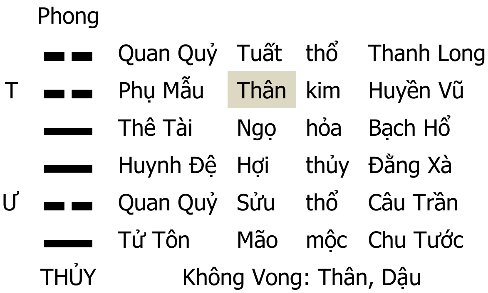
    - **Hình này chứng minh điều gì**
      - Minh họa tiến trình kết hôn muộn, sinh con, ngoại tình và ly hôn qua từng lưu niên.
    - **Từ đâu mà thấy được**
      - Dụng thần Sửu thổ hưu tù bị hợp; Thế Phụ Mẫu Thân kim Không Phá; Kỵ thần Mão mộc vượng tướng.
  - **Phán đoán chi tiết:**
    - Căn cứ:
      - Dụng thần Quan Quỷ Sửu thổ không được Nhật Nguyệt sinh trợ, bị Nguyệt lệnh Dần mộc khắc thương, lại bị Nhật thần Tý thủy hợp trói: tượng kết hôn muộn. Tuy nhiên Dụng thần đóng tại hào 2 lại là hào Ứng (cả hào 2 và hào Ứng đều là phu thê vị), nên dù muộn nhưng không đến mức quá trễ tràng.
      - Dụng thần gặp hợp phần lớn ứng kỳ vào năm xung khai:
        - Năm 1990 Canh Ngọ (21 tuổi): Thái Tuế Ngọ hỏa xung khai Nhật thần Tý thủy, giải tỏa thế hợp của Dụng thần, đồng thời kích hoạt hào 4 Thê Tài Ngọ hỏa ám động sinh phù Sửu thổ; đây là năm bắt đầu chớm nở tình yêu đôi lứa. Nhưng hào Thế Phụ Mẫu Thân kim lâm Tuần Không lại bị Nguyệt phá (Dần Thân tương xung), lưu niên Ngọ không bù đắp được khuyết tật Không Phá của Thế, nên chỉ yêu đương mà chưa thể kết hôn.
        - Năm 1991 Tân Mùi: Thái Tuế Mùi thổ xung Dụng thần Sửu thổ (hợp xứ phùng xung), mở ra cơ hội tình cảm; song Mùi thổ lại tương hợp giữ chân Nguyên thần Ngọ hỏa ám động (Ngọ Mùi nhị hợp), chặt đứt nguồn sinh của Dụng thần, khiến mối tình này yểu mệnh chia tay.
        - Năm 1992 Nhâm Thân: Hào Thế Phụ Mẫu Thân kim xuất Không thực Phá; Phụ Mẫu lâm Huyền Vũ chủ sự việc mờ ám, bí mật; chỉ rõ năm này quen bạn trai mới và bắt đầu dọn về sống chung như vợ chồng.
        - Năm 1993 Quý Dậu: Thái Tuế Dậu kim lâm quyền xung khắc mất Kỵ thần Tử Tôn Mão mộc (Mão Dậu tương xung); hào Thế Phụ Mẫu Thân kim gặp đất Lâm Quan Đế Vượng; hai người chính thức làm thủ tục đăng ký kết hôn và cử hành hôn lễ.
        - Năm 1994 Giáp Tuất: Thái Tuế Tuất thổ hợp trú Kỵ thần Tử Tôn Mão mộc (Mão Tuất lục hợp); Tử Tôn được hợp là tượng sinh nở con cái; Tử Tôn Mão mộc là hào dương nên sinh con trai (trong quẻ tác giả phán đoán con trai).
      - Mầm mống tan vỡ: Dụng thần Quan Quỷ Sửu thổ suy bại hưu tù, bị Nguyệt lệnh khắc phạt; trong khi Kỵ thần Tử Tôn Mão mộc vượng tướng (được Nguyệt phù Nhật sinh), hào vượng khắc chế hào suy; hôn nhân tất sinh sóng gió bất ổn. Lại thêm Quan Quỷ lưỡng hiện, khó lòng tránh khỏi hai lần đò.
      - Năm 1997 Đinh Sửu: Dụng thần gặp Trị bị Kỵ thần khắc phá; năm này xảy ra xung đột dữ dội, đòi ly hôn kịch liệt; song do Sửu thổ vốn có Nhật hợp trói buộc (hợp chủ dây dưa, trì hoãn) nên chưa thể dứt khoát giải quyết.
      - Năm 2002 Nhâm Ngọ: Hào Thế Thân kim đi vào đất Mộc Dục (đào hoa phong lưu); lưu niên Ngọ hỏa kích phát hào 4 Ngọ hỏa ám động sinh Quan Quỷ, đồng thời xung khai Tý Sửu hợp; tượng ám động lén lút sinh Quan Quỷ cho thấy đương số năm này có quan hệ ngoại tình kín đáo với người đàn ông khác.
      - Năm 2004 Giáp Thân: Hào Thế Phụ Mẫu Thân kim xuất Không thực Phá (giấy chứng nhận kết hôn đến kỳ giải thể); Nguyên thần Ngọ hỏa nhập Mộ tuyệt; Dụng thần kiệt quệ không còn duy trì được; hai người chính thức ra tòa ly hôn.
    - Nhìn vào:
      - Quá trình chuyển vần của hào Thế Phụ Mẫu Thân kim từ lúc lâm Không Phá (sống chung năm Thân 1992), đến vượng địa (kết hôn năm Dậu 1993), và quay lại xuất Không thực Phá (ly hôn năm Thân 2004).
      - Tượng Mộc Dục và ám động sinh Quan Quỷ bóc trần sự việc ngoại tình năm Nhâm Ngọ.
  - **Ứng nghiệm thực tế:**
    - Ngoại trừ chi tiết đoán giới tính con trai chưa đúng (thực tế đương số sinh con gái), mọi mốc thời gian sống chung, kết hôn, sinh con, ngoại tình năm 2002 và chính thức ly hôn năm 2004 đều hoàn toàn trùng khớp.

- **Ví dụ 3: Nữ 31 tuổi đoán thời điểm kết hôn (Ngày Giáp Thìn tháng Mão năm Bính Tuất)**
  - **Bối cảnh & Chọn Dụng thần:**
    - Ngày Giáp Thìn tháng Mão năm Bính Tuất (Tuần không: Dần, Mão).
    - Nữ nhân 31 tuổi đến gieo quẻ hỏi khi nào bản thân có thể bước vào hôn nhân, được quẻ Địa Hỏa Minh Di biến Địa Thiên Thái.
    - Lấy Quan Quỷ làm Dụng thần. Trong quẻ Quan Quỷ lưỡng hiện: Quan Quỷ Sửu thổ tại hào 2 phát động và Quan Quỷ Sửu thổ tại hào 4 tĩnh. Lấy hào Quan Quỷ Sửu thổ phát động làm Dụng thần.
  - **Hình 266.** Sơ đồ quẻ Địa Hỏa Minh Di biến Địa Thiên Thái
    - 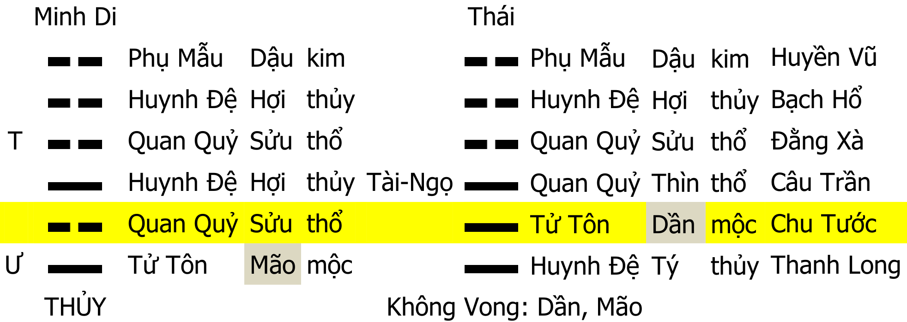
    - **Hình này chứng minh điều gì**
      - Định vị các mốc tình duyên trắc trở và thời điểm kết hôn vào năm Mậu Tý 2008.
    - **Từ đâu mà thấy được**
      - Dụng thần Sửu thổ động hóa Dần mộc hồi đầu khắc; Phụ Mẫu Dậu kim Nguyệt phá Nhật hợp.
  - **Phán đoán chi tiết:**
    - Căn cứ:
      - Dụng thần Quan Quỷ Sửu thổ bị Nguyệt lệnh Mão mộc khắc thương nhưng được Nhật thần Thìn thổ trợ phù, suy vượng giằng co; điểm then chốt là Dụng thần tự động hóa Tử Tôn Dần mộc hồi đầu khắc: báo hiệu đường duyên phận gặp nhiều trắc trở, hôn nhân bất hòa, khó thành tựu sớm.
      - Hào 6 Phụ Mẫu Dậu kim (chủ hôn thú, giá thú) tuy bị Nguyệt phá (Mão Dậu tương xung) nhưng lại được Nhật thần Thìn thổ tương hợp để giải Phá (Thìn Dậu lục hợp): tượng trong hung tàng cát, khẳng định tương lai chắc chắn sẽ có hôn nhân đường hoàng.
      - Năm 1997 Đinh Sửu: Dụng thần Sửu thổ phát động gặp Trị (năm Sửu); năm này xuất hiện cơ hội yêu đương, nhưng vì hào biến Dần mộc hồi đầu khắc nên mối tình nhanh chóng tan vỡ.
      - Năm 2004 Giáp Thân: Thái Tuế Thân kim xung khắc mất hào biến Dần mộc (Dần Thân tương xung), giải cứu Sửu thổ nên lại có đối tượng tìm hiểu; tuy nhiên hào biến Dần mộc vốn lâm Tuần Không, gặp Thân kim xung trở thành "xung thực", Dần mộc vẫn phát huy lực khắc chế Dụng thần, khiến mối quan hệ tiếp tục bất ổn và chia tay.
      - Năm 2007 Đinh Hợi: Thái Tuế Hợi thủy tương hợp trói chặt hào biến Dần mộc (Dần Hợi lục hợp), hào biến bị trói không thể hồi đầu khắc hại Dụng thần; năm này ắt nảy nở tình cảm mới thắm thiết.
      - Năm 2008 Mậu Tý: Chi Tý tương hợp với Dụng thần Quan Quỷ Sửu thổ (Tý Sửu lục hợp), vừa là hợp hào Thế vừa hợp Dụng thần, chính là tiêu chuẩn đại ứng kỳ thành hôn; khẳng định năm 2008 sẽ kết hôn.
    - Nhìn vào:
      - Phân tích sâu sắc sự khác biệt giữa "xung hào Không" năm Thân (xung thực nên vẫn bị khắc) và "hợp hào biến" năm Hợi (trói chân Kỵ thần nên được yên ổn).
      - Điểm tựa vững chắc của Phụ Mẫu Dậu kim "Nguyệt phá phùng Nhật hợp" để khẳng định chung cuộc đương số vẫn lấy được chồng.
  - **Ứng nghiệm thực tế:**
    - Đương số phản hồi: Đúng năm 1997 có một mối tình tha thiết nhưng thất bại; năm 2004 lại yêu một người nhưng rồi cũng chia tay dở dang; năm 2007 quen bạn trai mới và đến năm 2008 hai người đã chính thức đính hôn và tiến tới hôn lễ.

- **Ví dụ 4: Nữ đoán bệnh tật chuyển sang đoán hôn nhân (Ngày Ất Hợi tháng Ngọ năm Giáp Thân)**
  - **Bối cảnh & Chọn Dụng thần:**
    - Ngày Ất Hợi tháng Ngọ năm Giáp Thân (Tuần không: Thân, Dậu).
    - Nữ nhân sinh năm 1974 (Giáp Dần, 31 tuổi) vừa từ bệnh viện trở về liền đến xin xem quẻ bệnh tật, được quẻ Cấn Vi Sơn biến Thủy Địa Tỷ.
    - Sau khi đoán bệnh chuẩn xác đến kinh ngạc, cô gái thỉnh cầu luận giải tiếp về vận trình hôn nhân của mình.
    - Luận bệnh lấy hào Thế làm Dụng thần; luận hôn nhân lấy Quan Quỷ làm Dụng thần.
  - **Hình 267.** Quẻ Cấn Vi Sơn biến Thủy Địa Tỷ
    - 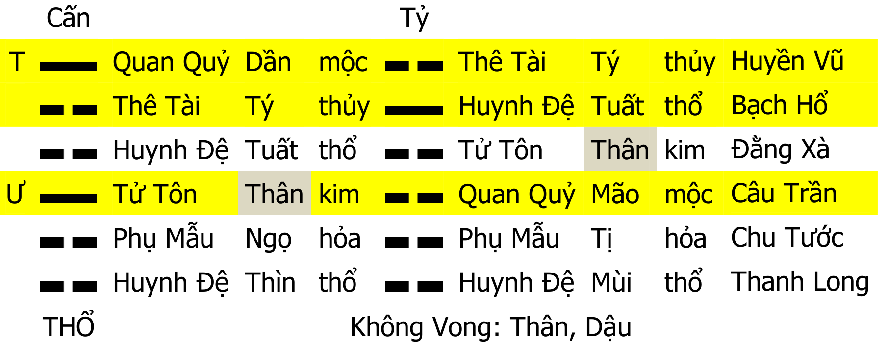
    - **Hình này chứng minh điều gì**
      - Khắc họa bệnh tật tử cung và lịch trình hôn nhân ly thân, ngoại tình qua các lưu niên.
    - **Từ đâu mà thấy được**
      - Hào 3 Tử Tôn Thân kim động khắc Thế hóa Quỷ; Thế Dần mộc hóa Tuyệt Nguyệt phá.
  - **Phán đoán chi tiết:**
    - Căn cứ:
      - **Về phương diện bệnh tật:**
        - Hào Thế Quan Quỷ Dần mộc tại hào 6 được Nhật Hợi thủy sinh, động hóa Thê Tài Tý thủy hồi đầu sinh, hào 5 động hóa Thân kim sinh Tý thủy sinh Thế: Thế vượng tướng. Nhưng hào 3 Tử Tôn Thân kim phát động khắc thẳng vào hào Thế, lại hóa ra Quan Quỷ Mão mộc; cái khắc Thế là bệnh, hóa ra Quan Quỷ cũng là bệnh.
        - Hào 3 là vị trí bụng dưới, tử cung; Tử Tôn cũng chủ tử cung; hóa ra Quan Quỷ Mão mộc là Thai địa của Tử Tôn Thân kim, càng khẳng định bệnh tại tử cung. Tử Tôn lâm Câu Trần chủ u cục, khối u; Mộc chủ con số 3; phán đoán trong tử cung có 3 khối u xơ.
        - Hào 6 là đầu não; Nguyên thần Thê Tài Tý thủy lâm Bạch Hổ Nguyệt phá, hào Thế cũng hóa Tý thủy Nguyệt phá; Thủy chủ huyết dịch, Bạch Hổ cũng là máu; phán đoán bị thiếu máu não. Thế lâm Huyền Vũ chủ hoa mắt chóng mặt; hào 5 Thủy chủ cổ họng hóa hồi đầu khắc; phán đoán cổ họng cũng đau yếu.
      - **Về phương diện hôn nhân:**
        - Lấy Quan Quỷ làm Dụng thần. Năm 1988 Mậu Dần (24 tuổi): Tuế vận tạo Thân Tý Thìn tam hợp Thủy cục sinh Quan Quỷ Dần mộc, lại xung mất Tuất thổ hồi đầu khắc Tý thủy (cứu vãn Nguyên thần); đương số vừa tròn tuổi xuân thì kết hôn.
        - Năm 1989 Kỷ Tị: Lưu niên Tị hỏa hợp trú Kỵ thần Tử Tôn Thân kim (Tị Thân lục hợp); quẻ Cấn là thiếu nam, Tử Tôn là hào dương; phán đoán năm này sinh con trai.
        - Căn nguyên rạn nứt: Quan Quỷ tuy trì Thế vượng tướng nhưng cư hào 6 (hào vị thoái hưu, ngoài rìa xã hội), lại hóa Nguyệt phá: tượng chồng "tuy có như không", đã ly thân từ lâu. Hào 3 Tử Tôn Thân kim phát động khắc Quan Quỷ nhưng lâm Tuần Không; năm 1992 Nhâm Thân Tử Tôn xuất Không bắt đầu xung đột bất hòa.
        - Năm 1994 Giáp Tuất: Tuất thổ trợ lực hồi đầu khắc Nguyên thần Tý thủy khiến Thủy không thể sinh Mộc, đồng thời Phụ Mẫu văn thư (hôn thú) nhập Mộ; phán đoán chính thức ly thân vào năm này.
        - Tâm trạng và ngoại tình: Thế hóa Nguyệt phá, Nguyên thần Nguyệt phá chủ tâm can vụn vỡ; Thế lâm Huyền Vũ chủ sầu muộn u uất. Hào 3 Tử Tôn động hóa Quan Quỷ Mão mộc, hào Thế hóa Tý thủy là đất Mộc Dục (đào hoa), lâm Huyền Vũ chủ ám muội; phán đoán cô sẽ nảy sinh tình cảm vụng trộm bên ngoài.
        - Năm 2001 Tân Tị: Tị hỏa hợp trú Kỵ thần Tử Tôn Thân kim giải cứu Quan Quỷ; Thân kim động hóa Quan Quỷ gặp hợp là ứng kỳ xuất hiện đàn ông; phán đoán năm này có người đàn ông muốn cưới cô, người này rất thích ca hát và hát rất hay (Thân kim Không Vong là tượng "kim Không tắc minh" - kim rỗng phát ra tiếng vang lớn; Tử Tôn chủ vui chơi, ca múa).
        - Năm 2004 Giáp Thân (năm dự trắc): Tử Tôn Thân kim xuất Không hóa Quan Quỷ Mão mộc; phán đoán tháng Mão vừa qua đã xuất hiện nhân tình mới. Thân kim xuất Không xung mất Quan Quỷ bên cạnh (dẹp bỏ ưu sầu), nên ở bên người này cô rất vui vẻ. Song Thân kim xuất Không đi sinh Thê Tài, mà Thê Tài lại hóa hồi đầu khắc; phán đoán người tình này chuyên bòn rút, tiêu xài tiền bạc của cô.
    - Nhìn vào:
      - Sự liền mạch tuyệt luân giữa chẩn đoán hình thái bệnh tật (u xơ tử cung Câu Trần, thiếu máu Bạch Hổ) và chẩn đoán nhân duyên lưu niên.
      - Tượng "kim Không tắc minh" lột tả chính xác sở thích ca hát của người tình năm 2001 khiến đương số từ chối phải chuyển sang thừa nhận.
  - **Ứng nghiệm thực tế:**
    - Đương số kinh ngạc tột cùng: Cô vừa siêu âm tại bệnh viện phát hiện đúng 3 khối u xơ tử cung, bị thiếu máu não và viêm họng.
    - Về hôn nhân: Đúng năm 1988 kết hôn, năm 1989 sinh con trai, năm 1992 cãi vã và năm 1994 ly thân. Năm 2001 quả thực có một người đàn ông hát rất hay theo đuổi đòi cưới nhưng cô từ chối. Tháng Mão năm Giáp Thân vừa qua cô đã quen một người đàn ông mới, cảm thấy rất vui vẻ say đắm nhưng anh ta liên tục tiêu tiền của cô.

- **Ví dụ 5: Nam đoán hôn nhân qua các mối tình lưu niên (Ngày Giáp Tý tháng Sửu năm Bính Tuất)**
  - **Bối cảnh & Chọn Dụng thần:**
    - Ngày Giáp Tý tháng Sửu năm Bính Tuất (Tuần không: Tuất, Hợi).
    - Nam nhân đến xin xem quẻ hỏi khi nào lấy được vợ, được quẻ Thiên Hỏa Đồng Nhân biến Thiên Sơn Độn.
    - Lấy Thê Tài làm Dụng thần. Hào Ứng là thê vị lâm Tuần Không: hiện tại đương số vẫn hoàn toàn độc thân, chưa kết hôn.
  - **Hình 268.** Quẻ Thiên Hỏa Đồng Nhân biến Thiên Sơn Độn
    - 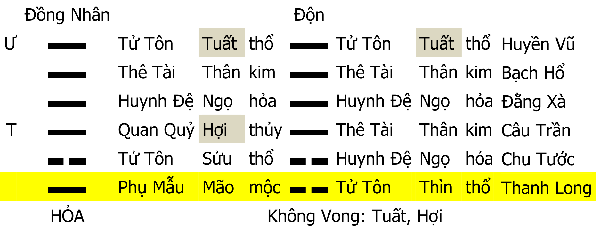
    - **Hình này chứng minh điều gì**
      - Miêu tả diện mạo các bạn gái từng năm và dự đoán chuẩn xác thời điểm kết hôn năm Đinh Hợi.
    - **Từ đâu mà thấy được**
      - Thế Ứng đồng cung Càn; hào sơ Mão mộc động hợp Ứng Tuất thổ; Thế xuất Không năm Hợi.
  - **Phán đoán chi tiết:**
    - Căn cứ:
      - Hào Thế Quan Quỷ Hợi thủy và hào Ứng Tử Tôn Tuất thổ đồng cung Càn; hào Thế lâm Câu Trần (tượng cố định, bất động, công sở): phán đoán đối tượng hôn phối là người cùng quê hoặc là đồng nghiệp cùng cơ quan.
      - Hào sơ Phụ Mẫu Mão mộc phát động tương hợp với hào Ứng Tuất thổ (Mão Tuất lục hợp): Mão mộc ứng với năm 1999 Kỷ Mão, năm này có bạn gái.
      - Dung mạo bạn gái năm 1999: Mão mộc lâm Thái Tuế nên dáng người cao ráo, thanh mảnh. Hợp Tuất thổ lâm Huyền Vũ chủ phong tình, quyến rũ, nhan sắc rất đẹp. Hợp Tử Tôn chủ nghệ thuật, cô gái có khiếu thẩm mỹ nghệ thuật. Tuất thổ là Dịch Mã chủ hay di chuyển, thường xuyên đi công tác xa. Tuất thổ ở hào 6 là đầu, Huyền Vũ chủ màu đen, Mão mộc (chủ râu tóc) từ hào sơ vươn lên hợp hào 6: mái tóc đen nhánh và rất dài. Hào 6 là mặt, Thổ chủ mũi, Thổ vượng tướng: sống mũi cao thẳng thanh tú.
      - Năm 2000 Canh Thìn: Thìn thổ xung thực hào Ứng Tuất thổ; hào sơ Mão mộc động biến Thìn thổ nên cô gái này có liên hệ mật thiết với năm Kỷ Mão (bạn gái cũ quay lại). Canh Thìn nạp âm Bạch Lạp Kim: làn da trắng nõn nà; Kim chủ tài chính kinh doanh: cô gái tự mở công ty buôn bán. Canh Thìn là Mộ khố của Thế và Quan Quỷ (Mộ khố chủ giam cầm, quản lý): tính cách độc đoán, thích kiểm soát và chỉ huy đàn ông.
      - Năm 2001 Tân Tị: Tị hỏa xung thực hào Thế Hợi thủy, đồng thời tương hợp với hào 5 Thê Tài Thân kim (Tị Thân lục hợp): xuất hiện bạn gái mới. Thân kim tại hào 5 (hào đường lộ): quen nhau trên đường đi lại. Tị hỏa là Trường Sinh của Thê Tài Thân kim: cô gái công tác trong ngành tài chính, ngân hàng.
      - Ứng kỳ kết hôn: Người hỏi quẻ cắt ngang: "Phán đoán phía trước đều đúng, ông không cần đoán từ năm này sang năm khác, xem khi nào tôi có thể kết hôn?". Tác giả quán xét: Hào Thế Hợi thủy lâm Tuần Không, chưa được Thê Tài sinh trợ; phải đợi đến năm 2007 Đinh Hợi khi hào Thế xuất Không mới có thể thành hôn viên mãn.
    - Nhìn vào:
      - Nghệ thuật trích xuất thông tin nhân dạng đỉnh cao qua nạp âm Bạch Lạp Kim (da trắng), hào sơ Mão hợp hào 6 Huyền Vũ (tóc dài đen), Thổ vượng hào 6 (mũi cao thẳng).
      - Cơ chế Thế nhập Mộ Thái Tuế giải mã tính thích ra lệnh, kiểm soát đàn ông của bạn gái năm Thìn.
  - **Ứng nghiệm thực tế:**
    - Bạn gái năm 1999 là đồng nghiệp, dung mạo tóc dài mũi cao hoàn toàn chuẩn xác. Năm 2000 hai người quay lại sống chung một thời gian, cô gái da trắng, làm chủ doanh nghiệp, tính hay ra lệnh; do người nam tự ý tuyên bố muốn cưới trước mặt cha mẹ cô khiến cô giận dữ chia tay.
    - Bạn gái năm 2001 quen trên một chuyến xe lửa ngồi chung lô ghế, cô làm việc tại ngân hàng.
    - Cuối năm Đinh Hợi (2007), người nam chính thức cử hành hôn lễ kết hôn đúng như lời tiên tri.

- **Ví dụ 6: Người chị đoán hôn nhân cho em trai (Ngày Quý Hợi tháng Tuất năm Quý Mùi)**
  - **Bối cảnh & Chọn Dụng thần:**
    - Ngày Quý Hợi tháng Tuất năm Quý Mùi (Tuần không: Tý, Sửu).
    - Người phụ nữ đến xem vận duyên cho em trai sinh năm 1978 (Mậu Ngọ, 25 tuổi), được quẻ Địa Hỏa Minh Di biến Sơn Thiên Đại Súc.
    - Lấy Thê Tài làm Dụng thần. Thê Tài Ngọ hỏa hưu tù, phục tàng dưới hào 3 Huynh Đệ Hợi thủy, không xuất hiện trên quẻ: hiện tại người em trai chưa kết hôn.
  - **Hình 269.** Quẻ Địa Hỏa Minh Di biến Sơn Thiên Đại Súc
    - 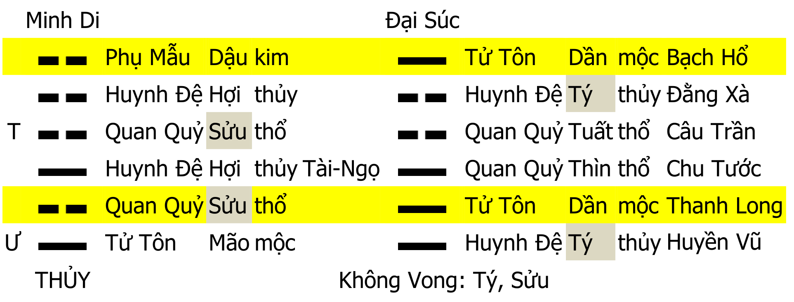
    - **Hình này chứng minh điều gì**
      - Làm rõ các mối tình đã qua và người vợ tương lai tuổi Mùi do người quen mai mối.
    - **Từ đâu mà thấy được**
      - Thê Tài Ngọ hỏa phục tàng; năm Tị hợp kim cục; năm Mùi xung thực Thế hợp Thê Tài.
  - **Phán đoán chi tiết:**
    - Căn cứ:
      - Năm 2001 Tân Tị: Thái Tuế Tị hỏa xung khai Phi thần Huynh Đệ Hợi thủy (Tị Hợi tương xung), Dụng thần phục tàng được xuất lộ, bản thân Thái Tuế cũng là Thê Tài: năm này có bạn gái. Tuy nhiên Thê Tài Tị hỏa lại cùng Phụ Mẫu Dậu kim và Quan Quỷ Sửu thổ hợp thành Kim cục (Tị Dậu Sửu tam hợp), quy về một mối với Phụ Mẫu Dậu kim nên tình duyên tan vỡ. Phụ Mẫu lâm Bạch Hổ (xe cộ, đường sá), Dậu kim là Dịch Mã: tổ hợp tài xế lái xe; phán đoán cô bạn gái bị một người tài xế quyến rũ bỏ đi.
      - Năm 2002 Nhâm Ngọ: Dụng thần phục tàng Ngọ hỏa gặp Thái Tuế lâm Trị xuất hiện, lâm Chu Tước chủ ngôn ngữ giao tiếp: quen biết bạn gái qua trò chuyện trên mạng (chat internet). Nhâm Ngọ nạp âm Dương Liễu Mộc, Thái Tuế là Thê Tài: vóc dáng thon thả xinh đẹp, rất nữ tính. Nhưng Ngọ hỏa phục dưới Huynh Đệ lại nhập Mộ tại Nguyệt lệnh Tuất thổ: cô gái không đoan trang, từng quan hệ phức tạp với nhiều đàn ông. Thái Tuế Ngọ hỏa khắc Dậu kim (Thai địa của Tử Tôn), Dậu kim lâm Bạch Hổ hóa Tuyệt: cô gái từng bị sảy thai hoặc phá thai.
      - Năm 2003 Quý Mùi (năm dự trắc): Thái Tuế Mùi thổ xung thực hào Thế Quan Quỷ Sửu thổ (Sửu Mùi tương xung), đồng thời tương hợp với Thê Tài Ngọ hỏa (Ngọ Mùi lục hợp): lại có cơ hội bàn chuyện trăm năm. Mùi thổ là con Dê: đối tượng cầm tinh con Dê. Ngũ hành Thái Tuế và hào Thế đều là Thổ: do người quen/hàng xóm mai mối giới thiệu. Hào Thế lâm Tuần Không chủ do dự không ưng thuận, bị xung thực chủ bị người khác thuyết phục mà gật đầu đồng ý. Thái Tuế là Quan Quỷ chủ dung mạo xấu xí, thô kệch. Khẳng định người em trai sẽ cưới cô gái này làm vợ.
    - Nhìn vào:
      - Sự kết hợp tinh vi giữa Phụ Mẫu, Bạch Hổ và Dịch Mã để chỉ ra người thứ ba là tài xế taxi.
      - Tượng Thai địa lâm Bạch Hổ hóa Tuyệt bóc trần quá khứ nạo phá thai do mang thai ngoài tử cung của cô bạn gái trên mạng.
  - **Ứng nghiệm thực tế:**
    - Người chị xác nhận: Năm 2001 bạn gái của em trai bị một tài xế taxi dụ dỗ bỏ trốn.
    - Năm 2002 quen bạn gái qua mạng internet, cô gái rất xinh đẹp nhưng từng sống chung với người khác và phải phá thai do chửa ngoài tử cung.
    - Năm 2003 bạn bè giới thiệu cô gái hàng xóm tuổi Mùi; người em chê xấu kiên quyết từ chối, nhưng nhờ người mai mối hết lời khuyên nhủ nên đã chấp thuận; hai người chính thức kết hôn vào tháng Chạp năm Quý Mùi.

- **Ví dụ 7: Nam 38 tuổi chưa vợ đoán hạn hôn nhân (Ngày Nhâm Thân tháng Thìn năm Đinh Hợi)**
  - **Bối cảnh & Chọn Dụng thần:**
    - Ngày Nhâm Thân tháng Thìn năm Đinh Hợi (Tuần không: Tuất, Hợi).
    - Nam nhân sinh năm 1970 (Canh Tuất, 38 tuổi) đến gieo quẻ hỏi khi nào lấy được vợ, được quẻ Thiên Địa Bĩ biến Thủy Sơn Kiển.
    - Lấy Thê Tài làm Dụng thần. Hào Thế Thê Tài Mão mộc không được Nhật Nguyệt sinh trợ, bị Nhật Thân kim khắc, tự động hóa Huynh Đệ Thân kim hồi đầu khắc; lại là quẻ Lục Hợp biến Lục Hợp: tượng hôn nhân vô cùng trắc trở, kết hôn cực kỳ muộn.
  - **Hình 270.** Quẻ Thiên Địa Bĩ biến Thủy Sơn Kiển
    - 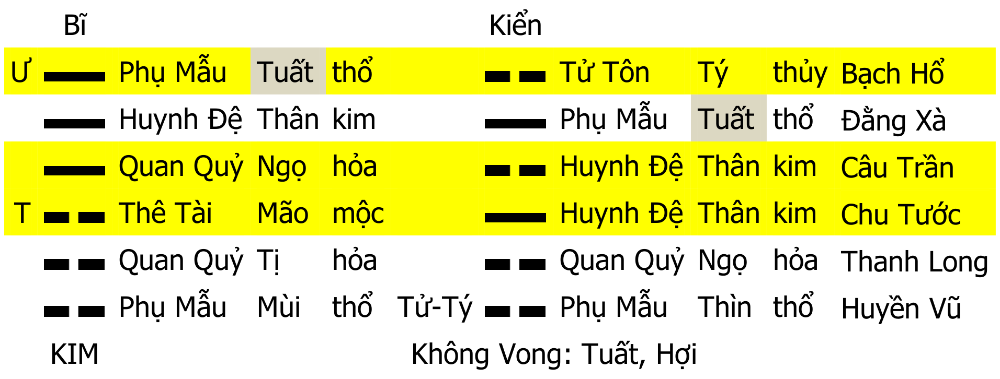
    - **Hình này chứng minh điều gì**
      - Giải mã nguyên nhân muộn vợ do cha mẹ chi phối và ứng kỳ kết hôn năm Canh Dần 2010.
    - **Từ đâu mà thấy được**
      - Thế Thê Tài Mão mộc bị Phụ Mẫu Tuất thổ hợp trú, động hóa Huynh Đệ Thân kim hồi đầu khắc.
  - **Phán đoán chi tiết:**
    - Căn cứ:
      - Hào Thế Thê Tài Mão mộc bị hào 6 Phụ Mẫu Tuất thổ tương hợp trói chặt (Mão Tuất lục hợp): việc hôn nhân của bản thân hoàn toàn do cha mẹ chi phối, người lớn trong nhà quyết định gật đầu mới xong.
      - Nghề nghiệp và cơ duyên cửa Phật: Hào Thế lâm Chu Tước (văn thư, giáo dục), động hợp Phụ Mẫu (văn hóa, giấy tờ): đương số có tài viết lách hội họa, từng làm nghề dạy học. Hào Thế hợp Phụ Mẫu Tuất thổ ở hào 6 (hào vị chùa chiền, miếu vũ); Tuất thổ là Mộ khố của Quan Quỷ Hỏa (Quan Quỷ là Thần Phật, Mộ khố Thần Phật chính là chùa miếu): đương số có nhân duyên cực kỳ thâm sâu với cửa chùa, từng gắn bó lâu năm nơi cửa Phật.
      - Diễn biến các lưu niên:
        - Năm 2000 Canh Thìn: Thìn thổ xung khai Mão Tuất hợp, xung thực hào Ứng Tuất thổ: bắt đầu tiếp xúc phụ nữ, bước vào vận trình tình cảm. Nhưng Tuất thổ bị Nguyệt phá và Tuế phá nên việc không thành.
        - Năm 2001 Tân Tị: Thái Tuế Tị hỏa hợp trú hào biến Huynh Đệ Thân kim (Tị Thân lục hợp giải phóng lực khắc cho Mão mộc): có dịp tìm hiểu yêu đương. Song Nhật, hào biến và trong quẻ có tới 3 chữ Thân kim (Huynh Đệ); Huynh Đệ là bạn bè giao tế: cô gái có mạng lưới quan hệ xã hội quá rộng, bạn bè quá nhiều, mẹ đương số không ưng ý nên phản đối chia tay.
        - Năm 2003 Quý Mùi và năm 2004 Giáp Thân: Năm Mùi Dụng thần Mão mộc nhập Mộ; năm Thân Dụng thần bị Kỵ thần khắc tuyệt; hai năm này hoàn toàn không có bóng dáng người nữ nào.
        - Năm 2005 Ất Dậu: Thê Tài Mão mộc bị Thái Tuế Dậu kim xung khai hợp. Hào 6 Tuất thổ đại diện cho nước ngoài, bị xung khai hợp: bạn gái từ nước ngoài trở về. Nhưng Thái Tuế Dậu kim là Huynh Đệ xung khắc Thê Tài: bạn gái tiêu xài tiền bạc hoang phí như nước.
        - Năm 2006 Bính Tuất: Hào Ứng thực phá thực Không, lại hợp trú Thê Tài Mão mộc: có bạn gái mới. Nhưng Phụ Mẫu trong quẻ lâm Tuần Không (không có giấy hôn thú): hai người chỉ sống chung tạm bợ, người nữ không có ý thức kết hôn ngay mà muốn chờ vài năm nữa, đương số tuổi cao không thể chờ nên đành chia tay.
        - Năm 2007 Đinh Hợi (năm dự trắc): Dụng thần hưu tù gặp Thái Tuế Hợi thủy là đất Trường Sinh: có bạn gái mới. Tháng giêng là tháng Dần xung mất hào biến Thân kim: vừa ra giêng đã có đối tượng. Đất Trường Sinh là giai đoạn sơ sinh non nớt: bạn gái quen năm nay tuổi tác nhỏ hơn đương số rất nhiều.
      - Ứng kỳ kết hôn tương lai: Người hỏi quẻ hỏi: "Tôi còn phải chờ đến lúc nào mới lấy được vợ?". Tác giả đáp: Năm 2010 Canh Dần, Thái Tuế Dần mộc xung tuyệt hào biến Huynh Đệ Thân kim (Dần Thân tương xung), vĩnh viễn tiêu trừ mầm mống hồi đầu khắc, năm 2010 mới là năm chính thức kết hôn.
    - Nhìn vào:
      - Tượng Phụ Mẫu Tuất thổ ở hào 6 làm Mộ khố Quan Quỷ giải mã trọn vẹn 9 năm sống vẽ tranh trong chùa.
      - Tượng hào biến Thân kim liên tục bị kích hoạt hoặc khắc chế qua từng lưu niên chỉ điểm chuẩn xác từng đặc tính của các đối tượng hẹn hò.
  - **Ứng nghiệm thực tế:**
    - Đương số thừa nhận mọi chuyện chuẩn xác như nhìn thấy tận mắt:
      - Chuyện hôn nhân hoàn toàn do cha mẹ chi phối; bản thân học mỹ thuật, từng đi dạy học sau đó bỏ việc; từng sống trong chùa 9 năm chuyên vẽ tranh Phật giáo.
      - Năm 2000 có nhiều người mai mối nhưng không thành; năm 2001 bạn gái giao du quá rộng bị mẹ chê không đứng đắn; năm 2003 và 2004 không có bạn gái.
      - Năm 2005 quen hai người bạn gái (một người từ Nhật Bản, một người từ Singapore về), cả hai đều tiêu tiền bạt mạng nên mẹ phản đối.
      - Năm 2006 bạn gái đòi tìm hiểu vài năm mới cưới nên chia tay. Năm 2007 quen hai cô gái kém hơn mười mấy tuổi mẹ chê cọc cạch không xứng, bạn gái năm 2005 quay lại mẹ cũng không ưng.
      - Lời hẹn năm 2010 Canh Dần kết hôn chờ đợi ứng nghiệm trong tương lai.
