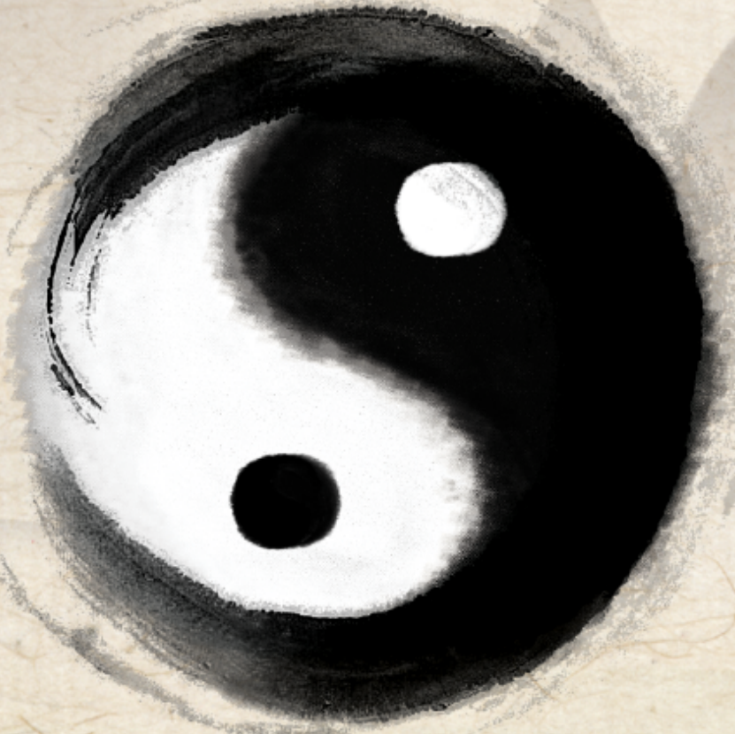

# Vương Hổ Ứng

# LỤC HÀO
## NHÂN DUYÊN DỰ TRẮC HỌC

LOIHOAPHONG.COM

# LỤC HÀO NHÂN DUYÊN DỰ TRẮC HỌC

**Nguyên tác:** Vương Hổ Ứng lão sư  
**Người dịch:** Trần Phương

# MỤC LỤC

LỜI TỰA .................................................................................................................... 3
PHẦN CƠ SỞ ........................................................................................................... 4
CHƯƠNG 1: DỤNG THẦN .................................................................................... 4
CHƯƠNG 2: CÁCH DÙNG HÀO VỊ ...................................................................... 10
CHƯƠNG 3: Ý NGHĨA CỦA LỤC THÂN.............................................................. 16
CHƯƠNG 4: TƯỢNG LỤC THẦN ......................................................................... 22
CHƯƠNG 5: TƯỢNG LỤC THÂN HỖ HÓA .......................................................... 28
CHƯƠNG 6: Ý NGHĨA CỦA DỤNG THẦN LƯỠNG HIỆN .................................... 34
CHƯƠNG 7: Ý NGHĨA CỦA DỤNG THẦN PHỤC TÀNG ..................................... 39
CHƯƠNG 8: Ý NGHĨA CỦA TIẾN THẦN VÀ THOÁI THẦN ................................. 45
CHƯƠNG 9: Ý NGHĨA CỦA NGUYỆT PHÁ .......................................................... 51
CHƯƠNG 10: Ý NGHĨA CỦA KHÔNG VONG ...................................................... 56
CHƯƠNG 11: Ý NGHĨA CỦA LỤC HỢP VÀ LỤC XUNG ..................................... 62
CHƯƠNG 12: Ý NGHĨA CỦA PHẢN NGÂM VÀ PHỤC NGÂM ............................. 68
CHƯƠNG 13: Ý NGHĨA CỦA DU HỒN VÀ QUY HỒN .......................................... 73
CHƯƠNG 14: ỨNG DỤNG CỦA 12 CUNG TRƯỜNG SINH .................................. 79
PHẦN KỸ THUẬT .................................................................................................. 86
CHƯƠNG 1: PHƯƠNG PHÁP PHÁN ĐOÁN TÍNH CÁCH ..................................... 86
CHƯƠNG 2: PHƯƠNG PHÁP PHÁN ĐOÁN TƯỚNG MẠO.................................. 92
CHƯƠNG 3: HƯƠNG KHUÊ VÀ SÀNG TRƯỚNG ............................................... 102
CHƯƠNG 4: ĐÀO HOA VÀ DỊCH MÃ ................................................................. 108
CHƯƠNG 5: PHƯƠNG VỊ NHÂN DUYÊN ........................................................... 115
CHƯƠNG 6: KHOẢNG CÁCH NHÂN DUYÊN ..................................................... 122
CHƯƠNG 7: HÔN NHÂN SỚM HAY MUỘN ........................................................ 130
CHƯƠNG 8: ỨNG KỲ HÔN NHÂN ....................................................................... 137
PHẦN THỰC TẾ .................................................................................................... 142
CHƯƠNG 1: TÌNH YÊU......................................................................................... 142
CHƯƠNG 2: XEM MẶT ........................................................................................ 155
CHƯƠNG 3: VỊ HÔN ĐỒNG CƯ .......................................................................... 161

CHƯƠNG 4: ĐỜI SỐNG VỢ CHỒNG........................................................................... 169

CHƯƠNG 5: NGOẠI TÌNH........................................................................................ 181

CHƯƠNG 6: ĐỒNG TÍNH ......................................................................................... 196

CHƯƠNG 7: HÔN NHÂN BẤT HẠNH..................................................................... 199

CHƯƠNG 8: KẾT HÔN............................................................................................. 204

CHƯƠNG 9: LY HÔN ............................................................................................... 215

CHƯƠNG 10: TÁI HÔN............................................................................................ 222

CHƯƠNG 11: CÔ ĐỘC SUỐT ĐỜI.......................................................................... 226

CHƯƠNG 12: PHÂN TÍCH LƯU NIÊN HÔN NHÂN................................................ 231

# LỜI TỰA

Chúng ta đều biết gia đình là đơn vị cấu thành cơ bản nhất của xã hội, mỗi gia đình riêng lẻ tạo nên toàn bộ xã hội của chúng ta, và hôn nhân là sợi dây gắn kết quan trọng để duy trì một gia đình. Chính là "cô âm bất sinh, cô dương bất trường". Nên một người sau khi trưởng thành sẽ đi tìm nửa kia của bản thân, thông qua hôn nhân để xây dựng một gia đình thuộc về mình, gia đình đóng một vai trò quan trọng trong quá trình phát triển của nhân loại. Từ xưa đến nay, hôn nhân ở trong văn hóa truyền thống Trung Quốc là hết sức quan trọng, được coi là "chung thân đại sự". Bởi vậy có thể thấy được vị trí của nó ở trong suy nghĩ người ta. Hôn nhân người xưa là ý cha mẹ, lời mối mai, dưới sự trói buộc của luân lý đạo đức truyền thống tam cương ngũ thường nên tương đối là ổn định. Cùng với sự phát triển của thời đại, luân lý đạo đức truyền thống liên tục chịu ảnh hưởng của tư tưởng phương Tây, hệ thống các giá trị và quan điểm về hôn nhân đang lặng lẽ thay đổi một cách rõ rệt, tỷ lệ ly hôn có chiều hướng tăng lên qua từng năm.

Hôn nhân mỹ mãn là nền tảng bảo đảm cho gia đình hạnh phúc, là điều mà mỗi người đều muốn có được. Nhưng không phải tất cả mọi người đều có thể toại nguyện, hôn nhân bất hạnh ở trong cuộc sống của chúng ta nơi nào cũng có. Trong sự nghiệp dự đoán của tôi, người xem quẻ xin đoán nhân duyên chiếm một phần rất lớn. Từ đó có thể thấy được sự coi trọng của người ta đối với hôn nhân và mức độ phức tạp của vấn đề tình cảm đối với họ. Một kết quả bất hạnh, chắc chắn là bắt nguồn từ một sai lầm khởi đầu. Để biết trước kết quả thì cần dựa vào lục hào dự đoán học bắt nguồn từ nguyên lý Kinh Dịch. Lục hào dự đoán học có thể thông qua cơ chế dự đoán vượt thời gian không gian phản ánh khách quan quá trình phát triển và kết quả của sự vật. Có thể cung cấp ý kiến tham khảo có giá trị trong việc lựa chọn hôn nhân.

Tôi qua thời gian dài thực hành đã phát hiện rất nhiều quy luật và phương pháp trong lục hào dự đoán nhân duyên, đồng thời cũng đã đính chính một số nhận thức sai lầm của người xưa về mặt này. Tuy nhiên vẫn còn rất nhiều vấn đề cần được tiếp tục nghiên cứu, hy vọng nhiều người hiểu biết hơn sẽ gia nhập vào đội ngũ nghiên cứu này, để lục hào dự đoán học có nghìn năm lịch sử góp phần xây dựng gia đình và xã hội hài hòa hơn.

Vương Hổ Ứng

# PHẦN CƠ SỞ

## CHƯƠNG 1: DỤNG THẦN

Lục hào dự đoán hôn nhân căn cứ vào nam nữ khác nhau mà Dụng thần cũng khác nhau. Nam dự đoán hôn nhân lấy Thê Tài làm Dụng thần. Nữ dự đoán hôn nhân thì lấy Quan Quỷ làm Dụng thần. Hào Ứng đại diện đối phương và gia đình đối phương. Bất kể là chính mình đến xem, người nhà, bạn bè, đại diện nhà trai đến xem thì lấy Thê Tài làm Dụng thần, đại diện nhà gái đến xem thì lấy Quan Quỷ làm Dụng thần.

Dự đoán hôn nhân của cha mẹ thì lấy Phụ Mẫu làm Dụng thần.

Dự đoán ngoại tình cũng căn cứ nam nữ khác nhau, nam lấy Thê Tài làm Dụng thần, nữ lấy Quan Quỷ làm Dụng thần.

Nếu như một cá nhân nào đó dự đoán thì lấy hào Thế đại diện người này, mà không xem Thê Tài, Quan Quỷ.

Dự đoán giấy kết hôn thì lấy Phụ Mẫu làm Dụng thần.

Dự đoán vai trò của người làm mối thì lấy hào Ứng làm Dụng thần.

Dự đoán tình hình và thái độ của gia đình đối phương thì lấy hào Ứng làm Dụng thần.

Nói chung Dụng thần nên vượng tướng, nên được Nhật Nguyệt hào động sinh phù, nên hóa hồi đầu sinh. Kỵ thần phát động, cần xem sức lực Kỵ thần như thế nào, hưu tù chỉ là tạm thời bất lợi mà thôi, chờ sau khi Kỵ thần bị chế phục thì sẽ xuất hiện chuyển biến tốt. Tuy nhiên Dụng thần cũng sợ quá vượng, quá vượng thì vật cực tất phản, cũng là thông tin hôn nhân không tốt.

**Ví dụ 1:** Ngày Tân Sửu tháng Tị năm Ất Dậu, dự đoán hôn sự con gái, được quẻ Địa Sơn Khiêm biến Địa Thủy Sư.

| | Khiêm | Phục thần | Sư | Lục thú |
| :---: | :--- | :---: | :--- | :--- |
| | ▅▅ ▅▅ Huynh Đệ Dậu kim | | ▅▅ ▅▅ Huynh Đệ Dậu kim | Đằng Xà |
| T | ▅▅ ▅▅ Tử Tôn Hợi thủy | | ▅▅ ▅▅ Tử Tôn Hợi thủy | Câu Trần |
| | ▅▅ ▅▅ Phụ Mẫu Sửu thổ | | ▅▅ ▅▅ Phụ Mẫu Sửu thổ | Chu Tước |
| | ▅▅▅▅▅ Huynh Đệ Thân kim | | ▅▅ ▅▅ Quan Quỷ Ngọ hỏa | Thanh Long |
| Ư | ▅▅ ▅▅ Quan Quỷ Ngọ hỏa | Tài-Mão | ▅▅▅▅▅ Phụ Mẫu Thìn thổ | Huyền Vũ |
| | ▅▅ ▅▅ Phụ Mẫu Thìn thổ | | ▅▅ ▅▅ Thê Tài Dần mộc | Bạch Hổ |

KIM Không Vong: Thìn, Tị

Lấy Quan Quỷ làm Dụng thần. Quan Quỷ Ngọ hỏa được Nguyệt phù là vượng tướng, hôn sự có thể thành.

Thê Tài Mão mộc phục dưới Dụng thần, cho biết đối phương có bạn gái hoặc đã kết hôn. Dụng thần động hóa Phụ Mẫu, Phụ Mẫu là giấy kết hôn, biểu thị người kia đã kết hôn, nhưng hóa ra Phụ Mẫu Không Vong là sắp ly hôn.

Hào Thế Tử Tôn Hợi thủy đại diện con gái. Bị Nguyệt Quan Quỷ Tị hỏa xung phá, Quan Quỷ là người nam, xung phá Tử Tôn là con gái đã mất trinh. Tị hỏa xung phá, Nguyệt phá có thể ứng xung phá, vì vậy phán đoán là năm Tân Tị mất trinh.

**Phản hồi:** Quả nhiên năm Tân Tị con gái mất trinh. Hiện tại bạn trai của con gái đang có vợ. Ba ngày sau họ ly hôn.

**Ví dụ 2:** Ngày Đinh Sửu tháng Ngọ, nữ đoán hôn nhân, được quẻ Phong Lôi Ích biến Hỏa Lôi Phệ Hạp.

| | Ích | Phục thần | Phệ Hạp | Lục thú |
| :---: | :--- | :---: | :--- | :--- |
| Ư | ▅▅▅▅▅ Huynh Đệ Mão mộc | | ▅▅▅▅▅ Tử Tôn Tị hỏa | Thanh Long |
| | ▅▅▅▅▅ Tử Tôn Tị hỏa | | ▅▅ ▅▅ Thê Tài Mùi thổ | Huyền Vũ |
| | ▅▅ ▅▅ Thê Tài Mùi thổ | | ▅▅▅▅▅ Quan Quỷ Dậu kim | Bạch Hổ |
| T | ▅▅ ▅▅ Thê Tài Thìn thổ | Quan-Dậu | ▅▅ ▅▅ Thê Tài Thìn thổ | Đằng Xà |
| | ▅▅ ▅▅ Huynh Đệ Dần mộc | | ▅▅ ▅▅ Huynh Đệ Dần mộc | Câu Trần |
| | ▅▅▅▅▅ Phụ Mẫu Tý thủy | | ▅▅▅▅▅ Phụ Mẫu Tý thủy | Chu Tước |

MỘC Không Vong: Thân, Dậu

Lấy Quan Quỷ làm Dụng thần. Hương Khuê Dần mộc, Mão mộc hưu tù nhập Mộ, Quan Quỷ Không Vong không hiện trên quẻ, Phụ Mẫu biểu thị giấy kết hôn, Phụ Mẫu Nguyệt phá thuyết minh chưa kết hôn. Nhưng Quan Quỷ phục dưới hào Thế biểu thị đã có bạn trai.

Hào Thế sinh Quan Quỷ Dậu kim, nhưng Quan Quỷ Dậu kim Không Vong không được sinh, phục tàng lại biểu thị trốn tránh, thuyết minh thái độ của người nam không tích cực, không quan tâm đến tình yêu của cô ấy. Hào Thế lâm Đằng Xà, Đằng Xà chủ phiền não, thuyết minh cô đang ở trong một tâm trạng xấu. Hào 4 Mùi thổ động hóa Quan Quỷ, biểu thị bây giờ lại xuất hiện một người đàn ông. Vì vậy cô ta do dự.

**Phản hồi:** Thực tế đúng như phán đoán.

**Ví dụ 3:** Ngày Mậu Tuất tháng Dậu, nam dự đoán hôn nhân cháu gái, được quẻ Sơn Thiên Đại Súc biến Hỏa Lôi Phệ Hạp.

| | Đại Súc | Phệ Hạp | |
| :---: | :--- | :--- | :--- |
| | — Quan Quỷ Dần mộc | — Phụ Mẫu Tị hỏa | Chu Tước |
| Ư | - - Thê Tài Tý thủy | - - Huynh Đệ Mùi thổ | Thanh Long |
| | - - Huynh Đệ Tuất thổ | — Tử Tôn Dậu kim | Huyền Vũ |
| | — Huynh Đệ Thìn thổ Tử-Thân | - - Huynh Đệ Thìn thổ | Bạch Hổ |
| T | — Quan Quỷ Dần mộc Phụ-Ngọ | - - Quan Quỷ Dần mộc | Đằng Xà |
| | — Thê Tài Tý Thủy | — Thê Tài Tý thủy | Câu Trần |

THỔ Không Vong: Thìn, Tị

Lấy Quan Quỷ làm Dụng thần. Trong quẻ Quan Quỷ lưỡng hiện, lấy hào phát động làm Dụng thần. Quan Quỷ trì Thế biểu thị đã có bạn trai, Phụ Mẫu Ngọ hỏa phục tàng mà nhập Mộ, Mộ khố lâm Huyền Vũ, Phụ Mẫu là giấy kết hôn, phục tàng nhập Mộ biểu thị không thể công khai, Huyền Vũ lại chủ che dấu, vì vậy phán đoán hai người không có giấy kết hôn nhưng đã ở chung.

Dụng thần bị Nguyệt khắc hưu tù, nội quái phục ngâm, hai người bất hòa, không thể lâu dài.

**Phản hồi:** Quả nhiên ở chung cùng nhau, nhưng bất hòa, không thể giao tiếp, sau chia tay.

**Ví dụ 4:** Ngày Giáp Thìn tháng Dậu, nữ đoán ly hôn với chồng, được quẻ Hỏa Sơn Lữ biến Hỏa Địa Tấn.

| | Lữ | Tấn | |
| :---: | :--- | :--- | :--- |
| | — Huynh Đệ Tị hỏa | — Huynh Đệ Tị hỏa | Huyền Vũ |
| | - - Tử Tôn Mùi thổ | - - Tử Tôn Mùi thổ | Bạch Hổ |
| Ư | — Thê Tài Dậu kim | — Thê Tài Dậu kim | Đằng Xà |
| | — Thê Tài Thân kim Quan-Hợi | - - Phụ Mẫu Mão mộc | Câu Trần |
| | - - Huynh Đệ Ngọ hỏa | - - Huynh Đệ Tị hỏa | Chu Tước |
| T | - - Tử Tôn Thìn thổ Phụ-Mão | - - Tử Tôn Mùi thổ | Thanh Long |

HỎA Không Vong: Dần, Mão

Lấy Quan Quỷ làm Dụng thần. Quan Quỷ Hợi thủy phục tàng, chồng thường xuyên không về nhà. Phi thần Thê Tài Thân kim độc phát, tại hào 3 sinh Quan Quỷ, Thê Tài là phụ nữ, hào 3 là giường, biểu thị chồng đã có ngoại tình. Thê Tài Thân kim hóa ra Phụ Mẫu Không Vong, biểu thị người phụ nữ này đã ly hôn.

Hào Thế là Kỵ thần, biểu thị bản thân muốn ly hôn với chồng. Nhưng Quan Quỷ được Nguyệt sinh, hào động sinh là vượng tướng, không thể ly hôn.

**Phản hồi:** Kết quả là cô ta vẫn không thể ly hôn.

**Ví dụ 5:** Ngày Giáp Dần tháng Dần, nữ đoán quan hệ với người nam phát triển ra sao? Được quẻ Hỏa Phong Đỉnh biến Lôi Phong Hằng.

| | Đỉnh | Hằng | |
| :---: | :--- | :--- | :--- |
| | — Huynh Đệ Tị hỏa | - - Tử Tôn Tuất thổ | Huyền Vũ |
| Ư | - - Tử Tôn Mùi thổ | - - Thê Tài Thân kim | Bạch Hổ |
| | — Thê Tài Dậu kim | — Huynh Đệ Ngọ hỏa | Đằng Xà |
| | — Thê Tài Dậu kim | — Thê Tài Dậu kim | Câu Trần |
| T | — Quan Quỷ Hợi thủy | — Quan Quỷ Hợi thủy | Chu Tước |
| | - - Tử Tôn Sửu thổ Phụ-Mão | - - Tử Tôn Sửu thổ | Thanh Long |

HỎA Không Vong: Tý, Sửu

Lấy Quan Quỷ làm Dụng thần. Quan Quỷ Hợi thủy trì Thế, hai người đã ở cùng nhau, Tị hỏa lâm Huyền Vũ độc phát, độc phát biểu thị tính chất, Huyền Vũ chủ ám muội, vì vậy là sống chung. Quan Quỷ Nhật hợp, Nhật là Phụ Mẫu biểu thị đối phương đã kết hôn.

Lấy tượng độc phát làm chủ, Tuyệt địa độc phát, không thể lâu dài.

**Phản hồi:** Quả nhiên người kia đã có vợ, tại ngày Kỷ Mão tháng này chia tay.

**Ví dụ 6:** Ngày Canh Thân tháng Dần, nam đoán hôn nhân cho nữ bạn học, được quẻ Hỏa Thiên Đại Hữu.

| | Đại Hữu | |
| :---: | :--- | :--- |
| Ư | — Quan Quỷ Tị hỏa | Đằng Xà |
| | - - Phụ Mẫu Mùi thổ | Câu Trần |
| | — Huynh Đệ Dậu kim | Chu Tước |
| T | — Phụ Mẫu Thìn thổ | Thanh Long |
| | — Thê Tài Dần mộc | Huyền Vũ |
| | — Tử Tôn Tý thủy | Bạch Hổ |

KIM Không Vong: Tý, Sửu

Lấy Quan Quỷ làm Dụng thần. Hào Thế có thể đại diện bạn học anh ta, hào Thế Thìn thổ, hào Ứng Quan Quỷ là Tị hỏa, là cùng cung, đều đóng tại quẻ Tốn, vì vậy phán đoán hai người không phải thân thích, chính là bạn học.

Quan Quỷ hợp Nhật, Nhật là Huynh Đệ, biểu thị chồng cô bạn có ngoại tình, đã qua lại với người phụ nữ khác. Nhưng Quan Quỷ sinh hào Thế, người chồng vẫn còn yêu cô ta. Hào Thế hợp Huynh Đệ Dậu kim, bản thân cô bạn cũng có ngoại tình. Dụng thần vượng tướng, hai người ly hôn không thành.

**Phản hồi:** Quả nhiên hai người đều có ngoại tình, cô bạn học muốn ly hôn nhưng chồng không đồng ý.

**Ví dụ 7:** Ngày Đinh Mão tháng Dần, nữ đoán làm giấy kết hôn, được quẻ Lôi Phong Hằng biến Sơn Phong Cổ.

| | Hằng | Phục thần | Cổ | Lục thú |
| :---: | :--- | :---: | :--- | :--- |
| Ứ | ▅▅ ▅▅ Thê Tài Tuất thổ | | ▅▅▅▅▅ Huynh Đệ Dần mộc | Thanh Long |
| | ▅▅ ▅▅ Quan Quỷ Thân kim | | ▅▅ ▅▅ Phụ Mẫu Tý thủy | Huyền Vũ |
| | ▅▅▅▅▅ Tử Tôn Ngọ hỏa | | ▅▅ ▅▅ Thê Tài Tuất thổ | Bạch Hổ |
| T | ▅▅▅▅▅ Quan Quỷ Dậu kim | | ▅▅▅▅▅ Quan Quỷ Dậu kim | Đằng Xà |
| | ▅▅▅▅▅ Phụ Mẫu Hợi thủy | Huynh-Dần | ▅▅▅▅▅ Phụ Mẫu Hợi thủy | Câu Trần |
| | ▅▅ ▅▅ Thê Tài Sửu thổ | | ▅▅ ▅▅ Thê Tài Sửu thổ | Chu Tước |

MỘC Không Vong: Tuất, Hợi

Mặc dù hào Phụ Mẫu là giấy chứng nhận kết hôn, nhưng có được hay không phải xem hào Quan Quỷ.

Quẻ này Quan Quỷ lưỡng hiện, lấy hào Quan Quỷ Thân kim Nguyệt phá làm Dụng thần. Quan Quỷ Nguyệt phá không được Nhật sinh phù là hưu tù, trong quẻ lại tam hợp Tử Tôn cục khắc Dụng thần. Hôn nhân không thành, không thể lấy giấy chứng nhận kết hôn. Hơn nữa Phụ Mẫu Hợi thủy Không Vong, lại bị Thê Tài Tuất thổ lâm Ứng khắc Phụ Mẫu, Ứng là đối phương, là đối phương không muốn kết hôn.

Quẻ này tam hợp cục Tử Tôn khắc Dụng thần đồng thời cũng khắc hào Thế. Tử Tôn lâm Bạch Hổ, Bạch Hổ chủ bệnh, tai nạn máu huyết. Đề phòng bản thân có tai họa bất trắc.

Tử Tôn Ngọ hỏa động mà hóa Tuất thổ Không Vong, xuất Không thì có sức ảnh hưởng, vì vậy phải chú ý, cần phòng bệnh tật phát sinh. Tử Tôn Ngọ hỏa năm 2002 lâm Thái Tuế, năm 2002 không thể xem nhẹ.

**Phản hồi:** Kết quả người này không chỉ kết hôn thất bại, mà tháng Tuất năm 2001 còn phát hiện ung thư tử cung, sau nhiều lần điều trị thất bại, cô đã chết vào tháng Tuất năm 2002.

**Ví dụ 8:** Ngày Bính Ngọ tháng Thìn, nam dự đoán tình hình người nữ (31 tuổi), được quẻ Sơn Thủy Mông.

| | Mông | Phục thần | Lục thú |
| :---: | :--- | :---: | :--- |
| | ▅▅▅▅▅ Phụ Mẫu Dần mộc | | Thanh Long |
| | ▅▅ ▅▅ Quan Quỷ Tý thủy | | Huyền Vũ |
| T | ▅▅ ▅▅ Tử Tôn Tuất thổ | Tài-Dậu | Bạch Hổ |
| | ▅▅ ▅▅ Huynh Đệ Ngọ hỏa | | Đằng Xà |
| | ▅▅▅▅▅ Tử Tôn Thìn thổ | | Câu Trần |
| Ứ | ▅▅ ▅▅ Phụ Mẫu Dần mộc | | Chu Tước |

HỎA Không Vong: Dần, Mão

Nếu dự đoán cát hung người ta thì lấy hào Ứng làm Dụng thần, nếu dự đoán người ta và mình có thể phát triển hay không thì lấy Thê Tài làm Dụng thần. Nhưng bây giờ chỉ là hỏi tình hình người ta như thế nào thì lấy hào Thế làm Dụng thần.

Hào Thế Tuất thổ lâm Bạch Hổ, Bạch Hổ chủ nóng nảy, vì vậy nóng tính. Thổ chủ mập, người mập.

**Phản hồi:** nóng tính, người mập.

Hào Ứng Phụ Mẫu Dần mộc Không Vong, Phụ Mẫu là giấy chứng nhận kết hôn, năm Mậu Dần xuất Không, năm này kết hôn.

**Phản hồi:** Kết hôn năm 1998.

Tử Tôn Tuất thổ lâm Bạch Hổ Nguyệt phá, Tử Tôn là con, Bạch Hổ chủ máu, lưu sản, Nguyệt phá tổn thương, vì vậy từng lưu sản[^1].

**Phản hồi:** Từng lưu sản.

Tử Tôn Tuất thổ Nguyệt phá, năm 1999 Kỷ Mão hợp phá, năm này sinh con.

**Phản hồi:** Năm này sinh con trai.

Quan Quỷ Tý thủy hưu tù, Tử Tôn trì Thế hôn nhân không tốt, vợ chồng bất hòa. Năm Kỷ Mão hào Thế Tử Tôn hợp phá có lực khắc Quan Quỷ, năm 1999 vợ chồng bắt đầu bất hòa.

**Phản hồi:** Năm 1999 ly thân.

[^1]: Có thai không đủ 28 tuần, thể trọng thai nhi không đủ 1000g mà kết thúc có thai gọi là lưu sản (流产). Lưu sản được chia thành tự nhiên lưu sản (sảy thai) và nhân công lưu sản (phá thai).

---

# CHƯƠNG 2: CÁCH DÙNG HÀO VỊ

Mặc dù hào vị trong dự đoán hôn nhân không có ứng dụng rộng rãi như dự đoán bệnh tật và dự đoán phong thủy, nhưng vẫn là một trong những thông tin tham khảo cần thiết. Tác dụng chủ yếu của hào vị nằm ở phán đoán nghề nghiệp, cự ly xa gần, mức độ phát triển, tướng mạo,...

Hào sơ: là hàng xóm, đời sau, vừa bắt đầu, bước đầu, lúc đầu, đất đai, cá nhân, thường dân, cơ sở, bàn chân, nông thôn,...

Hào 2: là vợ chồng, nơi cư trú, nhà, trong nhà, quê nhà, trong phòng làm việc, chân, bụng,...

Hào 3: là kế toán, cửa, giường, xuất khẩu, đồng hương,...

Hào 4: là đồng hương, nơi khác, bên ngoài, ngoại ô,...

Hào 5: là con đường, lãnh đạo, gia trưởng, cán bộ, trọng yếu, thủ đô, thành phố lớn, yêu thích,...

Hào 6: là nơi khác, ngoại quốc, nơi xa, kết thúc, rút lui,...

Mặc dù đã liệt kê một số ý nghĩa của hào vị, nhưng không thể câu nệ, cũng có thể lấy ý nghĩa khác của hào vị để dự đoán hôn nhân. Đồng thời có thể kết hợp lục thần, Nguyệt phá, Không Vong, xung hợp,... phán đoán sẽ chính xác.

**Ví dụ 1:** Ngày Ất Mùi tháng Sửu năm Canh Thìn, nam (29 tuổi) đoán khi nào có hôn nhân, được quẻ Thiên Địa Bĩ.

| Thế/Ứng | Bĩ | Lục thân | Địa chi | Ngũ hành | Phục thần | Lục thần |
| :---: | :---: | :---: | :---: | :---: | :---: | :---: |
| Ư | ━━━ | Phụ Mẫu | Tuất | thổ | | Huyền Vũ |
| | ━━━ | Huynh Đệ | Thân | kim | | Bạch Hổ |
| | ━━━ | Quan Quỷ | Ngọ | hỏa | | Đằng Xà |
| T | ━ ━ | Thê Tài | Mão | mộc | | Câu Trần |
| | ━ ━ | Quan Quỷ | Tị | hỏa | | Chu Tước |
| | ━ ━ | Phụ Mẫu | Mùi | thổ | Tử-Tý | Thanh Long |

KIM Không Vong: Thìn, Tị

Lấy Thê Tài làm Dụng thần. Thê Tài Mão mộc không được Nhật Nguyệt trợ giúp là hưu tù, lại nhập Mộ tại Nhật biểu thị lập gia đình muộn. Sàng Trướng Tý thủy bị Nhật Nguyệt khắc thương là hưu tù, lại không hiện, thuyết minh hiện nay không có kết hôn.

Phụ Mẫu Mùi thổ lâm Nhật, lấy hào Phụ Mẫu phán đoán ứng kỳ kết hôn. Phụ Mẫu Mùi thổ Nguyệt phá, vì vậy cần hợp phá thực phá. Năm Nhâm Ngọ hợp phá, năm Quý Mùi thực phá, tất nhiên sẽ kết hôn ở hai năm này.

Thê Tài Mão mộc tại hào 3 lâm Câu Trần, hào 3 là cửa ngõ, biểu thị bộ phận giữ cửa, Câu Trần là văn phòng, lâm mộc là ngũ hành sinh hỏa, hỏa chủ văn tự,

 văn thư, vì vậy phán đoán là kế toán. Lại Phụ Mẫu Mùi thổ là tài khố, cũng biểu thị người kết hôn có thể là người quản lý tiền bạc.

Dụng thần hợp hào Ứng Phụ Mẫu Tuất thổ, Ứng tại hào 6, hào 6 là vùng khác, biểu thị cha mẹ phía nữ ở vùng khác, nữ là người nơi khác. Nhưng Thê Tài nhập Mộ tại hào sơ, hào sơ là bản địa, Phụ Mẫu là hộ khẩu, văn thư, biểu thị là hộ khẩu nơi đó.

**Phản hồi:** Năm 2002 Nhâm Ngọ kết hôn với một cô gái làm tại ngân hàng.

**Ví dụ 2:** Ngày Bính Tý tháng Mão, nữ đoán có ly hôn không? Được quẻ Phong Sơn Tiệm biến Thiên Sơn Độn.

| Thế/Ứng | Tiệm | Lục thân | Địa chi | Ngũ hành | Phục thần | Độn | Lục thân biến | Địa chi biến | Ngũ hành biến | Lục thần |
| :---: | :---: | :---: | :---: | :---: | :---: | :---: | :---: | :---: | :---: | :---: |
| Ư | ━━━ | Quan Quỷ | Mão | mộc | | ━━━ | Huynh Đệ | Tuất | thổ | Thanh Long |
| | ━━━ | Phụ Mẫu | Tị | hỏa | Tài-Tý | ━━━ | Tử Tôn | Thân | kim | Huyền Vũ |
| | ━ ━ | Huynh Đệ | Mùi | thổ | | ━━━ | Phụ Mẫu | Ngọ | hỏa | Bạch Hổ |
| T | ━━━ | Tử Tôn | Thân | kim | | ━━━ | Tử Tôn | Thân | kim | Đằng Xà |
| | ━ ━ | Phụ Mẫu | Ngọ | hỏa | | ━ ━ | Phụ Mẫu | Ngọ | hỏa | Câu Trần |
| | ━ ━ | Huynh Đệ | Thìn | thổ | | ━ ━ | Huynh Đệ | Thìn | thổ | Chu Tước |

THỔ Không Vong: Thân, Dậu

Lấy Quan Quỷ làm Dụng thần. Quan Quỷ Mão mộc tại hào 6 lâm Thanh Long, được Nguyệt trợ giúp Nhật sinh là vượng tướng, hai người sẽ không ly hôn. Hào 6 là hào vị thoái hưu, thuyết minh chồng không có địa vị trong nhà, không làm chủ. Dụng thần lâm mộc, chồng tính cách mềm yếu.

Dụng thần nhập Mộ tại hào độc phát, biểu thị chồng bị khống chế, hào phát động là nguyên thần hào Thế, nguyên thần biểu thị tư duy, ý nghĩ, chính là cô muốn kiểm soát chồng chặt chẽ. Hào Thế khắc dụng thần, biểu thị cô đối với chồng không tốt. Hào Thế lâm kim Không Vong, kim Không tắc minh (kêu thành tiếng), chủ âm thanh, biểu thị cô thường mắng chồng.

Hào 2 Phụ Mẫu Ngọ hỏa ám động khắc chế hào Thế, khiến lực khắc Dụng thần của hào Thế giảm thiểu. Hào 2 là trạch, là nhà, Phụ Mẫu là cha mẹ, chính là nhà mẹ đẻ, cha mẹ không để cô mắng chồng, đối với chồng không tốt.

**Phản hồi:** Phán đoán hoàn toàn giống với thực tế.

**Ví dụ 3:** Ngày Ất Mão tháng Tị năm Ất Dậu, nữ (sinh năm Đinh Mùi) bối rối về tình cảm, được quẻ Hỏa Trạch Khuê biến Hỏa Thiên Đại Hữu.

| | Khuê | | Đại Hữu | |
| :--- | :--- | :--- | :--- | :--- |
| | ▅▅▅▅▅ Phụ Mẫu Tị hỏa | | ▅▅▅▅▅ Phụ Mẫu Tị hỏa | Huyền Vũ |
| | ▅▅ ▅▅ Huynh Đệ Mùi thổ | Tài-Tý | ▅▅ ▅▅ Huynh Đệ Mùi thổ | Bạch Hổ |
| T | ▅▅▅▅▅ Tử Tôn Dậu kim | | ▅▅▅▅▅ Tử Tôn Dậu kim | Đằng Xà |
| | ▅▅ ▅▅ Huynh Đệ Sửu thổ | | ▅▅▅▅▅ Huynh Đệ Thìn thổ | Câu Trần |
| | ▅▅▅▅▅ Quan Quỷ Mão mộc | | ▅▅▅▅▅ Quan Quỷ Dần mộc | Chu Tước |
| Ư | ▅▅▅▅▅ Phụ Mẫu Tị hỏa | | ▅▅▅▅▅ Thê Tài Tý thủy | Thanh Long |

THỔ Không Vong: Tý, Sửu

Lấy Quan Quỷ làm Dụng thần. Quan Quỷ được Nhật trợ giúp lâm hào 2, hào 2 là hào vị phu thê, Dụng thần quy vị[^1], biểu thị chồng rất xứng đáng với vai trò của mình, rất lo cho gia đình. Dụng thần là mộc, chồng lòng dạ lương thiện.

Tuy nhiên hào 3 Sửu thổ phát động, Không Vong không sinh hào Thế, hào 3 là giường, lại là Hương Khuê, biểu thị trong nhà trống rỗng, vợ chồng ít khi có thời gian bên nhau. Nhật Mão mộc cũng là Quan Quỷ, xung hào Thế, xung là theo đuổi, Quan Quỷ là đàn ông, Nhật là hiện tại, biểu thị hiện nay lại có một người đàn ông theo đuổi cô, khiến cô động tâm.

Hương Khuê tại hào 3 Không Vong động mà hóa tiến, hào 3 là giường, bên cạnh giường Không lại thêm một cái giường bày ra, tình cảm lạc lối, chính là sống chung với một người đàn ông khác. Tử Tôn trì Thế, Hương Khuê lại là Mộ khố Tử Tôn, có tượng mang thai, nhưng Mộ khố Tử Tôn Không Vong, lại là thông tin phá thai. Vì vậy nhất định là sống chung với người đàn ông, mang thai và đã phá thai.

Quan Quỷ xung hào Thế, trong lòng bất an, hào Thế lâm Đằng Xà, Đằng Xà lại chủ bất an, thuyết minh người đàn ông này đã lui tới khiến cô sợ hãi dai dẳng. Tử Tôn trì Thế ám động, Tử Tôn biểu thị giải trừ lo âu, vui vẻ, khoái lạc, bản thân rất muốn kết thúc cục diện như vậy.

**Phản hồi:** Quả nhiên là như vậy. Người phụ nữ này kết hôn đã hơn 10 năm. Tình hình chồng như phán đoán, bởi vì sau khi sinh con chồng không còn quan tâm cô như trước, lúc này đột nhiên có người đàn ông xông vào cuộc đời cô, cùng cô ăn nằm, kết quả là có thai. Khi đang mang thai mới phát hiện người đàn ông này đã có vợ, thế là cô liền phá thai. Nhưng hắn nắm lấy cô không tha, khiến cô rất sợ hãi, rất muốn thoát khỏi cục diện này.

[^1]: Quy vị (归位) là trở về ngôi thứ địa vị thực sự của mình.

**Ví dụ 4:** Ngày Canh Tý tháng Hợi, nam đoán hôn nhân, được quẻ Sơn Trạch Tổn biến Sơn Thủy Mông.

| | Tổn | | Mông | |
| :--- | :--- | :--- | :--- | :--- |
| Ư | ▅▅▅▅▅ Quan Quỷ Dần mộc | | ▅▅▅▅▅ Quan Quỷ Dần mộc | Đằng Xà |
| | ▅▅ ▅▅ Thê Tài Tý thủy | | ▅▅ ▅▅ Thê Tài Tý thủy | Câu Trần |
| | ▅▅ ▅▅ Huynh Đệ Tuất thổ | | ▅▅ ▅▅ Huynh Đệ Tuất thổ | Chu Tước |
| T | ▅▅ ▅▅ Huynh Đệ Sửu thổ | Tử-Thân | ▅▅ ▅▅ Phụ Mẫu Ngọ hỏa | Thanh Long |
| | ▅▅▅▅▅ Quan Quỷ Mão mộc | | ▅▅▅▅▅ Huynh Đệ Thìn thổ | Huyền Vũ |
| | ▅▅▅▅▅ Phụ Mẫu Tị hỏa | | ▅▅ ▅▅ Quan Quỷ Dần mộc | Bạch Hổ |

THỔ Không Vong: Thìn, Tị

Lấy Thê Tài làm Dụng thần. Thê Tài Tý thủy tại hào 5 được Nhật Nguyệt trợ giúp là vượng tướng, Sàng Trướng Tý thủy vượng tướng tương đồng với Dụng thần, biểu thị đã kết hôn. Nhưng Phụ Mẫu Tị hỏa độc phát, Phụ Mẫu là giấy chứng nhận kết hôn, Nguyệt phá Không Vong, giống như hôn nhân danh nghĩa, giấy chứng nhận kết hôn là một tờ giấy trắng.

Dụng thần tại hào 5, hào 5 là tôn vị, biểu thị người nữ ngang ngược, muốn giữ tiếng nói trong nhà này, hợp hào Thế, muốn quản lý chồng gắt gao, chuyên quyền trong gia đình.

Hào Thế là thổ, chủ bản thân thật thà, lâm Thanh Long, hiền lành mà có lễ độ. Lấy tượng độc phát làm chủ, Dụng thần Tuyệt tại Phụ Mẫu, ly hôn là chắc chắn. Dụng thần là Tý thủy, tháng Tý ly hôn, lại Phụ Mẫu Tị hỏa Nguyệt phá, ứng ra khỏi tháng.

**Phản hồi:** quả nhiên ứng nghiệm.

**Ví dụ 5:** Ngày Nhâm Tý tháng Mão năm Giáp Thân, nữ đoán quan hệ phát triển ra sao? Được quẻ Sơn Thủy Mông.

| | Mông | | | |
| :---: | :---: | :--- | :--- | :--- |
| | ━ | Phụ Mẫu Dần mộc | | Bạch Hổ |
| | ━ ━ | Quan Quỷ Tý thủy | | Đằng Xà |
| T | ━ ━ | Tử Tôn Tuất thổ | Tài-Dậu | Câu Trần |
| | ━ ━ | Huynh Đệ Ngọ hỏa | | Chu Tước |
| | ━ | Tử Tôn Thìn thổ | | Thanh Long |
| Ư | ━ ━ | Phụ Mẫu Dần mộc | | Huyền Vũ |

HỎA Không Vong: Dần, Mão

Lấy Quan Quỷ làm Dụng thần. Quan Quỷ Tý thủy tại hào 5, hào 5 là hào vị lãnh đạo, đối phương là người có chức vụ.

Hào sơ Phụ Mẫu Dần mộc lâm Huyền Vũ Không Vong, hai người đã có quan hệ ở chung. Dụng thần yên tĩnh, năm Nhâm Ngọ xung Dụng thần, năm này quen nhau. Dụng thần vượng ở Nhật kiến, hai người có thể phát triển lâu dài.

**Phản hồi:** Quả nhiên tại năm Nhâm Ngọ quen nhau, mối quan hệ rất tốt.

**Ví dụ 6:** Ngày Nhâm Tý tháng Tuất năm Nhâm Ngọ, nữ đoán ly hôn thành hay không? Được quẻ Thủy Thiên Nhu.

| | Nhu | | | |
| :---: | :---: | :--- | :--- | :--- |
| | ━ ━ | Thê Tài Tý thủy | | Bạch Hổ |
| | ━ | Huynh Đệ Tuất thổ | | Đằng Xà |
| T | ━ ━ | Tử Tôn Thân kim | | Câu Trần |
| | ━ | Huynh Đệ Thìn thổ | | Chu Tước |
| | ━ | Quan Quỷ Dần mộc | Phụ-Tị | Thanh Long |
| Ư | ━ | Thê Tài Tý thủy | | Huyền Vũ |

THỔ Không Vong: Dần, Mão

Lấy Quan Quỷ làm Dụng thần. Quan Quỷ Dần mộc tại hào 2 Không Vong, hào 2 là nhà, Không biểu thị không có ở nhà, chồng thường xuyên không ở nhà. Dụng thần gặp Nhật Tý thủy là Mộc Dục, chồng háo sắc, quẻ du hồn, trái tim của chồng không ở bên cô.

Tử Tôn trì Thế quẻ du hồn, bản thân muốn ly hôn với chồng. Nhưng Quan Quỷ Nhật sinh, Nguyên thần lưỡng hiện, vì vậy ly hôn khó thành. Mà Nguyên thần hào Thế Nguyệt phá, đề phòng năm Bính Tuất thực phá có nạn.

**Phản hồi:** Vẫn không ly hôn, năm Bính Tuất vì ăn nhân sâm quá nhiều mà chết.

**Ví dụ 7:** Ngày Canh Thân tháng Tý, nam đoán có chia tay bạn gái không? Được quẻ Sơn Thiên Đại Súc biến Lôi Trạch Quy Muội.

| | Đại Súc | | | Quy Muội | | |
| :---: | :---: | :--- | :--- | :---: | :--- | :--- |
| | ━ | Quan Quỷ Dần mộc | | ━ ━ | Huynh Đệ Tuất thổ | Đằng Xà |
| Ư | ━ ━ | Thê Tài Tý thủy | | ━ ━ | Tử Tôn Thân kim | Câu Trần |
| | ━ ━ | Huynh Đệ Tuất thổ | | ━ | Phụ Mẫu Ngọ hỏa | Chu Tước |
| | ━ | Huynh Đệ Thìn thổ | Tử-Thân | ━ ━ | Huynh Đệ Sửu thổ | Thanh Long |
| T | ━ | Quan Quỷ Dần mộc | Phụ-Ngọ | ━ | Quan Quỷ Mão mộc | Huyền Vũ |
| | ━ | Thê Tài Tý thủy | | ━ | Phụ Mẫu Tị hỏa | Bạch Hổ |

THỔ Không Vong: Tý, Sửu

Lấy Thê Tài làm Dụng thần. Trong quẻ Thê Tài lưỡng hiện, lấy hào Ứng Thê Tài Tý thủy làm Dụng thần. Phụ Mẫu Ngọ hỏa lâm Huyền Vũ không hiện trên quẻ, nhập Mộ tại hào động Tuất thổ, tổ hợp này biểu thị hai người đã sống chung.

Dụng thần Thê Tài Tý thủy lâm hào 5 Không Vong, hào 5 là đường đi, Không không sinh hào 2, hào 2 là nhà, biểu thị bạn gái thường ở bên ngoài đi lại, không muốn quay lại bên cạnh anh ta.

Kỵ thần Huynh Đệ lưỡng động, Dụng thần nhập Mộ tại Huynh Đệ Thìn thổ, biểu thị bạn gái đã ngã vào vòng tay người khác. Huynh Đệ Tuất thổ lâm Chu Tước động, hai người thường cãi nhau.

**Phản hồi:** Thực tế bạn gái đã sống chung với hắn, bởi vì xảy ra cãi vã, hắn đã đuổi bạn gái đi. Sau đó lại muốn bạn gái quay về, sau khi quay về lại cãi lộn, bạn gái đã bỏ hắn đi với người khác, hắn gọi điện thoại cũng không nghe, hơn nữa một người đàn ông đã gọi điện thoại tới chửi hắn.

---

# CHƯƠNG 3: Ý NGHĨA CỦA LỤC THÂN

Lục thân trong dự đoán lục hào phân biệt ý nghĩa cụ thể, là cơ sở quan trọng để trích xuất thông tin, căn cứ nội dung dự đoán khác nhau mà ý nghĩa của lục thân cũng khác nhau, vì vậy hiểu rõ ý nghĩa của lục thân đối với khía cạnh phán đoán cụ thể rất quan trọng.

Phụ Mẫu: bề trên, cha mẹ, giấy chứng nhận kết hôn, tin tức, nhà cửa, người làm mối,...

Quan Quỷ: đàn ông, công việc, chính phủ, bệnh tật, bạn trai, chồng,...

Thê Tài: tiền tài, phụ nữ, bạn gái, vợ,...

Tử Tôn: trẻ con, con cái, niềm vui, thông tin nữ gặp hôn nhân bất lợi,...

Huynh Đệ: trở lực, thông tin nam gặp hôn nhân bất lợi, người thứ ba, bạn bè, anh em,...

**Ví dụ 1:** Ngày Bính Ngọ tháng Sửu, nam đoán hôn nhân cho con gái, được quẻ Thủy Lôi Truân.

| | Truân | | | |
| :---: | :---: | :--- | :--- | :--- |
| | - - | Huynh Đệ Tý thủy | | Thanh Long |
| Ứ | — | Quan Quỷ Tuất thổ | | Huyền Vũ |
| | - - | Phụ Mẫu Thân kim | | Bạch Hổ |
| | - - | Quan Quỷ Thìn thổ | Tài-Ngọ | Đằng Xà |
| T | - - | Tử Tôn Dần mộc | | Câu Trần |
| | - - | Huynh Đệ Tý thủy | | Chu Tước |

THỦY Không Vong: Dần, Mão

Lấy Quan Quỷ làm Dụng thần. Trong quẻ Quan Quỷ lưỡng hiện, được Nguyệt trợ giúp Nhật lại đến sinh là vượng tướng, thuyết minh cơ hội kết hôn rất nhiều. Nhưng Tử Tôn Dần mộc tại hào 2 lâm Câu Trần Không Vong, Tử Tôn đại diện con gái ông ta, hào 2 là trạch, đại diện trong nhà, Câu Trần là tượng bất động, quẻ Thủy Lôi Truân có ý nghĩa dựng trại đóng quân, là thông tin con gái ở trong nhà không thích ra ngoài, muốn sống cả đời ở nhà và không lấy chồng.

Tử Tôn trì Thế, biểu thị rất quan tâm đến hôn nhân của con, lo lắng không ít. Tử Tôn trì Thế Không Vong, biểu thị ông ta không muốn giữ con gái cả đời ở bên cạnh.

**Phản hồi:** Con gái ông ta có tính cách hướng nội, ngay sau giờ làm việc liền về nhà đóng cửa đọc sách, hiếm khi ra đường, cũng không gặp gỡ bạn bè. Mặc dù có không ít người giới thiệu đối tượng cho nó, nhưng nó chưa bao giờ đi xem mặt, vì vậy hôn nhân con gái trở thành tâm bệnh của ông ta.

**Ví dụ 2:** Ngày Quý Sửu tháng Dậu, nam đoán với bạn gái phát triển như thế nào? Được quẻ Đoài Vi Trạch biến Trạch Hỏa Cách.

| | Đoài | | Cách | | |
| :---: | :---: | :--- | :---: | :--- | :--- |
| T | - - | Phụ Mẫu Mùi thổ | - - | Phụ Mẫu Mùi thổ | Bạch Hổ |
| | — | Huynh Đệ Dậu kim | — | Huynh Đệ Dậu kim | Đằng Xà |
| | — | Tử Tôn Hợi thủy | — | Tử Tôn Hợi thủy | Câu Trần |
| Ứ | - - | Phụ Mẫu Sửu thổ | — | Tử Tôn Hợi thủy | Chu Tước |
| | — | Thê Tài Mão mộc | - - | Phụ Mẫu Sửu thổ | Thanh Long |
| | — | Quan Quỷ Tị hỏa | — | Thê Tài Mão mộc | Huyền Vũ |

KIM Không Vong: Dần, Mão

Lấy Thê Tài làm Dụng thần. Thê Tài Mão mộc không được Nhật Nguyệt trợ giúp là hưu tù. Hào Thế ám động khiến Dụng thần nhập Mộ, trong lòng yêu thích bạn gái. Nhưng Dụng thần Không Vong, bạn gái dao động bất định.

Dụng thần bị Nguyệt kiến xung khắc, Nguyệt là Huynh Đệ, Huynh Đệ là người đàn ông khác, người cạnh tranh, Nguyệt phá chủ tình cảm xuất hiện rạn nứt, tổ hợp này chính là bởi vì người khác can thiệp vào, có thể làm tăng khoảng cách giữa hai người.

Nhưng hào Ứng Phụ Mẫu Sửu thổ lâm Nhật, chủ hôn kỳ, động mà gặp trị gặp hợp, tháng Tý đính hôn.

**Phản hồi:** Bạn gái dao động vì nhiều người lui tới tán tỉnh nhưng vẫn quyết tâm lấy anh ta, tháng Tý đính hôn.

**Ví dụ 3:** Ngày Bính Thìn tháng Sửu, nữ chọn ngày kết hôn cho em trai, được quẻ Khảm Vi Thủy biến Địa Trạch Lâm.

| | Khảm | | Lâm | | |
| :---: | :---: | :--- | :---: | :--- | :--- |
| T | - - | Huynh Đệ Tý thủy | - - | Phụ Mẫu Dậu kim | Thanh Long |
| | — | Quan Quỷ Tuất thổ | - - | Huynh Đệ Hợi thủy | Huyền Vũ |
| | - - | Phụ Mẫu Thân kim | - - | Quan Quỷ Sửu thổ | Bạch Hổ |
| Ứ | - - | Thê Tài Ngọ hỏa | - - | Quan Quỷ Sửu thổ | Đằng Xà |
| | — | Quan Quỷ Thìn thổ | — | Tử Tôn Mão mộc | Câu Trần |
| | - - | Tử Tôn Dần mộc | — | Thê Tài Tị hỏa | Chu Tước |

THỦY Không Vong: Tý, Sửu

Lấy Thê Tài làm Dụng thần. Khảm Vi Thủy là quẻ thuần, Khảm là trung nam, thuyết minh là cô chọn ngày kết hôn cho em trai thứ hai. Huynh Đệ trì Thế, bản thân rất quan tâm em trai, Không Vong biểu thị lo lắng. Thê Tài Ngọ hỏa mặc dù không được Nhật Nguyệt trợ giúp, nhưng cũng không bị khắc, hào sơ Tử Tôn Dần mộc phát động đến sinh, là cát.

Thê Tài nhập Mộ ở hào động Tuất thổ, Tuất thổ là Quan Quỷ, Quan Quỷ là nam, biểu thị cô gái này đã từng sống chung với người đàn ông khác, nhưng bị Nhật xung khai Mộ khố, chủ ly hôn, là kết hôn lần hai.

Hào sơ Dần mộc động hóa Thê Tài, hào sơ là cái miệng nhỏ, Tử Tôn lại đại diện con cái, chứng tỏ phía nữ mang theo con.

Hào Thế Không Vong, vì vậy chọn ngày Ngọ xung hào Thế, Thê Tài được vượng là tốt.

**Phản hồi:** Dự đoán hoàn toàn phù hợp với tình hình thực tế.

**Ví dụ 4:** Ngày Mậu Thìn tháng Thân, nữ đoán hôn nhân, được quẻ Cấn Vi Sơn biến Sơn Phong Cổ.

| Thế/Ứng | Cấn | Cổ | Lục Thần |
| :---: | :--- | :--- | :--- |
| T | ▅▅▅▅▅ Quan Quỷ Dần mộc | ▅▅▅▅▅ Quan Quỷ Dần mộc | Chu Tước |
| | ▅ ▅ Thê Tài Tý thủy | ▅ ▅ Thê Tài Tý thủy | Thanh Long |
| | ▅ ▅ Huynh Đệ Tuất thổ | ▅ ▅ Huynh Đệ Tuất thổ | Huyền Vũ |
| Ứ | ▅▅▅▅▅ Tử Tôn Thân kim | ▅▅▅▅▅ Tử Tôn Dậu kim | Bạch Hổ |
| | ▅ ▅ Phụ Mẫu Ngọ hỏa | ▅▅▅▅▅ Thê Tài Hợi thủy | Đằng Xà |
| | ▅ ▅ Huynh Đệ Thìn thổ | ▅ ▅ Huynh Đệ Sửu thổ | Câu Trần |

THỔ  
Không Vong: Tuất, Hợi

Lấy Quan Quỷ làm Dụng thần. Quan Quỷ trì Thế, Dụng thần và hào Thế cùng ở tại một hào, biểu thị hai người một lòng một dạ, tình cảm rất tốt. Phụ Mẫu Ngọ hỏa hưu tù, nhập Mộ tại Tuất thổ ám động, Phụ Mẫu là giấy chứng nhận kết hôn, hưu tù là không có, nhập Mộ biểu thị không thể lấy nó ra, Mộ khố lâm Huyền Vũ, chủ ám muội, là giao ước riêng tư, tổ hợp này chính là thông tin chung sống bất hợp pháp.

Dụng thần lâm Chu Tước, Chu Tước chủ ngôn ngữ biểu đạt, người nam nói nhiều, khéo nói. Dụng thần là mộc, chủ cao gầy, nhưng hưu tù, cân nhắc lấy số, Cấn là số 7, phán đoán là 1 mét 77. Dụng thần Nguyệt phá không cát, quẻ lục xung chủ tán, độc phát là Tử địa của Dụng thần, cũng biểu thị không thể lâu dài.

**Phản hồi:** Dự đoán hoàn toàn chính xác, sau vào tháng Dần bị người dùng mánh khoé phá hoại chia tay.

**Ví dụ 5:** Ngày Đinh Mão tháng Tuất, nữ đoán hôn nhân con gái (36 tuổi), được quẻ Thủy Phong Tỉnh biến Địa Sơn Khiêm.

| Thế/Ứng | Tỉnh | Phục Thần | Khiêm | Lục Thần |
| :---: | :--- | :---: | :--- | :--- |
| | ▅ ▅ Phụ Mẫu Tý thủy | | ▅ ▅ Quan Quỷ Dậu kim | Thanh Long |
| T | ▅▅▅▅▅ Thê Tài Tuất thổ | | ▅ ▅ Phụ Mẫu Hợi thủy | Huyền Vũ |
| | ▅ ▅ Quan Quỷ Thân kim | Tử-Ngọ | ▅ ▅ Thê Tài Sửu thổ | Bạch Hổ |
| | ▅▅▅▅▅ Quan Quỷ Dậu kim | | ▅▅▅▅▅ Quan Quỷ Thân kim | Đằng Xà |
| Ứ | ▅▅▅▅▅ Phụ Mẫu Hợi thủy | Huynh-Dần | ▅ ▅ Tử Tôn Ngọ hỏa | Câu Trần |
| | ▅ ▅ Thê Tài Sửu thổ | | ▅ ▅ Thê Tài Thìn thổ | Chu Tước |

MỘC  
Không Vong: Tuất, Hợi

Lấy Quan Quỷ làm Dụng thần. Trong quẻ Quan Quỷ lưỡng hiện, lấy hào ám động Quan Quỷ Dậu kim làm Dụng thần. Dụng thần lâm Dịch Mã, biểu thị chồng ở nơi khác, hào 2 Không Vong Dụng thần không sinh hào 2, chồng ít khi về nhà. Dụng thần ám động sinh hào Ứng, Ứng là người khác, chồng có tình ý với người khác, Ứng Không không được sinh, người kia không thích anh ta.

Hào Thế Không Vong không sinh Quan Quỷ, hào Thế có thể đại diện con gái cô ta, con gái không còn tình cảm với chồng. Hào Thế lâm Huyền Vũ động hóa Phụ Mẫu Hợi thủy Không, Huyền Vũ chủ ám muội, Phụ Mẫu là giấy chứng nhận kết hôn, Không Vong biểu thị vị hôn đồng cư[^1], Nhật lại khắc hợp hào Thế, biểu thị con gái cũng có ngoại tình.

Tình nhân của con gái có thể dùng Quan Quỷ Thân kim để phán đoán phân tích. Thân kim là Trường Sinh của hào Thế, người nam này đối với con gái rất tốt, Tử Tôn Ngọ hỏa phục dưới Quan Quỷ Thân kim, Tử Tôn đại diện con cái, người kia có con. Hào Thế và Quan Quỷ Thân kim kề nhau, hai người rất thân thiết. Hào Thế bị Nhật hợp trú không thể sinh Quan Quỷ Thân kim, có trở lực khiến hai người không thể yêu nhau. Nhật là Huynh Đệ là đối thủ cạnh tranh, đó chính là vợ của người kia. Bởi vì người kia không thể ly hôn, vì vậy hai người không đến được với nhau.

Người gieo quẻ lại hỏi sức khỏe bản thân.

Lấy hào Thế làm Dụng thần phán đoán. Hào Thế tại hào 5 Không Vong bị khắc, Thê Tài chủ hô hấp, ăn uống, Không bị hợp cản trở, hô hấp không thông suốt, ăn không ngon miệng. Quan Quỷ vượng tướng là bệnh, hào 3 hào 4 đều là Quan Quỷ, lâm kim chủ bệnh hệ hô hấp và đường ruột.

**Phản hồi:** Toàn bộ phán đoán ở trên đều ứng nghiệm.

[^1]: Vị hôn đồng cư (未婚同居) là chung sống phi hôn nhân.

**Ví dụ 6:** Ngày Ất Mão tháng Dậu, nam (người Nhật Bản) đoán có thể kết hôn không? Được quẻ Thủy Trạch Tiết biến Chấn Vi Lôi.

| | Tiết | | Chấn | |
| :--- | :--- | :--- | :--- | :--- |
| | ▅▅ ▅▅ Huynh Đệ Tý thủy | | ▅▅ ▅▅ Quan Quỷ Tuất thổ | Huyền Vũ |
| | ▅▅▅▅▅ Quan Quỷ Tuất thổ | | ▅▅ ▅▅ Phụ Mẫu Thân kim | Bạch Hổ |
| Ư | ▅▅ ▅▅ Phụ Mẫu Thân kim | | ▅▅▅▅▅ Thê Tài Ngọ hỏa | Đằng Xà |
| | ▅▅ ▅▅ Quan Quỷ Sửu thổ | Tài-Ngọ | ▅▅ ▅▅ Quan Quỷ Thìn thổ | Câu Trần |
| | ▅▅▅▅▅ Tử Tôn Mão mộc | | ▅▅ ▅▅ Tử Tôn Dần mộc | Chu Tước |
| T | ▅▅▅▅▅ Thê Tài Tị hỏa | | ▅▅▅▅▅ Huynh Đệ Tý thủy | Thanh Long |

THỦY

Không Vong: Tý, Sửu

Lấy Thê Tài làm Dụng thần. Thê Tài Tị hỏa trì Thế, biểu thị bản thân rất thích bạn gái, lâm Thanh Long, Thanh Long chủ khoái lạc, cảm thấy rất hạnh phúc với cô ấy. Dụng thần không được Nguyệt trợ giúp, nhưng được Nhật sinh là vượng tướng.

Hào Ứng Phụ Mẫu Thân kim phát động đến hợp hào Thế, Ứng là gia đình bạn gái, Phụ Mẫu chủ bề trên, hợp chính là muốn giữ con gái ở bên cạnh, biểu thị cha mẹ cô ấy không đồng ý.

Nguyên thần Tử Tôn Mão mộc phát động Nguyệt phá hóa thoái không cát. May mà hào 5 Quan Quỷ Tuất thổ hợp trú Tử Tôn, cái hợp này có hai ý nghĩa, một là để giải Nguyệt phá, hai là có thể kéo Mão mộc không thoái. Vì vậy hào 5 Tuất thổ rất quan trọng. Hào 5 là gia trưởng, mấu chốt ở gia trưởng của cô ấy.

**Phản hồi:** Gia trưởng bạn gái phản đối hôn sự, sau tại tháng Tuất cha cô ấy đề xuất con gái sau khi xuất giá không được đổi họ, nếu đáp ứng sẽ đồng ý cho kết hôn.

Quan Quỷ là tên, họ.

**Ví dụ 7:** Ngày Tân Sửu tháng Tị, nữ đoán hôn nhân em trai, được quẻ Sơn Trạch Tổn biến Phong Thủy Hoán.

| | Tổn | Phục thần | Hoán | |
| :--- | :--- | :--- | :--- | :--- |
| Ư | ▅▅▅▅▅ Quan Quỷ Dần mộc | | ▅▅▅▅▅ Quan Quỷ Mão mộc | Đằng Xà |
| | ▅▅ ▅▅ Thê Tài Tý thủy | | ▅▅▅▅▅ Phụ Mẫu Tị hỏa | Câu Trần |
| | ▅▅ ▅▅ Huynh Đệ Tuất thổ | | ▅▅ ▅▅ Huynh Đệ Mùi thổ | Chu Tước |
| T | ▅▅ ▅▅ Huynh Đệ Sửu thổ | Tử-Thân | ▅▅ ▅▅ Phụ Mẫu Ngọ hỏa | Thanh Long |
| | ▅▅▅▅▅ Quan Quỷ Mão mộc | | ▅▅▅▅▅ Huynh Đệ Thìn thổ | Huyền Vũ |
| | ▅▅▅▅▅ Phụ Mẫu Tị hỏa | | ▅▅ ▅▅ Quan Quỷ Dần mộc | Bạch Hổ |

THỔ

Không Vong: Thìn, Tị

Lấy Thê Tài làm Dụng thần. Thê Tài Tý thủy phát động hợp hào Thế, ngoài mặt vợ và em trai rất hòa hợp, nhưng Dụng thần động hóa Không hóa Tuyệt, vợ thường mất bóng dáng. Hào biến là Phụ Mẫu Tị hỏa, hào Phụ Mẫu đại diện cha mẹ, vợ thường đi vắng, ở tại nhà mẹ đẻ.

Thê Tài Tý thủy hưu tù, ứng kỳ là Trường Sinh, vì vậy là năm Giáp Thân kết hôn. Tử Tôn Thân kim không hiện trên quẻ có hai ý nghĩa, một là biểu thị phục tàng ứng xuất hiện, năm Giáp Thân có con. Hai là biểu thị hiện tại con cũng không có ở nhà, ở cùng một chỗ với vợ.

**Phản hồi:** Quả nhiên là như vậy. Sau đã hòa giải, vợ trở về nhà.

---

# CHƯƠNG 4: TƯỢNG LỤC THẦN

Lục thần trong dự đoán hôn nhân chủ yếu là biểu thị nguyên nhân tính chất của sự vật. Dùng nhiều ở tính cách, tướng mạo, mức độ quan hệ, thái độ,...

Thanh Long: chủ bắt đầu, khuôn mặt đẹp, xinh đẹp, hoá trang, cao quý, tao nhã, tửu sắc, hạnh phúc, mới, có thai, làm dáng, tiệc rượu, quý trọng, giàu có, vui sướng, hào hoa,...

Chu Tước: chủ nói chuyện, giỏi nói, khuôn mặt tươi cười, lời lẽ, đàm luận, cãi nhau, tranh chấp, thảo luận, cười híp mắt, kiện cáo, tố tụng, tin tức, tỏ thái độ, văn thư,...

Câu Trần: chủ thành thật, lười biếng, an phận, thật thà phúc hậu, vụng về, thận trọng, nhô lên, phồng lên, liên quan, nhà, tu tạo, béo phì, chậm chạp, không nhạy bén, ngu dốt,...

Đằng Xà: chủ xảo quyệt, sợ hãi, lo lắng, nhát gan, bất an, nói nhiều, quái gở, cô độc, hiếm thấy, tham tài, hẹp hòi, khuyết thiếu, mảnh mai, quanh co,...

Bạch Hổ: chủ nóng nảy, bận rộn, xấu tính hay cáu, tức giận, nóng vội, nhanh chóng, lưu sản, đánh nhau, tổn thương, đánh đập, mạnh mẽ, nghiêm ngặt, nghiêm khắc, uy vũ, uy mãnh,...

Huyền Vũ: chủ gợi cảm, dâm loạn, ám muội, hơi đen, thầm kín, bí mật, lén lút, vụng trộm, trộm cắp, đánh bạc, đầu cơ, lừa gạt, dối trá,...

**Ví dụ 1:** Ngày Giáp Ngọ tháng Hợi, nam đoán tình trạng hiện nay của nữ, được quẻ Hỏa Thiên Đại Hữu biến Sơn Thiên Đại Súc.

| | Đại Hữu | | Đại Súc | |
| :---: | :--- | :---: | :--- | :--- |
| Ư | — Quan Quỷ Tị hỏa | — | Thê Tài Dần mộc | Huyền Vũ |
| | - - Phụ Mẫu Mùi thổ | - - | Tử Tôn Tý thủy | Bạch Hổ |
| | — Huynh Đệ Dậu kim | - - | Phụ Mẫu Tuất thổ | Đằng Xà |
| T | — Phụ Mẫu Thìn thổ | — | Phụ Mẫu Thìn thổ | Câu Trần |
| | — Thê Tài Dần mộc | — | Thê Tài Dần mộc | Chu Tước |
| | — Tử Tôn Tý thủy | — | Tử Tôn Tý thủy | Thanh Long |

KIM    Không Vong: Thìn, Tị

Đoán tình trạng của một người nào đó, lấy hào Thế là người được dự đoán. Hào Thế là thổ, thổ chủ thận trọng, lâm Câu Trần lại chủ thành thật, thận trọng. Nhưng hào Thế Thìn thổ, ngược lại, vì vậy phán đoán người phụ nữ này bên ngoài thận trọng, nhưng trên thực tế tính tình hấp tấp (nóng nảy), dễ kích động.

Quẻ tại cung Càn chủ cao ngạo, hào Thế Thìn thổ là Mộ khố Tử Tôn, Tử Tôn là nghệ thuật, lại Đằng Xà lâm hào độc phát hợp hào Thế, Đằng Xà chủ nghệ thuật, vì vậy phán đoán cô ấy có khiếu về nghệ thuật.

Quan Quỷ Tị hỏa lâm hào Ứng Nguyệt phá, hào độc phát lại là Tử địa Quan Quỷ, chồng tuy có như không. Thế Ứng đều Không, vợ chồng không tin tưởng lẫn nhau. Hào Thế Thìn thổ và hào Ứng Tị hỏa cùng đóng tại cung Tốn, vợ chồng là đồng nghiệp hoặc bạn học.

Hào Ứng lâm Huyền Vũ, chủ chồng có hành vi lừa dối, hoặc hành vi trộm cướp. Hào độc phát lâm Đằng Xà hóa ra Mộ khố Quan Quỷ, độc phát có thể biểu thị tính chất, Đằng Xà là dây thừng, Mộ khố chủ đóng kín, có tượng nhà tù.

**Phản hồi:** Phán đoán quả nhiên chính xác, cô này tốt nghiệp chuyên ngành nghệ thuật, vợ chồng là bạn học, chồng đã từng ngồi tù.

**Ví dụ 2:** Ngày Tân Hợi tháng Dậu, nam đoán khi nào vợ có con, được quẻ Thiên Sơn Độn.

| | Độn | Phục Thần | Lục Thần |
| :---: | :--- | :---: | :--- |
| | — Phụ Mẫu Tuất thổ | | Đằng Xà |
| Ư | — Huynh Đệ Thân kim | | Câu Trần |
| | — Quan Quỷ Ngọ hỏa | | Chu Tước |
| | — Huynh Đệ Thân kim | | Thanh Long |
| T | - - Quan Quỷ Ngọ hỏa | Tài-Dần | Huyền Vũ |
| | - - Phụ Mẫu Thìn thổ | Tử-Tý | Bạch Hổ |

KIM    Không Vong: Dần, Mão

Lấy Tử Tôn làm Dụng thần. Tử Tôn Tý thủy phục tàng không hiện trên quẻ, lại quẻ Thiên Sơn Độn là tượng ẩn náu, vợ đem con trốn đi không cho anh ta gặp. Thê Tài Dần mộc Không Vong không hiện trên quẻ, Không biểu thị mất đi, phục tàng biểu thị rời khỏi anh ta, thuyết minh đã ly hôn với vợ. Hào Thế lâm Huyền Vũ, chủ trong lòng buồn bực, rất không vui.

**Phản hồi:** Quả nhiên là như vậy.

**Ví dụ 3:** Ngày Quý Sửu tháng Dậu, nữ đoán hôn nhân ra sao, được Sơn Phong Cổ biến Hỏa Phong Đỉnh.

| | Cổ | | | | Đỉnh | | | |
| :---: | :---: | :---: | :---: | :---: | :---: | :---: | :---: | :---: |
| Ứ | — | Huynh Đệ Dần | mộc | | — | Tử Tôn Tị | hỏa | Bạch Hổ |
| | - - | Phụ Mẫu Tý | thủy | Tử-Tị | - - | Thê Tài Mùi | thổ | Đằng Xà |
| | - - | Thê Tài Tuất | thổ | | — | Quan Quỷ Dậu | kim | Câu Trần |
| T | — | Quan Quỷ Dậu | kim | | — | Quan Quỷ Dậu | kim | Chu Tước |
| | — | Phụ Mẫu Hợi | thủy | | — | Phụ Mẫu Hợi | thủy | Thanh Long |
| | - - | Thê Tài Sửu | thổ | | - - | Thê Tài Sửu | thổ | Huyền Vũ |

MỘC      Không Vong: Dần, Mão

Lấy Quan Quỷ làm Dụng thần. Hương Khuê Tuất thổ vượng tướng sinh hào Thế, Dụng thần Quan Quỷ Dậu kim được nguyệt phù Nhật sinh, vượng tướng trì Thế, thuyết đã kết hôn. Tuất thổ động hóa Quan Quỷ, tại năm Giáp Tuất 1994 kết hôn. Nguyên thần độc phát sinh hào Thế, vợ chồng hòa thuận. Dụng thần lâm Chu Tước, Chu Tước chủ ngôn ngữ, văn tự, giáo dục,... chồng là giáo viên.

**Phản hồi:** Quả nhiên tại năm Giáp Tuất kết hôn, vợ chồng hoà thuận, chồng là giáo sư.

**Ví dụ 4:** Ngày Nhâm Tý tháng Mão, nữ đoán chia tay người yêu ra sao, được Ly Vi Hỏa biến Hỏa Lôi Phệ Hạp.

| | Ly | | | | Phệ Hạp | | | |
| :---: | :---: | :---: | :---: | :---: | :---: | :---: | :---: | :---: |
| T | — | Huynh Đệ Tị | hỏa | | — | Huynh Đệ Tị | hỏa | Bạch Hổ |
| | - - | Tử Tôn Mùi | thổ | | - - | Tử Tôn Mùi | thổ | Đằng Xà |
| | — | Thê Tài Dậu | kim | | — | Thê Tài Dậu | kim | Câu Trần |
| Ứ | — | Quan Quỷ Hợi | thủy | | - - | Tử Tôn Thìn | thổ | Chu Tước |
| | - - | Tử Tôn Sửu | thổ | | - - | Phụ Mẫu Dần | mộc | Thanh Long |
| | — | Phụ Mẫu Mão | mộc | | — | Quan Quỷ Tý | thủy | Huyền Vũ |

HỎA      Không Vong: Dần, Mão

Lấy Quan Quỷ làm Dụng thần. Quan Quỷ Hợi thủy lâm Chu Tước xung khắc hào Thế, Chu Tước chủ ngôn ngữ, xung là bất hòa, khắc là phản cảm, thuyết minh hai người không có tiếng nói chung, không nói chuyện nổi.

Quẻ lục xung, Dụng thần thần độc phát hóa Mộ, tháng sau chia tay.

**Phản hồi:** Quả nhiên tại tháng Thìn chia tay.

**Ví dụ 5:** Ngày Tân Hợi tháng Tuất năm Nhâm Ngọ, nữ đoán hôn nhân, được quẻ Thiên Thủy Tụng biến Thiên Địa Bĩ.

| | Tụng | | | | Bĩ | | | |
| :---: | :---: | :---: | :---: | :---: | :---: | :---: | :---: | :---: |
| | — | Tử Tôn Tuất | thổ | | — | Tử Tôn Tuất | thổ | Đằng Xà |
| | — | Thê Tài Thân | kim | | — | Thê Tài Thân | kim | Câu Trần |
| T | — | Huynh Đệ Ngọ | hỏa | | — | Huynh Đệ Ngọ | hỏa | Chu Tước |
| | - - | Huynh Đệ Ngọ | hỏa | Quan-Hợi | - - | Phụ Mẫu Mão | mộc | Thanh Long |
| | — | Tử Tôn Thìn | thổ | | - - | Huynh Đệ Tị | hỏa | Huyền Vũ |
| Ứ | - - | Phụ Mẫu Dần | mộc | | - - | Tử Tôn Mùi | thổ | Bạch Hổ |

HỎA      Không Vong: Dần, Mão

Lấy Quan Quỷ làm Dụng thần. Quan Quỷ Hợi thủy không hiện trên quẻ, phục dưới Huynh Đệ Ngọ hỏa, Nguyệt khắc Nhật phù, khó phân rõ suy vượng. Phụ Mẫu Dần mộc hợp Nhật, Phụ Mẫu là giấy chứng nhận kết hôn, hợp Nhật chủ hôn kỳ, biểu thị thông tin kết hôn, nhưng trong quẻ Tử Tôn Thìn thổ phát động, lại là quẻ du hồn có thông tin ly hôn. Thìn thổ Nguyệt phá, năm Canh Thìn thực phá, phán đoán tại năm Canh Thìn đã ly hôn.

Nhưng Huyền Vũ độc phát, Quan Quỷ nhập Mộ tại hào 2, hào 2 là trạch, biểu thị trong nhà có đàn ông vào. Huyền Vũ là tượng ám muội, độc phát phần lớn chủ vị hôn đồng cư. Biểu thị hiện tại lại sống chung với người đàn ông nào đó. Nhưng Dụng thần phục dưới Huynh Đệ Ngọ hỏa, Huynh Đệ là người cạnh tranh, tương đồng với hào Thế chính là người phụ nữ khác, thuyết minh người đàn ông này có vợ hoặc có người phụ nữ khác.

Tử Tôn Thìn thổ Nguyệt phá, Nhật không đến sinh là hưu tù, động hóa Tị hỏa, hưu tù không lấy Tuyệt luận, là hồi đầu sinh, hào 2 là thai vị, lại là tử cung, Tử Tôn đại diện con cái, hóa hồi đầu sinh chính là mang thai con, lâm Huyền Vũ là con riêng. Nhưng Tử Tôn Nguyệt phá, chủ không muốn đứa con này, thực phá thì khắc Quan Quỷ, vì vậy phán đoán sẽ phá thai mà chia tay.

**Phản hồi:** Quả nhiên sống chung với người đàn ông đã có người phụ nữ khác, nhưng cô đã có thai, nhiều lần thương lượng không thể hòa giải nên đã phá thai.

### Ví dụ 6: Ngày Kỷ Dậu tháng Ngọ năm Nhâm Ngọ, nam đoán quan vận và hôn nhân, được quẻ Địa Sơn Khiêm.

| | Khiêm | | | | | |
| :---: | :---: | :---: | :---: | :---: | :---: | :---: |
| | ▅▅ ▅▅ | Huynh Đệ | Dậu | kim | | Câu Trần |
| T | ▅▅ ▅▅ | Tử Tôn | Hợi | thủy | | Chu Tước |
| | ▅▅ ▅▅ | Phụ Mẫu | Sửu | thổ | | Thanh Long |
| | ▅▅▅▅▅ | Huynh Đệ | Thân | kim | | Huyền Vũ |
| Ứ | ▅▅ ▅▅ | Quan Quỷ | Ngọ | hỏa | Tài-Mão | Bạch Hổ |
| | ▅▅ ▅▅ | Phụ Mẫu | Thìn | thổ | | Đằng Xà |

KIM Không Vong: Dần, Mão

Dự đoán quan vận, lấy Quan Quỷ làm Dụng thần. Quan Quỷ Ngọ hỏa được Nguyệt trợ giúp là vượng tướng, hào Thế Tử Tôn Hợi thủy tại hào 5, hào 5 là hào vị lãnh đạo, thuyết minh bản thân đang có chức quan. Hào Thế là Hợi thủy, là chức phó.

Hào Thế khắc hào Ứng Quan Quỷ mà lâm hào 5, Ứng là người khác, là tước đoạt chức quan của người khác đến vị trí lãnh đạo, vì vậy chức quan này là tranh đấu lấy được.

Dự đoán hôn nhân, lấy Thê Tài làm Dụng thần. Hào Thế lâm Hợi thủy sinh Thê Tài, Hợi thủy tương ứng với năm Ất Hợi 1995, ứng năm này kết hôn. Ứng này là hưu tù gặp Trường Sinh.

Thê Tài Mão mộc phục dưới Quan Quỷ Ngọ hỏa, biểu thị vợ có ngoại tình, Mão mộc tương ứng với năm Kỷ Mão, vì vậy phán đoán tại năm 1999 vợ ngoại tình. Nhật thần xung Dụng thần Thê Tài, bị người bắt gặp.

Phi thần Quan Quỷ là người đàn ông kia. Lâm Nguyệt lâm Bạch Hổ, Quan Quỷ lâm Nguyệt là công kiểm pháp (công an, kiểm sát, tư pháp), Bạch Hổ lại chủ chấp pháp, vì vậy người đàn ông này phải ở trong bộ phận chính trị và pháp lý.

**Phản hồi:** Quả nhiên là phó giám đốc của một cơ quan. Năm 1999 vợ ngoại tình bị anh ta bắt được. Đối phương chính là lãnh đạo của bộ phận pháp chế, đối phương quan lớn, giận mà không dám nói gì.

### Ví dụ 7: Ngày Mậu Dần tháng Tý, nữ đoán chồng muốn ly hôn, được quẻ Đoài Vi Trạch biến Thiên Trạch Lý.

| | Đoài | | | | Lý | | | | |
| :---: | :---: | :---: | :---: | :---: | :---: | :---: | :---: | :---: | :---: |
| T | ▅▅ ▅▅ | Phụ Mẫu | Mùi | thổ | ▅▅▅▅▅ | Phụ Mẫu | Tuất | thổ | Chu Tước |
| | ▅▅▅▅▅ | Huynh Đệ | Dậu | kim | ▅▅▅▅▅ | Huynh Đệ | Thân | kim | Thanh Long |
| | ▅▅▅▅▅ | Tử Tôn | Hợi | thủy | ▅▅▅▅▅ | Quan Quỷ | Ngọ | hỏa | Huyền Vũ |
| Ứ | ▅▅ ▅▅ | Phụ Mẫu | Sửu | thổ | ▅▅ ▅▅ | Phụ Mẫu | Sửu | thổ | Bạch Hổ |
| | ▅▅▅▅▅ | Thê Tài | Mão | mộc | ▅▅▅▅▅ | Thê Tài | Mão | mộc | Đằng Xà |
| | ▅▅▅▅▅ | Quan Quỷ | Tị | hỏa | ▅▅▅▅▅ | Quan Quỷ | Tị | hỏa | Câu Trần |

KIM Không Vong: Thân, Dậu

Lấy Quan Quỷ làm Dụng thần. Quan Quỷ Tị hỏa Nguyệt khắc Nhật sinh, suy vượng tuy khó phân, nhưng Dụng thần sinh hào Thế, chồng vẫn còn tình cảm với cô.

Quẻ cung Đoài, Đoài là miệng lưỡi, lại hào Thế lâm Chu Tước, Chu Tước chủ miệng lưỡi, độc phát biểu thị tính chất, cả hai chỉ là cãi nhau mà thôi, sẽ không ly hôn. Chưa kể hào Thế là Tài khố, cô nắm giữ tài quyền trong nhà, anh ta sẽ không ly hôn.

**Phản hồi:** Quả nhiên bởi vì cãi nhau, chồng tức giận nói muốn ly hôn, nhưng không phải thật sự. Cô làm kế toán trong công ty của chồng, bốn năm sau lại sinh một đứa con trai.

---

# CHƯƠNG 5: TƯỢNG LỤC THÂN HỖ HÓA

Trong dự đoán lục hào, hào động là khởi đầu của sự vật, hào biến là kết quả của sự vật. Lục thân biến hóa lẫn nhau phân biệt cát hung có hồi đầu sinh, hồi đầu khắc, hóa Tuyệt, hóa Mộ, hóa Không, hóa Phá, hóa Hợp, hóa Xung,... đều là thông tin của hào vị biến hóa thể hiện ra. Ngoài ra lục thân của hào động và hào biến cũng có thể biểu đạt ý nghĩa và thông tin nhất định, cũng có thể phụ họa Dụng thần và lấy tượng phán đoán.

### Phụ Mẫu

- Phụ Mẫu hóa Phụ Mẫu: cần xem tiến thoái, hóa Tiến thần hôn ước có thể thành, hóa Thoái thần bội ước.
- Phụ Mẫu hóa Quan Quỷ: cha mẹ, bề trên giới thiệu bạn trai.
- Phụ Mẫu hóa Thê Tài: cha mẹ, bề trên giới thiệu bạn gái, hoặc là bội ước.
- Phụ Mẫu hóa Huynh Đệ: nam đoán hôn nhân, hủy bỏ hôn ước.
- Phụ Mẫu hóa Tử Tôn: nữ đoán hôn nhân, hủy bỏ hôn ước.

### Quan Quỷ

- Quan Quỷ hóa Quan Quỷ: cần xem tiến thoái, nữ đoán hôn nhân, Quan Quỷ hóa Tiến thần, chưa kết hôn, nam theo đuổi, tình cảm dần dần thắm thiết; người đã kết hôn, tình cảm phai nhạt dần.
- Quan Quỷ hóa Thoái thần: nữ đoán hôn nhân, người chưa kết hôn, hủy hôn, tình cảm phai nhạt dần. Người ly hôn, gương vỡ lại lành, lại đoàn tụ.
- Quan Quỷ hóa Phụ Mẫu: nữ đoán hôn nhân, nam có cha mẹ chồng. Nam đoán hôn nhân, người trung gian chủ hôn.
- Quan Quỷ hóa Thê Tài: nữ đoán hôn nhân, nam có ngoại tình, nam thay lòng đổi dạ. Nam đoán hôn nhân, có người ức hiếp vợ.
- Quan Quỷ hóa Huynh Đệ: trở ngại trùng điệp.
- Quan Quỷ hóa Tử Tôn: nam có con, hoặc nữ đoán hôn nhân bất lợi.

### Thê Tài

- Thê Tài hóa Thê Tài: nam đoán hôn nhân, Thê Tài hóa Tiến thần, bạn gái theo đuổi, tình cảm thắm thiết.
- Thê Tài hóa Thoái thần: tình cảm trở nên lạnh nhạt, rời xa mình.
- Thê Tài hóa Quan Quỷ: nam đoán hôn nhân, vợ nảy sinh ngoại tình, hoặc vợ bị ốm, sức khỏe kém.
- Thê Tài hóa Huynh Đệ: nam đoán hôn nhân, hôn nhân bất lợi.
- Thê Tài hóa Tử Tôn: bạn gái tin cậy, tình cảm nồng thắm, nữ mang con đến.
- Thê Tài hóa Phụ Mẫu: từng có hôn nhân, hoặc có thể chịu được cực khổ vất vả.

### Tử Tôn

- Tử Tôn hóa Tử Tôn: hóa Tiến thần, nữ đoán hôn nhân bất lợi. Hóa Thoái thần, giảm thiểu trở ngại. Nam đoán,tình cảm bạn gái trở nên lạnh nhạt.
- Tử Tôn hóa Phụ Mẫu: lưu sản.
- Tử Tôn hóa Quan Quỷ: bạn trai có con. Người muốn ly hôn tái giá.

- Tử Tôn hóa Huynh Đệ: nữ đoán hôn nhân bất lợi. Nam đoán hôn nhân lâu bền.

### Huynh Đệ:

- Huynh Đệ hóa Huynh Đệ: trở ngại lớn, có người thứ ba.
- Huynh Đệ hóa Phụ Mẫu: cha mẹ, bề trên phản đối.
- Huynh Đệ hóa Quan Quỷ: bạn bè giới thiệu bạn trai.
- Huynh Đệ hóa Thê Tài: bạn bè giới thiệu bạn gái.
- Huynh Đệ hóa Tử Tôn: nam đoán, bởi vì trẻ con gia đình bất hòa.

Trên đây chỉ trình bày ngắn gọn, nhằm mở ra suy nghĩ. Trong dự đoán còn phải căn cứ sinh khắc xung hợp, Không Vong, Nguyệt phá, lục thần,... phán đoán linh hoạt.

**Ví dụ 1:** Ngày Đinh Sửu tháng Dậu năm Canh Thìn, nữ đoán con trai khi nào kết hôn, được quẻ Địa Lôi Phục biến Sơn Hỏa Bí.

| | Phục | Phục thần | Bí | Lục thú |
| :---: | :--- | :---: | :--- | :--- |
| | ▅▅ ▅▅ Tử Tôn Dậu kim | | ▅▅▅▅▅ Quan Quỷ Dần mộc | Thanh Long |
| | ▅▅ ▅▅ Thê Tài Hợi thủy | | ▅▅ ▅▅ Thê Tài Tý thủy | Huyền Vũ |
| Ư | ▅▅ ▅▅ Huynh Đệ Sửu thổ | | ▅▅ ▅▅ Huynh Đệ Tuất thổ | Bạch Hổ |
| | ▅▅ ▅▅ Huynh Đệ Thìn thổ | | ▅▅▅▅▅ Thê Tài Hợi thủy | Đằng Xà |
| | ▅▅ ▅▅ Quan Quỷ Dần mộc | Phụ-Tị | ▅▅ ▅▅ Huynh Đệ Sửu thổ | Câu Trần |
| T | ▅▅▅▅▅ Thê Tài Tý thủy | | ▅▅▅▅▅ Quan Quỷ Mão mộc | Chu Tước |

THỔ  
Không Vong: Thân, Dậu

Lấy Thê Tài làm Dụng thần. Trong quẻ Thê Tài lưỡng hiện, lấy hào nhật hợp Thê Tài Tý thủy làm Dụng thần. Hào 3 Huynh Đệ Thìn thổ lâm Thái tuế phát động hóa ra Thê Tài Hợi thủy, Thê Tài là con dâu, vì vậy năm nay con trai nhất định có bạn gái. Hiện tại đã là tháng Dậu, hào động ứng với năm, hào biến thì ứng với tháng, vì vậy tháng Hợi xuất hiện.

Nguyên thần Tử Tôn Dậu kim Không Vong, lại bị hợp trú không thể sinh Thê Tài, Phụ Mẫu phục tàng đại diện giấy chứng nhận kết hôn, sang năm phục tàng gặp xuất hiện, tháng Mão xung thực Tử Tôn Dậu kim, lại là xung khai, tháng Mão năm sau có thể kết hôn.

Tử Tôn Không Vong động hóa Quan Quỷ, lại bị Thìn thổ Đằng Xà hợp trú, hợp trú biểu mất đi tự do, Đằng Xà chủ dây thừng, Tử Tôn đại diện người con, hóa quan là gặp quan, tổ hợp này biểu thị con trai cô từng ngồi tù.

**Phản hồi:** Quả nhiên con trai của cô từng ngồi tù vì trộm cướp, vì vậy hôn nhân trì trệ không thành. Sau ở tháng Hợi quen một cô gái, tháng Sửu ở chung, tháng Mão năm sau cử hành hôn lễ.

**Ví dụ 2:** Ngày Ất Hợi tháng Dần, nam đoán năm nay có vận đào hoa không? Được quẻ Sơn Thủy Mông biến Hỏa Phong Đỉnh.

| | Mông | | | Đỉnh | | |
| :---: | :---: | :--- | :---: | :---: | :--- | :--- |
| | — | Phụ Mẫu Dần mộc | | — | Huynh Đệ Tị hỏa | Huyền Vũ |
| | - - | Quan Quỷ Tý thủy | | - - | Tử Tôn Mùi thổ | Bạch Hổ |
| T | - - | Tử Tôn Tuất thổ | Tài-Dậu | — | Thê Tài Dậu kim | Đằng Xà |
| | - - | Huynh Đệ Ngọ hỏa | | — | Thê Tài Dậu kim | Câu Trần |
| | — | Tử Tôn Thìn thổ | | — | Quan Quỷ Hợi thủy | Chu Tước |
| Ư | - - | Phụ Mẫu Dần mộc | | - - | Tử Tôn Sửu thổ | Thanh Long |

HỎA Không Vong: Thân, Dậu

Lấy Thê Tài làm Dụng thần. Thê Tài Dậu kim phục dưới hào Thế, hào Thế lại động hóa Thê Tài Dậu kim, Thê Tài kẹp hào Thế, hào 3 Ngọ hỏa lại hóa ra Thê Tài Dậu kim, là tượng nhiều phụ nữ vây quanh mình. Nhưng Dụng thần không được Nhật Nguyệt trợ giúp, hơn nữa Không Vong, mặc dù nhiều mà không thể quen biết lâu dài.

**Phản hồi:** Quả nhiên trong năm có bốn cô gái lên giường với hắn, nhưng không có ai trở thành tri kỷ.

**Ví dụ 3:** Ngày Bính Dần tháng Thân, nam đoán hôn nhân, được quẻ Thủy Thiên Nhu biến Sơn Thiên Đại Súc.

| | Nhu | | | Đại Súc | | |
| :---: | :---: | :--- | :---: | :---: | :--- | :--- |
| | - - | Thê Tài Tý thủy | | — | Quan Quỷ Dần mộc | Thanh Long |
| | — | Huynh Đệ Tuất thổ | | - - | Thê Tài Tý thủy | Huyền Vũ |
| T | - - | Tử Tôn Thân kim | | - - | Huynh Đệ Tuất thổ | Bạch Hổ |
| | — | Huynh Đệ Thìn thổ | | — | Huynh Đệ Thìn thổ | Đằng Xà |
| | — | Quan Quỷ Dần mộc | Phụ-Tị | — | Quan Quỷ Dần mộc | Câu Trần |
| Ư | — | Thê Tài Tý thủy | | — | Thê Tài Tý thủy | Chu Tước |

THỔ Không Vong: Tuất, Hợi

Lấy Thê Tài làm Dụng thần, trong quẻ Thê Tài lưỡng hiện, lấy hào phát động Thê Tài Tý thủy làm Dụng thần. Dụng thần được Nguyệt sinh là vượng tướng, nhưng quẻ du hồn chủ phân ly, Dụng thần động mà hóa Phá, lại ở hào 6, hào 6 là thoái lui, thoái hưu, biểu thị vợ không sống với mình đến đầu bạc răng long.

Hào 5 Huynh Đệ Tuất thổ động hóa Thê Tài Tý thủy, lâm Huyền Vũ, Huyền Vũ là tượng ám muội, Huynh Đệ hóa Tài, khi dự đoán tài vận thì cùng bạn cầu tài, nhưng khi dự đoán hôn nhân chính là dùng chung một vợ với người khác. Bởi vì Dụng thần hóa Phá, Phá tại Quan Quỷ, vì vậy ly hôn là do vợ có ngoại tình.

Phụ Mẫu vượng tướng vốn chủ kết hôn, nhưng phục tàng không hiện trên quẻ lại nhập Mộ tại Tuất thổ, nhập Mộ chủ cất giấu, phục tàng cũng chủ không thấy, chính là thông tin ly hôn. Tuất thổ Không Vong, Thìn thổ xung Không khắc Thê Tài mà khiến Phụ Mẫu nhập Mộ, vì vậy phán đoán tại tháng Thìn đã ly hôn.

Hào Thế ám động sinh Dụng thần, bản thân vẫn còn yêu vợ.

**Phản hồi:** Quả nhiên là như vậy.

**Ví dụ 4:** Ngày Tân Tị tháng Tuất năm Ất Dậu, nam (32 tuổi) đoán khi nào kết hôn, được quẻ Sơn Địa Bác biến Phong Địa Quan.

| | Bác | | | Quan | | |
| :---: | :---: | :--- | :---: | :---: | :--- | :--- |
| | — | Thê Tài Dần mộc | | — | Thê Tài Mão mộc | Đằng Xà |
| T | - - | Tử Tôn Tý thủy | Huynh-Thân | — | Quan Quỷ Tị hỏa | Câu Trần |
| | - - | Phụ Mẫu Tuất thổ | | - - | Phụ Mẫu Mùi thổ | Chu Tước |
| | - - | Thê Tài Mão mộc | | - - | Thê Tài Mão mộc | Thanh Long |
| Ư | - - | Quan Quỷ Tị hỏa | | - - | Quan Quỷ Tị hỏa | Huyền Vũ |
| | - - | Phụ Mẫu Mùi thổ | | - - | Phụ Mẫu Mùi thổ | Bạch Hổ |

KIM Không Vong: Thân, Dậu

Lấy Thê Tài làm Dụng thần. Trong quẻ Thê Tài lưỡng hiện, lấy hào nguyệt hợp Thê Tài Mão mộc làm Dụng thần. Dụng thần không được Nhật Nguyệt sinh phù, hôn nhân muộn. Sàng Trướng Thân kim Không Vong không hiện trên quẻ, đến giờ vẫn chưa kết hôn. Hào Thế tại hào 5 lâm Dịch Mã phát động, hào 5 là đường đi, biểu thị bản thân bôn ba bên ngoài, không có địa phương cố định mà không thể lập gia đình.

Tử Tôn Tý thủy độc phát sinh Thê Tài, phán đoán năm Mậu Tý kết hôn. Tử Tôn động hóa Quan Quỷ Tị hỏa, Tị hỏa tương ứng với năm Tân Tị, phán đoán từng sống chung với người nữ, tại năm này lưu sản.

**Phản hồi:** Quả nhiên tại năm Tân Tị lưu sản, ứng kỳ kết hôn vẫn chưa có phản hồi.

**Ví dụ 5:** Ngày Canh Thìn tháng Giáp Tuất năm Giáp Thân, nữ (29 tuổi) đoán hôn nhân, được quẻ Hỏa Phong Đỉnh biến Càn Vi Thiên.

| | Đỉnh | | Càn | Lục Thần |
| :--- | :--- | :--- | :--- | :--- |
| | — Huynh Đệ Tị hỏa | — | Tử Tôn Tuất thổ | Đằng Xà |
| Ư | - - Tử Tôn Mùi thổ | — | Thê Tài Thân kim | Câu Trần |
| | — Thê Tài Dậu kim | — | Huynh Đệ Ngọ hỏa | Chu Tước |
| | — Thê Tài Dậu kim | — | Tử Tôn Thìn thổ | Thanh Long |
| T | — Quan Quỷ Hợi thủy | — | Phụ Mẫu Dần mộc | Huyền Vũ |
| | - - Tử Tôn Sửu thổ Phụ-Mão | — | Quan Quỷ Tý thủy | Bạch Hổ |

HỎA  
Không Vong: Thân, Dậu

Lấy Quan Quỷ làm Dụng thần. Quan Quỷ Hợi thủy trì Thế tại hào 2, hào 2 là trạch, trì Thế biểu thị có đối tượng, Dụng thần bị Nhật Nguyệt khắc thương, Kỵ thần tại hào 5 phát động đến khắc, hào sơ lại đến khắc, Dụng thần quá nhược, vì vậy thuyết minh đã kết hôn. Nguyên thần Không Vong, hôn nhân không bền chắc.

Hào Thế lâm Huyền Vũ, Phụ Mẫu Mão mộc phục tàng nhập Mộ tại hào động Mùi thổ, tổ hợp này là tình cảm ngoài giá thú. Biểu thị bản thân có quan hệ xác thịt với người đàn ông khác ngoài chồng. Hào sơ Tử Tôn Sửu thổ lâm Bạch Hổ động hóa Quan Quỷ, Tử Tôn đại diện con cái, Bạch Hổ đại diện lưu sản, Quan Quỷ đại diện tử vong, phán đoán đã từng lưu sản. Hóa ra Quan Quỷ cũng biểu thị người đàn ông khác, cũng là có thông tin tình cảm ngoài giá thú.

**Phản hồi:** Quả nhiên là như vậy. Năm 19 tuổi từng quan hệ, mang thai và lưu sản, năm Kỷ Mão kết hôn, hiện nay đang có tình cảm ngoài giá thú với một người đàn ông đã kết hôn.

**Ví dụ 6:** Ngày Giáp Ngọ tháng Ngọ năm Đinh Hợi, dự đoán cho nữ bồi bàn, được quẻ Khôn Vi Địa biến Cấn Vi Sơn.

| | Khôn | | Cấn | Lục Thần |
| :--- | :--- | :--- | :--- | :--- |
| T | - - Tử Tôn Dậu kim | — | Quan Quỷ Dần mộc | Huyền Vũ |
| | - - Thê Tài Hợi thủy | - - | Thê Tài Tý thủy | Bạch Hổ |
| | - - Huynh Đệ Sửu thổ | - - | Huynh Đệ Tuất thổ | Đằng Xà |
| Ư | - - Quan Quỷ Mão mộc | — | Tử Tôn Thân kim | Câu Trần |
| | - - Phụ Mẫu Tị hỏa | - - | Phụ Mẫu Ngọ hỏa | Chu Tước |
| | - - Huynh Đệ Mùi thổ | - - | Huynh Đệ Thìn thổ | Thanh Long |

THỔ  
Không Vong: Thìn, Tị

Không có phương hướng dự đoán cụ thể, căn cứ biến hóa trong quẻ tiến hành phán đoán.

Quan Quỷ Mão mộc tại hào 3 động hóa hồi đầu khắc, phán đoán năm Giáp Thân, năm Ất Dậu khắc Quan Quỷ công việc không suôn sẻ. Năm Bính Tuất hợp trú Quan Quỷ Mão mộc, không còn hóa hồi đầu khắc nữa, công việc mới có ổn định.

Hào 6 Dậu kim hóa Quan Quỷ, phán đoán năm Ất Dậu bắt đầu có bạn trai, tuy nhiên, Tử Tôn động khắc Quan Quỷ lại hóa Quan Quỷ, tổ hợp này biểu thị đã chia tay bạn trai cũ, lại xuất hiện bạn trai mới.

**Phản hồi:** Quả nhiên ứng nghiệm.

---

# CHƯƠNG 6: Ý NGHĨA CỦA DỤNG THẦN LƯỠNG HIỆN

Trong dự đoán lục hào có lúc sẽ gặp phải tình huống Dụng thần lưỡng hiện, có thể nhiều hơn. Thông thường chọn một cái làm Dụng thần để tiến hành phán đoán sự việc, thế nhưng dự đoán hôn nhân khá là đặc biệt, lưỡng hiện thường ám chỉ một ý nghĩa tinh tế hơn. Ứng với hôn nhân hai lần, tình yêu tay ba, ngoại tình, thông tin quá khứ và tương lai, tổng hợp tình trạng của người kia, cũng có khi liên quan đến ứng kỳ. Vì vậy không thể đơn thuần bỏ qua hào này lấy hào kia tiến hành phán đoán.

**Ví dụ 1:** Ngày Giáp Dần tháng Mùi năm Giáp Thân, nữ đoán ngoại tình, được quẻ Thủy Phong Tỉnh biến Trạch Phong Đại Quá.

| | Tỉnh | Đại Quá | |
| :---: | :--- | :--- | :--- |
| | - - Phụ Mẫu Tý thủy | - - Thê Tài Mùi thổ | Huyền Vũ |
| T | ── Thê Tài Tuất thổ | ── Quan Quỷ Dậu kim | Bạch Hổ |
| | - - Quan Quỷ Thân kim Tử-Ngọ | ── Phụ Mẫu Hợi thủy | Đằng Xà |
| | ── Quan Quỷ Dậu kim | ── Quan Quỷ Dậu kim | Câu Trần |
| Ứ | ── Phụ Mẫu Hợi thủy Huynh-Dần | ── Phụ Mẫu Hợi thủy | Chu Tước |
| | - - Thê Tài Sửu thổ | - - Thê Tài Sửu thổ | Thanh Long |

MỘC Không Vong: Tý, Sửu

Lấy Quan Quỷ làm Dụng thần. Trong quẻ Quan Quỷ lưỡng hiện, thông thường lấy một hào trong đó làm Dụng thần. Nhưng có lúc căn cứ vào tình huống dự đoán khác nhau, hai Dụng thần mỗi cái có một công dụng. Hào động Quan Quỷ Thân kim là người đàn ông ngoài hôn nhân, hào tĩnh Quan Quỷ Dậu kim là chồng cô ta. Hương Khuê Tý thủy Hợi thủy lưỡng hiện, hai người sống chung với nhau. Hợi thủy lâm Ứng, Ứng là người khác, cùng Nhật hợp, Nhật biểu thị hiện tại, thuyết minh bây giờ cô ta càng sốt sắng với người đàn ông kia.

Dụng thần Quan Quỷ Thân kim lâm Thái Tuế phát động, biểu thị mới quen người đàn ông này trong năm. Dụng thần lâm Dịch Mã động hóa Phụ Mẫu, Dịch Mã là xe, hóa ra Phụ Mẫu cũng chủ xe, lâm Đằng Xà chủ kỹ thuật, đối phương biết lái xe. Hào Thế sinh Dụng thần, bản thân rất thích người này. Hào Thế lâm Thê Tài tại hào 5, hào 5 là ông chủ, Thê Tài là kinh doanh, thuyết minh bản thân là chủ hộ kinh doanh cá thể.

Quan Quỷ Dậu kim lâm Câu Trần, Câu Trần là thành thật, chồng là người hiền lành, thật thà.

Dụng thần Quan Quỷ Thân kim bị Nhật Huynh Đệ Dần mộc xung, lại hợp nhập Hương Khuê Hợi thủy, Huynh Đệ là người tranh đoạt, người cạnh tranh với mình, hợp nhập Hương Khuê của mình, chính là có nữ nhân khác đến tranh giành người tình ngoài hôn nhân. Xung cũng biểu thị đến tranh đoạt. Dụng thần bị xung lại biểu

 thị bị người bắt gặp. Dụng thần sinh hào Ứng, đây là vô tình, biểu thị người tình ngoài hôn nhân hiện tại đối xử tốt với người khác, lạnh nhạt với cô.

Hào Thế lâm Bạch Hổ, Bạch Hổ chủ tức giận, tâm trạng không tốt, rất tức giận.

**Phản hồi:** Quả nhiên là như vậy. Người tình ngoài hôn nhân là tài xế của một cơ quan chính phủ, cô là chủ một cửa hàng quần áo. Thường cho tình nhân xài tiền, rất thích hắn. Chồng rất hiền, không quản được chuyện bên ngoài của cô ta, cô ta và tình nhân quan hệ công khai. Nhưng mấy ngày trước hàng xóm phát hiện tình nhân của cô ở chung với người phụ nữ khác, liền nói cho cô ta biết, vì vậy cô ta rất tức giận, nhưng hắn hoàn toàn không để ý tới cô ta.

**Ví dụ 2:** Ngày Kỷ Tị tháng Nhâm Thân năm Giáp Thân, nam đoán quan hệ với người nữ phát triển ra sao? Được quẻ Lôi Phong Hằng.

| Thế/Ứng | Hằng | Lục thú |
| :---: | :--- | :--- |
| Ứ | - - Thê Tài Tuất thổ | Câu Trần |
| | - - Quan Quỷ Thân kim | Chu Tước |
| | ── Tử Tôn Ngọ hỏa | Thanh Long |
| T | ── Quan Quỷ Dậu kim | Huyền Vũ |
| | ── Phụ Mẫu Hợi thủy Huynh-Dần | Bạch Hổ |
| | - - Thê Tài Sửu thổ | Đằng Xà |

MỘC Không Vong: Tuất, Hợi

Lấy Thê Tài làm Dụng thần. Trong quẻ Thê Tài lưỡng hiện, thông thường lấy hào Không Vong Thê Tài Tuất thổ làm Dụng thần, nhưng ngoài ra còn có Thê Tài Sửu thổ, dựa vào tổ hợp biến hóa trong quẻ, lấy tượng linh hoạt dùng tham khảo.

Thế Quan Quỷ Dậu kim tại hào 3 lâm Huyền Vũ, Dậu kim là Đào Hoa, Huyền Vũ chủ ám muội, lại Phụ Mẫu Hợi thủy ám động Không Vong, giấu diếm giấy tờ, tổ hợp này có thể biểu thị người nữ được hỏi không phải quan hệ yêu đương chính thức, mà là quan hệ người tình, vậy Sửu thổ chính là vợ anh ta.

Dụng thần được Nhật sinh là vượng tướng, nhưng Không Vong, năm Bính Tuất xuất Không thì sẽ chia tay.

**Phản hồi:** Quả nhiên tại năm Bính Tuất chia tay.

**Ví dụ 3:** Ngày Quý Mão tháng Thân năm Hợi, nữ đoán nhân duyên vợ chồng, được quẻ Địa Hỏa Minh Di biến Thủy Sơn Kiển.

| | Minh Di | | Kiển | | |
| :---: | :---: | :--- | :---: | :--- | :--- |
| | ▅▅ ▅▅ | Phụ Mẫu Dậu kim | ▅▅ ▅▅ | Huynh Đệ Tý thủy | Bạch Hổ |
| | ▅▅ ▅▅ | Huynh Đệ Hợi thủy | ▅▅▅▅▅ | Quan Quỷ Tuất thổ | Đằng Xà |
| T | ▅▅ ▅▅ | Quan Quỷ Sửu thổ | ▅▅ ▅▅ | Phụ Mẫu Thân kim | Câu Trần |
| | ▅▅▅▅▅ | Huynh Đệ Hợi thủy Tài-Ngọ | ▅▅▅▅▅ | Phụ Mẫu Thân kim | Chu Tước |
| | ▅▅ ▅▅ | Quan Quỷ Sửu thổ | ▅▅ ▅▅ | Thê Tài Ngọ hỏa | Thanh Long |
| Ư | ▅▅▅▅▅ | Tử Tôn Mão mộc | ▅▅ ▅▅ | Quan Quỷ Thìn thổ | Huyền Vũ |

THỦY Không Vong: Thìn, Tị

Lấy Quan Quỷ làm Dụng thần. Trong quẻ Quan Quỷ lưỡng hiện, lấy hào Thế Quan Quỷ Sửu thổ làm Dụng thần. Dụng thần trì Thế, biểu thị bản thân có chồng, nhưng nguyệt không sinh Nhật đến khắc, Nhật biểu thị hiện tại, Dụng thần hưu tù chính là tình cảm vợ chồng không tốt.

Tử Tôn Mão mộc phát động đến khắc Quan Quỷ, năm 1993 Quý Dậu là Phụ Mẫu xung mất Kỵ thần Mão mộc, năm này kết hôn. Tuy nhiên quẻ chính du hồn, biểu thị phân ly, hào sơ là tâm sự, Tử Tôn Mão mộc lâm hào sơ khắc Quan Quỷ hóa Quan Quỷ, tổ hợp này chính là hiện tại định ly hôn với chồng và kết hôn với người đàn ông khác.

Hào 5 Hợi thủy động hóa Quan Quỷ, Hợi thủy là Thái Tuế, Quan Quỷ đại diện đàn ông, biểu thị thích người đàn ông đó tại năm nay.

**Phản hồi:** Quả nhiên là như vậy.

**Ví dụ 4:** Ngày Kỷ Hợi tháng Ngọ, nữ đoán hôn nhân, được quẻ Lôi Hỏa Phong biến Địa Sơn Khiêm.

| | Phong | | Khiêm | | |
| :---: | :---: | :--- | :---: | :--- | :--- |
| | ▅▅ ▅▅ | Quan Quỷ Tuất thổ | ▅▅ ▅▅ | Phụ Mẫu Dậu kim | Câu Trần |
| T | ▅▅ ▅▅ | Phụ Mẫu Thân kim | ▅▅ ▅▅ | Huynh Đệ Hợi thủy | Chu Tước |
| | ▅▅▅▅▅ | Thê Tài Ngọ hỏa | ▅▅ ▅▅ | Quan Quỷ Sửu thổ | Thanh Long |
| | ▅▅▅▅▅ | Huynh Đệ Hợi thủy | ▅▅▅▅▅ | Phụ Mẫu Thân kim | Huyền Vũ |
| Ư | ▅▅ ▅▅ | Quan Quỷ Sửu thổ | ▅▅ ▅▅ | Thê Tài Ngọ hỏa | Bạch Hổ |
| | ▅▅▅▅▅ | Tử Tôn Mão mộc | ▅▅ ▅▅ | Quan Quỷ Thìn thổ | Đằng Xà |

THỦY Không Vong: Thìn, Tị

Lấy Quan Quỷ làm Dụng thần. Trong quẻ Quan Quỷ lưỡng hiện, lấy hào Ứng Quan Quỷ Sửu thổ làm Dụng thần. Hào 2 là trạch, cũng là hào vị phu thê, Quan

Quỷ được Nguyệt sinh vượng tướng nhập trạch, Phụ Mẫu trì Thế, biểu thị đã kết hôn.

Quan Quỷ Sửu thổ lâm Bạch Hổ, Bạch Hổ chủ tức giận, chồng nóng tính, Tử Tôn Mão mộc lâm Đằng Xà đến khắc, Đằng Xà chủ dây thừng, trói buộc, chồng từng ngồi tù.

Hào 6 lại một Quan Quỷ, lại Thê Tài Ngọ hỏa lâm Thanh Long động hóa Quan Quỷ, bản thân có ngoại tình. Thanh Long chủ ăn uống, tửu sắc, quen người tình tại địa điểm giải trí.

Quan Quỷ Tuất thổ là người tình ngoài hôn nhân, lâm Câu Trần, nhìn rất béo. Hào Thế lâm Dịch Mã, hào 5 là đường đi, bản thân chạy loạn khắp nơi, Quan Quỷ Sửu thổ là Mộ khố hào Thế, chồng không cho cô ta chạy lung tung.

Hào sơ Tử Tôn động hóa Quan Quỷ, muốn ly hôn với chồng và kết hôn với người mình thích.

**Phản hồi:** Phán đoán quả nhiên ăn khớp với thực tế.

**Ví dụ 5:** Ngày Canh Thân tháng Tuất, nam đoán bạn gái trước đây, được quẻ Hỏa Phong Đỉnh biến Trạch Sơn Hàm.

| | Đỉnh | | Hàm | | |
| :---: | :---: | :--- | :---: | :--- | :--- |
| | ▅▅▅▅▅ | Huynh Đệ Tị hỏa | ▅▅ ▅▅ | Tử Tôn Mùi thổ | Đằng Xà |
| Ư | ▅▅ ▅▅ | Tử Tôn Mùi thổ | ▅▅▅▅▅ | Thê Tài Dậu kim | Câu Trần |
| | ▅▅▅▅▅ | Thê Tài Dậu kim | ▅▅▅▅▅ | Quan Quỷ Hợi thủy | Chu Tước |
| | ▅▅▅▅▅ | Thê Tài Dậu kim | ▅▅▅▅▅ | Thê Tài Thân kim | Thanh Long |
| T | ▅▅▅▅▅ | Quan Quỷ Hợi thủy | ▅▅ ▅▅ | Huynh Đệ Ngọ hỏa | Huyền Vũ |
| | ▅▅ ▅▅ | Tử Tôn Sửu thổ Phụ-Mão | ▅▅ ▅▅ | Tử Tôn Thìn thổ | Bạch Hổ |

HỎA Không Vong: Tý, Sửu

Lấy Thê Tài làm Dụng thần. Trong quẻ Thê Tài lưỡng hiện, thông thường lấy một cái làm Dụng thần, tuy nhiên hai cái giống nhau, vì vậy cũng có thể xem cả hai. Hào 3 Thê Tài Dậu kim lâm Thanh Long, Thanh Long chủ khuôn mặt đẹp, biểu thị bạn gái nhìn rất đẹp. Hào 4 Thê Tài Dậu kim lâm Chu Tước, biểu thị tính cách hướng ngoại, rất khéo nói.

Phụ Mẫu Mão mộc không hiện trên quẻ, nhập Mộ tại hào động Mùi thổ, hai người đã từng ở chung. Nhưng hào Thế động hóa Huynh Đệ, hào Thế động chính mình có thay đổi, hóa Huynh Đệ bỏ rơi bạn gái.

**Phản hồi:** Phán đoán quả nhiên chính xác.

**Ví dụ 6:** Ngày Ất Mùi tháng Mão năm Nhâm Ngọ, nữ đoán hôn nhân con gái, được quẻ Thiên Địa Bĩ biến Sơn Địa Bác.

| Bĩ | Bác | |
| :--- | :--- | :--- |
| Ư ▅▅▅▅▅ Phụ Mẫu Tuất thổ | ▅▅▅▅▅ Thê Tài Dần mộc | Huyền Vũ |
| ▅▅▅▅▅ Huynh Đệ Thân kim | ▅▅ ▅▅ Tử Tôn Tý thủy | Bạch Hổ |
| ▅▅▅▅▅ Quan Quỷ Ngọ hỏa | ▅▅ ▅▅ Phụ Mẫu Tuất thổ | Đằng Xà |
| T ▅▅ ▅▅ Thê Tài Mão mộc | ▅▅ ▅▅ Thê Tài Mão mộc | Câu Trần |
| ▅▅ ▅▅ Quan Quỷ Tị hỏa | ▅▅ ▅▅ Quan Quỷ Tị hỏa | Chu Tước |
| ▅▅ ▅▅ Phụ Mẫu Mùi thổ Tử-Tý | ▅▅ ▅▅ Phụ Mẫu Mùi thổ | Thanh Long |

KIM Không Vong: Thìn, Tị

Lấy Quan Quỷ làm Dụng thần. Trong quẻ Quan Quỷ lưỡng hiện, lấy hào phát động làm Dụng thần. Dụng thần được Nguyệt sinh là vượng tướng, cùng Nhật hợp, hợp là đạt được, Nhật là Phụ Mẫu, chủ giấy chứng nhận kết hôn. Biểu thị con gái hiện tại đã có bạn trai, hơn nữa đã nhận được giấy chứng nhận kết hôn.

Quan Quỷ Ngọ hỏa động hóa Mộ thổ, nhập Mộ ứng xung khai, quen biết bạn trai tại năm Canh Thìn.

Tử Tôn đại diện con gái cô, phục tàng tại hào sơ, cùng Quan Quỷ không gặp, lại Phụ Mẫu vượng tướng, không lâm Không Vong, không có thông tin sống chung, biểu thị con gái cô vẫn là trinh nữ.

Hào Thế là người đến dự đoán, mặc dù sinh Dụng thần, nhưng nhập Mộ tại Nhật, chứng tỏ bản thân do dự không quyết, vẫn chưa chấp nhận bạn trai hiện tại của con gái.

Ngoài ra hào 2 lại có một Quan Quỷ Tị hỏa lâm Không Vong, biểu thị con gái đã từng chia tay một bạn trai.

**Phản hồi:** Phán đoán đúng với thực tế.

---

# CHƯƠNG 7: Ý NGHĨA CỦA DỤNG THẦN PHỤC TÀNG

Khi Dụng thần phục tàng, căn cứ vào nội dung dự đoán khác nhau và biến hóa trong quẻ, có nhiều ý nghĩa khác nhau.

Dụng thần phục tàng có ý nghĩa không lộ diện, né tránh, không gặp, không thường xuyên ở nhà, không ở chung, rời xa, ra ngoài, quan hệ bí mật, qua lại lén lút,... Đồng thời cũng phải xem quan hệ Phục thần và Phi thần. Phi thần đối với Phục thần có ý nghĩa kiềm chế, áp chế, khống chế, thuộc về,...

Nữ đoán hôn nhân, Quan Quỷ phục tàng tại Thê Tài, Huynh Đệ và Phi thần có ngũ hành giống hào Thế, nam đoán hôn nhân, Thê Tài phục tàng tại Quan Quỷ, Huynh Đệ và Phi thần có ngũ hành giống hào Thế, phần lớn chủ đối phương có người khác giới, hoặc đã kết hôn, hoặc xuất hiện người thứ ba, hoặc đã từng có hôn nhân và người yêu,... Cần phân biệt rõ ràng kết hợp Không Vong, Nguyệt phá, 12 cung trường sinh,...

**Ví dụ 1:** Ngày Tân Mùi tháng Thìn, nữ đoán hôn nhân con trai, được quẻ Thiên Sơn Độn biến Hỏa Thiên Đại Hữu.

| Độn | Đại Hữu | |
| :--- | :--- | :--- |
| ▅▅▅▅▅ Phụ Mẫu Tuất thổ | ▅▅▅▅▅ Quan Quỷ Tị hỏa | Đằng Xà |
| Ư ▅▅▅▅▅ Huynh Đệ Thân kim | ▅▅ ▅▅ Phụ Mẫu Mùi thổ | Câu Trần |
| ▅▅▅▅▅ Quan Quỷ Ngọ hỏa | ▅▅▅▅▅ Huynh Đệ Dậu kim | Chu Tước |
| ▅▅▅▅▅ Huynh Đệ Thân kim | ▅▅▅▅▅ Phụ Mẫu Thìn thổ | Thanh Long |
| T ▅▅ ▅▅ Quan Quỷ Ngọ hỏa Tài-Dần | ▅▅▅▅▅ Thê Tài Dần mộc | Huyền Vũ |
| ▅▅ ▅▅ Phụ Mẫu Thìn thổ Tử-Tý | ▅▅▅▅▅ Tử Tôn Tý thủy | Bạch Hổ |

KIM Không Vong: Tuất, Hợi

Lấy Thê Tài làm Dụng thần. Thê Tài Dần mộc không hiện trên quẻ, phục tàng dưới hào 2 Quan Quỷ Ngọ hỏa, lâm Huyền Vũ, Huyền Vũ chủ đen, biểu thị cô gái có làn da ngăm đen.

Hào Thế đè nén Dụng thần, Dụng thần nhập Mộ tại Nhật, hưu tù không thể lộ ra, biểu thị bản thân phản đối hôn sự này.

Ứng Huynh Đệ Thân kim là Kỵ thần tại hào 5 phát động khắc Dụng thần. Hào Ứng là gia đình đối phương, hào 5 là gia trưởng, cũng bởi do vấn đề của gia trưởng đối phương ảnh hưởng đến hôn sự này.

Nhưng Huynh Đệ được Nhật Nguyệt sinh, hóa hồi đầu sinh, hào sơ động đến sinh, Huynh Đệ lưỡng hiện, Huynh Đệ quá vượng, ngược lại không khắc Tài, vì vậy không ngăn cản được hôn sự này.

Tử Tôn Tý thủy là con trai, phục dưới Thìn thổ, hiện tại Thìn thổ phát động hóa Tý thủy, phục thần xuất phục, lâm Bạch Hổ, thuyết minh con trai có chủ kiến, có quyền quyết định! Thân Tý Thìn hợp thủy cục, Tý thủy sinh Dần mộc, thuyết

 minh con trai rất yêu thích ngưỡng mộ đối phương Dần mộc. Tý thủy xung hào Thế Ngọ hỏa, vì vậy không cản được hôn sự này.

**Phản hồi:** Thực tế người nữ mặt ngăm đen, mẹ cô ấy có bệnh tâm thần phân liệt, bản thân phản đối tụi nó quen nhau.

**Ví dụ 2:** Ngày Tân Hợi tháng Mão, nữ quen biết một người đàn ông, kết quả ra sao? Được quẻ Phong Lôi Ích biến Phong Địa Quan.

| Ích | | | Phục Thần | Quan | | Lục Thú |
| :--- | :---: | :--- | :--- | :---: | :--- | :--- |
| Ư | — | Huynh Đệ Mão mộc | | — | Huynh Đệ Mão mộc | Đằng Xà |
| | — | Tử Tôn Tị hỏa | | — | Tử Tôn Tị hỏa | Câu Trần |
| | - - | Thê Tài Mùi thổ | | - - | Thê Tài Mùi thổ | Chu Tước |
| T | - - | Thê Tài Thìn thổ | Quan-Dậu | - - | Huynh Đệ Mão mộc | Thanh Long |
| | - - | Huynh Đệ Dần mộc | | - - | Tử Tôn Tị hỏa | Huyền Vũ |
| | — | Phụ Mẫu Tý thủy | | - - | Thê Tài Mùi thổ | Bạch Hổ |

MỘC Không Vong: Dần, Mão

Lấy Quan Quỷ làm Dụng thần. Quan Quỷ Dậu kim không hiện trên quẻ, phục dưới hào 3 Thê Tài Thìn thổ.

Hào Thế sinh Quan Quỷ, bản thân rất thích anh ta. Dụng thần và hào Thế tương hợp, anh ta cũng thích tiếp cận cô. Dụng thần phục tàng dưới hào Thế, chính là muốn giữ đối phương ở lại bên cạnh mình vĩnh viễn. Hào Thế và Dụng thần cùng ở tại một hào vị lâm Thanh Long, Thanh Long chủ vui sướng, biểu thị hai người ở chung rất vui vẻ, hạnh phúc.

Dụng thần bị Nguyệt kiến xung phá, Nguyệt là Huynh Đệ chủ người cạnh tranh, nhập quẻ lâm hào Ứng, Ứng là người khác, biểu thị đã có người nhanh chân đến trước. Lại hào sơ Phụ Mẫu Tý thủy độc phát là Tử địa Dụng thần, lấy tượng độc phát làm chủ, Tử địa không thành. Phụ Mẫu chủ giấy chứng nhận kết hôn, không có duyên phận kết hôn với anh ta. Tử địa hóa Thê Tài, Thê Tài đại diện nữ nhân, là kết hôn với người phụ nữ khác.

**Phản hồi:** Quả nhiên đối phương là người có vợ, từ tháng Dần bắt đầu không liên lạc nữa.

**Ví dụ 3:** Ngày Canh Tý tháng Dần năm Tân Tị, nữ đoán năm nay có bạn trai không? Được quẻ Phong Lôi Ích biến Khảm Vi Thủy.

| Ích | | | Phục Thần | Khảm | | Lục Thú |
| :--- | :---: | :--- | :--- | :---: | :--- | :--- |
| Ư | — | Huynh Đệ Mão mộc | | - - | Phụ Mẫu Tý thủy | Đằng Xà |
| | — | Tử Tôn Tị hỏa | | — | Thê Tài Tuất thổ | Câu Trần |
| | - - | Thê Tài Mùi thổ | | - - | Quan Quỷ Thân kim | Chu Tước |
| T | - - | Thê Tài Thìn thổ | Quan-Dậu | — | Tử Tôn Ngọ hỏa | Thanh Long |
| | - - | Huynh Đệ Dần mộc | | — | Thê Tài Thìn thổ | Huyền Vũ |
| | — | Phụ Mẫu Tý thủy | | - - | Huynh Đệ Dần mộc | Bạch Hổ |

MỘC Không Vong: Thìn, Tị

Lấy Quan Quỷ làm Dụng thần. Quan Quỷ Dậu kim không hiện trên quẻ, phục tàng dưới hào Thế Thê Tài Thìn thổ. Dụng thần không được Nhật Nguyệt trợ giúp là hưu tù, hào Thế sinh Quan Quỷ, biểu thị bản thân muốn tìm bạn trai, Không Vong biểu thị bởi vì không tìm được bạn trai mà lo lắng.

Trong quẻ ba hào phát động nhưng không có hào nào có ích cho Dụng thần. Huynh Đệ vượng tướng khắc hào Thế, hào Thế vô lực sinh Quan Quỷ, Dụng thần không trồi lên được, biểu thị không thấy bạn trai. Vì vậy năm này sẽ không xuất hiện bạn trai.

**Phản hồi:** Quả nhiên năm ấy không xuất hiện bạn trai.

**Ví dụ 4:** Ngày Đinh Sửu tháng Tý năm Ất Dậu, nữ đoán hôn nhân gia đình, được quẻ Sơn Lôi Di biến Địa Hỏa Minh Di.

| Di | | | Phục Thần | Minh Di | | Lục Thú |
| :--- | :---: | :--- | :--- | :---: | :--- | :--- |
| | — | Huynh Đệ Dần mộc | | - - | Quan Quỷ Dậu kim | Thanh Long |
| | - - | Phụ Mẫu Tý thủy | Tử-Tị | - - | Phụ Mẫu Hợi thủy | Huyền Vũ |
| T | - - | Thê Tài Tuất thổ | | - - | Thê Tài Sửu thổ | Bạch Hổ |
| | - - | Thê Tài Thìn thổ | Quan-Dậu | — | Phụ Mẫu Hợi thủy | Đằng Xà |
| | - - | Huynh Đệ Dần mộc | | - - | Thê Tài Sửu thổ | Câu Trần |
| Ư | — | Phụ Mẫu Tý thủy | | — | Huynh Đệ Mão mộc | Chu Tước |

MỘC Không Vong: Thân, Dậu

Lấy Quan Quỷ làm Dụng thần. Quan Quỷ Dậu kim không hiện trên quẻ, phục tàng dưới Thê Tài Thìn thổ, Không Vong nhập Mộ ở Nhật, Phụ Mẫu lâm Chu Tước nhập Mộ, lại du hồn hóa du hồn, tổ hợp này biểu thị đã ly hôn. Bởi vì Dụng thần không hiện trên quẻ, biểu thị không thấy chồng. Không Vong cũng biểu thị không có nữa. Dụng thần nhập Mộ, biểu thị đã kết thúc. Phụ Mẫu lâm Chu Tước là giấy chứng nhận kết hôn, nhập Mộ chính là đã thu lại. Du hồn chủ chia tách, hóa du hồn càng như vậy.

Dụng thần phục tàng lại lâm Không Vong, bị Thìn thổ hợp trú, phục tàng ứng xung, Không Vong cũng có thể ứng xung, hợp trú có thể ứng xung khai, vì vậy phán đoán là ở năm Kỷ Mão 1999 ly hôn. Bởi vì Dụng thần và Thê Tài Thìn thổ hợp, Thê Tài Thìn thổ và hào Thế xung, Thê Tài là nữ nhân, hợp là cám dỗ, xung là xung đột, biểu thị chồng đã bị người đàn bà khác quyến rũ.

Thê Tài Tuất thổ trì Thế, được Nhật trợ giúp là vượng tướng, Huynh Đệ Dần mộc phát động đến khắc, vốn là tài vận không tốt, nhưng năm Quý Mùi Huynh Đệ nhập Mộ, trợ giúp Thê Tài, năm này bắt đầu có chuyển biến tốt. Năm Giáp Thân xung mất Huynh Đệ Dần mộc, lại lên một nấc thang mới. Năm nay Ất Dậu, hào biến của Huynh Đệ xuất Không, Huynh Đệ bị khắc hoàn toàn, tài vận càng tốt hơn. Chưa kể năm nay hợp trú Thê Tài Thìn thổ cũng biểu thị được tài.

**Phản hồi:** Quả nhiên tại năm 1999 chồng bị một người phụ nữ dụ dỗ ly hôn, khiến cô sống trong đau khổ. Đến năm 2003, cô đột nhiên hăng hái tự mình mở công ty, đến năm Giáp Thân kiếm được rất nhiều tiền, riêng năm Ất Dậu kiếm được 500 ngàn nguyên.

**Ví dụ 5:** Ngày Tân Tị tháng Mão, nam đoán hôn nhân gia đình, được quẻ Thiên Phong Cấu biến Trạch Phong Đại Quá.

| | Cấu | Phục | Đại Quá | |
|---|:---|:---|:---|:---|
| | — Phụ Mẫu Tuất thổ | | - - Phụ Mẫu Mùi thổ | Đằng Xà |
| | — Huynh Đệ Thân kim | | — Huynh Đệ Dậu kim | Câu Trần |
| Ứ | — Quan Quỷ Ngọ hỏa | | — Tử Tôn Hợi thủy | Chu Tước |
| | — Huynh Đệ Dậu kim | | — Huynh Đệ Dậu kim | Thanh Long |
| | — Tử Tôn Hợi thủy | Tài-Dần | — Tử Tôn Hợi thủy | Huyền Vũ |
| T | - - Phụ Mẫu Sửu thổ | | - - Phụ Mẫu Sửu thổ | Bạch Hổ |

KIM    Không Vong: Thân, Dậu

Lấy Thê Tài làm Dụng thần. Thê Tài Dần mộc được nguyệt trợ giúp, nhưng không hiện trên quẻ, phục tàng dưới hào 2 Tử Tôn Hợi thủy. Quẻ chính Thiên Phong Cấu, Cấu là gặp gỡ, thuyết minh vợ chồng muốn gặp nhau. Dụng thần không hiện trên quẻ, chính là vợ chồng không thấy mặt nhau, hai người không ở chung.

Độc phát Phụ Mẫu Tuất thổ lâm Đằng Xà hóa du hồn, độc phát biểu thị nguyên nhân, Đằng Xà chủ phiền não, du hồn chủ phân tâm, biểu thị luôn bận tâm vì không thể ở bên vợ.

Sang năm Giáp Thân xung xuất Thê Tài có thể đoàn tụ.

**Phản hồi:** Anh ta nói mình đang làm việc trong quân đội, kết hôn đã vài năm, nhưng vấn đề vợ chồng tách biệt chưa được giải quyết, hiện tại quân đội đã hứa sẽ giải quyết vấn đề này.

**Ví dụ 6:** Ngày Kỷ Sửu tháng Dần, nam (47 tuổi) đoán hôn nhân, được quẻ Phong Sơn Tiệm biến Phong Hỏa Gia Nhân.

| | Tiệm | Phục | Gia Nhân | |
|---|:---|:---|:---|:---|
| Ứ | — Quan Quỷ Mão mộc | | — Quan Quỷ Mão mộc | Câu Trần |
| | — Phụ Mẫu Tị hỏa | Tài-Tý | — Phụ Mẫu Tị hỏa | Chu Tước |
| | - - Huynh Đệ Mùi thổ | | - - Huynh Đệ Mùi thổ | Thanh Long |
| T | — Tử Tôn Thân kim | | — Thê Tài Hợi thủy | Huyền Vũ |
| | - - Phụ Mẫu Ngọ hỏa | | - - Huynh Đệ Sửu thổ | Bạch Hổ |
| | - - Huynh Đệ Thìn thổ | | — Quan Quỷ Mão mộc | Đằng Xà |

THỔ    Không Vong: Ngọ, Mùi

Đàn ông dự đoán hôn nhân lấy Tài làm Dụng thần. Thê Tài Tý thủy không hiện trên quẻ. Nguyệt không sinh, Nhật thần hợp trong hợp có khắc, lại nhập Mộ tại hào động, vừa nhìn là biết hôn nhân không tốt, nhưng rốt cuộc là kết hôn hay ly hôn? Hay là hôn nhân muộn?

Dụng thần hưu tù vô khí, chính là ít duyên phận với phụ nữ. Tài không hiện trên quẻ, chính là trong cuộc sống anh ta không có phụ nữ. Nhập Mộ tại hào động Thìn thổ, cũng là thông tin không xuất hiện phụ nữ. Tài bị Nhật hợp, Nhật hợp là cản trở, phục mà bị cản trở càng không xuất hiện.

Lại xem hào Thế, Nguyệt phá nhập Mộ, Nguyệt phá không có lực sinh Dụng thần, nhập Mộ bị nhốt, cũng không thể sinh Dụng thần, nhập Mộ lâm Huyền Vũ, biểu thị tính cách hướng nội, không bàn chuyện yêu đương.

Quẻ tên Phong Sơn Tiệm, tượng trì hoãn, vì vậy là hôn nhân muộn, nan giải. Nếu như muốn phán đoán khi nào có hôn nhân, chỉ có thể là khi Tài xuất hiện, cũng chính là năm Mậu Tý.

**Phản hồi:** Thực tế anh ta là phát thanh viên, trong công việc thì miệng lưỡi lưu loát, rất biết nói chuyện, nhưng vừa thấy con gái liền nói năng lộn xộn, không nói chuyện yêu đương.

**Ví dụ 7:** Ngày Đinh Sửu tháng Tý, nữ đoán ly hôn, được quẻ Phong Thủy Hoán biến Thiên Địa Bĩ.

| | Hoán | | Bĩ | |
| :--- | :--- | :--- | :--- | :--- |
| | Phụ Mẫu Mão mộc | | Tử Tôn Tuất thổ | Thanh Long |
| T | Huynh Đệ Tị hỏa | | Thê Tài Thân kim | Huyền Vũ |
| | Tử Tôn Mùi thổ | Tài-Dậu | Huynh Đệ Ngọ hỏa | Bạch Hổ |
| | Huynh Đệ Ngọ hỏa | Quan-Hợi | Phụ Mẫu Mão mộc | Đằng Xà |
| Ư | Tử Tôn Thìn thổ | | Huynh Đệ Tị hỏa | Câu Trần |
| | Phụ Mẫu Dần mộc | | Tử Tôn Mùi thổ | Chu Tước |

HỎA                     Không Vong: Thân, Dậu

Lấy Quan Quỷ làm Dụng thần. Dụng thần Quan Quỷ Hợi thủy phục tàng dưới Huynh Đệ Ngọ hỏa. Dụng thần và hào Thế xung khắc, hai người cãi lộn, phục tàng biểu thị bỏ nhà ra đi. Phục tàng dưới Huynh Đệ, chồng có phụ nữ khác.

Hào Ứng Thìn thổ tại hào 2 phát động, Ứng là người khác, hào 2 là trạch, đây là ứng phi nhập trạch, tu hú chiếm tổ chim khách. Chính là có người xen vào gia đình này. Quan Quỷ nhập Mộ tại Thìn thổ, chồng đã bị người đàn bà này quyến rũ. Dụng thần Hợi thủy, ứng vào tháng Hợi.

Dụng thần tuy được Nguyệt trợ giúp, nhưng Nhật khắc, Kỵ thần lưỡng động, ly hôn là chuyện sớm muộn.

**Phản hồi:** Quả nhiên là vợ chồng cãi nhau do người thứ ba chen chân vào, chồng đã bỏ đi.

---

# CHƯƠNG 8: Ý NGHĨA CỦA TIẾN THẦN VÀ THOÁI THẦN

Căn cứ vào nội dung dự đoán khác nhau mà ý nghĩa của Tiến thần và Thoái thần cũng khác nhau.

Trước khi thành hôn, Dụng thần nên hóa Tiến thần, biểu thị quan hệ dần dần sâu sắc, theo đuổi chặt chẽ, càng ngày càng yêu nhau, tình cảm nồng thắm,... Kỵ thần nên hóa Thoái thần, Kỵ thần hóa thoái biểu thị giảm thiểu nhân tố bất lợi, xuất hiện bước ngoặt tốt cho hôn nhân, người phản đối bắt đầu không phản đối,...

Sau khi kết hôn, Dụng thần không nên hóa thoái, Dụng thần hóa thoái biểu thị tình cảm trở nên lạnh nhạt, bắt đầu hờ hững, mất đi nhiệt tình, rời khỏi, chia tay, rời xa, lùi bước, né tránh,...

Nếu sau khi ly hôn hoặc chia tay đến đoán, Dụng thần hóa Tiến thần biểu thị không thể hòa giải, người kia hạ quyết tâm rời đi, tình cảm của hai người càng ngày càng kém. Nếu Dụng thần hóa thoái, về sau lại trở về, hòa giải, trở lại bên mình, tái hôn, hối hận,...

**Ví dụ 1:** Ngày Ất Mão tháng Mùi, nữ đoán làm sao để cắt đứt quan hệ với chồng đã ly hôn, được quẻ Trạch Hỏa Cách biến Càn Vi Thiên.

| | Cách | | Càn | |
| :--- | :--- | :--- | :--- | :--- |
| | Quan Quỷ Mùi thổ | | Quan Quỷ Tuất thổ | Huyền Vũ |
| | Phụ Mẫu Dậu kim | | Phụ Mẫu Thân kim | Bạch Hổ |
| T | Huynh Đệ Hợi thủy | | Thê Tài Ngọ hỏa | Đằng Xà |
| | Huynh Đệ Hợi thủy | Tài-Ngọ | Quan Quỷ Thìn thổ | Câu Trần |
| | Quan Quỷ Sửu thổ | | Tử Tôn Dần mộc | Chu Tước |
| Ư | Tử Tôn Mão mộc | | Huynh Đệ Tý thủy | Thanh Long |

THỦY                    Không Vong: Tý, Sửu

Lấy Quan Quỷ làm Dụng thần. Quan Quỷ lưỡng hiện, đều phát động, lấy hào 2 Quan Quỷ Sửu thổ làm Dụng thần. Dụng thần lâm Chu Tước khắc hào Thế, lại gặp Không Vong, Chu Tước chủ nói chuyện, Không Vong biểu thị nói dối, khắc hào Thế chính là chồng lừa dối mình, đối xử với mình không tốt.

Dụng thần Sửu thổ tại hào 2 Nguyệt phá Không Vong Nhật khắc, hóa hồi đầu khắc, hào 2 là nhà, Không biểu thị không ở nhà, thông tin này chính là chồng ly hôn rời khỏi nhà, đã rời khỏi nhà, vì vậy việc này chính là thông tin trước đây, sau khi ly hôn thì phải xem hào Quan Quỷ khác.

Quan Quỷ Mùi thổ tại hào 6 phát động hóa tiến thần, hào 6 là hào vị thoái hưu, biểu thị thông tin rời khỏi nhà, đã không còn quan hệ hôn nhân. Quan Quỷ Mùi thổ đến khắc hào Thế, ly hôn rồi còn tìm đến quấy rầy. Hóa tiến thần, liên tục đến quấy rầy, hết lần này đến lần khác. Quan Quỷ Mùi thổ hợp Thê Tài Ngọ hỏa, hợp tài biểu thị muốn tiền, lâm Huyền Vũ chủ lừa gạt.

**Phản hồi:** Tình hình thực tế đúng là như vậy. Mặc dù đã ly hôn vẫn đến tìm cô mượn tiền, mượn cũng không trả, ngay cả tiền cấp dưỡng nuôi con cũng bỏ mặc.

**Ví dụ 2:** Ngày Mậu Thìn tháng Tuất, nam đoán có thể phát triển thành ngoại tình với người nữ hay không? Được quẻ Thiên Địa Bĩ biến Trạch Địa Tụy.

| | Bĩ | | | Tụy | | |
| :---: | :---: | :--- | :---: | :---: | :--- | :--- |
| Ứ | ▅▅▅▅▅ | Phụ Mẫu Tuất thổ | | ▅▅  ▅▅ | Phụ Mẫu Mùi thổ | Chu Tước |
| | ▅▅▅▅▅ | Huynh Đệ Thân kim | | ▅▅▅▅▅ | Huynh Đệ Dậu kim | Thanh Long |
| | ▅▅▅▅▅ | Quan Quỷ Ngọ hỏa | | ▅▅▅▅▅ | Tử Tôn Hợi thủy | Huyền Vũ |
| T | ▅▅  ▅▅ | Thê Tài Mão mộc | | ▅▅  ▅▅ | Thê Tài Mão mộc | Bạch Hổ |
| | ▅▅  ▅▅ | Quan Quỷ Tị hỏa | | ▅▅  ▅▅ | Quan Quỷ Tị hỏa | Đằng Xà |
| | ▅▅  ▅▅ | Phụ Mẫu Mùi thổ | Tử-Tý | ▅▅  ▅▅ | Phụ Mẫu Mùi thổ | Câu Trần |

KIM

Không Vong: Tuất, Hợi

Lấy Thê Tài làm Dụng thần. Thê Tài Mão mộc được nguyệt hợp là hữu khí, nhưng Nhật Nguyệt không trợ giúp, lại Dụng thần bị hào Ứng độc phát hợp mất, vì vậy không có cơ hội thành người tình. Dụng thần lâm hào Thế chỉ là bản thân nghĩ tới người ta mà thôi, không phải là người ta đến với mình.

Hào 6 Phụ Mẫu Tuất thổ lâm Chu Tước độc phát, độc phát thường là nơi tập trung thông tin. Hào 6 là trời, cũng là nước ngoài, Phụ Mẫu chủ thông tin, ngôn ngữ, Chu Tước cũng chủ ngôn ngữ, lời nói, Không Vong chính là vô tuyến (không dây), mở rộng là điện thoại, vì vậy phán đoán người nữ này thường gọi điện thoại cho anh ta.

Tuất thổ là Mộ khố Quan Quỷ, Quan Quỷ là phiền não, biểu thị trong lòng đối phương không dễ chịu, có rất nhiều buồn khổ và tâm sự, lâm Không Vong, chính là đem phiền não trong lòng nói ra, vì vậy mục đích gọi điện thoại chính là tìm người kể khổ, không phải là thích anh ta. Hào 6 là hào vị thoái hưu, hào Ứng đại diện đối phương, Phụ Mẫu chủ giấy chứng nhận kết hôn, thuyết minh đối phương dự định ly hôn.

Phụ Mẫu Tuất thổ động mà hóa thoái, bởi vì Không Vong tạm thời không thể hóa thoái, một khi xuất Không thì có thể dùng. Vì vậy căn cứ vào tư duy này phán đoán, nay trong lòng đối phương có chuyển biến tốt, khi không còn đau khổ cần phải nói ra, cũng sẽ không gọi điện thoại cho anh ta nữa.

**Phản hồi:** Quả nhiên là như vậy. Hai người quen biết từ tán gẫu online, người phụ nữ này ở nước ngoài, thường gọi điện thoại đến kể khổ với anh ta, nói rằng bản thân hôn nhân không hạnh phúc, muốn ly hôn. Anh ta tưởng đối phương thích mình, muốn dự đoán xem có thể thành người tình của mình hay không. Sau đó người phụ nữ đã ly hôn, tâm bệnh được giải quyết và cũng không gọi điện thoại cho anh ta nữa.

**Ví dụ 3:** Ngày Giáp Dần tháng hợi năm Bính Tuất, nữ đoán hôn nhân con trai (sinh 1976), được quẻ Trạch Phong Đại Quá biến Thiên Phong Cấu.

| | Đại Quá | | | Cấu | | |
| :---: | :---: | :--- | :---: | :---: | :--- | :--- |
| | ▅▅  ▅▅ | Thê Tài Mùi thổ | | ▅▅▅▅▅ | Thê Tài Tuất thổ | Huyền Vũ |
| | ▅▅▅▅▅ | Quan Quỷ Dậu kim | | ▅▅▅▅▅ | Quan Quỷ Thân kim | Bạch Hổ |
| T | ▅▅▅▅▅ | Phụ Mẫu Hợi thủy | Tử-Ngọ | ▅▅▅▅▅ | Tử Tôn Ngọ hỏa | Đằng Xà |
| | ▅▅▅▅▅ | Quan Quỷ Dậu kim | | ▅▅▅▅▅ | Quan Quỷ Dậu kim | Câu Trần |
| | ▅▅▅▅▅ | Phụ Mẫu Hợi thủy | Huynh-Dần | ▅▅▅▅▅ | Phụ Mẫu Hợi thủy | Chu Tước |
| Ứ | ▅▅  ▅▅ | Thê Tài Sửu thổ | | ▅▅  ▅▅ | Thê Tài Sửu thổ | Thanh Long |

MỘC

Không Vong: Tý, Sửu

Thê Tài làm Dụng thần. Trong quẻ Thê Tài lưỡng hiện, lấy hào phát động Thê Tài Mùi thổ làm Dụng thần. Phụ Mẫu Hợi thủy trì Thế, cùng Nhật hợp, Nhật hợp Phụ Mẫu biểu thị hôn kỳ, trì Thế chính là đã kết hôn.

Động mà gặp trị gặp hợp, năm 2002 Nhâm Ngọ, cùng Thê Tài Mùi thổ tương hợp, phán đoán năm này kết hôn. Địa chi lưu niên Ngọ hỏa là hào Tử Tôn, lại Dụng thần động hóa Mộ khố Tử Tôn, biểu thị nếu năm này kết hôn thì nhất định đã mang thai có con.

Dự đoán hộ, Tử Tôn có thể đại diện con trai cô, hào Thế cũng có thể đại diện con trai cô, Dụng thần Thê Tài Mùi thổ hào 6, hào 6 là già, Dụng thần là Dưỡng địa của hào Thế, thuyết minh người phụ nữ này lớn tuổi hơn con trai cô.

Dụng thần Thê Tài Mùi thổ hợp Tử Tôn động khắc hào Thế, thuyết minh cô gái này khá là khắt khe, quản lý con trai cô rất chặt. Hóa Tiến thần không buông lỏng một chút nào. Sửu thổ Không Vong, năm Kỷ Sửu 2009 điền thực, lại xung mất Mùi thổ, có thể ly hôn.

**Phản hồi:** Thực tế là tại năm 2002 kết hôn, phía nữ lớn hơn con trai cô 8 tuổi, bởi vì ăn ở với nhau có thai nên đã kết hôn, phía nữ hay ghen, quản con trai cô rất chặt. Năm 2009 ly hôn.

**Ví dụ 4:** Ngày Nhâm Thân tháng Tuất năm Giáp Thân, nam đoán ly hôn thành hay không, được quẻ Đoài Vi Trạch biến Thiên Lôi Vô Vọng.

| | Đoài | | | | Vô Vọng | | | | |
| :--- | :---: | :--- | :--- | :--- | :---: | :--- | :--- | :--- | :--- |
| T | ▅▅ ▅▅ | Phụ Mẫu | Mùi | thổ | ▅▅▅▅▅ | Phụ Mẫu | Tuất | thổ | Bạch Hổ |
| | ▅▅▅▅▅ | Huynh Đệ | Dậu | kim | ▅▅▅▅▅ | Huynh Đệ | Thân | kim | Đằng Xà |
| | ▅▅▅▅▅ | Tử Tôn | Hợi | thủy | ▅▅▅▅▅ | Quan Quỷ | Ngọ | hỏa | Câu Trần |
| Ư | ▅▅ ▅▅ | Phụ Mẫu | Sửu | thổ | ▅▅ ▅▅ | Phụ Mẫu | Thìn | thổ | Chu Tước |
| | ▅▅▅▅▅ | Thê Tài | Mão | mộc | ▅▅ ▅▅ | Thê Tài | Dần | mộc | Thanh Long |
| | ▅▅▅▅▅ | Quan Quỷ | Tị | hỏa | ▅▅▅▅▅ | Tử Tôn | Tý | thủy | Huyền Vũ |

KIM Không Vong: Tuất, Hợi

Lấy Thê Tài làm Dụng thần. Thê Tài Mão mộc tại hào 2 động hóa thoái thần, hào 2 là trạch, tình hình đã ở riêng, mừng dụng thần động hóa Tiến thần, mà hiện tại Dụng thần động mà hóa thoái, biểu thị thông tin vợ muốn quay lại, trái lại không dễ dàng để ly hôn.

Hào Thế lâm Phụ Mẫu là hào vị thoái hưu, Phụ Mẫu chủ giấy chứng nhận kết hôn, hóa Không biểu thị muốn hủy bỏ giấy chứng nhận kết hôn với vợ, kiên định chủ ý muốn ly hôn. Lục xung hóa lục xung, vợ chồng rất khó hòa giải, nhưng muốn ly hôn thì cần đến năm Dần mới có thể.

**Phản hồi:** Thực tế vợ nhất định muốn quay lại hòa giải, không chịu ly hôn, sau đến năm Đinh Hợi phản hồi vẫn không ly hôn.

**Ví dụ 5:** Ngày Kỷ Mão tháng Tuất, nữ đoán có thể kết hôn với người đàn ông hay không? Được quẻ Lôi Hỏa Phong biến Trạch Thiên Quải.

| | Phong | | | | Quải | | | | |
| :--- | :---: | :--- | :--- | :--- | :---: | :--- | :--- | :--- | :--- |
| | ▅▅ ▅▅ | Quan Quỷ | tuất | Thổ | ▅▅ ▅▅ | Quan Quỷ | Mùi | thổ | Câu Trần |
| T | ▅▅ ▅▅ | Phụ Mẫu | thân | Kim | ▅▅▅▅▅ | Phụ Mẫu | Dậu | kim | Chu Tước |
| | ▅▅▅▅▅ | Thê Tài | ngọ | Hỏa | ▅▅▅▅▅ | Huynh Đệ | Hợi | thủy | Thanh Long |
| | ▅▅▅▅▅ | Huynh Đệ | hợi | Thủy | ▅▅▅▅▅ | Quan Quỷ | Thìn | thổ | Huyền Vũ |
| Ư | ▅▅ ▅▅ | Quan Quỷ | sửu | Thổ | ▅▅▅▅▅ | Tử Tôn | Dần | mộc | Bạch Hổ |
| | ▅▅▅▅▅ | Tử Tôn | mão | Mộc | ▅▅▅▅▅ | Huynh Đệ | Tý | thủy | Đằng Xà |

THỦY Không Vong: Thân, Dậu

Lấy Quan Quỷ làm Dụng thần. Quan Quỷ lưỡng hiện, lấy hào phát động Quan Quỷ Sửu thổ làm Dụng thần. Dụng thần lâm hào Ứng, bản thân rất thích đối phương. Nhập Mộ ở Dụng thần, bản thân hoàn toàn bị đối phương mê hoặc.

Hào Thế lâm Không Vong, bản thân không yên tâm, không chắc chắn. Lâm Chu Tước Không Vong, lại là kim, kim Không tắc minh (kêu thành tiếng), trong lòng

 luôn thì thầm tên đối phương. Động hóa tiến thần, lo lắng trong lòng càng lúc càng nặng.

Dụng thần tuy được Nguyệt trợ giúp, nhưng bị Nhật khắc, lại hóa hồi đầu khắc, hôn nhân không thành.

**Phản hồi:** Quả nhiên đối phương kết hôn với một người phụ nữ khác.

**Ví dụ 6:** Ngày Kỷ Tị tháng Thân, nam đoán chia tay bạn gái, được quẻ Lôi Trạch Quy Muội biến Đoài Vi Trạch.

| | Quy Muội | | | | | Đoài | | | | |
| :--- | :---: | :--- | :--- | :--- | :---: | :---: | :--- | :--- | :--- | :--- |
| Ư | ▅▅ ▅▅ | Phụ Mẫu | Tuất | thổ | | ▅▅ ▅▅ | Phụ Mẫu | Mùi | thổ | Câu Trần |
| | ▅▅ ▅▅ | Huynh Đệ | Thân | kim | | ▅▅▅▅▅ | Huynh Đệ | Dậu | kim | Chu Tước |
| | ▅▅▅▅▅ | Quan Quỷ | Ngọ | hỏa | Tử-Hợi | ▅▅▅▅▅ | Tử Tôn | Hợi | thủy | Thanh Long |
| T | ▅▅ ▅▅ | Phụ Mẫu | Sửu | thổ | | ▅▅ ▅▅ | Phụ Mẫu | Sửu | thổ | Huyền Vũ |
| | ▅▅▅▅▅ | Thê Tài | Mão | mộc | | ▅▅▅▅▅ | Thê Tài | Mão | mộc | Bạch Hổ |
| | ▅▅▅▅▅ | Quan Quỷ | Tị | hỏa | | ▅▅▅▅▅ | Quan Quỷ | Tị | hỏa | Đằng Xà |

KIM Không Vong: Tuất, Hợi

Lấy Thê Tài làm Dụng thần. Thê Tài Mão mộc Nguyệt khắc, Nhật không trợ giúp là hưu tù. Kỵ thần Huynh Đệ trì Thế hóa tiến thần, biểu thị quan hệ của hai người càng lúc càng căng thẳng, lâm Chu Tước, cãi cọ không ngừng, tranh cãi sẽ trầm trọng hơn.

Lấy Thê Tài làm Dụng thần. Thê Tài Mão mộc Nguyệt khắc, Nhật không trợ giúp là hưu tù. Kỵ thần Huynh Đệ trì Thế hóa tiến thần, biểu thị quan hệ của hai người càng lúc càng căng thẳng, lâm Chu Tước, cãi cọ không ngừng, tranh cãi sẽ trầm trọng hơn. Hiện tại Nhật hợp Huynh Đệ khó khắc Dụng thần, đến tháng Hợi xung khai chắc chắn chia tay.

**Phản hồi:** Sau quả nhiên tại tháng Hợi chia tay.

**Ví dụ 7:** Ngày Tân Hợi tháng Tuất năm Nhâm Ngọ, nam đoán với người nữ phát triển như thế nào? Được quẻ Địa Trạch Lâm biến Địa Lôi Phục.

| | Lâm | | | Phục | | | |
| :---: | :---: | :---: | :---: | :---: | :---: | :---: | :---: |
| | -- -- | Tử Tôn | Dậu kim | -- -- | Tử Tôn | Dậu kim | Đằng Xà |
| Ứ | -- -- | Thê Tài | Hợi thủy | -- -- | Thê Tài | Hợi thủy | Câu Trần |
| | -- -- | Huynh Đệ | Sửu thổ | -- -- | Huynh Đệ | Sửu thổ | Chu Tước |
| | -- -- | Huynh Đệ | Sửu thổ | -- -- | Huynh Đệ | Thìn thổ | Thanh Long |
| T | ━━━ | Quan Quỷ | Mão mộc | -- -- | Quan Quỷ | Dần mộc | Huyền Vũ |
| | ━━━ | Phụ Mẫu | Tị hỏa | ━━━ | Thê Tài | Tý thủy | Bạch Hổ |

THỔ Không Vong: Dần, Mão

Lấy Thê Tài làm Dụng thần. Dụng thần được Nhật trợ giúp sinh hào Thế, hiện nay tình cảm hai người rất tốt. Hào Thế lâm Huyền Vũ, tượng ám muội, Phụ Mẫu nhập Mộ tại Nguyệt, là vị hôn đồng cư.

Hào Thế Không Vong, động hóa Thoái thần, bản thân sẽ thay đổi, rời khỏi bạn gái. Năm Giáp Thân xung Thoái thần là ứng kỳ.

**Phản hồi:** Quả nhiên tại năm Giáp Thân chia tay.

**Ví dụ 8:** Ngày Tân Mão tháng Mùi, nữ đoán có thể quay lại với bạn trai đã chia tay không? Được quẻ Địa Trạch Lâm biến Chấn Vi Lôi.

| | Lâm | | | Chấn | | | |
| :---: | :---: | :---: | :---: | :---: | :---: | :---: | :---: |
| | -- -- | Tử Tôn | Dậu kim | -- -- | Huynh Đệ | Tuất thổ | Đằng Xà |
| Ứ | -- -- | Thê Tài | Hợi thủy | ━━━ | Tử Tôn | Thân kim | Câu Trần |
| | -- -- | Huynh Đệ | Sửu thổ | ━━━ | Phụ Mẫu | Ngọ hỏa | Chu Tước |
| | -- -- | Huynh Đệ | Sửu thổ | -- -- | Huynh Đệ | Thìn thổ | Thanh Long |
| T | ━━━ | Quan Quỷ | Mão mộc | -- -- | Quan Quỷ | Dần mộc | Huyền Vũ |
| | ━━━ | Phụ Mẫu | Tị hỏa | ━━━ | Thê Tài | Tý thủy | Bạch Hổ |

THỔ Không Vong: Ngọ, Mùi

Lấy Quan Quỷ làm Dụng thần. Quan Quỷ Mão mộc được Nhật trợ giúp là vượng tướng, Dụng thần lâm hào Thế hóa thoái, chia tay hóa thoái biểu thị có thể trở về, trì Thế chính là trở lại bên cạnh mình. Ứng vào tháng Thân là ứng kỳ Thoái thần.

**Phản hồi:** Quả nhiên tại tháng Thân quay lại làm hòa.

---

# CHƯƠNG 9: Ý NGHĨA CỦA NGUYỆT PHÁ

Cần xem Nguyệt phá rơi vào lục thân nào, hào Thế, hào Ứng, Dụng thần,... Vị trí Nguyệt phá khác nhau thì ý nghĩa rút ra cũng khác nhau.

Nguyệt phá có ý nghĩa rạn nứt, chia tách, ý kiến (phản đối), tâm hồn bị tổn thương, phá hoại, biến dạng, chia tay, tan vỡ, tàn tật, ly thân, ly hôn,...

**Ví dụ 1:** Ngày Ất Mão tháng Hợi năm Bính Tuất, nữ (40 tuổi) đoán thân thể và khi nào kết hôn, được quẻ Hỏa Thiên Đại Hữu.

| | Đại Hữu | | | |
| :---: | :---: | :---: | :---: | :---: |
| Ứ | ━━━ | Quan Quỷ | Tị hỏa | Huyền Vũ |
| | -- -- | Phụ Mẫu | Mùi thổ | Bạch Hổ |
| | ━━━ | Huynh Đệ | Dậu kim | Đằng Xà |
| T | ━━━ | Phụ Mẫu | Thìn thổ | Câu Trần |
| | ━━━ | Thê Tài | Dần mộc | Chu Tước |
| | ━━━ | Tử Tôn | Tý thủy | Thanh Long |

KIM Không Vong: Tý, Sửu

Thân thể xem hào Thế, kết hôn xem Quan Quỷ. Hào Thế Thìn thổ tại hào 3 bị Nhật khắc, hào 3 là dạ dày, thổ cũng chủ dạ dày, là dạ dày không tốt.

Nguyên thần tại hào 6 bị nguyệt xung phá, hào 6 là đầu, tại cung Càn cũng là đầu, Nguyệt phá là bệnh, lâm Huyền Vũ chủ chóng mặt, vì vậy có bệnh chóng mặt.

Dụng thần Quan Quỷ Tị hỏa mặc dù có Nhật đến sinh, nhưng bị Nguyệt xung phá lại ở hào 6, hào 6 là già, biểu thị hôn nhân đến muộn. Quan Quỷ là Nguyên thần bị Nguyệt phá, Nguyên thần đại diện thế giới nội tâm, Nguyệt phá biểu thị bài xích, thuyết minh ở một mức độ nào đó là chủ quan ảnh hưởng đến hôn nhân. Lâm Huyền Vũ, tính cách hướng nội, có xu hướng trầm cảm, cũng sợ tiếp xúc với đàn ông.

**Phản hồi:** Quả nhiên là như vậy, có người giới thiệu đối tượng liền sợ hãi.

**Ví dụ 2:** Ngày Đinh Sửu tháng Tý, nữ đoán tình cảm với người đàn ông sau này ra sao? Được quẻ Thủy Sơn Kiển biến Thủy Phong Tỉnh.

| | Kiển | | Tỉnh | |
| :---: | :--- | :---: | :--- | :--- |
| | ▅▅  ▅▅ Tử Tôn Tý thủy | | ▅▅  ▅▅ Tử Tôn Tý thủy | Thanh Long |
| | ▅▅▅▅▅ Phụ Mẫu Tuất thổ | | ▅▅▅▅▅ Phụ Mẫu Tuất thổ | Huyền Vũ |
| T | ▅▅  ▅▅ Huynh Đệ Thân kim | | ▅▅  ▅▅ Huynh Đệ Thân kim | Bạch Hổ |
| | ▅▅▅▅▅ Huynh Đệ Thân kim | | ▅▅▅▅▅ Huynh Đệ Dậu kim | Đằng Xà |
| | ▅▅  ▅▅ Quan Quỷ Ngọ hỏa | Tài-Mão | ▅▅▅▅▅ Tử Tôn Hợi thủy | Câu Trần |
| Ư | ▅▅  ▅▅ Phụ Mẫu Thìn thổ | | ▅▅  ▅▅ Phụ Mẫu Sửu thổ | Chu Tước |

KIM Không Vong: Thân, Dậu

Lấy Quan Quỷ làm Dụng thần. Quan Quỷ Ngọ hỏa Nguyệt phá, không được Nhật thần sinh phù, lại hóa hồi đầu khắc, mối quan hệ giữa hai người sẽ không kéo dài. Nguyệt phá biểu thị quan hệ đã rạn nứt. Nguyệt phá ứng thực phá, phán đoán là tại ngày Canh Ngọ hai người đã mâu thuẫn ầm ĩ.

Thê Tài Mão mộc phục tàng dưới Dụng thần Quan Quỷ Ngọ hỏa, đối phương có vợ.

**Phản hồi:** Quả nhiên đối phương có vợ, ở ngày Canh Ngọ hai người phát sinh tranh cãi chia tay, sau này cũng không hòa giải.

**Ví dụ 3:** Ngày Kỷ Hợi tháng Mão, nữ đoán tình cảm vợ chồng, được quẻ Sơn Lôi Di biến Thiên Trạch Lý.

| | Di | | Lý | |
| :---: | :--- | :---: | :--- | :--- |
| | ▅▅▅▅▅ Huynh Đệ Dần mộc | | ▅▅▅▅▅ Thê Tài Tuất thổ | Câu Trần |
| | ▅▅  ▅▅ Phụ Mẫu Tý thủy | Tử-Tị | ▅▅▅▅▅ Quan Quỷ Thân kim | Chu Tước |
| T | ▅▅  ▅▅ Thê Tài Tuất thổ | | ▅▅▅▅▅ Tử Tôn Ngọ hỏa | Thanh Long |
| | ▅▅  ▅▅ Thê Tài Thìn thổ | Quan-Dậu | ▅▅  ▅▅ Thê Tài Sửu thổ | Huyền Vũ |
| | ▅▅  ▅▅ Huynh Đệ Dần mộc | | ▅▅▅▅▅ Huynh Đệ Mão mộc | Bạch Hổ |
| Ư | ▅▅▅▅▅ Phụ Mẫu Tý thủy | | ▅▅▅▅▅ Tử Tôn Tị hỏa | Đằng Xà |

MỘC Không Vong: Thìn, Tị

Lấy Quan Quỷ làm Dụng thần. Quan Quỷ Dậu kim không hiện trên quẻ, phục tàng dưới hào 3 Thê Tài Thìn thổ. Dụng thần không hiện trên quẻ, lại là du hồn, biểu thị chồng không ở nhà, thường ra ngoài.

Dụng thần Quan Quỷ Dậu kim bị Nguyệt kiến xung phá, quẻ du hồn, biểu thị tâm trạng không tốt, trống vắng. Phá cần hợp, mà phi thần Thê Tài Thìn thổ hợp trú Dụng thần, Thê Tài là người đàn bà khác, thuyết minh khi trong lòng chồng

 trống vắng, có người phụ nữ khác thừa cơ mà vào. Dụng thần lâm Huyền Vũ, Huyền Vũ chủ dâm loạn, chồng cũng háo sắc không giữ được.

Hào Thế phát động sinh Quan Quỷ, bản thân yêu thích chồng, muốn đối xử với chồng tốt hơn, cứu vãn trái tim của chồng.

**Phản hồi:** Thực tế chồng đến nơi khác làm việc với một người phụ nữ bản địa đẹp hơn. Sau khi cô biết chuyện này cũng rời nhà và đến ở chung với chồng, hy vọng cứu vãn trái tim anh ta.

**Ví dụ 4:** Ngày Giáp Ngọ tháng Dậu năm Quý Mùi, nữ (41 tuổi) đoán hôn nhân gia đình, được quẻ Địa Lôi Phục biến Lôi Trạch Quy Muội.

| | Phục | | Quy Muội | |
| :---: | :--- | :---: | :--- | :--- |
| | ▅▅  ▅▅ Tử Tôn Dậu kim | | ▅▅  ▅▅ Huynh Đệ Tuất thổ | Huyền Vũ |
| | ▅▅  ▅▅ Thê Tài Hợi thủy | | ▅▅  ▅▅ Tử Tôn Thân kim | Bạch Hổ |
| Ư | ▅▅  ▅▅ Huynh Đệ Sửu thổ | | ▅▅▅▅▅ Phụ Mẫu Ngọ hỏa | Đằng Xà |
| | ▅▅  ▅▅ Huynh Đệ Thìn thổ | | ▅▅  ▅▅ Huynh Đệ Sửu thổ | Câu Trần |
| | ▅▅  ▅▅ Quan Quỷ Dần mộc | Phụ-Tị | ▅▅▅▅▅ Quan Quỷ Mão mộc | Chu Tước |
| T | ▅▅▅▅▅ Thê Tài Tý thủy | | ▅▅▅▅▅ Phụ Mẫu Tị hỏa | Thanh Long |

THỔ Không Vong: Thìn, Tị

Lấy Quan Quỷ làm Dụng thần. Quan Quỷ Dần mộc tại hào 2 phát động hóa tiến thần, hóa Phá, hào 2 là trạch, là nhà, phát động là di động, biểu thị có thông tin chuyển nhà. Nhưng đúng lúc là Dụng thần hóa phá, vì vậy sau khi chuyển nhà khí trường thay đổi ảnh hưởng đến hôn nhân.

Nguyệt phá tình cảm vợ chồng có vết nứt. Lâm Chu Tước, tranh cãi không ngớt.

Hương Khuê Tị hỏa rơi vào Phụ Mẫu, Không Vong phục tàng, biểu thị lén lút ở chung với người khác. Ứng Huynh Đệ Sửu thổ động hợp hào Thế, dùng tư duy chuyển đổi lục thân, khắc ta là Quan Quỷ, lại hào Thế gặp Nguyệt Dậu kim là Mộc Dục, bản thân đã ngoại tình.

Quan Quỷ Dần mộc phát động hợp Thê Tài Hợi thủy, Thê Tài đại diện người phụ nữ khác, chồng cũng bắt đầu có ngoại tình. Hào Thế ám động sinh Quan Quỷ, ám động chủ thế giới nội tâm. Hào sơ lại là tâm sự, vì vậy từ trong nội tâm bản thân vẫn rất yêu chồng.

Quẻ lục hợp hóa quy hồn, hai người đều không muốn ly hôn.

**Phản hồi:** Quả nhiên là như vậy.

**Ví dụ 5:** Ngày Giáp Tuất tháng Hợi, nam đoán mối quan hệ với người nữ sau này ra sao? Được quẻ Lôi Thủy Giải biến Hỏa Thủy Vị Tế.

| Thế/Ứ | Giải | Phục thần | Vị Tế | Lục thú |
| :---: | :--- | :---: | :--- | :--- |
| | -- -- Thê Tài Tuất thổ | | — Tử Tôn Tị hỏa | Huyền Vũ |
| Ứ | -- -- Quan Quỷ Thân kim | | -- -- Thê Tài Mùi thổ | Bạch Hổ |
| | — Tử Tôn Ngọ hỏa | | — Quan Quỷ Dậu kim | Đằng Xà |
| | -- -- Tử Tôn Ngọ hỏa | | -- -- Tử Tôn Ngọ hỏa | Câu Trần |
| T | — Thê Tài Thìn thổ | | — Thê Tài Thìn thổ | Chu Tước |
| | -- -- Huynh Đệ Dần mộc | Phụ-Tý | -- -- Huynh Đệ Dần mộc | Thanh Long |

MỘC Không Vong: Thân, Dậu

Lấy Thê Tài làm Dụng thần. Trong quẻ Thê Tài lưỡng hiện, lấy hào phát động Thê Tài Tuất thổ làm Dụng thần. Hào Thế tại hào 2 lâm Thê Tài Thìn thổ, hào 2 là trạch, trong nhà có vợ. Vì vậy Thê Tài Tuất thổ chính là phụ nữ khác ngoài vợ.

Tuất thổ lâm Huyền Vũ, Huyền Vũ chủ dâm loạn, cô ta không phải là người đứng đắn. Tuất thổ là Mộ khố Tử Tôn, biểu thị có thai, nhưng hóa Tử Tôn Nguyệt phá, biểu thị có thai rồi lưu sản. Động mà xung hào Thế Thê Tài Thìn thổ, chính là muốn xung mất Thìn thổ, chứng tỏ người nữ này muốn làm cho anh ta và vợ ly hôn.

**Phản hồi:** Quả nhiên là quen biết ở quán karaoke, có thai với anh ta rồi lưu sản, mà bây giờ lại nói là có thai, ép anh ta ly hôn với vợ.

**Ví dụ 6:** Ngày Bính Tý tháng Nhâm Tý năm Đinh Hợi, nữ đoán với người đàn ông kết quả ra sao, được quẻ Hỏa Sơn Lữ biến Hỏa Thủy Vị Tế.

| Thế/Ứ | Lữ | Phục thần | Vị Tế | Lục thú |
| :---: | :--- | :---: | :--- | :--- |
| | — Huynh Đệ Tị hỏa | | — Tử Tôn Tị hỏa | Thanh Long |
| | -- -- Tử Tôn Mùi thổ | | -- -- Thê Tài Mùi thổ | Huyền Vũ |
| Ứ | — Thê Tài Dậu kim | | — Quan Quỷ Dậu kim | Bạch Hổ |
| | — Thê Tài Thân kim | Quan-Hợi | -- -- Tử Tôn Ngọ hỏa | Đằng Xà |
| | -- -- Huynh Đệ Ngọ hỏa | | — Thê Tài Thìn thổ | Câu Trần |
| T | -- -- Tử Tôn Thìn thổ | Phụ-Mão | -- -- Huynh Đệ Dần mộc | Chu Tước |

HỎA Không Vong: Thân, Dậu

Lấy Quan Quỷ làm Dụng thần. Quan Quỷ Hợi thủy không hiện trên quẻ, phục tàng dưới Thê Tài Thân kim, thông thường tổ hợp như vậy là đối phương có người phụ nữ hoặc vợ. Nhưng Phi thần Thân kim Không Vong, động hóa Nguyệt phá, thì biểu thị đối phương là người ly hôn.

Dụng thần được Nhật Nguyệt trợ giúp là vượng tướng, hào Thế là Mộ khố Quan Quỷ, biểu thị bản thân rất muốn có được đối phương. Tuy nhiên gian hào Huynh Đệ Ngọ hỏa phát động, biểu thị ở giữa có người ngăn trở, dèm pha. Dụng thần phục tàng, biểu thị đối phương đang tránh né mình.

**Phản hồi:** Quả nhiên người nam này và vợ ly hôn sau đó quen biết cô, vốn sống chung rất tốt, nhưng do bạn bè anh ta ở giữa dèm pha nên không thành.

**Ví dụ 7:** Ngày Giáp Ngọ tháng Ngọ, nam đoán tình trạng hiện tại của người nữ, được quẻ Thiên Trạch Lý.

| Thế/Ứ | Lý | Phục thần | Lục thú |
| :---: | :--- | :---: | :--- |
| | — Huynh Đệ Tuất thổ | | Huyền Vũ |
| T | — Tử Tôn Thân kim | Tài-Tý | Bạch Hổ |
| | — Phụ Mẫu Ngọ hỏa | | Đằng Xà |
| | -- -- Huynh Đệ Sửu thổ | | Câu Trần |
| Ứ | — Quan Quỷ Mão mộc | | Chu Tước |
| | — Phụ Mẫu Tị hỏa | | Thanh Long |

THỔ Không Vong: Thìn, Tị

Lấy Thê Tài làm Dụng thần. Dụng thần Tý thủy không hiện trên quẻ, biểu thị người này ở nơi xa. Dụng thần bị Nhật Nguyệt xung phá, Nhật Nguyệt là Phụ Mẫu, Phụ Mẫu chủ giấy chứng nhận kết hôn, Nguyệt phá Nhật phá biểu thị ly hôn hai lần.

Hào Thế sinh Dụng thần, bản thân nghĩ tới đối phương, nhưng trong quẻ Phụ Mẫu Tị hỏa Không Vong, Phụ Mẫu chủ tin tức, hiện nay không có liên lạc.

**Phản hồi:** Quả nhiên ly hôn hai lần, đã không có liên lạc trong một thời gian dài.

---

# CHƯƠNG 10: Ý NGHĨA CỦA KHÔNG VONG

Không Vong trong dự đoán hôn nhân, phán đoán cát hung hoặc phán đoán chi tiết đều là một khâu rất quan trọng. Dụng thần, Nguyên thần không nên Không Vong, Kỵ thần, Cừu thần thì nên Không Vong. Không Vong liên quan đến thành bại của hôn nhân và ứng kỳ, cần căn cứ vào suy vượng của hào tiến hành phân tích phán đoán, không thể chỉ lấy Không Vong phán đoán kết quả.

Không Vong có ý nghĩa dao động, bất an, sợ hãi, đứng núi này trông núi nọ, còn do dự, không thật lòng, né tránh, tránh mặt, không gặp, qua đời, lừa dối, mất đi, chưa chín muồi, không thận trọng, trôi nổi bất định, không ở nhà, đi công tác, ly biệt, chia tay, không có, khuyết thiếu,...

Hào Thế Không Vong: là bản thân lo lắng, tâm mình không thành thật, mình không muốn, mình thay đổi chủ ý, mình trốn tránh,... Hào Ứng Không Vong, là tâm đối phương không thành thật, đối phương trốn tránh, đối phương thay đổi, đối phương do dự không quyết,... Hào Thế hào Ứng động hóa Không cũng vậy.

Phụ Mẫu Không Vong: biểu thị không có giấy chứng nhận kết hôn, không có người làm mối, không có nhà cửa, không có cha mẹ, không có gia trưởng chủ sự, không có hộ khẩu,... căn cứ vào biến hóa trong quẻ mà phán đoán linh hoạt.

Thê Tài Không Vong: không có bạn gái, không gặp bạn gái, không có thu nhập, thu nhập ít, vợ đi vắng, vợ chết, của hồi môn ít,...

Quan Quỷ Không Vong: không có bạn trai, mất bạn trai, chồng chết, chồng thường không ở nhà, không có áp lực,...

Huynh Đệ Không Vong: ít bạn bè, ít trở ngại, chi ít tiền,...

Tử Tôn Không Vong: không có con cái, đẻ non, lưu sản, chi ít tiền,...

Lâm Thanh Long Không Vong: là không vui vẻ, mừng hụt.

Lâm Bạch Hổ Không Vong: là không nóng nảy, thong thả, không ép buộc.

Lâm Chu Tước Không Vong: không khéo về ăn nói, không thích nói chuyện, rất ít cười, không vui vẻ.

Lâm Câu Trần Không Vong: không thành thật, ngồi không yên, hiếu động, không kiên định.

Lâm Đằng Xà Không Vong: tâm thần bất an, lừa gạt, không tín nhiệm.

Lâm Huyền Vũ Không Vong: không có sức hấp dẫn, không có thể diện,...

Tuy nhiên những tổ hợp này cũng không phải cố định, cần căn cứ vào tổ hợp biến hóa trong quẻ mà phán đoán linh hoạt.

**Ví dụ 1:** Ngày Đinh Sửu tháng Ngọ, nam đoán tình cảm vợ chồng, được quẻ Hỏa Thủy Vị Tế.

| | | Vị Tế | | | |
| :---: | :---: | :--- | :--- | :--- | :--- |
| Ứ | — | Huynh Đệ | Tị hỏa | | Thanh Long |
| | - - | Tử Tôn | Mùi thổ | | Huyền Vũ |
| | — | Thê Tài | Dậu kim | | Bạch Hổ |
| T | - - | Huynh Đệ | Ngọ hỏa | Quan-Hợi | Đằng Xà |
| | — | Tử Tôn | Thìn thổ | | Câu Trần |
| | - - | Phụ Mẫu | Dần mộc | | Chu Tước |

HỎA Không Vong: Thân, Dậu

Lấy Thê Tài làm Dụng thần. Thê Tài Dậu kim Không Vong, nguyệt khắc, nhập Mộ ở Nhật và tương khắc với hào Thế. Hào Thế lâm Đằng Xà, Đằng Xà là phiền não, cô độc, trong lòng rất phiền muộn. Hào 3 là giường, một mình trông chiếc giường trống. Thế khắc Dụng thần, bản thân rất không hài lòng với vợ.

Dụng thần lâm Bạch Hổ, Bạch Hổ chủ tức giận, biểu thị tính tình vợ không tốt. Lâm Không Vong không hợp hào 2, hào 2 là nhà, biểu thị vợ không lưu luyến gia đình, luôn chạy ra ngoài. Nhập Mộ tại Nhật, mộ chủ si mê, sa vào, Nhật là Tử Tôn, Tử Tôn chủ vui chơi, vợ ham chơi.

Phản hồi: Thực tế đúng như vậy.

**Ví dụ 2:** Ngày Đinh Sửu tháng Ngọ, nữ đoán tình cảm với chồng, được quẻ Hỏa Lôi Phệ Hạp.

| | | Phệ Hạp | | |
| :---: | :---: | :--- | :--- | :--- |
| | — | Tử Tôn | Tị hỏa | Thanh Long |
| T | - - | Thê Tài | Mùi thổ | Huyền Vũ |
| | — | Quan Quỷ | Dậu kim | Bạch Hổ |
| | - - | Thê Tài | Thìn thổ | Đằng Xà |
| Ứ | - - | Huynh Đệ | Dần mộc | Câu Trần |
| | — | Phụ Mẫu | Tý thủy | Chu Tước |

MỘC Không Vong: Thân, Dậu

Lấy Quan Quỷ làm Dụng thần. Quan Quỷ Dậu kim nguyệt khắc, nhập Mộ ở Nhật, Không mà không được hào Thế sinh, quan hệ hai người không tốt. Hào Thế ám động sinh Dụng thần biểu thị trong lòng yêu thích chồng, nhưng Quan Quỷ Không không được sinh, chồng không chấp nhận tình yêu của cô.

Quan Quỷ nhập Mộ tại nhật, Nguyệt là Thê Tài, Thê Tài làm phụ nữ, mộ chủ si mê, chồng say mê người phụ nữ khác.

**Phản hồi:** Quả nhiên là như vậy.

**Ví dụ 3:** Ngày Quý Dậu tháng Tuất, nam đoán mối quan hệ với bạn gái phát triển ra sao? Được quẻ Sơn Địa Bác biến Thiên Lôi Vô Vọng.

| | Bác | | Vô Vọng | |
| :---: | :--- | :---: | :--- | :--- |
| | ━ Thê Tài Dần mộc | | ━ Phụ Mẫu Tuất thổ | Bạch Hổ |
| T | ━ ━ Tử Tôn Tý thủy | Huynh-Thân | ━ Huynh Đệ Thân kim | Đằng Xà |
| | ━ ━ Phụ Mẫu Tuất thổ | | ━ Quan Quỷ Ngọ hỏa | Câu Trần |
| | ━ ━ Thê Tài Mão mộc | | ━ ━ Phụ Mẫu Thìn thổ | Chu Tước |
| Ứ | ━ ━ Quan Quỷ Tị hỏa | | ━ ━ Thê Tài Dần mộc | Thanh Long |
| | ━ ━ Phụ Mẫu Mùi thổ | | ━ Tử Tôn Tý thủy | Huyền Vũ |

KIM Không Vong: Tuất, Hợi

Lấy Thê Tài làm Dụng thần. Trong quẻ Thê Tài lưỡng hiện, lấy hào ám động Thê Tài Mão mộc làm Dụng thần. Hào Thế phát động sinh Dụng thần, bản thân rất thích bạn gái.

Nhưng Nhật Huynh Đệ xung Dụng thần dẫn tới ám động, Huynh Đệ là người đàn ông khác, do người đàn ông khác chen vào, khiến bạn gái bị phân tâm, tình cảm xuất hiện dao động.

Dụng thần hợp Tuất thổ Không Vong, biểu thị tình cảm bạn gái sẽ xuất hiện điểm mù. Tuất thổ là Nguyệt kiến, hợp vượng Dụng thần, điểm mù này trái lại sẽ khiến bạn gái kiên định phát triển lòng tin với anh ta.

**Phản hồi:** Quả nhiên bạn gái nửa đường phải lòng người đàn ông khác, sau đó hồi tâm chuyển ý, tại tháng Tý đính hôn với anh ta.

**Ví dụ 4:** Ngày Quý Mùi tháng Ngọ, nữ đoán tương lai của quan hệ với người tình ra sao? Được quẻ Trạch Thiên Quải biến Địa Phong Thăng.

| | Quải | | Thăng | |
| :---: | :--- | :---: | :--- | :--- |
| | ━ ━ Huynh Đệ Mùi thổ | | ━ ━ Tử Tôn Dậu kim | Bạch Hổ |
| T | ━ Tử Tôn Dậu kim | | ━ ━ Thê Tài Hợi thủy | Đằng Xà |
| | ━ Thê Tài Hợi thủy | | ━ ━ Huynh Đệ Sửu thổ | Câu Trần |
| | ━ Huynh Đệ Thìn thổ | | ━ Tử Tôn Dậu kim | Chu Tước |
| Ứ | ━ Quan Quỷ Dần mộc | Phụ-Tị | ━ Thê Tài Hợi thủy | Thanh Long |
| | ━ Thê Tài Tý thủy | | ━ ━ Huynh Đệ Sửu thổ | Huyền Vũ |

THỔ Không Vong: Thân, Dậu

Lấy Quan Quỷ làm Dụng thần. Quan Quỷ Dần mộc lâm hào Ứng, bản thân rất thích đối phương. Dụng thần và Thê Tài Hợi thủy tương hợp, đối phương là người có vợ. Dụng thần là mộc, đối phương vóc người cao, lâm Thanh Long, người tử tế.

Hào Thế Không Vong lâm Đằng Xà, Không chủ bất an, Đằng Xà là phiền não, thuyết minh hiện tại trong lòng không ổn định, tâm trạng không tốt. Dụng thần hưu tù, không được Nhật Nguyệt trợ giúp, hai Nguyên thần đều động hóa hồi đầu khắc, không thể lâu dài. Nhập Mộ tại Nhật, biểu thị muốn kết thúc quan hệ giữa hai người, Nhật biểu thị hiện tại, thời gian hai người chia tay sẽ không xa.

**Phản hồi:** Quả nhiên như dự đoán, đối phương vì công việc nên phải chuyển đến một nơi rất xa, đề xuất cắt đứt quan hệ, vì vậy tâm trạng cô rất không tốt. Sau tại tháng Dậu chia tay, ứng hào Thế xuất Không khắc Quan Quỷ.

**Ví dụ 5:** Ngày Ất Dậu tháng Thìn, nam đoán đi xem mặt ra sao, được quẻ Thủy Sơn Kiển biến Thủy Hỏa Ký Tế.

| | Kiển | | Ký Tế | |
| :---: | :--- | :---: | :--- | :--- |
| | ━ ━ Tử Tôn Tý thủy | | ━ ━ Tử Tôn Tý thủy | Huyền Vũ |
| | ━ Phụ Mẫu Tuất thổ | | ━ Phụ Mẫu Tuất thổ | Bạch Hổ |
| T | ━ ━ Huynh Đệ Thân kim | | ━ ━ Huynh Đệ Thân kim | Đằng Xà |
| | ━ Huynh Đệ Thân kim | | ━ Tử Tôn Hợi thủy | Câu Trần |
| | ━ ━ Quan Quỷ Ngọ hỏa | Tài-Mão | ━ ━ Phụ Mẫu Sửu thổ | Chu Tước |
| Ứ | ━ ━ Phụ Mẫu Thìn thổ | | ━ Thê Tài Mão mộc | Thanh Long |

KIM Không Vong: Ngọ, Mùi

Lấy Thê Tài làm Dụng thần. Thê Tài Mão mộc phục tàng dưới Quan Quỷ Ngọ hỏa, thông thường tổ hợp như vậy có thể phán đoán đối phương có bạn trai khác lui tới. Tuy nhiên Quan Quỷ Không Vong, người xưa nói Tài phục quỷ Không vọng môn quả (góa chồng trước khi cưới), thuyết minh chồng của người nữ này đã mất, là quả phụ. Dụng thần hưu tù bị Nhật khắc, Phụ Mẫu tuy hợp Nhật, nhưng hóa hồi đầu khắc, không thành.

**Phản hồi:** Đối phương đúng là một quả phụ, do gia đình xem không lọt mắt nên không thành.

**Ví dụ 6:** Ngày Canh Dần tháng Tuất, nữ đoán hôn nhân gia đình, được quẻ Hỏa Thủy Vị Tế biến Sơn Trạch Tổn.

| | Vị Tế | Phục thần | Tổn | |
| :---: | :--- | :---: | :--- | :--- |
| Ư | ━━ Huynh Đệ Tị hỏa | | ━━ Phụ Mẫu Dần mộc | Đằng Xà |
| | ━ ━ Tử Tôn Mùi thổ | | ━ ━ Quan Quỷ Tý thủy | Câu Trần |
| | ━━ Thê Tài Dậu kim | | ━ ━ Tử Tôn Tuất thổ | Chu Tước |
| T | ━ ━ Huynh Đệ Ngọ hỏa | Quan-Hợi | ━ ━ Tử Tôn Sửu thổ | Thanh Long |
| | ━━ Tử Tôn Thìn thổ | | ━━ Phụ Mẫu Mão mộc | Huyền Vũ |
| | ━ ━ Phụ Mẫu Dần mộc | | ━━ Huynh Đệ Tị hỏa | Bạch Hổ |

HỎA                          Không Vong: Ngọ, Mùi

Lấy Quan Quỷ làm Dụng thần. Quan Quỷ Hợi thủy không hiện trên quẻ, biểu thị chồng không thường xuyên ở nhà. Hào sơ Phụ Mẫu Dần mộc hợp Dụng thần, hào sơ là chân, biểu thị bước đi, lâm Bạch Hổ chủ đường đi, Phụ Mẫu là xe, thuyết minh chồng không thường ở nhà là ra ngoài làm vận tải.

Tuy nhiên Dụng thần tại hào 3 lâm Thanh Long, hào 3 là giường, Thanh Long là tửu sắc, có Thê Tài Dậu kim phát động đến sinh, Dậu kim là đất Mộc Dục, thuyết minh chồng ở bên ngoài có quan hệ với người phụ nữ khác.

Hào Thế Không Vong tại hào 3, hào 3 là giường, Không Vong biểu thị trên giường không có người, không có chồng làm bạn, cũng chủ trong lòng bất an, phiền não. Dần mộc tại hào sơ hợp Quan Quỷ, hào sơ là tâm sự, là Nguyên thần hào Thế cũng chủ ý nghĩ của chính mình. Hợp trú là giữ lại, Phụ Mẫu đến hợp, Phụ Mẫu là giấy chứng nhận kết hôn, biểu thị bản thân không muốn ly hôn, hào sơ lại là hào vị con cái, biểu thị vì vấn đề con cái mà không muốn ly hôn.

**Phản hồi:** Phán đoán quả nhiên phù hợp với thực tế.

**Ví dụ 7:** Ngày Quý Dậu tháng Ngọ, nữ đoán chia tay người tình ra sao? Được quẻ Thiên Phong Cấu biến Thủy Phong Tỉnh.

| | Cấu | Phục thần | Tỉnh | |
| :---: | :--- | :---: | :--- | :--- |
| | ━━ Phụ Mẫu Tuất thổ | | ━ ━ Tử Tôn Tý thủy | Bạch Hổ |
| | ━━ Huynh Đệ Thân kim | | ━━ Phụ Mẫu Tuất thổ | Đằng Xà |
| Ư | ━━ Quan Quỷ Ngọ hỏa | | ━ ━ Huynh Đệ Thân kim | Câu Trần |
| | ━━ Huynh Đệ Dậu kim | | ━━ Huynh Đệ Dậu kim | Chu Tước |
| | ━━ Tử Tôn Hợi thủy | Tài-Dần | ━━ Tử Tôn Hợi thủy | Thanh Long |
| T | ━ ━ Phụ Mẫu Sửu thổ | | ━ ━ Phụ Mẫu Sửu thổ | Huyền Vũ |

KIM                          Không Vong: Tuất, Hợi

Lấy Quan Quỷ làm Dụng thần. Quan Quỷ Ngọ hỏa được Nguyệt trợ giúp là vượng tướng, phát động sinh hào Thế, đối phương rất thích mình. Hào 6 Tuất thổ phát động, Dụng thần nhập Mộ, hào 6 làm đầu, chủ tư duy, Mộ khố là tư duy hẹp hòi, Mộ khố Không Vong, Không Vong biểu thị biến mất, lâm Bạch Hổ, Bạch Hổ chủ tử vong, chính là thông tin lẩn quẩn trong lòng, nghĩ không thoáng. Vì vậy rất khó chia tay.

**Phản hồi:** Quả nhiên đề xuất chia tay, đối phương lấy tự sát uy hiếp, vì vậy không dám chia tay.

---

# CHƯƠNG 11: Ý NGHĨA CỦA LỤC HỢP VÀ LỤC XUNG

Lục hợp và lục xung là khái niệm cơ sở của dự đoán lục hào, rất quan trọng trong ứng dụng thực tế, liên quan đến cát hung của sự vật, ứng kỳ và dùng tượng. Lục xung chủ tán, lục hợp chủ thành, đây là phán đoán đơn giản nhất. Dự đoán hôn nhân hợp lục hợp, không hợp lục xung.

Lục Hợp: phần lớn chủ gặp nhau, ở chung, kết hợp, đoàn tụ, cùng nhau, chạm mặt, móc nối, giao du, thành sự, hòa thuận, hòa giải, cám dỗ, liên quan, đạt được,...

Lục xung: phần lớn chủ chia lìa, xa nhau, phá hoại, ly dị, mâu thuẫn, bất hòa, gây xích mích, gặp xung đột, rạn nứt, ra ngoài, di động, trao đổi,...

**Ví dụ 1:** Ngày Mậu Tuất tháng Mùi, nữ đoán hôn nhân gia đình và tài vận, được quẻ Sơn Hỏa Bí biến Địa Lôi Phục.

| | Bí | | Phục | |
| :--- | :--- | :--- | :--- | :--- |
| | — Quan Quỷ Dần mộc | | - - Tử Tôn Dậu kim | Chu Tước |
| | - - Thê Tài Tý thủy | | - - Thê Tài Hợi thủy | Thanh Long |
| Ư | - - Huynh Đệ Tuất thổ | | - - Huynh Đệ Sửu thổ | Huyền Vũ |
| | — Thê Tài Hợi thủy | Tử-Thân | - - Huynh Đệ Thìn thổ | Bạch Hổ |
| | - - Huynh Đệ Sửu thổ | Phụ-Ngọ | - - Quan Quỷ Dần mộc | Đằng Xà |
| T | — Quan Quỷ Mão mộc | | — Thê Tài Tý thủy | Câu Trần |

THỔ Không Vong: Thìn, Tị

Hôn nhân lấy Quan Quỷ làm Dụng thần, tài vận lấy Thê Tài làm Dụng thần. Trong quẻ Quan Quỷ lưỡng hiện, lấy hào phát động Quan Quỷ Dần mộc làm Dụng thần. Quan Quỷ không được Nhật Nguyệt trợ giúp là hưu tù, động hóa hồi đầu khắc, tình cảm vợ chồng không tốt.

Dụng thần tại hào 6, hào 6 là khoảng không gian bỏ đi, Nguyên thần Hợi thủy tại hào 3 động hóa Mộ khố, hóa Không Vong, lại bị Nhật Nguyệt khắc chế, không có lực sinh Dụng thần. Hào 3 là giường, Không Vong biểu thị trên giường không có người, nhập Mộ biểu thị thu dọn chỗ giường không nằm, quái tượng này chính là thông tin vợ chồng không cùng giường. Hương Khuê Ngọ hỏa không hiện trên quẻ, nhập Mộ tại Nhật cũng biểu thị thông tin như vậy.

Quan Quỷ phát động cùng Thê Tài Hợi thủy tương hợp, Thê Tài là phụ nữ, biểu thị chồng có ngoại tình, ở bên người phụ nữ khác.

Thê Tài mặc dù lưỡng hiện, nhưng bị Nhật Nguyệt khắc thương, vô lực sinh hào Thế, biểu thị tình hình kinh tế bản thân không tốt. Thế tại hào sơ, hào sơ làm chân, chủ bôn ba, kiếm tiền rất vất vả.

Hào 3 Thê Tài Hợi thủy là Nguyên thần hào Thế, lâm Bạch Hổ bị khắc, động hóa Mộ khố, hóa Không Vong không thể sinh hào Thế, Bạch Hổ chủ máu, Thê Tài

 cũng chủ máu, hào 3 làm tử cung, vì vậy là kinh nguyệt không đều. Hào 6 Quan Quỷ phát động là bệnh, hào 6 là đầu, mộc chủ đau nhức, có bệnh đau đầu.

**Phản hồi:** Ở trên quả nhiên ứng nghiệm.

**Ví dụ 2:** Ngày Đinh Hợi tháng Tý năm Ất Dậu, nữ đoán hôn nhân ra sao, được quẻ Lôi Thiên Đại Tráng biến Sơn Địa Bác.

| | Đại Tráng | Bác | |
| :--- | :--- | :--- | :--- |
| | - - Huynh Đệ Tuất thổ | — Quan Quỷ Dần mộc | Thanh Long |
| | - - Tử Tôn Thân kim | - - Thê Tài Tý thủy | Huyền Vũ |
| T | — Phụ Mẫu Ngọ hỏa | - - Huynh Đệ Tuất thổ | Bạch Hổ |
| | — Huynh Đệ Thìn thổ | - - Quan Quỷ Mão mộc | Đằng Xà |
| | — Quan Quỷ Dần mộc | - - Phụ Mẫu Tị hỏa | Câu Trần |
| Ư | — Thê Tài Tý thủy | - - Huynh Đệ Mùi thổ | Chu Tước |

THỔ Không Vong: Ngọ, Mùi

Lấy Quan Quỷ làm Dụng thần. Quan Quỷ Dần mộc được Nhật Nguyệt sinh phù là vượng tướng, nhưng quẻ này năm hào phát động, Kỵ thần Tử Tôn độc tĩnh, hôn nhân nhất định không tốt. Quẻ chính lục xung, suốt đời hôn nhân không ổn định, rất khó có gia đình ấm áp.

Hào 2 Quan Quỷ, hào 3 động hóa Quan Quỷ, hào 6 lại hóa Quan Quỷ, Phụ Mẫu là giấy chứng nhận kết hôn, tam hợp cục Phụ Mẫu Ngọ hỏa, lại Nguyệt phá, hào 2 hóa ra Phụ Mẫu Tị hỏa Nhật phá, kết hôn nhiều lần trong đời, tượng nhiều lần ly hôn.

Năm Mậu Dần 1999, Quan Quỷ Dần mộc gặp trị, năm này kết hôn. Năm Giáp Thân, tam hợp cục Thân Tý Thìn xung phá Phụ Mẫu Ngọ hỏa, lại xung khắc Quan Quỷ, ly hôn lần thứ nhất. Năm Ất Dậu bởi vì Huynh Đệ Thìn thổ động hóa Quan Quỷ Mão mộc, động mà gặp hợp, năm Ất Dậu kết hôn lần thứ hai. Nhưng năm này Quan Quỷ cũng bị khắc chế, hôn nhân không thể lâu dài. Phụ Mẫu lâm Nguyệt phá, tháng này ly hôn. Sang năm Bính Tuất, ứng hào 6 Tuất thổ động hóa Quan Quỷ, lại xuất hiện hôn nhân.

Quẻ này tam hợp cục Phụ Mẫu Không Vong nhập Mộ, nhập Mộ chính là ở chung, tam hợp cục Không mà nhập Mộ, biểu thị sẽ ở chung với nhiều đàn ông. Phán đoán lưu niên, năm Tân Tị hào biến của Quan Quỷ Dần mộc thực phá, năm Bính Tuất Phụ Mẫu nhập Mộ, năm Đinh Hợi Quan Quỷ Dần mộc gặp hợp đều có khả năng xuất hiện.

**Phản hồi:** Quả nhiên là cô gái này kết hôn năm 1998, năm 2001 phát sinh quan hệ ám muội với với cấp trên, vợ chồng nảy sinh bất hòa, năm 2004 ly hôn, năm 2005 lại kết hôn với một người đàn ông khác, cùng năm đó lại phát sinh ngoại tình, năm ấy ly hôn. Năm Bính Tuất lại ở chung với một người đàn ông, sau chia tay, tại năm Đinh Hợi lại ở chung với một người đàn ông.

**Ví dụ 3:** Ngày Mậu Thân tháng Dậu, nữ đoán quan hệ với người đàn ông phát triển ra sao? Được quẻ Trạch Thiên Quải biến Cấn Vi Sơn.

| | Quải | Cấn | |
| :--- | :--- | :--- | :--- |
| | ▅▅ ▅▅ Huynh Đệ Mùi thổ | ▅▅▅▅▅ Quan Quỷ Dần mộc | Chu Tước |
| T | ▅▅▅▅▅ Tử Tôn Dậu kim | ▅▅ ▅▅ Thê Tài Tý thủy | Thanh Long |
| | ▅▅▅▅▅ Thê Tài Hợi thủy | ▅▅ ▅▅ Huynh Đệ Tuất thổ | Huyền Vũ |
| | ▅▅▅▅▅ Huynh Đệ Thìn thổ | ▅▅▅▅▅ Tử Tôn Thân kim | Bạch Hổ |
| Ứ | ▅▅▅▅▅ Quan Quỷ Dần mộc Phụ-Tị | ▅▅ ▅▅ Phụ Mẫu Ngọ hỏa | Đằng Xà |
| | ▅▅▅▅▅ Thê Tài Tý thủy | ▅▅ ▅▅ Huynh Đệ Thìn thổ | Câu Trần |

THỔ Không Vong: Dần, Mão

Lấy Quan Quỷ là Dụng thần. Quan Quỷ Dần mộc không được Nhật Nguyệt trợ giúp, bị Nhật Nguyệt khắc thương, hưu tù không gốc rễ, lại lâm Không Vong, có thể nói hai người không có triển vọng, sẽ không trở thành vợ chồng. Phụ Mẫu Tị hỏa hưu tù không hiện trên quẻ, cùng Nhật hợp, Phụ Mẫu hợp Nhật vốn chủ hôn kỳ, nhưng phục tàng mà hợp không là hôn kỳ chính thức, đây là thông tin bí mật ở chung.

Dụng thần Không Vong lâm Đằng Xà nhập Mộ tại Mùi thổ, Không Vong chủ sợ hãi, Đằng Xà cũng chủ sợ hãi, nhập Mộ chủ nhát gan, người đàn ông này nhát gan, qua lại với cô nơm nớp lo sợ.

Quẻ độc tĩnh, hào tĩnh là Huynh Đệ, Huynh Đệ chủ trở lực, lại là người cạnh tranh, vì vậy chuyện tình của hai người có người ngăn trở không thành. Thê Tài Hợi thủy phát động đến hợp, thuyết minh đối phương là người có vợ.

Dụng thần hưu tù Không mà Nhật phá, Kỵ thần trì Thế hóa quẻ lục xung, lục xung chủ tán, hai người không có kết quả tốt.

**Phản hồi:** Quả nhiên đối phương có vợ, bị vợ đối phương phát hiện, vợ không chịu không chịu ly hôn, bản thân thấy không có hy vọng đã bỏ cuộc.

**Ví dụ 4:** Ngày Canh Thân tháng Tuất năm Tân Tị, nữ (29 tuổi) đoán hôn nhân, được quẻ Thiên Lôi Vô Vọng biến Hỏa Lôi Phệ Hạp.

| | Vô Vọng | Phệ Hạp | |
| :--- | :--- | :--- | :--- |
| | ▅▅▅▅▅ Thê Tài Tuất thổ | ▅▅▅▅▅ Tử Tôn Tị hỏa | Đằng Xà |
| T | ▅▅▅▅▅ Quan Quỷ Thân kim | ▅▅ ▅▅ Thê Tài Mùi thổ | Câu Trần |
| | ▅▅▅▅▅ Tử Tôn Ngọ hỏa | ▅▅▅▅▅ Quan Quỷ Dậu kim | Chu Tước |
| | ▅▅ ▅▅ Thê Tài Thìn thổ | ▅▅ ▅▅ Thê Tài Thìn thổ | Thanh Long |
| | ▅▅ ▅▅ Huynh Đệ Dần mộc | ▅▅ ▅▅ Huynh Đệ Dần mộc | Huyền Vũ |
| Ứ | ▅▅▅▅▅ Phụ Mẫu Tý thủy | ▅▅▅▅▅ Phụ Mẫu Tý thủy | Bạch Hổ |

MỘC Không Vong: Tý, Sửu

Lấy Quan Quỷ làm Dụng thần. Phụ Mẫu Tý thủy lâm hào Ứng Không Vong, Phụ Mẫu là giấy chứng nhận kết hôn, Ứng là phu vị, Không Vong biểu thị không có kết hôn, lại Hương Khuê Thìn thổ Nguyệt phá, cũng biểu thị không có kết hôn.

Dụng thần Quan Quỷ Thân kim được nguyệt sinh Nhật phù, lại hóa hồi đầu sinh là vượng tướng, nhưng Kỵ thần Tử Tôn trì Thế, bản thân không thích đàn ông, có mâu thuẫn tình cảm. Quẻ lục xung, không định tâm suy nghĩ lập gia đình.

Hào Thế là hỏa, lại là quẻ lục xung, biểu thị bản thân nóng tính. Hào Thế nhập Mộ tại nguyệt, Nguyệt kiến nhập quẻ tại hào 6, hào 6 là chùa chiền, Tuất thổ là Mộ khố Tử Tôn cũng là chùa chiền, bản thân đã quy y Phật giáo. Hào Thế lâm Chu Tước, Chu Tước chủ ngôn ngữ, nói chuyện, hoan hỉ niệm kinh. Nguyệt Tuất thổ xung phá Thê Tài Thìn thổ, bởi vì quan hệ với chùa chiền mà ảnh hưởng tài vận.

**Phản hồi:** Quả nhiên bởi vì bản thân tin Phật mà không có hứng thú với đàn ông, mỗi ngày giúp việc ở chùa, tám năm không có một xu ròng.

**Ví dụ 5:** Ngày Giáp Thân tháng Sửu năm Nhâm Ngọ, nữ đoán khi nào có người yêu? Được quẻ Lôi Thiên Đại Tráng biến Địa Thiên Thái.

| | Đại Tráng | Thái | |
| :--- | :--- | :--- | :--- |
| | ▅▅ ▅▅ Huynh Đệ Tuất thổ | ▅▅ ▅▅ Tử Tôn Dậu kim | Huyền Vũ |
| | ▅▅ ▅▅ Tử Tôn Thân kim | ▅▅ ▅▅ Thê Tài Hợi thủy | Bạch Hổ |
| T | ▅▅▅▅▅ Phụ Mẫu Ngọ hỏa | ▅▅ ▅▅ Huynh Đệ Sửu thổ | Đằng Xà |
| | ▅▅▅▅▅ Huynh Đệ Thìn thổ | ▅▅▅▅▅ Huynh Đệ Thìn thổ | Câu Trần |
| | ▅▅▅▅▅ Quan Quỷ Dần mộc | ▅▅▅▅▅ Quan Quỷ Dần mộc | Chu Tước |
| Ứ | ▅▅▅▅▅ Thê Tài Tý thủy | ▅▅▅▅▅ Thê Tài Tý thủy | Thanh Long |

THỔ Không Vong: Ngọ, Mùi

Lấy Quan Quỷ làm Dụng thần. Hào Thế Phụ Mẫu Ngọ hỏa Không Vong lâm Đằng Xà, lại là quẻ lục xung biến lục hợp, Không Vong là hư không, Đằng Xà chủ bất an, lục xung là tâm loạn, lục hợp chủ yên ổn, vì vậy hiện nay tâm trạng không yên, nội tâm trống rỗng, muốn được yên ổn, người đàn ông thực sự cần không

 nhất thiết phải có tiền, mà là một người có thể làm chỗ dựa tinh thần khiến mình hạnh phúc.

Quan Quỷ Dần mộc bị Nhật xung ám động sinh hào Thế, hiện tại có một người đàn ông lén lút theo đuổi, nhưng hào Thế Không không được sinh, bản thân không thích đối phương.

**Phản hồi:** Người phụ nữ này có tài sản hàng chục triệu, quả nhiên có người đàn ông theo đuổi, nhưng cô không thích đối phương. Lo lắng rằng tất cả đàn ông đều coi trọng tài sản của cô. Năm năm trôi qua vẫn một thân một mình.

**Ví dụ 6:** Ngày Canh Thìn tháng Hợi năm Tân Tị, nam đoán vợ chưa cưới như thế nào, được quẻ Thiên Lôi Vô Vọng biến Thiên Phong Cấu.

| | | Vô Vọng | | Cấu | |
| :---: | :---: | :--- | :---: | :--- | :--- |
| | — | Thê Tài Tuất thổ | — | Thê Tài Tuất thổ | Đằng Xà |
| | — | Quan Quỷ Thân kim | — | Quan Quỷ Thân kim | Câu Trần |
| T | — | Tử Tôn Ngọ hỏa | — | Tử Tôn Ngọ hỏa | Chu Tước |
| | - - | Thê Tài Thìn thổ | — | Quan Quỷ Dậu kim | Thanh Long |
| | - - | Huynh Đệ Dần mộc | — | Phụ Mẫu Hợi thủy | Huyền Vũ |
| Ứ | — | Phụ Mẫu Tý thủy | - - | Thê Tài Sửu thổ | Bạch Hổ |

MỘC Không Vong: Thân, Dậu

Lấy Thê Tài làm Dụng thần. Hào sơ Phụ Mẫu Tý thủy động hóa Thê Tài Sửu thổ, động mà gặp hợp, năm Đinh Sửu hợp Tý thủy, lại hào biến là Sửu thổ, vì vậy năm Đinh Sửu quen biết vợ chưa cưới. Thê Tài Tuất thổ gặp xung có thể ứng hợp, Thê Tài Thìn thổ phát động cùng hào biến hợp trú, năm Kỷ Mão xung khai hợp thần, năm Kỷ Mão đính hôn.

Tuy nhiên Thê Tài Thìn thổ lâm Nhật động hóa Quan Quỷ, biểu thị vợ chưa cưới bây giờ lại thích người đàn ông khác. Hào Ứng phát động cũng biểu thị đối phương có thay đổi. Quẻ lục xung chủ chia tay, muốn từ hôn.

Huynh Đệ Dần mộc được Nguyệt sinh động hóa hồi đầu sinh, khắc Thê Tài, chắc chắn chia tay.

**Phản hồi:** Sau hủy bỏ hôn ước.

**Ví dụ 7:** Ngày Quý Sửu tháng Dậu, nam đoán hôn nhân, được quẻ Thiên Lôi Vô Vọng biến Trạch Địa Tụy.

| | | Vô Vọng | | Tụy | |
| :---: | :---: | :--- | :---: | :--- | :--- |
| | — | Thê Tài Tuất thổ | - - | Thê Tài Mùi thổ | Bạch Hổ |
| | — | Quan Quỷ Thân kim | — | Quan Quỷ Dậu kim | Đằng Xà |
| T | — | Tử Tôn Ngọ hỏa | — | Phụ Mẫu Hợi thủy | Câu Trần |
| | - - | Thê Tài Thìn thổ | - - | Huynh Đệ Mão mộc | Chu Tước |
| | - - | Huynh Đệ Dần mộc | - - | Tử Tôn Tị hỏa | Thanh Long |
| Ứ | — | Phụ Mẫu Tý thủy | - - | Thê Tài Mùi thổ | Huyền Vũ |

MỘC Không Vong: Dần, Mão

Lấy Thê Tài làm Dụng thần. Trong quẻ Thê Tài hiện nhiều, đều có thể làm Dụng thần phán đoán. Hào 6 Thê Tài Tuất thổ động hóa Thê Tài Mùi thổ, hào 3 Thê Tài Thìn thổ, Nhật thần Thê Tài Sửu thổ, hào sơ lại hóa ra Thê Tài Mùi thổ, qua lại với vô số phụ nữ.

Trong quẻ Thìn thổ và Nguyệt Quan Quỷ Dậu kim tương hợp, một người nữ trong đó là có chồng. Lâm Chu Tước, có tài ăn nói.

Hào 6 Thê Tài Tuất thổ, hào 6 là nơi khác, xa xôi, trong đó có một người nữ ở nơi khác. Hào Thế nhập Mộ tại hào 6 Thê Tài Tuất thổ, bản thân bị người nữ này mê hoặc, hướng lòng về cô ấy.

Quẻ lục xung, hào 6 Thê Tài Tuất thổ hóa thoái, hôn nhân sau đó rất khó có ổn định.

**Phản hồi:** Quả nhiên khi ấy có quen biết hai người phụ nữ. Tình hình thực tế đúng như phán đoán. Năm năm sau, mặc dù lại quen qua vài người nhưng anh ta vẫn một thân một mình.

---

# CHƯƠNG 12: Ý NGHĨA CỦA PHẢN NGÂM VÀ PHỤC NGÂM

Phản ngâm và phục ngâm trong dự đoán lục hào phần lớn là thông tin không tốt, khi dự đoán hôn nhân càng là không tốt.

Phục ngâm: phần lớn chủ tâm trạng không tốt, tình cảm không tốt, trong lòng đau khổ, rên rỉ, mâu thuẫn ồn ào, cãi nhau, không có tiến triển, không thuận lợi, do dự không quyết, đau khổ vì ngoại tình, bất hòa, cô độc,...

Phản ngâm: phần lớn chủ sự việc thay đổi thất thường, chia tay lại hòa giải, lúc tốt lúc xấu, không thuận, nhiều lần thất bại, ồn ào, bất hòa, đánh nhau, tranh cãi, tình cảm không ổn định, chủ ý không kiên định, thái độ không rõ ràng,...

**Ví dụ 1:** Ngày Bính Thân tháng Mùi năm Giáp Thân, nữ (sinh 1977) đoán hôn nhân, được quẻ Thiên Sơn Độn biến Lôi Phong Hằng.

| | Độn | | | Hằng | |
|---|---|---|---|---|---|
| | ▅▅▅▅▅ | Phụ Mẫu Tuất thổ | ▅▅ ▅▅ | Phụ Mẫu Tuất thổ | Thanh Long |
| Ư | ▅▅▅▅▅ | Huynh Đệ Thân kim | ▅▅ ▅▅ | Huynh Đệ Thân kim | Huyền Vũ |
| | ▅▅▅▅▅ | Quan Quỷ Ngọ hỏa | ▅▅▅▅▅ | Quan Quỷ Ngọ hỏa | Bạch Hổ |
| | ▅▅▅▅▅ | Huynh Đệ Thân kim | ▅▅▅▅▅ | Huynh Đệ Dậu kim | Đằng Xà |
| T | ▅▅ ▅▅ | Quan Quỷ Ngọ hỏa Tài-Dần | ▅▅▅▅▅ | Tử Tôn Hợi thủy | Câu Trần |
| | ▅▅ ▅▅ | Phụ Mẫu Thìn thổ Tử-Tý | ▅▅ ▅▅ | Phụ Mẫu Sửu thổ | Chu Tước |

KIM Không Vong: Thìn, Tị

Lấy Quan Quỷ làm Dụng thần. Trong quẻ Quan Quỷ lưỡng hiện, lấy hào phát động Quan Quỷ Ngọ hỏa làm Dụng thần. Dụng thần được nguyệt hợp là vượng, nhưng rốt cuộc không được Nhật Nguyệt trợ giúp, không thể xem là vượng tướng.

Quan Quỷ trì Thế tại hào 2, là kết hôn sớm. Dụng thần động hóa hồi đầu khắc, nhập Mộ tại Tuất thổ, năm Canh Thìn tròn 23 tuổi, khắc chế hào biến Hợi thủy, lại xung khai Mộ khố, đồng thời lại là năm Phụ Mẫu Thìn thổ thực Không, vì vậy phán đoán năm này kết hôn.

Dụng thần động hóa hồi đầu khắc, ngoại quái phục ngâm, biểu thị đau khổ, hôn nhân không thuận, hào Thế lâm Câu Trần là tượng bất động, nhập Mộ tại Tuất thổ, Mộ khố là tượng bị vây hãm hoặc bị hạn chế, theo Quỷ nhập Mộ biểu thị từ sau khi kết hôn đã mất đi tự do, bị kiểm soát.

Hào Thế lâm Câu Trần, Câu Trần biểu thị bất động, lười biếng, nhập Mộ biểu thị bất động, thuyết minh bản thân lười biếng, Mộ khố lâm Thanh Long, chủ ăn uống, Thê Tài cũng chủ ăn uống, không hiện trên quẻ, phục tàng dưới hào 2, là phòng bếp, là cái bếp, hào Thế là Tử địa của Thê Tài, biểu thị bản thân không biết nấu ăn.

**Phản hồi:** Thực tế là năm Canh Thìn kết hôn, cuộc sống hôn nhân không như ý, thường bị chồng nhốt trong nhà không cho ra ngoài, bản thân lười biếng, cũng không biết nấu ăn.

**Ví dụ 2:** Ngày Giáp Thìn tháng Sửu, nữ đoán duyên phận với người nam, được quẻ Sơn Phong Cổ biến Hỏa Địa Tấn.

| | Cổ | | | Tấn | |
|---|---|---|---|---|---|
| Ư | ▅▅▅▅▅ | Huynh Đệ Dần mộc | ▅▅▅▅▅ | Tử Tôn tị Hỏa | Huyền Vũ |
| | ▅▅ ▅▅ | Phụ Mẫu Tý thủy Tử-Tị | ▅▅ ▅▅ | Thê Tài mùi Thổ | Bạch Hổ |
| | ▅▅ ▅▅ | Thê Tài Tuất thổ | ▅▅▅▅▅ | Quan Quỷ dậu Kim | Đằng Xà |
| T | ▅▅▅▅▅ | Quan Quỷ Dậu kim | ▅▅ ▅▅ | Huynh Đệ mão Mộc | Câu Trần |
| | ▅▅▅▅▅ | Phụ Mẫu Hợi thủy | ▅▅ ▅▅ | Tử Tôn tị Hỏa | Chu Tước |
| | ▅▅ ▅▅ | Thê Tài Sửu thổ | ▅▅ ▅▅ | Thê Tài mùi Thổ | Thanh Long |

MỘC Không Vong: Dần, Mão

Lấy Quan Quỷ làm Dụng thần. Quan Quỷ Dậu kim trì Thế, được Nhật Nguyệt sinh phù là vượng tướng vốn cát nhưng nội quái phản ngâm, Dụng thần động mà hóa Không, biểu thị hai người lúc gần lúc xa.

Quy hồn hóa du hồn, mới ở bên nhau không lâu đã phải xa nhau. Quan Quỷ Dậu kim là Đào hoa, Nhật Thìn thổ hợp Dụng thần, Thìn thổ là Thê Tài, biểu thị người phụ nữ khác, người nam này không phải là chồng, mà là người tình, anh ta có vợ.

**Phản hồi:** Tình hình thực tế đúng như vậy.

**Ví dụ 3:** Ngày Quý Sửu tháng Mùi, nữ đoán ngoại tình, được quẻ Địa Thiên Thái biến Chấn Vi Lôi.

| | Thái | | | Chấn | |
|---|---|---|---|---|---|
| Ư | ▅▅ ▅▅ | Tử Tôn Dậu kim | ▅▅ ▅▅ | Huynh Đệ Tuất thổ | Bạch Hổ |
| | ▅▅ ▅▅ | Thê Tài Hợi thủy | ▅▅ ▅▅ | Tử Tôn Thân kim | Đằng Xà |
| | ▅▅ ▅▅ | Huynh Đệ Sửu thổ | ▅▅▅▅▅ | Phụ Mẫu Ngọ hỏa | Câu Trần |
| T | ▅▅▅▅▅ | Huynh Đệ Thìn thổ | ▅▅ ▅▅ | Huynh Đệ Thìn thổ | Chu Tước |
| | ▅▅▅▅▅ | Quan Quỷ Dần mộc Phụ-Tị | ▅▅ ▅▅ | Quan Quỷ Dần mộc | Thanh Long |
| | ▅▅▅▅▅ | Thê Tài Tý thủy | ▅▅▅▅▅ | Thê Tài Tý thủy | Huyền Vũ |

THỔ Không Vong: Dần, Mão

Lấy Quan Quỷ làm Dụng thần. Quan Quỷ Dần mộc không được Nhật Nguyệt trợ giúp là hưu tù, Dụng thần Không Vong, biểu thị người tình thay lòng đổi dạ, nội quái phục ngâm, tâm trạng bản thân không tốt, rất đau khổ. Lục hợp biến lục xung, hai người sẽ chia tay. Hợp Thê Tài Hợi thủy, người tình thích người phụ nữ khác.

**Phản hồi:** Quả nhiên là người tình không thích cô, thích người phụ nữ khác.

**Ví dụ 4:** Ngày Ất Sửu tháng Ngọ, nam đoán theo đuổi người nữ thành hay không? Được quẻ Lôi Sơn Tiểu Quá biến Thiên Phong Cấu.

| | Tiểu Quá | | | Cấu | |
| :--- | :--- | :--- | :--- | :--- | :--- |
| | ▅▅  ▅▅ | Phụ Mẫu Tuất thổ | ▅▅▅▅▅ | Phụ Mẫu Tuất thổ | Huyền Vũ |
| | ▅▅  ▅▅ | Huynh Đệ Thân kim | ▅▅▅▅▅ | Huynh Đệ Thân kim | Bạch Hổ |
| T | ▅▅▅▅▅ | Quan Quỷ Ngọ hỏa [Tử-Hợi] | ▅▅▅▅▅ | Quan Quỷ Ngọ hỏa | Đằng Xà |
| | ▅▅▅▅▅ | Huynh Đệ Thân kim | ▅▅▅▅▅ | Huynh Đệ Dậu kim | Câu Trần |
| | ▅▅  ▅▅ | Quan Quỷ Ngọ hỏa [Tài-Mão] | ▅▅▅▅▅ | Tử Tôn Hợi thủy | Chu Tước |
| Ư | ▅▅  ▅▅ | Phụ Mẫu Thìn thổ | ▅▅  ▅▅ | Phụ Mẫu Sửu thổ | Thanh Long |

KIM Không Vong: Tuất, Hợi

Lấy Thê Tài làm Dụng thần. Thê Tài Mão mộc không hiện trên quẻ, phục tàng dưới hào 2 Quan Quỷ Ngọ hỏa. Biểu thị người phụ nữ theo đuổi đã kết hôn, có chồng. Bởi vì Phụ Mẫu Tuất thổ phát động hợp Dụng thần, lại phi thần là Quan Quỷ.

Dụng thần không được Nhật Nguyệt trợ giúp, không thành. Dụng thần phục tàng, biểu thị đối phương đang tránh né, trốn tránh. Ngoại quái phục ngâm, biểu thị nhiều lần theo đuổi mà không thành, tâm trạng bản thân không tốt.

**Phản hồi:** Quả nhiên là như vậy.

**Ví dụ 5:** Ngày Ất Dậu tháng Mão, nữ đoán có thể kết hôn với người nam hay không? Được quẻ Phong Sơn Tiệm biến Địa Phong Thăng.

| | Tiệm | | | Thăng | |
| :--- | :--- | :--- | :--- | :--- | :--- |
| Ư | ▅▅▅▅▅ | Quan Quỷ Mão mộc | ▅▅  ▅▅ | Tử Tôn Dậu kim | Huyền Vũ |
| | ▅▅▅▅▅ | Phụ Mẫu Tị hỏa [Tài-Tý] | ▅▅  ▅▅ | Thê Tài Hợi thủy | Bạch Hổ |
| | ▅▅  ▅▅ | Huynh Đệ Mùi thổ | ▅▅  ▅▅ | Huynh Đệ Sửu thổ | Đằng Xà |
| T | ▅▅▅▅▅ | Tử Tôn Thân kim | ▅▅▅▅▅ | Tử Tôn Dậu kim | Câu Trần |
| | ▅▅  ▅▅ | Phụ Mẫu Ngọ hỏa | ▅▅▅▅▅ | Thê Tài Hợi thủy | Chu Tước |
| | ▅▅  ▅▅ | Huynh Đệ Thìn thổ | ▅▅  ▅▅ | Huynh Đệ Sửu thổ | Thanh Long |

Lấy Quan Quỷ làm Dụng thần. Dụng thần Quan Quỷ Mão mộc nguyệt phù, Nhật khắc khó phân rõ suy vượng. Nội quái Phụ Mẫu Ngọ hỏa Không Vong động mà hóa Tuyệt, Phụ Mẫu là giấy chứng nhận kết hôn, Không Vong biểu thị không có, hóa Tuyệt cũng biểu thị không có, nhưng Ngọ hỏa là đất Mộc Dục của hào Thế, hào Thế tại hào 3 có Mộc Dục, biểu thị hai người không có giấy chứng nhận kết hôn mà ở chung.

Ngoại quái phản ngâm, chủ sự việc thay đổi thất thường, hai người hợp mà phân, phân mà hợp.

**Phản hồi:** Hai người đều là người đã ly hôn, sống chung không có giấy chứng nhận kết hôn. Tuy nhiên bởi vì con anh ta luôn trở về khiến cô phải lìa xa anh ta, thay đổi thất thường như vậy, trong lòng rất là đau khổ.

**Ví dụ 6:** Ngày Tân Hợi tháng Tý, nam đoán theo đuổi người nữ thành hay không? Được quẻ Tốn Vi Phong biến Địa Trạch Lâm.

| | Tốn | | | Lâm | |
| :--- | :--- | :--- | :--- | :--- | :--- |
| T | ▅▅▅▅▅ | Huynh Đệ Mão mộc | ▅▅  ▅▅ | Quan Quỷ Dậu kim | Đằng Xà |
| | ▅▅▅▅▅ | Tử Tôn Tị hỏa | ▅▅  ▅▅ | Phụ Mẫu Hợi thủy | Câu Trần |
| | ▅▅  ▅▅ | Thê Tài Mùi thổ | ▅▅  ▅▅ | Thê Tài Sửu thổ | Chu Tước |
| Ư | ▅▅▅▅▅ | Quan Quỷ Dậu kim | ▅▅  ▅▅ | Thê Tài Sửu thổ | Thanh Long |
| | ▅▅▅▅▅ | Phụ Mẫu Hợi thủy | ▅▅▅▅▅ | Huynh Đệ Mão mộc | Huyền Vũ |
| | ▅▅  ▅▅ | Thê Tài Sửu thổ | ▅▅▅▅▅ | Tử Tôn Tị hỏa | Bạch Hổ |

MỘC Không Vong: Dần, Mão

Lấy Thê Tài làm Dụng thần. Trong quẻ Thê Tài lưỡng hiện, lấy hào phát động Thê Tài Sửu thổ làm Dụng thần. Hào Thế Mão mộc lâm Đằng Xà Không Vong, Đằng Xà chủ bất an, Không Vong cũng là bất an, biểu thị bản thân vì người phụ nữ này đứng ngồi không yên.

Ngoại quái phản ngâm, nhiều lần hướng về đối phương bày tỏ tình cảm. Tuy nhiên Dụng thần không được Nhật Nguyệt sinh phù, động hóa Nhật phá, phía nữ không muốn qua lại, lâm Bạch Hổ, chủ đối phương rất tức giận. Dụng thần tam hợp thành Quan Quỷ cục khắc hào Thế, đối phương đã kết hôn, cự tuyệt qua lại.

**Phản hồi:** Quả nhiên ứng nghiệm.

**Ví dụ 7:** Ngày Nhâm Thân tháng Tuất, nữ đoán yêu đương, được quẻ Thủy Địa Tỷ biến Thủy Phong Tỉnh.

| | Tỷ | | | | Tỉnh | | | |
| :---: | :---: | :---: | :---: | :---: | :---: | :---: | :---: | :---: |
| Ứ | ▅▅  ▅▅ | Thê Tài | Tý | thủy | ▅▅  ▅▅ | Thê Tài | Tý | thủy | Bạch Hổ |
| | ▅▅▅▅▅ | Huynh Đệ | Tuất | thổ | ▅▅▅▅▅ | Huynh Đệ | Tuất | thổ | Đằng Xà |
| | ▅▅  ▅▅ | Tử Tôn | Thân | kim | ▅▅  ▅▅ | Tử Tôn | Thân | kim | Câu Trần |
| T | ▅▅  ▅▅ | Quan Quỷ | Mão | mộc | ▅▅▅▅▅ | Tử Tôn | Dậu | kim | Chu Tước |
| | ▅▅  ▅▅ | Phụ Mẫu | Tị | hỏa | ▅▅▅▅▅ | Thê Tài | Hợi | thủy | Thanh Long |
| | ▅▅  ▅▅ | Huynh Đệ | Mùi | thổ | ▅▅  ▅▅ | Huynh Đệ | Sửu | thổ | Huyền Vũ |

THỔ Không Vong: Tuất, Hợi

Lấy Quan Quỷ làm Dụng thần. Quan Quỷ Mão mộc trì Thế, biểu thị tháng Mão có bạn trai. Tuy nhiên nội quái phản ngâm, chủ không thuận lợi, Nhật khắc, hóa hồi đầu khắc, nửa đường chia tay. Tháng Mùi Dụng thần nhập Mộ, tháng Mùi chia tay. Hiện nay Nguyệt kiến hợp vượng Dụng thần, hiện tại hai người lại lần nữa hòa giải.

Tuy nhiên hào Thế lâm Chu Tước, Dụng thần bị khắc, hai người ở chung cãi lộn không ngừng. Hào Thế động hóa hồi đầu khắc Quan Quỷ, bản thân không muốn sống chung nữa.

**Phản hồi:** Thực tế đúng như vậy.

---

# CHƯƠNG 13: Ý NGHĨA CỦA DU HỒN VÀ QUY HỒN

Trong dự đoán hôn nhân, quẻ du hồn và quẻ quy hồn cũng biểu thị thông tin nhất định.

Du hồn chủ chia tay, chia lìa, xa nhau, nơi khác, xa xôi, chết mê chết mệt, hay thay đổi, bằng mặt không bằng lòng, chần chừ, ly thân, ly hôn, cởi mở, do dự không quyết định,...

Quy hồn chủ hồi tâm chuyển ý, đồng hương, bản địa, khôi phục, tái hôn, quyến luyến, cố chấp, bảo thủ, thận trọng, về nhà mẹ đẻ, ở chung, hòa giải,...

Tuy rằng du hồn và quy hồn có ý nghĩa như vậy, nhưng không thể chỉ dựa vào cái này đã tùy tiện kết luận, khi dự đoán nhất định phải căn cứ vào biến hóa trong quẻ và Dụng thần suy vượng mới có thể xác định tính chất của nó, du hồn và quy hồn chỉ là một trong những thông tin tham khảo rút ra khi phán đoán mà thôi.

**Ví dụ 1:** Ngày Đinh Sửu tháng Ngọ, nữ đoán có thể khôi phục quan hệ với bạn trai không? Được quẻ Phong Trạch Trung Phu biến Lôi Trạch Quy Muội.

| | Trung Phu | | | | | Quy Muội | | | |
| :---: | :---: | :---: | :---: | :---: | :---: | :---: | :---: | :---: | :---: |
| | ▅▅▅▅▅ | Quan Quỷ | Mão | mộc | | ▅▅  ▅▅ | Huynh Đệ | Tuất | thổ | Thanh Long |
| | ▅▅▅▅▅ | Phụ Mẫu | Tị | hỏa | Tài-Tý | ▅▅  ▅▅ | Tử Tôn | Thân | kim | Huyền Vũ |
| T | ▅▅  ▅▅ | Huynh Đệ | Mùi | thổ | | ▅▅▅▅▅ | Phụ Mẫu | Ngọ | hỏa | Bạch Hổ |
| | ▅▅  ▅▅ | Huynh Đệ | Sửu | thổ | Tử-Thân | ▅▅  ▅▅ | Huynh Đệ | Sửu | thổ | Đằng Xà |
| | ▅▅▅▅▅ | Quan Quỷ | Mão | mộc | | ▅▅▅▅▅ | Quan Quỷ | Mão | mộc | Câu Trần |
| Ứ | ▅▅▅▅▅ | Phụ Mẫu | Tị | hỏa | | ▅▅▅▅▅ | Phụ Mẫu | Tị | hỏa | Chu Tước |

THỔ Không Vong: Thân, Dậu

Lấy Quan Quỷ làm Dụng thần. Du hồn biến quy hồn tượng trước tan sau hợp. Trong quẻ Quan Quỷ lưỡng hiện, lấy hào phát động Quan Quỷ Mão mộc làm Dụng thần. Dụng thần không được Nhật Nguyệt trợ giúp, lại tại hào 6, hào 6 là thoái hưu, hào cuối cùng, biểu thị quan hệ hai người đã đến phút cuối. Du hồn chủ chia tách, hai người đã chia tay. Tuy nhiên biến nhập quy hồn, biểu thị còn có thể đến với nhau một lần nữa.

Hào Thế là Mộ khố Dụng thần, biểu thị bản thân muốn lấy được đối phương. Tuy nhiên Dụng thần khắc hào Thế, biểu thị đối phương tuyệt tình, không yêu thích cô. Phụ Mẫu Tị hỏa mặc dù phát động có thể thành liên tục tương sinh, Phụ Mẫu chủ ngôn ngữ, văn tự, trao đổi,... lại là nguyên thần hào Thế, nguyên thần chủ tư duy, ý nghĩ, thuyết minh bản thân muốn thông qua nói chuyện khai thông mối quan hệ đối nghịch giữa hai người, tuy nhiên Phụ Mẫu hóa Không, lại bị hào biến hợp trú không thể dẫn hóa, vì vậy nói chuyện không hợp ý.

**Phản hồi:** Quả nhiên tại tháng này đã liên lạc với bạn trai, nhưng không nói một vài lời, đối phương không vui, không muốn quay lại với cô ấy.

**Ví dụ 2:** Ngày Đinh Sửu tháng Ngọ, nữ đoán hôn nhân, được quẻ Trạch Phong Đại Quá.

| | Đại Quá | | | |
| :---: | :---: | :--- | :--- | :--- |
| | ▅▅  ▅▅ | Thê Tài Mùi thổ | | Thanh Long |
| | ▅▅▅▅▅ | Quan Quỷ Dậu kim | | Huyền Vũ |
| T | ▅▅▅▅▅ | Phụ Mẫu Hợi thủy | Tử-Ngọ | Bạch Hổ |
| | ▅▅▅▅▅ | Quan Quỷ Dậu kim | | Đằng Xà |
| | ▅▅▅▅▅ | Phụ Mẫu Hợi thủy | Huynh-Dần | Câu Trần |
| Ứ | ▅▅  ▅▅ | Thê Tài Sửu thổ | | Chu Tước |

MỘC Không Vong: Thân, Dậu

Lấy Quan Quỷ làm Dụng thần. Quan Quỷ lưỡng hiện, trên dưới kẹp hào Thế ở giữa, hiện tại có hai người đàn ông xung quanh mình. Không Vong, đều không xác định quan hệ với người nào. Quẻ du hồn, bản thân do dự không quyết, không biết nên chọn ai.

**Phản hồi:** Quả nhiên là như vậy.

**Ví dụ 3:** Ngày Ất Hợi tháng Dần, một phụ nữ đoán con trai (40 tuổi) khi nào kết hôn, được quẻ Địa Phong Thăng biến Sơn Phong Cổ.

| | Thăng | | | Cổ | | |
| :---: | :---: | :--- | :--- | :---: | :--- | :--- |
| | ▅▅  ▅▅ | Quan Quỷ Dậu kim | | ▅▅▅▅▅ | Huynh Đệ Dần mộc | Huyền Vũ |
| | ▅▅  ▅▅ | Phụ Mẫu Hợi thủy | | ▅▅  ▅▅ | Phụ Mẫu Tý thủy | Bạch Hổ |
| T | ▅▅  ▅▅ | Thê Tài Sửu thổ | Tử-Ngọ | ▅▅  ▅▅ | Thê Tài Tuất thổ | Đằng Xà |
| | ▅▅▅▅▅ | Quan Quỷ Dậu kim | | ▅▅▅▅▅ | Quan Quỷ Dậu kim | Câu Trần |
| | ▅▅▅▅▅ | Phụ Mẫu Hợi thủy | | ▅▅▅▅▅ | Phụ Mẫu Hợi thủy | Chu Tước |
| Ứ | ▅▅  ▅▅ | Thê Tài Sửu thổ | | ▅▅  ▅▅ | Thê Tài Sửu thổ | Thanh Long |

MỘC Không Vong: Thân, Dậu

Lấy Thê Tài làm Dụng thần. Trong quẻ Thê Tài lưỡng hiện, lấy hào Thế Thê Tài Sửu thổ làm Dụng thần. Dụng thần không được Nhật Nguyệt trợ giúp, bị nguyệt khắc thương không cát. Tử Tôn là con trai bà, lớn tuổi mà chưa kết hôn thì cần xem tình trạng người con.

Tử Tôn Ngọ hỏa lâm Đằng Xà, phục tàng dưới hào Thế, Đằng Xà là quái gở, cổ quái, Quan Quỷ Dậu kim tại hào 6 độc phát, độc phát có thể biểu thị nguyên nhân, hào 6 là đầu, Quan Quỷ là bệnh, chứng tỏ đầu óc người con có vấn đề.

Tử Tôn phục tàng dưới hào Thế, hào Thế đại diện bản thân, biểu thị con trai không thể sống thiếu bà ấy, hóa quẻ quy hồn, quy hồn không rời khỏi gia đình,

 biểu thị con trai bà tự mình không thể đi ra thế giới bên ngoài lăn lộn, tính độc lập kém.

**Phản hồi:** Quả nhiên là người con không thể tự sinh hoạt, bà muốn tìm vợ cho con mình, nếu không khi bà ấy chết, con bà sẽ không có người chăm sóc.

**Ví dụ 4:** Ngày Bính Tuất tháng Tuất năm Ất Dậu, nữ đoán yêu người nam có thành hay không, được quẻ Sơn Lôi Di biến Thiên Lôi Vô Vọng.

| | Di | | | Vô Vọng | | |
| :---: | :---: | :--- | :--- | :---: | :--- | :--- |
| | ▅▅▅▅▅ | Huynh Đệ Dần mộc | | ▅▅▅▅▅ | Thê Tài Tuất thổ | Thanh Long |
| | ▅▅  ▅▅ | Phụ Mẫu Tý thủy | Tử-Tị | ▅▅▅▅▅ | Quan Quỷ Thân kim | Huyền Vũ |
| T | ▅▅  ▅▅ | Thê Tài Tuất thổ | | ▅▅▅▅▅ | Tử Tôn Ngọ hỏa | Bạch Hổ |
| | ▅▅  ▅▅ | Thê Tài Thìn thổ | Quan-Dậu | ▅▅  ▅▅ | Thê Tài Thìn thổ | Đằng Xà |
| | ▅▅  ▅▅ | Huynh Đệ Dần mộc | | ▅▅  ▅▅ | Huynh Đệ Dần mộc | Câu Trần |
| Ứ | ▅▅▅▅▅ | Phụ Mẫu Tý thủy | | ▅▅▅▅▅ | Phụ Mẫu Tý thủy | Chu Tước |

MỘC Không Vong: Ngọ, Mùi

Lấy Quan Quỷ làm Dụng thần. Quan Quỷ Dậu kim phục tàng dưới hào 3 Thê Tài Thìn thổ, Nhật Nguyệt tới sinh, hào Thế phát động lại tới sinh, phi thần cũng đi sinh Dụng thần, nguyên thần quá nhiều, trái lại không tốt. Chứng tỏ có rất nhiều cô gái như mình theo đuổi anh ta, rất khó thành công.

Hào Thế sinh Dụng thần, biểu thị bản thân rất thích đối phương, quẻ du hồn, thích có phần chết mê chết mệt. Hào 5 Tý thủy động hóa Quan Quỷ Thân kim, năm Tý mới có thể gặp được người yêu.

**Phản hồi:** Quả nhiên hướng về đối phương bày tỏ tình cảm, bị từ chối. Bởi vì đối phương có bạn gái.

**Ví dụ 5:** Ngày Nhâm Tuất tháng Hợi, nữ đoán quan hệ với bạn trai phát triển như thế nào, được quẻ Thủy Thiên Nhu biến Địa Thiên Thái.

| Nhu | Thái | |
| :--- | :--- | :--- |
| ▅▅ ▅▅ Thê Tài Tý thủy | ▅▅ ▅▅ Tử Tôn Dậu kim | Bạch Hổ |
| ▅▅▅▅▅ Huynh Đệ Tuất thổ | ▅▅ ▅▅ Thê Tài Hợi thủy | Đằng Xà |
| T ▅▅ ▅▅ Tử Tôn Thân kim | ▅▅ ▅▅ Huynh Đệ Sửu thổ | Câu Trần |
| ▅▅▅▅▅ Huynh Đệ Thìn thổ | ▅▅▅▅▅ Huynh Đệ Thìn thổ | Chu Tước |
| ▅▅▅▅▅ Quan Quỷ Dần mộc Phụ-Tị | ▅▅▅▅▅ Quan Quỷ Dần mộc | Thanh Long |
| Ư ▅▅▅▅▅ Thê Tài Tý thủy | ▅▅▅▅▅ Thê Tài Tý thủy | Huyền Vũ |

THỔ Không Vong: Tý, Sửu

Lấy Quan Quỷ làm Dụng thần. Quan Quỷ Dần mộc được Nguyệt sinh là vượng tướng. Phụ Mẫu Tị hỏa không hiện trên quẻ, nhập Mộ ở Nhật và hào động Tuất thổ, tổ hợp này biểu thị quan hệ hai người là vị hôn đồng cư.

Nguyệt kiến là Tài, hợp hào Quan Quỷ, biểu thị bạn trai này là người đã có vợ. Hào Ứng Không Vong, đối phương không thể thật tâm quen biết. Quẻ chính du hồn, du hồn chủ chia ly, chia tách, chứng tỏ đối phương muốn chia tay. Huynh Đệ Thìn thổ lâm Chu Tước ám động, biểu thị hiện tại hai người đã phát sinh cãi cọ. Nguyên thần Không Vong, Cừu thần phát động, quan hệ không thể lâu dài.

**Phản hồi:** Bạn trai quả nhiên có vợ và không muốn ly hôn, muốn cắt đứt quan hệ với cô, vì vậy đã trở nên ầm ĩ. Sau hai người chia tay.

**Ví dụ 6:** Ngày Kỷ Hợi tháng Mão năm Bính Tuất, nam đoán cãi nhau với vợ ra sao, được quẻ Địa Hỏa Minh Di biến Địa Thiên Thái.

| Minh Di | Thái | |
| :--- | :--- | :--- |
| ▅▅ ▅▅ Phụ Mẫu Dậu kim | ▅▅ ▅▅ Phụ Mẫu Dậu kim | Câu Trần |
| ▅▅ ▅▅ Huynh Đệ Hợi thủy | ▅▅ ▅▅ Huynh Đệ Hợi thủy | Chu Tước |
| T ▅▅ ▅▅ Quan Quỷ Sửu thổ | ▅▅ ▅▅ Quan Quỷ Sửu thổ | Thanh Long |
| ▅▅▅▅▅ Huynh Đệ Hợi thủy Tài-Ngọ | ▅▅▅▅▅ Quan Quỷ Thìn thổ | Huyền Vũ |
| ▅▅ ▅▅ Quan Quỷ Sửu thổ | ▅▅▅▅▅ Tử Tôn Dần mộc | Bạch Hổ |
| Ư ▅▅▅▅▅ Tử Tôn Mão mộc | ▅▅▅▅▅ Huynh Đệ Tý thủy | Đằng Xà |

THỦY Không Vong: Thìn, Tị

Lấy Thê Tài làm Dụng thần, Thê Tài Ngọ hỏa không hiện trên quẻ, phục tàng dưới hào 3 Huynh Đệ Hợi thủy. Dụng thần nguyệt sinh, Nhật khắc, khó phân rõ suy vượng. Phi thần khắc Dụng thần, không cát. Dụng thần phục tàng, lại là quẻ du hồn, phục tàng là tránh mặt, du hồn là ra ngoài, thuyết minh vợ tức giận và rời khỏi nhà này.

Quan Quỷ Sửu thổ lâm Bạch Hổ độc phát, độc phát biểu thị nguyên nhân, Bạch Hổ là đánh lộn, ẩu đả, chứng tỏ anh ta đánh vợ, vợ mới bỏ đi. Độc phát cũng biểu thị ứng kỳ, Sửu thổ động hóa Dần mộc, phán đoán tháng Sửu năm ngoái vợ chồng mâu thuẫn trở nên gay gắt, tới tháng Dần năm nay vợ trốn đi. Phụ Mẫu Dậu kim Nguyệt phá nhập Mộ, Phụ Mẫu chủ thông tin, tin tức, hiện tại không liên lạc được với vợ, gọi điện thoại không được.

Quẻ du hồn, biểu thị hiện tại bản thân không có tinh thần, uể oải suy sụp. Nguyên thần chủ tư duy, tâm tư, Nguyên thần hào Thế là Dụng thần, dành tất cả tâm trí vào vợ. Nguyên là hỏa bị Nhật khắc, tại hào 3 chủ trái tim, trong lòng không thoải mái.

Thê Tài phục tàng sinh hào Thế, thực ra vợ cũng muốn trở về, nhưng Phi thần Huynh Đệ Hợi thủy khắc Phục thần, Phục thần không thể xuất hiện, hào 3 là hào vị Huynh Đệ, Huynh Đệ lại là anh chị em, vì vậy anh chị em trong nhà không cho cô ấy trở về. Năm nay Huynh Đệ không vượng không sao cả. Sang năm Đinh Hợi Phi thần được vượng, khó tránh ly hôn.

**Phản hồi:** Phán đoán ở trên quả nhiên chính xác, tại năm Đinh Hợi ly hôn.

**Ví dụ 7:** Ngày Kỷ Hợi tháng Mão năm Quý Mùi, một cô gái sống chung với một người đàn ông đã ly hôn, tuy nhiên con cái muốn anh ta về ở chung, vì vậy cô phải xa anh ta, hỏi sau này anh ta có trở lại hay không? Được quẻ Địa Thủy Sư.

| Sư | |
| :--- | :--- |
| Ư ▅▅ ▅▅ Phụ Mẫu Dậu kim | Câu Trần |
| ▅▅ ▅▅ Huynh Đệ Hợi thủy | Chu Tước |
| ▅▅ ▅▅ Quan Quỷ Sửu thổ | Thanh Long |
| T ▅▅ ▅▅ Thê Tài Ngọ hỏa | Huyền Vũ |
| ▅▅▅▅▅ Quan Quỷ Thìn thổ | Bạch Hổ |
| ▅▅ ▅▅ Tử Tôn Dần mộc | Đằng Xà |

THỦY Không Vong: Thìn, Tị

Lấy Quan Quỷ làm Dụng thần. Hào Thế lâm Huyền Vũ tại hào 3, tượng vị hôn đồng cư. Trong quẻ Quan Quỷ lưỡng hiện, lấy Quan Quỷ Thìn thổ Không Vong làm Dụng thần. Hào Thế sinh Quan Quỷ, bản thân muốn sống chung với anh ta. Tuy nhiên Dụng thần Không Vong, hiện tại không thể. Kỵ thần Nguyệt phù Nhật sinh, Dụng thần hưu tù, trong thời gian ngắn không thể thực hiện ý nghĩ của mình.

Quẻ quy hồn, thế nào cũng có ngày sống cùng nhau. Xem thời gian dài lấy năm làm ứng kỳ, Thìn thổ Không Vong, năm Bính Tuất xung thực mới có khả năng.

**Phản hồi:** Sau tại năm Bính Tuất mới lại sống chung với nhau.

**Ví dụ 8:** Ngày Canh Thân tháng Tý, nam đoán theo đuổi người nữ ra sao, được quẻ Sơn Lôi Di biến Phong Lôi Ích.

| | Di | | Ích | Lục thú |
| :---: | :--- | :---: | :--- | :--- |
| | ▅▅▅▅▅ Huynh Đệ Dần mộc | | ▅▅▅▅▅ Huynh Đệ Mão mộc | Đằng Xà |
| | ▅▅　▅▅ Phụ Mẫu Tý thủy Tử-Tị | | ▅▅▅▅▅ Tử Tôn Tị hỏa | Câu Trần |
| T | ▅▅　▅▅ Thê Tài Tuất thổ | | ▅▅　▅▅ Thê Tài Mùi thổ | Chu Tước |
| | ▅▅　▅▅ Thê Tài Thìn thổ Quan-Dậu | | ▅▅　▅▅ Thê Tài Thìn thổ | Thanh Long |
| | ▅▅　▅▅ Huynh Đệ Dần mộc | | ▅▅　▅▅ Huynh Đệ Dần mộc | Huyền Vũ |
| Ư | ▅▅▅▅▅ Phụ Mẫu Tý thủy | | ▅▅▅▅▅ Phụ Mẫu Tý thủy | Bạch Hổ |

MỘC Không Vong: Tý, Sửu

Lấy Thê Tài làm Dụng thần. Trong quẻ Thê Tài lưỡng hiện, hào Thế là bản thân, vì vậy lấy Thê Tài Thìn thổ ngoài hào Thế làm Dụng thần. Hào Ứng cũng là thông tin đối phương. Lâm Phụ Mẫu Không Vong, Phụ Mẫu là giấy chứng nhận kết hôn, Không Vong biểu thị không có kết hôn.

Thê Tài Tuất thổ trì Thế, Thê Tài là phụ nữ, biểu thị bản thân đã kết hôn. Dụng thần Thìn thổ phục dưới Đào hoa Quan Quỷ Dậu kim. Huynh Đệ Dần mộc lại lưỡng hiện ám động khắc Dụng thần. Người phụ nữ này đã không phải trinh nữ, có nhiều người nhanh chân đến trước. Quẻ du hồn, biểu thị người phụ nữ này rất cởi mở.

Phụ Mẫu Tý thủy độc phát khắc Nguyên thần, Nguyên thần là hỏa, chủ mắt, khắc đồng thời lại hóa ra tổ hợp này biểu thị mắt cô gái này không tốt có mang mắt kính.

Phán đoán quả nhiên phù hợp tình hình thực tế.

---

# CHƯƠNG 14: ỨNG DỤNG CỦA 12 CUNG TRƯỜNG SINH

12 cung Trường Sinh là bộ phận không thể thiếu trong dự đoán lục hào, dự đoán hôn nhân càng không thể bỏ qua. Trong việc dự đoán hôn nhân, chủ yếu dùng để phán đoán tính cách, quan hệ, tuổi tác,...

**Trường Sinh:** trợ giúp, dựa vào, chỗ dựa, cho ăn, cội nguồn, gốc rễ, nguyên thủy, sản sinh, tìm kiếm, được, phát sinh, bắt đầu, tuổi trẻ,...

**Mộc Dục:** tắm rửa, vào nước, lõa thể, dâm loạn, dâm tục, cởi quần áo, ơn trạch, chỗ tốt, có lợi, bại lộ, trọc lốc, sạch sẽ, bóng loáng, hưởng thụ, thẳng thắn, ngủ, đổ nát, khó coi, vô liêm sỉ, ngoại tình, háo sắc, thoải mái, chăm sóc,...

**Quan Đới:** mặc quần áo, chuẩn bị, không cởi quần áo, trang điểm, đóng gói, trang sức, quần áo, đội mũ, che đậy, che giấu, bề ngoài, cao quý,...

**Lâm Quan:** quan phủ, có bệnh, tai họa, có đàn ông ở bên cạnh, làm quan, có địa vị, công chức, tự lực cánh sinh, tự mình nỗ lực, trưởng thành, sắp thành công, quốc doanh, nguy hiểm,...

**Đế Vượng:** vinh phát, phát đạt, đắc ý, tinh thần, hưng phấn, thần khí, mạnh mẽ, hùng tráng, cao to, am hiểu, lớn mạnh, huy hoàng, phát triển, lên cao, có quyền, cực hạn, cao trào, đỉnh điểm, cường tráng, tuổi trẻ,...

**Suy:** không có sức, mềm yếu, suy nhược, nhỏ yếu, sa sút, nhược trí, suy tàn, sức yếu, xui xẻo, lùi bước, không chỗ dựa, nhược điểm, nhát gan, suy yếu, thấp bé, vô năng, không bản lĩnh, vô học, cao không với tới thấp không bằng lòng, không dám phản kháng, nhỏ tuổi,...

**Bệnh:** bệnh tật, ổ bệnh, chán ghét, căm hận, kẻ thù, coi là kẻ thù, chỗ thiếu sót, khuyết điểm, khiếm khuyết, tật xấu, nhược điểm, sơ hở, nắm đằng chuôi, chỗ yếu, tâm bệnh, vấn đề,...

**Tử:** tử vong, đi vào chỗ bế tắc, không linh hoạt, không thể biến báo, ngưng lại, chung kết, xong đời, cứng đầu, không có chỗ trống, không có sinh khí, không có sức sống, khô khan, vụng về, nghĩ không ra, lòng dạ hẹp hòi, không có đường lui, trống trải, yên tĩnh, đáng sợ, thất bại,...

**Mộ:** bao dung, cất giữ, đóng kín, thu thập, gửi, quản chế, thuộc về, khống chế, thao túng, chỉ huy, bao hàm, bao quát, cạm bẫy, không tự do, mê ly, bị quản thúc, ẩn giấu, bảo vệ, hộ vệ, quyền cho phép, ảm đạm, hồ đồ, hắc ám, không trôi chảy, không thông suốt, kết thúc, trở ngại,...

**Tuyệt:** không có đường lui, chia tay, đoạn tuyệt, thất vọng, nản lòng thoái chí, hết hy vọng, bất lực, vô tình, nghiệt ngã, không dàn xếp, chấm dứt, tan biến, hoàn toàn biến mất,...

**Thai:** mang thai, ấp ủ, dự định ban đầu, kế hoạch, hình thành, bẩm sinh, vốn có, trời sinh, bản tính khó dời, sơ cấp, cấu kết, lo lắng, bận tâm, ý nghĩ, ấu trĩ, nhỏ yếu, nhỏ tuổi, cất bước,...

**Dưỡng:** sinh ra, sinh trưởng, ký thác, nhận nuôi, dựa vào, dinh dưỡng, tẩm bổ, giúp đỡ, hoài nghi, không yên tâm, không kiên định, thiếu tự tin, bận tâm, nhận làm con thừa tự, bồi dưỡng, dưỡng dục, nhỏ yếu, nâng đỡ,...

**Ví dụ 1:** Ngày Bính Thân tháng Mão năm Quý Mùi, nữ đoán hôn nhân, được quẻ Càn Vi Thiên biến Phong Thiên Tiểu Súc.

| | Càn | Tiểu Súc | Lục Thần |
| :---: | :--- | :--- | :--- |
| T | ▅▅▅▅▅ Phụ Mẫu Tuất thổ | ▅▅▅▅▅ Thê Tài Mão mộc | Thanh Long |
| | ▅▅▅▅▅ Huynh Đệ Thân kim | ▅▅▅▅▅ Quan Quỷ Tị hỏa | Huyền Vũ |
| | ▅▅▅▅▅ Quan Quỷ Ngọ hỏa | ▅▅　▅▅ Phụ Mẫu Mùi thổ | Bạch Hổ |
| Ư | ▅▅▅▅▅ Phụ Mẫu Thìn thổ | ▅▅▅▅▅ Phụ Mẫu Thìn thổ | Đằng Xà |
| | ▅▅▅▅▅ Thê Tài Dần mộc | ▅▅▅▅▅ Thê Tài Dần mộc | Câu Trần |
| | ▅▅▅▅▅ Tử Tôn Tý thủy | ▅▅▅▅▅ Tử Tôn Tý thủy | Chu Tước |

KIM Không Vong: Thìn, Tị

Lấy Quan Quỷ làm Dụng thần. Hào Ứng Phụ Mẫu Thìn thổ Không Vong, Ứng là phu vị, Phụ Mẫu là giấy chứng nhận kết hôn, Không Vong biểu thị mất đi, chính là thông tin ly hôn. Thuyết minh hiện tại cô đã ly hôn. Thìn thổ tương ứng với năm Canh Thìn, năm này ly hôn.

Quan Quỷ Ngọ hỏa độc phát sinh hào Thế, hiện nay có người nam tốt với mình. Quan Quỷ gặp Nguyệt Mão mộc là Mộc Dục, Hương Khuê lâm Huyền Vũ, Huyền Vũ chủ ám muội, vì vậy người nam này là người tình. Quan Quỷ hóa ra Phụ Mẫu tương hợp Phụ Mẫu là văn thư, giấy chứng nhận kết hôn, biểu thị anh ta là người có gia đình. Hào biến là Thái Tuế, biểu thị năm nay quen biết. Quẻ tại cung Càn chủ nhà nước, biểu thị anh ta là công chức.

Quả nhiên tại năm Canh Thìn ly hôn, tháng Dần năm này gặp một người lãnh đạo, trở thành quan hệ người tình.

**Ví dụ 2:** Ngày Ất Sửu tháng Thân, nam đoán chia tay với bạn gái có thể khôi phục quan hệ hay không? Được quẻ Trạch Sơn Hàm biến Lôi Sơn Tiểu Quá.

| | Hàm | Tiểu Quá | Lục Thần |
| :---: | :--- | :--- | :--- |
| Ư | ▅▅　▅▅ Phụ Mẫu Mùi thổ | ▅▅　▅▅ Phụ Mẫu Tuất thổ | Huyền Vũ |
| | ▅▅▅▅▅ Huynh Đệ Dậu kim | ▅▅　▅▅ Huynh Đệ Thân kim | Bạch Hổ |
| | ▅▅▅▅▅ Tử Tôn Hợi thủy | ▅▅▅▅▅ Quan Quỷ Ngọ hỏa | Đằng Xà |
| T | ▅▅▅▅▅ Huynh Đệ Thân kim | ▅▅▅▅▅ Huynh Đệ Thân kim | Câu Trần |
| | ▅▅　▅▅ Quan Quỷ Ngọ hỏa Tài-Mão | ▅▅　▅▅ Quan Quỷ Ngọ hỏa | Chu Tước |
| | ▅▅　▅▅ Phụ Mẫu Thìn thổ | ▅▅　▅▅ Phụ Mẫu Thìn thổ | Thanh Long |

KIM Không Vong: Tuất, Hợi

Lấy Thê Tài làm Dụng thần. Thê Tài Mão mộc không hiện trên quẻ, phục tàng dưới hào 2 Quan Quỷ Ngọ hỏa. Ngọ hỏa là Sàng Trướng, Phụ Mẫu Mùi thổ lâm Huyền Vũ ám động đến hợp, biểu thị ở chung, Kỵ thần phát động, tháng Dần xung Thoái thần, vì vậy phán đoán tại tháng Dần gặp gỡ và sống chung với bạn gái.

Kỵ thần Huynh Đệ phát động, nhưng nhập Mộ ở Nhật, tháng Mùi xung khai Mộ khố, lại Thê Tài nhập Mộ, phán đoán tháng Mùi bạn gái rời khỏi anh ta. Dụng thần hưu tù, nguyệt khắc, Nhật không phù, Kỵ thần độc phát, hai người rất khó khôi phục lại quan hệ.

Kỵ thần tại hào 5 phát động đến khắc, hào 5 là gia trưởng, chủ yếu là do gia trưởng đối phương ngăn trở. Hào 6 Phụ Mẫu Mùi thổ lâm Huyền Vũ ám động, Dụng thần nhập Mộ, Huyền Vũ là ám muội, hào 6 là người già, Phụ Mẫu lại chủ bề trên, căn cứ vào thông tin này phán đoán bạn gái và cha có quan hệ không bình thường.

Quả nhiên là tại tháng Dần quen biết bắt đầu sống chung, đến tháng Mùi bạn gái bỏ anh ta mà đi. Tại năm 2001 bạn gái và cha đã có quan hệ xác thịt, là chính miệng bạn gái cho anh ta biết.

**Ví dụ 3:** Ngày Canh Thìn tháng Tuất, nữ (24 tuổi) đoán hôn nhân, được quẻ Thiên Trạch Lý biến Ly Vi Hỏa.

| | Lý | Phục thần | Ly | Lục thú |
| :---: | :--- | :---: | :--- | :--- |
| | ▅▅▅▅▅ Huynh Đệ Tuất thổ | | ▅▅▅▅▅ Phụ Mẫu Tị hỏa | Đằng Xà |
| T | ▅▅▅▅▅ Tử Tôn Thân kim | Tài-Tý | ▅▅ ▅▅ Huynh Đệ Mùi thổ | Câu Trần |
| | ▅▅▅▅▅ Phụ Mẫu Ngọ hỏa | | ▅▅▅▅▅ Tử Tôn Dậu kim | Chu Tước |
| | ▅▅ ▅▅ Huynh Đệ Sửu thổ | | ▅▅▅▅▅ Thê Tài Hợi thủy | Thanh Long |
| Ư | ▅▅▅▅▅ Quan Quỷ Mão mộc | | ▅▅ ▅▅ Huynh Đệ Sửu thổ | Huyền Vũ |
| | ▅▅▅▅▅ Phụ Mẫu Tị hỏa | | ▅▅▅▅▅ Quan Quỷ Mão mộc | Bạch Hổ |

THỔ Không Vong: Thân, Dậu

Lấy Quan Quỷ làm Dụng thần. Quan Quỷ Mão mộc lâm hào Ứng, Ứng là vị trí vợ chồng, hào vị bạn khác phái, biểu thị hiện tại đã có mục tiêu. Dụng thần lâm Huyền Vũ, chủ người này nhìn rất quyến rũ. Gặp Nhật Thìn thổ là suy địa, biểu thị phía nam tuổi tác tương đối lớn.

Dụng thần và Nguyệt Tuất thổ tương hợp, biểu thị đối phương đã có phụ nữ, Nguyệt lại là thời gian dài, đã có bạn gái hoặc vợ từ lâu. Dụng thần động hóa Huynh Đệ, biểu thị đối phương tiêu tiền rất hào phóng.

Hào Thế lâm Tử Tôn Thân kim khắc hào Ứng Quan Quỷ Mão mộc, Ứng là người khác, chính là muốn lấy người đàn ông từ tay của người khác. Nhưng hào Thế Không Vong, bản thân không có chắc chắn. Dụng thần hưu tù, rất khó thành công.

**Phản hồi:** Quả nhiên là hợp ý một người nam đã có bạn gái, đối phương và bạn gái đã quen biết mười năm, tình cảm thắm thiết, đối với sự theo đuổi của cô không ngó ngàng tới.

**Ví dụ 4:** Ngày Giáp Dần tháng Hợi, nữ hỏi hôn nhân gia đình, được quẻ Sơn Phong Cổ biến Tốn Vi Phong.

| | Cổ | Phục thần | Tốn | Lục thú |
| :---: | :--- | :---: | :--- | :--- |
| Ư | ▅▅▅▅▅ Huynh Đệ Dần mộc | | ▅▅▅▅▅ Huynh Đệ Mão mộc | Huyền Vũ |
| | ▅▅ ▅▅ Phụ Mẫu Tý thủy | Tử-Tị | ▅▅▅▅▅ Tử Tôn Tị hỏa | Bạch Hổ |
| | ▅▅ ▅▅ Thê Tài Tuất thổ | | ▅▅ ▅▅ Thê Tài Mùi thổ | Đằng Xà |
| T | ▅▅▅▅▅ Quan Quỷ Dậu kim | | ▅▅▅▅▅ Quan Quỷ Dậu kim | Câu Trần |
| | ▅▅▅▅▅ Phụ Mẫu Hợi thủy | | ▅▅▅▅▅ Phụ Mẫu Hợi thủy | Chu Tước |
| | ▅▅ ▅▅ Thê Tài Sửu thổ | | ▅▅ ▅▅ Thê Tài Sửu thổ | Thanh Long |

MỘC Không Vong: Tý, Sửu

Lấy Quan Quỷ làm Dụng thần. Quan Quỷ Dậu kim trì Thế, biểu thị trong lòng còn có chồng. Tuy nhiên Dụng thần không được Nhật Nguyệt trợ giúp là hưu tù, không cát. Tệ hơn nữa, Phụ Mẫu Tý thủy độc phát, theo tượng phát, Dụng thần gặp Tử địa, biểu thị hôn nhân đã đi vào ngõ cụt, không cách nào duy trì.

Phụ Mẫu là giấy chứng nhận kết hôn, Dụng thần Tử tại Phụ Mẫu biểu thị muốn ly hôn. Tý thủy là Đào hoa, biểu thị chồng vì ngoại tình muốn ly hôn với cô. Dụng thần hưu tù gặp Tử địa, hóa lục xung, chắc chắn ly hôn.

**Phản hồi:** Quả nhiên là chồng thích một người phụ nữ nước ngoài, muốn ly hôn với cô.

**Ví dụ 5:** Ngày Tân Sửu tháng Tị, nam đoán quan hệ với người nữ thành hay không? Được quẻ Hỏa Trạch Khuê biến Lôi Trạch Quy Muội.

| | Khuê | Phục thần | Quy Muội | Lục thú |
| :---: | :--- | :---: | :--- | :--- |
| | ▅▅▅▅▅ Phụ Mẫu Tị hỏa | | ▅▅ ▅▅ Huynh Đệ Tuất thổ | Đằng Xà |
| | ▅▅ ▅▅ Huynh Đệ Mùi thổ | Tài-Tý | ▅▅ ▅▅ Tử Tôn Thân kim | Câu Trần |
| T | ▅▅▅▅▅ Tử Tôn Dậu kim | | ▅▅▅▅▅ Phụ Mẫu Ngọ hỏa | Chu Tước |
| | ▅▅ ▅▅ Huynh Đệ Sửu thổ | | ▅▅ ▅▅ Huynh Đệ Sửu thổ | Thanh Long |
| | ▅▅▅▅▅ Quan Quỷ Mão mộc | | ▅▅▅▅▅ Quan Quỷ Mão mộc | Huyền Vũ |
| Ư | ▅▅▅▅▅ Phụ Mẫu Tị hỏa | | ▅▅▅▅▅ Phụ Mẫu Tị hỏa | Bạch Hổ |

THỔ Không Vong: Thìn, Tị

Lấy Thê Tài làm Dụng thần. Dụng thần Thê Tài Tý thủy phục tàng dưới Huynh Đệ Mùi thổ, không được Nhật Nguyệt trợ giúp là hưu tù. Dụng thần phục tàng, người ta đang tránh né. Nhật hợp Dụng thần, Nhật là Huynh Đệ, có người cạnh tranh. Phụ Mẫu Tị hỏa độc phát, Dụng thần lâm Tuyệt, hai người không có kết quả tốt.

**Phản hồi:** Quả nhiên phía nữ đã thích người khác và chia tay anh ta.

### Ví dụ 6: Ngày Tân Tị tháng Hợi, nam hôn nhân gia đình, được quẻ Tốn Vi Phong biến Thiên Trạch Lý.

| | Tốn | | | Lý | |
| :--- | :---: | :--- | :---: | :--- | :--- |
| T | — | Huynh Đệ Mão mộc | — | Thê Tài Tuất thổ | Đằng Xà |
| | — | Tử Tôn Tị hỏa | — | Quan Quỷ Thân kim | Câu Trần |
| | - - | Thê Tài Mùi thổ | — | Tử Tôn Ngọ hỏa | Chu Tước |
| Ứ | — | Quan Quỷ Dậu kim | - - | Thê Tài Sửu thổ | Thanh Long |
| | — | Phụ Mẫu Hợi thủy | — | Huynh Đệ Mão mộc | Huyền Vũ |
| | - - | Thê Tài Sửu thổ | — | Tử Tôn Tị hỏa | Bạch Hổ |

MỘC Không Vong: Thân, Dậu

Lấy Thê Tài làm Dụng thần. Trong quẻ Thê Tài lưỡng hiện, lấy hào Thê Tài Mùi thổ phát động hoá hợp làm Dụng thần. Thê Tài Mùi thổ động hóa Đào hoa, cùng Đào hoa tương hợp, vợ là người phóng đãng. Động mà sinh hào Ứng, vợ thích đàn ông khác. Hào Ứng tam hợp Quan cục, thích không chỉ một mà là rất nhiều đàn ông.

Hào Thế Mão mộc lâm Đằng Xà, bản thân lòng dạ hẹp hòi. Nhập Mộ tại Thê Tài Mùi thổ, rất hẹp hòi với vợ. Dụng thần lâm Dịch Mã sinh hào Ứng Không Vong, vợ đã bỏ nhà ra đi.

Quan Quỷ Dậu kim lâm Thanh Long khắc hào Thế, hào Thế tại hào 6, hào 6 là kết thúc của sự vật, Thanh Long chủ chất độc, lại hào Thế nhập Mộ chủ suy nghĩ hẹp hòi, nghĩ không thoáng. Đây là thông tin uống thuốc độc tự sát, bản thân đã từng tự sát vì chuyện của vợ.

**Phản hồi:** Quả nhiên bởi vì vợ không về nhà mà sống phóng đãng với vài người đàn ông, anh ta hai lần uống thuốc độc tự sát nhưng được cứu. Quẻ lục xung, khó giữ lại trái tim của vợ. Tình hình thực tế đúng như vậy, sau ly hôn.

### Ví dụ 7: Ngày Canh Thân tháng Tý, nam đoán với người tình ra sao, được quẻ Địa Thủy Sư biến Lôi Thủy Giải.

| | Sư | | | Giải | |
| :--- | :---: | :--- | :---: | :--- | :--- |
| Ứ | - - | Phụ Mẫu Dậu kim | - - | Quan Quỷ Tuất thổ | Đằng Xà |
| | - - | Huynh Đệ Hợi thủy | - - | Phụ Mẫu Thân kim | Câu Trần |
| | - - | Quan Quỷ Sửu thổ | — | Thê Tài Ngọ hỏa | Chu Tước |
| T | - - | Thê Tài Ngọ hỏa | - - | Thê Tài Ngọ hỏa | Thanh Long |
| | — | Quan Quỷ Thìn thổ | — | Quan Quỷ Thìn thổ | Huyền Vũ |
| | - - | Tử Tôn Dần mộc | - - | Tử Tôn Dần mộc | Bạch Hổ |

THỦY Không Vong: Tý, Sửu

Lấy Thê Tài làm Dụng thần. Dụng thần Nguyệt phá, hai người đã chia tay. Quẻ quy hồn, đối phương lại muốn trở lại bên cạnh mình. Độc phát biểu thị tính chất. Sửu thổ độc phát là Dưỡng địa của Dụng thần, biểu thị tuổi tác của cô ấy rất nhỏ.

**Phản hồi:** Quả nhiên cô gái này nhỏ hơn quái chủ vài tuổi, sau khi chia tay lại muốn hòa giải.

---

# PHẦN KỸ THUẬT

## CHƯƠNG 1: PHƯƠNG PHÁP PHÁN ĐOÁN TÍNH CÁCH

Mọi người đều muốn có một cuộc hôn nhân hòa thuận, mỹ mãn, mà tính cách ở một mức độ nào đó có ảnh hưởng đến quan hệ vợ chồng, vì vậy khi tìm kiếm một người bạn đời thì việc hiểu rõ tính cách người ta là điều rất quan trọng.

Nhưng không phải ai cũng biết trước sự đời, không thể biết trước tình hình đối phương, cho đến khi sống cùng nhau một thời gian ngắn mới phát hiện ra nhiều tật xấu và khuyết điểm của người ta, không hợp với tính cách của mình, khi chịu hết nổi dẫn tới cãi lộn, cuối cùng dẫn tới ly hôn, tan rã trong không vui.

Bởi vì tính cách bất hòa, giữa vợ chồng đánh đập nhau tàn nhẫn, bị người kia ngược đãi, gây tổn thương to lớn về thể xác và tinh thần, nghiêm trọng hơn là một người bị sát hại, gây nên bi kịch của con người. Bởi vậy khi dự đoán hôn nhân, phán đoán tính cách là một phần quan trọng trong dự đoán lục hào.

Dùng lục hào dự đoán học phán đoán tính cách con người là căn cứ vào Dụng thần lâm ngũ hành, lục thần và Dụng thần tại quái cung để tiến hành phán đoán. Tính cách phân ra hai phương diện âm và dương, căn cứ vào Dụng thần suy vượng và nội dung dự đoán cụ thể mà chọn lựa linh hoạt.

### Phán đoán theo quái cung:

Dụng thần tại cung Càn:

- Phán đoán tích cực, là có khí chất, có uy nghiêm, được người tôn kính, lòng ôm chí lớn, có phong độ.
- Phán đoán tiêu cực, là tự cao tự đại, ngạo mạn, cao ngạo, không hòa đồng.

Dụng thần tại cung Khôn:

- Phán đoán tích cực, là thận trọng, thành thật, giữ chữ tín, lòng dạ rộng rãi, bao dung tất cả.
- Phán đoán tiêu cực, không thích nói chuyện, mềm yếu, bị người ngược đãi, không có chí khí, không có chủ kiến,...

Dụng thần tại cung Khảm:

- Phán đoán tích cực, là thông minh, lanh lợi, có trí tuệ.
- Phán đoán tiêu cực, xảo quyệt, nhiều ý đồ xấu, không thành thật, nói chuyện không đáng tin,...

Dụng thần tại cung Ly:

- Phán đoán tích cực, là hoạt bát, có sức sống, tính cách rộng rãi.
- Phán đoán tiêu cực, là nóng nảy, dễ nổi giận, đầu voi đuôi chuột,...

Dụng thần tại cung Chấn:

- Phán đoán tích cực, lòng dạ lương thiện, có lòng từ bi.
- Phán đoán tiêu cực, là dễ tức giận, nóng nảy, tính cách nôn nóng, làm việc thiếu cân nhắc,...

Dụng thần tại cung Tốn:

- Phán đoán tích cực, lòng dạ lương thiện, có lòng từ bi.
- Phán đoán tiêu cực, tính cách do dự thiếu quyết đoán, lập trường không kiên định,...

Dụng thần tại cung Cấn:

- Phán đoán tích cực, là bảo thủ, thận trọng, rất điềm tĩnh.
- Phán đoán tiêu cực, lười biếng, nhát gan.

Dụng thần tại cung Đoài:

- Phán đoán tích cực, là lạc quan, dễ bàn, giỏi nói, thích uống rượu.
- Phán đoán tiêu cực, lải nhải, lảm nhảm, nói nhiều,...

### Phán đoán theo ngũ hành:

Hào Dụng là kim:

- Phán đoán tích cực, là có khí phách đàn ông, coi trọng nghĩa khí, coi trọng chữ tín, chuộng chính nghĩa.
- Phán đoán tiêu cực, là thích tranh giành, háo sắc, nóng nảy, nôn nóng, hung ác,...

Hào Dụng là mộc:

- Phán đoán tích cực, lòng dạ lương thiện, chính trực, từ bi, khoan dung.
- Phán đoán tiêu cực, nhu nhược, mềm yếu,...

Hào Dụng là thủy:

- Phán đoán tích cực, là thông minh, cơ trí, thanh cao, trí lực cao.
- Phán đoán tiêu cực, là xảo quyệt, dâm loạn, tùy tiện, không giữ lời hứa,...

Hào Dụng là hỏa:

- Phán đoán tích cực, tràn trề sức sống, hoạt bát, tính cách hướng ngoại.
- Phán đoán tiêu cực, dễ tức giận, nóng nảy, nôn nóng,...

Hào Dụng là thổ:

- Phán đoán tích cực, thận trọng, thành thật, coi trọng chữ tín.
- Phán đoán tiêu cực, cứng nhắc, không hoạt bát, đần độn, chậm chạp.

### Phán đoán theo lục thần:

Thanh Long: lòng dạ lương thiện, có lễ phép, nho nhã lễ độ, khoan dung rộng lượng, từ thiện, háo sắc, thích chưng diện, thích sạch sẽ, hay làm dáng, tao nhã,...

Chu Tước: dễ bàn, lải nhải, lời nói tốt, nói nhiều, cười híp mắt, khéo nói, chửi rủa,...

Câu Trần: chính trực, thành thật, trì độn, lười biếng, không linh hoạt, ưa tĩnh, tính chậm chạp, thận trọng, cứng nhắc,...

Đằng Xà: hẹp hòi, keo kiệt, tham tài, không giữ lời, bí hiểm, quái gở, không hòa đồng, cổ quái, mới mẻ, đặc biệt, nhát gan.

Bạch Hổ: tức giận, dễ tức giận, thích tranh đấu tàn nhẫn, có uy nghiêm, hung tàn, cứng rắn, nghịch ngợm, thẳng thắn lưu loát, thẳng tính, ngay thẳng, tính tình nôn nóng,...

Huyền Vũ: xảo quyệt, háo sắc, dâm loạn, nham hiểm, có mưu trí, tính cách hướng nội, không rộng rãi, ưu uất, ít nói,...

**Ví dụ 1:** Ngày Đinh Mão tháng Dần, nữ đoán đoán tình trạng người đàn ông mình thích, được quẻ Sơn Thủy Mông biến Hỏa Thủy Vị Tế.

| | Mông | | Vị Tế | | |
| :---: | :---: | :--- | :---: | :--- | :--- |
| | — | Phụ Mẫu Dần mộc | — | Huynh Đệ Tị hỏa | Thanh Long |
| | - - | Quan Quỷ Tý thủy | - - | Tử Tôn Mùi thổ | Huyền Vũ |
| T | - - | Tử Tôn Tuất thổ Tài-Dậu | — | Thê Tài Dậu kim | Bạch Hổ |
| | - - | Huynh Đệ Ngọ hỏa | - - | Huynh Đệ Ngọ hỏa | Đằng Xà |
| | — | Tử Tôn Thìn thổ | — | Tử Tôn Thìn thổ | Câu Trần |
| Ứ | - - | Phụ Mẫu Dần mộc | - - | Phụ Mẫu Dần mộc | Chu Tước |

HỎA Không Vong: Tuất, Hợi

Lấy Quan Quỷ Tý thủy làm Dụng thần.

Dụng thần tại cung Ly, đối phương tương đối hoạt bát, tại hào 5, hào 5 là tôn vị, độc lập mạnh mẽ, có sự nghiệp của mình.

**Phản hồi:** Rất hoạt bát, vài năm trước độc lập bắt đầu sự nghiệp của mình.

Dụng thần là thủy lâm Huyền Vũ, thông minh, đầu óc tốt.

**Phản hồi:** Sử dụng đầu óc rất tốt.

Dụng thần lâm thủy thêm Huyền Vũ, đối phương rất hấp dẫn, khiến cô thích.

**Phản hồi:** Đúng thế. Mặc dù đã hơn bốn mươi tuổi, nhưng thể hình vẫn rất đẹp, mông nhỏ, chân dài, đó là loại tôi thích, sau lần đầu gặp mặt đã bị hấp dẫn.

Tử Tôn trì Thế, chính cô đã có con.

**Phản hồi:** Đúng, con của tôi đã 18 tháng tuổi, là con trai.

Tử Tôn Tuất thổ Không Vong lâm Bạch Hổ, Không Vong chủ mất đi, Bạch Hổ chủ xuất huyết, lưu sản, bản thân cô đã từng lưu sản.

**Phản hồi:** Vậy mà có thể thấy được việc này? Đúng! Đúng! Tôi đã từng lưu sản ở năm 21 tuổi.

Quan Quỷ Tý thủy không được Nhật Nguyệt trợ giúp, Tử Tôn trì Thế phát động, hai người khó có duyên phận.

**Phản hồi:** Tôi chỉ tương tư đơn phương.

**Ví dụ 2:** Ngày Nhâm Thân tháng Dần, nữ đoán người đàn ông mình thích, được quẻ Phong Thiên Tiểu Súc biến Càn Vi Thiên.

| | Tiểu Súc | | Càn | | |
| :---: | :---: | :--- | :---: | :--- | :--- |
| | — | Huynh Đệ Mão mộc | — | Thê Tài Tuất thổ | Bạch Hổ |
| | — | Tử Tôn Tị hỏa | — | Quan Quỷ Thân kim | Đằng Xà |
| Ứ | - - | Thê Tài Mùi thổ | — | Tử Tôn Ngọ hỏa | Câu Trần |
| | — | Thê Tài Thìn thổ Quan-Dậu | — | Thê Tài Thìn thổ | Chu Tước |
| | — | Huynh Đệ Dần mộc | — | Huynh Đệ Dần mộc | Thanh Long |
| T | — | Phụ Mẫu Tý thủy | — | Phụ Mẫu Tý thủy | Huyền Vũ |

MỘC Không Vong: Tuất, Hợi

Lấy Quan Quỷ làm Dụng thần. Quan Quỷ Dậu kim không hiện trên quẻ, phục tàng dưới hào 3 lấy Thìn thổ. Quan Quỷ Dậu kim tại cung Tốn, anh ta là một người khá hiền lành.

**Phản hồi:** Đúng, người rất tốt, lòng dạ lương thiện.

Dụng thần là kim, rất coi trọng nghĩa khí, được Nhật trợ giúp, cơ thể rất tráng kiện.

**Phản hồi:** Đúng là người coi trong nghĩa khí, cơ thể cường tráng, đảm nhiệm hoạt động thể thao tại câu lạc bộ.

Dụng thần lâm Đào hoa, phục tàng dưới Thê Tài, Ứng Thê Tài động sinh Quan Quỷ, Ứng là người khác, Thê Tài là phụ nữ, nhiều phụ nữ theo đuổi anh ta.

**Phản hồi:** Đúng vậy, rất nhiều phụ nữ theo đuổi anh ta.

Dụng thần lâm Chu Tước, anh ta là người lạc quan, thường nở nụ cười trên khuôn mặt.

**Phản hồi:** Đúng, anh ta rất lạc quan, hiếm khi thấy anh ta tức giận.

### Ví dụ 3: Ngày Bính Dần tháng Dần, nam đoán bạn gái, được quẻ Trạch Phong Đại Quá.

| | Đại Quá | | | |
| :---: | :---: | :--- | :--- | :--- |
| | ▅▅  ▅▅ | Thê Tài Mùi thổ | | Thanh Long |
| | ▅▅▅▅▅ | Quan Quỷ Dậu kim | | Huyền Vũ |
| T | ▅▅▅▅▅ | Phụ Mẫu Hợi thủy | Tử-Ngọ | Bạch Hổ |
| | ▅▅▅▅▅ | Quan Quỷ Dậu kim | | Đằng Xà |
| | ▅▅▅▅▅ | Phụ Mẫu Hợi thủy | Huynh-Dần | Câu Trần |
| Ư | ▅▅  ▅▅ | Thê Tài Sửu thổ | | Chu Tước |

MỘC Không Vong: Tuất, Hợi

Lấy Thê Tài làm Dụng thần. Trong quẻ Thê Tài lưỡng hiện, lấy Ứng Thê Tài Sửu thổ làm Dụng thần.

Dụng thần là thổ, chủ cô ấy hiền lành thật thà, an phận. Lâm Chu Tước, luôn vui vẻ, nụ cười luôn nở trên môi.

**Phản hồi:** Rất thật thà, thật thà đến mức rất dễ bị người ta lừa. Cô ấy chẳng những vui vẻ, mà cũng có thể mang niềm vui đến cho người khác.

Hào Thế và Nhật Nguyệt tương hợp, Nhật Nguyệt là Huynh Đệ, chủ bạn bè, biểu biểu thị bản thân quan hệ rộng, nhiều bạn bè.

**Phản hồi:** Đúng là rất nhiều bạn bè.

Hào Thế Không Vong, quẻ du hồn, bản thân tính khí bộp chộp nóng nảy, quẻ cung Chấn chủ động, Không Vong, ngược lại chủ giống như một người thanh tĩnh.

**Phản hồi:** Phán đoán chính xác.

### Ví dụ 4: Ngày Ất Hợi tháng Dần, nữ đoán hôn nhân, được quẻ Phong Địa Quan biến Phong Sơn Tiệm.

| | Quan | | | | Tiệm | |
| :---: | :---: | :--- | :--- | :---: | :--- | :--- |
| | ▅▅▅▅▅ | Thê Tài Mão mộc | | ▅▅▅▅▅ | Thê Tài Mão mộc | Huyền Vũ |
| | ▅▅▅▅▅ | Quan Quỷ Tị hỏa | Huynh-Thân | ▅▅▅▅▅ | Quan Quỷ Tị hỏa | Bạch Hổ |
| T | ▅▅  ▅▅ | Phụ Mẫu Mùi thổ | | ▅▅  ▅▅ | Phụ Mẫu Mùi thổ | Đằng Xà |
| | ▅▅  ▅▅ | Thê Tài Mão mộc | | ▅▅▅▅▅ | Huynh Đệ Thân kim | Câu Trần |
| | ▅▅  ▅▅ | Quan Quỷ Tị hỏa | | ▅▅  ▅▅ | Quan Quỷ Ngọ hỏa | Chu Tước |
| Ư | ▅▅  ▅▅ | Phụ Mẫu Mùi thổ | Tử-Tý | ▅▅  ▅▅ | Phụ Mẫu Thìn thổ | Thanh Long |

Lấy Quan Quỷ làm Dụng thần. Quan Quỷ lưỡng hiện, lấy hào 2 Quan Quỷ Tị hỏa làm Dụng thần. Dụng thần được nguyệt sinh vượng tướng, lâm hào 2, hào 2 là trạch, biểu thị có đàn ông vào nhà, thuyết minh đã kết hôn. Tuy nhiên Quan Quỷ

 ám động, Nguyên thần động hóa hồi đầu khắc, hôn nhân không ổn định, hai Quan ám động sinh hào Thế, sợ rằng có người thứ ba xuất hiện.

Hào Thế lâm Đằng Xà, Đằng Xà chủ quái gở, thay đổi, thuyết minh bản thân có tính cách cô độc, nóng nảy, hay thay đổi. Quan Quỷ là hỏa lâm Chu Tước, tính tình chồng cũng không tốt, ưa chửi người.

Hào Thế là Tài khố, tại hào 4 là vú, bị nguyệt và hào động khắc, biểu thị có bệnh vú, Câu Trần độc phát đến khắc, chính là nhũ tuyến tăng sinh.

**Phản hồi:** Quả nhiên phán đoán phù hợp với thực tế.

### Ví dụ 5: Ngày Tân Hợi tháng Sửu, nữ đoán quan hệ với bạn trai phát triển như thế nào? Được quẻ Hỏa Lôi Phệ Hạp biến Hỏa Địa Tấn.

| | Phệ Hạp | | | Tấn | |
| :---: | :---: | :--- | :---: | :--- | :--- |
| | ▅▅▅▅▅ | Tử Tôn Tị hỏa | ▅▅▅▅▅ | Tử Tôn Tị hỏa | Đằng Xà |
| T | ▅▅  ▅▅ | Thê Tài Mùi thổ | ▅▅  ▅▅ | Thê Tài Mùi thổ | Câu Trần |
| | ▅▅▅▅▅ | Quan Quỷ Dậu kim | ▅▅▅▅▅ | Quan Quỷ Dậu kim | Chu Tước |
| | ▅▅  ▅▅ | Thê Tài Thìn thổ | ▅▅  ▅▅ | Huynh Đệ Mão mộc | Thanh Long |
| Ư | ▅▅  ▅▅ | Huynh Đệ Dần mộc | ▅▅  ▅▅ | Tử Tôn Tị hỏa | Huyền Vũ |
| | ▅▅▅▅▅ | Phụ Mẫu Tý thủy | ▅▅  ▅▅ | Thê Tài Mùi thổ | Bạch Hổ |

MỘC Không Vong: Dần, Mão

Lấy Quan Quỷ làm Dụng thần. Quan Quỷ Dậu kim lâm Chu Tước, bạn trai biết ăn nói, nhanh mồm nhanh miệng. Hào 5 là quan chức, Nguyệt phá không sinh Quan Quỷ, bạn trai không có quan vận. Phụ Mẫu Tý thủy độc phát, độc phát có thể biểu thị tính chất, nguyên nhân, lâm Bạch Hổ, biểu thị tính khí không tốt.

Hào Thế Nguyệt phá, tương lai mình sẽ thay lòng đổi dạ, độc phát là Tử địa Dụng thần, hóa du hồn, tương lai chia tay.

**Phản hồi:** Tính cách đúng như phán đoán, sau bởi vì hay cãi lộn, không thể nói chuyện mà chia tay.

---

# CHƯƠNG 2: PHƯƠNG PHÁP PHÁN ĐOÁN TƯỚNG MẠO

Khi dự đoán hôn nhân người ta thường hỏi đối phương có ưu điểm gì? Tuy rằng vẻ đẹp tâm hồn được đề cao, nhưng nếu có thể tìm được người bạn đời tài mạo song toàn thì như gấm thêm hoa. Ít nhất một nửa số người chú trọng vào ngoại hình của bạn đời, vì vậy tướng mạo, ăn nói, cử chỉ,... đối với ấn tượng đầu tiên gặp mặt rất quan trọng.

Dùng lục hào dự đoán tướng mạo có thể phán đoán từ đầu đến chân, nhưng không phải là cách thức hóa, phải căn cứ biến hóa trong quẻ và dùng tượng phân tích mới chuẩn xác. Phán đoán chủ yếu là dùng quái cung, ngũ hành, lục thần, lục thân, hào vị, sinh khắc xung hợp giữa các hào, Nguyệt phá, Không Vong,... để phân tích tổng hợp.

## Phán đoán theo hào vị

- Hào 6: đầu tóc, vật trang sức, tay, vai, mũ nón,...
- Hào 5: tai, mắt, mũi, miệng, gương mặt, mặt, râu, cổ họng, mắt kính,...
- Hào 4: ngực, vú, lưng,...
- Hào 3: bụng, mông, eo, lưng,...
- Hào 2: đùi, đầu gối, chân,...
- Hào sơ: chân, bước chân,...

## Phán đoán thể hình

Căn cứ Dụng thần lâm ngũ hành để phán đoán:

- Dụng thần là kim: vượng tướng là thể trạng cường tráng, khôi ngô, rắn chắc, trắng nõn, giọng nói vang dội, giọng to; hưu tù là gầy yếu, da bọc xương,...
- Dụng thần là mộc: vượng tướng là thon thả, yểu điệu, cao to, vóc dáng cao, lưng thẳng; hưu tù là gầy yếu, mỏng manh,...
- Dụng thần là thủy: vượng tướng là xinh đẹp, dáng điệu mềm mại, dịu dàng, mạnh mẽ, cường tráng, linh hoạt, hoạt bát,...
- Dụng thần là hỏa: người to đầu nhỏ, đi lại không ngừng đung đưa, mặt đỏ, đầu ngọn,...
- Dụng thần là thổ: vượng tướng là người cao mà to mập; hưu tù là lùn thấp béo phì,...

## Phán đoán đầu tóc

Căn cứ theo lục thân để phán đoán, vượng tướng là dày đậm, hưu tù là thưa thớt.

- Lâm Thanh Long là đầu tóc chỉnh tề, duyên dáng, xinh xắn, trang sức mới mẻ độc đáo.
- Lâm Chu Tước là tóc đỏ, tóc xõa.
- Lâm Huyền Vũ là tóc đen nhánh.
- Lâm Bạch Hổ là tóc cứng, hoặc có tóc trắng.
- Lâm Câu Trần là tóc hơi vàng, lôi thôi lếch thếch.
- Lâm Đằng Xà là tóc xoăn, uốn tóc,...

## Phán đoán khuôn mặt

Tý Ngọ Mão Dậu là mặt tròn, Dần Thân Tị Hợi là mặt dài, mặt trái xoan, Thìn Tuất Sửu Mùi là mặt chữ quốc (国), mặt vuông.

Ngũ Hành Nguyệt phá, tướng mạo xấu xí hoặc mặt có vết, thương tích.

Lâm Thanh Long, diện mạo đẹp. Lâm Chu Tước, mặt đỏ hoặc thường có dáng cười. Lâm Câu Trần, vẻ mặt khô khan, không có biểu cảm, đần độn. Lâm Đằng Xà, hoặc có sẹo vết thương, hoặc nhiều nếp nhăn, hoặc mặt mày cau có. Lâm Bạch Hổ, vẻ mặt nghiêm túc, khiến người ta sợ hãi. Lâm Huyền Vũ: hoặc có nốt ruồi đen, hoặc mặt đen, hoặc gợi cảm.

Khi dự đoán cũng có thể kết hợp quái cung phân tích: Càn tròn, Khôn vuông,Tốn dài, Đoài là răng miệng, Cấn là mũi, Ly là mắt, Khảm là tai.

Khuôn mặt phân chia tỉ mỉ: hỏa là mắt; thủy là cổ họng, miệng; thổ là mũi; kim là tai, răng; mộc là tóc, lông mày, râu.

Hỏa bị khắc, mắt cận thị; hỏa bị hợp, nhập Mộ, đeo kính; gặp xung, nháy mắt nhiều; Không Vong, hốc mắt lõm sâu; lâm Thanh Long, mắt đẹp; lâm Đằng Xà, mắt hí hoặc mắt lệch; lâm Huyền Vũ, mắt bị mờ; lâm Câu Trần, mắt lồi; lâm Chu Tước, mắt cười; lâm Bạch Hổ, mắt có thần.

Thủy bị hợp, môi khép kín; gặp xung, miệng lệch; nhập Mộ lâm Chu Tước, thích che miệng mà cười; Mộ tại Nhật Nguyệt, hô hàm trên; mộ tại bên dưới, hô hàm dưới; lâm Thanh Long, môi đẹp; lâm Câu Trần, miệng nhô ra, hoặc môi dày,...

Thổ bị hợp, lỗ mũi nhỏ; gặp xung, mũi vẹo; gặp Không, mũi lõm; lâm Thanh Long, mũi thẳng; lâm Chu Tước, đỏ lên; lâm Câu Trần, mũi to; lâm Đằng Xà, mũi thon thả,...

Kim Nguyệt phá, kẽ răng thưa; gặp Không, ù tai, tai điếc; lâm Đằng Xà, răng xấu xí; Không thêm Đằng Xà, răng sâu; lâm Thanh Long, răng đều,...

Mộc Không, ít tóc; gặp xung, tóc tung bay; nhập Mộ, có đội mũ,...

## Phán đoán chiều cao

Phán đoán chiều cao đối phương, căn cứ vào sự vượng suy của Dụng thần. Dụng thần là mộc, kim, thủy thì tương đối cao; là hỏa, thổ thì tương đối thấp. Đây là từ tính chất ngũ hành để phán đoán. Đồng thời kết hợp Dụng thần vượng suy để phân tích tổng hợp. Dụng thần vượng tướng vóc người cao to, hưu tù vóc người thấp bé. Ngoài ra cũng có thể vận dụng 12 cung Trường Sinh, gặp đất Thai, Dưỡng, Suy, Bệnh, Tử, Tuyệt là thấp, gặp đất Trường Sinh, Quan Đới, Lâm Quan, Đế Vượng là cao.

Con số cụ thể có thể căn cứ vào quái số kết hợp hào động, hào vị Dụng thần,...

Càn 1, Đoài 2, Ly 3, Chấn 4, Tốn 5, Khảm 6, Cấn 7, Khôn 8.

Thông thường, lấy các số theo sau 1 mét. Cũng có thể kết hợp phạm vi số tiên thiên để phán đoán. Giáp Kỷ Tý Ngọ 9, Ất Canh Sửu Mùi 8, Bính Tân Dần Thân 7, Đinh Nhâm Mão Dậu 6, Mậu Quý Thìn Tuất 5, Tị Hợi 4.

Lấy số phán đoán chiều cao không có quy định chặt chẽ, căn cứ vào suy vượng lấy châm chước là được rồi.

**Ví dụ 1:** Ngày Ất Mão tháng Dậu, nam đoán có thể kết hôn với bạn gái không? Được quẻ Thủy Trạch Tiết biến Chấn Vi Lôi.

| | Tiết | | | Chấn | | |
| :---: | :---: | :--- | :---: | :---: | :--- | :--- |
| | - - | Huynh Đệ Tý thủy | | - - | Quan Quỷ Tuất thổ | Huyền Vũ |
| | ─── | Quan Quỷ Tuất thổ | | - - | Phụ Mẫu Thân kim | Bạch Hổ |
| Ứ | - - | Phụ Mẫu Thân kim | | ─── | Thê Tài Ngọ hỏa | Đằng Xà |
| | - - | Quan Quỷ Sửu thổ | Tài-Ngọ | - - | Quan Quỷ Thìn thổ | Câu Trần |
| | ─── | Tử Tôn Mão mộc | | - - | Tử Tôn Dần mộc | Chu Tước |
| T | ─── | Thê Tài Tị hỏa | | ─── | Huynh Đệ Tý thủy | Thanh Long |

THỦY Không Vong: Tý, Sửu

Lấy Thê Tài làm Dụng thần. Thê Tài Tị hỏa trì Thế, được Nhật sinh là vượng tướng. Dụng thần tại cung Khảm, người khá thông minh, Dụng thần là hỏa, hoạt bát, tính cách hướng ngoại. Vóc người là to con đầu nhỏ, dáng không cao. Dụng thần là Tị hỏa, là hình dáng dài, lâm Thanh Long, có lễ phép, là người hiền lành.

Hào 2 Nguyên thần Mão mộc Nguyệt phá hóa thoái, hào 2 là tử cung, mộc chủ đau nhức, bị đau bụng kinh.

Dụng thần nhập Mộ tại hào 5, hào 5 là gia trưởng, hôn nhân bị gia trưởng gò bó, lại Ứng Phụ Mẫu là cha mẹ cô ấy, hợp trú Dụng thần, biểu thị cha mẹ cô ấy không đồng ý hôn sự của hai người, muốn giữ con gái bên cạnh.

**Phản hồi:** Tình hình thực tế đúng là như vậy.

**Ví dụ 2:** Ngày Mậu Tuất tháng Dậu, nữ đoán hôn nhân, được quẻ Lôi Thủy Giải.

| | Giải | | | |
| :---: | :---: | :--- | :---: | :--- |
| | - - | Thê Tài Tuất thổ | | Chu Tước |
| Ứ | - - | Quan Quỷ Thân kim | | Thanh Long |
| | ─── | Tử Tôn Ngọ hỏa | | Huyền Vũ |
| | - - | Tử Tôn Ngọ hỏa | | Bạch Hổ |
| T | ─── | Thê Tài Thìn thổ | | Đằng Xà |
| | - - | Huynh Đệ Dần mộc | Phụ-Tý | Câu Trần |

MỘC Không Vong: Thìn, Tị

Lấy Quan Quỷ làm Dụng thần. Phụ Mẫu Tý thủy không hiện trên quẻ, giấy chứng nhận kết hôn không hiện, lại Thế tại hào 2 Không Vong, hào 2 là nhà, Không chủ cô độc, tượng một mình trông coi nhà, vì vậy không có kết hôn. Hương Khuê Tý thủy không hiện trên quẻ cũng biểu thị không có kết hôn.

Quan Quỷ là kim, Nguyệt kiến lâm Quan Quỷ, đối phương là quân nhân. Lâm Thanh Long, nhìn rất đẹp trai, Nguyệt phù Nhật sinh, là vượng tướng, thuyết minh vóc người cao.

Hào Thế ám động sinh Dụng thần, từ trong nội tâm thích đối phương. Hào 6 Nguyên thần Tuất thổ sinh Quan Quỷ, hào 6 là đầu, thổ chủ màu vàng, Chu Tước chủ màu đỏ, đối phương tóc đỏ. Hào Thế Không Vong lâm Đằng Xà, Không Vong chủ bất an, Đằng Xà cũng chủ bất an, bản thân rất lo lắng. Dụng thần vượng tướng có thể thành.

**Phản hồi:** Bạn trai vốn là người Mỹ, công tác tại đội cảnh vệ.

**Ví dụ 3:** Ngày Ất Mão tháng Ngọ năm Giáp Thân, nữ đoán tình yêu ngoài hôn nhân, được quẻ Trạch Phong Đại Quá biến Hỏa Phong Đỉnh.

| | Đại Quá | | | Đỉnh | | |
| :---: | :---: | :--- | :---: | :---: | :--- | :--- |
| | - - | Thê Tài Mùi thổ | | ─── | Tử Tôn Tị hỏa | Huyền Vũ |
| | ─── | Quan Quỷ Dậu kim | | - - | Thê Tài Mùi thổ | Bạch Hổ |
| T | ─── | Phụ Mẫu Hợi thủy | Tử-Ngọ | ─── | Quan Quỷ Dậu kim | Đằng Xà |
| | ─── | Quan Quỷ Dậu kim | | ─── | Quan Quỷ Dậu kim | Câu Trần |
| | ─── | Phụ Mẫu Hợi thủy | Huynh-Dần | ─── | Phụ Mẫu Hợi thủy | Chu Tước |
| Ứ | - - | Thê Tài Sửu thổ | | - - | Thê Tài Sửu thổ | Thanh Long |

MỘC Không Vong: Tý, Sửu

Lấy Quan Quỷ làm Dụng thần. Trong quẻ Quan Quỷ lưỡng hiện, lấy hào phát động Quan Quỷ Dậu kim làm Dụng thần. Dụng thần tại hào 5 lâm Bạch Hổ hóa Thê Tài Mùi thổ. Hào 5 là lãnh đạo, là người có địa vị, lâm Bạch Hổ, Bạch Hổ chủ vũ khí, vì vậy phán đoán là công tác tại hệ thống công an. Dụng thần lâm Dịch Mã, Dịch Mã chủ buôn bán, hóa Tài, về sau chuyển qua kinh doanh.

Dụng thần phát động, động mà ứng hợp, phán đoán là tại tháng Thìn năm này quen biết. Dụng thần lâm Bạch Hổ, chủ tính khí không tốt, Dậu kim là mặt tròn. Dụng thần sinh hào Thế, đối phương rất tốt với mình, tuy nhiên Quan Quỷ Nguyệt khắc Nhật xung là hưu tù, lực sinh hào Thế không đủ, vì vậy hiện tại đối phương không chăm sóc mình được bao nhiêu.

Cô gái nói: "Ông phán đoán rất đúng, ông xem trên người anh ấy có khuyết hãm cái gì không?". Tôi thấy Nguyên thần tại hào 6 bị Nhật khắc, hào 6 là tay, ngoại quái là Đoài chủ khuyết, thổ là trung ương, vì vậy phán đoán anh ta mất một ngón tay giữa. Phán đoán này khiến nhiều người có mặt tại đó đều rất ngạc nhiên.

**Phản hồi:** Anh ấy khi làm công an bị thương, thiếu mất một nửa ngón tay giữa.

**Ví dụ 4:** Ngày Bính Ngọ tháng Hợi, nữ đoán tình yêu ra sao? Được quẻ Hỏa Phong Đỉnh biến Địa Phong Thăng.

| | Đỉnh | Phục thần | Thăng | Lục thú |
| :--- | :--- | :--- | :--- | :--- |
| | ━ Huynh Đệ Tị hỏa | | ╍╍ Thê Tài Dậu kim | Thanh Long |
| Ư | ╍╍ Tử Tôn Mùi thổ | | ╍╍ Quan Quỷ Hợi thủy | Huyền Vũ |
| | ━ Thê Tài Dậu kim | | ╍╍ Tử Tôn Sửu thổ | Bạch Hổ |
| | ━ Thê Tài Dậu kim | | ━ Thê Tài Dậu kim | Đằng Xà |
| T | ━ Quan Quỷ Hợi thủy | | ━ Quan Quỷ Hợi thủy | Câu Trần |
| | ╍╍ Tử Tôn Sửu thổ | Phụ-Mão | ╍╍ Tử Tôn Sửu thổ | Chu Tước |

HỎA Không Vong: Dần, Mão

Lấy Quan Quỷ làm Dụng thần. Quan Quỷ Hợi thủy trì Thế được nguyệt trợ giúp là vượng tướng, Ngoại quái tam hợp cục Nguyên thần đến sinh, tình yêu nhất định có thể thành công.

Dụng thần vượng tướng, vóc người cao. Hợi thủy là khuôn mặt dài. Quẻ chính số 8, đoán người cao 178cm. Hào Ứng là thông tin đối phương, tại hào 5 lâm Huyền Vũ, Huyền Vũ chủ tối tăm, biểu thị mắt bị cận, Nhật lâm hỏa đến hợp, có đeo kính mắt.

**Phản hồi:** Quả nhiên ứng nghiệm.

**Ví dụ 5:** Ngày Quý Hợi tháng Dần, nữ đoán duyên phận với chồng, được quẻ Địa Hỏa Minh Di biến Sơn Trạch Tổn.

| | Minh Di | Phục thần | Tổn | Lục thú |
| :--- | :--- | :--- | :--- | :--- |
| | ╍╍ Phụ Mẫu Dậu kim | | ━ Tử Tôn Dần mộc | Bạch Hổ |
| | ╍╍ Huynh Đệ Hợi thủy | | ╍╍ Huynh Đệ Tý thủy | Đằng Xà |
| T | ╍╍ Quan Quỷ Sửu thổ | | ╍╍ Quan Quỷ Tuất thổ | Câu Trần |
| | ━ Huynh Đệ Hợi thủy | Tài-Ngọ | ╍╍ Quan Quỷ Sửu thổ | Chu Tước |
| | ╍╍ Quan Quỷ Sửu thổ | | ━ Tử Tôn Mão mộc | Thanh Long |
| Ư | ━ Tử Tôn Mão mộc | | ━ Thê Tài Tị hỏa | Huyền Vũ |

THỦY Không Vong: Tý, Sửu

Lấy Quan Quỷ làm Dụng thần. Trong quẻ Quan Quỷ lưỡng hiện, lấy hào phát động Quan Quỷ Sửu thổ làm Dụng thần. Dụng thần tại hào 2, hào 2 là nhà, chồng vẫn còn ở trong nhà. Tuy nhiên Không Vong, mình đã không còn quan trọng trong lòng chồng nữa. Hào Thế Quan Quỷ Không Vong, cũng biểu thị trong lòng đã không có chồng.

Quẻ du hồn, chủ chia ly, lại Quan Quỷ động hóa hồi đầu khắc, bản thân muốn ly hôn với chồng. Quẻ tại cung Khảm, chồng là một người rất nhanh trí. Không Vong, là một người không đáng tin cậy. Tại hào 2 Không Vong, tâm không ở trong nhà. Dụng thần là thổ, chủ khuôn mặt vuông. Dụng thần là thổ hưu tù, vóc người thấp mà mập. Thổ lại là mũi, Không Vong biểu thị mũi thông suốt, mũi thính.

Hào 3 động hóa Quan Quỷ Sửu thổ, hào 3 là giường, Quan Quỷ chủ đàn ông, bản thân lại có người yêu mới rồi.

**Phản hồi:** Quả nhiên là như vậy.

**Ví dụ 6:** Ngày Nhâm Thân tháng Dần, nữ (57 tuổi) đoán có thể kết hôn với người đàn ông hay không? Được quẻ Thủy Sơn Kiển biến Thủy Hỏa Ký Tế.

| | Kiển | Phục thần | Ký Tế | Lục thú |
| :--- | :--- | :--- | :--- | :--- |
| | ╍╍ Tử Tôn Tý thủy | | ╍╍ Tử Tôn Tý thủy | Bạch Hổ |
| | ━ Phụ Mẫu Tuất thổ | | ━ Phụ Mẫu Tuất thổ | Đằng Xà |
| T | ╍╍ Huynh Đệ Thân kim | | ╍╍ Huynh Đệ Thân kim | Câu Trần |
| | ━ Huynh Đệ Thân kim | | ━ Tử Tôn Hợi thủy | Chu Tước |
| | ╍╍ Quan Quỷ Ngọ hỏa | Tài-Mão | ╍╍ Phụ Mẫu Sửu thổ | Thanh Long |
| Ư | ╍╍ Phụ Mẫu Thìn thổ | | ━ Thê Tài Mão mộc | Huyền Vũ |

KIM Không Vong: Tuất, Hợi

Lấy Quan Quỷ làm Dụng thần. Quan Quỷ Ngọ hỏa được nguyệt sinh là vượng tướng. Dụng thần lâm Thanh Long, tướng mạo không tệ, lâm Dịch Mã, không ổn định. Thê Tài phục dưới bị nhật khắc, thuyết minh là người ly hôn.

Hào Ứng cũng là đối phương, Phụ Mẫu Thìn thổ lâm Huyền Vũ độc phát tại hào sơ hóa ra Đào hoa. Hào sơ biểu thị tâm sự, Phụ Mẫu lâm Huyền Vũ là thông tin vị hôn đồng cư, sinh hào Thế, biểu thị đối phương không muốn kết hôn, chỉ muốn sống chung.

Hào 5 Phụ Mẫu Tuất thổ là Nguyên thần hào Thế, Nguyên thần chủ tư duy, ý nghĩ nội tâm, Không biểu thị do dự không quyết.

**Phản hồi:** Quả nhiên là như vậy.

**Ví dụ 7:** Ngày Kỷ Mùi tháng Thìn, nam đoán tình trạng người nữ, được quẻ Hỏa Thủy Vị Tế biến Lôi Phong Hằng.

| | Vị Tế | | | Hằng | |
| :--- | :--- | :--- | :--- | :--- | :--- |
| Ứ | ▅▅▅▅▅ | Huynh Đệ Tị hỏa | ▅▅  ▅▅ | Tử Tôn Tuất thổ | Câu Trần |
| | ▅▅  ▅▅ | Tử Tôn Mùi thổ | ▅▅  ▅▅ | Thê Tài Thân kim | Chu Tước |
| | ▅▅▅▅▅ | Thê Tài Dậu kim | ▅▅▅▅▅ | Huynh Đệ Ngọ hỏa | Thanh Long |
| T | ▅▅  ▅▅ | Huynh Đệ Ngọ hỏa Quan-Hợi | ▅▅▅▅▅ | Thê Tài Dậu kim | Huyền Vũ |
| | ▅▅▅▅▅ | Tử Tôn Thìn thổ | ▅▅▅▅▅ | Quan Quỷ Hợi thủy | Bạch Hổ |
| | ▅▅  ▅▅ | Phụ Mẫu Dần mộc | ▅▅  ▅▅ | Tử Tôn Sửu thổ | Đằng Xà |

HỎA Không Vong: Tý, Sửu

Đoán tình trạng của một ai đó, lấy hào Thế là người đó. Hào Thế lâm Huyền Vũ, nhìn quyến rũ. Nguyên thần mộc chủ râu tóc, hưu tù nhập Mộ tại Nhật là tóc ngắn. Hơn nữa thích đội mũ để che tóc.

**Phản hồi:** Chính xác.

Quan Quỷ không hiện trên quẻ, chồng thường đi vắng.

**Phản hồi:** Ra ngoài làm ăn.

Huynh Đệ trì Thế động hóa Thê Tài, tài vận không tệ. Hào 6 Huynh Đệ động, xài nhiều tiền.

**Phản hồi:** Chính xác.

**Ví dụ 8:** Ngày Giáp Tý tháng Thìn, nam hỏi có thể quen lâu dài với bạn gái không? Được quẻ Phong Thiên Tiểu Súc.

| | Tiểu Súc | | |
| :--- | :--- | :--- | :--- |
| | ▅▅▅▅▅ | Huynh Đệ Mão mộc | Huyền Vũ |
| | ▅▅▅▅▅ | Tử Tôn Tị hỏa | Bạch Hổ |
| Ứ | ▅▅  ▅▅ | Thê Tài Mùi thổ | Đằng Xà |
| | ▅▅▅▅▅ | Thê Tài Thìn thổ Quan-Dậu | Câu Trần |
| | ▅▅▅▅▅ | Huynh Đệ Dần mộc | Chu Tước |
| T | ▅▅▅▅▅ | Phụ Mẫu Tý thủy | Thanh Long |

MỘC Không Vong: Tuất, Hợi

Xem cát hung mối quan hệ với bạn gái, lấy hào Thê Tài làm Dụng thần. Trong quẻ hào Tài lưỡng hiện, lấy hào Tài lâm Ứng làm Dụng thần. Hào Tài khác để tham khảo. Nếu muốn phán đoán thể hình và tướng mạo đối phương thì phải bắt đầu từ tổng thể của quẻ.

Thê Tài Mùi thổ lâm Đằng Xà, Đằng Xà là hiếm thấy, quái gở, cô gái này tính cách không giống người bình thường, cá tính rất mạnh. Hào Tài khác lâm Câu Trần, Câu Trần là béo phì, thuyết minh cô gái này nhìn mập mạp.

Dụng thần tại cung Tốn, là một người ý chí không kiên định. Nguyệt là Mộ khố Dụng thần, Dụng thần nhập Mộ, là bị người khống chế, không có quyền tự chủ, thuyết minh cô gái này là người không có chủ kiến.

Hào 5 là Nguyên thần, hào 5 là hào vị ngũ quan. Tử Tôn Tị hỏa lâm hào 5, Tử Tôn là ngũ quan, hỏa là mắt, bị Nhật khắc thương, lại lâm Bạch Hổ, Bạch Hổ có ý nghĩa bệnh tật, thuyết minh mắt cô ấy không tốt, có bệnh tật, suy đoán là cận thị, hào vị là dương, bên trái là dương, đoán là mắt trái cận thị.

Tử Tôn là y dược, Bạch Hổ chủ phẫu thuật, Tị hỏa là Tuyệt địa của thủy, thủy là miệng là cổ họng, gặp Tuyệt, cổ họng thiếu một chút, có thể đoán từng làm phẫu thuật cuống họng.

Hào 6 là hào vị tóc, mộc là lông tóc, lâm hào 6 ý nghĩa càng mạnh hơn. Hào 6 Huynh Đệ Mão mộc được Nhật thần sinh phù là vượng tướng, đoán tóc dài. Lâm Huyền Vũ, Huyền Vũ chủ đen, là tóc đen.

Đoán tới đây, anh ta phản hồi, phán đoán tính cách rất chính xác, mắt cũng là cận thị, nhưng không biết là con mắt nào không tốt, cũng không biết cuống họng có từng làm phẫu thuật hay không. Lập tức gọi điện thoại hỏi, toàn bộ suy đoán chính xác.

Trong quẻ này Dụng thần tuy vượng tướng, nhưng Nguyên thần hưu tù bị khắc, hỏi quan hệ thời gian dài nhất định phải xem Nguyên thần, vượng hoặc có khí lâu dài, hưu tù bị khắc không lâu dài. Lại quẻ tên Phong Thiên Tiểu Súc, ý là ở tạm ở đây, hai người không lâu dài.

**Phản hồi:** Lúc dự đoán hai người như keo như sơn, sống chung với nhau rất tốt. Nhưng vừa đến tháng Tuất, bạn trai cũ lại tìm đến cô ấy, do dự không quyết định, không biết ai là lựa chọn tốt. Anh ta bảo cô ấy cắt đứt quan hệ với người cũ, nhưng cô ta do dự thiếu quyết đoán, lần lữa không hạ quyết tâm, kết quả, anh ta cự tuyệt qua lại và chia tay với cô ta.

**Ví dụ 9:** Ngày Quý Mùi tháng Mùi, nam đoán tình trạng bạn gái cũ, được quẻ Thủy Trạch Tiết.

| | Tiết | | | | |
|---|---|---|---|---|---|
| | ▅▅ ▅▅ | Huynh Đệ Tý | thủy | | Bạch Hổ |
| | ▅▅▅▅▅ | Quan Quỷ Tuất | thổ | | Đằng Xà |
| Ư | ▅▅ ▅▅ | Phụ Mẫu Thân | kim | | Câu Trần |
| | ▅▅ ▅▅ | Quan Quỷ Sửu | thổ | Tài-Ngọ | Chu Tước |
| | ▅▅▅▅▅ | Tử Tôn Mão | mộc | | Thanh Long |
| T | ▅▅▅▅▅ | Thê Tài Tị | hỏa | | Huyền Vũ |

THỦY Không Vong: Thân, Dậu

Thê Tài tuy là người yêu, nhưng đã chia tay, mục đích là dự đoán tình trạng người ta, không cần xem cát hung, chỉ từ toàn bộ thông tin của quẻ là có thể phân tích tình trạng bạn gái.

Nếu đoán cát hung người yêu, lấy Thê Tài làm Dụng thần, nhưng nay hỏi tình trạng người ta, toàn bộ quẻ chính là thông tin của người được hỏi, do đó xem hào Tài đồng thời kiêm xem hào Thế, hào Thế cũng là đối tượng được dự đoán. Quẻ được lục hợp, nên nữ là người đầy đặn. Hào Thế là Tị hỏa, Dần Thân Tị Hợi là nhọn, cô gái này mặt trái xoan. Lâm Huyền Vũ, lại là quẻ lục hợp, cô gái này có dung mạo rất gợi cảm, rất có khả năng thu hút người khác.

Hào 5 Quan Quỷ lâm Đằng Xà, hào 5 là mặt, thổ chủ mũi, Quan Quỷ chủ có tật, Đằng Xà chủ vết sẹo, do đó đoán ở mũi có vết sẹo. Hào 5 Tuất thổ là hỏa khố, hỏa chủ mắt, nhập Mộ khố là Quan Quỷ, tất chủ mắt cận thị. Kính mắt lấy hào Phụ Mẫu làm Dụng thần, Phụ Mẫu Thân kim Không Vong, không được hào 5 sinh, chủ mặc dù cận thị cũng không có đeo kính.

Hào 4 là ngực, lâm Phụ Mẫu càng chủ ngực, Tử Tôn là vú, Phụ Mẫu Thân kim là Tuyệt địa Tử Tôn, Tử Tôn lại suy, đoán cô gái này vú nhỏ. Phụ Mẫu tại hào 4 có thể chủ nịt vú, lâm Câu Trần chủ vừa trống vừa lớn, nhưng Không Vong, thuyết minh bên trong là trống rỗng, do đó đoán cô gái này vú tuy nhỏ, mang nịt vú lại rất lớn.

Hào Thế là hỏa chủ mắt, gặp lục hợp là mắt hai mí, hỏa tại nội quái, là mắt mí lót.

Hào 3 Sửu thổ Nguyệt phá, có tượng phân múi, lại là hào âm chủ sau lưng, vì thế Sửu thổ là mông, Nhật xung là động, do đó đoán khi bước đi mông lắc lư.

**Phản hồi:** Kết quả đoán đều nghiệm.

**Ví dụ 10:** Ngày Quý Mùi tháng Mùi, nam đoán tình trạng bạn gái cũ, được quẻ Phong Sơn Tiệm.

| | Tiệm | | | | |
|---|---|---|---|---|---|
| Ư | ▅▅▅▅▅ | Quan Quỷ Mão | mộc | | Bạch Hổ |
| | ▅▅▅▅▅ | Phụ Mẫu Tị | hỏa | Tài-Tý | Đằng Xà |
| | ▅▅ ▅▅ | Huynh Đệ Mùi | thổ | | Câu Trần |
| T | ▅▅▅▅▅ | Tử Tôn Thân | kim | | Chu Tước |
| | ▅▅ ▅▅ | Phụ Mẫu Ngọ | hỏa | | Thanh Long |
| | ▅▅ ▅▅ | Huynh Đệ Thìn | thổ | | Huyền Vũ |

THỔ Không Vong: Thân, Dậu

Lấy Thê Tài làm Dụng kiêm xem hào Thế, toàn bộ thông tin của quẻ chính là tình trạng người được đoán.

Tài là Tý thủy, là mặt tròn. Quẻ tại cung Cấn, là loại bảo thủ, phụ nữ cổ điển. Dụng thần Tý thủy phục dưới hào 5 Phụ Mẫu Tị hỏa, hào 5 là ngũ quan, hỏa chủ mắt, bị hỏa tuyệt, mắt cận thị. Phụ Mẫu Tị hỏa là dương, chủ yếu là bị cận mắt trái.

Hào Thế lâm Tử Tôn Thân kim Chu Tước, Chu Tước chủ nói chuyện, ngôn ngữ, âm thanh, Tử Tôn là vui vẻ, ý nghĩa giải trí, Không Vong, kim Không tắc minh (kêu thành tiếng), bạn gái cũ thích ca hát.

Tử Tôn cũng có ý nghĩa vú, lâm Không Vong, vị trí vú là trống không, thuyết minh vú nhỏ. Tử Tôn lâm hào 3, hào 3 là hào vị tử cung, Tử Tôn lại chủ bộ phận sinh dục, Tài là kinh nguyệt, Không mà không sinh hào Tài, kinh nguyệt ra ít.

Phụ Mẫu có ý nghĩa trang phục, Phụ Mẫu Ngọ hỏa lâm hào 2, hào 2 là chân, Phụ Mẫu lâm chân tức là quần. Ngọ hỏa là đất Mộc Dục của hào Thế, Mộc Dục có ý nghĩa lộ ra, lẽ ra giải thích là mặc quần đùi, nhưng Ngọ hỏa và Nhật Nguyệt tương hợp, hợp là che đậy, do đó đoán bạn gái cũ thích mặc quần dài, không thích váy.

**Phản hồi:** Suy đoán ở trên quả nhiên chính xác.

---

# CHƯƠNG 3: HƯƠNG KHUÊ VÀ SÀNG TRƯỚNG

Dự đoán nam nữ là đã kết hôn hay chưa kết hôn, hai người đã phát sinh quan hệ thể xác hay chưa, một cách là xem Hương Khuê hoặc Sàng Trướng. Nữ xem Hương Khuê, nam xem Sàng Trướng, vượng tướng xuất hiện là ở chung hoặc đã kết hôn, hưu tù Không Phá là chưa kết hôn hoặc chưa sống chung. Sàng Trướng, Hương Khuê là Phụ Mẫu chủ đã kết hôn, lâm Phụ Mẫu Không Phá chủ ly dị. Lâm Tử Tôn, sống chung và có thai. Lâm Dụng thần, hôn nhân có thể thành. Hương Khuê và Sàng Trướng là từ là từ quái thân suy ra.

Cách xác định quái thân: Hào Thế dương khởi từ Tý, hào Thế âm khởi từ Ngọ. Gặp hào Thế thì dừng lại. Địa chi nào rơi vào hào Thế thì là quái thân. Không phải quẻ nào cũng có quái thân.

| Hào Thế | Hào 6 | Hào 5 | Hào 4 | Hào 3 | Hào 2 | Hào sơ |
| :--- | :--- | :--- | :--- | :--- | :--- | :--- |
| Dương | Tị | Thìn | Mão | Dần | Sửu | Tý |
| Âm | Hợi | Tuất | Dậu | Thân | Mùi | Ngọ |

Quái thân khắc là Hương Khuê (Khuê Phòng), quái thân sinh là Sàng Trướng. Khi đoán quẻ căn cứ giới tính mà chọn.

| Quái thân | Tý Hợi | Dần Mão | Tị Ngọ | Thân Dậu | Thìn Tuất Sửu Mùi |
| :--- | :--- | :--- | :--- | :--- | :--- |
| Hương Khuê | Tị Ngọ | Thìn Tuất Sửu Mùi | Thân Dậu | Dần Mão | Tý Hợi |
| Sàng Trướng | Dần Mão | Tị Ngọ | Thìn Tuất Sửu Mùi | Tý Hợi | Thân Dậu |

Hương Khuê và Sàng Trướng cũng không phải là căn cứ quyết định toàn bộ phán đoán, đồng thời phải kết hợp lục thân, lục thần và tình hình sinh hợp của Dụng thần mới có thể phán đoán chính xác.

**Ví dụ 1:** Ngày Bính Dần tháng Dần, nữ đoán theo đuổi mục tiêu ngoài hôn nhân, được quẻ Thủy Sơn Kiển biến Địa Sơn Khiêm.

| | | Kiển | | Khiêm | |
| :--- | :---: | :--- | :---: | :--- | :--- |
| | - - | Tử Tôn Tý thủy | - - | Huynh Đệ Dậu kim | Thanh Long |
| | — | Phụ Mẫu Tuất thổ | - - | Tử Tôn Hợi thủy | Huyền Vũ |
| T | - - | Huynh Đệ Thân kim | - - | Phụ Mẫu Sửu thổ | Bạch Hổ |
| | — | Huynh Đệ Thân kim | — | Huynh Đệ Thân kim | Đằng Xà |
| | - - | Quan Quỷ Ngọ hỏa Tài-Mão | - - | Quan Quỷ Ngọ hỏa | Câu Trần |
| Ư | - - | Phụ Mẫu Thìn thổ | - - | Phụ Mẫu Thìn thổ | Chu Tước |

KIM

Không Vong: Tuất, Hợi

Lấy Quan Quỷ làm Dụng thần. Dụng thần tại cung Đoài, người nam này giỏi nói, tính cách cởi mở, lạc quan. Dụng thần lâm hỏa, năng lực xã giao rất mạnh.

**Phản hồi:** Đúng, anh ấy có giọng nói hay, rất thích nói đùa, tính cách cởi mở, năng lực xã giao rất mạnh.

Dụng thần là hỏa, Nhật Nguyệt sinh là vượng tướng, nóng tính, hay nóng giận.

**Phản hồi:** Đúng thế. Khi anh ấy nổi nóng rất sợ, giống như lửa bốc cháy. Chính là tôi thích tính cách này của anh ấy.

Dụng thần vượng tướng lâm Câu Trần, thân thể tráng kiện.

**Phản hồi:** Anh ấy tham gia hoạt động thể chất, vì vậy cơ bắp phát triển. Nhân tiện, râu tóc anh ấy cũng phát triển.

Dụng thần là hỏa, cơ thể lớn mà đầu nhỏ.

**Phản hồi:** Tôi và anh ấy quen nhau đã 10 năm, anh ấy không mập, nhưng vóc người rất cao lớn, đầu nhỏ.

Dụng thần là Ngọ hỏa, mặt tròn.

**Phản hồi:** Đúng thế. Mặt tròn.

Sàng Trướng Tý thủy không được Nhật Nguyệt trợ giúp, bị Tuất thổ khắc chế là hưu tù, Phụ Mẫu Tuất thổ Không Vong, anh ta vẫn chưa kết hôn. Tuy nhiên Phụ Mẫu Tuất thổ Không Vong lâm Huyền Vũ, Thê Tài phục tàng dưới Quan Quỷ, có người nữ sống chung với anh ta.

**Phản hồi:** Là có người nữ sống chung với anh ấy, có lẽ không chỉ một. Xem ra anh ấy mang số đào hoa. Anh ấy rất có duyên với phụ nữ, vì vậy tôi say đắm anh ấy.

Hào Thế lâm Dịch Mã, bản thân cô hoạt bát, hiếm khi ở lại cùng một chỗ trong một thời gian dài.

**Phản hồi:** Hoàn toàn chính xác.

Phụ Mẫu Tuất thổ Không hóa Không đến sinh hào Thế, hào Thế bị Nhật Nguyệt xung phá, phá chủ phá trinh, Phụ Mẫu là giấy chứng nhận kết hôn, Không hóa Không biểu thị ly hôn, vì vậy bản thân cô nhiều lần có quan hệ với đàn ông, hơn nữa đã ly hôn.

**Phản hồi:** Tôi đã ly hôn không chỉ một lần.

**Ví dụ 2:** Ngày Bính Dần tháng Dần, nam đoán người nữ mình thích, được quẻ Trạch Lôi Tùy biến Thiên Thủy Tụng.

| | Tùy | Tụng | |
| :---: | :--- | :--- | :--- |
| Ư | - - Thê Tài Mùi thổ | — Thê Tài Tuất thổ | Thanh Long |
| | — Quan Quỷ Dậu kim | — Quan Quỷ Thân kim | Huyền Vũ |
| | — Phụ Mẫu Hợi thủy Tử-Ngọ | — Tử Tôn Ngọ hỏa | Bạch Hổ |
| T | - - Thê Tài Thìn thổ | - - Tử Tôn Ngọ hỏa | Đằng Xà |
| | - - Huynh Đệ Dần mộc | — Thê Tài Thìn thổ | Câu Trần |
| | — Phụ Mẫu Tý thủy | - - Huynh Đệ Dần mộc | Chu Tước |

MỘC Không Vong: Tuất, Hợi

Lấy Thê Tài làm Dụng thần. Dụng thần tại cung Chấn, tính cách cô ấy hơi nóng nảy, nhưng Dụng thần là thổ, không phải người tùy tiện.

**Phản hồi:** Cô ấy tương đối tùy hứng, làm việc không ổn định, có lẽ bởi vì nguyên do là con một chăng, nhưng mà bụng dạ rất tốt.

Dụng thần tại hào 6, thổ thêm Thanh Long, thổ chủ làn da, Thanh Long là khuôn mặt đẹp, vì vậy da dẻ rất đẹp. Nguyên thần là hỏa, chủ mắt, không hiện trên quẻ, hốc mắt sâu.

**Phản hồi:** Hốc mắt sâu, đôi mắt to, nhìn rất đẹp.

Hào 2 Huynh Đệ Dần mộc là Kỵ thần, lâm Câu Trần khắc Dụng thần. Hào 2 là chân, phần bụng, Câu Trần chủ phồng lên.

**Phản hồi:** Cô ấy rất quan tâm đến mỡ bụng, cảm thấy hơi dư thừa, trên đùi cũng không mập.

Dụng thần tại hào 6, lại lâm hào Ứng. Hào 6 là xa xôi, nước ngoài, hào Ứng lại là quê hương anh ta, cho nên cô ấy không phải là người bản địa.

**Phản hồi:** Cô ấy là một người nước ngoài.

Quẻ Trạch Lôi Tùy có ý phụ họa, đi theo, chứng tỏ bản thân không phải là bạn trai đầu tiên của cô ấy.

**Phản hồi:** Tôi hỏi cô ấy, cô ấy nói đừng hỏi em. Nghe nói đã không còn là trinh nữ.

Hào Thế lâm Dịch Mã, bản thân anh hoạt bát hiếu động.

**Phản hồi:** Có hoạt bát hay không, bản thân tôi cũng không thể khẳng định, nhưng khá hấp tấp thường làm việc một cách mù quáng.

Hào Thế lâm Đằng Xà, chủ cô đơn, Sàng Trướng Tý thủy hưu tù, bản thân anh vẫn độc thân, không ở chung với đối phương.

**Phản hồi:** Tôi là một người rất cô đơn, nhóm máu A, chưa từng kết hôn, cũng không lên giường với cô ấy.

Thiên Thủy Tụng là quẻ du hồn, chủ chia tách. Dụng thần bị Nhật Nguyệt khắc thương, động hóa Không Vong, hai người sẽ nảy sinh bất hòa và chia tay.

**Phản hồi:** Chúng tôi có chút mâu thuẫn, cô ấy nhỏ hơn tôi 20 tuổi, tôi cố gắng hết sức không cãi nhau với cô ấy.

**Ví dụ 3:** Ngày Kỷ Mão tháng Sửu năm Nhâm Ngọ, nữ đoán quan hệ phát triển ra sao? Được quẻ Lôi Trạch Quy Muội biến Thủy Hỏa Ký Tế.

| | Quy Muội | Ký Tế | |
| :---: | :--- | :--- | :--- |
| Ư | - - Phụ Mẫu Tuất thổ | - - Tử Tôn Tý thủy | Câu Trần |
| | - - Huynh Đệ Thân kim | — Phụ Mẫu Tuất thổ | Chu Tước |
| | — Quan Quỷ Ngọ hỏa Tử-Hợi | - - Huynh Đệ Thân kim | Thanh Long |
| T | - - Phụ Mẫu Sửu thổ | — Tử Tôn Hợi thủy | Huyền Vũ |
| | — Thê Tài Mão mộc | - - Phụ Mẫu Sửu thổ | Bạch Hổ |
| | — Quan Quỷ Tị hỏa | — Thê Tài Mão mộc | Đằng Xà |

KIM Không Vong: Thân, Dậu

Lấy Quan Quỷ làm Dụng thần. Quan Quỷ Ngọ hỏa được nhật sinh là vượng tướng, Dụng thần sinh hào Thế, người nam này đối với mình rất tốt. Hương Khuê là Mão mộc, lâm Nhật thần, chủ hiện tại, lại hào Thế lâm Huyền Vũ tại hào 3 được Quan Quỷ tới sinh, hào 3 là giường, Huyền Vũ chủ ám muội, hai người đã có quan hệ thể xác, hơn nữa hiện nay chính là lúc khó mà chia lìa.

Quan Quỷ Ngọ hỏa động mà hóa Thân kim Không Vong, hóa ra Huynh Đệ, tương lai người nam này sẽ thích người phụ nữ khác, rời khỏi mình, sự việc ứng vào năm Giáp Thân.

**Phản hồi:** Quả nhiên cô gái này quen người nam ở tháng Dần năm ấy, sớm chung sống cùng nhau, mỗi ngày hình bóng không rời, nhưng đến năm Giáp Thân người nam lại thích người phụ nữ khác và chia tay với cô ấy.

**Ví dụ 4:** Ngày Giáp Dần tháng Tý, nam đoán vợ bỏ đi ra sao? Được quẻ Phong Hỏa Gia Nhân biến Phong Sơn Tiệm.

| | Gia Nhân | Tiệm | |
| :--- | :--- | :--- | :--- |
| | — Huynh Đệ Mão mộc | — Huynh Đệ Mão mộc | Huyền Vũ |
| Ứ | — Tử Tôn Tị hỏa | — Tử Tôn Tị hỏa | Bạch Hổ |
| | - - Thê Tài Mùi thổ | - - Thê Tài Mùi thổ | Đằng Xà |
| | — Phụ Mẫu Hợi thủy Quan-Dậu | — Quan Quỷ Thân kim | Câu Trần |
| T | - - Thê Tài Sửu thổ | - - Tử Tôn Ngọ hỏa | Chu Tước |
| | — Huynh Đệ Mão mộc | - - Thê Tài Thìn thổ | Thanh Long |

MỘC Không Vong: Tý, Sửu

Lấy Thê Tài làm Dụng thần. Trong quẻ Thê Tài lưỡng hiện, lấy Thế Thê Tài Sửu thổ làm Dụng thần. Dụng thần lâm Thế tại hào 2, hào 2 là nhà, vốn là thông tin vợ ở bên cạnh, ở nhà, nhưng lâm Không Vong biểu thị đã rời nhà ra đi.

Sàng Trướng Dậu kim hưu tù không hiện trên quẻ, đã ly thân với vợ. Hào sơ Huynh Đệ động hóa Thê Tài, là có một người phụ nữ hợp với người, tổ hợp này chính là vợ đã ngoại tình. Dụng thần hưu tù bị Nhật khắc, hào động tới khắc, chắc chắn ly hôn.

**Phản hồi:** Quả nhiên vợ đã có ngoại tình bị anh ta phát hiện, anh ta đánh vợ, vợ đã bỏ đi, sau ly hôn với anh ta.

**Ví dụ 5:** Ngày Kỷ Mão tháng Tuất năm Nhâm Ngọ, nam đoán năm 1999 phát sinh sự việc gì? Được quẻ Khôn Vi Địa biến Thủy Sơn Kiển.

| | Khôn | Kiển | |
| :--- | :--- | :--- | :--- |
| T | - - Tử Tôn Dậu kim | - - Thê Tài Tý thủy | Câu Trần |
| | - - Thê Tài Hợi thủy | — Huynh Đệ Tuất thổ | Chu Tước |
| | - - Huynh Đệ Sửu thổ | - - Tử Tôn Thân kim | Thanh Long |
| Ứ | - - Quan Quỷ Mão mộc | — Tử Tôn Thân kim | Huyền Vũ |
| | - - Phụ Mẫu Tị hỏa | - - Phụ Mẫu Ngọ hỏa | Bạch Hổ |
| | - - Huynh Đệ Mùi thổ | - - Huynh Đệ Thìn thổ | Đằng Xà |

THỔ Không Vong: Thân, Dậu

Không có Dụng thần cụ thể, phải xem biến hóa trong quẻ và địa chi lưu niên tác dụng như thế nào để phán đoán. Năm 1999 là Kỷ Mão, Thái Tuế nhập quẻ tại hào 3, lâm Huyền Vũ phát động. Hào Thế Không Vong ám động sinh Thê Tài, nhưng Không không thể sinh, năm này Thái Tuế xung thực, liền đi sinh Thê Tài. Đồng thời Thê Tài Hợi thủy hóa hồi đầu khắc, Thái Tuế hợp trú hào biến không bị khắc nữa.

Hào 3 là giường, Huyền Vũ chủ ám muội, tình dục, Thê Tài là phụ nữ, lại Mão mộc là Sàng Trướng, vì vậy phán đoán năm này anh ta và một phụ nữ ở chung. Tuy nhiên Thê Tài Hợi thủy nguyệt khắc, Nhật không sinh, hóa hồi đầu khắc, quẻ lục xung, không thể lâu dài.

**Phản hồi:** Kết quả phản hồi năm này anh ta kết hôn lại ly hôn.

---

# CHƯƠNG 4: ĐÀO HOA VÀ DỊCH MÃ

## Đào hoa

Đào hoa thường dùng để phán đoán thái độ đối với tình yêu và quan điểm về mối quan hệ như thế nào.

Trong lục hào thường lấy Đào hoa làm một căn cứ để phán đoán duyên số nam nữ, thường ứng nghiệm. Thời gian mà có nhiều mối duyên khác giới, gọi là vận đào hoa.

Đào hoa được xác định theo ngày tháng.

- Thân Tý Thìn đào hoa tại Dậu
- Dần Ngọ Tuất đào hoa tại Mão
- Tị Dậu Sửu đào hoa tại Ngọ
- Hợi Mão Mùi đào hoa tại Tý.

Nói cách khác: tháng Thân, tháng Tý, tháng Thìn hoặc ngày Thân, ngày Tý, ngày Thìn dự đoán, khi trong quẻ xuất hiện Dậu kim thì Dậu kim là Đào hoa.

Đào hoa dùng để phán đoán tình trạng quan hệ nam nữ, cũng không phải cứ Đào hoa là xấu.

## Dịch mã

Dịch mã biểu thị xa xôi, bôn ba, trên đường, phương tiện giao thông, buôn bán, ra ngoài, rời khỏi, chia lìa, di chuyển nhanh,...

Dịch mã được xác định theo ngày tháng.

- Thân Tý Thìn dịch mã tại Dần Ngọ Tuất
- Dần Ngọ Tuất dịch mã tại Thân Tý Thìn
- Hợi Mão Mùi dịch mã tại Tị Dậu Sửu
- Tị Dậu Sửu dịch mã tại Hợi Mão Mùi.

**Ví dụ 1:** Ngày Bính Dần tháng Dần, nam đoán bạn gái, được quẻ Địa Hỏa Minh Di biến Trạch Thiên Quải.

| | Minh Di | | | Quải | |
| :---: | :---: | :--- | :---: | :--- | :--- |
| | - - | Phụ Mẫu Dậu kim | - - | Quan Quỷ Mùi thổ | Thanh Long |
| | - - | Huynh Đệ Hợi thủy | — | Phụ Mẫu Dậu kim | Huyền Vũ |
| T | - - | Quan Quỷ Sửu thổ | — | Huynh Đệ Hợi thủy | Bạch Hổ |
| | — | Huynh Đệ Hợi thủy Tài-Ngọ | — | Quan Quỷ Thìn thổ | Đằng Xà |
| | - - | Quan Quỷ Sửu thổ | — | Tử Tôn Dần mộc | Câu Trần |
| Ư | — | Tử Tôn Mão mộc | — | Huynh Đệ Tý thủy | Chu Tước |

THỦY Không Vong: Tuất, Hợi

Lấy Thê Tài làm Dụng thần. Thê Tài Ngọ hỏa không hiện trên quẻ, phục tàng dưới hào 3 Huynh Đệ Hợi thủy. Dụng thần tại cung Khảm, cô ấy rất thông minh.

**Phản hồi:** Đúng, đầu óc cô ấy rất tốt.

Dụng thần lâm hỏa, cô ấy là một người tương đối hoạt bát.

**Phản hồi:** Đúng, rất hoạt bát, tràn đầy sức sống. Thích giao tiếp với mọi người, luôn mỉm cười, là loại người thấy người yêu.

Dụng thần lâm Đằng Xà, có khiếu về nghệ thuật.

**Phản hồi:** Cô ấy hát hay, trước đây từng kiếm tiền bằng ca hát.

Hào Ứng là Nguyên thần, lâm Đào hoa, cô ấy nhìn rất đẹp, rất gợi cảm.

**Phản hồi:** Đúng thế. Ngay cả bản thân cô ấy cũng tự hào về ngoại hình đẹp của mình.

Hai Quan Quỷ phát động, hào Thế lâm Bạch Hổ bị Nhật Nguyệt khắc, người xin đoán đã từng bị thương nặng.

**Phản hồi:** Đúng vậy, đó là khi còn học cấp ba đã phát sinh một tai nạn lớn, báo chí đều đăng, cho đến bây giờ trên khuôn mặt vẫn còn lưu lại vết sẹo.

Hai Quan Quỷ phát động, kẹp Dụng thần, cô ấy phải trải qua hai cuộc hôn nhân. Ứng lâm Tử Tôn, cô ấy có con riêng.

**Phản hồi:** Đúng thế. Cô ấy đã từng ly hôn một lần. Có con riêng.

**Ví dụ 2:** Ngày Nhâm Thân tháng Dần, nữ đoán người đàn ông mình thích, được quẻ Hỏa Phong Đỉnh biến Lôi Hỏa Phong.

| | Đỉnh | | Phục thần | | Phong | Lục thú |
| :---: | :---: | :--- | :---: | :---: | :--- | :--- |
| | ▅▅▅▅▅ | Huynh Đệ Tị hỏa | | ▅▅ ▅▅ | Tử Tôn Tuất thổ | Bạch Hổ |
| Ứ | ▅▅ ▅▅ | Tử Tôn Mùi thổ | | ▅▅ ▅▅ | Thê Tài Thân kim | Đằng Xà |
| | ▅▅▅▅▅ | Thê Tài Dậu kim | | ▅▅▅▅▅ | Huynh Đệ Ngọ hỏa | Câu Trần |
| | ▅▅▅▅▅ | Thê Tài Dậu kim | | ▅▅▅▅▅ | Quan Quỷ Hợi thủy | Chu Tước |
| T | ▅▅▅▅▅ | Quan Quỷ Hợi thủy | | ▅▅ ▅▅ | Tử Tôn Sửu thổ | Thanh Long |
| | ▅▅ ▅▅ | Tử Tôn Sửu thổ | Phụ-Mão | ▅▅▅▅▅ | Phụ Mẫu Mão mộc | Huyền Vũ |

HỎA Không Vong: Tuất, Hợi

Quan Quỷ trì Thế, trong lòng cô đối phương có một vị trí rất quan trọng.

**Phản hồi:** Đúng thế. Bản thân rất thích anh ấy.

Quẻ tại cung Ly, anh ta là người rất hoạt bát.

**Phản hồi:** Đúng thế. Anh ấy có nhiều bạn, nói rất nhiều.

Dụng thần là thủy lâm Thanh Long, là một anh chàng đẹp trai.

**Phản hồi:** Đúng, nhìn rất đẹp trai.

Thê Tài Dậu kim lưỡng hiện, lâm Đào hoa sinh Quan Quỷ, rất được phụ nữ săn đón. Tuy nhiên Quan Quỷ Hợi thủy Không Vong không được sinh, hiếm khi bị cám dỗ bởi phụ nữ.

**Phản hồi:** Đúng thế. Anh ấy rất được phụ nữ săn đón. Tuy nhiên anh ấy không thèm để ý tới những phụ nữ bình thường.

Dụng thần Không Vong hóa hồi đầu khắc, e rằng khó có nhân duyên với anh ta.

**Phản hồi:** Tôi cũng lo lắng sẽ không thành.

**Ví dụ 3:** Ngày Bính Dần tháng Dần, nam đoán người phụ nữ mình đang tương tư, được quẻ Thủy Sơn Kiển biến Thủy Hỏa Ký Tế.

| | Kiển | | Phục thần | | Ký Tế | Lục thú |
| :---: | :---: | :--- | :---: | :---: | :--- | :--- |
| | ▅▅ ▅▅ | Tử Tôn Tý thủy | | ▅▅ ▅▅ | Tử Tôn Tý thủy | Thanh Long |
| | ▅▅▅▅▅ | Phụ Mẫu Tuất thổ | | ▅▅▅▅▅ | Phụ Mẫu Tuất thổ | Huyền Vũ |
| T | ▅▅ ▅▅ | Huynh Đệ Thân kim | | ▅▅ ▅▅ | Huynh Đệ Thân kim | Bạch Hổ |
| | ▅▅▅▅▅ | Huynh Đệ Thân kim | | ▅▅ ▅▅ | Tử Tôn Hợi thủy | Đằng Xà |
| | ▅▅ ▅▅ | Quan Quỷ Ngọ hỏa | Tài-Mão | ▅▅ ▅▅ | Phụ Mẫu Sửu thổ | Câu Trần |
| Ư | ▅▅ ▅▅ | Phụ Mẫu Thìn thổ | | ▅▅▅▅▅ | Thê Tài Mão mộc | Chu Tước |

KIM Không Vong: Tuất, Hợi

Lấy Thê Tài làm Dụng thần. Thê Tài Mão mộc không hiện trên quẻ, phục tàng dưới hào 2 Quan Quỷ Ngọ hỏa. Hào Thế gặp Dịch Mã, nhưng Dịch Mã Nguyệt phá, bản thân anh có lúc hiếu động, có lúc không hiếu động.

**Phản hồi:** Đúng thế. Cảm xúc của tôi lên xuống khá lớn, khi cảm xúc lên cao thì rất hoạt bát, khi xuống thì lười động đậy.

Dụng thần lâm Đào hoa, người phụ nữ đang tương tư nhìn xinh đẹp.

**Phản hồi:** Nhìn rất đẹp, rất dễ thương.

Dụng thần tại cung Đoài, luôn vui cười.

Dụng thần là mộc vượng tướng, dáng người thon thả mà cao.

**Phản hồi:** Dáng người của cô ấy như con dao nhỏ cắt kim loại, rất thon thả.

Dụng thần phục dưới Quan Quỷ Ngọ hỏa, cô ấy đã có người khác.

**Phản hồi:** Đúng, cô ấy đã có bạn trai, là tôi tương tư đơn phương.

**Ví dụ 4:** Ngày Ất Mão tháng Ngọ, nữ đoán duyên phận với người nam, được quẻ Thủy Phong Tỉnh biến Phong Thủy Hoán.

| | Tỉnh | | Phục thần | | Hoán | Lục thú |
| :---: | :---: | :--- | :---: | :---: | :--- | :--- |
| | ▅▅ ▅▅ | Phụ Mẫu Tý thủy | | ▅▅▅▅▅ | Huynh Đệ Mão mộc | Huyền Vũ |
| T | ▅▅▅▅▅ | Thê Tài Tuất thổ | | ▅▅▅▅▅ | Tử Tôn Tị hỏa | Bạch Hổ |
| | ▅▅ ▅▅ | Quan Quỷ Thân kim | Tử-Ngọ | ▅▅ ▅▅ | Thê Tài Mùi thổ | Đằng Xà |
| | ▅▅▅▅▅ | Quan Quỷ Dậu kim | | ▅▅ ▅▅ | Tử Tôn Ngọ hỏa | Câu Trần |
| Ư | ▅▅▅▅▅ | Phụ Mẫu Hợi thủy | Huynh-Dần | ▅▅▅▅▅ | Thê Tài Thìn thổ | Chu Tước |
| | ▅▅ ▅▅ | Thê Tài Sửu thổ | | ▅▅ ▅▅ | Huynh Đệ Dần mộc | Thanh Long |

MỘC Không Vong: Tý, Sửu

Lấy Quan Quỷ làm Dụng thần. Trong quẻ Quan Quỷ lưỡng hiện, lấy hào phát động Quan Quỷ Dậu kim làm Dụng thần. Dụng thần Nguyệt khắc, hóa hồi đầu khắc, Nhật xung, duyên

 phận với người nam này không sâu nặng. Phụ Mẫu Tý thủy Không Vong lâm Huyền Vũ, biểu thị đã ở chung với người này, đã phát sinh quan hệ thể xác.

Hào Thế sinh Dụng thần, bản thân thích đối phương, tuy nhiên Dụng thần gặp Mộc Dục tại Nguyệt và hào biến, biểu thị người nam này lăng nhăng, không để tâm quen biết mình. Tý thủy là Đào hoa, bị Nguyệt xung phá, bởi vì người nam này thích người khác mà chấm dứt sống chung với cô.

**Phản hồi:** Quả nhiên cô sống chung với người nam này hai năm, nhưng anh ta lại thích một người phụ nữ lớn tuổi hơn anh ta, đề xuất chia tay với cô, vì vậy đến đoán.

**Ví dụ 5:** Ngày Nhâm Tuất tháng Ngọ năm Giáp Thân, nam đoán vận khí, được quẻ Lôi Trạch Quy Muội biến Khôn Vi Địa.

| Quy Muội | | | | Khôn | | |
| :--- | :--- | :--- | :--- | :--- | :--- | :--- |
| Ứ | ▅▅ ▅▅ | Phụ Mẫu Tuất thổ | | ▅▅ ▅▅ | Huynh Đệ Dậu kim | Bạch Hổ |
| | ▅▅ ▅▅ | Huynh Đệ Thân kim | | ▅▅ ▅▅ | Tử Tôn Hợi thủy | Đằng Xà |
| | ▅▅▅▅▅ | Quan Quỷ Ngọ hỏa | Tử-Hợi | ▅▅ ▅▅ | Phụ Mẫu Sửu thổ | Câu Trần |
| T | ▅▅ ▅▅ | Phụ Mẫu Sửu thổ | | ▅▅ ▅▅ | Thê Tài Mão mộc | Chu Tước |
| | ▅▅▅▅▅ | Thê Tài Mão mộc | | ▅▅ ▅▅ | Quan Quỷ Tị hỏa | Thanh Long |
| | ▅▅▅▅▅ | Quan Quỷ Tị hỏa | | ▅▅ ▅▅ | Phụ Mẫu Mùi thổ | Huyền Vũ |

KIM Không Vong: Tý, Sửu

Không có Dụng thần cụ thể, xem biến hóa trong quẻ phán đoán.

Thê Tài Mão mộc phát động hợp hào Ứng, Thê Tài là tiền vốn, hợp Ứng chính là bỏ tiền vào nơi khác, vì vậy phán đoán anh ta muốn đầu tư. Tài được Nhật hợp, là cùng bạn cầu tài. Hào Thế Không Vong, bản thân có phần lo lắng.

Năm 1995 Ất Hợi, Tài được Trường Sinh, là lúc tài vận cất bước. Tài sinh Quan, Quan sinh hào Thế, chuyện làm ăn chủ yếu là dựa vào sự phát triển của chức quan. Tài bị Nhật hợp trú, năm 2000 Canh Thìn xung khai hợp thần, năm này tài vận tốt nhất.

Thê Tài Mão mộc là Đào hoa, lâm Thanh Long khắc hào Thế, Thanh Long chủ khuôn mặt đẹp, Thê Tài là phụ nữ, có một phụ nữ nhìn rất xinh đẹp đang theo đuổi anh ta. Hợp xứ phùng xung, là xuất hiện tại năm Canh Thìn. Tài hợp Nhật Phụ Mẫu, người nữ này đã kết hôn.

**Phản hồi:** Phán đoán quả nhiên chính xác.

**Ví dụ 6:** Ngày Quý Dậu tháng Thân, nam đoán mâu thuẫn với vợ, có ly hôn không? Được quẻ Hỏa Phong Đỉnh.

| Đỉnh | | | | |
| :--- | :--- | :--- | :--- | :--- |
| | ▅▅▅▅▅ | Huynh Đệ Tị hỏa | | Bạch Hổ |
| Ứ | ▅▅ ▅▅ | Tử Tôn Mùi thổ | | Đằng Xà |
| | ▅▅▅▅▅ | Thê Tài Dậu kim | | Câu Trần |
| | ▅▅▅▅▅ | Thê Tài Dậu kim | | Chu Tước |
| T | ▅▅▅▅▅ | Quan Quỷ Hợi thủy | | Thanh Long |
| | ▅▅ ▅▅ | Tử Tôn Sửu thổ | Phụ-Mão | Huyền Vũ |

HỎA Không Vong: Tuất, Hợi

Lấy Thê Tài làm Dụng thần. Trong quẻ Thê Tài Dậu kim lưỡng hiện, Thê Tài được Nhật Nguyệt trợ giúp là quá vượng, vật cực tất phản, thuyết minh vợ tương đối mềm yếu, không có chủ kiến. Ứng là nhà vợ, khắc hào Thế, nhà vợ không thích anh ta.

Hào Thế Hợi thủy tại hào 2 lâm Dịch Mã Không Vong, hào 2 là nhà, Không Vong chủ không có ở nhà, rời khỏi nhà, Dịch Mã cũng chủ rời khỏi, tháng Hợi xuất Không, bản thân sẽ rời khỏi nhà ly thân với vợ. Dụng thần quá vượng thì không cát, nhưng Nguyên thần hưu tù, vì vậy vợ chồng bất hòa cũng là nhất thời, vợ chồng sẽ không ly hôn.

**Phản hồi:** Ai mà biết được tại tháng Hợi ly hôn, tại tháng Sửu lại tái hôn. Quá vượng mà ứng nhập Mộ chuyển cát.

**Ví dụ 7:** Ngày Canh Tý tháng Mùi, nam đoán duyên phận với vợ, được quẻ Sơn Lôi Di biến Phong Lôi Ích.

| Di | | | | Ích | | |
| :--- | :--- | :--- | :--- | :--- | :--- | :--- |
| | ▅▅▅▅▅ | Huynh Đệ Dần mộc | | ▅▅▅▅▅ | Huynh Đệ Mão mộc | Đằng Xà |
| | ▅▅ ▅▅ | Phụ Mẫu Tý thủy | Tử-Tị | ▅▅▅▅▅ | Tử Tôn Tị hỏa | Câu Trần |
| T | ▅▅ ▅▅ | Thê Tài Tuất thổ | | ▅▅ ▅▅ | Thê Tài Mùi thổ | Chu Tước |
| | ▅▅ ▅▅ | Thê Tài Thìn thổ | Quan-Dậu | ▅▅ ▅▅ | Thê Tài Thìn thổ | Thanh Long |
| | ▅▅ ▅▅ | Huynh Đệ Dần mộc | | ▅▅ ▅▅ | Huynh Đệ Dần mộc | Huyền Vũ |
| Ứ | ▅▅▅▅▅ | Phụ Mẫu Tý thủy | | ▅▅▅▅▅ | Phụ Mẫu Tý thủy | Bạch Hổ |

MỘC Không Vong: Thìn, Tị

Lấy Thê Tài làm Dụng thần. Trong quẻ Thê Tài lưỡng hiện, lấy hào Thê Tài Thìn thổ Không Vong làm Dụng thần. Dụng thần lâm hào 3 Không Vong, hào 3 là giường, Không Vong biểu thị không có ở nhà, đã ly thân với vợ. Dụng thần hợp Quan Quỷ Dậu kim bên dưới, Dậu kim là Đào hoa, vợ đã có ngoại tình với người khác.

Phụ Mẫu Tý thủy lâm Đào hoa khắc Nguyên thần, Nguyên thần nguyên thần không hiện trên quẻ, tình cảm vợ chồng không thể duy trì lâu dài, nhất định sẽ ly hôn. Tý thủy là Đào hoa, chính là bởi vì ngoại tình mà ly hôn. Quẻ du hồn, cũng chủ tượng chia ly.

**Phản hồi:** Quả nhiên bởi vì vợ thích người khác mà ly hôn.

---

# CHƯƠNG 5: PHƯƠNG VỊ NHÂN DUYÊN

Dự đoán phương vị nhân duyên chủ yếu là lấy địa chi của Dụng thần, hào biến của Dụng thần, hợp Dụng thần và quái cung có Dụng thần để phán đoán.

Tý là phương Bắc, Sửu Dần là Đông Bắc, Mão là phương Đông, Thìn Tị là Đông Nam, Ngọ là phương Nam, Mùi Thân là Tây Nam, Dậu là phương Tây, Tuất Hợi là Tây Bắc.

Căn cứ vào bát quái để phán đoán, Càn là Tây Bắc, Khôn là Tây Nam, Chấn là phương Đông, Tốn là Đông Nam, Khảm là phương Bắc, Ly là phương Nam, Cấn là Đông Bắc, Đoài là phương Tây.

**Ví dụ 1:** Ngày Nhâm Tý tháng Mão, nam đoán tình cảm ngoài hôn nhân, được quẻ Phong Trạch Trung Phu biến Thủy Trạch Tiết.

| Thế / Ứng | Trung Phu | Phục thần | Tiết | Lục thú |
| :---: | :--- | :---: | :--- | :--- |
| | — Quan Quỷ Mão mộc | | - - Thê Tài Tý thủy | Bạch Hổ |
| | — Phụ Mẫu Tị hỏa | Tài-Tý | — Huynh Đệ Tuất thổ | Đằng Xà |
| T | - - Huynh Đệ Mùi thổ | | - - Tử Tôn Thân kim | Câu Trần |
| | - - Huynh Đệ Sửu thổ | Tử-Thân | - - Huynh Đệ Sửu thổ | Chu Tước |
| | — Quan Quỷ Mão mộc | | — Quan Quỷ Mão mộc | Thanh Long |
| Ư | — Phụ Mẫu Tị hỏa | | — Phụ Mẫu Tị hỏa | Huyền Vũ |

THỔ Không Vong: Dần, Mão

Lấy Thê Tài làm Dụng thần. Dụng thần Thê Tài Tý thủy phục tàng dưới Phụ Mẫu Tị hỏa, phục tàng ứng xung xuất, tháng Ngọ thì sẽ xuất hiện.

Hào 6 Quan Quỷ Mão mộc Không Vong, động hóa Thê Tài Tý thủy, hào 6 là hào vị thoái hưu, Quan Quỷ là đàn ông, hóa ra là xuất hiện, Quan Quỷ tại hào 6 Không Vong, biểu thị ly hôn với chồng.

Quẻ chính du hồn biểu thị là người nơi khác. Dụng thần là Tý thủy, người phương Bắc.

**Phản hồi:** Quả nhiên tại tháng Ngọ quen biết một cô gái người phương Bắc đã ly hôn.

**Ví dụ 2:** Ngày Mậu Tý tháng Dậu, nữ đoán hôn nhân con gái, được quẻ Lôi Địa Dự biến Lôi Hỏa Phong.

| | Dự | | | Phong | | |
| :---: | :---: | :--- | :---: | :---: | :--- | :--- |
| | ▅▅  ▅▅ | Thê Tài Tuất thổ | | ▅▅  ▅▅ | Thê Tài Tuất thổ | Chu Tước |
| | ▅▅  ▅▅ | Quan Quỷ Thân kim | | ▅▅  ▅▅ | Quan Quỷ Thân kim | Thanh Long |
| Ứ | ▅▅▅▅▅ | Tử Tôn Ngọ hỏa | | ▅▅▅▅▅ | Tử Tôn Ngọ hỏa | Huyền Vũ |
| | ▅▅  ▅▅ | Huynh Đệ Mão mộc | | ▅▅▅▅▅ | Phụ Mẫu Hợi thủy | Bạch Hổ |
| | ▅▅  ▅▅ | Tử Tôn Tị hỏa | | ▅▅  ▅▅ | Thê Tài Sửu thổ | Đằng Xà |
| T | ▅▅  ▅▅ | Thê Tài Mùi thổ | Phụ-Tý | ▅▅▅▅▅ | Huynh Đệ Mão mộc | Câu Trần |

MỘC Không Vong: Ngọ, Mùi

Lấy Quan Quỷ làm Dụng thần. Quan Quỷ Thân kim lâm Thanh Long tại hào 5 được Nguyệt trợ giúp là vượng tướng. Quan là kim, lâm Nguyệt là quân nhân, hào 5 là quan (người làm việc cho nhà nước), lâm Thanh Long cũng chủ quan, vì vậy kết luận rằng cô con gái đang tìm kiếm một sĩ quan. Dụng thần lâm Thân kim, tương ứng với Tây Nam, bạn trai là một người ở phía Tây Nam.

Hào Thế Không Vong, động hóa hồi đầu khắc không sinh Dụng thần, hào Thế là người hỏi quẻ, bản thân không đồng ý hôn sự này. Tử Tôn Ngọ hỏa lâm hào Ứng ám động, Ứng là tha hương (quê bạn trai), Tử Tôn là con gái, con gái muốn theo bạn trai đến nơi khác, về quê bạn trai. Hào Thế hợp Tử Tôn, không muốn để con gái đi.

**Phản hồi:** Quả nhiên bạn trai của con gái là một sinh viên của trường quân sự, người ở phía Tây Nam, sau khi tốt nghiệp muốn đưa con gái về quê, cho nên cô không đồng ý.

**Ví dụ 3:** Ngày Ất Hợi tháng Tuất, nam đoán quan hệ với người nữ phát triển ra sao? Được quẻ Thiên Sơn Độn biến Thiên Thủy Tụng.

| | Độn | | | Tụng | | |
| :---: | :---: | :--- | :---: | :---: | :--- | :--- |
| | ▅▅▅▅▅ | Phụ Mẫu Tuất thổ | | ▅▅▅▅▅ | Phụ Mẫu Tuất thổ | Huyền Vũ |
| Ứ | ▅▅▅▅▅ | Huynh Đệ Thân kim | | ▅▅▅▅▅ | Huynh Đệ Thân kim | Bạch Hổ |
| | ▅▅▅▅▅ | Quan Quỷ Ngọ hỏa | | ▅▅▅▅▅ | Quan Quỷ Ngọ hỏa | Đằng Xà |
| | ▅▅▅▅▅ | Huynh Đệ Thân kim | | ▅▅  ▅▅ | Quan Quỷ Ngọ hỏa | Câu Trần |
| T | ▅▅  ▅▅ | Quan Quỷ Ngọ hỏa | Tài-Dần | ▅▅▅▅▅ | Phụ Mẫu Thìn thổ | Chu Tước |
| | ▅▅  ▅▅ | Phụ Mẫu Thìn thổ | Tử-Tý | ▅▅  ▅▅ | Thê Tài Dần mộc | Thanh Long |

KIM Không Vong: Thân, Dậu

Lấy Thê Tài làm Dụng thần. Thê Tài Dần mộc không hiện trên quẻ, lại hóa du hồn, nên cô ấy là người phương xa. Dần mộc là Đông Bắc, phục tàng dưới cung Cấn cũng là Đông Bắc, vì vậy cô gái này là một người ở phía Đông Bắc.

Dụng thần và Nhật tương hợp, cô gái này giao du với rất nhiều người. Trong quẻ Quan Quỷ lưỡng hiện, hào 3 Huynh Đệ Thân kim xung khắc Dụng thần Dần mộc, Huynh Đệ Quan Quỷ đều chủ đàn ông, hào 3 là giường, xung khắc là cưỡng bức, nên cô gái này có quan hệ với nhiều đàn ông, ban đầu là bị người cưỡng hiệp.

Thê Tài Dần mộc được Nhật sinh vượng tướng, dáng người cao, lâm Chu Tước, miệng luôn cười, thích đấu võ mồm. Phụ Mẫu Thìn thổ Nguyệt phá, Quan Quỷ hưu tù, biểu thị còn chưa có kết hôn.

Dụng thần phục dưới hào Thế, bản thân anh cũng có quan hệ với cô gái này. Nhưng hai hào động là Tử địa Tuyệt địa của Dụng thần, Phụ Mẫu Thìn thổ Nguyệt phá, không thể lâu dài.

**Phản hồi:** Quả nhiên ứng nghiệm.

**Ví dụ 4:** Ngày Kỷ Sửu tháng Hợi năm Nhâm Ngọ, nam đoán vợ bỏ đi, được quẻ Lôi Địa Dự biến Hỏa Thủy Vị Tế.

| | Dự | | | Vị Tế | | |
| :---: | :---: | :--- | :---: | :---: | :--- | :--- |
| | ▅▅  ▅▅ | Thê Tài Tuất Thổ | | ▅▅▅▅▅ | Tử Tôn Tị Hỏa | Câu Trần |
| | ▅▅  ▅▅ | Quan Quỷ Thân Kim | | ▅▅  ▅▅ | Thê Tài Mùi Thổ | Chu Tước |
| Ứ | ▅▅▅▅▅ | Tử Tôn Ngọ Hỏa | | ▅▅▅▅▅ | Quan Quỷ Dậu Kim | Thanh Long |
| | ▅▅  ▅▅ | Huynh Đệ Mão Mộc | | ▅▅  ▅▅ | Tử Tôn Ngọ Hỏa | Huyền Vũ |
| | ▅▅  ▅▅ | Tử Tôn Tị Hỏa | | ▅▅▅▅▅ | Thê Tài Thìn Thổ | Bạch Hổ |
| T | ▅▅  ▅▅ | Thê Tài Mùi Thổ | Phụ-Tý | ▅▅  ▅▅ | Huynh Đệ Dần Mộc | Đằng Xà |

MỘC Không Vong: Ngọ, Mùi

Lấy Thê Tài làm Dụng thần. Trong quẻ Thê Tài lưỡng hiện, lấy hào phát động Thê Tài Tuất thổ làm Dụng thần. Hào Thế Mùi thổ Không Vong, lâm Đằng Xà, Không Vong là bất an, Đằng Xà cũng chủ bất an. Bởi vì vợ bỏ đi mà đứng ngồi không yên.

Tị hỏa Nguyệt phá hóa Thê Tài, năm Tân Tị thực phá mà hóa, tại năm Tân Tị hai người ở chung. Dụng thần động hóa Dịch Mã, vợ thích đi lung tung. Hóa ra Tị hỏa, Tị hỏa là Đông Nam, vợ đi về hướng Đông Nam. Dụng thần động mà cùng hào 3 Huynh Đệ Mão mộc tương hợp, Huynh Đệ là người tranh đoạt, hào 3 là giường, lâm Huyền Vũ là ám muội, vợ ở chung với người đàn ông khác.

Tị hỏa là Nguyên thần, cũng là Nguyên thần hào Thế, vốn là biểu thị hai người cùng chung suy nghĩ, tuy nhiên Nguyệt phá, biểu thị ý nghĩ hai người không thể nhất trí, có sự bất đồng. Thế Ứng Không Vong, không thể lâu dài.

**Phản hồi:** Quả nhiên đã tìm được vợ trong một tầng hầm ở phía Đông Nam, ở chung với một đàn ông. Dù thế nào cũng không chịu trở về, sau ly hôn.

**Ví dụ 5:** Ngày Nhâm Tuất tháng Tuất, nam đoán với người tình phát triển ra sao? Được quẻ Phong Sơn Tiệm biến Phong Thủy Hoán.

| Thế/Ứng | Tiệm | | Phục thần | Hoán | | Lục thú |
| :---: | :---: | :---: | :---: | :---: | :---: | :---: |
| Ư | ━━━ | Quan Quỷ Mão mộc | | ━━━ | Quan Quỷ Mão mộc | Bạch Hổ |
| | ━━━ | Phụ Mẫu Tị hỏa | Tài-Tý | ━━━ | Phụ Mẫu Tị hỏa | Đằng Xà |
| | ━ ━ | Huynh Đệ Mùi thổ | | ━ ━ | Huynh Đệ Mùi thổ | Câu Trần |
| T | ━━━ | Tử Tôn Thân kim | | ━ ━ | Phụ Mẫu Ngọ hỏa | Chu Tước |
| | ━ ━ | Phụ Mẫu Ngọ hỏa | | ━━━ | Huynh Đệ Thìn thổ | Thanh Long |
| | ━ ━ | Huynh Đệ Thìn thổ | | ━ ━ | Quan Quỷ Dần mộc | Huyền Vũ |

**THỔ**

**Không Vong: Tý, Sửu**

Lấy Thê Tài làm Dụng thần. Thê Tài Tý thủy không hiện trên quẻ, phục tàng dưới hào 5 Tị hỏa. Nhật Nguyệt khắc, lại gặp Không Vong, không thể lâu dài. Hào Thế động sinh Thê Tài, bản thân thích đối phương, tuy nhiên hào Thế động hóa hồi đầu khắc, hào 2 lại động đến khắc, bản thân cũng là trở lực trùng điệp, không thể thuận lợi qua lại.

Dụng thần là Tý thủy, tương ứng với phương Bắc, là người phương Bắc.

**Phản hồi:** Quả nhiên là người phương Bắc.

**Ví dụ 6:** Ngày Tân Sửu tháng Hợi, nam đoán có thể trở thành người tình của người nữ không? Được quẻ Thiên Địa Bĩ biến Thiên Thủy Tụng.

| Thế/Ứng | Bĩ | | Phục thần | Tụng | | Lục thú |
| :---: | :---: | :---: | :---: | :---: | :---: | :---: |
| Ư | ━━━ | Phụ Mẫu Tuất thổ | | ━━━ | Phụ Mẫu Tuất thổ | Đằng Xà |
| | ━━━ | Huynh Đệ Thân kim | | ━━━ | Huynh Đệ Thân kim | Câu Trần |
| | ━━━ | Quan Quỷ Ngọ hỏa | | ━━━ | Quan Quỷ Ngọ hỏa | Chu Tước |
| T | ━ ━ | Thê Tài Mão mộc | | ━ ━ | Quan Quỷ Ngọ hỏa | Thanh Long |
| | ━ ━ | Quan Quỷ Tị hỏa | | ━━━ | Phụ Mẫu Thìn thổ | Huyền Vũ |
| | ━ ━ | Phụ Mẫu Mùi thổ | Tử-Tý | ━ ━ | Thê Tài Dần mộc | Bạch Hổ |

**KIM**

**Không Vong: Thìn, Tị**

Lấy Thê Tài làm Dụng thần. Thê Tài trì Thế, lại là quẻ lục hợp, chủ đã sớm quen biết cô gái này rồi. Dụng thần là Mão mộc lâm Thanh Long được nguyệt sinh, chủ dáng người thon thả, nhìn xinh đẹp.

Tị hỏa độc phát, độc phát có thể biểu thị thông tin nào đó. Tị hỏa tương ứng với Đông Nam, cô gái này là một người ở phía Đông Nam. Quẻ lục hợp vốn chủ vợ chồng đối phương hoà thuận, tuy nhiên hào 2 Quan Quỷ Tị hỏa độc phát, Không hóa Không, hào 2 là nhà, Quan Quỷ chủ chồng, gia đình vợ chồng này xuất hiện bất hòa, Tị hỏa phát động chủ sự việc phát sinh tại tháng Tị.

Không Vong Nguyệt phá, Quan Quỷ lâm Huyền Vũ hóa ra Phụ Mẫu Không Vong, chủ chồng ngoại tình gây nên. Hóa du hồn, cuối cùng ly hôn. Hào Thế tại hào 3 lâm Thanh Long trì Dụng thần, hào 3 là giường, Thanh Long chủ sắc (tình dục), biểu thị hai người có một đoạn nhân duyên. Tuy nhiên hóa du hồn, không thể lâu dài.

**Phản hồi:** Quả nhiên là người ở hướng Đông Nam, là bạn chung lớp đại học, tại tháng Tị vợ chồng đối phương bất hòa. Sau này anh ta và người nữ chỉ phát sinh chuyện tình một đêm, không có phát triển thêm.

**Ví dụ 7:** Ngày Nhâm Ngọ tháng Mùi, nam đoán có thể kết hôn với bạn gái hay không? Được quẻ Trạch Thiên Quải biến Thủy Hỏa Ký Tế.

| Thế/Ứng | Quải | | Phục thần | Ký Tế | | Lục thú |
| :---: | :---: | :---: | :---: | :---: | :---: | :---: |
| | ━ ━ | Huynh Đệ Mùi thổ | | ━ ━ | Thê Tài Tý thủy | Bạch Hổ |
| T | ━━━ | Tử Tôn Dậu kim | | ━━━ | Huynh Đệ Tuất thổ | Đằng Xà |
| | ━━━ | Thê Tài Hợi thủy | | ━ ━ | Tử Tôn Thân kim | Câu Trần |
| | ━━━ | Huynh Đệ Thìn thổ | | ━━━ | Thê Tài Hợi thủy | Chu Tước |
| Ư | ━━━ | Quan Quỷ Dần mộc | Phụ-Tị | ━ ━ | Huynh Đệ Sửu thổ | Thanh Long |
| | ━━━ | Thê Tài Tý thủy | | ━━━ | Quan Quỷ Mão mộc | Huyền Vũ |

**THỔ**

**Không Vong: Thân, Dậu**

Lấy Thê Tài làm Dụng thần. Trong quẻ Thê Tài lưỡng hiện, lấy hào phát động Thê Tài Hợi thủy làm Dụng thần. Hợi thủy đại diện hướng tây bắc, vì vậy bạn gái là người ở hướng Tây Bắc.

Dụng thần mặc dù động hóa hồi đầu sinh, nhưng Nhật Nguyệt không trợ giúp, nguyệt khắc, nguyệt là cha mẹ bạn gái, cha mẹ bạn gái không đồng ý. Hào Ứng Quan Quỷ Dần mộc phát động đến hợp Dụng thần, Quan Quỷ là đàn ông, Ứng là người khác, cũng là gia đình bạn gái, cha mẹ bạn gái đã giới thiệu cô ấy với người đàn ông khác. Hôn nhân của hai người không thành.

**Phản hồi:** Quả nhiên cha mẹ bạn gái phản đối, bởi vì hai người không làm việc trong một huyện, nhà bạn gái ở ngay phía tây bắc. Sau cô ấy đã kết hôn với người đàn ông khác.

**Ví dụ 8:** Ngày Ất Tị tháng Mùi, nữ đoán duyên phận với người đàn ông ra sao, được quẻ Thủy Sơn Kiển.

| | Kiển | | | |
| :---: | :---: | :---: | :---: | :---: |
| | ▅▅ ▅▅ | Tử Tôn Tý thủy | | Huyền Vũ |
| | ▅▅▅▅▅ | Phụ Mẫu Tuất thổ | | Bạch Hổ |
| T | ▅▅ ▅▅ | Huynh Đệ Thân kim | | Đằng Xà |
| | ▅▅▅▅▅ | Huynh Đệ Thân kim | | Câu Trần |
| | ▅▅ ▅▅ | Quan Quỷ Ngọ hỏa | Tài-Mão | Chu Tước |
| Ư | ▅▅ ▅▅ | Phụ Mẫu Thìn thổ | | Thanh Long |

KIM Không Vong: Dần, Mão

Lấy Quan Quỷ làm Dụng thần. Quan Quỷ là hỏa, người nam này có tính cách hoạt bát, hướng ngoại. Quẻ tại cung Đoài, chủ mồm miệng, ngôn ngữ, nói chuyện, Đoài là phương Tây, cũng chủ phiên dịch, lâm Chu Tước, lại chủ nói chuyện, vì vậy phán đoán người nam này có trình độ tiếng Anh cao.

**Phản hồi:** Tốt nghiệp học viện ngoại ngữ chuyên ngành tiếng Anh.

Thê Tài Mão mộc phục dưới Quan Quỷ Ngọ hỏa, biểu thị có vợ, nhưng Không Vong, đã ly hôn.

**Phản hồi:** Đã ly hôn.

Dụng thần là Ngọ hỏa chủ phương Nam, tại quẻ Cấn, chủ đông Bắc, vì vậy phán đoán người nam này là người phương Nam, hiện tại làm việc ở phía đông bắc.

**Phản hồi:** Đúng thế.

Nguyệt kiến là Phụ Mẫu hợp Quan Quỷ Ngọ hỏa, Dụng thần tại hào 2, hào 2 là nhà. Phụ Mẫu cũng là nhà, người nam này có nhà. Hào Ứng cũng là thông tin đối phương, lâm Phụ Mẫu tại hào sơ, Phụ Mẫu là xe, hào sơ lại là mặt đất, vì vậy phán đoán còn có xe.

**Phản hồi:** Đúng, anh ấy có xe, có nhà. Là chủ xí nghiệp. Tôi và anh ấy có thể thành không?

Hào Thế lâm Đằng Xà, Đằng Xà chủ lòng dạ rối bời. Vì vậy chủ yếu ở chính bản thân cô quyết định. Công việc và người đàn ông này chỉ có thể chọn một. Bỏ qua công việc là có thể, không bỏ qua thì không thể. Bởi vì Quan Quỷ có thể đại diện công việc và người đàn ông này. Trong quẻ chỉ có một, vì vậy không thể đều có cả hai được.

**Phản hồi:** Tôi công tác đã 20 năm, anh ấy bảo tôi bỏ việc đến công ty anh ấy, ngộ nhỡ tôi bỏ việc mà anh ta không bàn chuyện kết hôn với tôi thì công việc của tôi cũng không có sao? Vì vậy mà do dự không quyết.

Nhật Tị hỏa cũng là Quan Quỷ, hợp hào Thế, hiện tại cô còn qua lại với người đàn ông khác. Nhật cũng hợp hào 3 Huynh Đệ Thân kim, người nam này có vợ. Nhật hợp là ngăn trở, biểu thị không thể đi, tôi hiểu cô không nhất định đi.

**Phản hồi:** Năm Quý Mùi dự đoán, đến năm Mậu Tý cũng không có đi, vẫn duy trì quan hệ với người đàn ông có vợ kia.

---

# CHƯƠNG 6: KHOẢNG CÁCH NHÂN DUYÊN

Dụng thần xuất hiện tại nội quái, lâm hào Thế, quẻ quy hồn, phục tàng dưới hào Thế, là ở gần, người cùng quê. Tại ngoại quái, lâm hào Ứng, quẻ du hồn, phục tàng không hiện, là phương xa, người khác xứ. Giữa hào Thế và Dụng thần có hào khác phát động gọi là ngăn cách, cũng biểu thị là người phương xa.

Hào Thế và Dụng thần cùng cung là người quen biết. Cùng cung là địa chi hào Thế và Dụng thần đều đóng tại quái cung giống nhau.

Cùng cung có ý nghĩa đồng nghiệp, thân thích, bạn học, đồng hương, hàng xóm, đồng hành, chung tín ngưỡng,...

Phân biệt cụ thể xem hào Thế hoặc Dụng thần lâm lục thần: Thanh Long là bạn bè thân thích; Câu Trần là đồng nghiệp đồng hương; Đằng Xà là đồng hành, người chung đam mê; Bạch Hổ là bạn đường; Huyền Vũ là chung tín ngưỡng. Cũng có thể tham khảo 12 cung Trường Sinh để rút ra thông tin.

Ngoài ra phương cục cũng biểu thị hai người vốn có mối quan hệ nào đó.

Phương cục là Dần Mão Thìn phương Đông cục, Tị Ngọ Mùi phương Nam cục, Thân Dậu Tuất phương Tây cục, Hợi Tý Sửu phương Bắc cục.

Phương cục cũng biểu thị đồng nghiệp, thân thích, bạn học, đồng hương, hàng xóm, đồng hành, chung tín ngưỡng,... Phán đoán phần lớn lấy lục thần hào Thế làm chủ, trong quẻ tĩnh, hào vượng tướng và Nhật Nguyệt đều có thể cùng hợp thành phương cục; trường hợp có hào động, hào động, hào biến, hào ám động, Nhật Nguyệt,... đều có thể cùng hợp thành phương cục.

Ngoài ra còn có hai tổ hợp đặc thù là phương hợp. Ngọ Mùi là phương Nam hợp, Tý Sửu là phương Bắc hợp, cũng biểu thị có mối quan hệ, phương pháp phân biệt có thể tham khảo phương cục và cùng cung.

**Ví dụ 1:** Ngày Nhâm Thìn tháng Thân năm Mậu Dần, nữ (sinh năm 1963) đoán hôn nhân, được quẻ Sơn Phong Cổ biến Sơn Thủy Mông.

| Cổ | Mông | |
| :--- | :--- | :--- |
| Ư ━━━ Huynh Đệ Dần mộc | ━━━ Huynh Đệ Dần mộc | Bạch Hổ |
| ━ ━ Phụ Mẫu Tý thủy Tử-Tị | ━ ━ Phụ Mẫu Tý thủy | Đằng Xà |
| ━ ━ Thê Tài Tuất thổ | ━ ━ Thê Tài Tuất thổ | Câu Trần |
| T ━━━ Quan Quỷ Dậu kim | ━ ━ Tử Tôn Ngọ hỏa | Chu Tước |
| ━━━ Phụ Mẫu Hợi thủy | ━━━ Thê Tài Thìn thổ | Thanh Long |
| ━ ━ Thê Tài Sửu thổ | ━ ━ Huynh Đệ Dần mộc | Huyền Vũ |

MỘC Không Vong: Ngọ, Mùi

Lấy Quan Quỷ làm Dụng thần. Quan Quỷ Dậu kim trì Thế, được Nguyệt trợ giúp Nhật đến sinh là vượng tướng. Trì Thế biểu thị có, thuyết minh là người đã kết hôn. Quan Quỷ Dậu kim độc phát, phán đoán ứng kỳ là động mà gặp trị, gặp hợp, lại kết hợp tuổi tác suy đoán là năm 88 Mậu Thìn kết hôn. Tử Tôn Tị hỏa phục tàng, phục tàng ứng xuất hiện, năm 89 Kỷ Tị sinh con.

Nhưng Quan Quỷ Dậu kim phát động hóa hồi đầu khắc, hóa Không, hào Ứng phu vị Nguyệt phá, hôn nhân rất khó đến cùng.

Trong quẻ Quan Quỷ Dậu kim là Đào hoa và Nhật Thìn thổ tương hợp, Thê Tài Tuất thổ ám động sinh Quan Quỷ, Thê Tài là phụ nữ, ám động là có người phụ nữ thầm yêu thích anh ta, chính là bởi vì người thứ ba chen chân vào dẫn đến hôn nhân không tốt.

Hào Thế, hào ám động Tuất thổ và Nguyệt kiến Thân kim tạo thành phương cục Thân Dậu Tuất, tôi đoán người thứ ba xen vào gia đình là bạn học của cô. Bởi vì hào Thế lâm Chu Tước, có ý nghĩa văn thư, học tập, vì vậy là bạn học.

Tuất thổ ám động sinh Quan Quỷ, Tuất thổ tương ứng với năm Giáp Tuất, tại năm 94 Giáp Tuất bạn học vụng trộm với người đàn ông của cô. Hào Ứng phu vị Nguyệt phá, năm 95 Ất Hợi hợp phá, lại Phụ Mẫu Hợi thủy đại diện giấy chứng nhận kết hôn nhập Mộ ở nhật, biểu thị năm trị Hợi thủy đã thu hồi giấy chứng nhận kết hôn, do đó đoán năm 95 cô ấy đã ly dị.

Năm này hào Ứng thực phá, tuy có đối tượng, nhưng là Tuyệt địa Quan Quỷ khó thành. Hiện nay Quan Quỷ Dậu kim và Nhật tương hợp, năm 99 Kỷ Mão xung khai, nên có niềm vui tái hôn, nhưng Quan Quỷ động hóa hồi đầu khắc, hóa Không, hôn nhân rất khó như ý.

**Phản hồi:** Quả nhiên là chồng đã thường xuyên lui tới nhà bạn học. Năm 88 kết hôn, năm 89 sinh con, năm 94 chồng ngoại tình, năm 95 ly dị với cô. Năm 98 tuy có người giới thiệu đối tượng, nhưng không hợp ý không thành, đối với năm 99 phán đoán, sau không phản hồi, không biết kết quả.

### Ví dụ 2: Ngày Giáp Dần tháng Mão, năm Bính Tý, nữ (sinh năm 1964) đoán duyên phận vợ chồng, được quẻ Phong Thủy Hoán biến Tốn Vi Phong.

| Thế/Ứng | Hoán | Phục thần | Tốn | Lục thú |
| :---: | :--- | :---: | :--- | :--- |
| | — Phụ Mẫu Mão mộc | | — Phụ Mẫu Mão mộc | Huyền Vũ |
| T | — Huynh Đệ Tị hỏa | | — Huynh Đệ Tị hỏa | Bạch Hổ |
| | - - Tử Tôn Mùi thổ | Tài-Dậu | - - Tử Tôn Mùi thổ | Đằng Xà |
| | - - Huynh Đệ Ngọ hỏa | Quan-Hợi | — Thê Tài Dậu kim | Câu Trần |
| Ư | — Tử Tôn Thìn thổ | | — Quan Quỷ Hợi thủy | Chu Tước |
| | - - Phụ Mẫu Dần mộc | | - - Tử Tôn Sửu thổ | Thanh Long |

HỎA Không Vong: Tý, Sửu

Lấy Quan Quỷ làm Dụng thần. Dụng thần phục dưới hào 3, hưu tù vô khí, vợ chồng duyên phận mỏng. Dụng thần phục tàng, chồng đã không có ở nhà. Hương Khuê là Hợi thủy, cùng hào với Quan Quỷ phục tàng, chính là thông tin ở nhà một mình sau khi chồng bỏ đi.

Phụ Mẫu Dần mộc và Nhật thần tương đồng, lấy hào Phụ Mẫu để phán đoán ứng kỳ kết hôn. Phụ Mẫu Dần mộc yên tĩnh, tĩnh thì gặp trị gặp xung, ứng năm thân kết hôn, đồng thời lại dụng thần Quan Quỷ hưu tù, năm thân là năm Trường Sinh của Dụng thần, nhất định là kết hôn vào năm Thân. Năm 1992 là Nhâm Thân, đoán là kết hôn tại năm 1992.

Quan Quỷ Hợi thủy và Phụ Mẫu Dần mộc tương hợp, Phụ Mẫu là giấy chứng nhận kết hôn, thuyết minh chồng cô đã từng có kết hôn, đây là cuộc hôn nhân thứ hai. Hào Thế là Tị hỏa, hào Ứng là Thìn thổ, Thìn Tị cùng đóng tại quẻ Tốn, hai vợ chồng là đồng hương. Tức người xưa gọi là "cùng một cung thân càng thêm thân" là vậy.

Năm 1994 là Giáp Tuất, chính là năm khắc chế Quan Quỷ, nên tại năm 1994 ly hôn.

**Phản hồi:** Cô kết hôn với một người hàng xóm ở quê nhà vào năm 1992, đối phương là người kết hôn lần hai, sau vợ chồng bất hòa, năm 1994 ly hôn.

### Ví dụ 3: Ngày Tân Dậu tháng Ngọ, nữ đoán kết quả với người đàn ông mình thích, được Đoài Vi Trạch biến Thiên Sơn Độn.

| Thế/Ứng | Đoài | Độn | Lục thú |
| :---: | :--- | :--- | :--- |
| T | - - Phụ Mẫu Mùi thổ | — Phụ Mẫu Tuất thổ | Đằng Xà |
| | — Huynh Đệ Dậu kim | — Huynh Đệ Thân kim | Câu Trần |
| | — Tử Tôn Hợi thủy | — Quan Quỷ Ngọ hỏa | Chu Tước |
| Ư | - - Phụ Mẫu Sửu thổ | — Huynh Đệ Thân kim | Thanh Long |
| | — Thê Tài Mão mộc | - - Quan Quỷ Ngọ hỏa | Huyền Vũ |
| | — Quan Quỷ Tị hỏa | - - Phụ Mẫu Thìn thổ | Bạch Hổ |

KIM Không Vong: Tý, Sửu

Lấy Quan Quỷ làm Dụng thần. Quan Quỷ động hóa Phụ Mẫu Thìn thổ, Phụ Mẫu là giấy chứng nhận kết hôn, đối phương là một người đã kết hôn. Hào Ứng Không Vong, đối phương do dự không quyết. Hào Thế tại hào 6 là trời, Dụng thần tại là địa, hào Thế và Dụng thần cách nhau rất xa, thuyết minh chỗ ở của hai người cách nhau rất xa.

Dụng thần được Nguyệt trợ giúp động sinh hào Thế, đối phương cũng có cảm tình đối với tình, tuy nhiên quẻ lục xung, biểu thị không thể thân thiết với nhau, luôn cảm thấy có khoảng cách. Hào Thế lâm Đằng Xà, trong lòng thấp thỏm không yên.

**Phản hồi:** Tình hình thực tế đúng như vậy.

### Ví dụ 4: Ngày Mậu Tý tháng Mùi năm Quý Mùi, nữ (sinh năm 1972) đoán hôn nhân, được quẻ Sơn Hỏa Bí biến Địa Sơn Khiêm.

| Thế/Ứng | Bí | Phục thần | Khiêm | Lục thú |
| :---: | :--- | :---: | :--- | :--- |
| | — Quan Quỷ Dần mộc | | - - Tử Tôn Dậu kim | Chu Tước |
| | - - Thê Tài Tý thủy | | - - Thê Tài Hợi thủy | Thanh Long |
| Ư | - - Huynh Đệ Tuất thổ | | - - Huynh Đệ Sửu thổ | Huyền Vũ |
| | — Thê Tài Hợi thủy | Tử-Thân | — Tử Tôn Thân kim | Bạch Hổ |
| | - - Huynh Đệ Sửu thổ | Phụ-Ngọ | - - Phụ Mẫu Ngọ hỏa | Đằng Xà |
| T | — Quan Quỷ Mão mộc | | - - Huynh Đệ Thìn thổ | Câu Trần |

THỔ Không Vong: Ngọ, Mùi

Lấy Quan Quỷ làm Dụng thần. Trong quẻ Quan Quỷ lưỡng hiện, đều phát động, lấy hào Thế Quan Quỷ Mão mộc phát động làm Dụng thần. Quan Quỷ trì Thế được Nhật sinh là vượng tướng, biểu thị bản thân là người có chồng.

Tuy nhiên hào 6 lại có một Quan Quỷ Dần mộc phát động, hào Thế gặp Nhật Tý thủy là Mộc Dục, vì vậy bản thân có ngoại tình, xuất hiện tình nhân. Quan Quỷ

Dần mộc và Thê Tài Hợi thủy tương hợp, Thê Tài là phụ nữ, thuyết minh tình nhân là người có vợ. Quan Quỷ Dần mộc, Quan Quỷ Mão mộc và Huynh Đệ Thìn thổ thành phương đông mộc cục, hào Thế lâm Câu Trần, Câu Trần là văn phòng, thuyết minh tình nhân và mình là người một đơn vị.

Hào Ứng cũng là thông tin đối phương, hào Ứng Tuất thổ là Mộ khố Phụ Mẫu, Phụ Mẫu chủ văn thư, lâm Huyền Vũ chủ bí mật, thuyết minh đối phương tại đơn vị là người quản lý hồ sơ, tài liệu,... Quan Quỷ Dần mộc động hóa hồi đầu khắc, hai người sẽ không lâu dài.

**Phản hồi:** Toàn bộ đúng như dự đoán.

**Ví dụ 5:** Ngày Tân Hợi tháng Ngọ năm Quý Mùi, nữ đoán hôn nhân con trai (sinh năm 1969), được quẻ Phong Thủy Hoán biến Phong Thiên Tiểu Súc.

| | Hoán | | Tiểu Súc | |
| :--- | :--- | :--- | :--- | :--- |
| | — Phụ Mẫu Mão mộc | | — Phụ Mẫu Mão mộc | Đằng Xà |
| T | — Huynh Đệ Tị hỏa | | — Huynh Đệ Tị hỏa | Câu Trần |
| | - - Tử Tôn Mùi thổ | Tài-Dậu | - - Tử Tôn Mùi thổ | Chu Tước |
| | - - Huynh Đệ Ngọ hỏa | Quan-Hợi | — Tử Tôn Thìn thổ | Thanh Long |
| Ư | — Tử Tôn Thìn thổ | | — Phụ Mẫu Dần mộc | Huyền Vũ |
| | - - Phụ Mẫu Dần mộc | | — Quan Quỷ Tý thủy | Bạch Hổ |

HỎA Không Vong: Dần, Mão

Lấy Thê Tài làm Dụng thần. Thê Tài Dậu kim không hiện trên quẻ, phục tàng dưới Tử Tôn Mùi thổ. Dụng thần không được Nhật Nguyệt sinh phù, hôn nhân không thuận.

Trong quẻ Huynh Đệ Ngọ hỏa phát động, là đất Mộc Dục của Dụng thần, đất Mộc Dục cũng là Thai địa của Tử Tôn, động hóa Tử Tôn, biểu thị vợ phong lưu, có lịch sử phá thai. Dụng thần tại hào 4, hào 4 là quê hương, biểu thị nữ là người cùng quê, người bản địa. Dụng thần phục dưới Tử Tôn Mùi thổ, Mùi thổ là Thái Tuế, Tử Tôn là con trai bà ấy, biểu thị hiện tại con trai đã ở chung với người nữ này.

Hào Thế ám động khắc Dụng thần, thuyết minh trong thâm tâm phản đối hôn sự của con trai. Phụ Mẫu hợp Nhật định hôn kỳ, Sàng Trướng tại Dụng thần, con trai và người nữ này không thể không thành. Phụ Mẫu Không Vong lưỡng hiện, con trai kết hôn hai lần trong đời, tất cả thuận theo tự nhiên.

Dụng thần phục tàng hưu tù, biểu thị kết hôn muộn. Căn cứ vào tuổi tác con trai, năm Canh Thìn tròn 30 tuổi, đang có cơ hội kết hôn, năm Nhâm Ngọ ứng với Huynh Đệ Ngọ hỏa trong quẻ, hôn nhân xuất hiện nguy cơ ly dị. Hôn nhân thật sự, tại năm Giáp Thân xung thực Phụ Mẫu Dần mộc và xung hợp Nhật.

**Phản hồi:** Con trai đã thích người nữ này từ lâu, nhưng cô ta đã từng sống chung có thai và phá thai với một người đàn ông khác, vì vậy người trong gia đình phản đối. Cô ta là người địa phương, mọi người đều biết nội tình của cô ta. Không

 cách nào tách rời chúng nó nên bà đã cho con trai đi lính. Sau khi con trai bà đi, cô ta đã xuất giá, con bà trở về vừa nhận thấy không có hy vọng nên đã kết hôn ngay ở năm 2000. Sau hai năm vì bất hòa nên đã ly hôn vào năm 2002. Năm nay người phụ nữ ban đầu cũng đã ly hôn, con trai bà và cô ta lại sống chung với nhau, nhất định phải kết hôn.

**Ví dụ 6:** Ngày Bính Dần tháng Mùi, nữ đoán nhân duyên với người đàn ông, được quẻ Đoài Vi Trạch biến Thiên Trạch Lý.

| | Đoài | Lý | |
| :--- | :--- | :--- | :--- |
| T | - - Phụ Mẫu Mùi thổ | — Phụ Mẫu Tuất thổ | Thanh Long |
| | — Huynh Đệ Dậu kim | — Huynh Đệ Thân kim | Huyền Vũ |
| | — Tử Tôn Hợi thủy | — Quan Quỷ Ngọ hỏa | Bạch Hổ |
| Ư | - - Phụ Mẫu Sửu thổ | - - Phụ Mẫu Sửu thổ | Đằng Xà |
| | — Thê Tài Mão mộc | — Thê Tài Mão mộc | Câu Trần |
| | — Quan Quỷ Tị hỏa | — Quan Quỷ Tị hỏa | Chu Tước |

KIM Không Vong: Tuất, Hợi

Lấy Quan Quỷ làm Dụng thần. Dụng thần Quan Quỷ Tị hỏa được Nhật sinh là vượng tướng, Dụng thần sinh hào Thế, người nam này đối với cô rất tốt. Tuy nhiên hào Thế tại hào 6, Dụng thần tại hào sơ, hai hào cách nhau quá xa. Hào 6 là trời, hào sơ là đất, là cách trở trời đất. Thuyết minh người nam này không phải là người địa phương, cách mình rất xa.

**Phản hồi:** Là người tỉnh khác. Anh ấy rất sẵn sàng chi tiền cho cô.

Hào Thế tại hào 6 động hóa Không Vong, hào Thế hóa Không, bản thân thay lòng đổi dạ, hào 6 là hào vị thoái hưu, biểu thị bản thân muốn ra khỏi thế giới của hai người. Quẻ lục xung, lại là quẻ Đoài, lục xung bất hòa, Đoài là khẩu thiệt (cãi cọ), hào Thế bị Nhật khắc, thuyết minh hiện tại bản thân đang ở thế bất lợi, phát sinh xung đột với người, không thể không chia tay.

**Phản hồi:** Anh ta là người có gia đình, chuyện bên ngoài đã bị vợ anh ta phát hiện, không biết anh ta có thể ly hôn hay không.

Hào Thế lâm Nguyệt xung phá Ứng Phụ Mẫu, Phụ Mẫu là giấy chứng nhận kết hôn, lâm hào Ứng là anh ta. Thuyết minh bản thân là nguyên nhân dẫn đến vợ chồng anh ta ly hôn. Tuy nhiên Nhật là Thê Tài sinh Quan Quỷ, vợ anh ta không đồng ý ly hôn.

**Phản hồi:** Đúng, vợ anh ấy không muốn ly hôn. Khi nào ly hôn?

Quan Quỷ là Tị hỏa vượng tướng tạm thời không thể ly hôn, năm nay Ất Dậu đối với Dụng thần không có tác dụng khắc, cần đến năm Đinh Hợi xung khắc Dụng thần mới có thể ly hôn. Tuy nhiên hào Thế hóa Không, đến lúc đó sợ cô không muốn kết hôn với anh ta nữa.

**Phản hồi:** Sẽ không. Tôi rất thích anh ấy, nếu anh ấy ly hôn, tôi sẽ kết hôn với anh ấy ngay lập tức.

Hào Thế Mùi thổ phát động khiến Thê Tài nhập Mộ, thực sự là cô coi trọng anh ta có tiền. Nếu như anh ta không có tiền, cô còn yêu anh ấy không?

**Phản hồi:** Đương nhiên.

Tuy nhiên tại năm Đinh Hợi anh ta và vợ ly hôn, toàn bộ tài sản đều thuộc về người vợ. Một thân một mình đến tìm cô ta, kết quả là cô ta đã lại yêu thích một người đàn ông có tiền khác.

**Ví dụ 7:** Ngày Canh Thân tháng Tuất năm Tân Tị, nữ (33 tuổi) đoán hôn nhân, được quẻ Thủy Phong Tỉnh.

| | Tỉnh | | | |
| :---: | :---: | :--- | :--- | :--- |
| | ╍╍ | Phụ Mẫu Tý thủy | | Đằng Xà |
| T | ━ | Thê Tài Tuất thổ | | Câu Trần |
| | ╍╍ | Quan Quỷ Thân kim | Tử-Ngọ | Chu Tước |
| | ━ | Quan Quỷ Dậu kim | | Thanh Long |
| Ứ | ━ | Phụ Mẫu Hợi thủy | Huynh-Dần | Huyền Vũ |
| | ╍╍ | Thê Tài Sửu thổ | | Bạch Hổ |

MỘC Không Vong: Tý, Sửu

Lấy Quan Quỷ làm Dụng thần. Quan Quỷ lưỡng hiện, lấy Quan Quỷ Thân kim lâm nhật làm Dụng thần. Quan Quỷ được nguyệt sinh nhật phù là vượng tướng, thuyết minh đã kết hôn. Hào sơ nguyên thần Không Vong, năm 1991 Tân Mùi xung thực, năm này kết hôn.

Hào Thế lâm Câu Trần lại là thổ, bản thân thành thật, tĩnh mà sinh Dụng thần, sẽ không thể hiện tình yêu một cách lãng mạn. Hào Thế tại hào 5. Lâm Thê Tài, hào 5 là ông chủ, Thê Tài là tiền, bản thân là chủ hộ kinh doanh cá thể.

Hào Thế và hào Ứng cùng đóng tại cung Khôn, hào Thế lâm Câu Trần, vợ chồng cùng quê. Dụng thần sinh hào Ứng, chồng hướng về người khác. Nguyên thần của hào Thế không hiện trên quẻ, phục tàng dưới Quan Quỷ Thân kim, Nguyên thần chủ tư duy, phục tàng biểu thị tâm tư của mình bây giờ cũng không ở nhà này. Phi thần là Quan Quỷ, Quan Quỷ chủ phiền não, hiện tại tâm trạng không tốt, rất phiền muộn. Hào Thế là Mộ khố Tử Tôn, chính là trong lòng không bỏ con cái xuống được.

**Phản hồi:** Quả nhiên là như thế. Bởi vì tình cảm vợ chồng như vậy, cô ấy muốn rời khỏi gia đình.

**Ví dụ 8:** Ngày Quý Hợi tháng Dần, nam đoán mối quan hệ với người tình ra sao? Được quẻ Sơn Thủy Mông.

| | Mông | | | |
| :---: | :---: | :--- | :--- | :--- |
| | ━ | Phụ Mẫu Dần mộc | | Bạch Hổ |
| | ╍╍ | Quan Quỷ Tý thủy | | Đằng Xà |
| T | ╍╍ | Tử Tôn Tuất thổ | Tài-Dậu | Câu Trần |
| | ╍╍ | Huynh Đệ Ngọ hỏa | | Chu Tước |
| | ━ | Tử Tôn Thìn thổ | | Thanh Long |
| Ứ | ╍╍ | Phụ Mẫu Dần mộc | | Huyền Vũ |

HỎA Không Vong: Tý, Sửu

Lấy Thê Tài làm Dụng thần. Thê Tài Dậu kim phục tàng dưới hào Thế, biểu thị người nữ này cách mình không xa, hào 3, hào 4 là cùng quê, lại hào Thế lâm Câu Trần cũng chủ cùng quê. Ứng lâm Huyền Vũ khắc hào Thế, hai người không thể sống bên nhau thường xuyên.

**Phản hồi:** Quả nhiên ứng nghiệm.

**Ví dụ 9:** Ngày Giáp Dần tháng Ngọ, nữ đoán hôn nhân, được quẻ Đoài Vi Trạch biến Trạch Thiên Quải.

| | Đoài | | | Quải | |
| :---: | :---: | :--- | :---: | :--- | :--- |
| T | ╍╍ | Phụ Mẫu Mùi thổ | ╍╍ | Phụ Mẫu Mùi thổ | Huyền Vũ |
| | ━ | Huynh Đệ Dậu kim | ━ | Huynh Đệ Dậu kim | Bạch Hổ |
| | ━ | Tử Tôn Hợi thủy | ━ | Tử Tôn Hợi thủy | Đằng Xà |
| Ứ | ╍╍ | Phụ Mẫu Sửu thổ | ━ | Phụ Mẫu Thìn thổ | Câu Trần |
| | ━ | Thê Tài Mão mộc | ━ | Thê Tài Dần mộc | Chu Tước |
| | ━ | Quan Quỷ Tị hỏa | ━ | Tử Tôn Tý thủy | Thanh Long |

KIM Không Vong: Tý, Sửu

Lấy Quan Quỷ làm Dụng thần. Quan Quỷ vượng mà sinh thế, Phụ Mẫu trì Thế, Phụ Mẫu là giấy chứng nhận kết hôn, thuyết minh đã kết hôn. Thế ứng tương xung, tình cảm vợ chồng không hòa hợp. Quẻ là Đoài, Đoài là khuyết (sứt mẻ), hôn nhân không hoàn mỹ.

Thế tại hào 6, Quan Quỷ tại hào sơ, hai hào cách nhau rất xa, vì vậy đoán vợ chồng không thường xuyên bên nhau, là ở riêng hai nơi. Hào 3 Phụ Mẫu Sửu thổ Không Vong, động hóa Mộ, Phụ Mẫu Không mà nhập Mộ, chính là tượng sống chung không có giấy chứng nhận kết hôn. Nguyệt kiến cũng là Quan Quỷ, hợp Thế lại Thế lâm Huyền Vũ, Huyền Vũ chủ ám muội, có người đàn ông khác ở chung.

**Phản hồi:** Toàn bộ đúng như dự đoán. Chồng cô công tác ở nơi khác, bản thân một mình trông coi nhà, một người nam học chung cấp 3 thường đến tìm cô, thế là hai người đã yêu nhau.

---

# CHƯƠNG 7: HÔN NHÂN SỚM HAY MUỘN

Kết hôn sớm hay muộn là cách nói tương đối, đôi khi cùng tuổi kết hôn ở vùng này là kết hôn muộn, nhưng ở địa phương khác thì không xem là kết hôn muộn, vì vậy phán đoán nhất định phải chú ý đến sự khác biệt văn hóa vùng miền.

Thông thường, Dụng thần hiện là kết hôn sớm, Dụng thần phục tàng là kết hôn muộn, Dụng thần vượng tướng là sớm, Dụng thần hưu tù là muộn. Dụng thần trì Thế là sớm, Kỵ thần trì Thế là muộn. Dụng thần tại hào sơ, hào 2 là sớm, Dụng thần hoặc hào Thế tại hào 6 là muộn. Dụng thần phát động là sớm, Dụng thần yên tĩnh là muộn. Gặp xung là sớm, gặp hợp là muộn.

**Ví dụ 1:** Ngày Ất Sửu tháng Tuất năm Canh Thìn, nam (sinh năm 1958) đoán hôn nhân, được quẻ Sơn Trạch Tổn biến Hỏa Thủy Vị Tế.

| | Tổn | Phục thần | Vị Tế | Lục thú |
| :---: | :--- | :---: | :--- | :--- |
| Ứ | — Quan Quỷ Dần mộc | | — Phụ Mẫu Tị hỏa | Huyền Vũ |
| | - - Thê Tài Tý thủy | | - - Huynh Đệ Mùi thổ | Bạch Hổ |
| | - - Huynh Đệ Tuất thổ | | — Tử Tôn Dậu kim | Đằng Xà |
| T | - - Huynh Đệ Sửu thổ | Tử-Thân | - - Phụ Mẫu Ngọ hỏa | Câu Trần |
| | — Quan Quỷ Mão mộc | | — Huynh Đệ Thìn thổ | Chu Tước |
| | — Phụ Mẫu Tị hỏa | | - - Quan Quỷ Dần mộc | Thanh Long |

THỔ Không Vong: Tuất, Hợi

Lấy Thê Tài làm Dụng thần. Thê Tài Tý thủy tại hào 5 Nhật Nguyệt đến khắc Dụng thần hưu tù, Nhật Sửu thổ hợp trú, lại là Kỵ thần trì Thế, nhất định là kết hôn muộn. Sàng Trướng Tý thủy hưu tù biểu thị không có kết hôn, Phụ Mẫu là giấy chứng nhận kết hôn, nhập Mộ ở Tuất thổ, biểu thị không có giấy chứng nhận kết hôn, thuyết minh anh ta vẫn độc thân.

Dụng thần bị Nhật Nguyệt khắc thương, Huynh Đệ trì Thế, Huynh Đệ lại phát động, hào sơ Phụ Mẫu động đến sinh Kỵ thần, vì vậy đây là Dụng thần quá nhược, thuyết minh có cơ hội kết hôn.

Dụng thần yên tĩnh gặp hợp, ứng kỳ tại xung, vì vậy phán đoán anh ta sẽ kết hôn ở năm 2002 Nhâm Ngọ. Năm lưu niên này xung Dụng thần lại sinh vượng hào Huynh Đệ. Bởi vì Nhật là Huynh Đệ hợp Dụng thần, Huynh Đệ là người đàn ông khác, thuyết minh người phụ nữ đang tìm kiếm đã từng có quan hệ với đàn ông khác, vì vậy phán đoán phía nữ là người kết hôn lần hai.

**Phản hồi:** Kết quả là tại tháng Hợi năm Tân Tị quen biết một người phụ nữ đã ly hôn, tháng Sửu nhận giấy chứng nhận kết hôn, năm Nhâm Ngọ cử hành hôn lễ.

**Ví dụ 2:** Ngày Nhâm Tuất tháng Dần năm Tân Tị, nữ (sinh năm 1974) đoán hôn nhân, được quẻ Hỏa Lôi Phệ Hạp biến Hỏa Địa Tấn.

| | Phệ Hạp | Phục thần | Tấn | Lục thú |
| :---: | :--- | :---: | :--- | :--- |
| | — Tử Tôn Tị hỏa | | — Tử Tôn Tị hỏa | Bạch Hổ |
| T | - - Thê Tài Mùi thổ | | - - Thê Tài Mùi thổ | Đằng Xà |
| | — Quan Quỷ Dậu kim | | — Quan Quỷ Dậu kim | Câu Trần |
| | - - Thê Tài Thìn thổ | | - - Huynh Đệ Mão mộc | Chu Tước |
| Ứ | - - Huynh Đệ Dần mộc | | - - Tử Tôn Tị hỏa | Thanh Long |
| | — Phụ Mẫu Tý thủy | | - - Thê Tài Mùi thổ | Huyền Vũ |

MỘC Không Vong: Tý, Sửu

Lấy Quan Quỷ làm Dụng thần. Quan Quỷ Dậu kim Nguyệt không sinh Nhật đến sinh là vượng tướng, tuy nhiên Phụ Mẫu Tý thủy độc phát, Dụng thần gặp Tử địa, hôn nhân không thuận. Hương Khuê vừa đúng là Phụ Mẫu Tý thủy, Phụ Mẫu đại diện giấy chứng nhận kết hôn, hưu tù Không Vong biểu thị hiện nay không có kết hôn.

Dụng thần tại ngoại quái gặp Tử địa, hôn nhân muộn, Ứng khắc hào Thế, cũng biểu thị hôn nhân muộn. Quan Quỷ được Nhật sinh, biểu thị có cơ hội quen bạn trai. Tuy nhiên Tử địa tại hào sơ, biểu thị vừa mới bắt đầu đã không được, thủy là số 1, vì vậy phán đoán trước đây mặc dù đã có bạn trai, nhưng nói chuyện yêu đương không quá 1 tháng.

Hào Thế tại hào 5, biểu thị bản thân kiêu ngạo, Hỏa Lôi Phệ Hạp có tượng tranh chấp, Đằng Xà là biến hóa (thay đổi), chủ tính tình biến đổi thất thường.

**Phản hồi:** Các phán đoán ở trên quả nhiên phù hợp với tình hình thực tế.

**Ví dụ 3:** Ngày Ất Hợi tháng Ngọ năm Giáp Thân, nữ đoán khi nào kết hôn, được quẻ Phong Sơn Tiệm biến Địa Phong Thăng.

| | Tiệm | Phục thần | Thăng | Lục thú |
| :---: | :--- | :---: | :--- | :--- |
| Ứ | — Quan Quỷ Mão mộc | | - - Tử Tôn Dậu kim | Huyền Vũ |
| | — Phụ Mẫu Tị hỏa | Tài-Tý | - - Thê Tài Hợi thủy | Bạch Hổ |
| | - - Huynh Đệ Mùi thổ | | - - Huynh Đệ Sửu thổ | Đằng Xà |
| T | — Tử Tôn Thân kim | | — Tử Tôn Dậu kim | Câu Trần |
| | - - Phụ Mẫu Ngọ hỏa | | — Thê Tài Hợi thủy | Chu Tước |
| | - - Huynh Đệ Thìn thổ | | - - Huynh Đệ Sửu thổ | Thanh Long |

THỔ Không Vong: Thân, Dậu

Lấy Quan Quỷ làm Dụng thần. Quan Quỷ Mão mộc tại hào 6, hào 6 là cuối cùng của sự vật, lại Kỵ thần Tử Tôn Thân kim trì Thế, hôn nhân tương đối muộn.

Hào Thế Không Vong, tâm trạng không tốt, đau khổ, lo lắng. Quỷ lâm Ứng, muốn tìm một người mình thích.

Hào 5 Phụ Mẫu Tị hỏa ám động hợp trú hào Thế, hào 5 là gia trưởng, Phụ Mẫu chủ cha mẹ, hợp biểu thị khống chế, nắm giữ, người lớn trong nhà muốn sắp đặt hôn nhân của cô.

Dụng thần Mão mộc được Nhật sinh là vượng tướng, yên tĩnh bất động, năm Ất Dậu xung Dụng thần có thể kết hôn.

**Phản hồi:** Quả nhiên khi dự đoán đã 27 tuổi vẫn chưa tìm được người thích hợp, trong lòng rất lo lắng. Muốn tìm một người mình thích, nhưng thuở nhỏ mẹ đã tìm bà đồng để dự đoán hôn nhân cho cô, nhất định phải dựa theo tiêu chuẩn bà đồng nói để tìm thay cô. Kết quả cuối cùng ra sao, vẫn chưa có phản hồi.

**Ví dụ 4:** Ngày Canh Ngọ tháng Tị, nam đoán hôn nhân, được quẻ Địa Lôi Phục biến Địa Sơn Khiêm.

| | Phục | | | Khiêm | |
| :---: | :---: | :--- | :---: | :--- | :--- |
| | ▅▅ ▅▅ | Tử Tôn Dậu kim | ▅▅ ▅▅ | Tử Tôn Dậu kim | Đằng Xà |
| | ▅▅ ▅▅ | Thê Tài Hợi thủy | ▅▅ ▅▅ | Thê Tài Hợi thủy | Câu Trần |
| Ư | ▅▅ ▅▅ | Huynh Đệ Sửu thổ | ▅▅ ▅▅ | Huynh Đệ Sửu thổ | Chu Tước |
| | ▅▅ ▅▅ | Huynh Đệ Thìn thổ | ▅▅▅▅▅ | Tử Tôn Thân kim | Thanh Long |
| | ▅▅ ▅▅ | Quan Quỷ Dần mộc Phụ-Tị | ▅▅ ▅▅ | Phụ Mẫu Ngọ hỏa | Huyền Vũ |
| T | ▅▅▅▅▅ | Thê Tài Tý thủy | ▅▅ ▅▅ | Huynh Đệ Thìn thổ | Bạch Hổ |

THỔ Không Vong: Tuất, Hợi

Lấy Thê Tài làm Dụng thần. Trong quẻ Thê Tài lưỡng hiện, lấy hào phát động Thê Tài Tý thủy làm Dụng thần. Dụng thần không được Nhật Nguyệt trợ giúp, động hóa hồi đầu khắc. Hào 3 lại có Huynh Đệ Thìn thổ đến khắc, Sàng Trướng Dần mộc hưu tù, vì vậy hôn nhân rất muộn. Quẻ lục hợp, cũng biểu thị kết hôn muộn.

**Phản hồi:** Trên thực tế người này 44 tuổi vẫn độc thân.

**Ví dụ 5:** Ngày Nhâm Tuất tháng Tị, nam đoán hôn nhân, được quẻ Thủy Lôi Truân.

| | Truân | | |
| :---: | :---: | :--- | :--- |
| | ▅▅ ▅▅ | Huynh Đệ Tý thủy | Bạch Hổ |
| Ư | ▅▅▅▅▅ | Quan Quỷ Tuất thổ | Đằng Xà |
| | ▅▅ ▅▅ | Phụ Mẫu Thân kim | Câu Trần |
| | ▅▅ ▅▅ | Quan Quỷ Thìn thổ Tài-Ngọ | Chu Tước |
| T | ▅▅ ▅▅ | Tử Tôn Dần mộc | Thanh Long |
| | ▅▅▅▅▅ | Huynh Đệ Tý thủy | Huyền Vũ |

THỦY Không Vong: Tý, Sửu

Lấy Thê Tài làm Dụng thần. Thê Tài Ngọ hỏa mặc dù được Nguyệt trợ giúp, tuy nhiên không hiện trên quẻ, nhập Mộ ở Nhật, vì vậy kết hôn muộn.

**Phản hồi:** Trên thực tế người này 40 tuổi vẫn độc thân.

**Ví dụ 6:** Ngày Ất Hợi tháng Thìn, nữ đoán hôn nhân, được quẻ Phong Lôi Ích biến Phong Trạch Trung Phu.

| | Ích | | Trung Phu | | |
| :---: | :---: | :--- | :---: | :--- | :--- |
| Ư | ▅▅▅▅▅ | Huynh Đệ Mão mộc | ▅▅▅▅▅ | Huynh Đệ Mão mộc | Huyền Vũ |
| | ▅▅▅▅▅ | Tử Tôn Tị hỏa | ▅▅▅▅▅ | Tử Tôn Tị hỏa | Bạch Hổ |
| | ▅▅ ▅▅ | Thê Tài Mùi thổ | ▅▅ ▅▅ | Thê Tài Mùi thổ | Đằng Xà |
| T | ▅▅ ▅▅ | Thê Tài Thìn thổ Quan-Dậu | ▅▅ ▅▅ | Thê Tài Sửu thổ | Câu Trần |
| | ▅▅ ▅▅ | Huynh Đệ Dần mộc | ▅▅▅▅▅ | Huynh Đệ Mão mộc | Chu Tước |
| | ▅▅▅▅▅ | Phụ Mẫu Tý thủy | ▅▅▅▅▅ | Tử Tôn Tị hỏa | Thanh Long |

MỘC Không Vong: Thân, Dậu

Lấy Quan Quỷ làm Dụng thần. Quan Quỷ Dậu kim mặc dù được nguyệt sinh phù, tuy nhiên Không không hiện trên quẻ, Huynh Đệ Dần mộc độc phát, Dụng thần ở vào Tuyệt địa, lại Tuyệt địa là Hương Khuê, vì vậy hôn nhân muộn.

**Phản hồi:** Trên thực tế 36 tuổi vẫn chưa kết hôn.

**Ví dụ 7:** Ngày Kỷ Sửu tháng Thìn, nam đoán hôn nhân, được quẻ Địa Thủy Sư biến Lôi Địa Dự.

| | Sư | Dự | |
| :---: | :--- | :--- | :--- |
| Ư | ▅▅ ▅▅ Phụ Mẫu Dậu kim | ▅▅ ▅▅ Quan Quỷ Tuất thổ | Câu Trần |
| | ▅▅ ▅▅ Huynh Đệ Hợi thủy | ▅▅ ▅▅ Phụ Mẫu Thân kim | Chu Tước |
| | ▅▅ ▅▅ Quan Quỷ Sửu thổ | ▅▅▅▅▅ Thê Tài Ngọ hỏa | Thanh Long |
| T | ▅▅ ▅▅ Thê Tài Ngọ hỏa | ▅▅ ▅▅ Tử Tôn Mão mộc | Huyền Vũ |
| | ▅▅▅▅▅ Quan Quỷ Thìn thổ | ▅▅ ▅▅ Thê Tài Tị hỏa | Bạch Hổ |
| | ▅▅ ▅▅ Tử Tôn Dần mộc | ▅▅ ▅▅ Quan Quỷ Mùi thổ | Đằng Xà |

THỦY
Không Vong: Ngọ, Mùi

Lấy Thê Tài làm Dụng thần. Thê Tài Ngọ hỏa không được Nhật Nguyệt trợ giúp là hưu tù, Dụng thần Không Vong, Sàng Trướng Hợi thủy lại bị Nhật Nguyệt khắc hại, vì vậy cũng là kết hôn muộn. Dụng thần bị Quan Quỷ trên dưới phát động kẹp tiết khí, thuyết minh những cô gái quen biết đều vô duyên với mình, đều đi với những người đàn ông khác.

**Phản hồi:** Trên thực tế 43 tuổi vẫn độc thân.

**Ví dụ 8:** Ngày Ất Dậu tháng Thân, nam đoán hôn nhân, được quẻ Cấn Vi Sơn biến Phong Sơn Tiệm.

| | Cấn | Tiệm | |
| :---: | :--- | :--- | :--- |
| T | ▅▅▅▅▅ Quan Quỷ Dần mộc | ▅▅▅▅▅ Quan Quỷ Mão mộc | Huyền Vũ |
| | ▅▅ ▅▅ Thê Tài Tý thủy | ▅▅▅▅▅ Phụ Mẫu Tị hỏa | Bạch Hổ |
| | ▅▅ ▅▅ Huynh Đệ Tuất thổ | ▅▅ ▅▅ Huynh Đệ Mùi thổ | Đằng Xà |
| Ư | ▅▅▅▅▅ Tử Tôn Thân kim | ▅▅▅▅▅ Tử Tôn Thân kim | Câu Trần |
| | ▅▅ ▅▅ Phụ Mẫu Ngọ hỏa | ▅▅ ▅▅ Phụ Mẫu Ngọ hỏa | Chu Tước |
| | ▅▅ ▅▅ Huynh Đệ Thìn thổ | ▅▅ ▅▅ Huynh Đệ Thìn thổ | Thanh Long |

THỔ
Không Vong: Ngọ, Mùi

Lấy Thê Tài làm Dụng thần. Thê Tài Tý thủy mặc dù được Nhật Nguyệt sinh phù, tuy nhiên động phát hóa Tuyệt, hào Thế bị Nguyệt xung phá, lâm hào 6 được Tài đến sinh, cũng là thông tin kết hôn muộn.

**Phản hồi:** Trên thực tế 30 tuổi vẫn chưa kết hôn.

**Ví dụ 9:** Ngày Quý Tị tháng Dần, nam đoán hôn nhân, được quẻ Thủy Thiên Nhu biến Đoài Vi Trạch.

| | Nhu | Phục | Đoài | |
| :---: | :--- | :---: | :--- | :--- |
| | ▅▅ ▅▅ Thê Tài Tý thủy | | ▅▅ ▅▅ Huynh Đệ Mùi thổ | Bạch Hổ |
| | ▅▅▅▅▅ Huynh Đệ Tuất thổ | | ▅▅▅▅▅ Tử Tôn Dậu kim | Đằng Xà |
| T | ▅▅ ▅▅ Tử Tôn Thân kim | | ▅▅▅▅▅ Thê Tài Hợi thủy | Câu Trần |
| | ▅▅▅▅▅ Huynh Đệ Thìn thổ | | ▅▅ ▅▅ Huynh Đệ Sửu thổ | Chu Tước |
| | ▅▅▅▅▅ Quan Quỷ Dần mộc | Phụ-Tị | ▅▅▅▅▅ Quan Quỷ Mão mộc | Thanh Long |
| Ư | ▅▅▅▅▅ Thê Tài Tý thủy | | ▅▅▅▅▅ Phụ Mẫu Tị hỏa | Huyền Vũ |

THỔ
Không Vong: Ngọ, Mùi

Lấy Thê Tài làm Dụng thần. Trong quẻ Thê Tài lưỡng hiện, lấy hào Ứng Thê Tài Tý thủy làm Dụng thần. Dụng thần tại hào sơ không được Nhật Nguyệt trợ giúp là hưu tù. Hơn nữa Huynh Đệ phát động khắc Dụng thần, Dụng thần nhập Mộ, hào Thế lâm Nguyên thần Nguyệt phá không có lực sinh Dụng thần, e rằng suốt đời hôn nhân khó nên.

**Phản hồi:** Trên thực tế 46 tuổi vẫn độc thân.

**Ví dụ 10:** Ngày Bính Thìn tháng Mão, nữ đoán hôn nhân, được quẻ Sơn Thủy Mông biến Sơn Phong Cổ.

| | Mông | Phục | Cổ | |
| :---: | :--- | :---: | :--- | :--- |
| | ▅▅▅▅▅ Phụ Mẫu Dần mộc | | ▅▅▅▅▅ Phụ Mẫu Dần mộc | Thanh Long |
| | ▅▅ ▅▅ Quan Quỷ Tý thủy | | ▅▅ ▅▅ Quan Quỷ Tý thủy | Huyền Vũ |
| T | ▅▅ ▅▅ Tử Tôn Tuất thổ | Tài-Dậu | ▅▅ ▅▅ Tử Tôn Tuất thổ | Bạch Hổ |
| | ▅▅ ▅▅ Huynh Đệ Ngọ hỏa | | ▅▅▅▅▅ Thê Tài Dậu kim | Đằng Xà |
| | ▅▅▅▅▅ Tử Tôn Thìn thổ | | ▅▅▅▅▅ Quan Quỷ Hợi thủy | Câu Trần |
| Ư | ▅▅ ▅▅ Phụ Mẫu Dần mộc | | ▅▅ ▅▅ Tử Tôn Sửu thổ | Chu Tước |

HỎA
Không Vong: Tý, Sửu

Lấy Quan Quỷ làm Dụng thần. Quan Quỷ Tý thủy không được Nhật Nguyệt trợ giúp, nhập Mộ ở Nhật, Dụng thần Không Vong. Kỵ thần Tử Tôn Tuất thổ trì Thế ám động, rất khó kết hôn sớm.

**Phản hồi:** Trên thực tế 31 tuổi vẫn chưa kết hôn.

**Ví dụ 11:** Ngày Kỷ Sửu tháng Tị năm Quý Mùi, nữ (sinh năm 1979) đoán hôn nhân, được quẻ Hỏa Trạch Khuê biến Ly Vi Hỏa.

| | Khuê | | | | Ly | | | |
| :---: | :---: | :---: | :---: | :---: | :---: | :---: | :---: | :---: |
| | — | Phụ Mẫu | Tị hỏa | | — | Phụ Mẫu | Tị hỏa | Câu Trần |
| | - - | Huynh Đệ | Mùi thổ | Tài-Tý | - - | Huynh Đệ | Mùi thổ | Chu Tước |
| T | — | Tử Tôn | Dậu kim | | — | Tử Tôn | Dậu kim | Thanh Long |
| | - - | Huynh Đệ | Sửu thổ | | — | Thê Tài | Hợi thủy | Huyền Vũ |
| | — | Quan Quỷ | Mão mộc | | - - | Huynh Đệ | Sửu thổ | Bạch Hổ |
| Ứ | — | Phụ Mẫu | Tị hỏa | | — | Quan Quỷ | Mão mộc | Đằng Xà |

THỔ Không Vong: Ngọ, Mùi

Lấy Quan Quỷ làm Dụng thần. Quan Quỷ Mão mộc tuy là hưu tù, nhưng ở hào 2 phát động xung hào Thế, Dụng thần quy vị, nhập trạch, tượng kết hôn sớm. Hào Thế nhập Mộ tại hào 3, hào 3 là giường, lâm Huyền Vũ, Huyền Vũ chủ lén lút, không công khai, chính là sống chung không có giấy chứng nhận kết hôn. Mộ khố là Sửu thổ, biểu thị sự tình phát sinh tại năm Đinh Sửu. Suy ra tại năm Đinh Sửu, cô ấy mới tròn 18 tuổi.

Quan Quỷ nhập Mộ tại Huynh Đệ Mùi thổ ám động, Huynh Đệ là người phụ nữ khác, chính là người đàn ông này đang ở trong vòng tay của người phụ nữ khác, nhưng Mùi thổ Không Vong, lại biểu thị rời khỏi, đồng thời Phụ Mẫu lâm Nguyệt biểu thị đối phương kết hôn, thuyết minh bạn trai cô là người ly hôn.

Quan Quỷ động hóa Huynh Đệ, Huynh Đệ động hóa Trường Sinh, tổ hợp hào động biến hóa này trong lục hào gọi là cách sơn hóa hào, bằng Quan Quỷ động hóa Trường Sinh. Nhưng không phải trực tiếp hóa ra, mà là gián tiếp hóa ra, biểu thị đã thông qua khâu trung gian nào đó. Quan Quỷ hóa Trường Sinh thông thường biểu thị đã có bạn trai, nhưng cách Huynh Đệ mà hóa, Huynh Đệ là người phụ nữ khác, thì biểu thị cô ấy đã không phải là người phụ nữ đầu tiên của anh ta. Nhật và 3 hào Huynh Đệ trong quẻ là 4 Huynh Đệ, biểu thị anh ta đã có quan hệ với vài phụ nữ.

Hào 5 ám động sinh Kỵ thần Tử Tôn, hào 5 là gia trưởng, biểu thị gia đình không đồng ý cho cô qua lại với anh ta. Quan Quỷ lâm Bạch Hổ xung hào Thế, xung là xung đột, Bạch Hổ chủ đánh nhau, thuyết minh anh ta đối với cô không tốt, thường đánh cô.

Tử Tôn trì Thế, khắc Quan Quỷ, biểu thị bản thân cũng không muốn tiếp tục với anh ta.

**Phản hồi:** Thực tế cô bắt đầu sống chung với anh ta ở tuổi 18 vào năm 1997. Cha mẹ kiên quyết phản đối. Anh ta đã ly hôn ba lần, lớn hơn cô 14 tuổi. Do anh ta thường xuyên đánh cô, về sau cô hạ quyết tâm chia tay và rời khỏi người đàn ông này.

---

# CHƯƠNG 8: ỨNG KỲ HÔN NHÂN

Thông thường dựa vào Dụng thần để phán đoán ứng kỳ, nhưng dự đoán hôn nhân khá là đặc biệt, ngoài Dụng thần ra, có lúc lấy hào Phụ Mẫu để tiến hành phán đoán ứng kỳ. Điều này là bởi vì Phụ Mẫu đại diện giấy chứng nhận kết hôn. Nhất là khi Phụ Mẫu lâm Nhật, hoặc hợp Nhật, phần lớn lấy hào Phụ Mẫu để phán đoán ứng kỳ.

**Ví dụ 1:** Ngày Quý Tị tháng Mùi năm Giáp Thân, nam đoán quan hệ với người tình có lâu dài không? Được quẻ Sơn Địa Bác biến Hỏa Địa Tấn.

| | Bác | | | | Tấn | | | |
| :---: | :---: | :---: | :---: | :---: | :---: | :---: | :---: | :---: |
| | — | Thê Tài | Dần mộc | | — | Quan Quỷ | Tị hỏa | Bạch Hổ |
| T | - - | Tử Tôn | Tý thủy | Huynh-Thân | - - | Phụ Mẫu | Mùi thổ | Đằng Xà |
| | - - | Phụ Mẫu | Tuất thổ | | — | Huynh Đệ | Dậu kim | Câu Trần |
| | - - | Thê Tài | Mão mộc | | - - | Thê Tài | Mão mộc | Chu Tước |
| Ứ | - - | Quan Quỷ | Tị hỏa | | - - | Quan Quỷ | Tị hỏa | Thanh Long |
| | - - | Phụ Mẫu | Mùi thổ | | - - | Phụ Mẫu | Mùi thổ | Huyền Vũ |

KIM Không Vong: Ngọ, Mùi

Lấy Thê Tài làm Dụng thần. Trong quẻ Thê Tài lưỡng hiện, lấy hào Thê Tài Mão mộc gặp hợp làm Dụng thần. Mão không được Nhật Nguyệt trợ giúp là hưu tù, hóa du hồn, không thể lâu dài. Phụ Mẫu Tuất thổ độc phát hợp trú Dụng thần Mão mộc, tạm thời có thể duy trì quan hệ, tuy nhiên sang năm Ất Dậu xung khắc Dụng thần, sẽ chia tay.

**Phản hồi:** Quả nhiên tại năm Ất Dậu chia tay.

**Ví dụ 2:** Ngày Giáp Thìn tháng Thân, nữ đoán hôn nhân và tài vận thẩm mỹ viện, được quẻ Địa Thiên Thái biến Địa Phong Thăng.

| | Thái | | | | Thăng | | | |
| :---: | :---: | :---: | :---: | :---: | :---: | :---: | :---: | :---: |
| Ứ | - - | Tử Tôn | Dậu kim | | - - | Tử Tôn | Dậu kim | Huyền Vũ |
| | - - | Thê Tài | Hợi thủy | | - - | Thê Tài | Hợi thủy | Bạch Hổ |
| | - - | Huynh Đệ | Sửu thổ | | - - | Huynh Đệ | Sửu thổ | Đằng Xà |
| T | — | Huynh Đệ | Thìn thổ | | — | Tử Tôn | Dậu kim | Câu Trần |
| | — | Quan Quỷ | Dần mộc | Phụ-Tị | — | Thê Tài | Hợi thủy | Chu Tước |
| | — | Thê Tài | Tý thủy | | - - | Huynh Đệ | Sửu thổ | Thanh Long |

THỔ Không Vong: Dần, Mão

Hôn nhân lấy Quan Quỷ làm Dụng thần, tài vận lấy Thê Tài làm Dụng thần.

Quan Quỷ Dần mộc Không Vong Nguyệt phá, năm Mậu Dần thực Không thực Phá, đang có cơ hội kết hôn, tuy nhiên thiên cơ nằm tại hào động, Nguyên thần Tý

 thủy độc phát sinh Quan Quỷ, nhưng bị hào biến hợp trú, lại nhập Mộ ở Nhật không thể sinh Quan Quỷ, vì vậy phán đoán năm Nhâm Ngọ xung khai Nguyên thần bị hợp, lại xung xuất Mộ khố mà kết hôn.

Tuy nhiên Dụng thần Không Phá, có như không, hôn nhân không thuận, vợ chồng bất hòa.

Nói đến tài vận, Thê Tài lưỡng hiện, lấy hào Thê Tài Tý thủy phát động phán đoán. Thê Tài Tý thủy lâm Thanh Long, Thanh Long chủ khuôn mặt đẹp, trang điểm, phù hợp với mở thẩm mỹ viện cầu tài. Tài được nguyệt sinh nhật khắc, khó phân rõ suy vượng. Tuy nhiên động hóa hồi đầu khắc, như vậy tài vận sẽ không tốt. Lại là Huynh Đệ trì Thế, kinh doanh không tốt.

**Phản hồi:** Tại năm Mậu Dần suýt tý nữa kết hôn, cuối cùng vẫn kết hôn tại năm Nhâm Ngọ, nhưng vợ chồng bất hòa. Thẩm mỹ viện kinh doanh không tốt, về sau đóng cửa.

**Ví dụ 3:** Ngày Kỷ Mão tháng Tý năm Ất Dậu, nam đoán hôn nhân gia đình, được quẻ Sơn Trạch Tổn biến Sơn Thủy Mông.

| | Tổn | | Mông | |
| :---: | :--- | :---: | :--- | :--- |
| Ứ | — Quan Quỷ Dần mộc | | — Quan Quỷ Dần mộc | Câu Trần |
| | - - Thê Tài Tý thủy | | - - Thê Tài Tý thủy | Chu Tước |
| | - - Huynh Đệ Tuất thổ | | - - Huynh Đệ Tuất thổ | Thanh Long |
| T | - - Huynh Đệ Sửu thổ | Tử-Thân | - - Phụ Mẫu Ngọ hỏa | Huyền Vũ |
| | — Quan Quỷ Mão mộc | | — Huynh Đệ Thìn thổ | Bạch Hổ |
| | — Phụ Mẫu Tị hỏa | | - - Quan Quỷ Dần mộc | Đằng Xà |

THỔ Không Vong: Thân, Dậu

Lấy Thê Tài làm Dụng thần. Thê Tài Tý thủy được Nguyệt kiến trợ giúp là vượng tướng vốn là cát, tuy nhiên Phụ Mẫu Tị hỏa độc phát, lấy tượng độc phát làm chủ, Phụ Mẫu chủ giấy chứng nhận kết hôn, Dụng thần Tuyệt, thế nào cũng ly hôn.

Hào Thế là thổ biểu thị bản thân hiền lành an phận. Thê Tài Tý thủy tại hào 5 lâm Đào hoa, hào 5 là gia trưởng, lãnh đạo, biểu thị vợ bá đạo, cay nghiệt, muốn chủ quản mọi thứ trong nhà. Thủy là tính lẳng lơ, thêm Đào hoa, thì sẽ qua lại với người đàn ông khác, không giữ đạo làm vợ.

Năm 2002 Nhâm Ngọ xung Thê Tài Tý thủy, vì vậy phán đoán đã ly hôn với vợ ở năm 2002.

**Phản hồi:** Tất cả như dự đoán.

**Ví dụ 4:** Ngày Nhâm Ngọ tháng Tý năm Ất Dậu, nữ (30 tuổi) đoán khi nào kết hôn, được quẻ Thủy Địa Tỷ.

| | Tỷ | |
| :---: | :--- | :--- |
| Ứ | - - Thê Tài Tý thủy | Bạch Hổ |
| | — Huynh Đệ Tuất thổ | Đằng Xà |
| | - - Tử Tôn Thân kim | Câu Trần |
| T | - - Quan Quỷ Mão mộc | Chu Tước |
| | - - Phụ Mẫu Tị hỏa | Thanh Long |
| | - - Huynh Đệ Mùi thổ | Huyền Vũ |

THỔ Không Vong: Thân, Dậu

Lấy Quan Quỷ làm Dụng thần. Quan Quỷ Mão mộc trì Thế, được Nguyệt sinh là vượng tướng, hào Ứng Nguyên thần Tý thủy ám động đến sinh nhất định có thể kết hôn. Tý thủy ám động đến sinh, năm Mậu Tý kết hôn.

**Phản hồi:** Về sau ở năm Đinh Hợi có bạn trai, tại năm Mậu Tý kết hôn.

**Ví dụ 5:** Ngày Đinh Mùi tháng Dậu năm Nhâm Ngọ, nam đoán khi nào kết hôn, được quẻ Phong Sơn Tiệm biến Thiên Lôi Vô Vọng.

| | Tiệm | | Vô Vọng | |
| :---: | :--- | :---: | :--- | :--- |
| Ứ | — Quan Quỷ Mão mộc | | — Huynh Đệ Tuất thổ | Thanh Long |
| | — Phụ Mẫu Tị hỏa | Tài-Tý | — Tử Tôn Thân kim | Huyền Vũ |
| | - - Huynh Đệ Mùi thổ | | — Phụ Mẫu Ngọ hỏa | Bạch Hổ |
| T | — Tử Tôn Thân kim | | - - Huynh Đệ Thìn thổ | Đằng Xà |
| | - - Phụ Mẫu Ngọ hỏa | | - - Quan Quỷ Dần mộc | Câu Trần |
| | - - Huynh Đệ Thìn thổ | | — Thê Tài Tý thủy | Chu Tước |

THỔ Không Vong: Dần, Mão

Lấy Thê Tài làm Dụng thần. Thê Tài Tý thủy không hiện trên quẻ, phục tàng dưới hào 5 Phụ Mẫu Tị hỏa. Nguyệt sinh Nhật khắc, khó phân suy vượng. Lại xem trong quẻ, Huynh Đệ lưỡng động, Tài không hiện trên quẻ, biểu thị hôn nhân muộn.

Thế động sinh Thê Tài, bản thân rất muốn kết hôn, nhưng Huynh Đệ phát động cơ duyên không tới, Huynh Đệ tuy phát động, Tử Tôn động mà có thể liên tục tương sinh, vì vậy nhất định có cơ hội kết hôn.

Tài phục tàng, cần đến năm Hợi xung mất Phi thần mới có thể kết hôn.

**Phản hồi:** Về sau quả nhiên kết hôn tại tháng Dậu năm Đinh Hợi.

### Ví dụ 6: Ngày Tân Sửu tháng Giáp Thân năm Canh Thìn, nữ đoán khi nào kết hôn, được quẻ Thiên Thủy Tụng biến Hỏa Thủy Vị Tế.

| | Tụng | | | Vị Tế | |
| :---: | :--- | :---: | :--- | :---: | :--- |
| | Tử Tôn Tuất thổ | — | Huynh Đệ Tị hỏa | — | Đằng Xà |
| | Thê Tài Thân kim | — | Tử Tôn Mùi thổ | - - | Câu Trần |
| T | Huynh Đệ Ngọ hỏa | — | Thê Tài Dậu kim | — | Chu Tước |
| | Huynh Đệ Ngọ hỏa Quan-Hợi | - - | Huynh Đệ Ngọ hỏa | - - | Thanh Long |
| | Tử Tôn Thìn thổ | — | Tử Tôn Thìn thổ | — | Huyền Vũ |
| Ứ | Phụ Mẫu Dần mộc | - - | Phụ Mẫu Dần mộc | - - | Bạch Hổ |

HỎA  
Không Vong: Thìn, Tị

Lấy Quan Quỷ làm Dụng thần. Quan Quỷ Hợi thủy Nguyệt sinh Nhật khắc, khó phân rõ suy vượng. Tuy nhiên hào 5 Thân kim độc phát, sinh Dụng thần, sinh nhiều khắc ít, nhất định có thể kết hôn. Quẻ độc phát, độc phát có thể biểu thị ứng kỳ. Động thì gặp trị gặp hợp, năm thứ hai Tân Tị hợp hào độc phát, lại xung xuất Dụng thần, vì vậy phán đoán năm 2001 Tân Tị kết hôn.

**Phản hồi:** Quả nhiên kết hôn tại năm 2001.

### Ví dụ 7: Ngày Bính Dần tháng Tị năm Đinh Hợi, nữ đoán kết hôn, được quẻ Sơn Lôi Di biến Hỏa Lôi Phệ Hạp.

| | Di | | | Phệ Hạp | |
| :---: | :--- | :---: | :--- | :---: | :--- |
| | Huynh Đệ Dần mộc | — | Tử Tôn Tị hỏa | — | Thanh Long |
| | Phụ Mẫu Tý thủy Tử-Tị | - - | Thê Tài Mùi thổ | - - | Huyền Vũ |
| T | Thê Tài Tuất thổ | - - | Quan Quỷ Dậu kim | — | Bạch Hổ |
| | Thê Tài Thìn thổ Quan-Dậu | - - | Thê Tài Thìn thổ | - - | Đằng Xà |
| | Huynh Đệ Dần mộc | - - | Huynh Đệ Dần mộc | - - | Câu Trần |
| Ứ | Phụ Mẫu Tý thủy | — | Phụ Mẫu Tý thủy | — | Chu Tước |

MỘC  
Không Vong: Tuất, Hợi

Lấy Quan Quỷ làm Dụng thần. Dụng thần Quan Quỷ Dậu kim phục tàng, Nguyệt khắc Nhật không sinh phù là hưu tù, tuy nhiên hào Thế độc phát hóa ra Quan Quỷ Dậu kim, lại sinh Dụng thần, vì vậy có thể thành. Tuất thổ động hóa Dậu kim, biểu thị tháng Tuất ngày Dậu có thể thành. Nhìn từ Dụng thần, tháng Tuất xung khai Phi thần, Dậu kim xuất hiện, cũng ứng vào tháng Tuất ngày Dậu.

**Phản hồi:** Quả nhiên kết hôn tại tháng Tuất ngày Dậu.

### Ví dụ 8: Ngày Bính Thân tháng Thân năm Đinh Hợi, nữ (sinh năm Tân Hợi) đoán hôn nhân, được quẻ Khảm Vi Thủy biến Thủy Phong Tỉnh.

| | Khảm | | | Tỉnh | |
| :---: | :--- | :---: | :--- | :---: | :--- |
| T | Huynh Đệ Tý thủy | - - | Huynh Đệ Tý thủy | - - | Thanh Long |
| | Quan Quỷ Tuất thổ | — | Quan Quỷ Tuất thổ | — | Huyền Vũ |
| | Phụ Mẫu Thân kim | - - | Phụ Mẫu Thân kim | - - | Bạch Hổ |
| Ứ | Thê Tài Ngọ hỏa | - - | Phụ Mẫu Dậu kim | — | Đằng Xà |
| | Quan Quỷ Thìn thổ | — | Huynh Đệ Hợi thủy | — | Câu Trần |
| | Tử Tôn Dần mộc | - - | Quan Quỷ Sửu thổ | - - | Chu Tước |

THỦY  
Không Vong: Thìn, Tị

Lấy Quan Quỷ làm Dụng thần. Trong quẻ Quan Quỷ lưỡng hiện, lấy hào Quan Quỷ Thìn thổ Không Vong làm Dụng thần. Quẻ lục xung, Dụng thần không được Nhật Nguyệt trợ giúp, lại gặp Không Vong, hôn nhân không thuận, ít nhất hai cuộc hôn nhân.

Quẻ này Phụ Mẫu Thân kim lâm Nhật, lấy hào Phụ Mẫu phán đoán hôn kỳ. Kỵ thần Thê Tài Ngọ hỏa phát động khắc Phụ Mẫu Thân kim, năm Bính Tý (25 tuổi ta, là độ tuổi kết hôn) xung mất Ngọ hỏa, phán đoán năm này kết hôn.

Quan Quỷ Thìn thổ Không Vong, năm Bính Tuất xung Không tắc thực, lại Nguyên thần nhập Mộ, năm Bính Tuất ly hôn. Hào Thế lâm Thanh Long, bản thân thích làm dáng, quẻ lục xung, Nguyên thần lâm Bạch Hổ, tính khí không tốt. Hào Thế vượng tướng, vóc cao.

Tử Tôn bị Nhật Nguyệt xung khắc, chân đứa con không khỏe. Bị kim khắc, phổi cũng không khỏe.

Hôn nhân lần hai ứng vào năm Mậu Tý.

**Phản hồi:** Ngoại trừ thời gian tái hôn cần chờ nghiệm chứng, những phán đoán khác đều đúng.

---

# PHẦN THỰC TẾ

## CHƯƠNG 1: TÌNH YÊU

Dự đoán tình yêu chia ra nam và nữ, nội dung phán đoán chủ yếu là trạng thái tâm lý của mình và đối phương, tính cách, thái độ của gia đình hai bên, kết quả cuối cùng,...

Không chỉ xem Dụng thần vượng tướng, còn phải xem thêm hào Ứng, hào Ứng suy vượng ảnh hưởng không lớn, nhưng không nên Không Phá, sinh hợp hào Thế là tốt, cho dù không sinh hào Thế, sinh hợp Dụng thần cũng tốt.

Dụng thần và hào Ứng không nên động hóa Không Phá, cũng không nên gian hào phát động ngăn trở. Dụng thần vượng tướng sinh hợp hào Thế dễ thành, hưu tù bị khắc, Không Phá không thể thành.

**Ví dụ 1:** Ngày Đinh Hợi tháng Dần năm Bính Tuất, nữ đoán kết quả tình yêu với bạn trai ra sao? Được quẻ Địa Phong Thăng biến Hỏa Sơn Lữ.

| Thế/Ứng | Thăng | Phục | Lữ | Lục thú |
| :---: | :--- | :---: | :--- | :--- |
| | - - Quan Quỷ Dậu kim | | — Tử Tôn Tị hỏa | Thanh Long |
| | - - Phụ Mẫu Hợi thủy | | - - Thê Tài Mùi thổ | Huyền Vũ |
| T | - - Thê Tài Sửu thổ | Tử-Ngọ | — Quan Quỷ Dậu kim | Bạch Hổ |
| | — Quan Quỷ Dậu kim | | - - Quan Quỷ Thân kim | Đằng Xà |
| | — Phụ Mẫu Hợi thủy | | - - Tử Tôn Ngọ hỏa | Câu Trần |
| Ư | - - Thê Tài Sửu thổ | | - - Thê Tài Thìn thổ | Chu Tước |

MỘC  
Không Vong: Ngọ, Mùi

Lấy Quan Quỷ làm Dụng thần. Trong quẻ Quan Quỷ lưỡng hiện, lấy hào Quan Quỷ Dậu kim phát động làm Dụng thần. Hào Thế Sửu thổ động sinh Quan Quỷ, bản thân yêu thích bạn trai này. Hào Thế là Mộ khố Dụng thần, thuyết minh bản thân muốn lấy được anh ta, kết hôn với anh ta. Dụng thần nhập Mộ, ứng xung mộ, tình yêu ở năm Quý Mùi.

Quẻ Địa Phong Thăng, là quẻ tranh đoạt. Hào Thế và hào Ứng đều là Mộ khố Quan Quỷ, là hai nữ tranh một nam. Phụ Mẫu lâm Nhật thần vốn là thông tin kết hôn, tuy nhiên động hóa Không Vong, biểu thị kết hôn thất bại. Nguyệt kiến hợp Phụ Mẫu, đây thường là thông tin đối phương kết hôn với người khác, xem ra bạn trai thay lòng đổi dạ kết hôn với người khác.

Tử Tôn Ngọ hỏa được Nguyệt Trường Sinh, phục tàng dưới hào Thế, hào Thế phát động là Dưỡng địa của Tử Tôn, Dưỡng là sinh dưỡng, biểu thị bản thân có thai với người yêu.

**Phản hồi:** Trên thực tế ba, năm trước hai người bắt đầu yêu nhau, bản thân đã mang thai, vốn dĩ là có thể kết hôn với người mình yêu, ai ngờ anh ta từ chối và

 đã kết hôn với người phụ nữ khác ở năm Ất Dậu. Bản thân tới toàn án khởi tố, tuy nhiên tòa án không thụ lý.

**Ví dụ 2:** Ngày Tân Mão tháng Dần, nữ đoán tình yêu ra sao? Được quẻ Trạch Thiên Quải biến Lôi Thiên Đại Tráng.

| Thế/Ứng | Quải | Phục | Đại Tráng | Lục thú |
| :---: | :--- | :---: | :--- | :--- |
| | - - Huynh Đệ Mùi thổ | | - - Huynh Đệ Tuất thổ | Đằng Xà |
| T | — Tử Tôn Dậu kim | | - - Tử Tôn Thân kim | Câu Trần |
| | — Thê Tài Hợi thủy | | — Phụ Mẫu Ngọ hỏa | Chu Tước |
| | — Huynh Đệ Thìn thổ | | — Huynh Đệ Thìn thổ | Thanh Long |
| Ư | — Quan Quỷ Dần mộc | Phụ-Tị | — Quan Quỷ Dần mộc | Huyền Vũ |
| | — Thê Tài Tý thủy | | — Thê Tài Tý thủy | Bạch Hổ |

THỔ  
Không Vong: Ngọ, Mùi

Lấy Quan Quỷ làm Dụng thần. Quan Quỷ Dần mộc được Nhật Nguyệt trợ giúp là vượng tướng. Dụng thần lâm hào Ứng, bản thân yêu thích đối phương. Tuy nhiên Nhật cũng là Quan Quỷ đến xung hào Thế, thuyết minh lại có một người đàn ông xông vào cuộc đời mình.

Kỵ thần Tử Tôn Dậu kim lâm hào Thế khắc Dụng thần, biểu thị bản thân muốn chia tay với bạn trai, tuy nhiên động mà hóa thoái, lực khắc giảm thiểu, biểu thị bản thân do dự không quyết, không biết có nên chia tay hay không. Đến tháng Thìn hợp trú Dậu kim, Dậu kim được vượng không thoái, tất khắc Dụng thần, đến lúc đó sẽ hạ quyết tâm chia tay.

**Phản hồi:** Phán đoán hoàn toàn phù hợp với tình hình thực tế, nhưng về sau kết quả như thế nào, không có phản hồi.

**Ví dụ 3:** Ngày Giáp Thân tháng Tuất, nam đoán quan hệ với bạn gái phát triển ra sao? Được quẻ Hỏa Lôi Phệ Hạp biến Sơn Lôi Di.

| | Phệ Hạp | | | Di | |
| :---: | :---: | :--- | :---: | :--- | :--- |
| | — | Tử Tôn Tị hỏa | — | Huynh Đệ Dần mộc | Huyền Vũ |
| T | - - | Thê Tài Mùi thổ | - - | Phụ Mẫu Tý thủy | Bạch Hổ |
| | — | Quan Quỷ Dậu kim | - - | Thê Tài Tuất thổ | Đằng Xà |
| | - - | Thê Tài Thìn thổ | - - | Thê Tài Thìn thổ | Câu Trần |
| Ư | - - | Huynh Đệ Dần mộc | - - | Huynh Đệ Dần mộc | Chu Tước |
| | — | Phụ Mẫu Tý thủy | — | Phụ Mẫu Tý thủy | Thanh Long |

MỘC Không Vong: Ngọ, Mùi

Lấy Thê Tài làm Dụng thần. Trong quẻ Thê Tài lưỡng hiện, lấy hào Thê Tài Thìn thổ Nguyệt phá gặp hợp làm Dụng thần. Hào Thế Không Vong, biểu thị trong lòng lo lắng, rất bận tâm về tương lai với bạn gái.

Dụng thần bị Nguyệt xung phá, mặc dù được Nhật đến Trường Sinh, nhưng rốt cuộc không sinh phù Dụng thần, vì vậy sẽ luôn có mặt bất lợi. Dụng thần gặp xung phá, thế nào cũng có phát sinh sự việc chia tay.

Hào 4 Quan Quỷ độc phát tương hợp với Dụng thần, Quan Quỷ là đàn ông, thuyết minh có người đàn ông khác đến quyến rũ bạn gái, bạn gái đã thích người khác.

Tuy nhiên, Dụng thần Nguyệt phá được Dậu kim hợp trú giải trừ Nguyệt phá, Sàng Trướng vừa đúng là Dậu kim, vượng tướng hợp trú Dụng thần Nguyệt phá, vì vậy cuối cùng bạn gái vẫn thành hôn với mình.

**Phản hồi:** Quả là bạn gái đã thích một người đàn ông khác, tuy nhiên cuối cùng vẫn đính hôn với mình tại ngày Quý Mùi tháng Tý.

**Ví dụ 4:** Ngày Ất Tị tháng Dậu năm Nhâm Ngọ, nam đoán người nữ trong đơn vị có thể trở thành người yêu không? Được quẻ Hỏa Địa Tấn biến Hỏa Sơn Lữ.

| | Tấn | | | | Lữ | |
| :---: | :---: | :--- | :---: | :---: | :--- | :--- |
| | — | Quan Quỷ Tị hỏa | | — | Quan Quỷ Tị hỏa | Huyền Vũ |
| | - - | Phụ Mẫu Mùi thổ | | - - | Phụ Mẫu Mùi thổ | Bạch Hổ |
| T | — | Huynh Đệ Dậu kim | | — | Huynh Đệ Dậu kim | Đằng Xà |
| | - - | Thê Tài Mão mộc | | — | Huynh Đệ Thân kim | Câu Trần |
| | - - | Quan Quỷ Tị hỏa | | - - | Quan Quỷ Ngọ hỏa | Chu Tước |
| Ư | - - | Phụ Mẫu Mùi thổ | Tử-Tý | - - | Phụ Mẫu Thìn thổ | Thanh Long |

KIM Không Vong: Dần, Mão

Lấy Thê Tài làm Dụng thần. Thê Tài Mão mộc không được Nhật Nguyệt trợ giúp, bị Nguyệt xung phá, lâm Không Vong phát động lại hóa hồi đầu khắc, nhất định không thành, Dụng thần và hào Thế tương xung, căn bản không có duyên phận với mình.

Quẻ du hồn, lại hóa Hỏa Sơn Lữ, du hồn chủ rời khỏi, Hỏa Sơn Lữ cũng có ý nghĩa rời khỏi, vì vậy cô gái này sẽ rời khỏi đơn vị này. E rằng về sau cũng không có cơ hội gặp mặt.

**Phản hồi:** Cô ấy và một người khác trong đơn vị yêu nhau mấy ngày, căn bản là không có quan hệ yêu đương với anh ta, tháng 6 năm sau cô gái đó được điều đi, anh ta cũng không gặp lại cô ấy nữa.

**Ví dụ 5:** Ngày Mậu Thân tháng Sửu năm Ất Dậu, nữ đoán quan hệ với bạn trai phát triển ra sao? Được quẻ Hỏa Thủy Vị Tế biến Lôi Thủy Giải.

| | Vị Tế | | | | Giải | |
| :---: | :---: | :--- | :---: | :---: | :--- | :--- |
| Ư | — | Huynh Đệ Tị hỏa | | - - | Tử Tôn Tuất thổ | Chu Tước |
| | - - | Tử Tôn Mùi thổ | | - - | Thê Tài Thân kim | Thanh Long |
| | — | Thê Tài Dậu kim | | — | Huynh Đệ Ngọ hỏa | Huyền Vũ |
| T | - - | Huynh Đệ Ngọ hỏa | Quan-Hợi | - - | Huynh Đệ Ngọ hỏa | Bạch Hổ |
| | — | Tử Tôn Thìn thổ | | — | Tử Tôn Thìn thổ | Đằng Xà |
| | - - | Phụ Mẫu Dần mộc | | - - | Phụ Mẫu Dần mộc | Câu Trần |

HỎA Không Vong: Dần, Mão

Lấy Quan Quỷ làm Dụng thần. Quan Quỷ Hợi thủy không hiện trên quẻ, Nguyệt khắc Nhật sinh, khó phân rõ suy vượng. Dụng thần mặc dù phục tàng dưới hào Thế, tuy nhiên lâm Bạch Hổ khắc Thế, Bạch Hổ chủ tính khí không tốt, khắc hào Thế đối với mình không nhẹ nhàng. Tị hỏa độc phát, Dụng thần Tuyệt, không thể lâu dài.

**Phản hồi:** Sau quả nhiên tại tháng Thìn chia tay.

**Ví dụ 6:** Ngày Nhâm Ngọ tháng Thân, nữ đoán bạn trai đã chia tay có quay lại hay không? Được quẻ Địa Thủy Sư biến quẻ Thiên Thủy Tụng.

| | Sư | | | Tụng | |
| :---: | :---: | :--- | :---: | :--- | :--- |
| Ứ | ▅▅  ▅▅ | Phụ Mẫu Dậu kim | ▅▅▅▅▅ | Quan Quỷ Tuất thổ | Bạch Hổ |
| | ▅▅  ▅▅ | Huynh Đệ Hợi thủy | ▅▅▅▅▅ | Phụ Mẫu Thân kim | Đằng Xà |
| | ▅▅  ▅▅ | Quan Quỷ Sửu thổ | ▅▅▅▅▅ | Thê Tài Ngọ hỏa | Câu Trần |
| T | ▅▅  ▅▅ | Thê Tài Ngọ hỏa | ▅▅  ▅▅ | Thê Tài Ngọ hỏa | Chu Tước |
| | ▅▅▅▅▅ | Quan Quỷ Thìn thổ | ▅▅▅▅▅ | Quan Quỷ Thìn thổ | Thanh Long |
| | ▅▅  ▅▅ | Tử Tôn Dần mộc | ▅▅  ▅▅ | Tử Tôn Dần mộc | Huyền Vũ |

THỦY Không Vong: Thân, Dậu

Lấy Quan Quỷ làm Dụng thần. Trong quẻ Quan Quỷ lưỡng hiện, lấy hào Quan Quỷ Sửu thổ phát động làm Dụng thần. Dụng thần không được Nguyệt kiến trợ giúp, nhưng được Nhật sinh, lại động hóa hồi đầu sinh, nhất định có thể quay lại hòa giải tiếp tục quan hệ.

**Phản hồi:** Quả nhiên tại ngày Kỷ Tị tháng Dậu lại hòa giải.

**Ví dụ 7:** Ngày Canh Thân tháng Tý, nam đoán tình yêu với người nữ ra sao? Được quẻ Trạch Thủy Khốn biến Thiên Thủy Tụng.

| | Khốn | | | Tụng | |
| :---: | :---: | :--- | :---: | :--- | :--- |
| | ▅▅  ▅▅ | Phụ Mẫu Mùi thổ | ▅▅▅▅▅ | Phụ Mẫu Tuất thổ | Đằng Xà |
| | ▅▅▅▅▅ | Huynh Đệ Dậu kim | ▅▅▅▅▅ | Huynh Đệ Thân kim | Câu Trần |
| Ứ | ▅▅▅▅▅ | Tử Tôn Hợi thủy | ▅▅▅▅▅ | Quan Quỷ Ngọ hỏa | Chu Tước |
| | ▅▅  ▅▅ | Quan Quỷ Ngọ hỏa | ▅▅  ▅▅ | Quan Quỷ Ngọ hỏa | Thanh Long |
| | ▅▅▅▅▅ | Phụ Mẫu Thìn thổ | ▅▅▅▅▅ | Phụ Mẫu Thìn thổ | Huyền Vũ |
| T | ▅▅  ▅▅ | Thê Tài Dần mộc | ▅▅  ▅▅ | Thê Tài Dần mộc | Bạch Hổ |

KIM Không Vong: Tý, Sửu

Lấy Thê Tài làm Dụng thần. Thê Tài Dần mộc lâm Bạch Hổ, Bạch Hổ chủ y dược, đối phương là nhân viên y tế. Dụng thần được Nguyệt sinh Nhật khắc, khó phân rõ suy vượng. Tuy nhiên Phụ Mẫu Mùi thổ độc phát, Dụng thần nhập Mộ, lại hóa du hồn, du hồn chủ chia ly, vì vậy không thành.

**Phản hồi:** Quả nhiên không thành. Tháng Sửu chia tay, ứng xung khai Mộ khố.

**Ví dụ 8:** Ngày Giáp Thân tháng Tuất, nam đoán quan hệ với bạn gái phát triển ra sao? Được quẻ Hỏa Lôi Phệ Hạp biến Sơn Lôi Di.

| | Phệ Hạp | | | Di | |
| :---: | :---: | :--- | :---: | :--- | :--- |
| | ▅▅▅▅▅ | Tử Tôn Tị hỏa | ▅▅▅▅▅ | Huynh Đệ Dần mộc | Huyền Vũ |
| T | ▅▅  ▅▅ | Thê Tài Mùi thổ | ▅▅  ▅▅ | Phụ Mẫu Tý thủy | Bạch Hổ |
| | ▅▅▅▅▅ | Quan Quỷ Dậu kim | ▅▅  ▅▅ | Thê Tài Tuất thổ | Đằng Xà |
| | ▅▅  ▅▅ | Thê Tài Thìn thổ | ▅▅  ▅▅ | Thê Tài Thìn thổ | Câu Trần |
| Ứ | ▅▅  ▅▅ | Huynh Đệ Dần mộc | ▅▅  ▅▅ | Huynh Đệ Dần mộc | Chu Tước |
| | ▅▅▅▅▅ | Phụ Mẫu Tý thủy | ▅▅▅▅▅ | Phụ Mẫu Tý thủy | Thanh Long |

MỘC Không Vong: Ngọ, Mùi

Lấy Thê Tài làm Dụng thần. Trong quẻ Thê Tài lưỡng hiện, lấy Thê Tài Thìn thổ Nguyệt phá làm Dụng thần. Hào Thế Không Vong, biểu thị tâm trạng không tốt, lo lắng về kết cục của hai người. Hỏa Lôi Phệ Hạp chủ cãi nhau, hào Thế lâm Bạch Hổ chủ tức giận.

Hóa quẻ du hồn, bạn gái đứng núi này trông núi nọ. Quan Quỷ Dậu kim động đến hợp Dụng thần, Quan Quỷ là đàn ông, Dậu kim là Đào hoa, có đàn ông dụ dỗ. Quan Quỷ Dậu kim hóa Thê Tài Tuất thổ đến hợp, người đàn ông này có vợ.

**Phản hồi:** Quả nhiên bạn gái thích người đàn ông đã có vợ, bản thân rất tức giận.

**Ví dụ 9:** Ngày Kỷ Tị tháng Tý, nữ đoán tỏ tình có thành không? Được quẻ Sơn Trạch Tổn biến Sơn Hỏa Bí.

| | Tổn | | | Bí | |
| :---: | :---: | :--- | :---: | :--- | :--- |
| Ứ | ▅▅▅▅▅ | Quan Quỷ Dần mộc | ▅▅▅▅▅ | Quan Quỷ Dần mộc | Câu Trần |
| | ▅▅  ▅▅ | Thê Tài Tý thủy | ▅▅  ▅▅ | Thê Tài Tý thủy | Chu Tước |
| | ▅▅  ▅▅ | Huynh Đệ Tuất thổ | ▅▅  ▅▅ | Huynh Đệ Tuất thổ | Thanh Long |
| T | ▅▅  ▅▅ | Huynh Đệ Sửu thổ Tử-Thân | ▅▅▅▅▅ | Thê Tài Hợi thủy | Huyền Vũ |
| | ▅▅▅▅▅ | Quan Quỷ Mão mộc | ▅▅  ▅▅ | Huynh Đệ Sửu thổ | Bạch Hổ |
| | ▅▅▅▅▅ | Phụ Mẫu Tị hỏa | ▅▅▅▅▅ | Quan Quỷ Mão mộc | Đằng Xà |

THỔ Không Vong: Tuất, Hợi

Lấy Quan Quỷ làm Dụng thần. Hào Thế động mà hóa Không, biểu thị bản thân lo lắng, không có chắc chắn. Quan Quỷ Mão mộc được Nguyệt sinh là vượng tướng, phát động khắc hào Thế, có thể sẽ bị đối phương từ chối.

**Phản hồi:** Quả nhiên tỏ tình bị đối phương từ chối, về sau đối phương kết hôn với người phụ nữ khác.

### Ví dụ 10: Ngày Đinh Mão tháng Thìn, nữ đoán tình yêu, được quẻ Lôi Trạch Quy Muội biến Thủy Trạch Tiết.

| | Quy Muội | | | Tiết | |
| :---: | :---: | :--- | :---: | :--- | :--- |
| Ứ | - - | Phụ Mẫu Tuất thổ | - - | Tử Tôn Tý thủy | Thanh Long |
| | - - | Huynh Đệ Thân kim | — | Phụ Mẫu Tuất thổ | Huyền Vũ |
| | — | Quan Quỷ Ngọ hỏa Tử-Hợi | - - | Huynh Đệ Thân kim | Bạch Hổ |
| T | - - | Phụ Mẫu Sửu thổ | - - | Phụ Mẫu Sửu thổ | Đằng Xà |
| | — | Thê Tài Mão mộc | — | Thê Tài Mão mộc | Câu Trần |
| | — | Quan Quỷ Tị hỏa | — | Quan Quỷ Tị hỏa | Chu Tước |

KIM

Không Vong: Tuất, Hợi

Lấy Quan Quỷ làm Dụng thần. Quan Quỷ lưỡng hiện, lấy hào Quan Quỷ Ngọ hỏa phát động làm Dụng thần. Dụng thần phát động sinh hào Thế, hiện tại đã có bạn trai, hơn nữa đối với mình không tệ. Tuy nhiên hào Thế lâm Đằng Xà, Đằng Xà chủ buồn bực, cảm thấy rất phiền não khi quen biết anh ta.

Quan Quỷ Ngọ hỏa lâm Bạch Hổ, Bạch Hổ chủ tức giận, bạn trai này tính khí không tốt. Động hóa Huynh Đệ Thân kim biểu thị giao du với bạn bè, nhưng hào 5 Huynh Đệ Thân kim hóa Không hóa Phá, tổ hợp này gọi là cách sơn hóa hào, bạn bè từ từ rời xa anh ta, vì vậy là người không tốt, ít bạn bè.

Quan Quỷ Ngọ hỏa lâm Dịch Mã, hào cách hóa Không, biểu thị công việc, sự nghiệp biến động. Tuất thổ rơi vào hào Ứng, Ứng là tha hương (quê người, đất khách), tại hào 6 chủ nơi xa, vì vậy đi đến nơi khác.

Hào sơ Quan Quỷ Tị hỏa được Nhật sinh, hào sơ là vừa mới bắt đầu, Nhật sinh cũng biểu thị vừa mới bắt đầu, hiện tại lại có bạn trai mới. Lâm Chu Tước, tài ăn nói không tệ, hợp Huynh Đệ Thân kim, thích kết giao bạn bè, bạn bè rất nhiều.

**Phản hồi:** Tình hình thực tế đúng như vậy.

### Ví dụ 11: Ngày Giáp Dần tháng Ngọ, nữ đoán hôn nhân, được quẻ Thủy Lôi Truân biến Phong Lôi Ích.

| | Truân | | | Ích | |
| :---: | :---: | :--- | :---: | :--- | :--- |
| | - - | Huynh Đệ Tý thủy | — | Tử Tôn Mão mộc | Huyền Vũ |
| Ứ | — | Quan Quỷ Tuất thổ | — | Thê Tài Tị hỏa | Bạch Hổ |
| | - - | Phụ Mẫu Thân kim | - - | Quan Quỷ Mùi thổ | Đằng Xà |
| | - - | Quan Quỷ Thìn thổ Tài-Ngọ | - - | Quan Quỷ Thìn thổ | Câu Trần |
| T | - - | Tử Tôn Dần mộc | - - | Tử Tôn Dần mộc | Chu Tước |
| | — | Huynh Đệ Tý thủy | — | Huynh Đệ Tý thủy | Thanh Long |

THỦY

Không Vong: Tý, Sửu

Lấy Quan Quỷ làm Dụng thần. Phụ Mẫu Thân kim Nguyệt khắc, trong quẻ lại không có hào động đến trợ giúp, Nhật xung là Nhật phá, Phụ Mẫu là giấy chứng nhận kết hôn, thuyết minh hiện tại vẫn chưa kết hôn. Quan Quỷ Tuất thổ Thìn thổ lưỡng hiện, hiện tại có hai bạn trai.

Huynh Đệ Tý thủy lâm Huyền Vũ độc phát sinh hào Thế, là đất Mộc Dục của hào Thế, bản thân đã không phải là trinh nữ. Nguyên thần đại diện tư duy, Không Vong Nguyệt phá, lại Tử Tôn trì Thế, chần chừ do dự, không thể thật lòng thật dạ với hôn nhân, suốt đời hôn nhân không thuận.

**Phản hồi:** Quả nhiên là như vậy, cô ta thường qua lại với hai bạn trai cùng một lúc, cảm thấy không thích hợp liền thay đổi.

### Ví dụ 12: Ngày Đinh Mão tháng Thân, nam đoán tình yêu ra sao? Được quẻ Sơn Phong Cổ biến Lôi Trạch Quy Muội.

| | Cổ | | | Quy Muội | |
| :---: | :---: | :--- | :---: | :--- | :--- |
| Ứ | — | Huynh Đệ Dần mộc | - - | Thê Tài Tuất thổ | Thanh Long |
| | - - | Phụ Mẫu Tý thủy Tử-Tị | - - | Quan Quỷ Thân kim | Huyền Vũ |
| | - - | Thê Tài Tuất thổ | - - | Tử Tôn Ngọ hỏa | Bạch Hổ |
| T | — | Quan Quỷ Dậu kim | - - | Thê Tài Sửu thổ | Đằng Xà |
| | — | Phụ Mẫu Hợi thủy | — | Huynh Đệ Mão mộc | Câu Trần |
| | - - | Thê Tài Sửu thổ | — | Tử Tôn Tị hỏa | Chu Tước |

MỘC

Không Vong: Tuất, Hợi

Lấy Thê Tài làm Dụng thần. Trong quẻ Thê Tài lưỡng hiện, lấy hào Thê Tài Tuất thổ gặp hợp làm Dụng thần. Hào Thế lâm Đằng Xà, chủ hiện tại tâm trạng không tốt, rất buồn bực.

Tam hợp Quan Quỷ cục, tất cả phiền não đều tập trung vào một khối. Thê Tài Tuất thổ vốn sinh hào Thế, bạn gái thích mình, tuy nhiên lâm Không Vong, lại có chút do dự không quyết. Nhật Huynh Đệ Mão mộc hợp trú Dụng thần, đây là tham hợp quên sinh, Huynh Đệ là người tranh đoạt, biểu thị hiện nay xuất hiện một người đàn ông lôi kéo bạn gái, khiến cô ấy không biết làm thế nào để lựa chọn.

Tìm Nhật Huynh Đệ trong quẻ, không có Mão mộc, có thể dùng Dần mộc thay thế để lấy thông tin, Huynh Đệ Dần mộc tại hào 6 đến khắc Thê Tài, hào 6 là hào thoái hưu, động hóa Không Vong, biểu thị người đàn ông này trước đây đã chia tay với bạn gái của mình.

Dụng thần tuy hóa hồi đầu sinh, nhưng Nhật Nguyệt không trợ giúp, vì vậy không thành.

**Phản hồi:** Quả nhiên là bạn trai cũ của cô ấy quay lại khiến hai người xảy ra cãi lộn, về sau chia tay.

**Ví dụ 13:** Ngày Đinh Dậu tháng Dần, nam đoán tình yêu có thành hay không? Được quẻ Phong Hỏa Gia Nhân biến Sơn Hỏa Bí.

| | Gia Nhân | | Bí | |
| :---: | :--- | :---: | :--- | :--- |
| | — Huynh Đệ Mão mộc | — | Huynh Đệ Dần mộc | Thanh Long |
| Ư | — Tử Tôn Tị hỏa | - - | Phụ Mẫu Tý thủy | Huyền Vũ |
| | - - Thê Tài Mùi thổ | - - | Thê Tài Tuất thổ | Bạch Hổ |
| | — Phụ Mẫu Hợi thủy Quan-Dậu | — | Phụ Mẫu Hợi thủy | Đằng Xà |
| T | - - Thê Tài Sửu thổ | - - | Thê Tài Sửu thổ | Câu Trần |
| | — Huynh Đệ Mão mộc | — | Huynh Đệ Mão mộc | Chu Tước |

MỘC Không Vong: Thìn, Tị

Lấy Thê Tài làm Dụng thần. Trong quẻ Thê Tài lưỡng hiện, lấy hào Thế Thê Tài Sửu thổ làm Dụng thần. Dụng thần không được Nhật Nguyệt trợ giúp, Nguyệt khắc là hưu tù. Hào Ứng phát động sinh Dụng thần, phía nữ khá thích mình.

Tuy nhiên Không Vong phát động, biểu thị đối phương có thay đổi, lâm hào 5 động hóa Phụ Mẫu hồi đầu khắc, hào 5 là gia trưởng, Phụ Mẫu cũng chủ gia trưởng, lâm Ứng là gia trưởng đối phương, vì vậy cha mẹ đối phương không đồng ý, sợ rằng khó thành. Tị hỏa đang núp ở Không địa, tháng Tị xuất Không sẽ không ổn.

Thê Tài được Tị hỏa đến sinh, Tị hỏa tương ứng với Đông Nam, bạn gái đến từ hướng Đông Nam. Nguyên thần tại hào 5 độc phát, độc phát biểu thị tính chất, hào 5 là ngũ quan, hỏa chủ mắt, lâm Huyền Vũ chủ gợi cảm, xinh đẹp, đôi mắt đẹp. Không Vong, hốc mắt sâu giống người Ấn Độ. Nguyên thần bị thủy khắc, thủy chủ màu đen, lại lâm Huyền Vũ, Huyền Vũ cũng chủ màu đen, nước da hơi đen.

**Phản hồi:** Quả nhiên tại tháng Tị do cha mẹ đối phương cực lực phản đối mà chia tay.

**Ví dụ 14:** Ngày Giáp Thìn tháng Hợi, nữ đoán tình yêu của em gái và người nam ra sao? Được quẻ Sơn Thiên Đại Súc biến Hỏa Phong Đỉnh.

| | Đại Súc | | Đỉnh | |
| :---: | :--- | :---: | :--- | :--- |
| | — Quan Quỷ Dần mộc | — | Phụ Mẫu Tị hỏa | Huyền Vũ |
| Ư | - - Thê Tài Tý thủy | - - | Huynh Đệ Mùi thổ | Bạch Hổ |
| | - - Huynh Đệ Tuất thổ | — | Tử Tôn Dậu kim | Đằng Xà |
| | — Huynh Đệ Thìn thổ Tử-Thân | — | Tử Tôn Dậu kim | Câu Trần |
| T | — Quan Quỷ Dần mộc Phụ-Ngọ | — | Thê Tài Hợi thủy | Chu Tước |
| | — Thê Tài Tý thủy | - - | Huynh Đệ Sửu thổ | Thanh Long |

THỔ Không Vong: Dần, Mão

Lấy Quan Quỷ làm Dụng thần. Trong quẻ Quan Quỷ lưỡng hiện, lấy hào Thế Quan Quỷ Dần mộc làm Dụng thần. Quan Quỷ Dần mộc được nguyệt trợ giúp là vượng tướng, trì Thế, em gái có cảm tình với anh ta. Tuy nhiên hào Thế Không Vong, biểu thị em gái do dự không quyết.

Quan Quỷ trì Thế lâm Chu Tước Không Vong, hai người ít nói chuyện với nhau. Hào Ứng là tình hình người nam, lâm Thê Tài nhập Mộ tại Nhật, lại bị Huynh Đệ Tuất thổ động đến khắc, gia đình anh ta nghèo túng, không có tiền. Vì vậy do dự không quyết. Hiện tại năm Nhâm Ngọ, cần đến năm Giáp Thân xung thực Dụng thần, Nguyên thần tam hợp cục mới có thể kết hôn.

**Phản hồi:** Quả nhiên do nhà anh ta nghèo nên do dự không quyết. Nhưng người không tệ, sau hơn một năm yêu nhau đã kết hôn vào năm Giáp Thân.

**Ví dụ 15:** Ngày Đinh Mão tháng Tuất, nam (hơn 20 tuổi) đoán tình yêu với bạn gái ra sao? Được quẻ Thủy Địa Tỷ biến Phong Sơn Tiệm.

| | Tỷ | | Tiệm | |
| :---: | :--- | :---: | :--- | :--- |
| Ư | - - Thê Tài Tý thủy | — | Quan Quỷ Mão mộc | Thanh Long |
| | — Huynh Đệ Tuất thổ | — | Phụ Mẫu Tị hỏa | Huyền Vũ |
| | - - Tử Tôn Thân kim | - - | Huynh Đệ Mùi thổ | Bạch Hổ |
| T | - - Quan Quỷ Mão mộc | — | Tử Tôn Thân kim | Đằng Xà |
| | - - Phụ Mẫu Tị hỏa | - - | Phụ Mẫu Ngọ hỏa | Câu Trần |
| | - - Huynh Đệ Mùi thổ | - - | Huynh Đệ Thìn thổ | Chu Tước |

THỔ Không Vong: Tuất, Hợi

Lấy Thê Tài làm Dụng thần. Hào Thế lâm Đằng Xà, Đằng Xà là bất an, tâm trạng không tốt. Thê Tài Tý thủy động hóa Quan Quỷ, bạn gái lại phải lòng người đàn ông khác. Thê Tài động sinh hào Thế, bạn gái vẫn chưa cắt đứt hoàn toàn quan hệ với anh ta. Tuy nhiên Nguyệt kiến khắc Dụng thần, Nhật không trợ giúp, quan hệ khó có thể duy trì.

**Phản hồi:** Quả nhiên bạn gái đã qua lại với người khác, anh ta tức giận mà cãi lộn.

### Ví dụ 16: Ngày Quý Mùi tháng Tuất, nam đoán khi nào có người yêu? Được quẻ Thiên Thủy Tụng biến Thủy Địa Tỷ.

| | Tụng | | | Tỷ | |
| :---: | :--- | :---: | :---: | :--- | :--- |
| | Tử Tôn Tuất thổ | — | - - | Quan Quỷ Tý thủy | Bạch Hổ |
| | Thê Tài Thân kim | — | — | Tử Tôn Tuất thổ | Đằng Xà |
| T | Huynh Đệ Ngọ hỏa | — | - - | Thê Tài Thân kim | Câu Trần |
| | Huynh Đệ Ngọ hỏa Quan-Hợi | - - | - - | Phụ Mẫu Mão mộc | Chu Tước |
| | Tử Tôn Thìn thổ | — | - - | Huynh Đệ Tị hỏa | Thanh Long |
| Ư | Phụ Mẫu Dần mộc | - - | - - | Tử Tôn Mùi thổ | Huyền Vũ |

HỎA Không Vong: Thân, Dậu

Lấy Thê Tài làm Dụng thần. Thê Tài Thân kim Không Vong, hào Thế động hóa Thê Tài Thân kim, ngày hôm sau thì xuất Không, vì vậy phán đoán hôm sau thì có đối tượng. Huynh trì Thế động hóa Thê Tài, là bạn anh giới thiệu.

**Phản hồi:** Thật sự có người muốn giới thiệu cho tôi một đối tượng vào ngày mai, tình hình đối tượng như thế nào?

Dụng thần tại hào 5 là Thân kim, nhìn khuôn mặt dài, là cằm nhọn. Không Vong, kim Không tắc minh, giọng nói to.

**Hỏi:** Có thể tỉ mỉ hơn không?

Quẻ tại cung Ly chủ giáp trụ, Tử Tôn Tuất thổ lâm Nguyệt lâm Bạch Hổ đến sinh, Bạch Hổ chủ chấp pháp, phía nữ làm việc tại bộ phận chính trị và pháp lý. Hỏa khắc Dụng thần, mắt không tốt, Tuất thổ là hỏa khố, có thể xem như kính mắt, sinh Dụng thần, có đeo kính.

Tử Tôn Thìn thổ Nguyệt phá phát động tại hào 2 đến sinh Dụng thần. Hào 2 là hào vị phu thê, Thìn thổ là Mộ khố Quan Quỷ, biểu thị đã từng kết hôn, Nguyệt phá là ly dị. Tử Tôn cũng là Mộ khố Tử Tôn, Huynh Đệ Ngọ hỏa hợp Nhật Tử Tôn hóa Thê Tài, đối phương sẽ mang theo con đến. Dụng thần tại hào 5, phía nữ có chức quan.

Quẻ du hồn, Huynh Đệ trì Thế khắc Dụng thần, bản thân do dự không quyết, không muốn qua lại.

**Ngày hôm sau phản hồi:** Phía nữ công tác tại bộ an toàn, từng ở trong quân đội. Đã ly hôn, có con riêng. Đeo kính. Là một cán bộ cấp phòng. Khuôn mặt dài, cằm nhọn. Bản thân có chút không muốn nói chuyện, nhưng phía nữ bằng lòng qua lại.

### Ví dụ 17: Ngày Đinh Mùi tháng Dậu, nam đoán tình yêu ra sao? Được quẻ Trạch Địa Tụy biến Trạch Hỏa Cách.

| | Tụy | | | Cách | |
| :---: | :--- | :---: | :---: | :--- | :--- |
| | Phụ Mẫu Mùi thổ | - - | - - | Phụ Mẫu Mùi thổ | Thanh Long |
| Ư | Huynh Đệ Dậu kim | — | — | Huynh Đệ Dậu kim | Huyền Vũ |
| | Tử Tôn Hợi thủy | — | — | Tử Tôn Hợi thủy | Bạch Hổ |
| | Thê Tài Mão mộc | - - | — | Tử Tôn Hợi thủy | Đằng Xà |
| T | Quan Quỷ Tị hỏa | - - | - - | Phụ Mẫu Sửu thổ | Câu Trần |
| | Phụ Mẫu Mùi thổ | - - | — | Thê Tài Mão mộc | Chu Tước |

KIM Không Vong: Dần, Mão

Lấy Thê Tài làm Dụng thần. Thê Tài Mão mộc Nguyệt phá Không Vong, lại nhập Mộ ở Nhật, tình yêu không thành. Dụng thần là mộc hưu tù, vóc dáng cao mà thon thả. Dụng thần tại hào 3 lâm Đằng Xà, hào 3 là eo, eo rất nhỏ.

Tam hợp cục Dụng thần, đã yêu vài cô gái nhưng không thành.

**Phản hồi:** Quả nhiên với người nữ này không thành, trước đây đã quen mười mấy người đều không thành.

### Ví dụ 18: Ngày Đinh Mùi tháng Sửu, nam đoán khi nào có thể tìm được đối tượng thích hợp? Được quẻ Phong Thủy Hoán biến Sơn Thiên Đại Súc.

| | Hoán | | | Đại Súc | |
| :---: | :--- | :---: | :---: | :--- | :--- |
| | Phụ Mẫu Mão mộc | — | — | Phụ Mẫu Dần mộc | Thanh Long |
| T | Huynh Đệ Tị hỏa | — | - - | Quan Quỷ Tý thủy | Huyền Vũ |
| | Tử Tôn Mùi thổ Tài-Dậu | - - | - - | Tử Tôn Tuất thổ | Bạch Hổ |
| | Huynh Đệ Ngọ hỏa Quan-Hợi | - - | — | Tử Tôn Thìn thổ | Đằng Xà |
| Ư | Tử Tôn Thìn thổ | — | — | Phụ Mẫu Dần mộc | Câu Trần |
| | Phụ Mẫu Dần mộc | - - | — | Quan Quỷ Tý thủy | Chu Tước |

HỎA Không Vong: Dần, Mão

Lấy Thê Tài làm Dụng thần. Hào Thế là hỏa, tính khí không tốt, động hóa Quan Quỷ, Quan Quỷ là hoại nhân (người xấu), chủ bản thân thô lỗ, tại hào 5, không cho người ta nể mặt, luôn có lý.

Huynh Đệ trì Thế, lại có Huynh Đệ tại trong quẻ phát động, Dụng thần Thê Tài Dậu kim bị khắc, kim chủ số 4, ít nhất cần 4 lần yêu đương mới có thể thành công. Phi thần là Nhật đến sinh Phục thần, vừa mới quen một bạn gái.

Hào Thế hưu tù, Phụ Mẫu tại hào sơ phát động đến sinh, Phụ Mẫu là hỉ thần của hào Thế, hào âm là mẹ, hào sơ là thuở nhỏ, vì vậy từ nhỏ được cha mẹ chăm sóc, bám lấy mẹ, không rời khỏi mẹ.

**Phản hồi:** Đến giờ đã thất bại với 3 người, hiện tại mới quen bạn gái thứ 4. Từ nhỏ bám lấy mẹ, vì vậy thích tìm cô gái lớn tuổi hơn mình. Mà tính khí bản thân không tốt, rất khó để có một cô gái hòa thuận với anh ta.

**Ví dụ 19:** Ngày Mậu Tuất tháng Dậu, nam đoán kết quả tình yêu ra sao? Được quẻ Hỏa Thủy Vị Tế biến Hỏa Thiên Đại Hữu.

| Vị Tế | Đại Hữu | |
| :--- | :--- | :--- |
| Ư ▰▰▰ Huynh Đệ Tị hỏa | ▰▰▰ Huynh Đệ Tị hỏa | Chu Tước |
| ▰ ▰ Tử Tôn Mùi thổ | ▰ ▰ Tử Tôn Mùi thổ | Thanh Long |
| ▰▰▰ Thê Tài Dậu kim | ▰▰▰ Thê Tài Dậu kim | Huyền Vũ |
| T ▰ ▰ Huynh Đệ Ngọ hỏa Quan-Hợi | ▰▰▰ Tử Tôn Thìn thổ | Bạch Hổ |
| ▰▰▰ Tử Tôn Thìn thổ | ▰▰▰ Phụ Mẫu Dần mộc | Đằng Xà |
| ▰ ▰ Phụ Mẫu Dần mộc | ▰▰▰ Quan Quỷ Tý thủy | Câu Trần |

HỎA Không Vong: Thìn, Tị

Lấy Thê Tài làm Dụng thần, Thê Tài Dậu kim được nguyệt trợ giúp Nhật sinh là vượng tướng. Tuy nhiên Huynh Đệ Ngọ hỏa trì Thế, cùng hào sơ Dần mộc, Nhật thần Tuất thổ thành tam hợp cục, sợ rằng không thành. Hào Ứng là đối phương, đối phương không có suy nghĩ qua lại.

**Phản hồi:** Sau bốn lần hẹn hò, tại giờ Tị ngày Dần đối phương gọi điện thoại tới đề nghị chia tay.

---

# CHƯƠNG 2: XEM MẶT

Dự đoán xem mặt bất kể là tự mình dự đoán hoặc người trong nhà đoán hộ đều chọn Dụng thần như nhau, phía nam lấy Thê Tài làm Dụng thần, phía nữ lấy Quan Quỷ làm Dụng thần. Đồng thời cũng tham khảo hào Ứng. Hào Ứng là tình hình gia đình và tâm tư của đối phương.

Dụng thần và hào Ứng đều không nên Không Vong, Nguyệt phá. Dụng thần nên hóa hồi đầu sinh, không nên hóa hồi đầu khắc, hóa Không, hóa Tuyệt, hóa Mộ. Cũng không nên bị Nhật kiến, hào biến, hào động hợp trú.

Hào Ứng phát động hóa Không Phá, chủ đối phương có thay đổi, không đồng ý, đối phương vô tâm. Hào Ứng khắc hào Thế, bị đối phương cự tuyệt. Hào Thế động hóa Không Phá, bản thân không đồng ý. Gian hào phát động khắc Dụng thần, ở giữa có người phá hoại.

Dụng thần hợp hào Phụ Mẫu Không Phá, đối phương là một người ly hôn. Hào Thế hợp Phụ Mẫu Không Phá, bản thân từng có kết hôn. Dụng thần hợp Huynh Đệ, hợp hào có ngũ hành giống hào Thế, đối phương có thể là: tái hôn, hoặc từng có đối tượng, hoặc sau này thay lòng đổi dạ.

Huynh Đệ hóa Dụng thần, bạn bè anh em giới thiệu. Phụ Mẫu hóa Dụng thần, bề trên giới thiệu. Hào Ứng hóa Dụng thần, người quen đối phương giới thiệu.

Thành và không thành, phải xem tình hình suy vượng của Dụng thần và hào Ứng. Dụng thần sinh hào Thế, đối phương đồng ý. Hào Thế sinh hào Ứng hoặc Dụng thần, bản thân đồng ý. Hào Thế và Dụng thần đều phát động tương sinh tương hợp, hai bên đều đồng ý.

**Ví dụ 1:** Ngày Mậu Thìn tháng Ngọ, một người nam xin đoán có người giới thiệu đối tượng cho anh ta, sẽ mang theo cô gái đến hay không? Được quẻ Lôi Địa Dự biến Lôi Hỏa Phong.

| Dự | Phong | |
| :--- | :--- | :--- |
| ▰ ▰ Thê Tài Tuất thổ | ▰ ▰ Thê Tài Tuất thổ | Chu Tước |
| ▰ ▰ Quan Quỷ Thân kim | ▰ ▰ Quan Quỷ Thân kim | Thanh Long |
| Ư ▰▰▰ Tử Tôn Ngọ hỏa | ▰▰▰ Tử Tôn Ngọ hỏa | Huyền Vũ |
| ▰ ▰ Huynh Đệ Mão mộc | ▰▰▰ Phụ Mẫu Hợi thủy | Bạch Hổ |
| ▰ ▰ Tử Tôn Tị hỏa | ▰ ▰ Thê Tài Sửu thổ | Đằng Xà |
| T ▰ ▰ Thê Tài Mùi thổ Phụ-Tý | ▰▰▰ Huynh Đệ Mão mộc | Câu Trần |

MỘC Không Vong: Tuất, Hợi

Lấy Thê Tài làm Dụng thần. Trong quẻ hào Tài lưỡng hiện, lấy hào Thê Tài Mùi thổ phát động làm Dụng thần. Vốn Dụng thần được Nguyệt kiến sinh hợp, Nhật phù là vượng, lại Dụng thần lâm Thế, nên phán đoán sẽ đến. Tuy nhiên Dụng thần động hóa hồi đầu khắc, gian hào Huynh Đệ động khắc hào Tài, có người ở giữa xen vào đã ảnh hưởng đến đối tượng được giới thiệu, vì vậy sẽ không đến.

**Phản hồi:** Kết quả là xảy ra bất ngờ, lại có người đã giới thiệu một bạn trai khác cho cô gái này, phía nữ cảm thấy người này điều kiện tốt hơn liền hẹn ước với anh ta, vì vậy không đến đây xem mặt.

**Ví dụ 2:** Ngày ngày Tân Mùi tháng Thân, nữ đoán xem mặt, được quẻ Thiên Trạch Lý biến Thiên Thủy Tụng.

| | Lý | Tụng | |
| :--- | :--- | :--- | :--- |
| | ▅▅▅▅▅ Huynh Đệ Tuất thổ | ▅▅▅▅▅ Huynh Đệ Tuất thổ | Đằng Xà |
| T | ▅▅▅▅▅ Tử Tôn Thân kim Tài-Tý | ▅▅▅▅▅ Tử Tôn Thân kim | Câu Trần |
| | ▅▅▅▅▅ Phụ Mẫu Ngọ hỏa | ▅▅▅▅▅ Phụ Mẫu Ngọ hỏa | Chu Tước |
| | ▅▅ ▅▅ Huynh Đệ Sửu thổ | ▅▅ ▅▅ Phụ Mẫu Ngọ hỏa | Thanh Long |
| Ứ | ▅▅▅▅▅ Quan Quỷ Mão mộc | ▅▅▅▅▅ Huynh Đệ Thìn thổ | Huyền Vũ |
| | ▅▅▅▅▅ Phụ Mẫu Tị hỏa | ▅▅ ▅▅ Quan Quỷ Dần mộc | Bạch Hổ |

THỔ Không Vong: Tuất, Hợi

Lấy Quan Quỷ làm Dụng thần. Quan Quỷ Mão mộc bị Nguyệt khắc, lại nhập Mộ ở Nhật, hưu tù vô khí không thành. Dụng thần lâm hào Ứng, hào Ứng là tha hương, vì vậy là người nơi khác. Phụ Mẫu là người làm mối, chủ hôn, động hóa Quan Quỷ, thông tin người làm mối càng mạnh hơn, hợp hào Thế, người làm mối và bản thân có quan hệ họ hàng hoặc bạn bè.

Phụ Mẫu lại là giấy chứng nhận kết hôn, động hợp hào Thế, biểu thị bản thân đã từng có hôn nhân. Nhưng Phụ Mẫu Tị hỏa động mà hóa Phá, biểu thị đã ly hôn. Phụ Mẫu Ngọ hỏa hợp Nhật, cũng biểu thị hôn kỳ, hợp ứng xung khai, năm 1996 Bính Tý xung Phụ Mẫu Ngọ hỏa, phán đoán năm này kết hôn. Phụ Mẫu Tị hỏa động hóa Phá, năm 1998 Mậu Dần thực phá, phán đoán năm này ly hôn. Hóa ra Quan Quỷ Dần mộc Nguyệt phá, nhập Mộ tại Nhật, lại lâm Bạch Hổ, Bạch Hổ chủ tử vong, vì vậy phán đoán chồng đã chết sau khi ly hôn. Tử Tôn trì Thế, gặp Nhật là Dưỡng địa, biểu thị hiện tại có con, bản thân đang nuôi con.

**Phản hồi:** Quả nhiên toàn bộ ứng nghiệm.

**Ví dụ 3:** Ngày Quý Hợi tháng Dần, nữ đoán đối tượng được mẹ nuôi giới thiệu ra sao? Được quẻ Thủy Sơn Kiển biến Phong Thiên Tiểu Súc.

| | Kiển | Tiểu Súc | |
| :--- | :--- | :--- | :--- |
| | ▅▅ ▅▅ Tử Tôn Tý thủy | ▅▅▅▅▅ Thê Tài Mão mộc | Bạch Hổ |
| | ▅▅▅▅▅ Phụ Mẫu Tuất thổ | ▅▅▅▅▅ Quan Quỷ Tị hỏa | Đằng Xà |
| T | ▅▅ ▅▅ Huynh Đệ Thân kim | ▅▅ ▅▅ Phụ Mẫu Mùi thổ | Câu Trần |
| | ▅▅▅▅▅ Huynh Đệ Thân kim | ▅▅▅▅▅ Phụ Mẫu Thìn thổ | Chu Tước |
| | ▅▅ ▅▅ Quan Quỷ Ngọ hỏa Tài-Mão | ▅▅▅▅▅ Thê Tài Dần mộc | Thanh Long |
| Ứ | ▅▅ ▅▅ Phụ Mẫu Thìn thổ | ▅▅▅▅▅ Tử Tôn Tý thủy | Huyền Vũ |

KIM Không Vong: Tý, Sửu

Lấy Quan Quỷ làm Dụng thần. Quan Quỷ được Nguyệt sinh Nhật khắc, khó phân rõ suy vượng. Thê Tài phục dưới Quan Quỷ, lại động hóa Tài, biểu thị người đàn ông này có tiền ở khắp nơi, rất giàu có.

Phụ Mẫu Thìn thổ là mẹ nuôi. Lâm Huyền Vũ động hóa Đào hoa Tý thủy, mẹ nuôi là người đàn bà phong lưu. Quan Quỷ phát động sinh hào Ứng, người đàn ông này và mẹ nuôi có quan hệ không bình thường, là quan hệ người tình. Hào Ứng Phụ Mẫu Thìn thổ sinh hào Thế, mẹ nuôi cực lực muốn hoàn thành cuộc hôn nhân này.

Hào Thế Nguyệt phá, Tử Tôn phát động, sợ là khó thành.

**Phản hồi:** Quả nhiên là như vậy. Mẹ nuôi làm kinh doanh, người đàn ông này rất giàu và có quan hệ ám muội với mẹ nuôi, mẹ nuôi định đem cô giới thiệu cho người đàn ông này để ràng buộc ông ta.

**Ví dụ 4:** Ngày Ất Tị tháng Hợi, nữ đoán đối tượng được giới thiệu cho em trai ra sao? Được quẻ Hỏa Sơn Lữ biến Lôi Thiên Đại Tráng.

| | Lữ | Đại Tráng | |
| :--- | :--- | :--- | :--- |
| | ▅▅▅▅▅ Huynh Đệ Tị hỏa | ▅▅ ▅▅ Tử Tôn Tuất thổ | Huyền Vũ |
| | ▅▅ ▅▅ Tử Tôn Mùi thổ | ▅▅ ▅▅ Thê Tài Thân kim | Bạch Hổ |
| Ứ | ▅▅▅▅▅ Thê Tài Dậu kim | ▅▅▅▅▅ Huynh Đệ Ngọ hỏa | Đằng Xà |
| | ▅▅▅▅▅ Thê Tài Thân kim Quan-Hợi | ▅▅▅▅▅ Tử Tôn Thìn thổ | Câu Trần |
| | ▅▅ ▅▅ Huynh Đệ Ngọ hỏa | ▅▅▅▅▅ Phụ Mẫu Dần mộc | Chu Tước |
| T | ▅▅ ▅▅ Tử Tôn Thìn thổ Phụ-Mão | ▅▅▅▅▅ Quan Quỷ Tý thủy | Thanh Long |

HỎA Không Vong: Dần, Mão

Lấy Thê Tài làm Dụng thần. Trong quẻ Thê Tài lưỡng hiện, lấy Thê Tài Thân kim hợp Nhật làm Dụng thần. Dụng thần không được Nhật Nguyệt trợ giúp, Nhật thần khắc hợp là hưu tù. Trong quẻ Huynh Đệ lưỡng hiện phát động khắc Dụng thần, không thể chọn.

**Phản hồi:** Quả nhiên không thành.

**Ví dụ 5:** Ngày Quý Hợi tháng Ngọ, nam đoán đi xem mặt, kết quả ra sao? Được quẻ Lôi Địa Dự biến Địa Lôi Phục.

| | Dự | | Phục | |
| :---: | :--- | :---: | :--- | :--- |
| | ▅▅  ▅▅ Thê Tài Tuất thổ | | ▅▅  ▅▅ Quan Quỷ Dậu kim | Bạch Hổ |
| | ▅▅  ▅▅ Quan Quỷ Thân kim | | ▅▅  ▅▅ Phụ Mẫu Hợi thủy | Đằng Xà |
| Ứ | ▅▅▅▅▅ Tử Tôn Ngọ hỏa | | ▅▅  ▅▅ Thê Tài Sửu thổ | Câu Trần |
| | ▅▅  ▅▅ Huynh Đệ Mão mộc | | ▅▅  ▅▅ Thê Tài Thìn thổ | Chu Tước |
| | ▅▅  ▅▅ Tử Tôn Tị hỏa | | ▅▅  ▅▅ Huynh Đệ Dần mộc | Thanh Long |
| T | ▅▅  ▅▅ Thê Tài Mùi thổ | Phụ-Tý | ▅▅▅▅▅ Phụ Mẫu Tý thủy | Huyền Vũ |

MỘC Không Vong: Tý, Sửu

Lấy hào Thê Tài làm Dụng thần. Hào Thê Tài lưỡng hiện, lấy hào phát động Thê Tài Mùi thổ làm Dụng thần. Tử Tôn Ngọ hỏa lâm hào Ứng sinh hào Thê Tài, Ứng là người khác, sinh Dụng thần, có thể lý giải là người làm mối. Là có người giới thiệu bạn gái.

Tuy nhiên hào Thế phát động, hóa Nguyệt phá và Không Vong, bản thân không muốn đi. Tử Tôn Tị hỏa lâm hào 2 ám động sinh hào Thê Tài, hào 2 là trạch, người trong nhà giục đi. Tử Tôn Tị hỏa là do Nhật thần xung động, Hợi thủy và hào Phụ Mẫu ngũ hành tương đồng, Phụ Mẫu là cha mẹ, là cha mẹ giục đi xem mặt.

Tình trạng đối phương, lấy hào Tài làm trung tâm phán đoán. Huyền Vũ lâm Dụng thần, mặt nhìn hơi đen. Tử Tôn Tị hỏa tại hào 4 được Nguyệt kiến tỉ phù là vượng tướng, hào 4 là hào vị vú, Tử Tôn lại có ý nghĩa vú, lâm Câu Trần, Câu Trần là phồng lên, vú phía nữ nhìn rất lớn.

Quan Quỷ Thân kim tại hào 5, hào 5 là hào vị ngũ quan, kim tại hào 5 là răng, Quan Quỷ là bệnh, tật, lâm Đằng Xà, Đằng Xà chủ quái lạ khó coi, răng phía nữ nhìn khó coi, giống như răng nanh.

Chiều cao đối phương, Thê Tài là thổ, được Nguyệt sinh phù vượng tướng, phía nữ không cao không thấp.

Thế Ứng đều động, động mà hóa Không, Thế Ứng đều Không cuối cùng rút lui, hối hận. Lần này xem mặt không thành.

**Phản hồi:** Toàn bộ như dự đoán.

**Ví dụ 6:** Ngày Ất Dậu tháng Ngọ, nữ đoán đi xem mặt ra sao? Được quẻ Thiên Thủy Tụng biến Phong Thủy Hoán.

| | Tụng | | Hoán | |
| :---: | :--- | :---: | :--- | :--- |
| | ━ Tử Tôn Tuất thổ | | ━ Phụ Mẫu mão mộc | Huyền Vũ |
| | ━ Thê Tài Thân kim | | ━ Huynh Đệ tị hỏa | Bạch Hổ |
| T | ━ Huynh Đệ Ngọ hỏa | | ▅▅  ▅▅ Tử Tôn mùi thổ | Đằng Xà |
| | ▅▅  ▅▅ Huynh Đệ Ngọ hỏa | Quan-Hợi | ▅▅  ▅▅ Huynh Đệ ngọ hỏa | Câu Trần |
| | ━ Tử Tôn Thìn thổ | | ━ Tử Tôn thìn thổ | Chu Tước |
| Ứ | ▅▅  ▅▅ Phụ Mẫu Dần mộc | | ▅▅  ▅▅ Phụ Mẫu dần mộc | Thanh Long |

HỎA Không Vong: Ngọ, Mùi

Lấy hào Quan Quỷ làm Dụng thần. Quan Quỷ Hợi thủy không hiện trên quẻ, phục dưới hào 3 Huynh Đệ Ngọ hỏa. Quan Quỷ gặp Nhật thần Dậu kim là đất Mộc Dục, đối phương rất coi trọng lần xem mặt này nên ăn mặc rất chải chuốt.

Quan Quỷ lâm Câu Trần, đối phương là người hiền lành, Quan Quỷ phục mà không hiện, quẻ gặp du hồn, đối phương nhát gan, vừa thấy phụ nữ đã sợ hết hồn, không dám nhìn, lần xem mặt này sợ là ngay cả khuôn mặt của đối phương cũng không nhìn thấy.

Hào Thế lâm Đằng Xà Không Vong, trong lòng bản thân hồi hộp lo âu, tâm trạng khá loạn, động hóa Tử Tôn Mùi thổ, e rằng bản thân không hài lòng với đối phương.

**Phản hồi:** Sau đó cô gái này đi xem mặt, đối phương quả nhiên ăn mặc chải chuốt, nhưng đối phương nhút nhát, sợ đến không dám ngẩng đầu lên, đến lúc xem mặt kết thúc cũng không thấy rõ dáng vẻ đối phương, về sau chê đối phương quá hiền nên không đồng ý.

**Ví dụ 7:** Ngày Ất Dậu tháng Sửu, nữ đoán xem mặt ra sao? Được quẻ Thiên Phong Cấu biến Phong Thủy Hoán.

| | Cấu | Hoán | |
| :--- | :--- | :--- | :--- |
| | ▅▅▅▅▅ Phụ Mẫu Tuất thổ | ▅▅▅▅▅ Thê Tài Mão mộc | Huyền Vũ |
| | ▅▅▅▅▅ Huynh Đệ Thân kim | ▅▅▅▅▅ Quan Quỷ Tị hỏa | Bạch Hổ |
| Ứ | ▅▅▅▅▅ Quan Quỷ Ngọ hỏa | ▅▅  ▅▅ Phụ Mẫu Mùi thổ | Đằng Xà |
| | ▅▅▅▅▅ Huynh Đệ Dậu kim | ▅▅  ▅▅ Quan Quỷ Ngọ hỏa | Câu Trần |
| | ▅▅▅▅▅ Tử Tôn Hợi thủy Tài-Dần | ▅▅▅▅▅ Phụ Mẫu Thìn thổ | Chu Tước |
| T | ▅▅  ▅▅ Phụ Mẫu Sửu thổ | ▅▅  ▅▅ Thê Tài Dần mộc | Thanh Long |

KIM Không Vong: Ngọ, Mùi

Lấy Quan Quỷ làm Dụng thần. Hào 3 Huynh Đệ Dậu kim động hóa Quan Quỷ, Huynh Đệ là bạn bè, là bạn bè giới thiệu. Ứng Quan Quỷ Ngọ hỏa động hóa Phụ Mẫu Mùi thổ, Phụ Mẫu chủ giấy chứng nhận kết hôn, tương hợp biểu thị có giấy chứng nhận kết hôn, nhưng Không Phá, biểu thị đối phương là người đã ly hôn.

Ứng sinh hào Thế, mặc dù đối phương bằng lòng qua lại với mình, nhưng Không Vong, động hóa Không Phá, không thật tâm quen biết.

Ứng Không không sinh Thế Phụ Mẫu, Phụ Mẫu đại diện tin tức, đối phương sẽ không chủ động gọi điện thoại cho mình. Thê Tài không hiện trên quẻ, lại hưu tù, Ứng lâm Đằng Xà, chủ đối phương keo kiệt, ngay cả món quà cũng không mua cho cô.

Dụng thần Không hóa Không, lại hưu tù, không thành.

**Phản hồi:** Quả nhiên đối phương là người đã ly hôn, sau khi gặp mặt tuyệt không chủ động, cùng ra phố cũng không mua bất cứ cái gì cho cô ấy, về sau chia tay.

---

# CHƯƠNG 3: VỊ HÔN ĐỒNG CƯ

### (CHUNG SỐNG PHI HÔN NHÂN)

Giải mã bí mật này, chính là xem hào Phụ Mẫu (giấy chứng nhận kết hôn). Quy luật như sau:

• Phụ Mẫu tàng phục lâm Huyền Vũ
• Phụ Mẫu tàng phục Không Vong nhập Mộ
• Phụ Mẫu xuất hiện, lâm Huyền Vũ nhập Mộ
• Phụ Mẫu Không Vong lâm Huyền Vũ, cùng hào Thế tương hợp
• Phụ Mẫu phát động hóa Không Vong, đồng thời nhập Mộ
• Phụ Mẫu lâm Huyền Vũ độc phát
• Phụ Mẫu phục tàng nhập Mộ
• Phụ Mẫu nhập Mộ, Mộ khố lâm Huyền Vũ
• Phụ Mẫu lâm Huyền Vũ phát động cùng hào Không Vong tương hợp
• Phụ Mẫu bị hào lâm Huyền Vũ phát động đến hợp, lại thêm Không Vong
• Hào Thế nhập Mộ tại hào 3, hào 3 phát động, hào Thế hoặc Mộ khố lâm Huyền Vũ
• Phụ Mẫu phát động, tương hợp với địa chi Không mà phục tàng
• Hào Thế lâm Huyền Vũ phát động, nam cùng Thê Tài hợp, nữ cùng Quan Quỷ hợp
• Nam đoán hôn nhân, Thê Tài phục tàng lâm Huyền Vũ, nữ đoán hôn nhân, Quan Quỷ phục tàng lâm Huyền Vũ, hào Thế Không Vong
• Hào Thế lâm Huyền Vũ động hóa Phụ Mẫu, Phụ Mẫu Không Vong
• Nam đoán hôn nhân, Thê Tài lâm Huyền Vũ phát động hóa Phụ Mẫu đến hợp hào Thế, nữ đoán hôn nhân, Quan Quỷ phát động lâm Huyền Vũ hóa Phụ Mẫu đến hợp hào Thế.

**Ví dụ 1:** Ngày Đinh Sửu tháng Ngọ, nữ đoán quan hệ với bạn trai hiện tại phát triển ra sao? Được quẻ Địa Phong Thăng biến Thủy Phong Tỉnh.

| | Thăng | Tỉnh | |
| :--- | :--- | :--- | :--- |
| | ▅▅  ▅▅ Quan Quỷ Dậu kim | ▅▅  ▅▅ Phụ Mẫu Tý thủy | Thanh Long |
| | ▅▅  ▅▅ Phụ Mẫu Hợi thủy | ▅▅▅▅▅ Thê Tài Tuất thổ | Huyền Vũ |
| T | ▅▅  ▅▅ Thê Tài Sửu thổ Tử-Ngọ | ▅▅  ▅▅ Quan Quỷ Thân kim | Bạch Hổ |
| | ▅▅▅▅▅ Quan Quỷ Dậu kim | ▅▅▅▅▅ Quan Quỷ Dậu kim | Đằng Xà |
| | ▅▅▅▅▅ Phụ Mẫu Hợi thủy | ▅▅▅▅▅ Phụ Mẫu Hợi thủy | Câu Trần |
| Ứ | ▅▅  ▅▅ Thê Tài Sửu thổ | ▅▅  ▅▅ Thê Tài Sửu thổ | Chu Tước |

MỘC Không Vong: Thân, Dậu

Lấy Quan Quỷ làm Dụng thần. Trong quẻ Quan Quỷ lưỡng hiện, lấy hào gần hào Thế làm Dụng thần. Vì vậy hào 3 Quan Quỷ Dậu kim chính là bạn trai hiện tại của cô ấy. Dụng thần Nguyệt khắc, nhập Mộ tại Nhật, lại lâm Không Vong không cát.

Dậu kim gặp Nguyệt Ngọ hỏa là Mộc Dục, đây là thông tin háo sắc, lăng nhăng. Lại hào độc phát lâm Huyền Vũ, độc phát có thể biểu thị tính chất, nguyên nhân, Huyền Vũ chủ dâm loạn, vì vậy bạn trai này khá lăng nhăng. Nhập Mộ tại Nhật, Nhật là Thê Tài chủ phụ nữ, Mộ chủ say đắm, thuyết minh anh ta say mê người phụ nữ khác.

Hào độc phát là Phụ Mẫu, lâm Huyền Vũ, Phụ Mẫu chủ giấy chứng nhận kết hôn, hôn ước, Huyền Vũ chủ bí mật, dấu diếm, lén lút. Vì vậy tổ hợp này chính là thông tin sống chung không có kết hôn.

Hào 6 cũng là Quan Quỷ Dậu kim, hào 6 là hào vị thoái hưu, đào thải, Không mà bị khắc nhập Mộ, Mộ khố biểu thị kết thúc, đình chỉ, thuyết minh bản thân đã từng có hôn nhân. Phụ Mẫu lưỡng hiện, cũng biểu thị nhiều cuộc hôn nhân.

**Phản hồi:** Quả nhiên đã ly hôn một lần và sống chung với bạn trai, nhưng tại tháng Thìn phát hiện anh ta qua lại với một người phụ nữ khác, vì vậy muốn dự đoán xem sau này ra sao. Về sau hai người chia tay.

**Ví dụ 2:** Ngày Ất Mùi tháng Mùi, nam đoán mối quan hệ với bạn gái, được quẻ Hỏa Trạch Khuê biến Lôi Thiên Đại Tráng.

| Khuê | | Đại Tráng | |
| :--- | :--- | :--- | :--- |
| ▅▅▅▅▅ Phụ Mẫu Tị hỏa | | ▅▅ ▅▅ Huynh Đệ Tuất thổ | Huyền Vũ |
| ▅▅ ▅▅ Huynh Đệ Mùi thổ | Tài-Tý | ▅▅ ▅▅ Tử Tôn Thân kim | Bạch Hổ |
| T ▅▅▅▅▅ Tử Tôn Dậu kim | | ▅▅▅▅▅ Phụ Mẫu Ngọ hỏa | Đằng Xà |
| ▅▅ ▅▅ Huynh Đệ Sửu thổ | | ▅▅▅▅▅ Huynh Đệ Thìn thổ | Câu Trần |
| ▅▅▅▅▅ Quan Quỷ Mão mộc | | ▅▅▅▅▅ Quan Quỷ Dần mộc | Chu Tước |
| Ứ ▅▅▅▅▅ Phụ Mẫu Tị hỏa | | ▅▅▅▅▅ Thê Tài Tý thủy | Thanh Long |

THỔ Không Vong: Thìn, Tị

Lấy Thê Tài làm Dụng thần. Thê Tài Tý thủy không hiện trên quẻ, phục tàng dưới hào 5 Huynh Đệ Mùi thổ, Phi đến khắc Phục, Nhật Nguyệt khắc Dụng thần, Huynh Đệ Sửu thổ lại động hóa Tiến thần đến khắc, hào 6 động hóa Huynh Đệ, trong quẻ, hào biến, Nhật Nguyệt Huynh Đệ tổng cộng sáu tầng, là Huynh Đệ quá vượng, trái lại không khắc Tài, hôn nhân có thể thành.

Hào 6 Phụ Mẫu Tị hỏa lâm Huyền Vũ Không mà nhập Mộ, đã sống chung với bạn gái.

**Phản hồi:** Quả nhiên đã ở chung, về sau hai người thật sự kết hôn.

**Ví dụ 3:** Ngày Bính Tuất tháng Thân, nữ và chồng chưa cưới cùng mua nhà ra sao? Được quẻ Lôi Thiên Đại Tráng biến Chấn Vi Lôi.

| Đại Tráng | Chấn | |
| :--- | :--- | :--- |
| ▅▅ ▅▅ Huynh Đệ Tuất thổ | ▅▅ ▅▅ Huynh Đệ Tuất thổ | Thanh Long |
| ▅▅ ▅▅ Tử Tôn Thân kim | ▅▅ ▅▅ Tử Tôn Thân kim | Huyền Vũ |
| T ▅▅▅▅▅ Phụ Mẫu Ngọ hỏa | ▅▅▅▅▅ Phụ Mẫu Ngọ hỏa | Bạch Hổ |
| ▅▅▅▅▅ Huynh Đệ Thìn thổ | ▅▅ ▅▅ Huynh Đệ Thìn thổ | Đằng Xà |
| ▅▅▅▅▅ Quan Quỷ Dần mộc | ▅▅ ▅▅ Quan Quỷ Dần mộc | Câu Trần |
| Ứ ▅▅▅▅▅ Thê Tài Tý thủy | ▅▅▅▅▅ Thê Tài Tý thủy | Chu Tước |

THỔ Không Vong: Ngọ, Mùi

Lấy Phụ Mẫu làm Dụng thần. Phụ Mẫu Ngọ hỏa mặc dù trì Thế, nhưng không được Nhật Nguyệt trợ giúp, Không mà nhập Mộ ở nhật, nội quái phục ngâm không cát, e rằng đến cuối cùng căn nhà và bản thân không có bất kỳ mối quan hệ nào.

Quẻ này tuy rằng là quẻ hỏi mua nhà cửa, nhưng Mẫu Không Vong nhập Mộ, biểu thị hai người mặc dù chưa đăng ký, nhưng đã sống chung với nhau.

Hào 2 Quan Quỷ phục ngâm hóa Quan Quỷ, bị Nguyệt xung phá, thuyết minh là hai cuộc hôn nhân, bản thân đã từng ly hôn.

**Phản hồi:** Quả nhiên là vị hôn đồng cư, bản thân kết hôn lần thứ hai.

**Ví dụ 4:** Ngày Canh Thìn tháng Tuất, nữ đoán quan hệ với bạn trai phát triển như thế nào? Được quẻ Địa Trạch Lâm.

| Lâm | |
| :--- | :--- |
| ▅▅ ▅▅ Tử Tôn Dậu kim | Đằng Xà |
| Ứ ▅▅ ▅▅ Thê Tài Hợi thủy | Câu Trần |
| ▅▅ ▅▅ Huynh Đệ Sửu thổ | Chu Tước |
| ▅▅ ▅▅ Huynh Đệ Sửu thổ | Thanh Long |
| T ▅▅▅▅▅ Quan Quỷ Mão mộc | Huyền Vũ |
| ▅▅▅▅▅ Phụ Mẫu Tị hỏa | Bạch Hổ |

THỔ Không Vong: Thân, Dậu

Lấy Quan Quỷ làm Dụng thần. Quan Quỷ Mão mộc không được Nhật Nguyệt trợ giúp, Nguyên thần bị Nhật Nguyệt khắc thương, nền tảng không bền vững, tình cảm cũng sẽ không thể thắm thiết.

Phụ Mẫu Tị hỏa không được Nhật Nguyệt trợ giúp, nhập Mộ tại Nguyệt, Phụ Mẫu là giấy chứng nhận kết hôn, hưu tù nhập Mộ là vị hôn đồng cư.

Lại Dụng thần lâm Huyền Vũ tại hào 2, Huyền Vũ chủ ám muội, hào 2 là trạch, cũng là thông tin sống chung không quang minh chính đại.

Dụng thần và Nguyệt Tuất thổ tương hợp, Nguyệt là Huynh Đệ, chủ người tranh đoạt, thuyết minh bạn trai lăng nhăng với người phụ nữ khác, tĩnh thì gặp xung, sự tình phát sinh tại tháng trước, tức tháng Dậu.

**Phản hồi:** Quả nhiên hai người đã ở chung, tuy nhiên ở tháng trước cô phát hiện bạn trai quan hệ với gái bán dâm, vì vậy rất lo lắng tương lai của mình.

**Ví dụ 5:** Ngày Canh Thìn tháng Tuất năm Giáp Thân, nữ đoán hôn nhân, được quẻ Lôi Thủy Giải biến Lôi Trạch Quy Muội.

| | Giải | Quy Muội | |
| :--- | :--- | :--- | :--- |
| | - - Thê Tài Tuất thổ | - - Thê Tài Tuất thổ | Đằng Xà |
| Ứ | - - Quan Quỷ Thân kim | - - Quan Quỷ Thân kim | Câu Trần |
| | — Tử Tôn Ngọ hỏa | — Tử Tôn Ngọ hỏa | Chu Tước |
| | - - Tử Tôn Ngọ hỏa | - - Thê Tài Sửu thổ | Thanh Long |
| T | — Thê Tài Thìn thổ | — Huynh Đệ Mão mộc | Huyền Vũ |
| | - - Huynh Đệ Dần mộc Phụ-Tý | — Tử Tôn Tị hỏa | Bạch Hổ |

MỘC Không Vong: Thân, Dậu

Lấy Quan Quỷ làm Dụng thần. Quan Quỷ Thân kim tại hào Ứng được Nhật Nguyệt sinh phù là vượng tướng, Ứng là phu vị, biểu thị có chồng, nhưng lại lâm Không Vong, độc phát là Tử địa Dụng thần, thuyết minh hiện tại đã không có chồng. Không ứng xuất Không, Thân kim lại là Thái Tuế, vì vậy phán đoán tại tháng Thân đã ly hôn với chồng.

Phụ Mẫu Tý thủy Nhật Nguyệt khắc, hưu tù không hiện trên quẻ, nhập Mộ tại Nhật, đây là vị hôn đồng cư, hoặc có thông tin ngoại tình. Mà Thìn thổ nhập quẻ trì Thế, hào Thế lâm Huyền Vũ, Huyền Vũ chủ dâm loạn, Mộ khố lưỡng hiện, thuyết minh cô ta ở chung với nhiều người đàn ông.

**Phản hồi:** Quả nhiên trước sau ăn nằm với 5 người đàn ông, chồng rất tức giận nên đã ly hôn ở tháng Thân.

**Ví dụ 6:** Ngày Nhâm Dần tháng Sửu năm Quý Mùi, nữ đoán hôn nhân gia đình, được quẻ Hỏa Thủy Vị Tế biến Thiên Phong Cấu.

| | Vị Tế | Cấu | |
| :--- | :--- | :--- | :--- |
| Ư | — Huynh Đệ Tị hỏa | — Tử Tôn Tuất thổ | Bạch Hổ |
| | - - Tử Tôn Mùi thổ | — Thê Tài Thân kim | Đằng Xà |
| | — Thê Tài Dậu kim | — Huynh Đệ Ngọ hỏa | Câu Trần |
| T | - - Huynh Đệ Ngọ hỏa Quan-Hợi | — Thê Tài Dậu kim | Chu Tước |
| | — Tử Tôn Thìn thổ | — Quan Quỷ Hợi thủy | Thanh Long |
| | - - Phụ Mẫu Dần mộc | - - Tử Tôn Sửu thổ | Huyền Vũ |

HỎA Không Vong: Thìn, Tị

Lấy Quan Quỷ làm Dụng thần. Quan Quỷ Hợi thủy không hiện trên quẻ, biểu thị chồng không thường xuyên ở nhà. Dụng thần phục tàng dưới hào Thế, Phụ Mẫu Dần mộc lâm Nhật biểu thị vẫn chưa ly hôn.

Phụ Mẫu Dần mộc lâm Huyền Vũ, nhập Mộ tại hào động Mùi thổ, tổ hợp này là bản thân sống chung không có giấy chứng nhận kết hôn, với người đã có gia đình thì chính là thông tin bản thân có ngoại tình.

Hào Thế phát động sinh Kỵ thần Tử Tôn, bản thân đã không muốn sống với chồng. Tử Tôn Mùi thổ phát động, lâm Thái Tuế, năm này ly hôn ầm ĩ, Tử Tôn Mùi thổ Nguyệt phá không có lực khắc Quan Quỷ, biểu thị chưa thành công. Tử Tôn Nguyệt phá, hào Thế động mà hợp phá, lâm Chu Tước, Chu Tước chủ quan ti khẩu thiệt, biểu thị là ly hôn qua tòa án.

Dụng thần Quan Quỷ Hợi thủy hợp trú Nhật Phụ Mẫu, Phụ Mẫu là giấy chứng nhận kết hôn, hợp trú chính là nắm giữ giấy chứng nhận kết hôn buông, chồng không muốn ly hôn. Dụng thần hưu tù, Nguyên thần nhập Mộ tại Nguyệt, Tuyệt tại Nhật, Nguyên thần chủ tư duy, gặp Mộ Tuyệt chính là nghĩ không thoáng, tổ hợp này là thông tin tự sát, vì vậy dùng tự sát để phản đối.

Quan Quỷ Hợi thủy là chồng, người tình thì lấy hào Ứng để phán đoán. Hào Thế và hào Ứng đều là hỏa, biểu thị có mối quan hệ chung. Hào Thế lâm Chu Tước, Chu Tước là văn thư, học tập, người tình là bạn học của mình.

Tổng hợp phân tích chỉ có đến năm Đinh Hợi Dụng thần xuất hiện mới có thể ly hôn.

**Phản hồi:** Ngoại trừ ứng kỳ ly hôn chưa có phản hồi, tất cả các phán đoán khác là chính xác.

### Ví dụ 7: Ngày Giáp Thân tháng Tị, nữ (20 tuổi) đoán hôn nhân, được quẻ Trạch Sơn Hàm biến Trạch Địa Tụy.

| Hàm | | | | Tụy | | |
| :--- | :--- | :--- | :--- | :--- | :--- | :--- |
| Ứ | - - | Phụ Mẫu Mùi thổ | | - - | Phụ Mẫu Mùi thổ | Huyền Vũ |
| | — | Huynh Đệ Dậu kim | | — | Huynh Đệ Dậu kim | Bạch Hổ |
| | — | Tử Tôn Hợi thủy | | — | Tử Tôn Hợi thủy | Đằng Xà |
| T | — | Huynh Đệ Thân kim | | - - | Thê Tài Mão mộc | Câu Trần |
| | - - | Quan Quỷ Ngọ hỏa | Tài-Mão | - - | Quan Quỷ Tị hỏa | Chu Tước |
| | - - | Phụ Mẫu Thìn thổ | | - - | Phụ Mẫu Mùi thổ | Thanh Long |

KIM Không Vong: Ngọ, Mùi

Lấy Quan Quỷ làm Dụng thần. Quan Quỷ được Nguyệt trợ giúp là vượng tướng, lâm hào 2, hào 2 là nhà, biểu thị có đàn ông vào nhà. Phụ Mẫu Mùi thổ lâm Huyền Vũ Không Vong, đây là thông tin vị hôn đồng cư. Thuyết minh hiện tại có người đàn ông ở chung.

Hào Ứng có thể là thông tin đối phương, lâm Phụ Mẫu Không Vong, có hai cách giải thích, một là chưa kết hôn, hai là đã ly hôn. Thê Tài Mão mộc phục dưới Quan Quỷ, biểu thị đối phương có vợ, kết hợp hào Ứng Phụ Mẫu Mùi thổ Không Vong, chính là biểu thị đối phương là người đã ly hôn.

**Phản hồi:** Tất cả như dự đoán.

### Ví dụ 8: Ngày Canh Dần tháng Tuất, nữ đoán hôn nhân, được quẻ Thiên Trạch Lý biến Phong Trạch Trung Phu.

| Lý | | | | Trung Phu | | |
| :--- | :--- | :--- | :--- | :--- | :--- | :--- |
| | — | Huynh Đệ Tuất thổ | | — | Quan Quỷ Mão mộc | Đằng Xà |
| T | — | Tử Tôn Thân kim | Tài-Tý | — | Phụ Mẫu Tị hỏa | Câu Trần |
| | — | Phụ Mẫu Ngọ hỏa | | - - | Huynh Đệ Mùi thổ | Chu Tước |
| | - - | Huynh Đệ Sửu thổ | | - - | Huynh Đệ Sửu thổ | Thanh Long |
| Ứ | — | Quan Quỷ Mão mộc | | — | Quan Quỷ Mão mộc | Huyền Vũ |
| | — | Phụ Mẫu Tị hỏa | | — | Phụ Mẫu Tị hỏa | Bạch Hổ |

THỔ Không Vong: Ngọ, Mùi

Lấy Quan Quỷ làm Dụng thần. Quan Quỷ Mão mộc được Nhật trợ giúp là vượng tướng. Quan Quỷ và Nguyệt kiến tương hợp, Nguyệt kiến là Huynh Đệ, biểu thị đối phương là người có vợ. Dụng thần lâm hào Ứng, bản thân yêu thích đối phương.

Hào Thế tại hào 5 khắc Ứng Quan Quỷ, hào 5 là gia trưởng, Ứng là người khác, bản thân muốn làm chủ của một nhà, giành lấy đàn ông của người khác. Phụ Mẫu Ngọ hỏa Không Vong nhập Nguyệt Mộ, biểu thị hai người đã ở chung.

**Phản hồi:** Quả nhiên là như vậy.

### Ví dụ 9: Ngày Giáp Thìn tháng Sửu, nữ đoán hôn nhân, được quẻ Càn Vi Thiên biến Thiên Sơn Độn.

| Càn | | | Độn | | |
| :--- | :--- | :--- | :--- | :--- | :--- |
| T | — | Phụ Mẫu Tuất thổ | — | Phụ Mẫu Tuất thổ | Huyền Vũ |
| | — | Huynh Đệ Thân kim | — | Huynh Đệ Thân kim | Bạch Hổ |
| | — | Quan Quỷ Ngọ hỏa | — | Quan Quỷ Ngọ hỏa | Đằng Xà |
| Ứ | — | Phụ Mẫu Thìn thổ | — | Huynh Đệ Thân kim | Câu Trần |
| | — | Thê Tài Dần mộc | - - | Quan Quỷ Ngọ hỏa | Chu Tước |
| | — | Tử Tôn Tý thủy | - - | Phụ Mẫu Thìn thổ | Thanh Long |

KIM Không Vong: Dần, Mão

Lấy Quan Quỷ làm Dụng thần. Hào Thế lâm Phụ Mẫu Tuất thổ ám động, khiến Quan Quỷ nhập Mộ, Phụ Mẫu là giấy chứng nhận kết hôn, tại hào 6, hào 6 là hào vị kết thúc, lại quẻ lục xung, chủ có thông tin ly hôn.

Tuy nhiên hào Thế Phụ Mẫu Tuất thổ lâm Huyền Vũ nhập Mộ tại Nhật, tổ hợp này lại là thông tin sống chung không kết hôn. Hào 4 Quan Quỷ Ngọ hỏa lâm Đằng Xà, chủ người nam keo kiệt. Hào 2 Dần mộc lại hóa Quan Quỷ Ngọ hỏa, cùng lúc bắt cá hai tay.

**Phản hồi:** Quả nhiên sống chung với hai người đàn ông cùng lúc.

**Ví dụ 10:** Ngày Canh Thân tháng Thìn, nam đoán mối quan hệ với bạn gái phát triển ra sao? Được quẻ Thủy Sơn Kiển biến Thủy Phong Tỉnh.

| | Kiển | | | Tỉnh | |
| :---: | :---: | :--- | :---: | :---: | :--- |
| | - - | Tử Tôn Tý thủy | - - | Tử Tôn Tý thủy | Đằng Xà |
| | — | Phụ Mẫu Tuất thổ | — | Phụ Mẫu Tuất thổ | Câu Trần |
| T | - - | Huynh Đệ Thân kim | - - | Huynh Đệ Thân kim | Chu Tước |
| | — | Huynh Đệ Thân kim | — | Huynh Đệ Dậu kim | Thanh Long |
| | - - | Quan Quỷ Ngọ hỏa Tài-Mão | — | Tử Tôn Hợi thủy | Huyền Vũ |
| Ư | - - | Phụ Mẫu Thìn thổ | - - | Phụ Mẫu Sửu thổ | Bạch Hổ |

KIM Không Vong: Tý, Sửu

Lấy Thê Tài làm Dụng thần. Thê Tài Mão mộc không hiện trên quẻ, phục tàng dưới Quan Quỷ Ngọ hỏa, biểu thị bạn gái đã từng có hôn nhân, nhưng Quan Quỷ động hóa Tuyệt, đã ly hôn.

Huyền Vũ lâm hào độc phát, đè nén Dụng thần, độc phát biểu thị tính chất, hào độc phát là đất Mộc Dục của hào Thế, hai người đã sống chung. Độc phát cũng biểu thị cát hung, độc phát là Tử địa Dụng thần, không thể lâu dài. Độc phát cũng biểu thị ứng kỳ, tháng Ngọ sẽ chia tay.

**Phản hồi:** Quả nhiên tại tháng Ngọ ngày Bính Dần nảy sinh mâu thuẫn mà chia tay. Sau khi có mâu thuẫn ở tháng Ngọ, người này lại đoán có thể hòa giải với bạn gái hay không? Xem quẻ dưới đây.

**Ví dụ 11:** Ngày Quý Dậu tháng Ngọ, quẻ Địa Trạch Lâm biến Lôi Trạch Quy Muội.

| | Lâm | | | Quy Muội | |
| :---: | :---: | :--- | :---: | :---: | :--- |
| | - - | Tử Tôn Dậu kim | - - | Huynh Đệ Tuất thổ | Bạch Hổ |
| Ư | - - | Thê Tài Hợi thủy | - - | Tử Tôn Thân kim | Đằng Xà |
| | - - | Huynh Đệ Sửu thổ | — | Phụ Mẫu Ngọ hỏa | Câu Trần |
| | - - | Huynh Đệ Sửu thổ | - - | Huynh Đệ Sửu thổ | Chu Tước |
| T | — | Quan Quỷ Mão mộc | — | Quan Quỷ Mão mộc | Thanh Long |
| | — | Phụ Mẫu Tị hỏa | — | Phụ Mẫu Tị hỏa | Huyền Vũ |

THỔ Không Vong: Tuất, Hợi

Lấy Thê Tài làm Dụng thần, Thê Tài Hợi thủy mặc dù được Nhật đến sinh, tuy nhiên Dụng thần Không Vong, biểu thị đối phương do dự không quyết, không thể hạ quyết tâm hòa giải. Huynh Đệ Kỵ thần là gian hào độc phát, hóa Phụ Mẫu hồi đầu sinh, biểu thị anh em và cha mẹ đối phương đều phản đối tiếp tục qua lại.

**Phản hồi:** Quả nhiên là như vậy, không có hòa giải nữa.

---

# CHƯƠNG 4: ĐỜI SỐNG VỢ CHỒNG

Vợ chồng là bằng chứng của âm dương tương hợp, tuy nhiên âm dương không thể luôn luôn ở trạng thái cân bằng, vì vậy giữa hai vợ chồng khó tránh có những mâu thuẫn. Có trăm cặp vợ chồng thì có trăm kiểu cuộc sống gia đình.

Chương này là tổng hợp phán đoán của nhiều chương. Có cặp vợ chồng đắm thắm nhưng một người gặp phải bất hạnh, có cặp tuy ngoài mặt là vợ chồng nhưng mỗi người đều mang ý đồ xấu, có một người trung thành, người kia phản bội, có nguyên nhân là tính cách thay đổi, có nguyên nhân là người thứ ba xen vào, có ngược đãi, bạo lực gia đình. Ở đây không thể phân tích từng trường hợp nhỏ một, hy vọng các bạn hiểu được sự biến hóa và khác biệt tinh tế trong các quẻ ví dụ, từ trong các quẻ ví dụ học được các kỹ năng và phương pháp tư duy.

**Ví dụ 1:** Ngày Ất Hợi tháng Ngọ năm Ất Dậu, nữ đoán hôn nhân em trai, được quẻ Địa Thiên Thái biến Địa Trạch Lâm.

| | Thái | | | Lâm | |
| :---: | :---: | :--- | :---: | :---: | :--- |
| Ư | - - | Tử Tôn Dậu kim | - - | Tử Tôn Dậu kim | Huyền Vũ |
| | - - | Thê Tài Hợi thủy | - - | Thê Tài Hợi thủy | Bạch Hổ |
| | - - | Huynh Đệ Sửu thổ | - - | Huynh Đệ Sửu thổ | Đằng Xà |
| T | — | Huynh Đệ Thìn thổ | - - | Huynh Đệ Sửu thổ | Câu Trần |
| | — | Quan Quỷ Dần mộc Phụ-Tị | — | Quan Quỷ Mão mộc | Chu Tước |
| | — | Thê Tài Tý thủy | — | Phụ Mẫu Tị hỏa | Thanh Long |

THỔ Không Vong: Thân, Dậu

Lấy Thê Tài làm Dụng thần. Trong quẻ Thê Tài lưỡng hiện, lấy hào Thê Tài Tý thủy Nguyệt phá làm Dụng thần. Dụng thần được Nhật trợ giúp là vượng tướng, lâm Thanh Long chủ vui vẻ, tại hào sơ là kết hôn sớm. Tuy nhiên Dụng thần bị Nguyệt Phụ Mẫu xung phá, Phụ Mẫu chủ giấy chứng nhận kết hôn, vì vậy kết hôn sớm tất thất bại, sẽ dẫn đến ly hôn.

Sàng Trướng Tị hỏa Nguyệt kiến trợ giúp là vượng tướng , vừa đúng là hào Phụ Mẫu, Phụ Mẫu chủ giấy chứng nhận kết hôn, biểu thị đã kết hôn, tuy nhiên Sàng Trướng không hiện trên quẻ, lại biểu thị đã ly hôn. Hào 5 lại có một Thê Tài Hợi thủy, thông tin kết hôn lần thứ hai. Hợi thủy lâm Nhật, Nhật chủ hiện tại, người được chọn để kết hôn lần hai đang ở trước mắt.

Thế Huynh Đệ có thể đại diện em trai cô, phát động khiến Thê Tài Hợi thủy nhập Mộ, chính là em trai cô rất thích người phụ nữ này, muốn lấy được đối phương. Thê Tài Hợi thủy tại hào 5, hào 5 là tôn vị, hào vị gia trưởng, biểu thị cô gái kia là trụ cột trong gia đình. Huynh Đệ trì Thế hóa thoái, biểu thị em trai muốn rời khỏi nhà mình, động hợp hào Ứng, đến nhà phía nữ để định cư, ở rể.

**Phản hồi:** Em trai ly hôn tại tháng Hợi năm Giáp Thân, có bốn con, đứa út do ông bà chăm sóc. Gần đây đã gặp cô bạn gái thời trung học, người ấy cũng đã ly

 hôn ở năm Giáp Thân, hai người vừa gặp đã gắn bó như keo với sơn. Em trai là con cả trong nhà, cần phải kế thừa gia nghiệp, nhưng mà người nữ kia đã tiếp nhận trang trại gà của cha mẹ nên không thể lấy chồng ở đây, vì vậy bảo em trai đến ở rể, em trai quyết định bỏ công việc hiện tại để đi đến trang trại gà của cô ấy. Người trong nhà đều phản đối hành động này của em trai.

**Ví dụ 2:** Ngày Kỷ Mùi tháng Thìn, nữ đoán tình cảm vợ chồng, được quẻ Thủy Phong Tỉnh.

| | Tỉnh | | | | |
| :---: | :---: | :---: | :---: | :---: | :---: |
| | ▅▅ ▅▅ | Phụ Mẫu | Tý thủy | | Câu Trần |
| T | ▅▅▅▅▅ | Thê Tài | Tuất thổ | | Chu Tước |
| | ▅▅ ▅▅ | Quan Quỷ | Thân kim | Tử-Ngọ | Thanh Long |
| | ▅▅▅▅▅ | Quan Quỷ | Dậu kim | | Huyền Vũ |
| Ư | ▅▅▅▅▅ | Phụ Mẫu | Hợi thủy | Huynh-Dần | Bạch Hổ |
| | ▅▅ ▅▅ | Thê Tài | Sửu thổ | | Đằng Xà |

MỘC Không Vong: Tý, Sửu

Lấy Quan Quỷ làm Dụng thần. Trong quẻ Quan Quỷ lưỡng hiện, lấy hào Quan Quỷ Dậu kim Nguyệt hợp Dụng thần. Trong quẻ hào Thế là Tuất thổ, Dụng thần là Dậu kim, đồng thời lại có Thân kim vượng tướng xuất hiện, thành phương Tây cục, hào Thế lâm Chu Tước, biểu thị chồng với mình là bạn học.

Hào Thế sinh Dụng thần, thuyết minh bản thân vẫn còn yêu chồng, tuy nhiên hào Thế bị Nguyệt Thê Tài Thìn thổ xung phá, sinh Quan Quỷ lực yếu, Tài là phụ nữ, thuyết minh bởi vì người phụ nữ khác dẫn tới suy giảm tình cảm với chồng. Hào sơ Thê Tài Sửu thổ ám động, Dụng thần lâm Huyền Vũ nhập Mộ, Huyền Vũ chủ ám muội, nhập Mộ chủ say đắm, chồng bị người phụ nữ khác mê hoặc. Nguyệt Thê Tài hợp Dụng thần, cũng biểu thị chồng có quan hệ ám muội với người phụ nữ khác.

Trong quẻ Quan Quỷ lưỡng hiện, cùng hào Thế tạo thành phương cục, biểu thị bản thân cũng có ngoại tình, Quan Quỷ Thân kim lâm Thanh Long chủ quan (người làm việc cho nhà nước), ở hào vị cao hơn Quan Quỷ Dậu kim, vì vậy người tình có chức vụ lớn hơn chồng.

Hào Thế Tuất thổ Nguyệt phá, năm 1994 Giáp Tuất thực phá sinh Quan Quỷ, phán đoán kết hôn ở năm 1994.

**Phản hồi:** Quả nhiên là kết hôn vào năm 1994, gần đây phát hiện ra điện thoại của chồng có số lạ, liền gọi thử thì một người phụ nữ bắt máy. Cô đã nghi ngờ có vấn đề, sau khi truy hỏi nhiều lần thì chồng chỉ thừa nhận là quen biết online và đã đi ăn vài lần thôi, thề sau này không hề qua lại. Nhưng cô không tin lời chồng nói.

Bản thân cô cũng có bồ, chồng là cán bộ cấp phòng, người tình là cán bộ phó cấp sở.

**Ví dụ 3:** Ngày Quý Tị tháng Tuất, nam đoán tài vận nuôi chó và hôn nhân, được quẻ Chấn Vi Lôi biến Địa Trạch Lâm.

| | Chấn | | | Lâm | | | |
| :---: | :---: | :---: | :---: | :---: | :---: | :---: | :---: |
| T | ▅▅ ▅▅ | Thê Tài | Tuất thổ | ▅▅ ▅▅ | Quan Quỷ | Dậu kim | Bạch Hổ |
| | ▅▅ ▅▅ | Quan Quỷ | Thân kim | ▅▅ ▅▅ | Phụ Mẫu | Hợi thủy | Đằng Xà |
| | ▅▅▅▅▅ | Tử Tôn | Ngọ hỏa | ▅▅ ▅▅ | Thê Tài | Sửu thổ | Câu Trần |
| Ư | ▅▅ ▅▅ | Thê Tài | Thìn thổ | ▅▅ ▅▅ | Thê Tài | Sửu thổ | Chu Tước |
| | ▅▅ ▅▅ | Huynh Đệ | Dần mộc | ▅▅▅▅▅ | Huynh Đệ | Mão mộc | Thanh Long |
| | ▅▅▅▅▅ | Phụ Mẫu | Tý thủy | ▅▅▅▅▅ | Tử Tôn | Tị hỏa | Huyền Vũ |

MỘC Không Vong: Ngọ, Mùi
Nếu như đoán tài, hào Tài Tuất thổ trì Thế, được Nguyệt phù Nhật sinh, trong quẻ mặc dù có Huynh Đệ Dần mộc động đến khắc, nhưng Tử Tôn Ngọ hỏa cũng động, tạo thành liên tục tương sinh, có thể kiếm tiền. Tuy nhiên Tử Tôn Ngọ hỏa Không Vong, Phụ Mẫu Tý thủy tại hào sơ đến khắc, nhất định có chó chết.

Nhưng dự đoán hôn nhân cũng xem Tài, có điều là nên xem hào Ứng Thê Tài Thìn thổ. Hào Ứng Tài bị Nguyệt lệnh Tuất thổ xung phá, Tuất là chó, nhất định có xung đột giữa nuôi chó và hôn nhân. Có chó thì không có vợ, có vợ thì không có chó. Nếu nuôi chó, chắc chắn khó duy trì hôn nhân, sẽ phá tài vì hôn nhân.

**Phản hồi:** Anh ta nuôi chó, chó đã sinh rất nhiều chó con, vốn là có thể bán với giá cao, người mua thậm chí từ hơn mấy trăm dặm đến xin mua, nhưng vợ anh ta nhìn thấy chó con dễ thương, vẫn cứ không để cho anh ta bán, đã đuổi từng người mua chó đi, kết quả là chó cũng không bán được, bị bệnh chết hết, anh ta tức giận đã ly hôn với vợ.

**Ví dụ 4:** Ngày Bính Tuất tháng Ngọ, nữ đoán chồng còn yêu mình hay không? Được quẻ Lôi Thủy Giải biến Lôi Phong Hằng.

| | Giải | | | | Hằng | | | |
| :---: | :---: | :---: | :---: | :---: | :---: | :---: | :---: | :---: |
| | ▅▅ ▅▅ | Thê Tài | Tuất thổ | | ▅▅ ▅▅ | Thê Tài | Tuất thổ | Thanh Long |
| Ư | ▅▅ ▅▅ | Quan Quỷ | Thân kim | | ▅▅ ▅▅ | Quan Quỷ | Thân kim | Huyền Vũ |
| | ▅▅▅▅▅ | Tử Tôn | Ngọ hỏa | | ▅▅▅▅▅ | Tử Tôn | Ngọ hỏa | Bạch Hổ |
| | ▅▅ ▅▅ | Tử Tôn | Ngọ hỏa | | ▅▅▅▅▅ | Quan Quỷ | Dậu kim | Đằng Xà |
| T | ▅▅▅▅▅ | Thê Tài | Thìn thổ | | ▅▅▅▅▅ | Phụ Mẫu | Hợi thủy | Câu Trần |
| | ▅▅ ▅▅ | Huynh Đệ | Dần mộc | Phụ-Tý | ▅▅ ▅▅ | Thê Tài | Sửu thổ | Chu Tước |

MỘC Không Vong: Ngọ, Mùi

Lấy Quan Quỷ làm Dụng thần. Xem quan hệ giữa hào Thế và Dụng thần. Quan Quỷ Thân kim lâm hào Ứng, hào Thế Thìn thổ ám động sinh Quan Quỷ, thuyết

 minh bản thân rất yêu chồng từ tận đáy lòng. Dụng thần tại hào 5, hào 5 là tôn vị, chồng rất quan trọng trong lòng cô.

Nguyệt khắc Dụng thần, Nhật sinh Dụng, sinh khắc cân bằng. Hào 3 Ngọ hỏa là gian hào, độc phát khắc Dụng thần, gian hào là người thứ ba, Ngọ hỏa là đất Mộc Dục biểu thị phong lưu, lại Dụng thần lâm Huyền Vũ cũng chủ phong lưu, thuyết minh có người chen chân vào làm ảnh hưởng đến tình cảm vợ chồng.

Kỵ thần Không Vong, hiện tại vẫn chưa đến mức độ ly hôn, nhưng Hương Khuê Tý thủy không hiện trên quẻ, lại Nguyệt phá Nhật khắc, thuyết minh đã ly thân với chồng. Hương Khuê bị Ngọ hỏa xung phá, nguyên nhân ly thân chính là do người thứ ba kia gây ra. Hào Thế ám động, dẫn hóa Kỵ thần, bản thân muốn nỗ lực hòa giải, duy trì hôn nhân.

**Phản hồi:** Quả nhiên là chồng đã bỏ nhà ra đi sống chung với người phụ nữ khác.

**Ví dụ 5:** Ngày Bính Ngọ tháng Ngọ năm Tân Tị, nữ đoán duyên phận vợ chồng, được quẻ Sơn Phong Cổ biến Thủy Phong Tỉnh.

| | Cổ | Tỉnh | |
| :--- | :--- | :--- | :--- |
| Ư | — Huynh Đệ Dần mộc | - - Phụ Mẫu Tý thủy | Thanh Long |
| | - - Phụ Mẫu Tý thủy Tử-Tị | — Thê Tài Tuất thổ | Huyền Vũ |
| | - - Thê Tài Tuất thổ | - - Quan Quỷ Thân kim | Bạch Hổ |
| T | — Quan Quỷ Dậu kim | — Quan Quỷ Dậu kim | Đằng Xà |
| | — Phụ Mẫu Hợi thủy | — Phụ Mẫu Hợi thủy | Câu Trần |
| | - - Thê Tài Sửu thổ | - - Thê Tài Sửu thổ | Chu Tước |

MỘC Không Vong: Dần, Mão

Lấy Quan Quỷ làm Dụng thần. Quan Quỷ Dậu kim trì Thế, bị Nhật Nguyệt khắc hoại, mối quan hệ vợ chồng đã rất xấu. Phụ Mẫu Tý thủy Nguyệt phá Nhật, lại hóa hồi đầu khắc, Phụ Mẫu là giấy chứng nhận kết hôn, Nguyệt phá chủ xé bỏ, huỷ bỏ, biểu thị đã ly hôn.

Tuy nhiên Quan Quỷ trì Thế tại hào 3, trì Thế biểu thị ở bên cạnh, hào 3 là giường, thuyết minh mặc dù ly hôn vẫn còn ngủ chung giường. Lâm Đằng Xà chủ mộng, đây là đồng sàng dị mộng, mỗi người đều có dự tính riêng.

Hào Ứng Dần mộc Không Vong hóa ra Phụ Mẫu Nguyệt phá, năm Mậu Dần xuất Không, biểu thị đã ly hôn tại năm này. Dụng thần hưu tù, hào động lại là đất Tử Tuyệt, không có khả năng lại tái hôn.

**Phản hồi:** Về sau quả nhiên từng người lập gia đình.

**Ví dụ 6:** Ngày Quý Mùi tháng Tuất năm Bính Tuất, nam đoán sự nghiệp, hôn nhân, trong mệnh có con trai không? Được quẻ Hỏa Lôi Phệ Hạp biến Sơn Lôi Di.

| | Phệ Hạp | Di | |
| :--- | :--- | :--- | :--- |
| | — Tử Tôn Tị hỏa | — Huynh Đệ Dần mộc | Bạch Hổ |
| T | - - Thê Tài Mùi thổ | - - Phụ Mẫu Tý thủy | Đằng Xà |
| | — Quan Quỷ Dậu kim | - - Thê Tài Tuất thổ | Câu Trần |
| | - - Thê Tài Thìn thổ | - - Thê Tài Thìn thổ | Chu Tước |
| Ư | - - Huynh Đệ Dần mộc | - - Huynh Đệ Dần mộc | Thanh Long |
| | — Phụ Mẫu Tý thủy | — Phụ Mẫu Tý thủy | Huyền Vũ |

MỘC Không Vong: Thân, Dậu

Dự đoán sự nghiệp, cần xem đặc điểm tổ hợp trong quẻ, người kinh doanh lấy tài là sự nghiệp, người làm nghệ thuật thì lấy thanh danh là sự nghiệp. Quẻ này hào Thế tại hào 5, lâm Thê Tài, hào 5 là ông chủ, hào vị lãnh đạo, Thê Tài là tiền tài, vì vậy tổ hợp này chính là chủ hộ kinh doanh cá thể.

Nếu là kinh doanh, sự nghiệp thì lấy Thê Tài làm Dụng thần triển khai, trong quẻ Thê Tài lưỡng hiện, lấy hào Thê Tài Thìn thổ Nguyệt phá làm Dụng thần. Dụng thần Nguyệt phá, biểu thị mấy năm qua tài vận không tốt. Tuy nhiên trong quẻ Quan Quỷ Dậu kim động đến hợp Thê Tài Thìn thổ, đã giải trừ Nguyệt phá, Dậu kim tương ứng với năm Ất Dậu, vì vậy phán đoán từ năm Ất Dậu bắt đầu chuyển tốt. Đồng thời Dậu kim động hóa Thê Tài, cũng biểu thị năm Dậu được tài.

Hào Thế lâm Thê Tài tại hào 5 vốn là tổ hợp bản thân là ông chủ, tuy nhiên Dụng thần Tài không phải là hào Thế Thê Tài, mà là hào 3 Thìn thổ, hào 3 là giường, đó chính là vợ cùng giường với anh ta, vì vậy việc kinh doanh vợ luôn làm chủ, anh ta chỉ làm chủ về mặt danh nghĩa. Dậu kim phát động hợp Tài, hợp cũng có ý nghĩa là tranh đoạt, nhận được, vì vậy phán đoán tại năm Ất Dậu anh ta đã lấy lại quyền kinh doanh.

Phụ Mẫu Tý thủy tại hào sơ, bị Nhật Nguyệt khắc thương, hào sơ biểu thị thuở nhỏ, Phụ Mẫu đại diện cha mẹ, vì vậy cha mẹ anh ta mất sớm.

Xem hôn nhân cũng lấy Thê Tài Thìn thổ làm Dụng thần triển khai. Dụng thần Nguyệt phá, hào Thế hào Ứng tương khắc, mối quan hệ vợ chồng không tốt. Hỏa Lôi Phệ Hạp có ý nghĩa cãi lộn, thuyết minh vợ chồng bất hòa. Hóa du hồn, định ly hôn với vợ. Dụng thần Nguyệt phá, Dậu kim phát động hợp trú, dường như vợ chồng đã hòa giải, tuy nhiên Dậu kim Nguyệt phá, là bằng mặt không bằng lòng, không thể là hòa giải thực sự.

Hào độc phát Dậu kim là đất Mộc Dục của hào Thế, Nhật Nguyệt là Thê Tài, hào Thế là Thê Tài, hào 3 là Thê Tài, Dậu kim lại hóa Thê Tài, lại Phụ Mẫu Tý thủy hưu tù lâm Huyền Vũ, những tổ hợp này đều đều phản ánh anh ta có ngoại tình. Dậu kim tại năm Ất Dậu xuất Không hóa Thê Tài, vì vậy phát sinh tại năm Ất Dậu. Tử Tôn là Tị hỏa, hỏa chủ số 2, biểu thị trong mệnh có hai con. Tử Tôn là dương,

 vốn chủ con trai, tuy nhiên Dậu kim độc phát là Tử địa, biểu thị không thể có con trai, sinh con trai chắc chắn chết, vì vậy có hai con gái.

Nhưng Tử Tôn tại hào 6, hào 6 là hào vị nơi khác, xa xôi, nhập Mộ tại Nguyệt kiến, Nhật Nguyệt là bên ngoài quẻ, lại hóa quẻ du hồn, vì vậy một đứa trong đó từng dấu hiệu nối dõi.

Huynh Đệ Dần mộc, mộc chủ 3, có 3 anh em.

Nguyên thần Thê Tài hưu tù, Dụng thần Nguyệt phá, lại hợp Không Vong, hóa du hồn, ly hôn với vợ là chuyện sớm muộn.

**Phản hồi:** Ngoại trừ đã từng có con nối dõi, toàn bộ phán đoán ở trên đều chính xác. Vợ anh ta đã sinh một đứa con trai nhưng nó không sống được, sau lại có thai và sinh con gái. Nhưng anh ta một lòng muốn có một đứa con trai, bởi vì quan hệ vợ chồng chuyển biến xấu, vợ không ở chung với anh ta nữa, thế là đã xuất hiện ngoại tình. Anh ta đã đến gặp bạn gái cũ, chồng cô ấy đã đi công tác ở vùng khác. Do đó anh ta nảy sinh ý nghĩ bảo bạn gái cũ sinh con trai cho anh ta, kết quả là đã sinh ra một bé gái, anh ta đã để cô ấy nuôi dưỡng đứa con mà không quay trở lại. Cô bạn gái cũ đáng thương có chồng vẫn không hề hay biết gì.

Người này sau đó đã ly hôn với vợ tại năm Đinh Hợi.

**Ví dụ 7:** Ngày Kỷ Hợi tháng Hợi năm Nhâm Ngọ, nữ (38 tuổi) đoán hôn nhân gia đình, được quẻ Thủy Phong Tỉnh.

| | Tỉnh | | | |
| :---: | :---: | :--- | :--- | :--- |
| | ▅▅ ▅▅ | Phụ Mẫu Tý thủy | | Câu Trần |
| T | ▅▅▅▅▅ | Thê Tài Tuất thổ | | Chu Tước |
| | ▅▅ ▅▅ | Quan Quỷ Thân kim | Tử-Ngọ | Thanh Long |
| | ▅▅▅▅▅ | Quan Quỷ Dậu kim | | Huyền Vũ |
| Ư | ▅▅▅▅▅ | Phụ Mẫu Hợi thủy | Huynh-Dần | Bạch Hổ |
| | ▅▅ ▅▅ | Thê Tài Sửu thổ | | Đằng Xà |

MỘC Không Vong: Thìn, Tị

Lấy Quan Quỷ làm Dụng thần. Trong quẻ Quan Quỷ lưỡng hiện, lấy Quan Quỷ Dậu kim lâm Dịch Mã làm Dụng thần. Dụng thần không được Nhật Nguyệt trợ giúp, tại hào 3 lâm Huyền Vũ sinh hào Ứng, Ứng là người khác, tình cảm của chồng hướng về người khác.

Hào Ứng là Phụ Mẫu Hợi thủy tại hào 2, hào 2 là nhà, người được thích là người trong nhà, Phụ Mẫu có thể chủ bề trên, Ứng lâm Nhật Nguyệt, Nhật Nguyệt như trời chủ cha mẹ, vì vậy chồng thích mẹ anh ta.

Phụ Mẫu Hợi thủy được Nhật Nguyệt trợ giúp, trong quẻ Phụ Mẫu lưỡng hiện là quá vượng, quá vượng chính là suy, chắc chắn cô độc.

Hào Thế Tuất thổ lâm Chu Tước, khắc hào Ứng, Chu Tước chủ khẩu thiệt (cãi cọ), bản thân bất hòa với mẹ chồng.

**Phản hồi:** Quả nhiên bởi vì mẹ chồng ở góa nên đố kỵ với vợ chồng con trai, vì vậy mẹ chồng nàng dâu nảy sinh bất hòa, chồng là con một, tính cách nhu nhược, từ nhỏ ngủ một chăn với mẹ, mặc dù đã lập gia đình nhưng vẫn không rời khỏi mẹ, mà bà mẹ cũng không rời con trai.

**Ví dụ 8:** Ngày Mậu Ngọ tháng Mão, nữ (45 tuổi) đoán hôn nhân, được quẻ Lôi Trạch Quy Muội biến Thiên Trạch Lý.

| | Quy Muội | | Lý | |
| :---: | :---: | :--- | :---: | :--- | :--- |
| Ư | ▅▅ ▅▅ | Phụ Mẫu Tuất thổ | ▅▅▅▅▅ | Phụ Mẫu Tuất thổ | Chu Tước |
| | ▅▅ ▅▅ | Huynh Đệ Thân kim | ▅▅▅▅▅ | Huynh Đệ Thân kim | Thanh Long |
| | ▅▅▅▅▅ | Quan Quỷ Ngọ hỏa Tử-Hợi | ▅▅▅▅▅ | Quan Quỷ Ngọ hỏa | Huyền Vũ |
| T | ▅▅ ▅▅ | Phụ Mẫu Sửu thổ | ▅▅ ▅▅ | Phụ Mẫu Sửu thổ | Bạch Hổ |
| | ▅▅▅▅▅ | Thê Tài Mão mộc | ▅▅▅▅▅ | Thê Tài Mão mộc | Đằng Xà |
| | ▅▅▅▅▅ | Quan Quỷ Tị hỏa | ▅▅▅▅▅ | Quan Quỷ Tị hỏa | Câu Trần |

KIM Không Vong: Tý, Sửu

Lấy Quan Quỷ làm Dụng thần. Trong quẻ Quan Quỷ lưỡng hiện, lấy hào Quan Quỷ Tị hỏa gặp hợp làm Dụng thần. Quan Quỷ được Nguyệt sinh Nhật phù là vượng tướng, Dụng thần sinh hào Thế, chồng đối xử tốt với mình. Tuy nhiên hào Thế Sửu thổ tại hào 3 Không Vong không được Dụng thần đến sinh, hào 3 là giường, Không Vong là tránh đi, chính là bản thân không chung chăn gối với chồng.

Nguyên thần là tư duy, thế giới nội tâm, Nguyên thần hào Thế Quan Quỷ Ngọ hỏa lâm Huyền Vũ, Huyền Vũ chủ tôn giáo, Quan Quỷ là thần phật, nhập Mộ tại hào 6, hào 6 là trời, chính là bản thân muốn lên trời làm thần tiên. Ngoại quái phục ngâm, Mộ khố lâm Chu Tước, hằng ngày trì chú tu luyện.

Hào 5 Huynh Đệ Thân kim động hợp Quan Quỷ Tị hỏa, Thanh Long chủ sắc, có phụ nữ đến tìm chồng, chồng không chịu nổi sự cô đơn nên nảy sinh ngoại tình. Hào 2 Thê Tài Mão mộc hợp hào Ứng, hào 2 là nhà, Thê Tài là tiền, chính là tiền tài trong nhà. Ứng là phu vị, tiền tài trong nhà đều thuộc về chồng.

**Phản hồi:** Quả nhiên là như vậy. Người nữ này bẩm sinh đã có công năng đặc dị, cũng có tiếng tăm, vì vậy hằng ngày tu luyện, chồng đã bắt đầu nảy sinh ngoại tình với phụ nữ bên ngoài.

**Ví dụ 9:** Ngày Ất Hợi tháng Hợi năm Tân Tị, nam (35 tuổi) đoán hôn nhân, được quẻ Phong Sơn Tiệm biến Thủy Phong Tỉnh.

| | Tiệm | | | Tỉnh | |
| :---: | :--- | :---: | :---: | :--- | :--- |
| Ứ | ━ | Quan Quỷ Mão mộc | ━ ━ | Thê Tài Tý thủy | Huyền Vũ |
| | ━ | Phụ Mẫu Tị hỏa Tài-Tý | ━ | Huynh Đệ Tuất thổ | Bạch Hổ |
| | ━ ━ | Huynh Đệ Mùi thổ | ━ ━ | Tử Tôn Thân kim | Đằng Xà |
| T | ━ | Tử Tôn Thân kim | ━ | Tử Tôn Dậu kim | Câu Trần |
| | ━ ━ | Phụ Mẫu Ngọ hỏa | ━ | Thê Tài Hợi thủy | Chu Tước |
| | ━ ━ | Huynh Đệ Thìn thổ | ━ ━ | Huynh Đệ Sửu thổ | Thanh Long |

THỔ      Không Vong: Thân, Dậu

Lấy Thê Tài làm Dụng thần. Thê Tài Tý thủy mặc dù phục tàng, nhưng được Nhật Nguyệt trợ giúp vượng tướng. Dụng thần tại hào 5 lâm Bạch Hổ, hào 5 là gia trưởng, vì vậy ở trong nhà vợ dữ tợn, nói thế nào là như thế nấy. Bạch Hổ chủ tính khí không tốt, ẩu đả, vợ khá ngang ngược.

Hào Thế sinh Dụng thần, bản thân yêu thích vợ. Tuy nhiên hào Thế Không Vong lâm Câu Trần, Không Vong không đủ lực sinh Thê Tài, Câu Trần chủ lười biếng, vì vậy bản thân quan tâm vợ không nhiều, không biết chăm sóc vợ, hơn nữa lười biếng, ở nhà cái gì cũng không làm.

Hào 2 Phụ Mẫu Ngọ hỏa lâm Chu Tước khắc hào Thế, hào 2 là nhà, Chu Tước chủ khẩu thiệt, chửi bới, bản thân ở nhà là túi trút giận.

**Phản hồi:** Thực tế đúng như vậy, thường xuyên bị vợ trách mắng.

**Ví dụ 10:** Ngày Nhâm Thìn tháng Hợi năm Quý Mùi, nữ đoán hôn nhân, được quẻ Lôi Sơn Tiểu Quá biến Địa Thủy Sư.

| | Tiểu Quá | | | Sư | |
| :---: | :--- | :---: | :---: | :--- | :--- |
| | ━ ━ | Phụ Mẫu Tuất thổ | ━ ━ | Huynh Đệ Dậu kim | Bạch Hổ |
| | ━ ━ | Huynh Đệ Thân kim | ━ ━ | Tử Tôn Hợi thủy | Đằng Xà |
| T | ━ | Quan Quỷ Ngọ hỏa Tử-Hợi | ━ ━ | Phụ Mẫu Sửu thổ | Câu Trần |
| | ━ | Huynh Đệ Thân kim | ━ ━ | Quan Quỷ Ngọ hỏa | Chu Tước |
| | ━ ━ | Quan Quỷ Ngọ hỏa Tài-Mão | ━ | Phụ Mẫu Thìn thổ | Thanh Long |
| Ứ | ━ ━ | Phụ Mẫu Thìn thổ | ━ ━ | Thê Tài Dần mộc | Huyền Vũ |

KIM      Không Vong: Ngọ, Mùi

Lấy Quan Quỷ làm Dụng thần. Trong quẻ Quan Quỷ lưỡng hiện, lấy hào 2 Quan Quỷ Ngọ hỏa làm Dụng thần. Dụng thần quan quỷ Ngọ hỏa tại hào 2 Không Vong, hào 2 là nhà, Không Vong biểu thị chồng không có ở nhà. Thê Tài Mão mộc phục tàng dưới Dụng thần, chồng có ngoại tình không về nhà.

Huynh Đệ Thân kim lâm Chu Tước phát động, hai người chỉ cần gần nhau là cãi lộn. Dụng thần Nguyệt khắc, Nhật không sinh, hôn nhân đã không thể duy trì. Mặc dù Quan Quỷ Ngọ hỏa trì Thế, biểu thị bản thân còn có chồng, tuy nhiên Không Vong bị Nguyệt khắc, có như không, không có sinh hoạt vợ chồng.

Hào Ứng lâm Nhật xung động Tuất thổ, khiến Dụng thần nhập Mộ, Mộ khố có nghĩa là kết thúc, hào Ứng là đối phương, chồng muốn ly hôn. Nhưng hào Thế lâm Ngọ hỏa phát động trợ giúp Dụng thần, bản thân không muốn ly hôn. Dụng thần lâm Ngọ hỏa Không Vong, năm Nhâm Ngọ hai người đã ly thân. Năm Tân Tị, Thái Tuế hợp trú Huynh Đệ Thân kim, Huynh Đệ là người tranh đoạt, người thứ ba, chồng bắt đầu ngoại tình ở năm 2001. Dụng thần hưu tù, ly hôn là chuyện sớm muộn.

**Phản hồi:** Quả nhiên tại năm 2001 chồng xuất hiện ngoại tình, năm Nhâm Ngọ ly thân sống chung với người tình, không hề về nhà, chồng muốn ly hôn nhưng cô không đồng ý, vì vậy mà cô sống cô đơn một mình.

**Ví dụ 11:** Ngày Nhâm Tuất tháng Ngọ năm Nhâm Ngọ, nữ (hơn 40 tuổi) Đoán hôn nhân, được quẻ Cấn Vi Sơn biến Trạch Thiên Quải.

| | Cấn | | | Quải | |
| :---: | :--- | :---: | :---: | :--- | :--- |
| T | ━ | Quan Quỷ Dần mộc | ━ ━ | Huynh Đệ Mùi thổ | Bạch Hổ |
| | ━ ━ | Thê Tài Tý thủy | ━ | Tử Tôn Dậu kim | Đằng Xà |
| | ━ ━ | Huynh Đệ Tuất thổ | ━ | Thê Tài Hợi thủy | Câu Trần |
| Ứ | ━ | Tử Tôn Thân kim | ━ | Huynh Đệ Thìn thổ | Chu Tước |
| | ━ ━ | Phụ Mẫu Ngọ hỏa | ━ | Quan Quỷ Dần mộc | Thanh Long |
| | ━ ━ | Huynh Đệ Thìn thổ | ━ | Thê Tài Tý thủy | Huyền Vũ |

THỔ      Không Vong: Tý, Sửu

Lấy Quan Quỷ làm Dụng thần. Tam hợp Phụ Mẫu cục, Quan Quỷ trì Thế, đã kết hôn. Tuy nhiên Tử Tôn độc tĩnh, hôn nhân không tốt. Dụng thần tại hào 6, hào 6 là kết thúc của sự vật, lại động mà hóa Mộ, Mộ khố chủ kết thúc, hôn nhân đã đi đến hồi kết.

Hào Thế lâm Bạch Hổ, Bạch Hổ chủ đánh đập, hào độc tĩnh lâm Ứng khắc hào Thế, hào Ứng là phu vị, chồng đánh cô. Hào Thế hưu tù, tại hào 6 hóa Mộ, hào 6 là đầu, chủ tư duy, hóa Mộ chủ tư duy khép kín, nghĩ không thoáng. Lại Nguyên thần chủ tư duy, Nguyệt phá nhập Mộ, chủ tự sát, vì hôn nhân tự sát, muốn thoát khỏi cuộc hôn nhân.

Huynh Đệ trùng điệp sinh Kỵ thần Tử Tôn, Huynh Đệ là bạn bè, bạn bè xung quanh đều đang khuyên ly hôn. Nguyên thần hào Thế Tý thủy Không Vong, chủ bản thân do dự không quyết.

**Phản hồi:** Sau khi nghe dự đoán cô đã bật khóc, nói rằng bản thân đã tự sát ba lần nhưng được cứu.

**Ví dụ 12:** Ngày Kỷ Dậu tháng Thân, một người đàn ông đoán hôn nhân, được quẻ Thiên Sơn Độn biến Thiên Hỏa Đồng Nhân.

| | Độn | Đồng Nhân | |
| :--- | :--- | :--- | :--- |
| | ▅▅▅▅▅ Phụ Mẫu Tuất thổ | ▅▅▅▅▅ Phụ Mẫu Tuất thổ | Câu Trần |
| Ứ | ▅▅▅▅▅ Huynh Đệ Thân kim | ▅▅▅▅▅ Huynh Đệ Thân kim | Chu Tước |
| | ▅▅▅▅▅ Quan Quỷ Ngọ hỏa | ▅▅▅▅▅ Quan Quỷ Ngọ hỏa | Thanh Long |
| | ▅▅▅▅▅ Huynh Đệ Thân kim | ▅▅▅▅▅ Tử Tôn Hợi thủy | Huyền Vũ |
| T | ▅ ▅ Quan Quỷ Ngọ hỏa Tài-Dần | ▅ ▅ Phụ Mẫu Sửu thổ | Bạch Hổ |
| | ▅ ▅ Phụ Mẫu Thìn thổ Tử-Tý | ▅▅▅▅▅ Thê Tài Mão mộc | Đằng Xà |

KIM Không Vong: Dần, Mão

Lấy Thê Tài làm Dụng thần. Phụ Mẫu Thìn thổ phát động hợp Nhật là dấu hiệu kết hôn. Tuy nhiên động mà hóa Không, Thê Tài Dần mộc Không Vong không hiện trên quẻ, vợ đã rời khỏi nhà sống riêng. Dụng thần hưu tù Nguyệt phá, Không không hiện trên quẻ, ly hôn là chuyện sớm muộn.

Tử Tôn Tý thủy cũng không hiện trên quẻ, thuyết minh con không ở bên cạnh mình, nhập Mộ tại Phụ Mẫu Thìn thổ, Thìn thổ sinh hào Ứng, hào Ứng là nhà vợ, Phụ Mẫu Thìn thổ chính là cha mẹ vợ, vì vậy con ở nhà bà ngoại. Mộ khố Tử Tôn lâm Đằng Xà độc phát, Đằng Xà chủ phiền lòng, bận tâm, Mộ khố là thu tàng, biểu thị muốn con trở về.

Năm Bính Tuất Phụ Mẫu Thìn thổ hợp xứ phùng xung, hào biến lại bị hợp trú, có khả năng tái hôn.

**Phản hồi:** Quả nhiên vợ chồng ly thân, vợ đã mang con về ở nhà ngoại, bản thân muốn gặp mà không được, kết quả sau này ra sao không có phản hồi.

**Ví dụ 13:** Ngày Nhâm Dần tháng Mùi năm Quý Mùi, nữ (44 tuổi) đoán hôn nhân gia đình, được quẻ Sơn Địa Bác biến Khôn Vi Địa.

| | Bác | Khôn | |
| :--- | :--- | :--- | :--- |
| | ▅▅▅▅▅ Thê Tài Dần mộc | ▅ ▅ Huynh Đệ Dậu kim | Bạch Hổ |
| T | ▅ ▅ Tử Tôn Tý thủy Huynh-Thân | ▅ ▅ Tử Tôn Hợi thủy | Đằng Xà |
| | ▅ ▅ Phụ Mẫu Tuất thổ | ▅ ▅ Phụ Mẫu Sửu thổ | Câu Trần |
| | ▅ ▅ Thê Tài Mão mộc | ▅ ▅ Thê Tài Mão mộc | Chu Tước |
| Ứ | ▅ ▅ Quan Quỷ Tị hỏa | ▅ ▅ Quan Quỷ Tị hỏa | Thanh Long |
| | ▅ ▅ Phụ Mẫu Mùi thổ | ▅ ▅ Phụ Mẫu Mùi thổ | Huyền Vũ |

KIM Không Vong: Thìn, Tị

Lấy Quan Quỷ làm Dụng thần. Quan Quỷ Tị hỏa được Nhật sinh Nguyệt không khắc là vượng tướng, tuy nhiên Dụng thần tại hào 2 Không Vong, hào 2 là nhà,

Không Vong biểu thị không có ở nhà, thuyết minh chồng không có ở nhà. Quan Quỷ Tị hỏa lâm Dịch Mã, Dịch Mã là buôn bán, lại Thanh Long chủ tài, biểu thị chồng ra ngoài kiếm tiền nên không có ở nhà.

Thê Tài Dần mộc phát động sinh Quan Quỷ, nhưng động hóa hồi đầu khắc, năm 1987 Đinh Mão, xung đi hào biến Dậu kim sinh khởi Quan Quỷ, năm này kết hôn. Quan Quỷ lâm hào Ứng, bản thân rất yêu thích chồng, nhưng là Quan Quỷ Không Vong, chồng không hiểu được tầm quan trọng của gia đình. Hào Thế lâm Đằng Xà, chủ trong lòng bất an.

Hào độc phát sinh Quan Quỷ, sẽ không ly hôn. Cách tốt nhất là đến sống bên cạnh chồng.

**Phản hồi:** Sau đó cô bỏ việc đến sống chung với chồng.

**Ví dụ 14:** Ngày Đinh Sửu tháng Tuất, nam đoán hôn nhân bạn, được quẻ Hỏa Phong Đỉnh biến Lôi Sơn Tiểu Quá.

| | Đỉnh | Tiểu Quá | |
| :--- | :--- | :--- | :--- |
| | ▅▅▅▅▅ Huynh Đệ Tị hỏa | ▅ ▅ Tử Tôn Tuất thổ | Thanh Long |
| Ứ | ▅ ▅ Tử Tôn Mùi thổ | ▅ ▅ Thê Tài Thân kim | Huyền Vũ |
| | ▅▅▅▅▅ Thê Tài Dậu kim | ▅▅▅▅▅ Huynh Đệ Ngọ hỏa | Bạch Hổ |
| | ▅▅▅▅▅ Thê Tài Dậu kim | ▅▅▅▅▅ Thê Tài Thân kim | Đằng Xà |
| T | ▅▅▅▅▅ Quan Quỷ Hợi thủy | ▅ ▅ Huynh Đệ Ngọ hỏa | Câu Trần |
| | ▅ ▅ Tử Tôn Sửu thổ Phụ-Mão | ▅ ▅ Tử Tôn Thìn thổ | Chu Tước |

HỎA Không Vong: Thân, Dậu

Lấy Thê Tài làm Dụng thần. Trong quẻ Thê Tài lưỡng hiện, lấy Thê Tài Dậu kim gần hào Thế làm Dụng thần. Thê Tài được Nhật Nguyệt sinh phù là vượng tướng, tuy nhiên Dụng thần Không Vong không sinh hào Thế, thuyết minh trái tim của vợ đã không dành cho mình. Dụng thần lâm hào 3, hào 3 là giường, Không Vong không sinh hào Thế, rất ít khi có sinh hoạt vợ chồng. Hào 2 là nhà, Thê Tài Không Vong không sinh hào 2, vợ cũng hiếm khi về nhà.

Hào Ứng Mùi thổ lâm Huyền Vũ ám động sinh Thê Tài, Ứng là người khác, Huyền Vũ chủ ám muội, chủ có người ngầm thích vợ anh ta. Hào Thế động hóa Kỵ thần Huynh Đệ Ngọ hỏa, bản thân có ý nghĩ ly hôn, hóa du hồn, Huynh Đệ Tị hỏa phát động khắc Thê Tài nhất định ly hôn. Hiện nay Dậu kim Không Vong, xuất Không thì ly. Năm Ất Dậu sẽ ly hôn.

**Phản hồi:** Quả nhiên vợ không thường xuyên ở nhà, một tuần lễ chỉ về nhà một lần. Tình cảm hai người phai nhạt, muốn ly hôn nhưng do dự không quyết, bạn bè cũng khuyên anh ta ly hôn. Về sau kết quả ra sao, không có phản hồi.

**Ví dụ 15:** Ngày Mậu Dần tháng Tuất, nam (hơn 50 tuổi) đoán hôn nhân, được quẻ Khôn Vi Địa biến Phong Lôi Ích.

| Khôn | | | Ích | | |
| :---: | :---: | :--- | :---: | :--- | :--- |
| T | ▅▅ ▅▅ | Tử Tôn Dậu kim | ▅▅▅▅▅ | Quan Quỷ Mão mộc | Chu Tước |
| | ▅▅ ▅▅ | Thê Tài Hợi thủy | ▅▅▅▅▅ | Phụ Mẫu Tị hỏa | Thanh Long |
| | ▅▅ ▅▅ | Huynh Đệ Sửu thổ | ▅▅ ▅▅ | Huynh Đệ Mùi thổ | Huyền Vũ |
| Ư | ▅▅ ▅▅ | Quan Quỷ Mão mộc | ▅▅ ▅▅ | Huynh Đệ Thìn thổ | Bạch Hổ |
| | ▅▅ ▅▅ | Phụ Mẫu Tị hỏa | ▅▅ ▅▅ | Quan Quỷ Dần mộc | Đằng Xà |
| | ▅▅ ▅▅ | Huynh Đệ Mùi thổ | ▅▅▅▅▅ | Thê Tài Tý thủy | Câu Trần |

THỔ Không Vong: Thân, Dậu

Lấy Thê Tài làm Dụng thần. Thê Tài Hợi thủy không được Nhật Nguyệt trợ giúp, quẻ lục xung, Huynh Đệ phát động đến khắc, vốn là chủ không có hôn nhân. Tuy nhiên ngoại quái phản ngâm, chủ sự thể thay đổi thất thường, vì vậy không phải không có hôn nhân, mà là cưới và ly hôn, ly hôn rồi lại cưới, tượng hôn nhân không ổn định.

Hào Thế Dậu kim phát động sinh Thê Tài, bản thân thích phụ nữ, khá quan tâm đến kết hôn. Tuy nhiên hào Thế Không Vong, phản ngâm, không biết cách quan tâm phụ nữ, lúc lạnh lúc nóng. Hào Thế lâm Chu Tước lâm kim, kim Không tắc minh, Chu Tước chủ khẩu thiệt, chủ thường xuyên mắng người, xung khắc hào Ứng, hào Ứng lâm Bạch Hổ, Bạch Hổ chủ ẩu đả, còn có tật đánh vợ. Phản ngâm chủ tính cách thay đổi thất thường.

Hào sơ phát động hóa Thê Tài, hào 5 Thê Tài Hợi thủy hợp Quan Quỷ, là vợ dễ xuất hiện ngoại tình. Hào Thế tại hào 6 Không Vong, Tử Tôn động hóa Quan Quỷ, hào 6 là kết thúc của sự vật, vì vậy cô độc đến già, không vợ không con.

**Phản hồi:** Quả nhiên người này đã kết hôn vài lần, đều bởi vì anh ta đánh mắng vợ mà từng người một rời khỏi anh ta. Người vợ đầu tiên qua lại với người đàn ông khác, sau đó ly hôn. Người vợ thứ hai vài lần bị đánh bỏ đi rồi tìm về, sau lại yêu người khác mà ly hôn. Người vợ thứ ba đã từng có một đời chồng, bởi vì anh ta đánh mắng mà cô ấy đã ly hôn với anh ta.

---

# CHƯƠNG 5: NGOẠI TÌNH

Nữ xem hôn nhân nếu trong quẻ xuất hiện một số tình huống sau là thông tin về trượng phu đang ngoại tình:

* Thê Tài phục dưới Quan Quỷ
* Quan Quỷ phát động tương hợp với hào Huynh Đệ
* Hào Huynh Đệ phát động tương hợp với Quan Quỷ
* Quan Quỷ phát động tương hợp với hào Tài
* Hào Tài phát động tương hợp với Quan Quỷ
* Quan Quỷ phát động tương hợp với hào cùng ngũ hành với hào Thế
* Hào cùng ngũ hành với hào Thế phát động tương hợp với Quan Quỷ
* Huynh Đệ phát động hóa Quan Quỷ
* Quan Quỷ phục dưới Thê Tài
* Quan Quỷ phục dưới hào cùng ngũ hành với hào Thế
* Nhật Nguyệt là Huynh Đệ, cùng Quan Quỷ tương hợp
* Quan Quỷ phát động sinh hào Ứng
* Quan Quỷ lâm Huyền Vũ phát động hóa ra Phụ Mẫu Không Vong
* Quan Quỷ nhập Mộ tại hào Huynh Đệ hoặc hào Thê Tài
* Quan Quỷ lâm Huyền Vũ phát động khiến Thê Tài hoặc Huynh Đệ nhập Mộ
* Quan Quỷ phát động khiến Phụ Mẫu lâm Huyền Vũ Không Vong nhập Mộ

Nữ xem hôn nhân nếu trong quẻ xuất hiện một số tình huống sau là thông tin chính người đó đang ngoại tình:

* Trong quẻ đã có Quan Quỷ nhưng lại có hào động hóa ra Quan Quỷ
* Trong quẻ Quan Quỷ lưỡng hiện, hào Quan Quỷ bên phía hào Ứng phát động tương hợp với hào Thế
* Quan Quỷ lưỡng hiện, hào Thế phát động tương hợp với hào Quan Quỷ bên phía hào Ứng
* Trong quẻ có Quan Quỷ, hào Thế tương hợp với Nhật Nguyệt Quan Quỷ
* Phụ Mẫu Không Vong lâm Huyền Vũ nhập Mộ
* Hào Thế phát động lâm Huyền Vũ hóa ra Phụ Mẫu Không Vong
* Hào Thế lâm Huyền Vũ, nhập Mộ ở Quan Quỷ hoặc hào Ứng
* Hào Thế tại hào 3 lâm Huyền Vũ và tương hợp với hào khác
* Hào Thế lâm Huyền Vũ, đào hoa và hợp hào Ứng
* Hào Thế phát động lâm Huyền Vũ khiến Quan Quỷ nhập Mộ

Nam xem hôn nhân nếu trong quẻ xuất hiện một số tình huống sau là thông tin vợ ngoại tình:

* Quan Quỷ phục dưới hào Thê Tài
* Thê Tài phát động tương hợp với Quan Quỷ
* Quan Quỷ phát động tương hợp Thê Tài
* Thê Tài phát động tương hợp với hào Huynh Đệ
* Hào Huynh Đệ phát động tương hợp hào Thê Tài
* Hào có cùng ngũ hành với hào Thế phát động tương hợp với hào Thê Tài
* Thê Tài phát động tương hợp với hào có cùng ngũ hành với hào Thế

- Thê Tài phục dưới Quan Quỷ
- Thê Tài phục dưới hào có cùng ngũ hành với hào Thế
- Thê Tài lâm đào hoa, Huyền Vũ cùng Nhật Nguyệt tương hợp
- Thê Tài lâm Huyền Vũ hoặc gặp Mộc Dục, phát động sinh hào Ứng
- Thê Tài lâm Huyền Vũ, nhập Mộ ở Quan Quỷ, Huynh Đệ và hào có cùng ngũ hành với hào Thế
- Huynh Đệ hóa Thê Tài
- Thê Tài lâm Huyền Vũ phát động, hóa ra Phụ Mẫu Không Vong
- Thê Tài lâm Huyền Vũ cùng hào Ứng tương hợp

Nam xem hôn nhân nếu trong quẻ xuất hiện một số tình huống sau là thông tin chính người đó ngoại tình:

- Trong quẻ đã có Thê Tài, lại có hào động hóa ra Thê Tài
- Trong quẻ Thê Tài lưỡng hiện, hào Thế phát động cùng hào Thê Tài phía hào Ứng tương hợp
- Trong quẻ Thê Tài lưỡng hiện, hào Thê Tài phía hào Ứng phát động tương hợp với hào Thế
- Trong quẻ đã có Thê Tài, hào Thế hợp với Nhật Nguyệt Tài tinh
- Phụ Mẫu Không Vong lâm Huyền Vũ nhập Mộ
- Hào Thế phát động lâm Huyền Vũ, hóa ra Phụ Mẫu Không Vong
- Hào Thế lâm Huyền Vũ, nhập Mộ ở Thê Tài hoặc hào Ứng
- Hào Thế tại hào 3 lâm Huyền Vũ và tương hợp với hào khác
- Hào Thế lâm Huyền Vũ, đào hoa và hợp hào Ứng
- Hào Thế phát động lâm Huyền Vũ khiến Thê Tài nhập Mộ

Các quy luật ở trên mặc dù tỷ lệ ứng nghiệm rất cao nhưng không thể cứ áp dụng một cách cứng nhắc. Cần cẩn thận phân biệt, nếu như hào hợp mà Không Vong thì có khả năng không thành hợp, cũng có thể là tin tức trong quá khứ. Vì vậy trong dự đoán cần tham khảo Đào Hoa, đất Mộc Dục, Huyền Vũ, Thanh Long,... mới có thể nắm vững thông tin, không tạo ra sai lầm.

**Ví dụ 1:** Ngày Bính Thìn tháng Tị năm Ất Dậu, nữ (sinh năm Mậu Ngọ) đoán duyên phận vợ chồng, được quẻ Trạch Thiên Quải biến Thủy Thiên Nhu.

| Quải | | Nhu | |
| :--- | :--- | :--- | :--- |
| ▅▅  ▅▅ Huynh Đệ Mùi thổ | | ▅▅  ▅▅ Thê Tài Tý thủy | Thanh Long |
| T ▅▅▅▅▅ Tử Tôn Dậu kim | | ▅▅▅▅▅ Huynh Đệ Tuất thổ | Huyền Vũ |
| ▅▅▅▅▅ Thê Tài Hợi thủy | | ▅▅  ▅▅ Tử Tôn Thân kim | Bạch Hổ |
| ▅▅▅▅▅ Huynh Đệ Thìn thổ | | ▅▅▅▅▅ Huynh Đệ Thìn thổ | Đằng Xà |
| Ứ ▅▅▅▅▅ Quan Quỷ Dần mộc Phụ-Tị | | ▅▅▅▅▅ Quan Quỷ Dần mộc | Câu Trần |
| ▅▅▅▅▅ Thê Tài Tý thủy | | ▅▅▅▅▅ Thê Tài Tý thủy | Chu Tước |

THỔ  
Không Vong: Tý, Sửu

Lấy Quan Quỷ làm Dụng thần. Quan Quỷ Dần mộc lâm hào 2, lại là hào Ứng, hào 2 hào Ứng đều là hào vị phu thê, vốn Dụng thần quy vị là dấu hiệu tốt đẹp. Tuy nhiên Dụng thần hưu tù, không được Nhật Nguyệt trợ giúp, Nguyên thần Nguyệt phá nhập Mộ ở Nhật, lực sinh Dụng thần bị phá hoại, vì vậy không thể đầu bạc răng long, tình cảm đã xuất hiện vấn đề. Nguyên thần bị Phụ Mẫu lâm Nguyệt xung phá, Phụ Mẫu chủ giấy chứng nhận kết hôn, tình cảm rạn nứt đến mức độ muốn ly hôn.

Quan Quỷ Dần mộc và hào động Thê Tài Hợi thủy tương hợp, Thê Tài là phụ nữ, chồng đã qua lại với người phụ nữ khác. Hào Thế là Đào hoa, lâm Huyền Vũ và Nhật hợp, bản thân cũng có bồ. Hào Thế là Thái Tuế, bị Nhật hợp trú, tháng Mão xung khai khắc Quan Quỷ, tháng Mão quan hệ vợ chồng tồi tệ nhất. Tuy nhiên Kỵ thần lâm Thái Tuế bị hợp, năm nay e rằng khó có thể ly hôn. Phải đến năm Bính Tuất xung khai Thìn thổ hợp hào Thế mới có thể thành công.

Nhật Thìn thổ là người tình của cô. Nhập quẻ tại hào 3 lâm Đằng Xà, Thìn thổ là Tài khố, Đằng Xà chủ keo kiệt, bủn xỉn, giữ tiền rất chặt.

**Phản hồi:** Phán đoán hiện trạng ở trên hoàn toàn giống với tình hình thực tế, về sau không có phản hồi khi nào ly hôn.

**Ví dụ 2:** Ngày Đinh Mão tháng Tý, nam đoán mối quan hệ với cô gái cùng đơn vị phát triển ra sao? Được quẻ Hỏa Sơn Lữ biến Hỏa Phong Đỉnh.

| | Quẻ Lữ | | Phục | Quẻ Đỉnh | | Lục thú |
| :--- | :--- | :--- | :--- | :--- | :--- | :--- |
| | Huynh Đệ Tị | hỏa | | Huynh Đệ Tị | hỏa | Thanh Long |
| | Tử Tôn Mùi | thổ | | Tử Tôn Mùi | thổ | Huyền Vũ |
| Ứ | Thê Tài Dậu | kim | | Thê Tài Dậu | kim | Bạch Hổ |
| | Thê Tài Thân | kim | Quan-Hợi | Thê Tài Dậu | kim | Đằng Xà |
| | Huynh Đệ Ngọ | hỏa | | Quan Quỷ Hợi | thủy | Câu Trần |
| T | Tử Tôn Thìn | thổ | Phụ-Mão | Tử Tôn Sửu | thổ | Chu Tước |

HỎA Không Vong: Tuất, Hợi

Lấy Thê Tài làm Dụng thần. Trong quẻ Thê Tài lưỡng hiện, lấy hào Ứng Thê Tài Dậu kim làm Dụng thần. Ngọ hỏa phát động, Dụng thần gặp Mộc Dục, hào Ứng là Đào hoa, ám động tương hợp với hào Thế, phía nữ bằng lòng qua lại với mình, còn có quan hệ thể xác. Nhưng Dụng thần lâm Bạch Hổ, tính khí không tốt lắm. Hào Thế lâm Chu tước, bản thân tràn đầy oán thán.

Hào 2 Huynh Đệ Ngọ hỏa được Nhật sinh, phát động khắc Dụng thần. Hai người không thể lâu dài. Hiện nay Huynh Đệ ngọ hỏa động hóa hồi đầu khắc, đề phòng tháng Dần hợp trú Hợi thủy, Ngọ hỏa được sinh không bị chế phục mà khắc Dụng thần.

**Phản hồi:** Về sau hai người chia tay, nhưng không rõ là khi nào.

**Ví dụ 3:** Ngày Quý Hợi tháng Sửu, nữ (sinh năm Nhâm Tý) đoán hôn nhân, được quẻ Khảm Vi Thủy biến Trạch Địa Tụy.

| | Quẻ Khảm | | Quẻ Tụy | | Lục thú |
| :--- | :--- | :--- | :--- | :--- | :--- |
| T | Huynh Đệ Tý | thủy | Quan Quỷ Mùi | thổ | Bạch Hổ |
| | Quan Quỷ Tuất | thổ | Phụ Mẫu Dậu | kim | Đằng Xà |
| | Phụ Mẫu Thân | kim | Huynh Đệ Hợi | thủy | Câu Trần |
| Ứ | Thê Tài Ngọ | hỏa | Tử Tôn Mão | mộc | Chu Tước |
| | Quan Quỷ Thìn | thổ | Thê Tài Tị | hỏa | Thanh Long |
| | Tử Tôn Dần | mộc | Quan Quỷ Mùi | thổ | Huyền Vũ |

THỦY Không Vong: Tý, Sửu

Lấy Quan Quỷ làm Dụng thần. Trong quẻ Quan Quỷ lưỡng hiện, lấy hào Quan Quỷ Thìn thổ phát động làm Dụng thần. Dụng thần tại hào 2 lâm Thanh Long phát động, hào 2 là trạch, cũng là hào vị phu thê, Thanh Long chủ vui mừng, nam mang theo hỉ khí vào nhà, quy vị, đây là thông tin kết hôn.

Động thì gặp Trị gặp Hợp, hào Thế cách xa Dụng thần, hào Thế tại hào 6, là thông tin kết hôn muộn. Thìn thổ tương ứng với năm Canh Thìn, năm này tròn 28 tuổi, trong phạm vi kết hôn muộn, phán đoán năm này kết hôn.

Tuy nhiên trong quẻ Quan Quỷ lưỡng hiện, hào Thế là Đào hoa, Nguyệt kiến lại là Quan Quỷ tương hợp với hào Thế, đây là thông tin ngoại tình. Tý Sửu hợp là phương hợp, biểu thị vốn đã quen biết người tình.

Hào Thế Tý thủy tại hào 6 Không Vong, hào 6 là đầu, biểu thị tinh thần, tư tưởng trống rỗng. Hào Thế nhập Mộ tại hào 2 Quan Quỷ Thìn thổ, Quan Quỷ là chồng, hào 2 là bộ phận sinh dục, Thanh Long chủ sắc, nhập Mộ chủ phiền não, bị vây hãm, thuyết minh phiền não đến từ sinh hoạt tình dục với chồng. Quan Quỷ Thìn thổ hóa ra Tị hỏa Nhật phá, sức mạnh suy giảm, Thanh Long chủ sắc, biểu thị chồng bị liệt dương.

Năm Nhâm Ngọ xung thực hào Thế, biểu thị giai đoạn trống vắng đã được khỏa lấp, vì vậy phán đoán tại năm Nhâm Ngọ nảy sinh ngoại tình.

Quẻ chính lục xung, lục xung chủ bất an, hào Thế Không Vong, Không Vong là phiền lòng, biểu thị hiện tại tâm trạng không tốt, rất phiền não. Hào Thế Không Vong, đang núp ở Không địa, hào 6 là hào vị thoái hưu, nhàn rỗi, thuyết minh hiện tại bản thân đang tránh né tình cảm ngoài hôn nhân, muốn được yên tĩnh, cảm thấy rất mệt mỏi rồi. Lâm Bạch Hổ, chủ tức giận, tâm trạng nôn nóng. Nguyệt Quan Quỷ Sửu thổ hợp Không Vong thêm hào Bạch Hổ, Không Vong chủ tử, Bạch Hổ cũng chủ tử, hợp hào Thế Không Vong, chính là lấy cái chết để uy hiếp cô ấy.

Hào Thế tại hào 6 Không Vong, không được Nguyên thần đến sinh, hào 6 là đầu, thủy chủ máu, Bạch Hổ cũng chủ máu, biểu thị thiếu máu, nhập Mộ chủ chóng mặt, vì vậy bản thân bị chóng mặt do thiếu máu.

**Phản hồi:** Quả nhiên là kết hôn tại năm Canh Thìn, sau khi kết hôn chồng bị suy giảm chức năng tình dục, mà cô rất mạnh nên không đủ thỏa mãn, trong lòng rất là trống rỗng. Đúng lúc tại năm Nhâm Ngọ gặp một người đàn ông mà cô đã quen trước đây, vợ của anh ta đã bị bắt cóc, vì vậy hai người ăn nhịp với nhau, trở thành người tình. Nào ngờ người đàn ông này ép cô ly hôn với chồng, mà bản thân cô không có ý định ly hôn, anh ta đã đập đầu vào tường tự tử khiến cô rất khó xử. Phán đoán cơ thể cũng chính xác. Sau khi phản hồi, đột nhiên hiểu ra hào 6 chính là tường, Bạch Hổ chủ ẩu đả, hèn chi xuất hiện sự việc đập đầu vào tường.

## Ví dụ 4: Ngày Tân Tị tháng Mão, nam đoán ngoại tình, được quẻ Lôi Sơn Tiểu Quá biến Hỏa Sơn Lữ.

| Tiểu Quá | | | | Lữ | | |
| :---: | :---: | :--- | :--- | :---: | :--- | :--- |
| | ▅▅ ▅▅ | Phụ Mẫu Tuất thổ | | ▅▅▅▅▅ | Quan Quỷ Tị hỏa | Đằng Xà |
| | ▅▅ ▅▅ | Huynh Đệ Thân kim | | ▅▅ ▅▅ | Phụ Mẫu Mùi thổ | Câu Trần |
| T | ▅▅▅▅▅ | Quan Quỷ Ngọ hỏa | Tử-Hợi | ▅▅▅▅▅ | Huynh Đệ Dậu kim | Chu Tước |
| | ▅▅▅▅▅ | Huynh Đệ Thân kim | | ▅▅▅▅▅ | Huynh Đệ Thân kim | Thanh Long |
| | ▅▅ ▅▅ | Quan Quỷ Ngọ hỏa | Tài-Mão | ▅▅ ▅▅ | Quan Quỷ Ngọ hỏa | Huyền Vũ |
| Ứ | ▅▅ ▅▅ | Phụ Mẫu Thìn thổ | | ▅▅ ▅▅ | Phụ Mẫu Thìn thổ | Bạch Hổ |

KIM Không Vong: Thân, Dậu

Lấy Thê Tài làm Dụng thần. Thê Tài Mão mộc phục tàng dưới Quan Quỷ Ngọ hỏa, Quan Quỷ là đàn ông, lại Phụ Mẫu văn thư hợp Dụng thần, biểu thị người phụ nữ này đã kết hôn, là người có chồng.

Dụng thần được Nguyệt trợ giúp vượng tướng sinh hào Thế, cô ấy rất thích người hỏi quẻ. Phụ Mẫu Tuất thổ tại hào 6 độc phát, quẻ cung Đoài, Đoài là chùa chiền, hào 6 cũng là chùa chiền, Mộ khố Quan Quỷ là chùa chiền, Dụng thần hợp Tuất thổ mà khiến hào Thế nhập Mộ, là quen biết ở một ngôi chùa nào đó khiến bản thân say mê cô ấy.

**Phản hồi:** Quả nhiên là như vậy.

## Ví dụ 5: Ngày Canh Tuất tháng Dậu, nam đoán ngoại tình, được quẻ Lôi Phong Hằng biến Lôi Thiên Đại Tráng.

| Hằng | | | | Đại Tráng | | |
| :---: | :---: | :--- | :--- | :---: | :--- | :--- |
| Ứ | ▅▅ ▅▅ | Thê Tài Tuất thổ | | ▅▅ ▅▅ | Thê Tài Tuất thổ | Đằng Xà |
| | ▅▅ ▅▅ | Quan Quỷ Thân kim | | ▅▅ ▅▅ | Quan Quỷ Thân kim | Câu Trần |
| | ▅▅▅▅▅ | Tử Tôn Ngọ hỏa | | ▅▅▅▅▅ | Tử Tôn Ngọ hỏa | Chu Tước |
| T | ▅▅▅▅▅ | Quan Quỷ Dậu kim | | ▅▅▅▅▅ | Thê Tài Thìn thổ | Thanh Long |
| | ▅▅▅▅▅ | Phụ Mẫu Hợi thủy | Huynh-Dần | ▅▅▅▅▅ | Huynh Đệ Dần mộc | Huyền Vũ |
| | ▅▅ ▅▅ | Thê Tài Sửu thổ | | ▅▅▅▅▅ | Phụ Mẫu Tý thủy | Bạch Hổ |

MỘC Không Vong: Dần, Mão

Lấy Thê Tài làm Dụng thần. Trong quẻ Thê Tài lưỡng hiện, lấy hào Thê Tài Sửu thổ phát động làm Dụng thần. Hào Thế Dậu kim lâm Thanh Long tại hào 3, nhập Mộ ở Dụng thần Sửu thổ, Thanh Long chủ sắc, hào 3 là giường, nhập Mộ chính là trên giường vùi vào lồng ngực của người phụ nữ, thuyết minh hai người đã phát sinh quan hệ thể xác.

Dụng thần động mà hóa ra Phụ Mẫu Tý thủy tương hợp, Phụ Mẫu là giấy chứng nhận kết hôn, biểu thị người phụ nữ này đã từng kết hôn.

Hào sơ biểu thị tư duy, suy nghĩ, Sửu thổ độc phát khiến Quan Quỷ nhập Mộ, hào 5 Thân kim là chồng cô ấy, nhập Mộ chính là kết thúc, vì vậy hiện tại đang định ly hôn với chồng.

**Phản hồi:** Quả nhiên là như vậy.

## Ví dụ 6: Ngày Bính Thân tháng Tị, nam đoán vợ có ngoại tình hay không? Được quẻ Đoài Vi Trạch biến Lôi Thiên Đại Tráng.

| Đoài | | | | Đại Tráng | | |
| :---: | :---: | :--- | :--- | :---: | :--- | :--- |
| T | ▅▅ ▅▅ | Phụ Mẫu Mùi thổ | | ▅▅ ▅▅ | Phụ Mẫu Tuất thổ | Thanh Long |
| | ▅▅▅▅▅ | Huynh Đệ Dậu kim | | ▅▅ ▅▅ | Huynh Đệ Thân kim | Huyền Vũ |
| | ▅▅▅▅▅ | Tử Tôn Hợi thủy | | ▅▅▅▅▅ | Quan Quỷ Ngọ hỏa | Bạch Hổ |
| Ứ | ▅▅ ▅▅ | Phụ Mẫu Sửu thổ | | ▅▅▅▅▅ | Phụ Mẫu Thìn thổ | Đằng Xà |
| | ▅▅▅▅▅ | Thê Tài Mão mộc | | ▅▅▅▅▅ | Thê Tài Dần mộc | Câu Trần |
| | ▅▅▅▅▅ | Quan Quỷ Tị hỏa | | ▅▅▅▅▅ | Tử Tôn Tý thủy | Chu Tước |

KIM Không Vong: Thìn, Tị

Lấy Quan Quỷ làm Dụng thần. Quan Quỷ Tị hỏa mặc dù được Nguyệt trợ giúp, nhưng gặp Không Vong, Không Vong biểu thị không có, lại lục xung hóa lục xung, thuyết minh vợ không có ngoại tình.

**Phản hồi:** Sau người này thăm dò nhiều cách và theo dõi nhưng không phát hiện vợ có ngoại tình.

## Ví dụ 7: Ngày Mậu Tý tháng Sửu năm Quý Mùi, nam đoán bản thân sẽ có ngoại tình hay không? Được quẻ Thiên Thủy Tụng biến Trạch Thủy Khốn.

| Tụng | | | | Khốn | | |
| :---: | :---: | :--- | :--- | :---: | :--- | :--- |
| | ▅▅▅▅▅ | Tử Tôn Tuất thổ | | ▅▅ ▅▅ | Tử Tôn Mùi thổ | Chu Tước |
| | ▅▅▅▅▅ | Thê Tài Thân kim | | ▅▅▅▅▅ | Thê Tài Dậu kim | Thanh Long |
| T | ▅▅▅▅▅ | Huynh Đệ Ngọ hỏa | | ▅▅▅▅▅ | Quan Quỷ Hợi thủy | Huyền Vũ |
| | ▅▅ ▅▅ | Huynh Đệ Ngọ hỏa | Quan-Hợi | ▅▅ ▅▅ | Huynh Đệ Ngọ hỏa | Bạch Hổ |
| | ▅▅▅▅▅ | Tử Tôn Thìn thổ | | ▅▅▅▅▅ | Tử Tôn Thìn thổ | Đằng Xà |
| Ứ | ▅▅ ▅▅ | Phụ Mẫu Dần mộc | | ▅▅ ▅▅ | Phụ Mẫu Dần mộc | Câu Trần |

HỎA Không Vong: Ngọ, Mùi

Lấy Thê Tài làm Dụng thần. Thê Tài Thân kim là Thái Tuế năm sau, được Nguyệt sinh, hào động đến sinh, sẽ có ngoại tình. Hào Thế Không Vong, tháng Ngọ có thể có. Tuy nhiên Nguyên thần hóa thoái, Huynh Đệ trì Thế ám động, sẽ không lâu dài.

**Phản hồi:** Quả nhiên tại tháng Ngọ năm sau xuất hiện người tình, tuy nhiên đến tháng Tuất đã chia tay.

**Ví dụ 8:** Ngày Mậu Tý tháng Sửu, nam đoán bản thân sẽ có ngoại tình hay không? Được quẻ Địa Trạch Lâm biến Sơn Trạch Tổn

| | Lâm | Tổn | |
| :---: | :--- | :--- | :--- |
| | ▅▅  ▅▅ Tử Tôn Dậu kim | ▅▅▅▅▅ Quan Quỷ Dần mộc | Chu Tước |
| Ứ | ▅▅  ▅▅ Thê Tài Hợi thủy | ▅▅  ▅▅ Thê Tài Tý thủy | Thanh Long |
| | ▅▅  ▅▅ Huynh Đệ Sửu thổ | ▅▅  ▅▅ Huynh Đệ Tuất thổ | Huyền Vũ |
| | ▅▅  ▅▅ Huynh Đệ Sửu thổ | ▅▅  ▅▅ Huynh Đệ Sửu thổ | Bạch Hổ |
| T | ▅▅▅▅▅ Quan Quỷ Mão mộc | ▅▅▅▅▅ Quan Quỷ Mão mộc | Đằng Xà |
| | ▅▅▅▅▅ Phụ Mẫu Tị hỏa | ▅▅▅▅▅ Phụ Mẫu Tị hỏa | Câu Trần |

THỔ Không Vong: Ngọ, Mùi

Lấy Thê Tài làm Dụng thần. Thê Tài Hợi thủy được Nhật trợ giúp, Tử Tôn Dậu kim độc phát đến sinh, lại là Mộc Dục địa, sẽ xuất hiện ngoại tình. Độc phát là Nguyên thần, năm sau Dụng thần được Trường Sinh, tháng Dậu là ứng với độc phát, thì sẽ xuất hiện. Tuy nhiên Nguyên thần động mà hóa Tuyệt, không thể lâu dài.

**Phản hồi:** Quả nhiên tại tháng Dậu xuất hiện người tình, tuy nhiên chưa tới một tháng đã chia tay.

**Ví dụ 9:** Ngày Tân Hợi tháng Dần, nữ (35 tuổi) đoán mối quan hệ với bạn trai ra sao, được quẻ Lôi Thiên Đại Tráng biến Hỏa Trạch Khuê.

| | Đại Tráng | Khuê | |
| :---: | :--- | :--- | :--- |
| | ▅▅  ▅▅ Huynh Đệ Tuất thổ | ▅▅▅▅▅ Phụ Mẫu Tị hỏa | Đằng Xà |
| | ▅▅  ▅▅ Tử Tôn Thân kim | ▅▅  ▅▅ Huynh Đệ Mùi thổ | Câu Trần |
| T | ▅▅▅▅▅ Phụ Mẫu Ngọ hỏa | ▅▅▅▅▅ Tử Tôn Dậu kim | Chu Tước |
| | ▅▅▅▅▅ Huynh Đệ Thìn thổ | ▅▅  ▅▅ Huynh Đệ Sửu thổ | Thanh Long |
| | ▅▅▅▅▅ Quan Quỷ Dần mộc | ▅▅▅▅▅ Quan Quỷ Mão mộc | Huyền Vũ |
| Ứ | ▅▅▅▅▅ Thê Tài Tý thủy | ▅▅▅▅▅ Phụ Mẫu Tị hỏa | Bạch Hổ |

THỔ Không Vong: Dần, Mão

Lấy Quan Quỷ làm Dụng thần. Quan Quỷ Dần mộc tại hào 2, được Nguyệt trợ giúp Nhật sinh là vượng tướng, hào 2 là trạch, chủ đàn ông đi vào nhà. Lâm Huyền Vũ, không công khai. Lại Phụ Mẫu nhập Mộ tại hào động Tuất thổ, là vị hôn đồng cư.

Quẻ lục xung, hai người bất hòa. Hào 3 Huynh Đệ Thìn thổ phát động, Huynh Đệ là người tranh đoạt, có ngăn trở. Quan Quỷ Dần mộc Không Vong, không thật lòng, lâm Huyền Vũ hợp Nhật, bạn trai còn qua lại với người phụ nữ khác, bắt cá hai tay. Quan Quỷ lâm Nguyệt, bạn trai là cảnh sát.

**Phản hồi:** Tình hình thực tế đúng như vậy.

**Ví dụ 10:** Ngày Tân Hợi tháng Dần, nam đoán tình cảm vợ chồng, được quẻ Thủy Lôi Truân biến Trạch Lôi Tùy.

| | Truân | | Tùy | |
| :---: | :--- | :---: | :--- | :--- |
| | ▅▅  ▅▅ Huynh Đệ Tý thủy | | ▅▅  ▅▅ Quan Quỷ Mùi thổ | Đằng Xà |
| Ứ | ▅▅▅▅▅ Quan Quỷ Tuất thổ | | ▅▅▅▅▅ Phụ Mẫu Dậu kim | Câu Trần |
| | ▅▅  ▅▅ Phụ Mẫu Thân kim | | ▅▅▅▅▅ Huynh Đệ Hợi thủy | Chu Tước |
| | ▅▅  ▅▅ Quan Quỷ Thìn thổ | Tài-Ngọ | ▅▅  ▅▅ Quan Quỷ Thìn thổ | Thanh Long |
| T | ▅▅  ▅▅ Tử Tôn Dần mộc | | ▅▅  ▅▅ Tử Tôn Dần mộc | Huyền Vũ |
| | ▅▅▅▅▅ Huynh Đệ Tý thủy | | ▅▅▅▅▅ Huynh Đệ Tý thủy | Bạch Hổ |

THỦY Không Vong: Dần, Mão

Lấy Thê Tài làm Dụng thần. Thê Tài Ngọ hỏa không hiện trên quẻ, phục tàng dưới hào 3 Quan Quỷ Thìn thổ. Thê Tài không hiện, vợ quanh năm đi lại ở bên ngoài. Hào Thế Không Vong bản thân rất không yên tâm. Lâm Huyền Vũ, nổi máu ghen.

Dụng phục dưới Quan Quỷ, vợ ở bên ngoài có người khác, lâm Thanh Long, là một người có chức vụ. Phụ Mẫu Nguyệt phá hóa Huynh Đệ, Nguyệt kiến và hào Thế tương đồng, xung phá Phụ Mẫu. Phụ Mẫu là giấy chứng nhận kết hôn, bản thân thực sự muốn ly hôn. Tuy nhiên Không Vong, do dự không quyết.

Hào Thế tại hào 2, Không không thể sinh Thê Tài. Lại hóa quy hồn, chủ ở nhà, bản thân hằng ngày ở nhà không có thu nhập, sống dựa vào vợ. Vì vậy không có quyết tâm ly hôn.

**Phản hồi:** Quả nhiên tình hình đúng như vậy.

### Ví dụ 11: Ngày Bính Thân tháng Hợi, nam đoán vợ có ngoại tình hay không?

Được quẻ Càn Vi Thiên biến Thiên Hỏa Đồng Nhân.

| Càn | | | Đồng Nhân | | |
| :---: | :---: | :--- | :---: | :--- | :--- |
| T | — | Phụ Mẫu Tuất thổ | — | Phụ Mẫu Tuất thổ | Thanh Long |
| | — | Huynh Đệ Thân kim | — | Huynh Đệ Thân kim | Huyền Vũ |
| | — | Quan Quỷ Ngọ hỏa | — | Quan Quỷ Ngọ hỏa | Bạch Hổ |
| Ứ | — | Phụ Mẫu Thìn thổ | — | Tử Tôn Hợi thủy | Đằng Xà |
| | — | Thê Tài Dần mộc | - - | Phụ Mẫu Sửu thổ | Câu Trần |
| | — | Tử Tôn Tý thủy | — | Thê Tài Mão mộc | Chu Tước |

KIM Không Vong: Thìn, Tị

Lấy Quan Quỷ làm Dụng thần. Quan Quỷ Ngọ hỏa Nguyệt khắc, Nhật không trợ giúp là hưu tù, thuyết minh vợ không có ngoại tình. Thê Tài Dần mộc lâm Dịch Mã phát động, biểu thị vợ đi lung tung khắp nơi.

**Phản hồi:** Quả nhiên là vợ đi lung tung khắp nơi, vì vậy hoài nghi vợ phải chăng có ngoại tình. Nhưng sau một thời gian rất dài quan sát cũng không có phát hiện.

### Ví dụ 12: Ngày Bính Thân tháng Tị, nam đoán khi nào có ngoại tình? Được quẻ Thủy Hỏa Ký Tế.

| Ký Tế | | | | |
| :---: | :---: | :--- | :--- | :--- |
| Ứ | - - | Huynh Đệ Tý thủy | | Thanh Long |
| | — | Quan Quỷ Tuất thổ | | Huyền Vũ |
| | - - | Phụ Mẫu Thân kim | | Bạch Hổ |
| T | — | Huynh Đệ Hợi thủy | Tài-Ngọ | Đằng Xà |
| | - - | Quan Quỷ Sửu thổ | | Câu Trần |
| | — | Tử Tôn Mão mộc | | Chu Tước |

THỦY Không Vong: Thìn, Tị

Lấy Thê Tài làm Dụng thần. Thê Tài Ngọ hỏa không hiện trên quẻ, nhưng phục tàng dưới hào Thế, được Nguyệt trợ giúp là vượng tướng, Ngọ hỏa là Đào hoa, vì vậy sẽ xuất hiện ngoại tình. Tháng Ngọ Dụng thần phục tàng gặp xuất hiện, tháng Ngọ thì có.

**Phản hồi:** Quả nhiên tại tháng Ngọ phát sinh ngoại tình với một người phụ nữ.

### Ví dụ 13: Ngày Giáp Thìn tháng Tị, nam (50 tuổi) đoán hôn nhân, được quẻ Sơn Lôi Di biến Địa Lôi Phục.

| Di | | | | Phục | | |
| :---: | :---: | :--- | :---: | :---: | :--- | :--- |
| | — | Huynh Đệ Dần mộc | | - - | Quan Quỷ Dậu kim | Huyền Vũ |
| | - - | Phụ Mẫu Tý thủy | Tử-Tị | - - | Phụ Mẫu Hợi thủy | Bạch Hổ |
| T | - - | Thê Tài Tuất thổ | | - - | Thê Tài Sửu thổ | Đằng Xà |
| | - - | Thê Tài Thìn thổ | Quan-Dậu | - - | Thê Tài Thìn thổ | Câu Trần |
| | - - | Huynh Đệ Dần mộc | | - - | Huynh Đệ Dần mộc | Chu Tước |
| Ứ | — | Phụ Mẫu Tý thủy | | — | Phụ Mẫu Tý thủy | Thanh Long |

MỘC Không Vong: Dần, Mão

Lấy Thê Tài làm Dụng thần. Trong quẻ Thê Tài lưỡng hiện, đều có thể làm Dụng thần. Trong quẻ Huyền Vũ lâm hào độc phát, độc phát biểu thị tính chất, Huyền Vũ chủ ám muội, Phụ Mẫu Tý thủy lưỡng hiện hưu tù, nhập Mộ tại Nhật, biểu thị đồng thời sống chung bất hợp pháp với hai người phụ nữ.

Huyền Vũ Dần mộc độc phát hóa ra Quan Quỷ Dậu kim khắc hào Thế, Quan Quỷ Dậu kim là Đào hoa phục tàng dưới hào 3, hào 3 là bộ phận sinh dục, bởi vì phụ nữ mà bị bệnh sinh dục. Hào Thế bị khắc, hào 3 Thê Tài Thìn thổ cũng bị khắc thương, thuyết minh bệnh sinh dục cũng đã lây truyền cho người phụ nữ sống chung. Quan Quỷ Dậu kim lâm Câu Trần tại hào 3, hợp Thìn thổ, Thìn thổ là thủy khố, chủ hệ tiết niệu, thuyết minh có bệnh phì đại tuyến tiền liệt.

Quẻ du hồn, chủ do dự không quyết.

**Phản hồi:** Quả nhiên người này sống chung với hai người phụ nữ cùng một lúc, bị nhiễm bệnh sinh dục, bởi vì trị bệnh mà tốn rất nhiều tiền, về sau lại bị bệnh tuyến tiền liệt.

**Ví dụ 14:** Ngày Canh Ngọ tháng Thìn, nữ đoán hôn nhân, được quẻ Chấn Vi Lôi biến Hỏa Trạch Khuê.

| | Chấn | | | | Khuê | | | | |
| :--- | :--- | :--- | :--- | :--- | :--- | :--- | :--- | :--- | :--- |
| T | ▅▅  ▅▅ | Thê Tài | Tuất | thổ | ▅▅▅▅▅ | Tử Tôn | Tị | hỏa | Đằng Xà |
| | ▅▅  ▅▅ | Quan Quỷ | Thân | kim | ▅▅  ▅▅ | Thê Tài | Mùi | thổ | Câu Trần |
| | ▅▅▅▅▅ | Tử Tôn | Ngọ | hỏa | ▅▅▅▅▅ | Quan Quỷ | Dậu | kim | Chu Tước |
| Ứ | ▅▅  ▅▅ | Thê Tài | Thìn | thổ | ▅▅  ▅▅ | Thê Tài | Sửu | thổ | Thanh Long |
| | ▅▅  ▅▅ | Huynh Đệ | Dần | mộc | ▅▅▅▅▅ | Huynh Đệ | Mão | mộc | Huyền Vũ |
| | ▅▅▅▅▅ | Phụ Mẫu | Tý | thủy | ▅▅▅▅▅ | Tử Tôn | Tị | hỏa | Bạch Hổ |

MỘC Không Vong: Tuất, Hợi

Lấy Quan Quỷ làm Dụng thần. Quan Quỷ Nguyệt sinh Nhật khắc, khó phân rõ suy vượng. Hào Thế Không Phá, không sinh Quan Quỷ, bản thân đã không yêu chồng, hào Thế tại hào 6, hào 6 là hào vị thoái hưu, bản thân muốn rời khỏi nhà này. Hào Thế động hóa Tử Tôn, muốn ly hôn.

Tuy nhiên hào Thế là Mộ khố Tử Tôn, Tử Tôn là con cái, trong lòng nghĩ đến con, hào Thế Không Vong lâm Đằng Xà, biểu thị do dự không quyết.

Huynh Đệ Dần mộc lâm Huyền Vũ phát động xung Quan Quỷ, Huyền Vũ chủ ám muội, Huynh Đệ là người tranh đoạt, thuyết minh chồng có người phụ nữ khác. Hào Ứng lâm Thê Tài, lâm Nguyệt kiến xung phá hào Thế, hào Ứng là phu vị, chồng vì người phụ nữ khác đã làm tổn thương cô.

Quẻ lục xung, chủ chia ly, Phụ Mẫu Tý thủy Nhật phá, Huynh Đệ động hóa Tiến thần, Nguyên thần Không Phá, nhất định chủ chia ly.

**Phản hồi:** Về sau quả nhiên ly hôn ở tháng Thân.

**Ví dụ 15:** Ngày Bính Tuất tháng Hợi, nam đoán khi nào có ngoại tình? Được quẻ Trạch Thủy Khốn biến Thiên Thủy Tụng.

| | Khốn | | | | Tụng | | | | |
| :--- | :--- | :--- | :--- | :--- | :--- | :--- | :--- | :--- | :--- |
| | ▅▅  ▅▅ | Phụ Mẫu | Mùi | thổ | ▅▅▅▅▅ | Phụ Mẫu | Tuất | thổ | Thanh Long |
| | ▅▅▅▅▅ | Huynh Đệ | Dậu | kim | ▅▅▅▅▅ | Huynh Đệ | Thân | kim | Huyền Vũ |
| Ứ | ▅▅▅▅▅ | Tử Tôn | Hợi | thủy | ▅▅▅▅▅ | Quan Quỷ | Ngọ | hỏa | Bạch Hổ |
| | ▅▅  ▅▅ | Quan Quỷ | Ngọ | hỏa | ▅▅  ▅▅ | Quan Quỷ | Ngọ | hỏa | Đằng Xà |
| | ▅▅▅▅▅ | Phụ Mẫu | Thìn | thổ | ▅▅▅▅▅ | Phụ Mẫu | Thìn | thổ | Câu Trần |
| T | ▅▅  ▅▅ | Thê Tài | Dần | mộc | ▅▅  ▅▅ | Thê Tài | Dần | mộc | Chu Tước |

KIM Không Vong: Ngọ, Mùi

Lấy Thê Tài làm Dụng thần. Thê Tài Dần mộc trì Thế, được Nguyệt sinh là vượng tướng, biểu thị có thể có. Tuy nhiên Phụ Mẫu Mùi thổ lâm Thái Tuế phát

 động, Dụng thần nhập Mộ, biểu thị năm này không xuất hiện. Độc phát có thể biểu thị ứng kỳ, năm ngoái Nhâm Ngọ hợp trú hào động, vì vậy phán đoán năm Nhâm Ngọ đã từng có.

Thái Tuế hợp trú Phụ Mẫu Mùi thổ Không Vong làm ứng kỳ, Phụ Mẫu là giấy chứng nhận kết hôn, Không Vong biểu thị ly hôn, vì vậy năm Nhâm Ngọ đã từng qua lại với một người phụ nữ đã ly hôn.

Lại xuất hiện ngoại tình, nhập Mộ cần phải xung xuất, năm sau Giáp Thân xung Dụng thần thì sẽ xuất hiện.

**Phản hồi:** Quả nhiên là năm Nhâm Ngọ đã từng xuất hiện, là một người phụ nữ đã ly hôn, tháng Ngọ năm Giáp Thân lại nảy sinh ngoại tình với một người nữ đã ly hôn khác.

**Ví dụ 16:** Bính Tuất tháng Hợi năm Quý Mùi, nam đoán ngoại tình, được quẻ Địa Phong Thăng biến Thủy Thiên Nhu.

| | Thăng | | | | | Nhu | | | | |
| :--- | :--- | :--- | :--- | :--- | :--- | :--- | :--- | :--- | :--- | :--- |
| | ▅▅  ▅▅ | Quan Quỷ | Dậu | kim | | ▅▅  ▅▅ | Phụ Mẫu | Tý | thủy | Thanh Long |
| | ▅▅  ▅▅ | Phụ Mẫu | Hợi | thủy | | ▅▅▅▅▅ | Thê Tài | Tuất | thổ | Huyền Vũ |
| T | ▅▅  ▅▅ | Thê Tài | Sửu | thổ | Tử-Ngọ | ▅▅  ▅▅ | Quan Quỷ | Thân | kim | Bạch Hổ |
| | ▅▅▅▅▅ | Quan Quỷ | Dậu | kim | | ▅▅▅▅▅ | Thê Tài | Thìn | thổ | Đằng Xà |
| | ▅▅▅▅▅ | Phụ Mẫu | Hợi | thủy | | ▅▅▅▅▅ | Huynh Đệ | Dần | mộc | Câu Trần |
| Ứ | ▅▅  ▅▅ | Thê Tài | Sửu | thổ | | ▅▅▅▅▅ | Phụ Mẫu | Tý | thủy | Chu Tước |

MỘC Không Vong: Ngọ, Mùi

Lấy Thê Tài làm Dụng thần. Trong quẻ Thê Tài hiện nhiều, hào 5 Phụ Mẫu Hợi thủy hóa ra Thê Tài Tuất thổ, Thê Tài Sửu thổ trì Thế, hào sơ Thê Tài Sửu thổ lại phát động, đây là tổ hợp khắp nơi Đào hoa. Chứng tỏ người này lưu tình khắp nơi, ngoại tình không chỉ một lần.

Hào sơ Sửu thổ động hóa hợp, năm ngoái Nhâm Ngọ ứng xung khai, năm Nhâm Ngọ đã từng có ngoại tình. Năm nay xung khai Sửu thổ, cũng có ngoại tình. Hào 5 Hợi thủy lâm Nguyệt kiến hóa ra Thê Tài Tuất thổ, tháng này có.

**Phản hồi:** Quả nhiên tại năm Nhâm Ngọ có ngoại tình, tháng đang dự đoán lại xuất hiện ngoại tình.

**Ví dụ 17:** Ngày Đinh Dậu tháng Mùi, nam đoán ngoại tình, được quẻ Đoài Vi Trạch biến Thủy Lôi Truân.

| | Đoài | | Truân | |
| --- | --- | --- | --- | --- |
| T | ▅▅ ▅▅ Phụ Mẫu Mùi thổ | | ▅▅ ▅▅ Tử Tôn Tý thủy | Thanh Long |
| | ▅▅▅▅▅ Huynh Đệ Dậu kim | | ▅▅▅▅▅ Phụ Mẫu Tuất thổ | Huyền Vũ |
| | ▅▅▅▅▅ Tử Tôn Hợi thủy | | ▅▅ ▅▅ Huynh Đệ Thân kim | Bạch Hổ |
| Ư | ▅▅ ▅▅ Phụ Mẫu Sửu thổ | | ▅▅ ▅▅ Phụ Mẫu Thìn thổ | Đằng Xà |
| | ▅▅▅▅▅ Thê Tài Mão mộc | | ▅▅ ▅▅ Thê Tài Dần mộc | Câu Trần |
| | ▅▅▅▅▅ Quan Quỷ Tị hỏa | | ▅▅▅▅▅ Tử Tôn Tý thủy | Chu Tước |

KIM Không Vong: Thìn, Tị

Lấy Thê Tài làm Dụng thần. Thê Tài Mão mộc động mà hóa thoái, phía nữ đã rời khỏi mình, tuy nhiên Tử Tôn Hợi thủy, Nguyệt kiến Mùi thổ và Dụng thần tạo thành tam hợp cục, Nguyệt kiến và hào Thế giống nhau, vì vậy mặc dù chia tay nhưng vẫn chưa cắt đứt quan hệ.

Tử Tôn lâm Bạch Hổ, Dụng thần Trường Sinh, người tình sắp sinh con.

**Phản hồi:** Quả nhiên hai người đã xa nhau, tháng Dậu người tình sinh con, cô ấy còn gửi tin nhắn nói rằng vẫn không quên được anh ta.

**Ví dụ 18:** Ngày Nhâm Ngọ tháng Ngọ, nữ đoán khi nào chia tay với người tình? Được quẻ Trạch Thiên Quải biến Trạch Sơn Hàm.

| | Quải | | Hàm | |
| --- | --- | --- | --- | --- |
| | ▅▅ ▅▅ Huynh Đệ Mùi thổ | | ▅▅ ▅▅ Huynh Đệ Mùi thổ | Bạch Hổ |
| T | ▅▅▅▅▅ Tử Tôn Dậu kim | | ▅▅▅▅▅ Tử Tôn Dậu kim | Đằng Xà |
| | ▅▅▅▅▅ Thê Tài Hợi thủy | | ▅▅▅▅▅ Thê Tài Hợi thủy | Câu Trần |
| | ▅▅▅▅▅ Huynh Đệ Thìn thổ | | ▅▅▅▅▅ Tử Tôn Thân kim | Chu Tước |
| Ư | ▅▅▅▅▅ Quan Quỷ Dần mộc | Phụ-Tị | ▅▅ ▅▅ Phụ Mẫu Ngọ hỏa | Thanh Long |
| | ▅▅▅▅▅ Thê Tài Tý thủy | | ▅▅ ▅▅ Huynh Đệ Thìn thổ | Huyền Vũ |

THỔ Không Vong: Thân, Dậu

Lấy Quan Quỷ làm Dụng thần. Quan Quỷ Dần mộc không được Nhật Nguyệt trợ giúp là hưu tù. Dụng thần lâm Thanh Long, Thanh Long là tửu sắc, người tình thích nhậu nhẹt. Dụng thần phát động hào Thế Tuyệt, sau khi nhậu thường cãi lộn ầm ĩ với cô.

Phụ Mẫu phục dưới Dụng thần, lại Dụng thần động hóa Phụ Mẫu, Phụ Mẫu là giấy chứng nhận kết hôn, anh ta là người đã kết hôn. Hào Thế lâm Kỵ thần, bản thân muốn chia tay. Lâm Đằng Xà, tâm trạng không tốt, do dự không quyết. Dụng thần hóa Nguyệt kiến là hóa vượng, tạm thời không thể chia tay. Tuy nhiên Nguyên thần Nguyệt phá, lại động hóa hồi đầu khắc, sớm muộn sẽ chia tay.

**Phản hồi:** Dự đoán phù hợp với thực tế, về sau không có kết quả phản hồi.

**Ví dụ 19:** Ngày Giáp Thân tháng Ngọ, nam đoán ngoại tình, được quẻ Thủy Hỏa Ký Tế biến Địa Hỏa Minh Di.

| | Ký Tế | | Minh Di | |
| --- | --- | --- | --- | --- |
| Ư | ▅▅ ▅▅ Huynh Đệ Tý thủy | | ▅▅ ▅▅ Phụ Mẫu Dậu kim | Huyền Vũ |
| | ▅▅▅▅▅ Quan Quỷ Tuất thổ | | ▅▅ ▅▅ Huynh Đệ Hợi thủy | Bạch Hổ |
| | ▅▅ ▅▅ Phụ Mẫu Thân kim | | ▅▅ ▅▅ Quan Quỷ Sửu thổ | Đằng Xà |
| T | ▅▅▅▅▅ Huynh Đệ Hợi thủy | Tài-Ngọ | ▅▅▅▅▅ Huynh Đệ Hợi thủy | Câu Trần |
| | ▅▅ ▅▅ Quan Quỷ Sửu thổ | | ▅▅ ▅▅ Quan Quỷ Sửu thổ | Chu Tước |
| | ▅▅▅▅▅ Tử Tôn Mão mộc | | ▅▅▅▅▅ Tử Tôn Mão mộc | Thanh Long |

THỦY Không Vong: Ngọ, Mùi

Lấy Thê Tài làm Dụng thần. Thê Tài Ngọ hỏa phục tàng dưới hào Thế, được Nguyệt trợ giúp là vượng tướng, tuy nhiên Dụng thần Không Vong, nhập Mộ ở Quan Quỷ Tuất thổ, Quan Quỷ là đàn ông, biểu thị phía nữ là người có chồng, bị chồng theo dõi rất chặt. Quan Quỷ phát động khắc hào Thế, sẽ vì ngoại tình mà dẫn đến tai họa.

**Phản hồi:** Quả nhiên bị chồng phía nữ phát hiện, tìm anh ta tính sổ.

**Ví dụ 20:** Ngày Giáp Thân tháng Ngọ, nữ đoán mối quan hệ với người tình ra sao? Được quẻ Sơn Thủy Mông biến Hỏa Địa Tấn.

| | Mông | | Tấn | |
| --- | --- | --- | --- | --- |
| | ▅▅▅▅▅ Phụ Mẫu Dần mộc | | ▅▅▅▅▅ Huynh Đệ Tị hỏa | Huyền Vũ |
| | ▅▅ ▅▅ Quan Quỷ Tý thủy | | ▅▅ ▅▅ Tử Tôn Mùi thổ | Bạch Hổ |
| T | ▅▅ ▅▅ Tử Tôn Tuất thổ | Tài-Dậu | ▅▅▅▅▅ Thê Tài Dậu kim | Đằng Xà |
| | ▅▅ ▅▅ Huynh Đệ Ngọ hỏa | | ▅▅ ▅▅ Phụ Mẫu Mão mộc | Câu Trần |
| | ▅▅▅▅▅ Tử Tôn Thìn thổ | | ▅▅ ▅▅ Huynh Đệ Tị hỏa | Chu Tước |
| Ư | ▅▅ ▅▅ Phụ Mẫu Dần mộc | | ▅▅ ▅▅ Tử Tôn Mùi thổ | Thanh Long |

HỎA Không Vong: Ngọ, Mùi

Lấy Quan Quỷ làm Dụng thần. Quan Quỷ Tý thủy mặc dù được Nhật sinh, nhưng bị Nguyệt xung phá, Kỵ thần Tử Tôn Tuất thổ trì Thế phát động khắc Dụng thần, bản thân không muốn tiếp tục mối quan hệ. Hào 2 lại là Tử Tôn phát động, khắc nhiều sinh ít, chắc chắn chia tay.

**Phản hồi:** Sau chia tay.

---

# CHƯƠNG 6: ĐỒNG TÍNH

Nam dự đoán hôn nhân, thường Thê Tài trì Thế, lâm Đằng Xà Huyền Vũ, Nguyên thần cùng Quan Quỷ tương hợp, hoặc hào Thế hợp Quan Quỷ, có khuynh hướng đồng tính. Hoặc Thê Tài là Kỵ thần hào Thế, hoặc hào Thế động hợp Quan Quỷ Huynh Đệ, có khuynh hướng đồng tính.

Nữ dự đoán hôn nhân, Quan Quỷ trì Thế, lâm Đằng Xà hợp hào Thê Tài, hoặc Tử Tôn trì Thế hợp hào Thê Tài Huynh Đệ, có khuynh hướng đồng tính.

**Ví dụ 1:** Ngày Quý Mão tháng Mão, nam đoán khi nào có thể có "anh ấy"? Được quẻ Phong Lôi Ích biến Thủy Thiên Nhu.

| | Ích | Nhu | |
| :---: | :--- | :--- | :--- |
| Ư | ▅▅▅▅▅ Huynh Đệ Mão mộc | ▅▅  ▅▅ Phụ Mẫu Tý thủy | Bạch Hổ |
| | ▅▅▅▅▅ Tử Tôn Tị hỏa | ▅▅▅▅▅ Thê Tài Tuất thổ | Đằng Xà |
| | ▅▅  ▅▅ Thê Tài Mùi thổ | ▅▅  ▅▅ Quan Quỷ Thân kim | Câu Trần |
| T | ▅▅  ▅▅ Thê Tài Thìn thổ Quan-Dậu | ▅▅▅▅▅ Thê Tài Thìn thổ | Chu Tước |
| | ▅▅  ▅▅ Huynh Đệ Dần mộc | ▅▅▅▅▅ Huynh Đệ Dần mộc | Thanh Long |
| | ▅▅▅▅▅ Phụ Mẫu Tý thủy | ▅▅▅▅▅ Phụ Mẫu Tý thủy | Huyền Vũ |

MỘC
Không Vong: Thìn, Tị

Lấy Quan Quỷ làm Dụng thần. Quan Quỷ Dậu kim phục tàng dưới hào Thế, Nhật Nguyệt đến xung, là Nhật phá Nguyệt phá. Thê Tài trì Thế, nhưng Không Vong, thuyết minh bản thân không có hứng thú với phụ nữ, động mà hợp Quan Quỷ, Quan Quỷ là nam, có hứng thú với đàn ông.

Nội quái phục ngâm, mỗi ngày sống trong đau khổ. Dụng thần hưu tù không được Nhật Nguyệt trợ giúp, e rằng khó tìm được người yêu. Hào Thế Không Vong, chủ nhút nhát, không dám theo đuổi người mình thích.

**Phản hồi:** Năm Ất Dậu hướng về một đồng nghiệp tỏ tình, nhưng bởi vì nhút nhát, đối phương không hiểu là ý gì nên không thành công. Bản thân cảm thấy tiếp tục ở lại đây không được tốt nên đã nghỉ việc.

**Ví dụ 2:** Ngày Đinh Mão tháng Ngọ, nam đoán hôn nhân, được quẻ Lôi Thiên Đại Tráng biến Trạch Lôi Tùy.

| | Đại Tráng | Tùy | |
| :---: | :--- | :--- | :--- |
| | ▅▅  ▅▅ Huynh Đệ Tuất thổ | ▅▅  ▅▅ Huynh Đệ Mùi thổ | Thanh Long |
| | ▅▅  ▅▅ Tử Tôn Thân kim | ▅▅▅▅▅ Tử Tôn Dậu kim | Huyền Vũ |
| T | ▅▅▅▅▅ Phụ Mẫu Ngọ hỏa | ▅▅▅▅▅ Thê Tài Hợi thủy | Bạch Hổ |
| | ▅▅▅▅▅ Huynh Đệ Thìn thổ | ▅▅  ▅▅ Huynh Đệ Thìn thổ | Đằng Xà |
| | ▅▅▅▅▅ Quan Quỷ Dần mộc | ▅▅  ▅▅ Quan Quỷ Dần mộc | Câu Trần |
| Ư | ▅▅▅▅▅ Thê Tài Tý thủy | ▅▅▅▅▅ Thê Tài Tý thủy | Chu Tước |

THỔ
Không Vong: Tuất, Hợi

Lấy Thê Tài làm Dụng thần. Thê Tài Tý thủy Nguyệt phá, không được Nhật trợ giúp là hưu tù. Thê Tài Tý thủy lâm hào sơ, hào sơ biểu thị thuở nhỏ, Thê Tài là Kỵ thần hào Thế, từ nhỏ đã không có hứng thú với phụ nữ.

Hào 5 Tử Tôn Thân kim phát động sinh Thê Tài, hào 5 là bề trên, cha mẹ nhất định phải tìm đối tượng cho anh ta.

Nội quái phục ngâm, vì vấn đề hôn nhân mà bản thân rất đau khổ, đứng ngồi không yên. Nguyên thần là Quan Quỷ, Quan Quỷ là đàn ông, Nguyên thần đại diện thế giới nội tâm, trong lòng thích đàn ông hơn.

**Phản hồi:** Trên thực tế đúng là đồng tính.

**Ví dụ 3:** Ngày Đinh Sửu tháng Tuất, nam đoán hôn nhân, được quẻ Địa Sơn Khiêm biến Cấn Vi Sơn.

| | Khiêm | Cấn | |
| :---: | :--- | :--- | :--- |
| | ▅▅  ▅▅ Huynh Đệ Dậu kim | ▅▅▅▅▅ Thê Tài Dần mộc | Thanh Long |
| T | ▅▅  ▅▅ Tử Tôn Hợi thủy | ▅▅  ▅▅ Tử Tôn Tý thủy | Huyền Vũ |
| | ▅▅  ▅▅ Phụ Mẫu Sửu thổ | ▅▅  ▅▅ Phụ Mẫu Tuất thổ | Bạch Hổ |
| | ▅▅▅▅▅ Huynh Đệ Thân kim | ▅▅▅▅▅ Huynh Đệ Thân kim | Đằng Xà |
| Ư | ▅▅  ▅▅ Quan Quỷ Ngọ hỏa Tài-Mão | ▅▅  ▅▅ Quan Quỷ Ngọ hỏa | Câu Trần |
| | ▅▅  ▅▅ Phụ Mẫu Thìn thổ | ▅▅  ▅▅ Phụ Mẫu Thìn thổ | Chu Tước |

KIM
Không Vong: Thân, Dậu

Lấy Thê Tài làm Dụng thần. Tuy nhiên Thê Tài Mão mộc không hiện trên quẻ, không được Nhật Nguyệt trợ giúp là hưu tù. Hào Thế lâm Huyền Vũ, hào Ứng vốn là hào vị vợ, lâm Quan Quỷ, đối tượng hôn nhân trong lòng là đàn ông. Huynh Đệ lâm Dậu kim sinh hào Thế, Nguyên thần là tư duy, thế giới nội tâm, Huynh Đệ là cùng loại, vì vậy khuynh hướng đồng tính luyến ái.

**Phản hồi:** Trên thực tế đúng là đồng tính.

**Ví dụ 4:** Ngày Đinh Mùi tháng Mùi, nữ đoán hôn nhân, được quẻ Phong Thủy Hoán biến Phong Sơn Tiệm.

| | Hoán | | Tiệm | |
| :--- | :--- | :--- | :--- | :--- |
| | — Phụ Mẫu Mão mộc | | — Phụ Mẫu Mão mộc | Thanh Long |
| T | — Huynh Đệ Tị hỏa | | — Huynh Đệ Tị hỏa | Huyền Vũ |
| | - - Tử Tôn Mùi thổ | Tài-Dậu | - - Tử Tôn Mùi thổ | Bạch Hổ |
| | - - Huynh Đệ Ngọ hỏa | Quan-Hợi | — Thê Tài Thân kim | Đằng Xà |
| Ứ | — Tử Tôn Thìn thổ | | - - Huynh Đệ Ngọ hỏa | Câu Trần |
| | - - Phụ Mẫu Dần mộc | | - - Tử Tôn Thìn thổ | Chu Tước |

HỎA Không Vong: Dần, Mão

Tình huống thông thường lấy Quan Quỷ làm Dụng thần. Nhưng quẻ này Nhật Nguyệt khắc Quan Quỷ, Quan Quỷ Hợi thủy hưu tù không hiện trên quẻ, hào Ứng là hào vị phối ngẫu hôn nhân, mà Tử Tôn lâm hào Ứng, hào Thế Tị hỏa lại là Tuyệt địa Quan Quỷ, bản thân cự tuyệt đàn ông, không thích đàn ông. Hào vị phối ngẫu động mà cùng Thê Tài Dậu kim phục tàng tương hợp, Thê Tài là phụ nữ, vì vậy thích phụ nữ, là đồng tính luyến ái.

**Phản hồi:** Trên thực tế đúng là đồng tính luyến ái.

---

# CHƯƠNG 7: HÔN NHÂN BẤT HẠNH

Nói chung trong quẻ Dụng thần hưu tù, lâm Bạch Hổ động hóa hồi đầu khắc, hóa Quan Quỷ, hóa Không Vong, phần lớn là thông tin tử biệt. Lại căn cứ vào hào vị và lục thần, ngũ hành sinh khắc phán đoán là bệnh tật tử vong, hoặc tai nạn,...

**Ví dụ 1:** Ngày Ất Hợi tháng Ngọ, nữ đoán cuộc sống sau này ra sao? Được quẻ Sơn Phong Cổ biến Sơn Trạch Tổn.

| | Cổ | | Tổn | |
| :--- | :--- | :--- | :--- | :--- |
| Ứ | — Huynh Đệ Dần mộc | | — Huynh Đệ Dần mộc | Huyền Vũ |
| | - - Phụ Mẫu Tý thủy | Tử-Tị | - - Phụ Mẫu Tý thủy | Bạch Hổ |
| | - - Thê Tài Tuất thổ | | - - Thê Tài Tuất thổ | Đằng Xà |
| T | — Quan Quỷ Dậu kim | | - - Thê Tài Sửu thổ | Câu Trần |
| | — Phụ Mẫu Hợi thủy | | — Huynh Đệ Mão mộc | Chu Tước |
| | - - Thê Tài Sửu thổ | | — Tử Tôn Tị hỏa | Thanh Long |

MỘC Không Vong: Thân, Dậu

Hào Thế Không Vong, biểu thị tâm trạng không tốt, lưỡng lự giữa ngã tư cuộc đời. Quan Quỷ trì Thế, có chồng, đồng thời Phụ Mẫu lâm Nhật chủ đã có hôn ước, biểu thị là người đã kết hôn. Hương Khuê Sửu thổ vượng tướng cũng biểu thị đã kết hôn.

Tuy nhiên Quan Quỷ Dậu kim bị Nguyệt khắc, Nhật không sinh, lâm Câu Trần Không Vong động mà hóa Mộ, hôn nhân không cát. Không Vong biểu thị mất đi, nhập Mộ chủ kết thúc, gặp Bệnh địa là bởi vì bệnh tật, thuyết minh chồng bị bệnh đã rời khỏi cô ấy, Câu Trần là ung thư, là qua đời vì ung thư.

Hào Thế sinh hào 2, hào 2 là nhà mẹ đẻ, lại quẻ quy hồn, chủ về nhà, hiện tại muốn về nhà mẹ đẻ.

**Phản hồi:** Quả nhiên là chồng đã qua đời hôm trước, cô không biết làm thế nào, muốn về nhà mẹ sống tạm.

**Ví dụ 2:** Ngày Nhâm Ngọ tháng Tuất năm Ất Dậu, nam (43 tuổi) đoán hôn nhân, được quẻ Thiên Hỏa Đồng Nhân biến Sơn Hỏa Bí.

| | Đồng Nhân | | | Bí | | |
|---|---|---|---|---|---|---|
| Ứ | — | Tử Tôn Tuất thổ | | — | Phụ Mẫu Dần mộc | Bạch Hổ |
| | — | Thê Tài Thân kim | | - - | Quan Quỷ Tý thủy | Đằng Xà |
| | — | Huynh Đệ Ngọ hỏa | | - - | Tử Tôn Tuất thổ | Câu Trần |
| T | — | Quan Quỷ Hợi thủy | | — | Quan Quỷ Hợi thủy | Chu Tước |
| | - - | Tử Tôn Sửu thổ | | - - | Tử Tôn Sửu thổ | Thanh Long |
| | — | Phụ Mẫu Mão mộc | | — | Phụ Mẫu Mão mộc | Huyền Vũ |

HỎA            Không Vong: Thân, Dậu

Lấy Thê Tài làm Dụng thần. Thê Tài Thân kim được Nguyệt sinh Nhật khắc, suy vượng cân bằng. Nhưng không nên Dụng thần Không Vong, bị hào động Ngọ hỏa đến khắc, lại động hóa Quan Quỷ. Dụng thần bị khắc hầu hết là vợ chồng bất hòa, nghiêm trọng hơn là ly hôn, nếu hóa Quan Quỷ thì biểu thị tử biệt.

Dụng thần Không Vong, năm Giáp Thân thực Không, đúng lúc bị khắc và hóa Quỷ, vì vậy phán đoán vợ anh ta qua đời tại năm Giáp Thân. Nếu muốn tái hôn, cần đến năm Mậu Tý xung mất Huynh Đệ Ngọ hỏa mới có khả năng.

**Phản hồi:** Quả nhiên vợ anh ta đã qua đời do ung thư xương tại tháng Sửu năm Giáp Thân. Phán đoán tái hôn vẫn chưa có phản hồi.

**Ví dụ 3:** Ngày Nhâm Tuất tháng Tuất năm Nhâm Ngọ, nữ đoán hôn nhân, được quẻ Lôi Sơn Tiểu Quá.

| | Tiểu Quá | | | |
|---|---|---|---|---|
| | - - | Phụ Mẫu Tuất thổ | | Bạch Hổ |
| | - - | Huynh Đệ Thân kim | | Đằng Xà |
| T | — | Quan Quỷ Ngọ hỏa | Tử-Hợi | Câu Trần |
| | — | Huynh Đệ Thân kim | | Chu Tước |
| | - - | Quan Quỷ Ngọ hỏa | Tài-Mão | Thanh Long |
| Ứ | - - | Phụ Mẫu Thìn thổ | | Huyền Vũ |

KIM            Không Vong: Tý, Sửu

Lấy Quan Quỷ làm Dụng thần. Quan Quỷ Ngọ hỏa lưỡng hiện, đều có thể làm Dụng thần. Quẻ du hồn, cả đời trôi nổi bất định. Hào Thế nhập Mộ ở Nhật Nguyệt, chủ gánh nặng tư tưởng, ở trong tình trạng khó khăn, không thể thoát khỏi sự trói buộc của cuộc sống. Quan Quỷ đại diện công việc, hưu tù nhập Mộ, công việc không ổn định, không có phát triển lớn.

Thê Tài Mão mộc không hiện trên quẻ, không được Nhật Nguyệt trợ giúp, tuy có Nguyệt hợp, nhưng Nhật hợp lại là ngăn trở, kinh tế quay vòng không tốt, tài vận bình thường, không thể có tiền để dành.

Quan Quỷ lưỡng hiện, có ít nhất hai cuộc hôn nhân. Quẻ du hồn, chủ tất cả người chồng đều phải rời khỏi cô. Hào 4 Quan Quỷ Ngọ hỏa lâm Câu Trần, Câu Trần chủ lao ngục, lại nhập Mộ, chủ trong đó có một người chồng đã từng có nạn lao ngục. Lại nhập Mộ tại Phụ Mẫu, Phụ Mẫu chủ xe, biểu thị bị xe kết liễu mạng sống, chủ trong đó có một người chết vì tai nạn xe cộ. Thê Tài Mão mộc phục dưới hào 2 Quan Quỷ, biểu thị người chồng thứ hai đã từng có một đời vợ.

Hào Thế nhập Mộ tại Nhật Nguyệt, nhập Mộ chủ hôn mê, vì vậy có bệnh chóng mặt. Nguyên thần Mão mộc không hiện trên quẻ, bị Nhật hợp trú, tại cung Đoài là khuyết (thiếu, hụt), Thê Tài chủ máu, vì vậy cung cấp máu không tốt. Hào 2 Quan Quỷ Ngọ hỏa là Thai địa Tử Tôn, hào 2 lại là tử cung, lâm Thanh Long chủ bộ phận sinh dục, biểu thị tử cung có bệnh, hào Thế lâm Câu Trần, Câu Trần chủ khối u, vì vậy là u xơ tử cung. Nhưng nhập Mộ ở Nhật, biểu thị kết thúc, lại là thông tin được điều trị khỏi. Ngọ hỏa biểu thị thời gian ở năm Canh Ngọ. Quẻ tại cung Đoài, chủ ăn uống, dạ dày, vì vậy hệ tiêu hóa không tốt.

**Phản hồi:** Người chồng đầu tiên vào tù, sau khi được cô cứu ra đã ly hôn. Người chồng thứ hai đã từng có một đời vợ, cô rất tốt với anh ta, nhưng không may anh ta đã qua đời vì tai nạn xe.

Cô ấy lại hỏi người chồng thứ ba ra sao?

Tôi sử dụng phương pháp lục hào phân chia thái cực, từ quẻ trước phát triển thành một quẻ mới như sau. Ngày Nhâm Tuất tháng Tuất, được Sơn Hỏa Bí biến Sơn Lôi Di.

| | Bí | | | | Di | |
|---|---|---|---|---|---|---|
| | — | Quan Quỷ Dần mộc | | — | Quan Quỷ Dần mộc | Bạch Hổ |
| | - - | Thê Tài Tý thủy | | - - | Thê Tài Tý thủy | Đằng Xà |
| Ứ | - - | Huynh Đệ Tuất thổ | | - - | Huynh Đệ Tuất thổ | Câu Trần |
| | — | Thê Tài Hợi thủy | Tử-Thân | - - | Huynh Đệ Thìn thổ | Chu Tước |
| | - - | Huynh Đệ Sửu thổ | Phụ-Ngọ | - - | Quan Quỷ Dần mộc | Thanh Long |
| T | — | Quan Quỷ Mão mộc | | — | Thê Tài Tý thủy | Huyền Vũ |

THỔ            Không Vong: Tý, Sửu

Quẻ này tương đương với người chồng thứ ba của cô tự gieo quẻ, vì vậy hào Thế đại diện chồng cô.

Quẻ này Phụ Mẫu Ngọ hỏa hưu tù không hiện trên quẻ, nhập Mộ tại Nhật Nguyệt, tổ hợp này biểu thị người chồng thứ ba thực tế là người đàn ông vị hôn đồng cư với cô. Hào Thế lâm Huyền Vũ, lại ở nội quái, biểu thị anh ta tính cách hướng nội. Quẻ lục hợp, thích tĩnh mà không thích động.

Hào Thế Quan Quỷ Nhật Nguyệt trong quẻ tam hợp Tuất thổ, Quan Quỷ đại diện công việc, vì vậy phán đoán đến nay đã từng làm qua ba công việc. Quan Quỷ hưu tù, biểu thị không có quan vận, lâm hào sơ, hào sơ là dân thường, vì vậy người đàn ông này chỉ là một người bình thường.

Nhật Nguyệt trong quẻ cùng với hào biến tổng cộng có 5 Huynh Đệ, thuyết minh anh em tổng cộng có 5 người. Nguyên thần hào Thế lưỡng hiện, người sinh ta là Phụ Mẫu, có thể sử dụng nguyên lý chuyển đổi lục thân lấy Nguyên thần tương đương với mẹ, biểu thị không phải một mẹ, hào 3 Hợi thủy hóa ra Huynh Đệ, năm anh em không cùng một mẹ sinh ra.

Thê Tài Tý thủy Không Vong, Hợi thủy bị Nhật Nguyệt khắc thương, động hóa hồi đầu khắc, nhưng Thìn thổ Nguyệt phá, năm Canh Thìn thực phá, vì vậy năm này tài vận bắt đầu không tốt. Tài lâm Chu Tước bị khắc, bởi vì quan ti khẩu thiệt mà phá tài. Thê Tài Hợi thủy đại diện người phụ nữ ở chung, cũng chính là người hỏi quẻ, tháng Thìn năm sau Thìn thổ thực phá, hai người sẽ chia tay.

**Phản hồi:** Quả nhiên tất cả đều ứng nghiệm. Năm 2000 Canh Thìn người đàn ông này mở cửa hàng bị trộm viếng thăm, lại lái xe đụng người ta, bị treo bằng lái và bồi thường tiền. Hai người chia tay tại tháng Thìn năm sau.

### Ví dụ 4: Ngày Mậu Tuất tháng Tuất, nam (44 tuổi) đoán hôn nhân, được quẻ Địa Sơn Khiêm biến Địa Trạch Lâm.

| | Khiêm | Phục thần | Lâm | Lục thú |
| :---: | :--- | :---: | :--- | :--- |
| | - - Huynh Đệ Dậu kim | | - - Huynh Đệ Dậu kim | Chu Tước |
| T | - - Tử Tôn Hợi thủy | | - - Tử Tôn Hợi thủy | Thanh Long |
| | - - Phụ Mẫu Sửu thổ | | - - Phụ Mẫu Sửu thổ | Huyền Vũ |
| | ━━━ Huynh Đệ Thân kim | | - - Phụ Mẫu Sửu thổ | Bạch Hổ |
| Ư | - - Quan Quỷ Ngọ hỏa | Tài-Mão | ━━━ Thê Tài Mão mộc | Đằng Xà |
| | - - Phụ Mẫu Thìn thổ | | ━━━ Quan Quỷ Tị hỏa | Câu Trần |

KIM Không Vong: Thìn, Tị

Lấy Thê Tài làm Dụng thần. Thê Tài Mão mộc không hiện trên quẻ, phục tàng dưới Quan Quỷ Ngọ hỏa. Dụng thần được Nguyệt hợp là có khí, tuy nhiên cuối cùng Nhật Nguyệt không sinh là hưu tù. Phi thần phát động là Tử địa Dụng thần, Kỵ thần Huynh Đệ Thân kim lâm Bạch Hổ vượng tướng phát động, Bạch Hổ chủ tử vong, tượng hôn nhân bất hạnh, tử biệt với vợ.

Huynh Đệ Thân kim là Nguyên thần hào Thế, Nguyên thần chủ tư duy, nội tâm, động mà hóa Mộ, biểu thị đến bây giờ vẫn chưa thoát khỏi tâm trạng đau khổ, trong lòng phiền muộn, thuyết minh vợ mất cách đây không lâu. Tháng trước Dậu kim xung khắc Dụng thần phục tàng là ứng kỳ, tháng Dậu vợ qua đời.

Hào 2 Ngọ hỏa động hóa Thê Tài Mão mộc, hào 2 là trạch, Ngọ hỏa là Tử địa, Tử địa động hóa Thê Tài, biểu thị sau khi vợ chết trong nhà lại có vợ.

**Phản hồi:** Quả nhiên người này tại tháng Chạp năm đó lại kết hôn.

### Ví dụ 5: Ngày Giáp Ngọ tháng Tị, nữ đoán hôn nhân gia đình, được quẻ Phong Thiên Tiểu Súc biến Thủy Thiên Nhu.

| | Tiểu Súc | Phục thần | Nhu | Lục thú |
| :---: | :--- | :---: | :--- | :--- |
| | ━━━ Huynh Đệ Mão mộc | | - - Phụ Mẫu Tý thủy | Huyền Vũ |
| | ━━━ Tử Tôn Tị hỏa | | ━━━ Thê Tài Tuất thổ | Bạch Hổ |
| Ư | - - Thê Tài Mùi thổ | | - - Quan Quỷ Thân kim | Đằng Xà |
| | ━━━ Thê Tài Thìn thổ | Quan-Dậu | ━━━ Thê Tài Thìn thổ | Câu Trần |
| | ━━━ Huynh Đệ Dần mộc | | ━━━ Huynh Đệ Dần mộc | Chu Tước |
| T | ━━━ Phụ Mẫu Tý thủy | | ━━━ Phụ Mẫu Tý thủy | Thanh Long |

MỘC Không Vong: Thìn, Tị

Lấy Quan Quỷ làm Dụng thần. Quan Quỷ Dậu kim không được Nhật Nguyệt trợ giúp, bị Nhật Nguyệt khắc thương không cát. Phi thần mặc dù Không Vong, nhưng Mão mộc Đào hoa độc phát, hào Thế gặp hình, Quan Quỷ bị xung, nguyên nhân là do người thứ ba khiến tình cảm hai người không tốt. Hóa du hồn, chủ chia ly, hai người không thể đầu bạc răng long.

Thê Tài Thìn thổ cùng Quan Quỷ tương hợp, chồng nắm giữ kinh tế gia đình. Tử tôn Tị hỏa vượng tướng, Tử Tôn là con cái, hỏa chủ số 2, có hai đứa con. Nhật Nguyệt khắc Quan Quỷ, Kỵ thần trong quẻ rơi vào hào 5, hào 5 là đường đi, đề phòng chồng có tai nạn xe cộ. Mão mộc độc phát, phòng phát sinh ở tháng Tuất.

**Phản hồi:** Quả nhiên tình cảm vợ chồng không êm thấm, mỗi người đều có ngoại tình, có hai con trai. Về sau tại ngày Canh Thân tháng Tuất năm đó chồng chết vì tai nạn giao thông. Tài sản mấy trăm vạn không biết tăm tích vì người chồng đã mất.

---

# CHƯƠNG 8: KẾT HÔN

Thông thường lấy suy vượng của Dụng thần để phán đoán.

Nam xem Thê Tài, nữ xem Quan Quỷ. Vượng tướng sinh hợp hào Thế có thể thành, hưu tù Không Phá, hoặc sinh hợp hào Ứng không thành.

Phụ Mẫu lâm Nhật, hợp Nhật dễ thành, Phụ Mẫu lâm Nguyệt không nên thành.

**Ví dụ 1:** Ngày Mậu Tuất tháng Mùi năm Giáp Thân, nam đoán kết hôn, được quẻ Trạch Thủy Khốn.

| | Khốn | | | |
| :---: | :---: | :---: | :---: | :---: |
| | ▅▅ ▅▅ | Phụ Mẫu | Mùi thổ | Chu Tước |
| | ▅▅▅▅▅ | Huynh Đệ | Dậu kim | Thanh Long |
| Ứ | ▅▅▅▅▅ | Tử Tôn | Hợi thủy | Huyền Vũ |
| | ▅▅ ▅▅ | Quan Quỷ | Ngọ hỏa | Bạch Hổ |
| | ▅▅▅▅▅ | Phụ Mẫu | Thìn thổ | Đằng Xà |
| T | ▅▅ ▅▅ | Thê Tài | Dần mộc | Câu Trần |

KIM Không Vong: Thìn, Tị

Lấy Thê Tài làm Dụng thần. Thê Tài Dần mộc trì Thế, thuyết minh đã có bạn gái. Nhật thần là Phụ Mẫu, xung Phụ Mẫu Thìn thổ ám động, Phụ Mẫu là giấy chứng nhận kết hôn, Phụ Mẫu lâm Nhật chủ hôn kỳ, biểu thị dự định kết hôn, tuy nhiên Thìn thổ Không Vong, tạm thời không thể.

Phụ Mẫu Thìn thổ tại hào 2 Không Vong, hào 2 là trạch, là nhà, Không Vong sức lực không đủ, vì vậy nguyên nhân là chưa có nhà nên không thể kết hôn ngay được. Tôi phán đoán năm sau Ất Dậu, Phụ Mẫu Thìn thổ gặp hợp, tháng Hợi Thê Tài gặp Trường Sinh, khi đó có thể kết hôn.

**Phản hồi:** Hai người từ lâu đã muốn kết hôn, nhưng vì chưa có nhà nên đã hoãn lại cho đến bây giờ, vừa rồi mới bàn giao tiền làm nhà, sang năm xây xong là có thể cử hành hôn lễ.

**Ví dụ 2:** Ngày Mậu Thìn tháng Mùi năm Bính Tuất, nam đoán có thể kết hôn với bạn gái hay không? Được Trạch Lôi Tùy biến Chấn Vi Lôi.

| | Tùy | | | Chấn | | | |
| :---: | :---: | :---: | :---: | :---: | :---: | :---: | :---: |
| Ứ | ▅▅ ▅▅ | Thê Tài | Mùi Thổ | ▅▅ ▅▅ | Thê Tài | Tuất thổ | Chu Tước |
| | ▅▅▅▅▅ | Quan Quỷ | Dậu Kim | ▅▅ ▅▅ | Quan Quỷ | Thân kim | Thanh Long |
| | ▅▅▅▅▅ | Phụ Mẫu | Hợi Thủy Tử-Ngọ | ▅▅▅▅▅ | Tử Tôn | Ngọ hỏa | Huyền Vũ |
| T | ▅▅ ▅▅ | Thê Tài | Thìn Thổ | ▅▅ ▅▅ | Thê Tài | Thìn thổ | Bạch Hổ |
| | ▅▅ ▅▅ | Huynh Đệ | Dần Mộc | ▅▅ ▅▅ | Huynh Đệ | Dần mộc | Đằng Xà |
| | ▅▅▅▅▅ | Phụ Mẫu | Tý Thủy | ▅▅▅▅▅ | Phụ Mẫu | Tý thủy | Câu Trần |

MỘC Không Vong: Tuất, Hợi

Lấy Thê Tài làm Dụng thần. Trong quẻ Thê Tài lưỡng hiện, lấy hào Thế Thê Tài Thìn thổ lâm Nhật làm Dụng thần. Dụng thần trì Thế, trong lòng bản thân có đối phương, rất thích bạn gái này, quẻ Trạch Lôi Tùy có ý phụ họa, đi theo. Thuyết minh bạn gái này trước đây đã từng có bạn trai, bản thân không phải là người đầu tiên. Cũng biểu thị bản thân rất yêu quý đối phương, mọi thứ đều thuận theo tính khí của cô ấy.

Dụng thần bị Dậu kim độc phát hợp trú, năm Bính Tuất xung khai, tháng Mão xung mất hợp thần, là tháng Mão năm nay bắt đầu. Tuy nhiên quẻ này không cát. Quan Quỷ Dậu kim động hóa Thoái thần đến hợp Dụng thần, Quan Quỷ là người đàn ông khác, hóa thoái thì biểu thị quay trở lại, hợp chính là hòa giải, vì vậy e rằng bạn trai trước đây lại đến tìm cô ấy.

**Phản hồi:** Quả nhiên bạn trai cũ lại đến tìm cô ấy. Do đó cô gái này đã chia tay với anh ta.

**Ví dụ 3:** Ngày Kỷ Tị tháng Tý năm Quý Mùi, nam đoán hôn nhân với người phụ nữ nước ngoài có thành hay không? ? Được quẻ Sơn Hỏa Bí biến Sơn Địa Bác.

| Bí | | | Bác | | |
| :---: | :---: | :--- | :---: | :--- | :--- |
| | ━ | Quan Quỷ Dần mộc | ━ | Quan Quỷ Dần mộc | Câu Trần |
| | ━ ━ | Thê Tài Tý thủy | ━ ━ | Thê Tài Tý thủy | Chu Tước |
| Ư | ━ ━ | Huynh Đệ Tuất thổ | ━ ━ | Huynh Đệ Tuất thổ | Thanh Long |
| | ━ | Thê Tài Hợi thủy Tử-Thân | ━ ━ | Quan Quỷ Mão mộc | Huyền Vũ |
| | ━ ━ | Huynh Đệ Sửu thổ Phụ-Ngọ | ━ ━ | Phụ Mẫu Tị hỏa | Bạch Hổ |
| T | ━ | Quan Quỷ Mão mộc | ━ ━ | Huynh Đệ Mùi thổ | Đằng Xà |

THỔ Không Vong: Tuất, Hợi

Lấy Quan Quỷ làm Dụng thần. Trong quẻ Quan Quỷ lưỡng hiện lấy hào Quan Quỷ Mão mộc phát động làm Dụng thần. Dụng thần thành tam hợp cục, Nguyệt đến sinh, nhất định có thể thành hôn.

**Phản hồi:** Trải qua vài năm thử thách, tại năm Ất Dậu kết hôn.

**Ví dụ 4:** Ngày Đinh Mùi tháng Hợi, nữ đoán có thể kết hôn với người đàn ông hay không? Được quẻ Khôn Vi Địa biến Hỏa Thủy Vị Tế.

| Khôn | | | Vị Tế | | |
| :---: | :---: | :--- | :---: | :--- | :--- |
| T | ━ ━ | Tử Tôn Dậu kim | ━ | Phụ Mẫu Tị hỏa | Thanh Long |
| | ━ ━ | Thê Tài Hợi thủy | ━ ━ | Huynh Đệ Mùi thổ | Huyền Vũ |
| | ━ ━ | Huynh Đệ Sửu thổ | ━ | Tử Tôn Dậu kim | Bạch Hổ |
| Ư | ━ ━ | Quan Quỷ Mão mộc | ━ ━ | Phụ Mẫu Ngọ hỏa | Đằng Xà |
| | ━ ━ | Phụ Mẫu Tị hỏa | ━ | Huynh Đệ Thìn thổ | Câu Trần |
| | ━ ━ | Huynh Đệ Mùi thổ | ━ ━ | Quan Quỷ Dần mộc | Chu Tước |

THỔ Không Vong: Dần, Mão

Lấy Quan Quỷ làm Dụng thần. Quan Quỷ Mão mộc mặc dù được Nguyệt sinh phù, nhưng nhập Mộ ở Nhật, Kỵ thần Tử Tôn Dậu kim tam hợp cục động khắc Dụng thần, lại là quẻ lục xung, Dụng thần Không Vong, không thể kết hôn.

**Phản hồi:** Quả nhiên không có thành hôn.

**Ví dụ 5:** Ngày Tân Hợi tháng Dậu, nam đoán có thể kết hôn với bạn gái hay không? Được quẻ Lôi Hỏa Phong.

| Phong | | | |
| :---: | :---: | :--- | :--- |
| | ━ ━ | Quan Quỷ Tuất thổ | Đằng Xà |
| T | ━ ━ | Phụ Mẫu Thân kim | Câu Trần |
| | ━ | Thê Tài Ngọ hỏa | Chu Tước |
| | ━ | Huynh Đệ Hợi thủy | Thanh Long |
| Ư | ━ ━ | Quan Quỷ Sửu thổ | Huyền Vũ |
| | ━ | Tử Tôn Mão mộc | Bạch Hổ |

THỦY Không Vong: Dần, Mão

Lấy Thê Tài làm Dụng thần. Thê Tài Ngọ hỏa không được Nhật Nguyệt trợ giúp, bị Nhật khắc thương là hưu tù, Dụng thần là Ngọ hỏa, tương ứng với năm Nhâm Ngọ, vì vậy phán đoán quen bạn gái tại năm 2002.

Nguyên thần Mão mộc tại hào sơ, Nguyệt phá Không Vong, hào sơ là tâm tư, Nguyên thần là tư duy, chủ thế giới nội tâm của bạn gái. Không Vong biểu thị do dự không quyết, Nguyệt kiến là Phụ Mẫu, thông thường chủ cha mẹ đối phương, bị Phụ Mẫu xung phá, biểu thị bạn gái không có chủ kiến tùy ý cha mẹ sắp đặt, khó thành.

**Phản hồi:** Quả nhiên bạn gái không có chủ kiến, cha mẹ cô ấy tìm người dự đoán nói là hai đứa không hợp hôn, không đồng ý kết hôn.

**Ví dụ 6:** Ngày Đinh Mùi tháng Dậu năm Nhâm Ngọ, nam đoán khi nào kết hôn? Được quẻ Phong Sơn Tiệm biến Thiên Lôi Vô Vọng.

| Tiệm | | | Vô Vọng | | |
| :---: | :---: | :--- | :---: | :--- | :--- |
| Ư | ━ | Quan Quỷ Mão mộc | ━ | Huynh Đệ Tuất thổ | Thanh Long |
| | ━ | Phụ Mẫu Tị hỏa Tài-Tý | ━ | Tử Tôn Thân kim | Huyền Vũ |
| | ━ ━ | Huynh Đệ Mùi thổ | ━ | Phụ Mẫu Ngọ hỏa | Bạch Hổ |
| T | ━ | Tử Tôn Thân kim | ━ ━ | Huynh Đệ Thìn thổ | Đằng Xà |
| | ━ ━ | Phụ Mẫu Ngọ hỏa | ━ ━ | Quan Quỷ Dần mộc | Câu Trần |
| | ━ ━ | Huynh Đệ Thìn thổ | ━ | Thê Tài Tý thủy | Chu Tước |

THỔ Không Vong: Dần, Mão

Lấy Thê Tài làm Dụng thần. Thê Tài Tý thủy không hiện trên quẻ, Nhật khắc, Huynh Đệ trong quẻ lưỡng động, hôn nhân muộn. Hào Thế phát động sinh Thê Tài, bản thân muốn kết hôn. Dụng thần được Nguyệt sinh, năm 2007 Đinh Hợi xung khai Phi thần có thể kết hôn.

**Phản hồi:** Sau kết hôn tại tháng Dậu năm Đinh Hợi.

### Ví dụ 7: Ngày Bính Tý tháng Tý, nữ đoán có thể kết hôn với người đàn ông hay không? Được quẻ Tốn Vi Phong biến Sơn Lôi Di.

| | Tốn | Di | |
| :---: | :--- | :--- | :--- |
| T | — Huynh Đệ Mão mộc | — Huynh Đệ Dần mộc | Thanh Long |
| | — Tử Tôn Tị hỏa | - - Phụ Mẫu Tý thủy | Huyền Vũ |
| | - - Thê Tài Mùi thổ | - - Thê Tài Tuất thổ | Bạch Hổ |
| Ứ | — Quan Quỷ Dậu kim | - - Thê Tài Thìn thổ | Đằng Xà |
| | — Phụ Mẫu Hợi thủy | - - Huynh Đệ Dần mộc | Câu Trần |
| | - - Thê Tài Sửu thổ | — Phụ Mẫu Tý thủy | Chu Tước |

MỘC Không Vong: Thân, Dậu

Lấy Quan Quỷ làm Dụng thần. Dụng thần không được Nhật Nguyệt trợ giúp là hưu tù. Dụng thần lâm hào Ứng, hào Thế tương xung, gặp xung đối diện bất tương phùng, hai người căn bản là chưa từng gặp mặt. Dụng thần Không Vong, đối phương vô tâm, hóa Thê Tài Thìn thổ hợp, đối phương đã có bạn gái. Lục xung hóa du hồn không thành.

**Phản hồi:** Quả nhiên là quen biết trên mạng, chưa từng thấy mặt, đối phương đã có bạn gái.

### Ví dụ 8: Ngày Mậu Thìn tháng Tý năm Nhâm Ngọ, nữ đoán khi nào kết hôn? Được quẻ Địa Lôi Phục biến Thiên Hỏa Đồng Nhân.

| | Phục | Đồng Nhân | |
| :---: | :--- | :--- | :--- |
| | - - Tử Tôn Dậu kim | — Huynh Đệ Tuất thổ | Chu Tước |
| | - - Thê Tài Hợi thủy | — Tử Tôn Thân kim | Thanh Long |
| Ứ | - - Huynh Đệ Sửu thổ | — Phụ Mẫu Ngọ hỏa | Huyền Vũ |
| | - - Huynh Đệ Thìn thổ | — Thê Tài Hợi thủy | Bạch Hổ |
| | - - Quan Quỷ Dần mộc Phụ-Tị | - - Huynh Đệ Sửu thổ | Đằng Xà |
| T | — Thê Tài Tý thủy | — Quan Quỷ Mão mộc | Câu Trần |

THỔ Không Vong: Tuất, Hợi

Lấy Quan Quỷ làm Dụng thần. Quan Quỷ Dần mộc được Nguyệt sinh Nhật không khắc là vượng tướng. Lâm hào 2, biểu thị có đàn ông vào nhà, lại Phụ Mẫu Tị hỏa không hiện trên quẻ, Ứng lâm Huyền Vũ hóa Phụ Mẫu, đã có người đàn ông ở chung.

Dụng thần và Thê Tài Hợi thủy tương hợp, chủ người nam có người phụ nữ khác, Không Vong biểu thị đã chấm dứt. Hào Ứng là thông tin đối phương, hóa ra Phụ Mẫu chủ đã từng kết hôn, hóa Nguyệt phá lại là đã ly hôn, vì vậy người đàn ông đang quen đã từng ly hôn.

Thê Tài Hợi thủy Không Vong, năm 1995 Ất Hợi xuất Không, chủ năm này anh ta ly

 hôn. Động hóa hồi đầu sinh, chủ sau khi ly hôn năm đó lại quen một người phụ nữ khác. Huynh Đệ Sửu thổ động khắc Thê Tài, năm 1997 Đinh Sửu, tương ứng với Sửu thổ, chủ năm 1997 lại chia tay.

Thê Tài Hợi thủy là Nguyên thần, Không Vong, năm 2001 Tân Tị xung thực Hợi thủy, chủ bản thân và người đàn ông quen biết ở chung. Hào Thế sinh Quan Quỷ, bản thân thích đối phương.

Tuy nhiên Nguyên thần Không Vong, Nhật khắc, hai hào động khắc, sinh hào Thế lực yếu, Nguyên thần đại diện tư duy, tâm của anh ta không đặt ở nơi cô, sợ rằng không thành.

Địa Lôi Phục có tượng lặp lại, cần phải tìm người đàn ông khác mới thành. Hợi thủy Không Vong, năm Đinh Hợi xuất Không có thể thành.

**Phản hồi:** Quả nhiên ở năm thứ hai đã chia tay với người đàn ông kia. Về sau tại năm Đinh Hợi tìm được một người đã từng có một cuộc hôn nhân.

### Ví dụ 9: Ngày Ất Sửu tháng Dần, nữ đoán có thể kết hôn với người đàn ông hay không? Được quẻ Phong Sơn Tiệm biến Thiên Địa Bĩ.

| | Tiệm | Bĩ | |
| :---: | :--- | :--- | :--- |
| Ứ | — Quan Quỷ Mão mộc | — Huynh Đệ Tuất thổ | Huyền Vũ |
| | — Phụ Mẫu Tị hỏa Tài-Tý | — Tử Tôn Thân kim | Bạch Hổ |
| | - - Huynh Đệ Mùi thổ | — Phụ Mẫu Ngọ hỏa | Đằng Xà |
| T | — Tử Tôn Thân kim | - - Quan Quỷ Mão mộc | Câu Trần |
| | - - Phụ Mẫu Ngọ hỏa | - - Phụ Mẫu Tị hỏa | Chu Tước |
| | - - Huynh Đệ Thìn thổ | - - Huynh Đệ Mùi thổ | Thanh Long |

THỔ Không Vong: Tuất, Hợi

Lấy Quan Quỷ làm Dụng thần. Quan Quỷ Mão mộc được Nguyệt trợ giúp là vượng tướng. Quan Quỷ nhập Mộ tại Huynh Đệ Mùi thổ, Huynh Đệ Mùi thổ hóa ra Phụ Mẫu Ngọ hỏa, Huynh Đệ là người cạnh tranh, người cùng giới, nhập Mộ chủ ở trong vòng tay của người khác, Phụ Mẫu là giấy chứng nhận kết hôn, biểu thị người đàn ông này đã kết hôn, có vợ.

Nhật thần xung khai Mộ khố, có thể phóng thích, biểu thị không lâu sau đó anh ta đã ly hôn với vợ. Hào Thế Thân kim tại hào 3 bị Nguyệt Quan Quỷ xung phá, nhập Mộ tại Nhật, hào 3 là giường, Quan Quỷ là đàn ông, xung phá biểu thị bản thân đã không phải trinh nữ, nhập Mộ, biểu thị hiện tại đã sống chung với người đàn ông này.

Tử Tôn Thân kim trì Thế được Nhật sinh, hào động sinh, vượng tướng phát động, e rằng không thành, động mà hóa ra Quan Quỷ, là thành với một người đàn ông khác.

**Phản hồi:** Năm Quý Mùi dự đoán, người nam sớm ly hôn với vợ, nhưng hai người chỉ sống chung không kết hôn, sau đó chia tay, cô kết hôn với một người đàn ông khác.

**Ví dụ 10:** Ngày Bính Ngọ tháng Dậu, nam đoán vận khí và hôn nhân ra sao? Được quẻ Thủy Địa Tỷ.

| | Tỷ | | | |
| :--- | :---: | :--- | :--- | :--- |
| Ứ | ╍╍ | Thê Tài | Tý thủy | Thanh Long |
| | ━━ | Huynh Đệ | Tuất thổ | Huyền Vũ |
| | ╍╍ | Tử Tôn | Thân kim | Bạch Hổ |
| T | ╍╍ | Quan Quỷ | Mão mộc | Đằng Xà |
| | ╍╍ | Phụ Mẫu | Tị hỏa | Câu Trần |
| | ╍╍ | Huynh Đệ | Mùi thổ | Chu Tước |

THỔ Không Vong: Dần, Mão

Tài vận xem Thê Tài, quan vận xem Quan Quỷ, hôn nhân phán đoán tổng hợp.

Thê Tài Tý thủy được Nguyệt sinh Nhật xung là vượng tướng, ám động sinh hào Thế, tuy nhiên hào Thế Không Phá, Tài không đến sinh hào Thế, vì vậy là trông thấy rất nhiều tiền nhưng không nắm được, thường là việc sắp thành lại hỏng, hiện nay vận khí rất không tốt.

Quan Quỷ Không Phá, không được Nhật Nguyệt trợ giúp, căn bản là không có quan vận.

Thê Tài Tý thủy tại hào 6, lại là Ứng, lấy vợ vùng khác. Hôn nhân tương đối muộn. Phụ Mẫu lâm Nhật, năm Đinh Hợi xung Phụ Mẫu Tị hỏa có thể thành.

Hào Thế lâm Không Vong Đằng Xà, Đằng Xà chủ thay đổi, Không Vong chủ không kiên định, vì vậy bản thân làm việc đầu voi đuôi chuột, thường bỏ cuộc nửa chừng. Chỉ có sửa chữa khuyết điểm này mới có thể nắm bắt cơ hội phát tài.

Lại hỏi: Luyện quyền thì sao?

Hào Thế lâm Đằng Xà chủ biến hóa, Nguyên thần ám động sinh hào Thế, Nguyên thần chủ tư duy, ý niệm. Vì vậy là học Hình Ý quyền. Nhưng hào Thế Không Vong, không nắm được yếu lĩnh, hơn nữa không kiên trì luyện tập mỗi ngày.

**Phản hồi:** Ngoại trừ kết quả kết hôn chưa có phản hồi, toàn bộ phán đoán khác đều chính xác.

**Ví dụ 11:** Ngày Nhâm Thân tháng Thìn, một người phụ nữ mời tôi đến nhà để dự đoán hôn nhân cho con gái cô ấy. Đúng lúc vừa tới nhà, con gái cô từ bên Mỹ gọi điện thoại tới, bởi vì con gái không có mặt nên tôi bèn gieo quẻ, được Lôi Phong Hằng biến Hỏa Sơn Lữ.

| | Hằng | | | Lữ | |
| :--- | :---: | :--- | :---: | :--- | :--- |
| Ứ | ╍╍ | Thê Tài Tuất thổ | ━━ | Tử Tôn Tị hỏa | Bạch Hổ |
| | ╍╍ | Quan Quỷ Thân kim | ╍╍ | Thê Tài Mùi thổ | Đằng Xà |
| | ━━ | Tử Tôn Ngọ hỏa | ━━ | Quan Quỷ Dậu kim | Câu Trần |
| T | ━━ | Quan Quỷ Dậu kim | ━━ | Quan Quỷ Thân kim | Chu Tước |
| | ━━ | Phụ Mẫu Hợi thủy Huynh-Dần | ╍╍ | Tử Tôn Ngọ hỏa | Thanh Long |
| | ╍╍ | Thê Tài Sửu thổ | ╍╍ | Thê Tài Thìn thổ | Huyền Vũ |

MỘC Không Vong: Tuất, Hợi

Lấy Quan Quỷ làm Dụng thần. Hào Thế Quan Quỷ Dậu kim lâm Chu Tước, kim chủ âm thanh, Chu Tước cũng chủ nói chuyện, vì vậy phán đoán con gái cô ngày thường là một người nói rất nhiều. Tuy nhiên hào Ứng Tuất thổ Không Vong Nguyệt phá không thể sinh Quan Quỷ lâm Chu Tước, vì vậy phán đoán nếu liên quan đến yêu đương thì không có gì để nói.

**Phản hồi:** Đúng như vậy. Bình thường nói chuyện vẫn được, khi gặp đàn ông thì sẽ không nói chuyện.

Hào 6 Thê Tài Tuất thổ là Mộ khố Tử Tôn, Tử Tôn là tăng đạo, Mộ khố chính là chùa chiền, hào 6 lại là hào vị chùa chiền, lại Tuất thổ Hợi thủy lưỡng động, Tuất thổ Hợi thủy đóng tại quẻ Càn, Càn là thần phật, vì vậy phán đoán con gái cô tin Phật.

**Phản hồi:** Đúng, người nhà tôi đều tin Phật.

Hào Thế lâm Quan Quỷ, Quan Quỷ chủ đàn ông, Bạch Hổ là uy nghiêm, động sinh hào Thế, con gái có tính cách như đàn ông.

**Phản hồi:** Đúng, như con trai.

Hào Thế tại hào 3, hào 3 là giường, Tuất thổ Không Vong không sinh hào Thế hào 3, ngủ muộn.

**Phản hồi:** Đúng thế. Hằng ngày đi ngủ rất trễ.

Hào Thế lâm Chu Tước, chủ văn tự, quẻ biến hóa nhập cung Ly, người xưa nói Chu Tước nhập Ly có thể viết chữ, vì vậy phán đoán chữ viết con gái cô rất đẹp.

**Phản hồi:** Đúng, trình độ thư pháp của con gái rất cao.

Tuất thổ là Nguyên thần hào Thế, Không Vong Nguyệt phá lâm Bạch Hổ, Bạch Hổ chủ bệnh tật, tại hào 6 chủ mặt, thổ chủ mũi, mũi có vấn đề. Bệnh địa Hợi thủy phát động lâm Thanh Long, Thanh Long chủ ngứa, thủy là chất lỏng, vì vậy thường chảy nước mũi.

**Phản hồi:** Từng có viêm mũi dị ứng.

Năm ngoái Bính Tuất, hào Ứng Tuất thổ thực Phá thực Không, nhưng sức lực vẫn không đủ, vì vậy đến thời điểm tháng Tuất sinh Quan Quỷ, nên có cơ hội yêu đương. Tuất thổ tại hào 6, hào 6 chủ nước ngoài, lâm hào Ứng, Ứng lại là tha hương, vì vậy đi tìm một người ngoại quốc, lâm Bạch Hổ, chủ người da trắng. Lâm Dịch Mã, Dịch Mã là buôn bán, người này làm kinh doanh. Nhưng chỉ sợ nắm bắt không được.

**Phản hồi:** Con gái kết giao với người da trắng, người ta theo đuổi nó nhưng nó không đáp lại, vì vậy người ta đã từ bỏ.

Dụng thần yên tĩnh cần xung, Nguyên thần Không Phá cần hợp phá, vì vậy phán đoán con gái cô tại năm Tân Mão mới có thể kết hôn.

Kết quả cần chờ ứng nghiệm.

**Ví dụ 12:** Ngày Kỷ Hợi tháng Tị năm Giáp Thân, nam đoán con trai khi nào kết hôn? Được quẻ Lôi Trạch Quy Muội biến Lôi Thủy Giải.

| Quy Muội | | | | Giải | |
| :--- | :--- | :--- | :--- | :--- | :--- |
| Ứ | - - | Phụ Mẫu Tuất thổ | - - | Phụ Mẫu Tuất thổ | Câu Trần |
| | - - | Huynh Đệ Thân kim | - - | Huynh Đệ Thân kim | Chu Tước |
| | ── | Quan Quỷ Ngọ hỏa Tử-Hợi | ── | Quan Quỷ Ngọ hỏa | Thanh Long |
| T | - - | Phụ Mẫu Sửu thổ | - - | Quan Quỷ Ngọ hỏa | Huyền Vũ |
| | ── | Thê Tài Mão mộc | ── | Phụ Mẫu Thìn thổ | Bạch Hổ |
| | ── | Quan Quỷ Tị hỏa | - - | Thê Tài Dần mộc | Đằng Xà |

KIM          Không Vong: Thìn, Tị

Lấy Thê Tài làm Dụng thần. Thê Tài Mão mộc Nguyệt không khắc, Nhật đến sinh, lại Quan Quỷ Tị hỏa lâm Nguyệt động hóa Thê Tài, Nguyệt kiến biểu thị thời gian dài, vì vậy con trai đã có bạn gái, hơn nữa đã có từ lâu rồi. Tị hỏa Không Vong, chỉ là chưa xác định quan hệ chính thức mà thôi. Dụng thần lâm Bạch Hổ, Bạch Hổ chủ y liệu (chữa bệnh), bạn gái là nhân viên y tế.

Dụng thần Mão mộc yên tĩnh, sang năm Ất Dậu xung Dụng thần, sang năm là có thể kết hôn. Tử Tôn Hợi thủy Nguyệt phá, Nhật thực phá, năm Đinh Hợi tương ứng với Tử Tôn Hợi thủy, năm Đinh Hợi sinh con.

**Phản hồi:** Quả nhiên con trai đã có bạn gái, là người học y. Sau tại tháng Dậu năm đó đính hôn, năm thứ hai kết hôn, tháng Sửu năm Đinh Hợi sinh con.

**Ví dụ 13:** Ngày Nhâm Thân tháng Thìn, nữ đoán có thể kết hôn với người đàn ông hay không? Được quẻ Địa Hỏa Minh Di biến Địa Phong Thăng.

| Minh Di | | | | Thăng | |
| :--- | :--- | :--- | :--- | :--- | :--- |
| | - - | Phụ Mẫu Dậu kim | - - | Phụ Mẫu Dậu kim | Bạch Hổ |
| | - - | Huynh Đệ Hợi thủy | - - | Huynh Đệ Hợi thủy | Đằng Xà |
| T | - - | Quan Quỷ Sửu thổ | - - | Quan Quỷ Sửu thổ | Câu Trần |
| | ── | Huynh Đệ Hợi thủy Tài-Ngọ | ── | Phụ Mẫu Dậu kim | Chu Tước |
| | - - | Quan Quỷ Sửu thổ | ── | Huynh Đệ Hợi thủy | Thanh Long |
| Ứ | ── | Tử Tôn Mão mộc | - - | Quan Quỷ Sửu thổ | Huyền Vũ |

THỦY          Không Vong: Tuất, Hợi

Lấy Quan Quỷ làm Dụng thần. Trong quẻ Quan Quỷ lưỡng hiện, lấy hào Quan Quỷ Sửu thổ hào phát động làm Dụng thần. Dụng thần được Nguyệt kiến trợ giúp vốn là cát, tuy nhiên động mà hóa Không, lại Kỵ thần Mão mộc phát động đến khắc, lại là quẻ du hồn, chủ chia ly, vì vậy không thành.

**Phản hồi:** Sau quả nhiên không có kết hôn.

**Ví dụ 14:** Ngày Bính Tuất tháng Hợi năm Quý Mùi, nam đoán khi nào kết hôn? Được quẻ Lôi Sơn Tiểu Quá biến Địa Phong Thăng.

| Tiểu Quá | | | | Thăng | |
| :--- | :--- | :--- | :--- | :--- | :--- |
| | - - | Phụ Mẫu Tuất thổ | - - | Huynh Đệ Dậu kim | Thanh Long |
| | - - | Huynh Đệ Thân kim | - - | Tử Tôn Hợi thủy | Huyền Vũ |
| T | ── | Quan Quỷ Ngọ hỏa Tử-Hợi | - - | Phụ Mẫu Sửu thổ | Bạch Hổ |
| | ── | Huynh Đệ Thân kim | ── | Huynh Đệ Dậu kim | Đằng Xà |
| | - - | Quan Quỷ Ngọ hỏa Tài-Mão | ── | Tử Tôn Hợi thủy | Câu Trần |
| Ứ | - - | Phụ Mẫu Thìn thổ | - - | Phụ Mẫu Sửu thổ | Chu Tước |

KIM          Không Vong: Ngọ, Mùi

Lấy Thê Tài làm Dụng thần. Thê Tài Mão mộc được Nguyệt sinh, Nhật hợp Thê Tài, biểu thị hiện tại đang có bạn gái lui tới. Dụng thần phục tàng dưới Quan Quỷ Ngọ hỏa, vốn là chủ bạn gái đã từng kết hôn, nhưng Quan Quỷ Ngọ hỏa Không Vong nhập Mộ tại Nhật, biểu thị chưa thành sự thật, vì vậy phán đoán bạn gái đã từng suýt kết hôn với người khác.

Dụng thần không ở trong quẻ, hào Thế lại Không Vong, biểu thị bản thân vẫn còn là trai tân, không sống chung với bạn gái. Dụng thần là Mão mộc, bạn gái dáng người thon thả, vượng tướng, dáng cao. Dụng thần và Nhật Phụ Mẫu tương hợp, rơi vào trong quẻ tại hào 6, hào 6 là chùa chiền, tại cung Đoài lại chủ chùa chiền, vì vậy bạn gái là một tín đồ tôn giáo.

Thê Tài Mão mộc tương ứng với năm 1999 Kỷ Mão, phục tàng gặp xuất hiện, hào Thế động hóa Phụ Mẫu, bản thân tại năm này cũng suýt kết hôn.

Phụ Mẫu Thìn thổ lâm Nhật ám động, năm Ất Dậu hợp Phụ Mẫu Thìn thổ, xung xuất Thê Tài Mão mộc là có thể kết hôn.

**Phản hồi:** Quả nhiên tại tháng Dậu năm đó quen bạn gái hiện tại, bạn gái đính hôn với người khác, sau chia tay. Bản thân cũng suýt kết hôn ở năm 1999. Bạn gái hiện tại là tín đồ công giáo. Kết quả sau này ra sao không có phản hồi.

**Ví dụ 15:** Ngày Quý Sửu tháng Dậu năm Quý Mùi, nam đoán khi nào kết hôn? Được quẻ Địa Thiên Thái biến Địa Thủy Sư.

| Thái | | Sư | |
| :--- | :--- | :--- | :--- |
| Ư ▅▅ ▅▅ Tử Tôn Dậu kim | | ▅▅ ▅▅ Tử Tôn Dậu kim | Bạch Hổ |
| ▅▅ ▅▅ Thê Tài Hợi thủy | | ▅▅ ▅▅ Thê Tài Hợi thủy | Đằng Xà |
| ▅▅ ▅▅ Huynh Đệ Sửu thổ | | ▅▅ ▅▅ Huynh Đệ Sửu thổ | Câu Trần |
| T ▅▅▅▅▅ Huynh Đệ Thìn thổ | | ▅▅ ▅▅ Phụ Mẫu Ngọ hỏa | Chu Tước |
| ▅▅▅▅▅ Quan Quỷ Dần mộc | Phụ-Tị | ▅▅▅▅▅ Huynh Đệ Thìn thổ | Thanh Long |
| ▅▅▅▅▅ Thê Tài Tý thủy | | ▅▅ ▅▅ Quan Quỷ Dần mộc | Huyền Vũ |

THỔ Không Vong: Dần, Mão

Lấy Thê Tài làm Dụng thần. Thê Tài lưỡng hiện, lấy hào Thê Tài Tý thủy phát động làm Dụng thần. Dụng thần được Nguyệt sinh là vượng tướng, tuy nhiên động mà hóa Không, Nhật đến khắc, hiện tại không có bạn gái.

Hào Thế là Mộ khố Dụng thần, phát động khiến Dụng thần nhập Mộ, bản thân thiết tha muốn kết hôn. Thê Tài và Nhật Huynh Đệ tương hợp, vợ tương lai từng có hôn nhân. Dụng thần là Tý thủy, năm Mậu Tý mới có thể kết hôn.

**Phản hồi:** Quả nhiên tại tháng Thìn năm Mậu Tý kết hôn.

---

# CHƯƠNG 9: LY HÔN

Hào Thế vượng tướng được sinh, thuyết minh bản thân mang hy vọng về hôn nhân; Dụng thần vượng tướng được sinh, thuyết minh đối phương mang hy vọng về hôn nhân. Hai trường hợp này phần lớn đều khó ly hôn.

Ngược lại, hào Thế hưu tù, bị khắc, Không Vong, Nguyệt phá, thuyết minh bản thân không có hy vọng về hôn nhân; Dụng thần hưu tù, bị khắc, Không Vong, Nguyệt phá, thuyết minh đối phương không có hy vọng về hôn nhân. Hai trường hợp này dễ ly hôn.

Kỵ thần trì Thế phần lớn là bản thân muốn ly hôn, Kỵ thần trì Ứng phần lớn là đối phương muốn ly hôn.

Gian hào là những người khác, sinh trợ Kỵ thần hoặc xung khắc Dụng thần, là có người thúc đẩy ly hôn; xung khắc Kỵ thần hoặc sinh trợ Dụng thần, là có người hòa giải, cản trở ly hôn. Gian hào yên tĩnh thì không có người khác tham dự việc này, gian hào phát động thì ngược lại, mà đa số là tượng không cát.

**Ví dụ 1:** Ngày Kỷ Hợi tháng Mão, nữ đoán chồng muốn ly hôn, kết quả ra sao? Được quẻ Sơn Phong Cổ.

| Cổ | | |
| :--- | :---: | :--- |
| Ư ▅▅▅▅▅ Huynh Đệ Dần mộc | | Câu Trần |
| ▅▅ ▅▅ Phụ Mẫu Tý thủy | Tử-Tị | Chu Tước |
| ▅▅ ▅▅ Thê Tài Tuất thổ | | Thanh Long |
| T ▅▅▅▅▅ Quan Quỷ Dậu kim | | Huyền Vũ |
| ▅▅▅▅▅ Phụ Mẫu Hợi thủy | | Bạch Hổ |
| ▅▅ ▅▅ Thê Tài Sửu thổ | | Đằng Xà |

MỘC Không Vong: Thìn, Tị

Lấy Quan Quỷ làm Dụng thần. Quan Quỷ Dậu kim bị Nguyệt xung phá, Nhật không đến trợ giúp, Nguyên thần hưu tù không có trợ giúp, ly hôn là điều nằm trong dự tính. Tháng này không ly thì tháng sau tất ly.

**Phản hồi:** Quả nhiên ly hôn tại tháng đó.

**Ví dụ 2:** Ngày Tân Dậu tháng Dần, nữ đoán chồng muốn ly hôn với mình, bản thân rất lo lắng, kết quả ra sao? Được quẻ Khôn Vi Địa biến Hỏa Địa Tấn.

| | Khôn | Tấn | |
| :---: | :--- | :--- | :--- |
| T | - - Tử Tôn Dậu kim | — Phụ Mẫu Tị hỏa | Đằng Xà |
| | - - Thê Tài Hợi thủy | - - Huynh Đệ Mùi thổ | Câu Trần |
| | - - Huynh Đệ Sửu thổ | — Tử Tôn Dậu kim | Chu Tước |
| Ư | - - Quan Quỷ Mão mộc | - - Quan Quỷ Mão mộc | Thanh Long |
| | - - Phụ Mẫu Tị hỏa | - - Phụ Mẫu Tị hỏa | Huyền Vũ |
| | - - Huynh Đệ Mùi thổ | - - Huynh Đệ Mùi thổ | Bạch Hổ |

THỔ Không Vong: Tý, Sửu

Nữ đoán ly hôn, thông thường lấy Quan Quỷ làm Dụng thần. Nhưng bởi vì lo lắng mà đoán, cần phải căn cứ vào biến hóa trong quẻ mà phán đoán.

Tử Tôn trì Thế thành tam hợp cục, được Nhật trợ giúp là vượng tướng, Tử Tôn là thần giải ưu, trái lại mừng được vượng tướng, mặc dù là quẻ lục xung nhưng không thể ly hôn.

**Phản hồi:** Quả nhiên đã ầm ĩ một thời gian rất dài cũng không có ly hôn.

**Ví dụ 3:** Ngày Canh Dần tháng Ngọ, nữ đoán ly hôn với chồng có thể thành hay không? Được quẻ Phong Trạch Trung Phu biến Càn Vi Thiên.

| | Trung Phu | Càn | |
| :---: | :--- | :--- | :--- |
| | — Quan Quỷ Mão mộc | — Huynh Đệ Tuất thổ | Đằng Xà |
| | — Phụ Mẫu Tị hỏa Tài-Tý | — Tử Tôn Thân kim | Câu Trần |
| T | - - Huynh Đệ Mùi thổ | — Phụ Mẫu Ngọ hỏa | Chu Tước |
| | - - Huynh Đệ Sửu thổ Tử-Thân | — Huynh Đệ Thìn thổ | Thanh Long |
| | — Quan Quỷ Mão mộc | — Quan Quỷ Dần mộc | Huyền Vũ |
| Ư | — Phụ Mẫu Tị hỏa | — Thê Tài Tý thủy | Bạch Hổ |

THỔ Không Vong: Ngọ, Mùi

Lấy Quan Quỷ làm Dụng thần. Trong quẻ Quan Quỷ lưỡng hiện, lấy hào 2 Quan Quỷ làm Dụng thần. Dụng thần được Nhật trợ giúp, lâm Nhật khắc hào Thế, ly hôn không thuận lợi.

Hào Thế Không Vong, hóa ra Phụ Mẫu Ngọ hỏa cũng là Không Vong, hợp hào Thế, Phụ Mẫu là giấy chứng nhận kết hôn, Không Vong biểu thị hư ước, không chính thức, hóa du hồn, biểu thị không phải là với chồng, mà là với người bên ngoài. Vì vậy tổ hợp thông tin này biểu thị cô có người bên ngoài, có quan hệ sống chung với người đàn ông khác, cho nên mới muốn ly hôn.

Phụ Mẫu Ngọ hỏa lâm Nguyệt hợp hào Thế, Ngọ Mùi hợp là phương hợp, biểu thị có một mối quan hệ nào đó, Nguyệt đến hợp, Nguyệt kiến là lâu dài, thuyết minh cô ở chung với người đàn ông đã quen từ lâu.

**Phản hồi:** Quả nhiên là thừa lúc chồng đi vắng đã qua lại với bạn trai cũ, muốn ly hôn lại không được.

**Ví dụ 4:** Ngày Tân Mùi tháng Tuất năm Ất Dậu, nữ đoán có thể ly hôn với chồng hay không? Được quẻ Hỏa Phong Đỉnh biến Trạch Thiên Quải.

| | Đỉnh | Quải | |
| :---: | :--- | :--- | :--- |
| | — Huynh Đệ Tị hỏa | - - Tử Tôn Mùi thổ | Đằng Xà |
| Ư | - - Tử Tôn Mùi thổ | — Thê Tài Dậu kim | Câu Trần |
| | — Thê Tài Dậu kim | — Quan Quỷ Hợi thủy | Chu Tước |
| | — Thê Tài Dậu kim | — Tử Tôn Thìn thổ | Thanh Long |
| T | — Quan Quỷ Hợi thủy | — Phụ Mẫu Dần mộc | Huyền Vũ |
| | - - Tử Tôn Sửu thổ Phụ-Mão | — Quan Quỷ Tý thủy | Bạch Hổ |

HỎA Không Vong: Tuất, Hợi

Lấy Quan Quỷ làm Dụng thần. Quan Quỷ Hợi thủy tại hào 2 trì Thế Không Vong, hào 2 là trạch, trì Thế biểu thị ở nhà, ở bên cạnh, nhưng Không Vong, thuyết minh hiện tại chồng không ở bên cạnh, cũng không ở trong nhà.

Hào Thế lâm Huyền Vũ, Phụ Mẫu Mão mộc không hiện trên quẻ, phục tàng lại nhập Mộ tại hào động Mùi thổ, là sống chung không có giấy chứng nhận kết hôn. Hào sơ Tử Tôn Sửu thổ khắc Dụng thần mà động hóa Quan Quỷ, thuyết minh muốn ly hôn với chồng sau đó kết hôn với một người đàn ông khác. Hiện nay Dụng thần Không Vong, không thể ly hôn, cần đến năm Đinh Hợi xuất Không mới có thể.

**Phản hồi:** Quả nhiên chồng đi vắng đã hai năm, bản thân qua lại với một người đàn ông khác, muốn ly hôn. Kết quả sau cùng không có phản hồi.

**Ví dụ 5:** Ngày Mậu Thân tháng Hợi, nữ đoán anh trai và chị dâu có ly hôn hay không? Được quẻ Hỏa Trạch Khuê.

| | Khuê | | | |
| :---: | :---: | :--- | :---: | :--- |
| | — | Phụ Mẫu Tị hỏa | | Chu Tước |
| | - - | Huynh Đệ Mùi thổ | Tài-Tý | Thanh Long |
| T | — | Tử Tôn Dậu kim | | Huyền Vũ |
| | - - | Huynh Đệ Sửu thổ | | Bạch Hổ |
| | — | Quan Quỷ Mão mộc | | Đằng Xà |
| Ứ | — | Phụ Mẫu Tị hỏa | | Câu Trần |

THỔ Không Vong: Dần, Mão

Lấy Thê Tài làm Dụng thần. Thê Tài Tý thủy tại hào 5 lâm Thanh Long, Thanh Long biểu thị khuôn mặt đẹp, chị dâu nhìn có sắc đẹp.

Dụng thần phục tàng dưới Huynh Đệ Mùi thổ, phục tàng biểu thị ở bên ngoài, Huynh Đệ là người tranh đoạt, biểu thị chị dâu đã có người bên ngoài. Hào 2 Mão mộc Không Vong, Dụng thần không sinh hào 2, thuyết minh chị dâu ít khi về nhà. Tuy nhiên Dụng thần Nguyệt phù Nhật sinh là vượng tướng, Kỵ thần yên tĩnh, vì vậy sẽ không ly hôn.

**Phản hồi:** Quả nhiên, 4 năm trôi qua vẫn không ly hôn.

**Ví dụ 6:** Ngày Đinh Hợi tháng Thân, nữ đoán có ly hôn với chồng không? Được quẻ Khảm Vi Thủy biến Trạch Phong Đại Quá.

| | Khảm | | | Đại Quá | |
| :---: | :---: | :--- | :---: | :--- | :--- |
| T | - - | Huynh Đệ Tý thủy | - - | Quan Quỷ Mùi thổ | Thanh Long |
| | — | Quan Quỷ Tuất thổ | — | Phụ Mẫu Dậu kim | Huyền Vũ |
| | - - | Phụ Mẫu Thân kim | — | Huynh Đệ Hợi thủy | Bạch Hổ |
| Ứ | - - | Thê Tài Ngọ hỏa | — | Phụ Mẫu Dậu kim | Đằng Xà |
| | — | Quan Quỷ Thìn thổ | — | Huynh Đệ Hợi thủy | Câu Trần |
| | - - | Tử Tôn Dần mộc | - - | Quan Quỷ Sửu thổ | Chu Tước |

THỦY Không Vong: Ngọ, Mùi

Lấy Quan Quỷ làm Dụng thần. Trong quẻ Quan Quỷ lưỡng hiện, lấy Quan Quỷ Tuất thổ gần hào Thế làm Dụng thần. Dụng thần lâm Huyền Vũ khắc hào Thế, Huyền Vũ chủ phong lưu, chồng phong lưu, đối xử với cô không tốt. Tuất thổ là Mộ khố Thê Tài, Thê Tài lâm hào Ứng, Thê Tài là phụ nữ, Ứng là người khác, thuyết minh trong lòng chồng chỉ nghĩ đến người phụ nữ khác. Quẻ lục xung chủ vợ chồng bất hòa, tuy nhiên Quan Quỷ không bị Nhật Nguyệt khắc hoại, mặc dù quan hệ vợ chồng không tốt, nhưng cũng rất khó ly hôn. Hóa du hồn, hào 3 Không không sinh Dụng thần, hào 3 là giường, biểu thị hai người ly thân không cùng giường.

**Phản hồi:** Quả nhiên ly thân, nhưng vẫn không ly hôn.

**Ví dụ 7:** Ngày Tân Hợi tháng Sửu năm Bính Tuất, nữ đoán khi nào người tình sẽ ly hôn với vợ? Được quẻ Sơn Hỏa Bí biến Sơn Thiên Đại Súc.

| | Bí | | | | Đại Súc | |
| :---: | :---: | :--- | :---: | :---: | :--- | :--- |
| | — | Quan Quỷ Dần mộc | | — | Quan Quỷ Dần mộc | Đằng Xà |
| | - - | Thê Tài Tý thủy | | - - | Thê Tài Tý thủy | Câu Trần |
| Ứ | - - | Huynh Đệ Tuất thổ | | - - | Huynh Đệ Tuất thổ | Chu Tước |
| | — | Thê Tài Hợi thủy | Tử-Thân | — | Huynh Đệ Thìn thổ | Thanh Long |
| | - - | Huynh Đệ Sửu thổ | Phụ-Ngọ | — | Quan Quỷ Dần mộc | Huyền Vũ |
| T | — | Quan Quỷ Mão mộc | | — | Thê Tài Tý thủy | Bạch Hổ |

THỔ Không Vong: Dần, Mão

Lấy Thê Tài làm Dụng thần, trong quẻ Thê Tài lưỡng hiện, lấy hào Thê Tài Hợi thủy lâm Nhật làm Dụng thần. Dụng thần mặc dù được Nhật trợ giúp, nhưng bị Nguyệt khắc, khó phân rõ suy vượng. Mà trong quẻ Huynh Đệ độc phát, ly hôn đã thành định cục, chỉ là vấn đề thời gian. Phán đoán thời gian, Dụng thần đúng lúc trị Thái Tuế năm sau, năm sau Đinh Hợi tất ly hôn.

Tháng Dần và tháng Mão Huynh Đệ bị thụ chế, không có sức lực khắc khắc Dụng thần, đến tháng Thìn được vượng, Dụng thần nhập Mộ là lúc ly hôn. Tuy nhiên quẻ này hào Thế Không Vong, bản thân không chắc chắn kết hôn với người tình.

**Phản hồi:** Quả nhiên đối phương ly hôn với vợ ở tháng Thìn năm Đinh Hợi, nhưng cô lại có bạn trai khác, cũng không kết hôn với ban đầu.

**Ví dụ 8:** Ngày Nhâm Tuất tháng Thìn, nữ đoán có ly hôn với chồng hay không? Được quẻ Địa Lôi Phục biến Địa Trạch Lâm.

| | Phục | | | Lâm | |
| :---: | :---: | :--- | :---: | :--- | :--- |
| | ▅▅ ▅▅ | Tử Tôn Dậu kim | ▅▅ ▅▅ | Tử Tôn Dậu kim | Bạch Hổ |
| | ▅▅ ▅▅ | Thê Tài Hợi thủy | ▅▅ ▅▅ | Thê Tài Hợi thủy | Đằng Xà |
| Ứ | ▅▅ ▅▅ | Huynh Đệ Sửu thổ | ▅▅ ▅▅ | Huynh Đệ Sửu thổ | Câu Trần |
| | ▅▅ ▅▅ | Huynh Đệ Thìn thổ | ▅▅ ▅▅ | Huynh Đệ Sửu thổ | Chu Tước |
| | ▅▅ ▅▅ | Quan Quỷ Dần mộc Phụ-Tị | ▅▅▅▅▅ | Quan Quỷ Mão mộc | Thanh Long |
| T | ▅▅▅▅▅ | Thê Tài Tý thủy | ▅▅▅▅▅ | Phụ Mẫu Tị hỏa | Huyền Vũ |

THỔ Không Vong: Tý, Sửu

Lấy Quan Quỷ làm Dụng thần. Quan Quỷ Dần mộc lâm hào 2 động hóa tiến thần. Hào 2 là trạch, hóa tiến là tượng đi xa, ly hôn là chuyện sớm muộn. Quan Quỷ Dần mộc động cùng Thê Tài Hợi thủy hợp, chồng đã có người phụ nữ khác.

Hào Thế Không Vong không sinh Dụng thần, bản thân đã không còn yêu chồng nữa. Dụng thần không được Nhật Nguyệt sinh phù, Thế Ứng Không Vong, hai người đều có ý ly hôn.

Tháng Thân Dụng thần bị xung khắc tháng Thân ly hôn.

**Phản hồi:** Quả nhiên tại ngày Hợi tháng Thân ly hôn.

**Ví dụ 9:** Ngày Đinh Tị tháng Tuất, nữ đoán chồng muốn ly hôn, kết quả ra sao? Được quẻ Thủy Phong Tỉnh biến Địa Phong Thăng.

| | Tỉnh | | | Thăng | |
| :---: | :---: | :--- | :---: | :--- | :--- |
| | ▅▅ ▅▅ | Phụ Mẫu Tý thủy | ▅▅ ▅▅ | Quan Quỷ Dậu kim | Thanh Long |
| T | ▅▅▅▅▅ | Thê Tài Tuất thổ | ▅▅ ▅▅ | Phụ Mẫu Hợi thủy | Huyền Vũ |
| | ▅▅ ▅▅ | Quan Quỷ Thân kim Tử-Ngọ | ▅▅ ▅▅ | Thê Tài Sửu thổ | Bạch Hổ |
| | ▅▅▅▅▅ | Quan Quỷ Dậu kim | ▅▅▅▅▅ | Quan Quỷ Dậu kim | Đằng Xà |
| Ứ | ▅▅▅▅▅ | Phụ Mẫu Hợi thủy Huynh-Dần | ▅▅▅▅▅ | Phụ Mẫu Hợi thủy | Câu Trần |
| | ▅▅ ▅▅ | Thê Tài Sửu thổ | ▅▅ ▅▅ | Thê Tài Sửu thổ | Chu Tước |

MỘC Không Vong: Tý, Sửu

Lấy Quan Quỷ làm Dụng thần. Trong quẻ Quan Quỷ lưỡng hiện, lấy hào Quan Quỷ Thân kim hợp Nhật làm Dụng thần. Hào Thế phát động sinh Quan Quỷ, bản thân yêu thích chồng, không muốn ly hôn.

Dụng thần cùng Nhật tương hợp, chủ chồng ham mê, háo sắc. Nhưng Nhật là Tử Tôn, không phải Thê Tài, không phải hào Huynh Đệ, vì vậy có lăng nhăng mà không có vận đào hoa. Dụng thần vượng tướng, không thể ly hôn.

**Phản hồi:** Quả nhiên chồng hợp ý một phụ nữ có chồng, hằng ngày theo đuổi người ta, còn nói muốn ly hôn với cô, nhưng người kia cự tuyệt sự theo đuổi của anh ta, tại ngày Canh Thân hòa giải với cô.

**Ví dụ 10:** Ngày Kỷ Sửu tháng Hợi, nam đoán ly hôn với vợ, được quẻ Lôi Thủy Giải.

| | Giải | | |
| :---: | :---: | :--- | :--- |
| | ▅▅ ▅▅ | Thê Tài Tuất thổ | Câu Trần |
| Ứ | ▅▅ ▅▅ | Quan Quỷ Thân kim | Chu Tước |
| | ▅▅▅▅▅ | Tử Tôn Ngọ hỏa | Thanh Long |
| | ▅▅ ▅▅ | Tử Tôn Ngọ hỏa | Huyền Vũ |
| T | ▅▅▅▅▅ | Thê Tài Thìn thổ | Bạch Hổ |
| | ▅▅ ▅▅ | Huynh Đệ Dần mộc Phụ-Tý | Đằng Xà |

MỘC Không Vong: Ngọ, Mùi

Lấy Thê Tài làm Dụng thần. Thê Tài lưỡng hiện, lấy hào Thế Thê Tài Thìn thổ làm Dụng thần. Dụng thần tại hào 2, hào 2 là nhà, được Nhật thần trợ giúp là vượng tướng, Dụng thần vượng tướng, trái lại khó có thể ly hôn.

**Phản hồi:** Quả nhiên bốn năm trôi qua vẫn không ly hôn.

---

# CHƯƠNG 10: TÁI HÔN

Lấy suy vượng của Dụng thần để phán đoán.

Dụng thần vượng tướng, động mà hóa thoái, quẻ quy hồn, lục xung hóa lục hợp tái hôn dễ thành.

Hưu tù Không Phá, động hóa Tiến thần, lục xung hóa lục xung, quẻ du hồn, không thành.

**Ví dụ 1:** Ngày Kỷ Dậu tháng Dậu năm Đinh Hợi, nữ (77 tuổi) đoán tái hôn, được Sơn Thiên Đại Súc biến Thủy Trạch Tiết.

| Đại Súc | Tiết |
| :--- | :--- |
| — Quan Quỷ Dần mộc | - - Thê Tài Tý thủy Câu Trần |
| Ứ - - Thê Tài Tý thủy | — Huynh Đệ Tuất thổ Chu Tước |
| - - Huynh Đệ Tuất thổ | - - Tử Tôn Thân kim Thanh Long |
| — Huynh Đệ Thìn thổ Tử-Thân | - - Huynh Đệ Sửu thổ Huyền Vũ |
| T — Quan Quỷ Dần mộc Phụ-Ngọ | — Quan Quỷ Mão mộc Bạch Hổ |
| — Thê Tài Tý thủy | — Phụ Mẫu Tị hỏa Đằng Xà |

THỔ Không Vong: Dần, Mão

Lấy Quan Quỷ làm Dụng thần. Trong quẻ Quan Quỷ lưỡng hiện, lấy hào Quan Quỷ Dần mộc phát động làm Dụng thần. Dụng thần mặc dù động hóa hồi đầu sinh, nhưng Không Vong, lại bị Nhật Nguyệt khắc hại là cây không có gốc rễ, sinh phù bất khởi. E rằng khó có cơ hội tái hôn.

Hào Thế Không Vong, tượng trong lòng trống trải, tại hào 2 Không Vong, một mình ở trong nhà rất cô đơn. Dụng thần động hóa Tý thủy hồi đầu sinh, nhất định là năm Ngọ xung mất Tý thủy mà ly hôn.

**Phản hồi:** Quả nhiên là năm Nhâm Ngọ ly hôn. Hiện tại muốn tái hôn, nhưng chồng vẫn không biểu quyết.

**Ví dụ 2:** Ngày Ất Mão tháng Thìn, nữ đoán tái hôn với chồng, được Sơn Lôi Di biến Sơn Trạch Tổn.

| Di | Tổn |
| :--- | :--- |
| — Huynh Đệ Dần mộc | — Huynh Đệ Dần mộc Huyền Vũ |
| - - Phụ Mẫu Tý thủy Tử-Tị | - - Phụ Mẫu Tý thủy Bạch Hổ |
| T - - Thê Tài Tuất thổ | - - Thê Tài Tuất thổ Đằng Xà |
| - - Thê Tài Thìn thổ Quan-Dậu | - - Thê Tài Sửu thổ Câu Trần |
| - - Huynh Đệ Dần mộc | — Huynh Đệ Mão mộc Chu Tước |
| Ứ — Phụ Mẫu Tý thủy | — Tử Tôn Tị hỏa Thanh Long |

MỘC Không Vong: Tý, Sửu

Lấy Quan Quỷ làm Dụng thần, Quan Quỷ tàng phục là chồng không ở bên cạnh. Hào Ứng là phu vị, Không Vong là vị trí của chồng hiện tại không có người. Sơn Lôi Di là tượng há mõm cầu xin, cô rất muốn tái hôn với chồng. Nhưng hào Thế Nguyệt phá lâm Đằng Xà, Đằng Xà chủ bất an, thuyết minh bản thân vì chuyện này rất phiền não.

Huynh Đệ Dần mộc tại hào 2 độc phát là Tuyệt địa của Quan Quỷ, hào 2 là trạch, Dụng thần Tuyệt tại hào trạch là chồng sẽ không về nhà. Hơn nữa quẻ chính du hồn chủ chia ly, cho nên chuyện tái hợp bất thành.

Hào Thế Nguyệt phá là trong lòng đã tan nát, Nhật thần Huynh Đệ đến hợp giải phá, trong hợp có khắc, khắc ta là Quan Quỷ, vậy Huynh Đệ cũng có thể luận là đàn ông, có thể hóa giải được tổn thương trong lòng. Ra khỏi tháng sẽ không còn phá, tháng sau sẽ xuất hiện. Nhưng Huynh Đệ vừa hợp phá vừa khắc hào Thế Tài, cho nên người đàn ông này sẽ tiêu phí khá nhiều tiền của cô.

**Phản hồi:** Quả nhiên việc tái hôn không thành, tại tháng Tị quen biết một người đàn ông kém cô ta 20 tuổi, hai người ở chung với nhau, cô ta kiếm tiền nuôi đối phương.

**Hỏi:** Vương lão sư, vì sao tại tháng Tị đã quen một người đàn ông khác? Làm thế nào từ trong quẻ nhìn ra được người đàn ông đó nhỏ tuổi hơn cô ta rất nhiều?

**Đáp:** Ứng tháng Tị là bởi vì hào Thế Nguyệt phá, qua tháng sẽ không còn phá. Về chuyện tuổi tác nhỏ hơn, tôi nghĩ là như thế này, hào 2 Dần mộc là cái khắc ta, dùng nguyên lý chuyển đổi lục thân, có thể coi như Quan Quỷ, là người đàn ông mới xuất hiện, Dần là mộc, gặp Nguyệt Thìn thổ là suy địa, vì vậy là nhỏ.

**Ví dụ 3:** Ngày Tân Mão tháng Thân, nữ đoán có tái hôn với chồng được không? Được quẻ Sơn Thiên Đại Súc biến Địa Thủy Sư.

| | Đại Súc | Phục | Sư | |
| :---: | :--- | :---: | :--- | :--- |
| | — Quan Quỷ Dần mộc | | - - Tử Tôn Dậu kim | Đằng Xà |
| Ư | - - Thê Tài Tý thủy | | - - Thê Tài Hợi thủy | Câu Trần |
| | - - Huynh Đệ Tuất thổ | | - - Huynh Đệ Sửu thổ | Chu Tước |
| | — Huynh Đệ Thìn thổ | Tử-Thân | - - Phụ Mẫu Ngọ hỏa | Thanh Long |
| T | — Quan Quỷ Dần mộc | Phụ-Ngọ | — Huynh Đệ Thìn thổ | Huyền Vũ |
| | — Thê Tài Tý thủy | | - - Quan Quỷ Dần mộc | Bạch Hổ |

THỔ Không Vong: Ngọ, Mùi

Lấy Quan Quỷ làm Dụng thần. Trong quẻ Quan Quỷ lưỡng hiện, lấy hào Quan Quỷ Dần mộc phát động làm Dụng thần. Dụng thần mặc dù được Nhật trợ giúp, nhưng bị Nguyệt xung phá, lại hóa hồi đầu khắc nên không thành. Hào sơ động hóa Quan Quỷ, tương lai sẽ kết hôn với người khác.

**Phản hồi:** Quả nhiên tái hôn không thành.

**Ví dụ 4:** Ngày Tân Hợi tháng Tị, nam đoán có tái hôn được không? Được Khảm Vi Thủy biến Thiên Địa Bĩ.

| | Khảm | Bĩ | |
| :---: | :--- | :--- | :--- |
| T | - - Huynh Đệ Tý thủy | — Quan Quỷ Tuất thổ | Đằng Xà |
| | — Quan Quỷ Tuất thổ | — Phụ Mẫu Thân kim | Câu Trần |
| | - - Phụ Mẫu Thân kim | — Thê Tài Ngọ hỏa | Chu Tước |
| Ư | - - Thê Tài Ngọ hỏa | - - Tử Tôn Mão mộc | Thanh Long |
| | — Quan Quỷ Thìn thổ | - - Thê Tài Tị hỏa | Huyền Vũ |
| | - - Tử Tôn Dần mộc | - - Quan Quỷ Mùi thổ | Bạch Hổ |

THỦY Không Vong: Dần, Mão

Lấy Thê Tài làm Dụng thần. Thê Tài Ngọ hỏa mặc dù được Nguyệt trợ giúp, nhưng bị Nhật khắc, suy vượng khó phân. Mà Huynh Đệ trì Thế, trong quẻ Kỵ thần Tý thủy tam hợp thành cục, lại là quẻ lục xung, tái hôn không thành.

**Phản hồi:** Quả nhiên không thành.

**Ví dụ 5:** Ngày Mậu Ngọ tháng Mão, nữ đoán tái hôn, được quẻ Hỏa Trạch Khuê biến Hỏa Thiên Đại Hữu.

| | Khuê | Phục | Đại Hữu | |
| :---: | :--- | :---: | :--- | :--- |
| | — Phụ Mẫu Tị hỏa | | — Phụ Mẫu Tị hỏa | Chu Tước |
| | - - Huynh Đệ Mùi thổ | Tài-Tý | - - Huynh Đệ Mùi thổ | Thanh Long |
| T | — Tử Tôn Dậu kim | | — Tử Tôn Dậu kim | Huyền Vũ |
| | - - Huynh Đệ Sửu thổ | | — Huynh Đệ Thìn thổ | Bạch Hổ |
| | — Quan Quỷ Mão mộc | | — Quan Quỷ Dần mộc | Đằng Xà |
| Ư | — Phụ Mẫu Tị hỏa | | — Thê Tài Tý thủy | Câu Trần |

THỔ Không Vong: Tý, Sửu

Lấy Quan Quỷ làm Dụng thần. Quan Quỷ Mão mộc mặc dù được Nguyệt trợ giúp là vượng tướng, tuy nhiên Nguyên thần Tý thủy không hiện trên quẻ, Không Vong hưu tù, Cừu thần độc phát hợp trú Nguyên thần không thể sinh Quan Quỷ, hào Thế bị Quan Quỷ lâm Nguyệt xung phá, biểu thị chồng không đồng ý, không thích cô. Tái hôn không thành.

**Phản hồi:** Quả nhiên không thành.

**Ví dụ 6:** Ngày Mậu Thìn tháng Mão, nữ đoán tái hôn, được quẻ Hỏa Trạch Khuê biến Hỏa Thiên Đại Hữu.

| | Khuê | Phục | Đại Hữu | |
| :---: | :--- | :---: | :--- | :--- |
| | — Phụ Mẫu Tị hỏa | | — Phụ Mẫu Tị hỏa | Chu Tước |
| | - - Huynh Đệ Mùi thổ | Tài-Tý | - - Huynh Đệ Mùi thổ | Thanh Long |
| T | — Tử Tôn Dậu kim | | — Tử Tôn Dậu kim | Huyền Vũ |
| | - - Huynh Đệ Sửu thổ | | — Huynh Đệ Thìn thổ | Bạch Hổ |
| | — Quan Quỷ Mão mộc | | — Quan Quỷ Dần mộc | Đằng Xà |
| Ư | — Phụ Mẫu Tị hỏa | | — Thê Tài Tý thủy | Câu Trần |

THỔ Không Vong: Tuất, Hợi

Lấy Quan Quỷ làm Dụng thần. Dụng thần được Nguyệt trợ giúp là vượng tướng, Nguyên thần Tý thủy hưu tù không hiện trên quẻ, Cừu thần Huynh Đệ Sửu thổ độc phát không tốt. Hào Thế bị Nguyệt Quan Quỷ xung phá, tuy nhiên Nhật hợp lại là không còn phá, hóa quẻ quy hồn, miễn cưỡng có thể thành. Nhưng Nguyên thần vô lực nên không thể duy trì.

**Phản hồi:** Quả nhiên sau khi tái hôn lại muốn ly hôn.

---

# CHƯƠNG 11: CÔ ĐỘC SUỐT ĐỜI

Dự đoán hôn nhân, nếu Kỵ thần trì Thế, Dụng thần hưu tù Không Phá, gặp Tử Mộ Tuyệt, Tử Tôn cũng Không Phá, hào Thế tại hào 6, lâm Đằng Xà,... phần lớn là số phận cô độc suốt đời, khó có hôn nhân.

**Ví dụ 1:** Ngày Ất Hợi tháng Thìn, nữ đoán trọn đời, được quẻ Trạch Sơn Hàm biến Phong Sơn Tiệm.

| | | Hàm | | Tiệm | |
| :---: | :---: | :--- | :---: | :--- | :--- |
| Ứ | - - | Phụ Mẫu Mùi thổ | — | Thê Tài Mão mộc | Huyền Vũ |
| | — | Huynh Đệ Dậu kim | — | Quan Quỷ Tị hỏa | Bạch Hổ |
| | — | Tử Tôn Hợi thủy | - - | Phụ Mẫu Mùi thổ | Đằng Xà |
| T | — | Huynh Đệ Thân kim | — | Huynh Đệ Thân kim | Câu Trần |
| | - - | Quan Quỷ Ngọ hỏa Tài-Mão | - - | Quan Quỷ Ngọ hỏa | Chu Tước |
| | - - | Phụ Mẫu Thìn thổ | - - | Phụ Mẫu Thìn thổ | Thanh Long |

KIM Không Vong: Thân, Dậu

Hào Thế Không Vong, không được Nguyên thần đến sinh, Ứng Nguyên thần Mùi thổ tại hào 6 động hóa hồi đầu khắc, không thể sinh hào Thế, đến già không nơi nương tựa, số phận cô độc.

Tử Tôn Hợi thủy mặc dù có Nhật trợ giúp, nhưng Nguyệt khắc, Phụ Mẫu Mùi thổ phát động đến khắc, lại động hóa hồi đầu khắc, hào Thế Không Vong không thể sinh Tử Tôn, là thông tin không có con cái.

Quan Quỷ Ngọ hỏa không được Nhật Nguyệt trợ giúp, bị Nhật khắc thương, trong quẻ Hợi thủy phát động lại đến khắc, cũng không có hôn nhân.

Tổng hợp phân tích chính là thông tin cô độc suốt đời.

**Phản hồi:** Thực tế đúng là như vậy.

**Ví dụ 2:** Ngày Kỷ Mùi tháng Mão, nữ đoán trọn đời, được quẻ Khôn Vi Địa biến Sơn Lôi Di.

| | | Khôn | | Di | |
| :---: | :---: | :--- | :---: | :--- | :--- |
| T | - - | Tử Tôn Dậu kim | — | Quan Quỷ Dần mộc | Câu Trần |
| | - - | Thê Tài Hợi thủy | - - | Thê Tài Tý thủy | Chu Tước |
| | - - | Huynh Đệ Sửu thổ | - - | Huynh Đệ Tuất thổ | Thanh Long |
| Ư | - - | Quan Quỷ Mão mộc | - - | Huynh Đệ Thìn thổ | Huyền Vũ |
| | - - | Phụ Mẫu Tị hỏa | - - | Quan Quỷ Dần mộc | Bạch Hổ |
| | - - | Huynh Đệ Mùi thổ | — | Thê Tài Tý thủy | Đằng Xà |

THỔ Không Vong: Tý, Sửu

Thế tại hào 6 Nguyệt phá, Nguyên thần hóa Không không sinh hào Thế, hào 6 là tuổi già, hào sơ là thuở nhỏ, từ nhỏ đến già không được người khác trợ giúp. Quẻ lục xung, suốt đời không thể yên ổn.

Tử Tôn Nguyệt phá hóa Quan Quỷ, Nguyên thần hóa Không, một đời không có con.

Kỵ thần Tử Tôn trì Thế, Quan Quỷ nhập Mộ ở Nhật, lại nhập Mộ ở hào động Mùi thổ, quẻ lục xung, Thê Tài hưu tù không có sức lực sinh Quan Quỷ, hôn nhân khó nên.

Hào Thế bị Quan Quỷ xung phá, lại động hóa Quan Quỷ, hào Thế tại hào 6 chủ đầu, mộc chủ thần kinh, Nguyên thần chủ tư duy, tại hào sơ động hóa Không, hào sơ lại chủ tư duy, vì vậy tư duy không bình thường.

**Phản hồi:** Trên thực tế cha mẹ mất sớm, có bệnh tâm thần, là một người cô độc.

**Ví dụ 3:** Ngày Mậu Dần tháng Dần, nam đoán trọn đời, được quẻ Địa Thiên Thái biến Sơn Trạch Tổn.

| | Thái | | | Tổn | |
| :---: | :---: | :--- | :---: | :--- | :--- |
| Ứ | ▅▅  ▅▅ | Tử Tôn Dậu kim | ▅▅▅▅▅ | Quan Quỷ Dần mộc | Chu Tước |
| | ▅▅  ▅▅ | Thê Tài Hợi thủy | ▅▅  ▅▅ | Thê Tài Tý thủy | Thanh Long |
| | ▅▅  ▅▅ | Huynh Đệ Sửu thổ | ▅▅  ▅▅ | Huynh Đệ Tuất thổ | Huyền Vũ |
| T | ▅▅▅▅▅ | Huynh Đệ Thìn thổ | ▅▅  ▅▅ | Huynh Đệ Sửu thổ | Bạch Hổ |
| | ▅▅▅▅▅ | Quan Quỷ Dần mộc Phụ-Tị | ▅▅▅▅▅ | Quan Quỷ Mão mộc | Đằng Xà |
| | ▅▅▅▅▅ | Thê Tài Tý thủy | ▅▅▅▅▅ | Phụ Mẫu Tị hỏa | Câu Trần |

THỔ Không Vong: Thân, Dậu

Huynh Đệ trì Thế, Thê Tài hưu tù, bị Nhật Nguyệt hợp trú, Nguyên thần Không Vong, hóa Tuyệt, lại tuyệt tại Nhật Nguyệt, lực sinh Thê Tài không đủ, suốt đời hôn nhân khó thành.

Tử Tôn Dậu kim không được Nhật Nguyệt trợ giúp, Không Vong hóa quỷ, hào Thế hóa thoái, bị Nhật Nguyệt khắc hại, không có lực sinh Tử Tôn, cũng là thông tin không có con cái.

Tổng hợp phân tích là cô đơn suốt đời.

**Phản hồi:** Trên thực tế đã 57 tuổi vẫn một thân một mình.

**Ví dụ 4:** Ngày Bính Thìn tháng Ngọ, nam (47 tuổi) đoán khi nào kết hôn? Được quẻ Khảm Vi Thủy biến Thủy Phong Tỉnh.

| | Khảm | | | Tỉnh | |
| :---: | :---: | :--- | :---: | :--- | :--- |
| T | ▅▅  ▅▅ | Huynh Đệ Tý thủy | ▅▅  ▅▅ | Huynh Đệ Tý thủy | Thanh Long |
| | ▅▅▅▅▅ | Quan Quỷ Tuất thổ | ▅▅▅▅▅ | Quan Quỷ Tuất thổ | Huyền Vũ |
| | ▅▅  ▅▅ | Phụ Mẫu Thân kim | ▅▅  ▅▅ | Phụ Mẫu Thân kim | Bạch Hổ |
| Ứ | ▅▅  ▅▅ | Thê Tài Ngọ hỏa | ▅▅▅▅▅ | Phụ Mẫu Dậu kim | Đằng Xà |
| | ▅▅▅▅▅ | Quan Quỷ Thìn thổ | ▅▅▅▅▅ | Huynh Đệ Hợi thủy | Câu Trần |
| | ▅▅  ▅▅ | Tử Tôn Dần mộc | ▅▅  ▅▅ | Quan Quỷ Sửu thổ | Chu Tước |

THỦY Không Vong: Tý, Sửu

Lấy Thê Tài làm Dụng thần. Thê Tài Ngọ hỏa được Nguyệt trợ giúp là vượng tướng, tuy nhiên Dụng thần độc phát hóa Tử địa không cát. Hào Thế Tý thủy tại hào 6 Không Vong, hào 6 là già, hào vị thoái hưu, Không Vong biểu thị cô độc, hào độc phát lâm Đằng Xà, Đằng Xà lại chủ cô độc, hào 6 chủ vô duyên, hào Thế bị Tài xung phá, hào độc phát lại là Tử địa Tử Tôn, là thông tin không có vợ con, cô độc suốt đời.

**Phản hồi:** Thực tế là một người cô độc.

**Ví dụ 5:** Ngày Đinh Mùi tháng Tý năm Tân Tị, nữ (49 tuổi) đoán chung thân đại sự, được quẻ Địa Sơn Khiêm biến Địa Hỏa Minh Di.

| | Khiêm | | | Minh Di | |
| :---: | :---: | :--- | :---: | :--- | :--- |
| | ▅▅  ▅▅ | Huynh Đệ Dậu kim | ▅▅  ▅▅ | Huynh Đệ Dậu kim | Thanh Long |
| T | ▅▅  ▅▅ | Tử Tôn Hợi thủy | ▅▅  ▅▅ | Tử Tôn Hợi thủy | Huyền Vũ |
| | ▅▅  ▅▅ | Phụ Mẫu Sửu thổ | ▅▅  ▅▅ | Phụ Mẫu Sửu thổ | Bạch Hổ |
| | ▅▅▅▅▅ | Huynh Đệ Thân kim | ▅▅▅▅▅ | Tử Tôn Hợi thủy | Đằng Xà |
| Ứ | ▅▅  ▅▅ | Quan Quỷ Ngọ hỏa Tài-Mão | ▅▅  ▅▅ | Phụ Mẫu Sửu thổ | Câu Trần |
| | ▅▅  ▅▅ | Phụ Mẫu Thìn thổ | ▅▅▅▅▅ | Thê Tài Mão mộc | Chu Tước |

KIM Không Vong: Dần, Mão

Lấy Quan Quỷ làm Dụng thần. Quan Quỷ Ngọ hỏa Nguyệt phá, Nguyên thần Không Vong không hiện trên quẻ, hôn nhân khó nên, Tử Tôn bị Nhật khắc, độc phát nhập Mộ, khó có con cái. Phụ Mẫu lâm Nhật chủ hôn kỳ, độc phát hóa Tử địa, suốt đời khó có hôn nhân. Hương Khuê Hợi thủy nhập Mộ, cũng biểu thị không có hôn nhân.

Hào Thế Tử Tôn Hợi thủy lâm Huyền Vũ, Huyền Vũ chủ ưu uất, nhập Mộ ở hào độc phát Thìn thổ, biểu thị sống khép kín, ít giao lưu với bên ngoài. Mộ khố là Phụ Mẫu, lâm Chu Tước, Phụ Mẫu là bề trên, Chu Tước chủ ngôn ngữ, biểu thị bị bề trên khiển trách, càm ràm.

**Phản hồi:** Quả nhiên bởi vì dì không có người chăm sóc nên cô vẫn chưa thể lấy chồng. Nhưng dì thường càm ràm khiến cô rất buồn khổ.

**Ví dụ 6:** Ngày Mậu Ngọ tháng Tý năm Tân Tị, nữ (48 tuổi) đoán chung thân đại sự, được quẻ Trạch Thiên Quải biến Trạch Phong Đại Quá.

| | Quải | | | Biến | Đại Quá | |
| :---: | :---: | :--- | :---: | :---: | :--- | :--- |
| | ▅▅ ▅▅ | Huynh Đệ Mùi thổ | | ▅▅ ▅▅ | Huynh Đệ Mùi thổ | Chu Tước |
| T | ▅▅▅▅▅ | Tử Tôn Dậu kim | | ▅▅▅▅▅ | Tử Tôn Dậu kim | Thanh Long |
| | ▅▅▅▅▅ | Thê Tài Hợi thủy | | ▅▅▅▅▅ | Thê Tài Hợi thủy | Huyền Vũ |
| | ▅▅▅▅▅ | Huynh Đệ Thìn thổ | | ▅▅▅▅▅ | Tử Tôn Dậu kim | Bạch Hổ |
| Ứ | ▅▅▅▅▅ | Quan Quỷ Dần mộc | Phụ-Tị | ▅▅▅▅▅ | Thê Tài Hợi thủy | Đằng Xà |
| | ▅▅▅▅▅ | Thê Tài Tý thủy | | ▅▅ ▅▅ | Huynh Đệ Sửu thổ | Câu Trần |

THỔ          Không Vong: Tý, Sửu

Lấy Quan Quỷ làm Dụng thần. Quan Quỷ Dần mộc mặc dù được Nguyệt sinh là vượng tướng. Tuy nhiên Tử Tôn Dậu kim trì Thế, Hương Khuê Tý thủy Không Vong hóa Không Vong, Phụ Mẫu Tị hỏa biểu thị giấy chứng nhận kết hôn không hiện trên quẻ, Tý thủy Không hóa Không, không thể sinh Quan Quỷ, Tử Tôn tử tại hào độc phát, là thông tin không có chồng con. Số phận cô độc.

Năm Giáp Dần đúng 21 tuổi, là độ tuổi kết hôn, Dụng thần gặp Trị, nên có cơ hội hôn nhân.

**Phản hồi:** Thực tế tại năm Giáp Dần yêu bạn học, nhưng không thành, đối phương kết hôn với người khác, cô vẫn chờ đợi người đàn ông này. Năm Canh Thìn gặp lại anh ta, cô lại nhớ tới tình yêu ban đầu, vì vậy muốn đoán xem có thể tái tục tiền duyên hay không.

---

# CHƯƠNG 12: PHÂN TÍCH LƯU NIÊN HÔN NHÂN

Phán đoán lưu niên hôn nhân khác với phán đoán thông thường, cần căn cứ vào sinh khắc xung hợp hỉ kị của địa chi lưu niên đối với Dụng thần để phân tích phán đoán. Cần lấy địa chi lưu niên chuyển thành lục thân để phán đoán. Lục thân của lưu niên là căn cứ vào lục thân biến hóa trong quẻ.

Phán đoán lưu niên không thể phán đoán từ năm này sang năm khác, mà là phải căn cứ vào hào động biến hóa trong quẻ, Dụng thần Không Phá xung hợp sinh khắc, sử dụng quy luật ứng kỳ phán đoán mới có thể chuẩn xác.

Điều này là do khi biểu hiện thông tin, thông tin mãnh liệt nhất được phản ánh, thông tin không quan trọng và thông tin không liên quan đến nội dung dự đoán thường không được phản ánh, quẻ ứng lớn mà không ứng nhỏ, ứng gần mà không ứng xa, chỉ thông tin mãnh liệt trong quẻ mới thể hiện.

**Ví dụ 1:** Ngày Canh Tý tháng Mùi năm Giáp Thân, nữ (sinh năm 1970) đoán hôn nhân, được quẻ Lôi Hỏa Phong biến Lôi Thiên Đại Tráng.

| | Phong | | Biến | Đại Tráng | Lục thú |
| :---: | :---: | :--- | :---: | :--- | :--- |
| | ▅▅ ▅▅ | Quan Quỷ Tuất thổ | ▅▅ ▅▅ | Quan Quỷ Tuất thổ | Đằng Xà |
| T | ▅▅ ▅▅ | Phụ Mẫu Thân kim | ▅▅ ▅▅ | Phụ Mẫu Thân kim | Câu Trần |
| | ▅▅▅▅▅ | Thê Tài Ngọ hỏa | ▅▅▅▅▅ | Thê Tài Ngọ hỏa | Chu Tước |
| | ▅▅▅▅▅ | Huynh Đệ Hợi thủy | ▅▅▅▅▅ | Quan Quỷ Thìn thổ | Thanh Long |
| Ứ | ▅▅ ▅▅ | Quan Quỷ Sửu thổ | ▅▅▅▅▅ | Tử Tôn Dần mộc | Huyền Vũ |
| | ▅▅▅▅▅ | Tử Tôn Mão mộc | ▅▅▅▅▅ | Huynh Đệ Tý thủy | Bạch Hổ |

THỦY          Không Vong: Thìn, Tị

Lấy Quan Quỷ làm Dụng thần. Trong quẻ Quan Quỷ lưỡng hiện, lấy hào Quan Quỷ Sửu thổ phát động làm Dụng thần. Quan Quỷ Sửu thổ bị Nguyệt xung phá, động hóa hồi đầu khắc, hôn nhân không hòa hợp. Dụng thần tại hào 2, vốn là chủ kết hôn sớm, nhưng hưu tù bị khắc, vì vậy hơi trễ một chút, nhưng không xem là rất muộn. Quan Quỷ lưỡng hiện, Phá lại được Nhật hợp giải Phá, vì vậy sau khi hôn nhân thất bại sẽ có một cuộc hôn nhân thứ hai.

Quan Quỷ Sửu thổ động hóa Dần mộc hồi đầu khắc, năm 1995 Ất Hợi, hợp trú hào biến không khắc Dụng thần, phán đoán năm này kết hôn.

Nhưng Dụng thần là Sửu thổ Nguyệt phá hóa hồi đầu khắc, năm 1997 Đinh Sửu, Dụng thần thực Phá, hóa hồi đầu khắc, phán đoán năm này ly hôn.

Năm 1998 Mậu Dần, năm 1999 Kỷ Mão đều là năm Kỵ thần, Dụng thần bị khắc, không có cơ hội tái hôn hoặc có bạn trai.

Năm 2000 Canh Thìn, xung Quan Quỷ Tuất thổ, có dấu hiệu bàn chuyện hôn nhân, nhưng chưa giải quyết vấn đề Dụng thần bị bất lợi, vì vậy không thành.

Năm 2001 Tân Tị, năm 2002 Nhâm Ngọ đều là năm sinh Quan Quỷ, mặc dù có cơ hội, nhưng không là tiêu chuẩn ứng kỳ, vì vậy cũng không thành.

Năm 2003 Quý Mùi, Quan Quỷ Sửu thổ hợp Nhật bị xung khai, biểu thị có cơ hội bàn chuyện hôn nhân, nhưng xung khai trái lại bị hào biến khắc chế, vì vậy chỉ là bàn bạc nhưng không thành.

Năm nay Giáp Thân, xung mất hào biến Dần mộc, Dụng thần không bị khắc nữa, năm nay nên tái hôn.

Quan Quỷ Sửu thổ là người chồng đầu tiên, Quan Quỷ Tuất thổ là người chồng thứ hai. Quan Quỷ Tuất thổ là Mộ khố Thê Tài, phán đoán người chồng hiện tại rất có tiền. Lâm Đằng Xà, Đằng Xà chủ thay đổi, biểu thị tính tình thay đổi thất thường.

Hào 2 Quan Quỷ Sửu thổ là Nguyên thần hào Thế, bị khắc Nguyệt phá, lâm Huyền Vũ, hào 2 là bộ phận sinh dục, tử cung, Huyền Vũ chủ khó nói, Tử Tôn lại là tử cung, Nguyên thần bị Tử Tôn khắc lại là bệnh phụ khoa. Mộc chủ đau nhức, vì vậy có đau bụng kinh. Huyền Vũ lại chủ lạnh giá, vì vậy bị lạnh tử cung.

**Phản hồi:** Toàn bộ phán đoán ở trên đều ứng nghiệm.

**Ví dụ 2:** Ngày Bính Tý tháng Dần năm Ất Dậu, nữ (sinh năm 1968) đoán hôn nhân, được Lôi Hỏa Phong.

| | Phong | | | |
| :---: | :---: | :---: | :---: | :---: |
| | - - | Quan Quỷ | Tuất thổ | Thanh Long |
| T | - - | Phụ Mẫu | Thân kim | Huyền Vũ |
| | — | Thê Tài | Ngọ hỏa | Bạch Hổ |
| | — | Huynh Đệ | Hợi thủy | Đằng Xà |
| Ứ | - - | Quan Quỷ | Sửu thổ | Câu Trần |
| | — | Tử Tôn | Mão mộc | Chu Tước |

THỦY Không Vong: Thân, Dậu

Lấy Quan Quỷ làm Dụng thần. Trong quẻ Quan Quỷ lưỡng hiện, lấy hào Quan Quỷ Sửu thổ Nhật hợp làm Dụng thần. Dụng thần không được Nhật Nguyệt trợ giúp, Nguyệt khắc, Nhật hợp là kết hôn muộn. Tuy nhiên Dụng thần tại hào 2, lại là hào Ứng, Ứng là hào vị phu thê, hào 2 cũng là hào vị phu thê, vì vậy kết hôn không quá muộn.

Dụng thần gặp hợp, phần lớn ứng xung khai. Năm 1990 Canh Ngọ tròn 21 tuổi, xung khai Tý thủy, lại là ứng Ngọ hỏa ám động, Dụng thần được sinh phù, là năm bắt đầu xuất hiện tình ái. Nhưng hào Thế Không Phá, lưu niên không giải quyết vấn đề Không Phá, vì vậy chỉ có thể là tình yêu mà thôi, không thể thành công.

Năm 1991 Tân Mùi Dụng thần Sửu thổ hợp xứ phùng xung, cũng là một ứng kỳ, năm này cũng có cơ hội yêu đương. Nhưng Mùi thổ lại hợp trú Nguyên thần Ngọ hỏa ám động, vì vậy tình yêu không thể lâu dài.

Năm 1992 Nhâm Thân, hào Thế xuất Không thực phá, Phụ Mẫu Thân kim lâm Không lâm Huyền Vũ, biểu thị năm này quen bạn trai và sống chung.

Năm 1993 Quý Dậu, xung mất Kỵ thần Mão mộc, Phụ Mẫu Thân kim đến năm Đế Vượng, chính thức nhận giấy chứng nhận kết hôn, cử hành hôn lễ.

Năm 1994, lưu niên Thái Tuế hợp trú Tử Tôn Mão mộc, sinh con. Tử Tôn là dương, nên là con trai.

Tuy nhiên Dụng thần Quan Quỷ Sửu thổ hưu tù, bị Nguyệt khắc thương, Kỵ thần Tử Tôn Mão mộc Nguyệt phù Nhật sinh vượng tướng, hào vượng tướng có thể khắc hào hưu tù, vì vậy hôn nhân không ổn định, Quan Quỷ lưỡng hiện, khó tránh hai lần hôn nhân.

Năm 1997 Đinh Sửu, Dụng thần gặp Trị bị khắc, năm này chắc chắn sẽ ly hôn ầm ĩ, nhưng trong quẻ Dụng thần vốn bị hợp trú, hợp chủ trì hoãn, dây dưa, vì vậy ly hôn không thuận lợi.

Hào Thế Phụ Mẫu là giấy chứng nhận kết hôn, Không mà Nguyệt phá, xem ra ly hôn cũng cần ứng năm xuất Không thực Phá. Năm 2004 Giáp Thân, Nguyên thần Ngọ hỏa đi vào Không Vong, Dụng thần không còn duy trì sức mạnh, năm đó ly hôn.

Năm 2002 Nhâm Ngọ, hào Thế đi đến năm Mộc Dục, ứng Ngọ hỏa ám động sinh Quan Quỷ, cũng là Quan Quỷ hợp mà bị xung khai, ám động sinh Quan Quỷ chính là lén lút có đàn ông, năm này có ngoại tình.

**Phản hồi:** Ngoại trừ đoán giới tính của đứa con không đúng, những phán đoán khác đều chính xác.

**Ví dụ 3:** Ngày Giáp Thìn tháng Mão năm Bính Tuất, nữ (31 tuổi) đoán khi nào kết hôn, được quẻ Địa Hỏa Minh Di biến Địa Thiên Thái.

| | Minh Di | | | | Thái | | | |
| :---: | :---: | :---: | :---: | :---: | :---: | :---: | :---: | :---: |
| | - - | Phụ Mẫu | Dậu kim | | - - | Phụ Mẫu | Dậu kim | Huyền Vũ |
| | - - | Huynh Đệ | Hợi thủy | | - - | Huynh Đệ | Hợi thủy | Bạch Hổ |
| T | - - | Quan Quỷ | Sửu thổ | | - - | Quan Quỷ | Sửu thổ | Đằng Xà |
| | — | Huynh Đệ | Hợi thủy Tài-Ngọ | | — | Quan Quỷ | Thìn thổ | Câu Trần |
| | - - | Quan Quỷ | Sửu thổ | | — | Tử Tôn | Dần mộc | Chu Tước |
| Ứ | — | Tử Tôn | Mão mộc | | — | Huynh Đệ | Tý thủy | Thanh Long |

THỦY Không Vong: Dần, Mão

Lấy Quan Quỷ làm Dụng thần. Trong quẻ Quan Quỷ lưỡng hiện, lấy hào Quan Quỷ Sửu thổ phát động làm Dụng thần. Dụng thần Nguyệt khắc Nhật phù, khó

 phân rõ suy vượng, tuy nhiên Dụng thần động hóa hồi đầu khắc, hôn nhân không hòa hợp. Phụ Mẫu Dậu kim mặc dù Nguyệt phá, nhưng được Nhật hợp, chủ tương lai ắt có hôn nhân.

Dụng thần Sửu thổ phát động, động thì gặp Trị, năm 1997 Đinh Sửu có cơ hội yêu đương, nhưng hóa hồi đầu khắc nên không thành.

Năm 2004 Giáp Thân, xung mất hào biến Dần mộc lại có cơ hội, nhưng Dần mộc Không Vong, có hiềm xung thực, vì vậy cũng không ổn định.

Đến năm 2007 Đinh Hợi, hợp trú hào biến, Dụng thần không còn bị khắc, lại có dịp yêu đương. Năm 2008 Mậu Tý, hợp Quan Quỷ là ứng kỳ, năm này có thể kết hôn.

**Phản hồi:** Quả nhiên tại năm 1997 tình yêu không thành, năm 2004 lại yêu lại không thành, năm 2007 lại yêu đương, đến năm 2008 đính hôn.

**Ví dụ 4:** Ngày Ất Hợi tháng Ngọ năm Giáp Thân, nữ đoán bệnh tật, được quẻ Cấn Vi Sơn biến Thủy Địa Tỷ.

| | Cấn | | | Tỷ | Lục thú |
| :--- | :--- | :---: | :---: | :--- | :--- |
| T | Quan Quỷ Dần mộc | — | ╍ ╍ | Thê Tài Tý thủy | Huyền Vũ |
| | Thê Tài Tý thủy | ╍ ╍ | — | Huynh Đệ Tuất thổ | Bạch Hổ |
| | Huynh Đệ Tuất thổ | ╍ ╍ | ╍ ╍ | Tử Tôn Thân kim | Đằng Xà |
| Ư | Tử Tôn Thân kim | — | ╍ ╍ | Quan Quỷ Mão mộc | Câu Trần |
| | Phụ Mẫu Ngọ hỏa | ╍ ╍ | ╍ ╍ | Phụ Mẫu Tị hỏa | Chu Tước |
| | Huynh Đệ Thìn thổ | ╍ ╍ | ╍ ╍ | Huynh Đệ Mùi thổ | Thanh Long |

THỔ Không Vong: Thân, Dậu

Quẻ này vốn là dự đoán bệnh tật, nhưng bởi vì dự đoán bệnh tật chuẩn xác nên lại hỏi hôn nhân, kết quả cũng ứng nghiệm.

Bệnh tật lấy hào Thế làm Dụng thần. Cô gái này mới từ bệnh viện trở về liền tìm tôi dự đoán. Thế tại hào 6 được Nhật sinh, lại hóa hồi đầu sinh, hào 5 động đến sinh, là vượng tướng. Nhưng hào 3 Tử Tôn Thân kim phát động khắc hào Thế , lại hóa ra Quan Quỷ Mão mộc. Đối với Thế bất lợi chính là bệnh, hóa ra Quan Quỷ cũng là bệnh.

Hào 3 là tử cung, Tử Tôn cũng là tử cung, hóa ra Quan Quỷ là Thai địa của Tử Tôn, càng là tử cung. Lâm Câu Trần chủ khối u, vì vậy phán đoán có u xơ tử cung, mộc chủ 3, phán đoán có 3 khối.

Phán đoán này khiến cô rất kinh ngạc, nói rằng nhanh hơn so với bệnh viện mà vẫn chính xác. Cô ấy mới phát hiện có ba khối u xơ tử cung.

Thế tại hào 6 là đầu, Nguyên thần Tý thủy lâm Bạch Hổ Nguyệt phá, hào Thế cũng hóa Nguyệt phá, thủy chủ máu, Bạch Hổ lại là máu, phán đoán thiếu máu não, lâm Huyền Vũ chủ chóng mặt, có triệu chứng chóng mặt. Hào 5 là thủy cũng

 chủ họng, Nguyệt phá hóa hồi đầu khắc, cổ họng cũng không khỏe. Phán đoán quả nhiên ứng nghiệm.

Tiếp theo cô ấy thỉnh cầu dự đoán hôn nhân của mình.

Cô ấy sinh năm Giáp Thìn. Dự đoán hôn nhân lấy Quan Quỷ làm Dụng thần. Năm 1998 là Mậu Dần, Thân Tý Thìn tam hợp cục đến sinh Quan Quỷ, lại xung mất hào biến Tuất thổ, Nguyên thần được cứu, năm này tròn 24 tuổi, phù hợp với độ tuổi kết hôn, do đó phán đoán năm này kết hôn.

Trong quẻ Tử Tôn Thân kim phát động, năm 1989 Kỷ Tị, hợp trú Tử Tôn, phán đoán năm này sinh con. Quẻ Cấn Vi Sơn, Cấn là thiếu nam, Tử Tôn là hào dương, là sinh con trai.

Quẻ này mặc dù Quan Quỷ trì Thế được Nhật sinh mà vượng tướng, trì Thế biểu thị có, nhưng lâm hào 6, hào 6 là hào vị thoái hưu, lại hóa Nguyệt phá, biểu thị tuy có như không. Quan Quỷ lui xuống dòng hai, đã ly thân. Phán đoán thời gian, Tử Tôn Thân kim phát động đến khắc, nhưng Không Vong, năm 1992 Nhâm Thân Tử Tôn xuất Không khắc Quan Quỷ, năm này bắt đầu bất hòa.

Năm 1994 Giáp Tuất trợ giúp Tuất thổ hồi đầu khắc Nguyên thần Tý thủy, Tý thủy không thể sinh Quan Quỷ, lại Phụ Mẫu văn thư đại diện giấy chứng nhận kết hôn nhập Mộ, phán đoán tại năm này ly thân.

Hào Thế hóa Nguyệt phá, Nguyên thần cũng Nguyệt phá, Nguyên thần đại diện tư duy, tâm trạng, Nguyệt phá biểu thị trái tim tan vỡ, hào Thế lâm Huyền Vũ, Huyền Vũ chủ ưu uất, biểu thị tâm trạng không tốt, không vui vẻ. Trong quẻ hào 3 Tử Tôn động hóa Quan Quỷ Mão mộc, hào Thế động hóa Mộc Dục địa, lại lâm Huyền Vũ, Huyền Vũ chủ ám muội, vì vậy phán đoán cô ấy sẽ nảy sinh ngoại tình.

Trong quẻ Kỵ thần Tử Tôn Thân kim động khắc Quan Quỷ, năm 2001 Tân Tị hợp trú Thân kim Quan Quỷ không còn bị khắc, lại Tử Tôn Thân kim hóa Quan Quỷ, động thì gặp Hợp là ứng kỳ, vì vậy phán đoán năm 2001 đã xuất hiện người tình, nhưng cô không thừa nhận rằng có.

Tôi tiếp tục phán đoán: "Năm này có một người đàn ông muốn kết hôn với cô, người này thích ca hát, và hát rất hay". Đoán tới đây cô mới chịu thừa nhận. Nói rằng năm đó có một người đàn ông theo đuổi và muốn kết hôn với cô, người đó hát rất hay, nhưng bản thân cô không muốn kết hôn, vì vậy sau một thời gian đã chia tay. Tại sao phán đoán như vậy? Bởi vì năm Tân Tị hợp Tử Tôn Thân kim, Tị hỏa là Phụ Mẫu, Phụ Mẫu chủ giấy chứng nhận kết hôn, hợp trú Kỵ thần Tử Tôn không cho khắc Quan Quỷ, vì vậy là muốn kết hôn. Hợp cũng là vui vẻ, Thân kim Không Vong, lại là Tử Tôn, Tử Tôn là tiêu khiển, giải trí, kim Không tắc minh, biểu thị ca hát.

Trong quẻ Tử Tôn Thân kim hóa Quan Quỷ, nhưng Không không thể hóa, năm nay Giáp Thân, Thân kim xuất Không hóa Quan Quỷ, vì vậy lại xuất hiện người tình mới.

Cô ấy hỏi: "Người đó như thế nào?"

Phán đoán: Thân kim hóa ra Mão mộc Quan Quỷ, Thân kim đại diện Thái Tuế năm nay, Mão mộc là tháng, vì vậy phán đoán tháng Mão xuất hiện người tình. Quan Quỷ trì Thế chủ có ưu sầu, năm Giáp Thân Tử Tôn xuất Không, xung mất Quỷ bên cạnh, vì vậy phán đoán bản thân cô rất thích người đàn ông này, ở bên anh ta rất vui vẻ. Nhưng Tử Tôn xuất Không đi sinh Tài, mà Tài hóa hồi đầu khắc, vì vậy người đàn ông này thường xài tiền của cô.

**Phản hồi:** Toàn bộ phán đoán ở trên đều ứng nghiệm.

**Ví dụ 5:** Ngày Giáp Tý tháng Sửu năm Bính Tuất, nam đoán hôn nhân, được quẻ Thiên Hỏa Đồng Nhân biến Thiên Sơn Độn.

| | Đồng Nhân | | | Độn | |
| :---: | :---: | :--- | :---: | :--- | :--- |
| Ứ | ▅▅▅▅▅ | Tử Tôn Tuất thổ | ▅▅▅▅▅ | Tử Tôn Tuất thổ | Huyền Vũ |
| | ▅▅▅▅▅ | Thê Tài Thân kim | ▅▅▅▅▅ | Thê Tài Thân kim | Bạch Hổ |
| | ▅▅▅▅▅ | Huynh Đệ Ngọ hỏa | ▅▅▅▅▅ | Huynh Đệ Ngọ hỏa | Đằng Xà |
| T | ▅▅▅▅▅ | Quan Quỷ Hợi thủy | ▅▅▅▅▅ | Thê Tài Thân kim | Câu Trần |
| | ▅▅　▅▅ | Tử Tôn Sửu thổ | ▅▅　▅▅ | Huynh Đệ Ngọ hỏa | Chu Tước |
| | ▅▅▅▅▅ | Phụ Mẫu Mão mộc | ▅▅　▅▅ | Tử Tôn Thìn thổ | Thanh Long |

HỎA          Không Vong: Tuất, Hợi

Lấy Thê Tài làm Dụng thần. Hào Ứng là thê vị, Không Vong, hiện tại vẫn chưa kết hôn.

Hào Thế và hào Ứng Tuất Hợi cùng cung, đều đóng tại quẻ Càn, hào Thế lâm Câu Trần, Câu Trần là tượng bất động, có thể biểu thị nơi cố định hoặc địa điểm làm việc, vì vậy phán đoán hai người cùng quê hoặc là đồng nghiệp.

Hào sơ Phụ Mẫu Mão mộc phát động, tương hợp với hào Ứng hào vị phu thê, Mão mộc có thể tương ứng với năm 1999 Kỷ Mão, năm này có bạn gái. Mão mộc lâm Thái Tuế nên bạn gái là người cao gầy, vóc dáng thon thả. Hợp trú Tuất thổ lâm Huyền Vũ, Huyền Vũ chủ quyến rũ, cô gái này nhìn rất đẹp, rất có phong cách. Hợp Tử Tôn, Tử Tôn là nghệ thuật, chủ cô gái này có khiếu về nghệ thuật. Tuất thổ là Dịch Mã, chủ cô gái này đi lại nhiều, thường xuyên đi công tác. Tuất thổ tại hào 6, hào 6 chủ đầu, Huyền Vũ chủ màu đen, tóc đen nhánh. Mộc chủ râu tóc, Mão mộc tại hào sơ hợp đến hào 6, mái tóc rất dài. Hào 6 là khuôn mặt, thổ chủ mũi, vượng tướng, mũi cao thẳng.

**Phản hồi:** Là đồng nghiệp, các phán đoán chi tiết đều đúng.

Năm 2000 Canh Thìn xung thực hào Ứng Tuất thổ, năm này lại có một cô gái xuất hiện. Bởi vì trong quẻ hào sơ Mão mộc hóa ra Thìn thổ, vì vậy phán đoán cô này có liên quan đến năm Kỷ Mão, là cô gái đã quen ở năm Kỷ Mão. Canh Thìn nạp âm là Bạch Lạp Kim, chủ cô gái này nhìn trắng nõn nà, kim là tài, chủ cô gái này làm kinh doanh, hoặc làm bên tài chính. Thái Tuế Canh Thìn là Mộ khố hào Thế,

 cũng là Mộ khố Quan Quỷ, Quan Quỷ là đàn ông, Mộ khố là quản lý, chủ cô gái này thích kiểm soát đàn ông, gặp đàn ông là thích ra lệnh.

**Phản hồi:** Năm 1999 đã sống chung một thời gian ngắn sau đó chia tay, năm 2000 thì quay lại. Phía nữ là đồng hương. Nhìn trắng nõn, tự mình mở công ty, cô ấy đã quen với việc quản lý người khác cho nên thích ra lệnh đối với đàn ông. Người xin đoán không qua sự đồng ý của cô ấy đã tuyên bố muốn kết hôn trước mặt cha mẹ cô, cô ấy rất tức giận liền chia tay.

Năm 2001 xung thực hào Thế, lại hợp trú hào 5 Thê Tài Thân kim. Thân kim là Thê Tài, năm này cũng có bạn gái xuất hiện. Thân kim lâm hào 5, hào 5 là đường đi, quen biết cô gái này trên đường. Tị hỏa là đất Trường Sinh của Thê Tài, vì vậy phán đoán cô gái này làm trong lĩnh vực tài chính.

**Phản hồi:** Cô gái năm 2001 là quen ở trên xe lửa, tình cờ ngồi cùng lô ghế với anh ta. Cô ấy làm việc tại ngân hàng.

Đoán tới đây anh ta nói: "Phán đoán phía trước đều đúng, ông không cần đoán từ năm này sang năm khác, xem khi nào tôi có thể kết hôn?"

Hào Thế Không Vong, không được Thê Tài đến sinh, năm Đinh Hợi hào Thế xuất Không có thể thành.

**Phản hồi:** Sau quả nhiên kết hôn ở cuối năm Đinh Hợi.

**Ví dụ 6:** Ngày Quý Hợi tháng Tuất năm Quý Mùi, nữ đoán hôn nhân em trai (sinh năm Mậu Ngọ), được quẻ Địa Hỏa Minh Di biến Sơn Thiên Đại Súc.

| | Minh Di | | | Đại Súc | |
| :---: | :---: | :--- | :---: | :--- | :--- |
| | ▅▅　▅▅ | Phụ Mẫu Dậu kim | ▅▅▅▅▅ | Tử Tôn Dần mộc | Bạch Hổ |
| | ▅▅　▅▅ | Huynh Đệ Hợi thủy | ▅▅　▅▅ | Huynh Đệ Tý thủy | Đằng Xà |
| T | ▅▅　▅▅ | Quan Quỷ Sửu thổ | ▅▅　▅▅ | Quan Quỷ Tuất thổ | Câu Trần |
| | ▅▅▅▅▅ | Huynh Đệ Hợi thủy Tài-Ngọ | ▅▅▅▅▅ | Quan Quỷ Thìn thổ | Chu Tước |
| | ▅▅　▅▅ | Quan Quỷ Sửu thổ | ▅▅▅▅▅ | Tử Tôn Dần mộc | Thanh Long |
| Ứ | ▅▅▅▅▅ | Tử Tôn Mão mộc | ▅▅▅▅▅ | Huynh Đệ Tý thủy | Huyền Vũ |

THỦY          Không Vong: Tý, Sửu

Lấy Thê Tài làm Dụng thần. Thê Tài Ngọ hỏa hưu tù không hiện trên quẻ, biểu thị hiện tại vẫn chưa kết hôn.

Năm 2001 Tân Tị xung khai Phi thần, Dụng thần xuất hiện, Thái Tuế lại là Thê Tài, vì vậy năm này có bạn gái. Thê Tài Tị hỏa mặc dù sinh hào Thế, nhưng lại cùng Phụ Mẫu Dậu kim và Quan Quỷ Sửu thổ tam hợp thành cục, trở thành một khối với Phụ Mẫu Dậu kim, vì vậy không thành. Phụ Mẫu lâm Bạch Hổ, Phụ Mẫu là xe, Bạch Hổ chủ đường đi, Dậu kim lại là Dịch Mã, tổ hợp này chính là thông tin tài xế, vì vậy phán đoán bạn gái sau cùng đã qua lại với một tài xế.

**Phản hồi:** Bạn gái bị một tài xế taxi dụ dỗ đi rồi.

Năm 2002 Nhâm Ngọ, Dụng thần phục tàng gặp xuất hiện, lâm Chu Tước, chủ tán gẫu mà quen biết. Nhâm Ngọ nạp âm là Dương Liễu Mộc, Thái Tuế lại là Thê Tài, chủ dáng người thon thả xinh đẹp, rất có nữ tính. Nhưng bản thân Ngọ hỏa phục tàng dưới Huynh Đệ, lại nhập Mộ tại Nguyệt Quan Quỷ Tuất thổ, biểu thị cô gái này không đoan trang, có quan hệ với nhiều đàn ông. Thái Tuế khắc Dậu kim là Thai địa của Tử Tôn, Dậu kim lâm Bạch Hổ hóa Tuyệt, chủ có dấu hiệu lưu sản.

**Phản hồi:** Là quen biết trên mạng. Cô gái này nhìn rất xinh đẹp, từng sống chung với người khác, bởi vì mang thai ngoài tử cung mà lưu sản.

Năm nay Quý Mùi xung thực hào Thế, lại hợp Thê Tài Ngọ hỏa. Vì vậy lại có cơ hội nói chuyện bạn gái. Hơn nữa có thể là cầm tinh con dê. Bởi vì Mùi thổ là dê. Ngũ hành của Thái Tuế và hào Thế đều là thổ, chủ người quen giới thiệu. Hào Thế Không Vong chủ do dự không quyết, không đồng ý, bị xung thực chủ do người khác thuyết phục mà đồng ý. Thái Tuế là Quan Quỷ, chủ xấu xí, khó coi. Xem ra là lập gia đình với cô gái này.

**Phản hồi:** Cô gái này là hàng xóm, do bạn bè giới thiệu. Anh ta chê cô gái không đẹp nên không đồng ý, nhưng do người tiến cử thuyết phục nên anh ta đã đồng ý. Cô gái này cầm tinh con dê.

Về sau kết hôn ở tháng Chạp năm đó.

**Ví dụ 7:** Ngày Nhâm Thân tháng Thìn năm Đinh Hợi, nam (sinh năm Canh Tuất) đoán khi nào kết hôn, được quẻ Thiên Địa Bĩ biến Thủy Sơn Kiển.

| Bĩ | | | Kiển | | |
| :--- | :---: | :--- | :---: | :--- | :--- |
| Ứ | ━ | Phụ Mẫu Tuất thổ | - - | Tử Tôn Tý thủy | Bạch Hổ |
| | ━ | Huynh Đệ Thân kim | ━ | Phụ Mẫu Tuất thổ | Đằng Xà |
| | ━ | Quan Quỷ Ngọ hỏa | - - | Huynh Đệ Thân kim | Câu Trần |
| T | - - | Thê Tài Mão mộc | ━ | Huynh Đệ Thân kim | Chu Tước |
| | - - | Quan Quỷ Tị hỏa | - - | Quan Quỷ Ngọ hỏa | Thanh Long |
| | - - | Phụ Mẫu Mùi thổ Tử-Tý | - - | Phụ Mẫu Thìn thổ | Huyền Vũ |

KIM                                  Không Vong: Tuất, Hợi

Lấy Thê Tài làm Dụng thần. Hào Thế bị Phụ Mẫu Tuất thổ hợp trú, biểu thị hôn nhân của bản thân chủ yếu là cha mẹ chi phối, bề trên định đoạt. Thê Tài Mão mộc không được Nhật Nguyệt trợ giúp, Nhật khắc, hóa hồi đầu khắc, lại là quẻ lục hợp, chủ hôn nhân tương đối muộn.

**Phản hồi:** Đúng, đối tượng kết hôn cần phải cha mẹ gật đầu mới được. Hiện tại đã 38 tuổi, đương nhiên là kết hôn muộn.

Hào Thế lâm Chu Tước, Chu Tước là giáo dục, văn thư, động mà hợp Phụ Mẫu văn thư, chủ bản thân có năng lực viết và vẽ, nên đã từng làm giáo viên.

**Phản hồi:** Tôi là người học mỹ thuật, đã từng làm giáo viên, nhưng sau đó đã nghỉ việc.

Hào Thế hợp hào 6 Phụ Mẫu Tuất thổ, hào 6 là chùa chiền, Tuất thổ là Mộ khố Quan Quỷ, Quan Quỷ là thần phật, Mộ khố chính là chùa chiền, vì vậy phán đoán có quan hệ mật thiết với chùa chiền, duyên phận rất sâu.

**Phản hồi:** Điều này rất đúng, tôi từng trú ở trong chùa 9 năm, ở trong đó vẽ tranh.

Năm 2000 Canh Thìn xung thực hào Ứng, Ứng là hào vị phu thê, lại Dụng thần Thê Tài Mão mộc bị Tuất thổ hợp trú, năm này xung khai, vì vậy năm này bắt đầu tiếp xúc với phụ nữ, xem như là đã đi vào vận khí hôn nhân. Nhưng không hữu dụng, Tuất thổ Nguyệt phá, hào Ứng Tuế Phá, hôn nhân không thể thành.

**Phản hồi:** Năm này cầu hôn rất nhiều, nhưng đều không có nói chuyện chính thức.

Dụng thần Mão mộc động hóa hồi đầu khắc, năm 2001 Tân Tị hợp trú Thân kim, Dụng thần không còn bị khắc, cũng là năm hôn nhân. Nhưng Nhật là Thân kim, hào biến là Thân kim, hợp trú chỉ là cơ hội mà thôi, không thể thành. Thái Tuế đều hợp Huynh Đệ Thân kim, Nhật Nguyệt, trong quẻ và hào biến là 3 Thân kim, Huynh Đệ là bạn bè, vì vậy năm đó qua lại với cô gái có năng lực xã giao rất mạnh, nhiều bạn bè, vì vậy không thành.

**Phản hồi:** Đúng thế. Cô gái đó giao du quá rộng, mẹ tôi cảm thấy con gái như thế không đáng tin cậy, vì vậy không đồng ý.

Năm 2003 Quý Mùi, Dụng thần nhập Mộ, năm 2004 Dụng thần bị khắc, chính là lúc Kỵ thần được lợi, hai năm này không có bạn gái.

**Phản hồi:** Đúng, hai năm đó không có bạn gái.

Năm 2005 Ất Dậu, Thê Tài Mão mộc bị hợp được Thái Tuế tới xung khai, năm này xem như chính thức bắt đầu nói chuyện yêu đương. Mão mộc bị hào 6 Tuất thổ hợp trú, năm đó xung khai, hào 6 là nước ngoài, xung khai không hợp, biểu thị từ nước ngoài trở về. Vì vậy năm đó xuất hiện bạn gái là người từ nước ngoài trở về. Nhưng Thái Tuế Dậu kim là Huynh Đệ xung khắc Thê Tài, bạn gái đó xài rất nhiều tiền, không biết sống tiết kiệm.

**Phản hồi:** Đúng. Thật kỳ lạ, năm đó tôi có hai bạn gái, một người từ Nhật Bản trở về, một người từ Singapore trở về. Tôi cảm thấy cũng không tệ, đúng là xài rất nhiều tiền, mẹ tôi không đồng ý.

Năm 2006 Bính Tuất hào Ứng thực phá thực Không, lại hợp trú Thê Tài Mão mộc, cũng có bạn gái. Nhưng Phụ Mẫu văn thư ở trong quẻ vốn Không Vong, vì vậy Thái Tuế đến cũng chỉ biểu thị thời gian mà thôi, năm này gặp được bạn gái căn bản cũng không bàn đến vấn đề kết hôn, chính là ở chung mà thôi, ý thức kết hôn không mạnh.

**Phản hồi:** Đúng, năm đó tôi đã gặp một vài cô gái, vốn là cảm thấy không tệ, nhưng người ta không muốn kết hôn ngay, nói qua lại vài năm sẽ bàn, tôi đã lớn tuổi không thể chờ đợi, vì vậy không thể chung sống.

Năm nay Đinh Hợi, Dụng thần hưu tù được Trường Sinh, vì vậy cũng có bạn gái. Tháng giêng là tháng Dần xung mất hào biến Kỵ thần, vì vậy vừa đến tháng giêng thì đã có đối tượng. Trường Sinh là giai đoạn khởi đầu, biểu thị chưa trưởng thành, vì vậy bạn gái quen năm nay đều nhỏ tuổi hơn mình rất nhiều.

**Phản hồi:** Năm nay tôi đã từng quen hai người, tuổi tác đều nhỏ hơn tôi mười mấy tuổi, rất không xứng đôi, hơn nữa bạn gái năm 2005 lại trở về, mẹ tôi đều không đồng ý. Ông nói tôi còn phải chờ đến lúc nào?

Năm 2010 Mậu Dần xung mất hào biến Thân kim, năm này mới có thể kết hôn. Điều này cần phải chờ ứng nghiệm.
