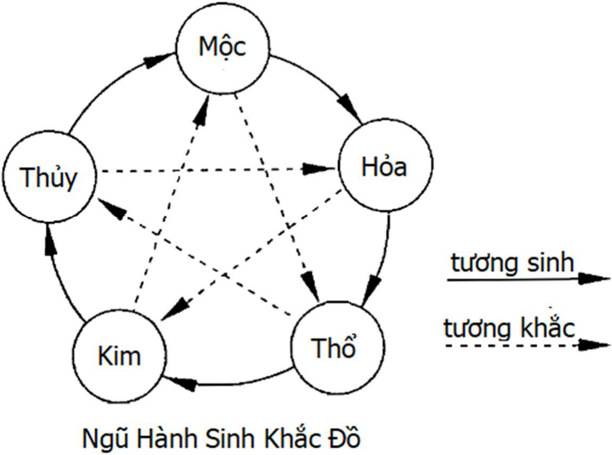

# Chương 1: Vũ trụ quan của Dịch

**LỤC HÀO NHẬP MÔN**

**NGUYÊN TÁC:** VƯƠNG HỔ ỨNG LÃO SƯ  
**NGƯỜI DỊCH:** TRẦN PHƯƠNG

## I. HỌC THUYẾT ÂM DƯƠNG

Thế giới có nam thì có nữ, có cát thì có hung, tất cả sự vật trong vũ trụ đều có tính hai mặt. Bản thân vũ trụ chính là do vũ trụ chính và vũ trụ phụ cấu thành, vũ trụ là một tổ hợp thể âm dương to lớn. Cô dương bất trưởng, cô âm bất sinh, âm dương phụ thuộc lẫn nhau, không thể tồn tại một cách độc lập. Chữ Dịch (易), xét về nguồn gốc và tổ hợp của văn tự thì chính là hợp thể của hai chữ Nhật (日) và Nguyệt (月). Nhật là dương, Nguyệt là âm, "Dịch" phản ánh sự biến hóa của âm dương. Nói cách khác, bản chất của "Dịch" là miêu tả quy luật phát triển và biến hóa của vũ trụ, sự phát triển và biến hóa của vũ trụ chính là do vai trò của âm dương tạo nên, quy luật mà nó tuân theo được cổ nhân gọi là "Đạo". "Đạo" là bản chất của vũ trụ, thuật dự đoán chính là một phương tiện để nhận thức và cầu chứng[^1] "Đạo". Thuật dự đoán được xây dựng dựa trên nguyên lý âm dương, nó có thể dự đoán chính xác rất nhiều sự việc có liên quan đến con người, điều đó là bởi vì giữa con người và vũ trụ có mối quan hệ rất chặt chẽ. Con người là sản phẩm tất yếu của sự phát triển đến một giai đoạn nhất định của vũ trụ. Con người là tinh hoa của vũ trụ, là hình ảnh thu nhỏ của vũ trụ, mỗi một con người chính là một tiểu vũ trụ. Chỉ có nhận thức được vũ trụ, mới có thể thực sự nhận thức được nhân thể[^2], chỉ có nhận thức được nhân thể, mới có thể giải đáp được những câu đố của vũ trụ. Con người là linh hồn của vạn vật, sự phát triển của vũ trụ cũng chính là sự phát triển của con người. Ở phương diện nhân thể, âm dương được thể hiện rất phong phú. Xét về giới tính, nữ là âm, nam là dương; xét về một cá nhân, ở trên là dương, phía dưới là âm, lưng là dương, ngực là âm, bên trái là dương, bên phải là âm, bên ngoài là dương, bên trong là âm, phủ là dương, tạng là âm. Cuộc đời của con người chính là một quá trình biến hóa của âm dương. Trước khi chưa thụ thai, con người ở dạng nhân tố di truyền, hoặc mật mã di truyền, là một hình thức tồn tại vô hình và âm tính, sau khi âm dương kết hợp thì phụ nữ mang thai, dương tính sẽ xuất hiện và hình thành thai nhi, đây chính là sự chuyển biến từ âm đến dương. Nếu so sánh giữa thai nhi trong bụng và con người bên ngoài cơ thể thì thai nhi là âm, con người được sinh ra là dương. Sau khi được sinh ra, con người liên tục trưởng thành, lúc nhỏ là âm, lớn lên là dương, khi dương phát triển đến một giai đoạn nhất định, thì lại phát triển về hướng âm, thời trai tráng là dương, tuổi già là âm, người đang sống là dương, sau khi chết là âm. Chỉ có nắm vững nguyên lý âm dương, chúng ta mới có thể sử dụng thuật dự đoán lục hào dự doán chính xác xu thế phát triển của con người và sự vật.

## II. HỌC THUYẾT NGŨ HÀNH

Từ góc độ của Dịch, ngũ hành là yếu tố cơ bản nhất để cấu thành thế giới vật chất, trong vạn sự vạn vật đều đã bao hàm các thành phần của ngũ hành, mỗi sự phát sinh, phát triển của sự vật đều là kết quả của tác dụng tương hỗ trong ngũ hành. Nói một cách cụ thể, ngũ hành là chỉ năm loại nguyên tố: thủy, hỏa, mộc, kim và thổ. Năm loại nguyên tố này là sự khái quát và tổng kết cao độ của người xưa về các thuộc tính của mọi sự vật trong vũ trụ.

Trong ngũ hành, sự vật đại diện cho thủy có đặc tính là lạnh, hướng xuống, ẩm thấp, ẩm ướt, như nước, mưa, tuyết, ban đêm, màu đen, phía bắc, băng... đều thuộc về thuộc tính thủy. Đặc tính của hỏa là nóng ấm, sáng, hướng lên, bốc lên, như ngọn lửa, hào quang, mùa hạ, màu đỏ, phía nam... đều thuộc về thuộc tính hỏa. Đặc tính của mộc là sinh sôi, nhu hòa[^3], khúc trực[^4], thư triển[^5], như thực vật, buổi sáng, mùa xuân, phía đông, hoa cỏ... đều thuộc về thuộc tính mộc. Đặc tính của kim là mát mẻ, sạch sẽ, túc giáng[^6], thu liễm[^7], như kim loại, mùa thu, màu trắng, phía tây... đều thuộc về thuộc tính kim. Đặc tính của thổ là trưởng dưỡng[^8], sinh hóa, thụ nạp, biến hóa, như đất, núi, màu vàng, trung ương... đều thuộc về thuộc tính thổ.

Học thuyết ngũ hành không chỉ là sự phân loại tính chất sự vật, mà quan trọng hơn là nó đã nói rõ quy luật thông thường của sự vận động bên trong sự vật. Nói cách khác, quan hệ tương hỗ trong ngũ hành vừa có một mặt tương sinh vừa có một mặt tương khắc, chính bởi vì tác dụng của tương sinh tương khắc này mà sự vật trong vũ trụ mới có thể biến hóa và phát triển.

Tương sinh của ngũ hành là thủy sinh mộc, mộc sinh hỏa, hỏa sinh thổ, thổ sinh kim và kim sinh thủy. Mối quan hệ này là tổng kết từ thực tiễn lâu dài của người xưa khi quan sát các hiện tượng trong tự nhiên. Thí dụ, trong ngũ hành thì hoa cỏ, cây cối có thuộc tính là mộc, mặc dù là chúng sinh trưởng ở trong đất, nhưng nhất định phải có nước ẩm ướt thì mới có thể sinh trưởng, vì vậy mà cho rằng thủy sinh mộc. Lại như dùi gỗ có thể lấy được lửa, cây cối có thể bị đốt cháy, vì vậy mà cho rằng mộc sinh hỏa. Vật bị lửa đốt mà biến thành tro, tro chính là thổ, cho nên hỏa sinh thổ. Kim loại được tinh luyện từ khoáng thạch trong đất, vì vậy thổ có thể sinh kim. Kim loại sau khi nóng chảy có thể biến thành chất lỏng, hơi nước lại dễ dàng ngưng tụ thành giọt nước trên bề mặt kim loại nhẵn bóng, vì vậy mà người xưa cho rằng thủy là do kim sinh ra.

Tương khắc của ngũ hành là thủy khắc hỏa, hỏa khắc kim, kim khắc mộc, mộc khắc thổ và thổ khắc thủy. Nguyên lý tương khắc này cũng là từ việc quan sát thế giới tự nhiên mà quy nạp và tổng kết ra. Tính chất của thiên địa là nhiều thắng ít, nước có thể dập tắt lửa, do đó thủy khắc hỏa. Tinh luyện thắng cứng, lửa có thể làm cho kim loại nóng chảy, vì vậy hỏa khắc kim. Cương thắng nhu, đao cụ kim loại có thể chặt cây, cho nên kim khắc mộc. Chuyên thắng tán, rễ của cỏ cây có thể đâm vào đất, cho nên mộc khắc thổ. Thực thắng hư, đất có thể ngăn nước, do đó thổ khắc thủy.

[^1]: cầu chứng: tìm cách chứng thực.
[^2]: nhân thể: cơ thể con người.
[^3]: nhu hòa: ôn hòa, dịu dàng, mềm mại
[^4]: khúc trực: vừa có thể khúc khuỷu quanh co, lại vừa có thể suôn thẳng
[^5]: thư triển: xòe ra, mở ra, giãn ra
[^6]: túc giáng: là một thuật ngữ trong trung y. Phế chủ túc giáng, nghĩa là phế khí nên sạch, nên giáng xuống.
[^7]: thu liễm: thu lại
[^8]: trưởng dưỡng: sinh ra và nuôi dưỡng
