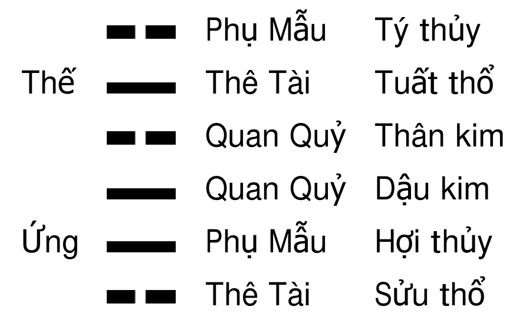

# Chương 5: Phương pháp trang quẻ

Sau khi trích xuất được quẻ, các bước tiếp theo chính là lắp ráp can chi, Thế Ứng, lục thân và lục thần,... Trong dự đoán lục hào, những công việc này được gọi là trang quẻ (lắp ráp quẻ). Trước khi trang quẻ, chúng ta phải có một nhận thức cơ bản về bát quái. Căn cứ vào nguyên lý âm dương, bát quái có thể được chia thành hai loại là dương quái và âm quái. Càn, Chấn, Khảm, Cấn là dương quái; Khôn, Tốn, Ly, Đoài là âm quái. Mỗi trùng quái được chia thành thượng quái và hạ quái, tám cung tạo thành 64 quái đều có thuộc tính ngũ hành của nó, quẻ đầu tiên của mỗi cung được gọi là bản cung, quẻ đầu hoặc quẻ thuần, bảy quẻ khác mà nó thống lĩnh gọi là phi cung. Thuộc tính ngũ hành của các phi cung đều tương đồng với bản cung, quẻ thứ bảy của mỗi cung được gọi là quẻ du hồn, quẻ thứ tám được gọi là quẻ quy hồn.

## I. PHƯƠNG PHÁP SẮP XẾP CAN CHI

Việc phối thiên can địa chi lên sáu hào vị của quẻ được gọi là nạp giáp. Trong dự đoán thực tế, thiên can không tham gia vào việc phán đoán cát hung, mà thông thường chỉ dùng để phán đoán trích xuất con số. Do đó, khi trang quẻ thường tỉnh lược thiên can và chỉ nạp địa chi.

### Nạp giáp ca

Càn kim Giáp Tý ngoại Nhâm Ngọ, Khảm thủy Mậu Dần ngoại Mậu Thân.  
Chấn mộc Canh Tý ngoại Canh Ngọ, Cấn thổ Bính Thìn ngoại Bính Tuất.  
Khôn thổ Ất Mùi ngoại Quý Sửu, Tốn mộc Tân Sửu ngoại Tân Mùi.  
Ly hỏa Kỷ Mão ngoại Kỷ Dậu, Đoài kim Đinh Tị ngoại Đinh Hợi.

Bài ca nạp giáp này chính là căn cứ và phương pháp để lắp ráp can chi cho mỗi hào vị. Mỗi quẻ đều nạp can chi từ hào sơ, căn cứ vào nguyên lý bát quái âm dương thuận nghịch, dương quái thì nạp can chi dương thuận chiều kim đồng hồ (theo thứ tự của 12 chi, tức là Tý, Dần, Thìn, Ngọ, Thân, Tuất), âm quái thì nạp can chi âm ngược chiều kim đồng hồ (ngược với thứ tự của 12 chi, tức là Hợi, Dậu, Mùi, Tị, Mão, Sửu).

Ví dụ, giả sử gieo được quẻ Thủy Phong Tỉnh. Hạ quái là Tốn, Tốn tại nội quái nạp Tân Sửu, Tốn là âm quái, đi ngược chiều nạp can chi âm là Tân Sửu, Tân Hợi, Tân Dậu, không dùng chi dương. Thượng quái là Khảm, Khảm tại ngoại quái nạp Mậu Thân, Khảm là dương quái đi thuận, tức là Mậu Thân, Mậu Tuất, Mậu Tý, chỉ nạp can chi dương, không dùng chi âm. Kết quả của phép nạp giáp như sau:

## II. PHƯƠNG PHÁP AN THẾ ỨNG

Thế Ứng là thứ thể thiếu trong dự đoán lục hào, cũng là một trong những căn cứ để dự đoán cát hung của sự vật. Thế Ứng là linh hồn trong quẻ, một quẻ nếu như không có Thế Ứng, thì cũng giống như một quân đội không có tham mưu trưởng và chỉ huy, đã mất đi trung tâm của quẻ. Vị trí Thế Ứng của mỗi quẻ là cố định bất biến, không thể an sai. Nếu an sai Thế Ứng thì rất khó nắm bắt được chủ thứ của sự vật. Thời xưa, người ta an Thế Ứng bằng cách ghi nhớ thứ tự của các quẻ trong mỗi cung bát quái, khiến cho rất nhiều người mới học phải tiêu tốn không ít thời gian ở bước này. Dưới đây, tôi sẽ chỉ cho mọi người một phương pháp không cần nhớ tên của 64 quẻ mà vẫn có thể an Thế Ứng, đồng thời còn có thể tìm được quái cung. Tôi gọi đó là hào biến pháp an Thế Ứng tầm cung quyết.

### Hào biến pháp an Thế Ứng tầm cung quyết

Tầm Thế tòng sơ vãng thượng luân, âm hào biến dương dương biến âm.  
Biến chí nội ngoại tương đồng quái, cai hào tức vi Thế sở lâm.  
Nhược đáo ngũ hào quái nhưng dị, chuyển tòng tứ hào hướng hạ hành.  
Nhược đáo sơ hào phương vi chỉ, quy hồn Thế tại tam hào lâm.  
Nội ngoại tương đồng vật tu biến, lục hào an Thế vi bát thuần.  
Ký đắc nội ngoại tương đồng quái, nguyên quái tức dĩ thử vi cung.  
Nhược vấn Ứng hào an hà xử, Thế cách lưỡng hào tức vi Ứng.

Đây là một phương pháp an Thế Ứng kiêm tìm cung. Sau khi được quẻ, phải tìm xem hào Thế của quẻ này nằm ở hào nào, có thể biến từ hào sơ lên trên, gặp hào dương thì biến thành hào âm, gặp hào âm thì biến thành hào dương, cứ biến đến khi nội quái và ngoại quái giống nhau, hào sau cùng biến khiến cho nội ngoại quái giống nhau chính là hào vị lâm hào Thế.

Ví dụ quẻ Thủy Trạch Tiết, nội ngoại quái không giống nhau, ngoại là Khảm, nội là Đoài, chúng ta biến từ hào sơ lên trên, hào sơ là hào dương, biến nó thành hào âm, sau khi đã biến hào sơ thì nội quái và ngoại quái giống nhau, vậy thì hào Thế của quẻ này nhất định tại hào sơ, đồng thời có thể khẳng định Thủy Trạch Tiết thuộc cung Khảm.

Lại ví dụ quẻ Sơn Thủy Mông, nội ngoại quái không giống nhau, ngoại quái là Cấn, nội quái là Khảm, chúng ta biến từ hào sơ lên trên, hào sơ là hào âm biến thành hào dương, hào 2 là hào dương, biến thành hào âm. Hào 3 là hào âm, biến thành hào dương, hào 4 là hào âm, biến thành hào dương, khi biến đến hào 4, nội quái và ngoại quái đều biến thành quẻ Ly, vậy thì hào Thế của quẻ này là hào 4, hơn nữa có thể khẳng định Sơn Thủy Mông là quẻ trong cung Ly.

Nếu biến đến hào 5 mà nội ngoại quái vẫn chưa giống nhau thì chuyển từ hào 4 biến xuống. Hào 6 là tông miếu, vĩnh viễn không thể biến, sau khi đã biến hào 4, nếu nội ngoại xuất hiện hai quẻ giống nhau, thì hào Thế tại hào 4, đồng thời có thể khẳng định quẻ này là quẻ du hồn.

Ví dụ quẻ Phong Trạch Trung Phu, hai quẻ thượng hạ không giống nhau, thượng là Tốn, hạ là Đoài, chúng ta biến từ hào sơ lên trên, hào sơ là hào dương, biến thành hào âm, hào 2 là hào dương, biến thành hào âm, hào 3 là hào âm, biến thành hào dương, hào 4 là hào âm, biến thành hào dương, hào 5 là hào dương, biến thành hào âm. Sau khi biến đến hào 5 mà thượng hạ quái vẫn chưa giống nhau, thượng quái đã biến thành Ly, hạ quái đã biến thành Cấn. Vậy thì chuyển từ hào 4 biến xuống, hào 4 là dương, lại biến về thành âm, sau khi biến hào 4 thì hai quẻ nội ngoại đều thành Cấn, lúc này có thể khẳng định hào Thế của quẻ này là tại hào 4, hơn nữa là quẻ du hồn của cung Cấn.

Nếu như chuyển từ hào 4 biến xuống mà biến đến hào sơ mới xuất hiện hai quẻ thượng hạ giống nhau thì quẻ này là quẻ quy hồn, hào Thế an tại hào 3.

Ví dụ quẻ Sơn Phong Cổ, hai quẻ thượng hạ khác nhau, thượng là quẻ Cấn, hạ là quẻ Tốn, chúng ta biến từ hào sơ lên trên, hào sơ là hào âm, biến thành hào dương, hào 2 là hào dương, biến thành hào âm, hào 3 là hào dương, biến thành hào âm, hào 4 là hào âm, biến thành hào dương, hào 5 là hào âm, biến thành dương. Sau khi biến đến hào 5, ngoại quái đã biến thành Càn, nội quái đã biến thành Chấn, hai quẻ thượng hạ vẫn khác nhau, vậy thì chuyển từ hào 4 biến xuống, hào 4 là hào dương, biến về thành hào âm, hào 3 là hào âm, biến về thành hào dương, hào 2 là hào âm, biến về thành hào dương, hào sơ là hào dương, biến về thành hào âm, lúc này hai quẻ thượng hạ đã giống nhau, đều thành quẻ Tốn. Do đó, chúng ta có thể khẳng định quẻ Sơn Phong Cổ là quẻ quy hồn thuộc cung Tốn, hào Thế tại hào 3.

Quẻ quy hồn còn có một phương pháp phán đoán đơn giản hơn, tức là sau khi gieo ra quẻ, đầu tiên xem có phải là quẻ quy hồn hay không, nếu không phải thì dùng phương pháp an Thế Ứng ở trên. Phương pháp tìm đơn giản đó là trước tiên biến đổi âm dương của hào 5, nếu như sau khi biến mà tạo thành quẻ có nội ngoại quái giống nhau, thì quẻ đó chính là quẻ quy hồn. Ví dụ như quẻ Sơn Phong Cổ ở trên, hào 5 là hào âm, sau khi biến nó thành hào dương thì nội ngoại quái đều thành quẻ Tốn, như vậy có thể biết Sơn Phong Cổ là quẻ quy hồn thuộc cung Tốn, lấy hào Thế an tại hào 3.

Nếu ban đầu hai quẻ thượng hạ giống nhau thì không cần phải biến, đó chắc chắn là quẻ bản cung và hào Thế tại hào 6, giống như Càn Vi Thiên. Sau khi tìm được hào Thế thì an hào Ứng rất dễ, nó và hào Thế cách nhau hai hào.

## III. AN LỤC THÂN

Lục thân là chỉ Huynh Đệ, Phụ Mẫu, Quan Quỷ, Thê Tài, Tử Tôn. Đây là lấy quan hệ lục thân của nhân sự đưa vào trong quẻ, dùng để suy diễn tương đồng sự sinh khắc chế hóa giữa các sự vật. Do đó, lục thân có thể bao hàm rất nhiều ý nghĩa chứ không thể chỉ hiểu trên mặt chữ, chúng ta có thể xem nó như là một loại ký hiệu của dự đoán lục hào.

Lục thân ở mỗi hào vị trong quẻ chính và trong quẻ biến đều được xác định dựa trên mối quan hệ sinh khắc giữa ngũ hành của địa chi nạp hào và thuộc tính ngũ hành của quái cung quẻ chính.

Địa chi nạp hào có thuộc tính ngũ hành tương đồng với cung được gọi là "Ta", dùng Huynh Đệ để biểu thị, cái sinh ta thì dùng Phụ Mẫu để biểu thị, cái khắc ta thì dùng Quan Quỷ để biểu thị, cái ta sinh thì dùng Tử Tôn để biểu thị, cái ta khắc thì dùng Thê Tài để biểu thị. Trong ứng dụng thực tế, người ta thường viết tắt Huynh Đệ là Huynh, Phụ Mẫu là Phụ, Quan Quỷ là Quan hoặc Quỷ, Tử Tôn là Tử, Thê Tài là Tài.

Muốn an lục thân cho một quẻ thì trước tiên phải biết quẻ đó thuộc về cung gì. Nếu như nắm được "hào biến pháp an Thế Ứng tầm cung quyết" thì chúng ta có thể dễ dàng tìm được cung của một quẻ nào đó, sau khi tìm được cung của quẻ chính thì chúng ta có thể dựa vào mối quan hệ sinh khắc giữa thuộc tính ngũ hành của cung và ngũ hành của địa chi nạp hào để an lục thân.

Ví dụ quẻ Thủy Phong Tỉnh. Thuộc cung Chấn, thuộc tính ngũ hành của nó là mộc. Lấy cung là "Ta", hào sơ Sửu thổ là cái ta khắc, vì vậy phối Thê Tài; hào 2 là Hợi thủy, là cái sinh ta, phối Phụ Mẫu; hào 3 Dậu kim, là cái khắc ta, phối Quan Quỷ; hào 4 Thân kim, cũng là cái khắc ta, phối Quan Quỷ; hào 5 Tuất thổ, là cái ta khắc, phối Thê Tài; hào 6 Tý thủy, là cái sinh ta, phối Phụ Mẫu. Sau khi phối lục thân thì được quẻ như sau.

Nếu như một quẻ vừa có quẻ chính vừa có quẻ biến, thì thuộc tính ngũ hành của lục thân quẻ biến cũng tương đồng với thuộc tính ngũ hành của lục thân quẻ chính, trong quẻ chính kim là Phụ Mẫu thì trong quẻ biến kim cũng là Phụ Mẫu, trong quẻ chính kim là Quan Quỷ thì trong quẻ biến kim cũng là Quan Quỷ. Bất kể là quẻ biến có thuộc cung nào thì khi phối lục thân cho nó cũng đều phải dựa vào thuộc tính của cung quẻ chính.

Ví dụ quẻ Thủy Trạch Tiết biến quẻ Thủy Địa Tỷ, quẻ chính Thủy Trạch Tiết thuộc cung Khảm, thuộc tính ngũ hành là thủy. Hào sơ Tị hỏa là cái ta khắc, phối Thê Tài; hào 2 Mão mộc, là cái ta sinh, phối Tử Tôn; hào 3 Sửu thổ, là cái khắc ta, phối Quan Quỷ; hào 4 Thân kim, là cái sinh ta, phối Phụ Mẫu; hào 5 Tuất thổ, là cái khắc ta, phối Quan Quỷ, hào 6 Tý thủy, là cái tỷ hòa, phối Huynh Đệ. Nội quái Đoài biến Khôn, hào sơ và hào 2 phát động. Hào sơ Tị hỏa phát động biến ra Mùi thổ, là cái khắc ta, phối Quan Quỷ, hào 2 Mão mộc phát động biến ra Tị hỏa là cái ta khắc, phối Thê Tài. Sau khi phối lục thân thì được quẻ chính và quẻ biến như sau.

Trong dự đoán lục hào, thông thường chỉ coi trọng tác dụng sinh khắc của hào biến đối với hào bản vị (tức là hào động). Do đó, Thế Ứng và các hào khác của quẻ biến có thể được lược bớt, chỉ cần ghi ra hào biến là được.

## IV. AN LỤC THẦN

Lục thần cũng gọi là lục thú, là chỉ Thanh Long, Chu Tước, Câu Trần, Đằng Xà, Bạch Hổ, Huyền Vũ. Trong đó, Đằng Xà còn được gọi là Trình Xà, Huyền Vũ còn được gọi là Nguyên Vũ. Trong dự đoán lục hào, lục thần là một căn cứ dùng để phán đoán nguyên nhân và tính chất của sự vật, không tham gia vào phán đoán cát hung. Bản thân lục thần cũng có thuộc tính ngũ hành, Thanh Long thuộc mộc, Chu Tước thuộc hỏa, Câu Trần và Đằng Xà thuộc thổ, Bạch Hổ thuộc kim, Huyền Vũ thuộc thủy, tuy nhiên giữa chúng không cần xem sinh khắc.

Lục thần được phối theo thiên can của ngày được dự đoán, theo thứ tự từ hào sơ đến hào 6. Phương pháp cụ thể như sau: Nếu như thiên can của ngày được dự đoán là Giáp hoặc Ất, Giáp Ất thuộc mộc, Thanh Long cũng thuộc mộc, phối Thanh Long từ hào sơ, theo thứ tự hào 2 phối Chu Tước, hào 3 phối Câu Trần, hào 4 phối Đằng Xà, hào 5 phối Bạch Hổ, hào 6 phối Huyền Vũ. Nếu là ngày Bính Đinh dự đoán thì khởi Chu Tước từ hào sơ, ngày Mậu dự đoán thì khởi Câu Trần từ hào sơ, ngày Kỷ thì khởi Đằng Xà từ hào sơ, ngày Canh Tân thì khởi Bạch Hổ từ hào sơ, ngày Nhâm quý thì khởi Huyền Vũ từ hào sơ.

| Can Ngày | Giáp Ất | Bính Đinh | Mậu | Kỷ | Canh Tân | Nhâm Quý |
| --- | --- | --- | --- | --- | --- | --- |
| Hào 6 | Huyền Vũ | Thanh Long | Chu Tước | Câu Trần | Đằng Xà | Bạch Hổ |
| Hào 5 | Bạch Hổ | Huyền Vũ | Thanh Long | Chu Tước | Câu Trần | Đằng Xà |
| Hào 4 | Đằng Xà | Bạch Hổ | Huyền Vũ | Thanh Long | Chu Tước | Câu Trần |
| Hào 3 | Câu Trần | Đằng Xà | Bạch Hổ | Huyền Vũ | Thanh Long | Chu Tước |
| Hào 2 | Chu Tước | Câu Trần | Đằng Xà | Bạch Hổ | Huyền Vũ | Thanh Long |
| Hào Sơ | Thanh Long | Chu Tước | Câu Trần | Đằng Xà | Bạch Hổ | Huyền Vũ |

Lục thần cũng thường được viết tắt, Thanh Long là Long, Chu Tước là Tước, Câu Trần là Câu, Đằng Xà là Xà, Bạch Hổ là Hổ, Huyền Vũ là Vũ.
