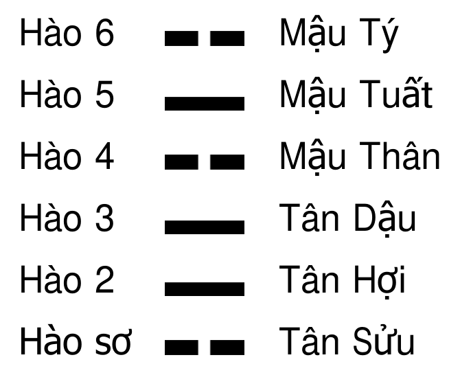
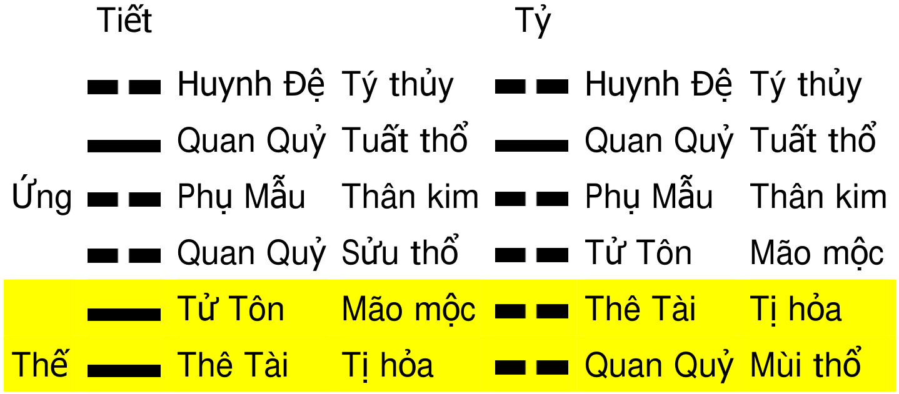

# Lục Hào Nhập Môn (六爻)

## Chương 1: Vũ trụ quan của Dịch

- **Thông tin nguồn tư liệu**:
  - Tác phẩm: *Lục Hào (六爻) Nhập Môn*
  - Tác giả: Vương Hổ Ứng (王虎应) Lão sư
  - Dịch giả: Trần Phương

### I. HỌC THUYẾT ÂM DƯƠNG (陰陽)

- **Tính hai mặt của sự vật và cấu trúc vũ trụ**:
  - Mọi sự vật trong vũ trụ đều mang tính hai mặt đối lập: có nam thì có nữ, có cát thì có hung.
  - Vũ trụ là một tổ hợp thể âm dương to lớn, được cấu thành từ vũ trụ chính và vũ trụ phụ.
  - Tính phụ thuộc lẫn nhau giữa âm và dương: "Cô dương bất trưởng, cô âm bất sinh" (dương đơn độc không thể phát triển, âm đơn độc không thể sinh sôi); âm và dương phụ thuộc vào nhau, không thể tồn tại độc lập.
- **Nguồn gốc văn tự và bản chất của "Dịch" ($\text{Dịch}$ - 易)**:
  - Chữ "Dịch" (易) xét theo nguồn gốc cấu tạo văn tự là sự hợp thể của hai chữ "Nhật" (日) và "Nguyệt" (月).
    - Chữ "Nhật" (日) tượng trưng cho Mặt Trời, mang thuộc tính dương.
    - Chữ "Nguyệt" (月) tượng trưng cho Mặt Trăng, mang thuộc tính âm.
  - "Dịch" phản ánh sự biến hóa của âm dương.
  - Bản chất của "Dịch" là miêu tả quy luật phát triển và biến hóa của vũ trụ; sự vận động phát triển này được thúc đẩy bởi tác động tương hỗ của âm dương.
- **Khái niệm "Đạo" ($\text{Đạo}$) và bản chất của thuật dự đoán**:
  - Quy luật phát triển và biến hóa của vũ trụ được cổ nhân đúc kết gọi là "Đạo".
  - "Đạo" chính là bản chất cốt lõi của vũ trụ.
  - Thuật dự đoán đóng vai trò là phương tiện để nhận thức và cầu chứng (tìm cách chứng thực) "Đạo".
- **Mối quan hệ tương ứng giữa Con người và Vũ trụ**:
  - Cơ sở chuẩn xác của thuật dự đoán: Thuật dự đoán thiết lập dựa trên nguyên lý âm dương, có thể dự đoán chính xác sự việc của con người nhờ mối quan hệ mật thiết giữa nhân loại và vũ trụ.
  - Con người là sản phẩm tất yếu trong quá trình phát triển đến giai đoạn nhất định của vũ trụ; con người là tinh hoa, là hình ảnh thu nhỏ của vũ trụ.
  - Mỗi một cá thể con người là một "tiểu vũ trụ":
    - Nhận thức được quy luật vũ trụ là tiền đề để nhận thức chân thực nhân thể (cơ thể con người).
    - Nhận thức sâu sắc nhân thể là chìa khóa giải mã các bí ẩn của vũ trụ.
  - Con người là linh hồn của vạn vật; tiến trình phát triển của vũ trụ đồng điệu với tiến trình phát triển của con người.
- **Sự biểu hiện của âm dương trên nhân thể**:
  - Về giới tính: Nữ giới là âm, nam giới là dương.
  - Về phương vị và cấu trúc cơ thể cá nhân:
    - Phần trên là dương, phần dưới là âm.
    - Lưng là dương, ngực là âm.
    - Bên trái là dương, bên phải là âm.
    - Bên ngoài là dương, bên trong là âm.
    - Phủ (lục phủ) là dương, tạng (ngũ tạng) là âm.
- **Tiến trình đời người là quá trình biến hóa âm dương**:
  - Giai đoạn tiền thụ thai: Con người tồn tại dưới dạng nhân tố di truyền hoặc mật mã di truyền; đây là hình thức tồn tại vô hình và mang tính âm.
  - Giai đoạn thụ thai: Sau khi âm dương kết hợp tạo thành thai, dương tính xuất hiện và hình thành thai nhi; đây là bước chuyển biến từ âm sang dương.
  - So sánh thai nhi và con người sau sinh: Thai nhi trong bụng mẹ thuộc âm; con người sau khi sinh ra ngoài cơ thể thuộc dương.
  - Quá trình phát triển theo chu kỳ sống:
    - Thuở nhỏ thuộc âm, trưởng thành thuộc dương.
    - Khi dương phát triển đến đỉnh điểm sẽ chuyển hướng phát triển về âm: Thời trai tráng thuộc dương, tuổi già thuộc âm.
    - Người đang sống thuộc dương, sau khi tạ thế thuộc âm.
- **Nguyên lý ứng dụng trong dự đoán học**:
  - Nắm vững nguyên lý âm dương là điều kiện tiên quyết để vận dụng thuật dự đoán lục hào dự đoán chính xác xu thế phát triển của nhân sự và sự vật.

### II. HỌC THUYẾT NGŨ HÀNH (五行)

#### 1. Khái niệm

- **Định nghĩa ngũ hành (五行) trong vũ trụ quan của Dịch**:
  - Ngũ hành là yếu tố cơ bản nhất cấu thành thế giới vật chất.
  - Vạn sự vạn vật trong vũ trụ đều bao hàm các thành phần của ngũ hành.
  - Mọi sự phát sinh, biến hóa và phát triển của sự vật đều là kết quả của tác dụng tương hỗ giữa năm hành.
  - Ngũ hành gồm năm loại nguyên tố: Thủy ($Thủy$), Hỏa ($Hỏa$), Mộc ($Mộc$), Kim ($Kim$), Thổ ($Thổ$).
  - Năm nguyên tố là sự khái quát và tổng kết trừu tượng cao độ của cổ nhân về thuộc tính của toàn bộ sự vật trong vũ trụ.
- **Thuộc tính đặc trưng và biểu tượng của từng hành**:
  - **Hành Thủy ($Thủy$)**:
    - Đặc tính: Lạnh lẽo, hướng xuống dưới, ẩm thấp, ẩm ướt.
    - Sự vật đại diện: Nước, mưa, tuyết, ban đêm, màu đen, phương bắc, băng đá.
  - **Hành Hỏa ($Hỏa$)**:
    - Đặc tính: Nóng ấm, quang minh (sáng sủa), hướng lên trên, bốc lên cao.
    - Sự vật đại diện: Ngọn lửa, hào quang, mùa hạ, màu đỏ, phương nam.
  - **Hành Mộc ($Mộc$)**:
    - Đặc tính: Sinh sôi, nhu hòa (ôn hòa, dịu dàng, mềm mại), khúc trực (vừa có thể uốn lượn quanh co vừa có thể vươn thẳng), thư triển (xòe ra, mở rộng ra).
    - Sự vật đại diện: Thực vật, buổi sáng, mùa xuân, phương đông, hoa cỏ.
  - **Hành Kim ($Kim$)**:
    - Đặc tính: Mát mẻ, thanh khiết sạch sẽ, túc giáng (khí thanh sạch giáng xuống theo thuật ngữ Đông y), thu liễm (thu gom, gom tụ lại).
    - Sự vật đại diện: Kim loại, mùa thu, màu trắng, phương tây.
  - **Hành Thổ ($Thổ$)**:
    - Đặc tính: Trưởng dưỡng (sinh ra và nuôi dưỡng lớn lên), sinh hóa, thụ nạp, biến hóa.
    - Sự vật đại diện: Đất đai, đồi núi, màu vàng, vị trí trung ương.
- **Ý nghĩa vận động nội tại của học thuyết ngũ hành**:
  - Học thuyết ngũ hành không chỉ đơn thuần phân loại tính chất sự vật, mà trọng tâm là phản ánh quy luật vận động nội tại của sự vật.
  - Quan hệ tương hỗ trong ngũ hành tích hợp hai mặt thống nhất: tương sinh và tương khắc; nhờ sự tương tác sinh khắc này mà vạn vật trong vũ trụ liên tục vận động, biến hóa và phát triển.

#### 2. Quy luật tương sinh

- **Trật tự chu trình tương sinh**:
  - Thủy sinh Mộc, Mộc sinh Hỏa, Hỏa sinh Thổ, Thổ sinh Kim, Kim sinh Thủy.
  - Chuỗi tương sinh khép kín tuần hoàn:
    $$\text{Thủy} \longrightarrow \text{Mộc} \longrightarrow \text{Hỏa} \longrightarrow \text{Thổ} \longrightarrow \text{Kim} \longrightarrow \text{Thủy}$$
- **Căn cứ thực nghiệm tự nhiên của quan hệ tương sinh**:
  - Thủy sinh Mộc: Cây cỏ hoa lá thuộc Mộc dù mọc trên đất nhưng bắt buộc phải có nước ẩm ướt nuôi dưỡng mới có thể đâm chồi sinh trưởng.
  - Mộc sinh Hỏa: Ma sát dùi gỗ có thể tạo ra lửa, thân cây củi gỗ là nguồn chất đốt bốc cháy thành lửa.
  - Hỏa sinh Thổ: Vật chất sau khi bị ngọn lửa thiêu đốt sẽ hóa thành tro bụi; tro bụi chính là Thổ.
  - Thổ sinh Kim: Kim loại quý và quặng khoáng được khai thác, tinh luyện từ trong lòng đất và khoáng thạch.
  - Kim sinh Thủy: Kim loại khi bị nung chảy ở nhiệt độ cao hóa thành thể lỏng; đồng thời bề mặt kim loại mát nhẵn là nơi hơi ẩm dễ dàng ngưng tụ đọng thành giọt nước.
- **Sơ đồ minh họa tương sinh tương khắc**:
  - **Hình 1.** Ngũ Hành Sinh Khắc Đồ
    - 
    - **Hình này chứng minh điều gì**
      - Mối quan hệ tương sinh (vòng tròn khép kín) và tương khắc (ngôi sao 5 cánh) giữa 5 yếu tố Kim, Mộc, Thủy, Hỏa, Thổ.
    - **Từ đâu mà thấy được**
      - Vòng tròn ngoài biểu thị tương sinh: Mộc sinh Hỏa, Hỏa sinh Thổ, Thổ sinh Kim, Kim sinh Thủy, Thủy sinh Mộc; các đường chéo bên trong biểu thị tương khắc: Mộc khắc Thổ, Thổ khắc Thủy, Thủy khắc Hỏa, Hỏa khắc Kim, Kim khắc Mộc.

#### 3. Quy luật tương khắc

- **Trật tự chu trình tương khắc**:
  - Thủy khắc Hỏa, Hỏa khắc Kim, Kim khắc Mộc, Mộc khắc Thổ, Thổ khắc Thủy.
  - Chuỗi tương khắc:
    $$\text{Thủy} \Longrightarrow \text{Hỏa} \Longrightarrow \text{Kim} \Longrightarrow \text{Mộc} \Longrightarrow \text{Thổ} \Longrightarrow \text{Thủy}$$
- **Căn cứ thực nghiệm tự nhiên và nguyên lý tương khắc**:
  - Thủy khắc Hỏa: Dựa trên nguyên lý "nhiều thắng ít" trong trời đất; nước dập tắt được ngọn lửa.
  - Hỏa khắc Kim: Dựa trên nguyên lý "tinh luyện thắng cứng"; nhiệt lượng ngọn lửa nung chảy được kim loại cứng rắn.
  - Kim khắc Mộc: Dựa trên nguyên lý "cương thắng nhu"; rìu búa dao cụ bằng kim loại chặt đứt, xẻ được gỗ cây.
  - Mộc khắc Thổ: Dựa trên nguyên lý "chuyên thắng tán"; rễ cây cỏ gom tụ sức mạnh đâm sâu và xuyên thủng kết cấu đất tơi xốp.
  - Thổ khắc Thủy: Dựa trên nguyên lý "thực thắng hư"; bờ đất, đê điều vững chắc ngăn chặn và dẫn lối được dòng nước.

## Chương 2: Can Chi và dự đoán Lục Hào

* Vai trò lịch sử và nguồn gốc cổ xưa của Lục Thập Hoa Giáp:
  * Giáp cốt văn khai quật cho thấy từ thời nhà Thương, Lục Thập Hoa Giáp đã được sử dụng để ghi lại ngày, tháng, năm.
* Giá trị và bản chất của Lục Thập Hoa Giáp:
  * Hàm chứa khái niệm thời gian – không gian, là phương tiện truyền đạt thông tin vũ trụ cùng sự biến hóa của vạn sự vạn vật trong vũ trụ.
  * Đóng vai trò trọng yếu đối với sự phát triển của Dịch học và tạo ảnh hưởng sâu rộng đến các hệ thống học thuật sau này.
  * Ứng dụng trong Trung y: các phép "Tý Ngọ Lưu Trú" và "Linh Quy Bát Pháp" căn cứ vào thiên can địa chi của thời điểm bệnh nhân đến khám để quy định và xác định huyệt vị.
* Quan hệ tất yếu đối với dự đoán Lục Hào:
  * Can chi là nền tảng cốt lõi; nếu không có sự xuất hiện của can chi thì lịch sử sẽ không xuất hiện thuật dự đoán Lục Hào.

### I. THẬP THIÊN CAN (天干)

* Danh sách Thập Thiên Can (天干): Giáp, Ất, Bính, Đinh, Mậu, Kỷ, Canh, Tân, Nhâm, Quý.
* Tính chất và quy luật vận hành của thứ tự Thiên Can:
  * Thứ tự sắp xếp là cố định ($1$ đến $10$).
  * Biểu thị quá trình biến hóa tự nhiên của vạn vật: từ sinh trưởng đến phồn thịnh, suy lão rồi tử vong.

#### 1. Âm dương của thập thiên can

* Phân định âm dương theo tính chất số thứ tự:
  * Vị trí số lẻ thuộc dương.
  * Vị trí số chẵn thuộc âm.
* Can dương: Giáp, Bính, Mậu, Canh, Nhâm.
* Can âm: Ất, Đinh, Kỷ, Tân, Quý.

#### 2. Ngũ hành của thập thiên can

* Quy thuộc ngũ hành cho $10$ thiên can:
  * Giáp, Ất: thuộc Mộc.
  * Bính, Đinh: thuộc Hỏa.
  * Mậu, Kỷ: thuộc Thổ.
  * Canh, Tân: thuộc Kim.
  * Nhâm, Quý: thuộc Thủy.

#### 3. Thập thiên can và phương vị

* Phân bố phương vị không gian của Thập Thiên Can:
  * Giáp, Ất: phương Đông.
  * Bính, Đinh: phương Nam.
  * Mậu, Kỷ: trung ương.
  * Canh, Tân: phương Tây.
  * Nhâm, Quý: phương Bắc.
* Phạm vi ứng dụng của Thiên Can trong dự đoán Lục Hào:
  * Giữa các thiên can tồn tại các mối quan hệ tương hợp, tương xung, hợp hóa,...
  * Trong dự đoán Lục Hào, chủ yếu chỉ chú trọng can ngày dự đoán (nhật can) để an Lục Thần (lục thú).
  * Các ý nghĩa và quan hệ tương tác khác của thiên can rất ít khi dùng đến nên được lược bỏ, không cần ghi ra.

### II. THẬP NHỊ ĐỊA CHI (地支)

* Danh sách Thập Nhị Địa Chi (地支): Tý, Sửu, Dần, Mão, Thìn, Tị, Ngọ, Mùi, Thân, Dậu, Tuất, Hợi.
* Tầm quan trọng trong dự đoán Lục Hào:
  * Giữ vai trò then chốt hàng đầu trong dự đoán Lục Hào.
  * Yêu cầu bắt buộc: phải ghi nhớ thuộc tính ngũ hành cùng toàn bộ các mối quan hệ sinh, khắc, xung, hợp lẫn nhau giữa các chi.

#### 1. Âm dương của thập nhị địa chi

* Chi dương ($6$ chi): Tý, Dần, Thìn, Ngọ, Thân, Tuất.
* Chi âm ($6$ chi): Sửu, Mão, Tị, Mùi, Dậu, Hợi.

#### 2. Ngũ hành của thập nhị địa chi

* Phân định ngũ hành và thuộc tính âm dương cụ thể của từng địa chi:
  * Nhóm Mộc: Dần và Mão cùng thuộc Mộc; trong đó Dần là dương mộc, Mão là âm mộc.
  * Nhóm Hỏa: Tị và Ngọ cùng thuộc Hỏa; trong đó Ngọ là dương hỏa, Tị là âm hỏa.
  * Nhóm Kim: Thân và Dậu cùng thuộc Kim; trong đó Thân là dương kim, Dậu là âm kim.
  * Nhóm Thủy: Hợi và Tý cùng thuộc Thủy; trong đó Tý là dương thủy, Hợi là âm thủy.
  * Nhóm Thổ: Thìn, Tuất, Sửu, Mùi cùng thuộc Thổ; trong đó Thìn và Tuất là dương thổ, Sửu và Mùi là âm thổ.

#### 3. Thập nhị địa chi và phương vị

* Phân bố $8$ phương vị đối ứng với $12$ địa chi:
  * Tý: phương Bắc.
  * Sửu, Dần: phương Đông Bắc.
  * Mão: phương Đông.
  * Thìn, Tị: phương Đông Nam.
  * Ngọ: phương Nam.
  * Mùi, Thân: phương Tây Nam.
  * Dậu: phương Tây.
  * Tuất, Hợi: phương Tây Bắc.

#### 4. Thập nhị địa chi và bốn mùa

* Phân chia $12$ địa chi tương ứng với bốn mùa trong năm:
  * Mùa xuân: Dần, Mão, Thìn.
  * Mùa hạ: Tị, Ngọ, Mùi.
  * Mùa thu: Thân, Dậu, Tuất.
  * Mùa đông: Hợi, Tý, Sửu.

#### 5. Thập nhị địa chi và tháng

* Đối ứng $12$ địa chi với $12$ tháng dương lịch:
  * Dần: tháng $2$.
  * Mão: tháng $3$.
  * Thìn: tháng $4$.
  * Tị: tháng $5$.
  * Ngọ: tháng $6$.
  * Mùi: tháng $7$.
  * Thân: tháng $8$.
  * Dậu: tháng $9$.
  * Tuất: tháng $10$.
  * Hợi: tháng $11$.
  * Tý: tháng $12$.
  * Sửu: tháng $1$.

#### 6. Thập nhị địa chi và mười hai canh giờ

* Quy định canh giờ trong ngày (theo hệ $24$ giờ) đối ứng với từng địa chi:
  * Giờ Tý: $23\text{ giờ} - 1\text{ giờ}$.
  * Giờ Sửu: $1\text{ giờ} - 3\text{ giờ}$.
  * Giờ Dần: $3\text{ giờ} - 5\text{ giờ}$.
  * Giờ Mão: $5\text{ giờ} - 7\text{ giờ}$.
  * Giờ Thìn: $7\text{ giờ} - 9\text{ giờ}$.
  * Giờ Tị: $9\text{ giờ} - 11\text{ giờ}$.
  * Giờ Ngọ: $11\text{ giờ} - 13\text{ giờ}$.
  * Giờ Mùi: $13\text{ giờ} - 15\text{ giờ}$.
  * Giờ Thân: $15\text{ giờ} - 17\text{ giờ}$.
  * Giờ Dậu: $17\text{ giờ} - 19\text{ giờ}$.
  * Giờ Tuất: $19\text{ giờ} - 21\text{ giờ}$.
  * Giờ Hợi: $21\text{ giờ} - 23\text{ giờ}$.

#### 7. Lục hợp của thập nhị địa chi

* Khái niệm Lục hợp (六合): hai địa chi tương hợp thành từng cặp; có tất cả $6$ cặp nên gọi là lục hợp (六合).
* Sáu cặp lục hợp cụ thể:
  * Tý và Sửu hợp.
  * Dần và Hợi hợp.
  * Mão và Tuất hợp.
  * Thìn và Dậu hợp.
  * Tị và Thân hợp.
  * Ngọ và Mùi hợp.

#### 8. Lục xung của thập nhị địa chi

* Khái niệm Lục xung (六沖): hai địa chi tương xung thành từng cặp; có tất cả $6$ cặp nên gọi là lục xung (六沖).
* Sáu cặp lục xung cụ thể:
  * Tý và Ngọ tương xung (Tý Ngọ tương xung).
  * Sửu và Mùi tương xung (Sửu Mùi tương xung).
  * Dần và Thân tương xung (Dần Thân tương xung).
  * Mão và Dậu tương xung (Mão Dậu tương xung).
  * Thìn và Tuất tương xung (Thìn Tuất tương xung).
  * Tị và Hợi tương xung (Tị Hợi tương xung).

#### 9. Thập nhị địa chi và quan hệ đối ứng với động vật

* Đối ứng $12$ địa chi với $12$ loài động vật (con giáp):
  * Tý: chuột.
  * Sửu: trâu.
  * Dần: hổ.
  * Mão: thỏ.
  * Thìn: rồng.
  * Tị: rắn.
  * Ngọ: ngựa.
  * Mùi: dê.
  * Thân: khỉ.
  * Dậu: gà.
  * Tuất: chó.
  * Hợi: lợn.

#### 10. Tam hợp của địa chi

* Khái niệm Tam hợp (三合) và các cục diện Tam hợp cục của địa chi:
  * Thân – Tý – Thìn: hợp Thủy cục.
  * Tị – Dậu – Sửu: hợp Kim cục.
  * Dần – Ngọ – Tuất: hợp Hỏa cục.
  * Hợi – Mão – Mùi: hợp Mộc cục.

#### 11. Tam hình của địa chi

* Khái niệm Tam hình (三刑) và quy tắc tương hình, tự hình giữa các địa chi:
  * Tam hình (hình lẫn nhau giữa $3$ chi):
    * Dần hình Tị, Tị hình Thân, Thân hình Dần.
    * Sửu, Tuất, Mùi tương hình.
  * Nhị hình (hình lẫn nhau giữa $2$ chi):
    * Tý hình Mão, Mão hình Tý.
  * Tự hình:
    * Thìn, Ngọ, Dậu, Hợi tự hình (tự bản thân mỗi địa chi hình chính nó).
* Yêu cầu học tập và ứng dụng thực hành:
  * Các mối quan hệ trên là những khái niệm cơ bản thường gặp liên quan đến thập nhị địa chi, bắt buộc phải ghi nhớ.
  * Phương pháp vận dụng cụ thể trong giải đoán quẻ sẽ được trình bày chi tiết ở các chương sau.

## Chương 3: Kiến thức căn bản về Bát Quái (八卦)

* **Thông tin nguồn tư liệu**:
  - Tác phẩm: *Lục Hào Nhập Môn*
  - Tác giả: Vương Hổ Ứng (王虎应) Lão sư
  - Dịch giả: Trần Phương

### I. Ý NGHĨA CƠ BẢN CỦA BÁT QUÁI

* **Quy luật trật tự của vũ trụ và nguồn gốc Bát Quái (八卦)**:
  * Sự vật trong vũ trụ nhiều không thể nào đếm được, lại thêm biến hóa đa dạng vô cùng.
  * Vạn vật không tồn tại một cách hỗn độn, mà vận hành theo các quy luật trật tự rất đáng kinh ngạc.
  * Căn cứ vào tính chất khác nhau của vạn vật, cổ nhân đã sử dụng một khái niệm trừu tượng cao độ để quy nạp tất cả sự vật trong vũ trụ thành $8$ loại hình thái cơ bản, đó chính là Bát Quái ($\text{Bát Quái}$ - 八卦).
* **Danh sách và tượng trưng tự nhiên của Bát Quái**:
  * Tám quẻ gồm: Càn ($\text{☰}$), Khôn ($\text{☷}$), Chấn ($\text{☳}$), Tốn ($\text{☴}$), Khảm ($\text{☵}$), Ly ($\text{☲}$), Cấn ($\text{☶}$), Đoài ($\text{☱}$).
  * Biểu tượng đại diện của Bát Quái đối với giới tự nhiên:
    * Càn đại diện cho Trời ($\text{Thiên}$).
    * Khôn đại diện cho Đất ($\text{Địa}$).
    * Chấn đại diện cho Sấm ($\text{Lôi}$).
    * Tốn đại diện cho Gió ($\text{Phong}$).
    * Khảm đại diện cho Nước ($\text{Thủy}$).
    * Ly đại diện cho Lửa ($\text{Hỏa}$).
    * Cấn đại diện cho Núi ($\text{Sơn}$).
    * Đoài đại diện cho Đầm hồ ($\text{Trạch}$).
* **Cấu tạo cơ bản của quẻ từ Hào và Tam Tài**:
  * Hào ($\text{Hào}$) là ký hiệu cơ bản nhất cấu thành nên Bát Quái.
  * Hào phân thành âm dương rõ rệt:
    * Hào dương: vạch liền (—).
    * Hào âm: vạch đứt (-- / - -).
  * Ba hào kết hợp tạo thành một đơn quái (quái đơn / quái tượng), tương ứng với tượng Tam Tài: Thiên ($\text{Thiên}$ - Trời), Địa ($\text{Địa}$ - Đất), Nhân ($\text{Nhân}$ - Người).
* **Khái niệm Trùng Quái (64 quái)**:
  * Hai quái đơn chồng lên nhau tạo thành một trùng quái (quẻ kép gồm $6$ hào).
  * Quái ở trên gọi là thượng quái ($\text{thượng quái}$) hoặc ngoại quái ($\text{ngoại quái}$).
  * Quái ở dưới gọi là hạ quái ($\text{hạ quái}$) hoặc nội quái ($\text{nội quái}$).
  * Có tổng cộng $8 \times 8 = 64$ trùng quái, gọi chung là $64$ quái.
* **Bài ca khẩu quyết ghi nhớ hình tượng Bát Quái**:
  * Cổ nhân đúc kết bài ca thuận tiện cho việc học thuộc lòng hình tượng ký hiệu của $8$ quẻ:
    $$\text{Càn tam liên, Khôn lục đoạn,}$$
    $$\text{Chấn ngưỡng vu, Cấn phúc uyển,}$$
    $$\text{Đoài thượng khuyết, Tốn hạ đoạn,}$$
    $$\text{Ly trung hư, Khảm trung mãn.}$$
  * Giải nghĩa hình tượng của bài ca:
    * *Càn tam liên* ($\text{☰}$): ba hào dương là ba vạch liền nối tiếp nhau.
    * *Khôn lục đoạn* ($\text{☷}$): ba hào âm đứt đôi tạo thành sáu đoạn vạch.
    * *Chấn ngưỡng vu* ($\text{☳}$): một hào dương nằm dưới hai hào âm, giống như cái chậu hay chén ngửa lên.
    * *Cấn phúc uyển* ($\text{☶}$): một hào dương nằm trên hai hào âm, giống như cái bát úp xuống.
    * *Đoài thượng khuyết* ($\text{☱}$): một hào âm ở trên cùng bị đứt/mẻ khuyết, hai hào dương ở dưới.
    * *Tốn hạ đoạn* ($\text{☴}$): một hào âm ở dưới cùng bị đứt/đoạn, hai hào dương ở trên.
    * *Ly trung hư* ($\text{☲}$): hào âm ở giữa bị rỗng/đứt, hai hào dương bao bọc bên ngoài.
    * *Khảm trung mãn* ($\text{☵}$): hào dương ở giữa đầy đặn/liền, hai hào âm bao bọc bên ngoài.
* **Kho tàng thông tin vũ trụ và phạm vi ứng dụng trong dự đoán Lục Hào**:
  * Tuy chỉ có $8$ loại hình thái, Bát Quái có thể đối ứng với vạn sự vạn vật trong toàn bộ vũ trụ, là kho tàng thông tin vô tận.
  * Mối quan hệ đối ứng của Bát Quái được ứng dụng rất rộng rãi và phân nhánh vô cùng vô tận trong thuật dự đoán *Mai Hoa Dịch Số*.
  * Trong dự đoán *Lục Hào*, các chi tiết phân nhánh đối ứng quá rộng không được sử dụng nhiều; người nghiên cứu chỉ cần ghi nhớ vững vàng các ý nghĩa cơ bản và thường dùng nhất: nhân sự, cơ thể, nội tạng, phương vị và thuộc tính ngũ hành.

#### 1. Quan hệ đối ứng giữa bát quái và nhân sự

* **Bát quái đối ứng các vai trò nhân sự trong gia đình**:
  * Càn: Cha ($\text{phụ thân}$).
  * Khôn: Mẹ ($\text{mẫu thân}$).
  * Chấn: Trưởng nam.
  * Tốn: Trưởng nữ.
  * Khảm: Trung nam.
  * Ly: Trung nữ.
  * Cấn: Thiếu nam.
  * Đoài: Thiếu nữ.

#### 2. Quan hệ đối ứng giữa bát quái và cơ thể

* **Bát quái đối ứng các bộ phận cơ thể bên ngoài**:
  * Càn: Đầu.
  * Đoài: Miệng.
  * Chấn: Chân.
  * Tốn: Đùi.
  * Ly: Mắt.
  * Khảm: Tai.
  * Cấn: Tay.
  * Khôn: Bụng.

#### 3. Quan hệ đối ứng giữa bát quái và nội tạng

* **Bát quái đối ứng các cơ quan nội tạng bên trong**:
  * Càn: Đầu, phổi ($\text{phế}$), ruột già ($\text{đại trường}$).
  * Khôn: Lá lách ($\text{tỳ}$), dạ dày ($\text{vị}$).
  * Chấn: Gan ($\text{can}$), mật ($\text{đởm}$).
  * Tốn: Gan ($\text{can}$), mật ($\text{đởm}$).
  * Khảm: Thận ($\text{thận}$), bàng quang.
  * Ly: Tim ($\text{tâm}$), ruột non ($\text{tiểu trường}$).
  * Cấn: Lá lách ($\text{tỳ}$), dạ dày ($\text{vị}$).
  * Đoài: Phổi ($\text{phế}$), ruột già ($\text{đại trường}$).

#### 4. Quan hệ đối ứng giữa bát quái và phương vị

* **Bát quái đối ứng các phương vị không gian (Hậu thiên Bát quái)**:
  * Càn: Phương Tây Bắc.
  * Đoài: Phương Tây.
  * Ly: Phương Nam.
  * Chấn: Phương Đông.
  * Tốn: Phương Đông Nam.
  * Khảm: Phương Bắc.
  * Cấn: Phương Đông Bắc.
  * Khôn: Phương Tây Nam.
* **Đặc tính ứng dụng phương vị trong Lục Hào**:
  * Sự đối ứng giữa bát quái và vạn sự vạn vật có thể được phân chia vô cùng vô tận; trong Mai Hoa Dịch Số ứng dụng rất rộng rãi, nhưng trong dự đoán Lục Hào chỉ cần ghi nhớ các mối quan hệ cốt lõi.

#### 5. Thuộc tính ngũ hành của bát quái

* **Quy nạp ngũ hành cho tám quẻ đơn**:
  * Càn, Đoài: Thuộc Kim ($\text{Kim}$).
  * Khôn, Cấn: Thuộc Thổ ($\text{Thổ}$).
  * Ly: Thuộc Hỏa ($\text{Hỏa}$).
  * Chấn, Tốn: Thuộc Mộc ($\text{Mộc}$).
  * Khảm: Thuộc Thủy ($\text{Thủy}$).

#### 6. Chi tiết tượng của từng quẻ trong Bát Quái

##### 1. Quẻ Càn

* **Tượng quẻ và ký hiệu**:
  * Ký hiệu: $\text{☰}$ (Càn tam liên).
  * Cấu tạo: Ba hào dương vạch liền chồng lên nhau.
* **Đại diện tự nhiên**: Trời ($\text{Thiên}$).
* **Quan hệ đối ứng nhân sự (vai trò gia đình)**: Cha ($\text{phụ thân}$).
* **Quan hệ đối ứng cơ thể bên ngoài**: Đầu.
* **Quan hệ đối ứng nội tạng**: Đầu, phổi ($\text{phế}$), ruột già ($\text{đại trường}$).
* **Quan hệ đối ứng động vật (tượng vật mở rộng trong Dịch học)**: Ngựa ($\text{mã}$).
* **Quan hệ đối ứng phương vị**: Phương Tây Bắc.
* **Thuộc tính ngũ hành**: Kim ($\text{Kim}$).

##### 2. Quẻ Khôn

* **Tượng quẻ và ký hiệu**:
  * Ký hiệu: $\text{☷}$ (Khôn lục đoạn).
  * Cấu tạo: Ba hào âm vạch đứt chồng lên nhau, tách thành sáu đoạn.
* **Đại diện tự nhiên**: Đất ($\text{Địa}$).
* **Quan hệ đối ứng nhân sự (vai trò gia đình)**: Mẹ ($\text{mẫu thân}$).
* **Quan hệ đối ứng cơ thể bên ngoài**: Bụng.
* **Quan hệ đối ứng nội tạng**: Lá lách ($\text{tỳ}$), dạ dày ($\text{vị}$).
* **Quan hệ đối ứng động vật (tượng vật mở rộng trong Dịch học)**: Trâu ($\text{ngưu}$).
* **Quan hệ đối ứng phương vị**: Phương Tây Nam.
* **Thuộc tính ngũ hành**: Thổ ($\text{Thổ}$).

##### 3. Quẻ Chấn

* **Tượng quẻ và ký hiệu**:
  * Ký hiệu: $\text{☳}$ (Chấn ngưỡng vu).
  * Cấu tạo: Hào $1$ là hào dương (vạch liền), hào $2$ và hào $3$ là hào âm (vạch đứt); tựa hình chén ngửa.
* **Đại diện tự nhiên**: Sấm sét ($\text{Lôi}$).
* **Quan hệ đối ứng nhân sự (vai trò gia đình)**: Trưởng nam (con trai cả).
* **Quan hệ đối ứng cơ thể bên ngoài**: Chân.
* **Quan hệ đối ứng nội tạng**: Gan ($\text{can}$), mật ($\text{đởm}$).
* **Quan hệ đối ứng động vật (tượng vật mở rộng trong Dịch học)**: Rồng ($\text{long}$).
* **Quan hệ đối ứng phương vị**: Phương Đông.
* **Thuộc tính ngũ hành**: Mộc ($\text{Mộc}$).

##### 4. Quẻ Tốn

* **Tượng quẻ và ký hiệu**:
  * Ký hiệu: $\text{☴}$ (Tốn hạ đoạn).
  * Cấu tạo: Hào $1$ là hào âm (vạch đứt), hào $2$ và hào $3$ là hào dương (vạch liền); đứt ở phía dưới.
* **Đại diện tự nhiên**: Gió ($\text{Phong}$).
* **Quan hệ đối ứng nhân sự (vai trò gia đình)**: Trưởng nữ (con gái cả).
* **Quan hệ đối ứng cơ thể bên ngoài**: Đùi.
* **Quan hệ đối ứng nội tạng**: Gan ($\text{can}$), mật ($\text{đởm}$).
* **Quan hệ đối ứng động vật (tượng vật mở rộng trong Dịch học)**: Gà ($\text{kê}$).
* **Quan hệ đối ứng phương vị**: Phương Đông Nam.
* **Thuộc tính ngũ hành**: Mộc ($\text{Mộc}$).

##### 5. Quẻ Khảm

* **Tượng quẻ và ký hiệu**:
  * Ký hiệu: $\text{☵}$ (Khảm trung mãn).
  * Cấu tạo: Hào $1$ và hào $3$ là hào âm (vạch đứt), hào $2$ ở giữa là hào dương (vạch liền); đầy đặn ở giữa.
* **Đại diện tự nhiên**: Nước ($\text{Thủy}$).
* **Quan hệ đối ứng nhân sự (vai trò gia đình)**: Trung nam (con trai thứ).
* **Quan hệ đối ứng cơ thể bên ngoài**: Tai.
* **Quan hệ đối ứng nội tạng**: Thận, bàng quang.
* **Quan hệ đối ứng động vật (tượng vật mở rộng trong Dịch học)**: Lợn / Heo ($\text{thỉ}$).
* **Quan hệ đối ứng phương vị**: Phương Bắc.
* **Thuộc tính ngũ hành**: Thủy ($\text{Thủy}$).

##### 6. Quẻ Ly

* **Tượng quẻ và ký hiệu**:
  * Ký hiệu: $\text{☲}$ (Ly trung hư).
  * Cấu tạo: Hào $1$ và hào $3$ là hào dương (vạch liền), hào $2$ ở giữa là hào âm (vạch đứt); trống rỗng ở giữa.
* **Đại diện tự nhiên**: Lửa ($\text{Hỏa}$).
* **Quan hệ đối ứng nhân sự (vai trò gia đình)**: Trung nữ (con gái thứ).
* **Quan hệ đối ứng cơ thể bên ngoài**: Mắt.
* **Quan hệ đối ứng nội tạng**: Tim ($\text{tâm}$), ruột non ($\text{tiểu trường}$).
* **Quan hệ đối ứng động vật (tượng vật mở rộng trong Dịch học)**: Chim trĩ ($\text{chí}$).
* **Quan hệ đối ứng phương vị**: Phương Nam.
* **Thuộc tính ngũ hành**: Hỏa ($\text{Hỏa}$).

##### 7. Quẻ Cấn

* **Tượng quẻ và ký hiệu**:
  * Ký hiệu: $\text{☶}$ (Cấn phúc uyển).
  * Cấu tạo: Hào $1$ và hào $2$ là hào âm (vạch đứt), hào $3$ ở trên cùng là hào dương (vạch liền); tựa như cái bát úp.
* **Đại diện tự nhiên**: Núi ($\text{Sơn}$).
* **Quan hệ đối ứng nhân sự (vai trò gia đình)**: Thiếu nam (con trai út).
* **Quan hệ đối ứng cơ thể bên ngoài**: Tay.
* **Quan hệ đối ứng nội tạng**: Lá lách ($\text{tỳ}$), dạ dày ($\text{vị}$).
* **Quan hệ đối ứng động vật (tượng vật mở rộng trong Dịch học)**: Chó ($\text{cẩu}$).
* **Quan hệ đối ứng phương vị**: Phương Đông Bắc.
* **Thuộc tính ngũ hành**: Thổ ($\text{Thổ}$).

##### 8. Quẻ Đoài

* **Tượng quẻ và ký hiệu**:
  * Ký hiệu: $\text{☱}$ (Đoài thượng khuyết).
  * Cấu tạo: Hào $1$ và hào $2$ là hào dương (vạch liền), hào $3$ ở trên cùng là hào âm (vạch đứt); khuyết mẻ ở phía trên.
* **Đại diện tự nhiên**: Đầm hồ ($\text{Trạch}$).
* **Quan hệ đối ứng nhân sự (vai trò gia đình)**: Thiếu nữ (con gái út).
* **Quan hệ đối ứng cơ thể bên ngoài**: Miệng.
* **Quan hệ đối ứng nội tạng**: Phổi ($\text{phế}$), ruột già ($\text{đại trường}$).
* **Quan hệ đối ứng động vật (tượng vật mở rộng trong Dịch học)**: Dê ($\text{dương}$).
* **Quan hệ đối ứng phương vị**: Phương Tây.
* **Thuộc tính ngũ hành**: Kim ($\text{Kim}$).

### II. PHÂN CUNG BÁT QUÁI

* **Cơ cấu phân chia 64 quái thành Bát Cung**:
  * Từ $8$ quẻ đơn phát triển và nhân đôi tạo thành $64$ trùng quái.
  * Toàn bộ $64$ quái được phân bổ đều vào $8$ cung quái (Bát Cung).
  * Mỗi cung quản lý đúng $8$ quẻ.
  * Thứ tự sắp xếp của các quẻ trong từng cung là cố định bất biến, mỗi quẻ đều sở hữu danh xưng độc lập.
* **Quy luật biến hào cố định trong mỗi cung**:
  * Thứ tự $8$ quẻ biến đổi tuần tự theo các cấp độ hào:
    * Quẻ $1$: Quẻ thuần của cung (hào $6$ hào nguyên bản).
    * Quẻ $2$: Nhất thế quái (biến hào $1$).
    * Quẻ $3$: Nhị thế quái (biến tiếp hào $2$).
    * Quẻ $4$: Tam thế quái (biến tiếp hào $3$).
    * Quẻ $5$: Tứ thế quái (biến tiếp hào $4$).
    * Quẻ $6$: Ngũ thế quái (biến tiếp hào $5$).
    * Quẻ $7$: Du Hồn quái (biến ngược lại hào $4$).
    * Quẻ $8$: Quy Hồn quái (biến ngược lại toàn bộ ba hào hạ quái để trở về gốc).
* **Quy luật ngũ hành đồng nhất của quẻ theo cung**:
  * Thuộc tính ngũ hành của toàn bộ $8$ quẻ thuộc một cung luôn đồng nhất với thuộc tính ngũ hành của bản cung đó:
    * Toàn bộ $8$ quẻ trong cung Càn: thuộc Kim ($\text{Kim}$).
    * Toàn bộ $8$ quẻ trong cung Đoài: thuộc Kim ($\text{Kim}$).
    * Toàn bộ $8$ quẻ trong cung Ly: thuộc Hỏa ($\text{Hỏa}$).
    * Toàn bộ $8$ quẻ trong cung Chấn: thuộc Mộc ($\text{Mộc}$).
    * Toàn bộ $8$ quẻ trong cung Tốn: thuộc Mộc ($\text{Mộc}$).
    * Toàn bộ $8$ quẻ trong cung Khảm: thuộc Thủy ($\text{Thủy}$).
    * Toàn bộ $8$ quẻ trong cung Cấn: thuộc Thổ ($\text{Thổ}$).
    * Toàn bộ $8$ quẻ trong cung Khôn: thuộc Thổ ($\text{Thổ}$).

#### 1. Bát thuần quái / Quẻ bản cung

* **Định nghĩa và đặc điểm cấu tạo**:
  * Quẻ bản cung là quẻ đầu tiên đứng đầu trong mỗi cung.
  * Cấu tạo: Thượng quái và hạ quái giống hệt nhau, do cùng một đơn quái nhân đôi (trùng quái thuần nhất).
  * Gọi chung là Bát Thuần Quái ($\text{Bát Thuần Quái}$) hay $8$ quẻ thuần.
* **Danh sách $8$ quẻ thuần đứng đầu Bát Cung**:
  1. Cung Càn: Quẻ **Càn Vi Thiên** (thượng Càn hạ Càn) — thuộc Kim.
  2. Cung Đoài: Quẻ **Đoài Vi Trạch** (thượng Đoài hạ Đoài) — thuộc Kim.
  3. Cung Ly: Quẻ **Ly Vi Hỏa** (thượng Ly hạ Ly) — thuộc Hỏa.
  4. Cung Chấn: Quẻ **Chấn Vi Lôi** (thượng Chấn hạ Chấn) — thuộc Mộc.
  5. Cung Tốn: Quẻ **Tốn Vi Phong** (thượng Tốn hạ Tốn) — thuộc Mộc.
  6. Cung Khảm: Quẻ **Khảm Vi Thủy** (thượng Khảm hạ Khảm) — thuộc Thủy.
  7. Cung Cấn: Quẻ **Cấn Vi Sơn** (thượng Cấn hạ Cấn) — thuộc Thổ.
  8. Cung Khôn: Quẻ **Khôn Vi Địa** (thượng Khôn hạ Khôn) — thuộc Thổ.

#### 2. Quẻ phi cung

* **Khái niệm quẻ phi cung và các quẻ thế biến**:
  * Các quẻ thế từ quẻ thứ $2$ đến quẻ thứ $6$ trong mỗi cung sinh ra từ quá trình hào biến liên tục từ sơ hào đến ngũ hào.
  * Phân vị theo thứ bậc thế hào:
    * Quẻ thứ $2$: Nhất thế quái (Thế tại hào $1$).
    * Quẻ thứ $3$: Nhị thế quái (Thế tại hào $2$).
    * Quẻ thứ $4$: Tam thế quái (Thế tại hào $3$).
    * Quẻ thứ $5$: Tứ thế quái (Thế tại hào $4$).
    * Quẻ thứ $6$: Ngũ thế quái (Thế tại hào $5$).
* **Chi tiết hệ thống 64 quẻ sắp xếp theo 8 cung**:
  * **Cung Càn ($8$ quẻ thuộc Kim)**:
    1. Càn Vi Thiên (Đầu cung / Thuần Càn: thượng Càn hạ Càn).
    2. Thiên Phong Cấu (Nhất thế quái: thượng Càn hạ Tốn).
    3. Thiên Sơn Độn (Nhị thế quái: thượng Càn hạ Cấn).
    4. Thiên Địa Bĩ (Tam thế quái: thượng Càn hạ Khôn).
    5. Phong Địa Quan (Tứ thế quái: thượng Tốn hạ Khôn).
    6. Sơn Địa Bác (Ngũ thế quái: thượng Cấn hạ Khôn).
    7. Hỏa Địa Tấn (Du Hồn quái: thượng Ly hạ Khôn).
    8. Hỏa Thiên Đại Hữu (Quy Hồn quái: thượng Ly hạ Càn).
  * **Cung Đoài ($8$ quẻ thuộc Kim)**:
    1. Đoài Vi Trạch (Đầu cung / Thuần Đoài: thượng Đoài hạ Đoài).
    2. Trạch Thủy Khốn (Nhất thế quái: thượng Đoài hạ Khảm).
    3. Trạch Địa Tụy (Nhị thế quái: thượng Đoài hạ Khôn).
    4. Trạch Sơn Hàm (Tam thế quái: thượng Đoài hạ Cấn).
    5. Thủy Sơn Kiển (Tứ thế quái: thượng Khảm hạ Cấn).
    6. Địa Sơn Khiêm (Ngũ thế quái: thượng Khôn hạ Cấn).
    7. Lôi Sơn Tiểu Quá (Du Hồn quái: thượng Chấn hạ Cấn).
    8. Lôi Trạch Quy Muội (Quy Hồn quái: thượng Chấn hạ Đoài).
  * **Cung Ly ($8$ quẻ thuộc Hỏa)**:
    1. Ly Vi Hỏa (Đầu cung / Thuần Ly: thượng Ly hạ Ly).
    2. Hỏa Sơn Lữ (Nhất thế quái: thượng Ly hạ Cấn).
    3. Hỏa Phong Đỉnh (Nhị thế quái: thượng Ly hạ Tốn).
    4. Hỏa Thủy Vị Tế (Tam thế quái: thượng Ly hạ Khảm).
    5. Sơn Thủy Mông (Tứ thế quái: thượng Cấn hạ Khảm).
    6. Phong Thủy Hoán (Ngũ thế quái: thượng Tốn hạ Khảm).
    7. Thiên Thủy Tụng (Du Hồn quái: thượng Càn hạ Khảm).
    8. Thiên Hỏa Đồng Nhân (Quy Hồn quái: thượng Càn hạ Ly).
  * **Cung Chấn ($8$ quẻ thuộc Mộc)**:
    1. Chấn Vi Lôi (Đầu cung / Thuần Chấn: thượng Chấn hạ Chấn).
    2. Lôi Địa Dự (Nhất thế quái: thượng Chấn hạ Khôn).
    3. Lôi Thủy Giải (Nhị thế quái: thượng Chấn hạ Khảm).
    4. Lôi Phong Hằng (Tam thế quái: thượng Chấn hạ Tốn).
    5. Địa Phong Thăng (Tứ thế quái: thượng Khôn hạ Tốn).
    6. Thủy Phong Tỉnh (Ngũ thế quái: thượng Khảm hạ Tốn).
    7. Trạch Phong Đại Quá (Du Hồn quái: thượng Đoài hạ Tốn).
    8. Trạch Lôi Tùy (Quy Hồn quái: thượng Đoài hạ Chấn).
  * **Cung Tốn ($8$ quẻ thuộc Mộc)**:
    1. Tốn Vi Phong (Đầu cung / Thuần Tốn: thượng Tốn hạ Tốn).
    2. Phong Thiên Tiểu Súc (Nhất thế quái: thượng Tốn hạ Càn).
    3. Phong Hỏa Gia Nhân (Nhị thế quái: thượng Tốn hạ Ly).
    4. Phong Lôi Ích (Tam thế quái: thượng Tốn hạ Chấn).
    5. Thiên Lôi Vô Vọng (Tứ thế quái: thượng Càn hạ Chấn).
    6. Hỏa Lôi Phệ Hạp (Ngũ thế quái: thượng Ly hạ Chấn).
    7. Sơn Lôi Di (Du Hồn quái: thượng Cấn hạ Chấn).
    8. Sơn Phong Cổ (Quy Hồn quái: thượng Cấn hạ Tốn).
  * **Cung Khảm ($8$ quẻ thuộc Thủy)**:
    1. Khảm Vi Thủy (Đầu cung / Thuần Khảm: thượng Khảm hạ Khảm).
    2. Thủy Trạch Tiết (Nhất thế quái: thượng Khảm hạ Đoài).
    3. Thủy Lôi Truân (Nhị thế quái: thượng Khảm hạ Chấn).
    4. Thủy Hỏa Ký Tế (Tam thế quái: thượng Khảm hạ Ly).
    5. Trạch Hỏa Cách (Tứ thế quái: thượng Đoài hạ Ly).
    6. Lôi Hỏa Phong (Ngũ thế quái: thượng Chấn hạ Ly).
    7. Địa Hỏa Minh Di (Du Hồn quái: thượng Khôn hạ Ly).
    8. Địa Thủy Sư (Quy Hồn quái: thượng Khôn hạ Khảm).
  * **Cung Cấn ($8$ quẻ thuộc Thổ)**:
    1. Cấn Vi Sơn (Đầu cung / Thuần Cấn: thượng Cấn hạ Cấn).
    2. Sơn Hỏa Bí (Nhất thế quái: thượng Cấn hạ Ly).
    3. Sơn Thiên Đại Súc (Nhị thế quái: thượng Cấn hạ Càn).
    4. Sơn Trạch Tổn (Tam thế quái: thượng Cấn hạ Đoài).
    5. Hỏa Trạch Khuê (Tứ thế quái: thượng Ly hạ Đoài).
    6. Thiên Trạch Lý (Ngũ thế quái: thượng Càn hạ Đoài).
    7. Phong Trạch Trung Phu (Du Hồn quái: thượng Tốn hạ Đoài).
    8. Phong Sơn Tiệm (Quy Hồn quái: thượng Tốn hạ Cấn).
  * **Cung Khôn ($8$ quẻ thuộc Thổ)**:
    1. Khôn Vi Địa (Đầu cung / Thuần Khôn: thượng Khôn hạ Khôn).
    2. Địa Lôi Phục (Nhất thế quái: thượng Khôn hạ Chấn).
    3. Địa Trạch Lâm (Nhị thế quái: thượng Khôn hạ Đoài).
    4. Địa Thiên Thái (Tam thế quái: thượng Khôn hạ Càn).
    5. Lôi Thiên Đại Tráng (Tứ thế quái: thượng Chấn hạ Càn).
    6. Trạch Thiên Quải (Ngũ thế quái: thượng Đoài hạ Càn).
    7. Thủy Thiên Nhu (Du Hồn quái: thượng Khảm hạ Càn).
    8. Thủy Địa Tỷ (Quy Hồn quái: thượng Khảm hạ Khôn).

#### 3. Quẻ Du Hồn

* **Đặc điểm vị trí và quy luật xuất hiện**:
  * Quẻ thứ bảy trong mỗi cung được gọi là quẻ Du Hồn ($\text{Du Hồn}$).
  * Cơ chế biến hào: Sau khi quẻ thứ $6$ (Ngũ thế quái) biến hào $5$, tiến trình không biến hào $6$ (hào thượng) mà quay ngược trở lại biến hào $4$; vị trí Thế của quẻ Du Hồn luôn an tại hào $4$.
* **Danh sách $8$ quẻ Du Hồn trong Bát Cung**:
  1. Cung Càn: Quẻ **Hỏa Địa Tấn** (thượng Ly hạ Khôn).
  2. Cung Đoài: Quẻ **Lôi Sơn Tiểu Quá** (thượng Chấn hạ Cấn).
  3. Cung Ly: Quẻ **Thiên Thủy Tụng** (thượng Càn hạ Khảm).
  4. Cung Chấn: Quẻ **Trạch Phong Đại Quá** (thượng Đoài hạ Tốn).
  5. Cung Tốn: Quẻ **Sơn Lôi Di** (thượng Cấn hạ Chấn).
  6. Cung Khảm: Quẻ **Địa Hỏa Minh Di** (thượng Khôn hạ Ly).
  7. Cung Cấn: Quẻ **Phong Trạch Trung Phu** (thượng Tốn hạ Đoài).
  8. Cung Khôn: Quẻ **Thủy Thiên Nhu** (thượng Khảm hạ Càn).
* **Ý nghĩa biểu trưng trong dự đoán Lục Hào**:
  * Tượng quẻ mang tính chất phiêu bạt, du đãng, tâm tư dao động bất định, tha hương viễn xứ, hoặc thần hồn bất an.

#### 4. Quẻ Quy Hồn

* **Đặc điểm vị trí và quy luật xuất hiện**:
  * Quẻ thứ tám (quẻ cuối cùng) trong mỗi cung được gọi là quẻ Quy Hồn ($\text{Quy Hồn}$).
  * Cơ chế biến hào: Từ quẻ Du Hồn (quẻ thứ $7$), toàn bộ ba hào của hạ quái (hào $1, 2, 3$) biến đổi ngược trở lại thành hạ quái ban đầu của quẻ thuần bản cung; vị trí Thế của quẻ Quy Hồn luôn an tại hào $3$.
* **Danh sách $8$ quẻ Quy Hồn trong Bát Cung**:
  1. Cung Càn: Quẻ **Hỏa Thiên Đại Hữu** (thượng Ly hạ Càn).
  2. Cung Đoài: Quẻ **Lôi Trạch Quy Muội** (thượng Chấn hạ Đoài).
  3. Cung Ly: Quẻ **Thiên Hỏa Đồng Nhân** (thượng Càn hạ Ly).
  4. Cung Chấn: Quẻ **Trạch Lôi Tùy** (thượng Đoài hạ Chấn).
  5. Cung Tốn: Quẻ **Sơn Phong Cổ** (thượng Cấn hạ Tốn).
  6. Cung Khảm: Quẻ **Địa Thủy Sư** (thượng Khôn hạ Khảm).
  7. Cung Cấn: Quẻ **Phong Sơn Tiệm** (thượng Tốn hạ Cấn).
  8. Cung Khôn: Quẻ **Thủy Địa Tỷ** (thượng Khảm hạ Khôn).
* **Ý nghĩa biểu trưng trong dự đoán Lục Hào**:
  * Tượng quẻ biểu trưng cho sự trở về, hồi hương, hoàn nguyên bản vị, quy tụ, kết thúc hành trình lưu lạc, tâm tính an định hoặc sự việc quay lại điểm xuất phát.

## Chương 4: Phương pháp lấy quẻ

### 1. Dụng cụ lấy quẻ và ý nghĩa triết học của ba đồng tiền

- **Khái niệm khởi quẻ**: Lấy quẻ (hay còn gọi là khởi quẻ) là thao tác bước đầu tiên mang tính quyết định trong toàn bộ quy trình dự đoán Lục Hào.
- **Phương pháp gieo đồng tiền**:
  - Người xưa sử dụng ba đồng tiền để trích xuất quái tượng, thường được gọi là "phép dùng đồng tiền thay cỏ thi" (*dĩ tiền đại thi pháp*) hoặc "phép gieo đồng tiền" (*diêu tiền pháp*).
  - Lịch sử ra đời: Khoảng từ thời Chiến Quốc đến giữa thời Hán, phương pháp gieo đồng tiền bắt đầu được sử dụng để thay thế phương pháp thao tác phức tạp bằng cỏ thi (*thi thảo*) hoặc thẻ tre, giúp gia tăng đáng kể tốc độ lấy quẻ.
  - Tính chất phương pháp: Độc đáo, thao tác giản tiện nhưng hàm chứa tầng nghĩa triết học thâm sâu.
- **Cấu tạo Âm Dương của đồng tiền**:
  - Mỗi đồng tiền được phân thành hai mặt: mặt chính và mặt sau (mặt lưng), tượng trưng cho hai luồng khí Âm và Dương trong trời đất.
  - Quy ước mặt: Mặt có khắc chữ đại diện cho khí Âm; mặt không có chữ (mặt lưng) đại diện cho khí Dương.
- **Biểu tượng hình học và Tam Tài**:
  - Tượng Tam Tài: Ba đồng tiền kết hợp lại tượng trưng cho Tam Tài ($Thiên - Địa - Nhân$).
  - Thuyết Trời tròn Đất vuông:
    - Đường viền tròn bên ngoài của đồng tiền tượng trưng cho Trời ($Càn$ vi thiên, tròn).
    - Lỗ vuông ở giữa đồng tiền tượng trưng cho Đất ($Khôn$ vi địa, vuông).
  - Tượng Nhân: Bộ phận bằng phẳng nằm giữa đường viền tròn bên ngoài và lỗ vuông bên trong được gọi là "thịt" (*nhục*), tượng trưng cho con người có thể xác sống giữa trời đất.
- **Vũ trụ quan Đạo gia**: Ba đồng tiền nhỏ bé hàm chứa trọn vẹn lý lẽ Âm Dương của càn khôn vũ trụ, phản ánh bản thể luận: "Đạo sinh nhất, nhất sinh nhị, nhị sinh tam" ($Đạo \rightarrow 1 \rightarrow 2 \rightarrow 3 \rightarrow Vạn\ vật$).

### 2. Nghi thức, tâm thế và nguyên lý hoạt động của tiềm thức

- **Nghi thức cổ truyền**: Người xưa khi xin quẻ thường tiến hành nhiều nghi thức rườm rà như tắm gội sạch sẽ, đốt nhang kính cẩn nhằm bày tỏ lòng tôn kính đối với thần linh và khẩn cầu thần linh ban phát gợi ý chỉ dẫn.
- **Bản chất khoa học theo Lục Hào**:
  - Dự đoán Lục Hào thực chất không có bất kỳ mối liên hệ nào với thần linh hay các thế lực siêu nhiên tôn giáo.
  - Quá trình khởi quẻ là một loại hình vận động đặc thù của tiềm thức (hoạt động tâm thức ngầm).
  - Điều kiện kích hoạt: Chỉ cần người dự đoán xuất hiện ý niệm (động ý niệm) muốn tìm hiểu về sự việc là đã đủ điều kiện cầm đồng tiền gieo quẻ.
- **Yêu cầu nghiêm ngặt về tâm thế**:
  - Nếu người xin đoán coi việc gieo quẻ là trò đùa giỡn, căn bản trong tâm không có ý định dự đoán nghiêm túc, thì trường thông tin trong quái tượng sẽ bị sai lệch, không phản ánh chính xác thực tế.
- **Chủ thể thực hiện gieo quẻ**:
  - Bất kể là người được cử đến gieo quẻ hay bản thân dự trắc sư gieo quẻ thay đều mang lại hiệu quả như nhau.
  - Bản chất hành vi gieo tiền chỉ là một phương thức và hình thức kỹ thuật nhằm trích xuất quái tượng từ trường tiềm thức.

### 3. Quy trình thao tác gieo quẻ bằng ba đồng tiền

- **Tư thế và thao tác nắm tiền**:
  - Người xin đoán (hoặc dự trắc sư gieo thay) đặt trọn $3$ đồng tiền cổ vào lòng bàn tay.
  - Úp kín hai bàn tay lại với nhau, che chắn cẩn thận để đồng tiền không bị rơi lọt ra ngoài trong suốt quá trình thao tác.
- **Kích hoạt từ trường tâm linh bằng chuyển động lắc**:
  - Tập trung cao độ toàn bộ ý nghĩ và tinh thần vào sự việc cần dự đoán.
  - Lắc đều hai bàn tay lên xuống để các đồng tiền bên trong va chạm, cọ xát ma sát với nhau.
  - Cơ chế tiếp nhận: Sự ma sát giữa các đồng tiền tạo ra từ trường rung động tương thông trực tiếp với tâm linh và sóng tiềm thức của người dự đoán.
- **Buông thả đồng tiền**:
  - Sau khi lắc đều vài lần, buông tay thả tự nhiên $3$ đồng tiền xuống mặt phẳng.
  - Bề mặt tiếp nhận tiêu chuẩn: Mặt bàn phẳng hoặc khay cứng có đáy bằng phẳng.
  - Điều cấm kỵ: Tránh thả đồng tiền xuống các vật mềm (như nệm, vải xốp, gối chăn) vì làm triệt tiêu quán tính rơi tự nhiên và gây khó khăn khi quan sát mặt tiền.
- **Ghi chép và lặp lại chu trình**:
  - Quan sát tỉ mỉ và ghi chép lại chính xác số lượng mặt chính (có chữ) và mặt phản (mặt lưng) của $3$ đồng tiền sau khi tiếp đất.
  - Thu gom $3$ đồng tiền trở lại lòng bàn tay và tiếp tục lặp lại các thao tác lắc và thả.
  - Tổng số lần gieo: Thực hiện gieo đủ $6$ lần tuần tự để thu được một trùng quái hoàn chỉnh.

### 4. Bốn trạng thái gieo đồng tiền và quy ước ký hiệu hào

- **Bốn tổ hợp ngẫu nhiên của Tứ Tượng**: Mỗi lần gieo $3$ đồng tiền sẽ tạo ra một trong bốn trạng thái âm dương tương ứng với Tứ Tượng ($Thiếu\ Dương,\ Thiếu\ Âm,\ Lão\ Dương,\ Lão\ Âm$):
- **Trạng thái Thiếu Dương** (còn gọi là "đơn"):
  - Kết quả gieo: Xuất hiện $1$ mặt lưng (mặt không chữ, dương) và $2$ mặt chữ (âm).
  - Bản chất hào: Là hào dương tĩnh (hào dương bất động).
  - Quy ước ghi chép: Biểu thị bằng một vạch liền: `—`.
- **Trạng thái Thiếu Âm** (còn gọi là "sách" - nghĩa là nứt ra):
  - Kết quả gieo: Xuất hiện $2$ mặt lưng (dương) và $1$ mặt chữ (âm).
  - Bản chất hào: Là hào âm tĩnh (hào âm bất động).
  - Quy ước ghi chép: Biểu thị bằng hai vạch đứt: `- -`.
- **Trạng thái Lão Dương** (còn gọi là "trùng"):
  - Kết quả gieo: Cả $3$ đồng tiền đều hiện mặt lưng ($3$ mặt lưng, $0$ mặt chữ).
  - Bản chất hào: Là hào dương động (phát động).
  - Quy ước ghi chép: Biểu thị bằng một vạch liền kèm theo vòng tròn nhỏ bên cạnh: `— ○` (hoặc `— O`).
  - Xu hướng biến hóa: Dương cực sinh âm, Lão Dương phát động sẽ biến hóa thành hào âm (`- -`).
- **Trạng thái Lão Âm** (còn gọi là "giao"):
  - Kết quả gieo: Cả $3$ đồng tiền đều hiện mặt chữ ($3$ mặt chữ, $0$ mặt lưng).
  - Bản chất hào: Là hào âm động (phát động).
  - Quy ước ghi chép: Biểu thị bằng hai vạch đứt kèm theo dấu gạch chéo bên cạnh: `- - ×` (hoặc `- - X`).
  - Xu hướng biến hóa: Âm cực sinh dương, Lão Âm phát động sẽ biến hóa thành hào dương (`—`).

### 5. Thứ tự ghi chép hào và quy tắc thiết lập quẻ chính, quẻ biến

- **Nguyên tắc ghi quẻ từ dưới lên trên**:
  - Thứ tự cấu tạo quẻ bắt buộc phải ghi chép tuần tự từ hào dưới cùng lên hào trên cùng:
    - Lần gieo thứ $1$: Kết quả ghi tại **Hào Sơ** (hào thứ nhất, hào đáy).
    - Lần gieo thứ $2$: Kết quả ghi tại **Hào Nhị** (hào hai).
    - Lần gieo thứ $3$: Kết quả ghi tại **Hào Tam** (hào ba, hoàn thiện Nội quái / Hạ quái).
    - Lần gieo thứ $4$: Kết quả ghi tại **Hào Tứ** (hào bốn).
    - Lần gieo thứ $5$: Kết quả ghi tại **Hào Ngũ** (hào năm).
    - Lần gieo thứ $6$: Kết quả ghi tại **Hào Thượng** (hào sáu, hoàn thiện Ngoại quái / Thượng quái).
  - Mỗi quẻ được cấu thành từ đúng $6$ hào, vì vậy phương pháp dự đoán này mang tên gọi là Quẻ Lục Hào.
- **Cơ chế vận hành của Hào Động (動爻) và hào biến**:
  - Hào động (動爻): Các hào rơi vào trạng thái Lão Dương (`— ○`) hoặc Lão Âm (`- - ×`) được định danh là hào động.
  - Ý nghĩa động thái: Biểu thị tại hào vị đó sự việc đang phát sinh biến chuyển, chuyển hóa tính chất.
  - Quy luật vũ trụ: Hiện tượng hào động phản ánh triết lý "vật cực tất phản" ($Dương\ cực\ tất\ biến\ Âm,\ Âm\ cực\ tất\ biến\ Dương$).
  - Hào biến: Hào mới được sinh ra sau quá trình biến hóa của hào động ($Dương \rightarrow Âm$, $Âm \rightarrow Dương$).
  - Hào tĩnh: Các hào Thiếu Dương và Thiếu Âm là hào tĩnh, giữ nguyên tính chất âm dương khi sang quẻ biến.
- **Phân định Quẻ chính và Quẻ biến**:
  - **Quẻ chính**: Quẻ ban đầu nhận được trực tiếp từ $6$ lần gieo đồng tiền.
  - **Quẻ biến**: Quẻ mới được xác lập sau khi toàn bộ các hào động trong quẻ chính đã hoàn thành quá trình biến hóa.
  - Quẻ không có hào động: Trường hợp cả $6$ lần gieo đều là hào tĩnh (chỉ có Thiếu Dương và Thiếu Âm), quẻ đó chỉ có quẻ chính mà không có quẻ biến (gọi là quẻ tĩnh).
- **Ví dụ phân tích thực tế từ nguyên bản**:
  - Bảng diễn biến $6$ lần gieo:
    - Lần sáu gieo được $2$ mặt lưng, $1$ mặt chữ: ghi `- -` (Thiếu Âm, tĩnh), vị trí Hào 6.
    - Lần năm gieo được $3$ mặt lưng: ghi `— ○` (Lão Dương, động), vị trí Hào 5.
    - Lần bốn gieo được $3$ mặt chữ: ghi `- - ×` (Lão Âm, động), vị trí Hào 4.
    - Lần ba gieo được $1$ mặt lưng, $2$ mặt chữ: ghi `—` (Thiếu Dương, tĩnh), vị trí Hào 3.
    - Lần hai gieo được $2$ mặt lưng, $1$ mặt chữ: ghi `- -` (Thiếu Âm, tĩnh), vị trí Hào 2.
    - Lần đầu gieo được $1$ mặt lưng, $2$ mặt chữ: ghi `—` (Thiếu Dương, tĩnh), vị trí Hào sơ.
  - Xác lập Quẻ chính:
    - Hạ quái (Hào 1, 2, 3: Dương - Âm - Dương) ứng với quẻ Ly ($\text{☲}$, Ly trung hư).
    - Thượng quái (Hào 4, 5, 6: Âm - Dương - Âm) ứng với quẻ Khảm ($\text{☵}$, Khảm trung mãn).
    - Trùng quái: Trên Khảm dưới Ly tạo thành quẻ **Thủy Hỏa Ký Tế** (Quẻ chính).
  - Quá trình biến đổi thành Quẻ biến:
    - Hào 4 phát động (Lão Âm `- - ×` biến thành vạch liền Dương `—`).
    - Hào 5 phát động (Lão Dương `— ○` biến thành hai vạch đứt Âm `- -`).
    - Hào 6 tĩnh (`- -` giữ nguyên).
    - Thượng quái sau khi biến: Hào 4 dương, hào 5 âm, hào 6 âm ứng với quẻ Chấn ($\text{☳}$, Chấn ngưỡng bồn).
    - Hạ quái không có hào động nên giữ nguyên quẻ Ly ($\text{☲}$).
    - Trùng quái sau biến đổi: Trên Chấn dưới Ly tạo thành quẻ **Lôi Hỏa Phong** (Quẻ biến).
  - Kết luận: Quẻ Thủy Hỏa Ký Tế là quẻ chính, quẻ Lôi Hỏa Phong là quẻ biến.

### 6. Ghi chép thời gian Can Chi và xác định Tuần Không

- **Ý nghĩa sống còn của trục thời gian khi lấy quẻ**:
  - Quá trình gieo quẻ luôn gắn liền với thời điểm phát sinh tâm niệm và hành động khởi quẻ trong không gian - thời gian thực.
  - Ngay khi gieo xong $6$ hào, bước phối hợp bắt buộc là ghi chép chính xác thông tin thời gian theo hệ thống Can Chi: Năm (Niên), Tháng (Nguyệt), Ngày (Nhật), Giờ (Thời).
- **Quyền hạn của Nguyệt kiến và Nhật kiến**:
  - Trong dự đoán Lục Hào, Nguyệt kiến (Địa chi tháng) và Nhật kiến (Can Chi ngày) là hai yếu tố quyền lực tối cao, quyết định trạng thái vượng tướng hưu tù tử, nắm quyền sinh khắc xung hợp đối với tất cả các hào trong quẻ.
  - Nhật kiến đại diện cho chủ quản hàng ngày, chấp pháp và ứng kỳ ngắn hạn; Nguyệt kiến đại diện cho bối cảnh thời lệnh mùa vụ và nguồn năng lượng căn bản lâu dài.
- **Quy tắc xác lập Tuần Không (Không Vong)**:
  - Bản chất: Hệ Can Chi gồm $10$ Thiên Can phối lần lượt với $12$ Địa Chi tạo thành một Tuần gồm $10$ ngày. Do số lượng Chi nhiều hơn Can ($12 - 10 = 2$), nên trong mỗi tuần luôn có đúng $2$ Địa Chi không có Thiên Can phối ngẫu, gọi là rơi vào Tuần Không.
  - Bảng tra cứu $6$ Tuần Giáp (lấy Can Chi ngày gieo quẻ làm mốc):
    - **Tuần Giáp Tý** (từ ngày Giáp Tý đến Quý Dậu): Tuất và Hợi lâm Tuần Không.
    - **Tuần Giáp Tuất** (từ ngày Giáp Tuất đến Quý Mùi): Thân và Dậu lâm Tuần Không.
    - **Tuần Giáp Thân** (từ ngày Giáp Thân đến Quý Tị): Ngọ và Mùi lâm Tuần Không.
    - **Tuần Giáp Ngọ** (từ ngày Giáp Ngọ đến Quý Mão): Thìn và Tị lâm Tuần Không.
    - **Tuần Giáp Thìn** (từ ngày Giáp Thìn đến Quý Sửu): Dần và Mão lâm Tuần Không.
    - **Tuần Giáp Dần** (từ ngày Giáp Dần đến Quý Hợi): Tý và Sửu lâm Tuần Không.
  - Tác động của Tuần Không trong quẻ:
    - Hào lâm Tuần Không tạm thời ở trạng thái chân không, ẩn tàng, mất đi năng lực tác động hoặc tượng trưng cho sự việc hư ảo, chưa ứng nghiệm.
    - Hào chỉ có thể xuất hiện tác dụng sinh khắc thực tế khi đến ngày/tháng được xung động (xung không) hoặc bước qua tuần mới (xuất không).

## Chương 5: Phương pháp trang quẻ

- **Khái niệm trang quẻ (裝卦)**: Sau khi lập (gieo) được quẻ, các bước tiếp theo để hoàn thiện một quẻ hoàn chỉnh gồm lắp ráp thiên can, địa chi, định vị Thế Ứng, phối Lục Thân và an Lục Thần. Quá trình này được gọi là trang quẻ (lắp ráp quẻ).
- **Phân loại Bát quái theo nguyên lý âm dương**:
  - *Dương quái*: Gồm bốn quẻ Càn (☰), Chấn (☳), Khảm (☵), Cấn (☶).
  - *Âm quái*: Gồm bốn quẻ Khôn (☷), Tốn (☴), Ly (☲), Đoài (☱).
- **Cấu trúc trùng quái và hệ thống 8 cung**:
  - Mỗi trùng quái (quẻ kép 6 hào) được cấu thành từ hai đơn quái (quẻ đơn 3 hào): gồm *thượng quái* (ngoại quái) ở trên và *hạ quái* (nội quái) ở dưới.
  - Tám cung (Càn, Khảm, Cấn, Chấn, Tốn, Ly, Khôn, Đoài) tạo thành 64 quẻ, mỗi cung đều mang một thuộc tính ngũ hành cố định riêng biệt.
  - *Bản cung* (còn gọi là quẻ đầu, quẻ thuần hoặc bát thuần): Là quẻ đầu tiên của mỗi cung, có thượng quái và hạ quái giống nhau.
  - *Phi cung*: Bảy quẻ còn lại do bản cung thống lĩnh; thuộc tính ngũ hành của toàn bộ phi cung đều tương đồng với bản cung.
  - *Quẻ Du Hồn*: Quẻ thứ bảy trong thứ tự sắp xếp của mỗi cung.
  - *Quẻ Quy Hồn*: Quẻ thứ tám trong thứ tự sắp xếp của mỗi cung.

### I. PHƯƠNG PHÁP SẮP XẾP CAN CHI

- **Định nghĩa nạp giáp (納甲)**: Việc phối nạp thiên can và địa chi lên sáu hào vị của một quẻ được gọi là nạp giáp.
- **Vai trò của thiên can trong thực tế ứng dụng**:
  - Trong dự đoán thực tế, thiên can không tham gia vào việc phán đoán cát hung, thông thường chỉ dùng để phán đoán trích xuất con số.
  - Vì vậy, khi thực hiện trang quẻ, người xưa và người thực hành thường tỉnh lược thiên can, chỉ nạp địa chi cho sáu hào vị.

#### 1. Khẩu quyết Nạp giáp ca và quy tắc âm dương thuận nghịch

- **Khẩu quyết Nạp giáp ca (納甲歌)**:
  > *Càn kim Giáp Tý ngoại Nhâm Ngọ, Khảm thủy Mậu Dần ngoại Mậu Thân.*  
  > *Chấn mộc Canh Tý ngoại Canh Ngọ, Cấn thổ Bính Thìn ngoại Bính Tuất.*  
  > *Khôn thổ Ất Mùi ngoại Quý Sửu, Tốn mộc Tân Sửu ngoại Tân Mùi.*  
  > *Ly hỏa Kỷ Mão ngoại Kỷ Dậu, Đoài kim Đinh Tị ngoại Đinh Hợi.*
- **Ý nghĩa nạp can chi cho tám quẻ đơn**:
  - *Quẻ Càn (hành Kim)*: Nội quái khởi từ Giáp Tý; ngoại quái khởi từ Nhâm Ngọ.
  - *Quẻ Khảm (hành Thủy)*: Nội quái khởi từ Mậu Dần; ngoại quái khởi từ Mậu Thân.
  - *Quẻ Chấn (hành Mộc)*: Nội quái khởi từ Canh Tý; ngoại quái khởi từ Canh Ngọ.
  - *Quẻ Cấn (hành Thổ)*: Nội quái khởi từ Bính Thìn; ngoại quái khởi từ Bính Tuất.
  - *Quẻ Khôn (hành Thổ)*: Nội quái khởi từ Ất Mùi; ngoại quái khởi từ Quý Sửu.
  - *Quẻ Tốn (hành Mộc)*: Nội quái khởi từ Tân Sửu; ngoại quái khởi từ Tân Mùi.
  - *Quẻ Ly (hành Hỏa)*: Nội quái khởi từ Kỷ Mão; ngoại quái khởi từ Kỷ Dậu.
  - *Quẻ Đoài (hành Kim)*: Nội quái khởi từ Đinh Tị; ngoại quái khởi từ Đinh Hợi.
- **Nguyên tắc nạp chi theo âm dương thuận nghịch**:
  - *Khởi điểm nạp hào*: Mọi quẻ đều nạp can chi bắt đầu từ hào sơ tiến dần lên hào 6 (thượng hào).
  - *Dương quái đi thuận*: Bốn quẻ dương (Càn, Chấn, Khảm, Cấn) nạp can chi dương theo chiều thuận kim đồng hồ, cách một chi lấy một chi theo đúng thứ tự 12 địa chi: $\text{Tý} \rightarrow \text{Dần} \rightarrow \text{Thìn} \rightarrow \text{Ngọ} \rightarrow \text{Thân} \rightarrow \text{Tuất}$. Tuyệt đối không dùng chi âm.
  - *Âm quái đi nghịch*: Bốn quẻ âm (Khôn, Tốn, Ly, Đoài) nạp can chi âm theo chiều nghịch kim đồng hồ, ngược chiều thứ tự 12 địa chi: $\text{Hợi} \rightarrow \text{Dậu} \rightarrow \text{Mùi} \rightarrow \text{Tị} \rightarrow \text{Mão} \rightarrow \text{Sửu}$. Tuyệt đối không dùng chi dương.

#### 2. Bài tập vd1: Ví dụ nạp giáp quẻ Thủy Phong Tỉnh

- **Đề bài**: Tiến hành nạp can chi cho sáu hào của quẻ Thủy Phong Tỉnh (水風井).
- **Dữ kiện**:
  - Quẻ gieo được là Thủy Phong Tỉnh.
  - Cấu tạo trùng quái: Thượng quái là quẻ Khảm (☵ - Thủy, quẻ dương); Hạ quái là quẻ Tốn (☴ - Phong, quẻ âm).
- **Quy tắc áp dụng**:
  - Khẩu quyết Nạp giáp ca: *"Khảm thủy Mậu Dần ngoại Mậu Thân"* và *"Tốn mộc Tân Sửu ngoại Tân Mùi"*.
  - Nguyên tắc âm dương: Tốn là âm quái nạp chi âm đi nghịch; Khảm là dương quái nạp chi dương đi thuận.
- **Lời giải**:
  - *Bước 1: Nạp can chi cho hạ quái (nội quái Tốn - hào sơ đến hào 3)*:
    - *Căn cứ*: Khẩu quyết *"Tốn mộc Tân Sửu"*, Tốn là âm quái nên nạp nghịch chiều kim đồng hồ theo chu kỳ can chi âm.
    - *Nhìn vào*: Hào sơ khởi đầu tại Tân Sửu. Đi nghịch chiều 12 địa chi bỏ qua chi dương: sau Sửu (nghịch) là Hợi, rồi đến Dậu.
    - *Suy luận*:
      - Hào sơ: Tân Sửu.
      - Hào 2: Tân Hợi.
      - Hào 3: Tân Dậu.
  - *Bước 2: Nạp can chi cho thượng quái (ngoại quái Khảm - hào 4 đến hào 6)*:
    - *Căn cứ*: Khẩu quyết *"Khảm thủy Mậu Dần ngoại Mậu Thân"*, Khảm là dương quái nên ngoại quái khởi từ Mậu Thân và đi thuận chiều kim đồng hồ theo chu kỳ can chi dương.
    - *Nhìn vào*: Hào 4 khởi đầu tại Mậu Thân. Đi thuận chiều 12 địa chi bỏ qua chi âm: sau Thân (thuận) là Tuất, rồi đến Tý.
    - *Suy luận*:
      - Hào 4: Mậu Thân.
      - Hào 5: Mậu Tuất.
      - Hào 6: Mậu Tý.
- **Kết quả**:
  - Bảng can chi sáu hào của quẻ Thủy Phong Tỉnh:
    - Hào 6: Mậu Tý
    - Hào 5: Mậu Tuất
    - Hào 4: Mậu Thân
    - Hào 3: Tân Dậu
    - Hào 2: Tân Hợi
    - Hào sơ: Tân Sửu
  - **Sơ đồ cấu trúc nạp giáp quẻ Thủy Phong Tỉnh**:
    - **Hình 2.** Sơ đồ nạp giáp quẻ Thủy Phong Tỉnh
      - 
      - **Hình này chứng minh điều gì**
        - Kết quả nạp can chi toàn bộ 6 hào quẻ Thủy Phong Tỉnh theo quy tắc âm nghịch dương thuận.
      - **Từ đâu mà thấy được**
        - Nội quái Tốn nạp Tân Sửu, Tân Hợi, Tân Dậu từ hào 1 đến 3; ngoại quái Khảm nạp Mậu Thân, Mậu Tuất, Mậu Tý từ hào 4 đến 6.

### II. PHƯƠNG PHÁP AN THẾ ỨNG

#### 1. Khái niệm và vai trò của Thế Ứng

- **Ý nghĩa sống còn của Thế Ứng (世應)**:
  - Thế Ứng là yếu tố không thể thiếu trong dự đoán Lục Hào, đồng thời là một trong những căn cứ then chốt hàng đầu để dự đoán cát hung của sự vật.
  - Thế Ứng đóng vai trò như linh hồn trong quẻ. Một quẻ nếu thiếu Thế Ứng chẳng khác nào quân đội không có chỉ huy và tham mưu trưởng, mất đi hoàn toàn trung tâm định hướng.
- **Tính cố định của Thế Ứng**:
  - Vị trí hào Thế và hào Ứng trong mỗi quẻ là cố định bất biến, tuyệt đối không được phép an sai.
  - Nếu an sai vị trí Thế Ứng sẽ dẫn đến phán đoán sai lệch, rất khó nắm bắt được mối quan hệ chủ - thứ của sự vật, sự việc.
- **Bất cập của phương pháp cổ truyền**: Thời xưa người học phải ghi nhớ thuộc lòng thứ tự tuần hoàn 64 quẻ trong từng cung bát quái, gây tiêu tốn nhiều thời gian và dễ nhầm lẫn.

#### 2. Khẩu quyết Hào biến pháp an Thế Ứng tầm cung quyết

- **Bài quyết Hào biến pháp (爻變法安世應尋宮訣)**:
  > *Tầm Thế tòng sơ vãng thượng luân, âm hào biến dương dương biến âm.*  
  > *Biến chí nội ngoại tương đồng quái, cai hào tức vi Thế sở lâm.*  
  > *Nhược đáo ngũ hào quái nhưng dị, chuyển tòng tứ hào hướng hạ hành.*  
  > *Nhược đáo sơ hào phương vi chỉ, quy hồn Thế tại tam hào lâm.*  
  > *Nội ngoại tương đồng vật tu biến, lục hào an Thế vi bát thuần.*  
  > *Ký đắc nội ngoại tương đồng quái, nguyên quái tức dĩ thử vi cung.*  
  > *Nhược vấn Ứng hào an hà xử, Thế cách lưỡng hào tức vi Ứng.*

#### 3. Quy tắc biện giải và thuật toán hào biến

- **Nguyên lý biến hào tìm Thế và Cung**:
  - Gặp hào dương biến thành hào âm, gặp hào âm biến thành hào dương.
  - Quá trình biến dừng lại ngay khi xuất hiện trạng thái mà nội quái và ngoại quái giống hệt nhau (nội ngoại tương đồng quái). Hào vừa làm xuất hiện sự tương đồng chính là hào vị an hào Thế.
  - Quẻ nguyên bản sẽ mang ngũ hành quái cung của quẻ bát thuần vừa tìm được.
- **Trường hợp 1: Quẻ Bản Cung (Bát thuần)**:
  - Nếu quẻ ban đầu có nội quái và ngoại quái giống nhau sẵn (ví dụ Càn Vi Thiên, Khôn Vi Địa), không cần biến hào nào.
  - Hào Thế lập tức an tại hào 6 (thượng hào), quẻ thuộc bản cung đó.
- **Trường hợp 2: Biến thuận từ hào sơ lên hào 5 (Quẻ 1 thế đến 5 thế)**:
  - Biến lần lượt từ hào sơ lên:
    - Biến hào sơ làm nội ngoại giống nhau: Hào Thế tại hào 1 (nhất thế quái).
    - Biến hào 2 làm nội ngoại giống nhau: Hào Thế tại hào 2 (nhị thế quái).
    - Biến hào 3 làm nội ngoại giống nhau: Hào Thế tại hào 3 (tam thế quái).
    - Biến hào 4 làm nội ngoại giống nhau: Hào Thế tại hào 4 (tứ thế quái).
    - Biến hào 5 làm nội ngoại giống nhau: Hào Thế tại hào 5 (ngũ thế quái).
  - *Ví dụ dẫn nhập trong giáo trình*: Quẻ Sơn Thủy Mông (ngoại Cấn, nội Khảm):
    - Hào sơ âm $\rightarrow$ dương; hào 2 dương $\rightarrow$ âm; hào 3 âm $\rightarrow$ dương; hào 4 âm $\rightarrow$ dương.
    - Khi biến tới hào 4, cả nội quái và ngoại quái đều trở thành quẻ Ly (☲). Do đó hào Thế an tại hào 4 và quẻ Sơn Thủy Mông thuộc cung Ly.
- **Trường hợp 3: Quẻ Du Hồn (遊魂卦)**:
  - Nếu biến tuần tự tới hào 5 mà nội quái và ngoại quái vẫn khác nhau, không được biến hào 6 (vì hào 6 là *tông miếu*, vĩnh viễn không thể biến).
  - Đổi chiều: Chuyển từ hào 4 biến ngược lại xuống. Lấy hào 4 vừa biến đổi lại trạng thái cũ.
  - Nếu sau khi đổi hào 4 mà nội ngoại quái trở nên tương đồng thì khẳng định quẻ đó là **quẻ Du Hồn**, hào Thế an tại hào 4, thuộc cung của quẻ thuần vừa xuất hiện.
- **Trường hợp 4: Quẻ Quy Hồn (歸魂卦)**:
  - Nếu đổi ngược hào 4 mà nội ngoại quái vẫn chưa giống nhau, tiếp tục biến ngược tuần tự xuống hào 3, hào 2 và hào sơ.
  - Nếu biến ngược cho tới hào sơ mới khiến nội ngoại quái giống nhau, thì khẳng định quẻ đó là **quẻ Quy Hồn**, hào Thế an tại hào 3.
  - *Mẹo phán đoán nhanh quẻ Quy Hồn*:
    - Trước khi biến theo quy trình dài, quan sát kiểm tra xem quẻ có phải là quẻ Quy Hồn hay không bằng cách: chỉ đổi duy nhất âm dương của hào 5.
    - Nếu sau khi biến hào 5 mà nội quái và ngoại quái trở nên giống nhau, quẻ đó chắc chắn là quẻ Quy Hồn, hào Thế an tại hào 3, thuộc cung tương ứng với quẻ đơn nội/ngoại lúc đó.
- **Quy tắc an hào Ứng (應爻)**:
  - Hào Ứng luôn cách hào Thế hai hào vị ($|\text{Vị trí Thế} - \text{Vị trí Ứng}| = 3$):
    - Thế tại hào sơ (hào 1) $\leftrightarrow$ Ứng tại hào 4.
    - Thế tại hào 2 $\leftrightarrow$ Ứng tại hào 5.
    - Thế tại hào 3 $\leftrightarrow$ Ứng tại hào 6.
    - Thế tại hào 4 $\leftrightarrow$ Ứng tại hào 1.
    - Thế tại hào 5 $\leftrightarrow$ Ứng tại hào 2.
    - Thế tại hào 6 $\leftrightarrow$ Ứng tại hào 3.

#### 4. Bài tập vd2: Ví dụ an Thế Ứng quẻ Thủy Trạch Tiết

- **Đề bài**: Xác định vị trí hào Thế, hào Ứng và quái cung cho quẻ Thủy Trạch Tiết (水澤節).
- **Dữ kiện**:
  - Quẻ gieo được là Thủy Trạch Tiết.
  - Cấu tạo hào: Ngoại quái là Khảm (☵: hào 4 âm, hào 5 dương, hào 6 âm); Nội quái là Đoài (☱: hào sơ dương, hào 2 dương, hào 3 âm).
- **Quy tắc áp dụng**: Hào biến pháp an Thế Ứng tầm cung quyết: biến từ hào sơ lên trên, dừng lại khi nội ngoại tương đồng.
- **Lời giải**:
  - *Bước 1: So sánh nội quái và ngoại quái ban đầu*:
    - *Căn cứ*: Nội quái là Đoài, ngoại quái là Khảm; hai quẻ không giống nhau nên không phải quẻ bản cung.
    - *Nhìn vào*: Tiến hành biến âm dương bắt đầu từ hào sơ hướng lên.
  - *Bước 2: Thực hiện biến hào sơ*:
    - *Căn cứ*: Hào sơ của quẻ Tiết ban đầu là hào dương. Biến hào dương thành hào âm.
    - *Nhìn vào*: Sau khi đổi hào sơ thành hào âm, nội quái có cấu trúc: hào sơ âm, hào 2 dương, hào 3 âm $\rightarrow$ biến thành quẻ Khảm (☵).
  - *Bước 3: Kiểm tra sự tương đồng và xác định Thế, Cung, Ứng*:
    - *Căn cứ*: Lúc này nội quái là Khảm, ngoại quái ban đầu cũng là Khảm $\rightarrow$ nội ngoại tương đồng quái.
    - *Nhìn vào*: Hào vừa biến là hào sơ, do đó hào Thế an tại hào sơ (hào 1). Quẻ thuần tương đồng là Khảm Vi Thủy, do đó quẻ Thủy Trạch Tiết thuộc cung Khảm.
    - *An hào Ứng*: Thế ở hào sơ, cách 2 hào vị suy ra Ứng ở hào 4.
- **Kết quả**:
  - Quẻ Thủy Trạch Tiết thuộc cung Khảm.
  - Hào Thế lâm hào sơ; Hào Ứng lâm hào 4.

#### 5. Bài tập vd3: Ví dụ an Thế Ứng quẻ Phong Trạch Trung Phu (Du Hồn)

- **Đề bài**: Xác định vị trí hào Thế, hào Ứng, quái cung và tính chất Du Hồn của quẻ Phong Trạch Trung Phu (風澤中孚).
- **Dữ kiện**:
  - Quẻ gieo được là Phong Trạch Trung Phu.
  - Cấu tạo hào: Ngoại quái là Tốn (☴: hào 4 âm, hào 5 dương, hào 6 dương); Nội quái là Đoài (☱: hào sơ dương, hào 2 dương, hào 3 âm).
- **Quy tắc áp dụng**:
  - Biến từ hào sơ lên hào 5.
  - Nếu đến hào 5 vẫn khác nhau, không biến hào 6 (tông miếu), chuyển từ hào 4 biến ngược xuống.
- **Lời giải**:
  - *Bước 1: Biến thuận từ hào sơ đến hào 5*:
    - *Căn cứ*: Biến đổi âm dương từng hào vị từ dưới lên trên.
    - *Nhìn vào các bước biến*:
      - Biến hào sơ (dương $\rightarrow$ âm): Nội quái thành Khảm (☵), ngoại quái là Tốn (☴) $\rightarrow$ Khác nhau.
      - Biến hào 2 (dương $\rightarrow$ âm): Nội quái thành Khôn (☷), ngoại quái là Tốn (☴) $\rightarrow$ Khác nhau.
      - Biến hào 3 (âm $\rightarrow$ dương): Nội quái thành Cấn (☶), ngoại quái là Tốn (☴) $\rightarrow$ Khác nhau.
      - Biến hào 4 (âm $\rightarrow$ dương): Ngoại quái thành Càn (☰), nội quái là Cấn (☶) $\rightarrow$ Khác nhau.
      - Biến hào 5 (dương $\rightarrow$ âm): Ngoại quái thành Ly (☲), nội quái là Cấn (☶) $\rightarrow$ Vẫn khác nhau.
  - *Bước 2: Đổi chiều biến từ hào 4 đi xuống*:
    - *Căn cứ*: Khẩu quyết *"Nhược đáo ngũ hào quái nhưng dị, chuyển tòng tứ hào hướng hạ hành"*. Hào 6 là tông miếu không biến.
    - *Nhìn vào*: Hào 4 hiện đang là hào dương (do biến ở bước trên), ta biến ngược lại thành hào âm.
    - *Suy luận hình thể quẻ*: Sau khi hào 4 biến thành âm (hào 4 âm, hào 5 âm, hào 6 dương), ngoại quái trở thành quẻ Cấn (☶). Nội quái vốn đang là Cấn (☶). Lúc này nội ngoại quái đều là Cấn (tương đồng).
  - *Bước 3: Xác định Thế, Cung, Ứng và phân loại quẻ*:
    - *Căn cứ*: Biến quay lại hào 4 mà nội ngoại tương đồng nên đây là quẻ Du Hồn, Thế an tại hào 4.
    - *Nhìn vào*: Quẻ thuần tương đồng là Cấn Vi Sơn, do đó quẻ thuộc cung Cấn. Thế ở hào 4, cách 2 hào suy ra Ứng ở hào sơ.
- **Kết quả**:
  - Quẻ Phong Trạch Trung Phu là quẻ Du Hồn thuộc cung Cấn.
  - Hào Thế lâm hào 4; Hào Ứng lâm hào sơ.

#### 6. Bài tập vd4: Ví dụ an Thế Ứng quẻ Sơn Phong Cổ (Quy Hồn)

- **Đề bài**: Xác định vị trí hào Thế, hào Ứng, quái cung và tính chất Quy Hồn của quẻ Sơn Phong Cổ (山風蠱).
- **Dữ kiện**:
  - Quẻ gieo được là Sơn Phong Cổ.
  - Cấu tạo hào: Thượng quái là Cấn (☶: hào 4 âm, hào 5 âm, hào 6 dương); Hạ quái là Tốn (☴: hào sơ âm, hào 2 dương, hào 3 dương).
- **Quy tắc áp dụng**:
  - Phương pháp 1: Hào biến pháp tổng quát (biến lên hào 5, chuyển biến ngược từ hào 4 xuống hào sơ).
  - Phương pháp 2: Phương pháp phán đoán nhanh quẻ Quy Hồn bằng cách biến hào 5.
- **Lời giải**:
  - *Phương pháp 1 (Biến tuần tự theo khẩu quyết)*:
    - *Bước 1: Biến thuận từ hào sơ lên hào 5*:
      - Hào sơ (âm $\rightarrow$ dương): Hạ quái thành Càn (☰) $\ne$ Cấn (☶).
      - Hào 2 (dương $\rightarrow$ âm): Hạ quái thành Ly (☲) $\ne$ Cấn (☶).
      - Hào 3 (dương $\rightarrow$ âm): Hạ quái thành Chấn (☳) $\ne$ Cấn (☶).
      - Hào 4 (âm $\rightarrow$ dương): Thượng quái thành Ly (☲) $\ne$ Chấn (☳).
      - Hào 5 (âm $\rightarrow$ dương): Thượng quái thành Càn (☰) $\ne$ Chấn (☳).
      - Kết thúc bước 1: Thượng quái là Càn, hạ quái là Chấn, hai quẻ vẫn khác nhau.
    - *Bước 2: Biến nghịch từ hào 4 xuống hào sơ*:
      - Hào 4 (dương $\rightarrow$ âm): Thượng quái thành Tốn (☴) $\ne$ Chấn (☳).
      - Hào 3 (âm $\rightarrow$ dương): Hạ quái thành Ly (☲) $\ne$ Tốn (☴).
      - Hào 2 (âm $\rightarrow$ dương): Hạ quái thành Càn (☰) $\ne$ Tốn (☴).
      - Hào sơ (dương $\rightarrow$ âm): Hạ quái biến về thành Tốn (☴).
    - *Bước 3: Nhận định kết quả biến nghịch*:
      - Khi biến nghịch đến hào sơ, cả thượng quái và hạ quái đều trở thành quẻ Tốn (☴).
      - Căn cứ khẩu quyết *"Nhược đáo sơ hào phương vi chỉ, quy hồn Thế tại tam hào lâm"*, quẻ này chính là quẻ Quy Hồn, Thế an tại hào 3, thuộc cung Tốn.
  - *Phương pháp 2 (Xác định nhanh quẻ Quy Hồn)*:
    - *Căn cứ*: Đổi duy nhất âm dương của hào 5 trong quẻ ban đầu.
    - *Nhìn vào*: Quẻ Sơn Phong Cổ có hào 5 ban đầu là hào âm. Biến hào 5 từ âm thành dương.
    - *Suy luận*: Thượng quái Cấn (hào 4 âm, hào 5 âm, hào 6 dương) khi hào 5 đổi thành dương sẽ có cấu tạo (hào 4 âm, hào 5 dương, hào 6 dương) $\rightarrow$ chính là quẻ Tốn (☴). Hạ quái của quẻ Cổ vốn là Tốn (☴). Cả nội ngoại quái đều là Tốn.
    - *Kết luận nhanh*: Quẻ Sơn Phong Cổ chắc chắn là quẻ Quy Hồn của cung Tốn, lập tức an Thế tại hào 3, Ứng tại hào 6.
- **Kết quả**:
  - Quẻ Sơn Phong Cổ là quẻ Quy Hồn thuộc cung Tốn.
  - Hào Thế lâm hào 3; Hào Ứng lâm hào 6.

### III. PHƯƠNG PHÁP AN LỤC THÂN

#### 1. Định nghĩa Lục Thân và quy tắc ngũ hành Ta - tha nhân

- **Định nghĩa Lục Thân (六親)**: Lục Thân bao gồm năm mối quan hệ: Huynh Đệ (兄弟), Phụ Mẫu (父母), Quan Quỷ (官鬼), Thê Tài (妻財), và Tử Tôn (子孫).
- **Bản chất biểu tượng của Lục Thân**:
  - Lục Thân là sự mô phỏng quan hệ gia đình, xã hội của con người đưa vào hệ thống quẻ để suy diễn các mối quan hệ sinh khắc chế hóa muôn mặt giữa vạn vật.
  - Lục Thân mang hàm nghĩa rộng lớn, không chỉ bó hẹp trong nghĩa mặt chữ, mà được coi là hệ thống ký hiệu biểu trưng cốt lõi của dự đoán Lục Hào.
- **Quy ước viết tắt thông dụng trong thực tế**:
  - Huynh Đệ viết tắt là **Huynh**.
  - Phụ Mẫu viết tắt là **Phụ**.
  - Quan Quỷ viết tắt là **Quan** hoặc **Quỷ**.
  - Tử Tôn viết tắt là **Tử**.
  - Thê Tài viết tắt là **Tài**.
- **Quy tắc xác định Lục Thân theo ngũ hành Cung ("Ta")**:
  - Muốn an Lục Thân trước tiên phải xác định quẻ thuộc cung nào (dùng Hào biến pháp).
  - Lấy thuộc tính ngũ hành của quái cung quẻ chính làm chuẩn đại diện cho **"Ta"**:
    - Ngũ hành của địa chi nạp hào tương đồng với hành của cung: Gọi là "Ta" $\rightarrow$ Phối **Huynh Đệ** (tỷ hòa).
    - Ngũ hành sinh ra hành của cung: Cái sinh ta $\rightarrow$ Phối **Phụ Mẫu** (sinh ngã).
    - Ngũ hành khắc chế hành của cung: Cái khắc ta $\rightarrow$ Phối **Quan Quỷ** (khắc ngã).
    - Ngũ hành được hành của cung sinh ra: Cái ta sinh $\rightarrow$ Phối **Tử Tôn** (ngã sinh).
    - Ngũ hành bị hành của cung khắc chế: Cái ta khắc $\rightarrow$ Phối **Thê Tài** (ngã khắc).

#### 2. Quy tắc phối Lục Thân cho quẻ chính và quẻ biến

- **Nguyên tắc định Lục Thân cho quẻ biến**:
  - Nếu quẻ có hào động sinh ra quẻ biến, thì thuộc tính ngũ hành của Lục Thân quẻ biến **phải luôn lấy theo thuộc tính ngũ hành của cung quẻ chính**.
  - Bất kể quẻ biến độc lập thuộc về cung nào, khi phối Lục Thân cho quẻ biến vẫn tuyệt đối tuân theo cung của quẻ chính:
    - Trong quẻ chính hành Kim là Phụ Mẫu thì trong quẻ biến hành Kim cũng là Phụ Mẫu.
    - Trong quẻ chính hành Kim là Quan Quỷ thì trong quẻ biến hành Kim cũng là Quan Quỷ.
- **Quy ước tỉnh lược hào quẻ biến**:
  - Trong dự đoán Lục Hào, thông thường chỉ coi trọng tác dụng sinh khắc của hào biến đối với hào bản vị (hào động tương ứng).
  - Do đó, Thế Ứng và các hào tĩnh khác của quẻ biến có thể được lược bớt, trên thực tế chỉ cần ghi chép hào biến là đủ.

#### 3. Bài tập vd5: Ví dụ phối Lục Thân quẻ Thủy Phong Tỉnh

- **Đề bài**: Tiến hành phối Lục Thân cho sáu hào của quẻ Thủy Phong Tỉnh (水風井).
- **Dữ kiện**:
  - Quẻ Thủy Phong Tỉnh thuộc cung Chấn.
  - Thuộc tính ngũ hành của cung Chấn: **Mộc** (lấy Mộc làm "Ta").
  - Địa chi đã nạp cho sáu hào: Hào sơ Sửu thổ, Hào 2 Hợi thủy, Hào 3 Dậu kim, Hào 4 Thân kim, Hào 5 Tuất thổ, Hào 6 Tý thủy.
- **Quy tắc áp dụng**:
  - Lấy hành Mộc làm "Ta": Mộc khắc Thổ (Thê Tài), Thủy sinh Mộc (Phụ Mẫu), Kim khắc Mộc (Quan Quỷ), Mộc sinh Hỏa (Tử Tôn), Mộc hòa Mộc (Huynh Đệ).
- **Lời giải**:
  - *Hào sơ (Sửu thổ)*:
    - *Căn cứ*: Mộc khắc Thổ (cái ta khắc).
    - *Nhìn vào*: Sửu mang hành Thổ $\rightarrow$ Phối **Thê Tài**.
  - *Hào 2 (Hợi thủy)*:
    - *Căn cứ*: Thủy sinh Mộc (cái sinh ta).
    - *Nhìn vào*: Hợi mang hành Thủy $\rightarrow$ Phối **Phụ Mẫu**.
  - *Hào 3 (Dậu kim)*:
    - *Căn cứ*: Kim khắc Mộc (cái khắc ta).
    - *Nhìn vào*: Dậu mang hành Kim $\rightarrow$ Phối **Quan Quỷ**.
  - *Hào 4 (Thân kim)*:
    - *Căn cứ*: Kim khắc Mộc (cái khắc ta).
    - *Nhìn vào*: Thân mang hành Kim $\rightarrow$ Phối **Quan Quỷ**.
  - *Hào 5 (Tuất thổ)*:
    - *Căn cứ*: Mộc khắc Thổ (cái ta khắc).
    - *Nhìn vào*: Tuất mang hành Thổ $\rightarrow$ Phối **Thê Tài**.
  - *Hào 6 (Tý thủy)*:
    - *Căn cứ*: Thủy sinh Mộc (cái sinh ta).
    - *Nhìn vào*: Tý mang hành Thủy $\rightarrow$ Phối **Phụ Mẫu**.
- **Kết quả**:
  - Bảng phối Lục Thân quẻ Thủy Phong Tỉnh:
    - Hào 6: Phụ Mẫu Tý thủy (⚏)
    - Hào 5 (Thế): Thê Tài Tuất thổ (⚊)
    - Hào 4: Quan Quỷ Thân kim (⚏)
    - Hào 3: Quan Quỷ Dậu kim (⚊)
    - Hào 2 (Ứng): Phụ Mẫu Hợi thủy (⚊)
    - Hào sơ: Thê Tài Sửu thổ (⚏)
  - **Sơ đồ phối lục thân quẻ Thủy Phong Tỉnh**:
    - **Hình 3.** Quẻ Thủy Phong Tỉnh phối lục thân
      - 
      - **Hình này chứng minh điều gì**
        - Phối ngũ hành lục thân cho 6 hào quẻ Thủy Phong Tỉnh dựa theo ngũ hành Mộc của cung Chấn.
      - **Từ đâu mà thấy được**
        - Hào sơ Thê Tài Sửu thổ, hào 2 Phụ Mẫu Hợi thủy, hào 3 Quan Quỷ Dậu kim, hào 4 Quan Quỷ Thân kim, hào 5 Thê Tài Tuất thổ, hào 6 Phụ Mẫu Tý thủy.

#### 4. Bài tập vd6: Ví dụ phối Lục Thân quẻ Thủy Trạch Tiết biến Thủy Địa Tỷ

- **Đề bài**: Tiến hành phối Lục Thân cho quẻ chính Thủy Trạch Tiết (水澤節) và quẻ biến Thủy Địa Tỷ (水地比) khi hào sơ và hào 2 phát động.
- **Dữ kiện**:
  - Quẻ chính là Thủy Trạch Tiết, thuộc cung Khảm.
  - Thuộc tính ngũ hành của cung Khảm: **Thủy** (lấy Thủy làm "Ta" cho cả quẻ chính và quẻ biến).
  - Trạng thái phát động: Nội quái Đoài biến Khôn; hào sơ và hào 2 là hào động.
  - Hào sơ Tị hỏa phát động biến thành Mùi thổ.
  - Hào 2 Mão mộc phát động biến thành Tị hỏa.
- **Quy tắc áp dụng**:
  - Lấy hành Thủy làm "Ta": Thủy khắc Hỏa (Thê Tài), Thủy sinh Mộc (Tử Tôn), Thổ khắc Thủy (Quan Quỷ), Kim sinh Thủy (Phụ Mẫu), Thủy hòa Thủy (Huynh Đệ).
  - Lục thân của quẻ biến xác định hoàn toàn dựa trên hành Thủy của cung Khảm (quẻ chính).
- **Lời giải**:
  - *Bước 1: Phối Lục Thân cho quẻ chính Thủy Trạch Tiết*:
    - *Hào sơ (Tị hỏa)*: Thủy khắc Hỏa (ta khắc) $\rightarrow$ Phối **Thê Tài Tị hỏa**.
    - *Hào 2 (Mão mộc)*: Thủy sinh Mộc (ta sinh) $\rightarrow$ Phối **Tử Tôn Mão mộc**.
    - *Hào 3 (Sửu thổ)*: Thổ khắc Thủy (khắc ta) $\rightarrow$ Phối **Quan Quỷ Sửu thổ**.
    - *Hào 4 (Thân kim)*: Kim sinh Thủy (sinh ta) $\rightarrow$ Phối **Phụ Mẫu Thân kim**.
    - *Hào 5 (Tuất thổ)*: Thổ khắc Thủy (khắc ta) $\rightarrow$ Phối **Quan Quỷ Tuất thổ**.
    - *Hào 6 (Tý thủy)*: Thủy hòa Thủy (tỷ hòa) $\rightarrow$ Phối **Huynh Đệ Tý thủy**.
  - *Bước 2: Phối Lục Thân cho các hào biến của quẻ Thủy Địa Tỷ*:
    - *Hào sơ biến (Mùi thổ)*:
      - Căn cứ: Thổ khắc Thủy (khắc ta theo cung Khảm).
      - Nhìn vào: Hào sơ Tị hỏa động biến ra Mùi thổ $\rightarrow$ Phối **Quan Quỷ Mùi thổ**.
    - *Hào 2 biến (Tị hỏa)*:
      - Căn cứ: Thủy khắc Hỏa (ta khắc theo cung Khảm).
      - Nhìn vào: Hào 2 Mão mộc động biến ra Tị hỏa $\rightarrow$ Phối **Thê Tài Tị hỏa**.
- **Kết quả**:
  - Bảng tổng hợp quẻ chính Thủy Trạch Tiết và quẻ biến Thủy Địa Tỷ:
    - Hào 6: Huynh Đệ Tý thủy (⚏) $\rightarrow$ Huynh Đệ Tý thủy (⚏)
    - Hào 5: Quan Quỷ Tuất thổ (⚊) $\rightarrow$ Quan Quỷ Tuất thổ (⚊)
    - Hào 4 (Ứng): Phụ Mẫu Thân kim (⚏) $\rightarrow$ Phụ Mẫu Thân kim (⚏)
    - Hào 3: Quan Quỷ Sửu thổ (⚏) $\rightarrow$ Tử Tôn Mão mộc (⚏)
    - Hào 2: Tử Tôn Mão mộc (⚊, động) $\rightarrow$ **Thê Tài Tị hỏa** (⚏)
    - Hào sơ (Thế): Thê Tài Tị hỏa (⚊, động) $\rightarrow$ **Quan Quỷ Mùi thổ** (⚏)
  - **Sơ đồ biến quẻ và phối lục thân động biến**:
    - **Hình 4.** Sơ đồ quẻ Thủy Trạch Tiết biến Thủy Địa Tỷ
      - 
      - **Hình này chứng minh điều gì**
        - Cách phối lục thân cho hào biến trong quẻ Thủy Trạch Tiết biến Thủy Địa Tỷ theo ngũ hành cung quẻ chính (cung Khảm Thủy).
      - **Từ đâu mà thấy được**
        - Hào sơ Tị hỏa phát động biến Quan Quỷ Mùi thổ; hào 2 Mão mộc phát động biến Thê Tài Tị hỏa.

### IV. PHƯƠNG PHÁP AN LỤC THẦN

#### 1. Khái niệm, thuộc tính và vai trò của Lục Thần

- **Khái niệm Lục Thần (六神)**: Còn được gọi là Lục Thú (六獸), bao gồm sáu vị thần thú: Thanh Long, Chu Tước, Câu Trần, Đằng Xà, Bạch Hổ, Huyền Vũ.
- **Biến thể định danh**:
  - Đằng Xà (螣蛇) còn được gọi là Trình Xà.
  - Huyền Vũ (玄武) còn được gọi là Nguyên Vũ.
- **Tên viết tắt quy ước**: Thanh Long viết tắt là **Long**, Chu Tước là **Tước**, Câu Trần là **Câu**, Đằng Xà là **Xà**, Bạch Hổ là **Hổ**, Huyền Vũ là **Vũ**.
- **Thuộc tính ngũ hành của Lục Thần**:
  - *Thanh Long*: Thuộc Mộc.
  - *Chu Tước*: Thuộc Hỏa.
  - *Câu Trần*: Thuộc Thổ.
  - *Đằng Xà*: Thuộc Thổ.
  - *Bạch Hổ*: Thuộc Kim.
  - *Huyền Vũ*: Thuộc Thủy.
  - *Lưu ý về sinh khắc*: Giữa các Lục Thần với nhau không xét quan hệ sinh khắc.
- **Vai trò trong dự đoán**: Lục Thần là căn cứ dùng để phán đoán nguyên nhân và tính chất của sự vật, sự việc; Lục Thần **không tham gia vào việc phán đoán cát hung**.

#### 2. Quy tắc và bảng an Lục Thần theo can ngày

- **Nguyên tắc an Lục Thần theo thiên can ngày**:
  - Lục Thần được an căn cứ theo thiên can của ngày gieo quẻ (ngày dự đoán).
  - Bắt đầu an từ hào sơ tuần tự tiến dần lên hào 6 theo thứ tự cố định của vòng Lục Thần.
- **Khởi điểm hào sơ theo can ngày**:
  - *Ngày Giáp, Ất (hành Mộc)*: Khởi **Thanh Long** tại hào sơ (Mộc đồng hành).
  - *Ngày Bính, Đinh (hành Hỏa)*: Khởi **Chu Tước** tại hào sơ (Hỏa đồng hành).
  - *Ngày Mậu (hành Thổ dương)*: Khởi **Câu Trần** tại hào sơ.
  - *Ngày Kỷ (hành Thổ âm)*: Khởi **Đằng Xà** tại hào sơ.
  - *Ngày Canh, Tân (hành Kim)*: Khởi **Bạch Hổ** tại hào sơ (Kim đồng hành).
  - *Ngày Nhâm, Quý (hành Thủy)*: Khởi **Huyền Vũ** tại hào sơ (Thủy đồng hành).
- **Bảng tra Lục Thần theo Can Ngày**:

| Can Ngày | Giáp, Ất | Bính, Đinh | Mậu | Kỷ | Canh, Tân | Nhâm, Quý |
| :--- | :--- | :--- | :--- | :--- | :--- | :--- |
| **Hào 6** | Huyền Vũ | Thanh Long | Chu Tước | Câu Trần | Đằng Xà | Bạch Hổ |
| **Hào 5** | Bạch Hổ | Huyền Vũ | Thanh Long | Chu Tước | Câu Trần | Đằng Xà |
| **Hào 4** | Đằng Xà | Bạch Hổ | Huyền Vũ | Thanh Long | Chu Tước | Câu Trần |
| **Hào 3** | Câu Trần | Đằng Xà | Bạch Hổ | Huyền Vũ | Thanh Long | Chu Tước |
| **Hào 2** | Chu Tước | Câu Trần | Đằng Xà | Bạch Hổ | Huyền Vũ | Thanh Long |
| **Hào Sơ** | Thanh Long | Chu Tước | Câu Trần | Đằng Xà | Bạch Hổ | Huyền Vũ |

## Chương 6: Tác dụng của Lục Thân, Lục Thần, Thế Ứng

### I. TƯỢNG CỦA LỤC THÂN

- **Bản chất và định nghĩa Dụng thần ($Dụng\ Thần$):**
  - Trong một quẻ xuất hiện nhiều lục thân khác nhau; khi phán đoán cát hung của sự vật, người dự đoán bắt buộc phải chọn một lục thân mang ý nghĩa tương đồng với nội dung dự đoán để triển khai suy đoán. Lục thân được lựa chọn đó gọi là Dụng thần ($Dụng\ Thần$).
- **Vai trò cốt lõi của Lục Thân trong dự đoán Lục Hào:**
  - Lục thân là căn cứ nền tảng để trích xuất Dụng thần.
  - Lục thân đóng vai trò là hệ thống ký hiệu nhằm triển khai quái tượng và phân tích diễn biến, nội dung cụ thể của sự vật.
  - Không có lục thân thì không thể xác định Dụng thần và không thể đưa ra phán đoán cụ thể về sự việc phát sinh.
  - Mỗi lục thân bao hàm trường ý nghĩa và biểu tượng phong phú; chỉ khi thấu suốt tường tận ý nghĩa của từng lục thân mới có thể chọn đúng Dụng thần và định lượng cát hung chuẩn xác.

#### 1. Phụ Mẫu

- **Nhân sự, thế hệ trưởng bối và người bề trên:**
  - Đại diện cho cha mẹ, ông nội, bà nội, ông ngoại, bà ngoại.
  - Cô, chồng của cô (dượng), dì, chồng của dì, cậu, mợ.
  - Thầy cô giáo, cha nuôi, mẹ nuôi, cha vợ, mẹ vợ.
  - Toàn bộ các bậc trưởng bối, người cao tuổi, người già.
- **Môi trường địa lý, đất đai và kiến trúc:**
  - Trời đất, đất đai, mồ mả (âm trạch).
  - Thành trì, tường bao, phòng ốc, công trình, kiến trúc xây dựng.
- **Phương tiện giao thông vận tải:**
  - Xe đạp, xe hơi, xe lửa, thuyền bè, máy bay.
- **Thời tiết khí tượng và đồ vật che chở, y phục:**
  - Mưa, tuyết.
  - Áo mưa, dù (ô), vải vóc, quần áo, giày mũ, khăn đội đầu, khẩu trang.
- **Văn bản, giấy tờ, tri thức và tín hiệu thông tin:**
  - Báo cáo, văn chương, văn kiện, sách vở, giấy báo, thư tín, hợp đồng.
  - Thông tin, tin tức, tín hiệu.
- **Cơ quan tổ chức và vật dụng sinh hoạt:**
  - Trường học, bệnh viện, đơn vị công tác, cơ quan công quyền (nha môn), phòng điều trị.
  - Đệm chăn, ra (ga) trải giường.
- **Bộ phận cơ thể con người:**
  - Đầu, phần mặt, ngực, lưng, bụng, mông.

#### 2. Quan Quỷ

- **Hôn nhân, giới tính và tôn vị:**
  - Đại diện cho người chồng, nam giới, đàn ông.
  - Chủ nhân, người nắm quyền quản lý.
- **Địa vị xã hội, sự nghiệp và danh vọng:**
  - Công danh, quan vị, thứ bậc, danh xưng (tên tuổi).
  - Công việc, chức nghiệp, nghề nghiệp, quá trình lên lớp (học tập nâng cao, thăng tiến).
- **Cơ quan công quyền, pháp luật và chế tài:**
  - Quan phủ, cơ quan công an, bộ máy nhà nước, ngành tư pháp.
  - Cấp trên lãnh đạo; việc tranh chấp kiện tụng, tố tụng.
- **Hiện tượng tự nhiên và khí quyển:**
  - Sấm sét, sương mù, khói bụi.
  - Môi trường không khí tối tăm, mờ mịt.
- **Tâm linh, đối tượng xấu và tai họa bất trắc:**
  - Thế giới tâm linh: quỷ thần.
  - Đối tượng nguy hại: đạo tặc, kẻ xấu, tù trốn trại, loạn đảng.
  - Tình trạng tâm lý và vận hạn: tai họa, sự ưu sầu, tạp niệm hỗn loạn, nỗi phiền não.
- **Y tế, bệnh tật và tử vong:**
  - Bệnh tật, triệu chứng bệnh lý, vùng nhiễm bệnh, virus mầm bệnh.
  - Thi thể, người chết.

#### 3. Huynh Đệ

- **Mối quan hệ ngang hàng:**
  - Anh em trai, chị em gái, bạn bè, đồng nghiệp.
- **Tâm lý, hành vi và tổn thất tài chính:**
  - Tác nhân gây cản trở, áp lực cạnh tranh.
  - Phá tài, tổn hao tài sản, thất thoát tiền bạc ($phá\ tài,\ phá\ hao$).
  - Lòng tham của cải, cờ bạc đỏ đen, hành vi cướp đoạt, tranh giành quyền lợi.
- **Thiên nhiên khí tượng và cấu trúc công trình:**
  - Gió và mây ($gió\ mây$).
  - Cửa ngõ, vách tường, nhà vệ sinh.
- **Bộ phận cơ thể và biểu hiện bệnh lý:**
  - Vai, cánh tay, chân, bàn chân, răng, bàng quang, dạ dày.
  - Triệu chứng bệnh: ăn uống không tiêu, không nuốt trôi, rối loạn tiêu hóa.

#### 4. Thê Tài

- **Hôn nhân, phái nữ và nhân lực cấp dưới:**
  - Người vợ, người yêu, bạn gái, đối tượng hẹn hò tìm hiểu, nữ giới nói chung.
  - Nô bộc, bảo mẫu, người giúp việc, nhân viên tùy tùng, người làm thuê mướn.
- **Tài chính, kinh tế và dòng tiền:**
  - Tài sản, vốn liếng, thực lực kinh tế, giá cả, tiền tệ.
  - Bổng lộc, tiền lương, thu nhập, thù lao, chi phí tài chính.
- **Vật dụng, kho bãi, hàng hóa và thực phẩm:**
  - Dụng cụ sản xuất sinh hoạt, kho tàng cất giữ (nhà kho).
  - Lương thực, thực phẩm, thực vật (cây cối hoa màu), hàng hóa vận chuyển.
  - Váy áo cưới, châu báu ngọc ngà, đồ trang sức quý giá, vật dụng thiết yếu hàng ngày.
  - Khu vực nấu nướng: bếp lửa, gian phòng bếp.
- **Chuẩn mực và đặc tính vật chất:**
  - Đạo lý ứng xử.
  - Đồ vật bẩn thỉu, xú uế.
- **Thời tiết khí quyển:**
  - Trời nắng ráo, quang đãng.
- **Cơ thể, hoạt động sinh lý và chất bài tiết:**
  - Tóc và lông trên cơ thể; ẩm thực hấp thụ; tuần hoàn máu ($máu$), hô hấp.
  - Dịch thể và chất bài tiết: nước mắt, mồ hôi, sữa mẹ, nước mũi, nước bọt, phân và nước tiểu.
  - Bộ phận hình thể: vùng eo, hậu môn.

#### 5. Tử Tôn

- **Thế hệ con cháu và lớp trẻ:**
  - Con cái, con cháu nói chung, trẻ em, trẻ sơ sinh.
  - Hậu duệ, thế hệ tương lai, đời sau; cháu trai, cháu gái, cháu ngoại trai.
- **Tầng lớp đặc thù và lực lượng cứu trợ:**
  - Tướng tài cứu nạn (lương tướng), binh lính chiến sĩ, công an gìn giữ trật tự.
  - Tăng lữ, đạo sĩ, người xuất gia tu hành, tín đồ tôn giáo.
- **Phúc lộc, giải tỏa và nguồn sinh tài:**
  - Phúc thần mang lại bình an, tiêu trừ hung họa.
  - Cội nguồn của tài lộc (nguồn tiền).
  - Trạng thái tinh thần: vui vẻ, sảng khoái, lạc quan, giải trí tiêu khiển, uống rượu, không vướng bận lo âu.
- **Không gian lưu thông và thế giới tự nhiên:**
  - Tuyến đường đi, hành lang lối đi.
  - Thế giới động vật.
  - Thiên văn vũ trụ: mặt trời, mặt trăng, các vì tinh tú, thiên thể; trời nắng rực rỡ.
- **Y tế, dược lý và liệu pháp tâm linh:**
  - Thầy thuốc, bác sĩ; dược phẩm điều trị, chất dinh dưỡng bồi bổ.
  - Phù chú, thầy luyện khí công, bà mo, thầy cúng trừ tà.
- **Cơ thể người và hệ thống tuần hoàn khí huyết:**
  - Ngũ quan (mắt, tai, miệng, mũi); vú; thực quản, khí quản, đường hô hấp.
  - Hệ thống mao mạch mạch máu, lỗ chân lông; hệ tiêu hóa (ruột); bộ phận sinh dục; tủy xương.
  - Hoạt động bài tiết nước tiểu (tiểu tiện).

---

### II. QUAN HỆ SINH KHẮC CỦA LỤC THÂN

- **Cơ sở xác lập quan hệ:**
  - Lục thân được kiến tạo trực tiếp từ quan hệ sinh khắc của ngũ hành ($\text{Kim}, \text{Mộc}, \text{Thủy}, \text{Hỏa}, \text{Thổ}$).
  - Giữa 5 lục thân tồn tại trọn vẹn quy luật tương sinh và tương khắc tương tự như ngũ hành nguyên bản.

#### 1. Tương sinh của Lục Thân

- **Chu trình ngũ hành tương sinh giữa các Lục Thân:**
  - $\text{Tử Tôn} \rightarrow \text{Thê Tài}$: Tử Tôn sinh Thê Tài (nguồn sinh ra tiền tài của cải).
  - $\text{Thê Tài} \rightarrow \text{Quan Quỷ}$: Thê Tài sinh Quan Quỷ (tài năng dưỡng quan, của cải nuôi dưỡng chức vị).
  - $\text{Quan Quỷ} \rightarrow \text{Phụ Mẫu}$: Quan Quỷ sinh Phụ Mẫu (quyền lực sinh ra văn bằng, ấn tín, danh vị).
  - $\text{Phụ Mẫu} \rightarrow \text{Huynh Đệ}$: Phụ Mẫu sinh Huynh Đệ (bậc cha mẹ sinh dưỡng anh chị em).
  - $\text{Huynh Đệ} \rightarrow \text{Tử Tôn}$: Huynh Đệ sinh Tử Tôn (anh em bảo bọc, nuôi nấng con cháu).

#### 2. Tương khắc của Lục Thân

- **Chu trình ngũ hành tương khắc giữa các Lục Thân:**
  - $\text{Tử Tôn} \dashv \text{Quan Quỷ}$: Tử Tôn khắc Quan Quỷ (Tử Tôn chế áp tai họa, tước đoạt quan chức, trừ khử bệnh tật).
  - $\text{Quan Quỷ} \dashv \text{Huynh Đệ}$: Quan Quỷ khắc Huynh Đệ (chính quyền ước thúc, pháp luật giam cầm, tai họa giáng xuống anh em bạn bè).
  - $\text{Huynh Đệ} \dashv \text{Thê Tài}$: Huynh Đệ khắc Thê Tài (Huynh Đệ cướp đoạt tiền của, tổn hại người vợ, phá tán tài sản).
  - $\text{Thê Tài} \dashv \text{Phụ Mẫu}$: Thê Tài khắc Phụ Mẫu (tiền bạc làm lu mờ văn thư, xung khắc bất lợi cho trưởng bối cha mẹ).
  - $\text{Phụ Mẫu} \dashv \text{Tử Tôn}$: Phụ Mẫu khắc Tử Tôn (trưởng bối nghiêm khắc ước thúc, văn thư cản trở sự sinh sôi của con cái).

---

### III. TƯỢNG CỦA LỤC THẦN

- **Bản chất và vị trí của Lục Thần (Lục Thú) trong quẻ:**
  - Trong dự đoán Lục Hào, Lục Thần không giữ quyền năng quyết định hay chi phối trực tiếp cát hung căn bản của sự vật.
  - Lục Thần đóng vai trò là công cụ hỗ trợ dự đoán đắc lực và là thành phần kết cấu bắt buộc, không thể thiếu trong mỗi lá quẻ.
- **Công năng chuyên biệt của Lục Thần:**
  - Chủ yếu dùng để phân loại, quy nạp bản chất sự vật, diện mạo tính cách con người, tính chất bệnh tật, đặc điểm, cấp độ biểu hiện và nguyên nhân căn cốt.
  - Việc nhận định và vận dụng chính xác ý nghĩa của từng Lục Thần quyết định trực tiếp đến chiều sâu, độ tinh vi và tính chính xác của kết quả luận đoán; người học bắt buộc phải ghi nhớ nằm lòng.

#### 1. Thanh Long

- **Gia thế, thân thế và tài vận:**
  - Xuất thân danh môn vọng tộc, vị thế cao quý, giàu sang phú quý.
  - Sự hanh thông thuận lợi, đắc tiền tài, điềm cát tường như ý, may mắn lớn.
- **Tâm thái, tính cách và phẩm hạnh:**
  - Tâm trạng vui tươi hân hoan; bản tính nhân nghĩa, từ ái hiền hòa, thanh cao, đoan trang.
  - Cư xử hòa thuận, có lễ phép khuôn phép, thông minh lanh lợi; nhược điểm tính cách là nhẹ dạ cả tin.
- **Giao tế, ẩm thực và mỹ thuật:**
  - Mâm cỗ linh đình, tiệc rượu sum họp, ăn uống ẩm thực; hoạt động thăm viếng người thân và bằng hữu.
  - Mỹ lệ, dung mạo xinh đẹp, dáng vẻ lộng lẫy; chuộng trang sức quý giá, trang điểm chải chuốt.
- **Phương vị, tình cảm và bệnh chứng:**
  - Phương vị: Bên trái.
  - Sinh lý và dục vọng: Hứng thú sinh dục, thói háo sắc, ham muốn tình dục mãnh liệt.
  - Cảm giác cơ thể và bệnh trạng: Triệu chứng đau nhức âm ỉ, ngứa ngáy ngoài da.

#### 2. Chu Tước

- **Văn bản, bằng cấp và truyền thông thông tin:**
  - Ấn tín quyền lực, văn thư hành chính, văn chương chữ nghĩa, công hàm, giấy khen, văn kiện pháp lý.
  - Ngôn từ, văn tự, sách vở tài liệu; tín hiệu thông tin, tin tức viễn thông.
  - Môi trường hoạt động: Học tập, thi cử, sự nghiệp giáo dục.
- **Ngôn ngữ, khẩu tài và xu hướng phát ngôn:**
  - Nghệ thuật ca hát, lấy lời ăn tiếng nói làm kế sinh nhai.
  - Giỏi ăn nói, tài ăn nói lưu loát khéo léo (thiện ngôn), nụ cười mỉm; mặt trái là thói xảo biện, đổ lỗi cho người khác, nói lải nhải cằn nhằn, nói nhiều không dứt, nói càn nói bậy.
- **Xung đột, khẩu thiệt và kiện tụng:**
  - Thị phi khẩu thiệt, đôi co cãi vã, tâm trạng tức giận phẫn nộ, nguyền rủa chửi bới.
  - Dính líu quan phi, vướng vòng tố tụng tòa án.
- **Hiện tượng tự nhiên, màu sắc và bệnh lý:**
  - Hiện tượng hỏa hoạn, đồ vật bắt lửa dễ cháy, tính chất nóng rực; sắc thái màu đỏ hoặc màu vàng.
  - Âm thanh ồn ào huyên náo, tiếng tạp âm quấy nhiễu; tiếng rên rỉ than vãn.
  - Bệnh lý: Các chứng viêm nhiễm, sưng nóng.
- **Phương vị:**
  - Phía trước.

#### 3. Câu Trần

- **Cơ quan quyền lực, tố tụng và công môn:**
  - Vướng mắc quan tụng pháp đình, lực lượng công an, cơ quan hành chính chính phủ, nha môn công quyền, trại giam lao ngục.
  - Nhân viên công vụ nhà nước; phòng làm việc công sở.
- **Điền trạch, thổ sản và kiến trúc:**
  - Ruộng đồng canh tác, điền sản nhà đất, công trình kiến trúc, bất động sản; hoa màu, cây trồng nông nghiệp.
  - Bố trí nội thất bên trong công trình.
- **Tâm lý, tác phong và mối liên đới:**
  - Bản tính trung thực, thuần hậu; khuyết điểm là ngu đần, phản ứng chậm chạp lề mề, tính tình cứng nhắc, vụng về gượng gạo, cử chỉ không tự nhiên, khó biểu lộ thái độ dứt khoát.
  - Tâm lý luôn vướng bận lo nghĩ; trạng thái bị liên lụy, dây dưa ràng buộc không dứt.
- **Phương vị và bệnh tật thể chất:**
  - Phương vị: Trung ương, vị trí trung gian ở giữa.
  - Triệu chứng bệnh lý: Cơ thể sưng phù, phù thũng, u nhọt lồi nhô ra, chấn thương do té ngã, bệnh nan y ung thư.

#### 4. Đằng Xà

- **Bản tính, tâm lý và tư cách đạo đức:**
  - Tính tham lam, tâm địa dối trá giả tạo, thiếu độ tin cậy, hứa hẹn không giữ lời, tính tình đa nghi hay nghi kỵ, keo kiệt bủn xỉn.
  - Lời nói dài dòng lê thê, tác phong gây khó chịu, khuyết thiếu tính toàn vẹn; đối tượng khó đối phó, khó hòa giải.
  - Tình trạng tâm thần bất an: tâm loạn bối rối, hay phụ thuộc, mang tâm trạng sợ hãi kinh hoàng.
- **Vấn đề gai góc, hiểm họa và sự kiện bất thường:**
  - Tranh chấp kiện tụng nan giải; chướng khí âm tà; bị tiểu nhân ngấm ngầm hãm hại (tiểu nhân ám toán).
  - Vấn đề rắc rối gai góc phức tạp, dây dưa triền miên bám riết không buông tha.
  - Biến cố kinh dị, hiện tượng quái gở, nỗi kinh hoàng, sự việc phát sinh bất ngờ gây giật mình hoảng hốt.
  - Tần suất: Sự vật ít thấy, hiếm gặp, số lượng không nhiều.
- **Hình thế đồ vật và phương vị:**
  - Hình tượng dây thừng, đồ vật có hình dáng nhỏ và dài, uốn khúc ngoằn ngoèo, bề mặt lồi lõm không bằng phẳng.
  - Phương vị: Ở mặt bên, phía cạnh sườn.

#### 5. Bạch Hổ

- **Khí phách, tính cách và khuynh hướng hành vi:**
  - Tác phong quyết đoán dứt khoát; tính tình hào sảng, bộc trực, trắng trợn không kiêng nể hay che giấu.
  - Mặt tiêu cực: Tính khí nóng nảy dữ dội, tàn nhẫn hung ác, dữ tợn, chứa chấp lòng thù hận sâu sắc, hành vi hung tàn gay gắt.
- **Vũ lực, hình pháp và quyền uy:**
  - Sử dụng vũ lực trấn áp, nắm giữ uy quyền sinh sát; gắn liền với đao thương vũ khí.
  - Gánh chịu chế tài của hình phạt tư pháp (hình phạt hình sự).
- **Huyết quang, thương vong và tang chế:**
  - Tai nạn đổ máu, đánh nhau gây thương tích, tổn thương gãy xương cốt, tai nạn giao thông xe cộ.
  - Bi kịch thương vong, tang sự tang tóc đau buồn; tiếng khóc lóc thút thít xót xa.
- **Sinh nở, y tế và bệnh tật:**
  - Vấn đề sản phụ sắp sinh nở; tuần hoàn máu huyết; chức năng sinh dục.
  - Trị liệu phẫu thuật dao kéo, bệnh tật hoành hành thể xác, sử dụng y dược men thuốc.
- **Phương vị và địa lý:**
  - Phương vị: Bên phải.
  - Địa lý: Tuyến đường đi lại.

#### 6. Huyền Vũ

- **Hành vi ngấm ngầm, gian trá và tệ nạn:**
  - Tính chất bí mật, mờ ám khuất tất, trộm cắp tài sản, hành vi xằng bậy làm liều, điềm gở hung hại.
  - Âm mưu lừa gạt, thủ đoạn gian xảo quỷ quyệt, bản tính gian trá; kẻ bịp bợm lừa đảo chuyên nghiệp.
  - Đầu cơ trục lợi vô nguyên tắc, máu mê cờ bạc đỏ đen; chuyên làm những chuyện xấu xa lén lút sau lưng.
  - Tình trạng tài sản bị thất thoát, hao hụt lúc nào không hay (bất tri bất giác).
- **Nhục dục, tâm tư kín đáo và ô uế:**
  - Hành vi dâm tà, lối sống dâm loạn trác táng.
  - Cất giấu kín trong nội tâm, chuyện khó nói thành lời, cảm giác nhục nhã ê chề; tâm trạng phiền muộn u uất.
  - Môi trường dơ bẩn ô uế, khu vực nhà vệ sinh.
- **Màu sắc, khí bệnh và phương vị:**
  - Màu sắc: Màu đen thẫm.
  - Khí sắc bệnh lý: Tà khí xâm nhập cơ thể, chứng bệnh phong thấp, cảm nhiễm phong hàn ẩm thấp.
  - Phương vị: Phía sau lưng.

---

### IV. VAI TRÒ CỦA THẾ ỨNG

- **Khái niệm và vị trí tối thượng của Hào Thế:**
  - Hào Thế là trung tâm hội tụ và là linh hồn cốt lõi của toàn quẻ.
  - Khi xem về bản thân người hỏi (vận khí cuộc đời, tình trạng sức khỏe, thăng trầm hiện tại), phép đoán luôn quy tụ lấy hào Thế làm tiêu điểm phân tích hàng đầu.
  - Hào Thế cũng là trục quy chiếu trọng yếu khi dự đoán sự vật khách quan: lục thân trì Thế về nguyên tắc tối kỵ khắc thương Dụng thần, đồng thời kỵ nhất rơi vào cảnh ngộ Tuần Không ($Tuần\ Không$) hoặc bị Nguyệt phá ($Nguyệt\ phá$).
- **Khái niệm và phạm vi đại diện của Hào Ứng:**
  - Hào Ứng đại diện cho đối tượng con người, nơi chốn địa lý hoặc sự kiện tương ứng tương tác với hào Thế.
  - Biểu thị những người không có mối liên hệ thân thuộc mật thiết, người ở thế đối lập, đối tác cộng sự hợp tác, người yêu / đối tượng hẹn hò, hoặc điểm đến của hành trình du lịch.
- **Quy luật tương tác giữa Hào Thế và Dụng Thần:**
  - Mọi quẻ dự đoán đều phải thẩm định kỹ lưỡng mối quan hệ và tác động qua lại giữa hào Thế với Dụng thần.
  - Chiều hướng tương tác này phản ánh lập trường tư tưởng và tâm thái đón nhận của người hỏi đối với sự vật sự việc đang xem.
  - Đồng thời, trạng thái của hào Thế biểu thị thông tin mấu chốt về giai đoạn phát triển và mức độ thành tựu của sự vật.

#### 1. Tử Tôn trì Thế

- **Sự việc dự đoán biểu thị Cát lợi:**
  - Xem về kinh doanh buôn bán (Tử Tôn là nguồn sinh Thê Tài).
  - Xem về việc xuất hành đi xa, đi công tác xa nhà.
  - Xem về việc giải trừ lo âu phiền não, hóa giải bế tắc.
- **Sự việc dự đoán biểu thị Bất cát (Không cát):**
  - Xem về học tập lên lớp, thi cử cử nghiệp, cầu quan chức tước danh vị (bởi vì Tử Tôn khắc Quan Quỷ).
  - Phụ nữ xem về hôn nhân hoặc xem bệnh tật biến cố của chồng.
- **Khí tượng cát hung cụ thể:**
  - **Tượng Cát:** Tâm hồn thanh thản không lo lắng ưu phiền, thân thể ít bệnh tật, đời sống ít tai ương hoạn nạn, tràn ngập niềm vui và hạnh phúc.
  - **Tượng Hung / Bất cát:** Tâm trạng phiền muộn u uất, diện mạo phờ phạc mệt mỏi, tinh thần sa sút suy sụp nghiêm trọng.

#### 2. Huynh Đệ trì Thế

- **Sự việc dự đoán biểu thị Cát lợi:**
  - Xem về việc mua sắm nhà cửa, bất động sản.
  - Xem về việc đoạt giải thưởng thi đấu, các sự vụ văn thư, khế ước, thư từ tín hiệu.
- **Sự việc dự đoán biểu thị Bất cát (Không cát):**
  - Xem về việc kinh doanh buôn bán làm ăn, cầu đoạt tài vận (vì Huynh Đệ khắc Thê Tài).
  - Xem về rủi ro tai nạn; nam giới dự đoán chuyện hôn nhân, nhân duyên gia đình.
- **Khí tượng cát hung cụ thể:**
  - **Tượng Cát:** Con người giàu nghĩa khí trượng nghĩa, mạng lưới bạn bè quảng giao rộng khắp.
  - **Tượng Hung / Bất cát:** Tiền của bị tiêu tán hao hụt ($phá\ tài,\ hao\ tiền$), đường tình duyên trắc trở lận đận, bạc duyên với nữ giới.

#### 3. Phụ Mẫu trì Thế

- **Sự việc dự đoán biểu thị Cát lợi:**
  - Xem việc học hành lên lớp, thi cử bảng vàng, chuyển giao thư tín, thiết lập văn thư, ký kết khế ước hợp đồng.
- **Sự việc dự đoán biểu thị Bất cát (Không cát):**
  - Xem bệnh tật hoạn nạn của con cái, chuyện sinh nở con cái (vì Phụ Mẫu khắc chế Tử Tôn).
- **Khí tượng cát hung cụ thể:**
  - **Tượng Cát:** Tin mừng báo hỷ dồn dập kéo đến, công thành danh toại giành giải thưởng cao quý, tiền của tự tìm đến với bản thân.
  - **Tượng Hung / Bất cát:** Thân tâm chịu cảnh lao đao vất vả nhọc nhằn, trong lòng luôn canh cánh muộn phiền âu lo.

#### 4. Thê Tài trì Thế

- **Sự việc dự đoán biểu thị Cát lợi:**
  - Xem việc kinh doanh thương mại, mưu cầu tài lộc tài vận, truy tìm đồ vật bị thất lạc, nam giới xem việc cầu hôn và nhân duyên.
- **Sự việc dự đoán biểu thị Bất cát (Không cát):**
  - Xem sức khỏe sự an nguy của cha mẹ, bậc trưởng bối bề trên (vì Thê Tài khắc chế Phụ Mẫu).
  - Xem việc mua bán nhà cửa, tậu đất đai bất động sản.
- **Khí tượng cát hung cụ thể:**
  - **Tượng Cát:** Dòng tiền tài vận hanh thông thuận buồm xuôi gió, đồ vật mất mát có cơ may tìm thấy lại nguyên vẹn.
  - **Tượng Hung / Bất cát:** Hợp đồng khế ước đứt gánh không thành, tình cảm duyên phận với cha mẹ trưởng bối bị mỏng manh, bạc bẽo.

#### 5. Quan Quỷ trì Thế

- **Sự việc dự đoán biểu thị Cát lợi:**
  - Cầu quan chức tước, thăng quan tiến chức, điều chuyển công tác vị trí cao, thi cử vượt cấp lên lớp, phụ nữ xem đường tình duyên hôn phối.
- **Sự việc dự đoán biểu thị Bất cát (Không cát):**
  - Xem tình hình ốm đau bệnh tật bản thân, xem sự an nguy tính mạng của anh chị em bằng hữu (vì Quan Quỷ khắc chế Huynh Đệ).
- **Khí tượng cát hung cụ thể:**
  - **Tượng Cát:** Được vinh danh chức vị, công thành danh toại, tiền đồ sự nghiệp xán lạn rực rỡ như gấm thêu lụa dệt.
  - **Tượng Hung / Bất cát:** Thân thể bị bệnh tật hiểm nghèo bám siết không buông, tâm trạng phiền não tột cùng, tai bay vạ gió và họa nạn giáng xuống thân thể.

---

- **Nguyên lý phán đoán nâng cao:**
  - Các quy tắc liệt kê ở trên mới chỉ là những phán đoán sơ khởi, đơn giản dựa trên góc độ độc lập của lục thân trì Thế.
  - Để đạt tới trình độ dự đoán cao cấp, người đoán bắt buộc phải thẩm định đa chiều:
    - Sức ảnh hưởng và lực lượng sinh khắc xung hợp của Nhật kỳ và Nguyệt kiến ($Nhật\ Nguyệt$) tác động lên hào Thế.
    - Trạng thái động tĩnh, vượng suy và tương tác sinh khắc của các hào khác trong quẻ đối với Dụng thần.
    - Kết hợp chặt chẽ với ý nghĩa của hào vị (vị trí từ sơ hào đến hào sáu) và sự phụ trợ của Lục Thần mới có thể đưa ra kết luận chi tiết, tinh vi và chuẩn xác.
