# Lục Hào Phong Thủy Dự Trắc Học

## MỤC LỤC

- **Lời tựa** (Trang 5)
- **Chương 1: Ý nghĩa của lục hào dự đoán phong thủy** (Trang 7)
- **Chương 2: Kiến thức lục hào căn bản ứng dụng trong dự đoán phong thủy** (Trang 11)
  - 1. Dụng thần trong dự đoán phong thủy (Trang 11)
  - 2. Cách dùng hào vị trong dự đoán phong thủy (Trang 13)
  - 3. Ý nghĩa của lục thân trong dự đoán phong thủy (Trang 20)
  - 4. Thủ tượng lục thần trong dự đoán phong thủy (Trang 22)
  - 5. Thủ tượng bát quái trong dự đoán phong thủy (Trang 30)
  - 6. Thủ tượng ngũ hành trong dự đoán phong thủy (Trang 32)
  - 7. Lục thân hỗ hóa trong dự đoán phong thủy (Trang 35)
  - 8. Ý nghĩa của Dụng thần lưỡng hiện (Trang 37)
  - 9. Ý nghĩa của Dụng thần phục tàng (Trang 38)
  - 10. Ý nghĩa của Tiến thần và Thoái thần (Trang 39)
  - 11. Ý nghĩa của Nguyệt phá (Trang 39)
  - 12. Ý nghĩa của Không Vong (Trang 41)
  - 13. Ý nghĩa của lục xung và lục hợp (Trang 43)
  - 14. Ý nghĩa của phản ngâm và phục ngâm (Trang 45)
  - 15. Ý nghĩa của du hồn và quy hồn (Trang 47)
  - 16. Ứng dụng của 12 trạng thái ngũ hành sinh diệt trong dự đoán phong thủy (Trang 48)
- **Chương 3: Phán đoán chi tiết trong dự đoán phong thủy** (Trang 52)
  - 1. Phương pháp phán đoán đường đi (Trang 52)
  - 2. Phương pháp phán đoán cầu (Trang 55)
  - 3. Phương pháp phán đoán sông ngòi (Trang 57)
  - 4. Phương pháp phán đoán vật kiến trúc (Trang 57)

## LỜI TỰA

### Bản chất và nguyên lý tác động của phong thủy
- Tác dụng thực tiễn của phong thủy là quy luật khách quan không cần bàn cãi: phương hướng và hình dạng của vật thể hoàn toàn có thể tạo ra sự chuyển hóa và biến đổi về trường năng lượng.
- Hiện tượng quang học và hình thái vật thể minh chứng cho nguyên lý biến đổi năng lượng:
  - Kính lúp thực chất chỉ là một khối thủy tinh thông thường, nhưng do sự thay đổi độ cong bề mặt đã làm biến đổi đường truyền ánh sáng, hội tụ ánh sáng mặt trời thành nhiệt lượng mãnh liệt đủ sức đốt cháy giấy.
  - Con người đã ứng dụng triệt để nguyên lý vật lý/hình thái học này để chế tạo kính cận thị, kính viễn vọng và các thiết bị quang học khác.

### Mối tương tác giữa môi trường địa lý, không gian sống và con người
- Quy luật chọn hướng nhà và hình dạng kiến trúc thích ứng với tự nhiên:
  - Nhà ở tại Bắc bán cầu: Chịu tác động trực tiếp của luồng không khí lạnh từ phương Bắc; do đó khi xây dựng, tiền nhân luôn chọn thế đất "mặt Bắc dựa núi, mặt Nam thông mở" để ngăn chặn khí lạnh xâm nhập đồng thời tiếp nhận tối đa bức xạ ánh sáng mặt trời phương Nam.
  - Lều bạt trên đại thảo nguyên Mông Cổ: Luôn được dựng theo hình tròn nhằm giảm thiểu lực cản và sức tàn phá của gió bão thảo nguyên; nếu làm hình vuông sẽ rất dễ bị cuồng phong xô đổ.
- Không gian sống trực tiếp chi phối tâm lý và thể trạng sức khỏe con người:
  - Sinh sống trong căn phòng chật hẹp, tù túng sẽ dẫn đến tâm lý bức bối, ngột ngạt.
  - Sinh sống tại nơi ẩm thấp, thiếu dương khí sẽ dễ mắc các bệnh về xương khớp (viêm khớp).
- Mối liên hệ tương hỗ giữa địa vực khí hậu và văn hóa ẩm thực bản địa:
  - Vùng Tứ Xuyên: Khí hậu ẩm thấp khiến người dân chuộng ăn ớt cay nồng để kích thích toát mồ hôi, bài trừ độc tố và thấp khí ứ trệ trong cơ thể.
  - Vùng Quảng Đông: Khí hậu nắng nóng quanh năm làm tiêu hao thể lực và tiết nhiều mồ hôi, người dân có tập quán nêm đường vào thức ăn để bù đắp năng lượng và calo thiếu hụt.
  - Vùng Sơn Tây: Hàm lượng muối kiềm trong đất và nguồn nước quá cao, người dân hình thành thói quen dùng nhiều giấm chua để trung hòa kiềm tính.
  - Vùng Mông Cổ và Nga: Khí hậu hàn đới khắc nghiệt khiến người dân chuộng uống rượu mạnh nhằm sinh nhiệt và chống chọi cái lạnh.
- Quy luật "Đất nào sinh người nấy": Hoàn cảnh địa lý và môi trường tự nhiên trực tiếp định hình tập quán sinh hoạt, thể trạng sức khỏe, tính cách, tư duy, thái độ sống và phong cách làm việc của mỗi cộng đồng; đây chính là bản chất giản dị nhưng cốt lõi của phong thủy học giúp người có tư tưởng bảo thủ thấu hiểu và tiếp nhận.

### Địa khí, tầm vóc môn học và tâm nguyện của tác giả
- Mối quan hệ giữa thảm thực vật và địa khí: Nơi có cỏ cây hoa lá xanh tốt biểu thị địa khí sung túc, thịnh vượng, che chở và nuôi dưỡng sự sống; ngược lại, nơi trơ trụi hoang vu cằn cỗi thì con người không thể an cư lạc nghiệp hay có cuộc sống an lành, thoải mái.
- Bản chất uyên thâm của học thuật phong thủy: Phong thủy là bộ môn khoa học cổ phương Đông vô cùng huyền bí và đa tầng, người học nếu không tích lũy công phu căn bản vững vàng trong nhiều năm thì không thể nào thấu triệt và nắm bắt được manh mối thực sự.
- Kỳ vọng của tác giả Vương Hổ Ứng: Tác phẩm được biên soạn với mong muốn khơi gợi niềm đam mê nghiên cứu Dịch học và phong thủy cho độc giả, đồng thời hỗ trợ người học vận dụng nguồn năng lượng phong thủy để cải tạo hoàn cảnh sống, đón nhận cát lành và may mắn.
- Tác giả: Vương Hổ Ứng.

## CHƯƠNG 1: Ý NGHĨA CỦA LỤC HÀO DỰ ĐOÁN PHONG THỦY

### Tác dụng của phong thủy và tính biến số của vận mệnh

- **Tranh luận về vai trò thực tế của phong thủy:**
  - Về tác dụng của phong thủy trong đời sống, luôn tồn tại những luồng quan điểm trái chiều: có người hoàn toàn thừa nhận nhưng cũng có người phủ nhận tuyệt đối.
  - Rất khó để xây dựng một tiêu chuẩn định lượng cụ thể nhằm đánh giá tác dụng của phong thủy lớn đến mức độ nào.
  - Người xưa đã cho phong thủy một định vị rõ ràng trong thứ tự ảnh hưởng: *"Nhất mệnh, nhị vận, tam phong thủy"*.
  - Hai khuynh hướng sai lầm do phóng đại quá mức:
    - Những người nghiên cứu vận mệnh theo quan điểm Túc mệnh luận cho rằng toàn bộ sự việc trong đời người đều do số mệnh tiền định định đoạt.
    - Những người nghiên cứu phong thủy lại quá phóng đại tác dụng của phong thủy, cho rằng mọi việc xảy ra trong cuộc sống đều do phong thủy gây nên và chỉ cần điều chỉnh phong thủy là có thể cải biến được toàn bộ.
  - Nghiệm chứng thực tế bác bỏ việc tuyệt đối hóa:
    - Dự đoán vận mệnh không bao giờ có thể đạt tới mức độ chính xác tuyệt đối $100\%$.
    - Chưa từng có bất kỳ một đại sư phong thủy nào chỉ nhờ vào việc điều chỉnh phong thủy của bản thân mà có thể trở thành tỷ phú hoặc trở thành người lãnh đạo quốc gia; việc tuyệt đối hóa năng lực phong thủy là sai lầm phóng đại quá mức.

- **Cơ sở quy luật vũ trụ và nguồn gốc của vận mệnh:**
  - Nguyên lý âm dương học khẳng định: Mọi sự vật và hiện tượng trong vũ trụ đều vận động và phát triển tuân theo những quy luật nhất định; nếu không có quy luật, thế giới sẽ rơi vào trạng thái hỗn độn và con người không thể nhận thức được.
  - Con người chỉ là một phần tử cấu thành trong thế giới tự nhiên, đương nhiên phải chịu sự chi phối, chế ước và tác động sâu sắc của các quy luật vũ trụ.
  - Con người sống một cách vô thức theo những quy luật vận động nhất định; đây chính là căn nguyên hình thành nên "vận mệnh".
  - Đây cũng là cơ sở lý luận giải thích vì sao các phương pháp dự đoán cổ xưa như Bát Tự và Tử Vi Đẩu Số có khả năng dự đoán chuẩn xác những sự kiện xảy ra trong cuộc đời một con người.

- **Tính biến số của vận mệnh và ý nghĩa đích thực của dự đoán học:**
  - Dự đoán học không thể đạt tới mức độ bách phát bách trúng: Dù người dự đoán có trình độ cao siêu đến đâu, hay phương pháp dự đoán có thần kỳ đến mức nào, thì kết quả phán đoán cũng chỉ đạt được một tỷ lệ ứng nghiệm nhất định.
  - Căn nguyên của tỷ lệ ứng nghiệm không tuyệt đối:
    - Điều này không xuất phát từ năng lực cá nhân của người thầy bói.
    - Điều này cũng không phải do phương pháp dự đoán thiếu sự linh nghiệm.
    - Mấu chốt cốt lõi nằm ở chỗ: Mặc dù con người có vận mệnh theo quy luật, nhưng ở một mức độ nhất định, vận mệnh luôn tồn tại những "biến số".
  - Ý nghĩa thực tiễn của dự đoán học:
    - Chính sự hiện diện của biến số mới làm cho dự đoán học trở nên có ý nghĩa thực tế để con người nắm bắt xu hướng, chủ động cải biến và xu cát tị hung.
    - Nếu như vận mệnh hoàn toàn là một hằng số cố định bất biến, thì việc dự đoán trước được kết quả cũng không mang lại bất kỳ lợi ích hay tác dụng gì.

- **Nguồn gốc vật lý của biến số và mối quan hệ âm dương giữa phong thủy và số mệnh:**
  - Cơ chế tạo nên biến số trong vũ trụ:
    - Trong vũ trụ có sự tồn tại của hố đen; ở một mức độ nhất định, hiện tượng này vượt qua quy luật thông thường.
    - Sự tồn tại này tạo ra "độ mềm dẻo" cho vạn vật trong vũ trụ.
    - Độ mềm dẻo này vẫn biến hóa dưới sự chế ước của đại quy luật vũ trụ, phản ánh tính năng động chủ quan của con người dưới tiền đề của một đại quy luật chung.
  - Bản chất khoa học của phong thủy học:
    - Phong thủy học được xây dựng dựa trên cơ sở độ mềm dẻo và quy luật biến hóa của địa khí trái đất.
    - Ở góc độ hiện đại, phong thủy học có thể được định danh là "hoàn cảnh học" hoặc "địa cầu từ trường học".
  - Quan hệ tương hỗ âm dương giữa phong thủy và vận mệnh:
    - Mối quan hệ giữa phong thủy và vận mệnh chính là mối quan hệ giữa âm và dương.
    - Trong đó: Vận mệnh thuộc Âm, phong thủy thuộc Dương.
    - Hai yếu tố này là thể thống nhất hỗ trợ lẫn nhau, không thể khiếm khuyết một bên; chỉ khi kết hợp hài hòa cả hai yếu tố thì con người mới kiến tạo được một cuộc sống tốt đẹp.

### Các trường phái phong thủy và ưu thế dự báo của Lục Hào

- **Sự đa dạng của các trường phái phong thủy truyền thống:**
  - Phong thủy học trải qua lịch sử phát triển lâu đời, hình thành nên rất nhiều trường phái học thuật khác nhau:
    - Phong Thủy Huyền Không.
    - Tam Hợp Phái.
    - Quá Lộ Âm Dương.
    - Phong Thủy Bát Trạch.
    - Ngũ Hành Phái,...
  - Khác biệt về quan điểm và phương pháp luận:
    - Quan điểm lý luận của mỗi trường phái là khác nhau; do đó, kết quả phán đoán cát hung trong cùng một tình huống cụ thể cũng không đồng nhất.
    - Mỗi trường phái đều sở hữu một tỷ lệ ứng nghiệm thực tế nhất định.
    - Về phương pháp tiếp cận: Có trường phái lấy Khí làm chủ, có trường phái lấy Hình làm chủ, và cũng có trường phái kết hợp đồng thời cả Hình và Khí.

- **Điểm khiếm khuyết cốt tử của phong thủy truyền thống:**
  - Hạn chế của việc phụ thuộc vào hoàn cảnh hiện hữu:
    - Bất kể thuộc trường phái nào, các phương pháp phong thủy truyền thống đều chỉ tiến hành phán đoán thông qua hoàn cảnh, địa hình, kiến trúc hiện hữu ngay tại thời điểm khảo sát.
    - Phong thủy truyền thống thiếu năng lực dự báo biến động tương lai của môi trường: Nếu như xung quanh khu vực đó sau một vài năm đột nhiên mọc lên các tòa nhà cao tầng, mở đường giao thông mới, hoặc những công trình kiến trúc ban đầu bị tháo dỡ, thì tính chất cát hung của phong thủy sẽ phát sinh biến hóa hoàn toàn.
    - Đây chính là thiếu sót mang tính căn bản của các trường phái phong thủy học truyền thống từ xưa đến nay.

- **Ưu thế dự báo rõ rệt của Lục Hào dự đoán học:**
  - Khả năng dự báo trước sự biến đổi: Đặt ra câu hỏi liệu phong thủy dự đoán học có khả năng dự báo trước những thay đổi và biến cố phong thủy trong tương lai hay không; câu trả lời khẳng định là có.
  - Năng lực đảm đương của Lục Hào: Thông qua quá trình thực tiễn nghiệm chứng trường kỳ, môn Lục Hào dự đoán học hoàn toàn có đủ khả năng đảm đương trọng trách dự báo cát hung tương lai của phong thủy nhà đất và môi trường sống.

### Ví dụ thực chứng: Dự đoán mua nhà tại núi Thanh Thành (Tứ Xuyên)

- **Ngữ cảnh thực tế và yêu cầu dự đoán:**
  - Thời điểm: Vào mùa xuân năm 2008.
  - Nhân vật và sự việc: Một học trò của tác giả có ý định mua lại một căn nhà ở gần núi Thanh Thành, thuộc địa phận tỉnh Tứ Xuyên.
  - Đánh giá cảm quan của người học trò: Nhìn bằng mắt thường thấy phong thủy của căn nhà rất tốt, phong cảnh môi trường xung quanh thanh tú tuyệt đẹp.
  - Câu hỏi tham vấn: Người học trò gọi điện thoại trực tiếp nhờ tác giả gieo quẻ xem giúp: "Mua căn nhà này có thể sinh lợi hay không?".

- **Lần gieo quẻ thứ nhất và phân tích phán đoán:**
  - Thông tin thời gian gieo quẻ: Ngày Giáp Thìn, tháng Mão (Không Vong: Dần, Mão).
  - Quẻ dịch thu được: Chấn Vi Lôi biến Lôi Phong Hằng.
  - **Hình 4.** Quẻ Chấn Vi Lôi biến Lôi Phong Hằng
    - 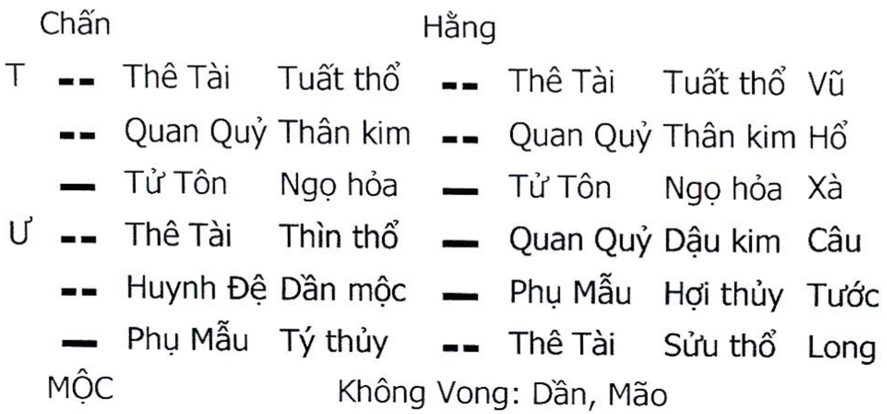
    - **Hình này chứng minh điều gì**
      - Quẻ chứng minh rằng việc mua căn nhà này chắc chắn sẽ dẫn đến thua lỗ nặng nề; phong thủy căn nhà chứa đựng hung hiểm tiềm ẩn, bất lợi cho việc cư ngụ hay đầu tư sinh lợi, tuyệt đối không nên mua.
    - **Từ đâu mà thấy được**
      - Quẻ gốc Chấn Vi Lôi là quẻ Lục Xung, chủ về sự việc chấn động, bất ổn, khí trường phân tán, không tụ tài tụ khí.
      - Hào Thế lâm Thê Tài Tuất thổ: Bị Nguyệt kiến Mão mộc khắc chế, lại bị Nhật thần Thìn thổ xung phá biến thành Nhật phá, bản thân người mua rơi vào thế cực kỳ suy kiệt, tài khí vỡ vụn.
      - Hào Ứng lâm Thê Tài Thìn thổ: Lâm Câu Trần, phát động hóa ra Quan Quỷ Dậu kim, mà Dậu kim lại bị Nguyệt kiến Mão mộc xung thành Nguyệt phá, báo hiệu đối tác hoặc bản thân bất động sản tiềm ẩn nguy cơ phá sản.
      - Hào 2 Huynh Đệ Dần mộc phát động: Huynh Đệ là thần cướp đoạt tiền tài, phát động khắc mạnh vào Thê Tài, khẳng định chắc chắn mua vào sẽ bị phá tài lỗ vốn.
      - Hào Phụ Mẫu Tý thủy (Dụng thần đại diện cho nhà cửa): Phát động hóa ra Thê Tài Sửu thổ thành thể hồi đầu khắc hợp (Sửu thổ khắc và hợp Tý thủy), bản thân Tý thủy lại hưu tù và nhập Mộ tại Nhật thần Thìn thổ, cho thấy chất lượng và vận khí của căn nhà vô cùng xấu.
  - Luận giải và lời khuyên ban đầu: Tác giả căn cứ vào các dấu hiệu quẻ Lục Xung, Thế Nhật phá, Phụ Mẫu bị hồi đầu khắc hợp và nhập Mộ để đưa ra kết luận dứt khoát: Mua nhà nhất định sẽ lỗ vốn, khuyên người học trò không nên mua.

- **Lần gieo quẻ thứ hai và diễn biến tâm lý:**
  - Tâm lý đương số: Dù đã nhận được lời khuyên can của thầy, người học trò vẫn chưa chịu từ bỏ ý định vì quá lưu luyến vẻ đẹp phong cảnh và hình thế bề ngoài của ngôi nhà.
  - Hành động tiếp theo: Sau đó hai ngày, người học trò vẫn tha thiết muốn mua nên đã tiếp tục tiến hành gieo quẻ lần thứ hai để hỏi lại.
  - Thông tin thời gian gieo quẻ lần 2: Ngày Đinh Mùi, tháng Mão (Không Vong: Dần, Mão).
  - Quẻ dịch thu được: Cấn Vi Sơn biến Hỏa Phong Đỉnh.
  - **Hình 5.** Quẻ Cấn Vi Sơn biến Hỏa Phong Đỉnh
    - 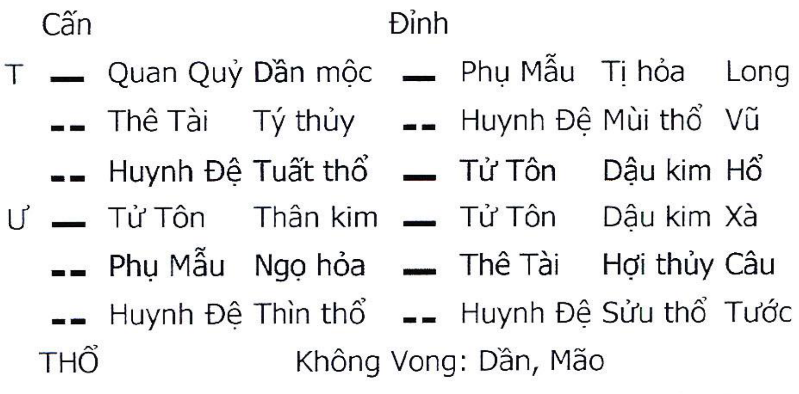
    - **Hình này chứng minh điều gì**
      - Quẻ khẳng định chắc chắn một lần nữa việc mua nhà sẽ chịu tổn thất thua lỗ hoàn toàn; cảnh báo chất lượng căn nhà có vấn đề nghiêm trọng, sắp tới sẽ phát sinh biến cố rủi ro tai họa khôn lường khiến căn nhà bị sập đổ, giá trị tài sản không thể tăng trưởng.
    - **Từ đâu mà thấy được**
      - Quẻ gốc Cấn Vi Sơn tiếp tục là một quẻ Lục Xung, dự báo tình trạng bất an, chấn động dữ dội và đổ vỡ.
      - Hào Thế lâm Quan Quỷ Dần mộc rơi vào trạng thái Tuần Không (Không Vong: Dần, Mão), chủ sự bất an, mất phương hướng và nguy cơ rỗng không.
      - Dụng thần Thê Tài Tý thủy lâm trạng thái hưu tù suy kiệt (tháng Mão tiết khí, ngày Mùi khắc), lại bị hào Huynh Đệ Tuất thổ phát động kịch liệt khắc chế, tượng tiền của tổn hao triệt để.
      - Hào 2 Phụ Mẫu Ngọ hỏa (hào 2 đại diện cho trạch xá/căn nhà): Lâm thần sát Câu Trần, phát động hóa ra Thê Tài Hợi thủy thành thế hồi đầu khắc kịch liệt; Phụ Mẫu là ngôi nhà bị khắc phạt nặng nề chứng tỏ kết cấu căn nhà có khiếm khuyết lớn, báo trước nguy cơ tai họa làm công trình sụp đổ.
  - Luận giải quyết định: Tác giả phán đoán chất lượng ngôi nhà có ẩn họa nghiêm trọng, sau này chắc chắn gặp tai họa rủi ro, giá cả không thể tăng; trước lời cảnh báo kiên quyết lần thứ hai, người học trò đã triệt để nghe theo và quyết định không mua căn nhà nữa.

- **Kết quả ứng nghiệm thực tế (Nghiệm chứng):**
  - Sự kiện chấn động: Không lâu sau thời điểm dự đoán, thảm họa đại động đất Tứ Xuyên (tháng 5 năm 2008) kinh hoàng đã bùng phát dữ dội.
  - Hiện thực căn nhà: Ngôi nhà ở gần núi Thanh Thành mà người học trò định mua đã bị chấn động của trận động đất phá hủy và sập đổ hoàn toàn.
  - Ý nghĩa thực tế: Nhờ quyết định dừng mua kịp thời dựa trên quẻ Lục Hào, người học trò đã bảo toàn trọn vẹn vốn liếng và tránh được thảm họa tai ương nghiêm trọng.

- **Đúc kết bài học lý luận phong thủy và định hướng phát triển môn Lục Hào:**
  - Hạn chế của phong thủy hình thế trước thiên tai:
    - Trong tình huống thiên tai dị biến, cho dù phong thủy hình thế của căn nhà có tốt đến mức nào đi chăng nữa thì cũng hoàn toàn bất lực, không thể chống lại được sức tàn phá của thiên nhiên.
    - Phong thủy mắt thấy tai nghe chỉ là tĩnh tại, không thể nhìn thấy biến cố động trời trong tương lai.
  - Sức mạnh dự báo của Lục Hào: Môn Lục Hào dự đoán học lại sở hữu khả năng siêu việt nắm bắt chính xác việc căn nhà sẽ phát sinh tai biến đổ sập trong tương lai, từ đó khẳng định việc nghiên cứu và phát huy thế mạnh của Lục Hào trong dự đoán phong thủy là cực kỳ cấp thiết.
  - Nền tảng cổ truyền và trách nhiệm kế thừa:
    - Lục Hào dự đoán học từ xa xưa đã sớm đưa mảng dự đoán phong thủy vào hệ thống ứng dụng thực tiễn, trong các trước tác cổ điển ghi chép lại rất nhiều kinh nghiệm quý báu.
    - Dù không phải mọi phần trình bày trong sách cổ đều hoàn toàn ứng nghiệm trong thời đại mới, nhưng ít nhất đã khai mở phương pháp và đường lối dự đoán phong thủy đúng đắn cho hậu thế.
    - Chỉ cần người học chân chính nỗ lực đào sâu nghiên cứu, thực chứng và khai phá lĩnh vực này thì hoàn toàn có thể đưa Lục Hào phong thủy dự trắc học phát dương quang đại, cống hiến giá trị to lớn cho đời sống thực tiễn.

## CHƯƠNG 2: KIẾN THỨC LỤC HÀO CĂN BẢN ỨNG DỤNG TRONG DỰ ĐOÁN PHONG THỦY

### 1. DỤNG THẦN TRONG DỰ ĐOÁN PHONG THỦY

#### Nguyên tắc xác định Dụng thần trong phong thủy
- **Tính chất tổng hợp của dự đoán phong thủy:**
  - Dự đoán phong thủy bằng Lục Hào là một vấn đề mang tính tổng hợp cao, tuyệt đối không thể câu nệ cố định vào một hào duy nhất mà phải căn cứ vào phạm trù và trọng điểm dự đoán của người hỏi để linh hoạt chọn nhiều Dụng thần.
  - Cơ chế biến đổi Dụng thần: Mặc dù toàn quẻ thường phán đoán xoay quanh một Dụng thần chủ đạo, nhưng khi muốn đi sâu vào chi tiết cụ thể thì bắt buộc phải chuyển đổi Dụng thần hoặc thay đổi góc độ quan sát.
  - Bản chất "vừa có Dụng thần, vừa không có Dụng thần": Mỗi lục thân, lục thú (lục thần) hay hào vị đều là những linh kiện cấu thành nên quái tượng tổng thể; chỉ khi kết hợp phân tích đa chiều mới đạt được kết luận chuẩn xác, thấu đáo.
- **Phân loại Dụng thần theo mục đích và đối tượng dự đoán:**
  - **Hào Thế (Dụng thần tiên quyết):**
    - Hào Thế là chủ của một quẻ, nắm giữ cát hung hưu cữu của người đến xem.
    - Đây là hào bắt buộc phải xem xét trong mọi quẻ phong thủy. Dân gian có câu tục ngữ: *"Còn da lông mọc, còn chồi nảy cây"*, công danh lợi lộc đều không thể sánh bằng sự an nguy tính mạng, cát hung của con người.
    - Khi người hỏi muốn biết sự cát hung của chính bản thân mình thì lấy hào Thế làm Dụng thần trực tiếp.
  - **Hào Phụ Mẫu (Dụng thần nhà đất, giấy tờ):**
    - Sử dụng khi dự đoán việc thương lượng, thỏa thuận mua bán nhà cửa, đất đai xem có thành công hay không.
    - Đồng thời, khi phán đoán các chi tiết liên quan đến thực trạng đất đai, nhà ở, công trình xây dựng cũng đều lấy Phụ Mẫu làm Dụng thần.
  - **Hào Thê Tài (Dụng thần kinh doanh, tài lộc):**
    - Là Dụng thần hàng đầu khi người đến xem là thương nhân, người làm ăn kinh doanh chú trọng đến lợi nhuận.
    - Đặc biệt áp dụng khi dự đoán phong thủy cho cơ sở thương mại, văn phòng công ty hoặc cửa hàng kinh doanh.
  - **Hào Quan Quỷ (Dụng thần quan vận, sự nghiệp):**
    - Dùng làm Dụng thần khi người đến xem là cán bộ, công chức làm việc trong các cơ quan chính phủ với mục đích cầu thăng quan tiến chức, sự nghiệp công danh.
  - **Lục thân tương ứng theo người bệnh:**
    - Khi trong gia đạo có người đau ốm, bệnh tật kéo dài nghi ngờ do phạm phải phong thủy nơi ở xấu, sẽ căn cứ vào mối quan hệ thân tộc với người bệnh (cha mẹ lấy Phụ Mẫu, vợ/tiền tài lấy Thê Tài, con cái lấy Tử Tôn, anh chị em lấy Huynh Đệ) để chọn hào đại diện làm Dụng thần phân tích.

#### Ví dụ thực chứng: Xem tìm đất thích hợp để xây nhà
- **Bối cảnh quẻ:**
  - Thời gian: Ngày Ất Dậu, tháng Tân Hợi, năm Nhâm Ngọ (Tuần không: Ngọ, Mùi).
  - Ngữ cảnh thực tế: Một người đàn ông có dự định xây nhà mới, đến dự đoán xem liệu bản thân có thể tìm kiếm được mảnh đất thích hợp hay không.
  - Quẻ thu được: Thủy Lôi Truân biến Khôn Vi Địa.
- **Luận giải quẻ phong thủy qua quái tượng:**
  - **Hình 6.** Sơ đồ quẻ Thủy Lôi Truân biến Khôn Vi Địa
    - 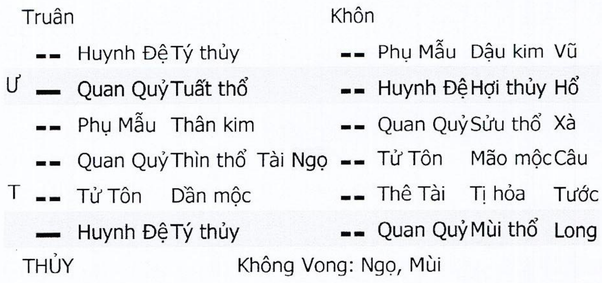
    - **Hình này chứng minh điều gì**
      - Quẻ chứng minh gia chủ chắc chắn sẽ tìm được mảnh đất ưng ý nhờ sự trợ giúp của người khác và xây dựng được căn nhà mới để dọn về ở rất vui vẻ, địa thế giao thông thuận tiện ngay cạnh đường lớn; tuy nhiên việc mua đất và thi công sẽ tiêu hao nhiều tiền của.
    - **Từ đâu mà thấy được**
      - Phụ Mẫu Thân kim vượng tướng được Nhật sinh, hào Ứng Quan Quỷ Tuất thổ động sinh Phụ Mẫu, hào Thế Tử Tôn Dần mộc nhập trạch được Huynh Đệ Tý thủy lâm Thanh Long sinh trợ.
- **Phân tích chi tiết hào vị và diễn biến cát hung:**
  - *Khả năng tìm được đất lành:*
    - Lấy Phụ Mẫu làm Dụng thần đại diện cho nhà cửa, đất đai. Hào 4 Phụ Mẫu Thân kim được Nhật thần Dậu kim đồng hành tương trợ, Nguyệt kiến Hợi thủy không khắc chế, Dụng thần vượng tướng có lực nên khẳng định chắc chắn sẽ tìm được nơi đất cát thích hợp.
    - Hào Ứng là Quan Quỷ Tuất thổ phát động sinh hào Dụng thần Phụ Mẫu Thân kim. Hào Ứng đại diện cho người khác, báo hiệu việc tìm đất sẽ nhờ cậy người khác tìm giúp hoặc được người ngoài giới thiệu mà thành.
  - *Tượng dọn về nhà mới và thời điểm ứng nghiệm:*
    - Quẻ bản thể Thủy Lôi Truân mang ý nghĩa tụ tập, cư trú, an cư.
    - Hào 2 là hào Trạch (tượng trưng cho nhà cửa, nơi ở). Hào Thế mang Tử Tôn Dần mộc lâm tại hào 2, ứng với tượng "Thế nhập trạch", biểu thị bản thân người hỏi sẽ đích thân dọn vào sinh sống trong căn nhà đó.
    - Hào sơ Huynh Đệ Tý thủy lâm thần sát Thanh Long phát động tương sinh cho hào Thế Dần mộc. Thanh Long chủ về sự mới mẻ, lại chủ niềm vui vẻ, hoan hỉ.
    - Do hào Tý thủy động biến Quan Quỷ Mùi thổ (chi Mùi đang lâm Tuần không), hóa Không nên tạm thời chưa phát huy lực tương sinh hào Thế.
    - Đến năm thứ hai là năm Quý Mùi (2003), chi Mùi xuất Không, hào động thông lực sinh hào Thế nên người này sẽ vui vẻ dọn vào ở trong căn nhà mới của mình.
  - *Vị trí phong thủy và điều kiện giao thông:*
    - Hào 5 Quan Quỷ Tuất thổ phát động sinh Dụng thần Phụ Mẫu (nhà ở).
    - Hào 5 tượng trưng cho đường sá, lại lâm Bạch Hổ (Bạch Hổ cũng chủ đường đi lối lại huyết mạch). Điều này cho thấy vị trí nhà mới có giao thông vô cùng thuận tiện, tiếp giáp trục đường lớn.
  - *Vấn đề tài chính, hao tổn tiền bạc:*
    - Hào sơ Huynh Đệ Tý thủy phát động sinh hào Trạch nhưng bản thân Huynh Đệ lại khắc Thê Tài.
    - Hào 5 Quan Quỷ Tuất thổ phát động tuy sinh Phụ Mẫu nhưng Tuất thổ lại là Mộ khố của Hỏa (Thê Tài Ngọ hỏa phục thần dưới hào 3), khiến Thê Tài lâm thế nhập Mộ.
    - Hai dấu hiệu này chỉ rõ việc mua đất xây nhà tiêu tốn kinh phí rất lớn, hao hụt nhiều tiền bạc.
- **Kết quả ứng nghiệm thực tế:**
  - Đến năm Đinh Hợi (2007), người đàn ông này đã quay lại phản hồi:
    - Đúng vào thời điểm mặt trời lặn (hoàng hôn) ngày 26 tháng 12 năm 2003 (năm Quý Mùi), anh ta đã chính thức dọn về ở tại ngôi nhà mới.
    - Về điều kiện giao thông: Nơi ở mới cực kỳ tiện lợi, chỉ cách lối vào đường cao tốc khoảng 3 phút lái xe.
    - Về tâm lý và tài chính: Quá trình xây cất tuy tiêu tốn rất nhiều tiền bạc nhưng bản thân anh ta vô cùng hài lòng và mãn nguyện.

### 2. CÁCH DÙNG HÀO VỊ TRONG DỰ ĐOÁN PHONG THỦY

#### Khái niệm và vai trò của hào vị trong dự đoán phong thủy
- **Chuyển hóa thông tin từ không gian phẳng sang không gian ba chiều:**
  - Trong dự đoán Lục Hào, sự xuất hiện của hào vị đã chuyển hóa toàn bộ tổ hợp thông tin từ dạng mặt phẳng hai chiều biến thành không gian ba chiều (3D), tạo nên khả năng dự trắc chuẩn xác kỳ diệu.
  - Hào vị chính là then chốt quyết định để nhận định và phán đoán hoàn cảnh môi trường thực địa cụ thể.
- **Tác dụng xác định cát hung phương vị trong phong thủy:**
  - Hào vị giữ vai trò cực kỳ to lớn, là một trong những căn cứ tham khảo hàng đầu để định vị vị trí cát hung của nhà ở, công trình và môi trường xung quanh.
  - Nếu thiếu tổ hợp thông tin của hào vị, khả năng dự trắc sẽ bị suy giảm đáng kể, đồng thời việc phán đoán cụ thể vị trí tốt xấu trong phong thủy trở nên vô cùng khó khăn.

#### Năm phương diện biểu hiện không gian của hào vị
- **Tính chất đan xen đa chiều của hào vị:**
  - Trong Lục Hào, năm phương diện không gian không biểu hiện đơn nhất hay cô lập, mà luôn có sự đan xen, kết hợp chặt chẽ lẫn nhau để mô tả bức tranh phong thủy đầy đủ.
- **1. Thể hiện kết cấu (Tam tài Thiên - Địa - Nhân):**
  - Căn cứ vào cấu thành nội tại của một quẻ Lục Hào: một đơn quái (nội quái hoặc ngoại quái) gồm 3 hào tương ứng Tam tài "Thiên - Địa - Nhân" (trên là Thiên, dưới là Địa, giữa là Nhân).
  - Phân bố Tam tài trong và ngoài qua sự kết hợp của thượng quái và hạ quái:
    - *Địa (hào sơ và hào 4)*: Hào sơ là Địa bên trong (nội quái), hào 4 là Địa bên ngoài (ngoại quái).
    - *Nhân (hào 2 và hào 5)*: Hào 2 là Nhân bên trong (nội quái), hào 5 là Nhân bên ngoài (ngoại quái).
    - *Thiên (hào 3 và hào 6)*: Hào 3 là Thiên bên trong (nội quái), hào 6 là Thiên bên ngoài (ngoại quái).
  - Ứng dụng so sánh cặp Nhân (hào 5 và hào 2):
    - *Về cấp bậc và tôn ti*: Hào 5 ở ngôi vị cao nên là cấp trên, lãnh đạo, gia trưởng; hào 2 ở bên trong nên là thai nhi (người cư ngụ bên trong bụng mẹ).
    - *Về không gian sinh hoạt*: Hào 5 là nhân bên ngoài nên ứng với người đi trên đường (đại diện cho đường sá, lộ trình); hào 2 là nhân bên trong nên ứng với người ở trong nhà (đại diện cho căn nhà, nơi ở).
- **2. Thể hiện trong ngoài (Nội quái - Ngoại quái):**
  - Quẻ phân chia thành nội quái (bên trong) và ngoại quái (bên ngoài).
  - Hào 3 và hào 4 nằm ở vị trí tiếp giáp giữa nội quái và ngoại quái, do đó hai hào này biểu hiện thông tin trong - ngoài rất rõ ràng.
  - Cả hai hào đều đại diện cho cửa nẻo: Hào 3 là cửa bên trong (nội môn), hào 4 là cổng chính bên ngoài (đại môn).
- **3. Thể hiện xa gần:**
  - Hào 2 định vị ở bên trong ứng với cự ly gần: đại diện cho gian nhà, sân trong.
  - Hào 6 định vị ở ngoài cùng ứng với cự ly xa: đại diện cho bờ tường rào, tường bao, khoảng cách xa xôi.
- **4. Thể hiện trên dưới:**
  - Hào sơ ở dưới cùng: đại diện cho bàn chân con người.
  - Hào 6 ở trên đỉnh cao nhất: đại diện cho phần đầu con người.
- **5. Thể hiện cao thấp:**
  - Hào sơ ở tầng thấp nhất: đại diện cho mặt đất, nền nhà, móng nhà.
  - Hào 6 ở tầng cao nhất: đại diện cho mái nhà, trần nhà, nóc nhà.
- **Phương pháp tư duy mở rộng:**
  - Ý nghĩa của từng hào vị không cố định cứng nhắc mà luôn vận động, đan xen; người học cần nắm vững mạch tư duy gợi mở này để tự liên hệ, suy ngẫm và mở rộng sang mọi tình huống dự đoán thực tế.

#### Sáu hệ thống phân bố ý nghĩa của hào vị
- **1. Phân bố Lục thân theo hào vị:**
  - *Hào 6*: Trưởng bối, tổ tiên, ông nội, bà nội.
  - *Hào 5*: Cha, gia trưởng (chủ gia đình).
  - *Hào 4*: Mẹ.
  - *Hào 3*: Anh em, chú bác.
  - *Hào 2*: Vợ chồng, thai nhi.
  - *Hào sơ*: Trẻ nhỏ, con cháu, thế hệ sau, thời đại sau.
- **2. Phân bố kết cấu căn nhà theo hào vị:**
  - *Hào 6*: Mái nhà, nóc nhà, tường bao, bức tường, bàn thờ, hàng xóm, phần mộ tổ tiên, thủy khẩu (lối thoát nước).
  - *Hào 5*: Đường đi, cầu thang, hành lang.
  - *Hào 4*: Cổng chính (đại môn), cửa sổ, nhà vệ sinh.
  - *Hào 3*: Phòng ngủ, cửa ra vào, giường nằm, am thờ Phật.
  - *Hào 2 (Trạch hào)*: Gia đình, căn nhà, sân, phòng bếp (tiêu điểm biểu thị trực tiếp ngôi nhà, trạch xá).
  - *Hào sơ*: Nền nhà, mặt đất, giếng nước, mương máng, cống rãnh thoát nước, hàng xóm.
- **3. Phân bố bộ vị cơ thể con người theo hào vị:**
  - *Hào 6*: Tóc, đầu, mặt, cánh tay, vai.
  - *Hào 5*: Ngực, cổ họng, cổ, mặt, ngũ quan, vai, lưng.
  - *Hào 4*: Ngực, vú, hai bên sườn, nách, lưng.
  - *Hào 3*: Đùi, dạ dày, bụng, eo, rốn.
  - *Hào 2*: Đôi chân, đầu gối, bụng, cẳng chân.
  - *Hào sơ*: Bàn chân, lòng bàn chân.
- **4. Phân bố nội tạng cơ thể con người theo hào vị:**
  - *Hào 6*: Não bộ, đầu.
  - *Hào 5*: Lá lách, tim, họng, tuyến giáp, thực quản, phổi.
  - *Hào 4*: Tỳ vị, tim, lồng ngực, phổi, khí quản, tuyến vú.
  - *Hào 3*: Ruột, dạ dày, gan mật, thận, bàng quang, tuyến tụy, hậu môn, tim.
  - *Hào 2*: Ruột, gan mật, vùng thượng vị, ruột thừa, tuyến tụy, tử cung, bộ phận sinh dục, thận, hậu môn, bàng quang.
  - *Hào sơ*: Ngón chân, xương bàn chân.
- **5. Phân bố khu vực hành chính theo hào vị:**
  - *Hào 6*: Biên giới, vùng khác, nước ngoài, nơi hẻo lánh xa xôi, cấp tỉnh.
  - *Hào 5*: Tỉnh lị, thủ đô, nội thành, thành phố, quận huyện.
  - *Hào 4*: Ngoại thành, thị trấn, huyện lị.
  - *Hào 3*: Xã phường, thị trấn nhỏ.
  - *Hào 2*: Chợ búa, ngõ hẻm, khu dân cư, khu phố.
  - *Hào sơ*: Thôn làng, nông thôn, miền quê.
- **6. Phân bố chức vụ xã hội theo hào vị:**
  - *Hào 6*: Nhân viên nghỉ hưu, nhân viên hậu cần, nhân viên ngoài biên chế, người không được trọng dụng.
  - *Hào 5*: Lãnh đạo cấp cao, cấp trên, chủ quản, tổng thống, chủ tịch tỉnh, vua, tổng giám đốc, thị trưởng, tư lệnh viên, quân đoàn trưởng.
  - *Hào 4*: Giám đốc sở, bộ trưởng, thủ tướng, trưởng phòng, sư đoàn trưởng.
  - *Hào 3*: Trưởng phòng, ty trưởng, trung đoàn trưởng, tiểu đoàn trưởng.
  - *Hào 2*: Trưởng khoa, trưởng bộ phận, đại đội trưởng, tiểu đội trưởng.
  - *Hào sơ*: Viên chức, thuộc hạ, bộ hạ, binh sĩ, quần chúng, bách tính nhân dân.

#### Tổ hợp thông tin dự đoán phong thủy chi tiết từ hào sơ đến hào 6
- **Nguyên tắc phân tích động tĩnh sinh khắc:**
  - Cần xem xét kỹ động tĩnh sinh khắc ảnh hưởng trực tiếp đến hào nào.
  - Kết hợp chặt chẽ hào vị, Lục thần (Lục thú) và Lục thân để nhận định thấu đáo cát hung, lợi hại trên từng phương diện.
  - Điều tối kỵ trong phong thủy Lục Hào: hào phát động đến khắc hào Thế.
- **Luận giải chi tiết Hào sơ:**
  - *Nguồn nước, mương rãnh và cầu cống xung quanh:*
    - Hào sơ mang Tý thủy lâm Bạch Hổ: Gần nơi ở có cây cầu bắc qua.
    - Hào sơ mang Tý thủy, hoặc hào sơ là Mộ khố của Thê Tài lâm Huyền Vũ: Đại diện cho cống rãnh thoát nước ngầm.
    - Lâm Thanh Long hoặc Chu Tước: Đường ống cấp nước sạch sinh hoạt.
    - Lâm Đằng Xà: Đường ống dẫn nước, đường ống truyền dẫn quanh co.
    - Lâm Câu Trần: Tháp nước, trạm thủy điện, trạm cấp nước sạch.
    - Thủy hào có Kim phát động đến tương sinh: Biểu hiện của dòng sông ngòi tự nhiên.
    - Trạng thái lưu lượng nước: Thủy hào vượng tướng thì nguồn nước lớn, dòng chảy xiết; hưu tù thì ít nước, dòng chảy yếu; lâm Không Vong gặp Tuyệt địa thì nguồn nước cạn kiệt; nhập Mộ hoặc gặp tương hợp thì dòng nước bị ứ đọng, tắc nghẽn đường thoát.
  - *Nền móng, đất đai và công trình xây dựng:*
    - Hào sơ mang ngũ hành Thổ: Thường chủ về móng nhà.
    - Hào sơ bị Mộc khắc thương hoặc Thổ động hóa Mộc hồi đầu khắc: Rễ cây cối xâm lấn làm tổn hại móng nhà.
    - Thổ hóa Mộc hoặc Mộc hóa Thổ: Phòng ốc, nhà cửa mới vừa xây dựng.
    - Lâm Câu Trần phát động: Tượng công trường đang thi công, cải tạo, xây dựng rầm rộ nền móng.
    - Lâm Không Vong: Móng nhà bên dưới bị rỗng ruột, có hang hốc sụt lún.
    - Lâm Thủy Không Vong hoặc Thìn thổ Không Vong: Nền móng có dấu hiệu rò rỉ nước ngầm, ẩm ướt chân móng.
    - Lâm Mộ khố của Quan Quỷ, hoặc thêm Bạch Hổ, hoặc Quan Quỷ lâm Bạch Hổ hợp hào sơ: Dưới móng nhà có chôn cất mồ mả cổ xưa hoặc hài cốt xương khô.
    - Hào sơ lâm Nguyệt phá: Móng nhà có vết nứt hoặc bị nứt vỡ hư hại; nếu có Nhật thần đến hợp là dấu hiệu nền móng đã từng được gia cố tu bổ.
    - Lâm Thanh Long: Nền móng công trình mới xây cất khang trang.
  - *Quan hệ hàng xóm láng giềng:*
    - Hào sơ phát động sinh hào Thế hoặc tương hợp với hào Thế: Hàng xóm láng giềng hòa thuận tốt đẹp, gia chủ thường xuyên nhận được sự giúp đỡ từ hàng xóm.
    - Hào sơ lâm Chu Tước, Đằng Xà phát động khắc hào Thế: Chủ về tranh chấp mâu thuẫn, vì chuyện móng nhà hoặc ranh giới phòng ốc mà xảy ra kiện tụng cãi cọ với hàng xóm.
  - *Tiểu khẩu (con cháu đời sau) và tai họa:*
    - Hào sơ đại diện cho "tiểu khẩu" (người chưa đến tuổi trưởng thành), biểu thị thế hệ con cháu tương lai.
    - Rất kỵ hào sơ lâm Tử Tôn rơi vào Không Vong hoặc Nguyệt phá; lâm Bạch Hổ bị khắc; hoặc có Nhật Nguyệt/hào khác lâm Bạch Hổ đến khắc hại: Nếu không phải sảy thai, lưu sản (mang thai chưa đủ 28 tuần, thể trọng thai nhi chưa đủ 1000g mà chấm dứt mang thai) thì cũng là thông tin thương tật, ốm đau tàn phế.
    - Gặp Tam hình, lại lâm Câu Trần hoặc Đằng Xà nhập Mộ: Con cháu gặp tai họa lao ngục, tù tội.
    - Lâm Huyền Vũ tương hợp với Thê Tài: Con cháu trong nhà ham mê trộm cắp, cờ bạc lừa gạt.
  - *Hiện trạng mặt đất quanh nhà:*
    - Lâm Mộc gặp Nguyệt phá lại thêm Đằng Xà: Đất đai xung quanh cỏ dại mọc hoang rậm rạp.
    - Ngũ hành Kim gặp Nguyệt phá đến tương hợp hào sơ: Mặt đất xung quanh đá sỏi lởm chởm, gồ ghề.
    - Ngũ hành Thổ lâm Huyền Vũ đến hợp hào sơ: Mặt đất rác rưởi chất đống ô uế, bẩn thỉu.
- **Luận giải chi tiết Hào 2:**
  - *Tượng phòng ốc, căn nhà và phòng bếp:*
    - Hào 2 đại diện cho phòng ngủ, căn phòng, gian nhà, phòng bếp, sân trong.
    - Lâm Thanh Long, Chu Tước, Thê Tài; hoặc có hào mang Thanh Long, Chu Tước đến sinh trợ; hoặc tương hợp với hào mang Thê Tài, Chu Tước, Thanh Long: Đa số luận đoán là khu vực phòng bếp.
  - *Ánh sáng, điện chiếu và khói lửa:*
    - Hào 2 lâm Hỏa: Thường chủ về ánh sáng đèn điện hoặc ánh sáng mặt trời chiếu sáng gian phòng.
    - Hào 2 lâm Huyền Vũ nhập Mộ, hoặc Không Vong không được sinh phù; hoặc hào 2 Không Vong không có Hỏa hào đến sinh trợ: Trong phòng ánh sáng ảm đạm, u tối, thiếu hụt ánh nắng mặt trời.
    - Hào 2 lâm Thanh Long, Chu Tước gặp Không Vong: Bếp núc nguội lạnh, trong nhà không có khói bếp bốc lên (ít nấu nướng, sinh hoạt lạnh lẽo).
    - Hào 2 lâm Quan Quỷ cùng Chu Tước phát động: Trong nhà khẩu thiệt (tranh luận, cãi cọ) không dứt, hoặc có hỏa hoạn phát sinh thiêu đốt.
  - *Sân vườn và cây cảnh:*
    - Hào 2 là sân nhà, khu vực gần sát căn nhà. Lâm Mộc chủ về trong sân có cây cối; người sống ở nhà lầu thì ứng với việc trồng hoa cảnh, chậu kiểng trong nhà.
    - Mộc hào hợp với hào Ứng: Tán cây vươn rộng rậm rạp sang tận đất nhà hàng xóm.
    - Mộc hào hợp với hào 6: Cây cối sinh trưởng bám sát chân bờ tường bao.
    - Trạng thái cây cối: Vượng tướng lâm Không Vong thì thân cây có hốc; hưu tù lâm Không Vong lại kèm Bạch Hổ thì cây cối từng bị chặt đốn; hưu tù rơi vào Tử địa thì cây cành khô lá rụng héo úa.
  - *Người ngoài cư ngụ, nhà cho thuê và Đào Hoa trạch:*
    - Hào Ứng ngự tại hào 2, hoặc hào Ứng có cùng địa chi với hào 2, hoặc hào Ứng phát động tương hợp hào 2: Có người ngoài đến ở nhờ, hoặc căn nhà đem cho người khác thuê.
    - Kỵ hào 2 lâm Huyền Vũ phát động: Đối với người nam đến đoán mà hào 2 hợp Thê Tài, đối với người nữ đến đoán mà hào 2 hợp Quan Quỷ, đều là quẻ "Đào Hoa trạch", chủ về có kẻ ngoài đến ve vãn, dụ dỗ vợ hoặc chồng của mình.
  - *Tác động của các hào động đến hào 2:*
    - Hào nào phát động đến tương hợp hào 2 thì hào đó có thể luận là cửa ra vào.
    - Thủy hào phát động đến sinh hợp hào 2: Có dòng nước chảy vào nhà (thủy nhập trạch).
    - Kim hào đến tương hợp hào 2: Trong sân hoặc trong nhà có đá tảng hoặc đồ vật kim loại lớn.
    - Mộc hào kèm Chu Tước, Thanh Long ngự tại hào 2 hoặc sinh hợp hào 2: Trong nhà có treo tranh chữ, hoành phi câu đối nghệ thuật.
    - Lâm Thổ Không Vong: Sân nhà có hố trũng sụt lún; lâm Nguyệt phá: Vách tường hoặc nhà cửa có vết rạn nứt nẻ.
  - *Đặc điểm hiện trạng nhà ở theo Lục thần:*
    - Lâm Thanh Long: Căn nhà mới xây dựng, sạch đẹp.
    - Lâm Chu Tước: Không gian ồn ào náo nhiệt, gần nơi đông đúc.
    - Lâm Câu Trần: Căn nhà cổ cũ kỹ, lâu năm.
    - Lâm Đằng Xà: Không gian chật hẹp, tù túng, đông đúc ngột ngạt.
    - Lâm Bạch Hổ: Căn nhà nằm sát ngay ven đường giao thông lớn.
    - Lâm Huyền Vũ: Căn nhà tối tăm, u ám, ẩm thấp thiếu dưỡng khí.
  - *Xây sửa và biến động di chuyển:*
    - Hào 2 có Thổ và Mộc biến hóa lẫn nhau: Tượng trưng trong nhà đang tiến hành xây dựng, sửa chữa phòng ốc.
    - Hào Phụ Mẫu ngự tại hào 2 phát động: Có điềm dời chuyển chỗ ở; phát động lại gặp xung: Gia chủ thường xuyên phải dời đổi nơi cư trú liên tục.
- **Luận giải chi tiết Hào 3:**
  - *Phân định tượng cửa ra vào và giường nằm:*
    - Hào 3 đại diện cho cửa ra vào, giường nằm, phòng ngủ, am thờ Phật.
    - Quy tắc thông thường: Lấy hào Dương làm cửa, hào Âm làm giường nằm (cần áp dụng biến hóa linh hoạt).
    - Phân định theo Địa chi: Hợi, Sửu thường luận là giường nằm; Ngọ hỏa, Dậu kim, Mão mộc thường luận là cửa nẻo (không được cứng nhắc).
    - Phân định theo Lục thân: Huynh Đệ lâm hào 3 thường luận là cửa; hợp với hào Phụ Mẫu cũng luận là cửa.
    - Dấu hiệu giường nằm: Hào 3 là Mộ khố của hào Thế; hoặc Thế lâm hào 3 nhập Mộ; hoặc Thế hợp hào 3; hoặc hào 3 lâm Đằng Xà đều chủ về giường nằm.
    - Dấu hiệu cửa nẻo: Hào 3 lâm Bạch Hổ thường luận là cửa ra vào.
  - *Phòng ngủ, nơi thờ cúng và giấc ngủ:*
    - Lâm Phụ Mẫu: Thường là phòng ngủ sinh hoạt.
    - Lâm Quan Quỷ, Bạch Hổ, Thanh Long: Thường luận là bàn thờ tổ tiên hoặc thần linh.
    - Hào 3 Không Vong lâm Đằng Xà: Giấc ngủ không yên, tâm trạng chập chờn lo âu bất an.
    - Quan Quỷ lâm Đằng Xà phát động tại hào 3: Đêm ngủ thường xuyên gặp ác mộng kinh hãi.
    - Hào Kim gặp Không Vong hoặc lâm Chu Tước: Cửa nẻo thường mở rộng toang hoác.
    - Lâm Thanh Long động hóa hồi đầu sinh: Khi bước chân ra khỏi cửa sẽ đón gặp việc vui mừng hoan hỉ.
  - *Chất liệu vật thể theo Ngũ hành:*
    - Giường nằm: Ngũ hành Thổ là hố lửa/giường lò sưởi ấm; Mộc là giường gỗ; Kim là giường khung sắt kim loại.
    - Cửa nẻo: Ngũ hành Mộc là cửa gỗ; Kim là cửa sắt, cổng sắt; Thổ là vòm cuốn gạch, cổng xây gạch.
  - *Hiện trạng và hoạt động của cửa:*
    - Hào 3 Không Vong: Cửa nhà không có cánh, hoặc trên cánh cửa có lỗ thủng, hoặc chỉ là cửa rào tre gỗ thưa thớt.
    - Ngũ hành Thủy đại diện cho cửa kính; Thủy Không Vong lâm Đằng Xà: Cửa kính bị rạn nứt nẻ.
    - Hỏa lâm Không Vong: Cửa ra vào không có đèn chiếu sáng, hoặc đầu giường lò sưởi nguội lạnh giá rét.
    - Lâm Huyền Vũ: Cửa hoặc phòng ngủ ẩm thấp, lạnh lẽo khí âm.
    - Lâm Câu Trần phát động (nhất là lâm hào Thổ hoặc hào Mộc): Chủ về việc thay đổi, tu sửa lại cánh cửa.
    - Hào 3 gặp tương hợp: Cửa nẻo đóng chặt then cài; xuất hiện hai hào tương hợp là tượng hai cánh cửa khép chặt vào nhau.
    - Hào 3 bị Nhật Nguyệt hoặc hào động xung phá: Gia chủ không đi cửa chính mà thường đi bằng cửa bên hông.
  - *Tác động phong thủy đến sức khỏe và hành vi nhân sự:*
    - Hào Thế nhập Mộ tại hào 3 lại lâm Câu Trần: Người có thói quen thích ngủ nướng, lười biếng trễ nải.
    - Nam giới đến đoán mà hào 3 lâm Huyền Vũ hợp Thê Tài, hoặc nữ giới đến đoán mà hào 3 lâm Huyền Vũ hợp Quan Quỷ: Chủ về bản tính dâm dục, tham mê sắc dục.
    - Mộc Quan Quỷ lâm Đằng Xà tại hào 3: Phụ nữ trong gia đình thường có tâm lý sợ bóng sợ gió bất ngờ, thần hồn nát thần tính, hoặc bị tà ma âm khí quấy nhiễu triền miên.
- **Luận giải chi tiết Hào 4:**
  - *Tượng cổng chính (đại môn) và nhà vệ sinh:*
    - Hào 4 đại diện cho cổng chính bên ngoài (đại môn), cửa sổ, hoặc nhà vệ sinh.
    - Nhận diện công năng kiến trúc: Lâm Bạch Hổ hoặc Huynh Đệ thường là cổng lớn; lâm Huyền Vũ đa số là nhà vệ sinh.
    - Thế cửa đối diện gây xung xạ: Hào 3 và hào 4 đối xung lẫn nhau, chủ về trong nhà trổ quá nhiều cửa, các cánh cửa đối diện đâm thẳng vào nhau (cửa đối cửa) phạm thế hung.
    - Hào 3 và hào 4 đồng thời lâm Huynh Đệ: Cửa nẻo trong nhà dẫn đến tiêu tán tiền của, thường xuyên hao tài tốn lộc.
  - *Cửa sổ và khả năng thông quang:*
    - Hào 4 đại diện cho cửa sổ của căn nhà.
    - Lâm Hỏa vượng tướng: Cửa sổ thoáng đãng, sạch sẽ, đón nhận ánh sáng mặt trời chan hòa rực rỡ.
    - Lâm Hỏa Không Vong: Cửa sổ thiếu hụt ánh sáng, căn phòng âm u tối tăm.
- **Luận giải chi tiết Hào 5:**
  - *Tượng gia trưởng và vị thế trụ cột:*
    - Hào 5 ở ngôi cao tôn quý, đại diện cho bậc gia trưởng, chủ sự quán xuyến trong gia đình.
    - Hào Thế ngự tại hào 5: Bản thân người hỏi là người chủ sự, gánh vác quyền hành trong gia đình; nếu hào 5 gặp Không Vong thì luận đoán ngược lại (không nắm quyền hoặc không phải người chủ sự).
  - *Tượng đường sá, lộ trình và giao thông xung quanh:*
    - Hào 5 đại diện cho đường đi, lối đi huyết mạch, cầu thang, hành lang.
    - Hào Thế ngự tại hào 5: Nhà ở nằm ngay kề sát bên cạnh mặt đường lớn.
    - Hào 5 Không Vong: Gần nơi ở có cây cầu bắc ngang.
    - Hào 5 lâm Nguyệt phá: Mặt đường trước nhà bị hư hỏng, lồi lõm gập ghềnh rạn nứt.
    - Lâm Thanh Long kết hợp Dịch Mã: Con đường trước nhà là đường cao tốc, đại lộ lớn tấp nập xe cộ.
    - Tương xung gây sát khí đường sá: Hào 5 xung hào 2, đường lớn đâm thẳng vào nhà (đường xung trạch); hào 5 xung hào 3, đường lớn đâm thẳng trực diện vào cửa chính (đường xung môn).
    - Hào 5 hưu tù lâm Đằng Xà: Lối đi nhỏ hẹp, đường quanh co khúc khuỷu, ngoằn ngoèo uốn lượn.
    - Hào 5 nhập Mộ: Điểm cuối của con đường, ngõ cụt không lối thoát.
    - Hào 5 lâm Nhật thần tương hợp hào 3: Lối đi ra ngoài bị bít kín, đường sá không thông thoát.
    - Lâm Câu Trần phát động: Gần trục đường đi lại đang có công trình xây dựng, thi công dở dang.
  - *Vấn đề hôn nhân và thừa tự:*
    - Hào Thế tại hào 5 phát động tương hợp với hào Ứng, hoặc hào Thế tại hào 5 phát động nhập Mộ tại hào Ứng: Đối với người nam, đây là điềm báo bản thân đi ở rể nhà vợ, hoặc được người khác nhận nuôi làm con thừa tự hương hỏa.
- **Luận giải chi tiết Hào 6:**
  - *Tượng tường bao, mái trần và ranh giới kiến trúc:*
    - Hào 6 đại diện cho bờ tường bao quanh, tường ngăn, trần nhà, mái nhà nóc nhà, thủy khẩu, ranh giới xa xôi.
    - Lâm Thổ vượng tướng gặp Không Vong: Trên tường bao có lỗ hổng hoặc khe rỗng thông gió.
    - Lâm Nguyệt phá: Bức tường bị nứt nẻ, rạn nứt kết cấu.
    - Lâm Mộc kèm Đằng Xà: Có cây cối dây leo chằng chịt quấn quanh bờ tường bao.
    - Lâm Hỏa kèm Đằng Xà: Có đường dây điện câu móc bám chằng chịt, lộn xộn men theo tường.
    - Hào 6 Không Vong: Mái nhà hoặc trần nhà bị sụt lún hư hại, hoặc có lỗ thủng dột nát trông thấy cả bầu trời.
    - Lâm Thủy Không Vong, hoặc bị Thìn thổ xung phá: Mái nhà, vách tường bị rò rỉ nước mưa, thấm dột ẩm ướt.
    - Lâm Mộc: Tượng trưng cho rui mè, xà ngang, đòn tay bằng gỗ chống đỡ trần nhà.
  - *Bàn thờ tâm linh và âm phần mồ mả tổ tiên:*
    - Hào 6 ở vị trí cao nhất, đại diện cho nơi thờ phụng thần linh gia tiên và mồ mả tổ tiên.
    - Lâm Câu Trần: Đa số ứng nghiệm về phần mộ tổ tiên.
    - Lâm Thanh Long: Đa số ứng nghiệm về bàn thờ, nơi hương khói phụng cúng.
    - Quan Quỷ lâm Thanh Long gặp Không Vong: Trong nhà không có lập bàn thờ hương khói cúng bái tổ tiên thần Phật.
    - Quan Quỷ lâm Thanh Long gặp Nguyệt phá: Bàn thờ, bài vị hoặc tượng thần bị sứt mẻ, đổ vỡ, hư hỏng.
    - Hào 6 lâm Câu Trần độc phát: Phong thủy mồ mả tổ tiên không tốt, âm phần bất an gây hung họa ảnh hưởng trực tiếp đến bản thân người xem.

### 3. Ý NGHĨA CỦA LỤC THÂN TRONG DỰ ĐOÁN PHONG THỦY

- **Khái niệm và vai trò của Lục Thân**:
  - Bên cạnh việc tham gia vào quan hệ sinh khắc, Lục Thân còn là một trong những căn cứ quan trọng để tham khảo thủ tượng (thủ tượng là phương pháp nắm bắt dấu hiệu của một sự vật, sự việc nào đó).
  - Mỗi Lục Thân đại diện cho các đối tượng vật chất, không gian kiến trúc và nhân sự tương ứng trong phong thủy nhà ở.

#### Hào Phụ Mẫu

- **Tượng trưng cơ bản**:
  - Phụ Mẫu đại diện cho phòng ốc, kiến trúc, phần đỉnh/mái nhà, tường bao, đất đai, xe cộ, thuyền bè, trang phục,...
- **Quy tắc luận giải phong thủy của Phụ Mẫu**:
  - **Nhà cửa, vật kiến trúc xung xạ nơi ở**: Phụ Mẫu lâm Nhật Nguyệt hoặc hào động xung hào Thế, xung hào 2, chủ về có nhà cửa, công trình kiến trúc xung xạ vào nơi cư trú.
  - **Phân biệt kiểu loại kiến trúc (nhà lầu, nhà trệt, nhà biệt lập)**:
    - *Nhà lầu (nhiều tầng)*: Phụ Mẫu gặp hợp, Nhật Nguyệt hợp hào trên hợp hào dưới.
    - *Nhà trệt (nhà một tầng)*: Hào dưới hợp hào trên, động hóa hợp, hoặc tam hợp cục.
    - *Nhà biệt lập (đơn độc)*: Phụ Mẫu lâm Tuyệt.
  - **Hung họa nơi ở không nên cư trú**: Phụ Mẫu lâm Bạch Hổ, Đằng Xà khắc hào Thế, nhà này không nên ở; nếu cư ngụ thì tai họa sẽ xảy ra liên tục.
  - **Hư hại kết cấu**: Phụ Mẫu lâm Nguyệt phá chủ về nhà cửa có vết nứt hoặc bị hư hại.
  - **Tu tạo, trang hoàng và bất an theo Lục thú**:
    - Phụ Mẫu lâm Câu Trần phát động: Chủ về việc tu tạo, sửa chữa phòng ốc.
    - Phụ Mẫu lâm Câu Trần phát động hợp hào 2: Xây thêm nhà trên nền móng ban đầu.
    - Phụ Mẫu lâm Thanh Long phát động: Chủ về trang hoàng, làm đẹp nhà cửa.
    - Phụ Mẫu lâm Đằng Xà phát động: Chủ về nơi ở bất an, tâm thần lo lắng.
  - **Phong thủy cát lợi trường cửu**: Phụ Mẫu vượng tướng sinh hợp hào Thế, chỉ cần Tử Tôn không bị Tuần không hay Nguyệt phá thì phong thủy cát lợi, muôn đời yên ổn.
  - **Sở hữu nhà cửa và tính chất quyền sở hữu**:
    - *Số lượng nhà*: Phụ Mẫu đa hiện (xuất hiện nhiều lần trong quẻ) chủ về có nhiều nhà cửa.
    - *Nhà của mình*: Phụ Mẫu trì Thế là nhà của chính mình.
    - *Nhà của người khác*: Phụ Mẫu lâm hào Ứng thường là nhà của người khác.
    - *Nhà thuê hoặc mua lại*: Hào Ứng sinh hào Thế Phụ Mẫu, là nhà thuê hoặc nhà mua lại từ người khác.
  - **Biến động cư trú (hóa Tiến, hóa Thoái)**:
    - Phụ Mẫu hóa Tiến thần: Cư trú lâu dài.
    - Phụ Mẫu hóa Thoái thần: Chuyển đi nơi khác.

#### Hào Thê Tài

- **Tượng trưng cơ bản**:
  - Thê Tài đại diện cho lương thực, nhà bếp, ông Táo (bếp lò), nhà kho, phụ nữ trong gia đình, tiền tài,...
- **Quy tắc luận giải phong thủy của Thê Tài**:
  - **Khắc hào Thế**: Thê Tài lâm hào 2 khắc hào Thế, phong thủy nhà bếp không tốt gây ảnh hưởng xấu đến cơ thể/sức khỏe.
  - **Sinh hợp hào Thế**: Thê Tài sinh hợp hào Thế, táo vị (vị trí đặt bếp) cát lợi, tài vận hanh thông tốt đẹp.

#### Hào Tử Tôn

- **Tượng trưng cơ bản**:
  - Tử Tôn đại diện cho đường đi, lối đi, giếng nước, con cái, phúc thần,...
- **Quy tắc luận giải phong thủy của Tử Tôn**:
  - **Đường đi xung xạ trạch vị và cửa**:
    - Tử Tôn xung khắc hào Thế, xung khắc hào 2: Có đường đi xung thẳng vào trạch viện (xung trạch).
    - Tử Tôn xung hào 3, xung hào 4: Đường lớn xung thẳng vào cửa.
  - **Đặc điểm hình thế đường sá lân cận**:
    - *Lối rẽ*: Tử Tôn tạo thành tam hợp cục, lân cận khu vực nhà ở có lối rẽ, ngả rẽ.
    - *Đường song song*: Tử Tôn gặp Lục hợp, chủ về đường đi chạy song song.
    - *Ngã tư*: Tử Tôn gặp tương xung, chủ về ngã tư đường.
    - *Ngã ba chữ T*: Tử Tôn tạo thành bán hợp cục, chủ về ngã ba chữ T.

#### Hào Quan Quỷ

- **Tượng trưng cơ bản**:
  - Quan Quỷ đại diện cho đàn ông, phòng khách, tai họa, chức vụ, ma quỷ ám,...
- **Quy tắc luận giải phong thủy của Quan Quỷ**:
  - **Tác động động tĩnh và sinh - khắc với Thế**:
    - Quan Quỷ phát động trong quẻ: Sinh hào Thế thì không việc gì đáng ngại; rất sợ Quan Quỷ phát động khắc hào Thế.
  - **Biểu hiện tai họa theo Lục thú**:
    - *Lâm Thanh Long*: Tửu sắc tổn hại nghiêm trọng đến sức khỏe.
    - *Lâm Chu Tước*: Dính líu kiện tụng thị phi, cãi cọ khẩu thiệt.
    - *Lâm Câu Trần*: Tai họa lao ngục ngục hình, nhà sập khiến người bị hại hoặc việc động thổ dẫn tới thương tai.
    - *Lâm Đằng Xà*: Nhà bị quỷ ám, âm khí quấy nhiễu.
  - **Phân loại nguồn gốc quỷ mị qua Ngũ hành phối Đằng Xà**:
    - *Mộc lâm Đằng Xà*: Quỷ chết vì treo cổ tự vẫn.
    - *Thủy lâm Đằng Xà*: Quỷ chết chìm ở sông nước.
    - *Kim lâm Đằng Xà*: Quỷ chết vì dao kiếm, tai nạn xe cộ, đánh nhau ẩu đả.
    - *Hỏa lâm Đằng Xà*: Quỷ chết vì lửa thiêu, hỏa hoạn.
    - *Thổ lâm Đằng Xà*: Quỷ chết vì nhà sập, đất lở đè chết.

#### Hào Huynh Đệ

- **Tượng trưng cơ bản**:
  - Huynh Đệ đại diện cho cửa sổ, vách tường, nhà vệ sinh,...
- **Quy tắc luận giải phong thủy của Huynh Đệ**:
  - **Tác động khi phát động**: Huynh Đệ phát động, cửa tường, nhà vệ sinh gặp bất lợi hoặc trục trặc.
  - **Phân định vị trí theo hào vị**:
    - *Hào 6*: Thường là bờ tường, tường rào.
    - *Hào 4*: Thường là nhà vệ sinh.
    - *Hào 3*: Thường là cửa ra vào.

### 4. THỦ TƯỢNG LỤC THẦN TRONG DỰ ĐOÁN PHONG THỦY

- **Vai trò của Lục thần trong dự đoán Lục Hào và phong thủy:**
  - Lục thần là một yếu tố không thể thiếu trong hệ thống dự đoán lục hào cũng như trong dự đoán phong thủy môi trường.
  - Vừa là một trong những căn cứ then chốt để phân biệt tính chất sự việc, vừa là nguồn thông tin quan trọng để phán đoán cát hung và tính chất sâu xa của phong thủy.
  - Trong dự đoán phong thủy bằng lục hào, phương pháp di thần thường được vận dụng nhằm cụ thể hóa tính chất, diện mạo và nguyên nhân cốt lõi của sự vật hiện tượng.

#### Di thần pháp và quy luật hai lục thần trùng điệp

- **Khái niệm và cơ chế hoạt động của Di thần pháp:**
  - Trong dự đoán lục hào, khi trong một quẻ xuất hiện hai hào cùng mang một Lục thân, thì lục thần lâm vào hai hào lục thân đó có thể được vay mượn lẫn nhau. Hiện tượng này được gọi là di thần pháp.
  - Khi tiến hành phán đoán, lấy một lục thân trong đó làm chủ thể, lục thần lâm vào lục thân này được gọi là **bản vị thần**; lục thần được mượn từ lục thân cùng loại còn lại được gọi là **hào thần**.
  - Trong thực hành ghi chép quẻ, người dự đoán có thể viết hào thần ngay bên cạnh bản vị thần để tiện đối chiếu và luận giải.
  - Thông qua cơ chế di thần pháp, trên cùng một hào vị hoàn toàn có thể xuất hiện đồng thời hai lục thần chồng lấn lên nhau (hai lục thần trùng điệp).

- **Ba tác dụng cốt lõi của hai lục thần trùng điệp:**
  - *Tác dụng 1 (Tiến trình phát triển):* Bản vị thần đại diện cho sự khởi đầu của bản chất sự vật, giai đoạn sơ cấp hoặc nguồn gốc phát sinh sự vật; hào thần biểu thị xu thế vận động hoặc kết quả phát triển biến hóa tiếp theo của sự vật.
  - *Tác dụng 2 (Thuyết minh bổ sung):* Hào thần đóng vai trò thuyết minh, bổ trợ chi tiết và làm sáng tỏ thêm cho bản vị thần.
  - *Tác dụng 3 (Sáng tạo ý nghĩa mới):* Sự kết hợp đan xen giữa bản vị thần và hào thần tạo ra một ý nghĩa tượng trưng hoàn toàn mới, phản ánh những trạng thái thực tế đa tầng phức tạp.

- **Phạm vi ứng dụng:**
  - Phương pháp mượn lục thần cho lục thân là một bộ phận căn bản trong tổng thể hệ thống di thần pháp.
  - Trong các phép dự đoán thông thường, việc nắm vững quy tắc kết hợp bản vị thần và hào thần này đã đủ để khai mở và làm sáng tỏ hầu hết chi tiết sự việc.

- **Minh họa ứng dụng quẻ trong phân tích di thần và lục thần:**
  - **Hình 8.** Sơ đồ quẻ Địa Thủy Sư biến Phong Hỏa Gia Nhân
    - 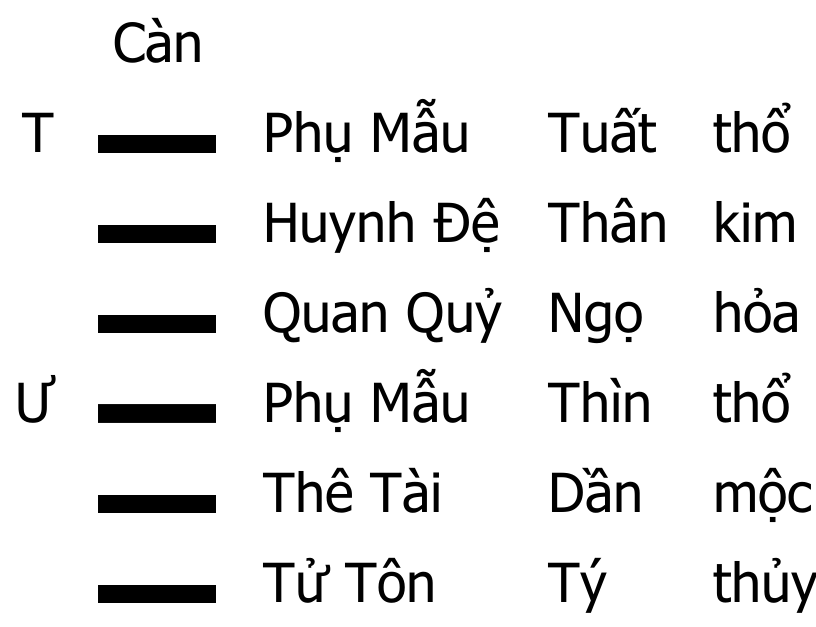
    - **Hình này chứng minh điều gì**
      - Quẻ minh chứng cho sự tương tác giữa bản vị thần và hào thần trong phương pháp di thần, phản ánh mối quan hệ giữa khởi đầu bản chất sự vật với kết quả phát triển, giải đoán tính chất cát hung của phong thủy môi trường.
    - **Từ đâu mà thấy được**
      - Căn cứ vào các hào vị lục thân trong quẻ Địa Thủy Sư biến xuất Phong Hỏa Gia Nhân, sự phân bố của lục thần (Thanh Long, Chu Tước, Câu Trần, Đằng Xà, Bạch Hổ, Huyền Vũ) lâm vào các hào, quy tắc bản vị thần vay mượn hào thần và ngũ hành sinh khắc giữa các hào động tĩnh.

#### Ý nghĩa tổ hợp của hai lục thần trùng điệp

- **Tổ hợp Thanh Long làm bản vị thần:**
  - **Thanh Long gặp Chu Tước:** Chủ về nói chuyện tao nhã, văn kiện quan trọng, tuyên truyền quảng cáo, thiệp mời dự tiệc, dùng từ lễ độ; mặt tiêu cực chủ về say rượu chửi bậy, chỉ gà mắng chó, nói móc hoặc châm biếm người khác; lời ngon tiếng ngọt, từ ngữ mỹ miều, lời nói dễ nghe, vì tiền của mà mắc kiện tụng, thư tình, lời tâm tình, tiệc rượu, nịnh bợ, tin tức quan trọng, tiếng ồn trong phòng ăn, tranh đoạt tình nhân, lời nói thấm thía, khuyên người hành thiện, hôn môi, đồ trang điểm được tuyên truyền, lời lẽ chí lý, đau nhức phát viêm, sách đóng bìa cứng, đến nhà tán gẫu,...
  - **Thanh Long gặp Câu Trần:** Chủ về tòa án cấp cao, thượng cấp ngành công an, nhà cao tầng, khu dân cư cao cấp, khách sạn sang trọng, ruộng cao sản, cây trồng cao sản, ung thư thực quản, u xơ tử cung, nhân viên công vụ, kiến trúc đẹp, núi cao tú lệ, vùng đất trù phú, làng giàu có và đông đúc, đất đai màu mỡ, khu phong cảnh tự nhiên, sinh khó, vô cớ sưng đau, bề ngoài thâm trầm, buôn bán bất động sản, ung thư dạ dày, ăn chậm, nhà hàng, cục tài chính, thẩm mỹ viện, tiệm may, khoa phụ sản, câu lạc bộ,...
  - **Thanh Long gặp Đằng Xà:** Chủ về ngụy quân tử, ăn không no, không có lễ độ, bần cùng cơ hàn, diêm dúa lòe loẹt, áo quần lố lăng, da mặt dày, váy, tóc quăn, uốn tóc, họ hàng xa xôi, tham lam tiền của, mù quáng vì tiền, sinh non, bị kẻ dâm đãng theo dõi, lăn lộn vì đau đớn, khiêm tốn quá mức, sức ăn ít ỏi, vì khuôn mặt đẹp mà động tâm, vì tiền tài mà vướng kiện tụng, vì tình dục mà gặp phiền phức,...
  - **Thanh Long gặp Bạch Hổ:** Chủ về khẩu Phật tâm xà, nham hiểm xảo quyệt, tình địch, vụ án giết người hiếp dâm, cướp đoạt, trúng độc tử vong, mắc bệnh vì đường ăn uống, sinh con xuất huyết nhiều, sau khi uống rượu đánh nhau, sau khi uống rượu lái xe, gãy xương đau nhức, đường quốc lộ cao cấp, bảo đao, bảo kiếm, đạn đạo, vũ khí kiểu mới, kiên cường bất khuất, anh hùng khí khái, cao không với tới, gặp tai nạn bất ngờ khi đi thăm người thân, người chết vì tiền chim chết vì mồi, kẻ hai mặt, coi cái chết nhẹ tựa lông hồng, bề ngoài mềm mỏng bên trong cứng rắn,...
  - **Thanh Long gặp Huyền Vũ:** Chủ về bằng mặt không bằng lòng, trộm cắp tiền của, thông dâm gian díu, buôn bán phụ nữ, lừa gạt tiền bạc, nhận hối lộ, đầu cơ trục lợi, thức ăn cơm nước không sạch sẽ, đồ vật bẩn thỉu, giao dịch chợ đen, buôn lậu, tiền đánh bạc, dâm loạn bất kham, nội y nội khố, con riêng ngoài giá thú, giả nhân giả nghĩa, thủ đoạn lừa đảo cao cấp, kẻ trộm chính nghĩa, quỹ đen, kiếm tiền bất minh, phá tài, quỷ kế đa đoan,...

- **Tổ hợp Chu Tước làm bản vị thần:**
  - **Chu Tước gặp Thanh Long:** Chủ về nói chuyện có lễ độ, tình tự êm đềm, thư tình lãng mạn, phát viêm dẫn tới đau nhức, vừa nói vừa ăn, lời nói văn minh lịch thiệp, tranh giành tiền của; các ý nghĩa khác có thể tham khảo thêm mục Thanh Long gặp Chu Tước.
  - **Chu Tước gặp Câu Trần:** Chủ về đơn kiện, cáo trạng, công hàm, thư thông báo của cơ quan nhà nước, văn kiện chính quyền, giấy tờ nhà đất, quy định về nhà ở, nơi có tiếng ồn ào, ban tuyên giáo, do viêm nhiễm dẫn tới ung thư, viêm dẫn tới phù thũng, phòng karaoke, nhà sách, thư viện, cục viễn thông, hợp đồng ruộng đất, kiện tụng tranh chấp bất động sản, lương thực bị côn trùng cắn phá, lời nói ngập ngừng ấp úng, nói năng sơ suất dẫn tới bị liên lụy, văn tự ngục (sự việc giai cấp thống trị bức hại trí thức, cố ý trích dẫn câu chữ trong tác phẩm để thêu dệt thành tội trạng), quảng cáo công cộng,...
  - **Chu Tước gặp Đằng Xà:** Chủ về nói dối gạt người, nói chuyện trống rỗng, tin tức bất ngờ gây kinh hãi, giật mình khi nghe tin dữ, nói chuyện quanh co vòng vo, quan ti khẩu thiệt tranh cãi, dùng mưu tự sát để đe dọa, công kích bôi nhọ cá nhân, nói xấu sau lưng người khác, nịnh bợ a dua, chậm chạp không chịu bày tỏ thái độ, nắm bắt đầu đề câu chuyện, tiểu nhân quấy rối, tham ăn tục uống, thực phẩm hiếm lạ, không thích nói chuyện hoặc ít nói, giọng nói kỳ lạ khác thường, kiến giải độc đáo, ma trơi, kỳ đàm quái luận (lời lẽ hoang đường không hợp tình hợp lý), thư tống tiền, thao thao bất tuyệt, thực phẩm có mùi lạ, lời nói đáng sợ, thiên thư khó hiểu,...
  - **Chu Tước gặp Bạch Hổ:** Chủ về biến đổi bệnh lý do phát viêm cấp, nhiễm trùng máu, ăn cơm nhiễm bệnh truyền nhiễm, tranh cãi gay gắt dẫn tới ẩu đả đánh nhau, nói năng quá thẳng thắn, nói hống hách thô bạo, chửi thề tục tĩu, công tác tuyên truyền an toàn giao thông, thư thông báo bệnh tình nguy kịch, vừa nói vừa khóc lóc thảm thiết, lời nói gây xúc động rơi lệ, lời nói đắc tội người khác, chết cháy bỏng lửa, sự cố y khoa dẫn đến kiện tụng, đánh nhau dẫn tới vòng lao lý, thần chú sát nhân, thần chú ác độc, huyết thư, điều lệ luật giao thông, trường đào tạo cảnh sát, giáo dục pháp luật, tri thức y học, điều khoản pháp luật, chiến tranh ngôn luận truyền thông, hiểu biết va chạm trên đường lộ, nhanh miệng nhanh mồm,...
  - **Chu Tước gặp Huyền Vũ:** Chủ về nghe trộm lén lút, nói thầm to nhỏ, lời nói hạ lưu đê tiện, lời lẽ bẩn thỉu dung tục, lời đường mật giả tạo, nói dối gạt người, ức nghẹn không nói nên lời, lở loét phát viêm sưng tấy, mất liên lạc hoặc bặt vô âm tín, bí mật cơ mật, âm thanh mơ hồ không rõ ràng, ám ngữ mật mã, thần chú ác độc, bí mật phóng hỏa, hành vi đốt phá ngấm ngầm, công kích ngầm sau lưng, nói xấu sau lưng người khác, sách báo đồi trụy khiêu dâm, trộm cướp bị bắt giam vào tù, ra ám hiệu bí mật, bàn bạc toan tính lén lút, trường tư thục, ý kiến mang tính cá nhân, mật báo tin tức, ban đỏ ngoài da,...

- **Tổ hợp Câu Trần làm bản vị thần:**
  - **Câu Trần gặp Thanh Long:** Chủ về sưng phù đau nhức do khối u/ung thư, dùng công quỹ ăn uống tiệc tùng, phát tài lớn nhờ buôn bán bất động sản, đặc sản địa phương, trang trí nội thất tinh tế trang nhã, công trình kiến trúc đẹp đẽ, đi thăm nuôi tù nhân, lâu đài nguy nga lộng lẫy, cung vàng điện ngọc, ung thư thực quản, u xơ tử cung, gan nhiễm mỡ do nghiện cồn, nhà máy bia rượu, quán rượu, quán cơm tiệm ăn, cửa hàng trang phục áo quần, rượu ủ lâu năm, thức ăn thừa lưu cữu, cổ vật đồ cổ, ăn uống chậm rãi, quần áo cũ kỹ, sinh nở khó khăn, bạn bè cũ lâu năm gặp lại,... Có thể tham khảo thêm mục Thanh Long gặp Câu Trần.
  - **Câu Trần gặp Chu Tước:** Chủ về nhà cửa bị hỏa hoạn thiêu cháy, phù thũng nghiêm trọng khiến không thể cất lời nói hoặc tắc bí tiểu tiện, sách kiến trúc xây dựng, bản vẽ thiết kế công trình, lệnh bắt giữ của tư pháp, thông báo văn bản chính phủ, lời nói trung thực thật thà, khế ước mua bán bất động sản, kiến thức giáo dục truyền thống cũ kỹ, giấy chứng nhận quyền sử dụng đất đai, giấy chứng nhận sở hữu bất động sản, tri thức nông nghiệp đồng áng, cách ăn nói chậm rãi, lời lẽ bình dị tầm thường, nhắc lại chuyện cũ xưa,... Có thể tham khảo thêm mục Chu Tước gặp Câu Trần.
  - **Câu Trần gặp Đằng Xà:** Chủ về hung trạch hiểm ác, quái trạch dị thường, nhà ma ám tà khí, ảo ảnh mê hoặc, tai họa lao ngục ngục tù, kiến trúc có hình dáng đặc biệt quái dị, vùng đất hoang vu hoang dã, cây cối dây leo chằng chịt, tranh chấp quyền sở hữu bất động sản, cảnh sát sách nhiễu gây phiền hà, ức hiếp người hiền lành lương thiện, cây trồng hoa màu bị giảm sút sản lượng, hoa cỏ tàn úa héo rũ, vùng không một bóng người sinh sống, trang trí nội thất nghèo nàn sơ sài, sưng tấy lâu ngày không bớt, đất đai chật hẹp, phạm vi địa phương nhỏ bé, địa phương hẻo lánh xa xôi, vết sẹo trên thân thể,...
  - **Câu Trần gặp Bạch Hổ:** Chủ về tranh chấp đánh nhau đổ máu vì đất đai nhà cửa, cây trồng bị sâu bọ tàn phá, bệnh ung thư nguy kịch dẫn đến tử vong, hình thành cục máu đông, hiện tượng máu cô đặc, tắc nghẽn động mạch, bệnh ung thư máu (bạch cầu), sưng nề phù thũng do gãy xương, ung thư xương, phẫu thuật dao kéo cắt bỏ khối u, sườn núi đất đá, đụn đất khối đất, đường đất gồ ghề, đường núi trắc trở, nông cụ lao động, nhà tù ngục thất, nhà xác bệnh viện, tiệm thuốc bán thuốc, bệnh viện cứu chữa, bộ chỉ huy quân sự vũ trang, cơ quan công an cảnh sát, đồn công an, phòng thủ thuật phá thai, khoa chấn thương chỉnh hình,...
  - **Câu Trần gặp Huyền Vũ:** Chủ về kẻ gian đột nhập vào phòng ăn trộm, nốt ruồi đen trên da, kỹ viện thanh lâu, hang ổ quy tụ kẻ trộm đạo tặc, nơi ẩm thấp ướt át, công trình kiến trúc thấp bé lụp xụp, hệ thống cống rãnh ngầm, đường nước tưới tiêu ruộng đồng, nhà hoang ma ám, hành vi giả mạo công an chính quyền, phòng giam giữ, phòng tối thiếu ánh sáng, bãi rác dơ bẩn, nhà ở âm u thiếu dương khí,...

- **Tổ hợp Đằng Xà làm bản vị thần:**
  - **Đằng Xà gặp Thanh Long:** Chủ về thói giả dối ngụy tạo, kẻ giàu xổi mới nổi phất lên bất ngờ, tiền của hoạnh tài bất ngờ, giấc mộng viển vông muốn phát tài, chiêm bao thấy cưới vợ, mù quáng vì danh lợi tiền tài, ăn mặc áo quần lố lăng kệch cỡm,... Có thể tham khảo thêm mục Thanh Long gặp Đằng Xà.
  - **Đằng Xà gặp Chu Tước:** Chủ về tính cách trầm tĩnh ít nói, trò chuyện không hợp ý nhau dẫn đến xa cách, tin tức đặc biệt kỳ lạ, tin tức giật gân chấn động, tật nói mớ khi ngủ, nói nhảm vô căn cứ, cất tiếng kêu la sợ hãi, đám cháy do sấm sét giáng xuống, hỏa hoạn phát sinh vô cớ, âm thanh lời nói chói tai khó chịu, luận điệu kỳ quặc hoang đường,... Có thể tham khảo thêm mục Chu Tước gặp Đằng Xà.
  - **Đằng Xà gặp Câu Trần:** Chủ về nỗi sợ hãi tột cùng đến mức bủn rủn chân tay đi không nổi, hình thành vết sẹo sâu, bệnh ung thư ruột, nơi hiểm trở nguy hiểm khôn cùng như vực sâu núi thẳm,... Có thể tham khảo thêm mục Câu Trần gặp Đằng Xà.
  - **Đằng Xà gặp Bạch Hổ:** Chủ về bụng dạ hẹp hòi hiểm độc, tung quái chiêu độc hiểm, sử dụng vũ khí hình thù quái dị, bệnh ung thư máu, thiếu máu trầm trọng, huyết áp tụt thấp, phụ nữ bước vào thời kỳ mãn kinh, rủi ro bị xe tông ngã chấn thương, mắc phải bệnh nan y vô phương cứu chữa, treo cổ tự tử, bị dây thừng siết chặt nghẹt thở đến chết, kinh hãi hoảng loạn mà chết, mắc bệnh do ác mộng kéo dài; nếu quẻ gia tăng thêm Dịch Mã là mắc chứng bệnh mộng du ban đêm,...
  - **Đằng Xà gặp Huyền Vũ:** Chủ về tính tình kỳ quái gàn dở, các vụ án trộm cướp có tính chất khác thường, âm hồn vất vưởng bám riết không tan, tâm trạng phiền muộn u uất, trò lừa gạt tinh vi, bị nội thương bên trong cơ thể, sâu trong lòng luôn bất an lo sợ, âm khí nặng nề, hiện tượng kỳ dị ma quái, tà khí xâm nhập, cảnh tượng âm u rùng rợn đáng sợ, quỷ kế đa đoan hiểm hóc,...

- **Tổ hợp Bạch Hổ làm bản vị thần:**
  - **Bạch Hổ gặp Thanh Long:** Chủ về hiện tượng ngoài lốt dê trong bụng cọp (chất dê da hổ), tuyến đường quốc lộ cấp cao; nếu trong quẻ gia tăng thêm Dịch Mã thì biểu thị đường cao tốc; bảo đao bảo kiếm quý báu, tiền trợ cấp thương tật, tiền tuất tử sĩ, hàng quán cửa tiệm ven đường lớn, ngành nghề vận tải giao thông, tiền của kiếm được trên lộ trình buôn bán, bán máu kiếm sống mưu sinh, sát thủ đâm thuê chém mướn chuyên nghiệp, sẩy thai lưu sản, phụ nữ đau bụng kinh, khí phách kiên cường bất khuất anh hùng, tướng lĩnh chỉ huy quân đội cao cấp,... Có thể tham khảo thêm mục Thanh Long gặp Bạch Hổ.
  - **Bạch Hổ gặp Chu Tước:** Chủ về hung tin dữ dội, thư báo tử, tin xấu bất ngờ, lời nói thô bỉ tục tằn, văng tục chửi thề, nói năng lỗ mãng cộc cằn, rên rỉ đau đớn vì bệnh tật hành hạ, nhiễm trùng máu hiểm nghèo, biển bảng quảng cáo dựng bên lề đường, khẩu hiệu tuyên truyền bên đường giao thông, giấy phép lái xe (bằng lái), sách y học chữa bệnh, đơn thuốc bác sĩ kê, phiếu chẩn đoán y khoa, bức thư tay ngắn gọn, dịch vụ bưu chính chuyển phát nhanh, thư khiêu chiến thách đấu, di thư để lại, lời trăn trối di ngôn trước khi mất, tiếng khóc than ai oán,... Có thể tham khảo thêm mục Chu Tước gặp Bạch Hổ.
  - **Bạch Hổ gặp Câu Trần:** Chủ về võ đài sân đấm bốc sàn đấu, vũ đài thi đấu thể thao, trường đua xe tốc độ, nhà thi đấu thể dục thể thao quy mô, cơ quan công quyền chấp pháp tư pháp, doanh trại trại lính quân đội, bệnh ung thư máu ác tính, phòng phát thuốc bệnh viện, tiệm thuốc hiệu thuốc, phòng khám chữa bệnh, cục quản lý đường bộ, dạng thuốc viên nén, cây cầu bắc qua sông ngòi, chỉ số mỡ trong máu tăng cao (máu nhiễm mỡ),... Có thể tham khảo thêm mục Câu Trần gặp Bạch Hổ.
  - **Bạch Hổ gặp Đằng Xà:** Chủ về hội chứng thiếu máu, khả năng cung cấp máu cho cơ thể suy giảm thiếu thốn; mặt tích cực chủ về cơ thể tráng kiện cường tráng ít khi ốm đau; ẩu đả đánh nhau vướng vòng lao ngục giam cầm, cấu trúc xương cốt bị cong vẹo biến dạng dị tật, đường sá ngoằn ngoèo hiểm trở quanh co, đường vòng cua gấp, khúc rẽ ngoặt khúc khuỷu, đường ngõ chật hẹp, đường mòn nhỏ bé, sản phụ chuyển dạ sinh khó, các vật liệu xây dựng kim loại như sợi thép, cây kim khâu, cốt thép bê tông, cáp thép chịu lực, hệ thống cáp treo xe cáp vận chuyển, nguồn dược liệu thiên nhiên quý báu hiếm có,... Có thể tham khảo thêm mục Đằng Xà gặp Bạch Hổ.
  - **Bạch Hổ gặp Huyền Vũ:** Chủ về hệ thống mương máng rãnh nước, sông ngòi thủy lưu, hành vi côn đồ phá phách cướp bóc tài sản, cướp giật trên phố, sát nhân đoạt mạng cướp của, cướp bóc trấn lột giữa đường, hành vi phóng uế tiểu tiện bừa bãi lề đường, đường đêm vắng vẻ nguy hiểm, mắc bệnh lây truyền qua đường tình dục, tội phạm buôn lậu dược phẩm thuốc men, buôn lậu vũ khí quân trang, vận chuyển hàng hóa trái phép trốn thuế, vết thương mưng mủ nhiễm trùng, giao thông đường thủy tàu bè,...

- **Tổ hợp Huyền Vũ làm bản vị thần:**
  - **Huyền Vũ gặp Thanh Long:** Chủ về tang vật phạm pháp thu giữ, tệ nạn mại dâm buôn phấn bán hương, lừa gạt tiền bạc của người, bài bạc đỏ đen sát phạt, chứng bệnh phong thấp đau nhức xương khớp, hành vi hối lộ đút lót ngầm, dâm loạn bại hoại phong hóa bất kham, thức ăn cơm nguội để qua đêm, ngành nghề dịch vụ phục vụ cá thể tư nhân, tiệc tùng ăn uống gặp gỡ riêng tư kín đáo, phong thái gợi cảm quyến rũ,... Có thể tham khảo thêm mục Thanh Long gặp Huyền Vũ.
  - **Huyền Vũ gặp Chu Tước:** Chủ về đâm chọc nói xấu sau lưng người khác, nịnh nọt lấy lòng cấp trên, tâm lý ngại ngùng e dè không dám nói thẳng, bệnh thấp khớp nhức mỏi, hiện tượng chia chác tang vật của cải không đều dẫn tới tranh chấp cãi vã, kỹ thuật chụp chiếu siêu âm y khoa, ngấm ngầm phóng hỏa đốt phá, thói mách lẻo đâm thọc, mật báo tin tức cơ mật, công văn mật hàm, tờ rơi thông báo tìm đồ vật thất lạc, thư từ tình cảm cá nhân, hồ sơ lý lịch cá nhân, ý kiến quan điểm riêng tư, nói thầm rỉ tai nhau, lời lẽ nhơ bẩn tục tằn, vu khống giá họa đặt điều,... Có thể tham khảo thêm mục Chu Tước gặp Huyền Vũ.
  - **Huyền Vũ gặp Câu Trần:** Chủ về chứng bệnh nổi mề đay dị ứng, nhiễm phong hàn dẫn tới cơ thể tích nước phù thũng, tảng đá nước đá băng giá, tài sản tư nhân cất giấu riêng, địa điểm hang ổ ẩn náu bí mật, ngôi nhà bị ma ám âm khí, mồ mả phần mộ tổ tiên, cơ cấu tổ chức hoạt động phi pháp trá hình, xưởng sản xuất nhà máy ngầm, mụn cóc sinh dục, nốt ruồi sẫm màu, hắc điểm tàn nhang trên da, hiện tượng thời tiết mưa đá, cây cầu bắc qua vùng nước,... Có thể tham khảo thêm mục Câu Trần gặp Huyền Vũ.
  - **Huyền Vũ gặp Đằng Xà:** Chủ về các trò mánh khóe lừa bịp tinh vi, hành vi bắt cóc tống tiền tàn độc, tâm can nội tâm bất an lo thắt ruột, tật xấu có tật giật mình, thói quen trộm cắp vặt thường xuyên liên tục, kẻ cướp kẻ trộm nhà nghề chuyên nghiệp, tình cảnh bị kẻ đạo tặc bám gót theo dõi, bị kẻ lạ mặt rình rập theo dõi hành tung, tà khí u ám quấy nhiễu trạch vận,... Có thể tham khảo thêm mục Đằng Xà gặp Huyền Vũ.
  - **Huyền Vũ gặp Bạch Hổ:** Chủ về cuộc nội chiến đấu đá nội bộ phe cánh, âm thầm bí mật tranh đấu loại trừ lẫn nhau, mâu thuẫn lục đục trong gia đình dòng tộc, bệnh phong thấp tê buốt, mắc căn bệnh thế kỷ hiểm nghèo (AIDS), chấn thương nội thương bầm dập bên trong, ngậm đắng nuốt cay lặng lẽ rơi nước mắt, tranh đoạt đấu đá ngấm ngầm riêng tư, chiến tranh lạnh không giao tiếp, âm mưu ám sát đoạt mệnh, hành nghề y dược trái phép không có giấy phép chứng chỉ, thuốc men thang dược trị bệnh, xuân dược kích dục khiêu dâm, không gian âm u lạnh lẽo đáng sợ,... Có thể tham khảo thêm mục Bạch Hổ gặp Huyền Vũ.

#### Tổ hợp lục thần và ngũ hành

- **Ý nghĩa nền tảng của Lục thần phối Ngũ hành:**
  - Sự kết hợp giữa đặc tính thần sát của Lục thần và bản chất vật chất của Ngũ hành (Kim, Mộc, Thủy, Hỏa, Thổ) tạo ra các trường thông tin phong phú về vật phẩm, môi trường địa lý, bộ phận cơ thể và tính chất đồ vật trong nhà ở.

##### Thanh Long phối ngũ hành

- **Thanh Long gặp Thủy:**
  - Chủ về rượu chè, ẩm thực, thức ăn đồ uống, nước hoa hồng dưỡng da (toner), nước ối sản phụ, nước suối đầu nguồn, nước khoáng tinh khiết đóng chai,...
- **Thanh Long gặp Hỏa:**
  - Chủ về ngọn đuốc Thế vận hội Olympic, mồi lửa nhóm bếp, sự ấm áp nhiệt tình, không gian phòng bếp, việc nấu nướng chế biến, công việc làm cơm tiệc tùng,...
- **Thanh Long gặp Mộc:**
  - Chủ về đôi đũa ăn, rau củ tươi xanh, thực vật quý báu phong thủy, bãi cỏ xanh tươi, hoa màu xanh tốt, sợi mì thực phẩm, món nhậu khai vị, chày cán bột làm bánh, que tăm xỉa răng.
- **Thanh Long gặp Kim:**
  - Chủ về kim loại quý giá, kim loại hiếm đắt đỏ, các loại đá quý, vàng bạc châu báu, đồ dùng vật phẩm chế tác bằng ngọc bích, đá maifan (đá y tế lọc nước), vị thuốc dương khởi thạch, gạo hạt quý,...
- **Thanh Long gặp Thổ:**
  - Chủ về mảnh đất màu mỡ phì nhiêu, làn da mịn màng đẹp đẽ, bệ bếp lò, ruộng nương bờ cõi tươi tốt, khu thắng cảnh danh lam tự nhiên, bánh màn thầu, bánh bao nóng, sủi cảo,...

##### Chu Tước phối ngũ hành

- **Chu Tước gặp Thủy:**
  - Chủ về nước sôi sùng sục, nước nóng sinh hoạt, suối nước nóng tắm khoáng, hơi nước bốc lên, màn sương mù mờ ảo, bát thuốc sắc nóng, nước bọt khoang miệng, mực viết đóng lọ, bọt sóng nhấp nhô, âm thanh tiếng nước chảy róc rách, khói sương mờ mịt,...
- **Chu Tước gặp Hỏa:**
  - Chủ về tai họa hỏa hoạn cháy nhà, bệ bếp lò, gian phòng bếp, vầng thái dương mặt trời chói chang, tiếng nổ vang rền, công tác tuyên truyền cổ động, ngành công nghiệp điện ảnh và phát thanh truyền hình,...
- **Chu Tước gặp Mộc:**
  - Chủ về các loài hoa khoe sắc, lá cây đổi màu đỏ, củi khô đun bếp, nhóm củi mồi lửa, than củi cháy đỏ, mỡ dầu, thẻ tre cổ thư, bệnh lý viêm gan, viêm túi mật,...
- **Chu Tước gặp Kim:**
  - Chủ về tiếng chuông ngân vang, nhạc chuông điện thoại, đá hồng ngọc (ruby), các loại nhạc cụ phát âm thanh, bia đá khắc chữ, thạch cổ văn (văn tự cổ được chạm khắc trên các trống đá cổ), chữ khắc trên vách đá non bộ, kim văn (văn tự được khắc hoặc đúc trên đồ đồng cổ), chứng bệnh viêm lợi răng miệng, viêm phế quản phổi,...
- **Chu Tước gặp Thổ:**
  - Chủ về bột quặng sắt đỏ, đất sét màu đỏ, gạch nung màu đỏ, đồ gốm sứ thủ công, phong nê (bùn đất niêm phong thư từ ấn tín cổ xưa), truyền thống giáo dục lâu đời, giọng nói thổ âm quê hương bản quán, bánh màn thầu nướng, bánh bao hấp,...

##### Câu Trần phối ngũ hành

- **Câu Trần gặp Thủy:**
  - Chủ về miếng đậu hũ trắng mềm, cục nước đá băng tảng, chất nhựa dẻo cao su, cây cầu bắc ngang dòng nước, mương máng dẫn nước, công sự hào chiến đấu, thủy lao (nhà ngục giam cầm dưới nước), suối ngầm phun trào, chứng bệnh trướng bụng cổ trướng,...
- **Câu Trần gặp Hỏa:**
  - Chủ về tàn lửa sao hỏa bắn ra, ngọn lửa trại bập bùng, đống lửa sưởi ấm, phòng bếp gia đình, bệ bếp lò, lò gạch thủ công, lò nung đồ gốm sứ, vị thuốc phục long can (đất lòng bếp nung lâu năm),...
- **Câu Trần gặp Mộc:**
  - Chủ về hoa trái kết chùm trên cành cây cao, thân cây khô cằn cỗi, đôn gỗ ngồi nghỉ, ruộng nương bờ thửa, đòn dông nóc nhà, mái nhà tranh tre vách nứa, nhà sàn bằng gỗ, cây cầu độc mộc gập ghềnh bắc qua suối,...
- **Câu Trần gặp Kim:**
  - Chủ về khối sắt thô nặng, ngọc cổ chôn vùi lâu đời, phế liệu sắt vụn kim loại, công trình kiến trúc kết cấu khung thép, các loại nông cụ làm ruộng, hang đá tự nhiên, móc sắt neo giữ,...
- **Câu Trần gặp Thổ:**
  - Chủ về đụn đất khối đất đắp, ụ đất mô đất nổi, ngọn núi cao chót vót, đồi núi nhấp nhô, phần mộ mồ mả tiền nhân, gò đất chỗ đất nhô cao, con đường dốc thoai thoải, đồng ruộng mênh mông, phong cảnh nông thôn làng mạc, đất đai nhà cửa bất động sản, trở ngại ngăn lối chắn đường,...

##### Đằng Xà phối ngũ hành

- **Đằng Xà gặp Thủy:**
  - Chủ về sợi miến dong, bún gạo dạng sợi dài, dây buộc nilon dẻo dai, dòng nước mưa tuôn trào, con suối uốn lượn ngoằn ngoèo, đường ống cấp thoát nước, mạng lưới mạch máu trong cơ thể, hội chứng thiếu máu suy kiệt, chất xúc tác biến đổi hóa học,...
- **Đằng Xà gặp Hỏa:**
  - Chủ về dải ngọn lửa uốn éo, sợi dây màu đỏ, tia sáng rực rỡ, dải cầu vồng trên trời, rồng lửa cuộn khúc, hiện tượng đốm ma trơi bay lượn trên đồng,...
- **Đằng Xà gặp Mộc:**
  - Chủ về sợi dây mây dẻo dai, các loài cây dây leo quấn quanh giàn, cành cây khẳng khiu ngoằn ngoèo, sợi mì sợi bún mềm, sợi dây rơm bện thừng,...
- **Đằng Xà gặp Kim:**
  - Chủ về sợi dây sắt kim loại, sợi dây thép cuộn tròn, cốt thép kết cấu bê tông, khối quái thạch dị dạng gồ ghề, hiểm họa sâu bọ phá hoại mùa màng, đường cáp thép chịu tải lớn,...
- **Đằng Xà gặp Thổ:**
  - Chủ về vùng đất hoang vu cằn cỗi hẻo lánh, mặt đất sỏi đá gập ghềnh, chiếc bánh quai chèo vặn thừng, hiểm họa động đất nứt vỡ địa tầng, lối đi hẹp ngoằn ngoèo hiểm trở,...

##### Bạch Hổ phối ngũ hành

- **Bạch Hổ gặp Thủy:**
  - Chủ về cây cầu giao thông huyết mạch, máu huyết thân thể, dòng thác nước đổ ào ạt dữ dội, súng nước áp lực cao, nước lã chưa đun sôi, mương máng dòng chảy xiết, chu kỳ kinh nguyệt phụ nữ, thang thuốc dạng lỏng, bát thuốc sắc đặc,...
- **Bạch Hổ gặp Hỏa:**
  - Chủ về tổn thương bỏng lửa bỏng nước sôi, lò sưởi nhiệt độ cao, ống khói nhà máy, phương pháp hỏa công tác chiến, liệu pháp giác hơi hút gió, phương pháp cứu ngải (liệu pháp y học cổ truyền dùng điếu ngải cứu hơ nóng các huyệt vị kinh lạc), xạ trị tiêu diệt khối u,...
- **Bạch Hổ gặp Mộc:**
  - Chủ về việc đốn cây chặt gỗ rừng, dao chặt củi to bản sắc bén, nguồn thảo dược trị bệnh cứu người, các loại gỗ cứng rắn như lim nghiến sến táu, cây cỏ lệ đường ven rào, vị thuốc xa tiền thảo (cây mã đề),...
- **Bạch Hổ gặp Kim:**
  - Chủ về vũ khí sắc bén kim khí, đao kiếm giáo thương, khí tài quân sự chiến tranh, dao mổ phẫu thuật ngoại khoa y tế, chiến sự xung đột vũ trang, kim cương cứng rắn quý hiếm, đá ngọc huyết gà (đá máu gà thẫm màu), vị thuốc dược thạch trị bệnh hiểm nghèo, thảm họa sâu bọ cắn phá diện rộng,...
- **Bạch Hổ gặp Thổ:**
  - Chủ về vùng đất bazan màu đỏ, đường lộ giao thông xe cộ qua lại, bãi chiến trường khói lửa đẫm máu, bàn phẫu thuật cứu chữa bệnh nhân, khuôn viên bệnh viện điều trị,...

##### Huyền Vũ phối ngũ hành

- **Huyền Vũ gặp Thủy:**
  - Chủ về nước lạnh buốt giá mùa đông, dòng nước thải ô nhiễm bẩn thỉu, đường ống xả nước bẩn, rãnh rãnh thoát nước sinh hoạt, nhà vệ sinh bể phốt, mạch nước ngầm ẩn sâu trong lòng đất, thấp khí hơi ẩm ẩm ướt trĩu nặng, chứng bệnh lở loét da thịt mưng mủ,...
- **Huyền Vũ gặp Hỏa:**
  - Chủ về tàn lửa tàn đóm sắp tàn lụi, ánh sáng phát quang trong bóng đêm (dạ quang), ngọn đốm ma trơi lập lòe bãi tha ma, tật khúc xạ cận thị mắt kém, luồng hơi nước mờ mịt che khuất tầm nhìn,...
- **Huyền Vũ gặp Mộc:**
  - Chủ về đám cỏ nước rong rêu ẩm thấp mọc dại, khúc gỗ mục nát ngâm nước lâu ngày, món dưa muối chua lên men, loài cây rau muỗi dại ẩm ướt mọc bờ bụi,...
- **Huyền Vũ gặp Kim:**
  - Chủ về lớp đá bị phong hóa nứt nẻ qua năm tháng, những hòn đá cuội nhẵn bóng nằm sâu dưới đáy sông, các mảnh đá dăm vụn vỡ, tảng đá linh thiêng mang yếu tố tâm linh thờ phụng,...
- **Huyền Vũ gặp Thổ:**
  - Chủ về bãi rác rưởi phế thải hôi thối, lớp tro tàn bụi bặm dơ dáy, tầng đất đen giàu mùn ẩm, đất chuyên dụng gieo cấy lúa nước, hệ thống đất tưới tiêu ẩm ướt, vùng đất đầm lầy sình lầy nguy hiểm,...

### 5. THỦ TƯỢNG BÁT QUÁI TRONG DỰ ĐOÁN PHONG THỦY

- **Vai trò của Bát quái trong phong thủy:**
  - Trích xuất thông tin và phán đoán phương vị địa lý, giúp dự trắc sư nắm bắt thông tin môi trường một cách tinh tế, chuẩn xác.
  - Tần suất ứng dụng: So với các dạng dự đoán thông thường, việc sử dụng ý nghĩa và tượng quẻ của Bát quái trong phong thủy có tính thường xuyên và trọng yếu hơn nhiều.

#### Ý nghĩa và thủ tượng của Bát quái

- **Càn (乾):**
  - Nhân sự: Đại diện cho cha, người già, người lãnh đạo, bề trên.
  - Đặc tính & Hình thái: Cao to, chỗ cao ráo, hình tròn, quý trọng.
  - Vật thể: Vàng ngọc, thủy tinh, hạt trái cây.
  - Cơ thể con người: Phần đầu, phổi.
  - Phương vị: Phương Tây Bắc.
- **Khôn (坤):**
  - Nhân sự: Phụ nữ, người mẹ già.
  - Đặc tính & Hình thái: Đất bằng, ruộng đất, hình vuông, sự sinh nở, bao dung.
  - Cơ thể con người: Cái bụng, tỳ vị (dạ dày - tiêu hóa), da dẻ.
  - Phương vị: Phương Tây Nam.
- **Chấn (震):**
  - Nhân sự: Con trai trưởng (trưởng nam).
  - Đặc tính & Trạng thái: Biến hóa, chấn động, di động, tiếng động, sự tức giận, khả năng đi lại.
  - Cơ thể con người: Gan mật, đôi chân.
  - Phương vị: Phương Đông.
- **Tốn (巽):**
  - Nhân sự: Con gái trưởng (trưởng nữ).
  - Đặc tính & Hình thái: Thon dài, tính chất dây thừng, cây cối, thực vật.
  - Cơ thể con người: Bắp đùi, bả vai, gan mật.
  - Phương vị: Phương Đông Nam.
- **Khảm (坎):**
  - Nhân sự: Con trai thứ (trung nam).
  - Đặc tính & Địa thế: Nơi thấp trũng, sụt lún, nước, trộm cướp, hình vòng tròn.
  - Cơ thể con người: Thận, vùng eo, hệ bài tiết.
  - Phương vị: Phương Bắc.
- **Ly (離):**
  - Nhân sự: Con gái thứ (trung nữ).
  - Đặc tính & Hiện tượng: Ánh sáng, điện lực, ánh lửa, ánh nắng mặt trời, sự phát sáng.
  - Cơ thể con người: Tim, đôi mắt.
  - Phương vị: Phương Nam.
- **Cấn (艮):**
  - Nhân sự: Con trai nhỏ (thiếu nam).
  - Địa thế & Vật thể: Đỉnh núi, ụ đất, cây cầu, cái bàn, phần mộ (mồ mả).
  - Cơ thể con người: Tỳ vị, da dẻ, sống lưng, ngón tay.
  - Phương vị: Phương Đông Bắc.
- **Đoài (兌):**
  - Nhân sự: Con gái nhỏ (thiếu nữ), cô gái.
  - Đặc tính & Hiện tượng: Khuyết tổn, sứt mẻ, kim loại, đầm hồ, khẩu thiệt (lời ăn tiếng nói, tranh cãi).
  - Cơ thể con người: Khoang miệng, phổi, răng, lưỡi.
  - Phương vị: Phương Tây.

#### Ví dụ thực tế: Đoán tìm hài cốt (quẻ Trạch Lôi Tùy)

- **Bối cảnh & Dữ liệu quẻ:**
  - Thời gian: Ngày Kỷ Hợi, tháng Mão (Tuần trung Không Vong: Thìn, Tị).
  - Sự việc: Một người nam đến xin dự đoán xem có thể tìm lại được hài cốt của người thân hay không.
  - Quẻ thu được: Trạch Lôi Tùy (quẻ thuộc cung Chấn).
- **Luồng suy luận (Căn cứ - Nhìn vào - Luận giải):**
  - **Xác định Dụng thần:**
    - Lấy hào Quan Quỷ làm Dụng thần (chủ về hài cốt, vong linh người đã khuất).
  - **Phân tích suy vượng Dụng thần & Nguyên thần:**
    - *Nhìn vào Dụng thần:* Hào Quan Quỷ Dậu kim bị Nguyệt lệnh Mão mộc xung trực tiếp thành Nguyệt phá; đồng thời Nhật thần Hợi thủy không trợ giúp (bị tiết khí), rơi vào thế suy kiệt cùng cực.
    - *Nhìn vào Nguyên thần:* Hào Thê Tài Thìn thổ (nguyên thần sinh trợ cho Quan Quỷ Dậu kim) trì Thế nhưng lại lâm Tuần trung Không Vong, hơn nữa còn bị Nguyệt lệnh Mão mộc khắc thương. Do đó, Thê Tài không thể phát huy tác dụng sinh trợ cho Dụng thần.
    - *Luận giải cốt lõi:* Cả Dụng thần và Nguyên thần đều lâm thế tuyệt địa, căn bản hoàn toàn không thể tìm được hài cốt.
  - **Ứng dụng tượng Bát quái và tên quẻ:**
    - *Cung quẻ:* Quẻ Trạch Lôi Tùy thuộc cung Chấn. Tượng quẻ Chấn chủ về sự chấn động, di chuyển, thay đổi vị trí.
    - *Nhật Nguyệt:* Nhật thần và Nguyệt lệnh đại diện cho trời đất, yếu tố thiên nhiên. Hào Dụng thần bị Nguyệt lệnh xung, cho thấy vị trí chôn cất ban đầu đã bị yếu tố tự nhiên (mưa lũ, xói mòn, biến động địa hình) làm cho di dời, trôi dạt sang nơi khác.
    - *Ý nghĩa quẻ Tùy:* Quẻ "Tùy" mang ý nghĩa là tùy tùng, phụ họa, đi theo phía sau. Tác giả dựa vào tượng quẻ phán đoán mục đích người này cất công đi tìm hài cốt là vì muốn mang về để hợp táng (chôn cất chung mộ) với một người thân khác.
- **Kết quả ứng nghiệm thực tế:**
  - Người hỏi xác nhận toàn bộ sự thật đúng y như lời phán đoán: mục đích tìm kiếm đúng là để hợp táng, và quả thực hài cốt đã bị tự nhiên làm thất lạc từ lâu, không thể tìm thấy lại được.

### 6. THỦ TƯỢNG NGŨ HÀNH TRONG DỰ ĐOÁN PHONG THỦY

- Mặc dù một mình ngũ hành cũng có thể biểu thị những ý nghĩa nhất định, nhưng nó thường được phối hợp với lục thân, lục thần, hào vị,... để phân biệt rõ hơn.
  - **Hình 7.** Sơ đồ quẻ Trạch Lôi Tùy
    - 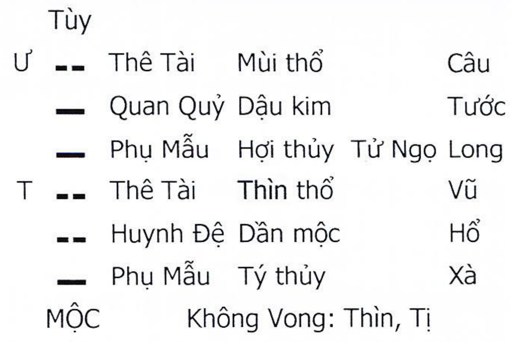
    - **Hình này chứng minh điều gì**
      - Mặc dù một mình ngũ hành cũng có thể biểu thị những ý nghĩa nhất định, nhưng nó thường được phối hợp với lục thân, lục thần, hào vị,...
    - **Từ đâu mà thấy được**
      - Căn cứ vào hào vị, lục thân, can chi sinh khắc, tuần không và hào động biến trong quẻ.
- **Hỏa:** Chủ ánh sáng, sương khói, điện, bếp lò, tim, mắt, nóng nảy, khô hạn, phát sáng,...
  - **Hình 8.** Sơ đồ quẻ Phong Thủy Hoán
    - 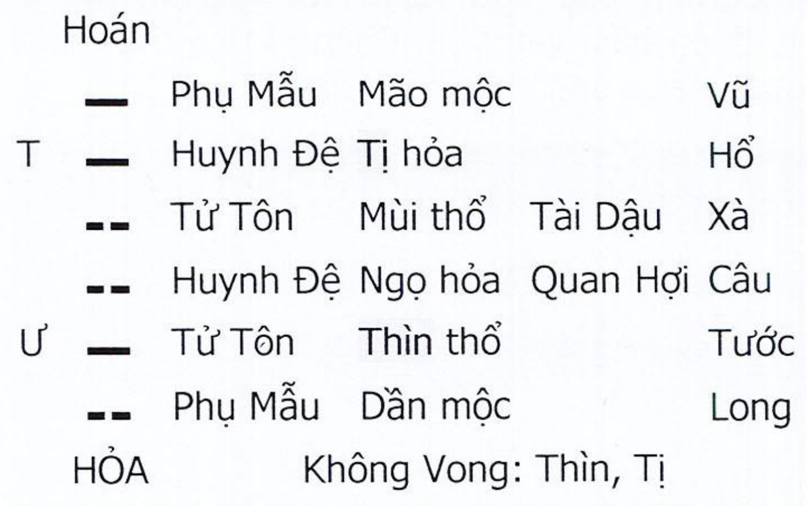
    - **Hình này chứng minh điều gì**
      - **Hỏa:** Chủ ánh sáng, sương khói, điện, bếp lò, tim, mắt, nóng nảy, khô hạn, phát sáng,...
    - **Từ đâu mà thấy được**
      - Căn cứ vào hào vị, lục thân, can chi sinh khắc, tuần không và hào động biến trong quẻ.
- **Mộc:** Chủ cây cối, hoa cỏ, nhân từ, thon dài, thực vật, gan mật, lông tóc,...
- **Kim:** Chủ âm thanh, kim loại, đá, phổi, ruột, xương cốt, có nghĩa khí,...
- **Thủy:** Chủ sông ngòi, cống thoát nước, thấp khí, thận, bàng quang, chỗ thắt lưng, máu huyết, thông minh,...
- **Thổ:** Chủ da, tỳ vị, cố định, dạng khối, đất đai, sườn núi, thật thà phúc hậu,...
- Sự kết hợp của ngũ hành với hào vị, lục thân, lục thần,... là thiên biến vạn hóa. Chúng ta có thể tham khảo ở các chương khác trong cuốn sách này.
- **Ví dụ:** Ngày Ất Mùi tháng Mùi năm Canh Thìn, tôi cùng hai vị bằng hữu là Đoàn Kiến Nghiệp và Vương Khai Vũ đến thánh địa Phật giáo Ngũ Đài Sơn du ngoạn, tại đó có một người nữ hỏi khi nào căn nhà của mẹ mới có thể xây xong. Được Phong Thủy Hoán.
#### Hoán

- HỎA &nbsp;&nbsp;&nbsp;&nbsp; Không Vong: Thìn, Tị
- **Phán đoán:** Lấy hào Phụ Mẫu làm Dụng thần, Phụ Mẫu là phòng ốc, Nguyên thần là đất xây dựng, nền móng. Tôi thấy Nguyên thần Quan Quỷ Hợi thủy không xuất hiện trong quẻ, lập tức đoán là đất xây dựng vẫn chưa được phê duyệt. Tháng Hợi năm nay được phê duyệt, tháng Tị năm sau khởi công xây nhà. Đây là bởi vì Dụng thần hưu tù cần Trường Sinh, Nguyên thần phục tàng gặp xuất hiện. Hợi thủy xuất hiện sinh hào Phụ Mẫu, Phụ Mẫu là thủ tục, lúc này mới có thể được phê duyệt. Hào Thế Không Vong, Nguyên thần phục tàng, tháng Tị hào Thế xuất Không, xung khởi Hợi thủy, lâm Câu Trần sinh Phụ Mẫu mà xây nhà.
- Ứng lâm hào 2, hào 2 là hào trạch, đây cũng là Ứng phi nhập trạch. Đang hỏi về việc mẹ xây nhà, Ứng là người khác, Ứng lâm hào trạch có thể hiểu là căn nhà mà mẹ cô ấy đang ở là nhà của người ta. Hào 5 là đường đi, Huynh Đệ Tị hỏa lâm Bạch Hổ sinh hào 2 hào trạch, Tị hỏa tất là con đường phải qua để đến chỗ mẹ ở. Tị hỏa Không Vong, đường Không là cầu, đường đến nhà mẹ phải đi qua một chiếc cầu. Tị hỏa là Tuyệt địa của thủy, dưới cầu không có nước chảy.
- Thủy khố Thìn thổ lâm hào trạch, thủy là Quan Quỷ, Quan Quỷ là thần phật, Mộ khố của Quan Quỷ có thể hiểu là chùa miếu. Đoán là gần nơi ở hiện tại của mẹ cô ấy có một
- ngôi chùa, miếu. Hào 6 Mão mộc, hào trạch Thìn thổ và hào sơ Dần mộc tạo thành phương đông mộc cục, tất cả các hào vị bị hai mộc trên dưới kẹp, đoán là có một mảnh rừng cây bao quanh chỗ ở hiện tại của mẹ, căn nhà thấp thoáng trong khóm cây. Hào Phụ Mẫu nhập Mộ ở Nhật Nguyệt, Nhật Nguyệt là Tử Tôn, Tử Tôn là tăng đạo, đoán là mẹ đã quy y cửa Phật. Hào trạch lâm Chu Tước, mỗi ngày trong nhà có tiếng niệm Phật không ngừng.
- Hào Thế thể hiện bản thân người xin đoán, lâm hỏa Không Vong, hào 5 là ngũ quan[^1], hỏa là mắt, hào dương là bên trái, đoán là mắt trái cận thị. Hào Thế lâm Dịch Mã, lại tại hào 5, bản thân là người phiêu bạt tha hương. Quan Quỷ Hợi thủy hưu tù, lại tham khảo tuổi tác năm đó, năm 92, 93 Quan Quỷ được sinh, kết hôn trong hai năm này (cho biết là năm 93 kết hôn). Tử Tôn Thìn thổ Không Vong, năm 94 Giáp Tuất xung thực, năm 94 sinh con. Khuê Phòng hưu tù không hiện trên quẻ, Quan Quỷ lại phục tàng, hiện tại ít khi chung giường với chồng.
- Hào Ứng là chủ nhà, hàng xóm, Thìn thổ là bàng quang, Không Vong là không tích trữ được nước, đoán là chủ nhà của mẹ có hiện tượng đi tiểu nhiều lần, mỗi ngày đi nhà xí nhiều lần.
- **Phản hồi:** Toàn bộ những suy đoán trên đây đều ứng nghiệm.

### 7. LỤC THÂN HỖ HÓA TRONG DỰ ĐOÁN PHONG THỦY

- **Nguyên lý cơ bản của Lục thân hỗ hóa:**
  - Bản thân mỗi Lục thân vốn mang ý nghĩa biểu tượng và trường thông tin nhất định.
  - Sự biến hóa lẫn nhau (hào phát động biến xuất Lục thân khác) giữa các Lục thân ẩn tàng sự chuyển hóa của các thông tin phong thủy, sự việc và nhân sự tương ứng.
  - Khi dự đoán thực tế, cần linh hoạt căn cứ vào hoàn cảnh cụ thể, kết hợp hào vị và Lục thần đi kèm để thủ tượng chuẩn xác; các quy luật tương tác dưới đây đóng vai trò khai mở phương pháp tư duy suy luận.

- **Ý nghĩa biểu thị cụ thể khi các Lục thân hỗ hóa:**
  - **Phụ Mẫu phát động biến hóa:**
    - **Phụ Mẫu hóa Phụ Mẫu:**
      - Cần xem xét biến thành Tiến thần hay Thoái thần, đồng thời kết hợp vị trí hào và Lục thần để thủ tượng.
      - *Hóa Tiến thần:* Biểu thị cư trú lâu dài, mở rộng công trình kiến trúc, tăng thêm vật kiến trúc, đất đai mở rộng,...
      - *Hóa Thoái thần:* Biểu thị chuyển ra ngoài, dọn nhà, từ bỏ nơi cư trú, nhà cửa tan hoang, diện tích đất đai bị thu hẹp, mặt đất sụt lún,...
    - **Phụ Mẫu hóa Quan Quỷ:**
      - Biểu thị nhận được nhà cửa, nơi ở.
      - *Lâm Thanh Long:* Chủ về chỉnh trang, tu sửa nhà cửa khang trang, tươi mới.
      - *Lâm Câu Trần:* Chủ về xây dựng, cải tạo công trình.
      - *Lâm Chu Tước:* Chủ về thay đổi văn tự, khế ước, giấy tờ nhà đất, bản vẽ thiết kế.
      - *Lâm Đằng Xà:* Chủ về trong nhà có sự bất an, quái dị.
      - *Lâm Bạch Hổ:* Chủ về đường đi xung quanh thông suốt (hoặc có lộ xung hung hiểm).
      - *Lâm Huyền Vũ:* Chủ về bên cạnh có ao đầm, sông nước, hoặc xuất hiện trộm cắp, đạo tặc,...
    - **Phụ Mẫu hóa Thê Tài:**
      - Nhà đem lại tài lộc (nhà tiến tài); hoặc ngược lại ruộng nương, nhà cửa, đất đai bị tổn hại, nhà thuộc diện giải phóng mặt bằng / đền bù giải tỏa.
      - *Lâm Thanh Long:* Chủ về tiến tài, thu lợi tức từ nhà đất.
      - *Lâm Chu Tước:* Chủ về quan ti khẩu thiệt, kiện tụng, tranh chấp vì nhà đất.
      - *Lâm Câu Trần:* Chủ về tháo dỡ, đập bỏ công trình cũ.
      - *Lâm Đằng Xà:* Chủ về phong thủy nơi ở bất an, quấy nhiễu.
      - *Lâm Bạch Hổ:* Chủ về đường đi xâm phạm, đường sá gây họa.
      - *Lâm Huyền Vũ:* Chủ về thấp khí nặng nề ảnh hưởng môi trường sống,...
    - **Phụ Mẫu hóa Tử Tôn:**
      - Biểu thị quanh nhà có đường đi thông suốt; ngôi nhà đem lại phúc khí, điềm lành; đất đai thuộc về con cái; hoặc ngược lại đất đai phong thủy bất lợi cho đời sau (tùy sinh khắc, vượng suy),...
    - **Phụ Mẫu hóa Huynh Đệ:**
      - Biểu thị các cửa phòng nằm liền kề nhau; nhà có tường bao quanh; xảy ra phá tài, hao tổn tiền bạc vì chuyện nhà đất; anh em tranh giành đất đai tài sản,...

  - **Quan Quỷ phát động biến hóa:**
    - **Quan Quỷ hóa Quan Quỷ:**
      - *Hóa Tiến thần:* Tai họa liên tiếp ập đến, hoặc ngược lại được thăng chức liên tục; công trình nhà cửa liên tục sửa chữa, xây dựng,...
      - *Hóa Thoái thần:* Tai họa tiêu trừ, tan biến; quan vận hoặc chức vị đi xuống,...
    - **Quan Quỷ hóa Phụ Mẫu:**
      - Có được nhà đất nhờ vào chức vụ, vị trí công tác; được cấp nhà thông qua chính quyền/cơ quan nhà nước; xây dựng, sửa sang nhà cửa,...
    - **Quan Quỷ hóa Thê Tài:**
      - Tài Quan cùng đến (vừa có chức quyền vừa đắc tài lộc); chức vụ thăng tiến mạnh mẽ,...
    - **Quan Quỷ hóa Tử Tôn:**
      - Bất lợi cho đường quan vận, chức vụ; nhưng mối lo âu, tai ách được loại trừ giải tỏa; đời sau con cái không thuận lợi,...
    - **Quan Quỷ hóa Huynh Đệ:**
      - Tay chân có tổn thương, tật bệnh; anh em ruột thịt bất hòa mâu thuẫn; tai họa phát sinh không dứt,...

  - **Thê Tài phát động biến hóa:**
    - **Thê Tài hóa Thê Tài:**
      - *Hóa Tiến thần:* Tài vận hanh thông, của cải ngày một gia tăng, gia cảnh ngày càng giàu có.
      - *Hóa Thoái thần:* Tài vận sa sút, tiền tài tiêu hao; vợ bỏ đi hoặc rời xa,...
    - **Thê Tài hóa Phụ Mẫu:**
      - Phá bỏ nhà cũ xây dựng nhà mới; bỏ tiền mua được nhà đất; hoặc nhờ có phụ nữ (vợ) mà sở hữu được nhà đất,...
    - **Thê Tài hóa Quan Quỷ:**
      - Vợ ngoại tình, vợ tử biệt, vợ mang bệnh tật; hoặc vì tiền của mà mắc tai họa, dính líu pháp luật,...
    - **Thê Tài hóa Tử Tôn:**
      - Nguồn tài lộc sinh sôi phong phú, cuộc sống cơm no áo ấm sung túc,...
    - **Thê Tài hóa Huynh Đệ:**
      - Lâm vào cảnh phá tài hao của, tài vận suy bại nghiêm trọng; vợ gặp tai nạn bất trắc,...

  - **Tử Tôn phát động biến hóa:**
    - **Tử Tôn hóa Tử Tôn:**
      - *Hóa Tiến thần:* Hậu duệ đời sau bình an yên ổn, phúc lộc truyền thừa nhiều đời, tiền vào như nước, con cháu đông đúc thịnh vượng,...
      - *Hóa Thoái thần:* Đời sau suy thoái, tài vận và phúc trạch đi xuống,...
    - **Tử Tôn hóa Phụ Mẫu:**
      - Dễ bị sảy thai (lưu sản), con cái bị thương tật; đường sinh tài lộc bị cắt đứt, hao tổn,...
    - **Tử Tôn hóa Quan Quỷ:**
      - Con cái gặp tai họa bất ngờ, đời sau bất lợi, suy thoái về nhân đinh,...
    - **Tử Tôn hóa Thê Tài:**
      - Đời sau giàu có bền vững lâu dài, con cháu phát phúc vinh hoa phú quý,...
    - **Tử Tôn hóa Huynh Đệ:**
      - Đời sau yên ổn bình hòa, tài vận dồi dào, con cháu có tiền đồ xán lạn,...

  - **Huynh Đệ phát động biến hóa:**
    - **Huynh Đệ hóa Huynh Đệ:**
      - Nhà mở quá nhiều cửa.
      - *Hóa Tiến thần:* Tài vận tụt dốc, kinh tế ngày càng xấu đi; anh em bất hòa trầm trọng.
      - *Hóa Thoái thần:* Tài vận có chuyển biến tích cực, khởi sắc tốt dần lên; mâu thuẫn anh em giảm bớt,...
    - **Huynh Đệ hóa Phụ Mẫu:**
      - Tài vận bất lợi, thế đất làm tổn hao tiền tài (đất bại tài); cùng người khác hợp tác xây nhà; đất đai nhà cửa đang thuê mướn,...
    - **Huynh Đệ hóa Quan Quỷ:**
      - Bất lợi cho anh em, anh em gặp nạn hoặc bị tổn thương; tứ chi tay chân của gia chủ bị thương tật,...
    - **Huynh Đệ hóa Thê Tài:**
      - Thu được của phi nghĩa, hợp tác làm ăn sinh lời đắc lợi, hoặc nhờ vào bạn bè giúp đỡ mà phát tài,...
    - **Huynh Đệ hóa Tử Tôn:**
      - Không xuất hiện người đỗ đạt văn chương, con cháu học hành sa sút lụn bại,...

### 8. Ý NGHĨA CỦA DỤNG THẦN LƯỠNG HIỆN

- **Nguyên tắc xác định Dụng thần trong phong thủy:**
  - Trong dự đoán phong thủy không có một Dụng thần cố định cụ thể nào, mà đòi hỏi người đoán phải phán đoán linh hoạt dựa trên ý đồ, mục đích và tâm niệm thực tế của người đến hỏi.
  - Do tính linh hoạt theo sự việc, tất cả các Lục thân (Phụ Mẫu, Quan Quỷ, Thê Tài, Huynh Đệ, Tử Tôn) đều có khả năng trở thành Dụng thần.

- **Ý nghĩa tượng trưng của từng Lục thân khi Lưỡng hiện (xuất hiện hai lần trong quẻ):**
  - **Phụ Mẫu lưỡng hiện:**
    - Tượng trưng cho nhà có nhiều phòng ốc, đất đai rộng rãi, hoặc gia chủ sở hữu nhiều mảnh đất khác nhau.
    - Biểu thị một mảnh đất bị chia cắt làm hai phần, hoặc gia đình có nhà cửa phân bố ở nhiều nơi,...
  - **Quan Quỷ lưỡng hiện:**
    - Về phương diện sự nghiệp và tâm lý: Chủ về kiêm nhiệm chức vụ, trong lòng nhiều mối phiền não, bất an, tai họa liên miên không ngừng.
    - Về phương diện phong thủy, môi trường: Tượng trưng cho nơi ở gần nhiều cơ quan công quyền/sở ty, hoặc công trình nhà cửa liên tục thi công, sửa chữa xây dựng.
    - Về nhân sự và tình cảm: Đối với phụ nữ chủ về Đào Hoa vượng (có nhiều mối quan hệ nam nữ),...
  - **Thê Tài lưỡng hiện:**
    - Về tài lộc và vật chất: Tượng trưng cho tiền của dồi dào, tích lũy nhiều tài sản, nhà có nhiều kho chứa đồ đạc/nhà kho.
    - Về nhân sự và tình cảm: Đối với nam giới chủ về Đào Hoa vượng (nhiều phụ nữ vây quanh),...
  - **Huynh Đệ lưỡng hiện:**
    - Về kiến trúc: Tượng trưng cho ngôi nhà có nhiều cửa sổ, tường vách ngăn chia trùng điệp, lối đi bị ngăn trở.
    - Về tài chính: Tượng trưng cho sự hao tổn, thất thoát nhiều tiền của,...
  - **Tử Tôn lưỡng hiện:**
    - Về con cháu: Tượng trưng cho đông con nhiều cháu, gia đạo hưng vượng nhân đinh.
    - Về kiến trúc, cảnh quan: Tượng trưng cho quanh nhà có nhiều lối đi, ngõ ngách, đường sá chằng chịt,...

### 9. Ý NGHĨA CỦA DỤNG THẦN PHỤC TÀNG

- **Nguyên tắc chọn Dụng thần linh hoạt trong dự đoán phong thủy**:
  - Trong dự đoán phong thủy không có một kết luận cố định bất biến về Dụng thần. Khi đương sự gặp bất lợi về một phương diện nào đó và lo ngại do phong thủy gây ra, người dự đoán cần linh hoạt xác định Dụng thần theo vấn đề quan tâm:
    - *Tài vận khó khăn*: Lấy Thê Tài làm Dụng thần.
    - *Vấn đề con cái*: Lấy Tử Tôn làm Dụng thần.
    - *Công việc, quan vận*: Lấy Quan Quỷ làm Dụng thần.
    - *Dự đoán phong thủy thông thường (không có mục đích chuyên biệt)*: Lấy Phụ Mẫu làm Dụng thần và tiến hành phân tích tổng hợp.
- **Ý nghĩa tổng quát của Dụng thần phục tàng**:
  - Dụng thần không hiện trên quẻ biểu thị khí phong thủy ở phương diện hoặc vị trí tương ứng không đủ.
  - Ý nghĩa cốt lõi của phục tàng bao gồm: mất mát, thất lạc, không nhìn thấy, ly khai, ít gặp, ẩn nấp, không thành công, né tránh,...
- **Ý nghĩa biểu thị cụ thể khi các Lục thân phục tàng**:
  - **Phụ Mẫu phục tàng**:
    - Biểu thị công trình ngầm, tầng hầm, nhà ở nơi thấp trũng, thế đất thấp.
    - Về mặt giấy tờ pháp lý: Giấy tờ chưa hoàn tất, chưa có giấy chứng nhận quyền sử dụng đất/sở hữu nhà.
    - Về âm trạch: Không tìm được phần mộ, mồ mả bị che phủ, vùi lấp.
  - **Thê Tài phục tàng**:
    - Về kinh tế: Tài vận không tốt, tiền bạc mờ ám, nguồn thu bất minh.
    - Về hôn nhân, gia đạo: Vợ trốn đi, không có vợ.
    - Về không gian kiến trúc: Nhà không có nhà bếp, không có nhà kho.
  - **Tử Tôn phục tàng**:
    - Về tài lộc: Biểu thị nguồn tiền không nhiều, không dồi dào.
    - Về con cái: Không có con cái, hoặc con cái đi làm ăn xa nhà.
    - Về đường sá, lối đi: Đường ở sau lưng nhà, đường sá tối tăm thiếu ánh sáng.
  - **Quan Quỷ phục tàng**:
    - Về sự nghiệp và gia đạo: Biểu thị sự nghiệp bất lợi; chồng đi xa, chồng không ở bên cạnh vợ.
    - Về tâm linh, thờ cúng: Có cất giấu hoặc cất giữ tượng Thần Phật, thờ phụng bí mật.
    - Về an ninh, môi trường: Tiềm ẩn nguy cơ phục bốn phía, rủi ro ngầm.
  - **Huynh Đệ phục tàng**:
    - Về kiến trúc: Chủ về cửa tối, cửa sổ tối, nhà không có tường rào/tường ngăn cách.
    - Về nhân sự: Anh em bất hòa, phân tán.

### 10. Ý NGHĨA CỦA TIẾN THẦN VÀ THOÁI THẦN

- Ngoài biểu thị phương diện cát hung, tiến thoái của hào còn ẩn tàng một tầng ý nghĩa sâu hơn.
- **Phụ Mẫu hóa Tiến thần:** Chủ mặt đất cao dần lên, đất đai rộng rãi, lầu gác trùng điệp, núi non trùng điệp, kiến trúc san sát, tầng tầng lớp lớp, xây dựng thêm nhà cửa, cư trú lâu dài, phòng ốc đan xen, lên dốc,... Hóa Thoái thần: Dần dần thấp trũng, xuống dốc, cư trú không lâu dài, khí thế yếu đi,...
- **Quan Quỷ hóa Tiến thần:** Thăng chức, sự nghiệp phát triển, tai họa chồng chất, bệnh tật nặng thêm, liên tục tu tạo,... Hóa Thoái thần: Quan vận suy bại, sự nghiệp không khởi sắc, tai họa giảm bớt,...
- **Thê Tài hóa Tiến thần:** Tiền vào như nước, cỏ cây tươi tốt, tài vận tốt đẹp, tốt duyên với phụ nữ. Hóa Thoái thần: Tài vận suy bại, phụ nữ tránh xa, cỏ cây khô héo,...
- **Tử Tôn hóa Tiến thần:** Con cháu đầy đàn, đời sau hưng vượng, nguồn tiền phong phú, đường xá xa xôi, giao thông thông suốt,... Hóa Thoái thần: Đời sau suy bại, con cháu thưa thớt, tài vận sa sút, đường đi chật hẹp, ngõ cụt,...
- **Huynh Đệ hóa Tiến thần:** Cửa ngõ trùng điệp, dãy tường uy nghiêm, mở cửa, tài vận tốt đẹp,... Hóa Thoái thần: Đóng cửa, sập tường, tường thấp bé,...

### 11. Ý NGHĨA CỦA NGUYỆT PHÁ

- **Hào 6 là tường, Nguyệt phá chủ chất lượng của tường không tốt, mặt tường bong tróc.**
  - Nhật Thực Phá chủ sửa chữa lại.
  - Nội quái phục ngâm, hào Thế lâm Chu Tước, chủ gia đình bất hòa, nhiều khẩu thiệt.
  - Thê Tài nhập Mộ, Mộ khố Không Vong, cố gắng để dành tiền nhưng không tích trữ được.
  - Hào Thế Phụ Mẫu Thìn thổ là nhà, hợp Huynh Đệ Dậu kim, cho bạn bè hoặc anh em mượn nhà để cư trú.
  - Hào Thế tại hào 3 lâm thổ bị khắc, hào 3 là dạ dày, thổ lại chủ dạ dày, ở nhà này ăn uống không ngon.
  - Lại Nguyên thần tại hào 6 lâm Bạch Hổ Nguyệt phá, Bạch Hổ là máu, chủ có huyết áp cao.
  - **Phản hồi:** Thực tế đúng như biểu hiện trong quẻ, bản thân có bệnh dạ dày và huyết áp cao.
  - Cho em trai ở nhờ, em trai cũng có bệnh như vậy.
  - **Hình 9.** Quẻ Hỏa Thiên Đại Hữu biến Thiên Lôi Vô Vọng
    - 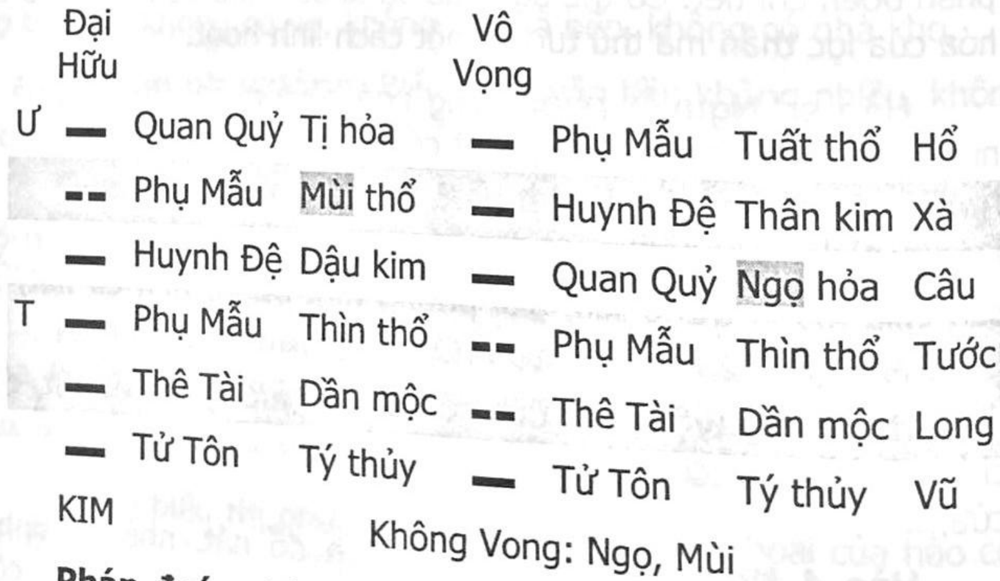
    - **Hình này chứng minh điều gì**
      - Hào 6 là tường, Nguyệt phá chủ chất lượng của tường không tốt, mặt tường bong tróc. Nhật Thực Phá chủ sửa chữa lại.
    - **Từ đâu mà thấy được**
      - Nội quái phục ngâm, hào Thế lâm Chu Tước, chủ gia đình bất hòa, nhiều khẩu thiệt. Thê Tài nhập Mộ, Mộ khố Không Vong, cố gắng để dành tiền nhưng không tích trữ được.

### 12. Ý NGHĨA CỦA KHÔNG VONG

- Không Vong cũng như Nguyệt phá, căn cứ vào hào vị, ngũ hành, lục thân khác nhau mà linh hoạt biến hóa.
- **Kim Không tắc minh**¹, chủ tiếng động, tiếng kêu, tiếng hót, âm thanh, tiếng bước chân, tiếng nói chuyện, tảng đá có hốc,...
- **Hỏa Không tắc phát**, ngọn lửa mãnh liệt, thiếu ánh sáng, tối tăm, không có miệng bếp,...
- **Thủy Không tắc lưu**², chủ sông ngòi, nước chảy, rò rỉ nước, đường ống rò rỉ, nguồn nước cạn kiệt, thiếu nước,...
- **Mộc Không tắc hủ**³, cây khô, trên cây có hốc, không có cây cối, cây cổ thụ, trên đồ gỗ có lỗ,...
- **Thổ Không tắc băng**⁴, hố đất, sụt lún, hang đất, nơi thấp trũng,...
- **Phụ Mẫu Không Vong:** Đất đai trống trải, nhà không có người ở, nhà trống rỗng, trong mộ không có người, vật kiến trúc bị dỡ bỏ, không dựa vào núi, trên mộ có hốc,...
- ¹ Kim Không tắc minh: Kim Không thì phát ra âm thanh.
- ² Thủy Không tắc lưu: Thủy Không thì chảy.
- ³ Mộc Không tắc hủ: Mộc Không thì mục nát.
- ⁴ Thổ Không tắc băng: Thổ Không thì sụt lở.
- **Kim Không tắc minh**[^1], chủ tiếng động, tiếng kêu, tiếng hót, âm thanh, tiếng bước chân, tiếng nói chuyện, tảng đá có hốc,...
- **Hỏa Không tắc phát**, ngọn lửa mãnh liệt, thiếu ánh sáng, tối tăm, không có miệng bếp,...
- **Thủy Không tắc lưu**[^2], chủ sông ngòi, nước chảy, rò rỉ nước, đường ống rò rỉ, nguồn nước cạn kiệt, thiếu nước,...
- **Mộc Không tắc hủ**[^3], cây khô, trên cây có hốc, không có cây cối, cây cổ thụ, trên đồ gỗ có lỗ,...
- **Thổ Không tắc băng**[^4], hố đất, sụt lún, hang đất, nơi thấp trũng,...
- **Phụ Mẫu Không Vong:** Đất đai trống trải, nhà không có người ở, nhà trống rỗng, trong mộ không có người, vật kiến trúc bị dỡ bỏ, không dựa vào núi, trên mộ có hốc,...
- **Quan Quỷ Không Vong:** Không có phòng khách, không có hài cốt,...
- **Thê Tài Không Vong:** Không có bếp, không có nhà kho, không có hoa cỏ,...
- **Huynh Đệ Không Vong:** Cửa tường có lỗ, không có cửa sổ,...
- **Tử Tôn Không Vong:** Đường đi có hố, đường đi bị hủy hoại, cây cầu,...
- **Hào sơ Không Vong:** Móng nhà không chắc, móng nhà có hốc, giếng nước khô cạn, không có hàng xóm, thú vật bị lạc,...
- **Hào 2 Không Vong:** Nhà trống rỗng, không có phòng bếp, nhà không có người ở, không muốn về nhà,...
- **Hào 3 Không Vong:** Vợ chồng ở riêng, ngủ không ngon, không có cửa, trên cửa có lỗ, cửa đóng không kín,...
- [^1]: Kim Không tắc minh: Kim Không thì phát ra âm thanh.
- [^2]: Thủy Không tắc lưu: Thủy Không thì chảy.
- [^3]: Mộc Không tắc hủ: Mộc Không thì mục nát.
- [^4]: Thổ Không tắc băng: Thổ Không thì sụt lở.
- **Hào 4 Không Vong:** Không có nhà vệ sinh, không có phòng khách, không có cổng, cổng không kín,...
- **Hào 5 Không Vong:** Là cầu, đường đi không thông, đường đi bị hư hại,...
- **Hào 6 Không Vong:** Không có mái nhà, trên mái nhà có lỗ hổng, trông thấy bầu trời, cửa sổ trên mái nhà,...
- **Ví dụ:** Ngày Tân Mùi tháng Ngọ, nam đoán phong thủy công ty, được Trạch Phong Đại Quá.
#### Đại Quá

- MỘC &emsp;&emsp; Không Vong: Tuất, Hợi
- **Phán đoán:** Thê Tài lưỡng hiện, Sửu thổ ám động khắc hào Thế, Nguyệt sinh Nhật phù, là tài đến tìm tôi, tài vận rất tốt đẹp. Hào Thế lâm Chu Tước Phụ Mẫu Không Vong, Phụ Mẫu là vất vả, nhưng Không Vong chủ không cần phải vất vả. Lâm Chu Tước chủ động miệng là có thể được tài.
- Phụ Mẫu là công ty, lưỡng hiện chủ không chỉ có một công ty.
- Hào 2 là địa điểm công ty, hào Thế cũng lâm Hợi thủy Không Vong, thủy Không tắc lưu, chủ gần công ty có con sông chảy xiết không ngừng.
- **Phản hồi:** Thực tế đúng là như vậy. Người này có ba công ty, công việc kinh doanh và tài vận rất tốt, lân cận có con sông chảy bốn mùa.

### 13. Ý NGHĨA CỦA LỤC XUNG VÀ LỤC HỢP

- **Lục hợp chủ tàng phong tụ khí (tránh gió, tích khí), lục xung chủ phi sa tẩu thạch (cát bay đá chạy).**
  - Hợp là trùng điệp, gia tăng, nhiều tầng, xây thêm, thêm vào, phụ thuộc, song song, cao tầng, đè nén, cản trở, liên tiếp,...
  - Xung là đối lập nhau, trực đối, giao nhau, xen vào, xung xạ, tách biệt, tách ra, đối diện,...
  - **Hào sơ gặp xung:** Móng nhà bất ổn.
  - **Hào 2 gặp xung:** Nhà có vật thể xung xạ.
  - **Hào 3, hào 4 gặp xung:** Có vật xung cửa
  - **Hào 5 gặp xung:** Đường đi giao nhau.
  - **Hào 6 gặp xung:** Mái nhà phạm xung.
  - **Hào sơ gặp hợp:** Gắn bó với hàng xóm.
  - **Hào 2 gặp hợp:** Là nhà lầu.
  - **Hào 3 gặp hợp:** Cửa có cản trở.
  - **Hào 4 gặp hợp:** Cổng đóng chặt.
  - **Hào 5 gặp hợp:** Đường đi không thông.
  - **Hào 6 gặp hợp:** Trên mái nhà có miệng thú,...
  - **Ví dụ:** Ngày Giáp Thân tháng Dậu, nam hơn 20 tuổi dự đoán hôn nhân, được Càn Vi Thiên biến Trạch Hỏa Cách.
  - KIM &emsp;&emsp;&emsp;&emsp;
  - Không Vong: Ngọ, Mùi
  - **Phán đoán:** Thê Tài Dần mộc bị Nhật Nguyệt khắc thương, hôn nhân không thuận.
  - Hào Thế động hóa Không
  - **Hình 10.** Quẻ Trạch Phong Đại Quá
    - 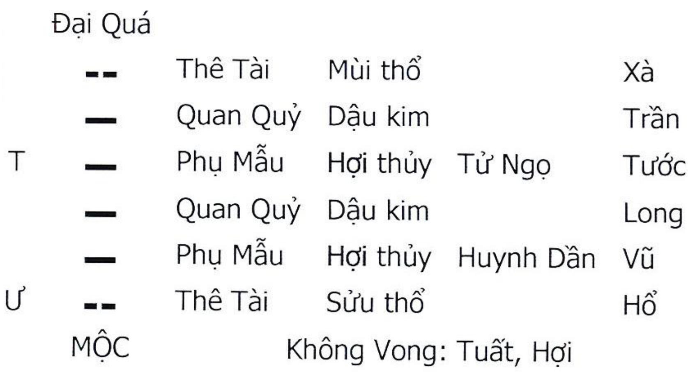
    - **Hình này chứng minh điều gì**
      - Lục hợp chủ tàng phong tụ khí (tránh gió, tích khí), lục xung chủ phi sa tẩu thạch (cát bay đá chạy). **Hào sơ gặp xung:** Móng nhà bất ổn.
    - **Từ đâu mà thấy được**
      - KIM &emsp;&emsp;&emsp;&emsp; Không Vong: Ngọ, Mùi **Phán đoán:** Thê Tài Dần mộc bị Nhật Nguyệt khắc thương, hôn nhân không thuận.
- **Vong, biểu thị tinh thần suy sụp, lâm Huyền Vũ chủ tâm trạng u uất.**
  - Tháng Mùi xuất Không Vong, ứng tại tháng Mùi, mà tháng Mùi đúng lúc là tháng Thê Tài nhập Mộ.
  - Thê Tài lâm Chu Tước khắc hào Thế, Chu Tước chủ khẩu thiệt, người yêu cãi lộn với mình.
  - Người này bị méo miệng, chính là do bị đả kích vì chia tay bạn gái ở tháng Mùi.
  - Nhật Nguyệt là Huynh Đệ, nhập quẻ tại hào 5, hào 5 là đường đi, lâm Bạch Hổ càng là như vậy.
  - Lâm Nhật là mới, xung khắc hào 2 Thê Tài Dần mộc, hào 2 là trạch, vì vậy phán đoán có một con đường mới xung thẳng vào nhà, do bị ảnh hưởng của phong thủy mà chia tay bạn gái.
  - **Phản hồi:** Thực tế đúng là có một con đường như vậy.
  - **Hình 11.** Quẻ Càn Vi Thiên biến Trạch Hỏa Cách
    - 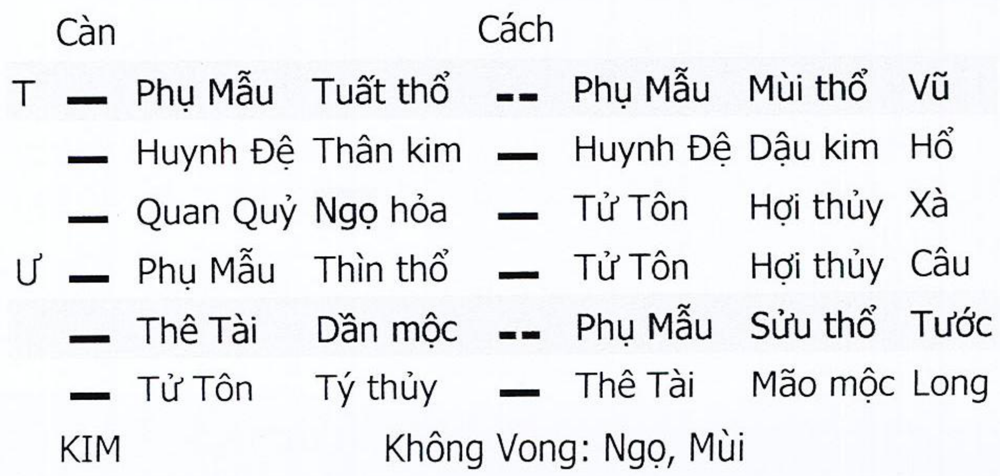
    - **Hình này chứng minh điều gì**
      - Vong, biểu thị tinh thần suy sụp, lâm Huyền Vũ chủ tâm trạng u uất. Thê Tài lâm Chu Tước khắc hào Thế, Chu Tước chủ khẩu thiệt, người yêu cãi lộn với mình.
    - **Từ đâu mà thấy được**
      - Vong, biểu thị tinh thần suy sụp, lâm Huyền Vũ chủ tâm trạng u uất. Tháng Mùi xuất Không Vong, ứng tại tháng Mùi, mà tháng Mùi đúng lúc là tháng Thê Tài nhập Mộ.

### 14. Ý NGHĨA CỦA PHẢN NGÂM VÀ PHỤC NGÂM

- **Minh họa quái tượng phong thủy:**
  - **Hình 12.** Quẻ Phong Thiên Tiểu Súc biến Địa Trạch Lâm
    - 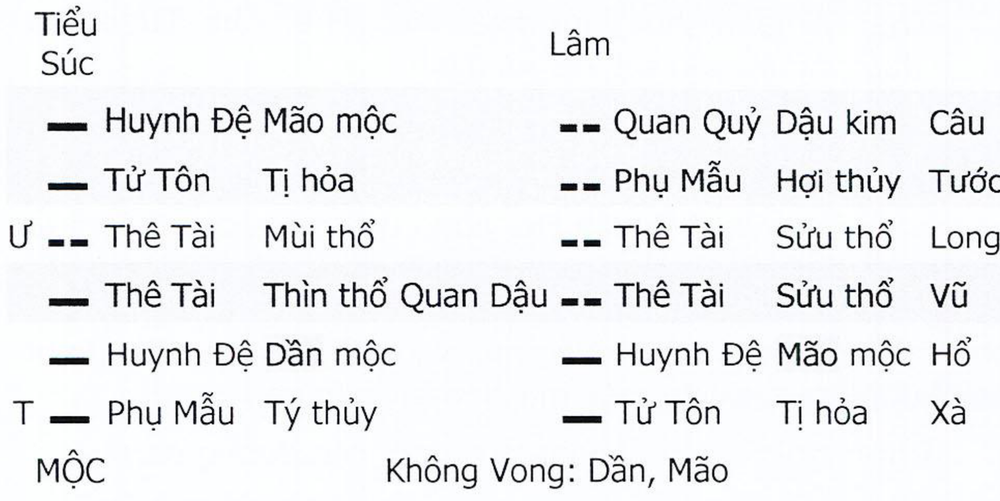
    - **Hình này chứng minh điều gì**
      - Trong dự đoán lục hào, phản ngâm và phục ngâm thường chủ sự việc không thuận lợi, tráo trở nhiều lần. **Phản ngâm** còn chủ thay đổi, chần chừ, do dự bất định, hồi hộp lo âu, lắc lư, xuyên tạc, lật...
    - **Từ đâu mà thấy được**
      - **Phục ngâm** còn chủ nội bộ biến động, nội bộ di chuyển, dài dòng, cà lăm, bụng kêu, khóc lóc, bi thương, đau lòng, lẩm bẩm một mình, nói nhảm, nói mớ, tự trách mình, chần chừ không tiến, giẫm châ...

### 15. Ý NGHĨA CỦA DU HỒN VÀ QUY HỒN

- Du hồn và quy hồn đều có vai trò phụ họa trong việc trích xuất thông tin.
- **Du hồn** có ý nghĩa không ổn định, tâm trạng bất ổn, tinh thần không tốt, ngây người, hồn vía lên mây, hôn mê, giáp giới, tách rời, ra ngoài, đi xa, tư tưởng không tập trung, vui quên trở về, lưu luyến quên trở về, du ngoạn khắp nơi, yêu thích di chuyển, đứng núi này trông núi nọ, không về nhà thường xuyên, chạy trốn, không chịu sự quản giáo, thay lòng đổi dạ, nhút nhát, đam mê, giảm trí nhớ, như mê như say, người một nơi lòng dạ một nẻo, do dự không quyết, mở rộng ra bên ngoài,...
- **Quy hồn** có ý nghĩa trở về, về nhà, tưởng niệm, nhớ nhà, không muốn ra ngoài, đóng cửa ở nhà, không đi xa, hồi tâm chuyển ý, trở lại bình thường, lên cao, tuột xuống, lực hấp dẫn, lực hướng tâm, thu lại, tổng kết, phản hồi, lười biếng, bảo thủ, co lại, bản tính,...
- Trong dự đoán phong thủy:
- **Quy hồn:** Chủ quay đầu lại, quay trở lại, hướng vào trong.
- **Du hồn:** Chủ hướng ra ngoài, nhô ra, kéo dài, mở rộng,...
- **Ví dụ:** Ngày Quý Dậu tháng Đinh Tị năm Mậu Tý, nữ đoán phong thủy nhà cửa, được Phong Trạch Trung Phu biến Sơn Trạch Tổn.
- THỔ Không Vong: Tuất, Hợi
- **Phán đoán:** Phụ Mẫu độc phát sinh hào Thế vốn là tượng cát, nhưng không nên hóa ra Tý thủy hồi đầu khắc, lâm Đằng Xà, Đằng Xà chủ bất an, quẻ du hồn cũng chủ bất an, chắc chắn không thể sống yên ổn. Quan Quỷ Mão mộc lưỡng hiện ám động, một tại hào 2, một tại hào 6, hào 2 là trạch, nơi cư trú không yên ổn.
- Tử Tôn Thân kim phục tàng, Phụ Mẫu độc phát khắc Tử Tôn, nơi ở bất lợi cho con cái. Phụ Mẫu là văn thư, hóa hồi đầu khắc, bất lợi cho việc học. Phục tàng chủ trốn tránh, quẻ du hồn chủ tâm bất định, con cái không trốn học thì cũng không muốn đi học.
- Tị hỏa độc phát, động mà gặp hợp, sự việc bất lợi phát sinh tại năm Giáp Thân.
- **Phản hồi:** Trên thực tế đúng là năm Giáp Thân chuyển nhà đến đây, sau khi chuyển đến thì đứa con bị người ta bắt nạt và bị thương, hiện đang tạm nghỉ học ở nhà, gần đây lại phát hiện trong đầu óc có bệnh.

### 16. ỨNG DỤNG CỦA 12 TRẠNG THÁI NGŨ HÀNH SINH DIỆT TRONG DỰ ĐOÁN PHONG THỦY

- **12 Cung Trường Sinh trong dự đoán phong thủy:** Vòng 12 trạng thái ngũ hành sinh diệt phản ánh chu kỳ sinh suy của khí trường và sự vật:
  - **Trường Sinh:** Sinh trưởng, khởi nguồn, khởi điểm, giúp đỡ, dựa vào, chỗ dựa vững chắc, nuôi dưỡng, cội nguồn, gốc rễ, ban đầu, cứu trợ, sản sinh, tìm kiếm, đạt được, phát sinh, bắt đầu,...
  - **Mộc Dục:** Tắm rửa, công khai, ánh sáng, ân huệ, chỗ tốt, có lợi, lộ ra, trụi lủi, nhẵn bóng, mịn màng, hưởng thụ, thẳng thắn, đi ngủ, rách nát, xấu xí, không biết xấu hổ, ẩm ướt, chăm sóc,...
  - **Quan Đới:** Chỉnh trang, ngụy trang, đóng gói, trang sức, quần áo, thăng cấp, vinh dự, che đậy, bề ngoài, cao quý, che giấu,...
  - **Lâm Quan:** Nhà nước, cơ quan hành chính, tai họa, cố gắng làm quan, dựa vào chính phủ, được nâng đỡ làm quan, nịnh hót, có địa vị, nhân viên công vụ, tự lực cánh sinh, tự mình nỗ lực, trưởng thành, sắp thành công, quốc doanh, nguy hiểm,...
  - **Đế Vượng:** Vinh phát, phát đạt, đắc ý, tinh thần, hưng phấn, thần khí, có lực, hùng tráng, cao to, sở trường, lớn mạnh, huy hoàng, phát triển mạnh mẽ, lên cao, có quyền, cực hạn, cao trào, đỉnh điểm,...
  - **Suy:** Vô lực, mềm yếu, suy nhược, nhược tiểu, không phát đạt, nhược trí, suy tàn, sức yếu, không thuận lợi, chùn chân, không có chỗ dựa vững chắc, nhược điểm, nhút nhát, hư nhược, thấp bé, vô dụng, không có bản lĩnh, bất tài, cao không với tới thấp không bằng lòng, không dám phản kháng,...
  - **Bệnh:** Chán ghét, căm hận, kẻ thù, nhìn hằn thù, thiếu sót, khuyết điểm, khiếm khuyết, thương tật, nhược điểm, sơ hở, chỗ yếu, chỗ hiểm, tâm bệnh, mục nát, vấn đề,...
  - **Tử:** Tử vong, đi vào chỗ bế tắc, không linh hoạt, không thể biến thông, ngưng lại, chung kết, sụp đổ, cố chấp, không có chỗ trống, không phát đạt, không có sinh khí, không có sức sống, khô khan, đần độn, nghĩ không thoáng, lòng dạ hẹp hòi, không có đường lui, vắng vẻ, an tĩnh, đáng sợ,...
  - **Mộ:** Bao dung, cất giữ, chôn giấu, đóng kín, thu thập, gửi, quản lý, quản chế, thuộc về, khống chế, thao túng, chỉ huy, bao hàm, thâu tóm, cạm bẫy, không tự do, say mê, bị quản thúc, ẩn tàng, bảo vệ, hộ vệ, hàng rào, nhà kho, quyền hạn, lơ mơ, hồ đồ, tối tăm, không lưu loát, không thông suốt, kết thúc, trở lực, tắc nghẽn,...
  - **Tuyệt:** Không có đường lui, nguy hiểm, tuyệt địa, tuyệt cảnh, vách núi, chia tay, đoạn tuyệt, trận quyết chiến, thất vọng, mất hết ý chí, từ bỏ, bất lực, vô tình, cay nghiệt, không châm chước, đình chỉ, tan biến, bặt vô âm tín,...
  - **Thai:** Chuẩn bị, ý định ban đầu, kế hoạch, hình thành, tiên thiên, khi mới sinh ra đã có, trời sinh, bản tính khó dời, sơ cấp, cấu kết, bận tâm, nhọc lòng, ý nghĩ, ấu trĩ, nhược tiểu, nhỏ tuổi, cất bước,...
  - **Dưỡng:** Sinh ra, sinh trưởng, gửi gắm, nuôi dưỡng, nghỉ dưỡng, dưỡng bệnh, nghỉ ngơi, chỗ dựa, dinh dưỡng, tẩm bổ, phù trợ, nghi ngờ, không yên tâm, không chắc chắn, tâm hư, bận tâm, bất an, nhận con thừa tự, bồi dưỡng, nuôi dạy, nhược tiểu, nâng đỡ,...
  - Khi ứng dụng vào dự đoán phong thủy, cần kết hợp với lục thân, lục thần, hào vị,...
  - để trích xuất ý nghĩa một cách linh hoạt.
  - **Ví dụ:** Ngày Kỷ Hợi tháng Canh Tuất năm Đinh Hợi, nam đoán phong thủy của mộ tổ có ảnh hưởng đến quan vận và tài vận hay không?
  - Được Thiên Trạch Lý biến Phong Trạch Trung Phu.
  - THỔ Không Vong: Thìn, Tị
  - **Hình 13.** Sơ đồ quẻ Phong Trạch Trung Phu biến Sơn Trạch Tổn
    - 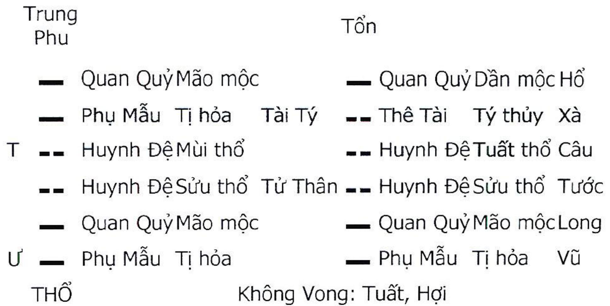
    - **Hình này chứng minh điều gì**
      - **Mộc Dục:** Tắm rửa, công khai, ánh sáng, ân huệ, chỗ tốt, có lợi, lộ ra, trụi lủi, nhẵn bóng, mịn màng, hưởng thụ, thẳng thắn, đi ngủ, rách nát, xấu xí, không biết xấu hổ, ẩm ướt, chăm sóc,...
    - **Từ đâu mà thấy được**
      - **Trường Sinh:** Sinh trưởng, khởi nguồn, khởi điểm, giúp đỡ, dựa vào, chỗ dựa vững chắc, nuôi dưỡng, cội nguồn, gốc rễ, ban đầu, cứu trợ, sản sinh, tìm kiếm, đạt được, phát sinh, bắt đầu,... **Mộc...
- **Phụ Mẫu là mồ mả, Nhật Nguyệt không sinh, Nhật khắc là hưu tù.**
  - Lưỡng hiện thì lấy hào động để phán đoán, lâm Thanh Long chủ mới, hưu tù gặp Trường Sinh, năm Mậu Dần được Trường Sinh, năm này lập mộ.
  - Tị hỏa Không Vong chủ hài cốt không đầy đủ.
  - Thê Tài Tý thủy Nguyệt khắc Nhật trợ, nhưng phần mộ Ngọ hỏa độc phát xung xuất Thê Tài, phần mộ này lợi cho hôn nhân và tài vận.
  - Phụ Mẫu là giấy kết hôn, Thê Tài phục tàng, Nhâm Ngọ xung xuất, ứng năm này kết hôn.
  - Thế hào tại hào 5, hào 5 là tôn vị, Quan Quỷ được Nhật sinh là vượng tướng, tổ hợp này chính là thông tin có chức vụ.
  - Năm Mậu Dần, năm Kỷ Mão Quan Quỷ được vượng, nhất định có thăng chức.
  - Nhưng Phụ Mẫu Ngọ hỏa độc phát, Quan Quỷ gặp Tử địa, độc phát lấy tượng làm chủ, vì vậy mộ tổ gây bất lợi cho quan vận.
  - Quan Quỷ là mộc, lại lâm Bạch Hổ, Bạch Hổ là tử vong, đây là mộc gần mộ, chẳng phải cỏ thì là cây.
  - Mộc gặp Tử địa, gần mộ ắt có vật giống như cây khô.
  - **Phản hồi:** Năm Mậu Dần có tu tạo tại mộ tổ, năm Nhâm Ngọ kết hôn, nghĩa địa có hàng rào bằng cây, tuy nhiên bởi vì sử dụng thuốc diệt cỏ cho nên hàng rào đã chết hết.
  - Bản thân tại năm Mậu Dần được thăng chức, năm Giáp Thân lại bị giáng cấp.
  - Hào Thế tại hào 5 lâm kim bị khắc, Nhật là Bệnh địa, kim là xương cốt, hào 5 là mặt, vì vậy là răng có vấn đề.
  - Trên thực tế là vào năm 1998 đã bị mất một cái răng cửa.
  - **Hình 14.** Sơ đồ quẻ Thiên Trạch Lý biến Phong Trạch Trung Phu
    - 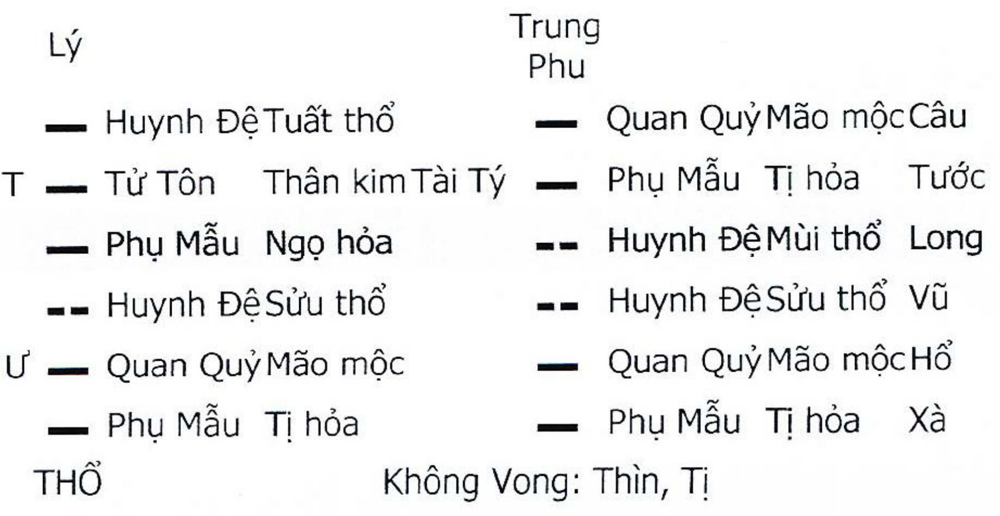
    - **Hình này chứng minh điều gì**
      - Lưỡng hiện thì lấy hào động để phán đoán, lâm Thanh Long chủ mới, hưu tù gặp Trường Sinh, năm Mậu Dần được Trường Sinh, năm này lập mộ. Tị hỏa Không Vong chủ hài cốt không đầy đủ.
    - **Từ đâu mà thấy được**
      - Phụ Mẫu là mồ mả, Nhật Nguyệt không sinh, Nhật khắc là hưu tù. Lưỡng hiện thì lấy hào động để phán đoán, lâm Thanh Long chủ mới, hưu tù gặp Trường Sinh, năm Mậu Dần được Trường Sinh, năm này lập mộ.

## CHƯƠNG 3: PHÁN ĐOÁN CHI TIẾT TRONG DỰ ĐOÁN PHONG THỦY

- **Ý nghĩa của phán đoán chi tiết:**
  - Phán đoán chi tiết là một trong những cách để kiểm tra thông tin quái tượng có chính xác hay không.
  - Đây cũng là phương pháp duy nhất để tìm ra khuyết điểm của phong thủy và suy đoán cát hung mà nó gây ra.
- **Tính chất không gian ba chiều trong dự đoán phong thủy:**
  - Môi trường phong thủy trong thực tế là ba chiều; vì vậy, thông tin quái tượng thể hiện cũng phải là ba chiều.
  - Khi dự đoán, căn cứ vào hào vị, lục thân, lục thần, quái tượng, ngũ hành sinh khắc để triển khai quẻ.
  - Kết hợp chặt chẽ với không gian để tìm ra vật thể, phương vị, nhân sự, lưu niên, cát hung họa phúc tương ứng với phong thủy.

### 1. PHƯƠNG PHÁP PHÁN ĐOÁN ĐƯỜNG ĐI

- **Thê Tài hưu tù, Nguyên thần bị khắc, hồi đầu khắc, lại Nguyệt phá, thiếu lực sinh Thê Tài, tài vận không tốt đẹp.**
  - Kinh doanh ở đây nhất định sẽ không có hiệu quả.
  - **Phản hồi:** Mọi thứ đúng như biểu thị trên quái tượng.
  - Sau một mùa đông không có thu hoạch đã quay về.
  - **Hình 15.** Quẻ Phong Hỏa Gia Nhân biến Sơn Hỏa Bí
    - 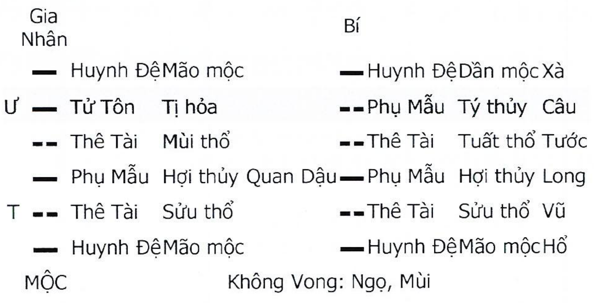
    - **Hình này chứng minh điều gì**
      - Thê Tài hưu tù, Nguyên thần bị khắc, hồi đầu khắc, lại Nguyệt phá, thiếu lực sinh Thê Tài, tài vận không tốt đẹp. **Phản hồi:** Mọi thứ đúng như biểu thị trên quái tượng.
    - **Từ đâu mà thấy được**
      - Thê Tài hưu tù, Nguyên thần bị khắc, hồi đầu khắc, lại Nguyệt phá, thiếu lực sinh Thê Tài, tài vận không tốt đẹp.

### 2. PHƯƠNG PHÁP PHÁN ĐOÁN CẦU

- **Sau khi đốt tiền âm phủ tại tháng Thìn, tại tháng Mùi đã được đổi sang một công việc tốt, tiền lương cũng cao hơn nhiều so với lúc trước.**
  - **Hình 16.** Sơ đồ quẻ Địa Thủy Sư biến Địa Sơn Khiêm
    - 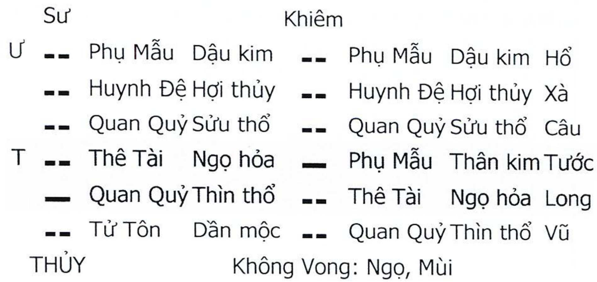
    - **Hình này chứng minh điều gì**
      - Sau khi đốt tiền âm phủ tại tháng Thìn, tại tháng Mùi đã được đổi sang một công việc tốt, tiền lương cũng cao hơn nhiều so với lúc trước.
    - **Từ đâu mà thấy được**
      - Căn cứ vào hào vị, lục thân, can chi sinh khắc, tuần không và hào động biến trong quẻ.

### 3. PHƯƠNG PHÁP PHÁN ĐOÁN SÔNG NGÒI

- Phong thủy không thể thiếu sông, nước,... Về cách xem sông ngòi, chủ yếu là lấy thủy làm chủ.
- Thủy động hóa hồi đầu sinh, thủy lâm Dịch Mã, thủy được kim sinh, thủy bị hào xung, thủy lâm Bạch Hổ đều là thông tin sông ngòi.
- Thủy vượng tướng là sông nhiều nước, hưu tù là ít nước.
- Thủy gặp hợp trú là bị chặn dòng chảy, nhập Mộ là tạo thành ao nước, đập chứa nước. Thủy lâm Chu Tước là trạm thuỷ điện, lâm Thanh Long là nước uống, chất lượng nước tốt, lâm Câu Trần chủ có cầu, hào sơ thủy lâm Bạch Hổ là có cầu, lâm Đằng Xà là dòng nước nhỏ, Huyền Vũ là nước bẩn, cống thoát nước, sông ngòi bị ô nhiễm,...
- Thủy Không thì chảy, thủy xung thì động, thủy hợp thì dừng, thủy Mộ thì tích trữ, thủy Tuyệt thì khô, thủy Tử thì khô, thủy khắc thì nhỏ, thủy sinh thì có nguồn, thủy phục tàng thì không có hoặc là mạch nước ngầm.
- Tại cung Cấn là khe, suối trên núi; tại cung Khôn là sông ngòi; Đoài là đầm lầy, ao hồ; Khảm là thủy vực, ruộng nước thấp trũng; Tốn là suối giữa rừng; Chấn là sông nước cuồn cuộn; Càn là nguồn nước ở chỗ cao; Ly là suối nước nóng, dòng nước ấm,...

### 4. PHƯƠNG PHÁP PHÁN ĐOÁN VẬT KIẾN TRÚC

- Trong lục hào, khi phán đoán vật kiến trúc thường lấy Phụ Mẫu và Câu Trần để trích xuất thông tin. Căn cứ vào động tĩnh biến hóa trong quẻ, xem ảnh hưởng đối với Dụng thần ra sao để phán đoán vật kiến trúc có ảnh hưởng tốt hay xấu đối với phong thủy. Đồng thời cũng phải kết hợp với Không Vong, Nguyệt phá, xung hợp,... để tiến hành phán đoán.
- Hào sơ Phụ Mẫu Câu Trần là vật kiến trúc lân cận hoặc là hàng xóm.
- Hào 2 Phụ Mẫu Câu Trần là vật kiến trúc lân cận.
- Hào 3 Phụ Mẫu Câu Trần là vật kiến trúc đối diện cửa.
- Hào 4 Phụ Mẫu Câu Trần là vật kiến trúc ở ngoài cổng.
- Hào 5 Phụ Mẫu Câu Trần là vật kiến trúc ven đường.
- Hào 6 Phụ Mẫu Câu Trần là vật kiến trúc nhà hàng xóm.
- Ngoài ra còn lấy địa chi và bát quái để phân biệt phương vị.
- Lại thổ là gạch ngói, kim là đá, mộc là kết cấu bằng gỗ, thủy là thủy tinh, hỏa là ánh sáng, đèn đuốc rực rỡ.
- Kết hợp với lục thần, Thanh Long là mới; Chu Tước là náo nhiệt, ồn ào; Câu Trần là cũ kỹ; Đằng Xà là hình nhọn, hình tháp; Bạch Hổ là uy nghiêm, cao vút, đền chùa, bệnh viện,...; Huyền Vũ là ẩm thấp, u ám,...

### 5. PHƯƠNG PHÁP PHÁN ĐOÁN NÚI

- ****Phản hồi:** Kết quả là cô ấy chuyển nhà vào ngày Mão, đến tháng Dậu thì xảy ra tranh chấp với chủ nhà.**
  - Cô ấy đã chuyển đến sống ở một ngọn đồi bên bờ biển, tâm trạng đã tốt lên rất nhiều.
  - **Hình 17.** Quẻ Địa Trạch Lâm biến Thiên Trạch Lý
    - 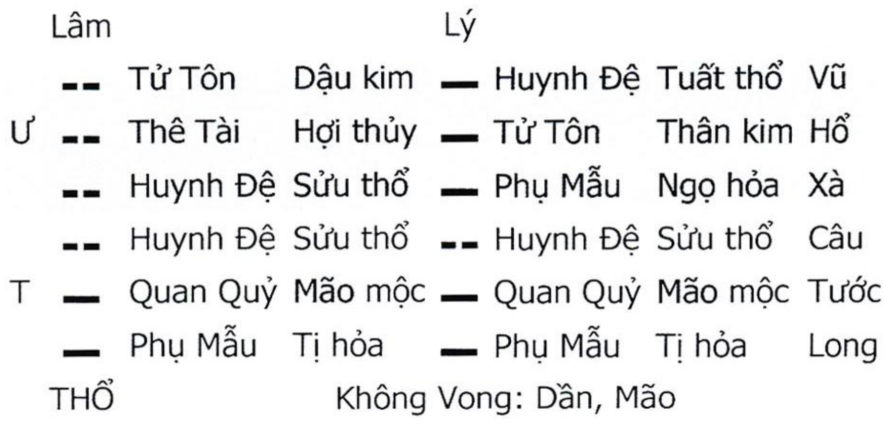
    - **Hình này chứng minh điều gì**
      - **Phản hồi:** Kết quả là cô ấy chuyển nhà vào ngày Mão, đến tháng Dậu thì xảy ra tranh chấp với chủ nhà. Cô ấy đã chuyển đến sống ở một ngọn đồi bên bờ biển, tâm trạng đã tốt lên rất nhiều.
    - **Từ đâu mà thấy được**
      - Căn cứ vào hào vị, lục thân, can chi sinh khắc, tuần không và hào động biến trong quẻ.

### 6. PHƯƠNG PHÁP PHÁN ĐOÁN HOA CỎ CÂY CỐI

- Hoa cỏ cây cối thì lấy hào mộc hoặc quẻ Chấn, Tốn để phán đoán.
- Vượng tướng là cao to, tươi tốt; hưu tù là thấp bé, thưa thớt. Tam hợp mộc cục là rừng rậm, cây bụi um tùm; hào mộc hiện nhiều thì cây cỏ khắp nơi.
- Lại Dần Mão Thìn tam hội phương Đông mộc cục cũng là một vùng cây cối.
- Mộc gặp thủy là cây bên sông suối, gặp thổ là cây trên gò núi, mộc gặp hỏa và Chu Tước thường là hoa cỏ.
- Lâm Thanh Long là cây đẹp; lâm Đằng Xà là cây thon dài, cây uốn khúc, cây dây leo; lâm Bạch Hổ là cây cao và thẳng; lâm Huyền Vũ là cỏ nước, cây bờ sông; lâm Câu Trần là cây có đốt.
- Mộc gặp Nguyệt phá là đâm nhánh, mộc gặp Không vong là có hốc cây, lâm Bạch Hổ Không Vong là cây cối bị chặt, hưu tù gặp Tuyệt là cây chết khô.

### 7. PHƯƠNG PHÁP PHÁN ĐOÁN ĐÁ

- Lấy kim để biểu thị đá, Thân kim là đá hình dài, Dậu kim là đá hình tròn.
- Gặp Nguyệt phá là đá bị nứt, gặp Không Vong là trên đá có lỗ có hố.
- Nhập Mộ, Dậu kim bị Thìn thổ hợp, hào thổ vượng tướng, là đá bị chôn trong đất.
- Lâm Thanh Long chủ ngọc thạch, đá quý.
- Lâm Chu Tước là đá màu đỏ, đá tỏa nhiệt, đá mã não,...
- Lâm Câu Trần là khối đá, đá cổ xưa.
- Lâm Đằng Xà là đá thon dài, đá hiếm thấy, đá quái dị,...
- Lâm Bạch Hổ là đá cứng chắc, đá ven đường.
- Lâm Huyền Vũ là đá trong nước, đá phong hóa,...
- Cung Càn là đá vàng ngọc, đá quý, đá hình tròn. Cung Khôn là đá mềm, đá trên mặt đất, đá hình vuông.
- Cung Chấn là đá ở núi rừng.
- Cung Tốn là đá thon dài, đá trong rừng.
- Cung Khảm là đá trong nước, đá cuội, đá ven sông.
- Cung Ly là đá mỹ lệ, đá có hoa văn.
- Cung Cấn là đá núi, khoáng thạch.
- Cung Đoài là đá vỡ, đá ven sông,...

### 8. TỔNG LUẬN PHONG THỦY

- **Minh họa quái tượng phong thủy:**
  - **Hình 18.** Sơ đồ quẻ Thiên Trạch Lý biến Thiên Thủy Tụng
    - 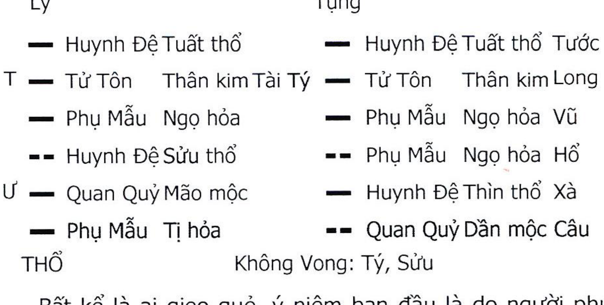
    - **Hình này chứng minh điều gì**
      - TỔNG LUẬN PHONG THỦY Lục hào phong thủy chủ yếu được chia thành âm trạch và dương trạch.
    - **Từ đâu mà thấy được**
      - Tuy nhiên, cả hai đều có thể biểu hiện thông qua các tổ hợp biến hóa trên quái tượng. Gian hào vượng tướng lại lâm Quan Quỷ, biểu thị minh đường rộng lớn, quan vận hanh thông.

## CHƯƠNG 4: DỰ ĐOÁN PHONG THỦY NƠI Ở

Dự đoán phong thủy nhà cửa, lấy hào Phụ Mẫu sinh Thế là tốt, cũng mừng được hào 2 sinh hào Thế. Sợ nhất là hào Thế hưu tù Không Phá, nếu hào Thế bị hào Phụ Mẫu khắc thương thì nhất định phong thủy không có lợi cho bản thân. Tiếp theo là xem đến lục thân Tài, Quan,...
Phong thủy có ảnh hưởng đến mọi vấn đề. Phương pháp nắm bắt cát hung phong thủy của lục hào có sự khác biệt so với dự đoán phong thủy truyền thống thông thường. Lục hào chủ yếu lấy sinh khắc trong quẻ để phán đoán, không phải là dựa vào cửa, bếp, chủ đơn thuần. Các vật thể bên trong và xung quanh nhà như tranh chữ, đồ trang trí, rãnh nước, sông ngòi, kiến trúc, đường đi,... đều có thể gây ra biến hóa về khí trường phong thủy.
Mục đích chủ yếu của lục hào dự đoán phong thủy là tìm ra cát hung đối ứng với sự việc, thời gian, nguyên nhân,... Sử dụng phương pháp này, chúng ta có thể tiến hành dự đoán từ xa, hoặc cũng có thể đến thực địa để đối chiếu với quái tượng, từ đó tìm ra được yếu tố gây bất lợi cho phong thủy. Bất kể là phương pháp gì cũng đều phải có khả năng dự đoán đa phương diện và phán đoán tổng hợp. Hôn nhân, cát hung, tai họa, tình cảm, đời sau, tài vận, quan vận,... đều có thể đến từ ảnh hưởng của phong thủy.
Xem phong thủy nhà cửa, lấy Thanh Long là bên trái căn nhà, Bạch Hổ là bên phải căn nhà, Chu Tước là phía trước, Huyền Vũ là phía sau. Vượng tướng là cao, hưu tù bị khắc là thấp. Cần phải kết hợp với ngũ hành sinh khắc để luận cát hung, không thể chỉ lấy Thanh Long vượng tướng luận là cát, Bạch Hổ vượng tướng luận là hung.
Hào ở cung Chấn, hào mộc trong quẻ vượng tướng là phía đông cao, lấy Hỷ thần ứng với nó; hào ở cung Đoài, kim bị khắc mà hưu tù là phía tây thấp, lấy Kỵ thần ứng với nó. Chủ nên nhà tràn đầy sinh khí, cát tường như ý. Ngược lại, khó có giàu sang.
Hào Ứng hưu tù là Kỵ thần, vượng tướng là hỷ thần chủ hướng hữu tình, sinh hào Thế rất cát, khắc hào Thế là hung. Hào Thế hưu tù gặp Tử Tuyệt, Không Phá, chủ tọa sơn thấp, tượng cô độc.
Tử Tôn Ngọ hỏa lâm hào Ứng sinh hào Thế, chủ phía nam có đường lớn, tài vận tốt đẹp. Thanh Long lâm thủy sinh hào Thế, chủ phía đông có nước chảy, đại cát tường. Hào 5 lâm Thanh Long khắc hào Thế, chủ phía đông có đường đi gây bất lợi cho bản thân. Lâm Huyền Vũ khắc hào Thế, chủ phía sau có đường đi gây bất lợi.
Quan Quỷ, Mộ khố của Tử Tôn lâm Đằng Xà, Bạch Hổ xung khắc hào Thế, chủ lân cận có chùa miếu, tháp cao... gây bất lợi, ảnh hưởng đến tuổi thọ. Có Thìn thổ lâm Bạch Hổ phát động khắc Tử Tôn, hoặc Tử Tôn lâm thủy bị khắc, hoặc cung Khảm có khắc, chủ lân cận có ao đầm, trẻ nhỏ chết đuối trong đó.

### 1. NỀN NHÀ

- **Những phán đoán ở trên hoàn toàn chính xác.**
  - Dự đoán bệnh tật, Dụng thần hóa Quan Quỷ là bất lợi, đầu tiên phải ngăn cản Dụng thần động mà hóa Quan Quỷ.
  - Tuất thổ và Dụng thần tương hợp, có thể hợp vướng chân dụng thần.
  - Hào sơ là nền đất, Mão đối ứng với phía Đông, vì vậy chôn một con chó đồ chơi ở phía Đông trong nền nhà.
  - Độ sâu là 30 cm, ứng với Mão mộc sinh số 3.
  - Chú ý là không được chôn ở hướng Đông Nam, bởi vì Đông Nam là Thìn, Thìn thổ Không Vong, chôn tại Đông Nam thì Thìn thổ xung Không tắc thực, trái lại gây bất lợi cho bệnh đứa trẻ.
  - Ngoài ra, Dụng thần còn bị Thân kim khắc, Thân kim đối ứng với Tây Nam, còn cần ở Tây Nam nhà nuôi mấy con cá hồng kim.
  - Cá hồng kim trong nước bơi lội, là hỏa thủy đồng thời phát động.
  - Màu đỏ động có thể khắc kim, thủy động lại có thể biến đổi kim sinh trợ Dụng thần, nhất cử lưỡng tiện.
  - Năm Mậu Tý nhận được phản hồi, sau ba tháng cháu bé đã có thể nói chuyện.
  - **Hình 19.** Quẻ Thủy Hỏa Ký Tế biến Thủy Sơn Kiển
    - 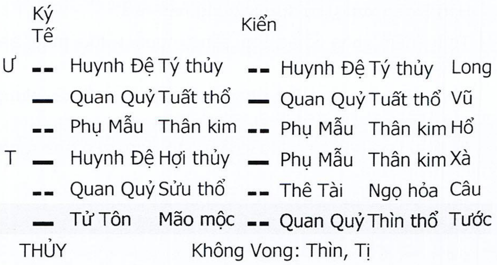
    - **Hình này chứng minh điều gì**
      - Dự đoán bệnh tật, Dụng thần hóa Quan Quỷ là bất lợi, đầu tiên phải ngăn cản Dụng thần động mà hóa Quan Quỷ. Hào sơ là nền đất, Mão đối ứng với phía Đông, vì vậy chôn một con chó đồ chơi ở phía Đông...
    - **Từ đâu mà thấy được**
      - Dự đoán bệnh tật, Dụng thần hóa Quan Quỷ là bất lợi, đầu tiên phải ngăn cản Dụng thần động mà hóa Quan Quỷ. Tuất thổ và Dụng thần tương hợp, có thể hợp vướng chân dụng thần.

### 2. GIẾNG NƯỚC

- Nếu dự đoán giếng nước riêng biệt thì lấy hào Ứng làm Dụng thần. Nếu dự đoán thông thường thì lấy hào sơ là giếng nước, Thìn thổ là giếng nước, Mộ khố của Thê Tài là giếng nước. Tuy nhiên, xã hội thay đổi liên tục, trong cuộc sống đã ít thấy giếng nước. Vì vậy, thông tin như thế có thể trở thành hạ thủy (xuống nước), ống nước, hồ chứa nước, đập nước,...
- Thìn thổ lâm Đằng Xà, Chu Tước, thủy hợp hào lâm Đằng Xà, Mộ khố của Thê Tài lâm Đằng Xà hoặc hào lâm Đằng Xà hóa thủy, thường là ống dẫn nước. Lâm Thanh Long, Chu Tước là nước uống, lâm Câu Trần là hồ chứa nước, lâm Huyền Vũ thường là cống thoát nước, rãnh nước,... Tử Tôn kim lâm Bạch Hổ có thể là giếng nước.
- Lấy sinh khắc để phán đoán cát hung, ảnh hưởng.
- Lấy suy vượng để phán đoán kích cỡ của nước.
- Nguyệt phá Không Vong, Tử Tuyệt là không có nước, Nguyệt phá còn phán đoán có rò rỉ nước hay không.
- Lấy quái cung, chỗ hợp, hào biến,... để phán đoán phương hướng, vị trí,...
- Nhật thần hợp trú, lại lâm Câu Trần, thường là tắc nghẽn không thông.
- Sinh hào 2, lâm Thanh Long, Chu Tước, ống nước thông đến phòng bếp; khắc hào Thế, bất lợi cho bản thân; khắc Thê Tài, bất lợi cho tiền bạc. Căn cứ vào sinh khắc, hào vị,... để phán đoán tình hình ảnh hưởng đến người cư ngụ.

### 3. HÀNG XÓM

- Lấy hào sơ, hào 6, hào Ứng và hai hào trên dưới hào Thế để phán đoán.
- Sinh hợp hào Thế, hàng xóm hòa thuận, quan hệ tốt đẹp; khắc hào Thế, hàng xóm bất hòa.
- Lâm Chu Tước, Đằng Xà khắc hào Thế, cãi cọ kiện tụng hoặc cháy thành vạ lây.
- Lâm Huyền Vũ khắc Thê Tài, hàng xóm trộm cắp.
- Lâm Đào Hoa Huyền Vũ hợp Thê Tài, nam đến đoán thì láng giềng dụ dỗ vợ mình. Nữ đến đoán thì lấy Quan Quỷ để luận.
- Hào sơ, hào 6, hào Ứng lâm Câu Trần phát động, hàng xóm có việc tu tạo, động thổ, sinh hào Thế thì trái lại khiến cho phong thủy biến đổi có lợi cho mình, khắc hào Thế thì khiến phong thủy bất lợi, tổn hại cho mình.
- Nếu chỉ dự đoán với hàng xóm ra sao thì xem mối quan hệ giữa hào Thế và hào Ứng.

### 4. SÂN

- **Minh họa quái tượng phong thủy:**
  - **Hình 20.** Quẻ Trạch Thiên Quải biến Trạch Hỏa Cách
    - 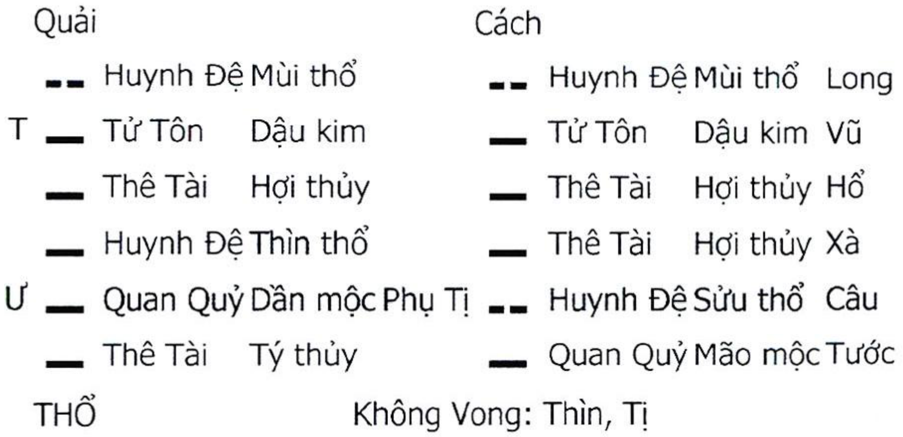
    - **Hình này chứng minh điều gì**
      - Lấy hào 2 để luận. Đôi khi cũng xem gian hào.
    - **Từ đâu mà thấy được**
      - Lâm Chu Tước hoặc Nhật Nguyệt hào động gặp hỏa, thường ứng hoa cỏ. Mộc Không là dời đi hoặc trên cây có hốc; gặp Tử địa, chết khô; Nguyệt phá, chủ đâm nhánh, gãy nứt; lâm Thanh

### 5. PHÒNG BẾP

- **Nguyệt phù Nhật sinh vượng tướng, chuồng lợn vẫn còn.**
  - (ứng nghiệm)
  - Hào 2 Thê Tài Mão mộc, mộc là ngũ hành sinh hỏa, Thê Tài là ẩm thực, hào 2 lại là phòng bếp, phát động tất có sự việc sửa chữa bếp.
  - (ứng nghiệm)
  - **Hình 21.** Sơ đồ quẻ Đoài Vi Trạch biến Phong Lôi Ích
    - 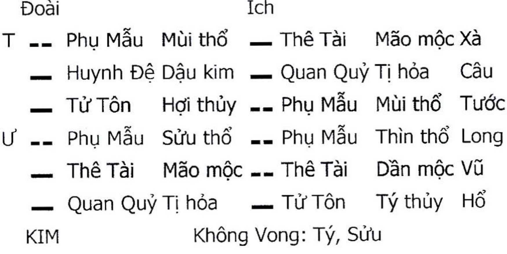
    - **Hình này chứng minh điều gì**
      - Hào 2 Thê Tài Mão mộc, mộc là ngũ hành sinh hỏa, Thê Tài là ẩm thực, hào 2 lại là phòng bếp, phát động tất có sự việc sửa chữa bếp.
    - **Từ đâu mà thấy được**
      - Nguyệt phù Nhật sinh vượng tướng, chuồng lợn vẫn còn. Hào 2 Thê Tài Mão mộc, mộc là ngũ hành sinh hỏa, Thê Tài là ẩm thực, hào 2 lại là phòng bếp, phát động tất có sự việc sửa chữa bếp.

### 6. PHÒNG NGỦ

- Phòng ngủ thông thường lấy hào 2, hào 3 để định vị. Hoặc lấy Mộ khố của hào Thế, chỗ hào Thế hợp để định vị. Cần căn cứ vào biến hóa của quái tượng để nắm bắt một cách linh hoạt.
- Hào Thế vượng tướng gặp sinh phù, phòng ngủ có phong thủy tốt, ở thoải mái, vận khí tốt. Khắc hào Thế, phong thủy của phòng ngủ ảnh hưởng đến bản thân. Lâm Đằng Xà Không Vong, ngủ không ngon. Tâm trạng bất an.
- Lâm hỏa vượng tướng, trong phòng sáng sủa sạch sẽ; Không Vong lâm Huyền Vũ, thiếu ánh sáng, phòng ngủ u ám.
- Lâm Thanh Long vượng tướng, chỉnh trang đổi mới; Nguyệt phá bị khắc lâm Huyền Vũ, rách nát tả tơi, không sạch sẽ hoặc ẩm thấp.
- Lâm Chu Tước phát động, xung hào Thế, hình hào Thế, tiếng ồn lớn.

### 7. BÀN THỜ

- **Minh họa quái tượng phong thủy:**
  - **Hình 22.** Sơ đồ quẻ Hỏa Trạch Khuê biến Hỏa Lôi Phệ Hạp
    - 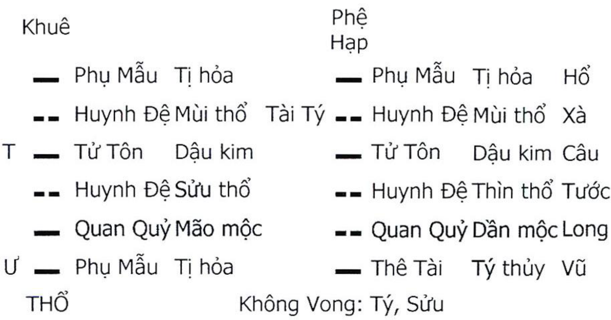
    - **Hình này chứng minh điều gì**
      - Phán đoán bàn thờ, thông thường sử dụng hào 3 và hào 6, hào lâm Quan Quỷ.
    - **Từ đâu mà thấy được**
      - Phán đoán bàn thờ, thông thường sử dụng hào 3 và hào 6, hào lâm Quan Quỷ. Lấy sinh hợp hào Thế là tốt, xung khắc hào Thế là hại.

### 8. CỬA

- ****Phản hồi:** Quả nhiên là phòng làm việc có hai cửa, tại Đông Nam, một tại Tây Nam.**
  - Ở Tây Bắc của phòng làm việc có nam đồng nghiệp được thăng chức vào năm Đinh Hợi, bản thân bị mất cơ hội.
  - **Hình 23.** Quẻ Thiên Hỏa Đồng Nhân biến Trạch Hỏa Cách
    - 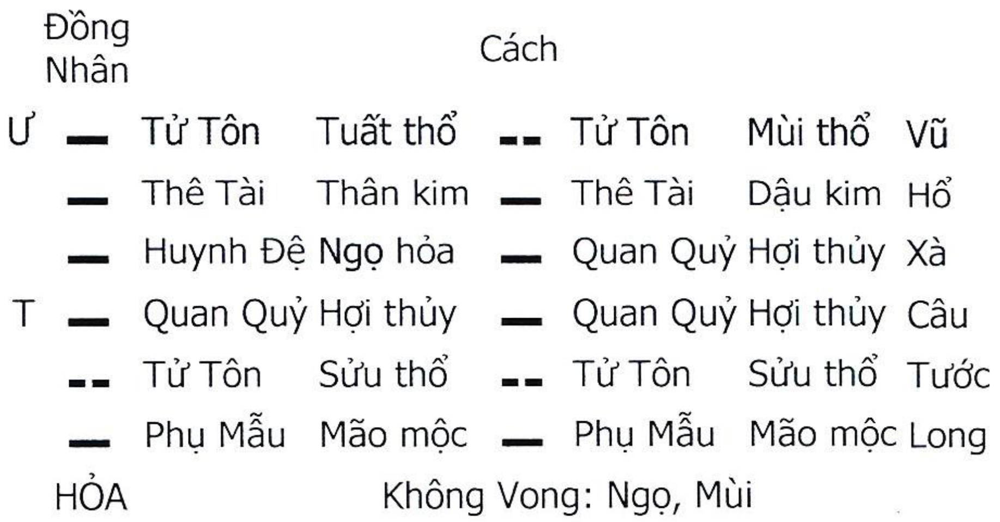
    - **Hình này chứng minh điều gì**
      - Quẻ chứng minh tình trạng phong thủy và ảnh hưởng cát hung tương ứng với quái tượng Quẻ Thiên Hỏa Đồng Nhân biến Trạch Hỏa Cách.
    - **Từ đâu mà thấy được**
      - Căn cứ vào hào vị, lục thân, can chi sinh khắc, tuần không và hào động biến trong quẻ.

### 9. TƯỜNG

- Hào 6 là hào vị chính về tường. Ngoài ra, hào Huynh Đệ, Mộ khố của Phụ Mẫu, Mộ khố của hào 2 cũng có thể là thông tin tường.
- Nguyệt phá là tường có vết nứt, Không Vong là trên tường có lỗ hoặc không có tường. Gặp xung là tường xiêu vẹo, gặp hợp là trên tường có vật trang trí. Thổ là vách đất, mộc là bờ giậu, kim là đá, tường gạch,...
- Thanh Long chủ mỹ quan, sạch sẽ; Huyền Vũ là ẩm thấp; Bạch Hổ là kiên cố; Đằng Xà chủ thon dài; Câu Trần chủ nhô ra; Chu Tước chủ không cách âm hoặc trên tường có tranh chữ,...
- Lại mộc hợp hào 6, cỏ cây leo tường; kim hợp hào 6, gia cố bằng đá; thủy lâm Bạch Hổ hợp hào 6, tường có kính pha lê; Ngọ hỏa hợp hào 6, đèn áp tường; thổ lâm Câu Trần phát động hợp hào 6, sửa sang cải tạo,...
- Khắc hào Thế, gây bất lợi cho mình; sinh hợp hào Thế, giúp mình thư thái. Lâm Câu Trần Bạch Hổ khắc hào Thế, có nỗi lo tường sập nguy hiểm cho tính mạng. Lâm Huyền Vũ khắc Thê Tài, trộm cướp trèo tường vào nhà. Lâm hào Ứng xung khắc hào Thế, tường hàng xóm ảnh hưởng đến mình.
- Xem hào 6 sinh khắc xung hợp hào nào, từ đó suy ra có lợi hay bất lợi đối với người nào, việc gì,...

### 10. MÁI NHÀ

- ****Phán đoán:** Phụ Mẫu lưỡng hiện, ứng với có hai biệt thự.**
  - Phụ Mẫu Tuất thổ lâm Câu Trần, Câu Trần là cũ, Phụ Mẫu Thìn thổ tại hào sơ, hào sơ chủ khởi đầu của sự vật cho nên là mới, là một cũ một mới.
  - Dụng thần lưỡng hiện, lấy hào có ý nghĩa nhất định làm Dụng.
  - Phụ Mẫu Tuất thổ Nguyệt phá, chủ hiện tại muốn bán căn biệt thự cũ.
  - Dụng thần Nguyệt phá, chủ nhà cửa có chỗ hư hại, Nhật Nguyệt như trời, thể hiện phần đỉnh, mái nhà có hư hại.
  - Lại hào 6 độc phát, hào 6 là mái nhà, độc phát biểu thị tính chất nguyên nhân, lâm thủy độc phát chính là mái nhà dột nước, nhưng Nhật thần Tuất thổ lại Thực Phá, là đã được sửa chữa.
  - **Phản hồi:** Đoán đến đây, người phụ nữ hào hứng gọi điện ngay cho chồng, cảm thấy quá kỳ diệu, trong quẻ lại có thể xem ra những thông tin quá nhỏ nhặt như vậy.
  - **Hình 24.** Sơ đồ quẻ Thủy Sơn Kiển biến Phong Sơn Tiệm
    - 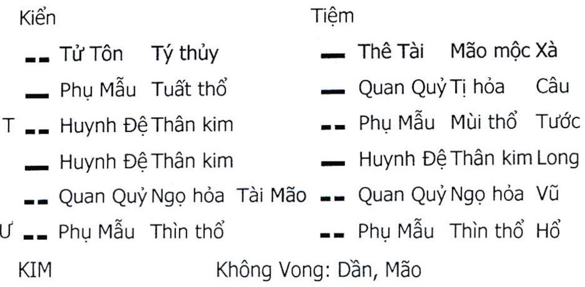
    - **Hình này chứng minh điều gì**
      - Phụ Mẫu Tuất thổ lâm Câu Trần, Câu Trần là cũ, Phụ Mẫu Thìn thổ tại hào sơ, hào sơ chủ khởi đầu của sự vật cho nên là mới, là một cũ một mới. Dụng thần lưỡng hiện, lấy hào có ý nghĩa nhất định làm ...
    - **Từ đâu mà thấy được**
      - Phụ Mẫu Tuất thổ lâm Câu Trần, Câu Trần là cũ, Phụ Mẫu Thìn thổ tại hào sơ, hào sơ chủ khởi đầu của sự vật cho nên là mới, là một cũ một mới. Dụng thần lưỡng hiện, lấy hào có ý nghĩa nhất định làm ...

### 11. GIƯỜNG

- Thông thường lấy hào vị để luận giường, hào 3 là giường, gặp âm là giường, tuy nhiên cần luận linh hoạt. Lâm Đằng Xà là giường, gặp Hợi thủy, Sửu thổ, Mão mộc thường luận là giường.
- Hào 3 xem thêm Dụng thần, lâm Đằng Xà Không Vong, ngủ không yên, ác mộng kinh hoàng. Lại lấy động tĩnh biến hóa, lục thân... có thể phán đoán nội dung giấc mộng.
- Hào 3 đặc biệt hữu dụng khi phán đoán bệnh tật và hôn nhân. Lâm Bạch Hổ, Quan Quỷ khắc hào Thế, nhiều bệnh tật tai họa; lâm Huyền Vũ Đào Hoa, thường ngoại tình.
- Lâm Thanh Long vượng tướng sinh hào Thế, vị trí giường tốt đẹp, ngủ được thoải mái, có lợi cho sức khỏe. Khắc hào Thế, bất lợi cho cơ thể, ngủ lâu là sinh bệnh.
- Thê Tài sinh hợp hào Thế, tình cảm vợ chồng tốt đẹp. Hào Thế Không Vong, vợ chồng không chung giường. Thế tại hào 3, nam đoán mà Thê Tài Không Vong không đến sinh thì vợ không muốn ở chung, nữ đoán mà Quan Quỷ Không Vong chủ chồng không muốn ở cùng.
- Thê Tài Quan Quỷ đến sinh, hào Thế lâm hào 3 động hóa Không Vong hoặc hóa thoái, căn cứ vào tình huống nam nữ, là bản thân trốn tránh, nam đoán mà động hóa Thê Tài, nữ đoán mà động hóa Quan Quỷ, lâm Thanh Long Huyền Vũ chủ đồng sàng dị mộng, tình cảm vợ chồng không tốt đẹp, có ngoại tình.
- Chu Tước tại hào 3, bên gối phu thê nhiều lời nói; Không Vong, không nói chuyện với nhau.
- Chu Tước thêm Đằng Xà là nói mớ. Bạch Hổ thêm Chu Tước là đánh nhau, cãi lộn. Mộc lâm Thanh Long Chu Tước Quan Quỷ động, chủ hút thuốc trên giường dẫn đến hỏa hoạn.
- Lâm Câu Trần nhập Mộ, chủ lười thức dậy, thích ngủ nướng. Hào Thế nhập Mộ là bản thân, nam đoán mà Thê Tài nhập Mộ là vợ, nữ đoán mà Quan Quỷ nhập Mộ là chồng.
- Phản ngâm, lâm Đằng Xà, Dịch Mã cùng lâm tại hào 3, chủ trằn trọc không thể ngủ.
- Chu Tước gặp kim lâm Tử Tôn, chủ trên giường có tiếng khóc trẻ nhỏ. Tử Tôn lâm Đằng Xà hào 3 phát động, hóa Quan Quỷ hoặc nhập Mộ, chủ trẻ nhỏ hoảng sợ.
- Hào Thế nhập Mộ chủ nhiều ác mộng. Hào Thế lâm Huyền Vũ động lâm hào 3 hóa tiết khí hoặc có hào khác phát động, nhất là khi gặp Thê Tài tiết khí, nam chủ có mộng tinh.
- Hào Thế nhập Mộ tại hào 3 Phụ Mẫu là tượng đắp chăn, hào Thế tại hào 5 là ngủ trùm đầu. Mộ khố Phụ Mẫu Không Vong, chủ đắp chăn không kín. Lâm Huynh Đệ xung xuất, chủ tay chân lộ ra ngoài. Lấy nội ngoại quái để phân biệt tay chân.
- Hào Thế tại hào 3 lâm Bạch Hổ Không Vong, chủ cung máu không đủ, thiếu máu,... Lâm hỏa Không Vong, chủ bởi vì tuần hoàn máu không tốt mà tâm hoảng. Động hóa Không Phá hoặc nhập Mộ tại hào sơ, chủ bị thương vì ngã từ trên giường xuống hoặc bởi vì gãy xương mà nằm giường.
- Hào 3 lâm Huyền Vũ lại căn cứ hào vị ngũ hành Không Phá,... để phán đoán ánh sáng, tình dục, lạnh lẽo ẩm ướt,... Thủy thêm Huyền Vũ thường lạnh lẽo ẩm ướt, lâm hỏa Không Vong là thiếu ánh sáng. Đào Hoa Huyền Vũ là chuyện ám muội, dựa vào sinh khắc xung hợp để phân biệt xem là thông tin gì.
- **Ví dụ:** Ngày Bính Dần tháng Mùi, nữ đoán phong thủy phòng ở, được Thủy Sơn Kiển biến Khôn Vi Địa.
- KIM Không Vong: Tuất, Hợi
- **Phán đoán:** Phụ Mẫu Tuất thổ phát động đến sinh hào Thế, nhưng Không hóa Không, không đủ sức sinh hào Thế, chứng tỏ phong thủy căn phòng không trợ giúp nhiều cho bản thân. Tuất thổ là Tây Bắc, căn phòng ở hướng Tây Bắc.
- Hào Thế ám động lâm Bạch Hổ, chủ dễ tức giận. Hào 3 Huynh Đệ Thân kim lâm Đằng Xà hóa Thê Tài, hào 3 là giường, Đằng Xà chủ mộng, ở trong phòng này nằm mơ nhiều. Thê Tài chủ tiền, thường xuyên mơ thấy nhặt tiền.
- Phụ Mẫu là Nguyên thần của hào Thế, Nguyên thần là tinh thần, Không Vong biểu thị cơ thể mệt mỏi, không có tinh thần.
- **Phản hồi:** Thực tế đúng với phán đoán, căn phòng vừa vặn ở Tây Bắc, mơ nhiều, thường xuyên mơ thấy nhặt tiền.

### 12. NHÀ VỆ SINH

- **Minh họa quái tượng phong thủy:**
  - **Hình 25.** Sơ đồ quẻ Thủy Sơn Kiển biến Khôn Vi Địa
    - 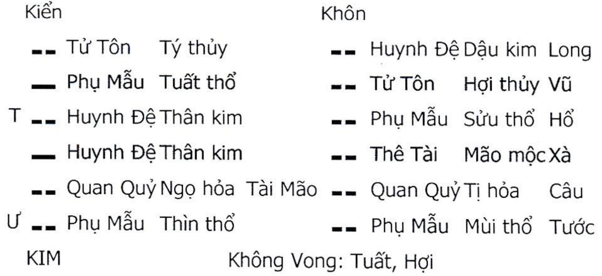
    - **Hình này chứng minh điều gì**
      - Lấy hào 4 hoặc lấy hào lâm Huyền Vũ để phán đoán nhà vệ sinh, lục thân thì xem hào Huynh Đệ.
    - **Từ đâu mà thấy được**
      - Lấy hào 4 hoặc lấy hào lâm Huyền Vũ để phán đoán nhà vệ sinh, lục thân thì xem hào Huynh Đệ. Cần dựa vào Nguyệt phá, Không Vong, xung hợp,...
- **Minh họa quái tượng phong thủy:**
  - **Hình 26.** Quẻ Hỏa Thiên Đại Hữu biến Hỏa Trạch Khuê
    - 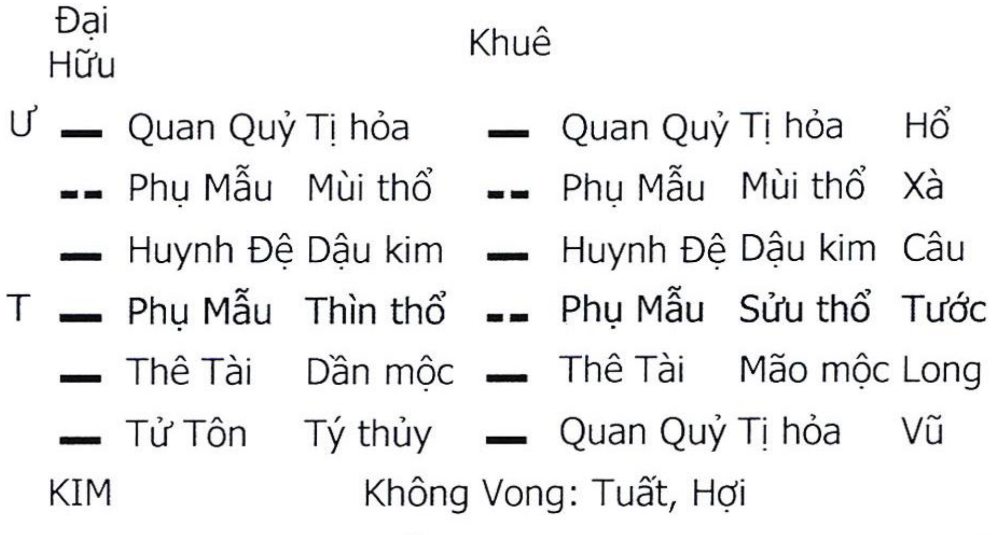
    - **Hình này chứng minh điều gì**
      - Lấy hào 4 hoặc lấy hào lâm Huyền Vũ để phán đoán nhà vệ sinh, lục thân thì xem hào Huynh Đệ.
    - **Từ đâu mà thấy được**
      - Lấy hào 4 hoặc lấy hào lâm Huyền Vũ để phán đoán nhà vệ sinh, lục thân thì xem hào Huynh Đệ. Cần dựa vào Nguyệt phá, Không Vong, xung hợp,...

### QUẺ DỊCH VỀ PHONG THỦY DƯƠNG TRẠCH

#### Ví dụ 1: Ngày Canh Thìn tháng Canh Ngọ năm Giáp Thân, một người dự đoán phong thủy nhà ...

- **Bối cảnh và thông tin quẻ:**
  - Ngày Canh Thìn tháng Canh Ngọ năm Giáp Thân, một người dự đoán phong thủy nhà cửa, được Hỏa Trạch Khuê biến Hỏa Lôi Phệ Hạp.
  - THỔ Không Vong: Thân, Dậu
- **Luận giải quái tượng phong thủy:**
  - **Hình 27.** Quẻ Hỏa Trạch Khuê biến Hỏa Lôi Phệ Hạp
    - 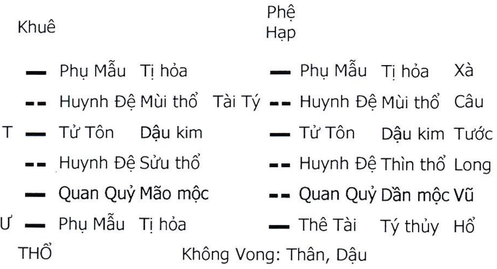
    - **Hình này chứng minh điều gì**
      - Quan Quỷ Mão mộc tại hào 2 độc phát, hào 2 là trạch, Quan Quỷ phát động là tượng bất an, phong thủy không tốt, ảnh hưởng đến bản thân. Tử Tôn trì Thế, Quan Quỷ hóa thoái, bất lợi cho công việc và s...
    - **Từ đâu mà thấy được**
      - Quan Quỷ Mão mộc tại hào 2 độc phát, hào 2 là trạch, Quan Quỷ phát động là tượng bất an, phong thủy không tốt, ảnh hưởng đến bản thân. Tử Tôn trì Thế, Quan Quỷ hóa thoái, bất lợi cho công việc và s...
- **Diễn tiến phân tích và suy luận chi tiết:**
  - Quan Quỷ Mão mộc tại hào 2 độc phát, hào 2 là trạch, Quan Quỷ phát động là tượng bất an, phong thủy không tốt, ảnh hưởng đến bản thân.
  - Tử Tôn trì Thế, Quan Quỷ hóa thoái, bất lợi cho công việc và sự nghiệp, Thái Tuế năm nay Tuyệt Quan Quỷ, năm nay bất lợi.
  - Quan Quỷ Mão mộc lâm hào dương phát động, dương chủ quá khứ, chứng tỏ đã không còn công việc.
  - Trên thực tế là đã không có việc làm từ hai tháng trước.
  - Độc phát Mão mộc là Tử địa của Thê Tài Tý thủy, Thê Tài Tý thủy không hiện trên quẻ, Nguyệt phá nhập Mộ, tài vận không tốt đẹp.
  - Tử Tôn trì Thế Không Vong, hào Thế Không Vong, tâm trạng không tốt, Tử Tôn chủ vui vẻ càng là tâm trạng không tốt.
  - Kim Không tắc minh, lâm Chu Tước chủ âm thanh, là thông tin vui vẻ, nhưng bị Nhật hợp trú, lại bị Nguyệt khắc, vì vậy trầm tĩnh ít nói, không thích nói chuyện.
- **Kết quả ứng nghiệm thực tế:**
  - Tình hình thực tế đúng là như vậy.

#### Ví dụ 2: Ngày Quý Mùi tháng Ngọ, nữ đoán phong thủy nhà cửa, được Lôi Phong Hằng biến L...

- **Bối cảnh và thông tin quẻ:**
  - Ngày Quý Mùi tháng Ngọ, nữ đoán phong thủy nhà cửa, được Lôi Phong Hằng biến Lôi Sơn Tiểu Quá.
  - MỘC Không Vong: Thân, Dậu
- **Luận giải quái tượng phong thủy:**
  - **Hình 28.** Quẻ Lôi Phong Hằng biến Lôi Sơn Tiểu Quá
    - 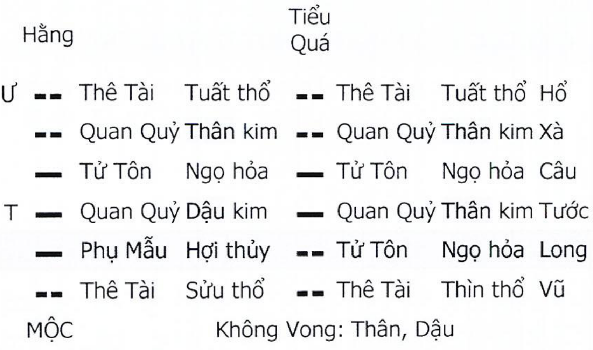
    - **Hình này chứng minh điều gì**
      - Phụ Mẫu Hợi thủy tại hào 2 lâm Thanh Long độc phát, hào 2 là trạch, Phụ Mẫu là nhà, động hóa Nguyệt kiến là vượng tướng, vượng tướng là mới, Thanh Long là mới, đây là nhà mới.
    - **Từ đâu mà thấy được**
      - Phụ Mẫu Hợi thủy tại hào 2 lâm Thanh Long độc phát, hào 2 là trạch, Phụ Mẫu là nhà, động hóa Nguyệt kiến là vượng tướng, vượng tướng là mới, Thanh Long là mới, đây là nhà mới. Động hóa Ngọ hỏa, suy...
- **Diễn tiến phân tích và suy luận chi tiết:**
  - Phụ Mẫu Hợi thủy tại hào 2 lâm Thanh Long độc phát, hào 2 là trạch, Phụ Mẫu là nhà, động hóa Nguyệt kiến là vượng tướng, vượng tướng là mới, Thanh Long là mới, đây là nhà mới.
  - Động hóa Ngọ hỏa, suy diễn về vài năm trước, tương ứng với năm Nhâm Ngọ 2002.
  - Căn nhà được mua vào năm 2002.
  - Phụ Mẫu Hợi thủy phát động, là mua vào tháng Hợi.
- **Kết quả ứng nghiệm thực tế:**
  - Căn nhà được mua vào tháng 11 (tháng Hợi) năm 2002.
  - Nhật thần Quý Mùi xung hào sơ Sửu thổ ám động, hào sơ lâm thổ là nền nhà, biểu thị tại năm Quý Mùi khởi công sửa sang.
  - Phụ Mẫu Hợi thủy phát động, động mà gặp hợp, là sửa vào tháng giêng.
  - **Phản hồi:** Khởi công vào ngày mùng 8 tháng giêng năm 2003.
  - Hào độc phát là Bệnh địa của hào Thế và Quan Quỷ, Tuyệt địa của Tử Tôn, căn nhà này bất lợi cho cả gia đình.
  - Hào 5 là chủ của một gia đình, vì vậy hào 5 Quan Quỷ Thân kim là chồng, Nguyệt khắc, gặp Hợi thủy Bệnh địa, lại nhập Mộ tại hào sơ Sửu thổ, biểu thị chồng bị bệnh nhập viện.
  - Hào Thế Không Vong, lại căn cứ vào di thần pháp, thêm lâm
  - Đằng Xà, thêm lâm Chu Tước, kiện tụng cãi cọ, hoảng sợ dẫn đến bất an.
  - Nhập Mộ tại Thê Tài Sửu thổ, cũng có dấu hiệu nhập viện.
  - Hào động khắc Tuyệt Tử Tôn Ngọ hỏa, Tử Tôn lâm Câu Trần, Câu Trần chủ vấp ngã, đề phòng con cái ngã bị thương.
  - **Phản hồi:** Chồng nhập viện vì xuất huyết não.
  - Bản thân bị người ta dùng báng súng đánh ngất để cướp tiền, được đưa vào bệnh viện.
  - Con trai bị bạn học đá bị thương ở trán.

#### Ví dụ 3: Ngày Mậu Tý tháng Nhâm Dần năm Đinh Hợi, nam đoán phong thủy của căn nhà mới, ...

- **Bối cảnh và thông tin quẻ:**
  - Ngày Mậu Tý tháng Nhâm Dần năm Đinh Hợi, nam đoán phong thủy của căn nhà mới, được Thủy Phong Tỉnh biến Trạch Phong Đại Quá.
  - MỘC Không Vong: Ngọ, Mùi
- **Luận giải quái tượng phong thủy:**
  - **Hình 29.** Quẻ Thủy Phong Tỉnh biến Trạch Phong Đại Quá
    - 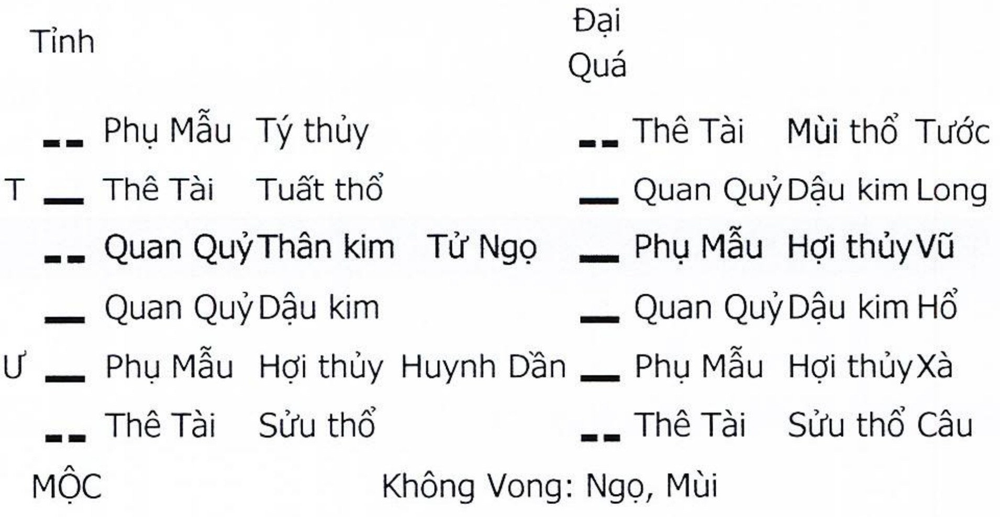
    - **Hình này chứng minh điều gì**
      - Hào Thế lâm Thanh Long tại hào 5, hào 5 là lãnh đạo, Thanh Long chủ nhân viên công vụ, bản thân là người có chức vụ, làm việc trong cơ quan nhà nước. Tuy nhiên, Quan Quỷ Thân kim tại hào 4 lâm Huyề...
    - **Từ đâu mà thấy được**
      - Hào Thế lâm Thanh Long tại hào 5, hào 5 là lãnh đạo, Thanh Long chủ nhân viên công vụ, bản thân là người có chức vụ, làm việc trong cơ quan nhà nước. Tuy nhiên, Quan Quỷ Thân kim tại hào 4 lâm Huyề...
- **Diễn tiến phân tích và suy luận chi tiết:**
  - Hào Thế lâm Thanh Long tại hào 5, hào 5 là lãnh đạo, Thanh Long chủ nhân viên công vụ, bản thân là người có chức vụ, làm việc trong cơ quan nhà nước.
  - Tuy nhiên, Quan Quỷ Thân kim tại hào 4 lâm Huyền Vũ độc phát, Nguyệt phá hóa Phụ Mẫu Hợi thủy, hào 4 là nhà vệ sinh, lâm Huyền Vũ càng là thông tin nhà vệ sinh.
  - Vì vậy, phong thủy của nhà vệ sinh không tốt.
  - Thân kim là đất Trường Sinh của thủy, lại từ Dậu kim dời đến Bạch Hổ, Bạch Hổ chủ đường đi, chính là thông tin ống dẫn.
  - Thân kim Nguyệt phá chứng tỏ nhà vệ sinh có ống dẫn bị nứt vỡ, ảnh hưởng đến quan vận.
  - Hóa Phụ Mẫu tiết khí, biểu thị ống dẫn lọt hơi ra ngoài.
  - Phụ Mẫu Hợi thủy tại hào 2 lâm hào Ứng, Phụ Mẫu là nhà, hào 2 lại là nhà, Ứng là người khác, không phải là nhà của mình.
  - Quan Quỷ phát động, lại hóa quẻ du hồn, công việc nhất định có biến động, tháng Thân Thực Phá, hào biến Hợi thủy, vì vậy tháng Thân hoặc tháng Hợi công việc có biến động.
- **Kết quả ứng nghiệm thực tế:**
  - Bản thân là thư ký của một lãnh đạo.
  - Trước đây đã từng có một người thư ký sống ở căn nhà này, người đó ở đây 10 năm mà vẫn không được thăng chức, năm Ất Dậu vừa mới dọn ra ngoài thì được thăng chức ngay.
  - Bởi vì
  - người đó chuyển đi cho nên nhà nước đã cấp căn nhà này cho anh ta ở.
  - Nhà vệ sinh kê ở Tây Nam có một ống dẫn mở một lỗ lớn, đã tiến hành tu bổ.
  - Tháng Hợi năm đó, công việc của lãnh đạo có biến động, anh ta cũng theo lãnh đạo đến Bắc Kinh.

#### Ví dụ 4: Ngày Quý Sửu tháng Mão, nữ đoán phong thủy nhà, được Hỏa Phong Đỉnh biến Lôi T...

- **Bối cảnh và thông tin quẻ:**
  - Ngày Quý Sửu tháng Mão, nữ đoán phong thủy nhà, được Hỏa Phong Đỉnh biến Lôi Thủy Giải.
  - HỎA &emsp;&emsp;&emsp;&emsp;&emsp;&emsp;&emsp;&emsp;
  - Không Vong: Dần , Mão
- **Luận giải quái tượng phong thủy:**
  - **Hình 30.** Sơ đồ quẻ Hỏa Phong Đỉnh biến Lôi Thủy Giải
    - 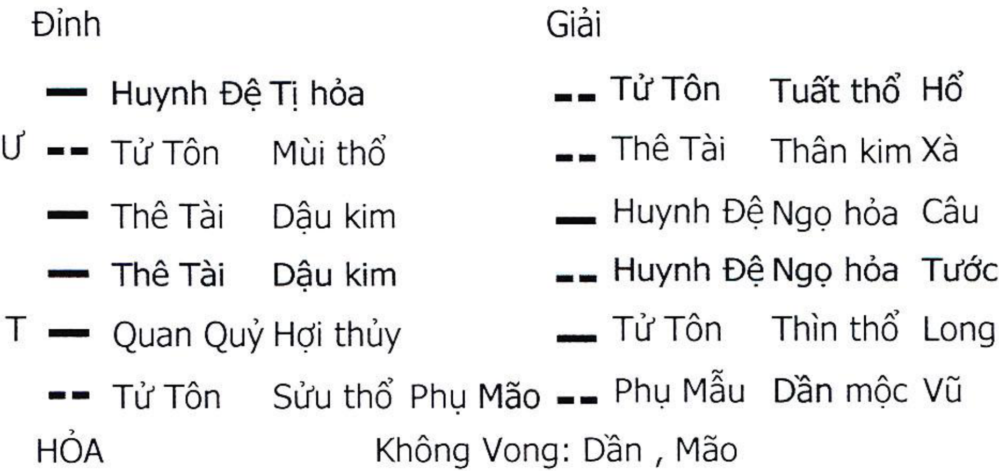
    - **Hình này chứng minh điều gì**
      - Hào Thế lâm hào 2, hào 2 là trạch, biểu thị nhà này của mình. Hào 2 lâm Thanh Long, Thanh Long chủ ẩm thực, hào 2 là phòng bếp, thông tin phòng bếp tương đối rõ ràng.
    - **Từ đâu mà thấy được**
      - Hào Thế lâm hào 2, hào 2 là trạch, biểu thị nhà này của mình. Hào 2 lâm Thanh Long, Thanh Long chủ ẩm thực, hào 2 là phòng bếp, thông tin phòng bếp tương đối rõ ràng.
- **Diễn tiến phân tích và suy luận chi tiết:**
  - Hào Thế lâm hào 2, hào 2 là trạch, biểu thị nhà này của mình.
  - Hào 2 lâm Thanh Long, Thanh Long chủ ẩm thực, hào 2 là phòng bếp, thông tin phòng bếp tương đối rõ ràng.
  - Hào 3 Thê Tài Dậu kim phát động sinh hào lâm Thanh Long, Thê Tài là ẩm thực, lâm Chu Tước chủ ăn uống, lại từ hào 4 Thê Tài Dậu kim dời đến Câu Trần, Câu Trần là kiến trúc, chính là thông tin bếp và phòng bếp.
  - Lại Câu Trần chủ tu tạo, chứng tỏ phòng bếp đã tiến hành sửa đổi.
  - Nguyên thần của hào Thế là Dậu kim Nguyệt phá, hóa hỏa hồi đầu khắc, hào 3 là tim, hỏa là tim, tim không tốt.
  - Hào 6 Tị hỏa lại động đến khắc, hào 6 là đầu, hỏa chủ mắt, tại cung Ly cũng là mắt, mắt cũng không tốt.
  - Nguyên thần là kim, kim chủ xương cốt, Nguyệt phá là thông tin gãy xương.
  - Hào 2, hào 3 là chân, hào Thế tại hào 2 bị Nhật khắc, Nguyên thần tại hào 3 bị Nguyệt xung phá và hỏa khắc thương, vì vậy là gãy xương ở chân.
  - Phụ Mẫu Mão mộc không hiện trên quẻ, phục tàng là tượng nằm bệnh, bị hào Dậu kim Nguyệt phá đến khắc, kim chủ xương cốt, phá là rạn nứt, cũng là tượng gãy xương.
  - Thê Tài Dậu kim Nguyệt phá động hóa hồi đầu khắc, lại bị Huynh Đệ khắc, Thê Tài là tiền bạc, tài vận không tốt đẹp.
- **Kết quả ứng nghiệm thực tế:**
  - Trên thực tế đúng là sau khi sửa bếp thì bản thân và mẹ đều bị gãy xương ở chân, tài vận vốn không tốt đẹp, mắt mệt mỏi, rối loạn nhịp tim.
  - **Phương pháp giải quyết:** Đặt gương bát quái.
  - Bởi vì gương bát quái là kim loại, hình tròn là Dậu kim, có thể khiến cho Thê Tài Dậu kim Thực Phá.
  - Sau khi đặt thì mắt, tim đã tốt lên.

#### Ví dụ 5: Ngày Kỷ Hợi tháng Quý Mão năm Đinh Hợi, nam đoán phong thủy chỗ ở, được Sơn Đị...

- **Bối cảnh và thông tin quẻ:**
  - Ngày Kỷ Hợi tháng Quý Mão năm Đinh Hợi, nam đoán phong thủy chỗ ở, được Sơn Địa Bác.
  - KIM &emsp;&emsp;&emsp;&emsp;&emsp;&emsp;&emsp;&emsp;
  - Không Vong: Thìn, Tị
- **Luận giải quái tượng phong thủy:**
  - **Hình 31.** Sơ đồ quẻ Sơn Địa Bác
    - 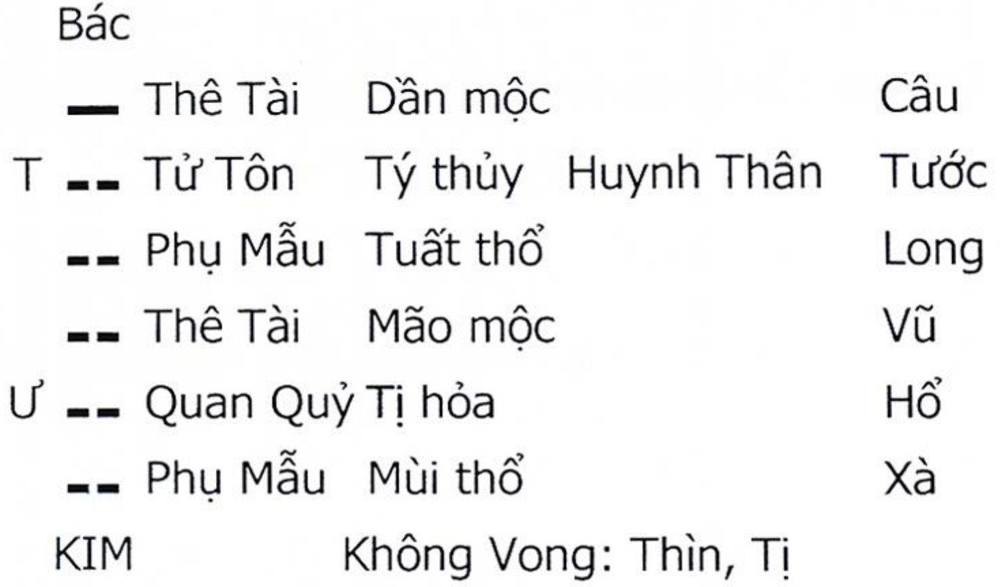
    - **Hình này chứng minh điều gì**
      - Quẻ này Quan Quỷ Tị hỏa lâm Bạch Hổ tại hào 2 ám động. Tuyệt Tử Tôn Tý thủy, hào 2 lại là thai vị, bất lợi cho sinh đẻ con cái đời sau.
    - **Từ đâu mà thấy được**
      - Quẻ này Quan Quỷ Tị hỏa lâm Bạch Hổ tại hào 2 ám động. Tuyệt Tử Tôn Tý thủy, hào 2 lại là thai vị, bất lợi cho sinh đẻ con cái đời sau.
- **Diễn tiến phân tích và suy luận chi tiết:**
  - Quẻ này Quan Quỷ Tị hỏa lâm Bạch Hổ tại hào 2 ám động.
  - Tuyệt Tử Tôn Tý thủy, hào 2 lại là thai vị, bất lợi cho sinh đẻ con cái đời sau.
  - Thê Tài lưỡng hiện, được Nguyệt trợ giúp, Nhật đến sinh, tài vận không tệ, nhưng Tị hỏa ám động tiết khí, không tích trữ được tiền.
  - Quan Quỷ Tị hỏa lâm Bạch Hổ, Bạch Hổ có ý nghĩa là tử vong, hào 2 là lân cận nơi ở, lân cận có hài cốt, phần mộ.
  - Hào 2 cũng là trạch, Quan Quỷ động mà bất an, có âm hồn xuất hiện.
- **Kết quả ứng nghiệm thực tế:**
  - Trên thực tế, kết hôn 17 năm vẫn chưa có con cái.
  - Tài vận khá tốt, nhưng không tích trữ được tiền, gần nhà có mồ mả, thường xuyên gặp ma.

#### Ví dụ 6: Ngày Ất Mùi tháng Quý Hợi năm Quý Mùi, nam đoán phong thủy nhà cửa, được Thủy ...

- **Bối cảnh và thông tin quẻ:**
  - Ngày Ất Mùi tháng Quý Hợi năm Quý Mùi, nam đoán phong thủy nhà cửa, được Thủy Thiên Nhu biến Thủy Sơn Kiển.
  - THỔ Không Vong: Thìn, Tị
- **Luận giải quái tượng phong thủy:**
  - **Hình 32.** Quẻ Thủy Thiên Nhu biến Thủy Sơn Kiển
    - 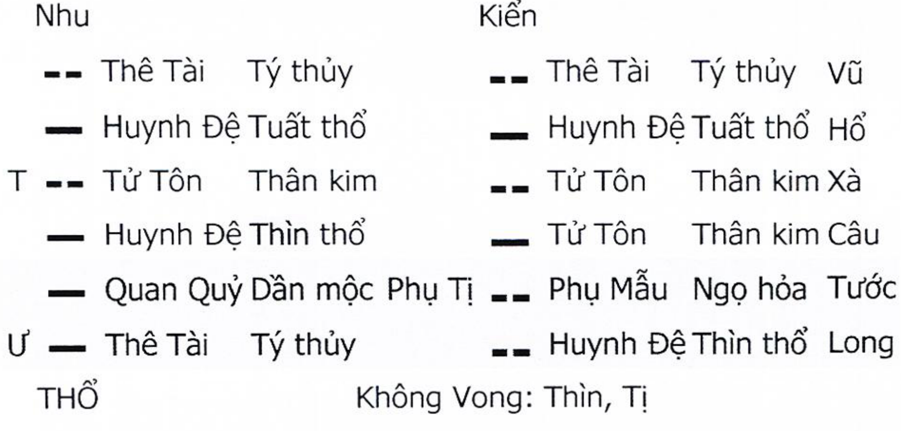
    - **Hình này chứng minh điều gì**
      - Nguyệt hợp hào 2, hào 2 là trạch, Nhật Nguyệt là cao, chỗ cao đến hợp là nhà lầu. Phụ Mẫu Tị hỏa phục tàng dưới hào 2, Phụ Mẫu cũng là nhà, phục tàng là dưới mặt đất, chỗ không nhìn thấy, là tầng h...
    - **Từ đâu mà thấy được**
      - Phụ Mẫu Tị hỏa phục tàng dưới hào 2, Phụ Mẫu cũng là nhà, phục tàng là dưới mặt đất, chỗ không nhìn thấy, là tầng hầm, nhưng Không Vong, chứng tỏ không có tầng hầm. Hào 2 Dần mộc động hóa Phụ Mẫu, ...
- **Diễn tiến phân tích và suy luận chi tiết:**
  - Nguyệt hợp hào 2, hào 2 là trạch, Nhật Nguyệt là cao, chỗ cao đến hợp là nhà lầu.
  - Phụ Mẫu Tị hỏa phục tàng dưới hào 2, Phụ Mẫu cũng là nhà, phục tàng là dưới mặt đất, chỗ không nhìn thấy, là tầng hầm, nhưng Không Vong, chứng tỏ không có tầng hầm.
  - Hào 2 Dần mộc động hóa Phụ Mẫu, Dần mộc đối ứng với năm 1998 Mậu Dần, nhà xây vào năm 1998.
  - Thê Tài Tý thủy hóa Thìn thổ hồi đầu khắc, Thìn thổ Không Vong, năm 2000 Canh Thìn xuất Không khắc Tài, năm này tài vận không tốt đẹp.
  - Năm 2002 Nhâm Ngọ, xung Thê Tài Tý thủy ra khỏi Mộ khố, năm này tài vận có chuyển biến tốt.
  - Năm 2004 Giáp Thân, tam hợp Tài cục, tài vận lại có bước phát triển mới.
  - Thê Tài Tý thủy lâm hào Ứng, Ứng là thê vị, hóa Không nhập Mộ, bị Nhật khắc, Phụ Mẫu thể hiện giấy kết hôn không hiện trên quẻ, hôn nhân muộn.
  - Năm Mậu Tý gặp Thê Tài Tý thủy, tháng Thìn xuất Không có thể thành.
- **Kết quả ứng nghiệm thực tế:**
  - Quả nhiên tại tháng Thìn năm 2008 kết hôn.
  - Những phán đoán cũng phù hợp với thực tế.

#### Ví dụ 7: Ngày Quý Tị tháng Hợi, nam đoán phong thủy phòng ở, được Hỏa Thiên Đại Hữu biế...

- **Bối cảnh và thông tin quẻ:**
  - Ngày Quý Tị tháng Hợi, nam đoán phong thủy phòng ở, được Hỏa Thiên Đại Hữu biến Thiên Lôi Vô Vọng.
  - KIM Không Vong: Ngọ, Mùi
- **Luận giải quái tượng phong thủy:**
  - **Hình 33.** Quẻ Hỏa Thiên Đại Hữu biến Thiên Lôi Vô Vọng
    - 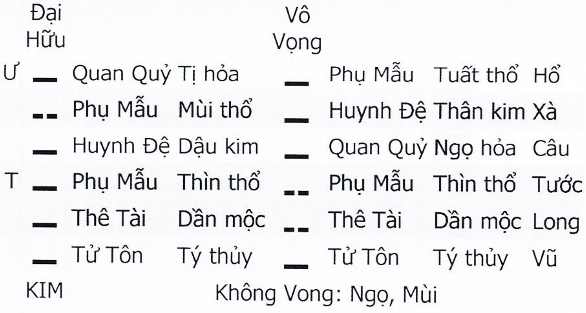
    - **Hình này chứng minh điều gì**
      - Hào 2 Dần mộc tương hợp với Nguyệt, hào 2 là trạch, Nguyệt là chỗ cao, hợp hào 2 là nhà lầu. Phụ Mẫu là thổ, thổ chủ số 5, phòng tại tầng 5.
    - **Từ đâu mà thấy được**
      - Phụ Mẫu Mùi thổ tại hào 5 Không Vong, hào 5 là đường đi, Không Vong biểu thị không ở gần đường, cách xa đường cái. Nội quái phục ngâm, Thê Tài tại hào 2 khắc hào Thế, hào Thế lâm Chu Tước, Chu Tước...
- **Diễn tiến phân tích và suy luận chi tiết:**
  - Hào 2 Dần mộc tương hợp với Nguyệt, hào 2 là trạch, Nguyệt là chỗ cao, hợp hào 2 là nhà lầu.
  - Phụ Mẫu là thổ, thổ chủ số 5, phòng tại tầng 5.
  - Phụ Mẫu Mùi thổ tại hào 5 Không Vong, hào 5 là đường đi, Không Vong biểu thị không ở gần đường, cách xa đường cái.
  - Hào 6 Tị hỏa Nguyệt phá, hào 6 là tường, tường có vết nứt.
  - Nhật thần Thực Phá, đã tiến hành tu bổ.
  - Nội quái phục ngâm, Thê Tài tại hào 2 khắc hào Thế, hào Thế lâm Chu Tước, Chu Tước là cãi cọ, phong thủy không tốt, ảnh hưởng đến tình cảm vợ chồng, cãi nhau liên tục.
  - Hào Thế Thìn thổ tại hào 3 bị khắc, hào 3 thổ là dạ dày, Chu Tước chủ viêm, có viêm dạ dày.
  - Kỵ thần của hào Thế tại hào 2, hào 2 là ruột, cũng chủ có viêm ruột.
  - Nguyên thần là hỏa chủ tim, bị Nguyệt khắc, tim không tốt.
  - Nguyên thần Tị hỏa tại hào 6 bị khắc, hào 6 là đầu, lâm Bạch Hổ, Bạch Hổ chủ máu, tại cung Càn lại chủ đầu, bị Nguyệt xung phá, Nguyệt là cao, vì vậy có cao huyết áp.
  - Thê Tài Dần mộc được Nguyệt sinh vượng tướng, mặc dù tài vận không tệ, nhưng nội quái phục ngâm, thường xuyên bởi vì tiền tài mà tâm trạng không tốt.
- **Kết quả ứng nghiệm thực tế:**
  - Quả nhiên là như vậy.
  - ---
  - # Part 6 (Pages 101-120)

#### Ví dụ 8: Ngày Giáp Dần tháng Quý Hợi năm Quý Mùi, nữ đoán phong thủy nhà cửa, được Phon...

- **Bối cảnh và thông tin quẻ:**
  - Ngày Giáp Dần tháng Quý Hợi năm Quý Mùi, nữ đoán phong thủy nhà cửa, được Phong Sơn Tiệm biến Tốn Vi Phong.
  - THỔ                  Không Vong: Tý, Sửu
- **Luận giải quái tượng phong thủy:**
  - **Hình 34.** Quẻ Phong Sơn Tiệm biến Tốn Vi Phong
    - 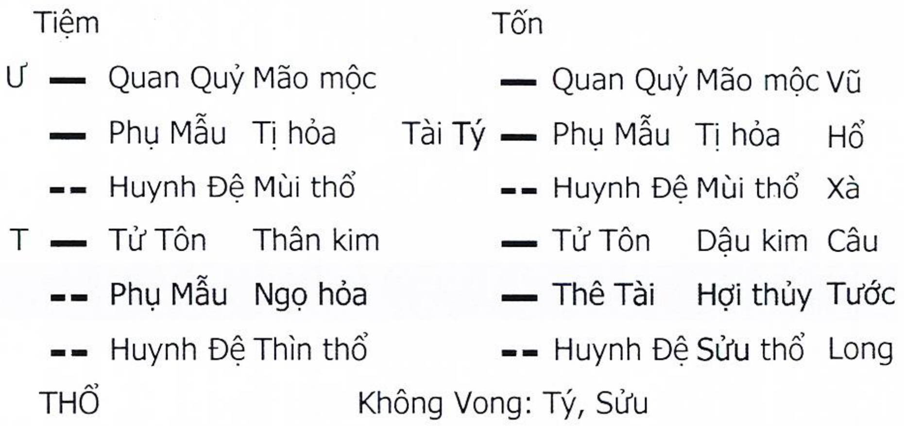
    - **Hình này chứng minh điều gì**
      - Phụ Mẫu Ngọ hỏa tại hào 2 lâm Chu Tước độc phát, đây chính là tiêu điểm thông tin của quẻ. Hào 2 là nhà, phòng bếp.
    - **Từ đâu mà thấy được**
      - Phụ Mẫu Ngọ hỏa tại hào 2 lâm Chu Tước độc phát, đây chính là tiêu điểm thông tin của quẻ. Phụ Mẫu chủ nhà cửa, hỏa lâm Chu Tước chủ phòng bếp, độc phát khiến quẻ biến thành lục xung, lại khắc hào ...
- **Diễn tiến phân tích và suy luận chi tiết:**
  - Phụ Mẫu Ngọ hỏa tại hào 2 lâm Chu Tước độc phát, đây chính là tiêu điểm thông tin của quẻ.
  - Hào 2 là nhà, phòng bếp.
  - Phụ Mẫu chủ nhà cửa, hỏa lâm Chu Tước chủ phòng bếp, độc phát khiến quẻ biến thành lục xung, lại khắc hào Thế.
  - Vì vậy, phong thủy của phòng bếp ảnh hưởng đến phong thủy của toàn bộ căn nhà.
  - Phụ Mẫu Ngọ hỏa độc phát khắc hào Thế, vừa khắc hào Tử Tôn, đồng thời lại là Tử địa của Quan Quỷ, phòng bếp này có ảnh hưởng không tốt đến tất cả mọi người trong nhà.
  - Hào Thế Tử Tôn gặp Nguyệt Hợi thủy là Bệnh địa, bị khắc thì sức khỏe có vấn đề.
  - Quan Quỷ Mão mộc tại hào 6 gặp Tử địa, độc phát rất sợ Tử địa, hào 6 là thiên, gặp Tử địa chính là thông tin thăng thiên, có nỗi lo tử biệt với chồng.
  - Hào Thế lâm Tử Tôn Thân kim hào 3 bị hào 2 đến khắc, hào 3 là dạ dày, hào 2 là ruột, là tử cung, Tử Tôn lại là bộ phận sinh dục, hỏa và Chu Tước chủ viêm.
  - Vì vậy, trẻ con có bệnh về dạ dày, ruột, bản thân thì có bệnh phụ khoa.
- **Kết quả ứng nghiệm thực tế:**
  - Trên thực tế đúng là con có bệnh về tiêu hóa, bản thân có bệnh phụ khoa, chồng tử vong.

#### Ví dụ 9: Ngày Canh Thân tháng Giáp Tý năm Quý Mùi, nữ đoán phong thủy nhà cửa, được Pho...

- **Luận giải quái tượng phong thủy:**
  - **Hình 35.** Sơ đồ quẻ Phong Thủy Hoán biến Thiên Trạch Lý
    - 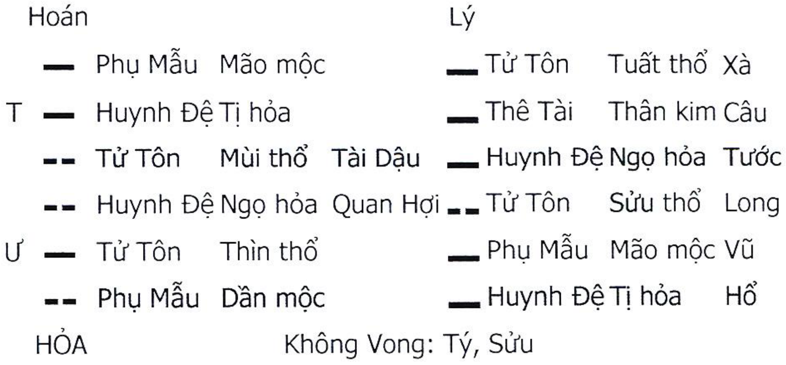
    - **Hình này chứng minh điều gì**
      - Phụ Mẫu là nhà, Phụ Mẫu Dần mộc được Nguyệt sinh là vượng tướng, phát động sinh hào Thế, phong thủy căn nhà có ảnh hưởng tốt đến bản thân. Hào Thế tại hào 5, hào 5 là tôn vị, địa vị cao trong xã hội.
    - **Từ đâu mà thấy được**
      - Phụ Mẫu là nhà, Phụ Mẫu Dần mộc được Nguyệt sinh là vượng tướng, phát động sinh hào Thế, phong thủy căn nhà có ảnh hưởng tốt đến bản thân. Hào Thế tại hào 5, hào 5 là tôn vị, địa vị cao trong xã hội.
  - **Hình 36.** Sơ đồ quẻ Phong Thủy Hoán biến Thiên Thủy Tụng
    - 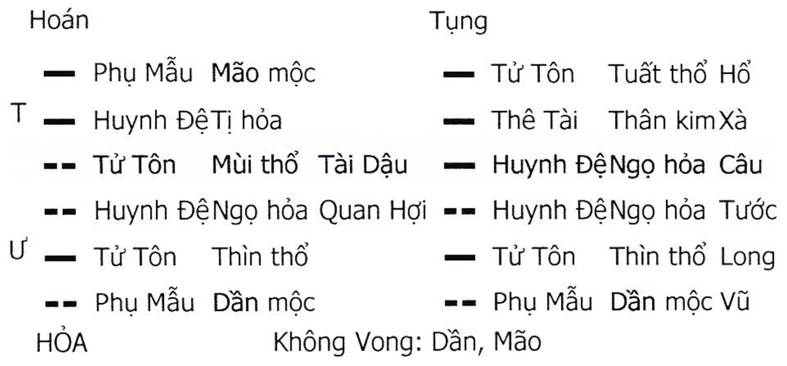
    - **Hình này chứng minh điều gì**
      - Phụ Mẫu là nhà, Phụ Mẫu Dần mộc được Nguyệt sinh là vượng tướng, phát động sinh hào Thế, phong thủy căn nhà có ảnh hưởng tốt đến bản thân. Hào Thế tại hào 5, hào 5 là tôn vị, địa vị cao trong xã hội.
    - **Từ đâu mà thấy được**
      - Phụ Mẫu là nhà, Phụ Mẫu Dần mộc được Nguyệt sinh là vượng tướng, phát động sinh hào Thế, phong thủy căn nhà có ảnh hưởng tốt đến bản thân. Hào Thế tại hào 5, hào 5 là tôn vị, địa vị cao trong xã hội.
- **Diễn tiến phân tích và suy luận chi tiết:**
  - Phụ Mẫu là nhà, Phụ Mẫu Dần mộc được Nguyệt sinh là vượng tướng, phát động sinh hào Thế, phong thủy căn nhà có ảnh hưởng tốt đến bản thân.
  - Hào Thế tại hào 5, hào 5 là tôn vị, địa vị cao trong xã hội.
  - Thê Tài Thân kim lâm Nhật hợp hào Thế, ở nhà này tài vận rất tốt, có thể kiếm được nhiều tiền.
  - Ít thì vài trăm vạn, nhiều thì triệu vạn.
  - (Phản hồi: Cũng cỡ đó.)
  - Phụ Mẫu lưỡng hiện, một tại hào sơ, một tại hào 6, hào sơ là địa, hào 6 là thiên, Phụ Mẫu trên dưới sinh hào Thế, là tượng nhà trên nhà dưới đều thuộc về tôi, nhà ở giống như biệt thự.
  - (Phản hồi: Là nhà có tầng lửng.)
  - Quan Quỷ Hợi thủy được Nguyệt trợ giúp Nhật đến sinh, mặc dù phục tàng nhưng được Phụ Mẫu Dần mộc hợp, Dần mộc lại đến sinh hào Thế, phong thủy căn nhà có ảnh hưởng tốt đến quan hệ vợ chồng, vợ chồng hòa thuận, vận khí của chồng cũng rất tốt.
  - Quan Quỷ lâm Thanh Long, Thanh Long chủ quý, chồng là người có chức vụ.
  - (Phản hồi: Đúng, chồng tôi là quan chức nhà nước.)
  - Phụ Mẫu mặc dù được Nguyệt đến sinh, nhưng hào sơ Phụ Mẫu Dần mộc lâm Bạch Hổ, cùng hào biến và Nhật thần tạo thành tam hình, hào 6 Phụ Mẫu và hào sơ Phụ Mẫu đều nhập Mộ ở Tử Tôn Mùi thổ, này này bất lợi cho cha mẹ.
  - Thái
  - Tuế nhập quẻ mà nhập Mộ, ở năm nay càng bất lợi.
  - (Phản hồi: Cha tôi đã mất ở năm nay, mẹ cũng đã bị bệnh.)
  - Phụ Mẫu nhập Mộ, tháng Thân xung ra bị khắc là ứng kỳ, chắc là ứng vào tháng 8 dương lịch qua đời?
  - Mà Mão mộc tại hào 6, hào 6 là đầu, lâm Đằng Xà, lại mượn đến Bạch Hổ, chủ mao mạch, nhập Mộ chủ không thông, hẳn là mẹ có huyết khối não.
  - (Phản hồi: Cha tôi qua đời vào ngày 24 tháng 8, mẹ mới phát hiện huyết khối não.)
  - Hào 4 là ngực, hào Thế lâm Câu Trần là tức trướng, Nguyên thần của hào Thế nhập Mộ tại hào 4, ngực tức anh ách.
  - Hào 4 là Tử Tôn Mùi thổ, hào 4 là vú, Tử Tôn cũng là vú, lâm Chu Tước chủ viêm, có viêm tuyến vú.
  - Hào sơ Nguyên thần Dần mộc lâm Bạch Hổ nhập Mộ, Bạch Hổ chủ máu, mộc là phong hàn, đau nhức ngứa ngáy, tuần hoàn máu trên chân không tốt, trên chân có phong, thường xuyên đau nhức.
  - Hào 6 Nguyên thần chủ đầu, nhập Mộ đầu óc mơ hồ.
  - (Phản hồi: Những bệnh tật này đều có.)
  - ### Ví dụ 10
  - Ngày Nhâm Tý tháng Tân Dậu năm Quý Mùi, bạn của một học viên muốn dự đoán, gieo quẻ được Phong Thủy Hoán biến Thiên Thủy Tụng.
  - HỎA Không Vong: Dần, Mão
  - Tôi nói: "Anh xem chuyện nhà cửa à?" Đối phương kinh ngạc trả lời: "Đúng rồi, tôi chưa nói mà sao ông biết?" Quay người nói với vị học viên: "Trình độ của thầy anh quả thực rất lợi hại!"
  - Tôi tiếp lời: "Căn nhà anh ở là một phong thủy bảo địa đó, nhà này phát tài hàng chục triệu nguyên, có điều là ở nhà này thì anh phải học cách quản lý tiền bạc, bởi vì tiền đến nhanh mà đi cũng nhanh.
  - Đối phương đáp: ""Rất đúng!
  - Sau khi vào ở thì chủ cũ của căn nhà này đã phát hơn 10 triệu nguyên, nhưng bởi vì bài bạc nên đã phá tài, để trả nợ mới đem nhà bán cho tôi."
  - Tôi tiếp tục nói: "Gần nhà này có một con đường quốc lộ, đường không thẳng mà uốn lượn, đi vòng quanh nơi ở." "Đúng, là một con đường quốc lộ đi vòng." Đối phương trả lời một cách rõ ràng.
  - Đoán: "Ở phía bắc gần nơi ở có một hồ nước, có thể liên quan đến tắm rửa, gần đây đã sửa lại." Đáp: "Là một hồ bơi, vừa mới sửa lại."
  - Đoán: "Anh có bệnh chóng mặt, đồng thời hơi thiếu oxi, ngực bức bối khó chịu, không đủ khí, có lúc không thể thở được."
  - Đáp: "Rất đúng, đôi khi tôi bị ngã xuống đất vì chóng mặt, thường xuyên thức giấc giữa đêm bởi vì khó thở."
  - Đoán: "Anh có tật nói mớ, nhưng đó là điều tốt, anh vừa nói mớ thì phát tài ngay, không nói mớ thì trái lại tài vận đi xuống."
  - Đáp: "Thật kỳ lạ!
  - Ông nói rất đúng, đích thực là như vậy.
  - Không nói cũng không biết, tại sao nói mớ lại có liên quan đến tài vận nhỉ?
  - Dự đoán lục hào thật thần kỳ, ngay cả những việc này mà cũng có thể xem ra được!"
  - Sau khi đoán xong những kết quả trên đây, người này lại hỏi hỏi sức khỏe của vợ.
  - Tôi nói với vị học viên bên cạnh: "Anh tập đoán thử xem."
  - Vị học viên nhìn quẻ một lúc rồi nói: "Sức khỏe của vợ anh ta rất tốt, không có bệnh."
  - Tôi nói: "Anh đoán chưa đúng, vợ anh ta có bệnh, sao nói là sức khỏe tốt được?
  - Anh xem như thế nào?"
  - Vị học viên trả lời: "Dụng thần hào Tài vượng tướng, không có gì khắc nó nên đoán như vậy."
  - Tôi nói: "Để tôi đoán tiếp nhé." Tôi quay sang nói với người gieo quẻ: "Vợ anh có bệnh nhũ tuyến tăng sinh và viêm phần phụ."
  - Đối phương trả lời: "Quá đúng, vợ tôi có khối u trong vú, thường hay đau bụng." Vị học viên không hiểu liền hỏi lý do nhận định như vậy.
  - Quẻ này đoán như sau:
  - Hào sơ là tâm sự, thể hiện trạng thái tâm lý của một người, sơ lâm hào Phụ Mẫu Không Vong, Phụ Mẫu là nhà, Không Vong lo lắng, lại Tử Tôn Mùi thổ độc phát, lâm Câu Trần, Câu Trần chủ kiến trúc nhà cửa, vì vậy quẻ này là hỏi nhà cửa.
  - Hào Tài được Nguyệt trợ giúp, lại được hào động Tử Tôn sinh trợ là vượng tướng, Huynh Đệ Tị hỏa trì Thế, Tị hỏa là đất Trường Sinh của hào Tài, Kỵ thần là đất Trường Sinh của Tài, tiền đến nhiều nhưng đi cũng nhanh.
  - Ngoại quái số 5, nội quái số 6, cộng lại là 11, vì vậy phát hơn 10 triệu.
  - Hào 5 là đường đi, lâm hào Thế, gần nhà có quốc lộ, lâm Đằng Xà, Đằng Xà chủ uốn khúc, vì vậy quốc lộ đi vòng.
  - Hào 2 lâm Tử Tôn Thìn thổ, hào 2 là hào trạch, Thìn thổ là thủy khố, gặp Nguyệt kiến là Mộc Dục, vì vậy gần nhà có hồ nước có liên quan đến tắm rửa.
  - Nội quái là Khảm, Khảm là bắc, vì vậy ở phía bắc của nhà.
  - Lâm Thanh Long, Thanh Long có ý nghĩa là chỉnh trang, vì vậy đã chỉnh trang lại.
  - Xem cơ thể thì dùng hào Thế.
  - Nguyên thần Mão mộc tại hào 6, Nguyệt phá Không Vong, thiếu lực sinh hào Thế, hào 6 là đầu, xung là tượng lắc đầu, chóng mặt, vì vậy có bệnh chóng mặt.
  - Lại hào 4 phát động, Nguyên thần nhập Mộ, hào 4 là ngực, nhập Mộ khó sinh Dụng thần, lâm Câu Trần, Câu Trần là tức trướng, vì vậy ngực bức bối, hô hấp khó khăn, khó thở.
  - Thế lâm Đằng Xà, Đằng Xà chủ mộng, Thế và hào 3 có ngũ hành giống nhau, hào 3 lâm Chu Tước ám động, Chu Tước là nói năng, hào 3 là giường, ám động thì không phải là nói công khai, vì vậy là nói mớ.
  - Hào 3 mặc dù là hào Huynh Đệ, nhưng Huynh động sinh Tử, Tử động sinh Tài, vì vậy vừa nói mớ thì phát tài ngay.
  - Đoán sức khỏe của vợ anh ta thì xem hào Tài, hào 4 Tử Tôn động mà hóa ra Huynh Đệ Ngọ hỏa tương hợp với hào động, đây là tham hợp quên sinh, không sinh tức là có bệnh.
  - Hào 4 là ngực, Tài là ẩm thực, cũng có thể hiểu là sữa, Tử Tôn là Nguyên thần có thể hiểu là vú.
  - Lâm Câu Trần, Câu Trần là sưng trướng, vì vậy là nhũ tuyến tăng sinh.
  - Hào 3 cũng ám động mà hợp Tử Tôn Mùi thổ, hào 3 Ngọ hỏa là Thai địa của Tử Tôn, Tử Tôn chủ con cái, Thai địa chính là chỗ mang thai, lại hào 3 là tử cung và khung chậu, lâm Chu Tước, Chu Tước chủ viêm, vì vậy đoán có viêm phần phụ."

#### Ví dụ 11: Ngày Tân Hợi tháng Tân Dậu năm Quý Mùi, một học viên hỏi phong thủy của nhà c...

- **Bối cảnh và thông tin quẻ:**
  - Ngày Tân Hợi tháng Tân Dậu năm Quý Mùi, một học viên hỏi phong thủy của nhà chị gái, được Phong Hỏa Gia Nhân.
  - MỘC Không Vong: Dần, Mão
- **Luận giải quái tượng phong thủy:**
  - **Hình 37.** Sơ đồ quẻ Phong Hỏa Gia Nhân
    - 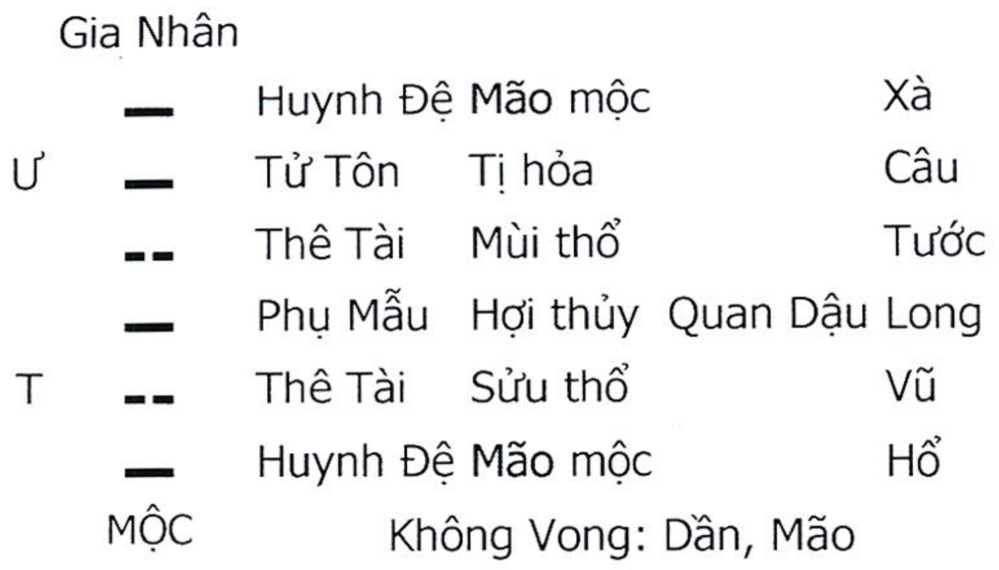
    - **Hình này chứng minh điều gì**
      - Phong thủy của con đường gần nhà không tốt, sau khi dọn vào ở thì vợ chồng bất hòa, thường xuyên cãi lộn. Ngoài ra, chất lượng của căn nhà không tốt, tường và sàn nhà có vết nứt.
    - **Từ đâu mà thấy được**
      - Phụ Mẫu Hợi thủy là nhà, lâm Nhật, lại lâm Thanh Long, Thanh Long là mới, vì vậy là nhà mới. Hào 5 Tử Tôn Tị hỏa lâm Câu Trần ám động, Câu Trần chủ xây dựng, Tị hỏa tương ứng với năm 2001 (năm Tân ...
- **Diễn tiến phân tích và suy luận chi tiết:**
  - Đây là căn nhà mới, được xây vào năm 2001.
  - Phong thủy của con đường gần nhà không tốt, sau khi dọn vào ở thì vợ chồng bất hòa, thường xuyên cãi lộn.
  - Anh rể thường xuyên đi công tác vắng nhà.
  - Ngoài ra, chất lượng của căn nhà không tốt, tường và sàn nhà có vết nứt.
  - Quả nhiên ứng nghiệm.
  - Quẻ này xem như sau:
  - Phụ Mẫu Hợi thủy là nhà, lâm Nhật, lại lâm Thanh Long, Thanh Long là mới, vì vậy là nhà mới.
  - Hào 5 Tử Tôn Tị hỏa lâm Câu Trần ám động, Câu Trần chủ xây dựng, Tị hỏa tương ứng với năm 2001 (năm Tân Tị), vì vậy đây là năm xây nhà.
  - Hào 5 là đường đi, Tử Tôn cũng chủ đường đi, lâm hỏa ám động khắc Quan Quỷ Dậu kim, Quan Quỷ Dậu kim là anh rể, hỏa thể hiện tức giận, là con đường gần nhà không tốt dẫn đến hai người xảy ra mâu thuẫn.
  - Quan Quỷ không ở trong quẻ, vì vậy anh rể thường xuyên đi công tác vắng nhà.
  - Hào 6 là tường, hào sơ là sàn nhà, Không Vong Nguyệt phá, tường và sàn nhà có vết nứt.

#### Ví dụ 12: Ngày Tân Hợi tháng Tân Dậu năm Quý Mùi, một học viên đoán phong thủy nhà anh ...

- **Bối cảnh và thông tin quẻ:**
  - Ngày Tân Hợi tháng Tân Dậu năm Quý Mùi, một học viên đoán phong thủy nhà anh trai, được Địa Thủy Sư biến Lôi Thiên Đại Tráng.
  - THỦY
  - Không Vong: Dần, Mão
- **Diễn tiến phân tích và suy luận chi tiết:**
  - Nhà biệt lập, xung quanh không có hàng xóm, sân thấp hơn nhà, lân cận có con sông, sông và đường song song, chảy sát đường, con sông này ảnh hưởng đến phong thủy của căn nhà.
  - Tài vận không tốt, vợ chồng bất hòa.
  - Anh trai thậm chí không muốn về nhà.
  - Trẻ nhỏ nghịch ngợm phá phách không nghe lời.
  - Quả nhiên ứng nghiệm.
  - Quẻ này xem như sau:
  - Phụ Mẫu là nhà, hào sơ Tử Tôn Dần mộc phát động, Phụ Mẫu lâm Tuyệt, là nhà biệt lập.
  - Hào sơ là hàng xóm, Không Vong, vì vậy không có hàng xóm.
  - Quẻ cung Khảm, Khảm là thấp trũng, vì vậy sân thấp hơn nhà.
  - Hào 5 lâm Huynh Đệ Hợi thủy, hào 5 là đường đi, thủy được kim sinh là sông, Nguyệt kiến Dậu kim sinh, vì vậy là sông.
  - Đường đi và sông ngòi cùng hào vị, vì vậy sông ngòi chảy gần sát đường.
  - Trong quẻ hào Tài hưu tù bị khắc, vì vậy tài vận không tốt đẹp.
  - Hào 5 Hợi thủy lâm Nhật thần cùng khắc hào Tài Ngọ hỏa, Tài là chị dâu, vì vậy hai người bất hòa mâu thuẫn.
  - Hào 2 Quan Quỷ là ngũ hành khắc Huynh Đệ, hào 2 là trạch, khắc Huynh Đệ, vì vậy anh trai không muốn về nhà.
  - Tử Tôn Dần mộc là con cái, lâm Bạch Hổ phát động, Bạch Hổ chủ bướng bỉnh phá phách, vì vậy bướng bỉnh không nghe lời.

#### Ví dụ 13: Ngày Kỷ Mão tháng Quý Hợi năm Quý Mùi, nam đoán phong thủy của căn phòng được...

- **Bối cảnh và thông tin quẻ:**
  - Ngày Kỷ Mão tháng Quý Hợi năm Quý Mùi, nam đoán phong thủy của căn phòng được đơn vị phân cho, được Chấn Vi Lôi biến Trạch Lôi Tùy.
  - MỘC
  - Không Vong: Thân, Dậu
- **Diễn tiến phân tích và suy luận chi tiết:**
  - Hào 2 Huynh Đệ Dần mộc và Nguyệt hợp, trên hợp dưới là nhà lầu.
  - Phụ Mẫu Tý thủy tại hào sơ, hào sơ là tầng thấp nhất, Tý thủy lại chủ 1, vì vậy phòng tại tầng 1.
  - Quẻ lục xung, phong thủy không tụ khí.
  - Quan Quỷ Thân kim lâm Chu Tước tại hào 5 độc phát, tượng bất an.
  - Phong thủy căn phòng không tốt.
  - Thê Tài mặc dù lưỡng hiện nhưng Nguyệt không sinh, Nhật đến khắc, tài vận không tốt đẹp.
  - Huynh Đệ lâm Nhật khắc hợp hào 6 hào Thế Tài, hào 6 là đầu, nợ nần đến nỗi không thể ngẩng đầu lên được.
  - Hào 5 Quan Quỷ phát động, hào 5 là phổi, kim cũng là phổi, đường hô hấp, Quan Quỷ là bệnh, Chu Tước là viêm, có viêm khí quản.
  - Không Vong, kim Không tắc minh, ho thường xuyên.
  - Hào 5 lại là đường đi, kim chủ xe ngựa, đề phòng tai nạn xe cộ.
  - Quẻ Chấn, Chấn là chân, Kỵ thần lâm Bạch Hổ tại hào 2 đến khắc, chú ý đi đứng bị thương.
- **Kết quả ứng nghiệm thực tế:**
  - Trên thực tế đúng là mỗi ngày bị người đòi nợ truy đuổi, hô hấp không tốt, đi xe gắn máy bị thương ở chân.

#### Ví dụ 14: Ngày Ất Hợi tháng Kỷ Dậu năm Đinh Sửu, nam đoán phong thủy nhà cửa, được Địa ...

- **Bối cảnh và thông tin quẻ:**
  - Ngày Ất Hợi tháng Kỷ Dậu năm Đinh Sửu, nam đoán phong thủy nhà cửa, được Địa Hỏa Minh Di.
  - THỦY Không Vong: Thân, Dậu
- **Luận giải quái tượng phong thủy:**
  - **Hình 38.** Sơ đồ quẻ Địa Hỏa Minh Di
    - 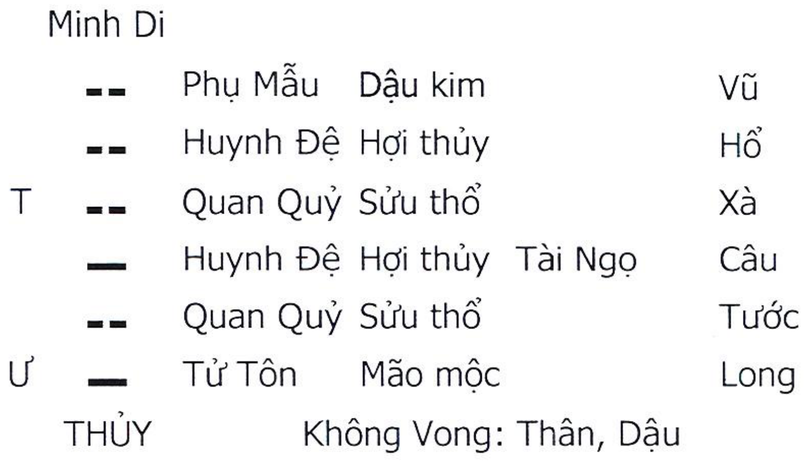
    - **Hình này chứng minh điều gì**
      - Lấy Phụ Mẫu làm Dụng thần, đồng thời xem thêm hào 2. Trong quẻ không gặp hỏa, Phụ Mẫu Dậu kim lâm Huyền Vũ, Huyền Vũ chủ bí mật, tối tăm, hỏa là ánh sáng, chứng tỏ nơi ở thiếu ánh sáng, ít khi nhìn...
    - **Từ đâu mà thấy được**
      - Lấy Phụ Mẫu làm Dụng thần, đồng thời xem thêm hào 2. Trong quẻ không gặp hỏa, Phụ Mẫu Dậu kim lâm Huyền Vũ, Huyền Vũ chủ bí mật, tối tăm, hỏa là ánh sáng, chứng tỏ nơi ở thiếu ánh sáng, ít khi nhìn...
- **Diễn tiến phân tích và suy luận chi tiết:**
  - Lấy Phụ Mẫu làm Dụng thần, đồng thời xem thêm hào 2.
  - Trong quẻ không gặp hỏa, Phụ Mẫu Dậu kim lâm Huyền Vũ, Huyền Vũ chủ bí mật, tối tăm, hỏa là ánh sáng, chứng tỏ nơi ở thiếu ánh sáng, ít khi nhìn thấy mặt trời.
  - Hào 2 Quan Quỷ Sửu thổ khắc hào 5 Huynh Đệ Hợi thủy, hào 2 là trạch, hào 5 là người, nhà này bất lợi cho người.
  - Quan Quỷ trì Thế, lâm Đằng Xà, Quan Quỷ là phiền não, Đằng Xà là đứng ngồi không yên, chứng tỏ người ở căn nhà này thường xuyên phiền muộn, không thanh thản.
  - Quan Quỷ tại hào 2 lâm Chu Tước, Chu Tước là cãi cọ, ở nhà này khó tránh cãi cọ, kiện tụng.
  - Thê Tài Ngọ hỏa hưu tù không hiện trên quẻ, Phi thần Tuyệt, trong nhà không thấy vợ, vợ bỏ nhà ra đi.
  - Thê Tài lâm Ngọ hỏa, sự việc phát sinh tại tháng Ngọ.
  - Địa Hỏa Minh Di là cung Khảm, Khảm là thủy, là nước tiểu, là máu.
  - Thê Tài phục tại hào 3 bị Phi thần khắc, Nhật thần khắc, hào 3 là hào vị tử cung, vợ có bệnh phụ khoa, kinh nguyệt không đều.
  - Lại hỏi, nghe nói căn nhà sắp bị dỡ bỏ, hỏi khi nào, lấy hào Phụ Mẫu để xem.
  - Phụ Mẫu Dậu kim Không Vong, lâm hào 6, hào 6 là đào thải, Không Vong thì biến mất, năm 1999 xung thực sẽ bị dỡ bỏ.
- **Kết quả ứng nghiệm thực tế:**
  - Xung quanh căn nhà có vật kiến trúc rất cao cản trở, cả ngày không thấy mặt trời.
  - Vợ chồng thường xuyên cãi lộn, ba tháng trước vợ giận bỏ về nhà mẹ đẻ, đến bây giờ vẫn chưa trở về.
  - Nhiều lần đi đón vợ đều bị cha mẹ vợ đuổi ra.
  - Vợ đích thực kinh nguyệt không đều.
  - Về sau quả nhiên căn nhà bị dỡ bỏ tại năm 1999.

#### Ví dụ 15: Ngày Nhâm Thân tháng Mậu Dần năm Ất Dậu, nam đoán bệnh con gái, được Hỏa Thủy...

- **Bối cảnh và thông tin quẻ:**
  - Ngày Nhâm Thân tháng Mậu Dần năm Ất Dậu, nam đoán bệnh con gái, được Hỏa Thủy Vị Tế biến Hỏa Trạch Khuê.
  - HỎA Không Vong: Tuất, Hợi
- **Luận giải quái tượng phong thủy:**
  - **Hình 39.** Sơ đồ quẻ Hỏa Thủy Vị Tế biến Hỏa Trạch Khuê
    - 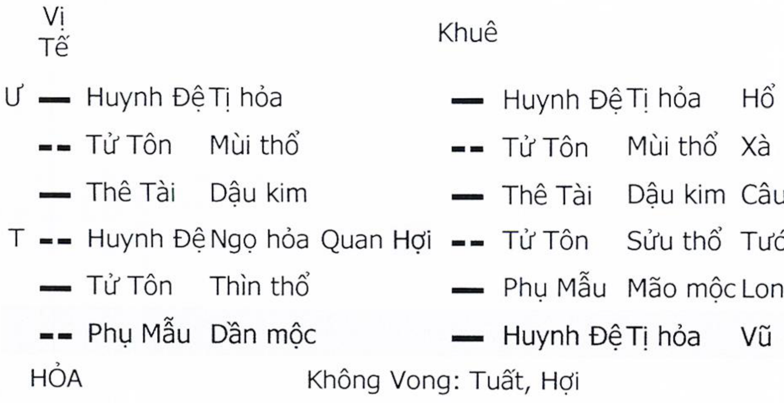
    - **Hình này chứng minh điều gì**
      - Dụng thần lâm Đằng Xà tại hào 5, hào 5 là đường đi, Đằng Xà chủ quái dị, bất an, sợ đi ra đường.
    - **Từ đâu mà thấy được**
      - Lấy Tử Tôn làm Dụng thần. Trong quẻ Tử Tôn lưỡng hiện, lấy Tử Tôn Mùi thổ là Mộ khố của Kỵ thần làm Dụng thần.
- **Diễn tiến phân tích và suy luận chi tiết:**
  - Lấy Tử Tôn làm Dụng thần.
  - Trong quẻ Tử Tôn lưỡng hiện, lấy Tử Tôn Mùi thổ là Mộ khố của Kỵ thần làm Dụng thần.
  - Dụng thần lâm Đằng Xà tại hào 5, hào 5 là đường đi, Đằng Xà chủ quái dị, bất an, sợ đi ra đường.
  - Tử Tôn là Mùi thổ, tương ứng với năm Quý Mùi, năm 2003 mắc bệnh.
  - Kỵ thần tại hào sơ lâm Huyền Vũ độc phát, Huyền Vũ chủ âm khí, hào sơ là hàng xóm, vùng phụ cận nơi ở, Phụ Mẫu Dần mộc động hợp Hợi thủy phục tàng, thủy là sông ngòi, giếng nước, hào sơ lại là giếng nước, lân cận có giếng nước.
  - Hợi thủy Không Vong, là giếng đã bỏ hoang.
  - Dần mộc tương ứng với Đông Bắc, giếng nước tại phương Đông Bắc.
  - Dần mộc hợp Hợi thủy, bên cạnh giếng còn có cây cối.
  - Nội quái là Khảm, chủ phương Bắc.
  - Tử Tôn Thìn thổ tại hào 2, hào 2 là vùng lân cận nơi ở, Thìn thổ là Mộ khố của Quan Quỷ, Quan Quỷ là bệnh tật, cũng là thần phật, Mộ khố
  - của thần phật là mồ mả, đền chùa, lâm Thanh Long, chủ đền chùa, lân cận có đền chùa, miếu thờ.
- **Kết quả ứng nghiệm thực tế:**
  - Trên thực tế đúng là bị bệnh tại tháng 5 năm 2003, sợ đi xe, không thể ra ngoài, thậm chí không thể đi học.
  - Uống thuốc không có tác dụng.
  - Phía Đông Bắc gần nơi ở có một giếng nước đã bỏ hoang, bên cạnh có vài cây hồng, phương Bắc và Đông Bắc có miếu thờ.

#### Ví dụ 16: Ngày Tân Hợi tháng Mão, nữ đoán phong thủy nhà cửa, được Sơn Trạch Tổn biến S...

- **Luận giải quái tượng phong thủy:**
  - **Hình 40.** Sơ đồ quẻ Sơn Trạch Tổn biến Sơn Địa Bác
    - 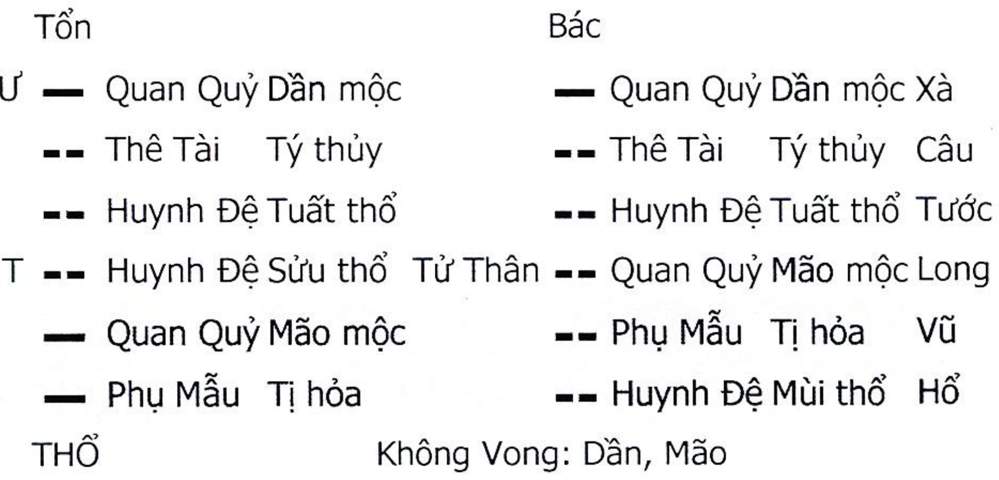
    - **Hình này chứng minh điều gì**
      - Quan Quỷ Mão mộc tại hào 2 phát động, hào 2 là trạch, điềm báo gia trạch bất an. Tuy nhiên, Phụ Mẫu Tị hỏa phát động, tạo thành thế liên tục tương sinh, Phụ Mẫu sinh hào Thế, phong thủy không quá kém.
    - **Từ đâu mà thấy được**
      - Quan Quỷ Mão mộc tại hào 2 phát động, hào 2 là trạch, điềm báo gia trạch bất an. Tuy nhiên, Phụ Mẫu Tị hỏa phát động, tạo thành thế liên tục tương sinh, Phụ Mẫu sinh hào Thế, phong thủy không quá kém.
- **Diễn tiến phân tích và suy luận chi tiết:**
  - Quan Quỷ Mão mộc tại hào 2 phát động, hào 2 là trạch, điềm báo gia trạch bất an.
  - Tuy nhiên, Phụ Mẫu Tị hỏa phát động, tạo thành thế liên tục tương sinh, Phụ Mẫu sinh hào Thế, phong thủy không quá kém.
  - Hào 2 cũng là vùng lân cận nơi ở, Quan Quỷ Mão mộc Không Vong lâm Huyền Vũ khắc hào Thế, mộc là cây cối, Không Vong là mất mát, chứng tỏ lân cận có cây đã bị chặt.
  - Huyền Vũ chủ u uất, mộc Không khắc hào Thế, sau khi cây bị chặt sẽ xuất hiện tâm trạng u uất.
  - Ứng Quan Quỷ Dần mộc được Nguyệt tỉ phù, Nhật sinh là vượng tướng, vận khí của chồng rất tốt.
  - Tử Tôn Thân kim không hiện trên quẻ, Phụ Mẫu Tị hỏa phát động lâm Bạch Hổ khắc Tử Tôn.
  - Sức khỏe của con cái không tốt.
  - Phục tàng tại hào 3, hào 3 là giường, thường xuyên thiếu sức sống, muốn ngủ nhiều.
- **Kết quả ứng nghiệm thực tế:**
  - Ở nhà này đã 17 năm, quan vận của chồng rất tốt, bản thân đã từng u uất một thời gian.
  - Lân cận có rất
  - nhiều cây, cao lớn thì chặt, chặt rồi lại trồng, trồng rồi lại chặt.
  - Tinh thần của con cái không tốt, không có sức lực.

#### Ví dụ 17: Ngày Nhâm Thìn tháng Ất Hợi năm Giáp Thân, nữ đoán phong thủy nhà trọ, được T...

- **Luận giải quái tượng phong thủy:**
  - **Hình 41.** Sơ đồ quẻ Trạch Địa Tụy biến Trạch Lôi Tùy
    - 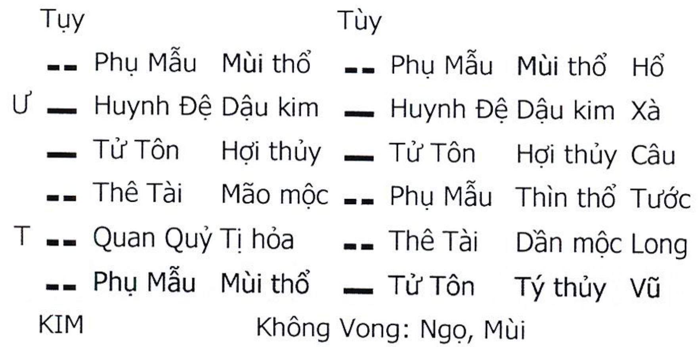
    - **Hình này chứng minh điều gì**
      - Hào Thế Quan Quỷ Tị hỏa lâm hào 2 Nguyệt phá, hào 2 là nơi ở và lân cận, Tị hỏa tương ứng Đông Nam, Quan Quỷ thể hiện thi thể, lại Phụ Mẫu Mùi thổ tại hào sơ độc phát, hào sơ là lân cận, hàng xóm, ...
    - **Từ đâu mà thấy được**
      - Hào Thế Quan Quỷ Tị hỏa lâm hào 2 Nguyệt phá, hào 2 là nơi ở và lân cận, Tị hỏa tương ứng Đông Nam, Quan Quỷ thể hiện thi thể, lại Phụ Mẫu Mùi thổ tại hào sơ độc phát, hào sơ là lân cận, hàng xóm, ...
- **Diễn tiến phân tích và suy luận chi tiết:**
  - Hào Thế Quan Quỷ Tị hỏa lâm hào 2 Nguyệt phá, hào 2 là nơi ở và lân cận, Tị hỏa tương ứng Đông Nam, Quan Quỷ thể hiện thi thể, lại Phụ Mẫu Mùi thổ tại hào sơ độc phát, hào sơ là lân cận, hàng xóm, lâm Huyền Vũ chủ âm khí, ẩm thấp, lục thân tương đồng với hào 6, vì vậy có thể mượn đến lục thần Bạch Hổ, Bạch Hổ thêm Huyền Vũ chính là âm khí tử vong, Phụ Mẫu là mồ mả, Mùi thổ thể hiện Tây Nam, vì vậy ở phía Tây Nam có nghĩa địa.
  - Hơn nữa, lân cận cũng ẩm thấp.
  - Hào Thế Quan Quỷ Tị hỏa Nguyệt phá, Quan Quỷ thể hiện chồng, nhà này bất lợi cho hôn nhân.
- **Kết quả ứng nghiệm thực tế:**
  - Trên thực tế là ở Tây Nam, Đông Nam, phía Nam có mồ mả, bên cạnh ẩm thấp, luôn độc thân không có đối tượng.

#### Ví dụ 18: Ngày Nhâm Thân tháng Ất Mão năm Mậu Tý, nữ đoán con trai thi đại học ra sao? ...

- **Luận giải quái tượng phong thủy:**
  - **Hình 42.** Sơ đồ quẻ Hỏa Lôi Phệ Hạp biến Lôi Trạch Quy Muội
    - 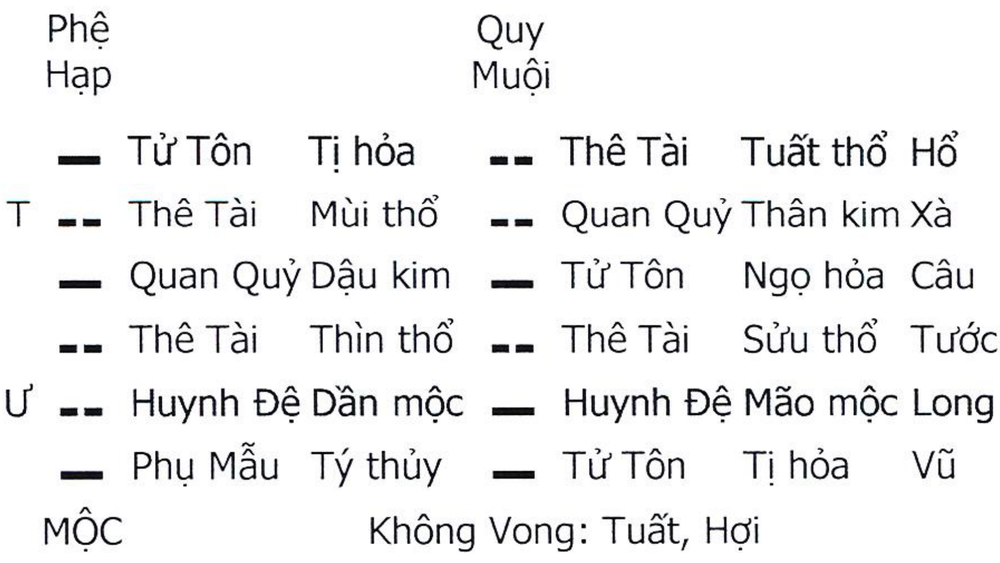
    - **Hình này chứng minh điều gì**
      - Người xưa nói: "Tử Huynh đồng động, danh lạc Tôn Sơn¹." Vì vậy, việc học của con nhất định không tốt, khó mà thi đậu đại học.
    - **Từ đâu mà thấy được**
      - Lấy Quan Quỷ làm Dụng thần. Nhưng là không nên Huynh Đệ, Tử Tôn đồng thời phát động.
- **Diễn tiến phân tích và suy luận chi tiết:**
  - Lấy Quan Quỷ làm Dụng thần.
  - Quan Quỷ được Nhật trợ giúp vốn là vượng tướng.
  - Nhưng là không nên Huynh Đệ, Tử Tôn đồng thời phát động.
  - Người xưa nói: "Tử Huynh đồng động, danh lạc Tôn Sơn¹." Vì vậy, việc học của con nhất định không tốt, khó mà thi đậu đại học.
  - Tử Tôn Tị hỏa phát động lâm Bạch Hổ Tuyệt Phụ Mẫu Tý thủy, Bạch Hổ chủ bướng bỉnh, Phụ Mẫu lâm Tuyệt, cự tuyệt học tập.
  - Huynh Đệ Dần mộc lâm hào 2 Thanh Long phát động, Thanh Long chủ mới, hào 2 là trạch, phát động là biến động, có thông tin chuyển chỗ ở mới.
  - Mộc chủ cây cối, được Nguyệt trợ giúp hóa Tiến thần, không chỉ có một vài cây.
  - Vì vậy, phán đoán là vừa mới chuyển nhà, phía Đông có một mảnh rừng, phong thủy thay đổi dẫn tới con cái không học tập.
- **Kết quả ứng nghiệm thực tế:**
  - Quả nhiên là vừa mới chuyển nhà, phía Đông và Đông Nam có một rừng cây.
  - Sau khi chuyển đến đây thì con cái không thích học tập, thành tích sa sút.
  - ¹ Tôn Sơn là người thi đỗ cuối bảng ở thời Tống.
  - Khi thi đỗ về làng, có người hỏi: "Người cùng thi với anh ra sao?".
  - Tôn Sơn đáp: "Tên cuối bảng là tôi, anh ta không có tên trong bảng vàng" nghĩa là anh ta thi trượt.

#### Ví dụ 19: Ngày Đinh Hợi tháng Kỷ Dậu năm Nhâm Ngọ, nam đoán tài vận, được Sơn Địa Bác b...

- **Luận giải quái tượng phong thủy:**
  - **Hình 43.** Sơ đồ quẻ Sơn Địa Bác biến Địa Thủy Sư
    - 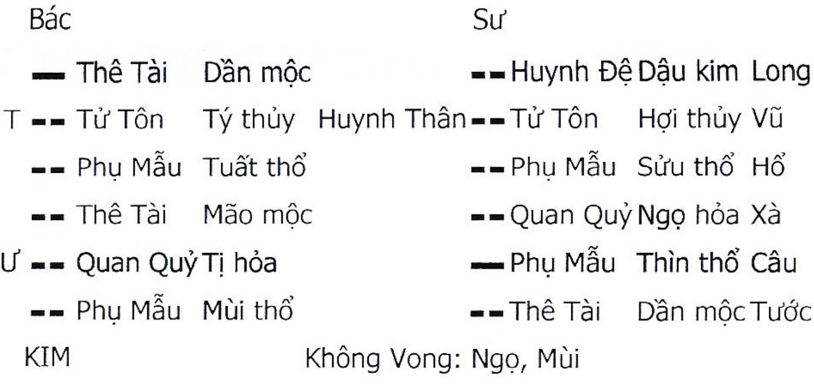
    - **Hình này chứng minh điều gì**
      - Trong quẻ Thê Tài lưỡng hiện, lấy hào Thê Tài Dần mộc phát động làm Dụng thần.
    - **Từ đâu mà thấy được**
      - KIM Không Vong: Ngọ, Mùi Thông thường lấy Thê Tài làm Dụng thần.
- **Diễn tiến phân tích và suy luận chi tiết:**
  - ### Ví dụ 19: Ngày Đinh Hợi tháng Kỷ Dậu năm Nhâm Ngọ, nam đoán tài vận, được Sơn Địa Bác biến Địa Thủy Sư.
  - KIM Không Vong: Ngọ, Mùi
  - Thông thường lấy Thê Tài làm Dụng thần.
  - Trong quẻ Thê Tài lưỡng hiện, lấy hào Thê Tài Dần mộc phát động làm Dụng thần.
  - Mặc dù được Nhật sinh, nhưng Nguyệt khắc, động hóa hồi đầu khắc, tài vận không tốt đẹp.
  - Hào 6 là kết thúc của sự việc, giai đoạn cuối cùng, vì vậy phán đoán là thường xuyên bị tình trạng tiền sắp đến tay thì tuột mất.
  - (Phản hồi: Đúng, tài vận không tốt, việc làm ăn lúc nào cũng sắp thành thì lại thất bại.)
  - Hào Thế là Tử Tôn Tý thủy tại hào 5 lâm Huyền Vũ, hào 5 là tôn vị, thủy chủ trí tuệ, Huyền Vũ chủ nhạy bén, có mưu tính, Tý thủy là lục thân sinh Tài.
  - Vì vậy phán đoán anh ta đầu óc thông minh, biết tính toán, rất khéo kinh doanh, cũng biết quản lý, chỉ là vận khí không tốt.
  - Hào 2 Quan Quỷ Tị hỏa lâm Câu Trần phát động, Tuyệt hào Thế, hào 2 là trạch, Câu Trần chủ nhà cửa, kiến trúc, tu tạo, biểu thị tài vận có liên quan nhất định đến phong thủy.
  - Tị hỏa tương ứng với năm 2001 Tân Tị, nhà cửa có chuyện khởi công cải tạo hao tài.
  - Tị hỏa chủ công trình có liên quan đến hỏa, là cải tạo công trình giống như hệ thống sưởi hơi.
  - (Phản hồi: Đúng, là công trình cung cấp nhiệt.)
  - Hào sơ là hàng xóm, lại là tầng thấp nhất, Phụ Mẫu Mùi thổ lâm hào sơ Không Vong, Phụ Mẫu chủ kiến trúc, tầng 1 không có người ở.
  - (Phản hồi: Đúng, không có ai ở.)
  - Hào 3 Thê Tài Không Vong, hào 3 là giường, Nguyệt phá là vết nứt, khe hở, Mão mộc tương ứng với phía Đông, phía đông của giường có vết nứt.
  - (Phản hồi: Đúng, có vết nứt.
  - Chẳng lẽ điều này ảnh hưởng đến tài vận?
  - Xử lý như thế nào?) Đáp: Dùng bột đậu làm thành hồ nhão rồi trát phẳng.

#### Ví dụ 20: Ngày Quý Dậu tháng Ất Mão năm Mậu Tý, nam đoán hôn nhân, được Thủy Địa Tỷ biế...

- **Luận giải quái tượng phong thủy:**
  - **Hình 44.** Sơ đồ quẻ Thủy Địa Tỷ biến Khôn Vi Địa
    - 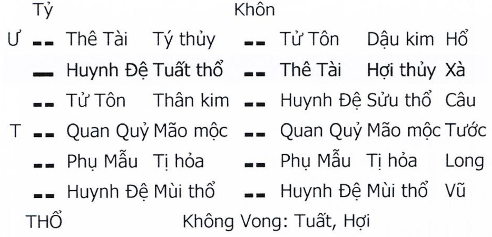
    - **Hình này chứng minh điều gì**
      - Thê Tài Tý thủy lâm hào Ứng, Ứng là hào vị phu thê, được Nhật sinh vượng tướng, Dụng thần tại chính vị, vợ vẫn là vợ, không có ly hôn, nhưng lâm đến hào 6, hào 6 là hào thoái hưu, vợ chỉ là đồ tran...
    - **Từ đâu mà thấy được**
      - THỔ Không Vong: Tuất, Hợi Lấy Thê Tài làm Dụng thần.
- **Diễn tiến phân tích và suy luận chi tiết:**
  - ### Ví dụ 20: Ngày Quý Dậu tháng Ất Mão năm Mậu Tý, nam đoán hôn nhân, được Thủy Địa Tỷ biến Khôn Vi Địa.
  - THỔ Không Vong: Tuất, Hợi
  - Lấy Thê Tài làm Dụng thần.
  - Thê Tài Tý thủy lâm hào Ứng, Ứng là hào vị phu thê, được Nhật sinh vượng tướng, Dụng thần tại chính vị, vợ vẫn là vợ, không có ly hôn, nhưng lâm đến hào 6, hào 6 là hào thoái hưu, vợ chỉ là đồ trang trí.
  - Huynh Đệ Tuất thổ phát động hóa Thê Tài Hợi thủy, cùng chung vợ với người.
  - Thê Tài Tý thủy gặp Nhật Dậu kim là Mộc Dục, vì vậy vợ có ngoại tình.
  - Tuất thổ Nguyệt hợp, sự việc đã xảy ra từ rất lâu.
  - Động mà gặp hợp, ứng tại năm 1999, tức là năm Kỷ Mão.
  - (Phản hồi: Đúng, là tại năm 1999.)
  - Tuất thổ hóa Tài hợp hào Thế, hào Thế tại hào 3 ám động hợp Tuất thổ, hào 3 là giường, sử dụng phép chuyển đổi lục thân, cái ta khắc là Tài, sau khi vợ có ngoại tình, bản thân anh ta cũng đã ngoại tình.
  - Tuất thổ là Dưỡng địa của hào Thế, đối phương nhỏ tuổi hơn anh ta rất nhiều.
  - (Phản hồi: Nhỏ hơn 20 tuổi.)
  - Huynh Đệ Tuất thổ phát động khắc Thê Tài, là thông tin ly hôn, nhưng Không hóa Không, lại hào Thế ám động hợp trú Huynh Đệ Tuất thổ khiến nó không khắc Thê Tài, thể hiện trong lòng mâu thuẫn, vừa muốn ly hôn, vừa không
  - muốn ly hôn.
  - Do Nhật thần Tử Tôn xung mà hào Thế ám động hợp Kỵ thần, Tử Tôn thể hiện con cái.
  - Vì vậy, không muốn ly hôn chủ yếu là do nghĩ đến vấn đề con cái.
  - (Phản hồi: Đích thực là như vậy.)
  - Dụng thần tại hào 6 bị khắc, hào 6 là mộ tổ, Huynh Đệ Tuất thổ Không hóa Không, hợp Quan Quỷ Mão mộc đến khắc, Quan Quỷ là thi thể, vì vậy Tuất thổ có thể thể hiện mộ tổ.
  - Phong thủy của mộ tổ có ảnh hưởng nhất định đến hôn nhân.
  - Tuất thổ là Tây Bắc, thổ Không là hố, Không Không, trong hố có hố.
  - Vì vậy, ở phía Tây Bắc của mộ tổ có hố đất, hơn nữa là trong hố có hố, lâm Đằng Xà, Đằng Xà là tượng thon dài, Tuất thổ là hỏa khố, hỏa là điện.
  - Vì vậy, hố đất xuất hiện hẳn là do việc mắc đường dây cao thế, máy biến áp,...
  - (Phản hồi: Đúng, là trong hố có hố, tại hướng Tây Bắc, khi làm tháp cao áp người ta đã đào những hố đất này.)
  - Hào 5 Không Vong là cầu, lân cận có cầu.
  - Hào 6 là thủy lâm hào Ứng, hào Ứng là nơi khác, nước cách nghĩa địa rất xa.
  - (Phản hồi: Là cầu đường sắt, nước ở rất xa.)

#### Ví dụ 21: Ngày Bính Tuất tháng Bính Thìn năm Mậu Tý, nam đoán phong thủy nhà cửa, được ...

- **Bối cảnh và thông tin quẻ:**
  - Ngày Bính Tuất tháng Bính Thìn năm Mậu Tý, nam đoán phong thủy nhà cửa, được Thiên Lôi Vô Vọng biến Thiên Hỏa Đồng Nhân.
  - MỘC Không Vong: Ngọ, Mùi
- **Luận giải quái tượng phong thủy:**
  - **Hình 45.** Sơ đồ quẻ Thiên Lôi Vô Vọng biến Thiên Hỏa Đồng Nhân
    - 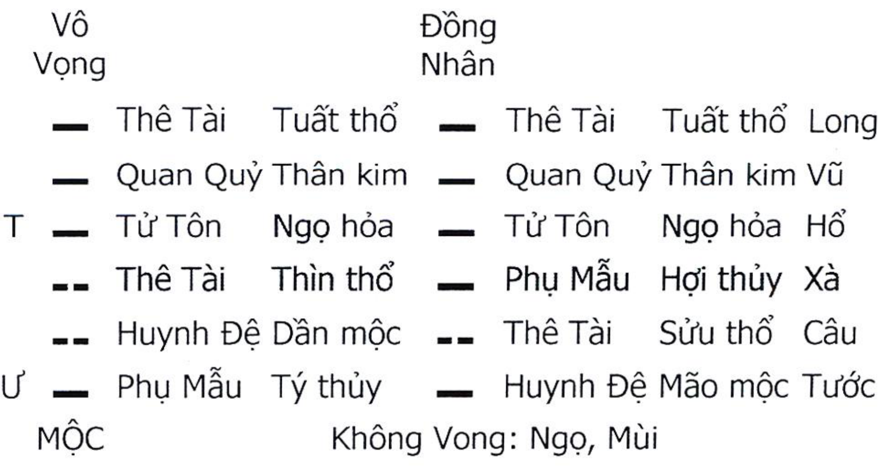
    - **Hình này chứng minh điều gì**
      - Phụ Mẫu Tý thủy là nhà, lâm hào Ứng, Ứng là người khác, đây là nhà của người khác, bản thân thuê để sử dụng. Hào Thế lâm hỏa Không Vong, hào Thế cũng là nơi ở, hỏa là ánh sáng, Không biểu thị thiếu...
    - **Từ đâu mà thấy được**
      - Phụ Mẫu Tý thủy là nhà, lâm hào Ứng, Ứng là người khác, đây là nhà của người khác, bản thân thuê để sử dụng. Phụ Mẫu Tý thủy hưu tù, Nhật Nguyệt đến khắc, là nhà cũ.
- **Diễn tiến phân tích và suy luận chi tiết:**
  - Phụ Mẫu Tý thủy là nhà, lâm hào Ứng, Ứng là người khác, đây là nhà của người khác, bản thân thuê để sử dụng.
  - Phụ Mẫu Tý thủy hưu tù, Nhật Nguyệt đến khắc, là nhà cũ.
  - Hào Thế lâm hỏa Không Vong, hào Thế cũng là nơi ở, hỏa là ánh sáng, Không biểu thị thiếu, nhập Mộ tại Nhật cũng biểu thị ánh sáng bị che khuất.
  - Hào Thế Ngọ hỏa tại hào 4 Không Vong, Tài lâm Đằng Xà độc phát, độc phát chủ tính chất, Đằng Xà chủ bất an, Không Vong cũng chủ tâm bất an, vì vậy ở nhà này tâm trạng bất an.
  - Hào Thế lâm Bạch Hổ, Bạch Hổ chủ máu, hỏa chủ tim, tim cung máu không đủ.
  - Quan Quỷ Thân kim được Nhật Nguyệt sinh phù là vượng tướng, công việc sự nghiệp rất tốt.
  - Thê Tài được Nguyệt trợ giúp, Nhật xung, tài vận tốt nhưng không ổn định.
- **Kết quả ứng nghiệm thực tế:**
  - Tất cả đúng như thông tin biểu thị trong quẻ.

#### Ví dụ 22: Ngày Canh Tý tháng Bính Thìn năm Mậu Tý, nữ đoán phong thủy nhà cửa, được Pho...

- **Bối cảnh và thông tin quẻ:**
  - Ngày Canh Tý tháng Bính Thìn năm Mậu Tý, nữ đoán phong thủy nhà cửa, được Phong Trạch Trung Phu biến Thủy Trạch Tiết.
  - THỔ Không Vong: Thìn, Tị
- **Luận giải quái tượng phong thủy:**
  - **Hình 46.** Sơ đồ quẻ Phong Trạch Trung Phu biến Thủy Trạch Tiết
    - 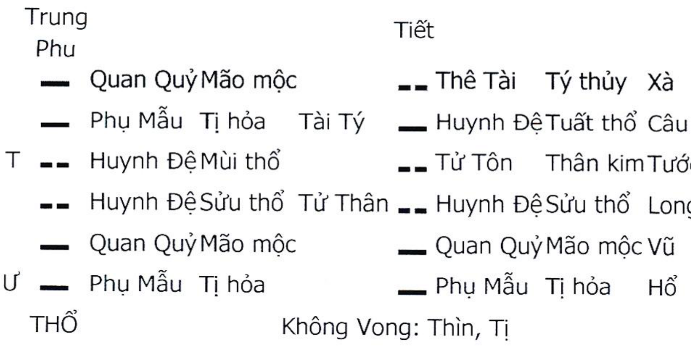
    - **Hình này chứng minh điều gì**
      - Quan Quỷ Mão mộc lâm Đằng Xà độc phát khắc hào Thế, Quan Quỷ là thần quỷ, âm hồn, hồn ma, Đằng Xà chủ bất an, quái dị, thêm Huyền Vũ chủ âm khí, quẻ du hồn cũng chủ bất an, vì vậy ở này nhà tâm trạ...
    - **Từ đâu mà thấy được**
      - Quan Quỷ Mão mộc lâm Đằng Xà độc phát khắc hào Thế, Quan Quỷ là thần quỷ, âm hồn, hồn ma, Đằng Xà chủ bất an, quái dị, thêm Huyền Vũ chủ âm khí, quẻ du hồn cũng chủ bất an, vì vậy ở này nhà tâm trạ...
  - **Hình 47.** Sơ đồ quẻ Thủy Thiên Nhu biến Địa Thiên Thái
    - 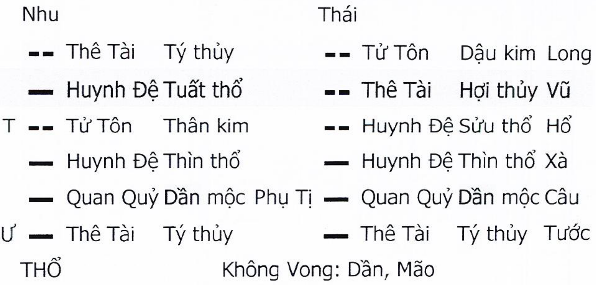
    - **Hình này chứng minh điều gì**
      - Quan Quỷ Mão mộc lâm Đằng Xà độc phát khắc hào Thế, Quan Quỷ là thần quỷ, âm hồn, hồn ma, Đằng Xà chủ bất an, quái dị, thêm Huyền Vũ chủ âm khí, quẻ du hồn cũng chủ bất an, vì vậy ở này nhà tâm trạ...
    - **Từ đâu mà thấy được**
      - Quan Quỷ Mão mộc lâm Đằng Xà độc phát khắc hào Thế, Quan Quỷ là thần quỷ, âm hồn, hồn ma, Đằng Xà chủ bất an, quái dị, thêm Huyền Vũ chủ âm khí, quẻ du hồn cũng chủ bất an, vì vậy ở này nhà tâm trạ...
  - **Hình 48.** Sơ đồ quẻ Phong Thiên Tiểu Súc biến Thiên Lôi Vô Vọng
    - 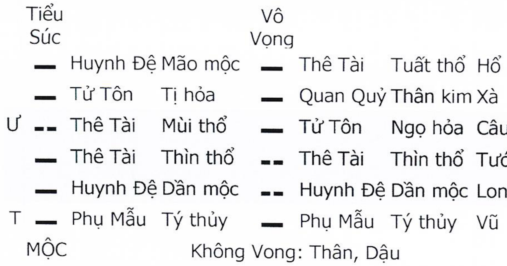
    - **Hình này chứng minh điều gì**
      - Quan Quỷ Mão mộc lâm Đằng Xà độc phát khắc hào Thế, Quan Quỷ là thần quỷ, âm hồn, hồn ma, Đằng Xà chủ bất an, quái dị, thêm Huyền Vũ chủ âm khí, quẻ du hồn cũng chủ bất an, vì vậy ở này nhà tâm trạ...
    - **Từ đâu mà thấy được**
      - Quan Quỷ Mão mộc lâm Đằng Xà độc phát khắc hào Thế, Quan Quỷ là thần quỷ, âm hồn, hồn ma, Đằng Xà chủ bất an, quái dị, thêm Huyền Vũ chủ âm khí, quẻ du hồn cũng chủ bất an, vì vậy ở này nhà tâm trạ...
- **Diễn tiến phân tích và suy luận chi tiết:**
  - Quan Quỷ Mão mộc lâm Đằng Xà độc phát khắc hào Thế, Quan Quỷ là thần quỷ, âm hồn, hồn ma, Đằng Xà chủ bất an, quái dị, thêm Huyền Vũ chủ âm khí, quẻ du hồn cũng chủ bất an, vì vậy ở này nhà tâm trạng bất an, không thể an nhiên đi vào giấc ngủ.
  - Hào Thế là Mộ khố của Quan Quỷ, âm khí đã đi vào cơ thể.
  - Hào 6 là đầu, Mão mộc là Tử địa của hào Thế, có năng lượng ảnh hưởng đến tính mạng của bản thân.
  - Đằng Xà mộc Quỷ, là linh hồn của người treo cổ đến quấy nhiễu.
  - Nguyên thần hào Thế là Phụ Mẫu Tị hỏa tại hào Ứng Không Vong, Nguyên thần là nội tâm, tư duy, Không Vong là bất an, phiền táo.
  - Phụ Mẫu là nhà, hào sơ là lân cận, Không Vong biểu thị không có, Tị hỏa chủ Đông Nam, hướng Đông Nam ban đầu có nhà nhưng bây giờ đã không còn, do đó làm cho từ trường thay đổi, dẫn đến những thứ như âm hồn đến quấy nhiễu bản thân.
- **Kết quả ứng nghiệm thực tế:**
  - Trên thực tế là căn nhà ở hướng Đông Nam bị đập bỏ và chuyển thành bãi đậu xe.
  - Bản thân không ngủ được, dựa vào thuốc an thần để duy trì, sau một thời gian thì đột nhiên nảy sinh ý nghĩ muốn chết.
  - ---
  - # Part 7 (Pages 121-140)
  - ### Ví dụ 23
  - Ngày Đinh Mùi tháng Quý Sửu năm Đinh Hợi, nữ đoán phong thủy nhà, được Thủy Thiên Nhu biến Địa Thiên Thái.
  - THỔ Không Vong: Dần, Mão
  - **Phán đoán:** Trong quẻ Thê Tài Tý thủy lưỡng hiện, được Nguyệt hợp là có khí, nhưng Nhật Nguyệt khắc Tài, Thê Tài là hưu tù, Huynh Đệ Tuất thổ độc phát hóa Thê Tài Hợi thủy, đây là thông tin có nợ ngoài, vay tiền.
  - Chứng tỏ tài vận không tốt, nợ ngoài quấn lấy mình.
  - Huynh Đệ Tuất thổ lâm hào 5 phát động sinh hào Thế, hào 5 là đường, sinh hào Thế, hào Thế là nhà, chính là đường về nhà.
  - Mà Huynh Đệ là cửa, hào Thế lại lâm hào 4, hào 4 là cửa, Kỵ thần của Thê Tài lâm hào 3, hào 3 cũng là cửa.
  - Vì vậy, vị trí của cửa có vấn đề, dẫn tới khí trường phong thủy không phù hợp.
  - Tuất thổ độc phát lâm Huyền Vũ, ám chỉ là hành lang, Tuất là Tây Bắc, hành lang tại Tây Bắc.
  - Hào 2 Quan Quỷ Dần mộc Không Vong, nhập Mộ ở Nhật.
  - Hào 2 là lân cận nơi ở, mộc chủ cây cối, Không Vong biểu thị khuyết thiếu, lâm Câu Trần, Câu Trần chủ cải tạo, chính là đã có cắt tỉa cây cối.
  - Dần mộc lại chủ Đông Bắc, chứng tỏ ở hướng Đông Bắc có cây được cắt tỉa.
  - Quan Quỷ là chồng, ảnh hưởng đến sức khỏe của chồng.
  - **Phản hồi:** Trên thực tế, đúng là hành lang ở Tây Bắc, tài vận không tốt, có nợ ngoài, ở hướng Đông Bắc có hai cây đã cắt thấp xuống, sức khỏe của chồng không tốt.
  - ### Ví dụ 24
  - Ngày Nhâm Ngọ tháng Canh Thìn năm Ất Dậu, nữ đoán phong thủy nhà cửa, được Phong Thiên Tiểu Súc biến Thiên Lôi Vô Vọng.
  - MỘC Không Vong: Thân, Dậu
  - **Phán đoán:** Hào Thế Tý thủy bị Nguyệt khắc, hào động đến khắc, Nhật Ngọ hỏa đến xung là Nhật phá, hỏa chủ tim, tim không tốt.
  - Tại cung Tốn, Tốn chủ phong hàn, hào Thế Phụ Mẫu Tý thủy lâm Huyền Vũ, Huyền Vũ cũng chủ phong hàn, nhà có khí lạnh nặng nề, ở nhà này dễ bị cảm mạo.
  - Hào 2 Huynh Đệ Dần mộc lâm Thanh Long phát động là Bệnh địa của hào Thế, hào 2 là bếp, Thanh Long chủ ẩm thực, vì vậy là phong thủy của phòng bếp không tốt, ảnh hưởng đến cơ thể.
  - Ứng Thê Tài Mùi thổ hóa hồi đầu sinh, hàng xóm có tài vận tốt đẹp, mà hào Thế nhập Mộ ở Thê Tài Thìn thổ, bản thân bị tiền tài vây hãm, quẻ phục ngâm, tài vận không tốt.
  - **Hóa giải:** Đi giày màu đen, phía Đông Bắc của phòng bếp để tảng đá hình nhọn.
  - Tảng đá hình nhọn là Thân kim, xung mất Dần mộc sinh hào Thế, vì vậy có thể hóa giải.
  - **Phản hồi:** Tài vận của hàng xóm khá tốt, bản thân thì lương thấp.
  - Có bệnh đau thắt cơ tim và cảm mạo.
  - Sau khi hóa giải, bệnh tim và cảm mạo đều đã khỏi.
  - Anh ta xin nghỉ làm một tháng, đơn vị đã thăm hỏi và cho anh ta vay tiền.

#### Ví dụ 25: Ngày Kỷ Mão tháng Giáp Dần năm Mậu Tý, nữ đoán phong thủy nơi ở, được Thiên S...

- **Bối cảnh và thông tin quẻ:**
  - Ngày Kỷ Mão tháng Giáp Dần năm Mậu Tý, nữ đoán phong thủy nơi ở, được Thiên Sơn Độn biến Hỏa Sơn Lữ.
  - KIM Không Vong: Thân, Dậu
- **Luận giải quái tượng phong thủy:**
  - **Hình 49.** Sơ đồ quẻ Thiên Sơn Độn biến Hỏa Sơn Lữ
    - 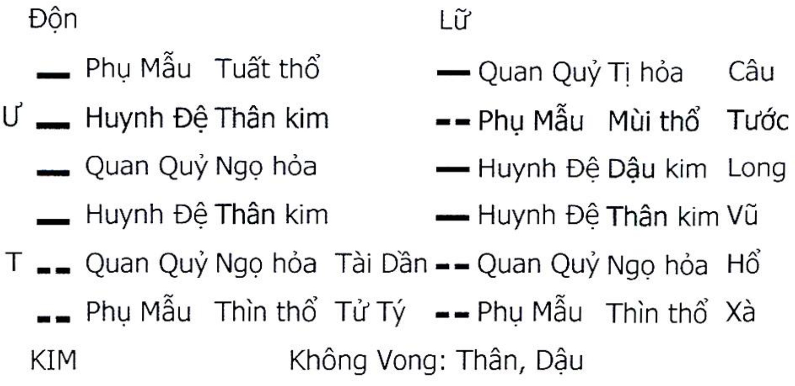
    - **Hình này chứng minh điều gì**
      - Quan Quỷ Ngọ hỏa trì Thế tại hào 2, Quan Quỷ là nhà nước, công cộng, vì vậy là nhà ở khu dân cư. Thê Tài được Nhật Nguyệt trợ giúp, phục tàng dưới hào Thế, tài vận rất tốt.
    - **Từ đâu mà thấy được**
      - Quan Quỷ Ngọ hỏa trì Thế tại hào 2, Quan Quỷ là nhà nước, công cộng, vì vậy là nhà ở khu dân cư. Thê Tài được Nhật Nguyệt trợ giúp, phục tàng dưới hào Thế, tài vận rất tốt.
- **Diễn tiến phân tích và suy luận chi tiết:**
  - Quan Quỷ Ngọ hỏa trì Thế tại hào 2, Quan Quỷ là nhà nước, công cộng, vì vậy là nhà ở khu dân cư.
  - Thê Tài được Nhật Nguyệt trợ giúp, phục tàng dưới hào Thế, tài vận rất tốt.
  - Huynh Đệ Thân kim lâm Chu Tước tại hào 5 độc phát hóa Phụ Mẫu, độc phát là mấu chốt của phong thủy tốt xấu.
  - Hào 5 là đường, Nguyệt xung là ngã tư, Nguyệt nhập quẻ mà phục tàng tại hào 2, hào 2 là trạch, phục tàng là không nhìn thấy, tương đương với phía sau nhà.
  - Vì vậy, phán đoán là phía sau nhà có ngã tư đường, ảnh hưởng đến khí trường phong thủy.
  - Huynh Đệ lâm Chu Tước chủ cãi cọ, hóa Phụ Mẫu, Phụ Mẫu là kiện cáo tố tụng, Huynh Đệ Thân kim ở ngoại quái là Huynh Đệ bản cung, tại hào 5 tôn vị, dương là nam, vì vậy là có kiện cáo, cãi cọ với anh trai.
  - Thân kim lại là Bệnh địa của hào Thế, hào 5 là ngực, Chu Tước chủ ẩm thực, chứng viêm, hóa ra Phụ Mẫu Mùi thổ là Mộ khố Thê Tài, Tài là ẩm thực, Mộ khố là thực quản, vì vậy có viêm thực quản.
  - Hào Thế tại hào 2 gặp Bệnh địa, hào 2 là ruột, hậu môn, cũng là tử cung, cho nên những bộ phận này không khỏe mạnh.
- **Kết quả ứng nghiệm thực tế:**
  - Trên thực tế đúng là nhà ở khu dân cư, sau nhà có ngã tư, tài vận rất tốt.
  - Hậu môn, thực quản, thắt lưng
  - không khỏe, có bệnh phụ khoa.
  - Mối quan hệ với anh trai không tốt đẹp, bởi vì mảnh đất di sản mà đi thưa kiện.

#### Ví dụ 26: Ngày Kỷ Tị tháng Bính Ngọ năm Nhâm Ngọ, nam người Nhật Bản đoán phong thủy nh...

- **Bối cảnh và thông tin quẻ:**
  - Ngày Kỷ Tị tháng Bính Ngọ năm Nhâm Ngọ, nam người Nhật Bản đoán phong thủy nhà cửa, được Chấn Vi Lôi biến Địa Thiên Thái.
  - MỘC Không Vong: Tuất, Hợi
  - 1.
  - Hào 5 là đường đi, Tử Tôn cũng chủ đường đi, Tử Tôn lâm Nhật hợp hào 5, trên đường thêm đường, chứng tỏ gần đó có bắc cầu.
  - Huynh Đệ ở nội quái lâm Bạch Hổ phục ngâm, Bạch Hổ chủ đường đi, lại hào trạch, hào 5 và Nhật Tử Tôn tạo thành tam hình, người trong nhà dễ gặp tai nạn trên cây cầu này.
  - **Đáp:** Trước nhà có một mương nước nông nghiệp.
  - Trên đó, tôi tự mình bắc một cây cầu dài 2,5 mét, rộng 80cm.
  - Có điều là cầu hơi thô sơ.
  - Khi đi học lớp một, con trai đầu của tôi đã rơi xuống mương một lần, cả người lẫn xe đạp.
  - Sau đó đã xây thêm thành cầu bằng xi măng, bây giờ nhìn giống như một cái sân có tường bao.
  - 2.
  - Hào Tài vượng tướng, trong nhà có nhiều thu nhập, nhưng Tài trì Thế lâm Không, bản thân không tích trữ được tiền.
  - Ứng lâm Thê Tài đến xung thực, nhờ vợ bù vào chi phí trong nhà.
  - Hơn nữa, hào Thế nhập Mộ ở hào Ứng Thê Tài, bản thân nghe theo lời vợ.
  - **Đáp:** Bản thân tôi kiếm được không ít tiền, nhưng thích tiêu tiền, thu nhập của vợ còn cao hơn tôi.
  - Vì vậy, nhiều việc lớn trong nhà tôi vẫn phải nghe theo lời vợ.
  - 3.
  - Hào sơ Phụ Mẫu Nguyệt phá, lâm Đằng Xà, Đằng Xà chủ côn trùng, Phụ Mẫu là nhà, Nguyệt phá là có hư hại, bị Ngọ hỏa xung phá, hỏa là kiến mối.
  - Nhà cửa ở Nhật Bản
  - thường làm bằng gỗ, hào sơ là nền nhà, vì vậy phán đoán là nền nhà có khả năng bị mối cắn.
  - **Đáp:** Nắp cống bên cạnh nhà tôi được làm bằng gỗ, bị mối cắn rất dữ dội, trong nhà tôi cũng phát hiện có mối, tuy nhiên đã sử dụng thuốc diệt côn trùng cho nên không quá nghiêm trọng.
  - 4.
  - Tử Tôn lâm Thanh Long động sinh Thế Tài, Thanh Long chủ vui chơi giải trí, chủ bản thân kiếm tiền rất dễ dàng, giống như chơi đùa.
  - Quan Quỷ lâm Chu Tước, Chu Tước chủ nói năng, động mồm mép là kiếm được tiền.
  - **Đáp:** Tôi có mở một trường học khí công, dựa vào đó để kiếm tiền.
  - 5.
  - Tài lâm Huyền Vũ tại hào 3, phục ngâm, bị hào 2 Huynh Đệ lâm Bạch Hổ khắc, Huyền Vũ chủ bộ vị kín đáo, hào 3 Tài là vợ, Bạch Hổ chủ bệnh, vợ có bệnh phụ khoa.
  - Nhưng Tài vượng, bệnh không quá nghiêm trọng.
  - **Đáp:** Tôi cần hỏi vợ.
  - (Phản hồi: Đúng như vậy.)
- **Luận giải quái tượng phong thủy:**
  - **Hình 50.** Quẻ Chấn Vi Lôi biến Địa Thiên Thái
    - 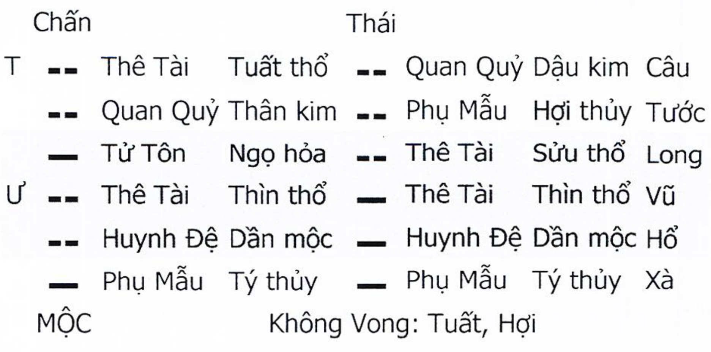
    - **Hình này chứng minh điều gì**
      - **Ví dụ 26:** Ngày Kỷ Tị tháng Bính Ngọ năm Nhâm Ngọ, nam người Nhật Bản đoán phong thủy nhà cửa, được Chấn Vi Lôi biến Địa Thiên Thái. Hào 5 là đường đi, Tử Tôn cũng chủ đường đi, Tử Tôn lâm Nhật ...
    - **Từ đâu mà thấy được**
      - MỘC Không Vong: Tuất, Hợi Hào 5 là đường đi, Tử Tôn cũng chủ đường đi, Tử Tôn lâm Nhật hợp hào 5, trên đường thêm đường, chứng tỏ gần đó có bắc cầu.
- **Diễn tiến phân tích và suy luận chi tiết:**
  - **Ví dụ 26:** Ngày Kỷ Tị tháng Bính Ngọ năm Nhâm Ngọ, nam người Nhật Bản đoán phong thủy nhà cửa, được Chấn Vi Lôi biến Địa Thiên Thái.
  - MỘC Không Vong: Tuất, Hợi
  - 1.
  - Hào 5 là đường đi, Tử Tôn cũng chủ đường đi, Tử Tôn lâm Nhật hợp hào 5, trên đường thêm đường, chứng tỏ gần đó có bắc cầu.
  - Huynh Đệ ở nội quái lâm Bạch Hổ phục ngâm, Bạch Hổ chủ đường đi, lại hào trạch, hào 5 và Nhật Tử Tôn tạo thành tam hình, người trong nhà dễ gặp tai nạn trên cây cầu này.
  - **Đáp:** Trước nhà có một mương nước nông nghiệp.
  - Trên đó, tôi tự mình bắc một cây cầu dài 2,5 mét, rộng 80cm.
  - Có điều là cầu hơi thô sơ.
  - Khi đi học lớp một, con trai đầu của tôi đã rơi xuống mương một lần, cả người lẫn xe đạp.
  - Sau đó đã xây thêm thành cầu bằng xi măng, bây giờ nhìn giống như một cái sân có tường bao.
  - 2.
  - Hào Tài vượng tướng, trong nhà có nhiều thu nhập, nhưng Tài trì Thế lâm Không, bản thân không tích trữ được tiền.
  - Ứng lâm Thê Tài đến xung thực, nhờ vợ bù vào chi phí trong nhà.
  - Hơn nữa, hào Thế nhập Mộ ở hào Ứng Thê Tài, bản thân nghe theo lời vợ.
  - **Đáp:** Bản thân tôi kiếm được không ít tiền, nhưng thích tiêu tiền, thu nhập của vợ còn cao hơn tôi.
  - Vì vậy, nhiều việc lớn trong nhà tôi vẫn phải nghe theo lời vợ.
  - 3.
  - Hào sơ Phụ Mẫu Nguyệt phá, lâm Đằng Xà, Đằng Xà chủ côn trùng, Phụ Mẫu là nhà, Nguyệt phá là có hư hại, bị Ngọ hỏa xung phá, hỏa là kiến mối.
  - Nhà cửa ở Nhật Bản
  - thường làm bằng gỗ, hào sơ là nền nhà, vì vậy phán đoán là nền nhà có khả năng bị mối cắn.
  - **Đáp:** Nắp cống bên cạnh nhà tôi được làm bằng gỗ, bị mối cắn rất dữ dội, trong nhà tôi cũng phát hiện có mối, tuy nhiên đã sử dụng thuốc diệt côn trùng cho nên không quá nghiêm trọng.
  - 4.
  - Tử Tôn lâm Thanh Long động sinh Thế Tài, Thanh Long chủ vui chơi giải trí, chủ bản thân kiếm tiền rất dễ dàng, giống như chơi đùa.
  - Quan Quỷ lâm Chu Tước, Chu Tước chủ nói năng, động mồm mép là kiếm được tiền.
  - **Đáp:** Tôi có mở một trường học khí công, dựa vào đó để kiếm tiền.
  - 5.
  - Tài lâm Huyền Vũ tại hào 3, phục ngâm, bị hào 2 Huynh Đệ lâm Bạch Hổ khắc, Huyền Vũ chủ bộ vị kín đáo, hào 3 Tài là vợ, Bạch Hổ chủ bệnh, vợ có bệnh phụ khoa.
  - Nhưng Tài vượng, bệnh không quá nghiêm trọng.
  - **Đáp:** Tôi cần hỏi vợ.
  - (Phản hồi: Đúng như vậy.)

#### Ví dụ 27: Ngày Kỷ Tị tháng Bính Ngọ năm Nhâm Ngọ, nam người Nhật Bản đoán phong thủy nh...

- **Bối cảnh và thông tin quẻ:**
  - Ngày Kỷ Tị tháng Bính Ngọ năm Nhâm Ngọ, nam người Nhật Bản đoán phong thủy nhà cửa, được Lôi Hỏa Phong biến Thiên Hỏa Đồng Nhân.
  - THỦY Không Vong: Tuất, Hợi
  - 1.
  - Hào Thế Phụ Mẫu Thân kim là nhà, được Nhật hợp, Nhật hợp là tăng thêm, là nhà lầu.
  - **Đáp:** Đúng là nhà lầu.
  - 2.
  - Hào 2 là hào trạch, sinh hào Thế, ở nhà này cảm thấy rất thoải mái.
  - Hỏa lâm Nhật Nguyệt sinh hào 2, nhà đầy đủ ánh sáng.
  - **Đáp:** Đúng như vậy.
  - Rất sáng sủa, cảnh vật xung quanh cũng đẹp.
  - 3.
  - Hào 5 là đường đi, phục ngâm, lại có Nhật hợp, lân cận có đường giao nhau, lâm kim, có đường sắt.
  - **Đáp:** Đúng, giao thông rất thuận tiện, có đường sắt và đường cao tốc.
  - 4.
  - Hào sơ mộc lâm Xà, là cỏ nhỏ, Quan Quỷ Tuất thổ lâm Câu Trần, Câu Trần là kiến trúc, hợp Mão mộc, sơ là mặt đất, hợp là nối liền, gần đó có bãi cỏ rộng lớn.
  - **Đáp:** Gần đó có công viên cây xanh, đi đường 8 phút thì đến.
  - 5.
  - Thê Tài nhập Mộ tại hào lâm Câu Trần, hào lâm Câu Trần lại hợp trú Nguyên thần Tử Tôn.
  - Kinh tế eo hẹp, điều này chủ yếu là do mua nhà gây nên.
  - **Đáp:** Mua nhà cho vay, hiện tại vẫn chưa trả xong.
  - 6.
  - Ngoại quái phục ngâm, lâm Chu Tước, kim và Chu Tước chủ âm thanh, phục ngâm là tượng lặp đi lặp lại, bản thân là người thích càm ràm.
  - **Đáp:** Bản thân tôi nóng tính, rất nhiều lời.
  - 7.
  - Hào Thế là kim, tại hào 5 chủ phổi, hô hấp không tốt, lâm Chu Tước chủ âm thanh, có bệnh ho.
  - **Đáp:** Khi tôi hồi hộp hoặc sợ hãi thì sẽ ho, không biết tại sao.
  - Trước đây tôi thích hút thuốc, bởi vì ho cho nên đã bỏ.
  - 8.
  - Hào 6 Không không sinh hào Thế, hào 6 là đầu, chủ trí nhớ không tốt.
  - Hào Tài nhập Mộ ở hào 6, Tài là vợ, chủ vợ bị chóng mặt.
  - Nguyên thần Mão mộc bị hào 6 hợp mà cản trở không sinh Tài, cung máu không đủ.
  - **Đáp:** Trí nhớ của tôi khá tệ, vợ bị thiếu sắt, hơi thiếu máu.
  - 9.
  - Hào sơ Tử Tôn là con cái, bị hào động hợp trú, hợp là vướng chân, chủ sinh con muộn.
  - **Đáp:** Kết hôn đã mấy năm, đến bây giờ vẫn chưa có con cái.
  - Phán đoán đến đây kết thúc.
  - **Đáp:** Lục hào quá đáng sợ.
- **Luận giải quái tượng phong thủy:**
  - **Hình 51.** Sơ đồ quẻ Lôi Hỏa Phong biến Thiên Hỏa Đồng Nhân
    - 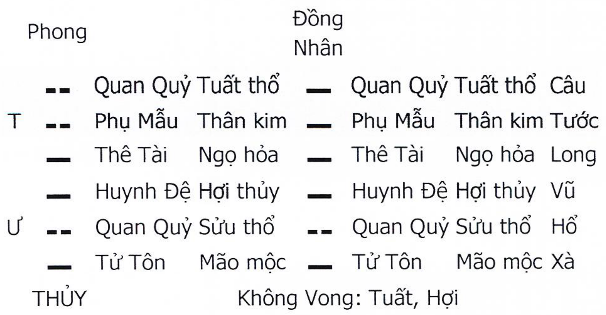
    - **Hình này chứng minh điều gì**
      - **Ví dụ 27:** Ngày Kỷ Tị tháng Bính Ngọ năm Nhâm Ngọ, nam người Nhật Bản đoán phong thủy nhà cửa, được Lôi Hỏa Phong biến Thiên Hỏa Đồng Nhân. Hào Thế Phụ Mẫu Thân kim là nhà, được Nhật hợp, Nhật h...
    - **Từ đâu mà thấy được**
      - THỦY Không Vong: Tuất, Hợi Hào Thế Phụ Mẫu Thân kim là nhà, được Nhật hợp, Nhật hợp là tăng thêm, là nhà lầu.
- **Diễn tiến phân tích và suy luận chi tiết:**
  - **Ví dụ 27:** Ngày Kỷ Tị tháng Bính Ngọ năm Nhâm Ngọ, nam người Nhật Bản đoán phong thủy nhà cửa, được Lôi Hỏa Phong biến Thiên Hỏa Đồng Nhân.
  - THỦY Không Vong: Tuất, Hợi
  - 1.
  - Hào Thế Phụ Mẫu Thân kim là nhà, được Nhật hợp, Nhật hợp là tăng thêm, là nhà lầu.
  - **Đáp:** Đúng là nhà lầu.
  - 2.
  - Hào 2 là hào trạch, sinh hào Thế, ở nhà này cảm thấy rất thoải mái.
  - Hỏa lâm Nhật Nguyệt sinh hào 2, nhà đầy đủ ánh sáng.
  - **Đáp:** Đúng như vậy.
  - Rất sáng sủa, cảnh vật xung quanh cũng đẹp.
  - 3.
  - Hào 5 là đường đi, phục ngâm, lại có Nhật hợp, lân cận có đường giao nhau, lâm kim, có đường sắt.
  - **Đáp:** Đúng, giao thông rất thuận tiện, có đường sắt và đường cao tốc.
  - 4.
  - Hào sơ mộc lâm Xà, là cỏ nhỏ, Quan Quỷ Tuất thổ lâm Câu Trần, Câu Trần là kiến trúc, hợp Mão mộc, sơ là mặt đất, hợp là nối liền, gần đó có bãi cỏ rộng lớn.
  - **Đáp:** Gần đó có công viên cây xanh, đi đường 8 phút thì đến.
  - 5.
  - Thê Tài nhập Mộ tại hào lâm Câu Trần, hào lâm Câu Trần lại hợp trú Nguyên thần Tử Tôn.
  - Kinh tế eo hẹp, điều này chủ yếu là do mua nhà gây nên.
  - **Đáp:** Mua nhà cho vay, hiện tại vẫn chưa trả xong.
  - 6.
  - Ngoại quái phục ngâm, lâm Chu Tước, kim và Chu Tước chủ âm thanh, phục ngâm là tượng lặp đi lặp lại, bản thân là người thích càm ràm.
  - **Đáp:** Bản thân tôi nóng tính, rất nhiều lời.
  - 7.
  - Hào Thế là kim, tại hào 5 chủ phổi, hô hấp không tốt, lâm Chu Tước chủ âm thanh, có bệnh ho.
  - **Đáp:** Khi tôi hồi hộp hoặc sợ hãi thì sẽ ho, không biết tại sao.
  - Trước đây tôi thích hút thuốc, bởi vì ho cho nên đã bỏ.
  - 8.
  - Hào 6 Không không sinh hào Thế, hào 6 là đầu, chủ trí nhớ không tốt.
  - Hào Tài nhập Mộ ở hào 6, Tài là vợ, chủ vợ bị chóng mặt.
  - Nguyên thần Mão mộc bị hào 6 hợp mà cản trở không sinh Tài, cung máu không đủ.
  - **Đáp:** Trí nhớ của tôi khá tệ, vợ bị thiếu sắt, hơi thiếu máu.
  - 9.
  - Hào sơ Tử Tôn là con cái, bị hào động hợp trú, hợp là vướng chân, chủ sinh con muộn.
  - **Đáp:** Kết hôn đã mấy năm, đến bây giờ vẫn chưa có con cái.
  - Phán đoán đến đây kết thúc.
  - **Đáp:** Lục hào quá đáng sợ.

#### Ví dụ 28: Ngày Tân Hợi tháng Giáp Dần năm Quý Mùi, nữ đoán bệnh cho cha, cha muốn về ở ...

- **Bối cảnh và thông tin quẻ:**
  - Ngày Tân Hợi tháng Giáp Dần năm Quý Mùi, nữ đoán bệnh cho cha, cha muốn về ở căn nhà cũ, hỏi phong thủy của căn nhà đó có ảnh hưởng gì đến bệnh tật hay không?
  - Được Hỏa Sơn Lữ biến Hỏa Phong Đỉnh.
  - HỎA Không Vong: Dần, Mão
- **Luận giải quái tượng phong thủy:**
  - **Hình 52.** Quẻ Hỏa Sơn Lữ biến Hỏa Phong Đỉnh
    - 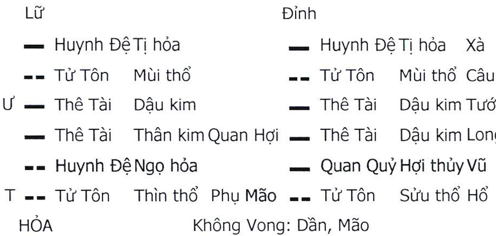
    - **Hình này chứng minh điều gì**
      - Mặc dù là dự đoán ảnh hưởng của nhà cửa, tuy nhiên quẻ này tương đương với dự đoán bệnh tật. Tiếp theo là xem ảnh hưởng của hào trạch và hào Ứng đối với Dụng thần, không thể xem hào Phụ Mẫu là căn ...
    - **Từ đâu mà thấy được**
      - Tiếp theo là xem ảnh hưởng của hào trạch và hào Ứng đối với Dụng thần, không thể xem hào Phụ Mẫu là căn nhà. Lúc này có thể xem tình hình Thế Ứng, hào Thế là chỗ ở hiện tại, hào Ứng là căn nhà cũ m...
- **Diễn tiến phân tích và suy luận chi tiết:**
  - Mặc dù là dự đoán ảnh hưởng của nhà cửa, tuy nhiên quẻ này tương đương với dự đoán bệnh tật.
  - Vì vậy, trước tiên phải xem cát hung của cha.
  - Tiếp theo là xem ảnh hưởng của hào trạch và hào Ứng đối với Dụng thần, không thể xem hào Phụ Mẫu là căn nhà.
  - Bởi vì cha thì xem hào Phụ Mẫu, nếu căn nhà cũng dùng hào Phụ Mẫu thì không thể phán đoán được ảnh hưởng của căn nhà đối với cha như thế nào.
  - Lúc này có thể xem tình hình Thế Ứng, hào Thế là chỗ ở hiện tại, hào Ứng là căn nhà cũ muốn đến ở.
  - Hào 2 là trạch cũng phải xem, đồng thời còn phải xem ảnh hưởng của hào động đối với hào Phụ Mẫu.
  - Xem cát hung, lấy hào Phụ Mẫu làm Dụng thần.
  - Phụ Mẫu được Nguyệt phù Nhật sinh, Dụng thần vượng tướng.
  - Hào động lại không khắc Dụng thần, mặc dù Dụng thần phục tàng Không Vong nhưng cũng không cần phải đoán là xấu.
  - Tôi đoán là sẽ có nhiều người đoán như thế này: Quẻ này thuộc về một hào độc phát.
  - Ứng khắc Phụ Mẫu, nơi đến bất lợi cho cha, Huynh Đệ Ngọ hỏa tại hào 2 độc phát, là Tử địa của Dụng thần, độc phát lấy tượng làm chủ, quẻ này rất hung.
  - Mộc ở vào Tử địa, chứng tỏ cha có bệnh tật liên quan đến mộc.
  - Mộc chủ gan mật, Tử địa thường là ung thư, ung thư túi mật tương đối hiếm gặp, vì vậy phán đoán là ung thư gan.
  - Kỵ thần là kim, kim chủ phổi, phải đề phòng di căn lên
  - phổi.
  - Vì vậy, tôi đề nghị điều dưỡng ở bệnh viện là được, tốt nhất là không nên cho về căn nhà cũ.
- **Kết quả ứng nghiệm thực tế:**
  - Tuy nhiên, cha cô rất nhớ chỗ ở trước kia, ông cụ cảm thấy ở đó thì tâm trạng sẽ thoải mái hơn.
  - Thế là đã quay về nơi đó.
  - Cô ấy đã biết là cha bị ung thư gan, nhưng nếu không cho cha trở về, lỡ may cha qua đời thì sẽ để lại di hận.
  - Kết quả là tại tháng Thìn, tế bào ung thư lan rộng, di căn lên phổi và đã qua đời.

#### Ví dụ 29: Ngày Nhâm Dần tháng Quý Mùi năm Ất Dậu, nam đoán phong thủy nhà cửa, được Thi...

- **Bối cảnh và thông tin quẻ:**
  - Ngày Nhâm Dần tháng Quý Mùi năm Ất Dậu, nam đoán phong thủy nhà cửa, được Thiên Sơn Độn.
  - KIM Không Vong: Thìn, Tị
  - Phán đoán phong thủy, nhà cửa thì xem hào Phụ Mẫu và hào 2, cát hung thì xem các tổ hợp biến hóa của tổng thể quẻ.
  - Hào 2 được Nguyệt hợp là nhà lầu.
  - (Thực tế là nhà hai lầu).
  - Hào 2 được Nhật sinh là vượng tướng, lâm Thanh Long chủ hào hoa, nhà rất phong cách.
  - Hào sơ Phụ Mẫu Thìn thổ Không Vong, Phụ Mẫu là nhà, hào sơ là lân cận, Không là lỗ, Tý thủy phục dưới Phi thần Không Vong dễ lộ ra, Huyền Vũ chủ ẩm thấp.
  - Vì vậy, lân cận nơi ở có nước suối tuôn ra.
  - Thực tế là có suối.
  - Phụ Mẫu Thìn thổ Không không được hỏa đến sinh, hỏa chủ ánh sáng, lại lâm Huyền Vũ chủ tối tăm, nơi ở có vấn đề về ánh sáng.
  - Thực tế đúng là nhà thiếu ánh sáng.
- **Luận giải quái tượng phong thủy:**
  - **Hình 53.** Quẻ Thiên Sơn Độn
    - 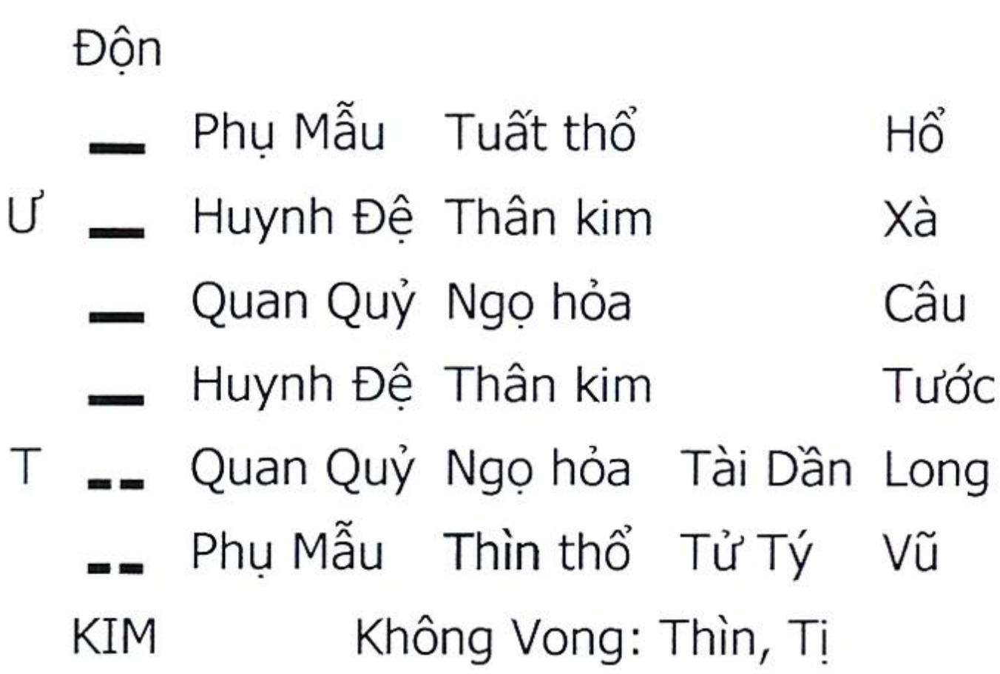
    - **Hình này chứng minh điều gì**
      - **Ví dụ 29:** Ngày Nhâm Dần tháng Quý Mùi năm Ất Dậu, nam đoán phong thủy nhà cửa, được Thiên Sơn Độn. Phán đoán phong thủy, nhà cửa thì xem hào Phụ Mẫu và hào 2, cát hung thì xem các tổ hợp biến h...
    - **Từ đâu mà thấy được**
      - KIM Không Vong: Thìn, Tị Phán đoán phong thủy, nhà cửa thì xem hào Phụ Mẫu và hào 2, cát hung thì xem các tổ hợp biến hóa của tổng thể quẻ.
- **Diễn tiến phân tích và suy luận chi tiết:**
  - **Ví dụ 29:** Ngày Nhâm Dần tháng Quý Mùi năm Ất Dậu, nam đoán phong thủy nhà cửa, được Thiên Sơn Độn.
  - KIM Không Vong: Thìn, Tị
  - Phán đoán phong thủy, nhà cửa thì xem hào Phụ Mẫu và hào 2, cát hung thì xem các tổ hợp biến hóa của tổng thể quẻ.
  - Hào 2 được Nguyệt hợp là nhà lầu.
  - (Thực tế là nhà hai lầu).
  - Hào 2 được Nhật sinh là vượng tướng, lâm Thanh Long chủ hào hoa, nhà rất phong cách.
  - Hào sơ Phụ Mẫu Thìn thổ Không Vong, Phụ Mẫu là nhà, hào sơ là lân cận, Không là lỗ, Tý thủy phục dưới Phi thần Không Vong dễ lộ ra, Huyền Vũ chủ ẩm thấp.
  - Vì vậy, lân cận nơi ở có nước suối tuôn ra.
  - Thực tế là có suối.
  - Phụ Mẫu Thìn thổ Không không được hỏa đến sinh, hỏa chủ ánh sáng, lại lâm Huyền Vũ chủ tối tăm, nơi ở có vấn đề về ánh sáng.
  - Thực tế đúng là nhà thiếu ánh sáng.

#### Ví dụ 30: Ngày Đinh Hợi tháng Tân Mùi năm Giáp Thân, một cửa hàng trưởng muốn mua nhà, ...

- **Bối cảnh và thông tin quẻ:**
  - Ngày Đinh Hợi tháng Tân Mùi năm Giáp Thân, một cửa hàng trưởng muốn mua nhà, hỏi phong thủy của căn nhà có lợi cho bản thân hay không?
  - Chức vụ có được nâng cao hay không?
  - Được Địa Thiên Thái biến Sơn Thiên Đại Súc.
  - THỔ Không Vong: Ngọ, Mùi
- **Luận giải quái tượng phong thủy:**
  - **Hình 54.** Quẻ Địa Thiên Thái biến Sơn Thiên Đại Súc
    - 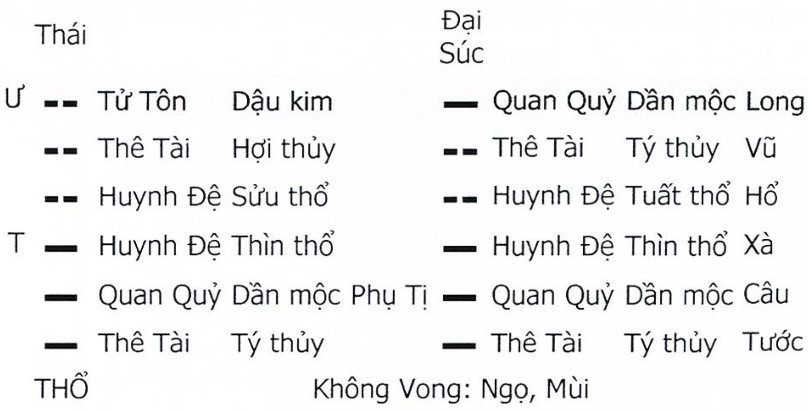
    - **Hình này chứng minh điều gì**
      - Vì vậy, phải lấy hào Quan Quỷ làm trọng điểm.
    - **Từ đâu mà thấy được**
      - Quẻ này Quan Quỷ Dần mộc mặc dù được Nhật đến sinh phù, nhưng trong sinh có hợp, Nhật hợp là vướng chân, vì vậy rất khó thăng chức. Đồng thời Tử Tôn Dậu kim độc phát, động mà đến khắc Quan Quỷ, mua...
- **Diễn tiến phân tích và suy luận chi tiết:**
  - Mục đích của người này là muốn thăng chức.
  - Vì vậy, phải lấy hào Quan Quỷ làm trọng điểm.
  - Quẻ này Quan Quỷ Dần mộc mặc dù được Nhật đến sinh phù, nhưng trong sinh có hợp, Nhật hợp là vướng chân, vì vậy rất khó thăng chức.
  - Đồng thời Tử Tôn Dậu kim độc phát, động mà đến khắc Quan Quỷ, mua nhà này không những không được thăng chức mà trái lại sẽ mất việc làm.
  - Tử Tôn Dậu kim lâm hào Ứng phát động, Ứng là người khác, mất việc bởi vì người khác.
  - Tử Tôn Dậu kim vừa động khắc Quan Quỷ, vừa hóa ra Quan Quỷ, đây chính là thông tin mất việc ở chỗ này lại tìm được việc ở chỗ khác.
  - Quẻ này Tử Tôn Dậu kim lâm Thanh Long đến hợp hào Thế, năm Ất Dậu còn có chuyện vui mừng.
  - Tử Tôn là con cái, Thanh Long chủ sinh đẻ, lâm hào âm là con gái.
- **Kết quả ứng nghiệm thực tế:**
  - Quẻ này mãi đến năm Bính Tuất mới có phản hồi.
  - Anh ta không nghe lời tôi khuyên can, đã mua nhà và vào ở.
  - Năm Ất Dậu sinh một đứa con gái.
  - Bởi vì bất hòa với lãnh đạo mới đến mà bị buộc phải nghỉ việc.

#### Ví dụ 31: Ngày Bính Thìn tháng Kỷ Hợi năm Bính Tuất, trong thời gian tôi giảng dạy ở Nh...

- **Bối cảnh và thông tin quẻ:**
  - Ngày Bính Thìn tháng Kỷ Hợi năm Bính Tuất, trong thời gian tôi giảng dạy ở Nhật Bản, một người phụ nữ nhờ đoán phong thủy, được Sơn Trạch Tổn biến Hỏa Trạch Khuê.
  - THỔ Không Vong: Tý, Sửu
  - Trước tiên là tôi phán đoán tình hình xung quanh nhà.
  - Phụ Mẫu là nhà, Nguyệt phá, tôi đoán là nhìn từ xa, căn nhà dường như bị nứt.
  - (Ứng nghiệm)
  - Phụ Mẫu hưu tù, Nguyệt khắc, căn nhà không quá mới.
  - Tuất thổ độc phát hợp hào 2 Câu Trần, hào 2 cũng là hào trạch, có thông tin xây dựng.
  - Phụ Mẫu nhập Mộ thì ứng xung Mộ, hợp hào 2 cũng có thể ứng xung, vì vậy phán đoán là căn nhà đã xây được 6 năm, tức là được xây vào năm 2000.
  - (Ứng nghiệm)
  - Huynh Đệ Tuất thổ lâm Bạch Hổ, Bạch Hổ chủ đường đi, Phụ Mẫu nhập Mộ ở hào này chủ giao thông bất tiện, đường đi tương đối chật hẹp.
  - Huynh Đệ Tuất thổ bị Nhật xung, xung là giao thoa, vì vậy phán đoán lân cận có giao lộ.
  - (Ứng nghiệm)
  - Huynh Đệ Tuất thổ phát động, hợp hào trạch, trên hợp dưới, là nhà lầu.
  - (Ứng nghiệm)
  - Hào 5 Tý thủy Không Vong nhị hợp Thế, bởi vì là dự đoán phong thủy, Thế cũng có thể hiểu là nơi ở.
  - Vì vậy phán đoán là gần nơi ở có kênh nước, nhưng Không Vong, bình thường không có nước.
  - (Ứng)
  - Huynh Đệ trì Thế Không, lâm Đằng Xà, Không chủ bất an, Xà cũng chủ bất an, vì vậy phán đoán ở đây không yên tâm, hào 3 là giường, có tình trạng mất ngủ.
  - (Ứng)
  - Phụ Mẫu lâm hỏa nhập Mộ, Nguyệt phá, hỏa là ánh sáng, thiếu ánh sáng.
  - Hỏa bị thủy xung phá, nhà tương đối ẩm thấp.
  - (Ứng)
  - Tài Không, nhập Mộ ở Nhật, tiền bạc trong tay khá eo hẹp.
  - Huynh Đệ độc phát, tài vận bình thường, có tiền liền tiêu pha, không giữ được tiền.
  - Lâm Bạch Hổ, Bạch Hổ chủ nhanh, Nhật xung, xung thì động càng mạnh, vừa có tiền là lập tức tiêu hết.
  - (Ứng)
  - Hào sơ Phụ Mẫu là Nguyên thần, Nguyệt phá nhập Mộ không thể sinh hào Thế, hào sơ là chân, lâm Chu Tước chủ viêm, Nguyệt phá là chân bị tróc da, vì vậy phán đoán là có cước khí.
  - (Ứng)
- **Luận giải quái tượng phong thủy:**
  - **Hình 55.** Quẻ Sơn Trạch Tổn biến Hỏa Trạch Khuê
    - 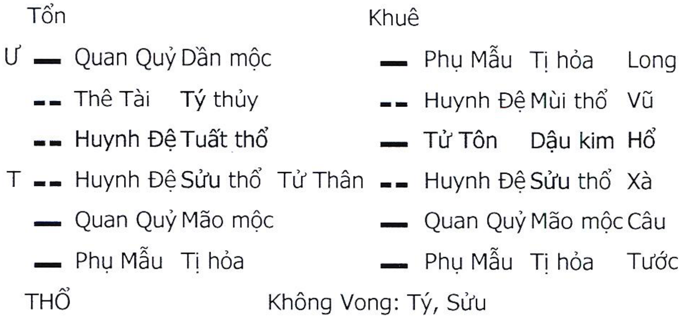
    - **Hình này chứng minh điều gì**
      - **Ví dụ 31:** Ngày Bính Thìn tháng Kỷ Hợi năm Bính Tuất, trong thời gian tôi giảng dạy ở Nhật Bản, một người phụ nữ nhờ đoán phong thủy, được Sơn Trạch Tổn biến Hỏa Trạch Khuê.
    - **Từ đâu mà thấy được**
      - THỔ Không Vong: Tý, Sửu (Ứng nghiệm)
- **Diễn tiến phân tích và suy luận chi tiết:**
  - **Ví dụ 31:** Ngày Bính Thìn tháng Kỷ Hợi năm Bính Tuất, trong thời gian tôi giảng dạy ở Nhật Bản, một người phụ nữ nhờ đoán phong thủy, được Sơn Trạch Tổn biến Hỏa Trạch Khuê.
  - THỔ Không Vong: Tý, Sửu
  - Trước tiên là tôi phán đoán tình hình xung quanh nhà.
  - Phụ Mẫu là nhà, Nguyệt phá, tôi đoán là nhìn từ xa, căn nhà dường như bị nứt.
  - (Ứng nghiệm)
  - Phụ Mẫu hưu tù, Nguyệt khắc, căn nhà không quá mới.
  - Tuất thổ độc phát hợp hào 2 Câu Trần, hào 2 cũng là hào trạch, có thông tin xây dựng.
  - Phụ Mẫu nhập Mộ thì ứng xung Mộ, hợp hào 2 cũng có thể ứng xung, vì vậy phán đoán là căn nhà đã xây được 6 năm, tức là được xây vào năm 2000.
  - (Ứng nghiệm)
  - Huynh Đệ Tuất thổ lâm Bạch Hổ, Bạch Hổ chủ đường đi, Phụ Mẫu nhập Mộ ở hào này chủ giao thông bất tiện, đường đi tương đối chật hẹp.
  - Huynh Đệ Tuất thổ bị Nhật xung, xung là giao thoa, vì vậy phán đoán lân cận có giao lộ.
  - (Ứng nghiệm)
  - Huynh Đệ Tuất thổ phát động, hợp hào trạch, trên hợp dưới, là nhà lầu.
  - (Ứng nghiệm)
  - Hào 5 Tý thủy Không Vong nhị hợp Thế, bởi vì là dự đoán phong thủy, Thế cũng có thể hiểu là nơi ở.
  - Vì vậy phán đoán là gần nơi ở có kênh nước, nhưng Không Vong, bình thường không có nước.
  - (Ứng)
  - Huynh Đệ trì Thế Không, lâm Đằng Xà, Không chủ bất an, Xà cũng chủ bất an, vì vậy phán đoán ở đây không yên tâm, hào 3 là giường, có tình trạng mất ngủ.
  - (Ứng)
  - Phụ Mẫu lâm hỏa nhập Mộ, Nguyệt phá, hỏa là ánh sáng, thiếu ánh sáng.
  - Hỏa bị thủy xung phá, nhà tương đối ẩm thấp.
  - (Ứng)
  - Tài Không, nhập Mộ ở Nhật, tiền bạc trong tay khá eo hẹp.
  - Huynh Đệ độc phát, tài vận bình thường, có tiền liền tiêu pha, không giữ được tiền.
  - Lâm Bạch Hổ, Bạch Hổ chủ nhanh, Nhật xung, xung thì động càng mạnh, vừa có tiền là lập tức tiêu hết.
  - (Ứng)
  - Hào sơ Phụ Mẫu là Nguyên thần, Nguyệt phá nhập Mộ không thể sinh hào Thế, hào sơ là chân, lâm Chu Tước chủ viêm, Nguyệt phá là chân bị tróc da, vì vậy phán đoán là có cước khí.
  - (Ứng)

#### Ví dụ 32: Ngày Canh Ngọ tháng Bính Ngọ năm Nhâm Ngọ, nam đoán phong thủy nơi ở, được Lô...

- **Bối cảnh và thông tin quẻ:**
  - Ngày Canh Ngọ tháng Bính Ngọ năm Nhâm Ngọ, nam đoán phong thủy nơi ở, được Lôi Trạch Quy Muội.
  - KIM Không Vong: Tuất, Hợi
  - 1.
  - Phụ Mẫu Sửu thổ trì Thế, không bị Nhật Nguyệt hào động đến khắc, hào Thế là bản thân, Trì Thế là có, nhà này là tài sản riêng của mình.
  - **Đáp:** Đúng.
  - 2.
  - Phụ Mẫu được Nhật Nguyệt sinh vượng tướng, diện tích lớn.
  - **Đáp:** Đúng, có hơn 700 m².
  - 3.
  - Phụ Mẫu lâm Thanh Long, phong cảnh xung quanh rất đẹp.
  - Có điều là lại lâm Đằng Xà, Đằng Xà chủ hẻo lánh, nơi ấy hơi hẻo lánh.
  - **Đáp:** Đúng, xung quanh rất đẹp, ở nông thôn.
  - 4.
  - Hào 2 Mão mộc không bị khắc, cây cối gần đó rậm rạp xanh tươi.
  - **Đáp:** Phía Đông đều là rừng cây.
  - 5.
  - Ứng lâm Phụ Mẫu Tuất thổ Không, gần đó có căn nhà bỏ trống.
  - Hợp Tài lâm Đằng Xà, Đằng Xà chủ lộn xộn, lân cận để một vài thứ bừa bãi.
  - **Đáp:** Gần nhà có một gara có thể để 6 chiếc xe, sau khi xây dựng xong chưa hề sử dụng, vẫn cứ để trống.
  - Trước gara có để rất nhiều thùng dầu rỗng.
  - 6.
  - Quan Quỷ vượng mà sinh Thế, nơi này có lợi cho phát triển sự nghiệp, phong thủy rất tốt.
  - **Đáp:** Chúng tôi chế tạo kính đeo mắt, nơi ở của tôi nằm ở khu vực trung tâm của nhà máy sản xuất.
  - 7.
  - Tài nhược Ứng Không, hôn nhân muộn.
  - **Đáp:** Hiện nay tôi đã hơn 30 tuổi mà vẫn chưa kết hôn.
  - ### Ví dụ 33
  - Ngày Quý Tị tháng Canh Tý năm Bính Tuất, một người Nhật Bản gặp khó khăn về tài vận, hỏi có phải là do phong thủy gây ra hay không?
  - Được Thiên Phong Cấu biến Phong Thiên Tiểu Súc.
  - KIM Không Vong: Ngọ, Mùi
  - Mặc dù là hỏi phong thủy, nhưng chủ yếu là bởi vì tài vận không tốt mà hỏi, vì vậy phải xem ảnh hưởng của biến hóa trong quẻ đối với hào Tài ra sao, đây chính là chỗ bệnh của phong thủy.
  - Tài không hiện trên quẻ, mặc dù có Nguyệt sinh, nhưng hai hào động đều ảnh hưởng bất lợi cho hào Tài, chứng tỏ phong thủy vẫn có ảnh hưởng, tuy nhiên bởi vì Tài vượng cho nên phong thủy không phải là tác nhân ảnh hưởng chủ yếu, hẳn là vận khí bản thân cũng không tốt.
  - Phụ Mẫu trì Thế, Phụ Mẫu là nhà, chứng tỏ đây là nhà riêng.
  - Phụ Mẫu Sửu thổ và Nguyệt hợp, trên hợp dưới, hợp là trùng điệp, căn nhà có kết cấu nhiều tầng.
  - Bởi vì là nhà riêng, bản thân không thể xây tòa nhà, vì vậy phải là nhà biệt lập nhiều tầng.
  - Loại nhà này cũng phổ biến ở Nhật Bản.
  - (Trên thực tế là nhà kết cấu hai tầng.)
  - Phụ Mẫu lâm hào sơ, hào sơ là bàn chân, là đi lại, lại căn cứ vào di thần pháp, hào sơ lại thêm lâm Bạch Hổ, Bạch Hổ chủ con đường, là nhà nằm ven đường.
  - (Nằm ven đường.)
  - Phụ Mẫu lâm Huyền Vũ, căn nhà tương đối ẩm thấp.
  - (Ứng nghiệm.)
  - ### Ví dụ 34
  - Ngày Kỷ Tị tháng Bính Ngọ năm Nhâm Ngọ, nữ đoán phong thủy nhà cửa, được Trạch Hỏa Cách biến Trạch Lôi Tùy.
  - THỦY Không Vong: Tuất, Hợi
  - Hào Thế là nơi ở, hào Thế Hợi thủy Không Vong, trong nhà thường có tình trạng trống rỗng, ít khi có người ở.
- **Luận giải quái tượng phong thủy:**
  - **Hình 56.** Sơ đồ quẻ Lôi Trạch Quy Muội
    - 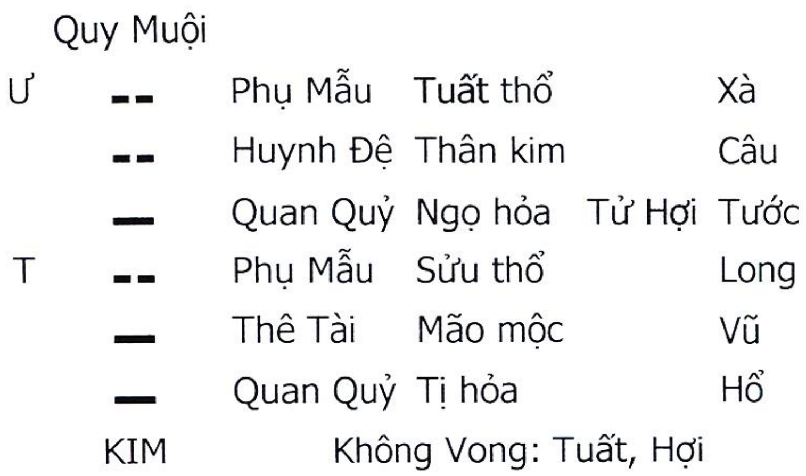
    - **Hình này chứng minh điều gì**
      - Quẻ chứng minh tình trạng phong thủy và ảnh hưởng cát hung tương ứng với quái tượng Sơ đồ quẻ Lôi Trạch Quy Muội.
    - **Từ đâu mà thấy được**
      - Căn cứ vào hào vị, lục thân, can chi sinh khắc, tuần không và hào động biến trong quẻ.
  - **Hình 57.** Sơ đồ quẻ Thiên Phong Cấu biến Phong Thiên Tiểu Súc
    - 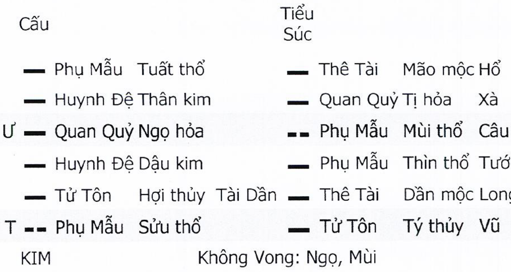
    - **Hình này chứng minh điều gì**
      - Quẻ chứng minh tình trạng phong thủy và ảnh hưởng cát hung tương ứng với quái tượng Sơ đồ quẻ Thiên Phong Cấu biến Phong Thiên Tiểu Súc.
    - **Từ đâu mà thấy được**
      - Căn cứ vào hào vị, lục thân, can chi sinh khắc, tuần không và hào động biến trong quẻ.
  - **Hình 58.** Sơ đồ quẻ Trạch Hỏa Cách biến Trạch Lôi Tùy
    - 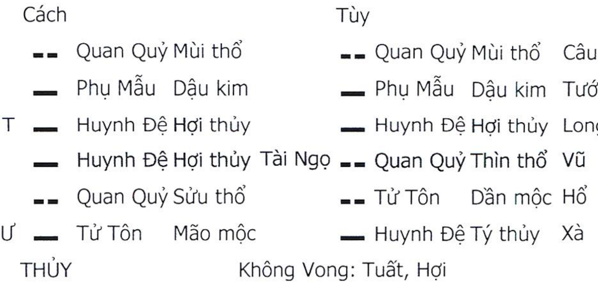
    - **Hình này chứng minh điều gì**
      - Quẻ chứng minh tình trạng phong thủy và ảnh hưởng cát hung tương ứng với quái tượng Sơ đồ quẻ Trạch Hỏa Cách biến Trạch Lôi Tùy.
    - **Từ đâu mà thấy được**
      - Căn cứ vào hào vị, lục thân, can chi sinh khắc, tuần không và hào động biến trong quẻ.
- **Kết quả ứng nghiệm thực tế:**
  - Đúng.
  - Ngày nghỉ và ngày thường đa số đều đi vắng.
  - Hào 3 Huynh Đệ Hợi thủy phát động, động mà hóa Mộ, hào 3 là cửa, Huynh Đệ cũng là cửa, cửa thường xuyên khóa chặt.
  - **Phản hồi:** Bình thường ở nhà đều khóa cửa, ra ngoài càng khóa kỹ hơn.
  - Thê Tài Ngọ hỏa được Nhật Nguyệt trợ giúp là vượng tướng, mặc dù là thu nhập khá cao, nhưng Huynh Đệ Hợi thủy độc phát, không tích trữ được tiền.
  - **Phản hồi:** Rất đúng.
  - Phụ Mẫu Dậu kim tại hào 5, hào 5 là đường đi, nhà nằm sát đường.
  - **Phản hồi:** Nhà tôi nằm ở bên cạnh khu dân cư, mặc dù không lớn nhưng tiếp giáp với đường, xe cộ qua lại rất nhiều, lân cận cũng có đường sắt.
  - Nguyên thần hỏa Quỷ Không Phá, không đủ sức sinh Phụ Mẫu, hỏa chủ ánh sáng, căn nhà có vấn đề về ánh sáng.
  - Ứng Ngọ hỏa lâm Câu Trần, Không Phá hóa Phụ Mẫu, Câu Trần chủ kiến trúc, Không Phá chủ tan biến, Phụ Mẫu chủ kiến trúc.
  - Vì vậy, ở phía Nam có vật kiến trúc bị đập bỏ, sau đó lại xây mới.
  - Hào biến Phụ Mẫu Mùi thổ Không, vẫn đang xây, chưa xây xong.
  - (Nghiệm.)
  - Bởi vì nhà ở gần đường và người ta đang xây dựng mà tài vận bị ảnh hưởng.
  - Năm 2004 và 2005 là những năm Tài bị khắc, tài vận liên tục gặp khó khăn.
  - (Ứng nghiệm.)
  - ---
  - # Part 8 (Pages 141-160)

#### Ví dụ 35: Ngày Canh Ngọ tháng Bính Ngọ năm Nhâm Ngọ, nam đoán phong thủy nhà cửa, được ...

- **Bối cảnh và thông tin quẻ:**
  - Ngày Canh Ngọ tháng Bính Ngọ năm Nhâm Ngọ, nam đoán phong thủy nhà cửa, được Sơn Phong Cổ.
  - MỘC Không Vong: Tuất, Hợi
  - Hào 5 và hào 2 tỷ hòa, hào vị an tĩnh, ảnh hưởng của phong thủy đối với người tương đối nhỏ.
- **Luận giải quái tượng phong thủy:**
  - **Hình 59.** Sơ đồ quẻ Sơn Phong Cổ
    - 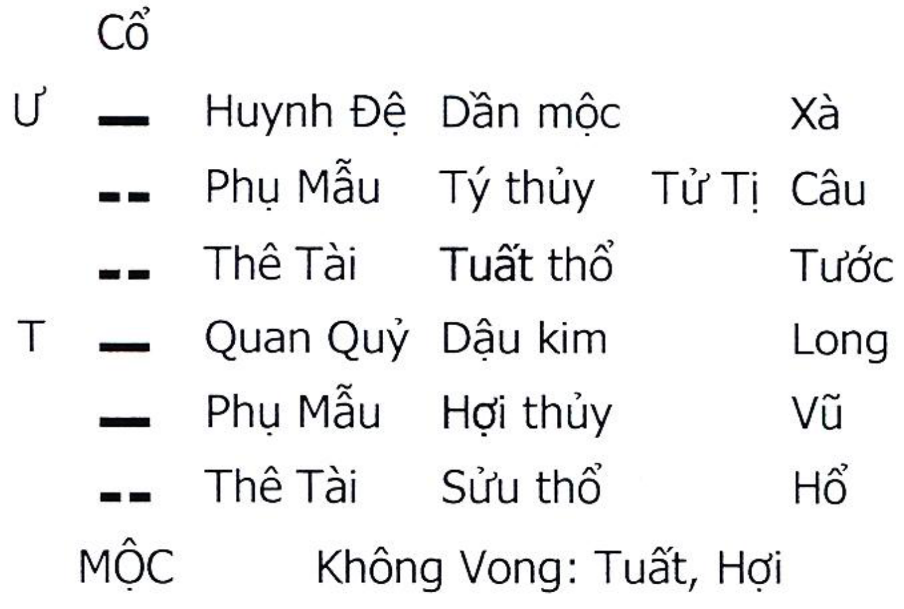
    - **Hình này chứng minh điều gì**
      - Quẻ chứng minh tình trạng phong thủy và ảnh hưởng cát hung tương ứng với quái tượng Sơ đồ quẻ Sơn Phong Cổ.
    - **Từ đâu mà thấy được**
      - Căn cứ vào hào vị, lục thân, can chi sinh khắc, tuần không và hào động biến trong quẻ.
- **Kết quả ứng nghiệm thực tế:**
  - Tôi cảm thấy cũng đúng như vậy.
  - Tôi đã chuyển đến đây sống vào năm lớp 6 tiểu học, đến cấp ba thì bắt đầu sinh sống ở bên ngoài, đến nay đã được khoảng 16 năm.
  - Hào 2 lâm Huyền Vũ, hào 2 là nhà ở, Huyền Vũ chủ tối tăm, căn nhà có vấn đề về ánh sáng.
  - **Phản hồi:** Lân cận có rất nhiều nhà cao tầng, chỉ có hai ba chỗ ở mặt Nam mới có thể nhìn thấy mặt trời, còn lại đều bị che khuất.
  - Quỷ Dậu kim trì Thế, Nhật Nguyệt đến khắc, lại lâm Thanh Long, Quan Quỷ là phiền não, hưu tù chủ không có, Thanh Long chủ vui vẻ, ở trong nhà này cảm thấy rất thoải mái.
  - **Phản hồi:** Tinh thần, sức khỏe của cha mẹ và tôi đều không có phiền não gì.
  - Nhà có sân riêng, thông thoáng, trần nhà cao, an tĩnh, mọi người đều thích nơi này, ngủ dậy rất khoan khoái.
  - Thê Tài lưỡng hiện, được Nhật Nguyệt sinh là vượng tướng, phong thủy nơi này rất có lợi cho tài vận.
  - **Phản hồi:** Gia đình tôi chuyển đến đây đã 25 năm.
  - Trong thời gian này, công việc kinh doanh của cha rất thuận
  - lợi, tài vận của mọi người trong nhà đều rất tốt.
  - Trước khi chuyển đến đây, công ty của cha tôi suýt phá sản, nhưng vừa đến đây thì việc làm ăn lại trở nên thuận lợi.
  - Hào 5 Phụ Mẫu Tý thủy Nguyệt phá Nhật phá, hào 5 là đường đi, lâm Câu Trần chủ bởi vì công trình mà phải đi chậm, chính là đường về nhà có công trình ảnh hưởng đến đi lại, hoặc là có đoạn đường khó đi.
  - **Phản hồi:** Đúng.
  - Cách nhà 150 mét có đường một chiều.
  - Chỗ đó có một khúc cua gần 90°, chỗ quẹo rất chật hẹp, thường xuyên có xe máy bị ngã.

#### Ví dụ 36: Ngày Canh Ngọ tháng Bính Ngọ năm Nhâm Ngọ, nam đoán phong thủy nhà cửa, được ...

- **Bối cảnh và thông tin quẻ:**
  - Ngày Canh Ngọ tháng Bính Ngọ năm Nhâm Ngọ, nam đoán phong thủy nhà cửa, được Địa Thủy Sư biến Địa Trạch Lâm.
  - THỦY
  - Không Vong: Tuất, Hợi
  - Phụ Mẫu Dậu kim bị Nhật Nguyệt khắc thương, hưu tù lâm Đằng Xà, Phụ Mẫu là nhà, Đằng Xà là chật hẹp, vì vậy nhà không rộng rãi.
- **Luận giải quái tượng phong thủy:**
  - **Hình 60.** Quẻ Địa Thủy Sư biến Địa Trạch Lâm
    - 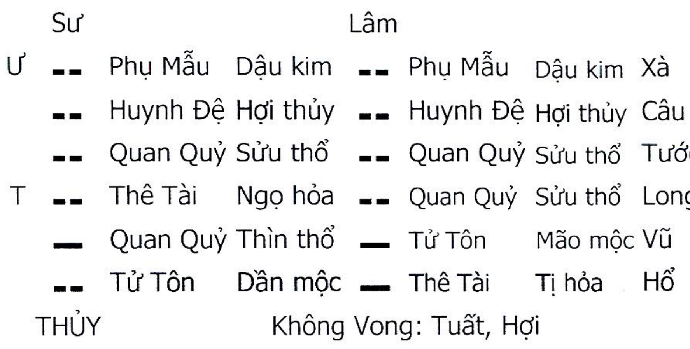
    - **Hình này chứng minh điều gì**
      - Quẻ chứng minh tình trạng phong thủy và ảnh hưởng cát hung tương ứng với quái tượng Quẻ Địa Thủy Sư biến Địa Trạch Lâm.
    - **Từ đâu mà thấy được**
      - Căn cứ vào hào vị, lục thân, can chi sinh khắc, tuần không và hào động biến trong quẻ.
- **Kết quả ứng nghiệm thực tế:**
  - Đúng.
  - Diện tích rất nhỏ, chỉ có 60 m².
  - Tử Tôn Dần mộc độc phát, Phụ Mẫu ở vào Tuyệt địa, là nhà đơn.
  - **Phản hồi:** Đúng.
  - Hào Thế Thê Tài Ngọ hỏa lâm Thanh Long được Nhật Nguyệt trợ giúp là vượng tướng, hỏa chủ ánh sáng, vượng tướng là mới, Thanh Long cũng chủ mới, hào Thế là nơi ở của mình.
  - Vì vậy, đây là căn nhà mới và đẹp, đầy đủ ánh sáng mặt trời.
  - **Phản hồi:** Căn nhà mới được xây dựng bốn năm trước.
  - Ánh sáng đầy đủ.
  - Quẻ tại cung Khảm, Khảm là thấp trũng, tổng thể khu vực thấp trũng, giống như trong thung lũng.
  - Nhưng Phụ Mẫu Dậu kim tại hào 6, hào 6 là chỗ cao, căn nhà ở chỗ khá cao.
  - Khảm lại là thủy, lân cận có nước tuôn ra.
  - **Phản hồi:** Địa thế xung quanh thấp trũng, có nước tuôn ra.
  - Nói đúng hơn là mái nhà của gia đình tôi cao hơn so với các nhà xung quanh.
  - Trong họ của gia đình tôi có chữ Cao (高).
  - Thê Tài Ngọ hỏa trì Thế, được Nhật Nguyệt trợ giúp, hào sơ Tử Tôn Dần mộc phát động lại đến sinh, đồng thời hóa ra Thê Tài Tị hỏa, hào Tài hơi quá vượng.
  - Ngọ hỏa lại là Thái Tuế nhập hào, vì vậy năm nay tài vận khó khăn, năm sau Nguyên thần nhập Mộ mới có thể có khởi sắc.
  - **Phản hồi:** Năm nay bắt đầu làm kinh doanh trên mạng, đã tốn rất nhiều tiền, chi phí bỏ ra vẫn chưa thu hồi được.
  - Năm sau mới có hy vọng phát tài.
  - Quan Quỷ lưỡng hiện, có kiêm chức, đảm trách hai công việc.
  - **Phản hồi:** Đúng.
  - Hào sơ phát động hóa Thê Tài, hào sơ là tâm sự, lại là Nguyên thần của hào Thế, cũng chủ nội tâm.
  - Thê Tài là phụ nữ, biểu thị có suy nghĩ ngoại tình.
  - Nhưng Thê Tài Ngọ hỏa trì Thế, lại là quẻ quy hồn, trong lòng vẫn quan tâm đến vợ, Nguyên thần hợp Hợi thủy Không Vong, chỉ nghĩ trong đầu chứ không có gan ngoại tình.
  - **Phản hồi:** Đúng, đúng.
  - Vợ là tối cao, tôi không dám.

#### Ví dụ 37: Ngày Kỷ Tị tháng Bính Ngọ năm Nhâm Ngọ, nam (chưa kết hôn) đoán phong thủy nh...

- **Luận giải quái tượng phong thủy:**
  - **Hình 61.** Sơ đồ quẻ Ly Vi Hỏa biến Trạch Hỏa Cách
    - 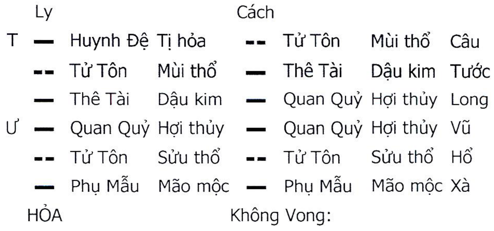
    - **Hình này chứng minh điều gì**
      - Quẻ chứng minh tình trạng phong thủy và ảnh hưởng cát hung tương ứng với quái tượng Sơ đồ quẻ Ly Vi Hỏa biến Trạch Hỏa Cách.
    - **Từ đâu mà thấy được**
      - Căn cứ vào hào vị, lục thân, can chi sinh khắc, tuần không và hào động biến trong quẻ.
- **Kết quả ứng nghiệm thực tế:**
  - Điểm này rất vi diệu.
  - Nói một cách chính xác thì có một công ty ở chỗ đường giao nhau, nhà của tôi thì nằm bên cạnh công ty.
  - Nhật Nguyệt khắc Thê Tài, Huynh Đệ lại trì Thế, nhưng Tử Tôn phát động hóa Tài, sinh Tài, mặc dù tài vận bình thường nhưng cũng không đến nỗi quá tệ.
  - Hào 2 là Tài khố, biểu thị có tiền vào nhà.
  - Hào Thế là điểm Trường Sinh của Thê Tài, phát động sinh Tử Tôn, Tử Tôn sinh Thê Tài, không nỗ lực là không có tiền, hôn nhân cũng tương đối muộn, khi phát tài chính là lúc có bạn gái.
  - **Phản hồi:** Hiện nay tài vận bình thường, xem ra phải phát tài nhanh lên, nếu không thì không có bạn gái.

#### Ví dụ 38: Ngày Kỷ Tị tháng Bính Ngọ năm Nhâm Ngọ, nữ đoán phong thủy nhà cửa, được Sơn ...

- **Luận giải quái tượng phong thủy:**
  - **Hình 62.** Sơ đồ quẻ Sơn Hỏa Bí biến Địa Trạch Lâm
    - 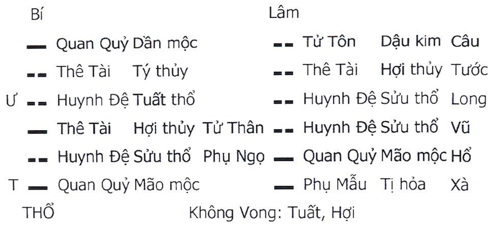
    - **Hình này chứng minh điều gì**
      - Quẻ chứng minh tình trạng phong thủy và ảnh hưởng cát hung tương ứng với quái tượng Sơ đồ quẻ Sơn Hỏa Bí biến Địa Trạch Lâm.
    - **Từ đâu mà thấy được**
      - Căn cứ vào hào vị, lục thân, can chi sinh khắc, tuần không và hào động biến trong quẻ.
- **Kết quả ứng nghiệm thực tế:**
  - Gia đình tôi đang sống trong một căn nhà kiêm cửa hàng, cửa hàng không thì kiếm được tiền.
  - Hiện nay tôi đang sống nhờ bảo hiểm thất nghiệp, vừa mới tìm được việc làm, tài vận không tốt.
  - Hào 5 Thê Tài Tý thủy lâm Chu Tước Nguyệt phá, Thê Tài là Nguyên thần của hào Thế, hào 5 là ngũ quan, thủy là cổ họng, Chu Tước chủ viêm, hiện tại cổ họng bị khó chịu, có chứng viêm.
  - **Phản hồi:** Là bị đau họng, lúc gieo quẻ thì không được khỏe, bây giờ còn bị ho.
  - Hào 3 Thê Tài Hợi thủy cũng là Nguyên thần, Không Vong bị hồi đầu khắc, hào 3 là thận, thủy lại là thận, thận có vấn đề.
  - **Phản hồi:** Mỗi ngày tôi đều đi ngủ sớm cũng là do thận không khỏe, có điều là vẫn chưa đến mức độ phải chạy thận nhân tạo.
  - Tôi vốn nghĩ là bệnh thận có liên quan đến di truyền, chị gái tôi cũng đã từng nhập viện vì bệnh thận, hiện tại hình như có liên quan đến phong thủy?
  - Phong thủy không phải luôn luôn bất biến, vận khí của con người cũng như vậy.
  - Quẻ chính lục hợp, nhà ở tụ khí,
  - hào trạch phát động hợp Tài, cũng đã có thời gian tài vận rất tốt.
  - **Phản hồi:** Mặc dù bây giờ không kiếm được tiền, nhưng cửa hàng đã từng thu được rất nhiều.
  - Khi ba chị em đi học trường tư thục, cửa hàng đã giúp trang trải rất nhiều chi phí.
  - Số tiền tích trữ lúc đó vẫn còn, cũng có thể lấy ra cho cha mẹ đi du lịch nước ngoài vào ngày nghỉ.
  - Có điều là cha mẹ dự định qua vài năm sẽ đóng cửa hàng cho nên cũng không chăm chỉ kinh doanh.
  - Quan Quỷ trì Thế lâm Đào Hoa, lưỡng hiện, hào động lại hóa ra Quan Quỷ.
  - Đào hoa vận tốt.
  - **Phản hồi:** Rất tốt.

#### Ví dụ 39: Ngày Canh Ngọ tháng Bính Ngọ năm Nhâm Ngọ, nam đoán phong thủy nhà cửa, được ...

- **Bối cảnh và thông tin quẻ:**
  - Ngày Canh Ngọ tháng Bính Ngọ năm Nhâm Ngọ, nam đoán phong thủy nhà cửa, được Ly Vi Hỏa biến Thiên Hỏa Đồng Nhân.
  - HỎA Không Vong: Tuất, Hợi
  - Tử Tôn Mùi thổ lâm Câu Trần độc phát, Câu Trần là kiến trúc, Tử Tôn là bình an, ở trong nhà này hầu như không có tai họa.
- **Luận giải quái tượng phong thủy:**
  - **Hình 63.** Sơ đồ quẻ Ly Vi Hỏa biến Thiên Hỏa Đồng Nhân
    - 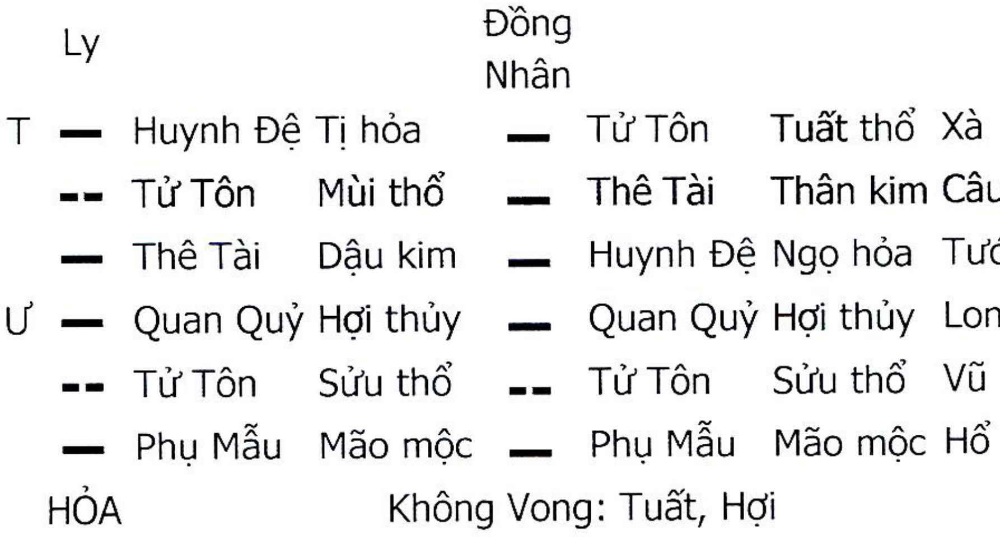
    - **Hình này chứng minh điều gì**
      - Quẻ chứng minh tình trạng phong thủy và ảnh hưởng cát hung tương ứng với quái tượng Sơ đồ quẻ Ly Vi Hỏa biến Thiên Hỏa Đồng Nhân.
    - **Từ đâu mà thấy được**
      - Căn cứ vào hào vị, lục thân, can chi sinh khắc, tuần không và hào động biến trong quẻ.
- **Kết quả ứng nghiệm thực tế:**
  - Đúng.
  - Cho đến bây giờ, gia đình tôi chưa từng xảy ra tai họa.
  - Phụ Mẫu Mão mộc là nhà, Nhật Nguyệt không trợ giúp, hưu tù nhập Mộ ở hào động, không gian căn nhà tương đối nhỏ.
  - **Phản hồi:** Gia đình tôi đang ở nhà trọ, căn phòng của hai đứa con đều rất hẹp.
  - Tôi không có phòng riêng.
  - Phụ Mẫu lâm Bạch Hổ, Bạch Hổ chủ đường đi, căn nhà nằm cạnh con đường lớn.
  - **Phản hồi:** Lợi hại!
  - Chính xác!
  - Nhà tôi gần quốc lộ, phía dưới ban công (phía Nam) chính là quốc lộ.
  - Huynh Đệ trì Thế vượng tướng, tài vận bình thường, xài rất nhiều tiền.
  - **Phản hồi:** Gần đây tiêu rất nhiều tiền, cả vợ tôi cũng nói như vậy.

#### Ví dụ 40: Ngày Tân Sửu tháng Ất Tị năm Nhâm Ngọ, nam đoán phong thủy nhà cửa, được Thủy...

- **Bối cảnh và thông tin quẻ:**
  - Ngày Tân Sửu tháng Ất Tị năm Nhâm Ngọ, nam đoán phong thủy nhà cửa, được Thủy Hỏa Ký Tế biến Lôi Sơn Tiểu Quá.
  - THỦY Không Vong:
  - Phụ Mẫu Thân kim được Nguyệt hợp, Phụ Mẫu là nhà, hợp là trùng điệp, kim chủ số 4, bị hỏa khắc là giảm đi một nửa, là nhà hai lầu.
- **Luận giải quái tượng phong thủy:**
  - **Hình 64.** Sơ đồ quẻ Thủy Hỏa Ký Tế biến Lôi Sơn Tiểu Quá
    - 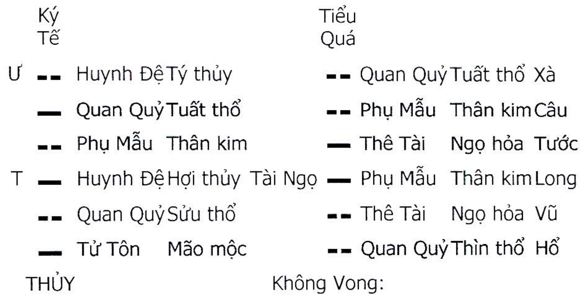
    - **Hình này chứng minh điều gì**
      - Quẻ chứng minh tình trạng phong thủy và ảnh hưởng cát hung tương ứng với quái tượng Sơ đồ quẻ Thủy Hỏa Ký Tế biến Lôi Sơn Tiểu Quá.
    - **Từ đâu mà thấy được**
      - Căn cứ vào hào vị, lục thân, can chi sinh khắc, tuần không và hào động biến trong quẻ.
- **Kết quả ứng nghiệm thực tế:**
  - Là nhà hai lầu.
  - Hào 2 Sửu thổ là Mộ khố của Phụ Mẫu, hào 2 là nhà, Phụ Mẫu là xe, Mộ khố là gara, nhà có chứa gara.
  - **Phản hồi:** Đúng.
  - Gara được gộp chung với nhà.
  - Tử Tôn Mão mộc lâm Bạch Hổ phát động sinh Thê Tài, Bạch Hổ chủ chữa trị, thu nhập có liên quan đến y dược.
  - Hào sơ cũng có thể đại diện cho khách hàng đem lại của cải cho mình, động hóa Quan Quỷ, bị Quan Quỷ Tuất thổ lâm Câu Trần hợp trú, trong khách hàng có người tử vong bởi vì không thể chữa khỏi bệnh tật.
  - **Phản hồi:** Về phán đoán chữa trị, công việc của tôi là trị liệu điều chỉnh thể hình.
  - Trong số bệnh nhân, có người già trên 80 tuổi, có người bị ung thư.
  - Có người đến rồi không thấy quay lại, đoán chừng là đã chết.
  - Hào 3 Nguyệt phá, hào 3 là cửa, lâm Thanh Long chủ mới, trên cửa có vết hư hại mới xuất hiện.
  - **Phản hồi:** Trước mắt vẫn chưa phát hiện.
  - Hào 5 Quan Quỷ Tuất thổ lâm Câu Trần phát động khiến Thê Tài nhập Mộ, Quan Quỷ chủ tu tạo, đã từng sửa chữa nhà, tốn kém một chút tiền.
  - **Phản hồi:** Đã thay đổi mái ngói của căn nhà, tốn một khoản tiền.
  - Thê Tài vượng tướng phục tàng dưới hào Thế, hào Thế bị Tài lâm Nguyệt xung phá, mặc dù không quá giàu có nhưng vẫn có thể từ từ tích lũy được tiền vốn.
  - **Phản hồi:** Hiện nay, tình hình doanh nghiệp của tôi vẫn coi như tạm được.

#### Ví dụ 41: Ngày Kỷ Tị tháng Bính Ngọ năm Nhâm Ngọ, nữ đoán phong thủy nhà cửa, được Hỏa ...

- **Luận giải quái tượng phong thủy:**
  - **Hình 65.** Quẻ Hỏa Lôi Phệ Hạp biến Chấn Vi Lôi
    - 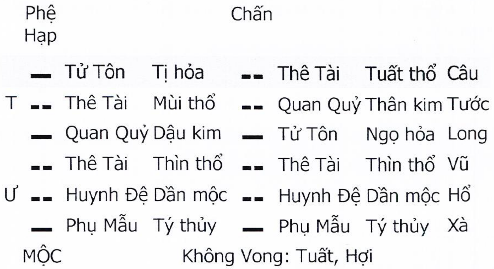
    - **Hình này chứng minh điều gì**
      - Quẻ chứng minh tình trạng phong thủy và ảnh hưởng cát hung tương ứng với quái tượng Quẻ Hỏa Lôi Phệ Hạp biến Chấn Vi Lôi.
    - **Từ đâu mà thấy được**
      - Căn cứ vào hào vị, lục thân, can chi sinh khắc, tuần không và hào động biến trong quẻ.
- **Kết quả ứng nghiệm thực tế:**
  - Về cơ bản thì tôi không thích ăn đồ ngọt, cũng không thích ăn bánh, có điều là thích ăn sô cô la.
  - Hào Ứng lâm hào 2, Ứng là người khác, hào 2 là nhà ở, đây là Ứng bay vào nhà, nhà này là nhà thuê.
  - **Phản hồi:** Đúng.
  - Là nhà thuê.
  - Phụ Mẫu Tý thủy Nguyệt phá hưu tù, là nhà cũ.
  - **Phản hồi:** Đúng.
  - Đã hơn 30 năm.
  - Tử Tôn Tị hỏa gần hào Thế phát động nhập Mộ, hào Thế là nơi ở của mình, Tử Tôn là tăng đạo, Mộ khố của nó là miếu thờ, lại hào 6 là chùa chiền, gần nơi ở có miếu thờ.
  - **Phản hồi:** Lân cận có rất nhiều miếu thờ.
  - Hơn nữa mỗi tháng đều có lễ hội.
  - Hào Thế tại hào 5 lâm Dịch Mã (từ Nhật Nguyệt luận Dịch Mã, Tị Dậu Sửu thì Dịch Mã tại Hợi Mão Mùi), bản thân thích đi lại, chỗ ở hay thay đổi.
  - **Phản hồi:** Tôi là người khá lười, nhưng vẫn thích đi, đi cho đến khi người nóng lên là dừng.
  - Tôi thích thay đổi chỗ ở, đến nay đã từng chuyển nhà nhiều lần.
  - Thê Tài lưỡng hiện, Nhật Nguyệt đến sinh, Nguyên thần phát động lại hóa Thê Tài là quá vượng, tài vận không thuận lợi.
  - **Phản hồi:** Thường xuyên thiếu tiền.

#### Ví dụ 42: Ngày Canh Ngọ tháng Bính Ngọ năm Nhâm Ngọ, nữ đoán nhà ở, được Đoài Vi Trạch ...

- **Luận giải quái tượng phong thủy:**
  - **Hình 66.** Sơ đồ quẻ Đoài Vi Trạch biến Hỏa Thiên Đại Hữu
    - 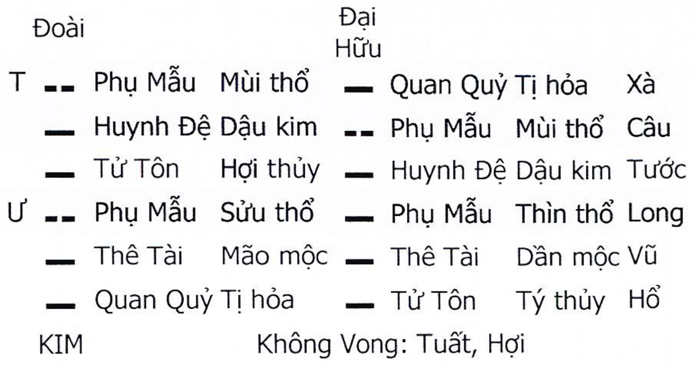
    - **Hình này chứng minh điều gì**
      - Quẻ chứng minh tình trạng phong thủy và ảnh hưởng cát hung tương ứng với quái tượng Sơ đồ quẻ Đoài Vi Trạch biến Hỏa Thiên Đại Hữu.
    - **Từ đâu mà thấy được**
      - Căn cứ vào hào vị, lục thân, can chi sinh khắc, tuần không và hào động biến trong quẻ.
- **Kết quả ứng nghiệm thực tế:**
  - Căn nhà được làm bằng gỗ, đã có 60 năm, mái nhà được lợp bằng loại ngói rất nặng.
  - Ngoài ra còn có giếng nước.
  - Hào 2 lâm Huyền Vũ, Huyền Vũ chủ tối tăm, nhập Mộ tại Phụ Mẫu Mùi thổ, Phụ Mẫu cũng chủ nhà cửa, Mùi thổ tại hào 6 chủ cao, nhà cửa xung quanh khá cao.
  - Do đó, căn nhà của mình đã bị bao phủ, ánh sáng mặt trời không thể chiếu vào.
  - **Phản hồi:** Đúng.
  - Nhà tôi ở trung tâm thành phố, gần đây có nhiều cao ốc liên tục mọc lên, khiến cho ánh sáng bị ảnh hưởng.
  - Phụ Mẫu Mùi thổ tại hào 6 trì Thế, hào 6 là trưởng bối, Mùi thổ là Mộ khố của Thê Tài, trước đây trưởng bối tương đối có tiền.
  - **Phản hồi:** Căn nhà này do bà nội tôi tự tay xây nên, ngày trước có xưởng làm bánh, đất đai cũng rất nhiều, về sau đều bị thanh lý hết.
  - Hào 5 phát động xung hào 2, hào 5 là đường đi, có đường lớn gần nhà ảnh hưởng đến tài vận.
  - **Phản hồi:** Trước nhà là phố cổ lưu thông xe buýt, lân cận có đường sắt cao tốc.
  - Phụ Mẫu Sửu thổ động hóa Tiến thần, lâm Thanh Long chủ mới, sắp xây nhà mới để chuyển qua hả?
  - **Phản hồi:** Nhà cũ, lại sợ động đất, xung quanh thì cao ốc không ngừng mọc lên.
  - Đúng là tôi đang có ý này.

#### Ví dụ 43: Ngày Nhâm Thân tháng Ngọ, nữ đoán phong thủy nhà cửa, được Thiên Hỏa Đồng Nhâ...

- **Luận giải quái tượng phong thủy:**
  - **Hình 67.** Sơ đồ quẻ Thiên Hỏa Đồng Nhân biến Sơn Thiên Đại Súc
    - 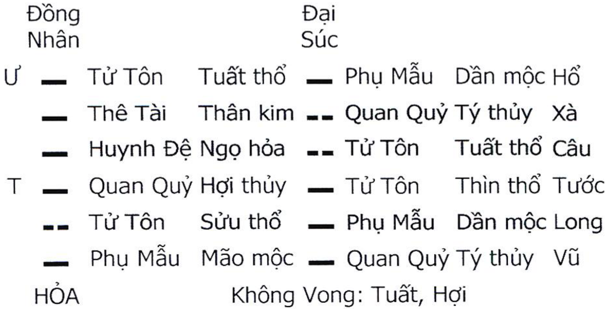
    - **Hình này chứng minh điều gì**
      - Quẻ chứng minh tình trạng phong thủy và ảnh hưởng cát hung tương ứng với quái tượng Sơ đồ quẻ Thiên Hỏa Đồng Nhân biến Sơn Thiên Đại Súc.
    - **Từ đâu mà thấy được**
      - Căn cứ vào hào vị, lục thân, can chi sinh khắc, tuần không và hào động biến trong quẻ.
  - **Hình 68.** Sơ đồ quẻ Thiên Trạch Lý biến Phong Thiên Tiểu Súc
    - 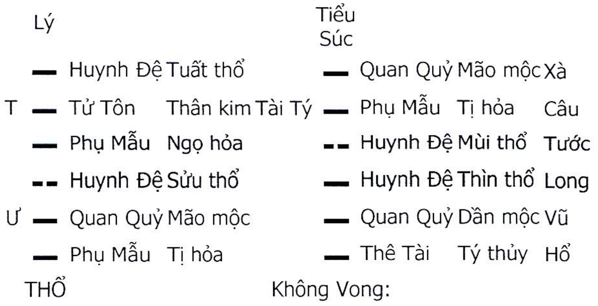
    - **Hình này chứng minh điều gì**
      - Quẻ chứng minh tình trạng phong thủy và ảnh hưởng cát hung tương ứng với quái tượng Sơ đồ quẻ Thiên Trạch Lý biến Phong Thiên Tiểu Súc.
    - **Từ đâu mà thấy được**
      - Căn cứ vào hào vị, lục thân, can chi sinh khắc, tuần không và hào động biến trong quẻ.
- **Kết quả ứng nghiệm thực tế:**
  - Cha mẹ tôi đã xây một căn nhà trệt cách đây 50 năm, và xây một căn nhà hai lầu cách đây 15 năm.
  - 30 năm trước, họ đã mua mảnh đất bên cạnh và xây một căn nhà ba lầu.
  - Cách đây 10 năm, họ đã cải tạo căn nhà trệt và căn nhà hai lầu thành nhà ba lầu.
  - Hiện nay gia đình tôi đang sống rất thoải mái.
  - Hào 4 lâm Huynh Đệ là cửa sổ, Ngọ hỏa vượng tướng, hỏa chủ ánh sáng, ánh sáng chiếu dồi dào.
  - **Phản hồi:** Cửa sổ rất rộng, căn nhà rất sáng sủa.
  - Huynh Đệ phát động sinh Tử Tôn, Tử Tôn phát động sinh Thê Tài, Thê Tài phát động sinh hào Thế, Thê Tài lâm Nhật vượng tướng, sinh sinh không ngừng, nguồn tiền liên tục, tài vận tốt đẹp.
  - Tuy nhiên, hào Thế Không Vong không được Thê Tài đến sinh, tình trạng hiện tại chỉ là bình thường.
  - **Phản hồi:** Tài sản của gia đình tôi đang tăng lên.
  - Có điều là cá nhân tôi kinh doanh ví da, trước mắt không quá thuận lợi.
  - Hào Thế lâm thủy Không Vong không được Nguyên thần đến sinh, lâm Chu Tước chủ ẩm thực, thủy là nước, bản thân không quá thích uống nước.
  - **Phản hồi:** Uống nước rất ít.
  - ### Ví dụ 44
  - Ngày Tân Mùi tháng Canh Dần năm Bính Tuất, nữ đoán phong thủy nhà cửa, được Thiên Trạch Lý biến Phong Thiên Tiểu Súc.
  - THỔ Không Vong:
  - Phụ Mẫu là nhà cửa, hào Thế là chủ thể, đều phải xem cả hai.
  - Thế lâm Tử Tôn Nguyệt phá, Tử Tôn là vui vẻ, Nguyệt phá chính là không vui vẻ, chứng tỏ bản thân rất không hài lòng khi ở trong căn nhà này.
  - Thế bị Nguyệt Quan Quỷ xung phá, Quỷ trong quẻ lâm hào 2, hào 2 là hào vị phu thê, là chồng khiến cho mình không vui.
  - Phụ Mẫu lâm Chu Tước phát động khắc Thế, Chu Tước chủ cãi cọ, hợp Huynh Đệ (hào biến), càng chủ cãi cọ, khắc Thế Tử Tôn, thường xuyên cãi lộn, tâm trạng không tốt.
  - Thế lâm Câu Trần, Câu Trần là sưng trướng, trong lòng đang vướng mắc vấn đề.
  - Hào 4 là cửa sổ, gian hào càng là như vậy, hợp Nhật Huynh Đệ, lại hợp hào biến Huynh Đệ, Phụ Mẫu chủ nhà cửa, nhà có nhiều cửa sổ, lâm hỏa được Nguyệt sinh, hỏa là ánh sáng, cửa sổ chiếu sáng tốt.
  - Tài không được Nguyệt sinh phù, Nhật khắc, lại Huynh Đệ trong quẻ phát động, tài vận không tốt.
  - Tài phục dưới Thế, bản thân giữ tiền rất chặt, không cho tiêu xài lung tung.
  - Hào 3 là cửa, khắc hợp hào Tài, Nhật Huynh Đệ xung hào 3, đối diện nhà mình có cửa lớn của căn nhà khác.
  - Bởi vì Nhật Huynh Đệ không ở trong quẻ, vì vậy là cửa nhà của gia đình khác.
  - Hào 6 Huynh Đệ là tường, hàng rào, lâm Xà mà Không, hàng rào không thẳng và có khe hở.
  - Tử Tôn lâm hào 5 bị Phụ Mẫu Ngọ hỏa đến khắc, là Nguyệt phá, hào 5 là đường đi, đề phòng tháng Ngọ hoặc tháng Thân trẻ con có tai nạn xe cộ.
  - Nếu như không có tai nạn xe cộ thì có việc phá tài.
  - Thế nhập Huynh Đệ Mộ, Huynh Đệ chủ bạn bè, nhập Mộ chủ say mê, Thanh Long chủ vui chơi giải trí, lại chủ lễ tiết, chứng tỏ thích kết giao bằng hữu.
  - Bởi vì phong thủy có chút vấn đề cho nên thỉnh cầu hóa giải.
  - Thân kim lâm Thế Nguyệt phá, lại nhập Mộ, phá là bất lợi, nhập Mộ là thấp, Thân tương ứng với Tây Nam.
  - Chứng tỏ ở phía Tây Nam tương đối thấp.
  - Vì vậy tại hướng Tây Nam trong sân để một tảng đá.
  - Bởi vì kim là đá, nhằm bổ sung cho khí thiếu ở phía Tây Nam.
  - Tháng Dậu phản hồi, trước đây cô ta và chồng ly thân, sau khi hóa giải thì hai người đã quay lại gần gũi với nhau.
  - Ngày Giáp Thân tháng Ngọ, chiếc xe đạp của con trai bị xe lớn đè bẹp, nhưng đứa con vẫn bình an, không bị thương.
  - Bản thân ở tháng Thân đầu tư tổn thất khoảng 15000 nguyên.
  - Những phán đoán khác về cơ bản phù hợp với tình hình thực tế.

#### Ví dụ 45: Ngày Quý Mão tháng Mùi, nữ đoán phong thủy nhà, được Trạch Lôi Tùy biến Thủy ...

- **Bối cảnh và thông tin quẻ:**
  - Ngày Quý Mão tháng Mùi, nữ đoán phong thủy nhà, được Trạch Lôi Tùy biến Thủy Sơn Kiển.
  - MỘC Không Vong: Thìn, Tị
- **Luận giải quái tượng phong thủy:**
  - **Hình 69.** Sơ đồ quẻ Trạch Lôi Tùy biến Thủy Sơn Kiển
    - 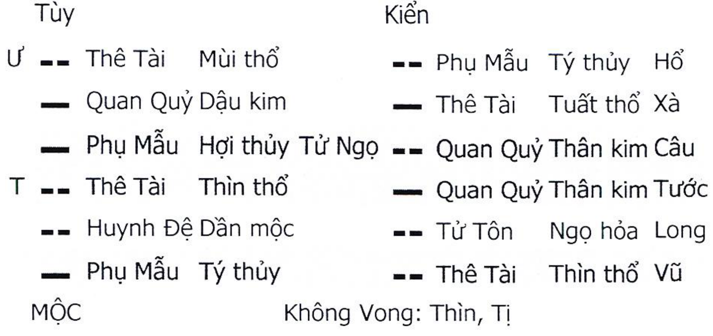
    - **Hình này chứng minh điều gì**
      - Thê Tài Thìn thổ trì Thế tại hào 3 gặp Không, động mà hóa Quỷ, hào 3 là giường, Không Vong biểu thị ngủ không ngon giấc. Hóa Quỷ gặp quỷ, hào sơ Phụ Mẫu lâm Huyền Vũ động, trong nhà âm khí nặng nề.
    - **Từ đâu mà thấy được**
      - Thê Tài Thìn thổ trì Thế tại hào 3 gặp Không, động mà hóa Quỷ, hào 3 là giường, Không Vong biểu thị ngủ không ngon giấc. Hóa Quỷ gặp quỷ, hào sơ Phụ Mẫu lâm Huyền Vũ động, trong nhà âm khí nặng nề.
- **Diễn tiến phân tích và suy luận chi tiết:**
  - Thê Tài Thìn thổ trì Thế tại hào 3 gặp Không, động mà hóa Quỷ, hào 3 là giường, Không Vong biểu thị ngủ không ngon giấc.
  - Hóa Quỷ gặp quỷ, hào sơ Phụ Mẫu lâm Huyền Vũ động, trong nhà âm khí nặng nề.
  - Hào 5 Quan Quỷ Dậu kim lâm Đằng Xà ám động, Đằng Xà là bất an, kỳ dị, hào 5 là đường đi, kim chủ âm thanh, ám động biểu thị không công khai, không nhìn thấy.
  - Hào 4 Hợi thủy động hóa Quỷ, thủy biểu thị ban đêm, chứng tỏ ban đêm mới xuất hiện.
  - Tổng hợp lại, phán đoán là ban đêm trong nhà có tiếng bước chân.
- **Kết quả ứng nghiệm thực tế:**
  - Đúng là ban đêm thường xuyên nghe thấy tiếng bước chân, rất sợ hãi, không thể ngủ được, sau một thời gian dài đã trở thành chứng mất ngủ.

#### Ví dụ 46: Ngày Đinh Hợi tháng Ngọ, nam đoán phong thủy nhà cửa, được Phong Trạch Trung ...

- **Bối cảnh và thông tin quẻ:**
  - Ngày Đinh Hợi tháng Ngọ, nam đoán phong thủy nhà cửa, được Phong Trạch Trung Phu biến Thủy Trạch Tiết.
  - THỔ Không Vong: Ngọ, Mùi
  - Lấy Phụ Mẫu và hào 2 để phán đoán, đồng thời phải xem tổ hợp biến hóa trong quẻ.
  - Phụ Mẫu Ngọ hỏa lâm Nguyệt hợp Thế, nơi ở là nhà lầu.
  - Thực tế là sống trong một chung cư cao tới 14 tầng.
  - Ứng lâm Phụ Mẫu ám động sinh Thế, Phụ Mẫu là nhà, Ứng là người khác, đây là nhà thuê.
  - (Nghiệm.)
  - Huynh Đệ trì Thế Không, lại trạch khắc hào Thế, ở đây không yên tâm.
  - (Nghiệm.)
  - Hào Tài Tý thủy Nguyệt phá, Tử tại độc phát, tài vận không tốt.
  - (Nghiệm.)
  - Phụ Mẫu cũng tại hào 5, hào 5 là đường đi, nhà gần đường lớn.
  - (Nghiệm.)
  - Hào 6 là hàng xóm, lâm hào Quỷ động mà khắc Thế, Thế là Quỷ khố, ảnh hưởng lớn đến bản thân, ảnh hưởng đến việc nghỉ ngơi.
  - Tuy nhiên, có hai Phụ Mẫu Tị hỏa ám động tạo thành liên tục tương sinh, vì vậy sẽ không làm hại quá lớn.
  - Trên thực tế là tuần trước có một hàng xóm nhảy lầu tự sát, trong lòng anh ta có phần sợ hãi, do đó mà hỏi phong thủy căn nhà.
  - ---
  - # Part 9 (Pages 161-180)
- **Luận giải quái tượng phong thủy:**
  - **Hình 70.** Sơ đồ quẻ Phong Trạch Trung Phu biến Thủy Trạch Tiết
    - 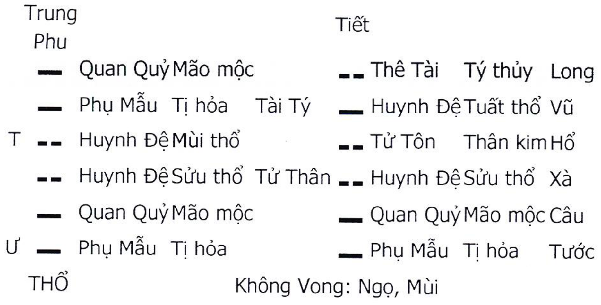
    - **Hình này chứng minh điều gì**
      - **Ví dụ 46:** Ngày Đinh Hợi tháng Ngọ, nam đoán phong thủy nhà cửa, được Phong Trạch Trung Phu biến Thủy Trạch Tiết. Lấy Phụ Mẫu và hào 2 để phán đoán, đồng thời phải xem tổ hợp biến hóa trong quẻ.
    - **Từ đâu mà thấy được**
      - THỔ Không Vong: Ngọ, Mùi Lấy Phụ Mẫu và hào 2 để phán đoán, đồng thời phải xem tổ hợp biến hóa trong quẻ.
- **Diễn tiến phân tích và suy luận chi tiết:**
  - **Ví dụ 46:** Ngày Đinh Hợi tháng Ngọ, nam đoán phong thủy nhà cửa, được Phong Trạch Trung Phu biến Thủy Trạch Tiết.
  - THỔ Không Vong: Ngọ, Mùi
  - Lấy Phụ Mẫu và hào 2 để phán đoán, đồng thời phải xem tổ hợp biến hóa trong quẻ.
  - Phụ Mẫu Ngọ hỏa lâm Nguyệt hợp Thế, nơi ở là nhà lầu.
  - Thực tế là sống trong một chung cư cao tới 14 tầng.
  - Ứng lâm Phụ Mẫu ám động sinh Thế, Phụ Mẫu là nhà, Ứng là người khác, đây là nhà thuê.
  - (Nghiệm.)
  - Huynh Đệ trì Thế Không, lại trạch khắc hào Thế, ở đây không yên tâm.
  - (Nghiệm.)
  - Hào Tài Tý thủy Nguyệt phá, Tử tại độc phát, tài vận không tốt.
  - (Nghiệm.)
  - Phụ Mẫu cũng tại hào 5, hào 5 là đường đi, nhà gần đường lớn.
  - (Nghiệm.)
  - Hào 6 là hàng xóm, lâm hào Quỷ động mà khắc Thế, Thế là Quỷ khố, ảnh hưởng lớn đến bản thân, ảnh hưởng đến việc nghỉ ngơi.
  - Tuy nhiên, có hai Phụ Mẫu Tị hỏa ám động tạo thành liên tục tương sinh, vì vậy sẽ không làm hại quá lớn.
  - Trên thực tế là tuần trước có một hàng xóm nhảy lầu tự sát, trong lòng anh ta có phần sợ hãi, do đó mà hỏi phong thủy căn nhà.
  - ---
  - # Part 9 (Pages 161-180)

#### Ví dụ 47: Ngày Canh Dần tháng Dần, nữ đoán phong thủy nhà cửa, được Thủy Phong Tỉnh biế...

- **Luận giải quái tượng phong thủy:**
  - **Hình 71.** Quẻ Thủy Phong Tỉnh biến Trạch Phong Đại Quá
    - 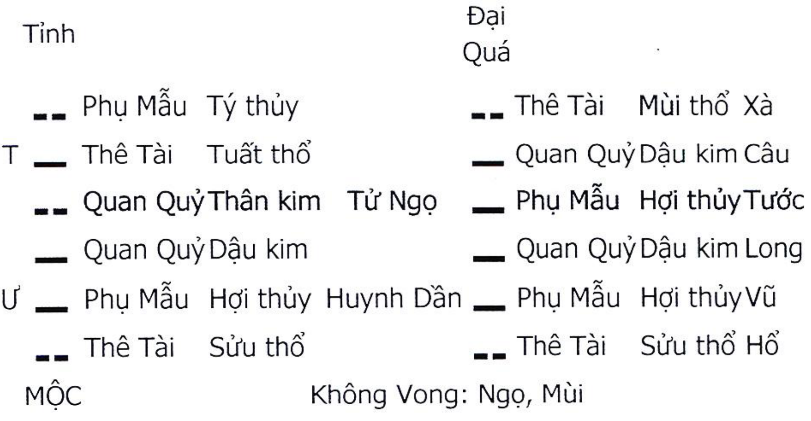
    - **Hình này chứng minh điều gì**
      - ### Ví dụ 47: Ngày Canh Dần tháng Dần, nữ đoán phong thủy nhà cửa, được Thủy Phong Tỉnh biến Trạch Phong Đại Quá. Phụ Mẫu là nhà, Phụ Mẫu Hợi thủy lâm hào Ứng, Ứng là người khác, đây là nhà thuê.
    - **Từ đâu mà thấy được**
      - **MỘC** Không Vong: Ngọ, Mùi Phụ Mẫu là nhà, Phụ Mẫu Hợi thủy lâm hào Ứng, Ứng là người khác, đây là nhà thuê.
- **Diễn tiến phân tích và suy luận chi tiết:**
  - ### Ví dụ 47: Ngày Canh Dần tháng Dần, nữ đoán phong thủy nhà cửa, được Thủy Phong Tỉnh biến Trạch Phong Đại Quá.
  - **MỘC** Không Vong: Ngọ, Mùi
  - Phụ Mẫu là nhà, Phụ Mẫu Hợi thủy lâm hào Ứng, Ứng là người khác, đây là nhà thuê.
  - (Thực tế là nhà thuê.)
  - Nhật Nguyệt hợp hào Phụ Mẫu, là nhà lầu.
  - (Thực tế là nhà hai lầu.)
  - Hào Thế là nơi ở của mình, Nguyên thần phục tàng lại Không không sinh Thế, Nguyên thần là hỏa, có thể chủ ánh sáng, chứng tỏ có vấn đề về ánh sáng.
  - Lại kết hợp hào 2 là hào trạch lâm Huyền Vũ, Huyền Vũ chủ tối tăm, cũng biểu thị trong nhà có vấn đề về ánh sáng.
  - (Nghiệm.)
  - Nhật Nguyệt hợp hào Phụ Mẫu, hợp là đặt cạnh nhau, chứng tỏ có rất nhiều nhà cửa liền kề.
  - Hào 2 là trạch, cũng là sân, Nhật Nguyệt là mộc hợp đến hào 2, trong sân có rất nhiều hoa cỏ cây cối.
  - (Nghiệm.)
  - Phụ Mẫu là thủy lại lâm Huyền Vũ tại hào 2, thủy và Huyền Vũ đều chủ thấp khí, chứng tỏ căn nhà tương đối ẩm thấp.
  - Huynh Đệ là cửa, hợp hào 2 Phụ Mẫu càng là cửa, Dần mộc là Đông Bắc, cửa của căn nhà tại Đông Bắc.
  - (Nghiệm.)
  - Hào 4 là cửa sổ, Nguyệt phá Nhật phá, cửa sổ phá lâm Chu Tước chủ âm thanh, kim cũng chủ âm thanh, bị mộc xung phá, mộc chủ gió, cửa sổ phá, bị gió thổi, phát ra tiếng động.
  - (Nghiệm.)
  - Quan lâm Chu Tước động hóa Phụ Mẫu chủ kiện tụng cãi cọ, do cửa sổ thoát khí khiến khí trường phong thủy thay đổi, từ đó dẫn tới kiện tụng.
  - (Trên thực tế là bởi vì đất đai mà kiện tụng.)
  - Thế Tuất thổ tương ứng với Tây Bắc, Tài chủ ẩm thực, lại lâm hỏa khố, lâm Câu Trần chủ kiến trúc, đoán là hướng Tây Bắc có xây phòng bếp.
  - Phong thủy ở nơi này có vấn đề, gây bất lợi cho tài vận.
  - (Phản hồi: Phòng bếp tại Tây Bắc, bản thân làm cơm ở nhà và giao cho người ta để kiếm tiền, tuy nhiên tài vận không tốt, vất vả nhưng không thu lại được bao nhiêu.)
  - Hào 6 là bàn thờ, lâm Xà, Bệnh ở Nhật Nguyệt, Nguyên thần lại Nguyệt phá Nhật phá, bàn thờ có phát sinh hiện tượng quái dị.
  - (Trên thực tế là có con rắn leo vào bàn thờ không chịu đi, cô lại không dám đuổi.)
  - Tổng hợp lại, phán đoán là phong thủy nhà này không tốt, bất lợi cho tài vận, lại dễ nảy sinh cãi cọ khiến cho vợ chồng bất hòa.
  - Quẻ biến du hồn, bản thân rất muốn chuyển ra khỏi căn nhà này.
  - Dự đoán hoàn toàn phù hợp với tình hình thực tế.

#### Ví dụ 48: Ngày Canh Ngọ tháng Tuất, nữ đoán phong thủy nhà cửa, được Lôi Hỏa Phong biến...

- **Luận giải quái tượng phong thủy:**
  - **Hình 72.** Sơ đồ quẻ Lôi Hỏa Phong biến Hỏa Thiên Đại Hữu
    - 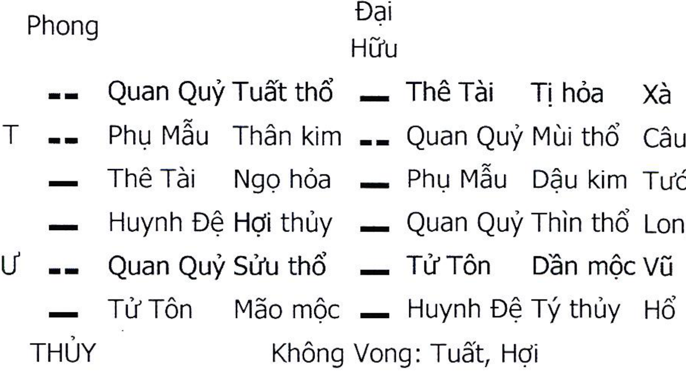
    - **Hình này chứng minh điều gì**
      - ### Ví dụ 48: Ngày Canh Ngọ tháng Tuất, nữ đoán phong thủy nhà cửa, được Lôi Hỏa Phong biến Hỏa Thiên Đại Hữu. Lấy Phụ Mẫu là nhà, hào 2 hào trạch thủ tượng, xem tình hình cát hung của Thế.
    - **Từ đâu mà thấy được**
      - Không Vong: Tuất, Hợi Lấy Phụ Mẫu là nhà, hào 2 hào trạch thủ tượng, xem tình hình cát hung của Thế.
- **Diễn tiến phân tích và suy luận chi tiết:**
  - ### Ví dụ 48: Ngày Canh Ngọ tháng Tuất, nữ đoán phong thủy nhà cửa, được Lôi Hỏa Phong biến Hỏa Thiên Đại Hữu.
  - THỦY
  - Không Vong: Tuất, Hợi
  - Lấy Phụ Mẫu là nhà, hào 2 hào trạch thủ tượng, xem tình hình cát hung của Thế.
  - Phụ Mẫu được Nguyệt sinh Nhật khắc suy vượng tương đương, nhưng được hai thổ động mà đến sinh, thì thành vượng tướng, chứng tỏ căn nhà rộng rãi.
  - Hào 6 là mái nhà, Không Vong là mái nhà lõm xuống.
  - Hào 2 thổ động hóa mộc, là thông tin xây dựng công trình, chứng tỏ căn nhà đã từng tu sửa.
  - Phụ Mẫu lâm hào 5, hào 5 là đường đi, nhà tại ven đường.
  - Hào Thế nhập Mộ ở hào 2, hào 2 là trạch, bản thân ít khi ra ngoài.
  - Mộ khố lâm Huyền Vũ, Huyền Vũ chủ u uất, bản thân tự khép kín mình, tâm trạng không tốt.
  - Nguyên thần tại hào 6 Không mà không sinh hào Thế, lâm Đằng Xà, Đằng Xà chủ mộng, chứng tỏ nghỉ ngơi không hiệu quả, mơ nhiều.
  - Hào 6 là đầu, đầu bị ảnh hưởng, dẫn tới đau đầu.
  - Hào 2 là Nguyên thần, hóa hồi đầu khắc, lâm Huyền Vũ, hào 2 là tử cung, Huyền Vũ chủ nỗi niềm khó nói, chứng tỏ có bệnh phụ khoa.
  - Thế lâm Câu Trần, Câu Trần chủ khối u, vì vậy có u xơ tử cung, đề nghị đến bệnh viện kiểm tra.
  - Tất cả đúng như phán đoán, theo đề nghị của tôi đến bệnh viện kiểm tra, ở ngày Kỷ Sửu phát hiện u xơ tử cung, đã chấp nhận điều trị bằng phẫu thuật.

#### Ví dụ 49: Ngày Đinh Dậu tháng Tý, nữ đoán phong thủy nhà cửa, được Sơn Hỏa Bí biến Cấn ...

- **Luận giải quái tượng phong thủy:**
  - **Hình 73.** Sơ đồ quẻ Sơn Hỏa Bí biến Cấn Vi Sơn
    - 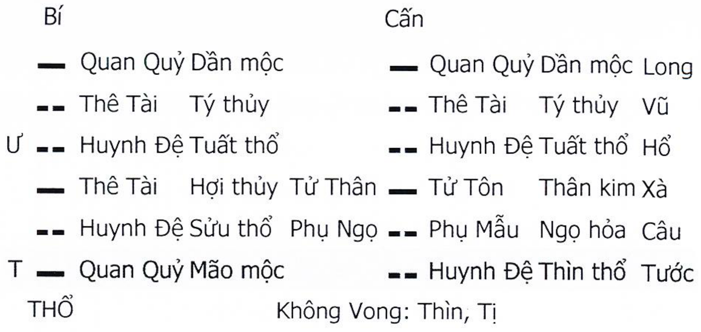
    - **Hình này chứng minh điều gì**
      - Quỷ lâm Chu Tước động là kiện tụng cãi cọ, Phụ Mẫu nhập hào Ứng Mộ, Ứng là người khác, tại hào 2 là trạch, đây là nhà thuê. Quỷ động khắc Huynh Đệ, bất lợi cho anh em.
    - **Từ đâu mà thấy được**
      - Quan Quỷ trì Thế độc phát, Quỷ lâm Thế khởi hành bất an, nơi ở nhất định không thoải mái, không vui vẻ. Quỷ lâm Chu Tước động là kiện tụng cãi cọ, Phụ Mẫu nhập hào Ứng Mộ, Ứng là người khác, tại hà...
- **Diễn tiến phân tích và suy luận chi tiết:**
  - Quan Quỷ trì Thế độc phát, Quỷ lâm Thế khởi hành bất an, nơi ở nhất định không thoải mái, không vui vẻ.
  - Quỷ lâm Chu Tước động là kiện tụng cãi cọ, Phụ Mẫu nhập hào Ứng Mộ, Ứng là người khác, tại hào 2 là trạch, đây là nhà thuê.
  - Thế lâm Quan động hóa Không, chồng thường xuyên đi vắng, bản thân lẻ loi một mình.
  - Quỷ động khắc Huynh Đệ, bất lợi cho anh em.
- **Kết quả ứng nghiệm thực tế:**
  - Đúng là bản thân đang có kiện tụng.
  - Đây là căn nhà đi thuê, vừa vào ở thì gặp nhiều chuyện không suôn sẻ, anh trai chết, bản thân lại có kiện tụng, chồng thì thường xuyên đi công tác vắng nhà.

#### Ví dụ 50: Ngày Mậu Thân tháng Tị, nam đoán phong thủy nhà cửa, được Sơn Hỏa Bí biến Địa...

- **Luận giải quái tượng phong thủy:**
  - **Hình 74.** Sơ đồ quẻ Sơn Hỏa Bí biến Địa Sơn Khiêm
    - 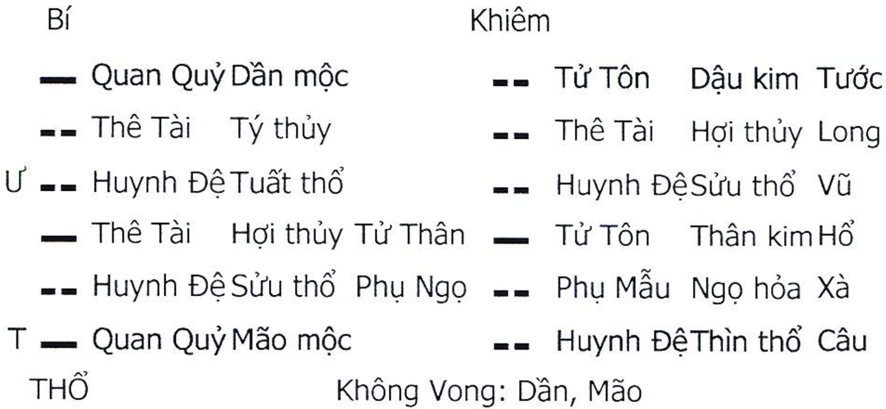
    - **Hình này chứng minh điều gì**
      - Xem phong thủy là một phán đoán có tính tổng hợp. Nhưng lâm Đằng Xà, Đằng Xà chủ chật hẹp, do đó trong nhà cũng không quá rộng rãi.
    - **Từ đâu mà thấy được**
      - Nhưng lâm Đằng Xà, Đằng Xà chủ chật hẹp, do đó trong nhà cũng không quá rộng rãi. Phụ Mẫu lâm hỏa, hỏa chủ số 2, ở tại tầng 2.
- **Diễn tiến phân tích và suy luận chi tiết:**
  - Xem phong thủy là một phán đoán có tính tổng hợp.
  - Phụ Mẫu phục tàng, nhưng được Nguyệt tỉ phù là vượng, vì vậy căn nhà không phải là quá nhỏ.
  - Nhưng lâm Đằng Xà, Đằng Xà chủ chật hẹp, do đó trong nhà cũng không quá rộng rãi.
  - Quẻ lục hợp, thông thường là nhà lầu.
  - Phụ Mẫu lâm hỏa, hỏa chủ số 2, ở tại tầng 2.
  - Hào 3 là cửa, Dần mộc động đến hợp, Dần chủ Đông Bắc, vì vậy cửa tại Đông Bắc.
  - Thế là bản thân, động mà hợp Tuất thổ, Tuất là Tây Bắc, bản thân ở trong căn phòng ở hướng Tây Bắc.
  - Hào 3 là cửa, Nguyệt phá, chủ cửa có khe hở, thoát khí.
  - Quẻ này Tài lâm hào 3 bị Phụ Mẫu xung phá, Phụ Mẫu chủ kiến trúc, chứng tỏ đối diện có kiến trúc xung cửa, ảnh hưởng đến tài vận.
  - Tài mặc dù sinh Thế, nhưng Thế Không hóa ra Huynh Đệ, Không không được sinh, tiền vào ít.
  - Mà hóa ra Huynh Đệ, tiền đến lại đi, không tích trữ được tiền.
  - Hào sơ lâm Câu Trần Mão mộc động hóa Thìn thổ, hào sơ là nền nhà, Câu Trần là xây dựng, mộc hóa thổ chủ xây dựng công trình, chủ đã từng cải tạo nền nhà.
  - Nói chung, phong thủy của căn nhà này không tốt cho tài vận.
- **Kết quả ứng nghiệm thực tế:**
  - Thực tế là ở tại tầng 2, kiếm không được bao nhiêu tiền, thường xuyên vay mượn để sống.

#### Ví dụ 51: Ngày Nhâm Thìn tháng Ất Hợi năm Thân, nữ hỏi phong thủy của căn nhà có ảnh hư...

- **Luận giải quái tượng phong thủy:**
  - **Hình 75.** Sơ đồ quẻ Thiên Địa Bĩ biến Thiên Lôi Vô Vọng
    - 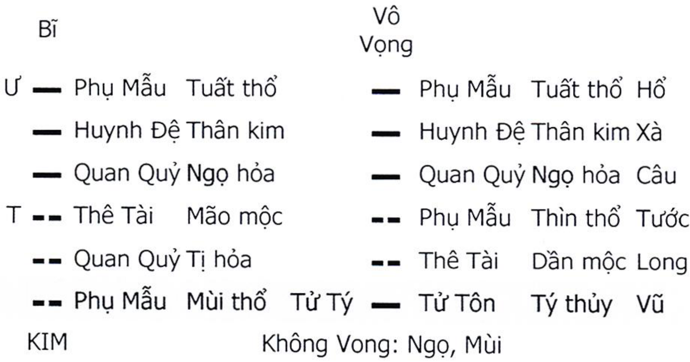
    - **Hình này chứng minh điều gì**
      - Quẻ xem phong thủy thì cần phải phán đoán tổng hợp, nhưng đối phương hỏi ảnh hưởng đối với hôn nhân, vì vậy trọng điểm chính là xem Quan Quỷ. Quẻ này Quan Quỷ tại hào 2 Nguyệt phá, lại Mộ ở hào 6, ...
    - **Từ đâu mà thấy được**
      - Quẻ này Quan Quỷ tại hào 2 Nguyệt phá, lại Mộ ở hào 6, chứng tỏ hôn nhân không tốt đẹp, ảnh hưởng của phong thủy là rất lớn. Mặc dù Quan nhập hào trạch, nhưng Nguyệt phá mà nhập Mộ, nhất định là th...
- **Diễn tiến phân tích và suy luận chi tiết:**
  - Quẻ xem phong thủy thì cần phải phán đoán tổng hợp, nhưng đối phương hỏi ảnh hưởng đối với hôn nhân, vì vậy trọng điểm chính là xem Quan Quỷ.
  - Quẻ này Quan Quỷ tại hào 2 Nguyệt phá, lại Mộ ở hào 6, chứng tỏ hôn nhân không tốt đẹp, ảnh hưởng của phong thủy là rất lớn.
  - Mặc dù Quan nhập hào trạch, nhưng Nguyệt phá mà nhập Mộ, nhất định là thông tin ly dị.
  - Phụ Mẫu Mùi thổ độc phát, hào Thế lâm Tài nhập Mộ, biểu thị không chỉ là vấn đề hôn nhân, hơn nữa còn ảnh hưởng đến tài vận, thiếu tiền.
  - Ở nhà này thì kinh tế túng thiếu.
  - Hào Ứng ám động hợp Thế Tài là có người đòi tiền, nhất định là có mắc nợ bên ngoài.
  - Phụ Mẫu phát động, biểu thị căn nhà phải có biến đổi, Không hóa lục xung chủ tán, biểu thị ở nhà này không lâu dài, phải dọn đi.
- **Kết quả ứng nghiệm thực tế:**
  - Trên thực tế là đã ly hôn, năm Bính Tuất đã bán nhà để trả nợ cho công ty, bản thân đã dọn ra khỏi căn nhà này.

#### Ví dụ 52: Ngày Kỷ Hợi tháng Thìn, nam đoán phong thủy nhà, được Sơn Trạch Tổn biến Lôi ...

- **Luận giải quái tượng phong thủy:**
  - **Hình 76.** Quẻ Sơn Trạch Tổn biến Lôi Trạch Quy Muội
    - 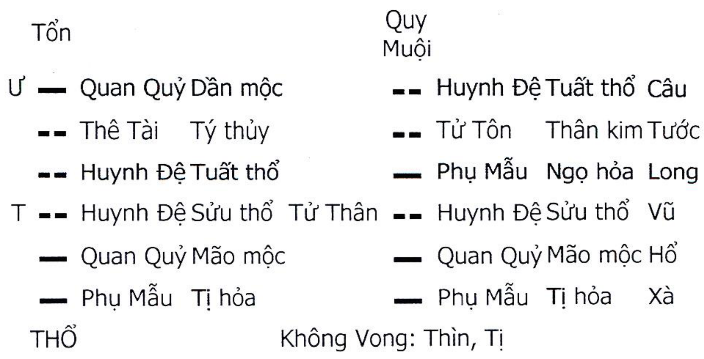
    - **Hình này chứng minh điều gì**
      - Quẻ chứng minh tình trạng phong thủy và ảnh hưởng cát hung tương ứng với quái tượng Quẻ Sơn Trạch Tổn biến Lôi Trạch Quy Muội.
    - **Từ đâu mà thấy được**
      - Căn cứ vào hào vị, lục thân, can chi sinh khắc, tuần không và hào động biến trong quẻ.
- **Kết quả ứng nghiệm thực tế:**
  - Quả nhiên là được đơn vị cấp.
  - Căn nhà tại tầng 2, cửa sổ hướng về phía Bắc, có một sườn núi đất ở phía Đông Bắc cản trở ánh sáng.
  - Sau khi chỉnh trang lại căn nhà thì đột nhiên bị bệnh, bản thân cho rằng nguyên nhân là do phong thủy, thế là đến nhờ đoán.
  - Hiện tại có bệnh đau đầu và lở loét ở bộ phận sinh dục.

#### Ví dụ 53: Ngày Nhâm Dần tháng Mão, nữ đoán phong thủy nhà cửa, được Phong Trạch Trung P...

- **Bối cảnh và thông tin quẻ:**
  - Ngày Nhâm Dần tháng Mão, nữ đoán phong thủy nhà cửa, được Phong Trạch Trung Phu biến Phong Thủy Hoán.
  - THỔ Không Vong: Thìn, Tị
- **Luận giải quái tượng phong thủy:**
  - **Hình 77.** Sơ đồ quẻ Phong Trạch Trung Phu biến Phong Thủy Hoán
    - 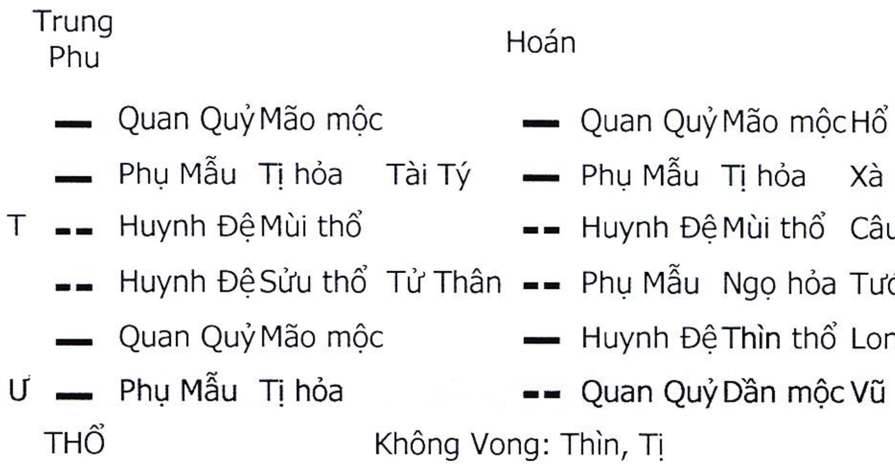
    - **Hình này chứng minh điều gì**
      - Thông thường, dự đoán phong thủy nhà cửa thì mừng được Phụ Mẫu động mà sinh Thế. Tuy nhiên, quẻ này là một hào độc phát, phán đoán theo tượng thì hào Thế lâm Tuyệt ở Phụ Mẫu không cát.
    - **Từ đâu mà thấy được**
      - Thông thường, dự đoán phong thủy nhà cửa thì mừng được Phụ Mẫu động mà sinh Thế. Tuy nhiên, quẻ này là một hào độc phát, phán đoán theo tượng thì hào Thế lâm Tuyệt ở Phụ Mẫu không cát.
- **Diễn tiến phân tích và suy luận chi tiết:**
  - Thông thường, dự đoán phong thủy nhà cửa thì mừng được Phụ Mẫu động mà sinh Thế.
  - Tuy nhiên, quẻ này là một hào độc phát, phán đoán theo tượng thì hào Thế lâm Tuyệt ở Phụ Mẫu không cát.
  - Nếu phán đoán theo ngũ hành sinh khắc, Phụ Mẫu được Nhật Nguyệt đến sinh, lại động mà hóa hồi đầu sinh, trong quẻ hai mộc hai hỏa, Phụ Mẫu quá vượng, trái lại sinh Thế không cát, đây là vật cực tất phản.
  - Hào 2 là trạch, lâm Nguyệt khắc Thế, căn nhà bất lợi cho mình.
  - Hào 2 gặp nhiều mộc, là nhà lầu.
  - Hào 2 cũng là sân, mộc là cây cối, trong sân có cây to gây bất lợi.
  - Hào 6 cũng là mộc, là Nhật Nguyệt nhập quẻ, hào 6 là hàng xóm, hàng xóm cũng có cây bất lợi cho phong thủy.
  - Phụ Mẫu tại hào sơ quá vượng sinh Thế không tốt, hào sơ là chân, là thứ để đi lại, lâm Phụ Mẫu là xe, có xảy ra tai nạn xe cộ.
  - Quẻ độc phát, động mà gặp hợp, năm Giáp Thân hợp Tị hỏa mà hữu sự.
  - Hào Tài hưu tù, lâm Tuyệt tại hào động Tị hỏa, tài vận không tốt.
  - Phụ Mẫu Tị hỏa Không Vong, nhà ít người ở.
  - Lại lâm Ứng, Ứng là người khác, đây không phải là nhà của mình mà là nhà đi thuê.
- **Kết quả ứng nghiệm thực tế:**
  - Đúng như phán đoán phía đây, chồng của người nữ này tự mở công ty, tuy nhiên kinh doanh không thuận lợi và đã vay nợ rất nhiều khoản.
  - Không có tiền mua nhà, vì vậy đã thuê nhà trọ.
  - Trong sân có cây to, hàng xóm ở hướng Tây Bắc cũng có cây to.
  - Năm 2004, bản thân đã gặp tai nạn giao thông, tuy nhiên bị thương không nghiêm trọng.

#### Ví dụ 54: Ngày Ất Mùi tháng Tuất, nam đoán phong thủy căn nhà mới xây xong, được Hỏa Lô...

- **Bối cảnh và thông tin quẻ:**
  - Ngày Ất Mùi tháng Tuất, nam đoán phong thủy căn nhà mới xây xong, được Hỏa Lôi Phệ Hạp.
  - MỘC Không Vong: Thìn, Tị
- **Luận giải quái tượng phong thủy:**
  - **Hình 78.** Sơ đồ quẻ Hỏa Lôi Phệ Hạp
    - 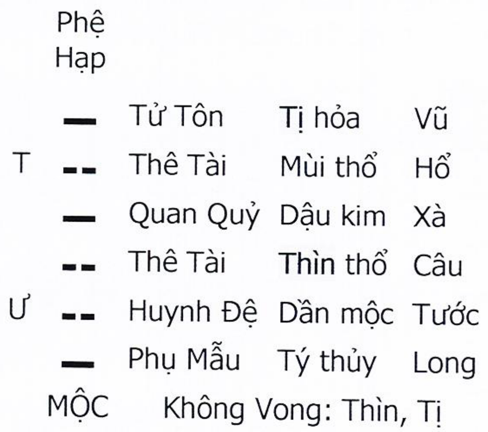
    - **Hình này chứng minh điều gì**
      - Hỏa Lôi Phệ Hạp là tượng tranh chấp. Hào Thế lâm Bạch Hổ, Bạch Hổ chủ tức giận, tính khí không tốt, xây xong nhà dễ tức giận.
    - **Từ đâu mà thấy được**
      - Hào Thế lâm Bạch Hổ, Bạch Hổ chủ tức giận, tính khí không tốt, xây xong nhà dễ tức giận. Tử Tôn Tị hỏa lâm Huyền Vũ, Huyền Vũ chủ trộm cắp, nhập Mộ tại Nguyệt, Nguyệt là Thê Tài chủ tiền bạc, trong...
- **Diễn tiến phân tích và suy luận chi tiết:**
  - Hỏa Lôi Phệ Hạp là tượng tranh chấp.
  - Hào Thế lâm Bạch Hổ, Bạch Hổ chủ tức giận, tính khí không tốt, xây xong nhà dễ tức giận.
  - Tử Tôn Tị hỏa lâm Huyền Vũ, Huyền Vũ chủ trộm cắp, nhập Mộ tại Nguyệt, Nguyệt là Thê Tài chủ tiền bạc, trong đầu luôn nghĩ về tiền bạc.
  - Xung phá Thìn thổ, con cái sẽ ăn cắp tiền trong nhà.
  - Hào 3 Thìn thổ Nguyệt phá Không Vong lâm Câu Trần, hào 3 là cửa, Câu Trần chủ kiến trúc, Không Vong chủ khuyết thiếu, Nguyệt phá chủ vật đã bị hư hỏng, nhất định là ban đầu ở cửa có vật gì đó, trong lúc tu sửa đã vứt đi, từ đó phong thủy đã phát sinh biến hóa mà xuất hiện tán tài.
- **Kết quả ứng nghiệm thực tế:**
  - Ban đầu có nửa viên đá mài, bởi vì thấy không hữu dụng cho nên đã vứt đi.
  - Trước kia cho con 10 nguyên mà nó cũng không dám xài, còn bây giờ nó lại ăn cắp mấy trăm nguyên trong nhà để ra quán nét chơi.
  - Bản thân vốn là người hiền lành, chưa từng bất hòa với ai, hiện nay
  - không hiểu vì sao lại hay cãi lộn với người khác, không thể tự kiềm chế được.
  - Nếu được thì tìm lại viên đá đó, còn không thì mua một viên bù vào.
  - Bởi vì đá mài là kim, hình tròn là Dậu kim, hợp Thìn thổ mà bất phá.
  - Sau khi không tìm lại được viên đá đã vứt đi, anh ta đã mua một viên khác để vào chỗ cũ, trong nhà lại yên ổn.

#### Ví dụ 55: Ngày Mậu Dần tháng Tuất, nữ đoán phong thủy nhà của mẹ, được Thủy Lôi Truân.

- **Bối cảnh và thông tin quẻ:**
  - Ngày Mậu Dần tháng Tuất, nữ đoán phong thủy nhà của mẹ, được Thủy Lôi Truân.
  - THỦY Không Vong: Thân, Dậu
- **Luận giải quái tượng phong thủy:**
  - **Hình 79.** Sơ đồ quẻ Thủy Lôi Truân
    - 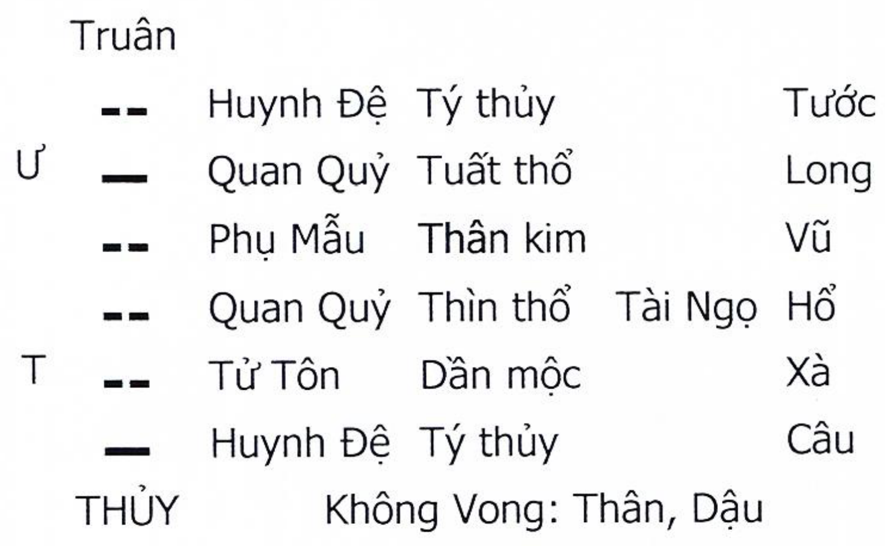
    - **Hình này chứng minh điều gì**
      - Tử Tôn lâm hào 2 trì Thế, hào 2 là trạch, nhà thuộc về sở hữu của mình. Tử Tôn là bình an, vốn là tượng cát, nhưng không nên Nhật thần xung Phụ Mẫu Thân kim, Nguyên thần của Phụ Mẫu là Thìn thổ lâm...
    - **Từ đâu mà thấy được**
      - Tử Tôn lâm hào 2 trì Thế, hào 2 là trạch, nhà thuộc về sở hữu của mình. Tử Tôn là bình an, vốn là tượng cát, nhưng không nên Nhật thần xung Phụ Mẫu Thân kim, Nguyên thần của Phụ Mẫu là Thìn thổ lâm...
- **Diễn tiến phân tích và suy luận chi tiết:**
  - Tử Tôn lâm hào 2 trì Thế, hào 2 là trạch, nhà thuộc về sở hữu của mình.
  - Tử Tôn là bình an, vốn là tượng cát, nhưng không nên Nhật thần xung Phụ Mẫu Thân kim, Nguyên thần của Phụ Mẫu là Thìn thổ lâm Bạch Hổ Nguyệt phá.
  - Hỏi về phong thủy căn nhà của mẹ, cát hung của mẹ chắc chắn là trọng điểm.
  - Phụ Mẫu Thân kim lâm Dịch Mã bị xung, Dịch Mã là tượng đi lại bên ngoài, gặp xung chủ hoảng sợ.
  - Lâm Huyền Vũ, Huyền Vũ là tâm trạng không tốt.
  - Huynh Đệ bị Nguyệt khắc, khắc thần nhập quẻ tại hào 5, hào 5 là đường đi, mượn đến Thìn thổ Bạch Hổ, Bạch Hổ là thương tai, đề phòng anh em có tai nạn xe cộ.
  - Tử Tôn Dần mộc lâm hào 2, hào 2 là sân, mộc là cây, trong sân có cây.
  - Hào 2 cũng là lân cận nơi ở, Dần mộc tương ứng Đông Bắc, lâm Đằng Xà chủ thon dài, xung hào Phụ Mẫu, hướng Đông Bắc có vật thể thon dài ảnh hưởng đến phong thủy.
- **Kết quả ứng nghiệm thực tế:**
  - Trên thực tế, căn nhà là tài sản riêng, trong sân có cây, hướng Đông Bắc có ăng ten kim loại đi đi lại lại, cha mẹ nhiều lần tự dưng đánh nhau trên xe, em trai bị tai nạn giao thông trong tháng này.

#### Ví dụ 56: Ngày Tân Mùi tháng Canh Thân năm Quý Mùi, nam đoán phong thủy nhà cửa, được Đ...

- **Bối cảnh và thông tin quẻ:**
  - Ngày Tân Mùi tháng Canh Thân năm Quý Mùi, nam đoán phong thủy nhà cửa, được Địa Thiên Thái biến Địa Hỏa Minh Di.
  - THỔ Không Vong: Tuất, Hợi
- **Luận giải quái tượng phong thủy:**
  - **Hình 80.** Sơ đồ quẻ Địa Thiên Thái biến Địa Hỏa Minh Di
    - 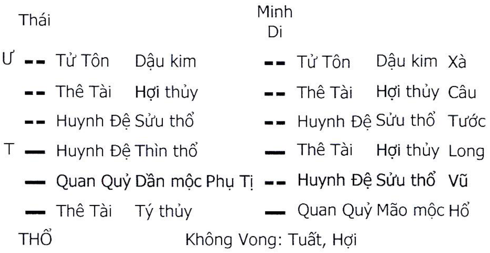
    - **Hình này chứng minh điều gì**
      - Hào 2 Quan Quỷ Dần mộc độc phát khắc hào Thế, hào 2 là trạch, Quan Quỷ chủ bệnh tật, tai họa, khắc hào Thế không cát, phong thủy ảnh hưởng xấu đến mình. Hào 2 là lân cận nơi ở, Quan Quỷ động chủ bấ...
    - **Từ đâu mà thấy được**
      - Hào 2 Quan Quỷ Dần mộc độc phát khắc hào Thế, hào 2 là trạch, Quan Quỷ chủ bệnh tật, tai họa, khắc hào Thế không cát, phong thủy ảnh hưởng xấu đến mình. Hào 2 là lân cận nơi ở, Quan Quỷ động chủ bấ...
- **Diễn tiến phân tích và suy luận chi tiết:**
  - Hào 2 Quan Quỷ Dần mộc độc phát khắc hào Thế, hào 2 là trạch, Quan Quỷ chủ bệnh tật, tai họa, khắc hào Thế không cát, phong thủy ảnh hưởng xấu đến mình.
  - Phụ Mẫu Tị hỏa được Nguyệt hợp, Phụ Mẫu là nhà, Nguyệt hợp là trên hợp dưới, là nhà lầu.
  - Hào 2 là lân cận nơi ở, Quan Quỷ động chủ bất an, lâm Huyền Vũ chủ khí âm tà.
  - Quan Quỷ nhập Nhật Mộ, Mộ khố là miếu, là đến từ chùa miếu, hóa ra Sửu thổ là Mộ khố Tử Tôn, cũng chủ chùa miếu, lân cận có chùa miếu ảnh hưởng đến phong thủy nhà mình.
  - Hào Thế tại hào 3, lâm Thìn thổ bị khắc, hào 3 là dạ dày, thổ cũng là dạ dày, lâm Thanh Long chủ ẩm thực, vì vậy tiêu hóa kém.
  - Kỵ thần tại hào 2 đến khắc hào Thế thổ, hào 2 là chân, thổ chủ da, Huyền Vũ chủ màu đen, trên da sẽ xuất hiện vết đen.
  - Phụ Mẫu Tị hỏa lâm Huyền Vũ không hiện trên quẻ, chủ có phụ nữ ở chung.
  - Thê Tài Hợi thủy Không Vong bị Nhật khắc, Quan Quỷ hợp, không thể lâu dài, sẽ bị người khác dụ dỗ đi.
  - Thê Tài cũng thể hiện tài vận, Huynh Đệ trì Thế, Thê Tài Hợi thủy Không vong, Nguyệt sinh Nhật khắc, tài vận không
  - ổn định.
  - Năm Giáp Thân xung mất Quan Quỷ Dần mộc, Thê Tài được Trường Sinh, hợp bị xung khai.
  - Năm này vừa được tài vừa có nhân duyên.
  - Năm Ất Dậu, Tử Tôn Dậu kim lâm trị, đến hợp hào Thế, tăng thêm nhân khẩu.
- **Kết quả ứng nghiệm thực tế:**
  - Trên thực tế, căn nhà là nhà lầu, lân cận có chùa miếu, bản thân có bệnh dạ dày, sau khi chuyển đến đây thì trên chân có khối u màu đen.
  - Người phụ nữ ở chung lúc trước đã bỏ đi, năm 2004 tái hôn, năm 2005 sinh con.

#### Ví dụ 57: Ngày Tân Hợi tháng Ất Tị năm Đinh Hợi, nữ đoán phong thủy nhà cửa, được Hỏa S...

- **Bối cảnh và thông tin quẻ:**
  - Ngày Tân Hợi tháng Ất Tị năm Đinh Hợi, nữ đoán phong thủy nhà cửa, được Hỏa Sơn Lữ biến Hỏa Địa Tấn.
  - HỎA Không Vong: Dần, Mão
- **Luận giải quái tượng phong thủy:**
  - **Hình 81.** Sơ đồ quẻ Hỏa Sơn Lữ biến Hỏa Địa Tấn
    - 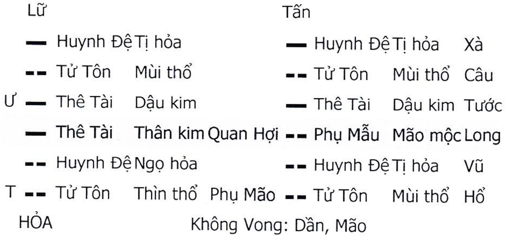
    - **Hình này chứng minh điều gì**
      - Phụ Mẫu là nhà, phục tàng dưới hào Thế, đây là nhà thuộc về mình. Thê Tài Thân kim không được Nhật Nguyệt sinh phù, độc phát hóa Không, tài vận không tốt đẹp.
    - **Từ đâu mà thấy được**
      - Phụ Mẫu là nhà, phục tàng dưới hào Thế, đây là nhà thuộc về mình. Thê Tài Thân kim không được Nhật Nguyệt sinh phù, độc phát hóa Không, tài vận không tốt đẹp.
- **Diễn tiến phân tích và suy luận chi tiết:**
  - Phụ Mẫu là nhà, phục tàng dưới hào Thế, đây là nhà thuộc về mình.
  - Thê Tài Thân kim không được Nhật Nguyệt sinh phù, độc phát hóa Không, tài vận không tốt đẹp.
  - Phụ Mẫu Mão mộc Không Vong, độc phát Tuyệt Phụ Mẫu, nhà này bất lợi cho cha mẹ.
  - Tử Tôn Thìn thổ lâm Bạch Hổ, Thanh Long độc phát Trường Sinh Tử Tôn hóa Không, hào sơ là tiểu khẩu, Tử Tôn là con cái, Bạch Hổ chủ tử vong, Thanh Long chủ sinh đẻ, Không Vong chủ mất mát, có thông tin lưu sản.
- **Kết quả ứng nghiệm thực tế:**
  - Cha đã mất cách đây 20 năm, mẹ cũng qua đời ở 4 năm trước.
  - Tài vận gặp khó khăn, đã từng bị thai lưu.

#### Ví dụ 58: Ngày Đinh Tị tháng Kỷ Hợi năm Bính Tuất, trong thời gian tôi giảng dạy ở Nhật...

- **Bối cảnh và thông tin quẻ:**
  - Ngày Đinh Tị tháng Kỷ Hợi năm Bính Tuất, trong thời gian tôi giảng dạy ở Nhật Bản, một người đàn ông gieo quẻ nhưng không nói rõ muốn đoán cái gì, được Địa Phong Thăng biến Địa Sơn Khiêm.
  - THỦY Không Vong: Tý, Sửu
  - Thê Tài Sửu thổ lưỡng hiện nhưng đều Không Vong, tài vận hiện nay không tốt.
  - Quẻ Địa Phong Thăng, Thế Ứng tỷ hòa chủ tranh đấu, cạnh tranh quyết liệt.
- **Luận giải quái tượng phong thủy:**
  - **Hình 82.** Quẻ Địa Phong Thăng biến Địa Sơn Khiêm
    - 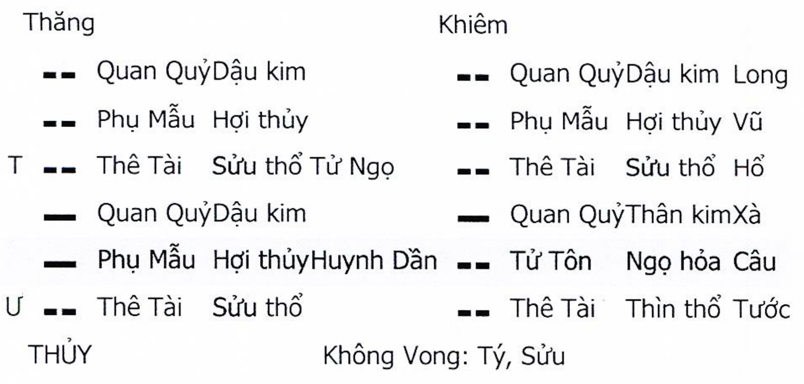
    - **Hình này chứng minh điều gì**
      - Quẻ chứng minh tình trạng phong thủy và ảnh hưởng cát hung tương ứng với quái tượng Quẻ Địa Phong Thăng biến Địa Sơn Khiêm.
    - **Từ đâu mà thấy được**
      - Căn cứ vào hào vị, lục thân, can chi sinh khắc, tuần không và hào động biến trong quẻ.
- **Kết quả ứng nghiệm thực tế:**
  - Đúng.
  - Hiện nay tài vận không tốt.
  - Phụ Mẫu Hợi thủy độc phát, lại bị Nhật xung, Hợi thủy được Nguyệt trợ giúp, vượng tướng gặp xung, xung thì động càng mạnh, hào 2 là nơi ở, Phụ Mẫu là nhà, nơi ở bất định, thường xuyên chuyển nhà.
  - **Phản hồi:** Đúng.
  - Đã từng chuyển nhà nhiều lần.
  - Phụ Mẫu Hợi thủy hóa ra Ngọ hỏa, Ngọ hỏa tương ứng với năm Nhâm Ngọ 2002, lại hào Thế Không Vong, hào Thế cũng là nơi ở, năm Quý Mùi 2003 xung thực hào Thế, hai năm này đều chuyển nhà.
  - **Phản hồi:** Hoàn toàn chính xác.
  - Hào 2 là lân cận nơi ở, lâm thủy phát động, chủ lân cận có nước chảy, có sông ngòi.
  - **Phản hồi:** Đúng.
  - Tử Tôn Ngọ hỏa không hiện trên quẻ, hỏa chủ ánh sáng, Phụ Mẫu phát động khiến Ngọ hỏa lâm Tuyệt, biểu thị có vấn đề về ánh sáng, Tuyệt ở Phụ Mẫu Câu Trần, hào 2 là
  - nhà, Phụ Mẫu là kiến trúc, Câu Trần cũng chủ kiến trúc, là xung quanh có kiến trúc cao to cản trở, ảnh hưởng đến ánh sáng của căn nhà.
  - **Phản hồi:** Chính xác.
  - Hào Thế là bản thân, lâm Bạch Hổ, Bạch Hổ chủ ngổ ngáo, trước đây ngổ ngáo, nhưng hiện tại hào Thế Không, đoán ngược lại, hiện tại đã trở nên hiền lành.
  - **Phản hồi:** Trước kia tôi rất hư hỏng, hiện tại đã không còn như vậy.
  - Hào 5 Phụ Mẫu Hợi thủy Nguyệt trợ giúp vượng tướng, Nhật xung là ám động, hào 5 là đường đi, thủy chủ mưa, biểu thị có mưa là đường ngập nước, khắc Tử Tôn Ngọ hỏa không thể sinh hào Thế, điều này ảnh hưởng đến việc về nhà.
  - Hào 5 lâm Huyền Vũ, Huyền Vũ chủ ngầm, chính là cống thoát nước, chứng tỏ cống thoát nước bị tắc nghẽn.
  - **Phản hồi:** Đúng.

#### Ví dụ 59: Ngày Mậu Thân tháng Kỷ Hợi năm Bính Tuất, nữ đoán phong thủy nhà cửa, được Th...

- **Luận giải quái tượng phong thủy:**
  - **Hình 83.** Sơ đồ quẻ Thủy Sơn Kiển biến Thiên Sơn Độn
    - 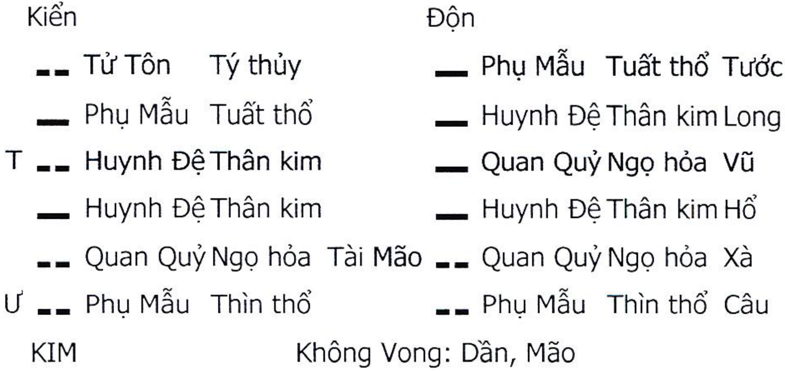
    - **Hình này chứng minh điều gì**
      - Thê Tài Mão mộc Không Vong phục tàng, Huynh Đệ trì Thế phát động khắc Tài, tài vận không tốt đẹp. Về nguyên nhân, hào 3 hào 4 là cửa, lâm Huynh Đệ Thân kim, Huynh Đệ cũng chủ cửa, là cửa đối cửa, c...
    - **Từ đâu mà thấy được**
      - Thê Tài Mão mộc Không Vong phục tàng, Huynh Đệ trì Thế phát động khắc Tài, tài vận không tốt đẹp. Về nguyên nhân, hào 3 hào 4 là cửa, lâm Huynh Đệ Thân kim, Huynh Đệ cũng chủ cửa, là cửa đối cửa, c...
- **Diễn tiến phân tích và suy luận chi tiết:**
  - Phụ Mẫu đa hiện, nhà ở tại khu dân cư.
  - Thê Tài Mão mộc Không Vong phục tàng, Huynh Đệ trì Thế phát động khắc Tài, tài vận không tốt đẹp.
  - Về nguyên nhân, hào 3 hào 4 là cửa, lâm Huynh Đệ Thân kim, Huynh Đệ cũng chủ cửa, là cửa đối cửa, cửa sát cửa.
  - Thân kim lâm hào Thế là cửa của mình, Thân kim bên cạnh hào Thế là cửa của hàng xóm.
  - Hào 6 Tý thủy động hóa hồi đầu khắc.
  - Hào 6 là mộ tổ, hào biến là Quỷ khố, Quan Quỷ là người chết, Mộ khố là phần mộ.
  - Tý thủy bị khắc không thể sinh Tài, do mộ tổ có tổn hại mà tài vận gặp bất lợi.
  - Trong quẻ Phụ Mẫu lưỡng hiện, Nhật Nguyệt không trợ giúp là hưu tù, Nguyên thần Nguyệt khắc hào động khắc, chủ sức khỏe của cha mẹ không tốt.
- **Kết quả ứng nghiệm thực tế:**
  - Trên thực tế, đúng là ở tại khu dân cư, cửa đối cửa với hàng xóm.
  - Bia mộ của tổ tiên bị bão làm hư nhưng chưa có tiền sửa, tài vận khó khăn, cha bị ung thư tuyến tụy, mẹ bị ung thư ruột.

#### Ví dụ 60: Ngày Ất Mão tháng Kỷ Hợi năm Bính Tuất, nam hỏi miếu thờ ở phía Bắc nhà trọ c...

- **Luận giải quái tượng phong thủy:**
  - **Hình 84.** Sơ đồ quẻ Thiên Sơn Độn biến Trạch Địa Tụy
    - 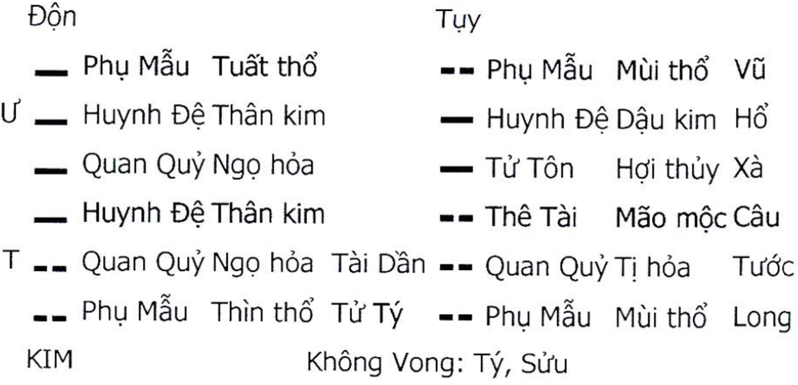
    - **Hình này chứng minh điều gì**
      - Thông thường, hào Ứng là nơi được chỉ định, nhưng đôi khi cũng phải phán đoán linh hoạt. Trong quẻ này, Phụ Mẫu Tuất thổ tại hào 6 lâm Huyền Vũ phát động, hào 6 là chùa miếu, Mộ khố của Quan Quỷ cũ...
    - **Từ đâu mà thấy được**
      - Thông thường, hào Ứng là nơi được chỉ định, nhưng đôi khi cũng phải phán đoán linh hoạt. Trong quẻ này, Phụ Mẫu Tuất thổ tại hào 6 lâm Huyền Vũ phát động, hào 6 là chùa miếu, Mộ khố của Quan Quỷ cũ...
- **Diễn tiến phân tích và suy luận chi tiết:**
  - Thông thường, hào Ứng là nơi được chỉ định, nhưng đôi khi cũng phải phán đoán linh hoạt.
  - Trong quẻ này, Phụ Mẫu Tuất thổ tại hào 6 lâm Huyền Vũ phát động, hào 6 là chùa miếu, Mộ khố của Quan Quỷ cũng là chùa miếu.
  - Do đó, chúng ta phải xem ảnh hưởng của Phụ Mẫu Tuất thổ đối với hào Thế và toàn thể quẻ.
  - Hào Thế nhập Mộ tại Tuất thổ, hào Thế tại hào 2, hào 2 là trạch, hỏa chủ ánh sáng, nhập Mộ chính là tối tăm, không đủ ánh sáng.
  - Phụ Mẫu Tuất thổ tại hào 6 phát động lâm Huyền Vũ khắc Tử Tôn, hào 6 là mặt, thổ chủ da, cung Càn là đầu, Tử Tôn là con cái, bị khắc, da mặt của con cái bị ảnh hưởng.
  - Huynh Đệ phát động trong quẻ, Phụ Mẫu Tuất thổ phát động đến trợ giúp, Thê Tài phục tàng, tài vận bị ảnh hưởng.
- **Kết quả ứng nghiệm thực tế:**
  - Trên thực tế là ở mặt Bắc và Tây Bắc bị thiếu ánh sáng.
  - Cách đây 8 năm, chủ cũ đã phá sản vì mở nhà trọ.
  - Sau khi chuyển đến đây, tài vận của anh ta bị sa sút, trên mặt đứa con sinh ra có mọc nốt ruồi.

#### Ví dụ 61: Ngày Đinh Mão tháng Kỷ Hợi năm Bính Tuất, nữ đoán phong thủy nhà cửa, được Th...

- **Bối cảnh và thông tin quẻ:**
  - Ngày Đinh Mão tháng Kỷ Hợi năm Bính Tuất, nữ đoán phong thủy nhà cửa, được Thiên Lôi Vô Vọng biến Phong Thiên Tiểu Súc.
  - MỘC Không Vong: Tuất, Hợi
- **Luận giải quái tượng phong thủy:**
  - **Hình 85.** Quẻ Thiên Lôi Vô Vọng biến Phong Thiên Tiểu Súc
    - 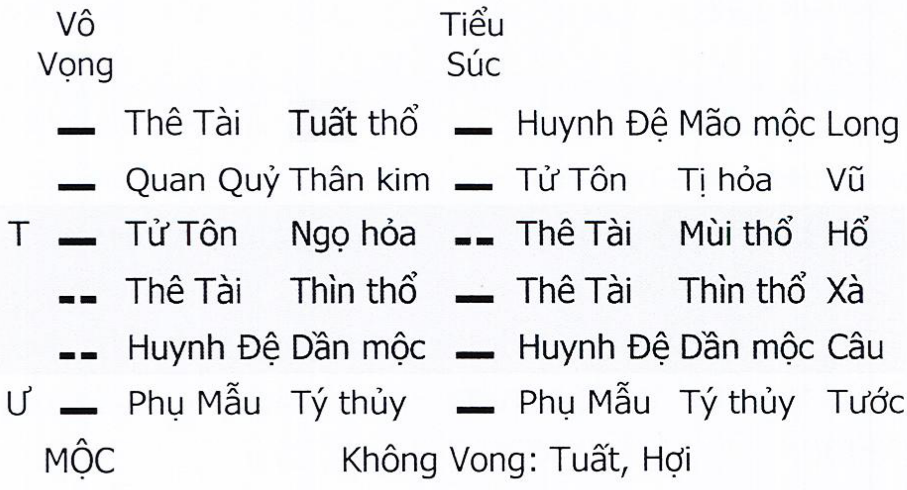
    - **Hình này chứng minh điều gì**
      - Hào 2 Huynh Đệ Dần mộc và Nguyệt hợp, trên hợp dưới là nhà lầu, hào 2 mộc hóa mộc cũng chủ nhà lầu. Hào 2 mộc lâm Câu Trần phát động, Câu Trần chủ tu tạo, hào 2 là nhà, phục ngâm chủ đã cải tạo nhà...
    - **Từ đâu mà thấy được**
      - Hào 2 Huynh Đệ Dần mộc và Nguyệt hợp, trên hợp dưới là nhà lầu, hào 2 mộc hóa mộc cũng chủ nhà lầu. Hào 2 mộc lâm Câu Trần phát động, Câu Trần chủ tu tạo, hào 2 là nhà, phục ngâm chủ đã cải tạo nhà...
- **Diễn tiến phân tích và suy luận chi tiết:**
  - Hào 2 Huynh Đệ Dần mộc và Nguyệt hợp, trên hợp dưới là nhà lầu, hào 2 mộc hóa mộc cũng chủ nhà lầu.
  - Hào 2 mộc lâm Câu Trần phát động, Câu Trần chủ tu tạo, hào 2 là nhà, phục ngâm chủ đã cải tạo nhà nhiều lần.
  - Nhà bị động nhiều lần thì bất lợi cho tài vận.
  - Hào 4 là cửa sổ, được Nhật sinh, lâm Ngọ hỏa, hỏa chủ ánh sáng, cửa sổ được chiếu sáng khá tốt.
  - Lâm Tử Tôn sinh Tài, phong thủy chỗ này có lợi cho tài.
  - Hào 2 là sân, mộc hóa mộc, Nguyệt sinh Nhật phù là vượng tướng, sân có nhiều cây cối.
  - Mộc nhiều khắc Tài, bất lợi cho tài vận.
  - Hào 5 Quan Quỷ Thân kim lâm Huyền Vũ, hào 5 là gia trưởng, bị Bạch Hổ Tử Tôn khắc, Bạch Hổ là tử vong, Quan Quỷ là linh hồn, chính là bàn thờ, Huyền Vũ là tối tăm, chủ nơi để bàn thờ tổ tiên bị tối tăm.
  - Quan Quỷ lại thể hiện công việc, là bàn thờ có vấn đề khiến công việc bị ảnh hưởng.
  - Quẻ chính lục xung, tượng bất an, nội quái phục ngâm, khí trường của tổng thể căn nhà không cân đối, khiến cho tâm trạng con người trở nên phiền muộn, không thoải mái.
- **Kết quả ứng nghiệm thực tế:**
  - Trên thực tế đúng là như vậy.
  - Sau khi vào ở, tâm trạng không tốt, cảm thấy hiu quạnh, không có sức sống.
  - Cha qua đời, em trai mất tích, tài vận không tốt, đã nghỉ việc.

#### Ví dụ 62: Ngày Ất Tị tháng Quý Tị năm Bính Tuất, nam đoán cát hung của chuyển nhà, được...

- **Bối cảnh và thông tin quẻ:**
  - Ngày Ất Tị tháng Quý Tị năm Bính Tuất, nam đoán cát hung của chuyển nhà, được Phong Sơn Tiệm biến Sơn Hỏa Bí.
  - THỔ Không Vong: Dần, Mão
- **Luận giải quái tượng phong thủy:**
  - **Hình 86.** Quẻ Phong Sơn Tiệm biến Sơn Hỏa Bí
    - 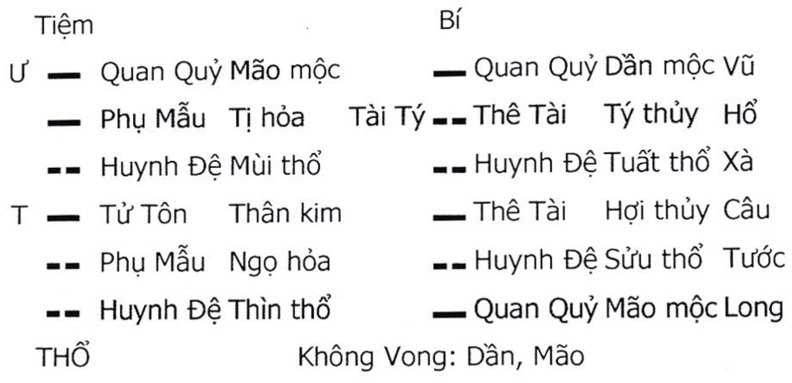
    - **Hình này chứng minh điều gì**
      - Phụ Mẫu là nhà, cát hung thì xem hào Thế. Nhưng Thế bị Nhật hợp, hào động hợp, hợp là cản trở, sợ là chuyển nhà không thành.
    - **Từ đâu mà thấy được**
      - Phụ Mẫu là nhà, cát hung thì xem hào Thế. Phụ Mẫu phát động, lại vượng tướng, dường như là sắp chuyển nhà.
- **Diễn tiến phân tích và suy luận chi tiết:**
  - Phụ Mẫu là nhà, cát hung thì xem hào Thế.
  - Phụ Mẫu phát động, lại vượng tướng, dường như là sắp chuyển nhà.
  - Nhưng Thế bị Nhật hợp, hào động hợp, hợp là cản trở, sợ là chuyển nhà không thành.
  - Phụ Mẫu khắc Thế, là bị ép chuyển nhà.
  - Nguyên thần hào Thế tại hào sơ là tâm tư, biểu thị thế giới nội tâm của anh ta, động hóa Không, hóa Quỷ, biểu thị không hài lòng, không muốn chuyển nhà.
  - Phụ Mẫu phát động khắc Thế, không cát.
  - Mặc dù Nguyên thần động đến giải trừ, nhưng Phụ Mẫu tại hào 5, là đường đi, cần đề phòng xe xảy ra sự cố trên đường ảnh hưởng đến bản thân.
  - Hiện nay Phụ Mẫu hóa hồi đầu khắc, tháng Ngọ xung mất Tý thủy nên đề phòng.
- **Kết quả ứng nghiệm thực tế:**
  - Thực tế là chủ nhà ép anh ta chuyển đi, bản thân không muốn chuyển.
  - Sau một thời gian trì hoãn, không hiểu tại sao chủ nhà lại không đuổi anh ta đi nữa.
  - Đến tháng Ngọ, tại bãi đỗ xe, xe bị vướng vào dây thép hai lần, ngoài ra không phát sinh chuyện gì khác.
  - ---
  - # Part 10 (Pages 181-200)

#### Ví dụ 63: Ngày Bính Thìn tháng Đinh Dậu năm Bính Tuất, nữ đoán tài vận chị gái, được Sơ...

- **Luận giải quái tượng phong thủy:**
  - **Hình 87.** Sơ đồ quẻ Sơn Hỏa Bí biến Địa Lôi Phục
    - 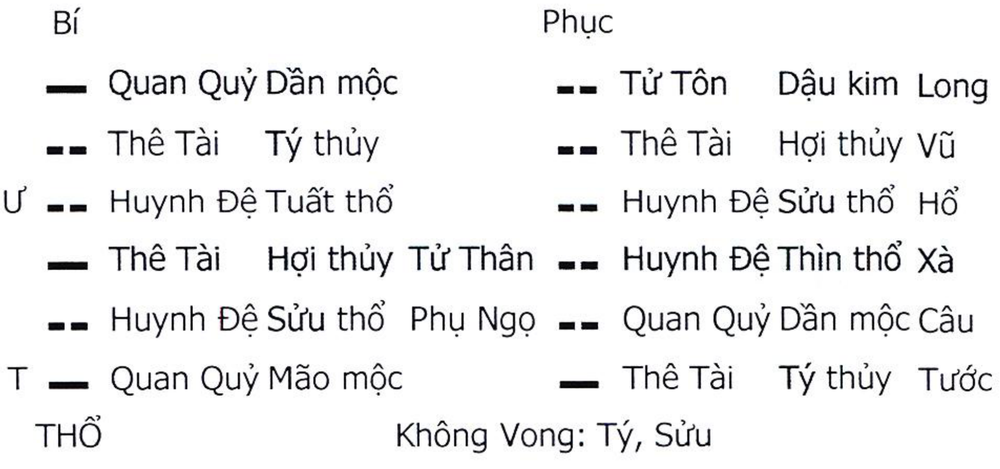
    - **Hình này chứng minh điều gì**
      - Thê Tài Tý thủy Không Vong bị Nhật khắc, Hợi thủy phát động Nhật khắc, hóa hồi đầu khắc, hóa Mộ khố, Tuất thổ ám động đến khắc, tài vận rất không tốt.
    - **Từ đâu mà thấy được**
      - Lấy Thê Tài làm Dụng thần. Thê Tài Tý thủy Không Vong bị Nhật khắc, Hợi thủy phát động Nhật khắc, hóa hồi đầu khắc, hóa Mộ khố, Tuất thổ ám động đến khắc, tài vận rất không tốt.
- **Diễn tiến phân tích và suy luận chi tiết:**
  - Lấy Thê Tài làm Dụng thần.
  - Thê Tài Tý thủy Không Vong bị Nhật khắc, Hợi thủy phát động Nhật khắc, hóa hồi đầu khắc, hóa Mộ khố, Tuất thổ ám động đến khắc, tài vận rất không tốt.
  - Quan Quỷ Dần mộc lâm Thanh Long phát động, Thanh Long có ý nghĩa chỉnh trang, sinh Phụ Mẫu chính là chỉnh trang nhà cửa.
  - Bị Hợi thủy hợp trú, năm Tị xung khai, ứng năm Tị đã có chỉnh trang nhà.
  - Dần mộc sinh Phụ Mẫu, đồng thời hợp hào 3 Thê Tài Hợi thủy, Quan Quỷ thể hiện đàn ông, tại hào 6, hào 6 chủ thoái hưu, vì vậy sẽ xuất hiện người đàn ông ăn bám xài tiền của cô ấy.
  - Mặc dù Nguyệt kiến sinh Tài, nhưng Nhật khắc, hồi đầu khắc, Tuất thổ ám động khắc, khắc nhiều sinh ít, vào ít ra nhiều, nhất định có nợ nần bủa vây.
  - Hào 3 là cửa, động hóa hồi đầu khắc, hóa Mộ, phong thủy ở cửa có vấn đề.
  - Lâm Đằng Xà, Đằng Xà là tượng thon dài, cửa có vật thon dài.
  - Hóa ra Thìn thổ, cửa tại Đông Nam.
  - Hào 2 là trạch, là sân, lâm thổ Không Vong, sân có hố, có chỗ thấp trũng.
  - Hào 5 Thê Tài Tý thủy Không, hào 5 là gia trưởng, cũng là người kế vị, tài vận ảnh hưởng đến trưởng bối và không có người phụng dưỡng cha mẹ.
- **Kết quả ứng nghiệm thực tế:**
  - Trên thực tế là tại năm 1989 đã tu sửa lại nhà, sau khi làm xong thì tài vận gặp khó khăn.
  - Chị gái thì giống như biến thành người khác, cho đàn ông xài tiền, lấy tiền của công ty và tiền trong nhà đem đi xài sạch trơn, sau đó lại đi vay rất nhiều khoản nợ bên ngoài, tiền của cha mẹ và em gái cũng bị tiêu rất nhiều.
  - Cửa tại hướng Đông Nam, cong giống như bụng rắn, vừa vào cửa chính là chỗ để xe đạp, nơi này và cổng đều rất thấp trũng, sân cao hơn 80 cm so với chỗ này.

#### Ví dụ 64: Ngày Quý Tị tháng Canh Dần năm Bính Tuất, nữ hỏi phong thủy có ảnh hưởng đến ...

- **Bối cảnh và thông tin quẻ:**
  - Ngày Quý Tị tháng Canh Dần năm Bính Tuất, nữ hỏi phong thủy có ảnh hưởng đến hôn nhân hay không?
  - Được Lôi Địa Dự.
  - MỘC Không Vong: Ngọ, Mùi
  - Phụ Mẫu phục dưới hào Thế, hào Thế là mình, Phụ Mẫu là nhà, vì vậy là nhà của mình.
  - Phụ Mẫu Tý thủy không được Nhật Nguyệt trợ giúp là hưu tù, hưu tù là nhỏ bé, căn nhà không lớn.
  - Hào Thê Tài Nguyệt khắc Nhật sinh, quẻ lục hợp, là nhà tàng phong tụ khí.
  - Tuy nhiên, Quan Quỷ Thân kim Nguyệt phá, hào Thế Không Vong không sinh Quan Quỷ.
  - Đối với người nữ, Quan Quỷ chính là bạn trai, đàn ông.
  - Vì vậy, phong thủy căn nhà có ảnh hưởng đến hôn nhân.
  - Trước tiên, hào Thế Không Vong biểu thị trong lòng bất an.
  - Lâm Huyền Vũ, Huyền Vũ chủ u uất.
  - Vì vậy, sống trong nhà này thì sẽ bất an, lo âu, u uất, không cởi mở.
  - Tử Tôn là Nguyên thần của hào Thế, Nguyên thần chủ nội tâm, Tử Tôn thể hiện vui vẻ, Không Vong là tâm trạng không thoải mái, không thể ở lại.
  - Hào Thế có thể là nơi cư trú, Huyền Vũ chủ tối tăm, Ngọ hỏa Không không sinh Thế, hỏa chủ ánh sáng, thiếu ánh sáng, nơi này rất tối, ánh sáng không chiếu vào.
  - Ngọ hỏa tương ứng với phía Nam.
  - Thông thường, ở Bắc bán cầu thì ánh sáng đến từ phía Nam.
  - Không Vong biểu thị không chiếu vào.
  - Lý do là tại sao?
  - Chẳng lẽ là do không mở cửa sổ?
  - Thường thì không có khả năng này.
  - Vì vậy, nhất định là ở phía Nam có vật cản trở.
  - Đây gọi là phương pháp loại
  - suy, tức là từ kết quả đã biết suy ngược ra tình trạng lúc đó.
  - Không phải mọi thông tin đều được rút ra từ trong quẻ, đôi khi cũng phải sử dụng phương pháp phán đoán gián tiếp.
  - Hào Ứng lâm Câu Trần, Câu Trần chủ kiến trúc, nhất định là có kiến trúc cao tầng cản trở ánh sáng.
  - Quả nhiên là ở phía Nam có một tòa nhà hai tầng đã che khuất nhà cô ấy.
  - Lại thủ tượng hào 5 Thân kim, hào 5 là đường đi, lâm Đằng Xà, Đằng Xà là đường nhỏ hẹp, đường chuyển hướng (rẽ ngoặt), Thân kim thể hiện Tây Nam, Nguyệt phá chính là đường xấu.
  - Nhật hợp, lại biểu thị đã tu bổ.
  - Vượng tướng là cao, hưu tù bị khắc là thấp.
  - Phán đoán là có đường xuống dốc chuyển hướng ở phía Tây Nam, mặt đường hư hại đã được tu bổ, phản hồi đúng là như vậy.
  - Tôi bảo cô ấy tìm một khối đá lớn và dựng ở phía Tây Nam của sân.
  - Ý nghĩa của việc này là để Thực Phá.
  - Kết quả là một tháng sau, người này đã tìm được đối tượng.
- **Luận giải quái tượng phong thủy:**
  - **Hình 88.** Sơ đồ quẻ Lôi Địa Dự
    - 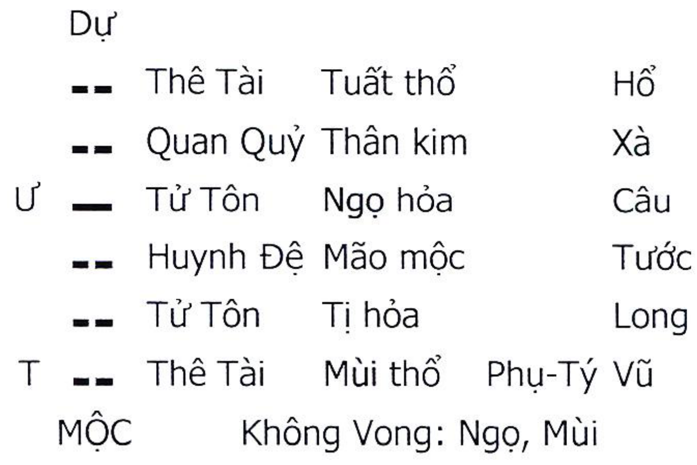
    - **Hình này chứng minh điều gì**
      - **Ví dụ 64:** Ngày Quý Tị tháng Canh Dần năm Bính Tuất, nữ hỏi phong thủy có ảnh hưởng đến hôn nhân hay không? Phụ Mẫu phục dưới hào Thế, hào Thế là mình, Phụ Mẫu là nhà, vì vậy là nhà của mình.
    - **Từ đâu mà thấy được**
      - MỘC Không Vong: Ngọ, Mùi Phụ Mẫu phục dưới hào Thế, hào Thế là mình, Phụ Mẫu là nhà, vì vậy là nhà của mình.
- **Diễn tiến phân tích và suy luận chi tiết:**
  - **Ví dụ 64:** Ngày Quý Tị tháng Canh Dần năm Bính Tuất, nữ hỏi phong thủy có ảnh hưởng đến hôn nhân hay không?
  - Được Lôi Địa Dự.
  - MỘC Không Vong: Ngọ, Mùi
  - Phụ Mẫu phục dưới hào Thế, hào Thế là mình, Phụ Mẫu là nhà, vì vậy là nhà của mình.
  - Phụ Mẫu Tý thủy không được Nhật Nguyệt trợ giúp là hưu tù, hưu tù là nhỏ bé, căn nhà không lớn.
  - Hào Thê Tài Nguyệt khắc Nhật sinh, quẻ lục hợp, là nhà tàng phong tụ khí.
  - Tuy nhiên, Quan Quỷ Thân kim Nguyệt phá, hào Thế Không Vong không sinh Quan Quỷ.
  - Đối với người nữ, Quan Quỷ chính là bạn trai, đàn ông.
  - Vì vậy, phong thủy căn nhà có ảnh hưởng đến hôn nhân.
  - Trước tiên, hào Thế Không Vong biểu thị trong lòng bất an.
  - Lâm Huyền Vũ, Huyền Vũ chủ u uất.
  - Vì vậy, sống trong nhà này thì sẽ bất an, lo âu, u uất, không cởi mở.
  - Tử Tôn là Nguyên thần của hào Thế, Nguyên thần chủ nội tâm, Tử Tôn thể hiện vui vẻ, Không Vong là tâm trạng không thoải mái, không thể ở lại.
  - Hào Thế có thể là nơi cư trú, Huyền Vũ chủ tối tăm, Ngọ hỏa Không không sinh Thế, hỏa chủ ánh sáng, thiếu ánh sáng, nơi này rất tối, ánh sáng không chiếu vào.
  - Ngọ hỏa tương ứng với phía Nam.
  - Thông thường, ở Bắc bán cầu thì ánh sáng đến từ phía Nam.
  - Không Vong biểu thị không chiếu vào.
  - Lý do là tại sao?
  - Chẳng lẽ là do không mở cửa sổ?
  - Thường thì không có khả năng này.
  - Vì vậy, nhất định là ở phía Nam có vật cản trở.
  - Đây gọi là phương pháp loại
  - suy, tức là từ kết quả đã biết suy ngược ra tình trạng lúc đó.
  - Không phải mọi thông tin đều được rút ra từ trong quẻ, đôi khi cũng phải sử dụng phương pháp phán đoán gián tiếp.
  - Hào Ứng lâm Câu Trần, Câu Trần chủ kiến trúc, nhất định là có kiến trúc cao tầng cản trở ánh sáng.
  - Quả nhiên là ở phía Nam có một tòa nhà hai tầng đã che khuất nhà cô ấy.
  - Lại thủ tượng hào 5 Thân kim, hào 5 là đường đi, lâm Đằng Xà, Đằng Xà là đường nhỏ hẹp, đường chuyển hướng (rẽ ngoặt), Thân kim thể hiện Tây Nam, Nguyệt phá chính là đường xấu.
  - Nhật hợp, lại biểu thị đã tu bổ.
  - Vượng tướng là cao, hưu tù bị khắc là thấp.
  - Phán đoán là có đường xuống dốc chuyển hướng ở phía Tây Nam, mặt đường hư hại đã được tu bổ, phản hồi đúng là như vậy.
  - Tôi bảo cô ấy tìm một khối đá lớn và dựng ở phía Tây Nam của sân.
  - Ý nghĩa của việc này là để Thực Phá.
  - Kết quả là một tháng sau, người này đã tìm được đối tượng.

#### Ví dụ 65: Ngày Tân Mùi tháng Giáp Thìn năm Đinh Hợi, nam đoán phong thủy nhà cửa, được ...

- **Bối cảnh và thông tin quẻ:**
  - Ngày Tân Mùi tháng Giáp Thìn năm Đinh Hợi, nam đoán phong thủy nhà cửa, được Thiên Địa Bĩ biến Trạch Thủy Khốn.
  - KIM Không Vong: Tuất, Hợi
- **Luận giải quái tượng phong thủy:**
  - **Hình 89.** Sơ đồ quẻ Thiên Địa Bĩ biến Trạch Thủy Khốn
    - 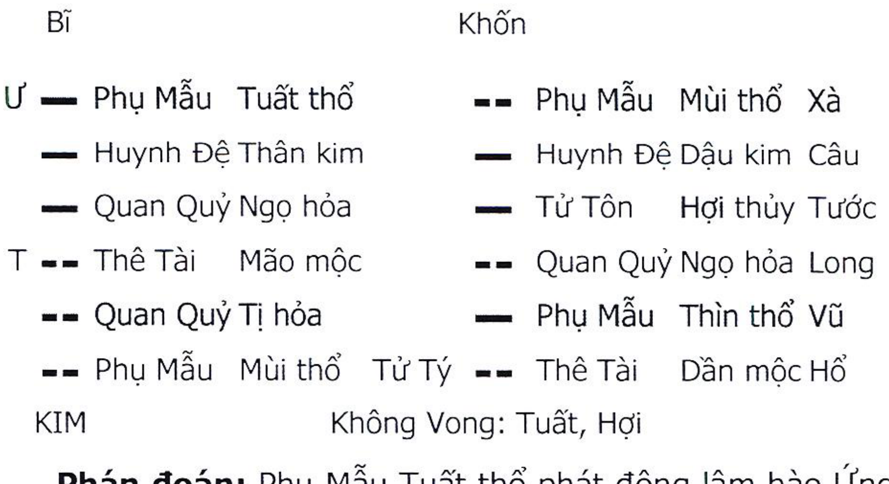
    - **Hình này chứng minh điều gì**
      - Phụ Mẫu Tuất thổ phát động lâm hào Ứng đến hợp hào Thế, Ứng là người khác, Phụ Mẫu là nhà, đây là nhà của người khác, bản thân thuê để ở. Phụ Mẫu Tuất thổ Không Vong lâm Đằng Xà, Không Vong chủ bất...
    - **Từ đâu mà thấy được**
      - Phụ Mẫu Tuất thổ phát động lâm hào Ứng đến hợp hào Thế, Ứng là người khác, Phụ Mẫu là nhà, đây là nhà của người khác, bản thân thuê để ở. Phụ Mẫu Tuất thổ Không Vong lâm Đằng Xà, Không Vong chủ bất...
- **Diễn tiến phân tích và suy luận chi tiết:**
  - Phụ Mẫu Tuất thổ phát động lâm hào Ứng đến hợp hào Thế, Ứng là người khác, Phụ Mẫu là nhà, đây là nhà của người khác, bản thân thuê để ở.
  - Phụ Mẫu Tuất thổ Không Vong lâm Đằng Xà, Không Vong chủ bất an, Đằng Xà cũng chủ bất an, hợp hào Thế, căn nhà sẽ mang lại bất an cho bản thân.
  - Quan Quỷ tại hào 2 động cũng chủ gia trạch bất an.
  - Thê Tài Mão mộc trì Thế nhưng không được Nhật Nguyệt trợ giúp, lại bị hào Ứng hợp cản trở, tài vận không tốt đẹp.
  - Thê Tài lâm Thanh Long tại hào 3, Thanh Long là sắc, hào 3 là giường, vì vậy cũng thể hiện phụ nữ, không tìm được một nửa kia của cuộc đời.
  - Phụ Mẫu Nguyệt phá động mà hóa thoái, hào 2 phát động hóa Phụ Mẫu, có ý định chuyển chỗ ở.
- **Kết quả ứng nghiệm thực tế:**
  - Thực tế đúng là như vậy.

#### Ví dụ 66: Ngày Canh Thân tháng Quý Mão năm Đinh Hợi, nữ đoán phong thủy nhà cửa, được T...

- **Bối cảnh và thông tin quẻ:**
  - Ngày Canh Thân tháng Quý Mão năm Đinh Hợi, nữ đoán phong thủy nhà cửa, được Trạch Phong Đại Quá biến Càn Vi Thiên.
  - MỘC Không Vong: Tý, Sửu
- **Luận giải quái tượng phong thủy:**
  - **Hình 90.** Sơ đồ quẻ Trạch Phong Đại Quá biến Càn Vi Thiên
    - 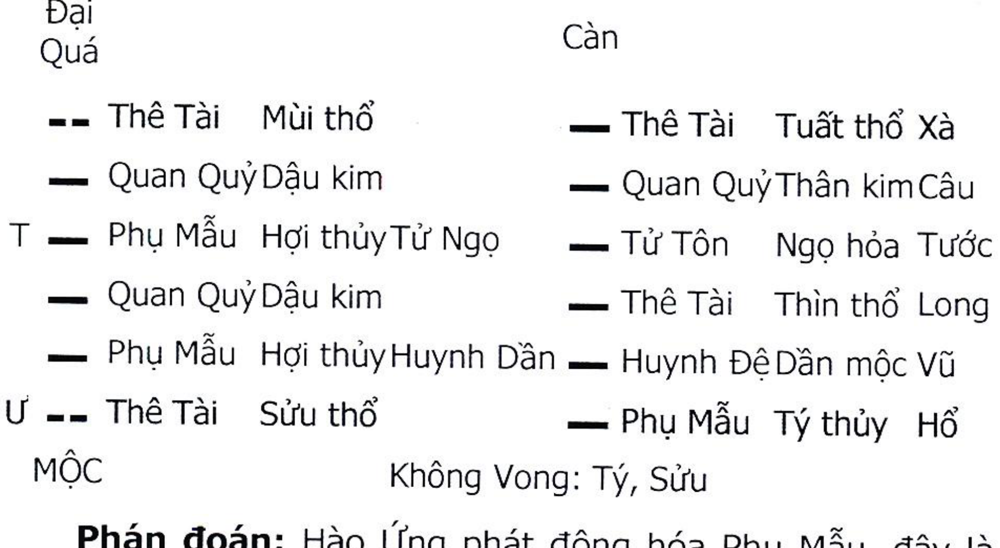
    - **Hình này chứng minh điều gì**
      - Hào Ứng phát động hóa Phụ Mẫu, đây là nhà của người khác, bản thân thuê để ở. Hào Ứng Không hóa Không, là nhà người ta vừa mới bỏ trống, nhượng lại cho mình.
    - **Từ đâu mà thấy được**
      - Hào Ứng phát động hóa Phụ Mẫu, đây là nhà của người khác, bản thân thuê để ở. Hào Ứng Không hóa Không, là nhà người ta vừa mới bỏ trống, nhượng lại cho mình.
- **Diễn tiến phân tích và suy luận chi tiết:**
  - Hào Ứng phát động hóa Phụ Mẫu, đây là nhà của người khác, bản thân thuê để ở.
  - Hào Ứng Không hóa Không, là nhà người ta vừa mới bỏ trống, nhượng lại cho mình.
  - Phụ Mẫu được Nhật sinh là vượng tướng, căn nhà tương đối rộng lớn.
  - Mộc lâm Nguyệt kiến khắc Thê Tài, mộc nhập quẻ phục tàng tại hào 2, hào 2 là sân, mộc chủ cây cối, trong sân có cây ảnh hưởng đến tài vận.
  - Thê Tài Sửu thổ Không hóa Không, tài vận không tốt đẹp.
  - Hào 6 Thê Tài Mùi thổ động hóa Tiến thần, hào sơ là lúc đầu, hào 6 là về sau, về sau tài vận sẽ từ từ tốt lên.
  - Phụ Mẫu Hợi thủy trì Thế, tương lai sẽ có nhà riêng.
- **Kết quả ứng nghiệm thực tế:**
  - Thực tế là nhà thuê.
  - Trong sân có cây, tài vận không tốt.

#### Ví dụ 67: Ngày Bính Tý tháng Giáp Thìn năm Đinh Hợi, nữ đoán phong thủy nhà cửa, được T...

- **Bối cảnh và thông tin quẻ:**
  - Ngày Bính Tý tháng Giáp Thìn năm Đinh Hợi, nữ đoán phong thủy nhà cửa, được Trạch Lôi Tùy biến Chấn Vi Lôi.
  - MỘC Không Vong: Thân, Dậu
- **Luận giải quái tượng phong thủy:**
  - **Hình 91.** Sơ đồ quẻ Trạch Lôi Tùy biến Chấn Vi Lôi
    - 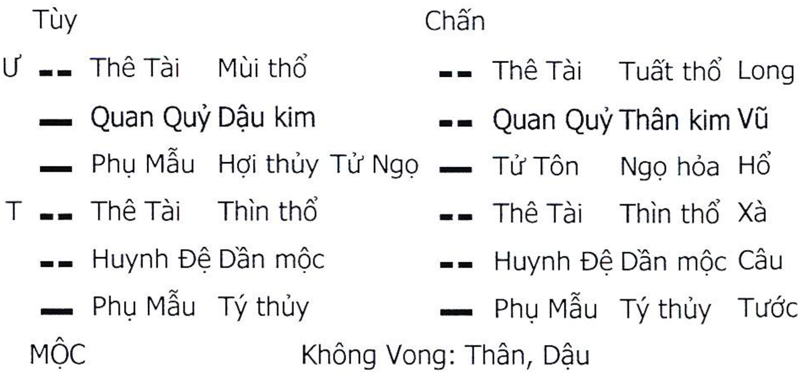
    - **Hình này chứng minh điều gì**
      - Quan Quỷ Dậu kim lâm Huyền Vũ độc phát hợp hào Thế, Quan Quỷ là tượng bất an, Huyền Vũ chủ âm khí, Không Vong chủ có âm thanh, tiếng động. Hào Thế tại hào 3 lâm Đằng Xà, Đằng Xà chủ bất an, sợ hãi,...
    - **Từ đâu mà thấy được**
      - Quan Quỷ Dậu kim lâm Huyền Vũ độc phát hợp hào Thế, Quan Quỷ là tượng bất an, Huyền Vũ chủ âm khí, Không Vong chủ có âm thanh, tiếng động. Hào Thế tại hào 3 lâm Đằng Xà, Đằng Xà chủ bất an, sợ hãi,...
- **Diễn tiến phân tích và suy luận chi tiết:**
  - Quan Quỷ Dậu kim lâm Huyền Vũ độc phát hợp hào Thế, Quan Quỷ là tượng bất an, Huyền Vũ chủ âm khí, Không Vong chủ có âm thanh, tiếng động.
  - Hào Thế tại hào 3 lâm Đằng Xà, Đằng Xà chủ bất an, sợ hãi, hào 3 là giường, chủ sợ hãi, nghỉ ngơi không tốt.
  - Tử Tôn Ngọ hỏa phục tàng bị Nhật khắc, hào Phi khắc, độc phát là Tử địa của Tử Tôn, bất lợi cho con cái.
  - Hào 2 Dần mộc lâm Câu Trần, hào 2 là trạch, Câu Trần chủ cũ kỹ, căn nhà cũ kỹ.
- **Kết quả ứng nghiệm thực tế:**
  - Trên thực tế là nhà cũ, vừa chuyển vào thì con cái bị bệnh, xuất hiện động kinh.
  - Ban đêm có thể nghe thấy trong nhà dường như có người nói chuyện.

#### Ví dụ 68: Ngày Tân Dậu tháng Tân Mão năm Bính Tuất, nam hỏi nên mua nhà ở tầng 1 hay tầ...

- **Bối cảnh và thông tin quẻ:**
  - Ngày Tân Dậu tháng Tân Mão năm Bính Tuất, nam hỏi nên mua nhà ở tầng 1 hay tầng 5?
  - Bởi vì anh ta ở xa cho nên không đến, tôi gieo được Trạch Lôi Tùy biến Trạch Sơn Hàm.
  - MỘC Không Vong: Tý, Sửu
- **Luận giải quái tượng phong thủy:**
  - **Hình 92.** Sơ đồ quẻ Trạch Lôi Tùy biến Trạch Sơn Hàm
    - 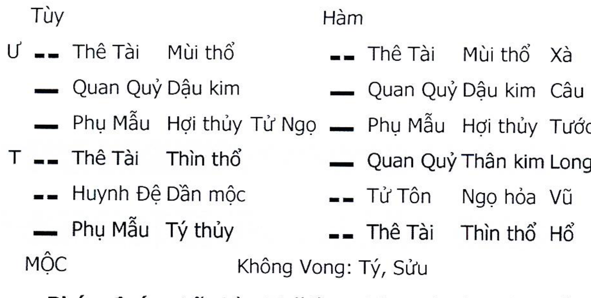
    - **Hình này chứng minh điều gì**
      - Lấy hào Thế làm chủ. Tầng 1 là thủy, không trợ giúp hào Thế, trái lại sinh Kỵ thần.
    - **Từ đâu mà thấy được**
      - Lấy hào Thế làm chủ. Thê Tài Thìn thổ trì Thế, lâm Tài vốn là cát, nhưng Nguyệt khắc Nhật không trợ giúp là hưu tù.
- **Diễn tiến phân tích và suy luận chi tiết:**
  - Lấy hào Thế làm chủ.
  - Thê Tài Thìn thổ trì Thế, lâm Tài vốn là cát, nhưng Nguyệt khắc Nhật không trợ giúp là hưu tù.
  - Tầng 1 là thủy, không trợ giúp hào Thế, trái lại sinh Kỵ thần.
  - Tầng 5 là thổ, trợ giúp hào Thế, đều có tác dụng trợ giúp cho Thê Tài và Quan Quỷ.
  - Vì vậy, chọn tầng 5 tương đối tốt.
  - Nhật là Quan Quỷ, hợp hào Thế, lại hào Thế lâm Thanh Long động hóa Quan Quỷ, với Quan tương kiến, nhà này lợi cho quan vận.
  - Phân tích hoàn cảnh xung quanh, hào 5 Quan Quỷ Dậu kim Nguyệt phá Nhật thần Thực Phá, hào 5 là đường đi, hào Thế phát động lại Hợp Phá, Nguyệt phá biểu thị đường đi hư hại, Thực Phá, Hợp Phá biểu thị đã sửa chữa.
  - Vì vậy, phán đoán là đường đi lân cận không tốt, đã từng tu bổ nhiều lần.
  - Hào sơ Phụ Mẫu Tý thủy được kim đến sinh, hào sơ là hàng xóm, biểu thị lân cận, kim sinh thủy là sông, lân cận có sông.
  - Tý thủy tam hợp thành cục, địa điểm đúng ở nơi sông ngòi giao hội.
  - Phụ Mẫu Tý thủy lâm Bạch Hổ, hào sơ thủy gặp Bạch Hổ là cầu, lân cận có cầu, Không Vong là cầu vượt treo giữa không trung.
  - Bạch Hổ cũng thể hiện đường đi, tam hợp cục, hóa ra Thìn thổ chủ Đông Nam, Đông Nam có ngã tư.
  - Nhật Dậu kim sinh Phụ Mẫu, Phụ Mẫu là nhà, chủ xây nhà.
  - Dậu kim nhập quẻ lâm Câu Trần, Nguyệt phá lại Thực Phá, đã dỡ bỏ nhà ban đầu và xây mới.
- **Kết quả ứng nghiệm thực tế:**
  - Toàn bộ phán đoán trên đây đều ứng nghiệm.

#### Ví dụ 69: Ngày Mậu Thìn tháng Nhâm Thìn năm Bính Tuất, nam hỏi phong thủy nhà cửa có ản...

- **Bối cảnh và thông tin quẻ:**
  - Ngày Mậu Thìn tháng Nhâm Thìn năm Bính Tuất, nam hỏi phong thủy nhà cửa có ảnh hưởng đến cơ thể hay không?
  - Được Sơn Địa Bác biến Sơn Thủy Mông.
  - KIM Không Vong: Tuất, Hợi
  - Lấy hào Thế làm Dụng thần.
  - Quẻ tại cung Càn chủ đầu, nhập Mộ tại Nhật Nguyệt chủ đầu óc lơ mơ, hào lâm Đằng Xà độc phát, độc phát biểu thị tính chất, Đằng Xà chủ quên, thủy chủ trí tuệ, hào Thế thủy lâm Tuyệt, trí nhớ không tốt.
- **Kết quả ứng nghiệm thực tế:**
  - Đúng, suy giảm trí nhớ rất nặng.
  - Hào 2 là chân, Đằng Xà chủ co giật, run rẩy, biểu thị chân phát run.
  - Ngoại quái là Cấn, Cấn chủ cánh tay, tay, bị Tị hỏa Tuyệt, chủ tay cũng phát run.
  - **Phản hồi:** Đúng, chủ yếu là run tay và chân.
  - Bình thường thì không nhìn thấy, vừa thả lỏng là run lên.
  - Hào Thế đóng tại quẻ Cấn, Cấn là Đông Bắc, anh trú tại hướng Đông Bắc của căn nhà.
  - Bị Tị hỏa Tuyệt, hỏa là số 2, kỵ ở lầu 2.
  - Nếu ở lầu 2 thì bệnh tật sẽ nghiêm trọng hơn.
  - **Phản hồi:** Đúng là tôi đang ở góc Đông Bắc của lầu 2.
  - Tị hỏa lâm Đằng Xà Tuyệt hào Thế, Tị hỏa là hỏa, Đằng Xà chủ thon dài, hào 2 là lân cận nơi ở, chứng tỏ lân cận nơi ở có ống khói cao to.
  - Động mà gặp trị gặp hợp, chủ tại Đông Nam hoặc Tây Nam.
  - **Phản hồi:** Phía Tây Nam có một ống khói lớn, cao mấy chục mét.
  - Hào 5 là anh cả, hào Thế tại hào 5, anh là anh cả trong nhà.
  - **Phản hồi:** Đúng.
  - Nhật, Nguyệt và hào biến là 3 Thìn thổ, Thìn thổ là thủy khố, ba cái này đều bất lợi cho hào Thế, lân cận có rất nhiều hồ nước, bất lợi cho cơ thể.
  - **Phản hồi:** Là hồ nước lạnh.
  - Đông Nam, phía Nam và Tây Nam của nhà đều là hồ nước.
  - Xem ra cần phải chuyển nhà, nơi này không thích hợp để sống.

#### Ví dụ 70: Ngày Nhâm Dần tháng Tân Mão năm Bính Tuất, nữ đoán phong thủy nhà cửa, được P...

- **Bối cảnh và thông tin quẻ:**
  - Ngày Nhâm Dần tháng Tân Mão năm Bính Tuất, nữ đoán phong thủy nhà cửa, được Phong Trạch Trung Phu biến Phong Thủy Hoán.
  - THỔ Không Vong: Thìn, Tị
- **Luận giải quái tượng phong thủy:**
  - **Hình 93.** Sơ đồ quẻ Phong Trạch Trung Phu biến Phong Thủy Hoán
    - 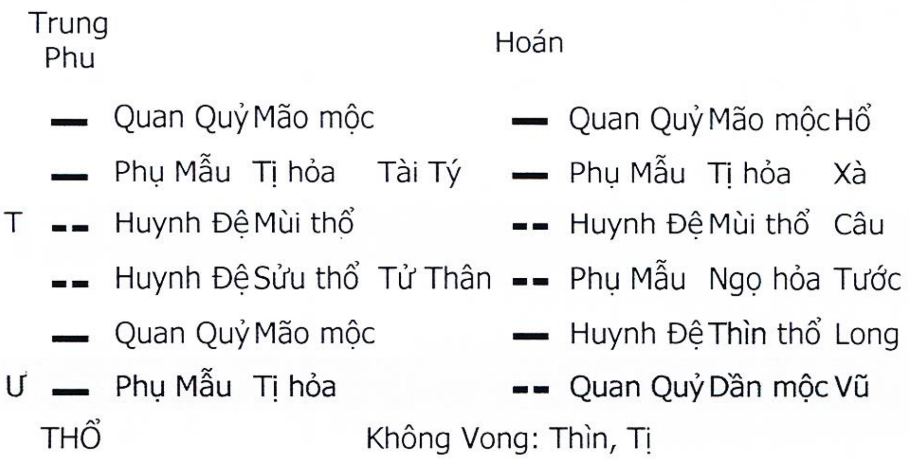
    - **Hình này chứng minh điều gì**
      - Hào Thế là nơi ở của mình, Phụ Mẫu là nhà, mặc dù hào Thế bị Nhật Nguyệt khắc thương, mừng được độc phát sinh hào Thế, vốn là cát, nhưng Tị hỏa Không Vong, do đó trong cát tàng hung, không thể xem ...
    - **Từ đâu mà thấy được**
      - Hào Thế là nơi ở của mình, Phụ Mẫu là nhà, mặc dù hào Thế bị Nhật Nguyệt khắc thương, mừng được độc phát sinh hào Thế, vốn là cát, nhưng Tị hỏa Không Vong, do đó trong cát tàng hung, không thể xem ...
- **Diễn tiến phân tích và suy luận chi tiết:**
  - Hào Thế là nơi ở của mình, Phụ Mẫu là nhà, mặc dù hào Thế bị Nhật Nguyệt khắc thương, mừng được độc phát sinh hào Thế, vốn là cát, nhưng Tị hỏa Không Vong, do đó trong cát tàng hung, không thể xem là phong thủy cát địa.
  - Năm Giáp Thân, Tị hỏa bị hợp không thể sinh hào Thế, năm này sẽ phát sinh tai họa.
  - Tị hỏa tại hào sơ, hào sơ là đi lại, Tị hỏa lâm Dịch Mã, lưu niên Tử Tôn Thân kim là đường đi, có nỗi lo về tai nạn xe cộ.
  - Thê Tài Tý thủy phục tàng, Nhật Nguyệt không trợ giúp, Tị hỏa độc phát là Tuyệt địa, tài vận không tốt đẹp.
  - Hào sơ Tị hỏa lâm hào Ứng hóa Dần mộc, hào sơ là hàng xóm, hào Ứng cũng là hàng xóm, mộc chủ cây cối, hàng xóm có cây lớn gây trở ngại.
  - Huyền Vũ độc phát hóa Quan Quỷ, bản thân dễ nảy sinh ngoại tình.
- **Kết quả ứng nghiệm thực tế:**
  - Trên thực tế, năm 2004 bản thân xảy ra tai nạn xe cộ, tài vận không tốt, hàng xóm có cây lớn.
  - Bản thân tại năm Đinh Hợi xuất hiện ngoại tình.

#### Ví dụ 71: Ngày Giáp Tý tháng Canh Dần năm Bính Tuất, nữ đoán phong thủy nhà cửa, được Đ...

- **Bối cảnh và thông tin quẻ:**
  - Ngày Giáp Tý tháng Canh Dần năm Bính Tuất, nữ đoán phong thủy nhà cửa, được Địa Sơn Khiêm.
  - KIM Không Vong: Tuất, Hợi
- **Luận giải quái tượng phong thủy:**
  - **Hình 94.** Sơ đồ quẻ Địa Sơn Khiêm
    - 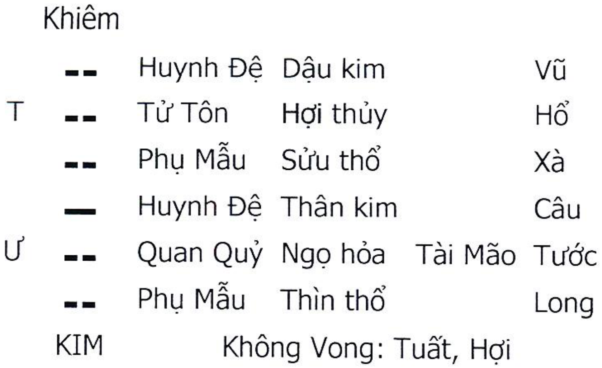
    - **Hình này chứng minh điều gì**
      - Quan Quỷ Ngọ hỏa lâm Chu Tước tại hào 2 ám động, hào 2 là trạch, Quan Quỷ chủ bất an, Chu Tước là cãi cọ, lâm hào Ứng, Ứng là chồng, Quan Quỷ cũng thể hiện chồng, quan hệ vợ chồng căng thẳng, cãi c...
    - **Từ đâu mà thấy được**
      - Quan Quỷ Ngọ hỏa lâm Chu Tước tại hào 2 ám động, hào 2 là trạch, Quan Quỷ chủ bất an, Chu Tước là cãi cọ, lâm hào Ứng, Ứng là chồng, Quan Quỷ cũng thể hiện chồng, quan hệ vợ chồng căng thẳng, cãi c...
- **Diễn tiến phân tích và suy luận chi tiết:**
  - Quan Quỷ Ngọ hỏa lâm Chu Tước tại hào 2 ám động, hào 2 là trạch, Quan Quỷ chủ bất an, Chu Tước là cãi cọ, lâm hào Ứng, Ứng là chồng, Quan Quỷ cũng thể hiện chồng, quan hệ vợ chồng căng thẳng, cãi cọ không ngừng.
  - Thê Tài Mão mộc phục tàng, mặc dù được Nguyệt trợ giúp Nhật đến sinh là cát, nhưng hào Phi ám động, là Tử địa của Thê Tài, lại hào Thế Tử Tôn Không Vong, tiền không đủ xài.
  - Hào Thế Tử Tôn Hợi thủy Không Vong, biểu thị tâm trạng không tốt, trong lòng trống rỗng.
  - Tử Tôn thể hiện con cái, Không Vong biểu thị không có con cái.
  - Phụ Mẫu Nguyệt khắc, Nhật không trợ giúp là hưu tù, vì vậy là nhà cũ.
  - Hào 3 là cửa, Huynh Đệ Thân kim lâm Nguyệt phá, chủ cửa có hư hại.
- **Kết quả ứng nghiệm thực tế:**
  - Tình hình thực tế đúng là như vậy.

#### Ví dụ 72: Ngày Quý Mùi tháng Canh Dần năm Bính Tuất, nữ đoán phong thủy nhà cửa, được K...

- **Bối cảnh và thông tin quẻ:**
  - Ngày Quý Mùi tháng Canh Dần năm Bính Tuất, nữ đoán phong thủy nhà cửa, được Khôn Vi Địa biến Lôi Địa Dự.
  - THỔ Không Vong: Thân, Dậu
- **Diễn tiến phân tích và suy luận chi tiết:**
  - Huynh Đệ Sửu thổ lâm Câu Trần độc phát, khắc Thê Tài Hợi thủy, khiến hào Thế nhập Mộ.
  - Quẻ Khôn chủ thổ, Câu Trần là gồ lên, cao to, lâm hào thổ phát động chủ có gò đất, ụ đất ảnh hưởng đến phong thủy nhà ở.
  - Sửu thổ tương ứng với Đông Bắc, ụ đất tại hướng Đông Bắc.
  - Hào Thế là nơi ở của mình, có thể suy ra là nhà, tại hào 6 chính là mái nhà, nhập Mộ chính là bị ụ đất chèn ép, cản trở.
  - Hào Thế Không Vong nhập Mộ không thể sinh Tài, tài vận không tốt.
- **Kết quả ứng nghiệm thực tế:**
  - Trên thực tế, có một gò đất cao ngang mái nhà ở phía Đông Bắc, ánh sáng không thể chiếu vào trong nhà, tài vận không tốt.

#### Ví dụ 73: Ngày Ất Tị tháng Đinh Hợi năm Ất Dậu, nữ đoán cát hung trong nhà, được Lôi Th...

- **Bối cảnh và thông tin quẻ:**
  - Ngày Ất Tị tháng Đinh Hợi năm Ất Dậu, nữ đoán cát hung trong nhà, được Lôi Thiên Đại Tráng.
  - THỔ Không Vong: Dần, Mão
- **Diễn tiến phân tích và suy luận chi tiết:**
  - Hào 2 Quan Quỷ Dần mộc Không Vong, Quan Quỷ thể hiện chồng, lại là Nguyên thần của hào Thế, Nguyên thần chủ tư duy, hào 2 là trạch, Không Vong chủ rời khỏi, chồng và bản thân thường xuyên vắng nhà.
  - Quan Quỷ Dần mộc tại hào 2 Không Vong không được thủy đến sinh, thủy chủ ban đêm, hào 2 là nhà, biểu thị chồng thích thức khuya.
  - Thủy lại chủ nước tiểu, nội tiết không tốt, có bệnh tiểu đường.
  - Nguyên thần tại hào sơ lâm Thanh Long, hào sơ là bàn chân, Thanh Long chủ ngứa, chồng có cước khí.
  - Quan Quỷ Dần mộc Không Vong lâm Chu Tước không sinh hào Thế, Không Vong biểu thị không có, mộc Không lại là mật, hào 2 là mật, đã phẫu thuật cắt bỏ mật.
  - Tử Tôn Thân kim tại hào 5 lâm Bạch Hổ, Bạch Hổ chủ bệnh tật, Kỵ thần Tị hỏa lâm Nhật đến hợp, Nhật hợp cản trở, hỏa chủ mắt, chứng tỏ mắt có vấn đề, có đeo kính.
  - Nguyệt Hợi thủy là Bệnh địa của Tử Tôn, thủy chủ cổ họng, Bệnh địa là bệnh, hào 5 là ngũ quan, cổ họng có vấn đề.
  - Nguyệt Hợi thủy tìm đến hào vị, không có thì dùng Tý thủy thay thế, lâm hào sơ, chủ con trai cũng có cước khí.
  - Hào 2 mộc lâm Chu Tước là hoa, gặp Nhật hỏa vượng cũng là hoa, tại hào 2 biểu thị trong nhà trồng hoa, nhưng Không Vong, biểu thị ban đầu trong nhà có trồng nhưng bây giờ đã thôi, vì vậy mà ảnh hưởng đến khí trường.
- **Kết quả ứng nghiệm thực tế:**
  - Phán đoán quả nhiên ứng nghiệm.

#### Ví dụ 74: Ngày Đinh Dậu tháng Bính Thân năm Bính Tuất, nam đoán phong thủy của căn nhà ...

- **Bối cảnh và thông tin quẻ:**
  - Ngày Đinh Dậu tháng Bính Thân năm Bính Tuất, nam đoán phong thủy của căn nhà được giới thiệu, được Trạch Sơn Hàm biến Thiên Sơn Độn.
  - KIM Không Vong: Thìn, Tị
- **Luận giải quái tượng phong thủy:**
  - **Hình 95.** Sơ đồ quẻ Trạch Sơn Hàm biến Thiên Sơn Độn
    - 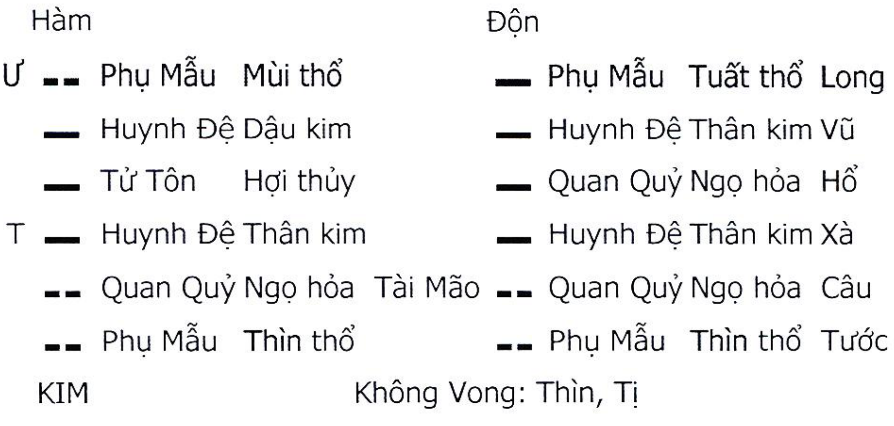
    - **Hình này chứng minh điều gì**
      - Phụ Mẫu Mùi thổ lâm Thanh Long lâm hào Ứng độc phát sinh hào Thế, hào Ứng là người khác, Phụ Mẫu là nhà, là nhà của người khác, Thanh Long chủ vui mừng, lại là Mộ khố của Thê Tài, sinh hào Thế chín...
    - **Từ đâu mà thấy được**
      - Phụ Mẫu Mùi thổ lâm Thanh Long lâm hào Ứng độc phát sinh hào Thế, hào Ứng là người khác, Phụ Mẫu là nhà, là nhà của người khác, Thanh Long chủ vui mừng, lại là Mộ khố của Thê Tài, sinh hào Thế chín...
- **Diễn tiến phân tích và suy luận chi tiết:**
  - Phụ Mẫu Mùi thổ lâm Thanh Long lâm hào Ứng độc phát sinh hào Thế, hào Ứng là người khác, Phụ Mẫu là nhà, là nhà của người khác, Thanh Long chủ vui mừng, lại là Mộ khố của Thê Tài, sinh hào Thế chính là nhà đến tay mình sẽ đem lại niềm vui, chuyện tốt, chứng tỏ phong thủy của căn nhà rất tốt.
- **Kết quả ứng nghiệm thực tế:**
  - Anh ta đã mua theo lời tôi đề nghị, tháng Tuất chuyển nhà, sau khi vào ở thì cảm thấy rất hài lòng, môi trường xung quanh rất tốt, thu nhập đã tăng thêm 20%.
  - Trong vòng 10 tháng, thành tích làm việc từ vị trí thứ 25 đã lên vị trí thứ 3, địa vị ở công ty cũng được nâng cao.

#### Ví dụ 75: Ngày Đinh Mùi tháng Kỷ Sửu năm Ất Dậu, nữ hỏi hàng xóm xây nhà có ảnh hưởng đ...

- **Bối cảnh và thông tin quẻ:**
  - Ngày Đinh Mùi tháng Kỷ Sửu năm Ất Dậu, nữ hỏi hàng xóm xây nhà có ảnh hưởng đến mình hay không?
  - Được Đoài Vi Trạch biến Sơn Thiên Đại Súc.
  - KIM Không Vong: Dần, Mão
- **Luận giải quái tượng phong thủy:**
  - **Hình 96.** Sơ đồ quẻ Đoài Vi Trạch biến Sơn Thiên Đại Súc
    - 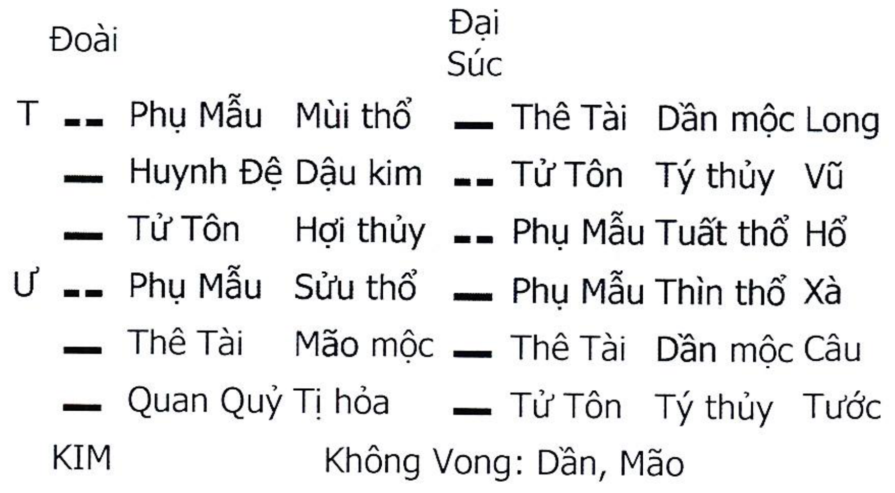
    - **Hình này chứng minh điều gì**
      - Hào Thế là mình, hào Ứng là hàng xóm. Hào Ứng lâm Phụ Mẫu Sửu thổ phát động, Phụ Mẫu là nhà, Sửu thổ tương ứng Đông Bắc, hàng xóm xây nhà ở Đông Bắc.
    - **Từ đâu mà thấy được**
      - Hào Thế là mình, hào Ứng là hàng xóm. Hào Ứng lâm Phụ Mẫu Sửu thổ phát động, Phụ Mẫu là nhà, Sửu thổ tương ứng Đông Bắc, hàng xóm xây nhà ở Đông Bắc.
  - **Hình 97.** Sơ đồ quẻ Tốn Vi Phong biến Phong Lôi Ích
    - 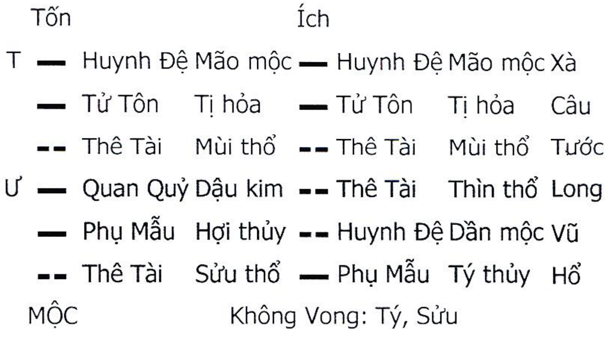
    - **Hình này chứng minh điều gì**
      - Hào Thế là mình, hào Ứng là hàng xóm. Hào Ứng lâm Phụ Mẫu Sửu thổ phát động, Phụ Mẫu là nhà, Sửu thổ tương ứng Đông Bắc, hàng xóm xây nhà ở Đông Bắc.
    - **Từ đâu mà thấy được**
      - Hào Thế là mình, hào Ứng là hàng xóm. Hào Ứng lâm Phụ Mẫu Sửu thổ phát động, Phụ Mẫu là nhà, Sửu thổ tương ứng Đông Bắc, hàng xóm xây nhà ở Đông Bắc.
  - **Hình 98.** Sơ đồ quẻ Thiên Phong Cấu biến Cấn Vi Sơn
    - 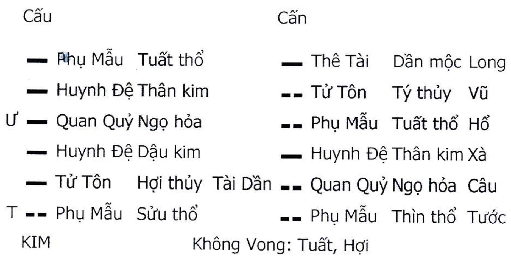
    - **Hình này chứng minh điều gì**
      - Hào Thế là mình, hào Ứng là hàng xóm. Hào Ứng lâm Phụ Mẫu Sửu thổ phát động, Phụ Mẫu là nhà, Sửu thổ tương ứng Đông Bắc, hàng xóm xây nhà ở Đông Bắc.
    - **Từ đâu mà thấy được**
      - Hào Thế là mình, hào Ứng là hàng xóm. Hào Ứng lâm Phụ Mẫu Sửu thổ phát động, Phụ Mẫu là nhà, Sửu thổ tương ứng Đông Bắc, hàng xóm xây nhà ở Đông Bắc.
- **Diễn tiến phân tích và suy luận chi tiết:**
  - Hào Thế là mình, hào Ứng là hàng xóm.
  - Hào Ứng lâm Phụ Mẫu Sửu thổ phát động, Phụ Mẫu là nhà, Sửu thổ tương ứng Đông Bắc, hàng xóm xây nhà ở Đông Bắc.
  - Động mà xung hào Thế Phụ Mẫu, căn nhà hàng xóm xây dựng ảnh hưởng đến phong thủy nhà mình.
  - Tử Tôn Hợi thủy lâm Bạch Hổ hóa hồi đầu khắc, Nguyên thần nhập Mộ ở hào Ứng, Nguyên thần chủ tư duy, thế giới nội tâm, Mộ khố chủ khống chế, tính cách của con cái bị ảnh hưởng bởi căn nhà hàng xóm.
  - Bạch Hổ chủ tức giận, tính khí trở nên không tốt, nóng nảy.
  - Thê Tài Mão mộc hưu tù, không được Nhật Nguyệt trợ giúp, nhập Mộ ở Nhật, lại lâm Không Vong, tài vận cũng không tốt.
  - Hào Thế Phụ Mẫu Mùi thổ Nguyệt phá, động hóa Không Vong, lại đến hào 6, Phụ Mẫu chủ đất đai phòng ốc, hào 6 là rút khỏi, loại bỏ, Không biểu thị mất mát, nhà đất của mình cũng không thể ở lâu.
- **Kết quả ứng nghiệm thực tế:**
  - Đúng là hàng xóm xây nhà ở hướng Đông Bắc.
  - Sau khi xây xong thì con trai trở nên nóng nảy, quán ăn đã kinh doanh 14 năm cũng không khởi sắc, buộc phải đem nhà và đất bán đi.
  - ### Ví dụ 76
  - Ngày Tân Dậu tháng Nhâm Ngọ năm Ất Dậu, nữ đoán phong thủy nhà mẹ đẻ, được Tốn Vi Phong biến Phong Lôi Ích.
  - MỘC Không Vong: Tý, Sửu
  - **Phán đoán:** Hào sơ lâm Bạch Hổ hóa ra Tý thủy, tổ hợp hào sơ Tý thủy Bạch Hổ là cầu, lân cận có cầu.
  - Hào 2 là trạch và lân cận nơi ở, Phụ Mẫu Hợi thủy được Nhật sinh, thủy được kim sinh là sông ngòi, lân cận có sông ngòi.
  - Phụ Mẫu Hợi thủy động hóa hợp, Dần Hợi hợp là nhà lầu.
  - Hào sơ Không Vong, có tầng hầm.
  - Hào sơ lại là nền nhà, Không hóa Không, hóa phá, nền nhà bị hư hại.
  - Bạch Hổ là đường đi, Mộ khố của hào Thế là nơi ở, hào lâm Bạch Hổ xung Mộ khố của hào Thế, là có đường xung trạch.
  - Nguyệt Ngọ hỏa là Tử Tôn chủ đường đi, xung phá Phụ Mẫu Tý thủy, Phụ Mẫu là nhà, cũng biểu thị có đường xung trạch.
  - Hào 2 lâm Huyền Vũ, phát động khắc hỏa, Huyền Vũ chủ tối tăm, hỏa chủ ánh sáng, căn nhà có vấn đề về ánh sáng.
  - Dần mộc hợp nhập hào 2, hào 2 là sân, mộc là cây cối, sân có nhiều cây cối.
  - Hào Thế tại hào 6, hào 6 là nơi xa xôi, lại bị Nhật xung thành Dịch Mã, bản thân lưu lạc nơi đất khách.
  - **Phản hồi:** Thực tế đúng là như vậy.
  - ### Ví dụ 77
  - Ngày Bính Dần tháng Nhâm Ngọ năm Ất Dậu, nam đoán phong thủy nhà cửa, được Thiên Phong Cấu biến Cấn Vi Sơn.
  - KIM Không Vong: Tuất, Hợi
  - **Phán đoán:** Hào Ứng động hóa Phụ Mẫu, sinh hào Thế Phụ Mẫu, nhà này không phải là của mình, mà là nhà người ta giao cho mình ở.
  - Hào 2 Tử Tôn không được Nhật Nguyệt trợ giúp, hưu tù Không Vong hóa Quan Quỷ, nhà này bất lợi cho nối dõi tông đường.
  - Quan Quỷ động hóa Không Vong, ở nhà này sẽ có chuyện mất quan bãi chức.
  - Hào Thế lâm Chu Tước, hào 2 động hóa Quan Quỷ, nhiều cãi cọ.
  - Nhật Dần mộc là bên ngoài, hợp hào 2 hào trạch, bên ngoài tường có cành cây lan rộng vào trong sân.
  - Hào 4 là cổng, tam hợp cục, nhưng Tuất thổ Không Vong, ra cổng có ngã 3 hình chữ 丁.
  - **Phản hồi:** Đúng là nhà được người ta giao cho, tài vận không tốt, đã mất chức vụ, chưa từng có con cái.

#### Ví dụ 78: Ngày Kỷ Tị tháng Nhâm Ngọ năm Ất Dậu, nữ đoán phong thủy nhà cửa, được Lôi Sơ...

- **Bối cảnh và thông tin quẻ:**
  - Ngày Kỷ Tị tháng Nhâm Ngọ năm Ất Dậu, nữ đoán phong thủy nhà cửa, được Lôi Sơn Tiểu Quá biến Chấn Vi Lôi.
  - KIM Không Vong: Tuất, Hợi
  - Thê Tài Mão mộc phục tàng, Nhật Nguyệt không đến trợ giúp là hưu tù, Huynh Đệ lâm Huyền Vũ phát động chủ phong thủy nhà này không tốt, sẽ xảy ra chuyện lừa gạt tiền bạc.
- **Luận giải quái tượng phong thủy:**
  - **Hình 99.** Sơ đồ quẻ Lôi Sơn Tiểu Quá biến Chấn Vi Lôi
    - 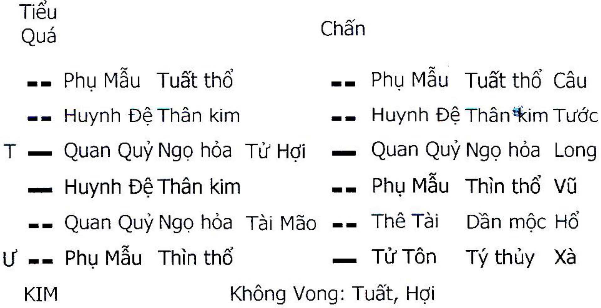
    - **Hình này chứng minh điều gì**
      - Quẻ chứng minh tình trạng phong thủy và ảnh hưởng cát hung tương ứng với quái tượng Sơ đồ quẻ Lôi Sơn Tiểu Quá biến Chấn Vi Lôi.
    - **Từ đâu mà thấy được**
      - Căn cứ vào hào vị, lục thân, can chi sinh khắc, tuần không và hào động biến trong quẻ.
- **Kết quả ứng nghiệm thực tế:**
  - Cha bởi vì bị bạn bè lừa tiền, mắc nợ tự sát mà chết.
  - Ứng lâm Phụ Mẫu hóa phá, Quan Quỷ lưỡng hiện, Nhật Nguyệt trợ giúp, quá vượng, hôn nhân không tốt đẹp.
  - **Phản hồi:** Tại năm Nhâm Ngọ ly hôn.
  - Phụ Mẫu Thìn thổ lâm Đằng Xà phát động, đề phòng xảy ra kiện tụng.
  - **Phản hồi:** Sau khi vào ở thì xảy ra kiện tụng.
  - ---
  - # Part 11 (Pages 201-220)

#### Ví dụ 79: Ngày Mậu Thìn tháng Canh Thân năm Quý Mùi, nam đoán phong thủy nhà cửa, được ...

- **Bối cảnh và thông tin quẻ:**
  - Ngày Mậu Thìn tháng Canh Thân năm Quý Mùi, nam đoán phong thủy nhà cửa, được Trạch Phong Đại Quá biến Lôi Trạch Quy Muội.
  - MỘC Không Vong: Tuất, Hợi
- **Luận giải quái tượng phong thủy:**
  - **Hình 100.** Quẻ Trạch Phong Đại Quá biến Lôi Trạch Quy Muội
    - 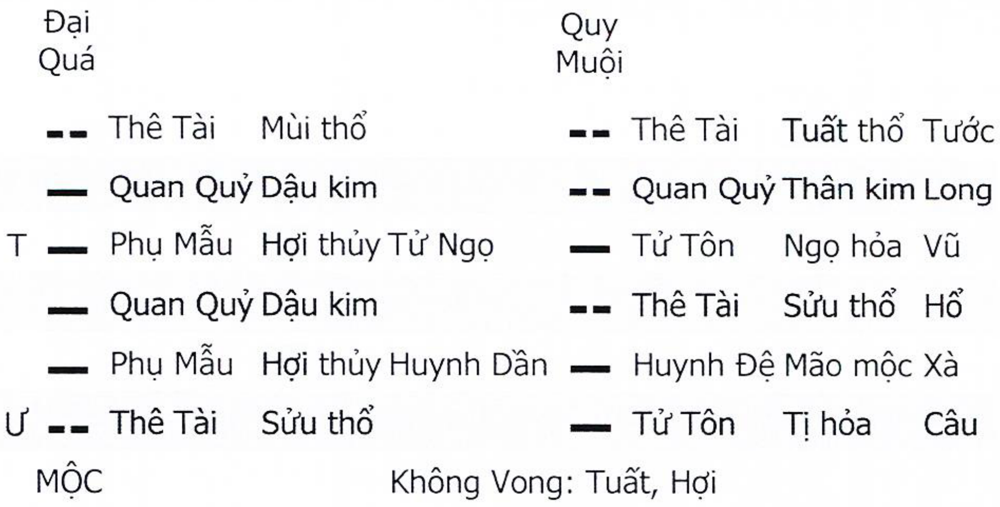
    - **Hình này chứng minh điều gì**
      - Lấy hào Phụ Mẫu làm Dụng thần, xem thêm hào 2. Hào 2 Phụ Mẫu Hợi thủy được Nguyệt kiến sinh phù, được hào 5 Quan động sinh, nội quái Tị Dậu Sửu tam hợp Quan cục lại sinh, rất vượng tướng, vượng thì...
    - **Từ đâu mà thấy được**
      - Lấy hào Phụ Mẫu làm Dụng thần, xem thêm hào 2. Hào 2 Phụ Mẫu Hợi thủy được Nguyệt kiến sinh phù, được hào 5 Quan động sinh, nội quái Tị Dậu Sửu tam hợp Quan cục lại sinh, rất vượng tướng, vượng thì...
- **Diễn tiến phân tích và suy luận chi tiết:**
  - Lấy hào Phụ Mẫu làm Dụng thần, xem thêm hào 2.
  - Hào 2 Phụ Mẫu Hợi thủy được Nguyệt kiến sinh phù, được hào 5 Quan động sinh, nội quái Tị Dậu Sửu tam hợp Quan cục lại sinh, rất vượng tướng, vượng thì to lớn, đoán là căn nhà rất lớn.
  - Tuy nhiên, Hợi thủy Không Vong, hào 5 là hào vị người, hào 2 Không không được hào 5 sinh.
  - Do đó, trong nhà thưa người, vắng vẻ.
  - Phụ Mẫu Hợi thủy trì Thế là nhà đã trong tay mình.
  - Phụ Mẫu cũng chủ thủ tục, Không Vong là vẫn chưa làm xong thủ tục, chưa có giấy chứng nhận quyền sở hữu nhà.
  - Hào Thế nhập Mộ ở Nhật thần, Nhật thần là Tài, là thông tin khốn đốn vì tiền bạc.
  - Thế lâm Phụ Mẫu nhập Mộ, Phụ Mẫu chủ nhà cửa, tất là bởi vì chuyện nhà cửa mà tiền bạc gặp khó khăn.
  - Nhật là hiện nay, đoán là lúc mua nhà đã vay nợ, đến nay vẫn chưa trả xong.
  - Quan Quỷ là công việc, nội quái Tị Dậu Sửu tam hợp Quan cục sinh hào Thế, mỗi khía cạnh của công việc đều thuận buồm xuôi gió.
  - Nhưng hào Thế Không Vong, được Quan Quỷ sinh khá yếu.
  - Do đó, Quan Quỷ chỉ thể hiện công việc, không thể hiện quan vận, đoán là người này không có quan vận.
  - Hào 5 là hào vị lãnh đạo, động mà sinh Thế, đơn vị có người lãnh đạo chiếu cố anh ta.
  - Nhưng hào 5 Quan Quỷ động mà hóa thoái, chính là tượng người lãnh đạo rời khỏi cương vị công tác.
  - Vì vậy, đoán là người lãnh đạo đó đã rời khỏi đơn vị.
  - Lại hào 5 Quan Quỷ Dậu kim là Đào Hoa, lâm Thanh Long, Thanh Long chủ tửu sắc, tương hợp với Nhật Tài tinh, nhập Mộ ở hào sơ Thê Tài Sửu thổ, vì vậy phong lưu háo sắc, có một vài nhân tình.
  - Trong quẻ hào Tài đa hiện khắc Thế, đoán là ngoài tiền lương, anh ta còn có thu nhập khác.
  - Ứng là thê vị, Thê Tài cũng chủ vợ, Ứng lâm Thê Tài Sửu thổ tức là vợ người này.
  - Thê Tài Sửu thổ là Mộ khố của Quan Quỷ, Quan Quỷ là bệnh, là thông tin trong người vợ có bệnh.
  - Hào sơ là chân, tại cung Chấn là chân, đoán là vợ có bệnh tật ở chân.
- **Kết quả ứng nghiệm thực tế:**
  - Thực tế đúng là như vậy.

#### Ví dụ 80: Ngày Canh Dần tháng Dậu năm Quý Mùi, nam đoán phong thủy nhà cửa, được Lôi Th...

- **Bối cảnh và thông tin quẻ:**
  - Ngày Canh Dần tháng Dậu năm Quý Mùi, nam đoán phong thủy nhà cửa, được Lôi Thiên Đại Tráng biến Hỏa Thiên Đại Hữu.
  - THỔ Không Vong: Ngọ, Mùi
- **Luận giải quái tượng phong thủy:**
  - **Hình 101.** Sơ đồ quẻ Lôi Thiên Đại Tráng biến Hỏa Thiên Đại Hữu
    - 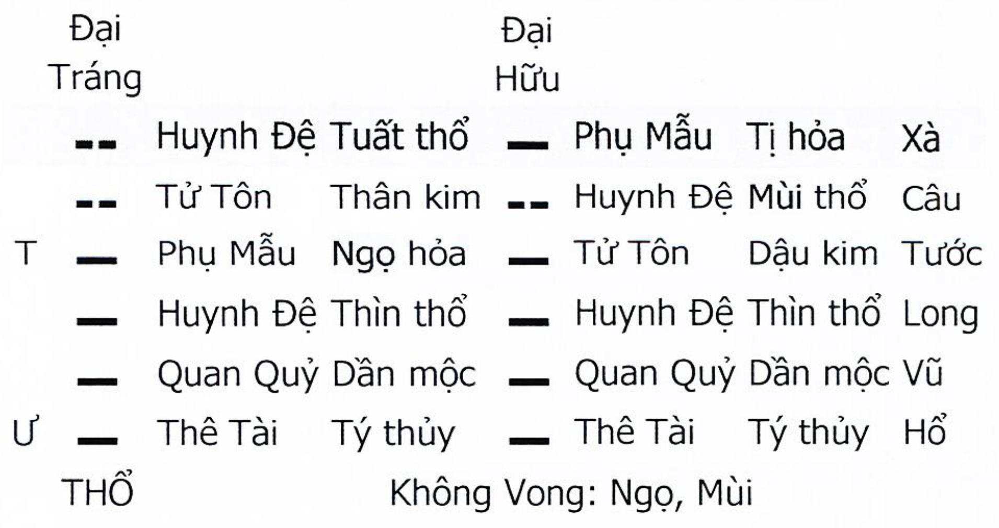
    - **Hình này chứng minh điều gì**
      - Quẻ được lục xung, hào Thế Không Vong, ở nhà này thì tâm trạng không tốt, lâm Chu Tước là bởi vì cãi cọ. Thê Tài Tý thủy tại hào sơ lâm Bạch Hổ, thủy thêm Bạch Hổ là cầu, lân cận nơi ở có cầu.
    - **Từ đâu mà thấy được**
      - Quẻ được lục xung, hào Thế Không Vong, ở nhà này thì tâm trạng không tốt, lâm Chu Tước là bởi vì cãi cọ. Thê Tài Tý thủy tại hào sơ lâm Bạch Hổ, thủy thêm Bạch Hổ là cầu, lân cận nơi ở có cầu.
- **Diễn tiến phân tích và suy luận chi tiết:**
  - Quẻ được lục xung, hào Thế Không Vong, ở nhà này thì tâm trạng không tốt, lâm Chu Tước là bởi vì cãi cọ.
  - Thê Tài Tý thủy tại hào sơ lâm Bạch Hổ, thủy thêm Bạch Hổ là cầu, lân cận nơi ở có cầu.
  - Tý thủy được Nguyệt sinh, có nước chảy dưới cầu.
  - Có lợi cho tài vận.
  - Tuy nhiên, hào 6 Huynh Đệ Tuất thổ lâm Đằng Xà độc phát khắc Tài, hào 6 là tường, bức tường ảnh hưởng đến tài vận.
  - Tử Tôn Thân kim tại hào 5, Tử Tôn là con cái, hào 5 là con trưởng, lâm Câu Trần ám động, Câu Trần chủ kiến trúc, ám động gặp hợp, lại hào 6 phát động hóa Phụ Mẫu Tị hỏa, Phụ Mẫu là nhà, Tị hỏa tương ứng với năm 2001, năm này bởi vì con trưởng mà xây nhà.
  - Hào Thế và Tử Tôn tương khắc, cha con bất hòa.
  - Quan Quỷ Dần mộc lâm Huyền Vũ nhập hào 2, Huyền Vũ chủ trộm cắp, Quan Quỷ là đạo tặc, có kẻ trộm vào nhà ăn trộm.
- **Kết quả ứng nghiệm thực tế:**
  - Quả nhiên là tại năm Tân Tị, bởi vì con trai kết hôn mà xây thêm nhà, cha con ở chung nảy sinh bất hòa, tài vận công ty cũng không tốt.
  - Lân cận có cầu, dưới cầu có nước chảy.
  - Tháng Tý năm Nhâm Ngọ, công ty bị mất trộm.

#### Ví dụ 81: Ngày Ất Sửu tháng Giáp Dần năm Quý Mùi, nữ xem giếng nước ở quê nhà có ảnh hư...

- **Luận giải quái tượng phong thủy:**
  - **Hình 102.** Quẻ Hỏa Địa Tấn biến Sơn Địa Bác
    - 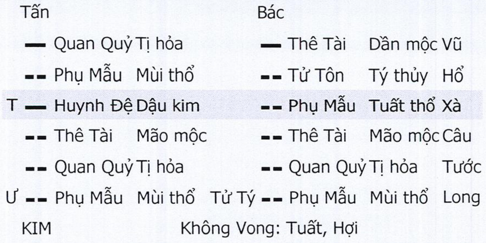
    - **Hình này chứng minh điều gì**
      - Lại xem hào vị, hào sơ là giếng. Quẻ này hào sơ là Tài khố.
    - **Từ đâu mà thấy được**
      - Hào 5 Phụ Mẫu lâm Bạch Hổ, Bạch Hổ chủ đường đi, hào 5 cũng là hào vị đường đi, vì vậy là giếng nước ở cạnh đường. Hào Thế là người xin đoán, cũng thể hiện nơi ở của người này.
- **Diễn tiến phân tích và suy luận chi tiết:**
  - Tài là ẩm thực, là nước, Tài khố là giếng nước.
  - Lại xem hào vị, hào sơ là giếng.
  - Quẻ này hào sơ là Tài khố.
  - Vì vậy, hào sơ Mùi thổ chính là giếng nước.
  - Trong quẻ Phụ Mẫu Mùi thổ lưỡng hiện, đều là Tài khố, vì vậy là có hai miệng giếng.
  - Quẻ tại cung Càn, Càn là Tây Bắc, một miệng giếng tại Tây Bắc.
  - Phụ Mẫu Mùi thổ bị Nhật thần Sửu thổ xung, gặp xung thì đoán hướng ngược lại, Mùi thổ là Tây Nam, vì vậy đoán là ở hướng Đông Bắc cũng có một miệng giếng.
  - Hào 5 Phụ Mẫu lâm Bạch Hổ, Bạch Hổ chủ đường đi, hào 5 cũng là hào vị đường đi, vì vậy là giếng nước ở cạnh đường.
  - Lại hào sơ là nền nhà, giếng nước cũng rất gần nền nhà.
  - Hào Thế là người xin đoán, cũng thể hiện nơi ở của người này.
  - Hào Thế động mà khắc Thê Tài, chính là thông tin dùng nước trong giếng.
  - Vì vậy, phán đoán là trước đây có dùng nước trong giếng, nhưng động mà hóa Không, hiện tại đã không dùng nữa.
  - Thê Tài là nước, Thê Tài Mão mộc lâm Câu Trần, Câu Trần là điền thổ.
  - Hiện nay, nước trong giếng có liên quan đến ruộng đồng, là dùng để tưới tiêu ruộng đồng.
  - Hào sơ Phụ Mẫu Mùi thổ lâm Thanh Long, Thanh Long chủ mỹ vị, cao quý, tốt đẹp,...
  - Vì vậy, nước trong giếng rất ngon, rất ngọt.
  - Tử Tôn phục dưới hào Ứng Phụ Mẫu Mùi thổ, hào Thế động mà sinh Tử Tôn, Tử Tôn thể hiện con cái đời sau, bản thân hoặc người trong tộc có đời sau.
  - Nhưng hào Ứng khắc Tử Tôn, Ứng là hàng xóm, hào sơ lại là hào vị hàng xóm, nhà hàng xóm khắc con, ít con.
  - Nguyệt kiến là Bệnh địa của Tử Tôn, hào Ứng là Dưỡng địa của Tử Tôn.
  - Vì vậy, con cái của nhà hàng xóm không bị bệnh thì cũng là con nhận nuôi của người khác.
- **Kết quả ứng nghiệm thực tế:**
  - Phán đoán trên đây phù hợp với thực tế.

#### Ví dụ 82: Ngày Tân Mão tháng Kỷ Hợi năm Tân Tị, một người đàn ông thuê nhà để kinh doan...

- **Luận giải quái tượng phong thủy:**
  - **Hình 103.** Sơ đồ quẻ Phong Hỏa Gia Nhân biến Sơn Hỏa Bí
    - 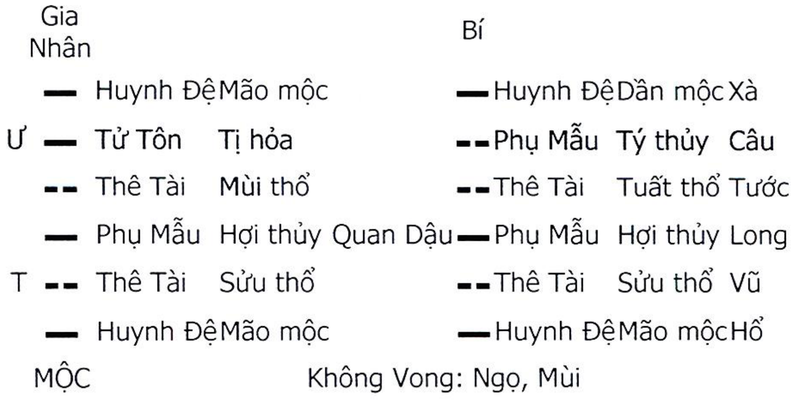
    - **Hình này chứng minh điều gì**
      - Phụ Mẫu Hợi thủy lâm Nguyệt xung phá Tử Tôn Tị hỏa, Phụ Mẫu là nhà, hào 5 là đường đi, có đường đối xung với nhà. Phong thủy nhà không tốt, ảnh hưởng đến kinh doanh, không kiếm được tiền.
    - **Từ đâu mà thấy được**
      - Phụ Mẫu Hợi thủy lâm Nguyệt xung phá Tử Tôn Tị hỏa, Phụ Mẫu là nhà, hào 5 là đường đi, có đường đối xung với nhà. Tử Tôn Tị hỏa là Nguyên thần của Thê Tài, Nguyệt phá hóa hồi đầu khắc không thể sin...
- **Diễn tiến phân tích và suy luận chi tiết:**
  - Phụ Mẫu Hợi thủy lâm Nguyệt xung phá Tử Tôn Tị hỏa, Phụ Mẫu là nhà, hào 5 là đường đi, có đường đối xung với nhà.
  - Tử Tôn Tị hỏa là Nguyên thần của Thê Tài, Nguyệt phá hóa hồi đầu khắc không thể sinh Tài, Tài lại bị Nhật khắc.
  - Phong thủy nhà không tốt, ảnh hưởng đến kinh doanh, không kiếm được tiền.
  - Hào 2 là nhà, lâm Huyền Vũ, Huyền Vũ chủ tư nhân, là thuê nhà của tư nhân.
  - Hào 4 Mùi thổ Không, Mùi thổ tương ứng với Tây Nam, hào 4 là cửa sổ, Tây Nam có cửa sổ không kín đáo.
  - Độc phát động mà gặp hợp, nhà này được thuê tại ngày Thân.
- **Kết quả ứng nghiệm thực tế:**
  - Quả nhiên là như vậy, sau nửa năm kinh doanh không có kết quả, cuối cùng đành phải rời khỏi.

#### Ví dụ 83: Ngày Đinh Mão tháng Bính Thìn năm Quý Mùi, nam hỏi vợ bị ung thư vú có phải l...

- **Luận giải quái tượng phong thủy:**
  - **Hình 104.** Sơ đồ quẻ Càn Vi Thiên biến Trạch Thủy Khốn
    - 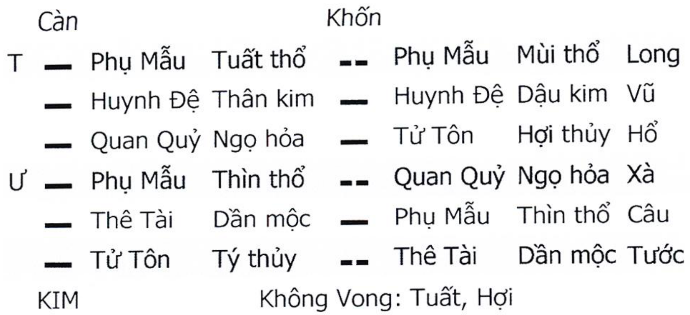
    - **Hình này chứng minh điều gì**
      - Vì vậy, không phải là do phong thủy căn nhà gây ra. Phụ Mẫu Thìn thổ lâm hào Ứng hóa hồi đầu sinh, Ứng là người khác, nhà này là nhà thuê.
    - **Từ đâu mà thấy được**
      - Lấy Thê Tài làm Dụng thần. Thê Tài Dần mộc mặc dù lâm Câu Trần, nhưng được Nhật trợ giúp, Tý thủy đến sinh là vượng tướng.
- **Diễn tiến phân tích và suy luận chi tiết:**
  - Lấy Thê Tài làm Dụng thần.
  - Thê Tài Dần mộc mặc dù lâm Câu Trần, nhưng được Nhật trợ giúp, Tý thủy đến sinh là vượng tướng.
  - Vì vậy, không phải là do phong thủy căn nhà gây ra.
  - Phụ Mẫu Thìn thổ lâm hào Ứng hóa hồi đầu sinh, Ứng là người khác, nhà này là nhà thuê.
  - Hào Thế lâm Phụ Mẫu hóa thoái, muốn chuyển đi nơi khác.
  - Hào Thế Phụ Mẫu Tuất thổ Nguyệt phá Không Vong lâm Thanh Long, Thanh Long chủ chỉnh trang, Nguyệt phá chủ bong tróc, Không Vong chủ mất mát, hào 6 là thoái hưu, cũ kỹ, căn nhà đã cũ kỹ, bên ngoài đã bong tróc, hư hại.
  - Hào Ứng là lân cận, hàng xóm, Phụ Mẫu Thìn thổ hóa Quan Quỷ, Thìn thổ là Mộ khố của Tử Tôn, Tử Tôn là tăng đạo, tu đạo sĩ, Mộ khố chính là đền chùa.
  - Ở phương Tây, thông thường có thể hiểu là giáo đường.
  - Thìn thổ tương ứng với Đông Nam, giáo đường tại hướng Đông Nam.
  - Thìn thổ lại là Mộ khố của Phụ Mẫu và thủy khố, thủy là nước, Phụ Mẫu là xe thuyền, kết hợp lại chính là hải cảng.
  - Lân cận có hải cảng.
  - Hào sơ Tử Tôn Tý thủy Nguyệt khắc Nhật không trợ giúp, nhập Mộ tại hào động Phụ Mẫu, Nhật đến hình, phong
  - thủy căn nhà bất lợi cho con cái.
  - Tý thủy không đủ sức sinh Thê Tài, tài vận cũng bình thường.
- **Kết quả ứng nghiệm thực tế:**
  - Trên thực tế, Đông Nam có hải cảng, cũng có giáo đường, nhà cũ kỹ, ẩm thấp, sơn bị tróc, thu nhập thấp, con trai nhập viện vì ngã từ trên ghế xuống.
  - Sau này đã về nước.

#### Ví dụ 84: Ngày Giáp Dần tháng Bính Dần năm Giáp Thân, nữ đoán phong thủy nhà cửa, được ...

- **Bối cảnh và thông tin quẻ:**
  - Ngày Giáp Dần tháng Bính Dần năm Giáp Thân, nữ đoán phong thủy nhà cửa, được Hỏa Thủy Vị Tế biến Ly Vi Hỏa.
  - HỎA Không Vong: Tý, Sửu
- **Luận giải quái tượng phong thủy:**
  - **Hình 105.** Sơ đồ quẻ Hỏa Thủy Vị Tế biến Ly Vi Hỏa
    - 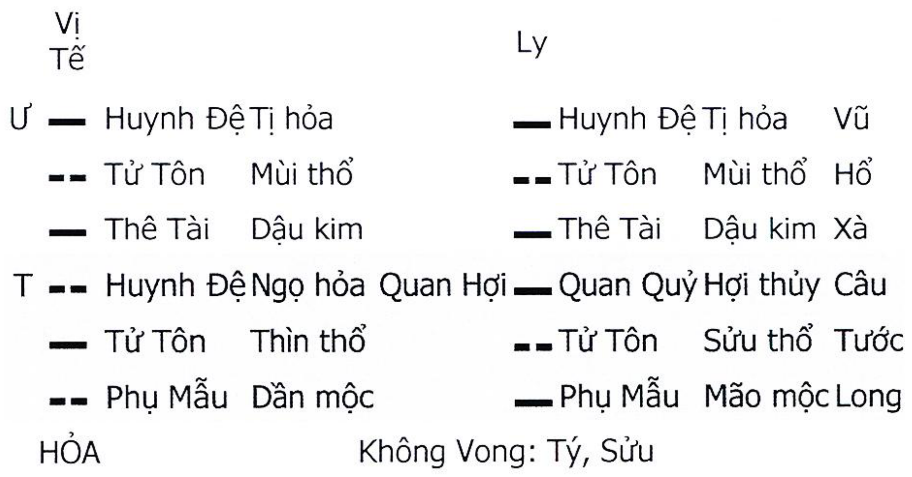
    - **Hình này chứng minh điều gì**
      - Hào sơ là lân cận nơi ở, mộc hóa mộc, có nhiều hoa cỏ cây cối. Động khắc Tử Tôn, Tử Tôn tại hào 2, hào 2 là ruột, thổ chủ dạ dày, ảnh hưởng đến hệ tiêu hóa của con cái.
    - **Từ đâu mà thấy được**
      - Phụ Mẫu Dần mộc động hóa Tiến thần, được Nhật Nguyệt trợ giúp là quá vượng, căn nhà không quá rộng rãi. Hào sơ là lân cận nơi ở, mộc hóa mộc, có nhiều hoa cỏ cây cối.
- **Diễn tiến phân tích và suy luận chi tiết:**
  - Phụ Mẫu Dần mộc động hóa Tiến thần, được Nhật Nguyệt trợ giúp là quá vượng, căn nhà không quá rộng rãi.
  - Hào sơ là lân cận nơi ở, mộc hóa mộc, có nhiều hoa cỏ cây cối.
  - Động khắc Tử Tôn, Tử Tôn tại hào 2, hào 2 là ruột, thổ chủ dạ dày, ảnh hưởng đến hệ tiêu hóa của con cái.
  - Tử Tôn lâm Chu Tước hóa Không, Chu Tước chủ học tập, con cái không thích học tập.
  - Huynh Đệ Ngọ hỏa động hợp hào 5 Tử Tôn Mùi thổ, hào 5 là đường đi, Tử Tôn cũng là đường đi, lâm Bạch Hổ lại là đường đi, Ngọ hỏa chủ phía Nam, hợp là gần, phía Nam gần đường.
  - Hào Thế Huynh Đệ Ngọ hỏa tại hào 3 động hóa Quan Quỷ Hợi thủy hồi đầu khắc, hào Thế là bản thân, hào 3 là dạ dày, Huynh Đệ lại là dạ dày, là tiêu hóa kém.
  - Hào 5 lại thể hiện tim, hào 3 cũng là tim, tim không tốt.
  - Quan Quỷ Hợi
  - thủy tại hào 3 chủ bàng quang, hệ tiết niệu cũng có vấn đề.
  - Huynh Đệ phát động khắc Thê Tài, Thê Tài hưu tù, tài vận không thuận lợi, phá tài.
- **Kết quả ứng nghiệm thực tế:**
  - Trên thực tế là con cái bị suy nhược, bản thân và con cái đều có bệnh về tiêu hóa.
  - Bản thân có bệnh tim, đường tiết niệu.
  - Con cái không chịu đi học.
  - Tài vận không tốt, xe máy bị mất trộm.

#### Ví dụ 85: Ngày Giáp Thân tháng Kỷ Tị năm Giáp Thân, nam đoán về đập bỏ nhà cũ và xây mớ...

- **Bối cảnh và thông tin quẻ:**
  - Ngày Giáp Thân tháng Kỷ Tị năm Giáp Thân, nam đoán về đập bỏ nhà cũ và xây mới, được Sơn Trạch Tổn biến Địa Thủy Sư.
  - THỔ Không Vong: Ngọ, Mùi
- **Luận giải quái tượng phong thủy:**
  - **Hình 106.** Sơ đồ quẻ Sơn Trạch Tổn biến Địa Thủy Sư
    - 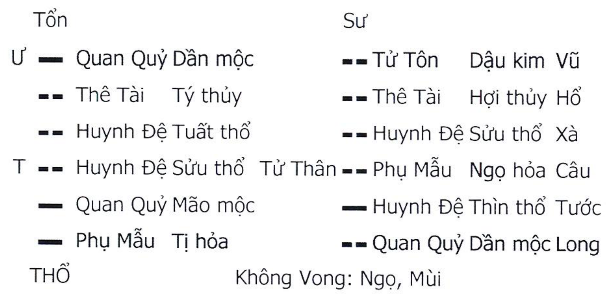
    - **Hình này chứng minh điều gì**
      - Lấy hào Phụ Mẫu làm Dụng thần. Phụ Mẫu phát động sinh hào Thế, căn nhà có phong thủy tốt.
    - **Từ đâu mà thấy được**
      - Lấy hào Phụ Mẫu làm Dụng thần. Phụ Mẫu phát động sinh hào Thế, căn nhà có phong thủy tốt.
- **Diễn tiến phân tích và suy luận chi tiết:**
  - Lấy hào Phụ Mẫu làm Dụng thần.
  - Phụ Mẫu phát động sinh hào Thế, căn nhà có phong thủy tốt.
  - Phụ Mẫu được Nguyệt tỉ phù, lại động hóa hồi đầu sinh là vượng, lâm Thanh Long, Thanh Long chủ mới, vượng tướng cũng là mới, chính là nhà mới xây.
  - Phụ Mẫu Tị hỏa và Nhật tương hợp, hợp xứ phùng xung, tương ứng với năm Ất Hợi 1995, đoán là nhà được xây ở năm 1995.
  - Hào 6 Quan Quỷ Dần mộc là Nguyên thần, động hóa hồi đầu khắc, lại bị Nhật thần xung khắc, hào 6 là tường, tường hơi xiêu vẹo.
  - Lâm Huyền Vũ, Huyền Vũ chủ tối tăm, ẩm ướt, chứng tỏ tường hơi ẩm ướt.
  - Ứng là hàng xóm, hào 6 cũng là hàng xóm, là do nhà hàng xóm gây nên.
  - Thê Tài Tý thủy được Nhật Trường Sinh, quan hệ với hào Thế là tương hợp, phong thủy nhà này cực tốt, lợi cho tài vận.
  - Năm Nhâm Ngọ xung hào Tài, năm Quý Mùi xung
  - hào Thế, hợp xứ phùng xung, tài vận trong hai năm này cực kỳ tốt.
- **Kết quả ứng nghiệm thực tế:**
  - Tất cả đúng như phán đoán.

#### Ví dụ 86: Ngày Tân Mão tháng Nhâm Ngọ năm Ất Dậu, nữ đoán phong thủy nhà cửa, được Phon...

- **Luận giải quái tượng phong thủy:**
  - **Hình 107.** Sơ đồ quẻ Phong Sơn Tiệm biến Địa Sơn Khiêm
    - 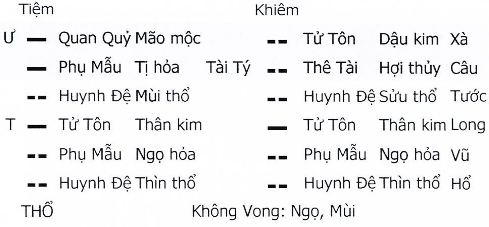
    - **Hình này chứng minh điều gì**
      - Quẻ chứng minh tình trạng phong thủy và ảnh hưởng cát hung tương ứng với quái tượng Sơ đồ quẻ Phong Sơn Tiệm biến Địa Sơn Khiêm.
    - **Từ đâu mà thấy được**
      - Căn cứ vào hào vị, lục thân, can chi sinh khắc, tuần không và hào động biến trong quẻ.
- **Kết quả ứng nghiệm thực tế:**
  - Kết hôn đã 8 năm mà vẫn chưa có con.
  - Hào Thế tại hào 3 bị khắc, hào 3 là tử cung, Tử Tôn cũng là tử cung, Câu Trần lâm Kỵ thần đến khắc, Câu Trần là khối u, vì vậy có u xơ tử cung.
  - **Phản hồi:** Ba năm trước phát hiện u xơ tử cung, hiện nay vẫn chưa điều trị.
  - Phụ Mẫu là nhà, lâm Câu Trần phát động, Câu Trần chủ công trình, tu tạo, động mà ứng gặp hợp, đã từng cải tạo vào năm Giáp Thân 2004.
  - **Phản hồi:** Đúng, năm 2004 đã đại tu.
  - Hào Ứng Quan Quỷ Mão mộc phát động sinh Phụ Mẫu Tị hỏa, Phụ Mẫu Tị hỏa phát động hợp hào Thế, hào Ứng là nhà chồng, nhà này là của gia đình nhà chồng.
  - Phụ Mẫu Tị hỏa lâm hào 5 hợp hào Thế, hào 5 là gia trưởng, biểu thị có cha mẹ chồng ở chung.
  - **Phản hồi:** Ở chung với cha mẹ chồng.
  - Hào 5 hào dương là cha, động hóa Tuyệt, cha đã qua đời.
  - **Phản hồi:** Cha đã qua đời ba năm trước vì ung thư phổi, gia đình họ đều đoản thọ.
  - Hào 2 Phụ Mẫu Ngọ hỏa là mẹ, Không Vong lâm Huyền Vũ, hào 2 là thắt lưng, chân, Huyền Vũ chủ phong thấp, có bệnh phong thấp ở thắt lưng, chân.
  - **Phản hồi:** Cơ thể có bệnh viêm khớp.
  - Từ nhỏ đã nhiều bệnh, đã từng lưu sản.
  - Bản thân tôi trước đây cũng ít khi bị bệnh, sau khi dọn đến vào năm 1999 thì cứ mãi đi bệnh viện.
  - Quan Quỷ Mão mộc tại hào 6, Mộ khố của nó là Mùi thổ lại gần hào Thế, Quan Quỷ là thần phật, hào 6 là đền chùa, phật đường, trong nhà có thờ cúng tượng phật.
  - **Phản hồi:** Gia đình tôi ở trong chùa, chồng là trụ trì.
  - (Hòa thượng ở Nhật Bản có thể lấy vợ.)
  - Ngoại quái phản ngâm, nơi ở không ngay ngắn, chỗ thừa chỗ thiếu.
  - Phụ Mẫu Tị hỏa tại hào 5 lâm Dịch Mã, hào 5 là đường đi, Dịch Mã chủ nhanh chóng, gần nhà có đường cao tốc.
  - **Phản hồi:** Có đường sắt và đường cao tốc.
  - Hào 2 Phụ Mẫu Ngọ hỏa Không Vong, hào 2 là nhà, hỏa là ánh sáng, Không Vong biểu thị ánh sáng chiếu không tốt.
  - **Phản hồi:** Phía Nam và phía Tây có núi, 3 giờ chiều thì bắt đầu không thấy mặt trời.

#### Ví dụ 87: Ngày Mậu Dần tháng Mậu Thìn năm Giáp Thân, nữ đoán bệnh tật, được Địa Hỏa Min...

- **Bối cảnh và thông tin quẻ:**
  - Ngày Mậu Dần tháng Mậu Thìn năm Giáp Thân, nữ đoán bệnh tật, được Địa Hỏa Minh Di biến Thủy Địa Tỷ.
  - THỦY Không Vong: Thân, Dậu
  - Lấy hào Thế làm Dụng thần.
  - Hào Thế tại hào 4 bị Tử Tôn Mão mộc lâm Câu Trần đến khắc, hào 4 là ngực, Câu Trần là khối u, Tử Tôn là vú, có tăng sinh tuyến vú.
  - Mão mộc tương ứng với năm 1999 Kỷ Mão, năm này bị bệnh.
- **Kết quả ứng nghiệm thực tế:**
  - Năm đó phát hiện tăng sinh tuyến vú, trì hoãn đến bây giờ mới định làm phẫu thuật.
  - Kỵ thần tại hào sơ lâm Mão mộc động hóa Quan Quỷ Mùi thổ, hào sơ là nền nhà, Câu Trần chủ tu tạo, mộc hóa thổ chủ xây dựng công trình.
  - Bệnh tật có liên quan đến việc này.
  - **Phản hồi:** Đó là sự việc ở 5 năm trước.
  - Nơi tôi sinh ra và nhà cửa của gia đình tôi đều bị chính quyền dỡ bỏ.
  - Cha mẹ tôi lại mua một mảnh đất mới và xây nhà.
  - Mất nơi chôn rau cắt rốn khiến bản thân bị kích động, lại thêm bất hòa với cha mẹ cho nên đã rời khỏi quê hương.

#### Ví dụ 88: Ngày Nhâm Dần tháng Kỷ Tị năm Giáp Thân, một người phụ nữ có con gái không ch...

- **Bối cảnh và thông tin quẻ:**
  - Ngày Nhâm Dần tháng Kỷ Tị năm Giáp Thân, một người phụ nữ có con gái không chịu đi học, hỏi có phải là do phong thủy ảnh hưởng hay không?
  - Được Cấn Vi Sơn biến Hỏa Địa Tấn.
  - THỔ Không Vong: Thìn, Tị
  - Quan Quỷ Dần mộc trì Thế, được Nhật trợ giúp là vượng tướng.
  - Quan Quỷ là phiền não, bản thân vì chuyện con cái mà rất khổ sở.
- **Luận giải quái tượng phong thủy:**
  - **Hình 108.** Sơ đồ quẻ Địa Hỏa Minh Di biến Thủy Địa Tỷ
    - 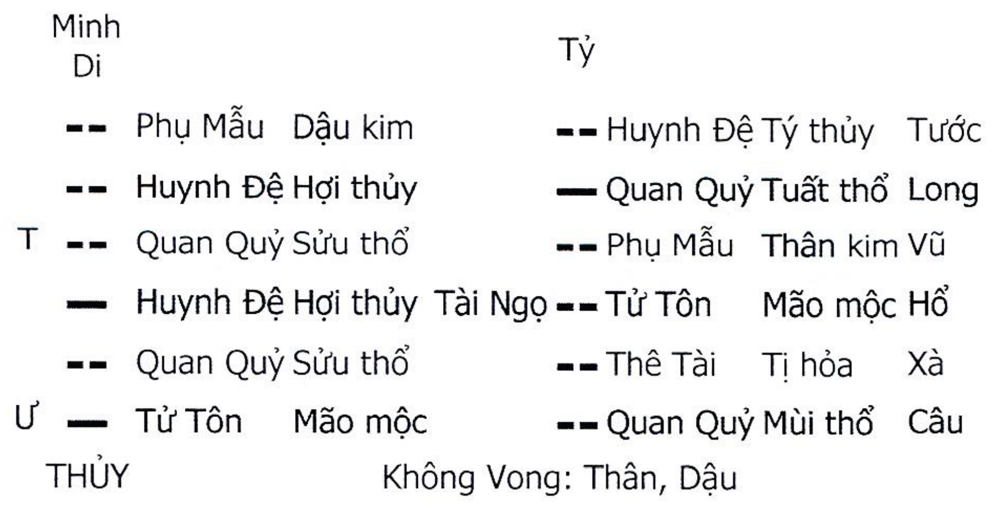
    - **Hình này chứng minh điều gì**
      - Quẻ chứng minh tình trạng phong thủy và ảnh hưởng cát hung tương ứng với quái tượng Sơ đồ quẻ Địa Hỏa Minh Di biến Thủy Địa Tỷ.
    - **Từ đâu mà thấy được**
      - Căn cứ vào hào vị, lục thân, can chi sinh khắc, tuần không và hào động biến trong quẻ.
  - **Hình 109.** Sơ đồ quẻ Cấn Vi Sơn biến Hỏa Địa Tấn
    - 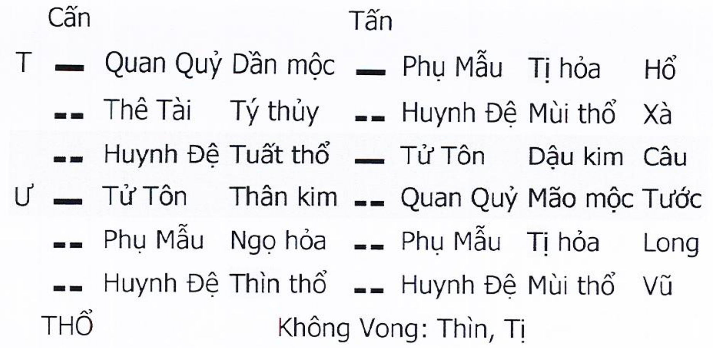
    - **Hình này chứng minh điều gì**
      - Quẻ chứng minh tình trạng phong thủy và ảnh hưởng cát hung tương ứng với quái tượng Sơ đồ quẻ Cấn Vi Sơn biến Hỏa Địa Tấn.
    - **Từ đâu mà thấy được**
      - Căn cứ vào hào vị, lục thân, can chi sinh khắc, tuần không và hào động biến trong quẻ.
- **Kết quả ứng nghiệm thực tế:**
  - Rất khổ sở vì con cái.
  - Tử Tôn là con gái, Tử Tôn Thân kim động hóa Quan Quỷ Mão mộc, lại bị Nhật Quan Quỷ Dần mộc xung, sức khỏe của đứa con không tốt, có bệnh trong người.
  - Dần mộc nhập quẻ tại hào 6, hào 6 là đầu, mộc chủ thần kinh, có suy nhược thần kinh.
  - Hào 3 là dạ dày, cung Cấn lại chủ dạ dày, Chu Tước chủ ẩm thực, hóa Quan Quỷ là bệnh, có vấn đề về tiêu hóa.
  - **Phản hồi:** Con bị suy nhược thần kinh, tiêu hóa kém.
  - Huynh Đệ Tuất thổ lâm Câu Trần phát động, Câu Trần chủ kiến trúc, tương ứng với năm Giáp Tuất, năm 1994 đã từng xây cất nhà cửa.
  - **Phản hồi:** Căn nhà được xây vào năm 1994.
  - Hào sơ Huynh Đệ Thìn thổ Không Vong, hào sơ là nền nhà, lâm hào âm là phía sau, Không Vong là lỗ hổng.
  - Vì vậy, phán đoán là phía sau nền nhà có lỗ hổng.
  - Tử Tôn lâm Chu Tước là chim, lâm hào 3 động hóa Quan Quỷ Mão mộc, hào 3 là cửa, Thân thể hiện Tây Nam, Mão mộc là vật thon dài, mộc cũng có thể là cây, mộc được biến ra, biểu thị ở phía ngoài sân.
  - Vì vậy, phán đoán là bên ngoài tường ở hướng Tây Nam có cây, phía trên thường xuyên có tiếng chim hót.
  - **Phản hồi:** Phía sau căn nhà, nền nhà có ba chỗ bị nứt, có một cửa thông gió.
  - Ngoài tường ở Tây Nam có cột điện, thường xuyên có chim sẻ đáp xuống.
  - Có điều là cột điện làm bằng xi măng chứ không phải làm bằng gỗ.

#### Ví dụ 89: Ngày Quý Dậu tháng Canh Ngọ năm Giáp Thân, nam đoán phong thủy nhà cửa, được ...

- **Bối cảnh và thông tin quẻ:**
  - Ngày Quý Dậu tháng Canh Ngọ năm Giáp Thân, nam đoán phong thủy nhà cửa, được Thủy Lôi Truân.
  - THỦY Không Vong: Tuất, Hợi
  - Phụ Mẫu là nhà, Nguyên thần Quan Quỷ Tuất thổ Không Vong, năm 2000 Canh Thìn xung thực, năm Canh Thìn vào ở.
- **Luận giải quái tượng phong thủy:**
  - **Hình 110.** Quẻ Thủy Lôi Truân
    - 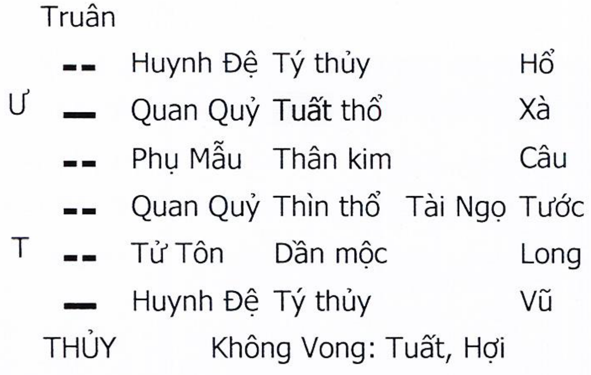
    - **Hình này chứng minh điều gì**
      - Quẻ chứng minh tình trạng phong thủy và ảnh hưởng cát hung tương ứng với quái tượng Quẻ Thủy Lôi Truân.
    - **Từ đâu mà thấy được**
      - Căn cứ vào hào vị, lục thân, can chi sinh khắc, tuần không và hào động biến trong quẻ.
- **Kết quả ứng nghiệm thực tế:**
  - Là tháng 10 năm 2000.
  - Phụ Mẫu Thân kim tại hào 4, hào 4 chủ tầng 4, kim cũng là 4, ở tại tầng 4.
  - **Phản hồi:** Đúng là tại tầng 4.
  - Hào Thế Tử Tôn Dần mộc lâm hào 2, không được Nguyệt sinh, bị Nhật khắc thương, hào 2 là trạch, ở nhà này sẽ bất lợi cho bản thân.
  - Nguyên thần là thủy, thủy chủ máu, hào 6 Tý thủy lâm Bạch Hổ, Bạch Hổ cũng chủ máu, lâm Nguyệt phá, tuần hoàn máu không tốt.
  - Hào 6 là đầu, hào Thế lâm Thanh Long chủ đau nhức, có đau đầu xuất hiện.
  - **Phản hồi:** Sau khi vào ở thì tâm trạng bất an, tuần hoàn máu không tốt.
  - Bản thân bị đau đầu đã nhiều năm, sau khi vào ở thì càng nghiêm trọng hơn.
  - Thê Tài Ngọ hỏa không hiện trên quẻ, Nguyên thần Dần mộc bị Nhật khắc, Thê Tài thể hiện vợ, tài vận, tài vận không thịnh vượng.
  - Mộ khố của Thê Tài là Tuất thổ Không Vong, không tích trữ được tiền bạc.
  - Hào 2 là tử cung, bị Nhật khắc,

#### Ví dụ 91: Ngày Đinh Dậu tháng Quý Mão năm Nhâm Ngọ, một người Nhật Bản đoán phong thủy ...

- **Bối cảnh và thông tin quẻ:**
  - Ngày Đinh Dậu tháng Quý Mão năm Nhâm Ngọ, một người Nhật Bản đoán phong thủy nhà cửa, được Trạch Lôi Tùy.
  - MỘC Không Vong: Thìn, Tị
- **Luận giải quái tượng phong thủy:**
  - **Hình 111.** Quẻ Trạch Lôi Tùy
    - 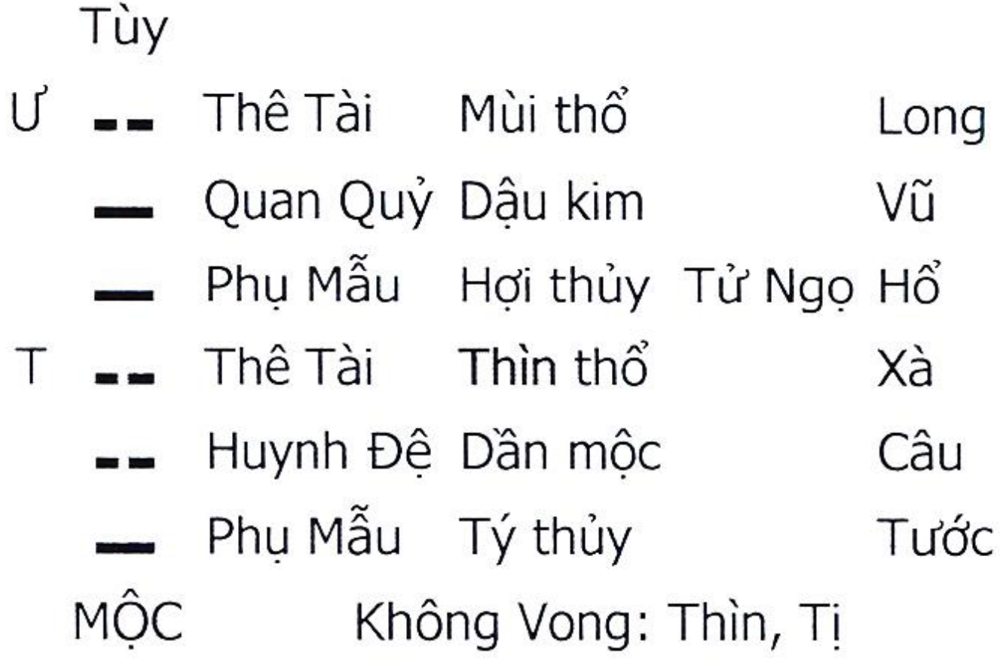
    - **Hình này chứng minh điều gì**
      - Huynh Đệ lâm Câu Trần tại hào 2 vượng mà khắc hào Tài, hào 2 là hào trạch, Câu Trần là tu tạo, nhất định là bởi vì tu tạo hoặc cải tạo nhà cửa mà tốn tiền.
    - **Từ đâu mà thấy được**
      - Quẻ này Thê Tài trì Thế, chính là tiền nằm trong tay, Không mà bị Nguyệt kiến khắc thương, là cầm tiền trong tay tiêu mất đi. Huynh Đệ lâm Câu Trần tại hào 2 vượng mà khắc hào Tài, hào 2 là hào trạ...
- **Diễn tiến phân tích và suy luận chi tiết:**
  - Tôi đoán người này đã tốn không ít tiền để sửa chữa đường ống dẫn nước và phòng tắm, ngôi nhà nằm bên đường kề khu phố sầm uất, đường đi bất tiện, đã từng tu bổ nhiều lần.
  - Quẻ này Thê Tài trì Thế, chính là tiền nằm trong tay, Không mà bị Nguyệt kiến khắc thương, là cầm tiền trong tay tiêu mất đi.
  - Huynh Đệ lâm Câu Trần tại hào 2 vượng mà khắc hào Tài, hào 2 là hào trạch, Câu Trần là tu tạo, nhất định là bởi vì tu tạo hoặc cải tạo nhà cửa mà tốn tiền.
  - Thê Tài Thìn thổ là thủy khố, có thể hiểu là vật đựng nước.
  - Lâm Đằng Xà, Đằng Xà chủ vật nhỏ dài, uốn khúc, Thìn thổ có thể hiểu là đường ống dẫn nước.
  - Lại Thìn thổ gặp Nhật là đất Mộc Dục, Mộc Dục có thể hiểu là tắm rửa, thủy khố của nơi tắm rửa, có thể hiểu là phòng tắm, cho nên đoán như vậy.
  - Quẻ tại cung Chấn, Chấn là khu phố sầm uất, náo nhiệt, lại Phụ Mẫu lâm Chu Tước, một Phụ Mẫu lâm Bạch Hổ, Chu Tước chủ ồn ào, Bạch Hổ chủ đường đi, vì vậy đoán nhà của người đó nằm bên đường tại khu phố sầm uất.
  - Hào 5 là đường đi, Nguyệt phá chính là tượng đường đi bị tổn hại, nhưng Nhật thần thực Phá lại là tượng tu bổ.
- **Kết quả ứng nghiệm thực tế:**
  - Kết quả phán đoán rất chính xác.

#### Ví dụ 92: Ngày Giáp Tuất tháng Bính Ngọ năm Nhâm Ngọ, nam đoán phong thủy của căn nhà m...

- **Bối cảnh và thông tin quẻ:**
  - Ngày Giáp Tuất tháng Bính Ngọ năm Nhâm Ngọ, nam đoán phong thủy của căn nhà muốn mua, được Hỏa Phong Đỉnh biến Thiên Hỏa Đồng Nhân.
  - HỎA
  - Không Vong: Thân, Dậu
  - Quẻ tại cung Ly, nhà tại phía Nam của thành phố.
  - Hào sơ Tử Tôn Sửu thổ lâm Thanh Long động hóa Phụ Mẫu Mão mộc, Thanh Long chủ mới, là nhà mới xây.
  - Phụ Mẫu có Nhật đến hợp, trên hợp dưới là nhà lầu.
- **Luận giải quái tượng phong thủy:**
  - **Hình 112.** Quẻ Hỏa Phong Đỉnh biến Thiên Hỏa Đồng Nhân
    - 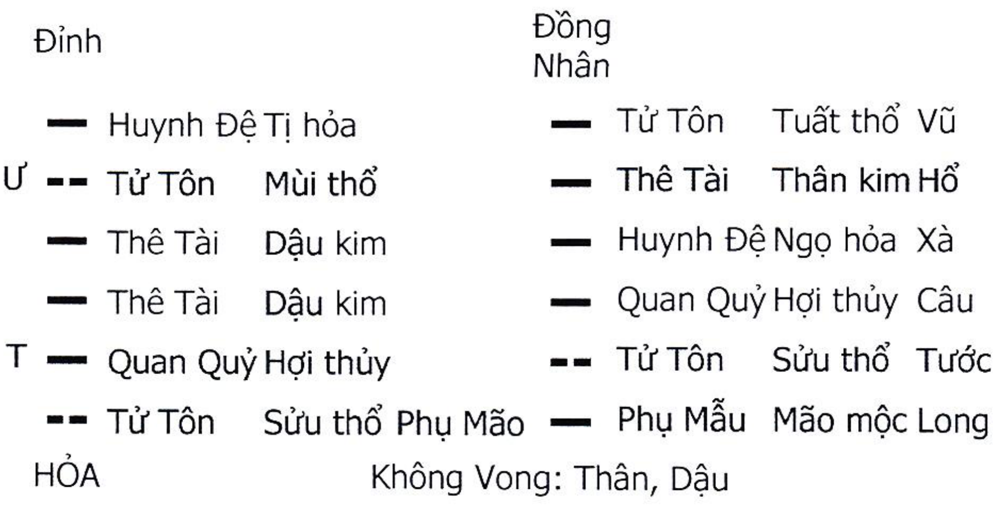
    - **Hình này chứng minh điều gì**
      - Quẻ chứng minh tình trạng phong thủy và ảnh hưởng cát hung tương ứng với quái tượng Quẻ Hỏa Phong Đỉnh biến Thiên Hỏa Đồng Nhân.
    - **Từ đâu mà thấy được**
      - Căn cứ vào hào vị, lục thân, can chi sinh khắc, tuần không và hào động biến trong quẻ.
- **Kết quả ứng nghiệm thực tế:**
  - Là khu dân cư mới xây.
  - Phụ Mẫu là nhà, không xuất hiện trong quẻ, nhà vẫn chưa xây xong.
  - Hào 2 là hào trạch, Nguyên thần Dậu kim Không Vong cũng biểu thị chưa xong.
  - **Phản hồi:** Vẫn đang xây dựng.
  - Phụ Mẫu Mão mộc hợp Nhật Tuất thổ, Tuất thổ là Tử Tôn, Tử Tôn là đường đi, nhà gần quốc lộ.
  - **Phản hồi:** Đúng, khu dân cư nằm sát quốc lộ.
  - Hào 5 Tử Tôn Mùi thổ động hóa Không Vong, hào 5 là đường đi, Không Vong là cầu, lân cận có cầu.
  - Cũng biểu thị đường không thông suốt.
  - **Phản hồi:** Vào khu dân cư nhất định phải qua cầu.
  - Đường xá vẫn chưa sửa chữa xong.
  - Hợi thủy nhập trạch phát động, lân cận có sông ngòi hoặc rãnh nước.
  - Lâm Quan Quỷ Chu Tước phát động không cát, dễ có kiện tụng, cãi cọ.
  - có bệnh phụ khoa.
  - Tìm Dậu kim trong quẻ, không có Dậu kim thì dùng Phụ Mẫu Thân kim thay thế, lâm Câu Trần chủ khối u, vì vậy có u xơ tử cung.
  - Tử Tôn lại là con cái, bị khắc, Nguyên thần lâm Bạch Hổ Nguyệt phá chủ có lưu sản.
  - **Phản hồi:** Sau khi vào ở thì chi tiêu tăng lên, cả tiền tiết kiệm cũng xài hết.
  - Sức khỏe của vợ không tốt, có u xơ tử cung, năm Quý Mùi lưu sản.
  - Hào sơ Tý thủy lâm Huyền Vũ, hào sơ là lân cận, được Nhật kim sinh là sông, chủ lân cận có sông ngòi.
  - **Phản hồi:** Có một con sông cách nhà 100 mét.

#### Ví dụ 90: Ngày Đinh Hợi tháng Nhâm Ngọ năm Ất Dậu, nữ đoán phong thủy nhà cửa (chồng là...

- **Bối cảnh và thông tin quẻ:**
  - Ngày Đinh Hợi tháng Nhâm Ngọ năm Ất Dậu, nữ đoán phong thủy nhà cửa (chồng là trụ trì, sống ở trong chùa), được Thủy Sơn Kiển biến Thủy Phong Tỉnh.
  - KIM
  - Không Vong: Ngọ, Mùi
- **Luận giải quái tượng phong thủy:**
  - **Hình 113.** Quẻ Thủy Sơn Kiển biến Thủy Phong Tỉnh
    - 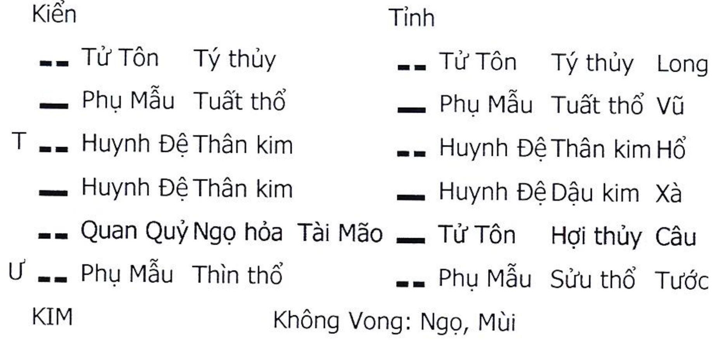
    - **Hình này chứng minh điều gì**
      - Quan Quỷ Ngọ hỏa tại hào 2 độc phát, hào 2 là nơi ở, độc phát khắc hào Thế, sống ở đây bất an. Câu Trần chủ xây dựng, thường xuyên sửa chữa.
    - **Từ đâu mà thấy được**
      - Quan Quỷ Ngọ hỏa tại hào 2 độc phát, hào 2 là nơi ở, độc phát khắc hào Thế, sống ở đây bất an. Lâm Câu Trần phát động.
- **Diễn tiến phân tích và suy luận chi tiết:**
  - Quan Quỷ Ngọ hỏa tại hào 2 độc phát, hào 2 là nơi ở, độc phát khắc hào Thế, sống ở đây bất an.
  - Lâm Câu Trần phát động.
  - Câu Trần chủ xây dựng, thường xuyên sửa chữa.
  - Thê Tài Mão mộc không hiện trên quẻ, độc phát là Tử địa của Thê Tài, hương hỏa trong chùa không vượng.
  - Quan Quỷ thể hiện chồng, động mà khắc hào Thế, vợ chồng bất hòa.
  - Động hóa Hợi thủy, lân cận có nước.
  - Câu Trần là chồng chất, đồi núi, Quan Quỷ là tử thi, Không Vong chính là xương cốt mục nát, lân cận có phần mộ.
- **Kết quả ứng nghiệm thực tế:**
  - Thực tế đúng là như vậy.
  - **Phản hồi:** Lân cận có sông, cũng có rãnh nước.
  - Hơn nữa, rãnh nước đi qua phía dưới khu dân cư, nhà cửa ở phía trên.
  - Thê Tài Không Vong, hào Thế hưu tù bị khắc, bất lợi cho tài vận và cơ thể, tốt nhất là không nên mua.
  - **Phản hồi:** Đã chồng tiền rồi.

#### Ví dụ 93: Ngày Canh Thìn tháng Đinh Mùi năm Nhâm Ngọ, một người Nhật Bản đoán phong thủ...

- **Bối cảnh và thông tin quẻ:**
  - Ngày Canh Thìn tháng Đinh Mùi năm Nhâm Ngọ, một người Nhật Bản đoán phong thủy nhà cửa, được Sơn Lôi Di.
  - MỘC Không Vong: Thân, Dậu
  - Thê Tài Tuất thổ trì Thế được Nguyệt trợ giúp là vượng tướng, Nhật xung ám động lâm Dịch Mã, tài vận cũng tốt nhưng tương đối vất vả.
- **Luận giải quái tượng phong thủy:**
  - **Hình 114.** Sơ đồ quẻ Sơn Lôi Di
    - 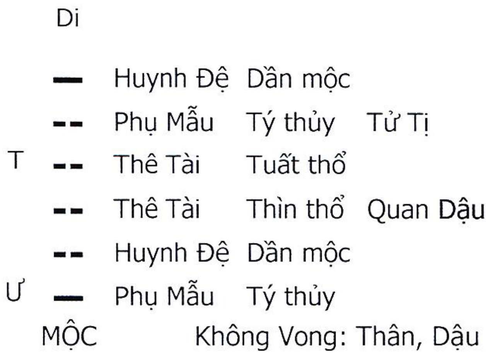
    - **Hình này chứng minh điều gì**
      - Quẻ chứng minh tình trạng phong thủy và ảnh hưởng cát hung tương ứng với quái tượng Sơ đồ quẻ Sơn Lôi Di.
    - **Từ đâu mà thấy được**
      - Căn cứ vào hào vị, lục thân, can chi sinh khắc, tuần không và hào động biến trong quẻ.
- **Kết quả ứng nghiệm thực tế:**
  - Tôi là bác sĩ, thu nhập cũng cao, có điều là không tích trữ được tiền.
  - Nguyên thần của hào Thế là Tử Tôn Tị hỏa phục tàng, nhập Mộ tại Tuất thổ, lại là quẻ du hồn, Nguyên thần chủ tâm trạng, nhập Mộ chủ tâm trạng không cởi mở, du hồn chủ lo lắng không yên.
  - **Phản hồi:** Đúng, rất phiền não.
  - Hào sơ Phụ Mẫu Tý thủy lâm Bạch Hổ, lân cận còn có sông và cầu.
  - Dựa vào di thần pháp, lại lâm Câu Trần, Câu Trần chủ điền thổ, lân cận có ruộng đồng.
  - **Phản hồi:** Ở phía Bắc, cách 50 mét có con sông, cách 100 mét lại có một con sông rộng hơn, bên trên có cầu sắt.
  - Phía Đông là ruộng đồng.
  - Hào Thế khắc hào Ứng, Ứng là hàng xóm, bất hòa với hàng xóm xung quanh.
  - Ứng lâm Bạch Hổ, Bạch Hổ chủ tức giận, có hàng xóm tính khí không tốt.
  - **Phản hồi:** Gia đình tôi ít khi qua lại với hàng xóm.
  - Ở phía Tây có một cụ già rất lười biếng, hơi một tý là nổi giận, với ai cũng có mâu thuẫn.

#### Ví dụ 94: Ngày Bính Thìn tháng Canh Tuất năm Nhâm Ngọ, một Dịch hữu trên mạng hỏi phong...

- **Bối cảnh và thông tin quẻ:**
  - Ngày Bính Thìn tháng Canh Tuất năm Nhâm Ngọ, một Dịch hữu trên mạng hỏi phong thủy nhà cửa, được Thủy Trạch Tiết biến Thủy Thiên Nhu.
  - THỦY Không Vong: Tý, Sửu
- **Luận giải quái tượng phong thủy:**
  - **Hình 115.** Sơ đồ quẻ Thủy Trạch Tiết biến Thủy Thiên Nhu
    - 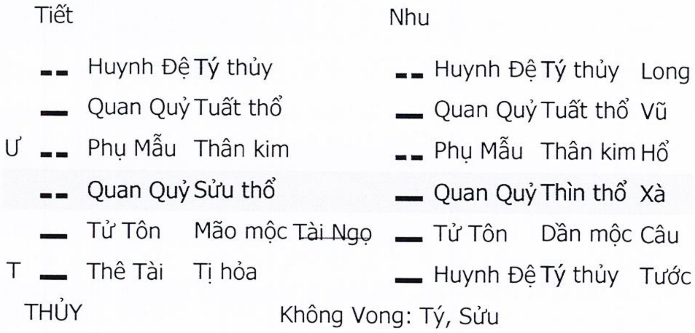
    - **Hình này chứng minh điều gì**
      - Thê Tài Tị hỏa trì Thế tại hào sơ, hào sơ là quần chúng. Nguyên thần tại hào 2 lâm Câu Trần, Câu Trần là phòng làm việc.
    - **Từ đâu mà thấy được**
      - Thê Tài Tị hỏa trì Thế tại hào sơ, hào sơ là quần chúng. Nguyên thần tại hào 2 lâm Câu Trần, Câu Trần là phòng làm việc.
- **Diễn tiến phân tích và suy luận chi tiết:**
  - Thê Tài Tị hỏa trì Thế tại hào sơ, hào sơ là quần chúng.
  - Nguyên thần tại hào 2 lâm Câu Trần, Câu Trần là phòng làm việc.
  - Đây là thông tin ngồi trong phòng làm việc để kiếm tiền lương.
  - Nhật Nguyệt là Quan Quỷ, Quan Quỷ lưỡng hiện, Quan Quỷ Sửu thổ lại động hóa Quan Quỷ.
  - Quan Quỷ quá nhiều thì cũng như không, không có quan vận.
  - Quan Quỷ Sửu thổ tại hào 3 lâm Đằng Xà độc phát, hào 3 là giường, Đằng Xà chủ mộng, Quan Quỷ là ác mộng, vì vậy thường xuyên gặp ác mộng, ngủ không yên.
  - Hào 6 là tường, Không Vong, hào 3 cũng Không, không thể tương hợp, giường không kê sát tường.
  - Hào 5 ám động hợp hào 2, hào 2 là trạch, trên hợp dưới là nhà lầu.
  - ---
  - # Part 12 (Pages 221-240)
- **Kết quả ứng nghiệm thực tế:**
  - Những phán đoán trên đây quả nhiên chính xác.

#### Ví dụ 95: Ngày Ất Tị tháng Giáp Thìn năm Nhâm Ngọ, nam Dịch hữu đoán phong thủy nhà, đư...

- **Bối cảnh và thông tin quẻ:**
  - Ngày Ất Tị tháng Giáp Thìn năm Nhâm Ngọ, nam Dịch hữu đoán phong thủy nhà, được Trạch Lôi Tùy biến Trạch Hỏa Cách.
  - MỘC Không Vong: Dần, Mão
- **Luận giải quái tượng phong thủy:**
  - **Hình 116.** Sơ đồ quẻ Trạch Lôi Tùy biến Trạch Hỏa Cách
    - 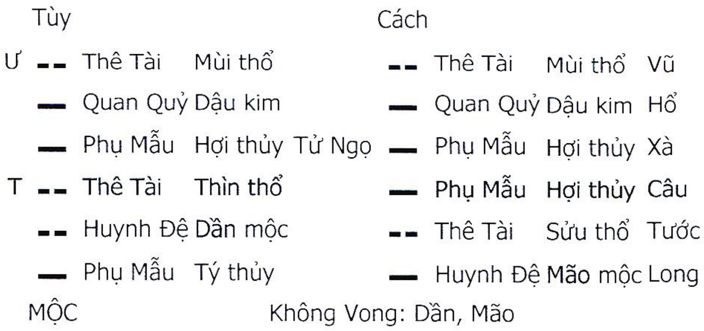
    - **Hình này chứng minh điều gì**
      - Phụ Mẫu là nhà, hưu tù là nhà cũ, hào Thế là nơi ở, lâm Câu Trần, Câu Trần chủ cũ kỹ, cũng là thông tin nhà cũ. Hào Thế Thìn thổ phát động, là Mộ khố của Phụ Mẫu, biểu thị nơi ở của mình là điểm cu...
    - **Từ đâu mà thấy được**
      - Phụ Mẫu là nhà, hưu tù là nhà cũ, hào Thế là nơi ở, lâm Câu Trần, Câu Trần chủ cũ kỹ, cũng là thông tin nhà cũ. Hào Thế Thìn thổ phát động, là Mộ khố của Phụ Mẫu, biểu thị nơi ở của mình là điểm cu...
- **Diễn tiến phân tích và suy luận chi tiết:**
  - Phụ Mẫu là nhà, hưu tù là nhà cũ, hào Thế là nơi ở, lâm Câu Trần, Câu Trần chủ cũ kỹ, cũng là thông tin nhà cũ.
  - Hào Thế Thìn thổ phát động, là Mộ khố của Phụ Mẫu, biểu thị nơi ở của mình là điểm cuối của căn nhà.
  - Hào sơ là Phụ Mẫu, hào 2 là hào trạch, hào 3 hào Thế là nơi mình ở, hào 4 Phụ Mẫu lại là nhà, thông tin nhà cửa trùng điệp, đây là thông tin nhà lầu.
  - Do đó, phán đoán là ở tại tầng cao nhất của tòa nhà.
  - Nhật xung Hợi thủy, Hợi thủy hợp hào 2 Dần mộc Không Vong.
  - Hào 4 là nhà vệ sinh, lâm thủy thì càng rõ.
  - Hào 2 là phòng bếp, lâm Chu Tước thì càng rõ.
  - Phòng bếp giáp với nhà vệ sinh.
  - Thủy hợp nhập Không Vong, có hiện tượng rò rỉ nước.
  - Hào Thế Thìn thổ động hợp Quan Quỷ, Quan Quỷ là bệnh, Thìn thổ là bàng quang, hệ tiết niệu, Câu Trần chủ sưng trướng, có phì đại tuyến tiền liệt.
  - Lại hợp hào lâm Bạch Hổ, Bạch Hổ là phẫu thuật, có tượng phẫu thuật.
- **Kết quả ứng nghiệm thực tế:**
  - Phán đoán hoàn toàn chính xác, đã phẫu thuật tuyến tiền liệt vào tháng Mão.

#### Ví dụ 96: Ngày Bính Dần tháng Kỷ Hợi năm Bính Tý, nữ đoán phong thủy nhà cửa, được Phon...

- **Bối cảnh và thông tin quẻ:**
  - Ngày Bính Dần tháng Kỷ Hợi năm Bính Tý, nữ đoán phong thủy nhà cửa, được Phong Trạch Trung Phu biến Tốn Vi Phong.
  - THỔ Không Vong: Tuất, Hợi
- **Luận giải quái tượng phong thủy:**
  - **Hình 117.** Sơ đồ quẻ Phong Trạch Trung Phu biến Tốn Vi Phong
    - 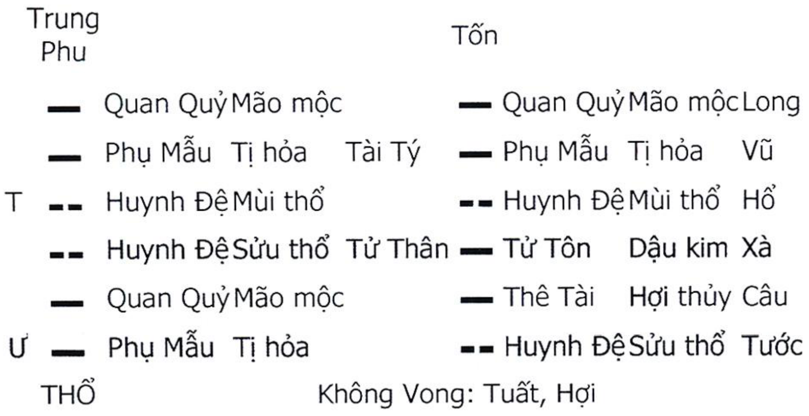
    - **Hình này chứng minh điều gì**
      - Lấy Phụ Mẫu làm Dụng thần, Phụ Mẫu Tị hỏa lưỡng hiện, lấy hào sơ Phụ Mẫu Tị hỏa phát động làm Dụng thần. Thê Tài không hiện trên quẻ, Huynh Đệ Sửu thổ phát động, Phụ Mẫu lại là Tuyệt địa của hào Tà...
    - **Từ đâu mà thấy được**
      - Lấy Phụ Mẫu làm Dụng thần, Phụ Mẫu Tị hỏa lưỡng hiện, lấy hào sơ Phụ Mẫu Tị hỏa phát động làm Dụng thần. Thê Tài không hiện trên quẻ, Huynh Đệ Sửu thổ phát động, Phụ Mẫu lại là Tuyệt địa của hào Tà...
- **Diễn tiến phân tích và suy luận chi tiết:**
  - Lấy Phụ Mẫu làm Dụng thần, Phụ Mẫu Tị hỏa lưỡng hiện, lấy hào sơ Phụ Mẫu Tị hỏa phát động làm Dụng thần.
  - Phụ Mẫu Nguyệt phá, nơi ở bất an.
  - Thê Tài không hiện trên quẻ, Huynh Đệ Sửu thổ phát động, Phụ Mẫu lại là Tuyệt địa của hào Tài, nhà này không tụ tài.
  - Quan Quỷ có ý nghĩa phiền não, tai nạn, bệnh tật,...
  - Quan Quỷ Mão mộc lâm hào 2, hào 2 là hào trạch, Nhật là Quan Quỷ trợ khởi hào 2 khắc Thế.
  - Phong thủy căn nhà này bất lợi cho người, dễ mang lại tai nạn và phiền não.
  - Thê Tài Tý thủy tuy được Nguyệt kiến tỉ phù, nhưng Phụ Mẫu Tị hỏa động khiến Thê Tài lâm Tuyệt, hào 3 Huynh Đệ Sửu thổ động mà khắc Tài, là thông tin phá tài.
  - Hào 3 là cửa, lâm Huynh Đệ cũng chủ cửa, động mà tương xung với hào 4, chính là cửa đối diện nhau, phạm đại kỵ của phong thủy.
  - Tử Tôn Thân kim phục tàng, nhập Mộ ở hào động Sửu thổ, Nguyệt là Bệnh địa của Tử Tôn, Nhật là Tuyệt địa của Tử Tôn, hào sơ Phụ Mẫu động mà khắc Tử Tôn, nhà này bất lợi cho con cái.
  - Gặp Bệnh địa là bị bệnh, nhập Mộ là nhập viện, con cái tất bởi vì bệnh mà nhập viện.
- **Kết quả ứng nghiệm thực tế:**
  - Thu nhập của gia đình rất thấp.
  - Con trai nhập viện vì u não, đã tốn rất nhiều tiền nhưng không khỏi,
  - tìm bà đồng xem bệnh thì lại bị gạt rất nhiều tiền.
  - Trong nhà quả thực có hai cửa đối diện nhau.

#### Ví dụ 97: Ngày Giáp Tuất tháng Ất Tị năm Đinh Sửu, nam đoán phong thủy nhà cửa, được Cấ...

- **Bối cảnh và thông tin quẻ:**
  - Ngày Giáp Tuất tháng Ất Tị năm Đinh Sửu, nam đoán phong thủy nhà cửa, được Cấn Vi Sơn biến Sơn Địa Bác.
  - THỔ Không Vong: Thân, Dậu
- **Luận giải quái tượng phong thủy:**
  - **Hình 118.** Quẻ Cấn Vi Sơn biến Sơn Địa Bác
    - 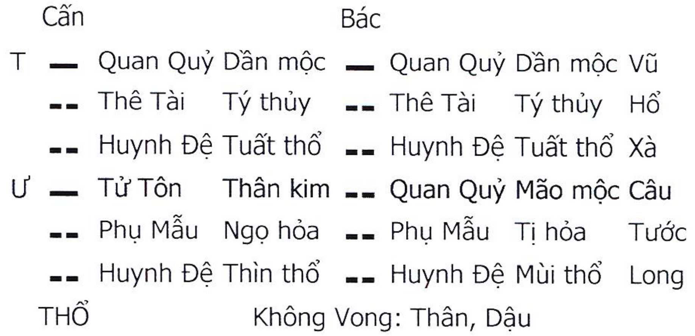
    - **Hình này chứng minh điều gì**
      - Phụ Mẫu Ngọ hỏa tại hào 2, nhập Mộ ở Nhật thần.
    - **Từ đâu mà thấy được**
      - Lấy Phụ Mẫu làm Dụng thần. Phụ Mẫu Ngọ hỏa tại hào 2, nhập Mộ ở Nhật thần.
- **Diễn tiến phân tích và suy luận chi tiết:**
  - Lấy Phụ Mẫu làm Dụng thần.
  - Phụ Mẫu Ngọ hỏa tại hào 2, nhập Mộ ở Nhật thần.
  - Nhật là Huynh Đệ, Huynh Đệ là tường, căn nhà có tường vây quanh.
  - Quẻ chính lục xung, không thể tàng phong tụ khí.
  - Tử Tôn Thân kim tại hào 3 lâm Câu Trần phát động khắc Thế, hào 3 là cửa, Thân là Tây Nam, Câu Trần là tu tạo, kiến trúc.
  - Phía Tây Nam có kiến trúc thi công ảnh hưởng đến quan vận của bản thân.
  - Nguyệt là Tuyệt địa của Thê Tài, Nhật khắc Thê Tài, Thê Tài Tý thủy nhập Mộ ở hào ám động Huynh Đệ Thìn thổ là hưu tù.
  - Trong quẻ tuy có Tử Tôn phát động liên tục tương sinh, nhưng Tử Tôn Thân kim Không Vong, Thê Tài vốn không có gốc rễ, tất bởi vì phong thủy không tốt mà phá tài.
  - Thê Tài Tý thủy lâm hào 5 bị khắc, hào 5 là đường đi, Bạch Hổ chủ tai nạn giao thông, là phá tài vì tai nạn giao thông.
- **Kết quả ứng nghiệm thực tế:**
  - Người này ở nhà biệt lập, xung quanh có tường bao.
  - Cửa tại Tây Nam, đã từng sửa chữa.
  - Mấy ngày trước, chiếc ô tô hơn 10 ngàn nguyên đã rơi xuống sông sâu, tài xế tử vong, đã bồi thường rất nhiều tiền.

#### Ví dụ 98: Ngày Kỷ Hợi tháng Bính Thân năm Bính Tý, nam đoán phong thủy nhà cửa, được Đị...

- **Bối cảnh và thông tin quẻ:**
  - Ngày Kỷ Hợi tháng Bính Thân năm Bính Tý, nam đoán phong thủy nhà cửa, được Địa Lôi Phục biến Lôi Thiên Đại Tráng.
  - THỔ Không Vong: Thìn, Tị
- **Luận giải quái tượng phong thủy:**
  - **Hình 119.** Quẻ Địa Lôi Phục biến Lôi Thiên Đại Tráng
    - 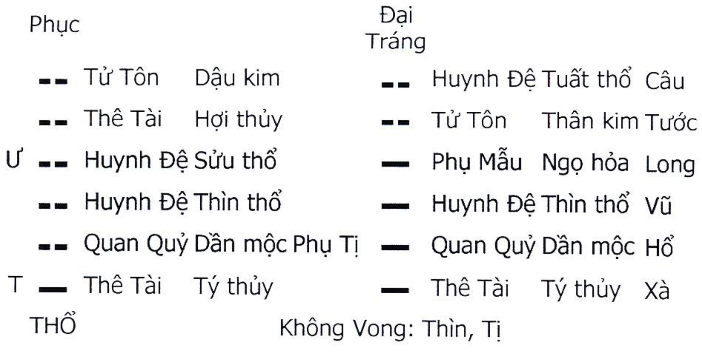
    - **Hình này chứng minh điều gì**
      - Lấy Phụ Mẫu làm Dụng thần, hào 2 là hào trạch. Phụ Mẫu Tị hỏa phục dưới hào 2, là trạch phục dưới trạch, thông tin nhà cửa trùng điệp, chứng tỏ căn nhà có tầng hầm.
    - **Từ đâu mà thấy được**
      - Lấy Phụ Mẫu làm Dụng thần, hào 2 là hào trạch. Hào Ứng phát động hóa ra Phụ Mẫu Ngọ hỏa, Ứng là người khác, Phụ Mẫu chủ nhà cửa, căn nhà này đã từng có người ở và chuyển đi.
- **Diễn tiến phân tích và suy luận chi tiết:**
  - Lấy Phụ Mẫu làm Dụng thần, hào 2 là hào trạch.
  - Phụ Mẫu Tị hỏa phục dưới hào 2, là trạch phục dưới trạch, thông tin nhà cửa trùng điệp, chứng tỏ căn nhà có tầng hầm.
  - Hào 2 và Nhật tương hợp, Phụ Mẫu Tị hỏa và Nguyệt tương hợp, hợp là tượng trùng điệp, trên nhà có nhà, là thông tin nhà lầu.
  - Hào 2 Nguyệt phá, nhưng Nhật hợp là giải trừ phá, ban đầu nhà có vết nứt, sau đó đã sữa chữa.
  - Phụ Mẫu hưu tù, không phải là nhà mới.
  - Hào Ứng phát động hóa ra Phụ Mẫu Ngọ hỏa, Ứng là người khác, Phụ Mẫu chủ nhà cửa, căn nhà này đã từng có người ở và chuyển đi.
  - Bạch Hổ lâm Quan Quỷ tại hào 2 phát động, nội quái phản ngâm, phong thủy căn nhà không tốt.
  - Hào trạch lâm Bạch Hổ động mà khắc hào Ứng, Quan Quỷ và Bạch Hổ đều chủ bệnh tật, Ứng là người khác, bị khắc, hộ gia đình ban đầu nhất định có bệnh tật liên miên.
  - Ứng cũng là thê vị, ở này nhà sẽ bất lợi cho vợ.
- **Kết quả ứng nghiệm thực tế:**
  - Nơi ở là nhà tập thể được đơn vị cấp.
  - Căn nhà đã rất cũ.
  - Hộ gia đình lúc trước sau khi vào ở thì mẹ tử vong, vợ phẫu thuật tử vong, bản thân phẫu thuật vì bệnh, con trai nhảy lầu tự sát không chết.
  - Người xem mặc dù cũng biết là phong thủy của căn nhà này không tốt, nhưng bởi vì
  - không có nơi trú ngụ cho nên đành phải vào ở.
  - Kết quả là người này đã liên tục ly dị với 3 người vợ.

#### Ví dụ 99: Ngày Tân Dậu tháng Kỷ Hợi năm Bính Tý, nam đoán phong thủy nhà chú, được Thủy...

- **Bối cảnh và thông tin quẻ:**
  - Ngày Tân Dậu tháng Kỷ Hợi năm Bính Tý, nam đoán phong thủy nhà chú, được Thủy Địa Tỷ biến Khôn Vi Địa.
  - THỔ Không Vong: Tý, Sửu
- **Luận giải quái tượng phong thủy:**
  - **Hình 120.** Sơ đồ quẻ Thủy Địa Tỷ biến Khôn Vi Địa
    - 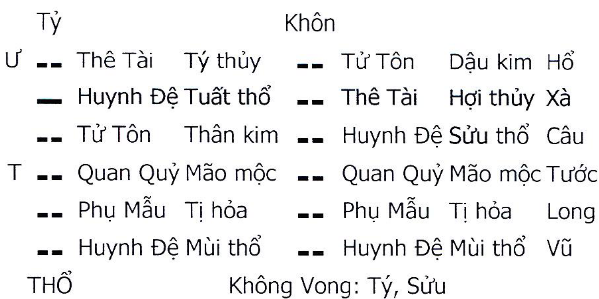
    - **Hình này chứng minh điều gì**
      - Lấy Phụ Mẫu làm Dụng thần, xem thêm hào 2. Mới nhìn thì thấy hào 2 sinh hào 5, nhà này có lợi cho người.
    - **Từ đâu mà thấy được**
      - Lấy Phụ Mẫu làm Dụng thần, xem thêm hào 2. Mới nhìn thì thấy hào 2 sinh hào 5, nhà này có lợi cho người.
- **Diễn tiến phân tích và suy luận chi tiết:**
  - Lấy Phụ Mẫu làm Dụng thần, xem thêm hào 2.
  - Mới nhìn thì thấy hào 2 sinh hào 5, nhà này có lợi cho người.
  - Nhưng hào trạch Nguyệt phá, Tử ở Nhật thần, nhập Mộ ở hào 5, lại biến quẻ lục xung, không thể tàng phong tụ khí, tử khí trong nhà rất rặng.
  - Hào 3 Quan Quỷ ám động khắc hào 5 Tuất thổ, hào 3 là cửa, hào 5 là người, cổng gây bất lợi cho người ở.
  - Nhật thần Dậu kim khiến hào 3 ám động, Dậu kim và hào Tử Tôn có ngũ hành tương đồng, Tử Tôn là đường đi, Dậu kim là Tây, chứng tỏ có một con đường lớn từ hướng Tây đến trực xung cổng, sát khí không bị ngăn chặn cho nên đã vào trong nhà.
  - Xem cát hung ứng vào người nào, căn cứ vào suy vượng của lục thân trong quẻ.
  - Trong quẻ Phụ Mẫu Tị hỏa Nguyệt phá, Tử ở Nhật thần, nhập Mộ ở Tuất thổ, Phụ Mẫu chủ chú thím, hai người này tất có bệnh tai.
  - Phụ Mẫu là hỏa, hỏa chủ tim, tất bởi vì bệnh tim mà gặp hung.
  - Tháng Tuất Phụ Mẫu nhập Mộ, tháng hiện tại Phụ Mẫu Nguyệt phá, hai tháng này tất có chuyện không may.
- **Kết quả ứng nghiệm thực tế:**
  - Phong thủy nhà chú đúng như phán đoán, phía Tây có một con đường lớn trực xung cổng.
  - Chú qua đời ở tháng Tuất bởi vì nhồi máu cơ tim.

#### Ví dụ 100: Ngày Ất Hợi tháng Kỷ Dậu năm Đinh Sửu, một người bạn học nhờ đoán gia trạch,...

- **Bối cảnh và thông tin quẻ:**
  - Ngày Ất Hợi tháng Kỷ Dậu năm Đinh Sửu, một người bạn học nhờ đoán gia trạch, được quẻ Lôi Thiên Đại Tráng.
  - ### Đại Tráng
  - THỔ Không Vong: Thân, Dậu
- **Luận giải quái tượng phong thủy:**
  - **Hình 121.** Quẻ Lôi Thiên Đại Tráng
    - 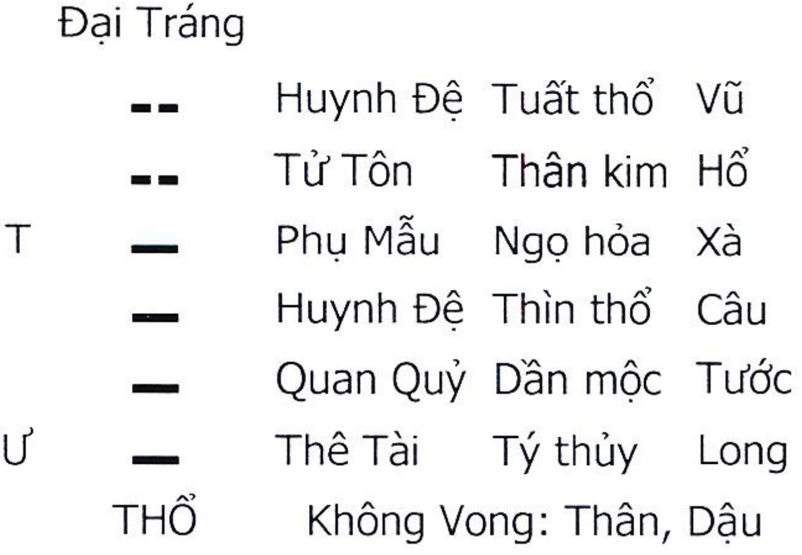
    - **Hình này chứng minh điều gì**
      - Lấy hào Phụ Mẫu làm Dụng thần, kiêm xem hào 2. Hào Thế là tọa sơn, Phụ Mẫu Ngọ hỏa trì Thế, là nhà tọa Nam hướng Bắc.
    - **Từ đâu mà thấy được**
      - Lấy hào Phụ Mẫu làm Dụng thần, kiêm xem hào 2. Hào Thế là tọa sơn, Phụ Mẫu Ngọ hỏa trì Thế, là nhà tọa Nam hướng Bắc.
- **Diễn tiến phân tích và suy luận chi tiết:**
  - Lấy hào Phụ Mẫu làm Dụng thần, kiêm xem hào 2.
  - Hào Thế là tọa sơn, Phụ Mẫu Ngọ hỏa trì Thế, là nhà tọa Nam hướng Bắc.
  - Hào 2 lâm Quan Quỷ, Quan Quỷ chủ cơ quan, chính phủ, nơi ở là nhà của cơ quan.
  - Tài lâm Nhật sinh hào 2, lại Phụ Mẫu trì Thế, đã dùng tiền để biến thành sở hữu của mình.
  - Nhật thần hợp hào 2 hào trạch, tượng trùng điệp, là nhà lầu.
  - Quẻ được lục xung, tượng không cát, nơi này không nên ở.
  - Chu Tước lâm Quan Quỷ Dần mộc nhập trạch, Dần mộc là đất Trường Sinh của hỏa, Chu Tước lại chủ hỏa hoạn, vì vậy đoán là nhà này đã từng xảy ra hỏa hoạn.
  - Hào 3 là cửa, Huynh Đệ lâm hào 3, Huynh Đệ cũng chủ cửa, hào 3 và Nguyệt kiến tác hợp, lại lâm Câu Trần là tượng câu bán (vướng vấp, cản trở), đoán là cửa không hữu ích.
  - Hào 5 là người, Tử Tôn Thân kim Không Vong lâm Bạch Hổ, Bạch Hổ chủ lưu sản, đọa thai, đoán là nếu đã sinh con mà vào ở thì không sao, nhưng nếu chưa sinh con mà vào ở thì tất có chuyện lưu sản.
  - Quẻ lục xung là tượng không lâu dài, hào 2 là trạch bị Nguyệt kiến khắc, lại bị Tử Tôn Thân kim xung khắc, nhà này ở không lâu dài, sẽ bị dỡ bỏ.
  - Tử Tôn Thân kim tại hào 5 xung khắc hào trạch, hào 5 chủ đường đi, Tử Tôn cũng chủ đường
  - đi, lâm Bạch Hổ, Bạch Hổ cũng chủ đường đi, đoán là sau khi đập bỏ sẽ không xây lại tòa nhà, mà là sẽ mở rộng đường.
  - Trong tương lai, vị trí này sẽ trở biến thành đường đi.
  - Bởi vì Thân kim Không Vong, đoán là chuyện này sẽ xảy ra tại tháng Thân năm Mậu Dần 1998.
- **Kết quả ứng nghiệm thực tế:**
  - Nơi ở là một tòa nhà hai tầng tọa Nam hướng Bắc, gia đình anh ta ở tại tầng 1.
  - Ban đầu là nhà của cơ quan, về sau đã mua lại.
  - Sau khi vào ở thì đã một lần phát sinh hỏa hoạn.
  - Cửa rất khó sử dụng, đóng mở không được.
  - Trước khi chuyển vào thì anh ta đã sinh con, vợ chưa từng bị lưu sản.
  - Nghe nói sắp có mở rộng đường, căn nhà này nằm trong phạm vi mở rộng đó.
  - Quả nhiên tại tháng Thân năm 1998, huyện thông báo di dời, cùng năm giải phóng mặt bằng.
  - Cùng năm đó, vợ mang thai nhưng bị lưu sản.

#### Ví dụ 101: Ngày Tân Hợi tháng Ngọ, nữ đoán phong thủy nhà cửa, được Lôi Địa Dự.

- **Diễn tiến phân tích và suy luận chi tiết:**
  - Lấy Phụ Mẫu là nhà, xem thêm hào 2.
  - Phụ Mẫu Tý thủy phục dưới hào Thế, căn nhà muốn hỏi là tài sản riêng của bản thân.
  - Lâm Bạch Hổ, Bạch Hổ chủ đường đi, nhà gần bên đường.
  - Phụ Mẫu Tý thủy Nguyệt phá, nhà có vết nứt, không quá mới.
  - Hào 2 là hào trạch, ám động sinh Thế Thê Tài, nhà này lợi cho tài vận.
  - Tử Tôn Tị hỏa ám động tương hợp với hào 5 Quan Quỷ Thân kim, hào 5 là tôn vị, hào vị lãnh đạo, Tử Tôn thể hiện con cái, hào 5 thể hiện quan vận, trong con cái có người làm lãnh đạo.
  - Lâm Câu Trần, Câu Trần là nha môn, là làm việc tại cơ quan đơn vị.
  - Hào 3 là cửa, Không Vong, cửa có khe hở, có hàng rào.
  - Lâm Thanh Long, cổng rất sang trọng.
  - Quẻ gặp lục hợp, bản thân giao thiệp rộng.
- **Kết quả ứng nghiệm thực tế:**
  - Nhà gần đường quốc lộ, giao thông rất thuận tiện.
  - Bản thân có tiền lương rất cao, ngoài ra còn có thâm niên làm bác sĩ và được bệnh viện tư nhân mời khám bệnh, thu nhập khá dồi dào.
  - Con trai công tác tại cơ quan nhà nước, là bí thư của thị trưởng.
  - Phán đoán về cửa cũng chính xác.

#### Ví dụ 102: Ngày Nhâm Thìn tháng Mùi, nam đoán phong thủy nhà cửa, được Sơn Lôi Di biến ...

- **Diễn tiến phân tích và suy luận chi tiết:**
  - Tam hợp Phụ Mẫu cục là nhà trệt hoặc có nhiều nhà.
  - Lại hào 2 là sân, lâm gian hào, gian hào là minh đường, thêm lâm Dần mộc, trong sân có cây.
  - Hào 6 là tường, lâm Dần mộc, cạnh tường có cây.
  - Phụ Mẫu lâm hào Ứng, nhà không phải của mình.
  - Lâm Huyền Vũ nhập Mộ, Huyền Vũ chủ tối tăm, hỏa lại phục tàng và nhập Mộ ở hào động, căn nhà thiếu ánh sáng.
  - Hào 3 là giường, hào 3 phát động xung hào Thế, lại có Quan Quỷ phục dưới hào 3, ngủ không yên ổn, thường mơ thấy ma quỷ.
  - Lâm Chu Tước, hay nói mớ.
- **Kết quả ứng nghiệm thực tế:**
  - Thực tế đúng là như vậy.

#### Ví dụ 103: Ngày Canh Ngọ tháng Nhâm Tuất năm Quý Mùi, nữ đoán phong thủy nhà cửa, được ...

- **Luận giải quái tượng phong thủy:**
  - **Hình 122.** Sơ đồ quẻ Lôi Hỏa Phong biến Hỏa Thiên Đại Hữu
    - 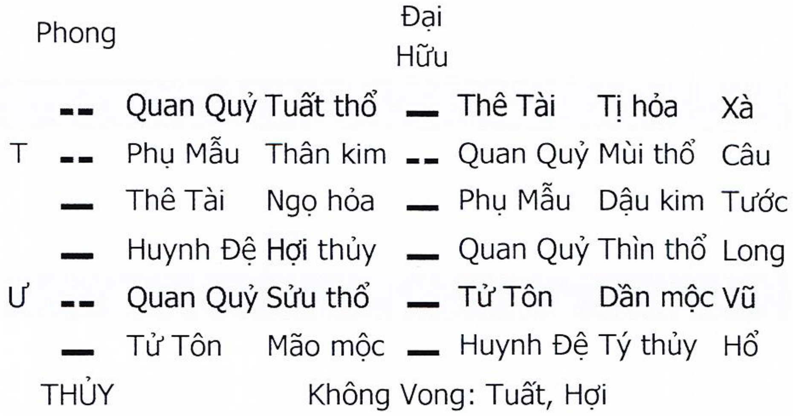
    - **Hình này chứng minh điều gì**
      - Hào Thế nhập Mộ tại hào 2, hào 2 là nhà, thường xuyên ở trong nhà, ít khi ra ngoài. Hào 6 Tuất thổ Không Vong, hào 6 là mái nhà, mái nhà thấp trũng, Không Vong lại biểu thị không có cản trở, có thể...
    - **Từ đâu mà thấy được**
      - Phụ Mẫu Thân kim trì Thế, nhà là của mình. Hào Thế nhập Mộ tại hào 2, hào 2 là nhà, thường xuyên ở trong nhà, ít khi ra ngoài.
- **Diễn tiến phân tích và suy luận chi tiết:**
  - Phụ Mẫu Thân kim trì Thế, nhà là của mình.
  - Hào Thế nhập Mộ tại hào 2, hào 2 là nhà, thường xuyên ở trong nhà, ít khi ra ngoài.
  - Hào 6 Tuất thổ Không Vong, hào 6 là mái nhà, mái nhà thấp trũng, Không Vong lại biểu thị không có cản trở, có thể trông thấy bầu trời.
  - Tuất thổ là Nguyên thần, Không Vong lâm Đằng Xà, Nguyên thần là tư duy, Đằng Xà chủ cổ quái, trong đầu thường ảo tưởng, suy nghĩ viển vông.
  - Hào 6 là đầu, Không Vong không sinh hào Thế, đầu cung máu không tốt, đau đầu, chóng mặt.
  - Nguyên thần Sửu thổ lâm Huyền Vũ, khiến hào Thế nhập Mộ, Huyền Vũ là hướng nội, nhập Mộ chủ khép kín, tính cách hướng nội.
  - Hào 2 thổ hóa mộc, đã từng sửa chữa nhà.
  - Nguyên thần hóa hồi đầu khắc, Huyền Vũ chủ ám muội, hào Thế lâm Câu Trần chủ khối u, có bệnh phụ khoa, khối u.
  - Hào Thế lâm hào 5 vượng tướng, hào 5 là đường, giao thông thuận tiện.
- **Kết quả ứng nghiệm thực tế:**
  - Phán đoán phù hợp thực tế, tại tháng Dần đã làm phẫu thuật phụ khoa.

#### Ví dụ 104: Ngày Đinh Mão tháng Nhâm Tuất năm Quý Mùi, nữ đoán phong thủy căn nhà muốn m...

- **Luận giải quái tượng phong thủy:**
  - **Hình 123.** Sơ đồ quẻ Địa Sơn Khiêm biến Thủy Phong Tỉnh
    - 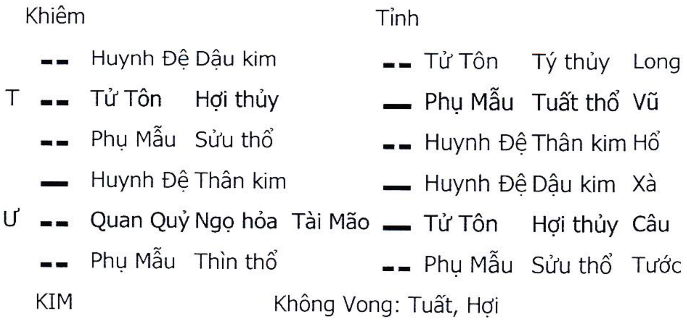
    - **Hình này chứng minh điều gì**
      - Hào Ứng lâm hào 2, căn nhà đang có người ở. Hào sơ Phụ Mẫu Thìn thổ Nguyệt phá, lâm Chu Tước chủ văn thư, hào sơ là mặt đất, nhà không có sổ đỏ.
    - **Từ đâu mà thấy được**
      - Hào Ứng lâm hào 2, căn nhà đang có người ở. Động hóa Không, dự định chuyển đi.
- **Diễn tiến phân tích và suy luận chi tiết:**
  - Hào Ứng lâm hào 2, căn nhà đang có người ở.
  - Động hóa Không, dự định chuyển đi.
  - Quan Quỷ Ngọ hỏa sinh Phụ Mẫu, nhưng hóa Không Vong, năm Ất Hợi xuất Không, nhà được xây vào năm này.
  - Hào sơ Phụ Mẫu Thìn thổ Nguyệt phá, lâm Chu Tước chủ văn thư, hào sơ là mặt đất, nhà không có sổ đỏ.
  - Hào 5 Không Vong, lân cận có cầu.
  - Lâm thủy Không hóa Không, dưới cầu không có nước.
  - Hào Thế hóa ra Phụ Mẫu Tuất thổ Không Vong, sợ rằng chưa làm xong sổ hồng.
- **Kết quả ứng nghiệm thực tế:**
  - Quả nhiên là như vậy, bởi vì chưa làm xong sổ hồng cho nên đã không mua.

#### Ví dụ 105: Đây là một ví dụ ở năm 2015. Một người đàn ông có căn nhà bị ma ám, thường x...

- **Bối cảnh và thông tin quẻ:**
  - Đây là một ví dụ ở năm 2015.
  - Một người đàn ông có căn nhà bị ma ám, thường xuyên ngửi thấy mùi tanh, nghe thấy âm thanh quái lạ, khí lạnh rợn người.
  - Đèn điện lúc sáng lúc tắt, khiến không thể sống yên ổn.
  - Hỏi sau khi chuyển đến chỗ ở mới thì có thể thoát khỏi tình trạng trên hay không?
  - Ngày Mậu Ngọ tháng Thân, được Thiên Hỏa Đồng Nhân biến Thiên Lôi Vô Vọng.
  - HỎA Không Vong: Tý, Sửu
- **Luận giải quái tượng phong thủy:**
  - **Hình 124.** Quẻ Thiên Hỏa Đồng Nhân biến Thiên Lôi Vô Vọng
    - 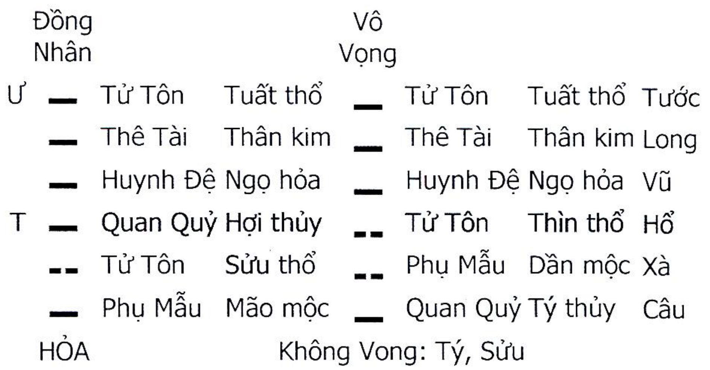
    - **Hình này chứng minh điều gì**
      - Bạch Hổ chủ máu tanh, cùng Quan Quỷ phát động, chủ mùi tanh. Quỷ được kim sinh, kim là âm thanh, chủ âm thanh quái lạ.
    - **Từ đâu mà thấy được**
      - Trong quẻ Quan Quỷ trì Thế phát động, Nguyệt sinh phù vượng tướng. Bạch Hổ chủ máu tanh, cùng Quan Quỷ phát động, chủ mùi tanh.
- **Diễn tiến phân tích và suy luận chi tiết:**
  - Quan Quỷ là ma quỷ, cũng là lo âu.
  - Trong quẻ Quan Quỷ trì Thế phát động, Nguyệt sinh phù vượng tướng.
  - Bạch Hổ chủ máu tanh, cùng Quan Quỷ phát động, chủ mùi tanh.
  - Quỷ được kim sinh, kim là âm thanh, chủ âm thanh quái lạ.
  - Thủy chủ lạnh lẽo, thủy khắc hỏa, hỏa là điện, chủ đèn tắt, hóa Mộ khố không khắc, chủ đèn lại sáng.
  - Quan Quỷ độc phát hóa hồi đầu khắc, chính là khắc đi Quỷ bên mình.
  - Hào Ứng là điểm đến, cũng là lục thân khắc Quan Quỷ, chuyển đến đây nhất định sẽ bình yên.
- **Kết quả ứng nghiệm thực tế:**
  - Sau khi rời khỏi căn nhà cũ, lại thêm hóa giải, cuộc sống dần dần được yên ổn.

#### Ví dụ 106: Đây là một ví dụ ở năm 2011. Một người đàn ông gặp khó khăn về tài vận, hỏi ...

- **Bối cảnh và thông tin quẻ:**
  - Đây là một ví dụ ở năm 2011.
  - Một người đàn ông gặp khó khăn về tài vận, hỏi có phải là do phong thủy gây nên hay không?
  - Tại ngày Quý Mùi tháng Dậu, được Sơn Địa Bác biến Phong Địa Quan.
  - KIM Không Vong: Thân, Dậu
- **Luận giải quái tượng phong thủy:**
  - **Hình 125.** Quẻ Sơn Địa Bác biến Phong Địa Quan
    - 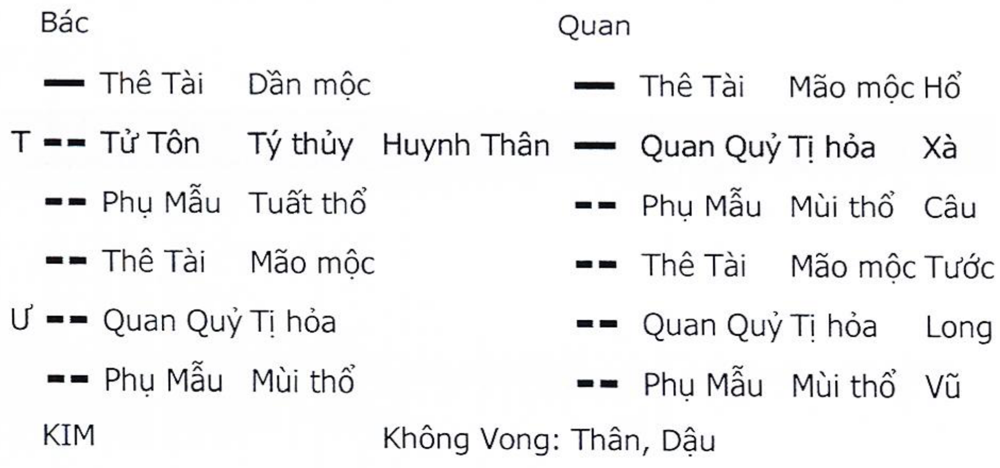
    - **Hình này chứng minh điều gì**
      - Lấy Thê Tài làm Dụng thần, lại xem hào động và các tổ hợp trong quẻ. Hào Thế độc phát hóa Tuyệt, hào Thế thể hiện bản thân, sinh Thê Tài không đắc lực, vận khí của bản thân không tốt.
    - **Từ đâu mà thấy được**
      - Lấy Thê Tài làm Dụng thần, lại xem hào động và các tổ hợp trong quẻ. Thê Tài Mão mộc Nguyệt phá, nhập Mộ tại Nhật, tài vận rất khó khăn.
- **Diễn tiến phân tích và suy luận chi tiết:**
  - Lấy Thê Tài làm Dụng thần, lại xem hào động và các tổ hợp trong quẻ.
  - Thê Tài Mão mộc Nguyệt phá, nhập Mộ tại Nhật, tài vận rất khó khăn.
  - Hào Thế độc phát hóa Tuyệt, hào Thế thể hiện bản thân, sinh Thê Tài không đắc lực, vận khí của bản thân không tốt.
  - Tuyệt địa nạp vào quẻ chính, lâm hào 2, hào 2 là trạch, lâm Thanh Long, chủ đã từng chỉnh trang nhà cửa.
  - Thê Tài Mão mộc tại hào 3 bị Nguyệt xung phá, hào 3 là cửa, chủ thay đổi cửa.
  - Hào 3 cũng là giường, hoặc là di chuyển giường ảnh hưởng đến tài vận.
  - (Hồi đáp: Đã từng đổi cửa, cũng đã di chuyển giường.
  - Có vẻ như là từ lúc đó thì tài vận bắt đầu khó khăn.)
  - **Hóa giải:** Phía Đông của giường dán một bức tranh con thỏ, đồng thời mang theo trên người một con cá nhồi bông.
  - Mục đích là để Thực Phá Mão mộc và để tạo thành tam hợp Thê Tài cục với Nhật Mùi thổ.
- **Kết quả ứng nghiệm thực tế:**
  - Ngày 14 tháng 11 phản hồi: Sau khi hóa giải chưa đến một tuần, tôi đột nhiên nhận được thư của anh trai, trong thư nói rằng cha đã để lại cho tôi 6 vạn nguyên.
  - Vào tháng 10, tại buổi tiệc liên hoan của đơn vị, tôi đã rút thăm được máy chụp ảnh.

#### Ví dụ 107: Một người đàn ông đã từng đoán mộng và ứng nghiệm, ngày đến phản hồi lại đoá...

- **Bối cảnh và thông tin quẻ:**
  - Một người đàn ông đã từng đoán mộng và ứng nghiệm, ngày đến phản hồi lại đoán bệnh ngoài da của con trai.
  - Ngày Kỷ Tị tháng Tuất, được Sơn Thiên Đại Súc biến Tốn Vi Phong.
  - THỔ Không Vong: Tuất, Hợi
- **Luận giải quái tượng phong thủy:**
  - **Hình 126.** Quẻ Sơn Thiên Đại Súc biến Tốn Vi Phong
    - 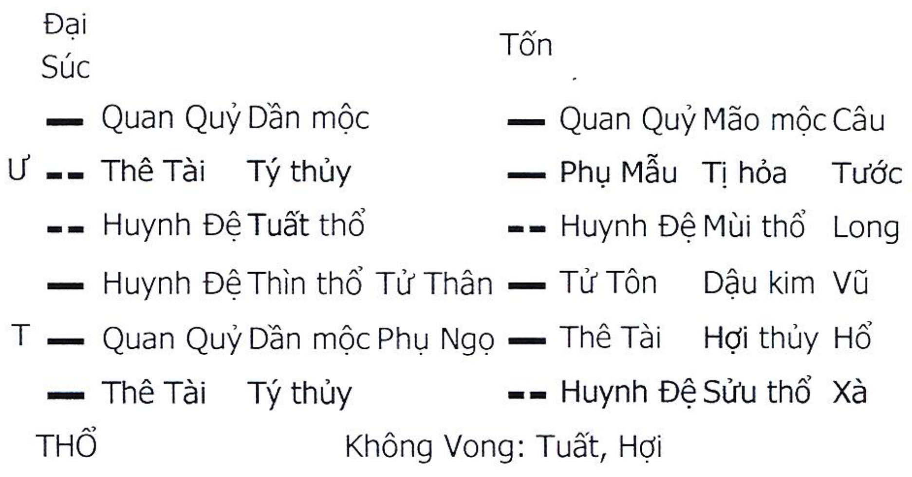
    - **Hình này chứng minh điều gì**
      - Nguyệt sinh Nhật khắc, dường như cân bằng, nhưng Nguyệt xung phá Nguyên thần Thìn thổ, phục tàng lại không thích hợp, chứng tỏ bệnh tương đối nghiêm trọng. Phi thần mừng được Phá, Phục thần được xu...
    - **Từ đâu mà thấy được**
      - Lấy Tử Tôn làm Dụng thần. Nguyệt sinh Nhật khắc, dường như cân bằng, nhưng Nguyệt xung phá Nguyên thần Thìn thổ, phục tàng lại không thích hợp, chứng tỏ bệnh tương đối nghiêm trọng.
- **Diễn tiến phân tích và suy luận chi tiết:**
  - Lấy Tử Tôn làm Dụng thần.
  - Tử Tôn Thân kim phục tàng dưới Thìn thổ.
  - Nguyệt sinh Nhật khắc, dường như cân bằng, nhưng Nguyệt xung phá Nguyên thần Thìn thổ, phục tàng lại không thích hợp, chứng tỏ bệnh tương đối nghiêm trọng.
  - Phi thần mừng được Phá, Phục thần được xuất, chủ mắc bệnh không nguy hiểm.
  - Nguyên thần là thổ, một Không một Phá, thổ là da, lâm Thanh Long Huyền Vũ, chủ da xanh xao, thâm tím (bác sĩ xác định là bệnh chàm cấp tính).
  - Trong quẻ có hai Tý thủy là Tử địa của Dụng thần phát động, Tý thủy đều không sinh khắc Dụng thần và Nguyên thần, Tý thủy tất chủ nguyên nhân.
  - Là do động thứ có liên quan đến thủy dẫn tới bệnh.
  - Trong quẻ dự đoán giải mộng, Tử Tôn hóa phá tại Thìn thổ, cũng là thông tin này.
  - Hào 5 Tý thủy hưu tù hóa Tuyệt, hào sơ Tý thủy hóa hợp.
  - Hào 5 là vị trí tôn quý, liên quan đến thủy chính là cá cảnh, hóa Tuyệt là cá đã chết.
  - Hào sơ Tý thủy hồi đầu khắc, chính là đã vứt bỏ.
  - (Hồi đáp: Sau khi cá chết thì đã vứt luôn cả bể cá.)
  - **Hóa giải:** Lấy một nắm đậu đen, bọc lại và để ở bên cạnh đứa nhỏ.
  - Như vậy Thìn thổ Thực Phá, Tuất thổ xuất Không, Tý thủy nhập Mộ, sinh hào Tử Tôn, những thiếu sót
  - đều đã được giải quyết.
  - Kết quả sau khi hóa giải cần nghiệm chứng.

#### Ví dụ 108: Đây là một ví dụ ở năm 2011. Một người phụ nữ có con gái bị lác mắt, không m...

- **Bối cảnh và thông tin quẻ:**
  - Đây là một ví dụ ở năm 2011.
  - Một người phụ nữ có con gái bị lác mắt, không muốn phẫu thuật, hỏi có phương pháp điều trị khác hay không?
  - Ở ngày Quý Dậu tháng Mùi, được Sơn Trạch Tổn biến Hỏa Trạch Khuê.
  - THỔ Không Vong: Tuất, Hợi
- **Luận giải quái tượng phong thủy:**
  - **Hình 127.** Quẻ Sơn Trạch Tổn biến Hỏa Trạch Khuê
    - 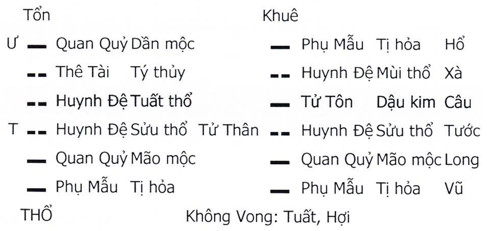
    - **Hình này chứng minh điều gì**
      - Tử Tôn Thân kim phục dưới hào 3 Huynh Đệ Sửu thổ. Dụng thần phục tàng, Phi thần Nguyệt phá là tốt.
    - **Từ đâu mà thấy được**
      - Lấy Tử Tôn làm Dụng thần. Nguyệt sinh, Nhật trợ giúp là vượng tướng.
- **Diễn tiến phân tích và suy luận chi tiết:**
  - Lấy Tử Tôn làm Dụng thần.
  - Tử Tôn Thân kim phục dưới hào 3 Huynh Đệ Sửu thổ.
  - Nguyệt sinh, Nhật trợ giúp là vượng tướng.
  - Dụng thần phục tàng, Phi thần Nguyệt phá là tốt.
  - Tuy nhiên, không nên Nguyên thần Tuất thổ Không Vong, thiếu lực sinh Tử Tôn.
  - Tuất thổ độc phát, hợp hào trạch Mão mộc, lại khiến Phụ Mẫu Tị hỏa nhập Mộ.
  - Hào Thế là mình, nội quái Phụ Mẫu Tị hỏa sinh hào Thế, chính là nhà mình ở.
  - Hào 4 là cổng bên ngoài, lâm Câu Trần chủ kiến trúc, vừa ra cổng là có một vật kiến trúc.
  - Hào 2 là trạch, Tuất thổ hợp hào trạch, chính là trên nhà có thêm đồ vật, có thêm tầng kiến trúc.
  - Hỏa chủ ánh sáng, khiến Phụ Mẫu nhập Mộ chính là ánh sáng của nhà mình bị che khuất, do đó mà ảnh hưởng đến mắt của con gái, chuyển nhà thôi!
- **Kết quả ứng nghiệm thực tế:**
  - Gia đình chúng tôi đang sống trong một chung cư đi thuê.
  - Trên mái nhà của dãy cửa hàng phía trước, người ta có đặt những đồ trang trí hình tròn che khuất cửa sổ của chúng tôi.
  - Hóa ra nguyên nhân là do phong thủy!

#### Ví dụ 109: Đây là một ví dụ ở tháng giêng năm 2015. Một người có con gần ba tuổi nhưng ...

- **Bối cảnh và thông tin quẻ:**
  - Đây là một ví dụ ở tháng giêng năm 2015.
  - Một người có con gần ba tuổi nhưng không biết nói, hỏi có phải nguyên nhân là do phong thủy hay không?
  - Tại ngày Kỷ Mùi tháng Dần, gieo được Phong Lôi Ích biến Tốn Vi Phong.
  - MỘC Không Vong: Tý, Sửu
- **Luận giải quái tượng phong thủy:**
  - **Hình 128.** Sơ đồ quẻ Phong Lôi Ích biến Tốn Vi Phong
    - 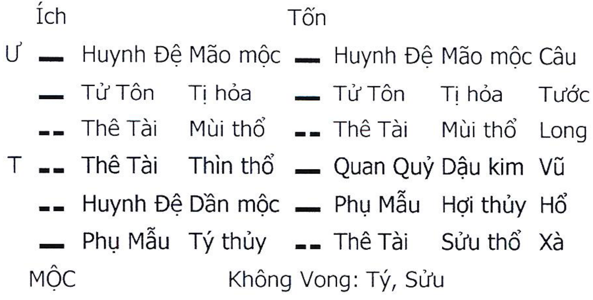
    - **Hình này chứng minh điều gì**
      - Tử Tôn Tị hỏa tại hào 5, lâm Chu Tước bị hào sơ Phụ Mẫu Tý thủy khắc, Chu Tước chủ ngôn ngữ, bị khắc chủ ngôn ngữ có rối loạn, hào sơ là lúc nhỏ, Tý thủy là Thai địa, không thể loại trừ yếu tố bẩm ...
    - **Từ đâu mà thấy được**
      - Lấy Tử Tôn làm Dụng thần. Tử Tôn Tị hỏa tại hào 5, lâm Chu Tước bị hào sơ Phụ Mẫu Tý thủy khắc, Chu Tước chủ ngôn ngữ, bị khắc chủ ngôn ngữ có rối loạn, hào sơ là lúc nhỏ, Tý thủy là Thai địa, khôn...
- **Diễn tiến phân tích và suy luận chi tiết:**
  - Lấy Tử Tôn làm Dụng thần.
  - Tử Tôn Tị hỏa tại hào 5, lâm Chu Tước bị hào sơ Phụ Mẫu Tý thủy khắc, Chu Tước chủ ngôn ngữ, bị khắc chủ ngôn ngữ có rối loạn, hào sơ là lúc nhỏ, Tý thủy là Thai địa, không thể loại trừ yếu tố bẩm sinh.
  - Tý thủy bị hào biến hợp trú, khiến Tý thủy tham hợp quên khắc, hưu tù không có lực khắc Tử Tôn.
  - Tuy nhiên, hào biến bị Nhật xung khai, Tý thủy lại khắc Dụng thần, Nhật đồng thời cũng khiến Nguyên thần Mão mộc Dần mộc nhập Mộ.
  - Vì vậy, Thê Tài Mùi thổ chính là mấu chốt của vấn đề.
  - Mùi thổ nhập quẻ tại hào 4 lâm Thanh Long, Thanh Long chủ ẩm thực, Thê Tài cũng chủ ẩm thực, rất có thể liên quan đến phòng bếp.
  - Hào 2 Dần mộc hóa ra Phụ Mẫu Hợi thủy, hào 2 là phòng bếp, Dần mộc là điểm Trường Sinh của hỏa, cũng có thể xem là phòng bếp.
  - Dần mộc bị hào biến Phụ Mẫu Hợi thủy hợp trú không thể sinh Tử Tôn, cũng là phòng bếp có vấn đề.
  - Tại sao lại có hai chỗ biểu thị có liên quan đến phòng bếp?
  - Hào 4 cũng là cửa sổ, mà hào 4 gần hào Thế, hào Thế thể hiện bản thân, vậy thì hào 4 chính là hàng xóm, bởi vì Thê Tài Mùi thổ là phòng bếp, chính là bên ngoài cửa sổ phòng bếp có đồ vật của hàng xóm ảnh hưởng.
  - Dần mộc nhập Mộ không thể sinh hỏa, hỏa chủ ánh sáng, chính là căn
  - nhà của hàng xóm che khuất ánh sáng của phòng bếp nhà mình.
  - Do đó đã ảnh hưởng đến sự phát triển thanh đới của đứa con.
  - (Quả nhiên ở phía Tây phòng bếp có bức tường nhà hàng xóm rất gần cửa sổ, khiến ánh sáng bị ảnh hưởng.
  - Nghĩ kỹ thì phía Tây là Đoài, Đoài là miệng, vừa vặn chủ ngôn ngữ, nói năng.)
  - **Hóa giải:** Xung khai Mộ khố Mùi thổ, hợp trú Phụ Mẫu Tý thủy, chỉ có Sửu thổ mới có thể làm được.
  - Tôi dặn người này để một chén gạo nhỏ ở Tây Nam, gạo không được cao hơn miệng chén.
- **Kết quả ứng nghiệm thực tế:**
  - Ngày 6 tháng 9, người này đã đến phản hồi: Sau khi hóa giải được một thời gian, tôi mang con đi xem ca hát để dụ con tập nói, đột nhiên con "a" lên tiếng, bắt đầu tập hát.
  - Mặc dù con phát âm chưa rành nhưng cũng đã khiến cho chúng tôi vô cùng ngạc nhiên.
  - Tôi tin chắc rằng, nếu như cố gắng hơn nữa thì nhất định sẽ có thay đổi.

#### Ví dụ 110: Một phụ nữ người Mỹ đoán nguyên nhân khiến cha bị bệnh. Tại ngày Nhâm Tý thá...

- **Bối cảnh và thông tin quẻ:**
  - Một phụ nữ người Mỹ đoán nguyên nhân khiến cha bị bệnh.
  - Tại ngày Nhâm Tý tháng Thân năm Giáp Ngọ, gieo được Địa Thiên Thái biến Đoài Vi Trạch.
  - THỔ Không Vong: Dần, Mão
  - Lấy Phụ Mẫu làm Dụng thần.
  - Phụ Mẫu Tị hỏa phục tàng dưới hào 2, Nguyệt hợp Nhật khắc, xem như là hưu tù.
  - Trong quẻ Kỵ thần Thê Tài Hợi thủy hóa hồi đầu sinh đến khắc, chứng tỏ bệnh tình tương đối nghiêm trọng.
  - Dụng thần phục tàng, đau ốm không dậy nổi.
  - Nguyên thần Không Phá, Nguyên thần thể hiện tư duy, chứng tỏ ý thức không tỉnh táo.
  - Hào Thế Huynh Đệ lâm Chu Tước phát động, bởi vì chuyện của cha mà cãi nhau với người khác.
  - (Đáp: Cha nằm liệt giường, đầu óc ngơ ngẩn.
  - Bệnh viện không thể chữa khỏi, thái độ của họ cũng không tốt, vì vậy mà đã xảy ra cãi lộn.)
  - Hào 4 Huynh Đệ Sửu thổ lâm Câu Trần hóa ra Kỵ thần, Câu Trần chủ kiến trúc, tu tạo, hóa Đinh Hợi thủy chủ năm Đinh Hợi, bởi vì năm này động thổ cải tạo mà gieo mầm tai họa.
  - (Đáp: Năm 2007, chúng tôi chuyển nhà đến địa phương hiện tại, bắt đầu chỉnh trang nơi ở, đã xây một lán để xe.)
  - Hào 5 Hợi thủy lâm Đằng Xà Huyền Vũ phát động hóa hồi đầu sinh, lân cận có một con sông.
  - Thủy nhập Mộ tại hào Thế, hào Thế là nhà của mình, chủ dòng nước chảy đến nhà mình.
  - (Đáp: Lân cận có con sông, dòng nước chảy đến sau lưng nhà.
  - Năm 2012, cha ngã bệnh và nhập viện.
  - Sự kiện này vừa đúng với Thìn thổ phát động, cách sơn hóa hào, liên tục hóa đến thủy hào 5.)
  - Tổng hợp lại những phán đoán trên đây, tôi đoán là bệnh của người cha có liên quan nhất định đến phong thủy.
  - Bởi vì không có phản hồi sau khi hóa giải cho nên tôi không trình bày phương pháp hóa giải ở đây.
  - ---
  - # Part 13 (Pages 241-260)
- **Luận giải quái tượng phong thủy:**
  - **Hình 129.** Sơ đồ quẻ Địa Thiên Thái biến Đoài Vi Trạch
    - 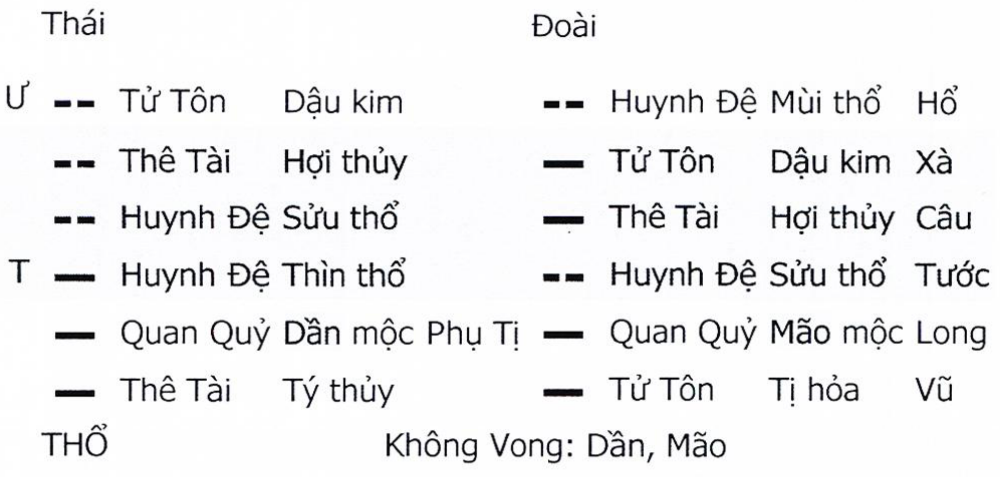
    - **Hình này chứng minh điều gì**
      - Quẻ chứng minh tình trạng phong thủy và ảnh hưởng cát hung tương ứng với quái tượng Sơ đồ quẻ Địa Thiên Thái biến Đoài Vi Trạch.
    - **Từ đâu mà thấy được**
      - **Ví dụ 110:** Một phụ nữ người Mỹ đoán nguyên nhân khiến cha bị bệnh. THỔ Không Vong: Dần, Mão
- **Diễn tiến phân tích và suy luận chi tiết:**
  - **Ví dụ 110:** Một phụ nữ người Mỹ đoán nguyên nhân khiến cha bị bệnh.
  - Tại ngày Nhâm Tý tháng Thân năm Giáp Ngọ, gieo được Địa Thiên Thái biến Đoài Vi Trạch.
  - THỔ Không Vong: Dần, Mão
  - Lấy Phụ Mẫu làm Dụng thần.
  - Phụ Mẫu Tị hỏa phục tàng dưới hào 2, Nguyệt hợp Nhật khắc, xem như là hưu tù.
  - Trong quẻ Kỵ thần Thê Tài Hợi thủy hóa hồi đầu sinh đến khắc, chứng tỏ bệnh tình tương đối nghiêm trọng.
  - Dụng thần phục tàng, đau ốm không dậy nổi.
  - Nguyên thần Không Phá, Nguyên thần thể hiện tư duy, chứng tỏ ý thức không tỉnh táo.
  - Hào Thế Huynh Đệ lâm Chu Tước phát động, bởi vì chuyện của cha mà cãi nhau với người khác.
  - (Đáp: Cha nằm liệt giường, đầu óc ngơ ngẩn.
  - Bệnh viện không thể chữa khỏi, thái độ của họ cũng không tốt, vì vậy mà đã xảy ra cãi lộn.)
  - Hào 4 Huynh Đệ Sửu thổ lâm Câu Trần hóa ra Kỵ thần, Câu Trần chủ kiến trúc, tu tạo, hóa Đinh Hợi thủy chủ năm Đinh Hợi, bởi vì năm này động thổ cải tạo mà gieo mầm tai họa.
  - (Đáp: Năm 2007, chúng tôi chuyển nhà đến địa phương hiện tại, bắt đầu chỉnh trang nơi ở, đã xây một lán để xe.)
  - Hào 5 Hợi thủy lâm Đằng Xà Huyền Vũ phát động hóa hồi đầu sinh, lân cận có một con sông.
  - Thủy nhập Mộ tại hào Thế, hào Thế là nhà của mình, chủ dòng nước chảy đến nhà mình.
  - (Đáp: Lân cận có con sông, dòng nước chảy đến sau lưng nhà.
  - Năm 2012, cha ngã bệnh và nhập viện.
  - Sự kiện này vừa đúng với Thìn thổ phát động, cách sơn hóa hào, liên tục hóa đến thủy hào 5.)
  - Tổng hợp lại những phán đoán trên đây, tôi đoán là bệnh của người cha có liên quan nhất định đến phong thủy.
  - Bởi vì không có phản hồi sau khi hóa giải cho nên tôi không trình bày phương pháp hóa giải ở đây.
  - ---
  - # Part 13 (Pages 241-260)

#### Ví dụ 111: Ngày Mậu Thìn tháng Thìn năm 2015, nữ đoán sức khỏe, được Sơn Lôi Di.

- **Luận giải quái tượng phong thủy:**
  - **Hình 130.** Sơ đồ quẻ Sơn Lôi Di
    - 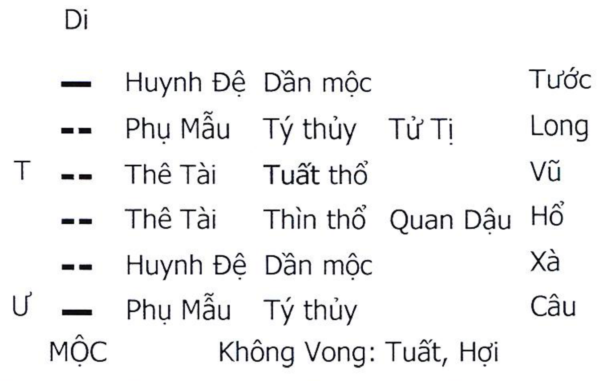
    - **Hình này chứng minh điều gì**
      - Lấy hào Thế làm Dụng thần.
    - **Từ đâu mà thấy được**
      - MỘC Không Vong: Tuất, Hợi Lấy hào Thế làm Dụng thần.
- **Diễn tiến phân tích và suy luận chi tiết:**
  - ### Ví dụ 111: Ngày Mậu Thìn tháng Thìn năm 2015, nữ đoán sức khỏe, được Sơn Lôi Di.
  - **Di**
  - MỘC Không Vong: Tuất, Hợi
  - Lấy hào Thế làm Dụng thần.
  - Hào Thế Thê Tài Tuất thổ bị Nhật Nguyệt xung phá, may mà thổ xung với thổ, mặc dù hung hiểm nhưng nếu vượt qua được giai đoạn hiểm nghèo thì vẫn có thể kéo dài được mạng sống.
  - Hào Thế Nguyệt phá, năm 2011 Tân Mão hợp hào Thế, năm này bị bệnh.
  - Hồi đáp: Bị bệnh năm 2011.
  - Nhật Nguyệt nhập quẻ tại hào 3, Thìn thổ là thủy khố, tất là bệnh ở bàng quang, thận,...
  - Hồi đáp: Năm 2011, tôi bị ung thư thận và phải cắt bỏ một bên, hiện nay lại phát hiện ung thư bàng quang.
  - Thìn thổ lâm Nhật Nguyệt tại hào 3 xung phá hào Thế, hào 3 là giường, ngủ không tốt.
  - Hồi đáp: Thường xuyên bị bóng đè.
  - Tìm nguyên nhân, nhất định có liên quan đến nơi ở.
  - Thìn thổ là Mộ khố của hào Thế, có thể xem là nơi ở.
  - Thìn là thủy khố, trong sân có hồ nước.
  - Đáp: Có một bể nước bằng xi măng rộng 1 mét vuông.
  - Thìn thổ lâm Bạch Hổ vượng tướng, chủ Bạch Hổ đang lúc mạnh, xung phá hào Thế, Bạch Hổ ăn người, quái tượng Sơn Lôi Di chính là tượng há mồm, là Bạch Hổ há mồm.
  - Bởi vì người đó không biết Thanh Long Bạch Hổ là gì, sau khi được giải thích thì phản hồi như sau: Cổng tại Đông Nam, hiên nhà phía Đông ngắn, hiên nhà phía Tây dài ra một
  - đoạn, lại mở cửa đối diện cổng, đúng là Bạch Hổ há mồm trong phong thủy.
  - Hào Thế Tuất thổ Không Vong, thổ Không thì hãm, Tây Bắc có hố.
  - Hồi đáp: Có một cửa hầm cất giữ rau quả.
  - Xem lại những nguyên nhân trên đây, tôi bảo người đó cải tạo phong thủy và tiếp tục đến bệnh viện điều trị.
  - Như vậy mới có thể thu được hiệu quả tốt.

#### Ví dụ 112: Ngày Kỷ Dậu tháng Mùi, nữ đoán phong thủy nhà cửa, được Hỏa Sơn Lữ biến Thủy...

- **Luận giải quái tượng phong thủy:**
  - **Hình 131.** Sơ đồ quẻ Hỏa Sơn Lữ biến Thủy Hỏa Ký Tế
    - 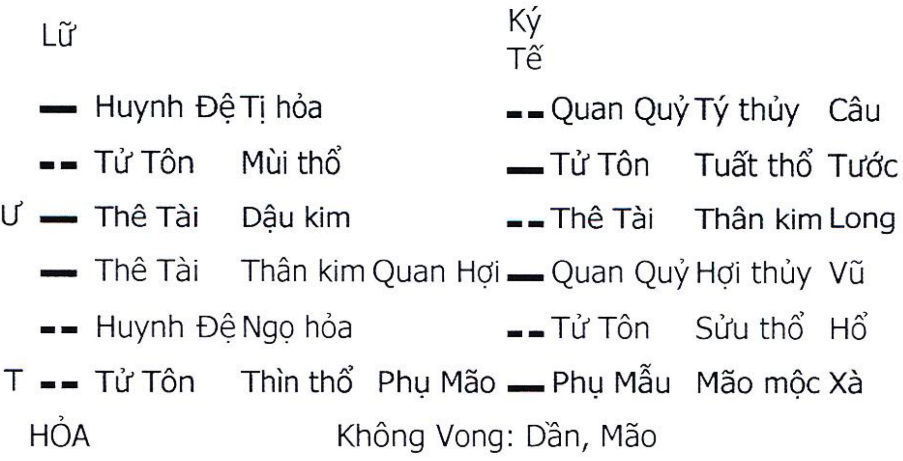
    - **Hình này chứng minh điều gì**
      - ### Ví dụ 112: Ngày Kỷ Dậu tháng Mùi, nữ đoán phong thủy nhà cửa, được Hỏa Sơn Lữ biến Thủy Hỏa Ký Tế. Phụ Mẫu Mão mộc là nhà, nhập Mộ tại hào 5 Tử Tôn Mùi thổ, nhập Mộ ứng xung khai.
    - **Từ đâu mà thấy được**
      - HỎA Không Vong: Dần, Mão Phụ Mẫu Mão mộc là nhà, nhập Mộ tại hào 5 Tử Tôn Mùi thổ, nhập Mộ ứng xung khai.
- **Diễn tiến phân tích và suy luận chi tiết:**
  - ### Ví dụ 112: Ngày Kỷ Dậu tháng Mùi, nữ đoán phong thủy nhà cửa, được Hỏa Sơn Lữ biến Thủy Hỏa Ký Tế.
  - HỎA Không Vong: Dần, Mão
  - Phụ Mẫu Mão mộc là nhà, nhập Mộ tại hào 5 Tử Tôn Mùi thổ, nhập Mộ ứng xung khai.
  - Hơn nữa, Mộ khố là Nguyệt kiến, tượng lâu dài, nhà này được xây ở năm 2009 hoặc là năm này chuyển vào.
  - Phản hồi: Được xây ở năm 2009.
  - Hào 5 là đường đi, Tử Tôn cũng là đường đi, Chu Tước là phía trước, hào 5 Tử Tôn Mùi thổ lâm Chu Tước hóa Tiến thần, tượng dần dần cao lên, trước cửa là một con dốc.
  - Hồi đáp: Vừa ra cửa là leo dốc.
  - Hào Thế cũng là nơi ở của mình, động hóa Mão mộc, gần nơi ở có cây.
  - Mão mộc Không Vong bị Nhật xung khắc, cây đã từng bị cắt tỉa hoặc bị chặt.
  - Mão mộc hưu tù, cây không to.
  - Hồi đáp: Phía Đông có cây, đã bị chặt, cây không cao lắm.
  - Thanh Long là bên trái, Bạch Hổ là bên phải, hào 4 Thê Tài Dậu kim lâm Thanh Long hóa thoái, Thanh Long đang dần dần thấp xuống.
  - Huynh Đệ Ngọ hỏa lâm Bạch Hổ Nguyệt hợp được khí, lại hợp đến hào 5 chỗ cao, Bạch Hổ đang cao, lâm hỏa, có thứ giống như dây điện.
  - Hồi đáp: Bên phải mái nhà hơi cao, hơn nữa còn có ăng ten ti vi.
  - Hào sơ là bàn chân, chủ đi lại, hào 5 lại là Tử Tôn, chủ đường đi, hào Thế Tử Tôn hóa Phụ Mẫu Mão mộc hồi đầu khắc, Phụ Mẫu là xe, chủ con cái dễ có tổn thương vì xe cộ, may mà Phụ Mẫu hưu tù, Tử Tôn vượng tướng, sẽ không có
  - đại hung.
  - Hồi đáp: Con trai nhiều lần xảy ra tai nạn giao thông.
  - Hào Thế cũng thể hiện bản thân.
  - Hào Thế tại hào sơ, động hóa Không Vong, hồi đầu khắc, gặp Không thì chân không chạm đất, khả năng đi lại có vấn đề.
  - Hồi đáp: Tôi đang bị bệnh, đi đứng rất bất tiện.
  - Cung Ly chủ mắt, Nguyên thần hào 6 hóa hồi đầu khắc, mắt không tốt.
  - Hồi đáp: Mắt bị cận thị.
  - Thê Tài hóa thoái, tài vận không tốt.
  - Hào Thế phát động hợp trú Thê Tài, bản thân nỗ lực kiếm tiền.
  - Hồi đáp: Bản thân mở cửa hàng online kiếm tiền.
  - Tuy nhiên, tài vận chỉ ở mức trung bình.

#### Ví dụ 113: Ngày Nhâm Thân tháng Thìn, một người đàn ông đoán cát hung của mảnh đất muốn...

- **Bối cảnh và thông tin quẻ:**
  - Ngày Nhâm Thân tháng Thìn, một người đàn ông đoán cát hung của mảnh đất muốn mua, được Phong Lôi Ích biến Thủy Hỏa Ký Tế.
  - MỘC Không Vong: Tuất, Hợi
- **Luận giải quái tượng phong thủy:**
  - **Hình 132.** Sơ đồ quẻ Phong Lôi Ích biến Thủy Hỏa Ký Tế
    - 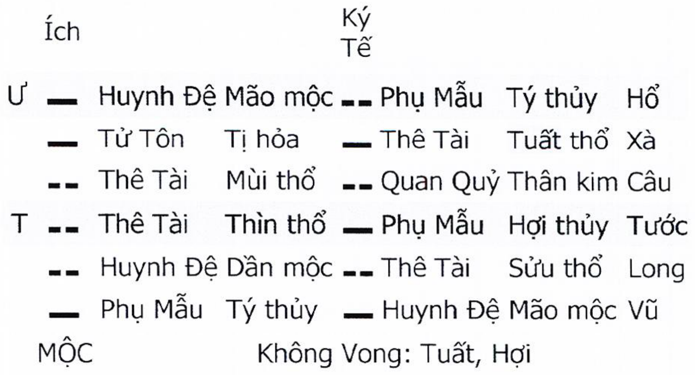
    - **Hình này chứng minh điều gì**
      - Nếu mua miếng đất này để kinh doanh kiếm lời thì phải xem hào Thê Tài. Phụ Mẫu Tý thủy Nhật sinh vượng tướng, nhập Mộ tại hào Thế, muốn mua mảnh đất này thì dễ như trở bàn tay.
    - **Từ đâu mà thấy được**
      - Nếu hỏi có mua đất thành công hay không thì lấy Phụ Mẫu làm Dụng thần, nếu hỏi cát hung thì xem các tổ hợp và biến hóa trong toàn quẻ. Phụ Mẫu Tý thủy Nhật sinh vượng tướng, nhập Mộ tại hào Thế, mu...
- **Diễn tiến phân tích và suy luận chi tiết:**
  - Nếu hỏi có mua đất thành công hay không thì lấy Phụ Mẫu làm Dụng thần, nếu hỏi cát hung thì xem các tổ hợp và biến hóa trong toàn quẻ.
  - Nếu mua miếng đất này để kinh doanh kiếm lời thì phải xem hào Thê Tài.
  - Phụ Mẫu Tý thủy Nhật sinh vượng tướng, nhập Mộ tại hào Thế, muốn mua mảnh đất này thì dễ như trở bàn tay.
  - Hào Thế phát động hóa Phụ Mẫu, bản thân đã đi xem thực địa của mảnh đất.
  - Hào biến Phụ Mẫu Không Vong lâm Chu Tước, vẫn chưa ký kết hợp đồng mua bán.
  - Hào Thế Thê Tài Thìn thổ lâm Nguyệt kiến, Nguyệt kiến biểu thị lâu dài.
  - Mảnh đất này đã phát tài từ rất lâu.
  - Nhưng hóa Không vong, dần dần kém đi.
  - Huynh Đệ phát động khắc Thê Tài, hiện nay khí đất đã suy, không có tài vận.
  - Hào Ứng lâm Bạch Hổ phát động, hóa Phụ Mẫu khắc hào Thế, Bạch Hổ chủ tử vong, tai họa đổ máu, hóa Phụ Mẫu, chính là do mảnh đất này gây nên.
  - Nếu mua thì bản thân sẽ gặp đại hung.
- **Kết quả ứng nghiệm thực tế:**
  - Trước đây đã có một người đã mua mảnh đất này, sau đó họ đã phát tài lớn.
  - Bởi vì tài vận dần dần sa sút cho nên người đó đã bán đi.
  - Người thứ hai sau khi mua được một thời gian thì chết.
  - Hiện nay, gia đình của người thứ hai đang muốn bán lại mảnh đất này.

#### Ví dụ 114: Ngày Ất Dậu tháng Mão năm Giáp Ngọ, nữ đoán phong thủy nhà cửa, được Thủy Lô...

- **Bối cảnh và thông tin quẻ:**
  - Ngày Ất Dậu tháng Mão năm Giáp Ngọ, nữ đoán phong thủy nhà cửa, được Thủy Lôi Truân biến Thủy Trạch Tiết.
  - THỦY Không Vong: Ngọ, Mùi
- **Luận giải quái tượng phong thủy:**
  - **Hình 133.** Sơ đồ quẻ Thủy Lôi Truân biến Thủy Trạch Tiết
    - 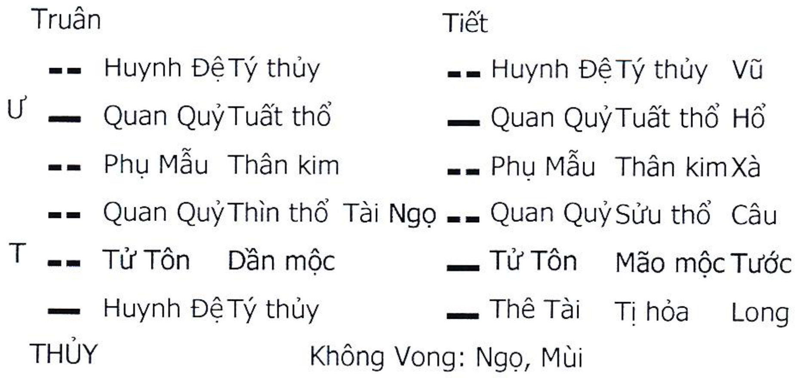
    - **Hình này chứng minh điều gì**
      - Phụ Mẫu Thân kim là nhà, Nhật trợ giúp, Nguyệt không khắc, nhưng độc phát Tuyệt địa, lâm Đằng Xà, chủ nhà chật hẹp, diện tích không lớn. Hào 2 lâm Chu Tước, chủ phòng bếp.
    - **Từ đâu mà thấy được**
      - Phụ Mẫu Thân kim là nhà, Nhật trợ giúp, Nguyệt không khắc, nhưng độc phát Tuyệt địa, lâm Đằng Xà, chủ nhà chật hẹp, diện tích không lớn. Hào 2 lâm Chu Tước, chủ phòng bếp.
- **Diễn tiến phân tích và suy luận chi tiết:**
  - 1.
  - Phụ Mẫu Thân kim là nhà, Nhật trợ giúp, Nguyệt không khắc, nhưng độc phát Tuyệt địa, lâm Đằng Xà, chủ nhà chật hẹp, diện tích không lớn.
  - 2.
  - Hào 2 lâm Chu Tước, chủ phòng bếp.
  - Mộc động sinh hỏa, phòng bếp ánh sáng tốt, tương đối sáng sủa.
  - 3.
  - Hào 2 là trạch, mộc động hóa Tiến thần.
  - Chủ trong nhà có rất nhiều thực vật.
  - 4.
  - Thê Tài Ngọ hỏa Không Vong, phục tàng tại hào 3, hào 3 là cửa, hỏa là ánh sáng, chỗ vào cửa khá tối.
  - Một là bất lợi cho tài vận, hai là không thể sinh Quan Quỷ thổ, bất lợi cho đàn ông.
  - 5.
  - Hào 2 Tử Tôn động hóa Tiến thần, khắc hào Ứng Quan Quỷ Tuất thổ, Quan Quỷ Tuất thổ tại hào 5, hào 5 là đường đi, lâm Bạch Hổ chủ tai họa đổ máu, phải chú ý tai nạn xe cộ.
  - **Hóa giải:** Lắp đèn ở lối vào cửa để điều chỉnh ánh sáng.
- **Kết quả ứng nghiệm thực tế:**
  - Tại ngày Canh Tý tháng Thìn, khi chồng cô đang cưỡi xe đạp băng qua đường, cánh cửa của chiếc xe tải đi bên cạnh đột nhiên mở ra, xô ngã chồng cô xuống đường.
  - Sau đó, chồng cô đã được đưa đến bệnh viện.
  - Đùi trái, vai và
  - khuỷu tay đều bị trầy xước.
  - May mà lúc đó không có xe khác chạy đến, nếu không thì chưa biết thế nào.
  - Đây là ứng Quan Quỷ Tuất thổ tĩnh mà gặp xung.
  - Nếu chiếu theo quẻ ban đầu, Tử Tôn vượng tướng, Quan Quỷ hưu tù, may mà Nguyệt kiến hợp mà được khí, đã cứu được một tính mạng.

#### Ví dụ 115: Đây là một ví dụ ở năm 2009. Một người sắp thi chứng chỉ quốc gia vào tháng ...

- **Bối cảnh và thông tin quẻ:**
  - Đây là một ví dụ ở năm 2009.
  - Một người sắp thi chứng chỉ quốc gia vào tháng 8, hỏi có thi đậu hay không?
  - Ngày Quý Tị Tháng Thìn, được Sơn Địa Bác biến Hỏa Địa Tấn.
  - KIM Không Vong: Ngọ, Mùi
- **Luận giải quái tượng phong thủy:**
  - **Hình 134.** Quẻ Sơn Địa Bác biến Hỏa Địa Tấn
    - 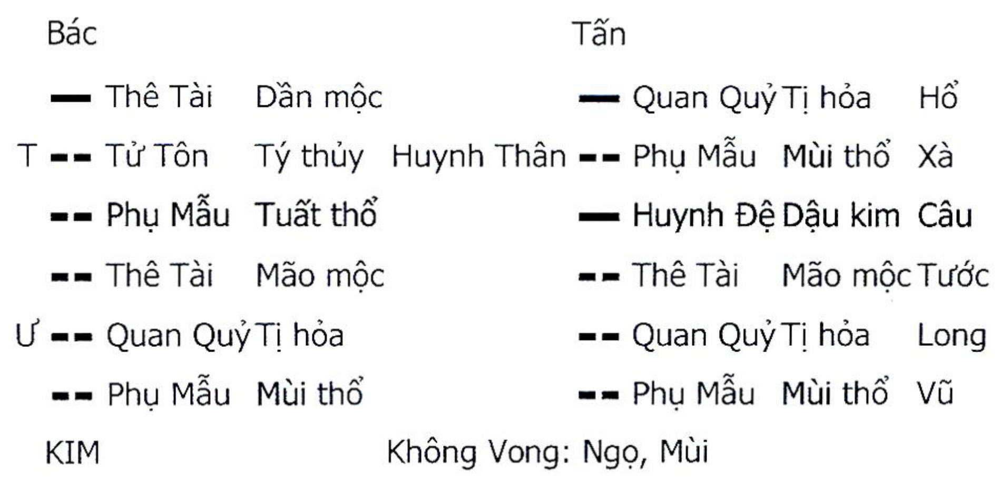
    - **Hình này chứng minh điều gì**
      - Quẻ này tuy là Tử Tôn trì Thế, nhưng Tử Tôn tại hào 5, Quan Quỷ tại hào Ứng, đây là một tổ hợp đặc biệt trong quẻ lục hào, mừng được Quan Quỷ vượng tướng.
    - **Từ đâu mà thấy được**
      - Lấy Quan Quỷ làm Dụng thần và tham khảo Phụ Mẫu. Quẻ này tuy là Tử Tôn trì Thế, nhưng Tử Tôn tại hào 5, Quan Quỷ tại hào Ứng, đây là một tổ hợp đặc biệt trong quẻ lục hào, mừng được Quan Quỷ vượng ...
- **Diễn tiến phân tích và suy luận chi tiết:**
  - Lấy Quan Quỷ làm Dụng thần và tham khảo Phụ Mẫu.
  - Quẻ này tuy là Tử Tôn trì Thế, nhưng Tử Tôn tại hào 5, Quan Quỷ tại hào Ứng, đây là một tổ hợp đặc biệt trong quẻ lục hào, mừng được Quan Quỷ vượng tướng.
  - Không mừng Tử Tôn nhập Mộ, bị hợp trú.
  - Trong quẻ Quan Quỷ lâm Nhật vượng tướng, vốn là cát, nào ngờ Phụ Mẫu Tuất thổ lâm Câu Trần phát động hóa Huynh Đệ Dậu kim, phát động nhất định có nguyên do.
  - Đây là thần triệu cơ ở động.
  - Cung Càn là chỗ cao, Phụ Mẫu là kiến trúc, Câu Trần chủ phong thủy, Nguyệt phá chủ hư hại, hóa Dậu kim chủ ngói kim loại, Tuất thổ tương ứng với Tây Bắc.
  - Phía Tây Bắc của mái nhà nhất định có hư hại, cần phải sửa chữa kịp thời, nếu không thì ảnh hưởng đến thi cử.
  - Câu Trần chủ chậm chạp, Càn là đầu, hào Thế thủy chủ trí tuệ.
  - Bởi vì ảnh hưởng của phong thủy khiến tư duy không nhanh nhẹn, đầu óc lơ mơ mà làm sai đề.
  - Người này bèn kiểm tra mái nhà, phát hiện ở phía Tây Bắc có tấm lợp kim loại bị nước mưa ăn mòn, lập tức tìm nhân viên sửa chữa.
- **Kết quả ứng nghiệm thực tế:**
  - Tháng 11 năm đó, người xem cho biết là đã thi đậu.
  - Mới đầu thì làm sai đề, sau đó đã sửa lại và đạt được kết quả tốt.

#### Ví dụ 116: Đây là một ví dụ ở năm 2010. Ngày Tân Dậu tháng Dậu, nữ 43 tuổi đoán phong t...

- **Bối cảnh và thông tin quẻ:**
  - Đây là một ví dụ ở năm 2010.
  - Ngày Tân Dậu tháng Dậu, nữ 43 tuổi đoán phong thủy nhà, được Thủy Địa Tỷ biến Phong Địa Quan.
  - THỔ Không Vong: Tý, Sửu
  - Hào 2 là trạch, lâm Phụ Mẫu Tị hỏa Huyền Vũ, Nguyệt không trợ giúp, lại bị Tý thủy độc phát đến khắc, Huyền Vũ là tối tăm, hỏa là ánh sáng.
  - Ngôi nhà này không đủ ánh sáng.
  - Ứng là án sơn, hướng, lâm Tý thủy động, nhà hướng Bắc.
  - Quả nhiên là nhà tọa Nam hướng Bắc, cửa mở hướng về phía Bắc, nhà thiếu ánh sáng.
  - Hào sơ gặp thổ là nền nhà, lâm Bạch Hổ, lại là Mộ khố của Quan Quỷ, Bạch Hổ chủ tử vong, Quan Quỷ là thi thể, dưới đất ở có hài cốt.
  - Người xem cho biết, cách đây mấy năm đã từng chôn một con mèo nuôi đã chết.
  - Đối với nữ giới, Quan Quỷ thể hiện đàn ông.
  - Quan Quỷ mặc dù trì Thế, nhưng bị Nhật Nguyệt xung khắc, hôn nhân bất lợi.
  - Người này sống chung với bạn trai đã nhiều năm, cô thường xuyên đề cập đến kết hôn nhưng đối phương cứ trốn tránh.
  - Hào 6 Tý thủy Không Vong hóa Nguyệt phá, hào 6 là mái nhà, mái nhà có hiện tượng dột nước.
  - Người xem cho biết, trời mưa thì có dột nước, nhưng đã xử lý rồi.
  - Hào 3 là giường, Nguyệt phá, ván giường có khe hở, ảnh hưởng đến giấc ngủ.
  - Nguyên thần Không Vong lâm
  - Đằng Xà tại hào 6, đầu cung máu không tốt, tâm trạng bất an.
  - Phản hồi, trong lòng phiền muộn, không ngủ được, đầu bị choáng.
  - Hóa giải: Vá lại khe hở trên giường, bên cạnh gối để 10 hạt đậu.
  - Phản hồi sau khi hóa giải: Tâm trạng chuyển biến tốt, có thể ngủ yên.
  - Đầu cũng không còn bị choáng nữa.
- **Luận giải quái tượng phong thủy:**
  - **Hình 135.** Quẻ Thủy Địa Tỷ biến Phong Địa Quan
    - 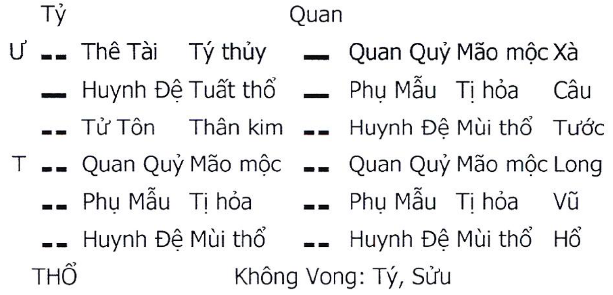
    - **Hình này chứng minh điều gì**
      - Ngày Tân Dậu tháng Dậu, nữ 43 tuổi đoán phong thủy nhà, được Thủy Địa Tỷ biến Phong Địa Quan. Hào 2 là trạch, lâm Phụ Mẫu Tị hỏa Huyền Vũ, Nguyệt không trợ giúp, lại bị Tý thủy độc phát đến khắc, H...
    - **Từ đâu mà thấy được**
      - THỔ Không Vong: Tý, Sửu Hào 2 là trạch, lâm Phụ Mẫu Tị hỏa Huyền Vũ, Nguyệt không trợ giúp, lại bị Tý thủy độc phát đến khắc, Huyền Vũ là tối tăm, hỏa là ánh sáng.
- **Diễn tiến phân tích và suy luận chi tiết:**
  - **Ví dụ 116:** Đây là một ví dụ ở năm 2010.
  - Ngày Tân Dậu tháng Dậu, nữ 43 tuổi đoán phong thủy nhà, được Thủy Địa Tỷ biến Phong Địa Quan.
  - THỔ Không Vong: Tý, Sửu
  - Hào 2 là trạch, lâm Phụ Mẫu Tị hỏa Huyền Vũ, Nguyệt không trợ giúp, lại bị Tý thủy độc phát đến khắc, Huyền Vũ là tối tăm, hỏa là ánh sáng.
  - Ngôi nhà này không đủ ánh sáng.
  - Ứng là án sơn, hướng, lâm Tý thủy động, nhà hướng Bắc.
  - Quả nhiên là nhà tọa Nam hướng Bắc, cửa mở hướng về phía Bắc, nhà thiếu ánh sáng.
  - Hào sơ gặp thổ là nền nhà, lâm Bạch Hổ, lại là Mộ khố của Quan Quỷ, Bạch Hổ chủ tử vong, Quan Quỷ là thi thể, dưới đất ở có hài cốt.
  - Người xem cho biết, cách đây mấy năm đã từng chôn một con mèo nuôi đã chết.
  - Đối với nữ giới, Quan Quỷ thể hiện đàn ông.
  - Quan Quỷ mặc dù trì Thế, nhưng bị Nhật Nguyệt xung khắc, hôn nhân bất lợi.
  - Người này sống chung với bạn trai đã nhiều năm, cô thường xuyên đề cập đến kết hôn nhưng đối phương cứ trốn tránh.
  - Hào 6 Tý thủy Không Vong hóa Nguyệt phá, hào 6 là mái nhà, mái nhà có hiện tượng dột nước.
  - Người xem cho biết, trời mưa thì có dột nước, nhưng đã xử lý rồi.
  - Hào 3 là giường, Nguyệt phá, ván giường có khe hở, ảnh hưởng đến giấc ngủ.
  - Nguyên thần Không Vong lâm
  - Đằng Xà tại hào 6, đầu cung máu không tốt, tâm trạng bất an.
  - Phản hồi, trong lòng phiền muộn, không ngủ được, đầu bị choáng.
  - Hóa giải: Vá lại khe hở trên giường, bên cạnh gối để 10 hạt đậu.
  - Phản hồi sau khi hóa giải: Tâm trạng chuyển biến tốt, có thể ngủ yên.
  - Đầu cũng không còn bị choáng nữa.

## CHƯƠNG 5: DỰ ĐOÁN PHONG THỦY ÂM TRẠCH

### 1. LONG MẠCH

- Long mạch là nguồn gốc của địa khí. Lấy Nguyên thần của hào Thế làm long mạch, Niên là Tổ Sơn, Nguyệt là Thiếu Tổ Sơn, Nhật là Phụ Mẫu Sơn, nên lâm Nhật Nguyệt trợ giúp hào Thế, không nên xung khắc hào Thế. Nguyên thần lâm Nhật Nguyệt sinh hợp hào Thế, long mạch chân (thật) mà khí thế dồi dào. Nguyên thần Nguyệt phá hưu tù, Nhật Nguyệt xung khắc hào Thế, long mạch giả mà không có khí mạch.
- Nguyên thần tại cung Càn, long mạch như tuấn mã, khí thế mạnh mẽ dồi dào; tại cung Khôn, như trâu ngủ bình thản, địa thế rộng rãi; tại cung Khảm, gần khe rãnh, khe suối; tại cung Ly, núi sông tú lệ, như chim giương cánh; tại cung Cấn, núi non trùng điệp, sừng sững bất động; tại cung Đoài, vách núi dựng đứng, như đao chặt búa bổ, khe rãnh ngang dọc; tại cung Chấn, rồng thổi hổ gầm, như sóng cuộn trào dâng; tại cung Tốn, núi rừng thấp thoáng, như rồng rắn bay lượn.
- Tam hợp lục hợp thì tàng phong tụ khí, lục xung Không Phá thì cát bay đá chạy.
- Thanh Long chủ nho nhã, tuấn tú; Chu Tước chủ tiếng sóng từng đợt; Câu Trần chủ cao to bất động; Đằng Xà chủ quanh co liên miên; Bạch Hổ chủ thẳng tắp, dựng đứng; Huyền Vũ chủ tĩnh mịch, huyền bí.

### 2. SA

- Sa là những ngọn núi bảo vệ huyệt mộ. Lấy hào thổ, Câu Trần làm ký hiệu đặc trưng. Thanh Long Bạch Hổ là núi che chở bên trái và bên phải, hào Ứng là Triều Sơn. Vượng tướng thì cao to, hưu tù thì thấp bé, Không Vong thì không có. Sinh hợp hào Thế thì hữu tình, khắc hào Thế thì vô tình. Tam hợp cục thì ba ngọn đứng cạnh nhau, hợp cục thì nhiều nhánh, như Hợi Mão Mùi thành cục, hai Hợi hoặc hai Mùi thổ, thì năm ngọn đứng cạnh nhau.
- Gặp xung thì không ngay ngắn, gặp hợp thì liên miên. Thủy xung hào Ứng, dòng nước chảy ra. Hưu tù Không Phá, mặc dù sinh hợp hào Thế nhưng cũng chỉ là giả Triều Sơn.
- Lâm Thanh Long, vượng tướng sinh hào Thế, ngọn núi cân đối tú lệ, tại hào 5, là tôn đế trước mặt, chủ phú quý cực kỳ. Lâm Chu Tước, ngọn núi hình giá bút, là văn bút tú, lâm Phụ Mẫu, thường xuất văn nhân, lợi cho khoa giáp, thi cử.

### 3. THỦY

- ****Phản hồi:** Lúc dự đoán thì tài vận liên tục gặp khó khăn, kết quả tại năm Canh Thìn phát tài mấy chục vạn, đến năm Quý Mùi đã có tài sản mấy trăm vạn.**
  - Đến năm Giáp Thân, bởi vì kiện tụng mà gia sản bắt đầu tiêu tán, bản thân lại bị cao huyết áp, sỏi mật, tiểu đường.
  - **Hình 136.** Sơ đồ quẻ Hỏa Lôi Phệ Hạp biến Thiên Địa Bĩ
    - 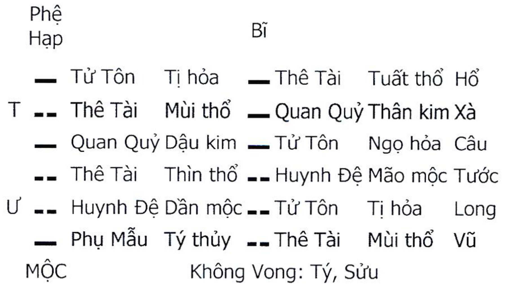
    - **Hình này chứng minh điều gì**
      - Quẻ chứng minh tình trạng phong thủy và ảnh hưởng cát hung tương ứng với quái tượng Sơ đồ quẻ Hỏa Lôi Phệ Hạp biến Thiên Địa Bĩ.
    - **Từ đâu mà thấy được**
      - Căn cứ vào hào vị, lục thân, can chi sinh khắc, tuần không và hào động biến trong quẻ.

### 4. MINH ĐƯỜNG

- Minh đường là chỗ đất bằng phẳng, rộng rãi trước huyệt, là nơi có nhiều dòng nước hội tụ. Xung quanh nó có sơn hoàn thủy bão (núi sông bao bọc), long mạch gặp nó thì sẽ dừng chân, huyệt vị thấy được nó thì sẽ được xác định.
- Minh đường chia ra nội ngoại, trong dự đoán lục hào lấy gian hào ở giữa Thế Ứng làm minh đường, gần hào Thế là nội minh đường, gần hào Ứng là ngoại minh đường. Không nên Không Phá, nên có khí sinh hợp hào Thế là cát. Khắc hào Thế, sinh hào Ứng là hung.
- Kích thước của minh đường, lấy suy vượng của hào để phán đoán. Vượng tướng thì rộng lớn, hưu tù thì chật hẹp. Lại lấy ngũ hành, lục thần để phán đoán tình trạng bên trong minh đường.
- Kim thêm Chu Tước là bia đá, mộc thêm Đằng Xà là cỏ dại, thổ thêm Câu Trần là gò đất nhỏ, kim thêm Bạch Hổ là đá cứng, thủy thêm Thanh Long là suối trong, mộc thêm Chu Tước là hoa dại,...

### 5. LONG HỔ

- Long hổ là sa hai bên của huyệt trường, bên trái là Thanh Long, bên phải là Bạch Hổ. Trong lục hào, lấy hào lâm Thanh Long Bạch Hổ mà luận. Vượng tướng thì cao to, hưu tù thì thấp bé. Tử Tuyệt thì không có long hổ.
- Sinh hợp hào Thế gọi là hữu tình, xung khắc hào Thế gọi là vô tình. Hào lâm Thanh Long Bạch Hổ tương xung khắc, long hổ tranh đấu, lấy vượng tướng khắc chế là áp bức. Lại lấy khoảng cách với hào Thế để phán đoán khoảng cách long hổ hợp huyệt.
- Hào Thanh Long Bạch Hổ tương sinh hợp, lại là cát thần, là long hổ ôm nhau, phúc lộc lâu dài. Thanh Long hợp Bạch Hổ là long ôm hổ, Bạch Hổ hợp Thanh Long là hổ ôm long. Bạch Hổ phát động khắc hào Thế là Bạch Hổ giết người, hung họa không ngừng. Hào Thế lâm Bạch Hổ hóa hồi đầu khắc là Bạch Hổ quay đầu lại, lâm Thanh Long hồi đầu sinh là Thanh Long quay đầu lại. Không sợ Thanh Long cao vạn trượng, chỉ sợ Bạch Hổ quay lại nhìn, cát hung họa phúc xem quẻ tự nhiên minh bạch.

### 6. PHÁN ĐOÁN HUYỆT VÀ ĐIỂM HUYỆT

- **Người xem vẫn cứ bán tín bán nghi, tôi liền nói: Tôi có một phương pháp, có thể chấm chu sa đỏ lên một đồng xu, sau đó trộn lẫn nó với vài trăm đồng xu khác, đốt nhang khấn vái, chỗ mà đồng xu có chu sa rơi xuống chính là huyệt phải tìm.**
  - Thế là bảo người ta tung đồng xu khắp nơi, kết quả là đồng xu có chu sa rơi ở chỗ có hoa màu đỏ, sau khi đào lên thì thấy trong khoảng hơn một trượng toàn là bùn đất, những chỗ còn lại đều là đá tảng.
  - Năm thứ hai, người này được thăng chức.
  - Trong năm năm, hai đứa con trai lại trúng bảng vàng.
  - **Hình 137.** Quẻ Đại Tráng
    - 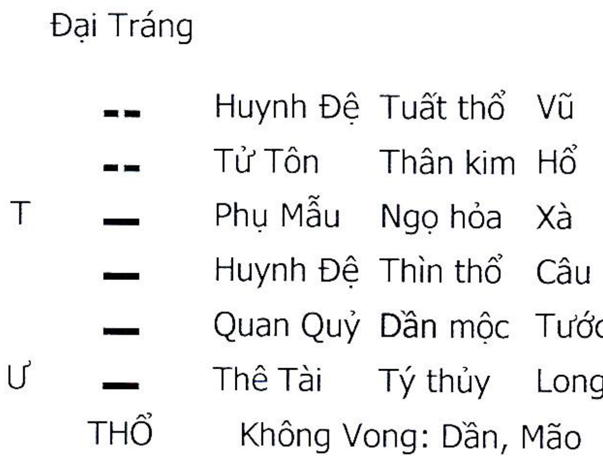
    - **Hình này chứng minh điều gì**
      - Quẻ chứng minh tình trạng phong thủy và ảnh hưởng cát hung tương ứng với quái tượng Quẻ Đại Tráng.
    - **Từ đâu mà thấy được**
      - Thế là bảo người ta tung đồng xu khắp nơi, kết quả là đồng xu có chu sa rơi ở chỗ có hoa màu đỏ, sau khi đào lên thì thấy trong khoảng hơn một trượng toàn là bùn đất, những chỗ còn lại đều là đá tảng.

### 7. PHẦN MỘ

- Lấy hào Phụ Mẫu để trích xuất thông tin phần mộ. Phụ Mẫu vượng tướng là mộ cao to, gặp hợp là mộ hợp táng. Lâm hào Ứng, lân cận có mồ mả của gia tộc khác, hoặc mượn nghĩa trang để chôn cất. Phần mộ đa hiện, mồ mả ở nhiều nơi.
- Lại lấy hào 6 làm mộ tổ. Lâm Câu Trần Bạch Hổ càng ứng nghiệm. Mộ khố của Quan Quỷ là mồ mả, cái hợp Quan Quỷ cũng là mồ mả. Sinh hợp hào Thế là cát, xung khắc hào Thế là hung. Vượng tướng là cát, hưu tù là hung.
- Thổ là thổ nhưỡng, kim là bia đá; bị thủy xung phá, có nước vào mộ; gặp Không vong, trên mộ có lỗ hoặc sụt lún. Hóa thoái cũng là sụt lún; Nguyệt phá, trên mộ có kẽ hở; bị mộc xung phá, có rễ cây đâm vào mộ.
- Nguyệt kiến nhập quẻ xung phá Phụ Mẫu, lâm Đằng Xà, rắn kiến xâm nhập. Lại hào lâm Huyền Vũ khắc, bị nước xâm hại. Câu Trần đến khắc, động thổ làm tổn hại phần mộ. Hỏa động đến khắc, lửa thiêu, sét đánh.
- Mộ khố của Quan Quỷ bị xung, quan tài bị lệch. Quan Quỷ lâm Phụ Mẫu lâm kim bị khắc Không Vong, hài cốt không toàn vẹn. Động hóa Không Vong, hài cốt bị thất lạc. Phụ Mẫu phát động, thường ứng di chuyển mộ phần. Lâm Thanh Long hóa hồi đầu sinh, hoặc có Thanh Long phát động đến sinh, chủ lại thêm phần mộ mới.
- **Ví dụ (cổ đại):** Ngày Kỷ Tị tháng Mùi, đoán mộ tổ, hỏi tại sao không thể thi đậu công danh? Được Trạch Địa Tụy biến Địa Hỏa Minh Di.
- KIM &emsp;&emsp;&emsp;&emsp;&emsp;&emsp;&emsp;&emsp; Không Vong: Tuất, Hợi
- Hào sơ Phụ Mẫu động hóa mộc hồi đầu khắc, Phụ Mẫu là phần mộ, mộc chủ cây cối, hào sơ là gốc rễ, lâm Đằng Xà là tượng uốn lượn, thông tin rễ cây rất rõ ràng, vì vậy phán đoán là rễ cây đã làm tổn hại quan tài.
- Anh ta hỏi phương pháp xử lý. Tôi nói: Anh đào bên cạnh mộ một cái hố nhỏ, tìm xem có rễ cây không. Nếu có thì đào một cái hố lớn từ xa đến ngang mộ, dùng cái xẻng nhẹ nhàng loại bỏ rễ cây đi, sau đó thu xếp lại một chút. Đến năm Ngọ, hào Thế Quan Quỷ Tị hỏa được trợ giúp, nhất định có thể thi đậu.

### 8. THỦY KHẨU

- **Minh họa quái tượng phong thủy:**
  - **Hình 138.** Sơ đồ quẻ Trạch Địa Tụy biến Địa Hỏa Minh Di
    - 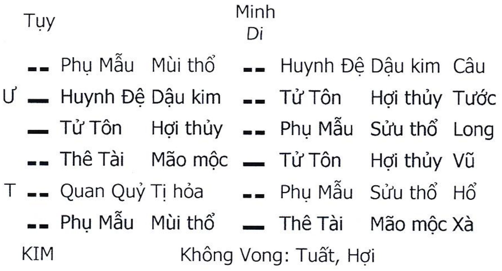
    - **Hình này chứng minh điều gì**
      - Quẻ chứng minh tình trạng phong thủy và ảnh hưởng cát hung tương ứng với quái tượng Sơ đồ quẻ Trạch Địa Tụy biến Địa Hỏa Minh Di.
    - **Từ đâu mà thấy được**
      - Sinh hợp hào Thế, thủy khẩu hữu tình. Lâm Thanh Long vượng tướng, lâm Thê Tài Quan Quỷ, quan tỏa trùng điệp, phú quý cát tường.

### 9. ÁN SƠN

- Án sơn là những ngọn núi thấp bé trước huyệt. Án sơn cũng như bàn làm việc, phối hợp thỏa đáng thì có lợi cho quan vận và học hành thi cử. Án sơn có các dạng như ngọc kỷ (玉几), hoành cầm (横琴), cung miên (弓眠), tịch mạo (席帽), án kiếm (按剑), quy xà (龟蛇), bút giá (笔架), ngọc ấn (玉印),...
- Trong dự đoán lục hào, lấy hào Ứng, hào Chu Tước hoặc hào trước hào Thế một vị trí để luận án sơn. Vượng tướng thì cao to, hưu tù thì thấp bé, lại xem quan hệ sinh khắc giữa hào Thế với những hào phía trên để phán đoán.
- Sinh hợp hào Thế là hữu tình. Nguyệt phá Nhật phá, án sơn phá bại, xiêu vẹo; Không Vong thì có lỗ hổng, hố đất,...
- Lại lấy ngũ hành để phân biệt hình dạng án sơn. Là thổ thì án cao rộng như hình vuông, là hỏa thì án nhọn và thanh tú như giá để bút, là kim thì án tròn tròn như viên ngọc, là mộc thì án dài như cán bút, là thủy thì án thấp và uốn cong như gợn sóng.
- **Ví dụ (cổ đại):** Ngày Canh Thân tháng Sửu, đoán địa hình, được Trạch Sơn Hàm.
- KIM Không Vong: Tý, Sửu
- **Phán đoán:** Thanh Long Thân kim trì Thế, Nguyệt sinh hào Thế, Nhật thần lâm Thế, Thanh Long là bên trái, lai long đến từ bên trái, hào Thế vượng mà có khí, không có thương khắc, bên trái và bên phải đều không có thương khắc, long hổ bao bọc.
- Hào Ứng là hướng sơn (núi đối diện), Mùi thổ tuy lâm Nguyệt phá, Chu Tước Hợi thủy là ngọn núi phía trước, được ngày Thân sinh, tất có triều thủy hoặc đới thủy, thủy có nguồn. Hào thượng là thủy khẩu, lâm Nguyệt phá, thủy khẩu tán loạn. Hai gian hào vượng tướng, minh đường rộng lớn.
- **Phản hồi:** Thực tế đúng là như vậy.

### 10. ĐẮC ĐỊA

- **---**
  - # Part 14 (Pages 261-280)
  - Nếu dự đoán mua đất thành bại thì xem hào Phụ Mẫu.
  - Vượng tướng sinh hợp hào Thế thì thành, hưu tù Không Phá thì không thành.
  - Hào Thế xem cát hung, Phụ Mẫu xem địa thế.
  - Hào Thế động hóa Tiến thần, địa khí ngày càng vượng;
  - hóa Thoái thần, địa khí ngày càng nhược.
  - Không nên hào Thế hóa Quan Quỷ, hóa hồi đầu khắc, đất này rất hung.
  - **Hình 139.** Sơ đồ quẻ Trạch Sơn Hàm
    - 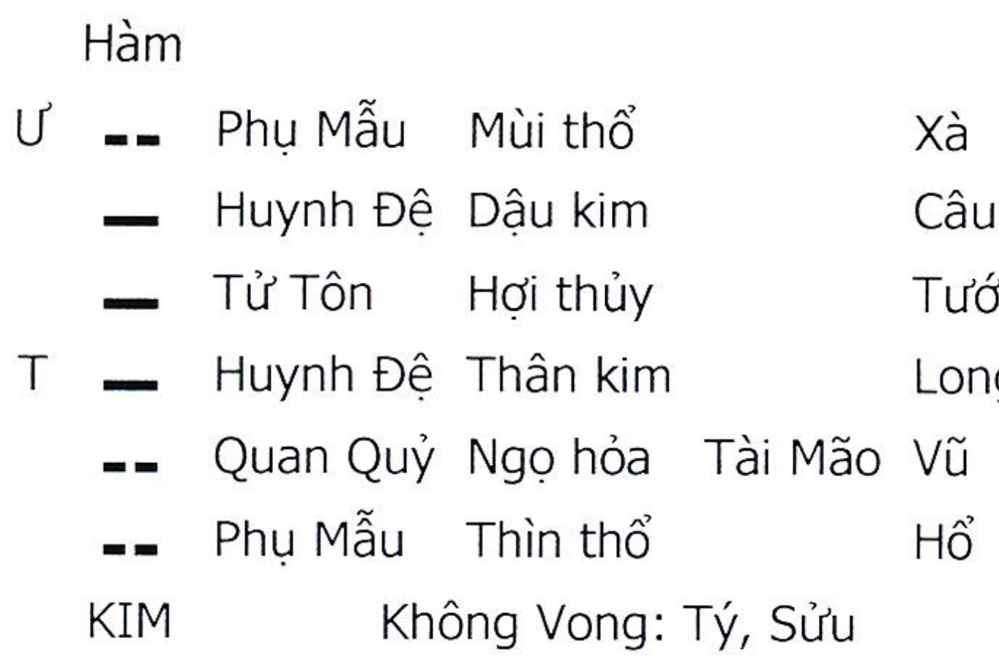
    - **Hình này chứng minh điều gì**
      - Nếu dự đoán mua đất thành bại thì xem hào Phụ Mẫu. Vượng tướng sinh hợp hào Thế thì thành, hưu tù Không Phá thì không thành.
    - **Từ đâu mà thấy được**
      - Vượng tướng sinh hợp hào Thế thì thành, hưu tù Không Phá thì không thành. Hào Thế xem cát hung, Phụ Mẫu xem địa thế.

### ÁN LỆ PHONG THỦY ÂM TRẠCH CỔ ĐẠI

- **Lại lấy ngũ hành và lục thần để phán đoán chi tiết.**
  - Lấy quái cung để phán đoán hoàn cảnh xung quanh.
  - Động tĩnh sinh khắc đều phải tham khảo.
  - **Ví dụ 1 (cổ đại):** Ngày Mậu Ngọ tháng Dần, xem đất, được Sơn Lôi Di biến Thiên Lôi Vô Vọng.
  - MỘC Không Vong: Tý, Sửu
  - Hào Thế Tuất thổ, xuân lệnh tuy khắc nhưng có Nhật sinh, lại hóa ra Ngọ hỏa Tử Tôn hồi đầu sinh Thế, là cát.
  - Phụ Mẫu Tý thủy lâm Thanh Long là Thanh Long hý thủy, Thanh Long được thủy mà an.
  - Động hóa Trường Sinh, nguồn nước rất xa.
  - Chỉ là Thân bị Nguyệt phá, Tuất thổ khắc Tý thủy, lại bị Nhật thần xung tán, vì vậy một năm bốn mùa không thể có thủy, nguồn nước bất ổn.
  - Xuân hạ chính là mùa mưa cho nên có thủy, nhưng đến thu đông thì sẽ khô hạn.
  - Phản hồi nói rằng đúng là như vậy.
  - Thiên hạ không có phong thủy thập toàn thập mỹ.
  - Nhật Nguyệt, hào Thế và Tử Tôn cùng tạo thành tam hợp, người chết an mà người sống vui.
  - Tử Tôn hưng vượng, lo gì không
  - phát.
  - Năm Thìn hạ táng ở đất này, năm Dậu có cháu đậu á nguyên, năm Tý một cháu nữa đậu thi hương.
  - **Ví dụ 2 (cổ đại):** Ngày Mậu Tý tháng Thân, đoán mồ mả, được Sơn Địa Bác.
  - KIM Không Vong: Ngọ, Mùi
  - Tử Tôn Tý thủy trì Thế, gặp Nhật thần phù, tháng Thân sinh, thủy và Thanh Long cùng một hào, cũng là Thanh Long hý thủy, Thanh Long là bên trái, thủy chủ nước, nước từ bên trái.
  - Vượng tướng tất gần sông lớn, nếu không cũng là trường lưu thủy (dòng nước dài).
  - Bạch Hổ Mão mộc, Tý Mão tương hình, nanh vuốt mai phục.
  - Ứng là hướng sơn (núi đối diện), hỏa gặp thủy khắc, hướng sơn không cao.
  - Tuất đứng ngay trước hào Thế là án sơn, Tuất thổ khắc thủy, án sơn hơi cao.
  - Hào Thế lâm Thanh Long tại hào 5, không có khắc hại, đất này đại cát.
  - Nên táng gấp, hiện nay chính là lúc hào Thế vượng tướng, mùa đông này sẽ phát.
  - Thực tế đúng với phán đoán, tháng 8 an táng, đến tháng 10 thì thứ tử được thăng quan.
  - Tháng Tị năm thứ hai, trưởng tử trưởng vốn hiếm muộn lại sinh được một đứa con trai.
  - **Hình 140.** Sơ đồ quẻ Sơn Lôi Di biến Thiên Lôi Vô Vọng
    - 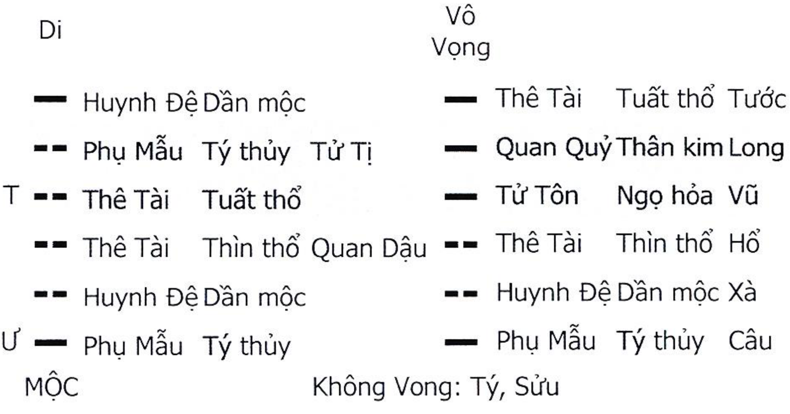
    - **Hình này chứng minh điều gì**
      - Quẻ chứng minh tình trạng phong thủy và ảnh hưởng cát hung tương ứng với quái tượng Sơ đồ quẻ Sơn Lôi Di biến Thiên Lôi Vô Vọng.
    - **Từ đâu mà thấy được**
      - Động tĩnh sinh khắc đều phải tham khảo. MỘC Không Vong: Tý, Sửu
- ****Ví dụ 3 (cổ đại):** Ngày Nhâm Dần tháng Mão, đoán tìm đất, được Trạch Hỏa Cách biến Thủy Hỏa Ký Tế.**
  - THỦY Không Vong: Thìn, Tị
  - Phụ Mẫu là Dụng thần, hào Thế động hóa Thân kim Phụ Mẫu hồi đầu sinh hào Thế.
  - Hào Thế tuy là hưu tù, độc phát không sao cả, gặp sinh được sinh, gặp sinh là vượng.
  - Chỉ hiềm Nhật thần Dần mộc xung mất Thân kim, hiện nay kim nhược cho nên không thể lập tức tìm được đất tốt, đến mùa thu tháng 7 đương lệnh mới có thể tìm được.
  - Phụ lâm Thân kim, Thân kim tương ứng với Tây Nam, đất tại Tây Nam.
  - Thê Tài Tử Tôn được Nhật Nguyệt trợ giúp đều vượng tướng.
  - Vì vậy, đất này nhất định là đất tài đinh (tiền tài và con trai) hưng vượng.
  - Động hóa Thân kim, đến năm Thân nhất định phát phúc.
  - Thế suy mà hóa sinh, trong hung có cát.
  - Quả nhiên tháng bảy được đất ở Tây Nam.
  - Năm Mão an táng, năm Dậu con cháu đại phát.
  - **Hình 141.** Sơ đồ quẻ Sơn Địa Bác
    - 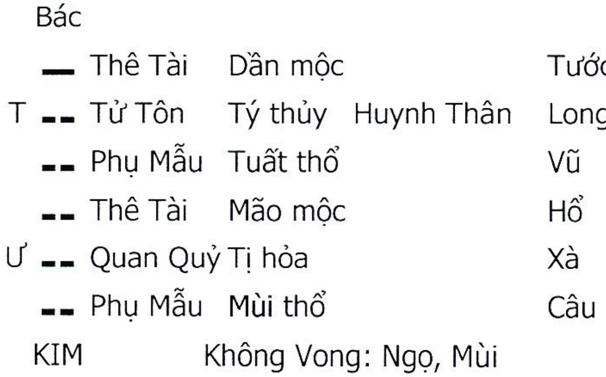
    - **Hình này chứng minh điều gì**
      - Phụ Mẫu là Dụng thần, hào Thế động hóa Thân kim Phụ Mẫu hồi đầu sinh hào Thế. Hào Thế tuy là hưu tù, độc phát không sao cả, gặp sinh được sinh, gặp sinh là vượng.
    - **Từ đâu mà thấy được**
      - THỦY Không Vong: Thìn, Tị Phụ Mẫu là Dụng thần, hào Thế động hóa Thân kim Phụ Mẫu hồi đầu sinh hào Thế.
- ****Ví dụ 4 (cổ đại):** Ngày Mậu Tý tháng Mão, đoán đất cát hung, được Tốn Vi Phong biến Địa Phong Thăng.**
  - MỘC Không Vong: Ngọ, Mùi
  - Hào Thế là huyệt.
  - Thế lâm Nguyệt kiến, được Nhật thần sinh, mới nhìn thì cát, nhưng không nên ngoại quái phản ngâm, Thế động hóa Quan Quỷ, bị Dậu kim xung khắc, Tử Tôn bị Hợi thủy xung khắc, đất này không thể dùng.
  - Nhưng đối phương nói rằng đã mua đất rồi, hơn nữa có mấy thầy phong thủy nói là rất tốt.
  - Sau đó vẫn hạ táng.
  - Nội trong bốn năm, hai trai một gái lần lượt tử vong, bản thân lại bị bán thân bất toại.
  - Hai năm sau, tức là năm Dậu, hào Thế lại bị xung khắc, người này qua đời.
  - **Hình 142.** Sơ đồ quẻ Trạch Hỏa Cách biến Thủy Hỏa Ký Tế
    - 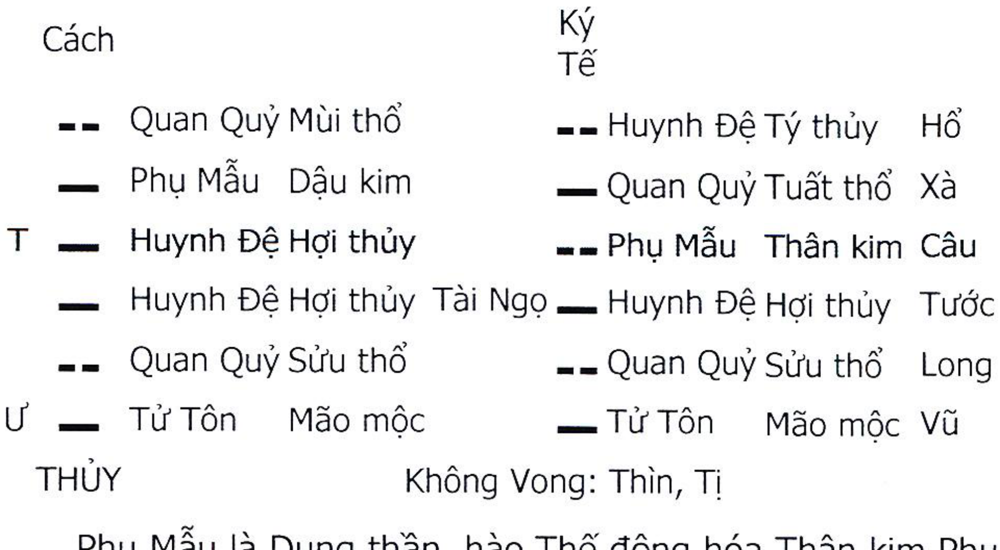
    - **Hình này chứng minh điều gì**
      - Hào Thế là huyệt.
    - **Từ đâu mà thấy được**
      - MỘC Không Vong: Ngọ, Mùi Hào Thế là huyệt.
- **Minh họa quái tượng phong thủy:**
  - **Hình 143.** Sơ đồ quẻ Tốn Vi Phong biến Địa Phong Thăng
    - 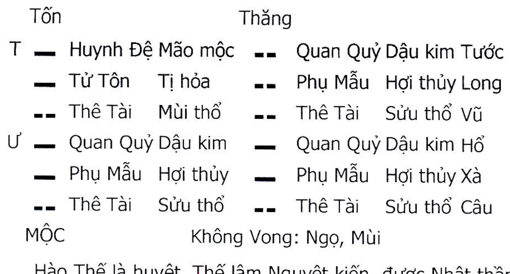
    - **Hình này chứng minh điều gì**
      - Quẻ chứng minh tình trạng phong thủy và ảnh hưởng cát hung tương ứng với quái tượng Sơ đồ quẻ Tốn Vi Phong biến Địa Phong Thăng.
    - **Từ đâu mà thấy được**
      - Động tĩnh sinh khắc đều phải tham khảo. MỘC Không Vong: Tý, Sửu

### QUẺ DỊCH VỀ PHONG THỦY ÂM TRẠCH

#### Ví dụ 1: Ngày Giáp Tuất tháng Canh Tý năm Bính Tuất, một đàn ông người Nhật Bản đoán bị...

- **Bối cảnh và thông tin quẻ:**
  - Ngày Giáp Tuất tháng Canh Tý năm Bính Tuất, một đàn ông người Nhật Bản đoán bị ma quỷ quấy nhiễu, được Càn Vi Thiên biến Hỏa Thiên Đại Hữu.
  - KIM Không Vong: Thân, Dậu
- **Luận giải quái tượng phong thủy:**
  - **Hình 144.** Sơ đồ quẻ Càn Vi Thiên biến Hỏa Thiên Đại Hữu
    - 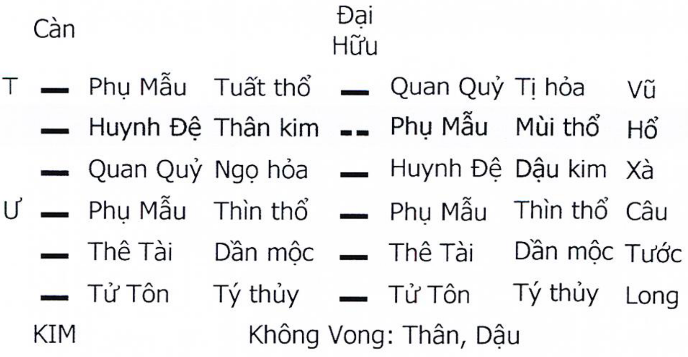
    - **Hình này chứng minh điều gì**
      - Lấy hào Thế làm Dụng thần. Hào Thế là Mộ khố Quan Quỷ, là thông tin ma quỷ vào trong cơ thể.
    - **Từ đâu mà thấy được**
      - Lấy hào Thế làm Dụng thần. Hào Thế là Mộ khố Quan Quỷ, là thông tin ma quỷ vào trong cơ thể.
- **Diễn tiến phân tích và suy luận chi tiết:**
  - Lấy hào Thế làm Dụng thần.
  - Hào Thế là Mộ khố Quan Quỷ, là thông tin ma quỷ vào trong cơ thể.
  - Hào Thế lâm Huyền Vũ, Huyền Vũ chủ âm khí, chủ ma quỷ triền thân.
  - Hào lâm Bạch Hổ độc phát, Bạch Hổ cũng chủ tử vong, hóa ra Phụ Mẫu, Phụ Mẫu là kiến trúc, chủ bệnh tật có liên quan đến âm phần.
  - Quan Quỷ Ngọ hỏa là Nguyên thần, Nguyệt phá lâm Đằng Xà, Nguyên thần là tư duy của một người, lâm Đằng Xà, Đằng Xà là bất an, lại quẻ lục xung cũng chủ bất an, nội tâm rất bất an, tượng lo lắng không yên.
  - Nguyên thần nhập Mộ tại Nhật, Nhật và hào Thế tương đồng, chủ tư duy khép kín, nghĩ không thoáng.
  - Bạch Hổ độc phát chủ tử vong, bản thân có khuynh hướng tự sát.
  - Trên thực tế, mỗi ngày có hồn ma xuất hiện ở đầu giường, trên trần nhà và trong xe buýt.
  - Rất nhiều con mắt đang nhìn ông ta, khiến ông ta vô cùng sợ hãi, nhiều lần đột nhiên nảy sinh ý định tự sát.
  - Phân tích nguyên nhân, Huynh Đệ Thân kim lâm Bạch Hổ tại hào 5 độc phát, độc phát biểu thị nguyên nhân.
  - Hào 5 là ngũ quan, lâm kim Không Vong, kim là xương cốt, chủ răng, Không Vong biểu thị không đã không còn, lâm Bạch Hổ, Bạch Hổ chủ phẫu thuật, tổng hợp lại là thông tin nhổ răng, vì vậy đoán là ông ta đã từng nhổ răng.
  - Hào Thế tại hào 6 lâm Huyền Vũ, hào 6 là mộ tổ, lại là Mộ khố Quan Quỷ, Quan Quỷ là thi thể, Mộ khố là mộ, bệnh tật chắc chắn có liên quan đến mộ tổ.
  - Hào 5 là đường đi, đường đi Không Vong biểu thị đường trên không, đường treo giữa không trung, chính là thông tin cây cầu.
  - Vì vậy, phán đoán là gần mộ tổ có cây cầu.
  - Hào Ứng Phụ Mẫu Thìn thổ lâm Câu Trần ám động, hào Ứng là hàng xóm, biểu thị lân cận.
  - Trong quẻ này, Thìn thổ là Mộ khố Tử Tôn, Tử Tôn là tăng đạo, Mộ khố chính là đền chùa, Câu Trần chủ tu tạo, cải tạo, ám động chính là cải tạo nhỏ.
  - Bởi vì những biến đổi này đã dẫn tới địa khí thay đổi, do đó mà bị bệnh như vậy.
- **Kết quả ứng nghiệm thực tế:**
  - Ông ta nói là đã từng nhổ răng, gần mộ tổ có cầu, cũng có đền chùa, đền chùa đã từng được cải tạo, hiện nay còn có công trình đang xây.
  - Tìm được nguyên nhân thì có thể tiến hành điều chỉnh về mặt phong thủy.
  - Thông qua phương pháp bên ngoài để hóa giải địa khí không tốt.
  - Tôi bảo ông ta chuẩn bị hai cây nến, một tờ giấy đen.
  - Dùng tờ giấy đen bọc hai cây nến lại, vào giờ Ngọ đến chỗ hẻo lánh đốt đi.
  - Đồng thời, dùng đoạn dây đỏ buộc vào một cái túi nhỏ, bên trong chứa chu sa, đeo lên cổ.
  - Nguyên lý ở đây là gì?
  - Cây nến là hỏa, hai cây là số ngũ hành của hỏa.
  - Giấy màu đen là ngũ hành thủy, nhưng tính chất của giấy là ngũ hành mộc, đốt đi chính là đem ngũ hành thủy tiêu diệt khiến nó thành ngũ hành hỏa.
  - Nến bọc trong giấy đen là hỏa nhập Mộ khố thể hiện thông tin Tuất thổ, bị đốt đi chính là làm tan Mộ khố Nguyên thần, để Nguyên thần từ trong Mộ khố thoát ra.
  - Giờ Ngọ chính là lúc Nguyên thần Nguyệt phá Thực Phá.
  - Bởi vì Nguyên thần lâm Đằng Xà, Đằng Xà chủ hẻo lánh, vì vậy đến nơi hẻo lánh đốt đi.
  - Dây đỏ là tượng Tị hỏa, hình dạng thon dài giống như con rắn.
  - Tị hỏa có thể hợp trú Thân kim, khiến Thân kim an tĩnh bất động.
  - Hào 5 là cổ, vì vậy đeo ở trên cổ.
  - Dây đỏ buộc với túi bọc chu sa, chu sa là khoáng vật, khoáng vật là kim, bọc lại chính là kim nhập Mộ, tạo thành tượng Sửu thổ.
  - Sửu thổ có thể hợp trú Nguyệt Tý thủy, khiến Tý thủy không còn xung khắc Nguyên thần Ngọ.
  - Ngoài ra, chu sa còn có tác dụng an thần và trừ tà.
  - Kết quả phản hồi là những con mắt đó đã biến mất, hồn ma cũng không còn quấy nhiễu, bản thân cũng không còn ý định tự sát.
  - Khi đeo sợ dây trên cổ, đột nhiên có một luồng nhiệt chảy vào cơ thể ông ta.

#### Ví dụ 2: Ngày Kỷ Hợi tháng Canh Tuất năm Đinh Hợi, nam đoán phong thủy mộ tổ, được Thiê...

- **Bối cảnh và thông tin quẻ:**
  - Ngày Kỷ Hợi tháng Canh Tuất năm Đinh Hợi, nam đoán phong thủy mộ tổ, được Thiên Trạch Lý biến Phong Trạch Trung Phu.
  - THỔ Không Vong: Thìn, Tị
- **Luận giải quái tượng phong thủy:**
  - **Hình 145.** Quẻ Thiên Trạch Lý biến Phong Trạch Trung Phu
    - 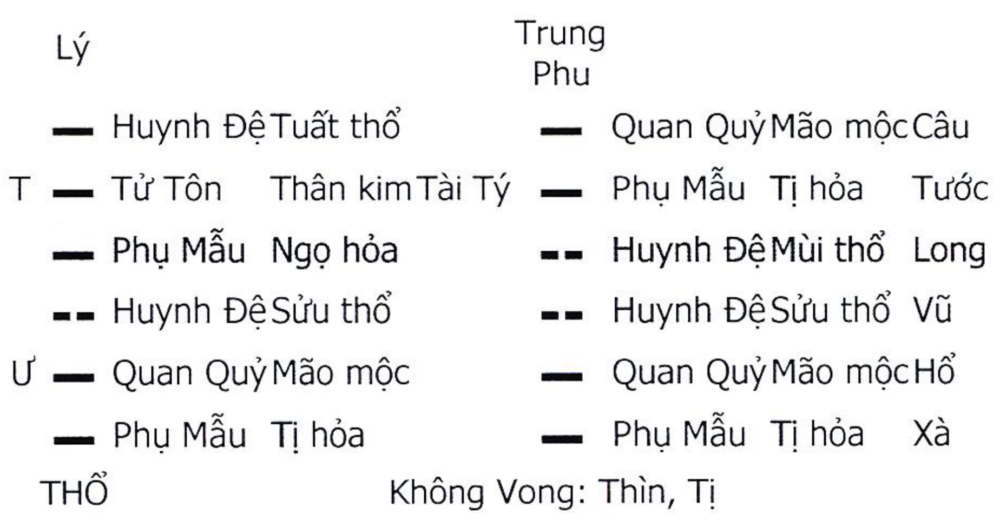
    - **Hình này chứng minh điều gì**
      - Phụ Mẫu lưỡng hiện, lấy hào Phụ Mẫu Ngọ hỏa phát động làm chủ. Phụ Mẫu Tị hỏa tại hào sơ Không Vong, hào sơ biểu thị mới bắt đầu, Không Vong biểu thị bỏ hoang, phần mộ lúc đầu đã bị bỏ hoang.
    - **Từ đâu mà thấy được**
      - Phụ Mẫu lưỡng hiện, lấy hào Phụ Mẫu Ngọ hỏa phát động làm chủ. Phụ Mẫu Tị hỏa tại hào sơ Không Vong, hào sơ biểu thị mới bắt đầu, Không Vong biểu thị bỏ hoang, phần mộ lúc đầu đã bị bỏ hoang.
- **Diễn tiến phân tích và suy luận chi tiết:**
  - Phụ Mẫu lưỡng hiện, lấy hào Phụ Mẫu Ngọ hỏa phát động làm chủ.
  - Phụ Mẫu Tị hỏa tại hào sơ Không Vong, hào sơ biểu thị mới bắt đầu, Không Vong biểu thị bỏ hoang, phần mộ lúc đầu đã bị bỏ hoang.
  - Phụ Mẫu Ngọ hỏa lâm Thanh Long phát động, phát động biểu thị thay đổi, Thanh Long chủ chỉnh trang, trang hoàng, biểu thị mộ tổ đã được xây dựng lại.
  - Hào Thế lâm hào 5, được Nguyệt sinh vượng tướng, hào 5 là tôn vị, hào vị lãnh đạo, hào Thế là huyệt, lại là người xin đoán, huyệt này lợi cho quan vận.
  - Nhưng Phụ Mẫu Ngọ hỏa
  - phát động khắc hào Thế, lại là Tử địa của Quan Quỷ, lại ảnh hưởng đến cơ thể và quan vận.
  - Tử Tôn trì Thế tại hào 5, Quan Quỷ lâm hào Ứng được Nhật sinh vượng tướng.
  - Đây là một tổ hợp đặc biệt trong quẻ lục hào.
  - Hào 5 là tôn vị, biểu thị địa vị cao.
  - Quan Quỷ là sự nghiệp, quan vận, công danh, thứ bậc,...
  - Lâm Ứng vốn là người khác được, nhưng ta (hào Thế) lấy địa vị cao mà chế phục người khác, đoạt lấy vị trí của họ.
  - Như vậy, tổ hợp này trái lại có lợi cho quan vận, học hành, thi cử, tìm việc,...
  - Tổ hợp này tối kỵ hào Ứng Không Vong, hưu tù, biểu thị người ta không có chức tước nên mình không có cái để đoạt.
  - Cũng kỵ hào Thế bị hợp và nhập Mộ, bị hợp là cản trở, nhập Mộ là bị bao vây, không thể tự do đi tranh đoạt.
  - Tử Tôn trì Thế tại hào 5, Quan Quỷ lâm Ứng được Nhật sinh là vượng tướng, đúng là tổ hợp rất đẹp, tuy nhiên không nên hào Thế bị hào sơ Phụ Mẫu Tị hỏa ám động hợp trú.
  - Năm 1998 là Mậu Dần, hào Thế bị xung khai, đi khắc hào Ứng Quan Quỷ, năm này được thăng chức.
  - Tuy nhiên có lợi cũng có hại, năm này Phụ Mẫu Ngọ hỏa được Trường Sinh, hào Thế Thân kim tại hào 5 bị xung, kim là xương cốt, hào 5 kim chủ răng, bị khắc là răng bị thương hại.
  - Bởi vì Nhật là Bệnh địa của hào Thế, vì vậy thông thường sẽ ứng vào bệnh tật.
- **Kết quả ứng nghiệm thực tế:**
  - Trên thực tế là năm này được thăng chức và bị gãy răng.
  - Năm sau là Kỷ Mão, Phụ Mẫu vẫn được sinh vượng tướng khắc hào Thế, vẫn có tổn thương gân cốt, đã bị thoát vị đĩa đệm.
  - Năm 2004 Giáp Thân, hào Thế lâm trị, bị Phụ Mẫu khắc mà không thể khắc chế hào Ứng Quan Quỷ, năm này bị giáng chức.
  - Lần xây dựng lại mộ tổ được tiến hành vào năm 1998, Phụ Mẫu hưu tù đã ứng Trường Sinh.
  - Phong thủy bị ảnh hưởng là do hai nguyên nhân.
  - Một là hào sơ Phụ Mẫu Tị hỏa lâm Đằng Xà Không Vong, Không Vong biểu thị không có, Đằng Xà chủ thiếu, chính là trong mộ tổ đã thiếu thứ gì đó.
  - Tị hỏa Không Vong ám động hợp Thân kim, kim chủ xương cốt, chứng tỏ hài cốt trong mộ không toàn vẹn.
  - Ngoài ra,
  - Ngọ hỏa độc phát khiến hào 2 Mão mộc ở vào Tử địa.
  - Mộc chủ cây cối, thực vật.
  - Do đó, lân cận có hoa cỏ, cây cối bị khô héo, địa khí thiếu hụt dẫn tới phong thủy bị thay đổi.

#### Ví dụ 3: Ngày Nhâm Thìn tháng Quý Hợi năm Quý Mùi, nam đoán mộ tổ, được Phong Sơn Tiệm ...

- **Bối cảnh và thông tin quẻ:**
  - Ngày Nhâm Thìn tháng Quý Hợi năm Quý Mùi, nam đoán mộ tổ, được Phong Sơn Tiệm biến Thiên Sơn Độn.
  - THỔ Không Vong: Ngọ, Mùi
  - Phụ Mẫu đa hiện, mộ tổ là của người nhiều đời.
  - (Phản hồi: Ba đời.)
  - Hào 2 Phụ Mẫu Ngọ hỏa Không Vong, năm Bính Tý xung thực, năm này có mộ mới xuất hiện.
  - (Phản hồi: Năm Bính Tý cha nhập mộ tổ.)
  - Quẻ cung Cấn, Cấn là núi, mộ tổ được xây tựa vào núi.
  - Nội quái là Cấn, mộ được xây ở trên ngọn đồi nhỏ trước ngọn núi lớn.
  - Hào Thế là huyệt, đóng tại hào cao nhất của quẻ Cấn, huyệt được điểm ở trên đỉnh của ngọn đồi.
  - (Phản hồi: Chính xác.)
  - Hào sơ là lân cư, phụ cận, lâm Thìn thổ, Thìn thổ là thủy khố, lại lâm Huyền Vũ, Huyền Vũ là ven sông, thủy vực, lân cận có suối.
  - (Phản hồi: Có.)
  - Hào 5 là đường đi, Phụ Mẫu Tị hỏa lâm Đằng Xà Nguyệt phá, Nguyệt phá chủ tả tơi, đường đi gập ghềnh, lâm Đằng Xà chủ uốn lượn, quanh co.
  - (Phản hồi: Có thể nói là gần như không có đường.)
  - Huynh Đệ Mùi thổ Không hóa Không, Nguyên thần Tị hỏa Nguyệt phá, Ngọ hỏa Không Vong, anh em có tổn thương, Thái Tuế năm nay nhập hào, ứng vào năm nay.
  - (Năm 1993 có một người bị giết, một người bị điện giật chết, năm nay lại có một người bị thương vì tai nạn xe cộ.)
  - Quẻ cung Cấn, Cấn là con thứ ba, tổn thương người con thứ ba.
  - (Người bị điện giật chết ở năm 1993 là anh ba.
  - Những người khác đều là anh con chú bác.)
  - Phụ Mẫu Tị hỏa bị Hợi thủy xung phá, lại có Tý thủy phục tàng ở dưới, mộ đã có nước vào.
  - (Phản hồi: Mới vào nước trước năm nay không lâu.)
  - Hào Ứng là hướng sơn, án sơn, lâm Mão mộc, trước mộ có nhiều cây cỏ mọc um tùm.
  - Nhập Mộ tại Mùi thổ, Mùi thổ lâm Câu Trần, Câu Trần là ruộng đồng, thổ là đất đai, nhập Mộ chủ tiêu vong, cỏ cây bị chặt, mở mang thành đất canh tác.
  - (Phản hồi: Là đất ruộng.)
  - Quan Quỷ nhập Mộ, Phụ Mẫu Không Phá, không xuất văn nhân, khó có sinh viên đại học.
  - (Phản hồi: Hiện nay vẫn chưa có người thi đậu đại học)
  - Quan Quỷ Mão mộc được Nguyệt sinh là vượng tướng, lâm Bạch Hổ, Bạch Hổ chủ pháp luật, quân đội, trong dòng họ có người làm cán bộ, hơn nữa là làm trong ngành pháp luật.
  - (Cha đang đã từng đi lính, từng là bí thư xã, chú làm ở tòa án.)
  - Phụ Mẫu Tị hỏa tại hào 5 Nguyệt phá, Nguyên thần tại hào 6 lâm Bạch Hổ nhập Mộ, hào 5 là trưởng bối, hào dương chủ đàn ông, trong trưởng bối có người đoản thọ.
  - (Phản hồi: Tất cả đều chết trước 60 tuổi.)
  - Nguyên thần chủ tư duy, tại hào 6 là đầu, nhập Mộ là bản thân nghĩ không thoáng, Phụ Mẫu Tị hỏa tại hào 5 lâm Đằng Xà, hào 5 là cổ, Đằng Xà là dây thừng, trong trưởng bối có người tự sát.
  - (Phản hồi: Đã có.)
  - Nguyên thần hào Thế là Mùi thổ tại hào 4 Không Vong, thổ tại hào 4 là dạ dày, Không mà không thể sinh hào Thế, có bệnh về tiêu hóa.
  - (Phản hồi: Tiêu hóa kém.)
  - Hào 4 Huynh Đệ Mùi thổ lâm Câu Trần hóa ra Phụ Mẫu, Huynh Đệ là anh em trong họ, Phụ Mẫu là phần mộ, Câu Trần lại chủ xây dựng, trong họ có người xây dựng lại mồ mả.
  - Ngọ hỏa Mùi thổ tương hợp, thường là mộ hợp táng.
  - (Phản hồi: Đúng, có người cha mất thì táng bên cạnh mộ tổ, sau khi mẹ mất thì lại chuyển mộ cha ra ngoài để hợp táng.)
- **Luận giải quái tượng phong thủy:**
  - **Hình 146.** Sơ đồ quẻ Phong Sơn Tiệm biến Thiên Sơn Độn
    - 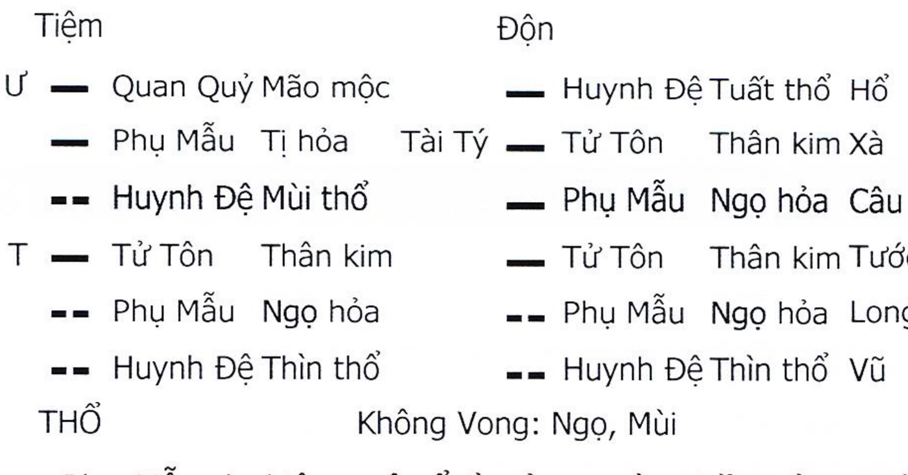
    - **Hình này chứng minh điều gì**
      - Quẻ chứng minh tình trạng phong thủy và ảnh hưởng cát hung tương ứng với quái tượng Sơ đồ quẻ Phong Sơn Tiệm biến Thiên Sơn Độn.
    - **Từ đâu mà thấy được**
      - THỔ Không Vong: Ngọ, Mùi Hào 2 Phụ Mẫu Ngọ hỏa Không Vong, năm Bính Tý xung thực, năm này có mộ mới xuất hiện.
- **Diễn tiến phân tích và suy luận chi tiết:**
  - **Ví dụ 3:** Ngày Nhâm Thìn tháng Quý Hợi năm Quý Mùi, nam đoán mộ tổ, được Phong Sơn Tiệm biến Thiên Sơn Độn.
  - THỔ Không Vong: Ngọ, Mùi
  - Phụ Mẫu đa hiện, mộ tổ là của người nhiều đời.
  - (Phản hồi: Ba đời.)
  - Hào 2 Phụ Mẫu Ngọ hỏa Không Vong, năm Bính Tý xung thực, năm này có mộ mới xuất hiện.
  - (Phản hồi: Năm Bính Tý cha nhập mộ tổ.)
  - Quẻ cung Cấn, Cấn là núi, mộ tổ được xây tựa vào núi.
  - Nội quái là Cấn, mộ được xây ở trên ngọn đồi nhỏ trước ngọn núi lớn.
  - Hào Thế là huyệt, đóng tại hào cao nhất của quẻ Cấn, huyệt được điểm ở trên đỉnh của ngọn đồi.
  - (Phản hồi: Chính xác.)
  - Hào sơ là lân cư, phụ cận, lâm Thìn thổ, Thìn thổ là thủy khố, lại lâm Huyền Vũ, Huyền Vũ là ven sông, thủy vực, lân cận có suối.
  - (Phản hồi: Có.)
  - Hào 5 là đường đi, Phụ Mẫu Tị hỏa lâm Đằng Xà Nguyệt phá, Nguyệt phá chủ tả tơi, đường đi gập ghềnh, lâm Đằng Xà chủ uốn lượn, quanh co.
  - (Phản hồi: Có thể nói là gần như không có đường.)
  - Huynh Đệ Mùi thổ Không hóa Không, Nguyên thần Tị hỏa Nguyệt phá, Ngọ hỏa Không Vong, anh em có tổn thương, Thái Tuế năm nay nhập hào, ứng vào năm nay.
  - (Năm 1993 có một người bị giết, một người bị điện giật chết, năm nay lại có một người bị thương vì tai nạn xe cộ.)
  - Quẻ cung Cấn, Cấn là con thứ ba, tổn thương người con thứ ba.
  - (Người bị điện giật chết ở năm 1993 là anh ba.
  - Những người khác đều là anh con chú bác.)
  - Phụ Mẫu Tị hỏa bị Hợi thủy xung phá, lại có Tý thủy phục tàng ở dưới, mộ đã có nước vào.
  - (Phản hồi: Mới vào nước trước năm nay không lâu.)
  - Hào Ứng là hướng sơn, án sơn, lâm Mão mộc, trước mộ có nhiều cây cỏ mọc um tùm.
  - Nhập Mộ tại Mùi thổ, Mùi thổ lâm Câu Trần, Câu Trần là ruộng đồng, thổ là đất đai, nhập Mộ chủ tiêu vong, cỏ cây bị chặt, mở mang thành đất canh tác.
  - (Phản hồi: Là đất ruộng.)
  - Quan Quỷ nhập Mộ, Phụ Mẫu Không Phá, không xuất văn nhân, khó có sinh viên đại học.
  - (Phản hồi: Hiện nay vẫn chưa có người thi đậu đại học)
  - Quan Quỷ Mão mộc được Nguyệt sinh là vượng tướng, lâm Bạch Hổ, Bạch Hổ chủ pháp luật, quân đội, trong dòng họ có người làm cán bộ, hơn nữa là làm trong ngành pháp luật.
  - (Cha đang đã từng đi lính, từng là bí thư xã, chú làm ở tòa án.)
  - Phụ Mẫu Tị hỏa tại hào 5 Nguyệt phá, Nguyên thần tại hào 6 lâm Bạch Hổ nhập Mộ, hào 5 là trưởng bối, hào dương chủ đàn ông, trong trưởng bối có người đoản thọ.
  - (Phản hồi: Tất cả đều chết trước 60 tuổi.)
  - Nguyên thần chủ tư duy, tại hào 6 là đầu, nhập Mộ là bản thân nghĩ không thoáng, Phụ Mẫu Tị hỏa tại hào 5 lâm Đằng Xà, hào 5 là cổ, Đằng Xà là dây thừng, trong trưởng bối có người tự sát.
  - (Phản hồi: Đã có.)
  - Nguyên thần hào Thế là Mùi thổ tại hào 4 Không Vong, thổ tại hào 4 là dạ dày, Không mà không thể sinh hào Thế, có bệnh về tiêu hóa.
  - (Phản hồi: Tiêu hóa kém.)
  - Hào 4 Huynh Đệ Mùi thổ lâm Câu Trần hóa ra Phụ Mẫu, Huynh Đệ là anh em trong họ, Phụ Mẫu là phần mộ, Câu Trần lại chủ xây dựng, trong họ có người xây dựng lại mồ mả.
  - Ngọ hỏa Mùi thổ tương hợp, thường là mộ hợp táng.
  - (Phản hồi: Đúng, có người cha mất thì táng bên cạnh mộ tổ, sau khi mẹ mất thì lại chuyển mộ cha ra ngoài để hợp táng.)

#### Ví dụ 4: Ngày Giáp Dần tháng Quý Hợi năm Quý Mùi, nam đoán mộ tổ, được Trạch Hỏa Cách.

- **Luận giải quái tượng phong thủy:**
  - **Hình 147.** Quẻ Trạch Hỏa Cách
    - 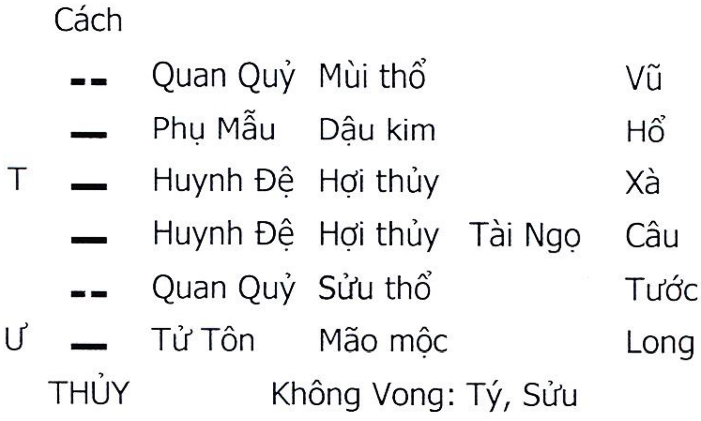
    - **Hình này chứng minh điều gì**
      - Phụ Mẫu Dậu kim tại hào 5 lâm Bạch Hổ, hào 5 là đường đi, Bạch Hổ lại là đường đi, mộ sát bên đường.
    - **Từ đâu mà thấy được**
      - THỦY Không Vong: Tý, Sửu Phụ Mẫu Dậu kim tại hào 5 lâm Bạch Hổ, hào 5 là đường đi, Bạch Hổ lại là đường đi, mộ sát bên đường.
- **Diễn tiến phân tích và suy luận chi tiết:**
  - ### Ví dụ 4: Ngày Giáp Dần tháng Quý Hợi năm Quý Mùi, nam đoán mộ tổ, được Trạch Hỏa Cách.
  - THỦY Không Vong: Tý, Sửu
  - Phụ Mẫu Dậu kim tại hào 5 lâm Bạch Hổ, hào 5 là đường đi, Bạch Hổ lại là đường đi, mộ sát bên đường.
  - (Phản hồi: Phía Đông gần đường lớn.)
  - Quẻ tại cung Khảm, Khảm là thấp trũng, địa thế của phần mộ tương đối thấp trũng.
  - Hào Thế là huyệt, lâm Hợi thủy, được Nguyệt trợ giúp vượng tướng, Nhật Nguyệt là trời, hễ trời mưa là đọng rất nhiều nước.
  - (Phản hồi: Ở chỗ thấp, cứ mưa là nước chảy đến nơi này.)
  - Nhật thần Dần mộc hợp hào Thế Hợi thủy, Hợi thủy là Tây Bắc, mộc chủ cây cối, Tây Bắc có rất nhiều cây cối.
  - (Phản hồi: Tây Bắc có một mảnh rừng bạch dương.)
  - Ứng là phía trước mộ.
  - Tử Tôn Mão mộc lâm Thanh Long, Thanh Long chủ ẩm thực, Tử Tôn là hào sinh Tài, Thê Tài là ẩm thực, lương thực, mộc là thực vật, Tử Tôn Mão mộc chính là hoa màu, trước mộ có hoa màu.
  - Nhật thần Dần mộc là Đông Bắc, hợp hào Thế Hợi thủy, hào Thế là huyệt trường, Nhật hợp là cản trở, Nhật Nguyệt cao, hào Thế Đằng Xà là chật hẹp, Đông Bắc tương đối cao, sát bên mộ, chèn ép mộ.
  - (Đông Bắc có một gò nhỏ.)
  - Hào 2 Sửu thổ là Nguyên thần Phụ Mẫu Không Vong, thổ Không là hố, lân cận có hố đất.
  - (Phản hồi: Có một cái rãnh rộng khoảng 200 mét.)
  - Huynh Đệ trì Thế lâm Nguyệt, mộ như vậy thường xuất quân nhân.
  - (Phản hồi: Tôi xuất thân là người lính, bác cả của tôi là một cựu hồng quân.)
  - Phụ Mẫu Dậu kim lâm Bạch Hổ tại hào 5, hào 5 là gia trưởng, trưởng bối, Nhật Nguyệt không trợ giúp là hưu tù.
  - Nguyên thần bị Nhật khắc thương, bất lợi cho trưởng bối.
  - (Mẹ tôi đã qua đời, hiện nay cha tôi lại bị bệnh.)

#### Ví dụ 5: Ngày Nhâm Tuất tháng Giáp Tý năm Quý Mùi, nam đoán phong thủy mộ tổ, được Thủy...

- **Bối cảnh và thông tin quẻ:**
  - Ngày Nhâm Tuất tháng Giáp Tý năm Quý Mùi, nam đoán phong thủy mộ tổ, được Thủy Hỏa Ký Tế biến Phong Lôi Ích.
  - THỦY Không Vong: Tý, Hợi
  - Quẻ tại cung Khảm, Khảm là thấp trũng, mộ ở nơi thấp trũng.
  - Quan Quỷ Tuất thổ tại hào 5 lâm Nhật, hào 5 là đường đi, lâm Đằng Xà là tượng uốn lượn.
  - Hào 5 sinh Phụ Mẫu Thân kim, có đường nhỏ dẫn đến phần mộ.
  - Nhật Tuất thổ hợp Tử Tôn Mão mộc, mộc chủ cây cối, lâm Huyền Vũ chủ bóng râm, ven đường có cây cối san sát.
  - (Phản hồi: Hoàn toàn chính xác.)
  - Phụ Mẫu là phần mộ, phần mộ Thân kim là Tuyệt địa của mộc, bên cạnh phần mộ không có cây cối.
  - Hào 3 Huynh Đệ Hợi thủy gần Phụ Mẫu Thân kim phát động hóa Mộ, gần Phụ Mẫu biểu thị bên cạnh phần mộ, thủy chủ nước, hóa Mộ biểu thị tụ hội, có rãnh nước tồn tại.
  - Thủy động hóa Mộ, Mộ là tượng cất giữ, bình thường không thấy nước, nhưng Nguyệt trợ giúp Hợi thủy, Nhật xung khai Mộ khố, Nhật Nguyệt là trời, trời mưa là có nhiều nước.
  - (Phản hồi: Ông phán đoán rất đúng.)
  - Hào 6 Tý thủy lâm Bạch Hổ phát động, Bạch Hổ là đường đi, lâm thủy là đường ở trên nước, động mà vượt qua Hợi thủy để tương hợp với Sửu thổ, đây là thông tin cầu, lân cận có cây cầu.
  - (Phản hồi: Đúng, lân cận có cầu.)
  - Huynh Đệ trì Thế, Nguyệt lại lâm Huynh Đệ, mộ này thì trong nhà xuất quân nhân, bản thân đã từng đi lính.
  - Hào
  - Ứng Huynh Đệ Tý thủy lâm Bạch Hổ, lâm Nguyệt, trong số anh em cũng có người đi lính.
  - Tại hào 6, hào 6 là hào hưu nhàn, làm công tác hậu cần trong quân đội.
  - (Phản hồi: Tôi xuất thân là người lính, em trai cũng là quân nhân, liên tục công tác trong quân đội, là cán bộ cấp trung đoàn, làm công tác hậu cần.)
  - Phụ Mẫu vượng tướng sinh hào Thế.
  - Hào Thế là huyệt, lâm Chu Tước chủ văn thư.
  - Quan Quỷ tại hào 5 vượng tướng, xuất người trí thức và người làm lãnh đạo.
  - (Phản hồi: Đúng, dòng họ chúng tôi có mấy sinh viên đại học, em trai tôi chính là cán bộ trung đoàn.)
  - Huynh Đệ Tý thủy tại hào 6, lại lâm hào Ứng, hào 6 là nơi khác, hào Ứng cũng là nơi khác, trong số anh em có người ly biệt quê hương.
  - (Phản hồi: Em trai tôi công tác ở vùng khác.)
  - Thê Tài Nguyệt phá phục tàng, nhập Mộ tại Nhật, Huynh Đệ lưỡng hiện phát động, mộ này không xuất người giàu.
  - (Phản hồi: Mấy anh em đều không có tiền gì cả.)
- **Luận giải quái tượng phong thủy:**
  - **Hình 148.** Sơ đồ quẻ Thủy Hỏa Ký Tế biến Phong Lôi Ích
    - 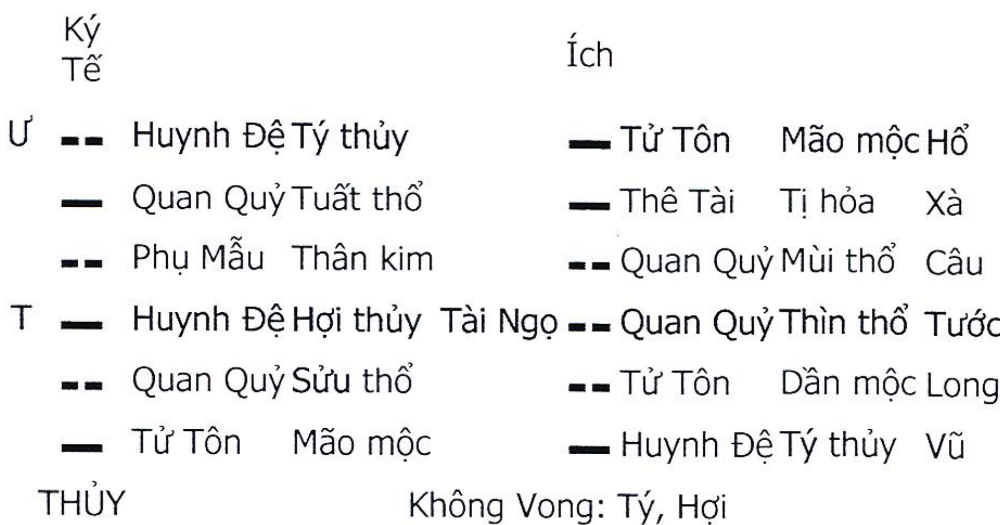
    - **Hình này chứng minh điều gì**
      - **Ví dụ 5:** Ngày Nhâm Tuất tháng Giáp Tý năm Quý Mùi, nam đoán phong thủy mộ tổ, được Thủy Hỏa Ký Tế biến Phong Lôi Ích. Quan Quỷ Tuất thổ tại hào 5 lâm Nhật, hào 5 là đường đi, lâm Đằng Xà là tượ...
    - **Từ đâu mà thấy được**
      - THỦY Không Vong: Tý, Hợi Quan Quỷ Tuất thổ tại hào 5 lâm Nhật, hào 5 là đường đi, lâm Đằng Xà là tượng uốn lượn.
- **Diễn tiến phân tích và suy luận chi tiết:**
  - **Ví dụ 5:** Ngày Nhâm Tuất tháng Giáp Tý năm Quý Mùi, nam đoán phong thủy mộ tổ, được Thủy Hỏa Ký Tế biến Phong Lôi Ích.
  - THỦY Không Vong: Tý, Hợi
  - Quẻ tại cung Khảm, Khảm là thấp trũng, mộ ở nơi thấp trũng.
  - Quan Quỷ Tuất thổ tại hào 5 lâm Nhật, hào 5 là đường đi, lâm Đằng Xà là tượng uốn lượn.
  - Hào 5 sinh Phụ Mẫu Thân kim, có đường nhỏ dẫn đến phần mộ.
  - Nhật Tuất thổ hợp Tử Tôn Mão mộc, mộc chủ cây cối, lâm Huyền Vũ chủ bóng râm, ven đường có cây cối san sát.
  - (Phản hồi: Hoàn toàn chính xác.)
  - Phụ Mẫu là phần mộ, phần mộ Thân kim là Tuyệt địa của mộc, bên cạnh phần mộ không có cây cối.
  - Hào 3 Huynh Đệ Hợi thủy gần Phụ Mẫu Thân kim phát động hóa Mộ, gần Phụ Mẫu biểu thị bên cạnh phần mộ, thủy chủ nước, hóa Mộ biểu thị tụ hội, có rãnh nước tồn tại.
  - Thủy động hóa Mộ, Mộ là tượng cất giữ, bình thường không thấy nước, nhưng Nguyệt trợ giúp Hợi thủy, Nhật xung khai Mộ khố, Nhật Nguyệt là trời, trời mưa là có nhiều nước.
  - (Phản hồi: Ông phán đoán rất đúng.)
  - Hào 6 Tý thủy lâm Bạch Hổ phát động, Bạch Hổ là đường đi, lâm thủy là đường ở trên nước, động mà vượt qua Hợi thủy để tương hợp với Sửu thổ, đây là thông tin cầu, lân cận có cây cầu.
  - (Phản hồi: Đúng, lân cận có cầu.)
  - Huynh Đệ trì Thế, Nguyệt lại lâm Huynh Đệ, mộ này thì trong nhà xuất quân nhân, bản thân đã từng đi lính.
  - Hào
  - Ứng Huynh Đệ Tý thủy lâm Bạch Hổ, lâm Nguyệt, trong số anh em cũng có người đi lính.
  - Tại hào 6, hào 6 là hào hưu nhàn, làm công tác hậu cần trong quân đội.
  - (Phản hồi: Tôi xuất thân là người lính, em trai cũng là quân nhân, liên tục công tác trong quân đội, là cán bộ cấp trung đoàn, làm công tác hậu cần.)
  - Phụ Mẫu vượng tướng sinh hào Thế.
  - Hào Thế là huyệt, lâm Chu Tước chủ văn thư.
  - Quan Quỷ tại hào 5 vượng tướng, xuất người trí thức và người làm lãnh đạo.
  - (Phản hồi: Đúng, dòng họ chúng tôi có mấy sinh viên đại học, em trai tôi chính là cán bộ trung đoàn.)
  - Huynh Đệ Tý thủy tại hào 6, lại lâm hào Ứng, hào 6 là nơi khác, hào Ứng cũng là nơi khác, trong số anh em có người ly biệt quê hương.
  - (Phản hồi: Em trai tôi công tác ở vùng khác.)
  - Thê Tài Nguyệt phá phục tàng, nhập Mộ tại Nhật, Huynh Đệ lưỡng hiện phát động, mộ này không xuất người giàu.
  - (Phản hồi: Mấy anh em đều không có tiền gì cả.)

#### Ví dụ 6: Ngày Nhâm Tuất tháng Tý, nam đoán phong thủy mộ tổ, được Thiên trạch Lý biến T...

- **Bối cảnh và thông tin quẻ:**
  - Ngày Nhâm Tuất tháng Tý, nam đoán phong thủy mộ tổ, được Thiên trạch Lý biến Thủy Sơn Kiển.
  - THỔ Không Vong: Tý, Sửu
  - Mặc dù là quẻ cung Cấn, nhưng thượng hạ đều không có Cấn, lại Nguyên thần hào Thế là Tuất thổ hóa Không, Sửu thổ Không Vong, Nguyên thần hào Thế là kháo sơn, long mạch, phần mộ không tiếp giáp sơn mạch.
  - Nội quái của hào biến là Cấn, ở phía xa mới có núi.
  - (Phản hồi: Đúng, xung quanh chỉ ở phía xa mới có núi.)
  - Hào Thế là huyệt trường, được Nhật sinh vượng tướng, lại lâm hào 5 độc tĩnh, tĩnh là bình ổn, huyệt trường nhấp nhô vừa phải, xung quanh rộng rãi.
  - (Phản hồi: Về cơ bản là ở khu vực đồng bằng.)
  - Tý thủy phục dưới hào Thế, Phụ Mẫu Ngọ hỏa lại bị Nguyệt Tý thủy xung phá, nghĩa trang bị nước xâm nhập, trong mộ đã vào nước.
  - (Phản hồi: Xung quanh mộ là đầm lầy, chắc chắn là mộ đã vào nước.)
  - Phụ Mẫu Tị hỏa hợp hào Thế Thân kim, Phụ Mẫu Ngọ hỏa động hóa Tử Tôn Thân kim, Nguyên thần hào Thế Sửu thổ lại hóa Tử Tôn Thân kim, thổ là đất, kim là đá, chất lượng đất không tốt, bên trong pha lẫn rất nhiều đá.
  - (Phản hồi: Đúng là như vậy.)
  - Phụ Mẫu Ngọ hỏa lâm Câu Trần, Phụ Mẫu là phần mộ, Câu Trần chủ mô đất, thông tin mồ mả càng rõ ràng.
  - Phát động biểu thị phần mộ đã di chuyển.
  - Nguyệt phá gặp hợp, năm nay Thái Tuế hợp, ứng tại năm nay.
  - Hóa ra Thân kim,
  - dự tính tại tháng Thân (tháng 8 dương lịch).
  - (Phản hồi: Tháng 8 năm nay đã cải tạo lại mộ.)
  - Thê Tài Tý thủy được Nguyệt trợ giúp là vượng tướng, lại tại hào 5, hào 5 là tôn vị, biểu thị đại tài.
  - Huynh Đệ Sửu thổ hợp Tý thủy, trong số anh em có người rất giàu có, là phú ông.
  - (Phản hồi: Anh trai tôi có tài sản hàng chục triệu.)
  - Quan Quỷ Mão mộc được Nguyệt sinh là vượng tướng, Huynh Đệ Tuất thổ hợp Mão mộc, trong anh em có người làm lãnh đạo, nhưng Quan Quỷ động hóa Nguyệt phá, Quan Quỷ lại tại hào 2, chức vụ không lớn, hẳn là cán bộ cấp phòng.
  - (Phản hồi: Anh trai tôi là một cán bộ cấp phòng.)
  - Phụ Mẫu hưu tù Nguyệt phá, Quan Quỷ hóa phá, mộ không xuất văn nhân, hiếm sinh viên đại học.
  - (Phản hồi: Không có sinh viên đại học.)
  - Quẻ độc tĩnh, nhiều hào phát động biểu thị bất an.
  - Quan Quỷ tại hào 2 phát động, Quan Quỷ là bệnh, hào 2 là chân, Thiên Trạch Lý biểu thị đi lại, trong dòng họ thế nào cũng có người bị thương ở chân.
  - (Phản hồi: Cha tôi bị thương ở bàn chân, bản thân tôi bị thương ở đùi.)
  - Hào Thế lâm kim tại hào 5, Phụ Mẫu lưỡng động đến khắc, hào 5 kim gặp Nguyệt thủy là lưng, vai, lưng bị đau nhức.
  - Hỏa lại là viêm, hào 5 là họng, kim là hệ hô hấp, cổ họng không tốt, thường bị viêm.
  - Hào Thế bị Tị hỏa hợp trú không thể sinh thủy, thủy Không lại không được sinh, thủy Tài là nước bọt, miệng khô, thiếu nước bọt.
  - (Phản hồi: Đúng.)
  - ### Ví dụ 7
  - Ngày Bính Dần tháng Giáp Thân năm Canh Thìn, nam hỏi mồ mả của cha mẹ có ảnh hưởng đến bản thân hay không?
  - Được Sơn Phong Cổ biến Sơn Thiên Đại Súc.
  - MỘC Không Vong: Tuất, Hợi
  - Tôi nói: "Mộ của phụ mẫu là mộ hợp táng, không phải táng ở nghĩa trang chọn mới, mà là táng ở trong nghĩa trang của gia đình người ta.
  - Phần mộ tại khu vực rừng núi, tọa Tây Bắc hướng về Đông Nam, đất của huyệt mộ có đá và cát.
  - Người ta táng ở đất này thì rất tốt, còn gia đình anh thì chưa hẳn.
  - Phía trước mộ có một ngã ba đường, một đường dẫn đến Đông Bắc, một đường dẫn đến Tây Bắc, ngã ba này bất lợi cho cầu quan.
  - Phía Tây Bắc của mộ có một hố đất lớn, ảnh hưởng đến tài vận của anh.
  - Do đó, tiền bạc và quan vận của anh đều không thuận lợi.
  - Phương Đông Bắc vốn là có rừng cây, đã bị người ta chặt, sau khi bị chặt thì trong anh em có người xảy ra tai nạn xe cộ, nhưng cánh rừng cũng đã tự phát triển trở lại, chuyện xấu biến thành chuyện tốt, hiện nay thì người anh em bị tai nạn kia đã phát tài lớn."
  - Anh ta nói rằng mọi thứ đều đúng.
  - Phần mộ cha mẹ được táng ở trong nghĩa trang của nhà người bạn.
  - Phán đoán về hoàn cảnh xung quanh rất chính xác, tài vận và quan vận của bản thân đều không tốt.
  - Năm 88 hạ táng, năm 89 thì có người đã chặt rừng cây ở phía Đông Bắc, một anh trai đã xảy ra tai nạn giao thông.
  - Có điều là người anh đó hiện nay rất giàu có.
  - Quẻ này phán đoán như sau:
  - Lấy Phụ Mẫu làm Dụng thần, lưỡng hiện, lấy hào lâm Câu Trần làm Dụng.
  - Bởi vì Câu Trần có ý nghĩa là nhô ra, phồng lên.
  - Mộ là mô đất, do đó lấy Phụ Mẫu Hợi thủy lâm Câu Trần làm Dụng.
  - Phụ Mẫu Hợi thủy và Nhật tương hợp, hợp là mộ hợp táng.
  - Phụ Mẫu và hào Ứng tác hợp, Ứng là người khác, vì vậy táng ở trong nghĩa trang của nhà người ta.
  - Quẻ tại cung Tốn, Tốn là rừng núi, lại ngoại quái Cấn là núi, nội quái Tốn là cây cối, vì vậy phần mộ tại khu vực rừng núi.
  - Hào Thế là huyệt mộ, lâm kim là cát, đá.
  - Ứng lâm Thanh Long, tốt cho người khác.
  - Phụ Mẫu Tý thủy tại hào 5, hào 5 là đường.
  - Hào sơ Sửu thổ động mà hợp hào 5, lại tương hợp với hào biến, hào biến và hào 5 tương đồng, vì vậy hào biến Tý thủy cũng có thể xem là đường.
  - Hai đường hợp lẫn nhau ở Sửu thổ, chính là tượng hai con đường giao nhau.
  - Dụng thần Phụ Mẫu Hợi thủy tại hào 2, Sửu thổ gần Dụng thần.
  - Trong lục hào, dưới là phía trước, trên là phía sau.
  - Vì vậy, phía trước mộ có ngã ba đường.
  - Phụ Mẫu Tý thủy là đường, hợp Thê Tài Sửu thổ, Sửu là Đông Bắc, hóa nhập quẻ Càn, Càn là Tây Bắc, vì vậy đoán là một đường dẫn đến Đông Bắc, một đường dẫn đến Tây Bắc.
  - Quan Quỷ trì Thế, nhưng Nguyên thần bị hào biến Phụ Mẫu Tý thủy tương hợp, hợp thì vướng chân, tham hợp quên sinh, vì vậy bất lợi cho quan vận.
  - Phía Tây Bắc có một hố đất lớn là bởi vì Thê Tài Tuất thổ Không Vong, thổ Không là hố, Tuất là Tây Bắc.
  - Lâm Tài Không không sinh Thế, vì vậy ảnh hưởng đến tài vận.
  - Hào 6 Dần mộc là Đông Bắc, cũng là cây cối, Nguyệt phá là bị người ta chặt.
  - Nhưng Nhật thần Thực Phá, lại mọc ra.
  - Lâm Huynh Đệ, tất ứng vào anh em.
  - Huynh Đệ Dần mộc là Dịch Mã, vì vậy ứng vào tai nạn xe cộ.
  - Nhưng Huynh Đệ Dần mộc Thực Phá, lâm Thanh Long, Thanh Long chủ tiền tài, vì vậy người anh em bị nạn đã phát tài.
  - Tôi lại nói: "Sức khỏe của vợ anh không tốt, thường gặp ác mộng.
  - Đứa nhỏ học hành tạm được, vừa đủ điểm chuẩn nhập học.
  - Có điều là sức khỏe của đứa con cũng không quá tốt, nhiều thương tai, phần lưng có bệnh."
  - Người này nói rằng, nếu như sớm tìm tôi đoán quẻ thì đã tốt hơn rồi, đỡ phải tốn 3 ngàn nguyên tiền oan uổng.
  - Con trai anh ta đã thi đậu trường trung cấp, lúc đó cảm thấy thi không được tốt cho nên đã biếu 3 ngàn nguyên để xin người ta châm chước, sau khi xuống kết quả thì điểm số của con vừa đủ nhập học.
  - Khi không lại đưa tiền cho người ta.
  - Mấy ngày trước, con trai từ trên giường rơi xuống, gãy mất mấy cái răng, trên lưng có mọc lên một cái nhọt.
  - Bệnh của vợ cũng nói rất đúng.
  - Ở đây phán đoán như sau:
  - Vợ lấy hào Tài làm Dụng, lưỡng hiện, lấy hào Sửu thổ phát động làm Dụng.
  - Sửu là Mộ khố Quan Quỷ, trong người thế nào cũng có bệnh.
  - Quan Quỷ tại hào 3, hào 3 là giường, lâm Đằng Xà, Đằng Xà chủ mộng, vì vậy vợ người này sẽ thấy ác mộng.
  - Đứa nhỏ thì xem hào Tử Tôn, Tử Tôn Tị hỏa phục dưới Phụ Mẫu Tý thủy, Phi khắc Phục, cùng Nhật Nguyệt tạo thành tam hình, vì vậy sức khỏe không tốt, nhiều thương tai.
  - Phụ Mẫu là ngực, lưng, tại hào 5 khắc Tử Tôn, hào 5 cũng là ngực, lưng.
  - Dương là ngực, âm là lưng.
  - Vì vậy, trên lưng có bệnh.
  - Tử Tôn phục dưới hào Phụ Mẫu, Phi thần và hào lâm Chu Tước tương hợp, Phụ Mẫu là văn thư, Chu Tước cũng chủ văn thư, là thông tin đứa nhỏ đang đi học.
  - Quan Quỷ Phụ Mẫu vượng tướng, nhưng Phụ Mẫu Hợi thủy Không Vong, thành tích thi cử sẽ không quá cao.
  - Hào Tài Sửu thổ phát động sinh Quan Quỷ, người xưa nói "Tài động sinh Quan, may mắn gọi tên", vì vậy vừa đủ điểm chuẩn nhập học.
  - Anh ta lại hỏi kỹ hơn sức khỏe của vợ, tôi nói: "Vợ anh eo đùi không tốt, có bệnh phong hàn, mắt nhìn không rõ, thường xuyên đau đầu.
  - Hơn nữa tính khí không tốt, có 5 anh em, cô ấy là con cả, rất ít bạn bè, hay lo việc đâu đâu.
  - Tất cả đều ứng nghiệm.
  - Ở đây phán đoán như sau:
  - Quan Quỷ Dậu kim tại hào 3, gặp kim là eo, lại Tài tại hào sơ, hào sơ là khả năng đi lại, vì vậy eo đùi không tốt.
  - Tại cung Tốn, Tốn là phong,' vì vậy là bệnh phong hàn.
  - Nguyên thần hào Tài phục dưới hào 5, hào 5 là ngũ quan, hỏa chủ mắt, bị hào Phi khắc là mắt có bệnh, lâm Huyền Vũ, Huyền Vũ là trong bóng tối, vì vậy mắt nhìn không rõ đồ vật.
  - Lại Kỵ thần lâm hào 6, hào 6 là đầu, lâm mộc và Thanh Long chủ đau nhức, vì vậy có bệnh đau đầu.
  - Hào Tài Sửu thổ lâm Chu Tước, một hào Tài khác là Tuất thổ lâm Bạch Hổ, Chu Tước chủ cãi cọ, Bạch Hổ chủ đánh nhau, vì vậy tính khí không tốt, hay lo việc đâu đâu.
  - Lấy Sửu thổ làm Dụng, Tuất thổ là ngũ hành tỷ hòa, có thể coi là bạn bè, lâm Không Vong là không có bạn bè.
  - Dụng thần Sửu thổ động hợp hào 5, hào 5 là tôn vị, địa vị lãnh đạo, lời nói chắc chắn, vợ anh ta trong số anh em là người ngồi ghế lãnh đạo, vì vậy là con cả.
  - Hào Tài đa hiện là vợ có nhiều anh em, thổ là số 5, vì vậy đoán là có 5 anh em.
  - Anh ta lại hỏi đến phong thủy nơi ở, tôi nói: "Gia đình anh ở nhà lầu, anh ở tại tầng thứ ba.
  - Nền nhà không tốt, đã bị bớt xén nguyên vật liệu, cốt thép mà nền nhà sử dụng không tốt, sau khi xây xong căn nhà thì tường xuất hiện vết nứt, đã từng tu bổ.
  - " Kết quả hoàn toàn chính xác.
  - Hạ quái Phụ Mẫu Hợi thủy lâm hào 2, hào 2 là trạch, Phụ Mẫu cũng chủ nhà cửa, Nhật thần hợp hào 2, trên hợp dưới là nhà lầu.
  - Hào Thế tại hào 3, vì vậy ở tại tầng thứ ba.
  - Hào sơ là nền nhà, bị Nhật khắc, nền nhà có khuyết điểm.
  - Sửu là Mộ khố Quan Quỷ, Quan Quỷ là vấn đề, khuyết điểm, Sửu thổ tàng Quan Quỷ, tức là nền nhà có vấn đề, Quan Quỷ là kim, kim là cốt thép, vì vậy đoán là cốt thép không tốt.
  - Hào 6 là tường, Nguyệt phá là tường có vết nứt, nhưng Nhật Thực Phá lại là tu sửa.
  - ---
  - # Part 15 (Pages 281-300)
- **Luận giải quái tượng phong thủy:**
  - **Hình 149.** Sơ đồ quẻ Thiên trạch Lý biến Thủy Sơn Kiển
    - 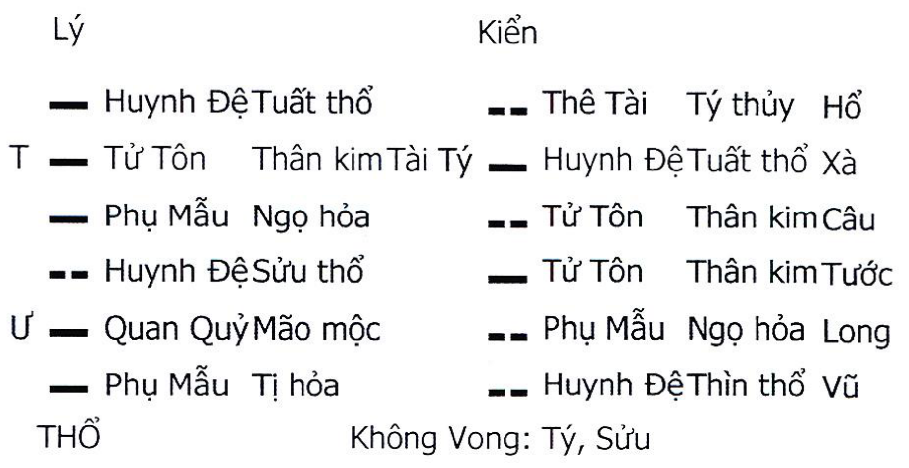
    - **Hình này chứng minh điều gì**
      - **Ví dụ 6:** Ngày Nhâm Tuất tháng Tý, nam đoán phong thủy mộ tổ, được Thiên trạch Lý biến Thủy Sơn Kiển. Mặc dù là quẻ cung Cấn, nhưng thượng hạ đều không có Cấn, lại Nguyên thần hào Thế là Tuất th...
    - **Từ đâu mà thấy được**
      - THỔ Không Vong: Tý, Sửu Mặc dù là quẻ cung Cấn, nhưng thượng hạ đều không có Cấn, lại Nguyên thần hào Thế là Tuất thổ hóa Không, Sửu thổ Không Vong, Nguyên thần hào Thế là kháo sơn, long mạch, phần...
  - **Hình 150.** Quẻ Sơn Phong Cổ biến Sơn Thiên Đại Súc
    - 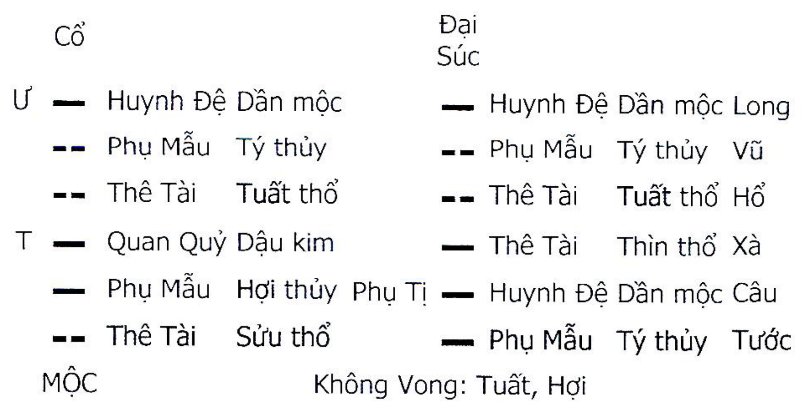
    - **Hình này chứng minh điều gì**
      - **Ví dụ 6:** Ngày Nhâm Tuất tháng Tý, nam đoán phong thủy mộ tổ, được Thiên trạch Lý biến Thủy Sơn Kiển. Mặc dù là quẻ cung Cấn, nhưng thượng hạ đều không có Cấn, lại Nguyên thần hào Thế là Tuất th...
    - **Từ đâu mà thấy được**
      - THỔ Không Vong: Tý, Sửu Mặc dù là quẻ cung Cấn, nhưng thượng hạ đều không có Cấn, lại Nguyên thần hào Thế là Tuất thổ hóa Không, Sửu thổ Không Vong, Nguyên thần hào Thế là kháo sơn, long mạch, phần...
- **Diễn tiến phân tích và suy luận chi tiết:**
  - **Ví dụ 6:** Ngày Nhâm Tuất tháng Tý, nam đoán phong thủy mộ tổ, được Thiên trạch Lý biến Thủy Sơn Kiển.
  - THỔ Không Vong: Tý, Sửu
  - Mặc dù là quẻ cung Cấn, nhưng thượng hạ đều không có Cấn, lại Nguyên thần hào Thế là Tuất thổ hóa Không, Sửu thổ Không Vong, Nguyên thần hào Thế là kháo sơn, long mạch, phần mộ không tiếp giáp sơn mạch.
  - Nội quái của hào biến là Cấn, ở phía xa mới có núi.
  - (Phản hồi: Đúng, xung quanh chỉ ở phía xa mới có núi.)
  - Hào Thế là huyệt trường, được Nhật sinh vượng tướng, lại lâm hào 5 độc tĩnh, tĩnh là bình ổn, huyệt trường nhấp nhô vừa phải, xung quanh rộng rãi.
  - (Phản hồi: Về cơ bản là ở khu vực đồng bằng.)
  - Tý thủy phục dưới hào Thế, Phụ Mẫu Ngọ hỏa lại bị Nguyệt Tý thủy xung phá, nghĩa trang bị nước xâm nhập, trong mộ đã vào nước.
  - (Phản hồi: Xung quanh mộ là đầm lầy, chắc chắn là mộ đã vào nước.)
  - Phụ Mẫu Tị hỏa hợp hào Thế Thân kim, Phụ Mẫu Ngọ hỏa động hóa Tử Tôn Thân kim, Nguyên thần hào Thế Sửu thổ lại hóa Tử Tôn Thân kim, thổ là đất, kim là đá, chất lượng đất không tốt, bên trong pha lẫn rất nhiều đá.
  - (Phản hồi: Đúng là như vậy.)
  - Phụ Mẫu Ngọ hỏa lâm Câu Trần, Phụ Mẫu là phần mộ, Câu Trần chủ mô đất, thông tin mồ mả càng rõ ràng.
  - Phát động biểu thị phần mộ đã di chuyển.
  - Nguyệt phá gặp hợp, năm nay Thái Tuế hợp, ứng tại năm nay.
  - Hóa ra Thân kim,
  - dự tính tại tháng Thân (tháng 8 dương lịch).
  - (Phản hồi: Tháng 8 năm nay đã cải tạo lại mộ.)
  - Thê Tài Tý thủy được Nguyệt trợ giúp là vượng tướng, lại tại hào 5, hào 5 là tôn vị, biểu thị đại tài.
  - Huynh Đệ Sửu thổ hợp Tý thủy, trong số anh em có người rất giàu có, là phú ông.
  - (Phản hồi: Anh trai tôi có tài sản hàng chục triệu.)
  - Quan Quỷ Mão mộc được Nguyệt sinh là vượng tướng, Huynh Đệ Tuất thổ hợp Mão mộc, trong anh em có người làm lãnh đạo, nhưng Quan Quỷ động hóa Nguyệt phá, Quan Quỷ lại tại hào 2, chức vụ không lớn, hẳn là cán bộ cấp phòng.
  - (Phản hồi: Anh trai tôi là một cán bộ cấp phòng.)
  - Phụ Mẫu hưu tù Nguyệt phá, Quan Quỷ hóa phá, mộ không xuất văn nhân, hiếm sinh viên đại học.
  - (Phản hồi: Không có sinh viên đại học.)
  - Quẻ độc tĩnh, nhiều hào phát động biểu thị bất an.
  - Quan Quỷ tại hào 2 phát động, Quan Quỷ là bệnh, hào 2 là chân, Thiên Trạch Lý biểu thị đi lại, trong dòng họ thế nào cũng có người bị thương ở chân.
  - (Phản hồi: Cha tôi bị thương ở bàn chân, bản thân tôi bị thương ở đùi.)
  - Hào Thế lâm kim tại hào 5, Phụ Mẫu lưỡng động đến khắc, hào 5 kim gặp Nguyệt thủy là lưng, vai, lưng bị đau nhức.
  - Hỏa lại là viêm, hào 5 là họng, kim là hệ hô hấp, cổ họng không tốt, thường bị viêm.
  - Hào Thế bị Tị hỏa hợp trú không thể sinh thủy, thủy Không lại không được sinh, thủy Tài là nước bọt, miệng khô, thiếu nước bọt.
  - (Phản hồi: Đúng.)
  - ### Ví dụ 7
  - Ngày Bính Dần tháng Giáp Thân năm Canh Thìn, nam hỏi mồ mả của cha mẹ có ảnh hưởng đến bản thân hay không?
  - Được Sơn Phong Cổ biến Sơn Thiên Đại Súc.
  - MỘC Không Vong: Tuất, Hợi
  - Tôi nói: "Mộ của phụ mẫu là mộ hợp táng, không phải táng ở nghĩa trang chọn mới, mà là táng ở trong nghĩa trang của gia đình người ta.
  - Phần mộ tại khu vực rừng núi, tọa Tây Bắc hướng về Đông Nam, đất của huyệt mộ có đá và cát.
  - Người ta táng ở đất này thì rất tốt, còn gia đình anh thì chưa hẳn.
  - Phía trước mộ có một ngã ba đường, một đường dẫn đến Đông Bắc, một đường dẫn đến Tây Bắc, ngã ba này bất lợi cho cầu quan.
  - Phía Tây Bắc của mộ có một hố đất lớn, ảnh hưởng đến tài vận của anh.
  - Do đó, tiền bạc và quan vận của anh đều không thuận lợi.
  - Phương Đông Bắc vốn là có rừng cây, đã bị người ta chặt, sau khi bị chặt thì trong anh em có người xảy ra tai nạn xe cộ, nhưng cánh rừng cũng đã tự phát triển trở lại, chuyện xấu biến thành chuyện tốt, hiện nay thì người anh em bị tai nạn kia đã phát tài lớn."
  - Anh ta nói rằng mọi thứ đều đúng.
  - Phần mộ cha mẹ được táng ở trong nghĩa trang của nhà người bạn.
  - Phán đoán về hoàn cảnh xung quanh rất chính xác, tài vận và quan vận của bản thân đều không tốt.
  - Năm 88 hạ táng, năm 89 thì có người đã chặt rừng cây ở phía Đông Bắc, một anh trai đã xảy ra tai nạn giao thông.
  - Có điều là người anh đó hiện nay rất giàu có.
  - Quẻ này phán đoán như sau:
  - Lấy Phụ Mẫu làm Dụng thần, lưỡng hiện, lấy hào lâm Câu Trần làm Dụng.
  - Bởi vì Câu Trần có ý nghĩa là nhô ra, phồng lên.
  - Mộ là mô đất, do đó lấy Phụ Mẫu Hợi thủy lâm Câu Trần làm Dụng.
  - Phụ Mẫu Hợi thủy và Nhật tương hợp, hợp là mộ hợp táng.
  - Phụ Mẫu và hào Ứng tác hợp, Ứng là người khác, vì vậy táng ở trong nghĩa trang của nhà người ta.
  - Quẻ tại cung Tốn, Tốn là rừng núi, lại ngoại quái Cấn là núi, nội quái Tốn là cây cối, vì vậy phần mộ tại khu vực rừng núi.
  - Hào Thế là huyệt mộ, lâm kim là cát, đá.
  - Ứng lâm Thanh Long, tốt cho người khác.
  - Phụ Mẫu Tý thủy tại hào 5, hào 5 là đường.
  - Hào sơ Sửu thổ động mà hợp hào 5, lại tương hợp với hào biến, hào biến và hào 5 tương đồng, vì vậy hào biến Tý thủy cũng có thể xem là đường.
  - Hai đường hợp lẫn nhau ở Sửu thổ, chính là tượng hai con đường giao nhau.
  - Dụng thần Phụ Mẫu Hợi thủy tại hào 2, Sửu thổ gần Dụng thần.
  - Trong lục hào, dưới là phía trước, trên là phía sau.
  - Vì vậy, phía trước mộ có ngã ba đường.
  - Phụ Mẫu Tý thủy là đường, hợp Thê Tài Sửu thổ, Sửu là Đông Bắc, hóa nhập quẻ Càn, Càn là Tây Bắc, vì vậy đoán là một đường dẫn đến Đông Bắc, một đường dẫn đến Tây Bắc.
  - Quan Quỷ trì Thế, nhưng Nguyên thần bị hào biến Phụ Mẫu Tý thủy tương hợp, hợp thì vướng chân, tham hợp quên sinh, vì vậy bất lợi cho quan vận.
  - Phía Tây Bắc có một hố đất lớn là bởi vì Thê Tài Tuất thổ Không Vong, thổ Không là hố, Tuất là Tây Bắc.
  - Lâm Tài Không không sinh Thế, vì vậy ảnh hưởng đến tài vận.
  - Hào 6 Dần mộc là Đông Bắc, cũng là cây cối, Nguyệt phá là bị người ta chặt.
  - Nhưng Nhật thần Thực Phá, lại mọc ra.
  - Lâm Huynh Đệ, tất ứng vào anh em.
  - Huynh Đệ Dần mộc là Dịch Mã, vì vậy ứng vào tai nạn xe cộ.
  - Nhưng Huynh Đệ Dần mộc Thực Phá, lâm Thanh Long, Thanh Long chủ tiền tài, vì vậy người anh em bị nạn đã phát tài.
  - Tôi lại nói: "Sức khỏe của vợ anh không tốt, thường gặp ác mộng.
  - Đứa nhỏ học hành tạm được, vừa đủ điểm chuẩn nhập học.
  - Có điều là sức khỏe của đứa con cũng không quá tốt, nhiều thương tai, phần lưng có bệnh."
  - Người này nói rằng, nếu như sớm tìm tôi đoán quẻ thì đã tốt hơn rồi, đỡ phải tốn 3 ngàn nguyên tiền oan uổng.
  - Con trai anh ta đã thi đậu trường trung cấp, lúc đó cảm thấy thi không được tốt cho nên đã biếu 3 ngàn nguyên để xin người ta châm chước, sau khi xuống kết quả thì điểm số của con vừa đủ nhập học.
  - Khi không lại đưa tiền cho người ta.
  - Mấy ngày trước, con trai từ trên giường rơi xuống, gãy mất mấy cái răng, trên lưng có mọc lên một cái nhọt.
  - Bệnh của vợ cũng nói rất đúng.
  - Ở đây phán đoán như sau:
  - Vợ lấy hào Tài làm Dụng, lưỡng hiện, lấy hào Sửu thổ phát động làm Dụng.
  - Sửu là Mộ khố Quan Quỷ, trong người thế nào cũng có bệnh.
  - Quan Quỷ tại hào 3, hào 3 là giường, lâm Đằng Xà, Đằng Xà chủ mộng, vì vậy vợ người này sẽ thấy ác mộng.
  - Đứa nhỏ thì xem hào Tử Tôn, Tử Tôn Tị hỏa phục dưới Phụ Mẫu Tý thủy, Phi khắc Phục, cùng Nhật Nguyệt tạo thành tam hình, vì vậy sức khỏe không tốt, nhiều thương tai.
  - Phụ Mẫu là ngực, lưng, tại hào 5 khắc Tử Tôn, hào 5 cũng là ngực, lưng.
  - Dương là ngực, âm là lưng.
  - Vì vậy, trên lưng có bệnh.
  - Tử Tôn phục dưới hào Phụ Mẫu, Phi thần và hào lâm Chu Tước tương hợp, Phụ Mẫu là văn thư, Chu Tước cũng chủ văn thư, là thông tin đứa nhỏ đang đi học.
  - Quan Quỷ Phụ Mẫu vượng tướng, nhưng Phụ Mẫu Hợi thủy Không Vong, thành tích thi cử sẽ không quá cao.
  - Hào Tài Sửu thổ phát động sinh Quan Quỷ, người xưa nói "Tài động sinh Quan, may mắn gọi tên", vì vậy vừa đủ điểm chuẩn nhập học.
  - Anh ta lại hỏi kỹ hơn sức khỏe của vợ, tôi nói: "Vợ anh eo đùi không tốt, có bệnh phong hàn, mắt nhìn không rõ, thường xuyên đau đầu.
  - Hơn nữa tính khí không tốt, có 5 anh em, cô ấy là con cả, rất ít bạn bè, hay lo việc đâu đâu.
  - Tất cả đều ứng nghiệm.
  - Ở đây phán đoán như sau:
  - Quan Quỷ Dậu kim tại hào 3, gặp kim là eo, lại Tài tại hào sơ, hào sơ là khả năng đi lại, vì vậy eo đùi không tốt.
  - Tại cung Tốn, Tốn là phong,' vì vậy là bệnh phong hàn.
  - Nguyên thần hào Tài phục dưới hào 5, hào 5 là ngũ quan, hỏa chủ mắt, bị hào Phi khắc là mắt có bệnh, lâm Huyền Vũ, Huyền Vũ là trong bóng tối, vì vậy mắt nhìn không rõ đồ vật.
  - Lại Kỵ thần lâm hào 6, hào 6 là đầu, lâm mộc và Thanh Long chủ đau nhức, vì vậy có bệnh đau đầu.
  - Hào Tài Sửu thổ lâm Chu Tước, một hào Tài khác là Tuất thổ lâm Bạch Hổ, Chu Tước chủ cãi cọ, Bạch Hổ chủ đánh nhau, vì vậy tính khí không tốt, hay lo việc đâu đâu.
  - Lấy Sửu thổ làm Dụng, Tuất thổ là ngũ hành tỷ hòa, có thể coi là bạn bè, lâm Không Vong là không có bạn bè.
  - Dụng thần Sửu thổ động hợp hào 5, hào 5 là tôn vị, địa vị lãnh đạo, lời nói chắc chắn, vợ anh ta trong số anh em là người ngồi ghế lãnh đạo, vì vậy là con cả.
  - Hào Tài đa hiện là vợ có nhiều anh em, thổ là số 5, vì vậy đoán là có 5 anh em.
  - Anh ta lại hỏi đến phong thủy nơi ở, tôi nói: "Gia đình anh ở nhà lầu, anh ở tại tầng thứ ba.
  - Nền nhà không tốt, đã bị bớt xén nguyên vật liệu, cốt thép mà nền nhà sử dụng không tốt, sau khi xây xong căn nhà thì tường xuất hiện vết nứt, đã từng tu bổ.
  - " Kết quả hoàn toàn chính xác.
  - Hạ quái Phụ Mẫu Hợi thủy lâm hào 2, hào 2 là trạch, Phụ Mẫu cũng chủ nhà cửa, Nhật thần hợp hào 2, trên hợp dưới là nhà lầu.
  - Hào Thế tại hào 3, vì vậy ở tại tầng thứ ba.
  - Hào sơ là nền nhà, bị Nhật khắc, nền nhà có khuyết điểm.
  - Sửu là Mộ khố Quan Quỷ, Quan Quỷ là vấn đề, khuyết điểm, Sửu thổ tàng Quan Quỷ, tức là nền nhà có vấn đề, Quan Quỷ là kim, kim là cốt thép, vì vậy đoán là cốt thép không tốt.
  - Hào 6 là tường, Nguyệt phá là tường có vết nứt, nhưng Nhật Thực Phá lại là tu sửa.
  - ---
  - # Part 15 (Pages 281-300)

#### Ví dụ 8: Đây là ví dụ của một học viên đã hỏi ở năm 2007. Tôi đã ghi lại phương pháp ph...

- **Bối cảnh và thông tin quẻ:**
  - Đây là ví dụ của một học viên đã hỏi ở năm 2007.
  - Tôi đã ghi lại phương pháp phán đoán và phản hồi lúc đó như sau.
  - Ngày Mậu Tý tháng Thìn năm Đinh Hợi, nữ hơn 40 tuổi hỏi nguyên nhân khiến nhà cha mẹ bất an, được Thiên Địa Bĩ biến Trạch Địa Tụy.
  - KIM Không Vong: Ngọ, Mùi
  - Quẻ này hào 6 Phụ Mẫu Tuất thổ lâm Chu Tước động, có thể mặc kệ hào Thế, hình cũng không cần xem, bởi vì là một hào độc phát, hào này có liên quan rất lớn đến chuyện muốn hỏi.
  - Hào 6 Tuất thổ động mà hóa thoái, lâm Nguyệt phá, hóa Không.
  - Tuất là hỏa khố, hỏa là Quan Quỷ, Quan Quỷ là người chết, Mộ khố có thể là phần mộ, hơn nữa hào 6 cũng có thể là mộ tổ, thoái chủ sụt lún, phá vỡ.
  - Thổ hóa thoái là tượng sụt lún, Không cũng là hố.
  - (Phản hồi: Quả là mộ tổ bị thấp xuống.)
  - Cũng có thể thủ tượng khác.
  - Phụ Mẫu lâm Chu Tước, thể hiện thần phật, tại cung Càn, Càn là đầu, lại là hào 6, chủ thế giới tâm linh.
  - Có thể có tượng phật đã bị xé rách, là tượng giấy, Chu Tước chủ giấy.
  - Nếu gặp kim thì chủ kim loại.
  - (Phản hồi: Đã từng cúng hồ tiên¹.)
  - Phụ Mẫu động mà hợp hào Thế, Phụ Mẫu và Chu Tước đều chủ tin tức, chứng tỏ có thông tin gọi điện thoại.
  - Bởi vì hào 6 là bầu trời, là cuộc gọi trong không gian, vì vậy hào 6
  - ¹ Hồ ly tu luyện thành tiên.
  - cũng có thể là điện thoại, nhận được điện thoại chửi cô ấy.
  - Khi phán đoán có thể dùng cả hai dữ kiện, hoặc cũng có thể chỉ dùng một dữ kiện.
  - Thông thường, khi dự đoán phong thủy mà hỏi chuyện trong nhà, nhất định phải nắm bắt được ý niệm của đối phương, đoán quẻ thì có thể đoán tùy ý, mục đích là để mở rộng tư duy, nhưng sự việc người ta muốn hỏi thì phải nắm được.
  - Phá cũng có thể nhập Mộ, cũng có thể hóa thoái, hóa Không.
  - Tổ hợp này cũng có thể nói mộ tổ không còn nữa, mấu chốt là nắm bắt có chừng có mực.
  - Cũng có thể đoán hào Thế lâm Bạch Hổ, Nhật đến hình, chứng tỏ tức giận, hình chủ đau khổ.
  - Hỏi: Hào sơ Không, Tử Tôn phục tàng chủ cái gì?
  - Đáp: Cái này cũng có thông tin nhất định, nhưng phải tập trung vào hào độc phát, những thông tin khác không quan trọng.
  - Hào sơ Mùi là Tài khố, cũng chủ giếng, có thể nói có giếng nước, còn nước nhưng không nhiều.
  - Có độc phát thì trước tiên xem độc phát, những hào khác có thể không xem.
  - Chẳng những phải học một cái tư duy, mà còn phải học cả kỹ xảo xem quẻ.
  - Hỏi: Quẻ này có thể hóa giải không?
  - Đáp: Có thể.
  - Mão và Tuất hợp thì bất phá, cũng không thoái.
  - Hợp là kéo giữ.
  - Mão lâm Bạch Hổ, Tài chủ thực vật, cành cây, có chữ Mão (卯).
  - Hóa giải, nếu sức khỏe của cha mẹ không tốt thì có thể sửa chữa trong nhà, nhưng đây là mộ tổ, chủ yếu vấn đề tại phần mộ.
  - Quẻ này cũng có thể dùng để đoán bệnh, Càn là cha, bản thân trí nhớ không tốt, cha mẹ trí nhớ không tốt.
  - Hỏi: Hôn nhân có tốt không?
  - Đáp: Không chắc, phải xem những thứ liên quan mật thiết đến vấn đề, bởi vì hào Quan còn thể hiện công việc nữa.
- **Luận giải quái tượng phong thủy:**
  - **Hình 151.** Sơ đồ quẻ Thiên Địa Bĩ biến Trạch Địa Tụy
    - 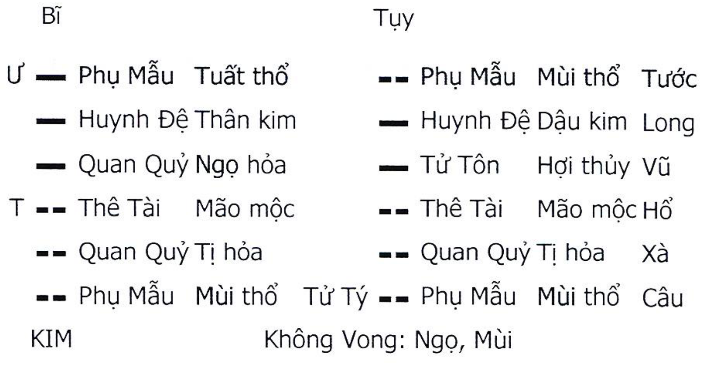
    - **Hình này chứng minh điều gì**
      - Quẻ chứng minh tình trạng phong thủy và ảnh hưởng cát hung tương ứng với quái tượng Sơ đồ quẻ Thiên Địa Bĩ biến Trạch Địa Tụy.
    - **Từ đâu mà thấy được**
      - KIM Không Vong: Ngọ, Mùi Quẻ này hào 6 Phụ Mẫu Tuất thổ lâm Chu Tước động, có thể mặc kệ hào Thế, hình cũng không cần xem, bởi vì là một hào độc phát, hào này có liên quan rất lớn đến chuyện muốn hỏi.
- **Diễn tiến phân tích và suy luận chi tiết:**
  - **Ví dụ 8:** Đây là ví dụ của một học viên đã hỏi ở năm 2007.
  - Tôi đã ghi lại phương pháp phán đoán và phản hồi lúc đó như sau.
  - Ngày Mậu Tý tháng Thìn năm Đinh Hợi, nữ hơn 40 tuổi hỏi nguyên nhân khiến nhà cha mẹ bất an, được Thiên Địa Bĩ biến Trạch Địa Tụy.
  - KIM Không Vong: Ngọ, Mùi
  - Quẻ này hào 6 Phụ Mẫu Tuất thổ lâm Chu Tước động, có thể mặc kệ hào Thế, hình cũng không cần xem, bởi vì là một hào độc phát, hào này có liên quan rất lớn đến chuyện muốn hỏi.
  - Hào 6 Tuất thổ động mà hóa thoái, lâm Nguyệt phá, hóa Không.
  - Tuất là hỏa khố, hỏa là Quan Quỷ, Quan Quỷ là người chết, Mộ khố có thể là phần mộ, hơn nữa hào 6 cũng có thể là mộ tổ, thoái chủ sụt lún, phá vỡ.
  - Thổ hóa thoái là tượng sụt lún, Không cũng là hố.
  - (Phản hồi: Quả là mộ tổ bị thấp xuống.)
  - Cũng có thể thủ tượng khác.
  - Phụ Mẫu lâm Chu Tước, thể hiện thần phật, tại cung Càn, Càn là đầu, lại là hào 6, chủ thế giới tâm linh.
  - Có thể có tượng phật đã bị xé rách, là tượng giấy, Chu Tước chủ giấy.
  - Nếu gặp kim thì chủ kim loại.
  - (Phản hồi: Đã từng cúng hồ tiên¹.)
  - Phụ Mẫu động mà hợp hào Thế, Phụ Mẫu và Chu Tước đều chủ tin tức, chứng tỏ có thông tin gọi điện thoại.
  - Bởi vì hào 6 là bầu trời, là cuộc gọi trong không gian, vì vậy hào 6
  - ¹ Hồ ly tu luyện thành tiên.
  - cũng có thể là điện thoại, nhận được điện thoại chửi cô ấy.
  - Khi phán đoán có thể dùng cả hai dữ kiện, hoặc cũng có thể chỉ dùng một dữ kiện.
  - Thông thường, khi dự đoán phong thủy mà hỏi chuyện trong nhà, nhất định phải nắm bắt được ý niệm của đối phương, đoán quẻ thì có thể đoán tùy ý, mục đích là để mở rộng tư duy, nhưng sự việc người ta muốn hỏi thì phải nắm được.
  - Phá cũng có thể nhập Mộ, cũng có thể hóa thoái, hóa Không.
  - Tổ hợp này cũng có thể nói mộ tổ không còn nữa, mấu chốt là nắm bắt có chừng có mực.
  - Cũng có thể đoán hào Thế lâm Bạch Hổ, Nhật đến hình, chứng tỏ tức giận, hình chủ đau khổ.
  - Hỏi: Hào sơ Không, Tử Tôn phục tàng chủ cái gì?
  - Đáp: Cái này cũng có thông tin nhất định, nhưng phải tập trung vào hào độc phát, những thông tin khác không quan trọng.
  - Hào sơ Mùi là Tài khố, cũng chủ giếng, có thể nói có giếng nước, còn nước nhưng không nhiều.
  - Có độc phát thì trước tiên xem độc phát, những hào khác có thể không xem.
  - Chẳng những phải học một cái tư duy, mà còn phải học cả kỹ xảo xem quẻ.
  - Hỏi: Quẻ này có thể hóa giải không?
  - Đáp: Có thể.
  - Mão và Tuất hợp thì bất phá, cũng không thoái.
  - Hợp là kéo giữ.
  - Mão lâm Bạch Hổ, Tài chủ thực vật, cành cây, có chữ Mão (卯).
  - Hóa giải, nếu sức khỏe của cha mẹ không tốt thì có thể sửa chữa trong nhà, nhưng đây là mộ tổ, chủ yếu vấn đề tại phần mộ.
  - Quẻ này cũng có thể dùng để đoán bệnh, Càn là cha, bản thân trí nhớ không tốt, cha mẹ trí nhớ không tốt.
  - Hỏi: Hôn nhân có tốt không?
  - Đáp: Không chắc, phải xem những thứ liên quan mật thiết đến vấn đề, bởi vì hào Quan còn thể hiện công việc nữa.

#### Ví dụ 9: Ngày Quý Tị tháng Ất Hợi năm Giáp Thân, nam đoán dời mộ cho người ta, được Trạ...

- **Bối cảnh và thông tin quẻ:**
  - Ngày Quý Tị tháng Ất Hợi năm Giáp Thân, nam đoán dời mộ cho người ta, được Trạch Sơn Hàm biến Trạch Phong Đại Quá.
  - KIM Không Vong: Ngọ, Mùi
- **Luận giải quái tượng phong thủy:**
  - **Hình 152.** Sơ đồ quẻ Trạch Sơn Hàm biến Trạch Phong Đại Quá
    - 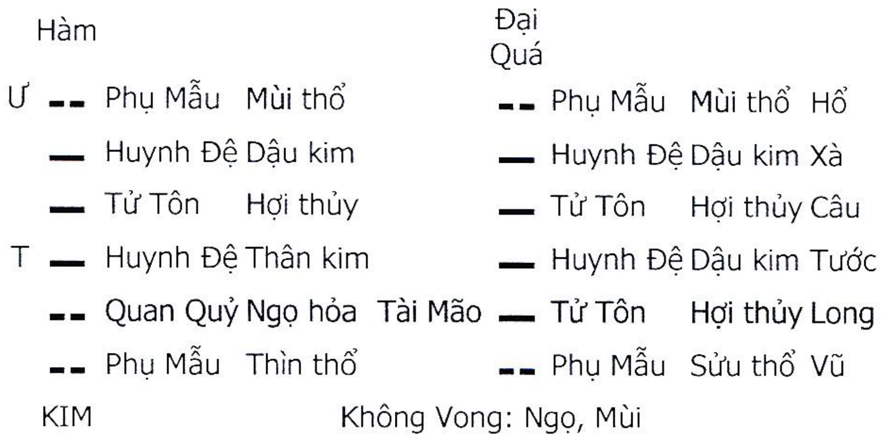
    - **Hình này chứng minh điều gì**
      - Hào Ứng là người ủy thác, hào Thế là mình, Phụ Mẫu là phần mộ. Hào Thế lâm Chu Tước, Quan Quỷ độc phát đến khắc, dời mộ ắt có kiện tụng, cãi cọ.
    - **Từ đâu mà thấy được**
      - Hào Ứng là người ủy thác, hào Thế là mình, Phụ Mẫu là phần mộ. Hào Thế lâm Chu Tước, Quan Quỷ độc phát đến khắc, dời mộ ắt có kiện tụng, cãi cọ.
- **Diễn tiến phân tích và suy luận chi tiết:**
  - Hào Ứng là người ủy thác, hào Thế là mình, Phụ Mẫu là phần mộ.
  - Hào Thế lâm Chu Tước, Quan Quỷ độc phát đến khắc, dời mộ ắt có kiện tụng, cãi cọ.
  - Nhưng Quan Quỷ Không Vong hóa Tuyệt, kiện tụng sẽ không tạo thành thương hại.
  - Hào Ứng lâm Bạch Hổ tại hào 6, Nguyên thần Không Vong hóa Tuyệt, hào 6 là bệnh viện, Bạch Hổ chủ bệnh tật, quẻ tại cung Đoài chủ dạ dày.
  - Vì vậy dời mộ không cát.
- **Kết quả ứng nghiệm thực tế:**
  - Trên thực tế, bởi vì yêu cầu của người ủy thác quá khắt khe cho nên đã xảy ra kiện tụng, họ đã nhờ luật sư điều đình giải quyết.
  - Không lâu sau thì người ủy thác nhập viện vì xuất huyết dạ dày.

#### Ví dụ 10: Ngày Tân Tị tháng Ất Mão năm Mậu Tý, nam đoán phong thủy mộ tổ, được Hỏa Địa ...

- **Bối cảnh và thông tin quẻ:**
  - Ngày Tân Tị tháng Ất Mão năm Mậu Tý, nam đoán phong thủy mộ tổ, được Hỏa Địa Tấn.
  - KIM Không Vong: Thân, Dậu
  - Quẻ tại cung Càn, Càn chủ cao to, nghĩa trang tại nơi tương đối cao.
  - (Phản hồi: Đúng.)
  - Phụ Mẫu lưỡng hiện, hào 5 Phụ Mẫu Mùi thổ lâm Câu Trần, gần hào Thế, là mộ tổ của nhà mình.
  - Hào 5 là đường, mộ tổ nằm sát bên đường.
  - (Phản hồi: Đúng.)
  - Một Phụ Mẫu khác là Mùi thổ lâm hào Ứng, Ứng là người khác, Phụ Mẫu là phần mộ, hào sơ là lân cận, lân cận còn có phần mộ của gia đình người ta.
  - (Phản hồi: Đúng.
  - Nhưng không biết là của nhà ai.)
  - Tý thủy phục tàng, lân cận không có minh thủy.
  - (Phản hồi: Vùng này khô hạn, căn bản là không có nước.
  - Ngay cả nước để ăn cũng là vấn đề.)
  - Hào Thế bị Nguyệt Mão mộc xung phá, phần mộ hình như bị rễ cây làm hại.
  - (Phản hồi: Xung quanh không có cây.) Thông qua ngẫm nghĩ, Nguyệt kiến nhập quẻ, lâm Thanh Long, Thanh Long là ẩm thực, Mão mộc này chính là hoa màu, bèn đoán lại là mộ ở trong đất ruộng.
  - (Phản hồi: Đúng.)
  - Hào Thế lâm Chu Tước, Quan Quỷ vượng tướng, mộ này lợi cho văn, xuất sinh viên đại học.
  - (Phản hồi: Đúng, bản thân chính là một sinh viên đại học.)
  - Hào 5 Phụ Mẫu Mùi thổ là Mộ khố Thê Tài, hào 5 là gia trưởng, Thê Tài vượng tướng, phụ mẫu trưởng bối có tiền
- **Luận giải quái tượng phong thủy:**
  - **Hình 153.** Sơ đồ quẻ Hỏa Địa Tấn
    - 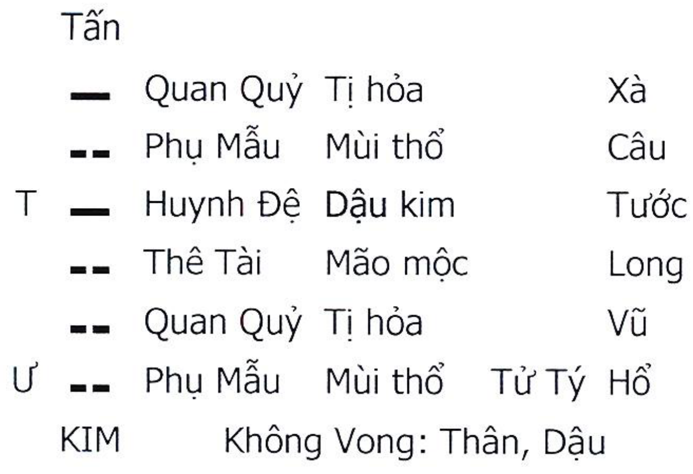
    - **Hình này chứng minh điều gì**
      - **Ví dụ 10:** Ngày Tân Tị tháng Ất Mão năm Mậu Tý, nam đoán phong thủy mộ tổ, được Hỏa Địa Tấn. Quẻ tại cung Càn, Càn chủ cao to, nghĩa trang tại nơi tương đối cao.
    - **Từ đâu mà thấy được**
      - KIM Không Vong: Thân, Dậu Phụ Mẫu lưỡng hiện, hào 5 Phụ Mẫu Mùi thổ lâm Câu Trần, gần hào Thế, là mộ tổ của nhà mình.
- **Diễn tiến phân tích và suy luận chi tiết:**
  - **Ví dụ 10:** Ngày Tân Tị tháng Ất Mão năm Mậu Tý, nam đoán phong thủy mộ tổ, được Hỏa Địa Tấn.
  - KIM Không Vong: Thân, Dậu
  - Quẻ tại cung Càn, Càn chủ cao to, nghĩa trang tại nơi tương đối cao.
  - (Phản hồi: Đúng.)
  - Phụ Mẫu lưỡng hiện, hào 5 Phụ Mẫu Mùi thổ lâm Câu Trần, gần hào Thế, là mộ tổ của nhà mình.
  - Hào 5 là đường, mộ tổ nằm sát bên đường.
  - (Phản hồi: Đúng.)
  - Một Phụ Mẫu khác là Mùi thổ lâm hào Ứng, Ứng là người khác, Phụ Mẫu là phần mộ, hào sơ là lân cận, lân cận còn có phần mộ của gia đình người ta.
  - (Phản hồi: Đúng.
  - Nhưng không biết là của nhà ai.)
  - Tý thủy phục tàng, lân cận không có minh thủy.
  - (Phản hồi: Vùng này khô hạn, căn bản là không có nước.
  - Ngay cả nước để ăn cũng là vấn đề.)
  - Hào Thế bị Nguyệt Mão mộc xung phá, phần mộ hình như bị rễ cây làm hại.
  - (Phản hồi: Xung quanh không có cây.) Thông qua ngẫm nghĩ, Nguyệt kiến nhập quẻ, lâm Thanh Long, Thanh Long là ẩm thực, Mão mộc này chính là hoa màu, bèn đoán lại là mộ ở trong đất ruộng.
  - (Phản hồi: Đúng.)
  - Hào Thế lâm Chu Tước, Quan Quỷ vượng tướng, mộ này lợi cho văn, xuất sinh viên đại học.
  - (Phản hồi: Đúng, bản thân chính là một sinh viên đại học.)
  - Hào 5 Phụ Mẫu Mùi thổ là Mộ khố Thê Tài, hào 5 là gia trưởng, Thê Tài vượng tướng, phụ mẫu trưởng bối có tiền

#### Ví dụ 12: Ngày Mậu Tý tháng Nhâm Dần năm Đinh Hợi, nam đoán phong thủy mộ tổ, được Lôi ...

- **Bối cảnh và thông tin quẻ:**
  - Ngày Mậu Tý tháng Nhâm Dần năm Đinh Hợi, nam đoán phong thủy mộ tổ, được Lôi Thủy Giải biến Địa Thủy Sư.
  - MỘC Không Vong: Ngọ, Mùi
  - Tử Tôn Ngọ hỏa độc phát sinh hào Thế, phong thủy mộ tổ chủ cát.
  - Nhưng khuyết điểm là Tử Tôn Ngọ hỏa Không Vong.
  - Tý thủy không hiện trên quẻ, lân cận mộ tổ không có nước, Nhật cùng xuất, Nhật Nguyệt là phương xa, phương xa có nước.
  - (Nghiệm).
  - Tý thủy xung thực Ngọ hỏa, mộ tổ được thủy mà chuyển cát.
  - Xung thực Tử Tôn sinh Tài, chủ tài vận rất tốt.
  - Hào Thế là huyệt, bị Nguyệt khắc hưu tù, lâm Đằng Xà, chủ thon dài, xung quanh mộ không rộng rãi, là hẹp dài.
- **Luận giải quái tượng phong thủy:**
  - **Hình 154.** Quẻ Lôi Thủy Giải biến Địa Thủy Sư
    - 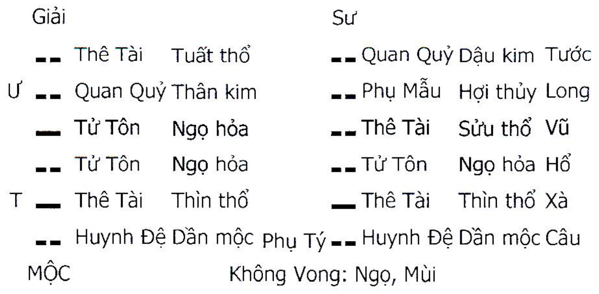
    - **Hình này chứng minh điều gì**
      - Quẻ chứng minh tình trạng phong thủy và ảnh hưởng cát hung tương ứng với quái tượng Quẻ Lôi Thủy Giải biến Địa Thủy Sư.
    - **Từ đâu mà thấy được**
      - Căn cứ vào hào vị, lục thân, can chi sinh khắc, tuần không và hào động biến trong quẻ.
- **Kết quả ứng nghiệm thực tế:**
  - Đúng, là một dải dài, Nam Bắc dài, Đông Tây hẹp.
  - Quan Quỷ Thân kim lâm hào Ứng.
  - Ứng là đối diện, án sơn.
  - Tại hào 5 Nguyệt phá, hào 5 là chức tước, Nguyệt phá chủ tán loạn, bất lợi cho quan vận.
  - Lâm Thanh Long tuy tốt nhưng chỉ chủ văn mà thôi, không xuất người có chức vụ lớn.
  - **Phản hồi:** Đúng, thế hệ ông nội trở lên đều là nông dân, cha đi học nhưng quan vận không quá lý tưởng, bản thân tôi cũng không có quan vận.
  - Các thầy phong thủy xem mộ đều nói là nơi này xuất văn nhân, đời sau có tiền của.
  - của.
  - Hào Thế bị Tài xung phá, tài vận hiện nay của bản thân không tốt.
  - (Phản hồi: Đúng.)
  - Huynh Đệ gặp xung, quẻ du hồn, Tử Tôn phục tàng, đời sau có tình trạng nhận con thừa tự hoặc đi tha hương.

#### Ví dụ 11: Ngày Mậu Thìn tháng Đinh Tị năm Mậu Tý, nam hỏi bệnh của cháu gái có phải là ...

- **Bối cảnh và thông tin quẻ:**
  - Ngày Mậu Thìn tháng Đinh Tị năm Mậu Tý, nam hỏi bệnh của cháu gái có phải là do ảnh hưởng của phong thủy mộ tổ hay không?
  - Được Trạch Thủy Khốn biến Khảm Vi Thủy.
  - KIM Không Vong: Tuất, Hợi
- **Luận giải quái tượng phong thủy:**
  - **Hình 155.** Quẻ Trạch Thủy Khốn biến Khảm Vi Thủy
    - 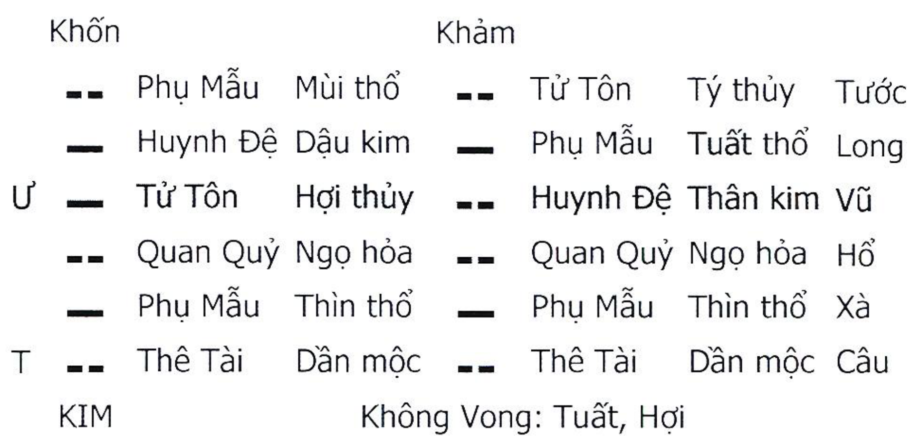
    - **Hình này chứng minh điều gì**
      - Tử Tôn Hợi thủy Nguyệt phá nhập Mộ, Không mà không được hồi đầu sinh, phong thủy mộ tổ nhất định có vấn đề, ảnh hưởng đến sức khỏe của cháu gái. Tử Tôn là thủy Không Phá, không được kim đến sinh, t...
    - **Từ đâu mà thấy được**
      - Lấy Tử Tôn làm Dụng thần. Tử Tôn Hợi thủy Nguyệt phá nhập Mộ, Không mà không được hồi đầu sinh, phong thủy mộ tổ nhất định có vấn đề, ảnh hưởng đến sức khỏe của cháu gái.
- **Diễn tiến phân tích và suy luận chi tiết:**
  - Lấy Tử Tôn làm Dụng thần.
  - Tử Tôn Hợi thủy Nguyệt phá nhập Mộ, Không mà không được hồi đầu sinh, phong thủy mộ tổ nhất định có vấn đề, ảnh hưởng đến sức khỏe của cháu gái.
  - Tử Tôn là thủy Không Phá, không được kim đến sinh, thủy chủ máu, kim là tạo máu, vì vậy là suy giảm chức năng tạo máu, máu đã xảy ra vấn đề.
  - Thủy được kim sinh là sông ngòi, nhưng Không Phá nhập Mộ, chứng tỏ sông ngòi đã khô cạn, không có nước.
  - Lục hợp biến lục xung, phong thủy ban đầu rất tốt, hiện nay đã trở nên xấu, Hợi thủy tương ứng tại năm Hợi, là năm then chốt.
  - Xa là năm Ất Hợi, gần là năm Đinh Hợi.
- **Kết quả ứng nghiệm thực tế:**
  - Trên thực tế, phong thủy ban đầu của phần mộ rất tốt, mọi chuyện đều thuận lợi, năm Ất Hợi chuyển dời mộ tổ, phía Đông có con sông đã khô cạn.
  - Năm Đinh Hợi, cháu gái đã bị bệnh tiểu cầu bất thường.
  - Huynh Đệ Dần mộc gần hào Thế, được Nguyệt trợ giúp Nhật sinh là vượng tướng chủ cây to, nhưng Ngọ hỏa Tử địa độc phát, có cây cũng không giữ được.
  - **Phản hồi:** Nghe nói trước đây trong nghĩa trang có một cây liễu lớn nhất thôn, nó đã bị đào mất trong đại cải tổ văn hóa.
  - Hào 5 là đường, Nguyệt phá, lại bị Ngọ hỏa lâm Huyền Vũ đến khắc, Huyền Vũ chủ nước, vì vậy đường đi đã từng bị nước mưa hủy hoại.
  - **Phản hồi:** Đúng, con đường ở phía Tây thường bị xói mòn, là con đường đất nhỏ, hiện nay đã bị xói thành bờ dốc.

#### Ví dụ 13: Ngày Ất Hợi tháng Giáp Dần năm Quý Mùi, nam đoán phong thủy mộ tổ, được Càn V...

- **Bối cảnh và thông tin quẻ:**
  - Ngày Ất Hợi tháng Giáp Dần năm Quý Mùi, nam đoán phong thủy mộ tổ, được Càn Vi Thiên.
  - KIM Không Vong: Thân, Dậu
- **Luận giải quái tượng phong thủy:**
  - **Hình 156.** Sơ đồ quẻ Càn Vi Thiên
    - 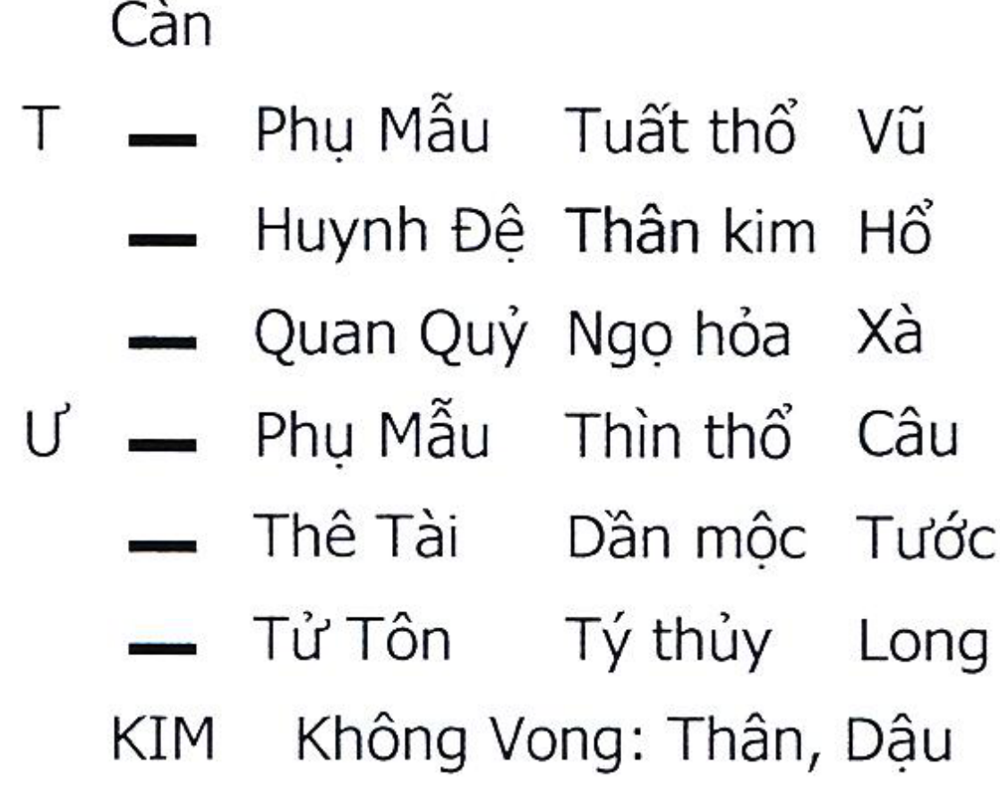
    - **Hình này chứng minh điều gì**
      - Hào 6 là hào vị thoái hưu, Phụ Mẫu lâm hào 6, biểu thị một nơi trong đó đã dự định không di dời. Hào 5 Huynh Đệ Thân kim lâm Bạch Hổ gặp Không vong, hào 5 là đường đi, Không Vong thì trở thành cầu,...
    - **Từ đâu mà thấy được**
      - Hào 6 là hào vị thoái hưu, Phụ Mẫu lâm hào 6, biểu thị một nơi trong đó đã dự định không di dời. Phụ Mẫu Thìn thổ lâm Ứng, Ứng là tha nhân, một ngôi mộ khác được xây ở nghĩa trang của người ta.
- **Diễn tiến phân tích và suy luận chi tiết:**
  - Phụ Mẫu là mộ, Phụ Mẫu lưỡng hiện, mộ ở hai nơi.
  - Hào 6 là hào vị thoái hưu, Phụ Mẫu lâm hào 6, biểu thị một nơi trong đó đã dự định không di dời.
  - Phụ Mẫu Thìn thổ lâm Ứng, Ứng là tha nhân, một ngôi mộ khác được xây ở nghĩa trang của người ta.
  - Hào 5 Huynh Đệ Thân kim lâm Bạch Hổ gặp Không vong, hào 5 là đường đi, Không Vong thì trở thành cầu, Nguyệt phá là cầu có hư hại, Trường Sinh Phụ Mẫu, chứng tỏ đến hai nơi mộ đều đi qua cầu.
  - Thê Tài Dần mộc được Nguyệt trợ giúp và Nhật đến sinh là vượng tướng, tài vận khá tốt.
  - Quan Quỷ được Nguyệt đến
  - sinh, Quan Quỷ sinh hào Thế, hào Thế lại là Mộ khố Quan Quỷ, quan vận của bản thân cũng tốt đẹp.
  - Hào 2 Thê Tài là mộc, vượng tướng, lân cận có cây, lâm Chu Tước, cũng có hoa dại, đều lợi cho tài vận.
- **Kết quả ứng nghiệm thực tế:**
  - Tình hình thực tế đúng là như vậy.

#### Ví dụ 14: Ngày Đinh Dậu tháng Tân Mão năm Tân Tị, nam đoán mộ tổ, được Địa Thủy Sư biến...

- **Bối cảnh và thông tin quẻ:**
  - Ngày Đinh Dậu tháng Tân Mão năm Tân Tị, nam đoán mộ tổ, được Địa Thủy Sư biến Khảm Vi Thủy.
  - THỦY Không Vong: Thìn, Tị
  - Hào Thế là tọa sơn, quẻ hóa lục xung cho nên đoán hướng ngược lại, hào Thế Ngọ hỏa là tọa Bắc hướng về Nam.
  - Hào 5 Huynh Đệ Hợi thủy độc phát, hào Thế gặp Tuyệt, tọa sơn không có chỗ dựa, Tuyệt địa tại quẻ Khôn, Khôn là đất bằng phẳng, cách xa núi.
  - Thê Tài bị khắc, bất lợi cho tài.
- **Luận giải quái tượng phong thủy:**
  - **Hình 157.** Sơ đồ quẻ Địa Thủy Sư biến Khảm Vi Thủy
    - 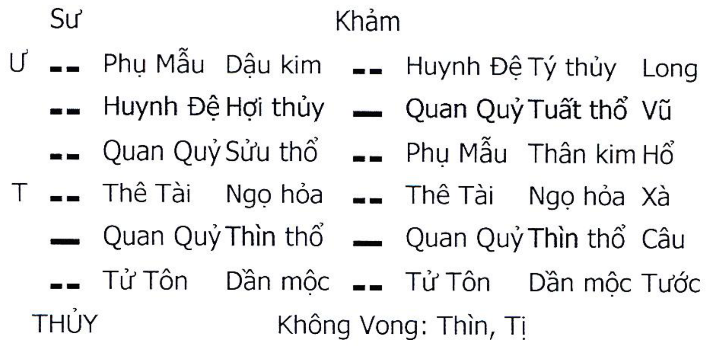
    - **Hình này chứng minh điều gì**
      - Quẻ chứng minh tình trạng phong thủy và ảnh hưởng cát hung tương ứng với quái tượng Sơ đồ quẻ Địa Thủy Sư biến Khảm Vi Thủy.
    - **Từ đâu mà thấy được**
      - Căn cứ vào hào vị, lục thân, can chi sinh khắc, tuần không và hào động biến trong quẻ.
- **Kết quả ứng nghiệm thực tế:**
  - Đúng, phần mộ không kháo sơn (tựa vào núi), ở phía xa mới có núi, hiện nay tài vận không tốt.
  - Phụ Mẫu là mộ, lâm hào Ứng, Ứng là người khác, phần mộ được xây dựng ở trong nghĩa trang của gia đình người ta.
  - **Phản hồi:** Được táng ở trong nghĩa trang nhà chú.
  - Phần mộ Dậu kim bị Nguyệt xung, mộ đã di chuyển.
  - Nhật Thực Phá, lâm Thanh Long chủ quý, ban đầu không xuất văn nhân, sau khi dời mộ thì đã có chuyển biến tốt đẹp.
  - **Phản hồi:** Lúc trước chẳng có ai thi đậu đại học, sau khi dời mộ đã có người thi đậu.
  - Quan Quỷ là hài cốt, Thìn thổ Không Vong hợp hào Phụ Mẫu, hài cốt trong mộ không toàn vẹn.
  - **Phản hồi:** Việc này không rõ.
  - Phần mộ có ảnh hưởng đến mẹ tôi hay không?
  - Phụ Mẫu Dậu kim tại hào 6 Nguyệt phá, Huynh Đệ Hợi thủy độc phát là Bệnh địa, hào 6 là đầu, cung Khảm là thủy, là máu, thủy cũng chủ máu, biểu thị cao huyết áp.
  - Nguyên
  - thần Thìn thổ hào 2 Không Vong, Thìn thổ là thủy khố, Thìn thổ là cơ quan chứa nước tiểu, phán đoán là tiểu đường.
  - **Phản hồi:** Đúng.
  - Mẹ tôi có bệnh cao huyết áp và tiểu đường.
  - Nguyệt Tử Tôn là đường đi, xung phá Phụ Mẫu Dậu kim, có đường xung mộ.
  - **Phản hồi:** Đúng.

#### Ví dụ 15: Ngày Nhâm Thìn tháng Đinh Tị năm Quý Mùi, nam đoán mộ tổ, được Trạch Địa Tụy ...

- **Bối cảnh và thông tin quẻ:**
  - Ngày Nhâm Thìn tháng Đinh Tị năm Quý Mùi, nam đoán mộ tổ, được Trạch Địa Tụy biến Phong Thủy Hoán.
  - KIM Không Vong: Ngọ, Mùi
  - Phụ Mẫu lưỡng hiện, lấy hào Phụ Mẫu Mùi thổ phát động làm Dụng thần.
  - Phụ Mẫu Mùi thổ tại hào 6 phát động, hào 6 là chỗ cao, mộ tại chỗ cao.
  - Phụ Mẫu Mùi thổ Không Vong, trên mộ có lỗ.
- **Luận giải quái tượng phong thủy:**
  - **Hình 158.** Quẻ Trạch Địa Tụy biến Phong Thủy Hoán
    - 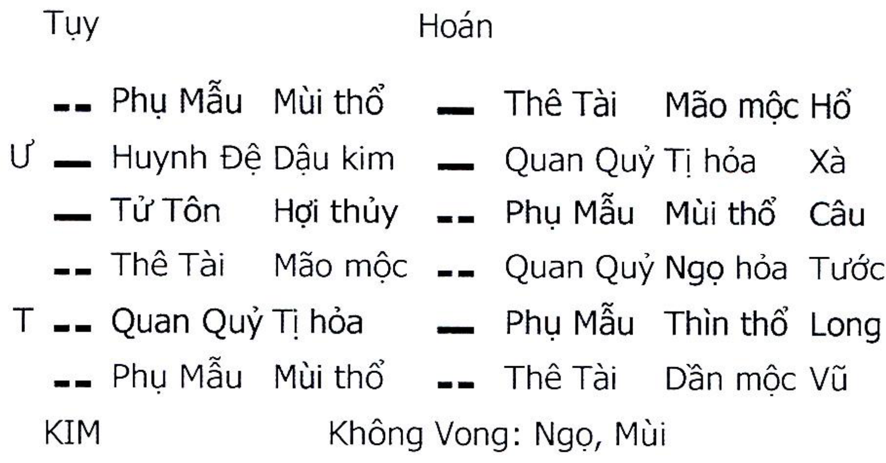
    - **Hình này chứng minh điều gì**
      - Quẻ chứng minh tình trạng phong thủy và ảnh hưởng cát hung tương ứng với quái tượng Quẻ Trạch Địa Tụy biến Phong Thủy Hoán.
    - **Từ đâu mà thấy được**
      - Căn cứ vào hào vị, lục thân, can chi sinh khắc, tuần không và hào động biến trong quẻ.
- **Kết quả ứng nghiệm thực tế:**
  - Mộ ở chỗ cao, trên mộ có lỗ.
  - Phần mộ phát động, lâm Bạch Hổ chủ phát tang, mộ đã được cải táng.
  - Động mà gặp hợp, cải táng vào năm Ngọ.
  - **Phản hồi:** Đã cải táng ở năm 1978.
  - Tử Tôn Nguyệt phá, hóa hồi đầu khắc, nhập Mộ tại Nhật, mộ bất lợi cho con cái.
  - Tử Tôn lâm Câu Trần nhập Mộ, sợ rằng có tai họa lao ngục.
  - Tử Tôn là Hợi thủy, nếu con cái sinh năm Hợi thì càng xấu.
  - **Phản hồi:** Con trai tôi đúng là tuổi Hợi.
  - Sinh năm 1983.
  - Hiện nay, mặc dù nó hơi cứng đầu nhưng cũng chưa làm điều gì quá đáng, thật sự nghiêm trọng như vậy ư?
  - Tử Tôn phát động hóa Phụ Mẫu Mùi thổ, lâm Câu Trần chủ kiến trúc, xây dựng, Phụ Mẫu là nhà, vì vậy lân cận nhất định có công xưởng hoặc vật kiến trúc mới xây.
  - **Phản hồi:** Hiện nay đang xây công xưởng.
  - Quan Quỷ Tị hỏa trì Thế được Nguyệt trợ giúp là vượng tướng, lâm Thanh Long chủ quý, nhưng mộ này có lợi cho quan vận của anh.
  - Tử Tôn động đến khắc Quan Quỷ, gặp năm Dần hợp trú Tử Tôn, Dần lại sinh Quan Quỷ, những năm Dần sẽ được thăng chức.
  - Chẳng hạn như năm 1974, năm 1986, năm 1998,...
  - **Phản hồi:** Đúng.
  - Lần đầu tiên tôi được thăng chức chính là năm 1974.
  - Năm 1986, mặc dù không được thăng nhưng cũng khá tốt, năm 1998 lại được thăng.

#### Ví dụ 16: Ngày Giáp Tý tháng Bính Thìn năm Quý Mùi, nam xem phần mộ đã mua cho mẹ (chưa...

- **Bối cảnh và thông tin quẻ:**
  - Ngày Giáp Tý tháng Bính Thìn năm Quý Mùi, nam xem phần mộ đã mua cho mẹ (chưa tạ thế), được Trạch Sơn Hàm.
  - KIM Không Vong: Tuất, Hợi
- **Luận giải quái tượng phong thủy:**
  - **Hình 159.** Sơ đồ quẻ Trạch Sơn Hàm
    - 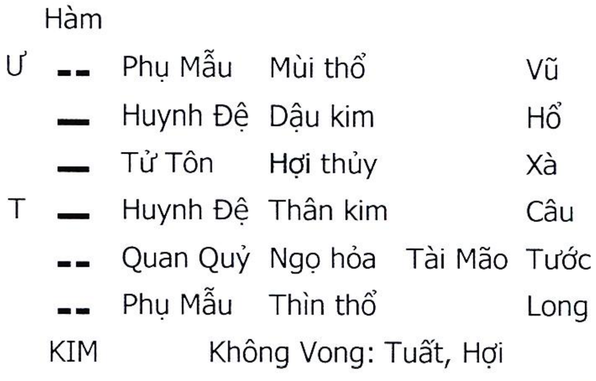
    - **Hình này chứng minh điều gì**
      - Phụ Mẫu lưỡng hiện, lấy Phụ Mẫu lâm Ứng làm Dụng thần, hào còn lại dùng để tham khảo. Dụng thần sinh hào Thế, cát lợi cho bản thân.
    - **Từ đâu mà thấy được**
      - Phụ Mẫu là Dụng thần. Phụ Mẫu lưỡng hiện, lấy Phụ Mẫu lâm Ứng làm Dụng thần, hào còn lại dùng để tham khảo.
- **Diễn tiến phân tích và suy luận chi tiết:**
  - Phụ Mẫu là Dụng thần.
  - Phụ Mẫu lưỡng hiện, lấy Phụ Mẫu lâm Ứng làm Dụng thần, hào còn lại dùng để tham khảo.
  - Phụ Mẫu Mùi thổ tương ứng với Tây Nam, mộ tại Tây Nam.
  - Dụng thần sinh hào Thế, cát lợi cho bản thân.
  - Phụ Mẫu Thìn thổ tương ứng với Đông Nam, ngoài ra còn có một ngôi mộ tại Đông Nam.
  - Phụ Mẫu được Nguyệt trợ giúp vượng tướng, mộ tương đối rộng lớn.
  - Quan Quỷ ám động hợp Dụng thần.
  - Quan Quỷ thể hiện chính phủ, đất mộ thuộc sở hữu nhà nước.
  - Tử Tôn Hợi thủy Không Vong, hiện nay không có con cái.
  - Tử Tôn được Nhật trợ giúp, Phụ Mẫu an tĩnh, hào Thế vượng tướng có lực sinh Tử Tôn, sau này sẽ có con.
- **Kết quả ứng nghiệm thực tế:**
  - Tình hình thực tế đúng là như vậy.

#### Ví dụ 17: Ngày Tân Mùi tháng Hợi, nam hỏi phong thủy mộ tổ có ảnh hưởng đến quan vận ha...

- **Bối cảnh và thông tin quẻ:**
  - Ngày Tân Mùi tháng Hợi, nam hỏi phong thủy mộ tổ có ảnh hưởng đến quan vận hay không?
  - Được Phong Trạch Trung Phu biến Đoài Vi Trạch.
  - THỔ Không Vong: Tuất, Hợi
- **Luận giải quái tượng phong thủy:**
  - **Hình 160.** Sơ đồ quẻ Phong Trạch Trung Phu biến Đoài Vi Trạch
    - 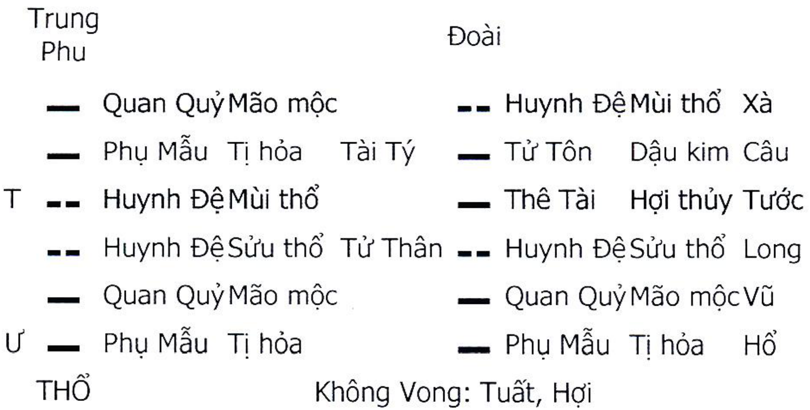
    - **Hình này chứng minh điều gì**
      - Quan Quỷ Mão mộc lưỡng hiện, lấy hào Quan Quỷ phát động làm Dụng thần. Quan Quỷ Mão mộc được Nguyệt sinh là vượng tướng, cùng hào Thế và hào biến của hào Thế tạo thành tam hợp cục là cát, mộ tổ lợi...
    - **Từ đâu mà thấy được**
      - Quan Quỷ Mão mộc lưỡng hiện, lấy hào Quan Quỷ phát động làm Dụng thần. Quan Quỷ Mão mộc được Nguyệt sinh là vượng tướng, cùng hào Thế và hào biến của hào Thế tạo thành tam hợp cục là cát, mộ tổ lợi...
- **Diễn tiến phân tích và suy luận chi tiết:**
  - Quan Quỷ Mão mộc lưỡng hiện, lấy hào Quan Quỷ phát động làm Dụng thần.
  - Quan Quỷ Mão mộc được Nguyệt sinh là vượng tướng, cùng hào Thế và hào biến của hào Thế tạo thành tam hợp cục là cát, mộ tổ lợi cho quan vận.
  - Tuy nhiên, hào Thế động hóa Hợi thủy Không Vong, vẫn chưa cát hoàn toàn.
  - Quan Quỷ Mão mộc lâm Đằng Xà, mộc chủ cây cối, Đằng Xà chủ thon dài cũng là thông tin cây cối.
  - Hào Thế Mùi thổ là Mộ khố của mộc, chính là hố cây, động hóa Không, chủ đất mộ có hố cây bỏ không.
  - Hợi thủy Không, Hợi là Tây Bắc, chủ tại Tây Bắc.
- **Kết quả ứng nghiệm thực tế:**
  - Quả nhiên ở phía Tây Bắc có hố cây bỏ không bởi vì cây đã chết.
  - Sau khi xử lý, người này được thăng chức ở tháng Sửu.

#### Ví dụ 18: Đây là một ví dụ ở năm 2011. Nữ chọn thời gian đặt tro cốt của cha vào huyệt ...

- **Bối cảnh và thông tin quẻ:**
  - Đây là một ví dụ ở năm 2011.
  - Nữ chọn thời gian đặt tro cốt của cha vào huyệt mộ.
  - Ở ngày Kỷ Mùi tháng Thân, được Lôi Sơn Tiểu Quá biến Khôn Vi Địa.
  - KIM Không Vong: Tý, Sửu
- **Luận giải quái tượng phong thủy:**
  - **Hình 161.** Sơ đồ quẻ Lôi Sơn Tiểu Quá biến Khôn Vi Địa
    - 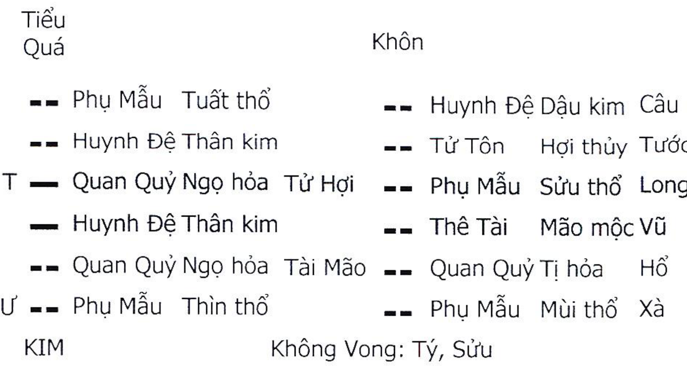
    - **Hình này chứng minh điều gì**
      - Hào Thế là huyệt, Nhật hợp là mộ hợp táng. Hào Thế Ngọ hỏa chủ tọa Nam hướng về Bắc, nhưng phát động hóa Không vong, xem ngược lại, chủ tọa Bắc hướng về Nam.
    - **Từ đâu mà thấy được**
      - Hào Thế là huyệt, Nhật hợp là mộ hợp táng. Hào Thế Ngọ hỏa chủ tọa Nam hướng về Bắc, nhưng phát động hóa Không vong, xem ngược lại, chủ tọa Bắc hướng về Nam.
- **Diễn tiến phân tích và suy luận chi tiết:**
  - Hào Thế là huyệt, Nhật hợp là mộ hợp táng.
  - Hào Thế Ngọ hỏa chủ tọa Nam hướng về Bắc, nhưng phát động hóa Không vong, xem ngược lại, chủ tọa Bắc hướng về Nam.
  - **Đáp:** Hướng Nam, chếch về Tây Nam một chút.
  - Hiện tại đã có để tro cốt của ông bà nội.
  - Hào Thế phát động hóa Phụ Mẫu Sửu thổ Không Vong, Nhật Xung Không, năm 09 xuất Không đã mở huyệt mộ rồi đóng lại.
  - **Đáp:** Năm 09 đã để tro cốt của bà nội vào.
  - Hào Thế hưu tù, hóa lục xung, mộ này không tụ khí.
  - Thanh Long Bạch Hổ đều giống nhau, không vượng tướng, chủ hộ sa thấp bé.
  - Nhất là bên Thanh Long, hóa thổ Không Vong, chủ bên trái có hố.
  - Hào Thế là người xin đoán, lâm Ngọ hỏa hóa Không vong, chủ nhịp tim không đều, tim cung máu không đủ.
  - Thanh Long lâm hào dương hóa Không Vong, Tử Tôn lại phục tàng, chủ không sinh con trai mà chỉ sinh con gái.
  - **Đáp:** Bên trái có cái mương nhỏ, có mưa thì tích nước.
  - Gia đình chúng tôi không có con trai.
  - Chỉ có một em gái, chồng tôi đến nhà ở rể.
  - Bản thân tôi đã sinh một con gái.
  - Thê Tài hưu tù phục tàng nhập Mộ, kinh tế eo hẹp.
  - Huynh Đệ lâm Huyền Vũ Chu Tước phát động hóa Thê Tài, tranh giành cãi cọ, cùng tiêu xài tiền bạc của ông cha.
  - Bởi vì Tài nhập Mộ tại Phụ Mẫu chủ tiền của cha mẹ.
  - **Đáp:** Thu nhập rất thấp, thậm chí xài tiền dự trữ của cha mẹ, vì điều này mà chị em bất hòa.
  - 11 giờ 17 phút ngày Nhâm Dần tháng Tuất (ngày 14 tháng 10) để vào là được.
  - Đây là lấy hào Thế Dần Ngọ Tuất tam hợp cục.
- **Kết quả ứng nghiệm thực tế:**
  - Mấy ngày nay trời luôn âm u, khi sắp để tro cốt vào thì đột nhiên bầu trời quang đãng, mặt trời từ trong mây hiện ra, ánh nắng chiếu đến cửa huyệt mộ, cha tôi là một người sợ lạnh, ánh nắng đã đến tiễn ông ấy một đoạn đường, xin cám ơn.
  - Dự báo thời tiết nói rõ trời lại có mưa, ngày này thật đẹp.
  - Hào biến của Nguyên thần về đến trong quẻ lâm hào 6, bị Nhật Nguyệt xung phá lâm Huyền Vũ, hào 6 là đầu, Huyền Vũ chủ chóng mặt, có hiện tượng chóng mặt, đau đầu.
  - Huynh Đệ là tay chân, hào 6 là tay, hào 3 là đùi, bị thủy khắc, tay chân bị lạnh.
  - **Đáp:** Những bệnh tật này đều có.
  - Huynh Đệ trì Thế, Thê Tài hưu tù Không Vong, chủ không tụ tài, xài tiền bừa bãi.
  - Quan Quỷ khắc hào Thế, công việc không thuận lợi, lại thêm vào Phụ Mẫu hóa phá, hôn nhân cũng không tốt đẹp.
  - **Đáp:** Có tiền là tiêu ngay, không có tiền để dành, 34 tuổi vẫn chưa kết hôn, công việc thì mãi không được trọng dụng.
  - **Hóa giải:** Đặt 9 viên đá ở phía Đông Nam nghĩa trang.
  - (Tôi đã quên cách suy luận lúc đó, có thể là Dậu kim là tròn, xuất Không, mà số 9 ứng Thân kim, Hợp Phá Tị hỏa, lại xung khai Dần mộc hợp Nhật sinh hào Thế.)
  - **Phản hồi:** Ngày 7 tháng 12 năm 2011 phản hồi: Sau khi đặt 9 viên đá ở phía Đông Nam nghĩa trang, ngày hôm sau tôi đã hết đau đầu, tay chân bắt đầu ấm lại, cơ thể đang bắt đầu phục hồi.
  - Điều ngạc nhiên là ngay cả bệnh hen suyễn của mẹ tôi cũng đã đỡ hơn.
  - Em gái chuẩn bị kết hôn, bản thân đã phát được một ít tài.
  - Em trai đã chuyển đến làm ở một công ty có tiếng.
  - Mặc dù công việc và hôn nhân của tôi vẫn chưa có thay đổi, nhưng tôi tin nhất định sau này sẽ có chuyển biến tốt.

#### Ví dụ 19: Đây là một ví dụ ở năm 2011. Nữ đoán âm trạch. Ở ngày Ất Hợi tháng Hợi, được ...

- **Bối cảnh và thông tin quẻ:**
  - Đây là một ví dụ ở năm 2011.
  - Nữ đoán âm trạch.
  - Ở ngày Ất Hợi tháng Hợi, được Hỏa Thủy Vị Tế biến Hỏa Trạch Khuê.
  - HỎA Không Vong: Thân, Dậu
- **Luận giải quái tượng phong thủy:**
  - **Hình 162.** Sơ đồ quẻ Hỏa Thủy Vị Tế biến Hỏa Trạch Khuê
    - 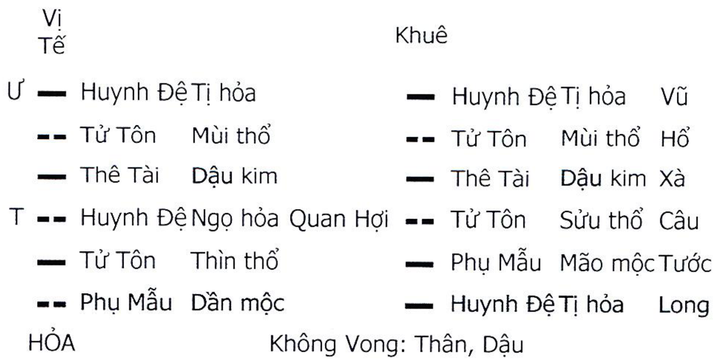
    - **Hình này chứng minh điều gì**
      - Quan Quỷ lâm Câu Trần phục tàng, Quan Quỷ chủ người chết, Câu Trần là cũ, phục tàng chủ không biết tên, chủ trong mộ chôn người đã nhiều đời, có một số tên người đã không còn được nhắc đến.
    - **Từ đâu mà thấy được**
      - Không có Dụng thần cụ thể, căn cứ vào những tổ hợp biến hóa trong quẻ để phán đoán. Phụ Mẫu là mộ, Nguyệt kiến sinh hợp Nhật lại hợp, Nguyệt kiến là lâu đời, Nhật là mới, vượng tướng là to lớn, mộ ...
- **Diễn tiến phân tích và suy luận chi tiết:**
  - Không có Dụng thần cụ thể, căn cứ vào những tổ hợp biến hóa trong quẻ để phán đoán.
  - Phụ Mẫu là mộ, Nguyệt kiến sinh hợp Nhật lại hợp, Nguyệt kiến là lâu đời, Nhật là mới, vượng tướng là to lớn, mộ này có kích thước lớn, có mộ cũ cũng có mộ mới.
  - Quan Quỷ lâm Câu Trần phục tàng, Quan Quỷ chủ người chết, Câu Trần là cũ, phục tàng chủ không biết tên, chủ trong mộ chôn người đã nhiều đời, có một số tên người đã không còn được nhắc đến.
  - **Đáp:** Mộ tổ của chúng tôi đã có 400 năm, cứ 20 năm tu sửa một lần, được duy trì liên tục cho đến bây giờ.
  - Hào sơ Phụ Mẫu phát động hóa ra Tị hỏa bị Nhật Nguyệt xung phá, chủ phần mộ có hư hại, vết nứt.
  - Lâm Thanh Long, Thanh Long là ẩm thực, chủ vật để đồ cúng, đàn tế,...
  - đã bị hư hại.
  - **Đáp:** Bàn để hoa và xi măng dưới bia đá có vết nứt.
  - Phụ Mẫu lâm Thanh Long phát động sinh hào Thế, bản thân vẫn có thể nhận được sự che chở của mộ tổ.
  - Tuy nhiên, hào Thế Nhật Nguyệt khắc, Phụ Mẫu hóa phá, hào sơ chủ lúc nhỏ, phải nói rằng từ nhỏ anh khá yếu.
  - **Đáp:** Lên 10 tuổi thì tôi bắt đầu có vấn đề về sức khỏe.

#### Ví dụ 20: Nam đoán trong mệnh có con trai hay không.

- **Bối cảnh và thông tin quẻ:**
  - Nam đoán trong mệnh có con trai hay không.
  - Ở ngày Quý Mùi tháng Mão năm Ất Mùi 2015, gieo được Thiên Địa Bĩ biến Trạch Địa Tụy.
  - KIM Không Vong: Thân, Dậu
- **Luận giải quái tượng phong thủy:**
  - **Hình 163.** Quẻ Thiên Địa Bĩ biến Trạch Địa Tụy
    - 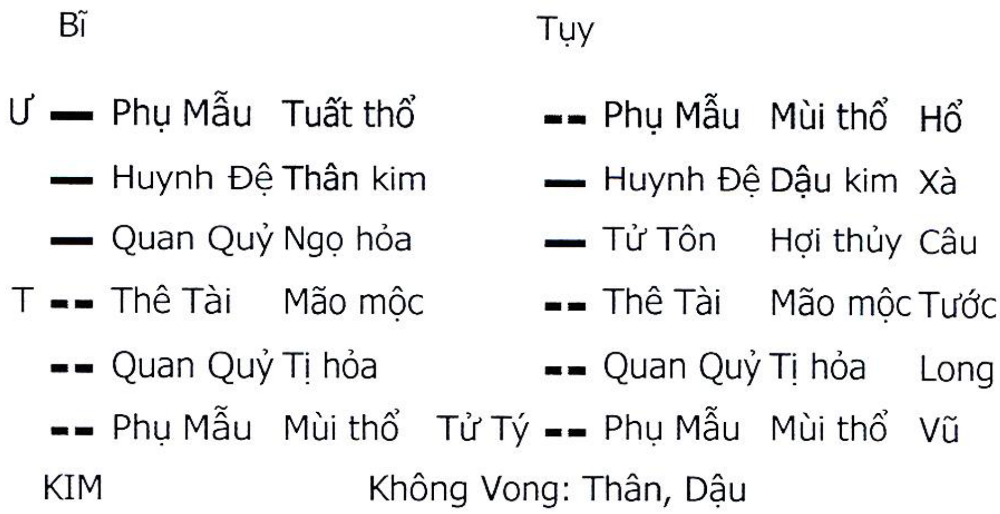
    - **Hình này chứng minh điều gì**
      - Quẻ chứng minh tình trạng phong thủy và ảnh hưởng cát hung tương ứng với quái tượng Quẻ Thiên Địa Bĩ biến Trạch Địa Tụy.
    - **Từ đâu mà thấy được**
      - Lấy Tử Tôn làm Dụng thần. Tử Tôn Tý thủy phục tàng, Nguyệt không trợ giúp, Nhật khắc Dụng thần, Nguyên thần Không Vong an tĩnh bất động, Kỵ thần độc phát, trong mệnh khó có con trai.
- **Diễn tiến phân tích và suy luận chi tiết:**
  - Lấy Tử Tôn làm Dụng thần.
  - Tử Tôn Tý thủy phục tàng, Nguyệt không trợ giúp, Nhật khắc Dụng thần, Nguyên thần Không Vong an tĩnh bất động, Kỵ thần độc phát, trong mệnh khó có con trai.
  - Xét từ góc độ Nhật Nguyệt thì Tử Tôn hưu tù đã có thể nói rõ vấn đề, nhưng tại sao Kỵ thần còn phải độc phát?
  - Hơn nữa là động mà hóa thoái?
  - Chắc chắn chủ nguyên nhân.
  - Hào 6 là tổ tiên, Tuất thổ là Mộ khố Quan Quỷ, Quan Quỷ là người chết, Mộ khố chính là phần mộ, lâm Bạch Hổ chủ tang, đó là mộ tổ.
  - Phụ Mẫu Tuất thổ hóa thoái, thổ hóa thoái là đất đai lún xuống, nhất định phía sau mộ có hố.
  - Thoái thần trị Thái Tuế, chắc chắn là hố rất rộng.
  - Tại sao là phía sau mộ, bởi vì Tử Tôn phục tàng dưới Mùi thổ bị khắc, Mùi thổ là Thoái thần nhập hào.
  - Lại lâm Huyền Vũ, Huyền Vũ chủ phía sau.
- **Kết quả ứng nghiệm thực tế:**
  - Do lò gạch lấy đất cho nên phía sau mộ có một cái hố rất lớn.
  - Sau khi hóa giải, anh ta đã sinh một con trai tại năm Đinh Dậu.
  - ---
  - # Part 16 (Pages 301-320)

#### Ví dụ 21: Nữ dự đoán phần mộ tổ tiên của chồng. Cách đây 40 năm, xương cốt của ông nội ...

- **Bối cảnh và thông tin quẻ:**
  - Nữ dự đoán phần mộ tổ tiên của chồng.
  - Cách đây 40 năm, xương cốt của ông nội đã được bà nội gửi vào trong chùa.
  - Tuy nhiên, gần đây ông nội thường xuyên báo mộng cho cô, nói rằng ông không muốn ở trong chùa mà muốn trở về phần mộ gia đình.
  - Cô ấy hỏi là sau khi đem xương cốt của ông nội về mộ thì tài vận của mình có bị ảnh hưởng hay không?
  - Ngày Bính Tuất tháng Hợi, được Khôn Vi Địa biến Hỏa Địa Tấn.
  - THỔ Không Vong: Ngọ, Mùi
  - Có vẻ như là dự đoán phần mộ, tuy nhiên bởi vì mục đích bất đồng, Dụng thần cũng bất đồng.
  - Cô ấy sợ ảnh hưởng đến tài vận, do đó lấy Thê Tài làm trung tâm.
  - Thê Tài được Nguyệt trợ giúp vượng tướng, lâm hào 5, hào Thế Thanh Long tạo thành tam hợp cục sinh Thê Tài, tài vận khá tốt, mang cốt về nhất định có lợi.
  - Chỉ là hào Thế hóa phá, hào 6 là phần mộ tổ tiên, Phụ Mẫu cũng là phần mộ, nghĩa trang đã tan hoang, bị thủy xung phá, trong mộ đã vào nước, phải tu bổ lại mộ thì vận khí của bản thân mới tốt đẹp, nếu không thì chưa thể tốt hoàn toàn.
  - Hào Ứng là Nguyên thần của phần mộ, vượng tướng lâm mộc Đằng Xà, nghĩa trang có cỏ dại rậm rạp, bị Nhật hợp trú, không có ai dọn dẹp.
  - Nhật đồng thời là Mộ khố Phụ Mẫu, Phụ Mẫu nhập Mộ, phần mộ đã bị che phủ, lâm Câu Trần là gò đất, đã không thể nhìn thấy phần mộ trong nghĩa trang.
  - Thực tế đúng là như vậy.
  - Bốn mươi năm nay, kể từ khi chuyển cốt vào chùa thì chẳng có ai dọn dẹp mộ.
  - Đến khi dự định chuyển cốt về, chúng tôi đã ra nghĩa trang kiểm tra thì thấy cỏ dại um tùm, phải mất rất nhiều công sức mới tìm được phần mộ.
  - Phần mộ đã bị sụt lún, bên trong đã ngập nước mưa.
- **Luận giải quái tượng phong thủy:**
  - **Hình 164.** Quẻ Khôn Vi Địa biến Hỏa Địa Tấn
    - 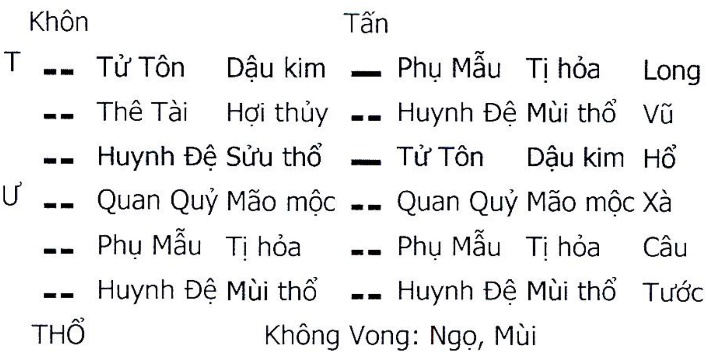
    - **Hình này chứng minh điều gì**
      - Cô ấy hỏi là sau khi đem xương cốt của ông nội về mộ thì tài vận của mình có bị ảnh hưởng hay không?
    - **Từ đâu mà thấy được**
      - THỔ Không Vong: Ngọ, Mùi Có vẻ như là dự đoán phần mộ, tuy nhiên bởi vì mục đích bất đồng, Dụng thần cũng bất đồng.
- **Diễn tiến phân tích và suy luận chi tiết:**
  - **Ví dụ 21:** Nữ dự đoán phần mộ tổ tiên của chồng.
  - Cách đây 40 năm, xương cốt của ông nội đã được bà nội gửi vào trong chùa.
  - Tuy nhiên, gần đây ông nội thường xuyên báo mộng cho cô, nói rằng ông không muốn ở trong chùa mà muốn trở về phần mộ gia đình.
  - Cô ấy hỏi là sau khi đem xương cốt của ông nội về mộ thì tài vận của mình có bị ảnh hưởng hay không?
  - Ngày Bính Tuất tháng Hợi, được Khôn Vi Địa biến Hỏa Địa Tấn.
  - THỔ Không Vong: Ngọ, Mùi
  - Có vẻ như là dự đoán phần mộ, tuy nhiên bởi vì mục đích bất đồng, Dụng thần cũng bất đồng.
  - Cô ấy sợ ảnh hưởng đến tài vận, do đó lấy Thê Tài làm trung tâm.
  - Thê Tài được Nguyệt trợ giúp vượng tướng, lâm hào 5, hào Thế Thanh Long tạo thành tam hợp cục sinh Thê Tài, tài vận khá tốt, mang cốt về nhất định có lợi.
  - Chỉ là hào Thế hóa phá, hào 6 là phần mộ tổ tiên, Phụ Mẫu cũng là phần mộ, nghĩa trang đã tan hoang, bị thủy xung phá, trong mộ đã vào nước, phải tu bổ lại mộ thì vận khí của bản thân mới tốt đẹp, nếu không thì chưa thể tốt hoàn toàn.
  - Hào Ứng là Nguyên thần của phần mộ, vượng tướng lâm mộc Đằng Xà, nghĩa trang có cỏ dại rậm rạp, bị Nhật hợp trú, không có ai dọn dẹp.
  - Nhật đồng thời là Mộ khố Phụ Mẫu, Phụ Mẫu nhập Mộ, phần mộ đã bị che phủ, lâm Câu Trần là gò đất, đã không thể nhìn thấy phần mộ trong nghĩa trang.
  - Thực tế đúng là như vậy.
  - Bốn mươi năm nay, kể từ khi chuyển cốt vào chùa thì chẳng có ai dọn dẹp mộ.
  - Đến khi dự định chuyển cốt về, chúng tôi đã ra nghĩa trang kiểm tra thì thấy cỏ dại um tùm, phải mất rất nhiều công sức mới tìm được phần mộ.
  - Phần mộ đã bị sụt lún, bên trong đã ngập nước mưa.

## CHƯƠNG 6: PHONG THỦY THƯƠNG NGHIỆP

### 1. CỬA HÀNG

- Kinh doanh mua bán nhất định có cửa hàng, mở công ty thì có địa điểm làm việc. Lục hào dự đoán phong thủy thông thường lấy hào 2 làm cửa hàng hoặc phòng làm việc. Thông qua suy vượng sinh khắc và lục thần của hào 2 để phán đoán chi tiết về cửa hàng.
- **Lâm Thanh Long:** Cửa hàng, văn phòng gọn gàng sạch đẹp, cửa hàng ăn uống, khách sạn, ngành dịch vụ, cửa hàng quần áo, tiệm làm đẹp,...
- **Lâm Chu Tước:** Cửa hàng náo nhiệt, nhiều khách hàng, cửa hàng ăn uống, cửa hàng thực phẩm, nhà sách, cửa hàng âm thanh, cửa hàng văn phòng phẩm, in ấn đánh máy, cửa hàng nhạc cụ,...
- **Lâm Câu Trần:** Công ty xây dựng, trạm dịch vụ nông nghiệp, cửa hàng bán lẻ thổ sản, cửa hàng vật liệu xây dựng, chợ bán đồ cũ, cửa hàng đặc sản địa phương,...
- **Lâm Đằng Xà:** Cửa hàng vật phẩm tân thời, cửa hàng ảo thuật, công ty công nghệ cao, bảo tàng nghệ thuật, cửa hàng vật phẩm hiếm thấy, cửa hàng khuất nẻo,...
- **Lâm Bạch Hổ:** Nhà thuốc, phòng khám bệnh, bệnh viện, cửa hàng máy móc công cụ, cửa hàng dao kéo, cửa hàng đồ thể thao,...
- **Lâm Huyền Vũ:** Cửa hàng tư nhân, cửa hàng thủy sản, hắc điếm, cửa hàng vật phẩm tôn giáo,...
- Hào 2 hợp hào 5 hoặc lâm Bạch Hổ, chủ cửa hàng ở cạnh đường lớn, tại cung Chấn chủ khu phố náo nhiệt.
- Nhập Mộ tại hào 5, chủ ở trong hẻm. Hào 5 phát động đến khắc, chủ đường đi ảnh hưởng đến cửa hàng.
- Hào 2 nhập Mộ chủ cửa hàng thường xuyên đóng kín.
- Lâm hỏa Không Vong hoặc không được hỏa đến sinh, chủ phòng làm việc, cửa hàng có vấn đề về ánh sáng.
- Lâm Quan Quỷ Chu Tước động, không hỏa hoạn thì cũng có kiện tụng, cãi cọ.
- Quan Quỷ lâm Huyền Vũ phát động, hoặc hào 2 lâm Huyền Vũ động hóa Quan Quỷ, hoặc Quan Quỷ lâm Huyền Vũ hợp nhập hào 2, chủ cửa hàng, phòng làm việc có đạo tặc xâm nhập.
- Lâm Huynh Đệ phát động, kinh doanh không tốt, không tụ tài.
- Bạch Hổ Quan Quỷ lâm hào 2 động khắc hào Thế, có tên vô lại đến gây rối.
- Hào 2 vượng tướng Không Vong, cửa hàng lớn mà ít khách hàng.
- Hào 2 lâm Tử Tôn Thê Tài sinh hào Thế, chủ khách hàng đầy cửa, làm ăn thịnh vượng.
- Thê Tài gặp hợp, hợp tác kinh doanh, tam hợp tài cục, khắp nơi tụ tài.
- Thê Tài nhập Mộ tại hào 2, nộp nhiều tiền thuê nhà.
- Hào Ứng lâm hào 2, cửa hàng thường là đi thuê hoặc hợp tác kinh doanh với người khác.

### 2. QUẦY THU NGÂN

- Ở cửa hàng là quầy thu ngân, ở công ty là phòng tài vụ. Đây là những nơi mà tiền tài của công ty ra vào, cần đặt ở vị trí cát trong phong thủy. Trong dự đoán lục hào, chúng ta cũng phải chú ý đến tình trạng cát hung của những nơi này.
- Xét về hào vị, hào 3 là phòng tài vụ, là kế toán; cũng có thể lấy Mộ khố Thê Tài, hào hợp Thê Tài để phán đoán. Những hào vị này không nên Không Phá, cũng không nên lâm Huynh Đệ phát động khắc Tài. Không Phá chứng tỏ thu chi có sơ hở, lâm Chu Tước chủ sổ sách ghi chép có vấn đề, lâm Huyền Vũ chủ có người tham ô tiền tài.
- Mộ khố Thê Tài lâm Chu Tước Không Vong, chủ tài khoản trống rỗng; phát động lâm Dịch Mã, chủ thường xuyên thay đổi nhân viên tài vụ, nhân viên thu ngân.
- Tài tại hào 3 nhập Mộ tại Nhật Nguyệt, chủ quầy hàng được xếp đặt ở trong góc.
- Thê Tài vượng tướng gặp sinh phù, quầy hàng có vị trí tốt, phong thủy cát. Không Phá, động hóa Tử Tuyệt, vị trí không tốt, bất lợi cho kinh doanh.
- Hào 3 lâm Quan Quỷ chủ quầy thu ngân có Thần Tài, Không Vong chủ không có, nhập Mộ chủ tại nơi bị che khuất.
- Thanh Long chủ tử tế, Chu Tước chủ sáng sủa, Câu Trần chủ chắc chắn, Đằng Xà chủ huyền bí, Bạch Hổ chủ uy nghiêm; Huyền Vũ chủ đèn thiếu ánh sáng.

### 3. KHÁCH HÀNG

- Khách hàng là nguồn tiền của cửa hàng và công ty. Thông thường lấy hào Ứng và hào Tử Tôn để phán đoán. Ứng là khách hàng, khi luận cũng có thể linh hoạt xem hào Tử Tôn.
- Hào Ứng không nên hưu tù Không Phá, cũng không nên động hóa Không Phá, cũng không nên hóa Tuyệt hóa thoái. Hưu tù Không Phá, ít khách hàng, không phát đạt. Hóa thoái, dần dần sa sút; hóa Tuyệt, khách hàng biến mất.
- Hào Ứng nên vượng tướng lâm Tử Tôn Thê Tài sinh hợp hào Thế, biểu thị khách hàng đầy cửa, làm ăn thịnh vượng.
- Lâm Thanh Long là khách quý, tại hào 5 vượng tướng sinh hợp hào Thế là khách hàng lớn. Tại hào sơ lâm Thanh Long là khách hàng mới.
- Lâm Chu Tước sinh hào Thế, được khách hàng khen ngợi. Chu Tước gặp Không, hỏi mà không mua. Trong sinh có hợp, là khách hàng ký hợp đồng.
- Lâm Câu Trần là khách hàng cũ.
- Lâm Đằng Xà, khách hàng khó chịu, không dễ đối phó.
- Lâm Bạch Hổ là khách hàng qua đường, khách hàng có thái độ kịch liệt.
- Lâm Huyền Vũ, khách hàng xảo quyệt, cũng đề phòng trộm cắp hàng hoá.
- Hào Ứng khắc hào Thế, lâm Thanh Long, sau khi uống rượu gây rối; lâm Chu Tước, bị khách hàng khiếu nại; lâm Bạch Hổ, bị khách hàng đánh; lâm Đằng Xà, bị khách hàng dọa nạt, bắt chẹt,...
- Hào Ứng hóa Thoái thần, khách hàng giảm dần; hóa Tiến thần, từ từ tăng lên. Vượng tướng lâm Nhật sinh hợp hào Thế, trước mắt náo nhiệt, khách hàng đầy cửa; hóa hồi đầu sinh, tiếp tục tăng thêm; hóa Không hồi đầu sinh, vẫn còn cơ hội phía sau. Hóa Không Vong không hồi đầu sinh, hóa Tuyệt, hóa hồi đầu khắc, tương lai vắng vẻ suy bại.
- Hào Ứng lâm Chu Tước hợp Thê Tài, hoặc khiến Thê Tài nhập Mộ, chủ khách hàng bắt đền. Lâm Bạch Hổ đến hợp, hoặc khiến Thê Tài nhập Mộ, chủ có người cướp đoạt tiền của. Lâm Huyền Vũ chủ khách hàng giả tạo, khách hàng trộm cắp, lừa gạt.
- Hào Ứng phát động khiến Thê Tài tạo thành tam hợp cục, chủ khách hàng đem lại khách hàng mới, mở rộng nhóm khách hàng. Hào Ứng lâm tam hợp cục sinh hợp hào Thế, chủ khách hàng theo đoàn, mua theo nhóm.
- **Ví dụ:** Ngày Mậu Dần tháng Mão, nam đoán phong thủy nhà hàng, được Lôi Thiên Đại Tráng biến Thiên Hỏa Đồng Nhân.
- THỔ &emsp;&emsp;&emsp;&emsp;&emsp;&emsp; Không Vong: Thân, Dậu
- **Phán đoán:** Phụ Mẫu Ngọ hỏa trì Thế, được Nhật Nguyệt sinh phù là vượng tướng, cửa hàng có diện tích lớn. Nhưng Phụ Mẫu nhập Mộ tại hào 6 Tuất thổ, hào 6 là cao, biểu thị cửa hàng bị cản trở. Lâm Huyền Vũ chủ tối tăm, cửa hàng không ở nơi sáng sủa.
- Thê Tài Tý thủy lâm hào Ứng, Ứng là khách hàng, khách hàng không thể mang lại lợi ích. Tử Tôn Thân kim tại hào 5, hào 5 là đường đi, chính là khách qua đường, hưu tù Không Vong không thể sinh Tài, biểu thị lưu lượng khách thấp.
- Ngoại quái phục ngâm, lại biểu thị người đi trên đường qua lại trùng lặp. Vì vậy nhà hàng không phát đạt, không thể kinh doanh.
- **Phản hồi:** Quả nhiên đúng là như vậy.

### 4. NGƯỜI LÀM THUÊ

- **Minh họa quái tượng phong thủy:**
  - **Hình 165.** Quẻ Lôi Thiên Đại Tráng biến Thiên Hỏa Đồng Nhân
    - 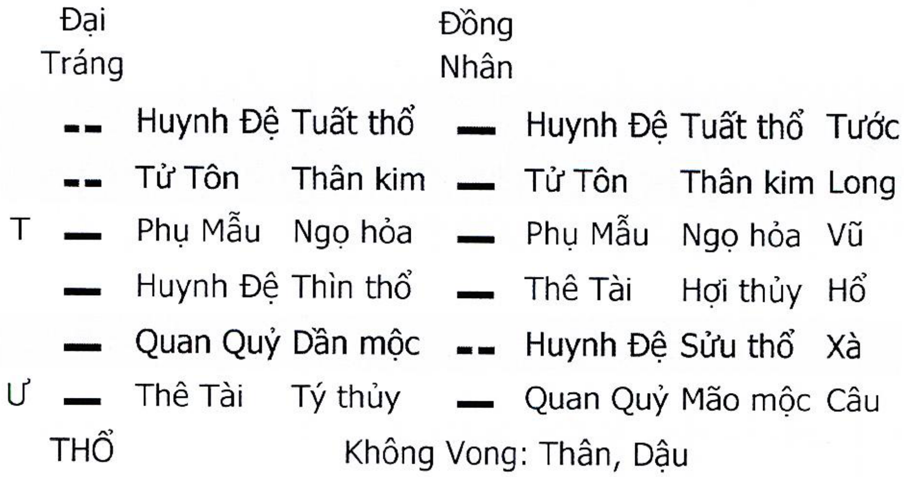
    - **Hình này chứng minh điều gì**
      - Quẻ chứng minh tình trạng phong thủy và ảnh hưởng cát hung tương ứng với quái tượng Quẻ Lôi Thiên Đại Tráng biến Thiên Hỏa Đồng Nhân.
    - **Từ đâu mà thấy được**
      - Nếu chỉ phán đoán về phong thủy và sự việc của nhân viên, công nhân thì lấy Thê Tài làm Dụng thần. Hào sơ không nên Không Phá, hưu tù lâm Bạch Hổ bị khắc, nhất là không nên lâm Thê Tài, nếu không t...

### QUẺ DỊCH VỀ PHONG THỦY THƯƠNG NGHIỆP

#### Ví dụ 1: Ngày Bính Ngọ tháng Mùi, nam đoán phong thuỷ của văn phòng công ty xăng, được ...

- **Bối cảnh và thông tin quẻ:**
  - Ngày Bính Ngọ tháng Mùi, nam đoán phong thuỷ của văn phòng công ty xăng, được Thủy Sơn Kiển biến Phong Sơn Tiệm.
  - KIM Không Vong: Dần, Mão
- **Luận giải quái tượng phong thủy:**
  - **Hình 166.** Sơ đồ quẻ Thủy Sơn Kiển biến Phong Sơn Tiệm
    - 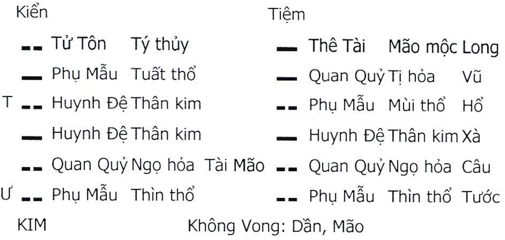
    - **Hình này chứng minh điều gì**
      - Hào Thế là chỗ của mình, nằm giữa hai Phụ Mẫu, vì vậy văn phòng ở giữa hai cây xăng. Hào Thế lâm Bạch Hổ, Bạch Hổ chủ đường đi, hào Thế lại gần hào 5 , hào 5 cũng là đường đi, văn phòng ở cạnh đường.
    - **Từ đâu mà thấy được**
      - Hào Thế là chỗ của mình, nằm giữa hai Phụ Mẫu, vì vậy văn phòng ở giữa hai cây xăng. Hào Thế lâm Bạch Hổ, Bạch Hổ chủ đường đi, hào Thế lại gần hào 5 , hào 5 cũng là đường đi, văn phòng ở cạnh đường.
- **Diễn tiến phân tích và suy luận chi tiết:**
  - Phụ Mẫu là cửa hàng, ở đây có thể biểu thị cây xăng.
  - Phụ Mẫu lưỡng hiện, có hai cây xăng.
  - Hào Thế là chỗ của mình, nằm giữa hai Phụ Mẫu, vì vậy văn phòng ở giữa hai cây xăng.
  - Hào Thế lâm Bạch Hổ, Bạch Hổ chủ đường đi, hào Thế lại gần hào 5 , hào 5 cũng là đường đi, văn phòng ở cạnh đường.
  - Mục đích dự đoán là ở lợi nhuận kinh doanh, vì vậy nhất định phải xem tình trạng của Thê Tài.
  - Thê Tài Mão mộc không hiện trên quẻ, phục tàng dưới hào 2 Quan Quỷ Ngọ hỏa.
  - Ngọ hỏa tương ứng với phía Nam, lâm Nhật khắc hào Thế, lại bị Tý thủy xung tạo thành ám động khắc hào Thế, phía Nam có vật thể gây bất lợi cho văn phòng của mình.
  - Hào 2 là trạch, lâm Câu Trần lại chủ nhà cửa, vì vậy phía Nam có nhà cửa gây bất lợi.
  - Thê Tài là hàng hóa, phục tàng dưới hào 2 Quan Quỷ Ngọ hỏa, trong nhà có tích trữ hàng hóa, lâm Câu Trần, Câu Trần chủ cũ kỹ, đang để những thứ đã cũ.
  - Thê Tài Mão mộc Không Vong, gặp Phi thần và Nhật thần Ngọ hỏa là Tử địa, mộc là cây cối, Tử địa là khô héo, Không Vong chủ rỗng ruột, vì vậy lân cận có cây cối khô héo
  - ảnh hưởng đến tài vận.
  - Huynh Đệ Thân kim trì Thế, Thái Tuế năm nay là Kỵ thần lâm thân, năm nay tài vận rất không tốt.
- **Kết quả ứng nghiệm thực tế:**
  - Thực tế đúng là có hai cây xăng, văn phòng ở giữa hai cây xăng.
  - Văn phòng gần quốc lộ, ở phía Nam có một căn nhà, bên trong có chứa đồ đạc.
  - Lân cận vốn có mấy cây tùng đỏ, vài năm trước đã chết khô.
  - Những năm gần đây doanh số hạ thấp, năm nay càng rõ hơn.

#### Ví dụ 2: Ngày Tân Dậu tháng Tân Sửu năm Bính Tuất, nam đoán phong thủy của studio chụp ...

- **Bối cảnh và thông tin quẻ:**
  - Ngày Tân Dậu tháng Tân Sửu năm Bính Tuất, nam đoán phong thủy của studio chụp ảnh cưới, được Trạch Lôi Tùy biến Trạch Thủy Khốn.
  - MỘC Không Vong: Tý, Sửu
- **Luận giải quái tượng phong thủy:**
  - **Hình 167.** Sơ đồ quẻ Trạch Lôi Tùy biến Trạch Thủy Khốn
    - 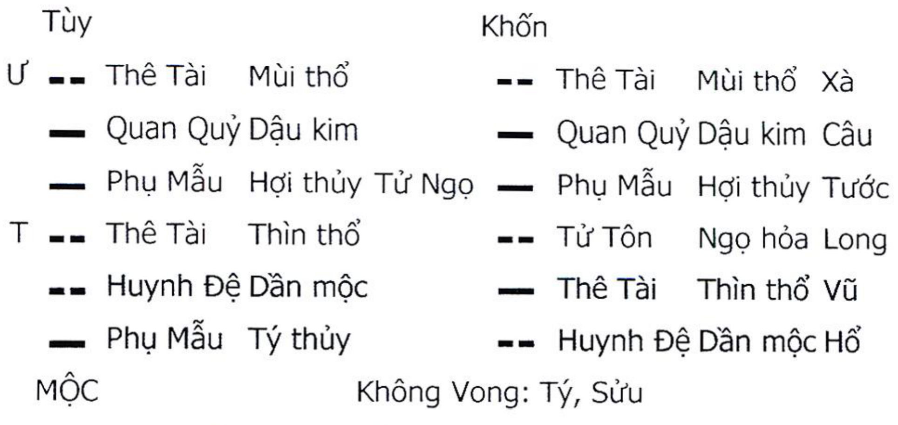
    - **Hình này chứng minh điều gì**
      - Hào Thế và Nhật tương hợp, Nhật thần nhập quẻ tại hào 5, hào 5 là đường đi, hào Thế là chỗ của mình, gần đường cái.
    - **Từ đâu mà thấy được**
      - Hào Thế và Nhật tương hợp, Nhật thần nhập quẻ tại hào 5, hào 5 là đường đi, hào Thế là chỗ của mình, gần đường cái. Lại Phụ Mẫu Tý thủy lâm Bạch Hổ, từ Hợi thủy mượn đến Chu Tước, Bạch Hổ là đường ...
- **Diễn tiến phân tích và suy luận chi tiết:**
  - Lấy Thê Tài làm trung tâm.
  - Phụ Mẫu lưỡng hiện, Phụ Mẫu là cửa tiệm, có nhiều căn phòng, vượng tướng thì quy mô không nhỏ.
  - Hào Thế và Nhật tương hợp, Nhật thần nhập quẻ tại hào 5, hào 5 là đường đi, hào Thế là chỗ của mình, gần đường cái.
  - Lại Phụ Mẫu Tý thủy lâm Bạch Hổ, từ Hợi thủy mượn đến Chu Tước, Bạch Hổ là đường đi, Chu Tước là ồn ào, Bạch Hổ thêm Chu Tước biểu thị tại khu phố náo nhiệt.
  - Hào sơ Không Vong, biểu thị phía dưới cửa tiệm có tầng hầm hoặc hang động.
  - Quẻ Trạch Lôi Tùy có tượng đi theo, mô hình kinh doanh bắt chước người khác, thiếu cá tính riêng.
  - Thê Tài Thìn thổ trì Thế, được Nguyệt trợ giúp là vượng tướng, lại lâm Thanh Long, tài vận không tệ.
  - Năm 2002 Giáp Thân xung mất Kỵ thần Huynh Đệ Dần mộc, năm 2005 Ất Dậu khắc chế Huynh Đệ, năm 2006 Bính Tuất thì hào Thế Tài hợp xứ phùng xung, kinh doanh vẫn khá tốt.
  - Nhưng Huynh Đệ phát động, khắc Tài lại hóa Tài, doanh số không ổn định, lúc cao lúc thấp.
  - Hào sơ Phụ Mẫu Tý thủy Không Vong, sinh Kỵ thần Huynh Đệ Dần mộc.
  - Hào sơ là nhân viên;
  - Phụ Mẫu chủ tri thức;
  - Bạch Hổ chủ đường đi, đi lại;
  - Không Vong chủ bỏ đi.
  - Chứng tỏ nhân viên một khi học xong kỹ thuật, đạt đến trình
  - độ nhất định thì sẽ rời khỏi ở đây, do đó ảnh hưởng đến sự phát triển của cửa tiệm.
  - Hào Thế Thìn thổ tại hào 3 bị khắc, Quan Quỷ lâm Nhật hợp đến hào Thế, có bệnh tật trong người.
  - Hào 3 là dạ dày, thổ lại chủ dạ dày, vì vậy là bệnh tiêu hóa.
  - Nguyên thần Ngọ hỏa không hiện trên quẻ, hưu tù bị Tý thủy khắc thương, hỏa chủ tim, rối loạn nhịp tim, có bệnh tâm hoảng.
  - Hào Thế gặp Nhật Dậu kim là đất Mộc Dục, Thê Tài lưỡng hiện, hào 2 lại lâm Huyền Vũ động hóa Thê Tài, Huyền Vũ chủ tượng ám muội, bản thân có ngoại tình.
  - Huynh Đệ động hóa Thê Tài, vừa được Tài vừa hao Tài.
  - Huynh Đệ động hóa Thê Tài, chủ dùng chung vợ với người khác, Thê Tài Thìn thổ hợp Quan Quỷ, vợ cũng có ngoại tình.
  - Quẻ Trạch Lôi Tùy, vợ ngoại tình trước, bản thân ngoại tình sau.
- **Kết quả ứng nghiệm thực tế:**
  - Tất cả đúng như phán đoán.

#### Ví dụ 3: Ngày Kỷ Dậu tháng Ất Tị năm Đinh Hợi, một người đàn ông ở Hà Bắc đến đoán mở c...

- **Bối cảnh và thông tin quẻ:**
  - Ngày Kỷ Dậu tháng Ất Tị năm Đinh Hợi, một người đàn ông ở Hà Bắc đến đoán mở cửa hàng bán cháo, được Lôi Thiên Đại Tráng biến Ly Vi Hỏa.
  - THỔ Không Vong: Dần, Mão
  - Mục đích là ở lợi nhuận, Thê Tài là lợi ích, vì vậy Thê Tài là trọng điểm.
  - Phụ Mẫu là cửa hàng, cửa hàng cũng liên quan đến phong thủy, biến hóa của hào động chính là tiêu điểm phản ánh thông tin cát hung của phong thủy.
  - Thê Tài Tý thủy Nguyệt không sinh, Nhật sinh là vượng.
  - Tuy nhiên, đoán quẻ không thể chỉ xem ảnh hưởng của Nhật Nguyệt mà còn phải xem tác dụng của hào động như thế nào.
  - Nhật Nguyệt chỉ là gốc rễ của Dụng thần.
  - Nhật sinh biểu thị Tài có gốc rễ, mà thông tin biểu thị trong quẻ thì phản ánh sự ảnh hưởng của môi trường, sự thay đổi của cửa hàng, kết quả phát triển,...
  - Trong quẻ có hai hào động.
  - Quan Quỷ Dần mộc mặc dù sinh hào Thế, nhưng không sinh hào Tài.
  - Huynh Đệ Tuất thổ phát động thì khắc Tài.
  - Huynh Đệ Tuất thổ được Nguyệt sinh, hóa hồi đầu sinh, tương đối vượng.
  - Vượng mà phát động, lực khắc Tài tăng thêm rất nhiều, vì vậy công việc kinh doanh của cửa hàng nhất định rất khó khăn.
  - Thê Tài Tý thủy tại hào sơ, hào sơ là khởi đầu của sự vật, biểu thị cửa hàng vừa mới khai trương.
  - Hào 2 Quan Quỷ Dần mộc phát động khắc Huynh Đệ Tuất thổ, Quan Quỷ có thể thể hiện nhân viên nhà nước, bề ngoài xem là trợ giúp Tài, nhưng Không Vong hóa Huynh Đệ, cũng không cải biến
  - sự thật bất lợi cho Thê Tài.
  - Căn cứ vào những thông tin này, tôi phán đoán rằng cửa hàng này vừa mới khai trương, công việc kinh doanh không quá thuận lợi, không kiếm được bao nhiêu tiền.
  - Mặc dù có bạn bè làm nhà nước, có thể bảo bọn họ giúp đỡ, nhưng họ ăn uống cũng không ít, đã ăn uống rồi nhưng chưa chắc đã xử lý công việc được.
  - Đây thuộc về vấn đề vận khí của bản thân anh ta.
  - Tôi đoán là niên vận vài năm trước khá tốt.
  - Tuy nhiên, năm ngoái rất tệ, có thể nói rằng đó là năm tệ nhất trong những năm gần đây.
  - Quả nhiên là như vậy.
  - Tại sao ư?
  - Quẻ rày hào Tài có khí, bởi vì có Nhật sinh Tài.
  - Mà mấy năm trước là Giáp Thân Ất Dậu, chính là lưu niên sinh Thê Tài, vì vậy tài vận khá tốt.
  - Nhưng năm ngoái là Bính Tuất, Thái Tuế nhập quẻ khắc Thê Tài, vì vậy năm ngoái rất tệ.
  - Tôi đoán rằng cửa hàng này có nhiều người trẻ tuổi vào ăn, còn người già thì rất ít.
  - Anh ta nói đúng là như vậy.
  - Trích xuất thông tin về khía cạnh này như sau:
  - Quẻ là Lôi Thiên Đại Tráng, Tử Tôn Thân kim lâm hào 5, tại Nguyệt là Trường Sinh, tại Nhật là Đế Vượng.
  - Tử Tôn có thể hiểu thành khách hàng, bởi vì Tử Tôn sinh Tài, đem lại lợi nhuận cho cửa hàng.
  - Phân tích theo hào vị, hào 5 chính là độ tuổi khỏe mạnh, là lúc tráng thịnh.
  - Trường Sinh là nhỏ, Đế Vượng là cường tráng, vì vậy người trẻ tuổi đến khá nhiều, đem lại thu nhập cho cửa hàng.
  - Nhưng Huynh Đệ Tuất thổ tại hào 6 khắc Thê Tài, chính là thông tin không có lợi ích.
  - Từ góc độ hào vị, hào 6 là hào thoái hưu, chỉ có đã già mới thoái hưu, xét về con người thì chính là người lớn tuổi.
  - Hào 6 lại lâm Câu Trần, Câu Trần là chậm chạp, lại gặp Nguyệt và hào biến là Tuyệt địa, biểu thị diệt tuyệt.
  - Chính là người đã già, mạng sống sắp đến điểm cuối cùng.
  - Động mà khắc Tài, dựa vào những người này thì không thể kiếm được tiền, vì vậy phán đoán là ít có người già vào cửa hàng.
  - Trong quẻ này, tôi đã dùng hai hào động để phán đoán một số thông tin.
  - Thê Tài Tý thủy lâm Đằng Xà, Đằng Xà chủ ít, biểu thị thu nhập của cửa hàng không nhiều.
  - Quẻ này có đặc điểm là hào lâm Câu Trần phát động khắc Tài, hào 2 hào trạch phát động.
  - Đối với mở cửa hàng thì có vấn đề về phong thủy.
  - Xét hai hào này thì phong thủy không quá tốt.
  - Bởi vì Câu Trần chủ kiến trúc, Huynh Đệ hóa ra Phụ Mẫu hồi đầu sinh, vượng Huynh Đệ, Phụ Mẫu là nhà, cho nên phong thủy của cửa hàng gây bất lợi cho tài.
  - Mà hào 2 là hào vị cửa hàng, động hóa Huynh Đệ cũng nói rõ phong thủy không tốt.
  - Đồng thời đây lại là lục xung biến lục xung, chứng tỏ khí không thể tụ.
  - Phán đoán tình trạng của cửa hàng, hào vị thì xem hào 2, lục thân thì xem Phụ Mẫu.
  - Quẻ này Phụ Mẫu lâm Thanh Long chính là thông tin hiệu ăn, bởi vì Thanh Long chủ ẩm thực.
  - Nhưng nhập Mộ tại hào 6, trong dự đoán phong thủy, hào 6 có thể biểu thị hàng xóm, cũng chính là lân cận.
  - Lâm Câu Trần, Câu Trần biểu thị kiến trúc.
  - Khiến hào Thế nhập Mộ, nhập Mộ có ý nghĩa là bị che phủ, trong thực tế có thể hiểu là cản trở.
  - Tuất thổ biểu thị Tây Bắc.
  - Vì vậy, tôi phán đoán là ở hướng Tây Bắc có kiến trúc cao tầng cản trở cửa hàng của anh ta, kiến trúc này đã ảnh hưởng đến tài vận của cửa hàng.
  - Anh ta nói ở phía Tây Bắc có một tòa nhà cao bốn tầng, mà cửa hàng của anh ta cao ba tầng.
  - Tôi đoán tiếp, tòa nhà đó được xây cách đây không lâu, chắc là được xây ở năm 01.
  - Anh ta ước tính đúng là được xây vào thời gian đó.
  - Bởi vì Tuất thổ hóa Tị hỏa hồi đầu sinh, hào biến là Tị hỏa, tương ứng năm 01.
  - Xét về hào 2 Dần mộc.
  - Mộc Không lâm Bạch Hổ hóa Huynh Đệ Sửu thổ, mộc có thể biểu thị cây cối, Không Vong biểu thị không có, Bạch Hổ chủ đao thương, chính là chặt.
  - Hóa ra Sửu thổ, Sửu thổ là Đông Bắc.
  - Vì vậy, tôi phán đoán là ở hướng Đông Bắc ban đầu có cây nhưng đã bị chặt.
  - Anh ta hỏi là trong 100 ngày sẽ xảy ra chuyện gì?
  - Câu hỏi giống như thế này không dễ trả lời.
  - Việc này phải lấy tháng ở tương lai liên hệ với biến hóa trong quẻ.
  - Nói cách khác, không phải một tháng, cũng không phải hai tháng, mà là xem tình hình ba tháng sau.
  - Ba tháng sau là tháng Thân.
  - Xem tháng Thân biến đổi hào nào trong quẻ.
  - Tháng Thân là tháng xung Quan Quỷ Dần mộc.
  - Không bị xung là gì?
  - Là xung thực.
  - Quan này xuất Không sẽ làm gì?
  - Sẽ sinh hào Thế, hào Thế là Phụ Mẫu, Phụ Mẫu ở ngày xưa là nha môn, đối với người đi làm hiện nay thì Phụ Mẫu là đơn vị, đối với cá nhân thì Phụ Mẫu là công ty.
  - Quan thể hiện công việc, Phụ Mẫu thể hiện công ty.
  - Vì vậy, tôi phán đoán anh ta sắp thành lập một công ty mới.
  - Trên thực tế, đúng là anh ta dự định thành lập công ty mới ở tháng Thân.
- **Luận giải quái tượng phong thủy:**
  - **Hình 168.** Quẻ Lôi Thiên Đại Tráng biến Ly Vi Hỏa
    - 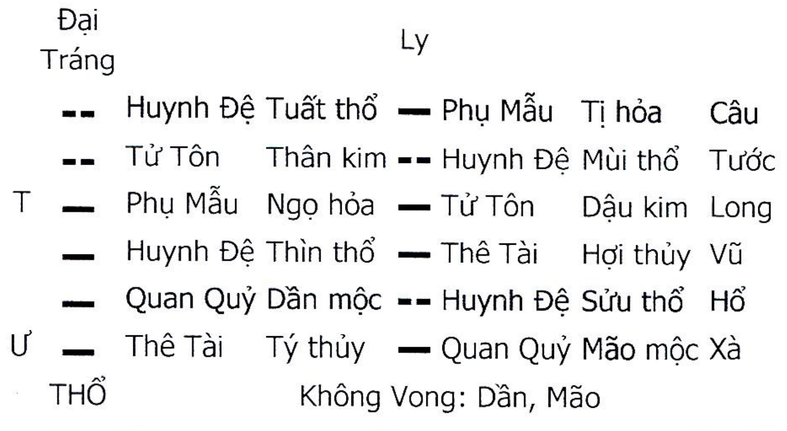
    - **Hình này chứng minh điều gì**
      - Phụ Mẫu là cửa hàng, cửa hàng cũng liên quan đến phong thủy, biến hóa của hào động chính là tiêu điểm phản ánh thông tin cát hung của phong thủy.
    - **Từ đâu mà thấy được**
      - THỔ Không Vong: Dần, Mão Phụ Mẫu là cửa hàng, cửa hàng cũng liên quan đến phong thủy, biến hóa của hào động chính là tiêu điểm phản ánh thông tin cát hung của phong thủy.
- **Diễn tiến phân tích và suy luận chi tiết:**
  - **Ví dụ 3:** Ngày Kỷ Dậu tháng Ất Tị năm Đinh Hợi, một người đàn ông ở Hà Bắc đến đoán mở cửa hàng bán cháo, được Lôi Thiên Đại Tráng biến Ly Vi Hỏa.
  - THỔ Không Vong: Dần, Mão
  - Mục đích là ở lợi nhuận, Thê Tài là lợi ích, vì vậy Thê Tài là trọng điểm.
  - Phụ Mẫu là cửa hàng, cửa hàng cũng liên quan đến phong thủy, biến hóa của hào động chính là tiêu điểm phản ánh thông tin cát hung của phong thủy.
  - Thê Tài Tý thủy Nguyệt không sinh, Nhật sinh là vượng.
  - Tuy nhiên, đoán quẻ không thể chỉ xem ảnh hưởng của Nhật Nguyệt mà còn phải xem tác dụng của hào động như thế nào.
  - Nhật Nguyệt chỉ là gốc rễ của Dụng thần.
  - Nhật sinh biểu thị Tài có gốc rễ, mà thông tin biểu thị trong quẻ thì phản ánh sự ảnh hưởng của môi trường, sự thay đổi của cửa hàng, kết quả phát triển,...
  - Trong quẻ có hai hào động.
  - Quan Quỷ Dần mộc mặc dù sinh hào Thế, nhưng không sinh hào Tài.
  - Huynh Đệ Tuất thổ phát động thì khắc Tài.
  - Huynh Đệ Tuất thổ được Nguyệt sinh, hóa hồi đầu sinh, tương đối vượng.
  - Vượng mà phát động, lực khắc Tài tăng thêm rất nhiều, vì vậy công việc kinh doanh của cửa hàng nhất định rất khó khăn.
  - Thê Tài Tý thủy tại hào sơ, hào sơ là khởi đầu của sự vật, biểu thị cửa hàng vừa mới khai trương.
  - Hào 2 Quan Quỷ Dần mộc phát động khắc Huynh Đệ Tuất thổ, Quan Quỷ có thể thể hiện nhân viên nhà nước, bề ngoài xem là trợ giúp Tài, nhưng Không Vong hóa Huynh Đệ, cũng không cải biến
  - sự thật bất lợi cho Thê Tài.
  - Căn cứ vào những thông tin này, tôi phán đoán rằng cửa hàng này vừa mới khai trương, công việc kinh doanh không quá thuận lợi, không kiếm được bao nhiêu tiền.
  - Mặc dù có bạn bè làm nhà nước, có thể bảo bọn họ giúp đỡ, nhưng họ ăn uống cũng không ít, đã ăn uống rồi nhưng chưa chắc đã xử lý công việc được.
  - Đây thuộc về vấn đề vận khí của bản thân anh ta.
  - Tôi đoán là niên vận vài năm trước khá tốt.
  - Tuy nhiên, năm ngoái rất tệ, có thể nói rằng đó là năm tệ nhất trong những năm gần đây.
  - Quả nhiên là như vậy.
  - Tại sao ư?
  - Quẻ rày hào Tài có khí, bởi vì có Nhật sinh Tài.
  - Mà mấy năm trước là Giáp Thân Ất Dậu, chính là lưu niên sinh Thê Tài, vì vậy tài vận khá tốt.
  - Nhưng năm ngoái là Bính Tuất, Thái Tuế nhập quẻ khắc Thê Tài, vì vậy năm ngoái rất tệ.
  - Tôi đoán rằng cửa hàng này có nhiều người trẻ tuổi vào ăn, còn người già thì rất ít.
  - Anh ta nói đúng là như vậy.
  - Trích xuất thông tin về khía cạnh này như sau:
  - Quẻ là Lôi Thiên Đại Tráng, Tử Tôn Thân kim lâm hào 5, tại Nguyệt là Trường Sinh, tại Nhật là Đế Vượng.
  - Tử Tôn có thể hiểu thành khách hàng, bởi vì Tử Tôn sinh Tài, đem lại lợi nhuận cho cửa hàng.
  - Phân tích theo hào vị, hào 5 chính là độ tuổi khỏe mạnh, là lúc tráng thịnh.
  - Trường Sinh là nhỏ, Đế Vượng là cường tráng, vì vậy người trẻ tuổi đến khá nhiều, đem lại thu nhập cho cửa hàng.
  - Nhưng Huynh Đệ Tuất thổ tại hào 6 khắc Thê Tài, chính là thông tin không có lợi ích.
  - Từ góc độ hào vị, hào 6 là hào thoái hưu, chỉ có đã già mới thoái hưu, xét về con người thì chính là người lớn tuổi.
  - Hào 6 lại lâm Câu Trần, Câu Trần là chậm chạp, lại gặp Nguyệt và hào biến là Tuyệt địa, biểu thị diệt tuyệt.
  - Chính là người đã già, mạng sống sắp đến điểm cuối cùng.
  - Động mà khắc Tài, dựa vào những người này thì không thể kiếm được tiền, vì vậy phán đoán là ít có người già vào cửa hàng.
  - Trong quẻ này, tôi đã dùng hai hào động để phán đoán một số thông tin.
  - Thê Tài Tý thủy lâm Đằng Xà, Đằng Xà chủ ít, biểu thị thu nhập của cửa hàng không nhiều.
  - Quẻ này có đặc điểm là hào lâm Câu Trần phát động khắc Tài, hào 2 hào trạch phát động.
  - Đối với mở cửa hàng thì có vấn đề về phong thủy.
  - Xét hai hào này thì phong thủy không quá tốt.
  - Bởi vì Câu Trần chủ kiến trúc, Huynh Đệ hóa ra Phụ Mẫu hồi đầu sinh, vượng Huynh Đệ, Phụ Mẫu là nhà, cho nên phong thủy của cửa hàng gây bất lợi cho tài.
  - Mà hào 2 là hào vị cửa hàng, động hóa Huynh Đệ cũng nói rõ phong thủy không tốt.
  - Đồng thời đây lại là lục xung biến lục xung, chứng tỏ khí không thể tụ.
  - Phán đoán tình trạng của cửa hàng, hào vị thì xem hào 2, lục thân thì xem Phụ Mẫu.
  - Quẻ này Phụ Mẫu lâm Thanh Long chính là thông tin hiệu ăn, bởi vì Thanh Long chủ ẩm thực.
  - Nhưng nhập Mộ tại hào 6, trong dự đoán phong thủy, hào 6 có thể biểu thị hàng xóm, cũng chính là lân cận.
  - Lâm Câu Trần, Câu Trần biểu thị kiến trúc.
  - Khiến hào Thế nhập Mộ, nhập Mộ có ý nghĩa là bị che phủ, trong thực tế có thể hiểu là cản trở.
  - Tuất thổ biểu thị Tây Bắc.
  - Vì vậy, tôi phán đoán là ở hướng Tây Bắc có kiến trúc cao tầng cản trở cửa hàng của anh ta, kiến trúc này đã ảnh hưởng đến tài vận của cửa hàng.
  - Anh ta nói ở phía Tây Bắc có một tòa nhà cao bốn tầng, mà cửa hàng của anh ta cao ba tầng.
  - Tôi đoán tiếp, tòa nhà đó được xây cách đây không lâu, chắc là được xây ở năm 01.
  - Anh ta ước tính đúng là được xây vào thời gian đó.
  - Bởi vì Tuất thổ hóa Tị hỏa hồi đầu sinh, hào biến là Tị hỏa, tương ứng năm 01.
  - Xét về hào 2 Dần mộc.
  - Mộc Không lâm Bạch Hổ hóa Huynh Đệ Sửu thổ, mộc có thể biểu thị cây cối, Không Vong biểu thị không có, Bạch Hổ chủ đao thương, chính là chặt.
  - Hóa ra Sửu thổ, Sửu thổ là Đông Bắc.
  - Vì vậy, tôi phán đoán là ở hướng Đông Bắc ban đầu có cây nhưng đã bị chặt.
  - Anh ta hỏi là trong 100 ngày sẽ xảy ra chuyện gì?
  - Câu hỏi giống như thế này không dễ trả lời.
  - Việc này phải lấy tháng ở tương lai liên hệ với biến hóa trong quẻ.
  - Nói cách khác, không phải một tháng, cũng không phải hai tháng, mà là xem tình hình ba tháng sau.
  - Ba tháng sau là tháng Thân.
  - Xem tháng Thân biến đổi hào nào trong quẻ.
  - Tháng Thân là tháng xung Quan Quỷ Dần mộc.
  - Không bị xung là gì?
  - Là xung thực.
  - Quan này xuất Không sẽ làm gì?
  - Sẽ sinh hào Thế, hào Thế là Phụ Mẫu, Phụ Mẫu ở ngày xưa là nha môn, đối với người đi làm hiện nay thì Phụ Mẫu là đơn vị, đối với cá nhân thì Phụ Mẫu là công ty.
  - Quan thể hiện công việc, Phụ Mẫu thể hiện công ty.
  - Vì vậy, tôi phán đoán anh ta sắp thành lập một công ty mới.
  - Trên thực tế, đúng là anh ta dự định thành lập công ty mới ở tháng Thân.

#### Ví dụ 4: Ngày Tân Dậu tháng Canh Thìn năm Ất Dậu, nữ đoán phong thủy trường tin học, đư...

- **Bối cảnh và thông tin quẻ:**
  - Ngày Tân Dậu tháng Canh Thìn năm Ất Dậu, nữ đoán phong thủy trường tin học, được Hỏa Thiên Đại Hữu biến Sơn Thiên Đại Súc.
  - KIM
  - Không Vong: Tý, Sửu
- **Luận giải quái tượng phong thủy:**
  - **Hình 169.** Quẻ Hỏa Thiên Đại Hữu biến Sơn Thiên Đại Súc
    - 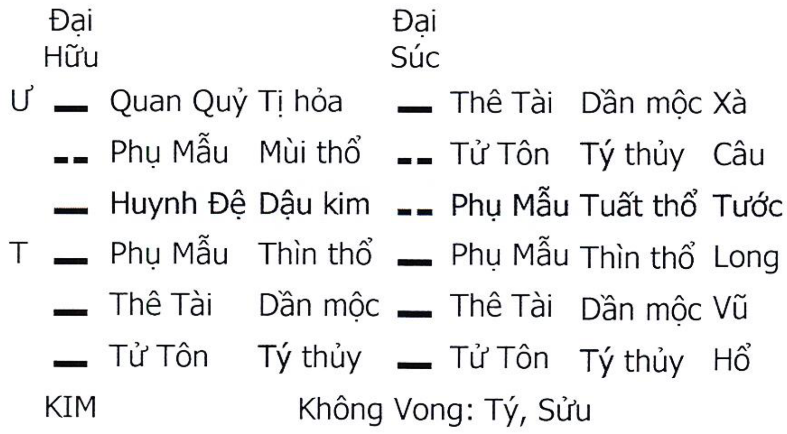
    - **Hình này chứng minh điều gì**
      - Lấy Thê Tài làm chủ. Hào 2 lâm Thê Tài Dần mộc, Nguyệt không sinh, Nhật đến khắc, hào động lại đến khắc, nơi này không tụ tài.
    - **Từ đâu mà thấy được**
      - Hào 2 lâm Thê Tài Dần mộc, Nguyệt không sinh, Nhật đến khắc, hào động lại đến khắc, nơi này không tụ tài. Hào sơ Tý thủy lâm Bạch Hổ, chủ lân cận có cầu, được Dậu kim phát động đến sinh là sông ngòi.
- **Diễn tiến phân tích và suy luận chi tiết:**
  - Lấy Thê Tài làm chủ.
  - Phụ Mẫu Thìn thổ là phòng học, Nhật thần đến hợp, phòng học nằm trong tòa nhà.
  - Hợp thần là Huynh Đệ, biểu thị phòng học được đi thuê.
  - Hào 2 lâm Thê Tài Dần mộc, Nguyệt không sinh, Nhật đến khắc, hào động lại đến khắc, nơi này không tụ tài.
  - Hào sơ Tý thủy lâm Bạch Hổ, chủ lân cận có cầu, được Dậu kim phát động đến sinh là sông ngòi.
  - Hào độc phát là Tử địa Quan Quỷ, cũng bất lợi cho hôn nhân.
- **Kết quả ứng nghiệm thực tế:**
  - Trên thực tế, phòng học của trường là đi thuê, tại tầng 6 của tòa nhà, lân cận có sông và cầu, tài vận không tốt, độc thân, không có đối tượng.

#### Ví dụ 5: Ngày Đinh Dậu tháng Mậu Tuất năm Bính Tuất, một người dự đoán phong thủy nhà m...

- **Bối cảnh và thông tin quẻ:**
  - Ngày Đinh Dậu tháng Mậu Tuất năm Bính Tuất, một người dự đoán phong thủy nhà máy lốp xe, được Địa Sơn Khiêm biến Địa Thủy Sư.
  - KIM Không Vong: Thìn, Tị
  - Xí nghiệp lấy Thê Tài làm Dụng thần chính.
  - Thê Tài Mão mộc mặc dù được Nguyệt hợp là vượng, nhưng Nguyệt là thổ, suy cho cùng thì Mão mộc không thể được sinh.
  - Nhật đến khắc Tài, Huynh Đệ lại phát động, xây dựng nhà máy quá tốn kém, vòng quay kinh tế gặp trở lực trùng trùng.
- **Luận giải quái tượng phong thủy:**
  - **Hình 170.** Sơ đồ quẻ Địa Sơn Khiêm biến Địa Thủy Sư
    - 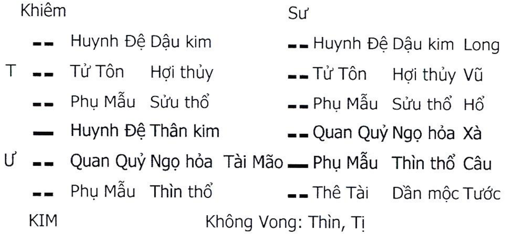
    - **Hình này chứng minh điều gì**
      - Quẻ chứng minh tình trạng phong thủy và ảnh hưởng cát hung tương ứng với quái tượng Sơ đồ quẻ Địa Sơn Khiêm biến Địa Thủy Sư.
    - **Từ đâu mà thấy được**
      - Căn cứ vào hào vị, lục thân, can chi sinh khắc, tuần không và hào động biến trong quẻ.
- **Kết quả ứng nghiệm thực tế:**
  - Dự định đầu tư 50 tỷ, hiện tại đã tốn 7 tỷ.
  - Hào 2 là nhà xưởng, lâm Câu Trần phát động hóa Phụ Mẫu, hào biến Phụ Mẫu Thìn thổ Không Vong, Câu Trần chủ xây dựng, hiện nay nhà máy vẫn còn rất nhiều nhà cửa chưa xây lên, đang khẩn trương xây dựng.
  - **Phản hồi:** Nhà máy mới xây được một phần nhỏ, công trình lớn vẫn ở phía sau.
  - Hào sơ là nền nhà máy, Không Vong Nguyệt phá, mặt đất nham nhở, gồ ghề, vẫn chưa ra hình dạng.
  - Nhật Hợp Phá, chỉ có một vài chỗ là ra diện mạo.
  - **Phản hồi:** Đúng, làm xong mới có thể dọn dẹp sàn nhà.
  - Thê Tài Mão mộc phục tàng dưới quẻ Cấn, Cấn là núi, Nguyệt thổ Tuất thổ hợp vượng Thê Tài, Hợi thủy lại là đất Trường Sinh của Thê Tài, Nguyệt chủ cao to, Tây Bắc có núi, đối với tài vận của nhà máy có chỗ trợ giúp.
  - **Phản hồi:** Tây Bắc có núi.
  - Thân kim phát động Trường Sinh Phụ Mẫu, Phụ Mẫu là nhà máy, Thân kim tương ứng với năm 1992 Nhâm Thân, nhà máy cất bước ở năm này.
  - **Phản hồi:** Đúng, dự án tại năm này.
  - Nhưng năm sau là năm 1993 Quý Dậu, năm 1994 là Giáp Tuất, Huynh Đệ được vượng, Thê Tài bị khắc chế và bị hợp trú, nhà máy gặp khó khăn.
  - Huynh Đệ Thân kim hóa ra Ngọ hỏa, tương ứng với năm 2002, năm này kinh tế mới bắt đầu có chuyển biến tốt.
  - **Phản hồi:** Năm 1993 suy bại, đầu năm 1994 nhà máy bị bỏ phế.
  - Năm 2002 đầu tư xây dựng lại từ đầu.
  - Huynh Đệ bị hỏa khắc chế, vì vậy mà không thể khắc Tài, chỉ sau khi nhà máy xảy ra một lần hỏa hoạn lớn thì mới có thể phát triển.
  - (Hỏi: Khi nào?).
  - Ngọ hỏa hóa Thìn thổ Không Phá, năm Thìn xuất Không Thực Phá, lúc đó mới xảy ra.
  - Về sau, ở cuối năm xảy ra hỏa hoạn.

#### Ví dụ 6: Ngày Quý Dậu tháng Quý Sửu năm Đinh Hợi, nam đoán phong thủy cây xăng, được Sơ...

- **Luận giải quái tượng phong thủy:**
  - **Hình 171.** Sơ đồ quẻ Sơn Phong Cổ
    - 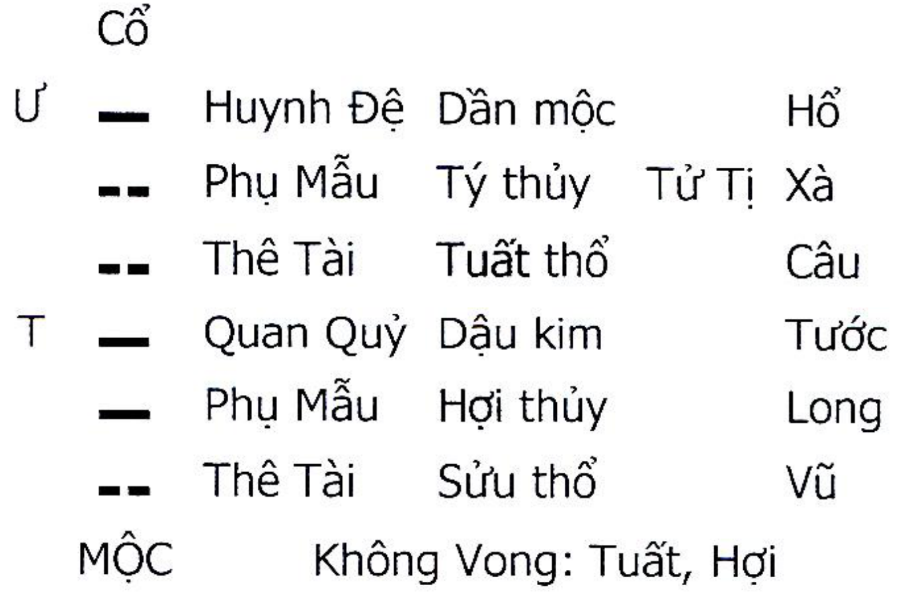
    - **Hình này chứng minh điều gì**
      - Phụ Mẫu Tý thủy được Nguyệt hợp Nhật sinh lâm hào 5, hào 5 là đường đi, lâm Đằng Xà, Đằng Xà là tượng uốn lượn, vì vậy cây xăng tại nơi chuyển hướng.
    - **Từ đâu mà thấy được**
      - Nhưng Phụ Mẫu Hợi thủy Không Vong, một cửa hàng đã không kinh doanh. Phụ Mẫu Tý thủy được Nguyệt hợp Nhật sinh lâm hào 5, hào 5 là đường đi, lâm Đằng Xà, Đằng Xà là tượng uốn lượn, vì vậy cây xăng ...
- **Diễn tiến phân tích và suy luận chi tiết:**
  - Lấy Thê Tài làm trung tâm.
  - Phụ Mẫu lưỡng hiện biểu thị có hai cửa hàng.
  - Nhưng Phụ Mẫu Hợi thủy Không Vong, một cửa hàng đã không kinh doanh.
  - Phụ Mẫu Tý thủy được Nguyệt hợp Nhật sinh lâm hào 5, hào 5 là đường đi, lâm Đằng Xà, Đằng Xà là tượng uốn lượn, vì vậy cây xăng tại nơi chuyển hướng.
  - Thê Tài Tuất thổ Không Vong, Nguyên thần Tử Tôn Tị hỏa hưu tù không hiện trên quẻ, hiện nay kinh doanh không phát đạt.
  - Tuất thổ lâm Câu Trần, Câu Trần chủ cũ kỹ, thiết bị hơi cũ kỹ.
- **Kết quả ứng nghiệm thực tế:**
  - Quả nhiên là có hai cửa hàng, bởi vì buôn bán ế ẩm cho nên một cửa hàng đã bị đóng cửa.
  - Cây xăng hiện tại vừa đúng ở chỗ rẽ của đường.
  - Thiết bị đã cũ kỹ.

#### Ví dụ 7: Ngày Kỷ Tị tháng Bính Ngọ năm Nhâm Ngọ, đoán phong thủy cửa hàng, được Địa Pho...

- **Luận giải quái tượng phong thủy:**
  - **Hình 172.** Sơ đồ quẻ Địa Phong Thăng
    - 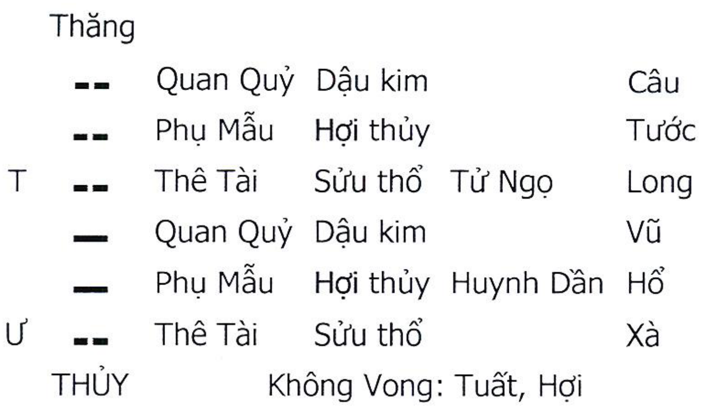
    - **Hình này chứng minh điều gì**
      - Quẻ chứng minh tình trạng phong thủy và ảnh hưởng cát hung tương ứng với quái tượng Sơ đồ quẻ Địa Phong Thăng.
    - **Từ đâu mà thấy được**
      - Căn cứ vào hào vị, lục thân, can chi sinh khắc, tuần không và hào động biến trong quẻ.
- **Kết quả ứng nghiệm thực tế:**
  - Tiền đến là tiêu, nhưng hoàn toàn cần thiết.
  - Cửa hàng cạnh đường lớn, là một trong những con đường quan trọng ở nơi đó.
  - Phụ Mẫu Hợi thủy lâm Bạch Hổ là cầu, hào 5 Không Vong cũng là cầu, Hợi thủy bị Nhật xung, lâm Dịch Mã, thủy lâm Dịch Mã ám động là sông, lân cận có cầu và sông.
  - **Phản hồi:** Cầu và sông đều có.
  - Sau lưng nhà không xa chính là sông.
  - Sông không rộng, cũng không sạch sẽ.
  - Từ nhà đi chưa đến 30 giây là gặp cây cầu.
  - Hào Thế hào Ứng tương đồng, lâm Thê Tài đều được Nhật Nguyệt tương sinh, lân cận có rất nhiều cửa hàng tương tự, tuy nhiên không ảnh hưởng đến kinh doanh của nhau mà trái lại là một chỉnh thể có tác dụng thúc đẩy lẫn nhau.
  - **Phản hồi:** Địa điểm của cửa hàng chúng tôi chính là phố Ginza.
  - Là một con phố thương mại.
  - ---
  - # Part 17 (Pages 321-340)

#### Ví dụ 8: Ngày Kỷ Dậu tháng Dần, nữ dự định kinh doanh nhà thuốc, xem phong thủy cửa hàn...

- **Bối cảnh và thông tin quẻ:**
  - Ngày Kỷ Dậu tháng Dần, nữ dự định kinh doanh nhà thuốc, xem phong thủy cửa hàng ra sao?
  - Được Thủy Thiên Nhu.
  - THỔ Không Vong: Dần, Mão
- **Luận giải quái tượng phong thủy:**
  - **Hình 173.** Sơ đồ quẻ Thủy Thiên Nhu
    - 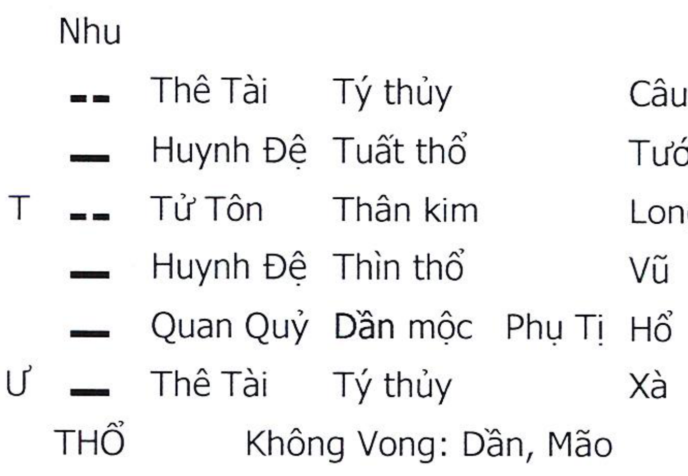
    - **Hình này chứng minh điều gì**
      - Lấy Phụ Mẫu làm Dụng thần, xem thêm hào 2, bởi vì hào 2 là cửa hàng. Kinh doanh nhà thuốc để thu lợi, đồng thời kiêm xem hào Tài.
    - **Từ đâu mà thấy được**
      - Lấy Phụ Mẫu làm Dụng thần, xem thêm hào 2, bởi vì hào 2 là cửa hàng. Tử Tôn trì Thế lâm Thanh Long, Tử Tôn là y dược, Thanh Long chủ quý trọng, cô ấy có một loại thuốc đặc biệt tốt.
- **Diễn tiến phân tích và suy luận chi tiết:**
  - Lấy Phụ Mẫu làm Dụng thần, xem thêm hào 2, bởi vì hào 2 là cửa hàng.
  - Kinh doanh nhà thuốc để thu lợi, đồng thời kiêm xem hào Tài.
  - Tử Tôn trì Thế lâm Thanh Long, Tử Tôn là y dược, Thanh Long chủ quý trọng, cô ấy có một loại thuốc đặc biệt tốt.
  - Hào Tài tuy được Nhật sinh, nhưng hào Thế Nguyệt phá, khó mà sinh Tài, kinh doanh nhà thuốc chưa hẳn có thể thu lợi.
  - Cái xung phá hào Thế là Nguyệt kiến Quan Quỷ.
  - Quan Quỷ là nhà nước, ngành chấp pháp.
  - Nhất định là khâu kiểm định thuốc gặp vướng mắc, khiến nhà thuốc không thể kinh doanh.
  - Hào 2 Quan Quỷ Không Vong, hào 2 là cửa hàng, chứng tỏ vẫn chưa thuê được nhà thuốc.
  - Lâm Bạch Hổ, Bạch Hổ là y dược, nhà thuốc đang muốn thuê đã từng là phòng khám bệnh.
  - Phụ Mẫu phục tàng, nhà thuốc không ở trên phố lớn, là ở trong hẻm nhỏ.
- **Kết quả ứng nghiệm thực tế:**
  - Tôi tốt nghiệp đại học y, đã phát minh được một loại thuốc đặc hiệu.
  - Tuy nhiên, tôi vẫn chưa lấy được giấy phép sản xuất của cơ quan quản lý dược phẩm.
  - Bởi vì xin giấy phép cần một khoản tiền lớn, vì vậy tôi dự định mở phòng khám bệnh, kiếm một ít tiền rồi sau đó mới đi xin giấy phép.
  - Hiện nay, tôi đã tìm được một căn nhà mặt tiền, trước đây đã từng mở phòng khám bệnh.
  - Tôi thấy căn nhà này khá
  - phù hợp với nhu cầu sử dụng của mình, tuy nhiên tôi vẫn chưa ký hợp đồng với chủ nhà.
  - Tôi muốn xem phong thủy của cửa hàng rồi sau đó mới thuê lại.

#### Ví dụ 9: Ngày Ất Tị tháng Hợi, nam đoán phong thủy cửa hàng thuốc lá, được Địa Sơn Khiê...

- **Bối cảnh và thông tin quẻ:**
  - Ngày Ất Tị tháng Hợi, nam đoán phong thủy cửa hàng thuốc lá, được Địa Sơn Khiêm biến Lôi Sơn Tiểu Quá.
  - KIM Không Vong: Dần, Mão
- **Luận giải quái tượng phong thủy:**
  - **Hình 174.** Sơ đồ quẻ Địa Sơn Khiêm biến Lôi Sơn Tiểu Quá
    - 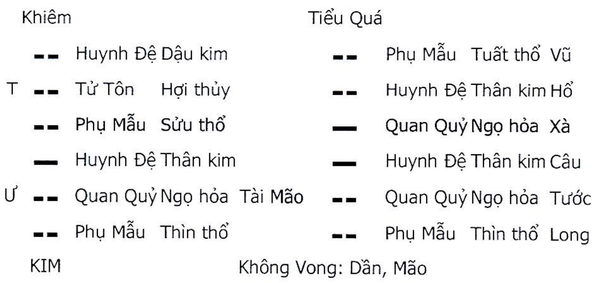
    - **Hình này chứng minh điều gì**
      - Mặc dù là dự đoán phong thủy, nhưng mục đích của mở cửa hàng là làm kinh tế, vì vậy phải lấy hào Tài làm Dụng thần. Tài Không phục dưới hào 2, Nguyệt sinh, Nhật không sinh, Phụ Mẫu Sửu thổ độc phát...
    - **Từ đâu mà thấy được**
      - Mặc dù là dự đoán phong thủy, nhưng mục đích của mở cửa hàng là làm kinh tế, vì vậy phải lấy hào Tài làm Dụng thần. Tài Không phục dưới hào 2, Nguyệt sinh, Nhật không sinh, Phụ Mẫu Sửu thổ độc phát...
- **Diễn tiến phân tích và suy luận chi tiết:**
  - Mặc dù là dự đoán phong thủy, nhưng mục đích của mở cửa hàng là làm kinh tế, vì vậy phải lấy hào Tài làm Dụng thần.
  - Tài Không phục dưới hào 2, Nguyệt sinh, Nhật không sinh, Phụ Mẫu Sửu thổ độc phát khắc Nguyên thần, Phục sinh Phi là tiết khí, vì vậy kinh doanh nhất định không tốt.
  - Hào 2 là cửa hàng, lâm hào Ứng, là Ứng nhập phi trạch, là cửa hàng đi thuê.
  - Phục sinh Phi, Tài tiết khí ở hào 2, tiền kiếm được hầu hết trả tiền thuê nhà.
  - Phụ Mẫu là cửa hàng, độc phát hao tài, khắc Tử Tôn cũng là thông tin nhà hao tài.
  - Trong quẻ Phụ Mẫu lưỡng hiện, chứng tỏ cửa hàng có phòng trên phòng dưới hoặc phòng trong phòng ngoài.
  - Quẻ cung Đoài, có thông tin đền chùa, lại hào 4 Phụ Mẫu lâm Xà hóa Quỷ, trong cửa hàng có thờ cúng thần phật.
  - Hào 5 là đường đi, Tử Tôn sinh Tài, có thể hiểu Tử Tôn là khách hàng.
  - Tại hào 5 chính là hành nhân, người qua đường.
  - Phụ Mẫu lâm Xà khắc, Xà là ít, chính là ít khách qua đường.
  - Lưu lượng khách thấp.
  - Bạch Hổ lâm Thế là sốt ruột, bận rộn, ám động sinh Tài, lén lút dùng thủ đoạn để được tài.
  - Vì vậy phán đoán cửa
  - hàng này bất hảo, tâm lý rất nóng vội, mỗi ngày chạy ngược chạy xuôi, lợi dụng quan hệ của bản thân để tiêu thụ thuốc lá, rượu.
  - Nhờ vậy mới gắng gượng duy trì được tiền bạc.
  - Cửa hàng này không tụ tài, vì vậy không thể kinh doanh.
  - Quẻ Khiêm có ý nghĩa là nhượng (nhượng lại, bán lại), bản thân nên thoát khỏi cửa hàng này.
  - Những phán đoán trên đây hoàn toàn phù hợp với tình hình thực tế.

#### Ví dụ 10: Ngày Ất Mùi tháng Nhâm Tý năm Đinh Hợi, nam đoán phong thủy trạm thu mua, đượ...

- **Bối cảnh và thông tin quẻ:**
  - Ngày Ất Mùi tháng Nhâm Tý năm Đinh Hợi, nam đoán phong thủy trạm thu mua, được Phong Sơn Tiệm biến Hỏa Sơn Lữ.
  - THỔ Không Vong: Thìn, Tị
- **Luận giải quái tượng phong thủy:**
  - **Hình 175.** Sơ đồ quẻ Phong Sơn Tiệm biến Hỏa Sơn Lữ
    - 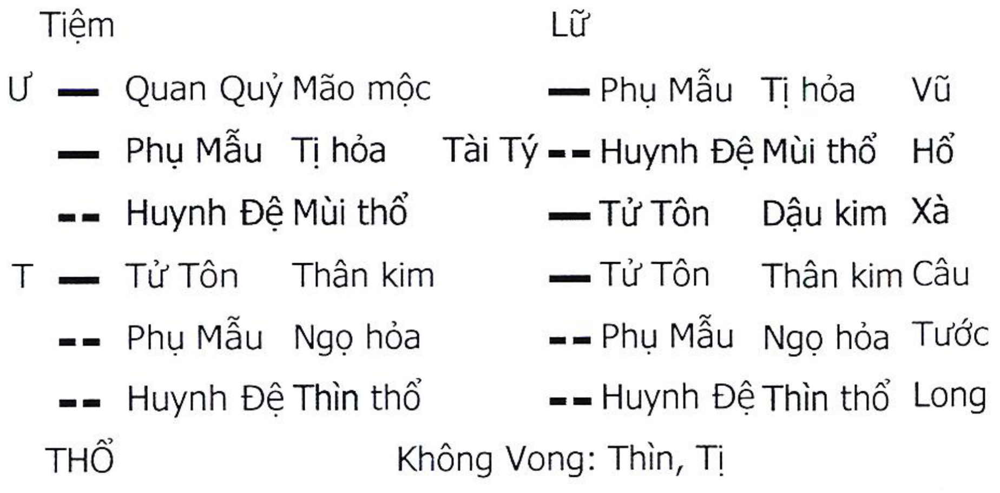
    - **Hình này chứng minh điều gì**
      - Thê Tài Tý thủy không hiện trên quẻ, phục tàng dưới hào 5, hào 5 Phụ Mẫu Tị hỏa lâm Bạch Hổ Không Vong, phát động Tuyệt Tài, hào 5 là đường đi, Bạch Hổ cũng là đường đi, Không Vong chính là đường k...
    - **Từ đâu mà thấy được**
      - Thê Tài Tý thủy không hiện trên quẻ, phục tàng dưới hào 5, hào 5 Phụ Mẫu Tị hỏa lâm Bạch Hổ Không Vong, phát động Tuyệt Tài, hào 5 là đường đi, Bạch Hổ cũng là đường đi, Không Vong chính là đường k...
- **Diễn tiến phân tích và suy luận chi tiết:**
  - Thê Tài là phế phẩm, cũng là lợi nhuận, không có phế phẩm thì không có lợi nhuận.
  - Thê Tài Tý thủy không hiện trên quẻ, phục tàng dưới hào 5, hào 5 Phụ Mẫu Tị hỏa lâm Bạch Hổ Không Vong, phát động Tuyệt Tài, hào 5 là đường đi, Bạch Hổ cũng là đường đi, Không Vong chính là đường không thông, Tuyệt Tài chính là bởi vì đường đi không thông mà phế phẩm không được vận chuyển vào.
  - Phụ Mẫu Tị hỏa chủ Đông Nam, động hóa Mùi thổ chủ Tây Nam, đường từ Đông Nam quẹo đến Tây Nam đi.
  - Đây là đường phản cung.
  - Nguyệt Tý thủy chủ phương Bắc, xung phá hào 2 Phụ Mẫu Ngọ hỏa, Phụ Mẫu là nhà, hào 2 cũng chủ nhà, xung phá, chủ phương Bắc có nhà bị dỡ bỏ.
  - Hào Thế là nơi làm việc của mình, thuộc nội quái quẻ Cấn, phòng làm việc tại hướng Đông Bắc.
  - Thê Tài Tý thủy phục tàng, Thê Tài là hàng hóa, hàng hóa để ở phía Bắc.
  - Nhưng bị Nhật khắc, hào động Mùi thổ khắc, hàng hóa không nhiều, cơ hội làm giàu chưa đến.
  - Hào 5 Tị hỏa phát động hợp hào 3, Tị hỏa là Đông Nam, đường đến từ Đông Nam, hào 3 là cửa, cổng được xây dựng tại Đông Nam.
- **Kết quả ứng nghiệm thực tế:**
  - Những phán đoán trên đây hoàn toàn phù hợp với tình hình thực tế.

#### Ví dụ 11: Ngày Đinh Mùi tháng Kỷ Hợi năm Bính Tuất, nam đoán phong thủy công ty, được P...

- **Luận giải quái tượng phong thủy:**
  - **Hình 176.** Quẻ Phong Trạch Trung Phu biến Thủy Thiên Nhu
    - 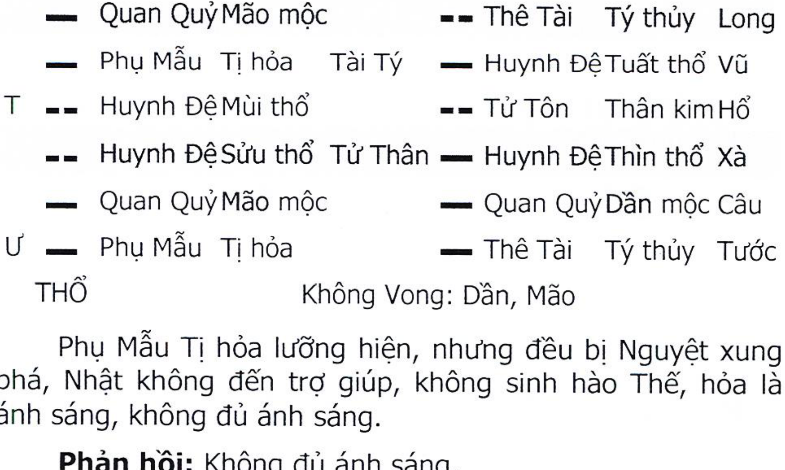
    - **Hình này chứng minh điều gì**
      - Quẻ chứng minh tình trạng phong thủy và ảnh hưởng cát hung tương ứng với quái tượng Quẻ Phong Trạch Trung Phu biến Thủy Thiên Nhu.
    - **Từ đâu mà thấy được**
      - Căn cứ vào hào vị, lục thân, can chi sinh khắc, tuần không và hào động biến trong quẻ.
- **Kết quả ứng nghiệm thực tế:**
  - Không đủ ánh sáng.
  - Phụ Mẫu thể hiện trưởng bối, dương chủ cha, Nguyệt phá không cát.
  - Tị hỏa tương ứng với năm 2001 Tân Tị, năm này bất lợi cho cha.
  - **Phản hồi:** Năm đó công ty chuyển đến, không lâu sau cha đã qua đời.
  - Quan Quỷ Mão mộc tại quẻ Tốn phát động khắc hào Thế, mộc là cây cối, Mão mộc là Đông, Tốn là Đông Nam, mộc Không là cây trúc, phía Đông hoặc Đông Nam có cây trúc gây bất lợi cho bản thân.
  - **Phản hồi:** Phía Đông có cây trúc.
  - Hào 3 Huynh Đệ Sửu thổ động hóa Huynh Đệ, khắc Thê Tài, xung hào Thế Huynh Đệ, Nhật lại là Huynh Đệ xung hào 3, hào 3 hào 4 là cửa, hào 4 là cửa sổ, kiêm hào là cửa sổ, cửa và cửa sổ quá nhiều, đối xung, bất lợi cho tài vận.
  - **Phản hồi:** Đông Bắc và Tây Nam đều có cửa sổ, đối xung với cửa, tài vận không tốt.

#### Ví dụ 12: Ngày Canh Tý tháng Mậu Thân năm Đinh Hợi, nam đoán phong thủy nhà máy, được H...

- **Luận giải quái tượng phong thủy:**
  - **Hình 177.** Quẻ Hỏa Phong Đỉnh biến Lôi Phong Hằng
    - 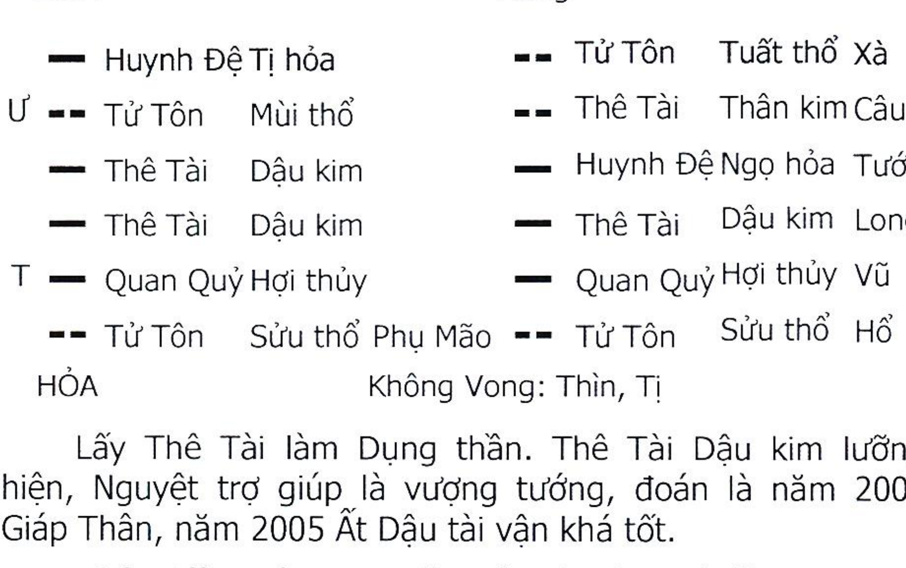
    - **Hình này chứng minh điều gì**
      - Quẻ chứng minh tình trạng phong thủy và ảnh hưởng cát hung tương ứng với quái tượng Quẻ Hỏa Phong Đỉnh biến Lôi Phong Hằng.
    - **Từ đâu mà thấy được**
      - Căn cứ vào hào vị, lục thân, can chi sinh khắc, tuần không và hào động biến trong quẻ.
- **Kết quả ứng nghiệm thực tế:**
  - Đúng, hai năm này tài vận khá tốt.
  - Huynh Đệ Tị hỏa được Nguyệt hợp chuyển vượng, độc phát hóa Tuất thổ đến khắc Thê Tài xung hào Thế Hợi thủy, Tuất thổ tương ứng với năm Bính Tuất, năm này mặc dù sinh Thê Tài, nhưng là Kỵ thần Huynh Đệ hóa ra, năm này tài vận bắt đầu sa sút.
  - **Phản hồi:** Đúng, năm đó bắt đầu không thuận lợi.
  - Năm nay là năm Đinh Hợi, xung thực Kỵ thần Huynh Đệ Tị hỏa, vẫn chưa có khởi sắc.
  - **Phản hồi:** Đúng, vì vậy cho nên muốn dự đoán xem là chuyện gì đang xảy ra.
  - Huynh Đệ Tị hỏa lâm Đằng Xà hào 6 độc phát, hào 6 là trời, Đằng Xà chủ thon dài, hỏa là điện, tại cung Ly càng chủ điện, hỏa chủ số 2, vì vậy đoán là có hai đường dây điện vắt ngang qua vùng trời của nhà máy.
  - **Phản hồi:** Thì ra là như vậy!
  - Đúng là có hai đường dây cao thế vắt ngang qua nhà máy.

#### Ví dụ 13: Ngày Kỷ Mùi tháng Tị, một giám đốc nhà máy xi măng đoán tình tình phát triển ...

- **Luận giải quái tượng phong thủy:**
  - **Hình 178.** Sơ đồ quẻ Sơn Thiên Đại Súc biến Phong Thủy Hoán
    - 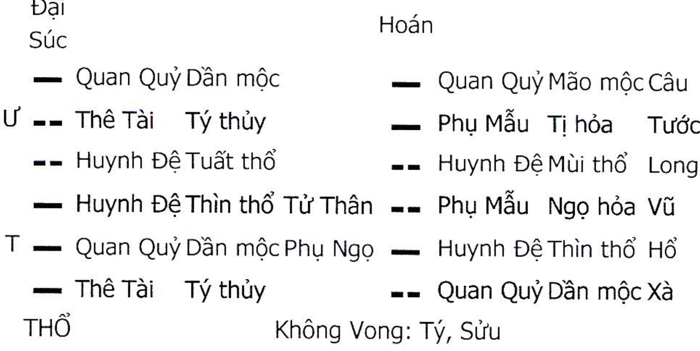
    - **Hình này chứng minh điều gì**
      - Quẻ chứng minh tình trạng phong thủy và ảnh hưởng cát hung tương ứng với quái tượng Sơ đồ quẻ Sơn Thiên Đại Súc biến Phong Thủy Hoán.
    - **Từ đâu mà thấy được**
      - Căn cứ vào hào vị, lục thân, can chi sinh khắc, tuần không và hào động biến trong quẻ.
- **Kết quả ứng nghiệm thực tế:**
  - Đúng.
  - Vừa ra khỏi nhà máy là có một con đường rẽ xuống dốc, ở hướng Đông Nam có một cái lò nung gạch.
  - Tại sao phán đoán như vậy?
  - Trong lục hào, Thế là núi, là hướng, hào Ứng là hướng, là phía trước.
  - Quẻ này hào Ứng Thê Tài Tý thủy lâm hào 5, hào 5 chủ đường đi, chắc chắn liên quan rất mật thiết với đường, lâm Tài Không hóa Tuyệt, vì vậy ảnh hưởng đến tài vận của xí nghiệp.
  - Thê Tài Tý thủy động mà hóa Tị hỏa, thông thường hào 5 Không Vong là cầu, nhưng cũng có ý nghĩa thấp trũng, đi xuống.
  - Hóa Tuyệt, càng đi càng thấp, vì vậy là đường xuống dốc.
  - Dựa vào nguyên lý di thần, mượn đến Đằng Xà của hào sơ Tý thủy, Đằng Xà là uốn lượn, vì vậy là chỗ rẽ.
  - Tị là Đông Nam, hóa nhập Tốn, Tốn cũng là Đông Nam, vì vậy là hướng Đông Nam.
  - Tị hỏa Tuyệt Tài, vì vậy có liên quan đến hỏa.
  - Tuyệt tại Phụ Mẫu, Phụ Mẫu chủ kiến trúc, nhà máy.
  - Đồng thời lại lâm Chu Tước, Chu Tước cũng là hỏa, vì vậy là kiến trúc có liên quan đến hỏa.
  - Mà lò nung gạch chính là thông tin của hỏa.
  - Hào sơ cũng là Tý thủy, Không Vong lâm Đằng Xà, Đằng Xà chủ thiếu.
  - Tuyệt ở Nguyệt, Nhật khắc là hưu tù.
  - Hào sơ là giếng nước, nhà máy xi măng nhất định phải dùng nước, thông thường là nước trong giếng tự đào.
  - Phân tích đến đây, tôi hỏi anh ta là trong nhà máy có giếng hay không?
  - Anh ta trả lời là có.
  - Thế là tôi đoán bên trong giếng của nhà máy không có nước.
  - Anh ta nói: Quá đúng!
  - Trước đây máy móc không quay, rất nhiều nhân viên kỹ thuật đã tốn rất nhiều thời gian nhưng đều không tìm được nguyên nhân, cuối cùng đã phát hiện ra là trong giếng không có nước, nếu như đến tìm ông dự đoán sớm một chút thì đã không phải tốn nhiều sức người sức của như vậy rồi.
  - Có phương pháp điều chỉnh nào tốt hay không?
  - Tôi nói: Tôi sắp đi xa trong vài ngày tới, vì vậy chưa có thời gian đến xem nhà máy của anh được.
  - Tôi nói trước cho anh phương pháp xử lý, khi nào tôi trở về sẽ giải quyết.
  - Anh tìm 9 viên đá đã phong hóa, sau đó cho vào một cái lọ, đổ thêm nước vào trong lọ rồi đặt nó ở hướng Đông Bắc của phòng làm việc.
  - Ở đây cần phải giải quyết vấn đề hào Tài Tý thủy Không Vong, Không thì cần Thực.
  - Đổ thêm nước là bổ túc Không
  - Vong.
  - Tuy nhiên, quẻ này Nguyên thần và Dụng thần đều không vượng, thủy không những phải xuất Không, mà còn phải được kim đến sinh.
  - Kim là Thân Dậu, chủ 4, 9, Thân là dương, dùng 9.
  - Kết hợp với quẻ có thể tạo thành tam hợp cục Thân Tý Thìn.
  - Như vậy, nước bên trong cũng chính là Tý thủy, không phải là Hợi thủy.
  - Tạo thành tam hợp cục thì Huynh Đệ Thìn thổ không còn khắc Tài, bởi vì đã trở thành người một nhà.
  - Huyền Vũ chủ mục nát, kim chủ đá, tổng hợp lại chính là đá phong hóa.
  - Tại sao phải để ở hướng Đông Bắc?
  - Dần là Thế, thể hiện bản thân, thể hiện nhà máy, vì vậy phải để tại hướng Đông Bắc.
  - Về sau, không những nhà máy được cải thiện mà sức khỏe của anh ta cũng đã tốt lên.
  - Anh ta có một nhà máy xi măng nhỏ, muốn ký hợp đồng làm ăn với người ta nhưng vẫn chưa có ai hợp tác.
  - Bản thân cảm thấy một năm thu lợi tầm 20 vạn đã là không tệ, đằng này đột nhiên có người tìm anh ta ký kết, mà giá khởi điểm đến 30 vạn mỗi năm.
  - Khi nhà nước khảo sát các nhà máy xi măng, vùng này có 82 xí nghiệp, nhà nước muốn chọn một xí nghiệp xuất sắc để xuất vốn giúp đỡ, kết quả là chọn trúng anh ta, nhà nước đã đầu tư cho anh ta hàng chục triệu nguyên.
  - Điều kỳ lạ là sau khi hóa giải thì trong giếng đột nhiên lại có nước.

#### Ví dụ 14: Ngày Quý Hợi tháng Quý Mão năm Đinh Hợi, nam đoán phong thủy cửa hàng ăn uống...

- **Bối cảnh và thông tin quẻ:**
  - Ngày Quý Hợi tháng Quý Mão năm Đinh Hợi, nam đoán phong thủy cửa hàng ăn uống, được Địa Thủy Sư biến Hỏa Thủy Vị Tế.
  - THỦY Không Vong: Tý, Sửu
- **Luận giải quái tượng phong thủy:**
  - **Hình 179.** Sơ đồ quẻ Địa Thủy Sư biến Hỏa Thủy Vị Tế
    - 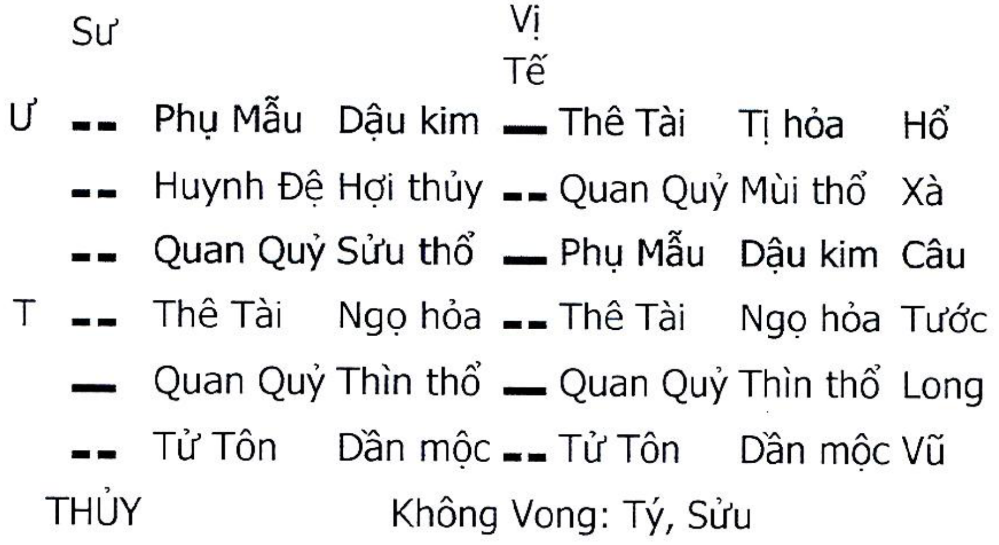
    - **Hình này chứng minh điều gì**
      - Thê Tài trì Thế được Nguyệt sinh là vượng tướng, lâm Chu Tước, chủ văn thư, hào 3 là kế toán, tổng hợp lại có thể hiểu là điểm bán hàng, chứng tỏ điểm bán hàng có vị trí đẹp, phong thủy khá tốt, là...
    - **Từ đâu mà thấy được**
      - Thê Tài trì Thế được Nguyệt sinh là vượng tướng, lâm Chu Tước, chủ văn thư, hào 3 là kế toán, tổng hợp lại có thể hiểu là điểm bán hàng, chứng tỏ điểm bán hàng có vị trí đẹp, phong thủy khá tốt, là...
- **Diễn tiến phân tích và suy luận chi tiết:**
  - Thê Tài trì Thế được Nguyệt sinh là vượng tướng, lâm Chu Tước, chủ văn thư, hào 3 là kế toán, tổng hợp lại có thể hiểu là điểm bán hàng, chứng tỏ điểm bán hàng có vị trí đẹp, phong thủy khá tốt, làm ăn thuận lợi.
  - Phụ Mẫu lâm hào Ứng, Phụ Mẫu là cửa hàng, hào Ứng là người khác, là cửa hàng đi thuê địa điểm.
  - Tam hợp Phụ Mẫu cục, chủ có nhiều cửa hàng kết hợp lại, Nguyệt phá lại là tách ra, vì vậy phán đoán có chuỗi cửa hàng.
  - Hào 3 là cửa, lâm Ngọ hỏa, Ngọ hỏa là phía Nam, cửa hàng là tọa Bắc hướng về Nam.
  - Hào Ứng là đối diện cửa hàng, lâm Phụ Mẫu chủ có kiến trúc, lâm Bạch Hổ chủ y dược, đối diện có bệnh viện.
  - Động hóa Thê Tài, bệnh viện có thể đem lại lợi ích cho mình.
- **Kết quả ứng nghiệm thực tế:**
  - Trên thực tế đúng là chuỗi cửa hàng, đối diện là bệnh viện quân y, rất nhiều người nhà bệnh nhân đến ăn, kinh doanh rất thuận lợi.

#### Ví dụ 15: Ngày Bính Thân tháng Tân Mão năm Bính Tuất, nam đoán phong thủy cửa hàng dụng...

- **Bối cảnh và thông tin quẻ:**
  - Ngày Bính Thân tháng Tân Mão năm Bính Tuất, nam đoán phong thủy cửa hàng dụng cụ ăn uống, được Cấn Vi Sơn biến Sơn Thủy Mông.
  - THỔ Không Vong: Thìn, Tị
  - Phụ Mẫu Ngọ hỏa tại hào 2 lâm Câu Trần phát động, hào 2 là cửa hàng, Phụ Mẫu cũng là cửa hàng, Câu Trần chủ cải tạo, phát động chủ biến động, động hóa Thìn thổ Không, chính là chuyển nhà để tiến hành cải tạo.
  - Thìn thổ tương ứng với năm 2000 Canh Thìn, năm này cửa hàng dời chỗ.
- **Luận giải quái tượng phong thủy:**
  - **Hình 180.** Sơ đồ quẻ Cấn Vi Sơn biến Sơn Thủy Mông
    - 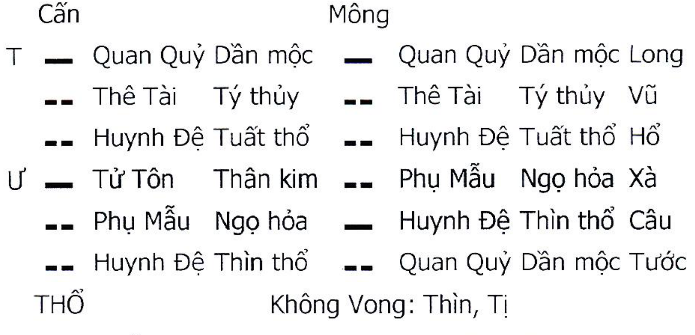
    - **Hình này chứng minh điều gì**
      - Quẻ chứng minh tình trạng phong thủy và ảnh hưởng cát hung tương ứng với quái tượng Sơ đồ quẻ Cấn Vi Sơn biến Sơn Thủy Mông.
    - **Từ đâu mà thấy được**
      - Căn cứ vào hào vị, lục thân, can chi sinh khắc, tuần không và hào động biến trong quẻ.
- **Kết quả ứng nghiệm thực tế:**
  - Năm này đã dời chỗ.
  - Thê Tài Tý thủy hào 5 được Nhật sinh vượng tướng, hào 5 là tôn vị, năm Nhâm Ngọ xung Thê Tài Tý thủy, có thể được đại tài.
  - Tử Tôn Thân kim phát động sinh Thê Tài là kinh doanh được mở rộng, hóa Phụ Mẫu mở là chi nhánh.
  - Lâm hào Ứng hóa xuất, Ứng là tha hương, mở chi nhánh ở vùng khác.
  - **Phản hồi:** Đúng, thời gian năm Nhâm Ngọ rất tốt.
  - Thân kim động mà gặp hợp, năm Tân Tị thì đã bắt đầu tuột dốc.
  - Năm Nhâm Ngọ trị hào biến Ngọ hỏa, vẫn tiếp tục mở rộng.
  - Năm Giáp Thân trị Thân kim, là một năm quan trọng.
  - Nhưng Tử Tôn động hóa hồi đầu khắc, hào 2 Ngọ hỏa lại đến khắc, Tử Tôn vô lực sinh Thê Tài, mở rộng dẫn tới suy thoái, đã lâm vào tình trạng bất lợi.
  - **Phản hồi:** Đúng, mới khởi đầu thì rất tốt, cứ liên tục mở rộng.
  - Tân Cương, Vân Nam, Bắc Kinh đều có chi nhánh của tôi.
  - Tuy nhiên, quầy hàng quá lớn mà hiệu quả không cao, sau khi phá tài mấy trăm vạn đã rút lui.
  - Hào 6 Quan Quỷ Dần mộc lâm Thanh Long ám động, hào 6 là thần phật, bàn thờ, Quan Quỷ là thần phật, Thanh Long là tôn quý, Dần mộc tương ứng Đông Bắc, Đông Bắc của cửa hàng có thờ cúng thần phật.
  - **Phản hồi:** Có tượng Quan Thế Âm.
  - Hào 2 hóa ra Huynh Đệ Thìn thổ, Thìn thổ tương ứng Đông Nam, thủy khố là trữ nước, Không Vong là chảy xuống, có nhà vệ sinh ở hướng Đông Nam.
  - **Phản hồi:** Đúng.
  - Xem ra chưa đến năm 2008 thì kinh tế của cửa hàng rất khó xoay chuyển.
  - **Phản hồi:** Chỉ mong huy hoàng lại đến.

#### Ví dụ 16: Ngày Quý Mùi tháng Mậu Tý năm Ất Dậu, nam hỏi công trình của đơn vị xảy ra sự...

- **Bối cảnh và thông tin quẻ:**
  - Ngày Quý Mùi tháng Mậu Tý năm Ất Dậu, nam hỏi công trình của đơn vị xảy ra sự cố có phải là do ảnh hưởng của phong thủy hay không?
  - Được Phong Lôi Ích biến Sơn Lôi Di.
  - MỘC Không Vong: Thân, Dậu
  - Hào 5 Tử Tôn Tị hỏa lâm Đằng Xà độc phát hóa Phụ Mẫu Tý thủy, hào 5 là đường đi, Tử Tôn cũng là đường đi, sinh hào Thế, chính là đường đến đơn vị, Đằng Xà chủ uốn lượn, chính là chỗ rẽ.
  - Hào Thế tại hào 3 chủ cửa, vì vậy đoán là ở chỗ vào cổng đơn vị có đường rẽ, thủy là thấp khí, nơi đó tương đối ẩm ướt.
- **Luận giải quái tượng phong thủy:**
  - **Hình 181.** Quẻ Phong Lôi Ích biến Sơn Lôi Di
    - 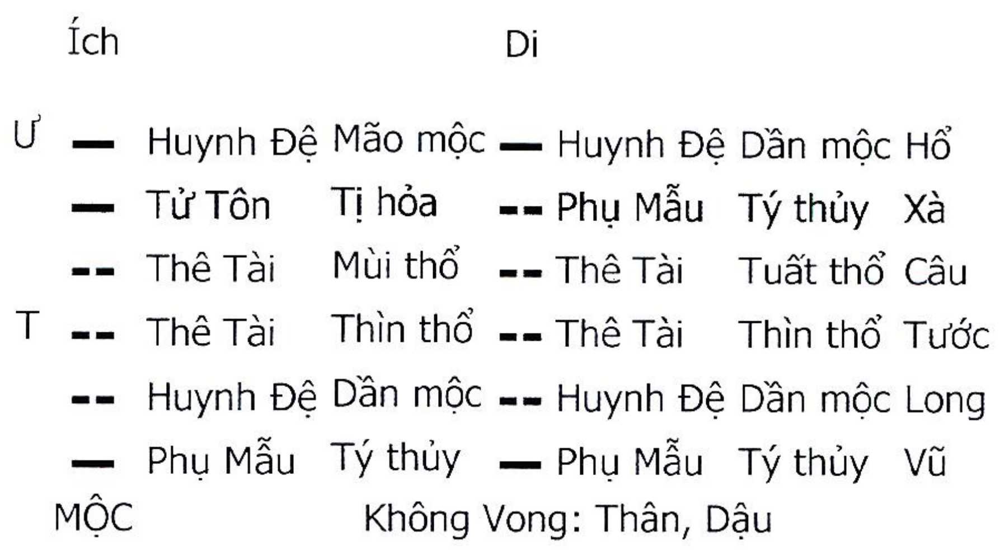
    - **Hình này chứng minh điều gì**
      - Quẻ chứng minh tình trạng phong thủy và ảnh hưởng cát hung tương ứng với quái tượng Quẻ Phong Lôi Ích biến Sơn Lôi Di.
    - **Từ đâu mà thấy được**
      - Căn cứ vào hào vị, lục thân, can chi sinh khắc, tuần không và hào động biến trong quẻ.
- **Kết quả ứng nghiệm thực tế:**
  - Đúng.
  - Nơi đó có thảm cỏ, thường xuyên được tưới nước.
  - Tị hỏa độc phát là Bệnh địa của hào Ứng Mão mộc, hào Ứng Mão mộc lâm Bạch Hổ nhập Mộ tại Nhật, Bạch Hổ chủ bị thương, hào 6 là người không quan trọng, người không chính thức.
  - Ứng là người khác, không thuộc công nhân của đơn vị, vì vậy phán đoán người xảy ra sự cố là công nhân tạm thời.
  - Lại hào 6 là chỗ cao, nhập Mộ tại Nhật, Nhật xuất hiện trong quẻ, đến hào 4, hào 4 có hào vị thấp hơn hào 6, vì vậy là từ trên cao rơi xuống bị thương.
  - **Phản hồi:** Đúng là như vậy, xem ra cũng có ảnh hưởng của phong thủy.

#### Ví dụ 17: Ngày Canh Thân tháng Nhâm Ngọ năm Ất Dậu, nữ đoán phong thủy cửa hàng thức ăn...

- **Bối cảnh và thông tin quẻ:**
  - Ngày Canh Thân tháng Nhâm Ngọ năm Ất Dậu, nữ đoán phong thủy cửa hàng thức ăn nhanh, được Trạch Địa Tụy biến Lôi Địa Dự.
  - KIM &emsp;&emsp;&emsp;&emsp;
  - Không Vong: Tý, Sửu
  - Huynh Đệ Dậu kim tại hào 5 độc phát là tiêu điểm.
  - Động khắc Thê Tài Mão mộc, lại là Tử địa hào Thế, hào 5 là đường, hóa thoái là đường đi vào phải đi ra, chính là ngõ cụt, khắc Tài ảnh hưởng tài vận.
- **Luận giải quái tượng phong thủy:**
  - **Hình 182.** Sơ đồ quẻ Trạch Địa Tụy biến Lôi Địa Dự
    - 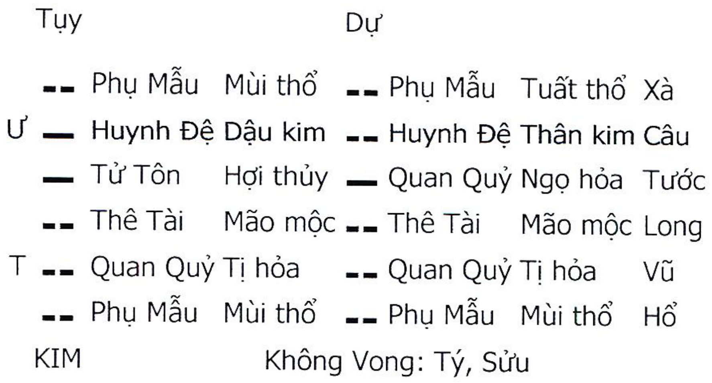
    - **Hình này chứng minh điều gì**
      - Quẻ chứng minh tình trạng phong thủy và ảnh hưởng cát hung tương ứng với quái tượng Sơ đồ quẻ Trạch Địa Tụy biến Lôi Địa Dự.
    - **Từ đâu mà thấy được**
      - Căn cứ vào hào vị, lục thân, can chi sinh khắc, tuần không và hào động biến trong quẻ.
- **Kết quả ứng nghiệm thực tế:**
  - Cửa hàng nằm trong một ngõ cụt.
  - Kinh doanh thường chỉ đủ duy trì sinh hoạt.
  - Dậu kim là Tử địa hào Thế, có vong đến quấy rối.
  - Gặp kim, kim chủ âm thanh, chủ yếu là ảnh hưởng đến mình dưới dạng âm thanh.
  - Hào 5 là đường, chính là tiếng bước chân.
  - **Phản hồi:** Tôi cứ cảm thấy như có người mở cửa, lập tức ra xem thì chẳng có ai, chỉ nghe thấy tiếng bước chân, vì vậy mà tinh thần bất an, nghe nói ngày trước ở đây đã có người chết.
  - Mão mộc hưu tù, Nhật Nguyệt không trợ giúp, Tuyệt tại Nhật, độc phát đến khắc, xung quanh cửa hàng không có cây cối, bất lợi cho tài vận.
  - **Phản hồi:** Không có cây cối.
  - Hào 2 là cửa hàng, lâm Huyền Vũ Tử tại Dậu kim, hỏa chủ ánh sáng, Huyền Vũ chủ tối tăm, bẩn thỉu.
  - Cửa hàng thiếu ánh sáng và dơ bẩn.
  - **Phản hồi:** Không có cửa sổ, không có ánh sáng chiếu vào.
  - Hào 5 Huynh Đệ động lại là Tử địa hào Thế, đề phòng phá tài trên đường, tai nạn xe cộ.
  - Tháng Dậu năm 2004, cô ấy bị cảnh sát phạt 20 vạn yên bởi vì lái xe sau khi uống rượu.

#### Ví dụ 18: Ngày Bính Thân tháng Mậu Ngọ năm Mậu Tý, nam xem về cửa hàng người ta thuê lạ...

- **Bối cảnh và thông tin quẻ:**
  - Ngày Bính Thân tháng Mậu Ngọ năm Mậu Tý, nam xem về cửa hàng người ta thuê lại, được Phong Lôi Ích biến Sơn Hỏa Bí.
  - MỘC Không Vong: Thìn, Tị
  - Mục đích là lợi nhuận, vì vậy Thê Tài là Dụng thần.
  - Thê Tài lưỡng hiện, lấy hào Thê Tài phát động làm Dụng thần.
  - Thê Tài Thìn thổ trì Thế, nhưng lâm Không Vong, Nguyên thần Tị hỏa Không Vong, bị Nhật hợp hóa Nguyệt phá không cát, thế chân kinh doanh chắc chắn lỗ vốn.
  - Hào Thế Không Vong hóa Phụ Mẫu, Nguyên thần Không Vong hóa Phụ Mẫu, Phụ Mẫu là cửa hàng, phong thủy cửa hàng nhất định có một số vấn đề.
  - Hào Thế Thìn thổ tại hào 3 hóa Phụ Mẫu Hợi thủy, hào 3 là cửa, Không Vong biểu thị cửa không có cản trở, thủy là trong suốt, chứng tỏ cửa được làm bằng kính, vừa nhìn vào là thấy bên trong.
  - Lâm Đằng Xà, có vết nứt.
- **Luận giải quái tượng phong thủy:**
  - **Hình 183.** Sơ đồ quẻ Phong Lôi Ích biến Sơn Hỏa Bí
    - 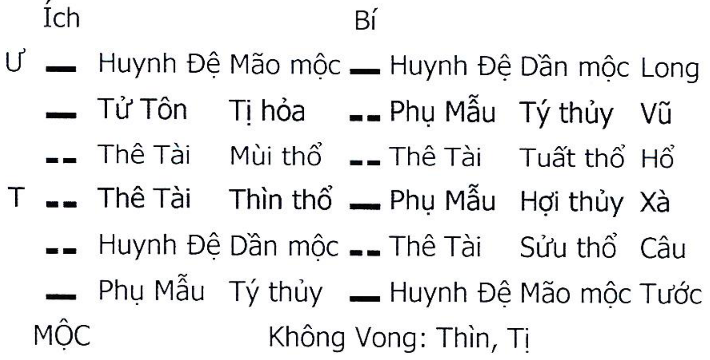
    - **Hình này chứng minh điều gì**
      - Quẻ chứng minh tình trạng phong thủy và ảnh hưởng cát hung tương ứng với quái tượng Sơ đồ quẻ Phong Lôi Ích biến Sơn Hỏa Bí.
    - **Từ đâu mà thấy được**
      - Căn cứ vào hào vị, lục thân, can chi sinh khắc, tuần không và hào động biến trong quẻ.
- **Kết quả ứng nghiệm thực tế:**
  - Đúng, là cửa kính, có vết nứt.
  - Hào 5 Tử Tôn Tị hỏa Không Vong hóa phá, hào 5 là đường đi, đường Không là cầu, lân cận có cầu, Nhật hợp là cầu vượt.
  - Lại Phụ Mẫu hóa phá, biểu thị đường đi hư hại, phá tại Phụ Mẫu, Phụ Mẫu là công trình, lại hào 2 lâm Câu Trần ám động, Câu Trần là công trình, hào 2 là khu vực lân cận của cửa hàng, vì vậy lân cận có công trình tu sửa đường.
  - Tý thủy Nguyệt phá, tháng Tý mới có thể kết thúc.
  - **Phản hồi:** Lân cận có cầu vượt, đang sửa đường.
  - Nghe nói đến tháng 11 mới có thể hoàn thành.
  - Năm 2000 Canh Thìn, Thê Tài Thìn thổ Thực Không, tài vận cửa hàng rất tốt.
  - Năm 2001 Tị hỏa xuất Không, cũng rất tốt.
  - Năm 2002 Ngọ hỏa đến sinh cũng rất tốt.
  - Năm 2003 trị Mùi thổ, tài vận rất tốt.
  - Năm 2004 Nguyên thần bị hợp, tài vận bắt đầu đi xuống.
  - Năm 2006 mặc dù xung thực Thìn thổ nhưng Tị hỏa cũng nhập Mộ, vì vậy vừa được vừa mất.
  - Năm 2007 Đinh Hợi, là địa chi của hào Thế Không Vong hóa ra, Tị hỏa bị xung khai hóa phá, hóa hồi đầu khắc, bắt đầu không tốt.
  - Năm nay Nguyên thần hóa phá, phá tại Thái Tuế năm nay, tài vận càng không tốt.
  - **Phản hồi:** Tôi ở gần đó và biết rất rõ cửa hàng này.
  - Năm 2000 là một người khác kinh doanh, tài vận luôn rất tốt, năm 2004 thì bắt đầu gặp khó, đến năm 2006 thì chuyển nhượng.
  - Người thế chân chính là người kinh doanh hiện tại.
  - Mới khởi đầu thì tốt, nhưng bốn người hợp tác, xuất hiện mâu thuẫn cho nên đã chấm dứt, hiện tại không thể kinh doanh, vì vậy người ta muốn chuyển nhượng.

#### Ví dụ 19: Ngày Giáp Dần tháng Kỷ Tị năm Giáp Thân, nam đoán phong thủy công ty điện lực...

- **Bối cảnh và thông tin quẻ:**
  - Ngày Giáp Dần tháng Kỷ Tị năm Giáp Thân, nam đoán phong thủy công ty điện lực, được Lôi Thiên Đại Tráng.
  - ### Đại Tráng
  - THỔ Không Vong: Tý, Sửu
- **Diễn tiến phân tích và suy luận chi tiết:**
  - Hào Thế Phụ Mẫu Ngọ hỏa lâm Đằng Xà, lại là quẻ lục xung, hiện tại tâm trạng bất an, có rất nhiều chuyện buồn phiền.
  - Phụ Mẫu là vất vả, bận rộn, hiện nay chính là lúc bận bịu.
  - Tử Tôn Thân kim bị Nhật Dần mộc xung là ám động, Tử Tôn ám động sinh Tài, là gom góp tiền vốn.
  - Dần mộc chuyển vào trong quẻ tại hào 2, hào 2 là trạch, bởi vì có việc xây nhà cửa mà góp tiền.
  - Thê Tài Tý thủy Không Vong, tiền vốn không đúng chỗ.
  - Hào sơ là nền nhà, lâm Thê Tài Tý thủy Không Vong, công ty có chỗ bị rò rỉ nước, ảnh hưởng đến tài vận.
  - Hào sơ lại là cấp dưới, Không Vong chủ có tổn thất, Nguyệt Tị hỏa Tuyệt địa, chủ có lửa hoặc điện dẫn tới tử vong.
  - Thủy chủ 1, 6, tử vong 1 người hoặc 6 người.
  - Thân kim ám động sinh Tý thủy, có người cứu trợ, nhưng Tý thủy Không không được sinh, cứu không kịp.
- **Kết quả ứng nghiệm thực tế:**
  - Phán đoán quả nhiên chính xác.
  - Trong tháng này, công ty có một công nhân chết vì điện giật, mặc dù có người cứu nhưng không thành công.
  - Công ty có tháp nước bị rò rỉ.
  - Những phán đoán khác cũng phù hợp với tình hình thực tế.

#### Ví dụ 20: Ngày Ất Sửu tháng Kỷ Hợi năm Bính Tý, nam đoán phong thủy cửa hàng, được Hỏa ...

- **Bối cảnh và thông tin quẻ:**
  - Ngày Ất Sửu tháng Kỷ Hợi năm Bính Tý, nam đoán phong thủy cửa hàng, được Hỏa Thiên Đại Hữu biến Ly Vi Hỏa.
  - KIM Không Vong:
- **Diễn tiến phân tích và suy luận chi tiết:**
  - Lấy Phụ Mẫu làm cửa hàng, xem thêm hào 2.
  - Hào 2 là cửa hàng, hào 5 là nhân viên cửa hàng.
  - Hào 2 khắc hào 5, cửa hàng này bất lợi cho nhân viên.
  - Hào 5 Nhật phá lâm Bạch Hổ, hào 5 là đường đi, Bạch Hổ chủ tai nạn xe cộ.
  - Kinh doanh ở cửa hàng này thì nhân viên dễ xảy ra tai nạn giao thông.
  - Trong quẻ này, hào Tài tuy được Nguyệt kiến sinh phù, nhưng Tài không nên lâm hào 2 phát động, cửa hàng này thu nhập không ổn định.
  - Hào 2 động mà hóa Phụ Mẫu, lại biến lục xung, cửa hàng này mở không lâu dài, sẽ dời chỗ.
- **Kết quả ứng nghiệm thực tế:**
  - Trên thực tế, một nhân viên bị tai nạn giao thông ở tháng Dậu.
  - Năm 1997, bởi vì kinh doanh không phát đạt cho nên đã dời chỗ.
  - ---
  - # Part 18 (Pages 341-348)

#### Ví dụ 21: Ngày Mậu Thìn tháng Kỷ Hợi năm Bính Tý, một người đoán phong thủy cửa hàng ăn...

- **Bối cảnh và thông tin quẻ:**
  - Ngày Mậu Thìn tháng Kỷ Hợi năm Bính Tý, một người đoán phong thủy cửa hàng ăn uống, được Địa Sơn Khiêm biến Phong Hỏa Gia Nhân.
  - KIM Không Vong: Tuất, Hợi
- **Luận giải quái tượng phong thủy:**
  - **Hình 184.** Sơ đồ quẻ Địa Sơn Khiêm biến Phong Hỏa Gia Nhân
    - 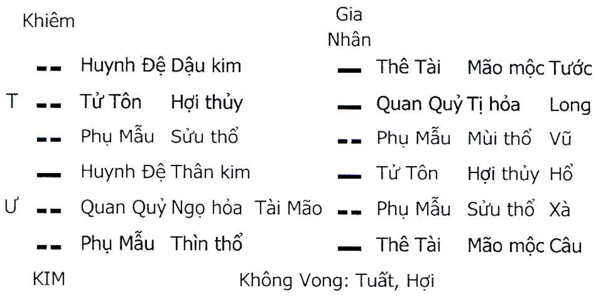
    - **Hình này chứng minh điều gì**
      - Lấy Phụ Mẫu làm cửa hàng, xem thêm hào 2. Hào sơ Phụ Mẫu Thìn thổ phát động hóa hồi đầu khắc, lâm Câu Trần, Câu Trần chủ công trình kiến trúc, cửa hàng có nguy cơ bị tháo dỡ.
    - **Từ đâu mà thấy được**
      - Hào sơ Phụ Mẫu Thìn thổ phát động hóa hồi đầu khắc, lâm Câu Trần, Câu Trần chủ công trình kiến trúc, cửa hàng có nguy cơ bị tháo dỡ. Hào 5 phát động khắc hào 2, hào 5 là đường, hào 2 là cửa hàng, l...
- **Diễn tiến phân tích và suy luận chi tiết:**
  - Lấy Phụ Mẫu làm cửa hàng, xem thêm hào 2.
  - Hào sơ Phụ Mẫu Thìn thổ phát động hóa hồi đầu khắc, lâm Câu Trần, Câu Trần chủ công trình kiến trúc, cửa hàng có nguy cơ bị tháo dỡ.
  - Hào 5 phát động khắc hào 2, hào 5 là đường, hào 2 là cửa hàng, lại là Nguyên thần Phụ Mẫu, sợ là bởi vì mở rộng đường mà cửa hàng bị tháo dỡ.
  - Ngoại quái phản ngâm, phản ngâm là thay đổi thất thường, cửa hàng này không những kinh doanh ăn uống, mà còn kinh doanh những thứ khác.
  - Thê Tài Mão mộc phục tàng tuy được Nguyệt sinh, nhưng bị Huynh Đệ phát động khắc chế, Tử Tôn Không Vong lại nhập Nhật Mộ, cửa hàng này rất khó kinh doanh có lãi.
  - Ứng lâm hào 2 là Ứng nhập phi trạch, cửa hàng này có người muốn thuê hoặc muốn mua.
  - Nhất định phải nắm bắt cơ hội này để chuyển nhượng cửa hàng.
- **Kết quả ứng nghiệm thực tế:**
  - Trên thực tế, cửa hàng này ban đầu kinh doanh nhà sách và vật liệu trang trí.
  - Bởi vì không kiếm được tiền cho nên đã đổi thành quán ăn, tuy nhiên vẫn không phát đạt.
  - Đúng lúc có người muốn thuê, thế là chuyển cho người ta.
  - Đến năm thứ hai, bởi vì mở rộng đường cho nên cửa hàng bị đập bỏ một nửa, diện tích bị thu hẹp, ngay cả cho thuê cũng khó khăn.

#### Ví dụ 22: Ngày Quý Tị tháng Canh Tý năm Bính Tý, nam đoán phong thủy cửa hàng, được Trạ...

- **Bối cảnh và thông tin quẻ:**
  - Ngày Quý Tị tháng Canh Tý năm Bính Tý, nam đoán phong thủy cửa hàng, được Trạch Sơn Hàm biến Thiên Sơn Độn.
  - KIM Không Vong: Ngọ, Mùi
- **Luận giải quái tượng phong thủy:**
  - **Hình 185.** Sơ đồ quẻ Trạch Sơn Hàm biến Thiên Sơn Độn
    - 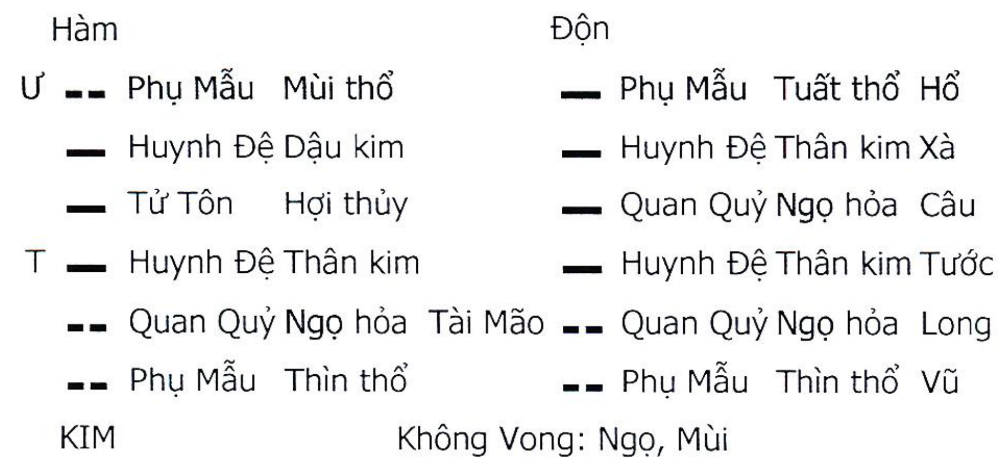
    - **Hình này chứng minh điều gì**
      - Lấy Phụ Mẫu làm cửa hàng, xem thêm hào 2. Hào 2 Nguyệt phá, được Phụ Mẫu Mùi thổ động mà Hợp Phá, cửa hàng không tốt lắm, đã từng tu bổ.
    - **Từ đâu mà thấy được**
      - Hào 2 Nguyệt phá, được Phụ Mẫu Mùi thổ động mà Hợp Phá, cửa hàng không tốt lắm, đã từng tu bổ. Thế lâm Chu Tước, Chu Tước là miệng, quẻ tại cung Đoài, Đoài cũng là miệng, cửa hàng kinh doanh lĩnh v...
- **Diễn tiến phân tích và suy luận chi tiết:**
  - Lấy Phụ Mẫu làm cửa hàng, xem thêm hào 2.
  - Hào 2 Nguyệt phá, được Phụ Mẫu Mùi thổ động mà Hợp Phá, cửa hàng không tốt lắm, đã từng tu bổ.
  - Thế lâm Chu Tước, Chu Tước là miệng, quẻ tại cung Đoài, Đoài cũng là miệng, cửa hàng kinh doanh lĩnh vực có liên quan đến ẩm thực.
  - Phụ Mẫu lâm hào Ứng, Ứng là người khác, cửa hàng thuộc về người khác, là cửa hàng đi thuê.
  - Thê Tài Mão mộc mặc dù phục tàng, nhưng được Nguyệt sinh phù, Phi thần Không Vong, Phục thần dưới hào Không thì dễ kéo ra, đồng thời Tử Tôn Hợi thủy ám động sinh Tài, cửa hàng này có thu nhập cũng tạm tạm.
  - Nhưng Ứng Phụ Mẫu Mùi thổ phát động, khiến hào Tài nhập Mộ, tiền thuê cửa hàng rất căng.
  - Hiện nay Mùi thổ Không Vong, năm sau Đinh Sửu xung thực Mùi thổ, tiền thuê nhà tất phình ra.
  - Rất khó để tiếp tục kinh doanh.
- **Kết quả ứng nghiệm thực tế:**
  - Người này mở một quán ăn.
  - Tiền thuê mặc dù có hơi cao nhưng vẫn còn lợi nhuận.
  - Có thể là vừa đến năm 1997 thì giá nhà tăng lên, lợi nhuận chẳng còn lại bao nhiêu, không thể không đóng cửa.

#### Ví dụ 23: Ngày Canh Thìn tháng Kỷ Mùi năm Mậu Dần, một người đàn ông đoán phong thủy củ...

- **Bối cảnh và thông tin quẻ:**
  - Ngày Canh Thìn tháng Kỷ Mùi năm Mậu Dần, một người đàn ông đoán phong thủy của nhà máy than cốc, được Phong Trạch Trung Phu biến Thiên Thủy Tụng.
  - THỔ Không Vong: Thân, Dậu
- **Luận giải quái tượng phong thủy:**
  - **Hình 186.** Sơ đồ quẻ Phong Trạch Trung Phu biến Thiên Thủy Tụng
    - 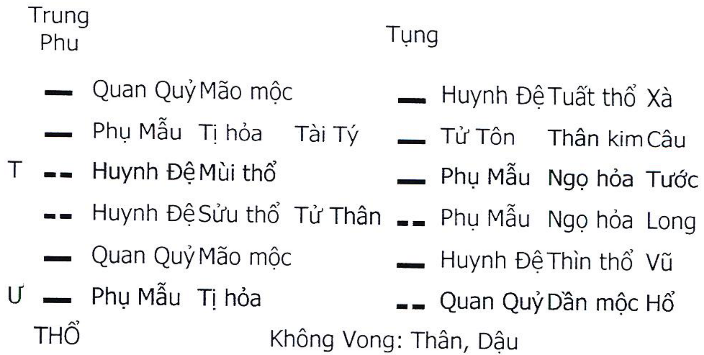
    - **Hình này chứng minh điều gì**
      - Lấy hào Phụ Mẫu làm nhà máy. Thông tin phản ánh trong toàn quẻ chính là thông tin cát hung về phong thủy.
    - **Từ đâu mà thấy được**
      - Thê Tài Tý thủy phục tàng, bị Nhật Nguyệt khắc thương, trong quẻ lại có Huynh Đệ Mùi thổ phát động đến khắc, Phụ Mẫu Tị hỏa phát động là Tuyệt địa, vừa nhìn là biết nhà máy không quá phát đạt. Phụ ...
- **Diễn tiến phân tích và suy luận chi tiết:**
  - Lấy hào Phụ Mẫu làm nhà máy.
  - Thông tin phản ánh trong toàn quẻ chính là thông tin cát hung về phong thủy.
  - Nhà máy thì lấy lợi nhuận làm mục đích, vì vậy phải xem hào Tài.
  - Thê Tài Tý thủy phục tàng, bị Nhật Nguyệt khắc thương, trong quẻ lại có Huynh Đệ Mùi thổ phát động đến khắc, Phụ Mẫu Tị hỏa phát động là Tuyệt địa, vừa nhìn là biết nhà máy không quá phát đạt.
  - Phụ Mẫu lưỡng hiện, lấy hào Phụ Mẫu Tị hỏa phát động làm Dụng thần.
  - Phụ Mẫu Tị hỏa là Tuyệt địa của hào Tài, phong thủy nhà máy gây bất lợi cho tài vận.
  - Thê Tài đồng thời là công nhân, hào sơ lại là hào vị cấp dưới, công nhân.
  - Thê Tài phục tàng, Tuyệt ở hào sơ, Thê Tài không thể quy vị, công nhân không muốn về nhà máy làm việc.
  - Hào sơ lâm Bạch Hổ hóa Quan Quỷ, Bạch Hổ và Quan Quỷ đều có thông tin tử vong và thương tai, hào Tài hưu tù, nhất định là trong nhà máy đã xảy ra sự kiện thương vong.
  - Hào sơ là chân, công nhân bị thương đa số ở chân.
  - Thê Tài lại nhập Mộ ở Nhật, Mộ có ý nghĩa là chôn giấu, sẽ xảy ra tình huống công nhân bị chôn vùi trong đất mà chết.
  - Hào 4 là cổng, Huynh Đệ Mùi thổ tại đây phát động khắc Thê Tài, chứng tỏ cổng bố trí không đúng, ảnh hưởng
  - đến tài vận.
  - Mùi thổ tương ứng với Tây Nam, cổng ở hướng Tây Nam hợp bố cục phong thủy.
  - Hào sơ là chân, lâm Bạch Hổ, Bạch Hổ là đường đi, hào sơ là Tuyệt địa hào Tài, động mà hóa Quan Quỷ, đường đi của nhà máy cũng không phù hợp với bố cục phong thủy.
- **Kết quả ứng nghiệm thực tế:**
  - Nhà máy không phát đạt, than cốc sản xuất ra không bán được, trong nhà máy từng xảy ra sự kiện công nhân bị thương ở chân và chết vì bị chôn vùi trong than.
  - Công nhân vừa lo nhà máy không đảm bảo an toàn, vừa lo không lấy được tiền lương, cho nên họ không muốn về nhà máy.

#### Ví dụ 24: Đây là một ví dụ ở năm 2011. Một người đàn ông từ năm 2003 bắt đầu mở cửa hàn...

- **Bối cảnh và thông tin quẻ:**
  - Đây là một ví dụ ở năm 2011.
  - Một người đàn ông từ năm 2003 bắt đầu mở cửa hàng thực phẩm chức năng, liên tục không có hiệu quả, đoán xem từ nay về sau phát triển ra sao?
  - Ở ngày Mậu Thìn tháng Mão, được Địa Thủy Sư biến Trạch Thủy Khốn.
  - THỦY Không Vong: Tuất, Hợi
- **Diễn tiến phân tích và suy luận chi tiết:**
  - Lấy Thê Tài làm Dụng thần.
  - Thê Tài lâm Bạch Hổ trì Thế, Bạch Hổ chủ y dược, thông tin ăn khớp với kinh doanh thực tế.
  - Dụng thần mặc dù được Nguyệt đến sinh, nhưng hào 4 Quan Quỷ lâm Huyền Vũ phát động, hóa Huynh Đệ Hợi thủy.
  - Quan Quỷ này không phải để chế Huynh Đệ mà là để tiết khí hào Thế Thê Tài.
  - Hào 5 Huynh Đệ Hợi thủy phát động lại khắc Thê Tài, lại thêm cung Khảm chủ thủy, lân cận có công trình liên quan đến thủy đã ảnh hưởng đến phong thủy của cửa hàng.
  - Mặc dù trong phong thủy có thuyết thủy là tài, nhưng đối với cửa hàng này thì thủy lại là thứ có hại.
- **Kết quả ứng nghiệm thực tế:**
  - Việc kinh doanh của cửa hàng liên tục khó khăn, đặc biệt là vào tháng 8, gần như là ngừng kinh doanh, không có khách nào.
  - Phía Đông có một nhà máy lọc nước, có ống dẫn kéo thẳng đến gần cửa hàng.

#### Ví dụ 25: Đây là một ví dụ ở năm 2009. Ngày Kỷ Mão Tháng Dậu, nữ hỏi thuê cửa hàng để b...

- **Bối cảnh và thông tin quẻ:**
  - Đây là một ví dụ ở năm 2009.
  - Ngày Kỷ Mão Tháng Dậu, nữ hỏi thuê cửa hàng để bán thịt nướng có lời hay không, được Thủy Thiên Nhu biến Địa Phong Thăng.
  - THỔ Không Vong: Thân, Dậu
  - Lấy Thê Tài làm Dụng thần.
  - Trong quẻ Thê Tài lưỡng hiện, lấy hào Thê Tài Tý thủy phát động làm Dụng thần.
  - Dụng thần Nguyệt sinh Nhật không khắc là vượng tướng, nhưng phát động hóa hồi đầu khắc hợp.
  - Hào sơ thủy lâm Đằng Xà là ống thoát nước, hợp là bị cản trở, không thông suốt.
  - Ống thoát nước của cửa hàng này bị tắc nghẽn, không quá thông suốt, ảnh hưởng đến tài vận, cần sửa chữa.
  - Phụ Mẫu phục tàng tại hào 2, chứng tỏ vẫn chưa ký hợp đồng, lâm Bạch Hổ, Bạch Hổ là đường đi, chủ gần đường, không phải là trên lầu.
  - Hào Thế Không Vong là thiếu lòng tin.
  - Hào 5 Huynh Đệ hóa Thê Tài, bị Nhật hợp trú, muốn hóa không được, chứng tỏ túng bẫn, cần vay tiền mới có thể làm cửa hàng này.
  - Thê Tài vượng tướng tuy có thể kiếm được tiền, nhưng hào Thế Không Vong, Huynh Đệ phát động, Thê Tài hóa hợp khắc, kinh doanh lúc được lúc không.
  - Sau khi dự đoán xong, tôi đến cửa hàng kiểm tra thì phát hiện ống thoát nước nhỏ hơn rất nhiều so với bình thường, cửa thoát nước cao hơn đường ống và tạo thành dòng chảy ngược, xem ra cần phải cải tạo.
  - Bởi vì phải cọc tiền cho chủ nhà, chỉnh trang cũng cần chi phí, nguồn tiền không đủ, thế là mượn tiền bạn bè.
  - Về sau ký hợp đồng ở ngày 9 tháng 12, ngày 29 chính thức khai trương.
- **Diễn tiến phân tích và suy luận chi tiết:**
  - **Ví dụ 25:** Đây là một ví dụ ở năm 2009.
  - Ngày Kỷ Mão Tháng Dậu, nữ hỏi thuê cửa hàng để bán thịt nướng có lời hay không, được Thủy Thiên Nhu biến Địa Phong Thăng.
  - THỔ Không Vong: Thân, Dậu
  - Lấy Thê Tài làm Dụng thần.
  - Trong quẻ Thê Tài lưỡng hiện, lấy hào Thê Tài Tý thủy phát động làm Dụng thần.
  - Dụng thần Nguyệt sinh Nhật không khắc là vượng tướng, nhưng phát động hóa hồi đầu khắc hợp.
  - Hào sơ thủy lâm Đằng Xà là ống thoát nước, hợp là bị cản trở, không thông suốt.
  - Ống thoát nước của cửa hàng này bị tắc nghẽn, không quá thông suốt, ảnh hưởng đến tài vận, cần sửa chữa.
  - Phụ Mẫu phục tàng tại hào 2, chứng tỏ vẫn chưa ký hợp đồng, lâm Bạch Hổ, Bạch Hổ là đường đi, chủ gần đường, không phải là trên lầu.
  - Hào Thế Không Vong là thiếu lòng tin.
  - Hào 5 Huynh Đệ hóa Thê Tài, bị Nhật hợp trú, muốn hóa không được, chứng tỏ túng bẫn, cần vay tiền mới có thể làm cửa hàng này.
  - Thê Tài vượng tướng tuy có thể kiếm được tiền, nhưng hào Thế Không Vong, Huynh Đệ phát động, Thê Tài hóa hợp khắc, kinh doanh lúc được lúc không.
  - Sau khi dự đoán xong, tôi đến cửa hàng kiểm tra thì phát hiện ống thoát nước nhỏ hơn rất nhiều so với bình thường, cửa thoát nước cao hơn đường ống và tạo thành dòng chảy ngược, xem ra cần phải cải tạo.
  - Bởi vì phải cọc tiền cho chủ nhà, chỉnh trang cũng cần chi phí, nguồn tiền không đủ, thế là mượn tiền bạn bè.
  - Về sau ký hợp đồng ở ngày 9 tháng 12, ngày 29 chính thức khai trương.
