# Lục Hào Quái Lệ Thuyết Chân

## Lời Cảm Ơn

- Lời cảm ơn và giới thiệu bộ sách:
  - Cảm ơn độc giả đã tin tưởng và lựa chọn bộ sách Dịch học mới mẻ và hiện đại này.
  - Bộ sách được dịch và biên tập kỹ lưỡng, do dịch giả **Trần Phương** chuyển ngữ trực tiếp từ bộ sách tiếng Trung và **Vũ Phác** hiệu đính.
- Tôn chỉ nội dung và mục tiêu học thuật:
  - Nội dung và bố cục sách được trình bày rõ ràng, dễ hiểu; ví dụ từng quẻ được phân tích chi tiết nhằm đảm bảo độc giả có trải nghiệm tiếp thu tốt nhất.
  - Hy vọng giúp người đọc xây dựng cái nhìn tổng quát và chuyên sâu về lĩnh vực Dự đoán Lục hào, từng bước tiến xa trên con đường trở thành Dự trắc sư.
- Lời cầu thị, thông tin ấn bản và kênh tài nguyên chuyên sâu:
  - Nhóm tác giả chân thành tiếp thu các ý kiến đóng góp từ bạn đọc để những lần tái bản sau được hoàn chỉnh hơn.
  - Sách được phân phối độc quyền bởi Shop Kinh Dịch Lục Hào.
  - Thông tin về các ấn bản tiếp theo cùng các bài viết nghiên cứu chuyên sâu về Dự Đoán Lục Hào được cập nhật tại: **vuonghoung.com**.
- Lời chào kết và nhóm biên dịch:
  - Trân trọng cảm ơn và mong được đồng hành cùng bạn đọc trên con đường nghiên cứu Dịch học.
  - Ký tên: **Trần Phương - Vũ Phác**.

## Giới Thiệu Về Vương Hổ Ứng

- Tiểu sử và hành trình học thuật của Vương Hổ Ứng:
  - Sinh năm 1962, nguyên quán tại tỉnh Sơn Tây, Trung Quốc; là một chuyên gia Dịch học danh tiếng trên phạm vi toàn cầu.
  - Là Dịch tác gia (tác giả nhiều bộ sách giá trị về Kinh Dịch) và là truyền nhân đời sau của trường phái Bát Trạch Dịch Trận phong thủy.
  - Từng đảm nhiệm vai trò giảng viên thỉnh giảng tại Đại học Thanh Hoa danh tiếng, cố vấn cao cấp của Sở nghiên cứu Nhật Bản, và tác giả của công trình *Lục Hào Chiêm Thuật Nhật Bản*.
  - Năm 1986, tốt nghiệp Đại học Sơn Tây chuyên ngành tiếng Nhật; thời gian đầu sau tốt nghiệp, ông đảm nhiệm công tác nghiên cứu khảo cổ học tại tỉnh Sơn Tây.
  - Về sau, ông dấn thân sâu rộng vào nghiên cứu phong thủy cổ truyền, tướng thuật, mệnh lý học, Phật học, Trung y và thuật luyện đan.
  - Từ những năm 1980, ông bắt đầu chuyên tâm nghiên cứu Kinh Dịch, xác định phong thủy, Lục hào và thuật dưỡng sinh Đạo gia làm ba trọng điểm nghiên cứu cốt lõi.
  - Ứng dụng thực tiễn và tư vấn doanh nghiệp: Vận dụng thành công nguyên lý Dịch học để giải mã bí ẩn phong thủy và cát hung ẩn chứa trong hình tượng nhận diện thương hiệu (logo) của các doanh nghiệp, đồng thời là chuyên gia tư vấn chiến lược cho rất nhiều công ty danh tiếng cả trong và ngoài nước.
  - Tầm sư học đạo và hoàn thiện hệ thống lý luận: Từ năm 1996, ông cất công chu du khắp cả nước nhằm tìm hiểu, tiếp thu các thuật số dân gian bí truyền từ nhiều bậc kỳ nhân dị sĩ; qua đó đúc kết và sáng lập nên một hệ thống lý luận Lục hào hoàn chỉnh mang phong cách thực chiến đặc sắc riêng.
  - Hoạt động giảng dạy và tầm ảnh hưởng quốc tế: Từng nhận lời mời xuất ngoại giảng dạy tại Singapore, Nhật Bản...; định kỳ hàng năm được các tập đoàn, doanh nghiệp mời đến đào tạo chuyên sâu về Quốc học (Kinh Dịch). Mạng lưới học trò và môn sinh của ông mở rộng khắp Trung Quốc đại lục, Đặc khu Hồng Kông, Singapore, Nhật Bản, Hàn Quốc, Hoa Kỳ, Anh, Malaysia...

### Tác Phẩm Chủ Yếu Đã Xuất Bản

- Các ấn phẩm xuất bản tại thị trường Nhật Bản:
  - *Bát Trạch Dịch Trận Phong Thủy*.
  - *Lục Hào Chiêm Thuật Áo Nghĩa*.
  - *Lục Hào Chiêm Thuật Cải Vận Pháp*.
  - *Sinh Hoạt Trung Đích Lục Hào Chiêm Thuật*.
  - *Thần Kỳ Ứng Nghiệm Đích Lục Hào Chiêm Thuật*.
  - *Ngoại Ứng Dự Trắc*.
  - *Lục Hào Dự Trắc Tam Ma Địa*...
- Các ấn phẩm xuất bản tại Hồng Kông:
  - *Lục Hào Quái Lệ Thuyết Chân*.
  - *Lục Hào Dự Trắc Tật Bệnh Tân Thám*.
- Các ấn phẩm xuất bản tại Singapore:
  - *Tăng San Bốc Dịch Bình Thích*.
  - *Lục Hào Quái Tượng Giải Mật*.
  - *Lục Hào Nghi Hoặc Chỉ Mê*.
  - *Lục Hào Dự Trắc Ngộ Trung Ngộ*.
  - *Lục Hào Phân Loại Chiêm Nghiệm Kỹ Pháp*.
  - *Lục Hào Dự Trắc Tự Tu Bảo Điển*.
  - *Lục Hào Trắc Bệnh Phân Khoa Tường Giải*.
- Các ấn phẩm xuất bản tại Đài Loan:
  - *Tế Thuyết Lục Hào Dự Trắc Học*.
  - *Lục Hào Tật Bệnh Dự Trắc Học*.
  - *Lục Hào Nhân Duyên Dự Trắc Học*.
  - *Sơ Học Lục Hào Dự Trắc*.
- Bộ sách Dịch học lưu hành tại Việt Nam:
  - Bộ sách Dịch học của Vương Hổ Ứng đại sư được dịch giả Trần Phương giới thiệu đến quý bạn đọc từ cuối năm 2018. Bằng ngôn từ thuần Việt trong sáng, dễ tiếp cận nhưng vẫn đảm bảo sự chặt chẽ, chuẩn xác về mặt học thuật cổ điển, Trần Phương đã khơi gợi rất nhiều nguồn cảm hứng cho các học giả nghiên cứu Kinh Dịch tại Việt Nam.
  - Danh mục 11 tác phẩm tiêu biểu đã phát hành tại Việt Nam gồm có:
    1. *Tăng San Bốc Dịch Bình Thích*
    2. *Lục Hào Tật Bệnh Dự Trắc Học*
    3. *Lục Hào Nhân Duyên Dự Trắc Học*
    4. *Lục Hào Xu Cát Tị Hung Hóa Giải Bí Truyền*
    5. *Lục Hào Phong Thủy Dự Trắc Học*
    6. *Tế Thuyết Lục Hào Dự Trắc Học*
    7. *Lục Hào Quái Lệ Thuyết Chân*
    8. *Lục Hào Quái Tượng Giải Mật*
    9. *Lục Hào Nghi Hoặc Chỉ Mê*
    10. *Lục Hào Dự Trắc Ngộ Trung Ngộ*
    11. *Lục Hào Kinh Tế Dự Trắc Học*
- Kênh tra cứu và thông tin liên hệ:
  - Độc giả có thể tìm hiểu thêm chi tiết về bộ sách tại website chính thức: **vuonghoung.com**.
  - Liên hệ phát hành: **0963 394 340**.
  - Giới thiệu ấn bản: **Vũ Phác**.

### Mục Lục Tác Phẩm

- Cấu trúc hệ thống toàn thư Lục Hào Quái Lệ Thuyết Chân:
  - Lời tựa (Trang 5).
  - Chương 1: Quẻ do ai đến gieo? (Trang 8).
  - Chương 2: Tiến Thần biện ý (Trang 20).
  - Chương 3: Thoái Thần biện nghĩa (Trang 26).
  - Chương 4: Hoạt dụng Không Vong (Trang 34).
  - Chương 5: Nguyệt Phá biện nghĩa (Trang 46).
  - Chương 6: Diệu dụng Tam Hợp cục (Trang 60).
  - Chương 7: Bán Hợp biện nghĩa (Trang 69).
  - Chương 8: Lục Hợp biện nghĩa (Trang 75).
  - Chương 9: Lục Xung biện nghĩa (Trang 84).
  - Chương 10: Bí pháp 12 cung Trường Sinh (Trang 93).
  - Chương 11: Cách Sơn hóa hào (Trang 116).
  - Chương 12: Du Hồn biện nghĩa (Trang 123).
  - Chương 13: Quy Hồn biện nghĩa (Trang 131).
  - Chương 14: Bí mật của Phi Phục (Trang 137).
  - Chương 15: Tam Hình biện nghĩa (Trang 150).
  - Chương 16: Phản Ngâm biện nghĩa (Trang 161).
  - Chương 17: Phục Ngâm biện nghĩa (Trang 167).
  - Chương 18: Luận phương cục trong Lục Hào (Trang 174).
  - Chương 19: Câu chuyện Lục Hào đặc sắc (Trang 180), bao gồm 29 chuyên đề quẻ lệ thực chiến đặc sắc:
    - 1. Chính ngộ phân chia thái cực (Trang 180).
    - 2. Lần đầu tiên nghiệm chứng phương pháp phân chia thái cực (Trang 182).
    - 3. Vốn muốn tiến cử cao nhân, phán đoán tài tình khuất phục đối phương (Trang 186).
    - 4. Nhờ đoán cát hung của lưu niên, đoán ra tử cung có lỗ (Trang 189).
    - 5. Đến đoán quan vận lên chức, đoán lưu niên phá tài ngoài dự tính (Trang 192).
    - 6. Dạo chơi thánh địa Ngũ Đài Sơn, lưu lại phán đoán tuyệt diệu ở nhân gian (Trang 194).
    - 7. Bà lão đoán bệnh xin giải pháp, khéo đoán trị bệnh nghiệm như thần (Trang 201).
    - 8. Người xin đoán hỏi dồn dập, một quẻ kiêm đoán âm dương trạch (Trang 202).
    - 9. Bài giảng tuyệt hay nhiều kiến thức, quẻ kỳ diệu khuynh đảo học viên (Trang 206).
    - 10. Chưa mở lời đã biết nguyện vọng, nói mớ liên tục tài vận xoay chuyển (Trang 207).
    - 11. Mẹ chồng nàng dâu dẫn đến vợ chồng bất hòa, bản thân ngoại tình chờ ly hôn (Trang 210).
    - 12. Dụng thần quá vượng xem ngược lại, phán đoán không sai một ly (Trang 211).
    - 13. Phong thủy nhà mới có vấn đề, chị gái và anh rể xảy ra mâu thuẫn (Trang 213).
    - 14. Phong thủy nhà ở có vấn đề, anh trai và chị dâu xảy ra mâu thuẫn (Trang 214).
    - 15. Khách sạn đặt vé không tin cậy được, tự mình mua vé trở về nhà (Trang 215).
    - 16. Mang thai uống quá nhiều thuốc, sinh ra trẻ nhỏ tàn tật (Trang 216).
    - 17. Ban đêm chồng không về nhà ngủ, sốt ruột hỏi xem duyên phận sẽ ra sao (Trang 217).
    - 18. Dịch hữu hỏi phong thủy, vợ ông ta tấm tắc khen hay (Trang 220).
    - 19. Muốn hỏi công trình khi nào hoàn thành, tìm ra thông tin khác về công trình (Trang 223).
    - 20. Người phụ nữ mù nuôi bò đoán triển vọng, đoán ra những chuyện vặt trong đời (Trang 225).
    - 21. Một cô gái nhờ đoán về xem mặt, đoán ra hôn nhân trước đây (Trang 228).
    - 22. Vốn chỉ đoán bệnh, ai ngờ đoán ra cảnh trong mơ (Trang 230).
    - 23. Người đàn ông ẻo lả hỏi tai họa lao ngục, đoán ra cả đời không có hôn nhân (Trang 232).
    - 24. Dự đoán con đi lính, đoán ra chồng gặp hung (Trang 233).
    - 25. Hỏi nguyên nhân bạn gái chia tay, là do có tư tình với cha (Trang 234).
    - 26. Niên vận của người đàn ông phong lưu (Trang 237).
    - 27. Dự đoán phong thủy nhà cửa, đoán ra trong nhà có quan tài (Trang 242).
    - 28. Dự đoán vận khí bản thân, đoán ra hôn nhân của đồng nghiệp (Trang 245).
    - 29. Dự đoán cát hung của giếng nước, đoán ra hàng xóm không con cái (Trang 250).

## Lời Tựa

### Duyên khởi và tôn chỉ trước tác
- Hoàn cảnh sáng tác tác phẩm:
  - Sau khi hoàn thành cuốn *"Lục Hào Dự Trắc Tật Bệnh Tân Thám"*, tác giả Vương Hổ Ứng dự định tạm dừng bút để tiếp tục đi sâu vào nghiên cứu lý luận Lục Hào.
  - Tuy nhiên, đông đảo dịch hữu khắp nơi gửi thư về bày tỏ rằng cuốn sách nghiên cứu bệnh tật đã giúp họ nâng cao trình độ dự đoán rất nhiều, đồng thời tha thiết mong muốn tác giả biên soạn một tác phẩm Lục Hào toàn diện, mang tính hệ thống chuyên sâu hơn.
  - Đáp ứng nguyện vọng học thuật đó, tác giả đã khởi tâm trước tác cuốn sách *"Lục Hào Quái Lệ Thuyết Chân"*.
- Tiêu chí tuyển chọn ví dụ và phương pháp truyền đạt:
  - Tất cả các ví dụ quẻ trích dẫn trong sách đều là những nghiệm chứng thực tế thu được trong quá trình thực tiễn dự đoán của tác giả.
  - Mục đích cốt lõi của việc dẫn giải ví dụ là tiết lộ quy luật lý luận và kỹ thuật dự đoán của Lục Hào, đem lại gợi mở tư duy xác thực cho người học.
  - Quẻ ví dụ được chọn lọc cẩn trọng, triệt để tránh sự trùng lặp, đồng thời bao quát mọi lĩnh vực đời sống nhân sinh: thời tiết, hôn nhân, tài vận, đoán vật giấu kín bên trong, bệnh tật, thi cử, phong thủy, khám phá vũ trụ, tính cách, nghề nghiệp, xuất hành, thi đấu, tìm người, tìm vật, kiện tụng.
  - Tác phẩm tập trung truyền thụ phương pháp luận và tư duy giải quẻ nền tảng; bởi lẽ mỗi chuyên đề dự đoán đều vô cùng uyên thâm, nếu khai triển tường tận từng chuyên mục thì mỗi đề tài đều có thể viết riêng thành một bộ sách độc lập.

### Mấu chốt học Dịch: Mở rộng tư duy thay vì học vẹt khẩu quyết
- Tầm quan trọng của tư duy biến thông:
  - Mấu chốt để tinh thông phương pháp đoán quẻ Lục Hào là phải mở rộng và giải phóng cách thức tư duy logic.
  - Khi tư duy được khai phóng, người dự đoán hoàn toàn có khả năng phân tích và xử lý chính xác cả những tình huống phức tạp chưa từng bắt gặp trong tiền lệ.
- Tác hại của lối học vẹt khẩu quyết kinh viện:
  - Việc học thuộc lòng máy móc các khẩu quyết lưu truyền không thể giúp nâng cao kỹ thuật dự đoán trong thực chiến.
  - Nhiều khẩu quyết cổ truyền có xác suất gặp quẻ tương ứng cực kỳ thấp, thậm chí cả đời hành dịch cũng không gặp được, khiến việc kiểm chứng tính đúng sai trở nên vô nghĩa.
  - Nghiêm trọng hơn, không ít khẩu quyết trong cổ tịch thực chất là sản phẩm suy diễn tùy tiện, bịa đặt vô căn cứ, hoàn toàn đi ngược lại quái lý âm dương ngũ hành.
  - Tác giả khuyến nghị người học Dịch—dù đọc sách của chính Vương Hổ Ứng hay bất kỳ tài liệu dự đoán nào khác—phải luôn đặt trọng tâm vào việc nắm bắt mạch tư duy giải quẻ, từ đó mới có thể thực sự nâng cao trình độ của bản thân.

### Phản biện các ngụy quyết và sai lầm quái lý trong cổ tịch
- Tinh thần phản biện học thuật đối với sách cổ:
  - Nhiều tác phẩm Lục Hào cổ điển tuy nổi danh nhưng bên trong tồn tại không ít giải thích sai lầm, phi lý về mặt nạp giáp ngũ hành.
  - Nếu người học nhắm mắt rập khuôn, một mực học thuộc lòng các quyết thư cổ điển mà không phân biệt được đúng sai thì muôn đời không thể tiến bộ.

#### Sai lầm trong "Bốc Phệ Toàn Thư" về Hỏa Quỷ xung Tài
- Khẩu quyết sai lầm được trích dẫn:
  - Trong chương Bệnh tật của sách *Bốc Phệ Toàn Thư* có viết: *"Hỏa Quỷ xung Tài, thượng lâm tắc ẩu nghịch đa thổ"*.
  - Sách này hùng hồn giải thích thiên lệch: *"Hỏa tính viêm thượng; Tài chủ ẩm thực. Vì vậy, khi xem bệnh mà gặp hỏa Quỷ động: Trong khắc Tài ngoài. Tất là nôn mửa; nặng thì ăn vào lại lộn trở ra..."*.
- Luận cứ phản biện xác đáng của Vương Hổ Ứng:
  - Xét về quan hệ ngũ hành sinh khắc căn bản giữa lục thân: chỉ có Thê Tài sinh Quan Quỷ, Quan Quỷ tuyệt đối không có lý gì xung khắc được Thê Tài.
  - Cụ thể với trường hợp Quan Quỷ là Hỏa (Tị hỏa hoặc Ngọ hỏa):
    - Khi Quan Quỷ hành Hỏa thì hào Thê Tài bắt buộc phải mang hành Mộc (Dần mộc hoặc Mão mộc).
    - Hào Thê Tài Dần Mão mộc sinh Quan Quỷ Tị Ngọ hỏa; giữa Mộc và Hỏa hoàn toàn không tồn tại quan hệ xung khắc hay tương hình.
    - Do đó, luận điểm "Hỏa Quỷ xung Tài", "Hỏa Quỷ động khắc Tài" là sai lầm ngớ ngẩn về ngũ hành sinh khắc cơ bản.

#### Sai lầm trong "Bốc Phệ Chính Tông" về Sửu Quỷ lâm Không tại hào 5
- Khẩu quyết sai lầm được trích dẫn:
  - Trong chương *Hà tri* của cuốn *Bốc Phệ Chính Tông* có chép: *"Sao biết nhà người bị mất trâu? Sửu Quỷ lâm Không tại ngũ hào"*.
  - Sách giải thích võ đoán rằng: theo phân hào đoán pháp thì hào 5 tượng trưng cho con trâu, địa chi Sửu cũng biểu thị trâu, Quan Quỷ chủ đạo tặc trộm cắp, lâm Tuần Không biểu thị đồ vật bị mất mát.
- Luận cứ phản biện xác đáng của Vương Hổ Ứng:
  - Tác giả sách cổ chỉ ghép nối tượng nghĩa một cách cơ học mà không hề kiểm tra lại quy tắc nạp giáp cơ bản của Dịch học.
  - Trong toàn bộ hệ thống nạp giáp của 64 quẻ, địa chi Sửu thổ tuyệt đối không bao giờ được xếp đặt tại vị trí hào 5 (Sửu chỉ có thể an ở các hào 1, 2, 3 hoặc 6 tùy theo bát cung).
  - Khẩu quyết đưa ra một tình huống nạp giáp vĩnh viễn không thể xuất hiện trong thực tế, phơi bày sự ngụy tạo phi lý của khẩu quyết.

#### Sai lầm trong "Dịch Ẩn" về quan hệ hào 4 và hào 5
- Khẩu quyết sai lầm được trích dẫn:
  - Trong chương bàn luận về quan hệ vua tôi, cuốn *Dịch Ẩn* máy móc ấn định hào 5 làm thiên tử, hào 4 làm công khanh đại thần.
  - Sách đưa ra quy tắc suy diễn: *"Hào 4 sinh hợp hào 5, thành thật báo chủ. Hào 5 trì Phụ động khắc hào 4, không thuận tai vua"*.
- Luận cứ phản biện xác đáng của Vương Hổ Ứng:
  - Tác giả *Dịch Ẩn* tự nghĩ ra quan hệ luân lý rồi gượng ép áp đặt vào cấu trúc nạp giáp của quẻ.
  - Khảo sát thực tế trong toàn bộ 64 quẻ dịch, quan hệ sinh khắc giữa nạp chi hào 4 và nạp chi hào 5 chỉ tồn tại duy nhất hai tình huống: hoặc là hào 4 khắc hào 5, hoặc là hào 5 sinh hào 4.
  - Tình huống "hào 4 sinh hợp hào 5" hoặc "hào 5 mang Phụ Mẫu động khắc hào 4" hoàn toàn không bao giờ tồn tại trên thực tế cấu trúc nạp giáp.
  - Người học Dịch nếu thuộc làu sách cổ mà thiếu tư duy phê phán quái lý thì chỉ tự giam cầm bản thân trong mớ lý thuyết sai lệch.

### Bản chất Kinh Dịch và định hướng nghiên cứu chuyên sâu
- Bản chất môn dự đoán Lục Hào:
  - Tác giả khẳng định những đúc kết của mình tuy không dám nhận là chân lý tuyệt đối và trong thực tiễn vẫn có lúc đoán sai, nhưng toàn bộ kinh nghiệm chia sẻ đều là sự thật được chiêm nghiệm và nghiệm chứng nhiều lần qua thực tế.
  - Kinh Dịch đồng thời là một môn học kinh nghiệm sâu sắc và là một môn huyền học tinh vi.
  - Người dự đoán cần kết hợp kiến thức nền tảng với linh cảm nhạy bén, không ngừng tư duy phản biện và giác ngộ quái lý, từ đó mới có thể từng bước phát hiện các quy luật khách quan và đạt đến bước nhảy vọt về chất lượng dự đoán.
- Giới thiệu tầng bậc dự đoán cao cấp:
  - Tác giả lưu ý người đọc khi nghiên cứu cuốn sách nếu bắt gặp một số luận giải có vẻ khó hiểu thì cần chủ động tự mình suy xét, ngộ biến.
  - Một số ví dụ trong sách có liên quan đến *"Lục Hào Di Thần Biện Hào Pháp"* (phương pháp dời thần biện hào trong Lục Hào)—một hệ thống lý luận dự đoán ở tầng thứ rất sâu và quy mô đồ sộ.
  - Vì phương pháp này là cả một hệ thống học thuật phức tạp không thể nói hết trong vài câu, tác giả hẹn sẽ trình bày tường tận trong một dịp cơ duyên thuận lợi khác.
- Lời đề tựa ký tên: Vương Hổ Ứng.

## Chương 1: Quẻ Do Ai Đến Gieo?

### 1. Phê phán nhận thức sai lầm về phương pháp lấy quẻ trong Lục Hào

- **Hiện tượng học tập thiếu kiên định và tâm lý "sáng Tần chiều Sở":**
  - Trong quá trình nghiên cứu thuật số dự đoán, người học tối kỵ tâm lý thiếu kiên trì, đứng núi này trông núi nọ ("hữu thủy vô chung").
  - Nhiều người sau một thời gian tiếp cận dự đoán Lục Hào cảm thấy phương thức gieo quẻ bằng đồng xu đơn điệu, gò bó, không có được tính cơ động và biến hóa phong phú như Kỳ Môn Độn Giáp hay Lục Nhâm Đại Độn.
  - Họ nhận thấy Kỳ Môn và Lục Nhâm có khả năng tùy cơ ứng biến: chỉ cần căn cứ vào thời khắc người hỏi xuất hiện, phương vị người đứng, hoặc chữ số người đọc là có thể lập bàn trắc sự và diễn giải ngọn ngành diễn biến cát hung từ đầu chí cuối.
  - Đặc biệt, khi người xin đoán ở xa không thể trực tiếp diện kiến để gieo quẻ, người học Lục Hào theo lối mòn thường lúng túng, bất lực và cho rằng không thể dự đoán được, dẫn đến việc nản chí bỏ dở Lục Hào để chuyển sang môn khác.

- **Sai lầm khi cưỡng ép kỹ pháp Mai Hoa Dịch Số vào dự đoán Lục Hào:**
  - Một số học giả tìm cách khắc phục bằng cách lấy phương thức lập quẻ theo thời gian hoặc hiện tượng của Mai Hoa Dịch Số đem áp dụng vào hệ thống Lục Hào.
  - Dưới góc độ lập quẻ, phương pháp này tạo cảm giác đa dạng và nhanh chóng, nhưng về bản chất đã làm tiêu hao và suy giảm một lượng thông tin dự đoán khổng lồ.
  - Cơ chế biến hóa của Mai Hoa Dịch Số vô cùng hạn chế: mỗi quẻ chỉ có duy nhất 1 hào động; trong 64 quẻ, mỗi quẻ tối đa chỉ có 6 trạng thái biến đổi, nhân lên toàn bộ hệ thống chỉ có đúng 384 dạng biến hóa quẻ ($64 \times 6 = 384$). Do hào động quá ít ỏi, Mai Hoa Dịch Số bắt buộc phải bấu víu vào các thao tác phái sinh như hỗ quái, tổng quái, thác quái, đảo quái để trích xuất thêm dữ liệu.
  - Ngược lại, Lục Hào gieo bằng ba đồng xu có tính độc lập ở mỗi hào: từ hào 1 đến hào 6 đều có khả năng động hoặc tĩnh tùy ý (thiếu dương, thiếu âm, lão dương, lão âm), tạo ra $2^6 \times 2^6 = 4096$ kiểu biến hóa quái tượng thuần túy.
  - Khi 4096 biến hóa này phối hợp với các tham số thực tế như đối tượng sự việc cụ thể, giới tính, tuổi tác (năm sinh), cùng can chi bốn mùa của năm, tháng, ngày, giờ chiêm bái, trường biến hóa của Lục Hào nhân lên đến hàng vài trăm vạn, thậm chí hàng ngàn vạn trạng thái thông tin vi diệu.
  - Sự khác biệt bản chất trong quy luật nạp giáp trang quẻ:
    - Mai Hoa Dịch Số định hình ngoại quái trước rồi mới định nội quái sau.
    - Lục Hào tuân theo quy luật sinh thành vũ trụ: nạp giáp bắt đầu từ hào sơ (dưới cùng) tuần tự tiến dần lên hào 6 (trên cùng).
  - Hậu quả của việc gán ghép khiên cưỡng: Dù đôi khi lấy quẻ theo Mai Hoa rồi dùng quy tắc Lục Hào luận giải vẫn có thể ngẫu nhiên ứng nghiệm, song sự nghèo nàn về hào động làm mất đi hầu hết các cách cục biến hóa then chốt như phục ngâm, phản ngâm, tam hợp cục, ám động... từ đó làm suy giảm nghiêm trọng độ chính xác của cát hung và việc định lượng ứng kỳ.
  - Do đó, tác giả kiên quyết khẳng định: hình thức lấy quẻ chính tông và ưu việt nhất của Lục Hào luôn luôn là sử dụng ba đồng xu gieo quẻ.

### 2. Bản chất trích xuất quái tượng và bác bỏ tà thuyết "Tâm thành tắc linh"

- **Nút thắt dự đoán khi người hỏi ở xa hoặc thời gian cấp bách:**
  - Trong thực tế, rất nhiều trường hợp người cầu đoán bị ngăn cách bởi khoảng cách địa lý xa xôi (ở tỉnh khác, nước ngoài) hoặc tình thế nguy cấp không thể trực tiếp có mặt gieo đồng xu.
  - Quan niệm truyền thống thường bó buộc rằng dự đoán Lục Hào bắt buộc phải do chính thân chủ đến tận nơi gieo quẻ, đồng thời ra sức rêu rao giáo điều "tâm thành tắc linh", yêu cầu người gieo phải tịnh tâm, chuyên chú tuyệt đối vào sự việc muốn hỏi.
  - Mỗi khi kết quả phán đoán sai lệch, người xem bói thời xưa thường đổ lỗi vô căn cứ rằng người xin đoán "không thành tâm", "tâm còn tạp niệm".

- **Nguyên nhân khách quan của những quẻ không ứng nghiệm:**
  - Trình độ và kinh nghiệm của dự trắc sư chưa thấu triệt quy luật, phân tích sai Dụng thần hoặc nhầm lẫn ngũ hành sinh khắc.
  - Bản thân người hỏi nảy sinh quá nhiều động niệm hỗn loạn trong tích tắc, khiến từ trường phản ánh lên quẻ bị phân tán đa tạp.
  - Lý luận cổ điển của Lục Hào trải qua thời gian vẫn còn những mắt xích chưa hoàn thiện, đòi hỏi người nghiên cứu hiện đại phải tiếp tục khám phá và bổ khuyết qua thực tiễn.

- **Bản chất vũ trụ học của quái tượng Lục Hào:**
  - Qua hàng chục năm nghiên cứu sâu sắc, tác giả đúc kết: Mấu chốt của dự đoán Lục Hào nằm ở ý nghĩ (ý niệm) khởi phát của người xin đoán.
  - Chỉ cần người đó xuất hiện ý niệm muốn dự đoán, bất luận trong lòng có mang theo sự việc trọng đại cấp bách hay chỉ là ý nghĩ bâng quơ, tùy ý, thì quái tượng được trích xuất ra luôn phản ánh chuẩn xác những thông tin thực tế tương ứng với bản thân người đó.
  - Thao tác gieo đồng xu thực chất chỉ là một phương thức vật lý để trích xuất tín hiệu quái tượng từ trường vũ trụ; do đó, bất kể là ai gieo quẻ (chính người hỏi gieo, dự trắc sư gieo thay, hay người thứ ba bên cạnh gieo hộ) đều mang giá trị phản ánh như nhau.
  - Khi gieo quẻ thay, dự trắc sư không cần phải gồng mình suy nghĩ ai đang gieo hay đoán chuyện gì, cứ tự nhiên nạp giáp an quẻ; nguyên tắc định Dụng thần theo quan hệ lục thân vẫn hoàn toàn bất biến.

- **Vạch trần tà thuyết "niệm mật chú" khi gieo quẻ:**
  - Những năm gần đây xuất hiện một số kẻ bịa đặt ra luận điệu rằng khi gieo quẻ phải đọc các bài "mật chú" thần bí để nâng cao độ chuẩn xác, sau đó đem bán "mật chú" này để lừa gạt tiền bạc của người nhẹ dạ cả tin.
  - Dự đoán Bát Quái dựa trên nguyên lý không - thời gian ba chiều của quy luật vũ trụ khách quan, hoàn toàn không dính dáng đến thần quyền hay quỷ thần mê tín.
  - Do đó, khi gieo quẻ tuyệt đối không cần cầu khấn, bái lạy, làm lễ nghi rườm rà và càng không cần tụng niệm bất cứ loại mật chú nào.

### 3. Ví dụ 1: Người xin đoán tự gieo khi không có sự việc cụ thể (Quẻ Thiên Trạch Lý)

#### Bối cảnh xuất quẻ và thái độ người hỏi

- **Thời gian chiêm bái:** Ngày Kỷ Mão, tháng Đinh Sửu, năm Kỷ Mão (Tuần không: Thân, Dậu).
- **Hoàn cảnh tương ngộ:** Một người bạn thời đại học của tác giả đột ngột gọi điện thoại hẹn gặp mặt ăn uống và giới thiệu một vị khách người Nhật Bản (cũng là bạn học nhiều năm của người bạn đó).
- **Thái độ của khách:** Vị khách Nhật Bản bày tỏ niềm say mê văn hóa truyền thống Trung Quốc; nghe nói tác giả tinh thông Kinh Dịch nên rất tò mò muốn biết thuật xem Dịch diễn ra như thế nào.
- **Quá trình lấy quẻ:** Sau lời giải thích sơ lược của tác giả, vị khách đề nghị muốn xem thử một quẻ. Tác giả đưa ba đồng xu để vị khách tự tay gieo, thu được quẻ tĩnh Thiên Trạch Lý.
- **Đối thoại ban đầu:** Khi quẻ thành, tác giả hỏi vị khách muốn xem về việc gì cụ thể; vị khách cười và trả lời rằng bản thân không có việc gì cụ thể để hỏi, mời tác giả cứ căn cứ vào quẻ mà xem tùy ý.

- Quẻ Thiên Trạch Lý phản ánh toàn diện tính cách, sự nghiệp và đời sống của người hỏi dù không có câu hỏi cụ thể:
  - **Hình 1.** Quẻ Thiên Trạch Lý
    - 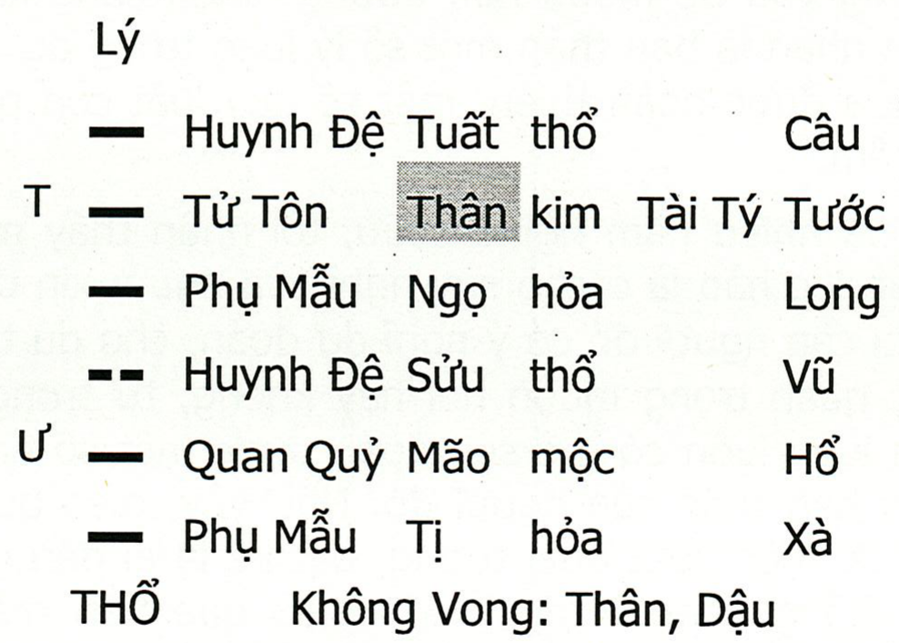
    - **Hình này chứng minh điều gì**
      - Chứng minh đương số là nhiếp ảnh gia tự do lạc quan, say mê nghệ thuật, bôn ba khắp thế giới, không màng quan lộc hay giàu sang và ít bệnh tật.
    - **Từ đâu mà thấy được**
      - Tử Tôn Thân kim trì hào 5 lâm Chu Tước gặp Tuần Không; hào sơ Tị hỏa Dịch Mã hợp Thế; Quan Quỷ không Nguyên thần; Tài phục hưu tù.

#### Luận giải chi tiết sáu phương diện cuộc đời

- **Phương diện 1 - Tính cách lạc quan, tiêu dao:**
  - Căn cứ hào 5 Tử Tôn Thân kim trì Thế. Tử Tôn trong Lục Hào là "phúc thần", thần của niềm vui và giải tỏa âu lo.
  - Phán đoán: Đương số suốt đời tâm hồn thanh thản, không vướng bận ưu phiền, là người vô cùng lạc quan và yêu đời.

- **Phương diện 2 - Thiên hướng nghệ thuật say đắm và tiếng tăm:**
  - Căn cứ lục thân: Tử Tôn chủ về năng khiếu nghệ thuật, sáng tạo.
  - Căn cứ ngũ hành và trạng thái: Hào Thế Thân kim lâm Tuần Không, cổ ngữ có định lý "kim Không tắc minh" (kim rỗng ruột thì phát ra âm thanh vang xa); đồng thời Thân kim nhập Mộ tại Nguyệt lệnh Sửu thổ, mang hình tượng si mê say đắm.
  - Căn cứ lục thú: Hào Thế lâm Chu Tước, Chu Tước chủ về phát thanh, tiếng tăm và ca xướng.
  - Phán đoán: Đương số có niềm đam mê nghệ thuật cháy bỏng, đạt được danh tiếng nhất định và rất yêu thích ca hát.

- **Phương diện 3 - Cuộc đời bôn ba bốn biển:**
  - Căn cứ quái danh: Quẻ tên là Thiên Trạch Lý, chữ "Lý" (履) nghĩa là đi lại, dấn bước, bôn tẩu ("Lý giả, hành dã").
  - Căn cứ hào vị: Hào Thế ngự tại hào 5, hào 5 là đường đi (lộ), tượng trưng cho người thường xuyên rong ruổi trên dặm trường.
  - Căn cứ thần sát: Hào sơ là chân (hạ chi), mang Phụ Mẫu Tị hỏa lâm Dịch Mã lại nhị hợp với hào Thế Thân kim (Tị Thân lục hợp).
  - Phán đoán: Đương số là người quanh năm bận rộn hành trình, suốt bốn mùa chu du khắp các nẻo đường trên thế giới.

- **Phương diện 4 - Đường công danh và sự nghiệp tự do:**
  - Căn cứ hào Quan Quỷ: Quan Quỷ Mão mộc ở hào 2 không có Nguyên thần (Thê Tài Tý thủy phục tàng hưu tù không trợ), lại bị hào Thế Tử Tôn Thân kim khắc chế; đồng thời hào Phụ Mẫu lưỡng hiện (hào sơ Tị hỏa và hào 4 Ngọ hỏa).
  - Phán đoán: Đương số cả đời không có quan vận, không gắn bó với công việc biên chế cố định, không chịu sự quản lý của bất kỳ cơ quan đơn vị nào, hoàn toàn là một nhân sĩ hoạt động tự do.

- **Phương diện 5 - Tình trạng tài chính kinh tế:**
  - Căn cứ hào Thê Tài: Thê Tài Tý thủy phục tàng dưới hào Thế Tử Tôn Thân kim, nhưng ở trạng thái hưu tù (bị Nguyệt lệnh Sửu thổ khắc chế, Nhật thần Mão mộc tiết khí).
  - Phán đoán: Đương số trong đời thường không bao giờ rơi vào cảnh túng thiếu tiền bạc, nhưng tuyệt đối không phải là một người đại phú đại quý.

- **Phương diện 6 - Sức khỏe thể chất và tâm đức với xã hội:**
  - Căn cứ sinh khắc: Tử Tôn trì Thế được Nguyệt lệnh Sửu thổ sinh phù; Quan Quỷ Mão mộc lâm hào Ứng (hào 2); hào Thế Thân kim khắc chế hào Ứng Quan Quỷ.
  - Phán đoán: Đương số suốt đời ít khi phải đối mặt với tai ách bệnh tật hiểm nghèo; ngược lại luôn giữ tâm thiện lương, biết lo nghĩ cho tha nhân, đem niềm vui xoa dịu nỗi đau của người khác.

#### Nghiệm chứng thực tế và ý nghĩa học thuật

- **Sự thật đời thực:**
  - Tất cả các phán đoán trên đều ứng nghiệm chuẩn xác 100%.
  - Vị khách xác nhận bản thân không hề có công việc hành chính cố định, hiện là một nhiếp ảnh gia tự do chuyên nghiệp tại Nhật Bản.
  - Hàng năm, anh dành hơn nửa thời gian rong ruổi khắp các vùng miền trên thế giới để chụp ảnh phong tục tập quán đời sống, sau đó đem tác phẩm về Nhật Bản triển lãm và xuất bản, được công chúng đón nhận nhiệt liệt.
  - Nguồn thu nhập kinh tế duy nhất của anh đến từ việc bán tác phẩm nhiếp ảnh, và kiếm được bao nhiêu tiền anh lại tái đầu tư toàn bộ làm kinh phí cho những chuyến đi sáng tác mới.
- **Ý nghĩa học thuật:**
  - Ví dụ này chứng minh hùng hồn rằng: Dù người gieo quẻ hoàn toàn không có chủ đích rõ ràng hay sự việc cụ thể cần tháo gỡ, trường thông tin vũ trụ vẫn kết tinh đầy đủ bản chất con người và vận mệnh vào quái tượng; mấu chốt phụ thuộc vào nhãn lực bóc tách thông tin của dự trắc sư.

### 4. Ví dụ 2: Người xin đoán ở xa, tác giả gieo thay qua điện thoại (Quẻ Phong Lôi Ích biến Thủy Trạch Tiết)

#### Bối cảnh tiếp nhận thông tin từ xa qua điện thoại

- **Thời gian chiêm bái:** Ngày Đinh Dậu, tháng Canh Thân, năm Mậu Dần (Tuần không: Thìn, Tị).
- **Hoàn cảnh liên lạc:** Hàn tiên sinh gọi điện thoại đến nhà, tha thiết mời tác giả trực tiếp đến xem phong thủy nhà ở vì gần đây trong gia trạch liên tục xảy ra những chuyện bất an kỳ quái.
- **Phản ứng của tác giả:** Do thời tiết mùa hè quá oi bức ngột ngạt, tác giả ngại đi lại nên đề nghị: *"Hai ba phút sau ông gọi lại nhé, tôi không đi cũng có thể đoán được."*
- **Hành động gieo quẻ:** Sau khi cúp điện thoại, tác giả tiện tay cầm ba đồng xu tự mình gieo quẻ, thu được quẻ Phong Lôi Ích biến Thủy Trạch Tiết (hào 1 Tý thủy biến Tị hỏa, hào 2 Dần mộc biến Mão mộc, hào 6 Mão mộc biến Tý thủy).

- Quẻ Phong Lôi Ích biến Thủy Trạch Tiết làm rõ nguyên nhân gia trạch bất an và tổn thất tài chính khi xem từ xa:
  - **Hình 2.** Sơ đồ quẻ Phong Lôi Ích biến Thủy Trạch Tiết
    - 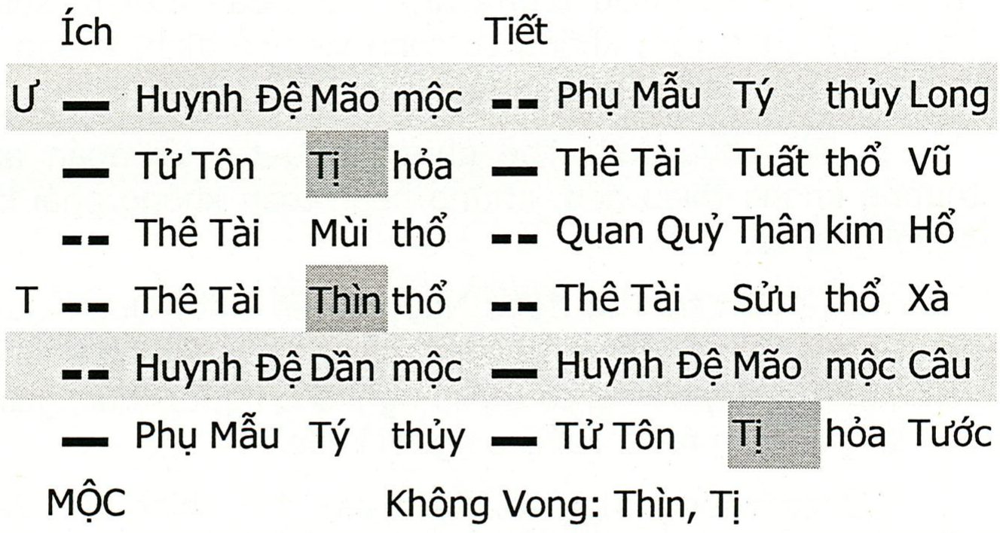
    - **Hình này chứng minh điều gì**
      - Chứng minh gia trạch bất ổn do đi xa thăm người thân gặp sự cố phá tài, kết hợp với việc tu sửa, dịch chuyển đồ gỗ trong nhà gây ra biến cố lạ lùng.
    - **Từ đâu mà thấy được**
      - Thế Tài Thìn thổ và Tử Tôn Tị hỏa lâm Không Vong, Đằng Xà; hào 6 Huynh Đệ Mão mộc lâm Ứng Thanh Long động; hào 2 Câu Trận Dần mộc động tiến thần.

#### Phân tích quái tượng tìm nguyên nhân gia trạch bất an

- **Nhận định bao quát tình trạng gia đạo:**
  - Vài phút sau, Hàn tiên sinh gọi lại; tác giả khẳng định ngay: *"Gia đình ông gần đây rất xáo trộn, cả nhà ông đều rơi vào trạng thái bất an, tinh thần rất bất ổn."*
  - Căn cứ hào Thế Thê Tài Thìn thổ lâm Tuần Không, lại đới Đằng Xà (Đằng Xà chủ hoang mang, kinh hãi, đứng ngồi không yên).
  - Căn cứ lục thân: Hào Thế Thê Tài đại diện cho người vợ; hào 5 Tử Tôn Tị hỏa đại diện cho con cái cũng rơi vào Tuần Không -> Vợ con đều đang trong tình trạng hoảng loạn, bất an cực độ.

- **Phán đoán việc hao tài tốn của:**
  - Căn cứ hào động: Trong quẻ có hai hào Huynh Đệ cùng phát động (hào 2 Dần mộc động hóa Mão mộc Tiến thần; hào 6 Mão mộc động) cùng hợp lực khắc phạt hào Thế Thê Tài Thìn thổ.
  - Phán đoán: Gần đây gia đình ông Hàn vừa gặp phải một sự cố dẫn đến tổn thất tiền của nghiêm trọng.

- **Bóc tách hai nguyên nhân cốt lõi gây nên họa loạn:**
  - Căn cứ hào 6: Huynh Đệ Mão mộc ngự tại hào Ứng, lâm Thanh Long phát động khắc Thế. Ứng chủ về nơi khác, vùng đất xa xôi; Thanh Long chủ về việc thăm viếng người thân họ hàng.
  - Căn cứ hào 2: Hào 2 là trạch vị (nhà ở), mang Huynh Đệ Dần mộc lâm Câu Trận phát động hóa Tiến thần. Câu Trận lâm mộc động chủ về sửa chữa, tu tạo, cơi nới hoặc di dời đồ gỗ.
  - Lời phán quyết của tác giả: *"Thứ nhất là gần đây ông có đi thăm nhà thân thích ở vùng khác; thứ hai là trong nhà gần đây khi cải tạo xây dựng đã di chuyển những thứ bằng gỗ, chính vì những nguyên nhân này mà khiến cho gia trạch bất an."*

#### Nghiệm chứng sự cố giao thông và biến cố cửa khóa trái

- **Sự thật về chuyến thăm thân và vụ đụng xe (ứng Thanh Long hào 6 và phá tài):**
  - Ông Hàn kinh ngạc xác nhận: Mới đây ông lái xe đưa cả nhà đi thăm bệnh bố vợ ở nơi xa. Vì bệnh tình bố vợ quá nặng nên người vợ phải ở lại chăm sóc, còn ông lái xe chở đứa con trở về nhà.
  - Trên hành trình quay về, ô tô của ông vô ý đâm ngã một người đi xe máy; may mắn người đó không bị thương tích nghiêm trọng, nhưng ông phải bồi thường hơn 5.000 tệ để dàn xếp êm xuôi (đúng tượng hao tài vì đi thăm thân).

- **Sự thật về việc di dời đồ gỗ (ứng Câu Trận hào 2 mộc động):**
  - Hai ngày trước đó, ông Hàn có di chuyển một số tủ bàn bằng gỗ trong nhà để kéo lại đường dây điện sinh hoạt.

- **Biến cố rùng rợn về cánh cửa tự khóa (ứng Đằng Xà trì Thế nhập Không):**
  - Ngay sau việc di dời đồ đạc, đứa con đi học về thấy trong nhà oi bức nên không đóng cửa chính mà đi thẳng vào. Đột nhiên cánh cửa tự động sập kín lại; đứa bé chạy ra vặn mở then chốt cách nào cũng không được, vô cùng hoảng sợ vội gọi điện thoại cầu cứu bố.
  - Khi ông Hàn tức tốc chạy về đến nhà, kinh hãi phát hiện cánh cửa đã bị khóa trái then từ phía bên ngoài — một khả năng gần như không thể tự nhiên xảy ra, khiến cả gia đình hoang mang tột độ.

- **Ý nghĩa học thuật:**
  - Dù người hỏi ở xa qua điện thoại và quẻ do chính tác giả gieo thay, việc trích xuất Dụng thần vẫn hoàn toàn đồng nhất với trường hợp đương số tự gieo, kết quả chuẩn xác tuyệt đối đến từng chi tiết.

### 5. Ví dụ 3: Người xin đoán có mặt, tác giả gieo quẻ thay về hôn nhân (Quẻ Thiên Phong Cấu biến Phong Địa Quan)

#### Bối cảnh vấn sự và nạp âm quái tượng

- **Thời gian chiêm bái:** Ngày Ất Dậu, tháng Quý Hợi, năm Mậu Dần (Tuần không: Ngọ, Mùi).
- **Hoàn cảnh:** Tác giả và bạn thân Đoàn Kiến Nghiệp đang ngồi đàm đạo tại nhà một người bạn khác. Tại đó có một nữ sĩ làm việc tại hiệu sách (sinh năm Tân Sửu 1961, năm 1998 là 38 tuổi ta) ngỏ ý muốn hỏi về tình trạng hôn nhân hiện tại.
- **Hành động gieo quẻ:** Tác giả tự tay gieo quẻ giúp người phụ nữ này, thu được quẻ Thiên Phong Cấu biến Phong Địa Quan (hào 2 Hợi thủy động biến Tị hỏa, hào 4 Ngọ hỏa động biến Mùi thổ).

- Quẻ Thiên Phong Cấu biến Phong Địa Quan vạch rõ mâu thuẫn hôn nhân, lịch sử kết hôn, lưu sản và việc ngoại tình:
  - **Hình 3.** Sơ đồ quẻ Thiên Phong Cấu biến Phong Địa Quan
    - 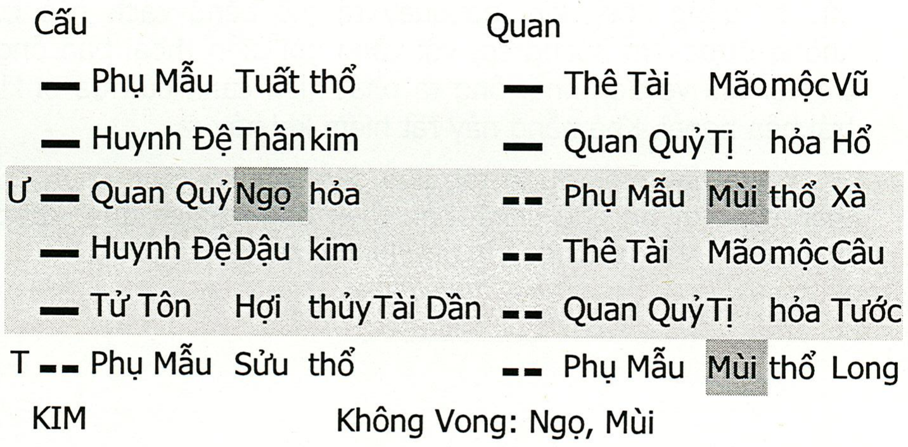
    - **Hình này chứng minh điều gì**
      - Chứng minh hôn nhân rạn nứt sâu sắc do bất hòa, sảy thai nhiều lần, chồng có bệnh kín và đương số có nhân tình thúc ép ly hôn qua tòa án.
    - **Từ đâu mà thấy được**
      - Quan Quỷ Ngọ hỏa Không Vong bị Hợi thủy khắc; nội quái phản ngâm; hào 2 thai vị Tử Tôn hóa Quỷ hóa Tuyệt; hào 2 hóa Quan Quỷ mới.

#### Các bước luận giải lịch sử hôn nhân và sảy thai

- **Định Dụng thần và nhận định tổng quan:**
  - Phụ nữ xem hôn nhân lấy Quan Quỷ làm Dụng thần.
  - Trong quẻ, Quan Quỷ Ngọ hỏa lâm Tuần Không, Nguyên thần Thê Tài Dần mộc phục tàng dưới hào 2 Hợi thủy; Quan Quỷ bị Nguyệt kiến Hợi thủy và hào 2 Tử Tôn Hợi thủy động khắc phạt dữ dội.
  - Nội quái biến Phản ngâm (Tốn mộc biến Khôn thổ, các hào nội quái hỗ xung hỗ khắc). Vừa nhìn quẻ là thấy ngay hôn nhân đang rơi vào khủng hoảng trầm trọng, mâu thuẫn xung đột không thể hóa giải.

- **Lập luận xác định năm kết hôn (năm 1984 - Giáp Tý):**
  - Quan Quỷ Ngọ hỏa lâm Tuần Không, phát động hóa ra Phụ Mẫu Mùi thổ tương hợp (Ngọ Mùi nhị hợp).
  - Khẩu quyết Lục Hào: *"Xung Không tắc Thực"* và *"Gặp hợp cần phải xung khai"*.
  - Xét năm Giáp Tý (1984), đương số tròn 24 tuổi ta — độ tuổi kết hôn truyền thống:
    - Chi Tý xung Ngọ hỏa, làm cho Quan Quỷ xuất Không (xung Không tắc Thực);
    - Tý thủy xung Ngọ hỏa làm xung khai mối hợp Ngọ - Mùi;
    - Chi Tý lại nhị hợp với hào Thế Phụ Mẫu Sửu thổ. Hào Phụ Mẫu đại diện cho văn thư, giấy chứng nhận kết hôn; hào Thế lâm Thanh Long chủ việc vui hỷ sự. Thái Tuế hợp Thế chứng tỏ năm đó đón nhận giấy hôn thú.
  - Phán đoán: Đương số kết hôn vào năm 1984 (Giáp Tý). Người phụ nữ xác nhận hoàn toàn chính xác.

- **Lập luận xác định tiền sử sảy thai nhiều lần:**
  - Hào 2 Tử Tôn Hợi thủy cùng với Nguyệt lệnh Hợi thủy cấu thành cách cục "Hợi Hợi tự hình".
  - Hào vị: Hào 2 là thai vị (vị trí thai sản). Tử Tôn lâm thai vị phát động hóa Quan Quỷ Tị hỏa (hóa Quỷ) và hóa Tuyệt địa (Thủy tuyệt tại Tị).
  - Hào thai gốc trong quẻ (Quan Quỷ Ngọ hỏa) lại rơi vào Tuần Không; thông tin tổn hại con cái biểu hiện vô cùng mãnh liệt.
  - Nội quái phản ngâm mang tượng lặp đi lặp lại nhiều lần.
  - Phán đoán: Đương số từng bị sảy thai, lưu sản không chỉ một lần. Người phụ nữ ngậm ngùi thừa nhận bản thân đã từng lưu sản hai lần.

#### Vạch trần chuyện ngoại tình và bệnh kín của người chồng

- **Bản chất tình cảm của chồng và ý định ly hôn của đương số:**
  - Quan Quỷ Ngọ hỏa động sinh phù hào Thế Sửu thổ: Người chồng thực lòng rất mực yêu thương chiều chuộng vợ.
  - Tuy nhiên, Quan Quỷ vừa Không Vong vừa bị thủy khắc tận diệt, nội quái phản ngâm, lại không có hào Tài mộc cứu trợ: Đương số trong lòng đang chán ghét, bức bối muốn ly hôn đến mức "tối mày tối mặt".
  - Hào 2 Tử Tôn Hợi thủy lâm Chu Tước (hào 2 là trạch vị; Chu Tước chủ khẩu thiệt, tranh cãi) động khắc Quan Quỷ: Đương số ngày nào ở nhà cũng kiếm cớ cãi vã, gây sự với chồng.
  - Quan Quỷ vẫn ngự tại hào Ứng (phu vị) và hợp với Phụ Mẫu Mùi thổ (hôn thú): Pháp lý hai người hiện tại vẫn là vợ chồng. Nhưng Phụ Mẫu Mùi thổ lâm Tuần Không: Tờ giấy hôn thú trong tay chồng chỉ còn là danh nghĩa rỗng tuếch. Nội quái phản ngâm: Đương số đã nhiều lần đòi ly hôn nhưng chưa dứt điểm được.

- **Suy luận về diện mạo, tính cách đào hoa và bệnh khó nói của chồng:**
  - Hào Thế Sửu thổ lâm Thanh Long: Thanh Long chủ mỹ mạo và phong lưu đa tình; thực tế người nữ này có dung nhan rất xinh đẹp.
  - Quẻ Thiên Phong Cấu có hào từ cảnh báo: *"Nữ tráng, vật dụng thú nữ"* (gặp phụ nữ mạnh mẽ, chớ lấy làm vợ); Sửu thổ gặp Nhật thần Dậu kim là đất Mộc Dục (đào hoa tắm gội, hiếu sắc).
  - Hào vị: Hào 2 là vị trí cơ quan sinh dục, lâm Tử Tôn (Kỵ thần của Quan Quỷ), động hóa Quan Quỷ Tị hỏa (Quan Quỷ chủ tật bệnh).
  - Phán đoán tế nhị: Người chồng mắc bệnh kín ở vùng nhạy cảm, không thể thực hiện chức năng chăn gối vợ chồng.

- **Vạch trần người thứ ba và màn đấu trí tâm lý:**
  - Trong quẻ vốn đã có Quan Quỷ Ngọ hỏa, nay hào trạch (hào 2) lại hóa xuất thêm một Quan Quỷ Tị hỏa: Đây chính là tượng dẫn đàn ông lạ vào buồng the.
  - Năm Bính Tý (1996), Thái Tuế Tý thủy xung thực Quan Quỷ: Đương số đã có quan hệ ngoại tình từ năm 1996.
  - Tử Tôn Hợi thủy lâm Chu Tước phát động (Chu Tước chủ lời nói xúi giục); Hợi thủy lại là đất Lâm Quan của hào Thế Sửu thổ: Người đàn ông ngoại tình này không ngừng giục giã cô mau chóng ly dị chồng.
  - Phản ứng ban đầu: Người phụ nữ thề thốt chối cãi kịch liệt, khẳng định mình không hề ngoại tình.
  - Đòn tâm lý của tác giả: Tác giả lập tức gấp quẻ lại và bảo: *"Xem ra cách nghĩ của tôi không đúng, quẻ này không cần phải xem nữa, nếu xem nữa thì không chuẩn."*
  - Sự thật phơi bày: Thấy tác giả không xem nữa, người phụ nữ cuống cuồng thanh minh: *"Tôi và người đàn ông đó chẳng có gì cả, là anh ta cứ theo đuổi tôi, tôi không chủ động đi tìm anh ta!"*
  - Tác giả vờ hỏi: *"Người đàn ông nào?"*
  - Người phụ nữ xấu hổ cúi đầu: *"Chính là người thứ ba mà ông vừa mới nói."*

#### Xác định ứng kỳ ly hôn qua tòa án và kết quả thực tế

- **Lập luận ứng kỳ ly hôn:**
  - Tác giả khẳng định: Sang tháng sau (tháng Tý - tháng 11 âm lịch năm Mậu Dần 1998), cô nhất định sẽ ly hôn thành công, và bắt buộc phải thông qua sự can thiệp của tòa án.
  - Căn cứ ngũ hành ứng kỳ: Tháng Tý xung khai mối hợp Ngọ - Mùi, người chồng chính thức thoát ly quan hệ ràng buộc với giấy hôn thú; Quan Quỷ Không Vong gặp tháng Tý xung Không thành Thực;
  - Căn cứ thần sát pháp lý: Tử Tôn Hợi thủy lâm Chu Tước khắc Quan Quỷ, Chu Tước chủ kiện tụng thị phi chốn công đường; hào Thế Sửu thổ gặp tháng Tý hợp, nhưng gặp Hợi thủy là Lâm Quan — chủ việc đương số phải trực tiếp thân lâm quan tụng.
- **Kết quả thực tế:**
  - Đúng như dự đoán, vào tháng Tý năm 1998, hai vợ chồng đã hoàn tất thủ tục ly hôn thông qua phán quyết của tòa án nhân dân.

### 6. Ví dụ 4: Người thứ ba gieo quẻ dự đoán bệnh tình Thủ tướng Obuchi Keizo (Quẻ Thiên Hỏa Đồng Nhân biến Hỏa Phong Đỉnh)

#### Bối cảnh tin tức thời sự và người thứ ba gieo quẻ

- **Thời gian chiêm bái:** Ngày Tân Mão, tháng Kỷ Mão, năm Canh Thìn (Tuần không: Ngọ, Mùi).
- **Hoàn cảnh xuất quẻ:** Ti vi đang phát sóng bản tin thời sự quốc tế đưa tin Thủ tướng Nhật Bản Obuchi Keizo (Tiểu Uyên Huệ Tam) đột ngột ngã bệnh nhập viện cấp cứu trong tình trạng hôn mê.
- **Người khởi xướng:** Cô Muto đang ngồi chơi tại nhà tác giả nghe tin liền lo lắng hỏi xem cát hung của Thủ tướng ra sao.
- **Hành động gieo quẻ:** Ngay tại phòng khách lúc đó, tác giả chỉ định một người khách khác đang có mặt cầm ba đồng xu gieo quẻ (người thứ ba hoàn toàn xa lạ gieo thay).
- **Quẻ thu được:** Thiên Hỏa Đồng Nhân biến Hỏa Phong Đỉnh (hào sơ Mão mộc biến Sửu thổ, hào 2 Sửu thổ biến Hợi thủy, hào 3 Hợi thủy biến Dậu kim, hào 5 Thân kim biến Mùi thổ, hào 6 Tuất thổ biến Tị hỏa).

- Quẻ Thiên Hỏa Đồng Nhân biến Hỏa Phong Đỉnh cho thấy bệnh tình nguy kịch và ứng kỳ tử vong của Thủ tướng Obuchi Keizo:
  - **Hình 4.** Quẻ Thiên Hỏa Đồng Nhân biến Hỏa Phong Đỉnh
    - 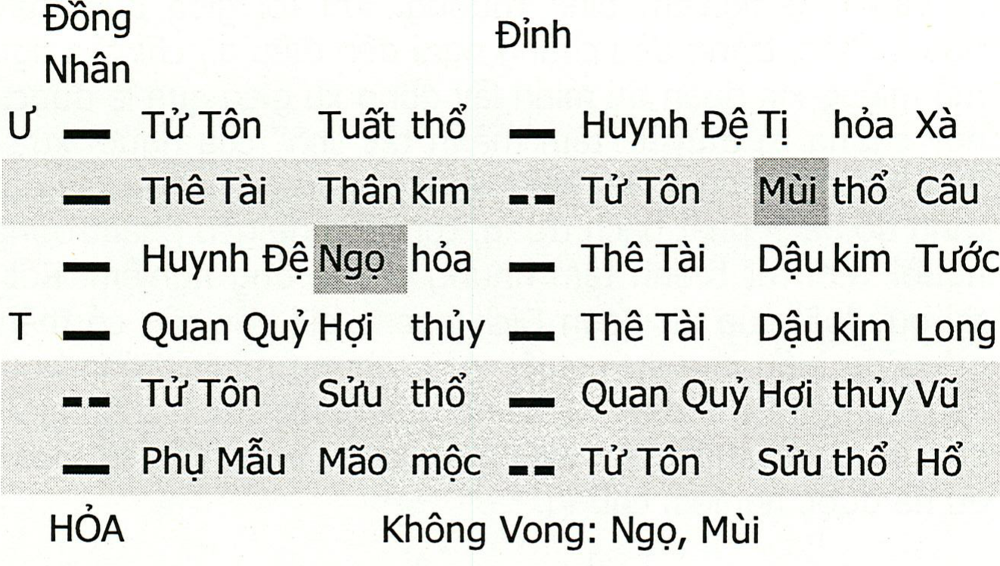
    - **Hình này chứng minh điều gì**
      - Chứng minh đương số bị tai biến mạch máu não nghiêm trọng, trụy tim, suy hô hấp phải thở máy và khó qua khỏi trong tháng Thìn hoặc tháng Tị.
    - **Từ đâu mà thấy được**
      - Dụng thần Ứng Tuất thổ tại hào 6 lâm Đằng Xà bị ba Mão mộc khắc; Nguyên thần Ngọ hỏa ngộ Không; Thân kim động hóa Tử Tôn Mùi thổ; hào 2 hóa Quỷ.

#### Chẩn đoán bệnh lý tai biến mạch máu não và suy tim

- **Xác định Dụng thần:**
  - Dự đoán cho nguyên thủ quốc gia, lãnh tụ chính trị hoặc nhân vật xã hội không có quan hệ thân tộc, quy tắc Lục Hào lấy hào Ứng làm Dụng thần (ở đây là hào 6 Tử Tôn Tuất thổ).

- **Hiểm họa vỡ mạch máu não và hoại tử thần kinh:**
  - Căn cứ nguyệt nhật: Hào Ứng Tuất thổ bị Nguyệt kiến Mão mộc khắc phạt, Nhật thần Mão mộc khắc phạt, trong quẻ lại có hào sơ Phụ Mẫu Mão mộc phát động khắc phạt -> Ba Mão mộc đồng thanh tương ứng khắc phạt một Tuất thổ, lâm vào thế hiểm độc cùng cực.
  - Căn cứ hào vị và lục thân: Hào 6 là ngôi vị cao nhất, chủ về phần đầu; Tử Tôn chủ về huyết quản (mạch máu).
  - Căn cứ lục thú và cung quái: Kỵ thần Mão mộc lâm Bạch Hổ phát động (Bạch Hổ chủ huyết dịch); quẻ thuộc cung Ly (Ly vi hỏa, chủ về máu huyết) -> Mạch máu trên não bộ đã xảy ra tổn thương nghiêm trọng.
  - Căn cứ thần sát: Hào Ứng lâm Đằng Xà, Đằng Xà chủ về sự co thắt, chật hẹp, uốn khúc -> Nguyên nhân phát bệnh do mạch máu não co thắt đột ngột gây tai biến vỡ mạch hoặc tắc nghẽn mạch máu não.
  - Căn cứ sinh vượng tử tuyệt: Tuất thổ gặp Mão mộc là đất Tử địa; "Tam Mão khắc nhất Dụng" chứng tỏ có ít nhất ba vị trí mạch máu não đã bị hoại tử hoàn toàn.
  - Căn cứ tính chất: Kỵ thần Mão mộc trong khắc có hợp (Mão Tuất lục hợp), tạo thành cái bóng tử khí trói buộc chặt chẽ, không thể nào bài trừ.

- **Tình trạng suy tim trụy mạch:**
  - Căn cứ hào 4 Nguyên thần Huynh Đệ Ngọ hỏa lâm Tuần Không.
  - Hào 4 chủ về lồng ngực và tâm tạng; Ngọ hỏa ngũ hành thuộc hỏa chủ về trái tim.
  - Nguyên thần ngộ Không không thể phát huy công năng sinh trợ Dụng thần Tuất thổ -> Tim suy kiệt nghiêm trọng, không đủ khả năng bơm máu nuôi dưỡng não bộ.

#### Tình trạng cấp cứu và tác dụng phụ của y dược

- **Biện pháp thở oxy cưỡng bức:**
  - Căn cứ hào 5 Thê Tài Thân kim phát động hóa ra Tử Tôn Mùi thổ.
  - Thân kim là đất Trường Sinh của Dụng thần Tuất thổ; hào 5 chủ về ngũ quan (mũi, miệng); Thê Tài chủ về đường hô hấp và dưỡng khí; Tử Tôn chủ về điều trị y tế.
  - Phán đoán: Bệnh viện đang phải áp dụng biện pháp đặt ống nội khí quản và cho thở máy oxy để duy trì hô hấp.
  - Hào Tử Tôn xuất hiện dày đặc khắp quẻ (hào 2 Sửu thổ, hào sơ hóa Sửu, hào 5 hóa Mùi, hào 6 Tuất thổ) chứng tỏ bệnh viện đã huy động lực lượng y tế tối đa cùng nhiều phác đồ điều trị phối hợp.

- **Rối loạn bài tiết và tác dụng phụ của thuốc:**
  - Hào 2 Tử Tôn Sửu thổ phát động hóa ra Quan Quỷ Hợi thủy.
  - Hào 2 là vị trí hạ bộ, chủ về cơ quan bài tiết và sinh dục; Quan Quỷ chủ về bệnh tật -> Hệ bài tiết tê liệt, đại tiểu tiện gặp trở ngại nghiêm trọng.
  - Tử Tôn là biểu tượng của y dược, nay động hóa Quan Quỷ mang thông điệp các loại thuốc điều trị đặc hiệu đang gây ra tác dụng phụ phá hủy cơ thể bệnh nhân.

#### Quyết đoán ứng kỳ tử vong và nghiệm chứng lịch sử

- **Lập luận xác định thời điểm tử vong:**
  - Tháng Thìn (tháng 3 âm lịch): Dụng thần Tuất thổ rơi vào cách cục "hợp xứ phùng xung" (Mão Tuất đang hợp gặp Thìn thổ xung khai), đồng thời Tuất thổ nhập Mộ tại Thìn -> Tháng Thìn đã là thời điểm đại hung.
  - Tháng Tị (tháng 4 âm lịch): Dụng thần Tuất thổ bước vào Tuyệt địa (Tuất tuyệt tại Tị). Nguyên thần Thân kim (vốn có khả năng khắc chế Kỵ thần Mão mộc) bị Tị hỏa hình hợp làm tê liệt hoàn toàn; Kỵ thần Mão mộc không còn ai kiềm chế thỏa sức tàn phá -> Tháng Tị là kỳ hạn cuối cùng của sinh mệnh, tuyệt đối không thể vượt qua.
  - Thê Tài Thân kim bị hợp, biểu thị đường thở hoàn toàn đình chỉ ("thở không ra hơi là kết thúc").
  - Lời phán quyết dứt khoát của tác giả: Tháng Thìn nếu chưa mất thì sang tháng Tị nhất định phải qua đời.
- **Nghiệm chứng lịch sử:**
  - Thực tế diễn biến y khoa thế giới: Thủ tướng Nhật Bản Obuchi Keizo hôn mê sâu và chính thức trút hơi thở cuối cùng vào ngày Nhâm Thân, tháng Tị năm Canh Thìn (ngày 14 tháng 5 năm 2000).

### 7. Đúc kết thực tiễn về các phương thức gieo quẻ

- **Hệ thống hóa bốn phương thức gieo quẻ thực chiến:**
  - Phương thức 1: Bản thân người xin đoán tự tay gieo quẻ khi trong tâm không có sự việc cụ thể cần hỏi (Ví dụ 1);
  - Phương thức 2: Người xin đoán ở xa nghìn trùng trao đổi qua điện thoại, dự trắc sư tự tay gieo quẻ thay (Ví dụ 2);
  - Phương thức 3: Người xin đoán có mặt trực tiếp tại chỗ, nhưng dự trắc sư tự tay gieo quẻ thay (Ví dụ 3);
  - Phương thức 4: Người thứ ba hoàn toàn không quen biết và không liên quan đến sự việc tự tay gieo quẻ theo lời chỉ định (Ví dụ 4).
- **Quy luật cốt lõi giải phóng tư duy:**
  - Cả bốn tình huống gieo quẻ với xuất phát điểm khác nhau đều đem lại kết quả dự đoán chuẩn xác kinh ngạc, chứng minh rằng sự ứng nghiệm của Lục Hào không phụ thuộc vào ai là người cầm đồng xu.
  - Luận điểm cổ hủ "tâm thành tắc linh" và các thứ "mật chú" thần quyền bị đập tan hoàn toàn trước ánh sáng thực tiễn.
  - Dự trắc sư chỉ cần người hỏi phát khởi ý niệm thỉnh đoán là có thể lập tức gieo quẻ; trong tâm thanh thản không cần suy nghĩ lan man, cứ căn cứ đúng biến hóa âm dương ngũ hành của quái tượng mà quyết đoán cát hung.

## Chương 2: Tiến Thần Biện Ý

### 1. Ý nghĩa mở rộng và nguyên lý biện chứng của Tiến Thần
- Giới hạn của cách tiếp cận truyền thống:
  - Các thư tịch cổ điển và sách bói toán thông thường khi bàn về Tiến thần phần lớn chỉ chú trọng đến hai phương diện bề nổi: xem xét cát hung (tốt hay xấu) và xác định ứng kỳ (thời điểm xảy ra sự việc, biến cố).
  - Các tài liệu đó thường chỉ bàn đến việc hóa tiến diễn ra như thế nào, vào thời điểm nào thì ứng nghiệm việc hóa tiến. Đó mới chỉ là tầng mức nhập môn, là cách luận giải cơ bản và thô sơ nhất về Tiến thần.
- Chiều sâu hàm nghĩa và khả năng biến hóa thực chiến:
  - Trên thực tế, bên trong khái niệm Tiến thần còn ẩn tàng vô số tầng ý nghĩa tinh vi, biểu thị cho sự biến dịch không ngừng của vạn vật và tâm lý con người.
  - Rất nhiều lời đoán kỳ diệu, chuẩn xác đến kinh ngạc trong thực tế đều bắt nguồn từ sự thấu suốt và mở rộng những ý nghĩa căn bản này chứ không gò bó trong khuôn mẫu cứng nhắc.
- Các tầng biểu trưng phong phú của Tiến Thần:
  - Tiến thần mang các ý nghĩa biểu thị sự vận động hướng tới: Tiền tiến (tiến về phía trước), phát triển, thượng tiến (cầu tiến, vươn lên), nỗ lực không ngừng.
  - Về phương diện cấu trúc và không gian: Thượng tầng (lên tầng cao hơn, cấp bậc cao hơn), liên tục kéo dài, khuếch đại, bành trướng, nở to ra, sưng phù (phù thũng), đi xa.
  - Về trạng thái tinh thần và sự nghiệp: Hưng phấn tột độ, nhậm chức, thăng tiến, thái độ cứng rắn, sự trưởng thành chín chắn, v.v.
- Yêu cầu ứng biến linh hoạt khi luận quẻ:
  - Người luận dịch phải căn cứ chuẩn xác vào bối cảnh quẻ tượng và câu hỏi thực tế của đương số để biến hóa suy luận.
  - Khi vận dụng xác đáng và tinh tế, thầy bói có thể nói trúng vào tận sâu thẳm tâm khảm và nỗi niềm u ẩn của người hỏi, khiến họ tâm phục khẩu phục; ngược lại, nếu chỉ máy móc bám víu vào hai chữ cát hung đơn thuần thì kết quả đoán quẻ sẽ trở nên vô cùng nhạt nhẽo, khô khan và thiếu sức sống.

### 2. Ví dụ 1: Hiệu trưởng đoán chuyển đổi công việc và áp lực thoái chức (Quẻ Hỏa Trạch Khuê biến Hỏa Thiên Đại Hữu)

#### Bối cảnh và thông tin quẻ
- Thời gian chiêm bái: Ngày Kỷ Mùi, tháng Đinh Tị, năm Mậu Dần (Tuần Không: Tý, Sửu).
- Đối tượng dự đoán: Một người đàn ông trạc 50 tuổi, hiện đang giữ chức vụ hiệu trưởng của một trường trung học, tìm đến tác giả để xem vận trình công việc và tiền đồ sự nghiệp.
- Quẻ gieo được: Quẻ Hỏa Trạch Khuê biến Hỏa Thiên Đại Hữu (thuộc cung Thổ).
- Nhận định sơ khởi và căn cứ dụng thần:
  - Xem về quan vận, sự nghiệp và chức vụ hành chính, lấy hào Quan Quỷ làm Dụng thần.
  - Trong quẻ, Quan Quỷ Mão mộc lâm hào 2 bị hưu tù tại Nguyệt kiến Đinh Tị (Mộc sinh Hỏa nên bị tiết khí nặng nề), đồng thời nhập Mộ tại Nhật thần Kỷ Mùi (Mùi là Mộ khố của Mộc).
  - Hào Thế lại do Kỵ thần Tử Tôn Dậu kim trì Thế (Tử Tôn khắc Quan Quỷ). Tượng Quan Quỷ suy kiệt nhập Mộ kết hợp Kỵ thần trì Thế báo hiệu công việc lâm vào cảnh bất lợi cùng cực, công danh trắc trở. Tác giả lập tức nhận định đương số sắp sửa phải rời bỏ cương vị hiệu trưởng.

#### Các bước suy luận và luận giải hào tượng
- Luận giải về áp lực từ bộ phận nhân sự và cấp trên lãnh đạo:
  - Nhìn vào hào 4: Hào 4 trong quẻ quản lý về mặt nhân sự nội bộ, nay lâm Kỵ thần Tử Tôn Dậu kim phát huy uy lực khắc chế trực tiếp Quan Quỷ. Tử Tôn Dậu kim đắc Trường Sinh tại Nguyệt kiến Tị hỏa và được Nhật thần Mùi thổ tương sinh nên khí thế vô cùng vượng tướng. Điều này biểu thị bộ phận tổ chức nhân sự đang gia tăng sức ép, thúc giục ông sớm rời khỏi cương vị.
  - Nhìn vào Nguyệt lệnh Đinh Tị: Nguyệt kiến đại diện cho cấp trên, lãnh đạo cấp cao. Tị hỏa tuy là nơi Trường Sinh của Tử Tôn Dậu kim nhưng ngũ hành bản chất Hỏa lại khắc Kim; trong Trường Sinh có ẩn chứa sự tương khắc, phản ánh nội tâm lãnh đạo cấp trên cũng ngầm mong muốn ông chủ động thôi chức nhường chỗ.
  - Nhìn vào Nhật thần Kỷ Mùi: Nhật thần đại diện cho đồng nghiệp trong cơ quan, sinh trợ cho Tử Tôn Dậu kim, cho thấy không ít đồng nghiệp xung quanh cũng có chung mong muốn ông mau chóng rút lui.
- Biện giải diệu dụng của Tiến Thần tại hào 3:
  - Hào 3 Huynh Đệ Sửu thổ phát động hóa Tiến thần Huynh Đệ Thìn thổ, tiếp tục gia tăng nguồn sinh lực dồi dào cho Kỵ thần Tử Tôn Dậu kim (Thổ sinh Kim).
  - Xét về Tuần Không: Hào Sửu thổ tuy lâm Tuần Không, nhưng gặp Nhật thần Kỷ Mùi tương xung (Sửu Mùi tương xung) nên trở thành Xung thực, không còn bị xem là Không nữa.
  - Mộ khố và ý nghĩa quản chế: Sửu thổ là Mộ khố của hào 4 Tử Tôn Dậu kim. Khố tượng trưng cho sự quản chế, quản thúc, thu gom, ứng với bộ phận phụ trách công tác nhân sự.
  - Tượng Tiến Thần hối thúc liên tục: Hào Sửu thổ hóa Tiến thần sinh cho Kỵ thần Tử Tôn là hình ảnh bộ phận nhân sự liên tục, không ngừng tạo áp lực, gửi thông báo hối thúc ông đưa ra quyết định.
  - Xác định ứng kỳ: Dù việc này có dùng dằng kéo dài thì cũng tuyệt đối không thể quá thời điểm cuối năm; bởi vì Sửu thổ nguyên mang lý tính Tuần Không, đến tháng Sửu (tháng 12 âm lịch) sẽ ứng kỳ Thực Không dứt khoát.
- Phân tích tâm lý đương số qua lục thú:
  - Hào Thế Tử Tôn Dậu kim lâm thần sát Thanh Long. Thanh Long chủ về điềm vui vẻ, cát khánh, cởi mở tâm can.
  - Tác giả khẳng định với vị hiệu trưởng rằng việc thôi chức, nghỉ hưu trong hoàn cảnh này chưa hẳn là điều bất hạnh; trái lại, buông bỏ chức vụ sẽ giúp ông trút sạch gánh nặng tinh thần, tâm hồn trở nên thư thái, nhẹ nhõm.
- Luận điểm rút ra từ quẻ Hỏa Trạch Khuê biến Hỏa Thiên Đại Hữu về áp lực nhân sự và cơ duyên thoái chức:
  - **Hình 5.** Sơ đồ quẻ Hỏa Trạch Khuê biến Hỏa Thiên Đại Hữu
    - 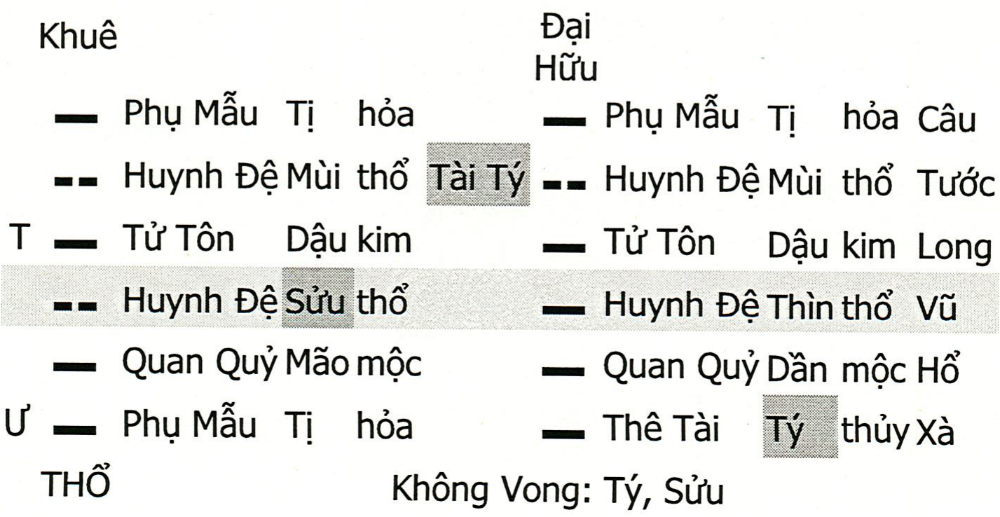
    - **Hình này chứng minh điều gì**
      - Tượng quẻ cho thấy người hỏi sắp rời cương vị do áp lực nhân sự thúc ép liên tục, nhưng nghỉ việc lại mang đến tâm lý nhẹ nhõm, thanh thản.
    - **Từ đâu mà thấy được**
      - Quan Quỷ hưu tù nhập Mộ, Tử Tôn Dậu kim trì Thế; hào 3 Huynh Đệ Sửu thổ hóa Tiến thần Thìn thổ sinh Kỵ thần Tử Tôn, tuy Không nhưng Nhật xung thành thực.

#### Diễn biến đối thoại và kết quả ứng nghiệm
- Lời xác nhận của người hỏi:
  - Vị hiệu trưởng bày tỏ sự thán phục và giãi bày thực tình: Ban giám đốc và cấp trên đã đích thân gặp gỡ khuyên ông nên chủ động làm thủ tục nghỉ hưu.
  - Dù nếu ông nhất quyết khăng khăng ở lại thì nhà trường vẫn phải giữ biên chế cho ông, nhưng do định mức biên chế lãnh đạo có hạn ngạch chặt chẽ, sự có mặt của ông sẽ cản trở con đường tiến thân của lớp kế cận, khiến nhiều người mong ông rút lui sớm.
  - Về phần mình, ông vốn đã ấp ủ dự định ra ngoài làm kinh doanh, nhưng do gắn bó hàng chục năm trong ngành giáo dục nên tình cảm quyến luyến, chưa nỡ dứt áo ra đi, lòng dạ còn dùng dằng do dự.
  - Chính vì thái độ lưỡng lự đó mà ban tổ chức nhân sự đã nhiều lần liên tiếp gọi điện, gặp mặt hối thúc ông khẩn trương hạ quyết tâm đi hay ở.
- Kết quả thực tế:
  - Sau khi nghe tác giả phân tích thấu đáo về tượng quẻ và điềm lành Thanh Long, ông đã hoàn toàn trút bỏ được sự băn khoăn, vui vẻ trở về cơ quan hoàn tất mọi thủ tục nghỉ hưu theo quy định.

### 3. Ví dụ 2: Cô Mã đoán nhân duyên hôn nhân và ý định tu hành (Quẻ Lôi Địa Dự biến Trạch Thủy Khốn)

#### Bối cảnh và thông tin quẻ
- Thời gian chiêm bái: Ngày Kỷ Tị, tháng Đinh Tị, năm Mậu Dần (Tuần Không: Tuất, Hợi).
- Đối tượng dự đoán: Cô Mã, sinh năm Kỷ Dậu (30 tuổi), tìm đến hỏi về vận mệnh nhân duyên và hôn nhân trăm năm.
- Quẻ gieo được: Quẻ Lôi Địa Dự biến Trạch Thủy Khốn (thuộc cung Mộc).
- Nhận định sơ khởi và tình trạng hôn nhân:
  - Nữ nhân bói chuyện hôn nhân gia đình, lấy hào Quan Quỷ làm Dụng thần.
  - Xem về giấy đăng ký kết hôn, hôn thư giá thú thì khán hào Phụ Mẫu. Trong quẻ, Phụ Mẫu Tý thủy hoàn toàn không hiện trên quẻ chính mà phục tàng dưới hào sơ Thê Tài Mùi thổ, đồng thời lâm Tuyệt địa tại cả Nhật thần lẫn Nguyệt lệnh (Tị hỏa tuyệt Thủy).
  - Tượng quẻ không thấy bóng dáng văn thư kết hôn, lại lâm Tuyệt cùng cực, chứng minh cô Mã từ trước tới nay chưa từng kết hôn, vẫn đang ở tình trạng độc thân.

#### Các bước suy luận và luận giải hào tượng
- Luận giải hiện tượng mai mối dồn dập:
  - Nhìn vào Nhật, Nguyệt và hào động: Cả Nhật thần Kỷ Tị, Nguyệt lệnh Đinh Tị và hào 2 Tử Tôn Tị hỏa phát động đều tề tựu tương hợp với Quan Quỷ Thân kim (Tị Thân lục hợp). Hợp mang tượng hội họp, gặp gỡ, gặp mặt làm quen xem mắt.
  - Nhìn vào hào 5 Quan Quỷ Thân kim: Hào Quan lâm Chu Tước sinh trợ hào Thế; Chu Tước chủ về ngôn ngữ giao tiếp, đàm tiếu, mai mối, chứng tỏ đang có người tích cực đánh tiếng dạm hỏi, mở lời kết thông gia.
  - Vị trí hào 5: Hào 5 là tôn vị cao quý, tượng trưng cho bậc phụ mẫu, trưởng bối trong gia đình, chỉ rõ người đứng ra làm mối giới thiệu chủ yếu là các bậc bề trên, người lớn tuổi.
  - Tượng Quan Quỷ hóa Tiến thần: Quan Quỷ Thân kim phát động hóa Tiến thần Dậu kim, mang ý nghĩa tăng thêm liên tục: vừa xem mặt người này xong thì lập tức lại có mối khác tìm đến, đối tượng dạm hỏi tới tấp.
- Lý do hôn sự hoàn toàn bế tắc:
  - Kỵ thần chuyên phá: Tử Tôn (sao chuyên khắc Quan Quỷ, cản trở hôn nhân) lâm cả Nhật lẫn Nguyệt lại thêm hào 2 Tử Tôn phát động, lực lượng khắc sát áp đảo hoàn toàn, báo hiệu hôn sự chắc chắn không thể thành tựu.
  - Hào Ứng là phu vị (chỗ của người chồng) lại bị chính Kỵ thần Tử Tôn Ngọ hỏa chiếm đóng, biểu thị vấn đề hôn nhân của cô là một bài toán nan giải, trắc trở khôn lường.
  - Tâm tính dị thường: Hào Thế Thê Tài Mùi thổ lâm Đằng Xà. Đằng Xà chủ về tính khí quái dị, tâm tư cổ quái, tư duy lập dị khác người; tác giả đoán định cô có lối suy nghĩ khác thường, những quan điểm cá nhân hoàn toàn vượt ra ngoài sự tiếp nhận của người bình thường trong xã hội.
- Luận điểm rút ra từ quẻ Lôi Địa Dự biến Trạch Thủy Khốn về tình duyên dồn dập nhưng bế tắc do chí hướng tu hành:
  - **Hình 6.** Sơ đồ quẻ Lôi Địa Dự biến Trạch Thủy Khốn
    - 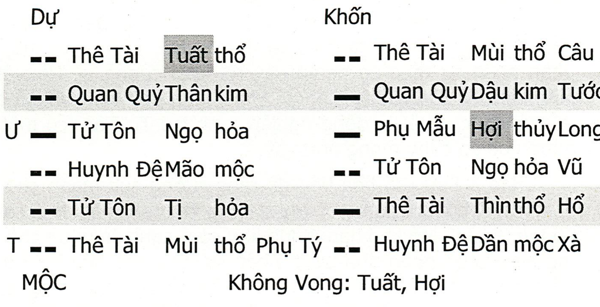
    - **Hình này chứng minh điều gì**
      - Chứng minh cô gái có người mai mối dồn dập nhưng hôn nhân khó thành do tâm tính cổ quái muốn tu hành và không chấp nhận sinh hoạt vợ chồng.
    - **Từ đâu mà thấy được**
      - Phụ Mẫu Tý thủy tuyệt tích; Quan Quỷ Thân kim hào 5 lâm Chu Tước hóa Tiến thần Dậu kim, nhưng Kỵ thần Tử Tôn quá vượng và Thế lâm Đằng Xà.

#### Diễn biến đối thoại và kết quả ứng nghiệm
- Lời bộc bạch của cô Mã:
  - Cô Mã hoàn toàn thừa nhận: Ngay trong tháng này đã có liên tiếp 4 người đàn ông thông qua các mối quen biết của bề trên đến ngỏ lời cầu hôn với cô.
  - Tuy nhiên, bản thân cô vốn tha thiết hướng đạo, quyết tâm tu hành, thậm chí nuôi ý định xuất gia đi tu nương nhờ cửa Phật.
  - Cô đặt ra nguyên tắc thép: Nếu có người nam nào thật lòng yêu mến muốn kết hôn, người đó phải toàn tâm toàn ý ủng hộ cô tu hành; hơn nữa, dù có tổ chức đám cưới thì tạm thời tuyệt đối không được có sinh hoạt vợ chồng thể xác.
- Kết quả thực tế:
  - Những người đàn ông đến xem mặt, vừa nghe cô thẳng thắn đưa ra yêu cầu kỳ lạ đó thì ai nấy đều hốt hoảng, lắc đầu chùn bước và rút lui không một lời từ biệt.

### 4. Ví dụ 3: Xạ phúc đoán vật trong túi cùng bạn dịch (Quẻ Lôi Thủy Giải biến Trạch Thủy Khốn)

#### Bối cảnh và thông tin quẻ
- Thời gian chiêm bái: Ngày Nhâm Thân, tháng Quý Mùi, năm Canh Thìn (Tuần Không: Tuất, Hợi).
- Đối tượng và tình huống dự đoán: Tác giả cùng hai người bạn thân thiết nghiên cứu Dịch học là Đoàn Kiến Nghiệp và Vương Khai Vũ đang tụ họp đàm đạo Dịch lý. Khi bàn đến kỹ pháp "Xạ phúc" (dùng Lục Hào đoán định đồ vật giấu kín), Đoàn Kiến Nghiệp liền yêu cầu tác giả trổ tài đoán xem trong túi áo của ông đang cất giấu vật gì.
- Quẻ gieo được: Tác giả tự gieo được quẻ Lôi Thủy Giải biến Trạch Thủy Khốn (thuộc cung Mộc).
- Xác định dụng thần:
  - Trong phép Xạ phúc đoán vật giấu kín, lấy hào Ứng làm Dụng thần (đối tượng chịu sự suy đoán).
  - Hào Ứng lâm Quan Quỷ Thân kim. Quan Quỷ vốn chủ về sự biến hóa khôn lường, lại hội cùng Đằng Xà càng làm tăng đặc tính quái dị, kỳ ảo, biến đổi thất thường của đồ vật.

#### Các bước suy luận và luận giải hào tượng
- Luận về đặc tính bành trướng qua Tiến Thần:
  - Hào Ứng Quan Quỷ Thân kim phát động hóa Tiến thần Quan Quỷ Dậu kim.
  - Ý nghĩa cốt lõi của Tiến thần ở đây được khai triển thành tính chất khuếch đại, bành trướng, trương phình to ra; tác giả khẳng định vật này có khả năng nở phồng, to lớn gấp bội khi gặp điều kiện phù hợp.
- Luận về công dụng ẩm thực và cách thức bao bọc:
  - Nhìn vào hào Thế: Hào Thế chủ về tính chất công năng của đồ vật, nay trì Thê Tài Thìn thổ lại lâm thần sát Thanh Long. Thê Tài chủ thức ăn, nước uống; Thanh Long chủ sự ngon lành, mỹ vị; khẳng định vật này thuộc nhóm thực phẩm ăn uống hoặc vị thuốc dùng được.
  - Trạng thái bọc gói: Quan Quỷ Thân kim gặp Nguyệt kiến Quý Mùi thổ lâm trạng thái Quan Đới (Thân kim trường sinh tại Tị, mộc dục tại Ngọ, quan đới tại Mùi). Quan Đới tượng trưng cho y phục cân đai, sự bao bọc chỉnh tề, chỉ rõ vật được gói ghém cẩn thận.
  - Số lượng vật phẩm: Hào Thân kim gặp Nhật thần Nhâm Thân sóng đôi đồng hành, tượng trưng cho đồ vật không phải đơn chiếc mà gồm nhiều vật nhỏ giống nhau đi chung.
- Luận về nguồn gốc, màu sắc và hình thái cấu tạo:
  - Nguồn gốc: Quẻ Lôi Thủy Giải xuất phát từ cung Chấn. Chấn thuộc hành Mộc, chỉ loài thảo mộc, nguồn gốc từ cỏ cây thực vật.
  - Màu sắc: Dụng thần lâm Đằng Xà, sắc thái của Đằng Xà là sự pha trộn giữa màu vàng và đen, tức màu nâu sẫm (trong sắc đen lộ ánh vàng).
  - Hình dáng: Chi của Dụng thần là Thân kim (nằm trong tứ sinh Dần Thân Tị Hợi, tượng có góc cạnh, chóp nhọn), cho thấy đầu quả hoặc thân vật có điểm chóp nhọn.
- Luận điểm rút ra từ quẻ Lôi Thủy Giải biến Trạch Thủy Khốn về kỹ pháp Xạ phúc đoán vật bành trướng:
  - **Hình 7.** Sơ đồ quẻ Lôi Thủy Giải biến Trạch Thủy Khốn
    - 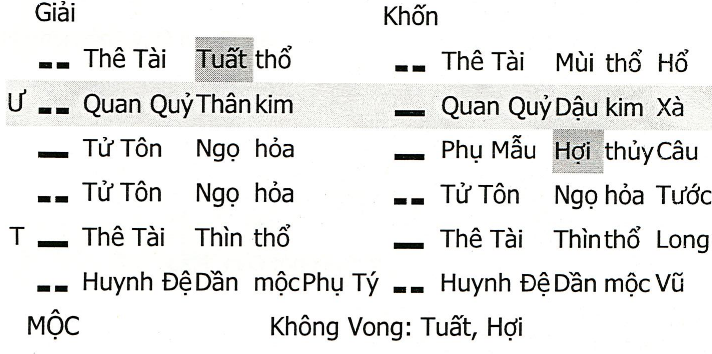
    - **Hình này chứng minh điều gì**
      - Nhận định chính xác vật giấu trong túi là quả lười ươi bọc trong ni lông: có nguồn gốc thực vật, ăn được, có đầu nhọn và đặc tính nở phồng khi ngâm nước.
    - **Từ đâu mà thấy được**
      - Hào Ứng Quan Quỷ Thân kim lâm Đằng Xà hóa Tiến thần (bành trướng), quẻ Chấn (thực vật), hào Thế lâm Tài Thanh Long (ăn được), Thân đắc Quan Đới (gói bọc).

#### Diễn biến đối thoại và kết quả ứng nghiệm
- Màn hé lộ thực tế:
  - Sau khi tác giả trình bày xong toàn bộ chuỗi suy luận chi tiết từ nguồn gốc thực vật, màu nâu, hình có chóp nhọn đến khả năng ngâm nở bành trướng, Đoàn Kiến Nghiệp mỉm cười thò tay vào túi lấy đồ vật ra.
- Kết quả đối chứng:
  - Đồ vật giấu kín chính là vài quả lười ươi (vị thuốc bắc / loại hạt thảo mộc dùng làm nước uống giải nhiệt, khi thả vào nước sẽ nở phồng to ra gấp nhiều lần) được gói cẩn thận bên trong một chiếc bọc ni lông nhỏ!

### 5. Ví dụ 4: Nam nhân đoán hôn nhân tình cảm phức tạp (Quẻ Trạch Phong Đại Quá biến Càn Vi Thiên)

#### Bối cảnh và thông tin quẻ
- Thời gian chiêm bái: Ngày Ất Tị, tháng Quý Tị, năm Bính Tý (Tuần Không: Dần, Mão).
- Đối tượng dự đoán: Một người đàn ông đến nhờ dự đoán về tình duyên và hôn nhân, tự tay gieo được quẻ Trạch Phong Đại Quá biến Càn Vi Thiên (thuộc cung Mộc).
- Nhận định sơ khởi và tâm tính đương số:
  - Nam nhân xem hôn sự, lấy hào Thê Tài làm Dụng thần.
  - Xem về bản thân người hỏi qua hào Thế: Hào Thế Phụ Mẫu Hợi thủy mang hành Thủy chủ sự thông minh, trí tuệ linh hoạt, lại lâm thần sát Đằng Xà chủ biến ảo bí hiểm; tác giả đoán ngay anh ta là người lọc lõi, lão luyện sự đời và rất khôn khéo trong quan hệ tình trường.

#### Các bước suy luận và luận giải hào tượng
- Phân tích người nữ thứ nhất - nhiệt thành theo đuổi:
  - Nhìn vào hào 6 Thê Tài Mùi thổ: Hào 6 phát động hóa Tiến thần Thê Tài Tuất thổ, lâm thần sát Huyền Vũ khắc chế hào Thế Hợi thủy (Thổ khắc Thủy).
  - Ý nghĩa Huyền Vũ và Tiến Thần: Huyền Vũ chủ về nét gợi cảm, đa tình, sức hút thân xác; hóa Tiến thần biểu thị hành động chủ động, dồn dập, liên tục gia tăng áp lực; tác giả kết luận có một cô gái sở hữu ngoại hình gợi cảm, nhan sắc khá đẹp đang không ngừng đeo bám, theo đuổi anh ta quyết liệt.
- Phân tích người nữ thứ hai - mỹ mạo hớp hồn nhưng vô duyên:
  - Nhìn vào hào sơ Thê Tài Sửu thổ: Hào sơ cũng phát động, lâm thần sát Thanh Long. Thanh Long chủ vẻ đẹp kiều diễm, đoan trang, mỹ mạo tuyệt luân.
  - Mộ khố của tâm tư: Sửu thổ là Mộ khố của Kim (Kim là Nguyên thần sinh cho hào Thế Hợi thủy). Nguyên thần đại diện cho tư duy, tâm tư, hồn phách; Nguyên thần bị nhập Mộ tại Sửu thổ chỉ rõ anh chàng này bị nhan sắc tuyệt mỹ của cô gái hào sơ hớp hồn đến mức mê mẩn tâm thần, ngày đêm tương tư tơ tưởng.
  - Nguyên nhân không thể thành: Cô gái xinh đẹp này hoàn toàn không có ý định theo đuổi anh ta; nguyên do là hào sơ Sửu thổ phát động bị hào biến Tý thủy tương hợp (Tý Sửu lục hợp), lâm vào cảnh "tham hợp quên khắc", không hề hướng sức tác động về hào Thế.
- Luận định kết cục chung cuộc:
  - Hào Thế Phụ Mẫu Hợi thủy bị Nguyệt kiến Quý Tị xung phá (Tị Hợi tương xung) tạo thành Nguyệt phá, lại kiêm Dịch Mã.
  - Quẻ biến Càn Vi Thiên là quẻ Lục Xung.
  - Tượng quẻ cho thấy tâm lý anh ta luôn đứng núi này trông núi nọ, lòng dạ phân vân giữa hai người đẹp; kết cục mối quan hệ với cô gái đang nhiệt tình theo đuổi kia rốt cuộc cũng tan vỡ, không đi đến hôn nhân.
- Luận điểm rút ra từ quẻ Trạch Phong Đại Quá biến Càn Vi Thiên về người nữ gợi cảm hóa tiến theo đuổi và tâm lý đứng núi này trông núi nọ:
  - **Hình 8.** Quẻ Trạch Phong Đại Quá biến Càn Vi Thiên
    - 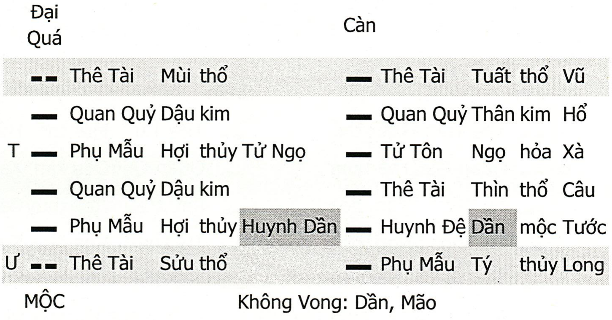
    - **Hình này chứng minh điều gì**
      - Cho thấy có cô gái gợi cảm không ngừng theo đuổi đương số, trong khi người đẹp anh ta mê mẩn lại không màng tới, rốt cuộc tình duyên tan vỡ.
    - **Từ đâu mà thấy được**
      - Hào 6 Thê Tài Mùi thổ lâm Huyền Vũ hóa Tiến thần khắc Thế; hào sơ Tài Sửu thổ lâm Thanh Long hợp Tý thủy không khắc Thế; Thế Nguyệt phá và quẻ biến Lục Xung.

#### Diễn biến đối thoại và kết quả ứng nghiệm
- Phản hồi thực tế của đương số:
  - Người đàn ông nghe xong vô cùng kinh ngạc, hoàn toàn thừa nhận mọi tình tiết tác giả vừa phán đoán:
  - Quả đúng là hiện tại có một cô gái sở hữu thân hình gợi cảm, tính tình bạo dạn đang liên tục săn đón, bày tỏ tình cảm nồng nhiệt với anh.
  - Nhưng trong lòng anh lại chỉ say đắm một cô gái khác có dung nhan thanh tú diễm lệ, dẫu cho cô này đối với anh rất lạnh nhạt, giữ khoảng cách và chẳng mảy may để ý đến anh.
- Kết quả ứng nghiệm:
  - Sự việc sau đó diễn ra hoàn toàn khớp với quẻ Lục Xung và hào Thế Nguyệt phá: vì sự lưỡng lự và tâm lý không dứt khoát của anh, mối duyên với cô gái theo đuổi cũng nhanh chóng rạn nứt rồi chấm dứt, đường tình duyên rốt cuộc chẳng đi tới đâu.

### 6. Ví dụ 5: Nữ xem tìm nhẫn vàng thất lạc tại công sở (Quẻ Lôi Trạch Quy Muội biến Đoài Vi Trạch)

#### Bối cảnh và thông tin quẻ
- Thời gian chiêm bái: Ngày Đinh Mùi, tháng Bính Tý, năm Kỷ Mão (Tuần Không: Dần, Mão).
- Đối tượng dự đoán: Một người phụ nữ đến hỏi về việc chiếc nhẫn vàng quý giá bị đánh mất, muốn biết liệu có cơ hội tìm lại được hay không.
- Quẻ gieo được: Quẻ Lôi Trạch Quy Muội biến Đoài Vi Trạch (thuộc cung Kim).
- Xác định dụng thần và nguồn gốc sơ suất:
  - Xem về vàng bạc châu báu, tài sản quý báu thất lạc, lấy hào Thê Tài làm Dụng thần. Trong quẻ, Thê Tài Mão mộc lâm hào 2.
  - Xét hào Thế Phụ Mẫu Sửu thổ: Hào Thế được hào 4 Quan Quỷ Ngọ hỏa sinh trợ, lại gặp Nhật thần Đinh Mùi xung (Sửu Mùi tương xung) nên trở thành ám động.
  - Ám động sinh Kỵ thần: Hào Thế Sửu thổ ám động sinh cho Kỵ thần Huynh Đệ (Thổ sinh Kim, Huynh Đệ là thần cướp Tài). Hào Thế tự sinh Kỵ thần khẳng định đồ vật mất mát là do chính sự bất cẩn, sơ suất của bản thân đương số gây ra chứ không phải do bị trộm cắp từ đầu.
  - Nơi cất giữ ban đầu: Phụ Mẫu tượng trưng cho quần áo, y phục; Phụ Mẫu trì Thế là áo quần mặc trên thân mình. Thế ám động sinh Kỵ thần chỉ rõ chiếc nhẫn vàng ban đầu được nhét trong túi quần áo đang mặc, sau đó vô ý làm rơi mất.

#### Các bước suy luận và luận giải hào tượng
- Luận định địa điểm làm rơi:
  - Nhìn vào Dụng thần Thê Tài Mão mộc: Tọa lạc tại hào 2, hào 2 là trạch vị (nhà cửa, nơi làm việc), lại lâm Câu Trần.
  - Câu Trần mang tượng nha môn, cơ quan nhà nước, trụ sở công quyền, văn phòng làm việc; tác giả đoán định chiếc nhẫn bị đánh rơi ngay trong khuôn viên cơ quan nơi cô làm việc.
- Luận về quá trình lưu lạc qua tượng Tiến Thần:
  - Nhìn vào hào 5 Huynh Đệ Thân kim: Hào 5 phát động lâm thần sát Huyền Vũ khắc chế Thê Tài. Huyền Vũ chủ về hành vi lén lút, ám muội, không minh bạch.
  - Vị trí hào 5: Hào 5 đại diện cho đường sá, lối đi lại công cộng. Hào 5 Thân kim nhập Mộ tại Phụ Mẫu Sửu thổ (hào Thế); Phụ Mẫu chủ về phòng ốc, công trình kiến trúc; con đường đi lại bên trong một tòa nhà chính là hành lang; điều này chứng tỏ chiếc nhẫn từ túi áo rơi xuống sàn hành lang của cơ quan và đã bị một kẻ khác lén lút nhặt lấy bỏ túi.
  - Hào Huynh Đệ hóa Tiến thần: Hào 5 Huynh Đệ Thân kim phát động hóa Tiến thần Huynh Đệ Dậu kim. Tiến thần mang nghĩa di chuyển, đổi chỗ, chuyển giao tiếp diễn; cho thấy chiếc nhẫn không còn nằm trong tay người nhặt được ban đầu nữa mà đã bị chuyển dịch vị trí, mang đi nơi khác hoặc tẩu tán.
  - Tượng quẻ biến Lục Xung: Quẻ biến Đoài Vi Trạch là quẻ Lục Xung. Vật báu thất lạc mà quẻ biến Lục Xung thì chủ về phân tán, ly tán, tuyệt đối không thể nào tìm lại được.
- Luận điểm rút ra từ quẻ Lôi Trạch Quy Muội biến Đoài Vi Trạch về nhẫn vàng rơi ở hành lang công sở và bị nhặt chuyển vị trí:
  - **Hình 9.** Quẻ Lôi Trạch Quy Muội biến Đoài Vi Trạch
    - 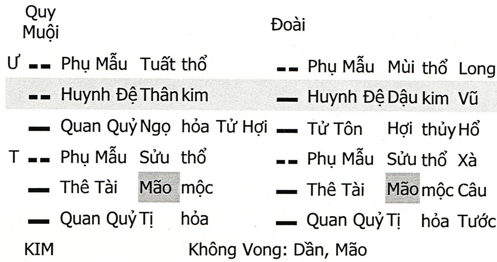
    - **Hình này chứng minh điều gì**
      - Xác định nhẫn vàng rơi từ túi áo xuống hành lang cơ quan, bị người khác lượm được và đã chuyển vị trí tẩu tán, quẻ lục xung không thể tìm lại.
    - **Từ đâu mà thấy được**
      - Thế Phụ Mẫu Sửu thổ ám động sinh Kỵ thần Huynh Đệ; Hào 5 Huynh Đệ Thân kim lâm Huyền Vũ hóa Tiến thần Dậu kim nhập Mộ ở Thế; quẻ biến Lục Xung.

#### Diễn biến đối thoại và kết quả ứng nghiệm
- Lời xác nhận của người phụ nữ:
  - Đương số bàng hoàng thừa nhận diễn biến xảy ra y như lời đoán: Hôm đó tại cơ quan, khi đi vào nhà vệ sinh rửa tay, vì sợ ướt và vướng víu nên cô đã tháo chiếc nhẫn vàng nhét tạm vào túi áo khoác.
  - Đến khi sực nhớ ra thì sờ vào túi áo đã thấy trống không.
  - Trong suốt thời gian làm việc hôm đó, cô hoàn toàn không hề rời khỏi tòa nhà cơ quan; rất có thể khi rút khăn tay hoặc lấy đồ vật trong túi áo thì chiếc nhẫn đã sơ ý bị móc rơi xuống sàn hành lang đi lại.
- Kết quả thực tế:
  - Ngay sau khi phát hiện, cô đã nhiều lần cẩn thận rà soát, tìm kiếm dọc khắp các hành lang và phòng ốc trong tòa nhà nhưng chiếc nhẫn đã hoàn toàn biến mất, đúng như quẻ biến Lục Xung và tượng Tiến thần đã chỉ rõ.

## Chương 3: Thoái Thần Biện Nghĩa

### Tổng quan và hàm nghĩa của Thoái thần

- Bản chất và khái niệm cốt lõi của Thoái thần:
  - Thoái thần có ý nghĩa tương phản với Tiến thần, là hiện tượng biến đổi rất thường gặp và mang tính quyết định trong dự đoán Lục hào.
  - Thoái thần mang nội hàm phong phú tùy theo ngữ cảnh: co lại, rút lui, sợ hãi, suy thoái, suy nhược, mềm yếu, thụt lùi, đào thải, tàn lụi, trở về, giảm nhược, nhút nhát, loại bỏ, mất hiệu lực, thoái hóa, hối hận.
  - Phép luận giải đòi hỏi phải căn cứ vào tính chất của từng lục thân (Phụ Mẫu, Huynh Đệ, Tử Tôn, Thê Tài, Quan Quỷ) và nội dung dự đoán cụ thể mà ứng biến linh hoạt.

### Ví dụ 1: Nam xem vận chuyển than đá có phát tài không (Quẻ Thiên Địa Bĩ biến Trạch Địa Tụy)

- Thông tin thời gian và đối tượng xin đoán:
  - Ngày Ất Mão tháng Bính Dần năm Kỷ Mão (Tuần không: Tý, Sửu).
  - Người nam hỏi về việc kinh doanh vận chuyển than đá có phát tài không, tự gieo được quẻ Thiên Địa Bĩ biến Trạch Địa Tụy.
- Căn cứ xác định Dụng thần và nhận định ban đầu:
  - Xem việc cầu tài lấy hào Thê Tài làm Dụng thần.
  - Quẻ Thiên Địa Bĩ là quẻ lục hợp, Thê Tài Mão mộc lâm cả Nhật thần lẫn Nguyệt lệnh (tháng Dần ngày Mão) trì Thế; người mới học dịch nhìn sơ qua dễ lầm tưởng là quẻ đại cát, ắt thu được nhiều tiền tài.
- Lập luận chi tiết từ suy thoái của Nguyên thần và cước lực:
  - Thê Tài tuy vượng nhưng hoàn toàn thiếu sự sinh dưỡng của Nguyên thần: Tử Tôn Tý thủy lâm Tuần Không, không hiện lên trên các hào quẻ mà phục dưới hào sơ Phụ Mẫu Mùi thổ.
  - Tử Tôn Tý thủy ở vào Tử địa tại Nhật thần Mão mộc, lại bị Phi thần Phụ Mẫu Mùi thổ khắc phạt (Phi khắc Phục).
  - Phi thần mang lục thân Phụ Mẫu, hào sơ lại là vị trí cước lực (chân cẳng, bánh xe, phương tiện chuyên chở); do đó chắc chắn sẽ vì phương tiện xe cộ mà chịu thua lỗ, hao tán tiền của.
- Luận giải hào động hóa thoái và hành vi vận chuyển phi pháp:
  - Hào 6 Phụ Mẫu Tuất thổ phát động hóa thoái thành Phụ Mẫu Mùi thổ, lại bị cả Nhật Mão mộc lẫn Nguyệt Dần mộc khắc thương nặng nề.
  - Phụ Mẫu chủ về xe cộ; hưu tù bị khắc là xe cũ kỹ rách nát; phát động hóa thoái là chiếc xe hư hỏng, xe phế thải đã bị đào thải và loại bỏ.
  - Hào 6 Phụ Mẫu Tuất thổ lâm Huyền Vũ động đến tương hợp với hào Thế Thê Tài Mão mộc (Mão Tuất lục hợp); Huyền Vũ là thần chủ sự ám muội, mờ ám, bất minh. Tượng này chỉ rõ đương số định dùng chiếc xe phế thải này để vận chuyển than đá lậu, trốn tránh kiểm tra.
  - Tác giả đưa ra kết luận: Quẻ này dứt khoát không thể phát tài; nếu ngoan cố làm thì sẽ chịu tổn hại đại tài do tiền sửa chữa xe liên miên hoặc bị phạt tiền rất nặng.
- Hào Phụ Mẫu động hóa thoái và lâm Huyền Vũ chứng minh xe hư hỏng bị loại bỏ dùng để vận chuyển than trái phép:
  - **Hình 10.** Sơ đồ quẻ Thiên Địa Bĩ biến Trạch Địa Tụy
    - 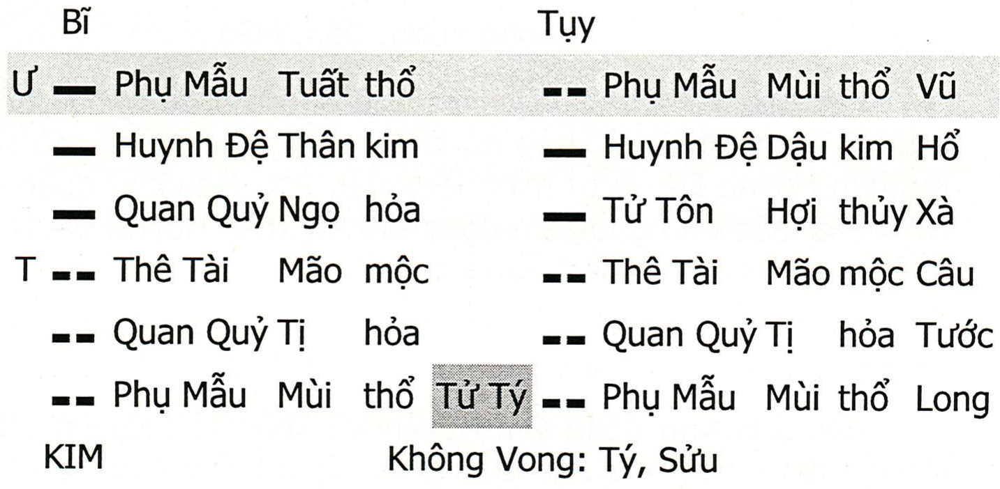
    - **Hình này chứng minh điều gì**
      - Quẻ không thể phát tài; nếu kiên trì làm tất sẽ tổn hại đại tài vì sửa xe hoặc tiền phạt do chở than trái phép bằng xe phế thải.
    - **Từ đâu mà thấy được**
      - Hào 6 Phụ Mẫu Tuất thổ động hóa thoái Mùi thổ, bị Nhật Nguyệt khắc thương; lâm Huyền Vũ hợp Thế Mão mộc; Tài không có Nguyên thần, Tử Tôn Tý thủy ngộ Không phục hào sơ.
- Đối thoại và ứng nghiệm thực tế:
  - Ngay tại lúc gieo quẻ, người này xác nhận hoàn toàn chính xác: Anh ta vừa bỏ ra 5.000 tệ để mua lại một chiếc xe cũ đã bị phế thải, đang toan tính dùng xe này để chở than trái phép.
  - Về sau do không có phản hồi nên tác giả không rõ người đó có thực sự tiếp tục đi chở than hay thôi.

### Ví dụ 2: Nam đoán bệnh bản thân (Quẻ Trạch Thiên Quải biến Lôi Thiên Đại Tráng)

- Thông tin thời gian và đối tượng xin đoán:
  - Ngày Giáp Tý tháng Đinh Mão năm Kỷ Mão (Tuần không: Tuất, Hợi).
  - Người nam đến xem bệnh của bản thân, gieo được quẻ Trạch Thiên Quải biến Lôi Thiên Đại Tráng.
- Phân tích Dụng thần, hào Thế và tâm lý hoảng loạn:
  - Tự xem bệnh của mình lấy hào Thế làm Dụng thần.
  - Hào 5 Tử Tôn Dậu kim trì Thế bị Nguyệt lệnh Mão mộc xung là Nguyệt phá (Mão Dậu tương xung), lâm Tử địa tại Nhật thần Tý thủy; hưu tù suy kiệt lại tự phát động hóa thoái thành Tử Tôn Thân kim, báo hiệu điềm hung hiểm tột cùng.
  - Thần thú Bạch Hổ lâm Thế chủ về bệnh tật và tang tóc; Tử Tôn là Phúc thần, chủ niềm vui vẻ, lạc quan. Nay Tử Tôn lâm Thế vừa Nguyệt phá vừa hóa thoái, đoán người này vì mắc bệnh mà tâm trạng nặng nề, u uất, tinh thần ngày càng suy sụp trầm trọng. Tác giả khuyên anh ta nên nghĩ thoáng ra, nếu không sẽ vô cùng bất lợi cho tính mạng.
- Phân tích triệu chứng viêm túi mật, thương tật quá khứ và mối nghi ngờ ung thư gan:
  - Hào 2 Quan Quỷ Dần mộc lâm Chu Tước: Mộc chủ về gan mật; hào 2 là hào dương thuộc phủ (túi mật trong lục phủ); Chu Tước chủ viêm sưng, đoán bản thân người này mắc bệnh viêm túi mật.
  - Thế lâm Bạch Hổ động hóa thoái: Bạch Hổ chủ về tai nạn thương tích đổ máu; lấy Thoái thần (Thân kim) làm ứng kỳ, đoán vào năm Nhâm Thân (1992) anh ta từng gặp nạn bị thương tật.
  - Tác giả phân tích: Mộc tuy cũng chủ gan, nhưng thông tin bệnh gan trong quẻ này không mạnh, nên khẳng định lá gan không có vấn đề gì nghiêm trọng.
- Hào Thế Tử Tôn Nguyệt phá động hóa thoái chứng minh tinh thần suy sụp và điềm hung về tính mạng:
  - **Hình 11.** Sơ đồ quẻ Trạch Thiên Quải biến Lôi Thiên Đại Tráng
    - 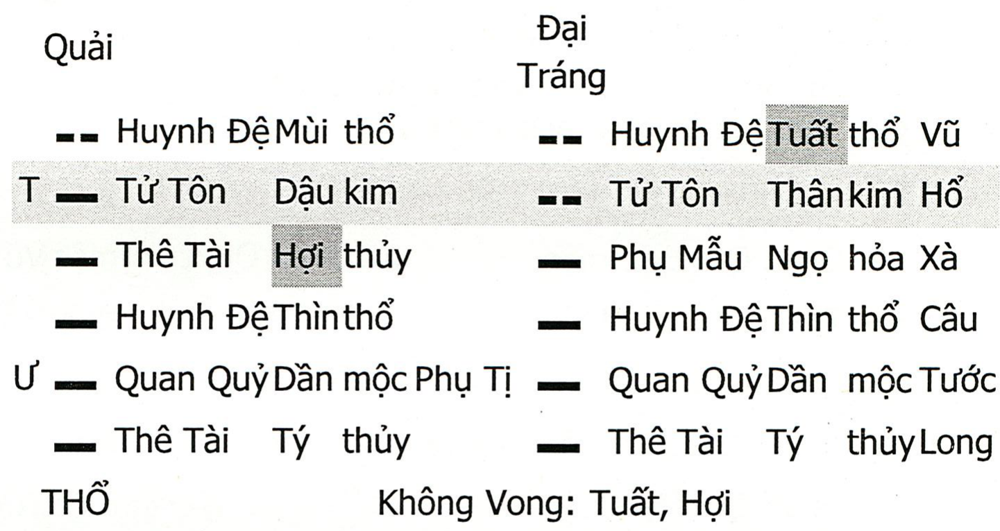
    - **Hình này chứng minh điều gì**
      - Người bệnh vì lo sợ bệnh tật mà tâm trạng u uất nặng nề, tinh thần suy sụp dẫn tới qua đời vào năm Kỷ Mão dù gan không có khối u ác tính.
    - **Từ đâu mà thấy được**
      - Hào 5 Tử Tôn Dậu kim lâm Thế bị Nguyệt phá, Tử ở Nhật, lâm Bạch Hổ động hóa thoái Thân kim; hào 2 Quan Quỷ Dần mộc lâm Chu Tước chủ viêm túi mật.
- Đối thoại và ứng nghiệm thực tế:
  - Người này cho biết: Năm Nhâm Thân (1992) đúng là bị thương tật vì việc công; năm ngoái bị viêm túi mật đi khám chụp phim thấy có khối ở gan, bác sĩ bệnh viện chẩn đoán là ung thư gan.
  - Anh ta thừa nhận sau đó có đến bệnh viện khác xét nghiệm lại và không phát hiện vấn đề gì ở gan, nhưng chẩn đoán ung thư gan ban đầu cứ ám ảnh dai dẳng, khiến nửa năm qua tâm trạng sa sút cùng cực.
  - Kết cục đáng tiếc: Đến năm Canh Thìn (2000), người hàng xóm đến báo tin anh ta đã qua đời vào năm Kỷ Mão (1999); rốt cuộc anh ta đã chết vì không thể thoát khỏi tâm trạng bi quan ám ảnh.

### Ví dụ 3: Cô Cảnh đoán tình cảm với một người đàn ông (Quẻ Sơn Trạch Tổn biến Sơn Lôi Di)

- Thông tin thời gian và đối tượng xin đoán:
  - Ngày Ất Tị tháng Quý Tị năm Bính Tý (Tuần không: Dần, Mão).
  - Cô Cảnh (sinh năm Bính Ngọ - 1966) đoán về mối quan hệ tình cảm với một người đàn ông, tự gieo được quẻ Sơn Trạch Tổn biến Sơn Lôi Di.
- Căn cứ Dụng thần, phân định đối tượng và định hôn kỳ:
  - Nữ xem tình cảm lấy hào Quan Quỷ làm Dụng thần.
  - Quẻ có Quan Quỷ lưỡng hiện (hào 2 Mão mộc và hào 6 Dần mộc), biểu thị có hai người đàn ông; hào Ứng là phu vị (vị trí người chồng) thì tĩnh bất động; Quan Quỷ Mão mộc tại hào 2 là hào độc phát (duy nhất phát động), lấy hào động làm trọng. Tác giả đoán người đàn ông cô muốn hỏi không phải là chồng mà là người khác ngoài hôn nhân.
  - Hào sơ Phụ Mẫu Tị hỏa lâm Nhật thần; cổ thư dạy "Phụ Mẫu lâm Nhật định hôn kỳ"; Tị hỏa đối ứng với năm Kỷ Tị (1989), chứng minh cô đã kết hôn vào năm Kỷ Tị.
- Suy luận mâu thuẫn quá khứ và ý nghĩa hóa thoái:
  - Quan Quỷ Mão mộc động khắc hào Thế Huynh Đệ Sửu thổ là tượng người đàn ông chủ động theo đuổi; nhưng lâm Chu Tước chủ khẩu thiệt cãi vã, đồng thời Mão mộc là Tử địa của hào Thế, cho thấy hai người khi xưa từng cãi cọ kịch liệt dẫn đến bế tắc.
  - Biện nghĩa Thoái thần trong tình cảm: Khi đang sống chung, Dụng thần động hóa thoái là tượng bỏ đi, lùi bước, biểu thị chia tay; nhưng sau khi đã chia tay mà quẻ hiện Dụng thần hóa thoái lại là tượng quay trở lại, đi rồi lại về.
  - Hào 2 Mão mộc động tương hợp với hào 4 Huynh Đệ Tuất thổ; Huynh Đệ cùng hành Thổ với Thế Sửu thổ, đại diện cho người cùng giới tính (người phụ nữ khác); đây là tượng người nam sau khi chia tay đã kết hôn với người nữ khác.
  - Tác giả kết luận: Trước đây cô từng có người yêu theo đuổi; sau vì bất hòa cãi vã nên chia tay; người nam bỏ đi lấy vợ khác; hiện tại người nam này lại tìm đến nhà cô.
- Hào Dụng thần Quan Quỷ động hóa thoái chứng minh người đàn ông cũ quay lại sau khi chia tay:
  - **Hình 12.** Sơ đồ quẻ Sơn Trạch Tổn biến Sơn Lôi Di
    - 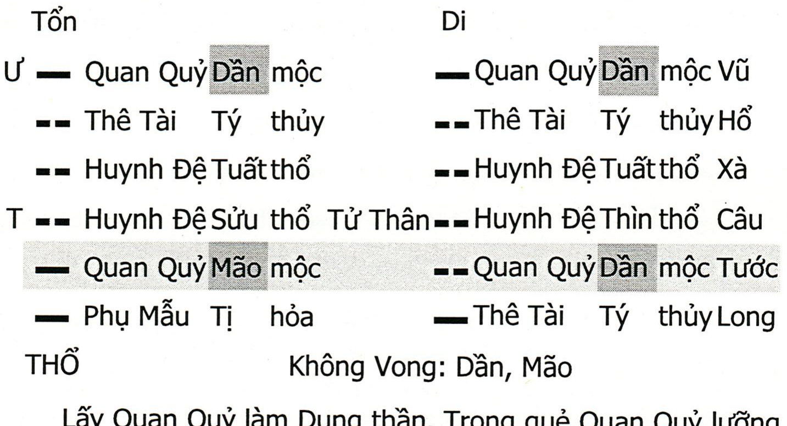
    - **Hình này chứng minh điều gì**
      - Người bạn trai cũ từng cãi vã chia tay nay đã có gia đình riêng nhưng hôn nhân đau khổ nên tìm quay lại gặp cô để níu kéo tình cảm.
    - **Từ đâu mà thấy được**
      - Hào 2 Quan Quỷ Mão mộc độc phát hóa thoái Dần mộc, khắc Thế và hợp hào 4 Huynh Đệ Tuất thổ; Phụ Mẫu Tị hỏa lâm Nhật định hôn kỳ năm Kỷ Tị.
- Đối thoại và ứng nghiệm thực tế:
  - Cô Cảnh vô cùng kinh ngạc xác nhận tác giả đoán rất đúng, cô kết hôn đúng năm Kỷ Tị (1989).
  - Mấy ngày trước về quê, cô tình cờ gặp lại người bạn trai cũ năm xưa; thuở trước do thường xuyên cãi nhau nên chia tay, sau đó đôi bên đều lập gia đình riêng.
  - Hiện người nam kia có cuộc sống hôn nhân đầy đau khổ; thương hại anh ta nên cô buông lời an ủi; ai ngờ anh ta hiểu lầm muốn ôn lại giấc mộng xưa nên tìm đến tận nhà, khiến cô bối rối không biết giải quyết ra sao nên mới đến nhờ gieo quẻ.

### Ví dụ 4: Cô Kubo người Nhật Bản đoán hôn nhân (Quẻ Trạch Thiên Quải biến Lôi Địa Dự)

- Thông tin thời gian và đối tượng xin đoán:
  - Ngày Bính Tý tháng Giáp Ngọ năm Bính Tý (Tuần không: Thân, Dậu).
  - Cô Kubo người Nhật Bản (sinh năm Mậu Thân - 1968) đến nhờ đoán việc hôn nhân tình cảm, được quẻ Trạch Thiên Quải biến Lôi Địa Dự.
- Luận giải mối tình năm 1995 và người mai mối:
  - Nữ đoán hôn nhân lấy Quan Quỷ làm Dụng thần.
  - Năm 1995 (Ất Hợi), Quan Quỷ Dần mộc gặp Trường Sinh tại Hợi thủy, cũng ứng với Dần mộc động phùng hợp; đoán năm 1995 cô đã có đối tượng người yêu.
  - Hào 3 Huynh Đệ Thìn thổ động hóa Quan Quỷ Mão mộc: Hào 3 là gian hào đại diện cho người làm mối; Huynh Đệ chủ bạn bè; đoán vào tháng Thìn năm 1995 bạn bè đã mai mối giới thiệu cho cô một người bạn trai. Nghe xong cô Kubo vô cùng kinh ngạc, công nhận chuẩn xác hoàn toàn.
- Suy luận mối tình đơn phương và tâm lý nhút nhát vì hóa thoái:
  - Hào sơ Tý thủy là Thái Tuế nhập hào, động sinh Quan Quỷ Dần mộc; đoán trong năm nay (1996) cô lại xuất hiện một đối tượng mới.
  - Hào Thế Tử Tôn Dậu kim động sinh Tý thủy, Tý thủy động sinh Quan Quỷ Dần mộc; chứng tỏ chính cô là người chủ động thích và theo đuổi đối phương.
  - Hào Thế ngộ Tuần Không lại lâm Huyền Vũ: Không Vong là bất an, thắc thỏm lo sợ; Huyền Vũ chủ lén lút, giấu giếm; đoán cô đang yêu đơn phương thầm kín.
  - Hào Thế Dậu kim động hóa thoái Thân kim: Thoái thần chủ sự nhút nhát, e thẹn, thiếu dũng khí; cô quá rụt rè nên không dám công khai bày tỏ tình cảm.
  - Hào 2 Quan Quỷ Dần mộc lâm hào Ứng và Dịch Mã, chứng tỏ đối phương là người phương xa; đồng thời Quan Quỷ Dần mộc động hợp với Thê Tài Hợi thủy, chứng tỏ anh ta đã có bạn gái.
- Hào Thế Không Vong lâm Huyền Vũ động hóa thoái chứng minh sự rụt rè trong mối tình đơn phương:
  - **Hình 13.** Sơ đồ quẻ Trạch Thiên Quải biến Lôi Địa Dự
    - 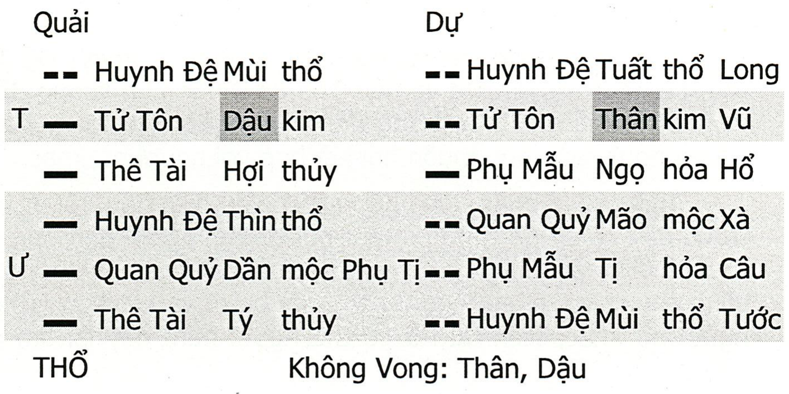
    - **Hình này chứng minh điều gì**
      - Cô gái yêu thầm một người đàn ông ở xa đã có bạn gái nhưng quá nhút nhát không dám bày tỏ; sau đó kết hôn vào năm Kỷ Mão 1999 khi xung thực hào Thế.
    - **Từ đâu mà thấy được**
      - Hào 5 Thế Tử Tôn Dậu kim ngộ Không lâm Huyền Vũ động hóa thoái Thân kim sinh Tý thủy; Ứng Quan Quỷ Dần mộc lâm Dịch Mã động hợp Tài Hợi thủy.
- Đối thoại và ứng nghiệm thực tế:
  - Toàn bộ suy đoán đều chính xác tuyệt đối; cô Kubo thừa nhận đang rất thích một người đàn ông Trung Quốc đang theo học đại học ở Bắc Kinh. Cô biết anh ta đã có bạn gái nên không dám theo đuổi hay thổ lộ, lòng vô cùng đau khổ.
  - Về sau tác giả nghe tin cô đã kết hôn vào năm 1999 (Kỷ Mão) và định cư tại Trung Quốc; năm Kỷ Mão chính là năm Mão xung thực hào Thế Dậu kim Tuần Không. Riêng việc người kết hôn có phải là chàng trai cô yêu thầm hay không thì không còn gặp lại nên không rõ.

### Ví dụ 5: Nữ đoán bệnh bản thân (Quẻ Trạch Phong Đại Quá biến Lôi Phong Hằng)

- Thông tin thời gian và đối tượng xin đoán:
  - Ngày Bính Dần tháng Kỷ Hợi năm Bính Tý (Tuần không: Tuất, Hợi).
  - Người phụ nữ đến xem bệnh tật của bản thân, được quẻ Trạch Phong Đại Quá biến Lôi Phong Hằng.
- Phân tích Dụng thần suy kiệt và chức năng phổi thoái hóa:
  - Tự xem bệnh lấy hào Thế làm Dụng thần.
  - Hào Thế tại hào 4 Phụ Mẫu Hợi thủy lâm Nguyệt lệnh tuy vượng tướng nhưng ngộ Tuần Không, lại không được Nguyên thần sinh trợ.
  - Nguyên thần Quan Quỷ Dậu kim phát động hóa thoái thành Thân kim: Kim chủ về phổi; hào 5 là hào vị chủ lồng ngực và phổi; Kim tại hào 5 động hóa thoái biểu thị chức năng phổi thoái hóa nghiêm trọng, hệ hô hấp có bệnh trầm trọng.
- Nguy cơ ung thư phổi, y dược vô hiệu và mạch tượng hư phù:
  - Quan Quỷ lâm Huyền Vũ vốn là tượng lao phổi; nhưng tại Nhật thần Bính Dần, Kim ở vào Tuyệt địa, mang nguy cơ bệnh biến chứng thành ung thư phổi ác tính.
  - Hào Tử Tôn Ngọ hỏa là y dược, thuốc men thì không hiện trên quẻ, phải phục dưới hào Thế Phụ Mẫu Hợi thủy; Hợi thủy là Phi thần quay lại khắc phục thần Ngọ hỏa (Thủy khắc Hỏa), báo hiệu y dược hoàn toàn vô hiệu, điều trị bằng thuốc không có kết quả.
  - Hào Thế Phụ Mẫu ngộ Tuần Không: Phụ Mẫu chủ về mạch đập; Phụ Mẫu Không Vong là mạch tượng hư phù, nguyên khí suy kiệt, nếu không tập luyện khí công bồi dưỡng thì khó lòng khỏi bệnh.
- Hào Nguyên thần Quan Quỷ tại hào 5 động hóa thoái chứng minh chức năng phổi bị suy thoái nghiêm trọng:
  - **Hình 14.** Quẻ Trạch Phong Đại Quá biến Lôi Phong Hằng
    - 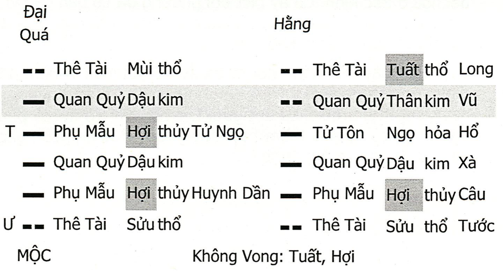
    - **Hình này chứng minh điều gì**
      - Người bệnh bị suy thoái chức năng hô hấp, ho khó thở kéo dài và chuyển biến thành ung thư phổi, thuốc men điều trị không mang lại hiệu quả.
    - **Từ đâu mà thấy được**
      - Hào 5 Quan Quỷ Dậu kim động hóa thoái Thân kim, lâm Huyền Vũ và tuyệt ở Nhật Dần mộc; hào Thế Phụ Mẫu Hợi thủy ngộ Không; Tử Tôn Ngọ hỏa phục bị Phi khắc.
- Ứng nghiệm thực tế:
  - Người này đúng là bị bệnh ở phổi gây khó thở nặng, ho thường xuyên; mười đầu móng tay đều đã biến sang màu đen sẫm, chứng tỏ bệnh đã biến chứng thành ung thư phổi. Về sau không còn gặp lại nên tác giả không rõ kết cục cát hung sinh tử.

## Chương 4: Hoạt Dụng Không Vong

### Ví dụ 6: Nam đoán bệnh của cha (Quẻ Thiên Hỏa Đồng Nhân biến Trạch Hỏa Cách)

- Thông tin thời gian và đối tượng xin đoán:
  - Ngày Quý Mùi tháng Đinh Dậu năm Tân Tị (Tuần không: Thân, Dậu).
  - Người nam đến xem bệnh của cha, được quẻ Thiên Hỏa Đồng Nhân biến Trạch Hỏa Cách.
- Luận giải Dụng thần hung hiểm và định bệnh ung thư phổi:
  - Xem bệnh của cha lấy hào Phụ Mẫu làm Dụng thần.
  - Hào sơ Phụ Mẫu Mão mộc ở trạng thái hưu tù, bị Nguyệt lệnh Đinh Dậu xung khắc là Nguyệt phá (Mão Dậu tương xung), lại nhập Mộ tại Nhật thần Quý Mùi (Mộc nhập Mộ ở Mùi thổ), tất là điềm đại hung hiểm.
  - Nguyên tắc định bệnh hiểm nghèo: Dụng thần đã hưu tù mà lại gặp một trong ba trạng thái Tử, Mộ, hoặc Tuyệt thì dứt khoát là bệnh nan y ác tính (ung thư).
  - Xác định vị trí bệnh: Hào Dụng thần Phụ Mẫu Mão mộc bị Dậu kim xung phá; Kỵ thần Thê Tài Thân kim lại cư ngụ ở hào 5 — hào vị chủ về phổi và lồng ngực — chắc chắn là ung thư phổi.
- Luận giải thời điểm phát bệnh và ý nghĩa hóa thoái của bác sĩ:
  - Hào sơ Phụ Mẫu Mão mộc bị Nguyệt phá; đến năm 1999 (Kỷ Mão) chính là năm Thái Tuế thực phá; tác giả đoán cha người này phát bệnh từ năm 1999.
  - Hào 6 là bệnh viện, hào Ứng là bác sĩ, Tử Tôn là y dược, thần thú Bạch Hổ cũng chủ y dược; tại hào 6 hào Ứng có Tử Tôn Tuất thổ lâm Bạch Hổ phát động tương hợp với Dụng thần Phụ Mẫu Mão mộc (Mão Tuất hợp), chứng minh người cha đã được bệnh viện và bác sĩ điều trị vô cùng tích cực.
  - Tuy nhiên, Tử Tôn Tuất thổ phát động lại hóa thoái thành Mùi thổ: Thoái thần ở đây biểu thị sự nản lòng, buông xuôi; vì bệnh của người cha quá trầm trọng nên bác sĩ đã hoàn toàn mất hết niềm tin điều trị, không còn phương cứu vãn.
- Hào Tử Tôn tại hào Ứng động hóa thoái chứng minh bác sĩ và bệnh viện đã hết hy vọng điều trị:
  - **Hình 15.** Quẻ Thiên Hỏa Đồng Nhân biến Trạch Hỏa Cách
    - 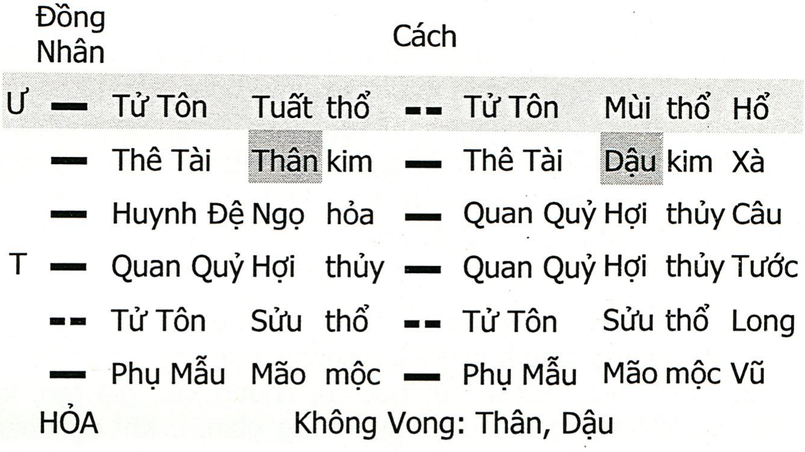
    - **Hình này chứng minh điều gì**
      - Người cha mắc bệnh ung thư phổi từ năm 1999 Kỷ Mão, bệnh viện và bác sĩ đã tận lực cứu chữa nhưng bệnh quá nặng nên mất niềm tin, cho về nhà dưỡng bệnh.
    - **Từ đâu mà thấy được**
      - Dụng thần Phụ Mẫu Mão mộc hưu tù Nguyệt phá nhập Mộ ở Nhật; hào 6 Tử Tôn Tuất thổ (bác sĩ/y viện) lâm Bạch Hổ động hợp Dụng nhưng hóa thoái Mùi thổ.
- Ứng nghiệm thực tế:
  - Người cha quả nhiên bị ung thư phổi, phát bệnh từ năm 1999 Kỷ Mão. Dù gia đình đã chạy chữa bằng đủ mọi phương cách nhưng bệnh không hề thuyên giảm; bác sĩ điều trị cũng thông báo không còn hy vọng; hiện tại gia đình đã đưa cụ xuất viện về nhà an dưỡng những ngày cuối đời.

## Chương 4: Hoạt Dụng Không Vong

### Khái luận về bản chất và ý nghĩa của Không Vong

- Tầm quan trọng của Không Vong trong dự đoán Lục Hào:
  - Bất cứ ai nghiên cứu và tinh thông Lục Hào đều hiểu rõ rằng Không Vong vô cùng linh nghiệm, là một nhân tố mang tính quyết định phải xác định chuẩn xác trong mọi quẻ tượng.
  - Người xưa đã phát triển hệ thống luận thuyết đồ sộ về Không Vong như: Chân Không, Giả Không, Động Không, Xung Không, Điền Không, Viện Không, Vô Cố Tự Không, Hữu Tán Nhi Không, Mộ Không, Tuyệt Không, Hại Không, An Không, Phá Không... Nội dung vô cùng phong phú và đa dạng.
  - Hạn chế của các thư tịch cổ: Hầu hết các trước tác xưa nay đều chỉ tiếp cận Không Vong thuần túy từ góc độ cát hung của Dụng thần và định ngày ứng kỳ, rất hiếm khi đi sâu bàn luận về ý nghĩa nội tại vốn có của bản thân Không Vong.
- Mở rộng tầng nghĩa thâm sâu của Không Vong trong thực chiến:
  - Ngoài chức năng định cát hung và ứng kỳ, Không Vong hàm chứa rất nhiều ý nghĩa biểu tượng sâu sắc: hư không, vắng mặt, mất mát, tiêu tan, vô căn cứ, bất an, chung kết, kết thúc, giả tạo, khuyết thiếu, chỗ trũng thấp, hang động, khoảng không gian trống rỗng...
  - Khi thực hành dự đoán, người học cần căn cứ vào quái tượng cụ thể và sự việc dự đoán khác nhau mà vận dụng biến hóa, linh hoạt.

### Ví dụ 1: Ngày Canh Ngọ tháng Tân Hợi năm Đinh Sửu, đoán kết quả thi công chức

- Thông tin quẻ và sự kiện dự đoán:
  - Ngày Canh Ngọ, tháng Tân Hợi, năm Đinh Sửu.
  - Một thí sinh đến đoán kết quả cuộc thi tuyển dụng công chức, gieo được quẻ Thủy Phong Tỉnh biến Tốn Vi Phong.
  - Quẻ thuộc cung Mộc; Tuần Không tại Tuất và Hợi.
- Phân tích Dụng thần và cấu trúc quẻ Thủy Phong Tỉnh biến Tốn Vi Phong:
  - **Hình 16.** Quẻ Thủy Phong Tỉnh biến Tốn Vi Phong
    - 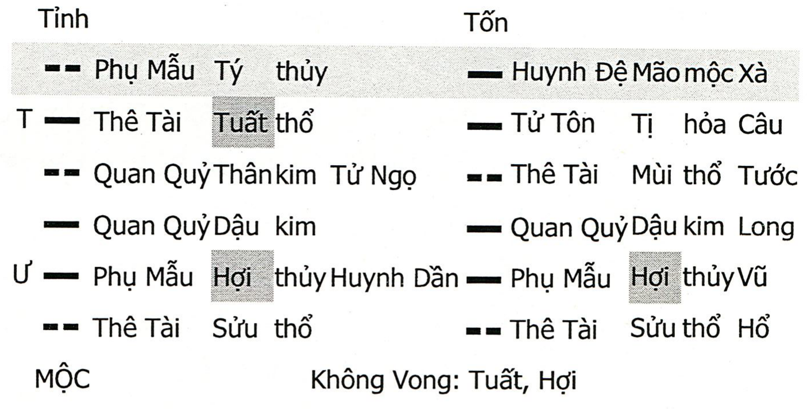
    - **Hình này chứng minh điều gì**
      - Chứng minh thành tích bài thi đạt điểm cao nhất nhưng thí sinh bị trượt do sai sót cá nhân, hoàn toàn khớp với tượng Phụ Mẫu vượng nhưng ngộ Không, Quan Quỷ suy kiệt và quẻ hóa Lục Xung.
    - **Từ đâu mà thấy được**
      - Phụ Mẫu Hợi thủy lâm Nguyệt kiến cực vượng nhưng ngộ Không Vong tự hình, hào Thế Tuất thổ Không Vong lâm Câu Trần, Quan Quỷ hưu tù bị Nhật khắc và động hóa Tử.
- Các bước suy luận chi tiết:
  - Xác định Dụng thần: Hào Phụ Mẫu chủ về bài thi, điểm số, thành tích; hào Quan Quỷ chủ về thứ bậc, danh vị, sự trúng tuyển. Do đó phải lấy cả Phụ Mẫu và Quan Quỷ làm Dụng thần.
  - Đánh giá năng lực và thành tích làm bài: Hào Phụ Mẫu lưỡng hiện (Phụ Mẫu Tý thủy tại hào 6 và Phụ Mẫu Hợi thủy tại hào Ứng/hào 2), trong đó Phụ Mẫu Hợi thủy lâm ngay Nguyệt kiến nên cực kỳ vượng tướng, chứng tỏ bài thi đạt điểm số rất cao, thành tích xuất sắc.
  - Tâm lý thí sinh: Hào Thế Thê Tài Tuất thổ lâm Tuần Không, lại lâm Câu Trần, phản ánh tâm trạng trong lòng hoàn toàn bất an, không hề nắm chắc kết quả và đang rất bận tâm, lo lắng về kỳ thi.
  - Danh sách trúng tuyển: Hào Quan Quỷ cũng lưỡng hiện (Quan Quỷ Dậu kim tại hào 3 và Quan Quỷ Thân kim tại hào 4 phát động biến Thê Tài Mùi thổ). Quan Quỷ kim vào tháng Hợi là hưu tù vô khí, lại bị Nhật thần Ngọ hỏa khắc thương nặng nề, là điềm báo không thể có tên trên bảng vàng trúng tuyển. Hào 4 Quan Quỷ Thân kim phát động hóa Mùi thổ là hóa Tử địa, triệt tiêu hoàn toàn cơ hội xoay chuyển thế cờ.
  - Sai sót cá nhân dẫn đến thất bại: Hào Phụ Mẫu còn chủ về danh sách niêm yết hoặc giấy báo trúng tuyển; Phụ Mẫu Hợi thủy lâm Tuần Không báo hiệu trên danh sách trúng tuyển không có tên người này. Địa chi Hợi gặp tháng Hợi tạo thành thế "Hợi Hợi tự hình", biểu thị nguyên nhân trượt là do sai lầm từ chính bản thân mình gây ra. Toàn quẻ biến thành Tốn Vi Phong là quẻ Lục Xung, chủ việc thi cử chấm dứt trong thất bại.
- Kết quả ứng nghiệm:
  - Điểm số bài thi của thí sinh này đúng là đạt cao nhất trong kỳ thi.
  - Tuy nhiên, vì bất cẩn tự ghi sai số báo danh nên thí sinh đã bị loại và không được trúng tuyển.

### Ví dụ 2: Ngày Bính Ngọ tháng Quý Tị năm Bính Tý, nam 20 tuổi đoán hôn nhân

- Thông tin quẻ và sự kiện dự đoán:
  - Ngày Bính Ngọ, tháng Quý Tị, năm Bính Tý.
  - Một nam thanh niên 20 tuổi đến xin đoán về chuyện hôn nhân tình cảm, gieo được quẻ Sơn Thủy Mông biến Thiên Phong Cấu.
  - Quẻ thuộc cung Hỏa; Tuần Không tại Dần và Mão.
- Phân tích cấu trúc tương tác Thế Ứng và Dụng thần:
  - **Hình 17.** Sơ đồ quẻ Sơn Thủy Mông biến Thiên Phong Cấu
    - 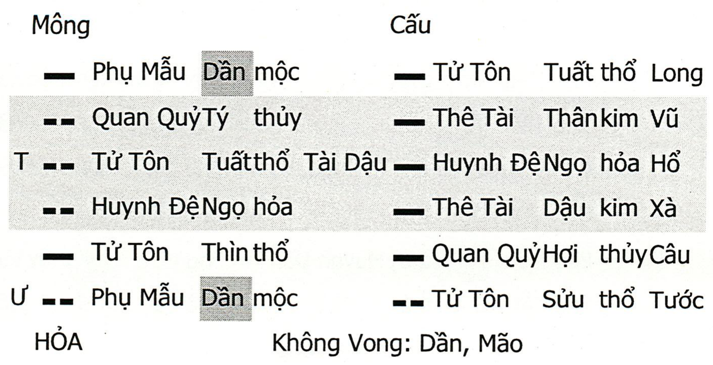
    - **Hình này chứng minh điều gì**
      - Chứng minh chuyện tình cảm chỉ là do bên nam đơn phương đeo bám ép buộc, phía nữ né tránh từ chối và kết cuộc hoàn toàn bất thành.
    - **Từ đâu mà thấy được**
      - Hào Ứng Phụ Mẫu Dần mộc Không Vong khắc Thế, Thê Tài Dậu kim phục tàng bị Nhật Nguyệt khắc, hào Thế động sinh Tài và hào Huynh Đệ Ngọ hỏa lâm Đằng Xà phát động.
- Các bước suy luận chi tiết:
  - Xác định Dụng thần và bối cảnh thực tế: Lấy hào Thê Tài làm Dụng thần. Hào Ứng là thê vị (vị trí người vợ), lâm Phụ Mẫu Dần mộc; Phụ Mẫu đại diện cho giấy hôn thú, gặp Tuần Không biểu thị người này chưa hề kết hôn. Hào Thê Tài hoàn toàn không xuất hiện trên quẻ, chứng tỏ trong cuộc sống hiện tại của chàng trai chưa có bóng dáng người phụ nữ nào, do đó quẻ này thực chất là đoán việc tìm kiếm đối tượng và theo đuổi tình cảm.
  - Hành động theo đuổi đơn phương: Hào Thế Tử Tôn Tuất thổ phát động hóa Huynh Đệ Ngọ hỏa rồi quay lại sinh hào Thê Tài (Tuất thổ sinh Dậu kim), cho thấy người nam đang chủ động theo đuổi người ta. Hào Phụ Mẫu cũng là người làm mối, ngộ Không Vong nên không hề có ai mai mối giới thiệu.
  - Vị trí đối tượng: Thê Tài Dậu kim ẩn phục dưới hào Thế Tử Tôn Tuất thổ, biểu thị người phụ nữ đang theo đuổi ở rất gần mình. Cổ thư viết: "Hào 3 hào 4 là thôn quê, làng xã", kết hợp Thê Tài Dậu kim đắc Trường Sinh tại Nguyệt lệnh Tị hỏa, hào Thế cũng được Nguyệt lệnh sinh phù (cùng sinh xuất từ một gốc), nên khẳng định chàng trai đang theo đuổi một cô gái là người cùng làng/cùng quê.
  - Thái độ cự tuyệt của đối phương: Hào Ứng Phụ Mẫu Dần mộc lâm Tuần Không, chứng tỏ đối phương không hề thật lòng; hào Thê Tài lặn phục không xuất hiện, cho thấy cô gái luôn né tránh, tìm cách không gặp mặt. Hào Ứng Dần mộc quay lại khắc hào Thế Tuất thổ, phía nữ hoàn toàn không muốn qua lại, đây chỉ là sự theo đuổi đơn phương từ phía nam.
  - Sự đeo bám ép buộc và kết cục: Hào 3 Huynh Đệ Ngọ hỏa phát động hóa Thê Tài Dậu kim, lâm Đằng Xà; Đằng Xà chủ sự quấy rầy, bám riết không buông, chứng tỏ chàng trai cố tình ép buộc, quấn lấy người ta. Hào Thê Tài bị cả Nhật Nguyệt khắc hại dữ dội, trong quẻ Huynh Đệ Ngọ hỏa lại phát động khắc Tài, hào Ứng Không Vong, tổng hòa tạo thành tượng hôn nhân tuyệt đối không thành.
- Kết quả ứng nghiệm:
  - Mọi nhận định của tác giả hoàn toàn chuẩn xác; kết quả chàng trai không thể theo đuổi được cô gái và sự việc chấm dứt.

### Ví dụ 3: Ngày Mậu Ngọ tháng Quý Tị năm Bính Tý, nam đoán về việc kinh doanh sắt thép

- Thông tin quẻ và sự kiện dự đoán:
  - Ngày Mậu Ngọ, tháng Quý Tị, năm Bính Tý.
  - Một người đàn ông đến đoán việc buôn bán kinh doanh kim khí sắt thép, gieo được quẻ Thiên Phong Cấu (quẻ tĩnh).
  - Quẻ thuộc cung Kim; Tuần Không tại Tý và Sửu.
- Luận giải hoạt dụng Không Vong đối với kho bãi kim khí:
  - **Hình 18.** Sơ đồ quẻ Thiên Phong Cấu
    - 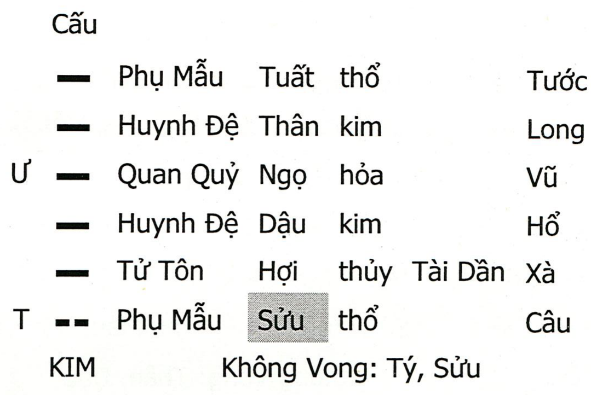
    - **Hình này chứng minh điều gì**
      - Chứng minh việc buôn bán sắt thép cực kỳ đắt khách, cung không đủ cầu, hàng trong kho rỗng vì bán hết sạch, năm Ất Hợi (1995) đã đại phát tài.
    - **Từ đâu mà thấy được**
      - Hào Thế Phụ Mẫu Sửu thổ là Kim mộ lâm Câu Trần gặp Tuần Không biểu thị kho sắt rỗng hàng, Ứng sinh Thế lâm Huyền Vũ biểu thị khách chen lấn nhờ cậy mua.
- Các bước suy luận chi tiết:
  - Góc nhìn bề ngoài theo thông lệ: Lấy Thê Tài Dần mộc làm Dụng thần. Mới nhìn qua quẻ, Thê Tài Dần mộc hưu tù ẩn phục dưới hào 2 Tử Tôn Hợi thủy, lại rơi vào Tử địa tại Nhật thần Ngọ hỏa; Nguyên thần Tử Tôn Hợi thủy vừa suy nhược vừa bị Nguyệt phá (tháng Tị xung Hợi), thoạt trông là tượng bế tắc, không có tiền tài.
  - Tượng kho sắt thép và hoạt dụng Không Vong:
    - Hào Thế Phụ Mẫu Sửu thổ: Địa chi Sửu là Mộ của Kim (kho chứa kim loại/sắt thép). Hào Thế lại lâm Câu Trần; Câu Trần chủ kiến trúc, phòng ốc; hào Phụ Mẫu cũng chủ nhà cửa, công trình, kho bãi. Do đó Phụ Mẫu Sửu thổ tượng trưng hoàn hảo cho nhà kho chứa sắt thép của đương số.
    - Hào Thế lâm Tuần Không: Không Vong ở đây mang ý nghĩa "trong kho trống rỗng", không hề có hàng tồn kho ứ đọng, hàng về đến đâu tiêu thụ hết sạch đến đó.
  - Quan hệ khách hàng: Hào Ứng Quan Quỷ Ngọ hỏa đại diện cho khách hàng, mang ngũ hành Hỏa sinh cho hào Thế Phụ Mẫu Sửu thổ, là tượng khách hàng tìm đến nườm nượp. Hào Ứng lâm Huyền Vũ; Huyền Vũ chủ sự ám muội, mờ ám, đi cửa sau, phản ánh thực tế khách hàng còn phải cậy nhờ các mối quan hệ ngầm để tranh suất mua sắt thép.
  - Kết luận kinh doanh và ứng kỳ quá khứ: Việc làm ăn vô cùng thuận lợi, hàng hóa cung không đủ cầu. Nguyên thần Tử Tôn Hợi thủy bị Nguyệt phá trong năm Bính Tý; nhưng vào năm trước là năm Ất Hợi (1995), Hợi thủy lâm thái tuế điền thực nên bất phá, tác giả đoán ngay năm 1995 người này đã phát tài rất lớn.
- Kết quả ứng nghiệm:
  - Kết quả hoàn toàn chuẩn xác. Tác giả nhấn mạnh: Dự đoán lục hào phải vận dụng linh hoạt tượng quẻ và ngũ hành chuyên biệt; nếu người này kinh doanh mặt hàng khác không phải kim khí sắt thép thì quẻ này không thể đoán là phát tài lớn.

### Ví dụ 4: Ngày Mậu Dần tháng Nhâm Ngọ năm Ất Hợi, đoán thời tiết hôm đó

- Thông tin quẻ và sự kiện dự đoán:
  - Ngày Mậu Dần, tháng Nhâm Ngọ, năm Ất Hợi.
  - Tác giả gieo quẻ dự đoán diễn biến thời tiết trong ngày hôm đó, được quẻ Lôi Phong Hằng biến Lôi Thiên Đại Tráng.
  - Quẻ thuộc cung Mộc; Tuần Không tại Thân và Dậu.
- Khảo sát biến hóa thời tiết và tượng Kim Không tắc minh:
  - **Hình 19.** Sơ đồ quẻ Lôi Phong Hằng biến Lôi Thiên Đại Tráng
    - 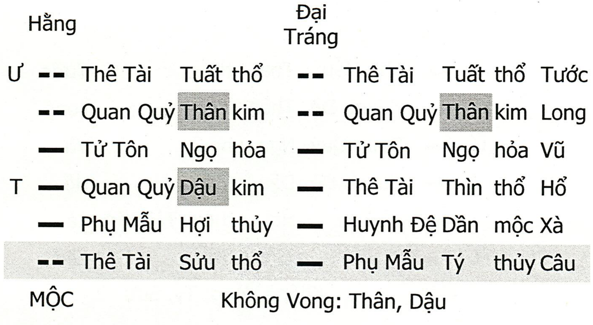
    - **Hình này chứng minh điều gì**
      - Chứng minh thời tiết chuyển từ tạnh ráo sang âm u, sấm nhỏ và mưa phùn dần chuyển mưa vừa, đúng các khung giờ Mùi, Thân, Dậu.
    - **Từ đâu mà thấy được**
      - Hào Tài phát động hóa Phụ Mẫu, Quan Quỷ Thân kim Tuần Không ám động ứng tượng sấm nhỏ, giờ Mùi xung khai hợp và giờ Thân Dậu điền Không sinh Phụ.
- Các bước suy luận chi tiết:
  - Chuyển biến từ tạnh sang mưa: Trong dự đoán thời tiết, mỗi lục thân mang một biểu tượng riêng biệt. Hào sơ Thê Tài Sửu thổ phát động chủ về trời quang mây tạnh, nhưng động lại biến ra Phụ Mẫu Tý thủy (Phụ Mẫu chủ mưa) -> tượng thời tiết từ nắng ráo chuyển dần sang âm u và đổ mưa.
  - Hiện tượng sấm sét từ Kim Không tắc minh: Hào 5 Quan Quỷ Thân kim được hào Tài phát động sinh trợ, lại bị Nhật thần Dần mộc xung thành Ám động. Quan Quỷ Thân kim ngộ Tuần Không; cổ pháp có câu quyết "Kim Không tắc minh" (Kim gặp Không thì vang rền), Quan Quỷ chủ sấm chớp nên chắc chắn sẽ xuất hiện tiếng sấm. Tuy nhiên, vì là ám động và bản thân Quan Quỷ Thân kim hưu tù trong tháng Ngọ hỏa, nên tiếng sấm sẽ nhỏ chứ không lớn.
  - Phân định ứng kỳ theo thời gian:
    - Thời điểm trời chuyển âm u: Hào sơ Thê Tài Sửu thổ động biến Phụ Mẫu Tý thủy tạo thành Tý Sửu lục hợp; hào động ngộ hợp ắt phải đợi đến giờ Mùi xung khai hợp (Mùi xung Sửu) thì trời mới bắt đầu chuyển sang âm u.
    - Thời điểm nổi sấm và mưa rơi: Đến giờ Thân và Dậu, Quan Quỷ Thân Dậu kim xuất Không (điền Không), phát huy toàn bộ sức mạnh sinh trợ cho Phụ Mẫu thủy; khi đó tiếng sấm sẽ nổi lên và mưa bắt đầu trút xuống.
- Kết quả ứng nghiệm:
  - Đúng 14 giờ 25 phút (cuối giờ Mùi), có mưa nhỏ lất phất bay tới.
  - Sang giờ Thân, trời chuyển sang mưa phùn, phía xa văng vẳng tiếng sấm rền nhưng không thấy sấm chớp giật.
  - Đến giờ Dậu, mưa chuyển thành mưa vừa.

### Ví dụ 5: Ngày Đinh Sửu tháng Kỷ Mùi năm Mậu Dần, nữ đoán kiện tụng

- Thông tin quẻ và sự kiện dự đoán:
  - Ngày Đinh Sửu, tháng Kỷ Mùi, năm Mậu Dần.
  - Một người phụ nữ đến xin đoán về vụ việc kiện tụng đang xảy ra, gieo được quẻ Lôi Hỏa Phong (quẻ tĩnh).
  - Quẻ thuộc cung Thủy; Tuần Không tại Thân và Dậu.
- Phân tích tương quan tranh chấp và tâm lý bất an qua quẻ Phong:
  - **Hình 20.** Sơ đồ quẻ Lôi Hỏa Phong
    - 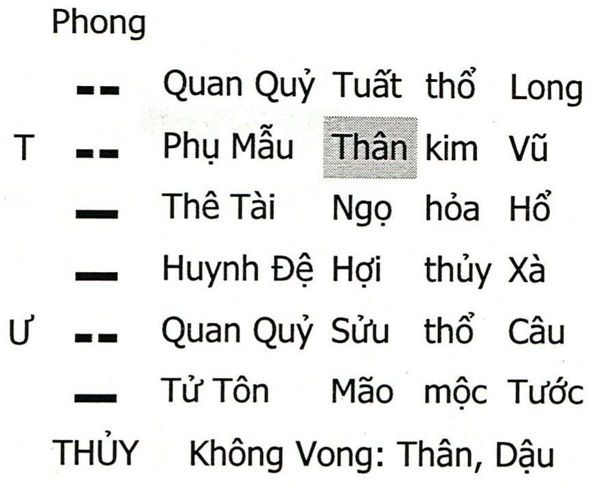
    - **Hình này chứng minh điều gì**
      - Chứng minh vụ kiện do tranh chấp đất đai bị lấn chiếm, bên khởi kiện bất an, bên bị kiện muốn cầu hòa và việc hòa giải thành vào tháng Thân.
    - **Từ đâu mà thấy được**
      - Phụ Mẫu Thân kim trì Thế Tuần Không lâm Huyền Vũ, Ứng Quan Quỷ Sửu thổ lâm hào 2 (trạch) bị Nguyệt phá sinh Thế nhưng Thế Không nên chưa thuận.
- Các bước suy luận chi tiết:
  - Tư cách nguyên cáo và tâm lý bất an: Xem kiện tụng lấy quan hệ sinh khắc giữa Thế và Ứng làm trọng. Hào Thế Phụ Mẫu Thân kim: Phụ Mẫu là đơn kiện, cáo trạng; Phụ Mẫu trì Thế nghĩa là bản thân mình đứng đơn khởi kiện đối phương, sắm vai nguyên cáo. Hào Thế lâm Huyền Vũ lại ngộ Tuần Không; Huyền Vũ chủ nội tâm sâu kín, Không Vong chủ bất an và mất phương hướng, cho thấy người này sau khi đâm đơn kiện thì trong lòng vô cùng băn khoăn, bất an, không biết nên đối xử, giải quyết với đối phương ra sao.
  - Nguồn gốc tranh chấp đất đai: Quẻ có Quan Quỷ lưỡng hiện (Quan Quỷ Tuất thổ tại hào 6 và Quan Quỷ Sửu thổ tại hào 2), phải lấy hào lâm Nguyệt phá làm chủ đạo. Hào 2 Quan Quỷ Sửu thổ bị Nguyệt kiến Mùi thổ xung phá. Hào 2 là trạch (nhà cửa), lại lâm Câu Trần chủ đất đai, nhà cửa, bất động sản -> nguyên nhân vụ kiện phát sinh hoàn toàn từ tranh chấp đất đai, nhà ở.
  - Hành vi đối phương và động thái hòa giải: Hào Ứng lâm tại hào 2 gọi là "Ứng nhập phi trạch", biểu thị đối phương đã ngang nhiên lấn chiếm đất đai, địa bàn của người phụ nữ này. Hào Ứng Sửu thổ mang ngũ hành Thổ sinh cho hào Thế Thân kim, là tượng đối phương chủ động muốn cầu hòa, xin thương lượng. Tuy nhiên, hào Thế lâm Tuần Không nên tạm thời chưa thể tiếp nhận sự sinh trợ của Ứng, nghĩa là người khởi kiện trước mắt chưa chịu đồng ý các điều kiện hòa giải.
  - Xác định ứng kỳ giải quyết: Đến tháng Thân, hào Ứng Sửu thổ bước qua tháng Mùi nên không còn bị Nguyệt phá; hào Thế Thân kim xuất Không sẽ tiếp nhận được trọn vẹn lực sinh từ hào Ứng, người này sẽ chấp nhận điều kiện hòa giải của đối phương.
- Kết quả ứng nghiệm:
  - Mọi suy đoán và mốc thời gian hòa giải vào tháng Thân diễn ra hoàn toàn chuẩn xác.

### Ví dụ 6: Ngày Kỷ Hợi tháng Tý, nữ giảng viên đại học đoán bệnh

- Thông tin quẻ và sự kiện dự đoán:
  - Ngày Kỷ Hợi, tháng Tý.
  - Một nữ giảng viên đại học đến xem tình hình bệnh tật của bản thân, gieo được quẻ Ly Vi Hỏa (quẻ tĩnh, Lục Xung).
  - Quẻ thuộc cung Ly; Tuần Không tại Thìn và Tị.
- Tương quan ngũ hành và định vị chứng bệnh qua quẻ Ly Vi Hỏa:
  - **Hình 21.** Sơ đồ quẻ Ly Vi Hỏa
    - 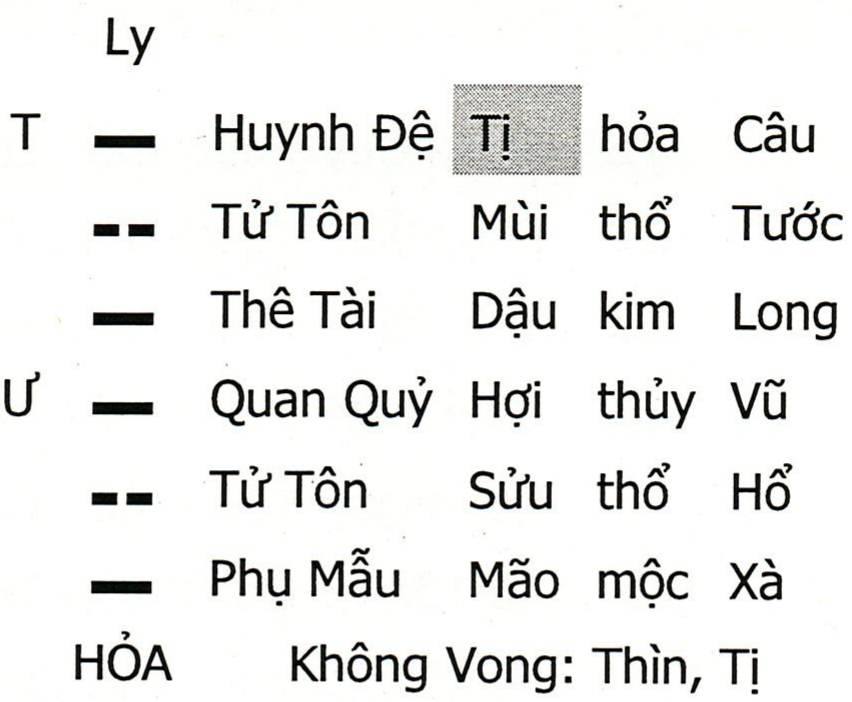
    - **Hình này chứng minh điều gì**
      - Chứng minh nữ giảng viên mắc bệnh thận 3 năm, phù thũng, sợ nước, tiểu nhiều, bệnh phụ khoa lạnh tử cung và thiếu máu não, sau đó được chữa khỏi bằng phong thủy.
    - **Từ đâu mà thấy được**
      - Hào Thế Tị hỏa tại hào 6 bị Nhật Nguyệt khắc lâm Câu Trần Tuần Không, Kỵ thần Hợi thủy tại hào 3 lâm Huyền Vũ, hào 4 Dậu kim sinh Hợi thủy.
- Phân tích bệnh lý chi tiết:
  - Tình trạng hào Thế và ý nghĩa ngộ Không: Lấy hào Thế Huynh Đệ Tị hỏa làm Dụng thần. Hào Thế tại hào 6 bị cả Nhật thần Hợi thủy và Nguyệt kiến Tý thủy dốc toàn lực xung khắc, vô cùng suy kiệt. May nhờ hào Thế ngộ Tuần Không nên tạm thời như đang "núp kín tại Không địa" tránh bớt tai họa; tuy nhiên Dụng thần hưu tù cực độ, nếu không tích cực điều trị thì mầm bệnh sẽ chuyển biến vô cùng trầm trọng.
  - Bệnh lý về thận và phản ứng với nước: Kỵ thần Quan Quỷ Hợi thủy ngự tại hào 3; hào 3 là vị trí thắt lưng, thận, bàng quang; Kỵ thần lại thuộc Thủy nên dấu hiệu bệnh thận càng rõ nét. Thủy là ngũ hành xung khắc hào Thế, do đó người này rất kỵ nước, thường ngày không hề thích uống nước.
  - Hiện tượng bài tiết và tính chất mùa vụ: Hào 4 Thê Tài Dậu kim là hào vị nhà vệ sinh, Thê Tài chủ phân và nước tiểu, Dậu kim lại sinh phù cho Kỵ thần Quan Quỷ Hợi thủy, vì vậy người này hễ vừa uống nước vào là lập tức phải đi tiểu/đi vệ sinh ngay. Mùa đông là mùa Thủy vượng khắc Hỏa, cho nên cứ hằng năm hễ bước vào mùa đông là bệnh tình lại chuyển biến nặng nề hơn.
  - Cơ thể phù thũng: Hào Thế đại diện cho người bệnh, lâm Câu Trần; Câu Trần chủ sự sưng trướng, phù nề, cho thấy độc tố của bệnh thận khiến cơ thể thường xuyên bị phù thũng.
  - Thiếu máu não và đau đầu: Quẻ thuộc cung Ly chủ về máu huyết, Kỵ thần là Thủy cũng chủ huyết dịch; hào Thế tọa ở đỉnh hào 6 là vị trí đầu não bị khắc thương nặng nề, tuần hoàn máu kém dẫn đến chứng đau nhức đầu mạn tính.
  - Bệnh phụ khoa khó nói: Hào 3 còn là vị trí của tử cung, lâm Huyền Vũ chủ sự ám muội, kín đáo, khó thổ lộ; Quan Quỷ Hợi thủy tại đây phản ánh bệnh phụ khoa. Thủy là chất lỏng và chủ sự hàn lạnh, chứng tỏ tử cung bị hàn lạnh, khí hư và huyết trắng ra nhiều.
- Đối thoại và phản hồi thực tế của người bệnh:
  - Nữ giảng viên đại học xác nhận toàn bộ các phán đoán hoàn toàn chính xác.
  - Bà chia sẻ bản thân mắc bệnh thận đã suốt 3 năm, chạy chữa khắp nơi không khỏi; cơ thể thường bị phù thũng, rất sợ uống nước, uống vào là muốn đi tiểu ngay; đúng là bị bệnh phụ khoa, tử cung lạnh, huyết trắng nhiều và thường xuyên đau đầu do thiếu máu não.
- Phương pháp hóa giải phong thủy thực chiến:
  - Căn cứ nguyên lý: Quẻ đã phản ánh thông tin chuẩn xác thì có thể trích xuất phương pháp hóa giải đồng bộ từ chính cấu trúc quẻ. Trọng tâm là làm suy yếu Kỵ thần và trợ vượng cho hào Thế.
  - Định vị điểm đặt vật phẩm: Kỵ thần ngự tại hào 3; hào 3 là hào vị giường ngủ, nơi con người nghỉ ngơi hồi phục khí lực hằng đêm, nên tiến hành hóa giải từ chiếc giường ngủ sẽ phát huy hiệu năng khí trường mạnh nhất.
  - Cơ chế ngũ hành "Xung xứ phùng hợp": Quẻ Ly Vi Hỏa là Lục Xung, Kỵ thần Hợi thủy xung khắc Thế Tị hỏa. Cần dùng nguyên lý "Xung xứ phùng hợp", chọn địa chi Dần mộc làm hạt nhân hóa giải vì Dần mộc vừa hợp giữ chân Kỵ thần Hợi thủy (Dần Hợi lục hợp), vừa tương sinh trợ lực cho hào Thế Tị hỏa (Dần mộc sinh Tị hỏa).
  - Lựa chọn vật phẩm: Dần mộc ứng với hình tượng con hổ; Mộc đại diện cho cây cỏ hoặc vải vóc, đồ may mặc. Tác giả chỉ định dùng một "con hổ bằng vải" để tiến hành trấn yểm hóa giải.
  - Phương vị và thủ pháp chuyển đổi động - tĩnh: Kỵ thần Hợi thủy ứng với phương Tây Bắc, do đó phải đặt con hổ vải tại góc Tây Bắc của chiếc giường để hợp giữ tà khí. Nhằm giải quyết sự vướng víu khi ngủ và tạo sinh khí, tác giả căn dặn: Ban ngày đặt con hổ vải ở góc Tây Bắc giường ngủ; ban đêm khi đi ngủ thì dời con hổ sang đặt bên cạnh gối đầu. Động tác này đã biến vật phẩm hóa giải từ tĩnh thành ĐỘNG; hào 6 là vị trí đầu, dời con hổ cạnh gối tương đương mang Dần mộc tiếp cận trực tiếp hào Thế Tị hỏa ở hào 6 để sinh phù liên tục.
- Kết quả ứng nghiệm:
  - Đúng 6 ngày sau khi thực hành mẹo phong thủy, bà gọi điện thoại với tâm trạng vô cùng phấn khởi, báo tin tất cả các chứng bệnh đều thuyên giảm rõ rệt, chứng đau đầu biến mất hoàn toàn và phù thũng trên người cũng tiêu tan sạch sẽ.

### Ví dụ 7: Ngày Quý Mão tháng Mậu Thân năm Đinh Sửu, nam đoán hôn nhân

- Thông tin quẻ và sự kiện dự đoán:
  - Ngày Quý Mão, tháng Mậu Thân, năm Đinh Sửu.
  - Một nam thanh niên đến xin dự đoán về chuyện hôn nhân, gieo được quẻ Trạch Địa Tụy (quẻ tĩnh).
  - Quẻ thuộc cung Kim; Tuần Không tại Thìn và Tị.
- Tương quan hôn nhân và nguy cơ tình cảm qua quẻ Tụy:
  - **Hình 22.** Sơ đồ quẻ Trạch Địa Tụy
    - 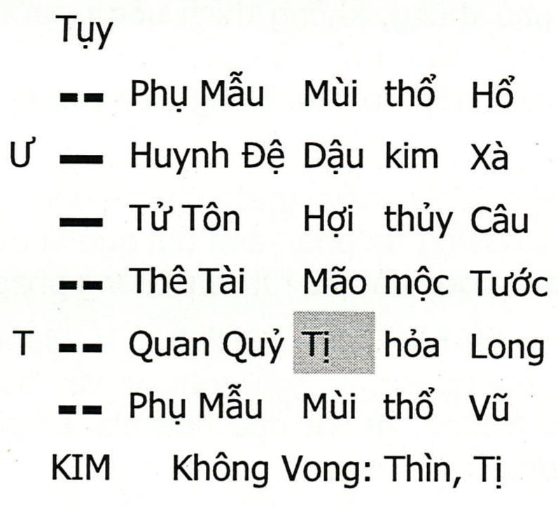
    - **Hình này chứng minh điều gì**
      - Chứng minh người nam đã có bạn gái xinh đẹp nhưng tháng Dậu sẽ bị kẻ khác cướp mất, hỷ sự hóa thành hư không do Thế lâm Thanh Long ngộ Không.
    - **Từ đâu mà thấy được**
      - Thê Tài Mão mộc lâm Nhật sinh Thế nhưng bị Nguyệt khắc, Ứng Huynh Đệ Dậu kim ám động khắc Tài, hào Thế Quan Quỷ Tị hỏa lâm Thanh Long ngộ Tuần Không.
- Các bước suy luận chi tiết:
  - Nhận diện đối tượng hiện tại: Lấy hào Thê Tài Mão mộc làm Dụng thần. Thê Tài Mão mộc lâm ngay Nhật thần Mão mộc và mang ngũ hành Mộc sinh cho hào Thế Quan Quỷ Tị hỏa, chứng tỏ trước mắt chàng trai đã có đối tượng tìm hiểu và đối phương cũng hoàn toàn ưng thuận qua lại.
  - Đoán tướng mạo bạn gái: Dụng thần là Mão mộc; theo tượng số ngũ hành, nhóm "Tý Ngọ Mão Dậu chủ tròn trịa, Mộc chủ thon dài", nên đoán cô gái này tuổi Mão, gương mặt tròn trịa đầy đặn nhưng vóc dáng lại thon thả, cao ráo.
  - Nguy cơ đổ vỡ và ý nghĩa Không Vong:
    - Thê Tài Mão mộc tuy sinh Thế nhưng lại bị Nguyệt kiến Mậu Thân khắc hại nặng nề. Hào Ứng Huynh Đệ Dậu kim lâm Đằng Xà được Nguyệt kiến Thân kim trợ vượng, lại bị Nhật thần Mão mộc xung thành Ám động; hào Ứng đại diện cho người khác, Huynh Đệ ám động phát lực khắc chết Dụng thần Thê Tài Mão mộc. Do đó, bước sang tháng Dậu (tháng Dậu xung khắc Dụng thần Mão mộc dữ dội), chắc chắn sẽ xảy ra biến cố lớn, đối tượng sẽ bị kẻ khác cướp mất.
    - Hào Thế Quan Quỷ Tị hỏa lâm Thanh Long nhưng lại rơi vào Tuần Không; Thế ngộ Không nên không thể tiếp nhận lực sinh từ Dụng thần; Thanh Long chủ việc hỷ sự vui mừng, nhưng gặp Không Vong thì "hỷ sự biến thành hư không", không thể thành đôi.
- Kết quả ứng nghiệm:
  - Mọi diễn biến thực tế ứng nghiệm đúng theo chiều hướng xấu, mối quan hệ đổ vỡ và người con gái bỏ đi theo người khác.

### Ví dụ 8: Ngày Ất Mùi tháng Giáp Thân năm Đinh Sửu, nam đoán bắt thăm phân phòng

- Thông tin quẻ và sự kiện dự đoán:
  - Ngày Ất Mùi, tháng Giáp Thân, năm Đinh Sửu.
  - Một người đàn ông đến đoán việc cơ quan tổ chức bốc thăm phân chia nhà ở, muốn biết mình có bốc phải căn phòng đối diện với cầu thang hay không (vì bản thân rất kiêng kỵ và không muốn nhận căn phòng đối diện cầu thang).
  - Quẻ gieo được là Phong Thủy Hoán biến Thiên Thủy Tụng.
  - Quẻ thuộc cung Hỏa; Tuần Không tại Thìn và Tị.
- Luận đoán vị trí căn phòng và tượng Không Vong tránh cầu thang:
  - **Hình 23.** Sơ đồ quẻ Phong Thủy Hoán biến Thiên Thủy Tụng
    - 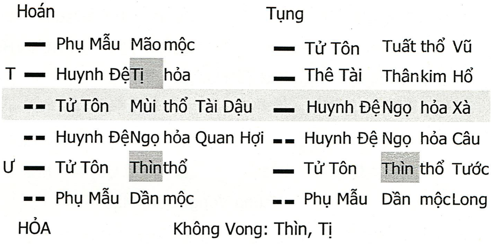
    - **Hình này chứng minh điều gì**
      - Chứng minh người đàn ông bốc được căn phòng ở tầng một hướng đông và hoàn toàn không đối diện cầu thang, khớp tượng Thế ngộ Không tại hào 5 đường đi.
    - **Từ đâu mà thấy được**
      - Phụ Mẫu Dần mộc tại hào sơ bị Nguyệt phá làm Dụng thần (tầng một, hướng đông), hào 5 Bạch Hổ là cầu thang, hào Thế Tị hỏa lâm hào 5 ngộ Tuần Không.
- Các bước suy luận chi tiết:
  - Xác định Dụng thần căn nhà: Hào Phụ Mẫu làm Dụng thần chủ về nhà cửa, phòng ốc. Trong quẻ Phụ Mẫu lưỡng hiện (Phụ Mẫu Mão mộc tại hào 6 và Phụ Mẫu Dần mộc tại hào sơ). Quy tắc chọn Dụng thần ưu tiên hào lâm Nguyệt phá, do đó lấy Phụ Mẫu Dần mộc tại hào sơ (bị Nguyệt kiến Thân kim xung phá) làm Dụng thần.
  - Vị trí tầng và phương hướng: Dụng thần tọa ở hào sơ là vị trí thấp nhất, đại diện cho phòng ở tầng một (tầng trệt). Hào Dần mang ngũ hành Mộc, Mộc ứng phương Đông nên căn phòng quay mặt về hướng Đông.
  - Nhận diện cầu thang và ý nghĩa Không Vong: Hào 5 là hào vị của đường đi, hành lang; lại lâm Bạch Hổ (Bạch Hổ chủ đường sá, lối đi dốc), trong bối cảnh phân chia nhà ở thì đây biểu thị chính xác cho cầu thang bộ. Hào Thế Huynh Đệ Tị hỏa lâm tại hào 5 nhưng rơi vào Tuần Không; Thế lâm hào 5 Tuần Không biểu thị căn phòng của người này "không hề đối diện/không chạm mặt" với cầu thang bộ.
- Kết quả ứng nghiệm:
  - Buổi chiều sau khi tiến hành bốc thăm tại đơn vị, người này quả nhiên bắt trúng căn phòng ở tầng một, tọa hướng Đông và hoàn toàn không đối diện cầu thang bộ.

### Ví dụ 9: Ngày Giáp Thìn tháng Bính Ngọ năm Đinh Sửu, nam đoán cãi lộn với vợ

- Thông tin quẻ và sự kiện dự đoán:
  - Ngày Giáp Thìn, tháng Bính Ngọ, năm Đinh Sửu.
  - Một người đàn ông đến xin dự đoán kết quả cuộc cãi vã nảy lửa với vợ xem sự việc sẽ diễn tiến ra sao.
  - Quẻ gieo được là Lôi Trạch Quy Muội biến Địa Trạch Lâm.
  - Quẻ thuộc cung Kim; Tuần Không tại Dần và Mão.
- Phân tích nguyên nhân bỏ nhà và cơ chế xuất Không quay về:
  - **Hình 24.** Sơ đồ quẻ Lôi Trạch Quy Muội biến Địa Trạch Lâm
    - 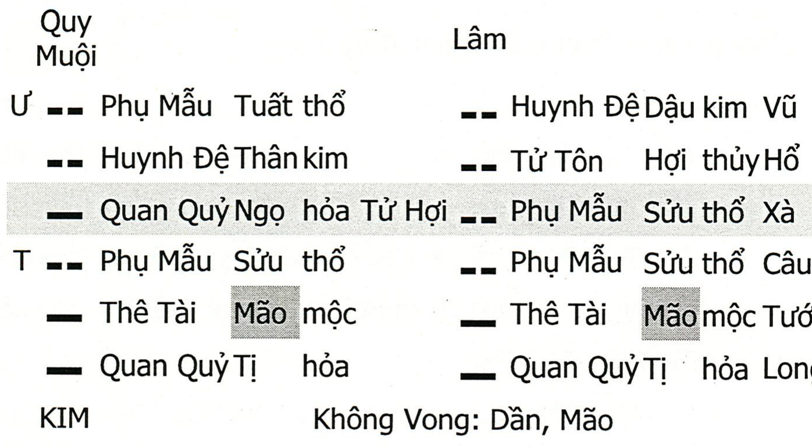
    - **Hình này chứng minh điều gì**
      - Chứng minh người vợ giận dỗi bỏ về nhà mẹ đẻ vì cãi cọ nhưng không có ý ly hôn, sau vài ngày đến ngày xuất Không sẽ tự động quay về nhà.
    - **Từ đâu mà thấy được**
      - Thê Tài Mão mộc tại hào 2 lâm Chu Tước Tuần Không lục hợp với Ứng Tuất thổ, quẻ là Quy Hồn bất xuất gia, Dụng thần Mão mộc không bị khắc phạt.
- Các bước suy luận chi tiết:
  - Hành động người vợ bỏ đi: Lấy hào Thê Tài làm Dụng thần. Hào 2 Thê Tài Mão mộc lâm Chu Tước ngộ Tuần Không. Hào 2 là trạch (nhà ở); Không Vong mang ý nghĩa vắng mặt, rời bỏ; Chu Tước chủ về khẩu thiệt, cãi cọ thị phi. Điều này chỉ rõ vì hai vợ chồng to tiếng cãi vã mà người vợ bức xúc đùng đùng bỏ nhà ra đi.
  - Nơi chốn cư ngụ của người vợ: Hào Ứng Phụ Mẫu Tuất thổ đại diện cho gia đình nhà vợ (nhà mẹ đẻ); Dụng thần Thê Tài Mão mộc tương hợp với hào Ứng (Mão Tuất lục hợp), kết hợp với quẻ Lôi Trạch Quy Muội là quẻ Quy Hồn (Quy Hồn chủ sự quay về chốn cũ) -> khẳng định người vợ đã bỏ về thẳng nhà mẹ đẻ nương náu.
  - Khả năng ly hôn và thời điểm trở về: Hào 4 Quan Quỷ Ngọ hỏa phát động tuy tiết khí của Dụng thần Thê Tài Mão mộc, nhưng Dụng thần không hề bị bất kỳ hào nào khắc hại; thêm vào đó tính chất quẻ Quy Hồn là "Quy hồn bất xuất gia" (về hồn thì không bỏ nhà đi luôn), nên người vợ hoàn toàn không có ý định ly dị hay rời bỏ gia đình chồng. Dụng thần Mão mộc ngộ Tuần Không; theo quy luật ứng kỳ, hễ "xuất Không" thì sự việc sẽ lập tức ứng nghiệm, tức là qua mấy ngày đến ngày Dần hoặc Mão xuất Không thì người vợ sẽ nguôi giận và quay trở về.
- Kết quả ứng nghiệm:
  - Thực tế quả nhiên hai vợ chồng cãi nhau kịch liệt, người vợ bỏ về nhà mẹ đẻ; chỉ vài ngày sau khi cơn giận tiêu tan (đến ngày xuất Không), người vợ đã tự giác quay về nhà chung sống hòa thuận.

### Ví dụ 10: Ngày Kỷ Hợi tháng Bính Ngọ năm Đinh Sửu, nữ đoán con trai thi cấp ba

- Thông tin quẻ và sự kiện dự đoán:
  - Ngày Kỷ Hợi, tháng Bính Ngọ, năm Đinh Sửu.
  - Một người phụ nữ đến dự đoán kết quả thi tuyển sinh vào trường cấp ba (trung học phổ thông) của con trai xem có đỗ hay không.
  - Quẻ gieo được là Trạch Địa Tụy biến Hỏa Địa Tấn.
  - Quẻ thuộc cung Kim; Tuần Không tại Thìn và Tị.
- Luận giải cơ chế Nhật xung ngộ Khắc và định lượng điểm số:
  - **Hình 25.** Sơ đồ quẻ Trạch Địa Tụy biến Hỏa Địa Tấn
    - 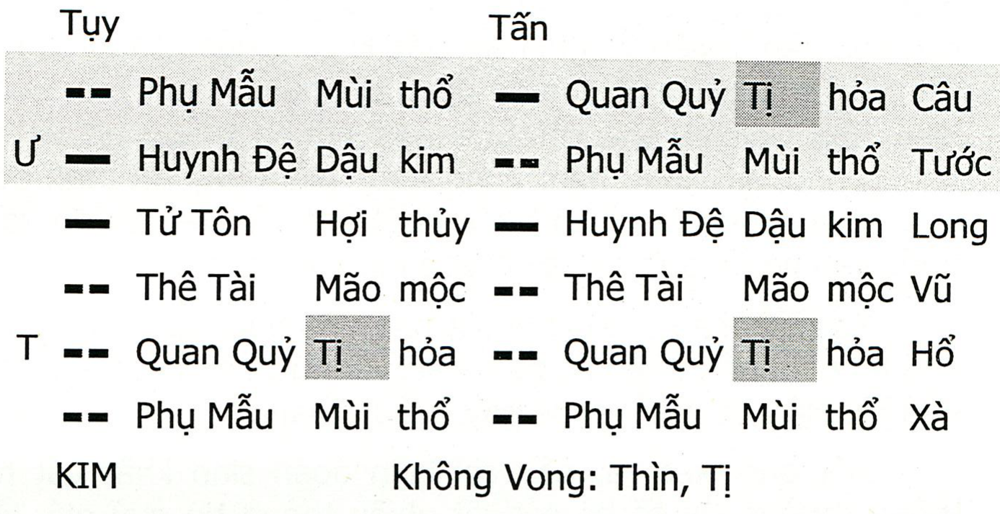
    - **Hình này chứng minh điều gì**
      - Chứng minh thí sinh học lực tốt, làm bài điểm cao nhưng rốt cuộc bị trượt do thiếu đúng 1 điểm, đúng với quy luật trong xung có khắc chỉ phát một nửa lực.
    - **Từ đâu mà thấy được**
      - Phụ Mẫu Mùi thổ động hóa hồi đầu sinh biểu thị bài thi tốt, nhưng Quan Quỷ Tị hỏa trì Thế ngộ Không bị Nhật Hợi xung khắc chỉ xung khởi được nửa phần (1 điểm).
- Các bước suy luận chi tiết:
  - Xác định Dụng thần: Phụ Mẫu đại diện cho bài thi, điểm số, học lực; Quan Quỷ đại diện cho danh hiệu, thứ bậc trúng tuyển. Do đó phải xem xét kết hợp cả Quan Quỷ và Phụ Mẫu làm Dụng thần.
  - Đánh giá chất lượng bài thi: Trong quẻ Phụ Mẫu lưỡng hiện (Phụ Mẫu Mùi thổ tại hào 1 tĩnh và Phụ Mẫu Mùi thổ tại hào 6 phát động). Lấy hào 6 Phụ Mẫu Mùi thổ phát động làm Dụng thần. Hào 6 được Nguyệt kiến Ngọ hỏa sinh hợp (Ngọ Mùi lục hợp), lại phát động hóa Quan Quỷ Tị hỏa là hóa Hồi đầu sinh -> đề thi rất quen thuộc, trúng tủ, thí sinh làm bài thi rất tốt và đạt điểm số cao.
  - Cơ chế vi diệu "Trong xung có khắc" của Không Vong:
    - Hào Thế Quan Quỷ Tị hỏa: Quan Quỷ trì Thế vốn là điềm cát lành tối thượng cho thi cử cầu danh, lại được Nguyệt lệnh Ngọ hỏa đồng khí trợ giúp; gặp Nhật thần Hợi thủy xung gọi là Ám động.
    - Tuy nhiên, khuyết điểm cốt tử là Quan Quỷ Tị hỏa ngộ Tuần Không. Thông thường hào Không Vong gặp Nhật xung thì gọi là "Xung Không" hay "Xung khởi" để trở thành thực; nhưng ở đây Nhật thần Hợi thủy mang ngũ hành Thủy khắc Tị hỏa, tạo thành thế "trong xung có khắc".
    - Khi rơi vào thế "trong xung có khắc", lực xung của Nhật thần chỉ có thể kích hoạt xung khởi được một nửa sức mạnh, không thể xung thực trọn vẹn toàn bộ hào.
    - Tính toán số học: Địa chi Tị hỏa mang ngũ hành Hỏa, Hỏa chủ về số 2 (theo tượng số Tiên thiên/Hậu thiên); một nửa của số 2 chính là 1. Tác giả từ đó quyết đoán: Người con trai bình thường học tập rất chăm chỉ, bài thi lần này điểm số cũng rất cao, nhưng vô cùng đáng tiếc là sẽ bị thiếu đúng 1 điểm mà trượt kỳ thi cấp ba.
- Kết quả ứng nghiệm:
  - Khi nhà trường công bố điểm chuẩn trúng tuyển, người con trai quả nhiên bị thiếu đúng 1 điểm nên không đậu vào trường cấp ba.

## Chương 5: Nguyệt Phá Biện Nghĩa

### Khái Luận Về Nguyệt Phá Trong Lục Hào Dự Đoán

- Bản chất và nguồn thông tin phong phú của Nguyệt phá:
  - Cách dùng Nguyệt phá và Không Vong có nhiều nét tương đồng; ngoài việc phán đoán cát hung và xác định ứng kỳ, bên trong Nguyệt phá còn bao hàm nhiều tầng ý nghĩa sâu sắc.
  - Thông thường, người học Lục hào chỉ biết lấy Nguyệt phá để luận cát hung và điểm thời gian ứng nghiệm mà không nhận ra Nguyệt phá chính là một kho tàng thông tin thực tế vô cùng đa dạng.
  - Nếu nắm vững bản chất biểu tượng của Nguyệt phá, trình độ dự trắc sẽ đạt bước nhảy vọt về chất, chính thức bước vào cảnh giới dự đoán Lục hào cao cấp.
- Hệ thống tượng nghĩa đa tầng của Nguyệt phá:
  - Biểu thị các trạng thái phá hủy và loại bỏ: phá hoại, tiêu trừ, phế bỏ, diệt trừ, đập vỡ, làm hỏng.
  - Biểu thị các hiện tượng biến dạng cơ học và thương tổn: vỡ nát, rạn nứt, khe hở, vết nứt, đứt gãy, bẻ gãy, rách nát.
  - Biểu thị các biến đổi bệnh lý và thể chất: vết thương ngoài da hoặc nội tạng, lở loét, thối rữa, hoại tử.
  - Biểu thị các biến cố xã hội và tâm lý: phân ly, chia rẽ, rạn nứt tình cảm, mâu thuẫn, xung đột, phá vỡ quy ước, phá lệ.
- Phương pháp luận nâng cao trong thực chiến:
  - Một quẻ gieo ra, nếu dự trắc sư chỉ dừng lại ở quan hệ sinh khắc suy vượng thông thường thì sẽ bỏ sót rất nhiều tín hiệu quý giá, biến sự việc vốn phức tạp sinh động thành một kết luận tầm thường, đơn điệu.
  - Chỉ khi thấu suốt các tầng ý nghĩa biểu tượng của từng hiện tượng hào vị (như Nguyệt phá, Tuần Không, Phục thần, phi thần) thì mới có thể khắc họa chân thực và chuẩn xác diễn biến thực tế của sự việc.

### Ví Dụ 1: Mẹ Đoán Hôn Nhân Cho Con Gái (Thủy Hỏa Ký Tế Biến Thủy Lôi Truân)

#### Bối cảnh và quẻ tượng

- Thời gian gieo quẻ và sự việc thắc mắc:
  - Ngày Đinh Mão, tháng Quý Mùi, năm Ất Hợi (Tuần không: Tuất, Hợi).
  - Người mẹ đến xin dự đoán về chuyện tình duyên, hôn nhân của con gái ruột.
  - Được quẻ Thủy Hỏa Ký Tế biến Thủy Lôi Truân.
- Quẻ tượng phản ánh nhân duyên trắc trở và tâm trạng ưu phiền của hai mẹ con:
  - **Hình 26.** Quẻ Thủy Hỏa Ký Tế biến Thủy Lôi Truân
    - 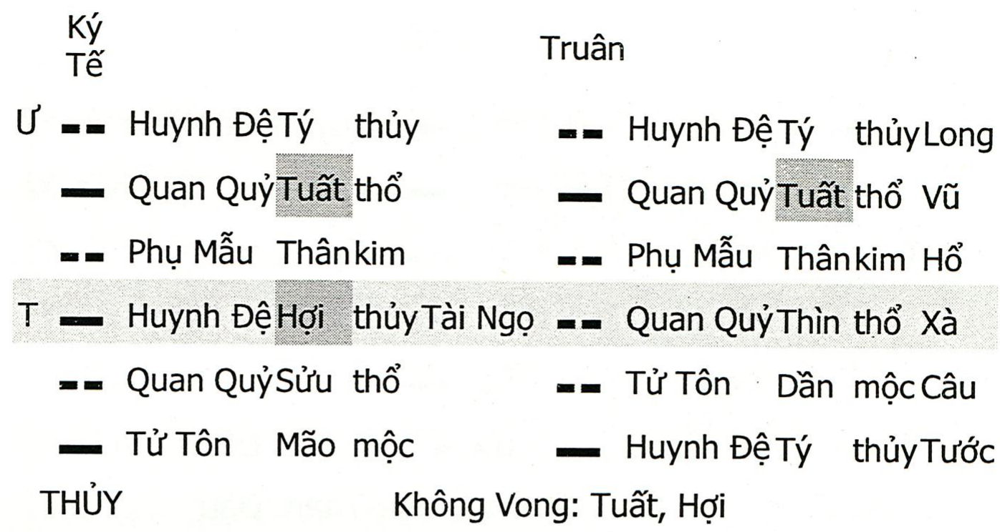
    - **Hình này chứng minh điều gì**
      - Người con gái hai lần bỏ người yêu; người mẹ lo âu vì việc hôn nhân bế tắc.
    - **Từ đâu mà thấy được**
      - Quan Quỷ Tuất thổ ngộ Không (năm Giáp Tuất bỏ một mối), Sửu thổ Nguyệt phá (tháng Mùi lại bỏ một mối); Thế Hợi thủy ngộ Không hóa Mộ.

#### Phân tích suy luận hào vị

- Xác định Dụng thần và tâm trạng người mẹ:
  - Xem việc hôn nhân lấy Quan Quỷ làm Dụng thần.
  - Hào Thế Huynh Đệ Hợi thủy lâm Tuần Không là tượng trong lòng bất an, hoang mang.
  - Hào Thế lâm Đằng Xà là tượng phiền não, lo nghĩ triền miên không dứt.
  - Hào Thế động mà hóa Quan Quỷ Thìn thổ là hóa Mộ (Hợi thủy nhập Mộ tại Thìn thổ), biểu thị tình cảnh bị vây khốn, bức bối, bế tắc không lối thoát.
  - Tổng hợp suy đoán: Người mẹ vì chuyện hôn sự của con gái mà trong lòng tâm phiền ý loạn, vô cùng khổ não.
- Phân tích tương quan Thế Ứng và hoàn cảnh con gái:
  - Hào Thế (Hợi thủy) và hào Ứng (Tý thủy) có quan hệ tỉ hòa: tượng không có người mai mối làm cầu nối thì hôn sự khó lòng thành tựu.
  - Hào sơ Tử Tôn Mão mộc nhập Mộ tại Nguyệt kiến Quan Quỷ (Mùi thổ): biểu thị người con gái cũng đang ưu sầu, buồn bã vì tìm mãi không được đối tượng kết hôn thích hợp.
- Khai thác dấu vết chia tay qua Quan Quỷ Không Vong và Nguyệt phá:
  - Trong quẻ có tượng Quan Quỷ lưỡng hiện: Quan Quỷ Tuất thổ ở hào 5 và Quan Quỷ Sửu thổ ở hào 2.
  - Quan Quỷ Tuất thổ lâm Tuần Không: Đối ứng năm 1994 (năm Giáp Tuất), người con gái trong năm này đã chủ động chia tay, bỏ một đối tượng.
  - Quan Quỷ Sửu thổ bị Nguyệt kiến Mùi thổ xung phá (Nguyệt phá): Đối ứng vào tháng Mùi hiện tại, người con gái lại vừa mới chia tay, bỏ rơi thêm một đối tượng nữa.
- Dự đoán cơ hội mới và điều kiện thành tựu:
  - Hào Thế phát động hóa ra Quan Quỷ Thìn thổ: đoán trong năm nay, đến tháng Hợi sẽ xuất hiện một người bạn trai mới.
  - Tuy nhiên, điều kiện bắt buộc là phải nhờ người bề trên đứng ra làm mối mai thì mối quan hệ này mới mong thành tựu.

#### Luồng đối thoại và ứng nghiệm thực tế

- Diễn biến phản hồi thực tế:
  - Người mẹ xác nhận tất cả các phán đoán về tâm trạng lo lắng của bản thân, nỗi ưu sầu của con gái, việc bỏ bạn trai năm Giáp Tuất 1994 và việc vừa dứt bỏ bạn trai trong tháng Mùi này đều chuẩn xác tuyệt đối.
  - Về kết quả xuất hiện bạn trai vào tháng Hợi: Do sau đó đương sự không quay lại phản hồi nên chưa có thông tin kiểm chứng tiếp theo.

### Ví Dụ 2: Tự Đoán Bệnh Dạ Dày (Thiên Lôi Vô Vọng Biến Phong Thủy Hoán)

#### Bối cảnh và quẻ tượng

- Thời gian gieo quẻ và sự việc thắc mắc:
  - Ngày Nhâm Ngọ, tháng Bính Thân, năm Bính Tý (Tuần không: Thân, Dậu).
  - Bản thân người hỏi tự gieo quẻ để kiểm tra tình trạng bệnh dạ dày của mình.
  - Được quẻ Thiên Lôi Vô Vọng biến Phong Thủy Hoán.
- Quẻ tượng xác định vị trí tổn thương thực tế tại hạ vị dạ dày và tác dụng phụ khi điều trị:
  - **Hình 27.** Sơ đồ quẻ Thiên Lôi Vô Vọng biến Phong Thủy Hoán
    - 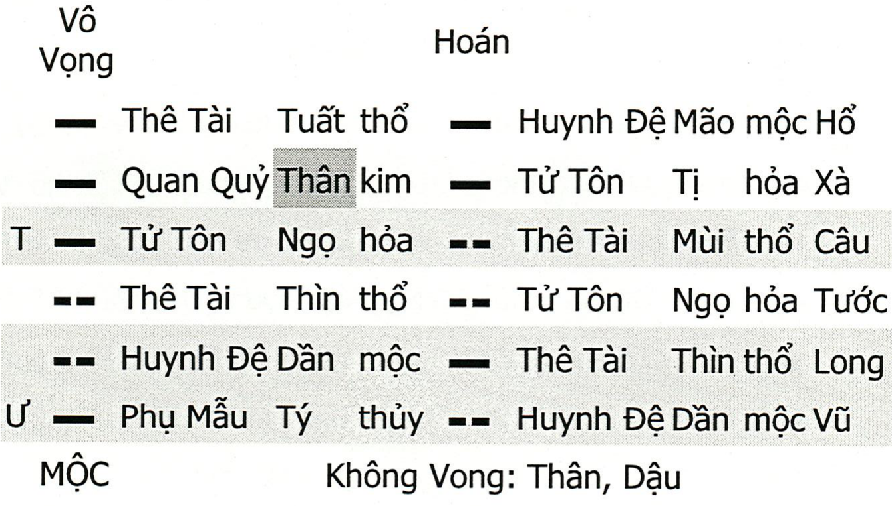
    - **Hình này chứng minh điều gì**
      - Bệnh nhân bị loét môn vị và tá tràng chứ không phải đau dạ dày thông thường; thuốc điều trị gây tác dụng phụ.
    - **Từ đâu mà thấy được**
      - Hào 3 (dạ dày) tĩnh vô hại; Nguyên thần Dần mộc ở hào 2 Nguyệt phá (lở loét) lâm Thanh Long (đau nhức); Phụ Mẫu Tý thủy khắc Thế Ngọ hỏa.

#### Phân tích suy luận hào vị

- Đánh giá tổng quan mức độ hiểm nguy của bệnh tình:
  - Hào Thế Tử Tôn Ngọ hỏa đắc lệnh trị Nhật thần (ngày Ngọ), trong quẻ lại có Nguyên thần phát động tương sinh nên tính mệnh an toàn, bệnh không có gì đáng ngại.
- Định vị chính xác cơ quan mắc bệnh dựa vào vị trí hào và Nguyệt phá:
  - Hào Thế thuộc Hỏa, Nguyên thần là Huynh Đệ Dần mộc tọa tại hào 2.
  - Huynh Đệ Dần mộc bị Nguyệt kiến Thân kim xung phá thành Nguyệt phá, đồng thời lâm Thanh Long: Nguyệt phá chủ lở loét tổn thương rách nát; Thanh Long chủ đau nhức.
  - Hào 3 vốn đại diện cho dạ dày (bao tử), nhưng hào 3 Thê Tài Thìn thổ tĩnh mà bất động, đối với Dụng thần vô hại, là tượng hoàn toàn không có bệnh ở vùng dạ dày chính thể.
  - Nguyên thần Dần mộc bị Nguyệt phá tại hào 2 mới chính là tiêu điểm tổn thương: Hào 2 nằm ở vị trí thấp hơn hào 3 (dưới dạ dày); Dần mộc mang tượng hình thái mộc là vật nhỏ, dài, hẹp.
  - Đối ứng giải phẫu cơ thể: Bộ vị khu vực bên dưới dạ dày dạng ống nhỏ hẹp chính là môn vị và tá tràng; do đó cả môn vị và tá tràng đều bị bệnh chứ không phải dạ dày.
  - Kết luận hình thái tổn thương: Dần mộc lâm Nguyệt phá đại diện cho chứng viêm loét môn vị và tá tràng.
- Phân tích tình trạng trị liệu và tác dụng phụ của thuốc:
  - Hào Thế lâm Tử Tôn: biểu thị người bệnh hiện tại đang tích cực dùng thuốc, tiếp nhận trị liệu y khoa.
  - Phụ Mẫu Tý thủy tọa hào Ứng phát động khắc hào Thế (Tý thủy khắc Ngọ hỏa): Phụ Mẫu là viện thuốc, cơ sở y tế; hào Ứng đại diện cho bác sĩ điều trị. Tượng Ứng khắc Thế chứng tỏ quá trình dùng thuốc và điều trị đang phát sinh tác dụng phụ lên cơ thể người bệnh.
- Dự đoán ứng kỳ khỏi bệnh:
  - Nguyên thần Dần mộc đang bị Nguyệt phá trong tháng Thân; sang tháng sau (tháng Dậu) sẽ thoát khỏi trạng thái Nguyệt phá, không còn bị xung phá nữa.
  - Do đó phán đoán phải sang tháng sau thì bệnh tình mới có thể bình phục dứt điểm.
- Khai thác bệnh lý phụ gia truyền:
  - Trong quẻ hào Phụ Mẫu Tý thủy xung khắc Thế hào Ngọ hỏa còn mang thông tin về bệnh hen suyễn mang tính di truyền từ đấng sinh thành; năm 1998 (Mậu Dần, khi Thái Tuế Dần mộc xung Thân, tương hợp) bệnh này từng phát tác một lần.

#### Luồng đối thoại và ứng nghiệm thực tế

- Đối thoại thẳng thắn giữa tác giả và người bệnh:
  - Tác giả khẳng định thẳng: Bệnh nằm ở môn vị và tá tràng bị lở loét gây đau, chứ dạ dày không có vấn đề gì, đồng thời thuốc bác sĩ kê đang gây tác dụng phụ rõ rệt.
  - Người hỏi thừa nhận ngay: Quả thực bác sĩ chẩn đoán là viêm loét môn vị và tá tràng; sở dĩ lúc đầu nói "đau dạ dày" là vì sợ tác giả không am hiểu các thuật ngữ giải phẫu chuyên sâu của tạng phủ nên nói chung chung cho dễ hiểu.
  - Người hỏi cũng xác nhận thuốc tây đang dùng gây ra phản ứng phụ rất khó chịu trên cơ thể.

### Ví Dụ 3: Nữ Mang Bầu Hỏi Về Sinh Con (Sơn Lôi Di)

#### Bối cảnh và quẻ tượng

- Thời gian gieo quẻ và tình huống thực tế:
  - Ngày Đinh Sửu, tháng Giáp Thìn, năm Đinh Sửu (Tuần không: Thân, Dậu).
  - Một thai phụ ôm bụng bầu rất lớn trực tiếp đến gặp tác giả hỏi về việc sinh nở sắp tới.
  - Gieo được quẻ Sơn Lôi Di (quẻ tĩnh).
- Quẻ tượng cho thấy thai phụ sắp lâm bồn, sinh con thuận lợi và giới tính thai nhi:
  - **Hình 28.** Sơ đồ quẻ Sơn Lôi Di
    - 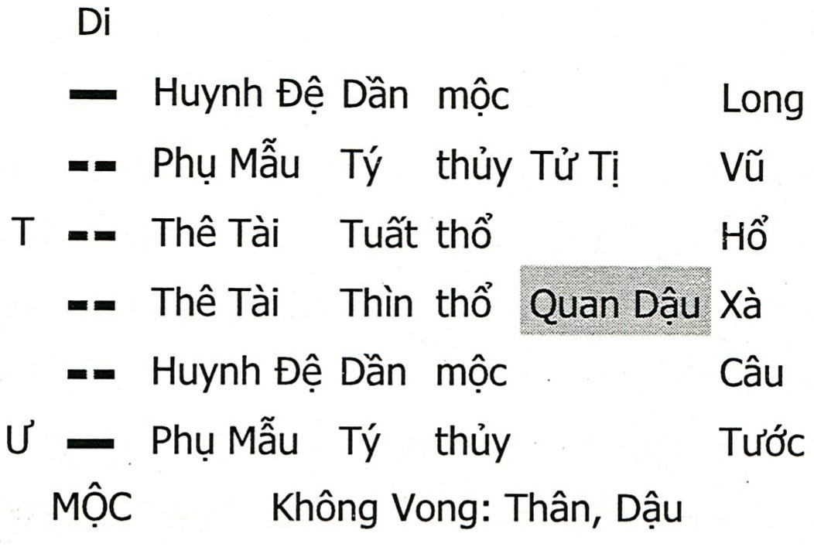
    - **Hình này chứng minh điều gì**
      - Thai phụ sinh con gái dễ dàng ngay trong tháng Thìn vào ngày Tý giờ Tị.
    - **Từ đâu mà thấy được**
      - Hào Thế Tuất thổ lâm Bạch Hổ Nguyệt phá (vỡ khố tử cung thoát thai); quẻ thuộc cung Tốn (trưởng nữ), Tử Tôn Tị hỏa hưu tù thai tại Tý.

#### Phân tích suy luận hào vị

- Chọn Dụng thần và quan sát tình trạng Phục thần:
  - Xem việc sinh đẻ lấy Tử Tôn làm Dụng thần.
  - Trong quẻ thuần tĩnh, Tử Tôn Tị hỏa không xuất hiện trên quẻ mà phục dưới hào 5 Phụ Mẫu Tý thủy.
  - Phi thần Phụ Mẫu Tý thủy tuy về lý khắc Phục thần Tị hỏa, nhưng hiện tại Phi thần Tý thủy bị cả Nguyệt kiến Thìn thổ lẫn Nhật thần Sửu thổ khắc chế nặng nề, rơi vào trạng thái suy kiệt hưu tù, nên hoàn toàn bất lực không thể tổn hại Phục thần.
- Biểu tượng lâm bồn và hiện tượng mở tử cung:
  - Hào Thế Thê Tài Tuất thổ đại diện cho bản thân thai phụ, lâm thần sát Bạch Hổ và bị Nguyệt kiến Thìn thổ xung phá thành Nguyệt phá.
  - Bạch Hổ chủ huyết quang, lâm bồn sinh nở; Nguyệt phá chủ thời khắc chuyển dạ sắp xảy ra.
  - Hào Thế Tuất thổ là Mộ khố của Hỏa (Tử Tôn Tị hỏa nhập Mộ tại Tuất), trong trường hợp thai sản thì Mộ khố của Tử Tôn được hiểu rộng ra chính là tử cung của người mẹ đang ôm ấp bào thai.
  - Hào Thế bị Nguyệt kiến tháng Thìn xung phá: Tượng phá vỡ cửa Mộ, tức cửa tử cung mở ra để giải phóng thai nhi, báo hiệu chắc chắn sẽ sinh con ngay trong tháng Thìn này.
  - Tử Tôn vốn bị giam giữ trong Mộ khố, nay khố bị xung phá toang ra giúp thai nhi thoát ra ngoài dễ dàng: biểu thị ca sinh sẽ vô cùng thuận lợi, dễ sinh, mẹ tròn con vuông.
- Phán đoán giới tính thai nhi:
  - Tử Tôn Tị hỏa ở trạng thái hưu tù suy nhược, không đắc vượng khí.
  - Quẻ Sơn Lôi Di thuộc cung Tốn (Tốn vi Phong, Tốn tượng trưng cho trưởng nữ, quái thuần âm tính nữ).
  - Tượng vượng là nam, tượng suy hưu tù là nữ, kết hợp với quái cung thuộc Tốn nên phán đoán khả năng rất cao là sinh con gái.

#### Luồng đối thoại và ứng nghiệm thực tế

- Diễn biến thực tế và kiểm chứng ứng kỳ:
  - Đúng như dự đoán, ngay trong tháng Thìn đó, thai phụ đã thuận lợi hạ sinh một bé gái khỏe mạnh vào giờ Tị, ngày Tý.
  - Căn cứ ứng kỳ: Ngày Tý chính là Thai địa của Dụng thần Tử Tôn Tị hỏa xuất hiện (Tị hỏa gặp Tý thủy là đất Thai), ứng kỳ sinh nở trùng khớp hoàn hảo với ngày đắc Thai của Dụng thần.

### Ví Dụ 4: Nữ Đoán Việc Bán Hàng Vỉa Hè (Địa Thiên Thái Biến Lôi Thiên Đại Tráng)

#### Bối cảnh và quẻ tượng

- Thời gian gieo quẻ và ý định công việc:
  - Ngày Đinh Tị, tháng Ất Tị, năm Đinh Sửu (Tuần không: Tý, Sửu).
  - Một người phụ nữ đến xin dự đoán xem có nên thuê lại vỉa hè để bày sạp bán hàng hay không.
  - Được quẻ Địa Thiên Thái biến Lôi Thiên Đại Tráng.
- Quẻ tượng cảnh báo việc thuê vỉa hè buôn bán tất phải gánh chịu thua lỗ, phá tài:
  - **Hình 29.** Sơ đồ quẻ Địa Thiên Thái biến Lôi Thiên Đại Tráng
    - 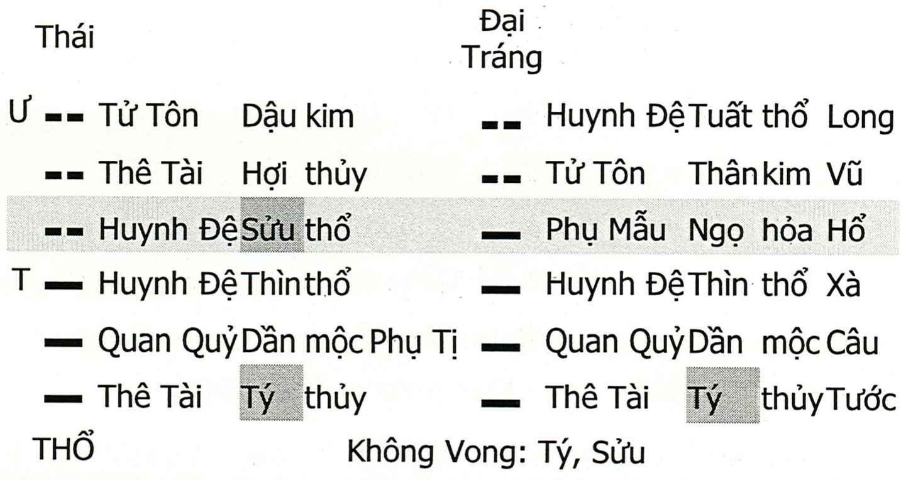
    - **Hình này chứng minh điều gì**
      - Kinh doanh chợ đêm vỉa hè thất bại, không thu hồi đủ vốn thuê mặt bằng và bị tổn thất tiền bạc.
    - **Từ đâu mà thấy được**
      - Hào sơ mặt đất Thê Tài Tý thủy lâm Tuần Không; hào 5 đường lộ Thê Tài Hợi thủy Nguyệt phá Nhật phá; Kỵ thần Sửu thổ lâm Bạch Hổ phát động khắc Tài.

#### Phân tích suy luận hào vị

- Xác định Dụng thần và nhận diện hiện tượng Tài lưỡng hiện:
  - Cầu tài, kinh doanh buôn bán lấy Thê Tài làm Dụng thần.
  - Trong quẻ xuất hiện Thê Tài lưỡng hiện: Thê Tài Tý thủy tại hào sơ và Thê Tài Hợi thủy tại hào 5.
- Phân tích tương quan hào vị đại diện cho vỉa hè và đường xá:
  - Hào sơ là vị trí thấp nhất, tượng trưng cho mặt đất, nền đất vỉa hè: Thê Tài Tý thủy cư hào sơ nhưng lại lâm Tuần Không, biểu thị mặt đất không tụ được tài khí, địa điểm kinh doanh trống rỗng vô ích.
  - Hào 5 tượng trưng cho đường xá, phố lộ nơi người xe qua lại: Thê Tài Hợi thủy lâm hào 5 bị cả Nguyệt kiến Tị hỏa xung (Nguyệt phá) lẫn Nhật thần Tị hỏa xung (Nhật phá), gọi là nhật nguyệt đồng xung đại phá.
- Tác động của Kỵ thần Huynh Đệ phát động:
  - Hào 4 Huynh Đệ Sửu thổ lâm Bạch Hổ phát động mãnh liệt trong quẻ: Huynh Đệ là Kỵ thần chuyên cướp đoạt tiền của; Bạch Hổ tượng trưng cho đường sá giao thông và sự hao tán tổn thất.
  - Kỵ thần vượng động khắc bạt Tài hào, kết hợp cả hào sơ (mặt đất) ngộ Không lẫn hào 5 (đường phố) đại phá: khẳng định tuyệt đối không thể ra vỉa hè buôn bán kiếm lời.
  - Tài hào lâm Nguyệt phá là điềm báo chắc chắn: dốc vốn làm ăn lúc này tất phải chịu cảnh phá tài, mất sạch vốn liếng.

#### Luồng đối thoại và ứng nghiệm thực tế

- Lời khuyên can và thái độ của đương sự:
  - Tác giả khuyên can người phụ nữ không nên thuê vỉa hè mở chợ đêm vì quẻ báo phá tài rõ ràng.
  - Tuy nhiên người này cố chấp không nghe lời khuyên, vẫn quyết định bỏ tiền thuê mặt bằng vỉa hè để kinh doanh chợ đêm.
- Hậu quả thực tế ngoài đời:
  - Tình hình buôn bán ế ẩm, hàng hóa không bán được, lượng tiền thu về thậm chí không đủ bù đắp chi phí thuê vỉa hè.
  - Kết cục người phụ nữ bị thua lỗ, tổn thất mất mấy trăm tệ đúng như lời quẻ đã cảnh báo trước.

### Ví Dụ 5: Đoán Bệnh Cho Mẹ Nằm Viện (Trạch Thiên Quải Biến Trạch Hỏa Cách)

#### Bối cảnh và quẻ tượng

- Thời gian, hoàn cảnh và việc gieo quẻ:
  - Năm 2000, khi tác giả vừa mới từ Ngũ Đài Sơn trở về, có một người tìm đến nhờ đoán bệnh cho mẹ đang phải nằm viện cấp cứu.
  - Tác giả đích thân cùng người này đến bệnh viện; thời điểm gieo quẻ vừa mới giao tiết lệnh tháng Thân được hơn mười phút.
  - Ngày Đinh Dậu, tháng Giáp Thân, năm Canh Thìn (Tuần không: Thìn, Tị).
  - Bản thân bà cụ người bệnh tự tay gieo quẻ, được quẻ Trạch Thiên Quải biến Trạch Hỏa Cách.
- Quẻ tượng bóc tách nguyên nhân bệnh tật, sai lầm y tế và phong thủy cây cối trong sân:
  - **Hình 30.** Quẻ Trạch Thiên Quải biến Trạch Hỏa Cách
    - 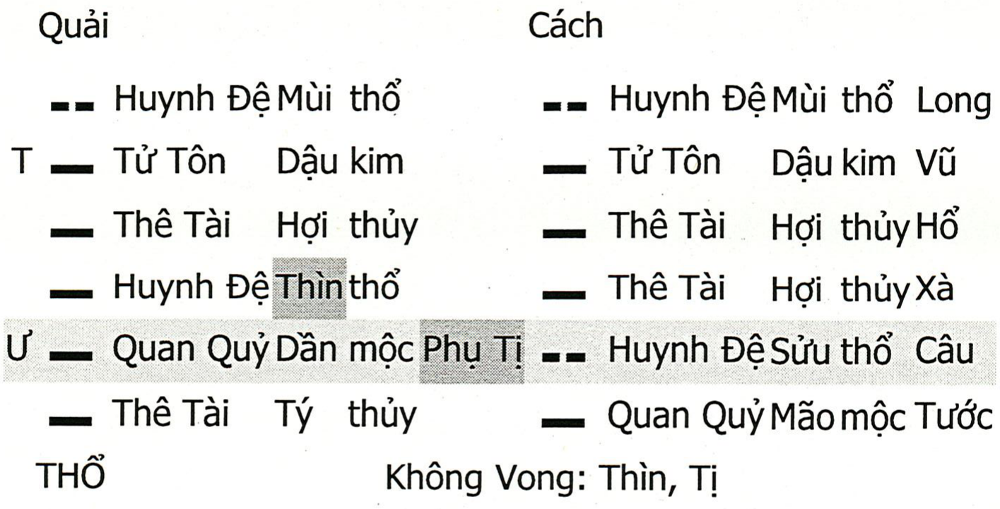
    - **Hình này chứng minh điều gì**
      - Bệnh nhân bị đau đầu, thận suy phù chân do phong thủy cây chẽ đôi góc Đông Bắc; truyền dịch làm tăng bệnh; tháng Dậu khỏi hẳn.
    - **Từ đâu mà thấy được**
      - Hào 2 Quan Quỷ Dần mộc Câu Trần động khắc Nguyên thần Mùi thổ, Thìn thổ; Dần mộc Nguyệt phá hóa Sửu thổ (Đông Bắc); Dậu kim Thế vượng ứng tháng Dậu.

#### Phân tích suy luận hào vị

- Xác định Dụng thần và mức độ hung hiểm sinh mệnh:
  - Vì bà cụ đích thân gieo quẻ nên lấy hào Thế làm Dụng thần.
  - Hào Thế Tử Tôn Dậu kim tọa hào 5, được Nguyệt kiến Thân kim nâng đỡ vượng khí, lại được Nhật thần Dậu kim trị Thế sinh trợ cực vượng: biểu thị người bệnh dù mang bệnh nặng nhưng nguyên khí còn rất mạnh, tính mệnh an toàn, không có nguy cơ tử vong.
- Bóc tách từng chứng bệnh cụ thể trên cơ thể:
  - Chứng đau đầu: Quan Quỷ Dần mộc độc phát phát động khắc thương Nguyên thần Huynh Đệ Mùi thổ ở hào 6. Hào 6 chủ phần đầu; Mùi thổ lâm Thanh Long chủ đau nhức -> đoán mắc chứng đau đầu dữ dội.
  - Chứng thận suy: Hào 3 Huynh Đệ Thìn thổ (cũng là Nguyên thần) lâm Tuần Không nên không thể sinh trợ cho hào Thế; Thìn là thủy khố, đại diện cho thận và bàng quang -> đoán công năng thận khí bị suy hư trầm trọng.
  - Chứng phù chân: Quan Quỷ Dần mộc phát động tại hào 2, lâm Câu Trần khắc thương Nguyên thần. Hào 2 là cẳng chân, bàn chân; Câu Trần chủ sưng húp, sưng trướng -> đoán hai chân bị sưng phù nghiêm trọng do chứng thận thủy phù thũng gây ra.
- Phát hiện sai lầm trong phương pháp điều trị y tế tại bệnh viện:
  - Tác giả quan sát thấy bà cụ đang nằm trên giường bệnh truyền dịch liên tục.
  - Truyền dịch là đưa dung dịch nước vào người, nước thuộc Thủy.
  - Trong quẻ, Thủy là Cừu thần sinh trợ cho Quan Quỷ Dần mộc (Mộc Quỷ càng thêm vượng để quay lại khắc Nguyên thần thổ), hoàn toàn không mang lại lợi ích cho Dụng thần.
  - Đoán việc truyền dịch tại bệnh viện chẳng những không giúp giảm bệnh mà càng làm bệnh tình thêm nguy kịch, nước tích tụ gây phù nề nhiều hơn.
  - Quy luật phát bệnh theo giờ: Vào các giờ Dần và Mão hàng ngày, Cừu thần Dần Mộc vượng khí nhất, nên thời gian này bệnh tình chuyển biến nặng nề nhất; đến giờ Thìn (từ 7 giờ sáng trở đi), Nguyên thần Thìn thổ xuất Không trợ Thế, triệu chứng sưng phù tự nhiên thuyên giảm rõ rệt.
- Truy nguyên nguồn gốc bệnh tật từ phong thủy nơi cư trú:
  - Hào 2 là trạch (nhà ở), Quan Quỷ Mộc lâm Câu Trần phát động chủ việc tu sửa, cất dựng nhà cửa.
  - Hào động Dần mộc đối ứng với năm 1998 (Mậu Dần) -> đoán vào năm 1998 gia đình có xây cất, sửa sang nhà cửa, và bệnh tật hiện tại có liên quan trực tiếp đến phong thủy nhà ở.
  - Hào 2 lâm Mộc phát động: biểu thị trong sân nhà có trồng cây to. Dần mộc động hóa Sửu thổ (Sửu là phương Đông Bắc) -> vị trí cây nằm ở góc Đông Bắc của sân nhà.
  - Dần mộc bị Nguyệt kiến Thân kim xung phá (Nguyệt phá), đồng thời thai tại Nhật thần Dậu kim (Dần mộc đắc Thai tại Dậu): đoán cái cây ở góc Đông Bắc vừa mọc khỏi mặt đất là chẽ làm đôi, tỏa cành nhánh giống hệt tư thế một người trồng cây chuối dang hai đùi ra.

#### Luồng đối thoại và ứng nghiệm thực tế

- Thái độ của bệnh nhân và quyết định xuất viện:
  - Tất cả các lời luận đoán về chứng đau đầu, thận suy phù chân, quy luật thuyên giảm sau 7 giờ sáng và hình dáng cái cây kỳ dị góc sân đều đúng từng chi tiết, khiến bệnh nhân và người nhà vô cùng nể phục và tin tưởng tuyệt đối.
  - Theo lời khuyên dứt khoát của tác giả, gia đình lập tức yêu cầu bác sĩ ngừng truyền dịch và làm thủ tục xuất viện về nhà.
- Hướng dẫn điều chỉnh phong thủy và kết quả kỳ diệu:
  - Sau khi về nhà, tác giả trực tiếp chỉ dẫn phương pháp điều chỉnh, xử lý thế phong thủy cây cối trong sân.
  - Một tuần lễ sau, người nhà lại mời tác giả đến thăm: Hiện tượng phù thũng trên người bà cụ đã cơ bản biến mất hoàn toàn.
  - Cả thôn làng đều kinh ngạc bàn tán, không thể hiểu nổi vì sao một cụ già nằm liệt giường bệnh viện suốt nửa năm trời mà chỉ sau vài ngày về nhà đã khỏe khoắn, có thể tự đi dạo khắp làng xóm.
- Dự đoán cơ duyên chữa dứt điểm căn bệnh:
  - Tác giả lưu ý bệnh chưa trừ được tận gốc rễ; căn cứ vào hào 5 Tử Tôn Dậu kim (Dụng thần kiêm hào Y dược vượng tướng), đoán đến tháng Dậu sẽ xuất hiện thầy thuốc giỏi trị khỏi hẳn.
  - Đúng vào tháng Dậu sau đó, có một vị danh y vân du tình cờ đi ngang qua thôn; vị này chỉ dùng đúng một mũi châm cứu là bệnh tình của bà cụ được chữa khỏi hoàn toàn.

### Ví Dụ 6: Bật Lửa Nổ Tung Đoán Điềm Cát Hung (Phong Thiên Tiểu Súc Biến Thủy Thiên Nhu)

#### Bối cảnh và quẻ tượng

- Thời gian gieo quẻ và sự cố khởi đầu:
  - Ngày Kỷ Dậu, tháng Nhâm Ngọ, năm Canh Thìn (Tuần không: Dần, Mão).
  - Một người đang cầm chiếc bật lửa trên tay thì bất ngờ bật lửa phát nổ tung; quá kinh hãi bèn gieo quẻ đoán xem điềm báo hung cát sắp tới ra sao.
  - Được quẻ Phong Thiên Tiểu Súc biến Thủy Thiên Nhu.
- Quẻ tượng giải mã điềm báo nổ lốp xe, bàn đạp hỏng, phát bệnh đường ruột và phong thủy trạch viện:
  - **Hình 31.** Sơ đồ quẻ Phong Thiên Tiểu Súc biến Thủy Thiên Nhu
    - 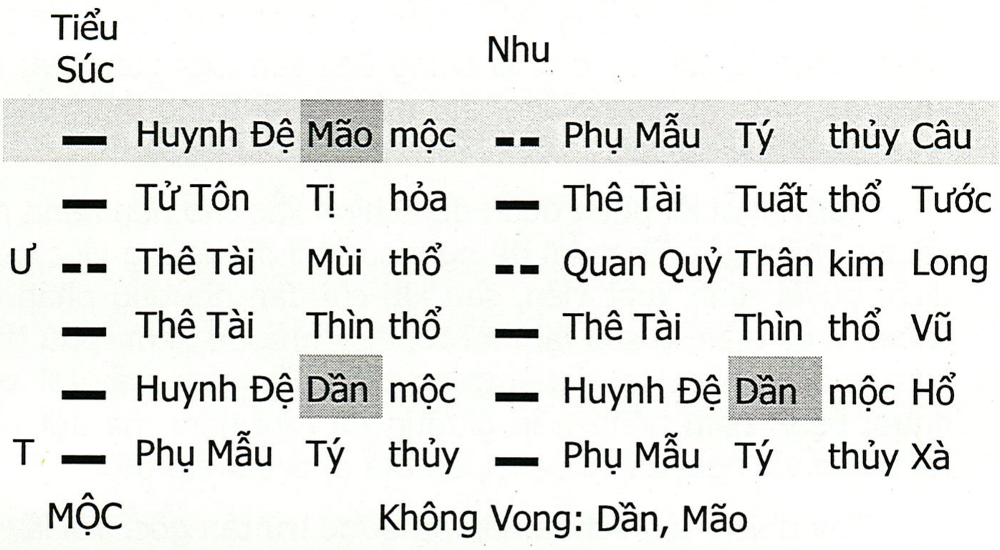
    - **Hình này chứng minh điều gì**
      - Ngày Tý bị nổ lốp xe, hỏng bàn đạp, nhiễm lạnh tiêu chảy; trong sân nhà có cây to bị rỗng thân có hốc.
    - **Từ đâu mà thấy được**
      - Hào Thế Tý thủy lâm Phụ Mẫu ở hào sơ Nguyệt phá (thực phá ngày Tý); Mão mộc động hình Tý; hào 2 trạch Dần mộc ngộ Tuần Không (thân cây rỗng).

#### Phân tích suy luận hào vị

- Xác định Dụng thần và mức độ hung hiểm:
  - Tự đoán việc liên quan đến bản thân lấy hào Thế làm Dụng thần.
  - Hào Thế Phụ Mẫu Tý thủy lâm Nguyệt phá (tháng Ngọ xung Tý), nhưng may mắn được Nhật thần Dậu kim tương sinh phù trợ nên phán đoán không có tai họa hung hiểm đến tính mạng.
- Phán đoán tai nạn nổ lốp xe đạp:
  - Hào sơ là vị trí chân cẳng, bước đi (cước lực); hào Thế tọa hào sơ lâm Phụ Mẫu (Phụ Mẫu chủ xe cộ, phương tiện đi lại), hình thành biểu tượng người đạp xe đạp.
  - Phụ Mẫu Tý thủy lâm Nguyệt phá; Ngọ hỏa vốn là đất Thai của Tý thủy (Thai địa xung phá Tý thủy), biểu tượng cho vật chứa hơi bị nổ bùng -> tượng nổ lốp xe đạp.
  - Hào Tý thủy bị Nguyệt phá sẽ ứng nghiệm vào kỳ "thực phá" (ngày Tý xung phá được điền thực); do đó đoán chắc chắn 4 ngày sau (vào ngày Tý), xe đạp của anh ta sẽ bị nổ lốp giữa đường.
  - Hào sơ là bàn chân bị Nguyệt phá còn mang thông tin bộ phận để chân của xe (bàn đạp) cũng sẽ bị gãy vỡ, hư hỏng.
- Phán đoán bệnh lý phong hàn nhiễm lạnh đường ruột:
  - Hào Thế là Tý thủy; địa chi Tý đại diện cho phần bụng, đường tiêu hóa; lâm Nguyệt phá chủ đau bụng, tiêu chảy, phân lỏng.
  - Hào 6 Huynh Đệ Mão mộc phát động tương hình hào Thế Tý thủy (Tý Mão tương hình vô lễ); Huynh Đệ chủ phong (gió); mộc chủ phong; quái thượng lại thuộc cung Tốn (Tốn vi Phong, gió lốc) -> khẳng định cơ thể bị trúng phong hàn nhiễm lạnh khiến bụng dạ quặn đau khó chịu.
  - Hào Thế Phụ Mẫu chủ quần áo; trì Thế là mặc quần áo, nhưng gặp Nhật thần Dậu kim là đất Mộc Dục (chủ cởi bỏ quần áo, thoát y) -> cảnh báo vào ngày Tý cần hết sức cẩn thận, không được để phong phanh hở bụng kẻo bị nhiễm lạnh dẫn đến tiêu chảy cấp.
- Đoán việc phụ gia đình (Kỹ pháp Đa sự nhất quái):
  - Người hỏi thỉnh cầu đoán thêm thông tin khác từ quẻ để học hỏi phương pháp "một quẻ đoán nhiều việc".
  - Tác giả quan sát hào 2 (hào trạch - nhà ở): Huynh Đệ Dần mộc tọa hào 2 lại lâm Tuần Không.
  - Dần mộc ngự tại hào trạch: Biểu thị trong sân nhà có một cây cổ thụ rất to.
  - Dần mộc lâm Tuần Không: Tượng bên trong thân cây bị trống rỗng, tức trên thân cây có một cái hốc thủng lớn.

#### Luồng đối thoại và ứng nghiệm thực tế

- Kiểm chứng sự việc tai nạn và sức khỏe:
  - Đến ngày Tý (4 ngày sau), tất cả suy đoán đều nghiệm chứng hoàn toàn chính xác ngoài đời:
  - Chiếc xe đạp đang đi trên đường bất ngờ nổ tung lốp xe, đồng thời bàn đạp xe đạp cũng bị gãy hỏng cùng lúc.
  - Bản thân người đó do sơ ý bị nhiễm lạnh dẫn đến đau quặn bụng và tiêu chảy suốt ngày.
- Đối thoại truyền dạy tâm đắc dự trắc:
  - Khi tác giả nói thêm chi tiết "trong sân nhà anh có một cây to, trên thân cây có cái hốc thủng", người hỏi vô cùng kinh ngạc và thốt lên: Thầy đoán chuẩn xác quá, làm sao thầy có thể nhìn ra được chi tiết tinh vi đến như vậy?
  - Tác giả mỉm cười giải thích bí quyết: Điều này thực ra rất đơn giản, cũng giống như lớp giấy dán trên cửa sổ, chỉ cần chấm nhẹ một ngón tay là thủng ngay; hào 2 là trạch, Dần mộc là cây trong sân, lâm Không Vong là thân cây rỗng tạo thành hốc thủng.
  - Người hỏi lập tức giác ngộ sâu sắc đạo lý suy diễn hào vị của Lục hào.

### Ví Dụ 7: Đoán Bệnh Cho Mẹ Học Viên Lớp Dịch Học (Trạch Hỏa Cách Biến Trạch Thiên Quải)

#### Bối cảnh và quẻ tượng

- Thời gian gieo quẻ và bối cảnh lớp học:
  - Ngày Kỷ Tị, tháng Kỷ Mùi, năm Mậu Dần (Tuần không: Tuất, Hợi).
  - Tại lớp đào tạo Chu Dịch chuyên đề dự đoán thị trường cổ phiếu, trong giờ giải lao, một học viên họ Mã nhân cơ hội xin tác giả gieo quẻ đoán bệnh tình cho mẹ ruột.
  - Gieo được quẻ Trạch Hỏa Cách biến Trạch Thiên Quải.
- Quẻ tượng phân tích đa tầng từ bệnh lý tiểu đường, thương tích gãy chân đến chi tiết ngã cầu thang và số tầng nhà:
  - **Hình 32.** Sơ đồ quẻ Trạch Hỏa Cách biến Trạch Thiên Quải
    - 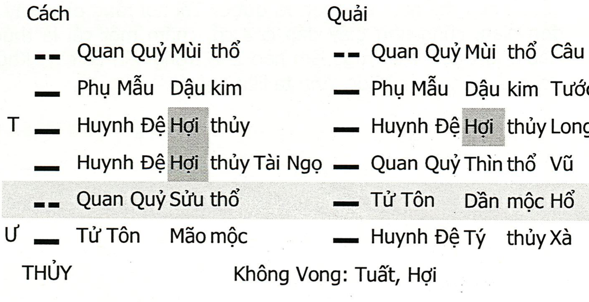
    - **Hình này chứng minh điều gì**
      - Mẹ bị tiểu đường, gãy xương chân do ngã cầu thang tầng 3 nhà tọa Nam hướng Bắc; chân khỏi tháng Tý nhưng tiểu đường khó dứt.
    - **Từ đâu mà thấy được**
      - Cung Khảm thủy phối hào 2 Quan Quỷ Sửu thổ Nguyệt phá hóa Dần mộc khắc (chân, đường đi trong nhà); Thế Hợi thủy ngộ Không xung; Dần số 3; Phụ Mẫu Dậu số 4 tầng 4.

#### Phân tích suy luận hào vị

- Đánh giá tổng quan Dụng thần và tính chất bệnh lý:
  - Đoán bệnh cho đấng sinh thành lấy hào Phụ Mẫu làm Dụng thần.
  - Phụ Mẫu Dậu kim ngự hào 5, được Nguyệt kiến Mùi thổ tương sinh phù trợ, lại đắc Trường Sinh tại Nhật thần Tị hỏa (Kim trường sinh tại Tị) -> Dụng thần cực kỳ vượng tướng, tính mạng bình an vô sự.
  - Quẻ Trạch Hỏa Cách thuộc cung Khảm (Khảm vi Thủy), ngũ hành Thủy chủ các bệnh về hệ bài tiết, thận, bàng quang, máu huyết và nước tiểu.
- Điểm mấu chốt của quẻ qua hào độc phát:
  - Cổ nhân đúc kết: "Thần triệu cơ ư động" (Điềm báo của quẻ phát lộ ở hào phát động).
  - Quẻ này chỉ có duy nhất một hào động: Hào 2 Quan Quỷ Sửu thổ bị Nguyệt kiến Mùi thổ xung phá (Nguyệt phá), động mà hóa ra Tử Tôn Dần mộc hồi đầu khắc.
  - Quan Quỷ Sửu thổ chính là Nguyên thần sinh cho Dụng thần Dậu kim, nay bị Nguyệt phá lại chịu hồi đầu khắc nặng nề.
  - Hào 2 chủ bộ phận sinh dục; hào biến Tử Tôn cũng chủ bộ phận sinh dục -> bệnh tật gây đau đớn dữ dội ở vùng sinh dục bài tiết.
  - Kết hợp ý nghĩa cung Khảm (Thủy), chỉ có nước tiểu mới liên hệ trực tiếp với cơ quan này: biểu thị mẹ học viên bị rối loạn nội tiết tố nghiêm trọng, nước tiểu có vấn đề biến chất (bệnh tiểu đường).
- Truy tìm vết thương gãy xương chân do Nguyệt phá:
  - Hào 2 còn chủ về cẳng chân, bàn chân; lâm Bạch Hổ chủ huyết quang thương tật.
  - Quan Quỷ lâm Nguyệt phá tại hào 2: Nguyệt phá chủ gãy lìa, rạn nứt, vỡ nát -> khẳng định xương chân của người mẹ đã bị rạn nứt hoặc gãy rời.
  - Nguyệt phá ứng ngay trong tháng Mùi này: chứng tỏ tai nạn gãy chân vừa mới xảy ra trong tháng hiện tại.
- Phân tích nguyên nhân ngã cầu thang:
  - Quan Quỷ tại hào 2 lâm Bạch Hổ (Bạch Hổ chủ đường sá), bị biến hào Tử Tôn Dần mộc khắc thương (Tử Tôn cũng chủ đường đi lối lại).
  - Hào 2 là trạch (nơi ở, không gian trong nhà): Biểu thị lối đi lại bên trong khuôn viên ngôi nhà.
  - Quẻ thuộc cung Khảm mang đặc tính hãm hiểm (Khảm vi Hãm), chủ địa hình cao thấp mấp mô, bậc lên bậc xuống không bằng phẳng -> kết luận bà cụ bị trượt chân ngã cầu thang trong nhà mà dẫn đến gãy chân.
- Đoán phương vị hướng nhà và số tầng nơi ở:
  - Hào Thế Huynh Đệ Hợi thủy lâm Tuần Không bị Nhật thần Tị hỏa xung phá (xung Không): Dùng phương vị tương phản để định vị tọa hướng tòa nhà -> Tọa Nam hướng Bắc (cửa chính mở ngoảnh về phương Bắc).
  - Xem căn hộ lấy Phụ Mẫu làm Dụng thần: Phụ Mẫu Dậu kim, số ngũ hành của Kim là số 4, lại ngự tại hào 5 -> phán đoán gia đình không ở tầng 4 thì ở tầng 5.
- Đoán chính xác vị trí tầng ngã cầu thang và ứng kỳ khỏi bệnh:
  - Hào 2 Sửu thổ bị Tử Tôn Dần mộc khắc; khẩu quyết "Dần Mão tam bát chân" (Dần số 3, Mão số 8) -> kết luận tai nạn trượt ngã xảy ra chính xác tại cầu thang tầng thứ 3.
  - Ứng kỳ: Quan Quỷ Sửu thổ lâm Nguyệt phá, đến tháng Tý được Nhật Nguyệt tương hợp (Tý Sửu hợp hóa giải Nguyệt phá), chân mẹ anh ta sẽ lành lặn và bình phục hoàn toàn vào tháng Tý.
  - Tuy nhiên hào Nguyên thần bị hồi đầu khắc nên căn bệnh tiểu đường gốc rễ sẽ rất khó chữa khỏi dứt điểm, phải điều trị lâu dài.

#### Luồng đối thoại và ứng nghiệm thực tế

- Màn đối thoại kịch tính từng bước trước toàn thể lớp học:
  - Tác giả hỏi: "Người mẹ bị mất cân bằng nội tiết, nước tiểu có vấn đề biến chất, rốt cuộc là bệnh gì?" - Anh Mã trả lời: "Là bệnh tiểu đường."
  - Tác giả tiếp tục: "Xương chân bị nứt gãy trong tháng này, có đúng chuyện đó không?" - Anh Mã ngạc nhiên đáp: "Đúng, tháng này mẹ tôi đã bị gãy xương."
  - Tác giả truy vấn: "Nguyên nhân là do ngã cầu thang trong nhà mà bị thương, có đúng hay không?" - Anh Mã giật mình: "Đúng!"
  - Tác giả nói về hướng nhà: "Cửa nhà mở ngoảnh mặt về hướng Bắc." - Anh Mã xác nhận: "Hoàn toàn chính xác!"
  - Tác giả hỏi tầng nhà: "Gia đình anh ở tầng 4 hay tầng 5, rốt cuộc là tầng mấy?" - Anh Mã mỉm cười: "Tầng thứ tư."
  - Tác giả chốt hạ vị trí ngã: "Mẹ anh ngã bị thương ở cầu thang tầng thứ ba, chuyện này có đúng không?" - Anh Mã gật đầu lia lịa thán phục: "Vâng, vâng!"
- Hiệu quả học thuật và cảm xúc lớp học:
  - Toàn thể học viên trong lớp vô cùng thán phục trước khả năng khai thác chi tiết phi thường của tác giả, củng cố vững chắc niềm tin và quyết tâm nghiên cứu Lục hào.

### Ví Dụ 8: Chọn Ngày Dọn Nhà Và Đoán Thai Sản (Địa Lôi Phục Biến Chấn Vi Lôi)

#### Bối cảnh và quẻ tượng

- Thời gian gieo quẻ và mục đích xin bói:
  - Ngày Tân Mão, tháng Canh Thân, năm Mậu Dần (Tuần không: Ngọ, Mùi).
  - Một phụ nữ đến nhờ tác giả chọn ngày lành tháng tốt để tiến hành dọn nhà.
  - Gieo được quẻ Địa Lôi Phục biến Chấn Vi Lôi.
- Quẻ tượng phân tích sự biến dỡ nhà, đặc điểm căn hộ mới và diễn biến sinh khó con trai:
  - **Hình 33.** Sơ đồ quẻ Địa Lôi Phục biến Chấn Vi Lôi
    - 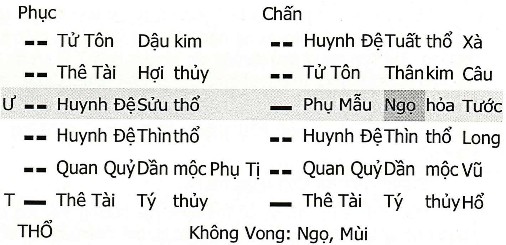
    - **Hình này chứng minh điều gì**
      - Nhà cũ bị phá dỡ, được cấp tạm nhà tầng 2 có hầm; dọn nhà ngày Bính Thân; sinh khó bé trai vào ngày Thân.
    - **Từ đâu mà thấy được**
      - Hào 2 trạch Dần mộc Nguyệt phá; Lục hợp biến Lục xung; Phụ Mẫu Tị hỏa phục hào 2 lâm Huyền Vũ; Thế Tý thủy Trường Sinh tại Thân; Tử Tôn Dậu kim vượng nhập Mộ Sửu thổ.

#### Phân tích suy luận hào vị

- Nguyên lý chọn ngày dọn nhà không có Dụng thần chuyên biệt:
  - Chọn ngày dọn nhà không có một Dụng thần cố định; vì người xin đoán lo lắng về cát hung của bản thân nên lấy hào Thế làm trọng tâm xem xét.
  - Quy tắc: Hào Thế nhược thì chọn ngày sinh phù hào Thế; hào Thế quá vượng thì chọn ngày khắc chế hoặc chờ ngày hào Thế nhập Mộ.
  - Xét hào Thế Thê Tài Tý thủy: Được Nguyệt kiến Canh Thân tương sinh nên không tính là hưu tù; tuy nhiên hào 4 Huynh Đệ Sửu thổ độc phát khắc Thế, may nhờ hào 6 Tử Tôn Dậu kim được Nhật Mão xung động thành ám động tạo chuỗi liên tục tương sinh (Sửu thổ sinh Dậu kim, Dậu kim sinh Tý thủy) nên bình an.
  - Do Sửu thổ là Mộ khố của Tý thủy nên lực Thế chưa thật vững; chọn ngày Thế gặp Trường Sinh (ngày Thân, Thân là Trường Sinh của Tý thủy) để dọn nhà là thích hợp nhất.
- Khai thác nguyên nhân dọn nhà và dấu hiệu mang thai lâm bồn:
  - Hào 2 là trạch (nhà cửa), Quan Quỷ Dần mộc lâm Nguyệt phá (tháng Thân xung phá): biểu thị ngôi nhà cũ bị cưỡng chế phá dỡ, giải tỏa mặt bằng, đó chính là nguyên nhân bắt buộc phải dọn nhà.
  - Hào Thế lâm Bạch Hổ: Bạch Hổ là thông tin sắp lâm bồn sinh nở.
  - Hào 6 Tử Tôn Dậu kim bị Nhật thần Mão mộc (Thai địa của Dậu kim) xung động: dấu hiệu sắp sinh con.
  - Hào 2 là vị trí thai nhi bị Nguyệt kiến Thân kim (đồng hành kim với Tử Tôn) xung phá: cũng là tín hiệu thai nhi sắp chào đời.
- Phân tích nguồn gốc và cấu trúc của nơi ở mới:
  - Hào Ứng là người ngoài, phát động hóa Phụ Mẫu Ngọ hỏa (Phụ Mẫu là nhà cửa): Biểu thị ngôi nhà mới không phải tự mua mà là do người ngoài, cơ quan cấp cho để chuyển đến ở tạm.
  - Quẻ chính Lục hợp biến quẻ biến Lục xung: Tượng chỉ cư trú tạm bợ một thời gian ngắn, sau đó sẽ lại di chuyển chứ không ở lâu dài.
  - Quẻ chính Lục hợp tượng trưng cho sự trùng điệp, tầng lớp; hào 2 là trạch, Phụ Mẫu Tị hỏa lại ẩn phục dưới hào 2 mang ý nghĩa "dưới nhà lại có nhà", lâm Huyền Vũ (chủ nơi tối tăm, ngầm dưới lòng đất) -> thông tin tòa nhà chung cư có tầng hầm ngầm.
  - Hào Phụ Mẫu thuộc Hỏa, số sinh thành của Hỏa là số 2, lại phục tại hào 2 -> đoán căn hộ gia đình chuyển tới nằm ở tầng 2 của tòa nhà.
- Phán đoán chi tiết ca sinh nở và giới tính con:
  - Quẻ Lục hợp là biểu tượng của sự chậm trễ, dây dưa khó sinh; Tử Tôn Dậu kim nhập Mộ tại Sửu thổ phát động cũng chủ về ca sinh khó khăn, trắc trở.
  - Tử Tôn Dậu kim được Nguyệt kiến phù trợ, hào động sinh trợ nên cực kỳ vượng tướng; tượng vượng là nam, suy là nữ; quẻ lại có hào độc phát âm động biến dương -> khẳng định chắc chắn sinh con trai.
  - Tử Tôn nhập Mộ khố tại Sửu thì cần ngày xung khai Mộ khố: Sửu cần Mùi xung, nên đoán sẽ ứng vào ngày Mùi sinh con.
  - Tuần tiếp theo là tuần Giáp Ngọ, Nguyên thần Thìn thổ lâm Tuần Không; Thìn thổ vừa là Nguyên thần vừa là Dưỡng địa của Tử Tôn, Dưỡng địa ngộ Không thì chưa thể chuyển dạ sinh được.
  - Do đó quyết đoán phải chờ sang tuần Giáp Thìn, ứng vào ngày Đinh Mùi mới chính thức sinh con.
- Ấn định ngày dọn nhà: Chọn ngày Bính Thân.

#### Luồng đối thoại và ứng nghiệm thực tế

- Kết quả thực tế ngoài đời:
  - Gia đình người phụ nữ tiến hành dọn nhà đúng vào ngày Bính Thân đã chọn.
  - Đến ngày Mậu Thân (sau ngày Đinh Mùi dự đoán một ngày), sản phụ đã hạ sinh một bé trai kháu khỉnh; quá trình lâm bồn quả thực diễn ra vô cùng khó khăn, sinh khó đúng như quẻ đã báo.
- Giá trị đúc kết học thuật:
  - Dù ngày sinh đứa trẻ có sự sai số một ngày do biến số thời gian tuần giáp, song tất cả các phán đoán lớn khác (nhà bị phá dỡ, được cấp nhà ở tạm, nhà tầng 2 có tầng hầm, dọn nhà ngày Thân, mang thai sắp đẻ, sinh con trai, ca sinh khó) đều chuẩn xác tuyệt đối.

### Ý Nghĩa Mở Rộng Của Nguyệt Phá Và Kỹ Pháp Đa Sự Nhất Quái

- Năng lực dung nạp thông tin kỳ diệu của hệ thống Lục hào:
  - Thông qua 8 ví dụ thực chiến kinh điển, tác giả chứng minh rằng một quẻ Lục hào hoàn toàn không chỉ hạn hẹp trong việc trả lời một câu hỏi đơn lẻ hay một việc cát hung trước mắt.
  - Lượng thông tin chứa đựng trong các tổ hợp hào vị, quái cung, thần sát, lục thân, biến hóa sinh khắc là vô cùng đồ sộ và tinh vi.
- Nguyên lý thấu thị hiện thực qua biểu tượng Nguyệt phá:
  - Nguyệt phá không chỉ đơn thuần là sự suy yếu, vô lực hay bất lợi; nó phản ánh trực quan các biến cố cơ học, vết thương, sự chia cắt, việc dỡ bỏ, sự rỗng ruột hay sự khai mở giải phóng.
  - Điều cốt lõi quyết định trình độ của dự trắc sư nằm ở năng lực quan sát, liên tưởng hình tượng thực tế và nắm bắt quy luật biến hóa của quẻ tượng.
  - Trong mỗi quẻ gieo ra luôn tồn tại vô số tín hiệu phong phú phản ánh hoàn cảnh sống và nhân duyên con người, đòi hỏi người nghiên cứu phải không ngừng trau dồi, mài giũa để giải mã tường tận.

## Chương 6: Diệu Dụng Tam Hợp Cục

### Lý Luận Tổng Quan Về Diệu Dụng Của Tam Hợp Cục

- Cơ sở truyền thống và phương hướng mở rộng:
  - Các sách thông thường lấy tam hợp cục chủ yếu để luận định cát hung và ứng kỳ của sự việc, đây chỉ là cách dùng cơ bản nhất.
  - Đi sâu nghiên cứu thực chiến, tam hợp cục còn hàm chứa rất nhiều cách dùng kỳ diệu, nếu vận dụng khéo léo và thỏa đáng sẽ mang lại hiệu quả dự đoán đáng kinh ngạc.
- Hàm nghĩa đa tầng của Tam Hợp Cục:
  - Tam hợp bao hàm rất nhiều ý nghĩa tương tác và tập hợp: cộng đồng, cùng một chỗ, hội họp, hội tụ, tụ tập, hợp tác, hùn vốn, hợp lại, đoàn kết, quần thể, tập thể, sáp nhập, v.v.
- Quy tắc định vị và khu biệt ý nghĩa:
  - Khi lựa chọn ý nghĩa cụ thể, cốt lõi là lấy Lục thân của địa chi ở giữa trong tam hợp cục (Trung thần: Tý, Ngọ, Mão, Dậu) làm chuẩn mực để phân biệt ý nghĩa bản chất.
  - Kết hợp chặt chẽ với Quái cung và Lục thần tương ứng, ý nghĩa sẽ càng thêm phong phú, sinh động và đa dạng.
  - Minh họa ứng biến linh hoạt qua tam hợp Thê Tài cục:
    - Nếu Thê Tài đại diện cho ẩm thực, đồ ăn: biểu thị ăn liên hoan, liên hoan tập thể, rau thập cẩm, hoa màu, cùng nhau ăn uống.
    - Nếu Thê Tài đại diện cho hoa cỏ, cây cối, thực vật: biểu thị rừng cây, thảo nguyên bạt ngàn, hội chợ triển lãm hoa, bãi cỏ, vườn rau, vườn hoa.
    - Nếu Thê Tài đại diện cho tiền tài, tài chính: biểu thị việc góp tiền, thu thập quyên góp tiền, cùng nhau bỏ vốn đầu tư, hùn vốn, tiền tích trữ tập trung.
  - Mấu chốt học thuật: Cách người dự trắc lý giải và định nghĩa hào Thê Tài (hoặc lục thân làm trung thần); phải căn cứ chính xác vào bối cảnh, sự việc xin đoán để linh hoạt biến hóa, tuyệt đối không được rập khuôn máy móc.

### Ví Dụ 1: Nam Hẹn Hò Đoán Phía Nữ Có Đến Nơi Hẹn Không (Phong Thiên Tiểu Súc biến Phong Thủy Hoán)

- Bối cảnh và dữ kiện quẻ:
  - Thời gian dự đoán: Ngày Kỷ Hợi, tháng Nhâm Thìn, năm Bính Tý.
  - Tuần không: Thìn, Tị.
  - Câu hỏi: Nam hẹn hò với một cô gái, đoán xem bên nữ có đến nơi hẹn gặp mặt hay không?
  - Quẻ gieo được: Phong Thiên Tiểu Súc biến Phong Thủy Hoán.
- Phân tích Dụng thần theo phương pháp cơ bản:
  - Đoán bạn gái hẹn hò, lấy hào Thê Tài làm Dụng thần.
  - Trong quẻ hào Tài lưỡng hiện: Hào 4 Thê Tài Mùi thổ và hào 3 Thê Tài Thìn thổ. Quy tắc chọn hào động làm Dụng thần, do đó chọn Thê Tài Thìn thổ phát động làm Dụng thần.
  - Hào Thê Tài Thìn thổ lâm Tuần Không, nhưng đắc Nguyệt kiến tương trợ, lại động hóa Tử Tôn Ngọ hỏa hồi đầu sinh; cổ pháp định rõ "động bất vi Không, vượng bất vi Không" (động thì không coi là Không, vượng tướng thì không coi là Không).
  - Dụng thần Thê Tài Thìn thổ phát động khắc hào Thế (Thế tọa hào sơ Phụ Mẫu Tý thủy). Cổ thư có khẩu quyết: "Dụng khắc Thế tắc nhân tất chí" (Dụng thần động khắc hào Thế thì người hẹn tất sẽ đến). Căn cứ cơ bản này khẳng định người nữ chắc chắn sẽ đến chỗ hẹn.
- Nhận định cát hung và diệu dụng tam hợp "Hư nhất đãi dụng":
  - **Hình 34.** Sơ đồ quẻ Phong Thiên Tiểu Súc biến Phong Thủy Hoán
    - 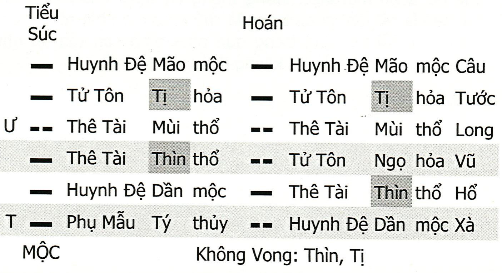
    - **Hình này chứng minh điều gì**
      - Người nữ chắc chắn đến nơi hẹn; hai người cùng lên đường gặp nhau tại nhà hàng Tịnh Châu ở hướng Tây Nam cách 700 mét.
    - **Từ đâu mà thấy được**
      - Thê Tài Thìn thổ động khắc Thế Tý thủy (Dụng khắc Thế tất đến); Thìn và Tý động bán hợp khuyết Thân kim (Tây Nam, số 7, Phụ Mẫu chủ nhà hàng).
- Luận giải nâng cao bằng diệu pháp "Hư nhất đãi dụng" (Thiếu một chờ dùng):
  - Nhận thấy hào Tài Thìn thổ và hào Thế Tý thủy đều phát động, kết hợp thành bán hợp cục (Thân - Tý - Thìn Thủy cục), ở trạng thái "hư nhất đãi dụng" (thiếu một chi để hợp cục hoàn chỉnh).
  - Bản chất một cuộc hẹn hò đòi hỏi phải hội tụ đủ 3 điều kiện cấu thành: bên nam, bên nữ và địa điểm hẹn gặp.
  - Trong quẻ: Hào Tài Thìn thổ đại diện cho bên nữ, hào Thế Tý thủy đại diện cho người nam xin đoán; địa chi còn khuyết trong tam hợp cục chính là Thân kim, đóng vai trò đại diện cho địa điểm hẹn hò.
  - Định vị không gian và địa điểm từ địa chi khuyết Thân kim:
    - Thân kim thuộc phương vị Tây Nam.
    - Tiên thiên số của Thân là 7. Dựa vào hoàn cảnh thực tế xung quanh lúc xin đoán, khoảng cách không thể là 7 mét hay 70 mét quá gần, mà cự ly 700 mét chính là vị trí quảng trường trung tâm thành phố.
    - Tam hợp cục hóa Thủy cục là Phụ Mẫu (đối với bản quẻ), Phụ Mẫu chủ phòng ốc, kiến trúc; tam hợp mang nghĩa "hợp tịnh" (hội tụ, tụ họp).
    - Tác giả chợt nhớ ra tại vị trí quảng trường trung tâm đó có nhà hàng Tịnh Châu, liền kết hợp các dữ kiện buột miệng phán đoán.
- Đối thoại thực tế và diễn biến ứng nghiệm:
  - Tác giả khẳng định với đương số: "Cuộc hẹn này không phải là cô ấy đến tìm anh, cũng không phải là anh đi tìm cô ấy, mà là hai người đều lên đường, hẹn gặp nhau ở một nơi; nơi này ở hướng Tây Nam, cách đây khoảng 700 mét, phỏng đoán là nhà hàng Tịnh Châu."
  - Người nam kinh ngạc thốt lên: "Quẻ này thật chính xác, nơi chúng tôi hẹn nhau đúng là nhà hàng Tịnh Châu."
  - Ứng nghiệm thực tế: Sau đó người nữ quả nhiên đã đến đúng nơi hẹn là nhà hàng Tịnh Châu.
  - Bình chú học thuật: Đây là diệu dụng phi phàm của tam hợp cục biến hóa từ lý thuyết "hư nhất đãi dụng", nếu không nắm vững bí pháp này thì việc đoán quẻ sẽ rất nhạt nhẽo và bỏ sót chi tiết cốt lõi.

### Ví Dụ 2: Đi Đón Thầy Mệnh Lý Hách Kim Dương Đến Thị Xã (Phong Hỏa Gia Nhân biến Phong Địa Quan)

- Bối cảnh và dữ kiện quẻ:
  - Thời gian dự đoán: Ngày Giáp Thân, tháng Bính Ngọ, năm Đinh Sửu.
  - Tuần không: Ngọ, Mùi.
  - Bằng hữu là Đoàn Kiến Nghiệp chuẩn bị lái xe đi đón thầy mệnh lý Hách Kim Dương đến thị xã, gieo quẻ hỏi tình hình xuất hành chuyến đi.
  - Quẻ gieo được: Phong Hỏa Gia Nhân biến Phong Địa Quan.
- Phân tích Dụng thần và tính chất của chuyến đi:
  - Hách tiên sinh là người phiêu bạt nay đây mai đó, suốt đời lấy nghề đoán mệnh làm sự nghiệp mưu sinh (du phương thuật sĩ), do đó lấy hào Tử Tôn làm Dụng thần (cũng có thể coi hào Ứng là Dụng thần; sau này khi bái Hách tiên sinh làm thầy thì lúc đoán mới đổi sang lấy Phụ Mẫu làm Dụng thần).
  - Hào Ứng Tử Tôn Tị hỏa vượng tướng (được Nguyệt kiến Ngọ hỏa trợ lực), sinh trợ cho hào Thế Thê Tài Sửu thổ, báo trước chuyến đi nhất định sẽ đón được người.
  - Tử Tôn Tị hỏa tuy hợp với Nhật thần Thân kim (Tị Thân lục hợp gây ràng buộc), nhưng trong quẻ có hào 3 Phụ Mẫu Hợi thủy phát động xung Tị hỏa, tạo thành thế "hợp xứ phùng xung" (đang hợp gặp xung thì giải hợp), do đó mối ràng buộc được hóa giải, không gây trở ngại cho việc đón người.
- Nhận định cản trở giao thông và diệu dụng Tam Hợp Cục:
  - **Hình 35.** Quẻ Phong Hỏa Gia Nhân biến Phong Địa Quan
    - 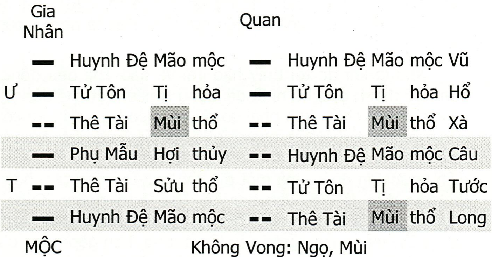
    - **Hình này chứng minh điều gì**
      - Đón được Hách tiên sinh đến thị xã, nhưng trên đường lái xe đi đón sẽ gặp sự cố tắc đường nghiêm trọng tại một ngã ba đường do đám đông tụ tập gây rối.
    - **Từ đâu mà thấy được**
      - Hào Ứng Tử Tôn Tị hỏa sinh Thế (đón được người); nội quái Hợi Mão Mùi động hóa Huynh Đệ mộc cục khắc Thế Sửu thổ; hào sơ Mão mộc (cước lực, ngã ba) là Tử địa của Phụ Mẫu (xe cộ).
- Luận giải nguyên nhân tắc đường và cản trở thực tế:
  - Điểm hung trong quẻ là Huynh Đệ Mão mộc phát động, liên kết với Phụ Mẫu Hợi thủy động và hào biến Mùi thổ tạo thành tam hợp Hợi Mão Mùi Huynh Đệ mộc cục khắc hào Thế Sửu thổ.
  - May mắn hào Thế Thê Tài Sửu thổ vượng tướng (tháng Ngọ sinh vượng), trong khi Mão mộc vào tháng Ngọ mùa hạ thuộc trạng thái hưu tù, nên lực khắc chế suy giảm, không gây đại hung nguy hiểm đến tính mạng.
  - Khẩu quyết cổ thư: "Huynh động tắc hữu trở" (Huynh Đệ phát động tất có sự cản trở, ngưng trệ). Huynh Đệ tam hợp cục chủ một đám đông quần chúng tụ tập đông đúc.
  - Biểu tượng xe cộ và đường sá: Hào Phụ Mẫu chủ xe cộ; Mão mộc chính là đất Tử của Phụ Mẫu Hợi thủy (Hợi mộc dục tại Tý, tử tại Mão); Huynh Đệ Mão mộc lại phát động ở hào sơ (hào sơ tượng trưng cho cước lực, bánh xe, mặt đường chân đi). Đây là điềm báo phương tiện xuất hành bị ngăn trở không thể lăn bánh.
  - Tác giả cảnh báo bạn hữu: Lần này lái xe đi đón Hách tiên sinh e rằng sẽ bị tắc nghẽn giao thông tại một ngã ba đường.
- Diễn biến và ứng nghiệm thực tế:
  - Ngày hôm sau, Đoàn Kiến Nghiệp tự mình lái xe đi đón thầy Hách Kim Dương.
  - Khi xe chạy đến một ngã ba đường thì bất ngờ gặp một đoàn người tụ tập đông đúc gây rối, làm giao thông tê liệt hoàn toàn, xe không thể tiếp tục di chuyển.
  - Đoàn Kiến Nghiệp lập tức chuyển hướng, lái xe vòng sang con đường khác, kết quả cùng ngày hôm đó đã đón được Hách tiên sinh về thị xã an toàn.

### Ví Dụ 3: Người Nhật Bản Tại Bắc Kinh Đoán Sự Nghiệp (Hỏa Phong Đỉnh biến Hỏa Lôi Phệ Hạp)

- Bối cảnh và dữ kiện quẻ:
  - Thời gian dự đoán: Ngày Giáp Tý, tháng Bính Tuất, năm Canh Thìn.
  - Tuần không: Tuất, Hợi.
  - Một khách người Nhật Bản đang ở Bắc Kinh đến xem bói về sự nghiệp và tiền đồ kinh doanh.
  - Quẻ gieo được: Hỏa Phong Đỉnh biến Hỏa Lôi Phệ Hạp.
- Định Dụng thần và phân tích tiền đồ kinh doanh:
  - Đoán sự nghiệp, công danh kinh doanh: Lấy hào Quan Quỷ làm Dụng thần, đồng thời kiêm khán hào Thê Tài.
  - Quan Quỷ Hợi thủy trì Thế, đắc Nhật thần Tý thủy đồng hành tương trợ, lại được hào 3 Thê Tài Dậu kim phát động sinh phù, báo hiệu tiền đồ sự nghiệp như gấm hoa rực rỡ, tài lộc dồi dào.
  - Hào Thế Quan Quỷ Hợi thủy đồng hào và tương hợp mật thiết với Phụ Mẫu Dần mộc do Thế động hóa ra (Hợi Dần lục hợp). Phụ Mẫu là cơ quan, văn phòng, nơi làm việc; hào Thế hợp Phụ Mẫu biểu thị nơi làm việc chính là công ty do chính bản thân đương số sáng lập và làm chủ.
- Nhận định sự nghiệp, tài lộc từ ba nơi và hôn kỳ:
  - **Hình 36.** Quẻ Hỏa Phong Đỉnh biến Hỏa Lôi Phệ Hạp
    - 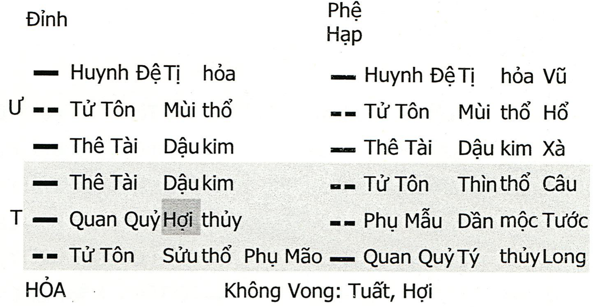
    - **Hình này chứng minh điều gì**
      - Đương số khởi nghiệp năm Ất Hợi (1995), đến năm Tân Tị (2001) sự nghiệp phát đạt thu hoạch tài lộc từ ba công ty/ba nơi; năm 2001 cũng là hôn kỳ kết hôn.
    - **Từ đâu mà thấy được**
      - Quan Quỷ Hợi thủy trì Thế Tuần Không (năm 1995 Thực Không khởi nghiệp, năm 2001 xung thực); Tị Dậu Sửu tam hợp Tài cục sinh Thế (tài từ 3 nơi, mở công ty thứ 3); Tài vượng Thế lâm Mộc Dục (năm 2001 Tài cục ứng hôn kỳ).
- Luận đoán ứng kỳ phát triển và nguồn tài ba nơi qua Tam Hợp Cục:
  - Hào Thế Quan Quỷ Hợi thủy lâm Tuần Không: Năm Ất Hợi (1995) hào Thế được "Thực Không" (lấp đầy chỗ Không), sự nghiệp bắt đầu khởi bước thành công.
  - Đến năm Tân Tị (2001), chi Tị xung thực hào Thế Hợi thủy (xung khởi hào Không).
  - Kết hợp với cấu trúc quẻ: Hào 3 Thê Tài Dậu kim động, kết hợp với hào sơ Tử Tôn Sửu thổ và hào biến Tị hỏa tạo thành tam hợp cục Tị Dậu Sửu kim cục (Tài cục) sinh trợ hào Thế; dự đoán đến năm Tân Tị (2001) sẽ thu được nguồn tài chính từ ba nơi khác nhau.
- Đối thoại thực tế xác minh quy mô doanh nghiệp:
  - Khách người Nhật xác nhận: Hiện tại ông đang sở hữu 2 công ty, mỗi năm đem lại lợi nhuận vài chục triệu tệ; từ năm sau ông có kế hoạch mở thêm một văn phòng thám tử tư nhân và hiện đang ráo riết tiến hành thủ tục thành lập. Đây chính là công ty thứ 3, hoàn toàn ứng hợp với điềm báo "tài đến từ ba nơi".
- Mở rộng phân tích hôn nhân và tình cảm:
  - Đương số hỏi thêm về tương lai hôn nhân.
  - Tác giả phân tích: Trong quẻ hào Thê Tài Dậu kim lưỡng hiện (hào 3 và hào 4); hào Thế Hợi thủy gặp Thê Tài Dậu kim là đất Mộc Dục (Mộc Dục chủ phong lưu, đào hoa, tửu sắc). Đoán đương số là người đa tình, bên cạnh luôn có nhiều bóng hồng vây quanh, từng chung sống với nhiều phụ nữ. Vấn đề không phải là khó tìm vợ, mà quan trọng là bản thân quyết định chọn kết hôn với ai mà thôi.
  - Hôn kỳ: Hào Thế Tuần Không, đến năm Tân Tị (2001) vừa xung thực hào Thế, vừa thành lập tam hợp Tị Dậu Sửu Tài cục (Thê Tài hợp cục sinh nhập hào Thế), đây chính là năm kết hôn của người này.
- Kết cục: Về sau không gặp lại người này nên kết quả kết hôn không có điều kiện phối kiểm.

### Ví Dụ 4: Nam Đoán Lưu Niên Của Vợ Và Biến Động Sự Nghiệp (Địa Hỏa Minh Di biến Ly Vi Hỏa)

- Bối cảnh và dữ kiện quẻ:
  - Thời gian dự đoán: Ngày Giáp Thân, tháng Kỷ Tị, năm Kỷ Mão.
  - Tuần không: Ngọ, Mùi.
  - Một người đàn ông đến gieo quẻ hỏi về lưu niên của vợ và tình hình sự nghiệp công tác của vợ.
  - Quẻ gieo được: Địa Hỏa Minh Di biến Ly Vi Hỏa.
- Phân tích Dụng thần và nhận diện nghề nghiệp của người vợ:
  - Lấy hào Thế Quan Quỷ Sửu thổ làm Dụng thần, kiêm xem hào 2 Quan Quỷ Sửu thổ.
  - Hào Quan Quỷ lâm Chu Tước và Đằng Xà: Chu Tước chủ văn thư, chữ nghĩa, giảng dạy; Đằng Xà chủ kỹ nghệ, tài năng chuyên môn; bản thân Quan Quỷ Sửu thổ lại là Mộ khố của Phụ Mẫu (Dậu kim mộ ở Sửu), Phụ Mẫu cũng chủ giấy tờ, sách vở, văn thư.
  - Tượng hào hội tụ đầy đủ đặc điểm của người quản lý văn thư, sách vở. Tác giả phán đoán vợ anh ta làm nghề cô giáo dạy học hoặc nhân viên thư viện.
  - Người chồng liền xác nhận: Vợ anh ta làm nghề cô giáo.
- Nhận định biến động công tác, trường học sáp nhập và phân cấp giảng dạy:
  - **Hình 37.** Sơ đồ quẻ Địa Hỏa Minh Di biến Ly Vi Hỏa
    - 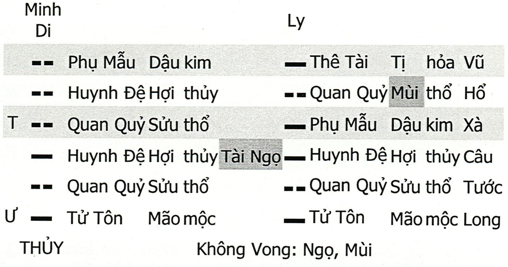
    - **Hình này chứng minh điều gì**
      - Trường học của vợ sẽ mở rộng sáp nhập với trường khác khiến công việc thay đổi; sau khi sáp nhập thì vợ sẽ chuyển lên giảng dạy cấp 3.
    - **Từ đâu mà thấy được**
      - Quan Quỷ Sửu thổ động chủ biến động công tác; ngoại quái Tị Dậu Sửu tam hợp Phụ Mẫu cục (trường học sáp nhập mở rộng); Quan Quỷ Sửu thổ lưỡng hiện ở hào 2 (cấp 2) và hào 4 trì Thế phát động (cấp 3).
- Diệu dụng Tam Hợp Cục luận sáp nhập trường học và cấp bậc giảng dạy:
  - Quan Quỷ là chức nghiệp, công tác; hào Quan Quỷ phát động biểu thị công tác sắp xảy ra biến động lớn.
  - Ở ngoại quái, hào 6 Phụ Mẫu Dậu kim biến Thê Tài Tị hỏa, hào 4 Quan Quỷ Sửu thổ biến Phụ Mẫu Dậu kim -> Ngoại quái hình thành tam hợp Tị Dậu Sửu Phụ Mẫu kim cục.
  - Phụ Mẫu chủ đơn vị công tác, cơ quan; vì vợ làm cô giáo nên Phụ Mẫu đại diện cho trường học. Tam hợp cục chủ sự hợp nhất, sáp nhập, quy tụ nhiều đơn vị làm một.
  - Tác giả phán: "Trường học của vợ anh có biến động lớn, năm nay trường học sẽ mở rộng, sẽ sáp nhập với trường khác. Vì vậy, công việc của vợ anh cũng sẽ có thay đổi."
- Đối thoại thực tế phân biệt cấp 2 và cấp 3:
  - Người chồng kinh ngạc đáp: "Đúng là tôi hỏi chuyện này, không biết là sau khi sáp nhập thì cô ấy dạy cấp 3 hay là cấp 2?"
  - Lập luận phân biệt theo hào vị:
    - Trong quẻ có Quan Quỷ Sửu thổ lưỡng hiện: Hào 2 (thuộc nội quái, bậc thấp) đại diện cho trường cấp 2; hào 4 (thuộc ngoại quái, bậc cao) đại diện cho trường cấp 3.
    - Do hào Thế đóng tại hào 4, chính hào 4 Quan Quỷ Sửu thổ này phát động biến chuyển, nên sau khi sáp nhập trường học, vợ anh ta chắc chắn sẽ chuyển lên giảng dạy ở cấp 3.
- Ứng nghiệm thực tế:
  - Diễn biến ngoài đời thực xảy ra hoàn toàn chính xác đúng như lời dự đoán.

### Ví Dụ 5: Cô Lý Đoán Cháu Trai Bị Điếc Có Thể Trị Khỏi Không (Hỏa Trạch Khuê biến Sơn Phong Cổ)

- Bối cảnh và dữ kiện quẻ:
  - Thời gian dự đoán: Ngày Đinh Hợi, tháng Bính Thìn, năm Mậu Dần.
  - Tuần không: Ngọ, Mùi.
  - Cô Lý đến hỏi xem đứa cháu trai bị điếc có thể chữa khỏi được không, và có phương pháp nào tốt để điều trị hay không?
  - Quẻ gieo được: Hỏa Trạch Khuê biến Sơn Phong Cổ.
- Xác định bệnh tình của cháu qua cấu trúc Dụng thần:
  - Xem bệnh tật cho con cháu: Lấy Tử Tôn Dậu kim làm Dụng thần.
  - Dụng thần Dậu kim gặp Nhật thần Hợi thủy là đất Bệnh (Kim sinh Hợi thủy, lâm Bệnh địa); trong ngũ hành, Kim chủ âm thanh, tiếng nói. Kim lâm Bệnh địa nghĩa là âm thanh có bệnh, tai không nghe được âm thanh, triệu chứng hoàn toàn trùng khớp với tật điếc.
  - Dụng thần Dậu kim được Nguyệt kiến Thìn thổ đến hợp (Thìn Dậu lục hợp), hợp chủ dằng dai, kéo dài, chứng tỏ đây là bệnh lâu ngày (bệnh kinh niên).
  - Địa chi hợp Thìn thổ là đất Dưỡng của Kim; hào Thai nằm ở Quan Quỷ Mão mộc; bệnh tật hình thành ngay từ giai đoạn mang thai và dưỡng thai, cho thấy đây là chứng điếc bẩm sinh.
  - Dậu kim lại nhập Mộ tại Nguyệt kiến Thìn thổ; hào 5 Huynh Đệ Mùi thổ là Nguyên thần sinh Kim lại lâm Tuần Không. Hào 5 tượng trưng cho ngũ quan (tai, mắt, mũi, miệng); Nguyên thần không thể sinh Kim tức ngũ quan không phát ra và không tiếp nhận được âm thanh, chứng tỏ bệnh điếc đặc biệt nghiêm trọng.
- Nhận định tiền sử phẫu thuật thất bại và phương pháp điều trị:
  - **Hình 38.** Sơ đồ quẻ Hỏa Trạch Khuê biến Sơn Phong Cổ
    - 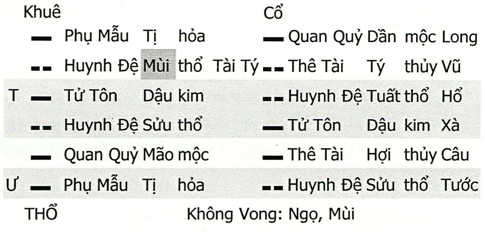
    - **Hình này chứng minh điều gì**
      - Cháu trai bị điếc bẩm sinh, từng phẫu thuật tai thất bại gây thủng màng nhĩ; áp dụng phương pháp đun nước đá nam châm uống giúp bệnh tình cải thiện.
    - **Từ đâu mà thấy được**
      - Dậu kim lâm Bệnh địa hợp Nguyệt Dưỡng Thai (điếc bẩm sinh); Thế lâm Bạch Hổ động hóa Nguyên thần Tuất thổ Nguyệt phá (phẫu thuật thất bại); Tị Dậu Sửu tam hợp Tử Tôn kim cục (nam châm hút kim tụ hội, trị nhĩ lung).
- Lập luận về phẫu thuật thất bại và phát hiện diệu phương từ Tam Hợp Cục:
  - Hào Thế Tử Tôn Dậu kim phát động hóa hồi đầu sinh (hóa Huynh Đệ Tuất thổ sinh Dậu kim), chứng tỏ gia đình đã từng tích cực tìm thầy tìm thuốc chạy chữa.
  - Tử Tôn lâm Bạch Hổ phát động: Bạch Hổ chủ huyết quang, đao kéo, mổ xẻ, biểu thị cháu bé đã từng trải qua phẫu thuật. Nhưng hào biến Tuất thổ bị Nguyệt kiến Thìn thổ xung phá thành Nguyệt phá, Nguyên thần hóa phá thì vô lực sinh trợ, báo hiệu ca phẫu thuật trước đây chắc chắn đã thất bại.
  - Tìm phương thuốc cứu chữa: Hào Tử Tôn chủ về y dược, phương thuốc. Trong quẻ có Tị Dậu Sửu (sơ hào Tị hỏa, hào 4 Thế Dậu kim, hào 3 Sửu thổ phát động biến) kết thành tam hợp Tử Tôn kim cục.
  - Phân tích tượng tam hợp kim cục: Tam hợp Kim cục có nghĩa là quy tụ, hút gom các vật phẩm kim loại lại một nơi. Vật thể có năng lực hút sắt gom kim loại tụ lại chính là đá nam châm (từ thạch).
  - Theo y học cổ truyền, từ thạch (nam châm) có tính hàn, quy can thận, có công năng trấn kinh an thần, thông quan khai khiếu và chuyên trị chứng tai ù, tai điếc (nhĩ minh, nhĩ lung).
  - Tác giả căn dặn cô Lý: Hãy lấy viên đá nam châm bỏ vào trong nước sạch, đun sôi kỹ lấy nước đó cho cháu bé uống hàng ngày thì sẽ thấy chuyển biến hiệu nghiệm.
- Đối thoại và ứng nghiệm thực tế:
  - Qua thẩm tra thực tế, cô Lý xác nhận cháu trai đúng là bị điếc bẩm sinh từ nhỏ. Gia đình trước đây đã từng cho cháu đi phẫu thuật tai, nhưng không những không khỏi mà bác sĩ còn làm thủng màng nhĩ của đứa trẻ.
  - Sau khi nghe lời dặn của tác giả, gia đình về nhà kiên trì lấy đá nam châm đun nước cho cháu uống, một thời gian sau thính lực của cháu bé quả nhiên đã có cải thiện đôi chút.

### Ví Dụ 6: Dự Đoán Động Đất Trên Thế Giới Đến Tiết Tiểu Thử (Trạch Địa Tụy biến Thiên Phong Cấu)

- Bối cảnh và dữ kiện quẻ:
  - Thời gian dự đoán: Ngày Ất Hợi, tháng Đinh Tị, năm Mậu Dần.
  - Tuần không: Thân, Dậu.
  - Tác giả chủ động gieo quẻ dự đoán xem từ hôm nay cho đến tiết Tiểu Thử, trên thế giới có xảy ra động đất hay không.
  - Quẻ gieo được: Trạch Địa Tụy biến Thiên Phong Cấu.
- Lý luận học thuật về phương pháp chọn Dụng thần đoán động đất:
  - Bốn tiêu chí cốt lõi để nhận diện địa chấn:
    1. Hào Đằng Xà: Đằng Xà chủ sự kinh dị, quái dị, biến cố bất thường; Đằng Xà phát động tất có động đất.
    2. Hào Câu Trần: Câu Trần chủ về điền thổ, đất đai, nhà cửa, công trình xây dựng; Câu Trần phát động thì mặt đất và nhà cửa rung chuyển dữ dội, là thông tin địa chấn.
    3. Hào Quan Quỷ: Quan Quỷ chủ tai họa, hung hiểm; dự đoán động đất mà Quan Quỷ phát động là dấu hiệu tai họa địa chấn ập đến.
    4. Hào Thê Tài: Thê Tài là hào khắc chế Phụ Mẫu; Phụ Mẫu chủ nhà cửa kiến trúc, đất đai thổ nhưỡng. Thê Tài phát động làm Phụ Mẫu bị thương tổn nặng nề; đồng thời Thê Tài phát động lại sinh trợ Quan Quỷ hung thần, làm tai họa bùng phát dữ dội.
  - Phê phán sai lầm của một số sách:
    - Một số tài liệu cho rằng đoán động đất phải xem Thanh Long và Thìn thổ vì coi là "đại xà", đây là quan điểm hoàn toàn vô căn cứ, không dựa trên nền tảng Dịch học bát quái.
    - Cổ nhân lấy Đằng Xà chủ động đất vì Đằng Xà mang bản chất kinh dị, biến dị chứ địa chấn hoàn toàn không liên quan gì đến long xà (rồng rắn).
    - Không cần câu nệ cứ phải quẻ Khôn mới có động đất; bất cứ quẻ nào cũng đều phản ánh thông tin địa chấn. Phải lấy nơi dự đoán làm tâm điểm tọa độ để phân định phương vị địa chấn.
- Nhận định dấu hiệu địa chấn, phương vị, cấp độ và thời gian:
  - **Hình 39.** Sơ đồ quẻ Trạch Địa Tụy biến Thiên Phong Cấu
    - 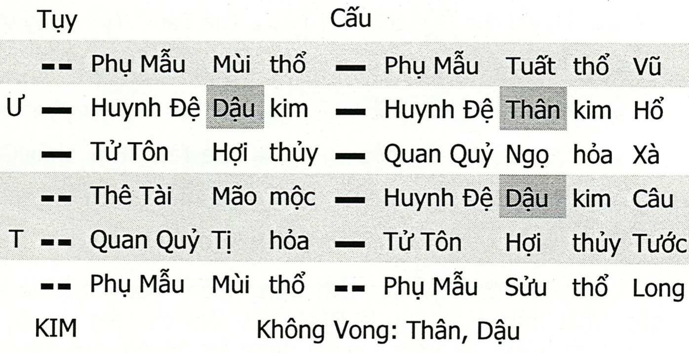
    - **Hình này chứng minh điều gì**
      - Thế giới xảy ra nhiều trận động đất lớn lặp đi lặp lại: hướng Tây Nam cấp 7.3, trong nước và hướng Tây Bắc khoảng cấp 6.5, với 3 ngày ứng kỳ then chốt.
    - **Từ đâu mà thấy được**
      - Hợi Mão Mùi tam hợp Tài cục lâm Câu Trần khắc Phụ Mẫu Mùi thổ (Tây Nam, Khôn 8 + Ất Mão 14 = 22 / 3 = 7.3); Quan Quỷ Tị hỏa Thế phản ngâm (Tây Bắc, Càn 1 + Ất Tị 12 = 13 / 2 = 6.5); nội quái phản ngâm chủ lặp lại nhiều lần.
- Phân tích chi tiết phương vị và công thức tính cấp độ động đất (Độ Richter):
  - Dấu hiệu địa chấn trong quẻ: Thê Tài Mão mộc lâm Câu Trần phát động, đồng thời Quan Quỷ Tị hỏa lâm Chu Tước trì Thế phát động.
  - Tam Hợp Tài Cục khắc Phụ Mẫu: Trong quẻ có Nhật thần Hợi thủy, hào 3 Thê Tài Mão mộc phát động và hào sơ Phụ Mẫu Mùi thổ hợp thành Hợi Mão Mùi tam hợp Thê Tài mộc cục; lâm Câu Trần phát động khắc mạnh Phụ Mẫu Mùi thổ, báo hiệu địa chấn tập trung xảy ra gần đây.
  - Nội quái phản ngâm: Nội quái Địa biến Phong phản ngâm, tượng trưng cho sự rung chuyển lặp đi lặp lại, có những vùng sẽ phải hứng chịu dư chấn hoặc động đất nhiều lần.
  - Dự đoán động đất ở hướng Tây Nam:
    - Hào sơ Phụ Mẫu Mùi thổ bị Hợi Mão Mùi Tài cục khắc. Mùi thuộc phương Tây Nam, quẻ biến Khôn cũng là Tây Nam -> Hướng Tây Nam sẽ xảy ra động đất.
    - Hào Thê Tài hợp cục lại đắc Trường Sinh tại Nhật thần Hợi thủy, năng lượng cực vượng nên cấp độ động đất sẽ rất lớn.
    - Công thức số học tính cấp độ: Lấy can chi hào động Thê Tài Ất Mão: số tiên thiên của Can Ất là 8, Chi Mão là 6; cộng thêm quái số của phương vị Tây Nam (Khôn vi Địa) là 8. Tổng số: 8 + 6 + 8 = 22. Lấy 22 chia cho 3 được thương số 7.33. Kết luận: Hướng Tây Nam có động đất khoảng cấp 7.3.
  - Dự đoán động đất trong nước và hướng Tây Bắc:
    - Quan Quỷ Tị hỏa trì Thế phát động ở nội quái: Hào Thế tọa nội quái đại diện cho nước sở tại (Trung Quốc), báo hiệu trong nước cũng sẽ xảy ra động đất.
    - Thời gian: Quan Quỷ lâm Nguyệt kiến Tị hỏa, động đất chủ yếu phát sinh trong tháng Tị (từ ngày gieo quẻ đến tiết Mang Chủng); sang tháng Ngọ hỏa Quan Quỷ vẫn vượng tướng, không loại trừ khả năng động đất tiếp diễn.
    - Phía Tây của Thái Nguyên: Huynh Đệ Dậu kim bị hỏa khắc nhưng Dậu kim lâm Tuần Không, "Không bất thụ khắc" nên phía Tây Thái Nguyên không có động đất.
    - Hướng Tây Bắc: Quan Quỷ Tị hỏa vốn chủ Đông Nam, nhưng bị Nhật thần Hợi thủy xung khắc, lại động hóa Hợi thủy hồi đầu khắc thành phản ngâm (tiếng rên rỉ ngược chiều), đổi hướng ngược lại chỉ phương Tây Bắc.
    - Công thức số học tính cấp độ Tây Bắc: Can chi của hào là Ất Tị: Ất số 8, Tị số 4; cộng quái số phương vị Tây Bắc (Càn vi Thiên) là 1. Tổng số: 8 + 4 + 1 = 13. Lấy 13 chia cho 2 được 6.5. Kết luận: Hướng Tây Bắc có động đất khoảng cấp 6.5.
- Xác định 3 ngày ứng kỳ động đất cao nhất:
  - Ngày thứ nhất: Hào Thê Tài Mão mộc nhập Mộ ở hào 6 Phụ Mẫu Mùi thổ; vào ngày Sửu xung khai Mộ khố (Sửu Mùi xung) sẽ phát sinh động đất.
  - Ngày thứ hai: Hào Thê Tài Mão mộc động hóa Dậu kim hồi đầu khắc; vào ngày Thìn hợp trú Dậu kim (Thìn Dậu hợp) giải phóng Mão mộc khỏi bị khắc, tạo ứng kỳ động đất.
  - Ngày thứ ba: Quan Quỷ Tị hỏa động hóa Hợi thủy hồi đầu xung khắc; vào ngày Dần hợp trú Hợi thủy (Dần Hợi hợp), Tị hỏa vừa thoát khỏi bị xung khắc vừa đắc đất Trường Sinh, là thời điểm động đất bùng phát.
- Ứng nghiệm thực tế trên thế giới:
  - Ngày Bính Tý tháng Tị: Tại Bì Sơn và Mặc Ngọc thuộc khu tự trị Tân Cương (phía Tây Bắc Trung Quốc), trong cùng một ngày xảy ra liên tiếp 2 trận động đất có cường độ cấp 6.2 và cấp 5.5.
  - Ngày Đinh Sửu tháng Tị: Khu vực lân cận biên giới Afghanistan và Pakistan (phương Tây Nam) xảy ra trận động đất kinh hoàng cấp 7.1 (dự đoán cấp 7.3).
  - Ngày Ất Tị tháng Ngọ: Tại Thổ Nhĩ Kỳ xảy ra động đất mạnh cấp 6.3 (dự đoán cấp 6.5).
- Đánh giá tổng kết:
  - Dù ứng kỳ ngày có sự sai số nhỏ, nhưng phương vị địa lý và cường độ chấn động thực tế vô cùng khớp với kết quả suy toán Dịch học.
  - Nếu đi sâu nghiên cứu phương pháp luận này một cách khoa học và hệ thống, Dịch học Lục hào hoàn toàn có thể tạo nên những bước đột phá to lớn hơn nữa trong việc cảnh báo thiên tai.

## Chương 7: Bán Hợp Biện Nghĩa

### Khái niệm và ý nghĩa bản thể của Bán Hợp Cục

- Sai lầm phổ biến khi luận giải bán hợp cục trong Lục Hào:
  - Khi nhắc đến tam hợp cục khuyết một chi tạo thành bán hợp cục, đa số người học thuật số đều liên tưởng ngay đến quy tắc ứng kỳ "hư nhất đãi dụng" (thiếu một chữ thì đợi chữ đó xuất hiện để hoàn thành hợp cục).
  - Khái niệm "hư nhất đãi dụng" thực chất chỉ là một phương pháp định ứng kỳ về mặt thời gian, hoàn toàn không phải là ý nghĩa bản thể đích thực của bản thân bán hợp.
- Ý nghĩa biểu thị phong phú của bán hợp cục qua thực tiễn chiêm nghiệm:
  - Tác giả khẳng định qua hàng loạt quẻ dịch thực tế, bán hợp tự thân nó hàm chứa nhiều tầng ý nghĩa biểu tượng cụ thể trong đời sống:
    - Một nửa (phân bán, nắm được một nửa hoặc giải quyết được một nửa).
    - Một bộ phận (không đại diện cho toàn thể mà chỉ là một phần cấu thành).
    - Kiêm chức (đảm nhiệm thêm một vị trí hoặc phần việc thứ hai).
    - Phân tâm, phân thần, bận tâm, không tập trung hết toàn bộ tinh thần vào một đối tượng duy nhất.
    - Miễn cưỡng, lúng túng khi xử lý tình huống.
    - Giữa đường, nửa chừng (dở dang hoặc phát sinh thay đổi lộ trình khi đang thực hiện).

### Ví dụ 1: Chiêm đoán cát hung dẫn đoàn du khách Nga (Quẻ Lôi Phong Hằng biến Chấn Vi Lôi)

#### Bối cảnh xuất hành và thiết lập quẻ số
- Bối cảnh thực tế: Ngày Nhâm Dần, tháng Giáp Thìn, năm Đinh Sửu (Tuần không: Thìn, Tị).
- Sự việc phát sinh: Công ty du lịch bị thiếu nhân viên hướng dẫn nên nhờ tác giả dẫn một đoàn khách du lịch người Nga đi tham quan tuyến Ngũ Đài Sơn - Hồn Nguyên - Đại Đồng.
- Mục đích gieo quẻ: Tác giả gieo quẻ để dự đoán cát hung lành dữ cho chuyến đi này, thu được quẻ Lôi Phong Hằng biến Chấn Vi Lôi.

#### Lập luận hào vị và ý nghĩa Bán Hợp
- Xác định Dụng thần: Lấy hào Thế làm Dụng thần để xem xét toàn diện sự an nguy và thuận nghịch của bản thân người xuất hành.
- Đánh giá tổng quan về bình an:
  - Hào 3 Quan Quỷ Dậu kim trì Thế đắc Nguyệt kiến Thìn thổ sinh hợp (Thìn Dậu lục hợp).
  - Hào Thế phát động hóa Thê Tài Thìn thổ là hóa hồi đầu sinh.
  - Nhờ có sinh hợp và hồi đầu sinh trợ lực vững chắc, chuyến đi chắc chắn không xảy ra tai họa đại hung.
- Dự đoán khẩu thiệt và trục trặc trên đường:
  - Hào Thế lâm Quan Quỷ lại phát động, đồng thời đè Chu Tước chủ về khẩu thiệt thị phi, đoán định tất sẽ nổ ra cãi vã, tranh chấp nảy lửa.
  - Hào 5 Quan Quỷ Thân kim ám động (nhờ Nguyệt sinh vượng, bị Nhật thần Dần mộc xung thành ám động) lại lâm Đằng Xà; Đằng Xà chủ về kinh dị, quái dị, biến dị; hào 5 là đường sá lộ vị, ám động chủ về trên đường đi phát sinh trắc trở, biến cố lôi thôi.
  - Ý nghĩa bán hợp: Hào Thế Dậu kim và hào sơ Thê Tài Sửu thổ tạo thành bán hợp Tị Dậu Sửu kim cục; bán hợp chủ về "phân nửa", do đó nguyên nhân tranh cãi phân nửa là bắt nguồn từ khúc mắc tiền tài.
- Phân tích cát hung chuyến đi qua tượng hào Thế và biến hóa bán hợp trên quẻ Lôi Phong Hằng biến Chấn Vi Lôi:
  - **Hình 40.** Sơ đồ quẻ Lôi Phong Hằng biến Chấn Vi Lôi
    - 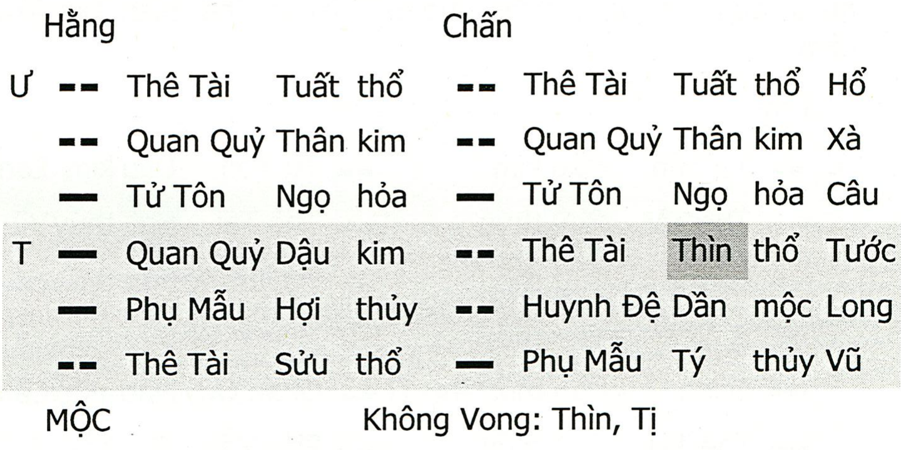
    - **Hình này chứng minh điều gì**
      - Dự đoán chuyến đi gặp trục trặc trắc trở giữa đường, tranh cãi vì tiền bạc nhưng bản thân bình an vô sự.
    - **Từ đâu mà thấy được**
      - Thế Dậu kim đắc Nguyệt sinh hợp hóa hồi đầu sinh; hào 5 Thân kim ám động lâm Xà; Thế hợp Tài Sửu thổ bán hợp.

#### Diễn biến tranh chấp và ứng nghiệm thực tế
- Trục trặc thời tiết phá vỡ lộ trình: Sau khi đoàn hoàn tất tham quan Ngũ Đài Sơn, trời đổ mưa lớn khiến đoạn đường huyết mạch từ Ngũ Đài Sơn sang Hồn Nguyên bị sạt lở hư hỏng hoàn toàn, không thể thông xe.
- Đổi tuyến và xung đột tiền bạc với khách:
  - Ban tổ chức buộc phải hủy chặng Hồn Nguyên, đổi sang tuyến Ngũ Đài Sơn - Ứng huyện - Đại Đồng.
  - Du khách người Nga vô cùng bất mãn và nổ ra cãi cọ dữ dội với tác giả: Họ khẳng định bỏ tiền ra là để đi Hồn Nguyên, một số du khách trước đó đã đi Ứng huyện nên kiên quyết không chấp nhận mất tiền chỉ để xem lại cảnh cũ trùng lặp.
  - Tác giả phân trần bản thân chỉ tạm thời hỗ trợ dẫn đoàn cho công ty du lịch, quyết định chuyển hướng là giải pháp bất khả kháng sau khi đã xin ý kiến chỉ đạo từ công ty.
- Giải quyết bằng hoàn trả một phần chi phí: Cuối cùng công ty đồng ý hoàn trả cho khách một phần tiền tour, việc đổi tuyến mới được thông qua ổn thỏa (ứng đúng tượng bán hợp mất một phần tiền bạc).
- Đúc kết chiêm nghiệm: Tác giả nghiệm ra rằng hào 5 đại diện cho đường sá, hào 5 ám động chính là phát sinh biến đổi hành trình giữa chừng.

### Ví dụ 2: Nữ sĩ đoán tài vận qua các năm (Quẻ Địa Thiên Thái biến Địa Trạch Lâm)

#### Bối cảnh vấn sự và giải đoán tổng quan
- Bối cảnh thời gian: Ngày Đinh Mão, tháng Ất Tị, năm Đinh Sửu (Tuần không: Tuất, Hợi).
- Đối tượng chiêm bói: Một nữ sĩ đến nhờ xem tài vận tổng quát. Gieo được quẻ Địa Thiên Thái biến Địa Trạch Lâm.
- Xác định Dụng thần: Lấy hào Thê Tài làm Dụng thần cứu xét.
- Bề nổi thoạt nhìn tưởng xấu: Hào Thê Tài Hợi thủy suy yếu hưu tù, vừa lâm Tuần Không lại bị Nguyệt kiến Tị hỏa xung phá thành Nguyệt phá; quẻ lại có Huynh Đệ Thìn thổ trì Thế phát động, người học sơ cơ rất dễ kết luận quẻ này không có tài để cầu, chủ về phá tài hao hụt.
- Bản chất vi diệu bên trong quẻ:
  - Hào 6 Tử Tôn Dậu kim lâm Thanh Long ám động (Nhật thần Mão mộc xung hào Dậu kim vượng) tương sinh cho hào Tài.
  - Hào 3 Thế Huynh Đệ Thìn thổ chính là Thủy khố (Tài khố). Khi hào Thế là Tài khố phát động thì toàn bộ tiền tài quy về nhập khố của ta, phản ánh đây là người có năng lực kiếm tiền cực lớn, nắm trong tay số tài sản kếch xù.
  - Hào Thế (Thìn thổ) và hào Ứng (Dậu kim) tương hợp: Thế Ứng hợp nhau biểu thị liên kết hợp tác với người khác để cầu tài; một bên minh động (Thế phát động), một bên ám động (Ứng ám động) là tượng một minh một ám kết hợp hết sức chặt chẽ.

#### Luận giải chi tiết tài vận từng lưu niên
- Giai đoạn khởi nghiệp và bùng nổ:
  - Năm 1992 (Nhâm Thân): Chi Thân kim là đất Trường Sinh của hào Thê Tài Thủy, tiền bạc bắt đầu khởi sắc, bước đầu gặt hái thành quả.
  - Năm 1993 (Quý Dậu): Thái Tuế Dậu kim hợp Thế Thìn thổ, bắt đầu cùng người khác chung tay tạo dựng sự nghiệp; bề ngoài trông như một mình đứng tên điều hành nhưng sau lưng luôn có người hậu thuẫn, tài vận đại phát.
  - Năm 1994 (Giáp Tuất): Tuất thổ tuy khắc Thủy Tài nhưng Thái Tuế Tuất xung khai Thìn thổ (xung khai Tài khố); Mộ khố bị xung mở nên dù tài vận có phần kém hơn năm 1993 đôi chút song vẫn gom về nguồn tiền rất lớn.
  - Năm 1995 (Ất Hợi): Hào Tài Hợi thủy gặp Thái Tuế Hợi ứng thực Không, thực Phá; tài khí hanh thông, thu hoạch dồi dào.
- Ứng dụng bán hợp và cảnh báo phương Nam:
  - Năm 1996 (Bính Tý): Chi Tý thủy bán hợp với hào Thế Thìn thổ (Thân Tý Thìn bán hợp Thủy cục); tuy kiếm được khoản lợi nhuận lớn nhưng số tiền thực tế thu về túi chỉ nhận được một nửa.
  - Năm 1997 (Đinh Sửu): Huynh Đệ Sửu thổ lâm Thái Tuế khắc chế hào Tài khiến tiền bạc bị ngưng trệ, cản trở; phương Nam thuộc Hỏa địa vừa khắc thương phúc thần Tử Tôn Dậu kim vừa tương trợ cho Kỵ thần Huynh Đệ thổ, năm nay cầu tài trăm bề bất lợi, tuyệt đối cấm kỵ đi về phương Nam mưu sự.
- Phân tích đường tài vận qua hào Tài quy khố và ứng dụng bán hợp từng năm trên quẻ Địa Thiên Thái biến Địa Trạch Lâm:
  - **Hình 41.** Quẻ Địa Thiên Thái biến Địa Trạch Lâm
    - 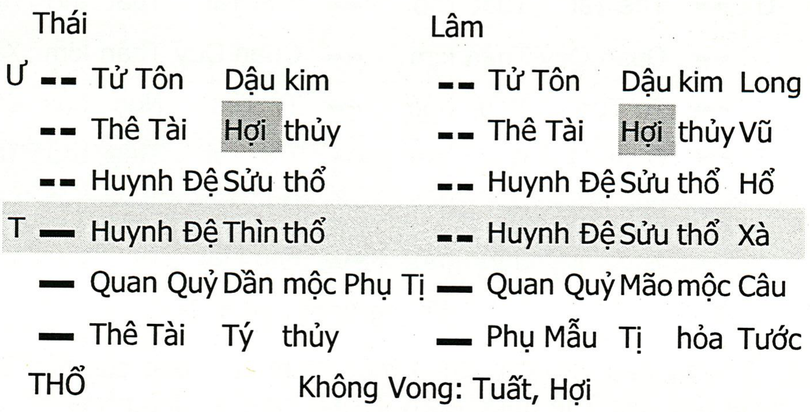
    - **Hình này chứng minh điều gì**
      - Dự đoán chuẩn xác từng mốc tài vận và hiện tượng năm Bính Tý kiếm được tiền lớn nhưng chỉ thu về một nửa.
    - **Từ đâu mà thấy được**
      - Thế Thìn thổ là Tài khố động nạp tài; Thế Ứng minh ám tương hợp; Bính Tý bán hợp với Thế Thìn thổ.

#### Diễn biến thực tế và bài học đầu tư phương Nam
- Phản hồi từ đương số:
  - Nữ sĩ hoàn toàn khâm phục tài đoán quẻ: Công việc làm ăn đúng là khởi sắc từ năm 1992; sang năm 1993 chính thức thành lập công ty, dựa vào quyền hạn phê duyệt quy hoạch bất động sản của chồng (người đứng sau bệ đỡ) để nhận vô số công trình dự án lớn.
  - Một người đứng ngoài sáng kinh doanh, một người trong tối cấp phép hỗ trợ, mỗi năm đều đặn thu về một đến hai trăm vạn tệ.
  - Sự ứng nghiệm kỳ lạ năm 1996: Các khoản thanh toán và lợi nhuận quả thực mới chỉ thu hồi được đúng một nửa tiền.
- Hậu quả của việc bất tuân khuyến cáo năm 1997:
  - Từ đầu năm Đinh Sửu đến thời điểm xem quẻ, công ty chưa hoàn thành được bất kỳ nghiệp vụ nào.
  - Vài ngày trước buổi xem bói, nữ sĩ đang xúc tiến rót vốn vào một dự án ở Hồ Nam (thuộc phương Nam). Mặc dù tác giả hết lời khuyên can dừng lại, do tâm lý nóng vội cầu tài nên cô vẫn cố tình đổ hơn 20 vạn tệ vào dự án; kết quả dự án hoàn toàn đình trệ không mang lại một đồng lợi nhuận, buộc phải ngậm ngùi rút lui toàn bộ vốn liếng.

### Ví dụ 3: Nam đoán tài vận năm Kỷ Mão (Quẻ Địa Thiên Thái biến Địa Thủy Sư)

#### Bối cảnh gieo quẻ và cấu trúc quẻ số
- Bối cảnh thời gian: Ngày Mậu Tý, tháng Giáp Tý, năm Mậu Dần (Tuần không: Ngọ, Mùi).
- Mục đích chiêm bói: Một người nam giới đến nhờ dự đoán tài vận cho năm sau là năm Kỷ Mão.
- Quái tượng: Thu được quẻ Địa Thiên Thái biến Địa Thủy Sư.

#### Luận giải nguồn tài và ứng kỳ xuất Không
- Dụng thần và năng lực bản thân:
  - Lấy hào Thê Tài làm Dụng thần.
  - Hào 3 Huynh Đệ Thìn thổ trì Thế phát động; Thìn thổ là Thủy khố (Tài khố), tượng trưng cho việc tài sản chung cuộc sẽ gom về tay mình, khẳng định người này rất có tài thao lược kinh doanh, vận tài lộc sáng sủa.
- Luận giải ý nghĩa bán hợp và đa nguồn tiền:
  - Hào Thế Thìn thổ và hào Thê Tài Tý thủy (ở hào sơ) kết thành bán hợp Thủy cục; đồng thời Thê Tài Tý thủy lại lâm vào cả Nhật thần lẫn Nguyệt kiến.
  - Tác giả đoán đương số hiện thời đã nắm chắc trong tay phân nửa nguồn tiền.
  - Hơn nữa tiền bạc đến từ nhiều nguồn dự án khác nhau chứ không gói gọn ở một nơi, nguyên nhân bởi một hào Thế Thìn thổ đi hợp với ba chữ Tý thủy (hào 1 Tý thủy, Nhật thần Tý thủy, Nguyệt kiến Tý thủy).
- Xác định ứng kỳ thu tiền: Hào Thế Thìn thổ động hóa Phụ Mẫu Ngọ hỏa gặp Tuần Không; động hóa Không cần chờ đến kỳ xung Không hoặc thực Không, do đó phải sang tháng Ngọ (tháng 5 âm lịch) năm Kỷ Mão mới chính thức thu hoạch tiền bạc về tay.
- Khảo sát quy mô gom tài và ứng kỳ thu hoạch dựa trên tượng Bán Hợp ở quẻ Địa Thiên Thái biến Địa Thủy Sư:
  - **Hình 42.** Sơ đồ quẻ Địa Thiên Thái biến Địa Thủy Sư
    - 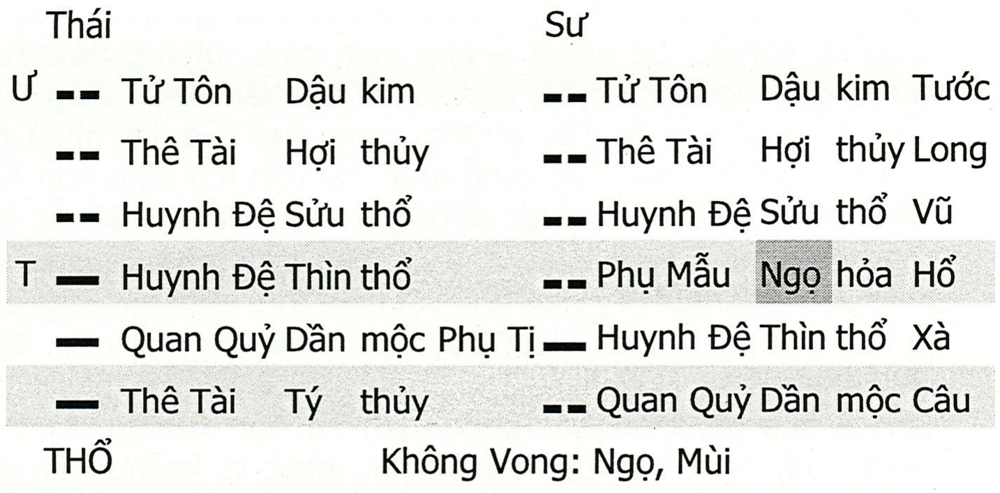
    - **Hình này chứng minh điều gì**
      - Dự đoán đương số đã nắm chắc phân nửa nguồn tiền từ nhiều dự án và sẽ thu được tài vào tháng Ngọ năm sau.
    - **Từ đâu mà thấy được**
      - Hào 3 Thế Thìn thổ là Tài khố bán hợp ba Tý thủy (hào 1, Nhật, Nguyệt); Thế động hóa Ngọ hỏa Tuần Không.

#### Phản hồi thực tế từ đương số
- Khớp nối dữ liệu đời thực:
  - Người nam xác nhận bản thân đã đặt bút ký kết hợp đồng thầu với nhiều công ty phát triển bất động sản.
  - Tiến độ công trình dự kiến đến tháng 6 dương lịch năm sau (chính là tháng Ngọ âm lịch tương ứng trong quẻ) các tòa nhà mới xây xong phần thô, khi đó công ty của anh mới tiến hành lắp đặt hệ thống thiết bị vệ sinh nội thất và nhận giải ngân thanh toán.

### Ví dụ 4: Người cha đoán ngày gặp lại con nhỏ (Quẻ Thiên Sơn Độn biến Thiên Phong Cấu)

#### Bối cảnh gia đạo và trạng thái hào Thế
- Bối cảnh thời gian: Ngày Giáp Thân, tháng Bính Ngọ, năm Đinh Sửu (Tuần không: Ngọ, Mùi).
- Tình huống thực tế: Một người đàn ông có vợ giận dỗi bế theo đứa con nhỏ bỏ về nhà ngoại, trong lòng bứt rứt đến nhờ bói xem ngày nào thì mới được gặp lại đứa con.
- Quái tượng: Gieo được quẻ Thiên Sơn Độn biến Thiên Phong Cấu.
- Xác định Dụng thần: Lấy hào Tử Tôn làm Dụng thần.
- Tâm trạng đương số qua hào Thế: Hào 2 Quan Quỷ Ngọ hỏa trì Thế lâm Tuần Không, phản ánh nội tâm rối bời, bồn chồn lo lắng đứng ngồi không yên.

#### Luận giải tâm tư phân đôi qua Bán Hợp và ứng kỳ
- Dấu hiệu trùng phùng: Hào Thế Ngọ hỏa phát động biến xuất Tử Tôn Hợi thủy ở hào 2 biến quẻ, biểu thị chắc chắn sẽ được gặp mặt con cái.
- Bộc lộ tâm tư phân đôi qua bán hợp:
  - Hào Thê Tài không xuất hiện trên các hào chính mà phục dưới hào 2 Thế (Thê Tài Dần mộc phục dưới Quan Quỷ Ngọ hỏa).
  - Hào Thế Ngọ hỏa và hào Tài Dần mộc phục thần tạo thành Dần Ngọ bán hợp Hỏa cục.
  - Bán hợp chủ về phân tâm, phân thần: Tác giả vạch rõ người cha không chỉ đơn thuần nhớ thương con nhỏ, mà thực chất một nửa tâm tư của anh ta đang hướng về người vợ, trong lòng vướng bận cả đôi đường.
- Định ngày ứng nghiệm: Hào Thế Ngọ hỏa đang ngộ Không, cần phải đợi đến ngày xuất Không mới định việc.
- Phân tích tâm tư phân đôi và ứng kỳ tương phùng dựa trên tượng quẻ Thiên Sơn Độn biến Thiên Phong Cấu:
  - **Hình 43.** Sơ đồ quẻ Thiên Sơn Độn biến Thiên Phong Cấu
    - 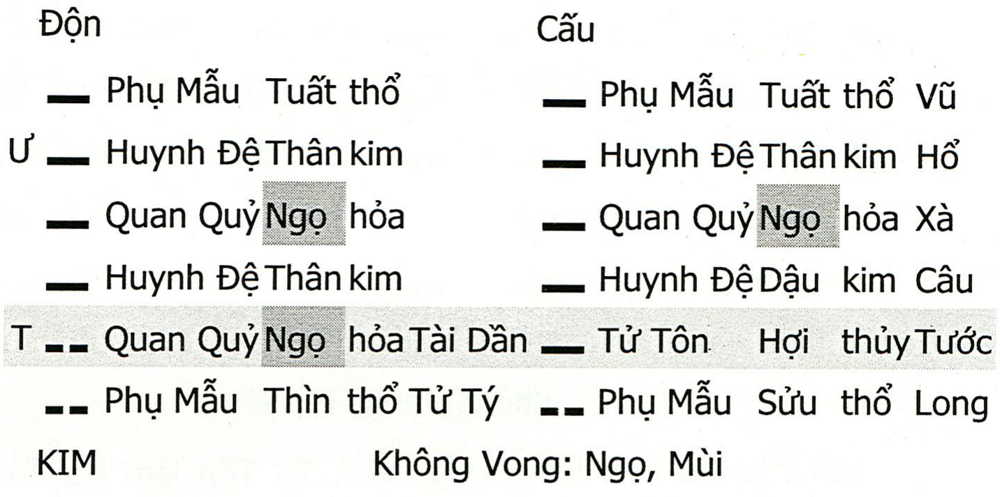
    - **Hình này chứng minh điều gì**
      - Dự đoán người cha phân tâm nhớ cả vợ lẫn con, ngày Bính Thân vợ con sẽ quay về đoàn tụ.
    - **Từ đâu mà thấy được**
      - Hào 2 Thế Ngọ hỏa động hóa Tử Tôn Hợi thủy, Thế bán hợp với Thê Tài Dần mộc phục thần; Thế lâm Không.

#### Kết quả đoàn tụ thực tế
- Ứng nghiệm thời gian: Đúng vào ngày Bính Thân, người vợ đã chủ động ẵm đứa nhỏ trở về đoàn tụ gia đình.

### Ví dụ 5: Bác đoán cát hung cho cháu trai gặp nạn (Quẻ Sơn Địa Bác biến Phong Địa Quan)

#### Bối cảnh sự việc và phân tích nguyên nhân phạm pháp
- Bối cảnh thời gian: Ngày Đinh Tị, tháng Nhâm Thân, năm Kỷ Mão (Tuần không: Tý, Sửu).
- Sự việc phát sinh: Một người đàn ông có cháu trai gặp chuyện rắc rối nghiêm trọng, lo sợ không biết lành dữ ra sao nên đến gieo quẻ hỏi cát hung. Thu được quẻ Sơn Địa Bác biến Phong Địa Quan.
- Xác định Dụng thần: Lấy hào Tử Tôn làm Dụng thần (hào 5 Tử Tôn Tý thủy trì Thế).
- Luận giải hành vi phạm pháp và tình trạng bắt giữ:
  - Tử Tôn Tý thủy lâm Huyền Vũ chủ về hành vi ám muội, trộm cắp, phi pháp.
  - Hào Tử Tôn Tý thủy phát động hóa Quan Quỷ Tị hỏa (hóa Quỷ) và rơi vào đất Tuyệt (Tý thủy tuyệt tại Tị).
  - Tử Tôn động hóa Quỷ là đối mặt trực diện với cửa công môn pháp luật, khẳng định đứa cháu vì hành vi trộm cắp mà đã bị cơ quan công an bắt giữ.
- Xem xét an nguy tính mạng và giam giữ:
  - Hào Tử Tôn Tý thủy may mắn được Nguyệt kiến Thân kim tương sinh tương trợ nên tính mạng không gặp nguy hiểm hung tàn.
  - Tuy nhiên do Tử Tôn hóa Tuyệt lại gặp hào 2 Quan Quỷ Tị hỏa lâm Câu Trần (Câu Trần chủ về nhà giam, trói buộc cùm xích), nên chắc chắn không tránh khỏi cảnh bị giam giữ, tạm giam theo luật.

#### Luận giải quan hệ thừa kế qua Bán Hợp Thế - Nguyệt
- Vị thế đặc biệt của người cháu:
  - Hào Tử Tôn Tý thủy trì Thế cùng với Nguyệt kiến Thân kim tạo thành bán hợp Thủy cục.
  - Căn cứ vào tượng bán hợp (đại diện cho một nửa, ngang hàng tương đương), tác giả đoán đứa cháu trai này có vị trí quan trọng trong lòng ông ta chẳng khác nào là con ruột.
- Phân định tính chất phạm pháp và quan hệ huyết thống qua bán hợp trên quẻ Sơn Địa Bác biến Phong Địa Quan:
  - **Hình 44.** Quẻ Sơn Địa Bác biến Phong Địa Quan
    - 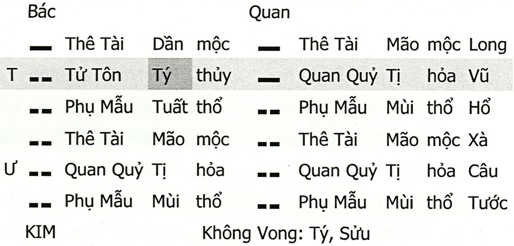
    - **Hình này chứng minh điều gì**
      - Dự đoán cháu trai trộm cắp bị bắt tạm giam và vị thế của cháu trai quan trọng như con ruột do bán hợp Thế - Nguyệt.
    - **Từ đâu mà thấy được**
      - Tử Tôn Tý thủy lâm Vũ hóa Quỷ hóa Tuyệt, đắc Nguyệt Thân kim sinh hợp; Thế Tý thủy bán hợp Nguyệt Thân kim.

#### Ứng nghiệm thực tế ngoài đời
- Tội danh thực tế: Đứa cháu trai người này quả nhiên vừa bị công an bắt giam vì hành vi trộm cắp xe máy.
- Hoàn cảnh gia đình: Bản thân người đàn ông cả đời không có con cái nối dõi, đứa cháu trai chính là người thừa kế duy nhất được ông nuôi nấng thương yêu từ nhỏ, tình cảm gắn bó chẳng khác nào con ruột sinh ra.

## Chương 8: Lục Hợp Biện Nghĩa

### Khái niệm và nguyên lý Lục Hợp trong Lục Hào

- Hai cấp độ cơ bản của Lục Hợp:
  - Lục hợp trong dự đoán Lục hào được chia làm hai trường hợp chính: một là quẻ hợp (toàn quẻ hình thành thế lục hợp), hai là hào hợp (từng hào vị tương hợp với nhau hoặc tương hợp với Nhật, Nguyệt).
  - Lục hợp mang ý nghĩa bao quát và phong phú, tùy thuộc vào sự việc dự đoán mà nghĩa lý biến hóa tương ứng: hội họp, gặp gỡ, triền miên, cản trở, giữ lại, lưu lại, liên lụy, bận tâm, dừng lại, khỏi bệnh, hòa hảo, yêu đương gắn bó, hòa hợp, tương trợ, bổ sung, bổ khuyết, hợp tác làm ăn, che phủ, trùng điệp, chồng chất tầng tầng lớp lớp, gấp lại, liên tiếp không dứt.
  - Cùng một chữ "Hợp", nhưng với việc xem kiện tụng thì chủ dây dưa cản trở khó dứt; xem bệnh tật thì bệnh cũ triền miên khó khỏi; xem hôn nhân thì hòa hợp tâm đầu ý hợp; xem đồ vật thì cuộn gấp che phủ. Ứng dụng thích đáng hay không hoàn toàn phụ thuộc vào sự linh hoạt và tự ngộ của người dự đoán.

### Ví dụ 1: Đoán vật giấu trong bình giữ nhiệt (Quẻ Hỏa Trạch Khuê biến Hỏa Lôi Phệ Hạp)

#### Bối cảnh và quẻ gieo

- Thời không và sự kiện thực tế:
  - Ngày Giáp Thân, tháng Mậu Thân, năm Đinh Sửu.
  - Tại lớp học Dịch học, khi đang thảo luận về phương pháp xạ phúc (đoán vật bên trong) bằng Lục hào, một học viên cầm một chiếc bình giữ nhiệt và đề nghị tác giả đoán xem bên trong đang chứa vật gì.
  - Gieo được quẻ Hỏa Trạch Khuê biến Hỏa Lôi Phệ Hạp; Tuần Không: Ngọ, Mùi (Thổ tuần không).

#### Các bước suy luận và căn cứ hào vị

- Lựa chọn Dụng thần và tính chất văn thư:
  - Lấy hào Ứng làm Dụng thần đại diện cho đồ vật được cất giấu bên trong bình giữ nhiệt.
  - Hào Ứng lâm Phụ Mẫu Tị hỏa: Phụ Mẫu là tượng của văn thư, giấy tờ, sách vở, chữ nghĩa.
  - Hào 2 Quan Quỷ Mão mộc phát động, lâm Chu Tước sinh trợ cho hào Ứng (Mão mộc sinh Tị hỏa): Chu Tước chủ về văn tự, ngôn ngữ, động sinh hào Ứng càng khẳng định vật bên trong có thuộc tính giấy tờ mang chữ nghĩa.
- Ý nghĩa Lục Hợp và hình thế uốn cuộn của vật thể:
  - Xác định vật thể giấu bên trong bình giữ nhiệt thông qua quẻ Hỏa Trạch Khuê biến Hỏa Lôi Phệ Hạp:
    - **Hình 45.** Quẻ Hỏa Trạch Khuê biến Hỏa Lôi Phệ Hạp
      - 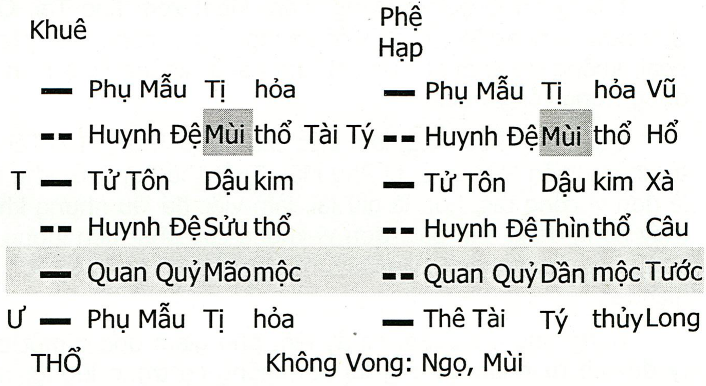
      - **Hình này chứng minh điều gì**
        - Vật trong bình giữ nhiệt là một tờ giấy có văn tự (tiền giấy) được cuộn tròn nhiều lớp.
      - **Từ đâu mà thấy được**
        - Hào Ứng lâm Phụ Mẫu Tị hỏa, Chu Tước hào 2 sinh Ứng là văn thư; Nhật Nguyệt Thân kim tương hợp Tị hỏa biểu thị sự trùng điệp, uốn cuộn, hợp mang hình bất quy tắc.
  - Nhật thần Giáp Thân và Nguyệt kiến Mậu Thân song song đồng thời tương hợp với Dụng thần Tị hỏa (Tị Thân lục hợp): hợp mang tượng trùng điệp, lớp lớp chồng lên nhau, uốn gập lại.
  - Trong quan hệ Tị - Thân vừa là lục hợp vừa là hình (Tị hình Thân, Thân hình Tị): trong hợp có hình biểu thị trạng thái trùng điệp nhưng bất quy tắc, uốn cong vòng tròn chứ không phải xếp phẳng phiu.
  - Tổng hợp các dữ kiện hào vị: Đoán bên trong bình giữ nhiệt cất giữ một tờ giấy có văn tự, được cuộn tròn nhiều lớp lại.

#### Kết quả ứng nghiệm thực tế

- Kiểm chứng đồ vật thực tế:
  - Ngay sau lời dự đoán, học viên mở nắp bình giữ nhiệt ra cho cả lớp cùng xem.
  - Quả nhiên bên trong bình cất một tờ tiền giấy mệnh giá 100 tệ được cuộn tròn lại, hoàn toàn ứng nghiệm với tượng văn thư, có chữ số, trùng điệp uốn cong bất quy tắc.

### Ví dụ 2: Đoán sự nghiệp và tiền lương cho nữ đương số (Quẻ Thủy Sơn Kiển biến Cấn Vi Sơn)

#### Bối cảnh và quẻ gieo

- Thời không và nhân vật:
  - Ngày Bính Tuất, tháng Tân Sửu, năm Tân Tị.
  - Một người phụ nữ ở Ngũ Đài đến thỉnh vấn tác giả để dự đoán về tiền đồ sự nghiệp và công việc làm ăn.
  - Gieo được quẻ Thủy Sơn Kiển biến Cấn Vi Sơn; Tuần Không: Ngọ, Mùi (Kim tuần không).

#### Các bước suy luận và căn cứ hào vị

- Luận đoán công việc bế tắc và vị thế bị động:
  - Dự đoán sự nghiệp và tiền lương của người phụ nữ qua quẻ Thủy Sơn Kiển biến Cấn Vi Sơn:
    - **Hình 46.** Sơ đồ quẻ Thủy Sơn Kiển biến Cấn Vi Sơn
      - 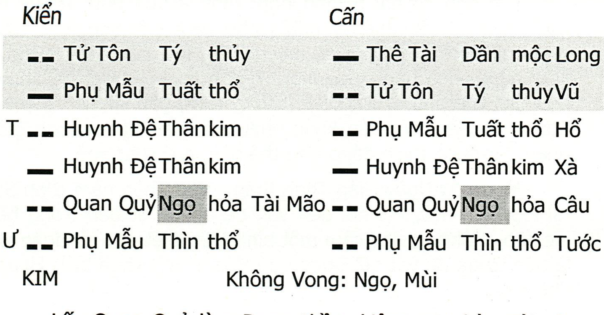
      - **Hình này chứng minh điều gì**
        - Công việc bế tắc không quyền hành, bị đơn vị nợ lương giữ tiền, bản thân muốn bỏ việc đi nơi khác.
      - **Từ đâu mà thấy được**
        - Dụng thần Quan Quỷ Ngọ hỏa tuần không nhập Mộ ở Nhật; hào Tài phục thần bị Phụ Mẫu hợp trú (giữ lại); Tử Tôn Tý thủy phát động khắc Quan.
  - Lấy Quan Quỷ làm Dụng thần đại diện cho chức vị, sự nghiệp; kiêm xét hào Thê Tài để định liệu lương bổng tài chính.
  - Dụng thần Quan Quỷ Ngọ hỏa lâm Không Vong (Ngọ Tuần Không), hưu tù tại tháng Sửu, lại nhập Mộ tại Nhật thần Bính Tuất (Tuất thổ là Mộ khố của Hỏa): Quan Quỷ hưu tù nhập Mộ là tượng công danh trắc trở, công việc không vừa ý, tài năng bị vùi dập không thể phát huy, hoàn toàn không nắm giữ được quyền chủ động.
  - Quan Quỷ Ngọ hỏa sinh hào Ứng Phụ Mẫu Thìn thổ: Quan đi sinh Ứng là tượng làm việc cúc cung tận tụy cho người khác hưởng lợi, bản thân chịu thiệt thòi.
- Luận đoán nợ lương và tâm lý muốn thôi việc:
  - Hào Thê Tài hưu tù không hiện trên quẻ (phục dưới hào 2), bị hào Phụ Mẫu Tuất thổ (Nhật thần) hợp trú (Dần Tuất bán hợp / Mão Tuất hợp): Phụ Mẫu đại diện cho đơn vị công tác, cơ quan chủ quản; Lục Hợp mang ý nghĩa cản trở, giữ lại, phong tỏa. Hào Tài bị đơn vị hợp giữ tượng trưng cho việc làm việc đã lâu mà không thấy bóng dáng tiền của, đơn vị cố tình nợ lương, không chịu chi trả.
  - Hào 6 Tử Tôn Tý thủy phát động (hóa Thê Tài Dần mộc) xung khắc Quan Quỷ Ngọ hỏa: Tử Tôn là thần tước lộc, khắc chế Quan Quỷ, thể hiện nội tâm đương số đã chán nản và đang mưu tính buông bỏ, rời khỏi công việc hiện tại.

#### Diễn biến đối thoại và kết quả ứng nghiệm

- Lời trần tình thực tế của đương số:
  - Người phụ nữ xác nhận mọi lời đoán đều chính xác hoàn toàn với thực cảnh trớ trêu của bản thân.
  - Cô hiện giữ chức vụ phó giám đốc tại một công ty du lịch tư nhân, mang tiếng là lãnh đạo nhưng tiếng nói không có trọng lượng, năng lực nghiệp vụ bị kìm hãm không thể triển khai.
  - Nguyên nhân do nội bộ ban lãnh đạo công ty có vài vị phó giám đốc mâu thuẫn, bè phái đấu đá lẫn nhau gay gắt, đẩy doanh nghiệp vào tình trạng đình trệ.
  - Đau lòng nhất là cô đã dốc sức làm việc ròng rã suốt 4 tháng mà chưa hề nhận được một đồng tiền lương nào từ công ty.
  - Cô xác nhận bản thân đang tìm đường rời bỏ công ty này để sang một nơi khác tìm kiếm công việc mới.

### Ví dụ 3: Đoán phong thủy gia trạch và tương lai quy hoạch (Quẻ Lôi Thiên Đại Tráng)

#### Bối cảnh và quẻ gieo

- Thời không và cuộc hội ngộ:
  - Ngày Ất Hợi, tháng Kỷ Dậu, năm Đinh Sửu.
  - Tác giả trở về quê nhà dự buổi họp mặt bạn bè cũ thời đi học. Trong số đó có một người bạn học đã hơn 20 năm xa cách chưa từng gặp lại.
  - Người bạn nghe tin tác giả tinh thông Kinh Dịch Lục hào liền nhiệt tình thỉnh cầu dự đoán về phong thủy ngôi nhà mình đang ở (gia trạch).
  - Gieo được quẻ Lôi Thiên Đại Tráng; Tuần Không: Thân, Dậu (Thổ tuần không).

#### Phân tích phong thủy nhà ở và sự cố quá khứ

- Tọa hướng và nguồn gốc nhà ở:
  - Đánh giá toàn diện phong thủy nhà ở và quy hoạch giải tỏa qua quẻ Lôi Thiên Đại Tráng:
    - **Hình 47.** Quẻ Lôi Thiên Đại Tráng
      - 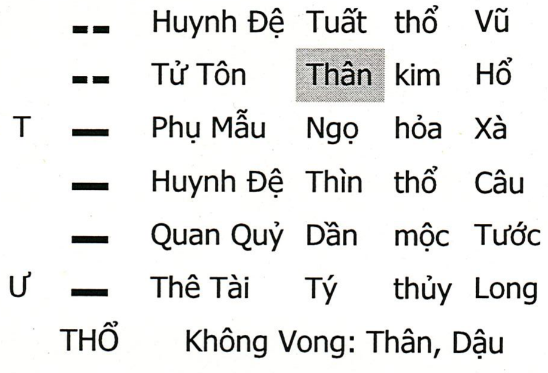
      - **Hình này chứng minh điều gì**
        - Nhà lầu cơ quan mua lại, từng bị hỏa hoạn, cửa kẹt, có hạn lưu sản, quẻ lục xung bị phá dỡ mở đường vào tháng Thân năm 1998.
      - **Từ đâu mà thấy được**
        - Phụ Mẫu Ngọ hỏa tọa Nam hướng Bắc; Quan Quỷ hào 2 nhập trạch lâm Chu Tước sinh hỏa; Nhật hợp hào 2 là nhà lầu; hào 5 Thân kim Bạch Hổ xung khắc hào trạch.
  - Lấy hào Phụ Mẫu làm Dụng thần chủ về nhà cửa, kiêm quan sát hào 2 (trạch vị / hào nhà).
  - Hào Thế là tọa sơn của ngôi nhà, Phụ Mẫu Ngọ hỏa trì Thế tại hào 4: Ngọ hỏa thuộc phương Nam, Thế đối xung với hào Ứng Tý thủy thuộc phương Bắc, suy ra ngôi nhà tọa Nam hướng Bắc.
  - Hào 2 lâm Quan Quỷ Dần mộc: Quan Quỷ chủ cơ quan, chính phủ, công môn, chứng tỏ ngôi nhà vốn là nhà ở công vụ của cơ quan nhà nước.
  - Hào 1 Thê Tài Tý thủy lâm hào Ứng, được Nhật thần Ất Hợi sinh phù rồi quay sang sinh Quan Quỷ Dần mộc ở hào 2, kết hợp Phụ Mẫu trì Thế: chủ về gia chủ đã dùng tiền bạc mua đứt nhà công vụ để chuyển thành quyền sở hữu tư nhân của mình.
- Kết cấu kiến trúc và điềm báo hỏa tai, cửa nẻo:
  - Nhật thần Hợi thủy tương hợp với hào 2 Quan Quỷ Dần mộc (Dần Hợi lục hợp): Lục Hợp mang tượng trùng điệp, nhiều lớp xếp chồng, đoán là kết cấu nhà lầu nhiều tầng.
  - Toàn quẻ Lôi Thiên Đại Tráng là quẻ Lục Xung: Lục Xung chủ sự bất ổn, phân tán, không bền vững, báo hiệu phong thủy nhà này không cát lợi, không nên cư trú lâu dài.
  - Chu Tước lâm Quan Quỷ Dần mộc nhập trạch (ngự tại hào 2): Dần mộc là đất Trường Sinh của Hỏa, Chu Tước lại là thần hỏa hoạn, mộc sinh hỏa vượng, đoán ngôi nhà này trong quá khứ từng xảy ra sự cố cháy nhà (hỏa hoạn).
  - Hào 3 Huynh Đệ Thìn thổ: hào 3 là vị trí môn hộ (cửa nhà), Huynh Đệ cũng chủ về then cửa; hào 3 Thìn thổ tương hợp với Nguyệt kiến Dậu kim (Thìn Dậu lục hợp), lại lâm Câu Trần (chủ câu bán, đình trệ, vướng mắc): suy đoán cửa nhà rất khó sử dụng, bị kẹt cứng, đóng mở trắc trở.

#### Luận đoán tương lai giải tỏa mở đường và tai hạn nhân đinh

- Hạn sảy thai và tổn hại nhân đinh:
  - Hào 5 là nhân vị (hào tượng trưng cho con người trong nhà), Tử Tôn Thân kim ngự tại hào 5 nhưng rơi vào Tuần Không (Thân Tuần Không), lại lâm Bạch Hổ: Bạch Hổ là hung thần chủ về huyết quang, thương tật, trụy thai, lưu sản.
  - Đoán định: Nếu gia đình đã sinh con xong xuôi trước khi dọn về đây ở thì bình an vô sự; nhưng nếu dọn vào ở rồi mới thụ thai sinh nở thì chắc chắn sẽ gặp tai họa lưu sản, sảy thai.
- Điềm báo phá dỡ mở đường và ứng kỳ:
  - Quẻ Lục Xung tượng trưng cho sự không dài lâu; hào trạch (hào 2 Dần mộc) bị Nguyệt kiến Dậu kim khắc phạt, lại bị Tử Tôn Thân kim ở hào 5 xung khắc mãnh liệt (Dần Thân tương xung): trạch vị bị tổn thương nghiêm trọng, ngôi nhà này ở không được lâu bền, tương lai tất bị đập bỏ, dỡ bỏ.
  - Tử Tôn Thân kim tại hào 5 xung khắc hào trạch: hào 5 chủ đạo lộ (đường sá), Tử Tôn cũng chủ đường sá, lâm Bạch Hổ cũng chủ đường đi: sau khi dỡ bỏ sẽ không xây dựng lại nhà mới mà là giải phóng mặt bằng để mở rộng đường lộ, vị trí mảnh đất này sẽ biến thành đường giao thông.
  - Hào Tử Tôn Thân kim hiện lâm Không Vong, đoán sự việc di dời dỡ nhà mở đường sẽ ứng nghiệm vào tháng Thân năm Mậu Dần (1998) khi Thân kim xuất không điền thực, xung động Dần mộc.

#### Phản hồi của bạn học và ứng nghiệm thực tế

- Thái độ thán phục của người bạn học:
  - Người bạn chia sẻ bản thân cũng từng say mê nghiên cứu sách Lục hào nhưng khi tự gieo đoán sự việc thì chưa từng thấy ứng nghiệm chuẩn xác, không ngờ tác giả chỉ từ một quẻ có thể khai thác ra ngần ấy chi tiết cụ thể, rành mạch.
  - Người bạn lập tức xác nhận hiện trạng:
    - Căn nhà đúng là nhà lầu 2 tầng tọa Nam hướng Bắc, gia đình anh ta đang sinh sống tại tầng một.
    - Căn nhà ban đầu là nhà công vụ được cơ quan phân phát, về sau gia đình anh đã bỏ tiền túi mua lại quyền sở hữu.
    - Kể từ ngày dọn vào sinh sống, ngôi nhà quả thực đã từng một lần bốc cháy do hỏa hoạn.
    - Cửa ra vào bị xộc xệch, kẹt rất nặng, việc đóng mở vô cùng khó khăn, bất tiện.
    - Trước khi dọn vào căn nhà này thì vợ chồng anh đã sinh con xong, do đó từ trước tới nay vợ chưa từng bị sảy thai tại đây.
    - Đúng là gần đây địa phương rục rịch có chủ trương quy hoạch mở rộng tuyến đường, và căn nhà của anh nằm trọn trong chỉ giới giải tỏa.
- Kết quả ứng nghiệm tương lai:
  - Đúng tháng Thân năm Mậu Dần (1998), chính quyền huyện chính thức ban hành thông báo thu hồi đất, giải phóng mặt bằng và san phẳng căn nhà để thi công mở rộng đường.
  - Đáng kinh ngạc hơn, cũng trong năm 1998 đó, người vợ bất ngờ mang thai ngoài kế hoạch và quả nhiên đã bị sảy thai (lưu sản), ứng nghiệm hoàn toàn với lời cảnh báo về hào 5 Tử Tôn Bạch Hổ Không Vong.

### Ví dụ 4: Đoán khoản tiền thiếu hụt và chuyện hôn nhân (Quẻ Sơn Trạch Tổn biến Phong Lôi Ích)

#### Bối cảnh và quẻ gieo

- Thời không và sự việc:
  - Ngày Đinh Tị, tháng Nhâm Ngọ, năm Canh Thìn.
  - Cô Vương làm việc tại cục bưu chính phát hiện trên sổ sách tài chính bị thiếu hụt một khoản tiền, lòng đầy lo lắng đến nhờ tác giả gieo quẻ xem kết cuộc món tiền thất thoát sẽ ra sao.
  - Gieo được quẻ Sơn Trạch Tổn biến Phong Lôi Ích; Tuần Không: Tý, Sửu (Thổ tuần không).

#### Suy luận khoản tiền sổ sách bị thiếu hụt

- Phân tích trạng thái Dụng thần và nguyên nhân thất lạc:
  - Định lượng tài chính thất thoát và dự đoán hôn nhân qua quẻ Sơn Trạch Tổn biến Phong Lôi Ích:
    - **Hình 48.** Quẻ Sơn Trạch Tổn biến Phong Lôi Ích
      - 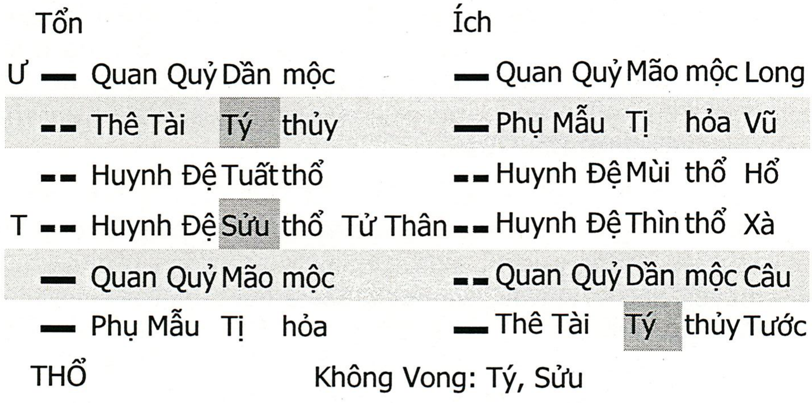
      - **Hình này chứng minh điều gì**
        - Mất 2 tờ hóa đơn trị giá 1.000 tệ phải tự bỏ tiền bù; chồng bỏ đi ly hôn năm 1999, tính cách cô độc quái gở.
      - **Từ đâu mà thấy được**
        - Hào Tài Tý thủy Nguyệt phá Tuyệt ở Nhật hóa Tuyệt tại Phụ Mẫu lâm Huyền Vũ; Sửu thổ hợp Tài; hào 2 Quan Quỷ động hóa thoái.
  - Lấy hào Thê Tài làm Dụng thần. Hào 5 Thê Tài Tý thủy bị Nguyệt kiến Nhâm Ngọ xung phạt (Tý Ngọ tương xung) trở thành Nguyệt phá; lâm Tuyệt địa tại Nhật thần Đinh Tị (Thủy tuyệt tại Tị); lại tự phát động hóa xuất Phụ Mẫu Tị hỏa (động hóa Tuyệt): hào Tài vừa Nguyệt phá vừa lâm Tuyệt lại hóa Tuyệt, chứng tỏ khoản tiền thiếu hụt này vô phương tìm lại được.
  - Hào Tài Tuyệt tại Phụ Mẫu: Phụ Mẫu là hóa đơn, chứng từ sổ sách, lâm Huyền Vũ (chủ về thất thoát, sơ suất, mất mát). Ngũ hành Hỏa chủ về số 2, suy ra nguyên nhân là do làm thất lạc 2 tờ hóa đơn chứng từ.
  - Hào Tài thuộc ngũ hành Thủy, Thủy chủ về số 1, ước định số tiền thất thoát vào khoảng 1.000 tệ.
- Luận giải trách nhiệm bồi hoàn bằng Lục Hợp:
  - Hào Thế lâm Huynh Đệ Sửu thổ vượng tướng: Huynh Đệ trì Thế vốn dĩ là tượng phá tài, mất của.
  - Tuy nhiên hào Tài Tý thủy bị Nguyệt phá, hào Thế Sửu thổ lại tương hợp với hào Tài Tý thủy (Tý Sửu lục hợp): hợp thì làm cho không bị phá (hợp thì bất phá), nghĩa là tiền của công ty không bị thất thoát ra ngoài xã hội mà chuyển hóa trách nhiệm sang hào Thế, kết luận khoản tiền thâm hụt này cô Vương đành phải tự bỏ tiền túi của bản thân ra bồi hoàn bù đắp.

#### Mở rộng luận giải hôn nhân và nét tính cách

- Nhận định gia đạo và sự chia ly của người chồng:
  - Sau khi nghe tác giả giải đoán rành rẽ về khoản tiền, cô Vương tiện thể hỏi thêm về vận hạn hôn nhân gia đình của mình.
  - Quan sát hào 2 (hào trạch), thấy Quan Quỷ Mão mộc phát động hóa thoái thần thành Quan Quỷ Dần mộc: Quan Quỷ là người chồng, ngự tại trạch vị mà động hóa thoái thần, là tượng người chồng đã rời bỏ gia đình, dứt áo ra đi, bản thân người vợ không tài nào níu giữ được chồng.
- Nhận định về tâm sinh lý, nghệ thuật và quan hệ xã hội:
  - Hào Thế Huynh Đệ Sửu thổ là Mộ khố của Tử Tôn; Tử Tôn Thân kim phục thần dưới hào Thế, lâm Đằng Xà: Đằng Xà chủ về tài năng nghệ thuật, khiếu thẩm mỹ, nhưng Thân kim lại rơi vào Tuần Không; hào Sửu lại chủ phần bụng, suy ra trong bụng không có lấy một tế bào nghệ thuật nào.
  - Hào Thế lâm Huynh Đệ: thông thường Huynh Đệ trì Thế chủ về có nhiều bạn bè thân hữu; nhưng do Sửu thổ rơi vào Tuần Không nên phải luận ngược lại, đoán cô là người cô độc, trong đời không có nổi một người bạn thân thiết.
  - Hào Thế lâm Đằng Xà: Đằng Xà chủ quái đản, biến ảo, cổ quái, suy ra tính tình cô Vương rất kỳ quặc, tính cách quái gở khó hòa nhập.

#### Kết quả ứng nghiệm thực tế

- Kiểm chứng việc thiếu hụt tiền bạc:
  - Quả nhiên khi đối chiếu sổ sách kế toán, quỹ tiền mặt bị lệch âm đúng 1.000 tệ. Bản thân cô Vương cũng ngờ rằng mình đã làm thất lạc hóa đơn lưu trữ.
  - Rốt cuộc dù đã tìm kiếm khắp nơi nhưng không thể tìm lại được chứng từ, cô đành ngậm ngùi tự rút 1.000 tệ tiền lương của mình ra để bù vào quỹ công.
- Kiểm chứng hôn nhân và tính cách:
  - Mọi nhận định về tính khí quái gở, không có khiếu nghệ thuật và không có bạn bè đều được cô Vương thừa nhận hoàn toàn chính xác.
  - Về hôn nhân, cô Vương cay đắng cho biết hai vợ chồng đã chính thức ly hôn vào năm 1999 (năm Kỷ Mão, ứng nghiệm chuẩn xác hào Quan Quỷ Mão mộc động hóa thoái).

### Ví dụ 5: Đoán tình trạng hôn nhân cho nữ nhân viên bệnh viện (Quẻ Thiên Trạch Lý biến Trạch Thủy Khốn)

#### Bối cảnh và quẻ gieo

- Thời không và nhân vật:
  - Ngày Quý Dậu, tháng Kỷ Hợi, năm Bính Tý.
  - Cô Triệu đang công tác tại bệnh viện tìm đến tác giả để dự đoán về đường tình duyên và tình trạng hôn nhân của bản thân.
  - Gieo được quẻ Thiên Trạch Lý biến Trạch Thủy Khốn; Tuần Không: Tuất, Hợi (Thổ tuần không).

#### Suy luận chuyện ngoại tình của chồng và đổ vỡ quá khứ

- Tượng người chồng trăng hoa ngoại tình:
  - Phân tích rạn nứt hôn nhân và tình duyên tái hợp qua quẻ Thiên Trạch Lý biến Trạch Thủy Khốn:
    - **Hình 49.** Quẻ Thiên Trạch Lý biến Trạch Thủy Khốn
      - 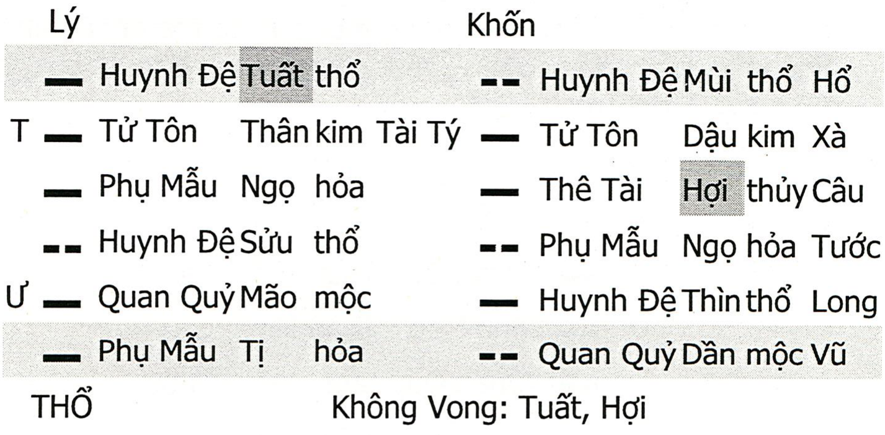
      - **Hình này chứng minh điều gì**
        - Chồng ngoại tình dẫn đến ly hôn năm 1994; đương sự ngầm chung sống với người mới và sẽ tái hôn thành công vào tháng Canh Tý.
      - **Từ đâu mà thấy được**
        - Quan Quỷ Mão mộc ám động hợp Huynh Đệ Tuất thổ (ngoại tình); Phụ Mẫu Tị hỏa Huyền Vũ hợp Thế hóa Quan; quẻ biến Khốn là lục hợp.
  - Lấy Quan Quỷ làm Dụng thần đại diện cho người chồng. Quan Quỷ Mão mộc ngự tại hào Ứng (hào 2): hào Ứng là phu vị (chính vị của người chồng), khẳng định đây chính là người chồng hợp pháp của đương số.
  - Quan Quỷ Mão mộc lâm Thanh Long: Thanh Long chủ tửu sắc, phong lưu, háo sắc đa tình.
  - Quan Quỷ Mão mộc được Nguyệt kiến Kỷ Hợi sinh phù, lại bị Nhật thần Quý Dậu xung kích (Mão Dậu tương xung): được Nguyệt sinh mà bị Nhật xung tạo thành thế Ám động.
  - Quan Quỷ Mão mộc ám động tương hợp với hào 6 Huynh Đệ Tuất thổ (Mão Tuất lục hợp): trong quẻ nữ đoán hôn nhân, Huynh Đệ là người cùng giới tính (phụ nữ khác). Hào Quan Quỷ của người chồng ám động tư thông tương hợp với Huynh Đệ, chính là tượng người chồng lén lút ngoại tình với người đàn bà khác sau lưng vợ.
- Đặc điểm kẻ thứ ba và thời điểm đổ vỡ:
  - Hào 6 Huynh Đệ Tuất thổ sinh phù hào Thế (Tử Tôn Thân kim): hào sinh Thế biểu thị người phụ nữ có quan hệ vụng trộm với chồng có độ tuổi lớn hơn cô Triệu.
  - Quan Quỷ Mão mộc ám động hợp Huynh Đệ Tuất thổ, đồng thời hào 6 Huynh Đệ Tuất thổ tại quẻ chủ cũng phát động (hóa thoái Mùi thổ) tương hợp với Quan Quỷ Mão mộc: hai bên cuồng nhiệt theo đuổi lẫn nhau, tình cảm gắn bó tâm đầu ý hợp.
  - Hào Huynh Đệ Tuất thổ lâm Tuần Không, đến năm Giáp Tuất (1994) điền thực xuất không: sự việc chồng ngoại tình vỡ lở và biến cố hôn nhân phát sinh vào năm 1994.
- Dấu hiệu hôn thú bị hủy bỏ:
  - Hào Phụ Mẫu Ngọ hỏa tại hào 4 bị Nguyệt kiến Hợi thủy khắc chế (nguyệt phá hư hao), lại lâm Tử địa tại Nhật thần Dậu kim: Phụ Mẫu đại diện cho hôn thú, giấy chứng nhận kết hôn; Phụ Mẫu bị thương tổn trầm trọng là điềm báo quan hệ hôn nhân trên pháp lý đã hoàn toàn tan vỡ (đã ly dị).

#### Luận giải mối quan hệ hiện tại và tương lai hôn nhân mới

- Điềm báo chung sống ngầm và người đàn ông mới:
  - Hào Phụ Mẫu Tị hỏa tại hào sơ lâm Huyền Vũ tương hợp với hào Thế Thân kim (Tị Thân lục hợp), bản thân Tị hỏa lại phát động hóa xuất Quan Quỷ Dần mộc.
  - Huyền Vũ chủ về sự thầm kín, lén lút, bí mật không công khai; Phụ Mẫu lâm Huyền Vũ hợp Thế lại hóa ra Quan Quỷ, chứng tỏ bản thân cô Triệu hiện đang ngầm đính ước, chung sống như vợ chồng với một người đàn ông khác.
- Dự đoán kết quả hôn nhân tái hợp:
  - Quẻ biến Trạch Thủy Khốn là quẻ Lục Hợp: quẻ biến Lục Hợp chủ về sự việc cuối cùng sẽ đi đến kết cục hòa hợp gắn kết, khẳng định hai người có thể tiến tới hôn nhân chính thức.
  - Hiện tại hào Phụ Mẫu đang bị Nguyệt phá; đợi bước sang tháng sau (tháng Tý), Phụ Mẫu thoát khỏi Nguyệt phá thì việc đăng ký kết hôn sẽ diễn ra thuận lợi, danh chính ngôn thuận.

#### Kết quả ứng nghiệm thực tế

- Lời xác nhận của đương số:
  - Cô Triệu thừa nhận hoàn toàn chính xác: Cô đã ly hôn với chồng vào năm 1994 do phát hiện chồng ngoại tình với một phụ nữ lớn tuổi hơn; hiện tại cô đang bí mật sống chung cùng một người đàn ông khác.
- Kết cục hôn nhân sau đó:
  - Đúng như dự đoán, bước sang tháng Canh Tý (khi hết Nguyệt phá), cô Triệu cùng người bạn đời mới đã chính thức hoàn tất thủ tục đăng ký kết hôn, xây dựng gia đình êm ấm.

### Ví dụ 6: Nghiên cứu dự đoán dung mạo và nhân trắc học qua lục hào (Quẻ Thủy Trạch Tiết)

#### Bối cảnh và quẻ gieo

- Thời không và mục đích nghiên cứu:
  - Ngày Quý Mùi, tháng Quý Mùi, năm Canh Thìn.
  - Tác giả cùng bạn nghiên cứu Dịch học tại Bắc Kinh là ông Vương Khai Vũ tiến hành đàm đạo chuyên sâu về phương pháp ứng dụng Lục hào để dự đoán diện mạo, vóc dáng và nhân trắc học của con người.
  - Ông Vương Khai Vũ đề nghị gieo một quẻ thử nghiệm để kiểm tra xem một quẻ Lục hào có thể bộc lộ chi tiết bao nhiêu thông tin ngoại hình, liền gieo quẻ dự đoán về một cô gái mà ông quen biết rất rõ.
  - Gieo được quẻ Thủy Trạch Tiết; Tuần Không: Thân, Dậu (Thủy tuần không).

#### Luận giải hình thể tổng quan, khuôn mặt và đôi mắt

- Vóc dáng và diện mạo tổng thể:
  - Chi tiết hóa các đặc điểm nhân trắc và dung mạo phụ nữ qua quẻ Thủy Trạch Tiết:
    - **Hình 50.** Quẻ Thủy Trạch Tiết
      - 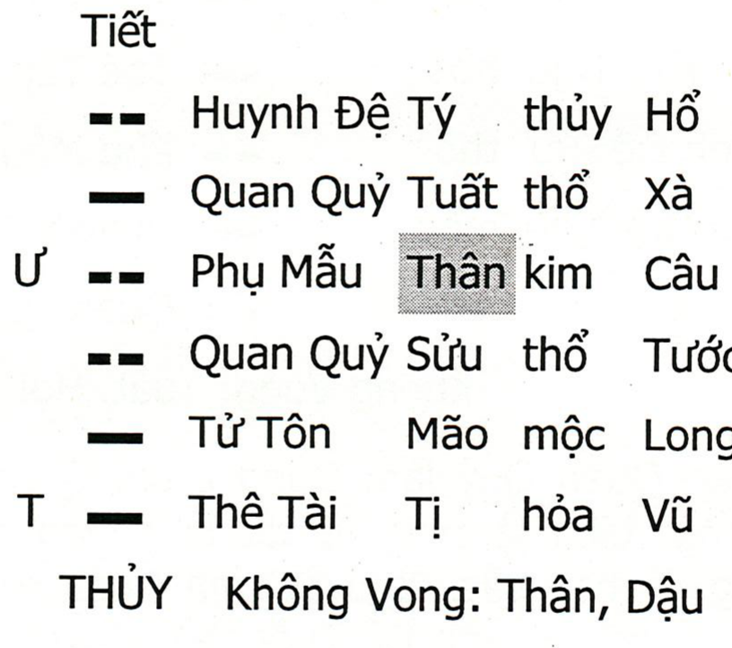
      - **Hình này chứng minh điều gì**
        - Người đẫy đà, mặt trái xoan, sẹo ở mũi, cận thị không đeo kính, ngực nhỏ độn áo ngực lớn, mắt mí lót, dáng đi lắc mông uốn éo.
      - **Từ đâu mà thấy được**
        - Quẻ lục hợp thân đẫy đà; Thế Tị hỏa mặt trái xoan; hào 5 Tuất thổ Đằng Xà sẹo ở mũi; Tử Tôn tuyệt tại Thân kim hào 4 tuần không; Sửu thổ nguyệt phá ám động.
  - Vì quẻ này chuyên đoán về đặc điểm diện mạo, ngoại hình của một đối tượng cụ thể nên lấy hào Thế làm tiêu điểm trung tâm để phán đoán.
  - Quẻ Thủy Trạch Tiết là quẻ Lục Hợp: tượng Lục Hợp chủ về sự đẫy đà, bao bọc, suy ra thân hình cô gái này đẫy đà, người nở nang mập mạp.
  - Hào Thế lâm Tị hỏa: theo quy luật ngũ hành hình thể, tứ sinh vị Dần Thân Tị Hợi chủ về hình nhọn thon, suy ra cô có khuôn mặt hình trái xoan, cằm thon gọn.
  - Hào Thế lâm Huyền Vũ, lại ngự trong quẻ Lục Hợp: Huyền Vũ chủ về sự quyến rũ, phong tình, kết hợp Lục Hợp chủ sức hút giao cảm, đoán cô gái có phong thái rất gợi cảm, toát ra sức hấp dẫn lôi cuốn đặc biệt đối với người khác phái.
- Tướng mũi và tật khúc xạ ở mắt:
  - Hào 5 lâm Quan Quỷ Tuất thổ, kết hợp Đằng Xà: hào 5 là vị trí khuôn mặt; Thổ chủ về mũi; Quan Quỷ chủ thương tật, tỳ vết; Đằng Xà chủ vết sẹo, đường vân uốn lượn: suy đoán trên mũi cô gái có một vết sẹo rõ rệt.
  - Hào 5 Tuất thổ là Hỏa khố (Mộ khố của Hỏa); ngũ hành Hỏa đại diện cho con mắt; con mắt nhập Mộ khố lại lâm Quan Quỷ, chủ mắt bị tật bệnh, tất là mắt bị cận thị.
  - Dự đoán kính đeo mắt: Lấy hào Phụ Mẫu làm Dụng thần đại diện cho kính mắt. Hào 4 Phụ Mẫu Thân kim rơi vào Tuần Không, lại không được hào 5 Tuất thổ sinh trợ (do Thổ khô không sinh Kim Không Vong): suy đoán tuy mắt bị cận thị nhưng thường ngày cô gái không chịu đeo kính mắt.

#### Luận giải vòng ngực, trang phục lót và dáng đi

- Đặc điểm vòng ngực và kích cỡ trang phục lót:
  - Hào 4 tượng trưng cho vùng ngực của cơ thể; hào Phụ Mẫu ngự tại hào 4 càng tăng cường đặc tính đại diện cho lồng ngực.
  - Hào Tử Tôn đại diện cho bầu ngực (vú); quan sát thấy hào 4 Phụ Mẫu Thân kim chính là Tuyệt địa của Tử Tôn Mão mộc (Thân tuyệt Mão), bản thân hào 2 Tử Tôn Mão mộc lại hưu tù suy nhược tại tháng Mùi ngày Mùi: suy đoán vòng một của cô gái rất khiêm tốn, ngực nhỏ.
  - Phụ Mẫu ngự tại hào 4 còn đại diện cho y phục che ngực, tức là áo ngực; lâm Câu Trần chủ về dày cộm, phồng to; tuy nhiên hào Phụ Mẫu Thân kim lại rơi vào Tuần Không: Tuần Không biểu thị trạng thái bên trong rỗng tuếch, giả tạo, trống trải. Kết luận: Người nữ này ngực tuy nhỏ nhưng lại thường mặc áo ngực độn mút rất to và phồng.
- Đôi mắt hai mí lót và dáng đi uốn éo:
  - Hào Thế là Tị hỏa đại diện cho đôi mắt; ngự trong quẻ Lục Hợp chủ về mắt hai mí; tuy nhiên Tị hỏa lại nằm ở nội quái (quẻ dưới, chủ bên trong): mắt hai mí nhưng nằm ẩn vào trong, tức là mắt hai mí lót.
  - Hào 3 Sửu thổ bị Nguyệt kiến Quý Mùi xung phá (Sửu Mùi tương xung) trở thành Nguyệt phá: Nguyệt phá mang tượng phân múi, nứt tách làm đôi; hào 3 lại là hào âm chủ về phía sau lưng; Sửu thổ đại diện cho mông (vòng ba).
  - Hào 3 Sửu thổ đồng thời bị Nhật thần Quý Mùi xung động tạo thành thế ám động (xung động): vòng ba chuyển động lắc lư liên hồi khi di chuyển. Đoán định: Khi bước đi, cô gái có dáng đi uốn éo, mông lắc lư rất rõ nét.

#### Kết quả đối chiếu thực tế

- Xác nhận kinh ngạc của dịch hữu Vương Khai Vũ:
  - Sau khi nghe tác giả luận đoán tường tận từng chi tiết, ông Vương Khai Vũ vô cùng kinh ngạc và thán phục, xác nhận toàn bộ các đặc điểm đều đúng 100% với thực tế của cô gái:
    - Cô gái có dáng người đẫy đà, khuôn mặt trái xoan, rất gợi cảm và quyến rũ.
    - Trên sống mũi quả thực có một vết sẹo nhỏ.
    - Mắt cô bị cận thị nhưng rất hiếm khi đeo kính vì sợ xấu.
    - Vòng một rất khiêm tốn nhưng luôn mặc áo ngực đệm mút cỡ lớn để tạo dáng đẫy đà.
    - Mắt cô gái đúng là mắt hai mí lót (mí ẩn).
    - Thói quen khi đi lại mông luôn uốn éo lắc lư, dáng điệu vô cùng đặc trưng.
  - Toàn bộ kết quả ứng nghiệm thần kỳ, minh chứng cho sức mạnh phản ánh đa tầng và tinh vi của nghệ thuật dự đoán Lục hào khi kết hợp tượng Lục Hợp, hào vị, ngũ hành và Lục thần.

## Chương 9: Lục Xung Biện Nghĩa

### Khái niệm và ý nghĩa thực chiến của Lục Xung
- Giống như lục hợp, lục xung trong Lục Hào Dự Trắc Học cũng bao gồm hai trường hợp căn bản:
  - Quẻ xung (toàn quẻ tương xung hay còn gọi là quẻ Lục Xung).
  - Hào xung (các hào trong quẻ tương xung với nhau, hoặc hào bị Nhật thần, Nguyệt kiến xung kích).
- Hệ thống nội hàm và ý nghĩa tượng trưng phong phú của Lục Xung trong phán đoán thực chiến:
  - Ý nghĩa về sự phân tán và biến động: Xung khai, xung động, xung tán, phân ly, nhấp nhô, bấp bênh, bất an, chạy loạn.
  - Ý nghĩa về sự giao cắt và va chạm: Bắt gặp, tháo rời, xen vào, thâm nhập, chạm trán nhau.
  - Ý nghĩa về tranh chấp và mâu thuẫn: Đánh nhau, xung đột, tranh đấu, mâu thuẫn, bất hòa, gây xích mích.
  - Ý nghĩa về trật tự và trạng thái: Không ổn định, không chỉnh tề, dở dang, tiêu tan.
- Lục xung được ứng dụng hết sức phổ biến và đóng vai trò như một nguồn thông tin trọng yếu để mở rộng biên độ suy luận, truy vết diễn biến của sự vật, sự việc.

### Ví dụ 1: Thái Thiết Vương tiên sinh đoán công việc (Quẻ Phong Trạch Trung Phu biến Tốn Vi Phong)

#### Bối cảnh quẻ và tượng kiêm chức
- Thời gian chiêm bái: Ngày Đinh Sửu, tháng Quý Mùi, năm Canh Thìn.
- Đối tượng và sự việc: Thái Thiết Vương tiên sinh đoán định về tiền trình công việc.
- Quẻ đắc: Phong Trạch Trung Phu biến Tốn Vi Phong (quẻ thuộc cung Thổ, Tuần Không tại Thân và Dậu).
- Thiết lập Dụng thần và nhận định cách cục:
  - Lấy hào Quan Quỷ làm Dụng thần đại diện cho công việc, chức vụ.
  - Trong quẻ xuất hiện Quan Quỷ Mão mộc lưỡng hiện (tại hào 2 Câu Trần và hào 6 Thanh Long), đồng thời có hai tầng Phụ Mẫu Tị hỏa (tại hào sơ Chu Tước động và hào 5 Huyền Vũ).
  - Quan Quỷ thể hiện chức nghiệp, công việc; Phụ Mẫu thể hiện đơn vị cơ quan công tác; quẻ xuất hiện hai Quan hai Phụ chính là biểu tượng của sự kiêm chức (làm việc đồng thời ở hai nơi).
  - Quan Quỷ và Phụ Mẫu đều suy nhược (Mão mộc hưu tù tại tháng Mùi ngày Sửu; Tị hỏa bị hao tiết khí bởi Mùi Sửu thổ), phản ánh cả đơn vị công tác sở tại lẫn cơ quan kiêm chức đều không phát đạt, đình trệ.
- Năng lực quản lý và vị thế của đương số:
  - Hào Thế (hào 4 Huynh Đệ Mùi thổ) là Mộ khố của Quan Quỷ Mão mộc, lại lâm Bạch Hổ; Bạch Hổ chủ về khí chất uy nghiêm, quả quyết, quyết đoán và có tài năng quản lý công việc, chứng tỏ người này có thực quyền và nắm giữ chức vụ.
  - Tuy nhiên Quan Quỷ hưu tù lại quay sang khắc Thế, biểu thị quan vận không thông suốt, gặp nhiều trắc trở.
  - Quan Quỷ (hào 2) và Phụ Mẫu (hào 5) ở cận kề hào Thế đều an tĩnh bất động, dự báo cơ quan đơn vị ban đầu tuy không thịnh vượng nhưng vận hành vẫn tương đối ổn định.
- Phân tích chi tiết tổ hợp quẻ Phong Trạch Trung Phu biến Tốn Vi Phong để đoán công việc và kiêm chức:
  - **Hình 51.** Quẻ Phong Trạch Trung Phu biến Tốn Vi Phong
    - 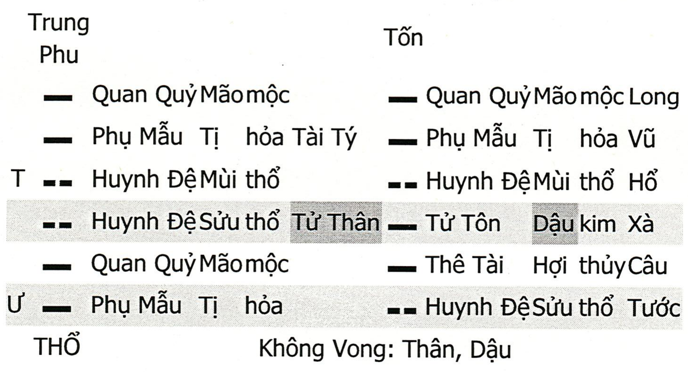
    - **Hình này chứng minh điều gì**
      - Thể hiện sự kiêm chức bất thành, nguy cơ tài chính phá sản và mâu thuẫn bệnh tật nội tại.
    - **Từ đâu mà thấy được**
      - Quan Quỷ Mão mộc và Phụ Mẫu Tị hỏa lưỡng hiện, hào Ứng và hào 3 phát động hóa Tam hợp Dậu kim Tuần Không.

#### Nguy cơ tài chính và sự sụp đổ của đơn vị kiêm chức
- Biến động tại cơ quan kiêm chức:
  - Hào Ứng đại diện cho phương khác, nơi khác; hào Ứng lâm Phụ Mẫu Tị hỏa phát động, báo hiệu nơi kiêm chức tất sẽ xảy ra biến động lớn.
  - Phụ Mẫu Tị hỏa là Tuyệt địa của Thê Tài (Hợi thủy tuyệt tại Tị), phản ánh hiệu quả kinh tế của đơn vị kiêm chức rất kém cỏi.
- Cơ chế "Cách sơn hóa hào" và cục diện tam hợp:
  - Hào sơ Ứng Phụ Mẫu Tị hỏa phát động hóa Huynh Đệ Sửu thổ; hào 3 Huynh Đệ Sửu thổ phát động hóa Tử Tôn Dậu kim; đây là tượng "cách sơn hóa hào", tương đương với việc Phụ Mẫu Tị hỏa hóa Tử Tôn Dậu kim.
  - Dậu kim là Tử địa của Hỏa, cho thấy rõ ràng đơn vị kiêm chức đang đối mặt với nguy cơ sụp đổ, sinh tử tồn vong.
  - Hào ngăn cách ở giữa chính là Huynh Đệ Sửu thổ, lại thêm trong quẻ hoàn toàn không thấy hào Tài xuất hiện, xác định nguyên nhân nguy cơ cốt lõi bắt nguồn từ tình trạng cạn kiệt tài chính.
  - Hào hóa ra Tử Tôn Dậu kim là Nguyên thần sinh Tài, kết hợp với hào cách Sửu thổ hợp với Phục thần Thê Tài Tý thủy, đồng thời các hào biến kết hợp tạo thành thế Tị - Dậu - Sửu tam hợp Kim cục tại quẻ biến, thể hiện nỗ lực huy động vốn cổ phần để mưu cầu tái cấu trúc phát triển.
  - Đáng tiếc là Tử Tôn Dậu kim lại lâm Tuần Không, nguồn vốn không thể xoay xở được, cuối cùng dẫn tới kết cục phá sản.

#### Luận giải can hỏa vượng, bệnh tật và giấc mộng ban đêm
- Tật bệnh và cơ địa nội tạng:
  - Hào Thế lâm Bạch Hổ chủ về tính cách hung hãn, bản thân nóng nảy; đồng thời Bạch Hổ chủ bệnh tật, hào Thế lại là Mộ khố của Quan Quỷ (Quan Quỷ chủ bệnh tật), tạo thành tượng có bệnh ẩn tàng trong thân thể.
  - Hào Thế Mùi thổ vượng tướng (được Nguyệt kiến tỉ phù, Nhật thần Sửu thổ xung khởi thành ám động), lại được hào sơ Tị hỏa phát động sinh trợ; có sinh không khắc là tượng quá vượng; do đó lấy Hỏa làm bệnh thần, lấy Thủy làm hỷ thần, đoán định người này bị chứng can hỏa quá vượng.
  - Trong quẻ khuyết Thủy, Thủy chủ về tạng Thận, ứng với chứng trạng thận hư, suy giảm chức năng thận.
- Việc dùng thuốc trị liệu:
  - Hào 3 Huynh Đệ động hóa Tử Tôn: Huynh Đệ chủ hao tốn tiền bạc, Tử Tôn chủ y dược chữa bệnh, là tượng bỏ tiền đi khám bệnh và mua thuốc uống.
  - Dựa vào căn nguyên hỏa vượng gây bệnh, đoán định loại thuốc mà đương số sử dụng là thuốc thanh lương giải độc (thanh nhiệt giải độc).
  - Song Tử Tôn Dậu kim lâm Tuần Không và không hiện trên chính quẻ, cho thấy hiện tại đương số đã tự ý ngừng uống thuốc.
- Điềm báo tâm lý qua giấc mộng:
  - Hào 3 Sửu thổ lâm Đằng Xà phát động: Hào 3 là vị trí của giường ngủ, Đằng Xà chủ về mộng mị quái đản; Sửu thổ động hợp với Phục thần Thê Tài Tý thủy (Tài chủ về ẩm thực, nước uống), đoán rằng ban đêm ngủ đương số thường xuyên nằm mơ thấy đi tìm nước uống.
  - Huynh Đệ Sửu thổ phát động xung hào Thế Mùi thổ, hào Thế ám động tương xung trở lại Sửu thổ, biểu thị tượng va chạm xung đột với người khác; hào Thế lại lâm Bạch Hổ (chủ đao kiếm, ẩu đả), phán đoán ban đêm còn thường mơ thấy cảnh chém giết, đánh nhau dữ dội với người khác.

#### Phản hồi và ứng nghiệm thực tế
- Về công việc và chức vụ:
  - Thái Thiết Vương tiên sinh xác nhận bản thân đúng là đang kiêm nhiệm hai chức vụ ở hai đơn vị khác nhau.
  - Cơ quan công tác ban đầu hiệu quả trì trệ; còn đơn vị kiêm chức hiện đang lâm vào khủng hoảng trầm trọng, nguy cơ chồng chất.
  - Đương số giữ chức trưởng phòng tại đơn vị kiêm chức; do công ty bế tắc nguồn vốn lưu động nên ban lãnh đạo đã lên phương án phát hành cổ phần nội bộ huy động vốn, song anh ta nhận thấy công ty không còn triển vọng cứu vãn nên vô cùng phân vân, do dự không biết có nên bỏ tiền mua cổ phần hay không.
- Về tính tình, sức khỏe và giấc mộng:
  - Bản tính quả thực rất nóng nảy; bác sĩ từng chẩn đoán anh ta bị chứng can hỏa vượng, đã bốc thuốc thanh nhiệt giải độc về uống nhưng nay đã ngưng dùng.
  - Ban đêm đúng là thường xuyên nằm mơ thấy khát khô cổ họng đi tìm nước uống, và liên tục mơ thấy mình cầm dao truy đuổi, chém giết người khác.
  - Phần thắt lưng (khu vực tạng Thận) thường xuyên đau mỏi, có vấn đề bất ổn.

---

### Ví dụ 2: Lý tiên sinh đoán phong thủy nhà chú (Quẻ Thủy Địa Tỷ biến Khôn Vi Địa)

#### Bối cảnh và nhận định trạch vận suy tuyệt
- Thời gian chiêm bái: Ngày Tân Dậu, tháng Kỷ Hợi, năm Bính Tý.
- Đối tượng và sự việc: Lý tiên sinh ở Trường Trị gieo quẻ nhờ xem phong thủy nhà ở của người chú ruột.
- Quẻ đắc: Thủy Địa Tỷ biến Khôn Vi Địa (quẻ thuộc cung Thổ, Tuần Không tại Tý và Sửu).
- Nguyên lý định vị trạch hào và nhân hào:
  - Trong phép đoán phong thủy, lấy hào 2 làm chủ đạo để quan sát tương tác sinh khắc cát hung của lục thân.
  - Hào 2 Phụ Mẫu Tị hỏa là hào trạch (nhà cửa), hào 5 Huynh Đệ Tuất thổ là hào nhân (con người).
  - Hào 2 Tị hỏa tương sinh cho hào 5 Tuất thổ, thoạt nhìn như cách cục cát trạch (nhà sinh người bồi đắp nhân đinh).
  - Tuy nhiên, hào trạch Phụ Mẫu Tị hỏa bị Nguyệt kiến Hợi thủy xung là Nguyệt phá, lại rơi vào đất Tử ở Nhật thần Tân Dậu; bản thân suy nhược cùng cực lại nhập Mộ tại hào 5 Huynh Đệ Tuất thổ phát động; do đó đây là ngôi nhà đại hung, trạch vận suy bại.

#### Sát khí đường lộ xung môn và dự báo bệnh tật
- Sát khí trực xung đại môn:
  - Hào 3 Quan Quỷ Mão mộc đắc Trường Sinh tại Nguyệt kiến Hợi thủy, bị Nhật thần Dậu kim xung kích trở thành ám động.
  - Hào 3 ám động phát lực quay lại khắc phạt hào 5 (hào người), gây họa hại nghiêm trọng cho nhân đinh sinh sống trong nhà.
  - Hào 3 biểu tượng cho đại môn (cửa chính ra vào); Nhật thần Dậu kim lâm Tử Tôn (Tử Tôn chủ về đường đi lối lại), chi Dậu thuộc về phương Chính Tây; từ đó suy đoán trước cửa chính ngôi nhà có một con đường lớn từ hướng Tây chạy thẳng trực xung vào cổng.
- Bệnh tật và kiếp nạn của gia chủ:
  - Hào Phụ Mẫu bị phá lại nhập Mộ; Thê Tài Không Vong (Tý thủy tuần không) lại bị hào 5 Huynh Đệ Tuất thổ phát động khắc phạt; căn nhà này đại kỵ đối với chủ nhà và phụ nữ trong gia đình, dọn vào ở ắt phát sinh bạo bệnh hiểm nghèo.
  - Phụ Mẫu lâm Tị hỏa Nguyệt phá nhập Mộ (Tị hỏa chủ về hệ tuần hoàn, tim mạch), chủ nhà nếu mắc bệnh ắt là bệnh tim; người phụ nữ trong nhà thì bị chứng ngực tích nước (Thê Tài Tý thủy chủ thủy dịch).
  - Thái Tuế (năm Bính Tý) nhập vào hào Ứng Thê Tài Tý thủy vượng tướng, nên người phụ nữ dù có ngã bệnh cũng không nguy hiểm đến tính mạng; riêng bậc trưởng bối và chủ nhà (Phụ Mẫu Tị hỏa suy tuyệt) thì bước vào cửa tử.
  - Dự báo thời điểm ứng nạn: Tháng Tuất không phát hung (Tuất là Mộ khố thu liễm hoặc chưa xung phát), sang tháng này (tháng Hợi xung phá Tị hỏa) tất phát sinh đại hung.
- Phân tích tương tác hào trạch và sát khí đại môn qua quẻ Thủy Địa Tỷ biến Khôn Vi Địa:
  - **Hình 52.** Sơ đồ quẻ Thủy Địa Tỷ biến Khôn Vi Địa
    - 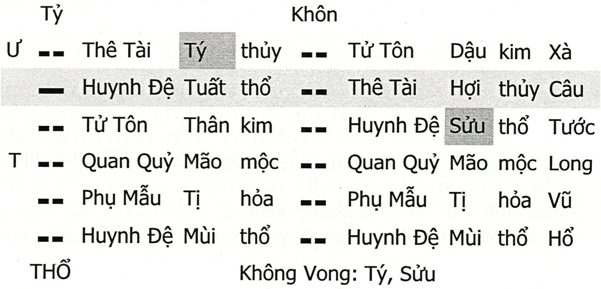
    - **Hình này chứng minh điều gì**
      - Chứng minh phong thủy nhà chú phạm lộ xung, Phụ Mẫu Tị hỏa nhập Mộ dẫn đến bệnh tim qua đời.
    - **Từ đâu mà thấy được**
      - Hào 2 Phụ Mẫu Tị hỏa Nguyệt phá nhập Mộ hào 5 Tuất thổ; hào 3 Quan Quỷ Mão mộc bị Nhật Dậu xung ám động.

#### Phản hồi và ứng nghiệm thực tế
- Lý tiên sinh xác nhận: Đúng là ngay trước đại môn ngôi nhà của người chú có một con đường cái lớn từ phía Tây đâm thẳng trực diện vào cổng chính.
- Về tai họa tính mạng: Người chú của Lý tiên sinh quả nhiên đã đột ngột qua đời ngay trong tháng Tuất bởi vì chứng nhồi máu cơ tim cấp tính.

---

### Ví dụ 3: Nam đoán tìm đối tượng tại nơi giới thiệu hôn nhân (Quẻ Địa Trạch Lâm biến Sơn Trạch Tổn)

#### Bối cảnh và dụng thần trung tâm môi giới
- Thời gian chiêm bái: Ngày Ất Dậu, tháng Tân Dậu, năm Mậu Dần.
- Đối tượng và sự việc: Một người nam đến trung tâm môi giới hôn nhân, gieo quẻ hỏi xem đến nơi này liệu có tìm được đối tượng kết hôn hay không.
- Quẻ đắc: Địa Trạch Lâm biến Sơn Trạch Tổn (quẻ thuộc cung Thổ, Tuần Không tại Ngọ và Mùi).
- Xác định Dụng thần và tượng dịch:
  - Lấy hào Thê Tài làm Dụng thần đại diện cho người nữ, đối tượng xem mắt.
  - Hào Tử Tôn là đất sinh ra Thê Tài, đại diện cho cơ quan, trung tâm giới thiệu hôn nhân.
  - Hào Ứng Thê Tài Hợi thủy được Nhật thần Dậu kim, Nguyệt kiến Dậu kim và hào 6 Tử Tôn Dậu kim phát động tương sinh, bề ngoài thể hiện là việc tốt lành, có người giới thiệu phụ nữ cho.
  - Tuy nhiên, điểm tối kỵ là hào Thế (hào 2 Quan Quỷ Mão mộc) bị cả Nguyệt kiến lẫn Nhật thần tương xung, phạm vào cách cục Nguyệt phá lẫn Nhật phá, thân chủ thế lực suy kiệt, dễ bị tổn hại.

#### Tượng gái lầu xanh và mưu toan tống tiền
- Thân phận thực sự của đối tượng:
  - Hào Tài Hợi thủy gặp ba tầng Dậu kim sinh trợ; Dậu kim là đất Mộc Dục (chủ phong lưu, tắm gội, dâm dục) của Thủy.
  - Hào động Tử Tôn Dậu kim lại chính là đất Mộc Dục lâm Huyền Vũ (Huyền Vũ chủ về dâm loạn, trộm cắp, mờ ám); Thủy ngụ tại vượng địa; tất cả khắc họa hình ảnh gái lầu xanh, gái làng chơi buôn phấn bán hương; đối tượng được giới thiệu đích thực là hạng người tàn hoa bại liễu.
- Bản chất tống tiền của trung tâm môi giới:
  - Hào 6 Tử Tôn Dậu kim phát động trực xung khắc phạt hào Thế Quan Quỷ Mão mộc. Áp dụng phép chuyển đổi lục thân: Hào Thế (Mộc) chính là Thê Tài (tiền tài) đối với hào 6 (Kim); điều này vạch trần việc nơi giới thiệu hôn nhân thực chất nhắm thẳng vào túi tiền của người nam, bày mưu tính kế để bắt chẹt, tống tiền anh ta.
  - Quẻ này Quái thân đóng tại Sửu thổ; hào mà Quái thân sinh ra chính là Sàng Trướng (giường chiếu, chuyện phòng the), ở đây vừa vặn rơi vào Tử Tôn Dậu kim; dự báo thân chủ sẽ vì quan hệ xác thịt nam nữ mà bị vòi vĩnh, đòi tiền gắt gao.
  - Tử Tôn Dậu kim phát động hóa Quan Quỷ Dần mộc; Dần mộc là Tuyệt địa của Dậu kim, đồng thời Quan Quỷ chủ về cơ quan pháp luật, nhà nước; báo hiệu cơ sở môi giới hôn nhân phi pháp này trong tương lai tất sẽ bị cơ quan chính quyền truy quét và cấm hoạt động.
- Phân tích cạm bẫy hôn nhân và dấu hiệu lừa đảo qua quẻ Địa Trạch Lâm biến Sơn Trạch Tổn:
  - **Hình 53.** Sơ đồ quẻ Địa Trạch Lâm biến Sơn Trạch Tổn
    - 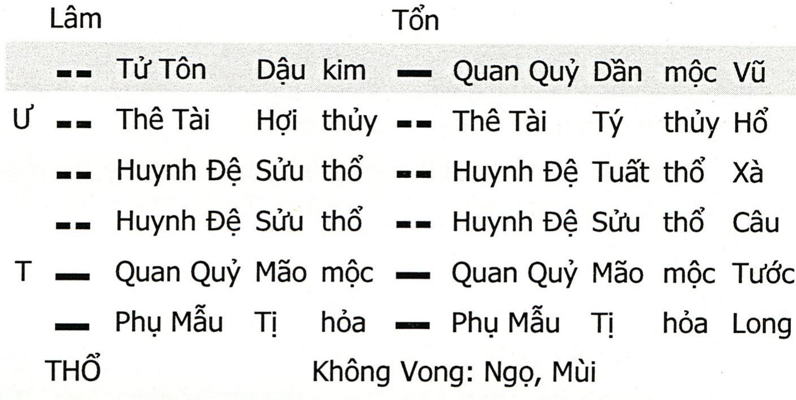
    - **Hình này chứng minh điều gì**
      - Vạch trần trung tâm môi giới hôn nhân phi pháp bắt chẹt tiền bạc và đối tượng là gái lầu xanh.
    - **Từ đâu mà thấy được**
      - Thê Tài Hợi thủy gặp 3 tầng Dậu kim Mộc Dục lâm Huyền Vũ; Tử Tôn Dậu kim xung khắc Thế Mão mộc hóa Quan Quỷ Tuyệt địa.

#### Diễn biến đối phó và triệt phá đường dây phi pháp
- Cạm bẫy thực tế ngoài đời:
  - Đương số đã nộp hồ sơ đăng ký trước tại trung tâm. Đến ngày Tuất, anh ta được trung tâm sắp xếp gặp gỡ một cô gái.
  - Ngay trong ngày đầu tiên tương kiến, cô gái này đã chủ động đòi về sống chung phòng với anh ta.
  - Sang ngày thứ hai, cô ta viện cớ muốn đổi chiếc xe đạp cũ lấy xe mới, yêu cầu anh ta đưa 300 tệ.
  - Sau hai ngày Hợi và ngày Tý chung sống, người phụ nữ này lại bày trò than vãn rằng mình đang mắc nợ chồng cũ một khoản tiền lớn và liên tục bị đòi nợ; cô ta bảo nếu anh ta chịu bỏ ra 1.000 tệ trả nợ giúp thì cô ta sẽ nguyện đi theo gắn bó trọn đời.
  - Nhận thấy dấu hiệu bất minh và nguy cơ bị bẫy tiền bạc, người nam đã kiên quyết cự tuyệt và đoạn tuyệt hoàn toàn quan hệ với người này.
- Kết cục của tổ chức môi giới:
  - Về sau sự việc vỡ lở, trung tâm giới thiệu hôn nhân này thực chất là một tổ chức hoạt động phi pháp, chuyên móc nối với các cô gái quán bar, quán karaoke để hợp mưu lừa gạt tiền bạc của khách nam, do đó đã bị cơ quan chức năng triệt phá và cấm vĩnh viễn.

---

### Ví dụ 4: Nam đoán mối quan hệ với bạn gái (Quẻ Càn Vi Thiên biến Trạch Thiên Quải)

#### Tượng chia tay và bản chất quan hệ ngoài luồng
- Thời gian chiêm bái: Ngày Kỷ Tị, tháng Quý Tị, năm Bính Tý.
- Đối tượng và sự việc: Một người nam gieo quẻ hỏi về tiền đồ mối quan hệ tình cảm với một cô gái.
- Quẻ đắc: Càn Vi Thiên biến Trạch Thiên Quải (quẻ thuộc cung Kim, Tuần Không tại Tuất và Hợi).
- Dụng thần và tượng quẻ chia ly:
  - Lấy hào Thê Tài Dần mộc làm Dụng thần đại diện cho người tình.
  - Hào Tài Dần mộc hưu tù, Nguyên thần là Tử Tôn Tý thủy lại rơi vào đất Tuyệt ở cả Nhật thần lẫn Nguyệt kiến Tị hỏa.
  - Quẻ gốc Càn Vi Thiên là quẻ thuần dương Lục Xung; ý nghĩa cốt lõi của Lục Xung là "xung tức là tán", tượng trưng cho việc đôi bên tất yếu sẽ chia tay, đường ai nấy đi.
  - Hào Thế (hào 6 Phụ Mẫu Tuất thổ) là Dưỡng địa của Dụng thần Dần mộc, cho thấy cô gái này là người tình nhân được người nam bao nuôi bên ngoài.
  - Hào Thế Tuất thổ phát động hóa thoái thành Phụ Mẫu Mùi thổ, chứng tỏ bản thân người nam đã nảy sinh tâm lý chán nản, muốn thoái lui, chủ động rút chân ra khỏi mối quan hệ.
- Phân tích mối quan hệ nhân tình tan vỡ qua quẻ Càn Vi Thiên biến Trạch Thiên Quải:
  - **Hình 54.** Sơ đồ quẻ Càn Vi Thiên biến Trạch Thiên Quải
    - 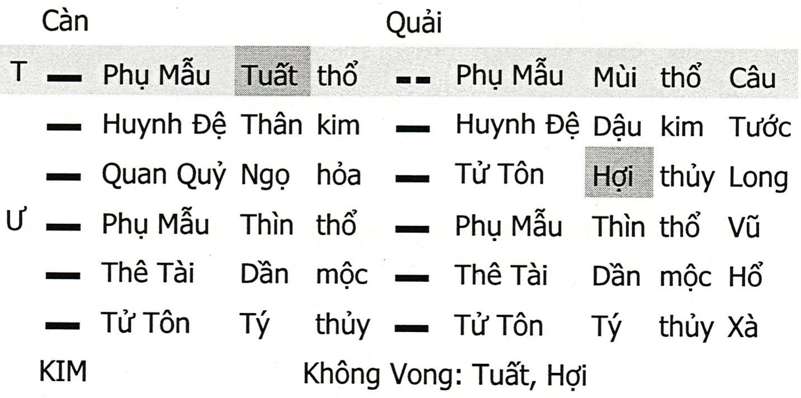
    - **Hình này chứng minh điều gì**
      - Thể hiện sự ly tán giữa người nam đã kết hôn và nhân tình, tâm lý thoái lui dứt khoát.
    - **Từ đâu mà thấy được**
      - Quẻ Lục Xung Càn biến Quải; hào Thế Tuất thổ hóa thoái Mùi thổ khắc Tử Tôn; Thê Tài Dần mộc hưu tù lâm Bạch Hổ.

#### Tâm lý thoái lui và nỗi niềm đôi bên
- Thực trạng hôn nhân của đương số:
  - Quái thân của quẻ là Tị hỏa; hào do Quái thân sinh ra là Sàng Trướng (giường chiếu) lưỡng hiện trong quẻ:
    - Một là Phụ Mẫu Thìn thổ lâm hào 3 Ứng vị (thê vị của người vợ chính thức), chứng minh đương số là người đã kết hôn, có gia đình hợp pháp.
    - Hai là Phụ Mẫu Tuất thổ tại hào 6 phát động hóa thoái, khẳng định ý chí dứt khoát chấm dứt, không tiếp tục chung sống với người tình ngoài luồng nữa.
- Trạng thái tâm lý của hai người:
  - Hào Thế Tuất thổ lâm Tuần Không, thể hiện ban đầu đương số "tâm vô định kiến" (chưa có chủ kiến vững vàng), còn mang tâm trạng do dự, dùng dằng khó quyết.
  - Thê Tài Dần mộc tương khắc hào Thế Tuất thổ, biểu thị cô gái trong lòng rất muốn tìm gặp anh ta để níu kéo; song vì Nguyên thần gặp Tuyệt, bản thân Dụng thần Dần mộc lại hưu tù bất động nên sợ hãi, không dám tự tiện tìm đến.
  - Dụng thần lâm Bạch Hổ; Bạch Hổ chủ về bi thương, than khóc; cho thấy cô gái hiện đang đau khổ khóc lóc ở nhà một mình.
  - Tử Tôn là thần của niềm vui, hoan hỷ; hào Thế Tuất thổ phát động đương đầu khắc phạt Tử Tôn Tý thủy, bản thân Tử Tôn lại ngụ đất Tuyệt; điều này chỉ ra ở bên cạnh cô gái này người nam không hề cảm thấy vui vẻ, trái lại chỉ thấy mệt mỏi, áp lực.

#### Phản hồi và ứng nghiệm thực tế
- Người nam chia sẻ thực tế: Cách đó mấy ngày, anh ta đã chủ động nói lời chia tay dứt khoát với cô người tình, nguyên nhân chính là vì ở bên cô ấy anh ta không tìm thấy niềm vui hay sự thoải mái nào.
- Vừa nghe anh ta đề nghị chia tay, cô ấy liền bật khóc nức nở, van xin cầu khẩn hai người tiếp tục duy trì qua lại, nhưng anh ta hoàn toàn lạnh lùng, không đoái hoài quan tâm.
- Sau mấy ngày trôi qua, quả nhiên đúng như quẻ đoán, cô gái ấy không hề dám tìm đến nhà hay nơi làm việc của anh ta nữa.

---

### Ví dụ 5: Đoán tình huống đơn vị bị mất trộm (Quẻ Ly Vi Hỏa biến Hỏa Thiên Đại Hữu)

#### Bối cảnh và định vị tài sản văn thư bị trộm
- Thời gian chiêm bái: Ngày Tân Tị, tháng Đinh Mùi, năm Đinh Sửu.
- Đối tượng và sự việc: Một người nam đến gieo quẻ hỏi về tình hình đơn vị cơ quan vừa bị kẻ gian đột nhập trộm cắp tài sản.
- Quẻ đắc: Ly Vi Hỏa biến Hỏa Thiên Đại Hữu (quẻ thuộc cung Hỏa, Tuần Không tại Thân và Dậu).
- Dụng thần và đặc điểm tang vật:
  - Lấy hào Thê Tài Dậu kim làm Dụng thần đại diện cho tài sản bị mất cắp.
  - Hào Tài Dậu kim đắc Lệnh tháng Mùi tương sinh nên vượng tướng; tài vật vượng tướng chứng tỏ những đồ vật bị trộm cắp là vật phẩm có kích thước to lớn, cồng kềnh.
  - Quẻ thuộc cung Ly hỏa, hào Tài Dậu kim lại lâm Chu Tước (Chu Tước chủ về văn thư, giấy tờ, hồ sơ, đồ dùng văn phòng); do đó tài sản bị đánh cắp là các thiết bị, đồ đạc có liên quan mật thiết đến công tác văn phòng, văn thư.

#### Hiện trường cạy cửa phá song và phương thức gây án
- Vị trí đồ vật và dấu vết hiện trường:
  - Hào 2 Tử Tôn Sửu thổ phát động; Thê Tài Dậu kim nhập Mộ tại hào 2 Sửu thổ; hào 2 là trạch vị (nhà cửa, phòng ốc), biểu thị đồ vật vốn được cất giữ bên trong phòng làm việc của cơ quan.
  - Hào 2 Sửu thổ bị Nguyệt kiến Mùi thổ tương xung thành Nguyệt phá; hào trạch bị phá vỡ mang hình tượng cửa sổ phòng làm việc đã bị kẻ trộm cạy phá, đập hỏng.
  - Hào 2 phát động hóa Phụ Mẫu Dần mộc hồi đầu khắc, lại lâm Huyền Vũ (Huyền Vũ chủ về đạo tặc, trộm cắp, lén lút); Phụ Mẫu chủ về phương tiện giao thông, xe cộ; chi Dần thuộc về hướng Đông Bắc.
  - Tổ hợp thông tin này chỉ ra rõ ràng: Kẻ trộm đã cạy phá cửa sổ đột nhập vào phòng từ phía Đông Bắc, sau đó sử dụng xe cộ chuyên dụng để bốc dỡ, tẩu tán đồ đạc đánh cắp.

#### Tượng đạo tặc tẩu tán và kết quả điều tra
- Tình trạng đạo tặc và khả năng tìm lại tài sản:
  - Hào Quan Quỷ đại diện cho đạo tặc; hào Ứng Quan Quỷ Hợi thủy bị Nhật thần Tị hỏa tương xung, cho thấy trong quá trình gây án tên trộm đã bị kinh động, hốt hoảng.
  - Hào Dụng thần Thê Tài Dậu kim lâm Tuần Không; Nguyên thần Sửu thổ vừa Nguyệt phá lại vừa bị hồi đầu khắc; bản thân quẻ gốc là Ly Vi Hỏa (quẻ Lục Xung chủ về sự phân tán); lại thêm Kỵ thần Huynh Đệ Tị hỏa trì Thế cản trở; phán đoán tài sản đã bị tẩu tán phân tán, vĩnh viễn không thể tìm lại được.
- Phân tích hiện trường vụ mất trộm và tung tích tài sản qua quẻ Ly Vi Hỏa biến Hỏa Thiên Đại Hữu:
  - **Hình 55.** Quẻ Ly Vi Hỏa biến Hỏa Thiên Đại Hữu
    - 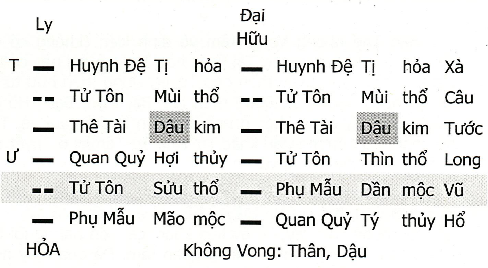
    - **Hình này chứng minh điều gì**
      - Khẳng định kẻ trộm cạy phá cửa từ hướng Đông Bắc dùng xe chở đồ lớn đi mất, không thể thu hồi.
    - **Từ đâu mà thấy được**
      - Quẻ Lục Xung Ly Vi Hỏa có Huynh Đệ trì Thế; hào 2 Sửu thổ Nguyệt phá hóa Dần mộc hồi đầu khắc lâm Huyền Vũ.
- Phản hồi thực tế từ đương số:
  - Cổng phía Đông Bắc của cơ quan đúng là đã bị kẻ gian cạy khóa phá tung; chúng lọt vào qua lối này rồi đột nhập phòng làm việc khoắng sạch toàn bộ trang thiết bị: bàn ghế làm việc, sofa tiếp khách, v.v. Cửa nẻo phòng làm việc bị cạy phá tả tơi, hư hại nặng.
  - Vì số lượng đồ đạc bị trộm rất lớn và cồng kềnh, cơ quan điều tra nhận định chúng ắt phải điều động xe tải chở đi trong đêm.
  - Về sau, toàn bộ tang vật bị trộm hoàn toàn bặt vô âm tín, không thể nào tìm lại được.

---

### Ví dụ 6: Nữ đoán phong thủy nhà cửa (Quẻ Phong Trạch Trung Phu biến Tốn Vi Phong)

#### Bối cảnh và trạch vận bất an tán tài
- Thời gian chiêm bái: Ngày Bính Dần, tháng Kỷ Hợi, năm Bính Tý.
- Đối tượng và sự việc: Một người phụ nữ đến xin dự đoán về tình hình phong thủy nhà ở của gia đình.
- Quẻ đắc: Phong Trạch Trung Phu biến Tốn Vi Phong (quẻ thuộc cung Thổ, Tuần Không tại Tuất và Hợi).
- Phán đoán Dụng thần nhà ở và tài vận:
  - Xem phong thủy nhà ở lấy hào Phụ Mẫu làm Dụng thần; trong quẻ Phụ Mẫu Tị hỏa lưỡng hiện (tại hào sơ và hào 5), theo nguyên tắc chọn động hào nên lấy hào sơ Phụ Mẫu Tị hỏa phát động làm Dụng thần.
  - Phụ Mẫu Tị hỏa bị Nguyệt kiến Hợi thủy tương xung là Nguyệt phá, báo hiệu trạch vận bất định, gia cư bất an, người ở bên trong tâm thần giao động, không yên ổn.
  - Hào Thê Tài không hiện trên mặt quẻ (phục tàng dưới hào 5); hào 3 Huynh Đệ Sửu thổ phát động khắc phạt; bản thân Dụng thần Phụ Mẫu Tị hỏa lại là đất Tuyệt của Thê Tài; ngôi nhà này phạm thế tán tài, tiền vào cửa trước ra cửa sau, hoàn toàn không thể tụ tài.

#### Hung sát cửa đối cửa và nạn bệnh của con cái
- Sát khí phong thủy xâm hại nhân đinh:
  - Quan Quỷ là hung thần mang ý nghĩa của ưu tư, phiền não, tai họa và bệnh tật.
  - Quan Quỷ Mão mộc ngự tại hào 2 (hào trạch); Nhật thần Dần mộc trợ khởi Quan Quỷ hào 2 phát động quay lại khắc phạt hào Thế (hào 4 Huynh Đệ Mùi thổ); chứng minh phong thủy ngôi nhà này cực kỳ bất lợi cho gia chủ, liên tục chiêu mời tai ách, rắc rối triền miên.
  - Thê Tài Tý thủy tuy được Nguyệt kiến Hợi thủy tỉ phù, nhưng bị hào sơ Phụ Mẫu Tị hỏa động biến thành đất Tuyệt, lại thêm hào 3 Huynh Đệ Sửu thổ động khắc, phản ánh gia cảnh liên tục bị phá tài nghiêm trọng.
- Phạm kỵ phong thủy "Cửa đối cửa":
  - Hào 3 là vị trí tượng trưng cho cửa ra vào, bản thân lục thân Huynh Đệ cũng chủ về cửa nẻo; hào 3 Huynh Đệ Sửu thổ phát động tương xung trực diện với hào 4 Huynh Đệ Mùi thổ; đây chính là hình thế hai cánh cửa mở đối diện nhau ("môn môn tương xung"), phạm vào một trong những đại kỵ nghiêm trọng nhất của phong thủy nhà ở.
- Tai họa và bệnh tật của con trẻ:
  - Hào Tử Tôn đại diện cho con cái: Tử Tôn Thân kim phục tàng dưới hào 3 Sửu thổ, lại nhập Mộ tại chính hào động Sửu thổ; Nguyệt kiến Hợi thủy là Bệnh địa của Thân kim; Nhật thần Dần mộc lại là Tuyệt địa của Thân kim (Dần Thân tương xung tuyệt); thêm vào đó hào sơ Phụ Mẫu Tị hỏa phát động trực tiếp khắc phạt Tử Tôn.
  - Gặp Bệnh địa chủ về phát sinh bạo bệnh hiểm nghèo; nhập Mộ chủ về việc phải vào bệnh viện điều trị; từ đó khẳng định con cái trong nhà tất sẽ vì bệnh nặng nguy kịch mà phải nhập viện cấp cứu lâu dài.

#### Phản hồi cay đắng và thực tế gia cảnh
- Hoàn cảnh kinh tế và nạn lừa đảo:
  - Người phụ nữ đau đớn xác nhận: Thu nhập của cả gia đình vô cùng ít ỏi, túng quẫn bế tắc, làm ra đồng nào hết đồng đó, không giữ lại được chút tiền của nào.
  - Con trai của chị không may phát hiện mắc bệnh hiểm nghèo (khối u não), phải nằm viện chạy chữa triền miên, gia đình đã tốn kém vô số tiền của nhưng bệnh tình vẫn không thuyên giảm. Thậm chí trong lúc quẫn bách, chị đã đi tìm bà đồng cúng bái trừ tà mong cứu con nhưng lại bị người ta lừa gạt mất một khoản tiền rất lớn.
- Bố cục nhà cửa ứng nghiệm:
  - Về kết cấu ngôi nhà, chị xác nhận trong nhà đúng là có hai cánh cửa phòng bố trí mở thẳng tắp đối diện trực xung với nhau, hoàn toàn trùng khớp với tượng quẻ.
- Phân tích hung sát phong thủy cửa đối cửa và nạn tật con cái qua quẻ Phong Trạch Trung Phu biến Tốn Vi Phong:
  - **Hình 56.** Quẻ Phong Trạch Trung Phu biến Tốn Vi Phong
    - 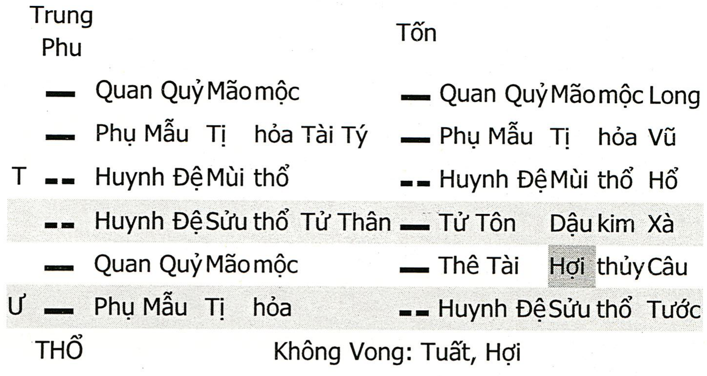
    - **Hình này chứng minh điều gì**
      - Xác nhận phong thủy phạm môn xung khiến hao tài, con trai mắc u não nhập viện tốn kém bị lừa gạt.
    - **Từ đâu mà thấy được**
      - Hào sơ Phụ Mẫu Nguyệt phá; hào 3 Huynh Sửu động xung hào 4 Huynh Mùi; Tử Tôn phục lâm Bệnh địa nhập Mộ.

## Chương 10: Bí Pháp 12 Cung Trường Sinh

### Ý nghĩa và nguyên tắc biện nghĩa 12 Cung Trường Sinh

#### Nguyên lý ứng dụng cốt lõi: Biện nghĩa thay vì biện cát hung
- Quan điểm cổ nhân và sự lãng phí thông tin trong Lục Hào truyền thống:
  - Trong các thuật số dự đoán đều ít nhiều đề cập đến 12 cung trường sinh, tuy nhiên do phương pháp dự đoán khác nhau mà quan điểm áp dụng cũng khác nhau.
  - Về cách dùng của 12 cung trường sinh trong dự đoán Lục Hào, người xưa chỉ coi trọng bốn trạng thái Sinh, Vượng, Mộ, Tuyệt, còn tám cung trạng thái khác đều gạt bỏ không dùng; điều này thực sự đã làm lãng phí một nguồn thông tin dự đoán vô cùng phong phú và tinh tế của quẻ Lục Hào.
- Bản chất thực sự của 12 Cung Trường Sinh:
  - Nguyên nhân người xưa hạn chế sử dụng là do đã lấy 12 cung trường sinh làm thước đo tiêu chuẩn để đánh giá cát hung của Dụng thần.
  - Sinh, Vượng, Mộ, Tuyệt tất nhiên có ảnh hưởng đến trạng thái lực lượng suy vượng của Dụng thần, nhưng công dụng chân chính của 12 cung trường sinh là dùng để **biện nghĩa** (phân tích, phân biệt, nhận rõ ngữ cảnh chi tiết của sự việc) chứ **không biện cát hung**. Cát hung chung cuộc hoàn toàn do ngũ hành sinh khắc chế hóa quyết định.
  - Trong các cổ thư kinh điển như *"Bốc Phệ Chính Tông"* từng đề cập đến ý nghĩa của Thai, Dưỡng, Mộ qua câu quyết: *"Dưỡng chủ hồ nghi, Mộ đa ám muội. Hóa Bệnh hề thương tổn, hóa Thai hề câu liên. Hung hóa Trường Sinh, sí nhi vị tán. Cát liên Mộc Dục, bại nhi bất thành"* (Dưỡng chủ nghi ngờ do dự, Mộ chủ nhiều điều tối tăm ám muội; Hóa Bệnh thì chịu thương tổn, hóa Thai thì cấu kết ràng buộc dây dưa; Hung mà hóa Trường Sinh thì thế hung đang bốc mạnh chưa tan; Cát mà vướng Mộc Dục thì sa đà bại hoại không thành).
  - Đối mặt với thực tế đời sống phức tạp, chỉ có mở rộng biên độ thông tin của 12 cung trường sinh thì người học mới nâng cao khả năng phán đoán các tình tiết vi diệu của sự việc.
- Trải nghiệm thực tiễn của tác giả:
  - Thông qua thực tiễn dự trắc dày dạn, tác giả đã giải mã trọn vẹn diệu dụng thực tế của 12 cung trường sinh, kiểm chứng nhiều lần đều ứng nghiệm phi thường.
  - Khi tra cứu và vận dụng các ý nghĩa tượng trưng, người dự đoán cần dựa vào động biến trong quẻ và nội dung cụ thể của sự việc cần xem; mấu chốt quý ở sự linh hoạt, biến hóa đa đoan, không được chấp nê cứng nhắc.

#### Tra cứu ý nghĩa thực chiến của 12 Cung Trường Sinh
- **Trường Sinh**:
  - Biểu thị: Khởi nguồn, khởi điểm, cội nguồn, nguồn gốc, gốc rễ, nguyên thủy, sinh ra, sinh trưởng, sản sinh, phát sinh.
  - Biểu thị sự trợ lực: Giúp đỡ, cứu trợ, nương tựa, chỗ dựa vững chắc, được cứu vớt, nuôi dưỡng, nhận được, tìm kiếm, tỉnh lại, ăn cơm,...
- **Mộc Dục**:
  - Trạng thái tự nhiên và hành vi: Tắm rửa, xuống nước, thoát y, lõa thể, trần truồng, đại tiểu tiện, ngủ nghỉ, hưởng thụ.
  - Trạng thái tinh thần và đạo đức: Dâm loạn, dâm ô, đổ nát, khó coi, vô sỉ, bại lộ, thẳng thắn, không che đậy.
  - Tính chất và đặc điểm vật lý: Ẩm ướt, trơn nhẵn, trụi lủi, sáng bóng, mịn màng, chăm sóc, ơn huệ, chỗ tốt, có lợi.
  - Phòng vệ và điểm yếu: Yếu điểm, chỗ chí mạng, sơ hở, từ bỏ phòng ngự, không đề phòng, hoàn toàn không có năng lực phòng hộ,...
- **Quan Đới**:
  - Trang phục và diện mạo: Mặc quần áo, đội mũ, y phục, đồng phục, trang phục chỉnh tề (không cởi áo), trang điểm, trang sức, bề ngoài, đóng gói.
  - Danh dự và địa vị: Cao quý, thăng chức, nâng cấp, vinh dự, khen ngợi, phần thưởng, được cấp giấy khen hoặc giấy chứng nhận, nhập ngũ.
  - Bảo hộ: Che đậy, phòng hộ, bảo quản,...
- **Lâm Quan**:
  - Thể chế và chính quyền: Nhà nước, doanh nghiệp quốc doanh, công quyền, quan phủ, ra làm quan, đang tại chức làm quan, có quan vận, nhân viên công vụ, có địa vị xã hội.
  - Hành vi xã hội: Nịnh bợ quan chức, a dua nghênh tiếp, nịnh hót.
  - Nguy cơ và hoạn nạn: Mang bệnh, tai họa, thập tử nhất sinh, nguy hiểm cận kề, lo âu bất an.
  - Tự thân phát triển: Tự lực cánh sinh, tự mình nỗ lực phấn đấu, trưởng thành, sắp sửa chạm tới thành công, phát nguyện, ước hẹn thề thốt, biến hóa khôn lường, xuất quỷ nhập thần, có người đàn ông bên cạnh,...
- **Đế Vượng**:
  - Hưng thịnh và đỉnh cao: Vinh hiển, phát đạt, thăng tiến, đắc ý, thần khí phấn chấn, tinh thần hưng phấn cực độ, huy hoàng xán lạn, phát triển mạnh mẽ.
  - Điểm tới hạn: Đạt tới cực hạn, cao trào tột bậc, điểm đỉnh, đi tới cùng tận, điểm kết thúc, kết cục chung cuộc.
  - Quy mô và thực lực: Lớn mạnh phi thường, tràn đầy lực lượng, hùng vĩ tráng kiện, cao to lực lưỡng, sở trường đặc biệt, nắm giữ quyền lực trong tay,...
- **Suy**:
  - Thể lực và tinh thần: Yếu ớt, vô lực, mềm yếu, suy nhược, nhược tiểu, hư nhược, nhược trí (thiểu năng trí tuệ), nhút nhát, sợ sệt.
  - Hoàn cảnh và tiền đồ: Không phát đạt, suy tàn lụi bại, vận hạn xui xẻo, thoái lui thụt lùi, thấp bé nhỏ thó, không có chỗ nương tựa.
  - Năng lực và tâm thế: Bất tài vô tướng, vô năng, không có bản lĩnh thực sự, "cao không tới thấp không thông", thiếu dũng khí phản kháng, bộc lộ điểm yếu kém,...
- **Bệnh**:
  - Thể xác: Bệnh tật phát sinh, vùng bị nhiễm bệnh, thương tật, thần ôn dịch.
  - Tinh thần và mâu thuẫn: Đáng ghét, thù hận, căm thù, kẻ thù địch, ánh mắt hằn thù, tâm bệnh dằn vặt.
  - Khiếm khuyết: Chỗ thiếu sót, khuyết điểm, tỳ vết, sơ hở chí mạng, điểm yếu hiểm yếu, hủ bại, nảy sinh vấn đề trục trặc,...
- **Tử**:
  - Chấm dứt sinh mệnh và vận hội: Tử vong, kết thúc, chấm dứt toàn bộ, xong đời, ngưng đọng, vắng vẻ tiêu điều, lạnh lẽo đáng sợ, an tĩnh tuyệt đối.
  - Khí sắc: Không phát đạt, không còn sinh khí, mất sạch sức sống.
  - Tính cách và tư duy: Cố chấp cứng đầu, bế tắc cùng đường, thiếu linh hoạt, không biết biến thông, đâm đầu vào ngõ cụt tối tăm, khô khan đần độn, nghĩ không thông suốt, lòng dạ hẹp hòi, không chừa đường lui cho mình,...
- **Mộ**:
  - Tích trữ và giam hãm: Kho tàng, ngăn chặn tứ phía, bao dung hàm chứa, cất giữ, chôn cất, ẩn tàng giấu kín, đóng kín then cài, thu thập gom góp, gửi gắm.
  - Quyền bính và thao túng: Quyền hạn, quản lý, quản chế giám sát, thuộc quyền sở hữu, khống chế, thao túng, chỉ huy lãnh đạo, thâu tóm toàn bộ.
  - Mất tự do: Rơi vào cạm bẫy, giam cầm, bị câu thúc quản thúc, bảo vệ canh giữ.
  - Trạng thái tinh thần và trắc trở: Tối tăm lờ đờ, chướng ngại tắc nghẽn, không thông suốt trôi chảy, chung cuộc chấm dứt, ám muội mờ ám, hồ đồ mê muội, không minh bạch rõ ràng, si mê mê đắm, suy nghĩ quẩn quanh không lối thoát,...
- **Tuyệt**:
  - Nguy hiểm tột độ: Không còn đường lui, nguy nan tột cùng, tuyệt địa tuyệt cảnh, đứng bên bờ vực thẳm.
  - Chia cắt và đổ vỡ: Chia ly đoạn tuyệt, cắt đứt quan hệ, quyết chiến một mất một còn.
  - Tinh thần tuyệt vọng: Thất vọng cùng cực, mất hết ý chí chiến đấu, tiêu tan hy vọng, hết thuốc chữa, hoàn toàn bất lực.
  - Thái độ: Tàn nhẫn vô tình, ác nghiệt cay nghiệt, dứt khoát không châm chước, đình chỉ hoàn toàn, tan biến mất hút, bặt vô âm tín,...
- **Thai**:
  - Trạng thái phôi thai: Mang thai thụ thai, phôi thai, non nớt nhỏ tuổi, ấu trĩ, trình độ sơ cấp, bước đi chập chững ban đầu.
  - Hoạch định: Công tác chuẩn bị ban đầu, trù tính sơ bộ, lên kế hoạch dự thảo, manh nha hình thành.
  - Bẩm sinh di truyền: Di truyền từ đời trước, số phận an bài trong mệnh, tính chất tiên thiên, trời sinh đã có, sinh ra đã mang theo, bản tính khó dời.
  - Mối liên kết tâm lý: Cấu kết liên đới, bận tâm vướng víu, tư tưởng trăn trở; Thai được xem là "tiểu Mộ" nên biểu thị suy nghĩ có phần u mê không thông suốt, phản ứng chậm chạp trì trệ,...
- **Dưỡng**:
  - Nuôi nấng và điều dưỡng: Nuôi dưỡng, nghỉ dưỡng, an dưỡng dưỡng bệnh, bổ sung dinh dưỡng, tẩm bổ bồi dưỡng, nuôi dạy giáo dục, nghỉ ngơi tĩnh dưỡng.
  - Dựa dẫm và phù trợ: Nương tựa chỗ dựa, phù trợ nâng đỡ, ký thác gửi gắm, nhận con nuôi (con thừa tự).
  - Trạng thái tâm lý: "Dưỡng chủ hồ nghi" mang ý nghĩa ngờ vực đắn đo, không yên tâm, không chắc chắn, tâm lý chột dạ (tâm hư), lo âu bất an, canh cánh bận lòng.
  - Khởi sinh: Manh nha sinh ra, sinh trưởng non nớt, nhược tiểu,...

### Ví dụ 1: Ngày Nhâm Thìn tháng Nhâm Tý năm Đinh Sửu, nam xem về việc thai sản của vợ

#### Bối cảnh và quẻ tượng
- Thời gian trắc quẻ: Ngày Nhâm Thìn, tháng Nhâm Tý, năm Đinh Sửu.
- Đương số: Nam giới đến xem bói về việc mang thai sinh nở của vợ.
- Quẻ đắc: Thiên Trạch Lý biến Thiên Thủy Tụng.
- Cung quẻ: Cung Cấn (Thổ quái). Tuần Không: Ngọ, Mùi.

#### Luận giải chi tiết và ứng dụng 12 Cung Trường Sinh
- Nhận định thai trạng và giai đoạn thai kỳ:
  - Xem việc thai sản lấy hào Tử Tôn làm Dụng thần. Trong quẻ, Tử Tôn Thân kim trì Thế biểu thị người nữ đã mang thai.
  - Hào Thai của Tử Tôn Thân kim là Mão mộc lâm hào 2 (hào 2 vốn là thai vị trong lục hào trạch pháp), củng cố thêm thông tin chắc chắn đã thụ thai.
  - Nguyệt kiến Tý thủy sinh dưỡng hào thai Quan Quỷ Mão mộc; xét theo 12 cung trường sinh thì Tý thủy chính là đất Mộc Dục của Mão mộc. Tượng Mộc Dục chủ lông tóc chưa hình thành, phôi thai còn non nớt trần trụi, biểu thị người vợ mới vừa mang thai trong giai đoạn đầu.
- Dự đoán hung hiểm và giới tính thai nhi:
  - Tử Tôn Thân kim lâm Tử địa tại Nguyệt kiến Tý thủy; trong quẻ lại có Phụ Mẫu Tị hỏa phát động khắc phạt Dụng thần, điềm triệu hung hiểm không lành.
  - Hào phát động Phụ Mẫu Tị hỏa, hào biến Quan Quỷ Dần mộc kết hợp cùng Dụng thần Tử Tôn Thân kim tạo thành Dần - Tị - Thân Tam hình, e rằng thai nhi khó lòng sinh hạ an toàn.
  - Về giới tính thai nhi: Tử Tôn là hào dương phát động, quẻ bản thể lại thuộc cung Cấn (Dương quái), do đó xác định thai nhi là bé trai.
  - Nguyên nhân thai nhi mất mạng: Tý thủy là đất Tử của Tử Tôn Thân kim, đồng thời hình hào thai Mão mộc (Tý Mão tương hình); Tý thủy là Thê Tài (tượng người vợ), e rằng chính người vợ chủ động muốn phá thai.
- Quan hệ hôn nhân và giấy tờ pháp lý:
  - Hào 6 Huynh Đệ Tuất thổ được Phụ Mẫu Tị hỏa sinh trợ, lại bị Nhật thần Thìn thổ xung thành ám động; ám động khắc chế Thê Tài.
  - Thê Tài Tý thủy không xuất hiện trên quẻ, nhập Mộ tại Nhật thần Thìn thổ, lại lâm Tuyệt địa tại hào phát động Phụ Mẫu Tị hỏa; quẻ biến thành Thiên Thủy Tụng là quẻ Du Hồn; toàn bộ cấu trúc báo hiệu thông tin hai người tất sẽ chia tay, đường ai nấy đi.
  - Hào Phụ Mẫu tượng trưng cho giấy chứng nhận kết hôn; Phụ Mẫu lâm Huyền Vũ chủ sự việc mờ ám ngầm ước, lại nhập Mộ tại hào ám động Tuất thổ, biểu thị hai người không hề có giấy chứng nhận kết hôn hợp pháp.
  - Hào Tài phục tàng dưới hào Thế, lại nhập Mộ, tạo thành tượng "kim ốc tàng kiều" (nhà vàng cất người đẹp). Điều này chứng minh quan hệ thực tế không có hôn thú, gọi là vợ nhưng bản chất chỉ là đối tượng sống thử trước hôn nhân (vị hôn đồng cư).
  - Năm Mậu Dần tiếp theo, Tử Tôn Thân kim gặp đất Tuyệt tại Thái Tuế, lại cấu thành Tam hình hoàn chỉnh, phải hết sức đề phòng hung họa ập tới.
- Dự đoán thai nhi khó giữ và mối quan hệ hôn nhân tan vỡ qua quẻ Thiên Trạch Lý biến Thiên Thủy Tụng:
  - **Hình 57.** Quẻ Thiên Trạch Lý biến Thiên Thủy Tụng
    - 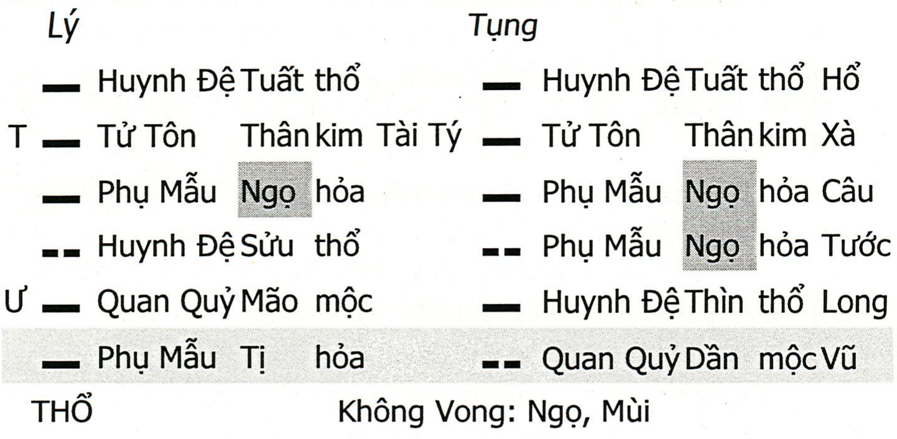
    - **Hình này chứng minh điều gì**
      - Thai nhi là con trai khó sinh hạ do Dụng thần Tử tại Nguyệt, Phụ Mẫu động khắc thành Tam hình; hai người sống thử không hôn thú và người vợ tự ý phá thai, chia tay.
    - **Từ đâu mà thấy được**
      - Tử Tôn Thân kim trì Thế, hào thai Mão mộc lâm hào 2 được Nguyệt kiến Tý thủy sinh (đất Mộc Dục); Tị hỏa động biến Dần mộc tạo Dần - Tị - Thân Tam hình; Tuất thổ ám động khắc Tài nhập Mộ.

#### Ứng nghiệm thực tế
- Quả nhiên hai người chỉ là sống chung trước hôn nhân chứ chưa đăng ký kết hôn, phía người nữ mang thai.
- Đến tháng Mão năm Mậu Dần, đôi bên phát sinh mâu thuẫn cãi vã gay gắt, người phụ nữ kiên quyết đòi chia tay, tự ý đi bệnh viện phá thai rồi dứt khoát rời đi.
- Thai nhi bị phá bỏ đúng là con trai.

---

### Ví dụ 2: Ngày Tân Tị tháng Đinh Tị năm Mậu Dần, nam đoán vận khí lưu niên

#### Bối cảnh và quẻ tượng
- Thời gian trắc quẻ: Ngày Tân Tị, tháng Đinh Tị, năm Mậu Dần.
- Đương số: Nam giới đoán vận hạn cát hung lưu niên trong năm.
- Quẻ đắc: Hỏa Sơn Lữ biến Ly Vi Hỏa.
- Cung quẻ: Cung Ly (Hỏa quái). Tuần Không: Thân, Dậu.

#### Luận giải chi tiết và ứng dụng 12 Cung Trường Sinh
- Xác định nghề nghiệp đương số:
  - Xem lưu niên lấy hào Thế làm Dụng thần. Tử Tôn Thìn thổ trì Thế lâm Bạch Hổ; Tử Tôn chủ quân nhân, binh lính; Bạch Hổ chủ đao thương khí giới; quẻ lại thuộc cung Ly, Ly quái chủ giáp trụ (áo giáp và mũ trụ bảo hộ); tổng hợp tượng quẻ đoán đương số hiện đang công tác trong ngành công an.
- Phân tích nguy cơ tố cáo kiện tụng:
  - Hào Thế Tử Tôn Thìn thổ phát động hóa Phụ Mẫu Mão mộc hồi đầu khắc; Phụ Mẫu chủ văn thư đơn từ khiếu nại, biểu thị có người làm đơn kiện cáo (cáo trạng).
  - Nhận diện đối tượng tố giác: Hào biến Mão mộc ở hào sơ là vị trí cấp dưới; lâm Bạch Hổ chủ đường sá giao thông; chi Mão mộc là Dịch Mã (theo Tam hợp cục Tị Dậu Sửu thì Dịch Mã tại ba cung Hợi Mão Mùi chứ không bó hẹp riêng tại Hợi như nhiều sách thông thường); do đó người tố cáo đích thị là một tài xế lái xe dưới quyền quản lý.
  - Thái độ quyết liệt của người khiếu nại: Mão mộc là Tử địa của hào Thế Thìn thổ (Thổ tử tại Mão); tượng ngụ ý người này tố cáo đến cùng tận, chừng nào chưa đạt được mục đích thì quyết không chịu buông tha.
- Tiến trình thời gian ứng nghiệm và cảnh báo:
  - Tháng Hai âm lịch là tháng Mão mộc nắm lệnh vượng tướng, đoán sự kiện khiếu nại phát sinh ngay trong tháng Hai.
  - Sang tháng Ba (tháng Thìn thổ), ngũ hành Thổ đồng hành tỉ phù cho hào Thế nên tình hình từ tháng Ba bắt đầu hòa hoãn, lắng dịu.
  - Đến tháng Tư (tháng Tị hỏa), hào Thế được Nguyệt kiến Tị hỏa tương sinh mạnh mẽ, đoán có quý nhân quyền thế ra tay cứu giúp giải vây, sóng gió trước mắt tạm thời bình ổn.
  - Tuy nhiên, hào biến Mão mộc chưa hề bị triệt tiêu chế ngự hoàn toàn; đến tháng Hợi cuối năm, Hợi thủy sinh vượng Mão mộc làm Mão mộc có chỗ dựa vững chắc, người tài xế kia sẽ tập hợp lực lượng phản công tố cáo lần hai. Tác giả khuyên đương sự phải khẩn trương chủ động xử lý dứt điểm, tuyệt đối không được chủ quan.
- Dự đoán tai họa bị tài xế cấp dưới tố cáo tham ô qua quẻ Hỏa Sơn Lữ biến Ly Vi Hỏa:
  - **Hình 58.** Sơ đồ quẻ Hỏa Sơn Lữ biến Ly Vi Hỏa
    - 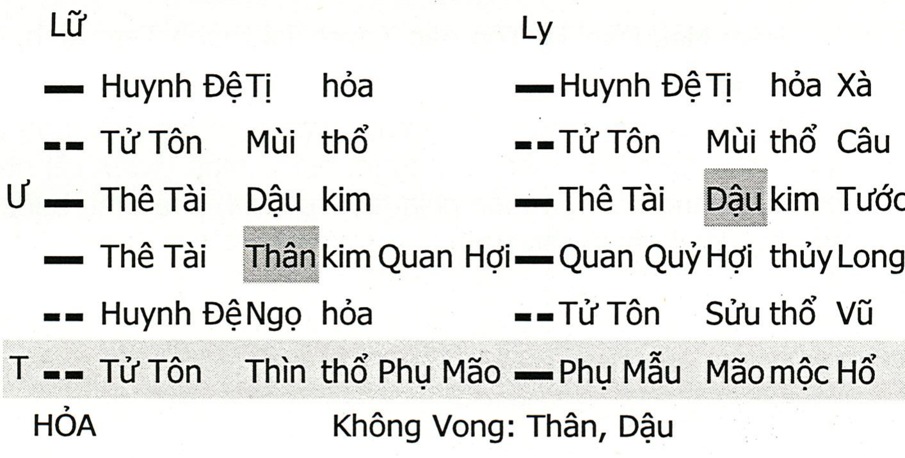
    - **Hình này chứng minh điều gì**
      - Sĩ quan công an bị tài xế cấp dưới làm đơn tố cáo tham ô công quỹ; tháng Tư tạm yên nhưng đến tháng Hợi bị truy tố hình sự phải bỏ trốn.
    - **Từ đâu mà thấy được**
      - Tử Tôn Thìn thổ trì Thế lâm Bạch Hổ, quẻ Ly (giáp trụ); Thế động hóa Phụ Mẫu Mão mộc (Dịch Mã, Tử địa của Thế) hồi đầu khắc; tháng Hợi sinh Mão mộc phản công.

#### Ứng nghiệm thực tế
- Các phán đoán đều chuẩn xác: Người này làm việc trong lực lượng công an; viên tài xế dưới quyền có nhờ vả một việc riêng nhưng không được giải quyết thỏa đáng nên ghi hận trong lòng, làm đơn tố cáo ông tham ô công quỹ vào tháng Hai.
- Nhờ có nhiều mối quan hệ thân thiết trong ngành tư pháp hết sức che chở giúp đỡ nên sang tháng Tư sự việc đã tạm yên ổn.
- Nghe theo lời khuyên của tác giả, đương sự đã chủ động đem toàn bộ số tiền công quỹ nộp trả lại.
- Tuy nhiên đến tháng Hợi, người tài xế tiếp tục gửi đơn tố cáo lên cấp cao hơn; cơ quan tư pháp nhận định công quỹ dù đã hoàn trả nhưng tính chất vụ việc vẫn phải truy cứu trách nhiệm hình sự. Đương sự sợ hãi bỏ trốn ra ngoài, đến nay vẫn biệt tích chưa dám quay về.

---

### Ví dụ 3: Ngày Bính Ngọ tháng Mậu Ngọ năm Mậu Dần, nữ xem công việc

#### Bối cảnh và quẻ tượng
- Thời gian trắc quẻ: Ngày Bính Ngọ, tháng Mậu Ngọ, năm Mậu Dần.
- Đương số: Nữ giới xem bói về tình hình công việc hiện tại và tương lai.
- Quẻ đắc: Địa Trạch Lâm (quẻ tĩnh).
- Cung quẻ: Cung Khôn (Thổ quái). Tuần Không: Dần, Mão.

#### Luận giải chi tiết và ứng dụng 12 Cung Trường Sinh
- Thực trạng chức nghiệp và tâm lý đương số:
  - Xem công việc lấy hào Quan Quỷ làm Dụng thần. Trong quẻ, Quan Quỷ Mão mộc trì Thế biểu thị hiện tại đang có công việc ổn định.
  - Tuy nhiên hào Thế Quan Quỷ lại lâm Tuần Không, biểu hiện tâm lý chán nản, không còn chút tâm trí hay nhiệt huyết nào dành cho công việc hiện tại.
  - Về tính chất cơ quan: Quan Quỷ đóng tại hào 2 lâm Câu Trần; hào 2 là trạch vị (nhà ở hoặc cơ quan làm việc); thời xưa luận Câu Trần là nha môn chốn công quyền, thời nay luận Câu Trần là nhân viên biên chế làm việc tại cơ quan nhà nước.
- Tiền đồ công danh và khả năng chuyển đổi công tác:
  - Quan Quỷ Mão mộc hưu tù, lâm đất Tử tại cả Nhật thần lẫn Nguyệt kiến Ngọ hỏa (Mộc tử tại Ngọ); công việc hoàn toàn bế tắc, không có tiền đồ thăng tiến hay phát triển.
  - Hào Ứng Thê Tài Hợi thủy lâm Huyền Vũ; xét theo 12 cung trường sinh thì Hợi thủy chính là đất Trường Sinh của Quan Quỷ Mão mộc; tượng ngụ ý trong thâm tâm cô rất khao khát muốn rời cơ quan ra ngoài xã hội mưu cầu cơ hội phát triển mới.
  - Khả năng thành công: Hào Thế phạm Tuần Không nên không thể tiếp nhận tương sinh; mặt khác Hợi thủy ở hào Ứng cũng cực kỳ suy yếu trước sức nóng hừng hực của Nguyệt Nhật Ngọ hỏa. Do đó dù trong lòng rất muốn nhảy việc nhưng lực bất tòng tâm, rốt cuộc không thể thay đổi được gì.
- Dự đoán bế tắc trong công việc cơ quan nhà nước qua quẻ Địa Trạch Lâm:
  - **Hình 59.** Sơ đồ quẻ Địa Trạch Lâm
    - 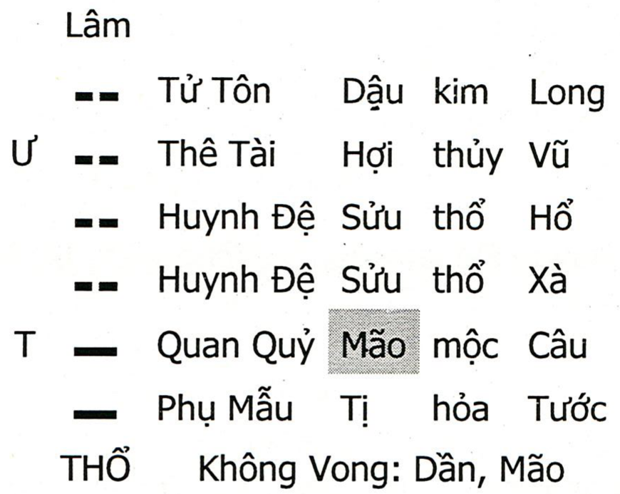
    - **Hình này chứng minh điều gì**
      - Nữ nhân viên tòa án chán nản công việc, muốn ra ngoài tìm hướng phát triển mới nhưng bất thành, không thể chuyển đổi.
    - **Từ đâu mà thấy được**
      - Quan Quỷ Mão mộc trì Thế lâm Câu Trần ở hào 2 trạch vị, gặp Tuần Không, Tử tại Nhật Nguyệt Ngọ hỏa; Hợi thủy lâm Huyền Vũ là đất Trường Sinh nhưng suy kiệt không sinh được Thế.

#### Ứng nghiệm thực tế
- Người phụ nữ này xác nhận hiện đang công tác tại Tòa án nhân dân. Toàn bộ phân tích về hoàn cảnh công tác, sự chán chường và ý định bỏ việc bế tắc đều ứng nghiệm hoàn toàn với thực trạng của cô.

---

### Ví dụ 4: Ngày Canh Ngọ tháng Mão năm Mậu Dần, La tiên sinh xem lưu niên cho bạn

#### Bối cảnh và quẻ tượng
- Thời gian trắc quẻ: Ngày Canh Ngọ, tháng Mão, năm Mậu Dần.
- Đương số: La tiên sinh đến xem vận hạn lưu niên giúp một người bạn thân.
- Quẻ đắc: Cấn Vi Sơn biến Sơn Địa Bác.
- Cung quẻ: Cung Cấn (Thổ quái). Tuần Không: Tuất, Hợi.

#### Luận giải chi tiết và ứng dụng 12 Cung Trường Sinh
- Xác định Dụng thần và tai họa hình pháp:
  - Xem cho bạn bè lấy hào Huynh Đệ làm Dụng thần. Quẻ có Huynh Đệ lưỡng hiện (Thìn thổ ở hào sơ và Tuất thổ ở hào 4); theo quy tắc chọn hào có biến cố, lấy hào phạm Tuần Không là Huynh Đệ Tuất thổ làm Dụng thần.
  - Huynh Đệ Tuất thổ lâm Chu Tước, bị Nguyệt kiến Mão mộc Quan Quỷ khắc chế nặng nề; lại có hào Thế Quan Quỷ Dần mộc lâm Thái Tuế năm Mậu Dần; đoán chắc chắn trong năm nay người bạn này sẽ bị vướng vào chuyện quan sự, kiện tụng pháp luật bủa vây.
- Mức độ dây dưa và nguồn cơn sâu xa:
  - Hào 3 Tử Tôn Thân kim phát động sinh hào 5 Thê Tài Tý thủy; Tý thủy bị Nhật thần Ngọ hỏa xung kích trở thành ám động; hào Tài ám động lại quay sang sinh dưỡng Kỵ thần Quan Quỷ; biểu thị vụ kiện tụng này dây dưa móc nối tới rất nhiều vấn đề phức tạp.
  - Tử Tôn Thân kim lâm Thanh Long động hóa Quan Quỷ Mão mộc; Tử Tôn chủ ăn chơi hưởng thụ, Thanh Long chủ hoan lạc tình dục, Quan Quỷ chủ tai họa lao lý; ứng nghiệm câu khẩu quyết: *"Tử Tôn phát động hóa Quan Quỷ, lạc cực sinh bi"* (vui quá hóa buồn). Rõ ràng nguyên nhân tai họa bắt nguồn từ phụ nữ hoặc quan hệ nam nữ bất chính gây nên.
  - Mặt khác, Thanh Long cũng chủ tiền tài, kết hợp với hào Tài ám động sinh Quan Quỷ, chứng tỏ vụ án còn dính líu cả rắc rối về mặt kinh tế.
- Bí pháp giải cứu bằng Thiên Ất Quý Nhân và nguy cơ tiềm ẩn:
  - Can ngày là Canh; khẩu quyết Quý Nhân ghi rõ: *"Giáp Mậu Canh ngưu dương"* (ngưu là Sửu, dương là Mùi), Thiên Ất Quý Nhân đóng tại Sửu và Mùi.
  - Chi Sửu thổ có thể hợp trói Tý thủy (Tý Sửu lục hợp), làm cho Tý thủy không thể sinh trợ cho Kỵ thần Quan Quỷ; lại có thể khiến Thân kim nhập Mộ (Kim mộ tại Sửu) để ngừng sinh Tài; đồng thời Sửu thổ trợ giúp đắc lực cho Tuất thổ; do đó tác giả khuyên nhất định phải tìm một người tuổi Sửu ra tay giúp đỡ mới giải quyết ổn thỏa vụ án này.
  - Nếu không tìm người giải cứu: Dụng thần Tuất thổ lâm đất Đế Vượng tại Tý thủy; hào Đế Vượng ám động sinh trợ Kỵ thần Quan Quỷ thì vấn đề kinh tế sẽ càng bung bét nghiêm trọng. Hiện tại Dụng thần Tuần Không là còn tạm lánh nơi Không địa; đến tháng Thìn xung thực xung Mộ thì tai họa tù ngục tất giáng xuống đầu!
- Dự đoán quan sự kiện tụng kinh tế do phụ nữ gây ra và phương pháp giải cứu qua quẻ Cấn Vi Sơn biến Sơn Địa Bác:
  - **Hình 60.** Quẻ Cấn Vi Sơn biến Sơn Địa Bác
    - 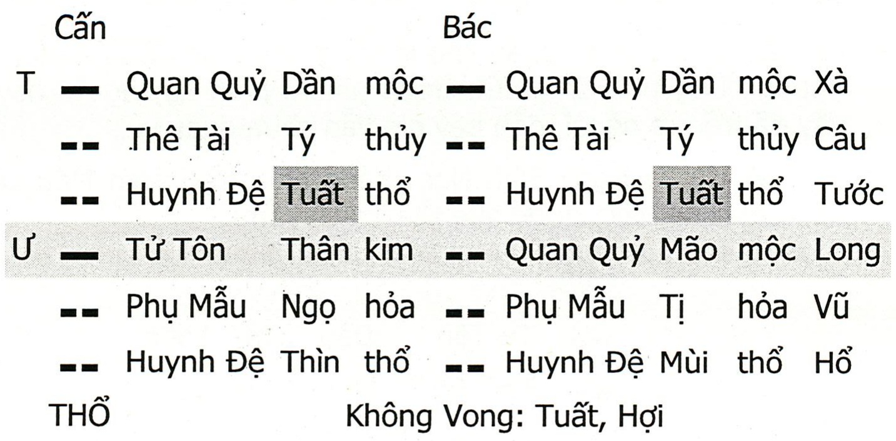
    - **Hình này chứng minh điều gì**
      - Người bạn vướng kiện tụng do mâu thuẫn tình cảm với nhân tình tố cáo; cần tìm quý nhân tuổi Sửu hợp trói Tý thủy mới giải quyết được.
    - **Từ đâu mà thấy được**
      - Huynh Đệ Tuất thổ Tuần Không bị Nguyệt khắc; Thế Quan Quỷ lâm Thái Tuế; Thân kim lâm Thanh Long động sinh Tài Tý thủy ám động sinh Quan; can Canh có Quý nhân tại Sửu Mùi.

#### Ứng nghiệm thực tế
- Lúc đó La tiên sinh một mực khẳng định bạn ông chỉ bị kiện về kinh tế thuần túy, tuyệt đối không dính dáng gì đến phụ nữ.
- Đến chiều cùng ngày, La tiên sinh quay lại thán phục nói rằng tác giả đoán quá chuẩn xác: Người bạn vì mâu thuẫn sâu sắc với người phụ nữ sống chung nên bị cô ta làm đơn tố cáo khiến ông vướng vào vòng lao lý, thực tế người này không hề tham ô biển thủ gì.
- Sau đó gia đình tìm được một người tuổi Sửu đứng ra giúp đỡ nên vụ việc đã được giải quyết êm thấm.

---

### Ví dụ 5: Ngày Canh Thìn tháng Kỷ Mùi năm Mậu Dần, chủ mỏ than xem phong thủy xưởng

#### Bối cảnh và quẻ tượng
- Thời gian trắc quẻ: Ngày Canh Thìn, tháng Kỷ Mùi, năm Mậu Dần.
- Đương số: Một chủ doanh nghiệp khai thác than đá đến xem phong thủy nhà xưởng công trường.
- Quẻ đắc: Phong Trạch Trung Phu biến Thiên Thủy Tụng.
- Cung quẻ: Cung Cấn (Thổ quái). Tuần Không: Thân, Dậu.

#### Luận giải chi tiết và ứng dụng 12 Cung Trường Sinh
- Xác định Dụng thần và bố cục phong thủy:
  - Doanh nghiệp sản xuất xem phong thủy chủ yếu coi trọng hiệu quả kinh tế và tính mạng an toàn của công nhân, vì vậy lấy hào Thê Tài làm chủ đạo.
  - Hào Thế Huynh Đệ Mùi thổ phát động; Huynh Đệ đại diện cho cửa ngõ cổng lớn, hào Thế là tọa sơn; hào động lấy phản hướng mà đoán, xác định công xưởng tọa Sửu hướng Mùi (tức mở cổng quay về hướng Tây Nam).
  - Hào Thế là Quỷ Khố (Mùi là Mộ của Quan Quỷ Mão mộc), biểu thị cửa ngõ mở tại phương vị bất chính; Huynh Đệ động hóa Phụ Mẫu lâm Chu Tước, vừa chủ phá tài hao của vừa dễ vướng vào khẩu thiệt kiện tụng chốn công quyền.
- Thực trạng kinh tế và tai nạn lao động:
  - Hào Tài hưu tù không xuất hiện trên quẻ, phục dưới hào 2 Phụ Mẫu Tị hỏa; xét theo 12 cung trường sinh thì Tị hỏa chính là Tuyệt địa của Thủy (Tài Tý thủy tuyệt tại Tị), phản ánh hiệu quả kinh tế của mỏ than vô cùng ảm đạm, thua lỗ.
  - Hào sơ là tiểu khẩu, đại diện cho công nhân mỏ than; đồng thời hào Tài cũng tượng trưng cho công nhân. Hào sơ Tị hỏa là Tuyệt địa của Tài, Tài không quy vị, biểu thị công nhân chán nản, không ai muốn gắn bó làm việc tại xưởng.
  - Hào Tài lâm Tuyệt địa lại nhập Mộ tại Mùi thổ và Thìn thổ, báo hiệu công nhân làm việc sẽ liên tiếp gặp tai nạn thương tật đổ máu.
  - Hào sơ lâm Bạch Hổ; hào sơ là bàn chân, Bạch Hổ chủ huyết quang thương tích; công nhân ắt sẽ bị tai nạn thương tật ở chân.
  - Hào Tài nhập Mộ tại Nhật thần Thìn thổ, đây là điềm báo có sự cố chết người trong mỏ. Khi chủ xưởng hốt hoảng hỏi nguyên nhân vì sao tử vong, tác giả chỉ rõ trong quẻ Tài phục lâm Câu Trần; Câu Trần là điền thổ đất cát, chứng tỏ công nhân tử vong có liên quan đến việc bị khối đất đá than sập đè ép ngạt thở.
- Dự đoán phong thủy mỏ than suy thoái kinh tế và tai nạn chết người qua quẻ Phong Trạch Trung Phu biến Thiên Thủy Tụng:
  - **Hình 61.** Sơ đồ quẻ Phong Trạch Trung Phu biến Thiên Thủy Tụng
    - 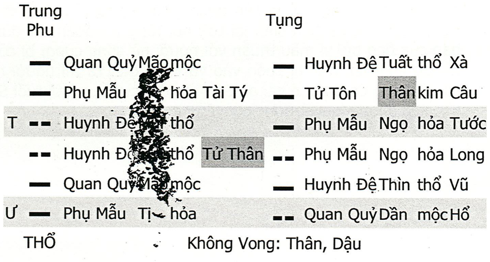
    - **Hình này chứng minh điều gì**
      - Xưởng mở cổng hướng Tây Nam gặp khó khăn kinh tế; công nhân bị thương ở chân và một thợ mỏ bị sập vỉa than đè chết ngạt.
    - **Từ đâu mà thấy được**
      - Huynh Đệ Mùi thổ trì Thế (Quỷ khố) động hóa Phụ Mẫu lâm Chu Tước; Tài Tý thủy phục dưới hào 2 lâm Tuyệt địa Tị hỏa; Tài nhập Mộ tại Nhật Thìn lâm Câu Trần, hào sơ lâm Bạch Hổ.

#### Ứng nghiệm thực tế
- Người chủ công xưởng xác nhận: Cổng mỏ than đúng là mở về hướng Tây Nam; hiện doanh nghiệp đang lâm vào cảnh khó khăn tài chính trầm trọng, chỉ dám duy trì hoạt động cầm chừng một nửa công suất.
- Trong xưởng quả thực đã liên tiếp xảy ra tai nạn thương vong thảm khốc: một công nhân bị gãy đùi, một công nhân bị dập nát bàn chân, và một thợ mỏ bị sập vỉa than chôn vùi đè ngạt thở chết trong hầm lò.
- Sau đó, tác giả đã căn cứ vào quy luật sinh khắc trong quẻ để hướng dẫn chủ xưởng điều chỉnh lại phong thủy giải trừ hung sát.

---

### Ví dụ 6: Ngày Quý Tị tháng Giáp Tý năm Mậu Dần, hỏi sức khỏe con nhỏ

#### Bối cảnh và quẻ tượng
- Thời gian trắc quẻ: Ngày Quý Tị, tháng Giáp Tý, năm Mậu Dần.
- Đương số: Cha mẹ đến hỏi về tình hình sức khỏe của đứa con nhỏ.
- Quẻ đắc: Phong Hỏa Gia Nhân biến Tốn Vi Phong.
- Cung quẻ: Cung Tốn (Mộc quái). Tuần Không: Ngọ, Mùi.

#### Luận giải chi tiết và ứng dụng 12 Cung Trường Sinh
- Đánh giá tổng quan tính mạng và sức khỏe:
  - Xem sức khỏe con cái lấy hào Tử Tôn làm Dụng thần. Tử Tôn Tị hỏa ở hào 5 bị Nguyệt kiến Tý thủy khắc nhưng lại lâm Nhật thần Tị hỏa tỉ trợ, lực lượng suy vượng hai bên cân bằng ngang ngửa.
  - Trong quẻ có Phụ Mẫu Hợi thủy hào 3 ám động khắc Dụng thần, nhưng may mắn có hào 2 Thê Tài Sửu thổ phát động khắc chế Thủy, lại có Nguyên thần Huynh Đệ Mão mộc động thông quan sinh trợ cho Hỏa, cho nên thể trạng sức khỏe chung của cháu bé vẫn tương đối ổn định, không nguy hiểm tính mạng.
- Phát hiện dị tật bẩm sinh đặc thù:
  - Tử Tôn Tị hỏa ở hào 5 lâm Đằng Xà bị Nguyệt kiến Tý thủy khắc; hào 5 là vị trí ngũ quan trên mặt; ngũ hành Hỏa chủ đôi mắt; Đằng Xà chủ quái dị khác thường; đoán mắt của đứa trẻ mang hình thù dị dạng kỳ lạ.
  - Quẻ thuộc cung Tốn; theo Dịch lý tượng của Tốn quái là "mắt trắng" (bạch nhãn); do đó đoán mắt của cháu bé có rất nhiều lòng trắng.
  - Về nguồn gốc dị tật: Kỵ thần Nguyệt kiến Tý thủy chính là Thai địa của Tị hỏa (Hỏa thai tại Tý); vì vậy xác định đây là hiện tượng dị tật bẩm sinh mang theo từ trong bụng mẹ chứ không phải do ngoại cảnh gây nên.
- Dự đoán tật mắt trắng bẩm sinh của trẻ nhỏ qua quẻ Phong Hỏa Gia Nhân biến Tốn Vi Phong:
  - **Hình 62.** Sơ đồ quẻ Phong Hỏa Gia Nhân biến Tốn Vi Phong
    - 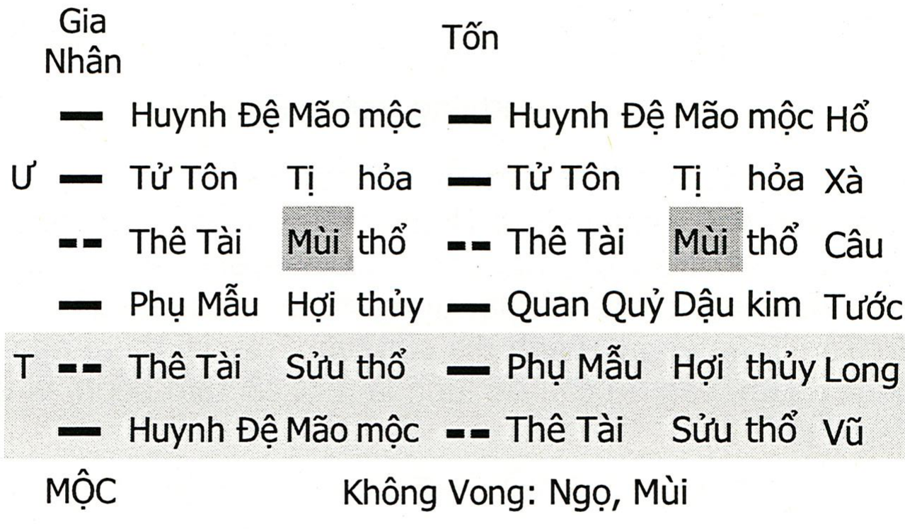
    - **Hình này chứng minh điều gì**
      - Cháu bé bị dị tật mắt trắng bẩm sinh, nhiều lòng trắng, nhưng tính mạng bình an nhờ có hào động thông quan cứu trợ.
    - **Từ đâu mà thấy được**
      - Tử Tôn Tị hỏa hào 5 lâm Đằng Xà bị Nguyệt kiến Tý thủy khắc; quẻ thuộc cung Tốn (bạch nhãn - mắt trắng); Kỵ thần Nguyệt kiến Tý thủy là Thai địa của Tị hỏa.

#### Ứng nghiệm thực tế
- Người nhà cháu bé xác nhận: Đứa nhỏ từ lúc mới lọt lòng đã bị tật mắt trắng bẩm sinh, nhìn lúc nào cũng như đang trợn ngược toàn tròng trắng rất khác thường.

---

### Ví dụ 7: Ngày Ất Mùi tháng Giáp Tý năm Mậu Dần, nam đoán khi nào có con

#### Bối cảnh và quẻ tượng
- Thời gian trắc quẻ: Ngày Ất Mùi, tháng Giáp Tý, năm Mậu Dần.
- Đương số: Nam giới đến hỏi khi nào bản thân mới có con nối dõi.
- Quẻ đắc: Lôi Thiên Đại Tráng biến Càn Vi Thiên.
- Cung quẻ: Cung Khôn (Thổ quái). Tuần Không: Thìn, Tị.

#### Luận giải chi tiết và ứng dụng 12 Cung Trường Sinh
- Luận đoán đường con cái:
  - Lấy hào Tử Tôn làm Dụng thần. Tử Tôn Thân kim hào 5 mặc dù được Nhật thần Mùi thổ sinh phù nhưng lại rơi vào đất Tử tại Nguyệt kiến Tý thủy; ngoại quái phạm Phục ngâm; Kỵ thần Phụ Mẫu Ngọ hỏa trì Thế; hào Thế lại bị Nguyệt phá; toàn quẻ là quẻ Lục Xung biến Lục Xung; toàn bộ đều là tượng đại hung, điềm triệu suốt đời không có con cái.
  - Vấn đề tâm bệnh giày vò: Tử Tôn Thân kim là Bệnh địa của hào Thế Ngọ hỏa (Hỏa bệnh tại Thân), lại thêm ngoại quái phục ngâm đầy sầu não, biểu thị chuyện con cái luôn là một tâm bệnh dai dẳng giày vò khiến đương sự vô cùng đau khổ dằn vặt.
- Tìm nguyên nhân vô sinh từ cơ thể:
  - Hào 3 Huynh Đệ Thìn thổ là Nguyên thần của Tử Tôn, đồng thời là Dưỡng địa của Dụng thần.
  - Hào 3 chủ bộ phận sinh dục; Thìn thổ lâm Tuần Không nên mất khả năng sinh dưỡng Dụng thần, chứng tỏ cơ quan sinh lý có khiếm khuyết nghiêm trọng.
  - Chi Thìn là Thủy khố; ngũ hành Thủy là Thê Tài; Tài đại diện cho tinh dịch; vì vậy Thìn thổ chính là túi chứa tinh trùng (tinh nang). Thìn thổ phạm Tuần Không nghĩa là túi tinh rỗng, số lượng tinh trùng quá ít ỏi, không thể giúp người vợ thụ thai, cả đời khó lòng sinh con.
- Phát hiện các bệnh tật khác của đương sự:
  - Hào Thế nhập Mộ ở hào 6 Tuất thổ; hào 6 là phần đầu não; nhập Mộ chủ hôn trầm mê muội; lâm Huyền Vũ chủ choáng váng hoa mắt, đoán người này mắc chứng chóng mặt đầu óc nghiêm trọng.
  - Hào 2 Quan Quỷ Dần mộc là Nguyên thần của Thế; hào 2 là vị trí ruột, Dần mộc cũng chủ ruột; Dần mộc nhập Mộ ở Nhật thần Mùi thổ nên không thể sinh hào Thế; Mộ khố chủ bế tắc ứ trệ, đoán bị bệnh tắc ruột.
  - Tử Tôn Thân kim lâm Bạch Hổ xung khắc Dần mộc; Tử Tôn là y dược, Bạch Hổ là phẫu thuật mổ xẻ, đoán đương sự đã từng phải trải qua phẫu thuật vì bệnh tắc ruột.
- Dự đoán vô sinh do tinh trùng ít và bệnh lý tắc ruột qua quẻ Lôi Thiên Đại Tráng biến Càn Vi Thiên:
  - **Hình 63.** Sơ đồ quẻ Lôi Thiên Đại Tráng biến Càn Vi Thiên
    - 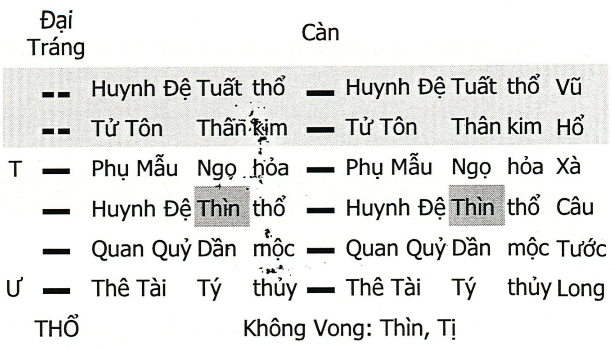
    - **Hình này chứng minh điều gì**
      - Đương sự không thể có con do tinh trùng quá ít (sau phải xin con nuôi); từng phẫu thuật tắc ruột và bị chóng mặt kinh niên.
    - **Từ đâu mà thấy được**
      - Tử Tôn Thân kim Tử tại Nguyệt Tý; Nguyên thần Huynh Đệ Thìn thổ (tinh nang, Dưỡng địa) Tuần Không; Thế Ngọ hỏa nhập Mộ Tuất thổ hào 6; Dần mộc (ruột) nhập Mộ Nhật Mùi, Thân kim Bạch Hổ xung khắc.

#### Ứng nghiệm thực tế
- Người này nghẹn ngào thừa nhận: Anh kết hôn đã nhiều năm mà vợ không thể mang thai; hai vợ chồng đến bệnh viện chuyên khoa khám thì bác sĩ kết luận do lượng tinh trùng của anh quá ít.
- Trước đây anh từng mắc chứng chóng mặt cực kỳ nghiêm trọng, mãi đến năm 1997 kiên trì uống thuốc Đông y mới chữa khỏi.
- Anh cũng đã từng phải phẫu thuật mổ cấp cứu do tắc ruột.
- Về sau, đến năm Giáp Thân (2004), hai vợ chồng đành chấp nhận nhận một đứa con nuôi.

---

### Ví dụ 8: Ngày Bính Tý tháng Sửu năm Mậu Dần, hỏi bệnh

#### Bối cảnh và quẻ tượng
- Thời gian trắc quẻ: Ngày Bính Tý, tháng Sửu, năm Mậu Dần.
- Đương số: Một người đến xem bói về tình hình bệnh tật của bản thân.
- Quẻ đắc: Sơn Thủy Mông biến Địa Thủy Sư.
- Cung quẻ: Cung Ly (Hỏa quái). Tuần Không: Thân, Dậu.

#### Luận giải chi tiết và ứng dụng 12 Cung Trường Sinh
- Xác định vị trí phát bệnh qua Bệnh địa:
  - Tự xem bệnh lấy hào Thế làm Dụng thần. Hào Thế là Tử Tôn Tuất thổ.
  - Tượng huyết quản mạch máu: Tử Tôn chủ mạch máu; chi Tuất là Hỏa khố (Hỏa chủ máu huyết) cũng mang ý nghĩa mạch máu; lại lâm Bạch Hổ (Bạch Hổ chủ huyết quang) khiến hình tượng mạch máu não hiện lên vô cùng rõ rệt.
  - Xác định ổ bệnh: Hào 6 Phụ Mẫu Dần mộc độc phát; xét theo 12 cung trường sinh thì chi Dần chính là Bệnh địa của hào Thế Tuất thổ (Thổ bệnh tại Dần); hào mang Bệnh địa phát động khắc hại Thế tất là nơi phát sinh mầm bệnh.
  - Vị trí cụ thể: Hào Phụ Mẫu chủ đầu não, hào 6 cũng là vị trí đỉnh đầu, khẳng định bệnh tật nằm ở vùng đầu.
  - Triệu chứng thống khổ: Hào 6 lâm Thanh Long; Thanh Long chủ cảm giác đau nhức dữ dội; vì vậy kết luận mạch máu não gặp sự cố nghẽn tắc dẫn tới chứng đau đầu liên miên không dứt.
- Dự đoán bệnh tắc nghẽn mạch máu não gây đau đầu kinh niên qua quẻ Sơn Thủy Mông biến Địa Thủy Sư:
  - **Hình 64.** Sơ đồ quẻ Sơn Thủy Mông biến Địa Thủy Sư
    - 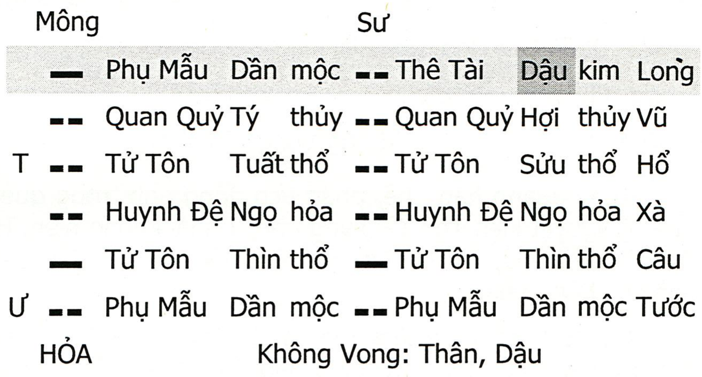
    - **Hình này chứng minh điều gì**
      - Bệnh nhân bị tắc nghẽn động mạch não dẫn đến đau đầu dữ dội liên miên không dứt.
    - **Từ đâu mà thấy được**
      - Thế Tử Tôn Tuất thổ (Hỏa khố, huyết quản) lâm Bạch Hổ; Hào 6 Phụ Mẫu Dần mộc (đầu não, lâm Thanh Long chủ đau nhức) độc phát là Bệnh địa của Thế phát động khắc Thế.

#### Ứng nghiệm thực tế
- Người bệnh xác nhận đúng như phán đoán: Do bị tắc nghẽn động mạch trên đầu nên thường xuyên bị những cơn đau đầu dữ dội hành hạ liên tục.

---

### Ví dụ 9: Ngày Bính Thân tháng Bính Dần năm Kỷ Mão, nam xem lưu niên

#### Bối cảnh và quẻ tượng
- Thời gian trắc quẻ: Ngày Bính Thân, tháng Bính Dần, năm Kỷ Mão.
- Đương số: Nam giới xem vận khí lưu niên trong năm.
- Quẻ đắc: Trạch Sơn Hàm biến Hỏa Sơn Lữ.
- Cung quẻ: Cung Đoài (Kim quái). Tuần Không: Thìn, Tị.

#### Luận giải chi tiết và ứng dụng 12 Cung Trường Sinh
- Luận đoán tài vận và việc bị lừa đảo quỵt nợ:
  - Phân tích xoay quanh hào Thế Huynh Đệ Thân kim: Hào Thế bị Nguyệt kiến Thê Tài Dần mộc xung phá (phạm Nguyệt phá); hào Tài lại phục tàng không xuất hiện trên quẻ; hào Huynh Đệ phát động trong quẻ; tài vận không như ý, khốn đốn vì tiền bạc, sự nghiệp trắc trở.
  - Hào 5 Huynh Đệ Dậu kim lâm Huyền Vũ động hóa Phụ Mẫu Mùi thổ. Huynh Đệ là bạn bè trợ giúp hào Thế; Phụ Mẫu là Tài khố; Huyền Vũ chủ lừa gạt, lén lút mờ ám; đoán đương số tuy được nhiều bạn bè giúp đỡ kiếm tiền nhưng cũng chính vì bạn bè mà bị liên lụy, lừa gạt mất nhiều tiền bạc.
  - Hào Tài nhập Mộ tại hào Ứng Phụ Mẫu Mùi thổ; hào Ứng là người ngoài, chứng tỏ có những kẻ mượn tiền của ông rồi chây ì không chịu trả.
- Khám phá bệnh tật qua cung Quan Đới và các hào vị:
  - Hào Thế bị Tài xung phá; Tài không hiện lại nhập Mộ tại hào 6 Mùi thổ; Thê Tài chủ phân và nước tiểu, đoán đương sự mắc bệnh táo bón nặng.
  - Hào Thế lâm Đằng Xà chủ tâm thần bất an, ác mộng, hoảng hốt; đóng tại hào 3 là vị trí giường ngủ khiến thông tin càng thêm rõ ràng.
  - Hào 6 Phụ Mẫu Mùi thổ là Nguyên thần của Thế bị Nguyệt kiến Dần mộc khắc thương, lại động hóa Quan Quỷ Tị hỏa (bị khắc là bệnh, hóa Quỷ cũng là bệnh); hào 6 là đầu não nên đầu tất có bệnh.
  - Chi Mùi thổ là đất Quan Đới của hào Thế Thân kim; lâm Thanh Long chủ đau đầu; trạng thái Quan Đới giống như có chiếc vòng kim cô thắt chặt lấy đỉnh đầu; vì vậy đoán đương số bị suy nhược thần kinh, đau đầu mất ngủ triền miên, đêm nằm chập chờn không sâu giấc.
- Dự đoán bị bạn bè quỵt tiền và suy nhược thần kinh qua quẻ Trạch Sơn Hàm biến Hỏa Sơn Lữ:
  - **Hình 65.** Sơ đồ quẻ Trạch Sơn Hàm biến Hỏa Sơn Lữ
    - 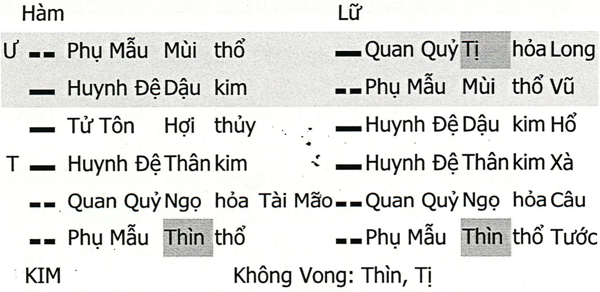
    - **Hình này chứng minh điều gì**
      - Đương sự kiếm được tiền nhưng bị bạn bè vay mượn quỵt nợ; mắc chứng suy nhược thần kinh đau đầu mất ngủ và táo bón nặng.
    - **Từ đâu mà thấy được**
      - Thế Thân kim Nguyệt phá; Hào 5 Huynh Đệ Dậu kim lâm Huyền Vũ hóa Phụ Mẫu Mùi thổ; Tài nhập Mộ hào Ứng; Hào 6 Mùi thổ (Quan Đới của Thế, lâm Thanh Long) hóa Quỷ; Tài nhập Mộ hào 6.

#### Ứng nghiệm thực tế
- Người này xác nhận: Mấy năm gần đây nhờ bạn bè kết hợp làm ăn nên kiếm được hơn 20 vạn tệ; tuy nhiên một số bạn thấy ông có tiền liền tới hỏi vay mượn rồi chây ì không trả. Bản thân ông mắc bệnh suy nhược thần kinh nặng, ngủ rất kém và thường xuyên bị chứng táo bón hành hạ.

---

### Ví dụ 10: Ngày Mậu Thìn tháng Đinh Mão năm Mão, nam đoán cát hung của vợ con

#### Bối cảnh và quẻ tượng
- Thời gian trắc quẻ: Ngày Mậu Thìn, tháng Đinh Mão, năm Mão.
- Đương số: Nam giới đến xem cát hung tính mạng cho vợ và con.
- Quẻ đắc: Hỏa Trạch Khuê biến Càn Vi Thiên.
- Cung quẻ: Cung Cấn (Thổ quái). Tuần Không: Tuất, Hợi.

#### Luận giải chi tiết và ứng dụng 12 Cung Trường Sinh
- Luận đoán hung triệu và cảnh ngộ lao tù:
  - Lấy Thê Tài (vợ) và Tử Tôn (con) làm Dụng thần song song.
  - Xem về người vợ: Thê Tài Tý thủy không hiện trên quẻ, phục dưới hào 5 Huynh Đệ Mùi thổ (Phi khắc Phục); hào Tài lại lâm đất Tử tại Nguyệt kiến Mão mộc, nhập Mộ tại Nhật thần Thìn thổ; Kỵ thần Huynh Đệ Sửu thổ hào 3 động hóa Tiến thần Thìn thổ hồi lực khắc phạt; hung tượng trùng trùng lớp lớp.
  - Xem về người con: Tử Tôn Dậu kim hào 4 bị Nguyệt kiến Mão mộc Quan Quỷ xung phá, nhập Mộ tại hào động Sửu thổ; nhưng may mắn được Huynh Đệ Mùi thổ sinh trợ, lại có Nhật thần Thìn thổ sinh hợp, cho nên tình cảnh của con không đến mức đại hung như người mẹ.
  - Tượng ngục tù mất tự do: Cả Thê Tài lẫn Tử Tôn đều nhập Mộ, là tượng mất đi quyền tự do thân thể. Hào Tài bị Mùi thổ (là Mộ khố của Quan Quỷ Mão mộc) khắc chế; Quan Quỷ là cơ quan công an, Mộ khố của Quỷ là trại giam đồn công an; hào Tử Tôn lại bị Nguyệt kiến Quan Quỷ xung phá; tổng hợp lại đoán cả hai mẹ con đều đã bị bắt giam vào tù.
- Xác định nguyên nhân phạm tội buôn ma túy và mức án:
  - Nguyên nhân vào tù: Hào Tài bị Huynh Đệ Mùi thổ khắc thương. Theo sách kinh điển *"Dịch Ẩn"*, chi Mùi thổ đại diện cho dược liệu cây cỏ; lại lâm Thanh Long (Thanh Long chủ trúng độc); Mùi thổ lâm Thanh Long kết hợp lại mang ý nghĩa độc dược, chất ma túy. Do đó đoán hai mẹ con vào tù do tội buôn bán ma túy.
  - Về mức án phạt: Hào Tài suy vi cùng cực lại bị Nguyệt kiến hình hại, đoán người vợ bị tuyên án tử hình; hào Tử Tôn được sinh phù che chở, trong hung có cứu, đoán người con sẽ chịu mức án nhẹ hơn nhiều.
- Dự đoán vợ con sa lưới pháp luật vì buôn ma túy qua quẻ Hỏa Trạch Khuê biến Càn Vi Thiên:
  - **Hình 66.** Sơ đồ quẻ Hỏa Trạch Khuê biến Càn Vi Thiên
    - 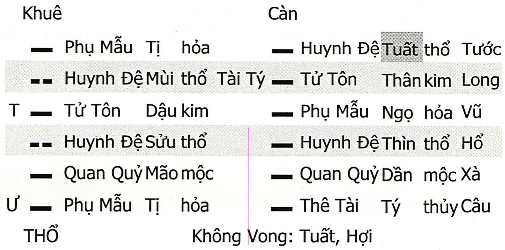
    - **Hình này chứng minh điều gì**
      - Vợ và con bị bắt giam vì buôn bán ma túy; người vợ nhận án tù chung thân (nguy cơ tử hình), người con nhận mức án nhẹ hơn.
    - **Từ đâu mà thấy được**
      - Tài Tý thủy Tử tại Nguyệt Mão, nhập Mộ Nhật Thìn, bị Mùi thổ (Quỷ khố, Mùi lâm Thanh Long là độc dược) khắc; Tử Tôn Dậu kim bị Mão xung phá, nhập Mộ Sửu nhưng được Mùi thổ sinh hợp.

#### Ứng nghiệm thực tế
- Quả nhiên vợ con người này do buôn bán ma túy đã bị công an bắt giữ vào ngày Ất Mão tháng Mùi năm 1998.
- Gia đình chạy vạy khắp nơi tốn hơn 3 vạn tệ: kết quả sơ thẩm người vợ bị xử tù chung thân, đứa con bị xử 10 năm tù.
- Tuy nhiên Tòa án cấp trên đã ra quyết định bác bản án sơ thẩm, cho rằng lượng hình phạt quá nhẹ và yêu cầu mở phiên tòa xét xử lại. Kết quả chung cuộc sau đó không có phản hồi thêm.

---

### Ví dụ 11: Ngày Giáp Tuất tháng Đinh Mão năm Kỷ Mão, nữ đoán vận khí lưu niên

#### Bối cảnh và quẻ tượng
- Thời gian trắc quẻ: Ngày Giáp Tuất, tháng Đinh Mão, năm Kỷ Mão.
- Đương số: Nữ giới đến xem bói vận hạn lưu niên trong năm.
- Quẻ đắc: Địa Sơn Khiêm biến Lôi Thiên Đại Tráng.
- Cung quẻ: Cung Đoài (Kim quái). Tuần Không: Thân, Dậu.

#### Luận giải chi tiết và ứng dụng 12 Cung Trường Sinh
- Phương pháp luận quẻ lưu niên và mục đích đương số:
  - Quy tắc phân tích quẻ lưu niên: Trước tiên khảo sát cát hung của hào Thế; xem hào sơ (hào sơ là tâm tư khởi phát); xem hào Thai của hào Thế (hào Thai đại diện cho toan tính sâu kín); xem hào động (thần triệu cơ ở động, là khởi đầu biến hóa); xem lục thân nào bị thiếu hoặc rơi vào Tuần Không, Nguyệt Phá (đây là "hào Bệnh", thiên cơ huyền diệu luôn phát lộ ở nơi có bệnh tật thiếu hụt).
  - Mục đích đương số: Hào sơ Phụ Mẫu Thìn thổ lâm Thanh Long phát động; Thanh Long chủ tiền tài, Phụ Mẫu chủ nhà cửa, cửa hàng; Tài không hiện trên quẻ; hào Thai của Thế (Thế Tử Tôn Hợi thủy có Thai tại Ngọ) là Quan Quỷ Ngọ hỏa hào 2 động hóa Tài; khẳng định cô gái đến chủ yếu muốn hỏi về tiền tài, dự định xây cất mở cửa hàng làm ăn.
  - Ngành nghề và lời khuyên đầu tư: Tài lâm Chu Tước chủ đồ ăn thức uống, kinh doanh ẩm thực. Cô xác nhận đã mua đất, chuẩn bị xây dựng cửa hàng thực phẩm đồ uống. Tuy nhiên hào Thế Tử Tôn Hợi thủy bị Sửu thổ hào 4 và Thìn thổ hào sơ phát động khắc, lại bị Nhật thần Tuất thổ khắc; tác giả khuyên năm nay dù có tài lộc nhưng không được đầu tư lớn, nếu liều lĩnh thì ngay cả tiền vốn cũng không thu hồi được.
- Xem cho em trai bị bắt và phương pháp cứu giúp:
  - Cô gái bất ngờ hỏi thêm về em trai. Quan Quỷ lâm Chu Tước kết thành Dần Ngọ Tuất tam hợp cục khắc phạt hào Huynh Đệ; lại có Huynh Đệ Thân kim lâm Câu Trần nhập Mộ; tác giả đoán ngay người em vừa bị công an bắt giam.
  - Cô vội hỏi có được thả không. Tác giả chỉ dẫn: Cần tìm một người tuổi Dậu và một người tuổi Hợi giúp đỡ mới thoát nạn. Cô thốt lên mình tuổi Hợi, mẹ tuổi Dậu, trong nhà hiện chỉ trông cậy vào hai mẹ con.
- Luận đoán hôn nhân trắc trở:
  - Cô sinh năm 1959. Tử Tôn Hợi thủy trì Thế, Quan Quỷ nhập Mộ, quẻ biến Lục Xung; hôn nhân chắc chắn bất hạnh. Nhưng Quan Quỷ Ngọ hỏa vượng tướng lâm hào Ứng (phu vị) ở hào 2 trạch vị, đoán hiện chưa ly hôn.
  - Tử Tôn trì Thế khắc Ứng là tượng kết hôn muộn. Phụ Mẫu lâm Nhật thần (khẩu quyết: *"Phụ Mẫu lâm Nhật, hôn kỳ khả định"*); hào 4 Phụ Mẫu Sửu thổ động hóa Quan Quỷ, năm Sửu tính 27 tuổi mụ, đoán kết hôn năm 1985 (Ất Sửu).
  - Giai đoạn 1992 - 1996 kim thủy vượng trợ Tử Tôn, vợ chồng bất hòa liên miên. Hào Tài Mão mộc phục dưới Ứng Quan, lại động hóa ra thêm một hào Tài Dần mộc, thành "hai Tài một Quan"; đoán người chồng ngoại tình công khai, bên cạnh có cùng lúc hai người phụ nữ. Cô thừa nhận toàn bộ đều đúng.
- Luận đoán sức khỏe bản thân và sinh tử của người cha:
  - Sức khỏe cô gái: Thế Tử Tôn Hợi thủy bị Nhật khắc; hào 5 là ngũ quan, Thủy là họng, đoán bị viêm họng mãn tính. Quan Quỷ Ngọ hỏa vượng, quẻ cung Đoài chủ ruột, Ngọ hỏa chủ ruột, hào 2 là ruột, Chu Tước chủ viêm, đoán bị viêm ruột. Hào 4 Sửu thổ động khắc Thế; hào 4 là ngực, Phụ Mẫu chủ ngực, hóa Quỷ là bệnh; lâm Ngọ hỏa là tim, lâm Đằng Xà là bất an; Sửu thổ là Suy địa của Thế; Thế lâm Bạch Hổ chủ máu huyết; đoán tim thiếu máu, suy tim, hay hồi hộp hoảng hốt. Hào 6 Nguyên thần Thân kim Không Phá không sinh Thế, đoán hay bị chóng mặt.
  - Số phận người cha: Phụ Mẫu Sửu thổ bị Nguyệt khắc Nhật hình, động hóa Quan Quỷ, nhập Mộ tại hào sơ Thìn thổ; đoán cha đẻ đã tạ thế. Phụ Mẫu lâm Kim khố ở hào 4 (khoang ngực), đoán mắc bệnh đường hô hấp. Sửu thổ hóa Quỷ, Phụ Mẫu Thìn thổ bị Nhật phá; đoán cha mất vào năm 1993 (Quý Dậu, ứng hợp phá) hoặc năm 1997 (Đinh Sửu).
- Dự đoán toàn diện tài vận, hôn nhân, bắt bớ người thân và bệnh tật qua quẻ Địa Sơn Khiêm biến Lôi Thiên Đại Tráng:
  - **Hình 67.** Sơ đồ quẻ Địa Sơn Khiêm biến Lôi Thiên Đại Tráng
    - 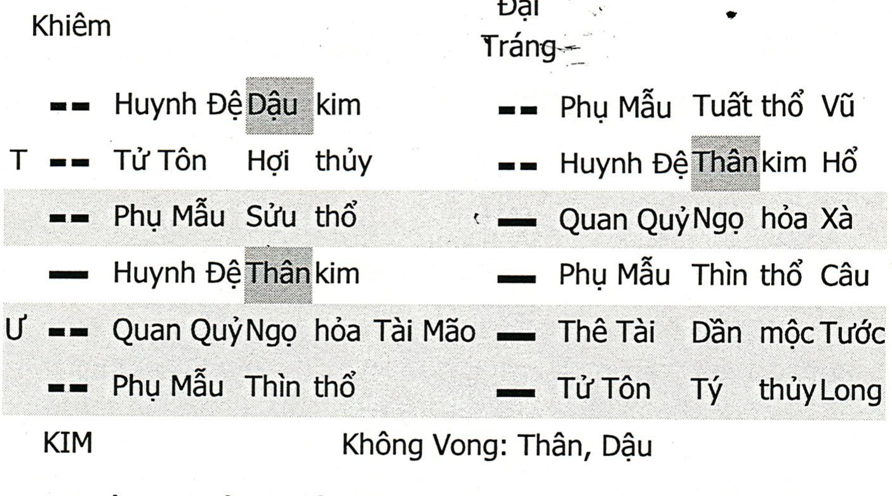
    - **Hình này chứng minh điều gì**
      - Nữ đương số mở tiệm ăn uống không nên đầu tư lớn; em trai bị bắt cần người tuổi Hợi, Dậu cứu; chồng ngoại tình hai người phụ nữ; cha mất năm 1993 do ung thư hô hấp.
    - **Từ đâu mà thấy được**
      - Hào sơ Thìn thổ Thanh Long động, hào Thai Ngọ hỏa hóa Tài lâm Chu Tước; Quan lâm Chu Tước tam hợp khắc Huynh Thân kim Câu Trần nhập Mộ; Thế Tử Tôn Hợi thủy, Ứng Quan Ngọ hóa Tài; Phụ Mẫu Sửu thổ hóa Quỷ, Mùi thổ kim khố.

#### Ứng nghiệm thực tế
- Cô gái xác nhận mọi điều luận đoán chuẩn xác kỳ lạ: Cha cô mất đúng vào năm 1993 do căn bệnh ung thư đường hô hấp.

---

### Ví dụ 12: Ngày Ất Tị tháng Canh Ngọ năm Kỷ Mão, nam ở thành phố Trường Trị đoán hôn nhân

#### Bối cảnh và quẻ tượng
- Thời gian trắc quẻ: Ngày Ất Tị, tháng Canh Ngọ, năm Kỷ Mão.
- Đương số: Nam giới ở thành phố Trường Trị đến xem quẻ hỏi về việc cưới xin hôn nhân.
- Quẻ đắc: Phong Thủy Hoán biến Trạch Thủy Khốn.
- Cung quẻ: Cung Ly (Hỏa quái). Tuần Không: Dần, Mão.

#### Luận giải chi tiết và ứng dụng 12 Cung Trường Sinh
- Luận giải cảnh tượng rước dâu náo nhiệt:
  - Lấy hào Thê Tài làm Dụng thần. Hào Tài Dậu kim không hiện trên quẻ, phục dưới hào 4 Tử Tôn Mùi thổ, bị Nhật Nguyệt (Tị, Ngọ) thiêu đốt khắc thương trầm trọng, bất lợi. Tuy có Tử Tôn Mùi thổ động sinh nhưng hào Tài không có gốc rễ; Mùi thổ động lại hóa Hợi thủy (Nhật phá), bị Phụ Mẫu Mão mộc khắc chế; thông tin hôn sự đại bại hiện lên rất rõ.
  - Xét theo 12 cung trường sinh: Hào Thế tuy là Huynh Đệ Tị hỏa nhưng Tị hỏa lại là đất Trường Sinh của Thê Tài Dậu kim; Tài là phụ nữ, Trường Sinh biểu thị sự khởi đầu của việc cưới vợ.
  - Tử Tôn Mùi thổ là đất Quan Đới của Thê Tài Dậu kim, động sinh hào Tài; tượng Quan Đới ngụ ý mặc quần áo đẹp chỉnh tề đi tìm đối tượng hoặc đi đón cô dâu. Theo *"Dịch Ẩn"*, bản thân chi Mùi thổ cũng đại diện cho quần áo trang phục.
  - Mùi thổ được Nhật Nguyệt sinh phù vượng tướng, Nhật Nguyệt lại là đất Thai Dưỡng của Mùi thổ; toàn bộ biểu thị y phục mới tinh tươm, vẽ nên cảnh tượng chuẩn bị đón dâu vô cùng tưng bừng, long trọng.
- Nguyên nhân đổ vỡ cay đắng vào giờ phút quyết định:
  - Dụng thần Thê Tài phục tàng suy kiệt, e rằng ngay cả bóng dáng cô dâu cũng không nhìn thấy được. Hào 3 Huynh Đệ Ngọ hỏa trấn giữ ở cửa, rất khó đưa được cô dâu bước qua ngưỡng cửa nhà chồng.
  - Hào 6 Phụ Mẫu Mão mộc Tuần Không, động hóa Mùi thổ (Mộ) lâm Huyền Vũ: Phụ Mẫu là giấy đăng ký kết hôn; Không là chưa có giấy tờ; hóa Mộ là không lấy ra được; Huyền Vũ chủ ám muội ngầm hẹn ước; đoán hai người chưa đăng ký kết hôn, mới chỉ làm lễ ăn hỏi đính hôn. Việc không có giấy đăng ký kết hôn chính là mấu chốt khiến hôn lễ tan vỡ.
  - Phụ Mẫu đại diện cho cha mẹ: Phụ Mẫu Mão mộc chính là Thai địa của Thê Tài Dậu kim (Kim thai tại Mão); hào Thai này tương đương với cha mẹ ruột sinh ra cô dâu. Do đó đoán hôn sự thất bại chủ yếu do cha mẹ nhà gái kịch liệt ngăn cản phản đối.
  - Kết luận: Khi anh chàng mặc áo mới, bày tiệc rượu linh đình đi đón dâu, do chưa đăng ký kết hôn và bị cha mẹ đối phương phản đối nên phút chót không cưới được, ngay cả bóng dáng cô dâu cũng không thấy. Bạch Hổ lâm Thế chủ khóc lóc, vì việc này mà uất ức khóc ròng.
- Dự đoán đám cưới đổ vỡ phút chót do thiếu hôn thú và nhà gái phản đối qua quẻ Phong Thủy Hoán biến Trạch Thủy Khốn:
  - **Hình 68.** Quẻ Phong Thủy Hoán biến Trạch Thủy Khốn
    - 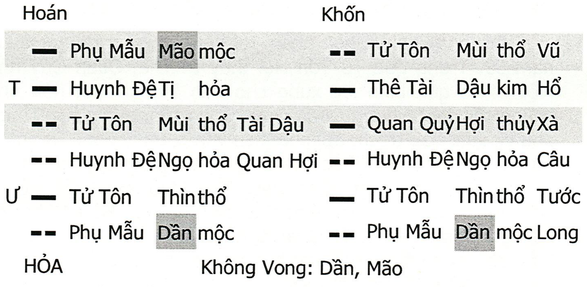
    - **Hình này chứng minh điều gì**
      - Chú rể sắm quần áo mới rước dâu linh đình nhưng bị nhà gái đóng cổng từ chối vì chưa đăng ký kết hôn và cha mẹ cô dâu phản đối, tức khóc quay về.
    - **Từ đâu mà thấy được**
      - Thế Tị hỏa (Trường Sinh của Tài); Mùi thổ (Quan Đới của Tài, y phục mới) động sinh Tài Dậu kim phục tàng bị khắc; Hào 6 Phụ Mẫu Mão mộc (Thai của Tài, cha mẹ gái) Tuần Không hóa Mộ lâm Huyền Vũ.

#### Ứng nghiệm thực tế
- Người đàn ông đau đớn xác nhận đúng 100%: Anh mới chỉ làm lễ đính hôn chứ chưa đăng ký kết hôn (ở vùng quê tập tục chưa đăng ký mà tổ chức cưới là rất phổ biến).
- Gia đình anh bày tiệc rượu linh đình, thuê người khua chiêng gióng trống đi hơn 60 dặm đường xa để rước dâu. Nào ngờ đến nơi, nhà gái đóng chặt cổng kiên quyết không tiếp!
- Rốt cuộc ngay cả bóng dáng cô dâu anh cũng chẳng nhìn thấy, bản thân tức giận uất ức đến phát khóc mà phải quay về.

---

### Ví dụ 13: Ngày Nhâm Tý tháng Canh Thìn năm Canh Thìn, xem việc vợ mang thai

#### Bối cảnh và quẻ tượng
- Thời gian trắc quẻ: Ngày Nhâm Tý, tháng Canh Thìn, năm Canh Thìn.
- Đương số: Một người bạn đến nhờ xem về việc vợ mang thai.
- Quẻ đắc: Cấn Vi Sơn biến Thủy Hỏa Ký Tế.
- Cung quẻ: Cung Cấn (Thổ quái). Tuần Không: Dần, Mão.

#### Luận giải chi tiết và ứng dụng 12 Cung Trường Sinh
- Luận đoán tình trạng mang thai:
  - Lấy hào Tử Tôn làm Dụng thần. Tử Tôn Thân kim ở hào 3 được Nguyệt kiến Thìn thổ sinh phù là có khí; hào 3 là vị trí tử cung, lâm Tử Tôn vượng tướng chủ người vợ đang mang thai.
  - Hào 2 là thai vị; Phụ Mẫu Ngọ hỏa được hào Thế Dần mộc động sinh, lại bị Nhật thần Tý thủy xung thành ám động; thai vị lâm Thanh Long chủ hỷ sự mang thai, củng cố thêm thông tin chắc chắn vợ đang có bầu.
- Bí pháp cách sơn hóa hào và quyết định phá thai:
  - Nguyên thần Huynh Đệ Thìn thổ dù lâm Nguyệt kiến nhưng động hóa Mão mộc hồi đầu khắc.
  - Tử Tôn Thân kim rơi vào đất Tử tại hào Thê Tài Tý thủy (Kim tử tại Tý), lại lâm đất Tuyệt tại hào Thế Dần mộc (Kim tuyệt tại Dần); báo hiệu đứa trẻ khó lòng chào đời.
  - Hào Thế phát động chính là Tuyệt địa của Tử Tôn, biểu thị bản thân người chồng không muốn giữ đứa con; Thế lâm Bạch Hổ (huyết thần chủ sẩy thai) là tượng muốn phá thai.
  - Tử Tôn Tử tại Thê Tài Tý thủy hào 5; lại có hào Thế Dần mộc động hóa ra Thê Tài Tý thủy; Tý thủy lại tiếp tục động hóa ra Huynh Đệ Tuất thổ (Nguyên thần của Tử Tôn). Đây chính là bí pháp **cách sơn hóa hào**!
  - Hào biến cuối cùng là Nguyên thần Tuất thổ lâm Nguyệt phá (tháng Thìn xung Tuất); chứng tỏ đôi bên đã hạ quyết tâm dứt khoát phá thai. Hào ngăn cách ở giữa (cách sơn) chính là Thê Tài, nguồn cơn sâu xa là do người vợ kiên quyết đòi phá thai.
  - Hào sơ Nguyên thần lâm Nguyệt hóa hồi đầu khắc, dự kiến trong tháng Thìn này sẽ phá thai; tuy nhiên do hào biến Quan Quỷ Mão mộc lâm Tuần Không, nên trong vòng 3 đến 4 ngày tới chưa thể đi bệnh viện làm thủ thuật ngay.
- Dự đoán việc phá thai do vợ công tác xa qua quẻ Cấn Vi Sơn biến Thủy Hỏa Ký Tế:
  - **Hình 69.** Quẻ Cấn Vi Sơn biến Thủy Hỏa Ký Tế
    - 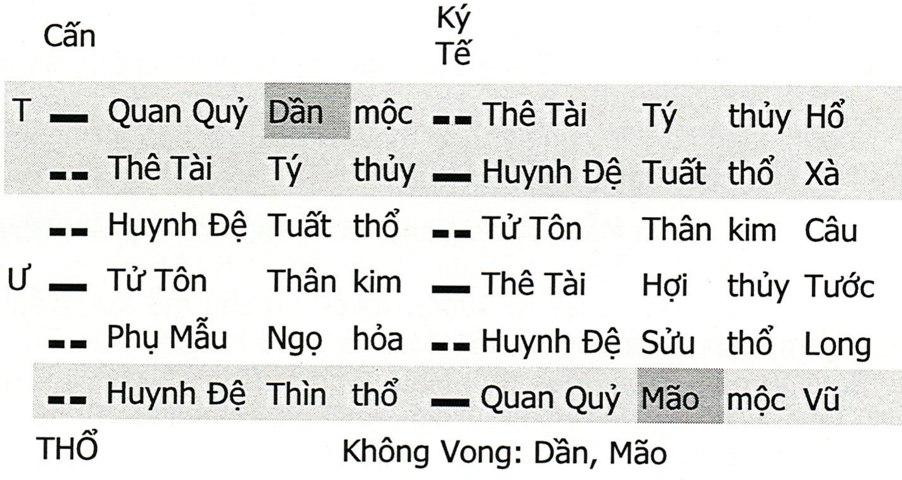
    - **Hình này chứng minh điều gì**
      - Vợ mang thai 1 tháng nhưng kiên quyết phá thai vì cơ hội đi công tác Thẩm Quyến lương cao; vài ngày tới sẽ tiến hành.
    - **Từ đâu mà thấy được**
      - Tử Tôn Thân kim Tử tại Tài Tý thủy, Tuyệt tại Thế Dần mộc Bạch Hổ; Thế động hóa Tý thủy rồi hóa Tuất thổ (cách sơn hóa hào, Tuất lâm Nguyệt phá); hào cách là Thê Tài; Quan Mão mộc Tuần Không.

#### Ứng nghiệm thực tế
- Người bạn gật đầu thừa nhận: Vợ anh đã mang thai được 1 tháng. Vừa hay công ty có quyết định điều động cô đến công tác tại Thẩm Quyến trong 1 năm với mức lương rất cao, cơ hội thăng tiến vô cùng hiếm có nên cô kiên quyết đòi phá thai.
- Do mấy ngày gần đây bận rộn bàn giao chưa thu xếp được thời gian, dự định vài ngày tới sẽ tới bệnh viện làm thủ thuật.

---

### Ví dụ 14: Ngày Ất Sửu tháng Tân Tị năm Canh Thìn, hiệu trưởng đoán sự nghiệp

#### Bối cảnh và quẻ tượng
- Thời gian trắc quẻ: Ngày Ất Sửu, tháng Tân Tị, năm Canh Thìn.
- Đương số: Một người tự xưng là hiệu trưởng đến xem bói về sự nghiệp tiền đồ.
- Quẻ đắc: Phong Thủy Hoán (quẻ tĩnh).
- Cung quẻ: Cung Ly (Hỏa quái). Tuần Không: Tuất, Hợi.

#### Luận giải chi tiết và ứng dụng 12 Cung Trường Sinh
- Luận đoán quan vận và xuất thân quân ngũ:
  - Xem sự nghiệp quan chức lấy Quan Quỷ làm Dụng thần. Quan Quỷ Hợi thủy không hiện trên quẻ, phục dưới hào 3 Huynh Đệ Ngọ hỏa; lại phạm Tuần Không, Nguyệt phá (Tị phá Hợi), Nhật khắc (Sửu thổ khắc Hợi thủy). Hào Thế Tị hỏa lại chính là Tuyệt địa của Quan Quỷ Hợi thủy; người này hoàn toàn vô duyên với chốn quan trường, không hề có chức vụ quan chức nhà nước.
  - Xét hào Thế Huynh Đệ Tị hỏa lâm Nguyệt kiến, lâm Bạch Hổ (chủ đao kiếm võ nghệ); quẻ thuộc cung Ly chủ giáp trụ (áo giáp mũ trụ); tác giả phán đoán đương sự vốn xuất thân từ người lính trong quân đội.
- Năng lực kiếm tiền và phương vị phát tài:
  - Hào Thế Tị hỏa là đất Trường Sinh của Thê Tài Dậu kim (Kim sinh tại Tị); ông là một người có bản lĩnh kiếm tiền rất cừ khôi.
  - Tuy nhiên hào Thế là Huynh Đệ mang tính tĩnh mà bất động: Huynh Đệ chủ khắc Tài, người này nếu muốn kiếm tiền thì bắt buộc phải bôn ba di chuyển liên tục ("động"); nếu dừng lại ngồi yên một chỗ thụ động thì tài sản lập tức tiêu hao thâm hụt.
  - Phương vị cầu tài: Nên đi về hướng Tây Bắc, hướng Tây, hướng Bắc (đất Kim Thủy vượng tài); nếu đi về phương Nam (Ly Hỏa vượng khắc Kim) tất sẽ phá tài thua lỗ.
- Dự đoán tài năng kinh doanh của cựu chiến binh và phương vị cầu tài qua quẻ Phong Thủy Hoán:
  - **Hình 70.** Quẻ Phong Thủy Hoán
    - 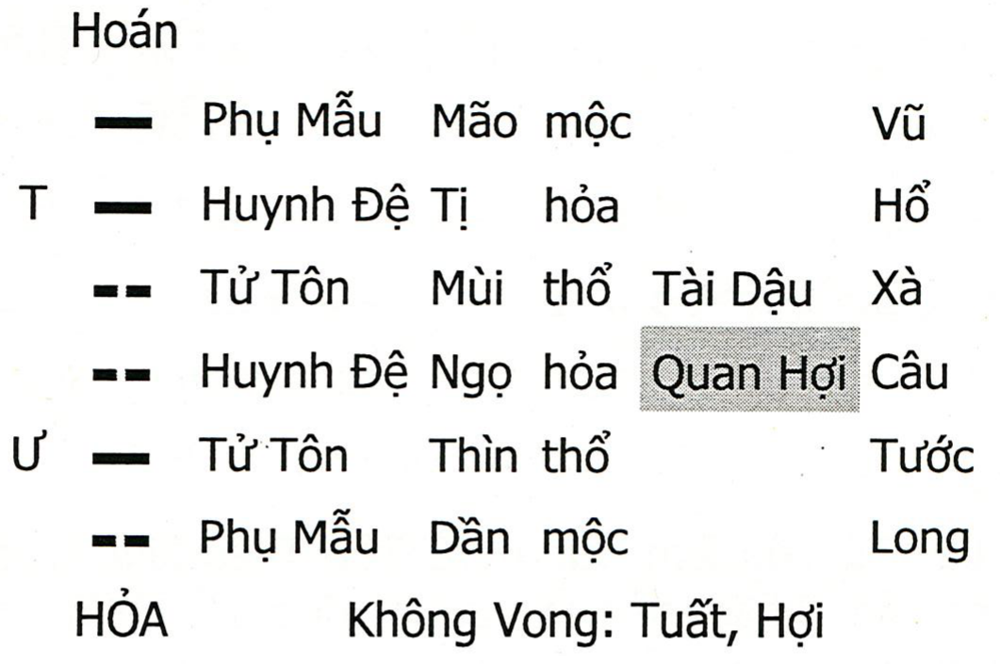
    - **Hình này chứng minh điều gì**
      - Cựu chiến binh (hiệu trưởng danh dự trường tư) giỏi kiếm tiền khi bôn ba Tây/Tây Bắc; mở 3 cửa hàng tĩnh tại ở phương Nam đều thất bại lỗ vốn.
    - **Từ đâu mà thấy được**
      - Thế Huynh Đệ Tị hỏa lâm Nguyệt, Bạch Hổ, quẻ Ly (giáp trụ); Tị là Trường Sinh của Tài Dậu kim; Huynh Đệ tĩnh khắc Tài nên phải động mới có tiền; Tây/Bắc là Kim Thủy, Nam là Hỏa khắc Tài.

#### Ứng nghiệm thực tế
- Người này thán phục xác nhận: Ông đúng là bộ đội xuất ngũ. Mấy năm trước làm nghề trang trí nội thất, tuy phải chạy ngược chạy xuôi bôn ba vất vả nhưng kiếm được rất nhiều tiền bạc.
- Năm nay không muốn bôn ba nữa, muốn kinh doanh cố định nên bỏ vốn mở liền 3 cửa hàng, không ngờ buôn bán ế ẩm chẳng thu được đồng lợi nhuận nào.
- Khi tác giả hỏi vì sao lại tự xưng là hiệu trưởng, ông cười giải thích: Trước đây kiếm được nhiều tiền, ông đã dùng tiền tài trợ xây dựng một ngôi trường tiểu học nhỏ ở quê nhà và được phong làm hiệu trưởng danh dự.
- Nghiệm lại thực tế, mấy năm qua ông chủ yếu kiếm được tiền khi lăn lộn làm ăn ở phía Tây và Tây Bắc; từng nhiều lần mang tiền đầu tư xuống phương Nam đều bị thua lỗ sạch vốn.

---

### Ví dụ 15: Ngày Nhâm Thân tháng Tân Tị năm Canh Thìn, nam đoán bệnh cháu trai

#### Bối cảnh và quẻ tượng
- Thời gian trắc quẻ: Ngày Nhâm Thân, tháng Tân Tị, năm Canh Thìn.
- Đương số: Người ông đến xem bệnh tật cho đứa cháu trai sinh năm 1999 (Kỷ Mão).
- Quẻ đắc: Thiên Trạch Lý biến Lôi Hỏa Phong.
- Cung quẻ: Cung Cấn (Thổ quái). Tuần Không: Tuất, Hợi.

#### Luận giải chi tiết và ứng dụng 12 Cung Trường Sinh
- Luận đoán tính mạng và chứng nhược trí bẩm sinh:
  - Xem bệnh cháu trai lấy hào Tử Tôn làm Dụng thần. Tử Tôn Thân kim ngự ở đất Trường Sinh tại Nguyệt kiến Tị hỏa, lại lâm Nhật thần Thân kim nắm lệnh vượng tướng; cháu bé hoàn toàn không có nỗi lo nguy hiểm đến tính mạng.
  - Hào 6 Huynh Đệ Tuất thổ là Nguyên thần sinh Dụng thần, phạm Tuần Không nên mất khả năng sinh trợ Tử Tôn Thân kim; hào 6 là vị trí đỉnh đầu; chi Tuất thổ lại chính là Suy địa của Dụng thần Thân kim (Kim suy tại Tuất); suy thì ắt hư nhược, phán đoán cháu bé mắc chứng nhược trí, thiểu năng trí tuệ.
- Bệnh tật bại não, câm liệt nằm giường:
  - Tử Tôn Thân kim nhập Mộ ở hào 3 Huynh Đệ Sửu thổ; hào 3 là vị trí giường chiếu, mang tượng đứa trẻ suốt ngày chỉ nằm liệt trên giường.
  - Hào 2 Quan Quỷ Mão mộc phát động hóa ra Mộ khố Sửu thổ; hào 2 là vị trí đôi chân, chứng tỏ cháu bé bị tật ở chân, hoàn toàn không có khả năng đi lại.
  - Quan Quỷ Mão mộc là Thai địa của Dụng thần Tử Tôn Thân kim (Kim thai tại Mão), biểu thị bệnh tật này mang tính bẩm sinh từ khi còn trong bụng mẹ.
  - Ngũ hành Kim của Tử Tôn chủ âm thanh tiếng nói; hào 6 Không không sinh Dụng; hào Kim lại nhập Mộ tại Sửu thổ, Mộ khố hóa ra lâm Chu Tước (chủ ngôn ngữ tiếng nói), biểu thị cháu bé bị câm bẩm sinh, không biết nói.
  - Ngoại quái Tử Tôn phạm Phục ngâm là tượng suốt ngày đêm chỉ biết khóc lóc thảm thiết không ngừng. Tổng hợp quái tượng kết luận cháu bé bị bại não bẩm sinh.
  - Tử Tôn trì Thế biểu thị gia đình đang dốc lòng chạy chữa thuốc men; Dụng thần nhập Mộ là đang phải nằm nội trú điều trị trong bệnh viện, chứng bệnh nan y này vô phương cứu chữa.
- Khuyên can nhân quả và ngăn chặn tội ác:
  - Đối phương nghẹn ngào thừa nhận suy đoán chuẩn xác đến từng chi tiết; gia đình đã tốn hơn 20 vạn tệ đưa cháu đi khắp nơi điều trị nhưng vô vọng; cha mẹ đứa bé quá tuyệt vọng nên đang bàn tính sẽ bí mật giết chết đứa nhỏ để giải thoát gánh nặng.
  - Tác giả nghiêm khắc khuyên can: Tuyệt đối không được làm chuyện vô nhân đạo đó, đó là hành vi giết người phạm pháp nghiêm trọng; cha mẹ tuy có quyền sinh con nhưng không có quyền tước đoạt sinh mạng của con cái; giết con không những phải chịu hình phạt ngồi tù mà sau này còn gặp bất lợi về đường con cái, quả báo khôn lường!
- Dự đoán cháu bé bị bại não bẩm sinh, câm liệt và can ngăn sát hại sinh linh qua quẻ Thiên Trạch Lý biến Lôi Hỏa Phong:
  - **Hình 71.** Quẻ Thiên Trạch Lý biến Lôi Hỏa Phong
    - 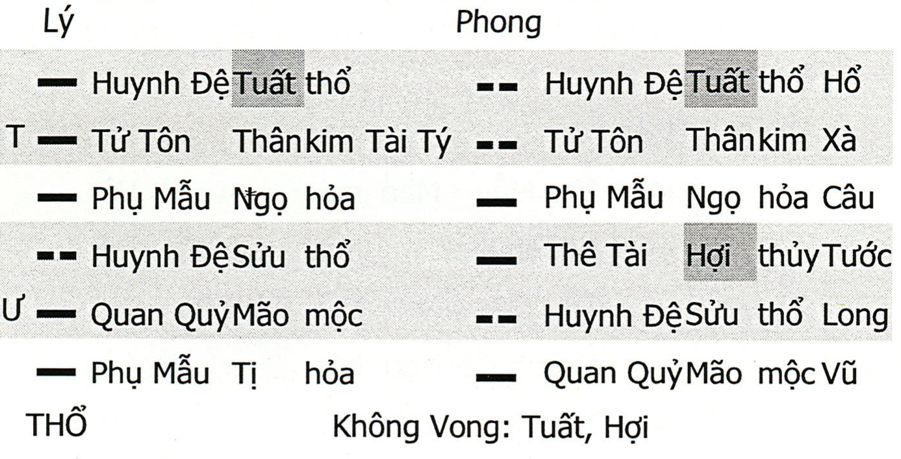
    - **Hình này chứng minh điều gì**
      - Cháu bé bị bại não bẩm sinh, câm liệt nằm giường, tốn 20 vạn không khỏi; tác giả kịp thời can ngăn bố mẹ sát hại con ruột để tránh lao tù và quả báo ác nghiệp.
    - **Từ đâu mà thấy được**
      - Tử Tôn Thân kim Trường Sinh tại Nguyệt Tị, lâm Nhật Thân; Hào 6 Tuất thổ (đầu não, Suy địa) Tuần Không; Thân kim nhập Mộ Sửu hào 3; Mão mộc (hào 2 - chân, Thai địa) động hóa Sửu Mộ; Kim Mộ Chu Tước (câm).

#### Ứng nghiệm thực tế
- Người ông nghe những lời phân tích thấu tình đạt lý và cảnh báo nghiêm khắc về luật pháp cùng luật nhân quả đã hoàn toàn tỉnh ngộ, từ bỏ ý định tàn nhẫn và hứa sẽ tiếp tục chăm sóc cháu bé.

## Chương 11: Cách Sơn Hóa Hào

### Khái niệm và nguyên lý Cách Sơn Hóa Hào
- Định nghĩa và vị trí của tâm pháp trong hệ thống Lục Hào:
  - Cách sơn hóa hào (隔山化爻) là một khái niệm ít người biết đến trong dự đoán Lục Hào, vốn là một tâm pháp bí mật chỉ được lưu truyền nội bộ giữa các dự trắc sư.
  - Về phạm vi ứng dụng: Cách sơn hóa hào thông thường chỉ được sử dụng trong việc biện nghĩa (làm rõ tình tiết, bản chất, nguyên nhân và diễn biến ngầm của sự việc), tuyệt đối không dùng để quyết định cát hung.
  - Phán đoán cát hung chung cuộc bắt buộc phải dựa vào sự suy vượng của Dụng thần dưới tác động của Nhật kiến, Nguyệt kiến và các hào động trong quẻ.
- Cơ chế hình thành và cấu trúc nhân quả của Cách Sơn Hóa Hào:
  - Định nghĩa cơ bản: Cách sơn hóa hào chỉ trường hợp một hào biến sinh ra từ một hào động có cùng Lục thân với một hào động khác trong quẻ; khi đó, hào biến và hào động có cùng Lục thân này được gọi là "hào cách" (隔爻).
  - Chuỗi liên hoàn nhân quả 3 bước:
    - Hào động ban đầu: Là điểm khởi đầu, phát sinh của sự việc.
    - Hào cách: Là nguồn gốc, nguyên nhân sâu xa thúc đẩy sự việc.
    - Hào biến từ hào cách: Biểu thị phương hướng khuynh hướng phát triển và kết quả cuối cùng của sự việc.
- Phân biệt Thuận cách và Nghịch cách:
  - Căn cứ vào tương quan vị trí trên - dưới giữa hào cách và hào động ban đầu để chia thành hai loại:
    - Thuận cách: Hào cách nằm ở vị trí bên trên hào động. Thuận cách chủ về sự việc phát triển thuận buồm xuôi gió, các diễn biến tình tiết móc xích liên hoàn, tuần tự mở ra một cách thuận lợi.
    - Nghịch cách: Hào cách nằm ở vị trí bên dưới hào động. Nghịch cách chủ về tính chủ quan, trên đường đi ắt gặp phải trở ngại, ách tắc, khó khăn và cản trở ngoài ý muốn.

### Ví dụ 1: Ngày Kỷ Dậu tháng Canh Thìn năm Canh Thìn, đoán bệnh (Hỏa Địa Tấn biến Trạch Địa Tụy)
- Dữ liệu bốc quẻ và thiết lập Dụng thần:
  - Ngày Kỷ Dậu, tháng Canh Thìn, năm Canh Thìn (Tuần không: Dần, Mão).
  - Quẻ thu được: Hỏa Địa Tấn biến Trạch Địa Tụy, thuộc cung Càn.
  - Thiết lập Dụng thần: Lấy hào Thế Huynh Đệ Dậu kim (hào 4) làm Dụng thần đại diện cho người hỏi bệnh.
  - Đánh giá vượng suy: Hào Thế lâm Nhật kiến (Dậu) lại được Nguyệt kiến (Thìn) sinh hợp (Thìn Dậu hợp kim).
  - Dấu hiệu bệnh hiểm: Trong quẻ, Hỏa và Thổ phát động liên tục tương sinh (Quan Quỷ Tị hỏa hào 6 động sinh Phụ Mẫu Mùi thổ hào 5, Mùi thổ sinh Thế Dậu kim), khiến hào Thế trở nên quá vượng; trong phép đoán bệnh, Dụng thần quá vượng không có chế hóa là điềm hung, báo hiệu căn bệnh nghiêm trọng không hay.
- Định vị vị trí ổ bệnh qua quái cung và hào vị:
  - Quẻ thuộc cung Càn: Càn quái chủ về phần đầu của cơ thể.
  - Hào 6 là vị trí đỉnh cao nhất của quẻ, cũng đại diện cho đầu não.
  - Hào 6 Quan Quỷ Tị hỏa phát động sinh trợ cho Nguyên thần Phụ Mẫu Mùi thổ (hào 5), báo hiệu căn nguyên mầm mống bệnh tật xuất phát từ vùng đầu và cổ.
- Cơ chế Cách Sơn Hóa Hào và phân tích bệnh lý xương cổ:
  - Hào 6 Quan Quỷ Tị hỏa động hóa Phụ Mẫu Mùi thổ; tiếp đó hào 5 Phụ Mẫu Mùi thổ lại động hóa Huynh Đệ Dậu kim.
  - Đây chính là cách sơn hóa hào, với hào cách là Phụ Mẫu (Mùi thổ).
  - Vị trí đốt sống cổ: Hào cách Phụ Mẫu Mùi thổ lâm hào 5; xét về phân hào thân thể trong Lục Hào, hào 6 là đầu thì hào 5 nằm ngay dưới đầu chính là vùng cổ, cho thấy đốt sống cổ đang có vấn đề bệnh lý nghiêm trọng.
  - Huyết dịch không lưu thông: Phụ Mẫu Mùi thổ là Thổ mộ khố của Thê Tài (chứa Mão mộc), mà Thê Tài chủ về máu và dịch thể; hào Thê Tài Mão mộc trong quẻ lại rơi vào Tuần Không, biểu thị máu huyết tại vùng cổ bị bế tắc, không lưu thông được bình thường.
  - Bản chất khối u hoặc gai xương: Quan Quỷ Tị hỏa lâm Câu Trần (Câu Trần chủ sưng phồng, phù nề, u trướng, gai xương); Tị hỏa lại là Nguyên thần sinh trợ tăng cường lực lượng cho Mùi thổ, do đó tác giả đoán bệnh xuất phát chủ yếu do có khối u hoặc hiện tượng tăng sinh xương (gai đốt sống cổ).
- Ảnh hưởng liên hoàn tới cánh tay và độ khó chữa trị:
  - Tượng Quan Quỷ biến Huynh Đệ: Quan Quỷ Tị hỏa cách Phụ Mẫu Mùi thổ để hóa ra Huynh Đệ Dậu kim, thực chất tương đương với tượng Quan hóa Huynh (Quan Quỷ hóa Huynh Đệ).
  - Trong dự đoán bệnh tật, Quan hóa Huynh là điềm báo thương tật, tổn hại tay chân; quẻ ngoại chủ về tay, quẻ nội chủ về chân, ở đây xảy ra tại quẻ ngoại nên xác định bệnh ở cổ chèn ép lan sang làm tổn thương cánh tay.
  - Hào Thế Huynh Đệ Dậu kim lâm Thanh Long: Thanh Long tuy là cát thần nhưng khi chủ bệnh lại chủ về cảm giác đau nhức nhối; tác giả đoán cánh tay người này bị đau nhức vô cùng dữ dội.
  - Tính chất Nghịch cách: Hào động ban đầu ở hào 6, hào cách Mùi thổ ở hào 5 (hào cách nằm bên dưới hào động), đây là nghịch cách; báo hiệu vị trí ổ bệnh nằm ở thế hiểm hóc, rất phiền toái và cực kỳ nan giải, không dễ chữa trị.
  - Xu hướng xâm lấn nội tại: Hào 5 là hào âm phát động, biểu thị bộ phận tổn thương đang phát triển ngầm ăn sâu vào bên trong xương cốt.
- Xác lập bệnh trạng xương cổ tăng sinh chèn ép dây thần kinh tay dựa trên quẻ Hỏa Địa Tấn biến Trạch Địa Tụy:
  - **Hình 72.** Quẻ Hỏa Địa Tấn biến Trạch Địa Tụy
    - 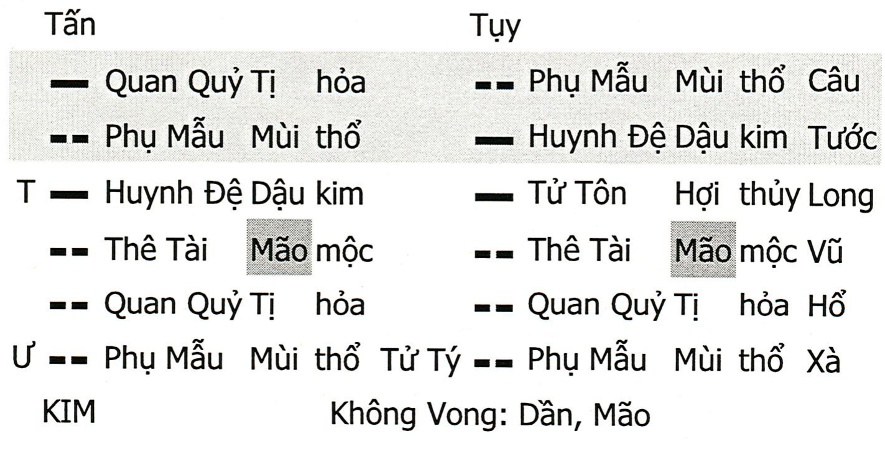
    - **Hình này chứng minh điều gì**
      - Bệnh nhân bị tăng sinh đốt sống cổ chèn ép làm khí huyết ứ trệ, lan xuống làm cánh tay đau nhức dữ dội; khối tăng sinh ăn sâu vào trong nên không thể mổ.
    - **Từ đâu mà thấy được**
      - Hào 6 Quan Tị hỏa động hóa Phụ Mùi thổ, hào 5 Phụ Mùi thổ hóa Huynh Dậu kim (nghịch cách); hào 6 là đầu, hào 5 là cổ; Mùi thổ là Tài khố (máu) lâm Câu Trần (sưng trướng) gặp Tài Không Vong; Quan hóa Huynh chủ tổn thương tay chân.
- Diễn biến phản hồi thực tế của người bệnh:
  - Người này cho biết: Đúng là vì đốt sống cổ bị tăng sinh xương (gai xương cổ), chèn ép trực tiếp ảnh hưởng đến sự vận động của cánh tay, mỗi ngày đều đau nhức khó chịu vô cùng.
  - Do khối tăng sinh mọc ăn sâu vào bên trong xương cổ nên các bác sĩ nhận định không thể phẫu thuật được; người bệnh hiện đang đi khắp nơi tìm thầy thuốc chữa trị.

### Ví dụ 2: Ngày Bính Thân tháng Nhâm Ngọ năm Canh Thìn, đoán thai sản (Phong Thiên Tiểu Súc biến Hỏa Thiên Đại Hữu)
- Dữ liệu bốc quẻ và xác lập dấu hiệu thụ thai:
  - Ngày Bính Thân, tháng Nhâm Ngọ, năm Canh Thìn (Tuần không: Thìn, Tị).
  - Người hỏi: Một người nam đến xem về chuyện thai sản.
  - Quẻ thu được: Phong Thiên Tiểu Súc biến Hỏa Thiên Đại Hữu (quẻ thuộc cung Mộc).
  - Thiết lập Dụng thần: Lấy hào Tử Tôn làm Dụng thần. Tử Tôn Tị hỏa (hào 5) được Nguyệt kiến Nhâm Ngọ củng phù vượng tướng.
  - Xác nhận đã mang thai: Hào thai của Tử Tôn Tị hỏa là Tý thủy (theo vòng Tràng Sinh của ngũ hành Hỏa: Thai tại Tý); hào thai Tý thủy trì Thế (hào sơ) lại được Nhật thần Bính Thân sinh trợ ở thế Trường Sinh (Thân sinh Tý), đây là tượng hiển nhiên người nữ đã thụ thai.
- Nguy cơ sảy thai qua quái tượng Cách Sơn Hóa Quỷ:
  - Dấu hiệu bất trắc của thai nhi: Hào thai Phụ Mẫu Tý thủy bị Nguyệt kiến Ngọ hỏa trực xung thành Nguyệt phá; đồng thời Dụng thần Tử Tôn Tị hỏa lại rơi vào Tuần Không.
  - Diễn biến động hào: Tử Tôn Tị hỏa (hào 5) động hóa Thê Tài Mùi thổ; Thê Tài Mùi thổ (hào 4) lại động hóa Quan Quỷ Dậu kim.
  - Nhận diện cách sơn hóa Quỷ: Tử Tôn thông qua hào cách Thê Tài Mùi thổ để hóa ra Quan Quỷ, đây là tượng "cách sơn hóa Quỷ" (Tử Tôn hóa Quỷ), chủ về thai nhi gặp hung hiểm, tác giả đoán chắc chắn đứa bé không thể sinh ra đời được.
- Bản chất ám muội của cái thai và tâm lý phá thai:
  - Con ngoài giá thú: Hào Tử Tôn Tị hỏa lâm Huyền Vũ (chủ việc ám muội, mờ ám, tư thông); hào Thê Tài Mùi thổ là đất Dưỡng của hào Thế Tý thủy (Thủy dưỡng tại Mùi). Điều này chứng minh cái thai này không phải con của người đàn ông này với vợ chính thức, mà là con của anh ta với một người phụ nữ khác bên ngoài.
  - Động cơ người mẹ: Hào cách là Thê Tài Mùi thổ (người phụ nữ mang thai); chuỗi biến hóa thuộc Nghịch cách (hào cách Mùi thổ ở hào 4 nằm dưới hào động Tị hỏa ở hào 5), chỉ rõ người phụ nữ này có tâm lý chủ quan cản trở, không muốn có đứa trẻ này mà kiên quyết muốn đi phá thai.
- Xác định sự việc mang thai ngoài giá thú và ý định phá thai dựa trên quẻ Phong Thiên Tiểu Súc biến Hỏa Thiên Đại Hữu:
  - **Hình 73.** Sơ đồ quẻ Phong Thiên Tiểu Súc biến Hỏa Thiên Đại Hữu
    - 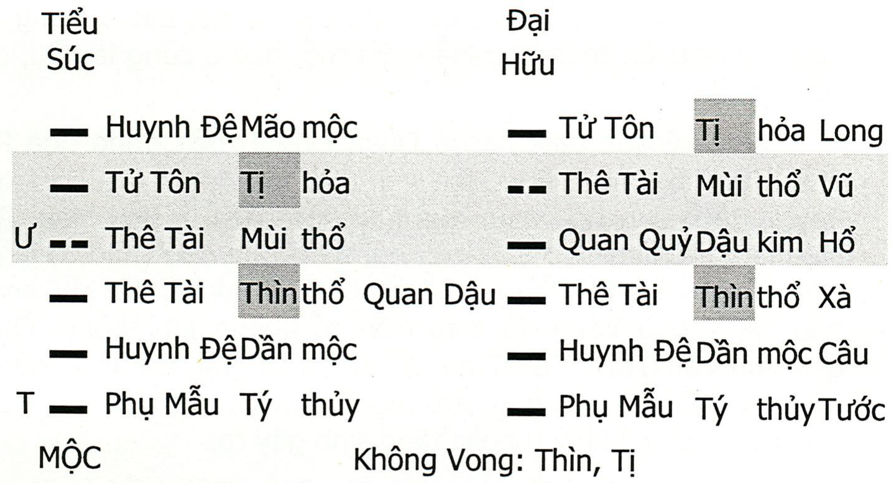
    - **Hình này chứng minh điều gì**
      - Đứa bé trong bụng là kết quả của mối quan hệ bất chính ngoài giá thú và người phụ nữ này quyết định đi phá thai, đứa trẻ không thể sinh ra.
    - **Từ đâu mà thấy được**
      - Tử Tôn Tị hỏa Tuần Không lâm Huyền Vũ (ám muội), thai Tý thủy Nguyệt phá; Tử Tôn hào 5 động hóa Tài Mùi thổ, Tài Mùi thổ hào 4 hóa Quan Dậu kim (cách sơn hóa Quỷ, nghịch cách); hào cách là Tài chủ người nữ muốn bỏ thai.
- Nghiệm chứng thực tế:
  - Kết quả ngoài đời quả đúng như dự đoán: Sự thật đúng là mang thai ngoài giá thú với nhân tình và người nữ đã chủ động đi phá thai.

### Ví dụ 3: Ngày Tân Hợi tháng Nhâm Ngọ năm Canh Thìn, đoán tài vận mấy ngày tới (Phong Sơn Tiệm biến Hỏa Thủy Vị Tế)
- Dữ liệu bốc quẻ và điềm báo hoàn toàn không có tài lộc:
  - Ngày Tân Hợi, tháng Nhâm Ngọ, năm Canh Thìn (Tuần không: Dần, Mão).
  - Người hỏi: Một người nam đến hỏi về tài vận trong mấy ngày sắp tới.
  - Quẻ thu được: Phong Sơn Tiệm biến Hỏa Thủy Vị Tế (quẻ thuộc cung Thổ).
  - Xác lập Dụng thần: Lấy hào Thê Tài làm Dụng thần. Hào Thê Tài Tý thủy không xuất hiện trên quẻ mà phục tàng dưới hào 5 Phụ Mẫu Tị hỏa.
  - Phân tích độ suy bại của Dụng thần: Hào phục Thê Tài Tý thủy bị Nguyệt kiến Ngọ hỏa trực xung thành Nguyệt phá; Phi thần Phụ Mẫu Tị hỏa là đất Tuyệt của Tài (Thủy tuyệt tại Tị) lại phát động; trong quẻ Kỵ thần Huynh Đệ vượng tướng phát động khắp nơi (Mùi thổ hào 4 động).
  - Tượng vô tài: Nguyên thần của Tài là Tử Tôn Thân kim trì Thế (hào 3) động hóa Phụ Mẫu Ngọ hỏa (hồi đầu khắc), hình thành quái tượng tuyệt đối không thể có tiền tài (vô tài).
- Vai trò người môi giới trung gian của đương số:
  - Tử Tôn Thân kim trì Thế, bản thân Thân kim là hào cách đóng vai trò sinh Tài.
  - Tác giả luận định: Người này muốn kiếm tiền dựa trên tư cách của một người trung gian, môi giới thương mại chứ không phải kinh doanh tự thân.
- Phân tích 3 tầng Cách Sơn Hóa Hào liên hoàn gây cản trở:
  - Tầng 1: Phụ Mẫu Tị hỏa (hào 5) động hóa Huynh Đệ Mùi thổ; Huynh Đệ Mùi thổ (hào 4) lại động hóa Tử Tôn Dậu kim (hào cách là Huynh Đệ).
  - Tầng 2: Huynh Đệ Mùi thổ động hóa Tử Tôn Dậu kim; Tử Tôn Thân kim (hào 3) lại động hóa Phụ Mẫu Ngọ hỏa (hào cách là Tử Tôn).
  - Tầng 3: Tử Tôn Thân kim động hóa Phụ Mẫu Ngọ hỏa; Phụ Mẫu Ngọ hỏa (hào 2) lại động hóa Huynh Đệ Thìn thổ (hào cách là Phụ Mẫu).
  - Cả 3 tầng liên hoàn này đều thuộc "Nghịch cách" (hào cách đều nằm ở vị trí bên dưới hào động tương ứng).
  - Dự đoán kết cục thương vụ: Bình thường cầu tài mà gặp cách sơn hóa hào đã là biểu hiện của sự ngăn trở; quẻ này xuất hiện tới 3 tầng nghịch cách trùng điệp, chứng tỏ phi vụ này phải thông qua quá nhiều tầng lớp môi giới trung gian chồng chéo, người trung gian quá nhiều dẫn đến cuối cùng chẳng ai thu được tiền tài.
  - Hào Ứng lâm Tuần Không (Quan Quỷ Mão mộc lâm Ứng, Không Vong) cho thấy đối tác thương thảo do dự bất định, thiếu quyết đoán; hào Tài lại lặn mất tăm, trước mắt ngay cả cái bóng của tiền tài cũng không thấy, sự tình khó lòng thành tựu.
- Nhận định trở ngại nhiều tầng trung gian dẫn tới không được tiền tài dựa trên quẻ Phong Sơn Tiệm biến Hỏa Thủy Vị Tế:
  - **Hình 74.** Sơ đồ quẻ Phong Sơn Tiệm biến Hỏa Thủy Vị Tế
    - 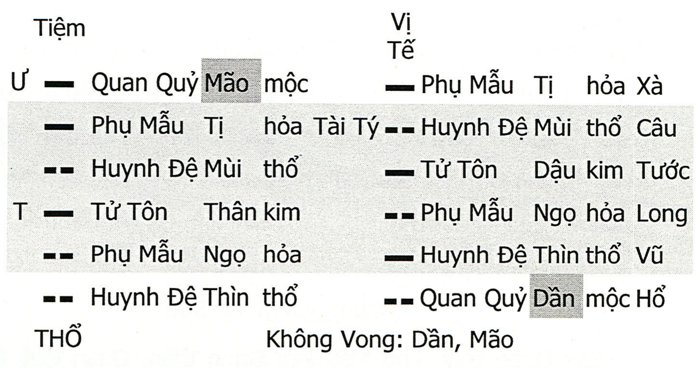
    - **Hình này chứng minh điều gì**
      - Chuyến mưu cầu tiền tài hoàn toàn thất bại do phải qua quá nhiều tầng trung gian môi giới phức tạp, đối tác do dự không quyết.
    - **Từ đâu mà thấy được**
      - Tài Tý thủy phục tàng bị Nguyệt phá; Tử Tôn Thân kim trì Thế động hóa hồi đầu khắc; quẻ xuất hiện 3 tầng cách sơn hóa hào liên tiếp (Tị hóa Mùi -> Mùi hóa Dậu; Mùi hóa Dậu -> Thân hóa Ngọ; Thân hóa Ngọ -> Ngọ hóa Thìn) đều là nghịch cách; Ứng hào Tuần Không.
- Nghiệm chứng thực tế:
  - Kết quả thực tế diễn ra đúng như dự đoán: Do vướng quá nhiều khâu trung gian môi giới lằng nhằng nên mối cầu tài thất bại hoàn toàn.

### Ví dụ 4: Ngày Đinh Tị tháng Quý Tị năm Bính Tý, nữ đoán kết quả thi cử (Hỏa Thủy Vị Tế biến Sơn Phong Cổ)
- Dữ liệu bốc quẻ và xác lập Dụng thần thi cử:
  - Ngày Đinh Tị, tháng Quý Tị, năm Bính Tý (Tuần không: Tý, Sửu).
  - Người hỏi: Một người nữ đến xem quẻ dự đoán về kết quả thi cử.
  - Quẻ thu được: Hỏa Thủy Vị Tế biến Sơn Phong Cổ (quẻ thuộc cung Hỏa).
  - Xác lập Dụng thần: Đoán thi cử phải phối hợp xem cả Quan Quỷ (danh vọng, thứ bậc trúng tuyển) và Phụ Mẫu (bài vở, văn bằng, kết quả thi).
  - Tình trạng Dụng thần suy bại cực điểm:
    - Quan Quỷ Hợi thủy phục tàng dưới hào Thế Huynh Đệ Ngọ hỏa (hào 3), bị cả Nhật kiến Tị hỏa lẫn Nguyệt kiến Tị hỏa trực xung mãnh liệt thành Nhật phá lẫn Nguyệt phá, lực lượng hoàn toàn suy kiệt.
    - Phụ Mẫu Dần mộc (hào sơ) tuy lâm Chu Tước (chủ văn thư thi cử) nhưng hưu tù tại tháng Tị ngày Tị, lại lâm đất Tử tại hào Thế Ngọ hỏa (Mộc tử tại Ngọ).
    - Dụng thần lưỡng suy, kết quả thi cử nhất định không tốt đẹp.
- Biện giải nguyên nhân thi trượt qua Cách Sơn Hóa Hào:
  - Hào Thế Huynh Đệ Ngọ hỏa (hào 3) động hóa Thê Tài Dậu kim; Thê Tài Dậu kim (hào 4) lại động hóa Tử Tôn Tuất thổ.
  - Hào Thế đại diện cho chính bản thân người đi thi.
  - Hào cách là Thê Tài (Dậu kim): Trong dự đoán thi cử, hào Thê Tài chuyên chủ về học tập kém cỏi hoặc tâm lý chán nản, không thích học tập.
  - Hào biến từ hào cách là Tử Tôn (Tuất thổ): Tử Tôn là Kỵ thần hàng đầu khắc chế Quan Quỷ của việc thi cử.
  - Tác giả luận giải chuỗi liên hoàn: Hào Thế thông qua Thê Tài hóa ra Tử Tôn, theo cách sơn hóa hào này thì có thể đoán nguyên nhân chủ yếu là do bản thân không chịu cố gắng học tập, lười nhác nên đương nhiên sẽ thi không qua.
  - Củng cố quy tắc cốt lõi: Quẻ này tuy là "Thuận cách" (hào cách Thê Tài Dậu kim ở hào 4 nằm bên trên hào Thế Ngọ hỏa ở hào 3), nhưng bởi vì Dụng thần (Quan Quỷ, Phụ Mẫu) hung hiểm suy phá mà sự việc khó thành; điều này khẳng định cách sơn hóa hào chỉ dùng để biện nghĩa tình tiết, cát hung cốt ở suy vượng của Dụng thần.
- Phán đoán kết quả thi cử thất bại do bản thân lười học dựa trên quẻ Hỏa Thủy Vị Tế biến Sơn Phong Cổ:
  - **Hình 75.** Sơ đồ quẻ Hỏa Thủy Vị Tế biến Sơn Phong Cổ
    - 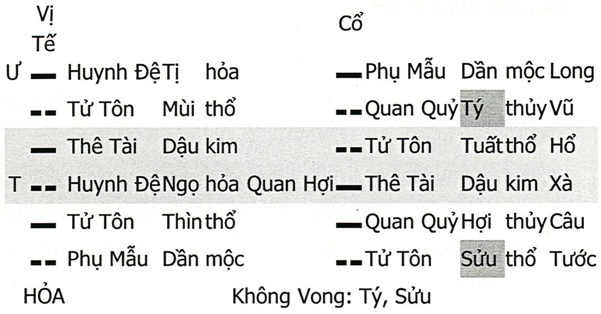
    - **Hình này chứng minh điều gì**
      - Thí sinh thi trượt do bản thân không nỗ lực cố gắng, chán ghét học tập chứ không phải do thiếu may mắn.
    - **Từ đâu mà thấy được**
      - Dụng thần Quan Hợi thủy phục tàng bị Nhật Nguyệt đồng xung phá; Phụ Mẫu Dần mộc hưu tù lâm Tử địa; Thế Ngọ hỏa hóa Tài Dậu kim, Tài Dậu kim hào 4 hóa Tử Tuất thổ (Kỵ thần thi cử); tuy là thuận cách nhưng Dụng thần suy bại nên bất thành.
- Nghiệm chứng thực tế:
  - Thực tế phản hồi: Kết quả kỳ thi cô gái này không đỗ đạt, nguyên nhân đúng là do bản thân chểnh mảng không nỗ lực học bài.

### Ví dụ 5: Ngày Nhâm Ngọ tháng Bính Thân năm Bính Tý, đoán động đất sắp tới (Phong Thủy Hoán biến Thiên Sơn Độn)
- Dữ liệu bốc quẻ và dấu hiệu chấn động địa chấn:
  - Ngày Nhâm Ngọ, tháng Bính Thân, năm Bính Tý (Tuần không: Thân, Dậu).
  - Vấn đề chiêm đoán: Đoán xem trong thời gian sắp tới có xảy ra động đất hay không.
  - Quẻ thu được: Phong Thủy Hoán biến Thiên Sơn Độn (quẻ thuộc cung Hỏa).
  - Nhận diện Dụng thần địa chấn: Xem tình hình động tĩnh của Đằng Xà, Câu Trần, Quan Quỷ và hào Tài.
  - Dấu hiệu khởi phát động đất: Quan Quỷ Hợi thủy và Thê Tài Dậu kim tuy không hiện trên quẻ (phục tàng), nhưng hào 4 Tử Tôn Mùi thổ lâm Câu Trần phát động; Câu Trần chủ đất đai, gò đống chấn động sạt lở, nên chủ sắp có hiện tượng động đất.
- Xác định phương vị chấn tâm và cơ chế 2 tầng Cách Sơn Hóa Hào:
  - Phương vị động đất: Câu Trần động tại cung Tốn (ngoại quái là Tốn vi Phong), Tốn đại diện cho phương Đông Nam, chỉ rõ vùng phía Đông Nam sẽ có chấn động.
  - Tầng 1 - Nghịch cách làm suy giảm sức mạnh động đất:
    - Tử Tôn Mùi thổ (hào 4) động hóa Huynh Đệ Ngọ hỏa; Huynh Đệ Ngọ hỏa (hào 3) lại động hóa Thê Tài Thân kim.
    - Thân kim rơi vào Tuần Không, đồng thời hào cách (Huynh Đệ Ngọ hỏa ở hào 3) nằm dưới hào động Mùi thổ (hào 4) nên là Nghịch cách.
    - Ý nghĩa: Sức mạnh của chấn động khi truyền đến mặt đất đã bị cản trở và giảm đi rất nhiều, gần bằng 0 (do Không Vong), cấp độ động đất sẽ không quá lớn.
  - Tầng 2 - Thuận cách và năng lực kháng chấn của kiến trúc:
    - Hào 2 Tử Tôn Thìn thổ động hóa Huynh Đệ Ngọ hỏa; Huynh Đệ Ngọ hỏa (hào 3) lại động hóa Thê Tài Thân kim.
    - Hào cách Huynh Đệ Ngọ hỏa nằm ở hào 3 bên trên hào 2 nên đây là Thuận cách.
    - Hào 2 là trạch (nhà cửa, công trình xây dựng), lại là Mộ khố của hào động đất Tử Tôn Mùi thổ (Thổ nhập Mộ tại Thìn). Mộ khố có khả năng thu nạp và làm yếu đi sức mạnh chấn động.
    - Luận điểm: Điều này chứng tỏ kết cấu kiến trúc của nơi phát sinh động đất có khả năng chịu đựng được địa chấn (kháng chấn tốt).
  - Tương tác hai tầng triệt tiêu nguy hại: Hai tầng cách sơn hóa hào một thuận một nghịch, khả năng chống động đất của tòa nhà và sức mạnh của động đất triệt tiêu lẫn nhau, do đó trận động đất sẽ không tạo thành nguy hại hay thảm họa nghiêm trọng.
- Định lượng thời gian phát sinh và tính toán cấp độ động đất:
  - Định giờ phát sinh (Ứng kỳ): Tử Tôn Mùi thổ động hóa hồi đầu sinh (hóa Ngọ hỏa); trong quẻ lại có hào 3 Ngọ hỏa động mà đến sinh hợp; Ngọ hỏa lâm Nhật kiến (ngày Nhâm Ngọ). Tác giả quyết đoán: Ngay trong giờ Ngọ hôm nay có khả năng xảy ra động đất.
  - Công thức tính cấp độ động đất theo Dịch số:
    - Hào động đất Tử Tôn lâm can chi Tân Mùi: Can Tân chủ số 7, Chi Mùi chủ số 8.
    - Phương vị động đất là Tốn, Tốn chủ số 5.
    - Cộng các số lại: 7 + 8 + 5 = 20.
    - Lấy tổng số 20 chia cho 4 được 5: 20 ÷ 4 = 5.
    - Do đó tác giả dự đoán lần động đất này khoảng cấp 5 độ Richter.
- Dự báo phương vị, cấp độ động đất và khả năng kháng chấn dựa trên quẻ Phong Thủy Hoán biến Thiên Sơn Độn:
  - **Hình 76.** Sơ đồ quẻ Phong Thủy Hoán biến Thiên Sơn Độn
    - 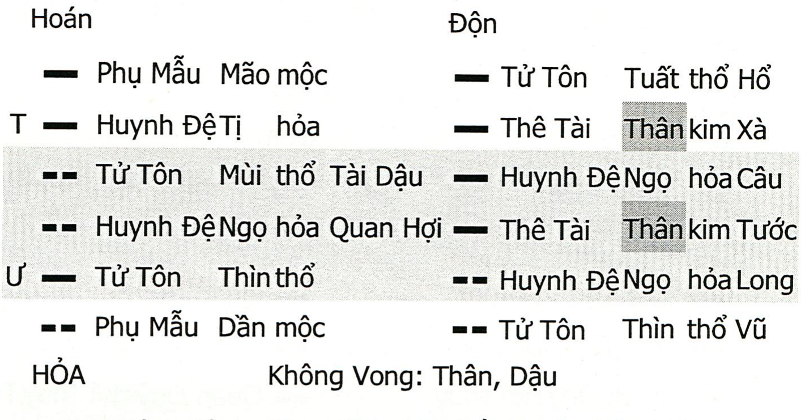
    - **Hình này chứng minh điều gì**
      - Động đất khoảng cấp 5 xảy ra vào giờ Ngọ tại hướng Đông Nam nhưng không gây thảm họa lớn vì kết cấu công trình chịu lực tốt.
    - **Từ đâu mà thấy được**
      - Tử Tôn Mùi thổ lâm Câu Trần động tại cung Tốn; 2 tầng cách sơn hóa hào gồm nghịch cách (Mùi hóa Ngọ -> Ngọ hóa Thân Không Vong) và thuận cách (Thìn hóa Ngọ -> Ngọ hóa Thân); hào 2 (trạch) là Mộ khố của Mùi thổ triệt tiêu chấn động; hào động Tân (7) + Mùi (8) + Tốn (5) = 20 chia 4 được cấp 5.
- Nghiệm chứng thực tế chuẩn xác:
  - Kết quả ngoài đời: Đúng vào giờ Ngọ hôm đó, một trận động đất có cường độ 4,9 độ Richter đã xảy ra ở phía Đông Nam; nhờ sức kháng chấn tốt nên không tạo thành thiệt hại nguy hiểm, ứng nghiệm cực kỳ thần kỳ với quẻ đoán.

### Ví dụ 6: Ngày Ất Mão tháng Giáp Thìn Nhâm Ngọ, đoán hợp tác cầu tài (Hỏa Phong Đỉnh biến Trạch Phong Đại Quá)
- Dữ liệu bốc quẻ và dấu hiệu thu được tài lộc:
  - Ngày Ất Mão, tháng Giáp Thìn, năm Nhâm Ngọ (Tuần không: Tý, Sửu).
  - Vấn đề chiêm đoán: Đoán về việc hợp tác làm ăn để cầu tài lộc.
  - Quẻ thu được: Hỏa Phong Đỉnh biến Trạch Phong Đại Quá (quẻ thuộc cung Hỏa).
  - Thiết lập Dụng thần: Lấy hào Thê Tài làm Dụng thần. Trong quẻ hào Thê Tài Dậu kim lưỡng hiện ở hào 3 và hào 4.
  - Phân tích vượng suy của Tài: Hào Tài Dậu kim được Nguyệt kiến Giáp Thìn sinh hợp (Thìn Dậu hợp kim sinh trợ); lại được Nhật thần Ất Mão mộc trực xung khiến hào tĩnh biến thành ám động sinh trợ cho hào Thế Quan Quỷ Hợi thủy (hào 2) (Kim sinh Thủy).
  - Khẳng định sinh tài: Kỵ thần Huynh Đệ (Tị hỏa hào 6) và Nguyên thần Tử Tôn (Mùi thổ hào 5) cùng phát động liên hoàn tương sinh (Tị hỏa sinh Mùi thổ, Mùi thổ sinh Tài Dậu kim), tạo thành chuỗi liên tục sinh Tài, khẳng định chắc chắn chuyến hợp tác này có thể thu được tài lộc.
- Phát hiện nhân vật trung gian thủ tục qua Cách Sơn Hóa Hào:
  - Ngoại quái có hào 6 Huynh Đệ Tị hỏa động hóa Tử Tôn Mùi thổ; tiếp đó hào 5 Tử Tôn Mùi thổ lại động hóa Thê Tài Dậu kim.
  - Đây chính là cách sơn hóa hào điển hình.
  - Phân tích tượng hợp tác: Trong dự đoán Lục Hào, thông thường Huynh Đệ động hóa Thê Tài là tượng hai người cùng nhau hợp tác làm ăn cầu tài.
  - Sự xuất hiện của người thứ ba: Quẻ này Huynh Đệ không trực tiếp hóa Tài mà phải thông qua hào cách Tử Tôn Mùi thổ mới hóa ra Tài; tác giả kết luận: Đây không phải là sự hợp tác thuần túy giữa hai người mà ở trung gian nhất định còn có thêm một người nữa làm đầu mối bắc cầu.
  - Đặc điểm người trung gian: Hào cách là Mùi thổ, Mùi thổ chính là Mộ khố của Phụ Mẫu (Mộc mộ tại Mùi; Phụ Mẫu Mão mộc); trong Lục Hào, Phụ Mẫu đại diện cho văn thư, giấy tờ, hợp đồng, thủ tục hành chính. Tác giả khẳng định: Người trung gian này là nhân vật có liên quan mật thiết đến việc quản lý và phê duyệt các thủ tục văn thư, hồ sơ pháp lý.
- Nhận diện sự tham gia của người trung gian quyền lực trong hợp tác làm ăn dựa trên quẻ Hỏa Phong Đỉnh biến Trạch Phong Đại Quá:
  - **Hình 77.** Sơ đồ quẻ Hỏa Phong Đỉnh biến Trạch Phong Đại Quá
    - 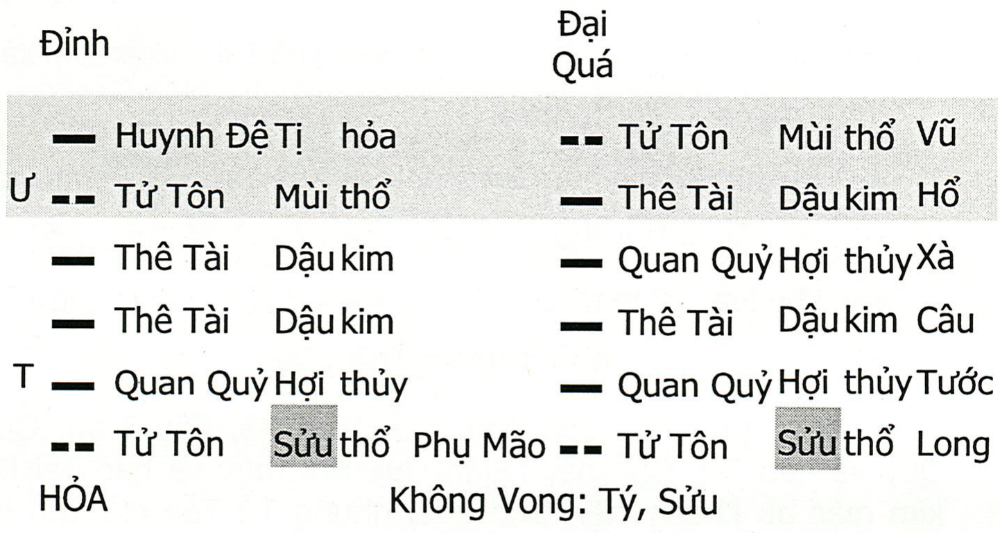
    - **Hình này chứng minh điều gì**
      - Việc hợp tác có thể sinh tài lộc nhưng không chỉ có hai người mà phải thông qua một nhân vật trung gian then chốt phụ trách hồ sơ, thủ tục pháp lý.
    - **Từ đâu mà thấy được**
      - Tài Dậu kim được Nguyệt sinh, Nhật xung ám động sinh Thế; hào 6 Huynh Tị hỏa động hóa Tử Mùi thổ, hào 5 Tử Mùi thổ hóa Tài Dậu kim (cách sơn hóa hào); hào cách Mùi thổ là Mộ khố của Phụ Mẫu (văn thư, giấy tờ pháp lý).
- Phản hồi thực tế từ người hỏi:
  - Người này xác nhận: Ở trung gian đúng là còn có một người đóng vai trò vô cùng quan trọng, bởi vì người anh trai của người này đang làm việc trong cơ quan chính quyền chuyên phụ trách giải quyết các thủ tục hành chính giấy tờ.
  - Về kết quả cầu tài thực tế: Do người hỏi sau đó không quay lại phản hồi nên tác giả không rõ số tiền cụ thể kiếm được là bao nhiêu.

## Chương 12: Du Hồn Biện Nghĩa

### Ý nghĩa và nguyên lý ứng dụng quẻ Du Hồn
- **Vai trò của Du Hồn trong dự đoán Lục Hào:**
  - Du Hồn đóng vai trò phụ họa quan trọng cho tình trạng cát hung của Dụng thần.
  - Bất kể xuất hiện ở quẻ chính (tiền quái) hay quẻ biến (hậu quái), khi gặp quẻ Du Hồn đều có thể trích xuất thông tin đặc trưng để luận đoán tình tiết sự việc và tâm lý.
- **Biến hóa ý nghĩa của Du Hồn theo từng sự việc cụ thể:**
  - Trong dự đoán bệnh tật: Du Hồn chủ về bệnh tình không ổn định, biến chuyển khó lường; người bệnh tâm thần không yên, buồn bực, trạng thái tinh thần không tỉnh táo, đờ đẫn, hồn vía lên mây, tính mạng nguy kịch, hơi thở thoi thóp, hôn mê bất tỉnh. Mức độ nặng hay nhẹ phải căn cứ vào sự suy vượng của Dụng thần.
  - Trong các sự việc khác: Quẻ Du Hồn mang hàm nghĩa sát biên giới, phân ly, cảm xúc không ổn định, tâm trạng bất an, ra ngoài, đi xa, tư tưởng không tập trung, vui quên trở về, lưu luyến không muốn về, du ngoạn khắp nơi, yêu thích di chuyển, đứng núi này trông núi nọ, không về nhà thường xuyên, chạy trốn, không chịu sự quản giáo, thay lòng đổi dạ, nhút nhát, đam mê phóng túng, giảm trí nhớ, đãng trí để quên đồ vật, như mê như say, người một nơi lòng dạ một nẻo, do dự không quyết, mở rộng hay khuếch tán ra bên ngoài.
- **Giá trị thực chiến:**
  - Nếu vận dụng thích đáng các tượng nghĩa của Du Hồn kết hợp sinh khắc hào vị, người dự đoán có thể nhìn thấu tình tiết vi tế của sự việc và thế giới nội tâm sâu kín của đương sự. Du Hồn là căn cứ tham khảo không thể thiếu trong hệ thống Lục Hào thực chiến.

### Ví dụ 1: Nam 22 tuổi đoán hôn nhân (Sơn Lôi Di biến Ly Vi Hỏa)
- **Thông tin quẻ bói:**
  - Thời gian: Ngày Kỷ Tị, tháng Quý Sửu, năm Đinh Sửu.
  - Người hỏi: Nam giới, 22 tuổi, dự đoán về hôn nhân.
  - Quẻ gieo: Sơn Lôi Di biến Ly Vi Hỏa.
  - Không Vong: Tuất, Hợi tuần không.
- **Luận giải Dụng thần và tương tác lục hào:**
  - Lấy hào Thê Tài làm Dụng thần. Trong quẻ hào Tài lưỡng hiện (Thê Tài Tuất thổ ở hào 4 và Thê Tài Thìn thổ ở hào 3).
  - Hào 4 Thê Tài Tuất thổ trì Thế: Chứng tỏ đương sự hiện tại đã có đối tượng người yêu.
  - Hào 4 Tuất thổ trì Thế phát động hóa Quan Quỷ Dậu kim (Dậu là đất Mộc Dục), lại lâm Thanh Long: Biểu thị hai người đã phát sinh quan hệ thể xác gắn bó.
  - Hào Phụ Mẫu Tý thủy lâm Huyền Vũ nhập Mộ ở hào động Thê Tài Thìn thổ: Phản ánh hai người đã có quan hệ sống chung (đồng cư).
  - Hào Thế lâm Tuất thổ bị Không Vong: Là hình tượng tâm hồn đương sự đang ở nơi đâu đâu, tư tưởng dao động không yên định.
  - Quẻ chủ Sơn Lôi Di là quẻ Du Hồn của cung Tốn: Chủ về sự thay lòng đổi dạ, muốn chia tay để theo đuổi người phụ nữ khác.
  - Hào 3 Thê Tài Thìn thổ phát động xung hào Thế Tuất thổ: Tượng trưng cho việc xuất hiện một người con gái khác xen vào, tạo thành nguy cơ đe dọa trực tiếp mối quan hệ hiện hữu.
  - Hào Thê Tài Thìn thổ lâm Huyền Vũ: Người con gái mới xuất hiện có vẻ ngoài gợi cảm, ăn mặc diêm dúa lòe loẹt.
  - Hào Thế nhập Mộ ở Thìn thổ: Bản thân chàng trai bị người nữ mới này mê hoặc, tâm trí bị cuốn theo.
- **Dự đoán hạn chia tay và sự kiện biến động:**
  - Ở thời điểm xem bói (tháng Sửu năm Đinh Sửu), Huynh Đệ Dần mộc hưu tù nên chưa khắc được Tài.
  - Sang năm sau là năm Mậu Dần (1998), Huynh Đệ Dần mộc trị Thái Tuế nắm quyền đắc lệnh, tất sẽ phát động khắc Tài dẫn đến chia tay dứt khoát với bạn gái hiện tại.
- Dự đoán hôn nhân biến động và nguy cơ chia tay dựa trên quẻ Sơn Lôi Di biến Ly Vi Hỏa:
  - **Hình 78.** Sơ đồ quẻ Sơn Lôi Di biến Ly Vi Hỏa
    - 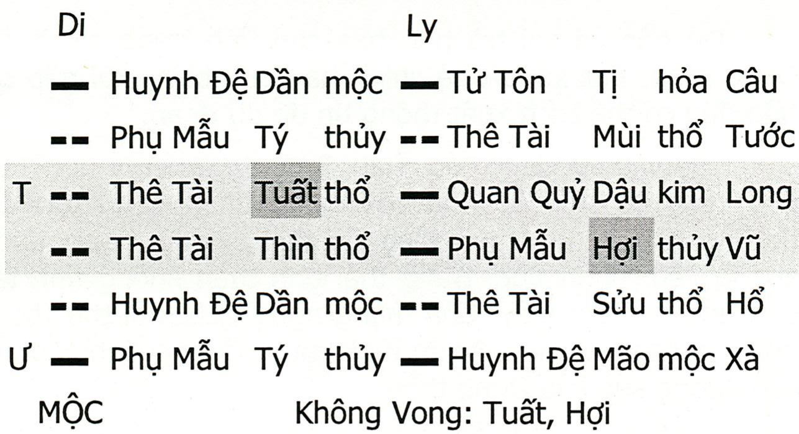
    - **Hình này chứng minh điều gì**
      - Quẻ Sơn Lôi Di là Du Hồn chủ thay lòng đổi dạ; Thế Không lâm Thanh Long hóa Dậu kim Mộc Dục báo hiệu đã có quan hệ thể xác và sẽ chia tay theo người khác.
    - **Từ đâu mà thấy được**
      - Thế Tuất thổ tuần không hóa Quan Quỷ Dậu kim Mộc Dục; Thê Tài Thìn thổ động lâm Huyền Vũ xung Thế nhập Mộ; năm Mậu Dần Huynh Đệ Dần mộc trị Thái Tuế khắc Tài.
- **Ứng nghiệm thực tế:**
  - Người này quả nhiên trước đó đã có bạn gái, hai người quen nhau từ năm Bính Tý (1996), không lâu sau thì phát sinh quan hệ giới tính và sống chung.
  - Sau đó quả thực xuất hiện một người con gái khác khiến chàng trai mê mẩn. Đến năm Mậu Dần (1998), anh ta chia tay với bạn gái cũ để chính thức yêu đương với người mới.

### Ví dụ 2: Nam yêu một cô gái đoán có thể thành vợ chồng không (Thiên Phong Cấu biến Trạch Phong Đại Quá)
- **Thông tin quẻ bói:**
  - Thời gian: Ngày Đinh Tị, tháng Ất Mão, năm Mậu Dần.
  - Người hỏi: Nam giới đang yêu một cô gái, muốn đoán xem sau này hai người có thể kết thành vợ chồng được hay không.
  - Quẻ gieo: Thiên Phong Cấu biến Trạch Phong Đại Quá.
  - Không Vong: Tý, Sửu tuần không.
- **Luận giải Dụng thần và tương tác lục hào:**
  - Lấy hào Thê Tài làm Dụng thần. Thê Tài Dần mộc không xuất hiện trên quẻ, phục tàng dưới hào 2 Tử Tôn Hợi thủy.
  - Đánh giá vượng suy của Dụng thần và Nguyên thần:
    - Hào Thê Tài Dần mộc tuy được Nguyệt kiến Mão mộc trợ giúp, nhưng Nguyên thần là Tử Tôn Hợi thủy lại cực kỳ hưu tù: Lâm đất Tử ở Nguyệt kiến Mão mộc, lâm Tuyệt ở Nhật thần Tị hỏa.
    - Nguyên thần Tử Tôn Hợi thủy lại bị hào 6 Phụ Mẫu Tuất thổ phát động khắc phạt nặng nề.
    - Hào Thế Phụ Mẫu Sửu thổ lâm Tuần Không: Bản thân người hỏi thiếu lực nâng đỡ, khó lòng duy trì hôn nhân.
  - Hào Thê Tài không hiện trên quẻ: Tượng trưng cho việc hai người trên thực tế rất ít khi gặp gỡ nhau.
  - Hào Thế Không Vong kết hợp quẻ biến Trạch Phong Đại Quá là quẻ Du Hồn: Nội tâm của cả hai lên xuống bấp bênh, tâm trạng bất an và dao động bất định.
  - Hào Tài phục dưới hào 2 lâm Câu Trần: Hào 2 là trạch (nhà/nơi ở), Câu Trần chủ văn phòng công sở; chứng tỏ cô gái này làm việc trong văn phòng.
- **Dự đoán kết quả và thời điểm chia tay:**
  - Nguyên thần Tử Tuyệt hưu tù lại biến ra quẻ Du Hồn, cho thấy mối quan hệ chắc chắn sẽ tan vỡ, không thể đi đến hôn nhân.
  - Ứng kỳ: Đến tháng Tị, Nguyên thần Hợi thủy rơi vào Tuyệt địa, đồng thời Nhật/Nguyệt Tị hỏa xung phá Phi thần Hợi thủy làm điểm tựa sụp đổ, hai người tất sẽ chia tay.
- Dự đoán tình cảm khó thành vợ chồng và nguy cơ tan vỡ dựa trên quẻ Thiên Phong Cấu biến Trạch Phong Đại Quá:
  - **Hình 79.** Sơ đồ quẻ Thiên Phong Cấu biến Trạch Phong Đại Quá
    - 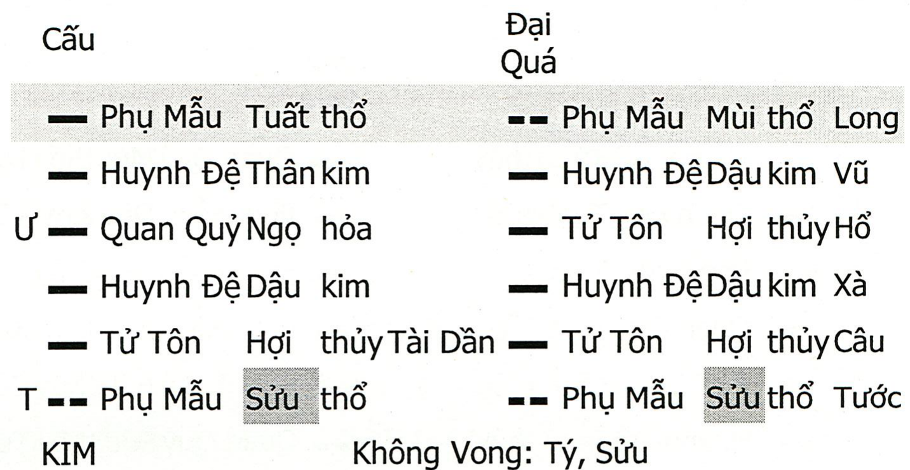
    - **Hình này chứng minh điều gì**
      - Hai người khó thành vợ chồng và ắt chia tay vào tháng Tị; đối phương làm việc trong văn phòng nhưng ít gặp nhau, nội tâm bất định.
    - **Từ đâu mà thấy được**
      - Tài Dần mộc phục hào 2 lâm Câu Trần; Nguyên thần Tử Tôn Hợi thủy lâm Tử ở Nguyệt kiến, Tuyệt ở Nhật thần lại bị Tuất thổ động khắc; Thế Phụ Mẫu Sửu thổ Không Vong, quẻ biến Đại Quá là Du Hồn.
- **Ứng nghiệm thực tế:**
  - Đúng như dự đoán, hai người đã chính thức chia tay nhau vào tháng Tị năm Mậu Dần, không thể kết thành vợ chồng.

### Ví dụ 3: Báo đưa tin Hoa Kỳ phóng máy thăm dò đoán mặt trăng có nước không (Thủy Lôi Truân biến Trạch Phong Đại Quá)
- **Thông tin quẻ bói:**
  - Thời gian: Ngày Bính Thìn, tháng Quý Sửu, năm Đinh Sửu.
  - Bối cảnh: Trên báo chí đăng tải thông tin Hoa Kỳ phóng máy thăm dò không gian vào ngày 8 tháng 1 để tìm kiếm dấu vết nước trên mặt trăng. Tác giả đọc được tin tức này liền gieo một quẻ để đoán định kết quả thăm dò.
  - Quẻ gieo: Thủy Lôi Truân biến Trạch Phong Đại Quá.
  - Không Vong: Tý, Sửu tuần không.
- **Luận giải Dụng thần và tương tác lục hào:**
  - Nguyên tắc chọn Dụng thần: Lấy hào Thê Tài làm Dụng thần, bởi vì Thê Tài chủ về ẩm thực (nước uống, thức ăn), do đó đoán về nước sinh hoạt hoặc nguồn nước tự nhiên đều lấy hào Tài làm Dụng thần.
  - Phân tích hào Dụng thần:
    - Trong quẻ, Thê Tài Ngọ hỏa không hiện, phục tàng dưới hào 3 Quan Quỷ Thìn thổ.
    - Thê Tài Ngọ hỏa lâm hưu tù (bị tháng Sửu tiết khí, ngày Thìn hối hỏa), Nguyên thần của Tài là Tử Tôn Dần mộc ở hào 2 cũng rất suy nhược.
    - Trong quẻ, hào sơ Huynh Đệ Tý thủy phát động hóa Quan Quỷ Sửu thổ, hào 4 Phụ Mẫu Thân kim phát động hóa Huynh Đệ Hợi thủy, kết hợp cùng Nhật thần Thìn thổ tạo thành tam hợp cục Thân - Tý - Thìn hội Thủy cục cực vượng quay lại khắc phạt Dụng thần Thê Tài Ngọ hỏa.
    - Dụng thần phục tàng lại bị hợp cục khắc tuyệt, chứng tỏ trên bề mặt mặt trăng hoàn toàn không có nước.
  - Tượng nghĩa quẻ biến Du Hồn:
    - Quẻ biến Trạch Phong Đại Quá là quẻ Du Hồn của cung Chấn.
    - Quẻ Du Hồn phản ánh lực hấp dẫn của mặt trăng rất yếu, mức độ phân tán hao thoát cực lớn, các phân tử nước bốc hơi phân tán vào không gian, do đó trên mặt trăng rất khó để ngưng tụ hình thành nên giọt nước.
- Dự đoán bề mặt mặt trăng không có nước dựa trên quẻ Thủy Lôi Truân biến Trạch Phong Đại Quá:
  - **Hình 80.** Sơ đồ quẻ Thủy Lôi Truân biến Trạch Phong Đại Quá
    - 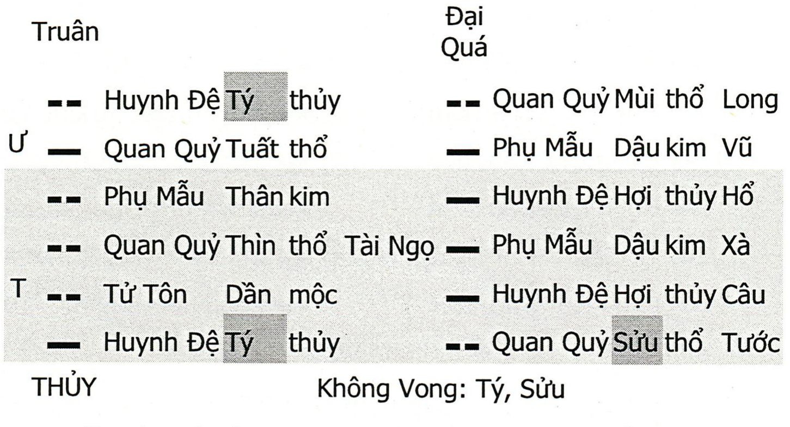
    - **Hình này chứng minh điều gì**
      - Bề mặt mặt trăng hoàn toàn không có nước; lực hấp dẫn yếu, hao tán lớn khiến các giọt nước không thể hình thành.
    - **Từ đâu mà thấy được**
      - Hào Dụng thần Thê Tài Ngọ hỏa phục dưới hào 3 Thìn thổ hưu tù, Nguyên thần nhược; hào sơ Tý thủy và hào 4 Thân kim động hợp ngày Thìn thành Thân Tý Thìn Thủy cục khắc Tài; quẻ biến Đại Quá là Du Hồn chủ hao tán.
- **Ứng nghiệm thực tế:**
  - Kết quả sau quá trình thăm dò thực tế của Hoa Kỳ, các nhà khoa học hoàn toàn không tìm thấy nước trên bề mặt mặt trăng, đúng như quẻ đã chỉ rõ.

### Ví dụ 4: Con gái của bạn biến mất đoán tình hình cát hung (Phong Thủy Hoán biến Thiên Thủy Tụng)
- **Thông tin quẻ bói:**
  - Thời gian: Ngày Kỷ Dậu, tháng Giáp Dần, năm Mậu Dần.
  - Bối cảnh: Con gái của một người bạn tác giả đột ngột biến mất không rõ tung tích, gia đình vô cùng hoang mang lo lắng, đến nhờ tác giả đoán xem tình hình cát hung ra sao.
  - Quẻ gieo: Phong Thủy Hoán biến Thiên Thủy Tụng.
  - Không Vong: Dần, Mão tuần không.
- **Luận giải Dụng thần và các chi tiết thực chiến:**
  - Lấy hào Tử Tôn làm Dụng thần. Trong quẻ có Tử Tôn Mùi thổ (hào 4) và Tử Tôn Thìn thổ (hào 2 trì Ứng) lưỡng hiện; lấy hào động Tử Tôn Mùi thổ làm Dụng thần chính, đồng thời kiêm xem hào Thìn thổ.
  - Nguyên nhân bỏ nhà ra đi:
    - Hào 6 Phụ Mẫu Mão mộc gặp Nhật thần Dậu kim xung động, do Mão mộc đắc lệnh ở tháng Dần nên xung thành ám động. Phụ Mẫu ám động khắc thẳng vào Tử Tôn Mùi thổ, chứng tỏ cô gái phải hứng chịu cơn thịnh nộ, mắng mỏ của người lớn trong nhà mà uất ức bỏ đi.
  - Người đồng hành và phương tiện di chuyển:
    - Tử Tôn Mùi thổ phát động tương hợp với Huynh Đệ Ngọ hỏa: Chứng tỏ cô gái không đi một mình mà có bạn bè đồng trang lứa đồng hành cùng.
    - Tử Tôn lâm hào Ứng (hào 2 Thìn thổ): Báo hiệu cô gái hiện tại đã đi đến một địa phương khác.
    - Hào sơ là cước lực (đôi chân, sức đi bộ), lâm Phụ Mẫu Dần mộc gặp Tuần Không: Biểu thị cô gái không đi bộ mà di chuyển bằng xe cộ.
  - Phương hướng và nơi lưu trú:
    - Ngoại quái Tốn mộc phát động hóa Càn kim: Càn chủ hướng Tây Bắc, cô gái đã đi về hướng Tây Bắc.
    - Hào Dụng thần Tử Tôn Mùi thổ lâm Thanh Long động mà gặp hợp: Thanh Long chủ vui chơi giải trí, gặp hợp là tượng say mê ham vui.
    - Quẻ biến Thiên Thủy Tụng là quẻ Du Hồn của cung Ly: Chủ về vui chơi quên ngày trở về, lưu luyến không muốn về nhà.
    - Tử Tôn Mùi thổ lâm đất Mộc Dục ở Nhật kiến Dậu kim, lại lâm Thanh Long: Tượng trưng cho nơi có nước để tắm rửa, bơi lội, vui đùa sảng khoái.
  - Đánh giá mức độ an toàn và thời gian trở về:
    - Tử Tôn Mùi thổ động hóa Huynh Đệ Ngọ hỏa là hồi đầu sinh trợ giúp cho Dụng thần, chứng tỏ cô gái ở bên ngoài hoàn toàn bình an vô sự.
    - Quy luật ứng kỳ: Hiện tại Mùi thổ động hợp với Ngọ hỏa (hợp thì giữ lại), theo lý "hợp xứ phùng xung", chờ đến ngày Sửu xung khai Mùi thổ giải hợp, cô gái nhất định sẽ tự trở về.
- Dự đoán tung tích và tình trạng an toàn của con gái dựa trên quẻ Phong Thủy Hoán biến Thiên Thủy Tụng:
  - **Hình 81.** Sơ đồ quẻ Phong Thủy Hoán biến Thiên Thủy Tụng
    - 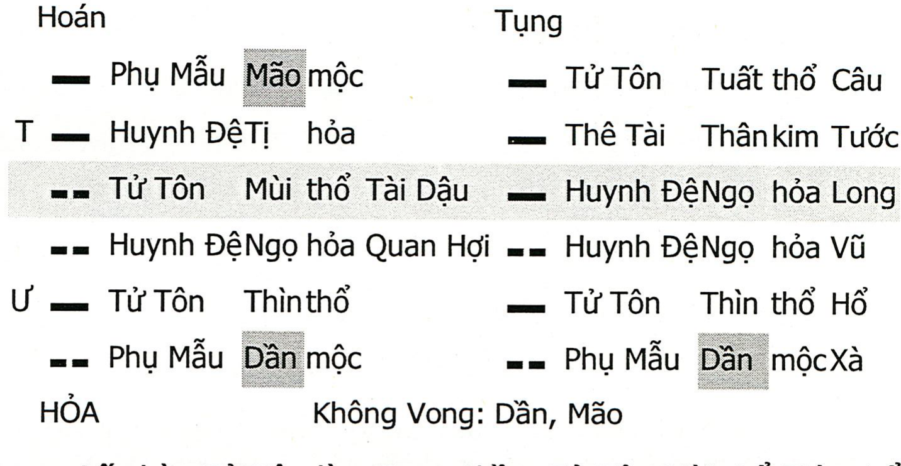
    - **Hình này chứng minh điều gì**
      - Cô gái bỏ đi vì giận dỗi người lớn, đi xe về hướng Tây Bắc cùng bạn tắm suối nước nóng giải khuây, ham vui chưa muốn về nhưng an toàn và sẽ về ngày Sửu.
    - **Từ đâu mà thấy được**
      - Hào 6 Mão mộc ám động khắc Tử Tôn; Mùi thổ động hợp Huynh Đệ Ngọ hỏa hóa sinh; hào sơ Dần mộc Không Vong là đi xe; quẻ ngoại biến Càn; Mùi thổ gặp Nhật Dậu là Mộc Dục lâm Long; quẻ biến Tụng là Du Hồn chủ vui quên về; ngày Sửu xung hợp sẽ về.
- **Ứng nghiệm thực tế:**
  - Quả nhiên đúng vào ngày Sửu, cô gái đã tự giác trở về nhà an toàn.
  - Khi về, cô gái chia sẻ rằng do tâm trạng ấm ức bực bội với gia đình nên đã rủ bạn thân cùng nhau đi tắm suối nước nóng ở phía Bắc để khuây khỏa tinh thần, đúng như từng chi tiết tượng quẻ đã miêu tả.

### Ví dụ 5: Nữ đoán đi xem mặt ra sao (Thiên Thủy Tụng biến Phong Thủy Hoán)
- **Thông tin quẻ bói:**
  - Thời gian: Ngày Ất Dậu, tháng Ngọ.
  - Người hỏi: Một người nữ muốn dự đoán xem buổi đi xem mặt gặp đối tượng hẹn hò sẽ diễn ra như thế nào.
  - Quẻ gieo: Thiên Thủy Tụng biến Phong Thủy Hoán.
  - Không Vong: Ngọ, Mùi tuần không.
- **Luận giải Dụng thần và tính cách đối phương:**
  - Lấy hào Quan Quỷ làm Dụng thần đại diện cho người nam đi xem mặt.
  - Quan Quỷ Hợi thủy không xuất hiện trên quẻ, phục tàng dưới hào 3 Huynh Đệ Ngọ hỏa.
  - Quan Quỷ Hợi thủy gặp Nhật thần Dậu kim là đất Mộc Dục: Biểu thị đối phương rất coi trọng lần xem mặt này, ăn mặc chải chuốt tỉ mỉ, trau chuốt dung mạo trước khi đến gặp.
  - Hào Quan Quỷ lâm Câu Trần: Câu Trần chủ thật thà đôn hậu, chứng tỏ đối phương là người hiền lành, chất phác.
  - Quan Quỷ phục tàng không hiện, kết hợp quẻ chủ Thiên Thủy Tụng là quẻ Du Hồn của cung Ly: Biểu thị đối phương tính tình cực kỳ nhút nhát, hễ thấy phụ nữ là rụt rè sợ sệt không dám ngước nhìn; dự đoán buổi xem mặt này e rằng ngay cả khuôn mặt của đối phương người nữ cũng không nhìn rõ được.
- **Tâm trạng người nữ và kết quả cuộc gặp:**
  - Hào Thế Huynh Đệ Ngọ hỏa lâm Đằng Xà lại gặp Tuần Không: Biểu thị tâm trạng bản thân cô gái trước buổi gặp rất hồi hộp, lo âu, tâm tư rối bời không yên.
  - Hào Thế Ngọ hỏa phát động hóa ra Tử Tôn Mùi thổ: Tử Tôn là thần khắc chế Quan Quỷ, tượng trưng cho việc bản thân cô gái sau khi tiếp xúc sẽ không hài lòng, chê bai đối phương.
- Dự đoán buổi đi xem mặt và diện mạo đối phương dựa trên quẻ Thiên Thủy Tụng biến Phong Thủy Hoán:
  - **Hình 82.** Sơ đồ quẻ Thiên Thủy Tụng biến Phong Thủy Hoán
    - 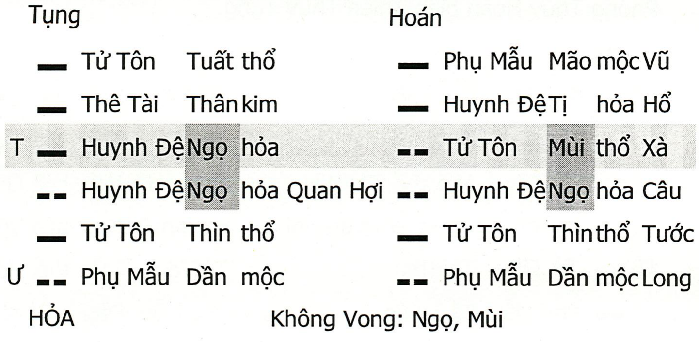
    - **Hình này chứng minh điều gì**
      - Đối phương ăn mặc chải chuốt nhưng tính tình quá nhút nhát sợ hãi đến không dám ngẩng đầu nhìn; bản thân người nữ bất an và không hài lòng.
    - **Từ đâu mà thấy được**
      - Quan Quỷ Hợi thủy phục dưới hào 3 lâm Câu Trần, gặp Nhật Dậu là Mộc Dục; quẻ chủ Tụng là Du Hồn chủ nhát gan trốn tránh; Thế Ngọ hỏa Không lâm Đằng Xà động hóa Tử Tôn Mùi thổ khắc Quan.
- **Phản hồi thực tế:**
  - Sau đó, cô gái đi xem mặt về và phản hồi lại: Chàng trai đối phương quả nhiên ăn mặc rất diện, tề chỉnh chải chuốt.
  - Tuy nhiên, anh ta quá mức nhút nhát, sợ đến mức cúi gằm mặt không dám ngẩng đầu lên nhìn cô lấy một lần suốt buổi gặp. Đến khi buổi xem mặt kết thúc, cô gái vẫn chưa nhìn rõ được diện mạo của anh ta.
  - Về sau, cô gái chê đối phương tính tình quá nhu nhược hiền lành nên đã từ chối, không đồng ý tiếp tục tìm hiểu.

### Ví dụ 6: Nuôi vẹt bị bay mất đoán có về không (Càn Vi Thiên biến Thủy Thiên Nhu)
- **Thông tin quẻ bói:**
  - Thời gian: Ngày Bính Ngọ, tháng Mậu Thìn, năm Kỷ Mão.
  - Bối cảnh: Chim vẹt nuôi trong nhà bị sổng lồng bay mất, chủ nhân muốn đoán xem chim có tự bay về hoặc tìm lại được hay không.
  - Quẻ gieo: Càn Vi Thiên biến Thủy Thiên Nhu.
  - Không Vong: Dần, Mão tuần không.
- **Luận giải Dụng thần và tương tác lục hào:**
  - Lấy hào Tử Tôn làm Dụng thần đại diện cho loài chim cảnh, vật nuôi.
  - Trong quẻ, hào sơ Tử Tôn Tý thủy bị Nguyệt kiến Thìn thổ khắc thương, lại bị Nhật thần Ngọ hỏa xung phá (vừa bị khắc vừa bị xung, suy kiệt cùng cực).
  - Trong quẻ, hào 6 Phụ Mẫu Tuất thổ phát động quay lại khắc phạt Tử Tôn Tý thủy.
  - Hào Thế Phụ Mẫu Tuất thổ trì Thế phát động khắc thẳng vào Dụng thần: Thế khắc Dụng là điềm hung, báo hiệu chim một đi không trở lại.
  - Quẻ biến Thủy Thiên Nhu là quẻ Du Hồn của cung Khôn: Du Hồn chủ về phiêu bạt đi xa, không định hướng; con vẹt đã mải mê bay lượn đến tận chân trời góc biển nào từ lâu, không còn nhớ đường về.
- Dự đoán chim vẹt nuôi bị sổng mất khó tìm về dựa trên quẻ Càn Vi Thiên biến Thủy Thiên Nhu:
  - **Hình 83.** Sơ đồ quẻ Càn Vi Thiên biến Thủy Thiên Nhu
    - 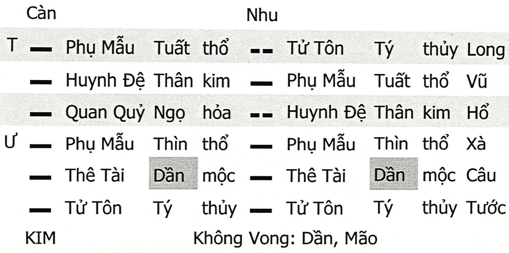
    - **Hình này chứng minh điều gì**
      - Vẹt nuôi bay mất không thể trở về, đã bay đi rất xa đến nơi khác.
    - **Từ đâu mà thấy được**
      - Dụng thần Tử Tôn Tý thủy bị Nguyệt kiến Thìn thổ khắc, Nhật thần Ngọ hỏa xung; hào 6 Phụ Mẫu Tuất thổ động khắc Tử Tôn, Thế khắc Dụng; quẻ biến Thủy Thiên Nhu là Du Hồn chủ phiêu bạt đi xa.
- **Ứng nghiệm thực tế:**
  - Kết quả thực tế, con vẹt nuôi đã bay mất tăm tích và hoàn toàn không bao giờ quay trở về.

### Ví dụ 7: Đoán đến nơi khác mở khóa học sẽ ra sao (Phong Trạch Trung Phu)
- **Thông tin quẻ bói:**
  - Thời gian: Ngày Đinh Tị, tháng Nhâm Tý, năm Nhâm Ngọ.
  - Bối cảnh: Một người bạn của tác giả có dự định đi đến một địa phương khác để mở lớp giảng dạy, đến nhờ tác giả dự đoán xem chuyến đi này kết quả sẽ ra sao.
  - Quẻ gieo: Phong Trạch Trung Phu (quẻ tĩnh).
  - Không Vong: Tý, Sửu tuần không.
- **Luận giải Dụng thần và phân tích quẻ tĩnh:**
  - Xác định Dụng thần: Mục đích của việc mở lớp giảng dạy là kiếm tiền, do đó lấy hào Thê Tài làm Dụng thần. Tử Tôn sinh Thê Tài nên hào Tử Tôn đại diện cho đối tượng học viên theo học.
  - Đánh giá khả năng thu tài và tuyển sinh:
    - Hào Thê Tài Tý thủy lâm Tuần Không, lại không xuất hiện trên quẻ mà phục tàng dưới hào 5 Phụ Mẫu Tị hỏa.
    - Hào Thế là Huynh Đệ Mùi thổ trì Thế: Huynh Đệ là Kỵ thần khắc Tài, Kỵ thần trì Thế thì không có tài lộc hay lợi ích nào có thể mưu cầu.
    - Hào Tử Tôn Thân kim (học viên) phục tàng dưới hào 3 Huynh Đệ Sửu thổ, lâm hưu tù ở cả tháng Tý và ngày Tị: Tử Tôn phục tàng suy nhược báo hiệu không có học viên nào đến đăng ký tham gia lớp học.
  - Tượng nghĩa quẻ Du Hồn chủ về thất lạc, quên lãng:
    - Quẻ Phong Trạch Trung Phu là quẻ Du Hồn của cung Cấn.
    - Du Hồn trong việc này chủ về sự đãng trí, quên trước quên sau. Do đó chuyến đi này không những không thu được tiền bạc mà đương sự còn để quên đồ đạc cá nhân tại địa phương đó khi quay về.
- Dự đoán kết quả mở khóa học và sự cố để quên đồ dựa trên quẻ Phong Trạch Trung Phu:
  - **Hình 84.** Quẻ Phong Trạch Trung Phu
    - 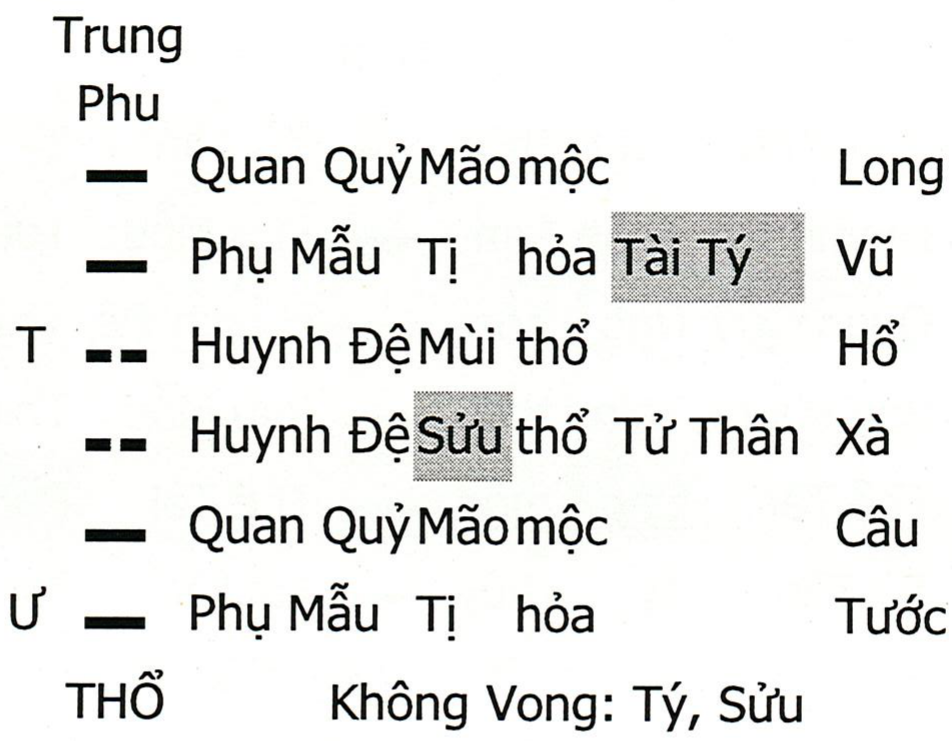
    - **Hình này chứng minh điều gì**
      - Chuyến đi không chiêu mộ được học viên, không thu được lợi ích kinh tế mà còn bị để quên đồ đạc khi trở về.
    - **Từ đâu mà thấy được**
      - Tài Tý thủy Không Vong không hiện; Kỵ thần Huynh Đệ Mùi thổ trì Thế; Tử Tôn Thân kim (học viên) phục tàng hưu tù; quẻ tĩnh Trung Phu là Du Hồn chủ đãng trí, bỏ quên đồ.
- **Ứng nghiệm thực tế:**
  - Quả nhiên chuyến đi hoàn toàn thất bại trong việc chiêu sinh, không mở được lớp học và không thu được đồng nào.
  - Đặc biệt khi quay trở về nhà, người bạn này phát hiện mình đã để quên cục sạc điện thoại di động tại nơi đó, ứng nghiệm chuẩn xác với tượng Du Hồn chủ về quên lãng đồ vật.

## Chương 13: Quy Hồn Biện Nghĩa

### Nguyên lý và ý nghĩa ứng dụng của quẻ Quy Hồn

- Bản chất và vị trí áp dụng của quẻ Quy Hồn:
  - Quy Hồn cũng tương tự như Du Hồn, bất kể xuất hiện ở quẻ chính (tiền quái) hay quẻ biến (hậu quái) đều có thể dùng để trích xuất ý nghĩa dự đoán sâu sắc.
  - Phải căn cứ vào từng nội dung và chủ đề dự đoán cụ thể mà chọn lựa tầng ý nghĩa cho thích hợp với hoàn cảnh thực tế.
  - Nguyên tắc then chốt: Tuyệt đối không được tách rời cát hung của Dụng thần mà chỉ đơn độc dùng tượng Quy Hồn để phán đoán; việc luận giải bắt buộc phải phối hợp chặt chẽ với ngũ hành sinh khắc, suy vượng của Dụng thần.
- Ý nghĩa đặc thù của Quy Hồn trong dự đoán bệnh tật:
  - Quy Hồn thường chủ về việc điều trị tại gia, bệnh tật chuyển biến khỏi chậm chạp, người bệnh tỉnh lại sau cơn mê man, khôi phục tinh thần, phục hồi ký ức, thần sắc khá lên, có thể nhận biết được người xung quanh, tâm trạng dần ổn định.
  - Ở chiều hướng xấu hoặc bệnh trọng, Quy Hồn có thể chủ về hiện tượng hồi quang phản chiếu (minh mẫn chốc lát trước khi qua đời), chứng bệnh hết thuốc chữa, người bệnh như cái xác không hồn, hoặc rơi vào trạng thái người thực vật.
  - Việc phán đoán mức độ nông sâu, nặng nhẹ hay sống chết bắt buộc phải căn cứ vào tình trạng thực tế của bệnh chứng và tương quan sinh khắc của Dụng thần.
- Hệ thống ý nghĩa mở rộng của tượng quẻ Quy Hồn trong đời sống:
  - Hành động và phương hướng: mang ý nghĩa trở về, quy cố hương, về nhà, tưởng niệm người thân, nhớ nhà, không muốn ra ngoài, đóng cửa ở lì trong nhà, không đi xa, hồi tâm chuyển ý, trở lại trạng thái bình thường.
  - Chuyển động và quy luật vật lý: biểu thị chuyển động đi lên cao rồi lại tuột xuống, tượng trưng cho lực hấp dẫn, lực hướng tâm, sự thu vén co lại, sự đúc kết tổng kết, phản hồi thông tin.
  - Tính cách và tâm lý con người: biểu thị tâm lý lười biếng, tính khí bảo thủ, tâm thế co cụm, sự bộc lộ bản tính nguyên sơ.
  - Ứng nghiệm thực tế: Trong thực chiến dự đoán, quẻ Quy Hồn thường xuyên ứng nghiệm kỳ diệu; mấu chốt then chốt là người dự đoán phải biết nắm bắt dịch lý và phối hợp vận dụng một cách linh hoạt, chuẩn xác.

### Ví dụ 1: Nữ đoán việc thi cử xuất ngoại của con

- Bối cảnh thời gian và sự việc:
  - Thời gian dự đoán: Ngày Giáp Dần, tháng Mậu Ngọ, năm Mậu Dần (Tuần không: Tý, Sửu).
  - Đối tượng và câu hỏi: Người phụ nữ đến xem quẻ để dự đoán xem con mình có vượt qua bài thi kiểm tra để đủ điều kiện xuất ngoại đi nước ngoài hay không.
  - Quẻ tượng nhận được: Lôi Thiên Đại Tráng biến Hỏa Thiên Đại Hữu.
- Xác định Dụng thần và nhận định sơ bộ:
  - Xác định Dụng thần: Lấy Phụ Mẫu (đại diện cho bài thi, kết quả kiểm tra, giấy tờ) và Quan Quỷ (đại diện cho kỳ thi, danh phận, việc trúng tuyển) làm Dụng thần.
  - Nhìn nhận bề ngoài: Quan Quỷ Dần mộc lâm Nhật kiến Dần mộc, Phụ Mẫu Ngọ hỏa lâm Nguyệt kiến Ngọ hỏa, hào Thế lại được Phụ Mẫu Ngọ hỏa trì Thế; Quan và Phụ đều lâm vượng tướng, ngỡ như việc thi cử vô cùng hanh thông và thuận lợi.
- Phân tích sâu về động hào và biểu hiện gian lận:
  - Xét hào 6 Huynh Đệ Tuất thổ phát động lâm Huyền Vũ: Huyền Vũ chủ về sự ám muội, mờ ám, dối trá, khuất tất; Phụ Mẫu Ngọ hỏa nhập Mộ tại Tuất thổ động (Hỏa mộ tại Tuất), biểu thị hình tượng thành tích thi cử bị giấu giếm, điểm số bị che đậy bất minh.
  - Xét hào 5 Tử Tôn Thân kim: Được Huynh Đệ Tuất thổ động sinh trợ, lại bị Nhật kiến Dần mộc xung phá (Dần Thân tương xung) trở thành ám động.
  - Kết luận nguyên nhân: Do có người gian lận điểm số trong kỳ thi mà khiến cho con của đương số không thể vượt qua bài kiểm tra.
- Luận giải ý nghĩa quẻ biến Quy Hồn và ứng nghiệm thực tế:
  - Luận giải việc thi cử xuất ngoại của con dựa trên quẻ Lôi Thiên Đại Tráng biến Hỏa Thiên Đại Hữu:
    - **Hình 85.** Quẻ Lôi Thiên Đại Tráng biến Hỏa Thiên Đại Hữu
      - 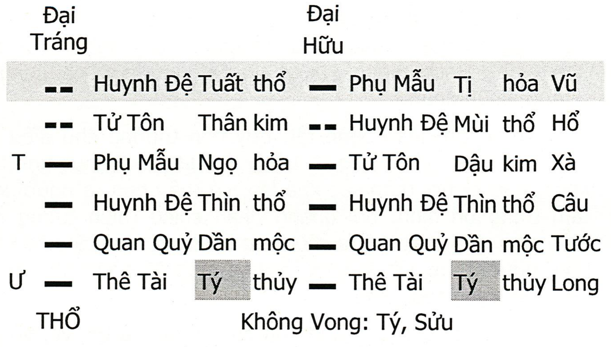
      - **Hình này chứng minh điều gì**
        - Thí sinh thi trượt, thiếu 20 điểm và không thể xuất ngoại do có gian lận điểm số; quẻ biến quy hồn ứng việc không thể ra khỏi biên cương.
      - **Từ đâu mà thấy được**
        - Hào 6 Tuất thổ lâm Huyền Vũ phát động làm Phụ Mẫu nhập mộ, hào 5 Tử Tôn Thân kim ám động; quẻ biến Hỏa Thiên Đại Hữu là quẻ Quy Hồn.
  - Cổ ngữ đúc kết quy luật: "Quy hồn bất xuất cương" (quẻ Quy Hồn thì không ra khỏi biên giới, biên cương), do đó việc xuất ngoại đi nước ngoài ắt gặp trắc trở, khó lòng thực hiện được.
  - Kết quả thực tế ngoài đời: Thí sinh bị thiếu 20 điểm nên không thể xuất ngoại; bản thân thí sinh và gia đình đều cảm thấy điểm số có phần mờ ám, uẩn khúc không minh bạch nhưng đành ngậm ngùi chấp nhận.

### Ví dụ 2: Nữ đoán vận hạn cho chồng

- Bối cảnh thời gian và sự việc:
  - Thời gian dự đoán: Ngày Mậu Thân, tháng Nhâm Tuất, năm Mậu Dần (Tuần không: Dần, Mão).
  - Đối tượng và câu hỏi: Người phụ nữ đến xin dự đoán vận hạn cho chồng mình.
  - Quẻ tượng nhận được: Quẻ Lôi Trạch Quy Muội (quẻ thuần tĩnh).
- Xác định Dụng thần và phân tích nguyên nhân thụ án:
  - Xác định Dụng thần: Lấy Quan Quỷ làm Dụng thần đại diện cho người chồng, kết hợp xem xét sinh khắc của các lục thân khác trong quẻ.
  - Phân tích Dụng thần lưỡng hiện (hào sơ và hào 4 đều là Quan Quỷ):
    - Hào sơ Quan Quỷ Tị hỏa: Tương hình với Nhật kiến Thân kim (Tị Thân hình hợp), hưu tù và nhập Mộ ở Nguyệt kiến Tuất thổ; Nguyên thần của Tị hỏa là Thê Tài Mão mộc lâm Tuần Không và bị Nhật kiến Thân kim khắc; Quan Quỷ Tị hỏa lại lâm Câu Trần (chủ lao ngục, gông cùm).
    - Phán đoán tình trạng hiện tại: Tác giả khẳng định chồng người này nhất định đang phải thụ án giam giữ trong tù.
    - Hào 4 Quan Quỷ Ngọ hỏa: Lâm Huyền Vũ (chủ về trộm cắp, lừa gạt, hành vi phi pháp); tác giả đoán người chồng vào tù chính vì những nguyên nhân phạm pháp này.
    - Vai trò của Huynh Đệ: Nhật kiến Thân kim lâm Huynh Đệ đến hình hại Dụng thần; Huynh Đệ chủ về bạn bè đồng bọn, Nhật kiến cũng đại diện cho bạn bè bên ngoài; chứng tỏ người chồng do bị bạn bè xấu lôi kéo, liên lụy mà mắc vòng lao lý.
- Luận đoán vận hạn và tâm lý người chồng dựa trên quẻ Lôi Trạch Quy Muội:
  - **Hình 86.** Quẻ Lôi Trạch Quy Muội
    - 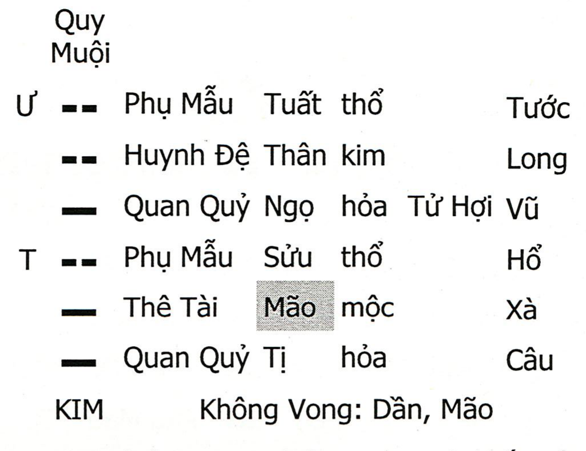
    - **Hình này chứng minh điều gì**
      - Chồng đang thụ án tù vì tội cướp giật theo bạn bè; quẻ Quy Hồn và Nguyên thần tại hào 2 chỉ ý định vượt ngục về nhà và bị bắt lại năm Kỷ Mão.
    - **Từ đâu mà thấy được**
      - Quan Quỷ Tị hỏa lâm Câu Trần nhập mộ ở Nguyệt, tương hình với Nhật; Quan Quỷ Ngọ hỏa lâm Huyền Vũ; quẻ Quy Hồn có Nguyên thần Mão mộc ở hào 2 xuất Không năm Mão.
- Diễn biến đối thoại, cảnh báo tâm lý và kết quả thực tế:
  - Người phụ nữ xác nhận thực tế: Chồng cô quả thực bị bạn bè rủ rê lôi kéo, cùng nhau đi cướp giật tài sản và đã bị bắt giữ, đang thụ án tù.
  - Luận đoán ý định vượt ngục qua tượng Quy Hồn: Bản quái là quẻ Lôi Trạch Quy Muội (quẻ Quy Hồn); Nguyên thần của Quan Quỷ là Mão mộc ngự tại hào 2; hào 2 là trạch (nhà ở), Nguyên thần phản ánh thế giới nội tâm sâu kín; tác giả nhận định người chồng tuy đang ở trong tù nhưng trong lòng luôn nhớ nhà da diết, e rằng đang manh nha tư tưởng vượt ngục.
  - Lời khuyên can của tác giả: Tác giả dặn dò người vợ nên vào khuyên nhủ chồng cố gắng an tâm cải tạo cho thật tốt để được xét giảm án, sớm ngày ra tù hợp pháp.
  - Ứng nghiệm thực tế: Người chồng không chịu cải tạo mà đã liều lĩnh vượt ngục trốn về nhà vào năm Kỷ Mão (1999); ngay khi về nhà đã bị cơ quan chức năng bắt giữ trở lại; hậu quả không những không được giảm án mà còn bị xử tăng thêm hình phạt; điều này ứng nghiệm chính xác việc Nguyên thần Mão mộc vốn lâm Tuần Không, đến năm Mão xuất Không thì thực hiện hành động trở về nhà.

### Ví dụ 3: Nữ kinh doanh đoán chung thân vận khí

- Bối cảnh thời gian và phương pháp luận:
  - Thời gian dự đoán: Ngày Giáp Tuất, tháng Quý Hợi, năm Mậu Dần (Tuần không: Thân, Dậu).
  - Đương số và sự việc: Người phụ nữ sinh năm Nhâm Dần (1962), đang kinh doanh làm chủ một nhà máy hóa chất, đến xin dự đoán về chung thân vận khí (vận mệnh trọn đời).
  - Quẻ tượng nhận được: Quẻ Địa Trạch Lâm biến Lôi Trạch Quy Muội.
  - Nguyên tắc luận đoán quẻ chung thân: Bắt buộc phải phối hợp khảo sát tổng thể toàn diện: sự nghiệp xem Quan Quỷ và Phụ Mẫu; hôn nhân xem Quan Quỷ và hào Ứng; con cái xem Tử Tôn; cha mẹ xem Phụ Mẫu; sức khỏe bản thân xem hào Thế và Quái cung.

#### Phân tích công danh sự nghiệp

- Địa vị, chức vụ và môi trường làm việc:
  - Quan Quỷ Mão mộc trì Thế tại hào 2, được Nguyệt kiến Hợi thủy tương sinh vượng tướng, chứng tỏ công danh sự nghiệp vô cùng vừa ý, phát triển hanh thông.
  - Hào 2 là trạch (trong nhà), Quan Quỷ lâm hào 2 chủ làm việc ở bên trong phòng ốc nhà xưởng, mưa không tới mặt, nắng chẳng tới đầu, môi trường công tác rất thuận lợi và thoải mái.
- Mối quan hệ với cấp trên và đồng nghiệp:
  - Quan Quỷ Mão mộc ngộ Trường Sinh tại Nguyệt kiến Hợi thủy, đồng thời tương hợp với Nhật kiến Tuất thổ (Mão Tuất lục hợp).
  - Nguyệt kiến đại diện cho cấp trên, lãnh đạo; Nhật kiến đại diện cho bạn bè, đồng nghiệp.
  - Biểu hiện thực tế: Được cấp trên hết lòng tin tưởng, trọng dụng và dìu dắt nâng đỡ; đồng thời luôn giữ được mối quan hệ hòa thuận, gắn bó tốt đẹp với đồng nghiệp.

#### Phân tích hôn nhân gia đình và kinh tế

- Tình cảm vợ chồng và thời điểm kết hôn:
  - Phân tích toàn diện chung thân vận khí qua quẻ Địa Trạch Lâm biến Lôi Trạch Quy Muội:
    - **Hình 87.** Sơ đồ quẻ Địa Trạch Lâm biến Lôi Trạch Quy Muội
      - 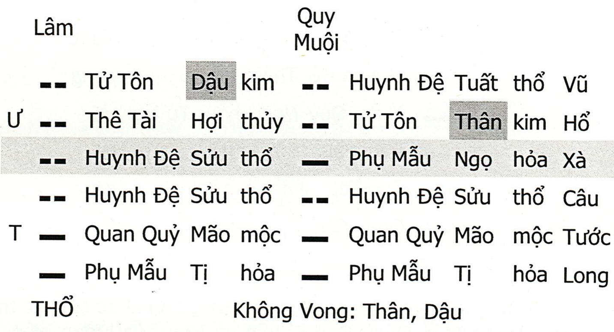
      - **Hình này chứng minh điều gì**
        - Sự nghiệp thuận lợi, kết hôn năm 1988, chồng quản lý tiền bạc; từng sảy thai, con cái hướng nội; cha mất năm 1993; bản thân tỳ vị kém, tính tình bảo thủ.
      - **Từ đâu mà thấy được**
        - Thế Quan Mão mộc vượng; Dậu kim Tử Tôn tuần không nhập Mộ tại Sửu động; Phụ Mẫu Tị hỏa phá tuyệt nhập Nhật Mộ; biến quẻ Quy Hồn chủ bảo thủ, quy tụ.
  - Quan Quỷ và hào Thế cùng đồng ngự tại hào 2, Thế Ứng tương sinh tương trợ, chứng tỏ vợ chồng rất mực đồng tâm đồng lòng, gắn bó khăng khít không phân biệt anh tôi.
  - Quan Quỷ trì Thế tại hào 2 chủ về mối lương duyên đến sớm, kết hôn từ độ tuổi trẻ.
- Hiện tượng động hôn và định ngày thành hôn:
  - Năm Quý Hợi (1983): Địa chi Hợi thủy chính phối trùng khớp với địa chi hào Ứng Thê Tài Hợi thủy, lại là nơi Trường Sinh của Quan Quỷ Mão mộc, chứng tỏ năm 1983 đã xảy ra hiện tượng "động hôn" (thuật ngữ bói mệnh chỉ nhân duyên đã đến, đối tượng xuất hiện, sắp sửa bước vào lễ đường hôn nhân).
  - Trở ngại hôn sự: Trong quẻ, Phụ Mẫu Tị hỏa lâm đất Tuyệt tại Hợi, bị Nguyệt kiến và Thái Tuế xung thành Tuế phá, Nguyệt phá; do đó năm 1983 việc cưới hỏi không thành.
  - Có người yêu chính thức: Đến năm Bính Dần (1986), Thái Tuế Dần mộc hợp hào Ứng Hợi thủy (Dần Hợi lục hợp), đương số mới chính thức có người yêu.
  - Định năm kết hôn: Trong quẻ Quan Quỷ Mão mộc và Nhật kiến Tuất thổ tương hợp; đến năm Mậu Thìn (1988), Thái Tuế Thìn thổ xung khai Tuất thổ (hợp xứ phùng xung, xung khai địa chi hợp Quan Quỷ); tác giả dự đoán đương số kết hôn vào năm 1988 Mậu Thìn.
- Tính nết của người chồng và việc quản lý kinh tế:
  - Hào Ứng (phu vị) lâm Bạch Hổ; Bạch Hổ chủ về nóng nảy, giận dữ, hung bạo, tranh chấp; chứng tỏ người chồng tính khí không được tốt, dễ nổi nóng và cục cằn.
  - Thê Tài Hợi thủy lâm hào Ứng lại ngự tại hào 5; Ứng là ngôi vị của chồng, Tài là của cải tiền bạc, hào 5 là ngôi tôn chủ trì một nhà; chứng tỏ mọi quyền hành kinh tế và tài chính trong nhà đều do người chồng nắm giữ.
  - Tài tuy lâm Nguyệt kiến vượng tướng, nhưng trong quẻ hào Huynh Đệ Sửu thổ phát động biến Phụ Mẫu Ngọ hỏa sinh trợ khắc Tài mạnh mẽ; biểu thị tài vận đến rồi lại đi, không thể tích lũy hay tích trữ được nhiều tiền của.

#### Phân tích đường con cái

- Hiện tượng từng bị sảy thai và tính cách con cái:
  - Hào 6 Tử Tôn Dậu kim lâm Tuần Không (Tuần không Thân, Dậu), lại phát động nhập Mộ tại hào Huynh Đệ Sửu thổ; đây là dấu hiệu rõ ràng cho thấy đương số từng bị sảy thai (lưu sản).
  - Hào 6 Tử Tôn Dậu kim lâm Huyền Vũ nhập Mộ ở hào động Sửu thổ: Huyền Vũ chủ về nội tâm, trầm mặc, u uất; nhập Mộ chủ sự khó chuyển động, thụ động; kết hợp với quẻ biến Lôi Trạch Quy Muội là quẻ Quy Hồn; dự đoán con cái có tính cách hướng nội, ít nói, lười biếng, không thích vận động.
- Sở thích kỳ lạ và quan hệ tình cảm cha con:
  - Mộ khố của Tử Tôn là hào Sửu thổ lâm Đằng Xà; nhập Mộ chủ sự say mê như lạc lối, mê muội; Đằng Xà chủ sự quái đản, kỳ dị; chứng tỏ con cái có những sở thích hoặc đam mê kỳ quặc, khác thường.
  - Tử Tôn Dậu kim tương sinh cho hào Ứng Thê Tài Hợi thủy (Kim sinh Thủy); chứng tỏ con cái và người cha (chồng đương số) có tình cảm rất mực hòa thuận, quấn quýt và yêu thương nhau.

#### Phân tích tình trạng cha mẹ

- Tượng quẻ chỉ người cha đã qua đời:
  - Hào sơ Phụ Mẫu Tị hỏa lâm hào dương đại diện cho người cha.
  - Phụ Mẫu Tị hỏa bị Nguyệt kiến Hợi thủy xung phá thành Nguyệt phá, lại nhập Mộ tại Nhật kiến Tuất thổ; tác giả đoán định người cha của đương số hiện không còn sống trên cõi đời.
- Xác định năm người cha tạ thế:
  - Xét Nguyên thần của Phụ Mẫu Tị hỏa là Mão mộc đang gặp hợp với Nhật kiến Tuất thổ; đến năm Quý Dậu (1993), Dậu kim xung Mão mộc (hợp xứ phùng xung), đồng thời Dậu kim chính là đất Tử của Tị hỏa; tác giả đoán định người cha đã qua đời vào năm 1993 Quý Dậu.

#### Phân tích thể chất sức khỏe và tính cách

- Luận đoán bệnh lý tỳ vị, tuần hoàn máu và đầu não:
  - Căn cứ Quái cung: Quẻ Địa Trạch Lâm thuộc Khôn cung; Khôn vi Thổ chủ về tỳ vị (hệ tiêu hóa, dạ dày). Thê Tài Hợi thủy là Nguyên thần của hào Thế Quan Quỷ Mão mộc, Tài chủ về ẩm thực; hào Huynh Đệ trong quẻ phát động khắc Tài mạnh mẽ, chứng tỏ tỳ vị tiêu hóa rất kém, dạ dày không tốt.
  - Hào Thê Tài Hợi thủy lâm Bạch Hổ bị khắc: Bạch Hổ chủ về máu huyết, Thê Tài cũng tượng trưng cho máu; chứng tỏ hệ tuần hoàn máu huyết trong cơ thể kém lưu thông.
  - Hào 6 Tử Tôn Dậu kim lâm Tuần Không nhập Mộ, lại đới Huyền Vũ: Tử Tôn chủ niềm vui vẻ, lạc quan; lâm Không nhập Mộ chủ thiếu vắng niềm vui, hay phiền muộn; hào 6 là đầu não, Huyền Vũ chủ sự hoa mắt, váng đầu; dự đoán đương số thường xuyên bị chứng chóng mặt, váng đầu.
- Luận đoán tính cách qua tượng quẻ Quy Hồn:
  - Hào Thế Quan Quỷ Mão mộc bị Nhật kiến Tuất thổ hợp trụ, lại gặp quẻ biến Lôi Trạch Quy Muội là quẻ Quy Hồn; dự đoán tính tình đương số khá bảo thủ, cẩn trọng, thiên về gìn giữ cái cũ, ngại thay đổi.
  - Kết quả xác thực: Toàn bộ những lời luận đoán chi tiết về sự nghiệp, hôn nhân, con cái, cha mẹ, bệnh tật và tính cách trên đây đều được người phụ nữ xác nhận là hoàn toàn chuẩn xác.

### Ví dụ 4: Nữ đoán bệnh cho mẹ

- Bối cảnh thời gian và sự việc:
  - Thời gian dự đoán: Ngày Mậu Dần, tháng Quý Hợi, năm Mậu Dần (Tuần không: Thân, Dậu).
  - Đối tượng và câu hỏi: Người phụ nữ đến xem bói để dự đoán tình trạng bệnh tật cho mẹ ruột.
  - Quẻ tượng nhận được: Lôi Thiên Đại Tráng biến Hỏa Thiên Đại Hữu.
- Xác định Dụng thần và nhận định bệnh chứng tổng quát:
  - Xác định Dụng thần: Lấy Phụ Mẫu làm Dụng thần đại diện cho người mẹ.
  - Tượng quẻ Lục Xung: Quẻ Lôi Thiên Đại Tráng là quẻ Lục Xung; quẻ Lục Xung chủ về thân thể bất an, khí huyết xáo trộn, tinh thần rối loạn, khó lòng yên ổn.
- Phân tích nguyên nhân và tình trạng bệnh của mẹ qua quẻ Lôi Thiên Đại Tráng biến Hỏa Thiên Đại Hữu:
  - **Hình 88.** Sơ đồ quẻ Lôi Thiên Đại Tráng biến Hỏa Thiên Đại Hữu
    - 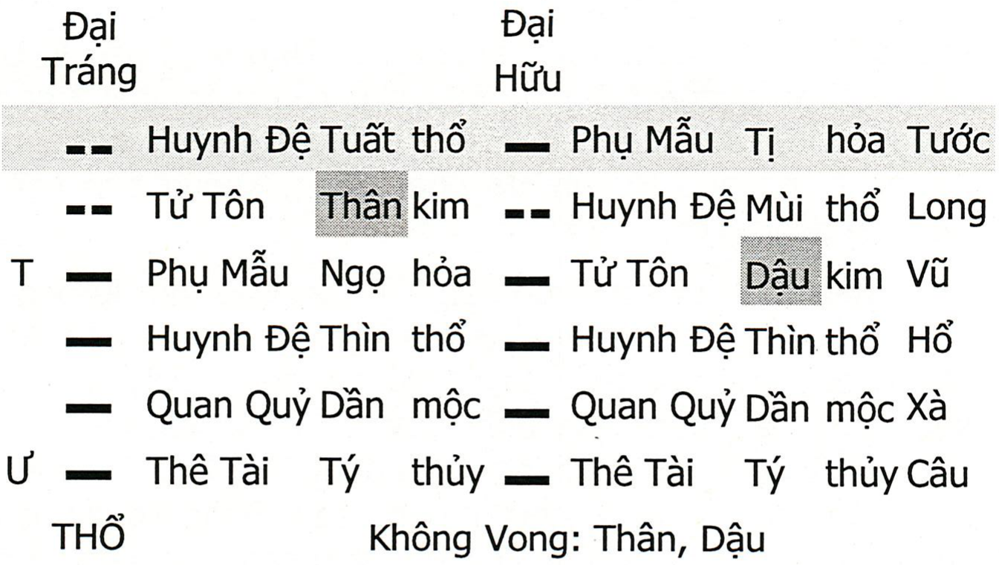
    - **Hình này chứng minh điều gì**
      - Người mẹ mắc bệnh tâm thần suốt 20 năm khiến đầu óc u mê mất tinh thần, kèm theo chứng viêm cơ tim nhẹ và viêm nhiễm vùng bụng.
    - **Từ đâu mà thấy được**
      - Dụng thần Phụ Mẫu Ngọ hỏa nhập Mộ ở hào 6 (đầu) gặp quẻ Quy Hồn; Ngọ hỏa lâm hào 4 bị Nguyệt khắc tượng trưng cho tim; quái cung Khôn chủ bụng.
- Luận giải chi tiết các cơ quan nội tạng và triệu chứng bệnh:
  - Triệu chứng ở đầu não và tâm thần:
    - Dụng thần Phụ Mẫu Ngọ hỏa phát động nhập Mộ ở hào 6 Huynh Đệ Tuất thổ; hào 6 là vị trí cao nhất trên thân thể, tượng trưng cho phần đầu não.
    - Quẻ biến Hỏa Thiên Đại Hữu là quẻ Quy Hồn; Quy Hồn chủ về thần trí thu lại, u uất, lờ đờ, mất hồn; kết hợp hào đầu nhập Mộ chỉ rõ triệu chứng suốt ngày đầu óc lờ đờ, u u mê mê, tinh thần sa sút không minh mẫn.
  - Bệnh lý ở vùng bụng:
    - Quẻ thuộc cung Khôn (Lôi Thiên Đại Tráng thuộc Khôn vi Địa); Khôn đại diện cho vùng bụng.
    - Dụng thần Phụ Mẫu lâm Ngọ hỏa; hỏa chủ viêm nhiệt, nóng rát; chứng tỏ trong ổ bụng có hiện tượng viêm nhiễm, khí huyết nóng lạnh mất cân bằng (hàn nhiệt thất điều).
  - Bệnh lý về tim mạch:
    - Phụ Mẫu Ngọ hỏa lâm hào 4 bị Nguyệt kiến Hợi thủy khắc chế; Ngọ hỏa thuộc hỏa chủ tâm tạng (tim), hào 4 cũng chính là hào vị tương ứng của trái tim trên cơ thể người; do đó phán đoán người mẹ mắc bệnh tim.
  - Tiên lượng mức độ nguy hiểm:
    - Dụng thần Ngọ hỏa tuy bị Nguyệt kiến Hợi thủy khắc chế nhưng lại may mắn được Nhật kiến Dần mộc tương sinh (Dần mộc sinh Ngọ hỏa); do vậy bệnh tật tuy dai dẳng nhưng không đến mức quá nguy cấp đe dọa sinh mạng.
- Ứng nghiệm thực tế:
  - Tình trạng bệnh của người mẹ ngoài đời thực hoàn toàn trùng khớp với lời dự đoán trong quẻ.
  - Người con gái cho biết mẹ mình mắc bệnh tâm thần đã 20 năm nay (đúng với tượng Phụ Mẫu nhập Mộ ở hào đầu não và quẻ Quy Hồn khiến đầu óc u mê lờ đờ suốt ngày).
  - Đồng thời mẹ cô cũng bị chẩn đoán mắc chứng viêm cơ tim nhẹ (đúng với tượng Ngọ hỏa lâm hào 4 bị Nguyệt khắc nhưng được Nhật sinh).

## Chương 14: Bí Mật Của Phi Phục

### Tổng Quan Lý Luận Phi Phục Và Phương Pháp Biến Thông Thực Chiến

- Tổng kết bốn tình huống căn bản trong mối quan hệ giữa Phi thần và Phục thần theo quan điểm của cổ nhân:
  - ① **Phi đến sinh Phục được Trường Sinh:** Hào Phi sinh cho hào Phục, tạo cội nguồn sinh dưỡng dồi dào, ví như được đất Trường Sinh nâng đỡ chở che.
  - ② **Phục đến sinh Phi gọi là tiết khí:** Hào Phục phải sinh xuất cho hào Phi, nguyên khí bị tiêu hao, hao tổn tiết khí ra bên ngoài.
  - ③ **Phi đến khắc Phục gọi là thương thân:** Hào Phi phát động hoặc mang khí khắc chế đè nén hào Phục, gây tai họa tổn hại đến thân mệnh và sự thể.
  - ④ **Phục đến khắc Phi gọi là xuất bạo:** Hào Phục vùng lên khắc ngược lại hào Phi, phá tan sự kìm kẹp, biểu hiện sự bộc phát hung bạo hoặc đột biến bất ngờ.
- Hạn chế của lý luận truyền thống cứng nhắc:
  - Người xưa chủ yếu xem xét mối quan hệ Phi Phục trên góc độ luận đoán cát hung đơn thuần, chưa đi sâu vào các tầng ý nghĩa biểu tượng chi tiết.
  - Trong thực tiễn dự đoán, nếu chỉ áp dụng máy móc bốn tình huống này thì không thể nào giải thích và phản ánh được muôn vàn sự kiện đa dạng, phức tạp diễn ra trong đời sống thực tế.
- Đòi hỏi về sự linh hoạt và biến thông trong thực chiến Lục Hào:
  - Người học Dịch chỉ khi biết phối hợp linh hoạt hào vị, cung quái, lục thân, lục thú, thế ứng và tương tác sinh khắc giữa Phi và Phục thì mới có thể nâng cao trình độ dự đoán lên tầng mức tinh vi.
  - Thông qua các ví dụ thực tiễn sinh động, người dự đoán có thể khám phá những bí mật ẩn tàng mà mắt thường không thấy được trên mặt quẻ.

### Ví dụ 1: Ngày Ất Dậu tháng Nhâm Thìn năm Bính Tý, cô Thôi đoán xem ngày nào chồng trở về? Được quẻ Hỏa Sơn Lữ biến Cấn Vi Sơn

#### Bối cảnh và thông tin quẻ tượng

- Thời gian dự đoán: Ngày Ất Dậu, tháng Nhâm Thìn, năm Bính Tý.
- Người xin đoán: Cô Thôi, đến nhờ xem ngày nào người chồng bỏ nhà ra đi sẽ trở về.
- Quẻ đắc được: Hỏa Sơn Lữ biến Cấn Vi Sơn.
- Tuần không: Ngọ, Mùi (HỎA Không Vong: Ngọ, Mùi).
- Xác định Dụng thần: Lấy hào Quan Quỷ làm Dụng thần đại diện cho người chồng.

#### Các bước lập luận phân tích hào tượng và Phi Phục

- Nhận định nguyên nhân người chồng bỏ nhà ra đi:
  - Dụng thần Quan Quỷ Hợi thủy không xuất hiện trên quẻ chính, phục tàng dưới hào 3 Thê Tài Thân kim.
  - Tên quẻ chính là Hỏa Sơn Lữ, quẻ Lữ chủ lữ hành, tha hương, mang tượng đi xa; kết hợp với việc Dụng thần Quan Quỷ phục tàng không hiện, đoán chắc chắn người chồng đã bỏ nhà đi xa.
  - Hào Thế lâm Tử Tôn Thìn thổ trì Thế; Tử Tôn là lục thân khắc chế Quan Quỷ (Dụng thần), mang tượng người vợ mắng chửi, áp chế chồng.
  - Đoán trước đó hai vợ chồng đã xảy ra cãi vã kịch liệt, cô Thôi đã mắng chửi nặng lời khiến người chồng tức giận bỏ nhà ra đi.
- Đánh giá sự an nguy của người chồng:
  - Dụng thần Quan Quỷ Hợi thủy được Nhật thần Dậu kim sinh trợ, trong quẻ lại có hào 4 Thê Tài Dậu kim (Ứng) phát động tương sinh.
  - Dụng thần lại phục dưới hào 3 Thê Tài Thân kim là đất Trường Sinh (Thân kim sinh Hợi thủy).
  - Kết luận: Người chồng ở bên ngoài hoàn toàn bình an vô sự, được chăm sóc chu đáo, không có gì phải lo lắng.
- Truy tìm phương hướng và nơi cư trú của người chồng qua hào Phi Phục:
  - Quan Quỷ Hợi thủy phục dưới nội quái Cấn; Cấn thuộc phương Đông Bắc, xác định người chồng đã đi về hướng Đông Bắc.
  - Hào Phi là Thê Tài Thân kim; Thê Tài đại diện cho phụ nữ, chứng tỏ người chồng đang cư ngụ trong nhà của một người phụ nữ ở phương Đông Bắc.
  - Phi thần Thê Tài Thân kim là đất Trường Sinh của Quan Quỷ Hợi thủy; Trường Sinh biểu thị sự chăm sóc tận tình, người phụ nữ này đối đãi rất tốt với người chồng.
  - Cung Cấn mang ý nghĩa là "chỉ" (dừng lại, định cư), tượng trưng cho quê nhà; hào 3 lại là hào vị của quê hương (hương vị), đồng thời là hào vị đại diện cho anh chị em ruột thịt (huynh đệ vị).
  - Tổng hợp các căn cứ tượng quẻ, tác giả đoán: Người chồng rất có thể đã về quê nhà và đang ở nhờ trong nhà chị gái của anh ta.
- Định ngày ứng kỳ người chồng trở về:
  - Quẻ biến Cấn Vi Sơn là quẻ Lục Hợp, Dụng thần lại vượng tướng nên người chồng nhất định sẽ trở về nhà.
  - Dụng thần phục tàng cần ngày xuất hiện để lộ diện: Dự đoán ngày Đinh Hợi (ngày Hợi Dụng thần xuất hiện) có khả năng trở về.
  - Nếu ngày Đinh Hợi chưa về thì sẽ ứng vào ngày Quý Tị (ngày Tị xung khai Dụng thần Hợi thủy).
- Phân tích tương quan quẻ Hỏa Sơn Lữ biến Cấn Vi Sơn để truy tìm hành tung và ngày trở về của người chồng:
  - **Hình 89.** Quẻ Hỏa Sơn Lữ biến Cấn Vi Sơn
    - 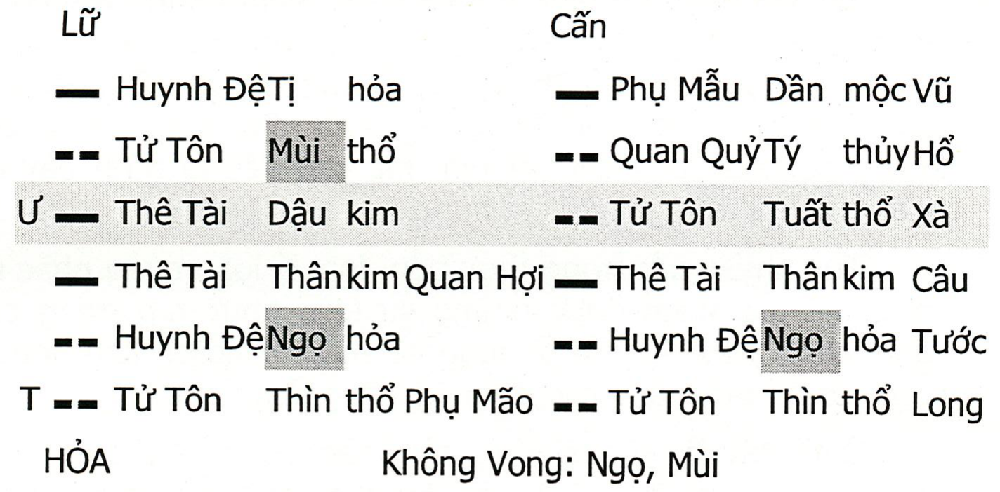
    - **Hình này chứng minh điều gì**
      - Chứng minh người chồng bỏ đi xa về hướng Đông Bắc, ở nhờ nhà chị gái rất tốt với anh ta và sẽ trở về bình an vào ngày Đinh Hợi.
    - **Từ đâu mà thấy được**
      - Dụng thần Quan Quỷ Hợi thủy phục dưới hào 3 Thê Tài Thân kim (Trường Sinh) cung Cấn (Đông Bắc, quê nhà, hào vị huynh đệ); quẻ biến Cấn Vi Sơn Lục Hợp.

#### Luồng đối thoại và diễn biến ứng nghiệm thực tế

- Phản hồi của cô Thôi về nguyên nhân cãi vã:
  - Cô Thôi thừa nhận sự việc hoàn toàn chính xác: Ba hôm trước (ngày Quý Mùi), hai vợ chồng xảy ra cãi lộn gay gắt, cô tức giận chửi câu: "Anh cút đi!".
  - Sau đó cô quay vào bếp rửa bát, lúc trở ra thì người chồng đã biến mất không thấy bóng dáng. Đến nay đã 3 ngày, người chồng bặt vô âm tín, ngay cả một cuộc điện thoại cũng không gọi về.
- Sự hoài nghi gay gắt về người chị gái:
  - Nghe tác giả phán đoán chồng về quê ở nhà chị gái, cô Thôi phản bác: Nói chồng về quê thì có thể đúng vì quê ở hướng Đông Bắc; nhưng nói ở nhà chị gái thì tuyệt đối không thể, vì chồng cô từ trước đến nay căn bản không có chị gái nào cả.
  - Tác giả kiên định phân tích: Có chị gái hay không thì trên danh nghĩa chưa rõ, nhưng tượng quẻ chỉ rõ chồng cô đang ở nhà một người phụ nữ đối xử rất chu đáo với anh ta.
  - Cô Thôi càng thêm sốt ruột và ghen tuông, gặng hỏi dồn dập xem giữa hai người họ có mối quan hệ mờ ám gì.
  - Tác giả giải thích: "Phán đoán của tôi là quan hệ chị em, chị khẳng định không có thì điều này tôi cũng nói là chưa rõ. Bọn họ có quan hệ gì, ngày 20 (ngày Đinh Hợi) chồng chị có khả năng trở về, đợi sau khi anh ấy về thì hỏi trực tiếp sẽ rõ."
- Kết quả ứng nghiệm ngoài đời thực:
  - Đúng giờ Hợi ngày Đinh Hợi, người chồng trở về nhà bình an.
  - Anh ta giải thích rằng do tâm trạng bức xúc buồn bực nên đã về quê ở nhờ nhà chị gái vài ngày cho khuây khỏa.
  - Thực tế bất ngờ: Hai người kết hôn đã nhiều năm, vậy mà cô Thôi hoàn toàn không hề biết người chồng vẫn còn có một người chị gái ở quê.

### Ví dụ 2: Ngày Nhâm Tý tháng Ất Tị năm Đinh Sửu, Trương tiên sinh đoán về điện thoại di động bị mất, được Thiên Sơn Độn

#### Bối cảnh và thông tin quẻ tượng

- Thời gian dự đoán: Ngày Nhâm Tý, tháng Ất Tị, năm Đinh Sửu.
- Người xin đoán: Trương tiên sinh, đoán về việc bị mất chiếc điện thoại di động.
- Quẻ đắc được: Thiên Sơn Độn (quẻ tĩnh).
- Tuần không: Dần, Mão (KIM Không Vong: Dần, Mão).
- Xác định Dụng thần: Lấy hào Thê Tài làm Dụng thần đại diện cho tài sản, đồ vật quý giá (chiếc điện thoại di động).

#### Lập luận Dụng thần phục tàng và Phi thần ám động

- Lập luận khả năng tìm lại tài sản:
  - Dụng thần Thê Tài Dần mộc không hiện trên quẻ, phục tàng dưới hào 2 Quan Quỷ Ngọ hỏa (hào Thế).
  - Thê Tài Dần mộc tuy lâm Tuần Không nhưng được Nhật thần Tý thủy sinh phù.
  - Nhật thần Tý thủy lại xung khai Phi thần Quan Quỷ Ngọ hỏa (Tý xung Ngọ làm ám động và mở đường cho Phục thần xuất hiện).
  - Dụng thần Thê Tài Dần mộc lâm Thanh Long, phục dưới hào Thế và sinh trợ cho hào Thế (Dần mộc sinh Ngọ hỏa), biểu thị tài vật quay về với chủ, kết luận chiếc điện thoại bị mất có thể tìm lại được.
- Phân tích manh mối kẻ trộm qua hào tượng:
  - Hào Phi Quan Quỷ Ngọ hỏa bị Nhật thần xung trở thành hào ám động; Quan Quỷ ám động chủ hành vi trộm cắp ngầm, điện thoại bị người khác lấy cắp.
  - Trong quẻ Quan Quỷ lưỡng hiện (hào 2 và hào 4 đều là Quan Quỷ Ngọ hỏa), thể hiện kẻ trộm có hai người hoặc có đồng phạm.
  - Quan Quỷ Ngọ hỏa lâm hào Thế, lại đồng khí vượng tướng với Nguyệt kiến Tị hỏa; Quan lâm Thế và lâm Nguyệt kiến đều là thông tin chỉ người nội bộ, người quen biết sống gần gũi.
  - Tử Tôn Tý thủy lâm Nhật thần xung Quan Quỷ; Tử Tôn là lực lượng công an, xung phạt Quan Quỷ chứng tỏ gia chủ đã trình báo công an và lực lượng công an đang tích cực phá án truy tìm kẻ gian.
- Nhận định kẻ trộm đang lén lút sử dụng điện thoại qua mối quan hệ Phi Phục:
  - Hào Phi Quan Quỷ Ngọ hỏa ám động hút tiết khí của Dụng thần Thê Tài Dần mộc (Mộc sinh Hỏa bị tiết khí), chứng tỏ kẻ trộm sau khi lấy cắp đang lén lút bật máy sử dụng chiếc điện thoại đó.
- Phân tích khả năng tìm lại điện thoại và hành vi kẻ trộm dựa trên quẻ Thiên Sơn Độn:
  - **Hình 90.** Sơ đồ quẻ Thiên Sơn Độn
    - 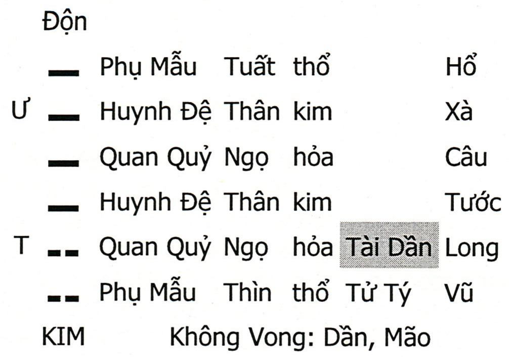
    - **Hình này chứng minh điều gì**
      - Chứng minh điện thoại bị người quen cùng sân lấy trộm đang lén lút sử dụng, công an đang truy tìm và sẽ tìm lại được ở tháng Mùi.
    - **Từ đâu mà thấy được**
      - Dụng thần Thê Tài Dần mộc phục dưới hào 2 Quan Quỷ Ngọ hỏa sinh Thế; Nhật Tý xung Ngọ hỏa ám động tiết khí Dụng thần; Tử Tôn Tý xung Quan Quỷ.

#### Diễn biến điều tra và kết quả ứng nghiệm

- Xác minh từ phía cơ quan viễn thông:
  - Qua kiểm tra kỹ thuật tại cục điện tín/bưu điện, kết quả xác nhận đúng là chiếc điện thoại bị mất vẫn đang phát tín hiệu hoạt động và có người sử dụng.
- Kết quả điều tra của lực lượng công an:
  - Đến tháng Mùi (tháng Mùi hợp với Phi thần Ngọ hỏa, đồng thời nhập mộ Mộc), cơ quan công an đã lần ra manh mối và bắt giữ người đang sử dụng chiếc điện thoại.
  - Người sử dụng điện thoại hóa ra chính là một người hàng xóm ở chung sân với Trương tiên sinh, hoàn toàn ứng nghiệm với tượng người nội bộ/người quen biết.
  - Tuy nhiên, người này kiên quyết không thừa nhận hành vi trộm cắp mà khai rằng mua lại từ tay một người khác, đồng thời không chịu khai nhận có đồng bọn gây án.

### Ví dụ 3: Ngày Canh Thìn tháng Kỷ Tị năm Kỷ Mão, đoán xem thịt dê có ăn được không? Được quẻ Thiên Sơn Độn biến Thiên Địa Bĩ

#### Bối cảnh và nguồn gốc quẻ

- Thời gian dự đoán: Ngày Canh Thìn, tháng Kỷ Tị, năm Kỷ Mão.
- Người gieo quẻ: Bạn hữu Đoàn Kiến Nghiệp, gieo được vào năm 1999 khi đi công tác xuống nông thôn giúp đỡ người nghèo.
- Tình huống: Nhân dịp trở về thị xã, Đoàn tiên sinh đem quẻ đến nhờ tác giả phân tích giúp câu hỏi lạ lùng: "Thịt dê có ăn được không?".
- Quẻ đắc được: Thiên Sơn Độn biến Thiên Địa Bĩ.
- Tuần không: Thân, Dậu (KIM Không Vong: Thân, Dậu).
- Xác định Dụng thần: Hào Thê Tài đại diện cho ẩm thực, thực phẩm ăn uống, nên lấy Thê Tài làm Dụng thần.

#### Các bước suy luận hào động và giải mã con dê chết

- Đánh giá khả năng ăn được của thịt dê:
  - Hào Thê Tài Dần mộc tuy không hiện trên quẻ, phục dưới hào 2 Quan Quỷ Ngọ hỏa, nhưng Dần mộc tương sinh cho hào Thế Ngọ hỏa, kết luận thịt này có thể ăn được, không nguy hại đến tính mạng.
  - Tác giả đặt nghi vấn: Câu hỏi "thịt dê có ăn được không" rất khác thường; chỉ khi nghi ngờ thịt bị ôi thiu biến chất hoặc con dê chết bất thường, hoặc người hỏi có kiêng kỵ gì đó thì mới hỏi như vậy.
- Phát hiện nguồn gốc thịt dê qua độc hào động:
  - Cổ nhân đúc kết: "Thần triệu cơ ở động" (Thần linh báo triệu cơ vi ở hào phát động), toàn quẻ chỉ có hào 3 Huynh Đệ Thân kim phát động hóa Thê Tài Mão mộc.
  - Trong phép đoán tài vận, Huynh Đệ động hóa Thê Tài chủ tiền của bất ngờ từ trên trời rơi xuống, không phải do tốn tiền mua sắm; tác giả đoán thịt dê này là thịt dê nhặt được.
  - Thê Tài Dần mộc phục dưới hào 2 Quan Quỷ Ngọ hỏa; quẻ chính mang tên Thiên Sơn Độn (Độn là ẩn nặc, giấu kín), chứng tỏ con dê được nhặt ở nơi kín đáo, khuất tầm mắt, không dễ nhìn thấy.
  - Phi thần Ngọ hỏa là Quan Quỷ (tử thi), lại là đất Tử của Dụng thần Thê Tài Dần mộc; do đó khẳng định đây là thịt dê đã chết.
  - Nếu chỉ nhặt được vài miếng thịt thì rất khó nhận biết là dê chết, từ đó suy luận chắc chắn người ta đã nhặt được nguyên cả một con dê chết.
- Xác định địa điểm nhặt con dê qua hào sơ và tượng quẻ:
  - Tử Tôn đại diện cho gia súc, động vật (con dê). Tử Tôn Tý thủy không hiện trên quẻ, phục tàng dưới hào sơ Phụ Mẫu Thìn thổ.
  - Phi thần Thìn thổ là Thủy khố (nơi tích trữ nước như đầm, ao, hồ, giếng nước), lâm Bạch Hổ (Bạch Hổ chủ đường sá), tượng trưng cho vũng nước/hồ nước ven đường.
  - Trong tháng Tị, Thủy rơi vào đất Tuyệt địa, trong quẻ Thủy khí suy kiệt hưu tù, chứng tỏ trong hồ/vũng nước hầu như cạn khô không có nước.
  - Ngoại quái Càn chủ cao lớn trên cao, nội quái Cấn chủ núi non (sơn); kết hợp thành địa hình núi cao.
  - Suy đoán chuẩn xác: Nhặt được cả con dê chết nằm trong một hố nước/vũng nước cạn ven đường đi trên núi cao.
- Giải mã nguyên nhân cái chết của con dê:
  - Hào 3 Huynh Đệ Thân kim lâm Thanh Long phát động; Thân kim là Nguyên thần sinh trợ và là đất Trường Sinh của Tử Tôn Tý thủy; Thanh Long chủ ẩm thực ăn uống, mang tượng con dê đã ăn thức ăn gì đó.
  - Huynh Đệ Thân kim động hóa Thê Tài Mão mộc là đất Tử của Tử Tôn Tý thủy; trong chiêm bệnh, tổ hợp Huynh Đệ động hóa Tài biểu thị sự cưỡng ép ăn uống (bội thực).
  - Kết luận: Con dê đã ăn cỏ/thức ăn quá no nhưng vẫn cố ăn đẫy bụng, kết quả bị chướng bụng, bội thực mà chết no.
- Dự đoán nguồn gốc và nguyên nhân chết của con dê dựa trên quẻ Thiên Sơn Độn biến Thiên Địa Bĩ:
  - **Hình 91.** Quẻ Thiên Sơn Độn biến Thiên Địa Bĩ
    - 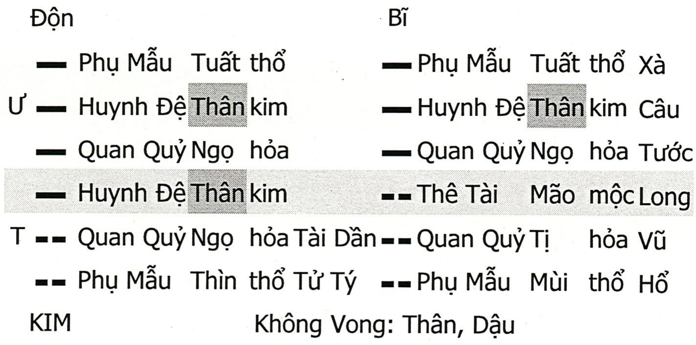
    - **Hình này chứng minh điều gì**
      - Chứng minh thịt dê ăn được, là cả con dê chết vì ăn quá no nhặt được trong giếng cạn ven đường trên núi cao.
    - **Từ đâu mà thấy được**
      - Thê Tài Dần mộc phục dưới hào 2 sinh Thế; Huynh Đệ Thân kim động hóa Tài Mão mộc (chủ của bất ngờ, bội thực); Tử Tôn Tý thủy phục hào sơ Thìn thổ (giếng cạn ven đường).

#### Diễn biến câu chuyện thực tế và bài học phân hào đoán pháp

- Sự thật do Đoàn Kiến Nghiệp chia sẻ:
  - Đoàn tiên sinh vô cùng thán phục và xác nhận toàn bộ phân tích đều chuẩn xác: Đó đúng là cả con dê chết, nhặt được ở một cái giếng cạn gần đường núi.
  - Bối cảnh thực tế: Khi đoàn cán bộ xuống thôn trò chuyện với bà con, một bác nông dân kể rằng hai ngày trước có một nhà trong thôn bị chết một con dê. Lúc chủ nhà ra ngoài thì con dê vẫn đang đứng gặm cỏ bình thường trong sân, khi họ về thì phát hiện con dê đã lăn ra chết trên mặt đất mà không rõ nguyên nhân.
  - Do sợ dê chết vì bệnh tật bất thường, người ta đã đem vứt xác con dê xuống một cái giếng cạn gần đường núi.
  - Đoàn tiên sinh bói quẻ thấy thịt dê ăn được, thế là mấy người rủ nhau đi kéo con dê từ giếng cạn lên, mổ thịt nấu ăn liên hoan. Bản thân Đoàn tiên sinh không ăn, nhưng những người ăn thịt dê đều hoàn toàn bình an vô sự.
- Bài học chiêm nghiệm về phân hào đoán pháp:
  - Nghe nhắc đến "giếng cạn", tác giả chợt bừng tỉnh nhớ lại quy tắc của cổ nhân: Hào sơ chính là giếng nước trong phân hào đoán pháp khi xem gia trạch.
  - Ban đầu tác giả chưa từng nghĩ trên núi cao lại có giếng nước nên mới biến thông thành hồ nước cạn ven đường.
  - Qua đó chứng minh phân hào đoán pháp của người xưa chứa đựng đạo lý vô cùng sâu sắc, điều cốt tử của người học Dịch là phải biết biến thông linh hoạt theo từng cảnh huống cụ thể.

### Ví dụ 4: Ngày Ất Hợi tháng Kỷ Dậu năm Đinh Sửu, Lý tiên sinh ở huyện Trung Dương đoán gia trạch, được Địa Hỏa Minh Di

#### Bối cảnh và thông tin quẻ tượng

- Thời gian dự đoán: Ngày Ất Hợi, tháng Kỷ Dậu, năm Đinh Sửu.
- Người xin đoán: Lý tiên sinh, người ở huyện Trung Dương, đến xem bói về phong thủy gia trạch cát hung.
- Quẻ đắc được: Địa Hỏa Minh Di (quẻ tĩnh).
- Tuần không: Thân, Dậu (THỦY Không Vong: Thân, Dậu).
- Quy tắc định trạch: Lấy hào 2 làm trạch (nhà cửa), hào 5 làm nhân (người cư ngụ), hào Thế đại diện cho bản thân người xin đoán kiêm tọa hướng của ngôi nhà.

#### Phân tích tọa hướng, ánh sáng và phong thủy trạch quẻ

- Xác định tọa hướng của ngôi nhà:
  - Hào Thế Quan Quỷ Sửu thổ lâm hào 4, ở trạng thái tĩnh bất động, lại không bị Nhật Nguyệt xung động.
  - Địa chi Hợi, Tý, Sửu thuộc về phương Bắc; hào Thế Sửu thổ tĩnh chỉ phương Bắc, đoán ngôi nhà này có tọa hướng tọa Bắc hướng Nam.
- Đánh giá môi trường ánh sáng qua tượng quẻ:
  - Tên quẻ là Địa Hỏa Minh Di, mang tượng Địa ở trên, Hỏa ở dưới, tức mặt trời lặn vào lòng đất (thái dương nhập địa, đêm tối bao trùm).
  - Trong toàn quẻ không hề xuất hiện ngũ hành Hỏa (hào Hỏa phục tàng).
  - Lục thân đại diện cho nhà cửa là Phụ Mẫu Dậu kim lại lâm Huyền Vũ (Huyền Vũ chủ mờ ám, tối tăm, u uất).
  - Kết luận: Nơi ở rất thiếu thốn ánh sáng mặt trời, quanh năm tối tăm ẩm thấp, hiếm khi được ánh dương soi chiếu.
- Đánh giá tâm trạng người cư ngụ và khẩu thiệt gia trạch:
  - Hào Thế lâm Quan Quỷ Đằng Xà; Quan Quỷ và Đằng Xà đều chủ quái dị, lo âu, hoảng hốt, bất an, chứng tỏ người sống trong nhà tâm trạng luôn bồn chồn, tinh thần bất an, không được yên ổn.
  - Hào 2 (trạch) lâm Quan Quỷ Sửu thổ tương khắc hào 5 (nhân) Huynh Đệ Hợi thủy; trạch khắc nhân chủ nhà ở áp chế người, phong thủy ngôi nhà rất bất lợi cho sức khỏe và nhân đinh.
  - Hào trạch lâm Chu Tước; Chu Tước chủ khẩu thiệt, tranh cãi, gia đạo khó tránh khỏi cảnh bất hòa, khẩu thiệt thị phi triền miên.

#### Lập luận Phi khắc Phục và bệnh chứng người vợ

- Nhận định tình trạng vắng mặt của người vợ:
  - Hào Thê Tài không hiện trên quẻ chính, biểu thị người vợ thường xuyên vắng nhà, không chịu ở trong ngôi nhà này.
- Lập luận bệnh tật người vợ qua thế "Phi khắc Phục vi thương thân":
  - Dụng thần Thê Tài Ngọ hỏa phục tàng dưới hào 3 Huynh Đệ Hợi thủy.
  - Phi thần Hợi thủy đang thời vượng tướng (được Nguyệt Dậu kim sinh, Nhật Hợi thủy trợ lực); Phi thần Hợi thủy đến khắc Phục thần Ngọ hỏa, rơi đúng vào cách cục "Phi đến khắc Phục gọi là thương thân".
  - Quẻ gốc thuộc cung Khảm (Khảm chủ huyết dịch, máu huyết); hào 3 là hào âm (tượng người nữ).
  - Suy đoán: Người vợ mắc bệnh phụ khoa nghiêm trọng, kinh nguyệt rối loạn không đều, khí huyết hư tổn.
- Lập luận tâm lý chán ghét ngôi nhà của người vợ:
  - Hào 3 trong phong thủy gia trạch là hào vị của Cửa nhà (môn vị).
  - Thủy ở hào 3 là đất Tuyệt của Thê Tài Ngọ hỏa (Hỏa tuyệt tại Hợi); cửa nhà chính là Tuyệt địa của người vợ.
  - Đoán người vợ oán ghét ngôi nhà đến mức ngay cả cái cửa nhà này cũng không muốn bước chân vào.
- Đánh giá phong thủy gia trạch và bệnh chứng người vợ dựa trên quẻ Địa Hỏa Minh Di:
  - **Hình 92.** Quẻ Địa Hỏa Minh Di
    - 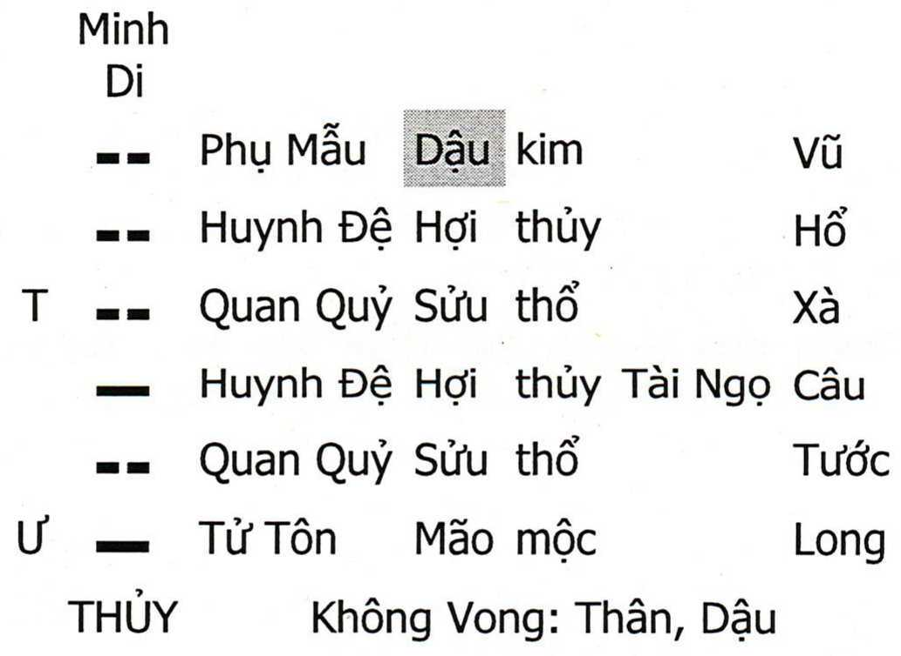
    - **Hình này chứng minh điều gì**
      - Chứng minh nhà tọa Bắc hướng Nam tối tăm thiếu nắng, bất an khẩu thiệt; vợ mắc bệnh phụ khoa bỏ về nhà mẹ đẻ đòi ly hôn.
    - **Từ đâu mà thấy được**
      - Thế Quan Quỷ Sửu thổ tĩnh (hướng Bắc); Phụ Mẫu lâm Huyền Vũ; hào 2 Quan Quỷ khắc hào 5 lâm Chu Tước; Tài Ngọ hỏa phục dưới Huynh Đệ Hợi thủy (Phi khắc Phục thương thân, Khảm chủ huyết).

#### Kết quả ứng nghiệm thực tế

- Về thực trạng ngôi nhà:
  - Ngôi nhà của Lý tiên sinh quả thực tọa Bắc hướng Nam.
  - Do xây dựng ở vùng địa thế trũng thấp, lại bị các công trình nhà cửa xung quanh xây cao che chắn hết ánh sáng, nên trong nhà vô cùng tối tăm, hầu như không bao giờ nhìn thấy ánh nắng mặt trời.
- Về tình trạng người vợ:
  - Người vợ đúng là mắc chứng bệnh phụ khoa nặng nề, kinh nguyệt thất thường.
  - Hai vợ chồng thường xuyên xảy ra cãi vã, bất hòa nghiêm trọng; người vợ đã dứt áo bỏ về nhà mẹ đẻ suốt 3 tháng nay, dứt khoát không chịu quay về và đang kiên quyết đòi ly hôn.

### Ví dụ 5: Ngày Tân Mão tháng Mậu Tý năm Ất Hợi, Tô tiên sinh đoán hôn nhân, được Lôi Sơn Tiểu Quá biến Lôi Phong Hằng

#### Bối cảnh và thông tin quẻ tượng

- Thời gian dự đoán: Ngày Tân Mão, tháng Mậu Tý, năm Ất Hợi.
- Người xin đoán: Tô tiên sinh, đến xem bói về tình duyên, hôn nhân.
- Quẻ đắc được: Lôi Sơn Tiểu Quá biến Lôi Phong Hằng.
- Tuần không: Ngọ, Mùi (KIM Không Vong: Ngọ, Mùi).
- Xác định Dụng thần: Lấy hào Thê Tài làm Dụng thần đại diện cho người vợ, đồng thời kết hợp xem xét trạng thái sinh khắc giữa Thế và Ứng.

#### Định năm kết hôn và ly hôn qua hào tượng

- Đánh giá bề ngoài và mâu thuẫn bên trong:
  - Hào Thê Tài Mão mộc tuy không hiện trên quẻ chính, nhưng được Nguyệt kiến Tý thủy tương sinh, lại lâm Nhật thần Mão mộc phù trợ, là hào cực kỳ vượng tướng.
  - Hào Thế Quan Quỷ Ngọ hỏa sinh hào Ứng Phụ Mẫu Thìn thổ; thoạt nhìn qua cứ ngỡ là cuộc hôn nhân mỹ mãn êm ấm.
  - Tuy nhiên, xét kỹ hào Thế Quan Quỷ Ngọ hỏa vừa lâm Tuần Không lại vừa bị Nguyệt kiến Tý thủy xung phá (vừa Không vừa Phá); quẻ Lôi Sơn Tiểu Quá lại là quẻ Du Hồn, báo hiệu hôn nhân của Tô tiên sinh đầy trắc trở bấp bênh, dao động khôn lường và tiềm ẩn điềm ly tán.
- Xác định năm kết hôn:
  - Hào 6 Phụ Mẫu Tuất thổ tương hợp với Nhật thần Mão mộc (Mão Tuất nhị hợp); sách xưa có câu: "Phụ Mẫu lâm Nhật hợp Nhật, hôn kỳ đã định."
  - Phụ Mẫu đại diện cho giấy hôn thú, hôn nhân hợp pháp; năm 1982 là năm Nhâm Tuất, trị Phụ Mẫu Tuất thổ.
  - Xét tuổi tác của Tô tiên sinh, vào năm 1982 ông ngoài 20 tuổi, đúng độ tuổi kết hôn; do đó đoán ông kết hôn vào năm 1982 (Nhâm Tuất).
- Xác định năm ly hôn:
  - Quẻ có hào Tài không hiện, hào Thế vừa Không vừa Phá, lại là quẻ Du Hồn, tất chủ vợ chồng ly dị.
  - Các năm Nhâm Thân (1992) và Quý Dậu (1993) đều là năm Kim khắc phạt Dụng thần Mộc, rất bất lợi cho hôn nhân, đều có thể là thời điểm ly hôn.
  - Trong quẻ có hào Huynh Đệ Thân kim nhập quái, Thân kim lại là đất Tuyệt của Dụng thần Thê Tài Mão mộc; từ đó đoán chuẩn xác hai người ly hôn vào năm 1992 (Nhâm Thân).

#### Lập luận bí mật Phi Phục và nghi vấn người thứ ba

- Dấu vết người thứ ba và sự hư ảo qua Phi Phục:
  - Thê Tài Mão mộc lâm Huyền Vũ, phục tàng dưới hào 2 Quan Quỷ Ngọ hỏa.
  - Nguyệt kiến Tý thủy là đất Mộc Dục (đào hoa, tắm gội) của hào Tài; Huyền Vũ chủ lén lút, ám muội, dâm loạn tình ái; Quan Quỷ chủ đàn ông.
  - Sách xưa có câu khẩu quyết: "Tài phục dưới Quỷ, nữ tất có nam ở nhà" (Tài phục Quỷ hạ, tất có đàn ông ngầm trong nhà).
  - Hào Thế đã đại diện cho người chồng chính thức, nay tại hào 2 (trạch vị) lại có một hào Quan Quỷ khác nhập trạch, mang tượng người đàn ông thứ ba xen vào phá hoại gia đình.
  - Tuy nhiên, điểm biến thông cốt tủy: Phi thần Quan Quỷ Ngọ hỏa lâm Không Vong lại bị Nguyệt Phá; Không Phá chủ sự việc hư ảo, giả tạo, không có thật trên thực tế, tức không hề có người đàn ông nào thực sự vào nhà.
  - Tổng hợp thông tin, tác giả đoán: Cuộc hôn nhân tan vỡ là do người chồng nghi ngờ vợ có quan hệ bất chính với người thứ ba, nhưng thực tế người vợ không hề ngoại tình, mối nghi ngờ vô căn cứ này đã đẩy hai người đến chỗ ly dị.
- Phán đoán diện mạo và vóc dáng người vợ:
  - Hào Tài Mão mộc được Nguyệt sinh, lâm đất Mộc Dục, lại lâm Huyền Vũ; đoán người vợ là phụ nữ khá xinh đẹp, gợi cảm, dáng người cao ráo, chỉ có gương mặt hơi ngăm đen hoặc có nốt ruồi.
- Phân tích nguyên nhân nghi ngờ ngoại tình và thời điểm hôn nhân dựa trên quẻ Lôi Sơn Tiểu Quá biến Lôi Phong Hằng:
  - **Hình 93.** Sơ đồ quẻ Lôi Sơn Tiểu Quá biến Lôi Phong Hằng
    - 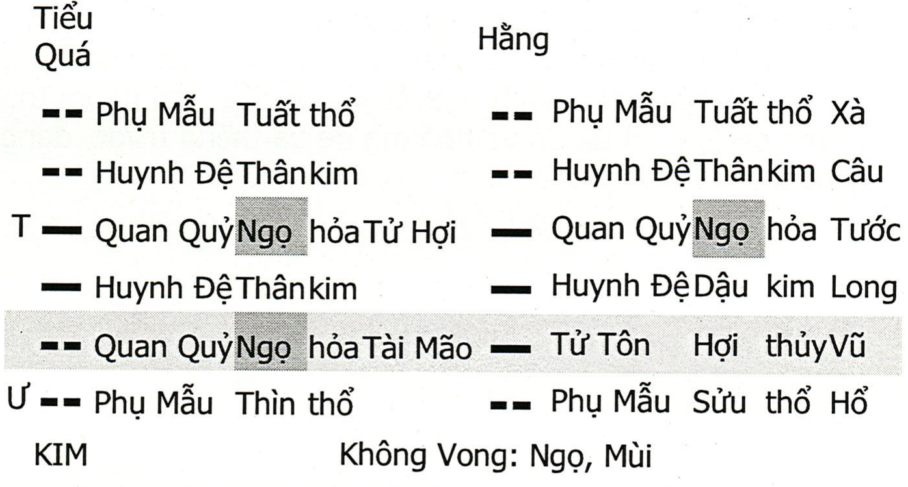
    - **Hình này chứng minh điều gì**
      - Chứng minh hai người kết hôn năm 1982, ly hôn năm 1992 do nghi ngờ có người thứ ba nhưng thực tế không có; vợ là diễn viên xinh đẹp.
    - **Từ đâu mà thấy được**
      - Phụ Mẫu Tuất thổ hợp Nhật (cưới năm Tuất 1982); Thế Ngọ hỏa Không Phá quẻ Du Hồn, Huynh Thân kim lâm Tuyệt địa (ly dị năm Thân 1992); Tài Mão phục Quỷ Ngọ Không Phá (nghi ngờ giả tạo).

#### Luồng đối thoại thực tế và diễn biến hậu trường

- Phản hồi công khai của Tô tiên sinh:
  - Tô tiên sinh xác nhận: Vợ ông trước đây là diễn viên của đoàn ca vũ nhạc, vóc dáng cao ráo, rất xinh đẹp, mặt không đen nhưng có nốt ruồi.
  - Họ kết hôn vào đúng năm 1982 và ly hôn vào năm 1992.
  - Nguyên nhân chủ yếu dẫn đến ly hôn đúng là do nghi ngờ có người thứ ba, mà trên thực tế không hề có.
  - Tuy nhiên, Tô tiên sinh đính chính: Không phải ông nghi ngờ vợ, mà là người vợ nghi ngờ ông có người phụ nữ khác bên ngoài. Vì chuyện ghen tuông vô cớ này mà người vợ bị rối loạn tinh thần, thần kinh thất thường; cuối cùng ông phải bồi thường cho bà ta 8 vạn tệ mới giải quyết xong thủ tục ly hôn.
- Tình tiết hậu trường tế nhị:
  - Lúc xem bói có rất nhiều bạn bè của Tô tiên sinh cùng có mặt tại đó; tác giả nhận định có khả năng vì Tô tiên sinh muốn giữ thể diện trước mặt bạn bè nên đã cố ý nói ngược lại sự thật, hoặc cũng có thể tác giả đã phán đoán ngược ngôi thứ ai nghi ngờ ai.
  - Sau khi rời khỏi nhà, một người bạn thân đi cùng đã ghé tai nói nhỏ với tác giả rằng phán đoán của tác giả hoàn toàn chính xác (chính Tô tiên sinh ghen tuông nghi ngờ vợ).
  - Rốt cuộc ai thật ai giả thì không thể nào chứng thực được từ chính miệng Tô tiên sinh.

### Ví dụ 6: Ngày Canh Dần tháng Bính Tuất năm Ất Hợi, một vũ cảnh đoán về xe đạp bị mất, được Lôi Thủy Giải biến Trạch Thủy Khốn

#### Bối cảnh và thông tin quẻ tượng

- Thời gian dự đoán: Ngày Canh Dần, tháng Bính Tuất, năm Ất Hợi.
- Người xin đoán: Một chiến sĩ cảnh sát vũ trang (vũ cảnh) ở cùng đơn vị với tác giả, đến nhờ đoán về chiếc xe đạp bị mất cắp.
- Quẻ đắc được: Lôi Thủy Giải biến Trạch Thủy Khốn.
- Tuần không: Ngọ, Mùi (MỘC Không Vong: Ngọ, Mùi).
- Xác định Dụng thần: Lấy hào Phụ Mẫu làm Dụng thần đại diện cho xe cộ (phương tiện đi lại), kiêm xem hào Thê Tài đại diện cho tài sản tiền bạc.

#### Lập luận Dụng thần phục tàng và điềm phá tài

- Đánh giá hiện trạng chiếc xe đạp bị mất:
  - Dụng thần Phụ Mẫu Tý thủy không xuất hiện trên quẻ chính, phục tàng dưới hào sơ Huynh Đệ Dần mộc.
  - Phụ Mẫu Tý thủy bị Nguyệt kiến Tuất thổ khắc chế nặng nề, lại không được Nhật thần Dần mộc sinh trợ (Dần mộc hút cạn tiết khí của Thủy), rơi vào tình trạng hưu tù suy kiệt; đoán chiếc xe đạp bị mất là một chiếc xe đã rất cũ kỹ.
  - Hào Phi Huynh Đệ Dần mộc chính là Bệnh địa của Dụng thần Phụ Mẫu Tý thủy (Thủy bệnh tại Dần); Bệnh địa biểu thị sự hư hỏng, rệu rã, chứng tỏ chiếc xe đầy khuyết tật, hỏng hóc triền miên.
- Xác định xe bị trộm và không thể tìm lại:
  - Hào 5 Quan Quỷ Thân kim phát động (Thân kim hóa tiến Dậu kim); Quan Quỷ phát động mang triệu chứng kẻ gian ra tay trộm cắp, xe bị người khác đánh cắp mất.
  - Hào Thế Thê Tài Thìn thổ bị Nguyệt kiến Tuất thổ xung phá thành Nguyệt Phá, lại bị Nhật thần Dần mộc khắc phạt; Nguyên thần của hào Thế là Tử Tôn Ngọ hỏa lại rơi vào Tuần Không.
  - Thế lâm Nguyệt Phá Nhật khắc, Nguyên thần lâm Không, cấu thành tượng phá tài rõ rệt, kết luận chiếc xe một đi không trở lại, vô phương tìm kiếm.
- Phân tích tình trạng chiếc xe đạp bị mất trộm dựa trên quẻ Lôi Thủy Giải biến Trạch Thủy Khốn:
  - **Hình 94.** Sơ đồ quẻ Lôi Thủy Giải biến Trạch Thủy Khốn
    - 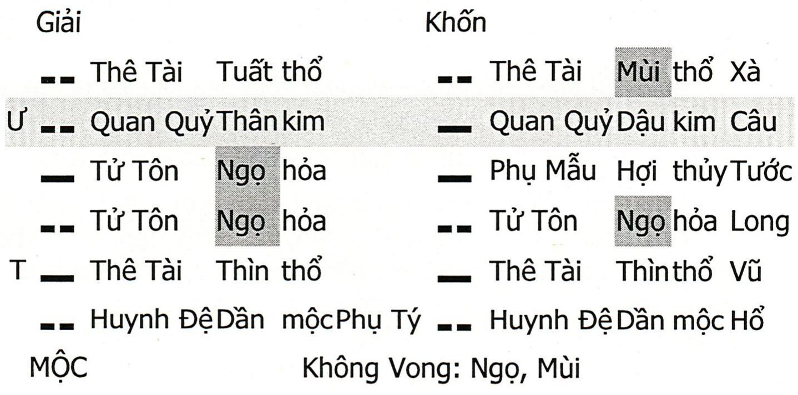
    - **Hình này chứng minh điều gì**
      - Chứng minh chiếc xe đạp bị mất là xe cũ nát hay hỏng, bị kẻ gian trộm mất và không thể tìm lại được.
    - **Từ đâu mà thấy được**
      - Phụ Mẫu Tý thủy hưu tù phục dưới hào sơ Huynh Đệ Dần mộc (Bệnh địa); Quan Quỷ Thân kim phát động; hào Thế Thê Tài Thìn thổ Nguyệt phá Nhật khắc, Nguyên thần lâm Không.

#### Kết quả ứng nghiệm thực tế

- Thực tế kiểm chứng:
  - Chiếc xe đạp bị mất đúng là một chiếc xe đã quá cũ nát, các bộ phận đều hỏng hóc lỏng lẻo.
  - Chiếc xe đã bị kẻ trộm lấy cắp mất và sau đó hoàn toàn không thể tìm lại được.

### Ví dụ 7: Ngày Giáp Thìn tháng Giáp Thìn năm Đinh Sửu, hỏi tình hình đồng hương mấy ngày không thấy mặt, được Thủy Phong Tỉnh biến Thiên Thủy Tụng

#### Bối cảnh và thông tin quẻ tượng

- Thời gian dự đoán: Ngày Giáp Thìn, tháng Giáp Thìn, năm Đinh Sửu.
- Người xin đoán: Tác giả tự gieo quẻ vì lo lắng cho một người đồng hương làm việc cùng cơ quan đã mấy ngày liền không thấy mặt, không rõ tin tức ra sao.
- Quẻ đắc được: Thủy Phong Tỉnh biến Thiên Thủy Tụng.
- Tuần không: Dần, Mão (MỘC Không Vong: Dần, Mão).
- Xác định Dụng thần: Lấy hào Huynh Đệ làm Dụng thần đại diện cho người đồng hương, bạn bè đồng nghiệp.

#### Lập luận tam hợp cục cứu viện và xác định phương vị quê nhà

- Đánh giá sự an nguy của người đồng hương:
  - Dụng thần Huynh Đệ Dần mộc không hiện trên quẻ chính, phục tàng dưới hào 2 Phụ Mẫu Hợi thủy.
  - Huynh Đệ Dần mộc tuy không được Nhật Nguyệt (Thìn thổ) trực tiếp sinh trợ, nhưng ngoại quái có Phụ Mẫu Tý thủy phát động, hào 4 Quan Quỷ Thân kim phát động, kết hợp cùng Nhật Nguyệt Thìn thổ cấu thành tam hợp Thủy cục: Thân - Tý - Thìn hợp Thủy cục cực vượng.
  - Tam hợp Thủy cục vượng tướng quay lại tương sinh mạnh mẽ cho Dụng thần Dần mộc; Thủy vượng sinh Mộc, kết luận người này ở ngoài hoàn toàn bình an vô sự, không gặp bất kỳ hiểm nguy hay tai họa nào (vô hung).
- Xác định nơi chốn và hành tung qua hào Phục thần:
  - Dụng thần Huynh Đệ Dần mộc phục tàng dưới hào Ứng (hào 2 Ứng Phụ Mẫu Hợi thủy); hào Ứng chủ tha hương, nơi chốn bên ngoài, chứng tỏ người này đã rời cơ quan đi đến một địa phương khác.
  - Phục tàng dưới nội quái Tốn (quẻ Tỉnh có nội quái là Tốn phong); Tốn thuộc phương Đông Nam, xác định người này đang ở phương Đông Nam.
  - Hào Phi Phụ Mẫu Hợi thủy là đất Trường Sinh của Dụng thần Huynh Đệ Dần mộc; đất Trường Sinh là nơi sinh thành dưỡng dục, cội nguồn gốc gác, tức quê quán bản quán của người đó.
  - Tác giả dò hỏi những người quen xem quê nhà của người đồng hương có phải nằm ở hướng Đông Nam hay không; mọi người xác nhận quê anh ta đúng là ở phương Đông Nam.
  - Từ đó tác giả khẳng định người đồng hương này rất có khả năng đã tự ý về quê nghỉ ngơi.
- Dự đoán tình hình an nguy và nơi đến của người đồng hương dựa trên quẻ Thủy Phong Tỉnh biến Thiên Thủy Tụng:
  - **Hình 95.** Sơ đồ quẻ Thủy Phong Tỉnh biến Thiên Thủy Tụng
    - 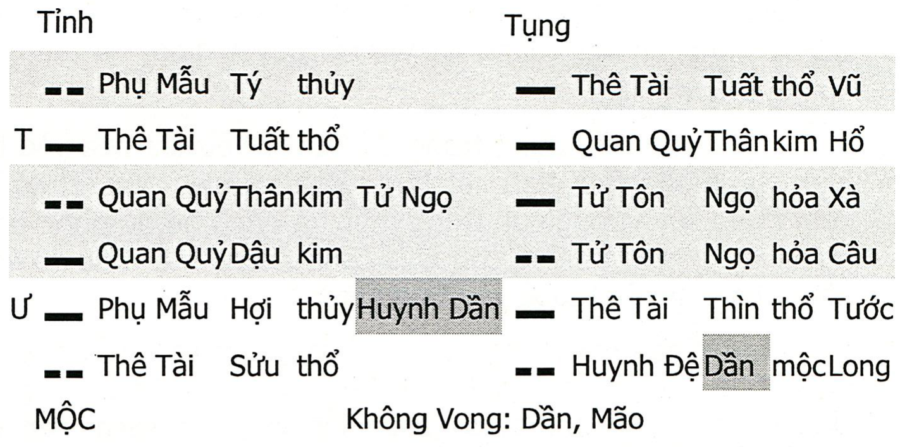
    - **Hình này chứng minh điều gì**
      - Chứng minh người đồng hương hoàn toàn bình an vô sự, đã tự ý rời cơ quan về quê ở phương Đông Nam và gọi điện báo tin vào giờ Ngọ.
    - **Từ đâu mà thấy được**
      - Huynh Đệ Dần mộc phục dưới hào 2 Ứng Phụ Mẫu Hợi thủy (Trường Sinh, quê hương); quái Tốn (hướng Đông Nam); ngoại quái và Nhật Nguyệt hợp thành Thân - Tý - Thìn Thủy cục sinh Dụng thần.

#### Kết quả ứng nghiệm thực tế

- Kết quả xác minh:
  - Đúng vào giờ Ngọ ngày hôm đó (ngày Giáp Thìn), tác giả nhận được cuộc điện thoại gọi đến từ người đồng hương.
  - Anh ta thông báo rằng do có việc gia đình nên đã lẳng lặng về quê vài ngày, hoàn toàn ứng nghiệm với lời dự đoán của quẻ tượng.

## Chương 15: Tam Hình Biện Nghĩa

### Cơ Sở Lý Luận và Bản Chất Ứng Dụng Của Tam Hình Trong Lục Hào

- Lịch sử tranh luận và ba quan điểm chủ yếu từ xưa đến nay:
  - Quan điểm thứ nhất: Coi tuyệt đối Tam hình là hung sát, hễ gặp hình là có tai ương hung hiểm.
  - Quan điểm thứ hai: Tam hình chỉ đóng vai trò phụ họa cho Dụng thần; tuy mang tính chất hung nhưng không giữ vai trò quyết định cát hung của toàn quẻ.
  - Quan điểm thứ ba: Tam hình hoàn toàn không có giá trị ứng nghiệm thực tế trong dự đoán.
- Bản chất và nguyên tắc ứng dụng thực chiến theo Vương Hổ Ứng:
  - Tam hình thực sự rất hữu dụng trong việc phân tích chi tiết sự việc, không thể xem thường.
  - Tuy nhiên, không thể đơn độc dựa vào Tam hình để định đoạt kết quả cát hay hung; cốt lõi phải kết hợp thẩm định mức độ suy vượng của Dụng thần để phân tích ý nghĩa thâm sâu.
  - Tam hình thường chủ về các khía cạnh tiêu cực, bất lợi; mức độ hung họa nặng hay nhẹ hoàn toàn phụ thuộc vào trạng thái vượng suy của Dụng thần.
- Phân loại bốn cách cục Tam hình và cơ chế thực nghiệm:
  - Tam hình Dần - Tị - Thân (Hình cậy thế):
    - Dần, Tị, Thân lần lượt là ba điểm Trường Sinh của Hỏa, Kim, Thủy.
    - Trong thực tiễn, không nhất thiết phải hội đủ cả ba chi; chỉ cần hai địa chi tương kiến đã mang ý nghĩa tương hình, nếu hội tụ đủ cả ba chi thì ứng nghiệm càng thêm chuẩn xác, mãnh liệt.
    - Ý nghĩa thực chiến: Chủ về ỷ thế cậy thần, cậy công lao mà sinh kiêu ngạo, ngang ngược lộng quyền mà gieo mầm tai họa; hoặc cậy có chỗ dựa nâng đỡ, vênh váo đắc ý mà sa chân vào chỗ hiểm nguy, bất lợi; hoặc nghĩ mình có ân nghĩa với đối phương mà hống hách gây khó dễ, làm tình làm tội người khác.
  - Tam hình Sửu - Tuất - Mùi (Hình vô ơn):
    - Ngũ hành của cả ba địa chi Sửu, Tuất, Mùi đều thuộc Thổ mang tính chất đồng nhất; giống như anh em cùng huyết thống lại tuyệt tình cạn nghĩa, huynh đệ tương tàn, gà nhà bôi mặt đá nhau.
    - Ý nghĩa thực chiến: Chủ về lấy oán trả ơn, lấy đức báo oán; nảy sinh mâu thuẫn rạn nứt gay gắt giữa đồng nghiệp, người thân, hoặc bị chính bạn bè thân tín phản bội, bày mưu hãm hại.
  - Tương hình Tý - Mão (Hình vô lễ):
    - Ý nghĩa thực chiến: Thường chủ về những biến cố tai họa xảy ra ngoài dự liệu, đối phương hành động không thèm nói rõ lý do, không bộc lộ chủ ý ban đầu mà đột ngột tạo thành nguy hại, tổn thương sâu sắc.
  - Tự hình (Thìn gặp Thìn, Ngọ gặp Ngọ, Dậu gặp Dậu, Hợi gặp Hợi hoặc tập hợp Thìn - Ngọ - Dậu - Hợi):
    - Ý nghĩa thực chiến: Chủ về tự làm tự chịu, nhân quả báo ứng nhãn tiền; tự rước lấy xui xẻo rắc rối, tự lấy đá ghè chân mình; cậy mình thông minh mưu mẹo nhưng rốt cuộc lại bị chính sự thông minh làm hại.
- Hệ thống trường ý nghĩa tượng trưng rộng lớn của Tam hình:
  - Dự đoán Lục hào lấy việc phân tích ý nghĩa tượng quẻ làm trọng tâm hàng đầu, xem nhẹ việc chỉ định cát hung đơn giản.
  - Các hàm nghĩa điển hình của Tam hình gồm có: Thụ hình, vướng mắc pháp luật hình sự, hình danh, phạm hình, bị chỉ trích phê bình, gây khó dễ, bị giày vò đày đọa, chịu tội, bị thương tích chảy máu, tổn thương cơ thể, liên lụy liên can, thêm rối ren hỗn loạn, chuốc thêm phiền phức, dằn vặt đau khổ, căm ghét oán hờn, ngầm phá hoại, mâu thuẫn đối kháng, khẩu thiệt thị phi, xui xẻo rủi ro, đấu tranh kịch liệt, bới lông tìm vết, huynh đệ tương tàn, mưu hại ngầm, ghen ghét đố kỵ, quấy nhiễu không yên, bức bối khó chịu, nham hiểm thâm độc.
  - Khi ứng dụng dự đoán, người đoán quẻ phải căn cứ linh hoạt vào quan hệ sinh khắc tương hỗ, trạng thái Nguyệt phá, Tuần Không, cùng ý nghĩa tượng trưng của lục thần để luận giải chuẩn xác theo từng hoàn cảnh.

### Tuyển Tập Quẻ Điển Hình Nghiệm Chứng Biện Nghĩa Tam Hình

#### Ví Dụ 1: Ngày Nhâm Ngọ Tháng Giáp Dần Năm Mậu Dần, Tự Xem Niên Vận, Được Thiên Sơn Độn Biến Thủy Hỏa Ký Tế

- Bối cảnh và thông tin quẻ:
  - Ngày Nhâm Ngọ, tháng Giáp Dần, năm Mậu Dần.
  - Tác giả tự gieo quẻ xem niên vận trong năm, được quẻ Thiên Sơn Độn biến Thủy Hỏa Ký Tế.
  - Cung Càn (thuộc Kim), Tuần Không tại Thân và Dậu.
- Phân tích cơ sở Dụng thần và các phương diện tổng quan:
  - Xác định Dụng thần: Lấy hào Thế (Quan Quỷ Ngọ hỏa tại hào 2) làm Dụng thần, kết hợp quan sát toàn diện động tĩnh trong quẻ.
  - Tài vận trong năm: Hào Thê Tài Dần mộc tuy không hiện trên quẻ nhưng lâm Nguyệt kiến Giáp Dần sinh trợ hào Thế, lại phục tàng ngay dưới hào Thế (Quan Quỷ Ngọ hỏa), cho thấy tài vận năm nay rất khá, nguồn tiền bạc dồi dào.
  - Công danh sự nghiệp: Quan Quỷ Ngọ hỏa được Nguyệt kiến Dần mộc tương sinh, lại được Nhật thần Nhâm Ngọ tỷ hòa phù trợ, không hề bị xung khắc, do đó sự nghiệp vững vàng, không có nỗi lo về công việc.
  - Vất vả cầu tài: Hào sơ Phụ Mẫu Thìn thổ phát động hóa ra Thê Tài Mão mộc; hào sơ là cước lực (đôi chân), Phụ Mẫu chủ về sự nhọc nhằn vất vả, báo hiệu đây là tượng phải bôn ba di chuyển, làm lụng vất vả cực nhọc mới thu được tiền tài.
- Lập luận hung hiểm Tam hình và điềm báo nhập viện:
  - Điểm bất cát lộ rõ ở hào 4 Quan Quỷ Ngọ hỏa phát động, cùng với hào Thế Quan Quỷ Ngọ hỏa tạo thành cục diện "Ngọ - Ngọ Tự hình".
  - Hào 4 Quan Quỷ động hóa Huynh Đệ Thân kim; cổ nhân đã đúc kết: "Quan Huynh hỗ hóa, đề phòng tổn thương tay chân" (Quan và Huynh biến đổi qua lại cần phòng ngừa tứ chi bị thương tích).
  - Tự hình mang ý nghĩa tự mình làm tổn thương chính mình, tự chuốc lấy thương tật.
  - Quan Quỷ hóa Huynh Đệ tại ngoại quái biểu thị thương tích xảy ra ở cánh tay hoặc bàn tay.
  - Hào 6 Phụ Mẫu Tuất thổ lâm Bạch Hổ phát động khiến hào Thế Ngọ hỏa nhập Mộ tại Tuất; hào 6 chủ về cơ quan y tế, bệnh viện, lâm Bạch Hổ chủ về huyết quang, tai thương, nên hào Thế nhập Mộ tại hào 6 là tượng chắc chắn phải nhập viện điều trị.
  - Quan Quỷ Ngọ hỏa hóa Huynh Đệ Thân kim đang lâm Tuần Không; quy luật ứng kỳ chỉ ra rằng khi bước sang tháng Thân (tháng 7 âm lịch), Thân kim xuất Không sẽ là thời điểm tai họa phát tác.
- Lời cảnh báo và diễn biến thực tế:
  - Sau khi đoán quẻ, tác giả luôn khắc ghi lời cảnh báo thương tích trong đầu, tự nhắc nhở khi đến tháng Thân phải tuyệt đối tránh xa các loại dao kéo, đồ vật sắc nhọn.
  - Đến tháng Thân, vào một ngày nhà đông khách khứa, công việc bếp núc bận rộn vô cùng; tác giả bị cuốn vào guồng quay công việc nên hoàn toàn quên bẵng lời dặn dò kiêng cữ.
  - Ban đầu tác giả chỉ định bước vào bếp để phụ giúp một tay, nhưng vừa vào đến nơi thì chưa làm được việc gì, đầu óc bỗng nhiên ngớ ngẩn lú lẫn, cầm ngay con dao bếp cắt thẳng vào ngón tay giữa của bàn tay mình, khiến móng tay bị đứt mất một phần ba, máu chảy đầm đìa.
  - Tác giả buộc phải buông dao tức tốc đi bệnh viện để bác sĩ băng bó, khâu vết thương; phải mất hơn ba tháng điều trị ngón tay mới hoàn toàn bình phục.
- Nhận định họa tai tự thương và nhập viện qua quẻ Thiên Sơn Độn biến Thủy Hỏa Ký Tế:
  - **Hình 96.** Sơ đồ quẻ Thiên Sơn Độn biến Thủy Hỏa Ký Tế
    - 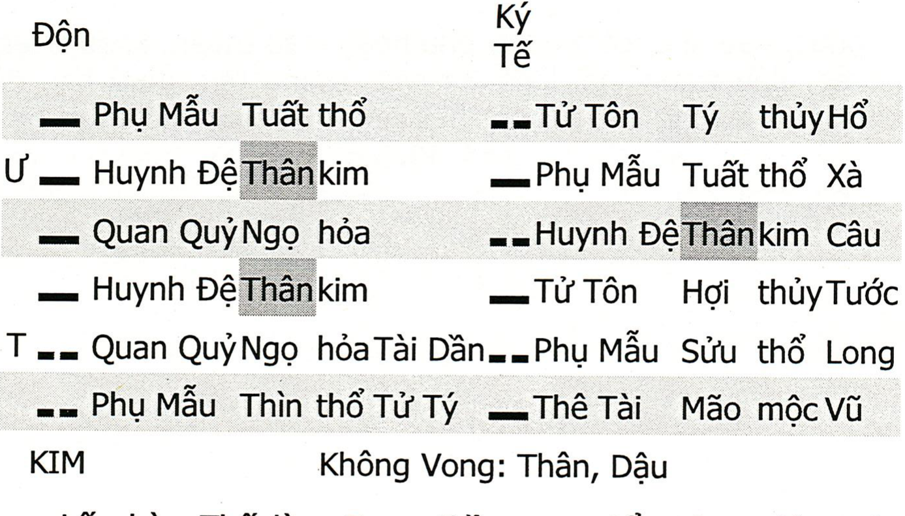
    - **Hình này chứng minh điều gì**
      - Tự hình báo trước thương tích chảy máu ngón tay tại nhà bếp vào tháng Thân và phải nhập viện.
    - **Từ đâu mà thấy được**
      - Quan Quỷ Ngọ hỏa hào 4 động tự hình hào Thế tại hào 2 (bếp), biến Huynh Thân Không Vong; hào 6 Phụ Mẫu Bạch Hổ động Thế nhập Mộ (viện).
- Thấu triệt diệu lý sau nghiệm chứng:
  - Sau khi bình tâm nghiền ngẫm lại quẻ, tác giả mới nhận ra tầng ý nghĩa cực kỳ vi diệu: Hào Thế nhập Mộ ở hào 6, mà hào 6 là đầu não; Dụng thần nhập Mộ khiến tinh thần như say như mê, đầu óc mê muội lú lẫn, vì thế mới ngớ ngẩn cầm dao tự chém vào tay mình.
  - Hào Thế ngự tại hào 2 tự hình: Hào 2 trong trạch quẻ chính là vị trí nhà bếp, lại lâm Thanh Long chủ về việc ẩm thực, ăn uống; thông tin bị thương tích ngay tại nhà bếp khi chuẩn bị tiệc tùng đã phơi bày trọn vẹn trong quẻ mà ban đầu chưa lĩnh hội hết. Dù chịu một nhát dao đau đớn nhưng nhận thức về dịch lý đã tiến bộ vượt bậc.

#### Ví Dụ 2: Ngày Canh Thân Tháng Ất Tị Năm Đinh Sửu, Nam Đoán Cát Hung Con Cái Nhà Thân Thích, Được Thủy Lôi Truân

- Bối cảnh và thông tin quẻ:
  - Ngày Canh Thân, tháng Ất Tị, năm Đinh Sửu.
  - Một người đàn ông đến nhờ dự đoán về cát hung của đứa con trong một gia đình thân thích, được quẻ Thủy Lôi Truân (quẻ tĩnh).
  - Cung Khảm (thuộc Thủy), Tuần Không tại Tý và Sửu.
- Phân tích Dụng thần và cấu trúc Tam hình:
  - Xác định Dụng thần: Đoán về con cái người khác, lấy hào Tử Tôn làm Dụng thần; trong quẻ Tử Tôn Dần mộc ngự tại hào 2.
  - Đánh giá suy vượng: Tử Tôn Dần mộc sinh vào tháng Ất Tị bị Tiết khí nặng nề, lại bị Nhật thần Canh Thân xung khắc, rơi vào thế hưu tù vô lực.
  - Cấu thành Tam hình: Hào Tử Tôn Dần mộc kết hợp với Nhật thần Canh Thân và Nguyệt kiến Ất Tị tạo thành bộ "Dần - Tị - Thân Tam hình" toàn vẹn (Hình cậy thế).
  - Tượng hình ngục và lục thần: Hào Tử Tôn Dần mộc lâm Huyền Vũ; Huyền Vũ chủ về hành vi ám muội, trộm cắp, lừa đảo; Dụng thần hưu tù lâm Huyền Vũ lại chịu Tam hình kích phát, tác giả quyết đoán: Đứa con của gia đình này đã bị xử phạt tù vì tội trộm cắp tài sản hoặc lừa đảo.
  - Triển vọng thoát nạn: Nguyên thần của Dụng thần là Thủy (Huynh Đệ Tý thủy) đang lâm Tuần Không, Dụng thần đã suy nhược lại không có nguồn sinh trợ, do đó người này rất khó lòng được tha bổng hay ra tù sớm.
- Phán đoán hình phạt tù tội do trộm cắp, lừa đảo qua quẻ Thủy Lôi Truân:
  - **Hình 97.** Sơ đồ quẻ Thủy Lôi Truân
    - 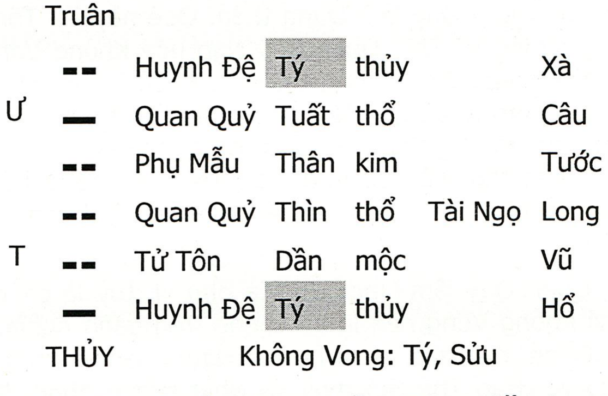
    - **Hình này chứng minh điều gì**
      - Con cái bị phạt tù lao động cải tạo do trộm cắp, lừa đảo và rất khó được tha sớm.
    - **Từ đâu mà thấy được**
      - Tử Tôn Dần mộc hưu tù lâm Huyền Vũ cùng Nhật Thân, Nguyệt Tị tạo tam hình; Nguyên thần Tý thủy lâm Tuần Không.
- Nghiệm chứng thực tế:
  - Người hỏi xác nhận sự thật hoàn toàn đúng như lời đoán: Đứa con đó đã bị kết án tù giam vì tội trộm cắp và lừa đảo, hiện đang phải thụ án lao động cải tạo trong trại giam.

#### Ví Dụ 3: Ngày Đinh Hợi Tháng Bính Thìn Năm Mậu Dần, Nữ Đoán Hôn Nhân, Được Địa Sơn Khiêm Biến Lôi Hỏa Phong

- Bối cảnh và thông tin quẻ:
  - Ngày Đinh Hợi, tháng Bính Thìn, năm Mậu Dần.
  - Một người phụ nữ đến nhờ tác giả dự đoán về chuyện hôn nhân duyên phận, gieo được quẻ Địa Sơn Khiêm biến Lôi Hỏa Phong.
  - Cung Đoài (thuộc Kim), Tuần Không tại Ngọ và Mùi.
- Phân tích Dụng thần và hiện trạng chung sống:
  - Xác định Dụng thần: Nữ nhân xem hôn nhân lấy Quan Quỷ làm Dụng thần; trong quẻ Quan Quỷ Ngọ hỏa ngự tại hào 2.
  - Tổng quan hôn nhân bất lợi: Quẻ có Tử Tôn Hợi thủy vượng tướng (được Nhật thần tỷ hòa) trì Thế; Tử Tôn trì Thế là thần thương tổn Quan Quỷ, khắc phu. Trong khi đó Quan Quỷ Ngọ hỏa lâm hào 2 vừa hưu tù lại rơi vào Tuần Không, báo hiệu hôn nhân tất không thể tốt đẹp, trắc trở muôn phần.
  - Đã có người đàn ông ở chung: Hào Thế Hợi thủy là biểu tượng của Khuê Phòng, kết hợp với Quan Quỷ Ngọ hỏa nhập vào hào trạch (hào 2 là hào nhà ở), chứng tỏ trong thực tế đã có đàn ông dọn đến ở chung trong nhà.
- Phân tích tính pháp lý và tình trạng hôn nhân phi pháp:
  - Hào Phụ Mẫu chủ về giấy chứng nhận kết hôn, hôn thư pháp lý:
    - Hào 4 Phụ Mẫu Sửu thổ phát động hóa Quan Quỷ Ngọ hỏa lâm Không Vong, lại nhập Mộ tại Nguyệt kiến Bính Thìn.
    - Hào sơ Phụ Mẫu Thìn thổ phát động hóa ra Thê Tài Mão mộc hồi đầu khắc.
    - Cả hai hào Phụ Mẫu đều động biến tổn hại, biểu thị mối quan hệ này hoàn toàn không có hôn thú, là quan hệ chung sống bất hợp pháp.
  - Thân phận người nam đã có vợ: Quan Quỷ lâm hào Ứng (phu vị), bình thường là chồng, nhưng vì lâm Không Vong nên chỉ là vợ chồng trên danh nghĩa; đặc biệt Thê Tài Mão mộc phục tàng ngay dưới Quan Quỷ Ngọ hỏa (Tài phục dưới Quan), ngụ ý người nam này ở nhà vốn đã có người vợ chính thức. Người nam đang chung sống thực chất là kẻ đã có gia thất.
  - Tự hình do bản thân chuốc lấy: Hào Thế Hợi thủy gặp Nhật thần Đinh Hợi là "Hợi - Hợi Tự hình", khẳng định tình trạng hôn nhân éo le, mang tiếng xấu này hoàn toàn do bản thân người phụ nữ tự chuốc lấy, tự dấn thân.
- Dòng thời gian, con cái và kết cục tan vỡ:
  - Đã có con chung: Tử Tôn Hợi thủy trì Thế cho thấy hai người hiện đã có con nhỏ với nhau.
  - Thời điểm quen nhau: Hào 4 Sửu thổ phát động hóa Quan Quỷ; địa chi Sửu tương ứng với năm Đinh Sửu 1997, Quan Quỷ là đàn ông, cho thấy hai người quen biết và dọn về sống chung từ năm 1997.
  - Mê muội trong dối trá: Hào sơ Phụ Mẫu Thìn thổ lâm Chu Tước phát động làm cho hào Thế Hợi thủy nhập Mộ; Chu Tước chủ lời ăn tiếng nói, dối trá, cho thấy người nữ vẫn đang đắm chìm, tin sái cổ vào những lời hứa hẹn dối trá rằng anh ta sẽ làm thủ tục ly hôn để cưới cô.
  - Năm vỡ mộng hôn nhân: Hào sơ Phụ Mẫu Thìn thổ hóa ra Thê Tài Mão mộc hồi đầu khắc; Thê Tài Mão mộc lại phục dưới Quan Quỷ, tương ứng với năm Kỷ Mão 1999; đến năm 1999 hào Tài xuất lộ khắc gãy Phụ Mẫu, người vợ chính thức của anh ta sẽ phát hiện ra sự việc, từ đó đập tan hoàn toàn mộng tưởng kết hôn của cô gái.
- Dự đoán hôn nhân bất lợi, chung sống phi pháp và đổ vỡ qua quẻ Địa Sơn Khiêm biến Lôi Hỏa Phong:
  - **Hình 98.** Quẻ Địa Sơn Khiêm biến Lôi Hỏa Phong
    - 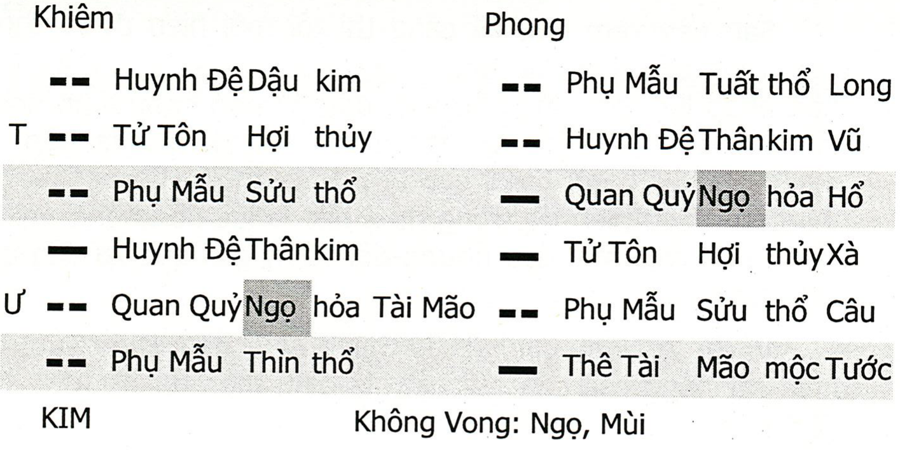
    - **Hình này chứng minh điều gì**
      - Sống chung không hôn thú với người có vợ, tự chuốc phiền muộn và vỡ mộng kết hôn vào năm Mão.
    - **Từ đâu mà thấy được**
      - Hợi thủy lâm Thế tự hình với Nhật; Phụ Mẫu Sửu hào 4 hóa Không nhập Mộ; hào sơ Phụ Mẫu Thìn động hóa Tài Mão hồi đầu khắc.
- Phản hồi thực tế từ đương số:
  - Người phụ nữ cho hay: Bản thân trước đây từng làm nhân viên tiếp thị tại một phòng hát karaoke. Năm 1997, người nam kia đến phòng karaoke vui chơi, hai người quen biết rồi nhanh chóng chuyển về sống chung; đến nay cô đã sinh cho anh ta một đứa con được 5 tháng tuổi.
  - Đối phương đúng là người đã có gia đình đề huề, nhưng anh ta luôn miệng thề thốt sẽ sớm ly hôn với vợ để kết hôn với cô. Sau đó diễn biến thế nào, do người này không quay lại phản hồi nên tác giả không rõ kết cục.

#### Ví Dụ 4: Ngày Quý Hợi Tháng Quý Tị Năm Bính Tý, Bà Lão Đoán Cuộc Sống Cuối Đời, Được Thủy Địa Tỷ Biến Phong Trạch Trung Phu

- Bối cảnh và thông tin quẻ:
  - Ngày Quý Hợi, tháng Quý Tị, năm Bính Tý.
  - Một bà lão tìm đến nhờ dự đoán về tình cảnh cuộc sống trong những năm tháng cuối đời, gieo được quẻ Thủy Địa Tỷ biến Phong Trạch Trung Phu.
  - Cung Càn (thuộc Thổ), Tuần Không tại Tý và Sửu.
- Phân tích nguồn sống và con cái:
  - Xác định Dụng thần: Lấy hào Thế (Quan Quỷ Mão mộc tại hào 3) làm Dụng thần kết hợp phân tích các hào tương quan.
  - Kinh tế cuối đời dựa vào Nhà nước: Quan Quỷ trì Thế, Thê Tài Tý thủy lâm Nhật thần Quý Hợi (Thủy) tương sinh hào Thế; trong Lục hào Nhật Nguyệt tượng trưng cho Trời, đại diện cho Chính phủ, Nhà nước; điều này chỉ ra nguồn kinh tế nuôi sống bà lúc về già hoàn toàn dựa vào trợ cấp hoặc lương hưu của Nhà nước.
  - Con cái không nhờ cậy được: Hào Tử Tôn Thân kim là Kỵ thần đang ở trạng thái suy hưu, lại ngự tại hào âm, biểu thị đường con cái vô duyên, không thể nhờ vả trông cậy được gì, đặc biệt là con gái.
- Phân tích tình trạng hôn nhân (chồng trước qua đời, chồng sau bệnh tật):
  - Hào Ứng là phu vị: Tại hào 6, Thê Tài Tý thủy lâm Tuần Không, mang Bạch Hổ phát động hóa Quan Quỷ Mão mộc; Không chủ về mất mát, Bạch Hổ chủ về tang ma, Quan Quỷ chủ về tử vong bệnh tật; dấu hiệu tang ma chết chóc hiện rõ ở phu vị nhưng bản thân hào Thế lại có Quan Quỷ Mão mộc trì Thế (đang có chồng). Tác giả tổng hợp luận đoán: Người chồng đầu tiên của bà đã mắc bệnh qua đời từ trước, và hiện tại bà đã tái hôn với một người đàn ông khác.
  - Tình cảm và sức khỏe người chồng tái hôn: Hào Ứng Tý thủy tương sinh hào Thế Mão mộc, cho thấy người chồng sau này rất thật lòng yêu thương bà. Nhưng hào Ứng lâm Không Vong nên lực sinh bị giảm sút; hơn nữa Tý thủy và Mão mộc phạm vào "Tý - Mão tương hình" (trong sinh có hình); lại thêm Quan Quỷ Mão mộc gặp Nguyệt kiến Quý Tị là Bệnh địa; tác giả đoán: Sức khỏe người chồng hiện tại rất kém, bệnh tật triền miên, bà cụ không những không được ông chăm sóc nương tựa mà trái lại còn bị bệnh tật của ông làm liên lụy khổ sở.
- Điềm báo liệt giường và sự kiệt sức vì phục dịch:
  - Chồng liệt giường: Quan Quỷ ngự tại hào 3 (hào 3 là tượng giường chiếu); hào sơ Huynh Đệ Mùi thổ phát động khiến Quan Quỷ Mão mộc nhập Mộ tại Mùi; hào sơ lại chủ về bàn chân, cẳng chân; đoán rằng người chồng mắc bệnh nặng đến mức không thể bước xuống giường đi lại được.
  - Bản thân bị giam chân, hao tổn sinh bệnh: Hào Thế (Mão mộc) đồng hào nhập Mộ vào hào sơ phát động, chỉ ra rằng chính bà lão cũng bị việc chăm sóc chồng ràng buộc, trói chặt chân tay đến mức không thể đi lại đâu xa.
  - Tượng cách sơn hóa hào: Hào sơ Huynh Đệ Mùi thổ động hóa Phụ Mẫu Tị hỏa, trong khi hào 2 Phụ Mẫu Tị hỏa lại động hóa Quan Quỷ Mão mộc (cách sơn hóa hào); đây là điềm báo người phụ nữ này ắt vì lo toan, chăm sóc bệnh tật của chồng mà làm lụng kiệt sức, tương lai bản thân cũng vì lao lực quá độ mà đổ bệnh.
- Nhận định tình cảnh tuổi già, chồng tái hôn liệt giường và liên lụy qua quẻ Thủy Địa Tỷ biến Phong Trạch Trung Phu:
  - **Hình 99.** Sơ đồ quẻ Thủy Địa Tỷ biến Phong Trạch Trung Phu
    - 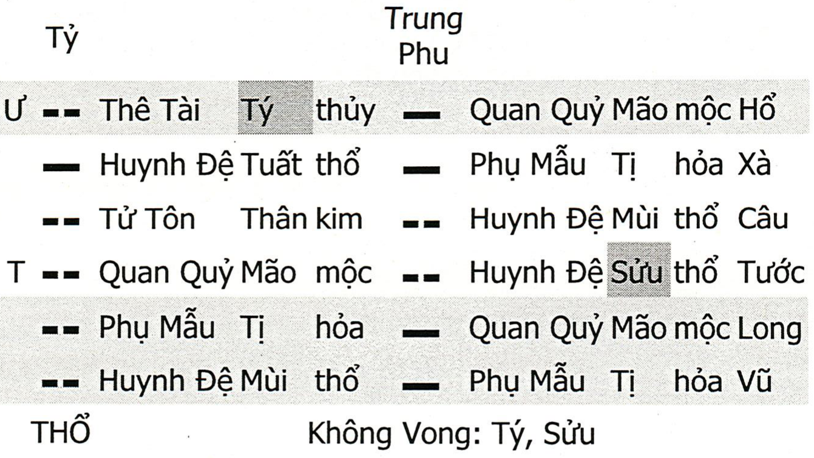
    - **Hình này chứng minh điều gì**
      - Chồng trước mất, chồng sau yêu thương nhưng bệnh tật liệt giường khiến đương số vất vả chăm sóc sinh bệnh.
    - **Từ đâu mà thấy được**
      - Ứng Tý thủy Không lâm Hổ hóa Quỷ (chồng trước mất); Quan trì Thế sinh có hình; Quan Quỷ hào 3 và Thế cùng nhập Mộ sơ hào động.
- Lời giãi bày và đối chiếu thực tế:
  - Bà lão xác nhận hoàn toàn chính xác: Bản thân trước đây có việc làm ổn định nhưng nay đã nghỉ hưu, nguồn sống cuối đời dựa trọn vào tiền lương hưu hàng tháng.
  - Bà có một người con gái ngỗ nghịch, bất hiếu, chẳng bao giờ chịu đến thăm hỏi mẹ già.
  - Người chồng đầu tiên quả thực đã mắc bệnh qua đời từ lâu; hiện bà đã đi bước nữa. Người chồng hiện tại đúng là rất yêu thương bà, nhưng vừa qua phải trải qua phẫu thuật vì bạo bệnh, nay nằm liệt giường không thể tự đi lại; mỗi ngày bà đều phải cặm cụi túc trực bên giường chăm nom ông vô cùng cực nhọc.

#### Ví Dụ 5: Ngày Canh Tý Tháng Bính Thân Năm Bính Tý, Nông Dân Đoán Tài Vận, Được Phong Trạch Trung Phu Biến Phong Thiên Tiểu Súc

- Bối cảnh và thông tin quẻ:
  - Ngày Canh Tý, tháng Bính Thân, năm Bính Tý.
  - Một người nông dân đến nhờ tác giả xem tài vận, gieo được quẻ Phong Trạch Trung Phu biến Phong Thiên Tiểu Súc.
  - Cung Cấn (thuộc Thổ), Tuần Không tại Thìn và Tị.
- Đập tan ngộ nhận thông thường về hào Huynh Đệ trì Thế:
  - Xác định Dụng thần: Xem tài vận lấy Thê Tài làm Dụng thần; hào Thê Tài Tý thủy không hiện trên quẻ, phục tàng dưới hào 5 Phụ Mẫu Tị hỏa.
  - Nhận định sai lầm phổ biến: Thoạt nhìn quẻ, thấy Huynh Đệ Mùi thổ trì Thế, hào 3 Huynh Đệ Sửu thổ lại phát động hóa Huynh Đệ Thìn thổ (hóa Tiến thần), người học dịch thông thường sẽ vội vàng kết luận là tượng đại phá tài, tuyệt đối không thể cầu tài; nhưng tác giả chỉ rõ suy nghĩ máy móc đó là hoàn toàn sai lầm.
- Cơ chế phát đại tài và hoạch tài bất nghĩa:
  - Dụng thần Thê Tài Tý thủy tuy phục tàng nhưng được Nguyệt kiến Bính Thân tương sinh, lại được Nhật thần Canh Tý phù trợ tỷ hòa nên vượng tướng tột bậc.
  - Phi thần Phụ Mẫu Tị hỏa lâm Tuần Không; người xưa có câu khẩu quyết: "Phục cư Không hạ, dị vu xuất lộ" (Phục thần náu dưới Phi thần lâm Không Vong thì rất dễ dàng hiển lộ, phát huy tác dụng).
  - Hào Thế Huynh Đệ Mùi thổ hưu tù vô khí, không đủ lực lượng để khắc cướp Tài. Kết cấu kỳ diệu này chính là cách cục phát đại tài mãnh liệt, hơn nữa là nguồn hoạnh tài, tài lộc bất ngờ.
- Phán đoán từng thời kỳ và tài lộc từ đường nước:
  - Diễn biến tài vận các năm: Năm 1992 (Nhâm Thân) và 1993 (Quý Dậu) Thủy vượng, tài vận tương đối tốt; năm 1994 (Giáp Tuất) Thổ vượng khắc Thủy nên kém hơn đôi chút; năm 1995 (Ất Hợi) và 1996 (Bính Tý) tài vận cực kỳ hưng vượng.
  - Hoạch tài năm Bính Tý: Đặc biệt năm nay (1996) phát tài cực lớn; riêng trong tháng Thân này sẽ phát đại tài. Nguồn tài này thu hoạch từ trên mặt nước (Thủy), là món tài lộc từ trên trời rơi xuống ngoài sức tưởng tượng.
  - Điềm báo tranh chấp bất thành: Hào Huynh Đệ Sửu thổ phát động xung hình hào Thế Mùi thổ (Sửu - Mùi tương xung tương hình), đồng thời Sửu thổ lại tương hợp với Thê Tài Tý thủy (Tý - Sửu nhị hợp); tác giả đoán: Sẽ có kẻ quấy rầy gây chuyện hòng cướp đoạt món tiền này, nhưng không thể nào cướp nổi.
- Phân tích điềm báo hoạch tài bất ngờ và tranh chấp thất bại của kẻ khác qua quẻ Phong Trạch Trung Phu biến Phong Thiên Tiểu Súc:
  - **Hình 100.** Sơ đồ quẻ Phong Trạch Trung Phu biến Phong Thiên Tiểu Súc
    - 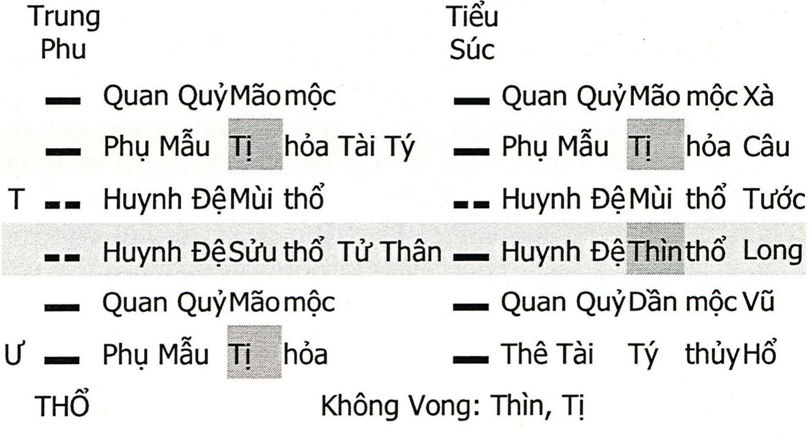
    - **Hình này chứng minh điều gì**
      - Được đại tài bất ngờ từ đường nước (hơn 40 vạn tệ tiền cá); người khác tranh cướp nhưng không thành.
    - **Từ đâu mà thấy được**
      - Tài Tý thủy phục hào 5 vượng được Nhật Nguyệt sinh phù; Phi thần Tị hỏa Tuần Không lộ Tài; Huynh Đệ Sửu thổ động hợp Tài nhưng bị hình xung.
- Sự việc thực tế ly kỳ đến khó tin:
  - Kết quả nghiệm chứng chuẩn xác tuyệt đối: Người nông dân này bắt đầu phất lên làm giàu từ năm 1992. Nhà có 8 anh chị em thì chỉ duy nhất một mình anh ta phát tài, tất cả anh em còn lại đều sống dựa dẫm, tiêu xài tiền của anh. Ngoại trừ năm 1994 hơi chững lại, các năm qua đều vô cùng thuận lợi.
  - Năm 1996, anh ta bắt tay vào thầu đầm nuôi cá; trong làng có rất nhiều người nuôi, bản thân anh chưa có kinh nghiệm nên chỉ vừa làm vừa bắt chước người ta. Theo quy trình, cá phải nuôi thúc sang tận năm sau (1997) mới trưởng thành để xuất bán lấy lãi.
  - Cách đó không lâu, một cơn lũ lụt kinh hoàng bất ngờ tràn về nhấn chìm toàn bộ các đầm cá trong vùng; anh ta cứ ngỡ phen này mất trắng, nào ngờ khi nước rút đi thì cá trong đầm của các nhà xung quanh đã trôi sạch trơn, trong khi toàn bộ cá lớn lại dồn hết vào đầm của anh ta chật ních. Hóa ra nước lũ nối liền các ao đầm, cá của thiên hạ đua nhau bơi sang tụ lại trong ao của anh.
  - Ngay trong tháng Thân năm đó, anh ta tháo đầm bán sạch cá thu về hơn 40 vạn nhân dân tệ.
  - Những người xung quanh ghen ăn tức ở kéo đến gây sự, đòi chia tiền vì cho rằng cá trong ao anh ta là cá của họ; nhưng trên mình con cá không hề có ký hiệu hay dấu vết gì để phân biệt. Rốt cuộc, đám người gây sự đành bất lực ôm hận, tự ngậm bùi ngùi chấp nhận xui xẻo.

#### Ví Dụ 6: Ngày Canh Ngọ Tháng Kỷ Sửu Năm Ất Hợi, Người Mẹ Đoán Cát Hung Của Con, Được Phong Địa Quan Biến Thủy Lôi Truân

- Bối cảnh và thông tin quẻ:
  - Ngày Canh Ngọ, tháng Kỷ Sửu, năm Ất Hợi.
  - Một người phụ nữ lo lắng đến xin đoán cát hung cho đứa con trai của mình, được quẻ Phong Địa Quan biến Thủy Lôi Truân.
  - Cung Càn (thuộc Kim), Tuần Không tại Tuất và Hợi.
- Phân tích Dụng thần suy vi và hung tượng trùng trùng:
  - Xác định Dụng thần: Đoán về con cái, lấy hào Tử Tôn làm Dụng thần; trong quẻ Tử Tôn Tý thủy không xuất hiện, phục tàng dưới hào sơ Phụ Mẫu Mùi thổ.
  - Dụng thần lâm cảnh hiểm nghèo: Tử Tôn Tý thủy bị Nguyệt kiến Kỷ Sửu khắc phạt, lại bị Nhật thần Canh Ngọ xung kích (Tý - Ngọ tương xung); trong quẻ Nguyên thần của Tý thủy (Kim) hoàn toàn vắng bóng, không có lực sinh trợ.
  - Phi thần phát động khắc sát: Hào Phi thần Phụ Mẫu Mùi thổ lâm Bạch Hổ phát động đè nặng khắc chế Dụng thần; hung nhiều cát ít, khó toàn tính mạng.
- Luận giải hình phạt giam cầm và án tử hình:
  - Phạm tội bị bắt giam: Trong quẻ, hào 6 Thê Tài Mão mộc phát động tương hình với Tử Tôn Tý thủy ("Tý - Mão tương hình"); hình chủ về hình phạt, dính líu pháp luật hình sự; hào 6 lại lâm Đằng Xà chủ về sự dây dưa, còng trói, giam cầm. Tác giả khẳng định: Đứa con nhất định đã phạm phải trọng tội và đã bị công an bắt giam vào ngục.
  - Tượng bị xử bắn tử hình: Hào Ứng Phụ Mẫu Mùi thổ lâm Bạch Hổ phát động tương khắc; Bạch Hổ chủ về vũ lực, binh đao, đao thương đầu rơi máu chảy; đây chính là tượng đứa con sẽ bị tuyên phạt tử hình, đưa ra pháp trường hành quyết.
- Dự đoán án tử và ứng kỳ:
  - Dụng thần Tý thủy phục tàng, sang năm Bính Tý 1996 Dụng thần xuất hiện ắt gặp đại hung.
  - Hào Phi thần Mùi thổ bị Nguyệt kiến Sửu xung là Nguyệt phá; tác giả ban đầu nhận định: Đến tháng Ngọ năm 1996, khi Nhật Nguyệt hợp phá (Ngọ - Mùi nhị hợp) sẽ là thời điểm ứng kỳ thi hành án.
- Dự đoán hình án tử hình và ứng kỳ hành quyết qua quẻ Phong Địa Quan biến Thủy Lôi Truân:
  - **Hình 101.** Quẻ Phong Địa Quan biến Thủy Lôi Truân
    - 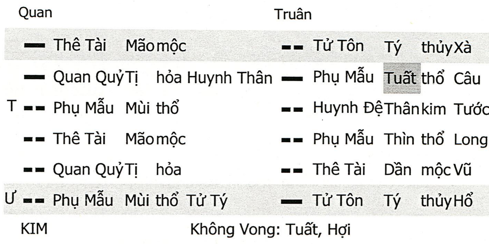
    - **Hình này chứng minh điều gì**
      - Con phạm tội bị phạt hình sự, tuyên án tử hình và bị hành quyết sớm vào tháng Tị năm 1996.
    - **Từ đâu mà thấy được**
      - Hào 6 Mão mộc Đằng Xà động hình Dụng thần Tý thủy; Ứng Bạch Hổ động khắc; Phi Mùi phá được Nhật hợp giải phá, ứng kỳ Dụng thần ngộ Tuyệt ở Tị.
- Nghiệm chứng thực tế và bài học dịch lý về "Nhật hợp giải phá":
  - Thực tế đau lòng: Đứa con quả nhiên phạm tội nghiêm trọng, bị tòa tuyên án tử hình nhưng cho hoãn thi hành án hai năm (tức theo kế hoạch ban đầu thì phải đến năm 1998 Mậu Dần mới thi hành).
  - Biến cố bất ngờ: Nào ngờ sang năm 1996 Bính Tý, các cấp chính quyền mở đợt kiểm tra, xét xử tội phạm nghiêm ngặt; vụ án bị lật lại xét xử khẩn cấp, đứa con bị đưa ra xử bắn ngay trong tháng Tị năm 1996, sớm hơn dự đoán của tác giả một tháng.
  - Giải mã nguyên nhân ứng nghiệm sớm: Phi thần Mùi thổ tuy bị Nguyệt kiến Sửu xung phá, nhưng trong ngày gieo quẻ đã được Nhật thần Canh Ngọ đến hợp (Ngọ - Mùi tương hợp); trong Lục hào, "Nhật hợp có thể giải trừ Nguyệt phá", do đó trạng thái phá đã được giải tỏa ngay trong quẻ, không cần phải đợi đến tháng Ngọ để hợp phá nữa. Vì thế ứng kỳ đã chuyển sang ứng vào thời điểm Dụng thần Tử Tôn Tý thủy lâm Tuyệt địa tại tháng Tị (Tý thủy tuyệt ở Tị), đứa con bị hành quyết đúng vào tháng Tị.

#### Ví Dụ 7: Ngày Ất Dậu Tháng Bính Ngọ Năm Đinh Sửu, Đoán Tìm Sách Ngoại Ngữ Thất Lạc, Được Phong Thiên Tiểu Súc Biến Thủy Thiên Nhu

- Bối cảnh và thông tin quẻ:
  - Ngày Ất Dậu, tháng Bính Ngọ, năm Đinh Sửu.
  - Một người làm mất cuốn sách ngoại ngữ chuyên ngành, tìm khắp nơi không ra bèn đến nhờ xem liệu có tìm lại được không, gieo được quẻ Phong Thiên Tiểu Súc biến Thủy Thiên Nhu.
  - Cung Tốn (thuộc Mộc), Tuần Không tại Ngọ và Mùi.
- Phân tích Dụng thần và khẳng định sách không mất:
  - Xác định Dụng thần: Hỏi về sách vở, giấy tờ tài liệu lấy Phụ Mẫu làm Dụng thần; trong quẻ Phụ Mẫu Tý thủy ngự tại hào sơ.
  - Sách vẫn còn nguyên: Phụ Mẫu Tý thủy mặc dù bị Nguyệt kiến Bính Ngọ tương xung thành Nguyệt phá, nhưng lại được Nhật thần Ất Dậu tương sinh, hơn nữa lại trực tiếp trì Thế (nhập vào bản thân người hỏi); Dụng thần trì Thế được Nhật sinh là tượng đồ vật không bao giờ bị mất, vẫn đang nằm trong tầm tay.
- Phân tích kẻ xấu giấu sách và địa điểm cất giấu:
  - Đồng nghiệp ghen ghét lén giấu: Trong quẻ hào 6 Huynh Đệ Mão mộc lâm Huyền Vũ phát động, tương hình với Dụng thần Phụ Mẫu Tý thủy ("Tý - Mão tương hình"); Huynh Đệ chủ về đồng nghiệp cùng cơ quan; Huyền Vũ chủ về hành vi lén lút, mờ ám, trộm vụng; Tam hình chủ về sự bất mãn, hãm hại, đố kỵ, làm khó dễ; tác giả khẳng định ngay: Có đồng nghiệp trong cơ quan bất mãn, có hiềm khích và ghen ghét anh ta nên đã lén đem cuốn sách ngoại ngữ giấu biệt đi.
  - Nơi giấu sách rất thấp: Phụ Mẫu Tý thủy nằm tại hào sơ; hào sơ là tầng đáy dưới cùng của quẻ, tượng trưng cho mặt đất, cho thấy nơi cuốn sách bị giấu nằm ở vị trí rất thấp, sát mặt sàn.
  - Bìa sách bị xé bỏ: Phụ Mẫu Tý thủy lâm Nguyệt phá chủ về vật phẩm bị rách nát, tổn hại; Tý thủy gặp Nhật thần Dậu kim là đất Mộc Dục; Mộc Dục mang tượng "thoát y" (lột bỏ quần áo, trần truồng); kết hợp tượng Nguyệt phá với tượng Mộc Dục, tác giả suy luận tinh tế: Lớp giấy bọc bảo vệ bên ngoài cuốn sách đã bị kẻ giấu sách xé bỏ vứt đi.
- Lập luận tung tích cuốn sách bị đồng nghiệp giấu qua quẻ Phong Thiên Tiểu Súc biến Thủy Thiên Nhu:
  - **Hình 102.** Sơ đồ quẻ Phong Thiên Tiểu Súc biến Thủy Thiên Nhu
    - 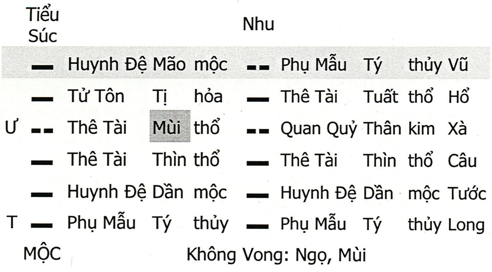
    - **Hình này chứng minh điều gì**
      - Sách không mất, bị đồng nghiệp ghen ghét xé bìa giấu ở góc tủ thấp, tìm thấy vào giờ Dậu.
    - **Từ đâu mà thấy được**
      - Phụ Mẫu Tý thủy hào sơ trì Thế được Nhật sinh; hào 6 Huynh Đệ Mão mộc Huyền Vũ động tương hình; Tý thủy lâm Mộc Dục và Nguyệt phá (xé bìa).
- Kết quả tìm kiếm thực tế:
  - Đúng vào giờ Dậu cùng ngày (giờ Dậu sinh vượng Dụng thần Tý thủy), người này đã tìm thấy cuốn sách ngoại ngữ bị vùi dưới một nắm bông gòn trong ngăn kéo thấp nhất của chiếc tủ đặt tại phòng trực ban cơ quan.
  - Quả nhiên lớp giấy bọc bìa cuốn sách ban đầu đã bị người ta cố ý xé toạc vứt đi, hoàn toàn khớp với từng chi tiết đã phán đoán trong quẻ.

## Chương 16: Phản Ngâm Biện Nghĩa

### Khái niệm và ý nghĩa biểu trưng của Phản ngâm
- Khái niệm và đặc điểm tổng quát:
  - Phản ngâm là một hiện tượng đặc thù thường gặp trong dự đoán Lục hào, xuất hiện khi các hào động hoặc các quái biến thành quẻ có hào/quái tương xung tương khắc ngược lại.
  - Phản ngâm thường chủ về sự việc thay đổi thất thường, động chuyển không ngừng, tình thế bất an, lúc tốt lúc xấu, quá trình phát triển trắc trở không thuận lợi.
  - Về tính chất cát hung: Phản ngâm đại đa số trường hợp luận là hung, chỉ thỉnh thoảng mới luận là trong hung có cát.
- Ứng dụng tượng Phản ngâm khi đoán bệnh tật:
  - Chủ bệnh tình biến chuyển thất thường, lúc nặng lúc nhẹ, bệnh tưởng đã khỏi rồi lại tái phát, khỏi bệnh mà lại phát bệnh, bệnh căn khó trừ dứt điểm, dai dẳng khôn nguôi.
  - Chủ tâm thần người bệnh không yên, đêm ngày trăn trở trằn trọc trên giường bệnh không an giấc.
- Các hàm nghĩa mở rộng của Phản ngâm trong thực tế đời sống:
  - Phản ngâm còn mang ý nghĩa: thay đổi, chần chừ, do dự bất định, hồi hộp lo âu, dao động lắc lư, xuyên tạc, lật ngược vấn đề, quay đầu trở lại, hồi mã thương, hối hận tiếc nuối, cục diện nhấp nhô tròng trành, mâu thuẫn nội tại, tự nuốt lời hứa, thất tín không giữ chữ tín, tâm phiền ý loạn, muôn vàn nỗi suy tư.
  - Ý niệm "Quyển thổ trùng lai" (cuộn đất mà trở lại): thu xếp gom góp toàn bộ vốn liếng, đồ đạc, công sức để làm lại từ đầu một lần nữa nhằm hướng tới thành công.
  - Nguyên tắc vận dụng: Khi áp dụng các ý nghĩa này vào thực tiễn dự đoán phải hết sức linh hoạt theo từng sự việc cụ thể, tuyệt đối không được rập khuôn máy móc.

### Ví dụ 1: Ngày Mậu Tuất tháng Canh Tuất năm Đinh Sửu, nam đoán về tìm đối tượng, được Lôi Địa Dự biến Lôi Phong Hằng

#### Dữ liệu quẻ và xác định Dụng thần
- Dữ kiện thời gian: Ngày Mậu Tuất, tháng Canh Tuất, năm Đinh Sửu.
- Tuần không: Thìn, Tị (Mộc Tuần Không).
- Quẻ dự đoán: Lôi Địa Dự biến Lôi Phong Hằng.
- Xác định Dụng thần: Nam hỏi chuyện hôn nhân tình cảm, lấy hào Thê Tài làm Dụng thần.

#### Các bước suy luận và phân tích tượng quẻ
- Luận đoán việc đã có đối tượng và thời điểm quen biết:
  - Thê Tài Mùi thổ trì Thế đắc Nhật Nguyệt Tuất thổ tỉ phù vượng tướng, chứng tỏ người nam thực tế đã tìm được đối tượng yêu đương.
  - Nguyên thần Tử Tôn Tị hỏa tại hào 2 phát động sinh phù Dụng thần Thê Tài Mùi thổ; Tị hỏa hiện gặp Tuần Không, đến tháng Tị điền thực xuất không sinh Thế, suy ra người này tìm được đối tượng vào tháng Tị.
- Nhận định về nơi làm việc và ngoại hình đối phương:
  - Thê Tài Mùi thổ lâm Câu Trần trì Thế: Câu Trần chủ cơ quan nhà nước, đơn vị sự nghiệp, văn phòng công sở; chứng tỏ cô gái này công tác cùng một cơ quan, đơn vị với anh ta.
  - Quẻ gốc là Lôi Địa Dự thuộc quẻ Lục hợp, Dụng thần lại là hào Thổ (chủ đôn hậu, chắc nịch, không cao), nên người nữ dáng vóc không cao; hào Thế lâm Câu Trần nên vóc dáng trông hơi đẫy đà, mập mạp.
- Gia cảnh nhà gái và tình trạng tài chính:
  - Hào Ứng (Tử Tôn Ngọ hỏa) đại diện cho gia đình đối phương, lâm Ngọ hỏa nhập Mộ tại Nhật Nguyệt Tuất thổ (Hỏa Mộ tại Tuất).
  - Nhật Nguyệt đều là hào Thê Tài, tạo thành tượng bị vây bọc, khốn đốn vì chuyện tiền bạc; suy ra gia cảnh đối phương không hề dư dả, hoàn cảnh kinh tế túng thiếu, không có tiền của.
- Diễn biến mâu thuẫn tình cảm từ tượng Nội quái Phản ngâm:
  - Quẻ có nội quái phản ngâm (Địa quái Khôn biến Phong quái Tốn: Mùi thổ biến Sửu thổ, Tị hỏa biến Hợi thủy, Mão mộc biến Dậu kim đều tương xung), chủ quá trình phát triển sự việc trắc trở, cảm xúc thay đổi thất thường.
  - Hào 3 Huynh Đệ Mão mộc phát động khắc Dụng thần Thê Tài Mùi thổ, nhưng may mắn Mão mộc được Nhật thần Tuất thổ tương hợp níu giữ (Mão Tuất hợp). Đến tháng Dậu xung khai hợp cục (Mão Dậu xung) là kỳ hạn ứng nghiệm; từ đó đoán hai người đã từng nảy sinh mâu thuẫn, cãi vã gay gắt trong tháng Dậu.
  - Tuy nhiên, tháng Dậu vừa xung khai Mão mộc vừa là lệnh Kim khắc chế Mão mộc; lại thêm hào 2 Tử Tôn Tị hỏa phát động tiết khí Huynh Đệ Mão mộc để chuyển sinh cho Thê Tài Mùi thổ, hóa giải xung khắc thành liên tục tương sinh; do đó mâu thuẫn nảy sinh chẳng bao lâu thì hai bên lại nhanh chóng làm lành, hòa thuận.
- Khả năng thành hôn và thời điểm đăng ký kết hôn:
  - Thê Tài vượng tướng trì Thế lại được quẻ Lục hợp, khẳng định mối nhân duyên này chắc chắn sẽ đi đến hôn nhân.
  - Hào 2 Tử Tôn Tị hỏa động hóa Phụ Mẫu Hợi thủy bị hồi đầu tương xung tương khắc; sang năm Mậu Dần (1998), Dần mộc tương hợp với Hợi thủy (Dần Hợi lục hợp) giữ chân Hợi thủy không còn xung khắc Nguyên thần Tị hỏa, nhờ đó việc đăng ký kết hôn lấy giấy chứng nhận diễn ra suôn sẻ, không gặp bất kỳ trở ngại nào.
- Căn cứ luận đoán hôn nhân thành công và diễn biến phản ngâm trong quẻ Lôi Địa Dự biến Lôi Phong Hằng:
  - **Hình 103.** Sơ đồ quẻ Lôi Địa Dự biến Lôi Phong Hằng
    - 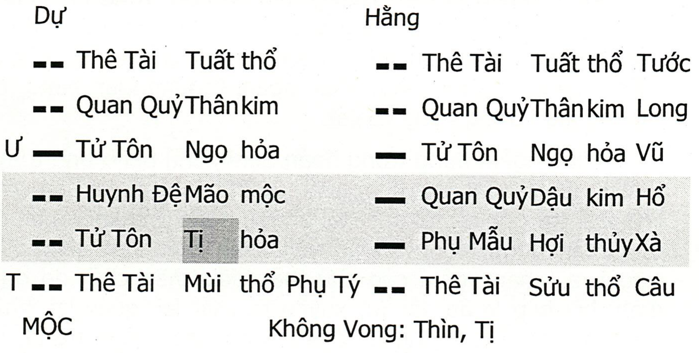
    - **Hình này chứng minh điều gì**
      - Chứng minh hôn nhân thành tựu dù nội quái phản ngâm, mâu thuẫn nhanh chóng hóa giải và kết hôn vào năm 1998.
    - **Từ đâu mà thấy được**
      - Thê Tài Mùi thổ trì Thế vượng, nội quái Khôn biến Tốn phản ngâm, Tị hỏa sinh Thế hóa Hợi thủy bị năm Dần hợp trú.

#### Ứng nghiệm thực tế
- Toàn bộ các điểm phán đoán về tính chất quan hệ, ngoại hình, gia cảnh, mâu thuẫn tháng Dậu và việc thuận lợi lấy giấy kết hôn đều ứng nghiệm chuẩn xác.
- Hai người đã chính thức tổ chức lễ cưới vào tháng Dậu năm Mậu Dần (1998).

### Ví dụ 2: Ngày Ất Mùi tháng Giáp Ngọ năm Bính Tý, đoán về tìm giám đốc nhà máy, được Phong Hỏa Gia Nhân biến Địa Sơn Khiêm

#### Dữ liệu quẻ và xác định Dụng thần
- Dữ kiện thời gian: Ngày Ất Mùi, tháng Giáp Ngọ, năm Bính Tý.
- Tuần không: Thìn, Tị (Mộc Tuần Không).
- Quẻ dự đoán: Phong Hỏa Gia Nhân biến Địa Sơn Khiêm.
- Xác định Dụng thần: Đi tìm giám đốc nhà máy nhờ giúp đỡ giải quyết công việc, lấy Quan Quỷ và hào Ứng làm Dụng thần, đồng thời xét mối quan hệ sinh khắc giữa Thế và Ứng.

#### Các bước suy luận và phân tích tượng quẻ
- Phân tích khả năng đạt thành ý nguyện khi nhờ vả:
  - Hào Ứng Tử Tôn Tị hỏa phát động tương sinh hào Thế Thê Tài Sửu thổ (Tị hỏa sinh Sửu thổ), biểu thị khi đến mở lời cầu viện thì đối phương chắc chắn sẽ nhiệt tình đồng ý giúp đỡ.
  - Quan Quỷ Dậu kim không xuất hiện trên quẻ, phục tàng dưới hào 3 Phụ Mẫu Hợi thủy; hào Thế Thê Tài Sửu thổ bị Nhật thần Mùi thổ xung thành ám động (Sửu Mùi tương xung); Quan Quỷ Dậu kim nhập Mộ ở hào Thế Sửu thổ (Kim Mộ tại Sửu), báo hiệu đối phương sẽ cảm động và xiêu lòng trước lễ vật, quà cáp mà đương số mang đến.
- Chi phí tiêu tốn trong quá trình lo liệu công việc:
  - Trong quẻ có hai hào Huynh Đệ đồng thời phát động (hào sơ Huynh Đệ Mão mộc và hào 6 Huynh Đệ Mão mộc), tượng trưng cho việc đi nhờ cậy tất sẽ phải hao tài tốn của.
  - Hào sơ Huynh Đệ Mão mộc động hóa Thê Tài Thìn thổ, lại lâm Thanh Long chủ chuyện hỷ sự; đây là điềm báo "tiền mất tật mang được việc", tức hao tài ở chỗ này nhưng sẽ kiếm lại được tài lợi bù đắp ở chỗ khác.
- Luận giải ý nghĩa Ngoại quái Phản ngâm:
  - Quẻ có ngoại quái phản ngâm (Phong quái Tốn biến Địa quái Khôn: Mùi thổ biến Sửu thổ, Tị hỏa biến Hợi thủy, Mão mộc biến Dậu kim xung nhau).
  - Tượng phản ngâm trong trường hợp này không phải là người ta đi vắng làm mình phải cất công đi lại hai lần, mà chính là sau khi công việc đã giải quyết xong xuôi, bản thân đương số sẽ cảm thấy hối hận, tiếc rẻ.
- Căn cứ luận đoán việc cầu giám đốc thuận lợi nhưng sau đó hối hận vì tặng quà:
  - **Hình 104.** Sơ đồ quẻ Phong Hỏa Gia Nhân biến Địa Sơn Khiêm
    - 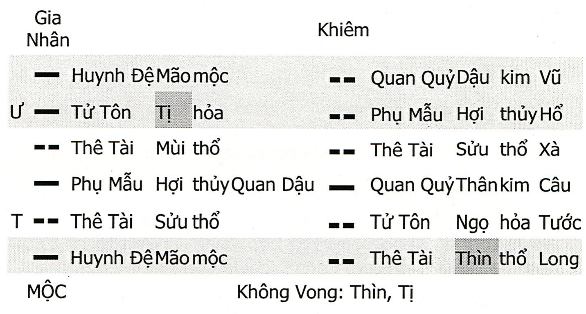
    - **Hình này chứng minh điều gì**
      - Chứng minh việc nhờ vả thành công ngay lập tức nhưng ngoại quái phản ngâm chủ sau khi xong việc sinh tâm lý tiếc của, hối hận.
    - **Từ đâu mà thấy được**
      - Hào Ứng Tị hỏa động sinh Thế Sửu thổ, Quan Quỷ Dậu kim phục nhập Mộ ở Thế, ngoại quái Tốn biến Khôn phản ngâm.

#### Ứng nghiệm thực tế
- Người xin đoán kể lại rằng: Anh ta mang một cây thuốc lá đến tìm vị giám đốc nhà máy, đối phương lập tức nhận lời giúp đỡ mà không hề chần chừ hay gây khó khăn gì.
- Sau khi công việc được lo liệu xong một cách quá trơn tru, anh ta nhận thấy việc này thực ra chẳng tốn chút công sức nào của giám đốc, tự dưng lại đem biếu không một cây thuốc lá đắt tiền nên trong lòng nảy sinh tâm lý tiếc của và vô cùng hối hận.

### Ví dụ 3: Ngày Nhâm Tuất tháng Tân Hợi năm Đinh Sửu, nữ đoán về mối quan hệ với một người đàn ông, được Phong Thiên Tiểu Súc biến Địa Thiên Thái

#### Dữ liệu quẻ và xác định Dụng thần
- Dữ kiện thời gian: Ngày Nhâm Tuất, tháng Tân Hợi, năm Đinh Sửu.
- Tuần không: Tý, Sửu (Mộc Tuần Không).
- Quẻ dự đoán: Phong Thiên Tiểu Súc biến Địa Thiên Thái.
- Xác định Dụng thần: Nữ đoán chuyện nhân duyên với người nam, lấy Quan Quỷ làm Dụng thần.

#### Các bước suy luận và phân tích tượng quẻ
- Vạch trần bản chất mối quan hệ bất hợp pháp:
  - Hào 3 Thê Tài Thìn thổ được Nhật thần Tuất thổ xung thành ám động (Thìn Tuất tương xung), khiến cho hào Thế Phụ Mẫu Tý thủy lâm Huyền Vũ nhập Mộ tại Thìn thổ (Thủy Mộ tại Thìn).
  - Hào Phụ Mẫu đại diện cho giấy hôn thú, hôn nhân hợp pháp; Phụ Mẫu lâm Huyền Vũ (chủ mờ ám, vụng trộm) lại rơi vào cảnh nhập Mộ, là tượng chung sống bất hợp pháp, vạch rõ cô gái và người đàn ông này không phải là vợ chồng chính thức mà chỉ là mối quan hệ nhân tình lén lút sống chung.
- Bản chất quan hệ bao nuôi xây dựng trên cơ sở tiền bạc:
  - Dụng thần Quan Quỷ Dậu kim không hiện trên quẻ, phục tàng dưới hào 3 Thê Tài Thìn thổ; Phi thần và Phục thần tương hợp (Thìn Dậu lục hợp).
  - Hào 3 Thìn thổ ám động tương sinh Dụng thần Quan Quỷ Dậu kim, chứng tỏ cô gái này thường xuyên lén lút chu cấp rất nhiều tiền nong cho người nam.
  - Hào 3 là vị trí của giường chiếu, nơi sinh hoạt phòng the; hào Tài ám động tương sinh tương hợp với Dụng thần ngay tại hào 3, khẳng định mối quan hệ của hai người hoàn toàn xây dựng trên cơ sở xác thịt và tiền bạc.
  - Hào Ứng Thê Tài Mùi thổ chính là Dưỡng địa của hào Thế Phụ Mẫu Tý thủy (Thủy dưỡng tại Mùi), tượng trưng cho việc người đàn ông đối phương thực chất là kẻ được cô gái này lén lút bao nuôi, cung phụng.
- Gánh nặng kinh tế, tâm lý dằn vặt và sự bế tắc khó dứt bỏ:
  - Hào Ứng lâm Tài Mùi thổ tương khắc hào Thế Tý thủy, cho thấy đối phương đang tạo ra một áp lực kinh tế vô cùng nặng nề cho bản thân cô.
  - Hào Thế Tý thủy lâm Tuần Không, phản ánh tâm trạng của đương số vô cùng hoang mang, do dự bất định, tiến thoái lưỡng nan không biết phải tính sao.
  - Ngoại quái phản ngâm (Phong quái Tốn biến Địa quái Khôn: Mùi thổ biến Sửu thổ, Tị hỏa biến Hợi thủy, Mão mộc biến Dậu kim tương xung), chủ suy nghĩ đi tính lại trăm mối tơ vò mà không có lối thoát, trong lòng ngập tràn hối hận vì đã dấn thân vào mối quan hệ này.
  - Quẻ biến thành Địa Thiên Thái là quẻ Lục hợp, báo hiệu các mối quan hệ đan xen phức tạp bám víu, nhất thời trong một sớm một chiều rất khó cắt đứt dứt điểm.
- Căn cứ luận đoán quan hệ bao nuôi trai trẻ tốn kém và bế tắc khó dứt bỏ:
  - **Hình 105.** Quẻ Phong Thiên Tiểu Súc biến Địa Thiên Thái
    - 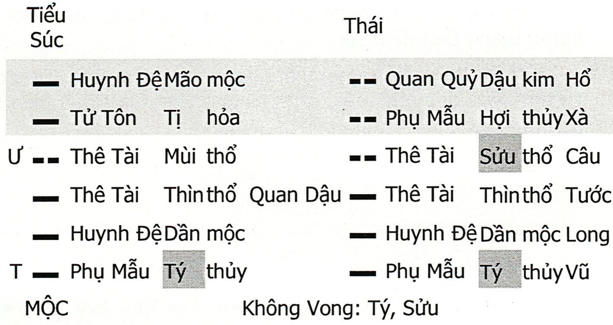
    - **Hình này chứng minh điều gì**
      - Chứng minh quan hệ nhân tình bao nuôi xây dựng trên tiền bạc, ngoại quái phản ngâm chủ hối hận day dứt, quẻ biến lục hợp khó dứt bỏ.
    - **Từ đâu mà thấy được**
      - Thế Phụ Tý lâm Vũ nhập Mộ ở hào 3 Thìn động sinh Quan phục, Ứng Mùi Tài khắc Thế Không, quẻ biến Thái lục hợp.

#### Ứng nghiệm thực tế
- Người phụ nữ thú nhận người đàn ông này thực chất là "trai bao" do một tay cô chu cấp, nuôi dưỡng.
- Cứ cách một thời gian, anh ta lại bày đủ lý do vòi vĩnh, đòi tiền cô; mỗi năm vì người tình này mà cô phải tiêu hao từ mười đến hai mươi vạn tệ.
- Năm nay do tình hình kinh doanh làm ăn của cô gặp nhiều thua lỗ khó khăn nên cô tha thiết muốn chia tay cắt đứt quan hệ, nhưng người đàn ông này kiên quyết bám riết không chịu buông tha.

### Ví dụ 4: Ngày Mậu Thân tháng Tân Hợi năm Nhâm Ngọ, nam gọi điện thoại đoán xem vợ sinh con vào ngày nào, được Phong Lôi Ích biến Địa Trạch Lâm

#### Dữ liệu quẻ và xác định Dụng thần
- Dữ kiện thời gian: Ngày Mậu Thân, tháng Tân Hợi, năm Nhâm Ngọ.
- Tuần không: Dần, Mão (Mộc Tuần Không).
- Quẻ dự đoán: Phong Lôi Ích biến Địa Trạch Lâm.
- Xác định Dụng thần: Đoán việc sinh nở của vợ, lấy hào Tử Tôn làm Dụng thần.

#### Các bước suy luận và phân tích tượng quẻ
- Phân tích triệu chứng đau đẻ giả từ tượng Phản ngâm:
  - Quẻ có ngoại quái phản ngâm (Phong quái Tốn biến Địa quái Khôn: Mùi thổ biến Sửu thổ, Tị hỏa biến Hợi thủy, Mão mộc biến Dậu kim xung nhau), chủ việc sinh nở nhiều lần khó khăn, trắc trở tái đi tái lại.
  - Đoán người vợ đã nhiều lần xuất hiện triệu chứng đau bụng chuyển dạ sắp sinh, nhưng rồi lại biến mất không sinh được.
  - Hào 5 Dụng thần Tử Tôn Tị hỏa lâm Nguyệt phá (tháng Hợi xung Tị hỏa), chứng tỏ trong tháng này chưa thể sinh con, cần phải chờ sang tháng sau khi không còn bị Nguyệt phá, tức phải bước sang tháng Tý mới có thể sinh nở.
- Đánh giá sức khỏe đứa trẻ, giới tính và ngày sinh:
  - Tử Tôn Tị hỏa tuy bị Nguyệt phá nhưng may nhờ có Nhật thần Thân kim tương hợp trợ lực (Tị Thân lục hợp giải phá); lại có Nguyên thần Huynh Đệ Dần mộc phát động hóa Huynh Đệ Mão mộc là Hóa Tiến thần sinh trợ mãnh liệt, khẳng định đứa trẻ sau khi sinh ra nhất định sẽ vô cùng khỏe mạnh, cứng cáp.
  - Định ngày sinh: Dụng thần Tử Tôn Tị hỏa lâm Nguyệt phá cần ứng vào ngày "hợp phá" (ngày Thân) hoặc "thực phá" (ngày Tị); do đó ngày sinh sẽ rơi vào ngày Tị hoặc ngày Thân trong tháng Tý.
  - Định giới tính: Hào Tử Tôn Tị hỏa là hào dương, tuy phát động nhưng đang ở trạng thái suy thoái hưu tù nên khó có thể biến hóa thành hào âm; do đó quả quyết sẽ sinh con trai.
- Căn cứ luận đoán việc sinh con lặp đi lặp lại nhiều lần chuyển dạ giả và ứng kỳ sinh nở:
  - **Hình 106.** Quẻ Phong Lôi Ích biến Địa Trạch Lâm
    - 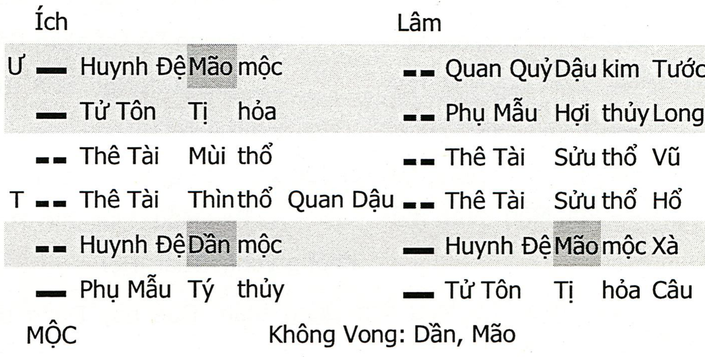
    - **Hình này chứng minh điều gì**
      - Chứng minh vợ nhiều lần đau bụng sắp sinh mà chưa sinh do ngoại quái phản ngâm, dự đoán sinh con trai khỏe mạnh vào ngày Thân tháng Tý.
    - **Từ đâu mà thấy được**
      - Ngoại quái Tốn biến Khôn phản ngâm, Tử Tôn Tị hỏa Nguyệt phá được Nhật Thân hợp, Nguyên thần Dần động hóa Tiến thần Mão.

#### Ứng nghiệm thực tế
- Người chồng kể rằng vợ anh ta đã nhập viện chờ sinh được 7 ngày theo đúng ngày dự sinh; trong bệnh viện thỉnh thoảng lại xuất hiện cơn đau quặn bụng như sắp đẻ, nhưng hễ gọi bác sĩ đến khám thì cơn đau lại lắng xuống, không có động tĩnh gì. Trớ trêu là ngay sau khi bác sĩ vừa rời đi thì triệu chứng đau bụng chuyển dạ lại tái phát dữ dội; tình trạng "báo động giả" ấy cứ lặp đi lặp lại suốt cả tuần lễ khiến cả nhà mệt mỏi hoang mang.
- Đến ngày Canh Thân tháng Tý, người vợ đã thuận lợi sinh hạ một bé trai kháu khỉnh bằng phương pháp mổ đẻ.

### Ví dụ 5: Ngày Tân Mùi tháng Canh Tuất năm Nhâm Ngọ, nam đoán bệnh cho cha, được Thiên Phong Cấu biến Thiên Địa Bĩ

#### Dữ liệu quẻ và xác định Dụng thần
- Dữ kiện thời gian: Ngày Tân Mùi, tháng Canh Tuất, năm Nhâm Ngọ.
- Tuần không: Tuất, Hợi (Kim Tuần Không).
- Quẻ dự đoán: Thiên Phong Cấu biến Thiên Địa Bĩ.
- Xác định Dụng thần: Con trai đoán bệnh cho cha ruột, lấy hào Phụ Mẫu làm Dụng thần.

#### Các bước suy luận và phân tích tượng quẻ
- Nhận định Dụng thần và đánh giá cát hung tổng quát:
  - Trong quẻ hào Phụ Mẫu lưỡng hiện (hào sơ Phụ Mẫu Sửu thổ và hào 6 Phụ Mẫu Tuất thổ); lấy Phụ Mẫu Tuất thổ lâm Tuần Không làm Dụng thần chính, đồng thời kiêm xét hào sơ Phụ Mẫu Sửu thổ trì Thế.
  - Dụng thần Phụ Mẫu Tuất thổ được Nhật Mùi và Nguyệt Tuất đồng thanh tỉ phù vượng tướng, bề ngoài chưa thể đoán ngay là điềm đại hung; tuy nhiên nội quái lại gặp Phản ngâm (Phong quái Tốn biến Địa quái Khôn: Sửu biến Mùi, Hợi biến Tị, Dậu biến Mão đều tương xung).
  - Nguyên thần Quan Quỷ Ngọ hỏa khí lực rất suy nhược, lại bị Nhật thần Mùi thổ tương hợp giữ chân (Ngọ Mùi lục hợp) nên không thể trợ lực sinh Dụng thần, tạo thành điềm triệu bất cát.
- Phân tích triệu chứng bệnh tật, các bộ phận phát bệnh và diễn biến:
  - Hào 6 Phụ Mẫu Tuất thổ lâm Tuần Không lại không được Nguyên thần sinh trợ; hào 6 chủ về đầu, quẻ Cấu thuộc cung Càn cũng chủ về đầu não, cho thấy người cha mắc bệnh nặng ở vùng đầu.
  - Hào 6 cũng đại diện cho cánh tay, hào sơ đại diện cho đôi chân; hào sơ Phụ Mẫu Sửu thổ lâm Bạch Hổ (chủ bệnh tật, đau đớn, tai ương), biểu thị tay chân người bệnh cũng gặp vấn đề bệnh tật nặng nề.
  - Nội quái phản ngâm phản ánh bệnh tình diễn biến thất thường, lúc nặng lúc nhẹ, tái phát liên miên.
  - Hào 3 là vị trí của giường chiếu; hào 3 Huynh Đệ Dậu kim phát động làm tiết khí Dụng thần (thổ sinh kim), lại động hóa Thê Tài Mão mộc là Kỵ thần tương khắc Dụng thần, nằm trọn trong nội quái phản ngâm, tượng trưng cho người bệnh đêm nào cũng trằn trọc mất ngủ, trăn trở trằn trọc trên giường không tài nào chợp mắt.
  - Hào 2 Tử Tôn Hợi thủy đại diện cho y dược điều trị, phát động hóa Quan Quỷ Tị hỏa là Nguyên thần, biểu thị tình trạng bệnh tật hiện tại chủ yếu nhờ vào thuốc men cầm cự duy trì.
  - Dự báo nguy cơ tương lai: Hiện tại Dụng thần Tuất thổ đang lâm Tuần Không nên tạm thời chưa nguy hại tính mạng; cần hết sức đề phòng đến năm Bính Tuất (2006) khi Dụng thần Xuất Không, Thực Không thì tai họa hung hiểm sẽ phát tác khôn lường.
- Căn cứ luận đoán các chứng bệnh của người cha và nguy cơ phát tác hung họa:
  - **Hình 107.** Quẻ Thiên Phong Cấu biến Thiên Địa Bĩ
    - 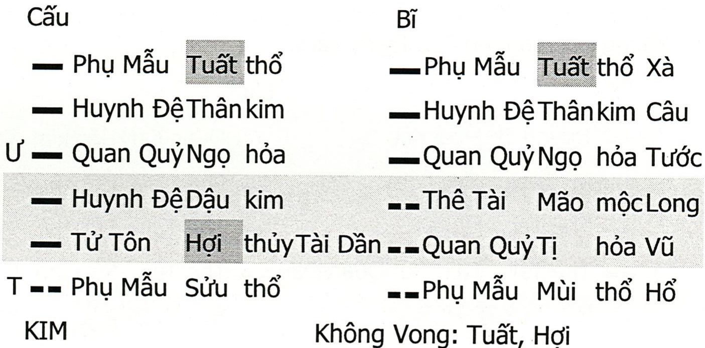
    - **Hình này chứng minh điều gì**
      - Chứng minh bệnh tình lúc nặng lúc nhẹ, mất ngủ trằn trọc, bệnh ở đầu và tứ chi, duy trì nhờ thuốc, nội quái phản ngâm.
    - **Từ đâu mà thấy được**
      - Dụng Phụ Tuất Không ở hào 6 Càn, Phụ Sửu lâm Hổ hào 1, hào 3 Dậu động tiết Dụng hóa Tài phản ngâm, Tử Hợi động hóa Quan Tị.

#### Ứng nghiệm thực tế
- Người con xác nhận cha anh ta mắc hai chứng bệnh nan y chính là bệnh cao huyết áp (bệnh ở đầu) và bệnh cường giáp trạng.
- Tứ chi chân tay ông thường xuyên bị tê dại, run rẩy không vững; ban đêm ông bị chứng mất ngủ hành hạ nghiêm trọng, ngủ không yên giấc, hằng ngày đều phải dựa vào uống thuốc an thần liều cao để cầm cự qua ngày.

## Chương 17: Phục Ngâm Biện Nghĩa

### Khái Niệm Bản Chất Và Ứng Dụng Biện Nghĩa Của Phục Ngâm

- Bản chất học thuật và giá trị dự báo của hiện tượng Phục Ngâm:
  - Tương tự như phản ngâm, phục ngâm trong phần lớn trường hợp thực chiến đều ứng nghiệm điềm hung họa, trắc trở, đau buồn.
  - Biện giải về quy tắc nạp giáp Càn - Chấn: Những năm gần đây có quan điểm cho rằng phép nạp giáp cổ truyền sai lầm vì gán cho hai quẻ Càn và Chấn nạp chi giống nhau (đều khởi Tý, Dần, Thìn), từ đó tự ý sửa đổi nạp giáp. Tác giả khẳng định quan điểm sửa đổi này là ấu trĩ, hoàn toàn không thấu triệt chỗ tuyệt diệu thâm sâu của Dịch học.
  - Chính nhờ Càn và Chấn nạp chi đồng nhất mới tạo ra hiện tượng phục ngâm đặc thù; nếu gạt bỏ hiện tượng phục ngâm thì hệ thống Lục Hào sẽ mất đi nguồn thông tin dự trắc vô cùng phong phú và chính xác.
- Ý nghĩa biểu trưng của Phục Ngâm trong đoán bệnh tật và nhân sự:
  - Trong đoán bệnh tật: Phục ngâm chủ về người bệnh đau đớn nằm liệt trên giường, trong bụng khó chịu bứt rứt, rên rỉ than vãn không dứt, bệnh tình di căn tái phát, bên trong phủ tạng biến đổi xấu, đau đớn ở chỗ kín đáo khó giãi bày, u sầu trầm uất, nặng nề trong lòng.
  - Trong đoán việc đời và trạng thái tâm lý: Phục ngâm chủ về nội bộ biến động, nội bộ chuyển dịch xê dịch, hành động dài dòng dùng dằng, nói năng cà lăm lắp bắp, sôi bụng cồn cào, khóc lóc bi thương đau lòng, lẩm bẩm một mình, nói nhảm, nói mớ khi ngủ, tự dằn vặt oán trách bản thân, do dự ngập ngừng không tiến, quẩn quanh giẫm chân tại chỗ.
  - Nguyên tắc suy diễn: Các hiện tượng nêu trên là gợi ý khái quát, người dự trắc phải căn cứ tường tận vào thực tế quái tượng và câu hỏi để suy diễn linh hoạt.

### Ví dụ 1: Nữ Đoán Con Trai Thi Cấp Ba (Lôi Thiên Đại Tráng Biến Địa Lôi Phục)

- Bối cảnh thời gian và sự kiện chiêm đoán:
  - Ngày Quý Mùi, tháng Giáp Dần, năm Mậu Dần (Tuần không: Thân, Dậu).
  - Một người mẹ đến xin chiêm đoán xem sau này con trai thi tuyển vào cấp ba (trung học phổ thông) kết quả ra sao.
  - Gieo được quẻ Lôi Thiên Đại Tráng biến Địa Lôi Phục.
- Thiết lập Dụng thần và nhận định tổng quan:
  - Xem việc thi cử tuyển sinh, lấy Quan Quỷ (công danh, danh thứ xếp hạng) và Phụ Mẫu (văn thư, trường ốc thi cử) làm Dụng thần.
  - Quẻ có Quan Quỷ Dần mộc lâm Nguyệt kiến, sinh trợ cho Phụ Mẫu Ngọ hỏa; hào Phụ Mẫu Ngọ hỏa lại trì Thế, được Quan Quỷ phát động tương sinh (Dần mộc sinh Ngọ hỏa).
  - Thoạt nhìn bề ngoài đây là tượng đại cát đại lợi cho đường thi cử học hành.
- Phân tích hung cơ và diễn biến tâm lý hành vi của người con:
  - Điểm hung cốt tử: Không nên nội quái Càn biến nội quái Chấn thành tượng phục ngâm; đồng thời Tử Tôn Thân kim bị Nguyệt kiến Dần mộc xung phá (Nguyệt phá) lại lâm Tuần Không.
  - Tinh thần và tính cách: Tử Tôn gặp Không Vong chủ về đầu óc thiếu tập trung, năng lực tư duy bế tắc đình trệ; lâm Đằng Xà chủ về tính nết lập dị, quái gở.
  - Học lực thực tế: Tử Tôn bị Nguyệt kiến Quan Quỷ xung phá, mà Quan Quỷ đại diện cho danh thứ (xếp hạng học tập), chứng tỏ học lực của đứa con quá kém cỏi, ở trường lớp không hề có thứ hạng.
  - Mê muội việc ngoài luồng: Phụ Mẫu Ngọ hỏa là Kỵ thần của Tử Tôn, phát động hóa ra Mộ khố của Tử Tôn (Sửu thổ); Phụ Mẫu là sách vở văn thư, lâm Mộ khố là tượng mê mẩn say đắm như nghiện rượu, tức đứa trẻ đắm chìm say mê sách báo ngoại khóa ngoài luồng.
  - Hành vi trốn học: Tử Tôn Thân kim lâm Dịch Mã tại hào 5; Dịch Mã chủ bôn tẩu trốn chạy, hào 5 là đường sá, báo hiệu đứa con thường xuyên trốn học la cà ngoài đường.
  - Kết cục phục ngâm: Nội quái phục ngâm chủ về giẫm chân tại chỗ, thi một lần chắc chắn không thể đỗ, phải lưu ban học lại hoặc thi lại.
- Luận giải quái tượng chứng minh việc học hành sa sút và thi hỏng:
  - **Hình 108.** Quẻ Lôi Thiên Đại Tráng biến Địa Lôi Phục
    - 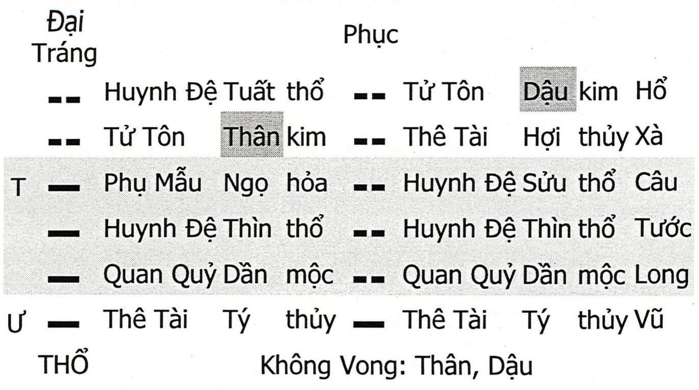
    - **Hình này chứng minh điều gì**
      - Con thi trượt cấp ba, say mê tiểu thuyết ngoại khóa, hay trốn học và phải thi lại do quẻ phục ngâm.
    - **Từ đâu mà thấy được**
      - Nội quái Càn biến Chấn phục ngâm; Tử Tôn Thân kim phùng Không, Nguyệt phá; Kỵ thần Phụ Mẫu Ngọ hỏa hóa Mộ khố.
- Lời xác nhận của người mẹ và ứng nghiệm thực tế:
  - Người mẹ nghe xong hoàn toàn thừa nhận: Con trai ở nhà quả thực không chịu học hành, suốt ngày say mê đọc tiểu thuyết võ hiệp quên ăn quên ngủ.
  - Ứng nghiệm thực tế: Đến năm Canh Thìn (2000) thi tuyển cấp ba, đứa con đã tự ý bỏ trốn khỏi nhà ngay trước ngày thi; gia đình túa đi tìm kiếm khắp nơi, đến khi lôi được nó về thì đã trễ giờ thi, không được vào phòng thi.

### Ví dụ 2: Bà Lão 86 Tuổi Đoán Vận Hạn Lưu Niên (Địa Thiên Thái Biến Thủy Lôi Truân)

- Bối cảnh thời gian và sự kiện chiêm đoán:
  - Ngày Quý Tị, tháng Bính Thìn, năm Mậu Dần (Tuần không: Ngọ, Mùi).
  - Một cụ bà 86 tuổi đến xin đoán vận hạn lưu niên trong năm.
  - Gieo được quẻ Địa Thiên Thái biến Thủy Lôi Truân.
- Xác định Dụng thần và nhận định họa phúc tổng quát:
  - Tự đoán hạn lưu niên cho bản thân, lấy hào Thế làm Dụng thần.
  - Thái Tuế Mậu Dần nhập quái vào hào 2 Quan Quỷ khắc phạt hào Thế Thìn thổ, báo hiệu trong năm ắt có tai ương bệnh tật.
  - Tuy nhiên hào Thế Thìn thổ lâm Nguyệt kiến, lại được Nhật kiến Quý Tị sinh phù (Hỏa sinh Thổ), nên tai họa giảm nhẹ, không nguy kịch tính mạng.
- Phân tích chi tiết bệnh chứng và tượng phục ngâm:
  - Tượng đau đớn nằm liệt giường: Hào Thế cư hào 3 lâm Chu Tước; nội quái Càn biến Chấn là tượng phục ngâm. Hào 3 đại diện cho giường chiếu; phục ngâm phối cùng Chu Tước là tượng nằm trên giường rên rỉ đau đớn triền miên.
  - Vị trí phát bệnh ở chân: Hào 2 nội quái Quan Quỷ Dần mộc động khắc Thế; hào 2 chủ về đôi chân, tất chức năng đi lại gặp trở ngại lớn.
  - Triệu chứng đau nhức: Kỵ thần hào 2 lâm Thanh Long; Thanh Long chủ đau đớn dữ dội, nên vì chân sưng đau mà không thể đi đứng bình thường.
  - Bệnh lý đường tiêu hóa: Thanh Long chủ ăn uống tiêu hóa, hào 2 là ruột; hào 3 Thìn thổ chủ dạ dày, tỳ vị; hào Thế bị hào 2 khắc biểu thị tạng phủ ruột và dạ dày đều phát bệnh.
  - Tắc nghẽn đại tiểu tiện: Thê Tài chủ phân và nước tiểu, ở đây Tài nhập Mộ tại hào Thế Thìn thổ; đó là tượng chất thải ứ đọng không thông xuống được, tất bị chứng táo bón kinh niên hoặc tiểu tiện bế tắc.
- Thọ mệnh sống còn và thời hạn ứng nghiệm:
  - Luận về tuổi thọ: Nguyên thần của hào Thế là Phụ Mẫu Tị hỏa phục tàng dưới hào 2; tuy hào 5 Thê Tài Hợi thủy phát động định khắc hại Phụ Mẫu, nhưng bị Thái Tuế Dần mộc hợp giữ (Dần Hợi lục hợp), tham hợp quên khắc; lại thêm Dụng thần hào Thế vượng tướng nên trong năm nhất định bảo toàn tính mạng.
  - Cảnh báo thời điểm bất lợi: Kỵ thần động bị hợp, cần đề phòng vào tháng Thân (xung khai Dần mộc giải hợp) sẽ gặp bất lợi về sức khỏe.
- Luận giải quái tượng chứng minh bệnh tình đau đớn và thọ mệnh của bà lão:
  - **Hình 109.** Quẻ Địa Thiên Thái biến Thủy Lôi Truân
    - 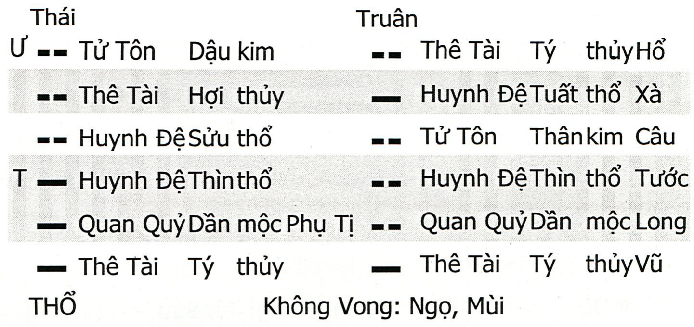
    - **Hình này chứng minh điều gì**
      - Bà lão bị sưng đau chân khó đi lại, táo bón nặng nằm rên trên giường, nhưng tính mạng bảo toàn nhờ hợp giải khắc.
    - **Từ đâu mà thấy được**
      - Thế hào 3 Chu Tước nội quái phục ngâm; hào 2 Dần mộc khắc Thế; Tài nhập Mộ ở Thế; Nguyên thần Phụ Mẫu được Thái Tuế hợp.
- Lời xác nhận của đương số và ứng nghiệm thực tế:
  - Bà lão cho biết: Bản thân quả thực mắc chứng táo bón mãn tính nặng, thường ngày việc đại tiện vô cùng gian nan.
  - Ứng nghiệm thực tế: Trong năm đó, chân bà lão đột ngột phát sưng phù đau nhức dữ dội, đi lại hết sức khó khăn, phải chạy chữa hơn một tháng trời mới thuyên giảm; do tuổi cao lú lẫn bà không nhớ đích xác phát bệnh vào tháng nào, chỉ nhớ xảy ra vào nửa cuối năm (khoảng thời gian thu đông Thân Dậu).

### Ví dụ 3: Đi Lấy Quần Áo Đặt May Thợ Đi Vắng (Lôi Thủy Giải Biến Thiên Trạch Lý)

- Bối cảnh thời gian và sự kiện chiêm đoán:
  - Ngày Bính Thìn, tháng Quý Tị, năm Ất Hợi (Tuần không: Tý, Sửu).
  - Tác giả đi đến tiệm lấy quần áo đã đặt may từ trước nhưng thợ may đi vắng, bèn gieo quẻ xem khi nào thợ may về và có lấy được đồ không.
  - Gieo được quẻ Lôi Thủy Giải biến Thiên Trạch Lý.
- Xác định Dụng thần và nhận định khả năng lấy đồ:
  - Xem thợ may lấy hào Ứng làm Dụng thần; xem quần áo lấy hào Phụ Mẫu làm Dụng thần.
  - Tượng phục ngâm ngoại quái: Ngoại quái Chấn biến Càn là ngoại quái phục ngâm, mang ý nghĩa cùng một địa điểm phải đi lại hai lần, hoặc cùng một công việc phải thực hiện hai lượt mới xong xuôi.
  - Thợ may có trả đồ không: Hào Ứng Thân kim được Nhật kiến Thìn thổ tương sinh, động sinh cho Phụ Mẫu Tý thủy; khẳng định chắc chắn sẽ lấy được quần áo, đối phương không hề quỵt đồ hay lừa dối.
- Vị trí cất giữ đồ, lỗi may mặc và hạn kỳ thợ về:
  - Vị trí cất đồ: Phụ Mẫu Tý thủy phục tàng dưới hào sơ, biểu thị quần áo không được treo ở chỗ sáng sủa nhìn thấy ngay, mà bị cất giấu sâu bên dưới hoặc bên trong.
  - Khả năng lấy trong ngày: Dụng thần Phụ Mẫu Tý thủy nhập Mộ ở Nhật kiến Thìn thổ; hào Thế Thìn thổ đồng hành với Nhật, là tượng quần áo nhập về thân mình, nội trong ngày hôm đó sẽ lấy được đồ.
  - Khuyết điểm quần áo may hỏng: Phụ Mẫu Tý thủy phục ở hào sơ, Phi thần Dần mộc phát động tiết khí; mặt khác Phi thần Dần mộc là đất Bệnh của Tý thủy (Thủy bệnh tại Dần), cho thấy quần áo may không chuẩn xác quy cách, có tì vết hoặc kích thước sai lệch.
  - Xảy ra cãi vã: Huynh Đệ Dần mộc lâm Chu Tước phát động, tất sinh khẩu thiệt, xảy ra to tiếng tranh cãi với thợ may.
  - Ứng kỳ thợ về: Phụ Mẫu Tý thủy phục tàng lại phùng Không Vong, đến giờ Ngọ xung xuất xung thực (Ngọ xung Tý làm lộ phục thần, xung khai Không Vong); do đó đúng giờ Ngọ quay lại lấy chắc chắn thợ may sẽ có nhà.
- Luận giải quái tượng chứng minh thời điểm gặp thợ may và chất lượng quần áo:
  - **Hình 110.** Sơ đồ quẻ Lôi Thủy Giải biến Thiên Trạch Lý
    - 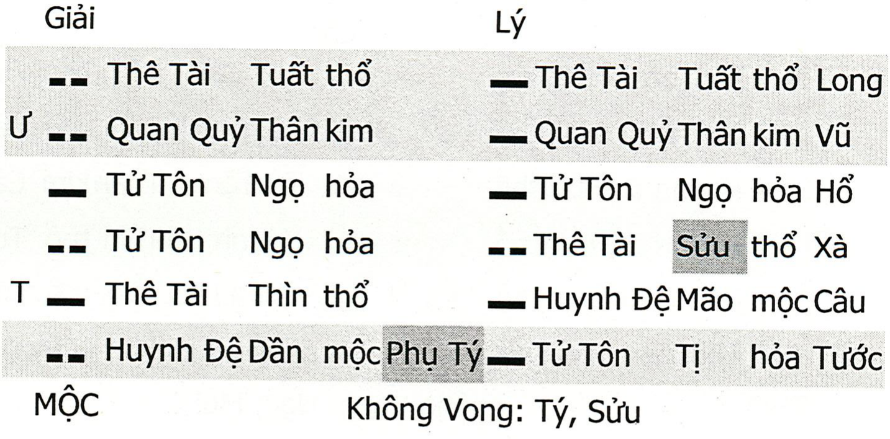
    - **Hình này chứng minh điều gì**
      - Thợ may về lúc giờ Ngọ, quần áo cất dưới gầm quầy bị lỗi kích thước gây cãi vã, phải đi hai lần mới lấy được.
    - **Từ đâu mà thấy được**
      - Ngoại quái Chấn biến Càn phục ngâm; Phụ Mẫu Tý thủy phục hào sơ phùng Không; Phi thần Dần mộc tiết khí lâm Tước động.
- Diễn biến thực tế và ứng nghiệm:
  - Đúng giờ Ngọ tác giả quay lại tiệm: Thợ may đã có mặt tại quán.
  - Người thợ cúi xuống lôi gói quần áo từ dưới gầm quầy hàng đưa ra; khi mặc thử phát hiện kích cỡ may không vừa vặn nên hai bên đã cãi cọ một hồi to tiếng; sau khi thợ chỉnh sửa lại xong xuôi, tác giả mới nhận quần áo mang về.

### Ví dụ 4: Người Đàn Ông Bị Mất Tiền Tìm Kiếm (Thiên Sơn Độn Biến Lôi Sơn Tiểu Quá)

- Bối cảnh thời gian và sự kiện chiêm đoán:
  - Ngày Giáp Dần, tháng Quý Tị, năm Bính Tý (Tuần không: Tý, Sửu).
  - Một người đàn ông bị mất tiền, đến nhờ đoán xem có tìm lại được không và tiền đang ở đâu.
  - Gieo được quẻ Thiên Sơn Độn biến Lôi Sơn Tiểu Quá.
- Xác định Dụng thần và định lượng số tiền đánh mất:
  - Tìm tiền bạc thất lạc, lấy hào Thê Tài làm Dụng thần.
  - Định lượng số tiền: Thê Tài Dần mộc không xuất hiện trên quẻ, phục tàng dưới hào Thế Quan Quỷ Ngọ hỏa; tính số Tiên thiên Bát quái: ngoại quái Càn là số 1, nội quái Cấn là số 7, cộng thêm vị trí hào của Dụng thần là hào 2 (1 + 7 + 2 = 10); từ đó suy đoán người này bị mất đúng 100 tệ.
- Phân tích dấu hiệu không mất và phạm vi thất lạc:
  - Điềm báo tiền không mất: Thê Tài Dần mộc phục dưới hào Thế, lại lâm Nhật kiến Giáp Dần sinh trợ cho hào Thế Ngọ hỏa; hoàn toàn không có dấu hiệu bị trộm cắp hay phá tài thất tán.
  - Dấu hiệu phục ngâm: Ngoại quái Càn biến Chấn là ngoại quái phục ngâm, chứng tỏ tiền chỉ bị xê dịch chuyển dời vị trí cục bộ mà thôi.
  - Phạm vi không gian: Hào 2 là trạch (nhà cửa, phòng ốc), Tài phục ngay tại hào 2, kết hợp tượng phục ngâm, khẳng định tiền dù di chuyển nhưng chưa hề ra khỏi phòng.
- Định vị chính xác nơi cất giấu / rơi rớt:
  - Quái tượng che khuất: Hào Tài phục tàng, lại thêm quẻ có tên là "Độn" (Độn nghĩa là thoái ẩn, giấu kín), biểu thị tiền đang nằm ở nơi mắt thường không nhìn thấy trực tiếp.
  - Hình tượng cái bàn làm việc: Nội quái là Cấn tượng như cái bàn (mặt phẳng bên trên, chân trụ bên dưới); Dụng thần Dần mộc chủ đồ vật bằng gỗ; phục dưới hào Thế lâm Chu Tước (Chu Tước chủ văn thư, giấy tờ sách vở); kết luận tiền đang nằm khuất dưới gầm bàn làm việc bằng gỗ trong phòng làm việc.
- Luận giải quái tượng chứng minh số tiền mất và vị trí tìm thấy:
  - **Hình 111.** Sơ đồ quẻ Thiên Sơn Độn biến Lôi Sơn Tiểu Quá
    - 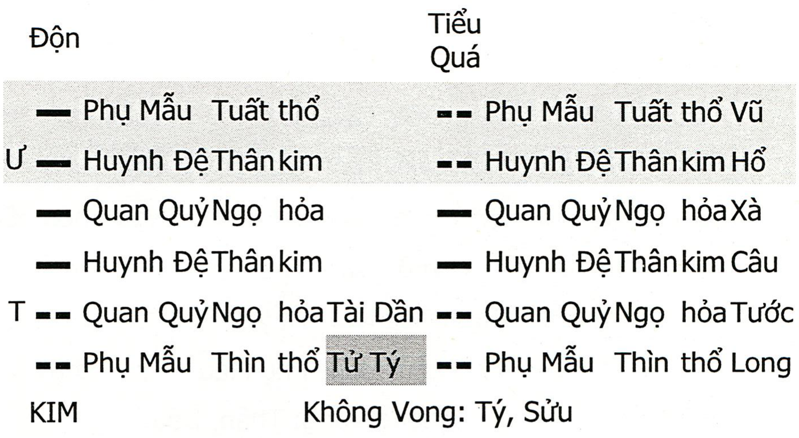
    - **Hình này chứng minh điều gì**
      - Số tiền mất đúng 100 tệ, không bị mất cắp mà chỉ xê dịch rơi dưới gầm bàn gỗ trong phòng làm việc.
    - **Từ đâu mà thấy được**
      - Tài Dần mộc lâm Nhật phục hào 2; số Càn 1 + Cấn 7 + hào 2 = 10; ngoại quái phục ngâm; nội Cấn là bàn gỗ lâm Chu Tước.
- Ứng nghiệm thực tế:
  - Người đàn ông nghe xong vội vàng quay trở lại phòng làm việc kiểm tra kỹ dưới chân bàn; quả nhiên tìm thấy đúng tờ tiền 100 tệ bị rơi nằm dưới gầm bàn.

### Ví dụ 5: Nam Đoán Bệnh Tình Cho Con Nhỏ (Hỏa Lôi Phệ Hạp Biến Càn Vi Thiên)

- Bối cảnh thời gian và sự kiện chiêm đoán:
  - Ngày Nhâm Ngọ, tháng Canh Tý, năm Bính Tý (Tuần không: Thân, Dậu).
  - Một người cha lo lắng đến xem bệnh tình cho đứa con nhỏ.
  - Gieo được quẻ Hỏa Lôi Phệ Hạp biến Càn Vi Thiên.
- Xác định Dụng thần và dự đoán tình trạng sinh tử cát hung:
  - Xem bệnh tật con nhỏ, lấy hào Tử Tôn làm Dụng thần.
  - Sinh khắc cát hung: Tử Tôn Tị hỏa tuy bị Nguyệt kiến Tý thủy khắc thương, nhưng may mắn được Nhật kiến Nhâm Ngọ tỉ phù (Tị Ngọ đều là Hỏa), lại có Huynh Đệ Dần mộc ở hào 2 nội quái phát động tương sinh (Dần mộc sinh Tị hỏa); Tử Tôn lâm Nhật đắc sinh, có bệnh không cần thuốc men chạy chữa cũng tự khắc khỏi hẳn, không hề nguy hiểm.
- Phân tích nguyên nhân phát bệnh và triệu chứng quấy khóc:
  - Căn nguyên sự cố: Hào 5 Thê Tài Mùi thổ lâm Đằng Xà phát động, hóa ra Quan Quỷ Thân kim; Thê Tài chủ thức ăn đồ uống, sữa mẹ; Quan Quỷ chủ bệnh tật; Đằng Xà chủ hoảng sợ, kinh hãi; hào 5 là vị trí cổ họng, thực quản và khí quản; suy đoán đứa nhỏ trong lúc ăn uống hoặc bú sữa đã bị sặc vào thực quản/khí quản dẫn tới hoảng sợ tắc nghẽn.
  - Tính chất bệnh biến ảo: Biến hào Quan Quỷ Thân kim vừa hưu tù lại lâm Tuần Không, nên thực chất cơ thể đứa trẻ không hề mắc chứng bệnh hiểm nghèo nào.
  - Tượng khóc quấy liên tục: Nội quái Chấn biến Càn là nội quái phục ngâm, chủ về đau rát khó chịu, đứa trẻ rên rỉ gào khóc ngằn ngặt không ngừng.
  - Hóa giải Thủy khắc: Hào sơ Phụ Mẫu Tý thủy tuy ám động định khắc Tị hỏa, nhưng bị hai tầng Thổ là Thê Tài Mùi thổ và Thìn thổ chế ngự; lại có Nguyên thần Dần mộc phát động thông quan (Thủy sinh Mộc sinh Hỏa), đứa trẻ bình an vô sự.
- Luận giải quái tượng chứng minh nguyên nhân phát bệnh của đứa trẻ:
  - **Hình 112.** Sơ đồ quẻ Hỏa Lôi Phệ Hạp biến Càn Vi Thiên
    - 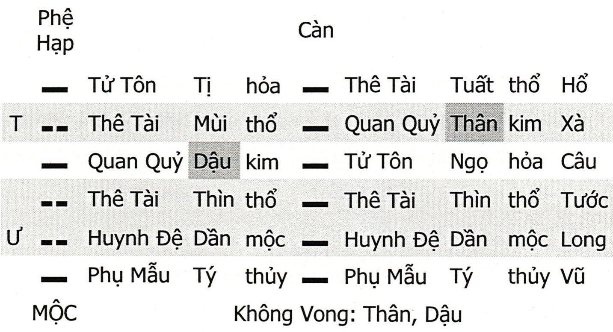
    - **Hình này chứng minh điều gì**
      - Đứa bé bị sặc sữa vào khí quản gây sợ hãi khóc ngằn ngặt, không phải viêm phổi và tự khỏi không cần thuốc.
    - **Từ đâu mà thấy được**
      - Tử Tôn Tị hỏa đắc Nhật tỉ trợ và hào 2 sinh; hào 5 Tài lâm Xà động hóa Quỷ phùng Không; nội quái phục ngâm.
- Ứng nghiệm thực tế:
  - Quả nhiên đứa nhỏ trong lúc bú sữa mẹ bị sặc một chút, sau đó ho sặc sụa và khóc lóc quấy khóc không dứt; gia đình hốt hoảng nghi con bị viêm phổi cấp nên đưa đi viện, kết quả bác sĩ khám xác nhận không có bệnh gì nghiêm trọng, chỉ là sặc sữa hoảng sợ.

### Ví dụ 6: Nữ Đoán Về Việc Điều Động Công Tác (Phong Thiên Tiểu Súc Biến Thiên Lôi Vô Vọng)

- Bối cảnh thời gian và sự kiện chiêm đoán:
  - Ngày Tân Mùi, tháng Đinh Mùi, năm Đinh Sửu (Tuần không: Tuất, Hợi).
  - Một người phụ nữ đến xin đoán việc xin điều động chuyển công tác.
  - Gieo được quẻ Phong Thiên Tiểu Súc biến Thiên Lôi Vô Vọng.
- Xác định Dụng thần và phân tích hung cơ bế tắc:
  - Hỏi việc điều chuyển công tác, nghề nghiệp sự nghiệp, lấy Quan Quỷ làm Dụng thần.
  - Trạng thái Dụng thần: Quan Quỷ Dậu kim không hiện trên quẻ, phục tàng dưới hào 3 Thê Tài Thìn thổ; tuy được Nhật kiến Tân Mùi và Nguyệt kiến Đinh Mùi tương sinh vượng tướng, nhưng lâm vào cảnh Phục Thần bị Phi thần Thìn thổ hợp chặt (Thìn Dậu lục hợp, phục thần bị hợp kìm chân không thể xuất hiện); lại thêm quẻ biến Thiên Lôi Vô Vọng là quẻ Lục Xung; do đó sự nghiệp bế tắc, không thể nào điều chuyển được.
- Phân tích tiểu nhân dèm pha và nỗi u uất nội tâm:
  - Tiểu nhân dèm pha cản trở: Hào Ứng Thê Tài Mùi thổ lâm Chu Tước phát động khắc hào Thế Phụ Mẫu Tý thủy; Chu Tước chủ khẩu thiệt điều tiếng thị phi, hào Ứng là đối phương/người ngoài khắc Thế, biểu thị có kẻ tiểu nhân nói xấu sau lưng, đặt điều dèm pha khiến việc điều chuyển thất bại.
  - Tượng phục ngâm quẩn quanh chỗ cũ: Nội quái Càn biến Chấn là nội quái phục ngâm; phục ngâm chủ về việc điều chuyển bất thành, giẫm chân tại chỗ quay về chốn cũ; trong lòng dằn vặt ôm nỗi đau khổ u uất.
  - Tâm trạng bức bối phẫn uất: Hào Thế Phụ Mẫu Tý thủy lâm Bạch Hổ; Bạch Hổ chủ buồn bực, không vui, thịnh nộ; bản thân người phụ nữ vô cùng tức tối, phẫn uất vì chuyện này.
- Luận giải quái tượng chứng minh kết quả xin điều động công tác:
  - **Hình 113.** Sơ đồ quẻ Phong Thiên Tiểu Súc biến Thiên Lôi Vô Vọng
    - 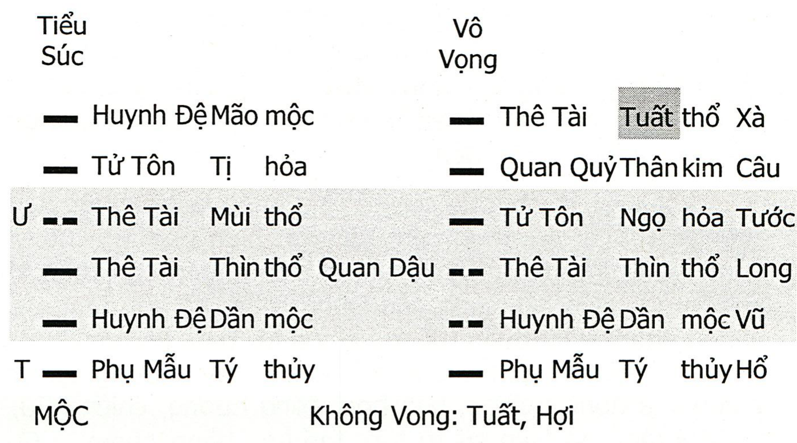
    - **Hình này chứng minh điều gì**
      - Việc xin chuyển công tác bất thành do bị dèm pha, giẫm chân tại chỗ ôm nỗi tức giận và về hưu sớm năm Nhâm Ngọ.
    - **Từ đâu mà thấy được**
      - Quan Quỷ Dậu kim phục dưới hào 3 Thìn thổ bị hợp trụ; biến quẻ Lục Xung; Ứng lâm Tước khắc Thế lâm Hổ; nội quái phục ngâm.
- Diễn biến thực tế và ứng nghiệm:
  - Hoàn cảnh ngộ sự tại cơ quan diễn ra hoàn toàn đúng như quẻ đoán: Kế hoạch xin điều chuyển công tác bị đổ vỡ hoàn toàn do có kẻ phá hoại, người phụ nữ phải tiếp tục ở lại làm việc tại chỗ cũ trong nỗi ấm ức bất mãn; đến năm Nhâm Ngọ (2002) bà đã làm thủ tục xin nghỉ hưu sớm.

## Chương 18: Luận Phương Cục Trong Lục Hào

### Khái niệm và nguyên lý ứng dụng phương cục trong Lục Hào

- Định nghĩa các phương cục trong ngũ hành:
  - Dần Mão Thìn tam hội hợp thành phương Đông Mộc cục.
  - Tị Ngọ Mùi tam hội hợp thành phương Nam Hỏa cục.
  - Thân Dậu Tuất tam hội hợp thành phương Tây Kim cục.
  - Hợi Tý Sửu tam hội hợp thành phương Bắc Thủy cục.
  - Trong môn Tứ trụ mệnh lý thường xuyên vận dụng phương cục, tuy nhiên trong toàn bộ các trước tác bốc phệ cổ điển kinh điển không hề đề cập đến phương cục.
- Ý nghĩa thực tiễn và giá trị cung cấp thông tin của phương cục trong Lục Hào:
  - Qua kiểm nghiệm thực tiễn lâm sàng, tác giả phát hiện phương cục hoàn toàn có thể ứng dụng đắc lực trong Lục Hào dự trắc.
  - Phương cục không can dự hay làm thay đổi cát hung sinh khắc cốt lõi của Dụng thần, mà có chức năng làm phong phú thêm tầng lớp thông tin, mở rộng bức tranh chi tiết của quẻ tượng.
  - Do phương cục là sự tụ hội của ba địa chi liền kề cùng tạo thành một luồng khí thế thuần nhất, nên phương cục biểu trưng cho: đồng nghiệp, bạn học, đồng hương, chiến hữu, bằng hữu, đối tác làm ăn, sự tụ tập đông người, thế lực, băng nhóm xã hội.
- Quy tắc cấu thành phương cục trong quẻ Lục Hào:
  - Đối với quẻ tĩnh: Các hào tĩnh vượng tướng cùng với Nhật kiến, Nguyệt kiến đều có tư cách nhập cục.
  - Đối với quẻ có hào động: Chỉ có Nhật kiến, Nguyệt kiến và các hào động phát mới có thể nhập cục; các hào tĩnh tuyệt đối không thể tham gia kết thành phương cục.

### Ví dụ 1: Nữ gọi điện thoại dự đoán việc mở cửa hàng ăn uống (Quẻ Thủy Phong Tỉnh)

- Thông tin thời gian gieo quẻ và bối cảnh sự việc:
  - Thời gian: Ngày Tân Sửu, tháng Mậu Thìn, năm Kỷ Mão.
  - Tuần Không: Thìn thổ và Tị hỏa lâm Không Vong (tuần Giáp Ngọ).
  - Tình huống: Một phụ nữ gọi điện thoại đến xin dự đoán xem có nên mở cửa hàng kinh doanh ăn uống hay không. Tác giả gieo được quẻ Thủy Phong Tỉnh (quẻ tĩnh).
- Suy luận Dụng thần và nhận định cát hung tài vận:
  - Mục đích mở tiệm buôn bán là cầu tài lộc kiếm tiền, vì vậy lấy hào Thê Tài làm Dụng thần.
  - Trong quẻ có Thê Tài lưỡng hiện: hào sơ Thê Tài Sửu thổ và hào 5 Thê Tài Tuất thổ. Chọn hào Nguyệt phá trì Thế là Thê Tài Tuất thổ làm Dụng thần (tháng Thìn xung Tuất vi Nguyệt phá).
  - Xét lực lượng Dụng thần: Mặc dù Nhật kiến Sửu thổ và Nguyệt kiến Thìn thổ đều mang ngũ hành Thê Tài trợ vượng, nhưng Dụng thần Tuất thổ bị Nguyệt phá nghiêm trọng; Nguyên thần sinh Tài là Tử Tôn Ngọ hỏa lại hưu tù và phục tàng dưới hào 4 Quan Quỷ Thân kim không hiện trên quẻ, do đó kết luận chắc chắn khó lòng thu được lợi nhuận.
- Phân tích trạch hào và phát hiện tượng hợp tác ba người từ phương cục:
  - Hào 2 là trạch hào, đại diện cho mặt bằng cửa hàng kinh doanh; hào 2 lâm Phụ Mẫu Hợi thủy thì tượng cửa tiệm càng thêm rõ rệt.
  - Phụ Mẫu Hợi thủy lâm hưu tù (bị Thìn Nguyệt và Sửu Nhật thổ khắc phạt), biểu thị quy mô cửa hàng nhỏ bé, không lớn.
  - Hào Ứng lâm tại hào 2: Đây là cách cục "Ứng nhập phi trạch". Cổ nhân khi xem phong thủy trạch viện luận là có người khác họ cùng chung sống; trong việc kinh doanh buôn bán, tượng này chỉ việc có người ngoài khác họ cùng bước chân vào cửa hàng, tức là điềm báo hợp tác chung vốn làm ăn.
  - Phát hiện phương cục: Xem xét hào 3 Quan Quỷ Dậu kim, hào 4 Quan Quỷ Thân kim và hào 5 Thê Tài Tuất thổ, ba chi Thân - Dậu - Tuất tương liên tiếp nối tạo thành phương Tây Kim cục. Tác giả từ đó quyết đoán có ba người cùng nhau hợp tác mở cửa hàng.
  - Căn cứ xác định ba người cùng chung một cơ quan đơn vị: Hào Thế Thê Tài Tuất thổ lâm Câu Trần; Câu Trần mang ý nghĩa tượng trưng là phòng làm việc, văn phòng công sở.
- Đối thoại thực tế, lời khuyên và kết quả ứng nghiệm:
  - Người nữ kinh ngạc xác nhận: "Đơn vị kinh doanh sa sút cho nên đã sa thải chúng tôi, ba đồng nghiệp vừa thương lượng, dự định cùng nhau mở cửa hàng."
  - Tác giả khuyên can chân thành là không nên đầu tư mở tiệm, nhưng nhóm ba người vẫn quyết định khai trương.
  - Ứng nghiệm thực tế: Đến tháng Ngọ cùng năm, do chính quyền tiến hành thi công mở rộng đường quốc lộ nên cửa hàng bị buộc phải tháo dỡ giải tỏa, kết cục ngay cả tiền vốn liếng bỏ ra ban đầu cũng không thu hồi lại được.
- Luận điểm và bằng chứng đồ hình quẻ Thủy Phong Tỉnh:
  - **Hình 114.** Quẻ Thủy Phong Tỉnh
    - 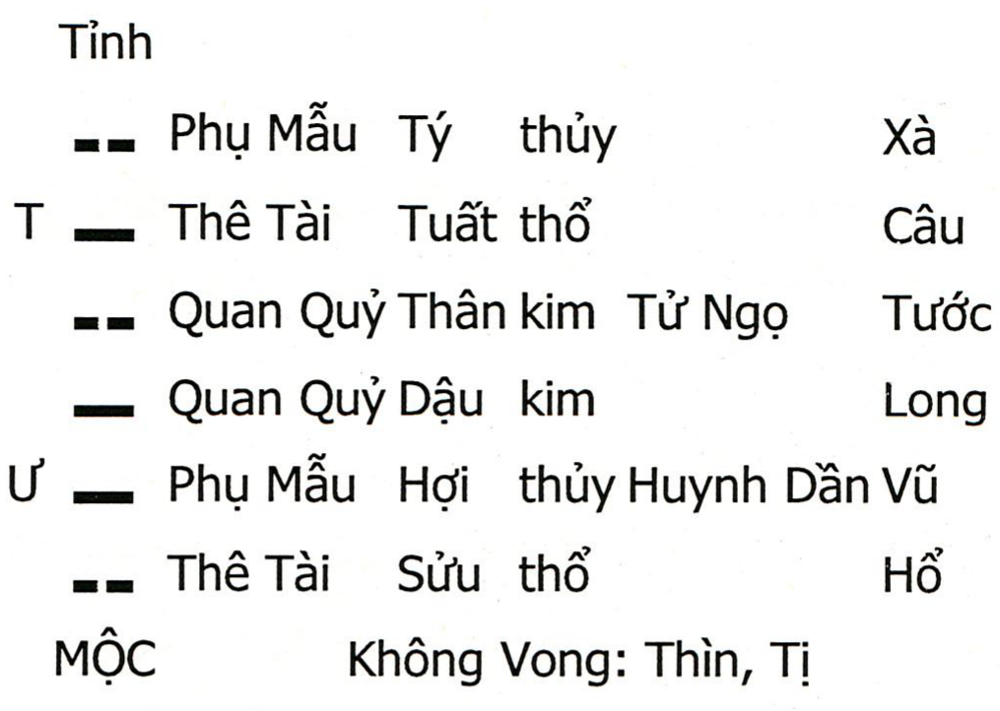
    - **Hình này chứng minh điều gì**
      - Dụng thần Thê Tài Tuất thổ lâm Thế bị Nguyệt phá báo hiệu kinh doanh phá tài mất vốn; ba hào Thân - Dậu - Tuất kết thành phương Tây Kim cục thể hiện ba đồng nghiệp cùng phòng làm việc hợp tác mở tiệm.
    - **Từ đâu mà thấy được**
      - Quẻ Tỉnh tĩnh, hào 5 Tài Tuất thổ lâm Câu Trần bị tháng Thìn xung phá; hào 2 Phụ Mẫu Hợi thủy trì Ứng nhập trạch; hào 3 Dậu kim, hào 4 Thân kim, hào 5 Tuất thổ liên tiếp kết thành phương Tây Kim cục.

### Ví dụ 2: Nữ đoán hôn nhân (Quẻ Sơn Phong Cổ biến Sơn Thủy Mông)

- Thông tin thời gian gieo quẻ và nhân vật đương sự:
  - Thời gian: Ngày Nhâm Thìn, tháng Canh Thân, năm Mậu Dần.
  - Tuần Không: Ngọ hỏa và Mùi thổ lâm Không Vong (tuần Giáp Thân).
  - Đương sự: Người phụ nữ sinh năm 1963 (Quý Mão, năm xem bói 35-36 tuổi) đến xin dự đoán về chuyện hôn nhân. Quẻ gieo được là Sơn Phong Cổ biến Sơn Thủy Mông.
- Suy luận tình trạng hôn nhân và năm kết hôn, sinh con trong quá khứ:
  - Quan Quỷ Dậu kim trì Thế vượng tướng (được Nguyệt kiến Thân kim tỷ hòa phò trợ, Nhật kiến Thìn thổ sinh hợp), khẳng định đây là người phụ nữ đã có gia đình kết hôn vững chắc.
  - Hào Thế Quan Quỷ Dậu kim là hào độc phát trong toàn quẻ. Động hào gặp trị gặp hợp: kết hợp với độ tuổi đương sự, vào năm Mậu Thìn 1988 (Thìn Dậu lục hợp, phu tinh gặp hợp), đoán cô kết hôn vào năm 1988.
  - Hào Tử Tôn Tị hỏa phục tàng dưới hào 5 Phụ Mẫu Tý thủy; phục thần gặp năm xuất hiện sẽ ứng nghiệm: Năm Kỷ Tị 1989 Tị hỏa xuất hiện, đoán cô sinh con vào năm 1989.
- Luận đoán rạn nứt hôn nhân, phát hiện kẻ thứ ba qua phương cục và thời điểm ly dị:
  - Quan Quỷ Dậu kim động hóa Tử Tôn Ngọ hỏa là hóa hồi đầu khắc; hào Ứng Huynh Đệ Dần mộc (phu vị) lâm Bạch Hổ lại bị Nguyệt kiến Thân kim xung phá vi Nguyệt phá, cho thấy vợ chồng khó lòng sống chung đến đầu bạc răng long.
  - Trong quẻ, Quan Quỷ Dậu kim hợp cùng Nhật thần Thìn thổ; hào 4 Thê Tài Tuất thổ bị Nhật thần Thìn thổ xung thành ám động sinh phù cho Quan Quỷ Dậu kim, báo hiệu có người phụ nữ thứ ba chen chân vào phá vỡ hạnh phúc gia đình.
  - Xác định thân phận kẻ thứ ba qua phương cục: Hào Thế Quan Quỷ Dậu kim, hào 4 Thê Tài Tuất thổ ám động kết hợp cùng Nguyệt kiến Thân kim tạo thành phương Tây Kim cục Thân - Dậu - Tuất. Tác giả quyết đoán người thứ ba chen chân chính là bạn học của cô ấy, bởi vì hào Thế lâm Chu Tước chủ về văn thư, trường học, học hành.
  - Thời điểm ngoại tình: Hào Thê Tài Tuất thổ ám động sinh Quan Quỷ, ứng vào năm Giáp Tuất 1994 người bạn học này đã lén lút vụng trộm qua lại với chồng đương số.
  - Thời điểm ly hôn: Hào Ứng phu vị bị Nguyệt phá, đến năm Ất Hợi 1995 Dần Hợi tương hợp vi hợp phá; đồng thời hào 2 Phụ Mẫu Hợi thủy đại diện cho giấy đăng ký kết hôn nhập Mộ ở Nhật thần Thìn thổ, báo hiệu năm trị Hợi thủy (1995) sẽ bị thu hồi giấy chứng nhận kết hôn, do đó đoán năm 1995 hai người chính thức ly dị.
- Dự đoán hiện trạng và triển vọng tái hôn trong tương lai:
  - Năm Mậu Dần 1998: Hào Ứng Dần mộc thực phá, tuy có người giới thiệu đối tượng nhưng Dần là Tuyệt địa của Quan Quỷ Kim nên chuyện không thành.
  - Hiện tại Quan Quỷ Dậu kim hợp với Nhật thần Thìn thổ, đến năm Kỷ Mão 1999 Mão mộc xung Thìn thổ khai hợp, dự đoán sẽ có niềm vui tái giá.
  - Tuy nhiên, do Quan Quỷ Dậu kim động hóa hồi đầu khắc, hào biến Tử Tôn Ngọ hỏa lại lâm Tuần Không, nên hậu vận khó có được cuộc hôn nhân mỹ mãn trọn vẹn.
- Đối thoại xác nhận và phản hồi thực tế:
  - Hỏi lại đương sự, cô xác nhận toàn bộ quá khứ: Quả nhiên người chồng bị chính bạn học của cô quyến rũ; đúng năm 1988 kết hôn, năm 1989 sinh con trai, năm 1994 chồng ngoại tình lén lút, năm 1995 hai người ra tòa ly hôn. Năm 1998 đúng là có người mai mối giới thiệu nhưng vì hai bên bất đồng không hợp tính nên hôn sự không thành.
  - Đối với dự đoán năm 1999 tái hôn, về sau không có thêm thông tin phản hồi nên không rõ kết quả thực tế.
- Luận điểm và bằng chứng đồ hình quẻ Sơn Phong Cổ biến Sơn Thủy Mông:
  - **Hình 115.** Sơ đồ quẻ Sơn Phong Cổ biến Sơn Thủy Mông
    - 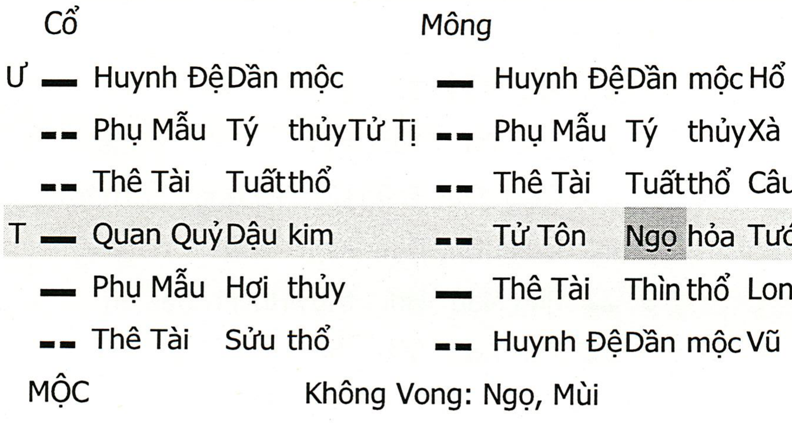
    - **Hình này chứng minh điều gì**
      - Thế Quan Dậu độc phát hóa hồi đầu khắc và Ứng Nguyệt phá báo hiệu hôn nhân tan vỡ năm 1995; Nguyệt Thân, Thế Dậu và Tài Tuất ám động hợp phương Tây Kim cục vạch trần kẻ thứ ba chính là bạn học.
    - **Từ đâu mà thấy được**
      - Hào 3 Quan Dậu kim động hóa Tử Tôn Ngọ hỏa hồi đầu khắc, lâm Chu Tước; hào 4 Tài Tuất thổ bị Nhật Thìn xung ám động sinh Thế; Ứng Dần mộc lâm Hổ bị Nguyệt Thân xung phá.

### Ví dụ 3: Nữ ở Ngũ Đài Sơn đoán khi nào nhà mẹ xây xong (Quẻ Phong Thủy Hoán)

- Thông tin thời gian gieo quẻ và câu hỏi dự đoán:
  - Thời gian: Ngày Ất Mùi, tháng Quý Mùi, năm Canh Thìn.
  - Tuần Không: Thìn thổ và Tị hỏa lâm Không Vong (tuần Giáp Ngọ).
  - Tình huống: Người phụ nữ ở Ngũ Đài Sơn đến nhờ xem khi nào căn nhà của mẹ cô mới có thể xây dựng xong xuôi. Quẻ gieo được là Phong Thủy Hoán (quẻ tĩnh).
- Xác định Dụng thần và luận giải tiến trình phê duyệt đất đai, khởi công xây dựng:
  - Hỏi về nhà cửa lấy hào Phụ Mẫu làm Dụng thần (trong quẻ có Phụ Mẫu Mão mộc tại hào 6 và Phụ Mẫu Dần mộc tại hào sơ). Nguyên thần sinh Phụ Mẫu là Quan Quỷ Thủy, đại diện cho mảnh đất xây dựng và nền móng công trình.
  - Nguyên thần Quan Quỷ Hợi thủy không xuất hiện trên quẻ (phục tàng dưới hào 3 Huynh Đệ Ngọ hỏa), tác giả lập tức đoán định: Mảnh đất xây dựng hiện nay vẫn chưa được chính quyền phê duyệt giấy tờ.
  - Thời điểm phê duyệt đất: Tháng Hợi năm Canh Thìn sẽ chính thức được phê duyệt cấp phép. Nguyên nhân do Dụng thần Phụ Mẫu Mộc hưu tù ở hai tháng Mùi rất cần được Trường Sinh (Mộc trường sinh tại Hợi); Nguyên thần Quan Quỷ Hợi thủy phục tàng cần gặp tháng trị xuất hiện để sinh Dụng thần Phụ Mẫu (Phụ Mẫu chủ về giấy tờ, chứng từ cấp phép).
  - Thời điểm khởi công xây cất: Tháng Tị năm sau (Tân Tị 2001) sẽ khởi công xây nhà. Căn cứ vào hào 5 Huynh Đệ Tị hỏa lâm Thế Không Vong; đến tháng Tị năm sau hào Thế xuất Không, phát lực xung khởi phục thần Quan Quỷ Hợi thủy; Quan Quỷ Hợi thủy lâm phi thần Câu Trần (Câu Trần chủ về kiến thiết, xây dựng) sinh trợ Phụ Mẫu nên tiến hành khởi công xây nhà.
- Phân tích chi tiết phong thủy nơi ở của người mẹ và phương Đông Mộc cục:
  - Đang ở nhờ nhà người khác: Hào Ứng lâm tại hào 2 (trạch hào), cấu thành tượng "Ứng phi nhập trạch". Đang hỏi về việc mẹ xây nhà, Ứng đại diện cho người khác, Ứng nhập trạch hào biểu thị căn nhà mẹ đang cư ngụ hiện tại thực chất là nhà của người khác họ.
  - Con đường dẫn vào nhà phải qua cây cầu cạn: Hào 5 là đường đi, Huynh Đệ Tị hỏa lâm Bạch Hổ tương sinh hào 2 trạch hào Thìn thổ, nên Tị hỏa chính là tuyến đường huyết mạch bắt buộc phải đi qua để vào nhà mẹ. Tị hỏa lâm Không Vong, đường lộ lâm Không chính là hình ảnh chiếc cầu bắc qua. Tị hỏa là Tuyệt địa của Thủy, cho nên bên dưới gầm cầu hoàn toàn không có dòng nước chảy.
  - Gần nhà có chùa miếu: Trạch hào là Tử Tôn Thìn thổ, Thìn chính là Thủy khố (Mộ khố của Thủy); Thủy là Quan Quỷ đại diện cho thần phật, nên Mộ khố của Quan Quỷ biểu trưng cho chùa miếu tâm linh. Đoán phụ cận nơi mẹ đang ở có một ngôi đền, chùa hoặc miếu.
  - Nhà ẩn mình trong rừng cây bao bọc (Phương Đông Mộc cục): Hào 6 Phụ Mẫu Mão mộc, hào 2 trạch hào Tử Tôn Thìn thổ và hào sơ Phụ Mẫu Dần mộc liên kết hội tụ tạo thành phương Đông Mộc cục Dần - Mão - Thìn. Toàn bộ các hào vị trung gian bị hai đầu hào Mộc trên dưới bao bọc kẹp chặt, quyết đoán xung quanh nơi mẹ ở có một cánh rừng cây xanh ngát vây quanh, ngôi nhà thấp thoáng ẩn hiện giữa những tán cây.
  - Mẹ đã quy y cửa Phật: Hào Phụ Mẫu nhập Mộ ở Nhật Nguyệt Mùi thổ (Mộc khố). Nhật Nguyệt đều mang ngũ hành Tử Tôn Mùi thổ, mà Tử Tôn là tăng ni đạo sĩ quy y, đoán người mẹ đã quy y Phật pháp. Hào 2 trạch hào lâm Chu Tước (chủ âm thanh tụng niệm), biểu thị trong nhà mỗi ngày đều vang vọng tiếng niệm Phật không dứt.
- Suy đoán diện mạo, vận mệnh người con gái đến xem và chủ nhà:
  - Bản thân bị cận thị mắt trái: Hào Thế đại diện cho người xin đoán lâm Hỏa Không Vong; hào 5 là vị trí ngũ quan trên mặt, Hỏa tượng trưng cho đôi mắt, hào 5 là hào dương chủ về bên trái, do đó kết luận mắt trái của cô bị cận thị.
  - Số mệnh tha hương bôn ba: Hào Thế lâm Dịch Mã (ngày Mùi mã tại Tị), lại cư ngụ ở hào 5 (đường xa lộ khách), biểu thị bản thân cô là người sống phiêu bạt tha hương nơi xứ người.
  - Năm kết hôn và sinh con: Quan Quỷ Hợi thủy hưu tù phục tàng, kết hợp tuổi tác, vào các năm 1992 (Nhâm Thân) và 1993 (Quý Dậu) Kim vượng sinh Thủy nên kết hôn vào khoảng thời gian này (cô xác nhận kết hôn năm 1993). Tử Tôn Thìn thổ lâm Không Vong, đến năm Giáp Tuất 1994 Tuất thổ xung thực Thìn thổ, đoán cô sinh con năm 1994.
  - Đời sống vợ chồng nguội lạnh: Hào Khuê Phòng (hào 2) hưu tù không hiện trên quẻ, Quan Quỷ lại phục tàng dưới hào 3, đoán hiện tại hai vợ chồng rất hiếm khi chung giường ân ái.
  - Bệnh lý của chủ nhà nơi người mẹ ở nhờ: Hào Ứng là chủ nhà cư tại hào 2 Tử Tôn Thìn thổ. Thìn thổ thuộc bàng quang, ngộ Không Vong là bàng quang không tích trữ giữ được nước tiểu, quyết đoán chủ nhà mắc chứng đi tiểu rắt, tiểu nhiều lần trong ngày, thường xuyên phải đi vệ sinh.
- Phản hồi thực tế từ đương sự:
  - Toàn bộ mọi suy đoán chi tiết và tinh vi nêu trên đều được người con gái xác nhận ứng nghiệm hoàn toàn chuẩn xác.
- Luận điểm và bằng chứng đồ hình quẻ Phong Thủy Hoán:
  - **Hình 116.** Sơ đồ quẻ Hoán
    - 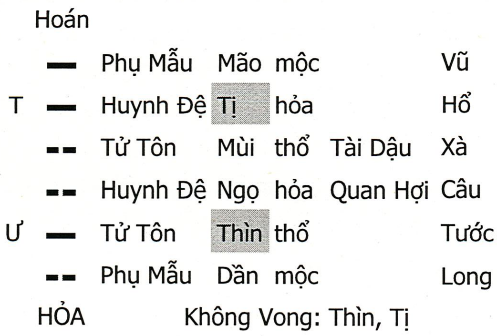
    - **Hình này chứng minh điều gì**
      - Nguyên thần Hợi thủy phục tàng đợi tháng Hợi phê duyệt đất, tháng Tị xuất Không xung khởi xây nhà; hào 1 Dần mộc, hào 2 Thìn thổ và hào 6 Mão mộc hợp phương Đông Mộc cục thể hiện nhà mẹ ở ẩn mình trong rừng cây rậm rạp.
    - **Từ đâu mà thấy được**
      - Quẻ Hoán tĩnh, Phụ Mẫu Dần Mão hưu tù nhập Mộ ở Nhật Nguyệt Mùi thổ; phục thần Quan Quỷ Hợi thủy dưới hào 3 Ngọ hỏa lâm Câu Trần; Thế Tị hỏa hào 5 ngộ Không lâm Dịch Mã, Bạch Hổ.

## Chương 19: Câu Chuyện Lục Hào Đặc Sắc

### Chính ngộ phân chia thái cực

#### Bối cảnh gieo quẻ và dự đoán việc điều động công tác
- Ngày Nhâm Dần, tháng Tý, năm 1998 (Tuần không: Thìn, Tị), một người đàn ông tìm đến xin dự đoán về việc điều động công tác, gieo được quẻ Thủy Hỏa Ký Tế.
- Diễn biến đối thoại thực tế về chức vụ quân ngũ và phương hướng điều chuyển:
  - Tác giả mở lời phán đoán: "Anh là một người làm việc trong quân đội hoặc chính trị pháp luật, hơn nữa còn có chức vụ nhất định. Năm nay đơn vị đã đổi tên, anh muốn xem hướng đi của mình, có đúng không?"
  - Người khách ngạc nhiên xác nhận: "Đúng, tôi đang làm việc trong quân đội, tôi là một cán bộ cấp đại đội. Năm nay đơn vị của chúng tôi biên chế lại, được xí nghiệp địa phương thu nhận, tôi muốn xem xem là mình đi hay ở."
  - Tác giả tiếp tục luận đoán chi tiết phương hướng lựa chọn: "Công tác của anh có hai con đường có thể lựa chọn, một là đến Bắc Kinh, hai là ở lại bản địa."
  - Người khách lập tức đồng tình: "Đúng đấy, các nhân viên của đơn vị tôi được bố trí thành hai bộ phận, một bộ phận đi Bắc Kinh, một bộ phận ở lại bản địa. Gia đình của tôi ở đây, tôi không muốn đi Bắc Kinh."
  - Tác giả đưa ra lời khẳng định an lòng: Đơn vị sẽ không bắt anh đến Bắc Kinh, anh sẽ được ở lại chỗ cũ tại địa phương.
- Quẻ Thủy Hỏa Ký Tế dự đoán việc điều động công tác và định hướng đi hay ở:
  - **Hình 117.** Quẻ Thủy Hỏa Ký Tế
    - 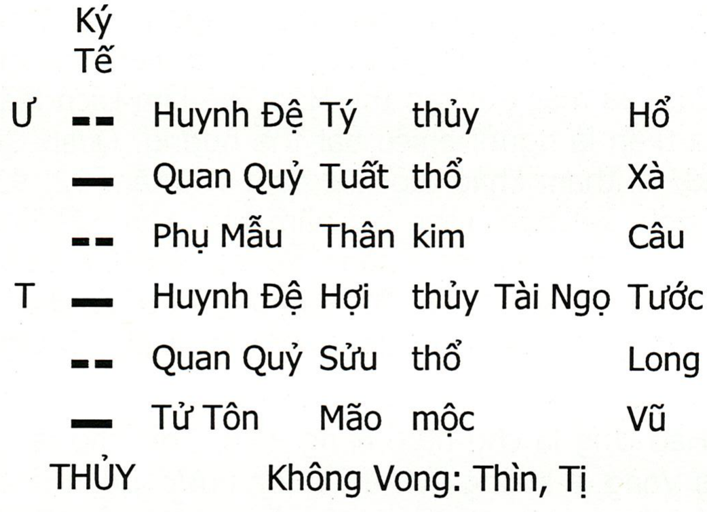
    - **Hình này chứng minh điều gì**
      - Khách là sĩ quan quân đội đối mặt việc lựa chọn hai nơi công tác và được ở lại địa phương, đơn vị đã cải tổ đổi tên.
    - **Từ đâu mà thấy được**
      - Hào Thế Huynh Đệ Hợi thủy lâm Nguyệt kiến; Phụ Mẫu Thân kim ám động; Quan Quỷ lưỡng hiện ở nội quái (Sửu thổ) và hào 5 (Tuất thổ - kinh thành).
- Phân tích dịch lý chi tiết về chức vụ, việc đổi tên đơn vị và nơi chốn điều chuyển:
  - Hào Thế trì Huynh Đệ Hợi thủy, lâm Nguyệt kiến Tý thủy đồng khí ngũ hành Thủy: Thể hiện thông tin đương sự đang phục vụ trong hàng ngũ quân đội.
  - Hào Phụ Mẫu Thân kim đại diện cho đơn vị công tác, bị Nhật kiến Dần mộc tương xung (Dần Thân tương xung) thành ám động, biểu thị cơ quan đơn vị đang có sự biến động cơ cấu và biên chế lại.
  - Hào Quan Quỷ đại diện cho danh xưng, chức vụ; Hào Phụ Mẫu ám động Trường Sinh Quan Quỷ, ứng nghiệm sự việc cơ quan đơn vị đã được chuyển đổi và đổi tên.
  - Hào Quan Quỷ đại diện cho công tác, trên quẻ xuất hiện hai hào Quan Quỷ (lưỡng hiện) cho thấy đương sự đứng trước sự lựa chọn giữa hai phương án điều chuyển:
    - Quan Quỷ Sửu thổ ở nội quái (quẻ Ly): Đại diện cho công tác tại địa phương (bản địa).
    - Quan Quỷ Tuất thổ tại hào 5 (quẻ Khảm): Hào 5 là tôn vị, ngôi vị kinh thành, đại diện cho thủ đô Bắc Kinh.
  - Căn cứ quyết đoán được ở lại chỗ cũ: Quan Quỷ Sửu thổ ở nội quái được Nguyệt kiến Tý thủy tương hợp (Tý Sửu lục hợp); đồng thời Nguyệt kiến Tý thủy, hào Thế Huynh Đệ Hợi thủy và hào Quan Quỷ Sửu thổ kết thành tam hội phương Bắc Thủy cục (Hợi - Tý - Sửu), tạo thành một khí vững chắc liên kết với nội quái, vì thế chắc chắn được ở lại bản địa.

#### Suy đoán chuẩn xác hôn nhân năm 1990 và cấu trúc nhà ở
- Đối thoại bất ngờ về việc kết hôn và trạch cát khi người khách chuẩn bị ra về:
  - Khi người khách sắp rời bước, tác giả bất thình lình hỏi: "Anh kết hôn ở năm 90 à?"
  - Người khách khựng lại sững sờ, rồi ngạc nhiên hỏi lại: "Đúng rồi, sao ông biết?"
  - Tác giả từ tốn giải thích: "Tôi nhìn từ trong quẻ."
  - Người khách lập tức dừng bước, quay lại ngồi xuống và hỏi dồn: "Có phải từ một quẻ có thể nhìn ra được mọi thứ?"
  - Tác giả khiêm tốn trả lời: "Chưa hẳn."
  - Người khách tiếp tục thỉnh cầu: "Có thể xem về nhà cửa một chút hay không?"
  - Tác giả đồng ý quan sát kỹ quái tượng rồi phán đoán: "Nơi anh ở là một nhà lầu, gia đình của anh ở tại tầng ba hoặc tầng bốn, tầng một của nhà lầu này là cửa hàng, năm nay ở hướng Tây Nam lại xây thêm một nhà lầu, có đúng không?"
  - Khách thán phục xác nhận chuẩn xác: "Rất đúng. Nhà tôi ở tại tầng thứ ba, tầng một là cửa hàng. Ở phía Tây Nam hiện đang xây nhà lầu đấy."
- Luận giải dịch lý chi tiết về hôn nhân và kết cấu gia trạch:
  - Căn cứ xác định việc đã kết hôn và ứng kỳ năm Canh Ngọ (1990):
    - Hào Phụ Mẫu Thân kim ám động sinh hào Thế Hợi thủy (Phụ mẫu là hôn thư, sinh Thế là việc thành).
    - Hào Thê Tài Ngọ hỏa phục tàng dưới hào Thế Hợi thủy (Thế khắc Tài, Tài nhập trạch phục dưới Thế) là biểu tượng đương sự đã lập gia đình.
    - Ứng kỳ kết hôn: Thê Tài là vợ, phục thần cần xuất hiện để định kỳ ứng nghiệm; năm 1990 là năm Canh Ngọ, địa chi Ngọ hỏa trùng khớp với phục thần Thê Tài Ngọ hỏa xuất hiện, nên quyết đoán kết hôn vào đúng năm Canh Ngọ 1990.
  - Căn cứ xác định kết cấu nhà lầu và tầng nhà:
    - Hào 2 là trạch hào (đại diện cho nhà ở), lâm Quan Quỷ Sửu thổ tương hợp với Nguyệt kiến Tý thủy (Tý Sửu hợp), biểu thị nhà lầu cao tầng kiên cố.
    - Xác định số tầng nơi ở: Xét theo hào Phụ Mẫu Thân kim (tượng nhà cửa), Thân mang số 4 (theo số Hà đồ/Lạc thư) và ngự tại hào 4; hào Thế cư ngụ tại hào 3, do đó phán đoán nơi ở nằm tại khoảng tầng 3 hoặc tầng 4 (thực tế gia đình ở tầng 3).
    - Xác định tầng một là cửa hàng: Hào sơ là tầng trệt, lâm Tử Tôn Mão mộc (Tử Tôn là lục thân sinh Tài, tượng trưng cho kinh doanh buôn bán); hào Tử Tôn lại lâm Nhật kiến Dần mộc xung động hào Phụ Mẫu Thân kim, Phụ Mẫu hào 4 lâm Câu Trần (Câu Trần chủ mặt tiền xây dựng, buôn bán thương nghiệp), do đó tầng một là cửa hàng.
    - Căn cứ dự đoán công trình xây dựng ở hướng Tây Nam: Phụ Mẫu Thân kim ứng với phương vị Tây Nam (quẻ Khôn vi Thân); Câu Trần tượng trưng cho công trình kiến trúc đất đá xây dựng; Phụ Mẫu Thân kim ám động chủ về việc đang khởi công xây dựng thêm nhà lầu mới tại phương Tây Nam.

#### Khúc mắc khi đoán bệnh người cô và cơ duyên ngộ ra phân chia thái cực
- Thất bại bất ngờ khi mở rộng dự đoán sang thân nhân:
  - Người khách tiếp tục thỉnh cầu tác giả đoán bệnh tật cho người cô ruột của mình.
  - Tác giả dựa vào quẻ Thủy Hỏa Ký Tế ban đầu phân tích và suy đoán: Người cô của anh ta đang mắc bệnh phổi.
  - Người khách lập tức bác bỏ: "Không đúng", đồng thời cho biết thực tế người cô mắc bệnh tim mạch. Cuộc dự đoán kết thúc trong sự thất bại ngoài ý muốn.
- Trăn trở học thuật tìm kiếm căn nguyên thất bại:
  - Sau khi khách ra về, tác giả không ngừng suy xét quẻ tượng, lục tìm từ đầu đến cuối mà vẫn không sao tìm ra căn cứ giải thích vì sao quẻ không hiển thị bệnh tim mạch của người cô.
  - Tác giả tự đặt câu hỏi cốt lõi: Rốt cuộc từ một quẻ có thể đồng thời đoán ra chuẩn xác thông tin của nhiều đối tượng hay không?
  - Suốt đêm hôm đó, tác giả mải suy nghĩ thao thức đến hơn 3 giờ đêm vẫn chưa thể chợp mắt.
- Khoảnh khắc giác ngộ phương pháp phân chia thái cực:
  - Khi đang thiu thiu chìm vào giấc ngủ, một luồng linh cảm bất ngờ ùa tới: Tác giả nhớ lại nguyên lý trong bộ môn "Thiết bản thần số" mà mình từng nghiên cứu trước đây.
  - Tư duy được khai phóng toàn diện, tác giả chính thức thấu ngộ phương pháp "Lục hào dự đoán phân chia thái cực" (chuyển đổi thái cực điểm theo từng đối tượng xem bói).
  - Tác giả lập tức lấy quẻ Thủy Hỏa Ký Tế gieo hồi ban ngày ra tiến hành biến hóa theo thái cực điểm mới: Toàn bộ thông tin bệnh tật về tim mạch của người cô lập tức hiển thị rõ mồn một trên quẻ tượng mới.
  - Niềm hân hoan tột cùng làm tan biến hoàn toàn cơn buồn ngủ, đánh dấu một bước tiến lý luận đột phá trong thực chiến Lục Hào.

### Lần đầu tiên nghiệm chứng phương pháp phân chia thái cực

#### Cuộc thảo luận ban đầu và sự hoài nghi của Đoàn Kiến Nghiệp
- Ngày hôm sau, Đoàn Kiến Nghiệp tiên sinh đến phòng làm việc của tác giả để cùng nghiên cứu Dịch học.
- Tác giả chia sẻ phát hiện mang tính đột phá về phương pháp phân chia thái cực trong Lục Hào với Đoàn tiên sinh.
- Đoàn tiên sinh ban đầu tỏ ý hoài nghi sâu sắc:
  - Ông nhận định: "Tôi không tin, nếu thực như vậy thì đây là một phát hiện lớn trong lịch sử dự đoán lục hào, tôi phải nghiệm chứng trong thực tế thì mới tin được."
- Cơ duyên thực nghiệm xuất hiện bất ngờ ngay sau cuộc điện thoại:
  - Đoàn tiên sinh được báo có điện thoại gọi đến.
  - Sau khi nghe máy trở về, ông đề nghị với tác giả: "Lát nữa có người đến, ông dùng phương pháp mới của ông để đoán xem có tin cậy không."

#### Quẻ thứ nhất: Đoán vụ việc thất lạc tiền bạc cơ quan ngân hàng
- Diễn biến cuộc gặp gỡ và hành động gieo quẻ thay của tác giả:
  - Một lúc sau, một người phụ nữ bước vào phòng làm việc trong trạng thái thở hổn hển, tâm lý đầy bối rối, vừa ngồi xuống ghế chưa kịp định thần.
  - Tác giả liền tiện tay lấy đồng xu trên bàn gieo thay một quẻ vào ngày Quý Mão, tháng Tý, gieo được quẻ Phong Hỏa Gia Nhân biến Sơn Phong Cổ (tuần không: Thìn, Tị).
- Cuộc đối thoại mở đầu khẳng định lý do đương số tìm đến:
  - Tác giả chủ động mở lời: "Hôm nay cô đến vì một khoản tiền à? Khoảng chừng 1 vạn tệ, là tiền của cơ quan."
  - Người phụ nữ kinh ngạc thốt lên: "Tôi vẫn chưa gieo quẻ mà, sao ông lại biết?"
  - Tác giả mỉm cười đáp: "Tôi đã gieo thay cô, tôi đoán có đúng không?"
- Người phụ nữ xác nhận thực tế và trần tình nguồn cơn sự việc:
  - Cô công tác tại một ngân hàng, vừa qua có khách hàng làm thủ tục chuyển 1 vạn tệ vào tài khoản của một khách hàng khác.
  - Sau đó không rõ nguyên nhân gì, khách hàng yêu cầu hoàn trả lại khoản tiền đó; cô nhớ rõ ràng bản thân đã làm thủ tục trả lại, nhưng đối phương khẳng định vẫn chưa nhận được tiền.
  - Ngày hôm đó cấp trên lãnh đạo đã trực tiếp tới chất vấn, có thái độ nghi ngờ cô đã chiếm đoạt số tiền đó khiến cô vô cùng lo lắng, hoang mang.
- Luận đoán tiền cơ quan bị thất lạc và thời hạn tìm thấy qua quẻ Phong Hỏa Gia Nhân biến Sơn Phong Cổ:
  - **Hình 118.** Quẻ Phong Hỏa Gia Nhân biến Sơn Phong Cổ
    - 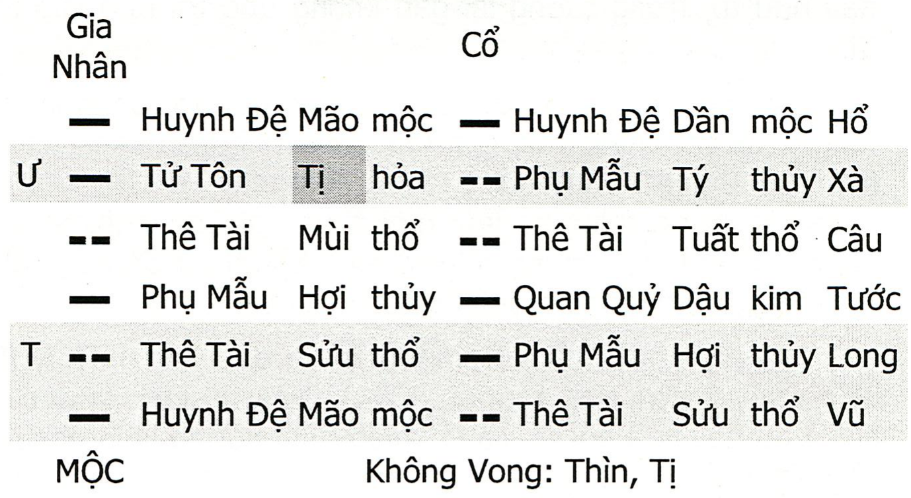
    - **Hình này chứng minh điều gì**
      - Chứng minh khoản tiền cơ quan bị thất lạc khoảng 1 vạn tệ và sẽ tìm lại được trong 3 ngày hoặc ứng vào tháng Tị năm sau.
    - **Từ đâu mà thấy được**
      - Hào Tài trì Thế động hóa Tài lâm Thanh Long, Câu Trần; số nội ngoại quái (8) cộng hai hào Tài thành 10; Tử Tôn Tị hỏa tuần không xuất không.
- Phân tích chi tiết các căn cứ suy luận tượng quẻ:
  - Hào Thê Tài trì Thế phát động, lâm Thanh Long (Thanh Long chủ về tài lộc, tiền bạc).
  - Hào sơ đại diện cho tâm tư, tâm sự bên trong; hào sơ động hóa Tài chứng tỏ trong lòng đương số đang canh cánh nghĩ về tiền bạc, khẳng định đương số đến vì chuyện tài chính.
  - Hào Tài hóa Lâm Quan, đồng thời lâm Câu Trần (Câu Trần chủ về nha môn, cơ quan công quyền), do đó xác định chính xác đây là tiền của cơ quan nhà nước chứ không phải tiền riêng cá nhân.
  - Định lượng số tiền: Số của nội ngoại quái hợp lại là 8, cộng với hai hào Tài là 10; mặt khác hào Tài lưỡng hiện mang ngũ hành Thổ (số sinh của Thổ là 5), hai hào Thổ cộng lại cũng là 10, từ đó luận ra số tiền là 1 vạn tệ.
  - Hạn kỳ tìm lại tiền: Hào Tử Tôn Tị hỏa lâm Tuần Không, trong vòng 3 ngày sẽ xuất Không nên tiền sẽ tìm thấy; nếu trong tương lai gần không ứng (do Tử Tôn hưu tù trong tháng Tý) thì tất phải ứng vào tháng Tị (tháng 5 năm sau).
- Ứng nghiệm thực tế ngoài đời thực:
  - Tác giả báo trước tiền sẽ tìm được trong 3 ngày, nếu không thì đến tháng 5 năm sau chắc chắn tìm thấy.
  - Đúng ngày thứ 3, khoản tiền 1 vạn tệ đã được tìm thấy trọn vẹn; nguyên nhân thất lạc là do viết sai mã số tài khoản khiến khoản tiền bị chuyển nhầm sang một ngân hàng khác.

#### Quẻ thứ hai: Thực nghiệm phương pháp mới đoán tiền vận, hôn nhân và bệnh tật bản thân
- Đề xuất phối hợp thực nghiệm khoa học dự đoán:
  - Sau khi quẻ đầu tiên chuẩn xác kỳ diệu, người phụ nữ vô cùng phấn khởi, tán thưởng tài dự đoán và tha thiết muốn xem tiếp những chuyện khác.
  - Tác giả cười bảo: "Cô không hỏi tôi cũng muốn đoán cho cô đấy, chúng tôi hôm nay muốn dùng cô làm một thực nghiệm, nghiệm chứng phát hiện mới của chúng tôi một tý."
  - Đương số hào hứng nhận lời ngay: "Không vấn đề gì, tôi nhất định phối hợp."
- Tác giả phát triển quẻ Thiên Thủy Tụng biến Thủy Trạch Tiết để luận đoán toàn diện đời tư:
- Khảo sát chi tiết quá khứ tòng quân, biến cố hôn nhân và bệnh trạng qua quẻ Thiên Thủy Tụng biến Thủy Trạch Tiết:
  - **Hình 119.** Quẻ Thiên Thủy Tụng biến Thủy Trạch Tiết
    - 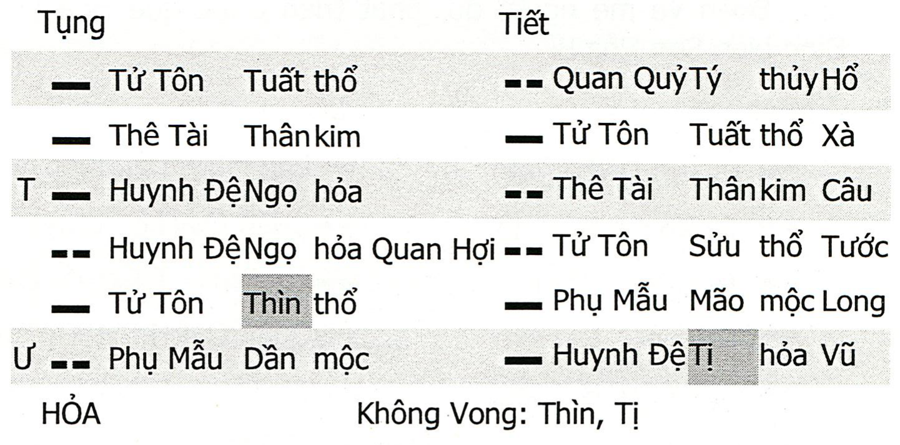
    - **Hình này chứng minh điều gì**
      - Chứng minh đương số tòng quân năm 1988, kết hôn năm 1990, sảy thai năm 1991, rạn nứt ly thân năm 1994-1996 và mắc bệnh tim, tiêu hóa, đau nửa đầu phải.
    - **Từ đâu mà thấy được**
      - Thế tại Ly nhập Mộ Tuất lâm Hổ gặp Thìn xung năm 88; Thế bị Nguyệt xung phá; hào thai phá gặp hợp rồi hóa Quỷ; Thế hào 4 Nguyệt phá nhập Mộ hào 6 hóa Quỷ âm.
- Quá trình luận đoán đối chiếu và phản ứng của các bên:
  - Về việc đi lính:
    - Tác giả đoán: "Cô đã từng đi lính, là đi ở năm 88."
    - Đương số kinh ngạc tột độ vì phụ nữ nhập ngũ vốn rất hiếm, đoán ra việc tòng quân đã khó mà đoán trúng cả năm đi lính (năm 1988 Mậu Thìn) thì càng phi thường.
  - Về thời gian phục vụ quân ngũ và kết hôn:
    - Tác giả đoán tiếp: "Cô đi lính chỉ hai năm, năm 90 thì kết hôn." Điều này hoàn toàn chính xác thực tế.
  - Về sinh nở và biến cố thai sản:
    - Tác giả khẳng định: "Tháng 10 năm 91 đã có thai, tháng 12 năm đó đã lưu sản."
    - Kết quả quả nhiên ứng nghiệm; Đoàn Kiến Nghiệp ngồi bên cạnh cũng vô cùng kinh ngạc, vì trước đây chính ông từng xem mệnh cho người phụ nữ này nhưng không tài nào nhìn ra chi tiết ấy.
  - Về mâu thuẫn gia đạo và rạn nứt hôn nhân:
    - Tác giả đoán tiếp: "Vợ chồng cô không hòa thuận, hai người đã xảy ra mâu thuẫn ở năm 94, cô vẫn còn có thể chịu đựng, nhưng đến năm 95 thì hết chịu nổi, bắt đầu cãi nhau ầm ĩ với chồng. Năm 96, chồng có ngoại tình, vợ chồng bắt đầu ở riêng."
    - Quả nhiên mọi mốc thời gian và diễn biến hôn nhân đều ứng nghiệm chuẩn xác tuyệt đối.
  - Về tình trạng sức khỏe và bệnh tật bản thân:
    - Tác giả đoán đương số mắc chứng rối loạn tiêu hóa, tim cung cấp máu kém, tâm trạng thường xuyên hoang mang bất an, bị đau nửa đầu bên phải, suốt cả ngày đầu óc u ám lờ đờ.
    - Đương số xác nhận toàn bộ các chứng bệnh đều đúng từng chi tiết.
- Căn cứ luận giải chi tiết từ quẻ Thiên Thủy Tụng biến Thủy Trạch Tiết:
  - Luận việc tòng quân năm 1988:
    - Hào Thế an tại cung Ly (quái Ly tượng trưng cho giáp trụ, áo giáp, quân phục), hào Thế nhập Mộ ở hào 6 Tử Tôn Tuất thổ.
    - Hào Tử Tôn đại diện cho binh lính, lâm Bạch Hổ chủ về quân doanh, do đó kết hợp thành tượng nhập ngũ tòng quân.
    - Hào nhập Mộ thì ứng vào thời điểm gặp xung khai Mộ; năm 1988 Mậu Thìn xung khai Mộ khố Tuất thổ, đồng thời Thìn cũng là đất Quan Đới của hào Thế (mang tượng mặc quân phục vào người), vì vậy chuẩn xác là nhập ngũ năm 1988.
  - Luận việc kết hôn năm 1990:
    - Hào Thế bị Nguyệt kiến Quan Quỷ xung phá, là tượng người nữ bị đàn ông phá thân.
    - Đến năm 1990 Canh Ngọ, địa chi Ngọ hỏa thực phá hào Thế, do đó năm 1990 là năm kết hôn.
  - Luận việc mang thai và sảy thai năm 1991:
    - Năm 1991 Tân Mùi, hào thai Ngọ hỏa của Tử Tôn trước bị phá nay gặp Mùi hợp (phá mà gặp hợp), lại là năm Thái Tuế lâm Tử Tôn nên thụ thai trong năm này.
    - Tháng 10 là tháng Tuất trị hào Tử Tôn Tuất thổ nên có thai vào tháng 10; tuy nhiên hào này động hóa Quan Quỷ nên bào thai khó lòng sống sót.
    - Tháng 12 là tháng Tý, hào thai Ngọ hỏa bị Tý thủy xung phá, đồng thời địa chi biến thành Quan Quỷ Tý thủy, chính là tượng "tháng Tý biến Quỷ", ứng nghiệm sảy thai lưu sản vào tháng 12.
  - Luận mâu thuẫn gia đình và chuyện ngoại tình của chồng:
    - Năm 1994 Giáp Tuất: Hào Tử Tôn Tuất thổ động khắc Quan Quỷ, dẫn đến mâu thuẫn vợ chồng bắt đầu phát sinh.
    - Năm 1995 Ất Hợi: Quan Quỷ phục dưới Huynh Đệ xuất hiện chịu khắc, lại thêm lưu niên Quan Quỷ Hợi thủy tương khắc hào Thế, khiến hai vợ chồng bùng nổ cãi vã kịch liệt.
    - Hào Quan Quỷ phục tàng dưới Huynh Đệ Ngọ hỏa; hào Phi thần Ngọ hỏa đồng hành với Thế (cùng là Hỏa) mang tượng người phụ nữ khác; đến năm 1996 Bính Tý xung khai Phi thần khiến chuyện ngoại tình của người chồng lộ rõ, hai vợ chồng chính thức sống ly thân.
  - Luận chứng trạng bệnh tật cơ thể:
    - Hào Thế cư tại hào 4 là vị trí của tim trên cơ thể, lâm Hỏa càng chủ về hệ tim mạch, lại bị Nguyệt kiến xung phá nên tim cung cấp máu kém, tinh thần hoang mang.
    - Thế động hóa Thê Tài (Tài chủ ăn uống, ẩm thực); hào Huynh Đệ hóa Tài mang tượng cưỡng ép ẩm thực, biểu hiện chứng rối loạn tiêu hóa.
    - Hào Thế nhập Mộ tại hào 6 (hào vị chủ vùng đầu), lâm Bạch Hổ chủ về bệnh huyết quản, đau đầu; hào biến hóa ra Quan Quỷ báo hiệu vùng đầu có bệnh tật; Quan Quỷ thuộc âm (bên phải thuộc âm) nên bị đau nửa đầu bên phải; tượng nhập Mộ chủ tinh thần u ám, lờ đờ cả ngày.

#### Quẻ thứ ba: Phân chia thái cực chuyển quẻ luận đoán thông tin người mẹ
- Chuyển quẻ sang Hỏa Phong Đỉnh biến Sơn Hỏa Bí để phân tích vận mệnh người mẹ:
  - Không dừng lại ở bản thân đương số, tác giả tiếp tục vận dụng phương pháp phân chia thái cực, phát triển quẻ Hỏa Phong Đỉnh biến Sơn Hỏa Bí (tuần không: Thìn, Tị) để soi xét tình trạng của mẹ đương số.
- Các nội dung dự đoán chuẩn xác về người mẹ:
  - Về tình cảm hôn nhân của cha mẹ:
    - Tình cảm cha mẹ không hòa thuận, kết hôn vào năm 1967 Đinh Mùi và ly dị vào năm 1991 Tân Mùi.
  - Về sức khỏe và di chứng sinh nở của người mẹ:
    - Mẹ bị mắc chứng sản hậu phong do di chứng sinh nở để lại, hiện tại vùng thắt lưng có vấn đề nghiêm trọng, thường xuyên đau nhức lưng hông.
  - Về học vấn và công tác của người mẹ:
    - Mẹ có bằng tốt nghiệp đại học, là cán bộ công nhân viên chức trong cơ quan nhà nước.
- Căn cứ luận giải chi tiết từ quẻ Hỏa Phong Đỉnh biến Sơn Hỏa Bí:
  - Thiết lập thái cực:
    - Lấy hào Thế của quẻ làm thái cực đại diện cho người mẹ của đương số.
  - Luận năm kết hôn và ly hôn của cha mẹ:
    - Năm 1967 Đinh Mùi tạo thành tam hợp Phụ Mẫu cục; hào Phụ Mẫu chủ về giấy tờ, chứng nhận kết hôn, do đó kết hôn vào năm 1967.
    - Năm 1991 Tân Mùi thuộc tuần Giáp Tý, hào Quan Quỷ Hợi thủy lâm Tuần Không; lưu niên Tân Mùi mang hành Thổ khắc chế Quan Quỷ, nên người mẹ ly dị chồng vào năm 1991.
  - Luận bệnh tật thắt lưng và chứng sản hậu phong:
    - Hào 3 trên thân thể chủ về vùng thắt lưng, nhập Mộ không sinh cho hào Thế; bản thân hào Thế lại động hóa Tử Tôn hồi đầu khắc.
    - Hào 2 chủ về đôi chân cũng bị hào Tử Tôn tương khắc; nguyên nhân bệnh tật do Tử Tôn (con cái) khắc Thế, lại lâm Thanh Long (Thanh Long chủ việc sinh nở, sinh đẻ), tạo thành tượng phát bệnh sau khi sinh nở (sản hậu phong).
    - Thanh Long đồng thời chủ về chứng đau nhức kinh niên, do đó vùng thắt lưng và hông đau nhức kéo dài.
  - Luận học vị và địa vị xã hội của người mẹ:
    - Hào Phụ Mẫu đại diện cho học vấn, bằng cấp được vượng tướng nên mẹ có học vị đại học.
    - Hào Quan Quỷ trì Thế vượng tướng chủ người nắm giữ chức vị, có quan; kết hợp Thanh Long chủ nhân viên công vụ, chứng minh người mẹ là công nhân viên chức nhà nước.
- Kết quả thực nghiệm và sự thán phục tuyệt đối:
  - Toàn bộ các dữ kiện đoán về quá khứ, hiện tại của người phụ nữ lẫn người mẹ đều ứng nghiệm không sai một ly.
  - Người phụ nữ liên tục trầm trồ ngạc nhiên, cảm phục sâu sắc tài nghệ của tác giả và tha thiết dặn dò: sau này khi tác giả viết sách Lục Hào, nhất định phải đưa câu chuyện thực nghiệm quẻ của cô vào trong sách.
  - Thực nghiệm đã chứng minh hoàn hảo tính chuẩn xác và giá trị to lớn của phương pháp phân chia thái cực trong dự đoán Lục Hào thực chiến, dẹp tan mọi nghi ngờ ban đầu của Đoàn Kiến Nghiệp.

### Vốn muốn tiến cử cao nhân, phán đoán tài tình khuất phục đối phương

- Bối cảnh cuộc gặp gỡ tại nhà khách thành phố H vào tháng 10 năm 2000:
  - Tác giả cùng nhóm bạn người Nhật Bản đến thành phố H để khảo sát hiện tượng siêu thường; do đối tượng khảo sát vẫn chưa xuất hiện, người liên hệ trung gian đã mời vị phó tỉnh trưởng của tỉnh cùng chủ nhiệm ủy ban kiểm tra kỷ luật đến nhà khách giao lưu chơi mạt chược.
  - Trong lúc chuyện trò tán gẫu, phía các vị lãnh đạo hỏi thăm xem đoàn khảo sát có nghiên cứu và khảo sát dự đoán Kinh Dịch hay không.
  - Một vị lão tiên sinh đi cùng đoàn đã thẳng thắn nói với đối phương: "Thầy Vương của chúng tôi chính là người nghiên cứu dự đoán, người của các ông ở đây nếu trình độ cao hơn ông ấy thì hãy gọi đến, nếu trình độ bình thường thì thôi."
  - Câu nói khẳng khái làm đối phương rất không vui và cảm thấy bị thách thức lòng tự ái.
  - Vừa nghe tác giả có chuyên môn nghiên cứu dự đoán, các vị quan chức khăng khăng yêu cầu tác giả phải bói một quẻ để thử tài cao thấp; do đồng xu tác giả mang theo bị thất lạc một đồng, vị phó tỉnh trưởng đã tìm được ba đồng tiền xu mệnh giá một tệ trong nhà khách đưa cho tác giả gieo quẻ.
  - Đối chiếu tư liệu quẻ đồ Hỏa Phong Đỉnh biến Sơn Hỏa Bí ghi nhận trong phân đoạn khảo sát:
    - **Hình 120.** Quẻ Hỏa Phong Đỉnh biến Sơn Hỏa Bí
      - 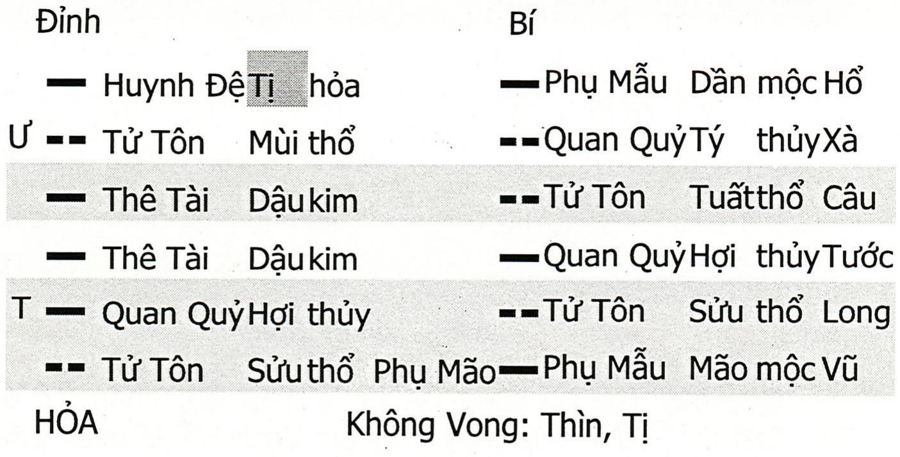
      - **Hình này chứng minh điều gì**
        - Lưu trữ đồ hình quẻ Đỉnh biến Bí đối chiếu trong tư liệu nguyên bản khi bắt đầu sự kiện khảo sát tại thành phố H.
      - **Từ đâu mà thấy được**
        - Quẻ Hỏa Phong Đỉnh thuộc Cung Hỏa, Thế tại hào 2 Quan Quỷ Hợi thủy, Ứng tại hào 5 Tử Tôn Mùi thổ; hào 6 Huynh Đệ Tị hỏa động hóa Phụ Mẫu Dần mộc.

#### Quẻ Thủy Phong Tỉnh biến Địa Phong Thăng: Đoán hạn tù tội của con trai phó tỉnh trưởng

- Dữ liệu gieo quẻ và lời phán đoán ban đầu của tác giả:
  - Thời gian gieo quẻ: Ngày Tân Sửu, tháng Tuất (Tuần không: Thìn, Tị).
  - Vị phó tỉnh trưởng gieo được quẻ **Thủy Phong Tỉnh** biến **Địa Phong Thăng** (quái cung Mộc).
  - Vấn đề thắc mắc: Phó tỉnh trưởng hỏi xem về vận khí của con trai mình.
  - Lời phán đoán dứt khoát của tác giả:
    - Con trai của ông hiện đã phải ngồi tù vì liên quan đến một vụ án kinh tế.
    - Cảnh sát đã tiến hành vây bắt con trai ông ở ngay giữa đường đi chứ không phải bắt giữ tại nhà riêng.
    - Trong vòng nửa năm nay chưa thể ra ngoài được, phải chờ đến tháng giêng năm sau mới có thể được phóng thích ra tù.
- Đoán vận hạn con trai của phó tỉnh trưởng qua quẻ Thủy Phong Tỉnh biến Địa Phong Thăng:
  - **Hình 121.** Quẻ Thủy Phong Tỉnh biến Địa Phong Thăng
    - 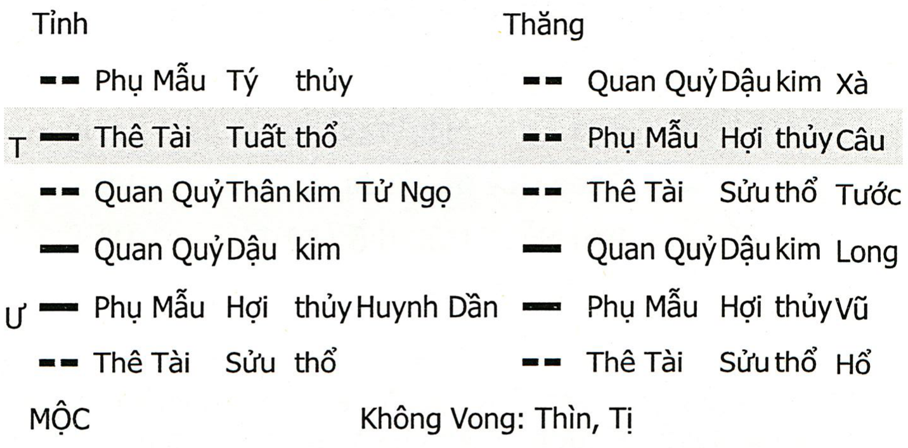
    - **Hình này chứng minh điều gì**
      - Thấy rõ con trai phó tỉnh trưởng ngồi tù vì án kinh tế, bị cảnh sát bắt giữa đường, phải giam nửa năm đến tháng giêng năm sau mới ra tù.
    - **Từ đâu mà thấy được**
      - Tử Tôn Ngọ hỏa lâm Tước phục dưới Quan Quỷ Thân kim; nhập Mộ tại hào 5 Thê Tài Tuất thổ lâm Câu Trần; tháng giêng Dần mộc xung Phi thần Thân kim xuất phục.

#### Luận giải hào tượng và sự ứng nghiệm vụ án kinh tế

- Các bước suy luận lý số lục hào chi tiết của tác giả:
  - Xác định Dụng thần: Xem vận hạn con cái lấy hào Tử Tôn làm Dụng thần; trong quẻ hào Tử Tôn Ngọ hỏa không xuất hiện trên quẻ, phục tàng dưới hào 4 Quan Quỷ Thân kim.
  - Tử Tôn phục dưới Quan Quỷ: Hào Quan Quỷ đại diện cho pháp luật, quan sai, lao tù; Dụng thần Tử Tôn bị Phi thần Quan Quỷ đè nén bên trên nên thân thể bị kìm kẹp, mất tự do, hãm mình nơi chốn ngục tù.
  - Dụng thần phục lâm Chu Tước: Thần sát Chu Tước chủ về khẩu thiệt thị phi, quan ti tụng đình, kiện tụng hình án.
  - Nhập Mộ tại hào Thê Tài: Tử Tôn Ngọ hỏa nhập Mộ ở hào 5 Thê Tài Tuất thổ (Tuất thổ là Mộ khố của Hỏa); Thê Tài chủ về tiền của, tài chính kinh tế, cho thấy căn nguyên con trai vướng vào vòng lao lý bắt nguồn từ vấn đề kinh tế.
  - Hào 5 Thê Tài Tuất thổ lâm Câu Trần: Thần sát Câu Trần chủ về lao ngục giam cầm, phòng giam cùm kẹp; hào 5 Thê Tài lại phát động lâm Câu Trần, củng cố chắc chắn kết luận bị giam cầm vì án kinh tế.
  - Điềm báo bị bắt ở giữa đường: Hào 5 trong cấu trúc lục hào là hào vị tượng trưng cho đường lộ, giao thông; Mộ khố nhốt giam Tử Tôn nằm ngay hào 5 nên cảnh sát bắt giữ đối tượng ở trên đường cái chứ không phải tại nhà.
  - Định kỳ hạn phóng thích vào tháng giêng năm sau:
    - Trong khoảng thời gian nửa năm hiện tại, Tử Tôn Ngọ hỏa hưu tù lại bị Phi thần đè nén và nhập Mộ nên chưa thể thoát ra ngoài.
    - Sang tháng giêng (tháng Dần) của năm sau: Dần mộc chính là hào Nguyên thần sinh trợ cho Tử Tôn Ngọ hỏa xuất hiện đắc lệnh.
    - Đồng thời chi Dần xung khai Phi thần Quan Quỷ Thân kim (Dần Thân tương xung); khi Phi thần bị xung bật thì Phục thần Tử Tôn Ngọ hỏa được xung khởi xuất đầu lộ diện, giải thoát xiềng xích, do đó định chắc chắn tháng giêng năm sau được ra tù.
- Đối chiếu sự kiện ứng nghiệm thực tế:
  - Vị phó tỉnh trưởng sau khi nghe xong lời luận giải thì liên tục khen ngợi tác giả phán đoán chuẩn xác thần kỳ; ông khẳng định trong số tất cả những người am hiểu Kinh Dịch mà ông từng tiếp xúc, chưa từng thấy ai đạt đến trình độ siêu đẳng như vậy.
  - Sự thật vụ án: Con trai ông bị bắt khi lái xe hỗ trợ cho một người bạn buôn lậu ô tô, sự việc xảy ra tính đến thời điểm xem quẻ vừa đúng nửa năm.
  - Lúc đầu cơ quan điều tra định khung tội danh buôn lậu; sau đó gia đình đã nhờ vả các mối quan hệ tác động để đổi khung định tội thành hành vi di chuyển tang vật.

#### Quẻ Phong Địa Quan: Luận đoán hôn nhân của chủ nhiệm ủy ban kiểm tra kỷ luật

- Bối cảnh gieo quẻ và lời đoán thấu tâm can:
  - Vị chủ nhiệm ủy ban kiểm tra kỷ luật chứng kiến tác giả phán đoán như thần cho phó tỉnh trưởng thì vô cùng kính nể, liền chủ động xin gieo quẻ để hỏi về chuyện hôn nhân gia đình của mình.
  - Gieo được quẻ **Phong Địa Quan** (quái cung Kim) trong cùng ngày Tân Sửu tháng Tuất (Tuần không: Thìn, Tị).
  - Tác giả quan sát hào tượng và đưa ra lời đoán sắc bén:
    - "Anh tuy là quan chức lãnh đạo, nhưng thực chất lại đang tham gia hoạt động kinh doanh buôn bán, quá xem trọng đồng tiền."
    - "Chỉ vì mải mê làm ăn kiếm tiền mà anh thiếu sự quan tâm chăm sóc người vợ, khiến người vợ bị kẻ khác cướp đoạt đi mất."
    - "Hiện tại bản thân anh vẫn chưa muốn chủ động đệ đơn ly hôn, bởi vì một khi ly hôn thì anh sẽ phải gánh chịu tổn thất một khoản tiền của rất lớn."
  - Phản ứng của đương số: Vị chủ nhiệm kiểm tra kỷ luật lập tức gật đầu thừa nhận toàn bộ những lời luận đoán của tác giả đều hoàn toàn chuẩn xác với thực trạng của gia đình mình.
- Phân tích tình trạng hôn nhân và tài sản của chủ nhiệm kiểm tra kỷ luật qua quẻ Phong Địa Quan:
  - **Hình 122.** Sơ đồ quẻ Phong Địa Quan
    - 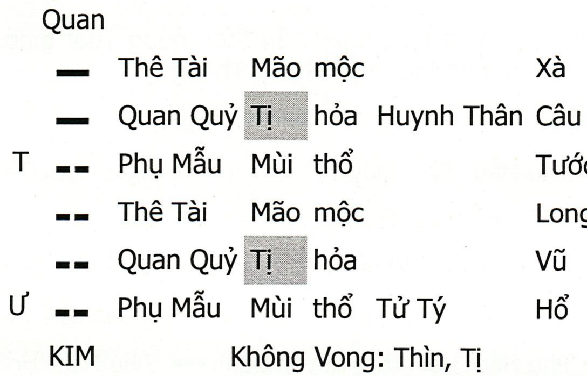
    - **Hình này chứng minh điều gì**
      - Thấy rõ đương số là quan chức làm ăn ham gom tiền của bỏ bê vợ con dẫn đến vợ bị người khác cướp mất, sợ ly hôn vì tổn thất tài sản lớn.
    - **Từ đâu mà thấy được**
      - Thê Tài Mão mộc lâm Long là Đào Hoa; Thế Mùi thổ là Tài khố bị Nhật xung ám động gom Tài; Ứng Mùi thổ cũng ám động làm Tài nhập Mộ người khác.

#### Phân tích cấu trúc hào tượng và kết cục tâm phục khẩu phục

- Các bước phân tích hào vị và lục thú trong quẻ Phong Địa Quan:
  - Nguyên tắc chọn Dụng thần khi hào tượng lưỡng hiện: Trong quẻ hào Thê Tài Mão mộc xuất hiện hai lần (ở hào sơ và hào 6 hoặc hào 3 và hào 6); khi hai hào Tài có ngũ hành can chi tương đồng, quy tắc lục hào là lấy hào ở gần hào Thế nhất làm Dụng thần, do đó chọn hào 3 Thê Tài Mão mộc (ở sát hào 4 Phụ Mẫu Mùi thổ trì Thế).
  - Tướng mạo xinh đẹp và tính đào hoa của người vợ:
    - Hào 3 Thê Tài Mão mộc lâm Đào Hoa; lại gia thêm thần sát Thanh Long.
    - Thanh Long kết hợp cùng Đào Hoa chủ về mỹ mạo, mặt mũi dung mạo đẹp đẽ; song cũng chủ về tâm tính tham sắc, phóng túng đào hoa.
  - Tượng người chồng tham tài, mải mê tích trữ của cải:
    - Hào Thế là Phụ Mẫu Mùi thổ: Chi Mùi thổ chính là Mộ khố của Thê Tài Mão mộc (tức là Tài khố).
    - Ngày gieo quẻ là ngày Tân Sửu; Nhật thần Sửu thổ xung hào Thế Mùi thổ (Sửu Mùi tương xung); hào Mùi thổ đắc Nguyệt lệnh Tuất thổ trợ vượng nên gặp Nhật xung hóa thành ám động.
    - Hào Thế ám động chủ về việc gom Thê Tài nhập khố: Biểu thị người chồng là quan chức nhưng bản tính quá xem trọng đồng tiền, dốc hết tâm lực buôn bán kinh doanh để gom tiền của vào kho riêng, vì mải kiếm tiền mà bỏ mặc tình cảm gia đình.
  - Tượng người vợ bị kẻ khác cướp đoạt:
    - Hào Ứng ở hào sơ cũng là Phụ Mẫu Mùi thổ, cũng bị Nhật thần Sửu thổ xung thành ám động.
    - Hào Ứng đại diện cho người khác, người ngoài xã hội; hào Ứng ám động cũng là Mộ khố mở ra hút hào Thê Tài Mão mộc nhập Mộ vào hào Ứng, tạo thành hình tượng người vợ sa vào lòng kẻ khác, bị người ngoài chiếm đoạt mất.
  - Căn nguyên chần chừ không dám ly hôn:
    - Hào Thê Tài vốn dĩ đang bị nhốt trong kho của hào Thế; nếu làm thủ tục ly hôn thì tài sản trong khố buộc phải xuất ra để phân chia, khiến đương số chịu đại hao phá tài cực kỳ nghiêm trọng, vì thế mà không nỡ ly hôn.
- Kết cục khuất phục hoàn toàn đối phương:
  - Sau khi nghe tác giả luận giải cặn kẽ hai quẻ Thủy Phong Tỉnh và Phong Địa Quan, cả vị phó tỉnh trưởng lẫn chủ nhiệm ủy ban kiểm tra kỷ luật đều liên tục cất lời tán dương khâm phục.
  - Các vị lãnh đạo hoàn toàn bị chinh phục trước tài nghệ Dịch học chuẩn xác phi thường, đồng thanh thừa nhận trong suốt cuộc đời và mạng lưới giao thiệp của họ, chưa từng gặp bất kỳ ai dự đoán việc đời tỉ mỉ, xác thực đến mức kinh ngạc như tác giả.

### Nhờ đoán cát hung của lưu niên, đoán ra tử cung có lỗ

- Vào ngày Ất Mão tháng Ngọ năm 2000, một người đàn ông tìm đến tác giả xin dự đoán cát hung của lưu niên:
  - Khách gieo được quẻ **Sơn Hỏa Bí** biến **Thủy Thiên Nhu**.
  - Nhật nguyệt và tuần không tại thời điểm gieo quẻ: Ngày Ất Mão, tháng Ngọ (Tuần không: Tý, Sửu).
  - Dự đoán tổng quan ban đầu của tác giả:
    - Khách là nhân viên công vụ, người ăn lương nhà nước, có trình độ học vấn và bằng cấp chính quy nhưng không có đường quan vận hanh thông.
    - Ngoài công việc hành chính, còn làm thêm nghề buôn bán nhỏ nhưng thu nhập khiêm tốn, kiếm không bù đắp nổi chi phí sinh hoạt.
    - Trong nhà phát sinh kiện tụng khẩu thiệt liên quan đến việc vợ bị thủng lỗ ở tử cung dẫn đến hao tài tốn của nặng nề; trong tháng Ngọ này vẫn tiếp tục phải phá tài, cần hết sức thận trọng.

- Dự đoán công danh sự nghiệp, tài vận và tai ách của người vợ dựa trên quẻ Bí biến Nhu:
  - **Hình 123.** Sơ đồ quẻ Sơn Hỏa Bí biến Thủy Thiên Nhu
    - 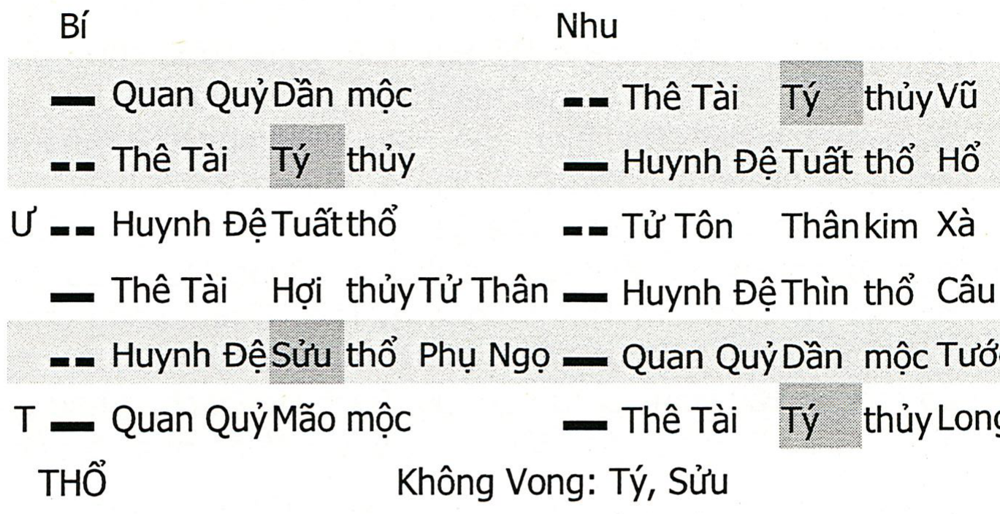
    - **Hình này chứng minh điều gì**
      - Thấy rõ mệnh chủ là công chức, vợ bị thủng tử cung do sai sót y khoa hao tài kiện tụng, cùng vận hạn tài xế taxi cướp xe bỏ trốn.
    - **Từ đâu mà thấy được**
      - Quan Quỷ Mão trì Thế lâm Long; hào 2 Sửu thổ lâm Tước Không Vong động hóa Dần mộc; hào 5 Tài Tý lâm Hổ động hóa Tuất thổ khắc; Ứng Tuất là mộ của xe.

#### Luận giải công danh, tài vận và căn nguyên sự cố của người vợ

- Luận giải địa vị công tác và nguồn gốc tài lộc của bản thân người hỏi:
  - Hào Quan Quỷ Mão mộc trì Thế, lâm Thanh Long, lại được Nhật thần Mão mộc tỉ phù nên lâm vượng tướng; Thanh Long là hình tượng tôn quý, quy củ của cơ quan công quyền, do đó khẳng định anh là nhân viên công vụ, người ăn cơm nhà nước.
  - Thu nhập không cao và liên tục hao tài: Hào Thê Tài Tý thủy lâm hào 5 bị Nguyệt lệnh Ngọ hỏa xung phá (Nguyệt phá), bản thân lại phát động hóa Huynh Đệ Tuất thổ hồi đầu khắc ráo riết, cấu thành tượng phá tài liên tiếp.
  - Hào 2 Huynh Đệ Sửu thổ phát động khắc Tài: Hào 2 là trạch hào (nhà cửa), nên sự việc tiêu hao tiền của diễn ra từ ngay trong nội bộ gia đình.

- Lập luận chi tiết về bệnh chứng thủng tử cung và kiện tụng của người vợ:
  - Nguyên nhân phá tài do vợ: Hào 2 và hào Ứng đều là thê vị (vị trí của người vợ), nay Huynh Đệ lâm cả hai nơi này phát động khắc Tài, nên xác định nguyên do hao tài hoàn toàn bắt nguồn từ người vợ.
  - Thê Tài là vợ, lâm Bạch Hổ chủ về thương tật, huyết quang, bệnh tật, nên người vợ gặp họa bệnh tật nặng.
  - Hào 2 tượng trưng cho tử cung, Huynh Đệ Sửu thổ động hóa Quan Quỷ Dần mộc, báo hiệu tử cung mang bệnh hiểm.
  - Hào 2 Sửu thổ lại lâm Không Vong, tượng trưng cho việc trên bề mặt tử cung xuất hiện lỗ thủng hư hao.
  - Huynh Đệ Sửu thổ câu kết cùng Chu Tước phát động: Chu Tước chủ về quan phi khẩu thiệt, thị phi kiện tụng; do vậy phá tài nặng nề chính là do vướng vào kiện tụng tranh chấp y tế khẩu thiệt.

#### Phân tích tính cách người vợ và dấu hiệu phẫu thuật sinh nở

- Luận đoán tính khí và năng lực vượt trội của người vợ:
  - Vợ tài giỏi và nắm quyền trong gia đình hơn chồng: Thê Tài Tý thủy cư tại hào 5 (ngôi vị lãnh đạo, tôn vị), biểu thị trong nhà người vợ quyết định mọi việc, nói sao nghe vậy.
  - Hào Tài lâm Bạch Hổ: Tính tình quyết đoán, dám làm dám chịu, tác phong làm việc dứt khoát, ngoại thô nội tú, tính khí khẳng khái xông xáo như đàn ông.
  - Người vợ tàng mà bất lộ, giữ được bình tĩnh trước sóng gió: Hào Thê Tài Tý thủy động mà hợp với Huynh Đệ Sửu thổ lâm Chu Tước; Chu Tước chủ về lời ăn tiếng nói, khi bị hợp trú thì trở thành nén nhịn không nói, kín kẽ bí mật, nên mọi mưu sự đều thâm trầm kín đáo.

- Lập luận về thời điểm sinh đẻ và dấu hiệu phẫu thuật:
  - Hào 2 Huynh Đệ Sửu thổ là Mộ khố của Tử Tôn Thân kim (nơi tàng chứa Tử Tôn, tức dạ con / tử cung), lâm Không Vong cho thấy hiện tại bên trong tử cung không còn giữ đứa trẻ (đã sinh con xong xuôi).
  - Thê Tài Tý thủy lâm Bạch Hổ phát động: Bạch Hổ chủ về lâm bồn sinh nở; đồng thời Quan Quỷ Mão mộc trì Thế là Thai địa của Tử Tôn Thân kim, lâm Thanh Long chủ việc sinh nở thuận lý.
  - Năm trước là năm Kỷ Mão (1999), trùng đúng hào Thai trị niên, do đó khẳng định người vợ đã sinh con vào năm 1999.
  - Bạch Hổ chủ về đao kéo, mổ xẻ phẫu thuật; hào Tài lâm Bạch Hổ lại hóa hồi đầu khắc, chứng tỏ sau khi sinh đã phải trải qua một cuộc đại phẫu thuật xâm lấn.

#### Ứng nghiệm thực tế và sự cố y khoa hy hữu

- Đối phương kinh ngạc xác nhận toàn bộ sự thật cuộc sống:
  - Khách thừa nhận bản thân đúng là công chức tốt nghiệp đại học chính quy, ngoài giờ làm việc có kinh doanh bán thêm mứt táo kiếm thêm nhưng buôn bán ảm đạm.
  - Tính cách người vợ được miêu tả chuẩn xác từng nét.
  - Sự cố y khoa thủng tử cung: Năm ngoái (1999) sau khi vợ sinh nở, cơ quan kế hoạch hóa gia đình địa phương bắt buộc chị phải đi đặt vòng tránh thai; không may nhân viên y tế thao tác là một thực tập sinh non tay nghề, đã chọc thủng một lỗ trên tử cung khiến vòng tránh thai rơi lọt vào khoang bụng.
  - Vợ phải mổ phẫu thuật lấy vòng cấp cứu; gia đình đâm đơn kiện bệnh viện nhưng bệnh viện chối bỏ trách nhiệm.
  - Gia đình phải lặn lội đến ba bệnh viện lớn cấp tỉnh làm hồ sơ giám định chứng minh sự cố y khoa; vụ kiện kéo dài tiêu tốn khoản tiền khổng lồ, dù cuối cùng thắng kiện nhưng tiền bồi thường nhận về không đủ bù đắp chi phí theo đuổi vụ kiện.

#### Đoán sự việc kinh doanh xe taxi và truy tìm tài xế bỏ trốn

- Hỏi việc kinh doanh mua xe taxi cho thuê:
  - Sau khi nghe giải hạn quá khứ, người đàn ông hỏi tiếp về chiếc xe taxi vừa mới mua, định thuê tài xế lái thì tiền đồ làm ăn ra sao.
  - Tác giả khuyên ngăn: Vận tài quẻ này rất xấu, tuyệt đối không nên kinh doanh taxi, tốt nhất hãy nhanh chóng bán xe đi để tránh họa. Người khách đa tạ rồi ra về.

- Sự cố tài xế cướp xe mất tích và kế sách tìm kiếm:
  - Một tuần sau, người khách hớt hải từ thành phố cách xa hơn 500 dặm quay lại cầu cứu: Chiếc taxi vừa giao cho tài xế thuê chạy thì cả xe lẫn người đều đột ngột bốc hơi không chút tăm hơi.
  - Chỉ dẫn của tác giả: Bảo người vợ đứng ra chủ trì tìm kiếm thì nhất định thu hồi được xe trở về, dẫu phải tốn thêm một khoản tiền phá tài; sau khi tìm lại được xe thì phải lập tức bán thanh lý ngay.
  - Kết quả thực tế: Người vợ đã ra mặt nhờ các mối quan hệ bạn bè bên cục công an vào cuộc hỗ trợ, nhanh chóng tìm lại được chiếc xe taxi; gia đình tốn một khoản chi phí thù lao và ngay sau đó đã quyết định bán xe dứt điểm.

- Nguyên lý lục hào giải mã việc mất xe và tìm lại xe:
  - Hào Thê Tài hưu tù lại lâm Không Vong và Nguyệt phá: Đầu tư kinh doanh vận tải taxi chắc chắn vô tài, buôn bán thất bát.
  - Phụ Mẫu đại diện cho phương tiện xe cộ; trong quẻ Phụ Mẫu Ngọ hỏa lâm Nguyệt lệnh xung khắc trực tiếp hào Thê Tài Tý thủy, chứng tỏ lái taxi không những không sinh tài mà còn chiêu mời đại phá tài.
  - Hào Ứng là người làm thuê (tài xế lái xe), lâm Huynh Đệ Tuất thổ chính là Mộ khố của Phụ Mẫu hỏa (kho nhốt xe cộ), lâm tượng tất sinh lòng tham cướp giật xe, lái xe tẩu thoát biệt tích.
  - Thê Tài Tý thủy là người vợ, phát động hóa ra Huynh Đệ Tuất thổ: Chi hóa ra hào biến Tuất thổ đồng khí tương lân với hào Ứng Tuất thổ (tài xế), chứng tỏ manh mối tài xế nằm trong tầm tay của người vợ; do đó người vợ đứng ra ắt lần ra tung tích tài xế và đoạt lại chiếc xe.

### Đến đoán quan vận lên chức, đoán lưu niên phá tài ngoài dự tính

#### Bối cảnh gieo quẻ và thông tin quẻ tượng

- Diễn biến cuộc gặp gỡ vào ngày nghỉ:
  - Vào ngày Canh Thìn, tháng Sửu, năm Kỷ Mão (1999), đúng ngày Chủ nhật, tác giả đang ngủ ở nhà thì bị một hồi gõ cửa bất ngờ đánh thức.
  - Khi dậy mở cửa xem thì thấy một người hàng xóm ở quê dẫn theo mấy người khách đến nhờ dự đoán vận trình.
  - Trong số đó, có một người muốn xem quan vận đường công danh; tác giả bảo người đó gieo quẻ, thu được quẻ Phong Hỏa Gia Nhân biến Thủy Sơn Kiển.
- Xác lập cơ sở quẻ tượng và trạng thái Nhật Nguyệt:
  - Ngày Canh Thìn, tháng Sửu (năm Kỷ Mão 1999).
  - Tuần không: Thân và Dậu lâm Không Vong.
  - Phân bố Lục Thần: Hào sơ lâm Bạch Hổ, hào 2 lâm Huyền Vũ, hào 3 lâm Thanh Long, hào 4 lâm Chu Tước, hào 5 lâm Câu Trận, hào 6 lâm Đằng Xà.
- Luận đoán vận hạn và cơ cấu quẻ Phong Hỏa Gia Nhân biến Thủy Sơn Kiển:
  - **Hình 124.** Sơ đồ quẻ Gia Nhân biến Thủy Sơn Kiển
    - 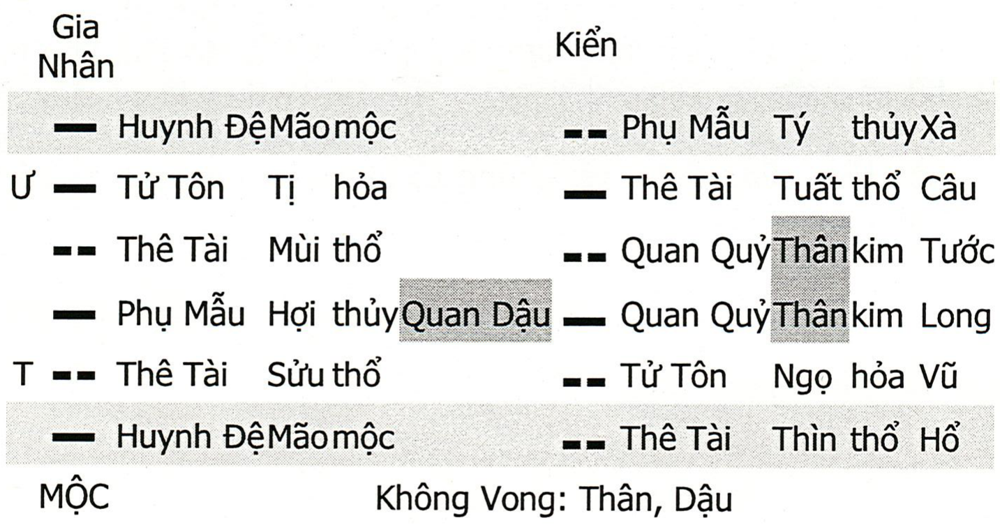
    - **Hình này chứng minh điều gì**
      - Thể hiện sự trì trệ của quan vận do Dụng thần Quan Quỷ Dậu kim phục Không, hào 5 sinh mà tàng khắc, cùng hai hào Huynh Đệ Mão mộc Thái Tuế phát động gây tổn hại và gây hai vụ phá tài lớn trong năm.
    - **Từ đâu mà thấy được**
      - Quẻ Phong Hỏa Gia Nhân biến Thủy Sơn Kiển ngày Canh Thìn tháng Sửu (tuần không Thân Dậu); Quan Quỷ Dậu kim phục dưới hào 3; Hào 5 Tị hỏa sinh Thế Sửu thổ nhưng khắc Kim; Huynh Đệ Mão mộc hào 1 và hào 6 đồng động khắc Tài.

#### Luận giải quan vận: Cạm bẫy đề bạt của lãnh đạo và thời điểm thăng chức

- Lời luận đoán thực tế và vạch trần cạm bẫy của cấp trên:
  - Tác giả thẳng thắn chỉ rõ nội tình: "Quan hệ giữa anh và lãnh đạo rất tốt, lãnh đạo đã tìm anh nói là muốn đề bạt anh, nhưng khi thảo luận ở đại hội thì lại xuất hiện hai người phản đối, gây khó dễ, chụp mũ anh, họ đã kể ra rất nhiều vấn đề của anh, kết quả là không được thăng chức, thực ra đây chỉ là cái bẫy do lãnh đạo tạo ra. Chẳng qua bề ngoài lãnh đạo đối đãi tốt với anh, tìm anh nói chuyện là để mê hoặc anh, người phản đối anh cũng là do lãnh đạo một tay sắp xếp."
  - Người xin đoán gật đầu thừa nhận hoàn toàn chính xác với những gì đã diễn ra ngoài đời thực.
  - Đương số tiếp tục hỏi sau này liệu có còn hy vọng thăng tiến hay không; tác giả khẳng định tới tháng 9 năm 2000 (tháng Dậu) chắc chắn sẽ được lên chức.
  - Ứng nghiệm thực tế: Đến tháng 9 năm 2000, đương số được thăng chức đúng như lời tiên tri.
- Các bước suy luận và căn cứ Dụng thần chi tiết:
  - Lấy Quan Quỷ làm Dụng thần đại diện cho quan vận và chức vụ.
  - Dụng thần Quan Quỷ Dậu kim mặc dù được Nhật Thìn (hợp sinh) và Nguyệt kiến Sửu thổ sinh trợ nên thuộc diện vượng tướng, nhưng lại phục dưới hào 3 Phụ Mẫu Hợi thủy và gặp Tuần Không (Thân, Dậu Không Vong).
  - Thêm vào đó, Nguyên thần sinh trợ cho Quan Quỷ (Thê Tài) bị hai hào Huynh Đệ Mão mộc (hào sơ và hào 6) đồng loạt phát động khắc phạt làm tổn hại, vì vậy giai đoạn hiện tại khó lòng được thăng chức.
  - Luận về quan hệ với lãnh đạo qua hào 5:
    - Hào 5 là hào vị của lãnh đạo, mang Tử Tôn Tị hỏa sinh cho hào Thế (Thê Tài Sửu thổ), phản ánh trên bề mặt vị lãnh đạo này đối xử rất tốt với đương số.
    - Hào 5 Tị hỏa lại là đất Trường Sinh của Quan Quỷ Kim (Kim trường sinh tại Tị), biểu thị lãnh đạo mở lời hứa hẹn muốn đề bạt cất nhắc anh ta.
    - Tuy nhiên, trong Trường Sinh lại ẩn tàng sự khắc phạt (bản chất ngũ hành là Tị hỏa khắc Dậu kim); bề ngoài là Trường Sinh nâng đỡ nhưng thực chất bên trong là khắc hại, cho thấy cấp trên chỉ làm bộ muốn đề bạt nhằm mê hoặc, nhưng sau lưng thì ngấm ngầm cản trở không muốn anh ta lên chức.
  - Luận về hai kẻ phản đối và thủ đoạn hãm hại:
    - Huynh Đệ đại diện cho bạn bè, đồng nghiệp; quẻ có hai hào Huynh Đệ cùng phát động khắc Nguyên thần, ứng với việc có hai đồng nghiệp đứng ra phản đối kịch liệt.
    - Hào Huynh Đệ Mão mộc phát động tại hào 6: Hào 6 là vị trí đỉnh đầu, biểu thị hành vi "chụp mũ", gán ghép khuyết điểm tội lỗi cho đương số.
    - Hào Huynh Đệ Mão mộc phát động tại hào sơ: Hào sơ là vị trí chân và giày, biểu thị thủ đoạn "ngáng chân", gây khó dễ từ dưới. Hai người này liệt kê vô số vấn đề trong cuộc họp đại hội nhằm cản bước thăng tiến của anh ta, mà thực chất đều do lãnh đạo giật dây.
  - Luận về kỳ hạn ứng nghiệm thăng chức:
    - Xét thấy Quan Quỷ Dậu kim vốn dĩ vượng tướng (được Nhật Nguyệt tương sinh), nên khi hết tuần không và xuất phục thì tất sẽ ứng cát.
    - Tháng 9 năm 2000 thuộc năm Canh Thìn, tháng Dậu (Ất Dậu), là thời điểm Quan Quỷ Dậu kim xuất Không và phục thần xuất hiện lâm nguyệt kiến, nên xác định vào thời gian này sẽ được lên chức như ý nguyện.

#### Luận giải lưu niên phá tài lần thứ nhất: Thất bại do hợp tác hùn vốn làm ăn

- Luận đoán bất ngờ về hạn phá tài trong năm:
  - Thấy Thái Tuế Mão mộc của năm 1999 (Kỷ Mão) nhập hào phát động, tác giả tiếp tục luận đoán: "Anh năm nay không những không được lên chức, mà còn đã phá tài. Đã hai lần phá tài lớn. Một lần là anh và người ta hợp tác kinh doanh, có người cung cấp dự án kinh doanh cho anh, hai bên đều đầu tư, tài lực của anh lớn, đầu tư nhiều, đối phương đầu tư ít, kết quả buôn bán không được tốt, đã lỗ vốn."
  - Lời xác nhận đầy cảm xúc từ người cùng đi: Một người đi cùng đoàn lập tức xúc động thốt lên: "Chuẩn quá! Anh ta là người hùn vốn với tôi, chúng tôi đã thua lỗ hơn bốn vạn tệ."
- Cơ sở lập luận dịch lý cho lần phá tài hợp tác:
  - Hào Huynh Đệ Mão mộc là Thái Tuế của năm nhập quẻ phát động khắc Thê Tài, báo hiệu trong năm 1999 tất yếu phải xảy ra chuyện phá tài hao tán lớn.
  - Hào sơ Huynh Đệ Mão mộc động hóa Thê Tài Thìn thổ chính là biểu hiện của thông tin hợp tác, chung vốn để cầu tài.
  - Hào Ứng là đối tượng hợp tác (người bạn cùng kinh doanh).
  - Hào Thế lâm Thê Tài Sửu thổ đắc lệnh Nguyệt kiến, lại được Nhật Thìn tương trợ nên rất vượng tướng, tượng trưng cho bản thân đương số có thực lực tài chính dồi dào, bỏ ra nguồn vốn đầu tư lớn.
  - Hào Ứng (Tử Tôn Tị hỏa) sinh cho hào Thế (Thê Tài Sửu thổ), biểu thị đối phương chủ động mang tiền vốn đến gặp anh ta để cùng làm ăn.
  - Tuy nhiên hào Ứng Tử Tôn Tị hỏa bị hưu tù trong tiết tháng Sửu ngày Thìn (hỏa sinh thổ nên bị tiết khí nặng), năng lực sinh cho hào Thế rất yếu, thể hiện đối tác chỉ góp được số vốn ít ỏi.
  - Mặt khác, Tử Tôn là tài nguyên (nguồn tiền) và tài lộ (con đường kinh doanh, làm ăn); ở đây Tử Tôn Tị hỏa cư hào 5 (hào 5 là đạo lộ, con đường), khẳng định đối phương chính là người mang dự án, cung cấp đường lối kiếm tiền và rủ rê đương số.
  - Vì tổng thể quẻ Huynh Đệ Thái Tuế phát động khắc đoạt Thê Tài nên phi vụ đầu tư hợp tác này định sẵn gặp kết cục thua lỗ nặng nề, không thể thành công.

#### Luận giải lưu niên phá tài lần thứ hai: Sự cố đau bụng tiêu chảy bị cướp sạch cặp tiền

- Luận đoán nguyên nhân oái oăm của vụ mất tiền thứ hai:
  - Tác giả tiếp tục phán: "Một lần khác phá tài là bởi vì anh bị đau bụng, tiêu chảy dẫn tới."
  - Phản ứng kinh ngạc và diễn biến thực tế từ đương sự:
    - Người xin đoán vô cùng sững sờ xác nhận: "Đúng! Mùa hè năm nay, khi tôi đang tản bộ ở một tỉnh lị thì đột nhiên bụng khó chịu, muốn đi cầu khẩn cấp, thế là tôi vội vàng lao vào nhà xí công cộng. Ai ngờ nhân lúc tôi đang ngồi cầu, có người đã cướp cái cặp da có hơn ba vạn tệ của tôi chạy đi, đợi đến lúc tôi kéo quần lên để ra ngoài truy đuổi thì tên cướp đã chạy mất từ lâu."
- Cơ sở dịch lý suy luận tình huống đau bụng và mất trộm:
  - Hào Thế đóng tại hào 2: Theo cấu trúc cơ thể người, hào 2 là hào vị của tạng phủ vùng ruột, đại tràng và khoang bụng.
  - Hào sơ Huynh Đệ Mão mộc lâm Bạch Hổ phát động khắc phạt hào 2 (Mộc khắc Thổ): Bạch Hổ chủ về tai họa, thương tích và tật bệnh cấp tính.
  - Thê Tài trong tượng quẻ chủ về chất bài tiết, phân và nước tiểu.
  - Hào Thế Thê Tài Sửu thổ lâm Huyền Vũ: Huyền Vũ chủ về sự ô uế, ẩm thấp, dơ bẩn; kết hợp với tượng phân nước tiểu suy rộng ra là hình ảnh nhà xí, nhà vệ sinh công cộng bẩn thỉu.
  - Huyền Vũ đồng thời cũng chủ về hành vi lén lút, trộm cắp, cướp giật bất ngờ khi người khác không kịp phòng bị.
  - Tổng hợp toàn bộ tượng quẻ: Bệnh tật cấp tính (Bạch Hổ) tác động lên đường ruột (hào 2) gây ra chứng tiêu chảy gấp (Thê Tài) phải vào nhà vệ sinh (Huyền Vũ), tạo cơ hội cho kẻ gian cướp đoạt tài sản (Huyền Vũ cướp Thê Tài hơn ba vạn tệ), dẫn tới lần phá tài thứ hai.

### Dạo chơi thánh địa Ngũ Đài Sơn, lưu lại phán đoán tuyệt diệu ở nhân gian

- Bối cảnh chuyến du ngoạn và cơ duyên hội ngộ:
  - Vào mùa hè năm 2000, tác giả Vương Hổ Ứng cùng hai Dịch hữu thân thiết là Đoàn Kiến Nghiệp và Vương Khai Vũ đồng hành du ngoạn thánh địa Phật giáo Ngũ Đài Sơn.
  - Ba người nghỉ lại qua đêm tại tư gia của anh Diêm, một đệ tử chân truyền của đại sư mệnh lý mù nổi tiếng Hách Kim Dương.
  - Do anh Diêm chỉ chuyên về mệnh lý bát tự mà không am hiểu Lục Hào, nhân dịp tác giả ghé thăm đã khẩn khoản nhờ xem giúp tài vận của bản thân và tình hình bệnh tật của người vợ.

#### Dự đoán tài vận cho anh Diêm và bệnh chứng của vợ (Quẻ Thiên Hỏa Đồng Nhân biến Thủy Lôi Truân)

- Dữ kiện gieo quẻ và thông tin can chi:
  - Thời gian gieo quẻ: Ngày Giáp Ngọ, tháng Mùi.
  - Tuần không: Thìn, Tị (HỎA Không Vong).
  - Quẻ thu được: Thiên Hỏa Đồng Nhân biến Thủy Lôi Truân.
- Lời phán quyết trực tiếp của tác giả với anh Diêm:
  - Về phương diện tài vận: Ngay trong ngày hôm nay sẽ lập tức có tiền tài vào túi, nhưng món tiền này không lớn; sang tháng sau sẽ bắt tay hợp tác làm ăn với người khác và thu được một món đại tài.
  - Về phương diện bệnh tật của người vợ: Vợ của anh mắc chứng đau nửa đầu bên phải, lượng máu cung cấp cho tim không đủ, đường tiết niệu có vấn đề bất thường, đồng thời lại đang bị đau tức ở vùng lồng ngực sườn.
- Phán đoán tài vận và chi tiết bệnh tình của người vợ dựa trên quẻ biến:
  - **Hình 125.** Quẻ Thiên Hỏa Đồng Nhân biến Thủy Lôi Truân
    - 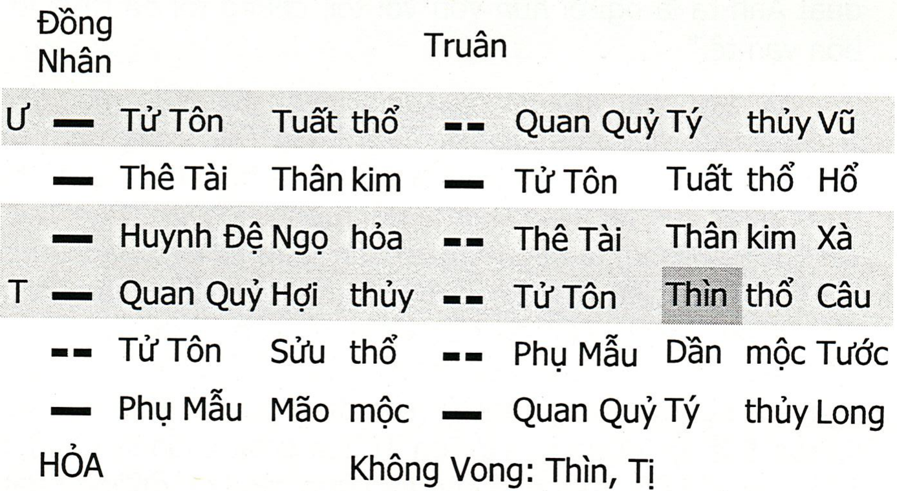
    - **Hình này chứng minh điều gì**
      - Hôm đó có tài nhỏ, tháng Thân được đại tài; vợ bị đau nửa đầu phải, thiếu máu cơ tim, tiểu ra máu và đau tức lồng ngực.
    - **Từ đâu mà thấy được**
      - Huynh Đệ Ngọ hỏa lâm Nhật động hóa Tài Thân kim; Hào 5 Thê Tài bị hào 4 khắc, hào 6 động hóa Quỷ Tý thủy âm, Sửu thổ Nguyệt phá lâm Chu Tước.
- Diễn biến và nghiệm chứng thực tế ngoài đời:
  - Toàn bộ phán đoán của tác giả đều ứng nghiệm hoàn toàn chuẩn xác.
  - Về tài lộc: Ngay trong ngày Giáp Ngọ hôm đó, anh Diêm kiếm được khoản tiền tài 200 tệ; bước sang tháng Thân, anh hợp tác đi xem phong thủy cùng người khác và thu được số tiền lớn 2 vạn tệ (20.000 nhân dân tệ).
  - Về bệnh của vợ: Người vợ quả nhiên thường xuyên bị đau nửa đầu bên phải; tim bị thiếu máu trầm trọng nên đang phải uống thuốc bắc bổ huyết; thỉnh thoảng nước tiểu có lẫn máu; ngay tại thời điểm đó đang bị đau thắt vùng ngực sườn dưới nách.
- Lý giải các bước suy luận chi tiết của tác giả:
  - Cơ sở luận giải tài vận:
    - Hào Thê Tài Thân kim được Nguyệt lệnh Mùi thổ sinh phù (được Nguyệt phù) nên có khí vượng.
    - Hào 4 Huynh Đệ Ngọ hỏa lâm Nhật kiến phát động hóa ra Thê Tài Thân kim, tượng trưng cho việc ngay trong ngày hôm đó tiền bạc tất sẽ vào tay.
    - Tượng Huynh Đệ phát động hóa Thê Tài biểu thị việc hợp tác, chung sức với bạn bè người quen để cầu tài lộc.
    - Tháng tiếp theo là tháng Thân, Nguyệt kiến lâm đúng hào Thê Tài Thân kim trị lệnh, do đó quyết đoán sang tháng Thân sẽ tiến đại tài.
  - Cơ sở luận giải bệnh chứng của người vợ:
    - Hào Thê Tài đại diện cho người vợ, lâm Bạch Hổ; Bạch Hổ vốn là hung thần chủ về huyết quang tật bệnh, cho nên định vị ngay người vợ đang mang bệnh trong người.
    - Về vị trí lồng ngực và nách sườn: Hào 4 và hào 5 thuộc hào vị vùng ngực, gian hào là lồng ngực; Thê Tài Thân kim ngự tại hào 5 lại bị hào 4 Huynh Đệ Ngọ hỏa động khắc thương tổn, do đó vùng lồng ngực nách sườn bị đau nhức âm ỉ.
    - Về chứng đau nửa đầu bên phải: Hào 6 là hào vị đầu não, đồng thời là Nguyên thần (Tử Tôn Tuất thổ) phát động hóa ra Quan Quỷ Tý thủy; Quan Quỷ chủ về tật bệnh đóng ở hào 6 là tượng đầu não có bệnh; hào biến Quan Quỷ Tý thủy mang tính chất âm hào (quy ước dương bên trái, âm bên phải), nên xác định chính xác là đau nửa đầu bên phải.
    - Về chứng thiếu máu cơ tim: Bạch Hổ chủ về huyết dịch lâm hào Thê Tài bị Hỏa khắc mạnh; Kỵ thần đóng tại hào 4 Huynh Đệ Ngọ hỏa (hào 4 là hào vị tim, Ngọ hỏa trong ngũ hành cũng chủ về tâm hỏa/tim), do đó suy ra tim bị thiếu hụt nguồn cung cấp máu.
    - Về chứng viêm nhiễm đường tiết niệu: Hào 2 Nguyên thần Tử Tôn Sửu thổ bị Nguyệt phá (tháng Mùi xung phá Sửu thổ); hào 2 là hào vị của bộ phận sinh dục và cơ quan bài tiết, lục thân Tử Tôn cũng quản về sinh dục bài tiết; hào này lại lâm Chu Tước chủ về chứng nhiệt, viêm nhiễm sưng tấy, vì thế khẳng định nước tiểu có vấn đề và tiểu ra máu.

#### Đoán lưu niên và thăng trầm vận hạn cho em trai anh Diêm (Quẻ Lôi Thủy Giải biến Thiên Hỏa Đồng Nhân)

- Bối cảnh và diễn biến tiếp nối:
  - Nghe tin tác giả phán đoán thần kỳ chuẩn xác, ngay trong ngày hôm đó em trai và bạn bè của anh Diêm vội vã tìm đến để xin dự đoán vận số.
  - Em trai anh Diêm gieo quẻ xem lưu niên vận hạn trọn đời và những năm gần đây.
- Dữ kiện gieo quẻ và thông tin can chi:
  - Thời gian gieo quẻ: Ngày Giáp Ngọ, tháng Mùi.
  - Tuần không: Thìn, Tị (MỘC Không Vong).
  - Quẻ thu được: Lôi Thủy Giải biến Thiên Hỏa Đồng Nhân.
- Lời phán quyết trực tiếp của tác giả:
  - "Suốt đời anh không có chức quan nào, nhưng lại luôn được quan chức che chở giúp đỡ, là một người chuyên tâm làm ăn kinh doanh buôn bán."
  - "Bắt đầu từ năm 1989 phát tài lớn, kiếm được rất nhiều tiền của; nhưng từ năm 1997 bắt đầu rơi vào cảnh suy bại; sang năm 1998 tài vận càng thêm tồi tệ, e rằng ngay cả sinh hoạt thường ngày cũng lâm vào cảnh thiếu thốn chật vật, cho đến tận thời điểm hiện tại tài vận vẫn chưa hề có dấu hiệu khởi sắc."
  - "Nguyên nhân chủ yếu dẫn đến sự sụp đổ này là vị quan chức quyền thế mà anh nương tựa giúp đỡ trước đây đã về hưu hạ cánh, không còn chức quyền thực tế, từ đó kéo theo tài vận của anh bị tổn hại nặng nề."
- Phán đoán lưu niên và nguyên nhân suy bại dựa trên quẻ Lôi Thủy Giải biến Thiên Hỏa Đồng Nhân:
  - **Hình 126.** Quẻ Lôi Thủy Giải biến Thiên Hỏa Đồng Nhân
    - 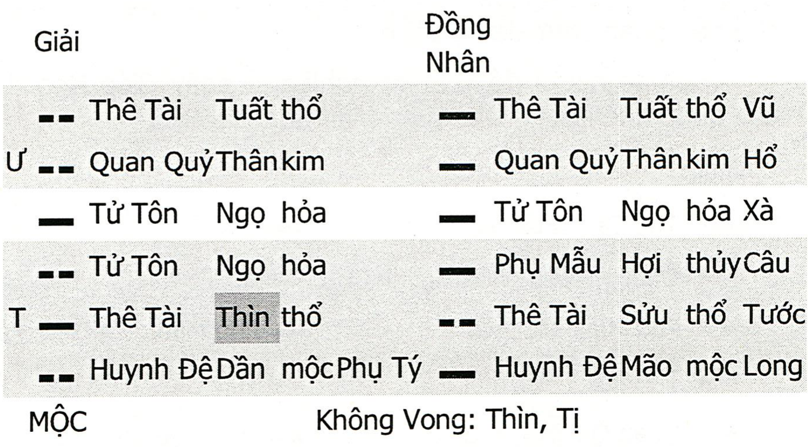
    - **Hình này chứng minh điều gì**
      - Không có quan nhưng được quan trợ giúp làm kinh doanh; phát tài từ 1989, suy thoái từ 1997-1998 do quan chức bảo hộ về hưu.
    - **Từ đâu mà thấy được**
      - Thế Thê Tài Thìn thổ lâm Không động hóa thoái Sửu thổ; Thế cư Trường Sinh Quan Quỷ Thân kim; ngoại quái Phục ngâm và tam hợp Tử Tôn khắc Quan.
- Kết quả thực tế ngoài đời:
  - Mọi lời phán quyết từ mốc thời gian phát tài, thời điểm suy thoái đến hoàn cảnh sinh hoạt khó khăn và nguyên nhân do chỗ dựa quan chức mất quyền đều ứng nghiệm chính xác từng chi tiết.
- Lý giải các bước suy luận chi tiết của tác giả:
  - Cơ sở luận giải về tài vận và hiện trạng sa sút:
    - Xem tài vận lấy Thê Tài làm Dụng thần. Thoạt nhìn, hào Thê Tài Thìn thổ trì Thế được Nguyệt lệnh Mùi thổ sinh phù là vượng tướng, ngỡ rằng tài vận phải rất thịnh vượng hanh thông.
    - Tuy nhiên, Thìn thổ trùng khớp với địa chi năm hiện tại (năm Canh Thìn 2000), đây là hiện tượng "Thái Tuế nhập hào", là tiêu chí phản ánh chuẩn xác tình trạng được mất của cả năm.
    - Hào Thế Thê Tài Thìn thổ phát động hóa ra Sửu thổ là động hóa Thoái thần, lại lâm Tuần không (Thìn Không Vong), đây chính là thông điệp chỉ rõ năm nay hoàn toàn không có tài lộc mà còn bị thoái tài, hao tổn nghiêm trọng.
  - Cơ sở định lượng ứng kỳ thăng trầm qua các năm:
    - Ứng kỳ của Thoái thần được căn cứ vào hào biến để phán đoán thời gian: hào biến Sửu thổ tương ứng với địa chi năm Đinh Sửu 1997, do đó xác định tài vận của người này bắt đầu xuống dốc trượt dài từ năm 1997.
    - Năm 1989 là năm Kỷ Tị: Tị hỏa trường sinh Thổ và sinh phù mạnh mẽ cho hào Thê Tài, vì thế khẳng định tài vận cất bước phát đạt từ năm 1989.
    - Năm 1998 Mậu Dần và năm 1999 Kỷ Mão: địa chi Dần và Mão thuộc Mộc là Kỵ thần khắc phá hào Thê Tài Thổ, do đó hai năm này tài vận tất yếu chạm đáy cùng cực, lâm cảnh khốn khó.
  - Cơ sở luận giải về sự bảo bọc của quan chức và nguyên nhân thoái trào:
    - Xem sự tương trợ của quan chức lấy Quan Quỷ làm Dụng thần: Quan Quỷ Thân kim được Nguyệt lệnh Mùi thổ sinh phù, đồng thời Thân kim lại là đất Trường Sinh của hào Thế Thìn thổ, cho thấy người này luôn có quan chức quyền thế trợ lực sau lưng để kinh doanh.
    - Tuy nhiên, ngoại quái biến thành Phục ngâm, đồng thời Tử Tôn kết thành tam hợp cục khắc phạt Quan Quỷ, báo trước vị quan chức bảo hộ kia đã đến tuổi về hưu "hạ cánh", không còn quyền bính trong tay, khiến con đường kinh doanh mất đi chỗ dựa vững chắc.

#### Đoán sự nghiệp, chức vị và chuyện cho vay tiền của bạn anh Diêm (Quẻ Phong Địa Quan biến Sơn Địa Bác)

- Bối cảnh và yêu cầu dự đoán:
  - Người bạn đi cùng của anh Diêm cũng nhân dịp diện kiến tác giả xin dự đoán tiền đồ sự nghiệp và tài vận của bản thân.
- Dữ kiện gieo quẻ và thông tin can chi:
  - Thời gian gieo quẻ: Ngày Giáp Ngọ, tháng Mùi.
  - Tuần không: Thìn, Tị (KIM Không Vong).
  - Quẻ thu được: Phong Địa Quan biến Sơn Địa Bác.
- Lời phán quyết trực tiếp của tác giả:
  - "Anh là một người làm cán bộ trong bộ máy, nhưng năm nay quan vận không được hanh thông. Lúc ban đầu cấp trên lãnh đạo đã từng hứa hẹn đề bạt thăng chức cho anh, nhưng sự việc rốt cuộc không chắc chắn, không thành hiện thực."
  - "Khả năng quản lý tài chính nghiệp vụ của anh rất giỏi giang, tuy nhiên tài vận cá nhân lại không thể nói là tốt đẹp. Anh có đem một khoản tiền không nhỏ cho một người phụ nữ vay mượn, đến nay vẫn chưa thể thu hồi lại được."
  - "Người phụ nữ này gặp cảnh suy bại phá sản do dính dáng đến công việc cơ quan nhà nước; bản tính cô ta lại có phần hám lợi keo kiệt, hiện tại thực tế cô ấy có đủ khả năng hoàn trả món tiền đó cho anh, nhưng đang cố tình viện cớ thoái thác không chịu trả."
- Phán đoán trắc trở công danh và món nợ khó đòi dựa trên quẻ Phong Địa Quan biến Sơn Địa Bác:
  - **Hình 127.** Quẻ Phong Địa Quan biến Sơn Địa Bác
    - 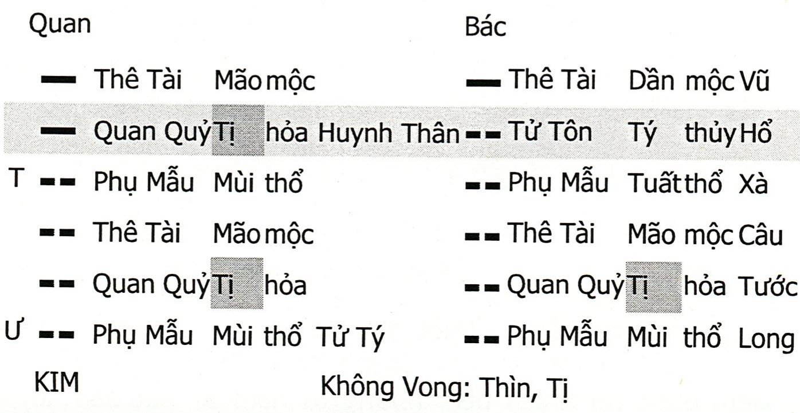
    - **Hình này chứng minh điều gì**
      - Là cán bộ nhưng năm nay hỏng đề bạt; tài vận kém, bị một phụ nữ vay tiền lớn chây ì không trả sau khi phá sản vì cơ quan.
    - **Từ đâu mà thấy được**
      - Quan Quỷ Tị hỏa hào 5 động sinh Thế nhưng hóa hồi đầu khắc Tý thủy; Thê Tài nhập Mộ hào Ứng âm Mùi thổ; Ứng lâm Thanh Long hợp Nhật đóng kín Tài khố.
- Kết quả thực tế ngoài đời:
  - Mọi lời dự đoán đều ứng nghiệm chuẩn xác ngay tại chỗ, đương số hoàn toàn tâm phục khẩu phục.
- Lý giải các bước suy luận chi tiết của tác giả:
  - Cơ sở luận giải về quan vận và việc đề bạt bất thành:
    - Quan Quỷ Tị hỏa lâm Nhật kiến Ngọ hỏa sinh phù, đồng thời cùng hào Thế Phụ Mẫu Mùi thổ tương hợp (Ngọ Mùi hợp), cho thấy người này thân mang chức sắc cán bộ.
    - Hào 5 là ngôi vị của lãnh đạo cấp trên, lâm Quan Quỷ phát động tương sinh cho hào Thế, biểu thị ban đầu cấp trên rất có ý định cất nhắc, đề bạt anh ta lên vị trí lãnh đạo.
    - Nhưng Quan Quỷ hào 5 phát động lại hóa hồi đầu khắc (Quan Quỷ Tị hỏa biến Tử Tôn Tý thủy quay lại khắc Hỏa), biến thành tượng bất thành, vì thế việc hứa hẹn thăng chức bị hủy bỏ, không thành hiện thực.
  - Cơ sở luận giải về tài vận sa sút:
    - Hào Thê Tài Mão mộc không được Nhật Nguyệt sinh phù (Nhật Ngọ tiết khí, Nguyệt Mùi làm Mộ địa).
    - Nguyên thần sinh tài là Tử Tôn Tý thủy lại bị Nguyệt khắc (Mùi thổ khắc Tý thủy) và Nhật xung (Ngọ hỏa xung Tý thủy thành Nhật phá), nguồn tài sinh hóa bị chặt đứt nên tài vận bản thân không tốt.
  - Cơ sở luận giải về việc cho người nữ vay mượn bị chây ì nợ xấu:
    - Hào Thê Tài Mão mộc nhập Mộ tại hào Ứng Phụ Mẫu Mùi thổ (Mùi là Mộ khố của Mộc), là tượng đem tiền bạc của mình đưa cho người khác vay mượn cất giữ.
    - Hào Ứng là hào âm, đại diện cho đối tượng vay tiền là phái nữ.
    - Hào Ứng lâm Thanh Long (Thanh Long chủ về cao quý, chính phủ, công chức viên chức), kết hợp hào 5 Quan Quỷ phát động tiết khí hào Thê Tài (Quan Quỷ đại diện cho chính quyền, cơ quan), cho thấy đối phương bị phá bại do công việc liên quan tới cơ quan chính quyền.
    - Hào Ứng Mùi thổ là Tài khố, lại cùng Nhật kiến Ngọ hỏa tương hợp đóng chặt cửa khố; khố bị đóng kín là tượng đối phương ôm tiền giữ chặt vì hám lợi keo kiệt, dù trong tay sẵn tiền vẫn nại đủ lý do để không mở hầu bao trả nợ.

#### Đoán vận khí mở quán bar bị công an niêm phong (Quẻ Thủy Phong Tỉnh biến Phong Thủy Hoán)

- Bối cảnh ngày tiếp theo:
  - Sang ngày hôm sau, tức ngày Ất Mùi tháng Mùi, lại có một người đàn ông khác tìm đến nhờ tác giả dự đoán vận khí sự nghiệp làm ăn.
- Dữ kiện gieo quẻ và thông tin can chi:
  - Thời gian gieo quẻ: Ngày Ất Mùi, tháng Mùi.
  - Tuần không: Thìn, Tị (MỘC Không Vong).
  - Quẻ thu được: Thủy Phong Tỉnh biến Phong Thủy Hoán.
- Lời phán quyết trực tiếp của tác giả:
  - "Anh vốn dĩ là người có chức vụ quyền hạn, nhưng hiện tại đã bị mất chức quan."
  - "Năm nay anh chuyển sang làm ăn buôn bán, kinh doanh dịch vụ có dính líu đến phục vụ sắc tình; do đó vừa mới khai trương mở cửa thì cơ quan công an đã ập vào niêm phong đóng cửa quán của anh, hiện tại anh chưa có bất kỳ khả năng nào để gầy dựng làm lại."
- Phản hồi thực tế đầy cay đắng của đương số:
  - Người này giật mình thán phục đáp: "Đúng thế! Tôi vốn có chức quan thật, nhưng bị người ta ngáng chân đạp xuống mất chức. Năm nay muốn xoay sang làm ăn kinh doanh, tôi đã mở một quán bar ở vùng Ngũ Đài Sơn này. Cũng chỉ vì mờ mắt hám tiền, tôi đã thuê mướn một vài cô gái tiểu thư tiếp viên phục vụ sắc tình. Kết quả cay đắng là ngay đúng ngày đầu tiên mở cửa khai trương, quán đã bị kẻ khác tố cáo; cục công an ập tới niêm phong toàn bộ quán bar của tôi, chẳng thu hồi lại được một đồng nào, tổn thất mất mấy vạn tệ. Hiện tại tôi rất muốn gầy dựng lại cơ nghiệp nhưng cạn kiệt vốn liếng, không biết xoay xở ra sao!"
- Phán quyết vận khí làm ăn bị công an niêm phong dựa trên quẻ Thủy Phong Tỉnh biến Phong Thủy Hoán:
  - **Hình 128.** Quẻ Tỉnh biến Hoán
    - 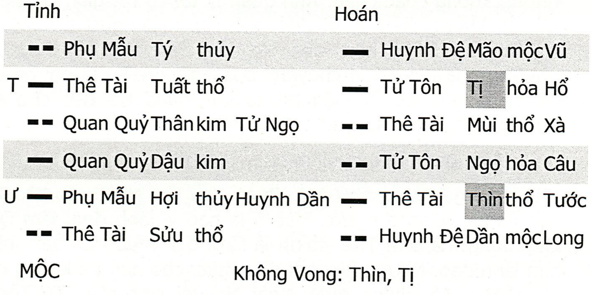
    - **Hình này chứng minh điều gì**
      - Vốn có quan nhưng đã mất quan; mở quán bar dính sắc tình bị công an niêm phong ngay ngày đầu khai trương, cụt vốn phá sản.
    - **Từ đâu mà thấy được**
      - Hào 5 trì Thế nhưng hào 3 Quan Quỷ Dậu kim động hóa hồi đầu khắc Ngọ hỏa; Hào sơ Thê Tài Sửu thổ lâm Long Nguyệt phá Nhật phá, Tý thủy động khắc Ngọ hỏa.
- Lý giải các bước suy luận chi tiết của tác giả:
  - Cơ sở luận giải về việc từng có chức quan nhưng đã bị truất bãi:
    - Xem quan vận lấy Quan Quỷ làm Dụng thần. Hào Thế ngự tại hào 5 (ngôi vị tôn quý của người đứng đầu, lãnh đạo), lại thêm Quan Quỷ Dậu kim đắc Nguyệt sinh vượng tướng, là tượng trước kia từng có chức quan quyền lực.
    - Tuy nhiên, hào 3 Quan Quỷ Dậu kim phát động hóa Tử Tôn Ngọ hỏa hồi đầu khắc, chính là điềm báo bị lột chức, mất quan. Vì thế đoán định người này vốn có chức quyền nhưng hiện thời đã mất sạch.
  - Cơ sở luận giải về việc kinh doanh phá sản do tệ nạn sắc tình và công an đóng cửa:
    - Xem tài vận lấy Thê Tài làm Dụng thần. Thoạt nhìn, hào Thê Tài Tuất thổ trì Thế, cả Nhật lẫn Nguyệt đều là Mùi thổ Tài tinh trợ giúp, hào Tài cực kỳ vượng tướng, người học nông cạn dễ ngỡ là tài vận tất sẽ đại phát.
    - Nhưng xét về nguồn mạch sinh tài, Tử Tôn Ngọ hỏa lại phục tàng dưới hào 4 Quan Quỷ Thân kim, không được Nhật Nguyệt sinh phù, lại bị hào 6 Phụ Mẫu Tý thủy phát động khắc tuyệt, khiến cội nguồn sinh tài khô kiệt hoàn toàn.
    - Hào sơ Thê Tài Sửu thổ bị cả Nguyệt lệnh Mùi thổ lẫn Nhật kiến Mùi thổ xung phá (vừa Nguyệt phá vừa Nhật phá), là tượng không có tài lộc, phá bại sạch bách.
    - Hào 6 Phụ Mẫu Tý thủy tuy không vượng nhưng được hào 3 Quan Quỷ Dậu kim phát động tương sinh trợ lực; Quan Quỷ đại diện cho bộ máy chính quyền, lâm Câu Trần (Câu Trần thời xưa là nha môn, thời nay là đồn công an, cục công an), biểu thị chính quyền cơ quan công an đã ra tay cắt đứt triệt để nguồn tài lộc của anh ta.
    - Hào sơ là hào khởi đầu, biểu thị bước đi đầu tiên của sự việc; hào Thê Tài đóng tại hào sơ bị Nguyệt phá chỉ rõ vừa mới khởi bước bắt đầu (ngày đầu khai trương) là đã lập tức phá tài.
    - Hào sơ lại lâm Thanh Long, mà Thanh Long chủ về tửu sắc ăn chơi hoan lạc, khẳng định rõ nguyên nhân việc phá tài bị niêm phong có liên quan mật thiết đến tệ nạn sắc tình, gái gú.

#### Đoán thời điểm xây nhà mẹ và việc riêng cho người phụ nữ (Quẻ Phong Thủy Hoán)

- Bối cảnh gieo quẻ:
  - Cùng ngày Ất Mùi tháng Mùi, một người phụ nữ tìm đến nhờ tác giả dự đoán xem khi nào căn nhà của mẹ cô mới có thể xây dựng hoàn thành.
  - Quẻ thu được là Phong Thủy Hoán (ví dụ này tác giả có dẫn chiếu đã phân tích chi tiết ở chương "Luận phương cục trong lục hào").
- Lời phán quyết chi tiết của tác giả:
  - Về việc xây dựng nhà cửa của người mẹ:
    - Hiện tại mẹ cô vẫn chưa được cơ quan nhà nước phê duyệt mảnh đất xây dựng đó.
    - Phải chờ đến tháng 11 âm lịch năm nay (tháng Tý) mảnh đất mới chính thức được phê duyệt giấy tờ; và phải đến tháng 5 âm lịch năm sau (tháng Ngọ) căn nhà mới có thể xây dựng hoàn tất.
    - Nơi ở hiện tại của người mẹ là đi thuê nhà của người khác; con đường dẫn tới nơi ở của mẹ cô phải đi qua một cây cầu; lân cận khu vực đó có một am ni cô thờ tự; chung quanh có những rặng cây rừng thấp thoáng ẩn hiện.
    - Bản thân mẹ cô là người đã quy y nương nhờ cửa Phật; hào trạch lâm Chu Tước cho thấy bà cụ hằng ngày đều chăm chỉ tụng kinh niệm Phật trong nhà.
    - Người chủ nhà cho mẹ cô thuê nhà mắc chứng bệnh đi tiểu nhiều lần (tiểu rắt, tiểu són), mỗi ngày phải ra vào nhà xí liên tục nhiều lần.
  - Về phương diện đời sống hôn nhân và cá nhân của đương số:
    - Cô kết hôn vào khoảng năm 1992 (Nhâm Thân) hoặc năm 1993 (Quý Dậu).
    - Đến năm 1994 (Giáp Tuất) đã sinh hạ được một người con trai.
    - Mối quan hệ vợ chồng hiện thời không mấy êm ấm hòa thuận, hai vợ chồng đã rất hiếm khi chung chăn gối với nhau.
    - Mắt bên trái của cô có tật bị cận thị nhẹ.
- Nghiệm chứng thực tế ngoài đời:
  - Người phụ nữ xác nhận chuẩn xác cô kết hôn vào năm 1993; toàn bộ các tình tiết còn lại về căn nhà của mẹ, am ni cô, cây cầu, bệnh của chủ nhà, sinh con trai, quan hệ vợ chồng lạnh nhạt và tật cận thị ở mắt trái đều hoàn toàn ứng nghiệm không sai một ly.

#### Giao lưu học thuật và phán đoán tuyệt diệu với người học Dịch 20 năm (Quẻ Trạch Thủy Khốn biến Trạch Phong Đại Quá)

- Bối cảnh cuộc tao ngộ và thử thách học thuật:
  - Một người đàn ông tự xưng đã miệt mài nghiên cứu Kinh Dịch hơn 20 năm, nghe danh tiếng phán đoán chuẩn xác của đoàn tác giả cũng tìm đến để giao lưu học thuật.
  - Tác giả Vương Hổ Ứng liền đưa quẻ Thủy Phong Tỉnh biến Phong Thủy Hoán (vụ quán bar vừa mở cửa đã bị công an niêm phong ở trên) ra làm đề bài khảo sát, nói rõ là quẻ đoán tài vận và đề nghị ông ta đoán thử.
  - Người học Dịch 20 năm xem xét rồi tự tin khẳng định: người này năm nay ắt sẽ "đại phát tài lộc" - phán đoán sai lệch hoàn toàn trái ngược với thực tế bi đát.
  - Khi tác giả thông báo ông ta đã đoán sai hoàn toàn, người đàn ông này tỏ vẻ không phục; ông ta lập tức lấy ba đồng xu tự tay gieo một quẻ Trạch Thủy Khốn biến Trạch Phong Đại Quá, rồi thách thức yêu cầu tác giả đoán xem sự tình của bản thân ông ta.
- Dữ kiện gieo quẻ và thông tin can chi:
  - Thời gian gieo quẻ: Ngày Ất Mùi, tháng Mùi.
  - Tuần không: Thìn, Tị (KIM Không Vong).
  - Quẻ thu được: Trạch Thủy Khốn biến Trạch Phong Đại Quá.
- Màn phối hợp phán quyết xuất thần của Vương Hổ Ứng và Đoàn Kiến Nghiệp:
  - Tác giả hoàn toàn không buồn mở miệng hỏi ông ta muốn cầu đoán chuyện gì, vừa nhìn vào quẻ tượng liền đoán ngay tại chỗ:
    - "Ông tuy là người ăn cơm nhà nước (làm việc trong cơ quan nhà nước), nhưng cả đời không có số làm quan, tiền lương bổng lộc hàng tháng thấp đến mức thảm hại!"
  - Vừa dứt lời, Dịch hữu Đoàn Kiến Nghiệp đứng cạnh bên liền tiếp lời chêm vào một câu kinh người:
    - "Tiền lương mỗi tháng của ông hiện nay chỉ vỏn vẹn đúng 530 tệ!"
    - Câu nói khiến đối phương kinh hoàng biến sắc; tiền lương thực tế hàng tháng của ông ta tại cơ quan quả nhiên chuẩn xác từng đồng là 530 tệ.
- Tác giả tiếp tục phán quyết sâu về gia cảnh, bệnh tật và người vợ:
  - Về nhà ở: "Ông cống hiến công tác bao nhiêu năm trời như vậy, nhưng ngay cả một căn nhà lầu cũng không có, hiện tại vẫn phải sống trong căn nhà trệt cấp bốn."
  - Về thể trạng bệnh tật: "Ông mắc chứng bệnh về đường tiêu hóa dạ dày ruột, suốt ngày người rã rượi uể oải thiếu sức sống; lúc ăn cơm thì nhai kỹ nuốt chậm như ngậm hột thị, ngồi nhai cả buổi trời cũng không nuốt xong nổi một bát cơm."
  - Về hôn nhân và người vợ: "Ông là người cực kỳ sợ vợ, người vợ quản thúc ông vô cùng nghiêm ngặt khắt khe; vợ ông làm việc hành chính trong văn phòng; bên nhà vợ có 5 anh chị em; người vợ tuy bản thân không có chức quan nhưng lại nắm giữ thực quyền lớn trong tay."
- Phán đoán cuộc đời, mức lương và bệnh tật dựa trên quẻ Trạch Thủy Khốn biến Trạch Phong Đại Quá:
  - **Hình 129.** Quẻ Khốn biến Đại Quá
    - 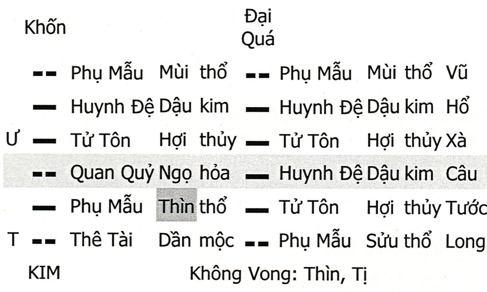
    - **Hình này chứng minh điều gì**
      - Công chức lương thấp 530 tệ, ở nhà trệt; mắc bệnh tiêu hóa ăn chậm; sợ vợ bị vợ quản chặt, vợ làm văn phòng có 5 anh em nắm thực quyền.
    - **Từ đâu mà thấy được**
      - Hào Thế Thê Tài Dần mộc hưu tù tuyệt tại Nhật Nguyệt; Phụ Mẫu hào 2 đóng nhà trệt; Quan Quỷ hào 3 Ngọ hỏa hóa Huynh Dậu kim; Ứng Thủy sinh Thế Mộc nhưng bị khắc.
- Nghiệm chứng thực tế và sự tâm phục khẩu phục:
  - Mọi lời suy đoán từ tiền lương 530 tệ, cảnh nhà trệt, thói quen ăn uống bệnh đường ruột đến nỗi sợ vợ và thực quyền của người vợ đều ứng nghiệm trăm phần trăm.
  - Người đàn ông học Dịch hơn 20 năm từ thái độ ngạo mạn không phục đã hoàn toàn kinh ngạc, tâm phục khẩu phục trước nghệ thuật Lục Hào phán đoán vi diệu và thần tốc của hai vị danh sư.

### Bà lão đoán bệnh xin giải pháp, khéo đoán trị bệnh nghiệm như thần

#### Bối cảnh gieo quẻ và thông tin thời gian
- Tham chiếu chuyên đề phân tích lý luận:
  - Ví dụ thực tế này đã được trình bày và phân tích nguyên lý ở chương "Nguyệt phá biện nghĩa", xin mời độc giả tham khảo thêm tại chương đó.
- Bối cảnh thỉnh cầu xem bệnh:
  - Vào năm 2000, khi tác giả vừa mới trở về từ Ngũ Đài Sơn, có một người có mẹ đang nằm viện đã tìm đến nhờ tác giả đoán bệnh giúp mẹ.
  - Tác giả đã cùng người này trực tiếp đi đến bệnh viện để xem xét thực tế.
- Thời điểm gieo quẻ và quẻ tượng thu được:
  - Thời điểm gieo quẻ: Vừa mới giao tiết lệnh được hơn mười phút.
  - Ngày tháng dự trắc: Ngày Đinh Dậu, tháng Thân.
  - Quẻ dịch: Bản thân bà lão tự tay gieo quẻ, được quẻ **Trạch Thiên Quải** biến **Trạch Hoả Cách**.

#### Luận đoán bệnh chứng, nguyên nhân và hoàn cảnh phong thủy
- Phán đoán bệnh trạng và quy luật phát tác theo canh giờ:
  - Tác giả đoán bà lão thường xuyên bị đau đầu, tim mạch không tốt.
  - Tuy nhiên, nguyên nhân chính nhập viện lần này là do khắp cơ thể bị sưng phù (phù thũng).
  - Quy luật sưng phù: Buổi sáng từ 3 giờ đến 7 giờ (giờ Dần - giờ Mão) hiện tượng sưng phù diễn ra khá nghiêm trọng; sau 7 giờ (giờ Thìn) thì phù thũng trên người tự động tiêu biến.
  - Triệu chứng đi kèm: Bệnh nhân bị ho kéo dài, đường hô hấp gặp nhiều khó khăn.
- Cảnh báo sai lầm trong điều trị tại viện:
  - Tác giả chỉ tay vào bình truyền dịch và khuyến cáo dứt khoát: "Bà nhập viện không nên truyền dịch, càng truyền dịch thì bệnh sẽ càng nghiêm trọng."
  - Phản ứng của bệnh nhân: Bà lão gật đầu lia lịa, xác nhận từng lời tác giả phán đoán đều hoàn toàn chuẩn xác.
- Luận đoán tâm lý tính cách và phong thủy nhà ở của đương sự:
  - Tính cách người bệnh: Bản thân bà có tính cách lạc quan, dù thân mang bệnh tật ốm đau nặng nề vẫn có sức chịu đựng và ý chí chống chọi kiên cường.
  - Thời điểm xây cất nhà: Bà xây dựng nhà ở vào năm 1998 (Mậu Dần).
  - Hướng cổng cửa: Cửa nhà mở tại hướng Đông Nam (cung Tốn).
  - Hình thế cây cối xung quanh: Tại hướng Đông Bắc (cung Cấn) có một ngọn cây; ngọn cây này có thế sinh trưởng rất đặc biệt, vừa mới phát triển nhú lên khỏi mặt đất thì thân cành đã xòe rộng ra xung quanh.

#### Phương giải trị bệnh và ứng nghiệm thực tế
- Thỉnh cầu phương pháp hóa giải:
  - Đối phương vô cùng kinh ngạc trước những phán đoán chuẩn xác đến từng chi tiết, liền tha thiết thỉnh cầu tác giả cho lời khuyên và phương pháp điều trị hỗ trợ.
- Phác đồ can thiệp kết hợp Y Dịch và chọn ngày lành:
  - Chọn ngày xuất viện: Tác giả trực tiếp chọn ngày cát lợi để bà làm thủ tục xuất viện về nhà.
  - Chỉ dẫn điều trị: Khuyên bà tiếp tục uống thuốc theo đúng lời dặn của bác sĩ điều trị, đồng thời phối hợp thêm một số liệu pháp hỗ trợ dựa trên nguyên lý Dịch học để cải thiện bệnh trạng.
  - Giới hạn của phương pháp: Tác giả nêu rõ các giải pháp trên chỉ giúp thuyên giảm và cải thiện bệnh trạng chứ chưa thể chữa khỏi triệt để dứt điểm căn bệnh.
- Dự ngôn về nhân duyên quý nhân và phương pháp đặc trị dứt điểm:
  - Thời điểm xuất hiện quý nhân: Sang tháng sau (tháng Dậu) sẽ có một vị thầy thuốc vân du tứ phương ghé qua thôn.
  - Phương pháp chữa trị: Vị thầy thuốc này dùng thuật châm cứu có thể trị khỏi triệt để căn bệnh.
  - Lời dặn dò: Nhắc nhở người nhà cần chú ý quan sát những người lạ mặt ghé đến địa phương hoặc tới nhà.
- Ứng nghiệm thần kỳ ngoài đời thực:
  - Chuyển biến sau xuất viện: Sau một tuần lễ xuất viện về nhà theo ngày đã chọn, bà lão đã có thể tự mình xuống giường đi lại bình thường.
  - Sự ngạc nhiên của xóm làng: Dân làng đều cảm thấy hết sức kỳ lạ, bởi lẽ một người bệnh nằm liệt giường suốt nửa năm trời mà đột nhiên chỉ trong vài ngày đã hồi phục khỏe lại, thậm chí có thể thong thả đi dạo khắp thôn.
  - Nhân duyên hội ngộ danh y: Đến tháng Dậu, quả nhiên có một thầy lang vân du tìm đến thôn đó.
  - Kết quả chữa dứt điểm: Người con gái nghe tin vị thầy lang này tinh thông châm cứu liền vội vàng thỉnh về nhà; thầy lang chỉ dùng duy nhất một châm cứu thì căn bệnh dai dẳng của bà lão đã hoàn toàn bình phục như thần.

### Người xin đoán hỏi dồn dập, một quẻ kiêm đoán âm dương trạch

- Vào ngày Bính Dần tháng Thân năm 2000, một người đàn ông đến xin xem bói, thắc mắc mồ mả của cha mẹ liệu có ảnh hưởng đến tiền tài, vận mệnh của bản thân hay không.
- Quẻ khởi được: Sơn Phong Cổ biến Sơn Thiên Đại Súc; Tuần Không tại Tuất và Hợi.

#### Quẻ Sơn Phong Cổ biến Đại Súc: Đoán định phong thủy phần mộ âm trạch

- Phân tích toàn diện hoàn cảnh phong thủy mộ phần và họa phúc gia đạo qua quẻ Sơn Phong Cổ biến Sơn Thiên Đại Súc:
  - **Hình 130.** Quẻ Sơn Phong Cổ biến Sơn Thiên Đại Súc
    - 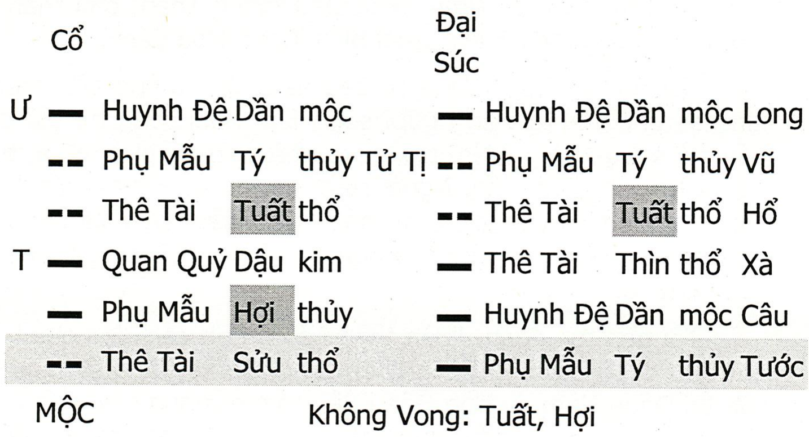
    - **Hình này chứng minh điều gì**
      - Phần mộ cha mẹ là mộ hợp táng chôn nhờ nghĩa trang người khác ở vùng rừng núi; trước mộ có ngã ba đường, Tây Bắc có hố đất lớn khiến quan vận tài vận đều tắc trở; Đông Bắc từng bị chặt cây gây tai nạn cho anh em nhưng sau đó phát tài.
    - **Từ đâu mà thấy được**
      - Phụ Mẫu Hợi thủy hào 2 lâm Câu Trần hợp Nhật Dần mộc và hợp Ứng Dần mộc; hào sơ Sửu thổ động hợp Phụ Mẫu Tý thủy hào 5 và hào biến Tý thủy tạo ngã ba; Tuất thổ Không Vong ở Tây Bắc; Dần mộc hào 6 Nguyệt phá được Nhật thần thực phá lâm Thanh Long.
- Luận đoán trực tiếp của tác giả về thực trạng mồ mả âm trạch:
  - Mộ của cha mẹ là mộ hợp táng, không phải táng ở nghĩa trang chọn mới mà táng nhờ trong khu nghĩa trang của gia đình người khác.
  - Phần mộ tọa lạc tại khu vực rừng núi, tọa Tây Bắc hướng về Đông Nam, đất trong huyệt mộ lẫn nhiều đá và cát.
  - Vùng đất này người khác táng thì rất tốt, nhưng gia đình đương số táng vào thì chưa hẳn đã thuận lợi.
  - Phía trước mộ có một ngã ba đường, một nhánh dẫn về hướng Đông Bắc, một nhánh dẫn về hướng Tây Bắc; ngã ba này rất bất lợi cho đường cầu quan danh vọng.
  - Phía Tây Bắc của ngôi mộ có một hố đất lớn gây tổn hại tài vận của đương số, khiến cho cả tiền bạc lẫn quan lộ đều trắc trở không hanh thông.
  - Phương Đông Bắc trước kia vốn có cánh rừng cây nhưng đã bị người ta đốn hạ; sau khi rừng bị chặt thì trong anh em đã có người gặp tai nạn xe cộ; tuy nhiên cánh rừng sau đó đã tự tái sinh mọc lại, biến họa thành phúc, hiện nay người anh em bị tai nạn đó đã phát đại tài.
- Phản hồi thực tế và sự ứng nghiệm từ người xin đoán:
  - Người này kinh ngạc xác nhận mọi chi tiết tác giả đưa ra đều chính xác hoàn toàn.
  - Mộ phần của cha mẹ quả thực được gửi táng trong nghĩa địa của gia đình một người bạn thân.
  - Môi trường cảnh quan xung quanh mộ chuẩn xác từng chi tiết; bản thân đương sự từ trước đến nay tài vận lận đận, đường quan lộ bế tắc.
  - Mộ hạ táng năm 1988 (Mậu Thìn), đến năm 1989 (Kỷ Tỵ) khu rừng phía Đông Bắc bị người ta chặt trộm cây cối, liền sau đó một người anh trai của anh ta bị tai nạn giao thông nghiêm trọng; hiện tại người anh đó làm ăn vô cùng phát đạt, giàu có bậc nhất.
- Các bước suy luận và căn cứ Dịch lý phân tích âm trạch:
  - Định Dụng thần mồ mả: Lấy Phụ Mẫu làm Dụng thần; trong quẻ Phụ Mẫu lưỡng hiện (Phụ Mẫu Hợi thủy tại hào 2 và Phụ Mẫu Tý thủy tại hào 5). Do mộ phần là mô đất nhô cao đắp nổi, mà Thần thú Câu Trần chủ về nhô ra, phồng lên, nên chọn hào lâm Câu Trần là Phụ Mẫu Hợi thủy tại hào 2 làm Dụng thần huyệt mộ.
  - Tượng mộ hợp táng và táng nhờ đất người ngoài: Hào Dụng thần Phụ Mẫu Hợi thủy tương hợp với Nhật thần Bính Dần (Dần Hợi hợp), chủ về hai người hợp táng chung một huyệt. Mặt khác, Phụ Mẫu Hợi thủy tác hợp với hào Ứng (Huynh Đệ Dần mộc), hào Ứng tượng trưng cho người ngoài, do đó kết luận mộ táng nhờ trong nghĩa trang gia tộc của người khác.
  - Môi trường rừng núi và địa thế huyệt mộ: Quẻ thuộc cung Tốn (Tốn là rừng cây, núi rừng), quẻ ngoại là Cấn (núi non), quẻ nội là Tốn (cây cối), cho nên ngôi mộ tọa lạc tại nơi rừng núi. Hào Thế ngự hào 3 Quan Quỷ Dậu kim đại diện cho huyệt mộ; Dậu kim ngũ hành thuộc Kim tượng trưng cho đất có nhiều sỏi đá và cát. Hào Ứng lâm Thanh Long chứng tỏ cuộc đất này đại cát đại lợi cho gia đình người khác.
  - Ngã ba đường phía trước huyệt mộ: Phụ Mẫu Tý thủy ngự tại hào 5, hào 5 là đường sá. Hào sơ Thê Tài Sửu thổ phát động hợp hào 5 Tý thủy, đồng thời lại hợp với hào biến Phụ Mẫu Tý thủy (hào biến và hào 5 đồng vị Tý thủy nên đều là đường), hai luồng đường cùng tương hợp hội tụ tại Sửu thổ, tạo thành tượng hai ngã đường giao cắt. Dụng thần Phụ Mẫu Hợi thủy ở hào 2, Sửu thổ nằm ở hào sơ ngay cạnh; trong Lục hào quy ước dưới là phía trước, trên là phía sau, do đó ngay phía trước mộ có ngã ba đường. Tý thủy là đường hợp Thê Tài Sửu thổ (Sửu là phương Đông Bắc); nội quái động hóa sang quái Càn (Càn là phương Tây Bắc), nên đoán ra một nhánh dẫn về Đông Bắc, một nhánh dẫn về Tây Bắc.
  - Luận giải bế tắc công danh và hao tổn tài vận: Quan Quỷ Dậu kim trì Thế chủ về quan vận cầu danh, song Nguyên thần sinh Thế là Thê Tài Sửu thổ động lại bị hào biến Phụ Mẫu Tý thủy tương hợp níu chân (tham hợp quên sinh, hợp trói), khiến Thổ không thể chuyên tâm sinh Kim, vì thế quan vận bất lợi. Phía Tây Bắc có hố đất lớn do hào 4 Thê Tài Tuất thổ lâm Tuần Không (Thổ phùng Không thì sụt lở thành hố trũng, Tuất là phương Tây Bắc); Thê Tài lâm Không không thể phát sinh tài lực nuôi Thế, kéo theo tài vận suy thoái.
  - Vụ việc chặt cây, tai nạn xe cộ và phát tài của người anh em: Hào 6 Huynh Đệ Dần mộc ngự phương Đông Bắc, tượng trưng cho rừng cây; Dần mộc gặp tháng Thân xung khắc là Nguyệt phá, chủ về cây cối bị đốn chặt tan hoang. Tuy nhiên có Nhật thần Bính Dần đến thực phá (Nhật thần điền thực xung phá), biểu thị mầm cây tự vươn lên mọc lại xanh tốt. Hào lâm Huynh Đệ tất ứng nghiệm vào anh em trai; Huynh Đệ Dần mộc lại đóng vai trò Dịch Mã (cục Thân Tý Thìn lấy Dần làm Mã), chủ về xe cộ lưu thông gặp nạn. Nhờ Dần mộc được Nhật thực phá lại lâm Thanh Long cát thần (Thanh Long chủ tiền tài của cải dồi dào), nên sau cơn hoạn nạn người anh đó lại phát tài đại phú.

#### Luận giải sức khỏe người vợ và việc học hành, thương tật của con cái

- Tác giả chủ động mở rộng quẻ luận tiếp gia cảnh:
  - "Sức khỏe của vợ anh không tốt, thường xuyên gặp phải ác mộng rùng rợn."
  - "Đứa con nhỏ học hành lực học chỉ ở mức tạm được, điểm thi vừa vặn chạm chuẩn nhập học. Tuy nhiên thể chất đứa trẻ cũng không tốt, hay gặp thương tai sứt sẹo, vùng lưng mang tật bệnh."
- Phản hồi thực tế và sự tiếc nuối của người hỏi:
  - Người này than thở rằng nếu như đến xin quẻ sớm hơn thì đã không uổng phí mất 3.000 tệ tiền chạy chọt oan ức.
  - Sự thực con trai anh ta thi tuyển vào trường trung cấp chuyên nghiệp, lúc thi xong ngỡ làm bài không tốt nên đã tức tốc mang 3.000 tệ đi biếu xén xin điểm châm chước; đến khi công bố kết quả thì số điểm thực tế vừa khít điểm chuẩn đậu, thành ra mất toi món tiền oan uổng.
  - Cách đó mấy ngày, con trai bất cẩn ngã từ trên giường xuống đất gãy mất mấy chiếc răng, trên lưng lại mới mọc một cái nhọt bọc đau nhức; tình trạng sức khỏe ốm yếu của người vợ cũng hoàn toàn đúng như lời thầy đoán.
- Căn cứ Dịch lý luận đoán về vợ và con cái:
  - Luận bệnh tật của vợ: Xem người vợ lấy Thê Tài làm Dụng thần; trong quẻ Thê Tài lưỡng hiện (hào sơ Sửu thổ và hào 4 Tuất thổ), chọn hào sơ Thê Tài Sửu thổ phát động làm Dụng thần. Sửu thổ chính là Mộ khố của Quan Quỷ Kim, kẻ mang Mộ khố Quan Quỷ vào thân tất trong người ắt có mầm mống tật bệnh. Quan Quỷ Dậu kim đóng tại hào 3 (hào 3 tượng là giường chiếu) lại lâm Đằng Xà (Đằng Xà chủ quái dị, mộng mị kinh hoàng), vì thế vợ nằm ngủ trên giường thường xuyên gặp ác mộng.
  - Luận thương tật của con cái: Xem con cái lấy hào Tử Tôn làm Dụng thần; Tử Tôn Tị hỏa phục thần ẩn dưới hào 5 Phụ Mẫu Tý thủy. Phi thần Tý thủy tương khắc Phục thần Tị hỏa, đồng thời Tử Tôn Tị hỏa cùng với Nhật thần Dần mộc và Nguyệt kiến Thân kim cấu thành thế Tam hình (Dần - Tị - Thân vô ân chi hình), do đó con cái thể chất yếu đuối, dễ gặp tai nạn thương tích đổ máu.
  - Bệnh chứng ở phần lưng của con: Phụ Mẫu chủ về ngực lưng, hào 5 trên cơ thể cũng là vị trí ngực và lưng; theo phép Âm Dương thì hào dương chủ về ngực, hào âm chủ về lưng (hào 5 là hào âm Tý thủy) khắc phạt Tử Tôn, vì vậy xác định bệnh phát sinh ở phần lưng (nhọt bọc mọc ở lưng).
  - Thi cử vừa đủ điểm nhập học: Tử Tôn phục dưới hào Phụ Mẫu, hào Phi thần Tý thủy lại tương hợp với hào sơ Sửu thổ lâm Chu Tước; Phụ Mẫu lẫn Chu Tước đều là văn thư thi cử, thể hiện thông tin đứa trẻ đang trong thời kỳ học hành ứng thí. Quan Quỷ và Phụ Mẫu tuy vượng tướng nhưng Phụ Mẫu Hợi thủy lâm Tuần Không, nên thành tích học tập thi cử không thể đạt điểm quá cao. Hào Thê Tài Sửu thổ phát động sinh Quan Quỷ, đúng như khẩu quyết cổ nhân "Tài động sinh Quan, may mắn gọi tên", điểm số vừa đủ chạm điểm sàn đậu trường.

#### Chi tiết bệnh cảnh, tính tình người vợ và quẻ Hoán biến Tốn đoán bệnh mẹ vợ

- Đương số gặng hỏi chi tiết về tình trạng sức khỏe của người vợ:
  - Tác giả vạch rõ: "Vợ anh gặp vấn đề nặng ở thắt lưng và hai chân, nhiễm bệnh phong hàn, mắt nhìn mờ không rõ vật, đầu thường xuyên đau nhức. Tính khí lại gắt gỏng bất hảo, thích can dự lo chuyện bao đồng, bạn bè rất ít; gia đình có 5 anh chị em và cô ấy là con cả. Cha vợ anh đã qua đời, mẹ vợ thì đang mắc chứng urê huyết tăng cao hoặc bệnh tiểu đường, thường xuyên tiểu tiện mất kiểm soát dầm ra quần."
  - Mọi lời dự đoán trên đều ứng nghiệm chuẩn xác trong thực tế.
- Lập luận Dịch lý về các triệu chứng và tính cách của người vợ (Quẻ Cổ biến Đại Súc):
  - Tật ở chân, thắt lưng và phong hàn: Quan Quỷ Dậu kim đóng ở hào 3 (hào 3 là vị trí thắt lưng, ngũ hành Kim chủ thắt lưng xương khớp), hào Thê Tài Sửu thổ ngự tại hào sơ (hào sơ là bàn chân, cẳng chân), nên thắt lưng và chân đều mang tật bệnh. Quẻ nằm ở cung Tốn (Tốn là phong gió), quy ra bệnh phong hàn xâm nhập.
  - Mắt mờ và đau đầu: Nguyên thần của Thê Tài là Tử Tôn Tị hỏa phục dưới hào 5 (hào 5 là ngũ quan, Hỏa chủ về mắt), bị hào Phi thủy khắc hại nên mắt có tật; hào 5 lại lâm Huyền Vũ (chủ tối tăm, mờ mịt), cho nên mắt nhìn đồ vật mờ ảo không rõ. Kỵ thần Huynh Đệ Dần mộc ngự hào 6 (hào 6 là đầu), Mộc lâm Thanh Long chủ về gân cơ co rút đau nhức, nên sinh chứng đau đầu kinh niên.
  - Tính khí nóng nảy và ít bạn bè: Hào Thê Tài Sửu thổ lâm Chu Tước (chủ khẩu thiệt thị phi, tranh cãi), hào Thê Tài Tuất thổ lâm Bạch Hổ (chủ hung hãn đấu đá), vì vậy tính tình nóng nảy bất hảo, thích ôm đồm việc người khác. Hào Tuất thổ có ngũ hành Thổ tỷ hòa với Dụng thần Sửu thổ đại diện cho bạn bè, song Tuất thổ lại lâm Tuần Không, chỉ ra vợ rất cô độc, ít bạn bè tri kỷ.
  - Vị thế con cả và số lượng anh em: Hào Thê Tài Sửu thổ phát động hợp với hào 5 (hào 5 là tôn vị quân vương, nắm quyền chỉ huy lãnh đạo, lời nói có trọng lượng), chứng tỏ người vợ giữ vai trò chỉ huy gánh vác trong gia đình, tức là con trưởng. Hào Thê Tài xuất hiện nhiều (lưỡng hiện) cho thấy nhà đông anh em; Thổ trong Hà đồ Lạc thư mang số 5 (Thủy 1, Hỏa 2, Mộc 3, Kim 4, Thổ 5), do đó đoán gia đình vợ có 5 anh chị em. Hào Phụ Mẫu hưu tù lâm Không nên cha vợ đã mất sớm.
- Chuyển dịch Thái cực đoán bệnh mẹ vợ qua quẻ Phong Thủy Hoán biến Tốn Vi Phong:
  - Bệnh tật của mẹ vợ được tác giả phát triển từ phương pháp chuyển dịch Thái cực của quẻ trước, lập thành quẻ Phong Thủy Hoán biến Tốn Vi Phong:
  - **Hình 131.** Quẻ Phong Thủy Hoán biến Tốn Vi Phong
    - 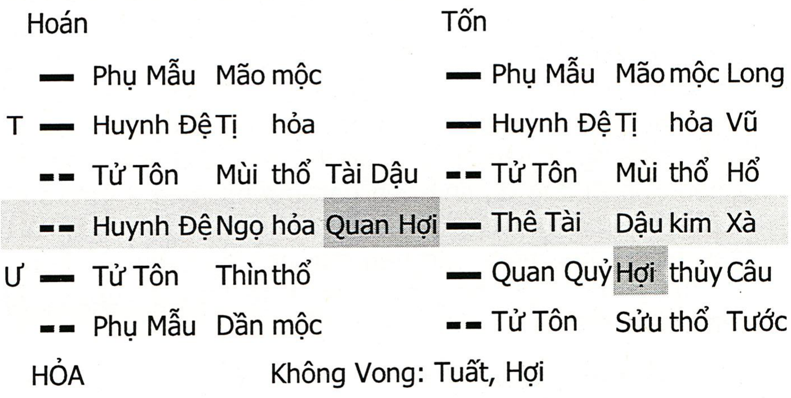
    - **Hình này chứng minh điều gì**
      - Mẹ vợ mắc bệnh về bàng quang, tiểu đường hoặc urê huyết, ban đêm nằm ngủ hay đái dầm ra giường; nơi ở là một tứ hợp viện cổ nhiều họ xen kẽ, sát đường lớn và gần một ngôi miếu hoang tàn.
    - **Từ đâu mà thấy được**
      - Hào Thế lâm Huynh Đệ Tị hỏa; Kỵ thần Quan Quỷ Hợi thủy phục hào 3 tiết niệu; hào 3 Huynh Đệ Ngọ hỏa động hóa Tài Dậu kim lâm Đằng Xà; hào sơ và 6 là Phụ Mẫu kẹp thành tứ hợp viện; hào 2 Tử Tôn Thìn thổ là miếu khố bị Nhật khắc.
- Lập luận Dịch lý bệnh chứng mẹ vợ (Quẻ Hoán biến Tốn):
  - Tuần Không: Tuất, Hợi.
  - Quẻ phát triển này tiếp tục lấy hào Thế làm Dụng thần. Quan Quỷ Hợi thủy đóng vai trò Kỵ thần, phục ngụ dưới hào 3; hào 3 trên thân thể chủ về thận, bàng quang và hệ thống tiết niệu; Thủy tượng trưng cho thận và nước tiểu, từ đó đoán ra chứng urê huyết tăng cao hoặc bệnh tiểu đường.
  - Hào 3 Huynh Đệ Ngọ hỏa phát động biến thành Thê Tài Dậu kim; hào 3 là giường nằm, Thê Tài là bài tiết nước tiểu, lâm Thần thú Đằng Xà chủ về quái dị, mộng mị, cho nên ứng vào hiện tượng trong giấc mơ mất kiểm soát mà tiểu tiện ra giường, đái dầm ra quần áo.

#### Dự đoán phong thủy dương trạch: Nhà lầu của đương số và tứ hợp viện của mẹ vợ

- Đương số tiếp tục hỏi dồn về tình hình phong thủy nơi ăn chốn ở hiện tại:
  - Dự đoán phong thủy nhà ở của đương số: "Gia đình anh hiện đang sinh sống trong nhà lầu, căn hộ của anh nằm tại tầng thứ ba. Nền móng ngôi nhà không tốt do bị bớt xén nguyên vật liệu thi công, cốt thép dùng làm nền nhà kém phẩm chất; sau khi xây cất xong xuôi thì vách tường xuất hiện vết nứt toác, sau đó đã từng phải trám trét tu bổ lại."
  - Dự đoán phong thủy nơi ở của mẹ vợ: "Gia đình mẹ vợ anh hiện cư ngụ trong một căn tứ hợp viện¹ truyền thống, có nhiều dòng họ khác nhau cùng ở chen chúc xen kẽ. Căn nhà nằm rất sát mặt đường lộ lớn; gần kề lân cận có một ngôi đền chùa miếu mạo, nhưng ngôi chùa miếu đó đã nhiều năm hoang phế không người trùng tu, cảnh tượng tả tơi lụp xụp."
  - Toàn bộ kết quả phán đoán về dương trạch hai bên gia đình đều ứng nghiệm chuẩn xác không sai một chi tiết.
- Căn cứ Dịch lý đoán dương trạch đương số (Dựa trên quẻ gốc Sơn Phong Cổ biến Đại Súc):
  - Số tầng nhà ở: Phụ Mẫu Hợi thủy ngự tại hào 2, hào 2 là trạch vị (nhà ở), Phụ Mẫu cũng chủ về phòng ốc; Nhật thần Bính Dần tương hợp hào 2 (Dần Hợi hợp, trên hợp dưới tạo tượng nhà nhiều tầng, nhà lầu). Hào Thế Quan Quỷ Dậu kim an ngự tại hào 3, cho nên đương sự sinh sống tại tầng 3 của ngôi nhà.
  - Nền móng rút ruột cốt thép: Hào sơ đại diện cho nền móng nhà, bị Nhật thần Dần mộc khắc chế, báo hiệu nền móng có khiếm khuyết lỗi kỹ thuật. Hào sơ Thê Tài Sửu thổ là Mộ khố của Quan Quỷ (Quan Quỷ chủ về sự cố, hư hỏng, khiếm khuyết); Sửu thổ chứa tàng Quan Quỷ Kim bên trong, Kim tượng trưng cho sắt thép xây dựng, vì thế đoán ra nền nhà bị bớt xén vật liệu, cốt thép sử dụng kém chất lượng.
  - Tường nứt và tu bổ: Hào 6 đại diện cho bờ tường; hào 6 Huynh Đệ Dần mộc bị Nguyệt kiến Thân kim xung phá (Nguyệt phá), báo hiệu tường nhà bị nứt nẻ rạn vỡ; tuy nhiên nhờ có Nhật thần Bính Dần đồng hành đến thực phá, tượng trưng cho vết nứt sau đó đã được dặm vá, tu sửa lại nguyên trạng.
- Căn cứ Dịch lý đoán dương trạch mẹ vợ (Dựa trên quẻ Hoán biến Tốn phát triển qua Thái cực):
  - Tứ hợp viện truyền thống: Hào sơ và hào 6 của quẻ đều mang lục thân Phụ Mẫu (hào sơ Phụ Mẫu Dần mộc, hào 6 Phụ Mẫu Mão mộc); Phụ Mẫu chủ về nhà cửa; thế quẻ trên dưới đều là Phụ Mẫu kẹp chặt bốn bề, tạo thành hình tượng nhà cửa tường vách vây kín chung quanh, chính là kết cấu nhà tứ hợp viện.
  - Nhiều họ ở chen chúc: Hào Ứng ngự tại hào 2 là tượng "Ứng phi nhập trạch" (người ngoài bay vào nhà); hào Ứng đại diện cho người khác họ, nghĩa là có người ngoài dòng họ đến ở chung, tạo nên cảnh nhiều gia đình khác họ sống xen kẽ trong cùng khuôn viên.
  - Nhà sát mặt đường: Hào Thế ngự tại hào 5, hào 5 là đường sá lưu thông, cho nên khuôn viên nhà ở tiếp giáp rất gần trục đường lớn.
  - Miếu hoang tả tơi gần nhà: Hào 2 là trạch vị, có Tử Tôn Thìn thổ đóng giữ; Thìn thổ chính là Mộ khố của Quan Quỷ Kim (Quan Quỷ chủ về quỷ thần, thần phật; Mộ khố của thần phật chính là đền chùa, miếu mạo), cho nên gần nhà tất có ngôi chùa miếu. Tử Tôn Thìn thổ lâm hưu tù lại bị Nhật thần Dần mộc tương khắc nặng nề, vì vậy xác định ngôi miếu mạo này đã hoang tàn đổ nát, nhiều năm dài không được ai đoái hoài tu sửa.

***

¹ **Tứ hợp viện**: kiểu nhà ở truyền thống của Trung Quốc, gồm có các dãy nhà xây vây quanh một khoảng sân chung ở chính giữa.

### Bài giảng tuyệt hay nhiều kiến thức, quẻ kỳ diệu khuynh đảo học viên

- **Bối cảnh khóa đào tạo Lục Hào tháng 10 năm 2003:**
  - Đầu tháng 10 năm 2003, tác giả tổ chức một khóa đào tạo dự đoán Lục Hào chuyên sâu, thu hút đông đảo học viên từ khắp các tỉnh thành trên cả nước quy tụ về tham dự.
  - Trong suốt quá trình diễn ra lớp học, rất nhiều học viên và người quen đã tranh thủ cơ hội hiếm có để nhờ tác giả gieo quẻ dự đoán các sự việc quan trọng trong đời sống.
  - Tác giả đã trực tiếp giải đáp cặn kẽ cho từng trường hợp, phân tích tỉ mỉ từng hào tượng biến hóa kỳ diệu, làm cho toàn thể học viên trong lớp hoàn toàn bị thuyết phục, thán phục không ngớt và tiếp thu được khối lượng kiến thức thực chiến vô giá.
  - Tất cả các học viên đều cùng chung nhận định rằng chuyến đi tham gia khóa học này thực sự vô cùng xứng đáng, mở rộng nhãn quan dự đoán học thuật lên một tầm cao mới.
  - *Ghi chú về thuật ngữ kiến trúc:* Tứ hợp viện (còn gọi là tứ hợp phòng) là một loại hình kiến trúc nhà ở truyền thống hợp viện (chung sân) điển hình của Trung Quốc, với bố cục các gian nhà được xây dựng bao quanh bốn phía của một khoảng sân ở chính giữa.

#### Chưa mở lời đã biết nguyện vọng, nói mớ liên tục tài vận xoay chuyển

- **Thông tin quẻ bói:**
  - Ngày xem: Ngày Nhâm Tý, tháng Dậu.
  - Tuần Không: Dần, Mão.
  - Người hỏi: Một người bạn của học viên trong lớp đến tham quan và muốn thử nghiệm độ chuẩn xác của dự đoán Lục Hào.
  - Quẻ gieo được: Quẻ Phong Thủy Hoán biến Thiên Thủy Tụng.

- Luận đoán phong thủy trạch vận, bệnh chứng và tài vận kỳ diệu qua quẻ Phong Thủy Hoán biến Thiên Thủy Tụng:
  - **Hình 132.** Sơ đồ quẻ Phong Thủy Hoán biến Thiên Thủy Tụng
    - 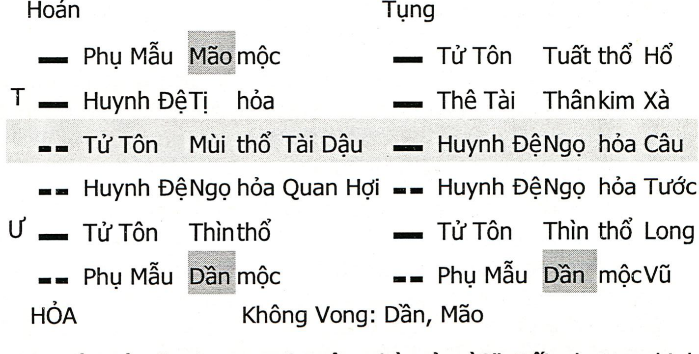
    - **Hình này chứng minh điều gì**
      - Minh chứng quẻ Hoán biến Tụng với hào 4 Mùi thổ độc phát, phản ánh chuẩn xác tâm sự xem nhà cửa, phong thủy bảo địa phát tài chục triệu, cùng các bệnh chứng chóng mặt, khó thở và cơ chế nói mớ phát tài.
    - **Từ đâu mà thấy được**
      - Hào sơ Phụ Mẫu Không Vong, hào 4 Tử Tôn Mùi thổ động lâm Câu Trần; hào Thế Tị hỏa trường sinh của Tài lâm Đằng Xà; hào 3 Ngọ hỏa ám động lâm Chu Tước; hào 6 Mão mộc nguyệt phá nhập Mộ hào 4.

##### Diễn biến vấn đáp thực chiến và sự kinh ngạc của học viên

- **Đoán trúng ý định xem việc nhà cửa khi người hỏi chưa kịp mở lời:**
  - Tác giả vừa nhìn quẻ đã chủ động mở lời: *"Anh xem chuyện nhà cửa à?"*
  - Người đến gieo quẻ vô cùng kinh ngạc thốt lên: *"Đúng rồi, tôi chưa nói mà sao ông biết?"*
  - Ngay lập tức, anh ta quay sang khen ngợi với người bạn học viên bên cạnh: *"Trình độ của thầy anh quả thực rất lợi hại!"*

- **Luận đoán phong thủy bảo địa phát tài chục triệu nhưng tiền vào nhanh ra nhanh:**
  - Tác giả luận tiếp: *"Căn nhà anh đang ở là một phong thủy bảo địa đó, nhà này phát tài hàng chục triệu tệ. Có điều là ở nhà này thì anh phải học cách quản lý tiền bạc, bởi vì tiền đến nhanh mà đi cũng nhanh."*
  - Đối phương liền gật đầu tán đồng tuyệt đối: *"Rất đúng! Sau khi vào ở thì chủ cũ của căn nhà này đã phát hơn 10 triệu tệ, nhưng bởi vì bài bạc nên đã phá tài, để trả nợ mới đem nhà bán lại cho tôi."*

- **Luận đoán ngoại cảnh đường sá uốn lượn quanh nhà:**
  - Tác giả tiếp tục nói: *"Gần nhà này có một con đường quốc lộ, đường không thẳng mà uốn lượn, đi vòng quanh nơi ở."*
  - Đối phương trả lời dứt khoát và rõ ràng: *"Đúng, là một con đường quốc lộ đi vòng."*

- **Luận đoán cảnh quan hồ bơi ở phía Bắc vừa mới tu sửa:**
  - Tác giả đoán tiếp: *"Ở phía bắc gần nơi ở có một hồ nước, có thể liên quan đến tắm rửa, gần đây đã sửa lại."*
  - Đối phương xác nhận ngay: *"Là một hồ bơi, vừa mới sửa lại."*

- **Luận đoán thể trạng bệnh tật chóng mặt và khó thở của đương số:**
  - Tác giả đoán: *"Anh có bệnh chóng mặt, đồng thời hơi thiếu oxy, ngực bức bối khó chịu, không đủ khí, có lúc không thể thở được."*
  - Đối phương xác nhận chính xác tuyệt đối: *"Rất đúng, đôi khi tôi bị ngã xuống đất vì chóng mặt, thường xuyên thức giấc giữa đêm bởi vì khó thở."*

- **Luận đoán tật nói mớ kỳ lạ kích hoạt tài vận phát triển:**
  - Tác giả đưa ra lời đoán bất ngờ: *"Anh có tật nói mớ, nhưng đó là điều tốt, anh vừa nói mớ thì phát tài ngay, không nói mớ thì trái lại tài vận đi xuống."*
  - Đối phương sững sờ kinh ngạc kêu lên: *"Thật kỳ lạ! Ông nói rất đúng, đích thực là như vậy. Không nói cũng không biết, tại sao nói mớ lại có liên quan đến tài vận nhỉ? Dự đoán Lục Hào thật thần kỳ, ngay cả những việc này mà cũng có thể xem ra được!"*

- **Khảo sát học viên và đoán chuẩn xác bệnh tình của người vợ:**
  - Sau khi nghe xong các kết quả trên, người này nhờ xem tiếp sức khỏe của vợ mình.
  - Tác giả tạo cơ hội thực hành cho học viên bên cạnh: *"Anh tập đoán thử xem."*
  - Vị học viên quan sát quẻ một lúc rồi đưa ra nhận định: *"Sức khỏe của vợ anh ta rất tốt, không có bệnh."*
  - Tác giả lập tức uốn nắn: *"Anh đoán chưa đúng, vợ anh ta có bệnh, sao nói là sức khỏe tốt được? Anh xem như thế nào?"*
  - Học viên trình bày quan điểm: *"Dụng thần hào Tài vượng tướng, không có gì khắc nó nên đoán như vậy."*
  - Tác giả bảo: *"Để tôi đoán tiếp nhé."* Rồi quay sang nói trực tiếp với người gieo quẻ: *"Vợ anh có bệnh nhũ tuyến tăng sinh và viêm phần phụ."*
  - Đối phương kinh ngạc xác nhận: *"Quá đúng, vợ tôi có khối u trong vú, thường hay đau bụng."*
  - Toàn bộ học viên trong lớp đều chưa hiểu căn nguyên và háo hức thỉnh giáo lý do nhận định chuẩn xác như vậy.

##### Phân tích quẻ tượng và các bước suy luận chi tiết

- **Cơ sở xác định tâm sự xem về nhà cửa:**
  - Hào sơ biểu thị tâm sự và trạng thái tâm lý sâu kín của người hỏi bói. Trong quẻ, hào sơ lâm Phụ Mẫu Dần mộc gặp Tuần Không (tuần giáp Thìn, Dần Mão Không Vong); Phụ Mẫu chủ về nhà cửa trạch xá, lâm Không Vong biểu thị tâm trạng lo lắng, băn khoăn bất an về nhà ở.
  - Trong quẻ có hào 4 Tử Tôn Mùi thổ độc phát, hào này lại lâm thần sát Câu Trần; mà Câu Trần chủ về công trình, kiến trúc, đất đai và nhà cửa.
  - Sự kết hợp giữa hào sơ Phụ Mẫu Không Vong và hào 4 lâm Câu Trần độc phát cho phép khẳng định ngay đương số đến hỏi về chuyện nhà cửa.

- **Cơ sở luận đoán phong thủy bảo địa phát tài chục triệu nhưng tiền tài tụ tán nhanh chóng:**
  - Xem về tài vận thì dùng hào Thê Tài. Phục thần Thê Tài Dậu kim phục dưới hào 4, được Nguyệt kiến Dậu kim đồng hành trợ giúp đắc lực, đồng thời được hào động Tử Tôn Mùi thổ sinh trợ nên cực kỳ vượng tướng, chủ về nơi ở đem lại nguồn tài lộc dồi dào.
  - Hào Thế lâm Huynh Đệ Tị hỏa trì Thế. Xét theo ngũ hành trường sinh, Tị hỏa chính là đất Trường Sinh của ngũ hành Kim (Thê Tài). Kỵ thần (Huynh Đệ) trì Thế nhưng lại nắm giữ đất Trường Sinh của Dụng thần Thê Tài, mang ý nghĩa tiền bạc thu vào rất nhanh và nhiều nhưng khó giữ, chi tiêu tiêu tán cũng cực kỳ nhanh chóng.
  - Số lượng tiền tài tính theo số tiên thiên của bát quái: Ngoại quái Tốn có số 5, nội quái Khảm có số 6; tổng hai quái hợp lại là 5 + 6 = 11, do đó tác giả đoán căn nhà giúp phát tài hơn 10 triệu tệ.

- **Cơ sở luận đoán đường quốc lộ uốn lượn đi vòng quanh:**
  - Hào 5 đại diện cho đường đi lối lại, trong quẻ hào 5 lâm hào Thế, phản ánh ngay cạnh nhà có đường quốc lộ lớn chạy qua.
  - Hào 5 lại lâm lục thú Đằng Xà; Đằng Xà có hình tượng uốn lượn, cong queo, uốn khúc không thẳng, cho nên con đường quốc lộ này không chạy thẳng tắp mà đi vòng quanh khu vực nhà ở.

- **Cơ sở luận đoán hồ nước/bể bơi tắm rửa ở phía Bắc vừa được tu bổ:**
  - Hào 2 là trạch hào (đại diện cho căn nhà), lâm Tử Tôn Thìn thổ. Thìn thổ là Thủy khố (kho chứa nước).
  - Thủy khố Thìn thổ gặp Nguyệt kiến Dậu kim (Thìn Dậu hợp, hoặc Thủy đắc Mộc Dục tại Dậu), Mộc Dục mang ý nghĩa tắm rửa, gội rửa, do đó biểu thị gần nhà có hồ nước liên quan đến tắm rửa hoặc bơi lội (hồ bơi).
  - Nội quái là quái Khảm, theo phương vị bát quái Khảm chủ phương Bắc, vì vậy hồ nước này tọa lạc ở phía Bắc của ngôi nhà.
  - Hào 2 lại lâm Thanh Long; Thanh Long chủ sự đổi mới, chỉnh trang, tân trang, nên đoán hồ bơi này gần đây vừa được cải tạo và sửa chữa lại.

- **Cơ sở luận đoán bệnh chứng váng đầu chóng mặt và ngực bức bối khó thở:**
  - Xem thể trạng sức khỏe bản thân đương số thì lấy hào Thế làm Dụng thần (Huynh Đệ Tị hỏa).
  - Nguyên thần sinh cho hào Thế là Phụ Mẫu Mão mộc ngự tại hào 6. Hào 6 Mão mộc vừa gặp Nguyệt phá (tháng Dậu xung khắc Mão mộc), vừa lâm Tuần Không, do đó hoàn toàn mất lực không thể sinh trợ cho hào Thế.
  - Hào 6 tượng trưng cho phần đầu trên cơ thể; bị Nguyệt kiến xung phá là tượng lắc lư đầu, váng đầu, hoa mắt chóng mặt.
  - Lại thêm hào 4 Tử Tôn Mùi thổ phát động, khiến Nguyên thần Mão mộc nhập Mộ tại Mùi (Mộc mộ tại Mùi), Nguyên thần nhập Mộ càng thêm bất lực trong việc phù trợ hào Thế.
  - Về vị trí cơ thể, hào 4 đại diện cho phần ngực; hào 4 lâm Câu Trần, mà Câu Trần chủ trướng nghẽn, tức tối bế tắc, dẫn tới triệu chứng ngực bức bối khó chịu, khí huyết không lưu thông, hô hấp thiếu dưỡng khí khiến ban đêm giật mình thức giấc vì ngạt thở.

- **Cơ sở luận đoán tật nói mớ trong giấc ngủ và cơ chế nói mớ phát tài:**
  - Hào Thế lâm Đằng Xà; Đằng Xà chủ về quái dị, mộng mị, chiêm bao trong giấc ngủ.
  - Hào Thế (Tị hỏa) và hào 3 (Ngọ hỏa) có cùng ngũ hành Hỏa. Hào 3 Huynh Đệ Ngọ hỏa gặp Nhật kiến Nhâm Tý thủy xung khắc, vì Ngọ hỏa vượng tướng đắc lực nên bị xung mà thành ám động.
  - Hào 3 đại diện cho giường chiếu, phòng ngủ; lại lâm Chu Tước chủ về lời nói, âm thanh, ngôn ngữ. Chu Tước ám động trên giường ngủ biểu thị lời nói không phát ra lúc tỉnh táo công khai mà thốt ra trong trạng thái vô thức trên giường ngủ, tức là tật nói mớ (nói mê).
  - Mặc dù hào 3 là Huynh Đệ (vốn là Kỵ thần khắc Tài), nhưng hào 3 Ngọ hỏa phát động lại sinh trợ cho hào 4 Tử Tôn Mùi thổ; tiếp đó hào 4 Tử Tôn Mùi thổ động lại quay sang sinh dưỡng cho Phục thần Thê Tài Dậu kim. Đây là chuỗi tương sinh tuần hoàn kín *"Huynh động sinh Tử, Tử động sinh Tài"*, do đó hễ người này nói mớ (hào 3 kích hoạt động) thì lập tức dẫn động sinh tài lộc, khiến tài vận xoay chuyển phát tài ngay.

- **Cơ sở luận đoán bệnh nhũ tuyến tăng sinh (u vú) và viêm phần phụ của người vợ:**
  - Xem sức khỏe của vợ thì lấy hào Thê Tài làm Dụng thần.
  - Vị học viên nhận định sai lầm vì chỉ thấy hào Tài Dậu kim vượng tướng đắc Nguyệt và được Tử Tôn động sinh, mà không nhìn ra biến hóa phức tạp của hào động.
  - Hào 4 Tử Tôn Mùi thổ phát động hóa ra biến hào Huynh Đệ Ngọ hỏa; biến hào Ngọ hỏa tương hợp với hào động Mùi thổ (Ngọ Mùi lục hợp). Đây là tượng *"tham hợp quên sinh"*, Tử Tôn mải mê hợp với biến hào mà bỏ quên việc sinh trợ cho Thê Tài Dậu kim; Dụng thần không được Nguyên thần sinh dưỡng tất chủ có mầm bệnh phát sinh.
  - Về vị trí cơ thể và tượng hào: Hào 4 tương ứng với phần ngực. Hào Tài chủ ẩm thực ăn uống (có tượng là dòng sữa), Tử Tôn là Nguyên thần sinh ra Tài nên đại diện cho bầu vú (tuyến sữa sinh dưỡng). Hào 4 lâm Câu Trần, Câu Trần chủ sưng to, tăng sinh, u cục bế tắc, do đó chuẩn đoán chính xác là bệnh nhũ tuyến tăng sinh (u vú lành tính).
  - Mặt khác, hào 3 Ngọ hỏa ám động lại tương hợp với hào 4 Tử Tôn Mùi thổ. Hào 3 Ngọ hỏa chính là Thai địa của ngũ hành Thổ (Tử Tôn Thổ trường sinh tại Thân, thai tại Ngọ). Tử Tôn chủ con cái, nơi Thai địa của Tử Tôn chính là cơ quan thụ thai, mang thai; xét trên cơ thể, hào 3 tương ứng với vùng bụng dưới, khung chậu và tử cung của phụ nữ. Hào 3 lâm Chu Tước, mà Chu Tước chủ viêm nhiễm, sưng tấy nóng rát, do vậy đưa ra kết luận người vợ bị chứng viêm phần phụ (đau bụng dưới).

### Mẹ chồng nàng dâu dẫn đến vợ chồng bất hòa, bản thân ngoại tình chờ ly hôn

#### Bối cảnh gieo quẻ và lời phán đoán thực chiến
- Thời gian và hoàn cảnh vấn sự:
  - Ngày Đinh Mùi, tháng Dậu (Tuần không: Dần, Mão).
  - Một học viên tìm đến hỏi về sự tình hôn nhân của bản thân.
  - Gieo được quẻ chính **Trạch Lôi Tùy**, hào 4 Phụ Mẫu Hợi thủy động biến thành quẻ biến **Thủy Lôi Truân**.
- Quẻ tượng và cấu trúc đồ hình lục hào:
  - Luận đoán vận mệnh hôn nhân và căn nguyên gia đạo qua quẻ Trạch Lôi Tùy biến Thủy Lôi Truân:
    - **Hình 133.** Sơ đồ quẻ Trạch Lôi Tùy biến Thủy Lôi Truân
      - 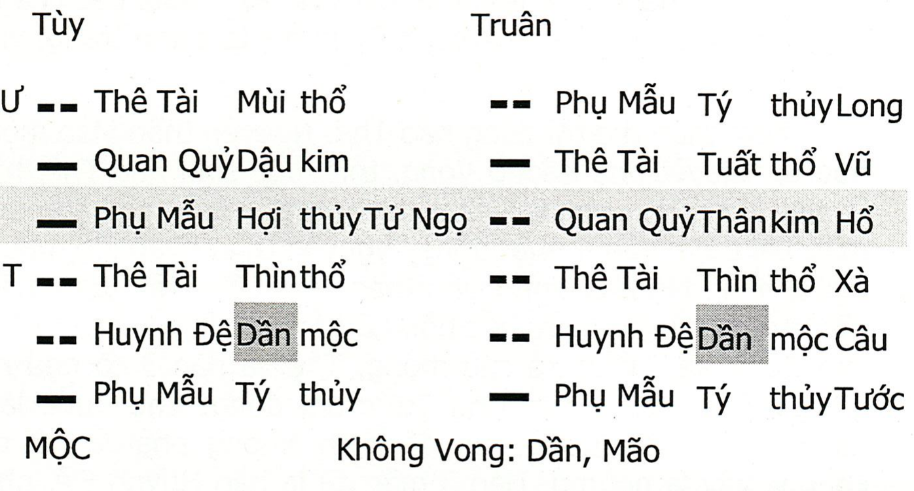
      - **Hình này chứng minh điều gì**
        - Hôn nhân đổ vỡ do mẹ chồng nàng dâu; người chồng ngoại tình với phụ nữ có chồng; năm Thân vợ chủ động đòi ly hôn.
      - **Từ đâu mà thấy được**
        - Ứng lâm Tài lâm Mộc Dục ở Nguyệt Quỷ; Thế lâm Tài hợp Nguyệt kiến Quỷ; Phụ Mẫu Hợi thủy động lâm Bạch Hổ khắc Nguyên thần Tử Tôn Ngọ hỏa hợp Ứng.
- Lời phán đoán trực tiếp của tác giả đối với người hỏi:
  - "Anh không phải là bạn trai đầu tiên của vợ anh, mối quan hệ giữa hai người hiện nay không tốt, chủ yếu là bởi vì quan hệ mẹ chồng nàng dâu bất hòa dẫn tới. Anh hiện đã có ngoại tình, người nữ này đã có chồng. Anh không muốn đề xuất ly hôn trước, chờ vợ anh mở miệng trước, năm sau có thể ly."
- Phản hồi thực tế:
  - Lời phán đoán chuẩn xác đến từng chi tiết góc khuất đời tư, khiến tất cả học viên có mặt đều vô cùng kinh ngạc.

#### Các tầng suy luận lý số và manh mối tượng quẻ
- Luận giải việc đương số là bạn trai thứ hai của vợ:
  - Quẻ chính là quẻ Trạch Lôi Tùy, mang ý nghĩa "tùy giả tòng dã" (tùy tức là theo, ở vào địa vị phụ thuộc, theo sau).
  - Trong quẻ có hào Thê Tài lưỡng hiện: Hào 3 Thê Tài Thìn thổ (trì Thế) và hào 6 Thê Tài Mùi thổ (lâm Ứng).
  - Hào Ứng là thê vị (vị trí người vợ), nên lấy hào Ứng lâm Thê Tài Mùi thổ làm người vợ chính thức.
  - Hào Thê Tài Mùi thổ ở ngôi 6 chính là Tiến thần của hào Thế Thê Tài Thìn thổ ở ngôi 3 (Thìn tiến lên Mùi).
  - Xét trường sinh của ngũ hành Thổ đối với Nguyệt kiến Dậu kim: Thổ trường sinh tại Thân, đến Dậu là đất Mộc Dục; đồng thời Nguyệt kiến Dậu kim chính là Quan Quỷ đại diện cho người đàn ông.
  - Đất Mộc Dục mang tượng "thoát y" (cởi y phục).
  - Tượng hào Ứng thoát y trước rồi hào Thế mới thoát y theo sau. Hào Ứng đã thoát y vì người đàn ông khác từ trước đó (Nguyệt kiến Quan Quỷ Dậu kim), chứng tỏ người vợ đã từng trao thân cho người đàn ông khác trước khi đến với đương số, cho nên anh ta chỉ là bạn trai thứ hai của vợ.
- Căn nguyên mẹ chồng nàng dâu xung khắc làm rạn nứt tình cảm:
  - Hào 4 Phụ Mẫu Hợi thủy độc phát, phát động để khắc khắc chế Nguyên thần của hào Tài.
  - Phụ Mẫu là lục thân đại diện cho bậc trưởng bối, trong mối quan hệ này chính là người mẹ chồng.
  - Hào Phụ Mẫu lại lâm thần sát Bạch Hổ: Bạch Hổ chủ về tính khí nóng nảy, tính tình không tốt, hay gây gổ tức giận.
  - Hào Nguyên thần là nguồn sinh dưỡng, đại diện cho tư duy, suy nghĩ và thế giới nội tâm của một con người. Tử Tôn Ngọ hỏa phục dưới hào 4 chính là Nguyên thần của cả Thế và Ứng.
  - Điểm mấu chốt là phục thần Tử Tôn Ngọ hỏa lại tương hợp với hào Ứng Thê Tài Mùi thổ (Ngọ Mùi nhị hợp), cho nên trong bối cảnh quẻ này, Tử Tôn Ngọ hỏa đại diện cụ thể cho thế giới nội tâm và tâm tư tình cảm của người vợ.
  - Hào Phụ Mẫu Hợi thủy độc phát vượng động khắc thẳng vào Tử Tôn Ngọ hỏa, cho thấy mẹ chồng dùng tính khí hà khắc làm tổn hại sâu sắc đến tâm tư tình cảm của nàng dâu, khiến quan hệ mẹ chồng nàng dâu gay gắt dẫn đến hôn nhân bất hòa.
- Manh mối người chồng ngoại tình với phụ nữ đã có chồng:
  - Hào Ứng lâm Thê Tài là người vợ chính thức, nhưng ngay tại hào Thế (hào 3) lại lâm thêm một hào Thê Tài Thìn thổ, tượng trưng cho việc bản thân người chồng mang trong lòng một bóng hình người nữ khác, có tình yêu ngoài luồng, đang ngoại tình.
  - Hào Thế Thê Tài Thìn thổ lại nhị hợp với Nguyệt kiến Dậu kim (Thìn Dậu hợp). Nguyệt kiến Dậu kim mang Quan Quỷ (tượng người chồng, đàn ông). Phụ nữ hợp với Quan Quỷ biểu thị người phụ nữ mà anh ta đang ngoại tình đã có gia đình, là người đã có chồng.
- Xu hướng ly hôn và phán đoán ứng kỳ chuẩn xác:
  - Hào Phụ Mẫu độc phát khắc chế Nguyên thần Tử Tôn, khiến Nguyên thần lâm vào thế hưu tù kiệt quệ, nền tảng sinh tồn của Thê Tài bị triệt hạ, dấu hiệu hôn nhân chắc chắn đổ vỡ và dẫn đến ly hôn.
  - Quẻ Tùy mang tượng đi theo, phục tòng, nên đương số giữ tâm lý thụ động, không chủ động đề xuất ly hôn mà chờ người vợ mở miệng trước rồi mới thuận theo.
  - Về ứng kỳ: Năm tiếp theo là năm Giáp Thân. Địa chi Thân kim là phụ mẫu/nguyên thần của Hợi thủy (sinh trợ cho Thủy, Cừu thần của Tử Tôn Ngọ hỏa). Thân kim vượng sinh Hợi thủy càng khiến Thủy vượng khắc diệt Nguyên thần Ngọ hỏa, làm cho mâu thuẫn bùng nổ đến mức dứt khoát. Vì vậy tác giả kết luận năm sau (năm Giáp Thân) hai người sẽ chính thức ly hôn.

### Dụng thần quá vượng xem ngược lại, phán đoán không sai một ly

#### Quẻ Hỏa Phong Đỉnh biến Cổ: Đoán sức khỏe người vợ và phong thủy hai lớp cửa

- **Thời điểm và hoàn cảnh gieo quẻ**:
  - Thời gian: Ngày Mậu Thân, tháng Dậu (Tuần không: Dần, Mão).
  - Hoàn cảnh: Một học viên đến xin bói và cho biết trước khi đi, vợ đã dặn dò nhờ thầy dự đoán tình hình sức khỏe cho cô ấy; người học viên này trực tiếp gieo được quẻ Hỏa Phong Đỉnh biến Sơn Phong Cổ.
- **Lời đoán sắc bén và ứng nghiệm thực tế**:
  - Tác giả lập tức đưa ra phán đoán ngắn gọn: *"Vợ anh bị thiếu máu nghiêm trọng. Nhà anh có hai lớp cửa, cửa bên ngoài lớn, cửa bên trong bé, ảnh hưởng đến tài vận."*
  - Kết quả thực tế: Dù chỉ đưa ra vài lời phán đoán cô đọng nhưng đối phương xác nhận hoàn toàn chuẩn xác.
- Luận đoán sức khỏe người vợ và kết cấu phong thủy cửa nhà dựa trên quẻ Hỏa Phong Đỉnh biến Sơn Phong Cổ:
  - **Hình 134.** Sơ đồ quẻ Hỏa Phong Đỉnh biến Sơn Phong Cổ
    - 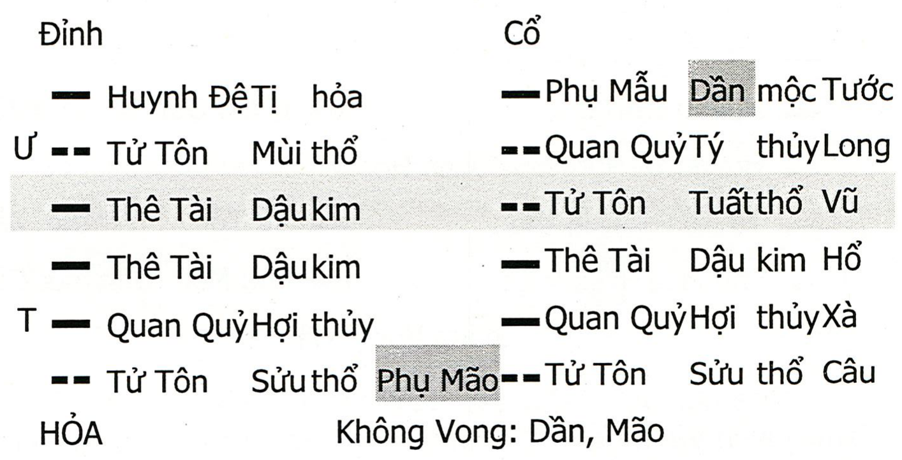
    - **Hình này chứng minh điều gì**
      - Người vợ bị thiếu máu nghiêm trọng; nhà có hai lớp cửa ngoài lớn trong nhỏ gây cản trở tài vận.
    - **Từ đâu mà thấy được**
      - Dụng thần Thế Hợi thủy quá vượng sinh phù cực điểm sinh hung; hào 3 và hào 4 Thê Tài Dậu kim trùng điệp, hào ngoại động hóa hồi đầu sinh.
- **Các bước suy luận chi tiết của tác giả**:
  - *Xác định Dụng thần*: Vợ có lời dặn dò, ủy thác trước khi chồng đi nên ý niệm dự đoán xuất phát từ chính người vợ. Tuy người chồng gieo quẻ hộ nhưng vẫn phải lấy hào Thế (Quan Quỷ Hợi thủy) làm Dụng thần đại diện cho người vợ.
  - *Quy tắc Dụng thần quá vượng xem ngược lại*:
    - Hào Thế Quan Quỷ Hợi thủy được cả Nguyệt lệnh (Dậu kim) lẫn Nhật thần (Thân kim) đồng thời sinh phù.
    - Hào 4 Thê Tài Dậu kim phát động hóa Tử Tôn Tuất thổ (hóa hồi đầu sinh: Tuất thổ sinh Dậu kim), tiếp tục sinh trợ mạnh mẽ cho hào Thế Hợi thủy.
    - Dụng thần Hợi thủy tụ hội khí thế quá vượng. Trong Dịch lý lục hào, Dụng thần quá vượng cũng là điềm hung theo nguyên lý *"vượng cực tất phản"* (vượng quá hóa suy, xem ngược lại).
  - *Chẩn đoán chứng thiếu máu nghiêm trọng*:
    - Quẻ thuộc cung Ly: Ly quái tượng trưng cho máu huyết.
    - Thủy trong ngũ hành cũng là máu huyết.
    - Thê Tài trong lục thân cũng chủ về máu huyết.
    - Tại nội quái, hào 3 Thê Tài Dậu kim lâm Bạch Hổ, mà Bạch Hổ vốn là thần sát chủ về huyết quang, máu me.
    - Các yếu tố tượng trưng cho máu đều vượng tới cực điểm, dẫn đến hiện tượng vượng cực tất phản, biểu thị tình trạng cơ thể bị thiếu máu vô cùng nghiêm trọng.
  - *Luận đoán phong thủy hai lớp cửa và tài vận*:
    - Hào vị: Hào 3 và hào 4 là hai hào vị đại diện cho cửa nẻo trong nhà.
    - Hào 3 và hào 4 đồng thời là Thê Tài Dậu kim (ba bốn giống nhau), tượng trưng nhà ở có hai lớp cửa trong và ngoài.
    - Hào 4 thuộc ngoại quái là cửa bên ngoài; hào 3 thuộc nội quái là cửa bên trong. Do hào 4 động hóa hồi đầu sinh nên cửa ngoài to lớn hơn cửa trong.
    - Tài tinh quá vượng hóa suy kiệt (*vượng cực tất phản*), cấu trúc cửa ngoài lớn trong bé khiến tài khí thoát tán, gây ảnh hưởng tiêu cực đến tài vận gia đình.

#### Quẻ Thiên Thủy Tụng biến Khốn: Phân chia thái cực đoán sức khỏe và tính cách con nhỏ

- **Bối cảnh và phương pháp phân chia thái cực**:
  - Sau khi nghe đoán chuẩn xác về người vợ, học viên tiếp tục nhờ xem sức khỏe cho đứa con nhỏ.
  - Tác giả hướng dẫn bằng hữu Vương Khai Vũ áp dụng phương pháp phân chia thái cực, phát triển tiếp ra quẻ Thiên Thủy Tụng biến Trạch Thủy Khốn để đoán sự việc mới.
- **Diễn biến đối thoại và sự chỉ điểm, sửa sai thần tốc**:
  - Dưới sự chỉ điểm của tác giả, Vương Khai Vũ nhận định: *"Đứa trẻ có tính cách hướng nội, hiếu động, không thích học tập, hay lâm vào bế tắc. Rất hao giày, thường xuyên làm mòn giày đến nỗi có lỗ hổng lớn. Về sức khỏe thì tim không tốt."*
  - Không đợi người học viên kịp lên tiếng phản hồi, tác giả lập tức chỉnh lại ngay tại chỗ: *"Đoán bệnh chưa chính xác, là bệnh về hệ hô hấp, viêm họng."*
  - Kết quả kiểm chứng: Lời sửa của tác giả hoàn toàn chuẩn xác với thực tế của đứa trẻ.
- Luận giải toàn diện tính cách, thói quen và bệnh chứng của con nhỏ qua quẻ Thiên Thủy Tụng biến Trạch Thủy Khốn:
  - **Hình 135.** Sơ đồ quẻ Tụng biến Khốn
    - 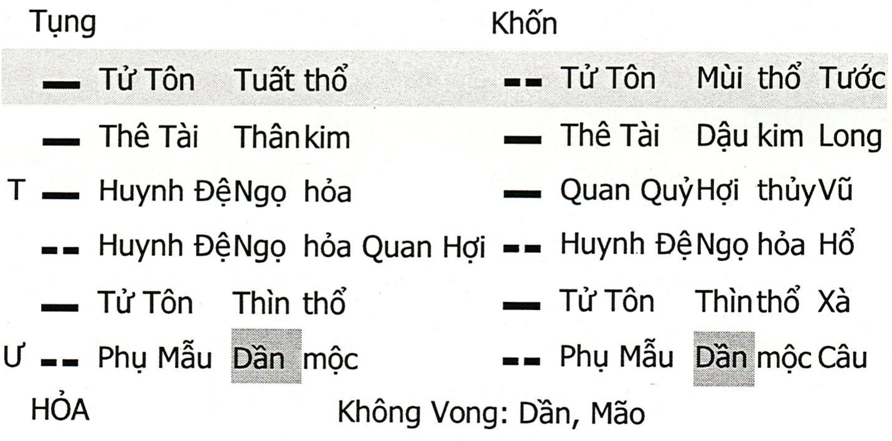
    - **Hình này chứng minh điều gì**
      - Đứa trẻ hướng nội, hiếu động, lười học, hay bế tắc, rất hao mòn rách giày; mắc bệnh hệ hô hấp và viêm họng.
    - **Từ đâu mà thấy được**
      - Thế Ngọ hỏa lâm Huyền Vũ, Dịch Mã, nhập Mộ Tuất thổ; Phụ Mẫu Dần mộc sơ hào Không bị khắc thương; hào 5 Thân kim là Bệnh địa hào Thế lâm Long, nhập Mộ hào lâm Chu Tước.
- **Các bước suy luận chi tiết về tính cách, học tập và thói quen**:
  - *Xác định Dụng thần*: Áp dụng quy tắc phân chia thái cực cho sự việc riêng biệt, lấy hào Thế (Huynh Đệ Ngọ hỏa) làm Dụng thần đại diện cho đứa trẻ.
  - *Tính cách hướng nội nhưng hiếu động, hay bế tắc*:
    - Hào Thế Ngọ hỏa lâm Huyền Vũ: Huyền Vũ chủ về sự thầm kín, kín đáo, biểu thị tính cách đứa trẻ hướng nội.
    - Hào Thế là Ngọ hỏa, lại lâm Dịch Mã: Hỏa chủ sự xốc nổi, Dịch Mã chủ sự vận động, do đó đứa trẻ rất hiếu động, khó ngồi yên.
    - Hào Thế Ngọ hỏa nhập Mộ ở hào 6 Tử Tôn Tuất thổ: Tượng nhập Mộ chủ sự giam hãm, bí bách, vì vậy tâm lý hay lâm vào tình cảnh bế tắc, lúng túng.
  - *Thói quen chán ghét học tập*:
    - Hào sơ Phụ Mẫu Dần mộc đại diện cho học hành, văn thư, tri thức.
    - Hào Dần mộc lâm Tuần Không (Không Vong: Dần, Mão), lại gặp ngày Thân tháng Dậu hưu tù vô khí, bị kim khí khắc thương nặng nề, hoàn toàn không có khả năng sinh trợ cho hào Thế Ngọ hỏa. Do đó đứa trẻ lười biếng, không có hứng thú học tập.
  - *Hiện tượng làm mòn rách thủng giày*:
    - Phụ Mẫu đóng tại hào sơ (hào vị thấp nhất, tương ứng với đôi chân) tượng trưng cho giày dép đi dưới chân.
    - Phụ Mẫu Dần mộc vừa lâm Không, vừa bị cả Nhật thần Thân kim lẫn Nguyệt lệnh Dậu kim xung khắc tàn phá.
    - Tuần Không mang tượng hư hao, thủng lỗ. Vì vậy đứa trẻ đi đứng rất hao giày dép, thường xuyên làm giày mòn vẹt rách rưới tới mức thủng lỗ lớn.
- **Chẩn đoán tinh chuẩn bệnh tật hệ hô hấp và viêm họng**:
  - Vương Khai Vũ thoạt đầu phán đoán tim không tốt (do Thế là Ngọ hỏa chủ tim mạch bị nhập Mộ và suy thoái).
  - Tác giả chỉ ra các căn cứ chuẩn xác hơn về bệnh lý:
    - *Vị trí và trạng thái ngũ hành*: Nhật thần Thân kim chính là Bệnh địa của hào Thế Ngọ hỏa (Hỏa trường sinh tại Dần, mộc dục tại Mão, quan đới tại Thìn, lâm quan tại Tị, đế vượng tại Ngọ, suy tại Mùi, bệnh tại Thân).
    - *Bộ vị cơ thể*: Nhật thần Thân kim đóng tại hào 5, hào 5 là hào vị của lồng ngực. Hành Kim lại chủ về phổi và hệ hô hấp, do đó xác định bệnh khởi phát từ hệ thống hô hấp ở ngực.
    - *Cổ họng và chứng viêm nhiệt*:
      - Hào 5 là Thê Tài; Tài tượng trưng cho ẩm thực, hô hấp, cửa ngõ nạp thức ăn, tương ứng với vị trí cổ họng.
      - Hào 5 lâm Thanh Long: Thanh Long tại vị trí hô hấp chủ về cảm giác đau rát, đau họng.
      - Hào Thế Ngọ hỏa lại nhập Mộ tại hào 6 Tuất thổ mang Chu Tước; Chu Tước vốn chủ về hỏa nhiệt, viêm nhiễm sưng tấy.
      - Tổng hợp các tượng: bệnh chính xác là bệnh về hệ thống hô hấp kết hợp chứng viêm họng nghiêm trọng.

### Phong thủy nhà mới có vấn đề, chị gái và anh rể xảy ra mâu thuẫn

#### Bối cảnh và sự việc
- **Thời gian gieo quẻ**: Ngày Tân Hợi, tháng Dậu (Tuần không: Dần, Mão).
- **Người hỏi và vấn đề**: Một học viên hỏi về phong thủy căn nhà của chị gái mình.
- **Quẻ họ thu được**: Quẻ Phong Hỏa Gia Nhân.

#### Luận đoán thực chiến và ứng nghiệm
- **Lời dự đoán của tác giả**:
  - Đây là một căn nhà mới, được xây cất vào năm 2001 (năm Tân Tị).
  - Phong thủy của con đường gần nhà phạm thế xấu, do đó từ sau khi dọn vào ở thì hai vợ chồng chị gái liên tục bất hòa, thường xuyên cãi cọ, xung đột.
  - Người anh rể thường xuyên phải đi công tác xa, vắng mặt ở nhà.
- **Ứng nghiệm thực tế**:
  - Toàn bộ lời đoán đều ứng nghiệm hoàn toàn chính xác với thực tế đời sống của gia đình người chị.

#### Chi tiết luận giải lý khí và phong thủy lục hào
- **Luận đoán căn nhà mới xây**:
  - Hào Phụ Mẫu là dụng thần đại diện cho phòng ốc, nhà cửa.
  - Trong quẻ, Phụ Mẫu Hợi thủy lâm Nhật thần trợ vượng, lại lâm cát thần Thanh Long (Thanh Long chủ sự đổi mới, tươi mới), do đó đoán định đây là ngôi nhà mới.
- **Xác định thời điểm xây dựng (năm 2001)**:
  - Hào 5 Tử Tôn Tị hỏa lâm thần Câu Trần (Câu Trần chủ về kiến trúc, công trình xây dựng).
  - Hào 5 Tị hỏa bị Nhật thần Hợi thủy xung nên trở thành ám động.
  - Địa chi Tị hỏa tương ứng với năm Tân Tị (năm 2001), từ đó xác định chính xác năm xây nhà là năm 2001.
- **Luận phong thủy con đường dẫn đến xung đột vợ chồng**:
  - Hào 5 ở vị trí tượng trưng cho đường sá, đồng thời lục thân Tử Tôn cũng chủ về đường đi lối lại.
  - Hào 5 Tử Tôn Tị hỏa lâm Hỏa ám động khắc phục thần Quan Quỷ Dậu kim (Quan Quỷ là lục thân đại diện cho người chồng, tức anh rể).
  - Hành Hỏa biểu thị sự nóng nảy, giận dữ bốc phát; điều này chứng tỏ thế phong thủy bất lợi từ con đường gần nhà gây nên nguồn sát khí khiến hai vợ chồng thường xuyên xung đột, cãi vã.
- **Luận việc anh rể thường xuyên vắng nhà**:
  - Hào Quan Quỷ Dậu kim không thượng quái (không xuất hiện trên sáu hào của chính quẻ) mà phục tàng dưới hào 3 Phụ Mẫu Hợi thủy, tượng trưng cho việc người chồng ít khi hiện diện trong gia đạo, thường xuyên đi công tác vắng nhà.
- Nhận định phong thủy nhà mới và mâu thuẫn gia đạo dựa trên quẻ Phong Hỏa Gia Nhân:
  - **Hình 136.** Sơ đồ quẻ Phong Hỏa Gia Nhân
    - 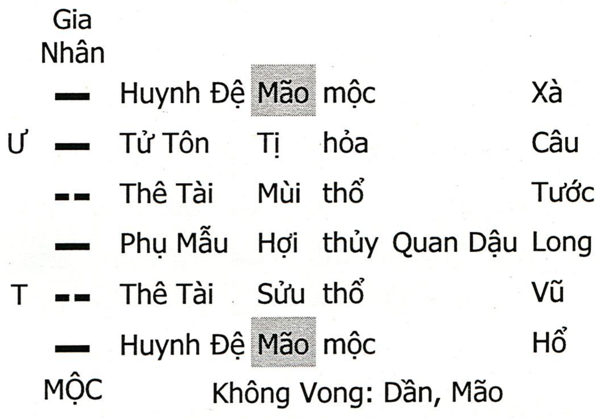
    - **Hình này chứng minh điều gì**
      - Nhà mới xây năm 2001, con đường gần nhà phạm phong thủy xấu khiến vợ chồng bất hòa cãi lộn, anh rể thường xuyên đi công tác vắng nhà.
    - **Từ đâu mà thấy được**
      - Phụ Mẫu Hợi thủy lâm Nhật và Thanh Long; hào 5 Tử Tôn Tị hỏa lâm Câu Trần ám động khắc phục thần Quan Quỷ Dậu kim; Quan Quỷ phục tàng không xuất hiện trên quẻ.

### Phong thủy nhà ở có vấn đề, anh trai và chị dâu xảy ra mâu thuẫn

- Ngày Tân Hợi tháng Dậu, một học viên dự đoán về phong thủy căn nhà của người anh trai.
- Quẻ gieo được: Địa Thủy Sư biến Lôi Thiên Đại Tráng.
- Xác định Không Vong: Dần, Mão. Quẻ Địa Thủy Sư thuộc cung Khảm.
- Lời phán đoán xác quyết của tác giả:
  - "Nhà của gia đình anh trai anh là một căn nhà biệt lập, xung quanh không có hàng xóm, sân thấp hơn nhà, lân cận có con sông, sông và đường song song, chảy sát đường, con sông này đã ảnh hưởng đến phong thủy của căn nhà. Tài vận không tốt, vợ chồng bất hòa. Anh trai thậm chí không muốn về nhà. Trẻ nhỏ nghịch ngợm phá phách không nghe lời."
- Dự đoán hiện trạng phong thủy và biến cố gia đạo căn cứ vào quẻ Địa Thủy Sư biến Lôi Thiên Đại Tráng:
  - **Hình 137.** Sơ đồ quẻ Địa Thủy Sư biến Lôi Thiên Đại Tráng
    - 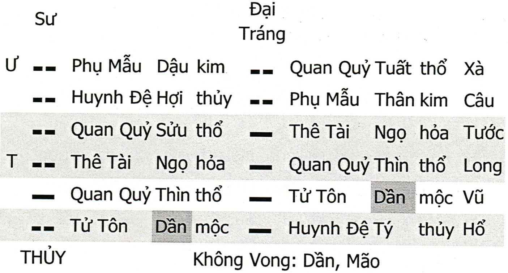
    - **Hình này chứng minh điều gì**
      - Phong thủy nhà ở độc lập trũng thấp sát sông lộ làm tài vận suy thoái, vợ chồng bất hòa, người anh không muốn về nhà và con cái ngang bướng.
    - **Từ đâu mà thấy được**
      - Hào sơ Dần mộc động khiến Phụ lâm Tuyệt và Không Vong; hào 5 Hợi thủy lâm Nhật khắc hào Thế Thê Tài Ngọ hỏa; hào 2 trạch Quỷ khắc Huynh; Tử Tôn sơ hào lâm Hổ động.

#### Luận giải chi tiết môi trường phong thủy căn nhà

- Đặc điểm nhà ở độc lập, biệt lập:
  - Hào Phụ Mẫu đại diện cho nhà cửa nơi ở.
  - Trong quẻ, hào sơ Tử Tôn Dần mộc phát động khiến Phụ Mẫu lâm Tuyệt (Dần là tuyệt địa của ngũ hành Kim Phụ Mẫu Dậu kim), biểu thị ngôi nhà ở thế đơn độc, biệt lập.
- Thực trạng hàng xóm láng giềng xung quanh:
  - Hào sơ đại diện cho vị trí hàng xóm xung quanh nhà.
  - Hào sơ Tử Tôn Dần mộc lâm Tuần Không (Dần Mão Không Vong), vì vậy xác định xung quanh hoàn toàn không có nhà hàng xóm lân cận.
- Địa thế sân thấp hơn nền nhà:
  - Quẻ bản thể là Địa Thủy Sư thuộc cung Khảm. Cung Khảm mang tượng quẻ là nơi thấp trũng, hiểm hóc, cho nên sân nhà có địa thế thấp trũng hơn hẳn so với nền nhà.
- Tác động phong thủy xấu từ đường sá và dòng sông:
  - Hào 5 lâm Huynh Đệ Hợi thủy; trong phong thủy nhà ở, hào 5 là hào vị của đường đi lối lại.
  - Thủy được Nguyệt kiến Dậu kim tương sinh biểu thị cho dòng sông (thủy được kim sinh tượng trưng cho sông ngòi).
  - Do đường đi và sông ngòi cùng hội tụ tại một hào vị (hào 5), nên ngoài thực tế dòng sông chảy song song và sát ngay cạnh đường đi. Dòng sông này chảy sát lộ đã phá thế phong thủy, gây xung sát xấu đến ngôi nhà.

#### Luận giải về tài vận, gia đạo và con cái

- Tài vận sa sút và mâu thuẫn vợ chồng:
  - Hào Thê Tài Ngọ hỏa trong quẻ ở trạng thái hưu tù, lại bị ngũ hành khắc chế, cho thấy phương diện tài lộc làm ăn không được hanh thông tốt đẹp.
  - Hào 5 Huynh Đệ Hợi thủy vừa là Huynh Đệ, vừa lâm Nhật thần mang lực khắc cực mạnh, đồng thời khắc hào Thế Thê Tài Ngọ hỏa. Hào Tài tượng trưng cho chị dâu, Huynh Đệ lâm Nhật thần khắc Tài báo hiệu hai vợ chồng thường xuyên xung đột, bất hòa mâu thuẫn sâu sắc.
- Tâm lý chán nản, không muốn về nhà của người anh trai:
  - Hào 2 là trạch vị (nhà ở), trong quẻ lâm Quan Quỷ Thìn thổ.
  - Quan Quỷ Thìn thổ mang hành Thổ khắc Huynh Đệ Hợi thủy (Huynh Đệ tượng trưng cho người anh trai). Trạch khắc người nên căn nhà tạo áp lực tâm lý nặng nề, khiến người anh trai nảy sinh tâm lý chán nản, bức bối, thậm chí không muốn trở về nhà.
- Tính tình ngỗ nghịch, bướng bỉnh của con cái:
  - Hào Tử Tôn Dần mộc đại diện cho con cái trong gia đình.
  - Tử Tôn Dần mộc lâm Bạch Hổ phát động; Bạch Hổ chủ về tính khí bướng bỉnh, hung hăng, phá phách. Tử Tôn lâm Bạch Hổ động cho thấy trẻ nhỏ trong nhà rất nghịch ngợm, phá phách và bướng bỉnh không chịu vâng lời người lớn.

#### Kết quả ứng nghiệm

- Toàn bộ các phán đoán chi tiết về đặc điểm phong thủy ngôi nhà (nhà biệt lập, không hàng xóm, sân thấp, sông sát đường) cùng tình trạng gia đạo bất hòa, con cái nghịch ngợm quả nhiên ứng nghiệm chuẩn xác trong thực tế.

### Khách sạn đặt vé không tin cậy được, tự mình mua vé trở về nhà

#### Bối cảnh chiêm đoán và quẻ tượng

- Thời gian dự đoán: Ngày Nhâm Tý, tháng Dậu (Tuần không: Dần, Mão).
- Sự việc: Một học viên nhờ khách sạn nơi mình đang lưu trú đặt hộ vé xe, muốn biết kết quả nhờ cậy ra sao nên gieo được quẻ Địa Lôi Phục biến Thủy Sơn Kiển.
- Luận đoán kết quả đặt vé và phương thức trở về qua quẻ Địa Lôi Phục biến Thủy Sơn Kiển:
  - **Hình 138.** Sơ đồ quẻ Địa Lôi Phục biến Thủy Sơn Kiển
    - 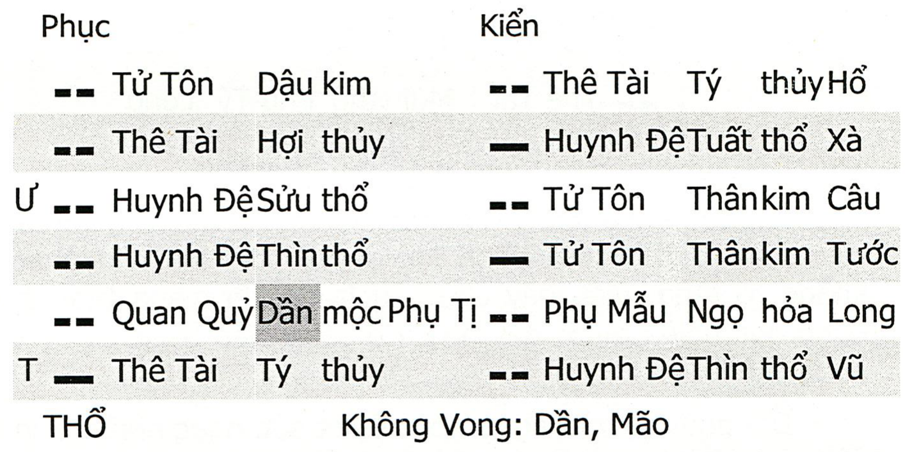
    - **Hình này chứng minh điều gì**
      - Khách sạn không thể giúp mua vé thành công do Dụng thần Phụ Mẫu suy kiệt, hào Thế phát động hợp Ứng cho thấy đương số phải tự thân giải quyết để về nhà.
    - **Từ đâu mà thấy được**
      - Phụ Mẫu Tị hỏa phục dưới hào 2 Quan Quỷ Dần mộc (Tuần Không), bị Nhật thần Tý thủy và Thê Tài động khắc; hào Thế Tý thủy động biến Thìn thổ hợp hào Ứng Sửu thổ.

#### Lập luận Dụng thần và các bước suy đoán

- Phân định Dụng thần và hào vị khách sạn:
  - Vé xe lấy hào Phụ Mẫu làm Dụng thần.
  - Phân định vị trí khách sạn theo trạng thái cư trú: Hào 2 đại diện cho khách sạn đang ở (quy tắc: đã vào ở thì hào 2 là khách sạn; trước khi chưa vào ở thì hào 5 là khách sạn).
- Phân tích suy vượng và tương tác ngũ hành của Dụng thần:
  - Dụng thần Phụ Mẫu Tị hỏa phục tàng dưới hào 2 Quan Quỷ Dần mộc.
  - Phụ Mẫu phục thần bị Nhật thần Tý thủy khắc thương.
  - Hào 5 Thê Tài Hợi thủy phát động khắc Phụ Mẫu; hào Thế Thê Tài Tý thủy phát động hóa Thìn thổ cùng biến hào Thân kim hội thành Thân - Tý - Thìn tam hợp Thủy cục (Tài cục) khắc mạnh Dụng thần, khiến Phụ Mẫu lâm thế hưu tù vô khí.
  - Hào 2 Dần mộc (khách sạn) lâm Tuần Không nên không thể sinh trợ cho Phụ Mẫu Tị hỏa; do đó việc nhờ khách sạn đặt vé chắc chắn không thành công, khách sạn không giữ chữ tín.
- Hành động và hướng đi của đương số:
  - Hào Thế phát động hợp hào Ứng (hào Thế Tý thủy động hóa Thìn thổ hợp Ứng Sửu thổ; hào Ứng đại diện cho hướng đi, nơi muốn đến).
  - Tượng Thế động hợp Ứng chỉ rõ đương số nhất định phải tự mình nghĩ cách xoay xở tìm vé trở về nhà.

#### Đối thoại thực tế và kết quả ứng nghiệm

- Lời đoán của tác giả với học viên: "Khách sạn đặt vé cho anh không tin cậy được, họ không giữ chữ tín, anh sẽ tự nghĩ cách để về nhà."
- Ứng nghiệm thực tế: Quả nhiên sau đó đúng như quẻ đoán, khách sạn không mua được vé và người học viên phải tự mình mua vé để trở về nhà.

### Mang thai uống quá nhiều thuốc, sinh ra trẻ nhỏ tàn tật

#### Bối cảnh vấn bói và lời đoán của tác giả
- **Thời gian và bối cảnh gieo quẻ:**
  - Ngày Ất Sửu, tháng Thân (Tuần không: Tuất, Hợi).
  - Tác giả đang lưu lại Bắc Kinh thì có một phụ nữ nghe tin tìm đến tận nhà khách nhờ dự đoán bệnh tật cho con nhỏ.
  - Gieo được quẻ thuần tĩnh Lôi Địa Dự.
- **Lời đoán quả quyết của tác giả:**
  - Tác giả khẳng định ngay: "Con của chị có vấn đề về thính lực, bị điếc thần kinh. Bởi vì thính lực có vấn đề cho nên phát âm không rõ ràng, điều này chủ yếu là do khi mang thai chị đã uống quá nhiều thuốc gây nên. Cố gắng điều trị sẽ có hy vọng được cải thiện."

#### Luận giải các tầng quẻ tượng Lôi Địa Dự
- Dự đoán bệnh tật bẩm sinh của đứa trẻ và nguyên nhân người mẹ dùng thuốc quá liều qua quẻ Lôi Địa Dự:
  - **Hình 139.** Quẻ Lôi Địa Dự
    - 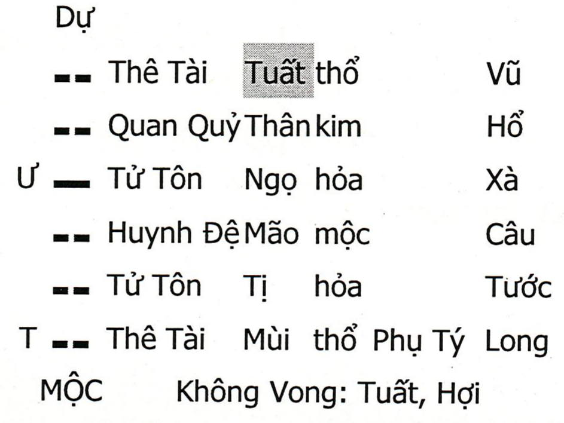
    - **Hình này chứng minh điều gì**
      - Đứa trẻ bị điếc thần kinh bẩm sinh và khó phát âm, do mẹ uống thuốc quá lượng thời kỳ mang thai.
    - **Từ đâu mà thấy được**
      - Quan Quỷ Thân kim hào 5 hình hợp Tử Tôn Tị hỏa hào 2 thai vị lâm Chu Tước; Thế Mùi thổ ám động lâm Thanh Long khiến Mão mộc nhập Mộ.
- **Xác định Dụng thần:**
  - Hỏi về bệnh tật của con nhỏ, lấy hào Tử Tôn làm Dụng thần.
  - Trong quẻ hào Tử Tôn lưỡng hiện: Tử Tôn Tị hỏa ở hào 2 và Tử Tôn Ngọ hỏa ở hào 4 (trì Ứng); cả hai hào đều an tĩnh, không lâm Tuần Không, không bị Nguyệt phá.
  - Vì Quan Quỷ tượng trưng cho bệnh tật, nên lấy Tử Tôn Tị hỏa tại hào 2 có mối quan hệ tương hợp với Quan Quỷ Thân kim làm Dụng thần để xem xét bệnh tình.
- **Luận đoán vị trí bệnh tật tại tai và hệ thần kinh:**
  - Quan Quỷ Thân kim cư tại hào 5, lâm Nguyệt kiến và tương hợp với hào Dụng thần Tử Tôn (Tị Thân tương hợp). Đặc biệt, trong hợp lại có hình (Tị hình Thân), đây chính là điềm báo bệnh tật sẽ đeo bám đứa trẻ suốt cuộc đời.
  - Hào 5 là hào vị của ngũ quan trên khuôn mặt; hành Kim chủ về tai; Quan Quỷ chủ về bệnh; Thân kim lại là Bệnh địa của Tử Tôn Hỏa (Hỏa bệnh tại Thân).
  - Quan Quỷ Thân kim lại lâm Bạch Hổ (Bạch Hổ chuyên chủ về bệnh tật, tai họa), do đó căn cứ vào Quan Quỷ Thân kim để đoán bệnh của đứa trẻ: kết luận đứa trẻ có bệnh tật ở tai.
  - Quẻ Lôi Địa Dự thuộc cung Chấn; Chấn thuộc hành Mộc, Mộc trong cơ thể chủ về hệ thống thần kinh, cho nên quy kết là bệnh về dây thần kinh tai (điếc thần kinh).
- **Luận đoán dị tật phát âm bắt nguồn từ lúc còn là thai nhi:**
  - Tử Tôn Tị hỏa cư tại hào 2 tương hợp với Quan Quỷ; hào 2 vốn là thai vị trong lục hào; ngày gieo quẻ là Ất Sửu, Sửu là Dưỡng địa của Tử Tôn Hỏa (Hỏa dưỡng tại Sửu), cho thấy đứa trẻ khi còn nằm trong bụng mẹ đã có mầm mống bệnh tật quấn lấy thân.
  - Tử Tôn Tị hỏa lâm Chu Tước; Chu Tước chủ về tiếng nói, âm thanh; nay bị Quan Quỷ hình hợp nên cơ quan phát âm bị tổn hại, phát âm nhất định không thể rõ ràng.
  - Hào Thế Thê Tài Mùi thổ bị Nhật thần Sửu thổ xung khởi thành ám động, khiến cho Huynh Đệ Mão mộc (Nguyên thần sinh trợ cho Tử Tôn) bị nhập Mộ tại Mùi thổ (Mộc mộ tại Mùi). Nguyên thần nhập Mộ thì không thể sinh trợ cho Tử Tôn lâm Chu Tước, ứng với tượng không sản sinh được tiếng nói bình thường.
- **Truy nguyên nguyên nhân mẹ dùng thuốc quá liều khi mang thai:**
  - Hào Thế đại diện cho người mẹ xin đoán; vì hào Thế Mùi thổ ám động làm Nguyên thần của Tử Tôn nhập Mộ, chứng tỏ nguồn cơn bệnh tật của đứa trẻ có liên quan mật thiết và trực tiếp đến người mẹ.
  - Hào Thế lâm Thanh Long lại tương hợp với hào Ứng Tử Tôn Ngọ hỏa: Thanh Long chủ việc sinh nở, thai nghén; Tử Tôn là con cái, thai nhi, biểu thị rõ hình ảnh mang thai sinh nở.
  - Thê Tài chủ về ăn uống (ẩm thực); Thanh Long cũng chủ về ẩm thực, nhưng mặt khác Thanh Long lại chủ về trúng độc, báo hiệu người mẹ đã nạp một thứ gì đó vào bụng dẫn tới bị ngộ độc.
  - Hào Thế Thê Tài Mùi thổ ám động là nhờ đắc khí từ Nguyệt kiến Thân kim Trường Sinh (Thổ trường sinh tại Thân), lại được Nhật thần Sửu thổ xung động kích phát.
  - Nguyệt kiến mang Quan Quỷ (bệnh tật) trường sinh cho hào Thê Tài (ẩm thực) -> biểu thị người mẹ vì có bệnh tật trong người nên mới phải ăn uống, nạp thứ đó vào cơ thể, mà thứ ăn uống đưa vào vì bệnh chắc chắn chính là thuốc chữa bệnh.
  - Từ chuỗi lập luận chặt chẽ đó, tác giả đoán định người mẹ trong thời kỳ mang thai đã dùng thuốc quá liều lượng quy định, gây độc cho thai nhi và để lại di chứng tàn tật cho con nhỏ.

#### Phản hồi của người mẹ và sự ứng nghiệm thực tế
- **Người mẹ xác nhận sự việc trong kinh ngạc:**
  - Người phụ nữ nghe lời đoán thì hết sức ngạc nhiên, liên tục gật đầu thừa nhận tác giả nói hoàn toàn chính xác.
  - Chị cho biết trong thời gian mang thai cơ thể cực kỳ suy nhược, nếu không uống thuốc thì không thể đi làm nổi, nên mỗi ngày đều phải uống rất nhiều thuốc.
  - Khi đó đã có người cảnh báo rằng uống thuốc quá nhiều sẽ gây bất lợi cho thai nhi, nhưng vì hoàn cảnh bắt buộc, nếu không uống thuốc thì không chịu đựng được.
- **Hiện trạng thực tế của đứa con:**
  - Sau khi sinh con ra, không lâu sau gia đình phát hiện đứa trẻ có vấn đề nghiêm trọng về thính lực.
  - Đến lúc đến xem quẻ, đứa trẻ đã được 5 tuổi nhưng vẫn chưa nói được một câu hoàn chỉnh.
  - Sau nhiều đợt điều trị bằng các phương pháp y khoa thì bệnh tình đã có phần cải thiện đôi chút; các bác sĩ chẩn đoán kết luận nguyên nhân chính là dây thần kinh tai có vấn đề.

### Ban đêm chồng không về nhà ngủ, sốt ruột hỏi xem duyên phận sẽ ra sao

#### Bối cảnh gieo quẻ và lời đoán ban đầu

- Ngày Đinh Mão tháng Thân (Tuần không: Tuất, Hợi), một người phụ nữ có chồng ban đêm không về nhà ngủ, tâm trạng vô cùng sốt ruột nên đã vội vã gọi điện thoại mời tác giả đến tận nhà.
- Nội dung vấn bói: Người phụ nữ muốn biết tung tích, hướng đi của người đàn ông trong đêm đó và duyên phận trong tương lai giữa hai người sẽ phát triển ra sao.
- Thời điểm gieo quẻ nhận được quẻ Hỏa Địa Tấn biến Sơn Lôi Di.
- Lời đoán trực tiếp của tác giả đối với đương số:
  - Hiện tại tâm trạng của đương số rất bất an, tinh thần thất thần như người mất hồn, trong lòng kìm nén nhiều cơn giận dữ. Bản tính của đương số có phần nóng nảy, tính khí không tốt, thường ngày hay xảy ra tranh cãi với đối phương.
  - Người đàn ông thích mẫu phụ nữ dịu dàng, ôn hòa; do hai người vừa mới nảy sinh cãi vã khiến tâm lý anh ta khó chịu, bức bối nên mới không muốn trở về nhà.
  - Thực tế giữa hai người căn bản chưa phải là vợ chồng chính thức mà chỉ là quan hệ sống chung (đồng cư). Người đàn ông đã có vợ hợp pháp từ trước, nhưng mối quan hệ giữa anh ta và vợ đã rạn nứt đổ vỡ; người vợ đó cũng đã có nhân tình khác ở nước ngoài.
  - Tối hôm nay người đàn ông chỉ đi đến nơi vui chơi, tụ điểm giải trí; sang ngày mai nhất định sẽ tự trở về nhà.
  - Lời khuyên căn dặn: Ngày hôm sau khi anh ta trở về, đương số chớ nên gặng hỏi hay truy cứu nguyên nhân, nếu không mối quan hệ tình cảm giữa hai người sẽ ngày càng trở nên tồi tệ hơn.
- Phản hồi thực tế từ người hỏi:
  - Mọi sự việc diễn ra hoàn toàn chuẩn xác như lời luận giải. Người mà đương số gọi là "chồng" thực chất chỉ là người đàn ông sống chung như vợ chồng.
  - Người đàn ông này vốn đã kết hôn, nhưng vợ anh ta đi du học tại Mỹ rồi có quan hệ tình cảm với người đàn ông khác dẫn đến hôn nhân tan vỡ. Dù chưa hoàn tất thủ tục ly hôn trên giấy tờ nhưng cuộc hôn nhân trước chỉ còn tồn tại trên danh nghĩa, vì vậy anh ta dọn về sống chung với đương số.

#### Luận giải chi tiết qua tượng quẻ và hào vị

- Tượng quẻ Hỏa Địa Tấn biến Sơn Lôi Di phản ánh toàn bộ thực trạng hôn nhân, tâm lý bất an và hướng đi của người nam:
  - **Hình 140.** Quẻ Tấn biến Di
    - 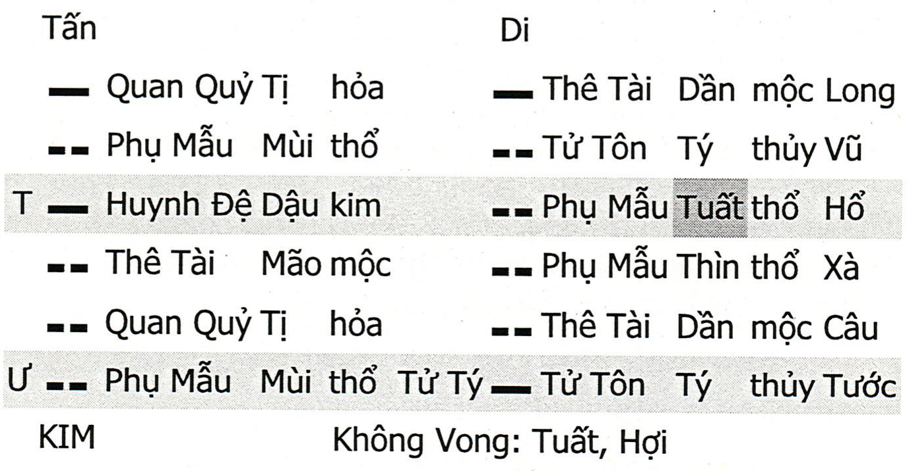
    - **Hình này chứng minh điều gì**
      - Quẻ Tấn biến Di minh chứng hai người chỉ là quan hệ đồng cư không hôn thú, người nam bỏ đi giải trí nhưng ngày Thìn sẽ quay về nhà.
    - **Từ đâu mà thấy được**
      - Hào 2 Quan Quỷ Tị hỏa lâm Nhật Mộc Dục, hợp Nguyệt Thân kim; Thế Dậu kim lâm Bạch Hổ động hóa Phụ Mẫu Tuất thổ Không Vong (hư ước, Mộ khố), ngày Thìn xung thực sẽ về.
- Xác định Dụng thần:
  - Xem về người chồng/đàn ông lấy hào Quan Quỷ làm Dụng thần.
  - Trong quẻ xuất hiện Quan Quỷ lưỡng hiện ở hào 2 và hào 6 đều là Tị hỏa, cả hai hào đều tĩnh (không phát động), bất Không bất Phá.
  - Hào 2 là hào vị phu thê và là hào vị gia trạch, do đó chọn hào 2 Quan Quỷ Tị hỏa làm Dụng thần chuẩn xác.
- Luận giải tâm trạng và tính khí của người xin đoán:
  - Hào 4 Huynh Đệ Dậu kim trì Thế là người xin đoán, phát động mà hóa ra Phụ Mẫu Tuất thổ lâm Tuần Không: Thế động hóa Không là tượng "tâm hồn ở tận nơi đâu", tinh thần bất định như mất hồn.
  - Quẻ gốc Hỏa Địa Tấn là quẻ Du hồn, biến sang Sơn Lôi Di cũng là quẻ Du hồn: tượng Du hồn hóa Du hồn chủ tâm trạng lo âu, thấp thỏm, đứng ngồi không yên.
  - Hào Thế lâm Bạch Hổ: Bạch Hổ chủ về tính khí nóng nảy, giận dữ, khó kiềm chế cảm xúc.
  - Hào Thế Dậu kim động khắc Thê Tài Mão mộc (Mão mộc là Nguyên thần sinh cho Quan Quỷ Tị hỏa): Nguyên thần đại diện cho thế giới nội tâm của một người. Hào Thế động khắc Nguyên thần của Quan Quỷ chứng tỏ tính khí người phụ nữ không tốt, thường xuyên cãi cọ xung đột khiến nội tâm người đàn ông bị tổn thương sâu sắc.
- Luận giải sở thích của người nam và nguyên nhân không về nhà:
  - Thê Tài Mão mộc là Nguyên thần của Quan Quỷ, tượng trưng cho những điều Quan Quỷ ưa thích (hỷ thần). Hành Mộc chủ về nhân từ, nhu thuận, dịu dàng; Thê Tài lại tượng trưng cho phụ nữ, cho thấy người nam này có xu hướng yêu thích mẫu phụ nữ dịu dàng.
  - Quan Quỷ Tị hỏa đóng tại hào 2 (hào 2 là nhà cửa, trạch thất). Nguyên thần Mão mộc lại nhập Mộ ở hào Phụ Mẫu Mùi thổ (hào 1 và hào 5 mang Phụ Mẫu Mùi thổ): Nguyên thần là tâm tư tình cảm bị nhập Mộ nên không thể sinh trợ cho hào 2 Quan Quỷ, biểu thị tâm tư người nam chán nản, không muốn quay về nhà.
- Luận giải tình trạng hôn nhân thực tế và người vợ hợp pháp:
  - Quan Quỷ Tị hỏa tương hợp với Nguyệt kiến Thân kim (Tị Thân lục hợp). Nguyệt kiến Thân kim có cùng ngũ hành Kim với hào Thế Dậu kim, mang ý nghĩa người nữ khác cùng giới tính với hào Thế, chứng tỏ anh ta đã có người phụ nữ khác từ trước.
  - Nguyệt kiến Thân kim hợp nhập vào hào 2 Quan Quỷ: Hào 2 là nơi gia trạch, tượng trưng cho người vợ danh chính ngôn thuận được cưới gả về nhà.
  - Nguyệt kiến Thân kim vừa hợp với hào 2 Quan Quỷ Tị hỏa, vừa tương hợp với hào 6 Quan Quỷ Tị hỏa: Hào Quan Quỷ tượng trưng cho nam giới, việc Thân kim đồng thời hợp hai Quan Quỷ biểu thị người vợ của anh ta có mối quan hệ tình cảm ngoài luồng với người đàn ông khác.
  - Hào 6 là hào vị xa xôi, hào vị nước ngoài: Người tình của vợ anh ta đang ở nước ngoài (phù hợp việc người vợ du học tại Mỹ cặp kè người khác).
- Luận giải bản chất mối quan hệ hiện tại giữa hai người:
  - Hào Thế Dậu kim phát động biến ra Phụ Mẫu Tuất thổ: Tuất thổ là Mộ khố của Quan Quỷ Tị hỏa (Hỏa mộ tại Tuất). Hào Thế động hóa ra Mộ khố của Quan Quỷ biểu thị tâm lý cô muốn giam giữ, quản chế và ràng buộc người đàn ông này ở bên mình.
  - Hào biến mang lục thân Phụ Mẫu: Phụ Mẫu tượng trưng cho giấy tờ hôn thú, giấy chứng nhận kết hôn.
  - Tuy nhiên Phụ Mẫu Tuất thổ lại lâm Tuần Không: Tuần Không chủ về hư ước, lời hứa hẹn suông trên miệng mà không có thực thể pháp lý. Vì vậy, quan hệ giữa hai người chỉ dừng lại ở việc sống chung (đồng cư), hoàn toàn chưa có hôn thú chính thức.
- Xác định tung tích ban đêm và thời điểm hồi gia:
  - Ngày xem là ngày Đinh Mão: Mão mộc là đất Mộc Dục của Quan Quỷ Tị hỏa (Tị Mộc Dục tại Mão), chủ về phong lưu, tửu sắc, hưởng thụ.
  - Trong quẻ, Quan Quỷ Tị hỏa hào 2 lâm Câu Trần (chủ nội thất, phòng kín), Quan Quỷ Tị hỏa hào 6 lâm Thanh Long (chủ chốn vui chơi giải trí, ẩm thực hưởng lạc), khẳng định đêm đó anh ta đi đến địa điểm giải trí hưởng lạc bên ngoài.
  - Hào Thế động hóa ra Mộ khố Phụ Mẫu Tuất thổ gặp Tuần Không; sang ngày tiếp theo là ngày Mậu Thìn, Thìn thổ xung động Tuất thổ tạo thành xung thực Không Vong. Khi Mộ khố được xung thực, Quan Quỷ nhập Mộ tức là người nam sẽ quay trở về nhà vào ngày hôm sau.

#### Ứng nghiệm thực tế

- Sang ngày hôm sau (ngày Thìn), người đàn ông quả nhiên đã tự động trở về nhà như dự đoán.
- Người phụ nữ ghi nhớ lời dặn dò của tác giả nên đã kiềm chế cảm xúc, không truy hỏi hay tra khảo lý do anh ta vắng nhà qua đêm.
- Nhờ cách hành xử khôn khéo và thấu hiểu nguyên cớ từ tượng quẻ, mối quan hệ giữa hai người sau đó tiếp tục duy trì êm ấm, hòa thuận như thuở ban đầu.

### Dịch hữu hỏi phong thủy, vợ ông ta tấm tắc khen hay

#### Cuộc tao ngộ tại Lang Phường và lời đoán phong thủy chuẩn xác

- Vào ngày Mậu Thìn tháng Thân, tác giả có chuyến đi đến Lang Phường, tỉnh Hà Bắc để khảo sát thực địa.
- Nghe tin tác giả đến, Vương Kim Vũ tiên sinh là phó hội trưởng Hội Kinh Dịch học tại địa phương đã chủ động xin đến gặp mặt đàm đạo, tác giả vui vẻ nhận lời.
- Sau khi gặp gỡ và trò chuyện xã giao, Vương Kim Vũ tiên sinh gieo một quẻ nhờ tác giả đoán phong thủy căn nhà của mình, gieo được quẻ Trạch Phong Đại Quá biến Lôi Trạch Quy Muội.
- Tác giả quan sát quẻ tượng và trực tiếp đưa ra hàng loạt phán đoán chuẩn xác:
  - Căn nhà của gia chủ rất to lớn nhưng nhân đinh thưa thớt, bầu không khí trong nhà vắng vẻ, quạnh quẽ.
  - Lúc mua nhà gia chủ phải đi vay mượn một khoản tiền, cho đến nay vẫn chưa trả hết nợ; đồng thời giấy tờ pháp lý, sổ đỏ căn nhà đến nay vẫn chưa làm xong.
  - Công tác ở cơ quan, đơn vị rất thuận lợi về mọi phương diện nhưng bản thân không có số quan vận.
  - Tại đơn vị có một vị lãnh đạo đối xử rất tốt, hết lòng nâng đỡ chiếu cố ông, tiếc rằng người lãnh đạo này hiện đã chuyển công tác đi nơi khác.
  - Ở đơn vị còn có một vị lãnh đạo khác bản tính phong lưu háo sắc, quan hệ bất chính với nhiều phụ nữ.
  - Ngoài tiền lương cố định hàng tháng, gia chủ còn có thêm nhiều nguồn thu nhập phụ khác, tuy nhiên không tụ được món tài lộc lớn (không có đại tài).
  - Tình hình sức khỏe của người vợ không tốt, thường xuyên mắc bệnh tật ở chân.
- Người vợ của Vương tiên sinh ngồi bên cạnh nghe xong thì tấm tắc khen hay, thốt lên rằng từ trước tới nay chưa từng gặp ai phán đoán sự tình chuẩn xác đến mức như vậy.
- Nhân dịp người vợ muốn hỏi thêm về bản thân, tác giả đã sử dụng phương pháp "Lục hào phân chia Thái cực", từ quẻ Đại Quá ban đầu phát triển thành quẻ Thiên Sơn Độn biến Thủy Hỏa Ký Tế để đoán riêng cho bà:
  - Trí nhớ của bà kém cỏi, thường hay đau đầu; bình thường tính tình khép kín, không thích đi xa, không giỏi xã giao nên rất ít bạn bè.
  - Đơn vị công tác lâm vào cảnh suy thoái, không phát đạt nên không chi trả được tiền lương; bản thân bà rơi vào cảnh thất nghiệp rồi lại phải vất vả đi tìm kiếm việc làm khác.
  - Đôi chân của bà mắc phải chứng bệnh phong thấp dai dẳng.
- Mọi lời phán đoán trên sau đó đều được người vợ xác nhận là hoàn toàn chuẩn xác với thực tế đời sống.

#### Luận giải quẻ thứ nhất: Trạch Phong Đại Quá biến Lôi Trạch Quy Muội

- Thời điểm gieo quẻ: Ngày Mậu Thìn, tháng Thân (Tuần không: Tuất, Hợi).
- Luận giải phong thủy nhà ở to lớn nhưng vắng vẻ, còn nợ tiền và chưa có sổ đỏ:
  - Lấy hào Phụ Mẫu làm Dụng thần đại diện cho nhà cửa, đồng thời kết hợp xem xét hào 2 (trạch hào).
  - Hào 2 Phụ Mẫu Hợi thủy được Nguyệt kiến Thân kim sinh phù, hào 5 Quan Quỷ Dậu kim phát động sinh trợ, lại được nội quái biến tam hợp Tị Dậu Sửu Kim cục sinh vượng: Dụng thần cực kỳ vượng tướng, vượng thì to lớn, do đó đoán là căn nhà có diện tích rất lớn.
  - Tuy nhiên, Phụ Mẫu Hợi thủy lại lâm Tuần Không; hào 5 là hào vị của con người, hào 2 ngộ Không nên không đón nhận được hào 5 sinh trợ: Biểu thị nhà to lớn mà ít người cư ngụ, không khí trong nhà thưa thớt, vắng vẻ.
  - Phụ Mẫu Hợi thủy trì Thế biểu thị nhà cửa đã nằm trong tay gia chủ; Phụ Mẫu cũng chủ về giấy tờ thủ tục pháp lý, lâm Tuần Không là dấu hiệu thủ tục chưa hoàn tất, chứng minh căn nhà chưa làm xong sổ đỏ.
  - Hào Thế nhập Mộ ở Nhật thần Thìn thổ (Thìn thổ là Thê Tài): Nhật thần chủ sự việc hiện tại, Thế nhập Mộ ở Tài là thông tin khốn đốn, vướng mắc vì tiền bạc. Thế lâm Phụ Mẫu nhập Mộ Tài thì nguyên nhân túng thiếu ắt hẳn vì chuyện nhà cửa: Đoán là lúc mua nhà đã vay nợ một khoản tiền, đến nay vẫn chưa trả xong.
- Luận giải sự nghiệp, công tác và lãnh đạo cơ quan:
  - Quan Quỷ đại diện cho công việc: Nội quái biến tam hợp Tị Dậu Sửu Quan cục sinh trợ hào Thế, cho thấy mọi phương diện công tác tại đơn vị đều thuận buồm xuôi gió.
  - Tuy nhiên, hào Thế lâm Tuần Không nên sức tiếp nhận lực sinh từ Quan Quỷ khá yếu ớt: Do đó Quan Quỷ chỉ biểu thị tính chất công việc thuận lợi chứ không thể hiện quan vận, đoán gia chủ không có quan chức.
  - Hào 5 là hào vị lãnh đạo, phát động sinh Thế: Ở cơ quan có vị lãnh đạo rất tốt bụng, luôn ưu ái và chiếu cố ông.
  - Tuy nhiên, hào 5 Quan Quỷ Dậu kim động mà hóa thoái (biến Quan Quỷ Thân kim): Hóa thoái là tượng thoái lui, rời khỏi chức vị; cho thấy vị lãnh đạo tốt bụng kia đã rời khỏi cương vị công tác, chuyển đi khỏi đơn vị.
- Luận giải vị lãnh đạo phong lưu háo sắc:
  - Hào 5 Quan Quỷ Dậu kim là Đào Hoa (tam hợp ngày Thân Tý Thìn thấy Dậu là Đào Hoa), lâm Thanh Long chủ tửu sắc, tương hợp với Nhật Tài tinh (Thìn Dậu lục hợp), lại nhập Mộ ở hào sơ Thê Tài Sửu thổ: Tượng trưng cho người phong lưu háo sắc, có quan hệ bất chính với nhiều phụ nữ (có một vài nhân tình bên ngoài).
- Luận giải nguồn thu nhập phụ và bệnh tật của người vợ:
  - Trong quẻ hào Thê Tài đa hiện (hào sơ Thê Tài Sửu thổ, hào 6 Thê Tài Mùi thổ biến Tuất thổ) cùng khắc hào Thế: Đoán ngoài tiền lương cố định thì gia chủ còn có thêm các nguồn thu nhập khác, song không tụ được đại tài.
  - Hào Ứng là thê vị (vị trí của vợ), Thê Tài cũng chủ về người vợ; Ứng lâm Thê Tài Sửu thổ chính là đại diện cho vợ của gia chủ.
  - Thê Tài Sửu thổ là Mộ khố của Quan Quỷ (Kim mộ tại Sửu), Quan Quỷ chủ tai họa bệnh tật: Là dấu hiệu trong cơ thể người vợ mang sẵn bệnh tật.
  - Hào sơ là vị trí đôi chân, lại tọa tại cung Chấn (quái Chấn chủ về chân): Phán đoán người vợ có bệnh tật ở chân.
- Căn cứ thực chứng phong thủy và gia đạo qua quẻ Đại Quá biến Quy Muội:
  - **Hình 141.** Quẻ Trạch Phong Đại Quá biến Lôi Trạch Quy Muội
    - 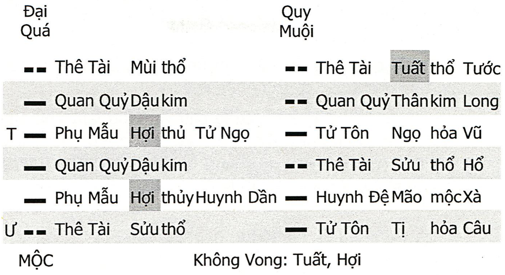
    - **Hình này chứng minh điều gì**
      - Nhà to vắng vẻ, còn nợ tiền mua nhà, chưa có sổ đỏ; công việc thuận lợi nhưng không quan vận, lãnh đạo tốt đã chuyển đi; vợ đau chân.
    - **Từ đâu mà thấy được**
      - Phụ Mẫu Hợi thủy trì Thế ngộ Không, nhập Mộ tại Nhật Thìn; hào 5 Dậu kim động hóa thoái; hào sơ Sửu thổ là mộ của Quan Quỷ.

#### Luận giải quẻ thứ hai: Thiên Sơn Độn biến Thủy Hỏa Ký Tế (Phân chia Thái cực)

- Nguyên lý ứng dụng Lục hào phân chia Thái cực:
  - Khi người vợ muốn hỏi thêm chi tiết về vận hạn cá nhân, tác giả không gieo quẻ mới mà từ hào tượng quẻ Đại Quá ban đầu biến dịch phân chia Thái cực, phát triển thành quẻ Thiên Sơn Độn biến Thủy Hỏa Ký Tế.
  - Thời điểm đối chiếu: Ngày Mậu Thìn, tháng Thân (Tuần không: Tuất, Hợi).
- Luận giải tâm trí, sinh hoạt và tính cách của người vợ:
  - Lấy hào Thế làm Dụng thần đại diện cho người vợ.
  - Hào Thế Quan Quỷ Ngọ hỏa nhập Mộ ở hào 6 Phụ Mẫu Tuất thổ: Hào 6 là đầu não, tại cung Càn cũng chủ về đầu; tượng nhập Mộ ví như say mê man, đầu óc lờ đờ u tối, cho nên phán đoán trí nhớ của bà không tốt và thường xuyên mắc bệnh đau đầu.
  - Hào Thế tọa tại hào 2 lại nhập Mộ: Hào 2 là trạch hào (nhà cửa), tượng nhập Mộ chủ sự thâm tàng (ở ẩn trong nhà), do đó đoán bà bình thường không thích ra ngoài đi xa.
  - Hào Thế lâm Đằng Xà: Đằng Xà chủ sự quái gở, cô độc, bất an; chứng tỏ bà không giỏi giao tiếp xã hội, ít giao du và bạn bè không nhiều.
- Luận giải bệnh phong thấp ở chân:
  - Thế tọa hào 2 (hào 2 đại diện cho chân), hào 4 Quan Quỷ Ngọ hỏa phát động tạo thành tự hình với hào Thế (Ngọ - Ngọ tự hình): Biểu thị sự đau đớn, bệnh tật giằng xé ngay tại chi dưới.
  - Nguyên thần sinh Thế là Thê Tài Dần mộc (phục tàng dưới hào 2 Thế): Mộc chủ phong hàn, gặp Nguyệt kiến Thân kim xung phá thành Nguyệt phá, lại ở thế phục tàng không thể xuất hiện sinh Thế: Khí huyết bất thông, phong hàn xâm nhập khiến đôi chân mắc bệnh phong thấp.
- Luận giải công việc bấp bênh và tình trạng thất nghiệp:
  - Trong quẻ Quan Quỷ lưỡng hiện (tại hào 2 và hào 4): Là tượng trưng cho công tác nhiều biến động, thay đổi khôn lường.
  - Quan Quỷ ngộ Mộ (Ngọ hỏa mộ ở Tuất thổ): Là thông tin mất việc làm.
  - Thê Tài đại diện cho thu nhập và lương bổng: Tài tinh không hiện trên quẻ (phục Thê Tài Dần mộc), lại chịu cảnh Nguyệt phá không sinh phù hào Thế: Thể hiện đơn vị làm ăn suy thoái, không phát đạt, không có khả năng chi trả tiền lương.
  - Tổng hợp các dữ kiện trên: Tác giả đoán người vợ bị thất nghiệp rồi sau đó phải chật vật đi tìm kiếm công việc khác.
- Căn cứ thực chứng sức khỏe và vận hạn người vợ qua quẻ Độn biến Ký Tế:
  - **Hình 142.** Sơ đồ quẻ Độn biến Ký Tế
    - 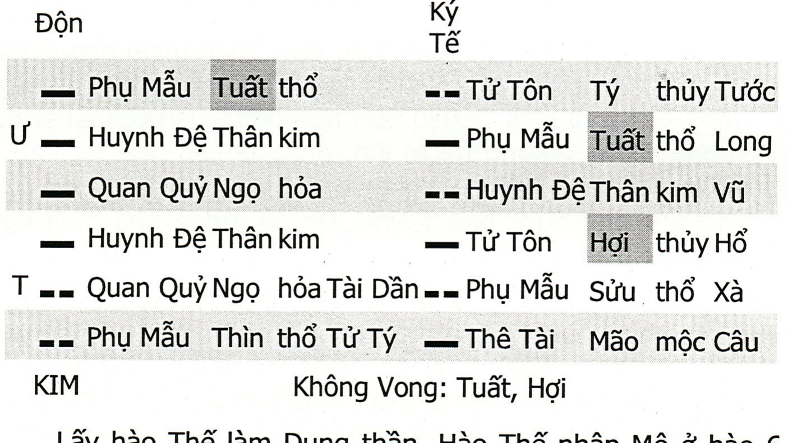
    - **Hình này chứng minh điều gì**
      - Người vợ trí nhớ kém, đau đầu, chân phong thấp; đơn vị nợ lương khiến bà thất nghiệp rồi phải tìm việc khác.
    - **Từ đâu mà thấy được**
      - Thế Quan Quỷ Ngọ hỏa nhập Mộ hào 6 Tuất thổ, tự hình hào 4; Tài tinh Dần mộc phục tàng ngộ Nguyệt phá.

### Muốn hỏi công trình khi nào hoàn thành, tìm ra thông tin khác về công trình

#### Bối cảnh vấn sự và quẻ tượng

- Vào ngày Mậu Thìn, tháng Thân (Tuần không: Tuất, Hợi), một người nam mời tác giả đến chơi nhà.
- Trong lúc trò chuyện, người này có nhắc đến một công trình xây dựng mà mình đang phụ trách và ngỏ ý nhờ tác giả gieo quẻ dự đoán xem khi nào công trình mới có thể hoàn thành.
- Quẻ tượng thu được là **Lôi Trạch Quy Muội** biến **Chấn Vi Lôi**.

#### Lời đoán của tác giả và phản hồi thực tế từ gia chủ

- Dự đoán của tác giả về tiến độ thi công và quy mô công trình:
  - Công trình hiện tại vừa mới tiến hành động thổ, chưa chính thức đi vào thi công rầm rộ; phải đợi sang tháng 10 âm lịch mới chính thức khởi công.
  - Đây là một tòa nhà có quy mô lớn, chiều cao khoảng 20 tầng; tiến độ xây dựng kéo dài đến tháng 10 năm 2005 mới có thể hoàn thành.
  - Về hồ sơ bản vẽ: Bản thiết kế hiện vẫn chưa được cơ quan chức năng phê duyệt chính thức; người này đang có dự định sau khi được duyệt sẽ lén lút chỉnh sửa lại bản vẽ.
  - Về kiến trúc và môi trường xung quanh: Mái của tòa nhà có thiết kế lõm xuống hoặc làm bằng chất liệu trong suốt, đứng từ bên trong nhà có thể nhìn thấy bầu trời; tổng thể tòa nhà mang phong cách kiến trúc hiện đại, mặt ngoài trong suốt, có thể chuyển động hoặc biến hóa màu sắc; ngoài ra ở vị trí lân cận tòa nhà có một ngôi chùa miếu.
- Sự kinh ngạc và xác nhận chuẩn xác từ người hỏi:
  - Các kết luận suy đoán khớp hoàn toàn với thực tế khiến đối phương vô cùng kinh ngạc và thán phục.
  - Đối phương xác nhận công trình thực tế là một tòa nhà cao 18 tầng, công năng làm tòa thương điếm (trung tâm thương mại thông minh).
  - Kế hoạch dự kiến hoàn thành công trình nằm trong khoảng từ tháng 9 đến tháng 12 năm 2005.
  - Về công trình tâm linh phụ cận: Ngay bên cạnh tòa nhà thực tế có một nhà thờ Công giáo.
  - Về kết cấu mái và bề ngoài: Phần mái nhà đúng là vừa làm bằng kính trong suốt vừa có cấu trúc uốn lõm xuống; toàn bộ bề mặt bên ngoài tòa nhà được ốp kính đặc biệt dùng làm màn hình chiếu quảng cáo lớn, có khả năng biến đổi màu sắc liên tục, tạo hiệu ứng thị giác thông minh.
  - Về tiến độ và ý định riêng: Công trình đúng là vừa mới làm lễ động thổ, dự kiến đến tháng 10 mới chính thức khởi công; người này cũng thừa nhận đã có toan tính ngầm đợi bản vẽ phê duyệt xong sẽ lén sửa đổi lại một số chi tiết.

#### Phân tích các bước luận giải lục hào chuyên sâu

- Luận giải tiến độ động thổ và thời điểm chính thức thi công:
  - Xem việc xây dựng công trình lấy hào Phụ Mẫu làm Dụng thần.
  - Trong quẻ, hào Thế trì Phụ Mẫu Sửu thổ lâm Bạch Hổ: Phụ Mẫu tượng trưng cho công trình, Bạch Hổ chủ về khí cụ kim loại, đao thương, máy móc đào xới, xẻng cuốc; đây là tín hiệu công trình vừa mới làm lễ động thổ đào đất.
  - Tuy nhiên, hào 6 Phụ Mẫu Tuất thổ lại lâm Tuần Không: Không Vong chủ về trạng thái chưa thành thực, chưa triển khai thực tế, ứng với việc công trình chưa chính thức thi công.
  - Cần đợi đến tháng Tuất (tháng 10 âm lịch), hào Phụ Mẫu xuất Không thì công trình mới chính thức khởi công xây dựng.
- Luận giải số tầng và quy mô kiến trúc:
  - Quẻ có hào 2 Thê Tài Mão mộc độc phát: Hào 2 là trạch hào (đại diện cho nhà cửa), phát động tương hợp với hào 6 Phụ Mẫu Tuất thổ (Mão Tuất hợp).
  - Phụ Mẫu Tuất thổ ở hào 6 được nguyệt lệnh Thân kim sinh phù, nhật thần Thìn thổ xung thành thế ám động đến hợp hào 2 trạch; hợp là tượng trùng điệp, nhiều lớp chồng chất lên nhau, do đó đoán là công trình xây dựng nhà nhiều tầng.
  - Định số tầng theo tượng quẻ và số ngũ hành:
    - Phụ Mẫu thuộc hành Thổ, số tiên thiên của Thổ là 5, gặp lúc vượng tướng gấp đôi thành 10.
    - Lấy số theo hào Không Vong: Hào Phụ Mẫu lâm Không tại hào 6 nên lấy số 6, kết hợp thêm vị trí hào 2 độc phát (10 + 6 + 2 = 18 tầng, khớp đúng với số tầng thực tế là 18).
    - Xét thêm tổng số của quẻ chính và quẻ biến là 14, cộng thêm số vị trí của hào 6 Phụ Mẫu thành 20, nên tác giả ước lượng công trình cao khoảng 20 tầng.
- Luận giải bản vẽ thiết kế và ý định lén lút sửa đổi:
  - Hào 6 Phụ Mẫu Tuất thổ lâm Chu Tước: Phụ Mẫu và Chu Tước đều mang ý nghĩa văn thư, giấy tờ, đồ án thiết kế, ở đây đại diện cho bản vẽ công trình.
  - Hào Phụ Mẫu ở thế ám động: Ám động chủ về hành động lén lút, ngấm ngầm, không công khai, thể hiện ý định muốn lén sửa chữa bản vẽ sau khi được cơ quan chức năng phê duyệt.
- Luận giải cấu trúc mái lõm và độ trong suốt:
  - Quẻ Lôi Trạch Quy Muội thuộc cung Đoài; quái tượng Đoài là "Đoài thượng khuyết" (khuyết thiếu ở phần trên cùng).
  - Hào 6 là hào đỉnh chóp, chủ về mái nhà, nóc nhà; hào 6 Phụ Mẫu Tuất thổ lâm Không Vong là tượng khuyết thiếu, hụt hẫng ở trên cao, do đó suy đoán mái nhà có cấu trúc lõm xuống.
  - Đồng thời hào 6 là thiên hào (bầu trời); Không Vong nghĩa là trống rỗng, không có vật che chắn cản trở, từ đó suy đoán mái nhà làm bằng vật liệu trong suốt, từ trong nhìn thẳng lên có thể trông thấy bầu trời.
- Luận giải bề ngoài hiện đại, biến hóa và liên kết vật liệu dựa trên quẻ biến:
  - Dự đoán đặc tính bề ngoài biến hóa, hiện đại và trong suốt của tòa nhà dựa trên quẻ Quy Muội biến Chấn:
    - **Hình 143.** Sơ đồ quẻ Quy Muội biến Chấn
      - 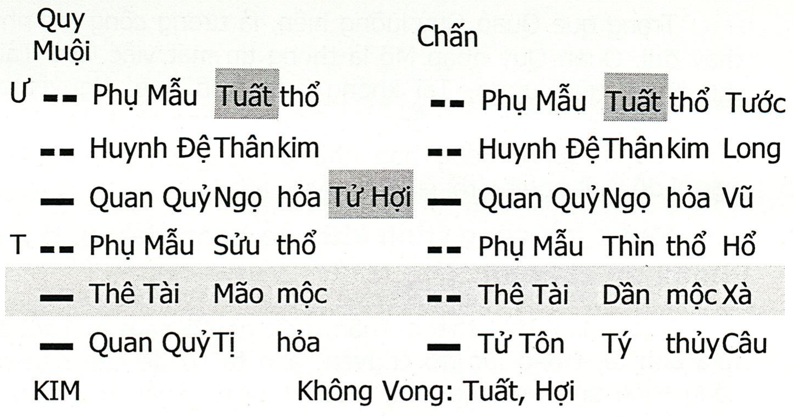
      - **Hình này chứng minh điều gì**
        - Tòa nhà hiện đại có mặt ngoài biến hóa đổi màu, mái lõm trong suốt, lén sửa bản vẽ và hoàn thành tháng 10 năm Ất Dậu 2005.
      - **Từ đâu mà thấy được**
        - Hào 2 Mão mộc lâm Đằng Xà độc phát hợp hào 6 Tuất thổ ám động Tuần Không; hào Dậu xung khai hợp vào năm Ất Dậu 2005.
  - Hào 2 lâm Đằng Xà phát động: Đằng Xà chủ về sự biến hóa khôn lường, kỳ ảo, kinh ngạc, mới lạ, đại diện cho phong cách kiến trúc hiện đại, thông minh.
  - Hào 2 Mão mộc động hợp với Phụ Mẫu Tuất thổ: Tượng hợp mang ý nghĩa phụ thuộc, ốp thêm ở lớp ngoài, biểu thị mặt ngoài tòa nhà có sự biến đổi màu sắc, hình ảnh phong phú (màn hình LED quảng cáo chuyển màu).
  - Hào 6 Tuất thổ lâm Không Vong ám động hợp hào 2 trạch: Tượng Không Vong hợp trạch hào chứng tỏ lớp vỏ mặt ngoài tòa nhà cũng dùng kính trong suốt.
- Luận giải thời điểm hoàn thành công trình:
  - Hào Dụng thần Phụ Mẫu Tuất thổ bị hào 2 Mão mộc phát động hợp trú (bị trói buộc bởi mối lục hợp Mão Tuất).
  - Theo nguyên lý Lục Hào, hào bị hợp trói buộc thì sự việc ngưng trệ, muốn hoàn thành phải đợi đến thời điểm xung khai hào hợp (ứng xung khai).
  - Năm 2005 là năm Ất Dậu: Chi Dậu của thái tuế đến xung khai hào Mão mộc (Mão Dậu tương xung), giải phóng mối trói buộc giúp Tuất thổ thoát hợp để thành sự.
  - Mặt khác, Tuất thổ lâm Tuần Không nên phải đợi đến tháng Tuất (tháng 10 âm lịch năm 2005) xuất Không thì công trình mới chính thức hoàn thành viên mãn (thực tế gia chủ dự tính xong trong khoảng tháng 9 đến tháng 12 năm 2005).
- Luận giải công trình tâm linh, chùa miếu lân cận:
  - Phụ Mẫu Tuất thổ là Mộ khố của Quan Quỷ (Hỏa mộ tại Tuất, chứa Quan Quỷ Tị hỏa và Ngọ hỏa).
  - Quan Quỷ là thần phật, tôn giáo; Mộ khố của Quan Quỷ chính là miếu đường, chùa chiền, nơi thờ tự tâm linh.
  - Kết hợp với vị trí hào 6 là hào vị của chùa miếu tôn nghiêm ở xa, tác giả suy đoán cạnh tòa nhà có chùa miếu (thực tế sát cạnh có nhà thờ Công giáo).

### Người phụ nữ mù nuôi bò đoán triển vọng, đoán ra những chuyện vặt trong đời

#### Bối cảnh xin quẻ và lời đoán ban đầu của tác giả

- **Thời gian và hoàn cảnh vấn quẻ**: Ngày Canh Ngọ, tháng Thân (Tuần không: Tuất, Hợi), tác giả đi khảo sát thực tế tại vùng Diên Biên.
- **Đương số và sự vụ cầu vấn**: Một người phụ nữ bị khiếm thị hai mắt đến xin xem bói; cô vừa mở một trại nuôi bò thịt và băn khoăn không biết tiền đồ phát triển của trang trại ra sao.
- **Quẻ dịch thu được**: Gieo được quẻ Phong Trạch Trung Phu biến Thủy Trạch Tiết.
- **Lời phán đoán sắc bén của tác giả**:
  - *Về địa thế và quy mô trang trại*: Trại bò được dựng ở trên núi, mới hoàn thiện chưa lâu, áp dụng mô hình khoanh nuôi có rào chắn; quy mô nuôi tuyệt đối không được vượt quá 100 con, nếu vượt quá định mức này ắt sẽ tổn thất tài sản nghiêm trọng.
  - *Về kỹ thuật và tình trạng súc vật*: Gia chủ chưa thực sự am hiểu kỹ thuật chăm sóc nên đàn bò đã chịu tổn thất, cụ thể đã có ít nhất 2 con bị chết; hiện chưa thể có lãi ngay mà phải đợi sang năm 2004 (Giáp Thân) mới thực sự thu về lợi ích kinh tế.
  - *Về căn nguyên tật bệnh và tình duyên đời tư*: Mắt của cô không phải mù bẩm sinh mà do dị vật bay vào mắt gây nên; cung mệnh hôn nhân lận đận trải qua hai người đàn ông, trong đó một người biết vun vén cho gia đình, còn một người thì bất tài vô hạnh, tiêu xài cạn tiền của cô rồi lấy tiền đó đi bao gái bên ngoài khiến cô vô cùng khổ tâm dằn vặt.

#### Phản hồi và xác nhận thực tế từ đương số

- **Xác nhận chuẩn xác về trại chăn nuôi**:
  - Người phụ nữ cho biết hiện đang nuôi hơn 60 con bò, chưa đầy nửa năm đã chết đúng 2 con.
  - Ban đầu cô có ý định mở rộng quy mô lớn hơn, nhưng chuyên gia chăn nuôi cũng cảnh báo năng lực trang trại chỉ giới hạn tối đa 100 con, vượt quá sẽ nảy sinh dịch bệnh và sự cố lớn.
  - Mô hình là nuôi bò thịt, hiện bò giống đã sinh bê con nhưng bê còn nhỏ, dự tính sang năm mới xuất bán được.
- **Xác nhận về biến cố đôi mắt**: Năm 21 tuổi, cô bị vôi sống bắn vào mắt nhưng do không rửa sạch xử lý kịp thời nên dẫn đến mù lòa vĩnh viễn, hoàn toàn đúng như tác giả đoán là do dị vật chứ không phải bẩm sinh.
- **Xác nhận sự thật trớ trêu về hai người đàn ông**:
  - Người chồng đầu tiên có với cô một mặt con nhưng lười biếng không chịu làm ăn, ăn bám vào sức lao động của cô; cay đắng hơn gã còn lén lút lấy tiền của cô nuôi bồ nhí bên ngoài; sau khi phát giác, cô đã kiên quyết đuổi gã đi.
  - Về sau cô tái hôn với một người đàn ông thứ hai, người này bản tính chất phác, đối xử rất chu đáo, yêu thương cô thật lòng.
  - Gần đây, người chồng đầu sau khi tiêu xài hết sạch tiền bạc lại mò về tìm cô đòi giảng hòa với lý do vì con cái chung; gã liên tục làm phiền, uy hiếp vòi tiền khiến cô khó xử vì không nỡ xua đuổi người chồng thứ hai tốt bụng đang chung sống.

#### Luận giải chi tiết quẻ Phong Trạch Trung Phu biến Thủy Trạch Tiết

- Nhận định Dụng thần và cấu trúc biến hóa của quẻ:
  - **Hình 144.** Quẻ Phong Trạch Trung Phu biến Thủy Trạch Tiết
    - 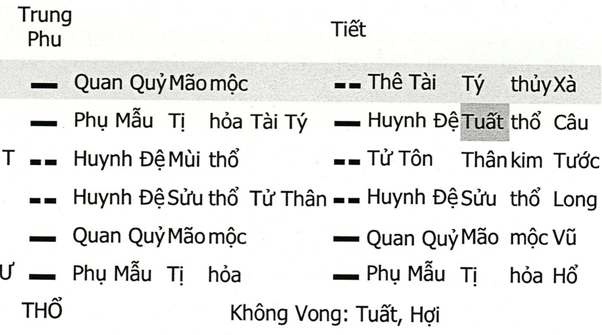
    - **Hình này chứng minh điều gì**
      - Trại bò trên núi có rào chắn mới xây, bò chết ít nhất 2 con, không quá 100 con, năm 2004 mới sinh lợi; người nữ mù do dị vật và có hai đời chồng đối nghịch.
    - **Từ đâu mà thấy được**
      - Quẻ thuộc Cấn vi sơn; Tử Tôn phục Sửu mộ lâm Thanh Long; Nhật Ngọ khắc Tử Tôn số 2; Mão mộc động hóa Tài Tý tiết khí; Quan Mão hào 6 lâm Xà động hóa hồi đầu sinh khắc Thế Mùi.
- **Định vị Dụng thần**: Luận việc nuôi bò kinh doanh thì mục đích là thu lợi nhuận nên lấy Thê Tài làm Dụng thần; tuy nhiên bò nuôi là vốn liếng sinh lãi và là động vật nuôi (lục súc), nên phải kiêm khán thêm hào Tử Tôn.
- **Địa hình chuồng trại và trạng thái chăn nuôi**:
  - Quẻ Trung Phu quy hồn về cung Cấn, tượng quẻ Cấn là núi, cho thấy trại bò tọa lạc trên vùng đồi núi.
  - Tử Tôn Thân kim phục dưới hào 3 Huynh Đệ Sửu thổ; Sửu thổ là Mộ khố của Tử Tôn Kim, tượng trưng cho chuồng trại tập trung. Hào Tử Tôn phục dưới Mộ khố mà không xuất hiện được, thể hiện rõ trạng thái bị vây hãm, dùng rào giậu ngăn chặn không cho bò đi lại tự do (nuôi nhốt trong rào).
  - Hào Sửu thổ lâm Thanh Long, Thanh Long chủ sự mới mẻ, nên đoán biết trại bò vừa mới khánh thành xây dựng cách đây không lâu.
- **Luận đàn bò bị tử thương và khống chế hạn mức 100 con**:
  - Nhật lệnh Ngọ hỏa phát lực khắc hào Tử Tôn Thân kim, báo hiệu đàn bò có thương tật tử vong; ngũ hành Hỏa mang số 2 nên ứng với việc chết ít nhất 2 con bò; nhờ có Nguyệt kiến Thân kim đồng hành phù trợ làm Tử Tôn đắc vượng nên không bị tổn thất diện rộng.
  - Thê Tài Tý thủy (phục dưới hào 5 Phụ Mẫu Tị hỏa), Thủy thuộc số 1, đắc khí vượng thì chuyển hóa thành cơ số 100 con bò.
  - Quan Quỷ Mão mộc tại hào 6 phát động khiến Thê Tài hóa tiết khí và lâm vào Tử địa, lại lâm Tuyệt ở Phi thần Tị hỏa, do đó quy mô đàn không thể đủ hoặc vượt qua số tròn 100; nếu chạm mốc 100 con thì năng lượng tiết Tuyệt bộc phát gây phá đại tài (nguyên lý dụng số điều tiết phong thủy cát hung).
- **Ứng kỳ kinh tế**: Hào Thê Tài phục tàng chưa hiển lộ, tức thời điểm hiện tại chưa thể thu hồi vốn và phát sinh lợi nhuận; phải đợi đến năm Giáp Thân (2004), địa chi Thân kim lâm Thái tuế làm cho Thê Tài Tý thủy đắc sinh nhập đất Trường Sinh, khi đó trang trại mới chính thức gặt hái lợi nhuận dồi dào.
- **Giải mã nguyên nhân tật mù mắt**:
  - Hào Thế Mùi thổ đại diện cho người đến xem; cả Nhật lệnh Ngọ hỏa lẫn Nguyệt kiến Thân kim đều không khắc hại Thế nên đây tuyệt đối không phải chứng mù bẩm sinh.
  - Quan Quỷ Mão mộc tại hào 6 lâm Đằng Xà động khắc mạnh vào hào Thế; Đằng Xà chủ về quái dị, dị tật và dị vật bất thường từ ngoài rơi vào, cho nên luận đoán mù do dị vật rơi vào mắt.
- **Giải mã hai cuộc hôn nhân và mối họa người chồng cũ**:
  - Hào Ứng Phụ Mẫu Tị hỏa lâm Nhật Ngọ hỏa lục hợp với hào Thế Mùi thổ; Phụ Mẫu chủ về hôn thú, giấy chứng nhận kết hôn, lại có Quan Quỷ cư hào 2 (hào trạch/nhà ở) nên cô chắc chắn đã kết hôn.
  - Quẻ có Quan Quỷ lưỡng hiện (hào 2 Mão mộc và hào 6 Mão mộc), tượng trưng cho hai lần đò, đời sống gắn liền với hai người đàn ông.
  - Hào 2 Quan Quỷ Mão mộc an tĩnh, hào Thế Mùi thổ chính là Mộ khố của Mão mộc, mang tượng người đàn ông yên vị trong nhà, chịu sự quản thúc và an lòng bên cô (người chồng sau đối xử tốt).
  - Trái lại, hào 6 Quan Quỷ Mão mộc phát động khắc Thế, chủ về người đàn ông phụ bạc, đối xử tàn nhẫn; hào 6 Quan Quỷ động hóa Thê Tài Tý thủy (Tài là phụ nữ), nghĩa là gã mang tiền đi nuôi bồ nhí bên ngoài.
  - Áp dụng nguyên lý chuyển đổi lục thân: Đối với Quan Quỷ Mão mộc thì cái nó khắc chính là Tài; hào Thế Mùi thổ bị Quan khắc nên Thế chính là Tài của Quan Quỷ, chứng tỏ gã đàn ông tồi tệ này đến với cô hoàn toàn vì nhắm vào tiền bạc.
  - Hào 6 Quan Quỷ động hóa hồi đầu sinh (Tý thủy sinh Mão mộc) rồi lại quay sang khắc Thế, biểu thị việc người chồng cũ khi cạn tiền lại quay về tìm cô, dùng con cái uy hiếp hòng vòi vĩnh tiền bạc.

#### Luận giải bổ trợ quẻ Sơn Thiên Đại Súc biến Sơn Phong Cổ

- **Phương pháp mở rộng quẻ tượng**: Tác giả từ các dữ kiện trên tiến hành phát triển thêm quẻ Sơn Thiên Đại Súc biến Sơn Phong Cổ để truy xét bản chất người chồng thứ nhất (ngày Canh Ngọ, tháng Thân, tuần không Tuất Hợi).
- **Tính cách tâm tính kẻ phụ bạc**:
  - Lấy hào Thế Quan Quỷ Dần mộc (hào 2) làm Dụng thần đại diện cho người đàn ông đó.
  - Hào Thế lâm Huyền Vũ, Huyền Vũ chủ về sự ám muội, dối trá, phóng đãng và dâm tà.
  - Hào sơ Thê Tài Tý thủy bị Nhật lệnh Ngọ hỏa xung kích thành ám động; Tý thủy chính là đất Mộc Dục của hào Thế Dần mộc, vạch trần bản chất gã là kẻ phong lưu, háo sắc và chơi bời trác táng.
- **Mối quan hệ thê - thiếp và quyền lực kinh tế**:
  - Hào Ứng Thê Tài Tý thủy tại hào 5 đại diện cho người vợ hợp pháp (người phụ nữ mù đến xem quẻ); vị trí hào 5 là ngôi tôn quý của gia trưởng, chứng tỏ người vợ nắm thực quyền làm chủ kinh tế trong nhà.
  - Hào sơ Thê Tài Tý thủy phát sinh ám động ở vị trí thấp kém là hình ảnh nhân tình lén lút bên ngoài được gã bao bọc.
- **Giá trị tương hỗ**: Toàn bộ kết cấu quẻ Đại Súc biến Cổ đã củng cố tuyệt đối và làm sáng tỏ từng uẩn khúc đời tư được phản ánh trên quẻ Trung Phu biến Tiết ban đầu.

### Một cô gái nhờ đoán về xem mặt, đoán ra hôn nhân trước đây

#### Bối cảnh xem quẻ và lời phán đoán ban đầu
- **Thời gian và bối cảnh**: Ngày Tân Mùi, tháng Thân (Tuần không: Tuất, Hợi), tác giả đang lưu lại Đôn Hóa, Cát Lâm thì một cô gái người Triều Tiên tìm đến nhờ bói dịch xem việc đi xem mặt sắp tới có thành công hay không.
- **Quẻ tượng thu được**: Quẻ Thiên Trạch Lý biến Thiên Thủy Tụng.
- **Lời luận đoán trực tiếp của tác giả với đương số**:
  - Tác giả phán thẳng: "Chị đã từng kết hôn ở năm 1996. Sau khi kết hôn thì tình cảm vợ chồng không tốt, hai người đã ly hôn ở năm 1998. Chị có sinh một đứa con, hiện nay đứa con đang ở chung với chị. Sau khi ly hôn không lâu thì người đàn ông ban đầu đã qua đời."
  - Tác giả nói tiếp về lần xem mặt này: "Bây giờ người đàn ông mà chị muốn đi xem mặt là một người được người thân của chị giới thiệu, đối phương là người xứ khác, gặp thử đi, khả năng thành công rất thấp."
- **Quẻ tượng liên hệ ghi chép trong hồ sơ thực nghiệm**:
  - **Hình 145.** Sơ đồ quẻ Sơn Thiên Đại Súc biến Sơn Phong Cổ
    - 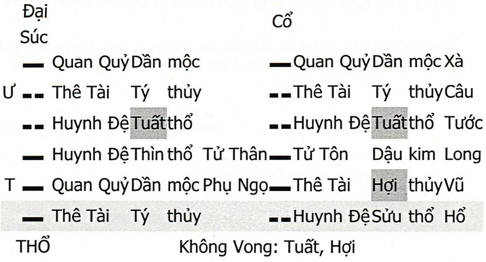
    - **Hình này chứng minh điều gì**
      - Phản ánh đồ hình phụ bản ghi nhận trong nguyên tác liên quan đến trạng thái bế tắc của sự việc.
    - **Từ đâu mà thấy được**
      - Căn cứ sơ đồ quẻ Sơn Thiên Đại Súc biến Sơn Phong Cổ đính kèm tại trang 235 của tài liệu.

#### Kết quả ứng nghiệm thực tế
- **Sự ứng nghiệm chuẩn xác kỳ lạ**: Toàn bộ những điều tác giả luận đoán về quá khứ và hiện tại đều ứng nghiệm chính xác từng chi tiết:
  - Cô gái thừa nhận đã kết hôn vào năm 1996 (Bính Tý).
  - Năm 1997 (Đinh Sửu), cô sinh được một đứa con.
  - Năm 1998 (Mậu Dần), hai vợ chồng nảy sinh mâu thuẫn bất hòa sâu sắc rồi quyết định ly dị.
  - Sau khi ly hôn không lâu, người chồng cũ đã sớm qua đời.
  - Về cuộc xem mặt hiện tại: Em gái của cô đã đứng ra làm mối giới thiệu cho cô một người đàn ông Nhật Bản (người xứ khác), nhưng buổi gặp mặt kết thúc không thành công.

#### Chi tiết lý giải và phương pháp luận đoán
- **Định vị Dụng thần**:
  - Xem về chuyện tình duyên, chồng con thì lấy hào Quan Quỷ làm Dụng thần.
- **Luận đoán về cuộc hôn nhân đầu tiên**:
  - *Thông tin đã từng kết hôn*: Hào sơ Phụ Mẫu Tị hỏa phát động tương hợp với hào Thế (Tử Tôn Thân kim); Phụ Mẫu đại diện cho hôn thư, giấy chứng nhận kết hôn, Tị - Thân lục hợp báo hiệu thông tin chắc chắn đã từng kết hôn.
  - *Xác định năm kết hôn (1996 - Bính Tý)*: Hào 4 Phụ Mẫu Ngọ hỏa tương hợp với Nhật kiến Mùi thổ. Cổ thư có câu: *"Phụ Mẫu lâm Nhật định hôn kỳ"*; khi gặp hợp thì lấy xung làm thời điểm ứng nghiệm (*hợp xứ phùng xung*). Dựa vào tuổi tác của đương số, tác giả đoán kết hôn vào năm 1996 (Bính Tý) vì địa chi Tý xung Phụ Mẫu Ngọ hỏa.
  - *Thông tin ly hôn vào năm 1998 (Mậu Dần)*: Hào sơ Phụ Mẫu Tị hỏa động hóa Quan Quỷ Dần mộc; Dần mộc bị Nguyệt kiến Thân kim xung phá thành Nguyệt phá. Động mà hóa Nguyệt phá là điềm báo giấy tờ hôn thú bị xé bỏ, biểu thị thông tin ly hôn. Đến năm 1998 (Mậu Dần), hào biến Dần mộc xuất hiện ứng kỳ thực phá, vì vậy quyết đoán hai vợ chồng ly hôn đúng năm 1998.
- **Luận đoán về cái chết của người chồng cũ**:
  - Hào Quan Quỷ Mão mộc lâm Tuyệt ở Nguyệt kiến Thân kim, lại nhập Mộ ở Nhật kiến Mùi thổ, cho thấy điềm hung hiểm rất xấu về tính mạng của người chồng.
  - Mặt khác, Quan Quỷ Dần mộc là hào biến của Phụ Mẫu Tị hỏa cũng bị Nguyệt phá và nhập Mộ ở Nhật kiến Mùi thổ, do đó người chồng cũ sau khi ly hôn không lâu thì tử vong.
- **Luận đoán về việc sinh con và nuôi con**:
  - Hào Thế có Tử Tôn Thân kim trì Thế, đại diện cho việc con cái đang ở cạnh bản thân đương số.
  - Hào 3 Huynh Đệ Sửu thổ lâm Thanh Long ám động (bị Nhật kiến Mùi thổ xung mà vượng thành ám động) tương sinh cho hào Thế Tử Tôn Thân kim; Thanh Long chủ việc sinh nở hỷ sự, biểu thị thông tin đương số đã mang thai sinh đẻ và hiện đang nuôi con.
- **Luận đoán về đối tượng xem mặt và người làm mối**:
  - *Về đối tượng xem mặt*: Hào 2 Quan Quỷ Mão mộc lâm hào Ứng; hào Ứng chủ về người khác, xứ khác, phương xa, nên người đàn ông được xem mặt là người ở xứ khác (thực tế là người Nhật Bản).
  - *Về người mai mối*: Phụ Mẫu là hào chủ hôn, người làm mối; hào sơ Phụ Mẫu Tị hỏa động hóa Quan Quỷ mang ý nghĩa mai mối rất rõ ràng. Phụ Mẫu Tị hỏa tương hợp với hào Thế Thân kim, chứng tỏ người làm mối có quan hệ họ hàng thân thích hoặc bạn bè với đương số (thực tế là em gái).
  - *Nguyên nhân cuộc xem mặt thất bại*: Gian hào (hào 3) cũng đại diện cho người làm mối trung gian; tại đây Huynh Đệ Sửu thổ lâm Thanh Long ám động lại sinh trợ cho Tử Tôn Thân kim trì Thế (Tử Tôn là Kỵ thần khắc chế Quan Quỷ). Điều này cho thấy người em gái không biết cách làm mối, "lợn lành chữa thành lợn què", hành động mai mối lại biến thành nguyên nhân khiến việc tác hợp đổ vỡ.
- **Minh họa quẻ tượng và tương tác hào vị**:
  - **Hình 146.** Sơ đồ quẻ Thiên Trạch Lý biến Thiên Thủy Tụng
    - 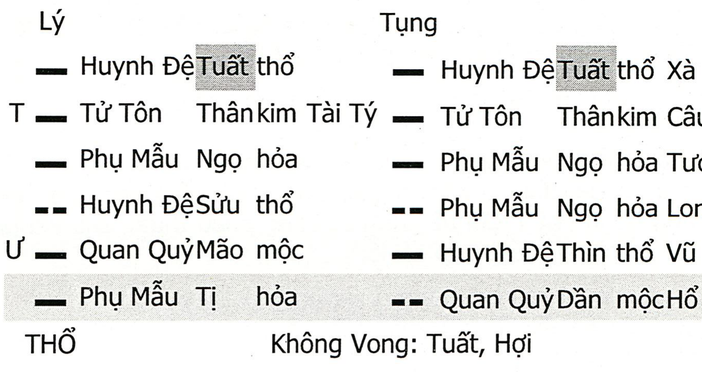
    - **Hình này chứng minh điều gì**
      - Chứng minh quá khứ hôn nhân tan vỡ, người chồng đã mất, cô gái đang nuôi một con và cuộc xem mặt lần này thất bại.
    - **Từ đâu mà thấy được**
      - Căn cứ Quan Quỷ tuyệt Mộ, Phụ Mẫu Tị hỏa hợp Thế hóa phá Mộ, gian hào Sửu thổ ám động sinh Kỵ thần Tử Tôn trì Thế khắc Quan.

### Vốn chỉ đoán bệnh, ai ngờ đoán ra cảnh trong mơ

#### Bối cảnh xem quẻ và phán đoán bệnh tình

- Ngày Quý Dậu tháng Thân năm 2003 (Tuần không: Tuất, Hợi), tác giả Vương Hổ Ứng có dịp nghỉ lại Diên Biên, có một cô gái tìm đến nhờ dự đoán cát hung về tình hình bệnh tật của bản thân, gieo được quẻ Thiên Trạch Lý biến Phong Hỏa Gia Nhân.
- Sau khi quan sát kỹ tượng quẻ và các mối quan hệ sinh khắc chế hóa, tác giả đưa ra hàng loạt phán đoán chuẩn xác:
  - Về triệu chứng bệnh tật: Người này hiện đang mắc chứng chóng mặt, đau đầu dữ dội, đau nhức vùng chân, tức ngực khó chịu; đặc biệt mỗi khi cơn chóng mặt phát tác thì nôn mửa liên tục không dứt.
  - Về thời gian và căn nguyên phát bệnh: Bệnh bắt đầu khởi phát từ năm ngoái (năm 2002 - Nhâm Ngọ), nguyên nhân do đã ăn uống thứ gì đó có tính chất tương tự như hạnh nhân.
  - Về phẫu thuật ngoại khoa: Người bệnh đã từng trải qua chữa trị bằng phẫu thuật, sau khi phẫu thuật trên đầu đã lưu lại vết tích lỗ thủng.
  - Về cảnh tượng giấc mơ kỳ lạ: Cô gái thường xuyên mơ thấy bản thân nhảy từ trên cao xuống đất và cúi nhặt đồ vật rơi vãi trên mặt đất, nhưng nhặt tới nhặt lui rốt cuộc chẳng nhặt được gì.
- Phản hồi thực tế và sự kinh ngạc của người bệnh:
  - Lời phán đoán khiến cô gái vô cùng kinh ngạc vì toàn bộ bệnh tật đều khớp hoàn toàn với thực tế mà cô đang trải qua.
  - Thời gian khởi bệnh chính xác từ năm ngoái; cô gái xác nhận bản thân rất thích uống các loại đồ uống chế biến từ hạnh nhân.
  - Về vết tích phẫu thuật: Khi đến bệnh viện kiểm tra bệnh vùng đầu, các bác sĩ đã tiến hành khoan đục hai lỗ trên hộp sọ.
  - Về giấc mơ: Cảnh tượng trong mơ được suy đoán chính xác không khác chút nào, cô gái thường xuyên lặp đi lặp lại đúng giấc mơ nhảy từ trên cao xuống và nhặt đồ vật vô ích như vậy.
- Dự đoán chi tiết về bệnh chứng, nguyên nhân khởi phát và cảnh mộng dựa trên quẻ Thiên Trạch Lý biến Phong Hỏa Gia Nhân:
  - **Hình 147.** Quẻ Thiên Trạch Lý biến Phong Hỏa Gia Nhân
    - 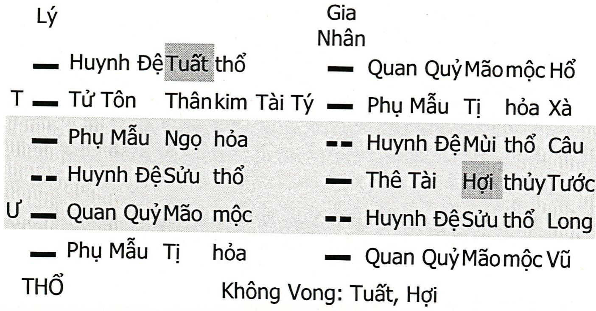
    - **Hình này chứng minh điều gì**
      - Hào Thế vượng tướng cho thấy bệnh không nguy hiểm đến tính mạng; các hào động và lục thú phản ánh rõ triệu chứng đau đầu, tức ngực, đau chân cùng giấc mộng kỳ quái.
    - **Từ đâu mà thấy được**
      - Dụng thần Thế Thân kim được Nhật Nguyệt tỉ phù; Ngọ hỏa động khắc Thế; Mão mộc động sinh Kỵ; Sửu thổ động hóa Tài Không Vong, Thế lâm Đằng Xà nhập Mộ.

#### Luận giải căn nguyên bệnh chứng và triệu chứng thực tế

- Phân định Dụng thần và mức độ nguy hại của bệnh tật:
  - Xem bệnh cho chính mình lấy hào Thế làm Dụng thần; trong quẻ hào Thế là Tử Tôn Thân kim cư tại hào 5.
  - Hào Thế Thân kim được cả Nguyệt lệnh Thân kim lẫn Nhật thần Dậu kim đồng thời tỉ phù nên lâm vượng tướng tột bậc, chứng tỏ bệnh trạng tuy khó chịu nhưng không phải là bệnh hiểm nghèo đe dọa sinh mạng.
- Luận giải chứng đau đầu và dấu vết đục lỗ trên sọ:
  - Nguyên thần sinh trợ Dụng thần là Huynh Đệ Tuất thổ cư tại hào 6 (hào vị cao nhất, chủ về phần đầu của cơ thể).
  - Tuất thổ lâm Tuần Không, lại bị Quan Quỷ Mão mộc phát động khắc thương dữ dội, không thể phát huy tác dụng sinh phù Dụng thần; hào 6 là đầu lâm Bạch Hổ chủ về đau đớn kịch liệt, do đó đoán mắc bệnh đau đầu dữ dội; hào vị phần đầu ngộ Không Vong cũng chủ tượng đầu bị đục khoét có lỗ thủng sau phẫu thuật.
- Luận giải chứng chóng mặt dẫn đến nôn mửa liên tục:
  - Hào Thế Thân kim nhập Mộ ở hào Huynh Đệ Sửu thổ (Sửu là kim khố, mộ của ngũ hành Kim).
  - Nhập Mộ là tượng như say như mê, thần trí mông lung chao đảo, trong phép đoán bệnh lục hào đây chính là biểu hiện điển hình của chứng chóng mặt, choáng váng đầu óc.
  - Hào Mộ khố Sửu thổ lâm Chu Tước phát động hóa xuất Thê Tài Hợi thủy; Chu Tước chủ về miệng lưỡi ẩm thực, Thê Tài tượng trưng cho đồ ăn thức uống, do đó đoán khi chóng mặt sẽ dẫn tới nôn mửa không dứt.
- Luận giải chứng tức ngực khó chịu:
  - Hào Phụ Mẫu đại diện cho lồng ngực, cư tại hào 4 (hào vị vùng ngực trên thân thể) thì ý nghĩa càng thêm chuẩn xác rõ ràng.
  - Phụ Mẫu Ngọ hỏa tại hào 4 phát động khắc chế trực tiếp Dụng thần Thân kim, khiến vùng ngực nhất định bức bối, đau tức khó chịu.
  - Hào Phụ Mẫu Ngọ hỏa lại lâm Câu Trần; Câu Trần có tính chất chủ về trướng tức, u uất, do đó phán đoán người này mắc chứng tức ngực nghẹn ứ.
- Luận giải chứng đau nhức vùng chân:
  - Hào Quan Quỷ Mão mộc là Cừu thần, phát động trợ sinh cho Kỵ thần Phụ Mẫu Ngọ hỏa; bản thân Quan Quỷ mang ý nghĩa bệnh tật, tai họa.
  - Quan Quỷ Mão mộc cư tại hào 2 (hào vị của chân), lại lâm Thanh Long chủ về đau nhức, mỏi mệt, vì vậy đoán người này có bệnh đau chân.
- Luận giải thời điểm phát bệnh và nguyên nhân ngộ độc hạnh nhân:
  - Kỵ thần Ngọ hỏa phát động mang địa chi Ngọ, tương đồng với năm 2002 (năm Nhâm Ngọ), do đó xác định bệnh bắt đầu khởi phát từ năm 2002.
  - Bản thân Kỵ thần Ngọ hỏa sinh vào tháng Thân ngày Dậu thuộc kim vượng hỏa suy nên không vượng, lại được Quan Quỷ Mão mộc phát động sinh trợ, chứng tỏ Quan Quỷ Mão mộc chính là nguồn gốc phát sinh mầm bệnh (trong lục hào, nguyên nhân gây bệnh thường lấy Quan Quỷ để phán đoán).
  - Địa chi Mão mộc thuộc Tứ chính (Tý, Ngọ, Mão, Dậu) tượng trưng cho hình thể tròn; Mão mộc gặp Nhật thần Dậu kim là đất Thai (Mộc tuyệt ở Thân, thai ở Dậu), chủ về vật thể nằm ẩn chứa ở bên trong nhân; Quan Quỷ lại lâm Thanh Long chủ về ẩm thực, trúng độc.
  - Do đó tác giả suy đoán người này đã ăn uống thứ gì đó có độc tính nhẹ hình tròn và có nhân như hạt hạnh nhân, hoàn toàn trùng khớp với việc cô gái nghiện uống đồ uống làm từ hạnh nhân.

#### Bí pháp giải đoán giấc mơ kỳ dị từ hào vị và lục thú

- Luận giải cảnh tượng nhảy từ trên cao rơi xuống mặt đất:
  - Hào Thế Thân kim lâm lục thú Đằng Xà; Đằng Xà chủ về mộng mị, yêu tà, quái dị, kinh hoảng.
  - Hào Thế nhập Mộ ở hào 3 Huynh Đệ Sửu thổ; hào 3 trong hào vị tượng trưng cho giường nằm (hào 1 đất, hào 2 nhà, hào 3 giường, hào 4 cửa), hào Thế Đằng Xà nhập Mộ ở hào 3 là thông tin thần thức nhập vào trạng thái ngủ mê mộng mị trên giường.
  - Mộ khố Sửu thổ ở hào 3 nằm dưới hào Thế (cư hào 5); tượng hào Thế từ hào cao rơi nhập vào Mộ khố ở hào thấp hơn chính là thông tin ngã, rơi từ trên cao xuống dưới đất; kết hợp tính chất kinh hoảng của Đằng Xà nên giải đoán là trong mơ thường xuyên nhảy hoặc rơi từ trên cao xuống.
- Luận giải cảnh tượng nhặt đồ vật trên đất nhưng tay trắng:
  - Hào Huynh Đệ Sửu thổ tại hào 3 phát động hóa xuất Thê Tài Hợi thủy; trong lục hào, Huynh Đệ hóa Thê Tài là tượng bất ngờ nhặt được của cải, tài vật rơi vãi trên đất.
  - Hào Sửu thổ cư hào 3 (giường ngủ), lại là nơi hào Thế lâm Đằng Xà nhập Mộ, quy tụ trọn vẹn thông tin về giấc mộng nằm trên giường mơ thấy nhặt được tài vật trên mặt đất.
  - Tuy nhiên, Thê Tài Hợi thủy lại lâm vào Tuần Không (tuần Giáp Tý có Tuất, Hợi là Không Vong); Tài hóa Không Vong chủ về hư không, không thu được kết quả gì, do đó suy đoán trong giấc mơ dù liên tục cúi nhặt đồ vật nhưng rốt cuộc chẳng nhặt được bất cứ thứ gì.

### Người đàn ông éo lả hỏi tai họa lao ngục, đoán ra cả đời không có hôn nhân

#### Bối cảnh vấn sự và diễn biến đối thoại
- Thời điểm xem bói và đối tượng vấn sự:
  - Ngày Quý Dậu, tháng Thân (Tuần không: Tuất, Hợi).
  - Một người đàn ông có tính tình éo lả đến nhờ tác giả chiêm đoán xem bản thân có gặp phải tai họa lao ngục hay không.
  - Gieo được quẻ Thủy Hỏa Ký Tế biến Phong Hỏa Gia Nhân.
- Luồng đối thoại trực tiếp giữa tác giả và đương sự:
  - Tác giả trực tiếp đưa ra lời phán: "Anh không có tai họa lao ngục, có điều là đến giờ anh vẫn là người độc thân, sợ là cả đời vô duyên với hôn nhân."
  - Người đàn ông thẳng thắn thừa nhận tâm lý và thực tế cuộc đời mình: "Tôi chưa từng nảy sinh cảm giác yêu phụ nữ, suốt đời cũng không muốn kết hôn."

#### Lập luận lý số và ứng nghiệm thực tế
- Suy đoán về tai họa lao ngục:
  - Quy tắc định vị Dụng thần: Luận đoán tai họa lao ngục lấy hào Thế làm Dụng thần; nếu hào Thế bị khắc thì ắt có họa lao ngục, ngược lại nếu Thế vượng tướng mà không bị thương khắc thì không gặp tai họa.
  - Tác động của Nhật Nguyệt và hào Quan Quỷ: Quẻ gieo vào ngày Quý Dậu tháng Thân, ngũ hành Kim của cả Nhật và Nguyệt đều tương sinh cho hào Thế (Huynh Đệ Hợi thủy), giúp hào Thế vượng tướng; đồng thời các hào Quan Quỷ (Tuất thổ, Sửu thổ) đều hưu tù và an tĩnh không động để khắc Thế, vì vậy trọn đời không có tai họa lao ngục.
- Luận giải nguyên nhân suốt đời vô duyên với hôn nhân:
  - Cơ vi phát động trong quẻ: Thần triệu cơ ở động, toàn quẻ chỉ có duy nhất hào 6 Ứng Huynh Đệ Tý thủy độc phát biến Tử Tôn Mão mộc.
  - Tượng Kỵ thần chiếm thê vị: Hào Ứng vốn là thê vị (vị trí của người vợ), nay lại bị Kỵ thần Huynh Đệ lâm Ứng phát động khắc Thê Tài, dẫn đến thế "thê bất quy vị" (vợ không thể vào đúng vị trí).
  - Hào Thê Tài và Sàng Trướng suy vi: Hào Thê Tài Ngọ hỏa hưu tù, lại phục tàng dưới hào 3 Huynh Đệ Hợi thủy mà không xuất hiện trên quẻ chính; tượng Sàng Trướng hưu tù không hiện. Tất cả các dấu hiệu này chỉ rõ đương số không có hôn nhân, cả đời vô duyên với việc lập gia đình.
- Minh chứng bằng sơ đồ quẻ:
  - Dự đoán trọn vẹn tai họa lao ngục và số phận hôn nhân qua quẻ Thủy Hỏa Ký Tế biến Phong Hỏa Gia Nhân:
    - **Hình 148.** Sơ đồ quẻ Thủy Hỏa Ký Tế biến Phong Hỏa Gia Nhân
      - 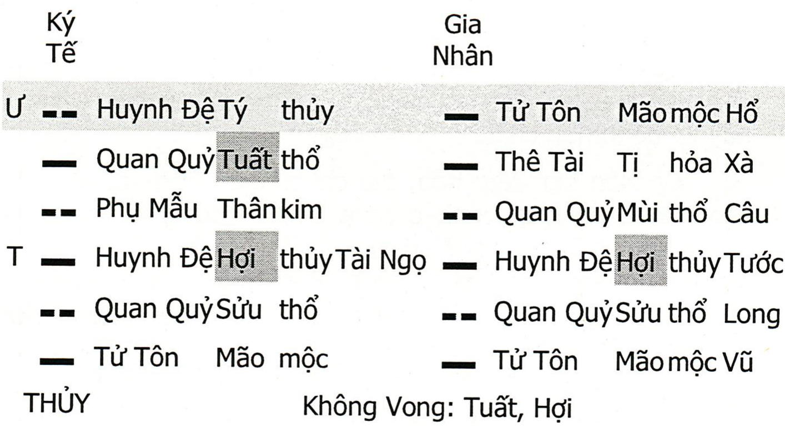
      - **Hình này chứng minh điều gì**
        - Dự đoán người đàn ông không có tai họa lao ngục nhưng suốt đời không lập gia đình.
      - **Từ đâu mà thấy được**
        - Nhật Nguyệt sinh Thế nên vô tai; Kỵ thần Tý thủy độc phát lâm Ứng thê vị, Thê Tài hưu tù phục tàng nên vô duyên hôn nhân.

### Dự đoán con đi lính, đoán ra chồng gặp hung

#### Bối cảnh vấn sự và diễn biến đối thoại
- Thời điểm và bối cảnh chiêm đoán:
  - Ngày Đinh Sửu, tháng Thân (Tuần không: Thân, Dậu).
  - Tác giả đang lưu lại thành phố Trường Xuân (tỉnh Cát Lâm), có một người phụ nữ tìm đến nhờ gieo quẻ hỏi xem con trai đi lính đợt này có thành công hay không.
  - Gieo được quẻ Thiên Lôi Vô Vọng biến Thủy Lôi Truân.
- Diễn biến cuộc đối thoại thực tế giữa tác giả và đương số:
  - Tác giả quan sát quẻ tượng rồi đoán ngay tình trạng sức khỏe: "Thính lực của con chị không tốt, sợ là kiểm tra sức khoẻ không đạt yêu cầu."
  - Người phụ nữ liền xác nhận và hỏi dò phương án chạy chọt: "Đúng. Nhưng chi chút tiền cho người ta thì có được không?"
  - Tác giả điềm tĩnh phân tích hoàn cảnh gia đạo và tài chính: "Được thì được, nhưng sợ là chị không có nhiều tiền như vậy, chồng chị đã qua đời, chắc là mất ở năm 1996. Hiện nay chị đang cô thân một mình, nó đi thì chị sẽ buồn, không có ai giúp đỡ."
  - Người phụ nữ xúc động thừa nhận toàn bộ sự thật: "Ông đoán đúng, chồng tôi đã chết ở mùa đông năm 1996 bởi vì trúng độc khí than, đến bây giờ tôi vẫn chưa tái hôn, để nó đi không phải là chuyện dễ dàng, gặp việc chẳng có ai bên cạnh để bàn bạc."

#### Lập luận lý số và ứng nghiệm thực tế
- Luận giải việc tòng quân và căn bệnh thính lực của người con:
  - Xác định Dụng thần: Đi lính cũng là một nghề nghiệp trong xã hội, vì vậy xem việc tòng quân phải lấy hào Quan Quỷ làm Dụng thần.
  - Tượng việc không thành: Quẻ có Kỵ thần Tử Tôn Ngọ hỏa trì Thế phát động khắc Quan Quỷ; đồng thời Dụng thần Quan Quỷ Thân kim lâm Tuần Không lại nhập Mộ tại Nhật kiến Sửu thổ, tạo thành tượng việc đi lính khó thành.
  - Bệnh trạng ở tai của con trai: Hào Tử Tôn đại diện cho con cái, tại hào 4 lâm Bạch Hổ phát động hóa ra Quan Quỷ Thân kim; Bạch Hổ chủ về bệnh tật, Quan Quỷ cũng chủ về tai ách bệnh tật, biểu thị thông tin con cái đang có bệnh. Hào biến Quan Quỷ Thân kim cư tại hào 5; hào 5 là vị trí ngũ quan trên cơ thể, hành Kim đại diện cho tai; cổ ngữ có câu *"Kim Không tắc minh"* (kim rỗng thì kêu vang), lâm Không ắt có triệu chứng ù tai, khiếm thính hoặc điếc tai.
- Luận giải biến cố người chồng qua đời vào năm Bính Tý (1996):
  - Tượng mất mát gia trưởng: Hào 5 Quan Quỷ Thân kim là hào vị của người gia trưởng, chủ quản một gia đình; nay hào 5 vừa lâm Tuần Không vừa nhập Nhật Mộ, lại bị Tử Tôn Ngọ hỏa trì Thế phát động khắc thương; Kỵ thần lại lâm Bạch Hổ (chủ tang tóc, tử vong), từ đó quyết đoán người chồng đã qua đời.
  - Định lượng năm qua đời: Hào Thế Tử Tôn Ngọ hỏa phát động nhập Mộ ở hào 6 Thê Tài Tuất thổ. Đến năm Bính Tý (1996), địa chi Tý thủy xung Tử Tôn Ngọ hỏa xuất khỏi Mộ khố để phát huy lực khắc; đồng thời năm Tý cũng chính là Tử địa của Quan Quỷ Thân kim (Thân kim tử tại Tý), do đó người chồng gặp nạn qua đời đúng mùa đông năm 1996 do trúng độc khí than.
- Luận giải việc tiền bạc lo lót và tâm trạng người mẹ:
  - Khả năng dùng tiền chạy chọt: Hào 6 Thê Tài Tuất thổ phát động hóa Phụ Mẫu Tý thủy, Tài động ắt sinh Quan Quỷ; sách xưa có câu *"Tài động sinh Quan, may mắn gọi tên"*, ngụ ý nếu bỏ tiền ra lo lót thì có cơ hội may mắn đi lính được.
  - Tình cảnh khó khăn về kinh tế: Hào Thế Tử Tôn Ngọ hỏa nhập Mộ ở hào Tài Tuất thổ, biểu thị tượng bản thân đương số bị tiền bạc vây hãm, bức bách, vì vậy tác giả đoán người mẹ không có đủ số tiền lớn như vậy để xoay xở.
  - Tâm trạng bất an, cô độc: Hào Thế lâm Bạch Hổ động hóa Không Vong (hóa Quan Quỷ Thân kim lâm Không); Bạch Hổ chủ về bi thương, sầu muộn; Không Vong chủ về tâm thần hoang mang, thấp thỏm bất an, phản ánh tâm trạng cô quạnh, lo âu tột độ của người mẹ.
- Minh chứng bằng sơ đồ quẻ:
  - Dự đoán việc đi lính của con trai và biến cố người chồng qua quẻ Thiên Lôi Vô Vọng biến Thủy Lôi Truân:
    - **Hình 149.** Sơ đồ quẻ Thiên Lôi Vô Vọng biến Thủy Lôi Truân
      - 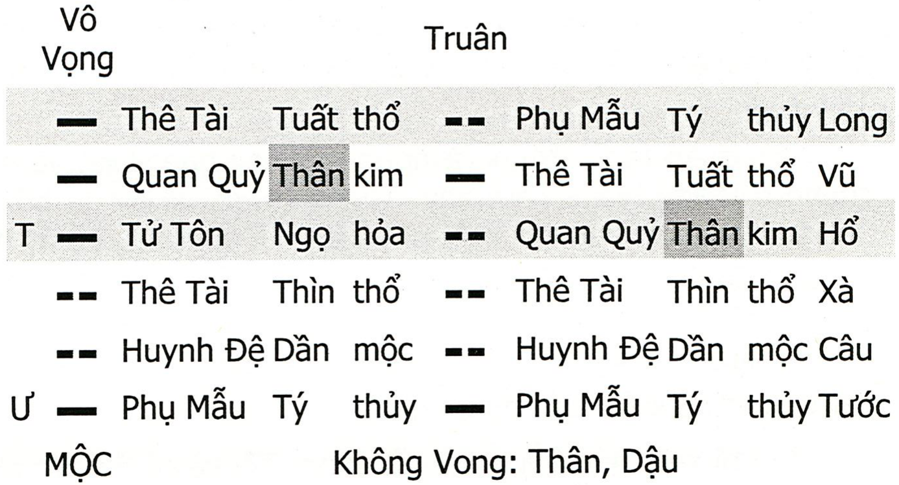
      - **Hình này chứng minh điều gì**
        - Dự đoán con trai thính lực kém khó trúng tuyển, người chồng đã mất năm 1996 do ngộ độc khí than và người mẹ túng thiếu.
      - **Từ đâu mà thấy được**
        - Quan Quỷ Không Mộ; Tử Tôn Ngọ hỏa hóa Quỷ tại hào 5 ngũ quan (ù tai); hào 5 chủ nhà Không Mộ bị khắc; Bính Tý xung Tử Tôn xuất Mộ và là Tử địa của Quỷ.

### Hỏi nguyên nhân bạn gái chia tay, là do có tư tình với cha

#### Bối cảnh vấn sự và diễn biến đối thoại
- Thời điểm và bối cảnh chiêm đoán:
  - Ngày Ất Sửu, tháng Thân (Tuần không: Tuất, Hợi).
  - Một nam thanh niên có bạn gái đột ngột bỏ đi không rõ lý do, tìm đến tác giả gieo quẻ hỏi nguyên nhân vì sao chia tay.
  - Gieo được quẻ Trạch Sơn Hàm biến Lôi Sơn Tiểu Quá.
- Luồng đối thoại trực tiếp giữa tác giả và đương số:
  - Tác giả xem quẻ và phán rõ quá trình tình cảm: "Anh và người nữ này quen biết và sống chung ở tháng giêng năm nay. Tháng trước, cô ấy đã bỏ anh mà đi. Hai người rất khó khôi phục lại mối quan hệ, cô ấy hiện đang ở chung với cha cô ấy, hai người này có quan hệ rất không bình thường."
  - Tác giả hé mở thêm về tương lai: "Tháng 12 năm nay anh vẫn có cơ hội có bạn gái, nắm bắt thời cơ và kiếm một người đi."
  - Đương sự kinh ngạc xác nhận sự thật chấn động: "Ông nói rất đúng. Tôi và cô ấy biết nhau rồi sống chung ở tháng giêng. Chúng tôi sống với nhau đã nửa năm, tháng trước cô ấy đột nhiên bỏ đi, tôi gọi đến nhà cô ấy thì mọi lần đều là cha cô ấy nhận điện thoại, không cho tôi qua lại với con gái ông ta. Đúng là hai người này có quan hệ không bình thường. Năm ngoái, hai người họ đã phát sinh quan hệ thể xác, điều này là do chính miệng cô ấy nói cho tôi biết. Đàn bà như vậy bỏ đi cũng được, bạn gái tương lai của tôi là người như thế nào?"
  - Tác giả miêu tả cụ thể chân dung bạn gái tương lai: "Là người đã từng ly hôn, từng tham gia quân ngũ, hoặc công tác trong ngành công an, chính trị pháp luật, mặt tròn tròn, rất hào phóng với anh, yêu nhau không cần anh chi tiền."

#### Kết quả ứng nghiệm thực tế
- Ứng nghiệm chuẩn xác về bạn gái cũ: Mọi tình tiết tác giả đoán về thời điểm sống chung (tháng giêng), thời điểm chia tay (tháng trước tức tháng Mùi) và mối quan hệ loạn luân lén lút giữa cô gái với người cha ruột đều hoàn toàn chính xác.
- Ứng nghiệm kỳ lạ về bạn gái tương lai vào tháng 12:
  - Đến tháng 12 (tháng Tý), người đàn ông liên tục gọi điện báo tin mừng cho tác giả: "Thầy Vương, tháng này tôi đã đến vận đào hoa, có rất nhiều người đến làm quen với tôi, có người phục vụ trong quân đội, có người làm công an, có người làm trong bộ an ninh, cũng có người làm việc ở đại học chính pháp, nhưng đều là mặt tròn. Có người vừa gặp đã muốn mua xe cho tôi, tôi sắp hoa mắt rồi."

#### Phân tích quẻ Trạch Sơn Hàm biến Lôi Sơn Tiểu Quá
- Luận giải thời điểm quen biết và ăn ở cùng nhau:
  - Định vị Dụng thần: Xem về chuyện tình cảm nam nữ, lấy hào Thê Tài làm Dụng thần.
  - Dấu hiệu sống chung lén lút: Trong quẻ, Thê Tài Mão mộc phục tàng dưới hào 2 Quan Quỷ Ngọ hỏa; Quan Quỷ Ngọ hỏa chính là Sàng Trướng (giường chiếu) của hào Thế (Huynh Đệ Thân kim). Hào Ứng Phụ Mẫu Mùi thổ lâm Nhật xung trở thành ám động đến hợp với Thê Tài Mão mộc, tạo thành thông tin bí mật hẹn ước, chung sống ăn ở với nhau.
  - Thời điểm dọn về ở chung: Đến tháng giêng (tháng Dần), Dần mộc là Thê Tài xung hào Thế Thân kim, đồng thời xung Thoái thần Kỵ thần, do đó hai người bắt đầu quen biết và sống chung từ tháng Dần.
- Luận giải nguyên nhân bạn gái bỏ đi và mối quan hệ bất chính với người cha:
  - Dấu hiệu bạn gái ra đi và khó tái hợp: Hào Thê Tài không xuất hiện trên quẻ chính mà phục tàng là tượng người nữ đã bỏ đi; Nguyệt kiến Thân kim khắc Dụng thần Mão mộc, lại thêm Kỵ thần Huynh Đệ Dậu kim vượng tướng phát động biến thoái, báo hiệu mối quan hệ vĩnh viễn không thể hàn gắn hay quay lại.
  - Vạch trần quan hệ mờ ám với cha ruột: Hào Ứng Phụ Mẫu Mùi thổ ám động, hào Thê Tài Mão mộc lại nhập Mộ ở hào Ứng. Hào Ứng đại diện cho gia đình nhà gái; Phụ Mẫu đại diện cho bậc trưởng bối, phụ thân; Phụ Mẫu lâm Huyền Vũ chủ về sự mờ ám, dâm loạn, khuất tất. Ám động là lén lút qua lại, nhập Mộ là tượng được trưởng bối ôm ấp, dung túng; do đó tác giả đoán cô gái đang ở với cha và có quan hệ bất chính thể xác với cha mình.
- Dự đoán cơ hội tình duyên mới vào tháng 12:
  - Tìm kiếm bạn gái mới vẫn lấy Thê Tài làm Dụng thần; hiện tại Thê Tài phục tàng dưới Phi thần Quan Quỷ Ngọ hỏa.
  - Đến tháng 12 âm lịch (tháng Tý), Tý thủy xung khứ Phi thần Ngọ hỏa, giải phóng hào Thê Tài Mão mộc xuất đầu lộ diện, vì vậy tháng 12 sẽ xuất hiện cơ hội tình duyên mới.
- Minh chứng bằng sơ đồ quẻ:
  - Dự đoán nguyên nhân bạn gái bỏ đi do mờ ám với cha qua quẻ Trạch Sơn Hàm biến Lôi Sơn Tiểu Quá:
    - **Hình 150.** Quẻ Trạch Sơn Hàm biến Lôi Sơn Tiểu Quá
      - 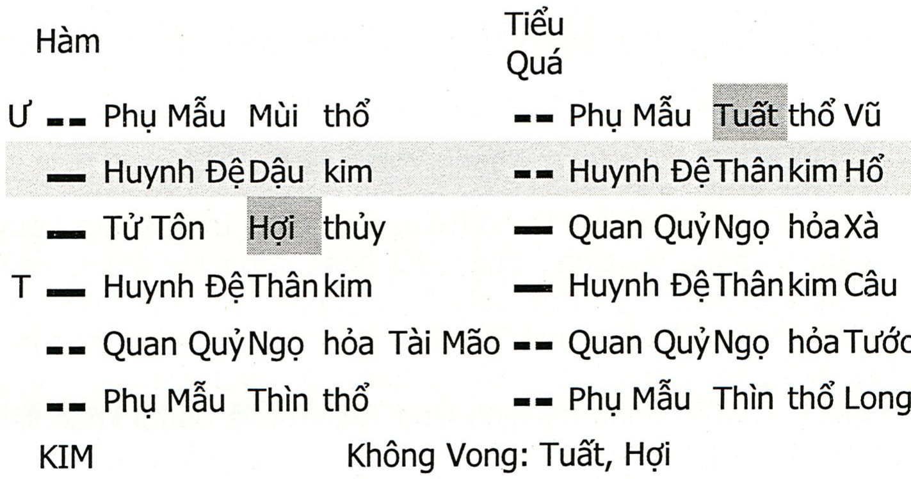
      - **Hình này chứng minh điều gì**
        - Chứng minh bạn gái bỏ đi do có quan hệ bất chính với cha ruột; hai người từng sống chung từ tháng giêng và không thể tái hợp.
      - **Từ đâu mà thấy được**
        - Thê Tài Mão mộc phục dưới Quan Quỷ Ngọ hỏa Sàng Trướng; Phụ Mẫu Mùi thổ ám động hợp; Tài phục bị Nguyệt khắc; Phụ Mẫu chủ trưởng bối lâm Huyền Vũ ám động, Tài nhập Mộ ở Ứng.

#### Phân tích quẻ Lôi Phong Hằng biến Địa Phong Thăng về bạn gái tương lai
- Phát triển quẻ tượng để luận đoán đối tượng cụ thể:
  - Để nắm bắt tường tận đặc điểm của người bạn gái tương lai, từ quẻ trước tác giả diễn dịch phát triển thành quẻ Lôi Phong Hằng biến Địa Phong Thăng (Tuần không: Tuất, Hợi).
  - Chuyển hoán Dụng thần: Lấy hào Thế làm tiêu điểm trung tâm để khắc họa đối tượng người nữ sẽ đến với đương số.
- Luận giải nghề nghiệp, xuất thân và tình trạng hôn nhân:
  - Nghề nghiệp trong lực lượng vũ trang hoặc pháp luật: Hào Thế có Quan Quỷ Dậu kim trì Thế lâm Nguyệt kiến; Quan Quỷ vượng khí chủ về quân nhân, công an, tư pháp hoặc chính trị pháp luật.
  - Tình trạng từng ly hôn: Hào 4 Tử Tôn Ngọ hỏa phát động; Tử Tôn là thần khắc Quan Quỷ (khắc chồng), Tử Tôn phát động là dấu hiệu người phụ nữ này đã từng đổ vỡ hôn nhân (đã ly dị chồng).
  - Ứng kỳ hôn nhân mở ra: Đến tháng Tý (tháng 12 âm lịch), chi Tý xung khắc Tử Tôn Ngọ hỏa (xung khứ Kỵ thần khắc phu), giúp giải tỏa cản trở và mở ra cơ hội hôn nhân cho người phụ nữ này.
- Luận giải tính cách khẳng khái, sự hào phóng và dung mạo:
  - Tính cách hào hiệp, không màng tiền bạc: Hào Thế mang hành Kim; trong ngũ hành Kim chủ về đức "Nghĩa" (trọng tình nghĩa, khẳng khái, sẵn sàng vì người khác). Đồng thời, hào 4 Tử Tôn Ngọ hỏa động tương sinh cho hào Ứng Thê Tài Tuất thổ; hào Ứng đại diện cho đối phương, đồng thời là phu vị (người yêu/chồng của cô ấy); điều này chỉ rõ người phụ nữ không tiếc tiền vì người yêu, sẵn sàng chu cấp mua sắm cho bạn trai mà không đòi hỏi đối phương phải tốn kém.
  - Tướng mạo khuôn mặt tròn trịa: Luận đoán dung mạo căn cứ vào địa chi hào Thế; hào Thế mang chi Dậu (thuộc nhóm Tứ Đào hoa / Tứ chính gồm Tý, Ngọ, Mão, Dậu; tứ chính chủ về hình thể tròn trịa đầy đặn), do đó tác giả quyết đoán người bạn gái mới sẽ có khuôn mặt tròn.
- Minh chứng bằng sơ đồ quẻ:
  - Phân tích tướng mạo, nghề nghiệp và tính cách của bạn gái mới qua quẻ Lôi Phong Hằng biến Địa Phong Thăng:
    - **Hình 151.** Sơ đồ quẻ Lôi Phong Hằng biến Địa Phong Thăng
      - 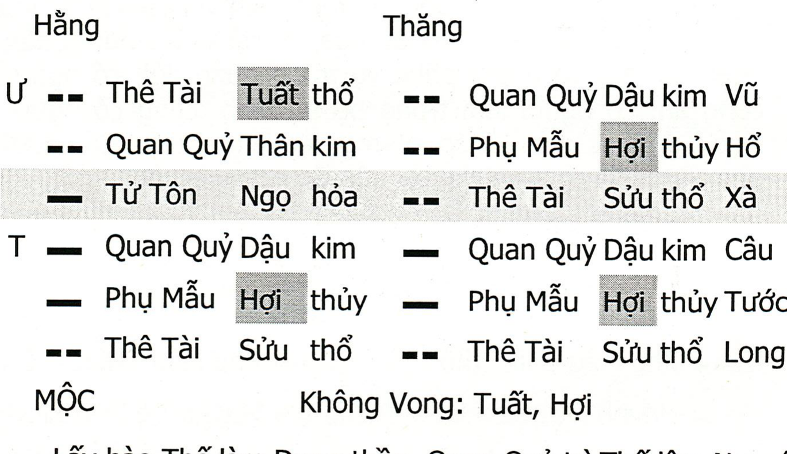
      - **Hình này chứng minh điều gì**
        - Chứng minh bạn gái mới mặt tròn, từng ly hôn, làm ngành quân đội/công an/chính pháp và rất hào phóng chi tiền cho đương số.
      - **Từ đâu mà thấy được**
        - Quan Quỷ trì Thế lâm Nguyệt kiến (quân công); Tử Tôn Ngọ hỏa động (ly hôn), tháng Tý xung khứ; Thế thuộc kim chủ nghĩa, Tử Tôn sinh Ứng Tài (chi tiền); Thế lâm Dậu là tứ chính (mặt tròn).

### Niên vận của người đàn ông phong lưu

#### Diễn biến các lần xem bói và ứng nghiệm thực tế

##### Lần 1: Dự đoán niên vận đầu năm – Cảnh báo ba hạn đào hoa liên hoàn
- Ngày Quý Sửu tháng Dần năm 2003 (Tuần Không: Dần, Mão), một người đàn ông trẻ tuổi tìm đến tác giả để nhờ dự đoán niên vận trong năm, gieo được quẻ Thiên Trạch Lý biến Phong Lôi Ích.
- Tác giả trực tiếp cảnh báo thói trăng hoa và các tai vạ cận kề:
  - "Anh là một người quen thói phong lưu, gieo rắc đào hoa ở khắp nơi, năm nay anh phải kiểm điểm một chút, nếu không thì sẽ xảy ra những sự việc sau đây:
    - Tháng 5 (tháng Tị) coi chừng làm một cô bé có thai.
    - Tháng 7 (tháng Mùi) coi chừng mắc bệnh sinh dục.
    - Tháng 9 anh qua lại với vợ người ta, coi chừng người chồng phát hiện thì anh sẽ gặp phiền phức."
- Nhận định vận hạn đào hoa, bệnh tật và tai họa tình ái qua quẻ niên vận:
  - **Hình 152.** Sơ đồ quẻ Thiên Trạch Lý biến Phong Lôi Ích
    - 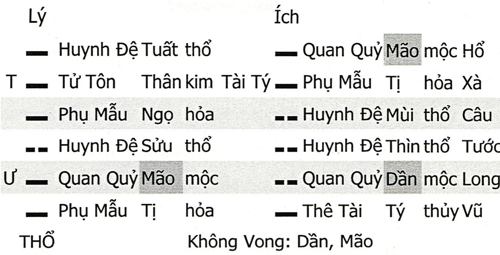
    - **Hình này chứng minh điều gì**
      - Bản tính say mê tửu sắc và 3 tai ách liên hoàn: tháng Tị làm người có thai, tháng Mùi mắc bệnh sinh dục, tháng Dậu bị chồng người tình gây rối.
    - **Từ đâu mà thấy được**
      - Thế Tử Tôn Thân kim lâm Xà nhập Mộ Sửu bị Dần xung phá; Hào 4 Ngọ hỏa Đào hoa động khắc Thế; Hào 2 Mão mộc Không Vong lâm Long động sinh Kỵ thần.
- Kết quả phản hồi ban đầu:
  - Người đàn ông không tiếp thu ý kiến cảnh báo, tiếp tục buông thả theo thói quen cũ.
  - Về sau, toàn bộ các sự việc tác giả dự đoán đều lần lượt xảy ra chính xác theo từng kỳ hạn.

##### Lần 2: Tháng Mùi mắc bệnh sinh dục – Âm thầm tìm bác sĩ và tai bay vạ gió tháng Dậu
- Đến tháng Mùi, người đàn ông mắc bệnh sinh dục đúng như lời dự báo, hoảng hốt và vội vã quay lại xin dự đoán diễn biến bệnh tật.
- Vào ngày Kỷ Hợi tháng Mùi (Tuần Không: Thìn, Tị), người này gieo được quẻ Phong Hỏa Gia Nhân biến Thủy Thiên Nhu.
- Đối thoại thực tế giữa tác giả và đương số:
  - Tác giả trách và phán định: "Sao anh chẳng nghe lời tôi, xem ra số phận của anh phải mắc bệnh này. Bệnh tình của anh khá nghiêm trọng, anh đã lén lút tìm bác sĩ khám bệnh, trình độ của bác sĩ rất cao, có thể trị khỏi bệnh cho anh, chỉ tốn một chút tiền thôi, tháng sau sẽ khỏi."
  - Người đàn ông thừa nhận: "Tôi đã âm thầm nhờ bạn tìm bác sĩ quen biết, trình độ khám bệnh đúng là rất giỏi, chỉ là thuốc hơi đắt, nhưng có thể trị khỏi thì cũng đồng ý thôi."
  - Tác giả hỏi lại việc dự đoán đầu năm: "Đầu năm tôi đoán anh làm một cô bé có thai ở tháng 5, có ứng nghiệm hay không?"
  - Người đàn ông đáp: "Ở tháng 5, tôi đã quan hệ với một cô bé, nhưng không có thai. Điểm này hơi chênh lệch."
  - Tác giả khiêm nhường dặn dò: "Khó tránh sai sót, dự đoán của tôi cũng không đạt đến bách phát bách trúng, tuy nhiên anh cứ thận trọng thì tốt hơn."
- Phán đoán bệnh tình sinh dục và tiến trình điều trị qua quẻ biến:
  - **Hình 153.** Quẻ Phong Hỏa Gia Nhân biến Thủy Thiên Nhu
    - 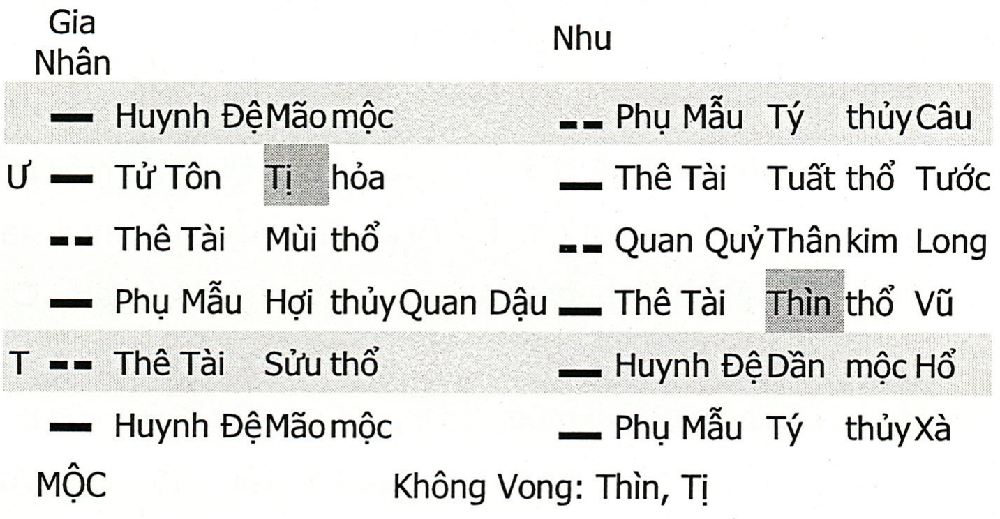
    - **Hình này chứng minh điều gì**
      - Bệnh sinh dục nghiêm trọng do ăn chơi, bí mật tìm được bác sĩ giỏi chữa khỏi dứt điểm vào tháng Thân dù tốn kém.
    - **Từ đâu mà thấy được**
      - Thế Thê Tài Sửu thổ tại hào 2 bị Mão khắc và hóa Dần hồi đầu khắc, lâm Hổ; Ứng Tử Tôn Tị hỏa ám động sinh Thế; tháng Thân xung Dần mộc khỏi bệnh.
- Diễn biến ứng nghiệm thực tế:
  - Đến tháng Thân, bệnh sinh dục của người này được chữa trị khỏi hẳn.
  - Đến tháng Dậu, người này gọi điện thoại thông báo sự việc thứ ba đã ứng nghiệm: anh ta lén lút quan hệ bất chính với một phụ nữ có chồng, bị người chồng bắt quả tang và sắp sửa kéo đến gây sự; cuối cùng anh ta phải chi 100 tệ bồi thường cho người chồng để dàn xếp êm thấm qua chuyện.

##### Lần 3: Tháng Hợi sinh non – Lo lắng nguy hiểm tính mạng mẹ con
- Đến ngày Đinh Mùi tháng Hợi (Tuần Không: Dần, Mão), người này cuống cuồng gọi điện thoại đến tác giả:
  - "Cô gái ở chung hồi tháng 5 đã có thai, thì ra kinh nguyệt của cô gái đó không bình thường, vài tháng thì đến một lần, cho nên nửa năm không thấy kinh nguyệt cũng không để ý, hôm nay đột nhiên phát hiện trong bụng có thai nhi động, đến bệnh viện kiểm tra thì mới biết là đã có thai. Bác sĩ nói rằng có thể sinh non, nhưng có nguy hiểm nhất định, ngộ nhỡ xảy ra vấn đề gì thì phải làm sao đây? Phiền ông xem sinh non lành dữ ra sao?"
  - Lời phán tháng 5 làm thụ thai trước đây thực chất đã hoàn toàn ứng nghiệm, do sinh lý cô gái dị thường nên đến tận tháng 11 mới phát giác.
- Tác giả gieo được quẻ Sơn Lôi Di biến Địa Lôi Phục.
- Phán đoán của tác giả:
  - "Không sao, có thể cho sinh non, người mẹ sẽ không có chuyện xảy ra, trẻ nhỏ cũng có thể sống được, là con trai. Có điều là hiện nay chưa sinh được, phải đến sau khi giao tiết lệnh."
- Dự báo khả năng sinh non và an nguy tính mạng của mẹ con qua quẻ biến:
  - **Hình 154.** Quẻ Sơn Lôi Di biến Địa Lôi Phục
    - 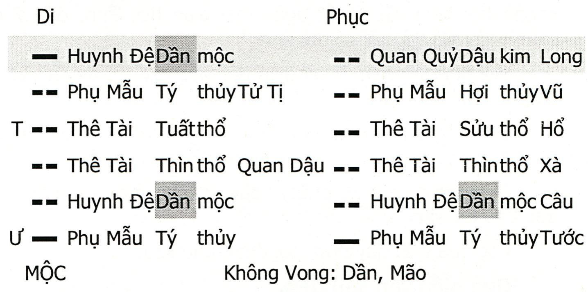
    - **Hình này chứng minh điều gì**
      - Khẳng định cô gái mang thai con trai, sinh non mẹ tròn con vuông nhưng phải qua tiết lệnh mới có thể sinh.
    - **Từ đâu mà thấy được**
      - Thế Thê Tài Tuất thổ là Mộ khố của Tử Tôn tượng bụng có thai; hào 6 Dần mộc dương độc phát sinh Tử Tôn Tị hỏa hưu tù nên sinh con trai sống được; Dần mộc Không Vong hóa Dậu khắc nên mẹ an toàn.

##### Lần 4: Thuốc giục sinh không tác dụng – Xác định chính xác giờ lâm bồn
- Ngày Quý Sửu tháng Hợi (Tuần Không: Dần, Mão), người này lại sốt ruột gọi điện thoại thông báo:
  - "Tôi đã đem cô ấy đến bệnh viện để sinh, đã uống thuốc trợ sản và tiêm trợ sản, nhưng sáu giờ trôi qua vẫn không có động tĩnh."
- Đối thoại giải quyết tình thế:
  - Tác giả phê bình: "Không phải là đã bảo anh qua tiết lệnh hãy sinh à? Sao anh gấp thế?"
  - Người đàn ông trần tình: "Bác sĩ nói càng sớm càng tốt. Bây giờ đã thành như vậy, ông xem phải làm sao đây?"
- Tác giả gieo quẻ Thiên Thủy Tụng để định rõ giờ giấc.
- Lời luận đoán quyết định:
  - "Xem ra cô gái này đã bị tội, chưa qua tiết lệnh thì không thể sinh. Giờ Tuất ngày mai giao tiết lệnh, đến 7 giờ sáng ngày kia thì mới có thể sinh."
  - Người đàn ông lo âu hỏi: "Thời gian dài như vậy, cô ấy không sao chứ?"
  - Tác giả khẳng định: "Không sao, nếu như anh nghe lời tôi, sinh trễ một ngày thì tốt, như vậy cô ấy khỏi phải chịu tội quá lớn."
- Xác định nguyên nhân giục sinh bất thành và thời điểm lâm bồn chính xác qua quẻ thuần tĩnh:
  - **Hình 155.** Quẻ Tụng
    - 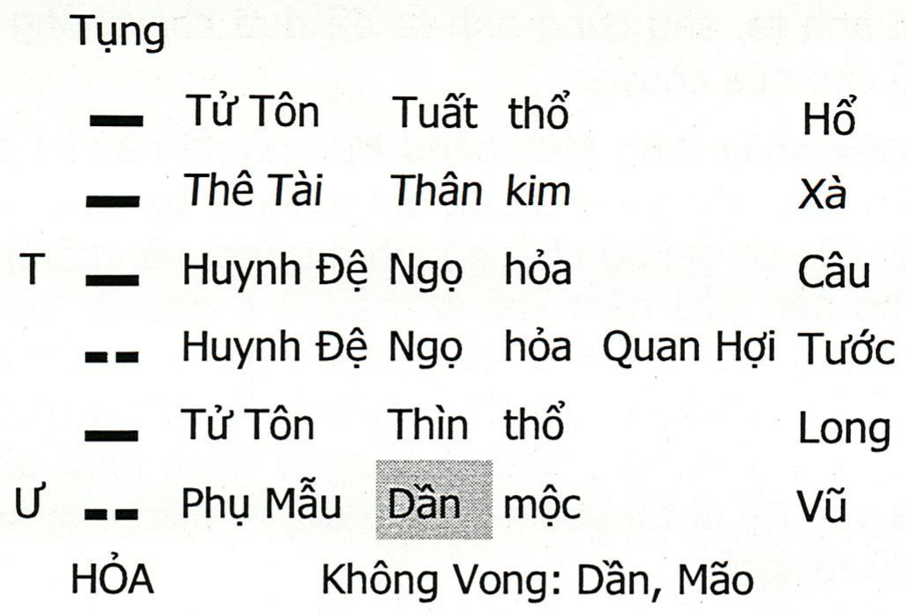
    - **Hình này chứng minh điều gì**
      - Thuốc trợ sản chưa có tác dụng do chưa qua tiết lệnh; mẹ con an toàn và sẽ sinh con trai vào giờ Thìn ngày Ất Mão sau khi giao tiết lệnh.
    - **Từ đâu mà thấy được**
      - Thê Tài Thân kim nhập Mộ ở Nhật Sửu là nhập viện, được Nhật sinh nên an toàn; Tử Tôn Thìn thổ tại hào vị thai nhi an tĩnh, chờ giao tiết lệnh giờ Tuất ngày Giáp Dần, đến giờ Thìn ngày Ất Mão xung Thìn mới sinh.
- Kết quả ứng nghiệm thực tế và sai khác múi giờ:
  - Vào giờ Mão (5 giờ 55 phút) ngày Ất Mão, cô gái sinh hạ an toàn một bé trai. Vừa chào đời, đứa bé đã được người khác nhận nuôi ngay.
  - Phân tích hiệu chỉnh thời gian thực:
    - Theo giờ chuẩn Bắc Kinh (tính theo đài thiên văn ở Lâm Đồng, Thiểm Tây), thời điểm 5 giờ 55 phút còn kém 5 phút mới bước sang giờ Thìn (7 giờ sáng).
    - Tuy nhiên, căn cứ kinh nghiệm thực chiến nhiều năm của tác giả, giờ thực tế tại Thái Nguyên, tỉnh Sơn Tây sớm hơn giờ Bắc Kinh khoảng 20 phút.
    - Do đó, thời điểm 5 giờ 55 phút tại địa phương thực chất đã bước vào giờ Thìn, ứng nghiệm chuẩn xác tuyệt đối với dự đoán của quẻ.

#### Tổng kết quẻ lý và cơ chế suy đoán chi tiết của tác giả

##### 1. Phân tích quẻ niên vận đầu tiên (Thiên Trạch Lý biến Phong Lôi Ích)
- Nhận định tính cách và lối sống phong lưu:
  - Hào Thế Tử Tôn Thân kim trì Thế: Tử Tôn là thần vui vẻ, du hí, giải trí. Thế lâm Đằng Xà và nhập Mộ ở Nhật kiến Sửu thổ, biểu thị đương số đam mê chìm đắm trong ăn nhậu, chơi bời sa đọa.
  - Hào 4 Phụ Mẫu Ngọ hỏa phát động: Ngọ hỏa là Đào Hoa, đồng thời là đất Mộc Dục của hào Thế Thân kim, chủ về bản tính đa tình phong lưu, háo sắc buông thả.
  - Thế tại hào 5: hào 5 là hào vị của đường đi, mặt khác hào Thế Thân kim lại là Dịch Mã (cục Dần Ngọ Tuất, Mã tại Thân), mang tượng thích chạy nhảy lung tung, vui đùa rong ruổi khắp nơi.
- Cơ chế dự đoán hạn làm phụ nữ có thai ở tháng 5 (tháng Tị):
  - Tử Tôn trì Thế, hào 2 là Thai địa (Mão mộc là Thai của Thân kim) lâm Thanh Long phát động; Thanh Long chủ về việc sinh nở thai sản, mang thông tin làm người khác mang thai.
  - Hào Thế Tử Tôn Thân kim bị Nguyệt kiến Dần mộc xung là Nguyệt phá; hào phá gặp hợp là kỳ ứng nghiệm, nên ứng vào tháng Tị (Tị Thân lục hợp) hợp phá.
- Cơ chế dự đoán hạn mắc bệnh sinh dục ở tháng 7 (tháng Mùi):
  - Hào Thế bị Nguyệt kiến Quan Quỷ Dần mộc xung phá: Quan Quỷ là bệnh tật, Tử Tôn lại là bộ phận sinh dục, hào Thế Tử Tôn bị Quan Quỷ xung phá tất là bộ phận sinh dục mắc bệnh.
  - Hào 2 Quan Quỷ Mão mộc lâm Thanh Long phát động sinh Kỵ thần Ngọ hỏa: hào 2 là hào vị của bộ phận sinh dục, Quan Quỷ là bệnh, Thanh Long chủ về tửu sắc ăn chơi, ắt là phát sinh bệnh kín do quan hệ phóng túng.
  - Hào Thế nhập Mộ ở Nhật kiến Sửu thổ, Phụ Mẫu Ngọ hỏa động khắc Thế nhưng hào nhập Mộ khó khắc, tất phải chờ xung khai Mộ khố mới bị khắc hại; đến tháng Mùi xung khai Sửu thổ Mộ khố, nên đoán tháng Mùi phát bệnh.
- Cơ chế dự đoán rắc rối với chồng người tình ở tháng 9 (tháng Dậu):
  - Hào Ứng Quan Quỷ Mão mộc phát động sinh Kỵ thần: Ứng là người khác, Quan Quỷ là người đàn ông (người chồng), lâm Thanh Long chủ về sắc dục nam nữ, biểu thị vì chuyện tư tình mà bị người chồng phát hiện gây phiền phức.
  - Mão mộc lâm Tuần Không (tuần Quý Sửu Không Dần Mão), phải đợi đến tháng Dậu xung thực (Dậu xung Mão) để ứng nghiệm, vì vậy biến cố xảy ra vào tháng Dậu.

##### 2. Phân tích quẻ thứ hai (Phong Hỏa Gia Nhân biến Thủy Thiên Nhu)
- Nhận định bệnh trạng và hào vị cơ thể:
  - Lấy hào Thế Thê Tài Sửu thổ làm Dụng thần.
  - Hào Thế bị hào 6 Huynh Đệ Mão mộc khắc thương, bản thân hào Thế lại phát động biến Huynh Đệ Dần mộc hồi đầu khắc, lâm Bạch Hổ chủ về tai bệnh huyết quang, chứng tỏ bệnh tình phát tác khá nghiêm trọng.
  - Hào Thế lâm hào 2: hào 2 là hào vị của bộ phận sinh dục, khẳng định mắc bệnh tại cơ quan sinh dục.
- Nhận định về thầy thuốc và thời điểm bình phục:
  - Hào Ứng đại diện cho bác sĩ, Tử Tôn đại diện cho y dược; Tử Tôn Tị hỏa lâm hào Ứng chứng tỏ tìm được bác sĩ có y thuật cao minh.
  - Hào Ứng Tử Tôn Tị hỏa ám động (được Nhật kiến Hợi thủy xung động) sinh phù hào Thế, báo hiệu thông tin bí mật lén lút nhờ người tìm thầy thuốc giỏi.
  - Hào Thế Sửu thổ lâm Nguyệt phá (tháng Mùi xung Sửu) và bị hóa hồi đầu khắc; phải chờ sang tháng mới bất phá, tức đến tháng Thân kim xung khắc triệt tiêu Dần mộc hồi đầu khắc thì bệnh tật mới khỏi dứt điểm.

##### 3. Phân tích quẻ thứ ba (Sơn Lôi Di biến Địa Lôi Phục)
- Phương pháp phối hợp Dụng thần kép:
  - Vừa xem Thê Tài đại diện cho người mẹ, vừa xem Tử Tôn đại diện cho thai nhi trong bụng.
- Định đoán về thai nhi và giới tính:
  - Tử Tôn Tị hỏa phục thần dưới hào 5 Phụ Mẫu Tý thủy và bị Nguyệt kiến Hợi thủy xung là Nguyệt phá, hào phục gặp phá ắt phải đợi sang tháng sau mới xuất hiện/sinh nở.
  - Tử Tôn không được Nhật Nguyệt sinh phù nên ở trạng thái hưu tù; quy luật Lục hào chỉ rõ: Tử Tôn hưu tù mà trong quẻ có hào dương độc phát (hào 6 Huynh Đệ Dần mộc phát động) tất sinh con trai.
  - Hào dương độc phát Dần mộc tương sinh cho Tử Tôn Tị hỏa, chứng tỏ thai nhi sinh non vẫn sống được.
- Định đoán về an nguy của người mẹ:
  - Quẻ có Thê Tài lưỡng hiện (hào 3 Thìn thổ và hào 4 Tuất thổ), chọn hào Thế Thê Tài Tuất thổ làm Dụng thần; Tuất thổ là Mộ khố của Tử Tôn Hỏa, mang tượng trong bụng người phụ nữ đang cưu mang đứa trẻ.
  - Hào Thế Thê Tài Tuất thổ được Nhật kiến Mùi thổ tỉ phù trợ lực.
  - Dù có hào 6 Huynh Đệ Dần mộc phát động khắc Tài, nhưng Dần mộc lại lâm Tuần Không (tuần Đinh Mùi Không Dần Mão) và động hóa Quan Quỷ Dậu kim hồi đầu khắc, do đó lực khắc bị hóa giải hoàn toàn, người mẹ sinh non không gặp nguy hiểm đến tính mạng.

##### 4. Phân tích quẻ thứ tư (Thiên Thủy Tụng) và kinh nghiệm hiệu chỉnh múi giờ địa phương
- Nhận định tình trạng nhập viện và độ an toàn:
  - Thê Tài Thân kim nhập Mộ ở Nhật kiến Sửu thổ (Kim Mộ tại Sửu), ứng với thông tin người phụ nữ đã nhập viện.
  - Nhật kiến Sửu thổ tương sinh cho Thê Tài Thân kim, khẳng định tính mạng người mẹ được bảo toàn bình an.
- Xác định Dụng thần thai nhi và quy luật lâm bồn:
  - Trong quẻ có Tử Tôn lưỡng hiện (hào 2 Thìn thổ và hào 6 Tuất thổ), đều không gặp hợp, xung, Không, phá; chọn hào 2 Tử Tôn Thìn thổ làm Dụng thần vì hào 2 là hào vị của thai nhi.
  - Tử Tôn cùng Nguyên thần và hào thai (Huynh Đệ Ngọ hỏa) đều an tĩnh, chưa thể sinh ngay mà phải chờ đến khi giao tiết lệnh sang tháng Tý, Tý thủy xung động hào thai Ngọ hỏa (xung thai) mới có thể hạ sinh.
  - Tử Tôn Thìn thổ là dương hào, tái khẳng định chắc chắn sinh con trai.
- Tính toán thời khắc ứng nghiệm và hiệu chỉnh kinh độ:
  - Ngày tiếp theo là ngày Giáp Dần, thời điểm giao tiết lệnh tháng Tý rơi vào cuối giờ Tuất (khoảng 20 giờ 55 phút).
  - Tử Tôn Thìn thổ và Tuất thổ trong quẻ đang an tĩnh; theo nguyên lý "tĩnh phùng trị phùng xung", khi giao tiết lệnh thì giờ Tuất đã trôi qua, nên tất phải ứng vào giờ Thìn ngày tiếp theo (ngày Ất Mão) để xung Thìn trị Thìn.
  - Thực tế bé trai sinh vào lúc 5 giờ 55 phút ngày Ất Mão; dù theo giờ Bắc Kinh còn thiếu 5 phút mới sang giờ Thìn, nhưng do tọa độ Thái Nguyên (Sơn Tây) nằm chếch về phía đông so với đài thiên văn Lâm Đồng (Thiểm Tây), giờ mặt trời thực tại đây sớm hơn khoảng 20 phút, nên thời điểm 5 giờ 55 phút thực tế đã chính thức bước sang giờ Thìn.

### Dự đoán phong thủy nhà cửa, đoán ra trong nhà có quan tài

#### Diễn biến buổi dự đoán và kết quả ứng nghiệm thực tế

- **Bối cảnh quẻ bói:**
  - Ngày Canh Dần, tháng Hợi (Tuần Không: Ngọ, Mùi).
  - Một người đến xin dự đoán về phong thủy của căn nhà cũ ở quê nhà, gieo được quẻ Hỏa Thủy Vị Tế biến Thiên Địa Bĩ.
- **Lời luận đoán chi tiết của tác giả:**
  - Căn nhà này có quy mô rộng lớn, bên trong chia làm nhiều phòng, vị trí nằm rất gần đường cái lớn.
  - Xung quanh sân có tường xây bao bọc kiên cố; cửa chính của căn nhà trổ theo hướng Nam.
  - Phía trước mặt đối diện cửa ra vào có vật thể hình nhọn lộn xộn, bừa bãi, gây sát khí bất lợi cho anh em trong gia đình; định quyết vào năm 1989 (Kỷ Tỵ) hoặc năm 2001 (Tân Tỵ) nhất định xảy ra biến cố anh em bất hòa xung đột.
  - Ở gần khu vực nhà có mương nước hoặc sông ngòi chảy qua, cạnh đó có một cây cầu; con đường dẫn lối về nhà phải đi băng qua cánh đồng ruộng.
  - Phía Đông Nam của sân nhà bố trí nhà vệ sinh, chuồng nuôi gà hoặc chuồng nuôi lợn; ngoài ra ở trong sân có treo các túm ớt đỏ.
  - Trong nhà hiện có người lớn tuổi (người già) đã sắm sẵn thọ quan (quan tài) cất giữ trong nhà.
  - Bản thân đương số xin đoán là người rất ít khi trở về thăm căn nhà này.
- **Kết quả ứng nghiệm thực tế ngoài đời:**
  - Mọi chi tiết phán đoán đều chuẩn xác lạ kỳ: ngôi nhà này liền vách kết hợp với một dãy nhà hầm, có xây tường rào bao bọc xung quanh, cửa chính mở về hướng Nam.
  - Ngay đối diện cửa ra vào có một đống phế thải, rác rưởi chất đống nhọn hoắt cao như một quả núi nhỏ; vào đúng năm 1989 (Kỷ Tỵ), anh em trong gia đình đã nảy sinh mâu thuẫn bất hòa gay gắt.
  - Gần nhà có con mương dẫn nước, đường về nhà quả thực phải đi xuyên qua cánh đồng ruộng lúa.
  - Khu nhà vệ sinh nằm đúng ở góc Đông Nam của sân, trong sân có dựng chuồng nuôi gà, trên vách có treo ớt đỏ; đặc biệt trong nhà quả thật người già đã chuẩn bị sẵn một cỗ thọ quan (quan tài).
  - Cách nhà không xa có một cây cầu và nằm sát đường cái lớn; bản thân đương số xác nhận quanh năm đi xa, rất hiếm khi trở về quê.

#### Phân tích quẻ tượng và các bước suy luận phong thủy chi tiết

- Luận đoán phong thủy căn nhà ở quê qua quẻ Hỏa Thủy Vị Tế biến Thiên Địa Bĩ:
  - **Hình 156.** Quẻ Hỏa Thủy Vị Tế biến Thiên Địa Bĩ
    - 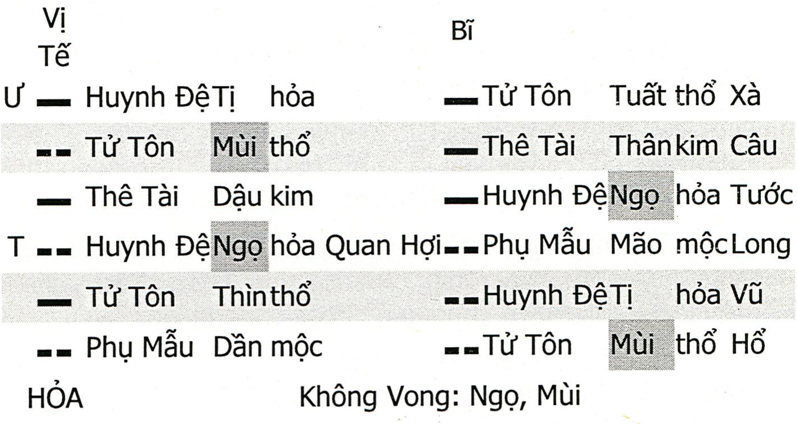
    - **Hình này chứng minh điều gì**
      - Nhà rộng nhiều phòng có tường bao quanh, đối diện có vật nhọn rác rưởi khiến anh em bất hòa, sân có treo ớt đỏ, chuồng trại, nhà vệ sinh và quan tài người già.
    - **Từ đâu mà thấy được**
      - Hào 1 Phụ Mẫu Dần mộc vượng nhập Mộ hào 5 Mùi thổ lâm Câu Trần; hào Ứng Tị hỏa Nguyệt phá lâm Xà; hào 2 Thìn thổ thủy khố lâm Vũ hợp Tài Dậu kim lâm Tước; Phụ Mẫu lâm Hổ nhập Mộ.
- **Quy mô căn nhà, cấu trúc liền kề, tường bao và vị trí giao thông:**
  - Lấy hào Phụ Mẫu làm Dụng thần đại diện cho nhà cửa, đồng thời kiêm xem hào 2 là hào trạch.
  - Hào 1 Phụ Mẫu Dần mộc được Nguyệt kiến Hợi thủy tương sinh và tương hợp (Hợi Dần lục hợp), lại được Nhật kiến Canh Dần cùng hành tỷ phù (trị Nhật kiến), khí thế cực kỳ vượng tướng; hào trạch vượng tướng chủ về căn nhà to lớn, rộng rãi.
  - Phụ Mẫu Dần mộc hợp với Nguyệt kiến, kết hợp hào 2 (hào trạch) phát động tương hợp với hào 4 Thê Tài Dậu kim (Thìn Dậu hợp); tượng các hào tương hợp chủ về sự liên kết tiếp giáp, biểu thị nhà liền vách với nhiều căn phòng hoặc liền kề nhà hầm.
  - Phụ Mẫu Dần mộc nhập Mộ ở hào 5 Tử Tôn Mùi thổ; Phụ Mẫu là phòng ốc nhà cửa, nhập Mộ mang tượng bị bao bọc, che chắn xung quanh; hào 5 lâm Câu Trần chủ về công trình kiến trúc xây dựng, do đó suy ra sân nhà có tường xây bao bọc.
  - Hào 1 Phụ Mẫu Dần mộc lâm Bạch Hổ; thần Bạch Hổ chủ về đường sá, giao lộ, do đó biết được căn nhà tọa lạc ở vị trí rất gần đường cái lớn.
- **Cửa chính hướng Nam và sát khí đối diện gây bất hòa huynh đệ:**
  - Hào 3 đại diện cho cửa ngõ (môn hộ), lâm Huynh Đệ Ngọ hỏa; bản thân lục thân Huynh Đệ cũng chủ về then chốt cửa nẻo, mang chi Ngọ hỏa chủ phương Nam, nên cửa chính của ngôi nhà mở về hướng Nam.
  - Hào Ứng ở hào 6 là án sơn, đại diện cho hướng diện tiền phía trước nhà, lâm Huynh Đệ Tị hỏa; Tị hỏa mang hình tượng vật sắc nhọn, lại được Nhật kiến Dần mộc sinh phù nên vượng tướng, cho thấy trước cửa có công trình hoặc vật thể hình chóp nhọn.
  - Hào Ứng lâm Đằng Xà; Đằng Xà chủ về quái dị, rác rưởi lộn xộn, bừa bãi không ngay ngắn (thực tế ứng với đống rác thải chất cao như núi nhỏ).
  - Hào Ứng Huynh Đệ Tị hỏa bị Nguyệt kiến Hợi thủy xung phá (Nguyệt phá); Huynh Đệ lâm Nguyệt phá lại bị hình sát xông thẳng vào cửa, tất ứng về điềm anh em trong nhà bất hòa, phân tranh.
  - Nguyệt phá thì ứng kỳ rơi vào thời điểm "thực phá" (trị năm Tị hoặc xung năm Hợi); năm 1989 (Kỷ Tỵ) và năm 2001 (Tân Tỵ) đều thuộc năm Tị, do đó quyết đoán anh em sẽ xung đột vào các năm này (thực tế năm 1989 đã xảy ra).
- **Môi trường ngoại cảnh: sông mương, cây cầu và đường đi qua đồng ruộng:**
  - Hào 2 là Thìn thổ, Thìn vốn là Thủy khố (kho chứa nước); Thủy khố lâm ngay hào trạch là dấu hiệu rõ ràng cho thấy sát cạnh nhà có mương máng hoặc sông ngòi chảy qua.
  - Hào 5 đại diện cho đường sá (hào lộ), lâm thần Câu Trần chủ về vật liệu đất đá kiến trúc xây dựng; hào 5 Tử Tôn Mùi thổ lại rơi vào Tuần Không (dưới rỗng thông thoáng, trên có kiến trúc bắc qua), đó chính là hình tượng cây cầu; do đó suy ra gần nhà có cây cầu.
  - Hành mộc đại diện cho cây cối, hoa màu, nông sản; Phụ Mẫu Dần mộc nhập Mộ ở hào 5 Mùi thổ; hào 5 Mùi thổ lâm Câu Trần đại diện cho điền thổ (ruộng đồng); hào 5 lại là đường đi, cho nên con đường dẫn về nhà phải băng qua cánh đồng ruộng lúa.
- **Bố cục sân vườn: nhà vệ sinh, chuồng trại và ớt đỏ phơi trong sân:**
  - Hào 2 là Thủy khố (Thìn thổ), lâm thần Huyền Vũ; Huyền Vũ chủ về ẩm ướt, uế khí, dơ bẩn, do đó suy ra đây là nơi xả thải, nhà vệ sinh.
  - Địa chi Thìn thổ đối ứng với phương Đông Nam (cung Tốn), hào 2 lại động hóa xuất Huynh Đệ Tị hỏa cũng thuộc phương Đông Nam; do đó vị trí nhà vệ sinh nằm ở góc Đông Nam của khuôn viên.
  - Hào 4 Thê Tài Dậu kim chủ về đồ ăn thức uống, mang hành kim đại diện cho vị cay nồng; hào 4 lại lâm Chu Tước mang sắc đỏ rực rỡ và chủ về thực phẩm, kết hợp tượng kim cay và Chu Tước đỏ suy ra đó là quả ớt đỏ.
  - Hào 2 (hào trạch/sân) Thìn thổ phát động hợp chặt với hào 4 Thê Tài Dậu kim (Thìn Dậu hợp); hào trạch tương hợp với vật thể ớt đỏ, suy ra trong sân nhà có treo phơi các dây ớt đỏ.
  - Chi Dậu kim tượng trưng cho loài gà (Dậu kê), chi Hợi thủy tượng trưng cho loài lợn (Hợi trư); hào 2 Thìn thổ là Mộ Khố của Hợi thủy, đồng thời lại hợp với Dậu kim; Thìn thổ cư phương Đông Nam, nên ở góc Đông Nam của sân có chuồng nuôi gà hoặc chuồng nuôi lợn.
- **Hiện tượng đặc thù trong nhà: thọ quan (quan tài) người già và tâm lý đương số:**
  - Hào Phụ Mẫu đại diện cho các bậc trưởng bối, người già trong nhà, lâm thần Bạch Hổ; Bạch Hổ là hung thần chủ về tang tóc, hình thương, tử vong.
  - Hào 1 Phụ Mẫu Dần mộc nhập Mộ ở hào 5 Mùi thổ; Mộ Khố của Phụ Mẫu khi lâm Bạch Hổ chính là biểu tượng của cỗ thọ quan (quan tài hậu sự chuẩn bị sẵn cho người cao tuổi).
  - Hào trạch (hào 2 Thìn thổ) thu nạp khí mộ khố cất giữ bên trong, do đó đoán định trong nhà hiện có người già đã sắm sẵn quan tài để dành.
  - Hào Thế đại diện cho bản thân người gieo quẻ, ngự tại hào 3 Huynh Đệ Ngọ hỏa; hào Thế lâm Tuần Không, lại không phát động sinh trợ cho hào Ứng (án sơn, phương hướng của ngôi nhà); bản thân rơi vào Không lại không hướng về căn nhà, chứng tỏ đương số tâm không gắn bó với quê, rất ít khi trở về nhà.

### Dự đoán vận khí bản thân, đoán ra hôn nhân của đồng nghiệp

#### Diễn biến dự đoán thực tế và các quẻ biến dịch

- **Bối cảnh buổi dự đoán:**
  - Thời gian: Ngày Kỷ Sửu, tháng Hợi (Tuần không: Ngọ, Mùi).
  - Người hỏi: Một người phụ nữ đến xin dự đoán vận khí cho bản thân.
  - Người thực hiện: Tác giả cùng bằng hữu Đoàn Kiến Nghiệp cùng tham gia dự đoán.
  - Quẻ gieo ban đầu: Gieo được quẻ Lôi Thiên Đại Tráng biến Sơn Thiên Đại Súc.

- Khởi quẻ đầu tiên để đoán định tổng quan vận mệnh của đương số:
  - **Hình 157.** Sơ đồ quẻ Lôi Thiên Đại Tráng biến Sơn Thiên Đại Súc
    - 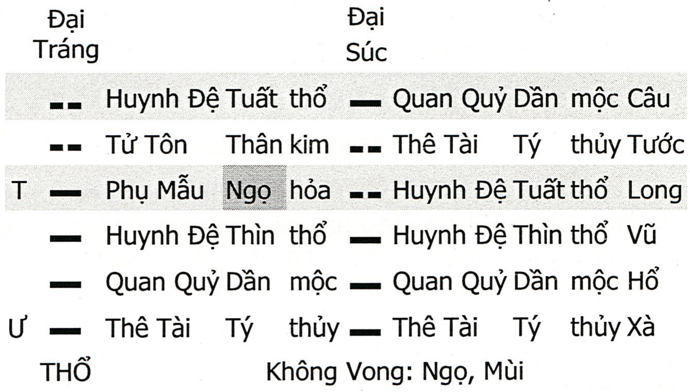
    - **Hình này chứng minh điều gì**
      - Đương số có quyền chức, an nhàn, chồng gánh vác việc nhà, hòa hợp với cha mẹ chồng; bản thân hay chóng mặt, tâm hoảng.
    - **Từ đâu mà thấy được**
      - Thế lâm Thanh Long, Phụ Mẫu Không Vong, Quan Quỷ sinh Thế; hào 4 Ngọ hỏa bị Nguyệt khắc và nhập Mộ ở hào 6 Tuất thổ động hóa Quỷ.

- **Lời phán của tác giả về vận khí bản thân:**
  - "Bản thân chị có chức có quyền, là người có cuộc sống an nhàn. Ở nhà thì không phải làm việc, chồng đối xử với chị rất tốt, mọi việc nhà đều do chồng lo liệu. Chị ở chung với cha mẹ chồng, quan hệ rất hòa hợp."
  - "Sức khỏe của chị không quá tốt, thường xuyên có bệnh chóng mặt, tâm hoảng."
- **Phản hồi của người phụ nữ:**
  - "Đoán rất đúng. Tôi là giám đốc của một đơn vị, ở đơn vị tôi nói thế nào là như thế ấy. Ở nhà thì tôi chẳng làm cái gì, tất cả việc nhà đều do chồng tôi làm. Tôi đang ở chung với cha mẹ chồng, quan hệ rất tốt, từ trước đến nay chưa hề có cãi vã. Tim của tôi hơi không tốt, thường xuyên đập nhanh, chóng mặt."
  - Đương số ngỏ ý muốn hỏi thêm: "Có thể xem cho con tôi một chút hay không?"

- Từ quẻ ban đầu, tác giả tiếp tục phát triển ra quẻ thứ hai để xem cho người con:
  - **Hình 158.** Quẻ Thiên Sơn Độn biến Trạch Phong Đại Quá
    - 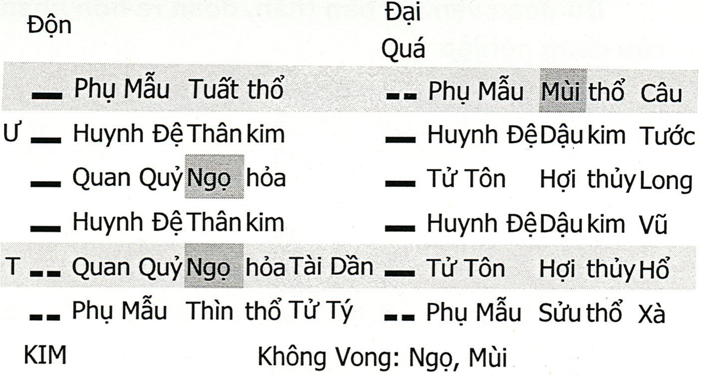
    - **Hình này chứng minh điều gì**
      - Con tính nóng, hiếu động, có chủ kiến; sau này bỏ việc để tự kinh doanh; năm 2002 từng bị viêm ruột, viêm họng, phát sốt.
    - **Từ đâu mà thấy được**
      - Thế Quan Quỷ Ngọ hỏa lâm Hổ phát động hóa Tử Tôn khắc ngược lại; Tài phục dưới Thế; hào 2 cung Càn và hào 5 Thân kim lâm Chu Tước.

- **Lời phán của tác giả về người con:**
  - "Con chị là người nóng tính, hoạt bát hiếu động, rất có chủ kiến. Sau này nó sẽ không đi làm giống như chị, cho dù có công việc, nó cũng sẽ từ bỏ và tự tạo sự nghiệp cho mình."
  - "Sức khỏe của con chị không tốt, năm 2002 từng bị bệnh, chủ yếu là viêm ruột, viêm họng, sốt, ngoài ra không có bệnh tật gì lớn."
- **Phản hồi của người phụ nữ:**
  - "Ông đoán những điều này rất đúng. Thật ngại quá, có thể xem sức khỏe cho cha tôi một chút hay không?"

- Tác giả tiếp tục phát triển ra tầng quẻ thứ ba để xét sức khỏe của cha mẹ đương số:
  - **Hình 159.** Quẻ Lôi Thiên Đại Tráng biến Thiên Sơn Độn
    - 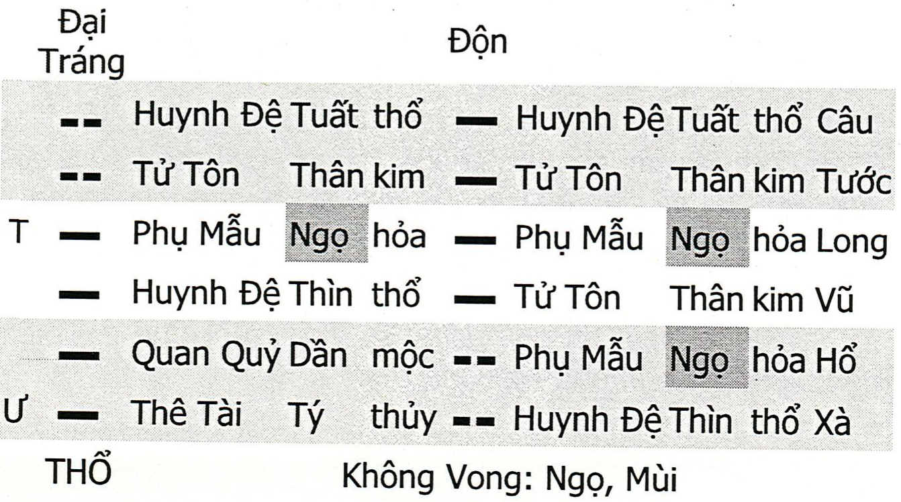
    - **Hình này chứng minh điều gì**
      - Mẹ rất khỏe mạnh; đương số giống cha; cha mắc bệnh tim và viêm tuyến tiền liệt từng phải phẫu thuật.
    - **Từ đâu mà thấy được**
      - Thê Tài Tý thủy vượng được Nhật tỉ phù; Thế lâm hào 4 Ngọ hỏa giống quẻ đầu; Tý thủy tam hợp cục khắc Thế, Thìn thổ thủy khố lâm Huyền Vũ.

- **Lời phán của tác giả về cha mẹ:**
  - "Mẹ cô rất khỏe, cô trông rất giống cha cô, tim ông ấy không quá tốt, có viêm tuyến tiền liệt."
- **Phản hồi của người phụ nữ:**
  - Kinh ngạc đáp: "Đúng, sức khỏe của mẹ tôi rất tốt. Tôi trông giống cha, tim ông ấy hơi không tốt, hai năm trước đã phẫu thuật tuyến tiền liệt."
  - Đương số tiếp tục hỏi dò sang việc của đồng nghiệp: "Tôi rất quan tâm đến hôn nhân của phó giám đốc ở đơn vị tôi, cô ấy sinh năm 1973."

- Tác giả cùng Đoàn Kiến Nghiệp tiên sinh trao đổi và phát triển quẻ thứ tư để xem hôn nhân đồng nghiệp:
  - **Hình 160.** Quẻ Phong Trạch Trung Phu biến Thiên Lôi Vô Vọng
    - 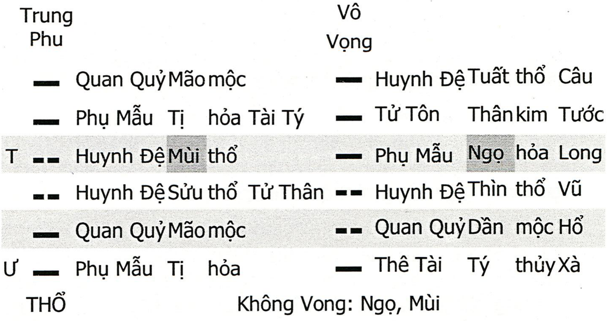
    - **Hình này chứng minh điều gì**
      - Đồng nghiệp xinh đẹp, ham học; năm 1992 lỡ dở hôn nhân vì tiền; năm 2003 bị đả thương; năm 2006 cưới người ly hôn ngành công kiểm pháp.
    - **Từ đâu mà thấy được**
      - Thế lâm Thanh Long, Phụ Mẫu Chu Tước; Quan Quỷ Mão mộc hào 2 hóa thoái Dần mộc; Ứng Phụ Mẫu bị Nguyệt Tài xung phá; năm Tuất hợp Quan thoái.

- **Lời phán của tác giả về nữ phó giám đốc:**
  - "Phó giám đốc của đơn vị cô trông rất xinh đẹp, thích học tập, thường xuyên cầm một quyển sách trên tay. Cô ấy hiện vẫn chưa kết hôn."
  - "Năm 1992, cô ấy đã trải qua một lần khắc cốt ghi tâm, xém chút nữa là đã kết hôn. Cô ấy và người nam đó sống với nhau cũng hòa hợp, nhưng chủ yếu là do cha mẹ đối phương phản đối nên không kết hôn. Nguyên nhân không kết hôn có liên quan rất lớn đến một khoản tiền."
- **Phản hồi kinh ngạc của người phụ nữ:**
  - "Ông đoán rất đúng, cô ấy trông rất xinh đẹp, thích học, đúng là thường xuyên cầm sách trên tay. Cô ấy đến nay vẫn chưa kết hôn."
  - "Năm 1992, cô ấy đã từng có người yêu, hai người thậm chí đã chụp ảnh cưới, thế nhưng cha mẹ của đối phương phản đối, nói là nếu kết hôn với cô gái này thì sẽ cắt đứt quan hệ cha con, nếu mà từ bỏ thì cho anh ta 200 vạn tệ. Kết quả là người nam đó đã chọn điều thứ hai, buồn bã chia tay. Chuyện này đối với cô ấy là một đả kích rất lớn. Ông xem khi nào thì cô ấy mới có thể kết hôn?"
- **Lời luận định tiếp theo về thời điểm hôn nhân và tai họa:**
  - Tác giả xem lại quẻ rồi nói: "Năm nay (năm 2003) thì có đối tượng, nhưng không thành. Cô ấy đã trải qua một tai họa trong năm nay, bị người ta đánh. Nếu không có chuyện này tất có tai nạn giao thông."
  - "Cô ấy phải đến năm 2006 mới có thể kết hôn. Đối phương là người kết hôn lần hai, công tác trong ngành công kiểm pháp."

#### Phân tích chi tiết các bước luận giải lục hào

##### Quẻ thứ nhất: Xem vận khí bản thân (Lôi Thiên Đại Tráng biến Sơn Thiên Đại Súc)
- **Luận chức quyền và tính an nhàn:**
  - Lấy hào Thế làm Dụng thần để triển khai. Hào Thế lâm Thanh Long là tượng tôn quý.
  - Phụ Mẫu chủ về quyền lợi, chức vụ. Trong quẻ Quan Quỷ vượng tướng lại tương sinh hào Thế, biểu thị tất là người có quyền có chức trong xã hội.
- **Luận việc gia đình và quan hệ vợ chồng:**
  - Hào Phụ Mẫu là thần vất vả cực nhọc, lâm Thanh Long chủ việc nhà. Tuy nhiên hào Thế Phụ Mẫu lại rơi vào Tuần không, tượng đảo ngược nghĩa là bản thân nhàn nhã, hoàn toàn không phải mó tay làm việc nhà.
  - Quan Quỷ đại diện cho người chồng, lâm tại hào 2 sinh trợ cho hào Phụ Mẫu; hào 2 là trạch vị (nhà cửa), cho thấy mọi việc to nhỏ trong nhà đều do một tay người chồng lo liệu, chăm sóc chu đáo.
- **Luận quan hệ với cha mẹ chồng:**
  - Hào Thế lâm Thanh Long mang thông tin từ bi, thuần hậu, chứng minh tâm địa bản thân rất mực thiện lương.
  - Phụ Mẫu trì Thế thể hiện trong tâm luôn hiếu kính, nghĩ tới cha mẹ chồng.
  - Ngoại quái hợp thành Dần - Ngọ - Tuất tam hợp Phụ Mẫu cục, báo hiệu sống chung với cha mẹ chồng vô cùng hòa hợp, gắn bó thân tình như một nhà.
  - Hơn nữa hào Phụ Mẫu và hào Thế đồng vị, là chỉ dấu trực tiếp về việc đang ở chung một nhà với cha mẹ chồng.
- **Luận tật bệnh trên cơ thể:**
  - Hào Thế là người xin đoán lâm hào 4 Không Vong, bị Nguyệt kiến Hợi thủy khắc thương; hào 4 là vị trí của tim, Ngọ hỏa cũng chủ về tim, cho nên tim có bệnh, hay bị đập nhanh, tâm hoảng.
  - Hào Thế nhập Mộ ở hào 6 Tuất thổ, hào 6 lại phát động hóa Quan Quỷ Dần mộc; hào 6 là vị trí đầu não, Quan Quỷ là bệnh tật, hào Thế nhập Mộ chủ sự u mê, bất lợi, cấu thành thông tin vùng đầu có bệnh, thường xuyên choáng váng, chóng mặt.

##### Quẻ thứ hai: Xem cho con (Thiên Sơn Độn biến Trạch Phong Đại Quá)
- **Luận tính cách và xu hướng sự nghiệp:**
  - Lấy hào Thế làm Dụng thần. Hào Thế lâm Ngọ hỏa phát động, Hỏa chủ về sự nhiệt tình hoạt bát; lâm Bạch Hổ chủ về nóng nảy, giận dữ, biểu thị tính khí nóng tính, nghịch ngợm, càn quấy và giàu chủ kiến.
  - Quan Quỷ trì Thế tự mình động mà hóa hồi đầu khắc (Hợi thủy hồi đầu khắc Ngọ hỏa), là dấu hiệu tự bản thân sau này sẽ chủ động bỏ việc cơ quan.
  - Hào Thê Tài vượng tướng phục dưới hào Thế; Thế động lại hóa ra Tử Tôn Hợi thủy là Nguyên thần của Thê Tài, báo hiệu tương lai tự mình đứng ra kinh doanh, gầy dựng sự nghiệp riêng.
- **Luận tình trạng sức khỏe và tai bệnh:**
  - Hào Thế lâm Bạch Hổ chủ về bệnh tật, lại ở thế hưu tù bị khắc thương nên sức khỏe không tốt.
  - Hào 2 là hào vị của ruột, quẻ thuộc cung Càn (cung Càn chủ về ruột), Ngọ hỏa cũng chủ về ruột, do đó phán đoán con mắc bệnh viêm ruột.
  - Hào 5 Thân kim là Bệnh địa của hào Thế, hào 5 là Huynh Đệ khắc Thê Tài (Tài là đồ ăn thức uống, thứ khắc Tài chủ về răng, họng); hào 5 lại lâm Chu Tước chủ viêm nhiễm và sốt nóng, vì vậy đoán bị viêm họng, phát sốt.
  - Năm 2002 là năm Nhâm Ngọ, hào Thế lâm Ngọ hỏa bị xung khắc mạnh mẽ, ứng kỳ phát sinh bệnh tật chính là vào năm 2002.

##### Quẻ thứ ba: Xem sức khỏe cha mẹ (Lôi Thiên Đại Tráng biến Thiên Sơn Độn)
- **Luận dung mạo và sức khỏe của mẹ:**
  - Lấy hào Thế làm Dụng thần đại diện cho người cha, hào Thê Tài trong quẻ đại diện cho người mẹ.
  - Hào vị và ngũ hành của hào Thế ở quẻ này (hào 4 Ngọ hỏa) hoàn toàn trùng khớp với hào Thế ở quẻ đầu tiên, do đó đoán người phụ nữ này có diện mạo rất giống cha.
  - Trong quẻ hào Thê Tài Tý thủy được Nhật kiến Sửu thổ tỉ phù vượng tướng, không bị xung khắc, do đó đoán người mẹ thân thể rất khỏe mạnh, không hề có bệnh tật.
- **Luận tật bệnh của người cha:**
  - Hào Thế Phụ Mẫu Ngọ hỏa bị Nguyệt kiến Hợi thủy khắc chế giống như quẻ thứ nhất, báo hiệu người cha cũng mắc bệnh tim.
  - Đáng chú ý, trong quẻ Kỵ thần Tý thủy hợp thành Thân - Tý - Thìn tam hợp Thủy cục cực vượng khắc Thế, cho thấy bệnh tim của người cha nặng hơn bệnh tim của người con rất nhiều.
  - Kỵ thần là Thủy chủ về nước tiểu, Thủy khố nằm tại hào 3 Thìn thổ; Kỵ thần ẩn náu trong khố biểu thị bệnh tật ẩn phục bên trong cơ thể.
  - Thìn thổ là Thủy khố đại diện cho bàng quang và hệ tiết niệu, lâm Huyền Vũ chủ về những nỗi niềm khó nói, kín đáo, từ đó khẳng định người cha bị chứng viêm tuyến tiền liệt.

##### Quẻ thứ tư: Xem hôn nhân đồng nghiệp (Phong Trạch Trung Phu biến Thiên Lôi Vô Vọng)
- **Luận diện mạo, tính cách và sở thích:**
  - Lấy hào Thế xem tính cách, hào Quan Quỷ xem chuyện nhân duyên hôn nhân.
  - Hào Thế Mùi thổ lâm Thanh Long, Thanh Long chủ về sắc đẹp thanh tú, mỹ mạo, do đó đoán người nữ phó giám đốc này có tướng mạo rất xinh đẹp.
  - Phụ Mẫu Tị hỏa lâm Chu Tước sinh trợ hào Thế; cả Phụ Mẫu và Chu Tước đều là văn tinh chủ về chữ nghĩa, sách vở, cho thấy là người rất ham học hỏi.
  - Hào Thế động hóa Phụ Mẫu Ngọ hỏa, Phụ Mẫu là sách vở lại tương hợp với hào Thế (Ngọ Mùi nhị hợp), biểu thị hình ảnh tay không rời sách, thường xuyên cầm sách trên tay nghiền ngẫm.
- **Luận trắc trở tình duyên năm 1992:**
  - Quan Quỷ Mão mộc lâm hào 2 phát động; hào 2 là trạch vị, Quan Quỷ là đàn ông, tượng trưng cho tân lang bước vào nhà làm lễ cưới. Nhưng Mão mộc động hóa thoái thành Dần mộc, biến thành tượng tân lang bỏ nhà quay lưng rời đi.
  - Năm 1992 là năm Nhâm Thân, Thân kim xung Thoái thần Quan Quỷ Dần mộc, kích hoạt ứng kỳ đổ vỡ hôn nhân.
  - Hào Ứng đại diện cho gia đình đối phương lâm Phụ Mẫu Tị hỏa, bị Nguyệt kiến Hợi thủy xung thành Nguyệt phá không thể sinh Thế, cho thấy hôn sự hoàn toàn không nhận được sự ủng hộ từ cha mẹ bạn trai.
  - Phụ Mẫu bị Nguyệt kiến Tài tinh xung phá, Tài là tiền bạc, hé lộ nguyên nhân trực tiếp làm hôn nhân tan vỡ bắt nguồn từ một món tiền lớn (thực tế cha mẹ đàng trai chi 200 vạn tệ để bạn trai hủy hôn).
- **Luận tai nạn thương tích năm 2003:**
  - Hào Thế Mùi thổ lâm Thái Tuế năm Quý Mùi (2003) nhập hào, bị Quan Quỷ Mão mộc lâm Bạch Hổ phát động khắc thương; Bạch Hổ chủ về ẩu đả, thương tích đổ máu, báo trước năm 2003 sẽ gặp tai họa bị người khác đả thương.
  - Mặt khác, Bạch Hổ cũng chủ về tai nạn xe cộ, trong khi Nguyên thần hào Thế là Tị hỏa tại hào 5 bị Nguyệt xung phá (hào 5 là đường đi), nên nếu không bị người đánh tất sẽ gặp tai nạn giao thông.
- **Luận ứng kỳ hôn nhân và đối tượng kết hôn:**
  - Quan Quỷ Mão mộc hóa thoái, đến năm 2006 (Bính Tuất), Tuất thổ hợp trú Quan Quỷ Mão mộc (Mão Tuất hợp) khiến Quan tinh không thể thoái lui, định ngày kết hôn vào năm 2006.
  - Do là thế hợp Quan thoái (hợp giữ Quan tinh đã thoái lui), nên đối phương chắc chắn là người đàn ông từng có một đời vợ và đã ly hôn.
  - Quan Quỷ lâm Bạch Hổ lại đắc lệnh Nguyệt kiến, mang khí thế cương trực sát phạt, chỉ rõ người chồng làm việc trong khối ngành công kiểm pháp (công an, kiểm sát, tòa án).

#### Kết quả ứng nghiệm thực tế

- Mọi dự đoán của tác giả về hoàn cảnh bản thân, tính tình sự nghiệp của con cái và bệnh tật của người cha đều được người phụ nữ xác nhận chuẩn xác ngay tại buổi xem.
- Về phần người nữ phó giám đốc đồng nghiệp:
  - Đúng vào tháng giêng năm Bính Tuất (2006), cô đã chính thức lên xe hoa kết hôn.
  - Người chồng mới cưới của cô là phó đội trưởng của đại đội giám sát (thuộc khối kiểm tra, giám sát, tư pháp), và bản thân anh ta cũng là người từng trải qua một đời vợ đã ly hôn, hoàn toàn trùng khớp với từng chi tiết đã được suy đoán từ quẻ tượng.

### Dự đoán cát hung của giếng nước, đoán ra hàng xóm không con cái

- Bối cảnh thời gian và sự việc:
  - Thời gian: Ngày Ất Sửu, tháng Dần (Tuần không: Tuất, Hợi).
  - Người hỏi: Một phụ nữ đoán về cát hung của giếng nước ở quê nhà, xem có ảnh hưởng gì đến bản thân và gia đình hay không.
  - Quẻ tượng: Được quẻ Hỏa Địa Tấn biến Sơn Địa Bác (quẻ thuộc cung Càn).
- Quẻ Hỏa Địa Tấn biến Sơn Địa Bác cho thấy hai miệng giếng nước cạnh đường và điềm báo phong thủy:
  - **Hình 161.** Quẻ Hỏa Địa Tấn biến Sơn Địa Bác
    - 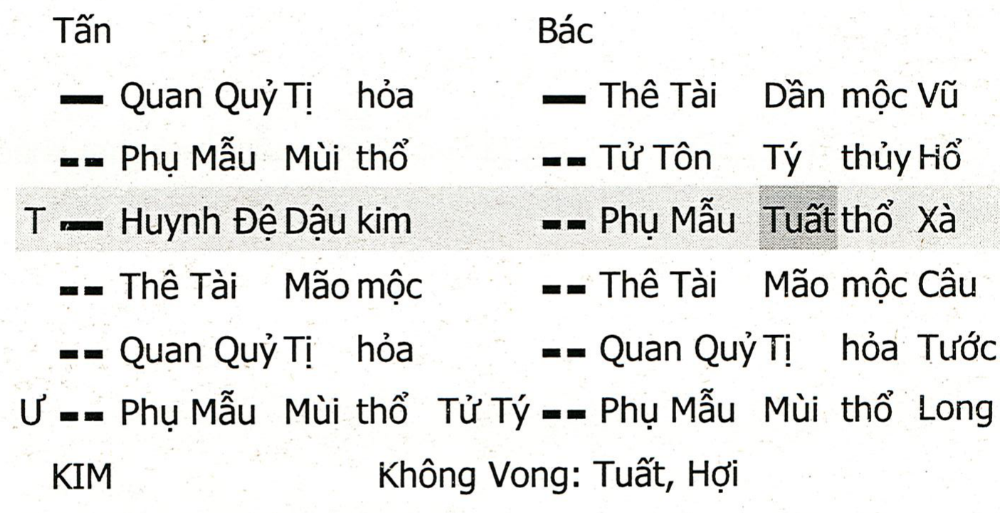
    - **Hình này chứng minh điều gì**
      - Nước giếng ngọt lành, không hại gia chủ nhưng khiến hàng xóm xung quanh tuyệt tự, tàn tật.
    - **Từ đâu mà thấy được**
      - Mùi thổ Tài khố lâm sơ hào và hào 5; Thế động hóa Không; hào Ứng Phụ Mẫu Mùi thổ khắc phục thần Tử Tôn Tý thủy.

#### Đối thoại thực tế và phản hồi nghiệm chứng

- Quá trình tác giả luận đoán trực tiếp cho đương sự:
  - "Có hai miệng giếng, một miệng ở hướng Tây Bắc, một miệng ở hướng Đông Bắc. Giếng rất gần đường, cũng rất gần nền nhà, vì vậy mà chị lo lắng giếng nước ảnh hưởng đến gia đình chị."
  - "Trước đây nhà chị đều dùng cả hai giếng, nhưng hiện nay không dùng nữa, có điều là giếng vẫn chưa bỏ đi, hiện nay đang dùng để tưới tiêu ruộng đồng. Nước trong giếng rất trong, rất ngọt."
  - "Hai cái giếng này không ảnh hưởng đến nhà chị, nhưng ảnh hưởng đến nhà hàng xóm, hàng xóm nếu có con thì cũng bị tử thương."
- Phản hồi thực tế từ người phụ nữ:
  - Người hỏi xác nhận lời đoán vô cùng chuẩn xác: "Đoán rất chính xác. Gia đình tôi thì nhân đinh hưng vượng, nhưng bốn, năm nhà hàng xóm xung quanh thì không có con cháu. Ngay cả nhận con nuôi, con cái cũng bị tàn tật khiếm khuyết, không chết thì bị thương."

#### Các bước suy luận và phân tích dịch lý chuyên sâu

- Xác định vị trí, số lượng và địa thế của giếng nước:
  - Căn cứ tượng giếng: Thê Tài chủ về ẩm thực, nước uống; Tài khố chính là giếng nước. Lại xét hào vị thì hào sơ chủ về giếng. Quẻ này hào sơ là Mùi thổ, chính là Tài khố của Thê Tài Mộc (Mộc mộ tại Mùi), nên hào sơ Mùi thổ là hình tượng giếng nước.
  - Luận số lượng giếng: Trong quẻ có Phụ Mẫu Mùi thổ lưỡng hiện (hào sơ và hào 5), đều là Tài khố, do đó chỉ rõ thực tế có hai miệng giếng.
  - Luận phương vị giếng thứ nhất: Quẻ Tấn thuộc cung Càn, Càn là hướng Tây Bắc, nên một miệng giếng nằm ở hướng Tây Bắc.
  - Luận phương vị giếng thứ hai: Phụ Mẫu Mùi thổ bị Nhật thần Sửu thổ xung. Gặp xung thì đoán hướng ngược lại: Mùi thổ ở hướng Tây Nam, bị Sửu thổ xung thì lấy hướng đối diện là Đông Bắc, do đó một miệng giếng còn lại ở hướng Đông Bắc.
  - Luận địa thế cận lộ và nền nhà: Hào 5 Phụ Mẫu lâm Bạch Hổ, mà hào 5 là hào vị của đường đi, Bạch Hổ cũng chủ đường đi, nên giếng nước nằm sát cạnh đường. Mặt khác, hào sơ là hào vị nền nhà, nên giếng nước rất gần nền nhà, khiến đương sự lo ngại ảnh hưởng phong thủy.
- Phân tích tình trạng khai thác và chất lượng nguồn nước:
  - Tình trạng từng sử dụng: Hào Thế (Huynh Đệ Dậu kim) đại diện cho người xin đoán và nơi ở. Thế hào phát động khắc Thê Tài, hành vi Thế khắc Tài chính là thông tin múc nước, dùng nước trong giếng. Cho nên trước đây gia đình đều dùng cả hai giếng.
  - Tình trạng hiện tại ngưng dùng sinh hoạt: Hào Thế động hóa Phụ Mẫu Tuất thổ lâm Tuần Không (Không Vong: Tuất, Hợi), động mà hóa Không biểu thị hiện tại gia đình đã không còn sử dụng nước giếng này cho sinh hoạt nữa.
  - Mục đích tưới tiêu đồng ruộng: Thê Tài là nước, hào 3 Thê Tài Mão mộc lâm Câu Trần. Câu Trần chủ về điền thổ, ruộng đồng. Điều này cho thấy nước giếng hiện nay gắn liền với đồng ruộng, tức dùng vào việc tưới tiêu.
  - Phẩm chất nước giếng: Hào sơ Phụ Mẫu Mùi thổ lâm Thanh Long. Thanh Long chủ mỹ vị, thanh khiết, cao quý, tốt lành, nên nước trong giếng rất trong mát và ngọt lành.
- Phân tích phong thủy tác động lên nhân đinh gia chủ và hàng xóm:
  - Bản thân gia chủ nhân đinh hưng vượng: Tử Tôn Tý thủy phục dưới hào sơ Ứng Phụ Mẫu Mùi thổ. Hào Thế Huynh Đệ Dậu kim phát động tương sinh cho Tử Tôn Tý thủy (Kim sinh Thủy). Tử Tôn đại diện cho con cái thế hệ sau, được Thế động sinh trợ nên gia đình đương sự và dòng tộc nhân đinh hưng vượng, con cái tốt lành.
  - Nhà hàng xóm tuyệt tự hoặc con cái tàn tật:
    - Hào Ứng đại diện cho người ngoài, hàng xóm; hào sơ cũng là hào vị của hàng xóm. Hào Ứng Phụ Mẫu Mùi thổ lại trực tiếp Thổ khắc Thủy đối với Phục thần Tử Tôn Tý thủy, biểu thị giếng nước mang sát khí khắc con cháu nhà hàng xóm, khiến hàng xóm hiếm muộn, không có con.
    - Tử Tôn Tý thủy đối với Nguyệt kiến Dần mộc rơi vào Bệnh địa.
    - Tử Tôn Tý thủy đối với hào Ứng Mùi thổ là Dưỡng địa. Dưỡng địa biểu thị việc nhận con nuôi từ người khác.
    - Kết hợp lại: Con cái nhà hàng xóm nếu sinh ra thì gặp Bệnh địa tử thương, hoặc nếu nhận con nuôi (Dưỡng địa) thì cũng bị tàn tật, khiếm khuyết, chuẩn xác hoàn toàn với thực tế "không chết thì bị thương".
