# Lục Hào Quái Tượng Giải Mật

## Lời nói đầu

- **Bối cảnh & Nhận thức sâu sắc về Lục Hào Dự Trắc Học**:
  - Tác giả trải qua nhiều năm thực hành và nghiên cứu thực tế, đúc kết nhận thức sâu sắc đối với dự đoán Lục Hào.
  - Nhận thấy rõ tính hợp lý của nạp giáp bát quái và tính chính xác của định vị Thế Ứng do cổ nhân truyền lại.
- **Nguyên nhân sai lệch trong dự đoán truyền thống**:
  - Việc dự đoán đôi khi gặp sai lầm không phải do phương pháp truyền thống sai lệch, mà do người học chưa nắm bắt được điểm cốt lõi.
  - Điểm mấu chốt ở đây chính là nắm bắt **quái tượng** (hình tượng tổng thể của quẻ).
- **Vị trí và tầm quan trọng của Quái Tượng**:
  - Đa số người học chỉ chú trọng lục thân, ngũ hành sinh khắc, nhật nguyệt suy vượng mà xem nhẹ quái tượng bao hàm.
  - Quẻ là một bức tranh toàn cảnh, quái tượng chứa đựng nhiều thông tin phong phú vượt ra ngoài các hào vị đơn lẻ.
- **Mục tiêu của tác phẩm**:
  - Đi sâu giải thích tượng của 64 quẻ và ứng dụng thực tiễn trong dự đoán hiện đại.
  - Kết hợp chặt chẽ quái tượng với hào tượng, lục thân, can chi để nâng cao độ chuẩn xác trong dự đoán Lục Hào.

## Chương 1: Giải thích và ứng dụng tượng 8 quẻ cung Càn

### 1. CÀN VI THIÊN

- **Tượng của quẻ**:
  - nội ngoại đều là quẻ Càn. Càn là thiên (trời), là cao lớn, là tượng thiên ngoại hữu thiên (ngoài trời có trời), trên cao lại thêm cao.
  - Sáu hào đều là dương, dương là kiện tráng, cho nên quẻ có hào từ là "thiên hành kiện, quân tử tự cường bất tức".
  - Trên địa cầu không có gì cao hơn thiên, cho nên dùng Càn để biểu thị cao lớn, vì vậy mà gọi Càn là thiên.
- **Tượng của lục hào**:
  - Thế tại hào 6, hào 6 là thiên, lâm Phụ Mẫu, Phụ Mẫu cũng chủ thiên, do đó phù hợp với tên Càn Vi Thiên.
  - Hào Thế là Mộ khố Quan Quỷ, dự đoán quan vận, Quan Quỷ là chức vụ, chính là muốn nắm quyền trong tay.
  - Dự đoán tâm trạng, Thế là Quỷ khố, tâm chứa phiền não. Dự đoán tài vận, Tài lâm hào 2, tài vật đầy nhà.
  - Dự đoán hôn nhân, thông thường không hỷ gặp lục xung, bởi vì lục xung chủ tan, nhưng quẻ này Càn là tròn, trong nhà có Thê Tài, thì biểu thị gia đình hoàn mỹ.
  - Dự đoán phong thủy, hào 6 là điện thờ, Quỷ vào trong Mộ, chính là biểu thị có đặt thần vị (bài vị), bởi vì bản thân Càn có ý nghĩa thần phật.
- **Bảng Quẻ & Quái lệ 1**: Ngày Kỷ Sửu tháng Mùi, một người đàn ông dự đoán sự nghiệp, được Càn Vi Thiên biến Đoài Vi Trạch.
  - **Hình 5.** Sơ đồ quẻ Càn Vi Thiên biến Đoài Vi Trạch
    - 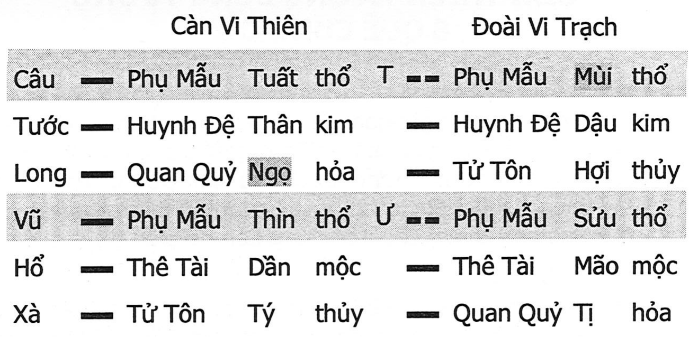
    - **Hình này chứng minh điều gì**
      - Nhưng quẻ này là quẻ Càn, Càn là tượng cao lớn.
    - **Từ đâu mà thấy được**
      - Quẻ này nếu là để phán đoán tài vận của anh ta thì lấy hào 2 Thê Tài Dần mộc làm Dụng.
  - **Căn cứ luận đoán**:
    - Dự đoán sự nghiệp thông thường xét hai phương diện, một là Tài, hai là Quan.
    - Nếu có một phương diện là cát thì có thể đoán sự nghiệp của người đó hữu thành.
    - Quẻ này nếu là để phán đoán tài vận của anh ta thì lấy hào 2 Thê Tài Dần mộc làm Dụng.
    - Thê Tài không được Nhật Nguyệt sinh phù, Tử Tôn Tý thủy lại bị Nhật Nguyệt khắc chế. Bị Nhật hợp vướng chân, không thể sinh Tài.
    - Do đó người này tài vận không tốt. Nếu muốn dấn thân vào sự nghiệp buôn bán thì không thành công.
    - Nếu là dự đoán quan vận, Quan Quỷ mặc dù được Nguyệt hợp có khí, nhưng Nhật Nguyệt suy cho cùng không sinh phù Quan Quỷ.
    - Đồng thời lục xung biến lục xung, hào Thế động mà hóa Không, hóa thoái. Cho nên sự phát triển của hoạn lộ cũng không được như ý.
    - Nhưng quẻ này là quẻ Càn, Càn là tượng cao lớn. Hào Thế là Mộ khố Quan Quỷ, là muốn đạt được quan, cầu quan sốt ruột.
    - Thế ở hào 6, tượng cao cao tại thượng (tư thế bề trên). Hoang tưởng tự đại, không coi ai ra gì, cao không với tới, thấp không bằng lòng.
    - Bất kể sự nghiệp nào cũng đều chẳng làm nên trò trống gì.
  - **Đối thoại & Diễn biến thực tế**:
    - Trên thực tế, người này là một người mê làm quan, tâm cao hơn trời, vận mệnh không tốt, chưa bao giờ được thăng chức, tự thấy có tài nhưng không gặp thời, lại muốn phát triển công ty, đại triển hồng đồ, kết quả là kinh doanh trầy trật.
    - Hoàn toàn không có thu hoạch.
- **Bảng Quẻ & Quái lệ 2**: Ngày Tân Mão tháng Dậu, trong thời gian tôi lưu lại Sơn Đông, một người phụ nữ muốn nhờ tôi phán đoán sức khỏe cho cô ấy một chút, tôi đã bảo cô ấy gieo quẻ. Lúc đó tôi đang ở trong trạng thái rất tốt, quẻ vừa gieo đến hào 3 thì tôi đã bắt đầu phán đoán, bởi vì tôi cảm giác được quẻ hiện ra sau cùng nhất định là Càn Vi Thiên. Kết quả là đến lúc cô ấy gieo xong, tôi cũng đã đoán xong, và cũng đúng là Càn Vi Thiên, ở đó còn có mấy Dịch hữu khác, bọn họ hết sức ngạc nhiên, bởi vì bọn họ vẫn chưa từng gặp tình huống vừa gieo quẻ vừa phán đoán như vậy.
  - **Hình 6.** Sơ đồ quẻ Càn Vi Thiên
    - 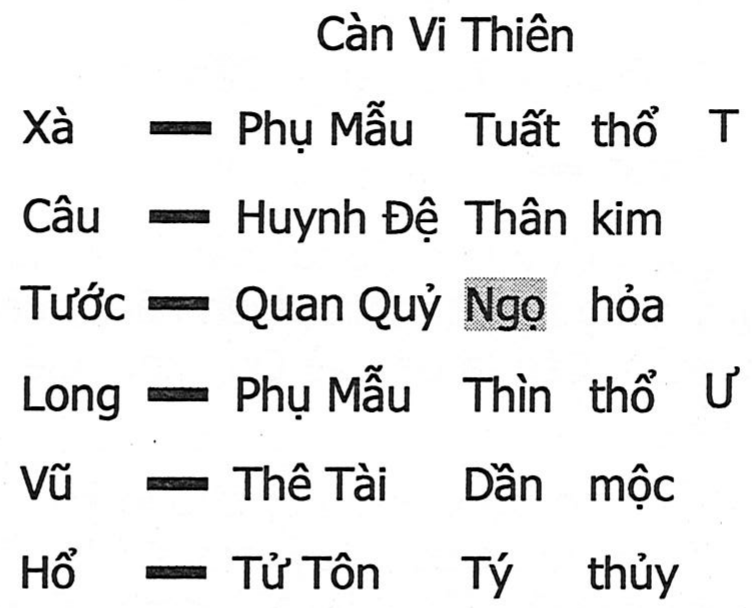
    - **Hình này chứng minh điều gì**
      - Lấy hào Thế làm Dụng thần, Thế tại hào 6, hào 6 là đầu, quẻ thuần Càn, Càn cũng là đầu, mà Kỵ thần lâm Nhật khắc hợp Thế, Kỵ thần là bệnh, cho nên ...
    - **Từ đâu mà thấy được**
      - Lấy hào Thế làm Dụng thần, Thế tại hào 6, hào 6 là đầu, quẻ thuần Càn, Càn cũng là đầu, mà Kỵ thần lâm Nhật khắc hợp Thế, Kỵ thần là bệnh, cho nên ...
  - **Căn cứ luận đoán**:
    - Lấy hào Thế làm Dụng thần, Thế tại hào 6, hào 6 là đầu, quẻ thuần Càn, Càn cũng là đầu, mà Kỵ thần lâm Nhật khắc hợp Thế, Kỵ thần là bệnh, cho nên phần đầu nhất định có bệnh tật triền nhiễu.
    - Mộc chủ đau ngứa, bị mộc khắc, nhất định là đau đầu.
  - **Ứng nghiệm thực tế**:
    - Nguyên thần Quan Quỷ Ngọ hỏa tại hào 4, hào 4 là hào vị tim, hỏa lại là tim, Không không thể sinh Dụng thần, Không chủ bất an, do đó nhất định là tâm hoảng.
    - Kỵ thần là Tài, tài chủ ẩm thực, Thế là hỏa khố, biểu thị có hỏa ẩn bên trong, hào 6 chủ mặt, kết hợp Tài khắc hợp hào Thế, phán đoán trong miệng người đó có viêm.
    - Những phán đoán trên đây ứng nghiệm ngay tại đó.
- **Bảng Quẻ & Quái lệ 3**: Ngày Ất Tị tháng Hợi, nữ dự đoán hôn nhân, được Càn Vi Thiên.
  - **Căn cứ luận đoán**:
    - Lấy Quan Quỷ làm Dụng thần.
    - Quẻ lục xung, hào Thế là Quỷ khố, Quan Quỷ cũng là thông tin phiền não, trong đầu rất phiền táo (khó chịu) vì hôn nhân.
    - Càn là đầu, là Quỷ khố, biểu thị tất cả suy nghĩ trong đầu là về chồng.
    - Quan Quỷ không có hợp, an tĩnh, chồng không có người thứ ba, sinh hào Thế, rất yêu mình.
    - Quan Quỷ lâm Trình Xà, Trình Xà chủ quái dị, biểu thị tính cách có vấn đề, nhập Mộ ở hào 6, nhập mộ chủ si mê, biểu thị chồng đam mê một loại sở thích.
    - Mộ lâm Huyền Vũ, Huyền Vũ chủ bài bạc trộm cắp, e rằng có sở thích không tốt về những phương diện này. Do đó đã khiến cô ấy phiền não.
    - Quan Quỷ vượng tướng sinh Thế, không ly hôn.
  - **Đối thoại & Diễn biến thực tế**:
    - Cô ấy cho biết đúng là chồng có tật ăn trộm tiền của người thân, việc này khiến cô ấy cảm thấy rất xấu hổ trước mặt người thân cho nên muốn ly hôn.
    - Sau cùng đã không ly hôn.

### 2. THIÊN PHONG CẤU

- **Tượng của quẻ**:
  - ngoại quái là Càn, là quả, nội quái là Tốn, là mộc, chính là quả mọc ra trên cây.
  - Sự trưởng thành của quả này, cần sự tương phối của âm dương.
  - Ngoại quái là Càn là cương, nội quái là Tốn là nhu, cương nhu tương tế (cương nhu kết hợp).
  - Rất hiếm thấy, cho nên tên quẻ gọi là Cấu, Cấu giả, ngộ dã (Cấu là gặp).
- **Tượng của lục hào**:
  - Thế tại hào sơ, hào sơ là chân, chính là người đang hành tẩu, hành tẩu được hào Ứng đến sinh, có thể lý giải là khi đang hành tẩu được người khác giúp đỡ, trên đường gặp được tri kỷ.
  - Quẻ này Tử Tôn Hợi thủy lâm hào trạch, dương nhiều âm ít, nữ đoán hôn nhân thì bất lợi, thường là gia đình bất hòa. Huynh Đệ tại hào
  - 5, hào 5 là đường, nhập Mộ ở Thế, biểu thị có thể kết giao được nhiều bạn bè từ sự tình cờ, hơn nữa thường là gặp gỡ giữa đường, là lộ phùng tri kỷ.
- **Ý nghĩa biểu tượng cốt lõi**:
  - gặp mặt, tình cờ gặp gỡ, cơ ngộ (cơ hội) v.v.
- **Bảng Quẻ & Đồ hình liên hệ**: Sơ đồ quẻ Càn Vi Thiên
  - **Hình 7.** Sơ đồ quẻ Càn Vi Thiên
    - 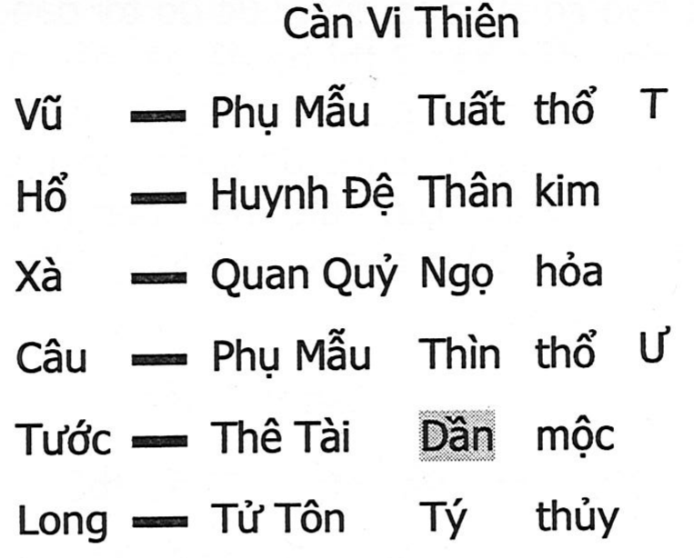
    - **Hình này chứng minh điều gì**
      - 5, hào 5 là đường, nhập Mộ ở Thế, biểu thị có thể kết giao được nhiều bạn bè từ sự tình cờ, hơn nữa thường là gặp gỡ giữa đường, là lộ phùng tri kỷ.
    - **Từ đâu mà thấy được**
      - Thế tại hào sơ, hào sơ là chân, chính là người đang hành tẩu, hành tẩu được hào Ứng đến sinh, có thể lý giải là khi đang hành tẩu được người khác g...
- **Bảng Quẻ & Quái lệ 1**: Ngày Kỷ Mão tháng Kỷ Mão năm Canh Thìn, một nữ học viên ở Bắc Kinh gọi đến nói rằng chị gái của bạn trai cô ấy sau khi cãi nhau với chồng đã bỏ nhà ra đi rồi. Tôi gieo quẻ được Thiên Phong Cấu.
  - **Hình 8.** Quẻ Thiên Phong Cấu
    - 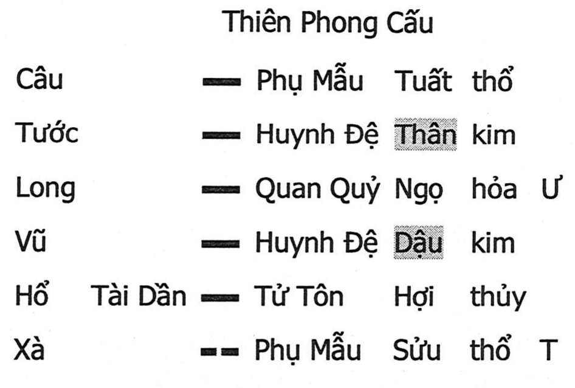
    - **Hình này chứng minh điều gì**
      - Sau khi đoán xong, người trong nhà đã hỏa tốc chạy đến sân bay, đã tìm được chị gái của bạn trai ở đó.
    - **Từ đâu mà thấy được**
      - Dự đoán về bạn trai thì thông thường lấy Quan Quỷ làm Dụng thần.
  - **Căn cứ luận đoán**:
    - Dự đoán về bạn trai thì thông thường lấy Quan Quỷ làm Dụng thần.
    - Dùng nguyên lý chuyển đổi lục thân trong lục hào, cái có ngũ hành tương đồng xem là ngang vai vế, đoán về chị gái của bạn trai cô ấy cũng ứng dụng hào Quan Quỷ.
    - Quan Quỷ Ngọ hỏa được Nhật Nguyệt đến sinh, Dụng thần vượng tướng, biểu thị chị gái của bạn trai sẽ không xảy ra sự cố.
    - Dụng thần lâm Ứng, Ứng là xứ khác, biểu thị bản thân chị ấy muốn rời khỏi Bắc Kinh để đi đến địa phương khác.
    - Dụng thần là Ngọ hỏa, tương ứng với phía Nam, là muốn đến phương Nam.
    - Nhật là Nguyên thần, Nguyên thần thể hiện tư duy của một cá nhân, ở đây thể hiện tâm tư của chị gái bạn trai, Nguyên thần trên Nhật và Phụ Mẫu Tuất thổ trong quẻ tương hợp, Phụ Mẫu là phương tiện giao thông, lại thêm Dụng thần nhập Mộ Phụ Mẫu Tuất thổ, là tượng sắp bước vào phương tiện giao thông.
    - Phụ Mẫu Tuất thổ lâm hào 6, hào 6 là hào vị bầu trời, có thể lý giải là máy bay. Vậy là muốn đáp máy bay đến phương Nam.
    - Quẻ là Cấu, Cấu giả ngộ dã, nếu bây giờ cấp tốc đến sân bay thì có thể gặp được chị gái của bạn trai.
    - Sau khi đoán xong, người trong nhà đã hỏa tốc chạy đến sân bay, đã tìm được chị gái của bạn trai ở đó.
    - Cô ấy đã mua vé máy bay và đang định đi đến phương Nam.
- **Bảng Quẻ & Quái lệ 2**: Ngày Tân Tị tháng Mão, một quân nhân dự đoán khi nào mới được giải quyết tình trạng vợ chồng sống riêng hai nơi? Được Thiên Phong Cấu biến Trạch Sơn Hàm.
  - **Hình 9.** Quẻ Thiên Phong Cấu biến Trạch Sơn Hàm
    - 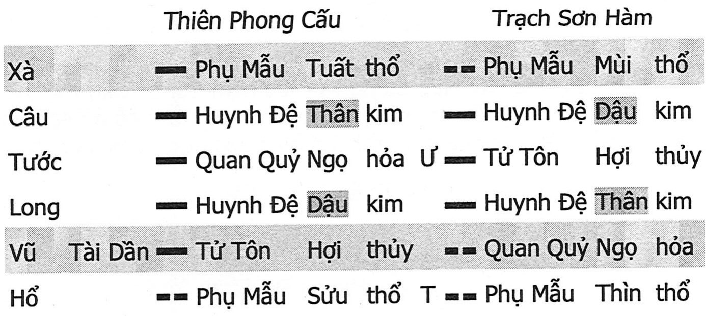
    - **Hình này chứng minh điều gì**
      - Quẻ này Dụng thần mặc dù phục tàng, nhưng được Nguyệt tỉ phù, hào Phi động mà đến sinh là cát.
    - **Từ đâu mà thấy được**
      - Lấy Thê Tài làm Dụng thần, Thê Tài Dần mộc bất thượng quái, đây là thông tin có vợ nhưng không thể gặp.
  - **Căn cứ luận đoán**:
    - Lấy Thê Tài làm Dụng thần, Thê Tài Dần mộc bất thượng quái, đây là thông tin có vợ nhưng không thể gặp.
    - Dự đoán vợ có thể đến sống bên cạnh mình hay không thì phải xem suy vượng của hào Tài. Dụng thần vượng thì có thể đoàn tụ, nhược thì khó.
    - Quẻ này Dụng thần mặc dù phục tàng, nhưng được Nguyệt tỉ phù, hào Phi động mà đến sinh là cát.
    - Quẻ là Cấu, có ý nghĩa là gặp mặt, Ứng sinh hào Thế, biểu thị có thể nhìn thấy vợ của mình, cũng chính là có thể kết thúc tình trạng sống riêng hai nơi.
  - **Ứng nghiệm thực tế**:
    - Khi nào có thể thành? Tài phục, có thể ứng tại xung. Tài bị hào Phi hợp cũng ứng xung. Đoán năm Giáp Thân vợ có thể đến bên cạnh mình.
    - Quả nhiên ứng nghiệm.
- **Bảng Quẻ & Quái lệ 3**: Ngày Quý Dậu tháng Ngọ, nữ dự đoán tình hình phát triển với một người nam, được Thiên Phong Cấu biến Thủy Phong Tỉnh.
  - **Căn cứ luận đoán**:
    - Lấy Quan Quỷ làm Dụng thần. Quan được Nguyệt kiến tỉ phù là vượng tướng. Động mà sinh Thế, biểu thị người nam rất tốt với cô ấy.
    - Quẻ này Thế lâm Huyền Vũ, là tượng ám muội, Quẻ Thiên Phong Cấu, 5 dương 1 âm, thông thường biểu hiện nhu cầu sinh lý của nữ rất mạnh, một nam không thể làm thỏa mãn.
    - Tên quẻ là Cấu, người xưa nói, Cấu giả ngộ dã, dự đoán hôn nhân thông thường là chồng hờ vợ tạm. Cho dù kết hôn cũng sẽ không lâu dài.
    - Quẻ này Tuất thổ phát động, khiến Quan Quỷ nhập Mộ, có ý chia tay với người nam này, bởi vì Mộ khố có ý kết thúc, nhưng quẻ này Quan Quỷ Ngọ hỏa gặp Nguyệt kiến tự hình, gặp Nhật là Tử địa, nhập Mộ ở hào 6, hào 6 là đầu, tại cung Càn lại chủ đầu, biểu thị tư tưởng của người nam này rất không khoáng đạt, sẽ đi vào chỗ bế tắc, hướng tới cực đoan, sẽ làm ra chuyện tự sát.
    - Tình hình quả như dự đoán.
    - Người này là tình nhân của cô ấy, cô ấy muốn chia tay với anh ta, nhưng anh ta đã lấy tự sát để uy hiếp, cô ấy không biết làm thế nào để cắt đứt quan hệ với anh ta, do đó đã đến thỉnh cầu dự đoán.

### 3. THIÊN SƠN ĐỘN

- **Tượng của quẻ**:
  - ngoại quái là Càn, là thần phật, là đầu, chủ tư tưởng tư duy, nội quái Cấn là núi, là chỉ (dừng), tổ hợp lại chính là cao nhân vào núi, nhất động bất động, tu luyện thiền định.
  - Cũng chủ dừng suy nghĩ, không loạn tưởng, tránh xa hồng trần (thế gian). Cho nên tên quẻ là Độn.
- **Tượng của lục hào**:
  - Thế tại hào 2, hào 2 là trạch, chính là trốn ở trong nhà.
  - Bởi vì nội quái là Cấn, Cấn là núi, cho nên nhà này là nhà trong núi, cũng chính là hang núi. Hào 6 là Mộ, hào 6 là hào vị thoái
  - hưu, nhập Mộ chủ si mê, chính là một lòng muốn rời xa quan điểm ban đầu. Người xưa nói, Độn giả, thoái dã. Chính là ý nghĩa này.
- **Ý nghĩa biểu tượng cốt lõi**:
  - Bởi vì có tượng này, cho nên quẻ Độn bao hàm ý nghĩa là lùi bước, rút khỏi, co lại, sợ hãi, trốn tránh, ẩn cư, thoái ẩn, không rõ ràng, ám muội, giấu kín v.v.
- **Bảng Quẻ & Đồ hình liên hệ**: Sơ đồ quẻ Thiên Phong Cấu biến Thủy Phong Tỉnh
  - **Hình 10.** Sơ đồ quẻ Thiên Phong Cấu biến Thủy Phong Tỉnh
    - 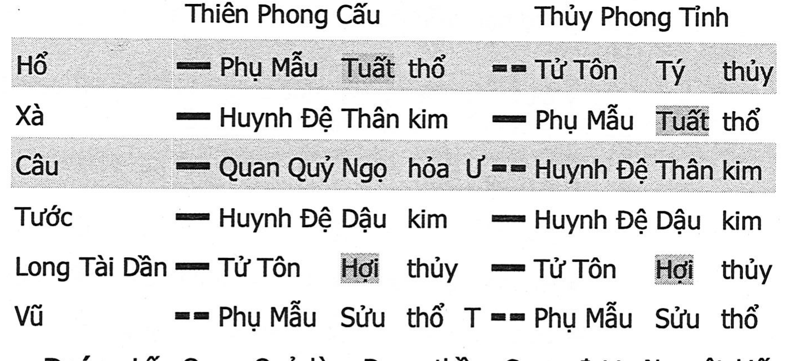
    - **Hình này chứng minh điều gì**
      - hưu, nhập Mộ chủ si mê, chính là một lòng muốn rời xa quan điểm ban đầu.
    - **Từ đâu mà thấy được**
      - Thế tại hào 2, hào 2 là trạch, chính là trốn ở trong nhà.
- **Bảng Quẻ & Quái lệ 1**: Ngày Quý Mùi tháng Tý, một cô gái khoảng 20 tuổi đến đoán bệnh, được Thiên Sơn Độn biến Thiên Phong Cấu.
  - **Hình 11.** Sơ đồ quẻ Thiên Sơn Độn biến Thiên Phong Cấu
    - 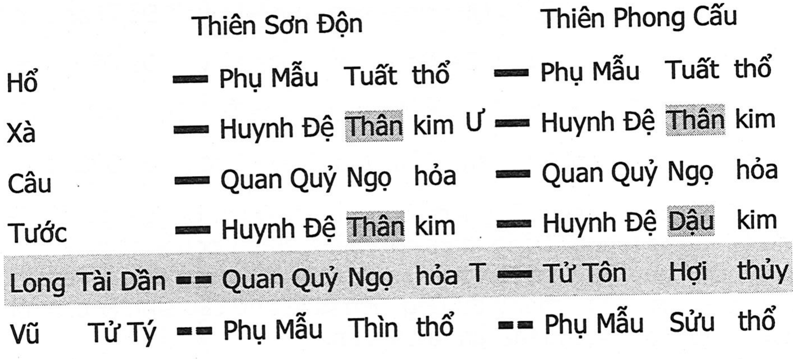
    - **Hình này chứng minh điều gì**
      - Tình hình thực tế, cô ấy và bạn trai đồng cư, bạn trai thường xuyên tìm gái điếm, đã lây bệnh sinh dục, lại truyền bệnh cho cô ấy.
    - **Từ đâu mà thấy được**
      - Lấy hào Thế làm Dụng thần, hào Thế Nguyệt phá, Nhật thần đến hợp là hợp phá, nhưng hào Thế động mà hóa hồi đầu khắc, hào Thế hưu tù, biểu thị bệnh ...
  - **Căn cứ luận đoán**:
    - Lấy hào Thế làm Dụng thần, hào Thế Nguyệt phá, Nhật thần đến hợp là hợp phá, nhưng hào Thế động mà hóa hồi đầu khắc, hào Thế hưu tù, biểu thị bệnh này của cô ấy là rất nghiêm trọng.
    - Hào Thế tại hào 2, hào 2 là bộ phận sinh dục, lâm Thanh Long, Thanh Long là tửu sắc, biểu thị là bệnh về bộ phận sinh dục.
    - Quẻ Thiên Sơn Độn có tượng rút lui, biểu thị cô ấy không muốn hiển lộ bệnh này trước mặt người ngoài, rất muốn né tránh vấn đề này.
    - Tổng hợp phán đoán, bệnh cô ấy mắc phải hẳn là nhiễm bệnh bộ phận sinh dục không thể nói ra.
    - Tình hình thực tế, cô ấy và bạn trai đồng cư, bạn trai thường xuyên tìm gái điếm, đã lây bệnh sinh dục, lại truyền bệnh cho cô ấy.
- **Bảng Quẻ & Quái lệ 2**: Ngày Đinh Tị tháng Dần, một lãnh đạo chiêm vận khí, được Thiên Sơn Độn.
  - **Hình 12.** Sơ đồ quẻ Thiên Sơn Độn
    - 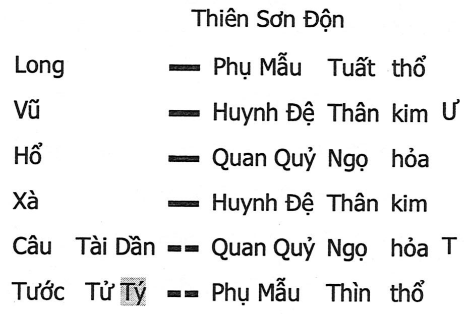
    - **Hình này chứng minh điều gì**
      - vì thân kiêm hai chức, bản thân cảm thấy rất mệt mỏi.
    - **Từ đâu mà thấy được**
      - Nếu là dự đoán quan vận thì xem hào Quan Quỷ, Quan Quỷ trì Thế được Nguyệt sinh Nhật phù vượng tướng, nhất định có chức vụ ở người, lâm Câu Trần, C...
  - **Căn cứ luận đoán**:
    - Nếu là dự đoán quan vận thì xem hào Quan Quỷ, Quan Quỷ trì Thế được Nguyệt sinh Nhật phù vượng tướng, nhất định có chức vụ ở người, lâm Câu Trần, Câu Trần là nha môn, hiện nay là văn phòng, do đó nhất định đang đảm nhiệm chức vụ ở cơ quan đơn vị.
    - Quan lưỡng hiện trong quẻ, có tượng kiêm chức.
    - Nhưng quẻ này Nguyên thần bất thượng quái, biểu thị tâm tư của anh ta không ở sự nghiệp, Độn cũng có ý nghĩa là thoái ẩn, trốn tránh, không tích cực theo đuổi quan vận cho lắm.
    - Anh ta phản hồi, bản thân đồng thời kiêm lãnh đạo hai nơi.
    - Người ta nhìn vào thì thấy rất tốt, nhưng bản thân không có hứng thú gì đối với chức vụ, bởi vì sức khỏe không tốt, do đó muốn từ chức để bảo dưỡng sức khỏe.
    - Anh ta nói đến sức khỏe không tốt, tôi thấy hào Thế và Nguyên thần đều không có khuyết điểm gì, hơn nữa là quẻ tĩnh, do đó cần phải phán đoán từ ảnh hưởng của hào vượng tướng đối với hào Thế.
    - Hào 6 Tuất thổ là Mộ khố của hào Thế, được Nhật sinh mà vượng, có đủ sức lực khiến hào Thế nhập Mộ.
    - Hào 6 là đầu, quái cung lại ở trong cung Càn, Càn cũng là đầu, do đó tôi phán đoán trên đầu anh ta có bệnh.
    - Ngoài ra, Nguyên thần Thê Tài mặc dù Nhật Nguyệt không khắc, nhưng Nhật là Bệnh địa của Nguyên thần, Tài chủ ẩm thực và tiêu hóa, phục tại hào 2, do đó tôi phán đoán hệ tiêu hoá của anh ta cũng không tốt.
    - vì thân kiêm hai chức, bản thân cảm thấy rất mệt mỏi. Nếu như có thể bỏ bớt một chức vụ thì sẽ giảm áp lực cho thân thể.
  - **Đối thoại & Diễn biến thực tế**:
    - Anh ta cho biết, bản thân tràng vị không tốt đã rất nhiều năm, năm nay phần đầu lại xuất hiện vấn đề, có nhiều lần choáng váng và ngã xuống đất bất tỉnh nhân sự, đến bệnh viện kiểm tra thì lại không tìm ra bệnh gì.
    - Nếu mệnh đã không còn thì quan còn có ích gì. Do đó việc cấp bách trước mắt là muốn điều dưỡng tốt thân thể của mình. Bởi
- **Bảng Quẻ & Quái lệ 3**: Ngày Nhâm Dần tháng Hợi, lãnh đạo của một tòa soạn đoán thu nhập cuối năm của đơn vị, được Thiên Sơn Độn biến Phong Lôi Ích.
  - **Hình 13.** Sơ đồ quẻ Thiên Sơn Độn biến Phong Lôi Ích
    - 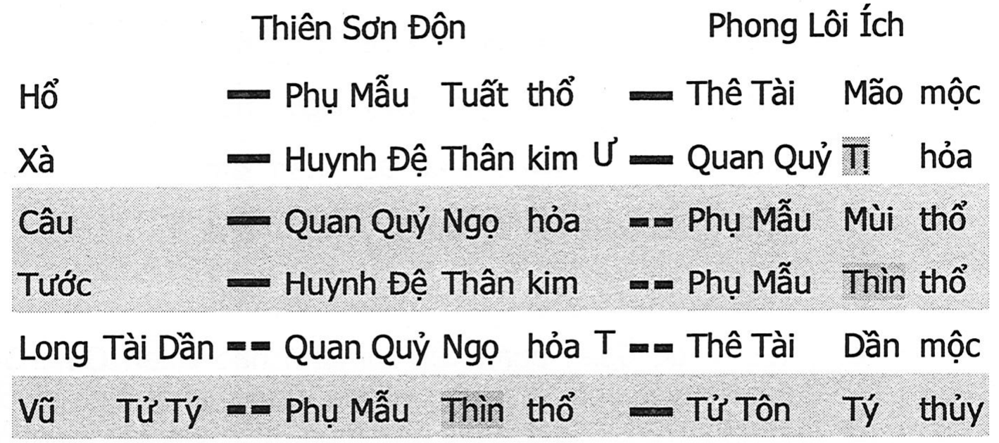
    - **Hình này chứng minh điều gì**
      - Đến cuối năm, đơn vị đã thực sự thu được phí quảng cáo mà bên ngoài khất nợ, đã phát bổ sung tiền lương cho nhân viên.
    - **Từ đâu mà thấy được**
      - Phán đoán thu nhập cho dù là công hay là tư thì đều lấy Thê Tài làm Dụng thần.
  - **Căn cứ luận đoán**:
    - Phán đoán thu nhập cho dù là công hay là tư thì đều lấy Thê Tài làm Dụng thần.
    - Quẻ này Thê Tài bất thượng quái, phục dưới hào 2 Quan Quỷ Ngọ hỏa, được Nguyệt sinh Nhật tỉ là vượng tướng, trong quẻ mặc dù Ngọ hỏa và Thân kim phát động, là Tử Tuyệt địa của Thê Tài, nhưng quẻ này là nhiều hào phát động, lấy lý pháp ngũ hành sinh khắc làm chủ, do đó đoán thu nhập cuối năm của đơn vị anh ta rất tốt.
    - Nhưng hết thảy hào động trong quẻ này khắc tiết Dụng thần, biểu thị mặc dù cuối năm có nhiều thu nhập nhưng không giữ lại được, sẽ tiêu hao rất nhanh.
    - Trong quẻ Quan Quỷ và Phụ Mẫu phát động, Quan Quỷ thể hiện công việc, Phụ Mẫu thể hiện môi trường làm việc.
    - Biểu thị công việc của mình có khả năng phát sinh biến hóa.
    - Quẻ là Thiên Sơn Độn, có ý nghĩa là rút lui, là bản thân không muốn tiếp tục làm ở đơn vị này, muốn rời khỏi nơi này.
    - Bởi vì là rút lui, thì có ý trốn tránh, biểu thị ở đơn vị này nhất định có vấn đề tồn tại.
    - Huynh Đệ trên Ứng ám động, Quan Quỷ Ngọ hỏa phát động hình thành tự hình với hào Thế, bởi vì bản thân xử lý công việc không tốt nên sẽ xuất hiện một số ảnh hưởng tiêu cực.
    - Huynh Đệ lâm Chu Tước động, có tranh cãi giữa người trong đơn vị.
    - Và sự biến hóa của công việc có liên quan rất lớn đến nguyên nhân này, cho nên bản thân muốn rời khỏi chỗ thị phi này.
    - Tình hình thực tế:
    - Người này là lãnh đạo của đơn vị này, bởi vì tòa soạn chưa thu được phí quảng cáo cho nên chưa thể phát tiền lương cho nhân viên, rất nhiều người đã phản đối và gây rối, điều này khiến anh ta rất là đau đầu.
    - Do đó, anh ta hy vọng sẽ thu được phí quảng cáo
    - Đến cuối năm, đơn vị đã thực sự thu được phí quảng cáo mà bên ngoài khất nợ, đã phát bổ sung tiền lương cho nhân viên.
    - Nhưng sau khi phát tiền lương, số tiền còn lại chẳng có bao nhiêu, tiền lương cho nhân viên ở năm thứ hai lại là một vấn đề, thế là anh ta đã nhờ mối quan hệ để chuyển khỏi đơn vị này.
  - **Ứng nghiệm thực tế**:
    - và phát bổ sung tiền lương cho nhân viên để biểu thị thành tích trong công việc, sau đó sẽ rời đơn vị này.
- **Bảng Quẻ & Quái lệ 4**: Ngày Bính Dần tháng Ngọ, nữ dự đoán hôn nhân, được Thiên Sơn Độn biến Phong Sơn Tiệm.
  - **Căn cứ luận đoán**:
    - Quan Quỷ trì Thế, được Nguyệt phù Nhật sinh là vượng, trì Thế là có. Lâm hào 2, hào 2 là trạch, lại là hào vị phu thê, do đó là đã kết hôn.
    - Trong quẻ Quan Quỷ lưỡng hiện, hào phát động là chồng của cô ấy.
    - Quan Quỷ động mà hóa hợp, hợp Tài khố, Tài là người nữ, Phụ Mẫu là giấy kết hôn, biểu thị người nữ này bị giấy kết hôn ràng buộc, do đó phán đoán chồng cô ấy có quan hệ ám muội với một người nữ đã kết hôn.
    - Quan Quỷ trị Ngọ hỏa hóa hợp, nhất định xuất hiện tại năm Nhâm Ngọ.
    - Quẻ là Độn, bản thân có tượng né tránh, Quan Quỷ Ngọ hỏa động mà tương hình với hào Thế, biểu thị cô ấy đã bị kích động vì chuyện này.
    - Trong quẻ hai Quan Quỷ, bản thân tất nhiên cũng có tình nhân, lưu niên Quý Mùi, tác hợp với Quan Quỷ Ngọ hỏa.
    - Bản thân cô ấy cũng đã có ngoại tình.

### 4. THIÊN ĐỊA BĨ

- **Tượng của quẻ**:
  - ngoại quái là Càn, là dương, nội quái là Khôn, là âm, khí dương chủ thăng, khí âm chủ giáng, bởi vì dương trên âm dưới, hai khí âm dương không thể hợp nhất.
  - Cái ở trên cao càng lên cao, cái ở dưới thấp càng xuống thấp, âm dương phân ly không thể nối liền, do đó gọi là Bĩ.
  - Bĩ giả, tắc dã (Bĩ là bế tắc).
- **Tượng của lục hào**:
  - Thế tại hào 3, hào 3 là cửa, tượng ra vào cửa.
  - Nhưng bị Tuất thổ trên Ứng hợp cản trở, thì giống như cửa bị một hòn núi chặn lại, đường ra vào không thông, cho nên là Bĩ.
  - Chiêm tài mặc dù có được, nhưng sau cùng sẽ bị người lấy đi, nam đoán hôn nhân, vợ lâm cửa, bị người cướp đoạt ái tình, dự đoán bệnh tật, trên dưới không thông, ứ tích thành bệnh.
  - Dụng thần vượng tướng cũng là việc tốt hay gặp trắc trở.
- **Bảng Quẻ & Đồ hình liên hệ**: Sơ đồ quẻ Thiên Sơn Độn biến Phong Sơn Tiệm
  - **Hình 14.** Sơ đồ quẻ Thiên Sơn Độn biến Phong Sơn Tiệm
    - 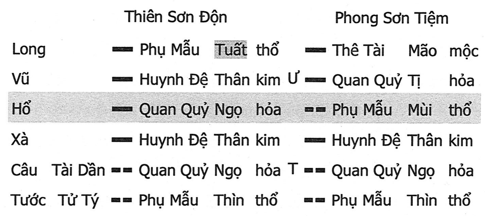
    - **Hình này chứng minh điều gì**
      - Thế tại hào 3, hào 3 là cửa, tượng ra vào cửa.
    - **Từ đâu mà thấy được**
      - Thế tại hào 3, hào 3 là cửa, tượng ra vào cửa.
- **Bảng Quẻ & Quái lệ 1**: Ngày Mậu Ngọ tháng Thìn, một người phụ nữ gieo quẻ đoán bệnh viêm thận cấp tính của con gái, được Thiên Địa Bĩ biến Lôi Phong Hằng.
  - **Hình 15.** Sơ đồ quẻ Thiên Địa Bĩ biến Lôi Phong Hằng
    - 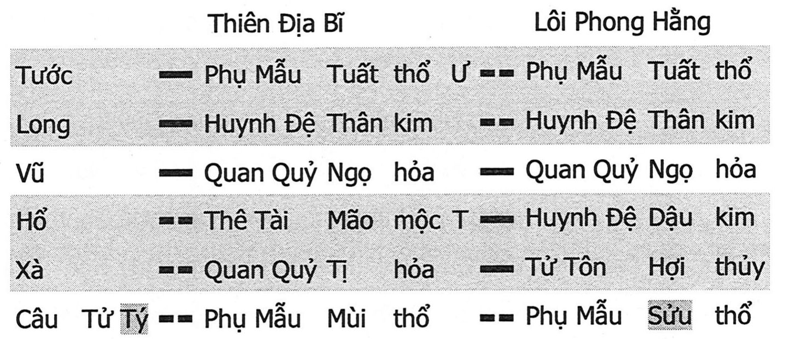
    - **Hình này chứng minh điều gì**
      - Tử Tôn là thủy phục tàng, biểu thị trong cơ thể có nước không thể ra được, quẻ là Thiên Địa Bĩ, là tượng trên dưới không thông, do đó phán đoán là ...
    - **Từ đâu mà thấy được**
      - Chồng của người phụ nữ này cũng biết dự đoán, nhìn thấy quẻ này Tử Tôn bị Nguyệt khắc Nhật xung là Nhật phá, Dụng thần bất thượng quái, ngoại quái ...
  - **Căn cứ luận đoán**:
    - Chồng của người phụ nữ này cũng biết dự đoán, nhìn thấy quẻ này Tử Tôn bị Nguyệt khắc Nhật xung là Nhật phá, Dụng thần bất thượng quái, ngoại quái phục ngâm, nội quái phản ngâm, Phi đến khắc Phục, hung lại thêm hung, không biết phải làm sao, liền gọi điện thoại nhờ tôi phán đoán.
    - Tôi đã bảo cô ấy hãy yên tâm. Bệnh của con gái mặc dù trông rất nghiêm trọng nhưng qua ngày Thân thì sẽ có chuyển biến tốt.
    - Không lâu sau sẽ xuất viện. Nhưng cô ấy vẫn không yên tâm, đã bảo tôi nói cặn kẽ thêm vài câu.
    - Tử Tôn là thủy phục tàng, biểu thị trong cơ thể có nước không thể ra được, quẻ là Thiên Địa Bĩ, là tượng trên dưới không thông, do đó phán đoán là chức năng bài tiết không nhạy, là nước ở trong thận không thể ra được.
    - Lâm Câu Trần, Câu Trần chủ tức trướng. Cho nên phán đoán như vậy.
  - **Đối thoại & Diễn biến thực tế**:
    - Tôi nói với cô ấy rằng chức năng bài tiết của thận không nhạy, nước ở trong thận không được đẩy ra, thắt lưng bứt rứt khó chịu.
    - Cô ấy cho biết đúng là như vậy.
    - Quẻ này đoán như sau. Con cô ấy thuộc về bệnh gần, Tử Tôn Tý thủy Không Vong, sách xưa nói rằng:
    - "Bệnh gần gặp Không thì khỏi", đây là một thông tin tốt.
    - Quẻ này mặc dù là quẻ lục hợp, bệnh gần không nên, nhưng có Nhật xung Tử Tôn, là hợp xứ phùng xung, bệnh gần gặp xung thì khỏi, cũng biểu thị bệnh của con cô ấy không có trở ngại lớn.
    - Trên thực tế, con cô ấy đã có chuyển biến tốt ở ngày Thân, không lâu sau thì xuất viện.
- **Bảng Quẻ & Quái lệ 2**: Ngày Tân Hợi tháng Hợi, một người đoán kết quả thu hoạch cây óc chó, được Thiên Địa Bĩ biến Thiên Thủy Tụng.
  - **Hình 16.** Quẻ Thiên Địa Bĩ biến Thiên Thủy Tụng
    - 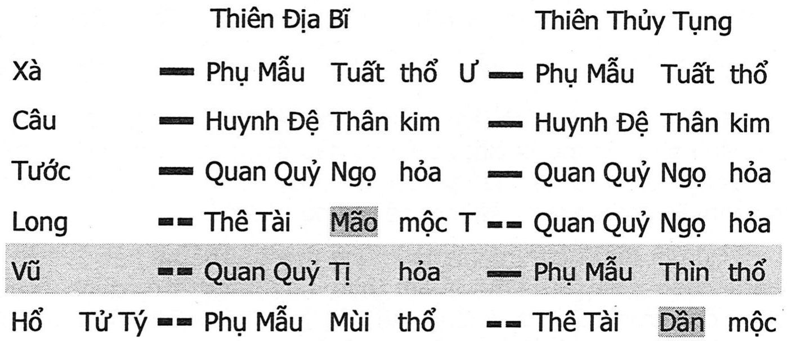
    - **Hình này chứng minh điều gì**
      - Người này nhận khoán rất nhiều cây óc chó, quả cũng rất nhiều, nhưng do sâu bệnh ảnh hưởng, rất nhiều quả sinh trưởng không tốt, nhân quả bị teo lạ...
    - **Từ đâu mà thấy được**
      - Lấy Thê Tài làm Dụng thần, Thê Tài trì Thế được Nhật Nguyệt đến sinh, Dụng thần vượng tướng, biểu thị anh ta đã nhận khoán rất nhiều cây.
  - **Căn cứ luận đoán**:
    - Lấy Thê Tài làm Dụng thần, Thê Tài trì Thế được Nhật Nguyệt đến sinh, Dụng thần vượng tướng, biểu thị anh ta đã nhận khoán rất nhiều cây.
    - Cũng biểu thị rất nhiều quả.
    - Nhưng quẻ này Dụng thần gặp Không, hào 2 Quan Quỷ Tị hỏa độc phát, quẻ độc phát lấy tượng làm chủ, động tất có nguyên nhân.
    - Quan Quỷ là bệnh, Tị hỏa lại là Bệnh địa của Dụng thần, biểu thị cây sẽ có sâu bệnh xâm hại.
    - Dụng thần Không Vong, trái cây thiếu dinh dưỡng, sẽ xuất hiện tình trạng không đầy đặn.
    - Đồng thời Quan lâm Huyền Vũ phát động, chủ đạo tặc, biểu thị quả óc chó của anh ta sẽ bị người ta ăn trộm.
    - Người này nhận khoán rất nhiều cây óc chó, quả cũng rất nhiều, nhưng do sâu bệnh ảnh hưởng, rất nhiều quả sinh trưởng không tốt, nhân quả bị teo lại, khi sắp thu hoạch thì lại bị người ta ăn trộm rất nhiều quả, cuối cùng chẳng còn lại bao nhiêu.
- **Bảng Quẻ & Quái lệ 3**: Ngày Giáp Tuất tháng Tý, một người đàn ông đoán bệnh, được Thiên Địa Bĩ biến Trạch Lôi Tùy.
  - **Hình 17.** Quẻ Thiên Địa Bĩ biến Trạch Lôi Tùy
    - 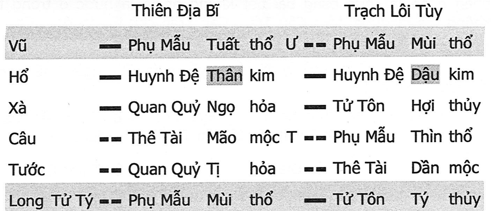
    - **Hình này chứng minh điều gì**
      - Quẻ là Bĩ, Bĩ có ý nghĩa là không thông, Thế tại hào 3, hào 3 là hào vị của dạ dày, Thê Tài là ẩm thực, hợp là cản trở, chính là đồ ăn thức uống tr...
    - **Từ đâu mà thấy được**
      - Lấy hào Thế làm Dụng thần, hào Thế mặc dù được Nguyệt kiến sinh phù, nhưng bị Nhật thần và hào động trên Ứng hợp, Nhật và hào động hợp, đều luận là...
  - **Căn cứ luận đoán**:
    - Lấy hào Thế làm Dụng thần, hào Thế mặc dù được Nguyệt kiến sinh phù, nhưng bị Nhật thần và hào động trên Ứng hợp, Nhật và hào động hợp, đều luận là cản trở.
    - Lại nhập Mộ ở hào sơ, nhất định là có bệnh lâu quấn quanh, không thể loại bỏ triệt để.
    - Quẻ là Bĩ, Bĩ có ý nghĩa là không thông, Thế tại hào 3, hào 3 là hào vị của dạ dày, Thê Tài là ẩm thực, hợp là cản trở, chính là đồ ăn thức uống trong dạ dày không thể tiêu hóa.
    - Lâm Câu Trần là trướng bụng, Nguyên thần là thủy, thủy là chất lỏng, bệnh này phải uống thuốc thang mới có thể có hiệu quả.
    - Bởi vì hai hào động trong quẻ đều sản sinh ảnh hưởng bất lợi đối với Dụng thần, do đó bệnh này cần phải điều trị tích cực, nếu không thì sẽ ngày càng nghiêm trọng.
  - **Đối thoại & Diễn biến thực tế**:
    - Trên thực tế, người này bị chướng bụng đầy hơi, bị bệnh đã nhiều năm, tìm thầy khắp nơi đều không có hiệu quả.
- **Bảng Quẻ & Quái lệ 4**: Ngày Ất Hợi tháng Dần, nữ dự đoán bệnh tật, được Thiên Địa Bĩ.
  - **Hình 18.** Sơ đồ quẻ Thiên Địa Bĩ
    - 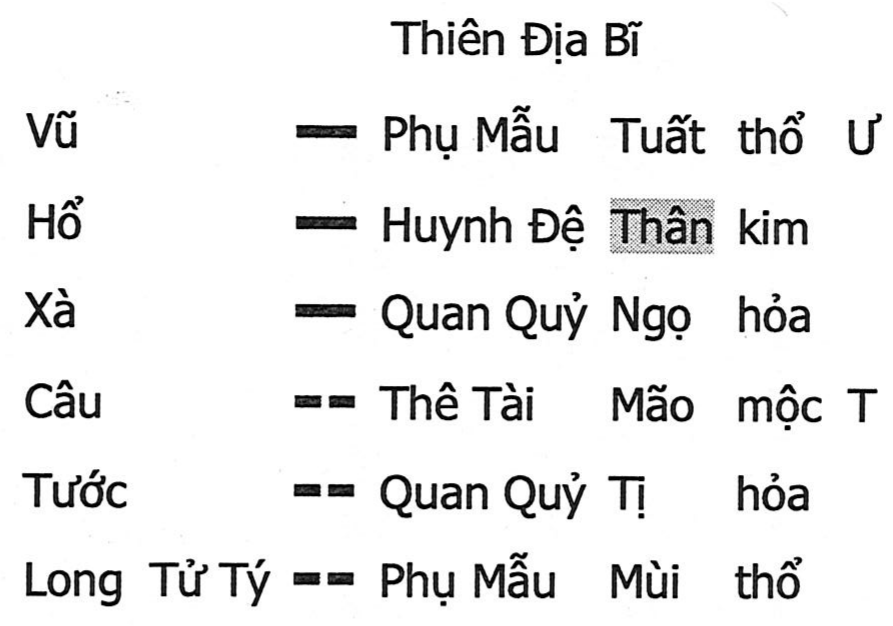
    - **Hình này chứng minh điều gì**
      - Tình hình thực tế: Người nữ này có viêm phần phụ, đường hô hấp không tốt.
    - **Từ đâu mà thấy được**
      - Lấy hào Thế làm Dụng thần, Thế được Nguyệt phù Nhật sinh là vượng tướng, trong quẻ không có Kỵ thần phát động, có vẻ như không có khuyết điểm, nhưn...
  - **Căn cứ luận đoán**:
    - Lấy hào Thế làm Dụng thần, Thế được Nguyệt phù Nhật sinh là vượng tướng, trong quẻ không có Kỵ thần phát động, có vẻ như không có khuyết điểm, nhưng xem kỹ quẻ này, hào 2 Quan Quỷ Tị hỏa ám động, là Bệnh địa của hào Thế, đồng thời hào ám động lại tương hợp với hào 5 Huynh Đệ Thân kim, đây chính là huyền cơ.
    - Quẻ tên là Thiên Địa Bĩ, là tượng trên dưới không thông, biểu thị sức khỏe của cô ấy không tốt, kinh lạc không thông suốt cho lắm.
    - Hào 2 là hào vị bộ phận sinh dục, Quan Quỷ tại đây ám động, tất có bệnh về phụ khoa, lâm Chu Tước, chủ viêm, tôi đoán người đó có viêm phần phụ.
    - Hào 5 là kim, Không mà bị Bệnh địa tương hợp, kim Không tắc minh, chủ âm thanh, hợp là cản trở, biểu thị cổ họng không tốt, ảnh hưởng đến nói năng.
    - Tình hình thực tế: Người nữ này có viêm phần phụ, đường hô hấp không tốt.
    - Mỗi tháng đều có một quãng thời gian tinh thần đột nhiên ủ rũ, cổ họng không thể phát ra âm thanh.
- **Bảng Quẻ & Quái lệ 5**: Ngày Bính Dần tháng Thìn, một người đàn ông dự đoán về việc đến Nhật Bản bái kiến lãnh đạo, được Thiên Địa Bĩ biến Hỏa Sơn Lữ.
  - **Hình 19.** Sơ đồ quẻ Thiên Địa Bĩ biến Hỏa Sơn Lữ
    - 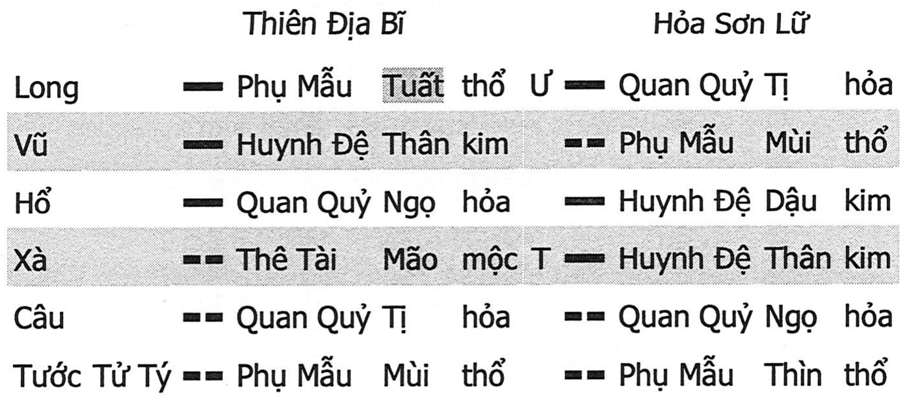
    - **Hình này chứng minh điều gì**
      - Nhưng hào Ứng Không Vong Nguyệt phá, hôm nay đi gặp thì nhất định không gặp được, hào Ứng tại ngoại quái Không Vong, tôi phán đoán lãnh đạo không c...
    - **Từ đâu mà thấy được**
      - Lấy Quan Quỷ làm Dụng thần.
  - **Căn cứ luận đoán**:
    - Lấy Quan Quỷ làm Dụng thần.
    - Đồng thời xem thêm hào Ứng, quẻ này hào Thế động mà đi sinh Quan Quỷ, lại hợp hào Ứng, biểu thị mình sắp đi gặp lãnh đạo, hào Thế lâm Tài hợp hào Ứng đồng thời động mà hóa hồi đầu khắc, biểu thị đi gặp lãnh đạo phải tốn kém nhiều tiền.
    - Nhưng hào Ứng Không Vong Nguyệt phá, hôm nay đi gặp thì nhất định không gặp được, hào Ứng tại ngoại quái Không Vong, tôi phán đoán lãnh đạo không có ở nhà.
    - Có thể là đã đi công tác.
  - **Ứng nghiệm thực tế**:
    - Tình hình thực tế: anh ta đã mang rất nhiều lễ vật đến nhà lãnh đạo để bái kiến, kết quả là đúng lúc lãnh đạo đã đến nhà mẹ vợ.
    - Anh ta đành phải để lại mọi thứ và trở về tay không.
- **Bảng Quẻ & Quái lệ 6**: Ngày Nhâm Tý tháng Tý, nam đoán bệnh của cha vợ, được Thiên Địa Bĩ biến Thiên Phong Cấu.
  - **Căn cứ luận đoán**:
    - Lấy hào Phụ Mẫu làm Dụng thần. Trong quẻ Phụ Mẫu lưỡng hiện. Lấy Phụ Mẫu Tuất thổ trên Ứng làm Dụng thần.
    - Dụng thần không được Nhật Nguyệt sinh phù, Kỵ thần Thê Tài Mão mộc vượng mà phát động khắc Dụng thần, mặc dù có Quan Quỷ Tị hỏa động đến dẫn hóa, nhưng Nguyên thần vốn nhược, không hình thành liên tục tương sinh, do đó rất hung.
    - Nội quái phản ngâm, bệnh tình thay đổi thất thường bất định. Quẻ là Thiên Địa Bĩ, là tượng thiên địa trên dưới không thông.
    - Quẻ tại cung Càn, Càn là kim, là phổi, là ruột, Kỵ thần tại hào 3 phát động, Nguyên thần tại hào 2 bị khắc không thể sinh Dụng, hào 2, hào 3 là hào vị của ruột, do đó phán đoán là bệnh về ruột.
    - Dụng thần lâm Tử Tuyệt, Nguyên thần hóa Tuyệt, nhất định là bị tuyệt chứng (bệnh nan y), thế là phán đoán là ung thư đại tràng.
    - Dụng thần bị Mão mộc hợp, rất sợ lúc gặp xung. Năm 2000 dự đoán, tháng Thìn năm 2001 điều trị không có hiệu quả mà chết.

### 5. PHONG ĐỊA QUAN

- **Tượng của quẻ**:
  - ngoại quái là Tốn, là gió, nội quái là Khôn, là đất, là tượng gió đi trên đất, đi khắp mọi nơi, quan sát tất cả.
- **Tượng của lục hào**:
  - Phụ Mẫu trì Thế, được hào 5 Tị hỏa đến sinh, hào 5 là ngũ quan, hỏa là mắt, Phụ Mẫu là tri thức, thông tin, chính là dùng mắt quan sát, thu được thông tin.
  - Quẻ này Thế Ứng đều là Tài khố, nội ngoại quái mặc dù đều có Tài Quan, nhưng Tài vừa có thể nhập Thế khố, vừa có thể nhập Ứng khố, Quan vừa có thể sinh Thế, vừa có thể sinh Ứng, do đó có tượng tranh chấp.
  - Là tĩnh quan kỳ biến (yên lặng quan sát sự thay đổi), chờ đợi thời cơ có lợi.
- **Ý nghĩa biểu tượng cốt lõi**:
  - Trong quẻ này đã bao hàm ý nghĩa quan sát, phán đoán, quan vọng (Đặt mình ở ngoài sự việc và lặng yên quan sát tình hình phát triển.), chờ đợi, tranh đoạt, thám thính, v.v.
- **Bảng Quẻ & Đồ hình liên hệ**: Sơ đồ quẻ Thiên Địa Bĩ biến Thiên Phong Cấu
  - **Hình 20.** Sơ đồ quẻ Thiên Địa Bĩ biến Thiên Phong Cấu
    - 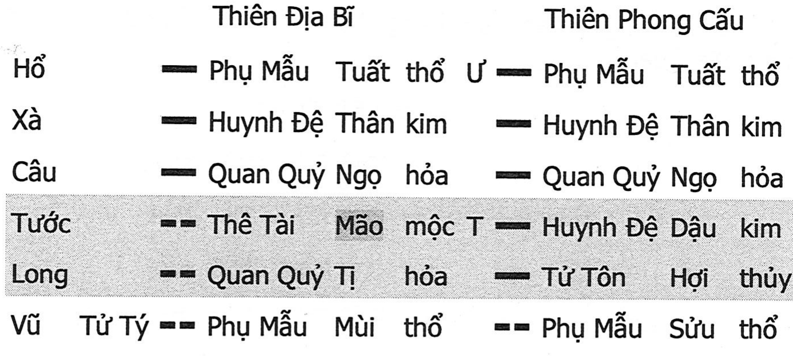
    - **Hình này chứng minh điều gì**
      - Quẻ này Thế Ứng đều là Tài khố, nội ngoại quái mặc dù đều có Tài Quan, nhưng Tài vừa có thể nhập Thế khố, vừa có thể nhập Ứng khố, Quan vừa có thể ...
    - **Từ đâu mà thấy được**
      - Phụ Mẫu trì Thế, được hào 5 Tị hỏa đến sinh, hào 5 là ngũ quan, hỏa là mắt, Phụ Mẫu là tri thức, thông tin, chính là dùng mắt quan sát, thu được th...
- **Bảng Quẻ & Quái lệ 1**: Ngày Tân Mão tháng Hợi, nam dự đoán sự nghiệp, được Phong Địa Quan.
  - **Hình 21.** Sơ đồ quẻ Phong Địa Quan
    - 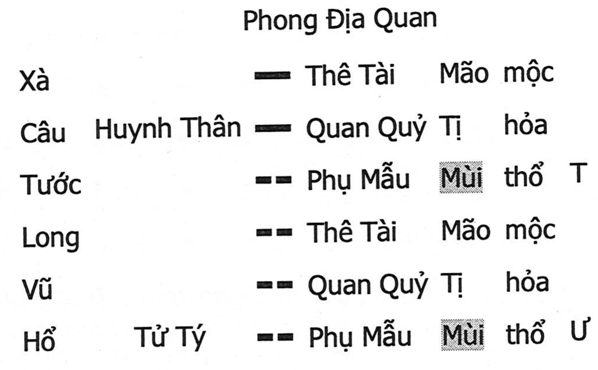
    - **Hình này chứng minh điều gì**
      - Thế Ứng đều là Phụ Mẫu Mùi thổ, Ứng là Dưỡng địa của hào Thế, tượng được người khác nuôi dưỡng, Quan Quỷ phá mà lưỡng hiện, Quan Quỷ là tên.
    - **Từ đâu mà thấy được**
      - Lấy Quan Quỷ làm Dụng thần.
  - **Căn cứ luận đoán**:
    - Lấy Quan Quỷ làm Dụng thần. Quan Quỷ Nguyệt phá, nhưng được Nhật sinh phù, không coi là hưu tù.
    - Nguyệt là lãnh đạo cấp trên, xung phá Quan Quỷ, bản thân không có chỗ dựa, làm chức không lớn.
    - Phụ Mẫu là Tài khố, lâm Chu Tước, chủ nắm quyền quản lý văn thư, đồng thời là Tài khố. Biểu thị lợi dụng chức vụ để kiếm tài nhỏ.
    - Quan Quỷ lưỡng hiện, hiện nay đang đứng trước sự lựa chọn, có hai sự nghiệp có thể phát triển. Nếu phát triển về tài, tiền đồ rộng lớn.
    - Nhưng quẻ là Phong Địa Quan, có tượng quan vọng, biểu thị bản thân do dự bất định, không thể quyết đoán.
    - Thế Ứng đều là Phụ Mẫu Mùi thổ, Ứng là Dưỡng địa của hào Thế, tượng được người khác nuôi dưỡng, Quan Quỷ phá mà lưỡng hiện, Quan Quỷ là tên.
    - Có hai họ tên, là nhận làm con thừa tự của người khác.
  - **Ứng nghiệm thực tế**:
    - Phán đoán phù hợp với thực tế.
    - Người này làm một chức nhỏ ở một cơ quan nhà nước, thu nhập không nhiều, hiện nay có người thành lập công ty muốn mời anh ta làm giám đốc, nhưng do dự bất định, sợ rằng ngộ nhỡ công ty kinh doanh không tốt, chức vụ hiện tại đã mất thì sau này không có đường lui.
    - Từ nhỏ đã chuyển từ họ Lý sang làm con thừa tự cho họ Lương.
- **Bảng Quẻ & Quái lệ 2**: Ngày Tân Sửu tháng Tuất, một người dự đoán hôn nhân, được Phong Địa Quan.
  - **Căn cứ luận đoán**:
    - Tôi đoán như sau: "Anh mặc dù là quan, nhưng lại kinh doanh, quá xem trọng tiền bạc, lo làm ăn mà không chăm sóc vợ, vợ bị người ta cướp đi.
    - Anh hiện tại vẫn chưa muốn đề xuất ly hôn, bởi vì một khi đề xuất ly hôn thì anh sẽ tổn thất một khoản tiền lớn." Đối phương gật đầu nói đúng.
    - Quẻ này phán đoán như sau. Hào Tài lưỡng hiện, hoàn toàn tương đồng, lấy hào gần hào Thế làm Dụng.
    - Hào Tài Mão mộc là Đào Hoa, lâm Thanh Long chủ mạo mỹ (mặt đẹp), tham sắc (háo sắc). Vợ anh ta nhất định là người lẳng lơ.
    - Hào Thế là Tài khố, ám động, khiến Tài nhập khố, quá xem trọng tiền bạc, chỉ cố kiếm tiền.
    - Hào Ứng ám động khiến Tài nhập Mộ, cho nên có người cướp vợ anh ta.
    - Quẻ Phong Địa Quan, có tượng quan vọng, cho nên hiện đang chờ vợ mở miệng đề xuất ly hôn, bản thân không đề xuất chuyện ly hôn, bởi vì nếu như đề xuất ly hôn thì tòa án nhất định sẽ phán cho đối phương một khoản tiền lớn, người xem trọng tiền bạc như vậy thì nhất định không chịu.

### 6. SƠN ĐỊA BÁC

- **Tượng của quẻ**:
  - ngoại quái là Cấn, là núi, là chỗ cao, nội quái là Khôn, là đất, từ trên núi đến mặt đất, chính là từ chỗ cao rơi xuống.
  - Do đó người xưa gọi quẻ này là Bác, Bác giả, lạc dã (Bác là rơi rụng).
- **Tượng của lục hào**:
  - Thế tại hào 5, hào 5 là tôn vị, là cao cao tại thượng, nhưng Ứng tại hào 2 Tuyệt Thế, khiến Thế tứ cố vô thân, vị trí cao không thể duy trì lâu dài, cướp vị trí quan trọng của Thế, cho nên gọi là Bác.
- **Ý nghĩa biểu tượng cốt lõi**:
  - rơi xuống, thất vọng, hạ thấp, triều xuống, bị lật đổ, cư an tư nguy v.v.
- **Bảng Quẻ & Đồ hình liên hệ**: Quẻ Phong Địa Quan
  - **Hình 22.** Quẻ Phong Địa Quan
    - 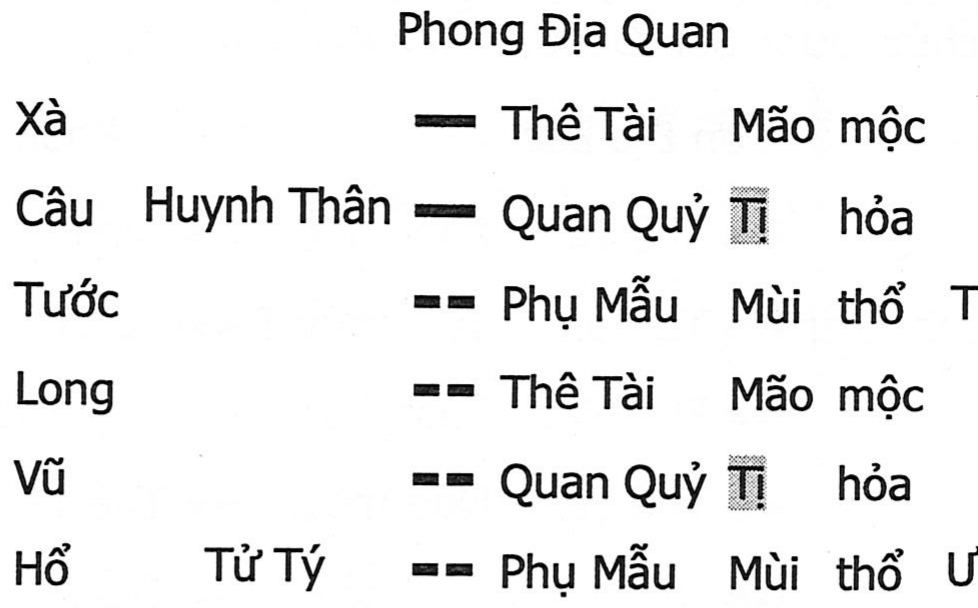
    - **Hình này chứng minh điều gì**
      - Thế tại hào 5, hào 5 là tôn vị, là cao cao tại thượng, nhưng Ứng tại hào 2 Tuyệt Thế, khiến Thế tứ cố vô thân, vị trí cao không thể duy trì lâu dài...
    - **Từ đâu mà thấy được**
      - Thế tại hào 5, hào 5 là tôn vị, là cao cao tại thượng, nhưng Ứng tại hào 2 Tuyệt Thế, khiến Thế tứ cố vô thân, vị trí cao không thể duy trì lâu dài...
- **Bảng Quẻ & Quái lệ 1**: Ngày Quý Mùi tháng Tý, một người phụ nữ dự đoán về việc thăng chức, được Sơn Địa Bác biến Khôn Vi Địa.
  - **Hình 23.** Quẻ Sơn Địa Bác biến Khôn Vi Địa
    - 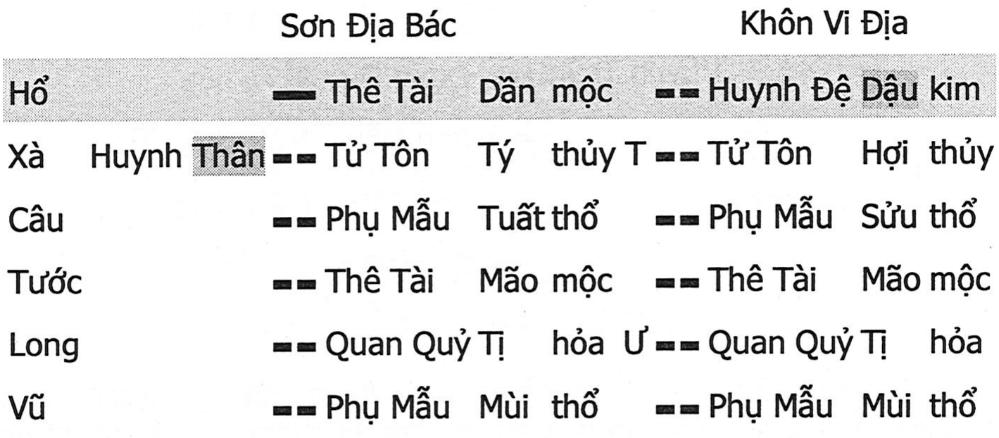
    - **Hình này chứng minh điều gì**
      - ¹ Đang ở trong lúc yên ổn thì phải nghĩ tới lúc nguy cấp, để phòng ngừa trước.
    - **Từ đâu mà thấy được**
      - Lấy Quan Quỷ làm Dụng thần, Quan Quỷ Nguyệt khắc lại không được Nhật thần sinh phù là hưu tù, mặc dù có hào Tài động mà đến sinh Quan Quỷ, một là b...
  - **Căn cứ luận đoán**:
    - Lấy Quan Quỷ làm Dụng thần, Quan Quỷ Nguyệt khắc lại không được Nhật thần sinh phù là hưu tù, mặc dù có hào Tài động mà đến sinh Quan Quỷ, một là bởi vì bản thân Quan Quỷ hưu tù vô căn (không có gốc rễ), hai là bởi vì hào Tài nhập Mộ ở Nhật, hóa Không hóa hồi đầu khắc, khó mà sinh phù Quan Quỷ, đối với dự đoán thăng chức mà nói thì rất bất lợi.
    - Đang ở trong lúc yên ổn thì phải nghĩ tới lúc nguy cấp, để phòng ngừa trước.
  - **Ứng nghiệm thực tế**:
    - Tử Tôn trì Thế, quẻ là Bác, Bác giả, lạc dã, lần này nhất định thăng chức bất thành, sau cùng sợ là bị đào thải.
    - Sau đó quả nhiên không được thăng chức.
- **Bảng Quẻ & Quái lệ 2**: Ngày Quý Dậu tháng Dần, một người dự đoán bệnh của cha, được Sơn Địa Bác biến Thủy Địa Tỷ.
  - **Hình 24.** Quẻ Sơn Địa Bác biến Thủy Địa Tỷ
    - 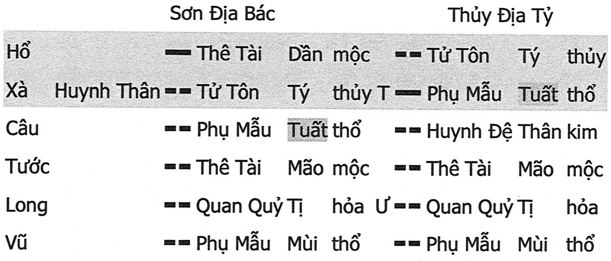
    - **Hình này chứng minh điều gì**
      - Sau bởi vì bệnh nặng không thể điều trị, ở ngày hôm sau xuất viện, từ bỏ điều trị, ngày Canh Thìn qua đời.
    - **Từ đâu mà thấy được**
      - Lấy Phụ Mẫu làm Dụng thần.
  - **Căn cứ luận đoán**:
    - Lấy Phụ Mẫu làm Dụng thần. Hào Phụ Mẫu lưỡng hiện, lấy Phụ Mẫu Tuất thổ Không Vong làm Dụng.
    - Phụ Mẫu là thổ, lâm hào 4 bị Nguyệt khắc thương, hào 4 là dạ dày, thổ cũng chủ dạ dày, nhất định là bệnh dạ dày.
    - Dụng thần hưu tù lâm Câu Trần, Câu Trần chủ sưng trướng, do đó phán đoán là ung thư.
    - Kỵ thần lâm Nguyệt phát động trong quẻ, tháng này đã có nguy hiểm.
    - Thê Tài Mão mộc ám động hợp Dụng thần Tuất thổ, bệnh lâu sợ xung không sợ hợp, do đó phán đoán ngày Thìn xung Dụng thần có nguy hiểm đến sinh mệnh.
    - Tên quẻ là Bác, Bác là rơi rụng, sinh mệnh của người giống như thiên thạch trên trời, sẽ rơi xuống.
    - Cha là trụ cột trong nhà, gặp phải quẻ này, lại thêm Dụng thần không cát, nhất định rất hung. Hóa quẻ du hồn, chính là hồn về Tây Thiên.
    - Sau bởi vì bệnh nặng không thể điều trị, ở ngày hôm sau xuất viện, từ bỏ điều trị, ngày Canh Thìn qua đời.
- **Bảng Quẻ & Quái lệ 3**: Ngày Tân Dậu tháng Ngọ, một người phụ nữ đoán về tình hình thi cử của con gái, được Sơn Địa Bác biến Sơn Thiên Đại Súc.
  - **Căn cứ luận đoán**:
    - Lấy Quan Quỷ và hào Phụ Mẫu làm Dụng thần, quẻ này Quan lâm Nguyệt kiến, lại động hóa hồi đầu sinh, Quan vượng Phụ vượng, vốn là tượng cát, nhưng không nên hào Thế Không Phá, tên quẻ là Bác, Bác giả lạc dã, có tượng thi rớt, do đó đoán con gái người này không thi đậu.
    - Tình hình thực tế, con gái cô ấy đã thiếu 10 điểm nên không thi đậu.
- **Bảng Quẻ & Quái lệ 4**: Ngày Đinh Hợi tháng Dậu, một người dự đoán tình hình tài vận, được Sơn Địa Bác biến Địa Thủy Sư.
  - **Hình 25.** Quẻ Sơn Địa Bác biến Sơn Thiên Đại Súc
    - 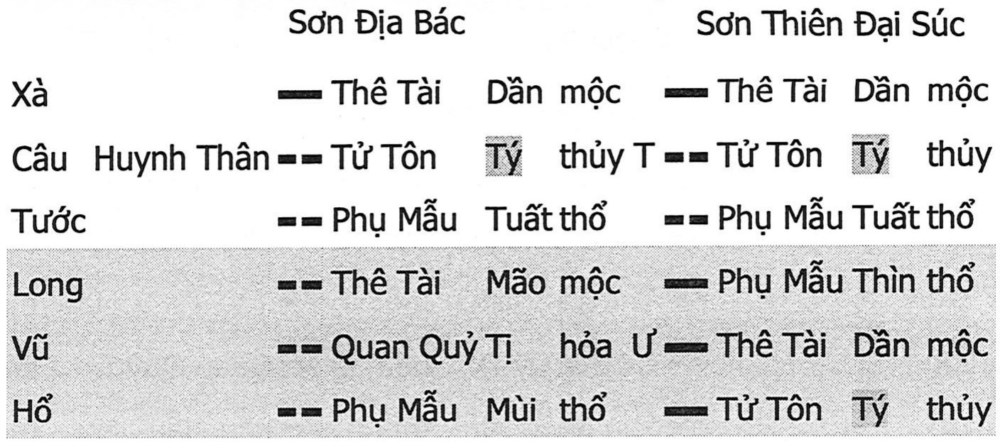
    - **Hình này chứng minh điều gì**
      - Hào 3 Mão mộc Nguyệt phá, hào 3 là giường, Mão mộc là đông, Nguyệt phá là vết nứt.
    - **Từ đâu mà thấy được**
      - Lấy Thê Tài làm Dụng thần, trong quẻ Thê Tài lưỡng hiện, lấy hào Thê Tài Dần mộc phát động làm Dụng thần.
- **Bảng Quẻ & Quái lệ 4**: Ngày Đinh Hợi tháng Dậu, một người dự đoán tình hình tài vận, được Sơn Địa Bác biến Địa Thủy Sư.
  - **Hình 26.** Quẻ Sơn Địa Bác biến Địa Thủy Sư
    - 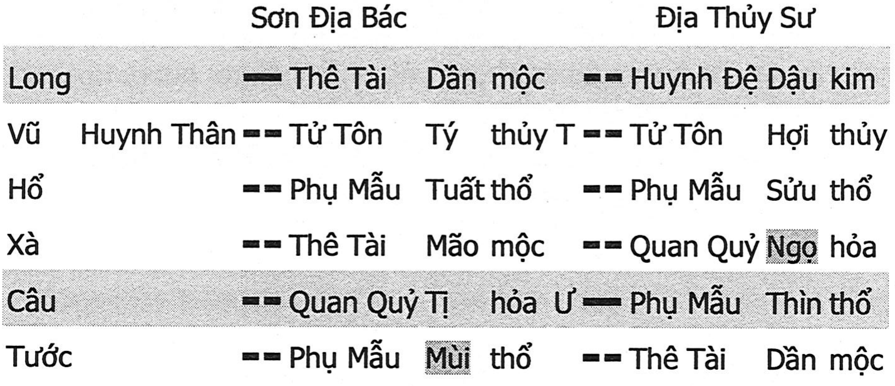
    - **Hình này chứng minh điều gì**
      - Hào 3 Mão mộc Nguyệt phá, hào 3 là giường, Mão mộc là đông, Nguyệt phá là vết nứt.
    - **Từ đâu mà thấy được**
      - Lấy Thê Tài làm Dụng thần, trong quẻ Thê Tài lưỡng hiện, lấy hào Thê Tài Dần mộc phát động làm Dụng thần.
  - **Căn cứ luận đoán**:
    - Lấy Thê Tài làm Dụng thần, trong quẻ Thê Tài lưỡng hiện, lấy hào Thê Tài Dần mộc phát động làm Dụng thần.
    - Tài được Nhật sinh phù, hào Thế lâm hào 5, hào 5 là tôn vị, có ý nghĩa là cao cao tại thượng, nhất định là người đã phát tài rất nhiều.
    - Nhưng Tài trong quẻ này bị Nguyệt khắc thương, bị Nhật hợp cản trở, lại động hóa hồi đầu khắc, biểu thị cảnh ngộ hiện nay của anh ta rất không tốt.
    - Tên quẻ là Bác, Bác dã lạc dã, biểu thị tài vận của anh ta đã xuống thấp rất nhiều. Đang ở thung lũng.
    - Tài tại hào 6, hào 6 là hào vị thoái hưu, cũng là hào vị cuối cùng của quẻ, hào 6 là tay, Tài hóa hồi đầu khắc, nếu hỏi cầu tài thì biểu thị tài sắp đến tay lại để mất.
    - Hào Thế lâm Tý thủy, lâm Huyền Vũ, ở trong cung Càn, Càn là đầu, thủy chủ trí, Huyền Vũ chủ thông minh, biểu thị anh ta có đầu óc rất thông minh, rất có đầu óc kinh doanh.
    - Tiếc là hiện tại vận khí suy sụp. Tài động sinh Ứng, biểu thị có cơ hội phát tài, nhưng là người khác được mà mình không được.
    - Trong quẻ Quan Quỷ Tị hỏa lâm hào 2 Câu Trần phát động, Quan Quỷ là tượng bất an, cũng chủ kiện cáo khẩu thiệt, Câu Trần chủ kiến trúc tu tạo, hỏa chủ lò sưởi, nhà bếp v.v.
    - Tị hỏa tương ứng với 2001 (năm Tân Tị), do đó phán đoán người đó có kiện cáo ở năm 2001 bởi vì cải tạo lò sưởi.
    - Hào sơ là hàng xóm, lâm Phụ Mẫu chủ nhà, Không Vong biểu thị không có người, phán đoán nhà đó không có người ở.
    - Hào 3 Mão mộc Nguyệt phá, hào 3 là giường, Mão mộc là đông, Nguyệt phá là vết nứt. Biểu thị có vết nứt ở phía đông của giường anh ta.
  - **Ứng nghiệm thực tế**:
    - Phán đoán trên đây quả nhiên phù hợp với thực tế. Vài năm trước, anh ta đã kiếm được rất nhiều tiền, sau đó ngày càng sa sút.
    - Hợp tác kinh doanh với người khác, khi cùng đi đàm phán, đối phương hợp tác với người cùng đi mà không hợp tác với anh ta.
    - Năm 2001, bởi vì công trình cung cấp nhiệt mà kiện tụng. Nhà lầu đang ở, một tầng là cửa hàng, không bao giờ cho thuê.
    - Giường của anh ta quả nhiên có vết nứt. Anh ta hỏi điều này có liên quan đến tài vận hay không?
    - Tôi nói trong quẻ hào 3 lâm Tài Nguyệt phá, đương nhiên có liên quan. Tôi nói với anh ta phương pháp hóa giải.
    - Nhưng về sau bởi vì không gặp lại nên không biết kết quả ra sao.

### 7. HỎA ĐỊA TẤN

- **Tượng của quẻ**:
  - ngoại quái là Ly, là lửa, là mặt trời, nội quái là Khôn, là đất, mặt trời ở trên, mặt đất ở dưới, tổ hợp lại chính là mặt trời vừa mọc lên từ mặt đất.
  - Do đó gọi là Tấn, người xưa nói, Tấn giả, thăng dã, chính là ý nghĩa này.
- **Tượng của lục hào**:
  - hào sơ là mặt đất, lâm Phụ Mẫu, Phụ Mẫu chủ mặt đất, lâm thổ lại là đất, cho nên hào sơ này chính là mặt đất.
  - Hào 2 là hào vị cao hơn mặt đất, lâm Tị hỏa, thì giống như mặt trời vừa ra khỏi mặt đất.
  - Và lại xem hào 6, hào 6 là trời, lục thân của hào này và hào 2 hoàn toàn giống nhau, cũng chứng tỏ mặt trời đã lên trời sau khi vừa ra khỏi mặt đất.
  - Cũng là tượng của thăng (lên cao).
- **Ý nghĩa biểu tượng cốt lõi**:
  - Do đó, quẻ này bao hàm ý nghĩa là tăng lên, tiến lên, hướng thượng, phát đạt, hưng thịnh, hăm hở tiến bước v.v.
- **Bảng Quẻ & Quái lệ 1**: Ngày Kỷ Sửu tháng Mão, nam đoán việc thăng tiến của quan vận, được Hỏa Địa Tấn.
  - **Căn cứ luận đoán**:
    - Dự đoán việc thăng tiến của quan vận, lấy Quan Quỷ làm Dụng thần, quẻ này Quan Quỷ được Nguyệt kiến sinh phù, mặc dù khắc Thế, nhưng đây là quẻ tĩnh nên không sao, kết hợp tên quẻ, vốn là có thể thăng, thế nhưng hào Thế Nguyệt phá, lại nhập Mộ ở Nhật, chính là đang ở hoàn cảnh khốn quẫn, thân bất do kỷ.
    - Do đó rất khó thăng chức.
  - **Ứng nghiệm thực tế**:
    - Sau quả nhiên không thăng.
- **Bảng Quẻ & Quái lệ 2**: Ngày Kỷ Mão tháng Mão, đoán sức khỏe, được Hỏa Địa Tấn biến Thủy Địa Tỷ.
  - **Hình 27.** Quẻ Hỏa Địa Tấn
    - 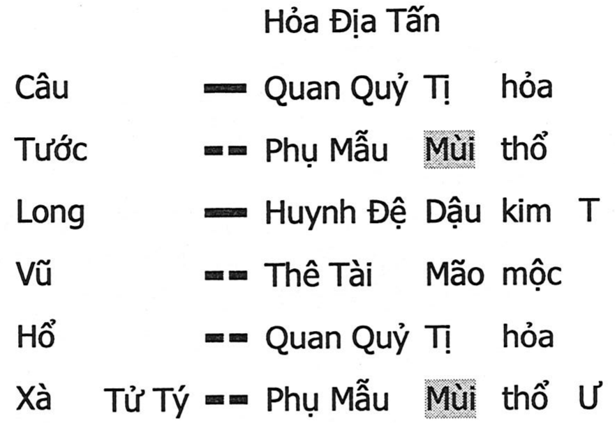
    - **Hình này chứng minh điều gì**
      - Quẻ là Tấn, Tấn giả thăng dã, hào Thế Không, là lâng lâng, cộng thêm tượng của quẻ, đoán là người đó thường xuyên mơ bay trong không trung.
    - **Từ đâu mà thấy được**
      - Lấy hào Thế làm Dụng thần.
- **Bảng Quẻ & Quái lệ 2**: Ngày Kỷ Mão tháng Mão, đoán sức khỏe, được Hỏa Địa Tấn biến Thủy Địa Tỷ.
  - **Hình 28.** Quẻ Hỏa Địa Tấn biến Thủy Địa Tỷ
    - 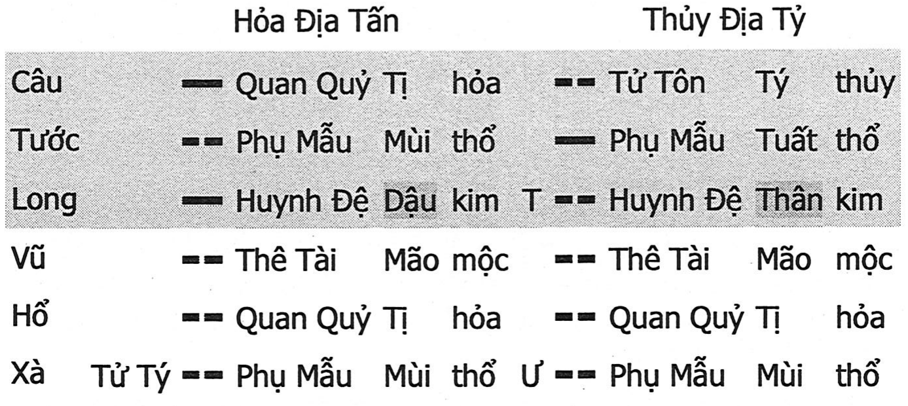
    - **Hình này chứng minh điều gì**
      - Quẻ là Tấn, Tấn giả thăng dã, hào Thế Không, là lâng lâng, cộng thêm tượng của quẻ, đoán là người đó thường xuyên mơ bay trong không trung.
    - **Từ đâu mà thấy được**
      - Lấy hào Thế làm Dụng thần.
  - **Căn cứ luận đoán**:
    - Lấy hào Thế làm Dụng thần.
    - Hào Thế Nguyệt phá Nhật phá, Kỵ thần tại hào 6 động đến khắc Thế, hào 6 là đầu, ở trong cung Càn, cũng chủ đầu, là có bệnh ở đầu.
    - Thế bị mộc xung phá, mộc chủ thần kinh, là suy nhược thần kinh.
    - Cái xung phá hào Thế là Mão mộc, lâm hào 3 trong quẻ, hào 3 là giường, ngủ rất không tốt.
    - Quẻ là Tấn, Tấn giả thăng dã, hào Thế Không, là lâng lâng, cộng thêm tượng của quẻ, đoán là người đó thường xuyên mơ bay trong không trung.
    - Thế động hóa thoái, lại rơi xuống từ không trung.
  - **Ứng nghiệm thực tế**:
    - Quả nhiên là thế vậy.

### 8. HỎA THIÊN ĐẠI HỮU

- **Tượng của quẻ**:
  - ngoại quái là Ly, là mỹ lệ, lại là mặt trời, nội quái là Càn, là châu báu, là trời, có thể lý giải là rất nhiều châu báu mỹ lệ, cũng có thể lý giải là ánh sáng mặt trời chiếu sáng khắp nơi.
  - Cho nên gọi là Đại Hữu (nhiều, được mùa). Người xưa nói, Đại Hữu giả, khoan (rộng) dã. Là rất giàu có, và ơn trạch tứ phương.
- **Tượng của lục hào**:
  - Thế được Quan trên Ứng đến tương sinh, Quan Quỷ là quý nhân, được quý nhân giúp đỡ.
  - Mà Tài lâm hào 2, hào 2 là nhà, chính là nhà có tài sản, tiền của đầy nhà. Huynh Đệ hợp Thế, bạn bè nhiều.
  - Do đó cũng phù hợp với ý nghĩa Đại Hữu (nhiều), khoan (rộng).
- **Ý nghĩa biểu tượng cốt lõi**:
  - Từ những tượng này, quẻ này bao hàm ý nghĩa là giàu có, rộng rãi, rộng lớn, nhân từ, bao dung, v.v.
- **Bảng Quẻ & Quái lệ 1**: Ngày Canh Tuất tháng Tị, một người đàn ông hỏi về tình hình thăng chức, được Hỏa Thiên Đại Hữu.
  - **Hình 29.** Sơ đồ quẻ Hỏa Thiên Đại Hữu
    - 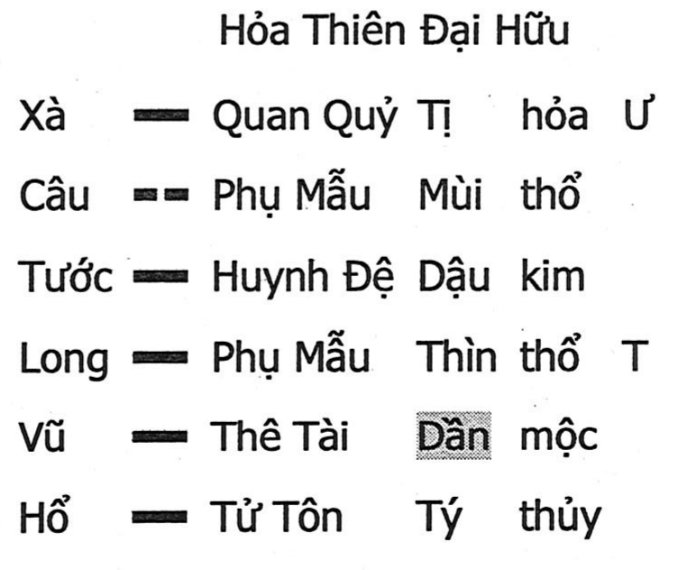
    - **Hình này chứng minh điều gì**
      - Người này thỉnh cầu đoán ở năm Giáp Thân, ở năm Ất Dậu Phụ Mẫu gặp hợp mà được thăng chức.
    - **Từ đâu mà thấy được**
      - Lấy Quan Quỷ làm Dụng thần, Quan Quỷ lâm Nguyệt lâm Ứng sinh Thế, tượng đại cát, hào Thế bị Nhật xung ám động, văn thư Phụ Mẫu trì Thế, nhất định c...
  - **Căn cứ luận đoán**:
    - Lấy Quan Quỷ làm Dụng thần, Quan Quỷ lâm Nguyệt lâm Ứng sinh Thế, tượng đại cát, hào Thế bị Nhật xung ám động, văn thư Phụ Mẫu trì Thế, nhất định có thăng, hào Ứng sinh Thế, người khác rất tốt với anh ta, hào Thế ám động, tương hợp với Huynh Đệ Dậu kim, Huynh Đệ là bạn bè, biểu thị người này giao thiệp rất rộng.
    - Quẻ này là Đại Hữu, người xưa nói: Đại Hữu giả khoan dã. Phù hợp với thực tế là người này thể diện lớn, giao thiệp rộng.
    - Người này thỉnh cầu đoán ở năm Giáp Thân, ở năm Ất Dậu Phụ Mẫu gặp hợp mà được thăng chức.
- **Bảng Quẻ & Quái lệ 2**: Ngày Đinh Hợi tháng Mùi, một người đàn ông chiêm tài phúc trọn đời, được Đại Hữu biến Ly.
  - **Hình 30.** Sơ đồ quẻ Hỏa Thiên Đại Hữu biến Ly Vi Hỏa
    - 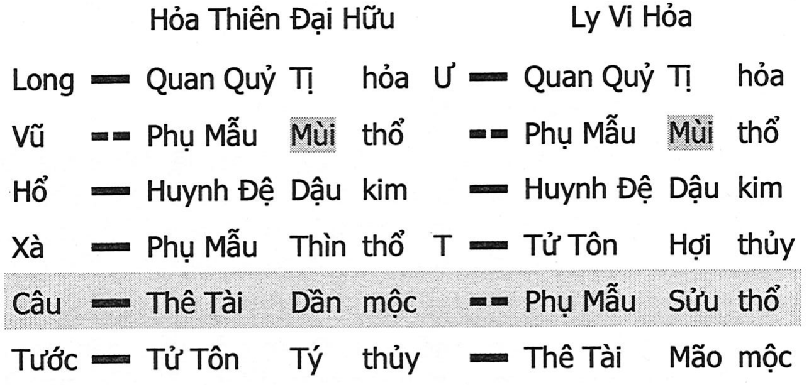
    - **Hình này chứng minh điều gì**
      - Ngày Đinh Hợi tháng Mùi, một người đàn ông chiêm tài phúc trọn đời, được Đại Hữu biến Ly.
    - **Từ đâu mà thấy được**
      - Căn cứ ngũ hành sinh khắc, Dụng thần, Thế Ứng và hào động biến trong quẻ.
  - **Đối thoại & Diễn biến thực tế**:
    - Trên thực tế, người này tốt nghiệp đại học, hiện có mấy trăm vạn.
  - **Ứng nghiệm thực tế**:
    - Quan Quỷ ám động sinh Thế, tượng có công danh, hào Tài Dần mộc Trường Sinh ở Nhật, động đến khắc Thế, Thế lại vượng tướng, chính là tượng tài đến tìm ta, tài vận tốt.
    - Quẻ Hỏa Thiên Đại Hữu, có ý nghĩa là rộng lớn, biểu thị tiền đồ phát triển sau này rất rộng lớn.

## Chương 2: Giải thích và ứng dụng tượng 8 quẻ cung Đoài

### 1. ĐOÀI VI TRẠCH

- **Tượng của quẻ**:
  - nội ngoại đều là Đoài, Đoài là đầm, là miệng, hai miệng tương đối, nghĩa là trò chuyện, hoặc là cãi nhau.
  - Giao lưu với người, có thể có ích, nhưng nói nhiều thì lại có hiềm nói quá sự thật.
- **Tượng của lục hào**:
  - quẻ này Thế tại hào 6, chủ phần đầu, mặt, sinh hào 5 kim, kim chủ âm thanh, cũng là đàm luận, phát biểu.
  - Nữ dự đoán hôn nhân không nên gặp quẻ này, mặc dù Quan Quỷ sinh Thế, nhưng Thế tại hào 6, Quan Quỷ tại hào sơ, hào 6 là thiên, hào sơ là địa, tượng hai người ở riêng hai nơi.
  - Nếu là cầu tài, Tài vượng là tốt, có thể được tài lớn, và thường là nhờ vào uốn ba tấc lưỡi mà được tiền tài.
  - Bởi vì Thế là Tài khố, Tài bị ta nắm, Đoài Vi Trạch là nói.
  - Nếu là dự đoán hôn nhân của nam, Tài nhập hào 2 hào trạch, vợ mặc dù đã vào chính vị, nhưng Đoài là khuyết, gia đình không thể mỹ mãn, sẽ có rất nhiều hối tiếc, thường xuyên tranh cãi liên tục.
  - Nhất là sợ hào sơ và hào 2 đồng thời phát động, nếu phát động thì vợ thường có ngoại tình.
- **Ý nghĩa biểu tượng cốt lõi**:
  - tranh cãi, khẩu thiệt, khiếm khuyết, không hoàn mỹ, phá tổn, vui vẻ v.v.
- **Bảng Quẻ & Quái lệ 1**: Ngày Giáp Ngọ tháng Giáp Thân năm Ất Dậu, một học viên mời tôi xem quẻ một người nữ dự đoán khi nào đoàn tụ với chồng? Được Đoài Vi Trạch biến Trạch Lôi Tùy.
  - **Hình 31.** Sơ đồ quẻ Đoài Vi Trạch biến Trạch Lôi Tùy
    - 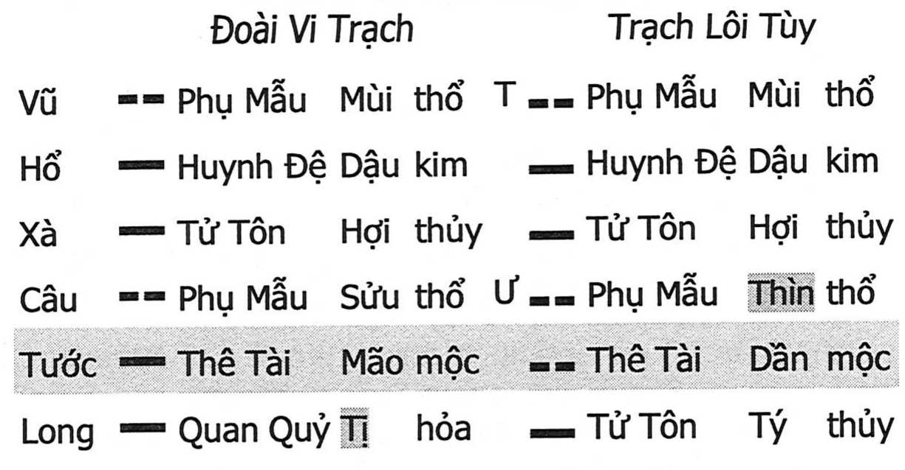
    - **Hình này chứng minh điều gì**
      - Quẻ này hào Thế là người xem, quẻ Thuần Đoài, Đoài là miệng, chủ thông tin về ẩm thực, Tài lâm Chu Tước độc phát, Chu Tước cũng chủ miệng, Tài chủ ...
    - **Từ đâu mà thấy được**
      - Lấy Quan Quỷ làm Dụng thần.
  - **Căn cứ luận đoán**:
    - Lấy Quan Quỷ làm Dụng thần. Quẻ là Đoài, là khuyết, chính là không thể đoàn tụ. Tượng sống riêng hai nơi.
    - Hoàn toàn phù hợp với tình hình thực tế của cô ấy.
    - Ngoài việc trả lời chủ đề của quẻ này, tôi còn suy ra được các thông tin sau đây từ trong quẻ:
    - Nữ thích uống trà, thích hút thuốc, giữa miệng và mũi có một nốt ruồi.
    - Học viên của tôi cảm thấy rất thần kỳ, hỏi tôi làm thế nào để phán đoán ra?
    - Trên quẻ đã chỉ rõ, quẻ này đoán rất đơn giản. Dùng phương pháp di thần biện hào.
    - Cũng tức là mượn lục thần lâm hào có lục thân tương đồng trong quẻ. Như vậy sẽ xuất hiện hiện tượng lục thần trùng điệp.
    - Và sử dụng những lục thần này có thể phán đoán ra được rất nhiều chi tiết.
    - Quẻ này hào Thế là người xem, quẻ Thuần Đoài, Đoài là miệng, chủ thông tin về ẩm thực, Tài lâm Chu Tước độc phát, Chu Tước cũng chủ miệng, Tài chủ ẩm thực, cho nên có ý nghĩa là ăn uống.
    - Chu Tước là hỏa, lâm mộc là thực vật, chính là thuốc lá, Thế là Tài khố, là đưa đồ ăn thức uống vào trong cơ thể, lâm Huyền Vũ, chủ thể lỏng, vật thể lỏng cộng với tính chất thực vật.
    - Đó chính là trà.
  - **Đối thoại & Diễn biến thực tế**:
    - Thế tại hào 6 là mặt, lâm thổ chủ mũi, tại cung Đoài là miệng, cho nên đoán có vật ở giữa miệng và mũi, Huyền Vũ chủ vật màu đen, hào 3 và hào Thế đều là Phụ Mẫu là thổ, nếu lấy hào Thế làm trung tâm phán đoán, thì có thể mượn lục thần của hào 3, hào 3 lâm Câu Trần, Câu Trần là vật gồ lên, chuyển lên hào Thế và kết hợp với Huyền Vũ trên hào Thế để phán đoán, vật màu đen và gồ lên chính là nốt ruồi, trên thực tế là có nốt ruồi mọc ở nhân trung.
- **Bảng Quẻ & Quái lệ 2**: Ngày Giáp Dần tháng Ngọ, nữ đoán hôn nhân, được Đoài Vi Trạch biến Trạch Thiên Quải.
  - **Hình 32.** Sơ đồ quẻ Đoài Vi Trạch biến Trạch Thiên Quải
    - 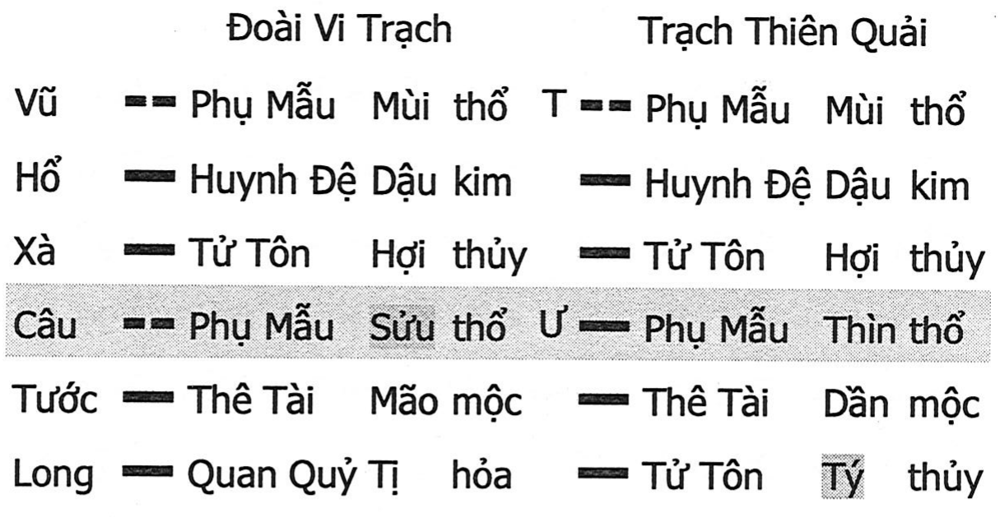
    - **Hình này chứng minh điều gì**
      - Tất cả đúng như phán đoán.
    - **Từ đâu mà thấy được**
      - Lấy Quan Quỷ làm Dụng thần.
  - **Căn cứ luận đoán**:
    - Lấy Quan Quỷ làm Dụng thần. Quan Quỷ vượng mà sinh Thế, Phụ Mẫu trì Thế, Phụ Mẫu là giấy kết hôn, biểu thị đã kết hôn.
    - Thế Ứng tương xung, tình cảm vợ chồng không hòa hợp. Quẻ là Đoài, Đoài là khuyết, hôn nhân không hoàn mỹ.
    - Thế tại hào 6, Quan Quỷ tại hào sơ, hai hào cách nhau rất xa, do đó đoán người này và chồng ít khi ở cùng nơi, là ở riêng hai nơi.
    - Hào 3 Phụ Mẫu Sửu thổ Không Vong, động mà nhập Mộ khố hào biến, Phụ Mẫu Không mà nhập Mộ, đây là tượng chung sống không có giấy kết hôn.
    - Nguyệt kiến cũng là Quan Quỷ, hợp Thế lại thêm Thế lâm Huyền Vũ, Huyền Vũ chủ ám muội, có đàn ông khác ở chung.
    - Tất cả đúng như phán đoán.
    - Chồng của cô ấy đi làm xa nhà, bản thân trông nhà một mình, bạn học cấp ba thường xuyên đến tìm cô ấy, thế là hai người đã luyến ái với nhau.
- **Bảng Quẻ & Quái lệ 3**: Ngày Nhâm Tý tháng Dần, nam dự đoán sự nghiệp, được Đoài Vi Trạch biến Trạch Thủy Khốn.
  - **Căn cứ luận đoán**:
    - Lấy Quan Quỷ làm Dụng thần. Quan Quỷ độc phát, được Nguyệt sinh, động hóa hồi đầu sinh, tháng Tị có thăng tiến.
    - Đoài là khuyết, là không hoàn mỹ, mặc dù sự nghiệp rất tốt, nhưng gia đình thì có điều thất vọng, Tài tại hào 2, vợ ở nhà, lâm Không Vong, không thể an tâm trông coi gia đình, Tài và hào Thế cách xa nhau, là tượng vợ chồng ở riêng hai nơi.
  - **Ứng nghiệm thực tế**:
    - Phán đoán trên đây quả nhiên ứng nghiệm. Bản thân mặc dù có chức, nhưng nơi làm việc cách nhà rất xa, thường xuyên không thể về nhà.
- **Bảng Quẻ & Quái lệ 4**: Ngày Nhâm Dần tháng Tị, nữ dự đoán kết quả chung sống với bạn trai, được Đoài Vi Trạch.
  - **Hình 33.** Sơ đồ quẻ Đoài Vi Trạch biến Trạch Thủy Khốn
    - 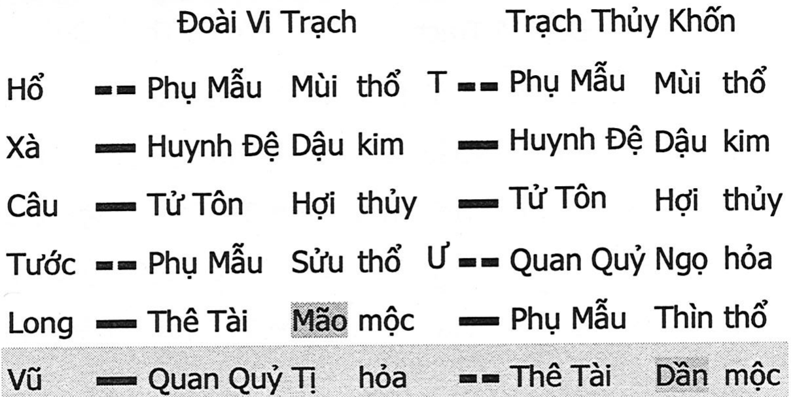
    - **Hình này chứng minh điều gì**
      - Quan mặc dù sinh Thế, nhưng Không mà khó sinh, xa cách một phương, người đó rất khó chăm sóc được cho mình.
    - **Từ đâu mà thấy được**
      - Quan Quỷ làm Dụng thần.
- **Bảng Quẻ & Quái lệ 4**: Ngày Nhâm Dần tháng Tị, nữ dự đoán kết quả chung sống với bạn trai, được Đoài Vi Trạch.
  - **Hình 34.** Sơ đồ quẻ Đoài Vi Trạch
    - 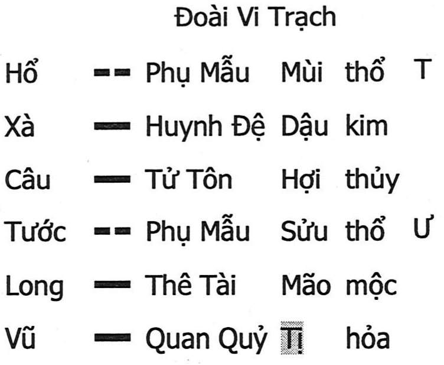
    - **Hình này chứng minh điều gì**
      - Quan mặc dù sinh Thế, nhưng Không mà khó sinh, xa cách một phương, người đó rất khó chăm sóc được cho mình.
    - **Từ đâu mà thấy được**
      - Quan Quỷ làm Dụng thần.
  - **Căn cứ luận đoán**:
    - Quan Quỷ làm Dụng thần.
    - Quẻ này thoạt nhìn Quan Quỷ được Nguyệt tỉ phù, Nhật sinh rất vượng lại là sinh Thế là cát, nhưng trong quẻ lại có huyền cơ khác.
    - Quẻ này Thế tại hào 6 là thiên, Quan Quỷ tại hào sơ là địa, giống như Ngưu Lang và Chức Nữ, xa cách chân trời, không thể ở cùng một nơi.
    - Quan mặc dù sinh Thế, nhưng Không mà khó sinh, xa cách một phương, người đó rất khó chăm sóc được cho mình.
    - Quan sinh Thế đồng thời cũng sinh hào Ứng, trước sinh Ứng mà sau sinh Thế, lâm Huyền Vũ, tượng ám muội, do đó đối phương nhất định là đàn ông đã có vợ.
  - **Đối thoại & Diễn biến thực tế**:
    - Trên thực tế, người xem ở Bắc Kinh, người kia ở Sơn Tây, bởi vì quan hệ công việc mà quen nhau, rơi vào lưới tình không thể tự thoát ra được.
    - Mặc dù đối phương đã có vợ nhưng vẫn không muốn từ bỏ theo đuổi.
- **Bảng Quẻ & Quái lệ 5**: Ngày Đinh Tị tháng Thân, một người dự đoán máy vi tính bị hư khi nào sửa xong? Được Đoài Vi Trạch biến Trạch Địa Tụy.
  - **Hình 35.** Sơ đồ quẻ Đoài Vi Trạch biến Trạch Địa Tụy
    - 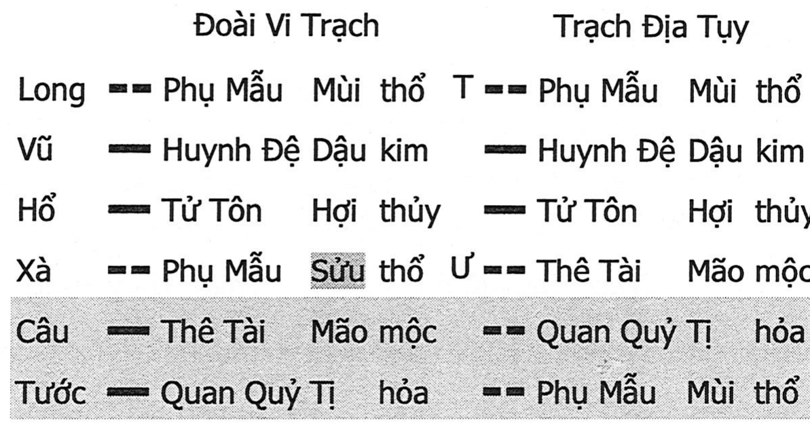
    - **Hình này chứng minh điều gì**
      - Dụng thần lâm Trình Xà, Trình Xà chủ thiếu, Không Vong chủ không có, mất.
    - **Từ đâu mà thấy được**
      - Lấy hào Phụ Mẫu làm Dụng thần, trong quẻ Phụ Mẫu lưỡng hiện, lấy Phụ Mẫu Sửu thổ lâm Không Vong trên Ứng làm Dụng thần.
  - **Căn cứ luận đoán**:
    - Lấy hào Phụ Mẫu làm Dụng thần, trong quẻ Phụ Mẫu lưỡng hiện, lấy Phụ Mẫu Sửu thổ lâm Không Vong trên Ứng làm Dụng thần.
    - Dụng thần Trường Sinh ở Nguyệt, được Nhật sinh phù là vượng tướng. Trong quẻ tuy có Mão mộc động mà đến khắc.
    - Nhưng Quan Quỷ Tị hỏa đồng thời phát động, hình thành liên tục tương sinh, do đó máy vi tính nhất định có thể sửa được.
    - Dụng thần Không Vong an tĩnh. Tĩnh mà có thể ứng xung, Không Vong cũng có thể ứng xung thực, tại ngày Kỷ Mùi nhất định có thể sửa xong.
    - Dụng thần lâm Trình Xà, Trình Xà chủ thiếu, Không Vong chủ không có, mất.
    - Lại tên quẻ là Đoài, Đoài là khuyết, nhất định là trong máy vi tính đã mất tập tin nào đó mà bị hư.
  - **Ứng nghiệm thực tế**:
    - Sau đó đã tìm được tập tin bị mất ở ngày Kỷ Mùi, sau khi thêm vào thì máy đã hoạt động được.

### 2. TRẠCH THỦY KHỐN

- **Tượng của quẻ**:
  - ngoại quái là Đoài, là khuyết, nội quái là Khảm, là thủy, trong đầm không có nước, nước rỉ đầm khô, nằm ở khốn cảnh.
  - Cho nên tên quẻ là khốn.
- **Tượng của lục hào**:
  - Thế tại hào sơ, hào sơ là chân, chủ hành tẩu, Tài trì Thế, Tài chủ ẩm thực, chính là nhận được thức ăn, ăn uống ở trên đường.
  - Nhưng quẻ này lục hợp, hợp thì là giữ lại, là vướng chân, cái hợp Thế là Hợi thủy, là bị thủy giữ lại.
  - Người xưa nói, Khốn giả nguy dã, không có nước uống, tất nhiên là hung.
  - Quẻ này hào Tài trì Thế, lại là quẻ lục hợp, dự đoán lục hào thông thường là cát, nhưng Thế tại hào sơ, hào vị tương đối thấp, rất khó phát triển đến cấp độ cao.
  - Quẻ này Huynh Đệ và hào 2 tương hợp, có nhiều bạn bè đến nhà.
- **Ý nghĩa biểu tượng cốt lõi**:
  - Cho nên quẻ này bao hàm ý nghĩa là khốn khổ, trở lực, điểm cuối, chậm chạp, trì trệ, không thể phát huy v.v.
- **Bảng Quẻ & Quái lệ 1**: Ngày Canh Thân tháng Tý, nam đoán về chuyện yêu đương, được Trạch Thủy Khốn biến Thiên Thủy Tụng.
  - **Hình 36.** Sơ đồ quẻ Trạch Thủy Khốn biến Thiên Thủy Tụng
    - 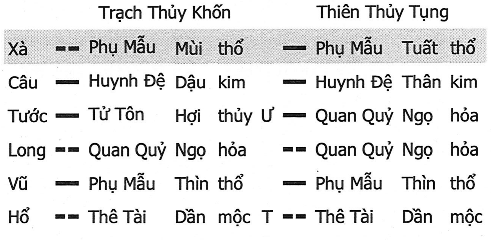
    - **Hình này chứng minh điều gì**
      - Nay Dụng thần nhập Mộ, tháng sau xung Mộ thì sẽ chia tay.
    - **Từ đâu mà thấy được**
      - Hào Thế ám động, trong lòng mình có biến.
  - **Căn cứ luận đoán**:
    - Hào Tài trì Thế được Nguyệt sinh, Nhật xung là ám động, Thế Ứng tương sinh, lại là quẻ lục hợp, vốn là tượng cát, nhưng Mùi thổ độc phát, độc phát lấy tượng làm chủ, Mộ khố là kết thúc, quẻ lại hóa du hồn, du hồn chủ phân ly, hai người không thể phát triển lâu dài.
    - Tài lâm Bạch Hổ, Bạch Hổ chủ y dược, bạn gái là một y tá.
    - Hào Thế ám động, trong lòng mình có biến.
    - Quẻ là Khốn, hào Thế lâm Tài nhập Mộ, ở chung với người nữ này thì bản thân có cảm giác khốn khổ, giống như mất tự do.
    - Do đó không thể tiếp tục phát triển.
    - Nay Dụng thần nhập Mộ, tháng sau xung Mộ thì sẽ chia tay.
  - **Ứng nghiệm thực tế**:
    - Quả nhiên ở tháng Sửu chia tay, bởi vì người nữ này thích quản thúc anh ta, mà bản thân anh ta lại là một người thích tự do tự tại.
- **Bảng Quẻ & Quái lệ 2**: Ngày Đinh Tị tháng Thân, nữ dự đoán về điều động công tác, được Trạch Thủy Khốn.
  - **Hình 37.** Sơ đồ quẻ Trạch Thủy Khốn
    - 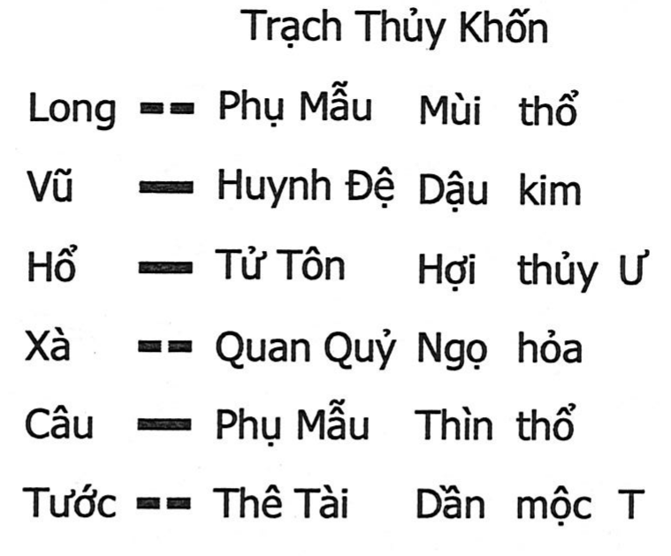
    - **Hình này chứng minh điều gì**
      - Thế phá, Tử Tôn Hợi thủy ám động khắc Quan Quỷ, chỉ có tháng Dần mới có chuyển biến tốt, mới có khả năng biến động công tác.
    - **Từ đâu mà thấy được**
      - Lấy Quan Quỷ làm Dụng thần, kiêm xem hào Thế và hào Phụ Mẫu.
  - **Căn cứ luận đoán**:
    - Lấy Quan Quỷ làm Dụng thần, kiêm xem hào Thế và hào Phụ Mẫu. Quan Quỷ được Nhật tỉ phù là vượng, sự nghiệp có thể phát triển.
    - Nhưng hào Thế tại hào sơ Nguyệt phá, hào sơ là quần chúng và là hào vị thấp nhất, biểu thị chức vụ ở công ty không cao.
    - Hào Thế lâm phá tại sơ, biểu thị công việc rất bận rộn, mang phá chân.
    - Quẻ này lục hợp, lại là Khốn, bản thân bị bó buộc tay chân, rất khó có dư địa cho mình phát huy.
    - Thế phá, Tử Tôn Hợi thủy ám động khắc Quan Quỷ, chỉ có tháng Dần mới có chuyển biến tốt, mới có khả năng biến động công tác.
    - Bởi vì hào Thế thực phá, lại hợp Tử Tôn Hợi thủy, Quan Quỷ không còn bị khắc.
  - **Đối thoại & Diễn biến thực tế**:
    - Trên thực tế, được điều động công tác ở tháng Dần, đã đến một bộ phận có môi trường rất tốt.
- **Bảng Quẻ & Quái lệ 3**: Ngày Canh Thân tháng Thân, một người xuất gia bị mất tiền ở trong miếu, hỏi có thể tìm lại được hay không, được Trạch Thủy Khốn biến Đoài Vi Trạch.
  - **Hình 38.** Sơ đồ quẻ Trạch Thủy Khốn biến Đoài Vi Trạch
    - 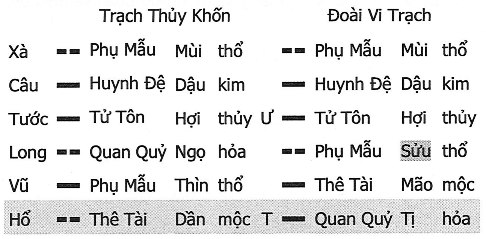
    - **Hình này chứng minh điều gì**
      - Quẻ là lục hợp, biểu thị tiền đang được giấu ở một nơi nào đó, tên quẻ là Khốn, biểu thị bản thân tiến thoái lưỡng nan.
    - **Từ đâu mà thấy được**
      - Lấy hào Thê Tài làm Dụng thần, Thê Tài mặc dù trì Thế, nhưng bị Nhật Nguyệt xung khắc, là Nhật phá Nguyệt phá, tiền tài nhất định khó mà tìm lại.
  - **Căn cứ luận đoán**:
    - Lấy hào Thê Tài làm Dụng thần, Thê Tài mặc dù trì Thế, nhưng bị Nhật Nguyệt xung khắc, là Nhật phá Nguyệt phá, tiền tài nhất định khó mà tìm lại.
    - Quan Quỷ là người ăn cắp tiền, hào Thế động mà hóa ra Quan Quỷ, người ăn cắp tiền của ông ta đang ở bên cạnh.
    - Mà Quan Quỷ này là do hào Thế động mà hóa ra. Đây là dẫn sói vào nhà.
    - Biểu thị người ăn cắp tiền của ông ta chính là người mà ông ta đã mang đến bên cạnh mình.
    - Quẻ là lục hợp, biểu thị tiền đang được giấu ở một nơi nào đó, tên quẻ là Khốn, biểu thị bản thân tiến thoái lưỡng nan.
    - Thế lâm Bạch Hổ, chủ tâm trạng phiền muộn, rất tức giận. Hóa ra Quan Quỷ, Quan Quỷ chủ ưu sầu. Biểu thị trong lòng rất phiền muộn.
  - **Đối thoại & Diễn biến thực tế**:
    - Đoán đến đây, ông ta cho biết:
    - Tiền của ông ta được để ở trong két sắt, trên thực tế là đã bị học trò của mình lấy trộm, nếu như báo án thì tiền đồ của học trò ông ta coi như kết thúc, làm người xuất gia, giáo dục người quan trọng hơn, không thể đặt tiền lên hàng đầu.
    - Do đó ông ta dự định chỉ đuổi học trò này đi mà thôi.

### 3. TRẠCH ĐỊA TỤY

- **Tượng của quẻ**:
  - ngoại quái là đầm, là miệng, là nước, nội quái là Khôn, là đất, hợp lại chính là trên mặt đất mở miệng, có hố, nước ở trên đất tụ thành ao, cho nên gọi quẻ này là Tụy, người xưa nói, Tụy giả, tụ dã.
- **Tượng của lục hào**:
  - quẻ này là tượng thiên địa thống nhất, thiên địa hợp nhất. Chính là tập hợp lại cùng một nơi những thứ đã phân tán sau vụ nổ lớn của vũ trụ.
  - Hào 6 và hào sơ đều là Phụ Mẫu Mùi thổ, từ hào vị của lục hào mà nói, hào 6 là thiên, hào sơ là địa, mà bản thân Phụ Mẫu cũng có ý nghĩa là thiên địa, cho nên Phụ Mẫu Mùi thổ của hào 6 chính là thiên, Phụ Mẫu Mùi thổ của hào sơ chính là địa.
  - Hào 6 Phụ Mẫu Mùi thổ, nhìn từ trên xuống dưới, là liên tục tương sinh, hào 6 sinh hào 5, hào 5 sinh hào 4, hào 4 sinh hào 3, hào 3 sinh hào 2, hào 2 sinh hào sơ, Phụ Mẫu Mùi thổ từ thiên ban đầu biến thành địa, đây chính là thiên địa tương hội, đã trở về trạng thái vũ trụ không có tách biệt.
  - Nhưng quá trình này phải đi qua hào Thế mới có thể hoàn thành.
  - Hào Thế là chủ thể của một quẻ, mọi thứ trong thiên hạ đều sinh đến chỗ ta thông qua các phương thức khác nhau, giống như mình sở hữu mọi thứ trong thiên hạ, chúng sở quy nhất, hoàn toàn đúng là ý nghĩa của tụ.
  - Trong 64 quẻ, chỉ có quẻ này có tổ hợp như vậy.
  - Do đó, căn cứ vào đặc điểm của quẻ, quẻ này có ý nghĩa là hội tụ, tụ họp, thuộc về, tập trung, đồng ý, hòa hợp, hoàn hảo, thu thập, quy nạp, đoàn kết v.v.
- **Bảng Quẻ & Quái lệ 1**: Ngày Ất Tị tháng Hợi, nam dự đoán về tình hình quan vận, được Trạch Địa Tụy.
  - **Hình 39.** Sơ đồ quẻ Trạch Địa Tụy
    - 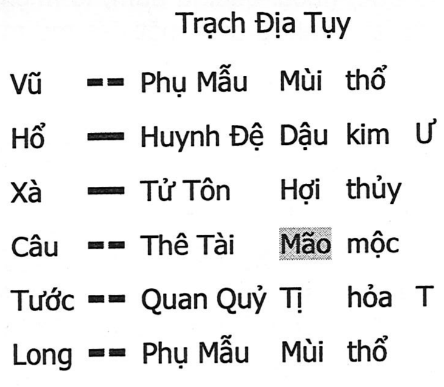
    - **Hình này chứng minh điều gì**
      - Nguyên thần Thê Tài Mão mộc mặc dù lâm sát hào Thế, nhưng Không mà bất động, không thể giải khắc của Tử Tôn ám động, Không biểu thị không có, biểu ...
    - **Từ đâu mà thấy được**
      - Lấy Quan Quỷ làm Dụng thần.
  - **Căn cứ luận đoán**:
    - Lấy Quan Quỷ làm Dụng thần. Quan Quỷ trì Thế, được Nhật củng phù là vượng. Chu Tước chủ nói, bản thân nói năng chắc chắn.
    - Nhưng đây cũng là vấn đề sở tại.
    - Nguyên thần Thê Tài Mão mộc mặc dù lâm sát hào Thế, nhưng Không mà bất động, không thể giải khắc của Tử Tôn ám động, Không biểu thị không có, biểu thị bên cạnh anh không có người đắc lực giúp đỡ.
    - Đây là tượng mất quan.
  - **Đối thoại & Diễn biến thực tế**:
    - Quan Quỷ trên Thế Nguyệt phá, mặc dù Nhật thần thực phá, nhưng Tử Tôn Hợi thủy ám động, đến khắc Dụng thần, mà Tử Tôn này ám động là do Quan Quỷ trên Nhật gây ra, cho nên có quan chức ngoài mặt là đang giúp đỡ anh nhưng trên thực tế là muốn cướp quyền của anh.
    - Trên thực tế, người này là thư ký của một tỉnh trưởng, anh ta còn là người đứng đầu của một đơn vị khác, tất cả quyền lợi tập trung trong tay của mình, không cho người khác nhúng tay vào.
    - Một lãnh đạo khác có ý bảo anh ta rời khỏi tỉnh trưởng, nhưng lại không nói trực tiếp mà chỉ khuyên anh ta đặt trọng điểm công tác vào đơn vị kiêm quản.
    - Trên thực tế là đã cướp quyền lợi làm việc bên cạnh tỉnh trưởng của anh ta.
    - Khi anh ta vừa chuyển trung tâm công tác, cấp trên đã ngay lập tức bố trí người khác thế chỗ công việc thư ký của anh ta.
- **Bảng Quẻ & Quái lệ 2**: Ngày Bính Dần tháng Tý, nam hỏi bạn gái sống chung đã bỏ đi có trở về hay không? Được Trạch Địa Tụy biến Lôi Địa Dự.
  - **Hình 40.** Sơ đồ quẻ Trạch Địa Tụy biến Lôi Địa Dự
    - 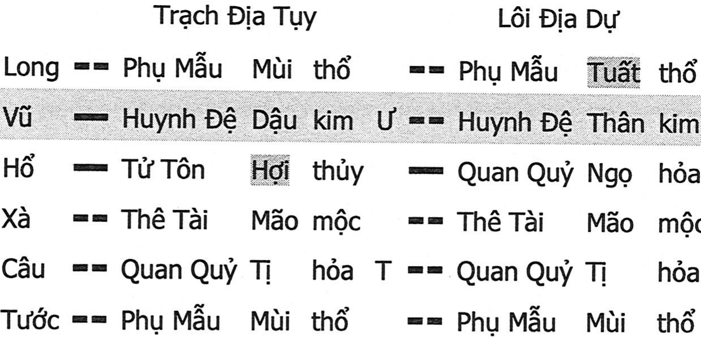
    - **Hình này chứng minh điều gì**
      - Tình hình thực tế: Bạn gái bỏ đi không trở về, ở tháng Sửu lại xảy ra hai lần tai nạn xe cộ, bồi thường cho người ta hơn 8000 tệ.
    - **Từ đâu mà thấy được**
      - Lấy Tài làm Dụng thần, Tài được Nguyệt sinh Nhật phù là vượng, nhưng không nên Huynh Đệ độc phát khắc Dụng.
  - **Căn cứ luận đoán**:
    - Lấy Tài làm Dụng thần, Tài được Nguyệt sinh Nhật phù là vượng, nhưng không nên Huynh Đệ độc phát khắc Dụng.
    - Huynh Đệ động mà hóa thoái là việc tốt, nhưng lại không nên Nhật xung Thoái thần, khiến nó thoái mà không được.
    - Cái xung chặn đường thoái của Huynh Đệ là Tài tinh trên Nhật, Tài là bạn gái, là bản thân bạn gái không muốn trở về.
    - Huynh Đệ lâm hào 5 phát động khắc Tài, vốn là thông tin bạn gái không muốn trở về, nhưng quẻ này là Tụy, có tượng nhiều việc tập trung ở một người.
    - Hào 5 là đường, động khắc Tài, biểu thị việc xui xẻo không chỉ là bạn gái bỏ đi, mà còn đề phòng phá tài trên đường.
    - Tình hình thực tế: Bạn gái bỏ đi không trở về, ở tháng Sửu lại xảy ra hai lần tai nạn xe cộ, bồi thường cho người ta hơn 8000 tệ.
- **Bảng Quẻ & Quái lệ 3**: Ngày Nhâm Thân tháng Tý, nam dự đoán vận khí, được Trạch Địa Tụy biến Thiên Địa Bĩ.
  - **Hình 41.** Sơ đồ quẻ Trạch Địa Tụy biến Thiên Địa Bĩ
    - 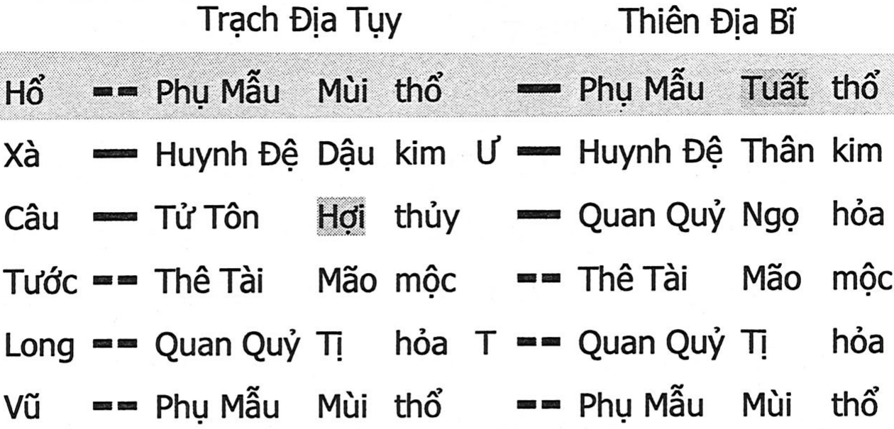
    - **Hình này chứng minh điều gì**
      - Quẻ này là Trạch Địa Tụy, Tụy có ý nghĩa là tương tụ, bởi vì thông tin thể hiện của tổng thể quẻ không tốt, do đó có thể phán đoán người này họa bấ...
    - **Từ đâu mà thấy được**
      - Quẻ này không có chủ đề dự đoán rõ ràng cho nên định vị đầu tiên phải là cát hung của bản thân, phải lấy hào Thế làm Dụng thần.
  - **Căn cứ luận đoán**:
    - Quẻ này không có chủ đề dự đoán rõ ràng cho nên định vị đầu tiên phải là cát hung của bản thân, phải lấy hào Thế làm Dụng thần.
    - Hào Thế bị Nguyệt khắc thương, lại được Nhật thần đến hợp, Nhật hợp là vướng chân.
    - Nhật là Bệnh địa của hào Thế, nhất định có bệnh tật quấn lấy người.
    - Hào 6 độc phát, hào độc phát có thể biểu thị nguyên nhân và tính chất. Hào độc phát lâm Bạch Hổ, Bạch Hổ chủ bệnh tật, lâm hào 6 là đầu.
    - Hào động khiến Nguyên thần nhập Mộ, Nguyên thần chủ tư duy của một cá nhân. Nhập Mộ chính là hôn mê.
    - Mất ý thức, biểu thị người này có bệnh chóng mặt.
    - Quẻ này là Trạch Địa Tụy, Tụy có ý nghĩa là tương tụ, bởi vì thông tin thể hiện của tổng thể quẻ không tốt, do đó có thể phán đoán người này họa bất đơn hành (họa đến dồn dập).
    - Cũng tức là, những sự việc xui xẻo đều chạy đến với anh ta.
  - **Đối thoại & Diễn biến thực tế**:
    - Quẻ này hào 6 Phụ Mẫu độc phát, lâm Bạch Hổ động mà hóa Không, hào 6 là hào thiên, cũng là hào vị của linh vị (bài vị), Phụ Mẫu không được Nhật Nguyệt sinh phù.
    - Cho nên trong song thân nhất định có người đã tạ thế, Phụ Mẫu Mùi thổ độc phát, ứng năm Nhâm Ngọ hoặc là năm Quý Mùi, năm Nhâm Ngọ là động mà gặp hợp, năm Quý Mùi là động mà gặp trị.
    - Trên thực tế, mẹ người này làm phẫu thuật huyết khối não ở năm Nhâm Ngọ, cha tử vong vì huyết khối não ở năm Quý Mùi.
- **Bảng Quẻ & Quái lệ 4**: Ngày Giáp Dần tháng Tị, một người đoán về nhận thầu công trình, được Trạch Địa Tụy.
  - **Căn cứ luận đoán**:
    - Lấy hào Phụ Mẫu làm Dụng thần, Phụ Mẫu được Nguyệt sinh phù vượng tướng, sáu hào an tĩnh, nhất định có thể nắm được công trình trong tay.
    - Quẻ này hào Tài lâm Nhật sinh Thế. Cũng sẽ kiếm được không ít tiền thông qua công trình này.
    - Đặc điểm của quẻ này: Hào 6 là hào Phụ Mẫu, hào sơ cũng là hào Phụ Mẫu, biểu thị trong ngoài công trình tụ hợp ở một người.
    - Biểu thị toàn thể công trình đều sẽ mời anh ta làm. Hào 6 Phụ Mẫu Mùi thổ liên tục tương sinh từ trên xuống đến Thế.
    - Công trình này cũng có thể mang lại lợi ích nhiều hơn nữa. Sẽ có khách hàng liên tục, sự nghiệp không ngừng lớn mạnh.
    - Công ty cũng sẽ trở nên trên dưới đoàn kết một lòng, nhân tài đông đúc.
  - **Đối thoại & Diễn biến thực tế**:
    - Trên thực tế, công trình mà người này nhận làm là một tòa nhà, bởi vì chất lượng công trình đạt tiêu chuẩn, do đó đối phương lại mời anh ta trang trí nội thất sau khi tòa nhà hoàn thành, đã kiếm được rất nhiều tiền.
    - Qua công trình này, anh ta đã mở rộng được quy mô, các công ty khác cũng tới tấp tìm đến cửa yêu cầu hợp tác với anh ta.

### 4. TRẠCH SƠN HÀM

- **Tượng của quẻ**:
  - thượng quái là Đoài, là thiếu nữ, hạ quái là Cấn, là thiếu nam, dương dưới là cương, tính hướng lên, Đoài trên là âm, là nhu, tính hướng xuống, âm dương chính phối, mặc dù ở trong ngoài, nhưng tâm thông nhất xứ, là cảm ứng mà thông.
  - Gọi là tâm có linh cảm tương thông. Người xưa nói, hàm giả, cảm dã, chính là ý nghĩa này.
- **Tượng của lục hào**:
  - Thế tại hào 3, hào 3 là cửa, dừng chân ở hành lang, cửa ra vào.
  - Hào 6 là thiên, Phụ Mẫu là thông tin, hào sơ là địa, lâm Phụ Mẫu cũng là thông tin. Thiên, địa, thông tin đều sinh ta,
  - chính là tương thông với trời đất, có thể cảm ứng được thông tin toàn bộ vũ trụ.
- **Ý nghĩa biểu tượng cốt lõi**:
  - Do đó, quẻ này bao hàm ý nghĩa là cảm ứng, cảm giác, thể hội, lý giải, trao đổi, liên hệ v.v.
  - Nếu cầu tài, nam dự đoán, Tài vượng thì hỷ Ứng động sinh Thế, bởi vì Ứng là Tài khố, chính là người khác kiếm được tiền, tích góp lại đem đến chỗ ta.
  - Song dự đoán hôn nhân thì không nên, nam thường tìm nhị hôn[^1].
  - Hoặc không phải là trinh nữ, hoặc là bạn gái đã đã đi vào vòng tay của người khác.
  - Nữ dự đoán về bạn trai, đối phương không có ngoại tình thì cũng là người có vợ.
- **Bảng Quẻ & Đồ hình liên hệ**: Sơ đồ quẻ Trạch Địa Tụy
  - **Hình 42.** Sơ đồ quẻ Trạch Địa Tụy
    - 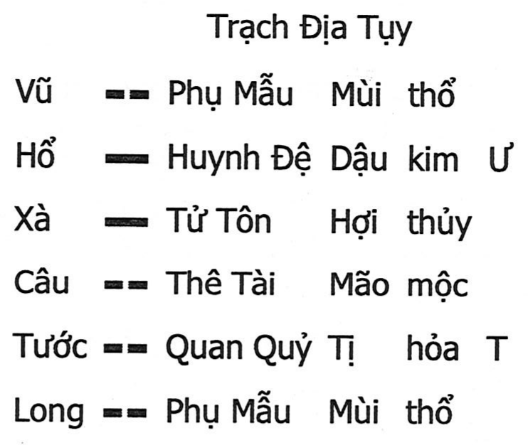
    - **Hình này chứng minh điều gì**
      - chính là tương thông với trời đất, có thể cảm ứng được thông tin toàn bộ vũ trụ.
    - **Từ đâu mà thấy được**
      - Thế tại hào 3, hào 3 là cửa, dừng chân ở hành lang, cửa ra vào.
- **Bảng Quẻ & Quái lệ 1**: Ngày Ất Mùi tháng Sửu, nam dự đoán tài vận, được Trạch Sơn Hàm biến Hỏa Sơn Lữ.
  - **Hình 43.** Sơ đồ quẻ Trạch Sơn Hàm biến Hỏa Sơn Lữ
    - 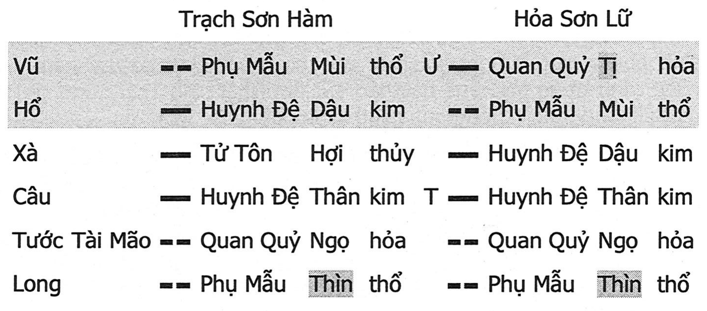
    - **Hình này chứng minh điều gì**
      - [^1]: Người kết hôn lần thứ hai.
    - **Từ đâu mà thấy được**
      - Lấy Tài làm Dụng thần.
  - **Căn cứ luận đoán**:
    - Lấy Tài làm Dụng thần.
    - Hào Tài Mão mộc bất thượng quái, không được Nguyệt Nhật sinh phù, trái lại bị Huynh Đệ động đến khắc, nhập Mộ ở hào Ứng, đồng thời lại là Huynh Đệ trì Thế, không thể được tài gì, nhất định là thông tin phá tài.
    - Ứng tại hào 6, Ứng là nơi khác, hào 6 chủ nơi xa xôi, lâm Huyền Vũ phát động, Huyền Vũ chủ lừa đảo, hào Tài nhập Mộ, chính là lôi kéo lừa gạt tiền tài.
    - Ứng động sinh Thế, đối phương làm thân với mình, quẻ là Hàm, là lý giải, là trao đổi, nhất định là phá tài khi giao lưu với người.
    - [^1]: Người kết hôn lần thứ hai.
  - **Đối thoại & Diễn biến thực tế**:
    - Tình hình thực tế:
    - Anh ta cho biết, bản thân đã đến Hải Nam để du lịch trong tháng này, khi đang lang thang trước một cửa hàng, anh ta đã bị giám đốc cửa hàng gọi lại và bắt chuyện quan hệ đồng hương với anh ta, thấy đối phương rất am hiểu về thành phố của mình, cho nên đã tin là thật, anh ta đã tiêu hơn 8000 tệ để mua cẩm thạch Myanmar trong cửa hàng, kết quả là sau khi trở về nhờ người giám định thì được biết là giả.
- **Bảng Quẻ & Quái lệ 2**: Ngày Giáp Thân tháng Mão, nữ đoán bệnh, được Trạch Sơn Hàm.
  - **Hình 44.** Sơ đồ quẻ Trạch Sơn Hàm
    - 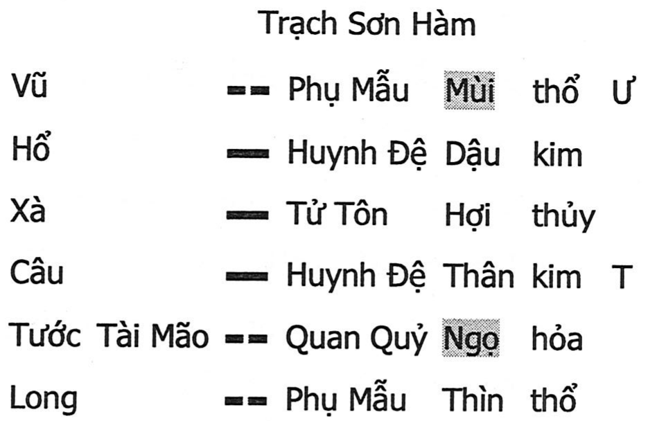
    - **Hình này chứng minh điều gì**
      - Tên quẻ là Trạch Sơn Hàm, Hàm giả cảm dã, biểu thị từ bên ngoài có thể cảm giác được sự tồn tại của khối u tử cung.
    - **Từ đâu mà thấy được**
      - Lấy hào Thế làm Dụng thần, Nguyệt không sinh cũng không khắc, nhưng có Nhật thần củng phù là vượng tướng, do đó có bệnh sẽ không quá nghiêm trọng.
  - **Căn cứ luận đoán**:
    - Lấy hào Thế làm Dụng thần, Nguyệt không sinh cũng không khắc, nhưng có Nhật thần củng phù là vượng tướng, do đó có bệnh sẽ không quá nghiêm trọng.
    - Thế tại hào 3, bị hào 2 Quan Quỷ Ngọ hỏa đến khắc, mấu chốt của phán đoán bệnh tật là ở hào 2 và hào 3, bởi vì hào 2 và hào 3 đều là hào vị bộ phận sinh dục.
    - Hào 3 lại là Trường Sinh địa của Tử Tôn, lâm Câu Trần, Câu Trần là sưng trướng, do đó phán đoán người này bị khối u tử cung.
    - Tên quẻ là Trạch Sơn Hàm, Hàm giả cảm dã, biểu thị từ bên ngoài có thể cảm giác được sự tồn tại của khối u tử cung.
  - **Đối thoại & Diễn biến thực tế**:
    - Cô ấy cho biết đúng là như vậy, có thể sờ được khối u từ bụng.
- **Bảng Quẻ & Quái lệ 3**: Ngày Bính Thìn tháng Thân, nữ dự đoán về điện thoại bị mất, được Trạch Sơn Hàm biến Khôn Vi Địa.
  - **Hình 45.** Sơ đồ quẻ Trạch Sơn Hàm biến Khôn Vi Địa
    - 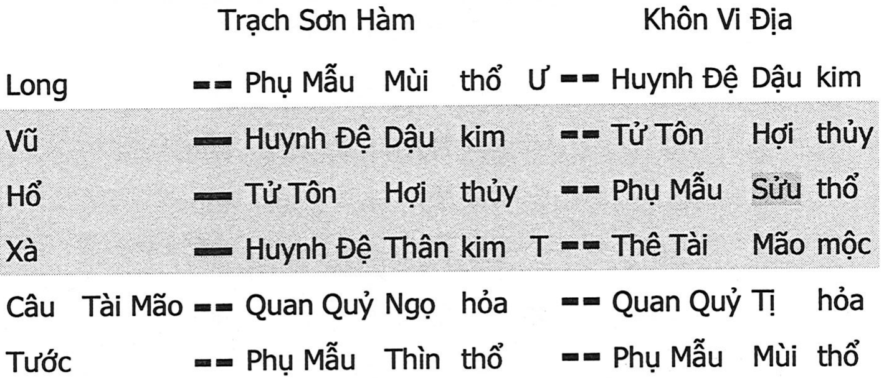
    - **Hình này chứng minh điều gì**
      - Hào Thế động mà hóa ra Thê Tài Mão mộc, là mình được tài, biểu thị mình bị mất điện thoại khi đang kiếm tiền.
    - **Từ đâu mà thấy được**
      - Lấy Thê Tài làm Dụng thần, Thê Tài Mão mộc bất thượng quái, Nguyệt khắc Nhật không sinh phù.
  - **Căn cứ luận đoán**:
    - Lấy Thê Tài làm Dụng thần, Thê Tài Mão mộc bất thượng quái, Nguyệt khắc Nhật không sinh phù. Trong quẻ có hai Huynh Đệ phát động đến khắc.
    - Mặc dù Tử Tôn động mà đến dẫn hóa, nhưng hào Tài vốn không có căn, Tử Tôn lại động hóa Không hóa hồi đầu khắc, nhập Mộ ở Nhật, lực lượng sinh Dụng thần rất yếu, do đó rất khó tìm lại điện thoại đã mất.
    - Hào Thế động mà hóa ra Thê Tài Mão mộc, là mình được tài, biểu thị mình bị mất điện thoại khi đang kiếm tiền.
    - Và một hào Huynh Đệ lâm Huyền Vũ phát động, Huynh lâm Huyền Vũ là tượng bài bạc. Biểu thị bị mất điện thoại khi đang đánh bạc.
  - **Đối thoại & Diễn biến thực tế**:
    - Trên thực tế, cô ấy đã cùng chơi mạt chược với 2 người đàn ông và 4 người phụ nữ khác, giữa họ hoàn toàn không quen biết nhau.
    - Bởi vì có việc gấp, cô ấy đã rời đi giữa chừng và đã bỏ quên điện thoại ở đó.
    - Giữa đường cô ấy đột nhiên phát hiện là đã bỏ quên điện thoại, cô ấy quay trở lại tìm thì không có ai ở đó thừa nhận là đã từng thấy nó.
  - **Ứng nghiệm thực tế**:
    - Quẻ này là Hàm, Hàm có ý nghĩa là cảm tri, thông đạt. Biểu thị cô ấy có nghi ngờ đối tượng. Nhưng quẻ thể hiện ra rất khó tìm lại.
    - Cho nên chỉ nghi ngờ mà thôi, sau cùng không tìm lại được.

### 5. THỦY SƠN KIỂN

- **Tượng của quẻ**:
  - thượng là Khảm, là nước, là hung hiểm, hạ là Cấn, là núi, thủy lưu thượng sơn (nước chảy lên núi), tượng gian nan, cho nên người xưa nói, Kiển giả, nan dã.
- **Tượng của lục hào**:
  - Tý thủy tại hào 6, Thân kim trên Thế muốn sinh thủy trên đỉnh, mà hào 5 là đường, có thổ đến khắc, cũng là tượng nước muốn chảy lên nhưng gian nan.
  - Quẻ này dự đoán hôn nhân thì nam nữ đều không cát.
  - Nam đoán, Tài phục dưới Quan, vợ bị người ta giành, Huynh Đệ trì Thế, giữa Thế Ứng lại có Huynh Đệ cản trở, có nhiều trắc trở, còn nữ dự đoán hôn nhân, Quan đến khắc Thế, cũng là tượng bất hòa.
  - Nhưng hỷ hào 5 động mà đến sinh Thế, hào 5 động, thường là Phụ Mẫu chủ sự thành hôn, đối với nam, Tuất động hợp Tài sinh Thế, đối với nữ, khiến Quỷ nhập Mộ mà sinh Thế, hào 5 là gia trưởng, do đó có tượng này.
  - Dự đoán sự nghiệp, quan vận, hỷ Quan Quỷ Ngọ hỏa và Tuất thổ cùng động, thường được lãnh đạo đề bạt, chức vụ có thể thăng, Quỷ độc phát thì hung.
  - Đoán tai nạn thì có tai nạn, đoán quan thì người khác được nhưng mình không được.
  - Quẻ này có ý nghĩa là gian nan, nguy hiểm, bế tắc, không thông, ứ đọng, cản trở v.v.
- **Bảng Quẻ & Quái lệ 1**: Ngày Đinh Dậu tháng Hợi, một người dự đoán cát hung của việc xuất hành, được Thủy Sơn Kiển.
  - **Hình 46.** Sơ đồ quẻ Thủy Sơn Kiển
    - 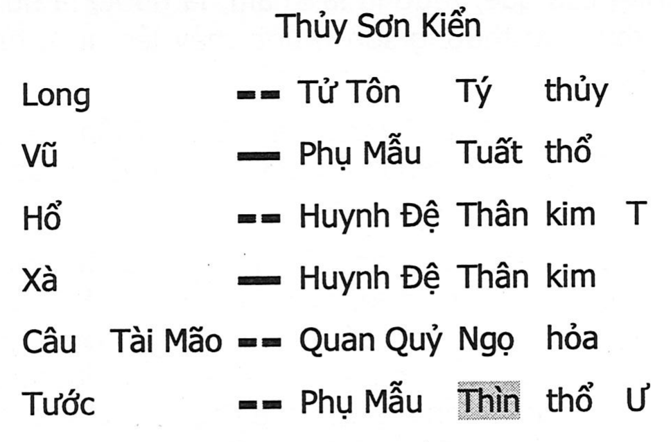
    - **Hình này chứng minh điều gì**
      - Quẻ này Thê Tài bất thượng quái, đối với người mà nói, Thê Tài thể hiện ẩm thực, còn đối với xe mà nói, thể hiện xăng, đồng thời, Phụ Mẫu Thìn thổ ...
    - **Từ đâu mà thấy được**
      - Hào Ứng là nơi đến, sinh hào Thế, cũng là thông tin ra ngoài bình an.
  - **Căn cứ luận đoán**:
    - Dự đoán cát hung của xuất hành chủ yếu là xem hào Thế, vượng thì là cát, hưu tù Không Phá, bị khắc thì là hung.
    - Quẻ này hào Thế được Nhật tỉ phù là vượng tướng, sáu hào an tĩnh, không có hào động, biểu thị lần này xuất hành rất bình an, không có tai nạn gì.
    - Hào Ứng là nơi đến, sinh hào Thế, cũng là thông tin ra ngoài bình an. Lâm hào sơ, hào sơ là chân, lâm Phụ Mẫu sinh Thế, Phụ Mẫu là xe.
    - Biểu thị lần này ra ngoài bằng xe.
    - Nhưng Phụ Mẫu Thìn thổ tương hợp với Nhật, Nhật hợp là vướng chân, lại thêm quẻ Kiển có ý nghĩa là bế tắc, gian nan, cho nên nhất định sẽ có kẹt xe trên đường.
    - Quẻ này Thê Tài bất thượng quái, đối với người mà nói, Thê Tài thể hiện ẩm thực, còn đối với xe mà nói, thể hiện xăng, đồng thời, Phụ Mẫu Thìn thổ là thủy khố, thủy là chất lỏng, Thìn thổ Không Vong, biểu thị sẽ thiếu chất lỏng trong xe, do đó trên đường có thể sẽ xuất hiện tình huống hết xăng.
  - **Ứng nghiệm thực tế**:
    - Kết quả là bởi vì kẹt xe, không thể thông hành, đành phải đi đường vòng, đã đi quãng đường dài hơn 200 km so với dự kiến, tổn hao quá nhiều xăng, đã dùng hết xăng, không thể chạy tiếp, đành phải mua một ít xăng từ xe khác mới gắng gượng đến được trạm xăng.
- **Bảng Quẻ & Quái lệ 2**: Ngày Canh Thân tháng Thìn, nam dự đoán sự phát triển với bạn gái, được Thủy Sơn Kiển biến Thủy Phong Tỉnh.
  - **Căn cứ luận đoán**:
    - Nam dự đoán hôn nhân, lấy Thê Tài làm Dụng thần.
    - Quẻ này Tài bất thượng quái, phục dưới hào 2 Quan Quỷ Ngọ hỏa, không được Nhật Nguyệt sinh phù, bị Nhật khắc thương, hào độc phát lại là Tử địa của Dụng thần, khẳng định không tốt.
    - Quẻ Kiển biểu thị tượng gian nan. Bởi vì Huynh Đệ trì Thế, Huynh Đệ là thần cách trở.
    - Tài phục dưới Quan, đối phương là người có chồng, nhưng hóa hồi đầu khắc, đã ly hôn.
    - Trong quẻ hoàn toàn không có thông tin tốt đẹp, sự phát triển của hai người sẽ không lâu dài.
  - **Ứng nghiệm thực tế**:
    - Quả nhiên là như vậy, sau đó đã chia tay ở ngày Bính Dần tháng Ngọ. Đã ứng độc phát.

### 6. ĐỊA SƠN KHIÊM

- **Tượng của quẻ**:
  - ngoại quái là Khôn, là đại địa, nội quái là Cấn, là núi, là cao địa, bình địa ở trên, cao địa ở dưới, cao nhường cho thấp, cho nên tên quẻ là Khiêm.
  - Khiêm giả, thoái dã, tượng thoái nhượng.
- **Tượng của lục hào**:
  - Thế tại hào 5 là tôn vị, mình ở chỗ cao, chỗ hiển yếu (quyền thế), còn Ứng ở hào 2 chỗ thấp, Tử Tôn là thần khắc Quan, mình không muốn quan, muốn thoát khỏi chức tước, Quan lâm hào Ứng, nhường cho người khác.
  - Nhưng trong quẻ này có ám tàng huyền cơ, phải căn cứ vào tổ hợp biến hóa khác mà xem.
  - Hào 5 lâm tôn vị khắc Quan Quỷ trên Ứng, khiêm nhường đôi khi là giả, muốn cướp vị trí của người ta là thật, đây chính là lấy thoái để tiến.
- **Ý nghĩa biểu tượng cốt lõi**:
  - Quẻ này có bao hàm ý nghĩa là thoái nhượng, lấy thủ làm công, khiêm tốn, rút lui, hạ thấp, trở về v.v.
- **Bảng Quẻ & Đồ hình liên hệ**: Quẻ Thủy Sơn Kiển biến Thủy Phong Tỉnh
  - **Hình 47.** Quẻ Thủy Sơn Kiển biến Thủy Phong Tỉnh
    - 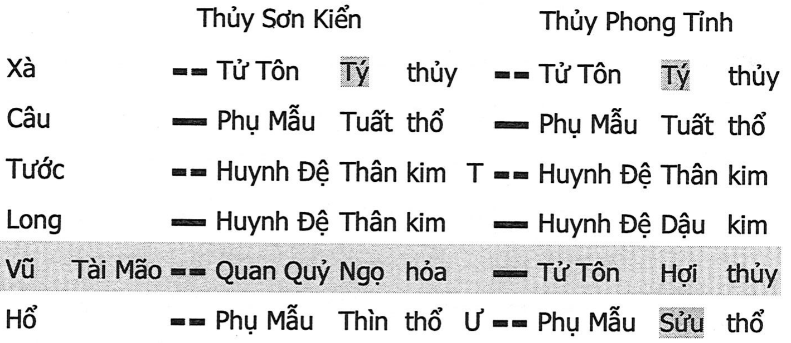
    - **Hình này chứng minh điều gì**
      - Nhưng trong quẻ này có ám tàng huyền cơ, phải căn cứ vào tổ hợp biến hóa khác mà xem.
    - **Từ đâu mà thấy được**
      - Thế tại hào 5 là tôn vị, mình ở chỗ cao, chỗ hiển yếu (quyền thế), còn Ứng ở hào 2 chỗ thấp, Tử Tôn là thần khắc Quan, mình không muốn quan, muốn t...
- **Bảng Quẻ & Quái lệ 1**: Ngày Đinh Mùi tháng Tý, nữ dự đoán về mối quan hệ với trưởng bối, được Địa Sơn Khiêm biến Địa Hỏa Minh Di.
  - **Hình 48.** Quẻ Địa Sơn Khiêm biến Địa Hỏa Minh Di
    - 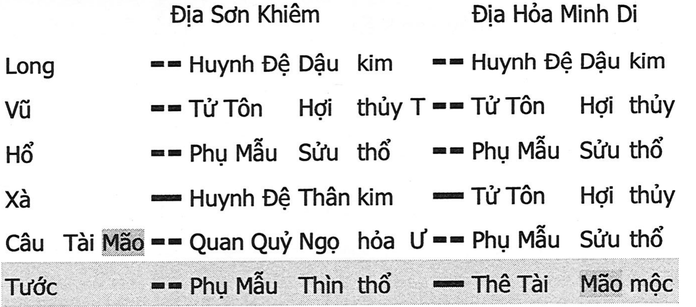
    - **Hình này chứng minh điều gì**
      - Phụ Mẫu Thìn thổ lâm Chu Tước khiến hào Thế nhập Mộ, Chu Tước chủ nói, biểu thị trưởng bối thường xuyên ra lệnh để cai quản mình.
    - **Từ đâu mà thấy được**
      - Trưởng bối là hào Phụ Mẫu, xem mối quan hệ với hào Thế.
  - **Căn cứ luận đoán**:
    - Trưởng bối là hào Phụ Mẫu, xem mối quan hệ với hào Thế. Trong quẻ Phụ Mẫu lưỡng hiện, lấy Phụ Mẫu Thìn thổ phát động làm Dụng.
    - Hào Thế lâm Huyền Vũ, Huyền Vũ chủ u uất, nhập Mộ bị khốn đốn, chủ liên lụy.
    - Biểu thị mình bị trưởng bối liên lụy, tâm trạng không tốt, không vui vẻ.
    - Phụ Mẫu Thìn thổ lâm Chu Tước khiến hào Thế nhập Mộ, Chu Tước chủ nói, biểu thị trưởng bối thường xuyên ra lệnh để cai quản mình.
    - Tên quẻ Địa Sơn Khiêm, có ý nghĩa là nhường, bởi vì đối phương là trưởng bối cho nên đã nhường đối phương.
  - **Đối thoại & Diễn biến thực tế**:
    - Tử Tôn trì Thế, Quan Quỷ Nguyệt phá, chủ hôn nhân muộn. Trên thực tế, bởi vì bản thân chăm sóc dì cho nên chưa lấy chồng.
- **Bảng Quẻ & Quái lệ 2**: Ngày Đinh Mão tháng Tuất, một người đàn ông dự đoán về một nhà hàng đang kinh doanh ế ẩm, hỏi sau khi giúp người ta quản lý thì hiệu quả kinh doanh sẽ ra sao? Được Địa Sơn Khiêm.
  - **Hình 49.** Quẻ Địa Sơn Khiêm
    - 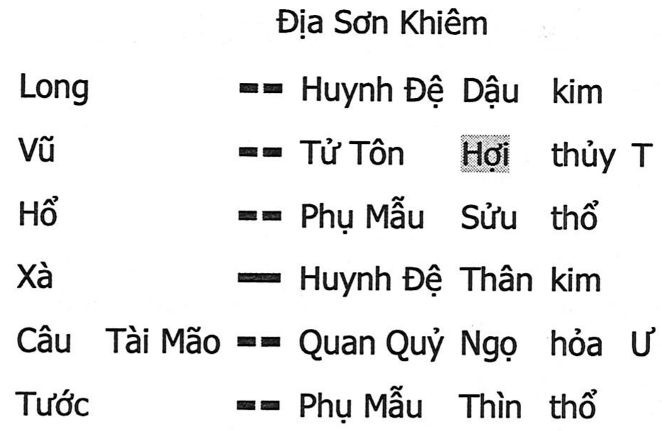
    - **Hình này chứng minh điều gì**
      - Vốn dĩ nhà hàng này liên tục không có lợi nhuận, sau khi được anh ta quản lý thì cơ bản đã có thể giữ cân bằng, không còn phải cấp tiền cho nhà hàn...
    - **Từ đâu mà thấy được**
      - Ở đây chủ yếu lấy lợi ích làm chủ, do đó lấy Tài làm Dụng thần.
  - **Căn cứ luận đoán**:
    - Ở đây chủ yếu lấy lợi ích làm chủ, do đó lấy Tài làm Dụng thần.
    - Tài bất thượng quái, phục dưới hào 2 Quan Quỷ Ngọ hỏa, Tài đắc Nguyệt lệnh mà vượng, Nhật tỉ phù, nhất định có thể giúp người ta phát triển lên.
    - Nhưng hào Thế Không Vong, nếu muốn kiếm nhiều lợi nhuận thì tương đối khó.
    - Quẻ là Khiêm, có ý nghĩa là thoái, bản thân thấy được sẽ thu tay, một khi nhà hàng khởi sắc thì sẽ rời khỏi nhà hàng này.
    - Vốn dĩ nhà hàng này liên tục không có lợi nhuận, sau khi được anh ta quản lý thì cơ bản đã có thể giữ cân bằng, không còn phải cấp tiền cho nhà hàng nữa.
    - Nhưng sau khi kinh doanh nửa năm thì cũng chỉ có thể đạt được mức độ như vậy, thế là anh ta đã viện cớ để nghỉ làm giám đốc của nhà hàng này.

### 7. LÔI SƠN TIỂU QUÁ

- **Tượng của quẻ**:
  - ngoại quái là Chấn, Chấn là động, là tức giận, nội quái là Cấn, là dừng, tức giận nhưng có mức độ, có thể dừng lại đúng lúc, làm việc không quá mức độ, tuy có lỗi nhỏ nhưng công lớn hơn.
  - Cho nên nói Tiểu Quá giả, quá dã (Tiểu Quá là lỗi).
- **Tượng của lục hào**:
  - Quan Quỷ trì Thế, lấy khắc hào 5 tôn vị, hạ nghịch thượng, là sai lầm.
  - May mà Thế sinh hào Ứng, lại có thể lấy đức đãi người, tiên binh hậu lễ.
  - Phán đoán sự nghiệp, có cảm xúc bất mãn đối với lãnh đạo, có sự khoan dung đối với cấp dưới của mình, hai Huynh Đệ giáp Thế, dễ bị người công kích, bị cô lập.
  - Nam dự đoán hôn nhân, thường bị người đoạt ái, đối phương có ngoại tình, nữ dự đoán hôn nhân, vợ chồng bất hòa, chính mình xuất hiện tình nhân.
- **Ý nghĩa biểu tượng cốt lõi**:
  - có sai lầm, bất túc (không đủ), khiếm khuyết, không hoàn mỹ v.v.
- **Bảng Quẻ & Quái lệ 1**: Ngày Canh Tuất tháng Hợi, nữ dự đoán về công việc, được Lôi Sơn Tiểu Quá biến Hỏa Thiên Đại Hữu.
  - **Hình 50.** Quẻ Lôi Sơn Tiểu Quá biến Hỏa Thiên Đại Hữu
    - 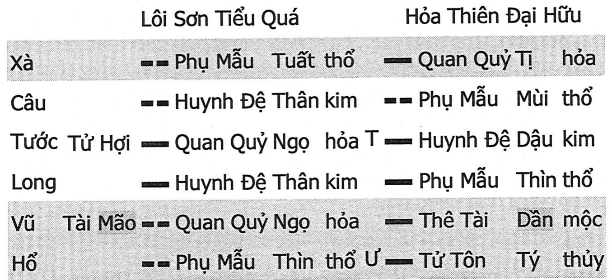
    - **Hình này chứng minh điều gì**
      - Thế lâm Chu Tước, Chu Tước chủ khẩu thiệt, lại thêm tên quẻ là Tiểu Quá, tổng hợp phán đoán, biểu thị bản thân không để ý đến tiểu tiết, trong công...
    - **Từ đâu mà thấy được**
      - Lấy Quan Quỷ làm Dụng thần, trong quẻ Quan Quỷ lưỡng hiện, lấy hào Quan Quỷ Ngọ hỏa phát động làm Dụng, Dụng thần Nguyệt khắc, nhập Mộ ở Nhật.
  - **Căn cứ luận đoán**:
    - Lấy Quan Quỷ làm Dụng thần, trong quẻ Quan Quỷ lưỡng hiện, lấy hào Quan Quỷ Ngọ hỏa phát động làm Dụng, Dụng thần Nguyệt khắc, nhập Mộ ở Nhật.
    - Tuy là động mà hóa hồi đầu sinh, nhưng lực sinh này rất nhược.
    - Bởi vì hào biến Dần mộc Không Vong, Quan Quỷ Ngọ hỏa động mà hình thành tự hình với hào Thế, tự hình chủ tự gây hại cho bản thân bởi vì hành vi không đúng của mình.
    - Thế lâm Chu Tước, Chu Tước chủ khẩu thiệt, lại thêm tên quẻ là Tiểu Quá, tổng hợp phán đoán, biểu thị bản thân không để ý đến tiểu tiết, trong công việc sẽ gây ra sai sót, xử lý mối quan hệ với đồng nghiệp không tốt, xảy ra mâu thuẫn.
    - Dụng thần Tuyệt tại Nguyệt, nhập Mộ ở Nhật, lại động mà hóa Không, e rằng sẽ xảy ra sự việc không thể tiếp tục công tác.
  - **Đối thoại & Diễn biến thực tế**:
    - Trên thực tế, người này rất tự đại, thấy năng lực của mình hơn bất kỳ ai, cô ấy đã đi khắp nơi bài xích người khác để thể hiện mình, đã xảy ra xung đột với rất nhiều người trong công ty, vì vậy người ta đã báo cáo lên cấp trên, giám đốc công ty rất tức giận và đã sa thải cô ấy ở tháng Tý.
- **Bảng Quẻ & Quái lệ 2**: Ngày Canh Dần tháng Mùi, nam dự đoán tài vận, được Lôi Sơn Tiểu Quá biến Hỏa Phong Đỉnh.
  - **Hình 51.** Sơ đồ quẻ Lôi Sơn Tiểu Quá biến Hỏa Phong Đỉnh
    - 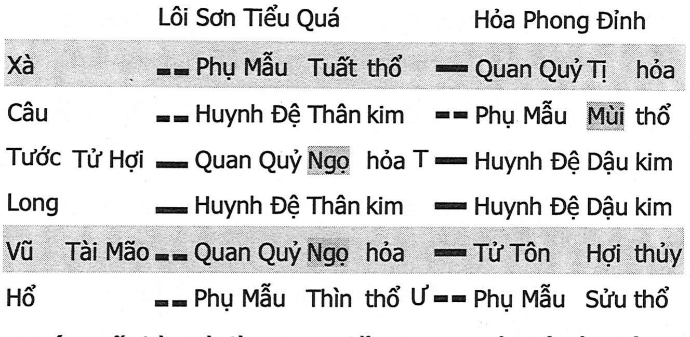
    - **Hình này chứng minh điều gì**
      - Quẻ là Tiểu Quá, có ý vượt Lôi Trì một bước.
    - **Từ đâu mà thấy được**
      - Lấy hào Tài làm Dụng thần, trong quẻ Thê Tài không hiện, nhưng được Nhật thần củng xuất, Tài lâm Nhật sinh hào Thế, là tượng có tài.
  - **Căn cứ luận đoán**:
    - Lấy hào Tài làm Dụng thần, trong quẻ Thê Tài không hiện, nhưng được Nhật thần củng xuất, Tài lâm Nhật sinh hào Thế, là tượng có tài.
    - Tài phục mà Phi thần Không, Phục thần dễ xuất, cũng là thông tin có tài, nhưng hào Thế Không Vong, tài sẽ không quá nhiều.
    - Quẻ này còn có một thông tin khác là Tài phục dưới Quan lâm Huyền Vũ sinh Thế.
    - Huyền Vũ chủ ám muội, là có nữ nhân đến tìm anh ta, yêu thích anh ta.
    - Phục ở dưới Quan là có chồng, nhưng Không Vong, biểu thị lại không có chồng, chứng tỏ là nữ nhân đã ly hôn.
    - Quẻ là Tiểu Quá, có ý vượt Lôi Trì một bước.
    - Nhưng hào Thế Không không được sinh, Không biểu thị anh ta nhát gan, không được sinh biểu thị không dám tiếp nhận, do đó đoán ngược lại, anh ta không dám vượt Lôi Trì nửa bước.
  - **Đối thoại & Diễn biến thực tế**:
    - Trên thực tế, mỗi năm anh ta kiếm được không quá nhiều tiền, có một người nữ đã ly hôn đến quyến rũ anh ta, nhưng anh ta sợ đối phương lừa gạt anh ta, do đó không dám đồng ý thiết lập mối quan hệ ám muội, đã cự tuyệt qua lại.
- **Bảng Quẻ & Quái lệ 3**: Ngày Nhâm Tý tháng Thân, một người đoán về việc lái xe đến nhà mẹ vợ, hỏi cát hung của lộ trình ra sao? Được Lôi Sơn Tiểu Quá biến Lôi Thiên Đại Tráng.
  - **Căn cứ luận đoán**:
    - Lấy hào Thế làm Dụng thần.
    - Quan Quỷ trì Thế lâm Câu Trần, Câu Trần chủ vướng vấp, là trên đường có việc bị cản trở, chủ có chuyện phiền phức.
    - Quan Quỷ phát động trong quẻ cũng chủ tượng bất an. Hào 2 Quan Quỷ Ngọ hỏa động mà tự hình với hào Thế, phiền phức này là do mình gây ra.
    - Quẻ là Tiểu Quá, là do sai lầm của mình gây ra. Quẻ du hồn, biểu thị bản thân lái xe không tập trung tinh thần mà phạm lỗi nhỏ.
    - Vì vậy phải lái xe cẩn thận trên đường đi.
  - **Đối thoại & Diễn biến thực tế**:
    - Trên thực tế, bởi vì vi phạm luật giao thông trên đường, đã bị cảnh sát bắt khi rẽ vào chỗ cấm rẽ.

### 8. LÔI TRẠCH QUY MUỘI

- **Tượng của quẻ**:
  - ngoại quái là Chấn, là trưởng nam, nội quái là trạch, là thiếu nữ, trưởng thiếu tương phối không tương xứng, thiếu nữ tại nội mà ngoại phối trưởng nam, tượng xuất giá, bởi vì không phối mà thiếu nữ ở nội, thiếu nữ về nhà, do đó gọi là Quy Muội (em gái trở về).
- **Tượng của lục hào**:
  - Thế Ứng tỷ hòa đều là thổ, là tượng huynh muội. Theo thứ tự của thập nhị địa chi, Sửu trước và lớn, Tuất sau và nhỏ.
  - Tuất lâm hào âm là nữ, do đó Tuất là muội của Sửu.
  - Quẻ này Quan nhập Mộ ở Ứng, Tài lại hợp Ứng, Tài Quan đều quy về người khác, cho nên là Quy Muội.
  - Quẻ này Tài tại hào 2, là tài trong nhà, tài của mình, hợp Ứng, thường là tài bị người khác thu được, hoặc lấy tiền của mình cho người khác.
  - Không hỷ Tài động, cũng không hỷ Ứng động.
- **Ý nghĩa biểu tượng cốt lõi**:
  - thuộc về, cho/tặng, ngoại truyền, mất, thất thoát, đào thải v.v.
- **Bảng Quẻ & Đồ hình liên hệ**: Sơ đồ quẻ Lôi Sơn Tiểu Quá biến Lôi Thiên Đại Tráng
  - **Hình 52.** Sơ đồ quẻ Lôi Sơn Tiểu Quá biến Lôi Thiên Đại Tráng
    - 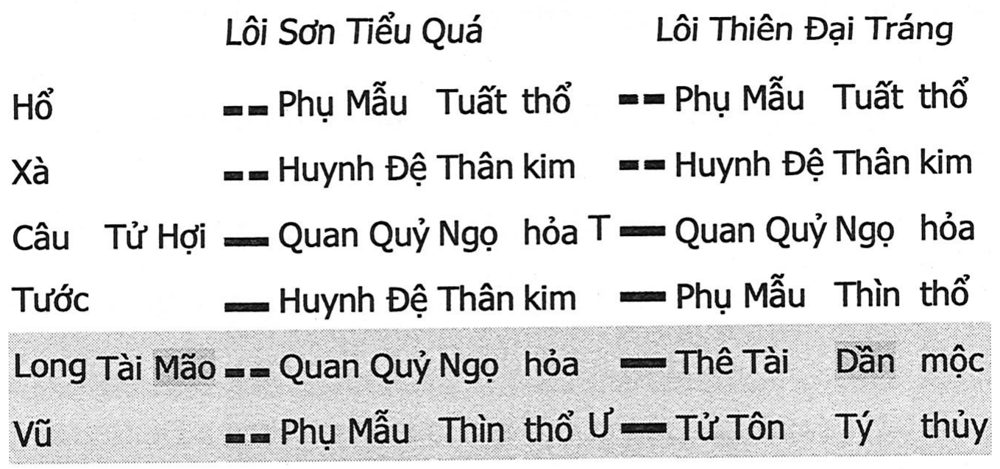
    - **Hình này chứng minh điều gì**
      - Quẻ này Tài tại hào 2, là tài trong nhà, tài của mình, hợp Ứng, thường là tài bị người khác thu được, hoặc lấy tiền của mình cho người khác.
    - **Từ đâu mà thấy được**
      - Căn cứ ngũ hành sinh khắc, Dụng thần, Thế Ứng và hào động biến trong quẻ.
- **Bảng Quẻ & Quái lệ 1**: Ngày Nhâm Thân tháng Thìn, nam dự đoán tài vận, được Lôi Trạch Quy Muội biến Trạch Lôi Tùy.
  - **Hình 53.** Sơ đồ quẻ Lôi Trạch Quy Muội biến Trạch Lôi Tùy
    - 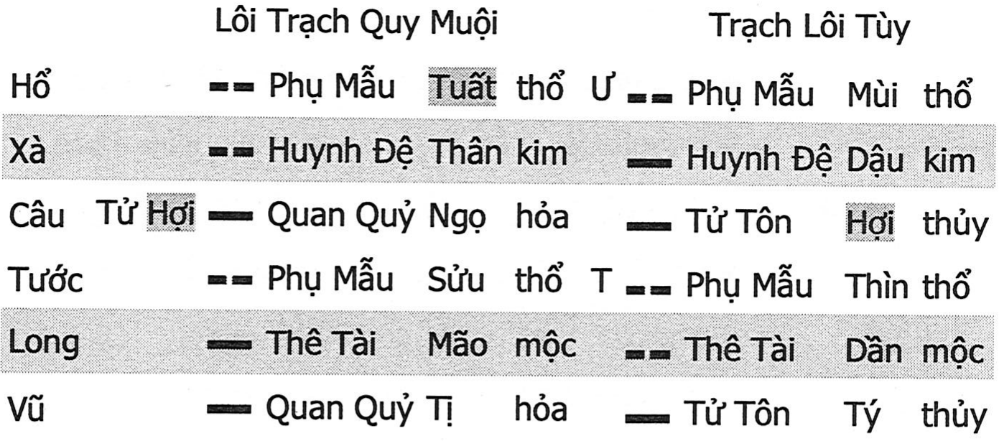
    - **Hình này chứng minh điều gì**
      - Quẻ này mặc dù có thể đoán là có thể phát tài, nhưng động mà tương hợp với hào Ứng, hào Ứng Không Vong, chẳng khác nào tiền kiếm được lại đưa cho n...
    - **Từ đâu mà thấy được**
      - Thoạt nhìn quẻ này, hào Tài không được Nhật Nguyệt sinh phù, lại động mà hóa thoái, Huynh Đệ động mà hóa Tiến thần đến khắc, vô tài khả cầu.
  - **Căn cứ luận đoán**:
    - Thoạt nhìn quẻ này, hào Tài không được Nhật Nguyệt sinh phù, lại động mà hóa thoái, Huynh Đệ động mà hóa Tiến thần đến khắc, vô tài khả cầu.
    - Nhưng xem kỹ hơn một chút, Huynh Đệ được Nguyệt sinh Nhật phù, lại hóa Tiến thần, hào Huynh Đệ quá vượng.
    - Huynh nếu thái quá thì trái lại không khắc tài, do đó quẻ này vẫn có thể đắc tài.
    - Nhưng quẻ này Thê Tài động và lại hóa ra Tài, hào Tài lưỡng hiện, không phải là hưu tù thái quá, do đó không phát tài lớn.
    - Quẻ này mặc dù có thể đoán là có thể phát tài, nhưng động mà tương hợp với hào Ứng, hào Ứng Không Vong, chẳng khác nào tiền kiếm được lại đưa cho người khác.
    - Hóa thành số không. Tài lâm Thanh Long hóa thoái, Thanh Long chủ tửu sắc.
    - Tổng hợp phán đoán, người này bởi vì ham mê tửu sắc mà tiêu hết số tiền kiếm được.
  - **Đối thoại & Diễn biến thực tế**:
    - Trên thực tế, thu nhập hàng năm của người này khá cao, nhưng anh ta lại rất thích uống rượu và tìm gái bán hoa.
    - Sau một năm, số tiền kiếm được không còn lại bao nhiêu.
- **Bảng Quẻ & Quái lệ 2**: Ngày Giáp Thân tháng Hợi, một người đàn ông dự đoán về tình hình thăng chức, được Lôi Trạch Quy Muội biến Chấn Vi Lôi.
  - **Hình 54.** Sơ đồ quẻ Lôi Trạch Quy Muội biến Chấn Vi Lôi
    - 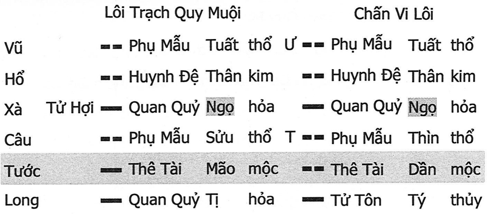
    - **Hình này chứng minh điều gì**
      - Lấy Quan Quỷ làm Dụng thần, Quan Quỷ Nguyệt khắc kèm xung là Nguyệt phá, Nhật đến hợp, mặc dù giải phá, nhưng vẫn có phần hưu tù.
    - **Từ đâu mà thấy được**
      - Lấy Quan Quỷ làm Dụng thần, Quan Quỷ Nguyệt khắc kèm xung là Nguyệt phá, Nhật đến hợp, mặc dù giải phá, nhưng vẫn có phần hưu tù.
  - **Căn cứ luận đoán**:
    - Lấy Quan Quỷ làm Dụng thần, Quan Quỷ Nguyệt khắc kèm xung là Nguyệt phá, Nhật đến hợp, mặc dù giải phá, nhưng vẫn có phần hưu tù.
    - Trong quẻ Thê Tài độc phát, vừa sinh Quan Quỷ, vừa tương hợp với hào Ứng, đây là thông tin lấy tiền hối lộ cho người để mưu cầu thăng chức.
  - **Ứng nghiệm thực tế**:
    - Quẻ Quy Muội, lợi cho người mà bất lợi cho mình.
    - Quả nhiên là để được thăng chức, người này đã đưa 10 vạn, nhưng cuối cùng người khác thăng mà mình không được thăng.

## Chương 3: Giải thích và ứng dụng tượng 8 quẻ cung Ly

### 1. LY VI HỎA

- **Tượng của quẻ**:
  - thượng hạ đều là hỏa, trên hỏa thêm hỏa, hỏa là mặt trời, trời đất sáng rực, lệ nhật trung thiên.
  - Cho nên người xưa nói, Ly giả, lệ dã (Ly là đẹp).
- **Tượng của lục hào**:
  - Thế tại hào 6 là thiên, hỏa ở trên Thế, hỏa ở trên thiên là mặt trời, chiếu rọi khắp mọi nơi.
  - Nhưng Thế Huynh Đệ, có ý nghĩa là có cản trở, quẻ là lục xung, Hợi thủy trên Ứng xung khắc Tị hỏa, có tượng nước biến thành hơi nước bay lên trời, trở thành mây mà che lấp mặt trời, do đó quẻ này có thông tin bất hòa.
- **Ý nghĩa biểu tượng cốt lõi**:
  - tách ra, mỹ lệ, phân tán, xa cách, xung động, hào quang, ấm áp v.v.
- **Bảng Quẻ & Quái lệ 1**: Ngày Giáp Thân tháng Mùi, nam dự đoán bệnh tật của vợ và tình hình học tập của hai con, được Ly Vi Hỏa.
  - **Hình 55.** Sơ đồ quẻ Ly Vi Hỏa
    - 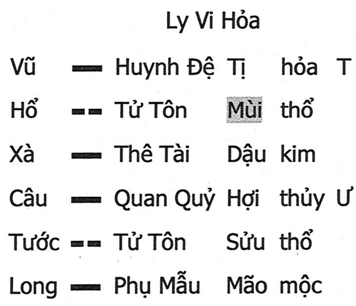
    - **Hình này chứng minh điều gì**
      - Các phán đoán trên đây đều nghiệm.
    - **Từ đâu mà thấy được**
      - Đoán bệnh của vợ, lấy hào Tài làm Dụng thần.
  - **Căn cứ luận đoán**:
    - **Ly Vi Hỏa**
    - Đoán bệnh của vợ, lấy hào Tài làm Dụng thần. Thê Tài Dậu kim được Nhật Nguyệt sinh phù, từ bản thân Dụng thần thì không nhìn ra vấn đề gì.
    - Nhưng Nguyên thần một Không một Phá, đây chính là nơi tồn tại bệnh tật.
    - Hào 2 Tử Tôn Sửu thổ Nguyệt phá, hào 2 là ruột, Tử Tôn cũng là ruột, ở trong cung Ly, cũng chủ ruột, lâm Chu Tước chủ viêm.
    - Do đó có viêm ruột.
    - Hào 5 Mùi thổ lâm Bạch Hổ Không Vong, Bạch Hổ chủ máu, cung Ly cũng chủ máu, Không không sinh Dụng thần, chủ cung cấp máu không đủ.
    - Dự đoán về con, Tử Tôn lưỡng hiện tương ứng với hai con.
    - Theo thứ tự từ sơ đến thượng, hào 2 là con đầu tiên, lâm Chu Tước, Chu Tước chủ văn thư, lại là quẻ Ly cũng chủ văn thư, người xưa nói, "Chu
    - Tước nhập Ly biết viết chữ", tôi phán đoán con đầu tiên của anh ta viết chữ rất đẹp. Còn Tử Tôn Mùi thổ tại hào 4, là con thứ hai.
    - Lâm Bạch Hổ, chủ bướng bỉnh, do đó phán đoán con thứ hai của anh ta không nghe lời, rất bướng bỉnh.
    - Các phán đoán trên đây đều nghiệm.
- **Bảng Quẻ & Quái lệ 2**: Ngày Quý Sửu tháng Dậu, một người nói rằng người bị mình lật đổ đã tự sát, hỏi kết quả sẽ ra sao? Được Ly Vi Hỏa.
  - **Căn cứ luận đoán**:
    - **Ly Vi Hỏa**
    - Ở đây chủ yếu là xem có khía cạnh bất lợi đối với mình hay không, do đó hào Thế là yếu tố quan trọng nhất.
    - Quẻ được lục xung, tâm trạng rất không tốt, khá loạn.
    - Nguyên thần là tâm tư của một cá nhân, Không mà Nguyệt phá, biểu thị lòng dạ rối như tơ vò.
    - Nhưng dự đoán về chuyện phiền não thì hỷ gặp lục xung, chủ sự việc tất tan.
    - Quẻ là Ly, chủ phân ly, cách ly (tách rời), việc tự sát của người đó không liên quan đến mình. Nay Ứng khắc hào Thế, áp lực tâm lý rất lớn.
    - Ngày mai là ngày Dần hợp Hợi thủy, lại sinh hào Thế, sẽ được giải thoát khỏi sự việc này.
  - **Đối thoại & Diễn biến thực tế**:
    - Kết quả, ở giờ Sửu ngày Dần, công an đã tìm được di thư của đối phương, người tự sát nói rằng bản thân vì tâm trạng u uất mà tự sát, và không liên can đến bất kỳ ai.
    - Người hỏi quẻ đã có thể yên tâm.

### 2. HỎA SƠN LỮ

- **Tượng của quẻ**:
  - ngoại quái là Ly, là ly khai, nội quái là Cấn, là chỉ (dừng), là nơi ở.
  - Do đó, quẻ Lữ thượng Ly hạ Cấn có thể mở rộng ra là tượng rời khỏi quê hương, từ biệt quê hương, viễn khứ tha hương, cho nên quẻ này được đặt tên là Lữ.
- **Tượng của lục hào**:
  - chủ tượng (hào Thế) là ta, tại hào sơ, hào sơ là chân, chính là tượng ta đang hành tẩu (đi).
  - Tân khách (hào Ứng) là nơi khác, hào Thế sinh hợp hào Ứng, chính là tượng ta đến nơi khác, cũng có ý nghĩa là chuyển đến nơi khác.
  - Tử Tôn trì Thế, Tử Tôn có ý
  - nghĩa là vui vẻ, tìm niềm vui.
  - Lâm hào sơ, chính là lấy hành tẩu làm niềm vui, có tượng ra ngoài du lịch, có thể thấy rằng nạp giáp và lục thân rất ăn khớp với quái tượng.
- **Ý nghĩa biểu tượng cốt lõi**:
  - ra ngoài, chạy trốn, hành động, biến hóa, chia tay, tránh xa, xa chạy cao bay v.v.
- **Bảng Quẻ & Đồ hình liên hệ**: Sơ đồ quẻ Ly Vi Hỏa
  - **Hình 56.** Sơ đồ quẻ Ly Vi Hỏa
    - 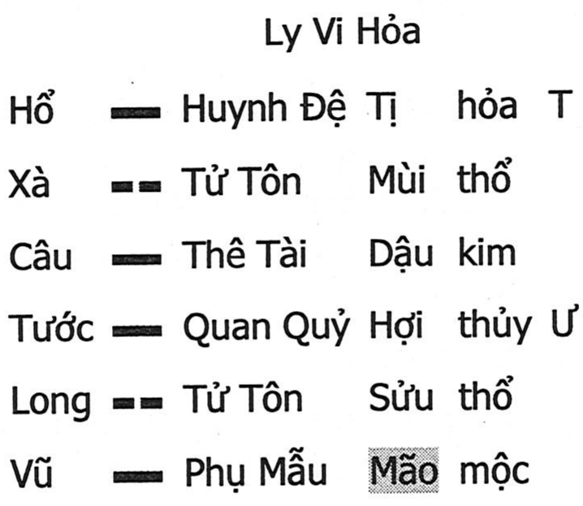
    - **Hình này chứng minh điều gì**
      - nghĩa là vui vẻ, tìm niềm vui.
    - **Từ đâu mà thấy được**
      - chủ tượng (hào Thế) là ta, tại hào sơ, hào sơ là chân, chính là tượng ta đang hành tẩu (đi).
- **Bảng Quẻ & Quái lệ 1**: Ngày Ất Tị tháng Hợi, một người hỏi em trai yêu đương có thành công hay không? Được Hỏa Sơn Lữ biến Lôi Thiên Đại Tráng.
  - **Hình 57.** Quẻ Hỏa Sơn Lữ biến Lôi Thiên Đại Tráng
    - 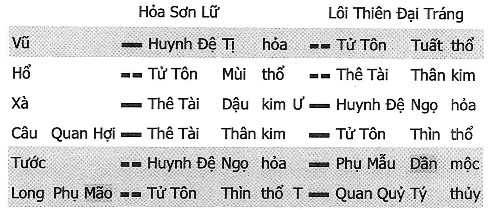
    - **Hình này chứng minh điều gì**
      - Tình hình thực tế như sau, em trai anh ta rất thích đối phương, hằng ngày đều đi tìm cô ấy, nhưng sau một thời gian sống chung, đối phương không đồ...
    - **Từ đâu mà thấy được**
      - Lấy Thê Tài làm Dụng thần, Thê Tài chính là bạn gái của em trai anh ta.
  - **Căn cứ luận đoán**:
    - Lấy Thê Tài làm Dụng thần, Thê Tài chính là bạn gái của em trai anh ta.
    - Nếu xem tình hình mối quan hệ giữa em trai anh ta và bạn gái thì phải phán đoán từ mối quan hệ giữa hào Thế và Thê Tài, hào Thế ở đây thể hiện người hỏi quẻ, hào Thế cũng bao hàm thông tin về em trai anh ta.
    - Và không nên xem mối quan hệ giữa Huynh Đệ và Thê Tài. Bởi vì Huynh Đệ và Thê Tài luôn tương khắc, tương khắc là không tốt.
    - Nếu mọi người đều đến hỏi về hôn nhân của em trai, đều đoán mối quan hệ hai người không tốt thì sai.
    - Chỉ có dự đoán cát hung của em trai anh ta thì mới xem tình hình hào Huynh Đệ.
    - Quẻ này Thê Tài lưỡng hiện, lại không phát động, thì lấy hào Ứng Thê Tài Dậu kim làm Dụng thần.
    - Bởi vì Ứng là đối thủ và người hợp tác, dự đoán về luyến ái, chính là đối tượng luyến ái. Còn một Thê Tài khác có thể dùng để tham khảo.
    - Tình hình thực tế như sau, em trai anh ta rất thích đối phương, hằng ngày đều đi tìm cô ấy, nhưng sau một thời gian sống chung, đối phương không đồng ý kết hôn và đã chia tay.
  - **Ứng nghiệm thực tế**:
    - Trước tiên xem thành bại.
    - Thê Tài không được Nhật Nguyệt đến sinh trợ, Nhật mặc dù là Trường Sinh địa, nhưng trong Trường Sinh có khắc, lại thêm Huynh Đệ lưỡng hiện trong quẻ phát động đến khắc Dụng thần, nhất định khó thành, hào Thế phát động đến dẫn hóa.
    - Biểu thị em trai anh ta rất muốn thúc đẩy hôn sự này.
    - Quẻ là Lữ, có tượng ra ngoài đi lại, hào Thế động mà hợp Thê Tài trên Ứng, hợp là gặp mặt, động là đi lại, biểu thị em trai anh ta yêu thích đối phương, thường xuyên chạy đi gặp đối phương.
    - Thê Tài hưu tù, lại thêm quẻ biến lục xung, sau cùng hai người rất khó thành.
- **Bảng Quẻ & Quái lệ 2**: Ngày Canh Ngọ tháng Tý, một người hỏi mối quan hệ anh em có cải thiện hay không, được Hỏa Sơn Lữ biến Hỏa Phong Đỉnh.
  - **Hình 58.** Quẻ Hỏa Sơn Lữ biến Hỏa Phong Đỉnh
    - 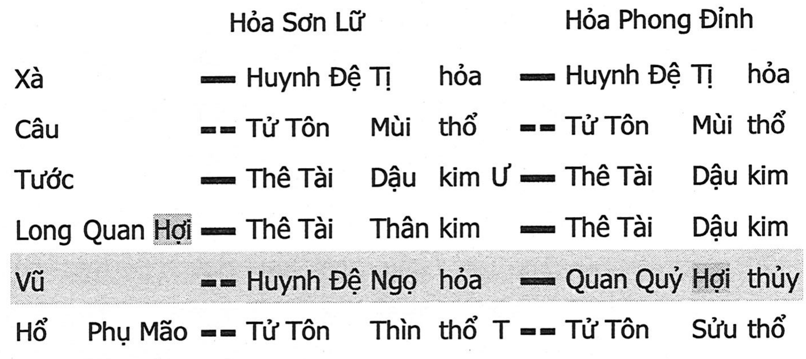
    - **Hình này chứng minh điều gì**
      - Lấy hào Huynh Đệ làm Dụng thần, trong quẻ Huynh Đệ lưỡng hiện, lấy hào Nguyệt phá phát động là Huynh Đệ Ngọ hỏa làm Dụng thần.
    - **Từ đâu mà thấy được**
      - Lấy hào Huynh Đệ làm Dụng thần, trong quẻ Huynh Đệ lưỡng hiện, lấy hào Nguyệt phá phát động là Huynh Đệ Ngọ hỏa làm Dụng thần.
  - **Căn cứ luận đoán**:
    - Lấy hào Huynh Đệ làm Dụng thần, trong quẻ Huynh Đệ lưỡng hiện, lấy hào Nguyệt phá phát động là Huynh Đệ Ngọ hỏa làm Dụng thần.
    - Dụng thần Nguyệt phá, được Nhật thần thực phá, vốn là tượng cát. Nhưng không nên hóa hồi đầu khắc.
    - Đây là một hào độc phát, cũng có thể lấy tượng làm chủ để phán đoán.
    - Là Dụng thần động mà hóa Tuyệt, Tuyệt cũng chính là tuyệt giao, biểu thị mối quan hệ anh em rất không tốt.
  - **Đối thoại & Diễn biến thực tế**:
    - Quẻ là quẻ Lữ, Lữ có ý nghĩa là du tẩu tha hương (lang thang nơi đất khách).
    - Biểu thị không những anh em bất hòa mà hơn nữa anh em ở rất xa nhau, Ngọ hỏa Nguyệt phá, sự việc anh em phân ly ứng tại năm Ngọ.
    - Trên thực tế, mối quan hệ anh em rạn nứt ở năm Canh Ngọ. Chia nơi mà ở.
- **Bảng Quẻ & Quái lệ 3**: **Ví dụ 3: Ngày Tân Hợi tháng Dần, nữ đoán về bệnh của cha, hỏi muốn về ở nhà cũ thì sẽ ra sao, gieo quẻ được Hỏa Sơn Lữ biến Hỏa Phong Đỉnh.**
  - **Hình 59.** Sơ đồ quẻ Hỏa Sơn Lữ biến Hỏa Phong Đỉnh
    - 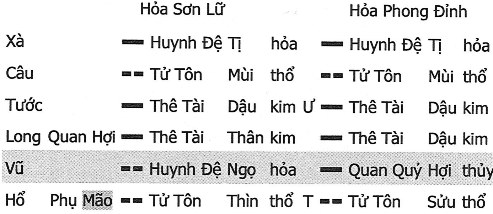
    - **Hình này chứng minh điều gì**
      - Tuy nhiên, cha cô rất nhớ chỗ ở trước kia, ông ấy cảm thấy ở đó thì tâm trạng sẽ thoải mái hơn.
    - **Từ đâu mà thấy được**
      - Quẻ này mặc dù là dự đoán ảnh hưởng của nhà đối với cha, tuy nhiên quẻ này tương đương với dự đoán bệnh tật của cha, do đó trước tiên phải xem cát ...
  - **Căn cứ luận đoán**:
    - Quẻ này mặc dù là dự đoán ảnh hưởng của nhà đối với cha, tuy nhiên quẻ này tương đương với dự đoán bệnh tật của cha, do đó trước tiên phải xem cát hung của cha.
    - Tiếp theo là xem ảnh hưởng của hào 2 hào trạch và hào Ứng đối với Dụng thần, và không thể xem hào Phụ Mẫu là căn nhà.
    - Bởi vì cha thì xem hào Phụ Mẫu, nếu căn nhà cũng dùng hào Phụ Mẫu thì không thể phán đoán được ảnh hưởng của căn nhà đối với cha như thế nào.
    - Lúc này có thể xem tình hình Thế Ứng, hào Thế là chỗ ở hiện tại, hào Ứng là căn nhà cũ muốn đến ở.
    - Hào 2 là trạch cũng phải xem, đồng thời còn phải xem ảnh hưởng của hào động đối với hào Phụ Mẫu.
    - Xem cát hung của cha cô ấy, lấy hào Phụ Mẫu làm Dụng thần. Phụ Mẫu được Nguyệt phù Nhật sinh, Dụng thần vượng tướng.
    - Hào động lại không khắc Dụng thần, mặc dù Dụng thần phục tàng Không Vong nhưng cũng không cần phải đoán là xấu.
    - Tôi đoán là sẽ có nhiều người đoán như trên. Nhưng quẻ này thuộc về một hào độc phát.
    - Ứng khắc Phụ Mẫu, nơi đến bất lợi cho cha, Huynh Đệ Ngọ hỏa tại hào 2 độc phát, là Tử địa của Dụng thần, độc phát lấy tượng làm chủ, quẻ này rất hung.
    - Mộc ở vào Tử địa, chứng tỏ cha có bệnh tật liên quan đến mộc.
    - Mộc chủ gan mật, Tử địa thường là ung thư, ung thư túi mật tương đối hiếm gặp, vì vậy phán đoán là ung thư gan.
    - Kỵ thần là kim, kim chủ phổi, phải đề phòng di căn lên phổi.
    - Vì vậy, tôi đề nghị điều dưỡng ở bệnh viện là được, tốt nhất là không nên cho về căn nhà cũ.
    - Tuy nhiên, cha cô rất nhớ chỗ ở trước kia, ông ấy cảm thấy ở đó thì tâm trạng sẽ thoải mái hơn. Thế là đã quay về nơi đó.
    - Cô ấy đã biết là cha bị ung thư gan, nhưng nếu không cho cha trở về, lỡ may cha qua
  - **Ứng nghiệm thực tế**:
    - đời thì sẽ để lại di hận. Kết quả là tại tháng Thìn, tế bào ung thư lan rộng, di căn lên phổi và đã qua đời.

### 3. HỎA PHONG ĐỈNH

- **Tượng của quẻ**:
  - ngoại quái là Ly, là hỏa, nội quái là Tốn, là mộc, mộc ở dưới, hỏa ở trên, lấy mộc sinh hỏa, tượng nấu, cho nên gọi là Đỉnh.
- **Tượng của lục hào**:
  - Thế tại hào 2, hào 2 là bếp, lâm Hợi thủy, mà hào 3 và hào 4 là Tài đến sinh Hợi thủy, Tài chủ ẩm thực, thủy là chất lỏng, là thứ dùng để hòa lẫn các đồ ăn trong nồi, cũng là tượng nấu.
  - Thời xưa, đỉnh là dụng cụ dùng để nấu, cho nên gọi là Đỉnh. Người xưa nói, Đỉnh giả định dã.
- **Ý nghĩa biểu tượng cốt lõi**:
  - Bởi vì đỉnh có hai chân.
  - Do đó quẻ Đỉnh bao hàm ý nghĩa là phân tranh, chia rẽ, độc chiếm một phương, hợp tác, vật trong túi, an định, ổn định v.v.
- **Bảng Quẻ & Quái lệ 1**: **Ví dụ 1: Ngày Giáp Dần tháng Thân, nam đoán tiền đồ của việc làm trạm thu gom phế phẩm, được Hỏa Phong Đỉnh biến Hỏa Trạch Khuê.**
  - **Hình 60.** Sơ đồ quẻ Hỏa Phong Đỉnh biến Hỏa Trạch Khuê
    - 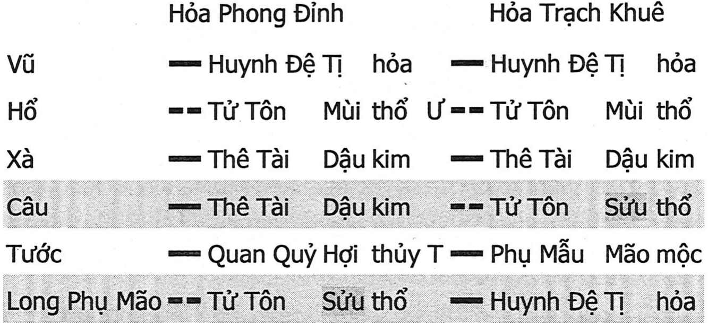
    - **Hình này chứng minh điều gì**
      - Quẻ là Đỉnh, lại là tam hợp Tài cục, sự phát triển của trạm thu gom phế phẩm không phải là chỉ dựa vào một lực lượng, mà là dựa vào nỗ lực của nhiề...
    - **Từ đâu mà thấy được**
      - Mục đích là để kiếm lợi nhuận, do đó lấy Tài làm Dụng thần.
  - **Căn cứ luận đoán**:
    - Mục đích là để kiếm lợi nhuận, do đó lấy Tài làm Dụng thần.
    - Trong quẻ Thê Tài lưỡng hiện, lấy hào phát động là Thê Tài Dậu kim làm Dụng thần.
    - Tài được Nguyệt kiến tỉ phù, tam hợp Tài cục sinh Thế, là cát, mặc dù Tài hóa Không vong, nhưng về tổng thể không ảnh hưởng đến sự phát triển của trạm thu gom phế phẩm.
    - Quẻ là Đỉnh, lại là tam hợp Tài cục, sự phát triển của trạm thu gom phế phẩm không phải là chỉ dựa vào một lực lượng, mà là dựa vào nỗ lực của nhiều người, cho nên là nhiều người hợp tác.
  - **Ứng nghiệm thực tế**:
    - Quả nhiên là bốn người hợp tác làm trạm thu gom phế phẩm, bởi vì quy mô hoạt động rất lớn, nếu chỉ dựa vào sức của một người thì không thể phát triển.
    - Sau này phát triển rất tốt.
- **Bảng Quẻ & Quái lệ 2**: Ngày Quý Sửu tháng Thìn, một người đang bị đình chỉ công tác để kiểm tra, hỏi khi nào có thể được khôi phục, được Hỏa Phong Đỉnh biến Thiên Phong Cấu.
  - **Hình 61.** Sơ đồ quẻ Hỏa Phong Đỉnh biến Thiên Phong Cấu
    - 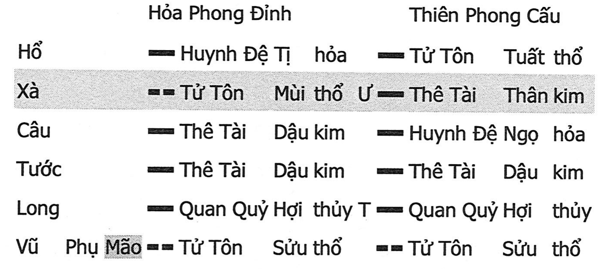
    - **Hình này chứng minh điều gì**
      - Sau khi dự đoán xong, người này vội vàng đi tìm người giúp đỡ, nhưng chưa tìm được người thì chiều hôm đó đã bị bắt vào tù.
    - **Từ đâu mà thấy được**
      - Lấy Quan Quỷ làm Dụng thần, Quan Quỷ trì Thế, chức vụ vẫn còn, nhưng bị Nhật Nguyệt khắc thương, mà Kỵ thần Tử Tôn độc phát, lâm hào Ứng khắc hào T...
  - **Căn cứ luận đoán**:
    - Lấy Quan Quỷ làm Dụng thần, Quan Quỷ trì Thế, chức vụ vẫn còn, nhưng bị Nhật Nguyệt khắc thương, mà Kỵ thần Tử Tôn độc phát, lâm hào Ứng khắc hào Thế, đây là tượng chức vụ của mình bị người khác cướp đoạt.
    - Quẻ này Dụng thần vô khí, là điềm báo rõ ràng.
    - Thế lâm Thanh Long, Thanh Long có tượng ẩm thực.
    - Tên quẻ là Đỉnh, bản thân là thịt ở trong cái đỉnh, mặc cho người cắt, bị người xào nấu, ắt khó được khôi phục chức vụ.
    - Hào Thế nhập Mộ ở Nguyệt, Ứng lâm Trình Xà khắc Thế, Trình Xà chủ dây thừng, nhập Mộ là mất tự do.
    - Không những không thể được khôi phục chức vụ mà còn có thể có tai họa lao ngục.
    - Kỵ thần vượng tướng phát động, Nhật thần xung Kỵ thần, xung nó động mạnh hơn, biểu thị ngày bị bắt sẽ đến rất nhanh.
    - Sau khi dự đoán xong, người này vội vàng đi tìm người giúp đỡ, nhưng chưa tìm được người thì chiều hôm đó đã bị bắt vào tù.
- **Bảng Quẻ & Quái lệ 3**: Ngày Quý Dậu tháng Thân, vợ chồng có mâu thuẫn, nam hỏi có ly hôn hay không? Được Hỏa Phong Đỉnh.
  - **Hình 62.** Sơ đồ quẻ Hỏa Phong Đỉnh
    - 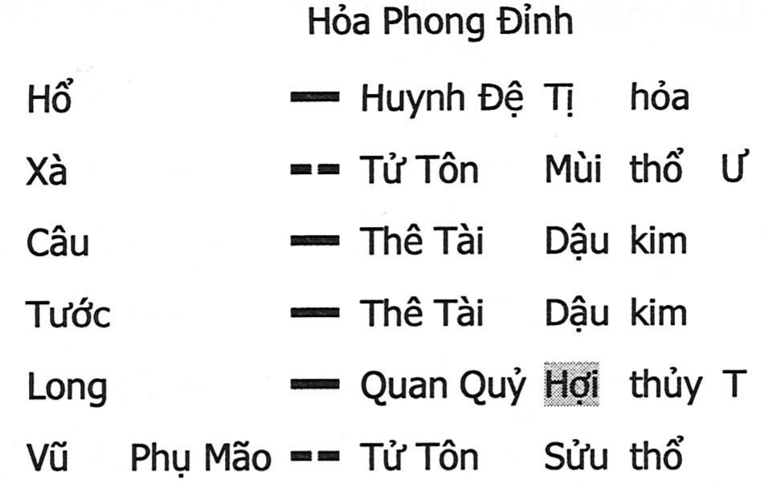
    - **Hình này chứng minh điều gì**
      - Thế được Nhật sinh là Mộc Dục địa, trong quẻ Thê Tài lưỡng hiện, bản thân tất có ngoại tâm, tên quẻ là Hỏa Phong Đỉnh, là tượng tam túc đỉnh lập.
    - **Từ đâu mà thấy được**
      - Lấy hào Thê Tài làm Dụng thần, hào Tài lưỡng hiện trong quẻ, đều không phát động, địa chi tương đồng, do đó có thể lấy tùy ý một hào trong đó làm D...
  - **Căn cứ luận đoán**:
    - Lấy hào Thê Tài làm Dụng thần, hào Tài lưỡng hiện trong quẻ, đều không phát động, địa chi tương đồng, do đó có thể lấy tùy ý một hào trong đó làm Dụng thần, Dụng thần được Nhật Nguyệt tỉ phù, còn hào Huynh Đệ hưu tù an tĩnh, dường như hoàn toàn không có thông tin ly hôn, nhưng hào Thế Không Vong, Không mà không nhận sinh của Thê Tài.
    - Đây chính là thông tin bất lợi trong quẻ. Hào Thế Không Vong biểu thị mình do dự bất định, không hạ quyết tâm.
    - Thế được Nhật sinh là Mộc Dục địa, trong quẻ Thê Tài lưỡng hiện, bản thân tất có ngoại tâm, tên quẻ là Hỏa Phong Đỉnh, là tượng tam túc đỉnh lập.
    - Nhất định có người thứ ba. Bởi vì hào Thế Không Vong, tôi phán đoán ở tháng Hợi có thể ly hôn.
    - Nhưng Dụng thần không bị khắc, cũng sẽ không hoàn toàn thoát ly mối quan hệ với vợ anh ta.
  - **Đối thoại & Diễn biến thực tế**:
    - Trên thực tế, người này ly hôn ở tháng Hợi. Sau một tháng chung sống với người nữ khác, anh ta cảm thấy người đó không hợp với mình.
    - Ở tháng Tý, anh ta lại phục hôn với vợ trước.

### 4. HỎA THỦY VỊ TẾ

- **Tượng của quẻ**:
  - quẻ này tương phản với quẻ Ký Tế.
  - Hỏa tính viêm thượng, lại đến ngoại quái, hoàn toàn không có ý phụ tá thủy, trái lại có ý tránh xa thủy, còn thủy ở dưới cũng không thể đi chế ước hỏa, cũng không thể đồng bổ với hỏa, thủy chảy hướng xuống, rời ra hỏa.
  - Là thủy hỏa lưỡng bất tương dung. Do đó gọi là Vị Tế (không cứu giúp).
- **Tượng của lục hào**:
  - Thế Ứng đều là Huynh Đệ, đều là lục thân khắc Tài kiếp Tài (cướp đoạt Tài).
  - Tài ở giữa Thế Ứng, trở thành bằng hữu huynh đệ nhưng đồng thời tranh đoạt tài vật, không thể giúp đỡ lẫn nhau, thường khiến cho sự tình sắp thành lại hỏng.
- **Ý nghĩa biểu tượng cốt lõi**:
  - có khiếm khuyết, bất túc (không đủ), không lão luyện (không có kinh nghiệm), rời bỏ, phân ly, đảo ngược, đối lập, tranh đoạt v.v.
- **Bảng Quẻ & Quái lệ 1**: Ngày Đinh Sửu tháng Ngọ, nam dự đoán hôn nhân. Được Hỏa Thủy Vị Tế.
  - **Hình 63.** Sơ đồ quẻ Hỏa Thủy Vị Tế
    - 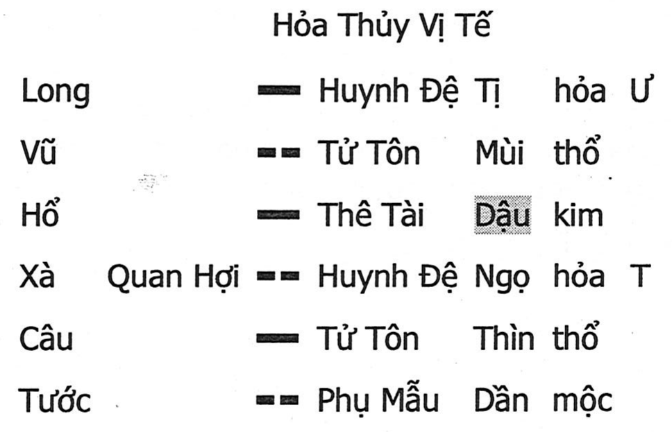
    - **Hình này chứng minh điều gì**
      - Tình hình thực tế đúng là như vậy.
    - **Từ đâu mà thấy được**
      - Lấy Thê Tài làm Dụng thần.
  - **Căn cứ luận đoán**:
    - Lấy Thê Tài làm Dụng thần. Huynh Đệ lâm Nguyệt khắc Tài, Tài lại nhập Mộ ở Nhật, hôn nhân nhất định không tốt.
    - Cộng thêm tượng của quẻ Vị Tế, nhất định vợ chồng không hòa hợp, tình cảm thiếu nồng nhiệt.
    - Thế lâm Huynh Đệ khắc Dụng thần, anh ta ghét vợ, có cảm giác muốn loại bỏ. Lâm Xà, biểu thị tâm trạng bất an.
    - Hào Tài vốn tương hợp với hào 2, hào 2 là trạch, đáng lẽ phải là một người vợ chăm lo cho gia đình.
    - Nhưng Dụng thần Không Vong, thì không thể hợp hào trạch, do đó phán đoán vợ anh ta không muốn về nhà.
    - Nhập Mộ tại Nhật, chính là tượng si mê, nhập Mộ tại Tử Tôn, Tử Tôn chủ tiêu khiển, biểu thị vợ ham chơi. Tài lâm Bạch Hổ. Gặp kim Không.
    - Kim Không tắc minh, Bạch Hổ chủ nóng nảy, Không chủ phát ra âm thanh, tổng hợp phán đoán chính là thường xuyên cãi nhau với anh ta, mắng anh ta.
    - Nhưng Tử Tôn ám động sinh Dụng thần. Hai người sẽ không ly hôn.
    - Tình hình thực tế đúng là như vậy.
- **Bảng Quẻ & Quái lệ 2**: Ngày Kỷ Mùi tháng Thìn, nam dự đoán tình trạng của một người nữ, được Hỏa Thủy Vị Tế biến Lôi Phong Hằng.
  - **Hình 64.** Sơ đồ quẻ Hỏa Thủy Vị Tế biến Lôi Phong Hằng
    - 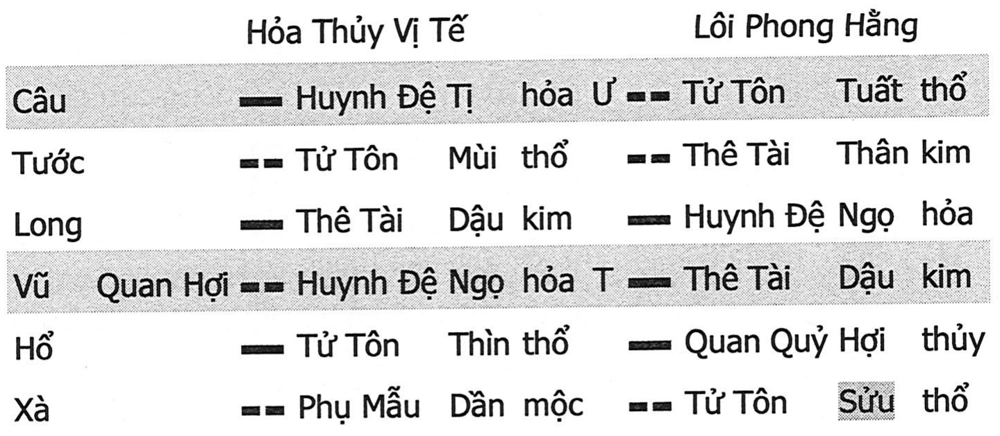
    - **Hình này chứng minh điều gì**
      - Tất cả đúng như phán đoán.
    - **Từ đâu mà thấy được**
      - Toàn bộ quẻ chính là tình trạng của người mà anh ta muốn hỏi.
  - **Căn cứ luận đoán**:
    - Toàn bộ quẻ chính là tình trạng của người mà anh ta muốn hỏi. Quan Quỷ bất thượng quái, chồng ít khi ở nhà.
    - Thế lâm Huyền Vũ, trông gợi cảm, hào 6 là đầu, lâm hỏa nhược, tóc ngắn, hóa Mộ, chủ che tóc, đoán là người nữ này thích đội mũ.
    - Sử dụng di thần pháp, đoán là chỗ gần mắt của người đó có nốt ruồi. Bởi vì hỏa chủ mắt. Hơn nữa ở vùng bụng cũng có nốt ruồi.
    - Quẻ được Vị Tế, vợ chồng không hòa thuận.
    - Tất cả đúng như phán đoán.
- **Bảng Quẻ & Quái lệ 3**: Ngày Mậu Thìn tháng Thìn, nam đoán bệnh, được Hỏa Thủy Vị Tế biến Thủy Trạch Tiết.
  - **Hình 65.** Sơ đồ quẻ Hỏa Thủy Vị Tế biến Thủy Trạch Tiết
    - 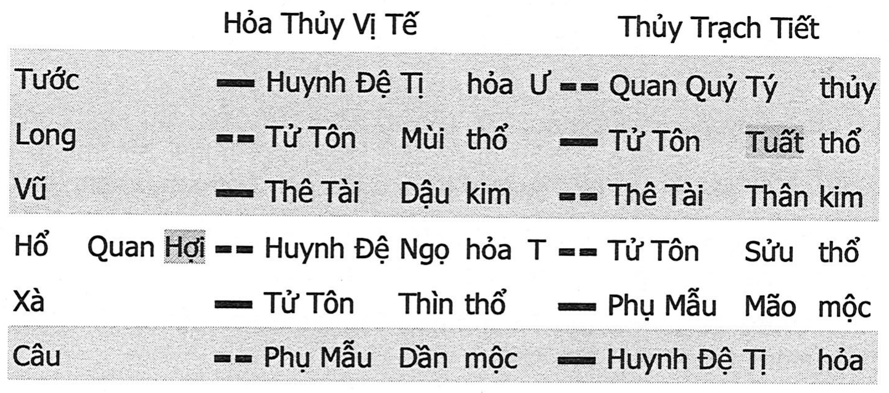
    - **Hình này chứng minh điều gì**
      - Anh ta đáp là bản thân có bệnh hen suyễn, đã điều trị nhiều năm nhưng vẫn không khỏi.
    - **Từ đâu mà thấy được**
      - Phán đoán bệnh tật, lấy hào Thế làm Dụng thần.
  - **Căn cứ luận đoán**:
    - Phán đoán bệnh tật, lấy hào Thế làm Dụng thần.
    - Hào Thế mặc dù không được Nhật Nguyệt sinh phù, nhưng cũng không bị Nhật Nguyệt khắc chế, do đó có bệnh thì chỉ là bệnh nhẹ.
    - Hào sơ Nguyên thần động mà đến sinh hào Thế, nhưng bị Tài động đến khắc, lại nhập Mộ ở hào 5, khó sinh Dụng thần, do đó đây chính là mấu chốt của phán đoán bệnh tật.
    - Quẻ được Vị Tế, tượng trên dưới không thông, tam tiêu mất cân bằng.
    - Tài chủ hô hấp, tại hào 4 lâm kim, càng là hô hấp khí quản, nhập Mộ là tức trướng, do đó phán đoán là hô hấp khó khăn.
    - Anh ta đáp là bản thân có bệnh hen suyễn, đã điều trị nhiều năm nhưng vẫn không khỏi.

### 5. SƠN THỦY MÔNG

- **Tượng của quẻ**:
  - ngoại quái là Cấn, Cấn là núi, là dừng, nội quái là Khảm, là thủy, là trí. Thổ đè thủy mà thủy đục, tượng trí tuệ không thông, ngu muội.
  - Cho nên người xưa nói, Mông giả, muội dã, bất minh chi ý.
- **Tượng của lục hào**:
  - Tử Tôn trì Thế, Tử Tôn chủ khôn ngoan, nhưng bị hào sơ hào 6 trên dưới đến khắc, nội ngoại bất minh, ngu muội vô tri.
  - Ngoài ra, Tử Tôn là trẻ em, giống như trẻ em, không biết gì.
- **Ý nghĩa biểu tượng cốt lõi**:
  - Do đó, quẻ này bao hàm ý nghĩa là ngu muội, bất minh, giáo dục, dẫn dắt, cảm ngộ, mơ hồ, sốc, hàm hồ, hồ đồ v.v.
- **Bảng Quẻ & Quái lệ 1**: Ngày Canh Thân tháng Tý, nam đoán bệnh vợ, được Sơn Thủy Mông biến Địa Trạch Lâm.
  - **Hình 66.** Sơ đồ quẻ Sơn Thủy Mông biến Địa Trạch Lâm
    - 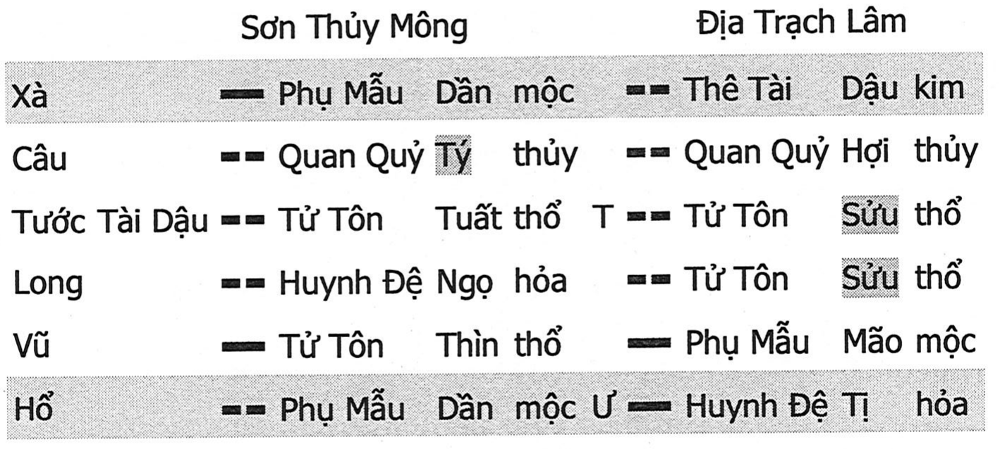
    - **Hình này chứng minh điều gì**
      - Hào sơ lâm Bạch Hổ động đến khắc, hào sơ là chân, mộc chủ đau ngứa, nhất định còn có cước khí.
    - **Từ đâu mà thấy được**
      - Lấy Thê Tài làm Dụng thần.
  - **Căn cứ luận đoán**:
    - Lấy Thê Tài làm Dụng thần. Thê Tài Dậu kim bất thượng quái, phục dưới hào 4.
    - Mặc dù không được Nguyệt trợ giúp, nhưng có Nhật đến củng phù, Dụng thần không xem là nhược.
    - Nhưng trong quẻ Phụ Mẫu Dần mộc lưỡng động, vừa Tuyệt Dụng thần, vừa khắc Nguyên thần, do đó vẫn điều trị chưa khỏi hoàn toàn.
    - Hào 6 chủ đầu, Phụ Mẫu Dần mộc tại hào 6 phát động. Lâm Trình Xà. Trình Xà chủ triền miên, mộc chủ đau nhức, nhất định có bệnh đau đầu.
    - Quẻ là Mông, Nguyên thần là tư duy và ý thức của người, bị hào động khắc, đầu óc nhất định giống như trẻ nhỏ mới vào trường, không sáng suốt.
    - Hào sơ lâm Bạch Hổ động đến khắc, hào sơ là chân, mộc chủ đau ngứa, nhất định còn có cước khí.
  - **Ứng nghiệm thực tế**:
    - Các phán đoán trên đây quả nhiên chính xác.
- **Bảng Quẻ & Quái lệ 2**: Ngày Tân Dậu tháng Tý, bạn học cấp ba của tôi đột nhiên đến tìm tôi dự đoán. Anh ta mở nhà hàng ở thị xã, muốn nhờ tôi đoán xem tối hôm qua ở trong nhà hàng của anh ta đã xảy ra chuyện gì? Gieo quẻ được Sơn Thủy Mông biến Sơn Trạch Tổn.
  - **Hình 67.** Quẻ Sơn Thủy Mông biến Sơn Trạch Tổn
    - 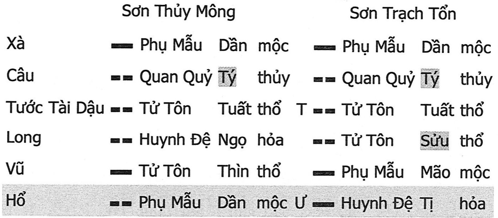
    - **Hình này chứng minh điều gì**
      - Thế lâm Chu Tước bị khắc, Thế lại là hỏa khố, hỏa khố ở nhà hàng chính là vật chứa hỏa, có thể suy ra là bếp.
    - **Từ đâu mà thấy được**
      - Loại phán đoán này không có Dụng thần cụ thể, đều dựa vào hào động và hào có bệnh (hào Không Phá xung hợp) trong quẻ để phân tích.
  - **Căn cứ luận đoán**:
    - Loại phán đoán này không có Dụng thần cụ thể, đều dựa vào hào động và hào có bệnh (hào Không Phá xung hợp) trong quẻ để phân tích.
    - Quẻ này chỉ có một hào động, Phụ Mẫu lâm Bạch Hổ khắc Thế, thoạt nhìn rất dễ lý giải là tai nạn xe cộ. Tại sao lại như vậy?
    - Phụ Mẫu thể hiện xe, Bạch Hổ thể hiện đường, hào sơ thể hiện đi đường. Nhưng phán đoán như vậy nhất định sai. Bởi vì có điều kiện tiền đề.
    - Là dự đoán chuyện gì đã xảy ra trong cửa hàng, không liên quan đến trên đường, hơn nữa là hỏi về chuyện xảy ra ban đêm, như vậy thì phạm vi của dự đoán đã được thu hẹp lại.
    - Thế lâm Chu Tước bị khắc, Thế lại là hỏa khố, hỏa khố ở nhà hàng chính là vật chứa hỏa, có thể suy ra là bếp.
    - Do đó tôi phán đoán là bếp để nấu ăn đã xảy ra sự cố.
    - Quẻ là Mông, có ý nghĩa là thần trí không tỉnh táo, tôi phán đoán nhất định là chuyện xảy ra khi đang lơ mơ ngủ.
  - **Đối thoại & Diễn biến thực tế**:
    - Trên thực tế, đúng là khi đang ngủ, bếp đã rò rỉ hơi ga, dẫn đến trúng độc hơi ga.
    - Đúng lúc đó thì anh ta vì mắc tiểu nên đã tỉnh lại và đã phát hiện ra chuyện này, do vậy đã không xảy ra hậu quả nghiêm trọng.
    - Tuy nhiên đầu bếp ở cùng anh ta thì bị khá nghiêm trọng, đã được đưa vào bệnh viện..
    - Thời gian xảy ra của sự việc là giờ Dần, phù hợp với Dần mộc độc phát trong quẻ.
    - Trong quẻ này còn phán đoán anh ta có tai họa lao ngục ở tháng Sửu, kết quả cũng ứng nghiệm.
- **Bảng Quẻ & Quái lệ 3**: Ngày Nhâm Thìn tháng Dậu, một người bạn bị mất thẻ căn cước, hỏi có thể tìm được hay không? Được Sơn Thủy Mông biến Địa Trạch Lâm.
  - **Căn cứ luận đoán**:
    - Lấy hào Phụ Mẫu làm Dụng thần, Phụ Mẫu mặc dù bị Nguyệt khắc thương, nhưng động mà khắc Thế là vật cần tìm.
    - Quẻ là Sơn Thủy Mông, có tượng thần trí không tỉnh táo, Thế lâm Câu Trần, Câu Trần là trì trệ, Phụ Mẫu lại ở hào 6 động đến khắc Thế, hào 6 là đầu, biểu thị đầu óc lơ mơ, đã quên thẻ căn cước ở đâu đó.
    - Dụng thần động hóa hồi đầu khắc, ngày Mão xung mất hào biến có thể tìm được.
  - **Ứng nghiệm thực tế**:
    - Sau đó quả nhiên tìm được ở ngày Quý Mão, thì ra là đã kẹp thẻ căn cước ở trong tiền rồi để trên người, ở ngày Mão khi dùng tiền đã phát hiện.
- **Bảng Quẻ & Quái lệ 4**: Ngày Nhâm Tý tháng Mão, nữ dự đoán vận đào hoa, được Sơn Thủy Mông.
  - **Hình 68.** Quẻ Sơn Thủy Mông biến Địa Trạch Lâm
    - 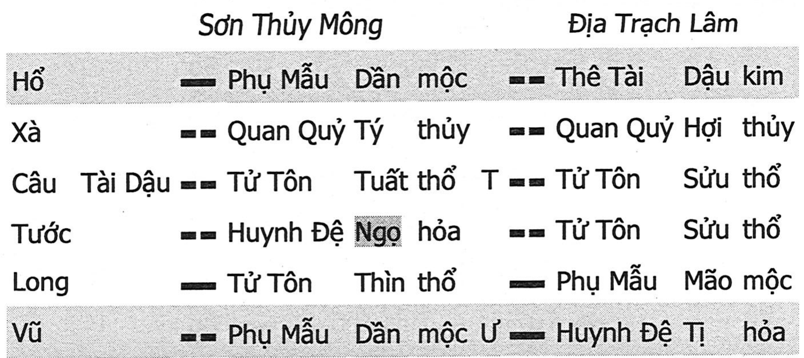
    - **Hình này chứng minh điều gì**
      - Thực tế đúng là như vậy.
    - **Từ đâu mà thấy được**
      - Lấy Quan Quỷ làm Dụng thần, Quan Quỷ Nguyệt không sinh, Nhật phù là vượng.
- **Bảng Quẻ & Quái lệ 4**: Ngày Nhâm Tý tháng Mão, nữ dự đoán vận đào hoa, được Sơn Thủy Mông.
  - **Hình 69.** Quẻ Sơn Thủy Mông
    - 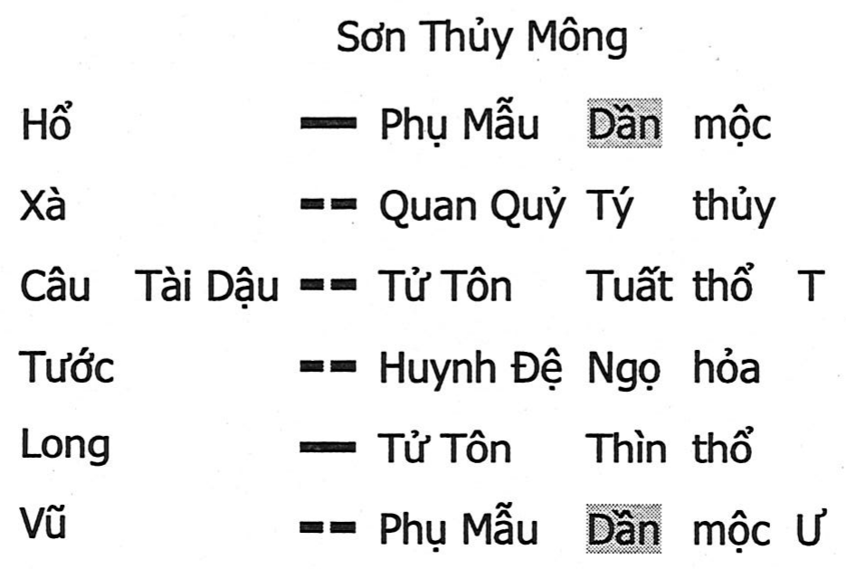
    - **Hình này chứng minh điều gì**
      - Thực tế đúng là như vậy.
    - **Từ đâu mà thấy được**
      - Lấy Quan Quỷ làm Dụng thần, Quan Quỷ Nguyệt không sinh, Nhật phù là vượng.
  - **Căn cứ luận đoán**:
    - Lấy Quan Quỷ làm Dụng thần, Quan Quỷ Nguyệt không sinh, Nhật phù là vượng. Dụng thần lâm Nhật, người mới xuất hiện.
    - Ứng ở Không địa, đối phương vô tâm. Do đó, căn cứ vào tổ hợp của quẻ và
    - tên quẻ để phán đoán, bản thân có lòng ái mộ đối phương, nhưng đối phương không muốn qua lại.
    - Quan tại hào 5, hào Thế gần sát, chính là mình luôn muốn đến gần đối phương.
    - Nhưng Tử Tôn trì Thế, Ứng lại Không, chỉ tương tư mà thôi, nhất định không thành.
    - Thực tế đúng là như vậy. Cuối cùng không thành.

### 6. PHONG THỦY HOÁN

- **Tượng của quẻ**:
  - thượng là Tốn, là mộc, là thuyền, là gió, hạ là Khảm, là thủy, là sông, thuyền đi trên nước, trôi nổi theo sóng, như gió thổi mà tán (tan), như dòng nước mà trôi, cho nên gọi là Hoán.
  - Người xưa nói, Hoán giả tán (tan) dã.
- **Tượng của lục hào**:
  - Thế tại hào 5, hào 5 là đường, đi lại trên đường, Huynh Đệ trì Thế, tượng hao tài, Tị là Trường Sinh của Tài, nhưng lại khắc tài, kiếm được tài sản, nhưng tiêu hao nhiều, tổng hợp lại chính là đường đời đắc tài không ít, nhưng cuối cùng cũng phải tiêu tán hết tài kiếm được, giống như một người cầm rất nhiều tiền đi du lịch, đi hết đường, tiền cũng hết.
- **Ý nghĩa biểu tượng cốt lõi**:
  - hao tán, tổn thất, tốn kém, phân ly, không tập trung, không thống nhất, chia rẽ, chia cắt v.v.
- **Bảng Quẻ & Quái lệ 1**: Ngày Ất Mùi tháng Hợi, nữ dự đoán hôn nhân, được Phong Thủy Hoán biến Địa Thiên Thái.
  - **Hình 70.** Quẻ Phong Thủy Hoán biến Địa Thiên Thái
    - 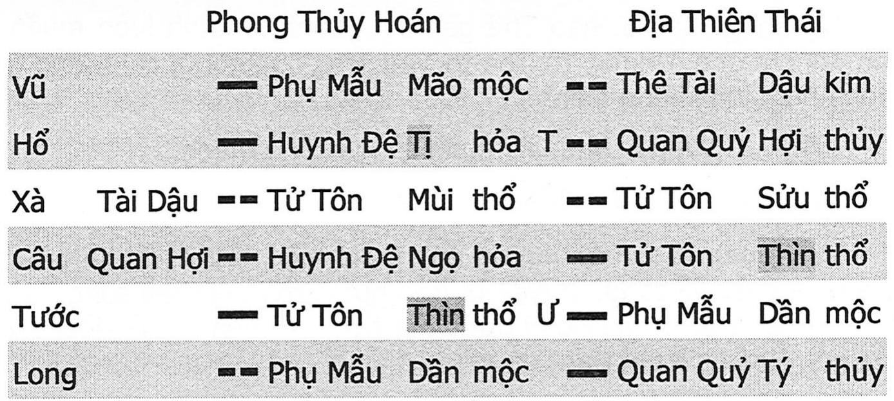
    - **Hình này chứng minh điều gì**
      - Quẻ chính là Hoán, có ý nghĩa là tan.
    - **Từ đâu mà thấy được**
      - Lấy Quan Quỷ làm Dụng thần, Quan Quỷ Hợi thủy bất thượng quái, phục dưới hào 3 Ngọ hỏa.
  - **Căn cứ luận đoán**:
    - Lấy Quan Quỷ làm Dụng thần, Quan Quỷ Hợi thủy bất thượng quái, phục dưới hào 3 Ngọ hỏa.
    - Mặc dù được Nguyệt kiến tỉ phù, nhưng bị Nhật thần khắc chế.
    - Ngoại quái phản ngâm, Dụng thần Tuyệt tại hào Thế, Tử tại Mão mộc, tất cả hào động trong quẻ đều không phù Dụng thần.
    - Do đó hôn nhân này nhất định không tốt.
    - Quẻ chính là Hoán, có ý nghĩa là tan. Cộng thêm Dụng thần không cát, nhất định sẽ đường ai nấy đi.
    - Quan Quỷ phục dưới Ngọ hỏa, ứng kỳ tương ứng là Tý thủy.
    - Xa thì ứng năm, gần thì ứng tháng, hào Thế bị Quan Quỷ trên Nguyệt xung phá, biểu thị tâm trạng của cô ấy rất không tốt bởi vì hôn nhân.
    - Ngoại quái phản ngâm, cô ấy đã chần chừ về vấn đề này trong một thời gian rất dài. Quẻ này hào Thế động mà hóa ra Quan Quỷ.
    - Hào sơ cũng động mà hóa ra Quan Quỷ, biểu thị trong đường đời của cô ấy vẫn còn có nam nhân khác xuất hiện.
  - **Đối thoại & Diễn biến thực tế**:
    - Trên thực tế, cô ấy đã ly hôn ở tháng Tý năm trước, hiện nay lại có một người đàn ông thích cô ấy.
    - Nhưng cô ấy vừa mới bước ra từ một cuộc hôn nhân thất bại, tâm trạng vẫn chưa bình tĩnh lại.
    - Không biết có nên qua lại với người đàn ông này hay không.
    - Muốn xem thử hôn nhân sau này có suôn sẻ hay không, do đó mới đến yêu cầu dự đoán.
- **Bảng Quẻ & Quái lệ 2**: Ngày Mậu Thân tháng Hợi, nữ hỏi về tình hình thiếu vốn của công ty bạn trai, được Phong Thủy Hoán biến Hỏa Thủy Vị Tế.
  - **Căn cứ luận đoán**:
    - Tài bất thượng quái, đây là thông tin thiếu tiền vốn, quẻ là Hoán, Hoán giả, tán dã, chủ yếu là do công ty phân tán tiền vốn quá nhiều, không sử dụng tập trung.
    - Nhưng Tài được Nhật đến tỉ phù, không coi là hưu tù, lại có Huynh Đệ Tử Tôn đồng thời phát động, có quỹ vốn theo sau.
    - Hào Thế động đến Trường Sinh Tài, hiện tại đang huy động vốn, nhưng hào Thế Nguyệt phá, nhất thời khó mà huy động được.
    - Tháng sau hào Thế xuất Nguyệt bất phá, đến tháng Sửu xung mất Phi thần, sẽ huy động được vốn.
    - Quả như dự đoán.

### 7. THIÊN THỦY TỤNG

- **Tượng của quẻ**:
  - ngoại quái là Càn, Càn là đầu, là dương, chủ tư duy, nội là Khảm, là thủy, là trí, là dương, dương chủ thăng, còn âm chủ giáng, thượng là dương, hạ là âm, hỷ âm dương tương phối.
  - Nhưng quẻ này dương đã đến thượng, thăng hướng thượng, Khảm vốn là dương, nhưng tính Khảm là thủy, tính thủy chảy xuống, hai dương quay lưng với nhau, tư duy và trí tuệ không thể thống nhất, cho nên thành tụng (kiện tụng, tranh cãi), Tụng giả luận dã.
- **Tượng của lục hào**:
  - Huynh Đệ trì Thế, Huynh Đệ có ý nghĩa là tranh chấp, hào 5 là kim, hào 5 là miệng, kim chủ âm thanh, hào Thế khắc hào 5, chính là cướp tiếng nói của người, đối luận với người.
- **Ý nghĩa biểu tượng cốt lõi**:
  - Do đó, quẻ này bao hàm ý nghĩa là tranh chấp, kiện tụng, tranh cãi, náo nhiệt, ồn ào, biện luận, thảo luận v.v.
- **Bảng Quẻ & Đồ hình liên hệ**: Quẻ Phong Thủy Hoán biến Hỏa Thủy Vị Tế
  - **Hình 71.** Quẻ Phong Thủy Hoán biến Hỏa Thủy Vị Tế
    - 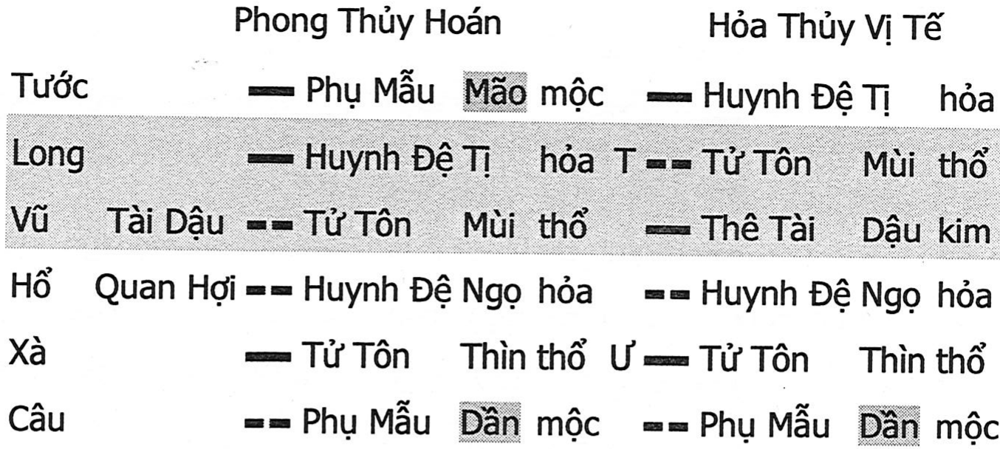
    - **Hình này chứng minh điều gì**
      - Huynh Đệ trì Thế, Huynh Đệ có ý nghĩa là tranh chấp, hào 5 là kim, hào 5 là miệng, kim chủ âm thanh, hào Thế khắc hào 5, chính là cướp tiếng nói củ...
    - **Từ đâu mà thấy được**
      - Huynh Đệ trì Thế, Huynh Đệ có ý nghĩa là tranh chấp, hào 5 là kim, hào 5 là miệng, kim chủ âm thanh, hào Thế khắc hào 5, chính là cướp tiếng nói củ...
- **Bảng Quẻ & Quái lệ 1**: Ngày Ất Mão tháng Tuất, nam có người giới thiệu công việc, hỏi kết quả sẽ ra sao? Được Thiên Thủy Tụng biến Lôi Trạch Quy Muội.
  - **Căn cứ luận đoán**:
    - Lấy Quan Quỷ làm Dụng thần.
    - Quan Quỷ bất thượng quái, phục dưới hào 3 Huynh Đệ Ngọ hỏa, bị Nguyệt khắc thương, Nhật lại không sinh, là hưu tù.
    - Ngoại quái phục ngâm, chuyện này trì hoãn nhiều lần. Càng không tốt là hào Ứng phát động hợp Dụng thần, tượng bị người khác cướp đoạt.
    - Quẻ là Tụng, Tụng giả, thuyết dã, chuyện này cũng chỉ là nói suông mà thôi, không thể thành.
  - **Ứng nghiệm thực tế**:
    - Sau quả nhiên không thành.
- **Bảng Quẻ & Quái lệ 2**: Ngày Canh Dần tháng Hợi, nữ có người giới thiệu công việc cho chồng, hỏi kết quả sẽ ra sao? Được Thiên Thủy Tụng.
  - **Hình 72.** Quẻ Thiên Thủy Tụng biến Lôi Trạch Quy Muội
    - 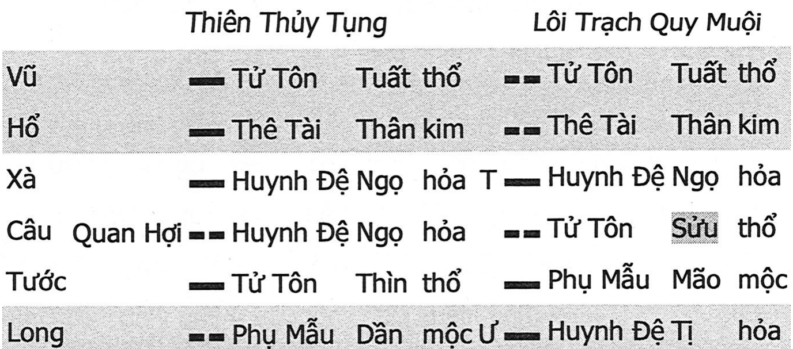
    - **Hình này chứng minh điều gì**
      - Dụng thần bị Ứng lâm Nhật hợp mất, tượng người khác giành được.
    - **Từ đâu mà thấy được**
      - Lấy Quan Quỷ làm Dụng thần.
- **Bảng Quẻ & Quái lệ 2**: Ngày Canh Dần tháng Hợi, nữ có người giới thiệu công việc cho chồng, hỏi kết quả sẽ ra sao? Được Thiên Thủy Tụng.
  - **Hình 73.** Quẻ Thiên Thủy Tụng
    - 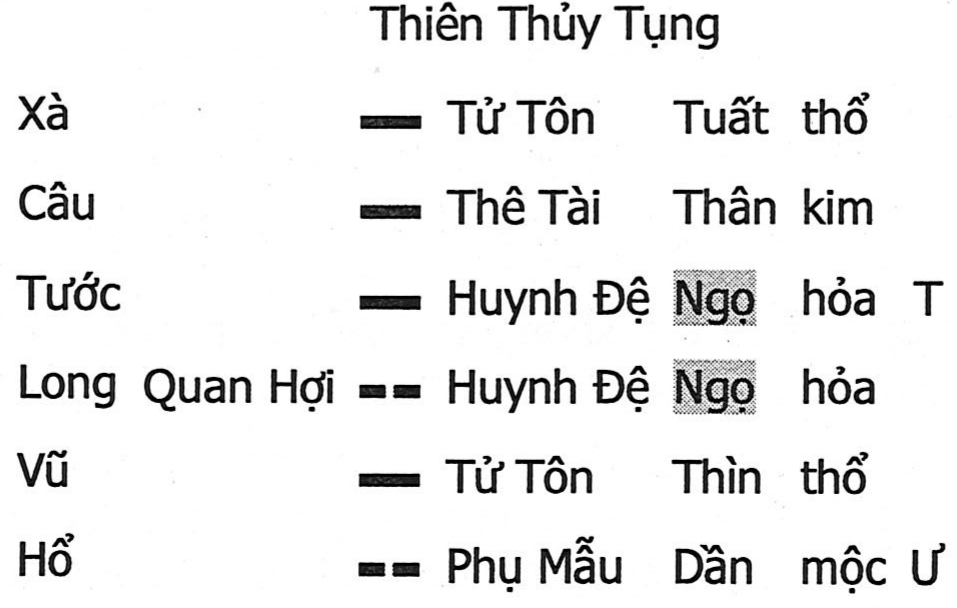
    - **Hình này chứng minh điều gì**
      - Dụng thần bị Ứng lâm Nhật hợp mất, tượng người khác giành được.
    - **Từ đâu mà thấy được**
      - Lấy Quan Quỷ làm Dụng thần.
  - **Căn cứ luận đoán**:
    - Lấy Quan Quỷ làm Dụng thần. Dụng thần bất thượng quái, nhưng được Nguyệt phù, Thê Tài Thân kim ám động đến sinh là vượng.
    - Quẻ này vốn là tượng cát. Nhưng không nên Thế Không, Ứng lâm Nhật đến hợp Dụng thần.
    - Nhật hợp là vướng chân, chuyện này bị kéo dài, không thể giải quyết nhanh.
    - Dụng thần bị Ứng lâm Nhật hợp mất, tượng người khác giành được.
    - Quẻ Tụng, Tụng là thuyết (nói), chỉ là lời nói không có cơ sở, không thể thành.
  - **Ứng nghiệm thực tế**:
    - Sau quả nhiên không thành, liên tục một tháng cũng không thấy động tĩnh, khi hỏi người giới thiệu thì được biết người khác đã làm công việc này.
- **Bảng Quẻ & Quái lệ 3**: Ngày Mậu Tý tháng Sửu, nam dự đoán mối quan hệ giữa mình với bạn gái sẽ phát triển ra sao? Được Thiên Thủy Tụng biến Trạch Thủy Khốn.
  - **Hình 74.** Sơ đồ quẻ Thiên Thủy Tụng biến Trạch Thủy Khốn
    - 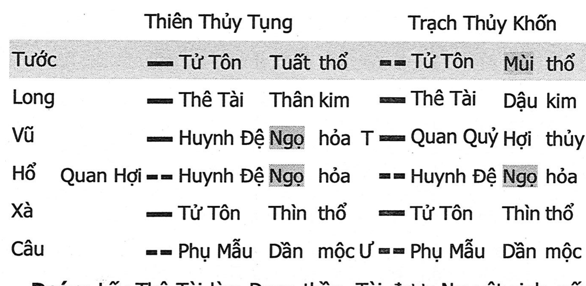
    - **Hình này chứng minh điều gì**
      - Lấy Thê Tài làm Dụng thần, Tài được Nguyệt sinh, vốn là tượng cát, nhưng không nên hào Thế lâm Huynh Đệ ám động, Nguyên thần động mà hóa Không, hóa...
    - **Từ đâu mà thấy được**
      - Lấy Thê Tài làm Dụng thần, Tài được Nguyệt sinh, vốn là tượng cát, nhưng không nên hào Thế lâm Huynh Đệ ám động, Nguyên thần động mà hóa Không, hóa...
  - **Căn cứ luận đoán**:
    - Lấy Thê Tài làm Dụng thần, Tài được Nguyệt sinh, vốn là tượng cát, nhưng không nên hào Thế lâm Huynh Đệ ám động, Nguyên thần động mà hóa Không, hóa phá, hóa thoái.
    - Quẻ chính Thiên Thủy Tụng, có tượng tranh chấp, hai người nhất định sẽ xuất hiện bất hòa trong tình cảm.
    - Tuất thổ độc phát, tháng Tuất sẽ phát sinh biến hóa.
  - **Ứng nghiệm thực tế**:
    - Sau đó quả nhiên đã chia tay ở tháng Tuất.
- **Bảng Quẻ & Quái lệ 4**: Ngày Canh Ngọ tháng Thân, một người bị tiểu nhân quấy rối, hỏi kết quả sẽ ra sao? Được Thiên Thủy Tụng biến Đoài Vi Trạch.
  - **Hình 75.** Sơ đồ quẻ Thiên Thủy Tụng biến Đoài Vi Trạch
    - 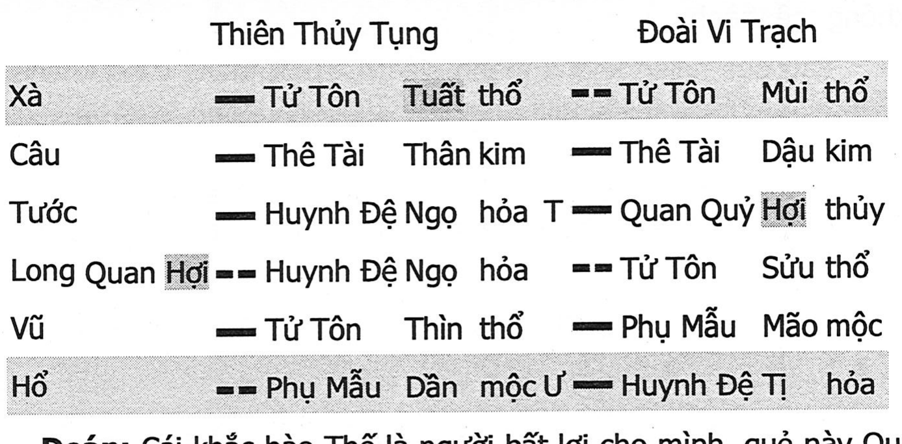
    - **Hình này chứng minh điều gì**
      - Cái khắc hào Thế là người bất lợi cho mình, quẻ này Quan Quỷ bất thượng quái, tuy được Nguyệt sinh, nhưng Tử Tôn phát động trong quẻ, do đó cho dù ...
    - **Từ đâu mà thấy được**
      - Cái khắc hào Thế là người bất lợi cho mình, quẻ này Quan Quỷ bất thượng quái, tuy được Nguyệt sinh, nhưng Tử Tôn phát động trong quẻ, do đó cho dù ...
  - **Căn cứ luận đoán**:
    - Cái khắc hào Thế là người bất lợi cho mình, quẻ này Quan Quỷ bất thượng quái, tuy được Nguyệt sinh, nhưng Tử Tôn phát động trong quẻ, do đó cho dù có tiểu nhân thì cũng sẽ không gây ra ảnh hưởng lớn đến mình.
    - Thế lâm Chu Tước, lại là Huynh Đệ, cộng thêm tên quẻ là Tụng, lại thêm quẻ biến là Đoài, đều là tượng khẩu thiệt (miệng lưỡi).
    - Nhất định là bởi vì tranh cãi mà đã đắc tội với người.
  - **Đối thoại & Diễn biến thực tế**:
    - Anh ta cho biết quả thực là như vậy. Quẻ này hào Thế được Nhật tỉ phù. Hào Ứng động mà đến sinh hào Thế, đủ sức mạnh để chống lại Kỵ thần.
    - Tôi khuyên người này yên tâm. Sau đó quả nhiên bình an vô sự.
    - Thì ra là anh ta sau khi cãi nhau với một người nọ, bởi vì sợ đối phương trả thù nên mới đến yêu cầu dự đoán.

### 8. THIÊN HỎA ĐỒNG NHÂN

- **Tượng của quẻ**:
  - ngoại quái là Càn, là dương, là thiên (trời), nội quái là Ly, là âm, là hỏa, là mặt trời, âm dương tương phối, trời có mặt trời mà sáng, cho nên người có thỉnh cầu mà kính trời, mặt trời có trời mà có nơi nương tựa, cho nên người nhìn trời để thấy ánh sáng.
  - Người xưa nói, Đồng Nhân giả, thân dã, trời và mặt trời giống như nhất thể, không cái nào tách khỏi cái nào, cho nên là thân.
- **Tượng của lục hào**:
  - Thế Ứng vốn tương khắc, nhưng bởi vì Thế Ứng cùng đóng tại quẻ Càn, lấy trời làm trung gian, mà đắc thành đồng đạo, thành người chí đồng đạo hợp.
- **Ý nghĩa biểu tượng cốt lõi**:
  - Do đó, trong quẻ này có bao hàm ý nghĩa là hòa khí, bằng hữu, thân thích, thân cận, hợp tác, hòa mỹ v.v.
- **Bảng Quẻ & Quái lệ 1**: Ngày Quý Mùi tháng Mùi, phó huyện trưởng đoán bản thân có thể được thăng thành huyện trưởng hay không, được Thiên Hỏa Đồng Nhân.
  - **Hình 76.** Sơ đồ quẻ Thiên Hỏa Đồng Nhân
    - 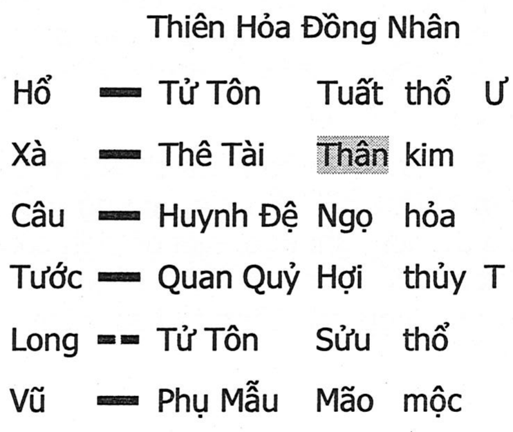
    - **Hình này chứng minh điều gì**
      - Lấy Quan Quỷ làm Dụng thần.
    - **Từ đâu mà thấy được**
      - Lấy Quan Quỷ làm Dụng thần.
  - **Căn cứ luận đoán**:
    - Lấy Quan Quỷ làm Dụng thần. Quan Quỷ bị Nhật Nguyệt khắc thương, hưu tù vô khí, không thể thăng chức. Hào Ứng là đối thủ cạnh tranh.
    - Thế Ứng đồng cung, quẻ là Đồng Nhân, Đồng Nhân giả, thân dã, cận dã, người cạnh tranh với mình chính là đồng nghiệp cùng làm việc hằng ngày với mình.
  - **Ứng nghiệm thực tế**:
    - Quả nhiên không được thăng chức.
- **Bảng Quẻ & Quái lệ 2**: Ngày Giáp Tý tháng Tuất, một người phụ nữ hỏi nhân viên bảo hiểm có nộp tiền cho công ty bảo hiểm hay không, được Thiên Hỏa Đồng Nhân.
  - **Hình 77.** Sơ đồ quẻ Thiên Hỏa Đồng Nhân
    - 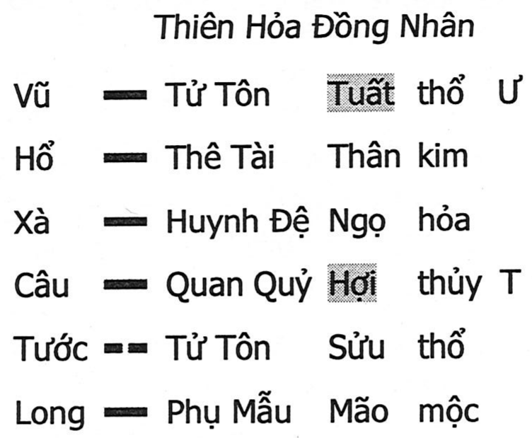
    - **Hình này chứng minh điều gì**
      - Lấy Tài làm Dụng, kiêm xem hào Ứng, Ứng là nhân viên bảo hiểm.
    - **Từ đâu mà thấy được**
      - Lấy Tài làm Dụng, kiêm xem hào Ứng, Ứng là nhân viên bảo hiểm.
  - **Căn cứ luận đoán**:
    - Lấy Tài làm Dụng, kiêm xem hào Ứng, Ứng là nhân viên bảo hiểm.
    - Tài được Nguyệt sinh là vượng, vốn là cát, nhưng Huynh Đệ Ngọ hỏa ám động, nhân viên bảo hiểm lén lút biển thủ tiền.
    - Hào Ứng Không Vong, đối phương không phải là người thật thà.
    - Thế Ứng đồng cung, lại là quẻ Đồng Nhân, nhân viên bảo hiểm này nhất định là một người khá thân cận, quen thuộc.
  - **Ứng nghiệm thực tế**:
    - Quả nhiên đối phương là bạn của chồng mình, bởi vì có quan hệ này cho nên đã tín nhiệm đối phương, nhưng mỗi lần nộp đều không giao biên nhận, do đó hơi nghi ngờ, sau đó đến công ty bảo hiểm kiểm tra thì được biết người đó đã nghỉ việc ở công ty bảo hiểm từ lâu, tiền hoàn toàn không được nộp cho công ty bảo hiểm, bản thân đã bị gián đoạn bảo hiểm hai năm.

## Chương 4: Giải thích và ứng dụng tượng 8 quẻ cung Chấn

### 1. CHẤN VI LÔI

- **Tượng của quẻ**:
  - nội ngoại đều là Chấn, Chấn là rồng, rồng chủ mưa, lại chủ tiếng hí, cho nên gọi là Lôi.
  - Như chim vỗ cánh, vỗ tất động, thể hiện một loại tượng vận động.
- **Tượng của lục hào**:
  - Thế tại hào 6, hào 6 là thiên, Thế là hỏa khố, hỏa chủ mặt trời, nhập Mộ chính là mặt trời bị mây che lấp.
  - Quan Quỷ chủ sấm sét, gặp kim, kim chủ âm thanh, tượng sấm rền. Tại hào 5 tôn vị, biểu hiện cái uy của sấm sét.
  - Người xưa nói, Chấn giả động dã.
- **Ý nghĩa biểu tượng cốt lõi**:
  - Do đó, quẻ này bao hàm ý nghĩa là chấn động, tức giận, hiếu động, biến hóa, kinh ngạc, xung động (kích động), hưng phấn, vận động v.v.
- **Bảng Quẻ & Quái lệ 1**: Ngày Canh Ngọ tháng Thìn, nữ đoán hôn nhân, được Chấn Vi Lôi biến Đoài Vi Trạch.
  - **Hình 78.** Quẻ Chấn Vi Lôi biến Đoài Vi Trạch
    - 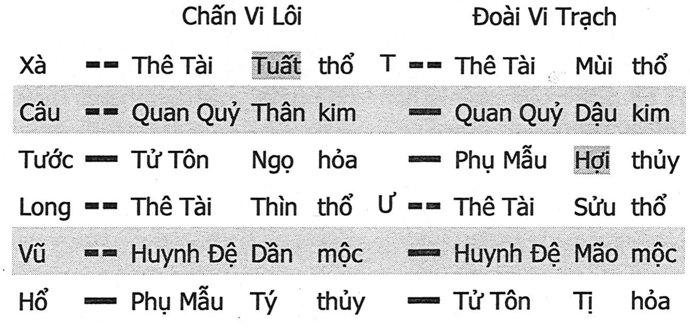
    - **Hình này chứng minh điều gì**
      - Quẻ này là đại tượng hóa hồi đầu khắc, chúng ta hoàn toàn có thể bỏ qua Dụng thần, quẻ biến hồi đầu khắc.
    - **Từ đâu mà thấy được**
      - Dự đoán hôn nhân của nữ, lấy Quan Quỷ làm Dụng thần.
  - **Căn cứ luận đoán**:
    - Dự đoán hôn nhân của nữ, lấy Quan Quỷ làm Dụng thần.
    - Phán đoán theo ngũ hành sinh khắc thông thường, Quan Quỷ mặc dù bị Nhật khắc, nhưng có Nguyệt sinh, lại động mà hóa Tiến thần, không thể xem là hôn nhân không tốt.
    - Nhưng xem kỹ thì quẻ này có rất nhiều huyền cơ.
    - Đầu tiên là Quan Quỷ tại hào 5, hào 5 là tôn vị, biểu thị chồng cai quản mọi thứ ở nhà, rất bá đạo.
    - Động mà hóa tiến, càng ngày càng hung hăng.
    - Hào Thế là Nguyên thần, là ngũ hành sinh Quan Quỷ, đáng lẽ là việc tốt, nhưng Thế Không, không thể sinh Quan Quỷ Thân kim, từ điểm này cho thấy cô ấy đã không còn yêu thích chồng của mình nữa.
    - Quẻ là Chấn, là tượng về động, biểu thị trong nhà thường xuyên không được
    - yên ổn, Chấn cũng là tức giận, biểu thị trong lòng cô ấy rất tức giận, không thể bình tĩnh.
    - Thế tại hào 6 bị Ứng xung phá, hào 6 là đầu, biểu thị chồng đã đánh cô ấy, khiến cô ấy bị thương ở đầu.
    - Lâm Trình Xà, Trình Xà chủ vết sẹo, biểu thị vết thương trên đầu bị chồng đánh đã lưu lại vết sẹo.
    - Quẻ này là đại tượng hóa hồi đầu khắc, chúng ta hoàn toàn có thể bỏ qua Dụng thần, quẻ biến hồi đầu khắc.
    - Hôn nhân nhất định không thể duy trì. Có thể lấy quẻ biến để phán đoán ứng kỳ, quẻ biến là kim, chính là mùa thu sẽ ly hôn.
    - Đồng thời tham khảo Dụng thần Thân kim, có thể phán đoán là từ Lập Thu về sau.
  - **Đối thoại & Diễn biến thực tế**:
    - Hào Thế không những Không mà còn lâm Nguyệt phá, thông tin này cho biết điều gì? Chúng ta hãy xem xét kỹ thử xem.
    - Nguyệt kiến Thìn thổ xung hào Thế mới khiến hào Thế sản sinh Nguyệt phá, mà Thìn thổ này chuyển vào trong quẻ thì là hào Ứng.
    - Khi dự đoán hôn nhân, hào Ứng đối lập với hào Thế, nam dự đoán thì Ứng hào vị của vợ, còn nữ dự đoán thì hào Ứng chính là hào vị của chồng.
    - Ứng lâm Nguyệt xung phá hào Thế, biểu thị chồng không tốt với cô ấy, quẻ này là lục xung hóa lục xung, biểu thị mối quan hệ giữa hai người đã xuất hiện mâu thuẫn trùng trùng.
    - Trên thực tế, chồng ở nhà rất bá đạo, thường xuyên đánh cô ấy, mấy ngày trước đã đánh cô ấy, khiến cô ấy bị hỏng màng nhĩ, do đó cô ấy đã hạ quyết tâm phải ly hôn, thế nhưng mãi đến tháng Thân mới ly hôn thành công.
- **Bảng Quẻ & Quái lệ 2**: Ngày Mậu Ngọ tháng Tý, một vũ cảnh dự đoán vận khí, được Chấn Vi Lôi.
  - **Hình 79.** Sơ đồ quẻ Chấn Vi Lôi
    - 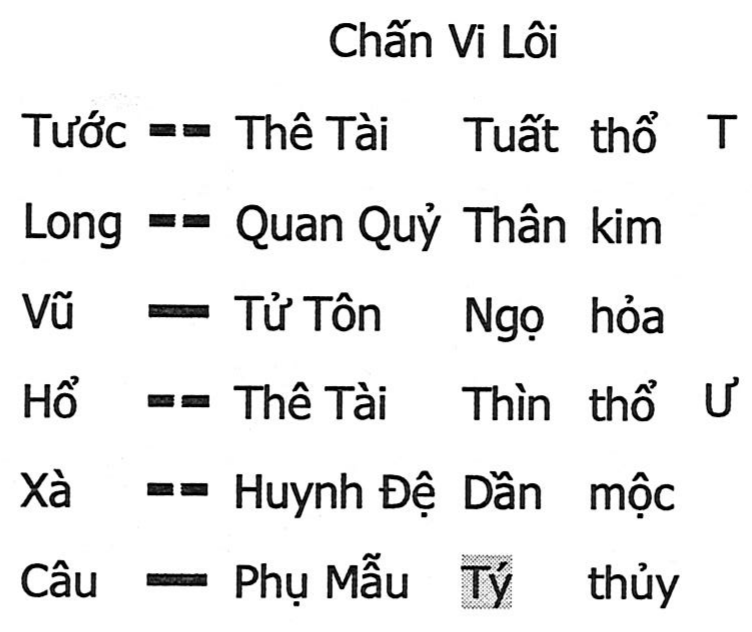
    - **Hình này chứng minh điều gì**
      - Tên quẻ là Chấn, tượng hiếu động.
    - **Từ đâu mà thấy được**
      - Tử Tôn là binh lính, mà Thế là Mộ khố Tử Tôn, biểu thị người này là một quản binh, đồng thời Quan Quỷ tại hào 5, hào 5 là hào vị lãnh đạo, Quan Quỷ...
  - **Căn cứ luận đoán**:
    - Quẻ này mặc dù là quẻ lục xung, nhưng hào Thế lâm Tài, được Nhật đến sinh, biểu thị tài vận rất tốt.
    - Tử Tôn là binh lính, mà Thế là Mộ khố Tử Tôn, biểu thị người này là một quản binh, đồng thời Quan Quỷ tại hào 5, hào 5 là hào vị lãnh đạo, Quan Quỷ mặc dù không vượng nhưng có thể phán đoán người này là một cán bộ trong quân đội.
    - Tên quẻ là Chấn, tượng hiếu động. Tương xung với hào Ứng, biểu thị người này dũng mãnh hiếu chiến.
    - Ứng lâm Bạch Hổ, chủ đối phương cầm đao thương, nhưng Thế xung hào Ứng, cho dù trong tay đối phương đang cầm vũ khí cũng không sợ hãi.
  - **Đối thoại & Diễn biến thực tế**:
    - Người này quả nhiên là như vậy. Anh ta nói rằng mình đã từng chế phục một tên du côn cầm dao. Hiện tại là phó đại đội trưởng.
- **Bảng Quẻ & Quái lệ 3**: Ngày Đinh Dậu tháng Sửu, nam dự đoán tình hình thăng chức, được Chấn Vi Lôi biến Địa Lôi Phục.
  - **Căn cứ luận đoán**:
    - Lấy Quan Quỷ làm Dụng thần.
    - Quan Quỷ Nguyệt sinh Nhật phù là vượng, nhưng không nên Tử Tôn độc phát đến khắc Quan Quỷ, đồng thời Quan tinh lâm Nhật hợp Ứng, người khác được còn mình không được.
    - Thế lâm Thanh Long, Thanh Long là vui vẻ, bình thản, bề ngoài thấy bản thân rất bình tĩnh, nhưng quẻ là Chấn, là tức giận, Thế là hỏa khố, trong lòng tức tối bất bình, ẩn tàng lửa giận.
  - **Đối thoại & Diễn biến thực tế**:
    - Anh ta cho biết đúng là như vậy, bởi vì không cạnh tranh công bằng, rõ ràng bản thân đủ tư cách, nhưng lãnh đạo không đồng ý thăng chức cho anh ta, do đó rất tức giận, nhưng anh ta lại không dám để lộ ra cảm xúc bất mãn.
    - Sau đó không được thăng chức.

### 2. LÔI ĐỊA DỰ

- **Tượng của quẻ**:
  - ngoại quái là Chấn, là kêu, là hỷ duyệt (vui vẻ), nội quái là Khôn, là nhu, thuận, âm thanh êm ái dễ nghe, cho nên tên quẻ là Dự (vui vẻ), Dự giả duyệt dã.
- **Tượng của lục hào**:
  - Tử Tôn trên Ứng tại hào 4, hào 4 là tâm, hỏa cũng là tâm, Tử Tôn là vui vẻ, tượng trong lòng vui vẻ, sinh hợp hào Thế, điều tuyệt vời thuận tâm của ta, tâm ta vui vẻ.
  - Do đó, quẻ này bao hàm ý nghĩa là vui vẻ, cao hứng, tươi đẹp, v.v.
- **Bảng Quẻ & Đồ hình liên hệ**: Sơ đồ quẻ Chấn Vi Lôi biến Địa Lôi Phục
  - **Hình 80.** Sơ đồ quẻ Chấn Vi Lôi biến Địa Lôi Phục
    - 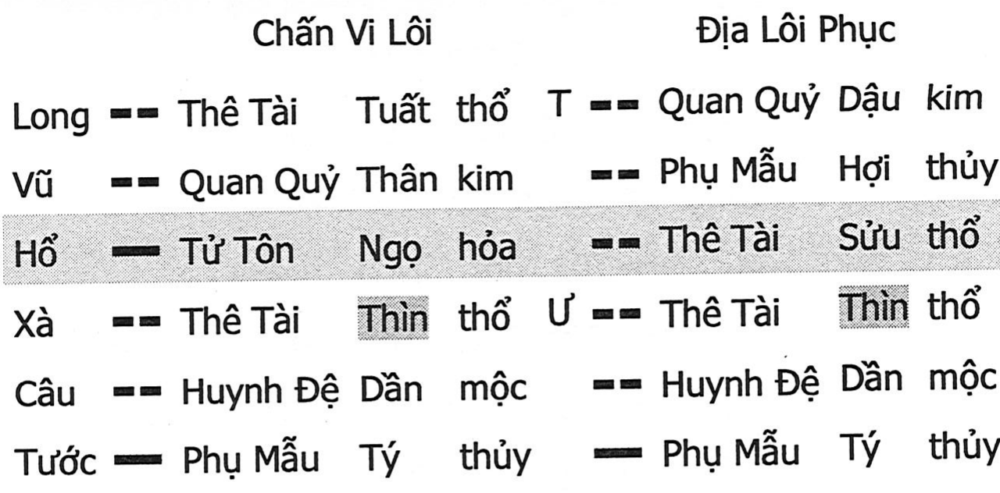
    - **Hình này chứng minh điều gì**
      - Tử Tôn trên Ứng tại hào 4, hào 4 là tâm, hỏa cũng là tâm, Tử Tôn là vui vẻ, tượng trong lòng vui vẻ, sinh hợp hào Thế, điều tuyệt vời thuận tâm của...
    - **Từ đâu mà thấy được**
      - Tử Tôn trên Ứng tại hào 4, hào 4 là tâm, hỏa cũng là tâm, Tử Tôn là vui vẻ, tượng trong lòng vui vẻ, sinh hợp hào Thế, điều tuyệt vời thuận tâm của...
- **Bảng Quẻ & Quái lệ 1**: Ngày Kỷ Mùi tháng Thân, một người đoán về việc thoái hưu sớm, được Lôi Địa Dự.
  - **Hình 81.** Sơ đồ quẻ Lôi Địa Dự
    - 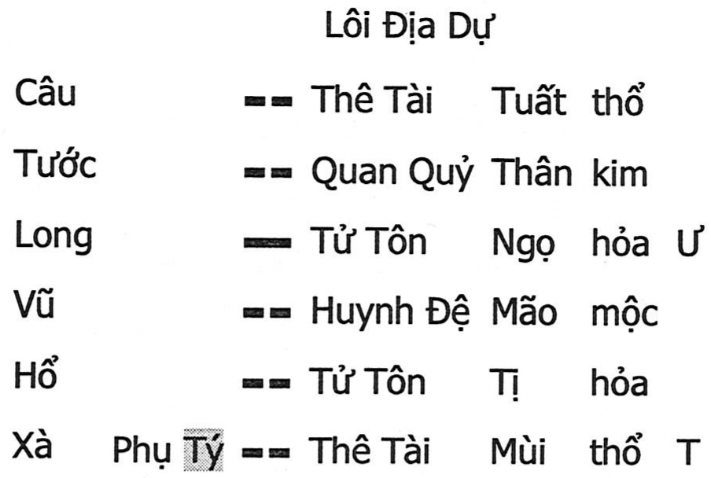
    - **Hình này chứng minh điều gì**
      - Quẻ là Dự, tượng vui vẻ, Thế sinh Quan, bởi vì yêu thích công việc của mình, do đó không muốn từ bỏ.
    - **Từ đâu mà thấy được**
      - Lấy Quan Quỷ làm Dụng thần.
  - **Căn cứ luận đoán**:
    - Lấy Quan Quỷ làm Dụng thần. Hưu tù có thể thoái, vượng tướng thì không thể.
    - Quẻ này Quan Quỷ được Nguyệt phù Nhật sinh là vượng tướng, vì vậy không thể thoái hưu sớm.
    - Tử Tôn khắc Quan Quỷ bị Nhật hợp, tham hợp quên khắc, không thể thoái hưu.
    - Nhật lâm Thế, Nhật thần thể hiện hào Thế, là chính mình thay đổi chủ ý, không muốn thoái nữa.
    - Quẻ là Dự, tượng vui vẻ, Thế sinh Quan, bởi vì yêu thích công việc của mình, do đó không muốn từ bỏ.
  - **Đối thoại & Diễn biến thực tế**:
    - Trên thực tế đúng là như vậy.
- **Bảng Quẻ & Quái lệ 2**: Ngày Ất Sửu tháng Dần, một bằng hữu hỏi về việc đến Quảng Châu mở lớp dạy học thì lợi nhuận sẽ như thế nào? Được Lôi Địa Dự biến Khôn Vi Địa.
  - **Căn cứ luận đoán**:
    - Mục đích là tài, lấy Tài làm Dụng. Tài bị Nguyệt khắc, nhưng được Tử Tôn Ngọ hỏa động đến sinh, Nhật xung là ám động.
    - Ứng là nơi đến, động mà sinh Tài trên Thế, quẻ lại là Dự, có tượng vui vẻ, do đó lần này nhất định vui vẻ, có lợi nhuận lớn.
    - Thế tại sơ, cộng thêm lâm Dịch Mã, hào sơ là vật có cánh, là ngồi máy bay để đi.
    - Nhưng Ngọ động đến hợp, máy bay có thể chậm trễ, nhưng trong hợp có sinh, sẽ đi thành công.
  - **Đối thoại & Diễn biến thực tế**:
    - Trên thực tế, lớp học có rất nhiều người tham gia học tập, thu được rất nhiều tiền, khi máy bay sắp hạ cánh, nó đã lượn vòng trên vùng trời sân bay hơn một giờ mới đáp xuống.

### 3. LÔI THỦY GIẢI

- **Tượng của quẻ**:
  - ngoại quái là Chấn, là động, là đi, nội quái là Khảm, là hiểm, tổng hợp lại là đi ra khỏi hoàn cảnh khó khăn, rời khỏi nơi nguy hiểm.
  - Cho nên gọi là Giải.
- **Tượng của lục hào**:
  - Thế tại hào 2, hào 2 là trạch, tượng thân ở trong nhà, Thế là Thìn thổ, Thìn là Mộ khố hào Thế, bị nhốt ở nhà, giống như một con tằm già, tự làm kén trói mình, nhưng Thế sinh hào Ứng, Ứng tại hào 5, hào 5 là tôn vị, là Quan Quỷ, là thành danh.
  - Nội sinh cho ngoại, từ nhà đi ra, thoát khỏi sự trói buộc, đến tôn vị, tượng công thành danh toại, đó chính là Giải. Giải giả, tán dã.
- **Ý nghĩa biểu tượng cốt lõi**:
  - giải tán, giải thoát, phóng thích, phát triển hướng ngoại, tiến bộ, phân ly v.v.
- **Bảng Quẻ & Đồ hình liên hệ**: Sơ đồ quẻ Lôi Địa Dự biến Khôn Vi Địa
  - **Hình 82.** Sơ đồ quẻ Lôi Địa Dự biến Khôn Vi Địa
    - 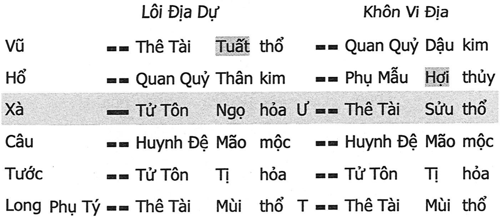
    - **Hình này chứng minh điều gì**
      - Thế tại hào 2, hào 2 là trạch, tượng thân ở trong nhà, Thế là Thìn thổ, Thìn là Mộ khố hào Thế, bị nhốt ở nhà, giống như một con tằm già, tự làm ké...
    - **Từ đâu mà thấy được**
      - Thế tại hào 2, hào 2 là trạch, tượng thân ở trong nhà, Thế là Thìn thổ, Thìn là Mộ khố hào Thế, bị nhốt ở nhà, giống như một con tằm già, tự làm ké...
- **Bảng Quẻ & Quái lệ 1**: Ngày Mậu Thìn tháng Tý, nam dự đoán hôn nhân. Được Lôi Thủy Giải biến Lôi Địa Dự.
  - **Hình 83.** Sơ đồ quẻ Lôi Thủy Giải biến Lôi Địa Dự
    - 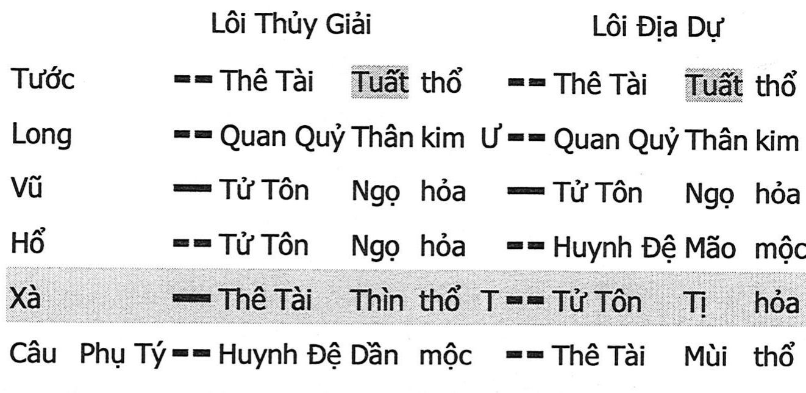
    - **Hình này chứng minh điều gì**
      - Phán đoán ứng kỳ, phải lấy hào độc phát để xác định.
    - **Từ đâu mà thấy được**
      - Lấy hào Thê Tài làm Dụng thần, trong quẻ Thê Tài lưỡng hiện, hào Thế Thê Tài Thìn thổ minh động, hào 6 Thê Tài Tuất thổ ám động.
  - **Căn cứ luận đoán**:
    - Lấy hào Thê Tài làm Dụng thần, trong quẻ Thê Tài lưỡng hiện, hào Thế Thê Tài Thìn thổ minh động, hào 6 Thê Tài Tuất thổ ám động.
    - Dụng thần lưỡng hiện, lấy hào lâm hào Thế phát động là Thê Tài Thìn thổ làm Dụng thần, nhưng đây là quẻ về hôn nhân, Dụng thần lưỡng hiện có rất nhiều ý nghĩa sâu sắc.
    - Quẻ này Thê Tài trì Thế, có Nhật thần củng phù là vượng tướng. Đây là thông tin có bạn gái.
    - Nhưng quẻ này một hào độc phát, lấy tượng làm chủ, ngũ hành sinh khắc đứng sau.
    - Thê Tài Thìn thổ trên Thế động mà hóa ra Tử Tôn Tị hỏa, đây là hóa Tuyệt, không luận là hồi đầu sinh.
    - Lâm Nhật hóa Tuyệt, là thông tin hôm đó chia tay với bạn gái hiện tại. Tên quẻ là Giải, cũng có ý nghĩa là phân ly, tách ra.
    - Hào 6 Thê Tài Tuất thổ ám động, biểu thị anh ta đã bí mật qua lại với một bạn gái khác.
    - Phán đoán ứng kỳ, phải lấy hào độc phát để xác định.
    - Động mà gặp trị gặp hợp, khi đoán quẻ này là năm Giáp Thân, do đó tôi đoán ở năm Ất Dậu anh ta mới có thể kết hôn.
  - **Ứng nghiệm thực tế**:
    - Quả nhiên là người này hôm đó đã chia tay với một bạn gái đã hẹn hò mấy tháng.
    - Đồng thời đã thiết lập mối quan hệ yêu đương với một người nữ khác. Ở năm Ất Dậu kết hôn.
- **Bảng Quẻ & Quái lệ 2**: Ngày Nhâm Ngọ tháng Ngọ, một người hỏi rằng mình có bị đơn vị khai trừ hay không? Được Lôi Thủy Giải.
  - **Căn cứ luận đoán**:
    - Lấy Quan Quỷ làm Dụng thần, Dụng thần bị Nhật Nguyệt khắc thương. Lại gặp Không Vong, công việc nhất định rất khó bảo toàn.
    - Hào Thế sinh Dụng thần, bản thân rất muốn giữ lại công việc. Nhưng Dụng thần hưu tù vô lực, sinh phù bất khởi.
    - Tên quẻ là Giải, có ý nghĩa là giải trừ. Đơn vị sẽ giải trừ mối quan hệ lao động với mình. Có cố gắng cũng vô ích.
    - Quan Quỷ Không Vong, tháng Thân sẽ rời khỏi đơn vị, và giải trừ quan hệ hợp đồng với đơn vị.
  - **Ứng nghiệm thực tế**:
    - Quả nhiên như vậy.

### 4. LÔI PHONG HẰNG

- **Tượng của quẻ**:
  - nội ngoại đều là mộc, ngoại quái Chấn là dương mộc, là động, là cương, nội quái là Tốn, là âm mộc, là nhu, là nhập, là tĩnh, động tĩnh âm dương tương hợp, đồng khí tương cầu, biểu thị tổ hợp hoàn mỹ, do đó gọi là Hằng.
  - Hằng giả cửu dã (Hằng là lâu dài).
- **Tượng của lục hào**:
  - Thế tại hào 3, hào 3 là cửa, lâm Quan Quỷ, Quan Quỷ chủ công danh, sự nghiệp, biểu thị tự lập môn hộ.
  - Ứng tại hào 6 là ngoại vi, sinh hào Thế, nội ngoại hòa hợp, khiến bản thân đứng ở thế bất bại, cho nên là trường cửu, duy trì sự nghiệp lâu dài.
  - Quẻ này có ý nghĩa là trường cửu (lâu dài), vĩnh cửu, vĩnh viễn, vĩnh hằng, ổn định, phát đạt, rộng lớn v.v.
- **Bảng Quẻ & Đồ hình liên hệ**: Sơ đồ quẻ Lôi Thủy Giải
  - **Hình 84.** Sơ đồ quẻ Lôi Thủy Giải
    - 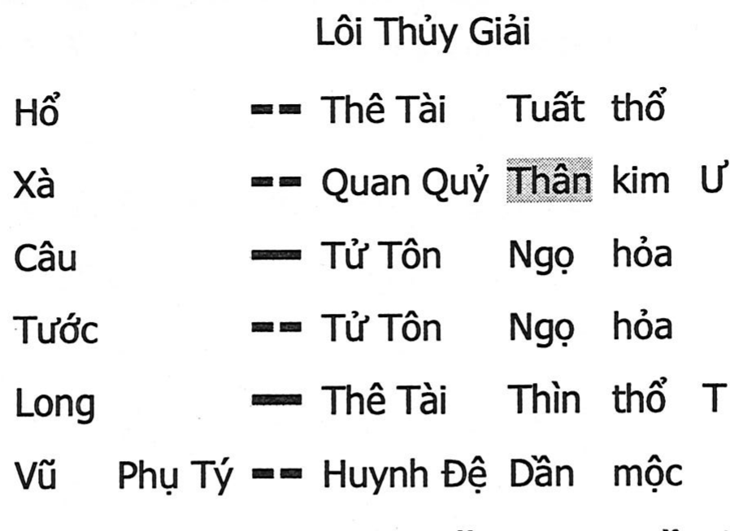
    - **Hình này chứng minh điều gì**
      - Quẻ này có ý nghĩa là trường cửu (lâu dài), vĩnh cửu, vĩnh viễn, vĩnh hằng, ổn định, phát đạt, rộng lớn v.
    - **Từ đâu mà thấy được**
      - Thế tại hào 3, hào 3 là cửa, lâm Quan Quỷ, Quan Quỷ chủ công danh, sự nghiệp, biểu thị tự lập môn hộ.
- **Bảng Quẻ & Quái lệ 1**: Ngày Quý Mùi tháng Thìn, một người đàn ông dự đoán về việc lãnh đạo sắp xếp công việc cho anh ta, được Lôi Phong Hằng.
  - **Hình 85.** Sơ đồ quẻ Lôi Phong Hằng
    - 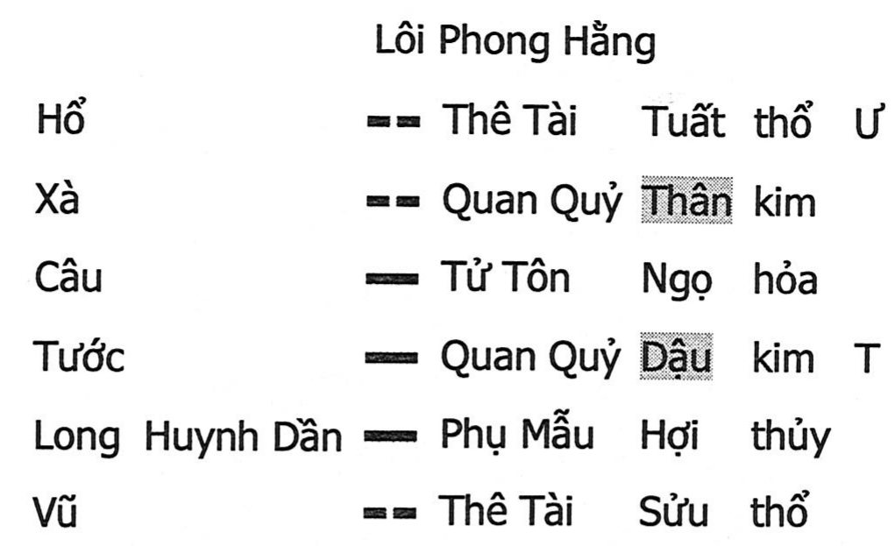
    - **Hình này chứng minh điều gì**
      - Tên quẻ là Hằng, Hằng là trường cửu, Quan Quỷ trì Thế, nhập Mộ ở hào sơ ám động, biểu thị sự việc này sẽ kéo dài rất lâu, sẽ không được giải quyết ...
    - **Từ đâu mà thấy được**
      - Lấy Quan Quỷ làm Dụng thần, trong quẻ Quan Quỷ lưỡng hiện, biểu thị có nhiều loại công việc phải chọn.
  - **Căn cứ luận đoán**:
    - Lấy Quan Quỷ làm Dụng thần, trong quẻ Quan Quỷ lưỡng hiện, biểu thị có nhiều loại công việc phải chọn.
    - Hào Thế Không Vong, biểu thị người này tâm trạng bất an, do dự không quyết.
    - Quan Quỷ được Nhật Nguyệt sinh phù là vượng tướng, có thể được sắp xếp công việc, nhưng Quan Quỷ Không Vong, công việc được sắp xếp là một chức vụ trống rỗng, không có quyền lực, lâm Chu Tước là công việc có liên quan đến thư ký.
    - Tên quẻ là Hằng, Hằng là trường cửu, Quan Quỷ trì Thế, nhập Mộ ở hào sơ ám động, biểu thị sự việc này sẽ kéo dài rất lâu, sẽ không được giải quyết trong thời gian ngắn.
    - Do đó phải lấy tháng để phán đoán.
  - **Ứng nghiệm thực tế**:
    - Người này yêu cầu đoán ở năm 2004, lúc đó tôi phán đoán là tháng Dậu có thể được sắp xếp công việc, tuy nhiên kết quả sau cùng lại là đến tháng Mão năm Ất Dậu mới được sắp xếp.
    - Ứng kỳ đã ứng năm, Hằng này thể hiện ý nghĩa lâu dài. Thật là kéo dài đủ lâu.
- **Bảng Quẻ & Quái lệ 2**: Ngày Ất Dậu tháng Dậu, một ông lão hỏi về bệnh hiểm nghèo của người bạn lâu năm, đoán xem kết quả sẽ như thế nào? Được Lôi Phong Hằng biến Lôi Hỏa Phong.
  - **Căn cứ luận đoán**:
    - Lấy Huynh Đệ làm Dụng thần. Huynh Đệ Dần mộc bất thượng quái, bị Nhật Nguyệt khắc thương, vừa nhìn là biết rất hung.
    - Trong quẻ mặc dù có Phụ Mẫu Hợi thủy động đến sinh, nhưng Dụng thần vốn vô căn (không có gốc rễ), Hợi thủy lại bị Sửu thổ khắc chế, tự động hóa hồi đầu khắc, không thể sinh Dụng, do đó sinh mệnh nguy trong sớm tối.
    - Quẻ là Hằng, Hằng giả cửu dã, kết hợp với sự suy vượng của Dụng thần, đây là tượng vĩnh thùy bất hủ (vĩnh viễn lưu truyền).
    - Do đó phán đoán là bạn của ông ta sẽ không sống được bao nhiêu ngày.
  - **Ứng nghiệm thực tế**:
    - Kết quả là chết ở ngày hôm sau.

### 5. ĐỊA PHONG THĂNG

- **Tượng của quẻ**:
  - ngoại quái là Khôn, là mặt đất, nội quái Tốn là âm mộc, mộc là thực vật, ở hạ, âm mộc cầu dương, cho nên mộc ở trong thổ muốn phá thổ mà ra, lấy âm khí của đất và nhận dương khí của trời, do đó gọi là Thăng.
- **Tượng của lục hào**:
  - trong quẻ không có ngũ hành mộc, tàng mà không được xuất, phục mà khắc thổ trên Thế, đây cũng là tượng phá thổ muốn ra.
  - Lục thân ở nội ngoại quái hiện trùng lặp, Thê Tài từ hào sơ di chuyển đến hào 4, Phụ Mẫu Hợi thủy từ hào 2 di chuyển đến hào 5, Quan Quỷ Dậu kim từ hào 3 di chuyển đến hào 6, lớp lớp chuyển lên.
  - Thế là chủ thể của quẻ, mà Ứng ở hạ, Thế ở thượng, biểu hiện sự phát triển từ thấp lên cao của chủ thể, do đó cũng bao hàm ý nghĩa của Thăng.
  - Người xưa nói, Thăng giả, tấn dã.
- **Ý nghĩa biểu tượng cốt lõi**:
  - Do đó, quẻ này bao hàm ý nghĩa là đề cao, hướng thượng, phát triển, nỗ lực, tiến tới v.v. Bởi vì quẻ này Thế Ứng tỷ hòa, Thế Ứng cùng
  - khắc Phụ Mẫu Hợi thủy, Thế Ứng cùng Mộ Quan Quỷ Dậu kim, do đó thể hiện thông tin về tranh đoạt, phân tranh.
- **Bảng Quẻ & Đồ hình liên hệ**: Sơ đồ quẻ Lôi Phong Hằng biến Lôi Hỏa Phong
  - **Hình 86.** Sơ đồ quẻ Lôi Phong Hằng biến Lôi Hỏa Phong
    - 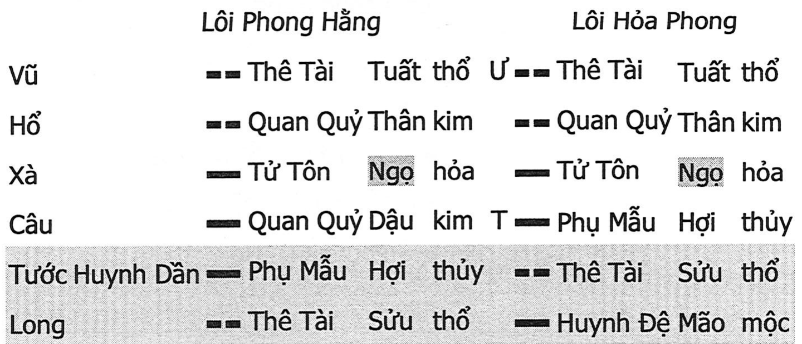
    - **Hình này chứng minh điều gì**
      - trong quẻ không có ngũ hành mộc, tàng mà không được xuất, phục mà khắc thổ trên Thế, đây cũng là tượng phá thổ muốn ra.
    - **Từ đâu mà thấy được**
      - trong quẻ không có ngũ hành mộc, tàng mà không được xuất, phục mà khắc thổ trên Thế, đây cũng là tượng phá thổ muốn ra.
- **Bảng Quẻ & Quái lệ 1**: Ngày Đinh Sửu tháng Ngọ, nam dự đoán sự nghiệp, được Địa Phong Thăng biến Địa Sơn Khiêm.
  - **Hình 87.** Quẻ Địa Phong Thăng biến Địa Sơn Khiêm
    - 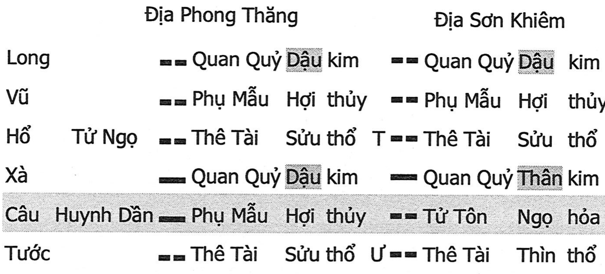
    - **Hình này chứng minh điều gì**
      - Phụ Mẫu Hợi thủy phát động, không gây ra ảnh hưởng bất lợi cho Quan Quỷ, Phụ Mẫu chủ môi trường làm việc, phát động biểu thị môi trường làm việc sẽ...
    - **Từ đâu mà thấy được**
      - Lấy Quan làm Dụng thần.
  - **Căn cứ luận đoán**:
    - Lấy Quan làm Dụng thần. Nguyệt khắc Nhật sinh, suy vượng tương đương.
    - Quẻ này Thế Ứng tỷ hòa, Quan Quỷ ở trung gian, Thế Ứng đều muốn khiến Quan nhập Mộ ở mình, đây là tượng tranh chấp, là nhiều người cạnh tranh.
    - Nhưng hào Thế cao hơn hào Ứng. Hào Thế lại gần với hào vị lãnh đạo (tức hào 5), là muốn nịnh bợ lãnh đạo, thể hiện bản thân để trèo lên cao.
    - Phụ Mẫu Hợi thủy phát động, không gây ra ảnh hưởng bất lợi cho Quan Quỷ, Phụ Mẫu chủ môi trường làm việc, phát động biểu thị môi trường làm việc sẽ thay đổi.
  - **Đối thoại & Diễn biến thực tế**:
    - Trên thực tế là không được thăng chức, nhưng đã xảy ra sự thay đổi về phòng làm việc.
- **Bảng Quẻ & Quái lệ 2**: Ngày Tân Dậu tháng Tý, một người đoán về việc thăng chức, được Địa Phong Thăng biến Thủy Phong Tỉnh.
  - **Căn cứ luận đoán**:
    - Lấy hào Quan Quỷ làm Dụng thần, hào Quan Quỷ lưỡng hiện, địa chi hoàn toàn giống nhau, lấy hào 3 Quan Quỷ Dậu kim gần hào Thế làm Dụng thần, Dụng thần được Nhật tỉ phù lâm Thanh Long là cát, Dụng thần vượng tướng.
    - Tên quẻ là Thăng, nhất định có thể toại nguyện.
    - Dụng thần an tĩnh, phán đoán theo quy luật về tĩnh, tĩnh mà gặp trị gặp xung, tháng Mão xung Quan Quỷ Dậu kim, tháng Mão nhất định thăng.
  - **Ứng nghiệm thực tế**:
    - Kết quả là được thăng chức ở tháng Mão.
- **Bảng Quẻ & Quái lệ 3**: Ngày Đinh Hợi tháng Dần, nữ dự đoán có thể kết hôn với bạn trai hay không? Được Địa Phong Thăng biến Hỏa Sơn Lữ.
  - **Hình 88.** Quẻ Địa Phong Thăng biến Thủy Phong Tỉnh
    - 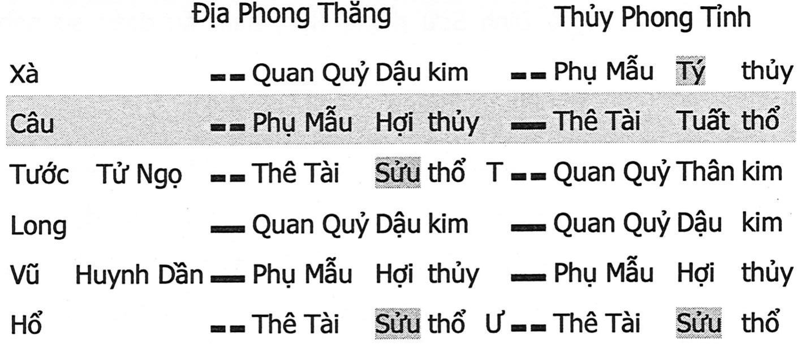
    - **Hình này chứng minh điều gì**
      - Quẻ này Thế Ứng đều là Mộ khố Quan Quỷ, Quan Quỷ bị kẹp ở giữa, có tượng tranh chấp, người nữ dự đoán hôn nhân, chính là hai người tranh chồng.
    - **Từ đâu mà thấy được**
      - Lấy Quan Quỷ làm Dụng thần, trong quẻ Quan Quỷ lưỡng hiện, lấy hào Quan Quỷ Dậu kim phát động làm Dụng thần.
- **Bảng Quẻ & Quái lệ 3**: Ngày Đinh Hợi tháng Dần, nữ dự đoán có thể kết hôn với bạn trai hay không? Được Địa Phong Thăng biến Hỏa Sơn Lữ.
  - **Hình 89.** Quẻ Địa Phong Thăng biến Hỏa Sơn Lữ
    - 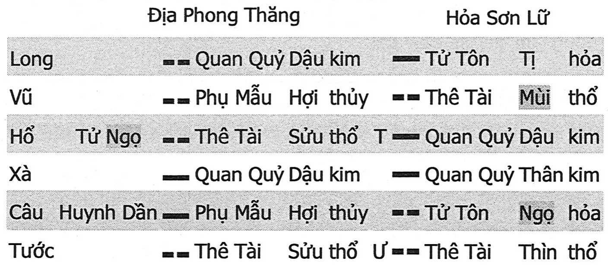
    - **Hình này chứng minh điều gì**
      - Quẻ này Thế Ứng đều là Mộ khố Quan Quỷ, Quan Quỷ bị kẹp ở giữa, có tượng tranh chấp, người nữ dự đoán hôn nhân, chính là hai người tranh chồng.
    - **Từ đâu mà thấy được**
      - Lấy Quan Quỷ làm Dụng thần, trong quẻ Quan Quỷ lưỡng hiện, lấy hào Quan Quỷ Dậu kim phát động làm Dụng thần.
  - **Căn cứ luận đoán**:
    - Lấy Quan Quỷ làm Dụng thần, trong quẻ Quan Quỷ lưỡng hiện, lấy hào Quan Quỷ Dậu kim phát động làm Dụng thần.
    - Dụng thần không được Nhật Nguyệt sinh phù, trong quẻ Quan Quỷ mặc dù tam hợp thành cục, nhưng Dụng thần hóa ra Kỵ thần Tử Tôn, lại ở hào 6, dự đoán hôn nhân của nữ, đây là những thông tin không tốt.
    - Bởi vì, hào 6 là hào vị thoái hưu, Quan Quỷ động biểu thị phía nam có biến, động mà
    - hóa ra Kỵ thần chính là mối quan hệ giữa hai người phát triển về hướng không tốt.
    - Quẻ này Thế Ứng đều là Mộ khố Quan Quỷ, Quan Quỷ bị kẹp ở giữa, có tượng tranh chấp, người nữ dự đoán hôn nhân, chính là hai người tranh chồng.
    - Phụ Mẫu lâm Nhật vốn là hôn kỳ, nhưng động mà hóa Không, biểu thị hôn kỳ sẽ xảy ra sự thay đổi.
  - **Đối thoại & Diễn biến thực tế**:
    - Trên thực tế, người nữ này và bạn trai đã sống chung nhiều năm, hơn nữa cũng đã có thai, cô ấy định phá thai, nhưng bạn trai không đồng ý, nói rằng sẽ kết hôn với cô ấy, cô ấy cũng rất vui, nào ngờ ở tháng Mão năm Ất Dậu, bạn trai của cô ấy đã kết hôn với một cô gái khác.
- **Bảng Quẻ & Quái lệ 4**: Một học viên của tôi hỏi rằng anh ta kinh doanh trái cây có tốt không? Ngày Quý Tị tháng Dần, được Địa Phong Thăng.
  - **Hình 90.** Sơ đồ quẻ Địa Phong Thăng
    - 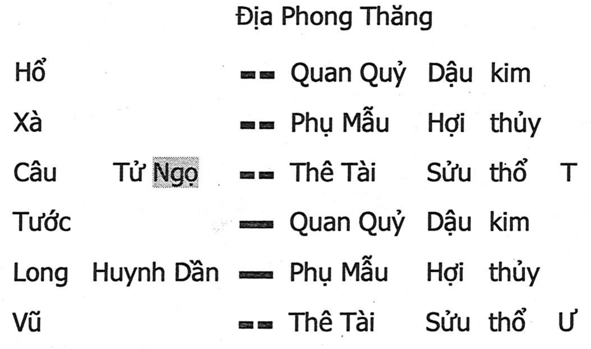
    - **Hình này chứng minh điều gì**
      - Anh ta trả lời: Quá đúng, thầy thật lợi hại.
    - **Từ đâu mà thấy được**
      - Lấy hào Tài làm Dụng thần, hào Tài Nguyệt khắc Nhật sinh suy vượng tương đương, nhưng Nguyên thần Tuần Không bất thượng quái, trong quẻ hào Phụ Mẫu...
  - **Căn cứ luận đoán**:
    - Lấy hào Tài làm Dụng thần, hào Tài Nguyệt khắc Nhật sinh suy vượng tương đương, nhưng Nguyên thần Tuần Không bất thượng quái, trong quẻ hào Phụ Mẫu Hợi thủy bị Nhật thần xung là ám động, hai Cừu thần ám động đến khắc Nguyên thần, chiêm kinh doanh không cát.
    - Quẻ Địa Phong Thăng, Thế Ứng đều giống nhau, tượng tranh chấp, có quá nhiều người cùng buôn bán, anh không thể cạnh tranh lại với người ta, do đó không thể làm tiếp được.
    - Anh ta trả lời: Quá đúng, thầy thật lợi hại.
    - Tôi đang kinh doanh quả xoài, đúng là thị trường có quá nhiều người cùng làm, bọn họ đã làm rất lâu, có khá nhiều khách hàng cố định, tôi cạnh tranh không lại bọn họ.

### 6. THỦY PHONG TỈNH

- **Tượng của quẻ**:
  - ngoại quái là thủy, thủy chủ hạ, vãng hạ lưu (chảy xuống), còn nội quái là Tốn, Tốn là nhập (vào), biểu thị có nước chảy vào nơi nào đó, tụ mà thành hình, tạo thành giếng.
- **Tượng của lục hào**:
  - hào 6 là thiên, Phụ Mẫu cũng là thiên, lâm Tý thủy, Phụ Mẫu là mưa, thủy cũng là mưa.
  - Mà hào sơ là mặt đất, là giếng, chính là nước mưa trên trời rơi xuống mặt đất, hào 6 và hào sơ tương hợp, hợp là bất động, nước rơi xuống mặt đất bất động, thì tạo thành giếng.
  - Chủ thể của quẻ này là hào Thế ở hào 5, lâm Tài, Tài là ẩm thực, thủy cũng là ẩm thực, cho nên quái tượng rất rõ ràng.
  - Bởi vì thiên địa hợp, là âm dương nhất thể, không có âm dương, thì không có cực, vũ trụ cũng sẽ không biến hóa, cho nên người xưa nói, Tỉnh giả tĩnh dã.
  - Thể hiện một trạng thái an tĩnh tường hòa.
  - Nhưng Thế ở hào 5, hào 5 là đường, Tài chủ ẩm thực, do đó quẻ này còn có tượng là ra ngoài mang theo đồ ăn, bối tỉnh ly hương (rời xa quê hương).
  - Căn cứ vào tổ hợp lục hào và quái tượng, quẻ này có ý nghĩa là an tĩnh, an cư, di chuyển, tích góp, tích lũy v.v.
- **Bảng Quẻ & Quái lệ 1**: Ngày Mậu Dần tháng Tý, một người hỏi cháu gái tốt nghiệp nghiên cứu sinh sẽ công tác ở đâu? Được Thủy Phong Tỉnh biến Sơn Hỏa Bí.
  - **Hình 91.** Sơ đồ quẻ Thủy Phong Tỉnh biến Sơn Hỏa Bí
    - 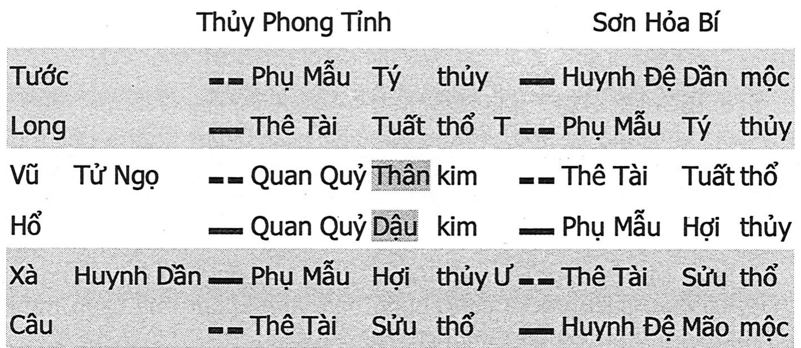
    - **Hình này chứng minh điều gì**
      - Tình hình thực tế, khi dự đoán, cháu gái của người này đang học nghiên cứu sinh ở đại học chính trị pháp luật ở Tây Nam.
    - **Từ đâu mà thấy được**
      - Lấy hào Quan Quỷ làm Dụng thần, Quan Quỷ lưỡng hiện, đều Không Vong, lại không lâm Thế Ứng, lấy hào Quan Quỷ Thân kim ám động làm Dụng, hào Thế sin...
  - **Căn cứ luận đoán**:
    - Lấy hào Quan Quỷ làm Dụng thần, Quan Quỷ lưỡng hiện, đều Không Vong, lại không lâm Thế Ứng, lấy hào Quan Quỷ Thân kim ám động làm Dụng, hào Thế sinh Quan Quỷ, là mình tìm công việc, Quan Quỷ động mà sinh Ứng, Ứng là tha hương (quê người).
    - ___
    - Tường hòa là chỉ cát tường, hài hòa, tốt đẹp.
    - Tình hình thực tế, khi dự đoán, cháu gái của người này đang học nghiên cứu sinh ở đại học chính trị pháp luật ở Tây Nam.
    - Sau khi tốt nghiệp đã ở lại nơi đó.
  - **Ứng nghiệm thực tế**:
    - Quẻ Thủy Phong Tỉnh lại có ý nghĩa là rời xa quê hương.
    - Do đó sau khi tốt nghiệp nhất định sẽ không về quê, mà sẽ làm việc ở nơi khác, Thân là Tây Nam, sau này sẽ làm việc ở hướng Tây Nam.
- **Bảng Quẻ & Quái lệ 2**: Ngày Tân Tị tháng Dậu, một người nữ bị xác định là gián điệp trong thời kỳ biến động, hỏi có thể minh oan được không? Được Thủy Phong Tỉnh biến Trạch Phong Đại Quá.
  - **Căn cứ luận đoán**:
    - Quan Quỷ là thanh danh, do đó lấy Quan Quỷ làm Dụng thần, trong quẻ Quan Quỷ lưỡng hiện, lấy hào Quan Quỷ Thân kim phát động làm Dụng thần, quẻ này là Thủy Phong Tỉnh, có ý nghĩa là hãm tỉnh (rơi xuống giếng, cạm bẫy), Thế lâm Câu Trần, Câu Trần chủ bất động, tượng lao ngục.
    - Trong thời kỳ biến động, nhất định đã phải ngồi tù vì chuyện này.
    - Quẻ này có vẻ như Quan Quỷ vượng tướng, nhưng không nên Không Vong, hơn nữa động mà sinh hào Ứng, xuất hiện vô tình, là tượng có lợi đối với người khác.
    - Dụng thần và Nhật hợp, hợp là vướng chân, việc yêu cầu phục hồi danh dự nhất định sẽ bị kéo dài thời gian.
    - Mà Dụng thần động mà sinh hào Ứng, cũng chính là người khác được minh oan. Cô ấy lại không được.
    - Tình hình thực tế, hầu hết những người cùng ngồi tù với cô ấy đều được minh oan, chỉ có vấn đề của cô ấy là không được giải quyết.

### 7. TRẠCH PHONG ĐẠI QUÁ

- **Tượng của quẻ**:
  - ngoại quái là Đoài, là trạch (đầm), là thủy, nội quái là Tốn, là mộc, thủy ở trên mộc, tượng mộc bị chìm trong thủy, thủy vốn là vật nuôi dưỡng mộc, nay mộc vào đầm lầy, bị đầm lầy bao phủ, đây là Đại Quá (lỗi nặng), Đại Quá giả, họa dã, thất dã.
- **Tượng của lục hào**:
  - quẻ này không có mộc, Thế là thủy, hào mộc Huynh Đệ lại phục dưới Hợi thủy, rất ăn khớp với ý nghĩa của quái tượng.
  - Mộc gặp hỏa là hoa, mà quẻ này mộc và hỏa đồng thời phục tàng, hỏa bị hào Thế khắc Tuyệt, vốn Thế là thủy, là thứ sinh mộc, nhưng hiện tại thái quá, không những không thể khiến mộc phát triển, mà trái lại khắc hỏa, khiến mộc không thể nở hoa, đây là tốn sức nhưng không thu được kết quả gì, cho nên gọi là Đại Quá.
- **Ý nghĩa biểu tượng cốt lõi**:
  - Do đó quẻ này bao hàm ý nghĩa là nghiêm trọng, tổn thất, sai lầm, lãng phí, áp chế, lấy oán trả ơn, thỏ chết thì chó bị nấu, qua cầu rút ván v.v.
- **Bảng Quẻ & Đồ hình liên hệ**: Sơ đồ quẻ Thủy Phong Tỉnh biến Trạch Phong Đại Quá
  - **Hình 92.** Sơ đồ quẻ Thủy Phong Tỉnh biến Trạch Phong Đại Quá
    - 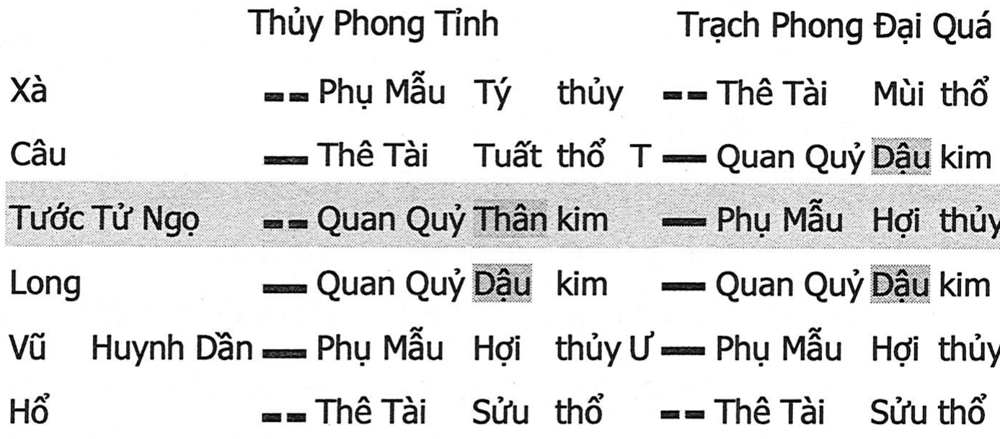
    - **Hình này chứng minh điều gì**
      - quẻ này không có mộc, Thế là thủy, hào mộc Huynh Đệ lại phục dưới Hợi thủy, rất ăn khớp với ý nghĩa của quái tượng.
    - **Từ đâu mà thấy được**
      - quẻ này không có mộc, Thế là thủy, hào mộc Huynh Đệ lại phục dưới Hợi thủy, rất ăn khớp với ý nghĩa của quái tượng.
- **Bảng Quẻ & Quái lệ 1**: Ngày Bính Tý tháng Dần, một người đàn ông dự đoán tình hình quan vận, được Trạch Phong Đại Quá biến Thủy Phong Tỉnh.
  - **Hình 93.** Sơ đồ quẻ Trạch Phong Đại Quá biến Thủy Phong Tỉnh
    - 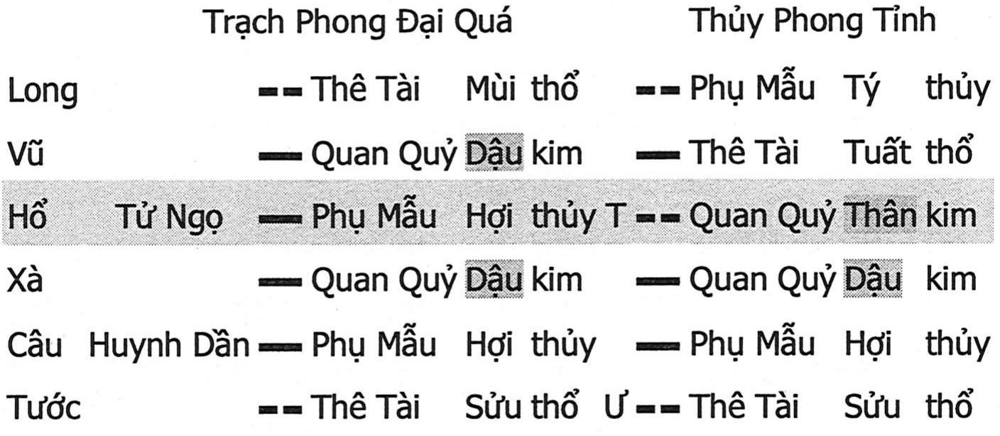
    - **Hình này chứng minh điều gì**
      - Lấy Quan Quỷ làm Dụng thần.
    - **Từ đâu mà thấy được**
      - Lấy Quan Quỷ làm Dụng thần.
  - **Căn cứ luận đoán**:
    - Lấy Quan Quỷ làm Dụng thần.
    - Quan Quỷ không được Nhật Nguyệt sinh phù, Tuyệt ở Nguyệt Tử ở Nhật, lại lâm Không Vong, cơ hội thăng chức rất thấp.
    - Quẻ tên là Đại Quá, bản thân có quá nhiều khuyết điểm, ảnh hưởng đến quan vận.
    - Thế lâm Bạch Hổ phát động, chủ nóng nảy, dễ làm mất lòng người khác, nhưng may được Thế động hóa Quan được hồi đầu sinh, năm Thân có hy vọng.
  - **Ứng nghiệm thực tế**:
    - Quả nhiên là bởi vì bản thân dễ nổi nóng, thường xuyên cãi nhau với đồng nghiệp và cấp trên, rất nhiều người không thích anh ta.
    - Nhiều năm không được đề bạt, chỉ có ở năm Giáp Thân là được thăng chức một lần.
- **Bảng Quẻ & Quái lệ 2**: Ngày Giáp Thìn tháng Tị, nữ dự đoán về bệnh tình của mình, hỏi thuốc đang uống có hiệu quả hay không? Được Trạch Phong Đại Quá biến Thủy Thiên Nhu.
  - **Căn cứ luận đoán**:
    - Ứng là y dược, xem ảnh hưởng của Ứng đối với Thế.
    - Hào Thế Nguyệt phá, nhập Nhật Mộ, biểu thị thân thể rất yếu đuối, quẻ là Đại Quá, Đại Quá giả, tượng nghiêm trọng, bệnh tình nghiêm trọng, cần hào Ứng đến sinh mới phải.
    - Nhưng hiện tại hào Ứng khắc Thế, Thế vốn hưu tù, lại có Ứng động khắc Thế, uống thuốc này bệnh tình nhất định sẽ nặng thêm.
    - Nhưng bởi vì nóng lòng trị bệnh, sau một thời gian uống thuốc, bệnh tình không những không đỡ mà ngày càng nghiêm trọng hơn.
    - Thế là ngừng uống, lại chuyển sang uống thuốc khác. Về sau người nữ này đã chết vì ung thư phổi.

### 8. TRẠCH LÔI TÙY

- **Tượng của quẻ**:
  - ngoại quái tại Đoài, Đoài là trạch, là nói, là vui mừng, nội quái là Chấn, là động, là biến hóa.
  - Cũng tức là, người khác nói, ta cũng nói, người khác cười, ta cũng cười, thể hiện tượng phụ họa theo.
  - Do đó gọi là Tùy (theo), Tùy giả, thuận dã, tòng dã.
- **Tượng của lục hào**:
  - Ứng là người khác, Thế là mình, Thế Ứng mặc dù đều là thổ, nhưng trên Ứng là Mùi thổ, còn Thế là Thìn thổ, Thìn thổ gặp Mùi thổ mà hóa tiến, theo kịp người khác mà phát triển.
- **Ý nghĩa biểu tượng cốt lõi**:
  - Do đó quẻ này bao hàm ý nghĩa là phụ họa, đi theo, phụ thuộc, lạc hậu, thứ yếu, nước chảy bèo trôi v.v.
- **Bảng Quẻ & Đồ hình liên hệ**: Sơ đồ quẻ Trạch Phong Đại Quá biến Thủy Thiên Nhu
  - **Hình 94.** Sơ đồ quẻ Trạch Phong Đại Quá biến Thủy Thiên Nhu
    - 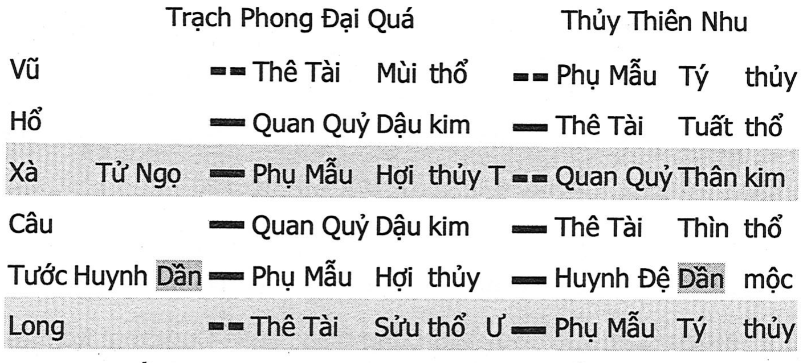
    - **Hình này chứng minh điều gì**
      - Ứng là người khác, Thế là mình, Thế Ứng mặc dù đều là thổ, nhưng trên Ứng là Mùi thổ, còn Thế là Thìn thổ, Thìn thổ gặp Mùi thổ mà hóa tiến, theo k...
    - **Từ đâu mà thấy được**
      - Căn cứ ngũ hành sinh khắc, Dụng thần, Thế Ứng và hào động biến trong quẻ.
- **Bảng Quẻ & Quái lệ 1**: Ngày Đinh Mão tháng Tuất, một người dự đoán sự nghiệp. Được Trạch Lôi Tùy biến Chấn Vi Lôi.
  - **Hình 95.** Sơ đồ quẻ Trạch Lôi Tùy biến Chấn Vi Lôi
    - 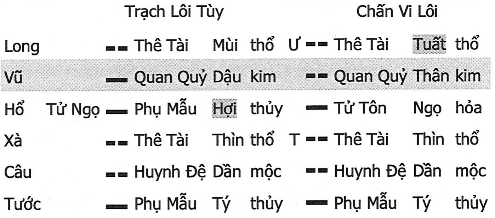
    - **Hình này chứng minh điều gì**
      - Hào Thế lâm Tài Nguyệt phá Nhật khắc, tài vận bản thân không tốt, lâm Trình Xà, Trình Xà chủ kỹ thuật, bản thân có kỹ thuật nhất định.
    - **Từ đâu mà thấy được**
      - Lấy Quan Quỷ làm Dụng thần.
  - **Căn cứ luận đoán**:
    - Lấy Quan Quỷ làm Dụng thần.
    - Quan Quỷ được Nguyệt sinh là vượng, lâm hào 5, hào 5 là hào vị lãnh đạo, bản thân có chức vụ nhất định ở đơn vị, quẻ là Tùy, là tượng phụ họa phụ thuộc, do đó nhất định không phải là người đứng đầu.
    - Hiện tại Quan Quỷ động mà hóa thoái, bản thân sẽ xuống khỏi vị trí này.
    - Nhưng Quan Quỷ và hào Thế tương hợp, không mất toàn bộ chức vụ, vẫn còn chức vụ ở người.
    - Hào Thế lâm Tài Nguyệt phá Nhật khắc, tài vận bản thân không tốt, lâm Trình Xà, Trình Xà chủ kỹ thuật, bản thân có kỹ thuật nhất định.
    - Tài trên Ứng vượng, làm kinh doanh cho người khác nhất định sẽ rất tốt.
  - **Đối thoại & Diễn biến thực tế**:
    - Phán đoán ứng nghiệm.
    - Trên thực tế, người này là phó cục trưởng của một cục phục vụ ẩm thực, đã làm phó cục trưởng suốt 20 năm, năm nay nghỉ hưu, nhưng vẫn được giữ lại làm hội trưởng của hội nấu ăn.
    - Người này thành thạo quản lý nhà hàng và kỹ thuật nấu ăn, sau khi nghỉ hưu đã giúp người khác kinh doanh nhà hàng, đã giúp cho nhà hàng đó chuyển lỗ thành lãi.
- **Bảng Quẻ & Quái lệ 2**: Ngày Quý Sửu tháng Hợi, một người đoán cát hung về việc phá thai, được Trạch Lôi Tùy biến Trạch Thiên Quải.
  - **Hình 96.** Quẻ Trạch Lôi Tùy biến Trạch Thiên Quải
    - 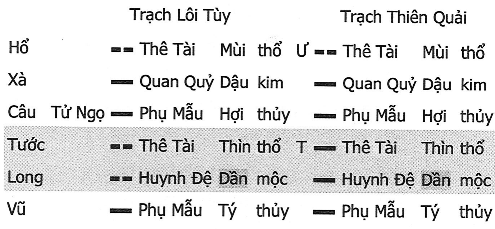
    - **Hình này chứng minh điều gì**
      - Sau ở ngày Mão sinh được một con trai, sau khi sinh ra lập tức cho người khác.
    - **Từ đâu mà thấy được**
      - Xem cát hung của người lớn, nam dự đoán thì lấy Thê Tài làm Dụng, tình trạng của tiểu hài thì lấy Tử Tôn làm Dụng.
  - **Căn cứ luận đoán**:
    - Xem cát hung của người lớn, nam dự đoán thì lấy Thê Tài làm Dụng, tình trạng của tiểu hài thì lấy Tử Tôn làm Dụng.
    - Nhưng quẻ này là hỏi về phá thai, biểu thị anh ta không muốn có đứa con này.
    - Do đó trọng điểm của cát hung là ở Thê Tài chứ không phải là ở Tử Tôn.
    - Quẻ này Thê Tài lưỡng hiện, lấy Thê Tài trên Thế làm Dụng.
    - Dụng thần không được Nguyệt sinh phù, nhưng có Nhật phù, do đó sẽ không có đại hung.
    - Nội quái phục ngâm, biểu thị việc phá thai rất không thuận lợi, hài tử chậm trễ được sinh ra.
    - Quẻ này Tử Tôn phục tàng, bị Nguyệt khắc chế, sức sống của hài tử này rất yếu, bởi vì có hào 2 Dần mộc động mà đến sinh, có thể có một phần cơ hội sống.
    - Hào Ứng ám động đến hợp Tử Tôn Ngọ hỏa, Ứng là người khác, nếu sinh ra hài tử còn sống, nhất định sẽ có người sẵn lòng xin hài tử này.
    - Lại thêm quẻ là Trạch Lôi Tùy, Tùy là theo, biểu thị hài tử này sẽ đi theo người khác.
    - Do đó sau khi sinh ra hài tử này thì sẽ đem cho người khác.
    - Sau ở ngày Mão sinh được một con trai, sau khi sinh ra lập tức cho người khác.
- **Bảng Quẻ & Quái lệ 3**: Ngày Kỷ Sửu tháng Mão, một người đàn ông bị ho liên tục, hỏi bệnh tật sẽ phát triển ra sao? Được Trạch Lôi Tùy.
  - **Hình 97.** Quẻ Trạch Lôi Tùy
    - 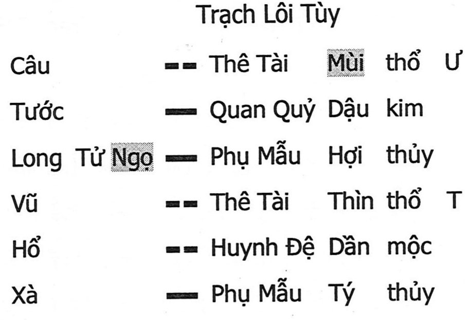
    - **Hình này chứng minh điều gì**
      - Lúc đó còn có vài người ở đó, tôi nói đùa rằng, hiện nay người ta đang đồn có một căn bệnh phổi rất đáng sợ (chỉ SAR, báo chí lúc bấy giờ chưa khẳn...
    - **Từ đâu mà thấy được**
      - Lấy hào Thế làm Dụng thần, hào Thế tuy bị Nguyệt khắc, nhưng được Nhật phù, có bệnh cũng không đáng ngại, quẻ này Quan Quỷ tại hào 5 lâm Chu Tước v...
  - **Căn cứ luận đoán**:
    - Lấy hào Thế làm Dụng thần, hào Thế tuy bị Nguyệt khắc, nhưng được Nhật phù, có bệnh cũng không đáng ngại, quẻ này Quan Quỷ tại hào 5 lâm Chu Tước và kim, hào 5 là phổi và hệ hô hấp, Chu Tước chủ viêm, tổng hợp phán đoán:
    - Là viêm phổi.
    - Lúc đó còn có vài người ở đó, tôi nói đùa rằng, hiện nay người ta đang đồn có một căn bệnh phổi rất đáng sợ (chỉ SAR, báo chí lúc bấy giờ chưa khẳng định), nói không chừng anh đang bị loại bệnh này, mau đến bệnh viện khám nhé.
    - Khi tôi nói như vậy, vài người ở đó đã kiếm cớ chuồn mất.
  - **Ứng nghiệm thực tế**:
    - Quẻ này là Trạch Lôi Tùy, có ý nghĩa là theo, tôi phán đoán, xung quanh anh ta còn có rất nhiều người cũng đang kho, là người khác ho trước, sau đó anh ta cũng bắt đầu xuất hiện triệu chứng này.
    - Cho nên nhất định là viêm phổi truyền nhiễm.
    - Tình hình thực tế quả như dự đoán. Sau đó đã được điều trị khỏi bệnh ở bệnh viện.
- **Bảng Quẻ & Quái lệ 4**: Ngày Nhâm Ngọ tháng Dậu, khi tôi ở Bắc Kinh, người tài xế mà chúng tôi thuê muốn dự đoán thử vận khí của mình, được Trạch Lôi Tùy biến Hỏa Địa Tấn.
  - **Hình 98.** Quẻ Trạch Lôi Tùy biến Hỏa Địa Tấn
    - 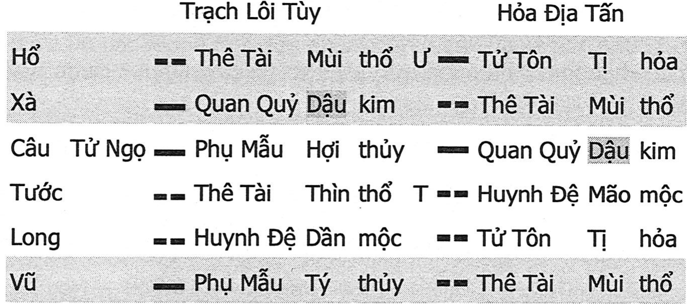
    - **Hình này chứng minh điều gì**
      - Tình hình thực tế, ngay hôm đó, anh ta cùng chúng tôi ra ngoài, đến chỗ đường một chiều, thấy có người đi ngược chiều, anh ta tưởng.
    - **Từ đâu mà thấy được**
      - Dự đoán vận khí cần phán đoán tổng thể, không có Dụng thần cụ thể.
  - **Căn cứ luận đoán**:
    - Dự đoán vận khí cần phán đoán tổng thể, không có Dụng thần cụ thể.
    - Trước tiên xem cát hung, Quan Quỷ tại hào 5 động đến hợp Thế, hào 5 là đường, cho nên lái xe ở trên đường nhất định phải cẩn thận, đây là thông tin tai họa lâm thân.
    - Hào 6 Tài động sinh Quan Quỷ, nhưng bị Nhật hợp cản trở, cần phải đề phòng tháng Sửu xung khai Mùi thổ đến sinh Quỷ hợp Thế.
    - May mà hào Thế không bị Nguyệt khắc và có Nhật sinh, không có nỗi lo về tính mạng.
    - Quỷ tại hào 5 lâm kim, hào 5 là phổi, kim cũng chủ phổi và xương cốt, nếu bị thương thì nhất định ở phổi hoặc ở xương sườn.
    - Lại xem tài vận, Tài mặc dù được Nhật sinh, nhưng hào lâm Tài là hào Ứng, chứ không phải là hào Thế, Tài trên quẻ thì động hóa hồi đầu sinh, Thế là mình không có tài, Ứng là vợ, bạn gái, bạn gái có tài vận tốt hơn mình.
    - Tài trên Thế bị hào 5 Quan Quỷ động đến hợp, Quan Quỷ là cái quản thúc ta, hào 5 là đường, chính là cảnh sát giao thông.
    - Do đó phán đoán sắp tới sẽ bị cảnh sát giao thông phạt tiền. Tên quẻ là Tùy, có ý nghĩa là theo, anh không phải là người duy nhất bị phạt.
    - Phán đoán thân thể:
    - Quan Quỷ là bệnh, tại hào 5, hào 5 là ngũ quan, kim chủ tai, kim Không tắc minh, do đó bình thường tai không tốt, có hiện tượng ù tai.
    - Quan Quỷ hợp đến hào 3, hào 3 là bụng, biểu thị bệnh sẽ lưu lại ở bộ vị này.
    - Hào 3 là ruột, lâm Chu Tước chủ viêm, do đó phán đoán có viêm ruột. Kim Không tắc minh, phán đoán thường xuyên đánh rắm.
    - Tình hình thực tế, ngay hôm đó, anh ta cùng chúng tôi ra ngoài, đến chỗ đường một chiều, thấy có người đi ngược chiều, anh ta tưởng
  - **Ứng nghiệm thực tế**:
    - là có thể đi được, cũng đi theo người ta, kết quả là người đi trước bị cảnh sát bắt lại và phạt tiền, bản thân cũng bị phạt 30 tệ, bị trừ 3 điểm lái xe.
    - Phán đoán về bệnh tật và tài vận cũng hoàn toàn ứng nghiệm, đến tháng Sửu đã xảy ra tai nạn giao thông, đã bị thương xương sườn và phổi, sau giữ được một mạng, hiện nay đã bỏ nghề lái xe.
- **Bảng Quẻ & Quái lệ 5**: Ngày Nhâm Ngọ tháng Hợi, một người phụ nữ trẻ tuổi dự đoán khi nào có thể được giải quyết thủ tục nghỉ hưu? Được Trạch Lôi Tùy biến Thiên Địa Bĩ.
  - **Hình 99.** Quẻ Trạch Lôi Tùy biến Thiên Địa Bĩ
    - 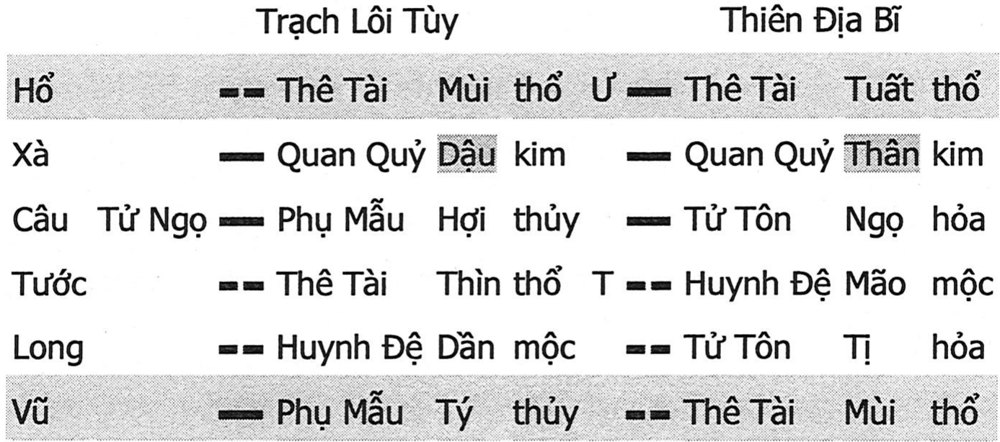
    - **Hình này chứng minh điều gì**
      - Hào 6 Tài động hóa tiến, hào 6 là hào vị thoái hưu, Tài này nhất định là tiền hưu, biểu thị cũng nhận được tiền hưu.
    - **Từ đâu mà thấy được**
      - Lấy hào Phụ Mẫu làm Dụng thần.
  - **Căn cứ luận đoán**:
    - Lấy hào Phụ Mẫu làm Dụng thần.
    - Phụ Mẫu được Nguyệt tỉ phù vượng, mặc dù động hóa hồi đầu khắc, nhưng có Nhật hợp hào biến, tham hợp quên khắc, đồng thời Phụ Mẫu động mà bị Nhật xung, gọi là xung nó động mạnh hơn, do đó trong thời gian ngắn nhất định có thể được giải quyết.
    - Chỉ là Nguyên thần Không, Phụ Mẫu bị hào 6 Mùi thổ đến khắc, cần tăng cường lực lượng hơn nữa. Dự đoán ngày Thân Dậu có thể thành.
    - Quẻ là Tùy, là tượng phụ họa, đi theo, biểu thị lần này không chỉ có một mình chị làm thủ tục nghỉ hưu, mà là có một nhóm người.
    - Hào 6 Tài động hóa tiến, hào 6 là hào vị thoái hưu, Tài này nhất định là tiền hưu, biểu thị cũng nhận được tiền hưu.
  - **Ứng nghiệm thực tế**:
    - Phán đoán trên đây hoàn toàn ăn khớp với thực tế, sau quả nhiên ở ngày Giáp Thân được giải quyết xong thủ tục, đã nhận được vài vạn tệ tiền hưu.

## Chương 5: Giải thích và ứng dụng tượng 8 quẻ cung Tốn

### 1. TỐN VI PHONG

- **Tượng của quẻ**:
  - nội ngoại đều là Tốn, Tốn là phong (gió), là nhu, thượng hạ nhất thể, cho nên là thuận.
- **Tượng của lục hào**:
  - Thế tại hào 6, hào 6 là thiên, Huynh Đệ là phong. Mộc cũng là phong, cho nên Tốn là phong.
  - Mộc là nhân từ, cho nên có tượng nhu, Thế có Ứng đến khắc, lấy lòng nhân từ của mình để chịu đựng cái khắc của đối phương, cho nên là thuận.
- **Ý nghĩa biểu tượng cốt lõi**:
  - nhanh, mềm yếu, tiêu vong, hư vô, lờ mờ, đoán không chắc, thuận theo v.v.
- **Bảng Quẻ & Quái lệ 1**: Ngày Quý Dậu tháng Tuất, một người đoán về việc thăng chức, được Tốn Vi Phong biến Địa Phong Thăng.
  - **Hình 100.** Quẻ Tốn Vi Phong biến Địa Phong Thăng
    - 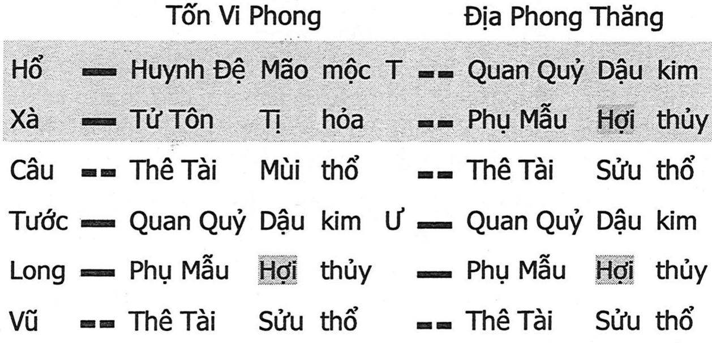
    - **Hình này chứng minh điều gì**
      - Trong quẻ có Quan, hào Thế lại động mà hóa ra Quan, đây là thân kiêm hai chức.
    - **Từ đâu mà thấy được**
      - Lấy Quan Quỷ làm Dụng thần, Quan Quỷ được Nguyệt sinh Nhật tỉ vượng tướng.
  - **Căn cứ luận đoán**:
    - Lấy Quan Quỷ làm Dụng thần, Quan Quỷ được Nguyệt sinh Nhật tỉ vượng tướng.
    - Lẽ ra phán đoán có thể được thăng chức, nhưng quẻ này có đặc điểm là ngoại quái phản ngâm, hào Thế hóa ra Quan đến khắc Thế, có vẻ như không cát.
    - Nhưng quẻ này lại có điểm huyền diệu khác.
    - Quẻ này không phải là hỏi cát hung, do đó hóa Quan Quỷ hồi đầu khắc cũng không thể nói là không tốt, mà phải lý giải là hào Thế động mà hóa Quan.
    - Đây là thông tin gặp quan. Quan Quỷ lâm Nhật, lại là Tốn Vi Phong, biểu thị chuyện thăng chức ngày một ngày hai sẽ xong.
    - Có thể nhanh chóng nhận được chức vụ.
    - Trong quẻ có Quan, hào Thế lại động mà hóa ra Quan, đây là thân kiêm hai chức.
    - Phản ngâm thông thường nói về sự việc lặp đi lặp lại, cực kỳ đau khổ. Nhưng quẻ này luận là cát, là trong ngoài đều có tiếng hoan hô.
    - Quan Quỷ khắc Thế, là thông tin áp lực công việc lớn, trách nhiệm lớn.
  - **Đối thoại & Diễn biến thực tế**:
    - Trên thực tế, người này đảm nhiệm chức vụ ở cơ quan nhà nước, hôm đó lại bị giao một chức vụ ở nơi khác.
- **Bảng Quẻ & Quái lệ 2**: Ngày Bính Tý tháng Tý, một người hỏi có thể tiếp tục đảm nhiệm làm người thường trực của một hiệp hội hay không? Được Tốn Vi Phong.
  - **Hình 101.** Quẻ Tốn Vi Phong
    - 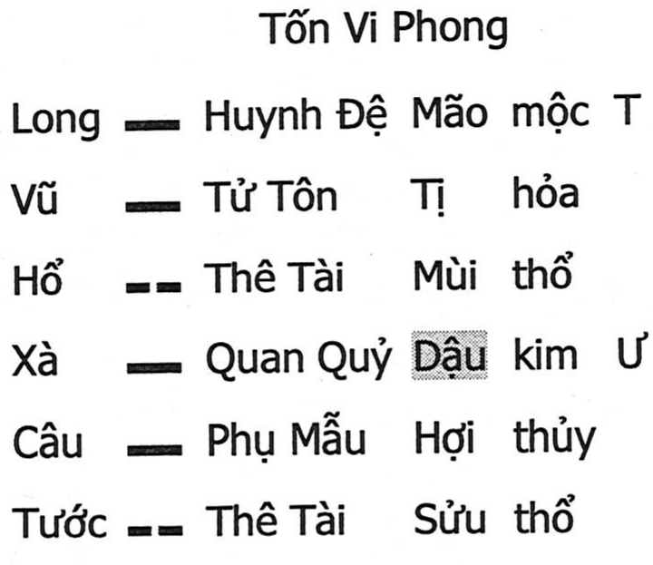
    - **Hình này chứng minh điều gì**
      - Kết quả đúng là như vậy, người này đã tự động từ bỏ chức vụ.
    - **Từ đâu mà thấy được**
      - Lấy hào Quan Quỷ làm Dụng thần, Dụng thần không được Nhật Nguyệt sinh phù, lại thêm Không Vong, nhất định sẽ không tiếp tục đảm nhiệm, Quan Quỷ Khô...
  - **Căn cứ luận đoán**:
    - Lấy hào Quan Quỷ làm Dụng thần, Dụng thần không được Nhật Nguyệt sinh phù, lại thêm Không Vong, nhất định sẽ không tiếp tục đảm nhiệm, Quan Quỷ Không Vong là hư chức, Thế tại hào 6, hào 6 là hào vị thoái hưu, lâm Thanh Long, tượng thanh cao, quẻ lục xung, Thế xung Quan Quỷ, không để chức vụ này trong tâm, Tốn là phong, chức vụ như mây khói tan, chính là bản thân từ bỏ.
    - Kết quả đúng là như vậy, người này đã tự động từ bỏ chức vụ.
- **Bảng Quẻ & Quái lệ 3**: Ngày Ất Sửu tháng Ngọ, đồng nghiệp ở đơn vị bị bệnh, dự đoán cát hung của người này, được Tốn Vi Phong biến Trạch Phong Đại Quá.
  - **Căn cứ luận đoán**:
    - Lấy Huynh Đệ làm Dụng thần. Dụng thần không được Nhật Nguyệt sinh phù, nhập động Mộ hóa Mộ, cực kỳ không tốt.
    - Quẻ tại cung Tốn, Tốn là gan mật, Kỵ thần Quan Quỷ tại hào 3, hào 3 là hào vị gan, lâm Câu Trần, là gan to, xơ gan.
    - Quẻ này Dụng thần hoàn toàn không có cứu trợ, Tốn giả phong dã, mệnh người này tan như mây khói, lành ít dữ nhiều.
    - Đề phòng tháng Dậu Dụng thần bị xung là hung.
  - **Đối thoại & Diễn biến thực tế**:
    - Trên thực tế, ở ngày Quý Sửu tháng Dậu, người này đã chết vì xơ gan, gan cổ trướng.

### 2. PHONG THIÊN TIỂU SÚC

- **Tượng của quẻ**:
  - ngoại quái Tốn là nhập, nội quái Càn là châu báu, chính là khảm châu báu vào chỗ nào đó, cho nên lưu lại một vật đẹp đẽ.
  - Nhưng vật đẹp thì người người thích, không có châu báu nào được bảo tồn vĩnh viễn ở trong tay một cá nhân, cho nên việc lưu lại cũng chỉ là tạm thời, do đó mà có tên gọi là Tiểu Súc.
  - Đặc điểm của quẻ này là Thế tại hào sơ, hào sơ là chân của người.
  - Biểu thị người đi trên đường, và lâm hào Phụ Mẫu, Phụ Mẫu chủ nhà, ý là trong quá trình đi thì người vào nhà nghỉ ngơi một lúc.
  - Xét từ tượng này, thì sẽ có ý nghĩa là đình lưu (dừng lại, ở lại). Tiểu Súc cũng có ý nghĩa là nghỉ một lát.
  - Tiểu Súc thông thường có ý nghĩa là ngắn hạn, ngắn ngủi, thời gian không dài, khoảnh khắc, tốc độ nhanh, tồn trữ ít v.v.
  - Khi dự đoán về hôn nhân, người xưa nói rằng gặp được quẻ Tiểu Súc là không tốt, là phu thê bất hòa.
  - Chính là hai người không thể chung sống lâu dài, nếu là dự đoán của nam, Tài đến hào 3, hào 3 là
  - giường, có thể xuất hiện tình trạng đồng cư, nhưng hai hào Tài thì dễ xuất hiện người thứ ba, mà hào 2 là nhà, lâm hào Huynh Đệ, biểu thị mặc dù ở chung với người nữ này, nhưng khó mà bước vào gia môn của mình.
  - Nếu là dự đoán hôn nhân của nữ, Dụng thần Quan Quỷ bất thượng quái, hào 2 hào trạch là Tuyệt địa của Dụng thần, Quan lại phục ở dưới Tài và tương hợp Thê Tài Thìn thổ, mặc dù Quan sinh hào Thế, nhưng cũng khó tránh việc chồng xuất hiện ngoại tình.
- **Bảng Quẻ & Đồ hình liên hệ**: Quẻ Tốn Vi Phong biến Trạch Phong Đại Quá
  - **Hình 102.** Quẻ Tốn Vi Phong biến Trạch Phong Đại Quá
    - 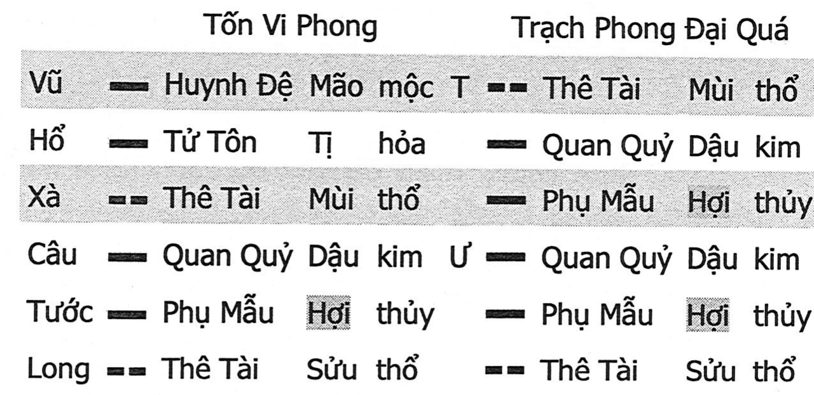
    - **Hình này chứng minh điều gì**
      - giường, có thể xuất hiện tình trạng đồng cư, nhưng hai hào Tài thì dễ xuất hiện người thứ ba, mà hào 2 là nhà, lâm hào Huynh Đệ, biểu thị mặc dù ở ...
    - **Từ đâu mà thấy được**
      - Đặc điểm của quẻ này là Thế tại hào sơ, hào sơ là chân của người.
- **Bảng Quẻ & Quái lệ 1**: Ngày Giáp Thân tháng Tị, một người nữ dự đoán hôm đó xảy ra chuyện gì? Được Phong Thiên Tiểu Súc biến Sơn Thiên Đại Súc.
  - **Hình 103.** Quẻ Phong Thiên Tiểu Súc biến Sơn Thiên Đại Súc
    - 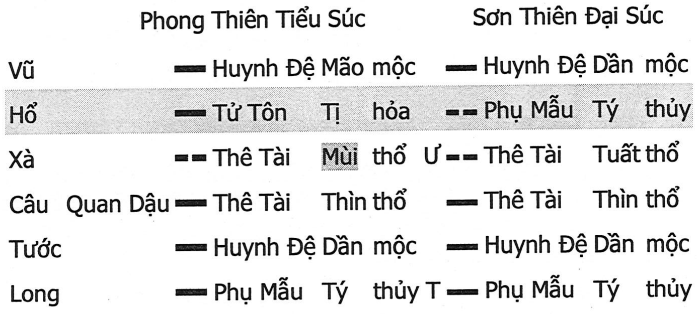
    - **Hình này chứng minh điều gì**
      - Tình hình thực tế, người này bị xe đâm ngã ở trên đường, đã bong gân cổ tay, hình thành tụ máu, bắp thịt trở nên tím bầm.
    - **Từ đâu mà thấy được**
      - Quẻ này không có hướng dự đoán rõ ràng, do đó việc đầu tiên không phải là chọn Dụng thần, mà là phải xem mối quan hệ giữa hào động và hào Thế trong...
  - **Căn cứ luận đoán**:
    - Quẻ này không có hướng dự đoán rõ ràng, do đó việc đầu tiên không phải là chọn Dụng thần, mà là phải xem mối quan hệ giữa hào động và hào Thế trong quẻ.
    - Bởi vì thần triệu cơ ở động, hào động thường là dấu hiệu của sự phát triển sự vật.
    - Quẻ này Tử Tôn Tị hỏa tại hào 5 độc phát, phải lấy tượng làm chủ để phán đoán.
    - Hào độc phát thường biểu thị cát hung, nguyên nhân, tính chất của sự vật.
    - Hào 5 là đường, Tử Tôn cũng là đường, lâm Bạch Hổ cũng chủ đường, lại chủ bị thương, thông tin trong quẻ phản ánh một cách rõ ràng rằng sự việc mà cô ấy dự đoán có liên quan rất lớn đến đường.
    - Lại xét về mối quan hệ giữa hào động với hào Thế, hào động này là Tuyệt địa của hào Thế, từ góc độ tượng thấy rằng, đây là một thông tin không tốt, lâm Bạch Hổ đến Tuyệt, là có chuyện đổ máu hoặc bị thương xảy ra.
    - May mà hào động này tương hợp với Nhật, Nhật hợp là vướng chân, cho nên ảnh hưởng của Tị hỏa này đối với hào Thế sẽ nhỏ đi.
    - Tổng hợp các thông tin nói trên, tôi phán đoán rằng cô ấy đã bị thương trên đường, hào Thế Tuyệt tại Bạch Hổ, Bạch Hổ chủ máu, Phong Thiên Tiểu Súc có tượng bế tắc không thông.
    - Biểu thị chỗ bị thương của cô ấy sẽ xuất hiện tình trạng mạch máu không thông, xảy ra tụ máu.
    - Tình hình thực tế, người này bị xe đâm ngã ở trên đường, đã bong gân cổ tay, hình thành tụ máu, bắp thịt trở nên tím bầm.

### 3. PHONG HỎA GIA NHÂN

- **Tượng của quẻ**:
  - ngoại quái là Tốn, là trưởng nữ, là mộc, nội quái là Ly, là trung nữ, ngoại sinh nội, nội chủ nhà, hai nữ đồng cung, mặc dù đều là âm, nhưng có thể hòa thuận nhất thể, giống như anh chị em ruột thịt.
  - Do đó gọi là Gia Nhân (người trong nhà), người xưa nói, Gia Nhân giả, đồng dã.
- **Tượng của lục hào**:
  - Thế tại hào 2, hào Tài trì Thế, hào 2 là trạch, lấy vợ ở nhà, được Tử Tôn đến sinh, tượng lấy vợ sinh con.
  - Lại thêm hào 2 là bếp, Tài là ẩm thực, được hỏa trên Ứng đến sinh, tạo khói bếp, là tượng về gia đình.
  - Do đó gọi là Gia Nhân, phù hợp với quái tượng.
- **Ý nghĩa biểu tượng cốt lõi**:
  - tương đồng, thân mật, thân cận, kề cạnh, mật thiết, đồng đẳng (ngang nhau), tương tự v.v.
- **Bảng Quẻ & Quái lệ 1**: Ngày Giáp Dần tháng Tý, nam đoán mối quan hệ với người nữ sẽ phát triển ra sao? Được Phong Hỏa Gia Nhân biến Phong Sơn Tiệm.
  - **Hình 104.** Quẻ Phong Hỏa Gia Nhân biến Phong Sơn Tiệm
    - 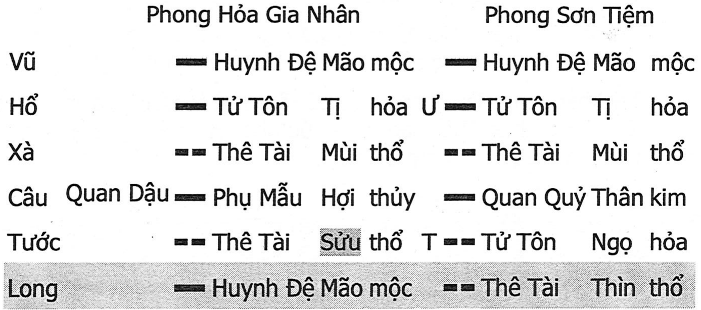
    - **Hình này chứng minh điều gì**
      - Nhưng Dụng thần Không Vong, biểu thị không ở trong nhà, biểu thị bạn gái đã trốn khỏi nhà.
    - **Từ đâu mà thấy được**
      - Lấy Tài làm Dụng thần.
  - **Căn cứ luận đoán**:
    - Lấy Tài làm Dụng thần. Tài tại hào 2, hào 2 là trạch, Thế lại lâm hào này, đây là thông tin bạn gái ở chung với mình.
    - Quẻ là Gia Nhân, Gia Nhân giả, đồng dã, hai người giống như người một nhà, mối quan hệ đã không còn như bình thường.
    - Nhưng Dụng thần Không Vong, biểu thị không ở trong nhà, biểu thị bạn gái đã trốn khỏi nhà.
    - Dụng thần Nguyệt không sinh phù, Nhật khắc, Mão mộc độc phát, Dụng thần lâm Tử địa, biểu thị mối quan hệ giữa hai người rất không tốt, đã không thể vãn hồi.
  - **Đối thoại & Diễn biến thực tế**:
    - Anh ta nói rằng, kể cả lần này, bạn gái đã bỏ đi 4 lần, lần này đã bỏ đi rất lâu, hiện nay vẫn chưa tìm được ở đâu.
    - Sau này bạn gái của người đó cũng không trở về nữa.
- **Bảng Quẻ & Quái lệ 2**: Ngày Ất Mùi tháng Mão, nữ hỏi rằng mình có phải con đẻ của cha mẹ hay không, được Phong Hỏa Gia Nhân biến Phong Sơn Tiệm.
  - **Hình 105.** Quẻ Phong Hỏa Gia Nhân biến Phong Sơn Tiệm
    - 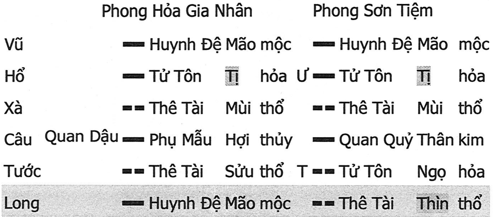
    - **Hình này chứng minh điều gì**
      - Nguyên thần tại hào 5 lâm Bạch Hổ Không Vong mà không sinh Thế, Bạch Hổ chủ tức giận khổ đau, biểu thị lúc nhỏ thường xuyên khóc.
    - **Từ đâu mà thấy được**
      - Xem mối quan hệ giữa Thế và hào Phụ Mẫu.
  - **Căn cứ luận đoán**:
    - Xem mối quan hệ giữa Thế và hào Phụ Mẫu.
    - Phụ Mẫu không được Nhật Nguyệt sinh phù, trái lại bị Nhật khắc là hưu tù, vượng tướng là thật, hưu tù là giả, bản thân không phải là con đẻ.
    - Quẻ là Gia Nhân, Gia Nhân giả đồng dã, chẳng qua là vận mệnh khiến mình và bọn họ cùng sống với nhau, thành người một nhà.
    - Thế khắc Phụ Mẫu, bản thân có tâm lý bài xích cha mẹ.
    - Hào sơ Huynh Đệ động khắc Thế, hào sơ là lúc nhỏ, Huynh Đệ là anh chị em, biểu thị lúc nhỏ bị anh chị em ức hiếp.
    - Nguyên thần tại hào 5 lâm Bạch Hổ Không Vong mà không sinh Thế, Bạch Hổ chủ tức giận khổ đau, biểu thị lúc nhỏ thường xuyên khóc.
  - **Đối thoại & Diễn biến thực tế**:
    - Cô ấy nói rằng mình chẳng giống điểm nào với các chị em gái khác, cha mẹ ít khi quan tâm mình, hiện nay cha đã qua đời, mẹ mặc dù còn sống nhưng cũng không thể trò chuyện, muốn thông qua dự đoán chứng thực thử xem mà thôi.
    - Trước đây đã hỏi cha mẹ nhiều lần, bọn họ đều không tỏ rõ thái độ.
    - Hiện nay nhân lúc mẹ còn sống, định làm giám định ADN, sau quả nhiên chứng thực bản thân không phải là con đẻ, tuy nhiên không thể biết được lý do tại sao mình lại đến gia đình này.

### 4. PHONG LÔI ÍCH

- **Tượng của quẻ**:
  - ngoại quái là Tốn, là trưởng nữ, nội quái là Chấn, là trưởng nam, âm dương chính phối.
  - Âm dương hòa hợp, tự nhiên hữu ích, nhưng âm thượng dương hạ, âm lộ ra ở ngoại, ẩn tàng tượng hung, cho nên người xưa nói, Ích giả, tổn dã.
- **Tượng của lục hào**:
  - Thê Tài trì Thế, Tài là của cải, đã đến bên cạnh ta, nhất định là được lợi ích.
  - Nhưng Huynh Đệ trên Ứng khắc Thế, người ta nhìn chằm chằm như hổ đói, muốn cướp tài của ta, cũng là tượng ẩn tàng tổn thất.
- **Ý nghĩa biểu tượng cốt lõi**:
  - Do đó quẻ này bao hàm ý nghĩa là có lợi, có ích, lợi ích, hòa bình, hòa hợp, tổn thất, nguy cơ v.v.
- **Bảng Quẻ & Quái lệ 1**: Ngày Canh Dần tháng Hợi, một người phụ nữ đoán về việc tìm Lạt Ma mật giáo để được quán đỉnh, được Phong Lôi Ích biến Phong Địa Quan.
  - **Hình 106.** Sơ đồ quẻ Phong Lôi Ích biến Phong Địa Quan
    - 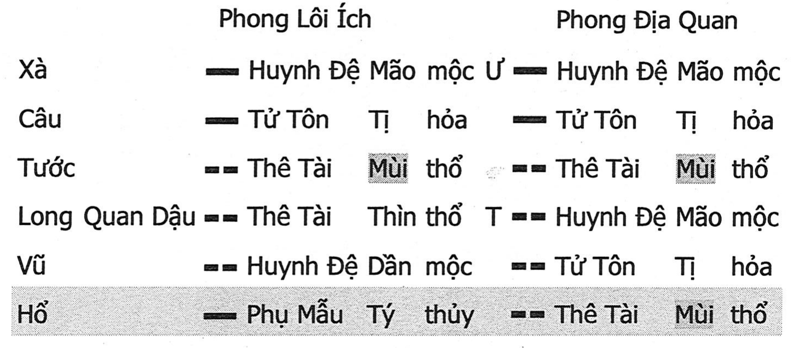
    - **Hình này chứng minh điều gì**
      - Hào sơ Phụ Mẫu Tý thủy độc phát, độc phát lấy tượng làm chủ, Tý thủy chính là Đế Vượng địa của hào Thế, Thế lâm Thanh Long, tượng vui vẻ.
    - **Từ đâu mà thấy được**
      - Thông thường lấy hào Tử Tôn để xem về người xuất gia, nhưng ý niệm câu hỏi của quẻ này là về bản thân, hỏi kết quả của chuyến đi này như thế nào.
  - **Căn cứ luận đoán**:
    - Thông thường lấy hào Tử Tôn để xem về người xuất gia, nhưng ý niệm câu hỏi của quẻ này là về bản thân, hỏi kết quả của chuyến đi này như thế nào?
    - Do đó phải phán đoán xoay quanh hào Thế. Đồng thời có thể tham khảo mối quan hệ giữa hào Tử Tôn và hào Thế.
    - Tử Tôn mặc dù Nguyệt phá, nhưng được Nhật sinh là vượng tướng.
    - Tử Tôn sinh Thế, nhất định được lợi từ Lạt Ma, quẻ này tên là Ích, có ý nghĩa là thu được lợi ích.
    - Hào sơ Phụ Mẫu Tý thủy độc phát, độc phát lấy tượng làm chủ, Tý thủy chính là Đế Vượng địa của hào Thế, Thế lâm Thanh Long, tượng vui vẻ.
    - Hào Thế Đế Vượng tại thủy, cho nên nhất định sẽ nhận được sự quán đỉnh của vị Lạt Ma đó.
  - **Ứng nghiệm thực tế**:
    - Quả nhiên được.
- **Bảng Quẻ & Quái lệ 2**: Ngày Ất Sửu tháng Ngọ, một đồng nghiệp hơn 60 tuổi ở đơn vị bị bệnh, đã vào bệnh viện, tuy là làm cùng một đơn vị nhưng mối quan hệ chỉ là bình thường, để nghiệm chứng dự đoán lục hào, tôi đoán tình hình cát hung của người này, được Phong Lôi Ích biến Phong Hỏa Gia Nhân.
  - **Hình 107.** Sơ đồ quẻ Phong Lôi Ích biến Phong Hỏa Gia Nhân
    - 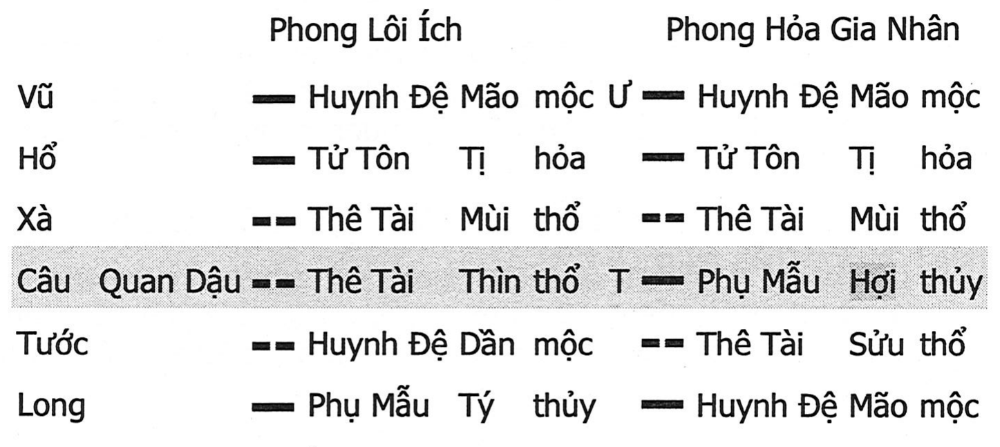
    - **Hình này chứng minh điều gì**
      - Lấy hào Ứng làm Dụng thần.
    - **Từ đâu mà thấy được**
      - Lấy hào Ứng làm Dụng thần.
  - **Căn cứ luận đoán**:
    - Lấy hào Ứng làm Dụng thần. Hào Dụng không được Nhật Nguyệt sinh phù, lại nhập Mộ ở Thê Tài Mùi thổ ám động, nhập Mộ chủ tượng hôn mê.
    - Hào 6 là đầu, biểu thị đầu óc không tỉnh táo, bệnh ở phần đầu.
    - Nguyên thần Nguyệt phá, nhập Mộ ở hào động Thìn thổ, Nguyên thần chủ tư duy của người, cũng là thông tin hôn mê.
    - Dụng thần không có cứu trợ, do đó rất hung. Ích giả tổn dã, thọ của người này tất tổn.
  - **Ứng nghiệm thực tế**:
    - Kết quả là chết não ở giờ Mão ngày Đinh Mão.
- **Bảng Quẻ & Quái lệ 3**: Ngày Mậu Ngọ tháng Thân, một người đoán về tình hình tài vận trong ngày, được Phong Lôi Ích biến Thiên Lôi Vô Vọng.
  - **Căn cứ luận đoán**:
    - Dự đoán tài vận hôm nay, lấy Thê Tài làm Dụng thần, trong quẻ Thê Tài lưỡng hiện.
    - Lấy hào phát động là Thê Tài Mùi thổ làm Dụng thần, Tài Trường Sinh ở Nguyệt, được Nhật thần đến sinh, hôm nay có tài.
    - Tài lâm Huyền Vũ, Huyền Vũ chủ tượng đầu cơ, hôm nay có thể có tài về đầu cơ.
    - Nhưng hào Tài động mà tương hợp với hào biến, trong sinh có hợp, hợp có ý nghĩa là cản trở, quẻ biến lục xung, ngọc có tỳ vết, tên quẻ là Phong Lôi Ích, Ích giả tổn dã, cần phải thấy được rồi thì thu tay.
    - Bằng không sẽ gặp bất lợi.
  - **Đối thoại & Diễn biến thực tế**:
    - Trên thực tế, người này hôm đó rút xổ số được 1200 tệ, cho rằng vận khí rất tốt, lại tiếp tục rút, lại tổn thất hơn 700.

### 5. THIÊN LÔI VÔ VỌNG

- **Tượng của quẻ**:
  - ngoại quái là Càn, là bảo vật, nội quái là Chấn, là động, bảo vật lộ ra ngoài và động, tượng khoe khoang, cho nên ẩn tàng tai họa, cho nên người xưa nói, Vô Vọng giả, tai dã.
- **Tượng của lục hào**:
  - Tử Tôn trì Thế, Tử Tôn là cao ngạo (kiêu ngạo), thanh cao, khắc hào 5 Quan Quỷ, không còn quan hệ vua tôi, chẳng xem cấp trên ra gì, tất cuồng vọng mà gây nên tai họa, Ứng tại hào sơ khắc Thế, hào sơ là tầng thấp, cho nên lực lượng quá nhỏ bé thì có thể hủy hoại chính mình.
- **Ý nghĩa biểu tượng cốt lõi**:
  - cuồng vọng, tự đại, tai họa, cao ngạo, ngạo mạn, đắc ý, phản kháng, bị hại v.v.
- **Bảng Quẻ & Đồ hình liên hệ**: Sơ đồ quẻ Phong Lôi Ích biến Thiên Lôi Vô Vọng
  - **Hình 108.** Sơ đồ quẻ Phong Lôi Ích biến Thiên Lôi Vô Vọng
    - 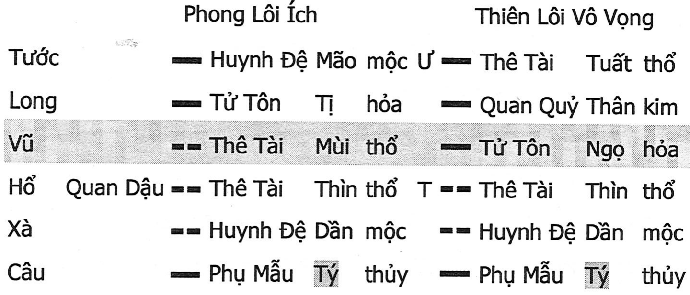
    - **Hình này chứng minh điều gì**
      - Tử Tôn trì Thế, Tử Tôn là cao ngạo (kiêu ngạo), thanh cao, khắc hào 5 Quan Quỷ, không còn quan hệ vua tôi, chẳng xem cấp trên ra gì, tất cuồng vọng...
    - **Từ đâu mà thấy được**
      - Tử Tôn trì Thế, Tử Tôn là cao ngạo (kiêu ngạo), thanh cao, khắc hào 5 Quan Quỷ, không còn quan hệ vua tôi, chẳng xem cấp trên ra gì, tất cuồng vọng...
- **Bảng Quẻ & Quái lệ 1**: Ngày Bính Ngọ tháng Hợi, một người đàn ông dự đoán về thân thể, được Thiên Lôi Vô Vọng biến Trạch Địa Tụy.
  - **Hình 109.** Sơ đồ quẻ Thiên Lôi Vô Vọng biến Trạch Địa Tụy
    - 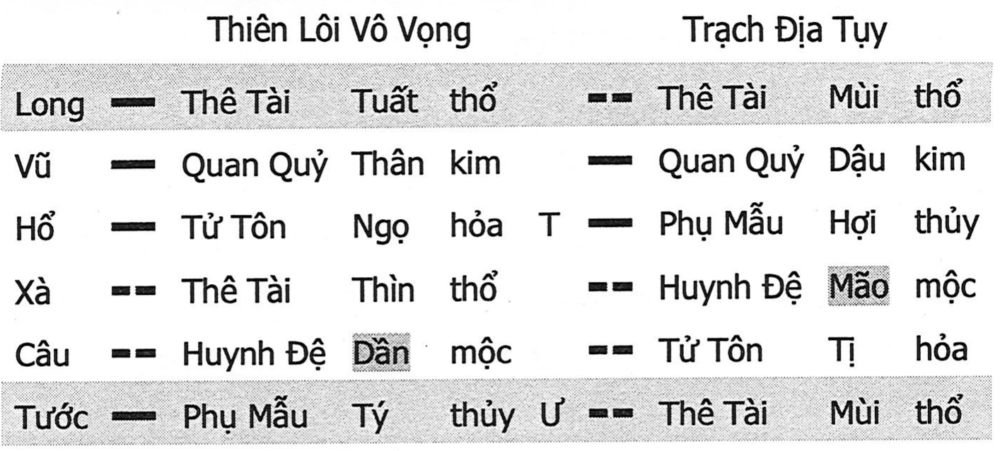
    - **Hình này chứng minh điều gì**
      - Anh ta gật đầu nói đúng.
    - **Từ đâu mà thấy được**
      - Lấy hào Thế làm Dụng thần.
  - **Căn cứ luận đoán**:
    - Lấy hào Thế làm Dụng thần.
    - Thế bị Nguyệt khắc Nhật phù, suy vượng tương đương, hào sơ Kỵ thần động đến khắc, nhưng hóa hồi đầu khắc, lại có hào 6 Tuất thổ động đến chế phục, do đó có bệnh cũng không sao.
    - Thế lâm Ngọ tại hào 4 bị khắc, Nguyên thần mộc Không, Thế lâm Bạch Hổ, hào 4 là hào vị tim, hỏa cũng chủ tim, Bạch Hổ chủ máu, Không mà không sinh, chính là tim cung máu không đủ.
    - Hào 6 động và mặc dù khắc chế Kỵ thần, nhưng lại khiến hào Thế nhập Mộ, hào 6 là đầu, nhập Mộ chủ đầu óc lờ đờ không tỉnh táo, cũng chủ chóng mặt.
    - Tài chủ ẩm thực, động mà hóa thoái, là vật ăn vào lại ra, do đó là nôn mửa, lâm Thanh Long chủ tửu sắc, do đó phán đoán người này không thể uống rượu, một khi uống rượu thì chóng mặt, nôn mửa.
    - Quẻ Vô Vọng, tự cao tự đại, tức giận không nhận cả người thân, khắc hào 5 Quan Quỷ, đối với lãnh đạo cũng dám đấu khẩu.
    - Anh ta gật đầu nói đúng.
  - **Đối thoại & Diễn biến thực tế**:
    - Hào sơ mặc dù bị thổ chế phục, nhưng lâm Nguyệt chung quy vẫn có lực khắc hào Thế, do đó cũng có thể dùng để phán đoán bệnh tật.
    - Hào sơ là chân, cho nên chân cũng có bệnh (trên thực tế là bệnh chai chân).
    - Thế lâm Bạch Hổ, Bạch Hổ chủ nóng nảy, quẻ là lục xung, biểu thị người này cảm xúc không ổn định.
- **Bảng Quẻ & Quái lệ 2**: Ngày Bính Dần tháng Ngọ, một người đàn ông dự đoán về việc con trai thi cấp ba, được Thiên Lôi Vô Vọng biến Phong Thủy Hoán.
  - **Hình 110.** Quẻ Thiên Lôi Vô Vọng biến Phong Thủy Hoán
    - 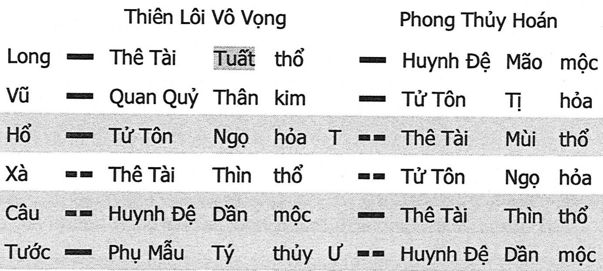
    - **Hình này chứng minh điều gì**
      - Hào Thế Tử Tôn động mà tương hợp với Tài.
    - **Từ đâu mà thấy được**
      - Lấy Quan Quỷ làm Dụng thần, hào Phụ Mẫu dùng để tham khảo.
  - **Căn cứ luận đoán**:
    - Lấy Quan Quỷ làm Dụng thần, hào Phụ Mẫu dùng để tham khảo.
    - Quẻ này Quan Quỷ bị Nguyệt kiến khắc thương, lại không được hào động sinh phù, bị Nhật xung là Nhật phá, đồng thời lại có hào sơ thủy động sinh mộc, mộc động sinh hỏa, hỏa động khắc Quan.
    - Quan Quỷ có khắc không có sinh. Hưu tù tột cùng. Mà hào Phụ Mẫu Tý thủy cũng là Nguyệt phá không được Nhật phù. Quan Phụ đều nhược.
    - Kỵ thần Tử Tôn thì có Nguyệt phù Nhật sinh, Huynh Đệ Dần mộc đến sinh, rất cường vượng, tổng hợp Nhật Nguyệt quẻ chính, quẻ biến, Tử Tôn hai tầng, Dần mộc sinh trợ Tử Tôn có ba tầng, đây là Kỵ thần quá vượng, thông thường lấy hung làm cát, lẽ ra không có hy vọng thi đậu, nhưng lại có thể phán đoán thi đậu.
    - Chỉ có điều quẻ này là quẻ Vô Vọng, người xưa nói, Vô Vọng giả tai dã, trong cát tàng hung.
    - Hào Thế Tử Tôn động mà tương hợp với Tài. Khiến Quan Quỷ không bị khắc triệt để. Mặc dù quẻ này lấy Kỵ thần quá vượng để luận là cát.
    - Nhưng bởi vì Ngọ hỏa tham hợp quên khắc, ngọc có tỳ vết. Bị Tài hợp, nhất định sẽ gặp rắc rối bởi vì vấn đề tiền tài.
  - **Đối thoại & Diễn biến thực tế**:
    - Người này cho biết, con trai ông ta đang đi học, thành tích học tập rất tệ, nếu chỉ dựa vào thi cử thì hoàn toàn không có hy vọng thi đậu.
    - Do đó ông ta đã lén lút chi 5 vạn tệ để đút lót trường thi và giáo viên chấm bài. Kết quả là con trai ông ta đã trúng tuyển.
    - Nhưng sau khi trúng tuyển không lâu, chuyện này đã bị người ta tố giác. Con trai ông ta lại bị trường học xóa tên.
    - Ngoài ra bản thân ông ta cũng đã phải chịu xử phạt.

### 6. HỎA LÔI PHỆ HẠP

- **Tượng của quẻ**:
  - khi lấy tượng quẻ này, không lấy hàm nghĩa của quẻ, mà là lấy tượng tổ hợp của ký hiệu bát quái.
  - Tổ hợp ký hiệu của quẻ này giống như một cái miệng mở ra có nhai vật trong đó, cho nên gọi là Phệ Hạp (cắn).
  - Người xưa nói, Phệ Hạp giả, xỉ (răng) dã.
- **Tượng của lục hào**:
  - quẻ này Thế tại hào 5, lâm Thê Tài Mùi thổ, hào 5 là miệng, Tài là ẩm thực, chính là trong miệng đang ăn đồ vật.
  - Hoàn toàn thống nhất với tượng của tổ hợp ký hiệu bát quái.
- **Ý nghĩa biểu tượng cốt lõi**:
  - Bởi vì có tượng này, do đó quẻ này bao hàm ý nghĩa là ăn, hôn, kiện cáo, khẩu thiệt, chửi, tranh cãi, nghị luận, thảo luận, biện giải, giảng giải, giải thích v.v.
- **Bảng Quẻ & Quái lệ 1**: Ngày Đinh Sửu tháng Ngọ, nữ dự đoán hôn nhân, được Hỏa Lôi Phệ Hạp.
  - **Hình 111.** Quẻ Hỏa Lôi Phệ Hạp
    - 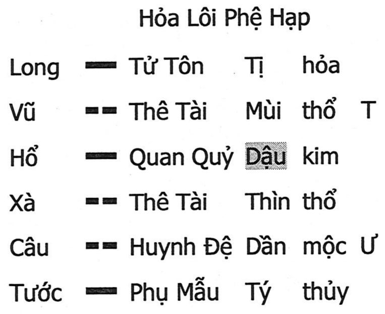
    - **Hình này chứng minh điều gì**
      - Quẻ này dự đoán hôn nhân của nữ, phải lấy Quan Quỷ làm Dụng thần.
    - **Từ đâu mà thấy được**
      - Như tôi đã nói phía trước, Hỏa Lôi Phệ Hạp là tượng cái miệng đang ăn, có thể suy rộng ra là bình luận, nói, tranh cãi.
  - **Căn cứ luận đoán**:
    - Như tôi đã nói phía trước, Hỏa Lôi Phệ Hạp là tượng cái miệng đang ăn, có thể suy rộng ra là bình luận, nói, tranh cãi.
    - Nhưng nhất định phải phối hợp với Dụng thần và các thông tin khác.
    - Quẻ này dự đoán hôn nhân của nữ, phải lấy Quan Quỷ làm Dụng thần.
    - Quan Quỷ Nguyệt khắc nhập Nhật Mộ, lại thêm Không Vong, thì có thể phán đoán hôn nhân của cô ấy không tốt.
    - Lại lấy quái tượng của Hỏa Lôi Phệ Hạp để phán đoán, thì được thông tin vợ chồng bất hòa, thường xuyên cãi nhau.
    - Nhưng hào Thế này ám động sinh Quan Quỷ, biểu thị cô ấy vẫn còn tình cảm với chồng.
  - **Đối thoại & Diễn biến thực tế**:
    - Trên thực tế, ở năm Quý Mùi, người nữ này ly hôn rồi lại phục hôn với chồng.
- **Bảng Quẻ & Quái lệ 2**: Ngày Giáp Dần tháng Hợi, một người đoán về việc chuyển việc, được Hỏa Lôi Phệ Hạp biến Sơn Lôi Di.
  - **Hình 112.** Quẻ Hỏa Lôi Phệ Hạp biến Sơn Lôi Di
    - 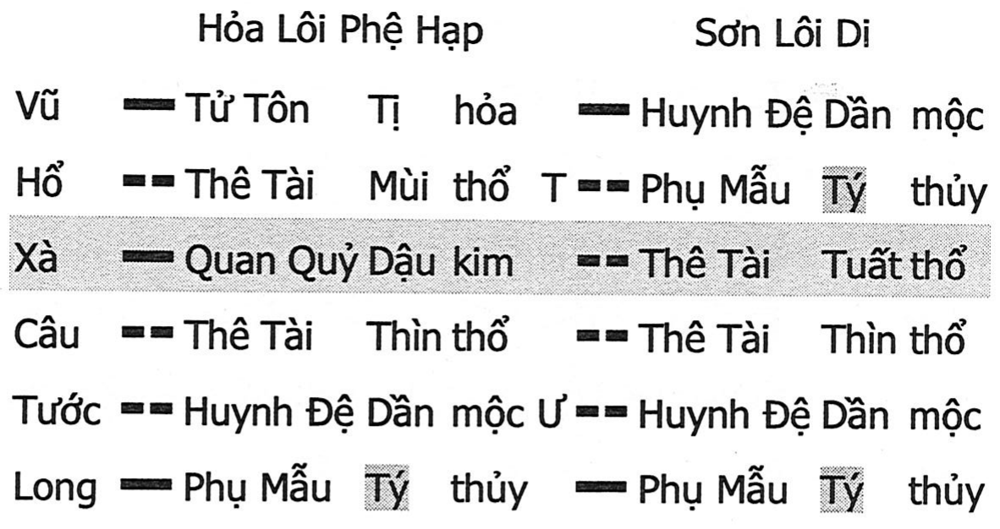
    - **Hình này chứng minh điều gì**
      - Tên quẻ là Hỏa Lôi Phệ Hạp, tôi đoán anh ta không thực sự muốn chuyển việc, chỉ là nói suông thôi, sẽ không hành động.
    - **Từ đâu mà thấy được**
      - Lấy Quan Quỷ làm Dụng thần kiêm xem hào Thế, quẻ này thoạt nhìn Quan Quỷ phát động hóa hồi đầu sinh.
  - **Căn cứ luận đoán**:
    - Lấy Quan Quỷ làm Dụng thần kiêm xem hào Thế, quẻ này thoạt nhìn Quan Quỷ phát động hóa hồi đầu sinh.
    - Lẽ ra có thể chuyển việc thành công, nhưng Quan Quỷ hưu tù Tuyệt ở Nhật, hào Thế lại bị khắc chế, không thể đi sinh Quan Quỷ, bản thân không có năng lực thay đổi môi trường làm việc.
    - Tên quẻ là Hỏa Lôi Phệ Hạp, tôi đoán anh ta không thực sự muốn chuyển việc, chỉ là nói suông thôi, sẽ không hành động.
  - **Ứng nghiệm thực tế**:
    - Sau đó quả nhiên anh ta đã không chuyển việc.
- **Bảng Quẻ & Quái lệ 3**: Ngày Tân Dậu tháng Tý, nữ dự đoán vận đào hoa, được Hỏa Lôi Phệ Hạp biến Sơn Thiên Đại Súc.
  - **Hình 113.** Quẻ Hỏa Lôi Phệ Hạp biến Sơn Thiên Đại Súc
    - 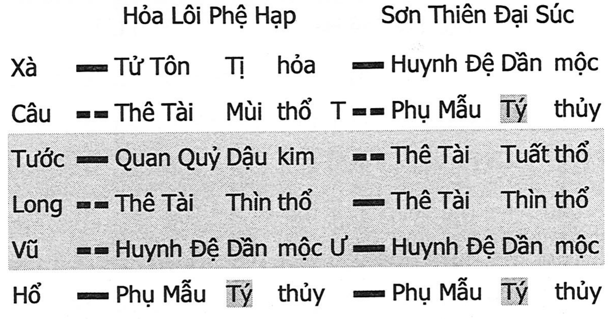
    - **Hình này chứng minh điều gì**
      - Người nữ này nói: Chỉ hôn đối phương thôi, vốn muốn nhờ anh ta chi tiền giúp mình phát triển sự nghiệp, nhưng đối phương do dự bất định, do đó rất ...
    - **Từ đâu mà thấy được**
      - Lấy Quan Quỷ làm Dụng thần, trong quẻ Quan Quỷ lâm Nhật phát động, động mà hóa hồi đầu sinh, biểu thị cô ấy có người yêu, hóa ra Tuất thổ hồi đầu s...
  - **Căn cứ luận đoán**:
    - Lấy Quan Quỷ làm Dụng thần, trong quẻ Quan Quỷ lâm Nhật phát động, động mà hóa hồi đầu sinh, biểu thị cô ấy có người yêu, hóa ra Tuất thổ hồi đầu sinh, đoán là quen ở tháng Tuất, Quan Quỷ và hào 3 Thê Tài tương hợp, Tài là nữ nhân, biểu thị người đàn ông mà cô ấy quen là người đã có vợ, Thê Tài Thìn thổ lâm Thanh Long, Thanh Long chủ mỹ mạo.
    - Biểu thị vợ của người đó trông rất xinh đẹp.
    - Quan Quỷ lâm Chu Tước, Chu Tước chủ văn hóa giáo dục, người đàn ông này làm về văn hóa giáo dục, Quan Quỷ Dậu kim lâm Chu Tước, Mộc Dục hào Thế, Chu Tước chủ miệng, Phệ Hạp lại chủ cái miệng đang ăn, tổng hợp lại là tượng hai người hôn nhau, nội quái phục ngâm, Hương Khuê (Phụ Mẫu Tý thủy) Không Vong, quan hệ giữa hai người là không đồng cư.
    - Người nữ này nói:
    - Chỉ hôn đối phương thôi, vốn muốn nhờ anh ta chi tiền giúp mình phát triển sự nghiệp, nhưng đối phương do dự bất định, do đó rất là bực mình, không muốn phát triển tình cảm sâu đậm hơn nữa.

### 7. SƠN LÔI DI

- **Tượng của quẻ**:
  - quẻ này cũng lấy tượng của ký hiệu bát quái. Ký hiệu của quẻ này giống như một cái miệng mở ra.
  - Ngoại quái là Cấn, Cấn là dừng, nội quái là Chấn, là động, động mà dừng, tượng lao dật kết hợp (kết hợp giữa làm việc và nghỉ ngơi), tu dưỡng.
  - Há miệng ra ăn, để nuôi thân thể của mình. Cho nên gọi là Di (nuôi dưỡng). Người xưa nói, Di giả, dưỡng dã.
- **Tượng của lục hào**:
  - Thê Tài Tuất thổ trì Thế, Tài chủ ẩm thực, lại là nguồn dưỡng mệnh, hào Thế đến hào 4, biểu thị vật ăn vào, đã đến thực quản, đang nuốt xuống, lại xuống nhập Mộ tại Thìn thổ, chính là vào trong dạ dày, tồn trữ ở đây, hấp thụ dinh dưỡng, nuôi thân thể của ta.
- **Ý nghĩa biểu tượng cốt lõi**:
  - xin giúp đỡ, đưa ra câu hỏi, tu dưỡng, bảo hộ, tự lực cánh sinh, tự mình phát triển, tay trắng dựng cơ đồ, v.v.
- **Bảng Quẻ & Quái lệ 1**: Ngày Ất Dậu tháng Hợi, một tài xế đoán vận khí, Sơn Lôi Di biến Sơn Trạch Tổn.
  - **Hình 114.** Quẻ Sơn Lôi Di biến Sơn Trạch Tổn
    - 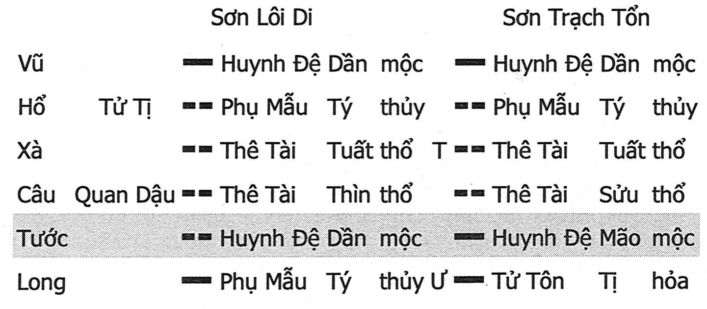
    - **Hình này chứng minh điều gì**
      - Ngày Ất Dậu tháng Hợi, một tài xế đoán vận khí, Sơn Lôi Di biến Sơn Trạch Tổn.
    - **Từ đâu mà thấy được**
      - Căn cứ ngũ hành sinh khắc, Dụng thần, Thế Ứng và hào động biến trong quẻ.
  - **Đối thoại & Diễn biến thực tế**:
    - Trên thực tế, sau khi dự đoán không lâu, người này đã xảy ra tai nạn giao thông, đã bị đâm gãy xương sườn.
  - **Ứng nghiệm thực tế**:
    - Làm tài xế, khi dự đoán vận khí, điều quan trọng nhất là cát hung, sau đó mới là tài và những thứ khác, quẻ này Huynh Đệ độc phát, động mà hóa Tiến thần khắc Thế, hào Thế hưu tù.
    - Nhất định có tai họa phát sinh, Thế tại hào 4, hào 4 là ngực, hào Tài trì Thế bị khắc, Tài chủ ẩm thực và hô hấp, quẻ Di là tượng há miệng, quẻ này là bị thương, há miệng thở, do đó cần phải cẩn thận.
- **Bảng Quẻ & Quái lệ 2**: Ngày Ất Mão tháng Thìn, một người phụ nữ hỏi có thể phục hôn với chồng cũ thành công hay không? Được Sơn Lôi Di biến Sơn Trạch Tổn.
  - **Hình 115.** Quẻ Sơn Lôi Di biến Sơn Trạch Tổn
    - 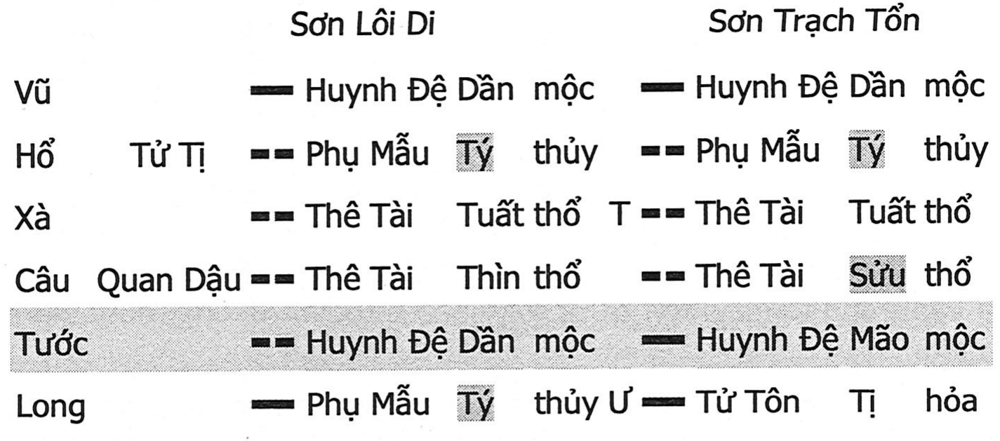
    - **Hình này chứng minh điều gì**
      - Hào Thế Nguyệt phá, biểu thị tâm hồn của mình đã tan vỡ, Huynh Đệ trên Nhật đến hợp giải phá, Nhật trong hợp có khắc, cái khắc ta là Quan Quỷ, Huyn...
    - **Từ đâu mà thấy được**
      - Lấy Quan Quỷ làm Dụng thần, Quan Quỷ phục tàng, chồng không ở bên mình.
  - **Căn cứ luận đoán**:
    - Lấy Quan Quỷ làm Dụng thần, Quan Quỷ phục tàng, chồng không ở bên mình. Hào Ứng là phu vị, Không Vong, phu vị chẳng có một ai.
    - Sơn Lôi Di, tượng mở miệng xin người khác giúp đỡ, cô ấy muốn thỉnh cầu chồng phục hôn.
    - Nhưng hào Thế Nguyệt phá lâm Trình Xà, Trình Xà chủ bất an, biểu thị bản thân rất phiền não vì chuyện này.
    - Huynh Đệ Dần mộc tại hào 2 độc phát, là Tuyệt địa của Quan Quỷ, hào 2 là trạch, Dụng thần Tuyệt tại hào trạch, chồng sẽ không về nhà, lại thêm quẻ chính du hồn, chủ phân ly, do đó nhất định sẽ không sum họp, chuyện này không thành.
    - Hào Thế Nguyệt phá, biểu thị tâm hồn của mình đã tan vỡ, Huynh Đệ trên Nhật đến hợp giải phá, Nhật trong hợp có khắc, cái khắc ta là Quan Quỷ, Huynh Đệ này cũng có thể xem là đàn ông.
    - Có thể xoa dịu tâm hồn tan vỡ của mình, sang tháng bất phá, tháng sau sẽ xuất hiện.
    - Nhưng Huynh Đệ này vừa hợp phá vừa khắc Tài trên Thế, cho nên người này xuất hiện là tốn tiền của chị.
  - **Ứng nghiệm thực tế**:
    - Quả nhiên không phục hôn thành công với chồng.
    - Ở tháng Tị, cô ấy lại quen một chàng trai nhỏ hơn mình 20 tuổi, hai người đã chung sống với nhau, cô ấy kiếm tiền nuôi đối phương.
- **Bảng Quẻ & Quái lệ 3**: Mấy ngày trước, khi tôi đang thảo luận với học viên trên mạng thì tổng giám đốc của một tập đoàn than đá đã gọi đến nói rằng muốn dự đoán về một người bạn của ông ta. Đối phương lại không nói dự đoán nội dung gì cụ thể. Tôi bảo ông ta gọi lại sau hai phút nữa. Ngay sau đó tôi liền gieo quẻ, được Sơn Lôi Di biến Sơn Trạch Tổn. Điện thoại lại đến sau đó, tôi đã phán đoán một số nội dung, đối phương cảm thấy dự đoán hết sức thần kỳ.
  - **Hình 116.** Sơ đồ quẻ Sơn Lôi Di biến Sơn Trạch Tổn
    - 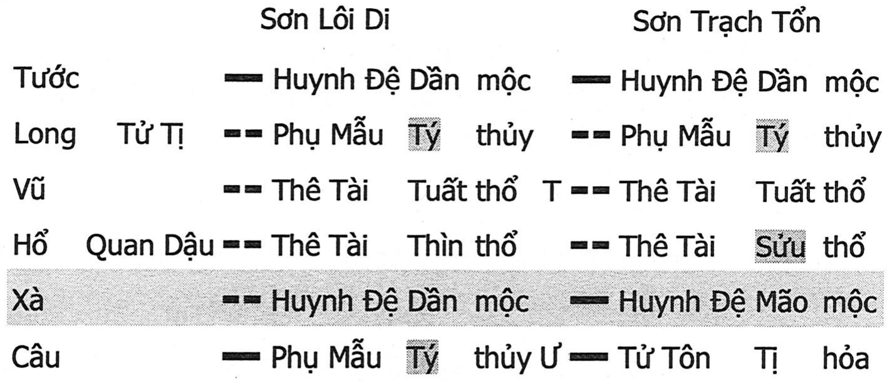
    - **Hình này chứng minh điều gì**
      - Tình hình thực tế, người bạn đã được thả ra ở cuối tháng Ngọ, đã bị xử phạt vi phạm.
    - **Từ đâu mà thấy được**
      - Lấy Huynh Đệ làm Dụng thần.
  - **Căn cứ luận đoán**:
    - Giờ Nhâm Thân ngày Mậu Ngọ tháng Mão.
    - Lấy Huynh Đệ làm Dụng thần. Dụng thần tại hào 2 phát động, hào 2 là trạch, hóa Tiến thần, chính là rời khỏi nhà.
    - Bởi vì quẻ này là quẻ du hồn, du hồn chủ đi xa, cho nên phán đoán sơ bộ là rời khỏi nhà. Độc phát có chức năng biểu thị nguyên nhân.
    - Huynh Đệ lâm Xà phát động, Xà là trói buộc, lại tham khảo hào 6 Huynh Đệ lâm lục thần Chu Tước, Chu Tước là khẩu thiệt kiện tụng, do đó tôi phán đoán là bạn của ông ta đã bị công an bắt.
    - Tài trì Thế, đây là thông tin mình cầm tiền, nhưng hào Thế không sản sinh tác dụng trợ giúp đối với hào Huynh Đệ, cho nên phán đoán là dùng tiền cũng không giải quyết được vấn đề.
    - Dụng thần động, có một loại ứng kỳ đặc biệt, đó là về khi nhập Mộ.
    - Ứng kỳ này cũng tham khảo ảnh hưởng của tháng tương lai đối với Dụng thần.
    - Tháng Tị Ngọ đều không sản sinh tác dụng tốt cho Dụng thần, cho nên e rằng những tháng này khó mà giải quyết.
    - Tình hình thực tế, người bạn đã được thả ra ở cuối tháng Ngọ, đã bị xử phạt vi phạm.
    - Nhất định là tháng Ngọ xung động Tý thủy ám động được sinh.
  - **Ứng nghiệm thực tế**:
    - Phụ Mẫu Tý thủy lưỡng động sinh Dụng thần, đây là thông tin giúp bạn.
    - Di là mở miệng xin giúp đỡ, hào 5 là hào vị lãnh đạo, đương nhiên là nhờ quan chức giúp đỡ. Nhưng Không, không có tác dụng.
    - Hào sơ là một người khác, sau đó lại nhờ một người khác giúp.

### 8. SƠN PHONG CỔ

- **Tượng của quẻ**:
  - Ngoại quái là Cấn, là núi, là dừng, là tổ, nội quái là Tốn, là gió, là sâu bọ.
  - Gió ở dưới núi mà không thể động, không thể lưu thông, sâu bọ làm tổ ở nơi cố định, cho nên gọi là Cổ. Cổ giả, bại dã, hoại dã.
- **Tượng của lục hào**:
  - Quan Quỷ trì Thế, là bệnh, là vi khuẩn, tại quẻ Tốn, Tốn là mộc, là sâu bọ, kim lại là sâu bọ, nhập Mộ tại sơ, tượng vào tổ.
- **Ý nghĩa biểu tượng cốt lõi**:
  - mê hoặc, cám dỗ, dẫn dụ, phá bại, trệ lưu (đình trệ), lợi dụng, thối rữa, lừa gạt v.v.
- **Bảng Quẻ & Quái lệ 1**: Ngày Đinh Dậu tháng Tị, một người phụ nữ dự đoán về việc lên cơn sốt, được Sơn Phong Cổ biến Cấn Vi Sơn.
  - **Hình 117.** Sơ đồ quẻ Sơn Phong Cổ biến Cấn Vi Sơn
    - 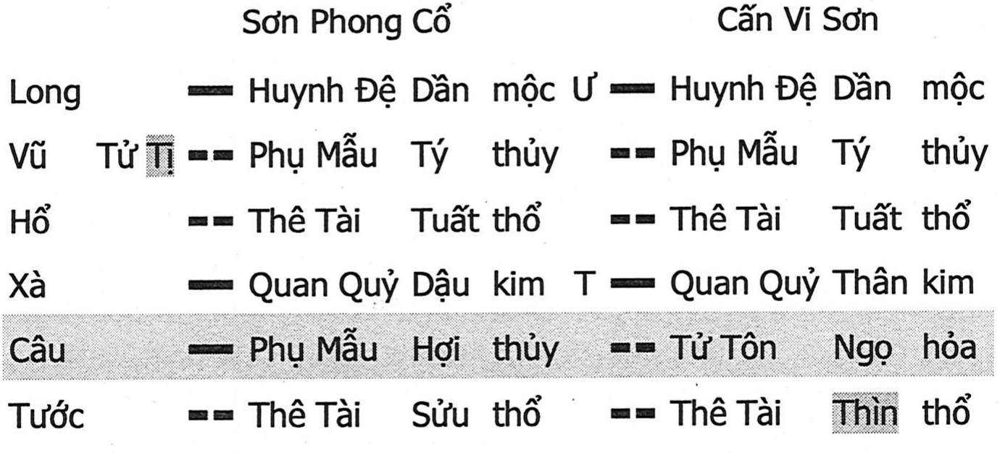
    - **Hình này chứng minh điều gì**
      - ¹ Theo Đoán Dịch Thiên Cơ, Cổ là chỉ sâu bọ sinh ra do thức ăn trong chén đĩa thối rữa.
    - **Từ đâu mà thấy được**
      - Lấy hào Thế làm Dụng thần, Nguyệt kiến mặc dù là hỏa khắc hào Thế, nhưng cũng có ý Trường Sinh, Nhật kiến tương đồng với hào Thế, trợ giúp hào Thế,...
  - **Căn cứ luận đoán**:
    - Lấy hào Thế làm Dụng thần, Nguyệt kiến mặc dù là hỏa khắc hào Thế, nhưng cũng có ý Trường Sinh, Nhật kiến tương đồng với hào Thế, trợ giúp hào Thế, hào Thế vượng tướng, có bệnh cũng không sao.
    - Trong quẻ Hợi thủy độc phát, là Bệnh địa của hào Thế, đây chính là thông tin cô ấy bị bệnh.
    - Thế lâm Trình Xà, Trình Xà chủ vi khuẩn gây bệnh, quẻ tên là Cổ, cũng có ý nghĩa là sâu, quẻ cung Tốn, Tốn là phong.
    - Tổng hợp phán đoán là cảm mạo virus, hào Thế vượng tướng, có bệnh sẽ nhanh khỏi.
    - Theo Đoán Dịch Thiên Cơ, Cổ là chỉ sâu bọ sinh ra do thức ăn trong chén đĩa thối rữa.
  - **Ứng nghiệm thực tế**:
    - Kết quả là người này khỏi bệnh ở ngày hôm sau.
- **Bảng Quẻ & Quái lệ 2**: Ngày Ất Mùi tháng Mùi, nam dự đoán hôn nhân, được Sơn Phong Cổ biến Sơn Thiên Đại Súc.
  - **Hình 118.** Quẻ Sơn Phong Cổ biến Sơn Thiên Đại Súc
    - 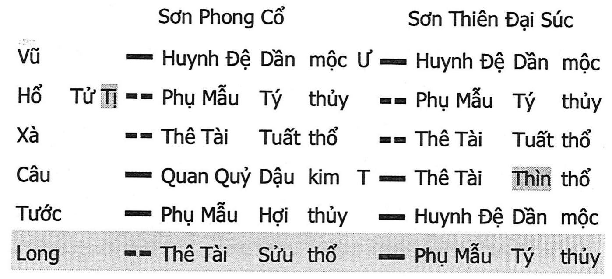
    - **Hình này chứng minh điều gì**
      - Tình hình thực tế quả như dự đoán.
    - **Từ đâu mà thấy được**
      - Lấy hào Thê Tài làm Dụng thần, nam dự đoán hôn nhân, Thê Tài lưỡng hiện thường là hai lần hôn nhân, hoặc có ngoại tình, nhưng đây chỉ là một trong ...
  - **Căn cứ luận đoán**:
    - Lấy hào Thê Tài làm Dụng thần, nam dự đoán hôn nhân, Thê Tài lưỡng hiện thường là hai lần hôn nhân, hoặc có ngoại tình, nhưng đây chỉ là một trong những điều kiện tham khảo mà thôi, còn phải xem mối quan hệ giữa hào Thế và hào Tài, và tình hình tổ hợp của quẻ.
    - Quẻ này Quan Quỷ trì Thế, tại hào 3 lâm Câu Trần, Câu Trần chủ thật thà thận trọng, hào Thế lại không phải là Đào Hoa, lại không thấy Mộc Dục địa, từ vẻ ngoài thấy rằng, người này có vẻ như là người thật thà.
    - Nhưng dự đoán hôn nhân mà quẻ này quá nhiều hào Tài, Nhật Nguyệt là Tài sinh Thế, hào 4 lại là tài, hào sơ lại là Tài động, hào Tài trùng điệp sinh hào Thế, biểu thị người này rất có duyên với phụ nữ.
    - Quẻ này tên là Cổ, Cổ có ý nghĩa là mê hoặc cám dỗ, nhập Mộ ở Thê Tài Sửu thổ, Thê Tài là nữ nhân, lâm Thanh Long là mỹ mạo, hào Thế nhập Mộ, chính là một người ham mê nữ sắc.
    - Quan Quỷ trì Thế, biểu thị người này có chức vụ, và hào sơ là cấp dưới, Mộ khố tại hào sơ, là thèm nhỏ dãi nữ cấp dưới của mình.
    - Và có quan hệ ám muội với cấp dưới.
    - Tình hình thực tế quả như dự đoán.
- **Bảng Quẻ & Quái lệ 3**: Ngày Mậu Ngọ tháng Tý, nam dự đoán về tiền đồ phát triển của công ty du lịch, được Sơn Phong Cổ biến Sơn Trạch Tổn.
  - **Hình 119.** Quẻ Sơn Phong Cổ biến Sơn Trạch Tổn
    - 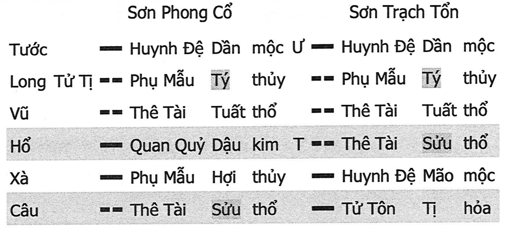
    - **Hình này chứng minh điều gì**
      - Tình hình thực tế là như sau.
    - **Từ đâu mà thấy được**
      - Tiền đồ phát triển của công ty, chủ yếu là nhận định kinh tế, do đó lấy Tài làm Dụng thần, nhưng cũng có thể tham khảo Quan Quỷ, bởi vì Quan Quỷ là...
  - **Căn cứ luận đoán**:
    - Tiền đồ phát triển của công ty, chủ yếu là nhận định kinh tế, do đó lấy Tài làm Dụng thần, nhưng cũng có thể tham khảo Quan Quỷ, bởi vì Quan Quỷ là sự nghiệp.
    - Trong quẻ hai hào Tài, lấy Sửu thổ phát động làm Dụng thần.
    - Hào Tài Sửu thổ này Nguyệt hợp Nhật sinh là vượng, nhất định kinh tế phát triển rất tốt, hơn nữa lại tam hợp thành Quan cục với hào Thế và hào biến của hào sơ.
    - Biểu thị thu nhập rất tốt, sự nghiệp của bản thân được phát triển mở rộng.
    - Hào sơ là cấp dưới, hào âm là nữ nhân, tam hợp cục, biểu thị một nữ cấp dưới cùng mình thúc đẩy phát triển sự nghiệp.
    - Thế tại hào 3 nhập Mộ ở hào sơ là Tài, nhập mộ chủ say mê, quẻ là Cổ, có ý nghĩa là mê hoặc, cho nên bản thân sẽ bị sắc đẹp của nữ cấp dưới này mê hoặc.
    - Hào sơ Sửu thổ lâm Tài Không Vong mà hóa Tuyệt, biểu thị cấp dưới này không thành thật phát triển với anh ta, sẽ lấy tiền vốn của anh ta và đi thật xa.
    - Tình hình thực tế là như sau.
    - Anh ta và một nữ cấp dưới của mình cùng phát triển công ty du lịch này, để lôi kéo người nữ này cùng phát triển với mình, lại say mê sắc đẹp của đối phương, do đó đã phát sinh quan hệ ám muội, nhưng khi sự nghiệp của anh ta đang phát triển rất tốt thì người nữ này đã lấy một số tiền vốn của anh ta và lập một công ty khác.
    - Bởi vì bản thân có quan hệ ám muội với đối phương, do đó không thể công khai chuyện này.

## Chương 6: Giải thích và ứng dụng tượng 8 quẻ cung Khảm

### 1. KHẢM VI THỦY

- **Tượng của quẻ**:
  - nội ngoại đều là Khảm, Khảm là thủy, tính thủy hướng xuống, thủy muốn chảy thì phải có chỗ trũng, trên thủy thêm thủy, thủy nhiều là họa, cho nên gọi là Khảm (trũng), Khảm giả, hãm dã.
- **Tượng của lục hào**:
  - Thế tại hào 6, hào 6 là đầu, lâm thủy, thủy chủ trí tuệ, cho nên là tượng rất có trí tuệ.
  - Thế xung khắc hào Ứng, Ứng là người khác, tuy có trí tuệ nhưng không thể bất hòa với người, đó là hung hiểm, nếu không thì sẽ đánh mất ưu thế về trí tuệ mình có.
- **Ý nghĩa biểu tượng cốt lõi**:
  - nguy hiểm, bị động, thoái trào, cảnh khốn khó, nhấp nhô, bấp bênh v.v.
- **Bảng Quẻ & Quái lệ 1**: Ngày Nhâm Ngọ tháng Sửu, một người bị mất máy chụp hình kỹ thuật số, hỏi có thể tìm lại được không? Được Khảm Vi Thủy biến Địa Thủy Sư.
  - **Hình 120.** Sơ đồ quẻ Khảm Vi Thủy biến Địa Thủy Sư
    - 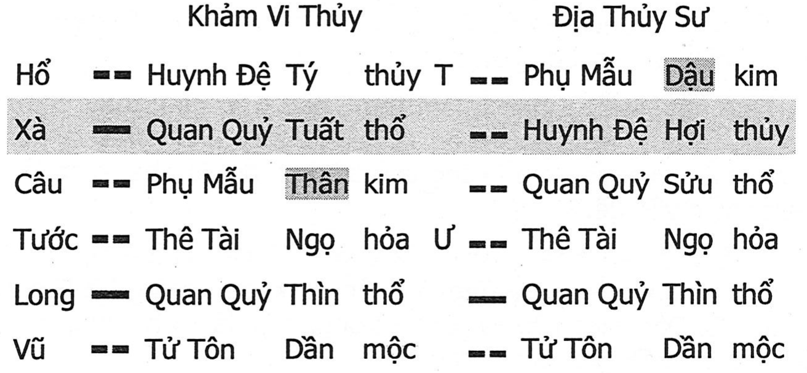
    - **Hình này chứng minh điều gì**
      - Quẻ là Khảm, có ý nghĩa là suy sụp, bị Quan Quỷ lâm Trình Xà đến khắc, lục xung tâm bất định, Trình Xà lại chủ bất an, biểu thị trong lòng rất phiề...
    - **Từ đâu mà thấy được**
      - Lấy Tài làm Dụng thần.
  - **Căn cứ luận đoán**:
    - Lấy Tài làm Dụng thần. Dụng thần được Nhật tỉ phù là vượng, nhưng không nên Quan Quỷ Tuất thổ độc phát, Dụng thần nhập Mộ.
    - Quan Quỷ chủ đạo tặc, Dụng thần nhập Mộ ở Quan Quỷ, máy chụp hình đã vào trong tay kẻ trộm, rất khó tìm lại được.
    - Quan Quỷ tại hào 5, hào 5 là đường, mất ở trên đường. Huynh Đệ trì Thế ám động, là mình không cẩn thận mà bị trộm.
    - Thế lâm Bạch Hổ Dịch Mã, Bạch Hổ chủ đường, Dịch Mã cũng chủ thuyền xe, biểu thị bị trộm khi đi xe.
    - Nguyệt lâm Quỷ hợp hào Thế, biểu thị kẻ trộm là người cùng ngồi trên một chiếc xe với mình.
    - Quẻ là Khảm, có ý nghĩa là suy sụp, bị Quan Quỷ lâm Trình Xà đến khắc, lục xung tâm bất định, Trình Xà lại chủ bất an, biểu thị trong lòng rất phiền não, bị tên trộm ảnh hưởng đến cảm xúc.
  - **Ứng nghiệm thực tế**:
    - Quả nhiên không tìm lại được.
- **Bảng Quẻ & Quái lệ 2**: Ngày Đinh Hợi tháng Dần, nam dự đoán bệnh tật, được Khảm Vi Thủy.
  - **Hình 121.** Sơ đồ quẻ Khảm Vi Thủy
    - 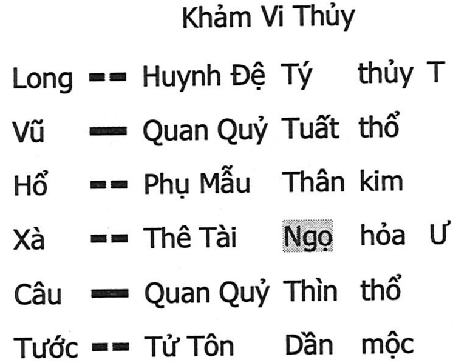
    - **Hình này chứng minh điều gì**
      - Quẻ là thuần Khảm, Khảm là cao thấp bất bình, cho nên tư duy của anh ta không bình thường, lúc tốt lúc kém, không thể liên tục suy xét vấn đề.
    - **Từ đâu mà thấy được**
      - Lấy Thế làm Dụng thần.
  - **Căn cứ luận đoán**:
    - Lấy Thế làm Dụng thần.
    - Thế không bị Nhật Nguyệt khắc thương, Kỵ thần hưu tù bất động, thoạt nhìn giống như không có thương tật gì, thông thường Dụng thần không bị khắc Thế thì phải xem Nguyên thần và các thông tin khác.
    - Quẻ này Thế tại hào 6 lâm thủy, hào 6 là đầu, thủy chủ trí tuệ, cũng chủ tư duy, Nguyệt là mộc, là Bệnh địa của hào Thế, lại xung phá Nguyên thần, Nguyên thần cũng chủ tư duy, do đó nhất định là tư duy đã xuất hiện vấn đề.
    - Quẻ là thuần Khảm, Khảm là cao thấp bất bình, cho nên tư duy của anh ta không bình thường, lúc tốt lúc kém, không thể liên tục suy xét vấn đề.
    - Dần mộc này rất quan trọng, mộc là thần kinh, cho nên là thần kinh trên đầu đã xảy ra vấn đề.
- **Bảng Quẻ & Quái lệ 3**: Ngày Quý Sửu tháng Tý, nam dự đoán cát hung, được Khảm Vi Thủy biến Thủy Phong Tỉnh.
  - **Căn cứ luận đoán**:
    - Lấy hào Thế làm Dụng thần, Thế được Nguyệt tỉ phù, nhưng bị Nhật khắc hợp, không cát.
    - Thế lâm Bạch Hổ, Bạch Hổ chủ gãy xương, đổ máu, quẻ là Khảm, là nguy hiểm, tượng hung hiểm.
    - Thế tại hào 6 lâm Huynh Đệ, Huynh Đệ là tay, hào 6 cũng là tay, đề phòng tay bị thương.
  - **Đối thoại & Diễn biến thực tế**:
    - Trên thực tế, người này bị gãy xương cánh tay.

### 2. THỦY TRẠCH TIẾT

- **Tượng của quẻ**:
  - ngoại quái là Khảm, là thủy, là tròn, nội quái là Đoài, là thủy, là khuyết, hợp nhất với thủy là tre trúc, tre trúc vật tròn, trong rỗng là khuyết, cắt thành phù tiết, ráp lại làm tin, lấy tượng tre trúc có đốt, gọi là Tiết (đốt).
  - Khảm là hung hiểm, Đoài là đầm lầy, đều là nơi nguy hiểm, quẻ hỗ Cấn Chấn, Cấn là dừng, Chấn là động, có ý nghĩa là ngừng tiến lên, cho nên Tiết giả, chỉ (dừng) dã.
  - Tiết giả, tín (tin tưởng) dã.
- **Tượng của lục hào**:
  - Thế tại hào sơ lâm Tài, hào sơ là tầng thấp, Tài biểu thị tài vật, được Ứng đến hợp, hợp là tích lũy thêm, biểu thị tài phú được tích lũy từng chút một từ cơ sở, đây chính là tiết kiệm, Thế hợp kim, kim chủ nghĩa, biểu thị thành tín, nhưng Tài của Thế, Ứng đến hợp, có tượng tài bị người cướp đoạt, cho nên cần phải dừng thì dừng.
- **Ý nghĩa biểu tượng cốt lõi**:
  - đình chỉ, kết thúc, tiết kiệm, tích lũy, giữ chữ tín, cấm đoán, bằng chứng, lý do, chứng minh, dừng lại đúng lúc, có chừng mực v.v.
- **Bảng Quẻ & Đồ hình liên hệ**: Sơ đồ quẻ Khảm Vi Thủy biến Thủy Phong Tỉnh
  - **Hình 122.** Sơ đồ quẻ Khảm Vi Thủy biến Thủy Phong Tỉnh
    - 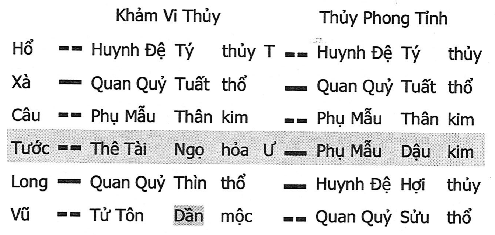
    - **Hình này chứng minh điều gì**
      - Thế tại hào sơ lâm Tài, hào sơ là tầng thấp, Tài biểu thị tài vật, được Ứng đến hợp, hợp là tích lũy thêm, biểu thị tài phú được tích lũy từng chút...
    - **Từ đâu mà thấy được**
      - Thế tại hào sơ lâm Tài, hào sơ là tầng thấp, Tài biểu thị tài vật, được Ứng đến hợp, hợp là tích lũy thêm, biểu thị tài phú được tích lũy từng chút...
- **Bảng Quẻ & Quái lệ 1**: Ngày Mậu Dần tháng Mão, nam đoán về việc mua nhà, được Thủy Trạch Tiết biến Đoài Vi Trạch.
  - **Hình 123.** Sơ đồ quẻ Thủy Trạch Tiết biến Đoài Vi Trạch
    - 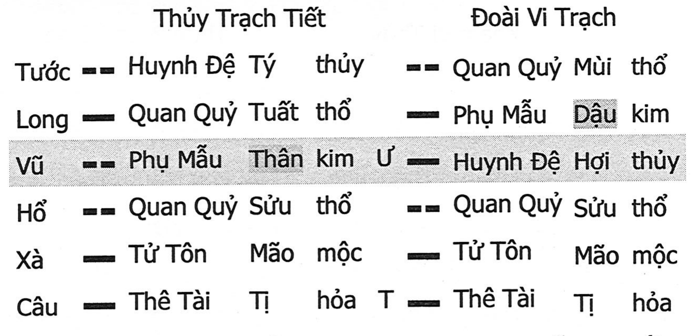
    - **Hình này chứng minh điều gì**
      - Lấy hào Phụ Mẫu làm Dụng thần, Phụ Mẫu lâm Ứng phát động tương hợp với hào Thế, là đối phương chủ động bán nhà cho mình, nhưng Phụ Mẫu không được N...
    - **Từ đâu mà thấy được**
      - Lấy hào Phụ Mẫu làm Dụng thần, Phụ Mẫu lâm Ứng phát động tương hợp với hào Thế, là đối phương chủ động bán nhà cho mình, nhưng Phụ Mẫu không được N...
  - **Căn cứ luận đoán**:
    - Lấy hào Phụ Mẫu làm Dụng thần, Phụ Mẫu lâm Ứng phát động tương hợp với hào Thế, là đối phương chủ động bán nhà cho mình, nhưng Phụ Mẫu không được Nhật Nguyệt sinh phù, đây là nhà cũ, Ứng lâm Phụ Mẫu động mà hợp Thế, bên kia muốn dùng nhà của anh ta để lừa gạt tiền của bên này, bởi vì Không Vong chủ không thành tâm, Huyền Vũ là tượng quỷ kế đa đoan, lừa đảo.
    - Do đó, tốt hơn hết là không nên mua căn nhà này.
  - **Đối thoại & Diễn biến thực tế**:
    - Hào Tài trên Thế ở hào sơ, hào sơ là khởi đầu của sự vật, lại là tầng thấp nhất, Tài được Nhật Nguyệt đến sinh, kết hợp tên quẻ là quẻ Tiết, lâm Câu Trần là tượng chậm chạp, tiền của bản thân kiếm được là nhờ tiết kiệm từng chút một trong một thời gian dài.
    - Người này không đồng ý, nói rằng đối phương là bạn của mình, nhất định sẽ không lừa gạt anh ta.
    - Thế là đã đưa tiền cho đối phương, nhưng sau khi nhận được tiền, đối phương lại nói là không bán cho anh ta, anh ta phải mất hơn nửa năm mới đòi lại được số tiền đã đưa cho đối phương.
- **Bảng Quẻ & Quái lệ 2**: Ngày Ất Dậu tháng Mão, một người phụ nữ gọi điện thoại đoán bệnh, được Thủy Trạch Tiết biến Phong Trạch Trung Phu.
  - **Căn cứ luận đoán**:
    - Lấy hào Thế làm Dụng thần, Thế tại hào sơ bị thủy đến khắc, hào sơ là chân.
    - Thủy chủ ẩm thấp, lở loét, lâm Thanh Long, Thanh Long chủ đau nhức, ngứa, tổng hợp phán đoán, chính là đã bị cước khí.
    - Quẻ lục hợp, hợp chủ chậm chạp, lại thêm tên quẻ là Tiết, Tiết là dừng, do đó phán đoán là cô ấy đi lại khó khăn do bị cước khí.
    - Tất cả đúng như dự đoán.
- **Bảng Quẻ & Quái lệ 3**: Ngày Bính Thân tháng Hợi, một người phụ nữ đoán vận khí, được Thủy Trạch Tiết.
  - **Hình 124.** Quẻ Thủy Trạch Tiết biến Phong Trạch Trung Phu
    - 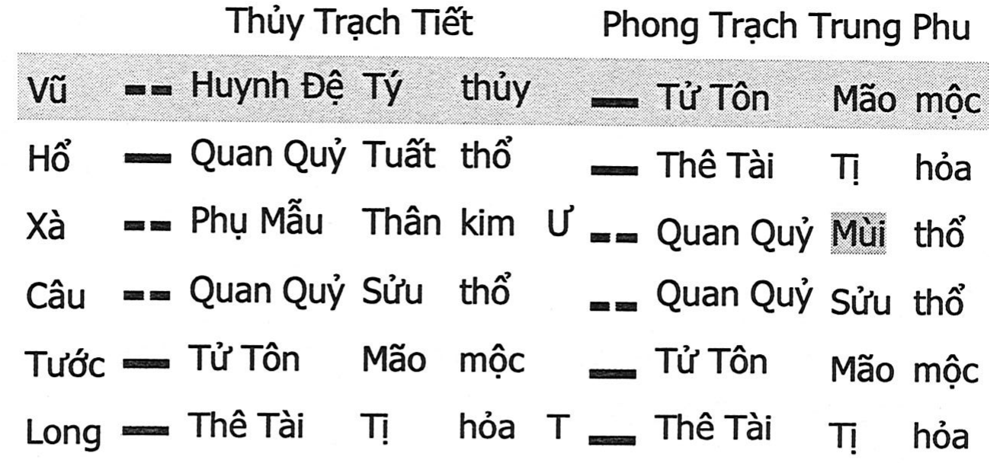
    - **Hình này chứng minh điều gì**
      - Nhật là hào Phụ Mẫu, hào Phụ Mẫu chủ thân vất vả, Thế tại hào sơ, hào sơ là chân, là tượng bôn ba khắp nơi.
    - **Từ đâu mà thấy được**
      - Quẻ này Thê Tài trì Thế, vốn là tượng cát, nhưng bị Nguyệt kiến xung phá, lại lâm Không Vong, do đó vận khí cực kỳ kém.
- **Bảng Quẻ & Quái lệ 3**: Ngày Bính Thân tháng Hợi, một người phụ nữ đoán vận khí, được Thủy Trạch Tiết.
  - **Hình 125.** Quẻ Thủy Trạch Tiết
    - 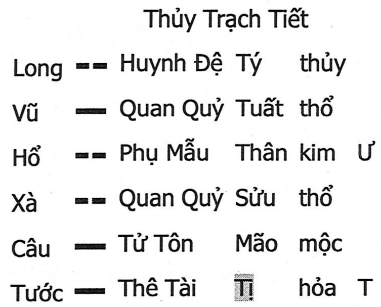
    - **Hình này chứng minh điều gì**
      - Nhật là hào Phụ Mẫu, hào Phụ Mẫu chủ thân vất vả, Thế tại hào sơ, hào sơ là chân, là tượng bôn ba khắp nơi.
    - **Từ đâu mà thấy được**
      - Quẻ này Thê Tài trì Thế, vốn là tượng cát, nhưng bị Nguyệt kiến xung phá, lại lâm Không Vong, do đó vận khí cực kỳ kém.
  - **Căn cứ luận đoán**:
    - Dự đoán vận khí thông thường bắt đầu từ hai khía cạnh, một là xem cát hung, hai là xem tài.
    - Hai mặt này không tốt thì cuộc sống sẽ không yên ổn, còn công việc, sự nghiệp, quan vận v.v chỉ là thứ yếu.
    - Quẻ này Thê Tài trì Thế, vốn là tượng cát, nhưng bị Nguyệt kiến xung phá, lại lâm Không Vong, do đó vận khí cực kỳ kém.
    - May mà hào Thế tương hợp với Nhật, Nguyệt phá bị giải, bằng không thì đây là một quẻ rất xấu.
    - Tài lâm hào Thế thể hiện tiền tài trong tay, mà lâm Chu Tước, Chu Tước chủ miệng, ăn, có thể mở rộng ra là ẩm thực và đồ dùng sinh hoạt.
    - Vừa Không vừa Phá, biểu thị cuộc sống của cô ấy không giàu có, thiếu ăn thiếu mặc.
    - Kết hợp với tên quẻ và sự suy vượng của hào Tài, có thể phán đoán rằng cuộc sống của cô ấy rất đơn giản.
    - Nhật là hào Phụ Mẫu, hào Phụ Mẫu chủ thân vất vả, Thế tại hào sơ, hào sơ là chân, là tượng bôn ba khắp nơi.
    - Tài Nguyệt phá gặp hào Phụ Mẫu hợp phá, biểu thị chỉ có vất vả chăm chỉ thì cô ấy mới có thể được ấm no.
  - **Đối thoại & Diễn biến thực tế**:
    - Trên thực tế, người này là một phụ nữ nông thôn, cuộc sống rất vất vả, thu nhập một năm của cả nhà chưa đến 2 ngàn tệ.

### 3. THỦY LÔI TRUÂN

- **Tượng của quẻ**:
  - ngoại quái là Khảm, là hung hiểm, nội quái là Chấn, là động, động thì có hiểm, do đó cần phải đình chỉ hoạt động, nên cố thủ bất động.
  - Do đó là Truân. Truân giả, nan (khó) dã, chỉ (dừng) dã.
- **Tượng của lục hào**:
  - Tử Tôn trì Thế ở hào 2, Tử Tôn là binh lính, hào 2 là trạch, là nơi ở, là tượng dựng trại đóng quân, cắm trại cố thủ, tìm cơ hội khắc Quan Quỷ trên Ứng, mà hào Ứng ở trong quẻ lâm ngũ, ngũ là tôn vị, quân địch lớn mạnh mà ta thì yếu, cần phải phòng thủ nghiêm ngặt, nếu không thể khắc quân địch, thì cần phải đình chỉ hành động.
- **Ý nghĩa biểu tượng cốt lõi**:
  - đình lưu, gian nan, bất động, canh giữ, bảo vệ, lực bất tòng tâm v.v.
- **Bảng Quẻ & Quái lệ 1**: Ngày Mậu Tý tháng Hợi, nam dự đoán tiền cho người ta vay có thể đòi được không, được Thủy Lôi Truân.
  - **Hình 126.** Quẻ Thủy Lôi Truân
    - 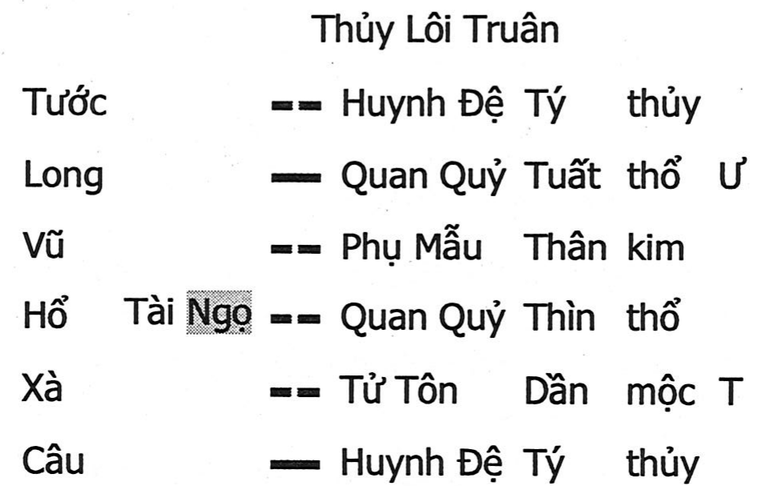
    - **Hình này chứng minh điều gì**
      - Tất cả đúng như dự đoán.
    - **Từ đâu mà thấy được**
      - Lấy Thê Tài làm Dụng thần.
  - **Căn cứ luận đoán**:
    - Lấy Thê Tài làm Dụng thần. Tài bất thượng quái, phục dưới hào 3 Quan Quỷ Thìn thổ, Nhật Nguyệt khắc Tài, Nhật xung là
    - Nhật phá. Hào Ứng là người vay tiền.
    - Lâm Tài khố, giữ tiền không trả, Ứng lâm Quan Quỷ, lâm Thanh Long tại hào 5, hào 5 là hào vị lãnh đạo, Thanh Long là quý, Quan Quỷ là quan, đối phương là quan chức.
    - Thế là Tử Tôn sinh Tài, muốn đòi tiền, nhưng Tài vốn vô căn (không có gốc rễ), sinh phù bất khởi, tên quẻ là Truân, Truân giả nan dã, rất khó đòi.
    - Tài là hỏa chủ số 2, hưu tù giảm một nửa, đối phương đã vay 10 vạn tệ.
    - Tất cả đúng như dự đoán.
- **Bảng Quẻ & Quái lệ 2**: Ngày Mậu Dần tháng Tị năm 99, một nữ học viên đến dự đoán, nói rằng con của mình đi lính đã ba tháng, đột nhiên trốn khỏi quân đội, muốn biết con trai hiện nay cát hung ra sao? Đã đi đâu? Được Thủy Lôi Truân biến Thủy Phong Tỉnh.
  - **Hình 127.** Quẻ Thủy Lôi Truân biến Thủy Phong Tỉnh
    - 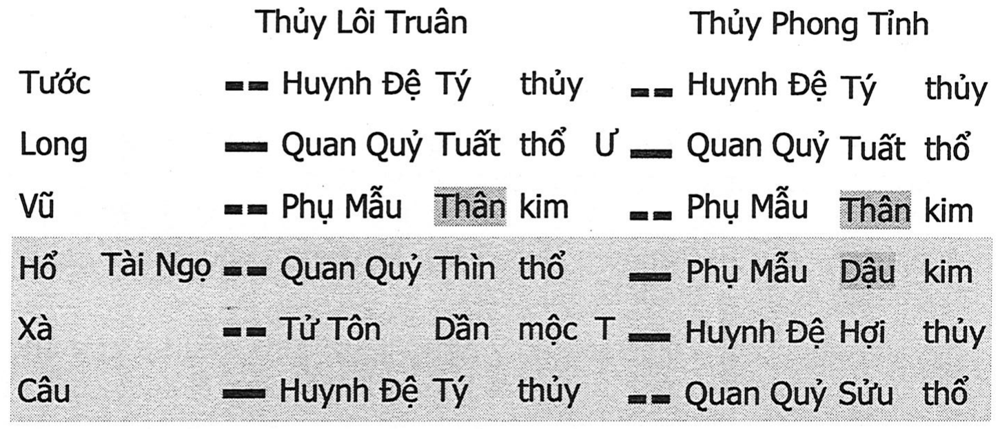
    - **Hình này chứng minh điều gì**
      - thành phố phía Đông Bắc quân đội, ngày Tị tìm được.
    - **Từ đâu mà thấy được**
      - Lấy Tử Tôn làm Dụng thần, Tử Tôn phát động là thông tin con trai bỏ trốn, động mà hợp hào biến Huynh Đệ Hợi thủy, con trai không trốn đi một mình, ...
  - **Căn cứ luận đoán**:
    - Lấy Tử Tôn làm Dụng thần, Tử Tôn phát động là thông tin con trai bỏ trốn, động mà hợp hào biến Huynh Đệ Hợi thủy, con trai không trốn đi một mình, mà là bạn hoặc đồng đội cùng đi.
    - Phụ Mẫu Thân kim ám động khắc Tử Tôn, con trai đã trốn đi sau khi bị ức hiếp.
    - Tử Tôn được Nhật phù hóa hồi đầu sinh, lại được Huynh Đệ Tý thủy tại hào sơ động đến sinh, ở ngoài bình an vô sự.
    - Tử Tôn Dần mộc, Dần đối ứng Đông Bắc, là đã đi về hướng Đông Bắc.
    - Tử Tôn tại hào 2, hào 2 là trạch, tên quẻ là Truân, Truân giả lưu dã, nhất định là đang ở trong một ngôi nhà ở đâu đó.
    - Tử Tôn Dần mộc và hào biến tương hợp, ngày Tị sẽ quay về quân đội.
    - Trong quẻ Thìn thổ động hóa ra Phụ Mẫu, ngày Thìn sẽ có thông tin.
    - Tình hình thực tế, khi con trai đang trực ban thì có người bị mất một sợi dây chuyền, tiểu đội trưởng đã thẩm vấn, con trai đã tức giận bỏ đi.
    - Ngày Thìn được biết con trai cô ấy đang ở trong một khách sạn ở
    - thành phố phía Đông Bắc quân đội, ngày Tị tìm được. Khi đi có đi cùng với một đồng đội quê ở Đông Bắc.
- **Bảng Quẻ & Quái lệ 3**: Ngày Tân Dậu tháng Dần, con gái của một người đàn ông đã mất tích nhiều ngày, hỏi tình hình con gái bây giờ ra sao? Được Thủy Lôi Truân.
  - **Căn cứ luận đoán**:
    - Lấy hào Tử Tôn làm Dụng thần. Tử Tôn trì Thế tại hào 2, lại được Nguyệt kiến tỉ phù là vượng tướng.
    - Hào 2 là trạch, biểu thị con gái ông ta đang ở gần nhà, không đi xa. Dụng thần vượng tướng, người ở ngoài bình an.
    - Tử Tôn lâm Huyền Vũ, Huyền Vũ chủ dâm ô, biểu thị con gái ông ta đang ở nơi có sắc tình.
    - Tên quẻ Thủy Lôi Truân có ý nghĩa là tụ tập, biểu thị con ông ta đang ở cùng nơi với một số người không đứng đắn.
    - Nguyên thần thể hiện tư duy của một cá nhân, trong quẻ Nguyên thần Không Vong, không sinh hào 2 Tử Tôn, biểu thị con ông ta không muốn về nhà.
    - Phải tìm kiếm mới có thể trở về.
    - Thế là người này đã đi tìm con gái ở khắp nơi có liên quan đến sắc tình trong vùng, sau vài ngày, cuối cùng ông ta cũng đã tìm được con gái của mình đang ở trong một vũ trường.
    - Khi ông ta nhìn thấy con gái mình, con gái ông ta đang ôm mấy thằng con trai.

### 4. THỦY HỎA KÝ TẾ

- **Tượng của quẻ**:
  - hạ hỏa thượng thủy, bởi vì tính hỏa bốc lên, để hâm nóng thủy lạnh, thủy ở ngoại quái, ở thượng, tính thủy chảy xuống, khắc chế hỏa và khiến hỏa không quá vượng, thủy hỏa chế ước lẫn nhau, để bù đắp những thiếu sót của đối phương, do đó lấy tên là Ký Tế (đã cứu giúp).
- **Tượng của lục hào**:
  - Thế Ứng tỷ hòa, nội ngoại đều là huynh đệ bằng hữu, cả nhóm hòa hợp, có phúc cùng hưởng, giống như người một nhà, không phân biệt anh – tôi, do đó cũng phù hợp với ý nghĩa của tên quẻ.
- **Ý nghĩa biểu tượng cốt lõi**:
  - bổ sung, hòa hợp, giúp đỡ, bình ổn, viên mãn, ăn khớp, phối hợp v.v.
- **Bảng Quẻ & Đồ hình liên hệ**: Quẻ Thủy Lôi Truân
  - **Hình 128.** Quẻ Thủy Lôi Truân
    - 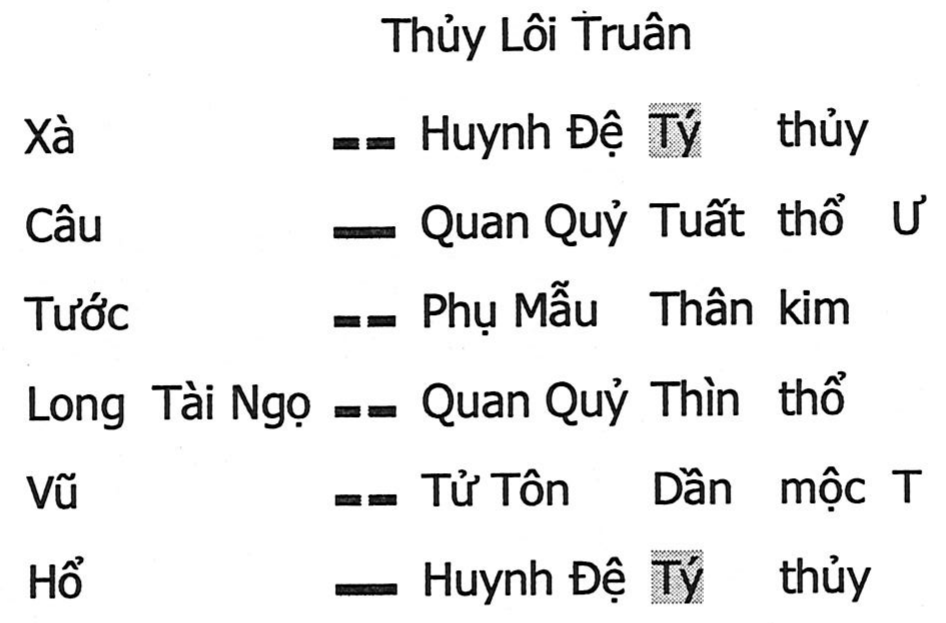
    - **Hình này chứng minh điều gì**
      - Thế Ứng tỷ hòa, nội ngoại đều là huynh đệ bằng hữu, cả nhóm hòa hợp, có phúc cùng hưởng, giống như người một nhà, không phân biệt anh – tôi, do đó ...
    - **Từ đâu mà thấy được**
      - Căn cứ ngũ hành sinh khắc, Dụng thần, Thế Ứng và hào động biến trong quẻ.
- **Bảng Quẻ & Quái lệ 1**: Ngày Đinh Sửu tháng Sửu, nam đoán về việc thành lập trung tâm dịch vụ phát triển kinh tế, được Thủy Hỏa Ký Tế.
  - **Hình 129.** Sơ đồ quẻ Thủy Hỏa Ký Tế
    - 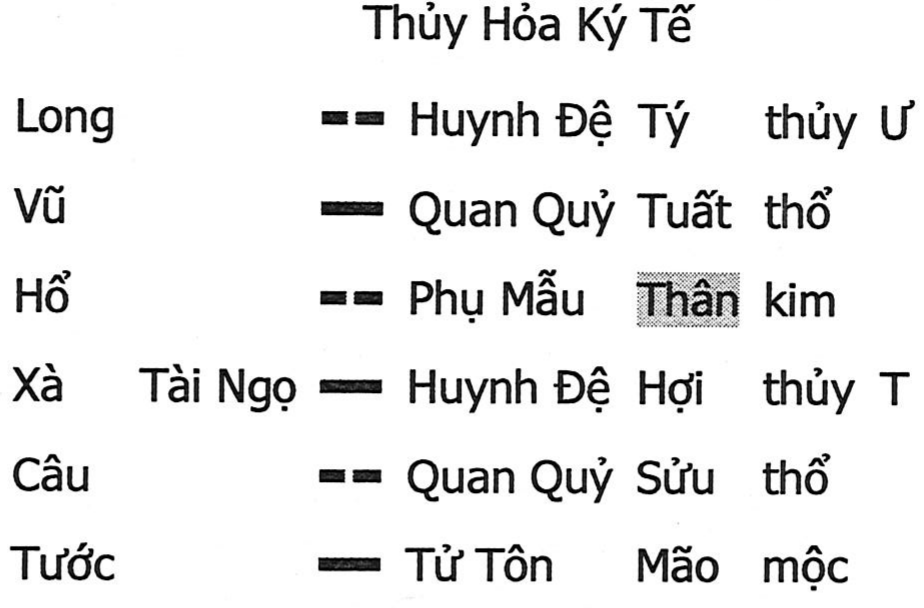
    - **Hình này chứng minh điều gì**
      - Quẻ này dự đoán ở năm 2000, Dụng thần là Thân, tĩnh mà có thể ứng gặp trị, Không cũng ứng thực Không, do đó tôi phán đoán đã bắt đầu chuẩn bị sự vi...
    - **Từ đâu mà thấy được**
      - Xem về thành lập công ty, lấy Phụ Mẫu làm Dụng thần.
  - **Căn cứ luận đoán**:
    - Xem về thành lập công ty, lấy Phụ Mẫu làm Dụng thần.
    - Phụ Mẫu Thân kim được Nhật Nguyệt sinh, nhưng cũng là Mộ khố, Mộ có ý nghĩa là dừng lại, lại thêm Dụng thần Không Vong, tôi phán đoán sự việc này đã bị trì hoãn trong một thời gian rất dài.
    - Quẻ này dự đoán ở năm 2000, Dụng thần là Thân, tĩnh mà có thể ứng gặp trị, Không cũng ứng thực Không, do đó tôi phán đoán đã bắt đầu chuẩn bị sự việc này ở năm Nhâm Thân.
  - **Ứng nghiệm thực tế**:
    - Thế lâm Trình Xà, rất phiền não vì việc này. Quẻ là Ký Tế, Thế Ứng tỷ hòa, biểu thị điều kiện đã chín muồi, trong ngoài đều đã khai thông.
    - Việc này có thể thành, thời gian là ở tháng Dần, xung thực Phụ Mẫu Thân kim, lại xung Phụ Mẫu ra khỏi Mộ. Quả nhiên ứng nghiệm.
- **Bảng Quẻ & Quái lệ 2**: Ngày Bính Tý tháng Thìn, một người phụ nữ dự đoán hôn nhân, được Thủy Hỏa Ký Tế biến Thủy Sơn Kiển.
  - **Hình 130.** Sơ đồ quẻ Thủy Hỏa Ký Tế biến Thủy Sơn Kiển
    - 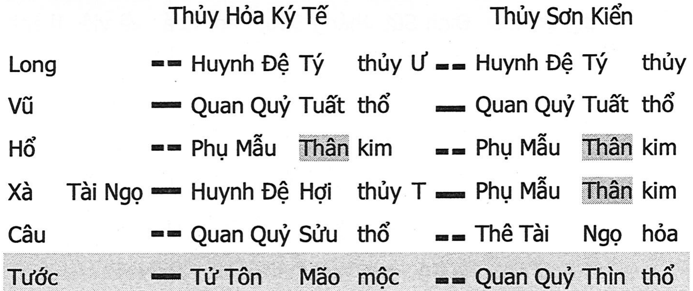
    - **Hình này chứng minh điều gì**
      - phá để phán đoán ra tình tiết một cách tinh tế.
    - **Từ đâu mà thấy được**
      - Lấy Quan Quỷ làm Dụng thần, trong quẻ Quan Quỷ lưỡng hiện, dự đoán hôn nhân của nữ, thường là thông tin bắt cá hai tay, hoặc có ngoại tình.
  - **Căn cứ luận đoán**:
    - Lấy Quan Quỷ làm Dụng thần, trong quẻ Quan Quỷ lưỡng hiện, dự đoán hôn nhân của nữ, thường là thông tin bắt cá hai tay, hoặc có ngoại tình.
    - Quẻ này Tử Tôn Mão mộc lâm hào sơ, động mà hóa Quan Quỷ, hào sơ là tâm sự, động mà đi khắc Quan Quỷ trong quẻ, đồng thời lại hóa ra Quan Quỷ, tổ hợp này chính là muốn ly hôn với chồng của mình, và kết hôn với một người đàn ông khác.
    - Phân tích cụ thể về tình trạng của hai người đàn ông, phải phán đoán từ hai Quan Quỷ trong quẻ.
    - Quan Quỷ Sửu thổ tại hào 2, hào 2 là hào vị phu thê, lại là trạch, đây nhất định là chồng của cô ấy, còn Quan Quỷ Tuất thổ là người tình ngoài hôn nhân của cô ấy.
    - Hào 2 Quan Quỷ Sửu thổ lâm Câu Trần nhập Mộ là thông tin lười biếng. Đồng thời Quan Quỷ tương hợp với Nhật, hợp này có hai ý nghĩa.
    - Một ý nghĩa là vướng chân, vướng chân có ý nghĩa là bất động, cũng là thông tin lười biếng;
    - một ý nghĩa khác, Nhật là hào Huynh Đệ, dự đoán hôn nhân của nữ, Huynh Đệ là đối thủ cạnh tranh, hào Huynh Đệ chính là người cùng giới tính với cô ấy, cụ thể là người nào, cần phân tích từ hào vị lâm Tý thủy, Tý thủy trong quẻ tại hào 6 lâm Thanh Long, thủy là lẳng lơ, Thanh Long chủ tửu sắc mỹ mạo, biểu thị chồng của cô ấy có dây dưa với một số phụ nữ lẳng lơ bên ngoài.
    - Quan Quỷ Tuất thổ là người tình của cô ấy, Tuất thổ Nguyệt phá, biểu thị tình cảm của người tình này không tốt, hào sơ Mão mộc phát động khắc hào 2 Quan Quỷ, đồng thời tương hợp với Quan Quỷ Tuất thổ ở hào 5, chính là cô ấy không thích người chồng ở nhà, và đi vun đắp cho tình cảm với người tình.
    - Lại thêm tượng của quẻ Ký Tế, biểu thị mối quan hệ giữa cô ấy và tình nhân rất hòa hợp.
    - Tại sao giải thích như vậy?
    - Bởi vì Quan Quỷ Tuất thổ Nguyệt phá, lẽ ra là thông tin không tốt, nhưng Mão mộc động mà hợp Tuất thổ, Nguyệt phá tự nhiên bị hóa giải, chúng ta có thể lợi dụng quy tắc hợp
    - phá để phán đoán ra tình tiết một cách tinh tế.
    - Quan Quỷ Tuất thổ này là Tài khố, biểu thị người tình của cô ấy có rất nhiều tiền, Tài khố Nguyệt phá, tài sẽ ra khỏi Mộ khố.
    - Đây là thông tin cho thấy người tình của cô ấy rất phóng khoáng, tiêu tiền như nước.
    - Hào 5 là tôn vị, Quan Quỷ Tuất thổ tại hào 5, biểu thị cô ấy rất sùng bái người tình, tôn thờ như thần thánh.
  - **Ứng nghiệm thực tế**:
    - Quẻ này Tử Tôn độc phát, độc phát lấy tượng phân tích cát hung, Tử Tôn vừa khắc Quan Quỷ, vừa là Tử địa của Quan Quỷ, biểu thị hôn nhân của cô ấy rất khó duy trì.
    - Đồng thời hào độc phát lại có thể biểu thị ứng kỳ, động mà gặp trị gặp hợp, tham khảo Tuất thổ Nguyệt phá, là ứng thực phá, cho nên khả năng ly hôn ở tháng Tuất là rất lớn, sau quả nhiên ly hôn ở tháng Tuất.
- **Bảng Quẻ & Quái lệ 3**: Ngày Giáp Thân tháng Sửu, một người muốn đơn vị cấp cho mình một chiếc xe, liệu lãnh đạo có đồng ý không? Được Thủy Hỏa Ký Tế biến Địa Hỏa Minh Di.
  - **Căn cứ luận đoán**:
    - Lấy hào Phụ Mẫu làm Dụng thần, Phụ Mẫu Nguyệt sinh Nhật phù, lâm Nhật vượng mà sinh Thế, hào 5 Tuất thổ độc phát sinh Dụng thần, hào 5 vừa là hào vị lãnh đạo, vừa lâm Quan Quỷ động mà sinh Dụng thần, lãnh đạo nhất định sẽ đồng ý.
    - Thủy Hỏa Ký Tế là quẻ trong ngoài hòa hợp, biểu thị mối quan hệ giữa người này và lãnh đạo rất hòa hợp.
    - Dụng thần lâm Trình Xà, Trình Xà là tượng thon dài.
    - Tôi đoán người này muốn lãnh đạo mua cho một chiếc xe van, Dụng thần an tĩnh, tĩnh mà gặp trị gặp xung, tháng Dần có thể mua được xe.
    - Tình hình thực tế giống như dự đoán.

### 5. TRẠCH HỎA CÁCH

- **Tượng của quẻ**:
  - ngoại quái là Đoài, Đoài là đầm, là miệng, là thủy, nội quái là Ly, là hỏa. Phía dưới là hỏa, phía trên là nồi mở nắp,
  - đây là một quá trình trong gia công thuộc da. Cách giả, động vật chi bì (da động vật) dã.
  - Phải làm bằng nước và lửa, cho nên gọi là Cách (da thuộc).
- **Tượng của lục hào**:
  - hào 3 hào 4 đều là hào Huynh Đệ, tam môn tứ hộ (hào 3 hào 4 là cửa), là nơi giao tiếp nội ngoại của quẻ, nội ngoại không có Tài, Huynh Đệ trì Thế, tượng bần cùng.
  - Cùng tắc tư biến[^1], cho nên là Cách (thay đổi), Cách giả, cải (thay đổi) dã.
- **Ý nghĩa biểu tượng cốt lõi**:
  - biến hóa, biến cố, cải cách, biến dị, gia công, sửa chữa, tu sửa, tổ hợp v.v.
- **Bảng Quẻ & Đồ hình liên hệ**: Sơ đồ quẻ Thủy Hỏa Ký Tế biến Địa Hỏa Minh Di
  - **Hình 131.** Sơ đồ quẻ Thủy Hỏa Ký Tế biến Địa Hỏa Minh Di
    - 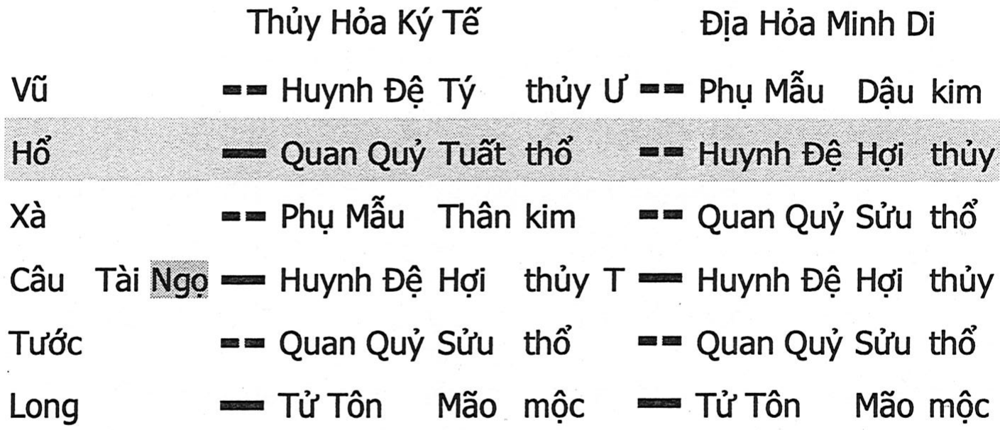
    - **Hình này chứng minh điều gì**
      - hào 3 hào 4 đều là hào Huynh Đệ, tam môn tứ hộ (hào 3 hào 4 là cửa), là nơi giao tiếp nội ngoại của quẻ, nội ngoại không có Tài, Huynh Đệ trì Thế, ...
    - **Từ đâu mà thấy được**
      - hào 3 hào 4 đều là hào Huynh Đệ, tam môn tứ hộ (hào 3 hào 4 là cửa), là nơi giao tiếp nội ngoại của quẻ, nội ngoại không có Tài, Huynh Đệ trì Thế, ...
- **Bảng Quẻ & Quái lệ 1**: Ngày Nhâm Dần tháng Mùi, nam dự đoán về việc mua một công ty, được Trạch Hỏa Cách biến Trạch Phong Đại Quá.
  - **Hình 132.** Sơ đồ quẻ Trạch Hỏa Cách biến Trạch Phong Đại Quá
    - 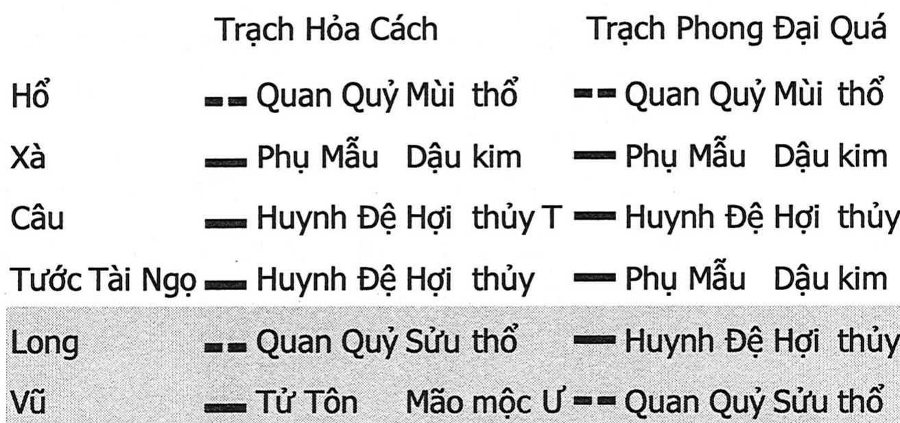
    - **Hình này chứng minh điều gì**
      - [^1]: Lúc gian nan khốn cùng thì phải nghĩ ra biện pháp thay đổi hiện trạng.
    - **Từ đâu mà thấy được**
      - Lấy hào Phụ Mẫu làm Dụng thần, Phụ Mẫu được Nguyệt sinh phù là vượng tướng, Dụng thần sinh Thế, công ty này tương lai có thể thuộc về sở hữu của mình.
  - **Căn cứ luận đoán**:
    - Lấy hào Phụ Mẫu làm Dụng thần, Phụ Mẫu được Nguyệt sinh phù là vượng tướng, Dụng thần sinh Thế, công ty này tương lai có thể thuộc về sở hữu của mình.
    - Nguyên thần Quan Quỷ Sửu thổ động mà đến sinh Dụng thần, nhưng Nguyệt phá, tháng này khó thành.
    - Hào Ứng là công ty mà mình muốn mua, được Nhật thần tỉ phù. Động mà khắc Nguyên thần Quan Quỷ Sửu thổ. Là không muốn chuyển nhượng công ty.
    - Nhưng động mà hóa phá, không có năng lực cản trở chuyện này.
    - Nguyên thần Nguyệt phá, đến tháng Thân sang tháng bất phá, Dụng thần lại lâm vượng địa. Hào Ứng bị khắc, tháng Thân có thể thành.
    - Quẻ này tên quẻ là Cách, Cách giả, cải dã. Quan Quỷ Sửu thổ thể hiện sự nghiệp mới.
    - Lâm Thanh Long Nguyệt phá mà động, biểu thị sau khi mua được công ty này thì phải tiến hành cải cách và tổ hợp lại.
    - Anh ta nói quả thực là như vậy. Đương nhiên công ty được mua về không thể tiếp tục kinh doanh theo cách ban đầu của họ mà phải
    - [^1]: Lúc gian nan khốn cùng thì phải nghĩ ra biện pháp thay đổi hiện trạng.
  - **Ứng nghiệm thực tế**:
    - kinh doanh theo cách của chúng tôi. Sau đó đã mua được công ty ở tháng Thân.
- **Bảng Quẻ & Quái lệ 2**: Ngày Mậu Dần tháng Dậu, một người đàn ông hỏi rằng tiền của mình gửi trong ngân hàng liên hợp công thương có thể lấy lại được không? Được Trạch Hỏa Cách.
  - **Hình 133.** Quẻ Trạch Hỏa Cách
    - 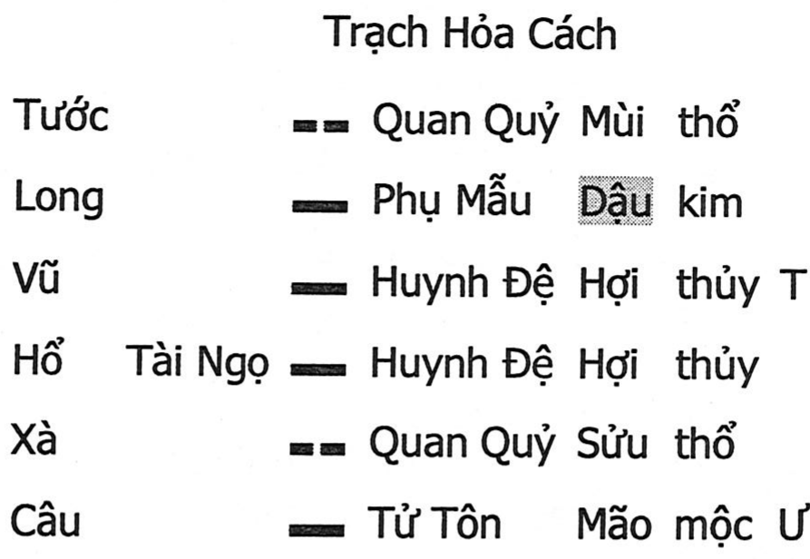
    - **Hình này chứng minh điều gì**
      - Lấy Tài làm Dụng thần.
    - **Từ đâu mà thấy được**
      - Lấy Tài làm Dụng thần.
  - **Căn cứ luận đoán**:
    - Lấy Tài làm Dụng thần. Thê Tài Ngọ hỏa phục tàng, được Nhật sinh, không coi là hưu tù.
    - Hào Ứng lâm hào Tử Tôn là ngân hàng, tên quẻ là Cách, ngân hàng đang xảy ra biến cố.
    - Nguyệt phá, đối mặt phá sản, hiện nay không có năng lực trả tiền.
    - Hiện nay là năm Canh Thìn, năm sau Tân Tị xung khai Phi thần mới có thể lấy lại.
  - **Đối thoại & Diễn biến thực tế**:
    - Khi tôi nói rằng ngân hàng đang phá sản, anh ta đã phủ nhận phán đoán của tôi, nhưng chưa đến 10 phút sau thì giọng nói chùng xuống, cha anh ta gọi đến cho anh ta biết là ngân hàng đã tuyên bố phá sản.
    - Tôi thấy thời gian là đúng giờ Dậu.
  - **Ứng nghiệm thực tế**:
    - Sau đó, ở năm 2001, chính phủ đã trợ cấp tổn thất cho người gửi tiền.
- **Bảng Quẻ & Quái lệ 3**: Ngày Nhâm Tý tháng Dần, một người đoán bệnh của anh trai, được Trạch Hỏa Cách biến Lôi Hỏa Phong.
  - **Căn cứ luận đoán**:
    - Lấy hào Huynh Đệ làm Dụng thần. Trong quẻ Huynh Đệ lưỡng hiện, lấy Huynh Đệ Hợi thủy trên Thế làm Dụng.
    - Dụng thần được Nguyệt hợp là vượng, Nhật lại tỉ phù, nhưng không nên Nguyên thần độc phát hóa thoái.
    - Nguyên thần tại hào 5 lâm kim hóa thoái, hóa phá, hào 5 là ngực, kim là phổi, là chức năng phổi thoái hóa.
    - Huynh Đệ lâm Câu Trần, là giãn phế quản. Quẻ là Cách, Cách giả, biến dã. E rằng bệnh tật phát sinh bệnh biến. Đề phòng năm Thân không cát.
    - Năm 2002 năm Ngọ yêu cầu dự đoán, sau ở năm Giáp Thân phát triển thành ung thư phổi mà chết.

### 6. LÔI HỎA PHONG

- **Tượng của quẻ**:
  - ngoại quái là Chấn, náo nhiệt, nội quái là Ly, là hỏa, là ánh sáng, tượng ánh đèn huy hoàng, náo nhiệt rùm trời.
  - Trong "Thuyết Văn Giải Tự" nói rằng:
  - "Phong, đậu[^1] chi phong mãn (đầy ắp) giả dã", chính là thức ăn chứa đầy ắp trong chén đĩa, tiến hành tiệc rượu.
  - Người xưa nói, Phong giả, đại (lớn) dã.
- **Tượng của lục hào**:
  - Thế tại hào 5, hào 5 là tôn vị, vừa cao cao tại thượng, vừa được Quan trên Ứng đến sinh ta, hạ sinh thượng, nhiều quan kính ngưỡng.
  - Cho nên là lớn, là Phong (sung túc).
- **Ý nghĩa biểu tượng cốt lõi**:
  - thịnh đại (quy mô lớn), phong phú, cao quý, cao hứng, được mùa, thu hoạch, long trọng, cao trào v.v.
  - [^1]: Cái đĩa có chân (thời xưa).
- **Bảng Quẻ & Đồ hình liên hệ**: Quẻ Trạch Hỏa Cách biến Lôi Hỏa Phong
  - **Hình 134.** Quẻ Trạch Hỏa Cách biến Lôi Hỏa Phong
    - 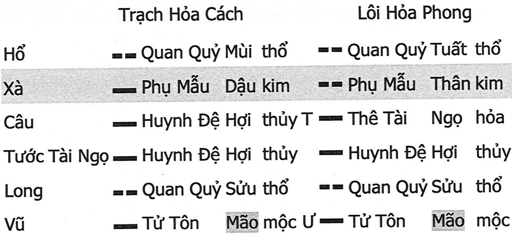
    - **Hình này chứng minh điều gì**
      - Thế tại hào 5, hào 5 là tôn vị, vừa cao cao tại thượng, vừa được Quan trên Ứng đến sinh ta, hạ sinh thượng, nhiều quan kính ngưỡng.
    - **Từ đâu mà thấy được**
      - Thế tại hào 5, hào 5 là tôn vị, vừa cao cao tại thượng, vừa được Quan trên Ứng đến sinh ta, hạ sinh thượng, nhiều quan kính ngưỡng.
- **Bảng Quẻ & Quái lệ 1**: Ngày Canh Thân tháng Dần, nam dự đoán quan vận, được Lôi Hỏa Phong biến Địa Thiên Thái.
  - **Hình 135.** Quẻ Lôi Hỏa Phong biến Địa Thiên Thái
    - 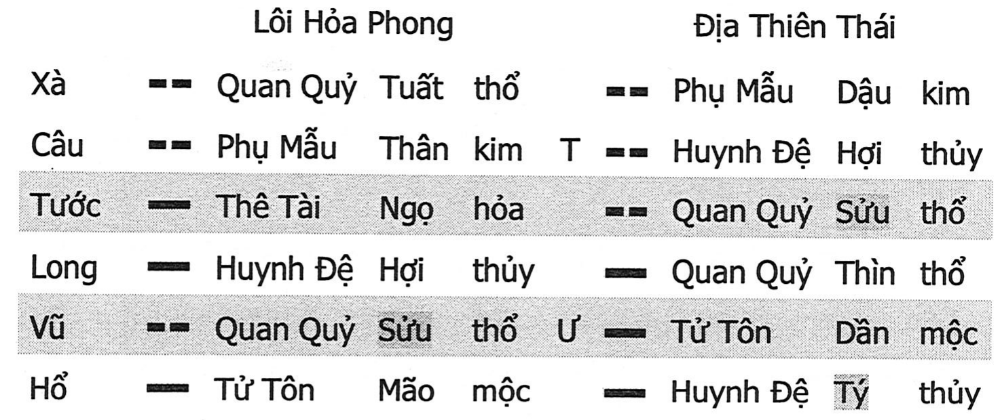
    - **Hình này chứng minh điều gì**
      - Hào 4 Ngọ hỏa động mà hóa ra Quan Quỷ, Ngọ lâm Thái Tuế (đoán ở năm 2002), trong quẻ có Quan lại hóa Quan, năm nay có tượng thân kiêm hai chức.
    - **Từ đâu mà thấy được**
      - Lấy Quan Quỷ làm Dụng thần, Quan Quỷ động mà sinh Thế, Thế tại hào 5, hào 5 là tôn vị, quẻ chính là Phong, Phong giả đại dã.
  - **Căn cứ luận đoán**:
    - Lấy Quan Quỷ làm Dụng thần, Quan Quỷ động mà sinh Thế, Thế tại hào 5, hào 5 là tôn vị, quẻ chính là Phong, Phong giả đại dã.
    - Hỏi quan thì quan lớn, hơn nữa còn có hỷ sự đến.
    - Hào Thế Nguyệt phá, Nhật đã thực phá, nhưng năm 2001 là năm Tân Tị, tương hợp với hào Thế, vẫn có ý hợp phá, đồng thời lại sinh Quan Quỷ, năm này nhất định đắc ý về quan.
    - Hào 4 Ngọ hỏa động mà hóa ra Quan Quỷ, Ngọ lâm Thái Tuế (đoán ở năm 2002), trong quẻ có Quan lại hóa Quan, năm nay có tượng thân kiêm hai chức.
    - Nhưng, Quan Quỷ Sửu thổ Không Vong, hóa hồi đầu khắc, đề phòng năm 2003 năm Mùi xung thực mà mất quan.
  - **Đối thoại & Diễn biến thực tế**:
    - Trên thực tế, người này được thăng chức bí thư tỉnh trưởng ở năm 2001, năm 2002 lại kiêm lãnh đạo một cơ quan khác, đến năm 2003 thì tất cả chức vụ đều mất.
- **Bảng Quẻ & Quái lệ 2**: Ngày Đinh Mão tháng Sửu, dự đoán tranh chữ thật giả, Lôi Hỏa Phong biến Ly Vi Hỏa.
  - **Căn cứ luận đoán**:
    - Lấy hào Phụ Mẫu làm Dụng thần. Phụ Mẫu được Nguyệt sinh, hào 6 Quan Quỷ Tuất thổ một hào độc phát đến sinh, nhất định là thật.
    - Dụng thần tại hào 5, là một bức tranh tương đối quan trọng. Quẻ là Phong, Phong giả đại dã, bức tranh khá lớn.
    - Nguyên thần lâm Thanh Long Không hóa Tuyệt, Thanh Long chủ trang hoàng, trang điểm, biểu thị lúc bồi tranh đã có một số chỗ tróc ra.
  - **Ứng nghiệm thực tế**:
    - Quả nhiên ứng nghiệm.

### 7. ĐỊA HỎA MINH DI

- **Tượng của quẻ**:
  - ngoại quái là Khôn, là địa, nội quái là Ly, là hỏa, là mặt trời, địa trên hỏa dưới, tượng mặt trời lặn xuống đất.
  - Mặt trời lặn xuống đất, một khung cảnh tối tăm, không có ánh sáng chiếu rọi, nguy hiểm lúc nào cũng có, rất dễ bị thương.
  - Do đó gọi quẻ này là Minh Di. Minh Di giả, thương (tổn thương) dã.
- **Tượng của lục hào**:
  - ngũ hành hỏa trong quẻ này bất thượng quái, hỏa chủ ánh sáng, cũng là một khung cảnh tối tăm.
  - Ứng tại hào sơ khắc Thế, sơ là chân, chủ đi lại, đi lại trong tối tăm rất dễ bị thương.
- **Ý nghĩa biểu tượng cốt lõi**:
  - Cho nên quẻ này bao hàm ý nghĩa là tối tăm, bị thương, tổn thương, mù mịt, khám phá, nguy hiểm v.v.
- **Bảng Quẻ & Đồ hình liên hệ**: Quẻ Lôi Hỏa Phong biến Ly Vi Hỏa
  - **Hình 136.** Quẻ Lôi Hỏa Phong biến Ly Vi Hỏa
    - 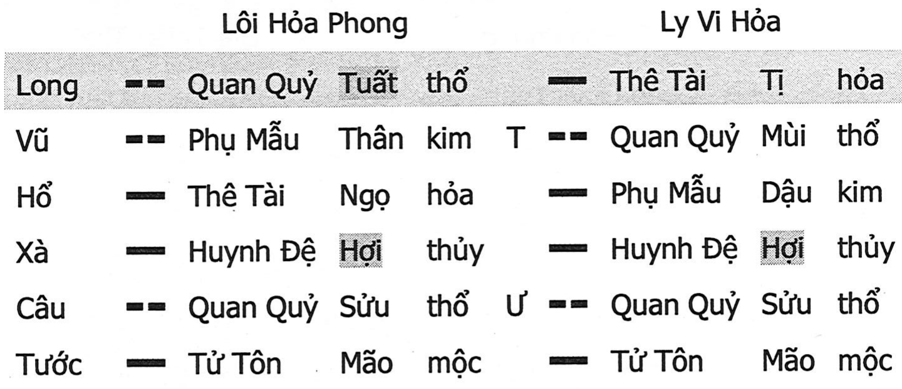
    - **Hình này chứng minh điều gì**
      - ngũ hành hỏa trong quẻ này bất thượng quái, hỏa chủ ánh sáng, cũng là một khung cảnh tối tăm.
    - **Từ đâu mà thấy được**
      - Căn cứ ngũ hành sinh khắc, Dụng thần, Thế Ứng và hào động biến trong quẻ.
- **Bảng Quẻ & Quái lệ 1**: Ngày Ất Hợi tháng Dậu, nam đoán phong thủy nhà, được Địa Hỏa Minh Di.
  - **Hình 137.** Sơ đồ quẻ Địa Hỏa Minh Di
    - 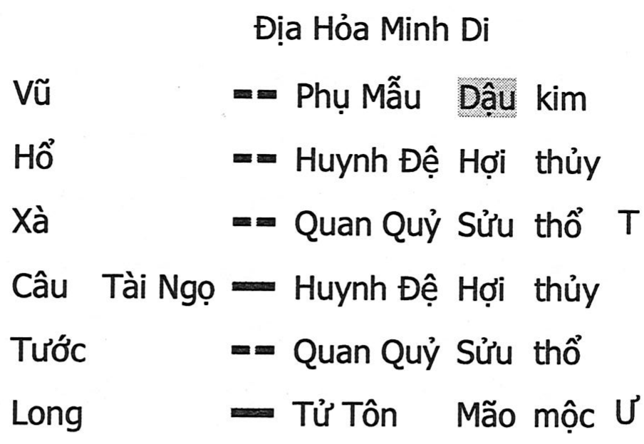
    - **Hình này chứng minh điều gì**
      - Tình hình thực tế: Xung quanh căn nhà có vật kiến trúc rất cao cản trở, cả ngày không thấy mặt trời.
    - **Từ đâu mà thấy được**
      - Lấy Phụ Mẫu làm Dụng thần, đồng thời xem thêm hào 2.
  - **Căn cứ luận đoán**:
    - **Địa Hỏa Minh Di**
    - Lấy Phụ Mẫu làm Dụng thần, đồng thời xem thêm hào 2.
    - Trong quẻ không thấy hỏa, Phụ Mẫu Dậu kim lâm Huyền Vũ, Huyền Vũ chủ trong bóng tối, tối tăm, hỏa là ánh sáng, chứng tỏ nơi ở thiếu ánh sáng, ít khi nhìn thấy mặt trời.
    - Hào 2 Quan Quỷ Sửu thổ khắc hào 5 Huynh Đệ Hợi thủy, hào 2 là trạch, hào 5 là người, nhà này bất lợi cho người.
    - Quan Quỷ trì Thế, lâm Trình Xà, Quan Quỷ là phiền não, Trình Xà là đứng ngồi không yên, biểu thị người ở căn nhà này thường xuyên phiền muộn, không yên ổn.
    - Quan Quỷ tại hào 2 lâm Chu Tước, Chu Tước là khẩu thiệt, ở nhà này khó tránh cãi cọ, kiện tụng.
    - Thê Tài Ngọ hỏa hưu tù bất thượng quái, Phi thần Tuyệt Tài, trong nhà không thấy vợ, vợ bỏ nhà ra đi.
    - Thê Tài lâm Ngọ hỏa, sự việc xảy ra ở tháng Ngọ.
    - Địa Hỏa Minh Di là cung Khảm, Khảm là thủy, là nước tiểu, là máu.
    - Thê Tài phục tại hào 3 bị Phi thần khắc, Nhật thần khắc, hào 3 là hào vị tử cung, vợ có bệnh phụ khoa, kinh nguyệt không đều.
    - Tình hình thực tế: Xung quanh căn nhà có vật kiến trúc rất cao cản trở, cả ngày không thấy mặt trời.
    - Vợ chồng thường xuyên cãi nhau, ba tháng trước, vợ giận bỏ về nhà mẹ đẻ, đến bây giờ vẫn chưa trở về.
    - Nhiều lần đi đón vợ đều bị cha mẹ vợ đuổi ra. Vợ đích thực kinh nguyệt không đều.
- **Bảng Quẻ & Quái lệ 2**: Ngày Kỷ Mão tháng Tý, nữ dự đoán niên vận, được Địa Hỏa Minh Di biến Địa Lôi Phục.
  - **Hình 138.** Sơ đồ quẻ Địa Hỏa Minh Di biến Địa Lôi Phục
    - 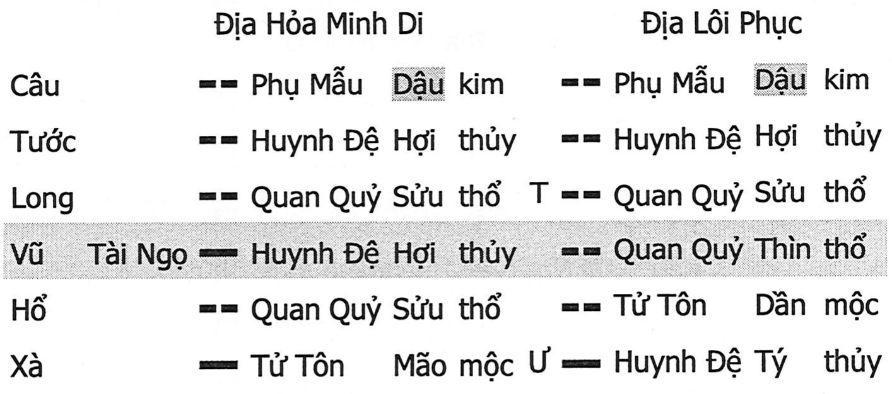
    - **Hình này chứng minh điều gì**
      - Tình hình thực tế, vào tháng giêng, bởi vì đường trơn, cô ấy đã bị ngã dẫn đến bong gân cổ tay.
    - **Từ đâu mà thấy được**
      - Địa Hỏa Minh Di có tượng bị thương.
  - **Căn cứ luận đoán**:
    - Địa Hỏa Minh Di có tượng bị thương. Trong quẻ Huynh Đệ độc phát, khắc Nguyên thần, Nguyên thần lại Nguyệt phá, cho nên trong năm có tai nạn.
    - Người xưa nói: Huynh hóa Quan đề phòng tổn thương chân tay. Do đó phải đề phòng chân tay bị thương.
    - Huynh Đệ Hợi thủy độc phát, đề phòng tháng Dần gặp hợp, hào Thế lại bị khắc.
    - Tình hình thực tế, vào tháng giêng, bởi vì đường trơn, cô ấy đã bị ngã dẫn đến bong gân cổ tay.
  - **Ứng nghiệm thực tế**:
    - Dự đoán niên vận, trước tiên phải xem cát hung của người, sau đó mới là tài quan.
    - Quẻ này Quan Quỷ trì Thế, mặc dù lâm Thanh Long, nhưng không được Nhật Nguyệt sinh phù, lại bị Nhật khắc, không có hy vọng về quan chức, trái lại có hung hiểm.
- **Bảng Quẻ & Quái lệ 3**: Một Dịch hữu trên mạng đã đăng một bài viết trong khu vực dự đoán của "Diễn đàn lục hào cầu chân" như sau. Năm nay hoa lan sinh trưởng như thế nào? Mời thầy Vương dự đoán!
  - **Căn cứ luận đoán**:
    - Giờ Tân Tị ngày Ất Sửu tháng Quý Tị năm Bính Tuất, được Địa Hỏa Minh Di biến Sơn Thiên Đại Súc.
    - Tôi phán đoán như sau: Trồng hoa xem Tài, Tài lâm Nguyệt mà vượng, có thể sinh trưởng, Phi thần Không Phá, cũng biểu thị rất tốt.
    - Dụng lâm hỏa mà phục, chỉ là ánh nắng và dinh dưỡng không đủ cho hoa, do đó trông sinh trưởng hơi chậm.
    - Đây là phán đoán theo quái tượng. Bởi vì quẻ này có tượng không nhìn thấy ánh sáng.
    - Đối phương phản hồi: Trồng hoa xem tài, Tài lâm Nguyệt mà vượng, có thể sinh trưởng. (chính xác).
    - Phi thần Không Phá, cũng biểu thị rất tốt. (có thể).
    - Dụng lâm hỏa mà phục, chỉ là ánh nắng và dinh dưỡng không đủ cho hoa. (quá đúng).
    - Do đó trông sinh trưởng hơi chậm. (đúng, sinh trưởng không nhanh, trồng trên ban công, ánh nắng ít khi chiếu đến).

### 8. ĐỊA THỦY SƯ

- **Tượng của quẻ**:
  - ngoại quái là Khôn, là địa, là dân, nội quái là Khảm, là thủy, là hiểm, là binh lính.
  - Thời xưa, rất nhiều tình huống thời bình là dân, thời chiến là lính, tức toàn dân đều là lính. Do đó quẻ này gọi là Sư (nhiều, đông đúc).
  - Sư giả, chúng (nhiều) dã.
- **Tượng của lục hào**:
  - Thế tại hào 3 lâm Tài khắc Ứng, hào 3 là cửa, Tài chủ ẩm thực, được sinh từ hào sơ, hào sơ là địa, cho nên ẩm thực (đồ ăn) này chính là lương thực.
  - Đây là trữ lương mà giữ cửa, lấy dân làm lính. Ứng tại hào 6, hào 6 là biên cương, biên cảnh, Thế khắc
  - Ứng, lấy dân khắc địch. Toàn dân đều là lính, dĩ nhiên nhiều người là Sư.
- **Ý nghĩa biểu tượng cốt lõi**:
  - đông đúc, xuất hành, noi theo, phòng ngự, tụ tập, tích góp, dự trữ v.v.
- **Bảng Quẻ & Đồ hình liên hệ**: Sơ đồ quẻ Địa Hỏa Minh Di biến Sơn Thiên Đại Súc
  - **Hình 139.** Sơ đồ quẻ Địa Hỏa Minh Di biến Sơn Thiên Đại Súc
    - 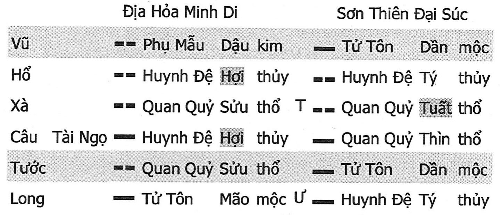
    - **Hình này chứng minh điều gì**
      - Ứng, lấy dân khắc địch.
    - **Từ đâu mà thấy được**
      - Thế tại hào 3 lâm Tài khắc Ứng, hào 3 là cửa, Tài chủ ẩm thực, được sinh từ hào sơ, hào sơ là địa, cho nên ẩm thực (đồ ăn) này chính là lương thực.
- **Bảng Quẻ & Quái lệ 1**: Ngày Quý Dậu tháng Giáp Dần năm Quý Mùi, một người đàn ông dự đoán về việc thăng chức, được Địa Thủy Sư biến Lôi Trạch Quy Muội.
  - **Hình 140.** Sơ đồ quẻ Địa Thủy Sư biến Lôi Trạch Quy Muội
    - 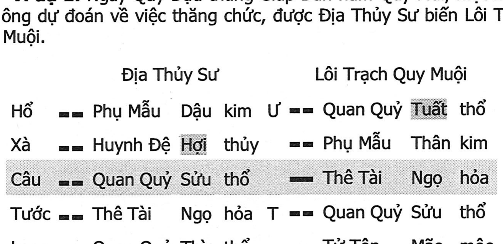
    - **Hình này chứng minh điều gì**
      - Sau khi việc thăng chức cho người này được quyết định trong cuộc họp, một vị Dịch hữu khác nói với anh ta rằng việc thăng chức nếu đã được thông qu...
    - **Từ đâu mà thấy được**
      - Lấy Quan Quỷ làm Dụng thần.
  - **Căn cứ luận đoán**:
    - Lấy Quan Quỷ làm Dụng thần.
    - Dụng thần bị Nguyệt kiến khắc thương, lại không được Nhật thần sinh phù, trong quẻ lại có Tử Tôn phát động đến khắc, theo sự suy vượng của Dụng thần thì rất khó được thăng chức.
    - Sư là quân đội ra trận, Tử Tôn lại có ý nghĩa là binh lính, lâm Nguyệt kiến thì ý nghĩa đó càng mạnh hơn, do đó tôi đoán tại lúc đánh giá thăng chức sẽ có một quân nhân xuất ngũ phản đối anh ta được thăng chức.
    - Nhưng quẻ này Quan Quỷ động mà hóa hồi đầu sinh, thông qua hóa giải sẽ có hy vọng.
    - Ngọ hỏa là địa chi tăng cường Quan Quỷ, Dụng thần phát động hóa hồi đầu sinh, nhưng chỉ có một hào biến đến sinh, lại bị Kỵ thần và Nguyệt kiến khắc thương là sinh phù bất khởi.
    - Hào Thế là Nguyên thần sinh phù Quan Quỷ, chứng tỏ lần này muốn được thăng chức thì bản thân phải nỗ lực.
    - Kỵ thần là Dần mộc tương ứng với hướng Đông Bắc, hướng này sinh ra khí bất lợi cho quan vận.
    - Nguyên thần là Ngọ hỏa, Ngọ là ngựa, hỏa là màu đỏ, hợp lại là ngựa đỏ, vì vậy đề nghị để một con ngựa hàng mỹ nghệ màu đỏ tại hướng Đông Bắc căn nhà.
    - Ngọ hỏa
    - tại hào Thế, lại là hào hồi đầu sinh Dụng thần, vì vậy đầu con ngựa phải hướng vào phía trong mới có tác dụng, đây là ý nghĩa của hồi đầu sinh.
    - Nghe theo lời tôi dặn, anh ta đã đặt con ngựa tại hướng Đông Bắc của căn nhà, đầu ngựa hướng vào phía trong.
    - Ngày hôm sau, khi vấn đề thăng chức đang được thảo luận thì đột nhiên gặp phải sự phản đối của một cựu hồng quân, lúc này anh ta mới chợt ngộ ra, đây chẳng phải là quân nhân xuất ngũ đã nói hay sao?
    - Có lẽ là hóa giải đã có tác dụng, sau khi ông ta phản đối vài câu thì đã quay mũi nhọn sang những người được đề cử khác, cuối cùng anh ta được thăng chức.
    - Nếu sự việc đã kết thúc như vậy thì ví dụ này vẫn chưa được xem là thần kỳ.
    - Sau khi việc thăng chức cho người này được quyết định trong cuộc họp, một vị Dịch hữu khác nói với anh ta rằng việc thăng chức nếu đã được thông qua thì đầu con ngựa trong nhà có thể đổi vị trí ngược lại, để đầu hướng ra ngoài.
    - Thế là anh ta đã nghe theo căn dặn của vị Dịch hữu này và quay đầu con ngựa lại.
    - Ai ngờ sau khi anh ta quay đầu con ngựa, vị cựu hồng quân nọ lại bắt đầu phản đối, đề nghị loại anh ta ra khỏi số người được thăng chức.
    - Anh ta nghe vậy liền vội vàng chạy về nhà quay đầu con ngựa trở về hướng ban đầu, vị cựu hồng quân nọ lại thôi phản đối, cuối cùng vẫn được thăng chức.
  - **Đối thoại & Diễn biến thực tế**:
    - Khi được cho biết các kết quả ở trên, anh ta đã nhớ lại tất cả các lãnh đạo tham gia xem xét, trong số họ không có ai là quân nhân xuất ngũ.
    - Bất kể là có hay không một quân nhân xuất ngũ phản đối, nếu như không tiến hành hóa giải, theo quẻ này mà đoán thì khó có thể được thăng chức.
    - Thế là anh ta thỉnh cầu hóa giải.
- **Bảng Quẻ & Quái lệ 2**: Ngày Bính Dần tháng Tý, một người đoán cát hung về việc hậu môn chảy máu, được Địa Thủy Sư.
  - **Hình 141.** Sơ đồ quẻ Địa Thủy Sư
    - 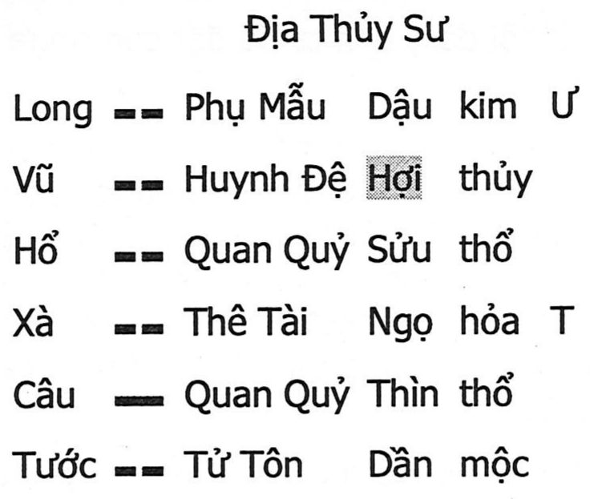
    - **Hình này chứng minh điều gì**
      - # CHƯƠNG 7.
    - **Từ đâu mà thấy được**
      - Lấy hào Thế làm Dụng thần, Thê Tài trì Thế tại hào 3, hào 3 là hào vị hậu môn, Tài chủ máu, bị Nguyệt kiến xung phá, trong quẻ phản ánh ra thông ti...
  - **Căn cứ luận đoán**:
    - **Địa Thủy Sư**
    - Lấy hào Thế làm Dụng thần, Thê Tài trì Thế tại hào 3, hào 3 là hào vị hậu môn, Tài chủ máu, bị Nguyệt kiến xung phá, trong quẻ phản ánh ra thông tin hậu môn chảy máu.
    - Biểu thị quẻ này nắm bắt thông tin tương đối chính xác. Quẻ là Địa Thủy Sư, Sư là chúng (nhiều), biểu thị chảy máu rất nhiều.
    - Phán đoán tình trạng cát hung, cần xem sự suy vượng của hào Thế.
    - Quẻ này Kỵ thần Không mà an tĩnh, bị Nhật hợp cản trở, không khắc hào Thế, hào Thế mặc dù Nguyệt phá nhưng có Nhật thần sinh phù, do đó không thành đại hung.
    - Hiện nay Dụng thần Nguyệt phá, ngày Canh Ngọ thực phá sẽ có chuyển biến tốt.
    - # CHƯƠNG 7. GIẢI THÍCH VÀ ỨNG DỤNG TƯỢNG 8 QUẺ CUNG CẤN
  - **Ứng nghiệm thực tế**:
    - Sau đó người này đã uống thuốc tiêu viêm, đến ngày Canh Ngọ thì cơ bản không còn chảy máu nữa.
- **Bảng Quẻ & Quái lệ 3**: **Ví dụ 3: Ngày Giáp Tý tháng Ngọ, một người dự đoán về việc thăng chức, được Địa Thủy Sư biến Hỏa Trạch Khuê.**
  - **Hình 142.** Quẻ Địa Thủy Sư biến Hỏa Trạch Khuê
    - 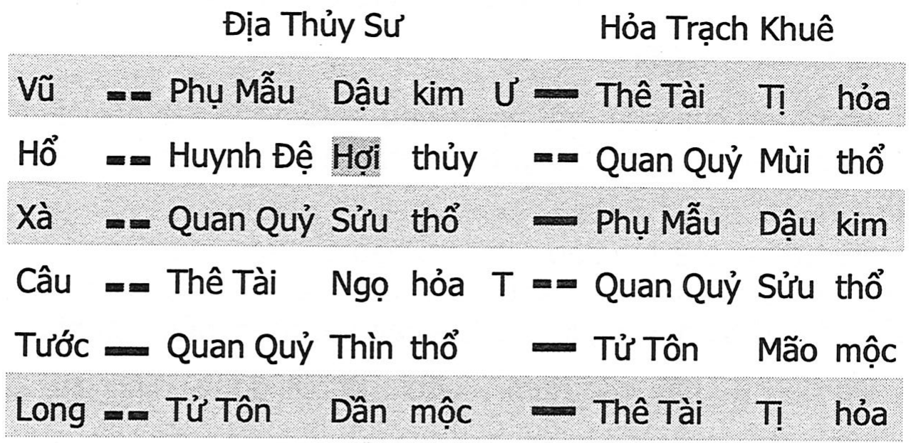
    - **Hình này chứng minh điều gì**
      - Quẻ là Sư, Sư là chúng (nhiều), hào sơ là cấp dưới, sơ động sinh Thế, Thế động sinh Quan, Quan động hợp cục, biểu thị anh ta không đi một mình mà l...
    - **Từ đâu mà thấy được**
      - Lấy Quan Quỷ làm Dụng thần, Quan Quỷ được Nguyệt sinh là vượng.
  - **Căn cứ luận đoán**:
    - Lấy Quan Quỷ làm Dụng thần, Quan Quỷ được Nguyệt sinh là vượng.
    - Quan Quỷ Sửu thổ phát động, ở ngoại quái hình thành Tị Dậu Sửu tam hợp Phụ Mẫu cục, Phụ Mẫu là đơn vị hoặc công ty công tác, hợp cục có ý nghĩa là hợp nhất, biểu thị có công ty sắp sáp nhập.
    - Hào Thế được Nguyệt phù Nhật xung ám động, động mà đi sinh Quan Quỷ, nhưng Quan Quỷ được sinh lại hợp thành cục với Phụ Mẫu, biểu thị mình có thể được thăng chức, nhưng nơi phải đến là công ty sắp được sáp nhập.
    - Quẻ là Sư, Sư là chúng (nhiều), hào sơ là cấp dưới, sơ động sinh Thế, Thế động sinh Quan, Quan động hợp cục, biểu thị anh ta không đi một mình mà là dẫn theo một thủ hạ trợ giúp.
  - **Ứng nghiệm thực tế**:
    - Quả nhiên là như vậy.

## Chương 7: Giải thích và ứng dụng tượng 8 quẻ cung Cấn

### 1. CẤN VI SƠN

- **Tượng của quẻ**:
  - nội ngoại đều là Cấn, Cấn là núi, là dừng, hai Cấn trùng nhau, càng là dừng. Giống như núi lớn cao vút, hoàn toàn bất động.
- **Tượng của lục hào**:
  - Thế tại hào 6, hào 6 là hào vị thoái hưu, lâm Quan Quỷ, Quan Quỷ chủ công danh sự nghiệp, đây là tượng sự nghiệp đã đến điểm cuối, không thể tiếp tục phát triển hơn nữa.
- **Ý nghĩa biểu tượng cốt lõi**:
  - Do đó quẻ này bao hàm ý nghĩa là bất động, đình chỉ, kết thúc, chung kết, đến cuối, tận cùng, đoạn tuyệt, bị lạnh nhạt v.v.
- **Bảng Quẻ & Quái lệ 1**: **Ví dụ 1: Gần đây có một đoàn đại biểu đến từ Nhật Bản đã hẹn tôi tiến hành dự đoán ở Thượng Hải. Ở ngày Quý Sửu tháng Mão, tôi dự đoán vận khí cho một người phụ nữ, được Cấn Vi Sơn. Phán đoán như sau.**
  - **Hình 143.** Quẻ Cấn Vi Sơn
    - 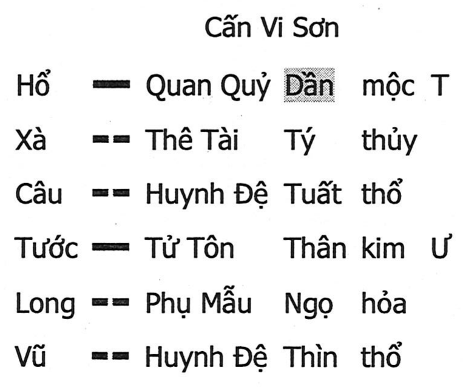
    - **Hình này chứng minh điều gì**
      - Hào 2 là hào trạch, lâm Phụ Mẫu vượng, lâm Thanh Long chủ sạch sẽ, đẹp.
    - **Từ đâu mà thấy được**
      - Phán đoán tính cách của người, lấy hào Thế làm trung tâm, kết hợp với lục thần, quái cung v.
  - **Căn cứ luận đoán**:
    - Phán đoán đầu tiên của tôi là về tính cách của cô ấy, tôi nói:
    - Tính cách của chị giống như đàn ông, tính tình khá vội vàng, nóng nảy, thường xuyên nổi giận, rất thích làm việc chăm chỉ, là một người không chịu cảnh nhàn rỗi.
    - Mấy năm nay tài vận không tốt, kinh tế gặp vấn đề về dòng tiền, trong nhà chủ yếu dựa vào thu nhập của chồng chống đỡ, nhưng vận khí hiện nay của chồng cũng không tốt, do đó hai người thường xuyên cãi nhau bởi vì vấn đề kinh tế.
    - Sức khỏe hiện nay của chị không tốt, trên đầu tuần hoàn máu không thông, đầu óc thường xuyên cảm thấy trống rỗng, không thể nhớ được điều gì.
    - Ngoài ra luôn cảm thấy khô mũi và họng, trong miệng rất ít nước bọt, đồng thời tiêu hóa cũng không tốt.
    - Mặc dù nhà của chị trông rất sạch sẽ, rất đẹp, nhưng chị lại không thích sống trong đó.
    - Phán đoán trên đây rất chính xác. Tôi đã phán đoán như sau.
    - Phán đoán tính cách của người, lấy hào Thế làm trung tâm, kết hợp với lục thần, quái cung v.v để phân tích.
    - Quẻ là Cấn, Cấn là thiếu nam, là dương quái (quẻ dương). Quan Quỷ là đàn ông, lâm Thế, hào Thế lại là hào dương, do đó là tính cách đàn ông.
    - Lâm Bạch Hổ, Bạch Hổ là nhanh, vội, lại chủ phẫn nộ, nóng nảy. Quẻ lục xung, rất dễ xung động.
    - Vốn quẻ Cấn là dừng, nhưng Thế Không cho nên đoán ngược lại. Là không dừng, cho nên đoán là một người không chịu cảnh nhàn rỗi.
    - Phán đoán sức khỏe thì xem hào Thế. Thế tại hào 6, hào 6 là đầu, Không không được Nguyên thần đến sinh.
    - Không là biểu thị đầu óc trống rỗng, thủy chủ trí tuệ, Nguyên thần lại chủ tư duy, bị hợp không thể sinh hào 6, cho nên giống như kẻ ngu si, không nhớ được điều gì.
    - Cấn là mũi, bởi vì Nguyên thần thủy bị hợp, không sinh Thế, thủy chủ lượng nước, cho nên mũi khô.
    - Thủy tại hào 5, là miệng và họng, bị hợp không sinh Thế, thủy chủ chất lỏng, có thể suy ra là nước bọt, do đó phán đoán là miệng khô, ít nước bọt.
    - Lại thêm Tài chủ ẩm thực, Cấn là tỳ vị, do đó tiêu hóa không tốt.
    - Hào 2 là hào trạch, lâm Phụ Mẫu vượng, lâm Thanh Long chủ sạch sẽ, đẹp.
    - Nhưng Thế Không không sinh hào 2, biểu thị bản thân không thích nhà của mình, không muốn sống trong đó.
  - **Đối thoại & Diễn biến thực tế**:
    - Trong quẻ hào Tài không được Nhật Nguyệt sinh phù, bị Nhật khắc hợp, Nhật hợp là cản trở, cản trở không thể sinh Thế, do đó tài vận không tốt.
    - Trên thực tế, cô ấy có rất nhiều khoản nợ, kinh tế rất căng thẳng.
    - Tử Tôn là nguồn tài, lâm Ứng, Ứng là phu vị, thu nhập chủ yếu của gia đình là dựa vào chồng.
    - Nhưng Ứng nhập Mộ ở Nhật, không thể sinh Tài, do đó tài vận của chồng cũng không tốt, không kiếm được tiền.
    - Lâm Chu Tước, chủ khẩu thiệt, xung khắc hào Thế, do đó thường xuyên cãi nhau với cô ấy.
- **Bảng Quẻ & Quái lệ 2**: Ngày Giáp Dần tháng Thân, một người đoán về chức vụ của anh trai, được Cấn Vi Sơn biến Địa Sơn Khiêm.
  - **Hình 144.** Sơ đồ quẻ Cấn Vi Sơn biến Địa Sơn Khiêm
    - 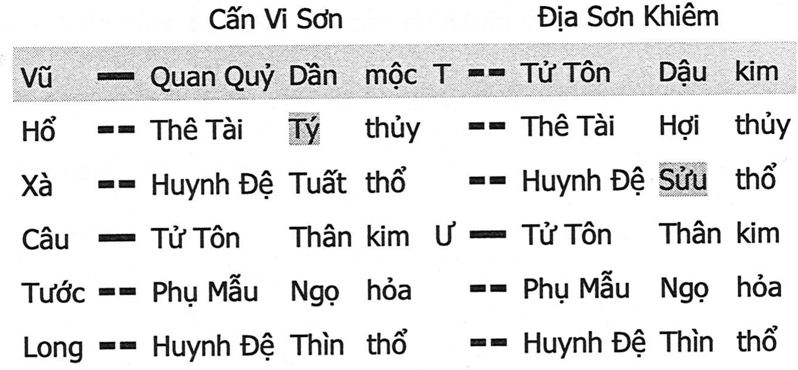
    - **Hình này chứng minh điều gì**
      - Tình hình thực tế, anh trai của người này đã bị cách chức và bị tạm giam để điều tra về vấn đề kinh tế.
    - **Từ đâu mà thấy được**
      - Lấy Quan Quỷ làm Dụng thần.
  - **Căn cứ luận đoán**:
    - Lấy Quan Quỷ làm Dụng thần. Quan Quỷ Dần mộc tại hào 6 độc phát, Nguyệt phá động hóa hồi đầu khắc.
    - Thăng chức thì bất thành, có chức thì không giữ được, lục thân xung phá Dụng thần ở hào Ứng, biểu thị nhân tố sản sinh bất lợi đối với chức vụ là đến từ bên ngoài, sự quấy phá của người khác.
    - Quẻ này tên là Cấn, Cấn là dừng, là đình lưu.
    - Quan tại hào 6, hào 6 là hào vị thoái hưu, dự đoán về chức vụ thì đây là thông tin rút khỏi chức vụ.
    - Quẻ này mặc dù có Nhật thần đến thực phá, nhưng bởi vì Dụng thần có hồi đầu khắc, khắc nhiều sinh ít, chung quy là không cát.
    - Tình hình thực tế, anh trai của người này đã bị cách chức và bị tạm giam để điều tra về vấn đề kinh tế.
- **Bảng Quẻ & Quái lệ 3**: Ngày Nhâm Thân tháng Thìn, nam đoán về việc thăng chức, được Cấn Vi Sơn biến Hỏa Sơn Lữ.
  - **Hình 145.** Sơ đồ quẻ Cấn Vi Sơn biến Hỏa Sơn Lữ
    - 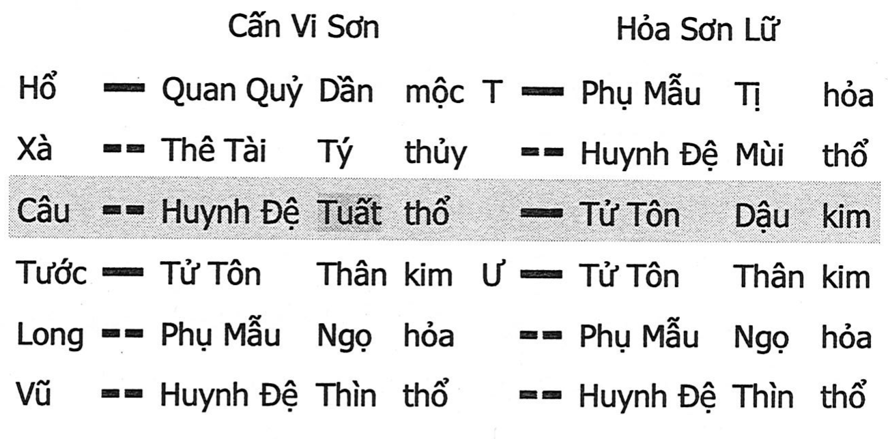
    - **Hình này chứng minh điều gì**
      - Lấy hào Quan Quỷ làm Dụng thần, Quan Quỷ không được Nhật Nguyệt sinh, trái lại bị Nhật đến xung khắc.
    - **Từ đâu mà thấy được**
      - Lấy hào Quan Quỷ làm Dụng thần, Quan Quỷ không được Nhật Nguyệt sinh, trái lại bị Nhật đến xung khắc.
  - **Căn cứ luận đoán**:
    - Lấy hào Quan Quỷ làm Dụng thần, Quan Quỷ không được Nhật Nguyệt sinh, trái lại bị Nhật đến xung khắc.
    - Cừu thần Tuất thổ lại động đến khắc Nguyên thần, quẻ này là độc phát, hào động là Dưỡng địa của Dụng thần, Dưỡng là tu dưỡng, hào Thế và Quan Quỷ cùng ở hào 6, hào 6 là hào thoái hưu, dự đoán về thăng chức thì không những không được thăng mà e rằng có dấu hiệu đình chỉ chức vụ.
  - **Ứng nghiệm thực tế**:
    - Quả nhiên người này bị trì hoãn việc thăng chức.
    - Đến mùa thu, bởi vì cạnh tranh chức vụ với người khác, anh ta đã bị đối thủ cạnh tranh tố giác ra rất nhiều vấn đề của anh ta, viện kiểm sát đã ra lệnh đình chức để thẩm tra.
- **Bảng Quẻ & Quái lệ 4**: Ngày Tân Mão tháng Mão, phó thư ký của huyện ủy dự đoán về việc thăng chức, được Cấn Vi Sơn biến Sơn Phong Cổ.
  - **Hình 146.** Sơ đồ quẻ Cấn Vi Sơn biến Sơn Phong Cổ
    - 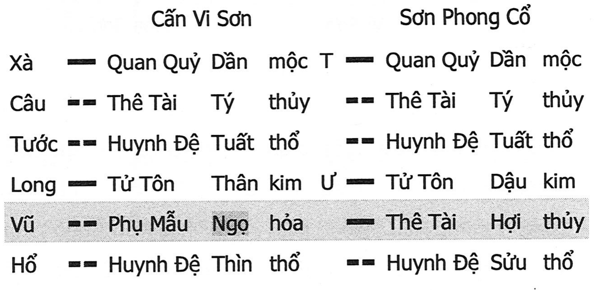
    - **Hình này chứng minh điều gì**
      - Về sau có hai cơ hội điều chỉnh nhưng người này cũng không được thăng chức.
    - **Từ đâu mà thấy được**
      - Lấy hào Quan Quỷ làm Dụng thần, quẻ này Quan Quỷ trì Thế, được Nhật Nguyệt tỉ phù, Dụng thần rất vượng, có vẻ như có thể có thăng, nhưng hào 2 Phụ ...
  - **Căn cứ luận đoán**:
    - Lấy hào Quan Quỷ làm Dụng thần, quẻ này Quan Quỷ trì Thế, được Nhật Nguyệt tỉ phù, Dụng thần rất vượng, có vẻ như có thể có thăng, nhưng hào 2 Phụ Mẫu Ngọ hỏa độc phát, quẻ độc phát lấy tượng làm chủ, Dụng thần nằm ở Tử địa, đồng thời hào Thế và Quan Quỷ đã đến hào 6, hào 6 là tận cùng về hào vị, biểu thị quan vận đã đến mức độ lớn nhất, không thể lên cao hơn nữa, do đó không có hy vọng được thăng chức.
    - Phụ Mẫu là quyền lực, Không mà hóa Tuyệt hóa hồi đầu khắc. Quyền lực trong tay cũng sẽ dần dần mất đi.
    - Về sau có hai cơ hội điều chỉnh nhưng người này cũng không được thăng chức.
- **Bảng Quẻ & Quái lệ 5**: Ngày Nhâm Ngọ tháng Dần, nữ đoán bệnh tật, được Cấn Vi Sơn biến Phong Sơn Tiệm.
  - **Hình 147.** Sơ đồ quẻ Cấn Vi Sơn biến Phong Sơn Tiệm
    - 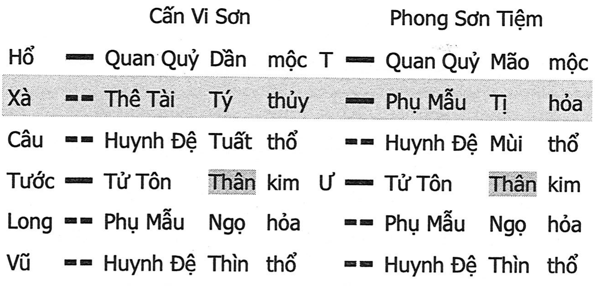
    - **Hình này chứng minh điều gì**
      - Quẻ chính là Cấn, Cấn là dừng, biểu thị máu đông đặc ngừng chảy, tổng hợp phán đoán là mạch máu cổ không thông, dẫn tới đầu cung máu không đủ.
    - **Từ đâu mà thấy được**
      - Lấy hào Thế làm Dụng thần, Dụng thần được Nguyệt tỉ phù là vượng tướng.
  - **Căn cứ luận đoán**:
    - Lấy hào Thế làm Dụng thần, Dụng thần được Nguyệt tỉ phù là vượng tướng.
    - Nhật không đến khắc, Dụng thần không bị thương, phán đoán bệnh tật thì lấy sinh khắc để luận bệnh.
    - Thông thường, khi Nhật Nguyệt không làm tổn thương Dụng thần và trong quẻ cũng không có hào động đến khắc Dụng thần thì phải xem tình trạng của Nguyên thần.
    - Nguyên thần tại hào 5, hào 5 thông thường định vị tại phần đầu, cổ, ngực v.v. Quẻ này Nguyên thần là thủy, thủy chủ máu, miệng, họng v.v.
    - Dụng thần lâm Bạch Hổ có ý nghĩa là máu. Nguyên thần lâm Trình Xà, Trình Xà có ý nghĩa là thon dài.
    - Thủy động hóa Tuyệt, biểu thị cung máu không đủ.
    - Quẻ chính là Cấn, Cấn là dừng, biểu thị máu đông đặc ngừng chảy, tổng hợp phán đoán là mạch máu cổ không thông, dẫn tới đầu cung máu không đủ.
  - **Đối thoại & Diễn biến thực tế**:
    - Quẻ này Nguyên thần độc phát, thoạt nhìn là động đến sinh Thế là cát, nhưng trên thực tế là Nguyên thần này không được Nhật Nguyệt sinh phù, lại động mà hóa Tuyệt, bất lợi cho việc sinh Dụng thần, do đó tiêu điểm của phán đoán bệnh tật chính là ở Nguyên thần.
    - Trên thực tế, người này bị xương cổ tăng sinh dẫn tới đầu cung máu không đủ.
- **Bảng Quẻ & Quái lệ 6**: Ngày Canh Thìn tháng Thân, một người có con trai bị bắt bởi vì giam giữ người khác, hỏi kết quả sẽ ra sao? Được Cấn Vi Sơn biến Hỏa Sơn Lữ.
  - **Căn cứ luận đoán**:
    - Lấy hào Tử Tôn làm Dụng thần. Tử Tôn được Nguyệt phù Nhật sinh là vượng tướng, lại được hào động đến sinh. Vốn là tượng cát.
    - Nhưng Tử Tôn Không Vong, không được hào động đến sinh, quẻ là Cấn, Cấn là dừng, mất tự do không thể động, tượng bị giam cầm, con của anh ta nhất định sẽ phải ở trong tù một thời gian mới có thể được trở về.
    - Nay Thân kim Không, xuất Không có thể về.
    - Năm Quý Mùi dự đoán, mùa thu năm Giáp Thân ra tù.

### 2. SƠN HỎA BÍ

- **Tượng của quẻ**:
  - ngoại quái là Cấn, là dừng, là cố định, nội quái là Ly, là đẹp, là sáng, cố định một thứ đẹp đẽ, chính là Bí (trang sức rực rỡ), Bí giả, sức (trang sức) dã.
- **Tượng của lục hào**:
  - Thế tại hào sơ lâm Quan Quỷ, Quan Quỷ là quan chức, là tên, tại hào sơ biểu thị chức vị thấp, lại hợp hào 4.
  - Hào 4 là hộ (cửa), chính là treo tên tuổi của mình ở cửa, khiến cho người đi đường đều biết mình là quan, có tượng trang sức bề ngoài, do đó là Bí.
- **Ý nghĩa biểu tượng cốt lõi**:
  - trang sức, khoa trương, khoác lác, hiếu thắng, vùng vẫy, biểu hiện, khoe khoang v.v.
- **Bảng Quẻ & Đồ hình liên hệ**: Sơ đồ quẻ Cấn Vi Sơn biến Hỏa Sơn Lữ
  - **Hình 148.** Sơ đồ quẻ Cấn Vi Sơn biến Hỏa Sơn Lữ
    - 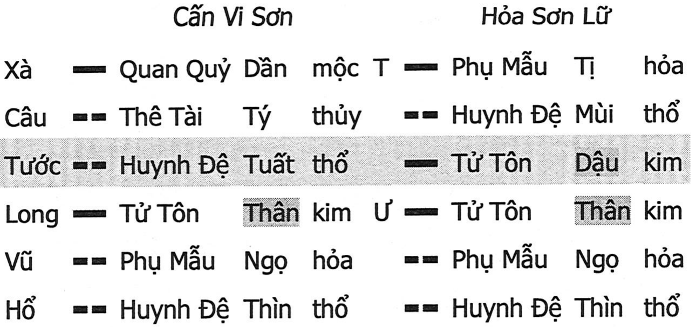
    - **Hình này chứng minh điều gì**
      - Thế tại hào sơ lâm Quan Quỷ, Quan Quỷ là quan chức, là tên, tại hào sơ biểu thị chức vị thấp, lại hợp hào 4.
    - **Từ đâu mà thấy được**
      - Thế tại hào sơ lâm Quan Quỷ, Quan Quỷ là quan chức, là tên, tại hào sơ biểu thị chức vị thấp, lại hợp hào 4.
- **Bảng Quẻ & Quái lệ 1**: Ngày Tân Sửu tháng Dần, một người đàn ông cãi nhau với vợ, vợ đã về nhà mẹ đẻ và đề xuất muốn ly hôn với mình, hỏi là thật hay giả? Được Sơn Hỏa Bí.
  - **Hình 149.** Sơ đồ quẻ Sơn Hỏa Bí
    - 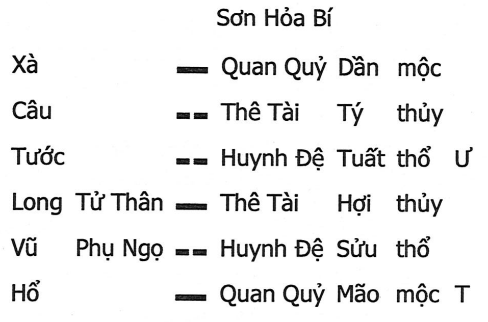
    - **Hình này chứng minh điều gì**
      - mình.
    - **Từ đâu mà thấy được**
      - Quẻ này lấy Thê Tài làm Dụng thần, trong quẻ Thê Tài lưỡng hiện, lấy hào Thê Tài Tý thủy gặp hợp làm Dụng, Dụng thần không được Nhật Nguyệt sinh ph...
  - **Căn cứ luận đoán**:
    - Quẻ này lấy Thê Tài làm Dụng thần, trong quẻ Thê Tài lưỡng hiện, lấy hào Thê Tài Tý thủy gặp hợp làm Dụng, Dụng thần không được Nhật Nguyệt sinh phù, lại bị Nhật khắc là hưu tù, hào Tài sinh Thế là vợ vẫn còn cảm tình đối với anh ta, nhưng bị Nhật thần hợp, Nhật hợp là cản trở, khiến Tý thủy tham hợp quên sinh, do đó vợ sẽ ngày càng không thích anh ta.
    - Tý thủy và hào Thế tương hình, vợ có thể chỉ ra những chỗ sai của anh ta.
    - Nhật thần hợp Tý thủy này là hào Huynh Đệ, Huynh Đệ chủ anh em, chị em gái, bạn bè v.v.
    - Huynh Đệ Sửu thổ ở trong quẻ lâm hào 2 hào trạch, chứng tỏ hào Huynh Đệ này là người trong nhà.
    - Biểu thị người ngăn cản không cho vợ chồng anh ta làm lành chính là anh chị em của vợ anh ta.
    - Huynh Đệ Sửu thổ trên Nhật trong hợp có khắc, khiến Dụng thần không thể sinh Thế, em gái của vợ nhất định sẽ khuyên vợ ly hôn với
    - mình. Mặc dù quẻ này là quẻ lục hợp, nhưng Dụng thần hưu tù vô khí, vì vậy nhất định sẽ ly hôn.
  - **Đối thoại & Diễn biến thực tế**:
    - Anh ta nói rằng vợ chỉ có một em gái, vậy thì Huynh Đệ Sửu thổ này nhất định là em gái của cô ấy.
    - Thê Tài Tý thủy và Huynh Đệ Sửu thổ tương hợp cũng biểu thị vợ anh ta không về nhà mẹ đẻ mà là đang ở trong nhà em gái.
    - Hào Thế lâm Bạch Hổ, biểu thị tính khí của bản thân không tốt cho lắm, bởi vì Bạch Hổ chủ tính khí nóng nảy, ẩu đả, Ứng là thê vị, Thế lâm Bạch Hổ khắc Ứng, nhất định anh ta đã đánh vợ.
    - Anh ta cho biết đúng là bởi vì mình đã đánh vợ, vợ mới bỏ nhà ra đi.
    - Quẻ này là Sơn Hỏa Bí, dựa vào tổ hợp quái tượng, biểu thị anh ta là một người sĩ diện, cho dù đã đánh vợ, cũng sẽ không xin vợ thứ lỗi, không thừa nhận sai lầm.
  - **Ứng nghiệm thực tế**:
    - Anh ta nói là gia đình bên kia đã hẹn anh ta ngày hôm sau đến cục dân chính để làm thủ tục ly hôn.
    - Tôi nói ngày mai là ngày Dần, không xung khắc Dụng thần, không phù hợp với quy luật ứng kỳ của quẻ, ngày mai nhất định chưa ly hôn được, kết quả là ngày hôm sau đến cục dân chính quả nhiên chưa ly hôn.
    - Kết quả sau đó như thế nào, hiện nay chưa có phản hồi.
- **Bảng Quẻ & Quái lệ 2**: Ngày Đinh Mùi tháng Mão, một người hỏi tại sao đứa trẻ thường xuyên khóc lóc, được Sơn Hỏa Bí biến Cấn Vi Sơn.
  - **Hình 150.** Sơ đồ quẻ Sơn Hỏa Bí biến Cấn Vi Sơn
    - 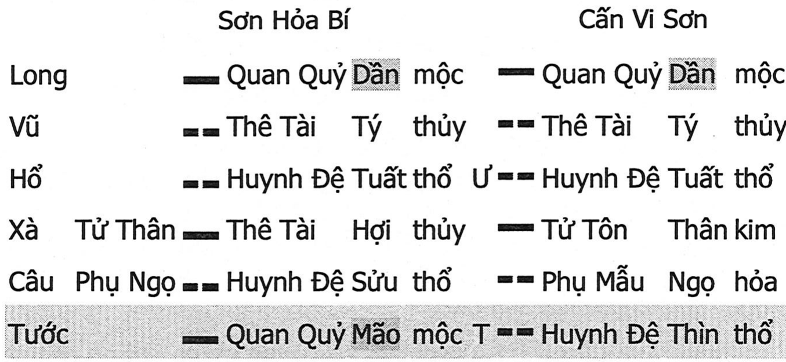
    - **Hình này chứng minh điều gì**
      - Việc làm mặt quỷ này chính là tượng sức (trang sức, trang điểm) của quẻ Bí.
    - **Từ đâu mà thấy được**
      - Lấy hào Tử Tôn làm Dụng thần, Tử Tôn bất thượng quái, phục dưới hào 3 Thê Tài Hợi thủy, mặc dù Nguyệt kiến không sinh, nhưng được Nhật thần sinh ph...
  - **Căn cứ luận đoán**:
    - Lấy hào Tử Tôn làm Dụng thần, Tử Tôn bất thượng quái, phục dưới hào 3 Thê Tài Hợi thủy, mặc dù Nguyệt kiến không sinh, nhưng được Nhật thần sinh phù là vượng tướng.
    - Tử Tôn lâm Trình Xà, Trình Xà chủ sợ hãi, lại thêm hào sơ Quan Quỷ độc phát, hào độc phát có thể biểu thị nguyên nhân.
    - Quan Quỷ phát động trong quẻ, biểu thị tượng bất an, lâm Chu Tước chủ âm thanh, chứng tỏ đứa trẻ đã bị âm thanh kích thích mà sợ hãi, do đó đã xuất hiện tình trạng khóc đêm.
    - Tình hình thực tế, bởi vì người này làm mặt quỷ để dụ đứa trẻ chơi đùa, khiến đứa trẻ giật mình, do đó mới xuất hiện tình trạng khóc đêm.
    - Việc làm mặt quỷ này chính là tượng sức (trang sức, trang điểm) của quẻ Bí.
- **Bảng Quẻ & Quái lệ 3**: Ngày Bính Ngọ tháng Mão, nam đoán về việc đơn vị có tiểu nhân gây rối, được Sơn Hỏa Bí biến Trạch Hỏa Cách.
  - **Hình 151.** Sơ đồ quẻ Sơn Hỏa Bí biến Trạch Hỏa Cách
    - 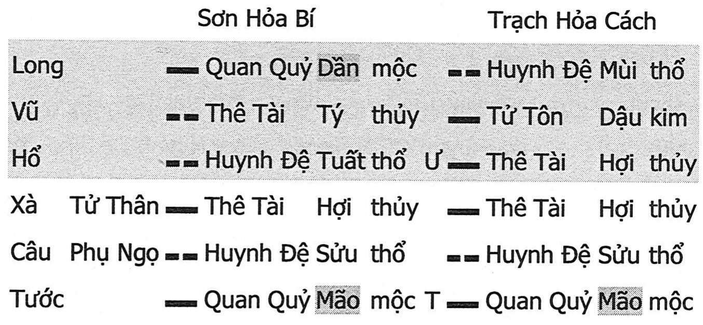
    - **Hình này chứng minh điều gì**
      - Dự đoán về việc tiểu nhân gây bất lợi cho mình, nếu như hỏi có hay không thì xem lục thân khắc Thế, vượng tướng phát động khắc Thế thì có tiểu nhân...
    - **Từ đâu mà thấy được**
      - Căn cứ ngũ hành sinh khắc, Dụng thần, Thế Ứng và hào động biến trong quẻ.
  - **Căn cứ luận đoán**:
    - Dự đoán về việc tiểu nhân gây bất lợi cho mình, nếu như hỏi có hay không thì xem lục thân khắc Thế, vượng tướng phát động khắc Thế thì có tiểu nhân gây rối, nếu đã phát hiện tiểu nhân, khi hỏi về tình huống này thì xem hào Ứng là tiểu nhân.
  - **Đối thoại & Diễn biến thực tế**:
    - Quẻ này Quan Quỷ phát động trong quẻ, là tượng bất an, biểu thị có tiểu nhân gây rối.
    - Nhưng Quan Quỷ có ngũ hành tương đồng với hào Thế, động mà trợ giúp hào Thế, biểu thị tiểu nhân gây rối vô hình trung đã giúp đỡ mình, đã làm cho lực lượng của mình lớn mạnh, quẻ này hào Thế và hào Ứng tương hợp, dựa vào quái tượng thấy rằng, người này rất giỏi che đậy bản thân, bề ngoài rất hòa thuận với mọi người, rất giỏi giả bộ.
    - Trên thực tế đúng là như vậy.
- **Bảng Quẻ & Quái lệ 4**: Ngày Mậu Tý tháng Mùi, nữ dự đoán vận khí, được Sơn Hỏa Bí biến Địa Sơn Khiêm.
  - **Hình 152.** Sơ đồ quẻ Sơn Hỏa Bí biến Địa Sơn Khiêm
    - 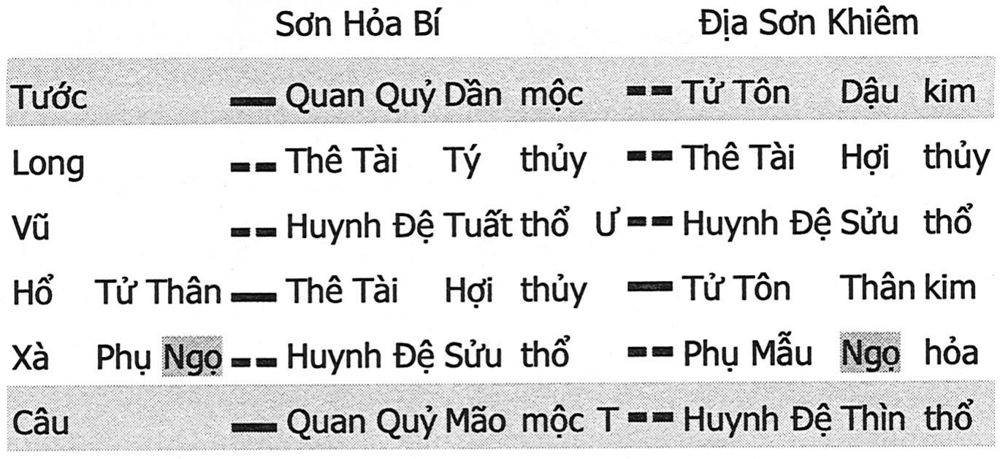
    - **Hình này chứng minh điều gì**
      - Tình hình thực tế đúng là như vậy.
    - **Từ đâu mà thấy được**
      - Hào Thế tương hợp với hào Ứng lâm Huyền Vũ, Huyền Vũ chủ ám muội, biểu thị có quan hệ ám muội với người khác.
  - **Căn cứ luận đoán**:
    - Quẻ này cần phán đoán tổng hợp, hào Thế phát động, biểu thị người này tâm tính bất định.
    - Động mà đi hợp hào Ứng, có tượng hùa theo người khác. Trong hợp có khắc, lại muốn chiếm ưu thế của người khác, chế ước người khác.
    - Dựa vào ý nghĩa tên quẻ, đây là một người rất chuộng hư vinh.
    - Hào Thế tương hợp với hào Ứng lâm Huyền Vũ, Huyền Vũ chủ ám muội, biểu thị có quan hệ ám muội với người khác.
    - Đồng thời Quan Quỷ lưỡng hiện, hào Thế Mộc Dục tại Nhật, cũng là thông tin có ngoại tình.
    - Quan trên Thế là chồng, hào 6 Quan Quỷ là người tình ngoài hôn nhân.
    - Quan Quỷ Dần mộc này tương hợp với hào 3 Thê Tài Hợi thủy, biểu thị người đàn ông mà cô ấy qua lại là người đã có vợ.
    - Tình hình thực tế đúng là như vậy.
- **Bảng Quẻ & Quái lệ 5**: Ngày Giáp Tuất tháng Dần, nam dự đoán bệnh tật của cha, được Sơn Hỏa Bí biến Địa Lôi Phục.
  - **Căn cứ luận đoán**:
    - Lấy Phụ Mẫu làm Dụng thần, Phụ Mẫu Ngọ hỏa bất thượng quái, phục dưới hào 2, dự đoán bệnh tật, Dụng thần phục tàng thường là tượng nằm bệnh trên giường, nhập Mộ ở Nhật, là tượng mất hành động tự do.
    - Hào 2 là trạch, biểu thị cha anh ta đang nằm ở nhà.
    - Lúc dự đoán là năm Quý Mùi, Dụng thần lâm Ngọ hỏa phục tàng, biểu thị cha anh ta bị bệnh ở năm Nhâm Ngọ (năm 2002).
    - Nay Thê Tài Hợi thủy phát động khắc Dụng thần, tuy có Nguyệt hợp là vượng, nhưng hóa hồi đầu khắc, Nhật thần lại khắc, Quan Quỷ Dần mộc động mà hợp, do đó có bệnh cũng không sao.
    - Tên quẻ là Sơn Hỏa Bí, có ý nghĩa là trang sức, Dụng thần nhập Mộ ở Nhật, mà Nhật thần lâm hào 4, hào 4 là môn hộ, biểu thị cha anh ta rất quan trọng đối với con đường sống của người khác, có thể một mình gánh vác công việc, đóng vai trò là bộ mặt của công ty.
  - **Đối thoại & Diễn biến thực tế**:
    - Trên thực tế đúng là như vậy. Sự nghiệp hiện nay của người này đều là nhờ vào cha anh ta một tay phát triển.
    - Rất nhiều giao dịch làm ăn của anh ta và người khác đều là dựa vào sĩ diện của cha anh ta. Anh ta chỉ cầu mong cha bình an.
    - Như vậy thì công việc kinh doanh của mình mới có thể tốt đẹp. Nếu như cha qua đời thì công việc kinh doanh sẽ không thể phát triển được.

### 3. SƠN THIÊN ĐẠI SÚC

- **Tượng của quẻ**:
  - ngoại quái Cấn là núi, là dừng, còn nội quái Càn là châu báu, chính là tích lũy nhiều châu báu và giữ bất động, do đó có tên là Đại Súc.
- **Tượng của lục hào**:
  - hào 2 là trạch, hào Thế lâm hào 2, là người nghỉ ngơi ở trong nhà.
  - Ứng tại hào 5 là đường, sinh hào Thế, chính là khi đi ngoài đường mệt mỏi, người ta muốn có một nơi để nương tựa, giúp cho bản thân an dưỡng, sinh hoạt, nơi đó chính là nhà, cho nên
  - nhiều người muốn về nhà.
  - Bởi vì nhà mới là nơi cư trú lâu dài của chúng ta, quẻ này khác với quẻ Tiểu Súc, thời gian lưu lại dài hơn quẻ Tiểu Súc, cho nên là Đại Súc.
  - Đại Súc thông thường có ý nghĩa là thời gian dài, tích lũy, bất động dài hạn, lười biếng, dành dụm, chuẩn bị v.v.
  - Đại Súc và Tiểu Súc cùng có ý nghĩa là lưu (lưu giữ, ở lại).
  - Quẻ này Quan Quỷ trì Thế, dự đoán sự nghiệp thông thường có thể được cấp trên khen ngợi và cất nhắc, nhưng thân ở trong nhà, thường không thể phát triển đến nơi rất xa.
  - Nếu là dự đoán mất đồ vật, Tài sinh hào Thế, sinh hào trạch, chỉ cần Dụng thần có khí, rất dễ tìm được.
  - Chiêm tài vận buôn bán, thông thường đắc lợi ngay tại chỗ, có thể có sự tích lũy rất lớn.
- **Bảng Quẻ & Đồ hình liên hệ**: Quẻ Sơn Hỏa Bí biến Địa Lôi Phục
  - **Hình 153.** Quẻ Sơn Hỏa Bí biến Địa Lôi Phục
    - 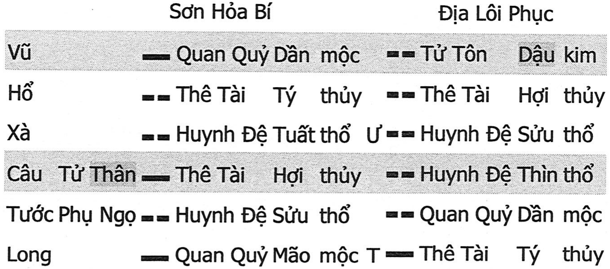
    - **Hình này chứng minh điều gì**
      - Đại Súc và Tiểu Súc cùng có ý nghĩa là lưu (lưu giữ, ở lại).
    - **Từ đâu mà thấy được**
      - Đại Súc và Tiểu Súc cùng có ý nghĩa là lưu (lưu giữ, ở lại).
- **Bảng Quẻ & Quái lệ 1**: Ngày Nhâm Tuất tháng Tuất, nam dự đoán bệnh của cha, được Sơn Thiên Đại Súc biến Sơn Trạch Tổn.
  - **Hình 154.** Quẻ Sơn Thiên Đại Súc biến Sơn Trạch Tổn
    - 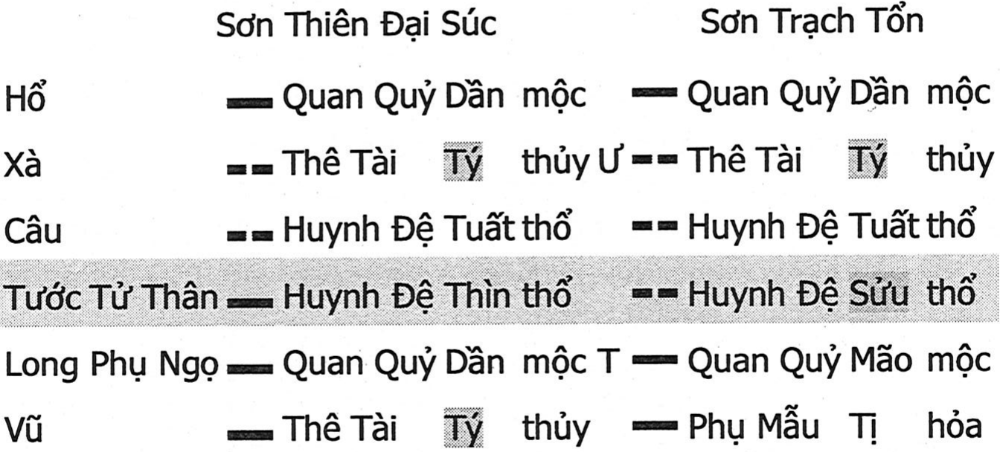
    - **Hình này chứng minh điều gì**
      - Thủy khố độc phát, độc phát chủ nguyên nhân, quẻ là Súc.
    - **Từ đâu mà thấy được**
      - Lấy Phụ Mẫu làm Dụng thần.
  - **Căn cứ luận đoán**:
    - Lấy Phụ Mẫu làm Dụng thần. Phụ Mẫu bất thượng quái, phục dưới hào 2 Dần mộc, dự đoán bệnh tật, phục tàng thường là nằm bệnh trên giường.
    - Quẻ là Đại Súc có ý nghĩa là đình lưu (dừng lại, ở lại), biểu thị cha anh ta nằm bệnh trên giường không chỉ một ngày hai ngày.
    - Tuy rằng Nhật Nguyệt không sinh Dụng thần, nhưng cũng không khắc, do đó tạm thời không có nguy hiểm gì.
    - Thủy khố độc phát, độc phát chủ nguyên nhân, quẻ là Súc. Súc giả, lưu dã.
    - Thủy là chất lỏng, dự đoán bệnh tật có thể chủ nước tiểu, nhất định là tiểu không ra.
  - **Ứng nghiệm thực tế**:
    - Quả nhiên là như vậy. Niệu đạo bị tắc nghẽn, không thể bài tiết ra ngoài.
- **Bảng Quẻ & Quái lệ 2**: Ngày Ất Hợi tháng Dần, dự đoán lái xe về quê có bình an hay không? Được Sơn Thiên Đại Súc.
  - **Hình 155.** Quẻ Sơn Thiên Đại Súc
    - 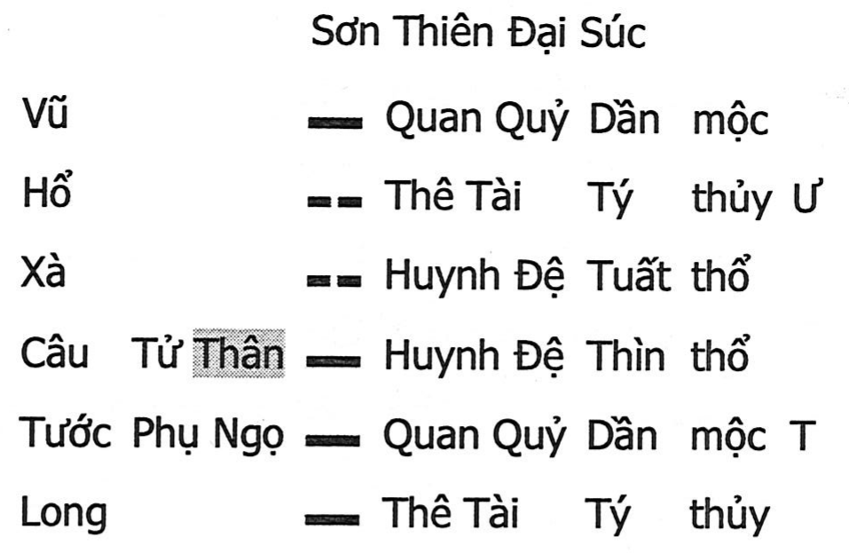
    - **Hình này chứng minh điều gì**
      - Nhưng hào Thế bị Nhật thần hợp, Nhật hợp là vướng chân, quẻ lại là Đại Súc, Súc là lưu (giữ lại).
    - **Từ đâu mà thấy được**
      - Lấy hào Thế làm Dụng thần, hào Thế được Nguyệt phù Nhật sinh là vượng tướng, trong quẻ cũng không có hào động đến khắc hào Thế, do đó trên đường nh...
  - **Căn cứ luận đoán**:
    - Lấy hào Thế làm Dụng thần, hào Thế được Nguyệt phù Nhật sinh là vượng tướng, trong quẻ cũng không có hào động đến khắc hào Thế, do đó trên đường nhất định sẽ không có hung họa phát sinh.
    - Nhưng hào Thế bị Nhật thần hợp, Nhật hợp là vướng chân, quẻ lại là Đại Súc, Súc là lưu (giữ lại).
    - Do đó trên đường nhất định sẽ xuất hiện hiện tượng tắc đường.
    - Xét nguyên nhân, cái hợp hào Thế là Thê Tài, do đó việc tắc đường có thể liên quan đến tiền tài hoặc phụ nữ.
  - **Đối thoại & Diễn biến thực tế**:
    - Trên thực tế, trên đường bình an, giữa đường gặp phải một người tàn tật chặn lại không cho đi, nhất định phải cho ông ta tiền mới được đi, một người cùng đi trên xe đã lấy ra 5 tệ cho ông ta, nhưng ông ta chịu lấy, bởi vì quá ít.
    - Cuối cùng phải cho ông ta 10 tệ mới được đi tiếp.
- **Bảng Quẻ & Quái lệ 3**: Ngày Quý Mão tháng Dậu, nam đoán khi nào bạn trả nợ? Được Sơn Thiên Đại Súc biến Địa Hỏa Minh Di.
  - **Hình 156.** Quẻ Sơn Thiên Đại Súc biến Địa Hỏa Minh Di
    - 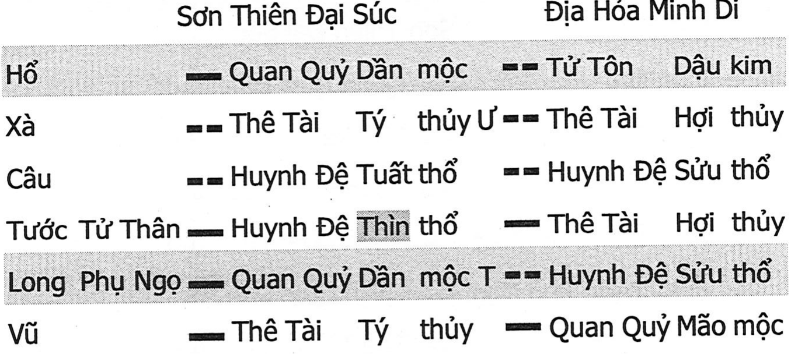
    - **Hình này chứng minh điều gì**
      - Nhưng hào Thế động mà hóa ra Huynh Đệ, sau khi khoản tiền này đến tay thì phải chuyển ra ngoài.
    - **Từ đâu mà thấy được**
      - Lấy Thê Tài làm Dụng thần, kiêm xem hào Ứng, hào Tài được Nguyệt kiến sinh phù là vượng tướng.
  - **Căn cứ luận đoán**:
    - Lấy Thê Tài làm Dụng thần, kiêm xem hào Ứng, hào Tài được Nguyệt kiến sinh phù là vượng tướng. Sơn Thiên Đại Súc là tượng giữ lại lâu.
    - Biểu thị người bạn đã vay tiền từ rất lâu. Ứng lâm Tài mà sinh Thế, tiền này có thể được trả.
    - Nhưng hào Thế động mà hóa ra Huynh Đệ, sau khi khoản tiền này đến tay thì phải chuyển ra ngoài.
    - Tổ hợp Quan Quỷ trì Thế động mà hóa Huynh Đệ thông thường là thông tin làm người trung gian hoặc là người bảo lãnh.
  - **Ứng nghiệm thực tế**:
    - Quả nhiên là như vậy. Người này đang làm việc ở ngân hàng, đó là khoản vay của người bạn thông qua anh ta.
    - Trả nợ chậm chạp, do đó mới hỏi quẻ này.
- **Bảng Quẻ & Quái lệ 4**: Ngày Kỷ Mão tháng Tý, nam đoán bệnh của cha, được Sơn Thiên Đại Súc biến Phong Thiên Tiểu Súc.
  - **Hình 157.** Quẻ Sơn Thiên Đại Súc biến Phong Thiên Tiểu Súc
    - 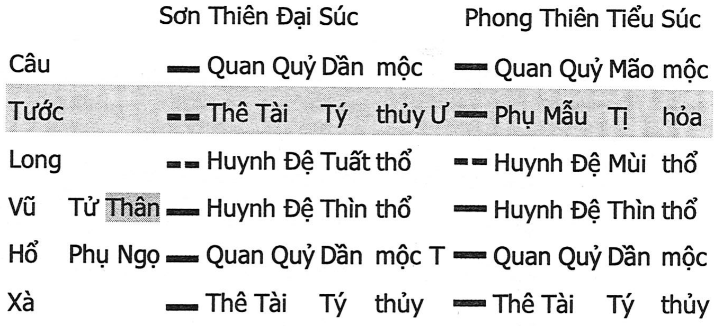
    - **Hình này chứng minh điều gì**
      - Tên quẻ là Đại Súc, có ý nghĩa là lưu (giữ lại).
    - **Từ đâu mà thấy được**
      - Lấy hào Phụ Mẫu làm Dụng thần, Phụ Mẫu Nguyệt phá và khắc nhưng có Nhật sinh, suy vượng tương đương, nhưng không nên Thê Tài Tý thủy độc phát động ...
  - **Căn cứ luận đoán**:
    - Lấy hào Phụ Mẫu làm Dụng thần, Phụ Mẫu Nguyệt phá và khắc nhưng có Nhật sinh, suy vượng tương đương, nhưng không nên Thê Tài Tý thủy độc phát động đến khắc Phụ Mẫu.
    - Bệnh này không cát.
    - Dụng thần Phụ Mẫu Ngọ hỏa bất thượng quái, lâm Bạch Hổ phục dưới hào 2, Bạch Hổ chủ bệnh tật, phục tàng là nằm bệnh ở giường, quái tượng hiển thị ra, bệnh tật tương đối nghiêm trọng.
    - Hào 2 là hào vị bộ phận sinh dục, Dụng thần lâm hào 2, bị thủy đến khắc, tất là bệnh về tiết niệu, sinh dục.
    - Tên quẻ là Đại Súc, có ý nghĩa là lưu (giữ lại). Biểu thị có thông tin tiểu không ra.
  - **Đối thoại & Diễn biến thực tế**:
    - Trên thực tế, cha của anh ta bị phì đại tuyến tiền liệt nên tiểu không ra. Sau khi phẫu thuật lại phát hiện trong bàng quang có khối u.
    - Bởi vì Dụng thần hưu tù, Kỵ thần vượng mà phát động, do đó phán đoán khối u này nhất định là khối u ác tính.
    - Sau đó chứng thực là ung thư bàng quang.
- **Bảng Quẻ & Quái lệ 5**: Ngày Kỷ Mão tháng Tý, nam có em gái sắp gặp mặt nhà bạn trai, dự đoán cha của bạn trai có chấp nhận cô ấy hay không? Được Sơn Thiên Đại Súc biến Thiên Hỏa Đồng Nhân.
  - **Căn cứ luận đoán**:
    - Chiêm quẻ thay, hào Thế là em gái, hào Ứng là cha mẹ của bạn trai, cũng có thể đồng thời kiêm xem hào Huynh Đệ, Ứng sinh hào Thế, cha mẹ của bạn trai thích em gái của anh ta.
    - Lại được Huynh Đệ động mà hóa hồi đầu sinh. Việc này nhất định thuận lợi.
    - Tên quẻ Đại Súc, Súc giả lưu dã, họ sẽ giữ em gái của anh ta lại làm con dâu.
  - **Ứng nghiệm thực tế**:
    - Tình hình thực tế, sau khi đến, cha mẹ của bạn trai đã nhiệt tình chiêu đãi, họ rất thích em gái của anh ta.
    - Sau đó em gái anh ta và bạn trai đã kết hôn.

### 4. SƠN TRẠCH TỔN

- **Tượng của quẻ**:
  - ngoại quái là Cấn, là dừng, là tích lũy, nội quái là Đoài là khuyết, mất đi những thứ tích lũy, dĩ nhiên là tổn.
  - Nhưng Cấn lại là dừng, có khuyết thiếu vật rồi mới có thể tiến hành ngăn chặn, đây gọi là mất bò mới lo làm chuồng.
  - Cho nên người xưa nói, Tổn giả, ích dã.
- **Tượng của lục hào**:
  - Huynh Đệ trì Thế, Huynh Đệ là lục thân khắc Tài, dĩ nhiên phá tài và gây ra tổn thất.
  - Nhưng hào 5 là Tài, hào 5 là tôn vị, tài quý trọng, tương hợp với Thế, mặc dù Huynh Đệ khắc Tài, nhưng trong họa có phúc.
- **Ý nghĩa biểu tượng cốt lõi**:
  - có tổn thất, thu hoạch bất ngờ, trong họa có phúc, thất bại là mẹ thành công, việc xấu biến thành việc tốt v.v.
- **Bảng Quẻ & Đồ hình liên hệ**: Quẻ Sơn Thiên Đại Súc biến Thiên Hỏa Đồng Nhân
  - **Hình 158.** Quẻ Sơn Thiên Đại Súc biến Thiên Hỏa Đồng Nhân
    - 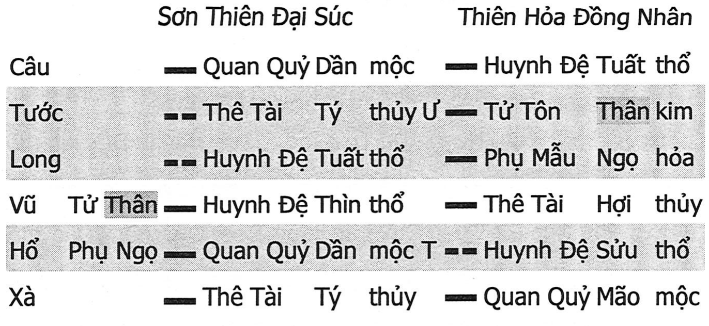
    - **Hình này chứng minh điều gì**
      - Huynh Đệ trì Thế, Huynh Đệ là lục thân khắc Tài, dĩ nhiên phá tài và gây ra tổn thất.
    - **Từ đâu mà thấy được**
      - Huynh Đệ trì Thế, Huynh Đệ là lục thân khắc Tài, dĩ nhiên phá tài và gây ra tổn thất.
- **Bảng Quẻ & Quái lệ 1**: Ngày Giáp Tuất tháng Hợi, nữ dự đoán hôn nhân, được Sơn Trạch Tổn.
  - **Hình 159.** Quẻ Sơn Trạch Tổn
    - 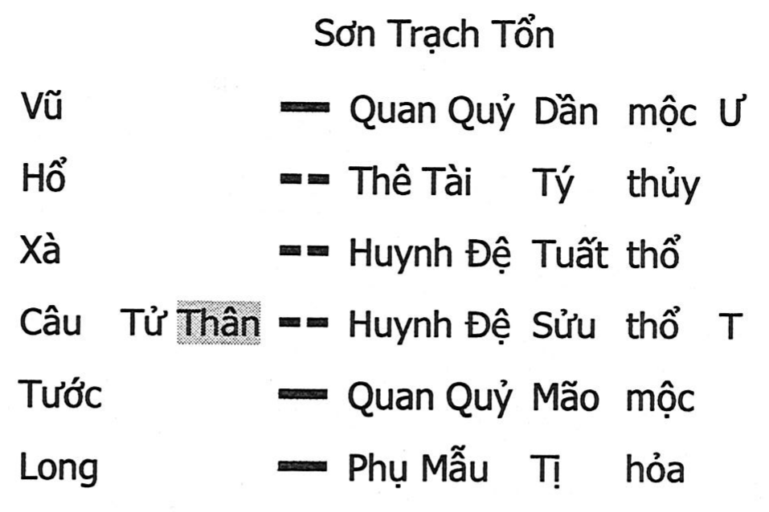
    - **Hình này chứng minh điều gì**
      - Quan Quỷ được Nguyệt sinh hợp là vượng tướng.
    - **Từ đâu mà thấy được**
      - Lấy Quan Quỷ làm Dụng thần.
  - **Căn cứ luận đoán**:
    - Lấy Quan Quỷ làm Dụng thần. Dụng thần lưỡng hiện, lấy Quan Quỷ Dần mộc trên Ứng làm Dụng thần.
    - Dụng thần thuộc hào Ứng phu vị, đây là thông tin đã kết hôn.
    - Quan Quỷ được Nguyệt sinh hợp là vượng tướng.
    - Nhưng Dụng thần khắc Thế, cộng thêm tên quẻ là Tổn, kết hôn với người đàn ông này thì hơi thiệt thòi cho mình.
    - Quan Quỷ khắc Thế là chồng không chăm sóc mình, không quan tâm mình.
  - **Đối thoại & Diễn biến thực tế**:
    - Trên thực tế, vợ chồng không hòa thuận, thường xuyên cãi nhau.
- **Bảng Quẻ & Quái lệ 2**: Ngày Kỷ Tị tháng Dậu, một người dự đoán về điện thoại di động bị mất ở trung tâm tắm gội, được Sơn Trạch Tổn biến Địa Thủy Sư.
  - **Căn cứ luận đoán**:
    - Lấy hào Tài làm Dụng thần. Tài được Nguyệt sinh, là vượng tướng.
    - Nhưng Nhật Tuyệt Dụng thần, hào động lại Tuyệt, Nguyên thần bất thượng quái, lại là Huynh Đệ trì Thế, điện thoại bị mất rất khó tìm lại.
    - Quan Quỷ phát động, là có người đã ăn trộm điện thoại, Quan Quỷ lâm Ứng, Ứng là nơi mà mình đã đến, kẻ trộm là người ở trung tâm tắm gội.
    - Quan Quỷ động hóa hồi đầu khắc, kẻ trộm sẽ bị bắt. Quẻ là Tổn, Tổn giả ích dã, mất vật là việc xấu, nhưng cũng là việc tốt.
  - **Đối thoại & Diễn biến thực tế**:
    - Trên thực tế, sau khi phát hiện bị mất điện thoại, người này đã lập tức đi tìm người phụ trách của trung tâm.
    - Phát hiện một nhân viên phục vụ đã lấy trộm.
    - Bởi vì nhân viên đó đã rời khỏi nơi làm việc và đã đem bán chiếc điện thoại trộm được, do đó trung tâm đã mua cho anh ta một chiếc điện thoại mới.
    - Cũng xem như là lấy cũ đổi mới.

### 5. HỎA TRẠCH KHUÊ

- **Tượng của quẻ**:
  - quẻ Khuê ngoại quái là Ly, là mắt, là nhìn, cũng có ý nghĩa là phân khai (xa nhau).
  - Nội quái là Đoài, là tranh cãi, cũng có ý nghĩa là vui vẻ. Do đó quẻ này có hai ý nghĩa. Một là tức giận, phân ly với người cùng chung sống;
  - hai là mở to mắt nhìn. Cho nên gọi quẻ này là Khuê.
- **Tượng của lục hào**:
  - Tử Tôn trì Thế là tượng vui vẻ, hào sơ hào 6 hai Tị hỏa Trường Sinh Tử Tôn, hỏa là mắt, cho nên là dùng mắt nhìn mà đạt được vui vẻ.
  - Nhưng hai điểm Trường Sinh này đều là hào Phụ Mẫu, vừa khắc hào Thế, biểu thị trong ngoài bất hòa, bất lợi cho mình, Tử Tôn bị khắc, tâm trạng sẽ bị ảnh hưởng, sản sinh thông tin không vui vẻ, như vậy cũng đã xuất hiện thông tin tức giận.
- **Ý nghĩa biểu tượng cốt lõi**:
  - Quẻ Khuê bao hàm ý nghĩa là phẫn nộ, phản bội, chia tay, thoát ly, làm trái, vi phạm, phản đối v.v.
- **Bảng Quẻ & Đồ hình liên hệ**: Quẻ Sơn Trạch Tổn biến Địa Thủy Sư
  - **Hình 160.** Quẻ Sơn Trạch Tổn biến Địa Thủy Sư
    - 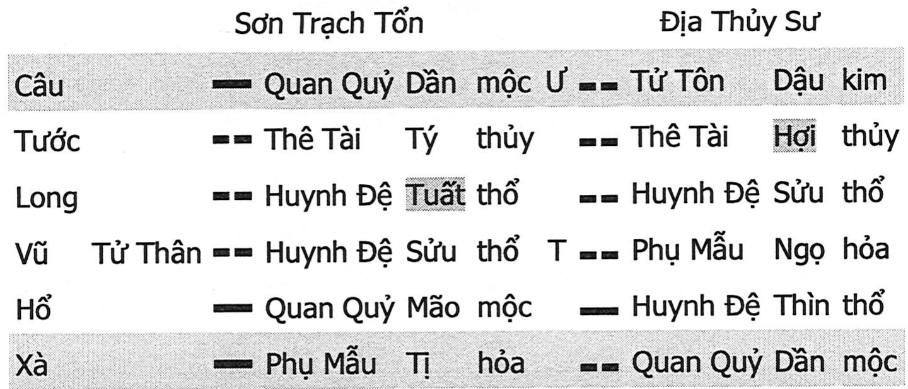
    - **Hình này chứng minh điều gì**
      - Tử Tôn trì Thế là tượng vui vẻ, hào sơ hào 6 hai Tị hỏa Trường Sinh Tử Tôn, hỏa là mắt, cho nên là dùng mắt nhìn mà đạt được vui vẻ.
    - **Từ đâu mà thấy được**
      - Tử Tôn trì Thế là tượng vui vẻ, hào sơ hào 6 hai Tị hỏa Trường Sinh Tử Tôn, hỏa là mắt, cho nên là dùng mắt nhìn mà đạt được vui vẻ.
- **Bảng Quẻ & Quái lệ 1**: Ngày Kỷ Mùi tháng Tý, một người muốn nghỉ hưu sớm để ra ngoài tự mình phát triển sự nghiệp, dự đoán có thể được nghỉ hưu như mong muốn hay không? Được Hỏa Trạch Khuê biến Sơn Trạch Tổn.
  - **Hình 161.** Sơ đồ quẻ Hỏa Trạch Khuê biến Sơn Trạch Tổn
    - 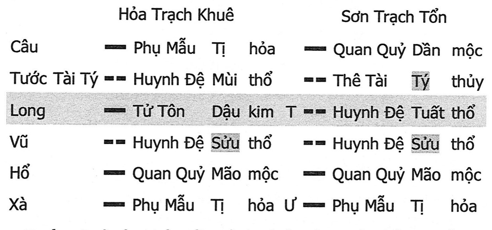
    - **Hình này chứng minh điều gì**
      - Quả như phán đoán.
    - **Từ đâu mà thấy được**
      - Quẻ này khác với quẻ dự đoán công việc thông thường.
  - **Căn cứ luận đoán**:
    - Quẻ này khác với quẻ dự đoán công việc thông thường.
    - Dự đoán công việc thông thường thì Quan Quỷ nên vượng tướng, còn dự đoán nghỉ hưu thì ngược lại, Quan Quỷ nên hưu tù, Tử Tôn phát động trong quẻ.
    - Hiện tại Quan Quỷ vượng tướng, tháng này không được, tháng Sửu Tử Tôn nhập Mộ vô lực khắc Quan Quỷ cũng không được, tháng Dần và tháng Mão Quan Quỷ vượng, cũng chưa nghỉ hưu được.
    - Chỉ có đến tháng Thìn, Tử Tôn được sinh mà vượng, cũng là ứng kỳ độc phát ứng gặp trị gặp hợp.
    - Do đó phán đoán tháng Thìn có thể hoàn thành nghỉ hưu.
    - Quả như phán đoán. Tháng Thìn đã được giải quyết thủ tục nghỉ hưu.
  - **Ứng nghiệm thực tế**:
    - Quẻ này Quan Quỷ được Nguyệt sinh, nhập Mộ ở Nhật, có vẻ như không thể nghỉ việc ngay.
    - Tên quẻ là Khuê, có thông tin tức giận, không vui vẻ, bởi vì làm thủ tục thoái hưu, nhất định phải giải thích với người ta.
    - Nhưng có thông tin rất cát là Tử Tôn độc phát trong quẻ, sau cùng nhất định có thể được giải quyết việc nghỉ hưu.
- **Bảng Quẻ & Quái lệ 2**: Ngày Kỷ Sửu tháng Mão, nam đoán về công việc, được Hỏa Trạch Khuê.
  - **Căn cứ luận đoán**:
    - Lấy Quan Quỷ làm Dụng thần, Quan Quỷ lâm Nguyệt xung hào Thế, hào Thế Nguyệt phá, là tượng công việc không thuận lợi, Tử Tôn là vui vẻ, Nguyệt phá nhập Mộ chính là không vui vẻ, biểu thị tâm trạng không vui vì công việc.
    - Quẻ này phù hợp với quái tượng của Hỏa Trạch Khuê.
  - **Đối thoại & Diễn biến thực tế**:
    - Trên thực tế, công việc không như ý, muốn thay đổi cũng không được.
- **Bảng Quẻ & Quái lệ 3**: Ngày Đinh Sửu tháng Ngọ năm 06, trong thời gian giảng dạy ở Singapore, một nữ học viên hỏi về vận khí sự nghiệp của người bạn, được Hỏa Trạch Khuê.
  - **Hình 162.** Sơ đồ quẻ Hỏa Trạch Khuê
    - 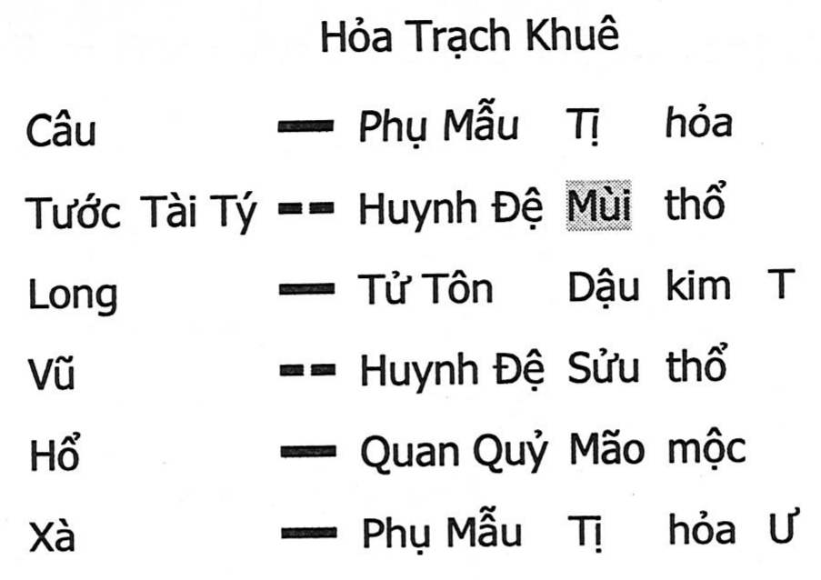
    - **Hình này chứng minh điều gì**
      - Ứng lâm Chu Tước khắc Thế, Ứng là cấp dưới, Chu Tước chủ ngôn từ, nói.
    - **Từ đâu mà thấy được**
      - Căn cứ ngũ hành sinh khắc, Dụng thần, Thế Ứng và hào động biến trong quẻ.
- **Bảng Quẻ & Quái lệ 3**: Ngày Đinh Sửu tháng Ngọ năm 06, trong thời gian giảng dạy ở Singapore, một nữ học viên hỏi về vận khí sự nghiệp của người bạn, được Hỏa Trạch Khuê.
  - **Hình 163.** Sơ đồ quẻ Hỏa Trạch Khuê
    - 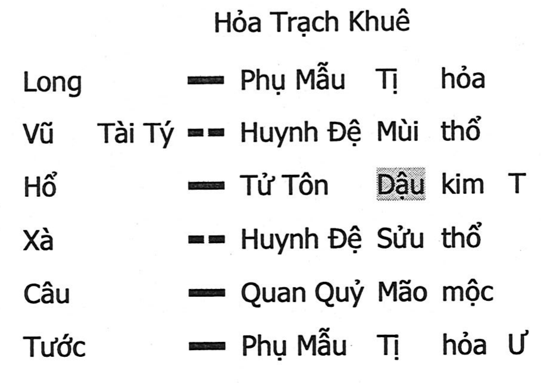
    - **Hình này chứng minh điều gì**
      - Ứng lâm Chu Tước khắc Thế, Ứng là cấp dưới, Chu Tước chủ ngôn từ, nói.
    - **Từ đâu mà thấy được**
      - Căn cứ ngũ hành sinh khắc, Dụng thần, Thế Ứng và hào động biến trong quẻ.
  - **Căn cứ luận đoán**:
    - Quẻ này phù hợp với quái tượng của Khuê. Bởi vì là chiêm thay, hào Thế thể hiện bạn của cô ấy.
    - Thế Không, tâm bất an, lâm Bạch Hổ, cộng thêm quái tượng, biểu thị người bạn của cô ấy đang trong tâm trạng rất tức giận.
    - Thế ở hào 4, chỉ cách hào 5 một hào, rất gần vị trí lãnh đạo, biểu thị có quan hệ mật thiết với lãnh đạo.
    - Hào 5 ám động sinh Thế, được lãnh đạo nâng đỡ.
    - Ứng lâm Chu Tước khắc Thế, Ứng là cấp dưới, Chu Tước chủ ngôn từ, nói.
    - Do đó tôi phán đoán có thuộc cấp bất mãn, không nghe lời anh ta, tố cáo tình trạng của anh ta, nói xấu anh ta.
  - **Ứng nghiệm thực tế**:
    - Quả nhiên là như vậy. Bạn của cô ấy vừa mới nhậm chức, rất nhiều thuộc cấp không phục, không chịu nghe lời.
    - Tuy nhiên có lãnh đạo giúp đỡ bạn của cô ấy.

### 6. THIÊN TRẠCH LÝ

- **Tượng của quẻ**:
  - ngoại quái là Càn, là đầu, là vua, là hổ, quẻ Càn số 1, quẻ Đoài số 2, nội quái Đoài ở dưới, theo sát phía sau Càn, không có lễ tiết nào vượt qua đạo trời.
  - Cho nên người xưa nói, Lý giả, lễ dã.
- **Tượng của lục hào**:
  - Thế tại hào 5, hào 5 là đường, lâm Tử Tôn, Tử Tôn là vui vẻ, là người vui vẻ đi trên đường.
  - Hào sơ lâm Phụ Mẫu Tị hỏa, Phụ Mẫu là y phục, hào sơ là chân, chính là giày, cũng chính là Lý (giày).
  - Hợp hào Thế Thân kim, chính là người mang giày đi trên đường.
- **Ý nghĩa biểu tượng cốt lõi**:
  - đi, hoạt động, du lịch, phát triển ra bên ngoài, hành động, nhậm chức v.v.
- **Bảng Quẻ & Quái lệ 1**: Ngày Tân Mùi tháng Thìn, một người đoán bệnh của mẹ, được Thiên Trạch Lý biến Càn Vi Thiên.
  - **Hình 164.** Sơ đồ quẻ Thiên Trạch Lý biến Càn Vi Thiên
    - 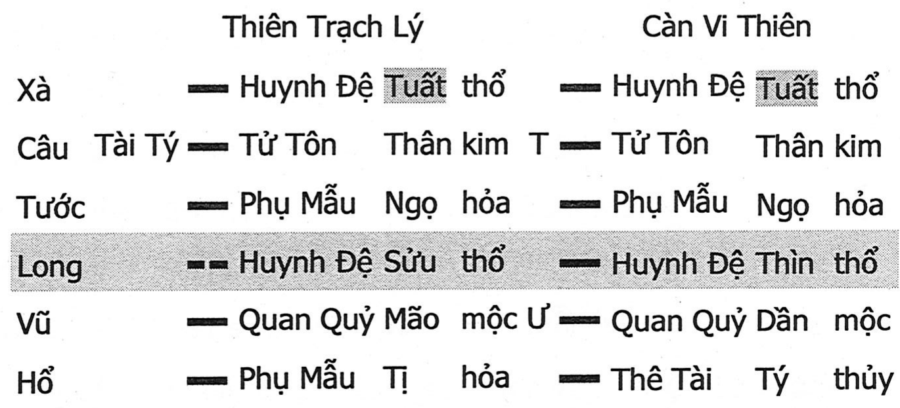
    - **Hình này chứng minh điều gì**
      - Tình hình thực tế, mẹ của người này đang nằm liệt trên giường bởi vì bị xuất huyết não, nằm trong trạng thái hôn mê.
    - **Từ đâu mà thấy được**
      - Đây là quẻ của học viên Trương Khánh Học đã hỏi qua điện thoại trước khi theo học với tôi.
  - **Căn cứ luận đoán**:
    - Đây là quẻ của học viên Trương Khánh Học đã hỏi qua điện thoại trước khi theo học với tôi. Lúc đó tôi đã phán đoán như sau:
    - Quẻ này hào Phụ Mẫu lưỡng hiện, lấy hào Phụ Mẫu Ngọ hỏa hợp Nhật làm Dụng.
    - Phán đoán tình trạng của bệnh tật, trước tiên phải xem ảnh hưởng của Nhật Nguyệt đối với Dụng thần, Nhật Nguyệt mặc dù không khắc
    - Dụng thần, nhưng cũng không sinh Dụng thần, Dụng thần không thể xem là vượng tướng, Dụng thần tương hợp với Nhật, Nhật hợp là vướng chân, biểu thị mẹ của người này bị bệnh cản trở, không thể vận động tùy ý, cộng thêm tên quẻ là Lý, liên quan đến đi lại, kết hợp với tình trạng của Dụng thần, phán đoán là vận động khó khăn, không thể đi lại.
    - Nguyên thần là tư duy và thế giới nội tâm của một cá nhân, Nguyên thần nhập Mộ, khi dự đoán bệnh tật, thông tin này có ý nghĩa là hôn mê bất tỉnh, thần trí không tỉnh táo.
    - Quẻ này Nguyên thần nhập Mộ ở Nhật, đã có thông tin này.
    - Hào 3 Huynh Đệ Sửu thổ độc phát, Tài bất thượng quái, là ăn uống không vào.
    - Hào động ở hào 3, động mà tiết khí Dụng thần, hào 3 là giường, biểu thị người bệnh không có sức lực và tinh thần, nằm liệt giường.
    - Quẻ này ngoại quái là Càn, Càn là đầu, nội quái là trạch (đầm), trạch là khuyết tổn, nhất định là trên đầu có vấn đề, theo quy tắc di thần, Phụ Mẫu ở hào sơ mặc dù không phải là Dụng thần, nhưng có thể mượn lục thần của hào này để dùng cho Phụ Mẫu ở hào 4, Bạch Hổ chủ máu, biểu thị là do máu gây ra.
    - Tình hình thực tế, mẹ của người này đang nằm liệt trên giường bởi vì bị xuất huyết não, nằm trong trạng thái hôn mê.
- **Bảng Quẻ & Quái lệ 2**: Ngày Ất Dậu tháng Ngọ, nam đoán về công việc, được Thiên Trạch Lý biến Thiên Lôi Vô Vọng.
  - **Hình 165.** Sơ đồ quẻ Thiên Trạch Lý biến Thiên Lôi Vô Vọng
    - 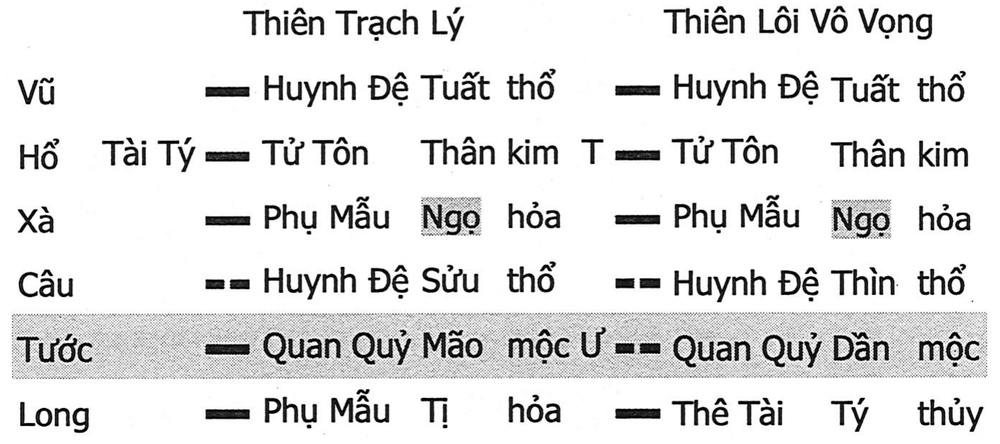
    - **Hình này chứng minh điều gì**
      - Lấy Quan Quỷ làm Dụng thần, Quan lâm Chu Tước là làm công việc về văn tự, tuyên truyền.
    - **Từ đâu mà thấy được**
      - Lấy Quan Quỷ làm Dụng thần, Quan lâm Chu Tước là làm công việc về văn tự, tuyên truyền.
  - **Căn cứ luận đoán**:
    - Lấy Quan Quỷ làm Dụng thần, Quan lâm Chu Tước là làm công việc về văn tự, tuyên truyền.
    - Nhưng Nguyệt không sinh, Nhật đến khắc, Dụng thần động mà hóa thoái, công việc nhất định sẽ không lâu dài.
    - Sớm muộn sẽ rời khỏi cương vị công tác hiện nay.
  - **Ứng nghiệm thực tế**:
    - Quẻ này Thế tại hào 5, hào 5 là đường, lâm Bạch Hổ cũng là đường. Sự nghiệp tham gia sau này là bôn ba khắp nơi, đi lại ở trên đường.
    - Người này đã bị sa thải sau đó, anh ta đã đi khắp nơi, kiếm sống bằng kỹ nghệ.
- **Bảng Quẻ & Quái lệ 3**: Ngày Nhâm Ngọ tháng Sửu, một người phụ nữ đi cùng với một hòa thượng đến dự đoán vận khí, gieo quẻ được Thiên Trạch Lý biến Thiên Thủy Tụng.
  - **Hình 166.** Sơ đồ quẻ Thiên Trạch Lý biến Thiên Thủy Tụng
    - 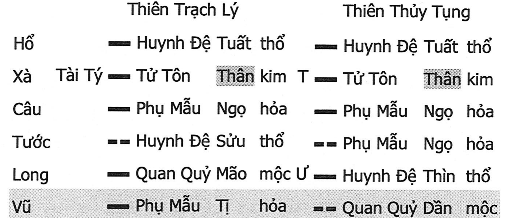
    - **Hình này chứng minh điều gì**
      - Quan Quỷ lâm Ứng nhập hào trạch, Phụ Mẫu lâm Nhật, đoán là cô ấy đã từng có lịch sử hôn nhân, nhưng Tử Tôn trì Thế, quẻ biến du hồn, đã ly hôn.
    - **Từ đâu mà thấy được**
      - Tôi thấy Tử Tôn trên Thế là kim Không Vong, lại ở hào 5, hào 5 là ngũ quan, Tử Tôn cũng chủ ngũ quan, kim là xương, ở đầu là răng, Không biểu thị k...
  - **Căn cứ luận đoán**:
    - Quẻ này hỏi vận khí thì cần phải phán đoán tổng thể. Nhưng khi phán đoán quẻ này, tôi đã xem trước một số đặc điểm như sau.
    - Tôi thấy Tử Tôn trên Thế là kim Không Vong, lại ở hào 5, hào 5 là ngũ quan, Tử Tôn cũng chủ ngũ quan, kim là xương, ở đầu là răng, Không biểu thị không có, do đó tôi phán đoán cô ấy có cái răng đã bị nhổ.
    - Cô ấy cảm thấy rất kỳ lạ, tại sao từ trong quẻ cũng có thể nhìn ra được điều này?
    - Thế lâm Trình Xà, Trình Xà chủ quên, lại thêm Nguyên thần ở hào 6 là đầu, bởi vì Thế Không không được hào 6 sinh, tôi phán đoán hiện nay trí nhớ của cô ấy không tốt, thường xuyên quên trước quên sau.
    - Thế tại hào 5, hào 5 là đường, là tượng hành tẩu, hào sơ Phụ Mẫu động đến hợp, lâm Huyền Vũ, chủ huyền học, tôn giáo, Phụ Mẫu chủ y phục, hợp Thế mà đi ở trên đường, tôi phán đoán cô ấy muốn xuất gia, hóa du hồn, muốn vân du khắp mọi nơi.
    - Bởi vì cô ấy cùng đến với một hòa thượng, thông tin như vậy càng rõ ràng.
    - Tài bất thượng quái, mặc dù được Nguyệt hợp là vượng, nhưng Phụ Mẫu Tị hỏa độc phát, Tài lâm Tuyệt địa, tài vận nhất định không tốt.
    - Quan Quỷ lâm Ứng nhập hào trạch, Phụ Mẫu lâm Nhật, đoán là cô ấy đã từng có lịch sử hôn nhân, nhưng Tử Tôn trì Thế, quẻ biến du hồn, đã ly hôn.
  - **Ứng nghiệm thực tế**:
    - Phán đoán trên đây quả nhiên ứng nghiệm, mục đích đến của cô ấy chính là muốn xem mình có duyên phận xuất gia hay không.
- **Bảng Quẻ & Quái lệ 4**: Ngày Bính Thìn tháng Mùi, một người đoán về chiếc điện thoại bị mất, được Thiên Trạch Lý biến Phong Trạch Trung Phu.
  - **Căn cứ luận đoán**:
    - Lấy hào Thê Tài làm Dụng thần, Thê Tài Tý thủy bất thượng quái, phục dưới hào 5 Tử Tôn Thân kim, Dụng thần bị Nhật Nguyệt khắc thương, hưu tù vô khí, lại lâm Không Vong.
    - Cừu thần độc phát, do đó khẳng định không tìm lại được.
    - Quẻ này là quẻ Lý, Thế tại hào 5, hào 5 là đường, là tượng người đi trên đường. Dụng phục dưới Thế mà Không Vong.
    - Biểu thị anh ta đã làm mất điện thoại khi đi trên đường. Tình hình thực tế đúng là như vậy.

### 7. PHONG TRẠCH TRUNG PHU

- **Tượng của quẻ**:
  - ngoại quái là Tốn, là thuận, nội quái là Đoài, là nói, nói thì phải làm, làm thì phải có kết quả, đó là trung tín.
  - Do đó tên quẻ là Trung Phu (thành tín). Trung Phu giả, tín dã.
- **Tượng của lục hào**:
  - hào Thế là Mùi thổ, Mộ khố của mộc, mộc chủ nhân từ, nội tâm nhân từ đôn hậu, thổ chủ tín, được Ứng đến sinh, Ứng là người khác, được người khác tin cậy.
- **Ý nghĩa biểu tượng cốt lõi**:
  - thành tâm, thành tín, tin cậy, trung thành, hiếu kính, cam kết v.v.
- **Bảng Quẻ & Đồ hình liên hệ**: Sơ đồ quẻ Thiên Trạch Lý biến Phong Trạch Trung Phu
  - **Hình 167.** Sơ đồ quẻ Thiên Trạch Lý biến Phong Trạch Trung Phu
    - 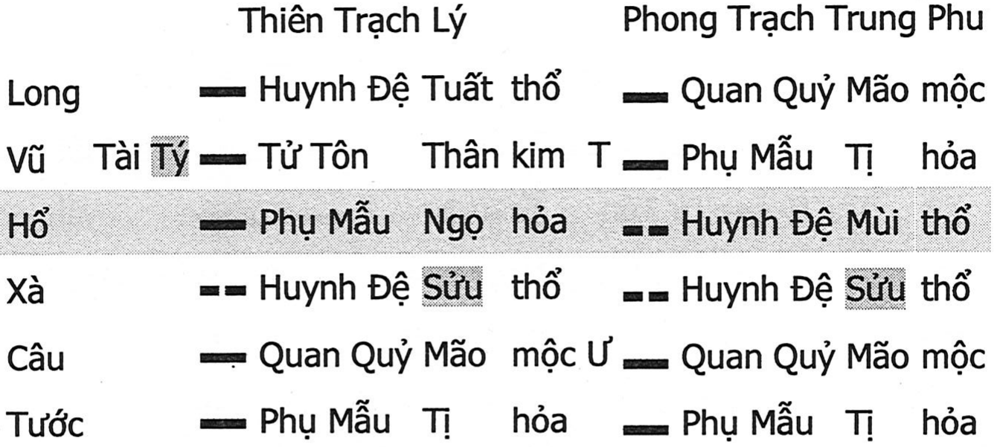
    - **Hình này chứng minh điều gì**
      - hào Thế là Mùi thổ, Mộ khố của mộc, mộc chủ nhân từ, nội tâm nhân từ đôn hậu, thổ chủ tín, được Ứng đến sinh, Ứng là người khác, được người khác ti...
    - **Từ đâu mà thấy được**
      - Căn cứ ngũ hành sinh khắc, Dụng thần, Thế Ứng và hào động biến trong quẻ.
- **Bảng Quẻ & Quái lệ 1**: Ngày Nhâm Tý tháng Mão, nam chiêm vận đào hoa, được Phong Trạch Trung Phu biến Thủy Trạch Tiết.
  - **Hình 168.** Quẻ Phong Trạch Trung Phu biến Thủy Trạch Tiết
    - 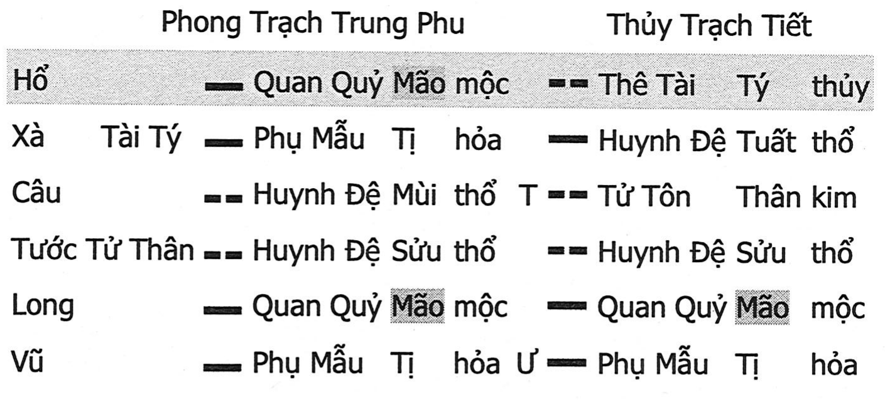
    - **Hình này chứng minh điều gì**
      - Đúng như dự đoán trên đây.
    - **Từ đâu mà thấy được**
      - Lấy Thê Tài làm Dụng thần, Thê Tài Tý thủy bất thượng quái, phục dưới hào 5 Phụ Mẫu Tị hỏa, Phục đến khắc Phi, nhất định trong thời gian ngắn có vậ...
  - **Căn cứ luận đoán**:
    - Lấy Thê Tài làm Dụng thần, Thê Tài Tý thủy bất thượng quái, phục dưới hào 5 Phụ Mẫu Tị hỏa, Phục đến khắc Phi, nhất định trong thời gian ngắn có vận đào hoa đến.
    - Nguyệt không khắc Dụng thần, được Nhật thần củng phù là vượng tướng, Dụng thần phục tàng, gặp xung xuất hiện, do đó tháng Ngọ sẽ xuất hiện tình nhân.
    - Thê Tài Tý thủy bị Mão mộc động đến tương hình, Mão mộc ở hào 6, hào 6 chủ đầu, lâm Bạch Hổ chủ phẫu thuật, biểu thị khuôn mặt của người nữ đó đã từng phẫu thuật.
    - Dụng thần lâm Trình Xà, Trình Xà chủ xấu xí hoặc vết sẹo. Biểu thị trên mặt có vết sẹo.
    - Quẻ này là quẻ du hồn, biểu thị người này trôi nổi bất định, không thể theo mình suốt đời.
    - Quẻ Trung Phu tuy có ý nghĩa là tín, nhưng cần phải đoán ngược lại. Trình Xà lại chủ xảo trá.
    - Do đó hai người không thể chung sống với nhau lâu dài, Mão mộc phát động, động mà gặp trị gặp hợp.
    - Tháng Tuất hào độc phát gặp hợp lại khắc Dụng thần. Nhất định sẽ chia tay ở tháng này.
    - Đúng như dự đoán trên đây. Tháng Ngọ xuất hiện.
    - Bởi vì trong quá trình chung sống phát hiện người này xảo trá đa đoan, là người không thành thực, thế là đã chia tay với người đó ở tháng Tuất.
- **Bảng Quẻ & Quái lệ 2**: Ngày Canh Ngọ tháng Ngọ, nữ dự đoán con của thím sau này có xuất gia hay không? Được Phong Trạch Trung Phu biến Phong Địa Quan.
  - **Căn cứ luận đoán**:
    - Lấy Huynh Đệ làm Dụng thần, trong quẻ Huynh Đệ lưỡng hiện, lấy Huynh Đệ trên Thế làm Dụng thần.
    - Huynh Đệ là thổ, quẻ được Trung Phu, người này là người thành tín.
  - **Đối thoại & Diễn biến thực tế**:
    - Trên thực tế, con của thím mới 16 tuổi, nhưng bẩm sinh thích đọc kinh thư, lại coi tiền tài như rác rưởi, một lòng muốn xuất gia.
    - Nhưng người lớn không đồng ý. Người này có hiện tượng rất kỳ dị, trong rất nhiều ảnh chụp chiếu ra có vòng sáng màu sắc.
    - Ngoài ra trong bóng tối có người giảng kinh thư cho anh ta.
  - **Ứng nghiệm thực tế**:
    - Huynh Đệ lâm Chu Tước, Chu Tước là văn thư, lại được Nhật Nguyệt Phụ Mẫu đồng đến sinh, hào 2 lại động hóa Phụ Mẫu, là đọc thuộc kinh thư, đọc hết quyển này đến quyển khác.
    - Quẻ chính du hồn, chủ người này có thể linh hồn xuất xác.
    - Hỏa chủ ánh sáng, được trùng điệp hỏa đến sinh, nhất định có thể minh tâm kiến tính.
    - Quẻ du hồn, tượng rời khỏi nhà, do đó sau này nhất định sẽ xuất gia.

### 8. PHONG SƠN TIỆM

- **Tượng của quẻ**:
  - ngoại quái là Tốn, là nhập (vào), nội quái là Cấn, là chỉ (dừng), vào mà dừng, từ ngoài vào trong, là tiến nhập (bước vào).
  - Người xưa nói, Tiệm giả, tiến dã, thứ dã. Thứ chính là đình lưu (dừng lại).
- **Tượng của lục hào**:
  - Tử Tôn trì Thế, lẽ ra không có quan, nhưng được Tị hỏa trên hào 5 tôn vị đến hợp, khiến cho hào Thế được hợp đến tôn vị, được thăng tiến.
- **Ý nghĩa biểu tượng cốt lõi**:
  - Do đó quẻ này bao hàm ý nghĩa là tiến tới, cũ kỹ, kề cạnh, chậm chạp, bước vào, tổ hợp, phát triển, tiến thủ v.v.
- **Bảng Quẻ & Đồ hình liên hệ**: Quẻ Phong Trạch Trung Phu biến Phong Địa Quan
  - **Hình 169.** Quẻ Phong Trạch Trung Phu biến Phong Địa Quan
    - 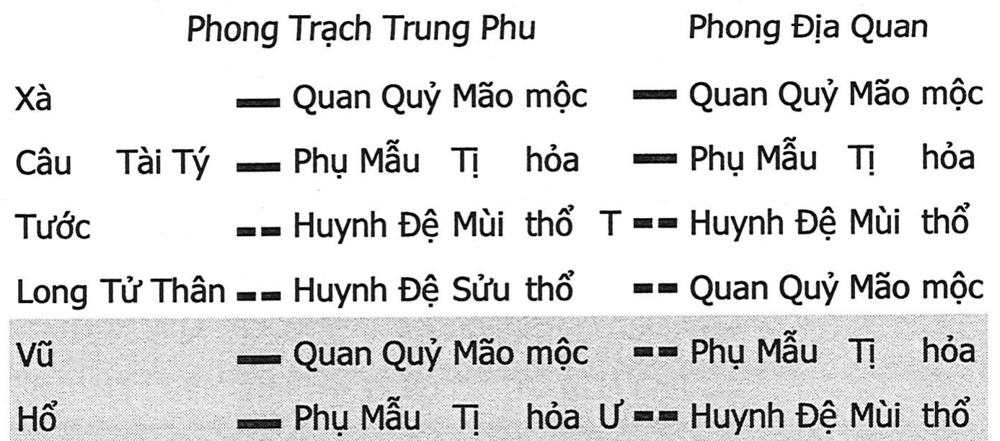
    - **Hình này chứng minh điều gì**
      - Tử Tôn trì Thế, lẽ ra không có quan, nhưng được Tị hỏa trên hào 5 tôn vị đến hợp, khiến cho hào Thế được hợp đến tôn vị, được thăng tiến.
    - **Từ đâu mà thấy được**
      - Tử Tôn trì Thế, lẽ ra không có quan, nhưng được Tị hỏa trên hào 5 tôn vị đến hợp, khiến cho hào Thế được hợp đến tôn vị, được thăng tiến.
- **Bảng Quẻ & Quái lệ 1**: Ngày Bính Tuất tháng Sửu, một người đoán bệnh của cha, được Phong Sơn Tiệm biến Phong Địa Quan.
  - **Hình 170.** Sơ đồ quẻ Phong Sơn Tiệm biến Phong Địa Quan
    - 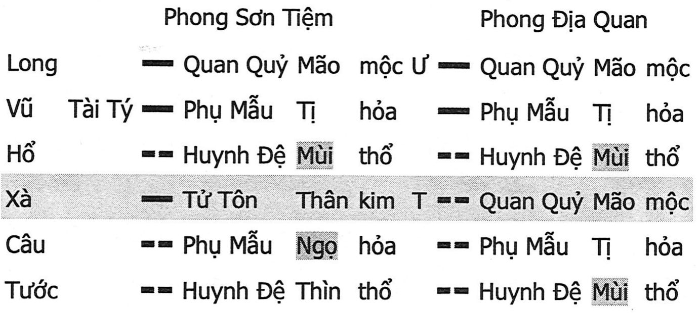
    - **Hình này chứng minh điều gì**
      - Dụng thần Không Vong, bệnh lâu sợ Không, đang dự đoán ở năm Nhâm Ngọ, Thái Tuế năm nay sắp kết thúc, do đó Ngọ hỏa Không này sợ là sẽ ứng ở tháng N...
    - **Từ đâu mà thấy được**
      - Lấy Phụ Mẫu làm Dụng thần.
  - **Căn cứ luận đoán**:
    - Lấy Phụ Mẫu làm Dụng thần. Phụ Mẫu lâm hào 2, nhập Mộ ở Nhật, Tử Tôn Thân kim độc phát, là Bệnh địa của Dụng thần.
    - Hào 2 là trạch, nhập Mộ là mất tự do, Bệnh địa tại hào 3, hào 2 là giường, là nằm bệnh ở giường, quẻ quy hồn, quy hồn bất xuất gia, bởi vì bị bệnh ở nhà mà không thể ra ngoài.
    - Dụng thần hưu tù, Nguyên thần bị Nhật hợp vướng chân, lại Tuyệt ở hào động, Nguyên thần là tư duy, tưởng pháp, bản thân người bệnh có ý định không muốn sống.
    - Quẻ là Tiệm, có ý nghĩa là chậm chạp, bệnh này đã kéo dài từ rất lâu.
    - Dụng thần Không Vong, bệnh lâu sợ Không, đang dự đoán ở năm Nhâm Ngọ, Thái Tuế năm nay sắp kết thúc, do đó Ngọ hỏa Không này sợ là sẽ ứng ở tháng Ngọ năm sau.
  - **Ứng nghiệm thực tế**:
    - Tình hình thực tế: Quả nhiên là liệt ở giường nhiều năm, nhưng sau đó cát hung như thế nào, không có phản hồi.
- **Bảng Quẻ & Quái lệ 2**: Ngày Canh Thân tháng Dần, nữ dự đoán bệnh tật, được Phong Sơn Tiệm biến Phong Địa Quan.
  - **Hình 171.** Sơ đồ quẻ Phong Sơn Tiệm biến Phong Địa Quan
    - 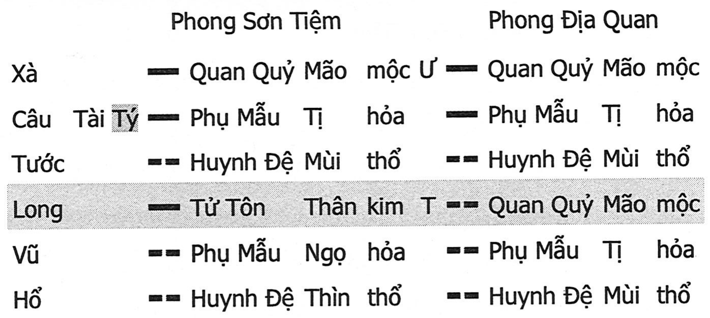
    - **Hình này chứng minh điều gì**
      - Thế Nguyệt phá hóa Quan Quỷ Mão mộc, nay năm Nhâm Ngọ, đề phòng tháng Mão năm Giáp Thân không cát.
    - **Từ đâu mà thấy được**
      - Lấy hào Thế làm Dụng thần.
  - **Căn cứ luận đoán**:
    - Lấy hào Thế làm Dụng thần.
    - Thế tại hào 3 lâm Tử Tôn Nguyệt phá, hào 3 là tử cung, Tử Tôn chủ bộ phận sinh dục, do đó nhất định là bệnh về phụ khoa.
    - Thế bị Quan Quỷ xung phá, mặc dù Nhật thần điền thực, nhưng Thế động hóa Quỷ không cát.
    - Nhất định là bệnh ác tính, Kỵ thần lâm Câu Trần, Câu Trần là vật sưng lên, do đó nhất định là ung thư tử cung.
    - Quẻ là Tiệm, Tiệm giả, tiến dã, phát triển dã. Bệnh tình vẫn đang phát triển theo hướng không tốt.
    - Thế Nguyệt phá hóa Quan Quỷ Mão mộc, nay năm Nhâm Ngọ, đề phòng tháng Mão năm Giáp Thân không cát.
  - **Ứng nghiệm thực tế**:
    - Tình hình thực tế: Quả nhiên là ung thư tử cung, sau chết ở tháng Mão năm Giáp Thân.

## Chương 8: Giải thích và ứng dụng tượng 8 quẻ cung Khôn

### 1. KHÔN VI ĐỊA

- **Tượng của quẻ**:
  - nội ngoại đều là Khôn, Khôn là nhu, là thuận, Khôn là lão âm, âm là nhu, lão âm lấy đại địa (mặt đất) làm thể (thân thể).
  - Do đó dùng quẻ thuần Khôn này để biểu thị nhu.
- **Tượng của lục hào**:
  - Thế tại hào 6, hào 6 là thiên, hào sơ, hào 4 là địa, thiên được địa sinh, thiên địa hữu tình, cho nên là thuận, là nhu.
- **Ý nghĩa biểu tượng cốt lõi**:
  - ôn nhu (dịu dàng), trôi chảy, bình an, mềm yếu, an nhiên, ôn thuận (ôn hòa) v.v.
- **Bảng Quẻ & Quái lệ 1**: Ngày Bính Ngọ tháng Hợi, nữ có người vay của cô ấy 500 tệ, hỏi khi nào trả? Được Khôn Vi Địa biến Cấn Vi Sơn.
  - **Hình 172.** Sơ đồ quẻ Khôn Vi Địa biến Cấn Vi Sơn
    - 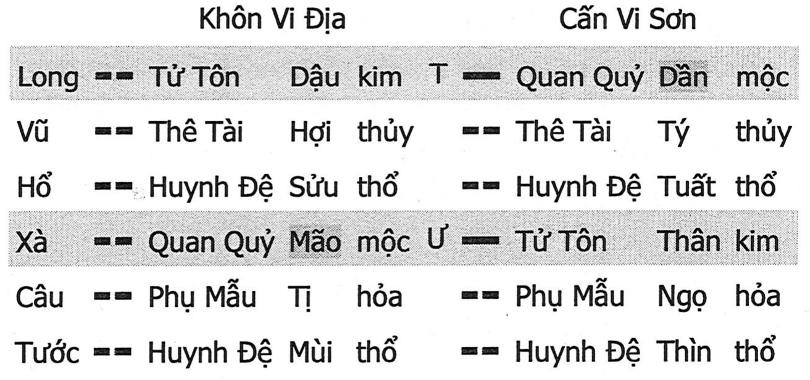
    - **Hình này chứng minh điều gì**
      - Ứng là người vay tiền, Không mà động, là Tử địa của Tài, sự thật là đối phương không có tiền, nhưng cũng không muốn trả tiền.
    - **Từ đâu mà thấy được**
      - Lấy Thê Tài làm Dụng thần.
  - **Căn cứ luận đoán**:
    - Lấy Thê Tài làm Dụng thần.
    - Tài mặc dù lâm Nguyệt, lại được Thế động đến sinh, nhưng được lục xung hóa lục xung, việc đòi tiền không thuận lợi cho lắm.
    - Thế lâm Tử Tôn động sinh Tài chính là muốn đòi lại tiền của mình. Nhưng động mà hóa Không, hóa Tuyệt, lại biểu thị từ bỏ ý định đòi tiền.
    - Thế lâm Thanh Long, Thanh Long chủ từ thiện, lại là quẻ Khôn, Khôn là thuận, là nhu, biểu thị tính cách của bản thân khá mềm yếu.
    - Ứng là người vay tiền, Không mà động, là Tử địa của Tài, sự thật là đối phương không có tiền, nhưng cũng không muốn trả tiền.
    - Không đòi thì đối phương sẽ không trả.
  - **Ứng nghiệm thực tế**:
    - Tình hình thực tế, cô ấy từng nhờ đối phương giải quyết công việc, do đó ngại đòi, nhưng đối phương đã vay hơn một năm cũng không nhắc đến chuyện này, sau đó phải đòi mười mấy lần mới trả.
- **Bảng Quẻ & Quái lệ 2**: Ngày Nhâm Thân tháng Tý, nam muốn theo đuổi một người nữ, dự đoán mối quan hệ giữa hai người sẽ phát triển đến đâu, được Khôn Vi Địa biến Sơn Địa Bác.
  - **Hình 173.** Sơ đồ quẻ Khôn Vi Địa biến Sơn Địa Bác
    - 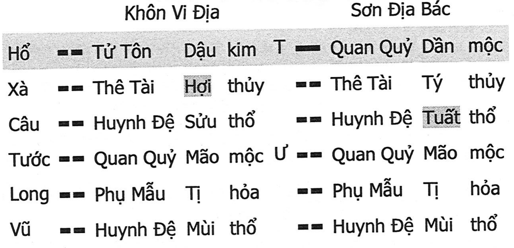
    - **Hình này chứng minh điều gì**
      - Thế động hóa Quỷ, Quỷ là phiền não, vì chuyện này, trong lòng mình rất phiền não.
    - **Từ đâu mà thấy được**
      - Lấy Thê Tài làm Dụng thần.
  - **Căn cứ luận đoán**:
    - Lấy Thê Tài làm Dụng thần. Tài gặp Dậu kim là Mộc Dục, biểu thị người nữ này thích trang điểm.
    - Lâm Trình Xà, Trình Xà chủ thiếu (ít), biểu thị nhân tài xuất chúng, không phải bình thường.
    - Thế động sinh Dụng, bản thân muốn theo đuổi đối phương, nhưng Tài Không không được hào Thế sinh, biểu thị đối phương không chấp nhận sự theo đuổi của mình.
    - Thế động hóa Quỷ, Quỷ là phiền não, vì chuyện này, trong lòng mình rất phiền não.
    - Quẻ là Khôn, Khôn chủ nhu, chủ bản thân có tính cách nhu, không quyết đoán.
    - Không dám theo đuổi đối phương, chỉ là trong lòng muốn mà thôi, Thế động hóa Tuyệt, từ bỏ suy nghĩ theo đuổi.
  - **Ứng nghiệm thực tế**:
    - Quả nhiên là như vậy.

### 2. ĐỊA LÔI PHỤC

- **Tượng của quẻ**:
  - ngoại quái là Khôn, là đất, nội quái là Chấn, là động, là mộc, dương mộc tàng ở trong đất, rục rịch muốn ra khỏi đất, đó là quy luật tự nhiên, mùa xuân mỗi năm đều như vậy, lạnh đến nóng đi, cho nên quẻ này được gọi là Phục.
  - Phục giả, phản dã, tượng lặp đi lặp lại.
  - Thập nhị tường tiêu tức quái (thập nhị tích quái) lấy quẻ này làm đầu, xem như khởi đầu của một năm, cũng chính là đạo lý này.
- **Tượng của lục hào**:
  - đây là quẻ lục hợp, nội ngoại trùng điệp, biểu thị ý nghĩa là trùng lặp. Thế tại hào sơ, hào sơ là mặt đất, đất đai, lâm Tài.
  - Tài là thực vật. Tổng hợp lại là tượng mặt đất nổi lên thực vật, tương hợp với ngoại quái chính là duỗi thẳng lên trên.
- **Ý nghĩa biểu tượng cốt lõi**:
  - lặp đi lặp lại, sinh sôi, hướng thượng, trùng lặp, tăng thêm, tái hiện, hai tầng, tỉnh lại v.v.
- **Bảng Quẻ & Quái lệ 1**: Ngày Giáp Tuất tháng Tị, bạn thời đại học đến văn phòng tìm tôi, trong lúc trò chuyện, ông ta bảo tôi đoán thử xem trong túi của ông ta có cái gì? Tôi gieo quẻ được Địa Lôi Phục biến Địa Trạch Lâm.
  - **Hình 174.** Quẻ Địa Lôi Phục biến Địa Trạch Lâm
    - 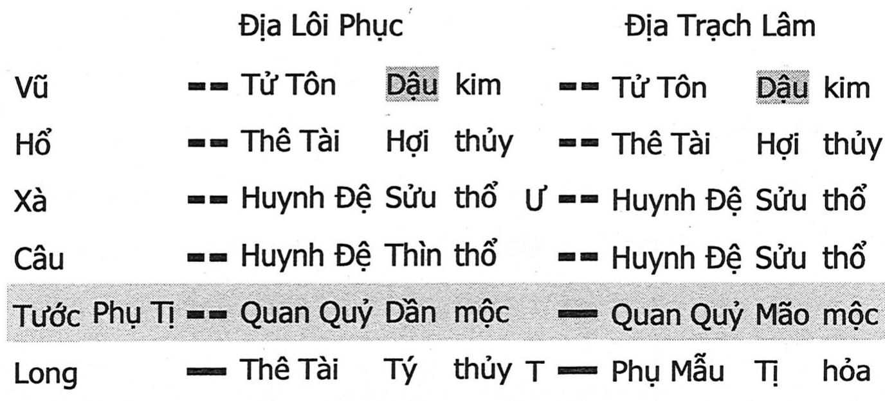
    - **Hình này chứng minh điều gì**
      - Dụng thần có thể sinh Tử Tôn, Tử Tôn là vật giải trí, vật này cũng có thể dùng để chơi.
    - **Từ đâu mà thấy được**
      - Lấy hào Ứng làm Dụng thần.
  - **Căn cứ luận đoán**:
    - Lấy hào Ứng làm Dụng thần. Quẻ tại cung Khôn, Khôn là hình vuông, Dụng thần vượng tướng, chủ nhiều cái, không phải là một cái.
    - Lâm Trình Xà, Trình Xà chủ biến hóa, biểu thị là vật có thể biến hóa hình dạng.
    - Quẻ lục hợp, là tượng trùng điệp, tên quẻ là Phục, cũng chủ vật trùng điệp, có vài cái giống nhau.
    - Dụng thần có thể sinh Tử Tôn, Tử Tôn là vật giải trí, vật này cũng có thể dùng để chơi.
  - **Đối thoại & Diễn biến thực tế**:
    - Thế là tính chất. Lâm Tài cộng Thanh Long. Tài và Thanh Long đều có ý ẩm thực, chủ vật có thể ăn.
    - Dần mộc độc phát, hào độc phát có thể cho biết nguyên nhân, lâm Chu Tước động hóa tiến đến khắc Dụng thần, Chu Tước là miệng, khắc là tổn hao cũng là biểu thị có thể ăn.
    - Trên thực tế, trong túi của ông ta có vài viên kẹo cao su hình vuông.

### 3. ĐỊA TRẠCH LÂM

- **Tượng của quẻ**:
  - ngoại quái là Khôn, là mặt đất, nội quái là Đoài, là đầm, là biển, đất rộng và nước nhiều, là lớn, lại thêm Khôn là thuận, Đoài là nói, tượng phụ họa, biểu thị quan hệ gần gũi.
  - Do đó quẻ này được gọi là Lâm. Lâm giả, đại dã, kháo cận (gần) dã.
- **Tượng của lục hào**:
  - Quan Quỷ trì Thế, bản thân chính là quan, lâm hào 2, hào 2 là trạch, thân ở trong nhà.
  - Được hào 5 thiên tử tôn vị đến sinh, thiên tử đến nhà, có thể nói là việc lớn.
- **Ý nghĩa biểu tượng cốt lõi**:
  - gần, tiếp cận, to lớn, cận kỳ, phụ cận, lôi kéo, thân thiết v.v.
- **Bảng Quẻ & Quái lệ 1**: Ngày Nhâm Tý tháng Dần, nữ dự đoán phong thủy nhà trọ của mình và bạn trai, được Địa Trạch Lâm biến Địa Thủy Sư.
  - **Hình 175.** Quẻ Địa Trạch Lâm biến Địa Thủy Sư
    - 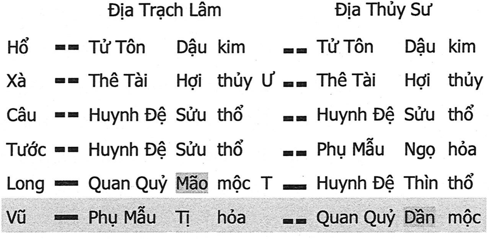
    - **Hình này chứng minh điều gì**
      - Phụ Mẫu lâm Huyền Vũ động mà hóa Quan Quỷ, nhà này phạm Đào Hoa Sát, Quan Quỷ gặp Nhật là Mộc Dục, Thế mặc dù lâm Quan Quỷ, nhưng Không, do đó sống...
    - **Từ đâu mà thấy được**
      - Lấy Phụ Mẫu làm Dụng và xét ảnh hưởng của hào này đối với hào Thế.
  - **Căn cứ luận đoán**:
    - Lấy Phụ Mẫu làm Dụng và xét ảnh hưởng của hào này đối với hào Thế.
    - Quẻ này Phụ Mẫu lâm Huyền Vũ phát động, Huyền Vũ chủ thủy, cũng chủ thông tin ám muội, nội quái động mà từ Trạch biến Khảm, Trạch Khảm đều là thủy, quẻ là Lâm, biểu thị lân cận có nước diện tích lớn.
    - Phụ Mẫu lâm Huyền Vũ động mà hóa Quan Quỷ, nhà này phạm Đào Hoa Sát, Quan Quỷ gặp Nhật là Mộc Dục, Thế mặc dù lâm Quan Quỷ, nhưng Không, do đó sống ở đây hai người sẽ dần dần xa cách nhau, mỗi người sẽ có một người khác.
  - **Ứng nghiệm thực tế**:
    - Tất cả đúng như dự đoán. Gần chỗ ở có hồ nước. Sau đó hai người đã chia tay, mỗi người lại có một người khác.
- **Bảng Quẻ & Quái lệ 2**: Ngày Nhâm Tý tháng Dần, nam dự đoán về thăng chức, được Địa Trạch Lâm.
  - **Hình 176.** Sơ đồ quẻ Địa Trạch Lâm
    - 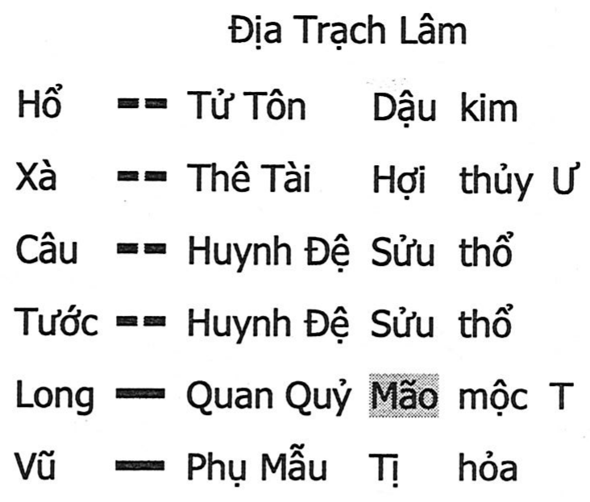
    - **Hình này chứng minh điều gì**
      - Nhưng Thế Không, bản thân lo lắng, đứng ngồi không yên vì chuyện này.
    - **Từ đâu mà thấy được**
      - Lấy Quan Quỷ làm Dụng thần.
  - **Căn cứ luận đoán**:
    - Lấy Quan Quỷ làm Dụng thần. Quan Quỷ trì Thế lâm Thanh Long, bản thân vốn đã có quan.
    - Quan Quỷ vượng tướng trì Thế, cơ hội thăng chức rất lớn, quẻ là Lâm, sự việc được quyết định ở gần đây.
    - Nhưng Thế Không, bản thân lo lắng, đứng ngồi không yên vì chuyện này. Không lâm Thanh Long, biểu thị Không vui vẻ.
    - Quan lâm Nguyệt mà hợp hào Ứng, người khác được còn mình không được.
  - **Ứng nghiệm thực tế**:
    - Quả nhiên như vậy. Mới đầu nói là trong số người được đề bạt có anh ta, nhưng kết quả cuối cùng lại không có.
- **Bảng Quẻ & Quái lệ 3**: Ngày Nhâm Dần tháng Hợi, một người bị mất thẻ tín dụng và 5 vạn tệ tiền mặt để trong túi áo ở văn phòng, hỏi ai đã lấy? Được Địa Trạch Lâm biến Lôi Thiên Đại Tráng.
  - **Hình 177.** Sơ đồ quẻ Địa Trạch Lâm biến Lôi Thiên Đại Tráng
    - 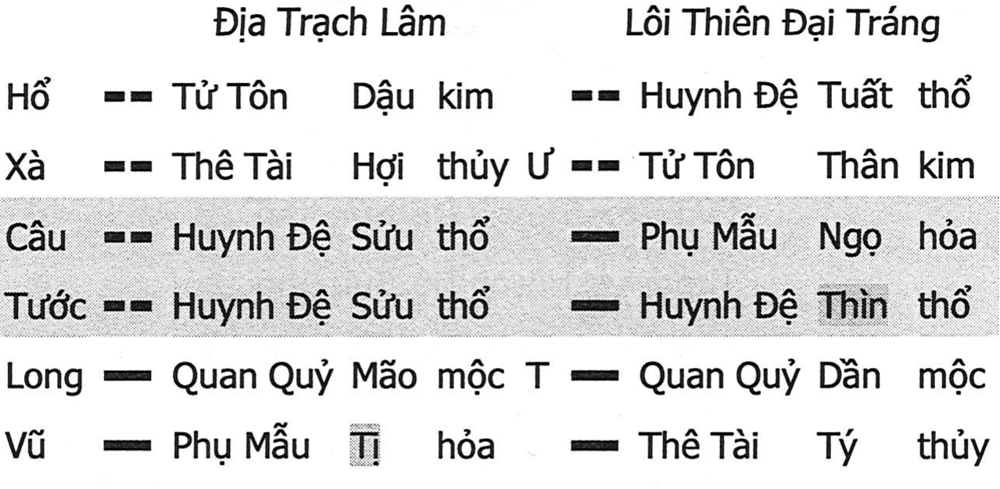
    - **Hình này chứng minh điều gì**
      - Trong quẻ Thê Tài mặc dù có Nguyệt tỉ phù, nhưng Huynh Đệ lưỡng động, Tài lại bị Nhật hợp vướng chân, rất khó tìm lại được tiền và thẻ tín dụng đã ...
    - **Từ đâu mà thấy được**
      - Người lấy tiền là đạo tặc, do đó xem hào Quan Quỷ.
  - **Căn cứ luận đoán**:
    - Quẻ này hỏi là ai đã lấy, chứ không phải là hỏi vật bị mất có thể tìm lại được hay không, do đó trọng điểm của việc xem quẻ cũng khác.
    - Người lấy tiền là đạo tặc, do đó xem hào Quan Quỷ.
    - Quan Quỷ trì Thế, là người quen biết, quẻ là Lâm, biểu thị người này cách mình không xa, chính là người bên cạnh mình.
    - Trong quẻ Thê Tài mặc dù có Nguyệt tỉ phù, nhưng Huynh Đệ lưỡng động, Tài lại bị Nhật hợp vướng chân, rất khó tìm lại được tiền và thẻ tín dụng đã mất.
  - **Đối thoại & Diễn biến thực tế**:
    - Quỷ lâm Nguyệt, sách cổ nói rằng, Quỷ lâm Nhật Nguyệt đừng chửi kẻ trộm. Nhất định là người quen đã lấy.
    - Quan Quỷ lâm Thanh Long, Thanh Long chủ Tài, cho nên kẻ trộm là một khách hàng thường xuyên có giao dịch kinh doanh với mình.
    - Quan Quỷ là Mão mộc, vượng tướng, người này trông rất cao, dáng người thon dài. Mão là tròn, là mặt tròn.
    - Anh ta nói rằng kết quả phán đoán rất giống với đối tượng nghi ngờ của mình, hôm đó chỉ có vài người đến văn phòng của anh ta, và người có giao dịch kinh doanh với anh ta là người đáng nghi nhất, nhưng không có chứng cứ, không thể làm gì được đối phương, cuối cùng cũng không tìm được những thứ đã mất.

### 4. ĐỊA THIÊN THÁI

- **Tượng của quẻ**:
  - ngoại quái là Khôn, là địa, nội quái là Càn, là thiên.
  - Thượng dương nhưng chứa âm quái, hạ âm nhưng chứa dương quái, âm dương hỗ hoán, không có trở ngại.
  - Cho nên tên quẻ là Thái, Thái giả, thông dã.
- **Tượng của lục hào**:
  - Thế tại hào 3, nằm ở vị trí cửa ngõ, được hào 6 Tử Tôn đến hợp, hào 6 là thiên, Tử Tôn là bình an, cộng thêm phúc thần đến gần Thế, thì an nhiên lâu dài, tượng thông cát.
- **Ý nghĩa biểu tượng cốt lõi**:
  - bình an, an ổn, ổn thỏa, cố định, hanh thông, bất động v.v.
- **Bảng Quẻ & Quái lệ 1**: Ngày Đinh Mão tháng Tý, nam đoán bệnh gần, khi nào khỏi? Được Địa Thiên Thái biến Lôi Thiên Đại Tráng.
  - **Hình 178.** Sơ đồ quẻ Địa Thiên Thái biến Lôi Thiên Đại Tráng
    - 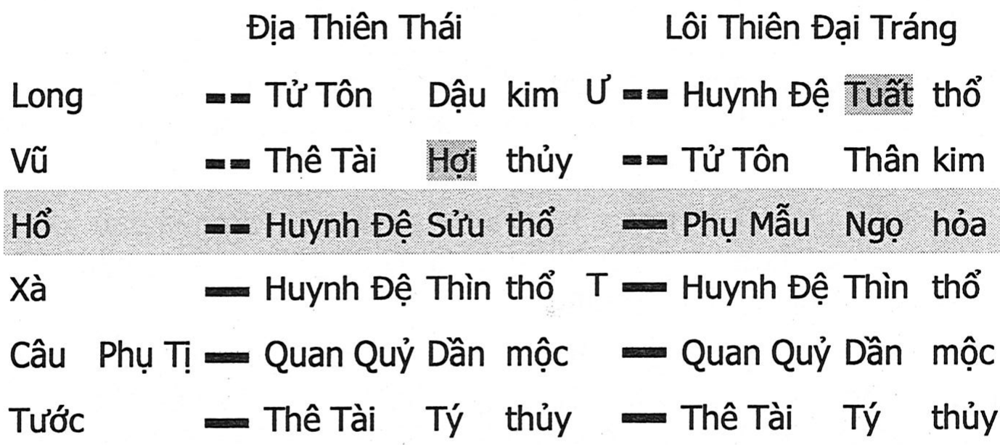
    - **Hình này chứng minh điều gì**
      - Kỵ thần là Quan Quỷ, lâm hào 2, hào 2 là bộ phận sinh dục, lâm Câu Trần, là sưng, biểu thị bộ phận sinh dục đau sưng.
    - **Từ đâu mà thấy được**
      - Lấy hào Thế làm Dụng thần.
  - **Căn cứ luận đoán**:
    - Lấy hào Thế làm Dụng thần. Bệnh gần lục hợp không cát, nhưng may mà động hóa lục xung, bệnh gần gặp xung chủ bệnh thoái.
    - Tử Tôn hợp Thế, Tử Tôn là y dược, biểu thị đang tiến hành điều trị.
    - Tên quẻ là Thái, biểu thị an nhiên, biểu thị thuốc này không có tác dụng phụ.
    - Kỵ thần là Quan Quỷ, lâm hào 2, hào 2 là bộ phận sinh dục, lâm Câu Trần, là sưng, biểu thị bộ phận sinh dục đau sưng. Lại là mộc.
    - Mộc chủ đau ngứa, là vừa đau vừa ngứa.
  - **Ứng nghiệm thực tế**:
    - Sửu thổ độc phát, trợ vượng hào Thế, tháng Sửu nhất định trị khỏi. Sau quả nhiên khỏi bệnh ở tháng Sửu.
- **Bảng Quẻ & Quái lệ 2**: Ngày Canh Tuất tháng Dậu, nam dự đoán thân thể, được Địa Thiên Thái biến Thủy Hỏa Ký Tế.
  - **Hình 179.** Sơ đồ quẻ Địa Thiên Thái biến Thủy Hỏa Ký Tế
    - 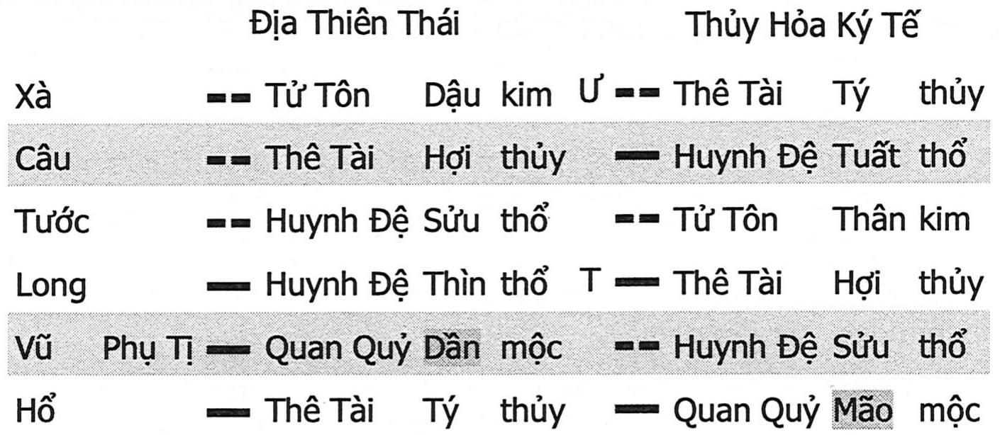
    - **Hình này chứng minh điều gì**
      - Anh ta phản hồi rằng mình đang có bệnh về dạ dày, trước đây đã từng bị viêm gan.
    - **Từ đâu mà thấy được**
      - Lấy hào Thế làm Dụng thần.
  - **Căn cứ luận đoán**:
    - Lấy hào Thế làm Dụng thần. Thế được Nguyệt hợp là vượng, được Nhật phù cũng là vượng, thân thể không có bệnh tật gì lớn.
    - Nhưng trong quẻ Quan Quỷ động đến khắc Thế, hào Thế tại hào 3 bị khắc, hào 3 là dạ dày, thổ cũng là dạ dày, cho nên là tiêu hóa không tốt.
    - Mộc tại hào 2 chủ gan, hóa ra Sửu thổ, Sửu cũng là gan, do đó có bệnh về gan.
    - Nhưng Kỵ thần hưu tù, lại Không Vong, lực khắc Thế yếu, do đó sẽ không có trở ngại lớn.
    - Quẻ là Thái, chủ an nhiên, hào Thế ám động hợp Tử Tôn trên Ứng, Tử Tôn lâm Trình Xà, Trình Xà chủ kỳ dị, chủ bản thân có lòng hiếu kỳ mạnh.
    - Tử Tôn lại chủ bình an, Tử Tôn tại hào 6, hào 6 là thiên, cái theo đuổi của mình là đạo trời, thuận theo tự nhiên.
    - Anh ta phản hồi rằng mình đang có bệnh về dạ dày, trước đây đã từng bị viêm gan.
    - Từ trước đến nay không uống thuốc, bản thân đang tu thân dưỡng tính.

### 5. LÔI THIÊN ĐẠI TRÁNG

- **Tượng của quẻ**:
  - ngoại quái là Chấn, là động, nội quái là Càn, là cương, là lớn. Dương cương mà động, là lớn, là tráng. Cho nên gọi là Đại Tráng.
- **Tượng của lục hào**:
  - hào Thế là hào Phụ Mẫu, vị trí ở hào 4, chỉ cách một bước nữa là đến hào 5 quân vương, lâm hỏa, hỏa là ánh sáng, tượng huy hoàng, Phụ Mẫu là cương thổ (lãnh thổ), địa vực (khu vực), tổng hợp lại là tượng bản thân sở hữu một vùng trời đất, phô bày ra thanh thế to lớn.
- **Ý nghĩa biểu tượng cốt lõi**:
  - Do đó quẻ này bao hàm ý nghĩa là tráng đại (lớn mạnh), hưng thịnh, phồn vinh, to lớn, cường thịnh, cao lớn, mạnh mẽ, phát triển v.v.
- **Bảng Quẻ & Quái lệ 1**: Ngày Giáp Thân tháng Sửu, nữ dự đoán khi nào có thể có bạn trai? Được Lôi Thiên Đại Tráng biến Địa Thiên Thái.
  - **Hình 180.** Quẻ Lôi Thiên Đại Tráng biến Địa Thiên Thái
    - 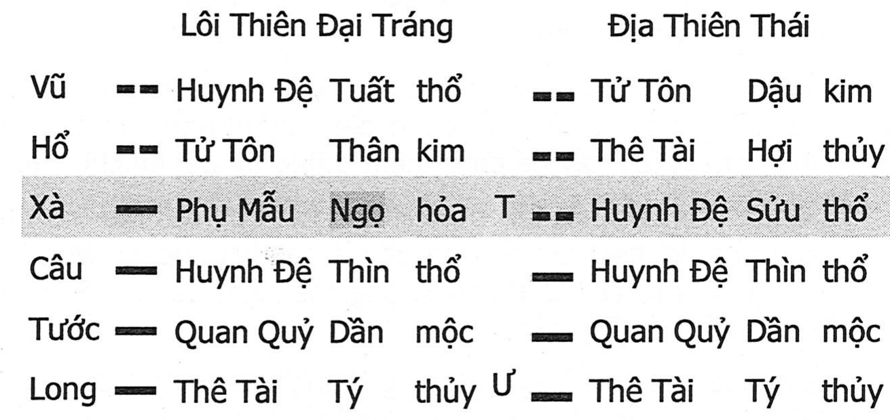
    - **Hình này chứng minh điều gì**
      - Nhưng Thế Không không được sinh, biểu thị mình không ưng thuận đối phương.
    - **Từ đâu mà thấy được**
      - Lấy Quan Quỷ làm Dụng thần.
  - **Căn cứ luận đoán**:
    - Lấy Quan Quỷ làm Dụng thần.
    - Quan Quỷ không bị Nguyệt khắc, Nhật xung dẫn tới ám động, Dụng thần ám động sinh Thế, có đàn ông đang âm thầm theo đuổi mình.
    - Lâm Chu Tước sinh Thế, đã từng bày tỏ sự yêu mến đối với mình.
    - Nhưng Thế Không không được sinh, biểu thị mình không ưng thuận đối phương.
    - Thế lâm Trình Xà, Trình Xà chủ phiền muộn, vì chuyện này mà phiền não, băn khoăn.
    - Tên quẻ là Đại Tráng, chủ yếu là vì mình yêu cầu cao, cho rằng đối phương không phù hợp với điều kiện của mình.
  - **Ứng nghiệm thực tế**:
    - Quả nhiên như tôi dự đoán.
- **Bảng Quẻ & Quái lệ 2**: Ngày Ất Dậu tháng Mùi, nam đoán hợp tác cầu tài với người ta sẽ ra sao? Được Lôi Thiên Đại Tráng biến Địa Phong Thăng.
  - **Hình 181.** Quẻ Lôi Thiên Đại Tráng biến Địa Phong Thăng
    - 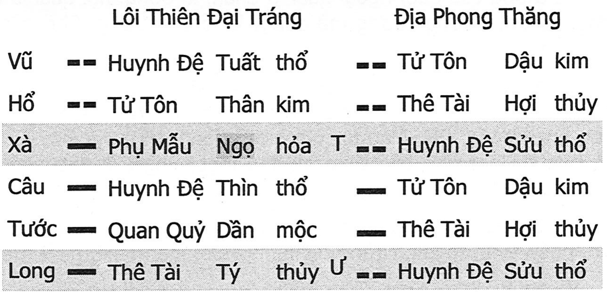
    - **Hình này chứng minh điều gì**
      - Tình hình thực tế, sau khi người này đề xuất hợp tác với đối phương, đối phương đã đưa ra điều kiện rất ngặt nghèo.
    - **Từ đâu mà thấy được**
      - Lấy hào Tài làm Dụng thần, kiêm xem mối quan hệ giữa Thế Ứng.
  - **Căn cứ luận đoán**:
    - Lấy hào Tài làm Dụng thần, kiêm xem mối quan hệ giữa Thế Ứng.
    - Hào Thế là ta, hào Ứng là đối phương, nên tương sinh tương hợp, không nên tương xung tương khắc, hoặc Không Phá.
    - Trước tiên xem hào Tài, tuy được Nhật sinh, nhưng bị Nguyệt khắc, từ Nhật Nguyệt thì rất khó phân biệt suy vượng.
    - Nhưng Tài này động mà hóa phá, điều này đã tăng thêm thông tin bất lợi cho cầu tài.
    - Dự đoán hợp tác cầu tài, trước tiên phải hợp tác mới có thể cầu tài.
    - Thông tin bất lợi cho cầu tài trên đây là sau khi hợp tác không kiếm được tiền hay là hợp tác bất thành không thể kiếm tiền?
    - Điều này phải xem mối quan hệ giữa Thế Ứng.
    - Quẻ này là quẻ lục xung, lục xung là tượng bất hợp. Dự đoán hợp tác cầu tài thì đây chính là một trong những thông tin không tốt.
    - Quẻ này Thế Ứng đều động, lại đều động mà hóa phá, hào Thế phát động mình có thay đổi, hào Ứng phát động người ta có thay đổi.
    - Cũng chính là hai bên đều không tín nhiệm lẫn nhau, không thể hợp tác một cách hòa bình.
    - Quẻ chính Lôi Thiên Đại Tráng, lý thẳng khí mạnh, lên mặt nạt người.
    - Hào Ứng lâm Tài động mà xung khắc hào Thế, biểu thị đối phương ỷ mình nhiều tiền mà chèn ép người khác, hoàn toàn không được đối xử bình đẳng.
    - Do đó hợp tác bất thành. Rất khó cầu được tài.
    - Tình hình thực tế, sau khi người này đề xuất hợp tác với đối phương, đối phương đã đưa ra điều kiện rất ngặt nghèo.
    - Thu lợi rất nhỏ, thế là đã từ bỏ ý định hợp tác.
- **Bảng Quẻ & Quái lệ 3**: Ngày Giáp Thìn tháng Mão, nam đoán về việc nhờ một lãnh đạo giải quyết công việc, được Lôi Thiên Đại Tráng.
  - **Hình 182.** Sơ đồ quẻ Lôi Thiên Đại Tráng
    - 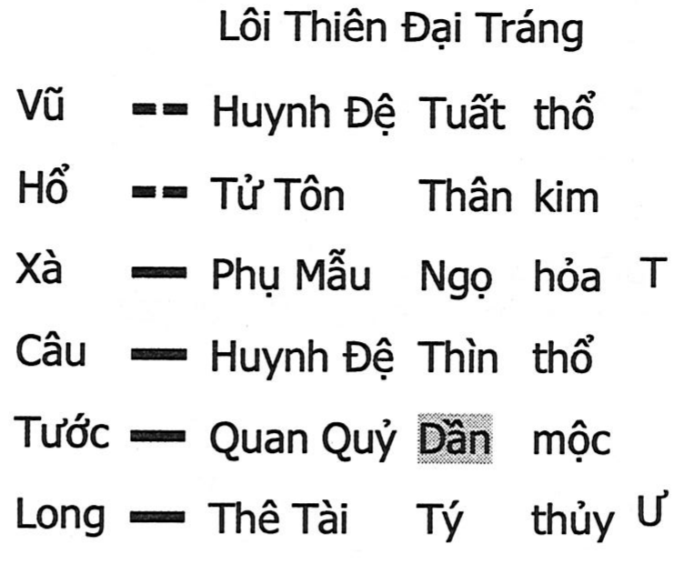
    - **Hình này chứng minh điều gì**
      - Quan Quỷ mặc dù sinh Thế, nhưng Không Vong, nhất định không thể thành tâm giải quyết công việc cho mình, Thế lâm Trình Xà, Trình Xà chủ quỷ kế đa đ...
    - **Từ đâu mà thấy được**
      - Quan Quỷ mặc dù sinh Thế, nhưng Không Vong, nhất định không thể thành tâm giải quyết công việc cho mình, Thế lâm Trình Xà, Trình Xà chủ quỷ kế đa đ...
  - **Căn cứ luận đoán**:
    - Quan Quỷ mặc dù sinh Thế, nhưng Không Vong, nhất định không thể thành tâm giải quyết công việc cho mình, Thế lâm Trình Xà, Trình Xà chủ quỷ kế đa đoan, nhiều mưu mô.
    - Quẻ lục xung khó giải quyết, tên quẻ là Đại Tráng, bản thân hơi cuồng vọng tự đại.
    - E rằng bản thân cư xử không đúng, giải quyết công việc bất thành.
  - **Đối thoại & Diễn biến thực tế**:
    - Lấy Quan Quỷ làm Dụng, xem quan hệ sinh khắc giữa Quan Quỷ và hào Thế. Quẻ này Quan được Nguyệt phù sinh Thế, lãnh đạo sẽ gặp mặt anh ta.
    - Quan Quỷ lâm Chu Tước, Chu Tước là văn thư, giáo dục, tài ăn nói v.v, phán đoán lãnh đạo mà anh ta sẽ đi gặp là người công tác ở ngành giáo dục.
    - Anh ta nói rằng đối phương công tác ở ủy ban giáo dục.
    - Trên thực tế, đáng lẽ lãnh đạo sẽ đồng ý giải quyết công việc cho anh ta, nhưng thấy anh ta thích khoe khoang, nói liên tục ở văn phòng của đối phương, người ta thấy anh ta không đáng tin, do đó đã viện cớ từ chối việc này, không giải quyết cho anh ta.

### 6. TRẠCH THIÊN QUẢI (TRẠCH THIÊN QUÁI)

- **Tượng của quẻ**:
  - ngoại quái là Đoài, là khuyết khẩu (chỗ hở), là nói, nội quái là Càn, là ngọc, là kiện (khỏe), là cường (mạnh).
  - Tổng cộng lại chính là ngọc có chỗ hở, chính là ngọc quyết[^1], là tượng trưng của địa vị cao. Cũng biểu thị nói năng mạnh mẽ.
  - Người xưa nói, Quái giả, quyết dã, tuyệt dã.
- **Tượng của lục hào**:
  - Thế tại hào 5, lâm Tử Tôn, hào 5 là hào vị lãnh đạo, người ra quyết sách, Tử Tôn là lục thân khắc chế Quan Quỷ, Thế khắc Quan trên Ứng, mình có quyền quyết định chức vụ của người khác.
- **Ý nghĩa biểu tượng cốt lõi**:
  - quyết định, quyết đoán, khuyết tổn, quyết liệt, định đoạt, biểu quyết, định vị v.v.
- **Bảng Quẻ & Quái lệ 1**: Ngày Canh Dần tháng Tị, một lãnh đạo ở cục công an huyện đoán quan vận, được Trạch Thiên Quải biến Phong Hỏa Gia Nhân.
  - **Hình 183.** Sơ đồ quẻ Trạch Thiên Quải biến Phong Hỏa Gia Nhân
    - 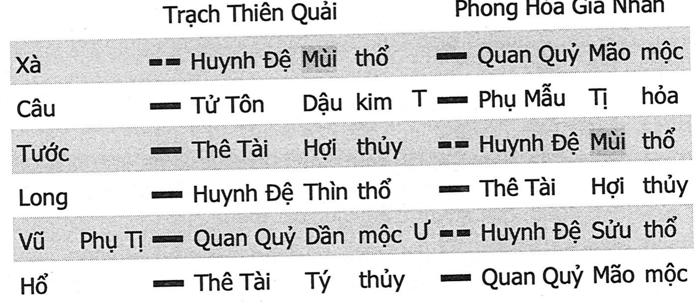
    - **Hình này chứng minh điều gì**
      - [^1]: Ngọc quyết (玉玦): Một loại ngọc bội, có dạng vòng và có chỗ hở.
    - **Từ đâu mà thấy được**
      - Lấy hào Quan Quỷ làm Dụng thần, hào Thế tại hào 5, hào 5 là tôn vị, biểu thị bản thân đang ở vị trí lãnh đạo, Thế khắc Quan trên Ứng, là mình thay ...
  - **Căn cứ luận đoán**:
    - Lấy hào Quan Quỷ làm Dụng thần, hào Thế tại hào 5, hào 5 là tôn vị, biểu thị bản thân đang ở vị trí lãnh đạo, Thế khắc Quan trên Ứng, là mình thay thế người khác, trở thành lãnh đạo.
    - Ứng lâm Quan Quỷ phát động, Ứng động người ta có biến, biểu thị lý do khiến anh ta thay thế vị lãnh đạo này không phải là vì anh ta lật đổ người ta, mà là bởi vì sự biến động từ chính đối phương.
    - Nguyệt kiến là Bệnh địa của hào Ứng, hào Ứng nhập Mộ ở Mùi thổ, biểu thị người lãnh đạo này đã nhập viện vì bị bệnh, do đó mới xảy ra sự thay đổi chức vụ.
    - [^1]: Ngọc quyết (玉玦): Một loại ngọc bội, có dạng vòng và có chỗ hở.
  - **Đối thoại & Diễn biến thực tế**:
    - Trên thực tế, người này là cấp phó ở đơn vị, bởi vì lãnh đạo bị ung thư gan, không thể đi làm và phải nhập viện.
    - Lãnh đạo cấp trên đã quyết định cho anh ta tạm thời phụ trách công việc ở đơn vị.
- **Bảng Quẻ & Quái lệ 2**: Ngày Canh Thân tháng Tý, một người đoán về điều động công tác, được Trạch Thiên Quải biến Trạch Hỏa Cách.
  - **Hình 184.** Sơ đồ quẻ Trạch Thiên Quải biến Trạch Hỏa Cách
    - 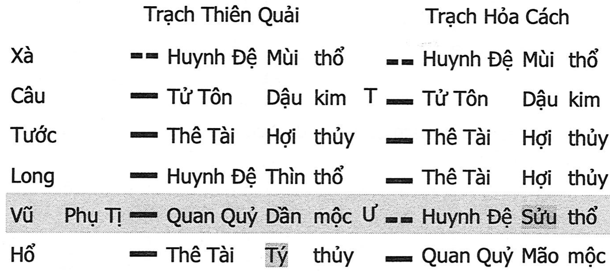
    - **Hình này chứng minh điều gì**
      - Trạch Thiên Quải có ý nghĩa là quyết sách, biểu thị sau khi mình đến nhận chức thì có quyền trong tay, nói thế nào là như thế ấy.
    - **Từ đâu mà thấy được**
      - Thông thường lấy Quan Quỷ làm Dụng thần, Quan Quỷ vượng tướng phát động thì có thể được điều động.
  - **Căn cứ luận đoán**:
    - Thông thường lấy Quan Quỷ làm Dụng thần, Quan Quỷ vượng tướng phát động thì có thể được điều động.
    - Quẻ này nếu đoán từ góc độ Quan Quỷ thì nhất định có thể điều động công tác thành công.
    - Nhưng kết cấu của quẻ này khá đặc biệt, Quan Quỷ lâm Ứng, Thế lâm hào 5 khắc Quan Quỷ trên Ứng, hào 5 là tôn vị, biểu thị tượng trưng của quyền lực.
    - Khắc Quan trên Ứng, chính là cướp vị trí của người khác, thay thế vị trí của người khác.
    - Quẻ này hào Ứng lâm Quan Quỷ phát động, Ứng động người ta có biến, là có người sắp rời khỏi vị trí của họ.
    - Mà hào Thế hào 5 khắc Ứng, sau khi người đó được điều đi, mình sẽ thay thế chỗ ngồi của họ.
    - Trạch Thiên Quải có ý nghĩa là quyết sách, biểu thị sau khi mình đến nhận chức thì có quyền trong tay, nói thế nào là như thế ấy.
  - **Ứng nghiệm thực tế**:
    - Quả nhiên ứng nghiệm.

### 7. THỦY THIÊN NHU

- **Tượng của quẻ**:
  - ngoại quái là Khảm, là hiểm, là hố bẫy, nội quái là Càn, là cương cường (kiên cường, vững chắc), biểu thị mặc dù có thân thể cương cường, nhưng có hiểm cảnh, do đó cần phải chờ đợi.
  - Nhu giả, tu (đợi) dã.
- **Tượng của lục hào**:
  - Thế tại hào 4, chỉ cách hào 5 tôn vị một hào, tuy rằng cũng được hào 5 tôn vị đến sinh, đã được khí từ hào 5, nhưng vẫn kém một điểm so với mục tiêu cao nhất, do đó cần phải chờ đợi thời cơ có lợi.
  - Người xưa nói, Nhu giả tu dã, đây là biểu thị một loại nhu cầu của bản năng. Dân coi cái ăn là trời, đứng giữa trời đất mà sinh tồn.
  - Quẻ này hào 6 là Tài, hào sơ cũng là Tài, hào 6 là thiên.
  - Hào sơ là địa, Thế ở trung gian đi sinh Tài, sẽ tạo ra nguồn dưỡng mệnh giữa trời đất.
  - Nhưng hào Thế không hẳn muốn sinh là có thể sinh, mà cần phải được sự tạo hóa của chính trời đất.
  - Mùa màng không tốt, thì phải chờ đợi, do đó quẻ Nhu có ý nghĩa là nhu cầu, chờ đợi.
- **Ý nghĩa biểu tượng cốt lõi**:
  - nhu cầu, chờ đợi, do dự, mong chờ, hy vọng, trông ngóng v.v.
- **Bảng Quẻ & Quái lệ 1**: Ngày Canh Dần tháng Sửu, nam dự đoán về việc mua nhà, được Thủy Thiên Nhu biến Trạch Thiên Quải.
  - **Hình 185.** Sơ đồ quẻ Thủy Thiên Nhu biến Trạch Thiên Quải
    - 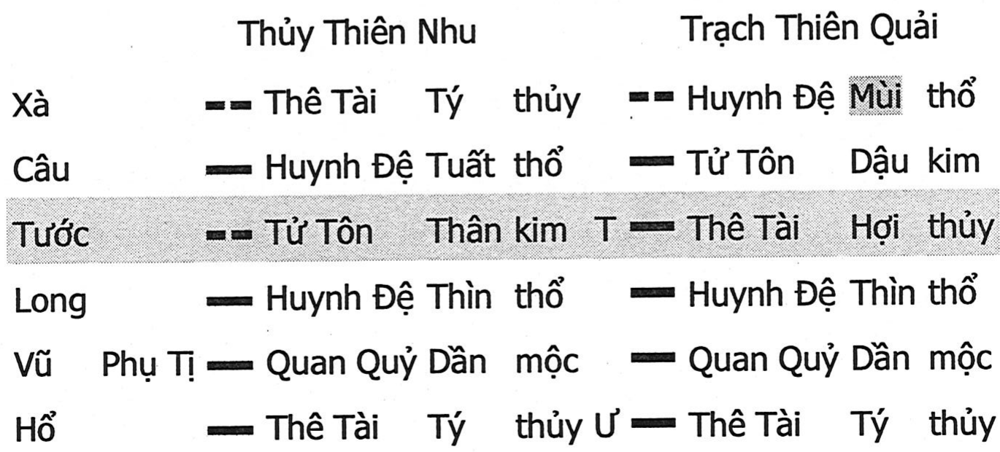
    - **Hình này chứng minh điều gì**
      - Thế động sinh hào Tài trên Ứng, bản thân sẽ giao tiền cho đối phương.
    - **Từ đâu mà thấy được**
      - Lấy hào Phụ Mẫu làm Dụng thần.
  - **Căn cứ luận đoán**:
    - Lấy hào Phụ Mẫu làm Dụng thần.
    - Phụ Mẫu Tị hỏa bất thượng quái, phục dưới hào 2 Quan Quỷ Dần mộc, Thế động tương hợp với hào Phụ Mẫu, biểu thị mình muốn nhận được nhà.
    - Quẻ du hồn, lại là Thủy Thiên Nhu, có nhu cầu, do dự không quyết, biểu thị mình cần căn nhà này, nhưng lại do dự bất định.
    - Tử Tôn Tuyệt tại Nhật, biểu thị tiền vốn của mình không đủ, không có nguồn kinh tế tốt để làm vật thế chấp.
    - Thế động sinh hào Tài trên Ứng, bản thân sẽ giao tiền cho đối phương. Quan lâm Nhật xung hào Thế, thì hào Thế động mạnh hơn.
    - Quan Quỷ là người môi giới, người trung gian, xung là thôi thúc, có người trung gian thôi thúc mình giao tiền cho đối phương càng sớm càng tốt.
    - Việc này có thể thành.
  - **Ứng nghiệm thực tế**:
    - Sau đó đã mua được nhà này.
- **Bảng Quẻ & Quái lệ 2**: Ngày Đinh Sửu tháng Ngọ, nam đoán về việc chuyển trường cho con trai, được Thủy Thiên Nhu.
  - **Hình 186.** Sơ đồ quẻ Thủy Thiên Nhu
    - 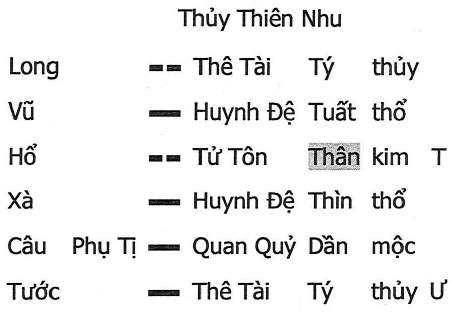
    - **Hình này chứng minh điều gì**
      - Đối phương gật đầu xác nhận, bởi vì con trai anh ta đang yêu một bạn nữ trong lớp, điều này đã ảnh hưởng đến việc học, do đó anh ta muốn chuyển trư...
    - **Từ đâu mà thấy được**
      - Hào Tử Tôn thể hiện con anh ta.
  - **Căn cứ luận đoán**:
    - Việc chuyển trường có hai nguyên nhân, một là bởi vì gia đình thay đổi địa chỉ, con không thể không chuyển trường, hai là bởi vì tình trạng của chính đứa con nên phụ huynh muốn chuyển trường.
    - Hào Tử Tôn thể hiện con anh ta.
    - Không mà nhập Mộ, lại ở quẻ du hồn, biểu thị tư tưởng của con anh ta không tập trung, tâm không thể tĩnh, không thể an tâm học tập.
    - Dụng thần nhập Mộ, là tượng si mê, nhập Mộ tại Nhật, dự đoán công việc là đồng nghiệp, dự đoán trường học chính là bạn học.
    - Biểu thị con anh ta có hiện tượng si mê bạn học khác.
    - Tử Tôn gặp Ngọ hỏa trên Nguyệt là Mộc Dục địa, tôi phán đoán con anh ta đang yêu đương với nữ bạn học ở trường.
    - Người xưa nói, Nhu giả tu dã, đây là vấn đề cơ bản cần được giải quyết nhất hiện nay, và chuyển trường không phải là then chốt.
    - Đối phương gật đầu xác nhận, bởi vì con trai anh ta đang yêu một bạn nữ trong lớp, điều này đã ảnh hưởng đến việc học, do đó anh ta muốn chuyển trường cho nó.
  - **Đối thoại & Diễn biến thực tế**:
    - Quẻ này hào Phụ Mẫu bất thượng quái, được Nguyệt phù là vượng, tuy là không thể nói rằng học tập không tốt, nhưng cũng không thấy được thông tin biểu thị thành tích tốt.

### 8. THỦY ĐỊA TỶ

- **Tượng của quẻ**:
  - ngoại quái là Khảm, là thủy, là giếng, nội quái là Khôn, là địa, là ruộng. Thủy dùng địa để tải nó, địa có thủy mà phì nhiêu.
  - Cả hai phụ thuộc vào nhau.
  - Đồng thời, vị trí quẻ tiên thiên là Khôn, là thổ, vị trí quẻ hậu thiên là Khảm, là thủy, hai quẻ tương khắc, nhưng ở cùng một phương, đây là tượng hòa thân (hòa hiếu kết giao).
  - Do đó người xưa gọi quẻ này là Tỷ, Tỷ giả, hòa dã.
- **Tượng của lục hào**:
  - mộc ở trên Thế, chủ nhân từ, hào Ứng vốn là một phương đối lập hào Thế, nhưng không những không khắc hào Thế, trái lại sinh hào Thế, biểu hiện một bầu không khí tường hòa.
- **Ý nghĩa biểu tượng cốt lõi**:
  - Do đó quẻ này bao hàm ý nghĩa là hòa bình, hòa khí, thân mật, tương thân, phụ thuộc, cộng đồng, phụ trợ (giúp đỡ) v.v.
- **Bảng Quẻ & Quái lệ 1**: Ngày Ất Sửu tháng Thân, một người nữ dự đoán hôn nhân, được Thủy Địa Tỷ.
  - **Hình 187.** Sơ đồ quẻ Thủy Địa Tỷ
    - 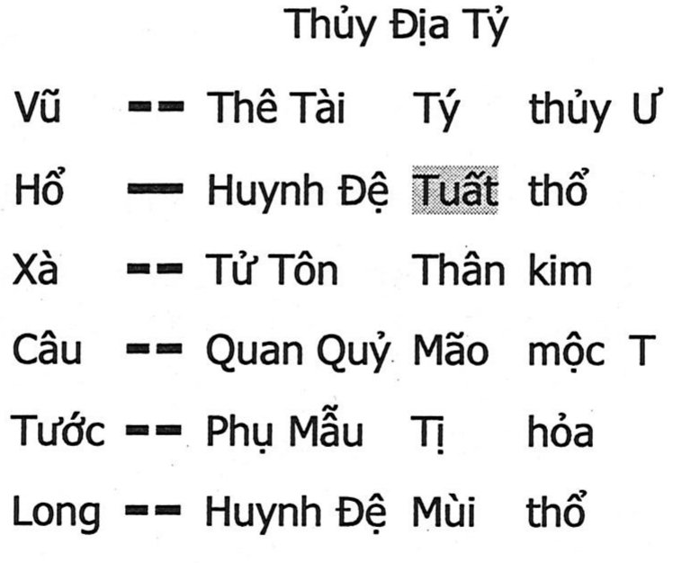
    - **Hình này chứng minh điều gì**
      - Hào sơ Huynh Đệ Mùi thổ ám động, Quan Quỷ nhập Mộ ở Huynh Đệ, Huynh Đệ là người cạnh tranh.
    - **Từ đâu mà thấy được**
      - Lấy Quan Quỷ làm Dụng thần.
  - **Căn cứ luận đoán**:
    - Lấy Quan Quỷ làm Dụng thần.
    - Quan Quỷ không được Nhật Nguyệt sinh phù, bị Nguyệt khắc Tuyệt, quẻ mặc dù được Thủy Địa Tỷ, nhưng chẳng phải tượng hòa, mà là trái ngược với điều này.
    - Hào sơ Huynh Đệ Mùi thổ ám động, Quan Quỷ nhập Mộ ở Huynh Đệ, Huynh Đệ là người cạnh tranh. Biểu thị chồng bị mê hoặc bởi người nữ khác.
    - Huynh Đệ Mùi thổ lâm Thanh Long, chủ người nữ đó trong rất đẹp.
  - **Ứng nghiệm thực tế**:
    - Quả nhiên là chồng đã có ngoại tình, hoàn toàn không quan tâm đến cô ấy.
- **Bảng Quẻ & Quái lệ 2**: Ngày Giáp Thân tháng Sửu, nam đoán tài vận, được Thủy Địa Tỷ biến Lôi Thủy Giải.
  - **Hình 188.** Sơ đồ quẻ Thủy Địa Tỷ biến Lôi Thủy Giải
    - 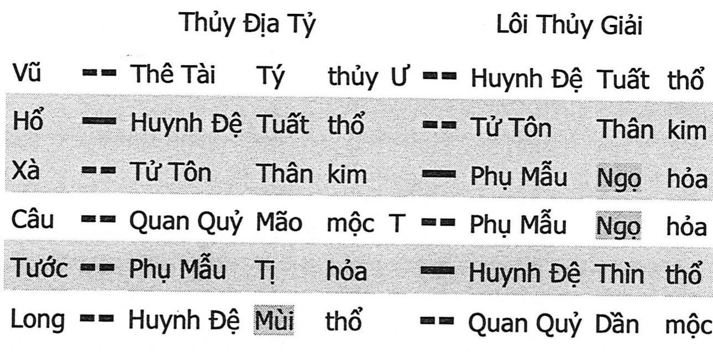
    - **Hình này chứng minh điều gì**
      - Tên quẻ là Tỷ, có tượng tranh cao thấp, Tài lâm Huyền Vũ bị khắc, Huyền Vũ chủ bài bạc, do đó không được làm những chuyện như đánh bạc.
    - **Từ đâu mà thấy được**
      - Lấy Thê Tài làm Dụng thần.
  - **Căn cứ luận đoán**:
    - Lấy Thê Tài làm Dụng thần. Tài được Nhật sinh Nguyệt hợp là vượng, Tài sinh hào Thế, có tượng đắc tài.
    - Nhưng không nên Huynh Đệ động mà khắc Tài.
    - Có lẽ có người sẽ nói Huynh Đệ phát động có Tử Tôn động mà dẫn hóa, có thể liên tục tương sinh, nhưng Phụ Mẫu Tị hỏa động mà hợp Tử Tôn Thân kim, Tử Tôn Thân kim không thể dẫn hóa, do đó nhất định sẽ có chuyện phá tài xảy ra.
    - Tên quẻ là Tỷ, có tượng tranh cao thấp, Tài lâm Huyền Vũ bị khắc, Huyền Vũ chủ bài bạc, do đó không được làm những chuyện như đánh bạc.
  - **Đối thoại & Diễn biến thực tế**:
    - Trên thực tế, người này phát tài hơn 10 vạn, nhưng lại đánh bạc thua 10 vạn.
- **Bảng Quẻ & Quái lệ 3**: Ngày Bính Thìn tháng Ngọ, nữ có con ngang bướng phá phách, dự đoán sau khi tiến hành hóa giải thì có hiệu nghiệm hay không, được Thủy Địa Tỷ biến Khảm Vi Thủy.
  - **Hình 189.** Sơ đồ quẻ Thủy Địa Tỷ biến Khảm Vi Thủy
    - 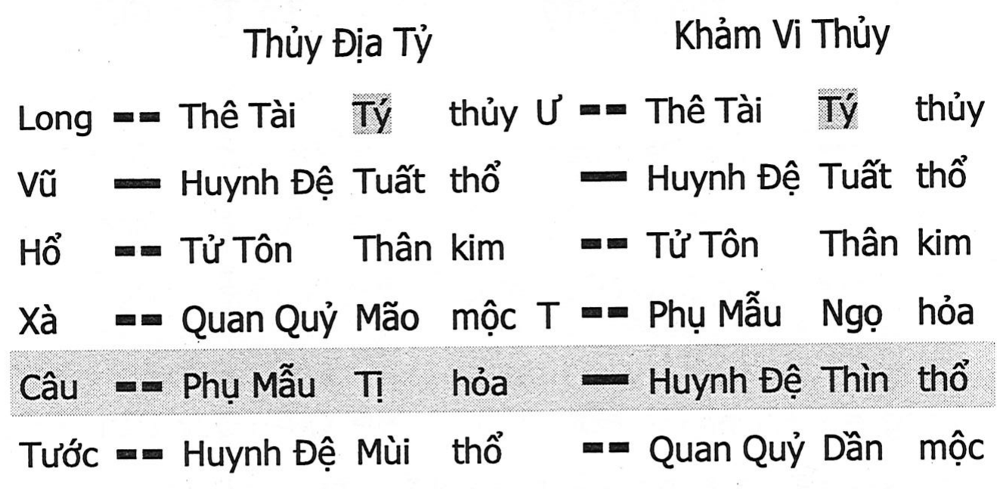
    - **Hình này chứng minh điều gì**
      - Nhưng quẻ được Thủy Địa Tỷ, Tỷ là tượng hòa thuận.
    - **Từ đâu mà thấy được**
      - Lấy Tử Tôn làm Dụng thần, quẻ này Tử Tôn lâm Bạch Hổ an tĩnh, Bạch Hổ là bướng bỉnh, quẻ này đích thực hiển thị tính cách của con cô ấy.
  - **Căn cứ luận đoán**:
    - Lấy Tử Tôn làm Dụng thần, quẻ này Tử Tôn lâm Bạch Hổ an tĩnh, Bạch Hổ là bướng bỉnh, quẻ này đích thực hiển thị tính cách của con cô ấy.
    - Nhưng quẻ được Thủy Địa Tỷ, Tỷ là tượng hòa thuận.
    - Phụ Mẫu lâm Câu Trần độc phát, Câu Trần chủ hiền lành, hợp là vướng chân, biểu thị sau khi hóa giải thì đứa con sẽ trở nên hiền lành.
  - **Đối thoại & Diễn biến thực tế**:
    - Trên thực tế, sau khi trải qua hóa giải, con trai của cô ấy đã thực sự trở nên thật thà ngoan ngoãn.
    - Điều kỳ lạ nhất là người chồng vốn hay cãi nhau với cô ấy cũng đã trở nên hiền lành hơn rất nhiều.
