# Lục Hào Tật Bệnh Dự Trắc Học

## LỜI TỰA

### Bối cảnh xuất bản và tiến trình nghiên cứu của tác giả
- Tác giả Vương Hổ Ứng đã trải qua quá trình nghiên cứu chuyên sâu và đúc kết kinh nghiệm về Lục Hào dự đoán bệnh tật qua các tác phẩm tiền đề:
  - Năm 1998: Xuất bản tác phẩm chuyên đề đầu tiên mang tên *Lục Hào Dự Trắc Tật Bệnh Tân Thám* (*六爻预测疾病新探*).
  - Năm 2007: Xuất bản bộ sách *Lục Hào Trắc Bệnh Phân Khoa Tường Giải* (*六爻测病分科详解*) gồm ba tập (thượng, trung, hạ), ghi lại các tâm đắc và trải nghiệm thực tiễn trong nghiên cứu dự đoán bệnh tật.
- Tác phẩm được biên soạn theo yêu cầu từ phía nhà xuất bản nhằm tạo lập một tài liệu có tính hệ thống cao hơn:
  - Sau hai tác phẩm trước, tác giả ban đầu không còn dự định xuất bản thêm sách chuyên về đề tài Lục Hào dự đoán bệnh tật.
  - Nhận lời thỉnh cầu nhiều lần từ nhà xuất bản, tác giả quyết định biên soạn cuốn sách mới với lộ trình từ nông đến sâu, phục vụ cả người mới học lẫn người muốn nâng cao trình độ dự trắc.

### Vị trí của dự trắc tật bệnh trong hệ thống Lục Hào
- Khoa học tính mệnh giữ vị trí quan trọng nhất trong các chuyên đề của Lục Hào dự đoán học:
  - Quan điểm nhân sinh cổ truyền: "Còn da lông mọc, còn chồi nảy cây" – sinh mệnh con người là vốn quý giá nhất.
  - Mọi thành tựu về của cải, danh vị, địa vị xã hội hay hạnh phúc gia đình đều phải xây dựng trên cơ sở một cơ thể khỏe mạnh; thiếu đi sức khỏe thì mọi mưu cầu đều như "lấy giỏ tre đựng nước".

### Giá trị đặc thù của Lục Hào trong tương quan với Y học hiện đại và Trung y
- Lục Hào dự trắc học và Trung y cổ đại cùng chung cội nguồn từ hệ thống lý luận triết học *Chu Dịch*:
  - Trung y cổ đại đề xướng nguyên tắc "thượng công trị vị bệnh": người thầy thuốc giỏi loại bỏ gốc rễ mầm bệnh ngay từ trước khi bệnh tật phát tác.
  - Xuất phát từ triết lý *Chu Dịch*, Lục Hào dự trắc học có khả năng dự đoán bệnh tật chuẩn xác và hỗ trợ định hướng phương án điều trị.
- Lục Hào có khả năng xuyên suốt thời gian và không gian mà thiết bị y học hiện đại không thể thay thế:
  - Chẩn đoán y học hiện đại: Dựa vào máy móc, trang thiết bị kỹ thuật; dù máy móc hiện đại đến đâu cũng chỉ tìm ra những căn bệnh đã phát sinh thực thể trong cơ thể.
  - Dự trắc Lục Hào: Có khả năng vượt qua thời - không, xác định trước thời điểm và bộ vị cụ thể có nguy cơ phát bệnh trong tương lai.
  - Giá trị ứng dụng: Đóng vai trò then chốt và mang ý nghĩa sâu sắc đối với cả công tác phòng bệnh từ sớm lẫn trị liệu đúng thời điểm.

### Tính giới hạn và tinh thần cầu thị trong nghiên cứu dự trắc tật bệnh
- Tác giả đúc kết được nhiều quy luật và phương pháp mới bổ khuyết cho người xưa:
  - Quá trình nghiên cứu thực tế qua nhiều năm đã tìm ra các quy luật chưa từng được ghi nhận trong thư tịch cổ, góp phần hoàn thiện và hệ thống hóa môn học dự trắc tật bệnh.
- Lục Hào dự đoán bệnh tật không phải là công cụ vạn năng và tồn tại những giới hạn thực tiễn:
  - Không phải quẻ tượng nào cũng phản ánh trọn vẹn toàn bộ thông tin chi tiết của bệnh cảnh.
  - Các kết quả nghiên cứu hiện tại chưa thể bao quát mọi loại bệnh tật, do có những chứng bệnh tác giả chưa từng trải nghiệm thực tế.
  - Bệnh tật trong thực tế liên tục biến dị, đòi hỏi người nghiên cứu phải liên tục học hỏi, tìm tòi và cập nhật.
- Tác phẩm giữ vai trò "ném gạch nhử ngọc" (*phao chuyên dẫn ngọc*):
  - Tác giả mong muốn khơi gợi, thu hút thêm nhiều học giả có chí hướng tham gia vào đội ngũ nghiên cứu sâu rộng về Lục Hào dự đoán bệnh tật.
  - Ký tên: Vương Hổ Ứng.

## CHƯƠNG 1: Ý NGHĨA CỦA LỤC HÀO ĐOÁN BỆNH

### Mối quan hệ biện chứng giữa Chu Dịch, Dự đoán học và Trung y

- Y học hiện đại đối mặt với sự biến đổi liên tục của bệnh tật
  - Quy luật phát triển tự nhiên thể hiện rõ qua ngạn ngữ "đạo cao một thước, ma cao một trượng": trong khi giới y học nỗ lực tìm kiếm phương pháp chữa trị thì bệnh tật cũng không ngừng biến đổi và mở rộng phạm vi, liên tục xuất hiện những căn bệnh mới đòi hỏi con người phải nhận thức, giải mã và xử lý.
  - Quá trình tìm tòi ra một phương pháp chữa trị đạt hiệu quả thực tế đòi hỏi gian nan to lớn; một người thầy thuốc có thể phải dồn hết tâm huyết và tinh lực cả cuộc đời chỉ để giải mã được một phần nhỏ của một chứng bệnh.
- Nền tảng triết học chung giữa Dự đoán học và Trung y học
  - Cả dự đoán học và Trung y đều được khởi dựng trên nền tảng lý luận âm dương ngũ hành sinh khắc.
  - Quá trình hình thành các phương tễ điều trị trong Trung y có sự tích lũy kinh nghiệm lâm sàng của danh y, nhưng tỷ lệ phối ngũ các vị thuốc không thuần túy dựa vào phép thử sai lặp lại nhiều lần, mà lấy quy luật âm dương ngũ hành sinh khắc làm kim chỉ nam và hậu thuẫn lý luận vững chắc để sáng tạo ra các tổ hợp phương thang.
- Truyền thống tinh thông Dịch học của các bậc danh y qua các thời kỳ
  - Phần lớn các bậc thầy Trung y trứ danh trong lịch sử đều đồng thời là những bậc cao thủ am hiểu Dịch học và dự đoán học.
  - Dược Vương Tôn Tư Mạc (thời Đường) đề cao mối quan hệ mật thiết giữa y học và Dịch học qua châm ngôn: "Bất tri dịch, bất túc dĩ ngôn thái y" (Không hiểu Dịch thì không đủ tư cách làm thầy thuốc/đại y), xem đây là nguyên tắc bất di dịch của người hành y chân chính.
  - Tác phẩm *Y Môn Bổng Hát* chỉ rõ vai trò chỉ đạo của Dịch học: "Thị dĩ Dịch chi thư, nhất ngôn nhất tự giai tàng y học chi chỉ nam" (Trong sách Dịch, mỗi câu mỗi chữ đều hàm chứa kim chỉ nam cho y học).
  - Tác phẩm *Thiên Kim Yếu Phương* của Tôn Tư Mạc xác định tiêu chuẩn người hành y: Ngoài việc tinh thông các y kinh như *Tố Vấn*, *Giáp Ất*, *Hoàng Đế Châm Kinh*, người học y bắt buộc phải thông tỏ *Diệu Giải Âm Dương Lộc Mệnh*, *Chư Gia Tướng Pháp*, *Chước Quy Ngũ Triệu*, *Chu Dịch*, *Lục Nhâm*; nếu không đạt được sự tinh thục này thì "chẳng khác nào kẻ không có mắt lại đi chơi trong đêm tối, tất sẽ rối loạn đến mức sẩy chân ngã chết".
  - Năng lực dự đoán học uyên thâm là chìa khóa then chốt giúp danh y đạt được những bước tiến quan trọng trong y học và giải mã bệnh tật.

### Khả năng và giá trị ứng dụng của Lục Hào trong dự đoán bệnh tật

- Vị thế đặc thù của Lục Hào trong các hệ thống dự đoán cổ đại
  - Ngay từ thuở sơ khai, dự đoán học cổ đại đã xác định dự đoán bệnh tật là một chuyên đề trọng yếu không thể tách rời.
  - Các hệ thống dự đoán cổ thuật tuy đều có những cống hiến nhất định đối với dự đoán bệnh tật, nhưng phạm vi phán đoán cụ thể còn nhiều hạn chế; trong đó, phương pháp mang lại khả năng phân tích chi tiết, chuẩn xác và thực dụng nhất chính là Lục hào dự đoán học.
- Năng lực chẩn đoán và hỗ trợ điều trị đa diện của Lục Hào
  - Giúp nhận định rõ ràng chiều hướng diễn biến, độ nặng nhẹ và xu thế cát hung của bệnh tật.
  - Dự đoán mức độ tương hợp giữa thầy thuốc và bệnh nhân (bác sĩ có hợp với thể trạng và bệnh tình của người bệnh hay không).
  - Đánh giá tính chính xác và hiệu lực thực tế của phương dược đối với người bệnh.
  - Gợi mở phương pháp trị liệu thích hợp để phối hợp nhịp nhàng với điều trị hiện đại, rút ngắn thời gian chữa lành bệnh tật.
  - Có thể vận dụng như một phương pháp điều trị độc lập, hỗ trợ xử lý nhiều ca bệnh hiểm nghèo mà y học hiện đại gặp bế tắc.

### Các ví dụ thực tế ứng dụng Lục Hào trong dự đoán và trị liệu

- **Ví dụ 1:** Đau chân không thể cử động
  - **Bối cảnh:**
    - Vào một ngày tháng 5 năm 2007, người bạn học ở quê gửi tin nhắn nhờ tác giả xem giúp bệnh tình của người em trai bị đau chân dữ dội, hoàn toàn không cử động được.
    - Thời gian chiêm bái: Ngày Giáp Thìn tháng Tị, gieo được quẻ Thiên Địa Bĩ biến Sơn Địa Bác.
  - **Phán đoán chi tiết:**
    - Căn cứ: Phân tích cấu trúc quái tượng để tầm soát nguyên nhân tà khí xâm nhập trước khi đưa ra kết luận bệnh lý.
    - Nhìn vào: Chi tiết hiển thị trong quẻ chỉ ra rằng người em trai đã nhiều lần đi ngoài đường vào ban đêm, hơn nữa khu vực di chuyển nằm ở phía Nam của nơi cư trú; ban đêm âm khí nặng nề xâm nhập kinh lạc chi dưới dẫn đến tình trạng chân bị đau cứng không thể cử động.
    - Đối thoại và kiểm chứng: Tác giả chủ động nêu chi tiết này để đối chiếu thông tin; người bạn xác nhận trên thực tế em trai thường xuyên chơi mạt chược thâu đêm và từ hướng Nam trở về nhà.
    - So sánh với y học thông thường: Kiến thức y học thông thường xem việc đi lại ban đêm và đau chân là hai hiện tượng tách biệt, bác sĩ sẽ chỉ định chụp CT kiểm tra thần kinh hoặc xương khớp, hoàn toàn không thể phát hiện nguyên nhân tà khí ban đêm từ phía Nam.
    - Phương pháp xử lý: Tác giả hướng dẫn vào giờ Tý ngày hôm đó, mang 5 tờ giấy hoàng chỉ đến ngã tư đường ở phía Nam đốt đi.
  - **Ứng nghiệm thực tế:**
    - Ngay trong đêm đó sau khi hóa giải, người em trai toát mồ hôi đầm đìa làm chăn đệm ướt sũng (lần đầu tiên trong đời cơ thể bài tiết mồ hôi nhiều đến vậy).
    - Đến sáng hôm sau, chân hoàn toàn hết đau đớn, hồi phục bình thường và có thể đi lại, thậm chí đi du ngoạn vùng khác.
    - Giải thích y lý: Hiện tượng này không thuộc về mê tín dị đoan, mà bản chất được giải thích sáng tỏ thông qua nguyên lý sinh khắc của ngũ hành và học thuyết lục dâm (phong, hàn, thử, thấp, táo, hỏa) của Trung y trong việc chỉ rõ nguyên nhân phát bệnh, cơ chế bệnh sinh và bài trừ phong hàn tà khí.

- **Ví dụ 2:** Cảm mạo ho đau sườn nghi gãy xương
  - **Bối cảnh:**
    - Tháng 3 năm 2005, một học trò người Nhật Bản mắc cảm mạo kéo dài hơn một tháng kèm theo triệu chứng ho dai dẳng; dù đã truyền dịch tại bệnh viện nhưng không thuyên giảm, sau đó xuất hiện thêm chứng đau nhức dữ dội ở vùng xương sườn.
    - Bệnh viện tại Nhật Bản kiểm tra và chẩn đoán anh bị gãy xương sườn, chỉ định phải làm phẫu thuật; người học trò sợ phẫu thuật nên nhờ tác giả dự đoán xem nguyên nhân thực sự là gì.
    - Thời gian chiêm bái: Ngày Bính Thân tháng Mão, gieo được quẻ Sơn Phong Cổ.
  - **Phán đoán chi tiết:**
    - Căn cứ: Phân tích tượng quẻ Sơn Phong Cổ để phân định giữa tổn thương thực thể (gãy xương) và tác động của ngoại tà.
    - Nhìn vào: Quái tượng khẳng định bệnh nhân hoàn toàn không bị gãy xương; căn nguyên thực sự là phong hàn xâm nhập vào cơ thể dẫn đến ho kéo dài, phản xạ ho liên tục với cường độ mạnh đã gây đau cơ và chấn động xương sườn.
    - Phương pháp xử lý: Tác giả chỉ dẫn phương pháp ẩm thực liệu pháp đơn giản: dùng 1 củ cà rốt vàng, 6 rễ hành trắng (thông bạch), 5 lát gừng tươi (sinh khương), sắc nấu lấy nước canh uống.
  - **Ứng nghiệm thực tế:**
    - Sau 3 ngày kiên trì uống nước canh, toàn bộ triệu chứng cảm mạo và ho dứt hẳn, cơn đau vùng xương sườn cũng tiêu biến hoàn toàn.
    - Phản hồi của người bệnh: Học trò cho biết nước canh rất dễ uống, vị thanh ngon, sau khi uống vào cơ thể ấm dần lên, tỏa nhiệt và toát mồ hôi giải trừ hàn tà.
    - Đánh giá chuyên môn: Nền y học hiện đại phát triển như Nhật Bản vẫn có thể chẩn đoán sai lầm (nhầm lẫn giữa đau sườn do ho với gãy xương); nếu không nhờ dự đoán Lục Hào phát hiện đúng bản chất thì người bệnh đã phải chịu một cuộc phẫu thuật vô ích mà bệnh tình vẫn không được giải quyết.

- **Ví dụ 3:** Sưng phù mặt bị chẩn đoán nhầm thành liệt cơ mặt
  - **Bối cảnh:**
    - Tháng 3 năm 1996, vào một ngày thứ Bảy (ngày nghỉ), tác giả đến cơ quan lấy tài liệu thì tình cờ gặp một người đồng nghiệp.
    - Khuôn mặt người đồng nghiệp bị sưng phù biến dạng nặng nề; vừa thấy tác giả, người này như gặp được cứu tinh và chia sẻ rằng bác sĩ bệnh viện chẩn đoán anh bị liệt cơ mặt, đã xếp lịch hẹn phẫu thuật vào thứ Hai tuần tới. Người này khẩn thiết nhờ tác giả gieo quẻ xem cát hung.
    - Thời gian chiêm bái: Ngày Mậu Tuất tháng Dần, gieo được quẻ Thiên Lôi Vô Vọng.
  - **Phán đoán chi tiết:**
    - Căn cứ: Phân tích quái tượng Thiên Lôi Vô Vọng nhằm xác định bản chất của chứng sưng phù (tổn thương dây thần kinh vận động hay do nhiệt độc viêm nhiễm).
    - Nhìn vào: Quái tượng chỉ ra hỏa vượng gây ra chứng viêm nhiễm cấp tính dẫn đến sưng phù cục bộ, hoàn toàn không phải bệnh lý liệt cơ mặt; bác sĩ đã chẩn đoán sai.
    - Đối thoại kiểm chứng lâm sàng:
      - Tác giả khẳng định trực tiếp: "Anh không phải bị liệt cơ mặt, chẳng qua là hỏa vượng nên có chứng viêm dẫn tới sưng phù mà thôi, bác sĩ chẩn đoán sai rồi."
      - Người đồng nghiệp vẫn mang tâm lý bán tín bán nghi.
      - Tác giả đặt câu hỏi kiểm tra cảm giác: "Khuôn mặt của anh có phải là chỉ sưng và tê, không có cảm giác đau đúng không?" -> Đồng nghiệp gật đầu xác nhận đúng tình trạng.
      - Tác giả định vị điểm đau thực sự: "Anh sờ vào gốc cánh mũi nhất định rất đau." -> Người đồng nghiệp đưa tay sờ thử vào gốc cánh mũi, quả nhiên thấy đau nhức dữ dội.
    - Phương pháp xử lý: Người đồng nghiệp hoàn toàn tin phục phán đoán của tác giả và hỏi phương pháp điều trị; tác giả chỉ định dùng thuốc kháng sinh tiêu viêm, đồng thời cam đoan rằng đến ngày thứ Hai vết sưng phù trên mặt sẽ tiêu tan hoàn toàn, không cần đụng đến dao kéo.
  - **Ứng nghiệm thực tế:**
    - Bệnh nhân uống thuốc kháng sinh theo chỉ dẫn; đến đúng ngày thứ Hai, triệu chứng sưng phù trên mặt đã tiêu trừ hoàn toàn, bình phục trọn vẹn mà không cần thực hiện phẫu thuật.

### Giá trị bổ trợ của Lục Hào đối với y học hiện đại

- Khắc phục những điểm mù và chẩn đoán sai lệch trong y khoa
  - Trong thực tế lâm sàng, người nghiên cứu dự đoán học thường gặp những quẻ tượng phản ánh sai sót tương tự; một bộ phận y bác sĩ thiếu sự thấu đáo chuyên môn đã đưa ra chẩn đoán nhầm lẫn, gây ra nhiều can thiệp y tế không cần thiết và tổn hại lớn cho sức khỏe người bệnh.
  - Lục Hào dự đoán học giúp nhận diện chính xác căn nguyên cốt lõi của chứng trạng từ góc độ vận hành của khí hóa ngũ hành, giúp người bệnh tránh được những ca phẫu thuật không đúng chỉ định.
- Định vị vai trò phương tiện phụ trợ cho y học hiện đại
  - Lục Hào dự đoán bệnh tật không đặt mục tiêu thay thế y học hiện đại, mà đóng vai trò là một công cụ hỗ trợ giá trị cao.
  - Sự kết hợp giữa năng lực dự đoán học và y học hiện đại giúp nhận định bệnh lý thấu đáo, chuẩn xác hơn, hỗ trợ giải trừ đau khổ cho người bệnh và đóng góp thiết thực cho cộng đồng.

## CHƯƠNG 2: QUY LUẬT CỦA LỤC HÀO ĐOÁN BỆNH

### Tổng quan phương pháp luận dự trắc tật bệnh

- Phương pháp cổ nhân dùng ngũ hành của Quan Quỷ để phán đoán chứng bệnh tồn tại nhiều hạn chế:
  - Quan niệm truyền thống gán ghép ngũ hành Quan Quỷ vào các tạng phủ và triệu chứng:
    - Hỏa thuộc tâm kinh: chủ phát nhiệt, khô cổ họng, khô miệng.
    - Thủy thuộc thận: chủ ớn lạnh, đổ mồ hôi trộm, di tinh.
    - Kim thuộc phổi.
    - Mộc thuộc gan.
    - Thổ là bệnh xâm nhập tỳ vị.
  - Tỷ lệ ứng nghiệm trong thực tế tương đối thấp khi áp dụng quy ước cố định này.
  - Việc lấy ngũ hành Quan Quỷ đơn thuần không thể làm khuôn mẫu để đoán bệnh, càng không thể thực sự mang lại tác dụng chỉ đạo dự đoán.
- Nguyên lý dự đoán chứng bệnh chính xác phải dựa vào Dụng thần và các quy luật sinh khắc chế hóa:
  - Thực tiễn chứng minh dự đoán chứng bệnh nên lấy Dụng thần hỉ kỵ làm căn cứ then chốt.
  - Cần dựa vào các quan hệ sinh khắc, xung hợp, suy vượng, động biến... để phân tích phán đoán chi tiết.
- Hệ quy nạp các quy luật thường gặp biểu thị thông tin bệnh tật:
  - Tác giả đúc kết từ kinh nghiệm thực tiễn thành các quy luật cốt lõi phản ánh vị trí, bản chất và tiến triển của bệnh tật.
  - Các quy luật này đóng vai trò chỉ đạo xuyên suốt cho việc biện chứng và giải đoán các ca bệnh cụ thể trong Lục Hào.

### 1. Dụng thần bị thương, lấy Dụng thần làm bệnh.

#### Nguyên lý định bệnh khi Dụng thần bị thương
- Dụng thần trong quẻ đại diện cho đối tượng được dự trắc hoặc bản thân đương số khi đoán thân thể, niên vận.
  - Khi Dụng thần bị Nhật kiến, Nguyệt kiến hoặc Kỵ thần động khắc làm tổn thương, bộ phận cơ thể tương ứng với ngũ hành và hào vị của Dụng thần chính là nơi phát sinh bệnh tật.
  - Thông tin bệnh tật trên cơ thể luôn tiềm ẩn trong quẻ niên vận thông qua tương tác giữa hào Thế, hào vị, ngũ hành và Lục thần.

#### Phân tích thực tế: Quẻ Thiên Phong Cấu đoán niên vận cho phụ nữ lớn tuổi
- Ngày Canh Ngọ, tháng Dần (Tuần không: Tuất, Hợi), một phụ nữ lớn tuổi đoán niên vận, gieo được quẻ thuần tĩnh Thiên Phong Cấu.
- Các bước suy luận và căn cứ định bệnh:
  - Lấy hào Thế làm Dụng thần: Trong quẻ đoán niên vận, hào Thế mang thông tin bản mệnh và trạng thái sức khỏe thể chất của đương số.
  - Vị trí hào và tổn thương ngũ hành: Hào Thế là Phụ Mẫu Sửu thổ an tại hào sơ, gặp tháng Dần mộc vượng thụ khắc (Nguyệt kiến Dần mộc khắc phạt Sửu thổ).
  - Tượng phối hợp giữa hào vị và Lục thần:
    - Hào sơ là hào vị dưới cùng của cơ thể, đại diện cho bàn chân.
    - Hào Thế lâm Bạch Hổ, trong Lục thú Bạch Hổ chuyên chủ về tật bệnh, thương tích, đau đớn.
  - Kết luận dự đoán: Hào sơ Sửu thổ lâm Bạch Hổ bị Nguyệt khắc thương, khẳng định bệnh tật phát sinh ngay tại bàn chân.
- Ứng nghiệm thực tế:
  - Trên thực tế, bàn chân của người phụ nữ bị tê dại, mất hết sức lực không đi lại bình thường được.

### 2. Kỵ thần động đến khắc Dụng, lấy Kỵ thần làm bệnh.

- **Quy tắc dự trắc:** Khi Kỵ thần phát động đến khắc hại Dụng thần, lấy ngũ hành và đặc tính của chính Kỵ thần làm căn cứ xác định nguyên nhân và chứng bệnh.

#### Ví dụ thực tế: Đoán bệnh của cha ngày Nhâm Thìn tháng Tý

- Tình huống xem quẻ: Ngày Nhâm Thìn, tháng Tý (Không Vong: Ngọ, Mùi), một người hỏi về bệnh tình của cha, gieo được quẻ Thủy Thiên Nhu biến Tốn Vi Phong.
  - **Hình 2.** Sơ đồ quẻ Thiên Phong Cấu
    - 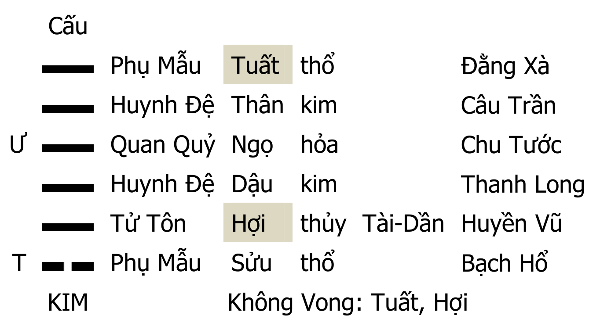
    - **Hình này chứng minh điều gì**
      - Người cha mắc chứng ung thư tuyến tiền liệt khiến nước tiểu tắc nghẽn không bài tiết ra được.
    - **Từ đâu mà thấy được**
      - Phụ Mẫu Tị hỏa phục tại hào 2 lâm Thanh Long chủ bệnh bộ phận sinh dục; Kỵ thần Tý thủy lâm Nguyệt lưỡng động khắc Dụng, thủy bị hợp chủ bí tiểu, Kỵ thần vượng tướng còn Dụng thần hưu tù báo hiệu ung thư.
- **Phân tích suy luận dịch lý:**
  - Định Dụng thần: Xem bệnh cho cha lấy Phụ Mẫu làm Dụng thần; trong quẻ Phụ Mẫu Tị hỏa không xuất hiện trên quẻ chính mà phục tàng tại hào 2 (dưới Quan Quỷ Dần mộc).
  - Định vị trí cơ thể và lục thú: Hào 2 là hào vị biểu thị bộ phận sinh dục; Phụ Mẫu phục hào 2 lại lâm Thanh Long (Thanh Long chủ sắc dục), chủ về bệnh tật phát sinh ở hệ sinh dục.
  - Biện giải Kỵ thần khắc Dụng: Kỵ thần Thê Tài Tý thủy lâm Nguyệt kiến đến khắc Dụng; trong quẻ Kỵ thần lại lưỡng động (hào 1 và hào 6 đều là Tý thủy động) cùng phát động khắc hại Dụng thần Tị hỏa.
  - Biểu tượng ngũ hành đối với bệnh chứng: Kỵ thần là Thủy chủ về nước tiểu; Thủy bị hợp mà khắc Dụng thần biểu thị trạng thái nước tiểu bị bế tắc không thoát ra được (tiểu không ra), do đó xác định là bệnh tuyến tiền liệt.
  - Mức độ bệnh lý: Kỵ thần Thủy cực kỳ vượng tướng, trong khi Dụng thần Hỏa suy vi hưu tù không có trợ lực, tượng bệnh hung hiểm nan y, kết luận là ung thư.
- **Ứng nghiệm thực tế:** Người cha thực tế bị ung thư tuyến tiền liệt.

### 3. Cừu thần động đến khắc Nguyên thần, lấy Cừu thần làm bệnh.

#### Nguyên lý định bệnh khi Cừu thần động khắc Nguyên thần

- Cừu thần trong mối quan hệ ngũ hành sinh khắc của quẻ:
  - Cừu thần là hào sinh trợ cho Kỵ thần và trực tiếp khắc chế Nguyên thần của Dụng thần.
  - Khi Cừu thần phát động khắc hại Nguyên thần, nguồn sinh dưỡng của Dụng thần bị ngăn chặn hoặc triệt hạ, khiến Dụng thần mất đi chỗ dựa sinh phù.
  - Trong phép dự trắc bệnh tật của Lục Hào, khi Cừu thần phát động gây họa cho Nguyên thần thì lấy chính ngũ hành, hào vị và tính chất của Cừu thần làm căn cứ xác định nguyên nhân và vị trí phát sinh bệnh tật.

#### Phân tích thực tế: Quẻ Hỏa Lôi Phệ Hạp biến Sơn Trạch Tổn đoán bệnh cho chồng

- Bối cảnh dự trắc:
  - Thời gian: Ngày Giáp Tuất, tháng Hợi (Tuần không: Thân, Dậu).
  - Sự việc: Người phụ nữ hỏi về tình trạng bệnh tật của chồng.
  - Quẻ gieo: Được Hỏa Lôi Phệ Hạp biến Sơn Trạch Tổn, quẻ thuộc cung Tốn.
- Các bước phân tích dịch lý và căn cứ định bệnh:
  - Xác định Dụng thần: Nữ nhân đoán bệnh của chồng lấy hào Quan Quỷ làm Dụng thần; trong quẻ Quan Quỷ Dậu kim tại hào 4 lâm Đằng Xà.
  - Xác định Nguyên thần và Cừu thần:
    - Thổ sinh Kim, do đó hào Thê Tài (Thìn thổ, Mùi thổ) là Nguyên thần sinh cho Quan Quỷ Dậu kim.
    - Mộc khắc Thổ, do đó hào Huynh Đệ Dần mộc chính là Cừu thần khắc chế Nguyên thần Thê Tài thổ.
  - Phân tích động biến của Cừu thần:
    - Hào 2 Huynh Đệ Dần mộc (lâm hào Ứng, Chu Tước) phát động hóa Tiến thần sang Huynh Đệ Mão mộc.
    - Cừu thần phát động lại hóa Tiến thần làm cho uy lực khắc chế Nguyên thần càng thêm mạnh mẽ và dai dẳng.
  - Biện giải hào vị và quái cung định vị trí bệnh:
    - Quẻ Hỏa Lôi Phệ Hạp thuộc cung Tốn; trong tượng Bát quái, cung Tốn chủ về đùi (vùng chi dưới).
    - Hào động nằm tại hào 2; trong phân vị cơ thể người thì hào 2 tương ứng với phần chân, cẳng chân, khớp gối.
  - Biện giải ngũ hành xác định triệu chứng bệnh:
    - Cừu thần mang ngũ hành Mộc (Dần mộc hóa Mão mộc); trong y lý Đông y và tượng số Lục Hào, mộc chủ về phong khí, gân cơ và chứng đau nhức (mộc chủ toan thống).
    - Tổng hợp các yếu tố: Quẻ ở cung Tốn (đùi), hào 2 phát động (chân), ngũ hành Mộc (đau nhức), kết luận bệnh tật phát sinh ở vùng chân.
- Ứng nghiệm thực tế:
  - Trên thực tế, người chồng bị mắc chứng đau chân, khớp và gân chân đau nhức đi lại khó khăn.

### 4. Nguyên thần bị thương, lấy Nguyên thần làm bệnh.

#### Quy tắc lý luận và sơ đồ đối chiếu minh họa

- Cơ chế lấy Nguyên thần làm tiêu điểm phát bệnh:
  - Khi Nguyên thần của Dụng thần bị Nhật thần hoặc Nguyệt kiến khắc thương, hoặc bị hào động và Cừu thần khắc phá, Nguyên thần rơi vào trạng thái suy bại và mất khả năng sinh dưỡng Dụng thần.
  - Khi đó, vị trí phát sinh bệnh tật hoặc triệu chứng bệnh lý sẽ căn cứ trực tiếp vào ngũ hành, hào vị và lục thân của chính Nguyên thần bị thương tổn để xác định.
- Sơ đồ quẻ Thủy Thiên Nhu biến Tốn Vi Phong minh họa cấu trúc động biến và mối quan hệ tổn thương của hào quẻ trong dự trắc bệnh tật:
  - **Hình 3.** Sơ đồ quẻ Thủy Thiên Nhu biến Tốn Vi Phong
    - 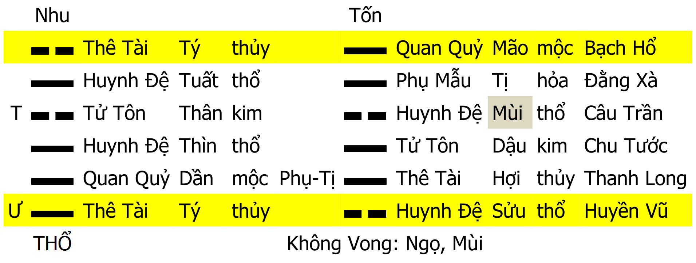
    - **Hình này chứng minh điều gì**
      - Thể hiện cơ chế các hào động biến tác động xung khắc làm phát sinh chứng bệnh theo hào vị và lục thân.
    - **Từ đâu mà thấy được**
      - Quẻ Nhu động hào 1 (Tý thủy), hào 4 (Thân kim) và hào 6 (Tý thủy) biến sang Tốn; hào 4 Thế lâm Tử Tôn hóa Mùi thổ tuần không.
- Sơ đồ quẻ Hỏa Lôi Phệ Hạp biến Sơn Trạch Tổn minh họa Cừu thần phát động hóa Tiến thần khắc đoạt Nguyên thần dẫn tới phát bệnh tại chi dưới:
  - **Hình 4.** Sơ đồ quẻ Hỏa Lôi Phệ Hạp biến Sơn Trạch Tổn
    - 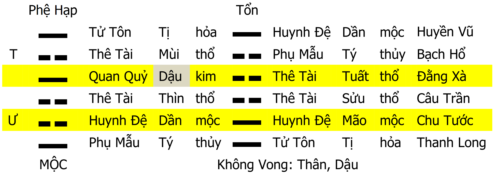
    - **Hình này chứng minh điều gì**
      - Cừu thần phát động hóa Tiến thần khắc chế Nguyên thần, khiến Nguyên thần bị thương tổn nặng và phát sinh chứng đau chân.
    - **Từ đâu mà thấy được**
      - Hào 2 Huynh Đệ Dần mộc động hóa Mão mộc (Tiến thần) khắc Nguyên thần; hào 2 là vị trí chân, ngũ hành Mộc chủ đau nhức.

#### Ví dụ thực tế: Nữ đoán bệnh cho con trai được quẻ Thủy Lôi Truân

- Bối cảnh chiêm bói và thiết lập quẻ:
  - Thời gian dự trắc: Ngày Canh Dần, tháng Tuất (Tuần không: Ngọ, Mùi).
  - Tình huống: Người mẹ đến xin dự đoán tình trạng sức khỏe và bệnh chứng cho con trai, gieo được quẻ thuần Thủy Lôi Truân.
  - Thiết lập hào quẻ: Quái Khảm ở trên, quái Chấn ở dưới; hào 2 Tử Tôn Dần mộc trì Thế lâm Huyền Vũ; hào 5 Quan Quỷ Tuất thổ ứng lâm Câu Trần.

##### Phân tích suy luận quẻ tượng

- Xác định Dụng thần và đánh giá vượng suy:
  - Chiêm đoán bệnh tật của con trai, theo phép Lục Hào lấy hào Tử Tôn làm Dụng thần.
  - Quẻ có hào 2 Tử Tôn Dần mộc trì Thế; Dần mộc gặp Nhật thần Dần mộc là được Nhật tỉ phù nên lâm vượng tướng; đối với Nguyệt kiến Tuất thổ thì không sinh không khắc, bản thân Dụng thần có khí lực vững vàng.
- Căn cứ xác định Nguyên thần bị thương tổn gây trở ngại trí lực:
  - Nguyên thần sinh dưỡng cho Tử Tôn Dần mộc là ngũ hành Thủy (Huynh Đệ Tý thủy).
  - Trong quẻ, Nguyên thần xuất hiện hai nơi (lưỡng hiện): một tại hào sơ (Huynh Đệ Tý thủy lâm Bạch Hổ) và một tại hào 6 (Huynh Đệ Tý thủy lâm Đằng Xà).
  - Nguyệt kiến Tuất thổ đương lệnh khắc thương nặng nề Thủy, khiến cả hai hào Nguyên thần Tý thủy đều bị tổn thương nghiêm trọng, mất lực sinh dưỡng cho Dụng thần.
  - Luận đoán theo ngũ hành và hào vị của Nguyên thần:
    - Ngũ hành Thủy là biểu tượng chủ về trí tuệ, sự thông minh và năng lực nhận thức.
    - Hào sơ là tâm sự, chủ về tư duy nội tâm và suy nghĩ ban đầu.
    - Hào 6 là ngôi vị đầu não, đại diện cho thần kinh và chức năng tư duy của não bộ.
    - Cả hào sơ và hào 6 Nguyên thần Thủy đều bị thương tổn đồng nghĩa với hệ thống tư duy và đầu não bị ngăn trở, phán đoán người con bị trở ngại nghiêm trọng về trí lực.
- Căn cứ ám động khắc Dụng thần xác định khiếm khuyết ngôn ngữ:
  - Hào 4 Phụ Mẫu Thân kim lâm thần sát Chu Tước.
  - Gặp Nhật thần Dần mộc tương xung (Dần Thân tương xung), Phụ Mẫu Thân kim bị kích phát thành thế ám động.
  - Thân kim ám động quay lại phát lực khắc chế Dụng thần Tử Tôn Dần mộc.
  - Luận đoán theo ngũ hành và lục thú của hào ám động:
    - Ngũ hành Kim chủ về thanh âm, giọng nói.
    - Lục thú Chu Tước chủ về phát âm, ngôn ngữ và khả năng giao tiếp.
    - Phụ Mẫu Thân kim lâm Chu Tước ám động khắc Dụng thần biểu thị chức năng phát âm và bộ máy ngôn ngữ bị xung hại, phán đoán khả năng nói chuyện gặp vấn đề nghiêm trọng.

##### Kết quả ứng nghiệm thực tế

- Kiểm chứng thực tế về trí lực và ngôn ngữ:
  - Người con trai năng lực trí tuệ rất thấp kém, thiểu năng trí tuệ và tư duy chậm chạp.
  - Người con hoàn toàn không thể nói chuyện, câm hoặc mất năng lực ngôn ngữ, hoàn toàn trùng khớp với phân tích Dụng thần bị Phụ Mẫu Thân kim lâm Chu Tước ám động khắc hại và Nguyên thần Tý thủy bị thương.

### 5. Dụng thần Không mà không được Nguyên thần đến sinh, lấy Dụng thần làm bệnh.

#### Nguyên lý dự trắc
- Quy tắc xác định chứng bệnh khi Dụng thần lâm Tuần Không:
  - Khi Dụng thần lâm Không Vong mà trong quẻ không có Nguyên thần phát động hoặc đến tương sinh trợ lực, Dụng thần mất đi sinh khí và nguồn trợ dưỡng, do đó lấy chính hào Dụng thần làm bệnh.

#### Ví dụ thực tế: Đoán bệnh cho con trai
- Ngày Quý Mùi tháng Dần, một phụ nữ chiêm đoán bệnh tình của con trai, được quẻ Địa Lôi Phục.
- Tiến trình suy luận và luận giải bệnh chứng:
  - Xác định Dụng thần: Đoán bệnh cho con trai lấy hào Tử Tôn làm Dụng thần; trong quẻ Địa Lôi Phục, Tử Tôn Dậu kim an tại hào 6.
  - Xét quan hệ suy vượng và Tuần Không: Ngày Quý Mùi (tuần Giáp Tuất) có Thân và Dậu lâm Không Vong; Dụng thần Tử Tôn Dậu kim lâm Không Vong mà quẻ tĩnh không có Nguyên thần (hào Huynh Đệ) động sinh phù.
  - Biện chứng hào vị và lục thú:
    - Hào 6 là hào vị cao nhất, chủ về phần đầu và hệ thần kinh trung ương; Dụng thần lâm Không Vong tại hào 6 chủ về đầu óc trống rỗng, thần trí bất định, suy nghĩ hoang tưởng.
    - Hào 6 đồng thời lâm lục thú Bạch Hổ; Bạch Hổ chủ về kích động, cuồng loạn, tính khí đa động (tăng động, hội chứng ADHD), hành vi mất kiểm soát.
  - Kết luận quẻ tượng: Đầu óc trống rỗng kết hợp với năng lượng cuồng động của Bạch Hổ tại vị trí đầu não là dấu hiệu điển hình của chứng bệnh tâm thần, điên dại.
- Ứng nghiệm thực tế:
  - Trên thực tế, người con trai mắc chứng bệnh điên dại.

### 6. Nguyên thần Không mà không thể sinh Dụng thần, lấy Nguyên thần làm bệnh.

#### Nguyên tắc nhận định bệnh căn qua Nguyên thần lâm Không
- Nguyên thần giữ vai trò nguồn gốc sinh dưỡng và duy trì sinh khí cho Dụng thần.
- Khi Nguyên thần rơi vào Tuần Không, lực sinh bị cắt đứt hoặc hư thoái, khiến Dụng thần mất đi chỗ dựa căn bản:
  - Trường hợp Dụng thần dù có vượng tướng nhờ Nhật Nguyệt phù trợ nhưng lâm vào cảnh Nguyên thần Không Vong thì nguồn sinh kế tiếp bị gián đoạn.
  - Phép đoán bệnh chuyển trọng tâm từ Dụng thần sang Nguyên thần: lấy chính hào Nguyên thần lâm Không làm tiêu điểm xác định vị trí và nguyên nhân bệnh chứng.

#### Quẻ đối chiếu về Nguyên thần suy tổn và Không Vong
- Sơ đồ quẻ Thủy Lôi Truân thể hiện trường hợp Nguyên thần bị khắc hại, suy tổn không thể sinh phù Dụng thần:
  - **Hình 5.** Quẻ Thủy Lôi Truân
    - 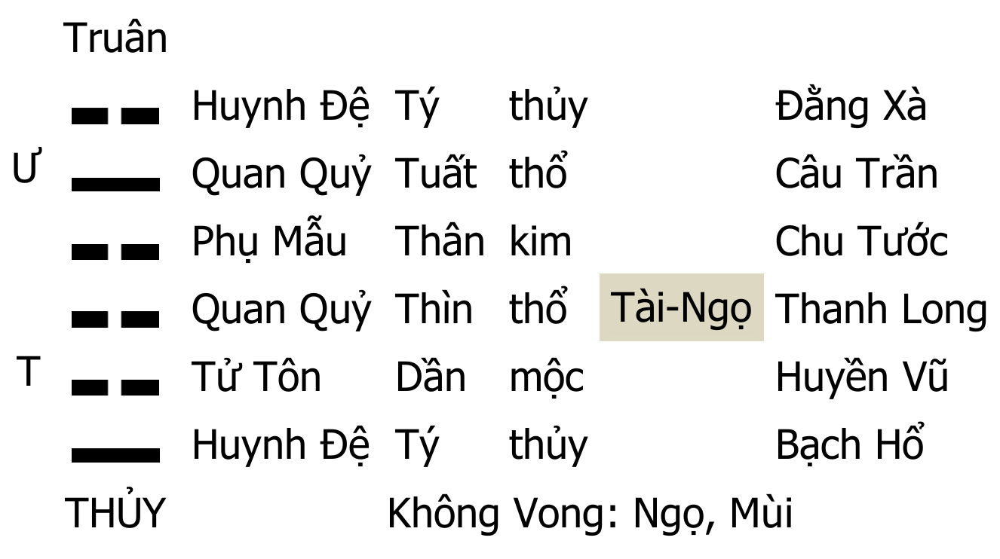
    - **Hình này chứng minh điều gì**
      - Nguyên thần suy yếu hoặc bị tổn thương không thể sinh phù Dụng thần, lấy Nguyên thần định vị căn nguyên phát sinh bệnh tật.
    - **Từ đâu mà thấy được**
      - Dụng thần Tử Tôn Dần mộc trì Thế hào 2, Nguyên thần Thê Tài Tý thủy hào 1 và hào 6 bị Nguyệt kiến Tuất thổ khắc chế.
- Sơ đồ quẻ Địa Lôi Phục thể hiện trường hợp Nguyên thần lâm Không Vong phối hợp thần sát tạo thành chứng bệnh thần kinh:
  - **Hình 6.** Quẻ Địa Lôi Phục
    - 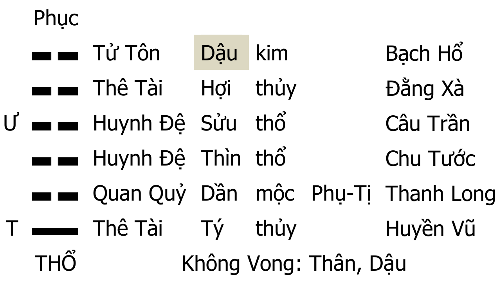
    - **Hình này chứng minh điều gì**
      - Hào Nguyên thần ngộ Không Vong kết hợp Bạch Hổ dẫn tới chứng bệnh tinh thần, cuồng loạn và đầu não trống rỗng.
    - **Từ đâu mà thấy được**
      - Tử Tôn Dậu kim hào 6 lâm Bạch Hổ gặp Không Vong (tuần Giáp Dần Không tại Thân, Dậu), chủ về đầu não khuyết thiếu, phát cuồng.

#### Ví dụ thực tế: Nữ tự đoán bệnh được Trạch Thiên Quải biến Hỏa Thiên Đại Hữu
- Bối cảnh chiêm bốc:
  - Thời gian: Ngày Giáp Thân, tháng Tuất (Tuần Không: Ngọ, Mùi).
  - Tình huống: Người phụ nữ tự gieo quẻ dự trắc tình trạng bệnh tật của bản thân.
  - Quẻ thu được: Trạch Thiên Quải biến Hỏa Thiên Đại Hữu.
- Xác định Dụng thần và đánh giá vượng suy:
  - Người tự đoán bệnh cho bản thân quy ước lấy hào Thế làm Dụng thần.
  - Hào Thế là hào 5 Tử Tôn Dậu kim phát động biến Huynh Đệ Mùi thổ, lâm Bạch Hổ.
  - Hào Thế Tử Tôn Dậu kim được Nguyệt kiến Tuất thổ tương sinh, lại được Nhật thần Thân kim tỷ hòa phù trợ, nên tự thân Dụng thần rất vượng tướng.
- Biện chứng cơ chế phát bệnh qua Nguyên thần hóa Không và hào tĩnh Không:
  - Điểm bất lợi cốt lõi trong quẻ là hào Thế phát động hóa ra Huynh Đệ Mùi thổ (Thổ sinh Kim, tức hóa xuất Nguyên thần).
  - Ngày Giáp Thân tuần trung Không Vong tại Ngọ và Mùi, nên hào biến Mùi thổ rơi vào cảnh hóa Không Vong.
  - Tại quẻ chính, hào 6 Huynh Đệ Mùi thổ cũng là Nguyên thần mang tính chất tĩnh nhưng đồng thời lâm Không Vong, hoàn toàn không thể phát huy công năng sinh trợ Dụng thần.
  - Cả hai vị trí Nguyên thần Thổ đều lâm Không, do đó áp dụng định tắc: "Nguyên thần Không mà không thể sinh Dụng thần, lấy Nguyên thần làm bệnh", xác định mấu chốt gây bệnh nằm tại hành Thổ.
- Xác định bộ phận cơ thể và tính chất bệnh lý:
  - Phối hợp hào vị và ngũ hành của bệnh hào:
    - Hành Thổ xuất hiện tại hào 5 (hào phát động biến) và hào 6 (ngoại quái quẻ chính).
    - Trong phép thủ tượng nhân thể của Lục hào, hào 5 và hào 6 quản lĩnh vùng đầu mặt, xoang và mũi.
    - Hào Thế mang hành Kim (Dậu kim) chủ quản về phế, khí quản và toàn bộ hệ thống hô hấp.
    - Thổ ngộ Không tại hào 5, hào 6 phối hợp với Thế Kim hệ hô hấp quy tụ chứng bệnh tại bộ phận mũi.
- Ứng nghiệm thực tế:
  - Đương số trên thực tế mắc chứng mũi mất hoàn toàn khứu giác, không thể ngửi thấy mùi vị, khiến tâm lý luôn phiền não và khó chịu.

### 7. Nguyên thần bị hợp trú, bởi vì tham hợp quên sinh mà không thể sinh Dụng, lấy Nguyên thần làm bệnh.

#### Nguyên lý Nguyên thần bị hợp trú và cơ chế tham hợp quên sinh
- Quy tắc định vị ổ bệnh khi Nguyên thần bị hợp:
  - Khi Nguyên thần bị Nhật thần hoặc hào khác hợp trú dẫn tới hiện tượng "tham hợp quên sinh", Nguyên thần bị ràng buộc không thể tiết khí sinh trợ Dụng thần.
  - Chức năng sinh hóa của Nguyên thần bị đình trệ, biến Nguyên thần thành căn nguyên phát sinh bệnh tật hoặc phản ánh sự ứ tắc, trì trệ của tạng phủ tương ứng.
- Tượng "hợp vướng chân" (hợp bán) trong dự trắc y học Lục Hào:
  - Hợp biểu thị sự kết dính, vướng víu, làm chậm lại nhịp độ vận động tự nhiên của khí cơ.
  - Khi Nguyên thần đại diện cho tạng phủ vận động (như nhịp đập và co bóp của tim) mà bị hợp bán, biểu hiện lâm sàng thường là suy giảm tốc độ, ứ trệ, tắc nghẽn hoặc đập chậm.

#### Ví dụ 1: Quẻ Lôi Trạch Quy Muội biến Lôi Thiên Đại Tráng - Bệnh tim đập quá chậm do Hỏa vượng hợp trú
- Quẻ đồ đối chiếu chuyển tiếp từ tài liệu gốc:
  - **Hình 7.** Quẻ Trạch Thiên Quải biến Hỏa Thiên Đại Hữu
    - 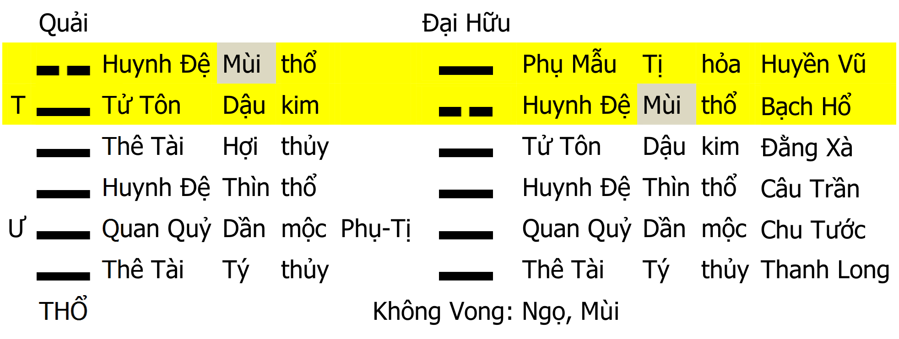
    - **Hình này chứng minh điều gì**
      - Sơ đồ quẻ Trạch Thiên Quải biến Hỏa Thiên Đại Hữu thể hiện trạng thái Nguyên thần lâm Tuần Không và quy luật biến động trong dự trắc tật bệnh.
    - **Từ đâu mà thấy được**
      - Quẻ Quải hào 6 Huynh Đệ Mùi thổ động hóa Phụ Mẫu Tị hỏa, tuần không tại Ngọ và Mùi, Dụng thần hào Thế Dậu kim cư hào 5.
- Tình huống dự trắc quẻ Lôi Trạch Quy Muội biến Lôi Thiên Đại Tráng:
  - Ngày Đinh Mùi tháng Tị, một người phụ nữ tự gieo quẻ hỏi về bệnh tình bản thân, đắc Lôi Trạch Quy Muội biến Lôi Thiên Đại Tráng.
  - Tuần không: Dần, Mão (Kim Không Vong: Dần, Mão).
  - **Hình 8.** Quẻ Lôi Trạch Quy Muội biến Lôi Thiên Đại Tráng
    - 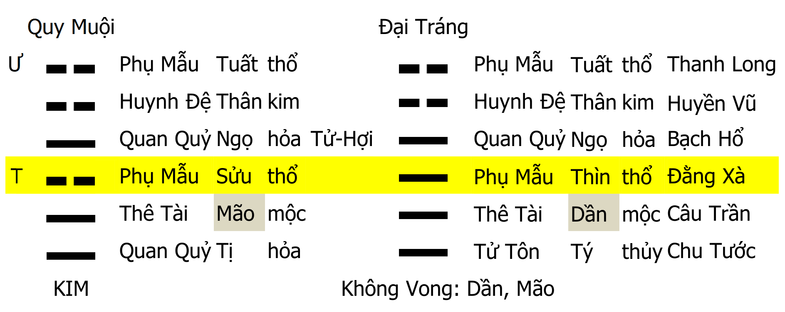
    - **Hình này chứng minh điều gì**
      - Chứng minh Nguyên thần Ngọ hỏa quá vượng bị Nhật thần Mùi hợp trú dẫn đến chứng tim đập quá chậm.
    - **Từ đâu mà thấy được**
      - Hào 4 Quan Quỷ Ngọ hỏa lâm Bạch Hổ hợp Nhật thần Mùi; hào 4 và ngũ hành Hỏa chủ về tim; tượng hợp vướng chân làm trễ nải nhịp đập.
- Phân tích cơ chế sinh khắc và ngũ hành quá vượng:
  - Xác định Dụng thần: Nữ tự đoán bệnh bản thân lấy hào Thế làm Dụng thần; hào Thế là Phụ Mẫu Sửu thổ cư hào 3.
  - Đánh giá bề ngoài của quẻ:
    - Hào Thế Sửu thổ được Nguyệt kiến Tị hỏa sinh, Nhật thần Mùi thổ tương phù, lại phát động hóa ra Phụ Mẫu Thìn thổ là Tiến thần.
    - Cả Dụng thần Thổ lẫn Nguyên thần Hỏa đều không bị khắc chế, thoạt nhìn tưởng như cơ thể bình an vô bệnh.
  - Phân tích sâu về hiện tượng quá vượng dẫn đến bệnh:
    - Trong quẻ gốc có hai hào Thổ (Tuất thổ ở hào 6 và Sửu thổ ở hào 3), hào 3 động biến thêm Thìn thổ, cộng với Nhật thần Mùi thổ, tổng cộng hội tụ bốn hào Thổ.
    - Nguyên thần hào Hỏa trong quẻ xuất hiện hai lần (Quan Quỷ Tị hỏa ở hào 1 và Quan Quỷ Ngọ hỏa ở hào 4), Nguyệt kiến lại là Tị hỏa, tạo thành thế Hỏa quá vượng sinh Thổ cực thịnh.
    - Nhật thần Mùi thổ xung hào Thế Sửu thổ thúc đẩy hào động hóa Tiến thần Thìn thổ diễn ra nhanh hơn.
    - Theo quy luật "vật cực tất phản", Hỏa sinh Thổ quá nhiều tạo thành uất tích mà sinh bệnh; hào Thế lâm Đằng Xà chủ tâm trạng phiền muộn, bứt rứt.
- Xác định cơ quan thụ bệnh và quy luật đoán ngược:
  - Định vị hào bệnh: Hào 4 Quan Quỷ Ngọ hỏa hợp với Nhật thần Mùi thổ (Ngọ Mùi lục hợp), lấy hào Ngọ hỏa này làm căn cứ chẩn đoán bệnh tật.
  - Vị trí tạng phủ: Hào 4 là hào vị của tim, ngũ hành Hỏa đại diện cho tâm hỏa và huyết mạch, do đó ổ bệnh nằm ở tim.
  - Biện chứng quá vượng suy ngược:
    - Khi ngũ hành quá vượng phải xem theo chiều ngược lại: thay vì tim đập nhanh do nhiệt thì thực chất lại là nhịp tim quá chậm.
    - Tượng Nguyên thần Ngọ hỏa bị Nhật thần hợp vướng chân (hợp bán) phong bế sức co bóp, trực tiếp biểu thị nhịp tim bị trì trệ, đập chậm lại.
- Kết quả ứng nghiệm thực tế:
  - Bệnh nhân phản hồi xác nhận trên thực tế đúng là mắc chứng nhịp tim quá chậm.

#### Ví dụ 2: Quẻ Lôi Địa Dự biến Chấn Vi Lôi - Bệnh sa và viêm tinh hoàn bên phải do Nguyên thần hào 2 bị hợp vướng chân
- Tình huống dự trắc từ thư từ phương xa:
  - Ngày Bính Thân tháng Thìn, một người đàn ông ở tỉnh Sơn Đông gửi thư nhờ đoán bệnh, tác giả gieo quẻ giúp đắc Lôi Địa Dự biến Chấn Vi Lôi.
  - Tuần không: Thìn, Tị (Mộc Không Vong: Thìn, Tị).
  - **Hình 9.** Quẻ Lôi Địa Dự biến Chấn Vi Lôi
    - 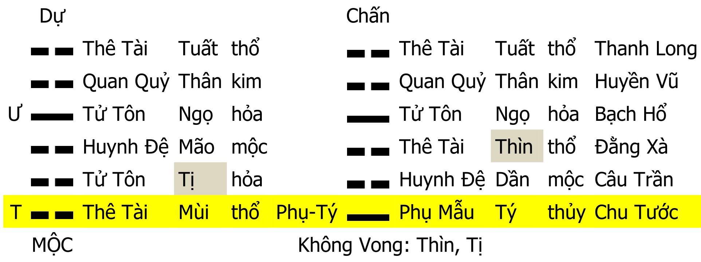
    - **Hình này chứng minh điều gì**
      - Chứng minh Nguyên thần Tị hỏa tại hào 2 ngộ Không bị Nhật Thân hợp vướng chân không thể sinh Thế, gây bệnh sa tinh hoàn bên phải.
    - **Từ đâu mà thấy được**
      - Hào 2 Tử Tôn Tị hỏa lâm Tuần Không bị Nhật thần Thân kim hợp trú; hào 2 và lục thân Tử Tôn chủ bộ phận sinh dục, lâm Câu Trần sưng to, hào âm chủ bên phải.
- Phân tích tương tác hào tượng và lý do lấy Nguyên thần làm bệnh:
  - Xác định Dụng thần: Nhận thư người khác hỏi cho chính họ, lấy hào Thế làm Dụng thần; hào Thế là Thê Tài Mùi thổ cư hào 1 (hào sơ), có Phục thần Phụ Mẫu Tý thủy phục dưới.
  - Vượng suy của Dụng thần: Hào Thế Mùi thổ được Nguyệt kiến Thìn thổ tương phù nên đắc khí vượng tướng.
  - Cơ chế bệnh lý của Nguyên thần:
    - Thổ lấy Hỏa làm Nguyên thần sinh trợ.
    - Nguyên thần Tử Tôn Tị hỏa cư hào 2 lâm Tuần Không (Thìn Tị không vong), lại bị Nhật thần Thân kim hợp trú (Tị Thân lục hợp) trói buộc chân tay.
    - Tị hỏa rơi vào thế "tham hợp quên sinh", ngộ Không lại bị hợp vướng chân nên không thể sinh trợ cho hào Thế Mùi thổ, do đó lấy chính Nguyên thần Tị hỏa làm biểu hiện bệnh tật.
- Luận giải vị trí cơ thể, lục thần và tính chất âm dương:
  - Ý nghĩa của lục thân: Tử Tôn đại diện cho bộ phận sinh dục, tinh hoàn và cơ quan sinh sản của nam giới.
  - Ý nghĩa của hào vị: Hào 2 là hào vị của hạ bộ, cơ quan sinh dục ngoài và vùng bẹn háng.
  - Phối hợp lục thần: Hào 2 lâm Câu Trần, chủ về tình trạng sưng phù, phình to, viêm tấy kết tụ.
  - Phân định âm dương trái phải:
    - Trong quy ước Lục Hào, dương chủ bên trái, âm chủ bên phải.
    - Hào 2 là hào âm (vạch đứt), chủ về phía bên phải của cơ thể bị tổn thương.
- Kết quả ứng nghiệm thực tế:
  - Người hỏi bệnh trên thực tế mắc chứng sa tinh hoàn, tinh hoàn bên phải sưng phình lớn và bị viêm tinh hoàn mãn tính.

### 8. Dụng thần Nguyệt phá, lấy Dụng thần làm bệnh, hoặc lấy Nguyệt kiến làm bệnh.

#### Nguyên lý định bệnh khi Dụng thần bị Nguyệt phá
- Khi Dụng thần lâm Nguyệt phá, căn nguyên và chứng bệnh được xác định theo hai hướng:
  - Lấy chính Dụng thần bị Nguyệt phá làm bệnh (bộ phận cơ thể tương ứng với Dụng thần bị tổn thương, suy yếu).
  - Lấy bản thân Nguyệt kiến xung phá Dụng thần làm chứng bệnh hoặc nguyên nhân gây bệnh.

#### Ví dụ thực tế: Nam đoán bệnh cho vợ được quẻ Sơn Lôi Di
- Ngày Tân Dậu tháng Tuất, một người nam đoán bệnh cho vợ, gieo được quẻ Sơn Lôi Di (Không Vong: Tý, Sửu).
- Xác định Dụng thần khi quẻ có Thê Tài lưỡng hiện:
  - Quẻ xuất hiện hai hào Thê Tài: hào 4 Thê Tài Tuất thổ (trì Thế) và hào 3 Thê Tài Thìn thổ.
  - Theo nguyên tắc chọn Dụng thần khi lưỡng hiện, lấy hào bị Nguyệt phá làm Dụng: chọn hào 3 Thê Tài Thìn thổ vì bị Nguyệt kiến Tuất thổ xung phá (Thìn Tuất tương xung).
- Căn cứ xác định vị trí phát bệnh tại tử cung:
  - Thê Tài Thìn thổ bị Nguyệt kiến Tuất thổ xung phá; Tuất thổ là Mộ khố của Tử Tôn, tượng trưng cho tử cung (nơi dung nạp, nuôi dưỡng thai nhi con cái).
  - Hào 3 là hào vị đại diện cho bụng dưới và tử cung trong cơ thể.
  - Thìn thổ là Mộ khố của hào thai Tử Tôn (thai vị của Tị hỏa tại Thìn, mộ khố thai vị).
  - Sự kết hợp đồng thời giữa hào 3, Mộ khố Tử Tôn và Mộ khố hào thai Tử Tôn đều chỉ về một vị trí duy nhất là tử cung.
- Phán đoán tính chất bệnh nan y và nguy cơ tử vong:
  - Nguyên thần lâm Câu Trần chủ về ung thư, khối u bế tắc ác tính.
  - Dụng thần lâm Nguyệt phá rất kỵ gặp thời điểm Thực Phá (thời điểm xung phá được kích hoạt thực tế).
  - Nhật thần Dậu kim tuy tương hợp với Dụng thần Thìn thổ (Thìn Dậu hợp) có thể tạm thời giải phá, nhưng Dậu kim đóng vai trò Quan Quỷ đối với quẻ, tượng trưng cho bệnh tật bám riết vào thân không thể dứt bỏ.
- Ứng nghiệm thực tế:
  - Người vợ trên thực tế đã mắc bệnh ung thư tử cung.
  - Đến tháng Thìn năm sau (thời điểm Thực Phá Dụng thần), bệnh nhân đã qua đời.

### 9. Nguyên thần Nguyệt phá, lấy Nguyên thần làm bệnh, hoặc lấy Nguyệt kiến làm bệnh.

#### Nguyên lý định bệnh khi Nguyên thần bị Nguyệt phá

- Cơ chế vận hành của Nguyên thần trong phán đoán bệnh tật:
  - Nguyên thần là cội nguồn sinh khí, nuôi dưỡng và trợ giúp cho Dụng thần.
  - Khi Nguyên thần hưng vượng, khí huyết và tạng phủ tương ứng được bồi bổ, cơ thể có sức đề kháng để vượt qua bệnh tật.
  - Khi Nguyên thần bị Nguyệt kiến xung phá dẫn tới lâm Nguyệt phá, nguồn sinh dưỡng bị cắt đứt, sinh khí tiêu tán, khiến Dụng thần rơi vào thế cô lập không còn nguồn hỗ trợ.
- Quy tắc xác định chứng bệnh theo phép Lục Hào:
  - Quy tắc thứ nhất: Lấy chính Nguyên thần bị Nguyệt phá làm bệnh (bộ phận hoặc công năng tương ứng với ngũ hành, hào vị và lục thân của Nguyên thần bị suy thoái).
  - Quy tắc thứ hai: Lấy Nguyệt kiến xung phá làm bệnh (ngũ hành của Nguyệt kiến mang tà khí tác động làm tổn thương Nguyên thần).
  - Kết hợp với tác động của Nhật thần và vị trí hào Thế để phán đoán chính xác các bệnh chứng đi kèm.

#### Quẻ đối chiếu về quy luật Nguyệt phá trong định bệnh

- **Quái lệ đối chiếu (Mục 8):** Quẻ Sơn Lôi Di thể hiện quy luật Dụng thần lâm Nguyệt phá làm bệnh:
  - **Hình 10.** Quẻ Sơn Lôi Di
    - 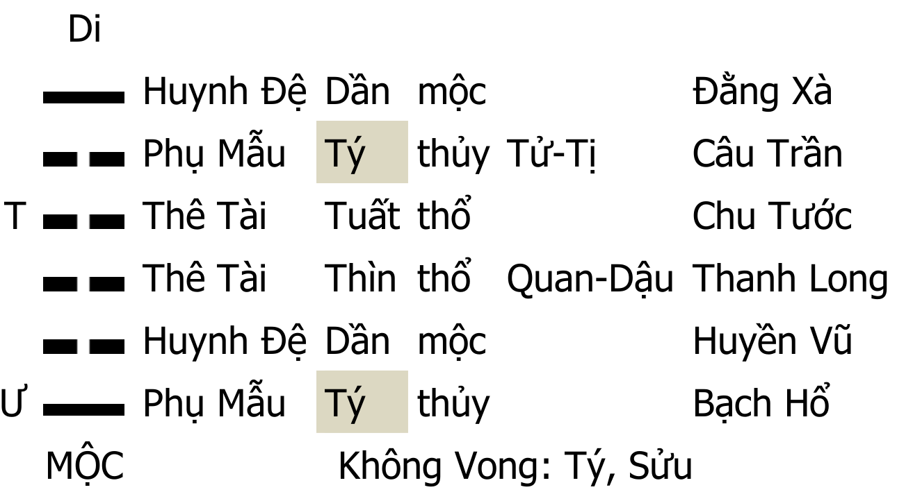
    - **Hình này chứng minh điều gì**
      - Đối chiếu nguyên lý Dụng thần Nguyệt phá gây bệnh nan y ác tính so với cơ chế Nguyên thần Nguyệt phá làm suy kiệt nguồn sinh.
    - **Từ đâu mà thấy được**
      - Thê Tài Thìn thổ hào 3 bị Nguyệt kiến Tuất thổ xung phá, Thìn thổ là Mộ khố của hào thai Tử Tôn.
  - **Phán đoán chi tiết:**
    - Căn cứ: Dụng thần Thê Tài Thìn thổ bị Nguyệt xung phá; Thìn thổ tại hào 3 là Mộ khố của Tử Tôn chủ tử cung.
    - Nhìn vào: Nguyên thần lâm Câu Trần chủ ung thư; Dụng thần lâm Nguyệt phá sợ gặp Thực Phá.
  - **Ứng nghiệm thực tế:**
    - Người vợ mắc bệnh ung thư tử cung và qua đời vào tháng Thìn (thời điểm Thực Phá).

#### Ví dụ thực tế: Nữ đoán bệnh bản thân được quẻ Hỏa Thiên Đại Hữu

- **Ví dụ thực tế:** Ngày Ất Mão tháng Hợi (Tuần không: Tý, Sửu), nữ đoán bệnh bản thân, gieo được quẻ Hỏa Thiên Đại Hữu:
  - **Hình 11.** Quẻ Hỏa Thiên Đại Hữu
    - 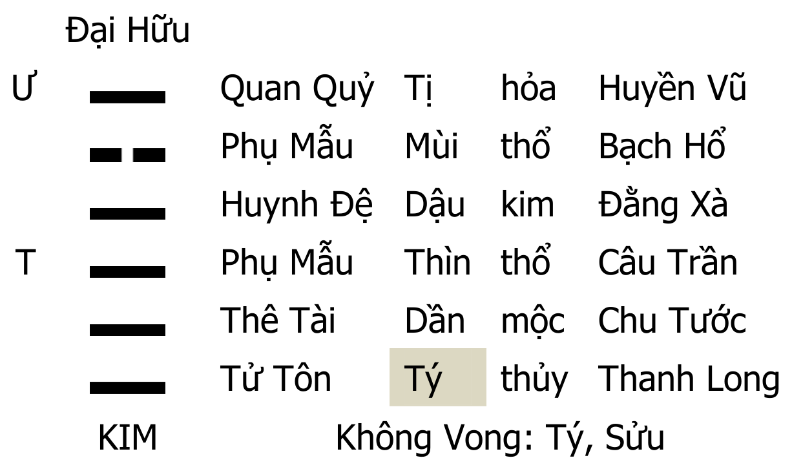
    - **Hình này chứng minh điều gì**
      - Nguyên thần Nguyệt phá không thể sinh Thế gây chứng thiếu máu, kết hợp hào Thế bị Nhật khắc gây bệnh viêm dạ dày.
    - **Từ đâu mà thấy được**
      - Hào Thế Phụ Mẫu Thìn thổ; Nguyên thần Quan Quỷ Tị hỏa hào 6 bị Nguyệt Hợi xung phá; Thìn thổ hào 3 bị Nhật Mão khắc.
  - **Phán đoán chi tiết:**
    - Căn cứ xác định Dụng thần và Nguyên thần:
      - Nữ tự đoán bệnh bản thân lấy hào Thế làm Dụng thần: Hào Thế Phụ Mẫu Thìn thổ an tại hào 3, lâm Câu Trần.
      - Hào sinh cho Thế Thổ là Hỏa, tức hào Nguyên thần là Quan Quỷ Tị hỏa an tại hào 6, lâm Huyền Vũ.
    - Nhìn vào cơ chế Nguyên thần Nguyệt phá định bệnh thiếu máu:
      - Quan Quỷ Tị hỏa tại hào 6 bị Nguyệt kiến Hợi thủy tương xung (Tị Hợi tương xung), lâm vào trạng thái Nguyệt phá.
      - Ngũ hành Thủy đại diện cho máu huyết, Tị hỏa bị Thủy xung phá mang tượng huyết dịch bị tổn hại, tiêu hao.
      - Tị hỏa lâm Nguyệt phá nên hoàn toàn mất khả năng sinh trợ cho hào Thế Phụ Mẫu Thìn thổ.
      - Ngoại quái của quẻ là Ly hỏa (Hỏa Thiên Đại Hữu có thượng quái là Ly vi hỏa, chủ về tim và tuần hoàn huyết dịch); quái Ly suy tổn không thể sinh Thế, vì vậy phán đoán người này mắc chứng thiếu máu.
    - Nhìn vào cơ chế hào Thế bị Nhật khắc định bệnh dạ dày:
      - Hào Thế mang hành Thổ, trong hệ thống ngũ hành tạng phủ thì Thổ chủ về tỳ vị.
      - Hào vị của Thế là hào 3, vị trí hào 3 trong cơ thể con người tương ứng với vùng khoang bụng và dạ dày.
      - Hào Thế Thìn thổ tại hào 3 bị Nhật kiến Mão mộc tương khắc dữ dội (Mão mộc khắc Thìn thổ).
      - Ngũ hành Thổ tại hào 3 bị mộc khắc tổn thương nặng, vì vậy xác định dạ dày suy yếu, mắc bệnh viêm dạ dày.
  - **Ứng nghiệm thực tế:**
    - Trên thực tế, người bệnh mắc chứng thiếu máu và bị viêm dạ dày.

### 10. Dụng thần gặp Bệnh địa, hoặc lấy Dụng thần làm bệnh, hoặc lấy Bệnh địa làm bệnh.

#### Nguyên lý định vị ổ bệnh qua Bệnh địa
- Khi Dụng thần lâm Bệnh địa theo vòng Trường Sinh, có hai phương thức xác định chứng bệnh:
  - Hoặc trực tiếp lấy Dụng thần làm bệnh (xem xét ngũ hành hoặc vị trí của Dụng thần bị suy tổn).
  - Hoặc lấy hào Bệnh địa làm bệnh (đặc biệt khi hào Bệnh địa phát động, phản ánh trực tiếp căn nguyên phát sinh bệnh).
- Hào độc phát nắm giữ cơ vi biến hóa trong quẻ:
  - Quẻ có duy nhất một hào động (độc phát) thì hào đó biểu thị nguyên nhân khởi phát bệnh tật, đồng thời kết hợp vị trí hào vị và lục thần để định vị chính xác bệnh chứng.

#### Phân tích quẻ Thiên Lôi Vô Vọng biến Hỏa Lôi Phệ Hạp
- Ngày Canh Thân tháng Sửu, một phụ nữ tự gieo quẻ đoán bệnh bản thân, được quẻ Thiên Lôi Vô Vọng biến Hỏa Lôi Phệ Hạp (quái cung Tốn mộc, Không Vong: Tý, Sửu):
- Xác định Dụng thần và quan hệ Bệnh địa:
  - Người nữ tự đoán bệnh cho bản thân nên lấy hào Thế làm Dụng thần.
  - Hào Thế là hào 4 Tử Tôn Ngọ hỏa; theo vòng Trường Sinh của hỏa (Trường sinh tại Dần, Mộc dục tại Mão, Quan đới tại Thìn, Lâm quan tại Tị, Đế vượng tại Ngọ, Suy tại Mùi, Bệnh tại Thân), Thân kim chính là Bệnh địa của Dụng thần Ngọ hỏa.
- Luận giải hào độc phát và triệu chứng bệnh lý:
  - Hào 5 Quan Quỷ Thân kim độc phát (biến Thê Tài Mùi thổ), độc phát chủ về nguyên nhân gây bệnh, bản thân Bệnh địa cũng chính là bệnh.
  - Vị trí hào 5 trên cơ thể đại diện cho vùng cổ họng, đốt sống cổ.
  - Chi Thân thuộc ngũ hành kim, chủ về xương cốt, chất vôi rắn.
  - Hào 5 kim lâm Câu Trần, Câu Trần có đặc tính chủ về sưng phù, phì đại, xơ cứng, tăng sinh mọc thêm.
  - Tổng hợp hào vị vùng cổ (hào 5), chất xương (hành kim), hiện tượng sưng lồi tăng sinh (Câu Trần) và Bệnh địa (Thân kim) suy ra bệnh tăng sinh xương cổ.
- Ứng nghiệm thực tế:
  - Quả nhiên người bệnh bị chứng tăng sinh xương cổ.

### 11. Nguyên thần gặp Bệnh địa, hoặc lấy Nguyên thần làm bệnh, hoặc lấy Bệnh địa làm bệnh.

#### Nguyên lý dự trắc khi Nguyên thần lâm Bệnh địa
- Bản chất và cơ chế sinh khắc của Nguyên thần trong đoán bệnh:
  - Nguyên thần là cội nguồn sinh dưỡng và bảo hộ cho Dụng thần, duy trì sinh khí của tạng phủ tương ứng.
  - Khi Nguyên thần lâm vào Bệnh địa theo vòng thập nhị Trường Sinh, Nguyên thần mất đi năng lực tương sinh, suy tổn nghiêm trọng khiến Dụng thần bị cô lập.
  - Tùy theo cấu trúc quẻ và động biến, người dự trắc hoặc lấy chính ngũ hành của Nguyên thần làm bệnh, hoặc lấy chi hào Bệnh địa làm căn nguyên phát sinh bệnh tật.
- Đối chiếu giữa Bệnh địa của Dụng thần và Bệnh địa của Nguyên thần:
  - Ở trường hợp Dụng thần gặp Bệnh địa độc phát (như quẻ Thiên Lôi Vô Vọng biến Hỏa Lôi Phệ Hạp), hào Bệnh địa Thân kim động chỉ trực tiếp vị trí tăng sinh xương cổ:
    - **Hình 12.** Sơ đồ quẻ Thiên Lôi Vô Vọng biến Hỏa Lôi Phệ Hạp
      - 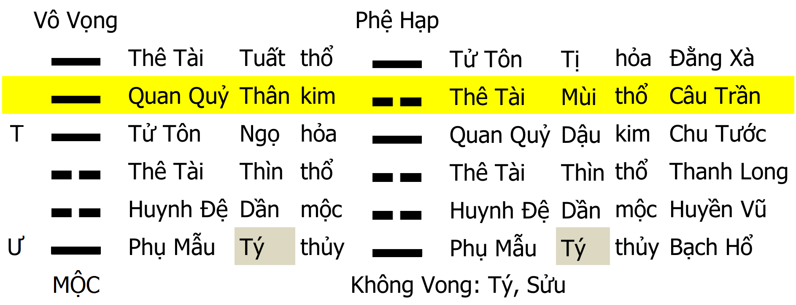
      - **Hình này chứng minh điều gì**
        - Hào Bệnh địa của Dụng thần phát động phản ánh trực tiếp nguyên nhân gây tật bệnh cục bộ.
      - **Từ đâu mà thấy được**
        - Hào 5 Quan Quỷ Thân kim là Bệnh địa của Thế Ngọ hỏa độc phát lâm Câu Trần, đối chiếu với cơ chế Nguyên thần ngộ Bệnh địa.
  - Khi chuyển sang quy tắc Nguyên thần ngộ Bệnh địa, nếu bản thân Nguyên thần bị Nhật Nguyệt khắc thương và hào Bệnh địa phát động, tổn thương nội tạng sẽ bắt nguồn từ chính Nguyên thần không thể sinh dưỡng cho Dụng thần.

#### Phân tích thực tế: Quẻ Thiên Thủy Tụng biến Hỏa Địa Tấn
- Tình huống xem quẻ: Ngày Kỷ Hợi tháng Sửu (Tuần không: Thìn, Tị), một người cha đến chiêm đoán bệnh tình của con trai, gieo được quẻ Thiên Thủy Tụng biến Hỏa Địa Tấn:
  - **Hình 13.** Sơ đồ quẻ Thiên Thủy Tụng biến Hỏa Địa Tấn
    - 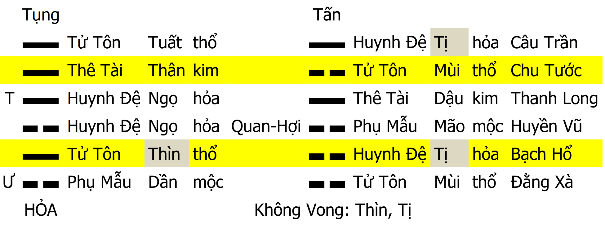
    - **Hình này chứng minh điều gì**
      - Người con trai mắc chứng bệnh tim bẩm sinh dạng khiếm khuyết tâm nhĩ (thông liên nhĩ).
    - **Từ đâu mà thấy được**
      - Nguyên thần Hỏa tại hào 3, 4 lâm Bệnh địa tại Thân kim động và bị Nhật khắc; Dụng thần Thìn thổ hào 2 hóa Tị hỏa Không Vong.
- Các bước suy luận và căn cứ định bệnh:
  - Xác định Dụng thần:
    - Chiêm đoán bệnh tật cho con trai, lấy hào Tử Tôn làm Dụng thần.
    - Trong quẻ xuất hiện Tử Tôn lưỡng hiện: Tử Tôn Tuất thổ tại hào 6 và Tử Tôn Thìn thổ tại hào 2; theo quy tắc thủ Dụng thần lấy hào phát động, chọn Tử Tôn Thìn thổ phát động làm Dụng thần.
    - Ngày Kỷ Hợi (tuần Giáp Ngọ) có Thìn và Tị lâm Tuần Không, nên Dụng thần Tử Tôn Thìn thổ động mà lâm Tuần Không.
  - Xét quan hệ của Nguyên thần:
    - Thổ lấy Hỏa làm Nguyên thần; trong quẻ Nguyên thần Hỏa hiện diện tại hào 3 (Huynh Đệ Ngọ hỏa phục Quan Quỷ Hợi thủy) và hào 4 (Huynh Đệ Ngọ hỏa trì Thế).
    - Cả hai hào Nguyên thần Ngọ hỏa đều bị Nhật kiến Hợi thủy khắc thương nặng nề, không còn sức sinh Dụng thần.
    - Hào 5 Thê Tài Thân kim phát động; theo quy luật thập nhị Trường Sinh của Hỏa (Dần sinh, Mão dục, Thìn đới, Tị quan, Ngọ vượng, Mùi suy, Thân bệnh), Thân kim chính là Bệnh địa của Hỏa.
    - Nguyên thần vừa bị Nhật khắc thương, vừa gặp hào Bệnh địa Thân kim phát động tiết khí suy vi, do đó tất yếu lấy chính Nguyên thần làm căn nguyên bệnh tật.
  - Định vị cơ quan nội tạng và tính chất bẩm sinh:
    - Ngũ hành Hỏa chủ về tim và mạch máu; vị trí hào 3 và hào 4 tương ứng vùng ngực và quả tim, khẳng định tạng tim của người bệnh có bệnh lý nghiêm trọng.
    - Hào 2 là hào vị của thai nhi (thai vị); đồng thời Nguyên thần lại ngộ Thai địa (hào thai và thai vị chuyên chủ về các yếu tố bẩm sinh tiên thiên), chứng tỏ bệnh tim này hình thành từ lúc còn trong bụng mẹ (bệnh tim bẩm sinh).
  - Xác định chính xác dạng tật khiếm khuyết:
    - Hào 2 Dụng thần Tử Tôn Thìn thổ phát động biến thành Huynh Đệ Tị hỏa; Tị hỏa chính là Nguyên thần, nhưng Tị lại lâm Tuần Không.
    - Trong phép thủ tượng Lục Hào, Không Vong mang ý nghĩa trống rỗng, khiếm khuyết, có lỗ hổng hoặc thiếu hụt cấu trúc.
    - Động hóa ra Nguyên thần lâm Không Vong biểu thị quả tim bị khiếm khuyết bẩm sinh một bộ phận, cụ thể là khuyết vách ngăn buồng tim (khiếm khuyết tâm nhĩ bẩm sinh).
- Ứng nghiệm thực tế:
  - Đúng như quẻ dự đoán, đứa con trai mắc chứng bệnh khiếm khuyết tâm nhĩ bẩm sinh.

### 12. Hào phát động khắc Nguyên thần, lấy hào phát động làm bệnh.

#### Nguyên lý hào động hóa Quan Quỷ và tổn thương Nguyên thần
- Nguyên tắc xác định căn nguyên bệnh qua hào động hóa Quan Quỷ:
  - Trong phép đoán bệnh Lục Hào, khi xuất hiện hào phát động biến hóa ra Quan Quỷ, có hai phương thức quy nạp bệnh chứng: hoặc lấy chính hào động làm bệnh, hoặc lấy hào Quan Quỷ biến ra làm ổ bệnh thực thể.
  - Quan Quỷ là đại diện của mầm bệnh, tai họa và sự biến chất của tế bào; hào động chủ về cơ vi biến hóa. Hào động mang ngũ hành tạng phủ mà hóa Quỷ biểu thị cơ quan đó đang phát sinh bệnh biến nghiêm trọng hoặc sinh khối u ác tính.
- Quy luật hào phát động làm suy tổn Nguyên thần:
  - Khi hào phát động hoặc hào biến gây tổn hại, khắc chế Nguyên thần, nguồn dưỡng khí sinh phù cho Dụng thần bị triệt tiêu, khiến bệnh tình chuyển biến theo chiều hướng nguy kịch.
  - Phải kết hợp thuộc tính quái cung (nơi đóng của quẻ), ngũ hành của hào biến, lục thú lâm trì và thần sát tuần không để luận định chính xác tính chất tạng phủ hư thực cùng tiên lượng sinh tử.

#### Phân tích quẻ Thủy Hỏa Ký Tế biến Phong Lôi Ích đoán bệnh người cha
- **Ví dụ:** Ngày Nhâm Ngọ tháng Tý năm Ất Hợi, người nam đoán bệnh cho cha, gieo được quẻ Thủy Hỏa Ký Tế biến Phong Lôi Ích (quái cung Khảm, Không Vong: Thân, Dậu):
  - **Phán đoán chi tiết:**
    - Căn cứ xác định Dụng thần và suy đoán sinh tử:
      - Người nam xem bệnh cho cha, lấy hào Phụ Mẫu làm Dụng thần. Trong quẻ, Dụng thần là Phụ Mẫu Thân kim tại hào 4.
      - Thân kim ở trạng thái cực kỳ hưu tù: sinh vào tháng Tý là tiết khí sang thủy, rơi vào đất Tử; lại bị Nhật thần Ngọ hỏa phát tiết khắc thương mãnh liệt.
      - Dụng thần Phụ Mẫu Thân kim lâm Tuần Không (tuần Giáp Tuất tuần không tại Thân, Dậu). Cổ pháp định lý: bệnh lâu ngày mà gặp Không tất phải chết (cửu bệnh phùng Không tất tử).
    - Căn cứ quy nạp vị trí và bản chất bệnh lý:
      - Quẻ gốc Thủy Hỏa Ký Tế thuộc cung Khảm; Khảm chủ về hệ tiết niệu, thận và bàng quang.
      - Nhìn vào hào 3 Huynh Đệ Hợi thủy phát động hóa ra Quan Quỷ Thìn thổ: thủy chủ về nước tiểu và sự bài tiết chất lỏng; Thìn thổ là Mộ khố của thủy (thủy khố), đóng vai trò bể chứa tích trữ nước tiểu, tương ứng với cơ quan bàng quang. Hào bài tiết hóa Quỷ chỉ rõ bàng quang bị bệnh hoạn xâm lấn.
      - Dụng thần Phụ Mẫu Thân kim lâm Câu Trần; Câu Trần chủ về sưng trướng, bướu thịt, khối u ác tính. Tổng hợp hào bàng quang hóa Quỷ và Dụng thần lâm Câu Trần khẳng định người cha bị ung thư bàng quang.
    - Phân tích các hào liên quan về triệu chứng lâm sàng:
      - Hào 5 Quan Quỷ Tuất thổ là thổ sinh kim, đóng vai trò Nguyên thần sinh phù cho Dụng thần nên không dùng hào này để đoán bệnh.
      - Nhìn vào hào 2 Quan Quỷ Sửu thổ là Mộ khố của Dụng thần Thân kim, lâm Thanh Long: hào 2 quản vị trí cơ quan sinh dục; Thanh Long chủ đau nhức, buốt rát, biểu thị triệu chứng mỗi khi đi tiểu vô cùng đau đớn, khó chịu.
      - Hào Thê Tài Ngọ hỏa phục dưới hào 3, bị Nguyệt kiến Tý thủy xung phá (Nguyệt phá), không xuất hiện trên quẻ: Thê Tài chủ về ăn uống, dinh dưỡng; Tài bị thương tổn nặng cho thấy người bệnh suy kiệt, ăn uống giảm sút nghiêm trọng.
    - Phán đoán hao tổn y dược và điềm hung tang phục:
      - Hào 6 Huynh Đệ Tý thủy lâm Nguyệt kiến động hóa Tử Tôn Mão mộc: Huynh Đệ chủ về tổn phí tiền bạc; Tử Tôn chủ về y dược, bác sĩ; tượng quẻ cho thấy gia đình đã tiêu tốn rất nhiều tiền của để chữa trị.
      - Trong quẻ có Huynh Đệ lưỡng động (hào 3 và hào 6 cùng động): Huynh Đệ phát động thì bệnh tật dây dưa nan giải. Hào 6 Huynh Đệ Tý thủy lâm Bạch Hổ phát động: Tý thủy là đất Tử của Dụng thần Thân kim; Bạch Hổ chủ về tang phục, huyết quang; Huynh Đệ chủ về việc hiếu thảo chịu tang (hiếu phục), do đó cảnh báo năm Tý sẽ gặp đại hung hiểm.
  - **Ứng nghiệm thực tế:**
    - Đến tháng Tị năm Bính Tý, người cha đã qua đời vì bệnh ung thư bàng quang.
    - Ứng nghiệm vào tháng Tị vì Tị hỏa hình khắc Dụng thần Phụ Mẫu Thân kim, ứng kỳ hình khắc làm tuyệt diệt sinh khí.

### 13. Có hào động hóa ra Kỵ thần, lấy hào động làm bệnh, hoặc lấy hào biến làm bệnh.

#### Nguyên lý xác định bệnh chứng từ hào động hóa Kỵ thần
- Trong phương pháp dự trắc bệnh tật Lục Hào, hào phát động biến hóa ra Kỵ thần là dấu hiệu trực tiếp chỉ thị mầm mống gây bệnh.
  - Có thể lấy ngay chính bản thân hào động làm vị trí hoặc triệu chứng bệnh tật.
  - Có thể lấy hào biến (hào Kỵ thần hóa xuất) làm chứng bệnh hoặc cơ quan bị tổn thương.
  - Hào động mang tính chất tác động chuyển hóa, phản ánh nguồn gốc phát sinh và tiến trình biến đổi của bệnh lý trong cơ thể.

#### Phân tích thực tế: Quẻ Sơn Địa Bác biến Phong Thủy Hoán
- Ví dụ thực tế: Ngày Canh Thân tháng Mão (Không Vong: Tý, Sửu), người phụ nữ tự đoán bệnh bản thân, gieo được quẻ Sơn Địa Bác biến Phong Thủy Hoán.
  - **Hình 14.** Sơ đồ quẻ Thủy Hỏa Ký Tế biến Phong Lôi Ích
    - 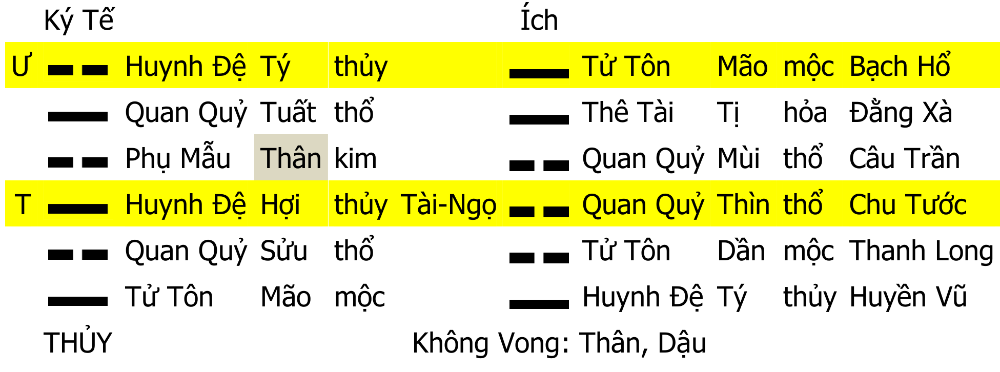
    - **Hình này chứng minh điều gì**
      - Tượng quẻ thể hiện cơ chế hào động chuyển hóa Kỵ thần, định vị vùng tổn thương và nguyên nhân phát bệnh.
    - **Từ đâu mà thấy được**
      - Hào động lâm Tuyệt hóa Kỵ thần, tương tác khắc hãm hào Thế định rõ các chứng viêm họng, u xơ tử cung và choáng váng.

##### Căn cứ Dụng thần và nhận định chứng viêm họng khô khát
- Đương số tự đoán bệnh bản thân nên lấy hào Thế làm Dụng thần.
- Hào Thế ngự tại hào 5 Tử Tôn Tý thủy, lâm Câu Trần phát động biến Quan Quỷ Tị hỏa.
- Phân tích triệu chứng vùng họng qua ngũ hành và hào vị:
  - Hào vị: Hào 5 thuộc hành Thủy đại diện cho vị trí cổ họng; Lục thân Tử Tôn chủ về ngũ quan (tai, mắt, mũi, lưỡi, da).
  - Trạng thái biến hóa: Thế Tý thủy phát động hóa Tuyệt tại Tị hỏa (Thủy tuyệt tại Hỏa).
  - Luận đoán chứng trạng: Thủy lâm Tuyệt địa chủ khô cạn tân dịch, gây khô họng; Hỏa chủ về viêm nhiệt, sinh chứng viêm sưng.
  - Kết luận: Người bệnh mắc chứng viêm họng, cổ họng khô khát khó chịu.

##### Nhận định u xơ tử cung qua hào động hóa Kỵ thần nhập Mộ
- Hào 2 Quan Quỷ Tị hỏa phát động lâm Huyền Vũ, tuyệt hào Thế Tý thủy, đồng thời hóa ra Phụ Mẫu Thìn thổ.
- Xác định bệnh lý tại hào 2 qua quan hệ ngũ hành và hào vị:
  - Phụ Mẫu Thìn thổ biến xuất chính là Kỵ thần khắc Dụng thần Tử Tôn Tý thủy, do đó hào 2 và hào biến được dùng để định vị ổ bệnh.
  - Hào vị: Hào 2 là hào vị của tử cung và bộ phận sinh dục nữ.
  - Tượng Lục thú và Lục thân: Hào Thế Tử Tôn đại diện cho tử cung; lâm Câu Trần chủ về khối u, tích tụ, sưng trướng.
  - Tượng Tuyệt Mộ: Hào 2 là Tuyệt địa của Thế Tý thủy, động hóa ra Thìn thổ là Mộ khố của Tý thủy; Thìn thổ cũng là hào vị tử cung.
  - Kết luận: Người bệnh bị u xơ tử cung (khối u tích tụ tại vùng tử cung).

##### Nhận định chứng choáng váng đầu qua hào ám động lâm Bệnh địa
- Hào 6 Thê Tài Dần mộc lâm Đằng Xà, được Nhật thần Canh Thân xung thành ám động.
- Xác định bệnh chứng vùng đầu qua vòng trường sinh và hào vị:
  - Hào vị: Hào 6 là hào trên cùng của quẻ, đại diện cho phần đầu của cơ thể.
  - Trạng thái trường sinh: Dần mộc là Bệnh địa của hào Thế Tý thủy (Thủy bệnh tại Dần).
  - Tác động của Nhật xung: Bệnh địa ngự tại hào đầu não, lại bị Nhật thần xung động chủ về trạng thái rung chuyển, chao đảo.
  - Kết luận: Người bệnh thường xuyên bị choáng váng, chóng mặt vùng đầu.

##### Xác định thời điểm phát bệnh và nguyên nhân tâm lý
- Ứng kỳ phát bệnh u xơ tử cung:
  - Hào 2 Quan Quỷ Tị hỏa phát động, ứng vào năm Tị (năm 2001 Tân Tị) phát sinh bệnh u xơ tử cung.
- Căn nguyên biến cố hôn nhân dẫn đến bệnh lý:
  - Hào 2 là phu vị (vị trí tượng trưng cho người chồng).
  - Lục thân Quan Quỷ đại diện cho người chồng; hào Ứng cũng là phu vị đối ứng.
  - Quan Quỷ Tị hỏa lâm hào Ứng hợp với Nhật thần Canh Thân (Tị Thân lục hợp), biểu thị người chồng có hành vi ngoại tình bên ngoài.
  - Quan hệ Thủy - Hỏa: Hào Thế Tý thủy gặp Quan Quỷ Tị hỏa tạo thế Thủy Hỏa tương kích, chủ về sự phẫn nộ, uất ức nội tâm.
  - Kết luận nguyên nhân: Vào năm 2001 người chồng ngoại tình, người phụ nữ chịu đựng tức giận uất ức mà phát sinh khối u xơ tử cung.

##### Kết quả ứng nghiệm thực tế
- Về bệnh u xơ tử cung: Thực tế đúng vào năm 2001 đương số do chồng ngoại tình, phẫn uất trong lòng mà phát bệnh u xơ tử cung.
- Về các chứng bệnh khác: Các chẩn đoán về viêm họng khô khát và chóng mặt đau đầu đều ứng nghiệm chính xác.

### 14. Quan Quỷ là thần rảnh rỗi, vượng là bệnh.

#### Nguyên lý Quan Quỷ nhàn thần vượng tướng sinh bệnh

- Quan Quỷ trong quẻ đoán thân thể vốn là thần rảnh rỗi (nhàn thần), nhưng khi lâm vượng tướng phát động hoặc trì Thế thì hóa thành căn nguyên bệnh tật:
  - Khi xem bệnh bản thân, nếu Quan Quỷ không bị chế phục mà lại được Nhật Nguyệt sinh phù vượng tướng thì Quỷ vượng là mầm bệnh.
  - Sơ đồ đối chiếu quẻ Bác biến Hoán (minh họa nguyên lý hào động hóa Quan Quỷ gây bệnh):
    - **Hình 15.** Quẻ Bác biến Hoán
      - 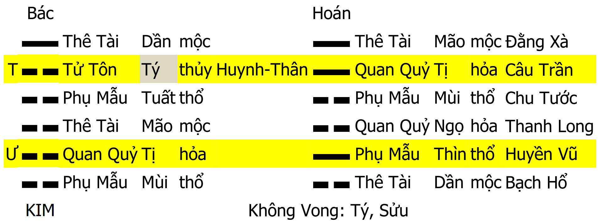
      - **Hình này chứng minh điều gì**
        - Hào động hóa Quan Quỷ hoặc Quỷ động phát tác là mầm mống gây bệnh lâm thân.
      - **Từ đâu mà thấy được**
        - Quẻ Bác biến Hoán: hào 5 Tử Tôn Tý thủy hóa Quan Quỷ Tị hỏa lâm Câu Trần, hào 2 Quan Quỷ Tị hỏa động hóa Phụ Mẫu Thìn thổ lâm Huyền Vũ.

#### Ví dụ thực tế: Phụ nữ đoán thân thể (quẻ Sơn Hỏa Bí biến Cấn Vi Sơn)

- Ngày Mậu Dần tháng Tý, một phụ nữ dự trắc tình trạng thân thể, gieo được quẻ Sơn Hỏa Bí biến Cấn Vi Sơn (Tuần không: Thân, Dậu):
  - **Hình 16.** Quẻ Sơn Hỏa Bí biến Cấn Vi Sơn
    - 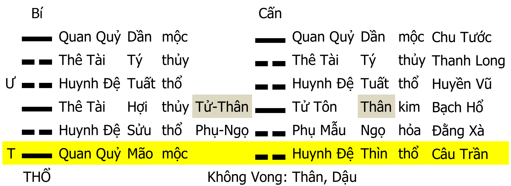
    - **Hình này chứng minh điều gì**
      - Quan Quỷ vượng tướng trì Thế và lưỡng hiện ở hào sơ, hào 6 biểu thị có bệnh lâm thân tại chân và đầu.
    - **Từ đâu mà thấy được**
      - Hào sơ Quan Quỷ Mão mộc trì Thế đắc Nguyệt sinh Nhật phù, lâm Câu Trần; hào 6 Quan Quỷ Dần mộc lâm Chu Tước.
- Các bước suy luận và phân tích quẻ:
  - Xác định Dụng thần: Người tự đoán thân thể nên lấy hào Thế làm Dụng thần.
  - Đánh giá vượng suy của hào Thế: Hào Thế Quan Quỷ Mão mộc được Nguyệt lệnh Tý thủy tương sinh, lại được Nhật thần Dần mộc tỉ phù nên cực kỳ vượng tướng; không lâm Không Vong, không bị xung phá, không bị khắc chế hay tiết khí.
  - Phân tích Quan Quỷ lưỡng hiện: Quan Quỷ trong quẻ xuất hiện hai lần (hào sơ Quan Quỷ Mão mộc và hào 6 Quan Quỷ Dần mộc); trong quẻ đoán thân thể, Quỷ vốn là nhàn thần, Quỷ vượng chính là bệnh chứng.
  - Xác định vị trí và tính chất bệnh tật qua hào vị và ngũ hành:
    - Quan Quỷ trì Thế ở hào sơ: Quan Quỷ trì Thế chủ về bệnh tật lâm thân; hào sơ đại diện cho bàn chân và chức năng đi đứng.
    - Quan Quỷ tại hào 6: Hào lục ở đỉnh quẻ đại diện cho phần đầu não.
    - Ngũ hành Mộc: Thuộc tính mộc chủ về đau nhức gân cốt, do đó người này nhất định đồng thời mắc chứng đau đầu và đau chân.
- Ứng nghiệm thực tế:
  - Đúng như quẻ dự đoán, người phụ nữ thực tế xác nhận bản thân đang bị chứng đau đầu và đau chân hành hạ.

### 15. Nhật Nguyệt khắc Dụng, hào có ngũ hành tương đồng nhập quẻ là bệnh.

- **Quy tắc đoán bệnh khi Nhật Nguyệt khắc Dụng thần và hào đồng ngũ hành nhập quẻ:**
  - Khi xem bệnh hoặc đoán niên vận, Dụng thần (hoặc hào Thế) bị Nhật kiến hoặc Nguyệt kiến khắc thương tổn, thì hào trong quẻ mang ngũ hành tương đồng với Nhật Nguyệt khắc đó chính là nơi phát sinh bệnh tật.
  - Sự kết hợp giữa hào vị (vị trí trên cơ thể), tượng quái cung, ngũ hành và lục thần lâm vào hào đồng hành sẽ xác định cụ thể cơ quan mắc bệnh và biểu hiện bệnh lý.

#### Ví dụ thực tế: Đoán niên vận cho người già mắc bệnh chân và khớp vai

- Ngày Ất Hợi tháng Dần (Không Vong: Thân, Dậu), một người già gieo quẻ đoán niên vận, được quẻ Phong Hỏa Gia Nhân biến Ly Vi Hỏa.
  - **Hình 17.** Quẻ Phong Hỏa Gia Nhân biến Ly Vi Hỏa
    - 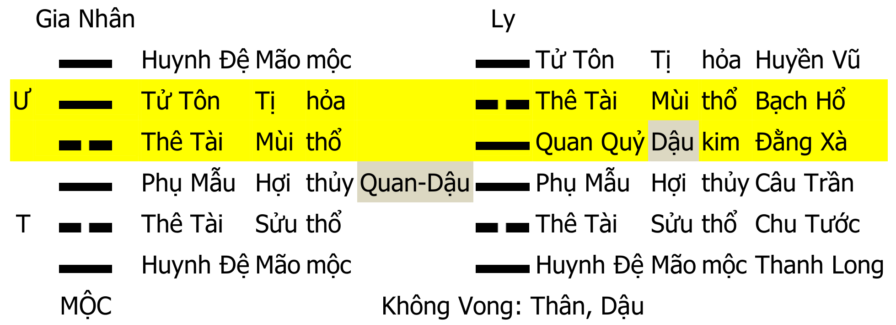
    - **Hình này chứng minh điều gì**
      - Nguyệt khắc Thế, hào Mão mộc cùng hành Mộc với Nguyệt nhập quẻ tại hào sơ và hào 6 chỉ điểm bệnh đi đứng khó khăn và viêm quanh khớp vai.
    - **Từ đâu mà thấy được**
      - Ngày Ất Hợi tháng Dần, hào Thế Sửu thổ tại hào 2 bị Nguyệt Dần mộc khắc; Mão mộc nhập hào sơ (chân) lâm Thanh Long và hào 6 (vai) lâm Huyền Vũ.
- **Tiến trình suy luận và đối chiếu tượng quẻ:**
  - Quẻ niên vận bao hàm toàn bộ thông tin về thân thể người hỏi; hào Thế Thê Tài Sửu thổ tọa tại hào 2 bị Nguyệt kiến Dần mộc khắc thương.
  - Nguyệt kiến mang ngũ hành Mộc; trong quẻ có Huynh Đệ Mão mộc mang ngũ hành tương đồng với Nguyệt nhập quẻ tại hai vị trí là hào sơ và hào 6.
  - Hào sơ là bàn chân, hào Thế tại hào 2 là chân, quẻ gốc thuộc cung Tốn cũng đại diện cho chân; ngũ hành Mộc chủ phong hàn, hào sơ lâm Thanh Long chủ về đau nhức, do đó đi đứng nhất định không thuận tiện.
  - Hào 6 đại diện cho vai và cánh tay; Huynh Đệ Mão mộc tại hào 6 lâm Huyền Vũ chủ phong hàn, phong thấp, do đó người này mắc chứng viêm quanh khớp vai.
- **Ứng nghiệm thực tế:**
  - Thực tế người già này đúng là đi đứng gặp nhiều bất tiện và bị viêm quanh khớp vai.

### 16. Dụng thần nhập Mộ, lấy hào Mộ khố đó làm bệnh, hoặc lấy Dụng thần làm bệnh.

- **Quy tắc đoán bệnh khi Dụng thần nhập Mộ:**
  - Khi xem bệnh, nếu Dụng thần nhập Mộ khố thì có thể lấy hào Mộ khố đó làm bệnh, hoặc lấy bản thân Dụng thần làm bệnh.
  - Mộ mang ý nghĩa giam giữ, che lấp, bế tắc hoặc vùi lấp; khi hào Mộ khố phát động (nhất là độc phát), hào đó nắm giữ thông tin then chốt về căn nguyên và vị trí phát sinh bệnh tật.
  - Vị trí quái (ngoại quái biểu thị bên ngoài, nội quái biểu thị bên trong), vị trí hào và tính chất ngũ hành của hào Mộ khố kết hợp chặt chẽ để chỉ điểm cụ thể loại bệnh (ngũ hành Thổ tại ngoại quái chủ về phần da thịt biểu bì bên ngoài cơ thể).

#### Ví dụ thực tế: Nữ đoán bệnh cho chồng mắc bệnh ngoài da

- Ngày Giáp Ngọ tháng Thìn (Không Vong: Thìn, Tị), người phụ nữ đoán bệnh cho chồng, gieo được quẻ Thiên Sơn Độn biến Trạch Sơn Hàm.
- **Tiến trình suy luận và phân tích tượng quẻ:**
  - Xác định Dụng thần: Nữ hỏi bệnh cho chồng nên lấy Quan Quỷ làm Dụng thần. Trong quẻ có hai hào Quan Quỷ Ngọ hỏa (tại hào 2 trì Thế và hào 4), được Nhật kiến Giáp Ngọ trợ giúp nên Dụng thần vượng tướng.
  - Phân tích động hào và tượng nhập Mộ: Hào 6 Phụ Mẫu Tuất thổ là hào độc phát trong quẻ (biến Phụ Mẫu Mùi thổ). Theo quy luật ngũ hành bát quái, Hỏa Mộ tại Tuất, do đó Dụng thần Quan Quỷ Ngọ hỏa nhập Mộ vào hào Tuất thổ độc phát này.
  - Phối hợp ngũ hành và quái vị định bệnh: Tuất thổ phát động ở hào 6 thuộc ngoại quái; ngũ hành Thổ chủ về da thịt, cơ nhục, mà Thổ nằm ở ngoại quái chủ về bề mặt cơ thể, tức là da. Do đó kết luận chồng mắc bệnh ngoài da.
- **Ứng nghiệm thực tế:**
  - Trên thực tế, người chồng đúng là mắc bệnh ngoài da.

### 17. Mộ khố của Quan Quỷ là bệnh.

- Nguyên lý Mộ khố của Quan Quỷ biểu thị chứng bệnh:
  - Khi dự trắc bệnh tật, hào Mộ khố của Quan Quỷ phát động mang thông tin trọng yếu chỉ điểm vị trí và bản chất của mầm bệnh tích tụ.
  - Vị trí hào vị của Mộ khố biểu thị khu vực giải phẫu hoặc bộ phận cơ thể phát sinh bệnh tật.
  - Lục thần phối cùng hào Mộ khố phản ánh biểu hiện lâm sàng cụ thể của bệnh trạng (như Câu Trần chủ sưng trướng, bế tắc, ứ trệ).

#### Ví dụ thực tế: Quẻ Phong Thủy Hoán biến Thủy Địa Tỷ

- Ngày Bính Tý tháng Ngọ, một người nam tự đoán bệnh bản thân, gieo được quẻ Phong Thủy Hoán biến Thủy Địa Tỷ (tuần Không Vong: Thân, Dậu).
  - **Hình 19.** Quẻ Phong Thủy Hoán biến Thủy Địa Tỷ
    - 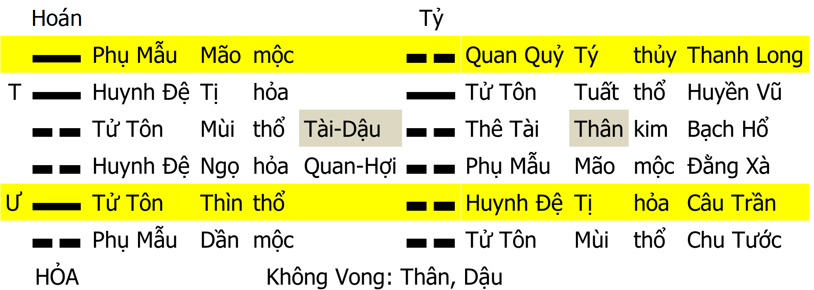
    - **Hình này chứng minh điều gì**
      - Hào Thế Tị hỏa tại hào 5 bị Nhật khắc chứng minh bệnh ở tim; hào 2 Thìn thổ là Mộ khố của Quan Quỷ lâm Câu Trần phát động chỉ bệnh sưng phù ở chân.
    - **Từ đâu mà thấy được**
      - Hào 5 Thế Tị hỏa bị Nhật kiến Tý thủy khắc thương; hào 2 Tử Tôn Thìn thổ là Mộ khố của Thủy Quỷ phát động mang Câu Trần (hào 2 là chân, Câu Trần chủ sưng trướng).
- Quá trình phân tích suy luận theo dịch lý:
  - Lấy hào Thế làm Dụng thần đại diện cho người hỏi:
    - Hào Thế Huynh Đệ Tị hỏa ngự tại hào 5, bị Nhật kiến Tý thủy khắc thương.
    - Hào 5 là hào vị của ngực và tim, ngũ hành Hỏa tương ứng với tâm tạng, do đó phán đoán chức năng tim không tốt, có bệnh tim.
  - Căn cứ hào Mộ khố của Quan Quỷ để xác định ổ bệnh thứ hai:
    - Trong quẻ, Quan Quỷ thuộc hành Thủy (Quan Quỷ Hợi thủy phục tàng tại hào 3, biến xuất Quan Quỷ Tý thủy tại hào 6).
    - Thủy mộ tại Thìn, vì vậy hào Thìn thổ chính là Mộ khố của Quan Quỷ.
    - Hào 2 Tử Tôn Thìn thổ phát động hóa Huynh Đệ Tị hỏa, lâm Câu Trần.
    - Hào 2 là hào vị của cẳng chân, bàn chân; Câu Trần có tượng chủ về sưng trướng, phù thũng; vì vậy phán đoán hai chân bị sưng phù.
- Kết quả ứng nghiệm thực tế:
  - Đúng như quẻ dự đoán, đương số mắc bệnh tim và bị chứng sưng phù ở hai chân.

#### Quẻ liên hệ bổ trợ: Quẻ Thiên Sơn Độn biến Trạch Sơn Hàm

- Đối chiếu nguyên lý Mộ khố Quan Quỷ qua quẻ Thiên Sơn Độn biến Trạch Sơn Hàm:
  - Hào Mộ khố của Quan Quỷ động biểu thị ổ bệnh cư ngụ tại phần đầu của cơ thể.
    - **Hình 18.** Quẻ Thiên Sơn Độn biến Trạch Sơn Hàm
      - 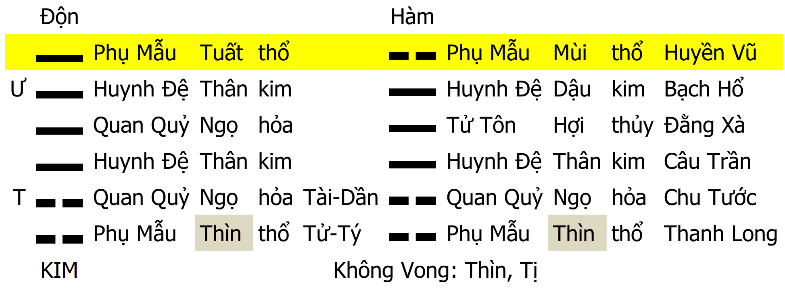
      - **Hình này chứng minh điều gì**
        - Hào 6 Phụ Mẫu Tuất thổ là Mộ khố của Quan Quỷ Ngọ hỏa phát động, chứng minh vị trí bệnh tật quy tụ tại vùng đầu não.
      - **Từ đâu mà thấy được**
        - Quan Quỷ Ngọ hỏa (Hỏa) nhập Mộ tại Tuất; hào 6 Tuất thổ phát động hóa thoái Mùi thổ lâm Huyền Vũ; hào 6 là đầu não, Huyền Vũ chủ hôn ám, choáng váng.
  - Cơ chế suy luận bổ trợ:
    - Quan Quỷ Ngọ hỏa trì Thế và cư hào 4, Hỏa sinh vượng nhập Mộ khố tại Tuất thổ.
    - Hào 6 Phụ Mẫu Tuất thổ phát động lâm Huyền Vũ, hào 6 ứng với đầu, thể hiện bệnh trạng tích tụ gây tắc nghẽn, hoa mắt chóng mặt tại vùng đầu.

### 18. Mộ khố của Kỵ thần là bệnh.

#### Nguyên lý định bệnh bằng Mộ khố của Kỵ thần
- Mộ khố của Kỵ thần trong quẻ có thể trực tiếp lấy làm căn cứ để xác định vị trí phát sinh bệnh tật và tính chất bệnh lý:
  - Khi Kỵ thần nhập Mộ hoặc xuất hiện hào Mộ khố của Kỵ thần trên quẻ, hào Mộ khố này tích tụ khí của Kỵ thần gây ảnh hưởng tiêu cực lên cơ thể.
  - Vị trí cơ quan bị bệnh được chuẩn đoán thông qua sự kết hợp giữa hào vị của Mộ khố, ngũ hành, thuộc tính lục thân của khố (như Tài khố, Quan khố...) và quái cung tương ứng.

#### Ví dụ thực tế: Nữ đoán niên vận đắc Hỏa Thiên Đại Hữu biến Thiên Phong Cấu
- Ngày Ất Hợi tháng Dần (KIM Không Vong: Thân, Dậu), một phụ nữ gieo quẻ dự đoán niên vận (vận hạn trong năm), đắc quẻ Hỏa Thiên Đại Hữu biến Thiên Phong Cấu:
- Thông tin thân thể và bệnh tật được bao hàm đầy đủ ngay trong quẻ niên vận:
  - Dù đương số hỏi việc niên vận nói chung, các hào thế vị và biến động sinh khắc của lục thân vẫn phản ánh chính xác tình trạng sức khỏe thực tế của bản thân.
- Luận đoán bệnh lý buồng trứng và tắc ống dẫn trứng căn cứ vào hào Thế:
  - Hào Thế Phụ Mẫu Thìn thổ lâm ở hào 3, bị Nguyệt kiến Dần mộc khắc thương nặng nề.
  - Hào 3 là hào vị của bụng dưới, bộ phận sinh dục và tử cung.
  - Địa chi Thìn thổ là Thủy khố (Mộ khố của Tử Tôn Tý/Hợi thủy); đối với nữ giới, Tử Tôn đại diện cho con cái và chức năng sinh sản, do đó Mộ khố của Tử Tôn cũng chủ về tử cung và buồng trứng.
  - Hào Thế lâm Câu Trần: Thần sát Câu Trần chủ về sưng trướng, bế tắc, ứ trệ, tắc nghẽn; kết hợp lại cho thấy thông tin ống dẫn trứng không thông suốt và chức năng buồng trứng bị trở ngại.
- Luận đoán bệnh lý thực quản và hệ thống hô hấp căn cứ vào Mộ khố của Kỵ thần:
  - Hào 5 Phụ Mẫu Mùi thổ là Mộ khố của Mộc: Quẻ lấy Thế Thìn thổ làm trung tâm, Kỵ thần khắc Thế là Thê Tài Dần mộc; Mùi thổ là Mộ khố của Kỵ thần (cũng là Tài khố).
  - Hào vị 5 là vị trí của vùng ngực.
  - Thuộc tính tượng trưng: Tài khố đại diện cho thực quản và đường ống dẫn tiêu hóa/hô hấp.
  - Thuộc tính quái cung: Cung Càn chủ quản hệ thống hô hấp và phổi; hào Mùi thổ ở vị trí này biểu thị lồng ngực, thực quản và đường hô hấp đều gặp trục trặc, hoạt động kém.
- Ứng nghiệm thực tế:
  - Đương số trên thực tế bị viêm thực quản, hệ hô hấp hoạt động không tốt.
  - Chức năng buồng trứng gặp nhiều trở ngại, ống dẫn trứng bị tắc.

### 19. Quẻ độc phát, hào độc phát có thể biểu thị chứng bệnh.

- Nguyên lý hào độc phát biểu thị chứng bệnh:
  - Khi trong quẻ chỉ xuất hiện một hào động duy nhất (quẻ độc phát, hào độc phát), toàn bộ cơ triệu và thông tin biến dịch thường quy tụ tập trung vào hào phát động đó.
  - Trường hợp hào độc phát không sinh Dụng thần, không khắc Dụng thần và Nguyên thần, đồng thời không phải là Bệnh địa của Dụng thần thì bản thân hào độc phát đó trực tiếp biểu thị triệu chứng hoặc vị trí phát bệnh.
  - Đối chiếu cấu trúc hào động với quẻ đa hào phát động:
    - **Hình 20.** Quẻ Hỏa Thiên Đại Hữu biến Thiên Phong Cấu
      - 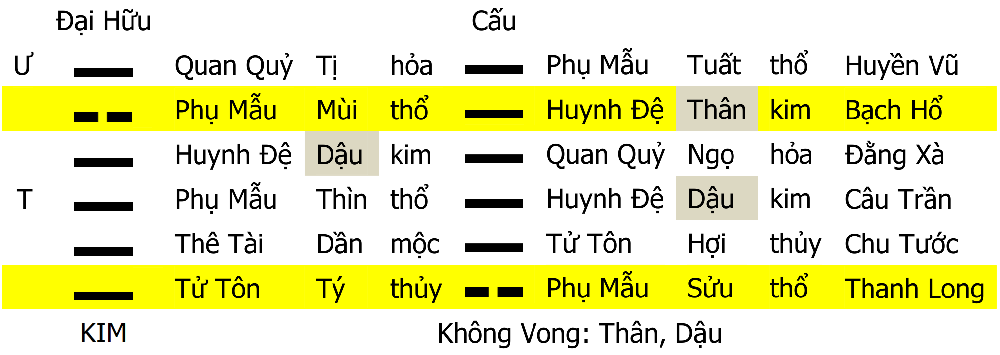
      - **Hình này chứng minh điều gì**
        - Minh họa cấu trúc quẻ đa hào động (hào 1 và hào 5 cùng động) đối chiếu với đặc điểm quy tụ cơ triệu của quẻ độc phát.
      - **Từ đâu mà thấy được**
        - Hào 1 Tử Tôn Tý thủy và hào 5 Phụ Mẫu Mùi thổ cùng phát động, phân tán cơ triệu thay vì tập trung vào một hào độc phát.

#### Ví dụ thực tế: Nữ tự đoán bệnh thắt lưng ngứa ngáy và có vết đen

- Bối cảnh chiêm đoán: Ngày Kỷ Mão tháng Tý, một phụ nữ tự đoán bệnh bản thân, gieo được quẻ Sơn Địa Bác biến Cấn Vi Sơn.
  - Phân tích tương quan quái hào và hào vị:
    - Người xem tự đoán bệnh lấy hào Thế làm Dụng thần: hào Thế tại hào 5 Tử Tôn Tý thủy lâm Chu Tước.
    - Phục thần: Huynh Đệ Thân kim phục dưới hào 5 Tử Tôn Tý thủy.
    - Tuần trung Không Vong: Thân kim và Dậu kim (KIM Không Vong).
    - Toàn quẻ chỉ có duy nhất hào 3 Thê Tài Mão mộc phát động biến Huynh Đệ Thân kim, tạo thành thế quẻ độc phát.
  - Căn cứ biện chứng hào độc phát thành bệnh:
    - Hào 3 Mão mộc độc phát không sinh Dụng thần Tý thủy (thủy sinh mộc, mộc tiết khí Dụng thần chứ không sinh Dụng).
    - Hào 3 Mão mộc không khắc Dụng thần Tý thủy, cũng không khắc Nguyên thần Thân kim (kim khắc mộc, mộc không khắc được kim).
    - Hào Mão mộc cũng không phải là Bệnh địa của Dụng thần Tý thủy.
    - Vì hào độc phát không đóng vai trò sinh trợ hay khắc hại Dụng thần và Nguyên thần, nên bản thân hào Mão mộc chính là nơi chỉ định chứng bệnh.
  - Biện chứng triệu chứng và vị trí phát bệnh qua ngũ hành, lục thần, quái tượng:
    - Thuộc tính ngũ hành: Mộc chủ về phong, chủ về đau nhức ngứa ngáy.
    - Thần sát phối chiếu: Mão mộc lâm Huyền Vũ, Huyền Vũ chủ về sắc đen, tối tăm, mờ ám.
    - Hào vị cơ thể: Hào 3 là hào vị chủ về vùng thắt lưng.
    - Quái tượng quẻ biến: Ngoại quái của quẻ biến Cấn Vi Sơn là quái Cấn, Cấn tượng trưng cho lưng.
    - Kết luận chẩn đoán: Vùng lưng và thắt lưng ngứa ngáy khó chịu, đồng thời xuất hiện vết đốm màu đen.
  - Sơ đồ quẻ và biểu hiện hào độc phát:
    - **Hình 21.** Quẻ Sơn Địa Bác biến Cấn Vi Sơn
      - 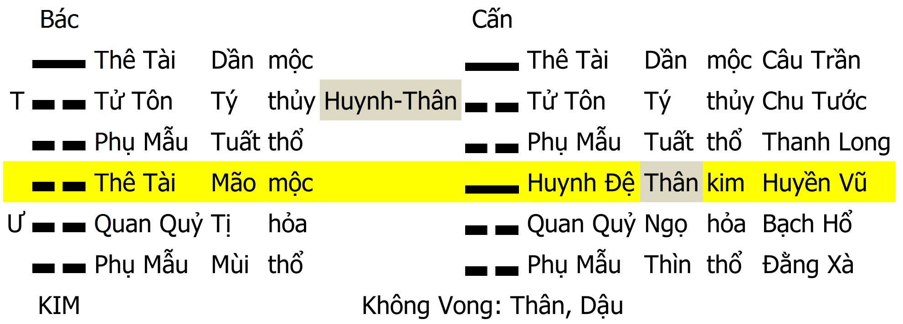
      - **Hình này chứng minh điều gì**
        - Hào 3 Thê Tài Mão mộc độc phát lâm Huyền Vũ biểu thị chứng đau ngứa và vết thâm đen ở vùng lưng và thắt lưng.
      - **Từ đâu mà thấy được**
        - Hào 3 Mão mộc động không sinh khắc Dụng thần Tý thủy, mộc chủ ngứa, Huyền Vũ chủ màu đen, hào 3 là thắt lưng, ngoại quái Cấn là lưng.
- Ứng nghiệm thực tế:
  - Người phụ nữ xác nhận đúng là vùng lưng bị ngứa ngáy và có vết đen ở thắt lưng như lời đoán.

### 20. Nguyên thần hóa Không, hóa Phá, hóa Thoái, lấy Nguyên thần làm bệnh.

#### Nguyên lý định vị bệnh chứng từ Nguyên thần

- Nguyên thần mang vai trò tương sinh Dụng thần, nhưng khi rơi vào các thế biến thoái hoặc bị tổn thương sẽ trở thành biểu hiện của bệnh tật:
  - Nếu Nguyên thần lâm Không Vong, bị Nguyệt phá, hoặc phát động mà hóa Thoái thần thì không còn khả năng sinh trợ Dụng thần.
  - Trong trường hợp Dụng thần tự vượng tướng mà Nguyên thần phát động bị suy hao, khắc thương hay thoái hóa, người dự trắc chuyển sang lấy chính hào Nguyên thần làm tiêu điểm để xác định chứng bệnh.

#### Ví dụ thực tế: Chứng phù thũng chi dưới do Nguyên thần động thoái bị khắc

- Ngày Giáp Thân tháng Dần, một người phụ nữ dự đoán bệnh tật của bản thân, gieo được quẻ Trạch Thiên Quải biến Đoài Vi Trạch (Tuần không: Ngọ, Mùi).
- Xác lập Dụng thần và nhận định trạng thái hào:
  - Dự đoán bệnh bản thân nên lấy hào Thế làm Dụng thần; hào Thế Tử Tôn Dậu kim được Nhật thần Thân kim tỉ phù, Nguyệt kiến Dần mộc không khắc nên thuộc diện vượng tướng.
  - Hào Nguyên thần là Huynh Đệ Thìn thổ tại hào 3 phát động sinh Thế, nhưng lâm thế động hóa thoái (biến Huynh Đệ Sửu thổ), đồng thời bị Nguyệt kiến Dần mộc khắc thương, do đó mất năng lực sinh Dụng thần và trở thành bệnh hào.
- Luận giải vị trí cơ thể và cơ chế phát sinh bệnh tật:
  - Hào vị phản ánh bộ phận cơ thể: Hào 3 chủ về đùi, Quan Quỷ Dần mộc lâm hào 2 chủ về chân, định vị bệnh tại vùng chi dưới.
  - Lục thân và Lục thú định tính triệu chứng: Thổ chủ về da thịt, lâm Câu Trần chủ về sưng trướng, biểu thị hiện tượng sưng phù ngoài da ở chi dưới.
  - Chi thổ định nghĩa cơ chế bệnh lý: Hào Thìn thổ là thủy khố (kho chứa nước), biểu thị việc cơ thể không bài tiết hay loại bỏ được lượng nước tồn dư, tích tụ lại gây ra chứng phù thũng.
- Ứng nghiệm thực tế:
  - Người phụ nữ xác nhận thực tế đúng bị chứng sưng phù ứ nước ở phần chân và chi dưới.

### 21. Dụng thần phục tàng, bị áp chế, có thể lấy hào Phi làm bệnh. Hoặc lấy Phục thần làm bệnh.

#### Nguyên lý luận đoán Dụng thần phục tàng và bị áp chế

- **Quy tắc xác định tiêu điểm bệnh khi Dụng thần phục tàng**:
  - Khi Dụng thần không xuất hiện trực tiếp trên quẻ chính mà phải phục tàng dưới một hào khác (hào Phi thần), đồng thời lại bị áp chế (bị Phi thần khắc, bị hào động khắc, hoặc tiết khí suy kiệt), người dự trắc có thể linh hoạt:
    - Lấy hào Phi thần làm nguyên nhân hoặc cơ quan mang bệnh.
    - Hoặc lấy chính Phục thần làm chứng bệnh cụ thể.
  - Mối tương tác giữa hào vị (vị trí hào), lục thần lâm hào, ngũ hành sinh khắc và tượng quẻ cung cấp đầy đủ thông tin về tính chất bệnh lý, phản ứng tâm lý cũng như thời điểm bệnh biến đổi tăng giảm.

#### Quẻ minh họa liên kết: Trạch Thiên Quải biến Đoài Vi Trạch

- Sơ đồ quẻ đối chiếu cấu trúc Phục thần và hào động hóa thoái (in kèm trang 23):
  - **Hình 22.** Quẻ Trạch Thiên Quải biến Đoài Vi Trạch
    - 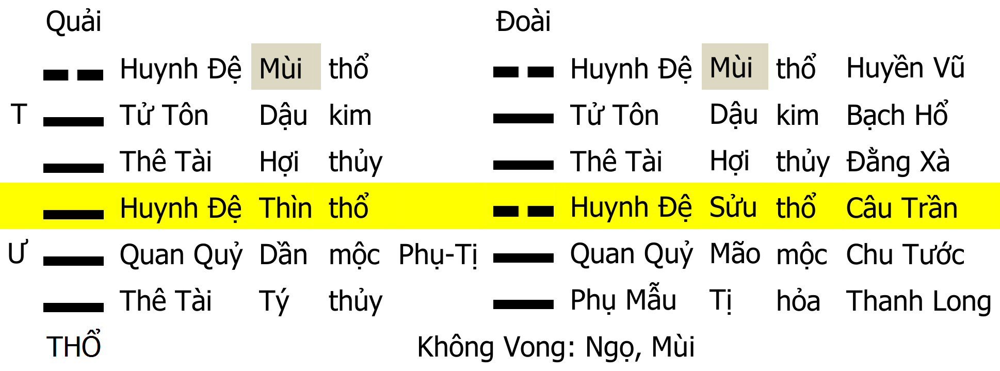
    - **Hình này chứng minh điều gì**
      - Cung cấp hình ảnh minh họa về quẻ có Phục thần ẩn dưới hào Phi (Phụ Mẫu Tị hỏa phục dưới hào 2 Quan Quỷ Dần mộc) và hào động hóa thoái thần (hào 3 Huynh Đệ Thìn thổ hóa Sửu thổ), phản ánh trạng thái suy thoái hoặc ẩn tàng của lục thân.
    - **Từ đâu mà thấy được**
      - Hào 2 Quan Quỷ Dần mộc có Phụ Mẫu Tị hỏa phục tàng; hào 3 Huynh Đệ Thìn thổ phát động hóa Huynh Đệ Sửu thổ thoái thần lâm Câu Trần; hào 6 Huynh Đệ Mùi thổ tuần không.

#### Ví dụ thực tế: Quẻ Sơn Phong Cổ biến Cấn Vi Sơn đoán bệnh con gái

- Tình huống xem bói và thiết lập quẻ:
  - Thời gian: Ngày Bính Thìn, tháng Dậu (năm Giáp Thân 2004).
  - Đối tượng: Người cha đến xem bệnh tình cho con gái ruột.
  - Quẻ nhận được: Sơn Phong Cổ biến Cấn Vi Sơn.
  - Tuần không: Tuần Giáp Dần, hào Không Vong tại Tý và Sửu.
  - **Hình 23.** Quẻ Sơn Phong Cổ biến Cấn Vi Sơn
    - 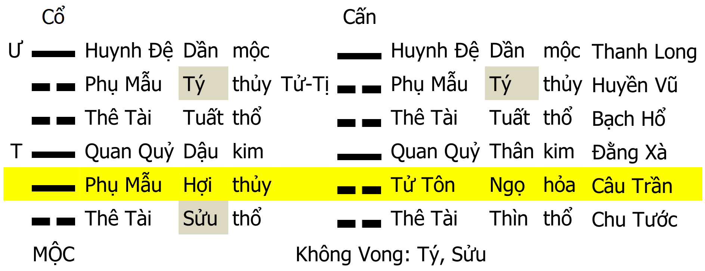
    - **Hình này chứng minh điều gì**
      - Dụng thần Tử Tôn Tị hỏa phục tàng dưới Phi thần và bị hào động khắc thương trùng trùng, chứng minh con gái mắc bệnh tâm thần, u uất, sợ ra ngoài và bệnh nặng về đêm.
    - **Từ đâu mà thấy được**
      - Tử Tôn Tị hỏa phục tại hào 5 dưới Phi thần Phụ Mẫu Tý thủy (Không Vong) lâm Huyền Vũ; hào 2 Phụ Mẫu Hợi thủy động khắc; hào 5 là đường đi, hành thủy chủ ban đêm.
- Diễn trình suy luận và luận giải quẻ tượng:
  - Xác lập Dụng thần:
    - Đoán bệnh cho con gái, lấy hào Tử Tôn làm Dụng thần.
    - Trong quẻ chính Sơn Phong Cổ, lục thân Tử Tôn không xuất hiện ở các hào chính vị mà phục tàng dưới hào 5 Phụ Mẫu Tý thủy (`Tử-Tị`).
  - Phân tích triệu chứng tâm lý và u uất:
    - Dụng thần Tử Tôn Tị hỏa phục dưới hào 5 lâm Huyền Vũ. Huyền Vũ chủ về u tối, sầu não, muộn phiền, biểu thị tâm trạng của người bệnh luôn rầu rĩ, u uất, hoang tưởng lo âu.
    - Dụng thần Tị hỏa phục tàng bị Phi thần Phụ Mẫu Tý thủy khắc phạt ngay tại chỗ.
    - Đồng thời, ở nội quái có hào 2 Phụ Mẫu Hợi thủy phát động (biến Tử Tôn Ngọ hỏa lâm Câu Trần) hợp lực xung khắc dữ dội vào Dụng thần Tị hỏa.
  - Căn cứ luận đoán chứng sợ ra ngoài và sợ ngồi xe:
    - Hào vị số 5 là tượng của đường đi, lộ trình, giao thông đi lại.
    - Dụng thần phục tàng lại bị giam hãm và khắc hại nghiêm trọng ngay tại hào 5, biểu thị người bệnh mang tâm lý sợ ra khỏi nhà, sợ ra đường, không dám tiếp xúc không gian bên ngoài.
  - Xác định quy luật thời gian phát bệnh ("đêm trọng ngày khinh"):
    - Các hào khắc hãm Dụng thần đều thuộc hành thủy (Phụ Mẫu Hợi thủy phát động và Phi thần Phụ Mẫu Tý thủy).
    - Ngũ hành thủy đại diện cho ban đêm, bóng tối và khí âm hàn.
    - Vì vậy, tác giả kết luận bệnh tình mang tính quy luật rõ rệt: ban đêm bệnh tình phát tác trầm trọng, còn ban ngày thì nhẹ hơn.
- Kết quả và ứng nghiệm thực tế:
  - Thời điểm đoán quẻ là vào năm 2004; người bệnh đã bắt đầu phát bệnh tinh thần từ cuối năm 2003.
  - Bệnh tình diễn biến nghiêm trọng nhất vào ban đêm, đặc biệt là trong giờ Hợi (21h - 23h) và giờ Tý (23h - 01h).
  - Người con gái hoàn toàn không thể ngồi xe và luôn cảm thấy sợ hãi tột cùng mỗi khi phải đi lại ra ngoài.

### 22. Quan Quỷ không hiện trên quẻ, Phi thần của nó có thể làm căn cứ phán đoán bệnh tật.

#### Nguyên lý định bệnh qua Phi thần khi Quan Quỷ phục tàng

- Quan Quỷ là tượng trưng cho bệnh tật; khi Quan Quỷ không xuất hiện trên quẻ chính (phục tàng), hào Phi thần (hào mà Quan Quỷ phục dưới) được sử dụng làm căn cứ then chốt để xác định vị trí phát sinh bệnh.
- Quẻ dự trắc niên vận (vận hạn cả năm) luôn bao hàm đồng thời các thông tin về sức khỏe và biến động cơ thể của đương số.

#### Ví dụ thực tế: Nữ đoán niên vận mắc u xơ tử cung

- Chiêm đoán vào ngày Mậu Tuất, tháng Tý (Không vong: Thìn, Tị), một phụ nữ xem vận hạn trong năm được quẻ Sơn Lôi Di biến Hỏa Lôi Phệ Hạp:
- Phân tích động hào và phục thần:
  - Hào 4 Thê Tài Tuất thổ trì Thế phát động hóa ra Quan Quỷ Dậu kim:
    - Thế phát động biến Quỷ biểu thị trong năm thân thể phát sinh bệnh tật.
    - Hào Thế Tuất thổ là Mộ khố của Tử Tôn (chủ thai nhi, sinh nở) có tượng là tử cung, nhưng hào 4 thuộc về ngực sườn nên vị trí hào hơi cao so với thực tế của cơ quan này.
  - Căn cứ Phi thần xác định chuẩn xác vị trí bệnh tại tử cung:
    - Quan Quỷ Dậu kim là bệnh không xuất hiện trên quẻ chính mà phục tàng dưới hào 3 Thê Tài Thìn thổ.
    - Hào 3 trong đồ hình nhân thể đại diện cho vùng bụng dưới, tử cung.
    - Phi thần Thìn thổ là Thai khố của Tử Tôn, Thai khố cũng là biểu tượng của thai vị và tử cung.
    - Quan Quỷ phục dưới hào 3 lại lâm Bạch Hổ, Bạch Hổ chủ về bệnh tật và huyết quang, khẳng định tử cung gặp vấn đề bệnh lý.
  - Biện chứng bản chất khối u xơ tử cung:
    - Nguyên thần trong quẻ bị khắc chế, khí lực suy yếu.
    - Cừu thần là Nguyệt kiến Tý thủy nhập quẻ tại hào 1 và hào 5, trong đó hào 1 Phụ Mẫu Tý thủy lâm Câu Trần.
    - Thổ chủ về thịt, cơ nhục; Câu Trần chủ về sưng trướng, bế tắc, ứ đọng và khối u.
    - Tổng hợp tượng Thai khố lâm Bạch Hổ và Câu Trần sưng kết chỉ ra bệnh nhân mắc u xơ tử cung.
- Kết quả ứng nghiệm thực tế:
  - Người nữ xác nhận đúng là bản thân đang mắc bệnh u xơ tử cung.

### 23. Quẻ cá biệt, lấy thuộc tính quái cung của quẻ chính làm bệnh.

#### Nguyên lý định bệnh theo quái cung quẻ chính
- Quy luật quẻ cá biệt lấy thuộc tính ngũ hành quái cung làm căn cứ bệnh tật:
  - Thông thường khi dự trắc bệnh tật bằng Lục Hào, người luận đoán căn cứ vào Dụng thần, Kỵ thần, Nguyên thần, Quan Quỷ hoặc các hào động biến kết hợp hào vị và lục thần để định bệnh.
  - Tuy nhiên, trong một số trường hợp cá biệt, vị trí và chứng bệnh thực tế không xuất hiện ở các hào thông thường mà quy về chính thuộc tính ngũ hành của quái cung quẻ gốc (quẻ chính).
  - Quẻ thuần Càn thuộc quái cung Càn, mang ngũ hành Kim; trong hệ thống đối ứng tạng phủ cơ thể người, Kim đại diện cho tạng phế (phổi).

#### Phân tích quẻ Càn Vi Thiên biến Trạch Thiên Quải
- Ngày Nhâm Thân tháng Sửu, một người nữ đoán bệnh cho cha, gieo được quẻ Càn Vi Thiên biến Trạch Thiên Quải (quái cung Càn kim, Không Vong: Tuất, Hợi):
  - **Hình 24.** Quẻ Sơn Lôi Di biến Hỏa Lôi Phệ Hạp
    - 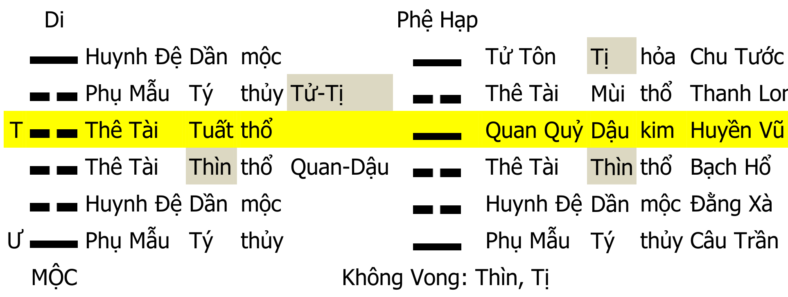
    - **Hình này chứng minh điều gì**
      - Bệnh tình thực tế của người cha là ung thư phổi, ứng nghiệm chuẩn xác vào thuộc tính ngũ hành Kim của quái cung Càn thay vì xuất huyết não.
    - **Từ đâu mà thấy được**
      - Quẻ chính thuần Càn thuộc quái cung Càn (Kim chủ về phổi); hào 6 Dụng thần Phụ Mẫu Tuất thổ Không Vong động hóa Phụ Mẫu Mùi thổ Nguyệt phá lâm Bạch Hổ.
- Xác định Dụng thần và hiện tượng dễ đoán nhầm theo thói quen:
  - Người nữ hỏi bệnh cho cha nên lấy hào Phụ Mẫu làm Dụng thần.
  - Trong quẻ, Dụng thần Phụ Mẫu Tuất thổ ngự tại hào 6 phát động hóa thoái thành Phụ Mẫu Mùi thổ.
  - Ngày Nhâm Thân có tuần không tại Tuất và Hợi, do đó hào động Phụ Mẫu Tuất thổ lâm Không Vong.
  - Tháng Sửu tương xung với chi Mùi (Sửu Mùi tương xung), khiến hào biến Phụ Mẫu Mùi thổ bị Nguyệt phá.
  - Xét theo hào vị và lục thần: Hào 6 là hào vị tối cao đại diện cho phần đầu não, lại lâm thần sát Bạch Hổ chủ về huyết quang, đổ máu.
  - Nếu suy luận theo quán tính thông thường: Thấy Phụ Mẫu Không Vong hóa Phá, ngự tại hào 6 lâm Bạch Hổ thì rất dễ phán đoán nhầm thành bệnh tai biến xuất huyết não.
- Biện chứng quẻ cá biệt và kết quả ứng nghiệm thực tế:
  - Quẻ chính là Càn Vi Thiên thuộc quái cung Càn, ngũ hành thuần Kim.
  - Hành Kim quy chiếu vào ngũ tạng là chủ về phổi (phế); sự suy tổn nghiêm trọng của quẻ báo hiệu bệnh lý nguy hiểm tại tạng phổi.
  - Kết quả thực tế: Người cha mắc bệnh ung thư phổi, hoàn toàn ứng nghiệm vào thuộc tính quái cung của quẻ chính.

### 24. Dụng thần hoặc Nguyên thần quá vượng, không có khắc tiết cũng là bệnh.

#### Nguyên lý Dụng thần hoặc Nguyên thần quá vượng không khắc tiết
- Quy luật ngũ hành thái quá biến thành bệnh tật:
  - Thuật bói dịch Lục Hào coi trọng trạng thái cân bằng âm dương và trung hòa ngũ hành.
  - Người luận đoán thường chú ý Dụng thần suy nhược, hưu tù, Không Phá hoặc bị hình khắc, nhưng bỏ quên quy luật vật cực tất phản: Dụng thần hoặc Nguyên thần quá vượng mà thiếu lực khắc chế hoặc tiết khí thì khí vượng ứ trệ, trở thành mầm mống phát sinh ác tật hiểm nghèo.
  - Khi một hành nhận liên tiếp nhiều nguồn sinh phù (được Nhật Nguyệt sinh, hào động hóa hồi đầu sinh, Nguyên thần hóa Tiến thần sinh) mà không có hào khắc bớt hoặc hào tiết khí, nguồn năng lượng uất kết tất dẫn tới các khối u ác tính hoặc bệnh ung thư.

#### Phân tích quẻ Hỏa Trạch Khuê biến Sơn Thiên Đại Súc
- Ngày Bính Thìn tháng Sửu, một phụ nữ tự gieo quẻ đoán bệnh bản thân đã mắc từ lâu, được quẻ Hỏa Trạch Khuê biến Sơn Thiên Đại Súc (quái cung Cấn thổ, Không Vong: Tý, Sửu):
  - **Hình 26.** Quẻ Khuê biến Đại Súc
    - 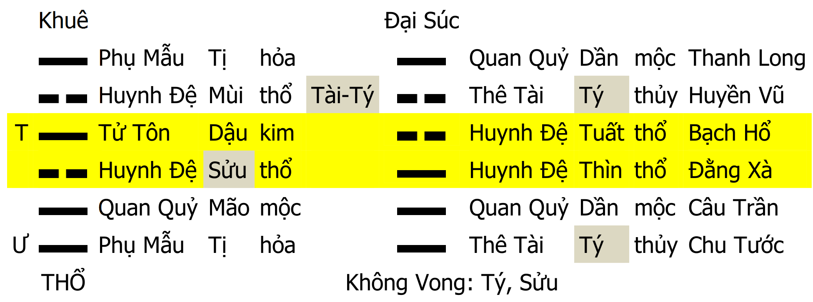
    - **Hình này chứng minh điều gì**
      - Bệnh tình nguy hiểm là ung thư vú di căn sang phổi do Dụng thần Tử Tôn Dậu kim quá vượng không có khắc tiết.
    - **Từ đâu mà thấy được**
      - Hào Thế Dậu kim được Nhật Nguyệt sinh, hào Thế động hóa hồi đầu sinh, Nguyên thần Sửu thổ hóa Tiến thần sinh; hào 4 Dậu kim lâm Bạch Hổ chủ vú và phổi.
- Xác định Dụng thần và tình trạng Dụng thần vượng cực vô chế:
  - Đương số tự đoán bệnh bản thân nên lấy hào Thế làm Dụng thần.
  - Hào Thế là hào 4 Tử Tôn Dậu kim.
  - Xét trợ lực từ Nhật Nguyệt: Tháng Sửu thổ sinh Dậu kim, ngày Bính Thìn thổ sinh Dậu kim (Thìn Dậu hợp sinh), hào Thế được cả Nhật và Nguyệt cùng sinh phù nên cực kỳ vượng tướng.
  - Xét các hào động biến trong quẻ:
    - Hào Thế Dậu kim tự phát động hóa Huynh Đệ Tuất thổ, được Tuất thổ quay lại sinh dưỡng (động hóa hồi đầu sinh).
    - Hào 3 Huynh Đệ Sửu thổ (Nguyên thần) phát động biến Huynh Đệ Thìn thổ, là động hóa Tiến thần dồn lực sinh tiếp cho hào Thế Dậu kim.
    - Hào 5 còn hiện diện thêm một Nguyên thần Huynh Đệ Mùi thổ gia tăng khí thế cho thổ.
  - Đánh giá tương quan lực lượng: Toàn bộ quẻ toàn thổ sinh kim, không hề có hào Hỏa khắc chế kim, cũng không có hào Thủy dẫn tiết kim khí, dẫn đến tình trạng Dụng thần quá vượng, đại kỵ trong phép đoán thọ yểu bệnh tật ("quá vượng cho nên không cát").
- Định vị ổ bệnh qua hào vị, ngũ hành và thần sát:
  - Phân tích hào vị: Hào Thế Dậu kim ngự tại hào 4; trong hệ thống hào vị nhân thể, hào 4 tương ứng với vùng ngực.
  - Phân tích thần sát: Hào 4 lâm Bạch Hổ; Bạch Hổ là hung thần chủ về huyết quang, tai ương và các chứng bệnh hiểm ác phát tác dữ dội.
  - Phân tích lục thân và ngũ hành:
    - Lục thân Tử Tôn ở phụ nữ chủ về bầu ngực, tuyến vú.
    - Ngũ hành Kim chủ về tạng phế (phổi) và đường hô hấp.
  - Tổng hợp chứng trạng: Bệnh tật xuất hiện đồng thời ở cả hai vị trí vú và phổi; do bản chất bệnh khởi từ thế quá vượng ứ kết nên kết luận là bệnh nan y nguy hiểm, chắc chắn là chứng bệnh ung thư.
- Diễn biến và ứng nghiệm thực tế:
  - Vào năm Bính Tuất (năm ứng với hào biến Tuất thổ hồi đầu sinh Dậu kim), người bệnh phát tác chứng ung thư vú.
  - Sau khi tiến hành phẫu thuật cắt bỏ khối u ở vú, tế bào ung thư tiếp tục di căn sang phổi, hoàn toàn chuẩn xác với việc hào 4 Dậu kim lâm Bạch Hổ ứng cả vào vú (Tử Tôn) và phổi (hành Kim).

#### Sơ đồ quẻ phối chiếu Càn Vi Thiên biến Trạch Thiên Quải
- Sơ đồ quẻ Càn Vi Thiên biến Trạch Thiên Quải được bố cục trên cùng trang 25 của tài liệu gốc nhằm đối sánh các trường hợp ác tật tại tạng phổi liên quan đến ngũ hành Kim:
  - **Hình 25.** Quẻ Càn biến Quải
    - 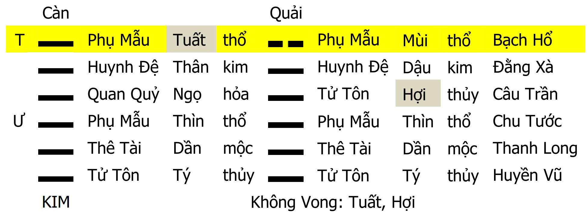
    - **Hình này chứng minh điều gì**
      - Cấu trúc quẻ Càn biến Quải minh chứng cho bệnh ung thư phổi được định vị qua ngũ hành Kim của quái cung Càn.
    - **Từ đâu mà thấy được**
      - Quẻ chính thuần Càn thuộc Kim chủ phổi; hào 6 Phụ Mẫu Tuất thổ Không Vong động hóa Mùi thổ Nguyệt phá lâm Bạch Hổ.
- Ý nghĩa đối sánh giữa hai trường hợp ác tật thuộc hành Kim:
  - Cả hai quẻ trên trang sách đều giải mã bệnh ung thư phổi nguy hiểm, song cơ chế định vị thể hiện hai quy luật biện chứng khác nhau của Lục Hào:
    - Quẻ Càn biến Quải định vị ung thư phổi thông qua thuộc tính ngũ hành Kim của quái cung quẻ chính (quẻ cá biệt).
    - Quẻ Khuê biến Đại Súc định vị ung thư vú di căn phổi thông qua Dụng thần Dậu kim quá vượng không được khắc tiết, kết hợp hào 4 lâm Bạch Hổ.

## CHƯƠNG 3: QUAN HỆ ĐỐI ỨNG GIỮA BÁT QUÁI VÀ BỆNH TẬT

- Nguyên lý tượng bát quái trong dự đoán tật bệnh:
  - Tượng của bát quái bao quát vạn vật, trong đó bệnh tật là một phần tử thuộc vạn vật, vì vậy bát quái hàm chứa toàn bộ thông tin về tật bệnh.
  - Dự đoán lục hào thường căn cứ quái cung để thể hiện thông tin chứng bệnh; cá biệt có trường hợp chỉ xét riêng nội quái hoặc ngoại quái để định vị bệnh chứng.
  - Quy trình dự trắc bệnh tật theo tượng: trước tiên xem xét quan hệ đối ứng giữa quái cung và tật bệnh, kế tiếp kết hợp hào vị, ngũ hành và các biến động liên quan trong quẻ.

### Quẻ Càn (Thuộc Kim)

- Thuộc tính ngũ hành:
  - Quẻ Càn thuộc ngũ hành Kim.
- Biểu hiện đối ứng cơ thể và chứng bệnh:
  - Tương ứng với phổi, đại tràng, bệnh tật vùng đầu não, bệnh tật nam khoa.
  - Phản ánh tình trạng gân cốt, xương cốt, lồng ngực, vùng thượng tiêu, đoạn ruột.
  - Chủ các chứng táo bón, thương hàn, các loại bệnh lý tuổi già hoặc bệnh ở người cao tuổi.

### Quẻ Khôn (Thuộc Thổ)

- Thuộc tính ngũ hành:
  - Quẻ Khôn thuộc ngũ hành Thổ.
- Biểu hiện đối ứng cơ thể và chứng bệnh:
  - Chủ về tỳ vị, các bệnh lý thuộc phần bụng; thường biểu hiện ăn uống không vào, rối loạn tiêu hóa.
  - Biểu thị u bướu, sưng phù, bệnh phụ khoa, bệnh tật thời kỳ mãn kinh, cơ quan sinh dục.
  - Phản ánh các chứng bệnh ngoài da, chứng chóng mặt.

### Quẻ Chấn (Thuộc Mộc)

- Thuộc tính ngũ hành:
  - Quẻ Chấn thuộc ngũ hành Mộc.
- Biểu hiện đối ứng cơ thể và chứng bệnh:
  - Tương ứng với tạng phủ gan mật, bệnh lý ở bàn chân và cẳng chân.
  - Tương ứng với bệnh thần kinh, chứng cuồng táo (tính khí dễ cáu gắt), hoảng sợ, suy nhược thần kinh, thần kinh quá mức nhạy cảm, chứng động kinh, chứng đa động (tăng động).
  - Chủ các chứng ho, viêm họng, khí trệ, can hỏa vượng, gãy xương, bệnh phụ khoa, bệnh ung thư.

### Quẻ Tốn (Thuộc Mộc)

- Thuộc tính ngũ hành:
  - Quẻ Tốn thuộc ngũ hành Mộc.
- Biểu hiện đối ứng cơ thể và chứng bệnh:
  - Tương ứng với gan mật, vùng đùi, hậu môn, hệ thống mạch máu, bệnh đường ruột.
  - Chủ các bệnh phong, trúng gió, cảm mạo phong hàn, cảm lạnh, liệt nửa người, bệnh truyền nhiễm, đau thần kinh tọa.
  - Biểu thị chứng thở gấp, hen suyễn, bệnh máu trắng, mắt trắng, bệnh ung thư.

### Quẻ Khảm (Thuộc Thủy)

- Thuộc tính ngũ hành:
  - Quẻ Khảm thuộc ngũ hành Thủy.
- Biểu hiện đối ứng cơ thể và chứng bệnh:
  - Tương ứng với tạng thận, bàng quang, máu huyết, nước tiểu, toàn bộ hệ thống tiết niệu, vùng thắt lưng, lưng, tai, bộ phận sinh dục.
  - Chủ chứng hàn lãnh, tiêu chảy, chứng tiêu khát, bệnh tiểu đường, mất cân bằng nội tiết.
  - Phản ánh các bệnh lây truyền qua đường tình dục, chứng di tinh, ngộ độc hoặc trúng độc.

### Quẻ Ly (Thuộc Hỏa)

- Thuộc tính ngũ hành:
  - Quẻ Ly thuộc ngũ hành Hỏa.
- Biểu hiện đối ứng cơ thể và chứng bệnh:
  - Tương ứng với tim mạch, ruột non, mắt, các bệnh liên quan đến máu huyết, huyết áp thấp.
  - Chủ kinh nguyệt không đều, chứng phì đại cơ quan, thượng tiêu mất cân đối.
  - Phản ánh bệnh sốt rét, chứng ảo giác hoặc ảo thị, bỏng lửa, say nắng, phát sốt, bệnh tật ở vú, bệnh phụ khoa.

### Quẻ Cấn (Thuộc Thổ)

- Thuộc tính ngũ hành:
  - Quẻ Cấn thuộc ngũ hành Thổ.
- Biểu hiện đối ứng cơ thể và chứng bệnh:
  - Tương ứng với tỳ (lá lách), vị (dạ dày), vùng lưng, mũi, cánh tay, vú, các khớp xương, da dẻ.
  - Chủ các chứng u bướu, thủy đậu, chứng kết sỏi, tắc nghẽn mạch máu, khí huyết không lưu thông.

### Quẻ Đoài (Thuộc Kim)

- Thuộc tính ngũ hành:
  - Quẻ Đoài thuộc ngũ hành Kim.
- Biểu hiện đối ứng cơ thể và chứng bệnh:
  - Tương ứng với phổi, đại tràng, miệng, lưỡi, cổ họng, khí quản, thực quản, khoang miệng, đau răng, vùng lồng ngực.
  - Tương ứng với bàng quang, hệ tiết niệu, hậu môn.
  - Chủ khí trệ, khí nghịch thở gấp, ăn uống không vào, đờm nhiều, ho hen.
  - Biểu thị huyết áp thấp, thiếu máu, khuyết tật cơ thể, ngoại thương, phẫu thuật, các bệnh ngoài da.

### Ví dụ 1: Ngày Quý Mão tháng Sửu, nam đoán bệnh con trai (Quẻ Tốn Vi Phong biến Phong Sơn Tiệm)

- Bối cảnh bói quẻ:
  - Thời gian: Ngày Quý Mão, tháng Sửu (Tuần không: Thìn, Tị).
  - Tình huống: Người cha xem bệnh cho con trai, gieo được quẻ Tốn Vi Phong biến Phong Sơn Tiệm.
  - **Hình 27.** Sơ đồ quẻ Tốn Vi Phong biến Phong Sơn Tiệm
    - 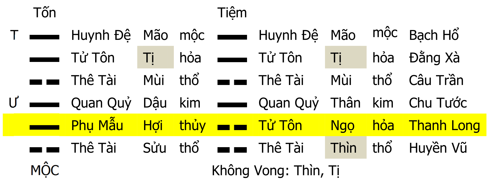
    - **Hình này chứng minh điều gì**
      - Quẻ Tốn Vi Phong biến Phong Sơn Tiệm phản ánh con trai bị cảm mạo phong hàn, sốt cao kèm viêm ruột.
    - **Từ đâu mà thấy được**
      - Hào Tử Tôn Tị hỏa tại hào 5 lâm Không Vong bị Phụ Mẫu Hợi thủy phát động khắc (thủy chủ hàn, Tốn chủ phong hàn); Quan Quỷ Chu Tước hào 3 Dậu kim ám động sinh Phụ Mẫu (hào 3 và kim là ruột, Chu Tước chủ phát sốt).
- Trình tự phân tích và biện chứng quẻ:
  - Xác định Dụng thần: Đoán bệnh con cái, lấy hào Tử Tôn làm Dụng thần. Trong quẻ, Tử Tôn Tị hỏa ở hào 5.
  - Đánh giá vượng suy Dụng thần: Tử Tôn Tị hỏa được Nhật sinh (Mão mộc sinh Tị hỏa), Nguyệt kiến Sửu thổ không khắc, không thuộc diện hưu tù suy kiệt, báo hiệu có bệnh nhưng không nguy hiểm tính mạng.
  - Luận nguyên nhân phát bệnh:
    - Tử Tôn Tị hỏa ngự tại hào 5, lâm Tuần Không, không đón nhận được mộc sinh, trái lại bị Phụ Mẫu Hợi thủy ở hào 2 động đến khắc phạt.
    - Hành Thủy chủ về hàn lãnh, quái cung Tốn chủ về phong hàn, kết hợp tạo thành tượng bệnh nhân bị cảm mạo phong hàn.
    - Quan Quỷ Dậu kim lâm Chu Tước ngự tại hào 3 ám động (được Nhật thần Mão mộc xung động) quay sang sinh trợ Kỵ thần Phụ Mẫu Hợi thủy.
    - Hào 3 là hào vị của đường ruột, ngũ hành Kim cũng đại diện cho ruột, nên bệnh biến bao gồm cả viêm ruột lẫn cảm mạo.
    - Thần sát Chu Tước chủ về phát nhiệt (sốt), biểu thị triệu chứng kèm theo sốt cao rõ rệt.
- Kết quả và ứng nghiệm thực tế:
  - Con trai người hỏi quẻ bị cảm mạo phong hàn, phát sốt cao, đồng thời bị viêm ruột đúng như các căn cứ đã luận giải.

### Ví dụ 2: Ngày Kỷ Sửu tháng Ngọ, lão tiên sinh đoán bệnh (Quẻ Trạch Hỏa Cách biến Thiên Hỏa Đồng Nhân)

- Bối cảnh bói quẻ:
  - Thời gian: Ngày Kỷ Sửu, tháng Ngọ (Tuần không: Ngọ, Mùi).
  - Tình huống: Một lão tiên sinh tự gieo quẻ xem tình hình bệnh tật của bản thân, được quẻ Trạch Hỏa Cách biến Thiên Hỏa Đồng Nhân.
  - **Hình 28.** Sơ đồ quẻ Trạch Hỏa Cách biến Thiên Hỏa Đồng Nhân
    - 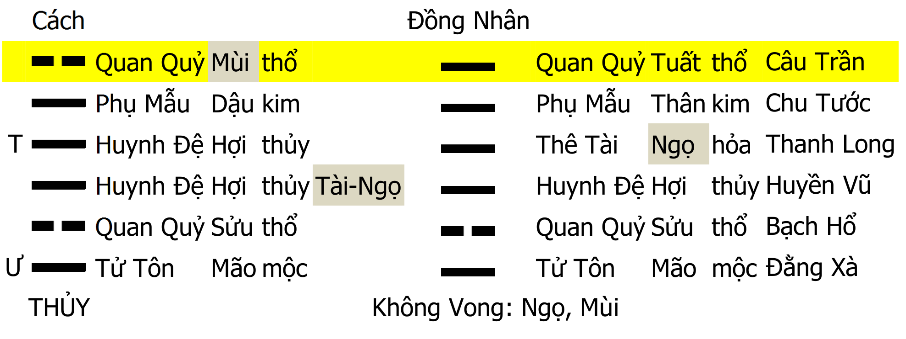
    - **Hình này chứng minh điều gì**
      - Quẻ Trạch Hỏa Cách biến Thiên Hỏa Đồng Nhân chỉ ra bệnh nhân mắc chứng kiết lị, tiêu chảy, đồng thời bị cao huyết áp và mỡ máu cao.
    - **Từ đâu mà thấy được**
      - Hào Thế Hợi thủy hưu tù bị Nhật thần Sửu thổ khắc, Nhật hiện ở hào 2 cung Khảm (hào 2 là ruột, Khảm chủ kiết lị); Kỵ thần Quan Quỷ Mùi thổ hào 6 lâm Câu Trần động khắc Thế (Khảm chủ cao huyết áp, thủy là máu, thổ và Câu Trần chủ đặc quánh, phì nị).
- Trình tự phân tích và biện chứng quẻ:
  - Xác định Dụng thần: Đương sự tự đoán bệnh bản thân, lấy hào Thế làm Dụng thần. Hào Thế Huynh Đệ Hợi thủy lâm hào 4.
  - Đánh giá vượng suy Dụng thần: Hào Thế Hợi thủy không được Nguyệt kiến Ngọ hỏa sinh trợ, lại bị Nhật thần Sửu thổ khắc phạt nên lâm vào thế hưu tù suy kiệt.
  - Luận định chứng bệnh theo hào vị và quái cung:
    - Nhật thần Sửu thổ xuất hiện trực tiếp trong quẻ tại hào 2. Hào 2 là hào vị chỉ đường ruột; quẻ Cách thuộc cung Khảm, cung Khảm chủ về kiết lị, đi ngoài phân lỏng tiêu chảy.
    - Quái cung Khảm đồng thời mang tượng cao huyết áp.
    - Kỵ thần Quan Quỷ Mùi thổ tại hào 6 phát động xung khắc hào Thế Hợi thủy.
    - Dụng thần hành Thủy chủ về tuần hoàn máu huyết; ngũ hành Thổ chủ về đặc sệt, ngưng tụ; hào động lâm Câu Trần cũng chủ về sệt dính, phì nị (mỡ thừa tích tụ).
    - Tượng Thổ khắc Thủy kết hợp Câu Trần phán đoán máu bị đặc, nhiễm nhiều mỡ (chứng mỡ trong máu cao).
    - Tổng hợp các căn cứ tượng quẻ: kết luận đương sự mắc bệnh kiết lị tiêu chảy, kèm theo huyết áp cao và mỡ trong máu cao.
- Kết quả và ứng nghiệm thực tế:
  - Bệnh nhân xác nhận đang mắc bệnh kiết lị, ngoài ra trên thực tế còn bị chứng huyết áp cao và mỡ máu cao.

### Ví dụ 3: Ngày Canh Tý tháng Mão, người nam gọi điện thoại đoán bệnh (Quẻ Phong Thủy Hoán biến Phong Trạch Trung Phu)

- Bối cảnh bói quẻ:
  - Thời gian: Ngày Canh Tý, tháng Mão (Tuần không: Thìn, Tị).
  - Tình huống: Một người nam gọi điện thoại nhờ tác giả đoán bệnh tật, gieo được quẻ Phong Thủy Hoán biến Phong Trạch Trung Phu.
  - **Hình 29.** Sơ đồ quẻ Phong Thủy Hoán biến Phong Trạch Trung Phu
    - 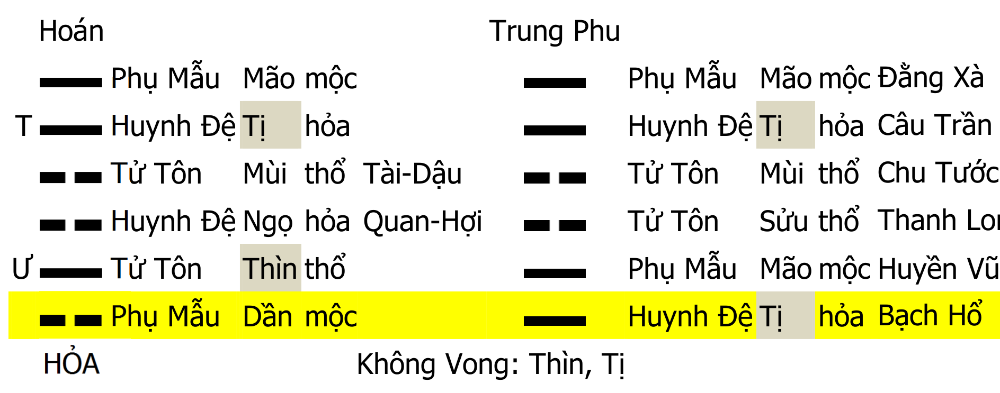
    - **Hình này chứng minh điều gì**
      - Quẻ Phong Thủy Hoán biến Phong Trạch Trung Phu chứng thực bệnh nhân bị chứng ngũ canh tả kéo dài hơn 20 ngày, bệnh phát tác bất lợi vào giờ Dần.
    - **Từ đâu mà thấy được**
      - Hào Thế Huynh Đệ Tị hỏa bị Nhật thần Tý thủy khắc; khắc thần Quan Quỷ Hợi thủy phục dưới hào 3 (cung Ly quẻ là ruột); Nguyên thần Phụ Mẫu Dần mộc độc phát lâm Bạch Hổ hợp Kỵ thần Quan Quỷ, giờ Dần hóa Không không thể sinh Thế.
- Trình tự phân tích và biện chứng quẻ:
  - Xác định Dụng thần: Tự đoán bệnh, lấy hào Thế làm Dụng thần. Hào Thế Huynh Đệ Tị hỏa ngự tại hào 5.
  - Luận khắc thần và hào vị bệnh biến:
    - Hào Thế Tị hỏa bị Nhật thần Tý thủy khắc thương tổn hại.
    - Khắc thần Quan Quỷ Hợi thủy phục tàng dưới hào 3 Huynh Đệ Ngọ hỏa.
    - Quẻ Phong Thủy Hoán thuộc cung Ly, quái cung Ly chủ về đường ruột (ruột non).
  - Luận Nguyên thần độc phát và thời điểm phát tác:
    - Trong quẻ chỉ duy nhất hào 1 Phụ Mẫu Dần mộc độc phát (là Nguyên thần sinh trợ hào Thế).
    - Hào Dần mộc độc phát lại hợp với Kỵ thần phục tàng là Quan Quỷ Hợi thủy (Dần Hợi lục hợp), lâm thần sát Bạch Hổ là tượng tật bệnh quấy nhiễu.
    - Dần mộc động biến ra Huynh Đệ Tị hỏa (lâm Tuần Không). Giờ Dần hóa Không nên không thể sinh trợ cho hào Thế, biểu thị khung giờ Dần (3 - 5 giờ sáng, lúc rạng đông / canh năm) là thời khắc bất lợi nhất cho bệnh trạng.
- Kết quả và ứng nghiệm thực tế:
  - Bệnh nhân phản hồi bị chứng ngũ canh tả (tiêu chảy vào lúc canh năm sáng sớm) hành hạ liên tục suốt hơn 20 ngày.

### Ví dụ 4: Ngày Ất Mùi tháng Thân, học trò đoán bệnh bà nội (Quẻ Càn Vi Thiên biến Hỏa Trạch Khuê)

- Bối cảnh bói quẻ:
  - Thời gian: Ngày Ất Mùi, tháng Thân (Tuần không: Thìn, Tị).
  - Tình huống: Người học trò của tác giả gieo quẻ hỏi thăm tình hình bệnh tật của bà nội, được quẻ Càn Vi Thiên biến Hỏa Trạch Khuê.
  - **Hình 30.** Sơ đồ quẻ Càn Vi Thiên biến Hỏa Trạch Khuê
    - 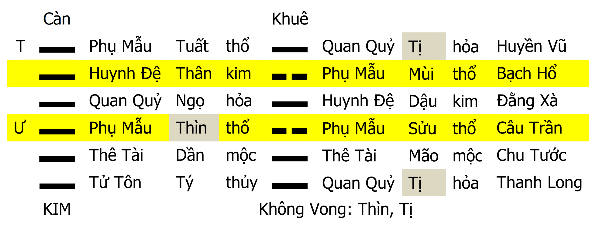
    - **Hình này chứng minh điều gì**
      - Quẻ Càn Vi Thiên biến Hỏa Trạch Khuê phản ánh bà nội bị tắc mạch máu não dẫn đến bại liệt nằm liệt giường từ năm Giáp Thân và bị gãy xương vào tháng Mùi năm Bính Tuất.
    - **Từ đâu mà thấy được**
      - Dụng thần Phụ Mẫu Thìn thổ hào 3 lâm Câu Trần động hóa thoái Sửu thổ (hào 3 là giường, Câu Trần chủ bất động); quái cung Càn và hào 6 Tuất thổ đều chỉ phần đầu; hào 5 Thân kim lâm Bạch Hổ động biến Mùi thổ (Bạch Hổ chủ máu và gãy xương, ứng kỳ Thân và Mùi).
- Trình tự phân tích và biện chứng quẻ:
  - Xác định Dụng thần: Xem bệnh cho bà nội (bậc trưởng bối), lấy lục thân Phụ Mẫu làm Dụng thần.
  - Xử lý tình huống Dụng thần lưỡng hiện:
    - Trong quẻ xuất hiện hai hào Phụ Mẫu: Phụ Mẫu Tuất thổ tại hào 6 và Phụ Mẫu Thìn thổ tại hào 3.
    - Hào Phụ Mẫu Thìn thổ phát động nên được chọn làm Dụng thần chính để phán đoán cát hung.
  - Luận vượng suy và tượng hóa thoái nằm liệt giường:
    - Dụng thần Thìn thổ không được Nguyệt kiến Thân kim sinh trợ, nhưng được Nhật thần Mùi thổ tỉ phù tương trợ nên không bị coi là hưu tù suy kiệt.
    - Điểm hung hiểm then chốt là Dụng thần cư ngụ tại hào 3, phát động nhưng lại hóa Thoái thần (Thìn thổ hóa Sửu thổ).
    - Hào 3 là hào vị của giường chiếu; thần sát Câu Trần chủ về ngưng trệ bất động, hành vi cử động chậm chạp.
    - Tượng Dụng thần lâm hào 3 hóa thoái cùng Câu Trần biểu thị bệnh nhân bị bại liệt nằm trên giường chiếu, khả năng vận động dần suy giảm đến mức không thể đi lại.
  - Phán đoán vị trí phát bệnh và chứng bệnh:
    - Trường hợp Dụng thần lưỡng hiện, hào Dụng thần tĩnh ở ngoại quái đóng vai trò căn cứ định vị chứng bệnh. Hào 6 Phụ Mẫu Tuất thổ ở ngoại quái chủ về phần đầu.
    - Bản thân quẻ thuần Càn (Càn Vi Thiên) thuộc quái cung Càn cũng chủ về đầu não, khẳng định nguyên nhân bệnh tật xuất phát từ não bộ.
    - Hào 5 Huynh Đệ Thân kim phát động: hào 5 là Bệnh địa của Nguyên thần, lâm Bạch Hổ chủ về huyết dịch (máu) và gãy xương; Thân kim động hóa ra Mùi thổ biểu thị mốc thời gian liên quan đến năm/tháng Thân và Mùi.
    - Kết hợp với thông tin Dụng thần lâm Câu Trần (chủ bế tắc, tắc nghẽn), suy ra bệnh trạng là tắc nghẽn mạch máu não (nhồi máu não).
- Kết quả và ứng nghiệm thực tế:
  - Năm Giáp Thân, người bà bị nhồi máu não tắc mạch máu dẫn tới bại liệt nằm liệt giường; đến tháng Mùi năm Bính Tuất (năm xem quẻ), bà lại bị ngã gãy xương, khớp hoàn toàn với các hào Thân kim động biến Mùi thổ lâm Bạch Hổ.

### Ví dụ 5: Ngày Đinh Sửu tháng Tuất, nam đoán bệnh bản thân (Quẻ Hỏa Trạch Khuê biến Phong Trạch Trung Phu)

- Bối cảnh bói quẻ:
  - Thời gian: Ngày Đinh Sửu, tháng Tuất (Tuần không: Thân, Dậu).
  - Tình huống: Một người nam gieo quẻ xem xét tình trạng bệnh tật của chính mình, được quẻ Hỏa Trạch Khuê biến Phong Trạch Trung Phu.
  - **Hình 31.** Sơ đồ quẻ Hỏa Trạch Khuê biến Phong Trạch Trung Phu
    - 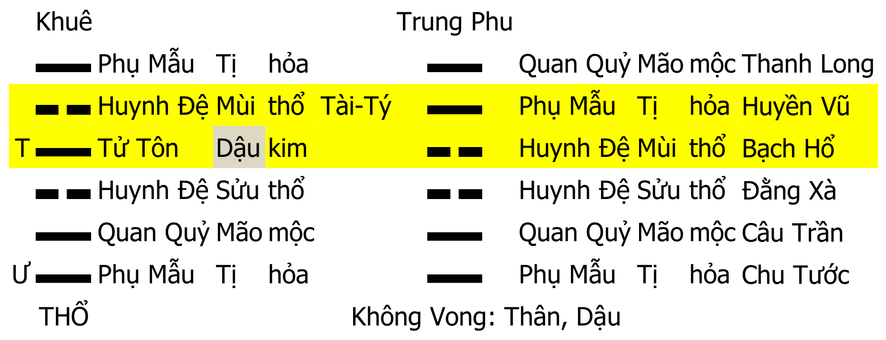
    - **Hình này chứng minh điều gì**
      - Quẻ Hỏa Trạch Khuê biến Phong Trạch Trung Phu phản ánh bệnh ngoài da đang phát tác lan rộng, trên da có hiện tượng tích nước phù nề (thủy thũng).
    - **Từ đâu mà thấy được**
      - Hào Thế Dậu kim lâm Bạch Hổ được Nhật Nguyệt cùng hào 5 Mùi thổ sinh, động hóa Mùi thổ hồi đầu sinh, hào 3 Sửu thổ cũng là Nguyên thần dẫn đến Nguyên thần thái quá; hành Thổ và quái cung Cấn đều chủ da; quẻ biến Du hồn chủ lan rộng; Nguyên thần lâm Huyền Vũ chủ phù nề.
- Trình tự phân tích và biện chứng quẻ:
  - Xác định Dụng thần: Tự đoán bệnh cho bản thân, lấy hào Thế làm Dụng thần. Hào Thế Tử Tôn Dậu kim ngự tại hào 4.
  - Luận tượng Nguyên thần thái quá sinh bệnh:
    - Hào Thế Tử Tôn Dậu kim lâm thần sát Bạch Hổ, được cả Nguyệt kiến Tuất thổ lẫn Nhật thần Sửu thổ đồng thời tương sinh.
    - Trong quẻ, hào 5 Huynh Đệ Mùi thổ là Nguyên thần phát động tương sinh hào Thế; bản thân hào Thế Dậu kim phát động động hóa Mùi thổ quay đầu tương sinh (hồi đầu sinh).
    - Dưới nội quái, hào 3 Huynh Đệ Sửu thổ cũng là Nguyên thần mang hành Thổ.
    - Hàng loạt yếu tố Thổ sinh Kim khiến cho Nguyên thần lâm vào tình trạng thái quá (quá vượng, thừa mứa), trong dự trắc tật bệnh hễ thái quá tất biến thành nguyên nhân sinh bệnh tật.
  - Biện giải chứng bệnh theo ngũ hành, quái cung và thần sát:
    - Ngũ hành Thổ chủ về da dẻ, cơ nhục bên ngoài cơ thể.
    - Quẻ Hỏa Trạch Khuê thuộc quái cung Cấn, tượng của quẻ Cấn cũng chủ về làn da. Tượng Thổ trùng điệp ở cung Cấn biểu thị bệnh lý ngoài da.
    - Quẻ biến Phong Trạch Trung Phu là quẻ Du hồn, mang ý nghĩa bệnh thế đang khuếch tán, lan rộng ra các vùng xung quanh.
    - Hào Nguyên thần mang theo thần sát Huyền Vũ: Huyền Vũ chủ về hành Thủy, chủ về thấp khí (nhiễm ẩm, ứ nước), phản ánh tình trạng da bị tích nước gây sưng phù nề (da thủy thũng).
- Kết quả và ứng nghiệm thực tế:
  - Người hỏi quẻ thừa nhận bản thân đang mắc bệnh ngoài da bị sưng phù nề đúng như những gì quẻ tượng đã chỉ rõ.

## CHƯƠNG 4: QUAN HỆ ĐỐI ỨNG GIỮA NGŨ HÀNH VÀ BỆNH TẬT

### Tổng quan lý luận Ngũ hành biện chứng bệnh tật

- Bản chất và vai trò của Ngũ hành trong dự trắc Lục Hào:
  - Ngũ hành trong dự đoán bệnh tật là chỉ ngũ hành của địa chi (Kim, Mộc, Thủy, Hỏa, Thổ), đóng vai trò nền tảng cơ bản nhất để phân tích biện chứng bệnh chứng.
  - Ngũ hành là căn cứ ban đầu để định vị tạng phủ bị bệnh và phán đoán cụ thể các chi tiết bệnh lý phát sinh trên cơ thể.
- Hiệu quả phán đoán khi phối hợp đa yếu tố:
  - Khi phối hợp chặt chẽ ngũ hành địa chi với lục thân, hào vị, lục thần và các quy luật sinh khắc chế hóa, độ chuẩn xác và chiều sâu chẩn đoán bệnh tật được nâng lên rõ rệt.
- Mở rộng quan hệ đối ứng trong y lý:
  - Trong chẩn đoán bệnh tật, ngũ hành còn đối ứng đầy đủ với ngũ vị (vị giác ẩm thực), ngũ chí (trạng thái tâm lý cảm xúc), ngũ cốc (thực phẩm dung nạp) và ngũ sắc (sắc diện và màu sắc bài tiết).
  - Mối quan hệ đối ứng này được ứng dụng linh hoạt để truy tìm nguyên nhân sinh bệnh từ thói quen ăn uống, biến động tâm lý hoặc các nhân tố môi trường bên ngoài.

### Kim

- Bộ phận cơ thể và tạng phủ đối ứng:
  - Ngũ hành Kim chủ quản tạng phế (phổi), phủ đại tràng (ruột già), hầu họng, thanh quản, khí quản và hệ thống xương cốt.
- Thuộc tính quy chiếu mở rộng:
  - Ngũ vị: Vị cay (tân).
  - Ngũ chí: Ưu sầu, bi thương, lo buồn.
  - Ngũ cốc: Lúa nước (đạo).
  - Ngũ sắc: Màu trắng (bạch).
- Biện chứng bệnh lý đặc trưng trong Lục Hào:
  - Kim bị khắc thương, suy yếu hoặc hỏa khắc quá nặng biểu hiện qua các chứng bệnh viêm phế quản, hen suyễn, ho tức ngực, khó thở, các bệnh về đường ruột đại tràng, gãy xương, đau nhức xương cốt hoặc các biến đổi bệnh lý có sắc diện trắng bệch.

### Mộc

- Bộ phận cơ thể và tạng phủ đối ứng:
  - Ngũ hành Mộc chủ quản tạng can (gan), phủ đởm (túi mật), trực tràng, bệnh phong tà và hệ thống dây thần kinh, gân cơ.
- Thuộc tính quy chiếu mở rộng:
  - Ngũ vị: Vị chua (toan).
  - Ngũ chí: Tức giận, phẫn nộ (nộ).
  - Ngũ cốc: Lúa mạch (mạch).
  - Ngũ sắc: Màu xanh (thanh).
- Biện chứng bệnh lý đặc trưng trong Lục Hào:
  - Mộc bị thương tổn hoặc can khí uất kết biểu hiện qua các chứng bệnh gan mật, viêm gan, rối loạn chức năng thần kinh, trúng phong, phong thấp, đau nhức ngứa ngáy cục bộ, co giật, viêm loét trực tràng, tâm lý dễ cáu giận, hoặc sắc diện xanh mét.

### Thủy

- Bộ phận cơ thể và tạng phủ đối ứng:
  - Ngũ hành Thủy chủ quản tạng thận, phủ bàng quang, nước tiểu, hệ thống tiết niệu, cơ quan sinh dục và tuần hoàn huyết dịch (máu).
- Thuộc tính quy chiếu mở rộng:
  - Ngũ vị: Vị mặn (hàm).
  - Ngũ chí: Sợ hãi, kinh khủng, hoảng sợ (khủng).
  - Ngũ cốc: Các loại đậu.
  - Ngũ sắc: Màu đen (hắc).
- Biện chứng bệnh lý đặc trưng trong Lục Hào:
  - Thủy bị suy bại, khô kiệt hoặc bị thổ khắc nặng gây ra các chứng suy thận, viêm bàng quang, tiểu tiện khó khăn, kết sỏi đường tiết niệu, bệnh về máu, tâm lý u uất lo sợ bất an, sợ phẫu thuật, sắc diện sạm đen hoặc các tổn thương do hàn lạnh xâm nhập.

### Hỏa

- Bộ phận cơ thể và tạng phủ đối ứng:
  - Ngũ hành Hỏa chủ quản tạng tâm (tim), phủ tiểu trường (ruột non), cơ quan thị giác (mắt) và hệ tuần hoàn huyết mạch.
- Thuộc tính quy chiếu mở rộng:
  - Ngũ vị: Vị đắng (khổ).
  - Ngũ chí: Vui vẻ, mừng rỡ quá độ (hỷ).
  - Ngũ cốc: Hạt kê.
  - Ngũ sắc: Màu đỏ (xích/hồng).
- Biện chứng bệnh lý đặc trưng trong Lục Hào:
  - Hỏa bị suy thương, nhập Mộ hoặc bị thủy khắc biểu hiện qua các chứng loạn nhịp tim, suy tim, bệnh mạch vành, nhược thị, suy giảm thị lực, mắt mờ bẩm sinh, viêm ruột non, chứng huyết nhiệt, sốt cao hoặc sắc diện đỏ bừng.

### Thổ

- Bộ phận cơ thể và tạng phủ đối ứng:
  - Ngũ hành Thổ chủ quản tạng tỳ (lá lách), phủ vị (dạ dày), cơ nhục (cơ bắp) và bì phu (da dẻ).
- Thuộc tính quy chiếu mở rộng:
  - Ngũ vị: Vị ngọt (cam).
  - Ngũ chí: Tư lự, lo nghĩ, trầm tư (tư).
  - Ngũ cốc: Cây ngô (bắp).
  - Ngũ sắc: Màu vàng (hoàng).
- Biện chứng bệnh lý đặc trưng trong Lục Hào:
  - Thổ bị khắc phá hoặc thái quá sinh bệnh gây ra các chứng rối loạn tiêu hóa, đau dạ dày, viêm loét tỳ vị, suy nhược cơ nhục, bệnh ngoài da, u xơ, tích tụ u bướu, cơ thể nặng nề ứ trệ, tâm lý hay suy nghĩ lo lắng, hoặc sắc diện vàng úa.

### Các ví dụ thực tế dự trắc bệnh tật theo Ngũ hành

#### Ví dụ 1: Nữ đoán nguyên nhân đau đầu (Thiên Lôi Vô Vọng biến Phong Địa Quan)

- Bối cảnh chiêm bói và thiết lập quẻ:
  - Thời gian dự trắc: Ngày Mậu Dần, tháng Tý (Tuần không: Thân, Dậu).
  - Tình huống: Người phụ nữ đến xin dự đoán nguyên nhân gây ra chứng đau đầu dai dẳng, gieo được quẻ Thiên Lôi Vô Vọng biến Phong Địa Quan.
  - Sơ đồ quẻ Thiên Lôi Vô Vọng biến Phong Địa Quan minh họa tương tác Kỵ thần động khắc Thế và hào Thế động hóa hợp Thê Tài:
    - **Hình 32.** Sơ đồ quẻ Thiên Lôi Vô Vọng biến Phong Địa Quan
      - 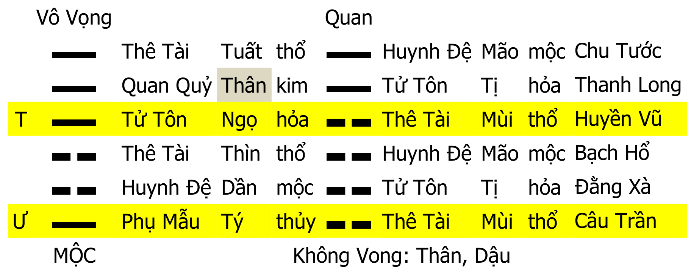
      - **Hình này chứng minh điều gì**
        - Hào Thế động hóa Thê Tài tương hợp và Kỵ thần Phụ Mẫu Tý thủy hóa Mùi thổ lâm Câu Trần khắc Thế, chỉ rõ nguyên nhân ăn kem ngọt lạnh thời thơ ấu gây đau đầu.
      - **Từ đâu mà thấy được**
        - Hào 4 Thế Ngọ hỏa hóa Mùi thổ hợp; hào 1 Tý thủy lâm Câu Trần hóa Mùi thổ khắc Thế; Thủy là đồ lạnh, Câu Trần là nước đá, Thổ là vị ngọt.

##### Phân tích suy luận quẻ tượng

- Xác định bản thân và sở thích ăn uống:
  - Hào Thế đại diện cho bản thân người hỏi; Kỵ thần trong quẻ chính là nguồn cơn phát sinh bệnh tật.
  - Hào 4 Thế Tử Tôn Ngọ hỏa phát động biến Thê Tài Mùi thổ: Hào Thế động hóa Thê Tài gặp thế tương hợp (Ngọ Mùi tương hợp). Hợp biểu thị sự đam mê, yêu thích, lưu luyến.
  - Lục thân Thê Tài chủ về ăn uống, ẩm thực. Ngũ hành Thổ chủ về đồ ngọt, thức ăn có vị ngọt. Hào Thế hợp Thê Tài mang hành Thổ chỉ rõ người này có sở thích đặc biệt với đồ ngọt.
- Cơ chế phát sinh bệnh tật từ Kỵ thần:
  - Kỵ thần Phụ Mẫu Tý thủy cư tại hào sơ (hào 1) phát động hóa Thê Tài Mùi thổ, lâm Câu Trần quay lại khắc chế hào Thế Ngọ hỏa. Đây chính là mấu chốt gây nên chứng đau đầu.
  - Hào sơ biểu thị cho thời điểm ấu thơ, lúc còn nhỏ tuổi.
  - Ngũ hành Thủy đại diện cho tính chất hàn lạnh, thức ăn nước uống lạnh. Thủy động hóa Thê Tài chủ về đồ ăn thức uống lạnh.
  - Thủy kết hợp với thần sát Câu Trần: Thủy là chất lỏng, nước; Câu Trần chủ sự ngưng tụ, đông kết, đóng băng -> Thủy lâm Câu Trần mang hình tượng nước đá, băng tuyết đông lạnh.
  - Hóa Thê Tài Mùi thổ mang hành Thổ chủ về vị ngọt -> Kết hợp lại tạo thành tượng "nước đá ngọt lạnh", tức là món kem (kem que, kem đá).
  - Tác giả suy đoán căn nguyên gốc rễ của bệnh đau đầu là do thời thơ ấu người này ăn quá nhiều kem lạnh làm tổn thương dương khí vùng đầu.

##### Kết quả và ứng nghiệm thực tế

- Phản hồi xác nhận của người hỏi:
  - Người phụ nữ lập tức thừa nhận hồi còn nhỏ bản thân vô cùng nghiện ăn kem, mỗi ngày đều đặn ăn tới bốn hoặc năm que kem.
  - Sau mỗi lần ăn quá nhiều đồ lạnh, cơ thể đều xuất hiện cảm giác đau đầu và khó chịu dữ dội, sau đó mới phải giảm bớt dần thói quen này.

#### Ví dụ 2: Nữ đoán kết quả phẫu thuật u xơ tử cung (Khảm Vi Thủy)

- Bối cảnh chiêm bói và thiết lập quẻ:
  - Thời gian dự trắc: Ngày Giáp Ngọ, tháng Thìn (Tuần không: Thìn, Tị).
  - Tình huống: Người phụ nữ đến dự trắc xem tiến hành phẫu thuật điều trị bệnh thì kết quả sẽ diễn biến ra sao, gieo được quẻ thuần Khảm Vi Thủy.
  - Sơ đồ quẻ Khảm Vi Thủy minh họa tâm lý sợ hãi của hào Thế và tượng bệnh tật bị tiêu trừ qua Nguyệt phá, Không vong:
    - **Hình 33.** Quẻ Khảm Vi Thủy
      - 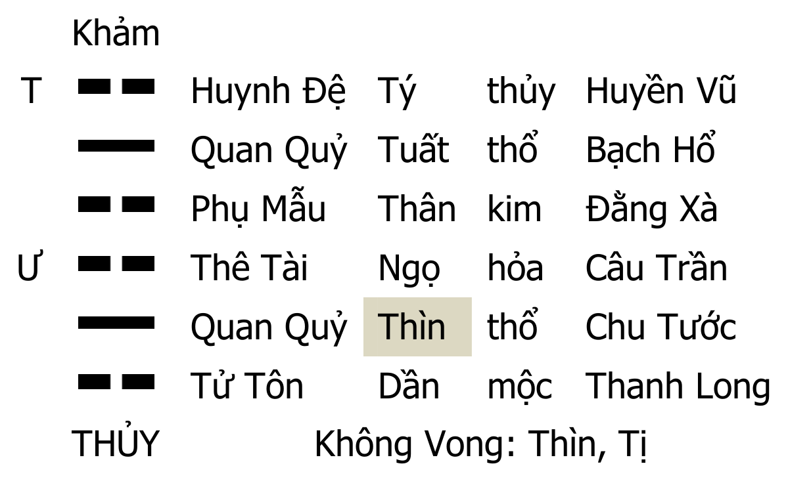
      - **Hình này chứng minh điều gì**
        - Quẻ lục xung phản ánh tâm lý sợ hãi dao kéo; Quan Quỷ lâm Bạch Hổ Nguyệt phá và Không vong biểu thị khối u được cắt bỏ triệt để, phẫu thuật an toàn.
      - **Từ đâu mà thấy được**
        - Thế Huynh Đệ Tý thủy lâm Huyền Vũ chủ sợ hãi; hào 5 Quan Quỷ Tuất thổ Nguyệt phá (bị cắt bỏ), hào 2 Quan Quỷ Thìn thổ Không vong tại hào vị tử cung.

##### Phân tích suy luận quẻ tượng

- Phân tích tâm lý và trạng thái hào Thế:
  - Lấy hào Thế Huynh Đệ Tý thủy làm Dụng thần đại diện cho người bệnh.
  - Quẻ gieo được là Khảm Vi Thủy thuộc cách cục Lục xung: Lục xung chủ sự chao đảo, bất an, tâm thần rối loạn lo âu.
  - Hào Thế mang ngũ hành Thủy: Ngũ chí của Thủy chủ về sự sợ hãi (khủng), phản ánh tâm trạng cực kỳ khiếp sợ việc phải lên bàn mổ phẫu thuật.
  - Hào Thế lâm lục thần Huyền Vũ: Huyền Vũ chủ u uất, phát sầu, sầu não trĩu nặng, lo lắng không yên.
- Đánh giá khả năng thành bại của ca phẫu thuật:
  - Kỵ thần Quan Quỷ đại diện cho bệnh tật: Trong quẻ xuất hiện hai hào Quan Quỷ (hào 5 Tuất thổ và hào 2 Thìn thổ).
  - Hào 5 Quan Quỷ Tuất thổ lâm thần sát Bạch Hổ bị tháng Thìn tương xung (Nguyệt phá). Bạch Hổ là tượng mổ xẻ, phẫu thuật dao kéo. Nguyệt phá mang tượng bị đập vỡ, cắt rời, triệt tiêu. Do Nguyệt phá nên Quan Quỷ mất hoàn toàn lực khắc hại hào Thế.
  - Hào 2 Quan Quỷ Thìn thổ rơi vào trạng thái Tuần không. Không vong chủ sự tiêu biến, mất tích, không còn tồn tại.
  - Hai hào Quan Quỷ đại diện cho bệnh tật một hào bị cắt bỏ (Nguyệt phá), một hào bị tiêu tan (Không vong), hoàn toàn không thể làm hại hào Thế -> Kết luận ca mổ diễn ra an toàn thuận lợi, bệnh tật được bài trừ tốt lành.
- Định vị chứng bệnh u xơ tử cung:
  - Hào 2 Quan Quỷ Thìn thổ là Nguyệt kiến lâm quẻ, đồng thời là Mộ khố của Nguyên thần Tử Tôn.
  - Hào vị: Hào 2 là vị trí đại diện cho tử cung và bộ phận sinh dục nữ. Thìn thổ nhập hào 2 mang tượng khối u cục ứ đọng -> Xác định chính xác người này mắc bệnh u xơ tử cung.

##### Kết quả và ứng nghiệm thực tế

- Kiểm chứng tiền sử bệnh lý và diễn biến phẫu thuật:
  - Người phụ nữ cho biết cách thời điểm xem quẻ năm tháng, bệnh viện đã phát hiện khối u xơ tử cung và bác sĩ chỉ định mổ; tuy nhiên vì quá sợ hãi đau đớn và rủi ro nên cô liên tục trì hoãn đến tận ngày hôm nay.
  - Sau khi nhận được lời phân tích và khích lệ từ tác giả, cô giải tỏa được tâm lý sợ hãi và quyết định nhập viện phẫu thuật.
  - Kết quả ca phẫu thuật diễn ra hết sức suôn sẻ, khối u được bóc tách hoàn toàn và sức khỏe bình phục tốt đẹp.

#### Ví dụ 3: Nữ đoán thể trạng thân thể, bệnh tim và mỡ máu (Thiên Thủy Tụng biến Lôi Sơn Tiểu Quá)

- Bối cảnh chiêm bói và thiết lập quẻ:
  - Thời gian dự trắc: Ngày Kỷ Tị, tháng Hợi (Tuần không: Tuất, Hợi).
  - Tình huống: Người phụ nữ đến xin dự trắc kiểm tra tình trạng tổng quát của thân thể, gieo được quẻ Thiên Thủy Tụng biến Lôi Sơn Tiểu Quá.
  - Sơ đồ quẻ Thiên Thủy Tụng biến Lôi Sơn Tiểu Quá minh họa hào Thế bị Nguyệt khắc, phục ngâm và tượng mỡ máu gây nghẽn:
    - **Hình 34.** Quẻ Thiên Thủy Tụng biến Lôi Sơn Tiểu Quá
      - 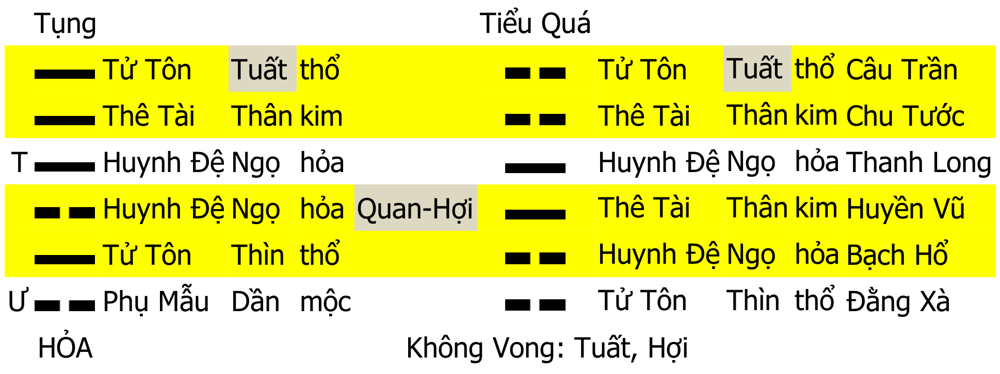
      - **Hình này chứng minh điều gì**
        - Quẻ Du hồn biến Du hồn kết hợp hào Thế Ngọ hỏa bị Nguyệt khắc và nhập Mộ phản ánh chứng rối loạn nhịp tim và mỡ trong máu cao gây bế tắc đầu não.
      - **Từ đâu mà thấy được**
        - Hào 4 Thế Ngọ hỏa bị Nguyệt Hợi thủy khắc; Thế nhập Mộ tại hào 6 Tuất thổ lâm Câu Trần; Bệnh địa Thê Tài Thân kim chủ về máu.

##### Phân tích suy luận quẻ tượng

- Phân tích bệnh chứng tim mạch:
  - Lấy hào Thế Huynh Đệ Ngọ hỏa làm Dụng thần đại diện cho thể trạng bản thân.
  - Hào Thế Ngọ hỏa cư tại hào 4, bị Nguyệt kiến Hợi thủy phát lực xung khắc nặng nề.
  - Đối ứng hào vị và ngũ hành: Hào 4 là hào vị vùng ngực và tim; ngũ hành Hỏa đối ứng trực tiếp với tạng tâm (tim). Cả hào vị lẫn ngũ hành đều chỉ tim và đều chịu thương tổn do Nguyệt khắc -> Xác định chức năng tim bất ổn.
  - Quẻ Tụng là quẻ Du hồn, biến sang quẻ Tiểu Quá cũng là quẻ Du hồn (Du hồn hóa Du hồn): Mang tượng tâm thần dao động, chao đảo bất an, nhịp điệu thất thường -> Phán đoán chính xác chứng rối loạn nhịp tim (tâm luật bất tề).
- Phân tích chứng mỡ máu cao và áp lực đầu não:
  - Ngoại quái Càn biến Chấn xuất hiện trạng thái Phục ngâm: Phục ngâm biểu thị sự đè nén, gánh nặng tâm lý và áp lực tuần hoàn nặng nề.
  - Hào Thế Ngọ hỏa nhập Mộ tại hào 6 Tử Tôn Tuất thổ (Tuất là Hỏa khố). Hào 6 là ngôi vị cao nhất đại diện cho phần đầu; nhập Mộ chủ sự tắc nghẽn, u tối; lâm thần sát Câu Trần chủ sự bế tắc, ứ trệ, phì nị (nhiều mỡ).
  - Bệnh địa của hào Thế Ngọ hỏa an tại Thân kim (theo vòng Tràng sinh của Hỏa: bệnh tại Thân), ứng với hào 5 Thê Tài Thân kim. Thê Tài đại diện cho huyết dịch (dòng máu).
  - Tổng hợp các yếu tố: Máu (Thê Tài) mang Bệnh địa kết hợp với tượng bế tắc, đặc quánh của Câu Trần và Mộ khố ở hào 6 -> Phán đoán mắc chứng mỡ trong máu cao (huyết chi cao), cản trở máu lưu thông lên não khiến đầu óc thường xuyên căng thẳng, nặng nề trĩu hạt.

##### Kết quả và ứng nghiệm thực tế

- Kiểm chứng thực tế:
  - Người phụ nữ xác nhận toàn bộ kết quả chẩn đoán hoàn toàn chính xác với bệnh trạng thực tế: Cô mắc bệnh rối loạn nhịp tim, chỉ số mỡ máu tăng cao và đầu óc luôn trong trạng thái nặng nề, căng thẳng bế tắc.

#### Ví dụ 4: Đoán bệnh mắt cho bé gái 3 tuổi (Sơn Phong Cổ biến Hỏa Thiên Đại Hữu)

- Bối cảnh chiêm bói và thiết lập quẻ:
  - Thời gian dự trắc: Ngày Canh Dần, tháng Hợi (Tuần không: Ngọ, Mùi).
  - Tình huống: Người mẹ đến xin dự đoán bệnh tình cho con gái nhỏ 3 tuổi, gieo được quẻ Sơn Phong Cổ biến Hỏa Thiên Đại Hữu.
  - Sơ đồ quẻ Sơn Phong Cổ biến Hỏa Thiên Đại Hữu minh họa Dụng thần Tử Tôn Tị hỏa phục tàng bị Nguyệt xung phá và nhập Mộ:
    - **Hình 35.** Quẻ Sơn Phong Cổ biến Hỏa Thiên Đại Hữu
      - 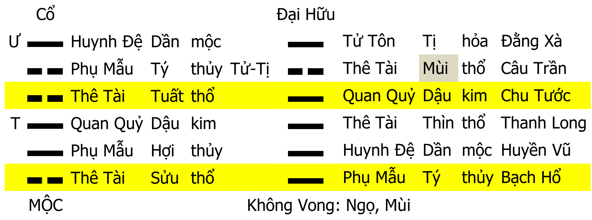
      - **Hình này chứng minh điều gì**
        - Dụng thần Tử Tôn Tị hỏa phục tàng bị Nguyệt phá và nhập Mộ vào hào 4 Tuất thổ phát động, biểu thị thị lực bị che khuất gây chứng nhược thị bẩm sinh.
      - **Từ đâu mà thấy được**
        - Tử Tôn Tị hỏa phục dưới hào 5 Tý thủy (ngũ quan), bị Nguyệt Hợi thủy xung phá; hào 4 Thê Tài Tuất thổ phát động kéo Dụng thần nhập Mộ.

##### Phân tích suy luận quẻ tượng

- Xác định Dụng thần và các tầng thương tổn:
  - Chiêm đoán bệnh tật cho con gái, theo quy tắc Lục Hào lấy hào Tử Tôn làm Dụng thần.
  - Trong quẻ chính Sơn Phong Cổ, Tử Tôn không xuất hiện trên thân quẻ mà phục tàng dưới hào 5 Phụ Mẫu Tý thủy.
  - Đánh giá lực lượng của Dụng thần Tử Tôn Tị hỏa:
    - Bị Nguyệt kiến Hợi thủy đối diện tương xung (Tị Hợi tương xung), Dụng thần rơi vào thế Nguyệt phá suy kiệt.
    - Bị Phi thần tại hào 5 là Phụ Mẫu Tý thủy áp chế khắc thương trên đầu.
    - Trong quẻ có hào 4 Thê Tài Tuất thổ phát động: Tuất thổ là Hỏa khố (Mộ khố của Hỏa). Dụng thần Tị hỏa bị hào động Tuất thổ cuốn hút nhập Mộ.
- Định vị bệnh lý vùng mắt:
  - Hào vị: Hào 5 là hào vị đại diện cho khuôn mặt và ngũ quan.
  - Ngũ hành: Hỏa đối ứng trực tiếp với đôi mắt và năng lực nhìn nhận ánh sáng.
  - Dụng thần lâm Hỏa tại hào ngũ quan bị Nguyệt phá, lại gặp tượng "nhập Mộ": Nhập Mộ là biểu tượng của sự che giấu, bao phủ, chìm trong bóng tối, mất đi ánh quang minh.
  - Kết hợp Dụng thần phục tàng (tính chất bẩm sinh, tiềm ẩn từ trước) với tượng mắt bị che khuất -> Phán đoán em bé mắc bệnh tật nghiêm trọng ở vùng mắt khiến mắt không thể nhìn rõ bình thường.

##### Kết quả và ứng nghiệm thực tế

- Kiểm chứng y khoa thực tế:
  - Người mẹ xác nhận đứa trẻ từ khi sinh ra đã mắc chứng nhược thị bẩm sinh, thị lực mắt cực kỳ yếu và không phát triển hoàn thiện.

#### Ví dụ 5: Lão tiên sinh tự đoán bệnh bản thân (Sơn Phong Cổ biến Cấn Vi Sơn)

- Bối cảnh chiêm bói và thiết lập quẻ:
  - Thời gian dự trắc: Ngày Bính Thìn, tháng Hợi (Tuần không: Tý, Sửu).
  - Tình huống: Một lão tiên sinh đích thân đến xin dự đoán tình trạng bệnh tật của bản thân, gieo được quẻ Sơn Phong Cổ biến Cấn Vi Sơn.
  - Sơ đồ quẻ Sơn Phong Cổ biến Cấn Vi Sơn minh họa hào Thế lâm Kim hợp Nhật vướng chân và Bệnh địa Hợi thủy hào 2 độc phát:
    - **Hình 36.** Quẻ Sơn Phong Cổ biến Cấn Vi Sơn
      - 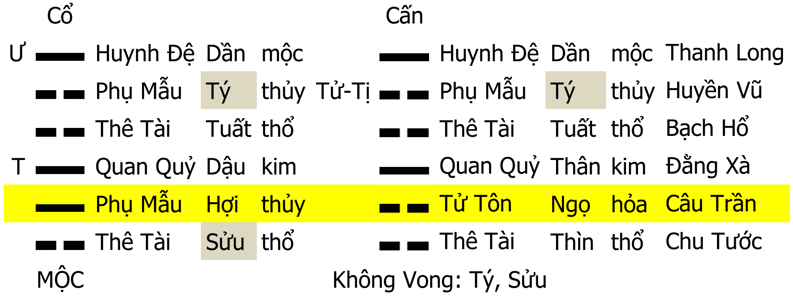
      - **Hình này chứng minh điều gì**
        - Hào Thế lâm Kim mang Đằng Xà bị Nhật hợp chủ chứng hen suyễn khó thở; Bệnh địa Hợi thủy hào 2 độc phát lâm Câu Trần chỉ bệnh sỏi thận, bàng quang và đau chân.
      - **Từ đâu mà thấy được**
        - Hào 3 Thế Quan Quỷ Dậu kim lâm Đằng Xà hợp Nhật Thìn thổ; hào 2 Phụ Mẫu Hợi thủy (Bệnh địa) động lâm Câu Trần tại cung Tốn.

##### Phân tích suy luận quẻ tượng

- Xác định Dụng thần và dấu hiệu hen suyễn đường hô hấp:
  - Lão tiên sinh tự xem bệnh cho mình nên lấy hào Thế Quan Quỷ Dậu kim làm Dụng thần.
  - Hào Thế Dậu kim được Nhật thần Thìn thổ tương sinh tương hợp (Thìn Dậu hợp sinh), trong quẻ không có hào động đến khắc nên hào Thế có căn khí vượng tướng.
  - Tuy nhiên, Dụng thần Dậu kim lại mang ngũ hành Kim: Kim chủ về hệ thống hô hấp, phế quản và phổi.
  - Hào Thế lâm thần sát Đằng Xà: Đằng Xà chủ sự co thắt, khò khè, uốn lượn nghẹt thở, tượng trưng cho chứng khí suyễn (hen suyễn).
  - Hào Thế Dậu kim bị Nhật thần Thìn thổ hợp trói (tham hợp vướng chân): Hợp trói chủ sự ngăn trở, níu giữ, biểu thị hơi thở bị ngắt quãng, đường thở bị tắc nghẽn khó khăn.
- Phân tích Bệnh địa, sỏi tiết niệu và đau nhức chi dưới:
  - Khảo sát theo vòng Tràng sinh của Kim: Dậu kim có Bệnh địa nằm tại Hợi thủy.
  - Trong quẻ, Nguyệt kiến Hợi thủy chính là Bệnh địa; đặc biệt hào 2 Phụ Mẫu Hợi thủy phát động trở thành hào độc phát duy nhất trong toàn quẻ. Hào độc phát phản ánh trọng tâm bệnh lý đang diễn tiến dữ dội.
  - Đối ứng ngũ hành và hào vị: Ngũ hành Thủy đối ứng với hệ thống thận và bàng quang. Hào 2 là hào vị của hạ tiêu, cơ quan bài tiết đường tiểu và chân.
  - Hợi thủy lâm lục thần Câu Trần: Câu Trần chủ sự tích tụ khối rắn, xơ cứng, kết tụ -> Thủy tại hào 2 lâm Câu Trần là hình tượng kết sỏi (kết thạch) ở thận và bàng quang.
  - Quái tượng: Quẻ Cổ thuộc cung Tốn; quẻ Tốn chủ về đùi, cẳng chân; hào 2 cũng là vị trí của chân. Do đó hệ thống chi dưới và khớp chân cũng bị đau nhức cản trở vận động.

##### Kết quả và ứng nghiệm thực tế

- Kiểm chứng bệnh án thực tế của lão tiên sinh:
  - Lão tiên sinh phản hồi xác nhận bản thân cùng lúc mắc nhiều căn bệnh mãn tính: bệnh hen suyễn kinh niên khiến hơi thở luôn khò khè khó nhọc, hai chân đau nhức đi lại rất khó khăn, đồng thời trong cơ thể có cả sỏi thận lẫn sỏi bàng quang đang điều trị.

## CHƯƠNG 5: QUAN HỆ GIỮA LỤC THÂN VÀ BỆNH TẬT

### 1. THỦ (LẤY) TƯỢNG LỤC THÂN ĐOÁN BỆNH

- Vai trò của Lục thân trong việc cụ thể hóa chứng bệnh:
  - Lục thân có tác dụng chuẩn xác hóa và định hình cụ thể biểu hiện bệnh lý trong dự trắc.
  - Đánh giá phương pháp cổ nhân: Người xưa đa phần chỉ lấy Quan Quỷ phối hợp với ngũ hành để phán đoán tật bệnh, nhưng thực tiễn chứng minh phương thức này không chính xác.
  - Nguyên tắc suy luận cốt lõi: Cần căn cứ chặt chẽ vào quy luật sinh, khắc, xung, hợp của Dụng thần, kết hợp phân tích biến hóa động tĩnh của Nguyên thần, Kỵ thần để luận định bệnh cảnh.

#### Quan Quỷ

##### Nguyên tắc xác định bệnh chứng theo Dụng thần và Kỵ thần
- Quan Quỷ giữ vai trò Dụng thần hoặc thần nhàn rỗi quyết định cách định vị bệnh:
  - Khi Quan Quỷ là Dụng thần: Không nên lâm vào trạng thái hưu tù, Tuần Không, Nguyệt phá; nếu hưu tù Không Phá thì lấy chính hào Quan Quỷ làm bệnh.
  - Khi Quan Quỷ là thần nhàn rỗi (không sinh khắc Dụng thần):
    - Trạng thái vượng tướng: Có thể căn cứ vào Quan Quỷ để phán đoán chứng bệnh.
    - Trạng thái hưu tù, Không Phá hoặc sinh trợ có lợi cho Dụng thần: Thông thường có thể bỏ qua không xét đến.
- Trạng thái suy vượng của Quan Quỷ khi đóng vai trò Kỵ thần:
  - Khi Quan Quỷ là Kỵ thần: Rất nên lâm hưu tù, Không Phá hoặc bị chế khắc để Dụng thần không bị tổn thương.
  - Trạng thái vượng tướng: Lấy hào Quan Quỷ làm bệnh chứng phát tác.
  - Trạng thái hưu tù, Không Phá: Không lấy Quan Quỷ làm bệnh.
  - Tiêu chí quy nạp cốt lõi: Tất cả đều căn cứ theo sự hỉ kỵ của Dụng thần để phân tích và phán đoán.

##### Biến hóa của Quan Quỷ và các dấu hiệu bệnh lý đặc thù
- Trạng thái xuất hiện nhiều Quan Quỷ hoặc Quỷ hóa Quỷ biểu thị đa bệnh:
  - Trong quẻ xuất hiện nhiều hào Quan Quỷ, hoặc Quan Quỷ phát động hóa ra Quan Quỷ: Chủ về chứng bệnh phức tạp, người bệnh mắc không chỉ một chứng bệnh.
- Kỵ thần và Nguyên thần biến Quỷ định vị ổ bệnh:
  - Kỵ thần phát động hóa ra Quan Quỷ: Xác định hào Kỵ thần biến Quỷ là bộ phận phát sinh mầm bệnh.
  - Nguyên thần phát động hóa Quan Quỷ hồi đầu khắc: Thể hiện căn nguyên sinh dưỡng bị biến đổi quay lại khắc hại, là tiêu điểm phát sinh bệnh tật.
- Nhận định bệnh tật qua Phục thần và Mộ khố của Quan Quỷ:
  - Khi Quan Quỷ không hiện trên quẻ: Hào lâm Phi thần (hào che phủ phía trên Quan Quỷ phục tàng) được xem là bộ vị tiềm tàng mầm mống bệnh tật.
  - Mộ khố của Quan Quỷ: Được dùng làm căn cứ bổ trợ để suy đoán bệnh và trạng thái tích tụ mầm bệnh.
- Tượng quẻ Dụng thần phục tàng dưới Quan Quỷ (Dụng phục Quỷ hạ):
  - Chủ về người bệnh bị bệnh tật giày vò, dây dưa trong thời gian dài hoặc bệnh tình nan giải, khó chữa khỏi.

##### Quy thuộc bệnh tật theo Ngũ hành của Quan Quỷ
- Quan Quỷ thuộc hành Kim chủ về các bệnh lý hô hấp và xương cốt:
  - Bệnh lý liên quan đến phổi, hệ hô hấp, bệnh về xương khớp, bệnh ở đại tràng,...
- Quan Quỷ thuộc hành Thủy chủ về hệ bài tiết, sinh dục và tinh huyết:
  - Các chứng bệnh về thận, bàng quang, tinh dịch và huyết dịch.
  - Biểu hiện ở nam giới: Chủ về suy thận, teo thận, đổ mồ hôi trộm (đạo hãn), di tinh.
  - Biểu hiện ở nữ giới: Chủ về huyết khô, bế kinh (tắc kinh), kinh nguyệt bất thường.
- Quan Quỷ thuộc hành Mộc chủ về bệnh lý can đởm và phong chứng:
  - Các bệnh về gan, mật hoặc kinh Can, kinh Đởm có bệnh.
  - Biểu hiện phối hợp: Đôi khi chủ về chứng viêm ruột, ngứa ngáy đau nhức, các bệnh do phong tà,...
- Quan Quỷ thuộc hành Thổ chủ về tỳ vị và da liễu:
  - Chủ về bệnh lý tỳ vị (hệ tiêu hóa, dạ dày, lá lách) và các bệnh ngoài da.
- Quan Quỷ thuộc hành Hỏa chủ về nhiệt chứng và hệ tuần hoàn:
  - Chủ về các chứng nhiệt, bệnh tim mạch, bệnh về máu huyết, các bệnh lý thuộc hệ tuần hoàn,...

##### Phân loại bộ vị cơ thể phát bệnh theo Hào vị của Quan Quỷ
- Quan Quỷ tại Sơ hào (Hào 1) ứng với hạ chi:
  - Chủ về cước khí, đau chân, đi lại khó khăn, bệnh phong thấp ở chi dưới.
- Quan Quỷ tại Hào 2 ứng với vùng hạ bộ và nội tạng thấp:
  - Chủ về bệnh ở cẳng chân, đầu gối, cơ quan sinh dục, đại tràng, trực tràng, gan mật,...
- Quan Quỷ tại Hào 3 ứng với vùng bụng và thắt lưng:
  - Chủ về bệnh tỳ vị, ổ bụng, vùng thắt lưng, thận, cơ quan sinh dục.
- Quan Quỷ tại Hào 4 ứng với vùng ngực và nội tạng trung tầng:
  - Chủ về bệnh ở vùng ngực, gan mật, tim, lưng, tuyến vú,...
- Quan Quỷ tại Hào 5 ứng với vùng ngực trên, ngũ quan và chi trên:
  - Chủ về bệnh vùng ngực, tim, phổi, ngũ quan, mặt, cổ, cánh tay,...
- Quan Quỷ tại Hào 6 ứng với đầu não và hệ thần kinh:
  - Chủ về bệnh ở đầu: đau đầu, váng đầu chóng mặt, suy giảm trí nhớ, xuất huyết não, tắc mạch máu não, cao huyết áp, suy nhược thần kinh,...

#### Phụ Mẫu

##### Ý nghĩa tổng quan của tượng Phụ Mẫu

- **Phụ Mẫu chủ về vị trí cơ thể và bệnh lý cơ quan**:
  - Thể hiện bệnh ở đầu, ngực, bụng, và ngoài da.
- **Phụ Mẫu chủ về ngoại nhân, tai nạn và môi trường**:
  - Thương tổn phát sinh do tai nạn xe thuyền, sự cố tại công trường xây dựng.
  - Bệnh do khí trường hoàn cảnh mất cân đối, dầm mưa dãi nắng mà phát bệnh.
- **Phụ Mẫu chủ về tình chí, tâm thần và lao lực**:
  - Bệnh khởi phát từ lo âu, tâm thần bất an, u sầu buồn bã, tức giận.
  - Bệnh do làm việc khó nhọc, lao lực quá độ mà suy nhược.

##### Tượng bệnh của Phụ Mẫu phân định theo sáu hào vị

- **Phụ Mẫu tại hào sơ**:
  - Chủ thương tổn vì tai nạn xe cộ.
  - Chủ bệnh do cực khổ, bôn ba vất vả, hoặc ngủ bị nhiễm lạnh dẫn tới phát bệnh.
  - Chủ bệnh do tà khí môi trường lòng đất: tác động bởi vật phóng xạ trong lòng đất, mộ cổ, xương khô, hoặc âm khí xâm nhập dẫn tới bệnh.
- **Phụ Mẫu tại hào 2**:
  - Chủ bệnh do thiếu ngủ, việc nhà vất vả, hoặc vì áp lực từ trưởng bối.
  - Chủ môi trường phong thủy: phong thủy phòng ốc mất cân đối dẫn đến sinh bệnh.
  - Chủ dinh dưỡng: ăn uống không điều độ, thiếu hụt dinh dưỡng gây nên bệnh.
- **Phụ Mẫu tại hào 3**:
  - Chủ ngủ bị nhiễm lạnh, giấc ngủ bất an, gặp ác mộng kinh hoàng.
  - Chủ bệnh lý tạng phủ và tiêu hóa: bụng trướng, tiêu chảy.
  - Chủ không gian sống bế khí: cửa sổ không thông gió, không khí không lưu thông mà sinh bệnh.
- **Phụ Mẫu tại hào 4**:
  - Chủ nguyên nhân từ trưởng bối, hoặc do mặc quần áo phong phanh bị nhiễm lạnh.
  - Chủ bệnh lý vùng ngực: ngực có bệnh, tức ngực, khó thở.
  - Chủ chứng bệnh ách tắc bài tiết: táo bón, tiểu tiện không thông.
- **Phụ Mẫu tại hào 5**:
  - Chủ ngoại cảm và giao thông: bị phát bệnh ở bên ngoài, mắc bệnh trên đường đi, hoặc bị tai nạn xe cộ.
  - Chủ bệnh lý hô hấp và tuần hoàn: ngực và phổi có bệnh.
- **Phụ Mẫu tại hào 6**:
  - Chủ bệnh lý vùng đầu: phần lớn chủ bệnh ở đầu, đau đầu, khí huyết nghịch thượng.
  - Chủ hao tổn tinh thần: suy nghĩ hao tổn tâm trí, lo lắng quá độ.
  - Chủ trạng thái thần kinh trầm trọng: bệnh nhân rơi vào trạng thái hôn mê bất tỉnh.

#### Huynh Đệ

- Ý nghĩa tượng trưng tổng quát của Huynh Đệ trong dự trắc bệnh tật:
  - Huynh Đệ biểu hiện bệnh tật tại các bộ phận vận động và tứ chi: tay, bàn chân, cẳng chân, cánh tay, vai.
  - Huynh Đệ chủ về hệ tiêu hóa và chứng trạng tiêu hóa thức ăn.
- Biểu hiện bệnh lý của Huynh Đệ phối hợp theo sáu hào vị:
  - Huynh Đệ tại hào sơ:
    - Chủ về bàn chân có bệnh, dẫn đến đi lại khó khăn.
    - Hào sơ kỵ gặp Không Vong hoặc Nguyệt Phá:
      - Gặp Không Vong: Bàn chân không chạm đất (đi đứng khó khăn, chân yếu không đứng vững).
      - Gặp Phá: Bàn chân bị thương tật, mang tổn thương.
  - Huynh Đệ tại hào 2:
    - Chủ về bàn chân hoặc đầu gối phát sinh bệnh.
    - Chủ về bệnh do ăn uống không đúng cách gây rối loạn tiêu hóa, tiêu chảy.
    - Chủ về bệnh phát sinh do phòng sự quá độ.
    - Chủ về đại tiểu tiện gặp trục trặc, bài tiết có vấn đề.
  - Huynh Đệ tại hào 3:
    - Chủ về đùi, xương chậu hoặc thắt lưng có bệnh.
    - Chủ về bệnh do tiêu hóa không tốt dẫn đến.
  - Huynh Đệ tại hào 4:
    - Chủ về xương sườn, cánh tay hoặc dạ dày có bệnh.
  - Huynh Đệ tại hào 5:
    - Chủ về bàn tay, bả vai, cánh tay, cổ họng hoặc ngũ quan (mắt, mũi, tai, miệng...) có bệnh.
  - Huynh Đệ tại hào 6:
    - Chủ về bị đả thương (ngoại lực đánh đập, chấn thương).
    - Chủ về cánh tay, bàn tay phát sinh bệnh tật.

#### Tử Tôn

- Tượng cơ thể và đặc tính phản ánh của Lục thân Tử Tôn trong dự trắc bệnh tật:
  - Đại diện cho các bộ phận và cơ quan trên cơ thể: vú, họng, mắt, tai, khoang miệng, mũi, thực quản, đường hô hấp, khí quản, mạch máu, bộ phận sinh dục nam và nữ.
  - Đại diện cho yếu tố y tế và giải trừ bệnh tật: Tử Tôn là phúc thần, tượng trưng cho thầy thuốc, dược phẩm, biện pháp trị liệu và khả năng giải độc, nâng cao chính khí khắc chế Quan Quỷ.

##### Biểu hiện bệnh lý của Tử Tôn phân theo từng hào vị

- Tử Tôn lâm hào sơ:
  - Chủ về thương tích ngoại sinh do động vật cắn hoặc do trẻ nhỏ gây ra.
- Tử Tôn lâm hào 2:
  - Chủ về trở ngại bộ phận sinh dục và cơ quan bài tiết: đại tiểu tiện có tật, bệnh đường ruột.
  - Chủ về bệnh lý nam khoa và chức năng sinh lý: liệt dương, xuất tinh sớm, sa tinh hoàn.
  - Chủ về bệnh phụ khoa và sinh sản nữ: vô sinh, sảy thai, kinh nguyệt không điều hòa.
  - Chủ về viêm nhiễm đường tiết niệu và bệnh truyền nhiễm: tiểu ra máu, bệnh lậu, các bệnh lây qua đường sinh dục.
- Tử Tôn lâm hào 3:
  - Chủ về bệnh phát sinh do phòng sự quá độ.
  - Chủ về chứng vô sinh hoặc các bệnh lý tổn thương tại bộ phận sinh dục.
- Tử Tôn lâm hào 4:
  - Chủ về bệnh lý vùng ngực và tiêu hóa trên: bệnh ở tuyến vú, bệnh thực quản.
- Tử Tôn lâm hào 5:
  - Chủ về bệnh lý hô hấp và các cơ quan ngũ quan: ngũ quan (mắt, tai, mũi, miệng, họng), thực quản, đường hô hấp có bệnh.
- Tử Tôn lâm hào 6:
  - Chủ về hệ thống tuần hoàn huyết dịch: cung cấp máu không đủ, thiếu máu, huyết áp không ổn định.

#### Thê Tài

##### Ý nghĩa biểu trưng của Thê Tài trong cơ thể và sinh lý

- **Thê Tài chủ về các thể dịch, bài tiết và thành phần sinh hóa cơ thể**:
  - Thể hiện sự ẩm thực (ăn uống), huyết dịch (máu).
  - Thể hiện chức năng hô hấp, sự bài tiết phân và nước tiểu.
  - Thể hiện tủy não, tủy xương, nước mắt, nước mũi, ráy tai.
  - Thể hiện tinh dịch, kinh nguyệt, tế bào trứng, nước bọt, trung tiện (rắm), mồ hôi.

##### Tượng bệnh của Thê Tài phân định theo sáu hào vị

- **Thê Tài tại hào sơ**:
  - Chủ bệnh phát sinh do cấp dưới, người giúp việc, bảo mẫu gây nên.
  - Chủ tổn thương, ngộ độc do thực vật (cây cỏ, thức ăn) gây hại mà thành bệnh.
- **Thê Tài tại hào 2**:
  - Chủ bệnh lý tại vùng hậu môn, đại tiểu tiện bất thường (bí đại tiện, tiêu chảy, tiểu rắt, tiểu buốt).
- **Thê Tài tại hào 3**:
  - Chủ bệnh lý vùng hậu môn, thắt lưng, ổ bụng đau tức.
  - Chủ chứng tỳ vị bất hòa, rối loạn chức năng tiêu hóa.
- **Thê Tài tại hào 4**:
  - Chủ bệnh lý dạ dày, bệnh thận, vùng vú có bệnh biến.
  - Chủ đường hô hấp không thông suốt, tức ngực, khó thở.
- **Thê Tài tại hào 5**:
  - Chủ chứng chán ăn, không muốn ăn uống, rối loạn tiêu hóa nghiêm trọng.
  - Chủ phụ nữ sinh nở tắc sữa, sữa không tiết xuống được.
  - Chủ viêm nhiễm đường hô hấp, hen suyễn, khí nghịch.
- **Thê Tài tại hào 6**:
  - Chủ tổn thương tóc, chứng rụng tóc, hói đầu.
  - Chủ bệnh lý tuần hoàn máu ở đầu, huyết áp biến động bất thường.

##### Phân tích các ca bệnh thực tế qua tượng Thê Tài

- **Ví dụ 1: Nam đoán bệnh bản thân (Ngày Tân Hợi tháng Dậu, gieo được quẻ Phong Sơn Tiệm biến Phong Hỏa Gia Nhân)**:
  - **Hình 37.** Sơ đồ quẻ Phong Sơn Tiệm biến Phong Hỏa Gia Nhân
    - 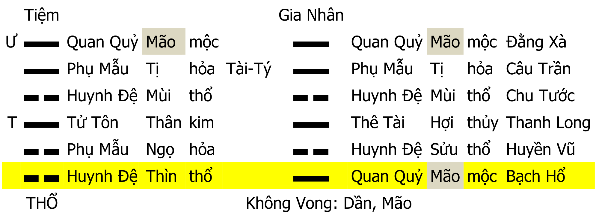
    - **Hình này chứng minh điều gì**
      - Dự trắc người bệnh có khối u trong mạch máu ở đùi ảnh hưởng đi lại, mũi sưng tắc, từng phẫu thuật năm 1999.
    - **Từ đâu mà thấy được**
      - Thế lâm Thân kim bệnh tại Nhật; sơ hào Thìn thổ Tài khố động hóa Quỷ Mão mộc lâm Bạch Hổ; Tị hỏa ám động khắc hợp.
  - **Phán đoán chi tiết:**
    - Xác định Dụng thần và trạng thái hào Thế:
      - Tự đoán bệnh lấy hào Thế làm Dụng thần; trong quẻ Thế là Tử Tôn Thân kim tại hào 3.
      - Thế Thân kim được Nguyệt kiến Dậu kim tỉ phù vượng tướng, nhưng gặp Nhật thần Hợi thủy là đất Bệnh (Thân kim bệnh tại Hợi theo quy luật Trường sinh), chứng tỏ bản thân có bệnh tật.
      - Hào Thế lâm Thanh Long; Thanh Long chủ về đau nhức, phán đoán người này đang chịu đau nhức do bệnh tật gây ra.
    - Phân tích hào động then chốt và vị trí bệnh ở chân:
      - Hào sơ Huynh Đệ Thìn thổ là Nguyên thần sinh Thế phát động, nhưng bị hào biến Quan Quỷ Mão mộc hồi đầu khắc.
      - Căn cứ luận bệnh tại hào sơ: Nguyên thần bị thương dùng luận bệnh; hào động biến Quỷ dùng luận bệnh; Nguyên thần hóa Không hóa Phá dùng luận bệnh; hào độc phát nắm quyền chủ chốt của quẻ.
      - Hào sơ chủ về bàn chân; Huynh Đệ chủ về vận động đi lại; Huynh Đệ động hóa Quan Quỷ là tổ hợp thương tật chân tay; hào Thế cư hào 3 là đùi; tổng hợp phán đoán chân có bệnh làm cản trở việc đi đứng.
    - Bản chất khối u mạch máu và tác động của Kỵ thần:
      - Hào sơ Thìn thổ lâm Bạch Hổ; Bạch Hổ chủ bệnh tật và máu huyết; Thìn thổ là Thê Tài khố (thủy khố); Thê Tài là thủy chủ về máu, nên Thìn thổ là huyết quản bao bọc máu, chỉ rõ mạch máu ở chân có sự cố.
      - Kỵ thần Phụ Mẫu Tị hỏa tại hào 2 lâm Câu Trần ám động đến khắc hợp hào Thế (Tị Thân hợp khắc); Kỵ thần chủ bệnh tật; tương hợp chủ bệnh tật triền miên quấn lấy thân; Câu Trần chủ sưng trướng, bướu thịt.
      - Kết luận: Trong mạch máu ở chân và đùi có khối u, người bệnh muốn tiến hành phẫu thuật.
  - **Giải đáp đối thoại biện chứng chuyên sâu:**
    - Về nghi vấn Quan Quỷ Mão mộc ngộ Không Phá có khắc được Thìn thổ:
      - Mão mộc tuy lâm Nguyệt phá và Tuần Không, nhưng được Nhật thần Hợi thủy sinh phù nên tiềm tàng lực lượng.
      - Đến năm Kỷ Mão (1999) là thời điểm Thực Không Thực Phá; Mão mộc lâm Bạch Hổ chủ về đao kéo phẫu thuật; người này năm 1999 đã từng phẫu thuật một lần do chân không thể đi lại.
    - Về vai trò của Kỵ thần Phụ Mẫu Tị hỏa ám động và chứng bệnh phụ:
      - Hào sơ là hào độc phát nắm quyền trung tâm quẻ; Phụ Mẫu Tị hỏa ám động không có Nhật Nguyệt phù trợ nên lực lượng nhỏ, biểu thị bệnh phụ chứ không phải bệnh chính.
      - Quẻ thuộc cung Cấn (Cấn là mũi); hào 5 Phụ Mẫu Tị hỏa cũng quản về mũi; Câu Trần chủ sưng trướng; Tị hỏa là Tuyệt địa của thủy; Thê Tài chủ nước mũi dịch nhầy; Tị là Tuyệt ở Tài tức không có dịch mũi; Câu Trần chủ bế tắc, vướng víu; suy ra mũi người này bị sưng nghẹt, không thông khí.
  - **Ứng nghiệm thực tế:**
    - Người bệnh xác nhận thực tế có khối u trong mạch máu ở đùi đang chuẩn bị mổ, mũi bị sưng tắc nghẽn, và năm 1999 đã từng phẫu thuật chân do đi lại khó khăn.

- **Ví dụ 2: Nữ đoán bệnh bản thân (Ngày Giáp Dần tháng Sửu, gieo được quẻ Sơn Lôi Di biến Trạch Lôi Tùy)**:
  - **Hình 38.** Sơ đồ quẻ Sơn Lôi Di biến Trạch Lôi Tùy
    - 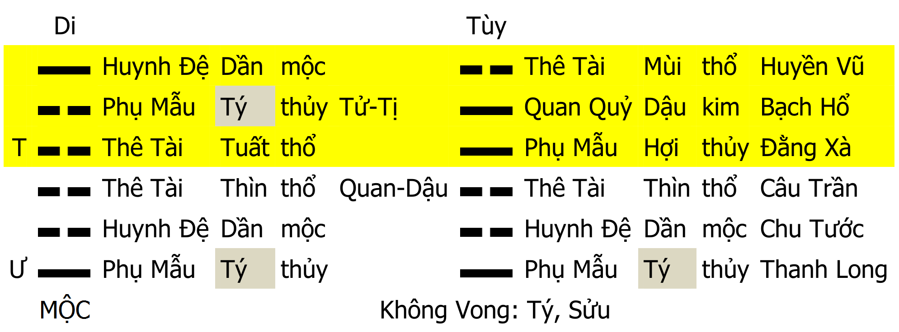
    - **Hình này chứng minh điều gì**
      - Dự trắc người bệnh bị tỳ vị bất hòa, dạ dày khó chịu, thức ăn tiêu hóa kém.
    - **Từ đâu mà thấy được**
      - Hào Thế Thê Tài Tuất thổ tại hào 4 bị Nhật thần Dần mộc và hào 6 Huynh Đệ Dần mộc động khắc mạnh.
  - **Phán đoán chi tiết:**
    - Căn cứ Dụng thần và quy tắc tìm bệnh:
      - Tự đoán bệnh lấy hào Thế làm Dụng thần; trong quẻ hào Thế là Thê Tài Tuất thổ cư tại hào 4.
      - Hào Thế bị Nhật thần Giáp Dần mộc khắc phạt; đồng thời hào 6 Huynh Đệ Dần mộc phát động khắc Thế; theo nguyên tắc: nơi bị khắc chính là nơi phát sinh bệnh tật.
    - Căn cứ hào vị, lục thân và ngũ hành xác định bệnh chứng:
      - Hào Thế cư tại hào 4; hào 4 là hào vị đại diện cho dạ dày.
      - Hào Thế lâm lục thân Thê Tài; Thê Tài chủ về sự ăn uống, nạp dưỡng chất (ẩm thực).
      - Ngũ hành của hào Thế là thổ; thổ quản về tạng phủ tỳ vị.
      - Tổng hợp các yếu tố: Khẳng định bệnh nhân bị tỳ vị bất hòa, rối loạn tiêu hóa và dạ dày khó chịu.
  - **Ứng nghiệm thực tế:**
    - Bệnh nhân phản hồi dạ dày thường xuyên khó chịu, chức năng tiêu hóa thức ăn rất kém.

- **Ví dụ 3: Nữ đoán bệnh cho chồng (Ngày Đinh Dậu tháng Tuất, gieo được quẻ Hỏa Sơn Lữ biến Ly Vi Hỏa)**:
  - **Hình 39.** Sơ đồ quẻ Hỏa Sơn Lữ biến Ly Vi Hỏa
    - 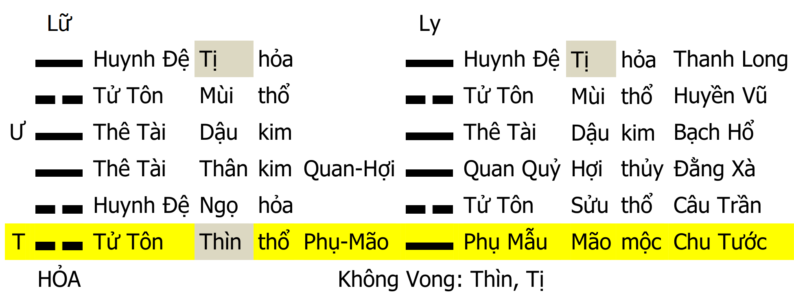
    - **Hình này chứng minh điều gì**
      - Dự trắc người chồng bị bệnh ở ruột non, tiểu tiện không ra, đến tháng Hợi thì khỏi bệnh.
    - **Từ đâu mà thấy được**
      - Dụng thần Quan Quỷ Hợi thủy phục dưới hào 3 Thê Tài lâm Đằng Xà, thủy nhập Mộ; Kỵ thần Không Phá, Dụng thần được sinh.
  - **Phán đoán chi tiết:**
    - Căn cứ Dụng thần và trạng thái khắc phạt:
      - Đoán bệnh của chồng lấy Quan Quỷ làm Dụng thần; trong quẻ Quan Quỷ Hợi thủy không hiện, phục tàng dưới hào 3 Thê Tài Thân kim.
      - Nguyên tắc dự trắc: Dụng thần Quan Quỷ bị khắc chính là căn nguyên bệnh tật.
      - Dụng thần Hợi thủy bị Nguyệt kiến Tuất thổ khắc; hào sơ Tử Tôn Thìn thổ động đến khắc; tuy nhiên Thìn thổ lâm Tuần Không (tuần Giáp Dần tuần không Thìn, Tị) và hóa Phụ Mẫu Mão mộc hồi đầu khắc, nên điểm cốt lõi bệnh nằm tại Dụng thần phục tàng.
    - Phân tích cơ quan ruột non và chứng bí tiểu:
      - Dụng thần phục dưới hào 3; hào 3 là hào vị của ruột; hào lâm Đằng Xà (tượng hình dài nhỏ, ngoằn ngoèo); quẻ biến thuộc cung Ly (Ly chủ về ruột); khẳng định ruột có bệnh lý.
      - Dụng thần Hợi thủy nhập Mộ tại Nguyệt Tuất và hào Thìn, lại phục tàng không xuất hiện; ngũ hành thủy chủ về nước tiểu; Đằng Xà chủ sự co thắt, thiếu hụt; suy ra chứng bệnh tiểu tiện không ra, bí tiểu.
    - Tiên lượng cát hung và ứng kỳ khỏi bệnh:
      - Kỵ thần Thìn thổ vừa Không vừa Phá mất lực khắc chế; Dụng thần Hợi thủy được Nhật thần Dậu kim sinh và Phi thần Thân kim sinh trợ, sinh khí dồi dào nên tính mạng bình an.
      - Theo quy luật: phục thần gặp thời điểm trị nguyệt xuất hiện sẽ đắc lực; bước sang tháng Hợi Dụng thần xuất hiện thực giá trị thì bệnh tật tự nhiên thuyên giảm và khỏi hẳn.
  - **Ứng nghiệm thực tế:**
    - Người chồng mắc bệnh ruột non không tốt, tiểu tiện bí tắc không thể đi tiểu; đúng đến tháng Hợi thì bệnh lành hoàn toàn.

- **Ví dụ 4: Nữ đoán bệnh bản thân (Ngày Ất Dậu tháng Tuất, gieo được quẻ Trạch Thiên Quải biến Lôi Thiên Đại Tráng)**:
  - **Hình 40.** Sơ đồ quẻ Trạch Thiên Quải biến Lôi Thiên Đại Tráng
    - 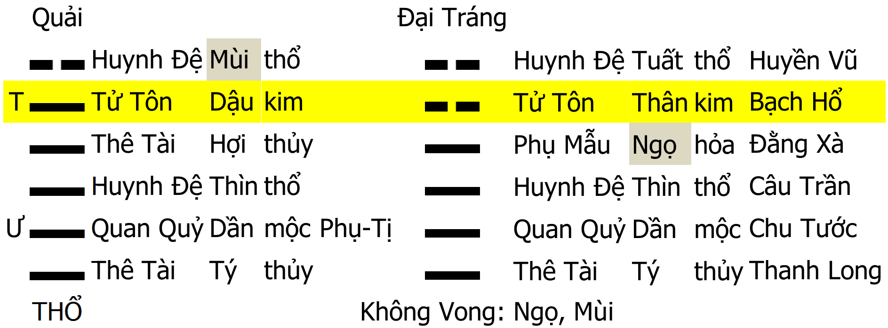
    - **Hình này chứng minh điều gì**
      - Dự trắc người bệnh bị viêm quanh khớp vai, thiếu máu não và u nang buồng trứng.
    - **Từ đâu mà thấy được**
      - Hào 5 Thế Dậu kim hóa thoái; hào 6 Huyền Vũ Không Vong; hào 3 Thìn thổ Tài khố bị Nguyệt phá lâm Câu Trần.
  - **Phán đoán chi tiết:**
    - Luận bệnh viêm quanh khớp vai và thiếu máu:
      - Tự đoán bệnh lấy hào Thế làm Dụng thần; hào Thế Tử Tôn Dậu kim tại hào 5 động hóa thoái thành Thân kim.
      - Hào 6 Huynh Đệ Mùi thổ là Nguyên thần lâm Huyền Vũ ngộ Tuần Không (tuần Giáp Thân tuần không Ngọ, Mùi); Huyền Vũ chủ khí ẩm thấp lạnh; vị trí hào 5 và hào 6 tương ứng bờ vai; kim phối hợp Huyền Vũ là tượng điển hình của viêm quanh khớp vai, vai cử động đau đớn.
      - Hào 6 là đầu não; Nguyên thần lâm Không không thể sinh Thế; hào Thế lâm Bạch Hổ chủ về huyết dịch suy kiệt; kết luận người bệnh bị chứng thiếu máu.
    - Luận bệnh u nang buồng trứng qua hào vị và Thê Tài khố:
      - Hào 3 Huynh Đệ Thìn thổ là Nguyên thần bị Nguyệt kiến Tuất thổ xung phá (Nguyệt phá); hào bị phá lấy làm bệnh.
      - Hào 3 là hào vị chủ về bụng dưới, tử cung; Thìn thổ là Thê Tài khố (kho chứa thủy); lục thân Thê Tài chủ về tế bào trứng (noãn); do đó Thìn thổ Thê Tài khố đại diện cho buồng trứng.
      - Hào 3 lâm Câu Trần; Câu Trần chủ về sưng phù, khối u nang bế tắc; tổng hợp lại phán đoán người bệnh có khối u nang buồng trứng.
  - **Ứng nghiệm thực tế:**
    - Mọi phán đoán về viêm quanh khớp vai, thiếu máu và u nang buồng trứng đều chuẩn xác với chẩn đoán y khoa thực tế của bệnh nhân.

- **Ví dụ 5: Nam mới bị bệnh đoán bệnh bản thân (Ngày Quý Mùi tháng Thìn, gieo được quẻ Thủy Địa Tỷ biến Khôn Vi Địa)**:
  - **Hình 41.** Sơ đồ quẻ Thủy Địa Tỷ biến Khôn Vi Địa
    - 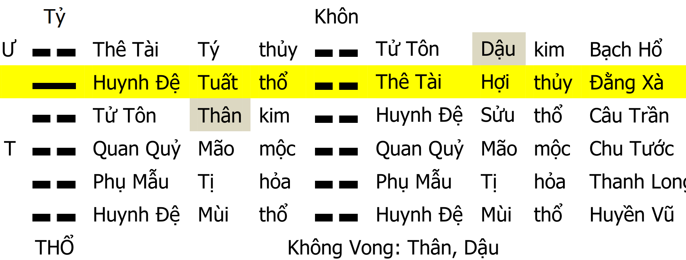
    - **Hình này chứng minh điều gì**
      - Dự trắc người bệnh mắc chứng đau dạ dày khó chịu chứ không phải bệnh viêm gan.
    - **Từ đâu mà thấy được**
      - Thế lâm Mão mộc tại hào 3; hào 5 Huynh Đệ Tuất thổ độc phát tương hợp hào Thế biểu thị ổ bệnh ở dạ dày.
  - **Phán đoán chi tiết:**
    - Căn cứ Dụng thần và phân định nguy cơ sinh tử:
      - Tự đoán bệnh lấy hào Thế làm Dụng thần; trong quẻ hào Thế là Quan Quỷ Mão mộc tại hào 3.
      - Hào Thế tuy không được Nhật Nguyệt sinh phù nhưng không bị hình xung khắc hại; người mới mắc bệnh (tân bệnh) gặp quẻ không bị khắc hại thì vô sự, không nguy hiểm tính mạng.
    - Phân biệt chẩn đoán giữa bệnh gan và bệnh dạ dày:
      - Hào Thế Mão mộc đóng hào 3 lâm Chu Tước; theo lệ thường mộc chủ can đởm, Chu Tước chủ viêm nhiễm sưng nóng, hào 3 là vùng mạn sườn dễ phán đoán nhầm thành bệnh viêm gan.
      - Điểm mấu chốt nằm ở hào độc phát: Hào 5 Huynh Đệ Tuất thổ là hào phát động duy nhất trong quẻ, động đến hợp với hào Thế (Mão Tuất lục hợp); hào độc phát tương hợp Thế biểu thị căn nguyên tật bệnh cuốn hút vào thân.
      - Hào 5 là hào vị của dạ dày; ngũ hành thổ chủ về tỳ vị; lục thân Huynh Đệ lại chủ về thức ăn dạ dày dung nạp; do đó ổ bệnh thực sự nằm tại dạ dày chứ không phải ở gan.
  - **Ứng nghiệm thực tế:**
    - Người bệnh xác nhận bản thân bị đau dạ dày, dạ dày thường xuyên khó chịu.

### 2. THỦ TƯỢNG LỤC THÂN HỖ HÓA (BIẾN HÓA LẪN NHAU)

- Bản chất và nguyên tắc phân tích lục thân phát động biến hóa:
  - Lục thân phát động tất nhiên sinh ra biến hóa, trực tiếp liên quan đến cát hung của bệnh tật và phản ánh lượng thông tin phong phú về nguyên nhân, tiến triển bệnh trạng.
  - Phân tích cát hung phải luôn xoay quanh Dụng thần; các thông tin bệnh lý cụ thể được suy đoán dựa vào ý nghĩa bản thân lục thân kết hợp thủ tượng linh hoạt.
  - Cát hung và thông tin tồn tại đồng thời trên cùng một hào quẻ; giải đoán không được suy diễn cứng nhắc mà cần kết hợp hào vị, lục thần và ngũ hành để suy xét.

#### Quan Quỷ hỗ hóa

- Đặc trưng cơ bản của Quan Quỷ trong chiêm bệnh:
  - Quan Quỷ thường đại diện cho chứng bệnh, nguồn cơn bệnh tật, trạng thái lo âu, nguy hiểm và đau đớn.
  - Phán đoán chuyển biến bệnh tật căn cứ vào mối quan hệ sinh khắc biến hóa giữa hào biến và hào Quan Quỷ phát động.
- Ý nghĩa các dạng biến hóa của hào Quan Quỷ:
  - Quan Quỷ hóa Tử Tôn: Hào biến quay lại khắc hào động (hóa hồi đầu khắc); nếu Quan Quỷ là Kỵ thần, Cừu thần hoặc thần nhàn rỗi thì bệnh tình chuyển biến tốt đẹp, phương dược phát huy hiệu nghiệm, giải tỏa mọi lo âu, y thuật của thầy thuốc cao minh.
  - Quan Quỷ hóa Tiến thần: Bệnh tình phát triển nặng thêm hoặc mắc thêm chứng bệnh mới phát sinh, nỗi lo lắng chồng chất, diễn biến bệnh tật chuyển xấu.
  - Quan Quỷ hóa Thoái thần: Bệnh tình thuyên giảm dần dần, tâm trạng người bệnh từng bước ổn định, an tâm.
  - Quan Quỷ hóa Thê Tài: Phát bệnh do ăn uống sai cách, hoặc bệnh tình chuyển biến nguy cấp, tính mạng khó bề bảo toàn, hoặc căn nguyên mắc bệnh bắt nguồn từ tửu sắc, phụ nữ.
  - Quan Quỷ hóa Huynh Đệ: Cần đề phòng thương tật ở tay chân, tứ chi vận động không linh hoạt, hoặc do bệnh mà ăn uống không vào, bệnh tình gây rên rỉ đau đớn, hoặc biểu thị phát sinh chi phí chữa trị tốn kém.
  - Quan Quỷ hóa Phụ Mẫu: Bụng dạ đầy trướng khó chịu, vì chữa bệnh mà phải vất vả ngược xuôi bôn ba, vì bệnh tật mà tính khí biến đổi dễ nổi giận, hoặc mắc bệnh có liên quan đến bậc trưởng bối, phương tiện xe thuyền, giấy tờ văn thư.

#### Tử Tôn hỗ hóa

- Đặc trưng cơ bản của Tử Tôn trong chiêm bệnh:
  - Tử Tôn là Phúc thần, đại diện cho y dược, thầy thuốc, tâm trạng hoan hỷ, an vui, khả năng giải trừ tai ách và xua tan lo âu.
- Ý nghĩa các dạng biến hóa của hào Tử Tôn:
  - Tử Tôn hóa Quan Quỷ: Tượng vui quá hóa buồn, hoặc phát sinh bệnh tật do tác dụng phụ của thuốc (bệnh do dùng thuốc), dinh dưỡng mất cân bằng, trẻ nhỏ gặp nguy cơ đe dọa tính mạng; thuốc dùng có vấn đề khiến bệnh cũ chưa dứt đã mắc thêm bệnh mới; thuốc bị biến chất không thể sử dụng; hoặc mắc bệnh do đam mê rượu chè, ăn chơi sa đọa.
  - Tử Tôn hóa Phụ Mẫu: Y dược suy giảm hoặc mất tác dụng, việc điều trị không mang lại hiệu quả; người bệnh chán ghét không muốn uống thuốc; tính khí người bệnh trở nên cáu gắt khó chịu; bệnh nhân không thể hưng phấn quá mức; trẻ nhỏ bệnh tình nguy kịch; hoặc người bệnh bị cấm chỉ không được uống rượu.
  - Tử Tôn hóa Thê Tài: Tinh thần rộng mở, tính khí cởi mở vui vẻ sau khi dùng thuốc; sức ăn uống gia tăng sau khi uống thuốc; hoặc áp dụng liệu pháp dinh dưỡng thực liệu để trị bệnh.
  - Tử Tôn hóa Huynh Đệ: Thuốc phát huy hiệu nghiệm nhưng tác dụng chậm rãi; thể lực và sức lực của người bệnh tăng dần sau khi uống thuốc.
  - Tử Tôn hóa Tử Tôn: Thay đổi đơn thuốc, uống thuốc lẫn lộn nhiều thứ, hoặc đang sử dụng đồng thời nhiều loại thuốc chữa trị cùng lúc.
  - Tử Tôn hóa Tiến thần và Thoái thần: Hóa Tiến thần biểu thị phương thuốc ngày càng phát huy công hiệu rõ rệt; hóa Thoái thần biểu thị thuốc dần suy giảm hiệu lực, không còn tác dụng hoặc cơ thể đã sản sinh tính kháng thuốc.

#### Huynh Đệ hỗ hóa

- Đặc trưng cơ bản của Huynh Đệ trong chiêm bệnh:
  - Huynh Đệ là thần cản trở cách trở, chủ về tay chân, sự vận động đi đứng, đồng thời chủ về hao phí tiền tài.
- Ý nghĩa các dạng biến hóa của hào Huynh Đệ:
  - Huynh Đệ hóa Tử Tôn: Phải chi tiêu hao tổn tiền bạc để mua sắm thuốc men, hoặc biểu thị chân tay tứ chi rã rời vô lực.
  - Huynh Đệ hóa Quan Quỷ: Chân tay chịu tổn thương, đi lại cử động gặp trở ngại khó khăn.
  - Huynh Đệ hóa Thê Tài: Bị gượng ép phải ăn uống, hoặc phải đi vay mượn tiền bạc để trang trải chi phí khám bệnh.
  - Huynh Đệ hóa Phụ Mẫu: Sức lực ở chân tăng tiến dần dần, hoặc chủ về chân tay sợ lạnh, buốt giá.
  - Huynh Đệ hóa Tiến thần: Viện phí và chi phí trị liệu gia tăng tốn kém; hoặc ăn uống không tiêu, bệnh tật dây dưa khó lành; hoặc sức lực tay chân từng bước phục hồi.
  - Huynh Đệ hóa Thoái thần: Chân tay bị teo rút, gân cốt suy yếu, mềm yếu không có lực.

#### Thê Tài hỗ hóa

- Đặc trưng cơ bản của Thê Tài trong chiêm bệnh:
  - Thê Tài đại diện cho ăn uống ẩm thực, máu và tuần hoàn huyết dịch, hơi thở và hệ thống hô hấp, tài vật viện phí.
- Ý nghĩa các dạng biến hóa của hào Thê Tài:
  - Thê Tài hóa Tử Tôn: Ăn uống liên tục không ngừng, hoặc dùng chế độ ăn uống bồi bổ thay thế cho việc uống thuốc (thực dưỡng trị liệu).
  - Thê Tài động hóa Quan Quỷ: Mắc bệnh do ăn uống không điều độ; nhiễm trùng đường máu; nhiễm trùng đường hô hấp; hoặc đổ bệnh do lo nghĩ gánh nặng tiền thuốc men.
  - Thê Tài động hóa Huynh Đệ: Ăn uống không trôi, nuốt không vào, đồng thời tiêu tốn hao tổn rất nhiều tiền của.
  - Thê Tài động hóa Phụ Mẫu: Việc ăn uống không kiêng khem cẩn thận làm ảnh hưởng xấu đến dược lực của thuốc.
  - Thê Tài động hóa Tiến thần: Lượng ăn uống ngày một tăng lên; tuần hoàn máu lưu thông tốt; đường thở thông suốt, hô hấp thuận lợi.
  - Thê Tài động hóa Thoái thần: Khẩu phần ăn uống giảm dần; kinh nguyệt rối loạn, nghịch kinh hoặc xuất hiện nôn mửa.

#### Phụ Mẫu hỗ hóa

- Đặc trưng cơ bản của Phụ Mẫu trong chiêm bệnh:
  - Phụ Mẫu đại diện cho sự lao lực khó nhọc, đầu mối bệnh viện điều trị, giấy tờ y bạ, nhịp đập của mạch tượng.
- Ý nghĩa các dạng biến hóa của hào Phụ Mẫu:
  - Phụ Mẫu hóa Quan Quỷ: Phát bệnh do làm việc vất vả lao lực và lo nghĩ; bệnh nhỏ không kịp thời chữa trị biến thành bệnh lớn nguy hiểm; ngã bệnh do sự cố tàu thuyền xe cộ hoặc do tức giận phẫn uất; hoặc chủ về tinh lực suy kiệt không đủ.
  - Phụ Mẫu động hóa Tử Tôn: Thuốc thang khó tìm kiếm; hoặc phải dừng đơn thuốc cũ để đổi sang loại thuốc mới.
  - Phụ Mẫu động hóa Thê Tài: Bậc cha mẹ bệnh tình nguy kịch; hoặc người nhà phải chạy vạy vay mượn tiền bạc khắp nơi; hoặc bệnh nhân kháng cự không muốn nằm viện chữa trị.
  - Phụ Mẫu động hóa Huynh Đệ: Xảy ra cãi vã, khẩu thiệt thị phi; mạch tượng suy yếu, đập chậm lại.
  - Phụ Mẫu động hóa Tiến thần: Có thuốc nhưng khó đưa vào cơ thể; hoặc bệnh viện phục vụ nhiệt tình chủ động; mạch tượng đập tăng nhanh.
  - Phụ Mẫu động hóa Thoái thần: Tâm trạng bệnh nhân từng bước nhẹ nhõm thư thái; hoặc bệnh viện từ chối, không muốn tiếp tục tiếp nhận điều trị.

#### Các ví dụ chiêm đoán thực tế

##### Ví dụ 1: Nam đoán bệnh bản thân (Quẻ Cấn Vi Sơn biến Chấn Vi Lôi)

- Bối cảnh chiêm đoán:
  - Ngày Mậu Thân tháng Mão, một người nam tự đoán bệnh bản thân mới mắc phải, gieo được quẻ Cấn Vi Sơn biến Chấn Vi Lôi.
  - Thiết lập thông số quẻ: Quẻ Cấn Vi Sơn biến Chấn Vi Lôi; thuộc cung Cấn (ngũ hành Thổ); Tuần trung Không Vong tại Dần và Mão.
  - Xác định Dụng thần: Tự đoán bệnh lấy hào Thế làm Dụng thần; hào Thế tại hào 6 Quan Quỷ Dần mộc lâm Chu Tước phát động.
- Biện chứng lý số và phân tích bệnh trạng:
  - Quẻ Chấn khắc Cấn, đại tượng quẻ biến là hồi đầu khắc; tuy nhiên đây là quẻ lục xung biến lục xung, hào Thế Dần mộc lại lâm Tuần Không, bệnh mới phát tác thì không nguy hại tính mạng.
  - Hào Thế Quan Quỷ Dần mộc phát động, mộc phát động ngay trên hào Thế chủ về chứng đau nhức hoặc ngứa ngáy khó chịu.
  - Quẻ thuộc cung Cấn, Cấn tượng trưng cho cánh tay và lưng; hào 6 là vị trí trên cùng; Quan Quỷ Dần mộc động hóa Huynh Đệ Tuất thổ, biểu thị cánh tay mắc thương tật, vận động khó khăn.
  - Hào 4 Huynh Đệ Tuất thổ động hóa Phụ Mẫu Ngọ hỏa, Huynh Đệ chủ chi phí, Phụ Mẫu chủ bệnh viện, tượng dùng tiền bạc đến bệnh viện để khám chữa bệnh.
  - Hào 3 Tử Tôn Thân kim (Ứng) lâm Bạch Hổ phát động, Tử Tôn chủ phương dược y tế, Bạch Hổ chủ đao kiếm phẫu thuật, biểu thị người bệnh có dự tính làm phẫu thuật; Tử Tôn Thân kim phát động khắc chế Quan Quỷ Dần mộc bên mình, chủ trừ bỏ được mầm bệnh và giải tỏa lo âu, phẫu thuật khả thi.
- Căn cứ quái tượng và đối chiếu hình ảnh:
  - Sơ đồ quẻ biểu thị triệu chứng thương tật cánh tay và chỉ dẫn phẫu thuật:
    - **Hình 42.** Quẻ Cấn Vi Sơn biến Chấn Vi Lôi
      - 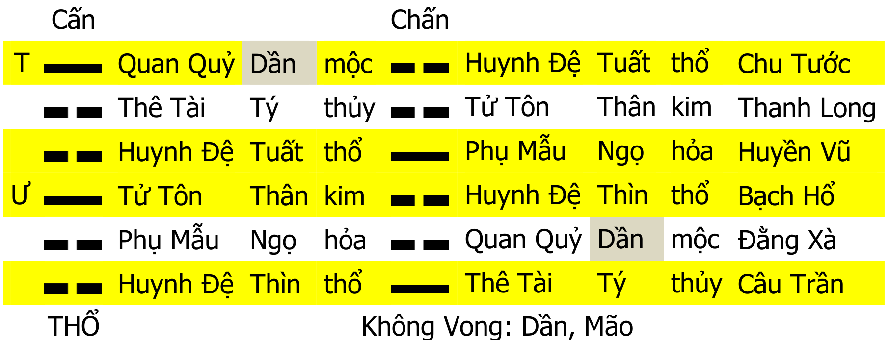
      - **Hình này chứng minh điều gì**
        - Cánh tay bị thương tật do chèn ép thần kinh cổ, phẫu thuật khả thi và giải tỏa lo âu.
      - **Từ đâu mà thấy được**
        - Hào 6 Quan Quỷ Dần mộc trì Thế động hóa Huynh Đệ, hào 3 Tử Tôn Thân kim lâm Bạch Hổ động khắc Quỷ.
- Ứng nghiệm thực tế:
  - Người này trên thực tế bị chèn ép dây thần kinh ở cổ gây ảnh hưởng trực tiếp đến hoạt động của cánh tay; anh ta dự định làm phẫu thuật nhưng vì lo lắng hiệu quả phẫu thuật nên mới gieo quẻ hỏi.

##### Ví dụ 2: Nam đoán bệnh của vợ (Quẻ Thiên Địa Bĩ biến Sơn Thủy Mông)

- Bối cảnh chiêm đoán:
  - Ngày Đinh Hợi tháng Ngọ, một người nam đoán bệnh cho vợ, gieo được quẻ Thiên Địa Bĩ biến Sơn Thủy Mông.
  - Thiết lập thông số quẻ: Quẻ Thiên Địa Bĩ biến Sơn Thủy Mông; thuộc cung Càn (ngũ hành Kim); Tuần trung Không Vong tại Ngọ và Mùi.
  - Xác định Dụng thần: Đoán bệnh của vợ lấy hào Thê Tài làm Dụng thần; Dụng thần là hào 3 Thê Tài Mão mộc trì Thế lâm Đằng Xà.
- Phân tích tương quan sinh khắc và diễn biến nguy hại lâu dài:
  - Dụng thần Thê Tài Mão mộc được Nhật thần Hợi thủy sinh phù nên thuộc hàng vượng tướng.
  - Trong quẻ có Kỵ thần Huynh Đệ Thân kim lâm hào 5 phát động khắc Dụng, vốn là tượng bất cát; tuy nhiên Thân kim hưu tù trong tháng Ngọ, động hóa Tử Tôn Tý thủy lại bị Nguyệt phá (Ngọ xung Tý), đồng thời Thân kim bị hai hào Quan Quỷ (Tị hỏa ở hào 2 và Ngọ hỏa ở hào 4) cùng phát động khắc chế, nên hiện tại Kỵ thần chưa thể gây họa.
  - Quẻ xuất hiện hai Quỷ kẹp Dụng thần (hào 2 và hào 4 Quan Quỷ kẹp chặt hào 3 Thê Tài Mão mộc); bệnh mới phát tác mà gặp quẻ lục hợp (Thiên Địa Bĩ là quẻ lục hợp) là điềm hung hiểm, ắt biến thành bệnh kinh niên lâu ngày mà tử vong.
- Chẩn đoán chi tiết các chứng bệnh và vết tích cơ thể:
  - Vấn đề tim mạch và cung cấp máu: Quan Quỷ Ngọ hỏa ở hào 4 lâm Bạch Hổ và gặp Tuần Không; hào 4 là vị trí tim, Ngọ hỏa thuộc hành hỏa chủ về tim, Bạch Hổ chủ huyết dịch; biểu thị tim có bệnh biến, khả năng cung cấp máu kém.
  - Gan hư và chứng hồi hộp bất an: Dụng thần Thê Tài Mão mộc lâm Đằng Xà ở hào 3, gặp hào 2 Tị hỏa là Bệnh địa; hào 3 là vị trí của gan, Mão mộc cũng là gan; Đằng Xà chủ tâm phiền bất an, khuyết thiếu; tổng hợp là can huyết hư suy, lượng máu cung cấp thiếu hụt gây tâm hoảng, tim đập dồn dập.
  - Chứng đau đầu mãn tính: Hào 6 Phụ Mẫu Tuất thổ lâm Thanh Long là Mộ khố của Quan Quỷ, có thể dùng luận bệnh; hào 6 chủ vùng đầu não, Thanh Long chủ đau nhức, người bệnh thường xuyên bị chứng đau đầu hành hạ.
  - Vết sẹo cũ do té ngã: Hào 2 Quan Quỷ Tị hỏa lâm Câu Trần phát động hợp trú Kỵ thần Huynh Đệ Thân kim ở hào 5 (Tị Thân hợp); theo cổ quyết "Hỏa Quỷ phùng hợp tất hữu sẹo" (hỏa Quỷ gặp hợp ắt có vết sẹo), Câu Trần chủ vấp ngã trói buộc, hào 2 là vị trí chân đùi, hào âm phát động chủ bên phải; suy đoán trong quá khứ người vợ từng té ngã khiến trên đùi phải có vết sẹo lưu lại.
  - Tình hình điều trị bằng thuốc: Hào 5 Huynh Đệ Thân kim động hóa Tử Tôn Tý thủy Nguyệt phá; Huynh Đệ chủ tiêu tốn tiền bạc, Tử Tôn chủ thuốc men, hành Thủy đại diện cho Trung dược, hóa Nguyệt phá là thuốc mất tác dụng; suy ra bệnh nhân đang uống thuốc Đông y nhưng hiệu quả không tốt; hào 4 Quan Quỷ Ngọ hỏa động nhập Mộ tại hào 6 Tuất thổ, Tử Tôn Tý thủy không hiện trên quẻ chính lại lâm Nguyệt phá, bệnh tật ẩn sâu khó bề chữa dứt.
- Căn cứ quái tượng và đối chiếu hình ảnh:
  - Sơ đồ quẻ biểu thị các chứng bệnh thiếu máu tim, đau đầu và việc dùng Trung dược vô hiệu:
    - **Hình 43.** Sơ đồ quẻ Thiên Địa Bĩ biến Sơn Thủy Mông
      - 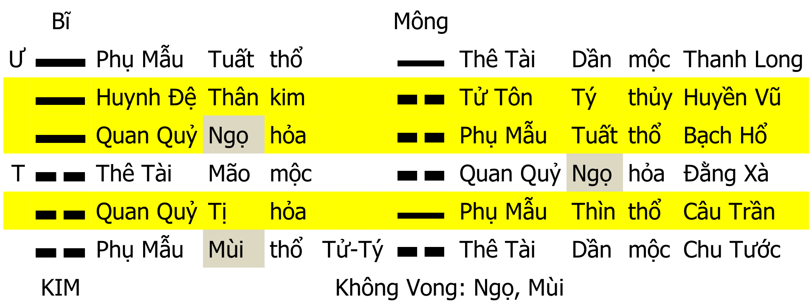
      - **Hình này chứng minh điều gì**
        - Bệnh tim thiếu máu, gan hư tâm hoảng, đau đầu, có sẹo đùi phải và uống Trung dược không hiệu quả.
      - **Từ đâu mà thấy được**
        - Hai Quỷ kẹp Dụng, Hào 4 Quan Quỷ Ngọ hỏa Không lâm Hổ, hào 3 Mão mộc lâm Xà, hào 5 Huynh hóa Tử Nguyệt phá.
- Ứng nghiệm thực tế:
  - Phù hợp với mọi phán đoán: người vợ vì cung cấp máu không đủ nên thường xuyên tâm hoảng bất an và đau đầu dữ dội; dù gia đình đã mời thầy thuốc Đông y kê đơn điều trị nhưng hiệu quả chữa bệnh rất thấp.

##### Ví dụ 3: Nam đoán tay của bảo mẫu bị thương (Quẻ Ly Vi Hỏa biến Lôi Trạch Quy Muội)

- Bối cảnh chiêm đoán:
  - Ngày Canh Dần tháng Tý, một người nam gieo quẻ hỏi về thương tích ở tay của người giúp việc (bảo mẫu), được quẻ Ly Vi Hỏa biến Lôi Trạch Quy Muội.
  - Thiết lập thông số quẻ: Quẻ thuần Ly biến Lôi Trạch Quy Muội; thuộc cung Ly (ngũ hành Hỏa); Tuần trung Không Vong tại Ngọ và Mùi.
  - Xác định Dụng thần: Đoán người giúp việc, bảo mẫu lấy hào Thê Tài làm Dụng thần; Dụng thần là hào 4 Thê Tài Dậu kim.
- Phân tích tương quan vết thương, phẫu thuật và kết cục:
  - Mức độ nghiêm trọng của vết thương: Dụng thần Thê Tài Dậu kim hưu tù trong tháng Tý, bị hào Thế Huynh Đệ Tị hỏa tại hào 6 phát động khắc thương nặng nề, cho thấy tay bị thương tổn không nhẹ; quẻ chính là thuần Ly mang ý nghĩa phân ly, chia lìa, định đoán có ngón tay bị đứt lìa.
  - Tình trạng nhập viện và băng bó: Hào 2 Tử Tôn Sửu thổ phát động làm Dụng thần Thê Tài Dậu kim nhập Mộ (kim mộ tại Sửu), chứng tỏ người bảo mẫu đã được đưa vào viện; hào 6 Huynh Đệ Tị hỏa lâm Đằng Xà động hóa Mộ (Tuất thổ) khắc Dụng thần, hào 6 là tay, Đằng Xà chủ quấn quanh, Huynh Đệ là bàn tay, nhập Mộ chủ băng bó, biểu thị ngón tay đã qua phẫu thuật nối và được băng bó.
  - Tiên lượng kết quả phẫu thuật: Thê Tài Dậu kim hưu tù lâm tĩnh hào; hào 2 Tử Tôn Sửu thổ động hóa Phụ Mẫu Mão mộc hồi đầu khắc; hào 5 Tử Tôn Mùi thổ gặp Tuần Không; y dược không đắc lực, phẫu thuật khó lòng thành công.
  - Nguyên nhân tai nạn và hậu vận: Hào 3 Quan Quỷ Hợi thủy (Ứng) lâm Thanh Long động hóa Tử Tôn Sửu thổ là Mộ khố của Dụng thần Dậu kim; Mộ khố của Thê Tài tượng trưng cho nhà bếp, Thanh Long chủ về ẩm thực nấu nướng, tai nạn xảy ra do nấu ăn sơ ý làm đứt ngón tay; quẻ biến Quy Muội, Thê Tài nhập Mộ tại hào 2, hào 2 là trạch (nhà ở), báo hiệu sau này người bảo mẫu không thể tiếp tục công việc mà phải trở về quê nhà.
- Căn cứ quái tượng và đối chiếu hình ảnh:
  - Sơ đồ quẻ phản ánh thương tật đứt ngón tay, phẫu thuật thất bại và trở về quê:
    - **Hình 44.** Sơ đồ quẻ Ly Vi Hỏa biến Lôi Trạch Quy Muội
      - 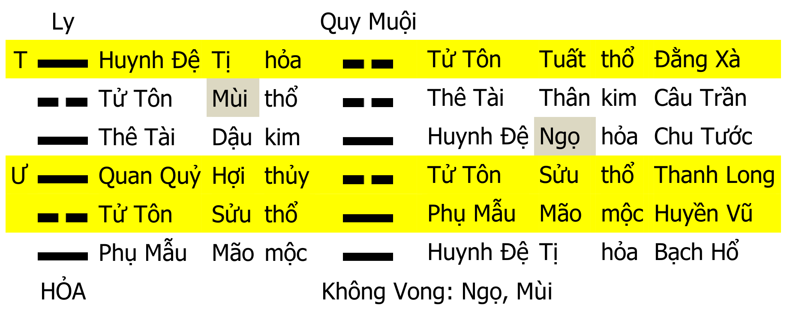
      - **Hình này chứng minh điều gì**
        - Ngón tay bị đứt lìa do nấu ăn, đã băng bó phẫu thuật nhưng không thành công và phải về quê.
      - **Từ đâu mà thấy được**
        - Quẻ Ly chủ phân ly, hào Thế Huynh Đệ Tị hỏa khắc Dụng thần Dậu kim, hào 2 Tử Tôn hóa hồi đầu khắc, quẻ biến Quy Muội.
- Ứng nghiệm thực tế:
  - Người bảo mẫu trong lúc băm thịt làm nhân sủi cảo đã bất cẩn làm đứt hai ngón tay; dù được chuyển gấp vào bệnh viện làm phẫu thuật nối ngón tay, nhưng ca phẫu thuật không thành công, cuối cùng người này phải trở về quê.

##### Ví dụ 4: Nữ đoán bệnh của cha (Quẻ Thiên Phong Cấu biến Càn Vi Thiên)

- Bối cảnh chiêm đoán:
  - Ngày Giáp Dần tháng Mão, một người nữ đoán bệnh tình của cha, gieo được quẻ Thiên Phong Cấu biến Càn Vi Thiên.
  - Thiết lập thông số quẻ: Quẻ Thiên Phong Cấu biến Càn Vi Thiên; thuộc cung Càn (ngũ hành Kim); Tuần trung Không Vong tại Tý và Sửu.
  - Xác định Dụng thần: Đoán bệnh của cha lấy hào Phụ Mẫu làm Dụng thần; trong quẻ Phụ Mẫu lưỡng hiện (hào sơ Phụ Mẫu Sửu thổ và hào 6 Phụ Mẫu Tuất thổ), theo quy tắc lấy hào động làm Dụng thần, chọn hào sơ Phụ Mẫu Sửu thổ phát động làm Dụng thần.
- Biện chứng nguyên nhân gây bệnh và triệu chứng:
  - Tổn thương Dụng thần và vị trí phát bệnh: Dụng thần Phụ Mẫu Sửu thổ tại hào 1 bị cả Nhật thần Dần mộc và Nguyệt kiến Mão mộc tương khắc nặng nề; hào sơ là vị trí chân và bàn chân, biểu thị việc đi lại gặp trở ngại khó khăn.
  - Căn nguyên do rượu sinh phong: Toàn quẻ là thế quẻ độc phát tại hào sơ; hào Sửu thổ độc phát lâm Thanh Long, Thanh Long chủ về rượu thịt yến tiệc; động hóa Tử Tôn Tý thủy, Tử Tôn chủ về uống rượu, hưởng lạc; Kỵ thần Mộc vượng tướng chủ về phong tà; kết hợp chỉ ra chứng đau chân do phong tà phát sinh từ việc uống rượu quá nhiều (tửu phong thối).
- Căn cứ quái tượng và đối chiếu hình ảnh:
  - Sơ đồ quẻ biểu thị bệnh đau chân do nghiện rượu:
    - **Hình 45.** Quẻ Thiên Phong Cấu biến Càn Vi Thiên
      - 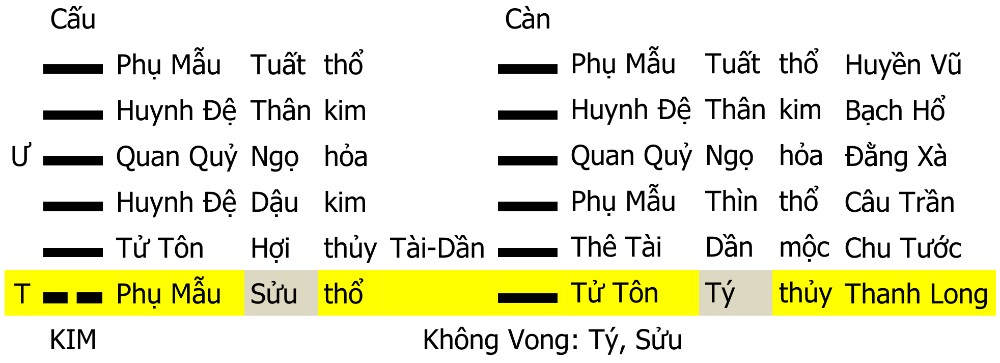
      - **Hình này chứng minh điều gì**
        - Bệnh đau chân, đi lại khó khăn do uống quá nhiều rượu sinh phong (tửu phong thối).
      - **Từ đâu mà thấy được**
        - Hào 1 Phụ Mẫu Sửu thổ độc phát lâm Thanh Long bị Nhật Nguyệt khắc thương, động hóa Tử Tôn Tý thủy.
- Ứng nghiệm thực tế:
  - Cha của cô gái có thói quen uống rượu quá nhiều, dẫn tới phát sinh chứng đau chân dữ dội không thể đi đứng bình thường.

## CHƯƠNG 6: HÀO VỊ VÀ BỆNH TẬT

- Vai trò hạt nhân của hào vị trong dự trắc tật bệnh:
  - Hào vị là một khâu then chốt trong quá trình đoán bệnh Lục Hào; bên cạnh quái tượng, ngũ hành, lục thân và lục thần, việc phối hợp hào vị là điều kiện bắt buộc để xác định cụ thể và chính xác vị trí phát sinh bệnh tật.
  - Quẻ Lục Hào tượng trưng cho bức tranh chỉnh thể cơ thể con người, phân tầng tương ứng với trật tự cao - thấp, trên - dưới của các cơ quan giải phẫu.
  - Khi chẩn đoán bệnh tật cần tiến hành phân tích tuần tự từ trên xuống dưới hoặc từ dưới lên trên, kết hợp quái cung, ngũ hành địa chi, lục thân và lục thần để chọn lọc tầng nghĩa bệnh lý chuẩn xác nhất.
  - Hào vị giữ vai trò quan trọng trong việc định vị nguyên nhân phát sinh bệnh tật, cơ chế tổn thương nội tạng và các yếu tố ngoại cảnh tác động.

### Hào sơ: Bàn chân và cẳng chân

- Phân vùng giải phẫu cơ thể tương ứng:
  - Vị trí thấp nhất của thân thể, đại diện cho bàn chân, cẳng chân, gót chân, ngón chân.
- Biểu hiện bệnh lý đặc trưng theo hào vị:
  - Chủ về khả năng vận động, đi lại, nâng đỡ sức nặng cơ thể, tiếp đất.
  - Khi hào sơ bị khắc thương, xung phá, nhập Mộ hoặc lâm Kỵ thần, bệnh nhân thường mắc các chứng đi lại khó khăn, đau nhức bàn chân, tê bì chân, phong thấp ngón chân, gãy xương bàn chân hoặc dị tật chi dưới.

### Hào 2: Chân, đầu gối, trực tràng, bàng quang, tử cung, cơ quan sinh dục và bài tiết

- Phân vùng giải phẫu cơ thể tương ứng:
  - Chân, khớp đầu gối, cẳng chân, hậu môn, bàng quang, đại tràng, trực tràng, tạng thận, tử cung, cơ quan sinh dục.
- Biểu hiện bệnh lý đặc trưng theo hào vị:
  - Đại diện cho vùng hạ tiêu, vùng chậu và các cơ quan bài tiết, sinh sản.
  - Phản ánh chức năng vận động của khớp gối và hai chân; khi tổn thương chủ về đau khớp gối, liệt chân, khó đi lại.
  - Phản ánh đường tiêu hóa dưới (trực tràng, đại tràng, hậu môn); khi kết hợp thần sát Đằng Xà, Câu Trần thường chủ về viêm ruột, kiết lị, trĩ, sa trực tràng hoặc u xơ, ung thư trực tràng.
  - Phản ánh hệ tiết niệu và sinh dục; chủ về viêm bàng quang, sỏi bàng quang, bệnh thận, viêm nhiễm phụ khoa, sa tử cung, rối loạn kinh nguyệt hoặc bệnh lý nam khoa.
  - Trong phong thủy dự trắc, hào 2 còn là hào trạch (nhà ở, lối đi trong phòng ốc), kết nối các nguyên nhân tai nạn té ngã trong sinh hoạt gia đình.

### Hào 3: Thắt lưng, rốn, bụng, tạng phủ trung hạ tiêu, bài tiết và tiêu hóa

- Phân vùng giải phẫu cơ thể tương ứng:
  - Thắt lưng, vùng rốn, ổ bụng, tạng thận, tỳ vị (dạ dày, lá lách), gan mật, mông, bàng quang, tim, hậu môn, ruột, đùi.
- Biểu hiện bệnh lý đặc trưng theo hào vị:
  - Nằm ở ranh giới giữa hạ tiêu và trung tiêu, chi phối toàn bộ khoang bụng dưới và thắt lưng.
  - Chủ về đau mỏi thắt lưng, thoái hóa cột sống thắt lưng, đau dây thần kinh tọa, tổn thương vùng rốn và thành bụng.
  - Phản ánh bệnh lý tạng phủ tiêu hóa bên trong ổ bụng như viêm loét dạ dày tá tràng, rối loạn gan mật, viêm ruột non, tiêu chảy, kiết lị, đau bụng cấp.
  - Liên hệ với hệ tiết niệu và bài tiết (thận, bàng quang, hậu môn) cùng chức năng vận động cơ mông và đùi.

### Hào 4: Ngực, sườn, lưng, vú, tâm khẩu, tim, phổi, tỳ vị, thận

- Phân vùng giải phẫu cơ thể tương ứng:
  - Vùng lồng ngực, xương sườn hai bên, lưng trên, bầu vú, tâm khẩu (vùng chấn thủy, thượng vị), tim, tỳ vị, phổi, thận.
- Biểu hiện bệnh lý đặc trưng theo hào vị:
  - Đại diện cho vùng trung tiêu và phần dưới của lồng ngực.
  - Chủ các bệnh lý tuần hoàn và hô hấp như đau thắt ngực, rối loạn nhịp tim, bệnh van tim, suy tim, tràn dịch màng phổi, viêm phổi dưới.
  - Phản ánh các bệnh lý tuyến vú ở phụ nữ (viêm tuyến vú, u xơ tuyến vú, ung thư vú).
  - Phản ánh chứng đau tức mạng sườn, đau lưng trên, đau tức vùng tâm khẩu thượng vị do co thắt dạ dày hoặc tổn thương tỳ vị.

### Hào 5: Ngũ quan, yết hầu, cổ, ngực, phổi, khí quản, thực quản, tim, tuần hoàn

- Phân vùng giải phẫu cơ thể tương ứng:
  - Mắt, mũi, tai, khoang miệng, khuôn mặt, vùng cổ, yết hầu (cổ họng), cánh tay, ngực, lưng, bàn tay, phổi, tim, khí quản, thực quản, lá lách, khoang ngực.
- Biểu hiện bệnh lý đặc trưng theo hào vị:
  - Đại diện cho vùng thượng tiêu và toàn bộ hệ thống hô hấp, tiêu hóa trên cùng ngũ quan đầu mặt.
  - Hào 5 là hào vị trung chính của ngoại quái, chủ đạo về đường hô hấp: khí quản, thực quản, phế quản, hai lá phổi; khi bị thương tổn thường sinh các chứng ho dai dẳng, viêm họng, viêm khí quản, hen suyễn, khó thở, tức ngực.
  - Khi kết hợp với hành Thủy, Thanh Long hoặc Câu Trần, hào 5 phản ánh các bệnh lý vòm họng, thực quản, khoang miệng, ung thư thanh quản do thói quen ăn uống ẩm thực.
  - Chi phối chức năng tuần hoàn tim mạch, khoang ngực và hệ vận động của chi trên (cánh tay, bàn tay).

### Hào 6: Đầu, tóc, khuôn mặt, đại não, thần kinh não, xương đầu và chi trên

- Phân vùng giải phẫu cơ thể tương ứng:
  - Đầu, tóc, khuôn mặt, má, thái dương, cánh tay, vai, cổ, đại não, thần kinh não bộ, xương đầu (hộp sọ).
- Biểu hiện bệnh lý đặc trưng theo hào vị:
  - Vị trí tột cùng trên đỉnh cơ thể, đại diện cho vùng cao nhất của hệ thần kinh trung ương và hộp sọ.
  - Chủ về các chứng đau đầu, đau nửa đầu (thái dương), chóng mặt, suy nhược thần kinh, mất ngủ, rối loạn tuần hoàn não, xuất huyết não, tai biến mạch máu não.
  - Phản ánh các bệnh lý về da đầu, rụng tóc, chấn thương sọ não, nứt vỡ xương sọ khi gặp hung thần như Bạch Hổ, Câu Trần phát động.
  - Liên hệ với các khớp vai gáy, đốt sống cổ và chi trên khi có sự phối hợp hào động.

### Ví dụ 1: Nam đoán bệnh của mẹ (Quẻ Lôi Địa Dự biến Thủy Địa Tỷ)

- Bối cảnh bói quẻ:
  - Thời gian: Ngày Quý Hợi, tháng Sửu (Tuần không: Tý, Sửu).
  - Tình huống: Người nam đến xin dự đoán tình hình bệnh tật của mẹ, gieo được quẻ Lôi Địa Dự biến Thủy Địa Tỷ.
  - Quẻ thuộc cung Mộc.
  - **Hình 46.** Quẻ Lôi Địa Dự biến Thủy Địa Tỷ
    - 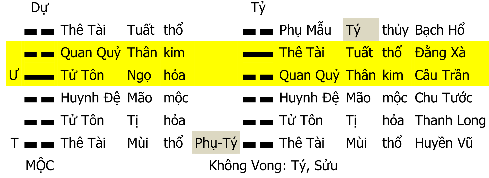
    - **Hình này chứng minh điều gì**
      - Quẻ Lôi Địa Dự biến Thủy Địa Tỷ chỉ ra người mẹ bị tật ở chân gây đi lại khó khăn và khí quản tổn thương sinh ho liên tục.
    - **Từ đâu mà thấy được**
      - Dụng thần Phụ Mẫu Tý thủy phục hào sơ bị Nguyệt hợp khắc (hào sơ là chân); Nguyên thần Thân kim hào 5 bệnh ở Nhật, bị hào 4 Ngọ hỏa động khắc và hào 2 Tị hỏa ám động khắc hợp (hào 5 kim là phổi khí quản, Đằng Xà là nhỏ dài).
- Trình tự phân tích và biện chứng quẻ:
  - Xác định Dụng thần: Đoán bệnh của mẹ lấy hào Phụ Mẫu làm Dụng thần. Trong quẻ, Phụ Mẫu Tý thủy không xuất hiện trên quẻ, phục tàng dưới hào sơ Thê Tài Mùi thổ.
  - Phân tích bệnh ở chân qua hào sơ:
    - Nguyệt kiến Sửu thổ vừa khắc vừa hợp Dụng thần Tý thủy (Sửu Tý tương hợp nhưng Thổ khắc Thủy, gọi là khắc hợp), Dụng thần bị áp chế nặng nề.
    - Dụng thần phục tàng ngự tại hào sơ; hào sơ là hào vị đại diện cho bàn chân và cẳng chân. Do đó phán đoán khả năng đi lại của người mẹ chắc chắn gặp vấn đề, đi đứng trở ngại.
  - Phân tích bệnh khí quản và phổi qua hào 5:
    - Xét Nguyên thần sinh Dụng thần Tý thủy: Quan Quỷ Thân kim ngự tại hào 5.
    - Thân kim gặp Nhật thần Hợi thủy là lâm vào Bệnh địa (Thân kim bệnh tại Hợi theo vòng tràng sinh).
    - Hào 4 Tử Tôn Ngọ hỏa phát động trực xung khắc thương Thân kim (Ngọ hỏa khắc Thân kim).
    - Đồng thời, hào 2 Tử Tôn Tị hỏa gặp Nhật thần Hợi thủy tương xung tạo thành ám động (Tị hỏa ám động), quay lại khắc hợp và hình hại Thân kim (Tị Thân tương hợp tương hình, Hỏa khắc Kim).
    - Kim ngự tại hào 5 bị các tầng hỏa khắc hại nghiêm trọng. Hào 5 là hào vị của phổi, lồng ngực và hệ hô hấp; ngũ hành Kim chủ quản tạng phổi.
    - Hào 5 lại lâm thần sát Đằng Xà; Đằng Xà mang hình tượng vật nhỏ và dài, trong hệ hô hấp chính là đường ống khí quản.
    - Tổng hợp các yếu tố: phán đoán khí quản của người mẹ bị hư tổn, hệ hô hấp bất ổn, thường xuyên phát tác chứng ho.
- Kết quả và ứng nghiệm thực tế:
  - Người hỏi quẻ xác nhận trên thực tế mẹ anh ta đi lại rất khó khăn, đồng thời khí quản không tốt, lúc nào cũng bị ho khan ho gió liên tục.

### Ví dụ 2: Nam đoán bệnh bố vợ (Quẻ Sơn Hỏa Bí biến Tốn Vi Phong)

- Bối cảnh bói quẻ:
  - Thời gian: Ngày Mậu Tý, tháng Dần (Tuần không: Ngọ, Mùi).
  - Tình huống: Người nam gieo quẻ dự đoán tình trạng bệnh tật cho bố vợ, được quẻ Sơn Hỏa Bí biến Tốn Vi Phong.
  - Quẻ thuộc cung Thổ.
  - **Hình 47.** Quẻ Sơn Hỏa Bí biến Tốn Vi Phong
    - 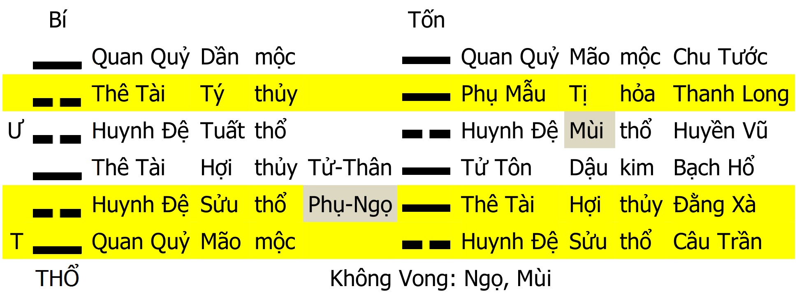
    - **Hình này chứng minh điều gì**
      - Quẻ Sơn Hỏa Bí biến Tốn Vi Phong phản ánh bố vợ bị ung thư vòm họng và ung thư đại tràng, bệnh nặng phải nằm liệt giường.
    - **Từ đâu mà thấy được**
      - Dụng thần Phụ Mẫu Ngọ hỏa phục hào 2 tuần không bị Nhật khắc và hào 5 Tý thủy động khắc (hào 2 và Đằng Xà là ruột); hào 5 thủy lâm Thanh Long động khắc Dụng (hào 5 là hầu họng, Thanh Long là ăn uống); Nguyên thần lâm Câu Trần chủ u bướu ung thư.
- Trình tự phân tích và biện chứng quẻ:
  - Xác định Dụng thần: Đoán bệnh người bề trên (bố vợ) lấy hào Phụ Mẫu làm Dụng thần. Trong quẻ, Phụ Mẫu Ngọ hỏa không hiện, phục tàng dưới hào 2 Huynh Đệ Sửu thổ, lâm Tuần Không.
  - Luận tượng nằm liệt giường: Phụ Mẫu phục tàng dưới hào 2 lại lâm Tuần Không biểu thị người bệnh đã lâm vào tình trạng ngã bệnh nằm liệt giường, không thể tự ngồi dậy sinh hoạt.
  - Luận bệnh đường ruột qua hào 2:
    - Dụng thần Ngọ hỏa phục tại hào 2 bị Nhật thần Tý thủy xung khắc (Tý Ngọ tương xung khắc).
    - Hào 5 Thê Tài Tý thủy là Kỵ thần phát động quay lại khắc phạt Dụng thần Ngọ hỏa.
    - Phi thần hào 2 Huynh Đệ Sửu thổ lại phát động biến ra Kỵ thần Thê Tài Hợi thủy.
    - Hào 2 là hào vị của đường ruột và đại tràng; phục thần lâm Đằng Xà (chủ vật nhỏ và dài, đại diện cho đường ruột). Ngũ hành Hỏa cũng có thể chủ về đường ruột (tiểu trường thuộc hỏa). Do đó xác định căn bệnh bắt rễ ở đường ruột.
  - Luận bệnh vòm họng qua hào 5 và thần sát Câu Trần:
    - Kỵ thần Thê Tài Tý thủy phát động tại hào 5; hành Thủy ngự tại hào 5 là hào vị của cổ họng và yết hầu.
    - Hào 5 lâm Thanh Long; Thanh Long chủ về ăn uống, ẩm thực, khoang miệng và thực quản.
    - Nguyên thần của Dụng thần là Dần mộc và hào Thế Mão mộc lâm thần sát Câu Trần; Câu Trần chủ về sưng trướng, u bướu, khối u ác tính (ung thư).
    - Kết hợp hào vị hầu họng (hào 5) và đường ruột (hào 2) đều bị Kỵ thần khắc phá và lâm tượng u bướu, tác giả phán đoán người bệnh mắc đồng thời chứng ung thư vòm họng và ung thư đường ruột.
- Kết quả và ứng nghiệm thực tế:
  - Người hỏi quẻ xác nhận bố vợ đang bị bệnh tình vô cùng nguy kịch: bị ung thư vòm họng và ung thư đại tràng.

### Ví dụ 3: Nam tự đoán bệnh bản thân (Quẻ Địa Trạch Lâm biến Địa Thủy Sư)

- Bối cảnh bói quẻ:
  - Thời gian: Ngày Mậu Thân, tháng Thân.
  - Tình huống: Người nam tự gieo quẻ để chẩn đoán tình hình bệnh tật của bản thân, được quẻ Địa Trạch Lâm biến Địa Thủy Sư.
  - **Hình 48.** Quẻ Địa Trạch Lâm biến Địa Thủy Sư
    - 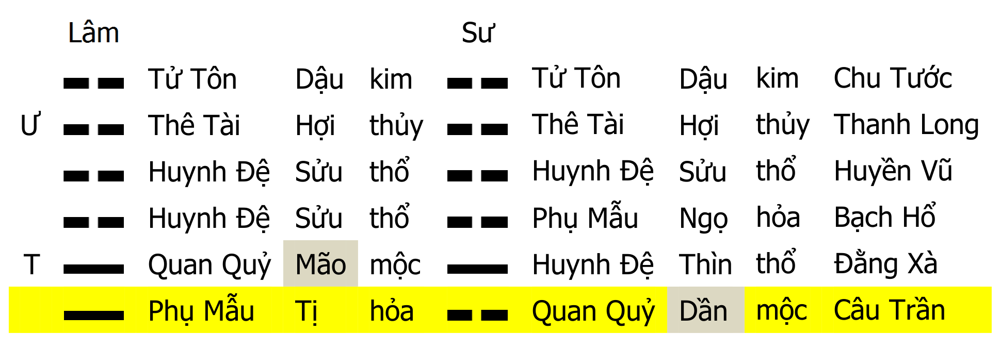
    - **Hình này chứng minh điều gì**
      - Quẻ Địa Trạch Lâm biến Địa Thủy Sư xác định bệnh nhân bị ung thư trực tràng ở mức độ nghiêm trọng.
    - **Từ đâu mà thấy được**
      - Hào Thế Quan Quỷ Mão mộc tại hào 2 bị Nhật Nguyệt Thân kim đồng khắc hưu tù (hào 2 và Đằng Xà là ruột); quẻ độc phát tại hào 2 là Bệnh địa kết hợp lâm Câu Trần chủ u bướu ung thư.
- Trình tự phân tích và biện chứng quẻ:
  - Xác định Dụng thần: Tự xem bệnh cho bản thân lấy hào Thế làm Dụng thần. Hào Thế Quan Quỷ Mão mộc ngự tại hào 2.
  - Đánh giá mức độ hiểm nghèo của bệnh tình:
    - Hào Thế Mão mộc bị cả Nhật thần Thân kim lẫn Nguyệt kiến Thân kim đồng thời khắc thương (Thân kim khắc Mão mộc).
    - Hào Thế rơi vào tình trạng hưu tù suy bại cùng cực, cho thấy bệnh chứng phát tác rất nặng nề và nguy hiểm.
  - Định vị bệnh tật theo hào vị và tượng thần:
    - Hào Thế Quan Quỷ Mão mộc ngự tại hào 2; hào 2 là hào vị chủ quản đường ruột, trực tràng và hậu môn.
    - Ngũ hành Mộc kết hợp với thần sát Đằng Xà; Đằng Xà chủ về hình thể nhỏ, dài dẹp, uốn lượn ngoằn ngoèo, đối ứng chính xác với cấu tạo của đường ruột và ống trực tràng.
    - Quẻ này có tượng độc phát (chỉ có duy nhất một hào phát động trong quẻ chính biến động tại nội quái), hào độc phát biến động chính là Bệnh địa (vị trí tập trung bệnh tật).
    - Hào động hào 2 biến Huynh Đệ Thìn thổ; hào sơ Phụ Mẫu Tị hỏa lâm Câu Trần động hóa Dần mộc; Câu Trần chủ quản u bướu, ung thư, tế bào tăng sinh bất thường.
    - Tổng hợp căn cứ hào 2 (ruột), mộc lâm Đằng Xà (ruột/trực tràng), Bệnh địa và Câu Trần (ung thư): kết luận dứt khoát bệnh nhân mắc chứng ung thư ruột, cụ thể là ung thư trực tràng.
- Kết quả và ứng nghiệm thực tế:
  - Bệnh nhân xác nhận kết quả chẩn đoán y khoa trên thực tế là ung thư trực tràng.

### Ví dụ 4: Nam đoán bệnh của mẹ (Quẻ Lôi Địa Dự biến Thủy Địa Tỷ)

- Bối cảnh bói quẻ:
  - Thời gian: Ngày Quý Hợi, tháng Sửu (Tuần không: Tý, Sửu).
  - Tình huống: Người nam nhờ tác giả dự đoán bệnh cho mẹ mình, gieo được quẻ Lôi Địa Dự biến Thủy Địa Tỷ.
  - Quẻ thuộc cung Mộc.
  - **Hình 49.** Quẻ Lôi Địa Dự biến Thủy Địa Tỷ
    - 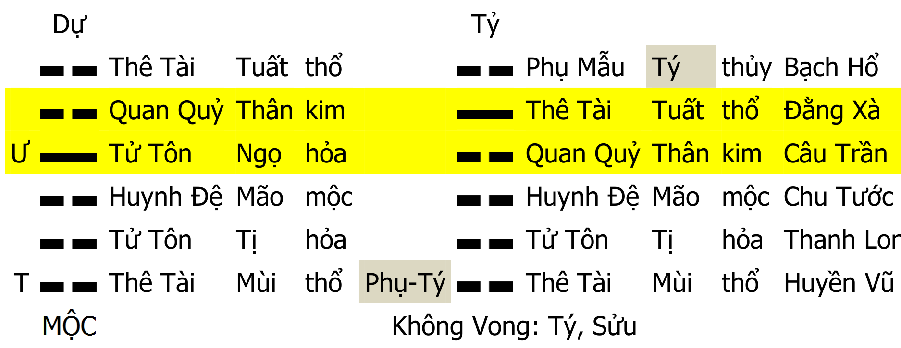
    - **Hình này chứng minh điều gì**
      - Quẻ Lôi Địa Dự biến Thủy Địa Tỷ chứng thực người mẹ bị tổn thương ở chân bàn chân gây khó khăn đi lại và phế khí tổn thương sinh ho dai dẳng.
    - **Từ đâu mà thấy được**
      - Dụng thần Phụ Mẫu Tý thủy phục hào sơ bị Nguyệt kiến Sửu thổ khắc phạt (hào sơ là chân bàn chân); Nguyên thần Thân kim hào 5 bị hào 4 Tử Tôn Ngọ hỏa động khắc thương (hào 5 kim là phổi).
- Trình tự phân tích và biện chứng quẻ:
  - Xác định Dụng thần: Dự đoán bệnh tật của mẹ, lấy hào Phụ Mẫu làm Dụng thần. Trong quẻ, Dụng thần Phụ Mẫu Tý thủy không xuất hiện, phục tàng dưới hào sơ Thê Tài Mùi thổ.
  - Luận bệnh ở bàn chân qua Dụng thần tại hào sơ:
    - Nguyệt kiến Sửu thổ trực tiếp khắc phạt Dụng thần Tý thủy, khiến Dụng thần bị thương tổn nặng.
    - Vị trí phục tàng của Dụng thần là hào sơ; hào sơ trong hệ thống hào vị lục hào đại diện cho chân và bàn chân.
    - Dụng thần ngự tại hào sơ bị khắc phá nặng nề chỉ rõ chân và bàn chân tất yếu mắc bệnh tật, khiến khả năng đi lại của người mẹ bị suy giảm nghiêm trọng.
  - Luận bệnh ho và tổn thương phổi qua Nguyên thần tại hào 5:
    - Nguyên thần Quan Quỷ Thân kim ngự tại hào 5 phát động để sinh trợ Dụng thần.
    - Tuy nhiên, Nguyên thần Thân kim bị hào 4 Tử Tôn Ngọ hỏa phát động khắc chế gay gắt (Hỏa khắc Kim thương tổn).
    - Ngũ hành Kim ngự tại hào 5 đại diện cho hai lá phổi và hệ hô hấp; Kim bị hỏa khắc phạt khiến tạng phổi nhất định phát sinh vấn đề bệnh lý.
    - Khi phế khí và phổi bị tổn hại nặng nề, triệu chứng lâm sàng điển hình sẽ bộc phát thành những cơn ho kéo dài.
- Kết quả và ứng nghiệm thực tế:
  - Mẹ của người hỏi quẻ trên thực tế lúc nào cũng bị ho liên miên không dứt, đồng thời đôi chân yếu ớt khiến việc đi lại vô cùng khó khăn.

### Ví dụ 5: Học viên họ Mã đoán bệnh cho mẹ (Quẻ Trạch Hỏa Cách biến Trạch Thiên Quải)

- Bối cảnh bói quẻ:
  - Thời gian: Ngày Kỷ Tị, tháng Mùi, năm Mậu Dần (Tuần không: Tuất, Hợi).
  - Tình huống: Tại lớp đào tạo Chu Dịch ứng dụng dự đoán thị trường cổ phiếu, một học viên họ Mã nhân cơ hội thực hành đã xin thầy Vương Hổ Ứng dự đoán bệnh tật cho mẹ mình, gieo được quẻ Trạch Hỏa Cách biến Trạch Thiên Quải.
  - Quẻ thuộc cung Khảm (Khảm Vi Thủy).
  - **Hình 50.** Quẻ Trạch Hỏa Cách biến Trạch Thiên Quải
    - 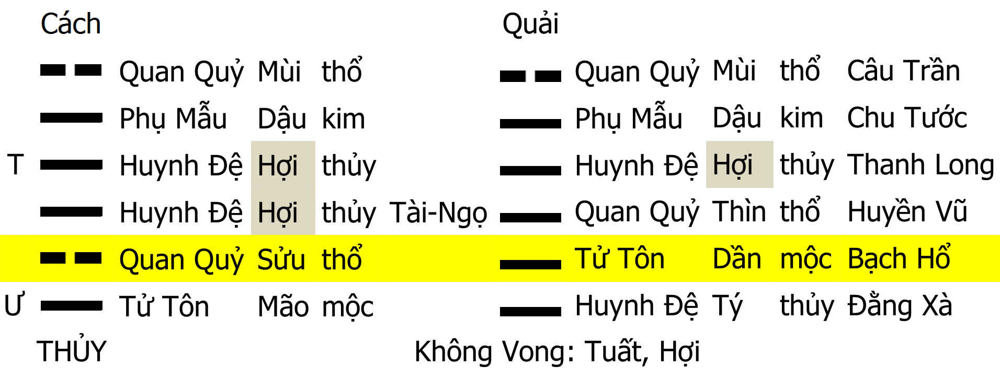
    - **Hình này chứng minh điều gì**
      - Quẻ Trạch Hỏa Cách biến Trạch Thiên Quải chứng thực người mẹ mắc bệnh tiểu đường, bị ngã cầu thang tầng 3 gãy xương chân trong tháng Mùi.
    - **Từ đâu mà thấy được**
      - Quẻ thuộc cung Khảm (thủy, nước tiểu); độc phát hào 2 Sửu thổ Nguyệt phá hóa Dần mộc hồi đầu khắc lâm Bạch Hổ (hào 2 là chân và trạch đường, Bạch Hổ là ngoại thương gãy xương, Khảm là hố bậc cao thấp cầu thang, Dần Mão tam bát là tầng 3).
- Luồng phân tích biện chứng và đối thoại chi tiết giữa tác giả và học viên:
  - Luận vượng suy Dụng thần và tính chất bệnh tình:
    - Tác giả phân tích: "Đoán bệnh của mẹ lấy hào Phụ Mẫu làm Dụng thần. Phụ Mẫu Dậu kim ở hào 5, được Nguyệt kiến Mùi thổ sinh phù, lại gặp Trường Sinh ở Nhật thần Tị hỏa (Kim trường sinh tại Tị). Dụng thần vượng tướng có căn khí, chứng tỏ bệnh tật không có gì nguy hiểm đến tính mạng."
  - Luận quái cung Khảm và định hướng bệnh lý:
    - Quẻ Cách thuộc cung Khảm, Khảm mang ngũ hành Thủy. Cung Khảm chủ về các bệnh lý ở tạng thận, bàng quang, máu huyết, hệ thống bài tiết và nước tiểu.
    - Cụ thể là bệnh gì cần phân tích sâu từ tương tác sinh khắc động tĩnh của các hào trong quẻ.
  - Luận hào độc phát và bệnh tiểu đường (Đối thoại 1):
    - Xét Quan Quỷ Mùi thổ ở hào 6: Là Nguyên thần của Dụng thần Dậu kim, Nhật Nguyệt và hào động đều không làm tổn hại Mùi thổ. Mặc dù Quan Quỷ thường đại diện cho bệnh tật (Quan Quỷ trú bệnh), nhưng ở trường hợp này Mùi thổ vượng tướng sinh trợ Dụng thần nên không thể lấy Quan Quỷ Mùi thổ làm nguồn cơn bệnh.
    - Cổ nhân đúc kết "thần triệu cơ ở động" (sự huyền vi báo hiệu nằm ở hào động). Quẻ này chỉ có duy nhất một hào phát động (độc phát), đó là hào 2 Quan Quỷ Sửu thổ lâm Nguyệt phá (tháng Mùi xung Sửu thổ), phát động biến ra Tử Tôn Dần mộc quay đầu lại khắc phạt (hồi đầu khắc). Đây chính là điểm then chốt cốt tử của toàn quẻ.
    - Quan Quỷ Sửu thổ là Nguyên thần sinh Phụ Mẫu, động hóa Tử Tôn Dần mộc hồi đầu khắc; hào 2 là hào vị chủ quản bộ phận sinh dục, hào biến Tử Tôn cũng chủ về bộ phận sinh dục, tất yếu người mẹ phải chịu đựng đau đớn khổ sở vì bệnh tật liên quan đến phương diện này.
    - Kết hợp với thuộc tính của quái cung Khảm (hành Thủy), chỉ có nước tiểu là bài tiết qua bộ vị này, chứng minh nội tiết của người mẹ bị rối loạn nghiêm trọng, nước tiểu phát sinh vấn đề bất thường.
    - Tác giả đặt câu hỏi: "Rốt cuộc là bệnh gì?"
    - Học viên họ Mã đáp: "Là bệnh tiểu đường."
  - Luận tổn thương gãy xương chân trong tháng (Đối thoại 2):
    - Tác giả tiếp tục phân tích: Hào 2 cũng là hào vị đại diện cho đôi chân và cẳng chân. Hào 2 lâm thần sát Bạch Hổ (Bạch Hổ chủ về huyết quang, tai nạn ngoại thương, thương tích đứt gãy).
    - Quan Quỷ tại hào 2 lâm Nguyệt phá, phản ánh cấu trúc xương chân đã bị nứt rạn hoặc gãy rời. Thời điểm bị phá là tháng Mùi hiện tại, chứng tỏ tai nạn xảy ra ngay trong tháng này.
    - Tác giả hỏi: "Đồng thời bị thương vào tháng này, có chuyện này hay không?"
    - Học viên họ Mã xác nhận: "Đúng, tháng này mẹ tôi đã bị gãy xương."
  - Luận nguyên nhân ngã cầu thang (Đối thoại 3):
    - Tác giả đi sâu phân tích cơ chế tai nạn: Quan Quỷ ngự tại hào 2 lâm Bạch Hổ; Bạch Hổ chủ về đường đi lối lại, giao thông.
    - Hào 2 bị hào biến Tử Tôn Dần mộc khắc thương; Tử Tôn cũng mang biểu tượng đường sá đi lại.
    - Hào 2 trong trạch bói lục hào đại diện cho trạch (nhà ở, phòng ốc), do đó "đường đi" ở đây chính là đường đi lối lại bên trong ngôi nhà.
    - Quẻ thuộc cung Khảm, Khảm có tượng hiểm hãm (chỗ trũng sâu, bậc thềm lồi lõm, cao thấp không bằng phẳng). Đường đi bên trong nhà mà có cấu trúc bậc thềm cao thấp không bằng phẳng chính là cầu thang.
    - Suy ra người mẹ bị té ngã ở cầu thang trong nhà mà dẫn đến gãy xương.
    - Tác giả hỏi: "Chứng tỏ là ngã cầu thang bị thương, có đúng hay không?"
    - Học viên họ Mã vô cùng kinh ngạc đáp: "Đúng!"
  - Luận tọa hướng căn nhà (Đối thoại 4):
    - Tác giả định hướng phong thủy cư trạch: Hào Thế Huynh Đệ Hợi thủy dùng để xác định tọa hướng của căn nhà/tòa nhà.
    - Hào Thế Hợi thủy lâm Tuần Không (Tuần không: Tuất, Hợi), Tuần Không bị xung động thì lấy hướng đối diện ngược lại để phán đoán.
    - Hướng Hợi là Tây Bắc, lấy hướng trục đối xứng ngược lại là tọa Nam hướng Bắc (cửa chính của ngôi nhà mở ngoảnh mặt về hướng Bắc).
    - Học viên họ Mã thốt lên: "Hoàn toàn chính xác!"
  - Luận số tầng lầu căn hộ gia đình đang ở (Đối thoại 5):
    - Xem nhà ở và căn hộ, lấy hào Phụ Mẫu làm Dụng thần. Phụ Mẫu Dậu kim ngự tại hào 5.
    - Theo số ngũ hành sinh thành, số của ngũ hành Kim là số 4 (Thiên tứ sinh Kim, Địa cửu thành chi); Dậu kim lại an vị tại hào 5.
    - Tác giả suy đoán gia đình anh ta nếu không cư trú ở tầng 4 thì cũng ở tầng 5.
    - Tác giả hỏi: "Rốt cuộc là tầng thứ mấy?"
    - Học viên họ Mã cười đáp: "Tầng thứ tư."
  - Luận vị trí tai nạn tại cầu thang tầng 3 (Đối thoại 6):
    - Hào 2 Quan Quỷ Sửu thổ bị hào biến Tử Tôn Dần mộc khắc thương.
    - Theo quy luật số ngũ hành của thập nhị địa chi: Dần Mão mộc ứng với số 3 và số 8 ("Dần Mão tam bát chân").
    - Hào biến mang số 3, kết hợp với các căn cứ cầu thang đã luận, chứng tỏ người mẹ bị trượt ngã tại đoạn cầu thang thuộc tầng thứ ba.
    - Tác giả hỏi: "Chứng tỏ mẹ anh ngã bị thương ở cầu thang tầng thứ ba, chuyện này có đúng không?"
    - Học viên họ Mã gật đầu lia lịa thán phục: "Vâng, vâng."
  - Tiên lượng thời gian khỏi bệnh và diễn biến lâu dài:
    - Tác giả kết luận về ứng kỳ: Quan Quỷ Sửu thổ bị Nguyệt kiến Mùi thổ xung phá (Nguyệt phá); quy luật giải phá là phải đợi đến khi gặp hợp. Đến tháng Tý (tháng Tý hợp Sửu, Tý Sửu lục hợp giải tỏa Nguyệt phá), xương chân của người mẹ sẽ liền lại và khỏi hẳn.
    - Tuy nhiên, hào 2 phát động hóa ra Dần mộc hồi đầu khắc phạt vĩnh viễn trong quẻ biến, cho thấy căn bệnh tiểu đường gốc rễ rất khó điều trị dứt điểm, sẽ kéo dài dai dẳng.
    - Sau khi phân tích đầy đủ trường hợp này, tác giả dừng lại tiếp tục nội dung bài giảng cho lớp học.

## CHƯƠNG 7: THỦ TƯỢNG LỤC THẦN ĐOÁN BỆNH

- Ý nghĩa bản chất của Lục Thần trong dự đoán bệnh tật:
  - Lục Thần được dùng để biểu thị tính chất, trạng thái và nguyên nhân phát sinh của sự vật và tật bệnh.
  - Khi phán đoán tính chất cùng nguyên nhân bệnh tật, Lục Thần là căn cứ bắt buộc phải dùng để cụ thể hóa các kết luận lâm sàng.

### Thanh Long

- Đặc trưng thuộc tính bệnh lý của Thanh Long:
  - Chủ các chứng đau nhức cơ khớp, đau mỏi toàn thân, ngứa ngáy ngoài da.
  - Chủ bệnh tật phát sinh do hưng phấn quá độ, vui mừng quá hóa buồn (hỷ cực sinh bi).
  - Chủ bệnh do ăn uống tiệc tùng gây ngộ độc thức ăn hoặc do uống rượu say gây nên.
  - Chủ chứng sản hậu phong (trúng gió sau khi sinh đẻ), tổn thương do sắc dục thái quá.
  - Chủ các bệnh lây truyền qua đường tình dục, bệnh AIDS, các chứng dị ứng cơ địa.
  - Trong phép thủ tượng trị liệu, Thanh Long còn chủ về công nghệ mới, thiết bị mới hoặc phương pháp chữa bệnh tiên tiến.

### Chu Tước

- Đặc trưng thuộc tính bệnh lý của Chu Tước:
  - Chủ bệnh khí trệ, khí uất ứ tắc trong kinh lạc và nội tạng.
  - Chủ chứng thần kinh thất thường, cuồng ngôn loạn ngữ, nói mê sảng khi phát sốt, ảo thính.
  - Chủ nội nhiệt thiêu đốt, mặt đỏ gay gắt, nước tiểu màu đỏ vàng, các chứng nhiệt chứng và chứng viêm phát nhiệt.
  - Chủ bệnh tật tại vùng khoang miệng, yết hầu họng, các chứng bệnh về mắt.
  - Chủ tổn thương do bị bỏng lửa, bỏng nước sôi hoặc cảm nhiễm nhiệt độc.
  - Chủ bệnh tật phát sinh do uất ức sau cãi vã khẩu thiệt, chửi rủa, nhục mạ hoặc vướng vào kiện tụng quan ti.

### Câu Trần

- Đặc trưng thuộc tính bệnh lý của Câu Trần:
  - Chủ chứng đầy tức lồng ngực, sưng trướng, cổ trướng, tích tụ u bướu, thương tật lâu ngày.
  - Chủ bệnh tật phát sinh do môi trường sinh sống ẩm thấp, hoàn cảnh ô nhiễm gây nên.
  - Chủ chứng tỳ vị bất hòa, rối loạn tiêu hóa, trở ngại vận hóa thức ăn.
  - Chủ chứng kết sỏi (sỏi thận, sỏi bàng quang, sỏi mật), bệnh ngoài da, thịt thừa (polyp), tổ chức tăng sinh và bệnh ung thư.
  - Chủ chứng suy giảm trí nhớ, tư duy trì trệ, năng lực nhận thức kém, si ngốc ngây dại.
  - Chủ chứng bệnh làm cản trở vận động, đi lại khó khăn, chân tay nặng nề hoặc các chứng bệnh bội nhiễm.

### Đằng Xà

- Đặc trưng thuộc tính bệnh lý của Đằng Xà:
  - Chủ các chứng bệnh về đường ruột do mang tượng hình thù nhỏ dài uốn lượn.
  - Chủ chứng bệnh kỳ quái, bệnh hiếm gặp, chứng nan y bí hiểm khó chẩn đoán.
  - Chủ chứng chuột rút, co rút gân cơ, teo rút chi thể, vết sẹo mổ lồi lõm.
  - Chủ bệnh do nhiễm trùng virus, mầm bệnh xâm nhập ẩn tàng.
  - Chủ trạng thái hoảng sợ, ác mộng triền miên, mất ngủ, đứng ngồi không yên, tâm thần bất an, tà bệnh ám ảnh.
  - Chủ chứng thiếu máu, dinh dưỡng mất cân đối, lục phủ ngũ tạng công năng rối loạn.
  - Chủ tính chất bệnh tình kéo dài triền miên, dây dưa không dứt, đến kỳ hạn cần kết thúc lại không dứt điểm được.

### Bạch Hổ

- Đặc trưng thuộc tính bệnh lý của Bạch Hổ:
  - Chủ bệnh hậu sản và các chứng bệnh lý liên quan trực tiếp đến hệ thống huyết dịch.
  - Chủ tổn thương do tai nạn xe cộ, tai nạn giao thông, vết thương do súng đạn hoặc vật kim khí sắc nhọn.
  - Chủ bệnh phụ khoa, kinh nguyệt không đều, sản hậu hư nhược, băng huyết, rong huyết, có thai hoặc hư thai.
  - Chủ chứng chấn thương gãy xương, tổn thương cốt cách.
  - Chủ tâm trạng bức bối, lòng dạ không thoải mái, tính khí nóng nảy hung hãn, chứng dễ nổi điên cuồng bạo.
  - Chủ các can thiệp ngoại khoa bằng phẫu thuật, mổ xẻ đao kéo.

### Huyền Vũ

- Đặc trưng thuộc tính bệnh lý của Huyền Vũ:
  - Chủ các bệnh nam khoa, bệnh phụ khoa thầm kín, bệnh lý tại bộ phận sinh dục và đường tiết niệu.
  - Chủ bệnh tật ẩn giấu khó phát hiện, triệu chứng mơ hồ, chứng bệnh khó nói hoặc giấu giếm không muốn người khác biết.
  - Chủ hàn chứng (chứng lạnh), phát lạnh, chứng u uất, trầm cảm, tâm trạng rầu rĩ.
  - Chủ bệnh âm hư, bệnh lao phổi, ho lao suy kiệt.
  - Chủ tình trạng lở loét ngấm ngầm, mưng mủ, thối rữa hoại tử mô thịt.
  - Chủ bệnh chóng mặt, hoa mắt, đầu óc choáng váng quay cuồng.
  - Chủ chứng phong thấp do thấp hàn tà khí xâm nhập kinh lạc.

### Các ví dụ thực tế ứng dụng lục thần đoán bệnh

#### Ví dụ 1: Ngày Đinh Tị tháng Dậu, đoán bệnh của vợ (Thiên Sơn Độn biến Trạch Địa Tụy)

- Bối cảnh gieo quẻ: Ngày Đinh Tị tháng Dậu (Không Vong: Tý, Sửu), một học viên gieo quẻ hỏi về tình trạng sức khỏe của vợ, được quẻ Thiên Sơn Độn biến Trạch Địa Tụy.
- Học viên gieo quẻ hỏi bệnh cho vợ vào ngày Đinh Tị tháng Dậu, được quẻ Thiên Sơn Độn biến Trạch Địa Tụy:
  - **Hình 51.** Sơ đồ quẻ Thiên Sơn Độn biến Trạch Địa Tụy
    - 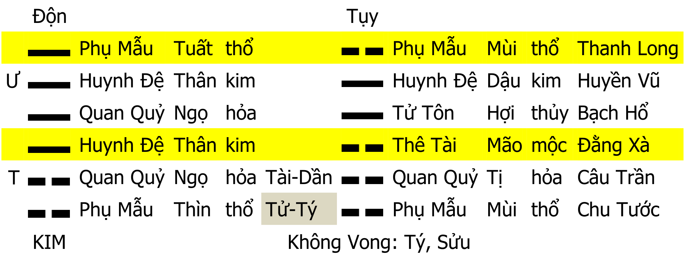
    - **Hình này chứng minh điều gì**
      - Dự trắc chuẩn xác vợ mắc u xơ tử cung, đau thắt lưng, kinh nguyệt kéo dài và nhức đầu.
    - **Từ đâu mà thấy được**
      - Thê Tài Dần mộc phục dưới hào 2 lâm Câu Trần, Kỵ thần Thân kim lâm Đằng Xà, hào 6 Tuất thổ lâm Thanh Long.
- Xác định Dụng thần và tình trạng suy nhược:
  - Hỏi sức khỏe của vợ, lấy Thê Tài làm Dụng thần.
  - Dụng thần Thê Tài Dần mộc không xuất hiện trên quẻ, phục dưới hào 2 Quan Quỷ Ngọ hỏa.
  - Dần mộc bị Nguyệt kiến Dậu kim khắc phạt, lại không được Nhật kiến Tị hỏa sinh phù (Tị hỏa còn tiết khí Dần mộc) nên Dụng thần ở trạng thái tương đối suy nhược.
- Luận đoán chứng u xơ tử cung:
  - Phi thần áp chế Dụng thần, hơn nữa Phi thần là Quan Quỷ Ngọ hỏa, do đó có thể lấy Phi thần để luận bệnh.
  - Quan Quỷ Ngọ hỏa được Nhật kiến Tị hỏa tỉ phù đồng khí trợ giúp nên vượng tướng, đủ sức gây bệnh; hơn nữa Nhật kiến Tị hỏa chính là Bệnh địa của Thê Tài Dần mộc (mộc trường sinh tại Hợi, bệnh tại Tị), khẳng định Quan Quỷ hào 2 nhất định là chứng bệnh.
  - Dụng thần Dần mộc bị Nguyệt khắc thương, phục tàng dưới hào 2 nên cũng có thể căn cứ Dụng thần để xét bệnh; hào 2 là cung vị tử cung của phụ nữ.
  - Hào 2 Quan Quỷ lâm Câu Trần: Câu Trần chủ sưng trướng, u bướu, tăng sinh mô thịt -> phán đoán người vợ có u xơ tử cung.
  - Đối thoại và phản hồi thực tế: Khi tác giả đưa ra phán đoán này, người học viên vẫn khẳng định vợ mình không có u xơ tử cung; tuy nhiên sau đó đưa vợ đến bệnh viện kiểm tra chuyên sâu thì kết quả chẩn đoán xác nhận thực sự có khối u xơ tử cung.
- Luận đoán chứng đau thắt lưng:
  - Hào 3 Huynh Đệ Thân kim nhập quẻ, mang ngũ hành kim đồng khí với Nguyệt kiến Dậu kim nên đắc lệnh vượng tướng, hào nhập quẻ có thể xem là mầm bệnh; lại là Kỵ thần phát động khắc Dụng thần Dần mộc nên có thể lấy Kỵ thần luận bệnh.
  - Hào 3 là hào vị đại diện cho vùng thắt lưng (eo lưng).
  - Ngũ hành kim đóng tại hào 3 chủ về thắt lưng: do kim sinh thủy, mà tạng thận chủ thủy, thận lại thông với thắt lưng; khi tạng thận có bệnh thường phát sinh chứng đau thắt lưng.
  - Phản hồi thực tế: Người vợ thực tế đang bị đau thắt lưng kéo dài.
- Luận đoán kinh nguyệt bất thường và chu kỳ kéo dài:
  - Trong dự đoán bệnh tật, hào Thê Tài đại diện cho kinh nguyệt phụ nữ.
  - Kỵ thần tại hào 3 Huynh Đệ Thân kim phát động khắc Dụng thần, đồng thời biến hóa xuất hiện Thê Tài Mão mộc (Huynh hóa Tài).
  - Tổ hợp Huynh Đệ hóa Thê Tài mang ý nghĩa đặc thù: trong cầu tài là lúc không nên được tài lại đắc tài (tài ngoài ý muốn); trong ẩm thực là bụng không đói vẫn thèm ăn ráng ăn; trong kinh nguyệt là máu chảy ra không ngừng, thời điểm không nên ra kinh lại xuất huyết, biểu thị kinh nguyệt hoàn toàn bất thường.
  - Hào 3 lâm Đằng Xà: Đằng Xà chủ sự triền miên, dai dẳng -> biểu thị thời gian hành kinh quá dài, đến kỳ cần kết thúc lại không dứt điểm được.
  - Phản hồi thực tế: Người vợ đúng là bị rối loạn kinh nguyệt, chu kỳ hành kinh kéo dài dai dẳng nhiều ngày.
- Luận đoán chứng nhức đầu:
  - Hào 6 Phụ Mẫu Tuất thổ phát động, tuy biến hóa thoái thần (hóa Mùi thổ) nhưng được Nhật kiến Tị hỏa sinh phù nên vẫn vượng tướng.
  - Phụ Mẫu phát động sinh trợ Huynh Đệ là Cừu thần của Dụng thần, Cừu thần có thể xem là bệnh; đồng thời Tuất thổ là Mộ khố của Quan Quỷ (hỏa mộ tại Tuất), Quỷ Khố cũng là nơi tích tụ bệnh tật -> Tuất thổ được dùng để xét chứng bệnh.
  - Hào 6 là ngôi vị cao nhất, tượng trưng cho phần đầu não -> biểu thị trên đầu phát sinh bệnh tật.
  - Hào 6 lâm Thanh Long: Thanh Long chủ chứng đau nhức, đau mỏi -> phán đoán mắc chứng đau nhức đầu.
  - Phản hồi thực tế: Hoàn toàn đúng như dự đoán, người vợ thường xuyên bị nhức đầu.

#### Ví dụ 2: Ngày Bính Thìn tháng Hợi, lão tiên sinh tự đoán bệnh (Sơn Phong Cổ biến Cấn Vi Sơn)

- Bối cảnh gieo quẻ: Ngày Bính Thìn tháng Hợi (Không Vong: Tý, Sửu), một lão tiên sinh tự gieo quẻ hỏi về bệnh tình bản thân, được quẻ Sơn Phong Cổ biến Cấn Vi Sơn.
- Lão tiên sinh tự gieo quẻ đoán bệnh vào ngày Bính Thìn tháng Hợi, được quẻ Sơn Phong Cổ biến Cấn Vi Sơn:
  - **Hình 52.** Sơ đồ quẻ Sơn Phong Cổ biến Cấn Vi Sơn
    - 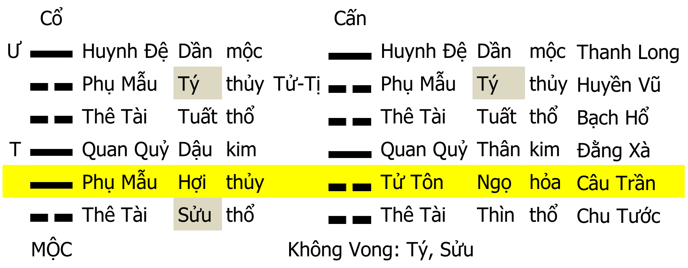
    - **Hình này chứng minh điều gì**
      - Chứng minh người bệnh mắc chứng hen suyễn mạn tính, bàng quang kết sỏi và chân đi lại khó khăn.
    - **Từ đâu mà thấy được**
      - Thế hào Dậu kim lâm Đằng Xà, hào 2 Hợi thủy độc phát lâm Câu Trần tại cung Tốn là Bệnh địa.
- Luận Dụng thần và tiên lượng tính mạng:
  - Tự đoán bệnh lấy hào Thế làm Dụng thần.
  - Hào Thế Quan Quỷ Dậu kim không được Nguyệt kiến Hợi thủy sinh phù, nhưng được Nhật kiến Thìn thổ tương sinh (Thìn Dậu hợp sinh); lại có hào 4 Thê Tài Tuất thổ ám động sinh phù (ngày Thìn xung Tuất thổ thành ám động) -> Dụng thần có gốc sinh trợ vững chắc, kết luận tuy mang bệnh nhưng không nguy hiểm tính mạng, có bệnh cũng không sao.
- Luận đoán chứng hen suyễn:
  - Hào Thế Quan Quỷ Dậu kim mang hành kim lâm Đằng Xà.
  - Nguyệt kiến Hợi thủy chính là Bệnh địa của ngũ hành kim (kim trường sinh tại Tị, suy tại Tuất, bệnh tại Hợi).
  - Hào độc phát trong quẻ là hào 2 Phụ Mẫu Hợi thủy (động hóa Tử Tôn Ngọ hỏa) cũng chính là Bệnh địa của hào Thế.
  - Hào 2 độc phát lâm Câu Trần biểu thị trạng thái tức trướng, lồng ngực đầy tức, khó thở.
  - Kết hợp tượng hào độc phát lâm Câu Trần (tức trướng), hào Thế kim lâm Đằng Xà (khí quản co rút, ống thở hẹp) tại Bệnh địa -> hội tụ đầy đủ thông tin của chứng bệnh hen suyễn co thắt.
- Luận đoán bàng quang kết sỏi và chân đi lại khó khăn:
  - Hào 2 Phụ Mẫu Hợi thủy thuộc hành thủy, đại diện cho bàng quang và hệ bài tiết nước tiểu.
  - Cung quái nội quái là Tốn, Tốn chủ về đùi và cẳng chân; bản thân hào 2 cũng là hào vị đại diện cho đôi chân.
  - Hào 2 lâm Câu Trần: Câu Trần chủ chứng kết sỏi (sỏi cặn tích tụ), đồng thời chủ trì trệ, đi lại khó khăn chậm chạp -> suy đoán bàng quang có sỏi và khớp chân đau nhức khiến đi lại trở ngại.
- Phản hồi thực tế: Lão tiên sinh xác nhận bản thân đúng là mắc bệnh hen suyễn mạn tính, trong bàng quang có kết sỏi và hai chân đau nhức đi lại rất khó khăn.

#### Ví dụ 3: Ngày Ất Sửu tháng Ngọ, nữ đoán bệnh u xơ tử cung sau điều trị (Khôn Vi Địa)

- Bối cảnh gieo quẻ: Ngày Ất Sửu tháng Ngọ (Không Vong: Tuất, Hợi), một người phụ nữ mắc bệnh u xơ đã tiến hành điều trị vào ngày Ất Tị, nay lo lắng muốn xem bệnh tình đã lành hẳn hay chưa, được quẻ Khôn Vi Địa.
- Nữ có bệnh đã điều trị tại ngày Ất Tị, hỏi có lành hay không vào ngày Ất Sửu tháng Ngọ, được quẻ Khôn Vi Địa:
  - **Hình 53.** Sơ đồ quẻ Khôn Vi Địa
    - 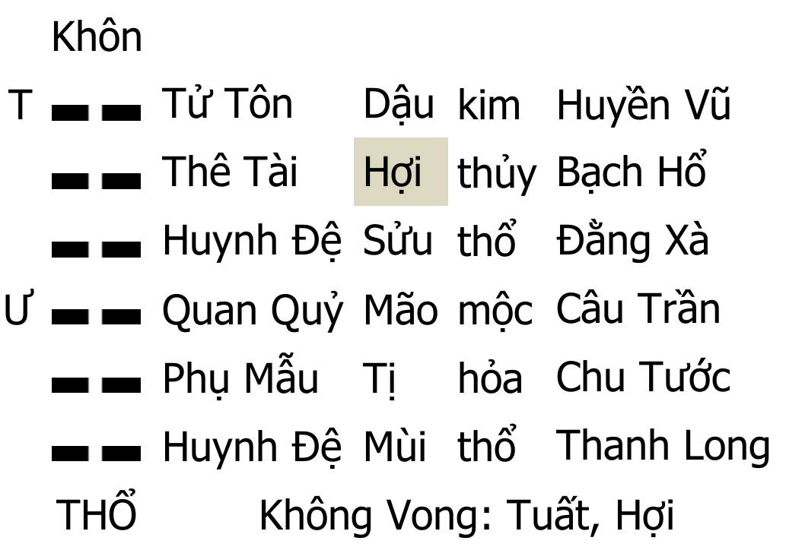
    - **Hình này chứng minh điều gì**
      - Chứng minh u xơ tử cung đã được tiêu trừ nhờ điều trị bằng công nghệ mới (laser).
    - **Từ đâu mà thấy được**
      - Tử Tôn Dậu kim trì Thế lục xung, Quan Quỷ Mão mộc lâm Câu Trần nhập Mộ hào 1 lâm Thanh Long.
- Luận Dụng thần và giải tỏa tâm lý lo âu:
  - Thông thường tự xem bệnh lấy hào Thế làm Dụng thần; người hỏi mang tâm lý lo âu nặng nề về hiệu quả chữa trị.
  - Quẻ xuất hiện thuần Khôn là quẻ Lục Xung, lại có Tử Tôn Dậu kim trì Thế tại hào 6: Tử Tôn là phúc thần giải ưu chuyên chế ngự Quan Quỷ, quẻ lục xung chủ bệnh tật đã can thiệp điều trị sẽ nhanh chóng tiêu tan tán biến -> khẳng định mối lo lắng của người phụ nữ là hoàn toàn dư thừa.
  - Quan Quỷ tượng trưng cho nỗi âu lo cùng mầm bệnh: Quan Quỷ Mão mộc tại hào 3 ở trạng thái hưu tù vô khí (tháng Ngọ tiết hỏa, ngày Sửu không sinh), lại nhập Mộ tại hào 1 Huynh Đệ Mùi thổ ám động (ngày Sửu xung Mùi thổ thành ám động, Mão mộc nhập Mộ ở Mùi thổ) -> Quan Quỷ bị khắc hãm và thu giữ vào mộ khố, chứng tỏ mầm mống bệnh tật đã hoàn toàn biến mất.
- Luận đoán chứng u xơ tử cung và phương pháp điều trị mới:
  - Quan Quỷ đóng tại hào 3: Hào 3 là cung vị của cơ quan tử cung phụ nữ.
  - Địa chi Mão mộc chính là Thai địa của Tử Tôn Dậu kim (kim dưỡng ở Thìn, thai ở Mão).
  - Quan Quỷ lâm Câu Trần: Câu Trần chủ khối u, u bướu, tế bào tăng sinh -> phán đoán căn bệnh trước đó chính là u xơ tử cung.
  - Hào 1 Huynh Đệ Mùi thổ lâm Thanh Long: Thanh Long chủ vật mới, công nghệ kỹ thuật mới mẻ -> suy đoán bệnh nhân đã sử dụng phương pháp hoặc kỹ thuật y khoa mới để điều trị chứ không dùng phẫu thuật dao kéo truyền thống.
- Phản hồi thực tế: Người phụ nữ xác nhận đúng là bị u xơ tử cung; chị không tiến hành phẫu thuật cắt mổ mà áp dụng công nghệ bắn tia laser mới để điều trị, và kết quả kiểm tra cho thấy u xơ đã khỏi hoàn toàn.

#### Ví dụ 4: Ngày Nhâm Dần tháng Mùi năm Giáp Thân, con gái đoán bệnh lâu ngày của mẹ (Thủy Lôi Truân biến Càn Vi Thiên)

- Bối cảnh gieo quẻ: Ngày Nhâm Dần tháng Mùi năm Giáp Thân (Không Vong: Thìn, Tị), người con gái gieo quẻ hỏi về bệnh tình đã mắc lâu ngày của mẹ đẻ, được quẻ Thủy Lôi Truân biến Càn Vi Thiên.
- Nữ đoán bệnh lâu ngày cho mẹ vào ngày Nhâm Dần tháng Mùi năm Giáp Thân, được quẻ Thủy Lôi Truân biến Càn Vi Thiên:
  - **Hình 54.** Sơ đồ quẻ Thủy Lôi Truân biến Càn Vi Thiên
    - 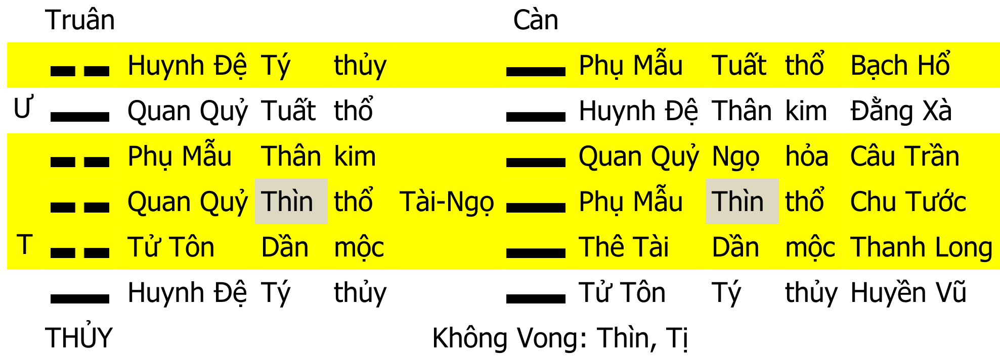
    - **Hình này chứng minh điều gì**
      - Chứng minh mẹ bị viêm phổi tràn dịch màng phổi, suy thận, khó thở và qua đời vào tháng Thân.
    - **Từ đâu mà thấy được**
      - Phụ Mẫu Thân kim hào 4 lâm Câu Trần hóa Ngọ hỏa hồi đầu khắc, hào 6 Tý thủy là Tử địa, quẻ hóa lục xung.
- Luận Dụng thần và bệnh chứng tại phổi:
  - Đoán bệnh cho mẹ, lấy Phụ Mẫu làm Dụng thần.
  - Quẻ có Phụ Mẫu Thân kim tại hào 4 lâm Câu Trần phát động, biến Quan Quỷ Ngọ hỏa quay lại khắc thương (hồi đầu khắc).
  - Vị trí hào 4 là hào vị đại diện cho lồng ngực và phổi; ngũ hành Thân kim cũng chủ về tạng phế (phổi) -> khẳng định tổn thương nghiêm trọng tại cơ quan phổi.
  - Thân kim lâm Câu Trần: Câu Trần chủ sưng trướng, ứ trướng, nghẽn khí -> các mô phổi bị sưng viêm tắc nghẽn, gây nên chứng khó thở dữ dội.
  - Hào 6 Huynh Đệ Tý thủy phát động (biến Phụ Mẫu Tuất thổ): Tý thủy chính là Tử địa của Dụng thần Thân kim (kim trường sinh tại Tị, tử tại Tý); ngũ hành thủy chủ chất dịch lỏng -> phán đoán phổi bị tích nước, tràn dịch màng phổi nghiêm trọng.
- Luận đoán chứng mất ngủ, đau đớn và suy giảm chức năng thận:
  - Hào 3 Quan Quỷ Thìn thổ là Nguyên thần sinh dưỡng Dụng thần Phụ Mẫu Thân kim (thổ sinh kim).
  - Hào 3 là hào vị đại diện cho chiếc giường nằm; Thìn thổ lại lâm Tuần Không (tuần Giáp Thân tuần không Thìn Tị) -> Nguyên thần Không Vong thì không thể sinh trợ Dụng thần, biểu thị người mẹ nằm trên giường không thể an giấc, mất ngủ triền miên.
  - Nội quái Truân biến quẻ Càn hình thành cục diện phục ngâm (các hào biến đồng địa chi) -> biểu thị người bệnh nằm trên giường chịu nỗi đau đớn giày vò khôn xiết, rên xiết không yên.
  - Xét tạng phủ ngũ hành: Hào 3 Thìn thổ thuộc tạng thận; lâm Không Vong biểu thị cơ quan thận bị khuyết tổn, suy kiệt trầm trọng -> phán đoán người mẹ bị biến chứng suy thận.
- Dự đoán cát hung tính mạng và kỳ ứng nghiệm:
  - Dụng thần Phụ Mẫu Thân kim bị Nhật kiến Dần mộc tương xung (Dần Thân tương xung) thành Nhật phá.
  - Quẻ biến Càn Vi Thiên là quẻ Lục Xung; phép đoán bệnh cổ điển có quy tắc: bệnh mắc đã lâu ngày mà gặp quẻ lục xung tất không thể qua khỏi (bệnh cửu phùng xung tất tử).
  - Dụng thần Thân kim tuy lâm Thái Tuế năm Giáp Thân nhưng phát động hóa Quan Quỷ Ngọ hỏa hồi đầu khắc phạt -> trong năm Giáp Thân không thể bình an, tháng sau (tháng Thân) sẽ bước vào thời khắc nguy hiểm tính mạng.
- Diễn biến lâm sàng và ứng nghiệm thực tế:
  - Bệnh tình trên thực tế diễn biến chuẩn xác với quẻ: người mẹ bị viêm phổi cấp dẫn tới biến chứng tràn dịch màng phổi (phổi có nước), khó thở suy kiệt, suy thận nặng và đau đớn mất ngủ triền miên.
  - Kết cục: Người mẹ đã không qua khỏi và từ trần vào đúng giờ Ngọ, ngày Mậu Dần, tháng Thân năm Giáp Thân.
  - Cơ chế ứng nghiệm: Tháng Thân là tháng Dụng thần trị nguyệt; ngày Mậu Dần là ngày xung phá Dụng thần Thân kim; giờ Ngọ là giờ của hào biến Quan Quỷ Ngọ hỏa hồi đầu khắc sát Phụ Mẫu Thân kim.

## CHƯƠNG 8: THỦ TƯỢNG ĐỊA CHI ĐOÁN BỆNH

- Nguyên lý thủ tượng địa chi trong dự trắc bệnh tật:
  - Địa chi tuy không có tỉ suất ứng nghiệm cao như lục thân, hào vị hay lục thần, nhưng vẫn có khả năng phản ánh những thông tin bệnh lý đặc thù khi kết hợp đúng quy cách.
  - Địa chi thông thường không biểu thị ý nghĩa bệnh tật một cách đơn độc, mà phần lớn phải phối hợp chặt chẽ với hào vị và ngũ hành để định vị chuẩn xác ổ bệnh.

### Địa chi Tý

- Tượng bệnh lý của địa chi Tý:
  - Cơ quan và bộ phận cơ thể: bàn chân, bao tử (dạ dày), lưng, tai, họng, thận, máu huyết, bàng quang, mật, thắt lưng.
  - Chứng trạng đặc trưng: hàn chứng (nhiễm lạnh, sợ lạnh, bệnh do lạnh sinh ra).

### Địa chi Sửu

- Tượng bệnh lý của địa chi Sửu:
  - Cơ quan và bộ phận cơ thể: bụng, tỳ, vị (dạ dày), thắt lưng, gan, chân, cẳng chân.

### Địa chi Dần

- Tượng bệnh lý của địa chi Dần:
  - Cơ quan và bộ phận cơ thể: phổi, mật, hệ thần kinh, ruột, chân, lông tóc, râu.

### Địa chi Mão

- Tượng bệnh lý của địa chi Mão:
  - Cơ quan và bộ phận cơ thể: chân, thắt lưng, mắt, đại tràng, trực tràng, răng, gan.

### Địa chi Thìn

- Tượng bệnh lý của địa chi Thìn:
  - Cơ quan và bộ phận cơ thể: bàng quang, bụng, thắt lưng, đầu gối, vai, lưng, họng, cổ, dạ dày, da thịt, đỉnh trán.

### Địa chi Tị

- Tượng bệnh lý của địa chi Tị:
  - Cơ quan và bộ phận cơ thể: răng, khoang miệng, tam tiêu, ruột non, tim, mặt, lòng bàn tay, đùi, tỳ.

### Địa chi Ngọ

- Tượng bệnh lý của địa chi Ngọ:
  - Cơ quan và bộ phận cơ thể: tim, mắt, bao tử (dạ dày), bụng, lưỡi, mặt, ngực, tuần hoàn máu.
  - Chứng trạng đặc trưng: các chứng nhiệt (nóng sốt, viêm nhiệt, huyết nhiệt).

### Địa chi Mùi

- Tượng bệnh lý của địa chi Mùi:
  - Cơ quan và bộ phận cơ thể: tỳ vị, ruột non, tay, dạ dày, bụng, cánh tay, lưng, khoang miệng.
  - Chứng trạng đặc trưng: ho lao, chứng ế cách (nghẹn tắc thực quản, khó nuốt).

### Địa chi Thân

- Tượng bệnh lý của địa chi Thân:
  - Cơ quan và bộ phận cơ thể: đầu, phổi, thực quản, niệu đạo, khí quản, đại tràng, bàng quang, gân cốt, tai trái, tứ chi, răng, thắt lưng, xương cột sống, mạch máu.
  - Hệ chức năng sinh lý: hệ hô hấp, hệ tiêu hóa, tiểu tiện.

### Địa chi Dậu

- Tượng bệnh lý của địa chi Dậu:
  - Cơ quan và bộ phận cơ thể: xương mác, xương sườn, lưng, phổi, hệ thống xương, đại tràng, thận, thắt lưng, tai, răng, khoang miệng.
  - Hệ chức năng sinh lý: hệ hô hấp.

### Địa chi Tuất

- Tượng bệnh lý của địa chi Tuất:
  - Cơ quan và bộ phận cơ thể: vai, lưng, đầu, mặt, bụng, đỉnh trán, dạ dày, mũi, màng ngoài tim, tim, mắt.
  - Chứng trạng đặc trưng: xuất huyết dạ dày.

### Địa chi Hợi

- Tượng bệnh lý của địa chi Hợi:
  - Cơ quan và bộ phận cơ thể: bàng quang, thận, đầu, cổ họng, máu, khoang miệng, đại não, ngực, thực quản, hậu môn.
  - Chứng trạng đặc trưng: bệnh tiểu đường, rối loạn bài tiết đại tiểu tiện, nôn mửa, ho, ho ra máu, hàn chứng, di tinh, đổ mồ hôi trộm (đạo hãn), kinh nguyệt không đều, mất kinh (bế kinh), băng huyết.

### Các ví dụ thực tế về thủ tượng Địa Chi đoán bệnh

#### Ví dụ 1: Nam đoán sức khỏe ngày Ất Dậu tháng Tuất (Quẻ Khảm Vi Thủy)

- Bối cảnh dự trắc: Ngày Ất Dậu, tháng Tuất (tuần Giáp Thân, Không Vong tại Ngọ và Mùi). Người nam gieo quẻ tự đoán tình trạng sức khỏe bản thân, nhận được quẻ thuần Khảm (Khảm Vi Thủy, lục xung).
  - **Hình 55.** Sơ đồ quẻ Khảm Vi Thủy
    - 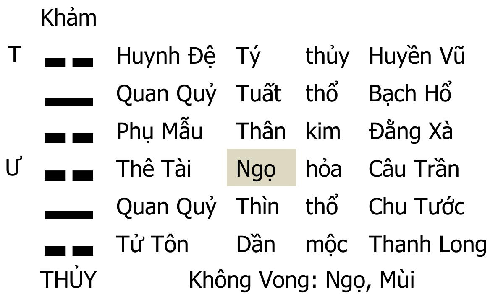
    - **Hình này chứng minh điều gì**
      - Quan Quỷ Tuất thổ ở hào 5 khắc Thế Tý thủy, chứng minh chứng bệnh mờ mắt nhìn không rõ.
    - **Từ đâu mà thấy được**
      - Thế lâm Huyền Vũ (chủ tối tăm), hào 5 Tuất thổ (tượng con mắt) là Nguyệt kiến lâm Bạch Hổ khắc Thế.
- Các bước suy luận và căn cứ dự trắc:
  - Xác định Dụng thần: Đương số tự đoán sức khỏe bản thân nên lấy hào Thế làm Dụng thần. Hào Thế Huynh Đệ Tý thủy cư tại hào 6.
  - Đánh giá vượng suy: Hào Thế Tý thủy được Nhật kiến Dậu kim sinh phù nên có khí vượng tướng, song lại bị Nguyệt kiến Tuất thổ khắc chế nặng nề, thể hiện cơ thể đang có mầm bệnh phát sinh.
  - Định vị hào Quan Quỷ gây bệnh: Nguyệt kiến nhập quẻ tại hào 5 thành Quan Quỷ Tuất thổ lâm Bạch Hổ phát động/khắc Thế, lấy Quan Quỷ này làm đại diện cho bệnh tật.
  - Thủ tượng địa chi phối hợp: Địa chi Tuất thổ vốn bao hàm rất nhiều ý nghĩa bệnh lý phân tán ở vai, lưng, đầu, mặt, dạ dày, tim, mắt. Khi phối hợp hào Thế cư hào 6 lâm Huyền Vũ (Huyền Vũ chủ về sự ảm đạm, mờ mịt, tối tăm) với tượng Tuất thổ tại hào 5 đại diện cho con mắt, suy ra chứng bệnh chính là mắt bị tối mờ, nhìn không rõ.
- Ứng nghiệm thực tế: Đương số xác nhận bản thân đúng là đang bị chứng mờ mắt, thị lực giảm sút nhìn không rõ.

#### Ví dụ 2: Nam đoán bệnh bản thân ngày Canh Thìn tháng Tý (Quẻ Thủy Hỏa Ký Tế biến Thủy Thiên Nhu)

- Bối cảnh dự trắc: Ngày Canh Thìn, tháng Tý (tuần Giáp Tuất, Không Vong tại Thân và Dậu). Một người nam tự gieo quẻ đoán bệnh tật của bản thân, được quẻ Thủy Hỏa Ký Tế biến Thủy Thiên Nhu.
  - **Hình 56.** Sơ đồ quẻ Thủy Hỏa Ký Tế biến Thủy Thiên Nhu
    - 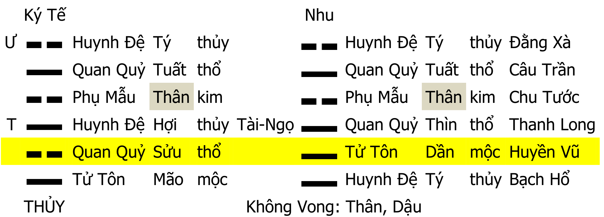
    - **Hình này chứng minh điều gì**
      - Thể hiện tình trạng đa bệnh phức tạp gồm viêm gan, thận hư liệt dương, viêm khớp vai và bệnh dạ dày.
    - **Từ đâu mà thấy được**
      - Hào 2 Sửu thổ (gan) động, hào 5 Tuất thổ (vai, dạ dày) ám động cùng khắc Thế Hợi thủy (thận) nhập Mộ Nhật.
- Các bước suy luận và căn cứ dự trắc:
  - Xác định Dụng thần và thể trạng tổng quát:
    - Lấy hào Thế Huynh Đệ Hợi thủy tại hào 3 làm Dụng thần. Thế được Nguyệt kiến Tý thủy tỉ phù nhưng lại nhập Mộ tại Nhật kiến Thìn thổ và bị Thìn thổ khắc, suy vượng khó phân định.
    - Trong quẻ, Quan Quỷ Sửu thổ lâm hào 2 phát động khắc Thế, lại thêm Quan Quỷ Tuất thổ tại hào 5 được Nhật Thìn xung thành ám động đến khắc Thế; thế cục khắc nhiều sinh ít cho thấy thể trạng suy kiệt, sức khỏe rất xấu.
  - Luận bệnh gan:
    - Cả hào 2 và hào 3 đều là hào vị của gan mật. Quan Quỷ Sửu thổ cư hào 2 đến khắc, mà địa chi Sửu có tượng là gan, động hóa Tử Tôn Dần mộc (mộc chủ gan) là dấu hiệu bổ trợ rõ rệt.
    - Hào 5 Tuất thổ là Tài khố cũng chủ về gan; kết hợp quẻ biến Thủy Thiên Nhu là quẻ du hồn mang tượng bệnh tật đang lan tỏa, phát triển, khẳng định chắc chắn có bệnh về gan.
  - Luận bệnh phong thấp và hàn lạnh: Quan Quỷ Sửu thổ lâm Huyền Vũ phát động khắc Thế, Huyền Vũ chủ về lạnh giá, phong thấp.
  - Luận viêm quanh khớp vai và bệnh dạ dày: Hào 5 Quan Quỷ Tuất thổ là hào vị của vai, bản thân Tuất thổ cũng chủ vai và dạ dày, lại ám động khắc Thế, nên chẩn đoán bị viêm quanh khớp vai và bệnh dạ dày.
  - Luận bệnh thận hư, sinh dục và thắt lưng: Hào Thế cư hào 3 lâm Hợi thủy bị khắc trọng; địa chi Hợi thủy chủ thận, cơ quan sinh dục, thắt lưng và di tinh, do đó mắc thêm chứng thận hư liệt dương và đau thắt lưng.
- Ứng nghiệm thực tế: Đương số đã bị viêm gan kéo dài suốt một năm; ngoài ra còn mắc thận hư liệt dương, viêm quanh khớp vai, đau thắt lưng, sợ lạnh phát run, mất ngủ và đau dạ dày.

#### Ví dụ 3: Nữ đoán vận khí ngày Mậu Ngọ tháng Hợi (Quẻ Sơn Thủy Mông biến Địa Thủy Sư)

- Bối cảnh dự trắc: Ngày Mậu Ngọ, tháng Hợi (tuần Giáp Dần, Không Vong tại Tý và Sửu). Người nữ gieo quẻ hỏi về vận khí tổng quát, được quẻ Sơn Thủy Mông biến Địa Thủy Sư.
  - **Hình 57.** Sơ đồ quẻ Sơn Thủy Mông biến Địa Thủy Sư
    - 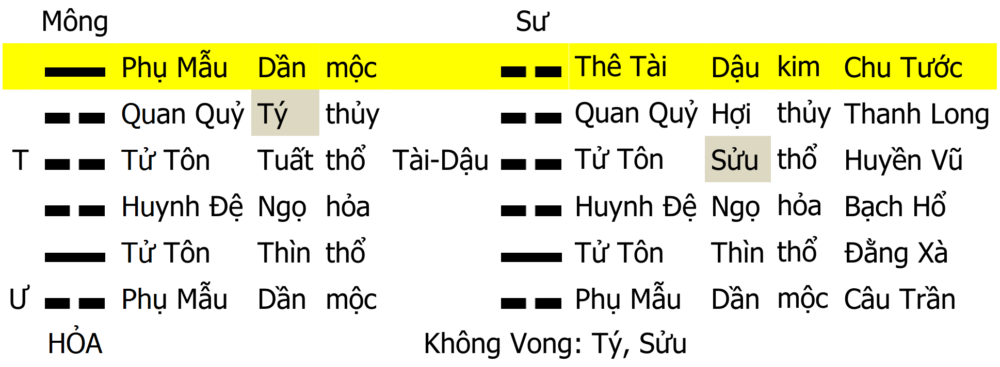
    - **Hình này chứng minh điều gì**
      - Chứng minh bệnh nhân mắc chứng viêm khô rát cổ họng và bệnh tim thiếu máu cơ tim.
    - **Từ đâu mà thấy được**
      - Hào 5 Tý thủy (cổ họng) ám động bị Ngọ hỏa xung táo, hào 4 Tuất thổ (tim) và Nguyên thần Ngọ hỏa bị khắc thương.
- Các bước suy luận và căn cứ dự trắc:
  - Chuyển hóa tượng quẻ: Trong quẻ hỏi vận khí vốn hàm chứa đầy đủ thông tin về tình trạng thân thể; lấy hào Thế Tử Tôn Tuất thổ tại hào 4 làm Dụng thần.
  - Luận chứng viêm khô cổ họng:
    - Hào 6 Phụ Mẫu Dần mộc phát động lâm Chu Tước đến khắc Thế; Dần mộc là Bệnh địa của Thổ, Chu Tước chủ viêm nhiễm sưng nóng.
    - Hào 5 Quan Quỷ Tý thủy tuy lâm Tuần Không nhưng được Nguyệt kiến Hợi thủy tỉ phù vượng tướng, bị Nhật kiến Ngọ hỏa xung kích trở thành ám động; địa chi Tý thủy chủ cổ họng, hào 5 cũng là hào vị cổ họng, Quan Quỷ chủ bệnh tật nên cổ họng phát sinh chứng viêm.
    - Tác động của Nhật kiến Ngọ hỏa xung vào Tý thủy mang tính chất hỏa nhiệt, khô nóng, biến chứng viêm thành chứng khô rát cổ họng.
  - Luận bệnh tim và thiếu máu:
    - Hào Thế Tuất thổ cư hào 4 bị hào 6 Dần mộc động khắc; hào 4 là vị trí của tim và Tuất thổ cũng chủ về tim.
    - Nguyên thần của Thế là Huynh Đệ Ngọ hỏa tại hào 3 bị Nguyệt kiến Hợi thủy khắc hại, lại lâm Bạch Hổ (Bạch Hổ chủ huyết dịch, máu huyết), thể hiện rõ ràng tim không được cung cấp đủ máu (thiếu máu cơ tim).
- Ứng nghiệm thực tế: Đương số thường xuyên bị khô rát cổ họng khó chịu và mắc chứng tim cung cấp máu kém.

#### Ví dụ 4: Nữ đoán bệnh bản thân ngày Đinh Hợi tháng Thìn (Quẻ Thiên Lôi Vô Vọng biến Trạch Lôi Tùy)

- Bối cảnh dự trắc: Ngày Đinh Hợi, tháng Thìn (tuần Giáp Thân, Không Vong tại Ngọ và Mùi). Người phụ nữ tự gieo quẻ hỏi về bệnh trạng của mình, nhận được quẻ Thiên Lôi Vô Vọng biến Trạch Lôi Tùy.
  - **Hình 58.** Sơ đồ quẻ Thiên Lôi Vô Vọng biến Trạch Lôi Tùy
    - 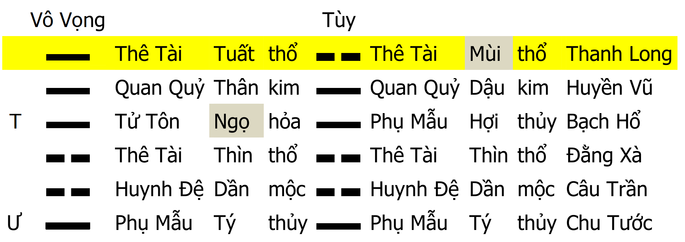
    - **Hình này chứng minh điều gì**
      - Chứng minh người bệnh bị rối loạn nhịp tim, nhức đầu, u xơ tử cung và u nang buồng trứng.
    - **Từ đâu mà thấy được**
      - Hào 4 Ngọ hỏa (tim) Không lâm Hổ bị Nhật khắc; hào 6 Tuất thổ (đầu) động lâm Long; hào 2 Dần mộc (tử cung) bị Nhật hợp.
- Các bước suy luận và căn cứ dự trắc:
  - Xác định Dụng thần: Lấy hào Thế Tử Tôn Ngọ hỏa tại hào 4 làm Dụng thần.
  - Luận bệnh rối loạn nhịp tim:
    - Hào Thế Tử Tôn Ngọ hỏa cư hào 4 lâm Bạch Hổ, bị Nhật kiến Hợi thủy khắc thương tổn.
    - Hào 4 là hào vị của tim, Ngọ hỏa về ngũ hành lẫn địa chi đều đại diện cho quả tim và tuần hoàn.
    - Hào Thế gặp Tuần Không biểu thị tình trạng rỗng không, rung giật, bất an, từ đó chỉ ra chứng rối loạn nhịp tim.
  - Luận bệnh đau đầu:
    - Hào 6 Thê Tài Tuất thổ phát động hóa Mùi thổ; hào 6 là đầu, địa chi Tuất thổ cũng là đầu.
    - Tuất thổ lâm Thanh Long chủ về đau nhức, kết hợp hào vị đầu tạo thành chứng nhức đầu mạn tính.
  - Luận u xơ tử cung và u nang buồng trứng:
    - Nguyên thần của Dụng thần là Huynh Đệ Dần mộc cư hào 2 bị Nhật kiến Hợi thủy hợp trú (Dần Hợi lục hợp).
    - Hào 2 là hào vị của cơ quan sinh dục và tử cung; địa chi Dần mộc lại là Trường Sinh địa của Tử Tôn Ngọ hỏa, cũng chủ về tử cung và buồng trứng.
    - Việc Dần mộc bị Thủy của Nhật kiến hợp trú mang ý nghĩa thể dịch ứ đọng, u cục ngưng trệ, cho phép kết luận đương số có u xơ tử cung hoặc u nang buồng trứng.
- Ứng nghiệm thực tế: Đương số xác nhận bản thân bị rối loạn nhịp tim, thường xuyên đau đầu, đi khám phát hiện có khối u xơ tử cung và u nang buồng trứng.

#### Ví dụ 5: Nam đoán bệnh bản thân ngày Kỷ Hợi tháng Tị (Quẻ Thủy Sơn Kiển biến Lôi Sơn Tiểu Quá)

- Bối cảnh dự trắc: Ngày Kỷ Hợi, tháng Tị (tuần Giáp Ngọ, Không Vong tại Thìn và Tị). Một người nam tự gieo quẻ hỏi về bệnh tật của bản thân, được quẻ Thủy Sơn Kiển biến Lôi Sơn Tiểu Quá.
  - **Hình 59.** Sơ đồ quẻ Thủy Sơn Kiển biến Lôi Sơn Tiểu Quá
    - 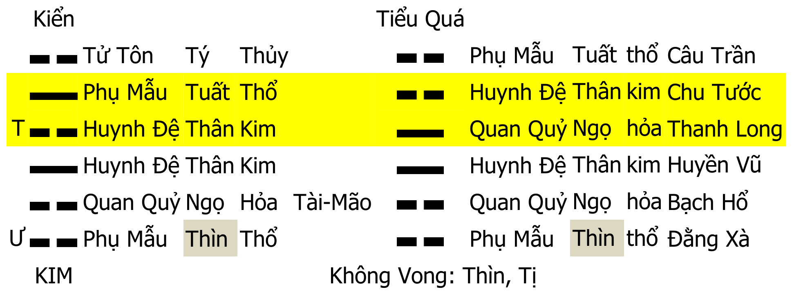
    - **Hình này chứng minh điều gì**
      - Chứng minh bệnh viêm khí quản mãn tính kéo dài dẫn tới hen suyễn ở hệ thống hô hấp.
    - **Từ đâu mà thấy được**
      - Hào 4 Thân kim (phổi, khí quản, quái cung Đoài) lâm Bệnh địa ở Nhật Hợi, bị Nguyệt Tị hợp khắc và hóa Quỷ hồi đầu khắc.
- Các bước suy luận và căn cứ dự trắc:
  - Xác định Dụng thần và tính chất mãn tính:
    - Lấy hào Thế Huynh Đệ Thân kim tại hào 4 làm Dụng thần.
    - Nguyệt kiến Kỵ thần Tị hỏa khắc hợp hào Thế Thân kim (Tị Thân tương hình tương hợp); Kỵ thần hợp khắc là tượng căn bệnh đã vướng mắc lâu ngày, dây dưa khó dứt.
    - Hào Thế lâm Bệnh địa tại Nhật kiến Hợi thủy (Kim trường sinh tại Tị, đến Hợi là đất Bệnh).
    - Hào Thế Thân kim lại phát động hóa Quan Quỷ Ngọ hỏa hồi đầu khắc, báo hiệu bệnh phát tác dữ dội, nguy hiểm.
  - Xác định cơ quan thụ bệnh (hệ hô hấp):
    - Hào vị 4 là vị trí của lồng ngực, phổi và đường thở.
    - Địa chi Thân kim chủ quản phổi, khí quản và cơ quan hô hấp.
    - Quái cung: Quẻ Kiển thuộc cung Đoài (Đoài chủ phế kim, cơ quan hô hấp).
    - Sự trùng khớp giữa hào vị 4, địa chi Thân kim và quái cung Đoài chỉ rõ mầm bệnh khu trú tại hệ hô hấp.
- Ứng nghiệm thực tế: Đương số mắc chứng viêm khí quản kéo dài dẫn tới hen suyễn trầm trọng.

## CHƯƠNG 9: KIẾN THỨC CĂN BẢN ỨNG DỤNG TRONG ĐOÁN BỆNH LÝ

### 1. TÁC DỤNG CỦA DỤNG THẦN LƯỠNG HIỆN

#### Nguyên tắc phân định công năng khi Dụng thần lưỡng hiện
- Quy luật tuyển chọn Dụng thần trong trường hợp lưỡng hiện:
  - Khi trong quẻ xuất hiện hai hào cùng mang lục thân Dụng thần, thông thường theo quy tắc tuyển trạch sẽ bỏ một hào và lấy một hào làm Dụng thần chính.
  - Dự đoán tật bệnh thông thường ưu tiên chọn hào phát động, hào mang tuần không, hào bị nguyệt phá, hào trì Thế hoặc hào có biến động đặc thù làm Dụng thần.
- Tác dụng phụ trợ trích xuất thông tin của hào bị lược bỏ:
  - Hào không được chọn làm Dụng thần chính vẫn mang giá trị phản ánh thông tin bệnh lý phụ trợ quan trọng, không nên bỏ qua hoàn toàn.
  - Cơ chế phân công biểu thị thông tin giữa hai hào Dụng thần: Một hào đảm nhiệm phản ánh cát hung tổng thể và xác định ứng kỳ thời gian; hào còn lại đảm nhiệm trích xuất vị trí phát bệnh, tính chất và diễn biến của chứng bệnh.

#### Ví dụ 1: Quẻ Phong Trạch Trung Phu biến Phong Thủy Hoán - Nam đoán bệnh của mẹ
- Ngày Canh Tý tháng Dậu năm Tân Tị, một người nam gieo quẻ dự đoán bệnh tình của mẹ, được quẻ Phong Trạch Trung Phu biến Phong Thủy Hoán (quái cung Cấn thổ, Tuần Không: Thìn, Tị):
  - **Hình 60.** Sơ đồ quẻ Phong Trạch Trung Phu biến Phong Thủy Hoán
    - 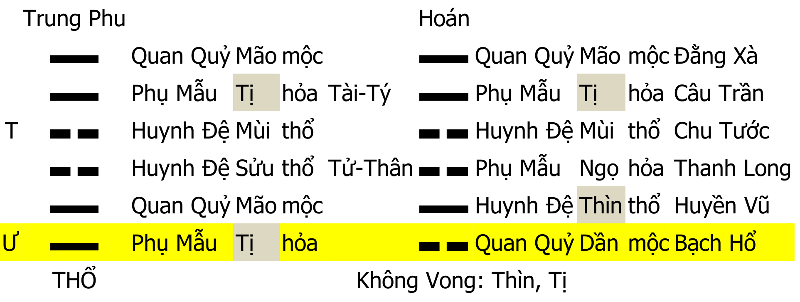
    - **Hình này chứng minh điều gì**
      - Người mẹ mắc chứng ung thư thực quản ác tính, bệnh tình hung hiểm và tử vong trong năm Tân Tị vào tháng Hợi.
    - **Từ đâu mà thấy được**
      - Phụ Mẫu Tị hỏa lưỡng hiện; hào sơ động hóa Dần mộc sinh nhưng ngộ Không, bị Nhật khắc, Nguyệt là Tử địa, lâm Bạch Hổ hóa Quỷ; hào 5 Phụ Mẫu lâm Câu Trần ngộ Tử địa là ung thư ngực/thực quản.
- Xác định Dụng thần trong thế lưỡng hiện:
  - Dự đoán bệnh của mẹ lấy lục thân Phụ Mẫu làm Dụng thần.
  - Trong quẻ có hai hào Phụ Mẫu Tị hỏa xuất hiện tại hào sơ và hào 5; chọn hào sơ Phụ Mẫu Tị hỏa phát động làm Dụng thần chính để định cát hung và ứng kỳ.
- Phân tích cát hung và định vị thời điểm ứng kỳ qua Dụng thần phát động:
  - Dụng thần Phụ Mẫu Tị hỏa tại hào sơ phát động hóa Quan Quỷ Dần mộc hồi đầu sinh.
  - Tuy nhiên Dụng thần Tị hỏa lâm Tuần Không nên không thể nhận được sinh trợ từ hào biến.
  - Dụng thần bị Nhật thần Tý thủy tới khắc hại.
  - Nguyệt kiến Dậu kim là đất Tử (Tử địa) của Tị hỏa theo vòng Trường Sinh.
  - Thần sát Bạch Hổ chủ về tang ma tử vong lâm vào Dụng thần, báo hiệu điềm hung hiểm khó qua khỏi.
  - Dụng thần Tị hỏa chính là Thái Tuế của năm Tân Tị, phát động hóa thành Quan Quỷ là tượng "năm nay biến thành Quỷ", chắc chắn tử vong ngay trong năm.
  - Xác định ứng kỳ: Tháng Hợi xung Dụng thần Tị hỏa (Dụng thần suy kỵ xung), đồng thời Hợi nhị hợp trói buộc Nguyên thần Dần mộc khiến Nguyên thần không thể sinh Dụng thần, nên tháng Hợi là thời điểm hung triệu ứng nghiệm.
- Phối hợp hai hào Dụng thần để trích xuất vị trí và chứng bệnh:
  - Hào sơ Phụ Mẫu Tị hỏa chủ về cát hung và ứng kỳ tử vong, đồng thời hỗ trợ thông tin bệnh chứng.
  - Hào 5 Phụ Mẫu Tị hỏa lâm Câu Trần, lại gặp Nguyệt kiến là Tử địa của hỏa, Câu Trần kết hợp Tử địa là dấu hiệu đặc trưng của bệnh ung thư, u bướu ác tính.
  - Căn cứ ngũ hành Tử địa để truy nguyên nhân bệnh: Dụng thần Tử ở Dậu kim, kim trong quẻ là lục thân Tử Tôn, do đó nguyên nhân tử vong liên quan trực tiếp đến bộ phận cơ thể do Tử Tôn đại diện.
  - Tử Tôn chủ về thực quản, đường hô hấp, ruột, tuyến vú.
  - Hào Dụng thần phụ trợ ngự tại hào 5 ứng với lồng ngực, kết hợp tượng Tử Tôn suy ra người mẹ bị ung thư thực quản.
- Ứng nghiệm thực tế:
  - Mẹ của người hỏi quả nhiên bị ung thư thực quản; đến năm 2004 tác giả mới nhận được phản hồi kết quả ứng kỳ chuẩn xác hoàn toàn như đã phán đoán.

#### Ví dụ 2: Quẻ Phong Sơn Tiệm biến Phong Thiên Tiểu Súc - Nữ đoán cha bệnh lâu ngày
- Ngày Tân Hợi tháng Tuất, người nữ dự đoán bệnh hiểm nghèo lâu ngày của cha, được quẻ Phong Sơn Tiệm biến Phong Thiên Tiểu Súc (quái cung Cấn thổ, Tuần Không: Dần, Mão):
  - **Hình 61.** Sơ đồ quẻ Phong Sơn Tiệm biến Phong Thiên Tiểu Súc
    - 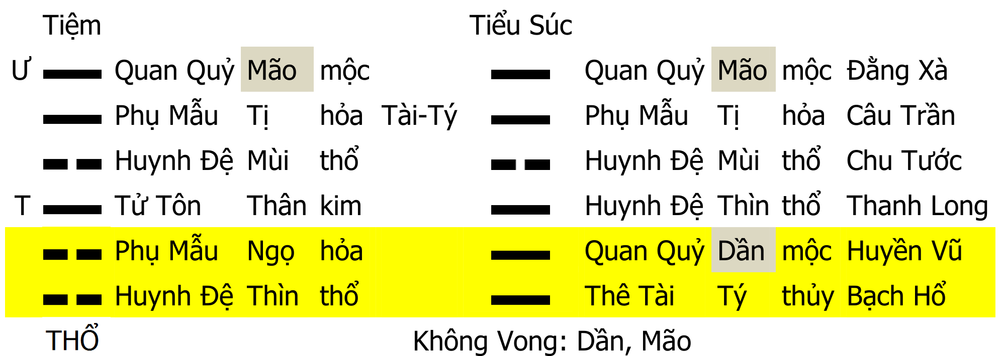
    - **Hình này chứng minh điều gì**
      - Người cha mắc chứng nhồi máu cơ tim và viêm gan hiểm nghèo, bệnh tình trở nặng và tử vong vào ngày Ất Mão trong tháng Tuất.
    - **Từ đâu mà thấy được**
      - Hào 2 Phụ Mẫu Ngọ hỏa động hóa Dần mộc lâm Không bị hợp; hào 5 Phụ Mẫu Tị hỏa ám động bị Nhật khắc lâm Câu Trần; hỏa và hào vị chỉ tim, mộc lâm Không chỉ gan.
- Xác định Dụng thần lưỡng hiện và quy luật quẻ Quy hồn:
  - Đoán bệnh của cha lấy hào Phụ Mẫu làm Dụng thần.
  - Quẻ có Phụ Mẫu lưỡng hiện: Hào 2 Phụ Mẫu Ngọ hỏa minh động, hào 5 Phụ Mẫu Tị hỏa bị Nhật thần Hợi thủy xung thành ám động, do đó kết hợp phân tích cả hai hào.
  - Phong Sơn Tiệm là quẻ Quy hồn thuộc Cấn cung; quẻ Quy hồn gặp thế cách hưu tù suy bại là tượng linh hồn quay về cõi âm, hung lại càng thêm hung.
- Phân tích cát hung và ứng kỳ đối với bệnh lâu ngày:
  - Nhật Nguyệt (tháng Tuất, ngày Hợi) hoàn toàn không sinh phù cho Dụng thần hỏa, ngược lại Dụng thần còn bị Nhật thần Hợi thủy đến khắc chế, thế quẻ bất cát.
  - Hào 2 Phụ Mẫu Ngọ hỏa phát động biến Quan Quỷ Dần mộc hồi đầu sinh, nhưng hào biến Dần mộc lại ngộ Tuần Không, hơn nữa Dần mộc bị Nhật thần Hợi thủy tương hợp (hợp trú), bị trói chặt nên không thể phát sinh tác dụng sinh Dụng thần, khiến tính mạng vô cùng nguy khốn.
  - Quy tắc biện chứng bệnh kinh niên: Bệnh lâu ngày tối kỵ hào động hóa Không, khi xuất Không (ngày giờ xuất Không) tất ứng hung tang hiểm họa.
- Biện chứng vị trí và bản chất bệnh lý:
  - Dụng thần hành hỏa ngự tại hào 5 bị Nhật thần xung khắc: Hào 5 là lồng ngực, hành hỏa chủ quả tim, biểu hiện bệnh biến tại tim.
  - Hào 5 Phụ Mẫu lâm Câu Trần: Lục thần Câu Trần chủ về ách tắc, ứ trệ, tắc nghẽn mạch máu, phản ánh chứng nhồi máu cơ tim (tắc nghẽn cơ tim).
  - Nguyên thần Dần mộc tại hào 2 vừa ngộ Không vừa bị hợp trói: Tượng mạch lưu thông bị tắc nghẽn, càng khẳng định chẩn đoán nhồi máu cơ tim.
  - Hào 2 Phụ Mẫu Ngọ hỏa động hóa Dần mộc lâm Không: Hào 2 trên cơ thể là vị trí gan, hành mộc cũng chủ về tạng can (gan), phản ánh chức năng gan suy kiệt nghiêm trọng.
- Ứng nghiệm thực tế:
  - Người cha mắc bệnh nhồi máu cơ tim kết hợp viêm gan nặng, và đã qua đời vào ngày Ất Mão ngay trong tháng Tuất đó (ngày Mão là kỳ hạn Dần Mão mộc xuất Không).

#### Ví dụ 3: Quẻ Hỏa Địa Tấn biến Hỏa Lôi Phệ Hạp - Nữ đoán bệnh của mẹ
- Ngày Bính Thìn tháng Hợi, người nữ dự đoán bệnh tật của mẹ, được quẻ Hỏa Địa Tấn biến Hỏa Lôi Phệ Hạp (quái cung Càn kim, Tuần Không: Tý, Sửu):
  - **Hình 62.** Sơ đồ quẻ Hỏa Địa Tấn biến Hỏa Lôi Phệ Hạp
    - 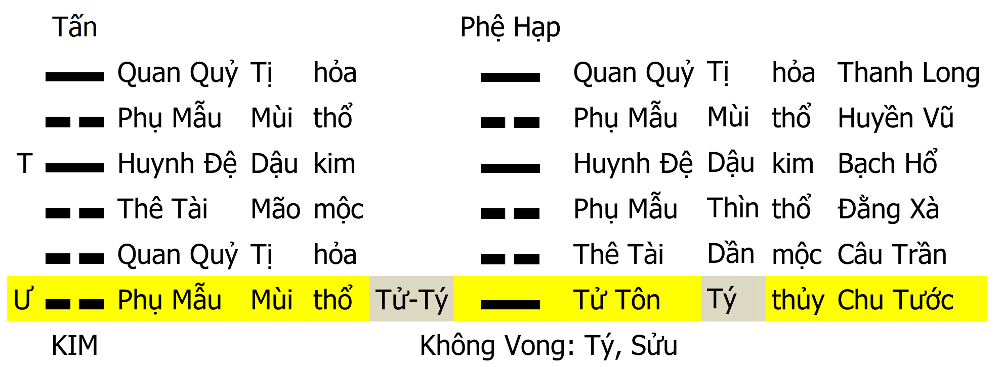
    - **Hình này chứng minh điều gì**
      - Người mẹ mắc chứng viêm phổi tái phát nhiều lần, đang điều trị nội trú tại bệnh viện và hai bàn chân đau yếu không thể đi lại.
    - **Từ đâu mà thấy được**
      - Hào sơ Phụ Mẫu Mùi thổ lâm Ứng nhập Mộ ở Nhật, động hóa Tử Tôn Tý thủy ngộ Không, lâm Chu Tước; cung Càn và Phụ Mẫu hào 5 chỉ lá phổi; hào sơ chỉ bàn chân.
- Xác định Dụng thần và chẩn đoán tình trạng điều trị:
  - Đoán bệnh của mẹ lấy Phụ Mẫu làm Dụng thần.
  - Quẻ có Phụ Mẫu Mùi thổ xuất hiện tại hào sơ và hào 5 (lưỡng hiện); chọn hào sơ Phụ Mẫu Mùi thổ phát động làm Dụng thần chính.
  - Phụ Mẫu Mùi thổ nhập Mộ tại Nhật thần Thìn thổ.
  - Hào sơ Phụ Mẫu cư hào Ứng: Hào Ứng đại diện cho nơi khác bên ngoài nhà; kết hợp tượng Dụng thần nhập Mộ phản ánh người mẹ đã rời nhà nhập viện điều trị nội trú.
- Biện chứng triệu chứng vận động và ổ viêm:
  - Hào sơ Phụ Mẫu Mùi thổ phát động hóa Tử Tôn Tý thủy lâm Tuần Không.
  - Hào sơ là vị trí bàn chân trên cơ thể; hào vị bàn chân động hóa Không thể hiện chân mất đi sức lực nâng đỡ, đi lại khó khăn hoặc liệt không đi được.
  - Lâm lục thần Chu Tước: Chu Tước thuộc hành hỏa, chủ về nhiệt chứng, chứng viêm nhiễm sưng tấy.
- Phối hợp hào Dụng thần thứ hai để định vị cơ quan phát bệnh:
  - Quan sát hào Dụng thần còn lại là Phụ Mẫu Mùi thổ an tĩnh tại hào 5.
  - Hào 5 trên cơ thể chủ về lồng ngực và hai lá phổi.
  - Quẻ Hỏa Địa Tấn thuộc quái cung Càn kim: Tượng Càn kim chủ về bộ máy hô hấp, phổi.
  - Phối hợp hào 5, cung Càn và Chu Tước suy ra người mẹ bị chứng viêm phổi cấp tính.
- Ứng nghiệm thực tế:
  - Người mẹ bị chứng viêm phổi tái phát tới 23 lần, tại thời điểm đoán quẻ đang phải nằm điều trị tại bệnh viện.

#### Ví dụ 4: Quẻ Đoài Vi Trạch biến Thiên Thủy Tụng - Nữ đoán bệnh của cha
- Ngày Giáp Thìn tháng Tị, người nữ dự đoán bệnh tình của cha, được quẻ Đoài Vi Trạch biến Thiên Thủy Tụng (quái cung Đoài kim, Tuần Không: Dần, Mão):
  - **Hình 63.** Sơ đồ quẻ Đoài Vi Trạch biến Thiên Thủy Tụng
    - 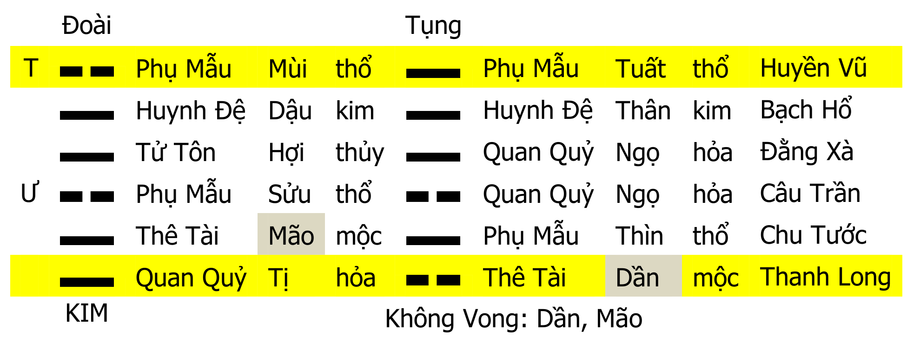
    - **Hình này chứng minh điều gì**
      - Người cha mắc bệnh ung thư phổi hung hiểm, đồng thời trước đó đã từng phẫu thuật cắt bỏ khối u ung thư dạ dày.
    - **Từ đâu mà thấy được**
      - Phụ Mẫu Mùi thổ hào 6 vượng cực hóa Tiến thần là thái quá tất hung; quẻ Đoài và Mùi thổ là Tài khố chỉ phổi; Phụ Mẫu Sửu thổ hào 3 lâm Câu Trần chỉ ung thư dạ dày.
- Xác định Dụng thần và nguyên lý "thái quá hóa hung":
  - Đoán bệnh của cha lấy hào Phụ Mẫu làm Dụng thần.
  - Quẻ có Phụ Mẫu Sửu thổ tại hào 3 và Phụ Mẫu Mùi thổ tại hào 6 (lưỡng hiện); chọn hào 6 Phụ Mẫu Mùi thổ phát động làm Dụng thần chính.
  - Hào 6 Phụ Mẫu Mùi thổ được Nguyệt kiến Tị hỏa tương sinh, Nhật thần Thìn thổ trợ phù.
  - Mùi thổ động hóa Tuất thổ (hóa Tiến thần), đồng thời được hào sơ Quan Quỷ Tị hỏa phát động tương sinh.
  - Cục diện chỉ có sinh phù mà không có khắc chế: Đây là trạng thái sinh trợ thái quá; trong dự trắc tật bệnh "vật cực tất phản", quá vượng hóa ra đại hung, chắc chắn là điềm hung triệu nguy kịch tính mạng.
- Phối hợp hai hào Dụng thần giải đoán khối u kép:
  - Quẻ chính thuần Đoài thuộc Đoài kim, quái Đoài đại diện cho hai lá phổi.
  - Dụng thần Mùi thổ là kho cất giữ Thê Tài Mão mộc (Tài khố): Lục thân Thê Tài chủ về hô hấp và khí thở, Tài khố tượng trưng cho đường hô hấp và lá phổi, xác định bệnh nguy hiểm khởi phát ở phổi.
  - Khai thác thông tin từ hào Dụng thần thứ hai: Hào 3 Phụ Mẫu Sửu thổ an tĩnh lâm lục thần Câu Trần:
    - Hào 3 là vị trí của tỳ vị, dạ dày; ngũ hành thổ cũng chủ về dạ dày.
    - Lục thần Câu Trần chủ về khối u, xơ cứng, ung thư.
    - Phối hợp hào 6 vượng cực chỉ ung thư phổi, hào 3 Sửu thổ lâm Câu Trần chỉ ung thư dạ dày.
- Ứng nghiệm thực tế:
  - Người cha bị mắc chứng ung thư phổi ác tính, và trong tiền sử trước đó đã từng phẫu thuật cắt bỏ ung thư dạ dày.

#### Ví dụ 5: Quẻ Thủy Sơn Kiển biến Thủy Địa Tỷ - Nữ đoán bệnh của cha
- Ngày Giáp Tuất tháng Tuất, người nữ dự đoán bệnh tình của cha, được quẻ Thủy Sơn Kiển biến Thủy Địa Tỷ (quái cung Đoài kim, Tuần Không: Thân, Dậu):
- Xác định Dụng thần trong trường hợp lưỡng hiện và Nguyệt phá:
  - Đoán bệnh của cha lấy hào Phụ Mẫu làm Dụng thần.
  - Trong quẻ có Phụ Mẫu Thìn thổ tại hào sơ và Phụ Mẫu Tuất thổ tại hào 5 (lưỡng hiện).
  - Hào sơ Phụ Mẫu Thìn thổ bị tháng Tuất và ngày Tuất đồng thời xung phá, nên chọn hào sơ Phụ Mẫu Thìn thổ Nguyệt phá làm Dụng thần chính.
- Phân tích cát hung tuyệt khí của Dụng thần:
  - Dụng thần Thìn thổ chịu tổn thương kép: Vừa bị Nguyệt phá vừa bị Nhật phá, rơi vào thế phá tán bất cát.
  - Nguyên thần của Dụng thần là hỏa (Quan Quỷ Ngọ hỏa phục tàng dưới hào 2): Ở tháng Tuất ngày Tuất thì hỏa rơi vào trạng thái hưu tù, lại nhập Mộ tại Tuất (cả Nhật và Nguyệt đều là Mộ), hoàn toàn mất năng lực sinh phù Dụng thần.
  - Dụng thần không có một tia sinh khí cứu trợ, báo trước bệnh thế nan y tử vong hung hiểm.
- Phối hợp hào Dụng thần thứ hai và hào độc phát để biện chứng bệnh vị:
  - Chi Tuất xung phá Dụng thần lại xuất hiện trong quẻ tại hào 5 (Phụ Mẫu Tuất thổ tại hào 5).
  - Lấy hào Dụng thần Phụ Mẫu Tuất thổ tại hào 5 làm căn cứ xét chứng bệnh:
    - Vị trí hào 5 tương ứng với ngực và phổi.
    - Quẻ Thủy Sơn Kiển thuộc quái cung Đoài kim, Đoài tượng trưng cho phổi, khẳng định ổ bệnh nằm tại phổi.
  - Phân tích căn nguyên bệnh qua hào độc phát:
    - Hào 3 Huynh Đệ Thân kim là hào độc phát duy nhất trong quẻ (động biến Thê Tài Mão mộc); hào độc phát chủ quản bản chất và nguyên nhân gây bệnh.
    - Chi Thân thuộc hành kim, chủ về phổi.
    - Thân kim lâm Câu Trần: Lục thần Câu Trần chủ về ung thư, u bướu xơ cứng.
    - Kết hợp độc phát kim (phổi) lâm Câu Trần (ung thư) xác định người cha bị ung thư phổi.
- Ứng nghiệm thực tế:
  - Người cha quả nhiên được chẩn đoán mắc bệnh ung thư phổi.

### 2. THỦ TƯỢNG DỤNG THẦN PHỤC TÀNG

#### Nguyên lý cốt lõi về Dụng thần phục tàng trong dự trắc tật bệnh
- Biểu tượng bệnh lý đặc thù khi Dụng thần phục tàng:
  - Khi lục thân đại diện cho người bệnh (Dụng thần) không xuất hiện trên quẻ mà ẩn tàng dưới một hào khác (Phục thần náu mình dưới Phi thần), đa số tình huống chủ về người bệnh phải nhập viện điều trị hoặc bệnh tình nghiêm trọng khiến người bệnh nằm liệt giường, không thể tự do đi lại.
- Tầm quan trọng mang tính quyết định của mối quan hệ Phi - Phục:
  - Tương tác sinh, khắc, xung, hợp, mộ, tuyệt và tuần không giữa Phi thần (hào lộ trên quẻ đè lên) và Phục thần (hào ẩn bên dưới) là căn cứ cốt tử để định đoạt cát hung, phán đoán tính chất bệnh tật và xác định chuẩn xác thời gian ứng kỳ.
  - Phục thần gặp Phi thần tương sinh hoặc Phi thần lâm Tuần Không thì Phục thần dễ xuất hiện, bệnh thế có cơ may cứu vãn; ngược lại Phục thần bị Phi thần khắc áp, nhập Mộ hoặc lâm tử tuyệt thì bệnh tình hung hiểm, khó bề thuyên giảm.
  - Do đó trong thực tế dự trắc tật bệnh, khi gặp Dụng thần phục tàng người dự đoán bắt buộc phải hết sức lưu tâm khảo sát kỹ lưỡng mọi biến động của Phi thần cùng Phục thần.

#### Sơ đồ quẻ Thủy Sơn Kiển biến Thủy Địa Tỷ - Nữ đoán bệnh của cha
- Ngày Giáp Tuất tháng Tuất, người nữ dự đoán bệnh tình của cha, gieo được quẻ Thủy Sơn Kiển biến Thủy Địa Tỷ (quái cung Đoài kim, Tuần Không: Thân, Dậu):
  - **Hình 64.** Sơ đồ quẻ Thủy Sơn Kiển biến Thủy Địa Tỷ
    - 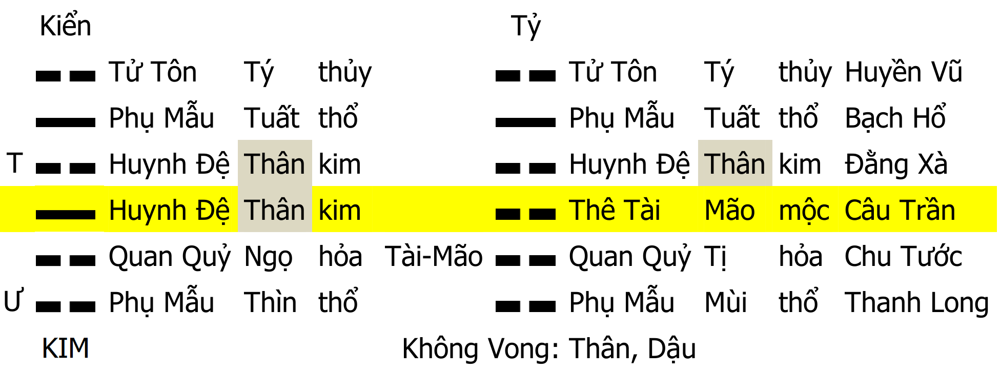
    - **Hình này chứng minh điều gì**
      - Quẻ dự trắc người cha mắc bệnh ung thư phổi ác tính hung hiểm do Dụng thần bị Nhật Nguyệt xung phá và Nguyên thần nhập Mộ phục tàng không còn sinh khí.
    - **Từ đâu mà thấy được**
      - Hào sơ Phụ Mẫu Thìn thổ bị Nhật Nguyệt Tuất thổ xung phá; hào 3 Huynh Đệ Thân kim độc phát lâm Câu Trần chỉ ung thư phổi; Nguyên thần hỏa phục tàng nhập Mộ.
- Phân tích tương quan Dụng thần và cơ chế phát tác ung thư phổi:
  - Đoán bệnh của cha lấy hào Phụ Mẫu làm Dụng thần; quẻ có Phụ Mẫu Thìn thổ tại hào sơ bị tháng Tuất và ngày Tuất đồng thời xung phá nên lấy làm Dụng thần chính.
  - Dụng thần Thìn thổ chịu tổn thương kép Nhật phá và Nguyệt phá; Nguyên thần Ngọ hỏa phục tàng dưới hào 2 lại hưu tù nhập Mộ ở Nhật Nguyệt Tuất thổ, mất sạch sinh khí cứu viện.
  - Hào 3 Huynh Đệ Thân kim là hào độc phát duy nhất trong quẻ, mang hành kim lâm Câu Trần (khối u, ung thư), thuộc quái cung Đoài kim (chủ về hai lá phổi), xác định chắc chắn người cha mắc bệnh ung thư phổi.
- Ứng nghiệm thực tế:
  - Người cha quả nhiên được bệnh viện chẩn đoán mắc bệnh ung thư phổi nguy kịch.

#### Ví dụ 1: Quẻ Sơn Hỏa Bí biến Hỏa Lôi Phệ Hạp - Nữ đoán bệnh của mẹ
- Ngày Giáp Dần tháng Dậu, người nữ dự đoán bệnh tình của mẹ, gieo được quẻ Sơn Hỏa Bí biến Hỏa Lôi Phệ Hạp (quái cung Cấn thổ, Tuần Không: Tý, Sửu):
  - **Hình 65.** Sơ đồ quẻ Sơn Hỏa Bí biến Hỏa Lôi Phệ Hạp
    - 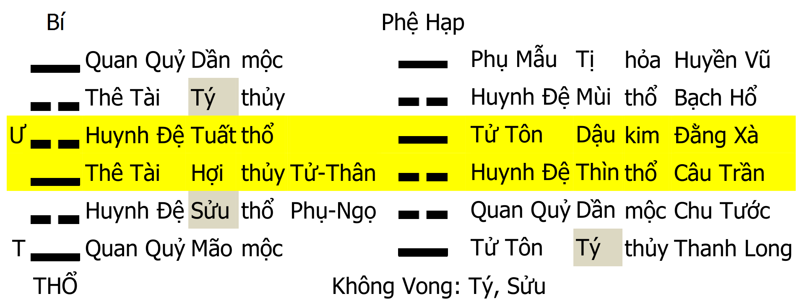
    - **Hình này chứng minh điều gì**
      - Người mẹ mắc khối u thực quản gây tắc nghẽn đường ăn uống phải nhập viện, nhưng bệnh tình chuyển biến tốt sau điều trị nhờ Dụng thần vượng và Phi thần ngộ Không.
    - **Từ đâu mà thấy được**
      - Phụ Mẫu Ngọ hỏa phục tại hào 2 nhập Mộ Tuất thổ hào 4; Dụng thần được Nhật Dần mộc sinh; Phi thần Sửu thổ Không Vong; hào ngực lâm Đằng Xà và Chu Tước chủ ăn uống.
- Xác định Dụng thần phục tàng và trạng thái nhập viện nằm liệt giường:
  - Đoán bệnh của mẹ lấy lục thân Phụ Mẫu làm Dụng thần.
  - Trong quẻ không xuất hiện hào Phụ Mẫu, Phụ Mẫu Ngọ hỏa phục tàng tại hào 2 dưới Huynh Đệ Sửu thổ, mang tượng người mẹ mắc bệnh nằm liệt trên giường bệnh.
  - Dụng thần Ngọ hỏa nhập Mộ tại hào 4 Huynh Đệ Tuất thổ (hỏa mộ tại Tuất); tượng nhập Mộ chủ về người bệnh đã rời nhà vào nằm điều trị nội trú tại bệnh viện.
- Phân tích cát hung sinh tử và giải thoát Phục thần:
  - Dụng thần Phụ Mẫu Ngọ hỏa được Nhật thần Dần mộc tương sinh nên ở trạng thái vượng tướng, lại thêm Nguyệt kiến Dậu kim không đến khắc phạt.
  - Phi thần Huynh Đệ Sửu thổ lâm Tuần Không (tuần Giáp Dần tuần không Tý, Sửu); theo định lý "Phục thần dưới hào Không thì dễ kéo ra", Phi thần trống rỗng không đủ sức đè nén nên Phục thần dễ dàng xuất đầu lộ diện tiếp nhận sinh khí.
  - Kết luận tổng quan cát hung: Dụng thần hữu khí vượng tướng lại dễ xuất hiện, vì vậy tuy mắc bệnh nặng nhưng không nguy hại đến tính mạng, chữa trị tất qua khỏi.
- Biện chứng vị trí khối u thực quản qua hào vị và lục thần:
  - Kỵ thần Thê Tài Tý thủy lâm Bạch Hổ; Kỵ thần hào 3 Thê Tài Hợi thủy lâm Câu Trần phát động tới khắc hại Dụng thần.
  - Lục thần Câu Trần chủ về sưng trướng, ách tắc, u bướu xơ cứng; Kỵ thần động nhập Mộ tại hào 4 Tuất thổ.
  - Vị trí hào 4 trên cơ thể đại diện cho vùng lồng ngực, chứng tỏ tại lồng ngực xuất hiện khối u gây tắc nghẽn cục bộ.
  - Hào 4 Huynh Đệ Tuất thổ lâm Đằng Xà: Đằng Xà chủ về vật thể nhỏ thon dài, tượng trưng cho ống thực quản hẹp dài.
  - Dụng thần Phụ Mẫu Ngọ hỏa phục tàng dưới hào 2 lâm Chu Tước: Chu Tước chủ về miệng, cổ họng và việc ăn uống, nuốt thức ăn.
  - Tổng hợp tượng hào ngực (hào 4), Đằng Xà (dài hẹp), Chu Tước (ăn uống) và Câu Trần (khối u tắc nghẽn) kết luận chính xác người mẹ mắc khối u thực quản.
- Ứng nghiệm thực tế:
  - Bệnh tình thực tế của người mẹ đúng như quẻ đã chỉ ra; sau thời gian tích cực điều trị tại bệnh viện sức khỏe đã chuyển biến tốt rõ rệt.

#### Ví dụ 2: Quẻ Thủy Thiên Nhu biến Thủy Lôi Truân - Nữ đoán bệnh của cha
- Ngày Kỷ Hợi tháng Hợi, người nữ dự đoán bệnh tình của cha, gieo được quẻ Thủy Thiên Nhu biến Thủy Lôi Truân (quái cung Khôn thổ, Tuần Không: Thìn, Tị):
  - **Hình 66.** Sơ đồ quẻ Thủy Thiên Nhu biến Thủy Lôi Truân
    - 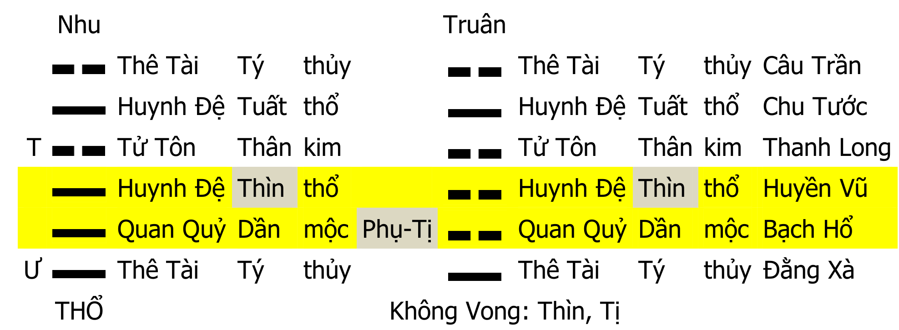
    - **Hình này chứng minh điều gì**
      - Người cha mắc chứng bệnh táo bón nghiêm trọng lâu ngày, chất cặn bã ứ trệ tại đường ruột và hậu môn không thể bài tiết ra ngoài.
    - **Từ đâu mà thấy được**
      - Dụng thần Phụ Mẫu Tị hỏa phục tại hào 2 bị Nhật Nguyệt Hợi thủy xung phá và ngộ Không; hào 2 là ruột và hậu môn; nội quái phục ngâm; Nguyên thần bị Nhật hợp trói chân.
- Xác định Dụng thần tuyệt khí và quy luật bệnh kinh niên:
  - Đoán bệnh của cha lấy hào Phụ Mẫu làm Dụng thần.
  - Phụ Mẫu Tị hỏa không hiện trên quẻ, phục tàng dưới hào 2 Quan Quỷ Dần mộc.
  - Dụng thần Tị hỏa chịu tổn thương cực nặng: Bị cả tháng Hợi lẫn ngày Hợi đồng thời xung khắc, rơi vào thế Nhật phá lẫn Nguyệt phá (lưỡng phá), lại ngộ Tuần Không (tuần Kỷ Hợi tuần không Thìn, Tị).
  - Cổ pháp định lý: Bệnh lâu ngày tối kỵ gặp xung và gặp Không (cửu bệnh phùng xung phùng Không), Dụng thần suy tuyệt vừa phá vừa không báo hiệu chứng bệnh trầm kha nan giải, vô cùng khó chữa dứt điểm.
- Biện chứng vị trí phát bệnh và cơ chế ứ trệ phân:
  - Hào 2 trên cơ thể tương ứng với vùng ruột; ngũ hành hỏa trong tạng phủ cũng đại diện cho ruột (tiểu trường, tâm hỏa biểu lý).
  - Tượng phục tàng phản ánh tính chất giấu kín bên trong, có vật gì đó tích tụ nghẽn ứ không thể bài tiết hay thoát ra ngoài được.
  - Tương tác động biến của Nguyên thần: Hào 2 Quan Quỷ Dần mộc là Nguyên thần phát động đến sinh Dụng thần, nhưng Dụng thần lâm Tuần Không nên rơi vào thế "Không không thụ sinh", không thể tiếp nhận được trợ lực.
  - Tượng phục ngâm đình trệ: Nội quái Càn biến Chấn có các hào biến tạo thành phục ngâm (Dần mộc hóa Dần mộc, Thìn thổ hóa Thìn thổ); phục ngâm là biểu tượng của sự bế tắc, đình đốn, ngưng trệ bất tiến.
  - Hào 2 Nguyên thần Dần mộc bị Nhật thần Hợi thủy tương hợp (Dần Hợi hợp), bị trói chặt chân nên hoàn toàn mất khả năng sinh Dụng thần; hào 3 Thìn thổ là Tài khố (kho chứa) cũng cùng cấu thành phục ngâm.
  - Hào 2 trên cơ thể đồng thời là vị trí trực tràng và hậu môn; tổng hợp các dữ kiện hào ruột hậu môn phục tàng không thoát, phục ngâm đình trệ xác định người cha mắc chứng táo bón nặng nề.
- Ứng nghiệm thực tế:
  - Người cha quả nhiên bị chứng táo bón nghiêm trọng hành hạ kéo dài, bài tiết vô cùng khổ sở.

#### Ví dụ 3: Quẻ Hỏa Phong Đỉnh biến Địa Phong Thăng - Nữ đoán bệnh bố chồng
- Ngày Tân Dậu tháng Dần, người nữ dự đoán bệnh tình của bố chồng, gieo được quẻ Hỏa Phong Đỉnh biến Địa Phong Thăng (quái cung Ly hỏa, Tuần Không: Tý, Sửu):
  - **Hình 67.** Quẻ Hỏa Phong Đỉnh biến Địa Phong Thăng
    - 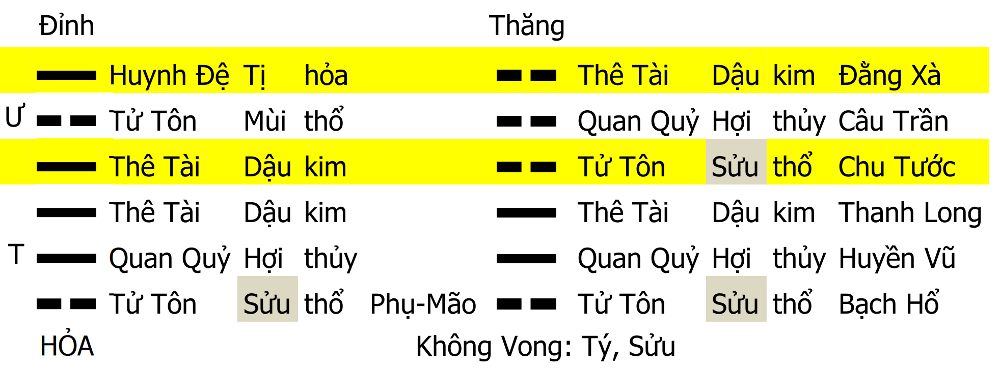
    - **Hình này chứng minh điều gì**
      - Bố chồng mắc bệnh liệt giường triền miên nguy kịch và đã qua đời vào giờ Tý trong một ngày thuộc tiết lệnh Kinh Trập.
    - **Từ đâu mà thấy được**
      - Dụng thần Phụ Mẫu Mão mộc phục dưới hào sơ lâm Bạch Hổ; ngoại quái Tị Dậu Sửu tam hợp Kỵ thần kim cục khắc Dụng; Phục thần sợ gặp xuất hiện vào tiết Kinh Trập.
- Xác định Dụng thần phục tàng và thế nằm liệt giường:
  - Đoán bệnh của bố chồng lấy lục thân Phụ Mẫu làm Dụng thần.
  - Phụ Mẫu Mão mộc không hiện trên quẻ, phục tàng dưới hào sơ Tử Tôn Sửu thổ.
  - Dụng thần phục tàng biểu thị người bệnh đã mất khả năng vận động, nằm liệt giường không thể rời giường bệnh.
  - Phục thần Mão mộc lâm thần sát Bạch Hổ: Bạch Hổ chủ về tai họa, hung hiểm, huyết quang và bệnh tật triền miên quấn thân không dứt.
- Phân tích thế quẻ sát phạt và nguy cơ từ tam hợp cục Kỵ thần:
  - Nguyệt kiến Dần mộc tỉ hòa trợ giúp, Nhật thần Dậu kim xung khắc; thoạt nhìn Dụng thần có vẻ đạt thế cân bằng suy vượng.
  - Tuy nhiên hiểm họa chí mạng nằm ở ngoại quái phát động: Hào 6 Huynh Đệ Tị hỏa động biến Thê Tài Dậu kim, hào 5 Tử Tôn Mùi thổ động biến Quan Quỷ Hợi thủy, hào 4 Thê Tài Dậu kim động biến Tử Tôn Sửu thổ.
  - Ba hào động tại ngoại quái Tị - Dậu - Sửu hợp thành tam hợp Kỵ thần kim cục cực vượng toàn lực phóng sát khí khắc phạt Dụng thần Mão mộc.
- Dự đoán thời điểm ứng kỳ tử vong:
  - Cổ pháp định lý đối với Phục thần bị sát cục vây hãm: "Phục tàng sợ xuất hiện" (Phục thần đang ẩn nấp còn tạm giữ mạng, một khi xuất đầu lộ diện tất bị Kỵ thần cục tiêu diệt).
  - Tiết lệnh Kinh Trập (tháng Mão mộc vượng) là thời điểm Phục thần Mão mộc xuất đầu ứng kỳ, do đó tiết Kinh Trập là kỳ hạn đại hung hiểm nguy ngập tính mạng.
- Ứng nghiệm thực tế:
  - Người bố chồng quả nhiên đã qua đời vào đúng giờ Tý trong một ngày thuộc tiết lệnh Kinh Trập.

#### Ví dụ 4: Quẻ Địa Lôi Phục biến Phong Thủy Hoán - Nam đoán bệnh bố vợ
- Ngày Quý Mùi tháng Thìn năm Ất Dậu, người nam dự đoán bệnh tình của bố vợ, gieo được quẻ Địa Lôi Phục biến Phong Thủy Hoán (quái cung Khôn thổ, Tuần Không: Thân, Dậu):
  - **Hình 68.** Quẻ Địa Lôi Phục biến Phong Thủy Hoán
    - 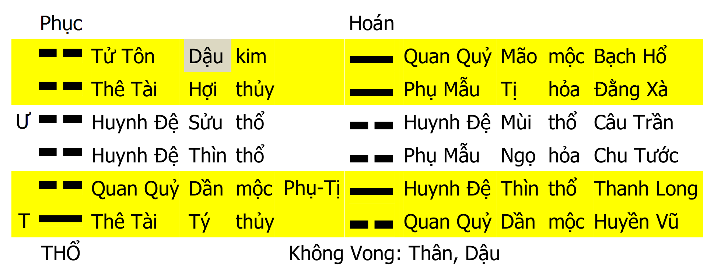
    - **Hình này chứng minh điều gì**
      - Bố vợ mắc bệnh liệt giường dây dưa lúc khỏe lúc yếu, tiên lượng bệnh tình tái phát nguy kịch và đã qua đời vào tháng Tý năm Đinh Hợi.
    - **Từ đâu mà thấy được**
      - Phụ Mẫu Tị hỏa phục dưới hào 2 hưu tù; ngoại quái phản ngâm chủ bệnh biến đổi thất thường; Kỵ thần Hợi thủy đắc lệnh vào năm Đinh Hợi tháng Tý xung khắc Dụng thần.
- Xác định Dụng thần hưu tù phục tàng và tiên lượng nan y:
  - Đoán bệnh của bố vợ lấy lục thân Phụ Mẫu làm Dụng thần.
  - Phụ Mẫu Tị hỏa không xuất hiện trên thân quẻ, phục tàng dưới hào 2 Quan Quỷ Dần mộc.
  - Tháng Thìn và ngày Mùi đều là thổ vượng làm tiết hao nguyên khí của hỏa; Dụng thần không được Nhật Nguyệt sinh phù nên rơi vào trạng thái hưu tù suy nhược.
  - Tượng phục tàng chủ về người bệnh bị ốm liệt giường, không thể tự ngồi dậy; Dụng thần đã hưu tù suy kiệt lại còn phục tàng báo hiệu bệnh mạn tính trầm kha, rất khó có ngày bình phục.
- Diễn biến bệnh tình qua tượng quẻ Phản ngâm:
  - Ngoại quái Khôn thổ biến Tốn mộc (hào 4, 5, 6 cùng phát động tương xung tương khắc lẫn nhau) tạo thành quẻ phản ngâm.
  - Phản ngâm chủ về trắc trở, phản phục, bệnh tình biến thiên thất thường khôn lường, khi phát bệnh nặng khi tưởng chừng thuyên giảm, thể trạng lúc khỏe lúc yếu triền miên.
- Định lượng sát lực của Kỵ thần và suy đoán ứng kỳ:
  - Trong quẻ có Kỵ thần Thê Tài Tý thủy (hào sơ) và Thê Tài Hợi thủy (hào 5) phát động: Hào sơ Tý thủy động biến Dần mộc, hào 5 Hợi thủy động biến Tị hỏa.
  - Hiện tại Kỵ thần thủy động nhưng bị thổ vượng của tháng Thìn và ngày Mùi khắc chế gắt gao nên tạm thời chưa đủ lực xung khắc Dụng thần Tị hỏa.
  - Xác định ứng kỳ hung hiểm: Phải đề phòng đến năm Đinh Hợi (2007), khi Thái Tuế Hợi thủy đắc lệnh lâm quyền, Kỵ thần thủy khí xung thiên tất sẽ trực tiếp xung khắc tuyệt mạng Dụng thần Phụ Mẫu Tị hỏa.
- Ứng nghiệm thực tế:
  - Người bố vợ quả nhiên dây dưa bệnh tật và đã qua đời vào tháng Tý năm Đinh Hợi (thời điểm thủy khí Kỵ thần vượng tột cùng).

#### Ví dụ 5: Quẻ Lôi Sơn Tiểu Quá biến Địa Thiên Thái - Nam đoán bệnh con trai
- Ngày Quý Sửu tháng Hợi, người nam dự đoán bệnh tật của con trai, gieo được quẻ Lôi Sơn Tiểu Quá biến Địa Thiên Thái (quái cung Đoài kim, Tuần Không: Dần, Mão):
- Xác định Dụng thần phục tàng và mức độ nghiêm trọng của bệnh tật:
  - Đoán bệnh cho con trai lấy lục thân Tử Tôn làm Dụng thần.
  - Tử Tôn Hợi thủy không xuất hiện trên quẻ, phục tàng dưới hào 4 Quan Quỷ Ngọ hỏa trì Thế.
  - Đánh giá suy vượng: Tuy Tử Tôn Hợi thủy được Nguyệt kiến Hợi thủy đồng hành tỉ hòa trợ vượng, nhưng lại bị Nhật thần Sửu thổ khắc phạt (thổ khắc thủy).
  - Trong quẻ có các hào động phát sinh khắc chế: Hào 4 Quan Quỷ Ngọ hỏa trì Thế động hóa Phụ Mẫu Sửu thổ hồi đầu khắc thủy; hào sơ Phụ Mẫu Thìn thổ động hóa Tử Tôn Tý thủy hợp cục khắc Dụng; tổng thể nhiều thế thổ động khắc hại khiến bệnh tật của đứa trẻ tương đối nghiêm trọng.
- Ý nghĩa bệnh lý khi Dụng thần phục dưới Quan Quỷ:
  - Quan Quỷ là hiện thân của mầm mống bệnh tật, tai ương và đau đớn.
  - Dụng thần náu mình ngay dưới Quan Quỷ (Phi thần là Quan Quỷ): Quan Quỷ đè nén trực tiếp lên đầu Dụng thần.
  - Đây là điềm báo đứa trẻ đã bị bệnh tật giày vò, hành hạ đau đớn trong một thời gian dài, mang tính chất bệnh mạn tính dai dẳng.
- Biện chứng vị trí phát bệnh qua Nguyên thần bị tổn thương:
  - Nguyên thần sinh trợ Dụng thần Hợi thủy là hành kim (lục thân Huynh Đệ Thân kim).
  - Trong quẻ, Huynh Đệ Thân kim xuất hiện tại cả hào 5 và hào 3, nhưng đều bị thế hỏa xung quanh thiêu đốt khắc thương nặng nề (hào 2 và hào 4 Quan Quỷ Ngọ hỏa khắc kim).
  - Khai thác triệu chứng bệnh tại hào 5:
    - Vị trí hào 5 trên cơ thể đại diện cho vùng lồng ngực và hai lá phổi.
    - Hành kim chủ quản đường hô hấp và khí quản.
    - Hào 5 Huynh Đệ Thân kim lâm lục thú Đằng Xà: Đằng Xà chủ về co thắt hẹp, thở khò khè, khó thở.
    - Tổ hợp kim tại hào ngực phối hợp Đằng Xà là dấu hiệu bệnh lý điển hình của bệnh hen suyễn (hen phế quản).
  - Khai thác triệu chứng bệnh tại hào 3:
    - Vị trí hào 3 trên cơ thể tương ứng với khoang bụng, dạ dày và đường ruột.
    - Ngũ hành kim tại hào 3 đại diện cho ruột già (đại tràng).
    - Hào 3 Huynh Đệ Thân kim lâm lục thần Chu Tước: Chu Tước thuộc hành hỏa, chủ về nhiệt chứng, chứng viêm nhiễm sưng nóng.
    - Tổ hợp kim tại hào ruột lâm Chu Tước phản ánh chứng viêm ruột cấp hoặc mạn tính, gây rối loạn tiêu hóa và tiêu chảy liên tục.
- Ứng nghiệm thực tế:
  - Đứa trẻ quả nhiên mắc bệnh hen suyễn phế quản kinh niên đã nhiều năm ròng, đồng thời hệ tiêu hóa rất yếu, thường xuyên bị viêm ruột và tiêu chảy kéo dài.

### 3. THỦ TƯỢNG TIẾN THẦN VÀ THOÁI THẦN

#### 3.1. Nguyên lý và ý nghĩa thủ tượng của Tiến thần và Thoái thần trong đoán bệnh
- Tác dụng căn bản đối với lực lượng của hào:
  - Tiến thần có tác dụng tăng cường, khuếch đại sức mạnh của hào động.
  - Thoái thần có tác dụng làm suy giảm, tiêu trừ sức mạnh của hào động.
  - Nguyên tắc cát hung thông thường: Dụng thần và Nguyên thần rất cần động hóa Tiến thần; Kỵ thần và Cừu thần rất cần động hóa Thoái thần.
- Ứng dụng linh hoạt và biện chứng theo tình trạng thực tế của bệnh nhân:
  - Trường hợp bệnh nhân nguy kịch, hôn mê bất tỉnh hoặc đã cận kề cái chết: Người nhà đến xem, nếu gặp Dụng thần động hóa Thoái thần thì lại là điềm có khả năng sống lại, tỉnh lại. Ngược lại, nếu người bệnh từ cõi chết sống lại mà gặp Dụng thần hóa Tiến thần thì e là tượng "hồi quang phản chiếu" tạm thời, khó duy trì lâu dài và không bao lâu sau sẽ qua đời.
  - Trường hợp bệnh mới phát tác (tân bệnh): Dụng thần vượng tướng gặp hóa Thoái thần nhưng đương lệnh thì thực chất không thoái, vẫn đoán là cát tường. Trái lại, Kỵ thần phát động hóa Thoái thần nhưng lâm Nhật Nguyệt thì sức hãm hại vẫn còn nguyên, sẽ gặp hung hiểm.
- Phân biệt chứng bệnh thông qua hàm nghĩa thủ tượng của Tiến thần và Thoái thần:
  - Ý nghĩa thủ tượng của Tiến thần: Biểu thị sự bành trướng, phát triển, khối u biến lớn, phù thũng, hưng phấn, bệnh tình lan rộng đi xa, diễn biến liên tục không dứt.
  - Ý nghĩa thủ tượng của Thoái thần: Biểu thị sự co rút, sợ hãi, suy thoái, suy nhược, mềm yếu, ngả ra sau, lùi lại, đào thải, teo rút, phản hồi, suy yếu, nhút nhát, mất dần công hiệu.
  - Quy tắc phân tích: Cần kết hợp linh hoạt tính chất của lục thân, hào vị và nội dung dự đoán cụ thể để định bệnh chính xác.
  - Quẻ mẫu thể hiện tương tác động hào và cơ chế tiêu trưởng giữa quẻ gốc và quẻ biến:
    - **Hình 69.** Quẻ Lôi Sơn Tiểu Quá biến Địa Thiên Thái
      - 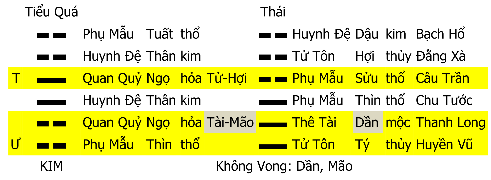
      - **Hình này chứng minh điều gì**
        - Minh họa chuyển hóa hào động và sự tiêu trưởng của tiến thoái thần đối với bệnh tật.
      - **Từ đâu mà thấy được**
        - Căn cứ tương quan giữa quẻ gốc Lôi Sơn Tiểu Quá và quẻ biến Địa Thiên Thái qua các hào động biến.

#### 3.2. Ví dụ 1: Quẻ Lôi Trạch Quy Muội biến Sơn Thiên Đại Súc - Ung thư phổi di căn xương
- Tình huống xem quẻ và thông tin can chi:
  - Thời gian: Ngày Quý Sửu, tháng Tị.
  - Người hỏi: Một người nam tự gieo quẻ đoán bệnh bản thân.
  - Quẻ thu được: Lôi Trạch Quy Muội biến Sơn Thiên Đại Súc.
  - Thuộc tính quẻ: Quẻ thuộc cung Đoài (hành Kim).
  - Tuần không: Dần, Mão.
- Xác định Dụng thần và tương quan ngũ hành:
  - Tự đoán bệnh bản thân lấy hào Thế làm Dụng thần.
  - Hào Thế là Phụ Mẫu Sửu thổ (hào 3) được Nguyệt kiến Tị hỏa sinh, Nhật kiến Sửu thổ tỉ phù nên ở trạng thái vượng tướng.
- Diễn biến động hào và cơ chế sinh khắc thái quá:
  - Hào 6 Phụ Mẫu Tuất thổ phát động lâm Bạch Hổ đến tỉ phù hào Thế.
  - Hào 4 Quan Quỷ Ngọ hỏa lâm Câu Trần phát động biến Phụ Mẫu Tuất thổ, phối hợp cùng hào 6 biến Thê Tài Dần mộc tạo thành tam hợp cục Dần - Ngọ - Tuất hóa Hỏa cục (Nguyên thần) sinh mãnh liệt cho hào Thế.
  - Bản thân hào Thế Phụ Mẫu Sửu thổ lại phát động biến Phụ Mẫu Thìn thổ, tức phát động hóa Tiến thần.
  - Hào Thế chỉ nhận tương sinh và tỉ phù, hoàn toàn không có hào khắc chế hay tiết khí: Sinh quá nhiều dẫn đến trạng thái thái quá, "vật cực tất phản", là điềm cực hung.
  - Hào Thế hóa Tiến thần phản ánh bệnh tình ngày một nghiêm trọng, phát triển bành trướng không thể ngăn chặn.
- Căn cứ định vị cơ quan và chẩn đoán bệnh lý:
  - Quẻ quy về cung Đoài: Đoài chủ về Phế (phổi).
  - Nguyên thần lâm Câu Trần phát động sinh Thế quá vượng: Câu Trần chủ về ung thư, khối u tích tụ.
  - Hào 4 là vị trí ngực và phổi: Kết luận bị ung thư phổi.
- Kết quả và ứng nghiệm thực tế:
  - Người bệnh trên thực tế mắc chứng ung thư phổi và khối u đã di căn thành ung thư xương.
- Minh chứng bằng sơ đồ quẻ dịch:
  - Quẻ được ngày Quý Sửu tháng Tị, nam tự đoán bệnh, được Lôi Trạch Quy Muội biến Sơn Thiên Đại Súc:
    - **Hình 70.** Sơ đồ quẻ Lôi Trạch Quy Muội biến Sơn Thiên Đại Súc
      - 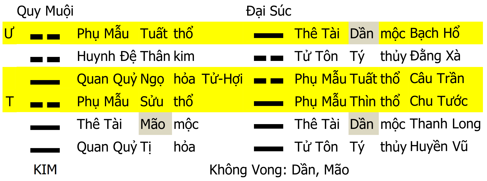
      - **Hình này chứng minh điều gì**
        - Hào Thế Sửu thổ hóa Tiến thần Thìn thổ nhận tam hợp Nguyên thần sinh phù thái quá, chứng minh bệnh ung thư phổi di căn xương.
      - **Từ đâu mà thấy được**
        - Quẻ Đoài kim, Thế thổ tại hào 3 hóa Tiến thần, hào 4 Ngọ hỏa lâm Câu Trần hợp cục sinh Thế, không có hào khắc chế.

#### 3.3. Ví dụ 2: Quẻ Trạch Thiên Quải biến Lôi Trạch Quy Muội - Bệnh mẩn ngứa ngoài da toàn thân
- Tình huống xem quẻ và thông tin can chi:
  - Thời gian: Ngày Mậu Tuất, tháng Hợi.
  - Người hỏi: Người mẹ xem bệnh cho con trai.
  - Quẻ thu được: Trạch Thiên Quải biến Lôi Trạch Quy Muội.
  - Thuộc tính quẻ: Quẻ thuộc cung Khôn (hành Thổ).
  - Tuần không: Thìn, Tị.
- Xác định Dụng thần và cơ chế Thoái thần của quẻ:
  - Đoán bệnh cho con trai lấy hào Tử Tôn làm Dụng thần.
  - Hào Tử Tôn Dậu kim (hào 5) trì Thế, phát động biến Tử Tôn Thân kim, tức Dụng thần phát động hóa Thoái thần: Chủ cơ thể xuất hiện diễn biến suy thoái, phát sinh vấn đề xấu.
- Biện chứng triệu chứng da liễu qua lục thú và ngũ hành:
  - Tử Tôn Dậu kim lâm Thanh Long: Thanh Long chủ về cảm giác ngứa ngáy; hành Kim gặp Thanh Long chủ về bề mặt da dẻ.
  - Nguyên thần sinh Dụng thần là Huynh Đệ Thìn thổ (hào 3) lâm Bạch Hổ, gặp Tuần không, phát động hóa Huynh Đệ Sửu thổ (cũng động hóa Thoái thần):
    - Ngũ hành Thổ đại diện cho da thịt, hiện tượng phồng rộp ngoài da.
    - Động hóa Thoái thần chủ về da dẻ bị thoái hóa, hư tổn, suy thoái lớp bảo vệ.
    - Lâm Bạch Hổ gặp Không hóa Thoái khẳng định bề mặt da phát sinh bệnh chứng nặng nề.
  - Vòng trường sinh: Tử Tôn Dậu kim lâm Bệnh địa tại Thủy (tháng Hợi), lại gặp tương hợp, chủ về bệnh mẩn ngứa dai dẳng tích tụ.
- Kết quả và ứng nghiệm thực tế:
  - Con trai của người phụ nữ mắc bệnh mẩn ngứa, phát ban và ngứa ngáy toàn thân.
- Minh chứng bằng sơ đồ quẻ dịch:
  - Quẻ được ngày Mậu Tuất tháng Hợi, người mẹ đoán bệnh cho con trai, được Trạch Thiên Quải biến Lôi Trạch Quy Muội:
    - **Hình 71.** Sơ đồ quẻ Trạch Thiên Quải biến Lôi Trạch Quy Muội
      - 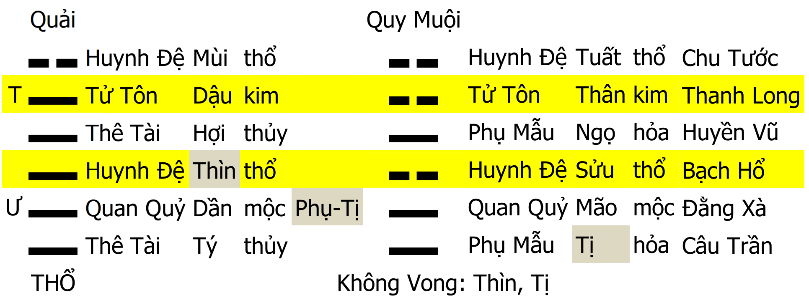
      - **Hình này chứng minh điều gì**
        - Hào Dụng thần Tử Tôn Dậu kim và Nguyên thần Thìn thổ đều động hóa Thoái thần, chứng minh phát sinh bệnh mẩn ngứa toàn thân.
      - **Từ đâu mà thấy được**
        - Dụng thần Dậu kim lâm Thanh Long hóa Thân kim, Nguyên thần Thìn thổ tuần không lâm Bạch Hổ hóa Sửu thổ, Dậu kim bệnh tại tháng Hợi.

#### 3.4. Ví dụ 3: Quẻ Trạch Phong Đại Quá biến Lôi Phong Hằng - Răng sưng lão hóa và đau thắt lưng
- Tình huống xem quẻ và thông tin can chi:
  - Thời gian: Ngày Bính Ngọ, tháng Tuất.
  - Người hỏi: Một người nam tự gieo quẻ đoán bệnh bản thân.
  - Quẻ thu được: Trạch Phong Đại Quá biến Lôi Phong Hằng.
  - Thuộc tính quẻ: Quẻ thuộc cung Chấn (hành Mộc).
  - Tuần không: Dần, Mão.
- Xác định Dụng thần và tiêu điểm hào độc phát:
  - Tự đoán bệnh bản thân lấy hào Thế làm Dụng thần.
  - Hào Thế Phụ Mẫu Hợi thủy (hào 4) bị Nguyệt kiến Tuất thổ khắc thương, bị Nhật kiến Ngọ hỏa hao tiết, ở trạng thái hưu tù suy nhược.
  - Trong quẻ xuất hiện thế độc phát: Duy nhất hào 5 Quan Quỷ Dậu kim phát động biến Quan Quỷ Thân kim; khi Dụng thần suy mà có một hào độc phát thì toàn bộ thông tin bệnh tật dồn tụ vào hào độc phát này.
- Biện chứng bệnh lý răng miệng và thắt lưng:
  - Quan Quỷ Dậu kim là Nguyên thần sinh Thế nhưng lại tại hào 5 phát động hóa Thoái thần: Biểu thị điểm khởi phát mầm bệnh do sự suy thoái.
  - Ngũ hành Kim đại diện cho hệ xương cốt và răng.
  - Hào Thế cư tại ngoại quái Đoài: Quái Đoài đại diện cho miệng và khoang miệng, suy ra điểm phát bệnh nằm ở răng.
  - Hóa Thoái thần chủ về sự lão hóa, teo rút chân răng và thoái hóa xương răng.
  - Trong quẻ còn một hào Quan Quỷ Dậu kim tĩnh tại hào 3 bị Nhật kiến Ngọ hỏa khắc thương: Hào 3 là hào vị của thắt lưng, cho thấy vùng thắt lưng cũng bị đau nhức, suy yếu.
- Kết quả và ứng nghiệm thực tế:
  - Người này bị sưng đau răng do răng đã bị lão hóa, đồng thời bị đau mỏi thắt lưng.

### 4. THỦ TƯỢNG NGUYỆT PHÁ ĐOÁN BỆNH

#### Nguyên lý cát hung và ý nghĩa thủ tượng của Nguyệt phá
- Bản chất và điều kiện tác động của hào Nguyệt phá trong phép dự trắc:
  - Hào Nguyệt phá ở trạng thái hưu tù bất động, hoặc lâm Tuần Không mà gặp Tuyệt, nhập Mộ thì hoàn toàn vô dụng.
  - Cát hung căn cứ theo tính chất Lục thân của hào bị Nguyệt phá:
    - Hào Dụng thần gặp Nguyệt phá chủ về hung họa, suy vi, bệnh tật khó khỏi.
    - Hào Kỵ thần gặp Nguyệt phá làm suy giảm lực khắc hại, chủ về điềm cát.
  - Trường hợp hào Nguyệt phá vượng tướng phát động hoặc được Nhật thần, hào khác sinh phù thì vẫn bảo lưu sức mạnh:
    - Dụng thần lâm Nguyệt phá trong trạng thái hữu lực thì không thể vội đoán là hung.
    - Kỵ thần lâm Nguyệt phá nhưng hữu lực thì vẫn tiềm tàng khả năng phát sinh tai họa.
  - Cơ chế giải trừ trạng thái Nguyệt phá qua thời gian (Thực Phá và Hợp Phá):
    - Hào Nguyệt phá trong hiện tại tuy chịu xung tổn, nhưng khi đến ngày hoặc tháng Thực Phá (trùng địa chi của hào) hoặc Hợp Phá (lục hợp với hào) thì trở lại bất phá.
    - Khi thời gian chuyển sang tháng tiếp theo (qua tiết khí mới), hào không còn bị Nguyệt kiến đương lệnh xung kích nên cũng tự giải tỏa trạng thái Phá.
    - Ứng kỳ của hào Nguyệt phá: phạm vi thời gian gần thì ứng nghiệm theo ngày, phạm vi thời gian xa thì ứng nghiệm theo năm hoặc tháng.
    - Dự trắc chuẩn xác bắt buộc phải phối hợp xem xét trạng thái vượng tướng hưu tù để lượng hóa thực lực mạnh yếu của hào.
- Ý nghĩa biểu tượng bệnh lý chuyên biệt khi thủ tượng Nguyệt phá:
  - Ngoài chức năng định vị cát hung, Nguyệt phá là tiêu chí trọng yếu để thủ tượng chẩn đoán chi tiết bệnh trạng.
  - Các tượng bệnh lý đặc trưng của Nguyệt phá: phân ly, rạn nứt, khe hở, tổn thương cơ học, hoại tử, thối rữa, lở loét, gãy xương, vỡ rách, bong gân, lột da.
- Minh họa liên hệ quẻ và cơ chế hào tượng suy biến qua sơ đồ quẻ Trạch Phong Đại Quá biến Lôi Phong Hằng:
  - **Hình 72.** Sơ đồ quẻ Trạch Phong Đại Quá biến Lôi Phong Hằng
    - 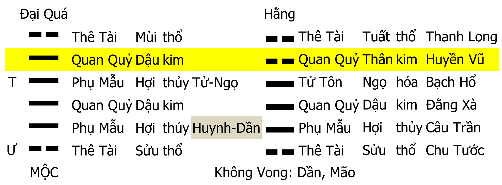
    - **Hình này chứng minh điều gì**
      - Thể hiện sự suy thoái, lão hóa của cơ quan răng miệng và thắt lưng do tác động của hào động hóa thoái và Nhật khắc.
    - **Từ đâu mà thấy được**
      - Hào 5 Quan Quỷ Dậu kim phát động hóa Thân kim lâm Huyền Vũ tại Đoài cung, hào 3 Hợi thủy bị Nhật khắc.

#### Ví dụ 1: Quẻ Thủy Sơn Kiển biến Địa Lôi Phục - Đoán niên vận thấy chồng gãy xương chân
- Tình huống dự trắc: Ngày Kỷ Mão tháng Tý (Không Vong: Thân, Dậu), một phụ nữ đoán niên vận, gieo được quẻ Thủy Sơn Kiển biến Địa Lôi Phục.
  - **Hình 73.** Quẻ Thủy Sơn Kiển biến Địa Lôi Phục
    - 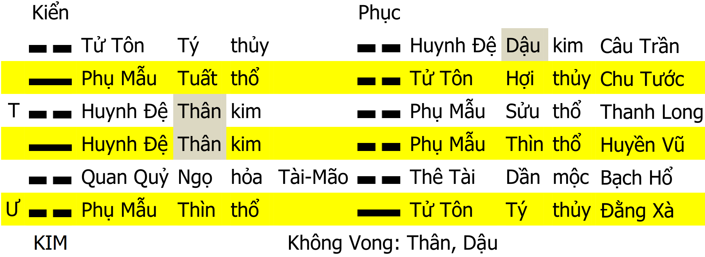
    - **Hình này chứng minh điều gì**
      - Hào Quan Quỷ lâm Nguyệt phá và Bạch Hổ biểu thị tai nạn thương tật, gãy xương ngón chân của người chồng ứng nghiệm vào tháng Ngọ.
    - **Từ đâu mà thấy được**
      - Hào 2 Quan Quỷ Ngọ hỏa bị Nguyệt kiến Tý xung thành Nguyệt phá, lâm Bạch Hổ chủ đả thương gãy xương, tháng Ngọ Thực Phá ứng kỳ.

##### Phân tích hào tượng và ứng kỳ tai nạn gãy ngón chân
- Xác định Dụng thần đại diện cho người chồng:
  - Người nữ đến xin quẻ xem niên vận của bản thân và gia đạo, việc liên quan đến người chồng lấy hào Quan Quỷ làm Dụng thần.
  - Quan Quỷ Ngọ hỏa cư tại hào 2 của nội quái Cấn, phục dưới hào Thê Tài Mão mộc.
- Luận giải tượng hung họa qua Nguyệt phá và Lục thú:
  - Quan Quỷ Ngọ hỏa bị Nguyệt kiến Tý thủy xung phá trực tiếp (Tý Ngọ tương xung), rơi vào thế Nguyệt phá cực độ hưu tù.
  - Hào 2 Quan Quỷ lâm Bạch Hổ: Bạch Hổ là hung thần chủ về đổ máu, thương tật, tai nạn đả thương, gãy xương nứt thịt.
  - Nguyệt phá mang tượng gãy, vỡ, rạn nứt kết hợp Bạch Hổ chỉ rõ tai họa gãy xương.
  - Hào vị: Hào 2 là hào vị của cẳng chân, bàn chân và ngón chân.
- Xác định ứng kỳ thời điểm tai nạn xảy ra:
  - Hào Nguyệt phá báo hiệu tai họa tiềm tàng trong năm, ứng kỳ phát tác chính là thời điểm Thực Phá.
  - Quan Quỷ mang địa chi Ngọ, do đó vào tháng Ngọ (tháng 5 âm lịch) là lúc Nguyệt kiến Ngọ trùng với địa chi của hào phá, hình thành Thực Phá.
- Kết quả ứng nghiệm thực tế:
  - Đúng vào tháng Ngọ trong năm, người chồng bị tai nạn gãy ngón chân phải.

#### Ví dụ 2: Quẻ Trạch Thiên Quải biến Thủy Thiên Nhu - Đoán bệnh người vợ bị loét dạ dày
- Tình huống dự trắc: Ngày Ất Mão tháng Tị (Không Vong: Tý, Sửu), người chồng đoán bệnh cho vợ, gieo được quẻ Trạch Thiên Quải biến Thủy Thiên Nhu.
  - **Hình 74.** Quẻ Trạch Thiên Quải biến Thủy Thiên Nhu
    - 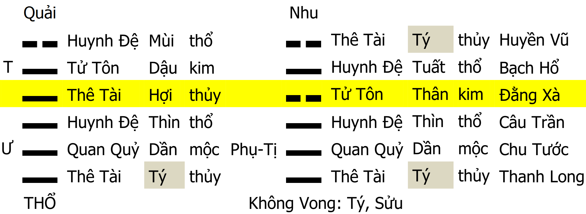
    - **Hình này chứng minh điều gì**
      - Hào Dụng thần Nguyệt phá tại cung Khôn định vị chứng loét dạ dày, độc phát hóa sinh báo hiệu khỏi bệnh khi chuyển sang tháng mới.
    - **Từ đâu mà thấy được**
      - Hào 4 Thê Tài Hợi thủy Nguyệt phá tại hào vị dạ dày, hóa Thân kim hồi đầu sinh, được Thế Dậu kim ám động sinh, tiết Mang Chủng khỏi bệnh.

##### Phân tích hào vị cung Khôn và cơ chế sinh hóa của Dụng thần
- Xác định Dụng thần theo nguyên tắc hào phát động:
  - Chồng đoán bệnh cho vợ lấy hào Thê Tài làm Dụng thần.
  - Trong quẻ xuất hiện Thê Tài lưỡng hiện: hào sơ Thê Tài Tý thủy (tĩnh) và hào 4 Thê Tài Hợi thủy (động).
  - Quy tắc định Dụng thần: Ưu tiên lấy hào phát động là Thê Tài Hợi thủy làm Dụng thần trung tâm; hào tĩnh Thê Tài Tý thủy dùng phối hợp tham chiếu.
- Đánh giá trạng thái sinh khắc và an nguy sinh mệnh:
  - Hào 4 Thê Tài Hợi thủy bị Nguyệt kiến Tị hỏa xung kích (Tị Hợi tương xung) trở thành Nguyệt phá; đồng thời Nhật thần Ất Mão không sinh phù mà tiết khí Hợi thủy.
  - Tuy nhiên quẻ có cách cục độc phát đặc biệt: Hào 4 Thê Tài Hợi thủy là hào duy nhất phát động, biến xuất Tử Tôn Thân kim hình thành quan hệ hồi đầu sinh (Thân kim tương sinh Hợi thủy).
  - Nguyên lý lục hào: Hào độc phát gặp sinh thì chắc chắn được sinh bồi đắp khí lực; lại thêm hào Thế Tử Tôn Dậu kim trường sinh tại tháng Tị, bị Nhật thần Ất Mão xung thành ám động để tương sinh Dụng thần.
  - Nhờ có hai tầng hào Tử Tôn sinh trợ Dụng thần hữu lực, kết luận người bệnh tuy mang bệnh nhưng tính mạng hoàn toàn vô sự.
- Định vị cơ quan nội tạng và bản chất vết bệnh qua thủ tượng:
  - Quẻ Trạch Thiên Quải thuộc Khôn vi Thổ cung; quẻ Khôn chủ về tỳ vị, dạ dày và hệ tiêu hóa.
  - Hào vị: Hào 4 là vị trí của dạ dày (vùng thượng vị trong cơ thể người).
  - Dụng thần Thê Tài Hợi thủy cư hào 4 bị Nguyệt phá: Nguyệt phá mang tượng lở loét, thối rữa, trợt rách niêm mạc.
  - Kết hợp tượng quẻ Khôn, hào vị 4 và Nguyệt phá đưa ra kết luận chính xác: Người vợ mắc chứng loét dạ dày.
- Dự đoán hiệu quả điều trị y tế và thời điểm lành bệnh:
  - Tử Tôn đại diện cho phương thuốc và thầy thuốc; Tử Tôn Dậu kim trì Thế ám động biểu thị người chồng đang rất tích cực chạy chữa, tìm thầy bốc thuốc cho vợ.
  - Nhưng Dụng thần hiện thời đang lâm Nguyệt phá, sức thuốc chưa thể phát huy công hiệu ngay trong tháng hiện tại.
  - Quy luật giải phá: Phải đợi bước sang tháng sau (tháng Ngọ), khi Dụng thần Hợi thủy thoát khỏi sự xung phá của tháng Tị (xuất nguyệt bất phá) thì cơ thể mới phục hồi hoàn toàn.
- Kết quả ứng nghiệm thực tế:
  - Người vợ bị đau vùng bụng trên dữ dội, vào bệnh viện chẩn đoán phát hiện ổ loét dạ dày.
  - Sau vài ngày điều trị bằng thuốc tây nhưng không mang lại kết quả khả quan, lại gặp phản ứng phụ nên đành ngưng thuốc.
  - Mãi đến khi bước qua tiết Mang Chủng (thời điểm giao mùa bước sang tháng Ngọ âm lịch), bệnh đau dạ dày mới dứt hẳn và lành bệnh hoàn toàn.

#### Ví dụ 3: Quẻ Hỏa Địa Tấn biến Hỏa Lôi Phệ Hạp - Đoán việc thi cử phát hiện bệnh cước khí
- Tình huống dự trắc: Ngày Nhâm Tuất tháng Sửu (Không Vong: Tý, Sửu), người phụ nữ hỏi chuyện thi đại học của con, gieo được quẻ Hỏa Địa Tấn biến Hỏa Lôi Phệ Hạp.
  - **Hình 75.** Quẻ Hỏa Địa Tấn biến Hỏa Lôi Phệ Hạp
    - 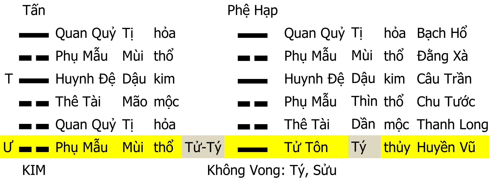
    - **Hình này chứng minh điều gì**
      - Hào sơ Thổ Nguyệt phá lâm Huyền Vũ hóa Thủy chỉ thị chứng bệnh cước khí lột da chân nghiêm trọng ở cả hai mẹ con.
    - **Từ đâu mà thấy được**
      - Hào sơ Phụ Mùi thổ là da bàn chân bị Nguyệt xung phá, lâm Huyền Vũ hóa Tý thủy chủ thấp khí, Phi thần khắc Phục Tử Tôn Tý thủy.

##### Cơ chế Thổ phá hóa Thủy và dự đoán bệnh cước khí ngay tại chỗ
- Bối cảnh giao tiếp và phát hiện thông tin bệnh lý tiềm ẩn:
  - Tác giả nhân dịp về quê thăm song thân, một người phụ nữ trong làng nghe tiếng đã tìm đến để nhờ xem tiền đồ thi đại học của con trai.
  - Khi thiết lập quẻ, các điểm biểu hiện bệnh tật tại hào tượng quá rõ ràng và cấp bách, tác giả lập tức chuyển hướng dự đoán trực tiếp: Hai mẹ con hiện đang bị bệnh cước khí (nấm ẩm kẽ chân) rất nặng làm da chân lột nứt nghiêm trọng.
- Luận giải bệnh trạng của người mẹ qua hào Nguyên thần bị Nguyệt phá:
  - Trong quẻ, hào Thế (Huynh Đệ Dậu kim) đại diện cho người mẹ đến hỏi quẻ.
  - Hào sơ Phụ Mẫu Mùi thổ là Nguyên thần sinh phù cho hào Thế Dậu kim (Thổ sinh Kim).
  - Ngũ hành Thổ chủ về da dẻ, bì phu, cơ nhục trên cơ thể người.
  - Hào vị: Hào sơ (hào 1) là hào thấp nhất, đại diện cho bàn chân, gót chân và các ngón chân.
  - Tác động Nguyệt kiến: Hào sơ Mùi thổ bị Nguyệt kiến Sửu xung trực tiếp (Sửu Mùi tương xung) nên rơi vào trạng thái Nguyệt phá.
  - Thủ tượng Nguyệt phá: Thổ chủ về da, Thổ bị Nguyệt phá tức là da dẻ bị nứt nẻ, bong tróc, tróc vảy, lột da.
  - Hào biến và Lục thú: Hào sơ Mùi thổ phát động biến xuất Tử Tôn Tý thủy; Thủy chủ về chất ẩm, dịch ướt; hào lại lâm Huyền Vũ chủ về ẩm thấp, tà khí u ám.
  - Kết luận: Người mẹ bị thấp khí tích tụ tại bàn chân làm cho da chân nứt toác, lột da nghiêm trọng.
- Luận giải bệnh trạng của người con qua quan hệ Phi thần khắc Phục thần:
  - Người con trai được đại diện bởi hào Tử Tôn.
  - Tử Tôn Tý thủy không hiện trên chính quẻ mà phục tàng dưới hào sơ Phụ Mẫu Mùi thổ (Phục thần Tý thủy phục dưới Phi thần Mùi thổ).
  - Quan hệ Lục thân: Phụ Mẫu Thổ là Kỵ thần khắc hại Tử Tôn Thủy; nay Phi thần Mùi thổ là Thổ phá lại phát động biến ra Tý thủy, hình thành thế Phi thần tới khắc Phục thần.
  - Dưới góc độ thủ tượng phối hợp: Hào sơ Thổ phá vừa khắc Tử Tôn vừa đại diện cho bàn chân, cho thấy người con trai cũng chịu cùng một chứng trạng bệnh lý bàn chân như người mẹ.
- Kết quả ứng nghiệm thực tế:
  - Dự đoán ứng nghiệm ngay tại chỗ: Cả hai mẹ con đều đang mắc bệnh cước khí rất nặng, da vùng bàn chân và kẽ ngón chân bị bong tróc, lột từng mảng lớn trông rất đáng sợ.

#### Ví dụ 4: Quẻ Địa Thủy Sư - Tự đoán bệnh bản thân bị trĩ nội xuất huyết

##### Luận giải hào Thế Đằng Xà lâm Nguyệt phá và tượng quẻ Quy Hồn
- Tình huống dự trắc: Ngày Bính Dần tháng Tý (Không Vong: Tuất, Hợi), người nam tự gieo quẻ xem tình trạng bệnh tật của bản thân, được quẻ Địa Thủy Sư thuần tĩnh.
- Xác định Dụng thần và các thuộc tính tương tác:
  - Tự đoán bệnh cho chính mình, lấy hào Thế làm Dụng thần.
  - Hào Thế ngự tại hào 3 Thê Tài Ngọ hỏa mang đặc tính tự hình.
- Phân tích triệu chứng qua hào vị, Lục thú và thế quẻ:
  - Hào vị: Hào 3 của quẻ đại diện cho phần bụng dưới, thắt lưng, vùng đáy chậu và hậu môn.
  - Lục thú Đằng Xà: Đằng Xà có hình tượng uốn khúc ngoằn ngoèo, chủ về đường ruột, ống tiêu hóa và đại tràng.
  - Tác động Nguyệt phá: Hào Thế Ngọ hỏa bị Nguyệt kiến Tý thủy xung khắc trực tiếp (Tý Ngọ tương xung) trở thành hào Nguyệt phá.
  - Tượng Nguyệt phá: Đại diện cho sự vỡ rách, nứt toác, tổn thương niêm mạc, xuất huyết mạch máu.
  - Thuộc tính quẻ Quy Hồn: Quẻ Địa Thủy Sư là quẻ Quy Hồn thuộc cung Khảm Thủy. Tượng Quy Hồn chủ về nội bộ bên trong, đóng kín, không lộ ra bên ngoài.
  - Tổng hợp tượng quẻ: Bệnh phát sinh tại hậu môn (hào 3), liên quan đến đường ruột (Đằng Xà), bị nứt rách vỡ mạch máu (Nguyệt phá), nằm kín ở phía trong không lộ ra ngoài (Quy Hồn) => chẩn đoán chính xác là chứng trĩ nội gây xuất huyết.
- Kết quả ứng nghiệm thực tế:
  - Người này mắc chứng bệnh trĩ nội bị vỡ búi trĩ dẫn đến xuất huyết kéo dài.

### 5. TÁC DỤNG CỦA KHÔNG VONG KHI ĐOÁN BỆNH

#### Nguyên lý định cát hung và ý nghĩa thủ tượng của Không Vong
- Quy luật định cát hung của Không Vong đối với trạng thái người bệnh:
  - Quan hệ giữa Dụng thần và thời gian mắc bệnh:
    - Nếu là bệnh mới phát (tân bệnh) mà Dụng thần gặp Không Vong: Đến ngày hoặc tháng Thực Không, Xung Không thì người bệnh sẽ bình phục khỏi bệnh.
    - Nếu là bệnh lâu ngày (cửu bệnh) mà Dụng thần gặp Không Vong: Đến ngày hoặc tháng Thực Không, Xung Không thì người bệnh nguy khốn dẫn đến tử vong.
  - Trạng thái phát động của Nguyên thần và Kỵ thần khi lâm Tuần Không:
    - Trong quẻ nếu Nguyên thần lâm Tuần Không phát động: Đến ngày hoặc tháng Xung Không, Thực Không thì người bệnh sẽ hồi phục sức khỏe.
    - Trong quẻ nếu Kỵ thần lâm Tuần Không phát động: Đến ngày hoặc tháng Kỵ thần Thực Không, Xung Không thì người bệnh sẽ gặp tổn thương nguy hại.
- Ý nghĩa thủ tượng chuyên biệt của Không Vong trong chẩn đoán chi tiết và tính chất bệnh tật:
  - Không Vong ngoài việc định lượng cát hung còn là công cụ thủ tượng then chốt để nhận diện triệu chứng bệnh lý và đặc điểm bộ phận thương tổn.
  - Các ý nghĩa biểu tượng cơ bản của Không Vong trong dự trắc bệnh tật:
    - Trạng thái tinh thần và cảm giác: tâm lý bất an, hoảng hốt, chóng mặt, bần thần, cảm giác trống rỗng.
    - Cấu trúc và hình thái tổn thương: khuyết thiếu, khe hở, lỗ hổng, thủng rách, khuyết tổn, hao hụt, hố lõm.
    - Trạng thái công năng và bài tiết: không đủ, khí huyết lưu thông tắc nghẽn, dịch thể bị ứ đọng không thoát ra ngoài được.

#### Minh họa đối chiếu quẻ Địa Thủy Sư: Hào Tuần Không và Nguyệt phá
- Tình huống dự trắc và cơ chế đối chiếu giữa hào Tuần Không với hào Nguyệt phá: Ngày Bính Dần tháng Tý (Không Vong: Tuất, Hợi), người nam tự gieo quẻ xem bệnh tình bản thân, được quẻ thuần tĩnh Địa Thủy Sư thuộc cung Khảm.
  - **Hình 76.** Quẻ Địa Thủy Sư
    - 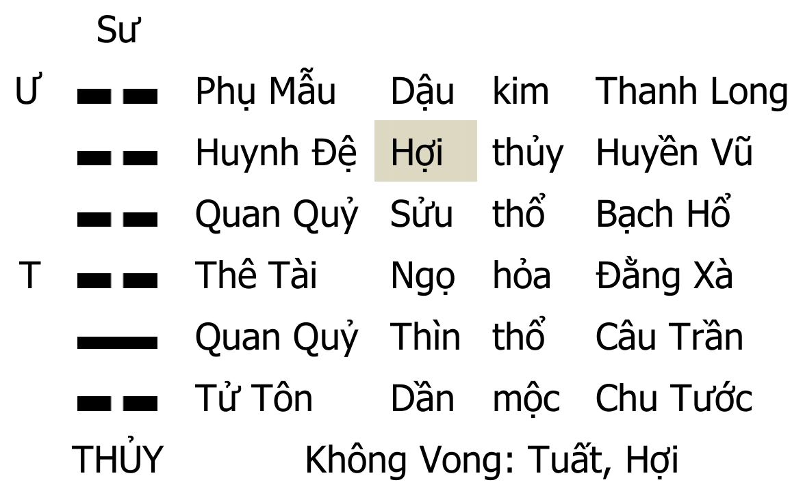
    - **Hình này chứng minh điều gì**
      - Thể hiện sự đối chiếu giữa hào Nguyệt phá gây xuất huyết trĩ nội và hào Tuần Không (Huynh Đệ Hợi thủy).
    - **Từ đâu mà thấy được**
      - Hào 3 Ngọ hỏa lâm Nguyệt phá và Đằng Xà tại hào vị hậu môn; hào 5 Hợi thủy lâm Tuần Không được đánh dấu nổi bật.
- Luận giải chi tiết hào tượng và ứng nghiệm thực tế:
  - Hào lâm Tuần Không: Quẻ gieo vào ngày Bính Dần thuộc tuần Giáp Tý, Tuần Không tại Tuất và Hợi; hào 5 Huynh Đệ Hợi thủy lâm Tuần Không (được tô nổi bật trên sơ đồ quẻ) thể hiện trạng thái hào rỗng không thụ lực.
  - Xác định Dụng thần và vị trí phát bệnh: Tự đoán bệnh lấy hào Thế làm Dụng thần; hào Thế cư tại hào 3 Thê Tài Ngọ hỏa tự mang hình.
  - Hào vị và Lục thú: Hào 3 là hào vị của vùng bụng dưới, trực tràng và hậu môn; hào Thế lâm Đằng Xà chủ về hình thể uốn lượn, đại diện cho đường ruột và ống tiêu hóa.
  - Tác động của Nguyệt phá và thế quẻ Quy Hồn:
    - Hào Thế Ngọ hỏa bị Nguyệt kiến Tý thủy xung khắc trực tiếp (Tý Ngọ tương xung) trở thành hào Nguyệt phá, chủ về nứt toác, vỡ rách mạch máu.
    - Quẻ Địa Thủy Sư là quẻ Quy Hồn của cung Khảm, chủ về bên trong kín đáo, không lộ ra ngoài.
    - Tổng hợp thông tin: Bệnh phát tại hậu môn (hào 3), đường ruột nứt vỡ chảy máu (Đằng Xà Nguyệt phá), nằm kín bên trong (quẻ Quy Hồn) => chẩn đoán chính xác là chứng trĩ nội xuất huyết.
  - Kết quả ứng nghiệm thực tế: Người bệnh mắc chứng trĩ nội vỡ búi trĩ dẫn đến xuất huyết kéo dài.

#### Ví dụ 1: Quẻ Hỏa Phong Đỉnh - Đoán bệnh con trai mắc chứng đa động (ADHD)
- Tình huống dự trắc: Ngày Đinh Tị tháng Ngọ (Không Vong: Tý, Sửu), một người mẹ đến gieo quẻ xem bệnh tình của con trai, được quẻ thuần tĩnh Hỏa Phong Đỉnh.
  - **Hình 77.** Quẻ Hỏa Phong Đỉnh
    - 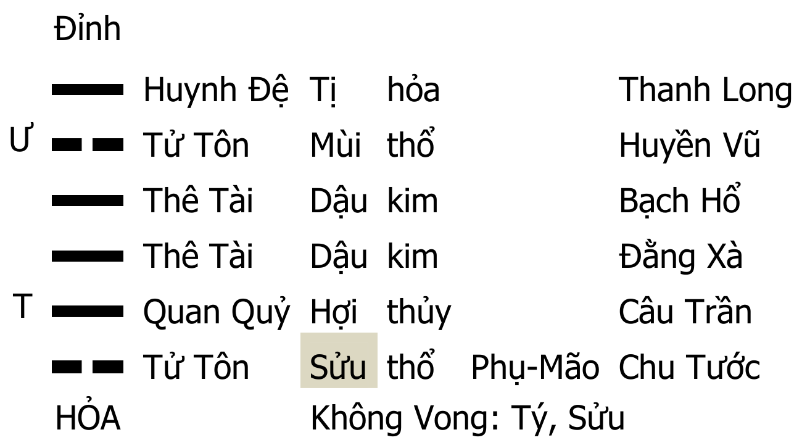
    - **Hình này chứng minh điều gì**
      - Chứng minh đứa trẻ hiếu động hoạt bát quá mức, bàn chân không chịu chạm đất và nói nhiều liên tục (chứng tăng động ADHD).
    - **Từ đâu mà thấy được**
      - Hào sơ Tử Tôn Sửu thổ Không Vong (được đánh dấu nổi bật) ngự tại hào chân, lâm Chu Tước được Nhật Nguyệt tương sinh vượng tướng.

##### Phân tích hào tượng và suy luận dự trắc
- Xác định Dụng thần và nguyên tắc chọn Dụng thần khi lưỡng hiện:
  - Đoán bệnh cho con trai, lấy hào Tử Tôn làm Dụng thần.
  - Trong quẻ có hai hào Tử Tôn xuất hiện đồng thời: hào 5 Tử Tôn Mùi thổ và hào sơ Tử Tôn Sửu thổ (Tử Tôn lưỡng hiện).
  - Áp dụng nguyên tắc trạch Dụng thần: Hào sơ Tử Tôn Sửu thổ lâm Tuần Không (ngày Đinh Tị tuần Giáp Dần, Không Vong tại Tý và Sửu) mang trạng thái dị thường, do đó chọn Tử Tôn Sửu thổ Không Vong làm Dụng thần chuẩn xác.
- Thủ tượng Không Vong kết hợp hào vị cơ thể:
  - Dụng thần Tử Tôn Sửu thổ ngự tại hào sơ (hào 1). Trong hào vị học, hào sơ là vị trí thấp nhất, đại diện cho mặt đất, bàn chân, ngón chân và bước đi.
  - Hào sơ lâm Không Vong mang ý nghĩa trống không, rỗng, không tiếp đất, biểu thị hình tượng "bàn chân không chạm đất".
  - Tượng chân không chạm đất phản ánh đứa trẻ luôn luôn chạy nhảy, vận động không ngừng, không chịu ngồi yên một chỗ, tính tình hiếu động và hoạt bát quá mức.
- Tác động của ngũ hành vượng tướng và Lục thú Chu Tước:
  - Dụng thần Tử Tôn Sửu thổ lâm Chu Tước. Chu Tước chủ về năng lực ngôn ngữ, phát âm, lời nói, sự huyên náo và hoạt động giao tiếp.
  - Về vượng suy: Dụng thần Sửu thổ được cả Nguyệt kiến Ngọ hỏa và Nhật thần Tị hỏa đồng thời tương sinh mạnh mẽ (Hỏa sinh Thổ), khí thế cực kỳ vượng tướng hữu lực.
  - Chu Tước đắc sinh vượng tướng chủ về nói năng liến thoắng, nói nhiều không dứt, nói liên tục không kiểm soát được hành vi giao tiếp.
- Tổng hợp tổ hợp thông tin quẻ:
  - Bàn chân không chịu chạm đất (hào sơ Không Vong) kết hợp với nói nhiều huyên náo liên tục (Chu Tước đắc sinh vượng tướng) cấu thành bức tranh bệnh lý đặc trưng của chứng rối loạn phát triển hành vi.
- Kết quả ứng nghiệm thực tế:
  - Đứa con trai được chẩn đoán mắc chứng đa động ở trẻ em (hội chứng rối loạn tăng động giảm chú ý - ADHD).

#### Ví dụ 2: Quẻ Thủy Thiên Nhu biến Trạch Thiên Quải - Đoán bệnh người cậu bị xuất huyết não
- Tình huống dự trắc: Ngày Mậu Dần tháng Tuất (Không Vong: Thân, Dậu), một người phụ nữ đến xin quẻ đoán bệnh cho người cậu ruột, gieo được quẻ Thủy Thiên Nhu biến Trạch Thiên Quải.
  - **Hình 78.** Quẻ Thủy Thiên Nhu biến Trạch Thiên Quải
    - 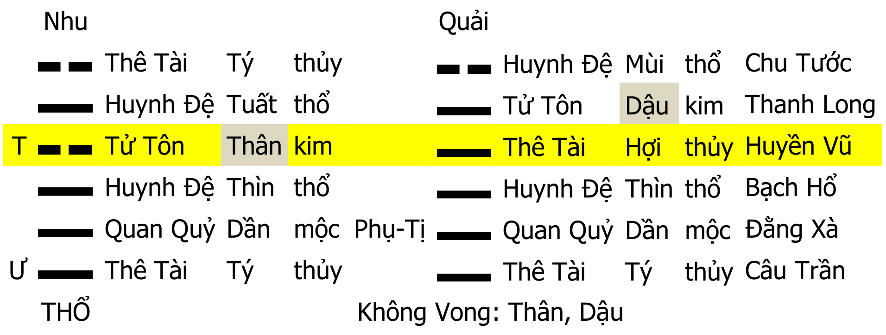
    - **Hình này chứng minh điều gì**
      - Chứng minh người cậu bị vỡ mạch máu não dẫn đến xuất huyết não, phải nằm viện cấp cứu, liệt nửa người bất động và mất khả năng phát âm.
    - **Từ đâu mà thấy được**
      - Hào 4 Tử Tôn Thân kim Không Vong độc phát hóa Hợi thủy (mạch máu nứt vỡ xuất huyết), kim Không bị xung thực không thể phát âm.

##### Phân tích hào tượng và suy luận dự trắc
- Xác định Dụng thần và vị trí Phục tàng:
  - Đoán bệnh cho người cậu (bậc trưởng bối cùng hàng với cha mẹ), lấy hào Phụ Mẫu làm Dụng thần.
  - Phụ Mẫu Tị hỏa không xuất hiện trên sáu hào của quẻ chính, phục tàng dưới hào 2 Quan Quỷ Dần mộc (được Phi thần Dần mộc tương sinh).
  - Tượng Phục tàng biểu thị người bệnh bị bệnh tật trói buộc nằm liệt giường, không thể tự do đi lại hay xuất đầu lộ diện ra bên ngoài.
  - Hào 2 là trạch vị (đại diện cho nhà cửa, gian phòng); Dụng thần phục tại hào 2 là thông tin người bệnh bị giam hãm trong phòng kín, không thể bước chân ra khỏi phòng.
- Tác động của Nguyệt kiến và Nhật thần đối với sinh mạng:
  - Tháng Tuất là Mộ khố của Tị hỏa (Hỏa Mộ tại Tuất). Dụng thần lâm Mộ vào Nguyệt kiến đại diện cho thông tin nhập viện, nằm điều trị dài ngày tại bệnh viện.
  - Nhật thần Dần mộc tương sinh trực tiếp cho Dụng thần Phụ Mẫu Tị hỏa, biểu thị chân khí sinh tồn vẫn được bảo tồn, trước mắt không có nguy cơ đe dọa đến tính mạng.
- Cơ chế tác động của hào độc phát đối với Dụng thần:
  - Trong quẻ có hào 4 Tử Tôn Thân kim là hào duy nhất phát động (cách cục độc phát).
  - Xét theo vòng trường sinh ngũ hành của Hỏa: Dần là Trường sinh, Mão là Mộc dục, Thìn là Quan đới, Tị là Lâm quan, Ngọ là Đế vượng, Mùi là Suy, Thân là Bệnh địa. Do đó Thân kim chính là cung Bệnh địa của Dụng thần Tị hỏa.
  - Thân kim phát động lại hình thành quan hệ tương hợp với Dụng thần (Tị Thân tương hợp). Hào Bệnh địa độc phát đến hợp chặt lấy Dụng thần tạo thành thế "hợp trụ" níu chân, biểu thị người bệnh bị chứng bệnh trầm trọng trói buộc thân thể, làm cho cơ thể vận động vô cùng khó khăn, mất khả năng đi lại.
- Thủ tượng Không Vong trên mạch máu:
  - Hào động Thân kim thuộc ngũ hành Kim, lâm Tuần Không (ngày Mậu Dần tuần Giáp Tuất, Không Vong tại Thân và Dậu).
  - Ngũ hành Kim đại diện cho các ống dẫn, đường ống, gân mạch và mạch máu trong cơ thể.
  - Không Vong chủ về khe hở, khuyết tổn, lỗ rỗng, thủng rách. Kim gặp Tuần Không biểu thị trên mạch máu xuất hiện lỗ thủng nứt toác, chính là dấu hiệu mạch máu bị vỡ.
- Biến hào chỉ rõ tình trạng xuất huyết máu:
  - Hào 4 Tử Tôn Thân kim động biến xuất Thê Tài Hợi thủy.
  - Lục thân Thê Tài chủ về máu huyết; ngũ hành Thủy cũng đại diện cho huyết dịch, chất lỏng trong cơ thể.
  - Mạch máu thủng rách (Kim Không) động biến ra Thủy Tài biểu thị huyết dịch tràn ra khỏi thành mạch, tức hiện tượng xuất huyết máu nghiêm trọng khiến người bệnh không thể đi lại.
- Tượng "Kim Không tắc minh" và cơ chế mất khả năng ngôn ngữ:
  - Trong phép thủ tượng lục hào, "Kim Không tắc minh" (kim rỗng thì gõ vào phát ra tiếng vang lớn) đại diện cho năng lực phát âm, tiếng nói và giao tiếp ngôn ngữ.
  - Tuy nhiên, Thân kim lâm Không Vong lại bị Nhật thần Dần mộc xung kích (Dần Thân tương xung) tạo thành thế Xung Thực (làm đầy chỗ rỗng, mất đi tính chất rỗng vang của kim).
  - Khi bị Nhật xung thực, kim Không không còn phát ra âm thanh được nữa; đồng thời Bệnh địa Thân kim lại hợp giữ chặt lấy Dụng thần, tạo thành thông tin người bệnh không thể phát âm, mất giọng nói và không thể giao tiếp bằng lời.
- Tổng hợp tổ hợp thông tin bệnh lý:
  - Nằm viện điều trị (Dụng thần nhập Mộ ở Nguyệt kiến).
  - Liệt giường không thể đi lại (Dụng phục tại trạch vị, bị Bệnh địa hợp trụ níu chân).
  - Vỡ mạch máu xuất huyết (Kim Không độc phát hóa Thủy Tài).
  - Mất tiếng, không nói được (Kim Không bị Nhật xung thực và hợp Dụng thần).
  - Toàn bộ các tiêu chí này hội tụ thành hình tượng kinh điển của tai biến mạch máu não / xuất huyết não.
- Kết quả ứng nghiệm thực tế:
  - Người cậu của cô gái bị xuất huyết não cấp tính phải nằm viện cấp cứu.
  - Bệnh nhân nói chuyện không lưu loát, miệng méo ngọng nghịu, nửa người bị tê dại hoàn toàn không thể cử động hay điều khiển được.

#### Ví dụ 3: Quẻ Phong Địa Quan biến Trạch Phong Đại Quá - Tự đoán bệnh bản thân mắc chứng sa sút trí tuệ giai đoạn đầu
- Tình huống dự trắc: Ngày Quý Tị tháng Tý (Không Vong: Ngọ, Mùi), một người đàn ông ngoài 50 tuổi tự gieo quẻ xem tình trạng sức khỏe bản thân, được quẻ Phong Địa Quan biến Trạch Phong Đại Quá.

##### Phân tích hào tượng và suy luận dự trắc
- Xác định Dụng thần và vị trí cơ quan phát bệnh:
  - Tự đoán bệnh cho chính mình, lấy hào Thế làm Dụng thần. Hào Thế ngự tại hào 4 Phụ Mẫu Mùi thổ.
  - Quẻ chính Phong Địa Quan thuộc cung Càn. Quái cung Càn Vi Thiên đại diện cho đầu não, đại não, tư duy nhận thức và hệ thần kinh trung ương.
  - Kỵ thần Thê Tài Mão mộc ngự tại hào 6 phát động khắc hào Thế. Hào 6 là hào cao nhất của quẻ, đại diện cho phần đầu và đỉnh đầu.
  - Cả thuộc tính quái cung (cung Càn) lẫn hào vị của Kỵ thần phát động (hào 6) đều đồng quy chỉ rõ nguồn gốc bệnh tật phát sinh tại vùng đầu não.
- Phân tích hào Thế lâm Không Vong và Lục thú Câu Trần:
  - Hào Thế Mùi thổ tuy được Nhật thần Tị hỏa tương sinh phù trợ, nhưng hào Thế lại rơi vào trạng thái Tuần Không (ngày Quý Tị tuần Giáp Thân, Không Vong tại Ngọ và Mùi).
  - Trong quẻ hào Thế không nhận được sự tương sinh hữu hiệu từ Nguyên thần (Nguyên thần chủ về tư duy sáng suốt, trí tuệ mẫn tiệp; ngũ hành Thổ chủ về tính chất trì trệ, chậm chạp).
  - Hào Thế lâm Câu Trần: Lục thú Câu Trần chủ về đờ đẫn, chậm chạp, ngưng trệ, phản xạ kém.
  - Thổ lâm Không Vong lại kết hợp với Câu Trần phản ánh đầu óc trống rỗng, trí tuệ chậm chạp, khả năng phản ứng và nhận thức trì độn rõ rệt.
- Tượng quẻ Du Hồn và dấu hiệu suy giảm trí nhớ:
  - Quẻ Phong Địa Quan là quẻ Du Hồn của cung Càn, biến thành quẻ Trạch Phong Đại Quá (quẻ biến nhập du hồn).
  - Quẻ Du Hồn mang ý nghĩa tâm thần phiêu tán, du đãng bất định, tinh thần không quy tụ, biểu thị chứng hay quên, đãng trí và suy giảm trí nhớ nghiêm trọng.
- Tác động của Nội quái Phản Ngâm:
  - Nội quái Khôn (Mùi thổ, Tị hỏa, Mão mộc) phát động biến sang Tốn (Sửu thổ, Hợi thủy, Dậu kim).
  - Các hào biến tương xung lẫn nhau: Sửu xung Mùi, Hợi xung Tị, Dậu xung Mão; toàn bộ nội quái hình thành cách cục Phản Ngâm.
  - Ý nghĩa của Phản Ngâm: Chủ về sự trăn trở, lặp đi lặp lại, lúc thế này lúc thế khác. Đối với nhận thức và ký ức, phản ngâm biểu thị tình trạng lúc nhớ lúc quên, trí nhớ đứt đoạn không liền mạch.
- Tổng hợp tổ hợp thông tin quẻ:
  - Căn bệnh phát sinh ở đầu não (cung Càn, hào 6 Kỵ thần phát động).
  - Trí tuệ và đầu óc phản ứng chậm chạp trì độn (Thổ Không lâm Câu Trần).
  - Trí nhớ suy giảm trầm trọng, mắc chứng hay quên (quẻ biến Du Hồn).
  - Tinh thần bất ổn, lúc nhớ lúc quên (Nội quái Phản Ngâm).
  - Các yếu tố trên kết hợp thành tổ hợp điển hình của hội chứng suy giảm nhận thức / chứng bệnh si ngốc (sa sút trí tuệ tuổi già).
- Kết quả ứng nghiệm thực tế:
  - Người đàn ông được chẩn đoán mắc chứng si ngốc (sa sút trí tuệ) ở giai đoạn đầu.

### 6. TÁC DỤNG CỦA ĐỘC PHÁT KHI ĐOÁN BỆNH

#### Khái niệm và các tác dụng then chốt của quẻ độc phát
- Khái niệm độc phát trong dự đoán Lục Hào: Quẻ độc phát là quẻ chỉ có duy nhất một hào phát động trong sáu hào, tập trung toàn bộ cơ mật biến hóa và động thái cát hung của sự việc vào một điểm động duy nhất.
- Bốn tác dụng căn bản của hào độc phát:
  - Biểu thị ứng kỳ: Xác định mốc thời gian phát sinh biến cố, thời điểm chuyển biến bệnh hoặc ngày giờ bệnh nhân tử vong.
  - Biểu thị nguyên nhân và tính chất bệnh tật: Khắc họa bản chất triệu chứng, cơ chế bệnh lý và tạng phủ bị tổn thương.
  - Biểu thị việc xem việc này ứng việc khác: Tín hiệu quẻ chuyển dịch sang mối liên hệ nhân sự hay biến cố khác ngoài câu hỏi ban đầu.
  - Biểu thị cát hung: Quyết định chiều hướng sinh tử, an nguy của Dụng thần dựa trên quan hệ sinh khắc chế hóa của hào động.
- Trọng tâm ứng dụng khi đoán bệnh: Trong bốn tác dụng trên, ngoại trừ "xem việc này ứng việc khác", ba tác dụng gồm biểu thị ứng kỳ, biểu thị nguyên nhân/tính chất và biểu thị cát hung giữ vai trò quyết định, đòi hỏi người dự trắc phải xem xét cẩn trọng để định vị thông tin chính xác.
- Đối chiếu đối lập giữa quẻ toàn hào câu động (loạn động/phản ngâm) với cách cục một hào độc phát (điển hình như quẻ Phong Địa Quan biến Trạch Phong Đại Quá khi xem bệnh suy giảm trí nhớ):
  - **Hình 79.** Quẻ Phong Địa Quan biến Trạch Phong Đại Quá
    - 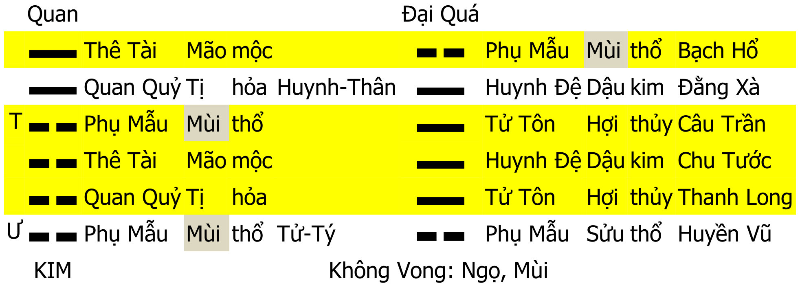
    - **Hình này chứng minh điều gì**
      - Toàn thể sáu hào câu động biến phản ngâm, hào Thế ngộ Không lâm Câu Trần chủ tư duy chậm chạp, hay quên, chứng si ngốc giai đoạn đầu.
    - **Từ đâu mà thấy được**
      - Quẻ Càn cung chủ đầu não, Thế Mùi thổ ngộ Không tại hào 4, nội quái biến phản ngâm lúc nhớ lúc quên, Kỵ thần Mão mộc hào 6 khắc Thế.

#### Ví dụ 1: Nữ đoán bệnh con chó - Hào độc phát hóa thoái biểu thị bệnh thế suy yếu dần
- Tình huống quẻ: Ngày Kỷ Sửu tháng Thân năm Giáp Thân (Tuần không: Ngọ, Mùi), một người phụ nữ dự trắc bệnh tình của con chó nuôi trong nhà, gieo được quẻ Đoài Vi Trạch biến Lôi Trạch Quy Muội:
  - **Hình 80.** Quẻ Đoài Vi Trạch biến Lôi Trạch Quy Muội
    - 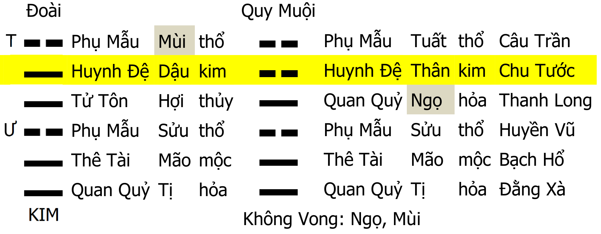
    - **Hình này chứng minh điều gì**
      - Hào độc phát Dậu kim hóa thoái biểu thị sức khỏe suy kiệt dần và ứng kỳ tử vong tại tháng Dậu năm Dậu.
    - **Từ đâu mà thấy được**
      - Dụng thần Tử Tôn Hợi thủy được Nguyên thần Huynh Đệ Dậu kim tại hào 5 độc phát sinh trợ, nhưng Dậu động hóa Thân kim thoái thần.
- Xác định Dụng thần và tương quan suy vượng:
  - Dự trắc bệnh của vật nuôi, thú cưng lấy hào Tử Tôn làm Dụng thần; trong quẻ Dụng thần là Tử Tôn Hợi thủy tại hào 4.
  - Tử Tôn Hợi thủy được Nguyệt kiến Thân kim tương sinh nhưng bị Nhật thần Sửu thổ khắc chế, tạo thế cân bằng suy vượng ngang nhau.
- Phân tích cơ chế độc phát hóa thoái:
  - Nguyên thần là Huynh Đệ Dậu kim tại hào 5 phát động sinh trợ cho Dụng thần Hợi thủy, theo thường lý có khả năng trợ vượng Dụng thần để hồi phục.
  - Tuy nhiên, Nguyên thần Dậu kim động mà biến ra Huynh Đệ Thân kim, hình thành cách cục động hóa Thoái thần.
  - Quẻ chỉ duy nhất hào 5 phát động nên mang đặc tính hào độc phát, biểu thị khí lực của con chó sẽ thoái lui từ từ, sinh lực suy nhược dần theo thời gian.
- Luận giải ứng kỳ và kết quả ứng nghiệm thực tế:
  - Quy tắc ứng kỳ thông thường: Thoái thần thường ứng vào hào biến (chi Thân) hoặc chi xung với hào biến (chi Dần).
  - Biến cách do tính chất độc phát: Do là hào độc phát nắm giữ động khí toàn quẻ, ứng kỳ chuyển sang ứng trực tiếp vào chính hào động tại năm Dậu tháng Dậu.
  - Diễn biến thực tế: Chú chó suy yếu dần và chết vào tháng Dậu năm Ất Dậu, hoàn toàn trùng khớp với định vị hào độc phát Dậu kim.

#### Ví dụ 2: Nữ đoán bệnh cha - Hào độc phát định tính bệnh ung thư và ứng kỳ hung hiểm
- Tình huống quẻ: Ngày Đinh Sửu tháng Tị (Tuần không: Thân, Dậu), một người phụ nữ dự đoán bệnh tình của cha, gieo được quẻ Thiên Địa Bĩ biến Thiên Thủy Tụng:
  - **Hình 81.** Quẻ Thiên Địa Bĩ biến Thiên Thủy Tụng
    - 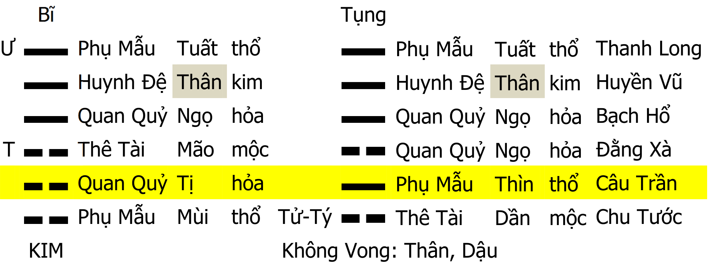
    - **Hình này chứng minh điều gì**
      - Hào độc phát Quan Quỷ lâm Tuyệt địa và Câu Trần định tính ung thư gan ác tính, ứng kỳ qua đời vào ngày Thân tháng Mùi.
    - **Từ đâu mà thấy được**
      - Hào 2 Quan Quỷ Tị hỏa độc phát lâm Câu Trần luận Tuyệt không luận sinh, Dụng thần Phụ Mẫu Mùi thổ ám động bị Nhật xung, Kỵ thần mộc tại hào 3 chủ gan.
- Chọn Dụng thần giữa thế lưỡng hiện:
  - Dự trắc bệnh của cha lấy hào Phụ Mẫu làm Dụng thần; quẻ xuất hiện Phụ Mẫu lưỡng hiện gồm Phụ Mẫu Tuất thổ tại hào 6 và Phụ Mẫu Mùi thổ tại hào sơ.
  - Phụ Mẫu Mùi thổ ở hào sơ bị Nhật thần Sửu thổ tương xung cấu thành ám động, do đó chọn hào Phụ Mẫu Mùi thổ ám động làm Dụng thần chủ chốt.
- Phân tích tính chất hung hiểm từ hào độc phát:
  - Trong quẻ có hào 2 Quan Quỷ Tị hỏa độc phát; đối với Phụ Mẫu thổ thì Tị hỏa là vị trí Tuyệt địa (luận Tuyệt không luận sinh), báo hiệu triệu chứng bệnh thế cực kỳ hung hiểm.
  - Quan Quỷ Tị hỏa lâm Tuyệt địa lại phối cùng lục thần Câu Trần; hào độc phát nắm giữ thông tin định tính, mà Câu Trần chủ khối u, sưng trướng, ung thư.
  - Kết luận chẩn đoán: Người bệnh mắc chứng ung thư ác tính, bệnh trạng hung hiểm khôn cùng, sinh mệnh không thể kéo dài.
- Định vị cơ quan tổn thương và hành vi người bệnh:
  - Phụ Mẫu Mùi thổ lâm hào sơ ám động: Hào sơ là vị trí bàn chân chủ vận động, người bệnh mang tâm lý bất an, thích chạy ngược chạy xuôi đi lại khắp nơi.
  - Hào sơ lâm lục thần Chu Tước: Chu Tước chủ ngôn ngữ, nói chuyện; người bệnh dù mang trọng bệnh vẫn chống gậy rảo bước khắp nơi tìm người đàm đạo, tán gẫu.
  - Xác định ung thư gan:
    - Kỵ thần Thê Tài Mão mộc ngự tại hào 3; hào 3 là vị trí bụng sườn, ngũ hành mộc chủ về tạng can (gan).
    - Bản chất ung thư là bệnh mạn tính lâu ngày, phạm vào nguyên lý dự trắc "bệnh lâu sợ xung".
    - Dụng thần Mùi thổ bị Nhật thần Sửu thổ xung phá gây tổn hại nặng nề; bản thân địa chi Sửu thổ của ngày cũng đối ứng tạng gan.
    - Tổng hợp thông tin: Khẳng định đích xác bệnh trạng là ung thư gan giai đoạn nguy kịch.
- Dự đoán ứng kỳ và diễn biến tử vong thực tế:
  - Tác giả phán đoán: Người cha trong tháng Mùi chưa chết, sang tháng Thân tất chết.
  - Ứng nghiệm thực tế: Bệnh nhân qua đời đúng vào ngày Canh Thân của tháng Mùi.
  - Cơ chế ứng kỳ: Tháng Mùi ứng với Dụng thần Mùi thổ gặp Nguyệt kiến lâm trị (trị Nguyệt); ngày Canh Thân ứng với địa chi Thân lục hợp cùng hào độc phát Quan Quỷ Tị hỏa (hào độc phát gặp Nhật hợp).

#### Ví dụ 3: Nam tự đoán bệnh - Quẻ độc phát lấy tượng định bệnh viêm niệu đạo
- Tình huống quẻ: Ngày Nhâm Dần tháng Mùi (Tuần không: Thìn, Tị), một người nam giới tự dự trắc bệnh tật của bản thân, gieo được quẻ Phong Hỏa Gia Nhân biến Phong Lôi Ích.
- Đánh giá suy vượng và biến cách giải nạn:
  - Tự đoán bệnh lấy hào Thế làm Dụng thần; trong quẻ hào Thế ngự tại hào 2 mang Thê Tài Sửu thổ.
  - Hào Thế Sửu thổ bị Nguyệt kiến Mùi thổ tương xung thành Nguyệt phá, lại bị Nhật thần Dần mộc khắc chế thành hưu tù vô khí.
  - Theo quy luật suy vượng ngũ hành thông thường: Hào Thế vừa lâm Nguyệt phá vừa bị Nhật khắc là triệu chứng cực hung, tính mạng lâm nguy.
  - Tuy nhiên, quẻ xuất hiện một hào độc phát duy nhất nên phương pháp luận phải "lấy tượng làm chủ" thay vì câu nệ hưu tù.
- Cơ chế giải nguy từ vị trí Lâm Quan của hào độc phát:
  - Hào 3 Phụ Mẫu Hợi thủy độc phát; đối với hào Thế Sửu thổ thì Hợi thủy là đất Lâm Quan (nơi chứa đựng sinh khí và thể trạng vững vàng).
  - Tượng Lâm Quan phát động bảo chứng sinh mệnh an toàn, báo hiệu dù có phát sinh bệnh tật cũng không nguy hiểm tính mạng.
- Định vị bệnh lý từ hào độc phát:
  - Hào độc phát Phụ Mẫu Hợi thủy biểu thị bản chất chứng bệnh; Hợi thủy lâm lục thần Chu Tước chủ hỏa nhiệt, sưng tấy, viêm nhiễm.
  - Hào 2 và hào 3 là vị trí đối ứng cơ quan sinh dục và hệ bài tiết hạ tiêu.
  - Ngũ hành thủy tại nội quái biểu trưng cho chất lỏng bài tiết và nước tiểu.
  - Chẩn đoán tổng hợp: Viêm nhiễm (Chu Tước) phối hợp cùng vị trí bộ phận sinh dục (hào 2, hào 3) và dịch nước tiểu (thủy nội quái), kết luận mắc bệnh viêm niệu đạo (viêm đường tiết niệu).
- Dự trắc ứng kỳ thuyên giảm và xác minh thực tế:
  - Phán đoán thời gian hồi phục: Sang tháng Thân bệnh tình sẽ chuyển biến tốt đẹp, do hào Thế Sửu thổ hiện tại lâm Nguyệt phá ở tháng Mùi, sang tháng Thân kế tiếp sẽ hết phá ("Thế Nguyệt phá, sang tháng bất phá").
  - Phản hồi thực tế: Đương số xác nhận bản thân đúng là đang mắc chứng viêm niệu đạo.

### 7. TÁC DỤNG CỦA LỤC HỢP

#### Nguyên lý và thủ tượng Lục hợp trong dự đoán tật bệnh
- Phân loại và nguyên tắc cát hung cơ bản của Lục hợp:
  - Các hình thái Lục hợp trong quẻ: Nguyệt hợp (Nguyệt kiến hợp hào), Nhật hợp (Nhật thần hợp hào), hào hợp (hào động hợp hào tĩnh, hai hào động hợp nhau, hào động hóa hợp), quẻ Lục hợp (bản quẻ Lục hợp, biến quẻ Lục hợp, Lục hợp biến Lục hợp).
  - Quy tắc phân biệt bệnh lâu ngày và bệnh mới phát khi gặp Lục hợp:
    - Bệnh lâu ngày (cửu bệnh) gặp Lục hợp: Điềm cát, chủ về kéo dài tuổi thọ, nguyên khí ngưng tụ, bệnh tình được khống chế và dần dần chữa lành bệnh.
    - Bệnh mới phát (tân bệnh) gặp Lục hợp: Tối kỵ gặp hợp, chủ về tà khí kết tụ dây dưa; nếu Dụng thần hưu tù vô khí thì tất chết; nếu Dụng thần vượng tướng thì chuyển thành bệnh mãn tính, khó chữa trị dứt điểm và không thể trị khỏi hoàn toàn.
- Ý nghĩa thủ tượng của Lục hợp trong việc cụ thể hóa chứng trạng:
  - Tác dụng thủ tượng: Ngoài việc biểu thị cát hung, Lục hợp còn dùng để thủ tượng phán đoán nhằm cụ thể hóa hình thái và cơ chế bệnh sinh trên cơ thể.
  - Các tượng nghĩa cốt lõi của Lục hợp: Dính liền (dính dấp cơ quan), triền miên (kéo dài không dứt), không thông suốt (khí huyết ứ trệ), che đậy (bao bọc, u tối), đè nén (chèn ép), ứ tích (tụ dịch, tích nước, sỏi), tắc nghẽn (nghẽn mạch, tắc ruột), cấy ghép, khâu vết thương (nối ghép, liền sẹo), khỏi bệnh, kéo dài tuổi thọ...
  - Yêu cầu ứng dụng: Cần kết hợp linh hoạt giữa ý nghĩa tượng hợp với tình trạng suy vượng, động tĩnh và hào vị của Dụng thần để phân tích chính xác.
- Minh họa cấu trúc quẻ biến và tác dụng tương hợp trong phân tích bệnh chứng:
  - **Hình 82.** Quẻ Phong Hỏa Gia Nhân biến Phong Lôi Ích
    - 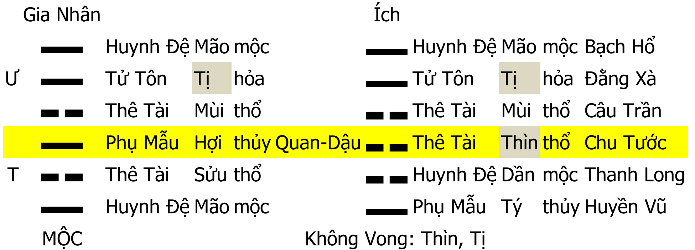
    - **Hình này chứng minh điều gì**
      - Thể hiện sự vận động của hào động trong quẻ biến, minh họa cơ chế biến hóa sinh khắc và tương hợp làm nền tảng phân tích trạng thái bệnh chứng.
    - **Từ đâu mà thấy được**
      - Quẻ Gia Nhân hào 3 Hợi thủy phát động hóa Thìn thổ (Ích), đối chiếu quan hệ giữa hào vị, lục thân, lục thần với các yếu tố hợp triền miên trong quẻ.

#### Ví dụ 1: Quẻ Thiên Hỏa Đồng Nhân biến Thủy Hỏa Ký Tế - Đoán con trẻ bị cảm mạo
- Ngày Kỷ Mùi tháng Hợi, dự đoán con trẻ bị cảm mạo ra sao, được quẻ Thiên Hỏa Đồng Nhân biến Thủy Hỏa Ký Tế (quái cung Ly hỏa, Tuần Không: Tý, Sửu):
  - **Hình 83.** Quẻ Thiên Hỏa Đồng Nhân biến Thủy Hỏa Ký Tế
    - 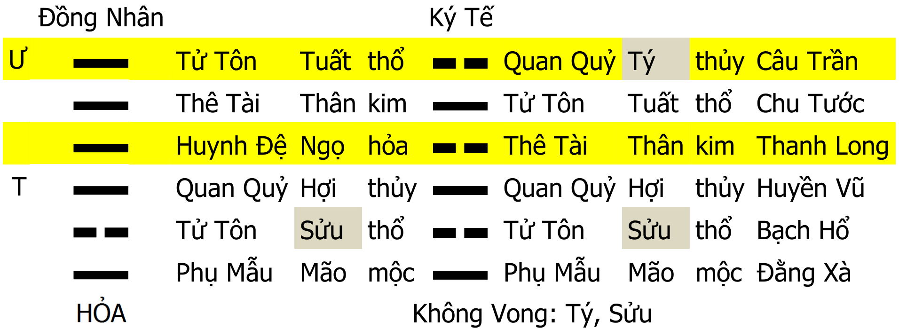
    - **Hình này chứng minh điều gì**
      - Đứa trẻ bị cảm mạo chán ăn do Nguyên thần bị Nhật hợp níu chân; bệnh tình nhẹ và khỏi hẳn vào ngày Ất Sửu khi Mùi thổ bị xung khai.
    - **Từ đâu mà thấy được**
      - Dụng thần Tuất thổ động được Nhật Mùi tỉ phù; Nguyên thần Ngọ hỏa hóa Tài Thân kim lâm Thanh Long bị Nhật Mùi hợp níu; ngày Sửu xung khai Mùi thổ giải phóng Nguyên thần.
- Xác định Dụng thần và nhận định cát hung tổng thể:
  - Dự đoán bệnh của con trẻ lấy lục thân Tử Tôn làm Dụng thần.
  - Quẻ có Tử Tôn lưỡng hiện (hào 2 Tử Tôn Sửu thổ ngộ Không và hào 6 Tử Tôn Tuất thổ phát động); chọn hào 6 Tử Tôn Tuất thổ phát động làm Dụng thần chính.
  - Đánh giá suy vượng: Dụng thần Tuất thổ được Nhật thần Kỷ Mùi tương tỉ trợ phù nên thuộc hàng vượng tướng.
  - Nguyên thần Huynh Đệ Ngọ hỏa tại hào 4 phát động đến sinh phù, do đó bệnh cảm mạo không nguy hại đến tính mạng.
- Phân tích triệu chứng biếng ăn qua tượng Nhật hợp trói buộc Nguyên thần:
  - Nguyên thần Huynh Đệ Ngọ hỏa lâm Thanh Long phát động hóa Thê Tài Thân kim.
  - Lục thân Thê Tài chủ về đồ ăn thức uống, ẩm thực.
  - Thần sát Thanh Long cũng chủ về ẩm thực, món ăn và cảm giác ngon miệng.
  - Nguyên thần Ngọ hỏa phát động bị Nhật thần Kỷ Mùi tương hợp (Ngọ Mùi lục hợp), tạo thành thế hợp níu chân (hợp trú) ngăn trở lực sinh Dụng thần.
  - Tượng Nguyên thần sinh Tài lâm Thanh Long bị hợp cản trở phản ánh đứa trẻ mất vị giác, biếng ăn, không chịu ăn uống thức ăn.
- Dự đoán ứng kỳ bình phục và kết quả thực tế:
  - Cơ chế ứng kỳ: Cần chờ thời điểm xung khai lực hợp trói buộc để Nguyên thần được giải phóng sinh trợ Dụng thần.
  - Tác giả ban đầu suy đoán: Chờ ngày Giáp Tý xung khai hào Ngọ hỏa thì đứa trẻ sẽ bình phục.
  - Ứng nghiệm thực tế: Đứa trẻ khỏi bệnh vào ngày Ất Sửu; thực tế đã ứng vào ngày Sửu xung khai Nhật thần Mùi thổ (Sửu Mùi tương xung), phá tan lực hợp cản trở của Mùi thổ đối với Nguyên thần.

#### Ví dụ 2: Quẻ Phong Sơn Tiệm biến Phong Địa Quan - Nữ đoán bệnh của cha
- Ngày Bính Tuất tháng Sửu, người nữ dự đoán bệnh tình của cha, được quẻ Phong Sơn Tiệm biến Phong Địa Quan (quái cung Cấn thổ, Tuần Không: Ngọ, Mùi):
  - **Hình 84.** Quẻ Phong Sơn Tiệm biến Phong Địa Quan
    - 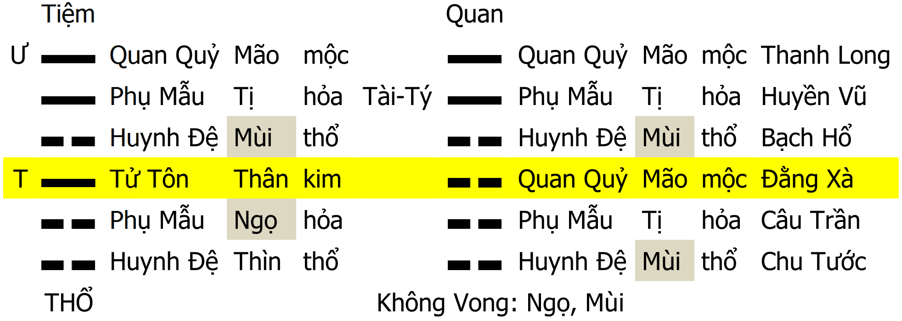
    - **Hình này chứng minh điều gì**
      - Người cha mắc chứng tắc mạch máu não (nhồi máu não) dẫn đến bại liệt, phải nằm bất động trên giường bệnh.
    - **Từ đâu mà thấy được**
      - Phụ Mẫu Tị hỏa hào 5 nhập Mộ tại Nhật Tuất; Bệnh địa Thân kim hào 3 động hợp Dụng lâm Xà; Nguyên thần Mão mộc hào 6 bị Nhật Tuất hợp trói làm tắc máu lên đầu.
- Xác định Dụng thần và tình trạng nguy khốn:
  - Dự đoán bệnh của cha lấy lục thân Phụ Mẫu làm Dụng thần.
  - Quẻ có Phụ Mẫu lưỡng hiện (hào 2 Phụ Mẫu Ngọ hỏa ngộ Không và hào 5 Phụ Mẫu Tị hỏa); chọn hào 5 Phụ Mẫu Tị hỏa ngự ở tôn vị làm Dụng thần chính.
  - Tình trạng Dụng thần: Phụ Mẫu Tị hỏa nhập Mộ tại Nhật thần Bính Tuất (hỏa mộ tại Tuất).
- Biện chứng bệnh tật qua tượng Bệnh địa hợp trú và hào vị giường nằm:
  - Đất Bệnh (Bệnh địa) của Dụng thần Tị hỏa theo vòng Trường Sinh là Thân kim (hỏa bệnh tại Thân).
  - Hào 3 Tử Tôn Thân kim chính là Bệnh địa, lâm Đằng Xà phát động tương hợp với Dụng thần Tị hỏa (Tị Thân lục hợp).
  - Đằng Xà chủ về quấn quanh, dây dưa không rời; Bệnh địa lâm Đằng Xà hợp trú Dụng thần mang tượng bệnh tật đeo bám quấn chặt lấy thân thể.
  - Hào 3 trên quẻ là hào vị của chiếc giường nằm; Dụng thần bị Bệnh địa hợp trói chặt chẽ tại hào 3 tạo thành tượng người bệnh phải nằm liệt trên giường vì bệnh tật.
- Thủ tượng tắc mạch máu não qua Nguyên thần bị Nhật hợp:
  - Nguyên thần của Dụng thần là Quan Quỷ Mão mộc an tĩnh tại hào 6.
  - Hào 6 bị Nhật thần Tuất thổ tương hợp (Mão Tuất lục hợp) nên bị trói chặt, không thể sinh trợ Dụng thần Tị hỏa.
  - Vị trí cơ thể: Hào 6 là hào vị tối cao đại diện cho vùng đầu.
  - Lục hợp mang ý nghĩa ngăn trở, tắc nghẽn, không thông suốt; hào 6 bị hợp trói phản ánh việc cung cấp máu lên đầu bị cản trở nghiêm trọng, máu huyết không thể lưu thông lên não.
  - Tổng hợp tượng quẻ: Mạch máu não bị tắc nghẽn kết hợp tượng nằm dính trên giường bệnh tại hào 3, suy ra người cha bị tắc máu não (nhồi máu não) dẫn đến bại liệt nằm liệt giường.
- Ứng nghiệm thực tế:
  - Người cha quả nhiên bị tắc mạch máu não dẫn tới bại liệt, phải nằm liệt giường.

#### Ví dụ 3: Quẻ Hỏa Sơn Lữ biến Thiên Phong Cấu - Nữ đoán bệnh của bản thân
- Ngày Tân Dậu tháng Thìn, người nữ tự dự đoán bệnh tật của bản thân, được quẻ Hỏa Sơn Lữ biến Thiên Phong Cấu (quái cung Ly hỏa, Tuần Không: Tý, Sửu):
  - **Hình 85.** Quẻ Hỏa Sơn Lữ biến Thiên Phong Cấu
    - 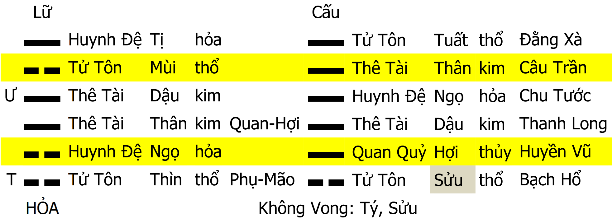
    - **Hình này chứng minh điều gì**
      - Người nữ mắc hội chứng Ménière (rối loạn tiền đình, chóng mặt nôn mửa, tức ngực) và kèm theo bệnh Zona thần kinh gây mẩn ngứa da vùng bụng.
    - **Từ đâu mà thấy được**
      - Thế Thìn thổ nhập Mộ ở Nguyệt kiến; Nguyên thần Ngọ hỏa hào 2 lâm Huyền Vũ hóa Tuyệt, bị hào 5 Mùi thổ hợp trú lâm Câu Trần hóa Tài; hào 2 là bụng ngộ thấp khí.
- Xác định Dụng thần và tượng chóng mặt, hôn mê:
  - Bản thân tự dự đoán bệnh lấy hào Thế làm Dụng thần.
  - Hào Thế Tử Tôn Thìn thổ trì Thế tại hào sơ lâm Bạch Hổ.
  - Dụng thần Thìn thổ nhập Mộ tại Nguyệt kiến Thìn thổ: Mộ khố mang thông tin về sự u ám, phong bế, tối tăm, biểu thị chứng hoa mắt, chóng mặt, đầu óc hôn mê, bất tỉnh.
- Biện chứng hội chứng Ménière qua tương hợp trói buộc Nguyên thần và hào động:
  - Nguyên thần của hào Thế là Huynh Đệ Ngọ hỏa ngự tại hào 2:
    - Huynh Đệ thuộc hỏa đại diện cho tư duy, đầu óc và hệ thống thần kinh.
    - Hào 2 lâm lục thần Huyền Vũ: Huyền Vũ chủ về xây xẩm, choáng váng, chóng mặt.
    - Ngọ hỏa phát động biến Quan Quỷ Hợi thủy, tức là động mà hóa Tuyệt (hỏa tuyệt tại Hợi).
  - Tác dụng hợp trú của hào 5:
    - Hào 5 Tử Tôn Mùi thổ phát động tương hợp với Nguyên thần Ngọ hỏa (Ngọ Mùi lục hợp), trói chặt Ngọ hỏa khiến Nguyên thần không thể sinh trợ hào Thế.
    - Vị trí cơ thể: Hào 5 là lồng ngực.
    - Thần sát Câu Trần: Hào 5 biến Thê Tài Thân kim lâm Câu Trần; Câu Trần chủ về sưng trướng, bế tắc, phản ánh triệu chứng lồng ngực bị tức trướng, đè nén khó chịu.
    - Hào 5 động hóa Thê Tài: Thê Tài chủ về ẩm thực, đồ ăn thức uống; lâm thế hung phản ánh thông tin thức ăn nôn mửa trào ngược ra ngoài.
  - Kết luận hội chứng tiền đình: Đầu óc chóng mặt quay cuồng kết hợp ngực tức trướng và nôn mửa thức ăn là triệu chứng điển hình của hội chứng Ménière.
- Biện chứng bệnh Zona ngoài da vùng bụng:
  - Hào 2 trên cơ thể là hào vị khoang bụng.
  - Nguyên thần tại hào 2 bị thủy (biến hào Quan Quỷ Hợi thủy) khắc hại, lại lâm Huyền Vũ thuộc thủy chủ thấp khí ẩm ướt ứ đọng.
  - Hào Thế Thìn thổ: Ngũ hành Thổ đại diện cho da thịt, lớp biểu bì.
  - Tổng hợp tượng: Da vùng bụng bị thấp nhiệt tà khí xâm lấn sinh ra mẩn ngứa, phát ban nốt mụn rộp (bệnh Zona).
- Ứng nghiệm thực tế:
  - Người nữ xác nhận đúng là bản thân đang đồng thời mắc hội chứng Ménière và bệnh Zona thần kinh ở bụng.

#### Ví dụ 4: Quẻ Phong Lôi Ích biến Chấn Vi Lôi - Nam đoán bệnh của bản thân
- Ngày Tân Hợi tháng Dậu, người nam tự dự đoán bệnh tật của bản thân, được quẻ Phong Lôi Ích biến Chấn Vi Lôi (quái cung Tốn mộc, Tuần Không: Dần, Mão):
  - **Hình 86.** Quẻ Phong Lôi Ích biến Chấn Vi Lôi
    - 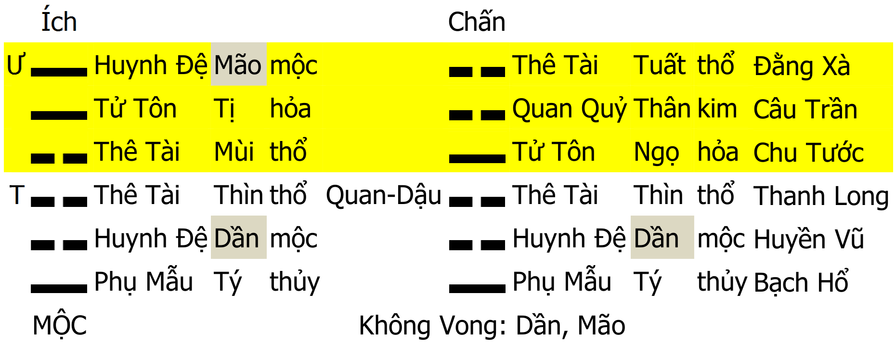
    - **Hình này chứng minh điều gì**
      - Người nam mắc bệnh hen suyễn (khó thở, tức ngực), tính mạng an toàn nhờ thế liên tục tương sinh và Kỵ thần ngộ Không bị hợp níu.
    - **Từ đâu mà thấy được**
      - Thế Thìn thổ được Nguyệt Dậu hợp có khí; Kỵ thần Mão mộc động lâm Không hợp Tuất thổ; Nguyên thần Tị hỏa hào 5 động sinh Thế nhưng hóa Quỷ Thân kim hợp trú lâm Câu Trần.
- Xác định Dụng thần và nhận định cát hung tính mạng:
  - Bản thân tự dự đoán bệnh lấy hào Thế làm Dụng thần.
  - Hào Thế Thê Tài Thìn thổ trì Thế tại hào 3 lâm Thanh Long.
  - Suy vượng hào Thế: Dụng thần được Nguyệt kiến Dậu kim tương hợp (Thìn Dậu lục hợp) nên là hào có khí, dù Nhật thần Tân Hợi không sinh phù.
  - Cơ chế Kỵ thần và Nguyên thần liên tục tương sinh:
    - Kỵ thần Huynh Đệ Mão mộc tại hào 6 được Nhật thần Hợi thủy sinh trợ, phát động muốn tới khắc hào Thế Thìn thổ.
    - Tuy nhiên Kỵ thần Mão mộc lâm Tuần Không, đồng thời động hóa Thê Tài Tuất thổ (Mão Tuất lục hợp), bị chính hào biến hợp níu chân nên lực khắc giảm đi rất nhiều.
    - Trong quẻ có Nguyên thần Tử Tôn Tị hỏa tại hào 5 đồng thời phát động, tạo thành thế liên tục tương sinh: Mộc động sinh Hỏa, Hỏa động sinh Thổ (Kỵ thần sinh Nguyên thần, Nguyên thần sinh Thế).
    - Vì vậy người này có bệnh nhưng tính mạng hoàn toàn không gặp nguy hiểm.
- Biện chứng bệnh hen suyễn qua tượng Lục hợp trói buộc Nguyên thần và hào vị hô hấp:
  - Nguyên thần Tử Tôn Tị hỏa tại hào 5 phát động để sinh hào Thế:
    - Tị hỏa động hóa Quan Quỷ Thân kim: Quan Quỷ đại diện cho bệnh tật.
    - Tị hỏa tương hợp với hào biến Thân kim (Tị Thân lục hợp): Động hóa hợp trú, Nguyên thần bị hào biến trói chặt làm lực sinh Dụng thần bị cản trở nặng nề.
  - Vị trí cơ quan và ngũ hành:
    - Hào 5 trên cơ thể là lồng ngực.
    - Lục thân Tử Tôn đại diện cho khí quản, đường dẫn khí hô hấp.
    - Ngũ hành Kim (Quan Quỷ Thân kim) trong Đông y và Lục Hào đại diện cho phổi và hệ hô hấp.
    - Bị Kim hợp cản trở không thể sinh Thế Tài (Tài cũng chủ về hô hấp, hơi thở), phản ánh đường dẫn khí bị co thắt tắc nghẽn, hơi thở ngắn, khó thở.
    - Hào biến lâm Câu Trần: Thần sát Câu Trần chủ về ách tắc, sưng trướng, lồng ngực tức trướng khó thở.
  - Kết luận chẩn đoán: Tức ngực, nghẽn đường dẫn khí và khó thở dẫn đến kết luận người này mắc bệnh hen suyễn.
- Ứng nghiệm thực tế:
  - Người nam xác nhận đúng là bản thân anh ta đang mắc chứng bệnh hen suyễn.

### 8. TÁC DỤNG CỦA LỤC XUNG

#### Ý nghĩa tượng trưng và nguyên tắc đoán bệnh của Lục Xung

- Khái niệm và phân loại lục xung trong dự trắc Lục Hào:
  - Lục xung bao gồm bốn hình thức biểu hiện: Nguyệt xung, Nhật xung, hào động xung và quẻ lục xung.
  - Tác dụng của lục xung vừa quyết định xu hướng cát hung sinh tử, vừa là công cụ quan trọng để thủ tượng suy đoán triệu chứng và nguyên nhân gây bệnh.
- Nguyên tắc định lượng cát hung giữa bệnh mới và bệnh lâu năm:
  - Bệnh mới phát gặp lục xung chủ về điềm lành, bệnh mau khỏi do tà khí bị xung tán.
  - Bệnh lâu ngày (cửu bệnh) gặp lục xung chủ về hung hiểm, cơ thể suy kiệt gặp xung tất suy sụp, thậm chí tử vong.
  - Ngoại lệ quan trọng: Bệnh mới phát không bao gồm trường hợp Nguyệt xung; Nguyệt xung là Nguyệt phá, chủ về suy bại và tổn hại nghiêm trọng nên không được coi là cát.
- Ý nghĩa thủ tượng chi tiết của Lục Xung đối với bệnh chứng:
  - Về triệu chứng cơ thể: Biểu thị trạng thái hoa mắt, chóng mặt, đầu óc chao đảo, run rẩy, lắc lư, va chạm, đập, đả kích, xung đột, thủng rách nội tạng.
  - Về diễn biến bệnh lý: Biểu thị hiện tượng di căn, tế bào phân ly, bệnh tình lan rộng hoặc sáp nhập các hội chứng phức tạp.
  - Về trạng thái tinh thần: Biểu thị tâm trạng bất an, hưng phấn quá độ, tinh thần hoảng loạn, thần kinh không ổn định, trằn trọc mất ngủ.

#### Các trường hợp thực tế ứng dụng Lục Xung đoán bệnh

##### Ví dụ 1: Đoán bệnh con sốt cao (Quẻ Sơn Hỏa Bí biến Cấn Vi Sơn)

- Ngày Bính Ngọ tháng Mão, một người cha đoán bệnh cho con trai đang bị sốt cao, gieo được quẻ Sơn Hỏa Bí biến Cấn Vi Sơn (Tuần không: Dần, Mão).
  - **Hình 87.** Quẻ Sơn Hỏa Bí biến Cấn Vi Sơn
    - 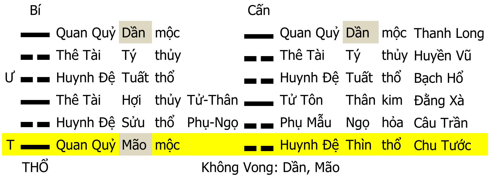
    - **Hình này chứng minh điều gì**
      - Bệnh mới phát sốt do cảm mạo phong hàn gặp quẻ biến lục xung thì tà khí tiêu tán, người bệnh hồi phục sau khi truyền dịch.
    - **Từ đâu mà thấy được**
      - Quẻ chính lục hợp biến lục xung; Quan Quỷ Mão mộc lâm Chu Tước độc phát; Tử Tôn Thân kim phục dưới hào 3.
- Cơ sở suy luận và phân tích quẻ tượng:
  - Xác định Dụng thần: Đoán bệnh cho con lấy hào Tử Tôn làm Dụng thần. Tử Tôn Thân kim không xuất hiện trên quẻ, phục tàng dưới hào 3 Thê Tài Hợi thủy. Dụng thần phục tàng biểu thị hình tượng đứa trẻ đang nằm liệt trên giường bệnh.
  - Xác định nguyên nhân phát bệnh: Hào 1 Quan Quỷ Mão mộc lâm Chu Tước độc phát (hào động duy nhất). Độc phát chỉ ra căn nguyên gốc rễ của bệnh. Chu Tước chủ về nhiệt độ cao, phát sốt; ngũ hành Mộc chủ về phong hàn. Hai yếu tố kết hợp chứng minh bệnh nhi bị cảm mạo phong hàn dẫn đến sốt cao.
  - Biện giải cát hung qua chuyển hóa quẻ tượng: Quẻ chính Sơn Hỏa Bí là quẻ lục hợp, tượng trưng cho giai đoạn đầu bệnh tật bám dính khó đối phó; tuy nhiên quẻ biến Cấn Vi Sơn lại là quẻ lục xung. Theo quy luật "bệnh mới mừng gặp lục xung", xung sẽ làm phân tán bệnh tà.
- Ứng nghiệm thực tế: Thực tế đứa trẻ bị cảm mạo phong hàn gây sốt cao đúng như quẻ chỉ ra; sau khi được đưa đi truyền nước biển (truyền dịch) thì bệnh tình hạ sốt và mau chóng bình phục.

##### Ví dụ 2: Nam tự đoán bệnh mất ngủ, hen suyễn và viêm da (Quẻ Tốn Vi Phong biến Khảm Vi Thủy)

- Ngày Bính Thân tháng Tị, một người nam tự gieo quẻ đoán bệnh bản thân, được quẻ Tốn Vi Phong biến Khảm Vi Thủy (Tuần không: Thìn, Tị).
  - **Hình 88.** Sơ đồ quẻ Tốn Vi Phong biến Khảm Vi Thủy
    - 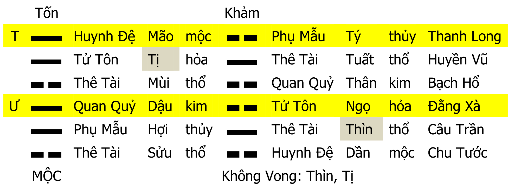
    - **Hình này chứng minh điều gì**
      - Người bệnh đồng thời chịu đựng ba chứng bệnh: mất ngủ, hen suyễn khó thở và viêm da dị ứng nhưng không tổn hại sinh mệnh.
    - **Từ đâu mà thấy được**
      - Lục xung hóa lục xung (ngoại quái Khảm thủy sinh Tốn mộc); hào 3 lâm Đằng Xà xung khắc Thế; Thế Mão mộc động lâm Thanh Long.
- Cơ sở suy luận và phân tích quẻ tượng:
  - Cát hung tổng quan của Dụng thần: Lấy hào Thế (Huynh Đệ Mão mộc tại hào 6) làm Dụng thần. Hào Thế không được Nguyệt kiến Tị hỏa sinh phù (bị tiết khí), lại bị Nhật kiến Thân kim khắc thương nên rơi vào trạng thái hưu tù suy yếu. Tuy nhiên, quẻ gốc thuần Tốn (lục xung) biến thuần Khảm (lục xung), xét đại tượng toàn quẻ Khảm thủy sinh Tốn mộc nên bệnh tuy dai dẳng khó chịu nhưng không nguy hại đến tính mạng.
  - Tượng chứng mất ngủ: Quẻ lục xung hóa lục xung chủ về trạng thái tinh thần bất an, chao đảo. Hào 3 Quan Quỷ Dậu kim lâm Đằng Xà phát động xung khắc trực tiếp hào Thế Mão mộc; trong đó hào 3 là hào vị của giường chiếu, Đằng Xà chủ về giấc ngủ. Điềm báo người bệnh ngủ không yên giấc, ban đêm trằn trọc không sao chợp mắt.
  - Tượng chứng hen suyễn, khó thở: Quan Quỷ hành Kim (Dậu kim) xung khắc Thế mộc, ngũ hành Kim quản phế nang và hệ hô hấp. Kim lâm Đằng Xà mang tượng co thắt, bóp nghẹt, thắt chặt. Phối hợp lại cho thấy khí quản và phổi bị co thắt dẫn đến khó thở, thở dốc, mắc bệnh hen suyễn.
  - Tượng chứng viêm da dị ứng: Hào Thế Mão mộc phát động lâm Thanh Long. Cổ nhân có định lý: "Mộc hưng Thế thượng, phi dương tức đông" (Hành Mộc động tại hào Thế, không ngứa ngáy thì đau nhức). Thanh Long chủ ngứa, hào 6 thuộc ngoại quái chủ về bề mặt da ngoài cùng. Do đó chẩn đoán bề mặt da bị ngứa ngáy, viêm nhiễm.
- Ứng nghiệm thực tế: Người bệnh xác nhận thực tế mắc đồng thời ba chứng: mất ngủ kéo dài, bệnh hen suyễn khó thở và viêm da dị ứng ngoài da.

##### Ví dụ 3: Nam tự đoán bệnh suy nhược thần kinh mất ngủ (Quẻ Tốn Vi Phong)

- Ngày Quý Sửu tháng Hợi, một người nam tự gieo quẻ đoán bệnh bản thân, được quẻ tĩnh Tốn Vi Phong (Tuần không: Dần, Mão).
  - **Hình 89.** Sơ đồ quẻ Tốn Vi Phong
    - 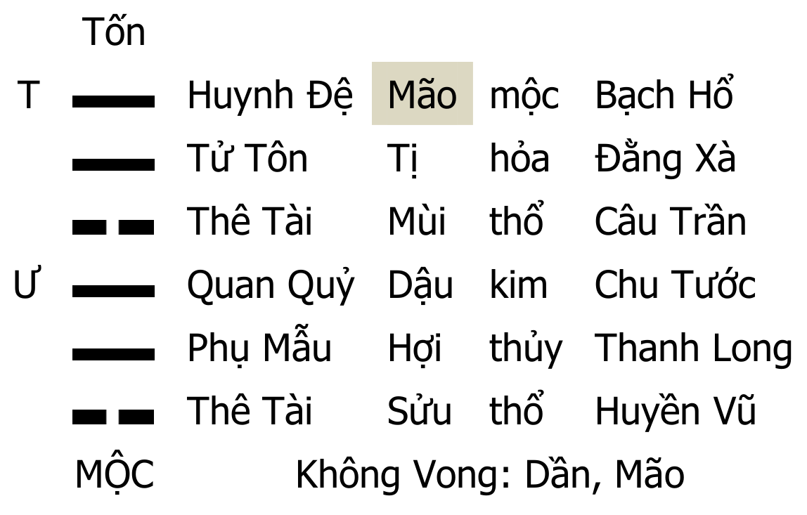
    - **Hình này chứng minh điều gì**
      - Bệnh nhân bị chứng suy nhược thần kinh nghiêm trọng dẫn đến mất ngủ kinh niên.
    - **Từ đâu mà thấy được**
      - Hào Thế Mão mộc tại hào 6 lâm Không Vong; hào 3 Quan Quỷ Dậu kim xung Thế; quẻ thuần Tốn Lục Xung chủ bất an.
- Cơ sở suy luận và phân tích quẻ tượng:
  - Xác định Dụng thần và vị trí bệnh: Tự đoán bệnh lấy hào Thế làm Dụng thần. Hào Thế Huynh Đệ Mão mộc ngự tại hào 6 và rơi vào Tuần không. Hào 6 là hào vị của đầu não; ngũ hành Mộc đại diện cho hệ thống dây thần kinh. Đầu não lâm Không biểu thị hệ thần kinh bị suy yếu, tinh thần trống rỗng, bất an.
  - Tượng mất ngủ từ tương xung giường chiếu: Kỵ thần Quan Quỷ Dậu kim ngự tại hào 3 (Dậu kim xung Mão mộc của Thế). Hào 3 là hào vị giường chiếu, Kỵ thần tác động xung khắc từ giường ngủ. Kết hợp toàn quẻ thuần Tốn là quẻ lục xung chủ về xáo trộn, bất an, không thể tĩnh tại.
  - Kết luận bệnh lý: Hệ thần kinh ở đầu bị suy nhược khiến tâm trí hỗn loạn, mỗi khi nằm lên giường là trằn trọc mất ngủ.
- Ứng nghiệm thực tế: Người hỏi bệnh xác nhận phản ánh hoàn toàn chuẩn xác căn bệnh suy nhược thần kinh và mất ngủ kinh niên của mình.

##### Ví dụ 4: Nam tự đoán bệnh chóng mặt, nôn mửa do u não (Quẻ Lôi Thủy Giải biến Hỏa Thủy Vị Tế)

- Ngày Bính Tý tháng Thìn, một người nam tự đoán bệnh bản thân, gieo được quẻ Lôi Thủy Giải biến Hỏa Thủy Vị Tế (Tuần không: Thân, Dậu).
  - **Hình 90.** Sơ đồ quẻ Lôi Thủy Giải biến Hỏa Thủy Vị Tế
    - 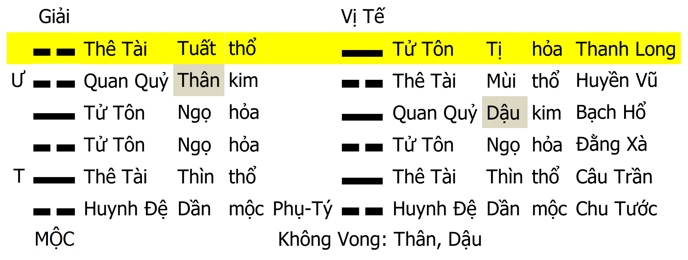
    - **Hình này chứng minh điều gì**
      - Hiện tượng hoa mắt chóng mặt và nôn mửa xuất phát từ một khối u hình thành trong não.
    - **Từ đâu mà thấy được**
      - Thê Tài Tuất thổ hào 6 phát động lâm Thanh Long xung Thế Thìn thổ hào 2; Thế lâm Câu Trần chủ u bướu.
- Cơ sở suy luận và phân tích quẻ tượng:
  - Xác định Dụng thần và triệu chứng nôn mửa: Lấy hào Thế (Thê Tài Thìn thổ tại hào 2) làm Dụng thần. Ở ngoại quái, Thê Tài Tuất thổ tại hào 6 phát động lâm Thanh Long. Ngũ hành Thổ chủ về tỳ vị, dạ dày; Thê Tài chủ về đồ ăn thức uống; thần Thanh Long cũng chủ về ẩm thực. Thổ Tài phát động mang hình tượng "thổ" (nôn mửa, trào ngược thức ăn).
  - Triệu chứng hoa mắt chóng mặt: Hào 6 Thê Tài Tuất thổ động xung khắc trực tiếp hào Thế Thìn thổ (Thìn Tuất tương xung). Hào 6 là hào vị tối cao đại diện cho phần đầu; hào Thế bị hào trên đầu xung động mạnh tạo thành triệu chứng chao đảo, hoa mắt, chóng mặt dữ dội.
  - Bản chất bệnh lý u bướu: Hào Thế Thìn thổ lâm thần Câu Trần. Thần Câu Trần mang đặc tính gồ ghề, sưng trướng, tích tụ, chuyên chủ về các khối u, bướu thịt. Hào xung nằm ở đầu não kết hợp với Thế lâm Câu Trần khẳng định trong đầu có u bướu chèn ép gây ra chóng mặt nôn mửa.
- Ứng nghiệm thực tế: Khởi đầu bệnh nhân chỉ thấy chóng mặt hoa mắt và nôn mửa liên tục; sau đó khi vào viện chụp chiếu kiểm tra thì phát hiện có khối u trong não.

##### Ví dụ 5: Nữ đoán bệnh em họ bị đột quỵ não hôn mê (Quẻ Địa Thủy Sư biến Lôi Thủy Giải)

- Ngày Đinh Sửu tháng Mão, một người phụ nữ đoán bệnh cho em họ, gieo được quẻ Địa Thủy Sư biến Lôi Thủy Giải (Tuần không: Thân, Dậu).
  - **Hình 91.** Sơ đồ quẻ Địa Thủy Sư biến Lôi Thủy Giải
    - 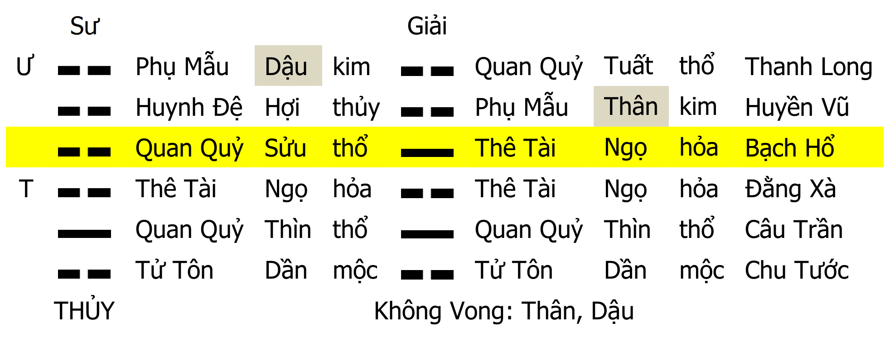
    - **Hình này chứng minh điều gì**
      - Bệnh nhân bị xuất huyết não nghiêm trọng, rơi vào trạng thái hôn mê sâu và biến thành người thực vật.
    - **Từ đâu mà thấy được**
      - Dụng thần Huynh Đệ Hợi thủy suy kiệt; Nguyên thần Phụ Mẫu Dậu kim hào 6 vừa Nguyệt phá vừa Không Vong; Dụng thần nhập Mộ ở hào động và Nhật.
- Cơ sở suy luận và phân tích quẻ tượng:
  - Xác định Dụng thần và tình trạng suy kiệt: Đoán bệnh cho em họ lấy hào Huynh Đệ làm Dụng thần. Huynh Đệ Hợi thủy tại hào 5 hoàn toàn không được Nguyệt kiến Mão mộc hay Nhật kiến Sửu thổ sinh phù (bị tiết khí và khắc chế) nên lực lượng vô cùng suy yếu.
  - Dấu hiệu đầu não bị tổn hại và mất ý thức:
    - Nguyên thần Phụ Mẫu Dậu kim ngự tại hào 6 (vị trí đầu não) bị Nguyệt kiến Mão mộc xung thành Nguyệt phá (Mão Dậu tương xung), đồng thời lại lâm Tuần không.
    - Nguyên thần vừa ngộ Không vừa ngộ Phá nên triệt để mất khả năng sinh trợ cho Dụng thần Thủy.
    - Ngũ hành Thủy chủ về "Trí" (trí tuệ, tư duy, khả năng nhận thức và suy nghĩ). Dụng thần Thủy cạn kiệt nguồn sinh, Nguyên thần ở đầu não trống rỗng cho thấy tư duy bị đình trệ hoàn toàn, đầu óc không còn khả năng suy nghĩ.
  - Tượng hôn mê sâu bất tỉnh:
    - Nguyên thần Không Vong biểu thị não bộ trống rỗng; đồng thời Dụng thần Hợi thủy nhập Mộ tại hào động Quan Quỷ Sửu thổ hào 4 và nhập Mộ tại Nhật kiến Sửu thổ. Nhập Mộ trùng điệp là tượng bị chôn vùi, bế tắc, hôn mê bất tỉnh nhân sự.
    - Phối hợp các yếu tố: vùng đầu não phát sinh biến cố cực kỳ nghiêm trọng dẫn tới hôn mê sâu kéo dài không thể tỉnh lại.
- Ứng nghiệm thực tế: Người em họ bị đột quỵ xuất huyết não (tai biến mạch máu não) cấp tính, đã rơi vào tình trạng hôn mê sâu và trở thành người sống thực vật.

### 9. THỦ TƯỢNG PHẢN NGÂM PHỤC NGÂM

#### Ý nghĩa tượng quẻ Phản ngâm và Phục ngâm trong dự đoán tật bệnh
- Đặc trưng tượng quẻ Phản ngâm trong dự đoán bệnh tật:
  - Phản ngâm là quẻ có các hào biến tương xung với hào động (hoặc quẻ biến tương xung với quẻ gieo), chủ về trạng thái phản phục, xung đột và biến động không ổn định.
  - Phản ngâm chủ về bệnh tình thay đổi thất thường, sự thể bất an, bệnh đỡ rồi lại phát, khỏi bệnh rồi lại tái bệnh, triệu chứng lúc nặng lúc nhẹ trồi sụt khó lường.
  - Căn bệnh khó loại trừ gốc rễ, tính chất tái phát tái phạm liên tục, khiến tâm thần người bệnh không yên, đau đớn vô cùng, trằn trọc không an giấc trên giường bệnh.
  - Biểu thị việc một lần điều trị khó lòng dứt điểm, người bệnh phải chạy ngược chạy xuôi, bôn ba khắp nơi tìm thầy cầu thuốc, nhiều lần chuyển viện hoặc thay đổi phòng bệnh.
  - Phản ngâm phản ánh các thương tổn có tính chất xoắn vặn, biến dạng cấu trúc, sai lệch vị trí giải phẫu, bệnh tật bị gián đoạn, cũng như việc thường xuyên thay đổi bác sĩ và phác đồ điều trị.
- Đặc trưng tượng quẻ Phục ngâm trong dự đoán bệnh tật:
  - Phục ngâm là quẻ có hào động biến ra hào có cùng địa chi (hoặc quẻ biến giống hệt quẻ gieo về can chi), chủ về trạng thái đình trệ, rên rỉ, u uất và bế tắc không thông.
  - Phục ngâm phần lớn chủ về người bệnh phải nằm liệt trên giường chịu đựng đau đớn giày vò, trong bụng khó chịu bứt rứt, rên rỉ khóc lóc không ngừng.
  - Tượng trưng cho sự di căn của mầm bệnh, biến đổi âm ỉ bên trong tạng phủ, tình trạng tắc nghẽn kinh mạch, ứ tích huyết dịch tân dịch, dính liền các mô, lưu cặn mầm bệnh và ngăn trở lưu thông.
  - Biểu thị người bệnh mắc bệnh điều trị tại nhà, đau đớn ở những bộ phận sâu kín, có nỗi khổ tâm u uất khó giãi bày cùng ai, trong lòng nặng nề sầu não u buốt.

#### Ví dụ 1: Quẻ Địa Phong Thăng biến Trạch Địa Tụy - Nữ đoán sức khỏe bản thân
- Ngày Ất Mão tháng Dậu, một người nữ gieo quẻ dự đoán tình trạng sức khỏe của bản thân, được quẻ Địa Phong Thăng biến Trạch Địa Tụy (quái cung Chấn mộc, Tuần Không: Tý, Sửu):
  - **Hình 92.** Quẻ Địa Phong Thăng biến Trạch Địa Tụy
    - 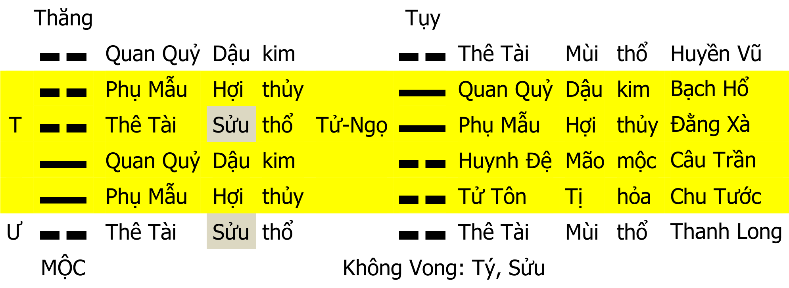
    - **Hình này chứng minh điều gì**
      - Người bệnh có thể chất suy yếu, nhịp tim không đều và mắc bệnh viêm dạ dày, sức khỏe dao động bất ổn định lúc khỏe lúc yếu.
    - **Từ đâu mà thấy được**
      - Hào Thế Sửu thổ hưu tù ngộ Không lâm Đằng Xà; Nguyên thần hỏa phục tàng không sinh Thế; quẻ có nội quái phản ngâm.
- Xác định Dụng thần và đánh giá nền tảng thể chất:
  - Người tự đoán sức khỏe bản thân lấy hào Thế làm Dụng thần.
  - Hào Thế là Thê Tài Sửu thổ lâm hào 4.
  - Xét theo thời gian gieo quẻ: Tháng Dậu tiết khí Thổ, ngày Mão mộc khắc phạt Thổ; hào Thế Sửu thổ hoàn toàn không được Nhật Nguyệt sinh phù.
  - Hào Thế bị Nhật thần Mão mộc khắc chế nên rơi vào trạng thái hưu tù suy nhược, phản ánh thể chất và tố chất cơ thể của người bệnh vốn rất kém, tiên thiên bất túc.
- Tượng quẻ nội quái phản ngâm và diễn biến bệnh thế:
  - Quẻ Địa Phong Thăng có nội quái Tốn mộc biến sang nội quái Khôn thổ của quẻ Trạch Địa Tụy.
  - Các địa chi của nội quái động biến tương xung: Hào sơ Sửu thổ biến Mùi thổ (Sửu Mùi tương xung), hào 2 Hợi thủy biến Tị hỏa (Tị Hợi tương xung), hào 3 Dậu kim biến Mão mộc (Mão Dậu tương xung).
  - Nội quái cấu thành tượng phản ngâm, chủ về sự trồi sụt thất thường: Thể trạng người bệnh lúc khỏe lúc yếu, triệu chứng bệnh thay đổi liên tục, không duy trì được trạng thái bình ổn.
- Phân tích vị trí phát bệnh qua hào Thế và Nguyên thần:
  - Hào Thế Sửu thổ lâm Tuần Không (Tuần Không tại Tý, Sửu) và hội cùng thần sát Đằng Xà: Hào Thế ngộ Không chủ về tâm trạng bất an, kinh sợ; Đằng Xà lại chủ về hoảng hốt, lo âu, bồn chồn phiền muộn.
  - Phân tích Nguyên thần của Dụng thần: Thế thổ lấy Hỏa làm Nguyên thần sinh trợ.
  - Trên quẻ ngũ hành Hỏa không xuất hiện ở các hào động tĩnh, phải phục tàng dưới hào 4 (Tử Tôn Ngọ hỏa phục dưới Thê Tài Sửu thổ).
  - Hào Thế đã ngộ Không lại không nhận được Nguyên thần hỏa đến tương sinh.
  - Ngũ hành Hỏa chủ về tim: Nguyên thần hỏa phục tàng không trợ giúp phản ánh quả tim có vấn đề bệnh lý, cơ chế co bóp rối loạn dẫn đến chứng nhịp tim không đều.
  - Hào Thế mang hành Thổ: Ngũ hành thổ chủ về tỳ vị và dạ dày, Thế suy tổn cho thấy chức năng dạ dày cũng bị tổn thương nghiêm trọng.
- Ứng nghiệm thực tế:
  - Người nữ trên thực tế có sức khỏe tim mạch kém, nhịp tim đập không đều và đồng thời mắc bệnh viêm dạ dày.

#### Ví dụ 2: Quẻ Sơn Thiên Đại Súc biến Sơn Lôi Di - Nam đoán bệnh của vợ
- Ngày Nhâm Tuất tháng Hợi, một người nam gieo quẻ dự đoán bệnh tình của vợ, được quẻ Sơn Thiên Đại Súc biến Sơn Lôi Di (quái cung Cấn thổ, Tuần Không: Tý, Sửu):
  - **Hình 93.** Quẻ Sơn Thiên Đại Súc biến Sơn Lôi Di
    - 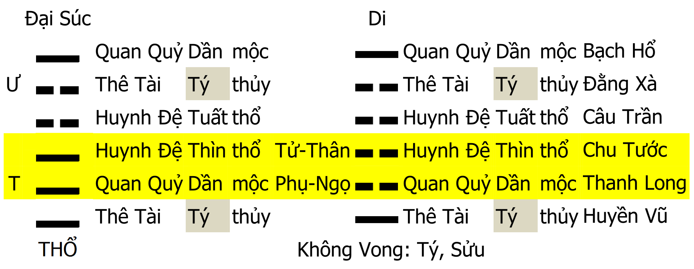
    - **Hình này chứng minh điều gì**
      - Người vợ bị mắc chứng mất kinh (bế kinh) kéo dài, kinh dịch và khí huyết ngưng trệ không thể thông suốt.
    - **Từ đâu mà thấy được**
      - Thê Tài Tý thủy lâm Không; thủy gặp Bệnh địa ở hào 2 và nhập Mộ ở hào 3 (vị trí tử cung); nội quái Càn biến Chấn can chi tương đồng thành phục ngâm.
- Xác định Dụng thần và trạng thái vượng suy:
  - Dự đoán bệnh của vợ lấy lục thân Thê Tài làm Dụng thần.
  - Trong quẻ xuất hiện Thê Tài Tý thủy ở hào sơ và hào 5; xét hào Tài Tý thủy làm đại diện chung cho Dụng thần.
  - Tài hào Tý thủy được Nguyệt kiến Hợi thủy đồng hành tỉ hòa phù trợ, nhưng lại bị Nhật thần Tuất thổ đến khắc chế.
  - Vừa đắc Nguyệt phù vừa bị Nhật khắc tạo nên cục diện suy vượng tương đương, không quá vượng cũng không suy bại cực độ.
- Luận giải bản chất chất lỏng và vị trí bệnh lý:
  - Thê Tài mang ngũ hành Thủy lại rơi vào Tuần Không (Không Vong: Tý, Sửu).
  - Trong sinh lý cơ thể, ngũ hành Thủy đại diện cho máu huyết, tân dịch và các chất lỏng bài tiết sinh dục.
  - Luận giải theo vòng Trường Sinh của ngũ hành Thủy:
    - Thủy gặp Dần mộc tại hào 2 là lâm Bệnh địa (Dần là đất Bệnh của thủy).
    - Thủy gặp Thìn thổ tại hào 3 là nhập Mộ khố (Thìn là Mộ của thủy).
  - Phân định theo hào vị thân thể: Hào 2 và hào 3 tương ứng với vùng bụng dưới, cơ quan sinh dục và tử cung của phụ nữ.
  - Chất dịch thể (Thủy) vừa ngộ Tuần Không, vừa ngự tại Bệnh địa hào 2 và nhập Mộ khố hào 3 là thông tin phản ánh trực tiếp tình trạng kinh nguyệt biến mất, tức chứng bế kinh (mất kinh).
- Ý nghĩa của nội quái phục ngâm trong cơ chế bệnh:
  - Quẻ Sơn Thiên Đại Súc có nội quái Càn kim động biến sang nội quái Chấn mộc của quẻ Sơn Lôi Di.
  - Các hào động và hào biến giữ nguyên nạp chi tương đồng: Hào sơ Tý thủy biến Tý thủy, hào 2 Dần mộc biến Dần mộc, hào 3 Thìn thổ biến Thìn thổ.
  - Cả ba hào nội quái đều đồng chi biến hóa, cấu thành tượng quẻ phục ngâm.
  - Phục ngâm trong bệnh lý chủ về sự trì trệ, bế tắc, dính nghẽn, không lưu thông và không thấy xuất hiện.
  - Tượng phục ngâm tại nội quái càng khẳng định chắc chắn tình trạng kinh nguyệt bị đình trệ nghiêm trọng, không xuất ra ngoài theo chu kỳ bình thường.
- Ứng nghiệm thực tế:
  - Người vợ của người hỏi quẻ trên thực tế đã bị mất kinh nguyệt liên tục trong suốt hai tháng.

#### Ví dụ 3: Quẻ Thiên Hỏa Đồng Nhân biến Lôi Thiên Đại Tráng - Nam đoán bệnh con trai
- Ngày Đinh Sửu tháng Tuất, một người nam gieo quẻ dự đoán bệnh tình con trai, được quẻ Thiên Hỏa Đồng Nhân biến Lôi Thiên Đại Tráng (quái cung Ly hỏa, Tuần Không: Thân, Dậu):
  - **Hình 94.** Quẻ Thiên Hỏa Đồng Nhân biến Lôi Thiên Đại Tráng
    - 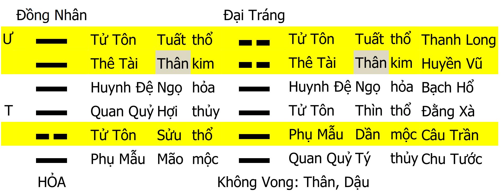
    - **Hình này chứng minh điều gì**
      - Người con trai mắc chứng u uất tâm thần, chứng tự kỷ khép kín nội tâm và bệnh hen suyễn co thắt đường thở.
    - **Từ đâu mà thấy được**
      - Tử Tôn Tuất thổ trì Ứng động; ngoại quái Càn biến Chấn thành phục ngâm; Nguyên thần Ngọ hỏa nhập Mộ ở Dụng thần; Thê Tài Thân kim hào 5 là Bệnh địa lâm Không phục ngâm.
- Tuyển chọn Dụng thần trong thế lưỡng hiện và ảnh hưởng của phục ngâm:
  - Dự đoán bệnh tật của con trai lấy lục thân Tử Tôn làm Dụng thần.
  - Quẻ xuất hiện Tử Tôn Sửu thổ tại hào 2 và Tử Tôn Tuất thổ tại hào 6 (Dụng thần lưỡng hiện); chọn hào 6 Tử Tôn Tuất thổ lâm Ứng phát động làm Dụng thần chính.
  - Dụng thần Tuất thổ lâm Nguyệt kiến, lại được Nhật thần Sửu thổ trợ phù nên khí thế rất đắc lệnh vượng tướng.
  - Tuy nhiên ngoại quái Càn kim động biến sang Chấn mộc mang nạp chi trùng khớp: Hào 4 Ngọ hỏa biến Ngọ hỏa, hào 5 Thân kim biến Thân kim, hào 6 Tuất thổ biến Tuất thổ, cấu thành tượng ngoại quái phục ngâm.
  - Tượng phục ngâm ở hào ngoại chủ về trạng thái dằn vặt, người bệnh nằm trên giường rên rỉ, tâm thần bế tắc, biểu thị người con quấy rầy và làm khổ người thân trong nhà.
- Biện chứng tâm bệnh: Khép kín tư duy và u uất nội tâm:
  - Phân tích Nguyên thần của Dụng thần: Thổ lấy Hỏa làm Nguyên thần (Huynh Đệ Ngọ hỏa tại hào 4 phát động sinh Dụng).
  - Nguyên thần đại diện cho bộ máy tư duy, ý thức, luồng suy nghĩ và trạng thái tâm lý tinh thần.
  - Xét theo vòng Trường Sinh: Ngũ hành Hỏa nhập Mộ tại Tuất (Dụng thần chính là Tuất thổ), tức Nguyên thần nhập Mộ ngay tại Dụng thần.
  - Hiện tượng tư duy nhập Mộ ở bản thân phản ánh người con chôn giấu toàn bộ suy nghĩ, tâm tư và nỗi uất ức vào tận đáy lòng.
  - Đương sự cô lập hoàn toàn với thế giới xung quanh, không chịu mở lòng hay chia sẻ cảm xúc với bất kỳ ai, biểu hiện rõ rệt của chứng u uất (trầm cảm) và chứng bệnh tự kỷ.
- Biện chứng thân bệnh: Bệnh hen suyễn và đường hô hấp bế tắc:
  - Quan sát hào 5 Thê Tài Thân kim phát động trên quẻ:
    - Xét vòng Trường Sinh của Nguyên thần: Hỏa lâm Thân kim là đất Bệnh (Bệnh địa của Nguyên thần Ngọ hỏa).
    - Xét theo vị trí cơ thể: Hào 5 đại diện cho khoang ngực, cổ họng và hệ thống hô hấp; hành Kim và lục thân Thê Tài đều chủ về việc hô hấp, hít thở dưỡng khí.
    - Hào 5 Thân kim ngộ Tuần Không (Tuần Không tại Thân, Dậu) lại đồng thời nằm trong thế phục ngâm của ngoại quái.
    - Kim tại hào 5 lâm Không phục ngâm biểu thị sự ngăn trở, nghẽn tắc luồng khí lưu thông trong lồng ngực, khiến đường thở co thắt không thông suốt.
- Ứng nghiệm thực tế:
  - Người con trai mắc chứng bệnh tâm thần u uất, chứng tự kỷ và chứng bệnh hen suyễn mãn tính.

#### Ví dụ 4: Quẻ Hỏa Địa Tấn biến Hỏa Phong Đỉnh - Nam đoán bệnh con trai
- Ngày Ất Mùi tháng Hợi, một người nam gieo quẻ dự đoán bệnh tình con trai, được quẻ Hỏa Địa Tấn biến Hỏa Phong Đỉnh (quái cung Càn kim, Tuần Không: Thìn, Tị):
- Xác định Dụng thần và vị trí phục tàng:
  - Dự đoán bệnh của con trai lấy lục thân Tử Tôn làm Dụng thần.
  - Hào Tử Tôn không xuất hiện trên quẻ, tìm thấy Tử Tôn Tý thủy phục tàng dưới hào sơ Phụ Mẫu Mùi thổ (phi thần Mùi thổ khắc phục thần Tý thủy).
- Biện giải suy kiệt của Nguyên thần và thế quẻ nội quái phản ngâm:
  - Tử Tôn Tý thủy lấy ngũ hành Kim làm Nguyên thần (Huynh Đệ Dậu kim trì Thế tại hào 4).
  - Nguyên thần Dậu kim gặp Nguyệt kiến Hợi thủy là lâm vào Bệnh địa (Kim sinh ở Tị, vượng ở Dậu, bệnh ở Hợi).
  - Quan sát nội quái có hào 2 Quan Quỷ Tị hỏa và hào 3 Thê Tài Mão mộc đồng thời phát động: Tị hỏa khắc Kim, Mão mộc hao tiết Kim và xung Dậu (Mão Dậu tương xung), khiến Nguyên thần bị xung khắc trầm trọng.
  - Quẻ Hỏa Địa Tấn có nội quái Khôn thổ biến sang nội quái Tốn mộc của quẻ Hỏa Phong Đỉnh:
    - Hào sơ Mùi thổ biến Sửu thổ (Sửu Mùi tương xung).
    - Hào 2 Tị hỏa biến Hợi thủy (Tị Hợi tương xung).
    - Hào 3 Mão mộc biến Dậu kim (Mão Dậu tương xung).
    - Cả ba hào nội quái đều phát động biến thành các địa chi tương xung trực tiếp, cấu thành tượng nội quái phản ngâm.
  - Phản ngâm trong dự đoán tật bệnh chủ về sự biến động khôn lường, bệnh tình lặp đi lặp lại thất thường, vừa chữa khỏi lại tái phát, không thể triệt để dứt điểm.
- Định vị cơ quan tổn thương: Viêm phổi tiến triển thành hen suyễn:
  - Quẻ Hỏa Địa Tấn thuộc quái cung Càn kim: Biểu tượng Càn kim đại diện cho hai lá phổi và bộ máy hô hấp.
  - Hào 4 trên thân thể đại diện cho lồng ngực và hai lá phổi; trong quẻ hào 4 Huynh Đệ Dậu kim cũng mang hành Kim đại diện cho phổi.
  - Hào 4 Dậu kim bị Quan Quỷ Tị hỏa trong nội quái phát động khắc hại: Hỏa khắc kim chủ về chứng viêm nhiễm, nhiệt tà xâm lấn đường hô hấp (viêm phổi).
  - Hào 4 Dậu kim lâm thần sát Đằng Xà: Đằng Xà chủ về co thắt, bế tắc, quấn nghẽn đường thở, biểu thị triệu chứng hô hấp khó khăn, tức ngực thở rít.
- Ứng nghiệm thực tế:
  - Người con trai nhiều lần bị bệnh viêm phổi tái phát liên tục (đúng tượng phản ngâm), lâu dần chuyển hóa thành bệnh hen suyễn mãn tính.

### 10. THỦ TƯỢNG DU HỒN QUY HỒN

#### 1. Nguyên lý cốt lõi của quẻ Du Hồn và Quy Hồn

- Vai trò phối hợp của quẻ Du Hồn và Quy Hồn:
  - Không thể sử dụng đơn độc quẻ Du Hồn hoặc Quy Hồn để phán đoán cát hung chung cuộc của người bệnh.
  - Vai trò chủ yếu là phụ trợ, phối hợp cùng Dụng thần để phân biệt ý nghĩa và trạng thái tinh vi khi thủ tượng bệnh tật.
  - Việc nhận định mức độ nặng nhẹ nhất thiết phải căn cứ vào bệnh tình cụ thể và sự suy vượng, cát hung của quái tượng để linh hoạt trích xuất ý nghĩa tượng trưng.

#### 2. Phân loại 8 quẻ Du Hồn và 8 quẻ Quy Hồn

- Khái niệm và danh sách quẻ Du Hồn:
  - Quẻ Du Hồn là quẻ thứ 7 trong tiến trình biến hào của mỗi cung bát quái.
  - Toàn bộ 64 quẻ gồm 8 quẻ Du Hồn: Hỏa Địa Tấn, Thủy Thiên Nhu, Trạch Phong Đại Quá, Sơn Lôi Di, Địa Hỏa Minh Di, Thiên Thủy Tụng, Phong Trạch Trung Phu, Lôi Sơn Tiểu Quá.
- Khái niệm và danh sách quẻ Quy Hồn:
  - Quẻ Quy Hồn là quẻ thứ 8 của mỗi cung, tức quẻ kết thúc một vòng biến dịch của quái cung.
  - Toàn bộ 64 quẻ gồm 8 quẻ Quy Hồn: Hỏa Thiên Đại Hữu, Thủy Địa Tỷ, Trạch Lôi Tùy, Sơn Phong Cổ, Địa Thủy Sư, Thiên Hỏa Đồng Nhân, Phong Sơn Tiệm, Lôi Trạch Quy Muội.
- Mô hình quẻ Du Hồn minh họa qua Hỏa Địa Tấn biến Hỏa Phong Đỉnh:
  - **Hình 95.** Sơ đồ quẻ Hỏa Địa Tấn biến Hỏa Phong Đỉnh
    - 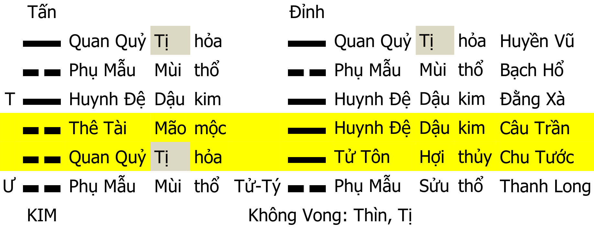
    - **Hình này chứng minh điều gì**
      - Minh họa quẻ du hồn biểu thị trạng thái bệnh tình phiêu tán, tâm thần bất định hoặc di căn khuếch tán.
    - **Từ đâu mà thấy được**
      - Quẻ Hỏa Địa Tấn là quẻ du hồn (quẻ thứ 7 cung Càn), động biến nội quái biểu thị sự thay đổi bất an, không định hình.

#### 3. Ý nghĩa thủ tượng quẻ Du Hồn trong dự đoán bệnh tật

- Biểu hiện về trạng thái tinh thần và thần trí:
  - Tâm thần bất an, buồn bực, trạng thái tinh thần không tỉnh táo, đờ đẫn, hồn vía lên mây.
  - Trí nhớ suy giảm nghiêm trọng, đầu óc lơ mơ, chóng mặt, mất tập trung.
  - Hôn mê bất tỉnh, tính mạng nguy kịch, hơi thở thoi thóp.
- Biểu hiện về tính chất diễn biến bệnh lý:
  - Bệnh tình không ổn định, biến chuyển thất thường, thay đổi bất định.
  - Tế bào hoặc mầm bệnh có xu hướng lan tràn, khuếch tán, di căn sang các cơ quan khác.
  - Có nguy cơ truyền nhiễm hoặc lây lan bệnh tật cho người khác.
- Biểu hiện về vị trí và phương thức điều trị:
  - Bệnh phát tác ở phần ngoài da, bề mặt cơ thể.
  - Bệnh có tính chất phát sinh trong thời gian ngắn.
  - Người bệnh có xu hướng phải đi ra ngoài hoặc chuyển viện đến nơi xa để điều trị.

#### 4. Ý nghĩa thủ tượng quẻ Quy Hồn trong dự đoán bệnh tật

- Biểu hiện theo chiều hướng tích cực hoặc ổn định:
  - Người bệnh tỉnh lại sau hôn mê, khôi phục tinh thần và trí nhớ, thần sắc chuyển biến tốt, có thể nhận biết người xung quanh.
  - Tâm trạng ổn định dần, cơ thể có dấu hiệu hồi phục khả quan.
  - Thích hợp với việc tĩnh dưỡng và điều trị bệnh tại gia đình.
  - Phương hướng chữa trị phù hợp là điều trị bảo tồn, uống thuốc duy trì thay vì can thiệp mạnh.
  - Quá trình khỏi bệnh diễn ra từ từ, chậm chạp.
- Biểu hiện theo chiều hướng tiêu cực và nguy kịch:
  - Hiện tượng "hồi quang phản chiếu" (khoảnh khắc minh mẫn, tỉnh táo giả tạo trước khi qua đời).
  - Bệnh tình lâm vào trạng thái hết thuốc chữa, hồn lìa khỏi xác.
  - Bệnh nhân rơi vào trạng thái sống thực vật, người như cái xác không hồn.
  - Tượng chết không rời cố hương, người bệnh về nằm chờ qua đời tại quê nhà.
- Biểu hiện về vị trí và nguồn gốc bệnh lý:
  - Bệnh tật phát sinh hoặc ẩn nấp sâu bên trong nội tạng cơ thể.
  - Bệnh cũ tái phát sau một thời gian tạm lắng.
  - Mầm bệnh lây nhiễm bắt nguồn từ người thân ruột thịt trong gia đình.

#### 5. Các ví dụ thực tế minh họa

##### Ví dụ 1: Nam tự đoán bệnh bản thân - Quẻ Thủy Thiên Nhu biến Thủy Hỏa Ký Tế

- Bối cảnh và thông tin quẻ:
  - Thời gian dự trắc: Ngày Quý Sửu, tháng Hợi.
  - Người hỏi: Người nam tự gieo quẻ hỏi về bệnh tật của bản thân.
  - Quẻ thu được: Thủy Thiên Nhu biến Thủy Hỏa Ký Tế.
  - Tuần Không: Tuần Giáp Thìn có Dần, Mão lâm Không Vong.
- Phân tích quẻ tượng và cơ sở suy luận:
  - Hào Thế Tử Tôn Thân kim lâm Câu Trần biểu thị trên cơ thể xuất hiện khối u hoặc khối tích tụ bất thường.
  - Quẻ Thủy Thiên Nhu là quẻ Du Hồn của cung Càn, kết hợp hào Thế nhập Mộ tại Nhật thần Sửu thổ biểu thị người bệnh hay quên, tâm trạng bất an không ổn định, bệnh có nguy cơ lây nhiễm sang người khác.
  - Hào 2 Quan Quỷ Dần mộc lâm Thanh Long độc phát, trong khi hào Thế lâm Tuyệt địa tại Dần biểu thị đã mắc phải chứng bệnh nan y nguy hiểm.
  - Quan Quỷ tại hào 2 là vị trí cơ quan sinh dục, lại lâm Thanh Long chủ dục vọng và sự giao hoan, chỉ rõ bệnh truyền nhiễm lây lan qua đường tình dục (thông tin đặc trưng của bệnh AIDS).
- Chứng cứ quẻ tượng:
  - Quẻ tượng Thủy Thiên Nhu biến Thủy Hỏa Ký Tế phản ánh tình trạng bệnh nan y lây nhiễm:
    - **Hình 96.** Sơ đồ quẻ Thủy Thiên Nhu biến Thủy Hỏa Ký Tế
      - 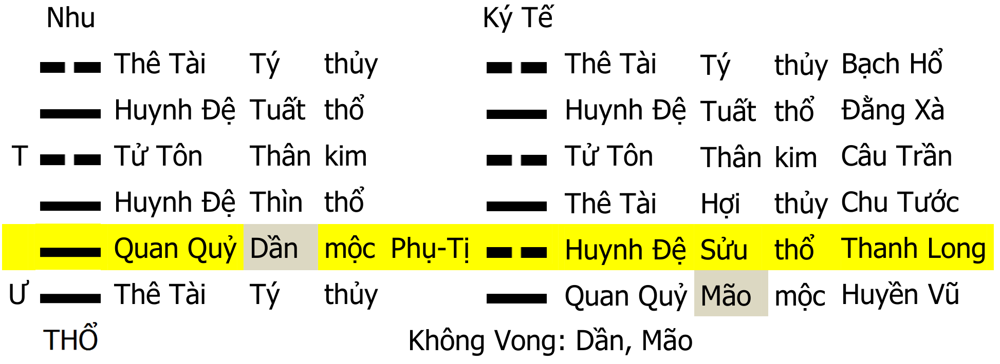
      - **Hình này chứng minh điều gì**
        - Chứng minh người bệnh mắc bệnh nan y AIDS lây qua đường sinh dục, trí nhớ giảm sút và có nguy cơ lây nhiễm.
      - **Từ đâu mà thấy được**
        - Quẻ Nhu là quẻ du hồn, Thế Thân kim nhập Mộ ở Nhật; hào 2 Quan Quỷ Dần mộc Thanh Long độc phát, Thế lâm Tuyệt.
- Kết quả ứng nghiệm thực tế:
  - Người đàn ông này thực tế đã phát hiện mắc bệnh AIDS vào năm 2004.

##### Ví dụ 2: Phụ nữ cao tuổi đoán bệnh - Quẻ Hỏa Thủy Vị Tế biến Sơn Lôi Di

- Bối cảnh và thông tin quẻ:
  - Thời gian dự trắc: Ngày Canh Tuất, tháng Mùi.
  - Người hỏi: Một người phụ nữ lớn tuổi gieo quẻ tự đoán bệnh tật.
  - Quẻ thu được: Hỏa Thủy Vị Tế biến Sơn Lôi Di.
  - Tuần Không: Tuần Giáp Thìn có Dần, Mão lâm Không Vong.
- Phân tích quẻ tượng và cơ sở suy luận:
  - Xác định Dụng thần: Lấy hào Thế Huynh Đệ Ngọ hỏa làm Dụng thần đại diện cho người bệnh.
  - Hào Thế nhập Mộ tại Nhật thần Tuất thổ, đồng thời quẻ biến thành Sơn Lôi Di là quẻ Du Hồn, Nguyên thần Phụ Mẫu Dần mộc lại lâm Tuần Không, phản ánh triệu chứng đầu óc choáng váng, chóng mặt thường xuyên.
  - Nguyên thần Phụ Mẫu Dần mộc lâm Bạch Hổ chủ về huyết dịch, nhập Mộ tại Nguyệt kiến Mùi thổ; Nguyệt kiến nhập quẻ tại hào 5 (Tử Tôn Mùi thổ), cộng thêm ngoại quái đến khắc Nguyên thần nên xác định người bệnh mắc chứng cao huyết áp.
  - Hào Thế là Ngọ hỏa cư tại hào 3: hào vị 3 đại diện cho vùng ngực bụng và tim, ngũ hành hỏa cũng chủ về hệ tuần hoàn và tim mạch, cho thấy chức năng tim có vấn đề suy yếu.
- Chứng cứ quẻ tượng:
  - Quẻ tượng Hỏa Thủy Vị Tế biến Sơn Lôi Di phản ánh bệnh chứng cao huyết áp và tim mạch:
    - **Hình 97.** Sơ đồ quẻ Hỏa Thủy Vị Tế biến Sơn Lôi Di
      - 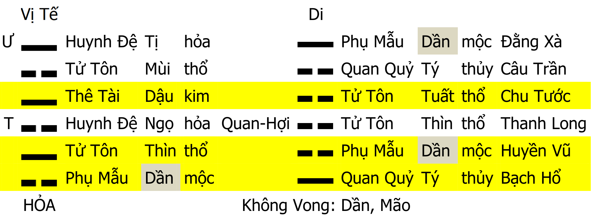
      - **Hình này chứng minh điều gì**
        - Chứng minh người bệnh bị cao huyết áp dẫn đến chóng mặt và chức năng tim mạch suy giảm.
      - **Từ đâu mà thấy được**
        - Biến quẻ du hồn Di, Thế Ngọ hỏa nhập Mộ ở Nhật, Nguyên thần Dần mộc Không Vong nhập Mộ Nguyệt lâm Bạch Hổ; Thế cư hào 3 hỏa.
- Kết quả ứng nghiệm thực tế:
  - Người bệnh trên thực tế mắc chứng cao huyết áp, thường xuyên bị hoa mắt chóng mặt và tim mạch hoạt động không tốt.

##### Ví dụ 3: Nữ đoán bệnh hiểm nghèo của cha - Quẻ Phong Sơn Tiệm biến Phong Thiên Tiểu Súc

- Bối cảnh và thông tin quẻ:
  - Thời gian dự trắc: Ngày Tân Hợi, tháng Tuất.
  - Người hỏi: Một phụ nữ gieo quẻ dự đoán cho người cha đã mắc bệnh hiểm nghèo nhiều năm.
  - Quẻ thu được: Phong Sơn Tiệm biến Phong Thiên Tiểu Súc.
  - Tuần Không: Tuần Giáp Thìn có Dần, Mão lâm Không Vong.
- Phân tích quẻ tượng và cơ sở suy luận:
  - Xác định Dụng thần: Lấy hào Phụ Mẫu làm Dụng thần. Quẻ có Phụ Mẫu lưỡng hiện gồm hào 2 Phụ Mẫu Ngọ hỏa phát động và hào 5 Phụ Mẫu Tị hỏa bị Nhật xung thành ám động, cần kết hợp xem xét cả hai hào.
  - Nhật Nguyệt suy thoái: Tháng Tuất hỏa hưu tù, ngày Hợi thủy khắc hỏa; Nhật Nguyệt không sinh phù mà Nhật thần còn xung khắc trực tiếp, báo hiệu tình thế không cát lành.
  - Động hóa vô lực: Hào 2 Phụ Mẫu Ngọ hỏa phát động hóa Dần mộc là hóa hồi đầu sinh, tuy nhiên hào biến Dần mộc lâm Không Vong lại bị Nhật thần Hợi thủy hợp trú (Dần Hợi tương hợp), khiến hào biến bị kìm giữ không thể phát huy tác dụng sinh trợ Dụng thần, tạo thành tình trạng cực kỳ nguy cấp.
  - Tính chất quẻ Quy Hồn: Phong Sơn Tiệm là quẻ Quy Hồn của cung Cấn; quẻ Quy Hồn phối hợp với tổ hợp quái suy kiệt, Kỵ thần khắc phá là tượng "hung lại thêm hung". Với người mắc bệnh hiểm nghèo lâu ngày, hào sinh hóa Không là đại kỵ, đến khi xuất Không xung hợp tất ứng hung sự.
  - Phán đoán bệnh tim: Hào 5 Phụ Mẫu Tị hỏa thuộc hỏa bị xung khắc mạnh, cư hào 5 là vị trí tim ngực, lâm Câu Trần chủ về tắc nghẽn, cảnh báo nguy cơ nhồi máu cơ tim. Hào 2 Nguyên thần hóa Không lại bị hợp càng củng cố thông tin mạch máu tim bị tắc nghẽn nghiêm trọng.
  - Phán đoán bệnh gan: Hào 2 Phụ Mẫu Ngọ hỏa phát động hóa Không tại Dần mộc; hào vị 2 chủ về gan, ngũ hành mộc cũng đại diện cho gan, cho thấy hệ thống gan cũng bị tổn thương nặng nề.
- Chứng cứ quẻ tượng:
  - Quẻ tượng Phong Sơn Tiệm biến Phong Thiên Tiểu Súc biểu thị tình trạng nguy kịch khó qua khỏi:
    - **Hình 98.** Quẻ Phong Sơn Tiệm biến Phong Thiên Tiểu Súc
      - 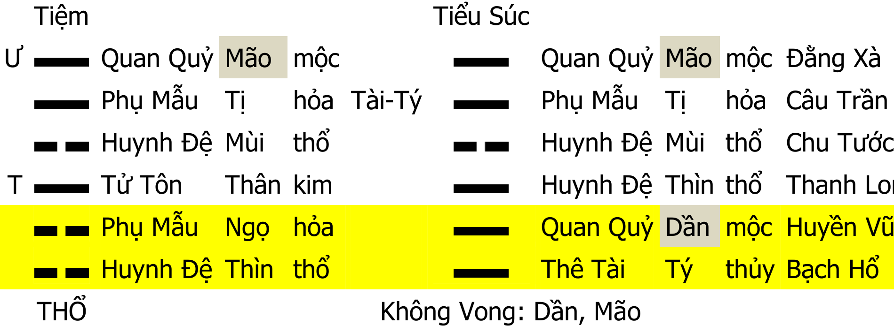
      - **Hình này chứng minh điều gì**
        - Chứng minh người cha mắc bệnh nhồi máu cơ tim và viêm gan hiểm nghèo, tử vong vào ngày Ất Mão cùng tháng.
      - **Từ đâu mà thấy được**
        - Quẻ quy hồn Tiệm; Dụng thần Phụ Mẫu bị Nhật khắc, biến hào Dần mộc Không Vong bị hợp trú; Hào 5 Tị hỏa lâm Câu Trần bị xung khắc.
- Kết quả ứng nghiệm thực tế:
  - Người cha thực tế bị nhồi máu cơ tim kèm theo viêm gan nặng, đã qua đời vào ngày Ất Mão trong tháng Tuất đó (ứng kỳ hào Dần mộc xuất Không hoặc ngày Mão xung phá hào hợp).

##### Ví dụ 4: Nữ đoán bệnh con trai - Quẻ Trạch Thủy Khốn biến Trạch Lôi Tùy

- Bối cảnh và thông tin quẻ:
  - Thời gian dự trắc: Ngày Tân Sửu, tháng Sửu.
  - Người hỏi: Một phụ nữ gieo quẻ hỏi về bệnh tình của con trai.
  - Quẻ thu được: Trạch Thủy Khốn biến Trạch Lôi Tùy.
  - Tuần Không: Tuần Giáp Ngọ có Thìn, Tị lâm Không Vong.
- Phân tích quẻ tượng và cơ sở suy luận:
  - Xác định Dụng thần: Lấy hào Tử Tôn Hợi thủy tại hào 4 làm Dụng thần đại diện cho người con.
  - Biểu hiện ngôn ngữ phong bế: Tử Tôn Hợi thủy lâm Chu Tước nhập Mộ tại hào 2 Phụ Mẫu Thìn thổ (Thìn là Mộ khố của thủy). Chu Tước chủ về lời nói và khả năng giao tiếp ngôn ngữ, lâm Mộ biểu thị sự đóng kín, phong tỏa, bề ngoài đứa trẻ không thích nói chuyện, ngại mở lời.
  - Tượng khép kín trong nhà: Hào vị 2 đại diện cho ngôi nhà (trạch), quẻ biến Trạch Lôi Tùy là quẻ Quy Hồn. Quẻ Quy Hồn mang đặc tính thu mình không ra khỏi nhà, biểu thị đứa trẻ thường xuyên giam mình trong phòng kín, không bước chân ra ngoài. Thêm hào Mộ Thìn thổ lâm Huyền Vũ chủ về sự khép kín nội tâm và tính cách cực kỳ hướng nội.
  - Biểu hiện tư duy trì trệ: Nguyên thần Huynh Đệ Dậu kim lâm Câu Trần, nhập Mộ tại Nhật Nguyệt Sửu thổ. Nguyên thần chủ về hoạt động tư duy và nhận thức, Câu Trần chủ về sự chậm chạp, Mộ khố chủ về sự bế tắc, biểu thị đầu óc đứa trẻ lười vận động, không chịu động não suy nghĩ.
  - Tư duy cô lập không giao tiếp: Nguyên thần Dậu kim hợp với Thìn thổ (Thìn Dậu tương hợp), càng nhấn mạnh sự khép kín trong luồng suy nghĩ, hoàn toàn không muốn tương tác hay trao đổi với người xung quanh.
- Chứng cứ quẻ tượng:
  - Quẻ tượng Trạch Thủy Khốn biến Trạch Lôi Tùy phản ánh bệnh chứng tự kỷ và khép kín:
    - **Hình 99.** Quẻ Trạch Thủy Khốn biến Trạch Lôi Tùy
      - 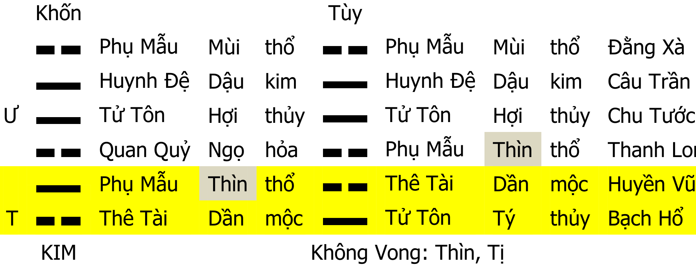
      - **Hình này chứng minh điều gì**
        - Chứng minh người con trai mắc hội chứng tự kỷ, tư tưởng không tập trung, cô lập bản thân và không giao tiếp với xã hội.
      - **Từ đâu mà thấy được**
        - Quẻ biến quy hồn Tùy; Dụng thần Tử Tôn Hợi thủy Chu Tước nhập Mộ hào 2 Thìn thổ lâm Huyền Vũ; Nguyên thần Dậu kim Câu Trần nhập Mộ hợp Thìn.
- Kết quả ứng nghiệm thực tế:
  - Người con trai thực tế mắc chứng tự kỷ, tư tưởng phân tán không thể tập trung, cắt đứt hoàn toàn mọi giao lưu tiếp xúc với thế giới bên ngoài.

## CHƯƠNG 10: ỨNG DỤNG CỦA 12 TRẠNG THÁI NGŨ HÀNH SINH DIỆT TRONG ĐOÁN BỆNH

### Khái niệm và ý nghĩa của 12 cung Trường Sinh trong Lục Hào

- Định danh và tầm quan trọng của 12 trạng thái ngũ hành:
  - 12 trạng thái ngũ hành sinh diệt trong dự đoán học còn được gọi là 12 cung trường sinh (Trường Sinh, Mộc Dục, Quan Đới, Lâm Quan, Đế Vượng, Suy, Bệnh, Tử, Mộ, Tuyệt, Thai, Dưỡng).
  - Trong dự đoán lục hào, 12 cung trường sinh là một bộ phận cốt lõi không thể thiếu, giữ vai trò then chốt trong việc nắm bắt các manh mối thông tin vi tế và tế nhị của sự việc.
  - Vị trí của các cung trường sinh có mối liên hệ mật thiết và ảnh hưởng trực tiếp đến cát hung, họa phúc của Dụng thần; do đó khi dự đoán bệnh tật tuyệt đối không thể xem nhẹ hoặc bỏ qua công cụ này.

### Biểu trưng chi tiết của 12 trạng thái sinh diệt trong đoán bệnh

- Trạng thái Trường Sinh:
  - Biểu thị sự sinh ra, quá trình sinh trưởng, khởi nguồn, cội nguồn, gốc rễ của sự vật hiện tượng.
  - Biểu thị sự hồi tỉnh, được cứu sống, nhận được sự cứu trợ, phát sinh, sản sinh, tìm kiếm, đạt được, hoặc việc ăn cơm dung nạp dưỡng chất.
- Trạng thái Mộc Dục:
  - Biểu thị việc tắm rửa, xuống nước, cởi quần áo, lõa thể, trần truồng, lộ ra bên ngoài, trọc lóc, nhẵn bóng, trơn trượt.
  - Biểu thị hành vi dâm loạn, dâm ô, vô liêm sỉ; biểu thị việc đại tiểu tiện, đi ngủ, tình trạng rách nát, sự dễ chịu, dáng vẻ bề ngoài, hoặc sự chăm sóc điều dưỡng.
- Trạng thái Quan Đới:
  - Biểu thị việc mặc quần áo, mang y phục chỉnh tề, trạng thái không cởi quần áo, sự che đậy, bao bọc bên ngoài, hoặc các vật thể có cấu trúc hình ống.
- Trạng thái Lâm Quan:
  - Biểu thị tình trạng có bệnh, phát sinh tai họa, dấu hiệu sắp chết, bước vào giai đoạn nguy hiểm.
- Trạng thái Đế Vượng:
  - Biểu thị trạng thái tinh thần sung mãn, hưng phấn, sức lực mạnh mẽ, hùng tráng, lớn mạnh, phát triển đến mức cực hạn, cao trào hoặc đỉnh điểm của sự việc.
- Trạng thái Suy:
  - Biểu thị tình trạng không có sức lực, mềm yếu, suy nhược, nhược tiểu, nhược trí, sức lực suy yếu, vận thế xui xẻo, biểu hiện co rút lại, nhút nhát, hư nhược, còi cọc, hoặc teo rút cơ nhục.
- Trạng thái Bệnh:
  - Biểu thị tình trạng bệnh tật, đích xác vị trí hoặc bộ phận phát sinh bệnh lý trên cơ thể, ôn thần quấy nhiễu, chỗ hiểm yếu, tâm bệnh lo âu, hoặc các vấn đề trục trặc phát sinh.
- Trạng thái Tử:
  - Biểu thị trạng thái tử vong, mất khả năng linh hoạt, đình đọng, không còn sức sống, cứng đờ, ngốc nghếch đần độn, tư duy bế tắc không thông thoáng, lòng dạ hẹp hòi, bước vào đường cùng không có lối lui, không gian yên lặng, an tĩnh, hoặc cảnh tượng đáng sợ.
- Trạng thái Mộ:
  - Biểu thị trạng thái ẩn náu, che giấu, cảm giác chóng mặt, lơ mơ, hôn mê bất tỉnh, hồ đồ, tăm tối mờ mịt, khí huyết không thông suốt, sự kết thúc, chướng ngại trở lực, hoặc tình trạng tắc nghẽn ứ đọng.
- Trạng thái Tuyệt:
  - Biểu thị trạng thái nguy hiểm cực độ, chứng bệnh nan y, bệnh hiểm nghèo, không còn khả năng cứu chữa, sự đình chỉ hoạt động, tiêu tan biến mất, khí huyết đình trệ không thông suốt, tắc nghẽn hoàn toàn, sự mất đi, hoặc phải phẫu thuật cắt bỏ bộ phận.
- Trạng thái Thai:
  - Biểu thị trạng thái mang thai, phôi thai hình thành, tính chất tiên thiên (có sẵn từ trong phôi thai), các đặc điểm bẩm sinh khi mới sinh ra đã có, cơ quan tử cung của người nữ, hoặc thai nhi.
- Trạng thái Dưỡng:
  - Biểu thị sự sinh ra, quá trình sinh trưởng, trạng thái nghỉ dưỡng, dưỡng bệnh, an tĩnh nghỉ ngơi, chất dinh dưỡng, sự tẩm bổ bồi dưỡng, hoặc tâm trạng bất an lo âu.

### Các ví dụ thực tế ứng dụng 12 cung Trường Sinh dự đoán bệnh tật

#### Ví dụ 1: Nữ đoán bệnh bản thân (Địa Sơn Khiêm biến Địa Phong Thăng)

- Bối cảnh chiêm bói và thiết lập quẻ:
  - Thời gian dự trắc: Ngày Bính Dần, tháng Tuất (Tuần không: Tuất, Hợi).
  - Tình huống: Người phụ nữ tự gieo quẻ dự đoán tình hình bệnh tật của bản thân, được quẻ Địa Sơn Khiêm biến Địa Phong Thăng.
  - Sơ đồ quẻ Địa Sơn Khiêm biến Địa Phong Thăng minh họa Bệnh địa hợp thân và hào độc phát khắc Nguyên thần:
    - **Hình 100.** Quẻ Địa Sơn Khiêm biến Địa Phong Thăng
      - 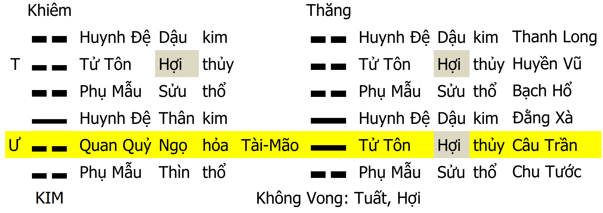
      - **Hình này chứng minh điều gì**
        - Minh chứng bệnh nhân bị u xơ tử cung suốt 10 năm do Dụng thần và vị trí tử cung bị khắc phá.
      - **Từ đâu mà thấy được**
        - Thế Tử Tôn Hợi thủy bị Nguyệt khắc, Nhật Dần mộc là Bệnh địa hợp Thế; Quan Quỷ Ngọ hỏa độc phát ở hào 2 (Thai địa, tử cung) khắc Nguyên thần Thân kim ở hào 3 (Trường Sinh địa, tử cung).

##### Phân tích suy luận quẻ tượng

- Xác định Dụng thần và dấu hiệu bệnh kinh niên:
  - Đương sự tự đoán bệnh của bản thân, lấy hào Thế làm Dụng thần. Hào Thế Tử Tôn Hợi thủy cư tại hào 5.
  - Hào Thế bị Nguyệt kiến Tuất thổ khắc chế; Nhật kiến Bính Dần mộc chính là Bệnh địa của hành Thủy (Thủy bệnh tại Dần theo 12 cung trường sinh).
  - Nhật kiến Dần mộc tương hợp với hào Thế Hợi thủy (Dần Hợi tương hợp), tạo nên cách cục "Bệnh địa hợp thân", biểu thị bệnh tật đã bám rễ triền miên trên thân thể trong một thời gian rất dài.
- Định vị bệnh u xơ tử cung qua hào vị và 12 cung trường sinh:
  - Hào 2 Quan Quỷ Ngọ hỏa phát động độc phát, quay sang khắc chế Nguyên thần Huynh Đệ Thân kim tại hào 3 (Hỏa khắc Kim).
  - Vị trí của Nguyên thần tại hào 3 chính là Trường Sinh địa của Tử Tôn Hợi thủy (Thủy trường sinh tại Thân).
  - Cung vị hào 3 tương ứng với tử cung; mặt khác, Trường Sinh địa của lục thân Tử Tôn cũng chính là nơi cội nguồn sinh dưỡng con cái, tức là tử cung.
  - Cung vị hào 2 cũng là vị trí của tử cung; hào Quan Quỷ Ngọ hỏa tại hào 2 lại chính là Thai địa của Tử Tôn Hợi thủy (Thủy thai tại Ngọ theo 12 cung trường sinh).
  - Hào Thế Tử Tôn bị tổn thương khắc phạt, bản thân lục thân Tử Tôn lại mang tượng trưng của tử cung.
  - Tổng hợp các căn cứ: Hào 2 và hào 3 đều là tử cung, Trường Sinh địa và Thai địa của Tử Tôn đều gặp hung hiểm, Thế Tử Tôn bị thương tổn, nên khẳng định chắc chắn người này mắc bệnh u xơ tử cung.

##### Kết quả và ứng nghiệm thực tế

- Kiểm chứng bệnh sử thực tế:
  - Trên thực tế, người phụ nữ này đã mắc bệnh u xơ tử cung kéo dài suốt 10 năm.

#### Ví dụ 2: Nữ đoán bệnh bản thân (Sơn Địa Bác biến Phong Thủy Hoán)

- Bối cảnh chiêm bói và thiết lập quẻ:
  - Thời gian dự trắc: Ngày Canh Thân, tháng Mão (Tuần không: Tý, Sửu).
  - Tình huống: Người phụ nữ tự gieo quẻ dự đoán tình hình bệnh tật của bản thân, được quẻ Sơn Địa Bác biến Phong Thủy Hoán.
  - Sơ đồ quẻ Sơn Địa Bác biến Phong Thủy Hoán minh họa hào Thế hóa Tuyệt, Quan Quỷ động Tuyệt Thế và Bệnh địa ám động:
    - **Hình 101.** Quẻ Sơn Địa Bác biến Phong Thủy Hoán
      - 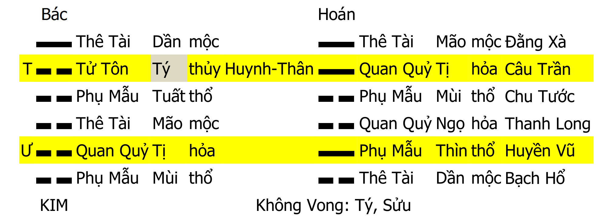
      - **Hình này chứng minh điều gì**
        - Minh chứng bệnh nhân bị viêm họng, chóng mặt và mắc u xơ tử cung phát sinh từ năm 2001 do tức giận vì chồng ngoại tình.
      - **Từ đâu mà thấy được**
        - Thế Tử Tôn Tý thủy hào 5 động hóa Tuyệt (Quan Quỷ Tị hỏa); hào 2 Quan Quỷ Tị hỏa động Tuyệt Thế hóa Mộ khố Thìn thổ; hào 6 Dần mộc ám động là Bệnh địa xung đầu.

##### Phân tích suy luận quẻ tượng

- Biện chứng chứng viêm họng và khô rát cổ họng:
  - Tự đoán bệnh lấy hào Thế làm Dụng thần. Hào Thế Tử Tôn Tý thủy lâm lục thần Câu Trần ngự tại hào 5 phát động hóa Quan Quỷ Tị hỏa.
  - Lục thân Tử Tôn chủ về ngũ quan trên cơ thể (tai, mắt, mũi, lưỡi, họng, da dẻ); hào 5 mang hành Thủy đối ứng với vị trí cổ họng.
  - Hào Thế Thủy động hóa Tuyệt tại Tị hỏa (Thủy tuyệt tại Tị). Hành Thủy gặp Tuyệt địa biểu thị lượng tân dịch bị khô kiệt, khô rát hầu họng; ngũ hành Hỏa chủ về các chứng viêm sưng -> Phán đoán mắc chứng viêm họng, cổ họng và miệng luôn khô khát.
- Biện chứng bệnh u xơ tử cung:
  - Hào 2 Quan Quỷ Tị hỏa phát động, Tị hỏa là Tuyệt địa của Thế hào Tử Tôn Tý thủy, động hóa ra Phụ Mẫu Thìn thổ là Kỵ thần khắc Thủy; do đó hào 2 được chọn làm căn cứ trọng yếu để định bệnh.
  - Hào Thế Tử Tôn đại diện cho tử cung; lục thần Câu Trần chủ về các khối u, bướu xơ tích tụ.
  - Cung vị hào 2 tương ứng với tử cung; Tuyệt địa Tị hỏa hóa Thìn thổ là Mộ khố của Tử Tôn Tý thủy (Thủy mộ tại Thìn), tượng trưng cho tử cung bị bế tắc chôn vùi -> Kết luận mắc bệnh u xơ tử cung.
- Biện chứng chứng đau đầu, chóng mặt:
  - Hào 6 Thê Tài Dần mộc bị Nhật kiến Thân kim tương xung tạo thành ám động (Thân Dần tương xung).
  - Dần mộc chính là Bệnh địa của hào Thế Tử Tôn Tý thủy (Thủy bệnh tại Dần).
  - Hào 6 là cung vị của vùng đầu não; Bệnh địa ngự tại đầu lại bị tương xung chấn động chủ về sự choáng váng, rung lắc -> Phán đoán bệnh nhân gặp vấn đề chóng mặt, đau đầu thường xuyên.
- Biện chứng nguyên nhân khởi phát và ứng kỳ:
  - Hào 2 Quan Quỷ Tị hỏa phát động, địa chi Tị ứng vào năm Tân Tị (2001) -> Phán đoán bệnh u xơ tử cung bắt đầu phát sinh vào năm 2001.
  - Cung vị hào 2 là phu vị (vị trí của người chồng); Quan Quỷ cũng đại diện cho người chồng; hào Ứng (hào 2) là phu vị lại hợp với Nhật kiến Canh Thân (Tị Thân tương hợp) -> Biểu thị người chồng có quan hệ ngoại tình lén lút bên ngoài.
  - Tương tác giữa Thủy (Thế Tý thủy) và Hỏa (Quan Quỷ Tị hỏa) là thế Thủy Hỏa tương xung tương chiến, chủ về sự tức giận, uất ức nội tâm -> Kết luận vào năm 2001 do phát hiện chồng ngoại tình mà sinh tức giận, uất ức dẫn đến phát sinh bệnh u xơ tử cung.

##### Kết quả và ứng nghiệm thực tế

- Kiểm chứng diễn biến thực tế:
  - Trên thực tế, người phụ nữ xác nhận đúng là vào năm 2001 do chồng ngoại tình khiến bà vô cùng phẫn uất tức giận mà mắc bệnh u xơ tử cung.
  - Các phán đoán khác về tình trạng viêm họng mãn tính khô rát và chứng chóng mặt đau đầu cũng hoàn toàn ứng nghiệm chính xác.

#### Ví dụ 3: Nam đoán bệnh của vợ (Càn Vi Thiên biến Hỏa Phong Đỉnh)

- Bối cảnh chiêm bói và thiết lập quẻ:
  - Thời gian dự trắc: Ngày Bính Thìn, tháng Ngọ (Tuần không: Tý, Sửu).
  - Tình huống: Người chồng đến nhờ dự đoán tình hình bệnh tật của vợ, gieo được quẻ Càn Vi Thiên biến Hỏa Phong Đỉnh.
  - Sơ đồ quẻ Càn Vi Thiên biến Hỏa Phong Đỉnh minh họa Dụng thần lâm Câu Trần và Nguyên thần hóa hợp nhập Mộ:
    - **Hình 102.** Quẻ Càn Vi Thiên biến Hỏa Phong Đỉnh
      - 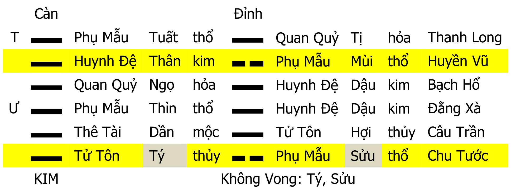
      - **Hình này chứng minh điều gì**
        - Minh chứng người vợ bị táo bón hai năm, tinh thần uể oải và thường xuyên buồn ngủ do Nguyên thần nhập Mộ tại Nhật.
      - **Từ đâu mà thấy được**
        - Dụng thần Thê Tài Dần mộc tại hào 2 lâm Câu Trần (chủ trướng tức, hậu môn); Nguyên thần Tử Tôn Tý thủy hào sơ hóa hợp lại nhập Mộ tại Nhật Thìn thổ; Mộ khố nhập quẻ tại hào 3 (giường chiếu).

##### Phân tích suy luận quẻ tượng

- Xác định Dụng thần và chẩn đoán chứng táo bón:
  - Người chồng đoán bệnh cho vợ, lấy lục thân Thê Tài làm Dụng thần. Dụng thần Thê Tài Dần mộc ngự tại hào 2.
  - Thê Tài Dần mộc lâm lục thần Câu Trần: Câu Trần chủ sự trướng đầy, tích trệ, tức trướng không thông.
  - Cung vị hào 2 tương ứng với trực tràng và hậu môn trên cơ thể.
  - Nguyên thần của Dụng thần là Tử Tôn Tý thủy ngự tại hào sơ phát động hóa Phụ Mẫu Sửu thổ (Tý Sửu tương hợp, động hóa hợp).
  - Tử Tôn Tý thủy vừa bị biến hào hợp giữ, lại vừa nhập Mộ tại Nhật kiến Bính Thìn thổ (Thủy mộ tại Thìn theo 12 cung trường sinh); do đó Nguyên thần bị cầm chân hoàn toàn, không thể sinh trợ cho Dụng thần Thê Tài Dần mộc.
  - Hào 2 hậu môn lâm Câu Trần chủ tức trướng, lại thêm Nguyên thần sinh dưỡng bị nhập Mộ câu thúc -> Phán đoán người vợ mắc chứng táo bón nghiêm trọng.
- Biện chứng chứng suy nhược tinh thần và thèm ngủ:
  - Nguyên thần của Dụng thần đại diện cho năng lượng tư duy, tinh thần và sức sống của cơ thể.
  - Nguyên thần Tử Tôn Tý thủy nhập Mộ tại Nhật kiến: Trạng thái Mộ chủ sự hôn mê, u mê, mờ mịt, tinh thần ủ rũ không tỉnh táo.
  - Mộ khố của Nguyên thần là Thìn thổ nhập quẻ cư tại hào 3 (Phụ Mẫu Thìn thổ).
  - Cung vị hào 3 tương ứng với giường chiếu, nơi nghỉ ngơi nằm ngủ -> Nguyên thần nhập Mộ tại hào giường chiếu chỉ rõ người này tinh thần sa sút, thường xuyên buồn ngủ rũ rượi, chỉ muốn nằm vùi trên giường.

##### Kết quả và ứng nghiệm thực tế

- Kiểm chứng bệnh sử thực tế:
  - Trên thực tế, người vợ mắc chứng bệnh táo bón kéo dài suốt hai năm.
  - Tinh thần của bà thường xuyên mệt mỏi rệu rã, không có chút sức sống và liên tục buồn ngủ, suốt ngày nằm trên giường.

#### Ví dụ 4: Nữ đoán bệnh cha nguy kịch (Thủy Thiên Nhu biến Địa Lôi Phục)

- Bối cảnh chiêm bói và thiết lập quẻ:
  - Thời gian dự trắc: Ngày Ất Mão, tháng Mão (Tuần không: Tý, Sửu).
  - Tình huống: Một người phụ nữ nhận được điện thoại từ gia đình báo tin cha đang bệnh tình nguy kịch, giục cô nhanh chóng trở về; trước lúc lên đường, cô gieo quẻ dự đoán tình trạng của cha, được quẻ Thủy Thiên Nhu biến Địa Lôi Phục.
  - Sơ đồ quẻ Thủy Thiên Nhu biến Địa Lôi Phục minh họa Dụng thần vượng cực phục tàng và tương tác sinh khắc thái quá:
    - **Hình 103.** Quẻ Thủy Thiên Nhu biến Địa Lôi Phục
      - 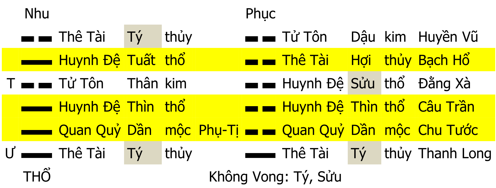
      - **Hình này chứng minh điều gì**
        - Minh chứng người cha nguy kịch do Hỏa vượng thái quá gây chảy máu mũi, bụng trướng nóng rát, và ứng nghiệm cởi áo nhảy xuống nước chết vào ngày Đinh Mão do Mộc Dục trợ hỏa.
      - **Từ đâu mà thấy được**
        - Dụng thần Phụ Mẫu Tị hỏa phục dưới hào 2 Dần mộc động sinh, Nhật Nguyệt Mão mộc sinh trợ thái quá; Hỏa mộ Tuất thổ hào 5 động bị Nhật Nguyệt hợp bế; hào 3 Thìn thổ xung khố bị tam trùng Quan Quỷ khắc; nội quái phục ngâm.

##### Phân tích suy luận quẻ tượng

- Xác định Dụng thần và cảnh báo tính mạng nguy kịch:
  - Đoán bệnh của cha (bậc trưởng bối), lấy lục thân Phụ Mẫu làm Dụng thần.
  - Dụng thần Phụ Mẫu Tị hỏa không hiện trên quẻ chính (phục thần), phục dưới hào 2 Quan Quỷ Dần mộc.
  - Cung vị hào 2 là trạch vị (nhà ở); Dụng thần phục dưới hào 2 biểu thị người cha đang nằm liệt trên giường bệnh tại nhà riêng.
  - Đánh giá vượng suy: Dụng thần Tị hỏa được cả Nguyệt kiến Mão mộc lẫn Nhật kiến Mão mộc đồng thời sinh phù, lại được Phi thần Quan Quỷ Dần mộc phát động trường sinh tương sinh -> Tình trạng quẻ chỉ có sinh mà không có khắc, dẫn đến Dụng thần vượng tướng thái quá; vật cực tất phản, vượng cực hóa thành tai ương.
  - Nội quái thuộc cách cục phục ngâm, biểu thị người bệnh đau đớn dữ dội, quằn quại rên rỉ trên giường bệnh.
  - Quẻ gieo được là Thủy Thiên Nhu thuộc quẻ Du hồn, biểu thị ý thức của bệnh nhân rơi vào trạng thái mơ màng hư ảo, như có như không, tính mạng đang ngàn cân treo sợi tóc.
- Biện chứng các triệu chứng nội nhiệt và xuất huyết:
  - Chứng nhiệt bốc và thời điểm khởi bệnh: Dụng thần lâm Tị hỏa, được rừng Mộc quá vượng tương sinh, lại phục dưới lục thần Chu Tước chủ hỏa nhiệt, phản ánh chứng sốt nóng thiêu đốt bên trong (nhiệt chứng). Trong quẻ hào Dần mộc phát động sinh Dụng thần, Dần mộc là tiết Lập Xuân -> Khẳng định căn bệnh bắt đầu khởi phát từ tiết Lập Xuân (thời điểm khởi đầu tháng Dần).
  - Triệu chứng chảy máu mũi: Hào 5 Huynh Đệ Tuất thổ là Mộ khố của Dụng thần Tị hỏa (Hỏa mộ tại Tuất). Dụng thần Hỏa khí bốc lên quá vượng cực độ, bức thiết cần Mộ khố thu tàng hỏa khí để giáng hỏa thì bệnh mới thuyên giảm. Ngũ hành Thổ chủ về mũi; hào 5 lâm thần sát Bạch Hổ phát động hóa ra Thê Tài Hợi thủy. Bạch Hổ chủ về huyết quang, Thê Tài cũng chủ về máu huyết -> Kết luận mũi tất nhiên bị xuất huyết, chảy máu mũi dữ dội.
  - Trở ngại bế khố và chứng trướng bụng: Nhật Nguyệt Mão mộc tương hợp giữ chặt Mộ khố Tuất thổ (Mão Tuất nhị hợp), làm cho hỏa khố bị khóa chặt, hỏa khí không thể giáng xuống để thu tàng. Trong quẻ may nhờ hào 3 Huynh Đệ Thìn thổ phát động tương xung mở khóa hỏa khố Tuất thổ (Thìn Tuất tương xung), nên Thìn thổ chính là hỉ thần cứu giải. Tuy nhiên, Thìn thổ lại ở thế hưu tù, bị cả Nhật kiến Mão mộc, Nguyệt kiến Mão mộc cùng hào 2 Quan Quỷ Dần mộc động tạo thành ba tầng Quan Quỷ vây hãm khắc chế nặng nề. Hào 3 là vùng bụng, ngoại quái biến quẻ Khôn cũng chủ về bụng, lại lâm Câu Trần chủ sưng to tức trướng -> Phán đoán vùng bụng của bệnh nhân bị sưng trướng đau đớn như bị thiêu đốt.
  - Rối loạn bài tiết và khó khăn ăn uống: Dụng thần quá vượng nên Nguyên thần Quan Quỷ Dần mộc tương sinh lại hóa thành kẻ thù gây hại. Hào 2 là vị trí cơ quan sinh dục và bài tiết, lâm Chu Tước chủ nhiệt -> Nước tiểu có màu đỏ vàng đậm, tiểu tiện nóng rát. Trong quẻ có hai hào Huynh Đệ đồng thời phát động (hào 3 và hào 5), Thê Tài Tý thủy lại rơi vào Tuần không -> Khí trệ khắc Tài, người bệnh không thể nuốt trôi thức ăn, việc ăn uống tắc nghẹn. Quẻ Du hồn chủ về đãng trí, mất trí nhớ, đầu óc mơ hồ không nhận biết được gì.
- Phân tích khả năng điều trị và các điều cấm kỵ:
  - Tử Tôn Thân kim trì Thế: Lục thân Tử Tôn là y dược, thuốc men điều trị. Hào Thế trì Tử Tôn biểu thị người nhà tự ý chăm sóc và dùng thuốc tại nhà. Song Thân kim hưu tù vô lực, nên thuốc men điều trị tại nhà không phát huy được hiệu quả tốt.
  - Cảnh báo quẻ biến Lục hợp và ấn định thời điểm nguy cấp: Quẻ biến Địa Lôi Phục là quẻ Lục hợp; quy luật chiêm bệnh mới kỵ nhất gặp quẻ Lục hợp ("bệnh mới gặp hợp tất tử"). Trong ngày Ất Mão gieo quẻ bệnh nhân chưa thể chết ngay, bởi đến giờ Dậu (Dậu kim xung Mão mộc) sẽ xung khai Mão mộc đang bế giữ hỏa khố Tuất thổ, tạm thời giải nguy qua khỏi cơn nguy kịch. Tuy nhiên, sang tuần tiếp theo, hào Tuất thổ rơi vào Tuần không, năng lực giáng hỏa thu tàng bị suy giảm nghiêm trọng; nếu lại gặp ngày Đinh Mão (ngày Mão kế tiếp hợp giữ Tuất thổ và tiếp tay sinh trợ Dụng thần), tính mạng ắt nguy nan khó bảo toàn.
  - Chỉ dẫn điều trị và phương cách hóa giải:
    - Nội quái phục ngâm: Bệnh nhân tuyệt đối không được chuyển dời phòng bệnh hay thay đổi chỗ nằm.
    - Trong quẻ Mộc động sinh Hỏa thái quá: Tuyệt đối không được dùng hành Thủy để ức chế, bởi Thủy sẽ sinh Mộc, Mộc lại quay sang trợ Hỏa bốc mạnh hơn.
    - Dùng Kim chế Mộc: Tử Tôn thuộc Kim có thể khắc chế Nguyên thần Dần mộc để ngăn việc sinh Hỏa; tác giả căn dặn nếu cho bệnh nhân đeo tượng Phật bằng đồng bên người, hoặc đeo trang sức vàng bạc, hoặc uống "hoàng kim thang" (nước sắc/ngâm kim loại quý) thì may ra còn có cơ hội cứu mạng.
    - Kiêng kỵ ăn uống: Hào Thê Tài (ẩm thực) Tuần không, người bệnh phải tuyệt đối tránh dùng các loại thuốc bổ hoặc đồ bồi bổ vì chất bổ sẽ trợ lực cho Mộc sinh Hỏa thiêu đốt cơ thể.

##### Kết quả và ứng nghiệm thực tế

- Tình hình thực tế khi người nhà đón bệnh nhân:
  - Khi người phụ nữ trở về quê, diễn biến bệnh tật của cha hoàn toàn trùng khớp với phán đoán của quẻ: người cha bị chảy máu mũi liên tục, bên trong ổ bụng nóng rát như lửa thiêu đốt. Người nhà trước đó gọi điện báo ông đã bất tỉnh nhân sự, quan tài và áo liệm đều đã chuẩn bị sẵn sàng, giục cô về gấp lo hậu sự.
  - Đến tối hôm đó (vào giờ Dậu giải nguy), người cha quả nhiên hồi tỉnh lại. Cô con gái lấy ra một tượng Phật nhỏ bằng đồng đưa cho cha đeo bên mình theo đúng lời dặn, nhưng người cha cương quyết không chịu mang theo.
  - Để thuận tiện việc chăm sóc, người anh trai đã tự ý chuyển cha về nhà riêng của mình (phạm vào điều cấm kỵ chuyển dời chỗ ở của quẻ phục ngâm).
  - Do không thể chịu nổi sự giày vò đau đớn tột cùng của bệnh tật, người cha đã tìm cách nuốt chiếc nhẫn vàng để tự sát; may mắn nhẫn bị mắc kẹt tại cổ họng không trôi xuống được nên người nhà phát hiện và kịp thời lấy ra.
- Diễn biến tử vong và ứng nghiệm trạng thái Mộc Dục:
  - Đến đúng ngày Đinh Mão (tròn 12 ngày sau ngày gieo quẻ), người chị dâu khăng khăng muốn pha đường glucose cho người bệnh uống để bồi bổ sức khỏe vì cho rằng ông đã nhịn ăn lâu ngày; cô con gái hết sức ngăn cản nhưng chị dâu gạt đi, cho rằng ở bệnh viện người ta cũng truyền đường glucose nên không có vấn đề gì.
  - Sau khi uống xong nước đường bổ dưỡng, người cha lập tức cảm thấy trong bụng nóng ran cồn cào không thể chịu nổi, toàn thân bốc sốt dữ dội.
  - Trong cơn hoảng loạn vì nóng bức, ông liền cởi sạch toàn bộ quần áo trên người rồi lao mình nhảy xuống nước ngâm mình mong hạ nhiệt nhưng hoàn toàn vô hiệu, và đã qua đời ngay trong ngày hôm đó.
  - Hiện tượng cởi sạch quần áo và chết dưới nước đã ứng nghiệm chuẩn xác vào trạng thái **Mộc Dục** (tắm rửa, xuống nước, cởi đồ, lõa thể). Mộc Dục đến sinh khiến Dụng thần Hỏa bùng phát quá vượng đến mức cực hạn mà dẫn đến tử vong.

## CHƯƠNG 11: CÁCH ĐOÁN NGUYÊN NHÂN PHÁT BỆNH

### Khái quát về phán đoán nguyên nhân phát bệnh
- Bản chất và tính quy luật của nguyên nhân phát sinh bệnh tật:
  - Bệnh tật phát sinh trong cơ thể con người có thể được nhận biết thông qua chẩn đoán của y học hiện đại.
  - Cơ thể con người rất phức tạp, sự xuất hiện của mỗi bệnh tật không phải là ngẫu nhiên mà đều có quan hệ nhân quả trước sau rõ ràng ("có nhân trước quả sau").
- Giá trị thực tiễn của việc dự trắc nguyên nhân phát bệnh trong Lục Hào:
  - Xác định chính xác nguyên nhân của bệnh cho phép tìm ra phương án trị liệu hợp lý, đúng đắn.
  - Trị liệu đúng căn nguyên giúp cắt đứt bệnh tật từ gốc rễ, loại bỏ hoàn toàn mầm mống gây bệnh.
  - Phán đoán chính xác nguyên nhân phát bệnh là một trong những giá trị cốt yếu của dự đoán bệnh tật bằng Lục Hào.

### 1. QUAN ĐIỂM MẮC BỆNH TRONG LỤC HÀO

- Khác biệt căn bản giữa quan niệm Lục Hào và y học hiện đại về nguồn gốc tật bệnh:
  - Phán đoán nguyên nhân gây bệnh trong Lục Hào không thể dựa vào lối tư duy phân tích cơ học thông thường, cần đặt sinh mệnh vào trường vận động tổng thể của tự nhiên để đạt mục đích dự trắc chuẩn xác.
- Cơ sở triết học khởi nguyên từ *Hệ Từ Truyện*:
  - "Dịch dữ thiên địa chuẩn, cố năng di luân thiên địa chi đạo. Ngưỡng dĩ quan ư thiên văn, phủ dĩ sát ư địa lý, thị cố tri u minh chi cố" (Dịch lấy trời đất làm chuẩn mực, thâu tóm đạo lý đất trời; ngửa trông thiên văn, cúi sát địa lý để thấu tỏ nguyên cớ sáng tối u minh).
  - Hệ thống dự đoán Lục Hào được kiến lập trên mô thức vận động của vũ trụ, mô phỏng hoàn chỉnh quy luật phát triển tự nhiên của vạn vật.
- Mối quan hệ tương tác cộng hưởng giữa con người và vũ trụ:
  - Con người là kết quả của vũ trụ phát triển đến một giai đoạn nhất định, chịu sự chi phối và ước thúc hoàn toàn của quy luật tự nhiên.
  - Vạn vật trong vũ trụ sinh diệt và biến hóa đều có tác động chế ước lẫn nhau; cơ thể con người không phải là một thực thể độc lập tách rời.
  - Con người và vũ trụ tồn tại mối quan hệ cộng hưởng trường năng lượng; chỉ khi vượt qua ranh giới thời gian và không gian mới nắm bắt trúng gốc rễ bệnh tật.
  - Các nhà hiền triết cổ đại nhận thức vũ trụ và cơ thể con người trên cả hai bình diện vĩ mô và vi mô thông qua sự thống nhất giữa trực quan và cảm quan.
  - Con người là tinh hoa thu nhỏ của vũ trụ (tiểu vũ trụ), là linh hồn của vạn vật; sự phát triển của vũ trụ đồng điệu với sự phát triển của con người.
  - Cơ thể con người càng phức tạp thì độ nhạy cảm trường khí càng cao, lượng thông tin dung nạp càng lớn, càng dễ bị ngoại cảnh quấy nhiễu khiến tật bệnh phát sinh phức tạp.
- Bản chất sinh bệnh theo quy luật ngũ hành:
  - Cơ thể phát bệnh do chịu tác động từ các dạng năng lượng vũ trụ mà bản thân không thể dung hòa hay thích ứng.
  - Vũ trụ là tổ hợp thống nhất của thời gian và không gian, biến hóa thông qua cơ chế tương sinh tương khắc của năm yếu tố căn bản: Kim, Mộc, Thủy, Hỏa, Thổ.
  - Nắm vững quy luật sinh khắc của ngũ hành là căn bản để phân định rõ ràng mọi nguyên nhân gây bệnh.

#### 1. Bởi vì sự biến đổi thời gian vũ trụ mà bị bệnh

- Thời không lúc sinh ra đóng dấu ấn ngũ hành định hình quỹ đạo sinh mệnh:
  - Thời khắc một người chào đời quyết định dấu ấn ngũ hành tiên thiên và chi phối những ảnh hưởng về sau của vũ trụ đối với người đó.
  - Thời gian là một dạng năng lượng đặc thù; tuy máy móc cơ học không thể đo lường trực tiếp nhưng năng lượng này liên tục tác động khiến vạn vật vận động từ sản sinh, phát triển đến diệt vong.
  - Người xưa đã chứng thực sự tồn tại của năng lượng thời gian và phát minh Chu Dịch Bát Quái làm công cụ nhận biết quy luật biến hóa của năng lượng này đối với con người.
- Quy luật biến hóa của năng lượng thời gian cho phép dự trắc sớm bệnh tật:
  - Sự biến đổi của năng lượng thời gian mang tính chu kỳ và quy luật, do đó Lục Hào có thể dự đoán trước biến đổi cơ thể và xác định chính xác thời điểm phát bệnh.
  - Tác động hai mặt của năng lượng thời gian đối với quỹ đạo sinh mệnh:
    - Khi năng lượng thời gian bất lợi: cơ thể phát sinh bệnh tật, thương tổn, tinh thần suy sụp, hiệu suất công việc giảm sút; nếu bất lợi vượt quá ngưỡng chịu đựng của cơ thể sẽ dẫn đến tử vong.
    - Khi năng lượng thời gian tương trợ có ích: cơ thể khỏe mạnh, tinh thần sung mãn.
  - Năng lượng thời gian không phải là yếu tố bất biến tuyệt đối; có thể thông qua phương pháp điều tiết thích hợp để chuyển hóa ảnh hưởng đối với cơ thể.

#### 2. Bởi vì từ trường không gian của vũ trụ mà bị bệnh

- Phân loại trường năng lượng không gian tác động lên con người:
  - Trường năng lượng tiên thiên: Gồm hoàn cảnh môi trường trong giai đoạn thai nghén và môi trường không gian xung quanh tại thời điểm chào đời.
  - Trường năng lượng hậu thiên: Môi trường không gian sinh sống, làm việc và cư ngụ của con người trong suốt quá trình trưởng thành.
- Đặc tính của trường năng lượng không gian khác với ô nhiễm môi trường thông thường:
  - Ô nhiễm môi trường thông thường có thể nhìn thấy bằng mắt hoặc đo lường bằng máy móc.
  - Trường năng lượng không gian chỉ có một số ít người nhạy cảm mới nhìn thấy hoặc cảm ứng được, máy móc khó đo định tốt xấu; tác động của trường này biến hóa tùy theo từng người và thay đổi theo thời gian.
- Biểu hiện bệnh lý thực tế do trường năng lượng không gian:
  - Cư trú lâu dài tại một vị trí sinh bệnh, hoặc cơ thể đang khỏe mạnh nhưng đổi chỗ ở mới liền phát bệnh; ngược lại có người ban đầu mang bệnh nhưng đổi chỗ ở lại khỏi bệnh.
  - Nằm ngủ quay đầu sai hướng từ trường gây bệnh, điều chỉnh lại hướng đầu giường thì khỏi bệnh.
  - Y học hiện đại không đạt hiệu quả điều trị đối với loại bệnh này; bắt buộc phải khảo sát trắc định và cải tạo phong thủy môi trường sống thì bệnh mới thuyên giảm.

#### 3. Bởi vì ảnh hưởng của các thiên thể mà bị bệnh

- Tác động của các thiên thể lên quá trình trao đổi chất của cơ thể:
  - Mặt trời chi phối sự sinh trưởng của vạn vật: nếu hệ Mặt Trời thiếu mặt trời thì Trái Đất không có sự sống, cơ thể con người mất khả năng trao đổi chất.
  - Tác động hai mặt từ bức xạ mặt trời: vừa mang lại nguồn sống vừa có bức xạ gây hại như hiện tượng vết đen mặt trời, tia tử ngoại.
  - Mặt trăng, các hành tinh trong thái dương hệ và nhị thập bát tú đều phát tán trường năng lượng gây ảnh hưởng ở các mức độ khác nhau lên con người trên Trái Đất.
- Tính chất nan giải của nguyên nhân thiên thể:
  - Do xuất phát từ vận động quy mô lớn của các thiên thể vũ trụ nên việc xác định và can thiệp cải biến loại nguyên nhân gây bệnh này tương đối khó khăn.

#### 4. Bởi vì biến đổi khí hậu mà bị bệnh

- Mối liên hệ chặt chẽ giữa thời tiết, mùa vụ với tỷ lệ phát bệnh:
  - Biến đổi khí hậu theo mùa kích hoạt các bệnh lý tạng phủ tương ứng; ví dụ bệnh về gan có tỷ lệ phát bệnh cao nhất vào mùa xuân (mùa mộc vượng).
  - Ngày mưa dầm và thời tiết âm u ẩm ướt khiến người mắc bệnh phong thấp, viêm khớp biểu hiện triệu chứng rõ rệt.
- Quan điểm Trung y về ngoại tà khí hậu:
  - Các yếu tố thời tiết lục khí gồm hàn (lạnh), noãn (ấm), thử (nóng, nắng), thấp (ẩm ướt), táo (khô) khi biến đổi bất thường đều trở thành tà khí gây bệnh.
  - Bệnh cảm mạo thông thường, trúng gió, cảm nắng đều thuộc nhóm nguyên nhân biến đổi khí hậu này.

#### 5. Bởi vì ảnh hưởng qua lại với người khác mà bị bệnh

- Cơ chế tương tác từ trường sinh học giữa người với người:
  - Vạn vật trong vũ trụ luôn tương tác lẫn nhau; giữa người với người tồn tại tác động qua lại từ trường năng lượng sinh học vô hình phát ra từ cơ thể.
  - Minh chứng trực quan: Hiện tượng người đi lại trước tivi gây nhiễu sóng hình ảnh và âm thanh do từ trường cơ thể tác động lên thiết bị điện tử.
- Các dạng thức phát bệnh do từ trường của người khác:
  - Tiếp xúc gần gũi với bệnh nhân trong thời gian dài bị nhiễm trường khí bất lợi mà sinh bệnh.
  - Phát sinh tranh cãi, khẩu thiệt thị phi dẫn đến uất ức phát bệnh.
  - Bị người khác thù hận chiếu trường khí xấu vào, hoặc bản thân ôm lòng thù hận người khác khiến khí huyết nghịch loạn mà mắc bệnh.
  - Người có cơ địa nhạy cảm khi tiếp xúc với một người nhất định sẽ phát sinh biến đổi về tâm lý, sinh lý và cảm xúc.
  - Cùng chung sống lâu ngày với một người có thể bất giác sinh bệnh, hoặc ngược lại từ thể trạng ốm yếu chuyển biến thành khỏe mạnh tùy theo độ tương thích trường khí.

#### 6. Bởi vì ảnh hưởng của vật thể bên ngoài mà bị bệnh

- Hai phương diện tác động của vật thể bên ngoài lên cơ thể:
  - Phương diện trực quan (tác động cơ học ngoại tại): Tai nạn giao thông, bỏng nhiệt, chấn thương thực thể, sự cố trong sinh hoạt và lao động sản xuất.
  - Phương diện cảm quan (tác động trường khí nội tại): Đồ vật, dụng cụ cất giữ trong nhà, đồ bày biện trang trí phong thủy phát tán trường năng lượng ảnh hưởng lâu dài lên cơ thể.
- Tác động trường khí từ vật phẩm phong thủy và đồ thờ cúng:
  - Bày đặt tượng Phật, tượng Thần Tài sai vị trí phong thủy sẽ tạo lập trường năng lượng xấu gây hại cho cơ thể (bản chất do bức xạ trường năng lượng, không phải yếu tố dị đoan).
  - Quy luật tương tác: Vật thể càng được tiếp xúc thường xuyên và liên kết chặt chẽ với đời sống con người thì cường độ ảnh hưởng trường khí lên con người càng lớn.

#### 7. Bởi vì sự biến đổi tính cách, tinh thần mà bị bệnh

- Ảnh hưởng của biến động tâm lý cảm xúc lên tạng phủ:
  - Sự biến đổi tính cách và tinh thần nhất thời hoặc kéo dài là căn nguyên của các chứng bệnh tâm căn: u uất, trầm cảm, bệnh tương tư, cuồng loạn, tâm thần phân liệt.
  - Tính khí nóng nảy, thường xuyên tức giận làm tổn hại tạng can, dẫn đến đau đầu, khó thở, tức ngực.
  - Cảm xúc quá độ như bi thương tột cùng, hưng phấn cực độ, kinh hãi hoảng hốt hoặc lo âu trường diễn đều làm rối loạn khí cơ tạng phủ.
- Yêu cầu trong phương thức điều trị bệnh tâm căn:
  - Bệnh do tinh thần và tính cách gây ra nếu chỉ dùng phương pháp tiêm và uống thuốc thông thường thì không thể chữa dứt.
  - Bắt buộc phải tìm ra căn nguyên gốc rễ tâm lý và áp dụng liệu pháp tinh thần đặc thù mới có thể bình phục.

#### 8. Bởi vì ăn uống mà bị bệnh

- Rối loạn chế độ ẩm thực gây tổn hại trực tiếp đến tỳ vị và hệ tiêu hóa:
  - Thiếu hụt dinh dưỡng kéo dài hoặc ăn phải thức ăn ôi thiu biến chất.
  - Sử dụng các loại thực phẩm tương khắc sinh ra độc tố tích tụ trong cơ thể.
  - Chế độ ăn uống thất thường: ăn quá no, nhịn quá đói, thức ăn quá nóng hoặc quá lạnh.
- Hệ quả bệnh lý liên quan:
  - Là nguyên nhân chủ yếu dẫn đến các bệnh lý về dạ dày và đường ruột.
  - Ăn uống sai lệch cũng là căn nguyên khởi phát nhiều bệnh lý tại gan và phổi.

#### 9. Bởi vì vật chất âm tính mà bị bệnh

- Bản chất của tà bệnh dưới góc độ trường năng lượng vũ trụ:
  - Vật chất âm tính là dạng vật chất âm tồn tại khách quan trong không gian vũ trụ, dân gian thường gọi là "tà bệnh".
  - Bản chất căn bệnh: Do từ trường cơ thể bị quấy nhiễu và xâm nhập bởi từ trường của thế giới vật chất âm tính.
- Biểu hiện triệu chứng lâm sàng đặc thù:
  - Thần trí không tỉnh táo, cuồng ngôn loạn ngữ, tính cách biến đổi khác thường.
  - Ngôn ngữ, cử chỉ, giọng nói, ký ức đều xảy ra biến đổi đột ngột như một người khác.
  - Thường bị chẩn đoán nhầm là rối loạn thần kinh; sử dụng phương pháp điều trị y học thông thường khó đạt hiệu quả.
- Đặc điểm cơ địa dễ nhiễm trường khí âm tính:
  - Người có thể chất suy yếu, chính khí suy giảm, từ trường cơ thể bất ổn định.
  - Lòng bàn tay có nhiều đường chỉ tay lộn xộn, tâm tính dễ dao động cảm xúc và rất nhạy cảm với tác động bên ngoài.
- Phương pháp điều trị tối ưu:
  - Một số người có thể tự hồi phục sau một thời gian, nhưng đa số không thể bình phục nếu không có biện pháp can thiệp.
  - Biện pháp căn bản nhất là tiến hành điều hòa trường khí cơ thể, vận dụng phương pháp khử từ để loại bỏ hoàn toàn từ trường âm tính.

### 2. PHƯƠNG PHÁP PHÁN ĐOÁN NGUYÊN NHÂN PHÁT BỆNH

#### Nguyên lý tổng quát và tiêu chí định vị nguyên nhân
- Quan Quỷ là đầu mối chủ đạo để tầm nguyên bệnh tật:
  - Khảo sát hào vị Quan Quỷ chiếm cứ và lục thần lâm phối cùng Quan Quỷ để nhận định căn nguyên phát bệnh.
  - Phối hợp phân tích tuần tự Kỵ thần, Cừu thần và Nguyên thần nhằm xác định chiều hướng tác động và nguồn năng lượng xung phá Dụng thần.
  - Kết hợp quái cung để phán đoán môi trường sinh hoạt, phong thủy gia trạch và bối cảnh khởi phát mầm bệnh.

#### Tượng trưng của lục thần lâm Quan Quỷ hoặc Kỵ thần
- Thanh Long lâm Quan Quỷ hoặc Kỵ thần:
  - Biểu thị bệnh phát sinh do ẩm tửu quá lượng, sắc dục phòng sự vô độ, đắm say mỹ nữ.
  - Do ngộ độc thức ăn đồ uống, tinh thần hưng phấn quá độ, tham gia yến tiệc liên hoan, thăm hỏi người thân bạn bè, tiếp kiến quý nhân.
  - Do vướng mắc tiền tài của cải, việc vui mừng hỷ sự, quá trình thai sản sinh nở, thời kỳ ở cữ hoặc do nạo phá thai mà tổn hại cơ thể.
- Chu Tước lâm Quan Quỷ hoặc Kỵ thần:
  - Biểu thị bệnh do phẫn nộ tức giận, sốt cao viêm nhiệt, khẩu thiệt thị phi cãi vã, kiện tụng quan nha, tin tức thư từ gây chấn động, bị nguyền rủa mắng nhiếc, hoặc bị bỏng hỏa hoạn.
  - Phân định theo lục hào vị trí cụ thể:
    - Hào sơ: Do người hầu hạ, kẻ dưới, trẻ nhỏ chửi rủa mắng mỏ, hoặc bị gia cầm gia súc cắn mổ gây thương tích.
    - Hào 2: Do người trong gia đình hoặc đầu bếp nguyền rủa, hoặc do ăn uống mà phát sinh bệnh tật.
    - Hào 3: Bị mắng nhiếc, lăng mạ nhục nhã ngay trước cửa nhà.
    - Hào 4: Do hàng xóm láng giềng chửi bới, tranh chấp cãi cọ.
    - Hào 5: Cảm nhiễm hoặc phát tác bệnh tật ngay trên đường đi lại, giao thông.
    - Hào 6: Nhiễm bệnh tại đền miếu, chùa chiền, Phật đường, hoặc khu vực mồ mả tổ tiên.
- Câu Trần lâm Quan Quỷ hoặc Kỵ thần:
  - Biểu thị bệnh do tu tạo xây cất, sửa sang đất đai phòng ốc mà cảm nhiễm.
  - Do chấn thương xây xát ngoài da, ăn uống thất thường không đúng bữa, hoặc do trường khí phòng ở mất cân bằng xung sát.
- Đằng Xà lâm Quan Quỷ hoặc Kỵ thần:
  - Biểu thị tâm lý bi thương sợ hãi, lo nghĩ suy tính hao tổn tinh thần, kinh hãi hoảng hốt.
  - Do ác mộng quấy nhiễu, gặp chuyện quái dị tà ma ám ảnh, hoặc say mê cuồng si một vật hay một việc nào đó mà thành bệnh.
- Bạch Hổ lâm Quan Quỷ hoặc Kỵ thần:
  - Biểu thị bệnh do ẩu đả đánh lộn, bi thương sầu não quá độ, bị đao kiếm hung khí kim loại gây thương tích.
  - Do tai nạn giao thông đổ máu, hoặc tham dự việc tang chế hiếu sự mà vướng phải khí độc phát bệnh.
- Huyền Vũ lâm Quan Quỷ hoặc Kỵ thần:
  - Biểu thị sắc dục phòng the quá độ, đói khát dầm mưa tuyết giá lạnh, cảm nhiễm phong hàn ẩm thấp.
  - Do mất mát của cải đồ đạc, trộm cắp thất thoát tài sản sinh u uất sầu não mà phát bệnh.

#### Phối hợp vị trí phục thần, động biến và trạng thái ngũ hành
- Quan Quỷ hoặc Kỵ thần phục dưới hoặc động biến với Lục thân:
  - Phục dưới Phụ Mẫu hoặc Phụ Mẫu động hóa Quan Quỷ/Kỵ thần: Do lao tâm khổ tứ vất vả, lo nghĩ suy kiệt; do xe cộ thuyền bè; do kiến trúc nhà cửa; do cha mẹ trưởng bối; do áo quần ấm lạnh không điều hòa; do trễ tràng chậm khám chữa; hoặc do chỗ ở chật chội bất an.
  - Phục dưới Huynh Đệ hoặc Huynh Đệ động hóa Quan Quỷ/Kỵ thần: Do cờ bạc đỏ đen, tranh đoạt tiền của, ăn uống sai cách bừa bãi; do vướng mắc phụ nữ, hoặc vì anh em bạn bè liên lụy mà mắc bệnh.
  - Phục dưới Thê Tài hoặc Thê Tài động hóa Quan Quỷ/Kỵ thần: Do ăn uống vô độ bội thực; do tửu sắc phụ nữ, nợ nần tiền bạc; do bệnh lý máu huyết, truyền máu; hoặc do hoa cỏ phấn hoa cây cối kích ứng.
  - Phục dưới Tử Tôn hoặc Tử Tôn động hóa Quan Quỷ/Kỵ thần: Do uống rượu ăn chơi, du lịch mệt mỏi, phòng sự quá đà; do trẻ nhỏ, súc vật thú nuôi cào cắn; do người xuất gia tu sĩ; hoặc do lạm dụng dược phẩm, dinh dưỡng mất cân đối.
- Tương quan Thế Ứng, Thần sát và Khí sắc đặc thù:
  - Quan Quỷ, Kỵ thần trì Thế chủ bệnh cũ tái phát; lâm hào Ứng chủ cảm nhiễm bệnh tật từ phương xa, nơi khác.
  - Dụng thần nhập Mộ lâm Quỷ lại hội Đằng Xà: Nhất định là tà bệnh (bệnh do tà ma, quái dị, tâm thần hoang tưởng).
  - Tượng nôn mửa và tiêu chảy:
    - Thê Tài phát động tại cung dương, hoặc lâm hào Thổ ở ngoại quái: Chủ bệnh nôn mửa (thổ nghịch).
    - Thê Tài tại cung âm, nội quái hội hào Thủy: Chủ bệnh tả lỵ, tiêu chảy tháo tháo (thủy tả).
  - Tốc độ phát bệnh: Quan Quỷ hoặc Kỵ thần lâm Nhật kiến là bạo bệnh cấp tính; lâm Nguyệt kiến chủ bệnh ủ lâu ngày mãn tính.
  - Tử Tôn rơi vào Không Tuyệt: Bệnh do dinh dưỡng suy kiệt, cơ thể thiếu chất trầm trọng.
- Ngũ hành Quan Quỷ tương khắc hào Thế:
  - Mộc Quỷ khắc Thế: Bệnh phong tà, trúng phong, trượt té chấn thương ngã cao, tổn thương do hình tượng, hoặc thắt cổ tự vẫn.
  - Hỏa Quỷ khắc Thế: Bị thương do bỏng lửa, bỏng nước sôi, nhiệt độc thiêu đốt.
  - Thủy Quỷ khắc Thế: Dầm mưa dãi gió, đuối nước suýt chìm, hoặc trúng độc thức ăn/hóa chất.
  - Kim Quỷ khắc Thế: Thương tích do đao kiếm gươm giáo, công cụ sắc nhọn kim khí va đập.
  - Thổ Quỷ khắc Thế: Chấn thương do đất đá vùi lấp, sụp đổ tường vách va đập gây thương tật.

#### Ví dụ 1: Nam đoán bệnh cho vợ (Quẻ Sơn Thiên Đại Súc biến Càn Vi Thiên)
- Ngày Kỷ Tị tháng Dậu (Tuất Hợi không vong), người chồng lo lắng gieo quẻ dự đoán bệnh tình của vợ:
  - **Hình 104.** Sơ đồ quẻ Sơn Thiên Đại Súc biến Càn Vi Thiên
    - 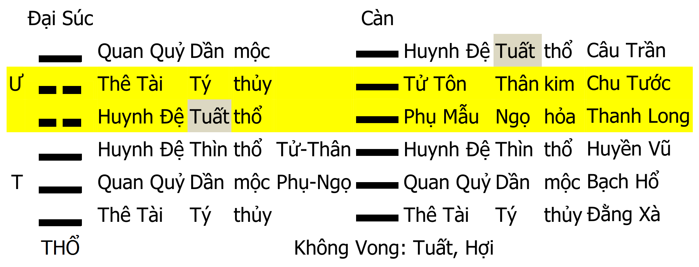
    - **Hình này chứng minh điều gì**
      - Vợ mắc bệnh tiểu đường có nguyên nhân sâu xa từ việc sảy thai, hư thai làm tổn thương khí huyết.
    - **Từ đâu mà thấy được**
      - Hào 2 Quan Quỷ Dần mộc lâm Bạch Hổ trì Thế chủ đọa thai; hào 4 Huynh Đệ Tuất thổ lâm Thanh Long động khắc Dụng thần Thê Tài Tý thủy.
- Luận đoán căn nguyên và cơ chế phát bệnh:
  - Định Dụng thần: Lấy hào Thê Tài làm Dụng thần. Trong quẻ Thê Tài lưỡng hiện (hào sơ và hào 5), lấy hào 5 Thê Tài Tý thủy phát động làm Dụng thần chuẩn xác.
  - Dấu hiệu thai sản và huyết quang: Hào 2 Quan Quỷ Dần mộc trì Thế lâm Bạch Hổ, trong đó hào 2 là thai vị (vị trí thai nhi), Bạch Hổ là huyết thần đại diện cho huyết quang và sự đọa thai, sảy thai.
  - Kỵ thần lâm Thanh Long khắc phạt: Kỵ thần Huynh Đệ Tuất thổ ở hào 4 lâm Thanh Long phát động khắc phạt Dụng thần Thê Tài Tý thủy; Thanh Long chủ việc sinh nở thai sản hoặc thời kỳ ở cữ. Sự kết hợp này chỉ rõ nguyên nhân phát bệnh bắt nguồn từ việc ở cữ không điều độ hoặc do sảy thai, đọa thai mà thành bệnh.
- Ứng nghiệm thực tế: Người chồng xác nhận vợ mình trước đó đã bị sảy thai, sau lần sảy thai đó cơ thể suy nhược rồi phát sinh biến chứng chuyển thành bệnh tiểu đường.

#### Ví dụ 2: Nam đoán bệnh bản thân (Quẻ Hỏa Lôi Phệ Hạp biến Hỏa Trạch Khuê)
- Ngày Ất Sửu tháng Tuất (Tuất Hợi không vong), người nam tự gieo quẻ dự trắc sức khỏe của chính mình:
  - **Hình 105.** Sơ đồ quẻ Hỏa Lôi Phệ Hạp biến Hỏa Trạch Khuê
    - 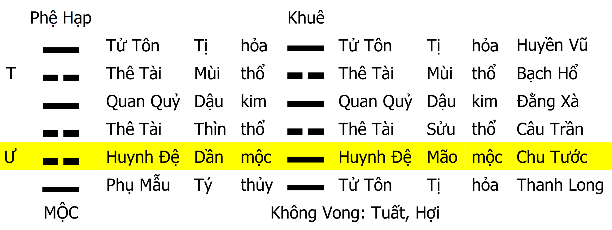
    - **Hình này chứng minh điều gì**
      - Đau dạ dày cấp tính, vị khí thượng nghịch do cãi vã kịch liệt với vợ trong nhà.
    - **Từ đâu mà thấy được**
      - Hào 2 Huynh Đệ Dần mộc lâm Chu Tước (khẩu thiệt) tại thê vị phát động khắc Thế Thê Tài Mùi thổ ở hào 5 (dạ dày).
- Luận đoán nguyên nhân phát sinh cơn đau:
  - Định Dụng thần: Tự đoán bệnh cho bản thân lấy hào Thế làm Dụng thần. Hào Thế là Thê Tài Mùi thổ tại hào 5, đắc Nhật Sửu và Nguyệt Tuất cùng tỉ phù nên cực kỳ vượng tướng.
  - Khẩu thiệt gia trạch kích phát nộ khí: Hào 2 Huynh Đệ Dần mộc lâm Chu Tước phát động đến khắc hào Thế. Chu Tước chủ khẩu thiệt thị phi to tiếng; hào 2 là gia trạch, đồng thời là thê vị (vị trí người vợ trong nhà). Do đó xác định nguyên nhân phát bệnh là do cãi cọ gay gắt với vợ.
  - Cơ quan tổn thương: Hào 5 là hào vị của dạ dày, bản thân ngũ hành Thổ cũng quy về dạ dày, do đó khẳng định vị trí phát bệnh chính là dạ dày.
- Ứng nghiệm thực tế: Người này xác nhận đúng là do cãi nhau kịch liệt với vợ, cơn giận bốc lên khiến vị khí nghịch hành dữ dội mà phát đau dạ dày quằn quại.

#### Ví dụ 3: Nam đoán bệnh bản thân (Quẻ Thủy Địa Tỷ biến Phong Địa Quan)
- Ngày Canh Ngọ tháng Tị (Tuất Hợi không vong), một người nam đến dự trắc bệnh tình cơ thể:
  - **Hình 106.** Sơ đồ quẻ Thủy Địa Tỷ biến Phong Địa Quan
    - 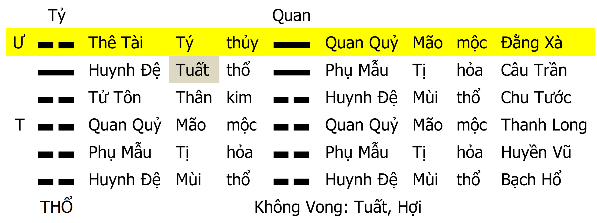
    - **Hình này chứng minh điều gì**
      - Thói quen chìm đắm trong rượu bia dẫn tới mủ màng phổi và bệnh hen suyễn mãn tính.
    - **Từ đâu mà thấy được**
      - Hào 3 Thế Quan Quỷ Mão mộc lâm Thanh Long (chủ rượu), hào 6 Thê Tài Tý thủy (ẩm thực) động hóa Quỷ chỉ vì ăn uống sinh tai.
- Luận đoán căn nguyên bệnh lý:
  - Định Dụng thần: Tự đoán bệnh lấy hào Thế làm Dụng thần. Hào 3 Quan Quỷ Mão mộc trì Thế lâm Thanh Long; Thanh Long là biểu tượng của rượu bia và sự phóng túng ẩm thực.
  - Tài hóa Quan Quỷ chủ ẩm thực sinh họa: Hào 6 Thê Tài Tý thủy phát động hóa Quan Quỷ Mão mộc (lâm Đằng Xà); Thê Tài đại diện cho ăn uống, ẩm thực. Hào Tài động hóa Quỷ là dấu hiệu điển hình của việc ăn uống vô độ mang mầm bệnh vào người.
  - Kết luận căn nguyên: Phối hợp Thanh Long trì Thế và hào Tài hóa Quỷ, kết luận chắc chắn bệnh tình khởi phát do thói quen nghiện rượu lâu năm.
- Ứng nghiệm thực tế: Đương số vào năm Quý Dậu do uống quá nhiều rượu bia đã bị nhiễm trùng phổi dẫn tới tích mủ, tổn thương phế nang để lại di chứng hen suyễn kinh niên.

#### Ví dụ 4: Học trò đoán nguyên nhân con trai nôn mửa (Quẻ Sơn Thiên Đại Súc biến Thủy Thiên Nhu)
- Ngày Mậu Tý tháng Thìn (Ngọ Mùi không vong), học trò của tác giả gieo quẻ hỏi nguyên do con trai đột ngột nôn mửa liên tục:
  - **Hình 107.** Sơ đồ quẻ Sơn Thiên Đại Súc biến Thủy Thiên Nhu
    - 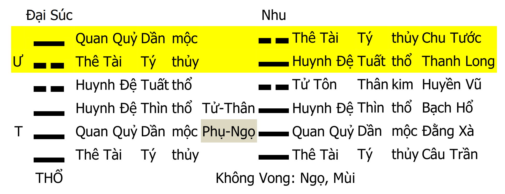
    - **Hình này chứng minh điều gì**
      - Đứa trẻ bị nôn mửa cấp tính do ăn phải thức ăn thừa đã ôi thiu lưu cữu.
    - **Từ đâu mà thấy được**
      - Thê Tài Tý thủy lâm Thanh Long động ở ngoại quái chủ thổ nôn; hào 6 Quỷ lâm Chu Tước thoái vị hóa Tài chỉ thức ăn thừa thãi.
- Phân tích dịch lý xác định cội nguồn:
  - Định Dụng thần: Xem bệnh cho con trai lấy hào Tử Tôn làm Dụng thần. Tử Tôn Thân kim phục tàng dưới hào 3 Huynh Đệ Thìn thổ, đắc Nguyệt Thìn và Phi thần Thìn thổ cùng sinh trợ nên vượng tướng, tính mạng an toàn không lo ngại.
  - Tượng nôn mửa tại ngoại quái: Hào 5 Thê Tài Tý thủy tại ngoại quái lâm Thanh Long phát động; Thanh Long chủ ẩm thực, Tài cũng là ẩm thực, hào Tài động ở ngoại quái là biểu tượng chuẩn xác của chứng nôn mửa (thổ).
  - Nhận diện đồ ăn thừa bỏ đi: Hào 6 Quan Quỷ Dần mộc phát động hóa Thê Tài Tý thủy chỉ rõ nguyên nhân bệnh do ăn uống; Chu Tước chủ đồ ăn thức uống; hào 6 là hào vị thoái hưu (vị trí tận cùng đã thoái lui, đào thải), tổng hợp lại chính là thức ăn phế thải bị loại bỏ — tức cơm thừa canh cặn.
- Đối thoại và kết quả: Vừa quan sát quẻ xong, tác giả đoán ngay đứa trẻ bị nôn mửa do ăn phải cơm thừa ôi thiu; người học trò về nhà kiểm chứng và xác nhận sự việc diễn ra hoàn toàn đúng như phán đoán.

#### Ví dụ 5: Nam đoán bệnh bản thân (Quẻ Tốn Vi Phong biến Phong Thủy Hoán)
- Ngày Bính Thìn tháng Hợi (Tý Sửu không vong), người nam tự gieo quẻ dự đoán tình trạng sức khỏe:
  - **Hình 108.** Sơ đồ quẻ Tốn Vi Phong biến Phong Thủy Hoán
    - 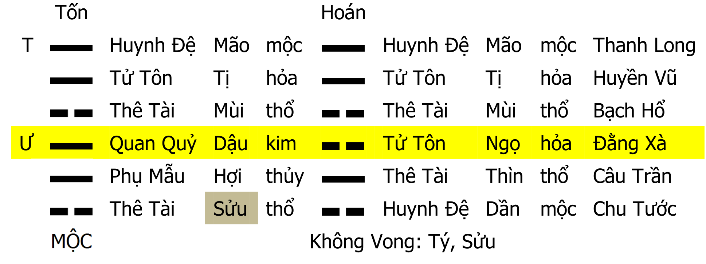
    - **Hình này chứng minh điều gì**
      - Lá gan tổn thương nặng, suy nhược tim mạch và mất ngủ do thói quen thích ăn ớt cay kết hợp nghiện rượu.
    - **Từ đâu mà thấy được**
      - Thế Huynh Đệ Mão mộc (gan) lâm Thanh Long (rượu); hào 3 Quan Quỷ Dậu kim (cay, nhỏ dài) hóa hỏa (ớt) khắc Thế; Nhật Thìn (bình rượu) sinh Kỵ.
- Bóc tách chi tiết các triệu chứng và thói quen sinh hoạt:
  - Bệnh lý tại gan mật: Lấy hào Thế làm Dụng thần; Thế là Huynh Đệ Mão mộc tại hào 6, chi Mão và quái cung Tốn đều thuộc mộc chủ gan mật. Hào 3 Quan Quỷ Dậu kim phát động khắc Thế; hào 3 là vị trí gan trong cơ thể, do đó khẳng định chức năng gan có vấn đề nghiêm trọng.
  - Mất ngủ và tim mạch bất an: Hào 3 là giường chiếu, lâm Đằng Xà chủ giấc ngủ chập chờn; Kỵ thần tại hào 3 khắc Thế khiến giấc ngủ luôn bồn chồn lo âu, mất ngủ triền miên. Đằng Xà chủ tâm hoảng sợ hãi, Kỵ thần lại biến ra Tử Tôn Ngọ hỏa (tim), báo hiệu tim mạch suy nhược bất an.
  - Thói quen ăn cay và nghiện rượu:
    - Hào Thế lâm Thanh Long chủ rượu và ẩm thực; Kỵ thần Quan Quỷ Dậu kim mang hành Kim chủ vị cay nồng, lâm Đằng Xà là vật nhỏ dài, động biến Ngọ hỏa mang sắc đỏ — phối hợp thành quả ớt cay màu đỏ, đoán người này rất thích ăn ớt làm tổn hại cơ thể.
    - Hào 2 Phụ Mẫu Hợi thủy đắc Nguyệt kiến sinh Thế, Thủy là chất lỏng chỉ việc uống rượu; Nhật thần Thìn thổ là Thủy khố (kho chứa nước, tượng bình rượu vò rượu) sinh trợ cho Kỵ thần Quan Quỷ Dậu kim — chỉ rõ uống rượu quá nhiều tiếp tay làm hại lá gan.

#### Ví dụ 6: Nam đoán bệnh bản thân có ảo giác ma quái (Quẻ Càn Vi Thiên biến Hỏa Thiên Đại Hữu)
- Ngày Giáp Tuất tháng Tý (Thân Dậu không vong), người nam mang tâm trạng kinh hãi tột cùng đến dự đoán bệnh tật:
  - **Hình 109.** Sơ đồ quẻ Càn Vi Thiên biến Hỏa Thiên Đại Hữu
    - 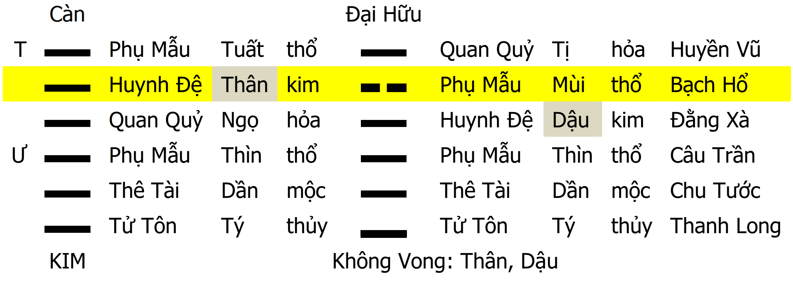
    - **Hình này chứng minh điều gì**
      - Bệnh nhân rơi vào ảo giác ma quỷ và hoảng loạn tâm thần do mồ mả tổ tiên và đền chùa lân cận bị tu sửa chấn động.
    - **Từ đâu mà thấy được**
      - Hào 6 Thế lâm Huyền Vũ Quỷ khố; Nguyên thần Ngọ hỏa Nguyệt phá nhập Mộ; hào 6 mộ tổ độc phát; hào 3 kiến trúc chùa chiền ám động.
- Luận giải cơ chế bệnh lý hoang tưởng và ảo giác:
  - Định Dụng thần: Lấy hào Thế Phụ Mẫu Tuất thổ ở hào 6 làm Dụng thần. Hào Thế lâm Huyền Vũ và là Quỷ khố (kho tàng của Quan Quỷ hỏa); Huyền Vũ chủ âm khí u tối và ảo giác tà ma.
  - Nguyên thần suy kiệt sinh hoảng loạn: Nguyên thần là Quan Quỷ Ngọ hỏa đại diện cho tư duy, ý thức lâm Đằng Xà bị Nguyệt kiến Tý thủy xung phá thành Nguyệt phá, báo hiệu tâm trạng hoảng hốt không yên. Hào 6 là đầu, quẻ Càn cũng là đầu chủ tư duy, Nguyên thần nhập Mộ ở Nhật thần Tuất thổ chủ thần trí u mê ám muội, Huyền Vũ sinh ảo giác ma quái rùng rợn.
- Phân tích nguyên nhân phong thủy mộ phần và tiền sử:
  - Mộ phần tổ tiên: Hào 6 là mồ mả tổ tiên, Quỷ khố đại diện nghĩa địa; hào 6 độc phát chủ nguyên nhân tính chất cốt lõi; hào 5 Huynh Đệ Thân kim Không Vong lâm Bạch Hổ (chủ tử vong, vong linh) cho thấy bệnh có liên quan mật thiết đến vong linh và phong thủy mộ tổ.
  - Vết tích nhổ răng và cây cầu gần mộ: Hào 5 là ngũ quan, ngũ hành Kim là răng, Bạch Hổ chủ phẫu thuật đao kéo, Tuần Không chủ mất đi — đoán trước đây người này từng nhổ răng ảnh hưởng đến thần kinh. Hào 5 là đường đi, Không Vong biểu thị cây cầu bắc qua khoảng trống, chứng tỏ gần mộ tổ có cây cầu.
  - Tu sửa đền chùa gần mộ: Hào 3 Phụ Mẫu Thìn thổ bị Nhật Tuất xung thành ám động; Phụ Mẫu là kiến trúc, hào Ứng chủ lân cận; Thìn thổ là Mộ khố của Tử Tôn Thân kim (người xuất gia tu sĩ), khố của tăng ni chính là đền chùa miếu mạo; cung Càn cũng chủ thần phật, Câu Trần chủ tu tạo xây dựng, ám động là tu sửa bên trong — đoán gần mộ tổ có ngôi chùa vừa sửa chữa.
- Thực tế rùng rợn: Người này mỗi ngày mở mắt ra đều thấy bóng ma lởn vởn trước giường nằm, trên trần nhà, trong xe buýt có vô số con mắt chằm chằm nhìn mình; sống trong thống khổ tột cùng và đã nhiều lần toan tự sát nhưng may mắn được cứu thoát.
##### Phương pháp hóa giải bằng huyền học ngũ hành
- Thao tác thực hiện hóa giải:
  - Dùng một tờ giấy màu đen gói bọc 2 cây nến lại, đem ra nơi vắng vẻ đốt bỏ.
  - Đồng thời lấy một đoạn dây màu đỏ buộc chặt một chiếc túi nhỏ chứa chu sa bên trong, đeo trực tiếp lên cổ người bệnh.
- Kết quả ứng nghiệm thần kỳ: Sau khi thực hiện, bệnh tình thuyên giảm nhanh chóng, toàn bộ ảo giác ma quái kinh dị biến mất; người bệnh phản hồi lúc vừa đeo túi chu sa dây đỏ lên cổ thì cảm thấy rõ ràng một luồng nhiệt ấm chạy qua sợi dây.
- Cơ chế giải mã ngũ hành:
  - Gốc bệnh do Nguyên thần hỏa bị Nguyệt phá và nhập Mộ ở Tuất; cần giải quyết hiện tượng Phá và Mộ. Nguyên thần hỏa chủ màu đỏ, Đằng Xà là sợi dây nhỏ dài, do đó dùng sợi dây đỏ.
  - Chu sa thuộc khoáng vật, bọc trong túi nhỏ tạo thành tượng Sửu thổ; Sửu thổ nhị hợp trói chặt Nguyệt kiến Tý thủy, khiến Tý thủy không còn xung phá Nguyên thần Ngọ hỏa; mặt khác Sửu thổ trợ vượng hào Thế, chu sa có công năng an thần trừ tà cực mạnh.
  - Hai cây nến mang hỏa khí (số 2 là sinh số của Hỏa), giấy bọc là tượng Tuất thổ, màu đen thuộc Thủy; đem thiêu đốt là chuyển hóa ngũ hành Thủy bất lợi tiêu tan, giải phóng Mộ khố giam hãm giúp Nguyên thần phục hồi, thần trí thanh tỉnh trở lại.

#### Ví dụ 7: Dịch hữu đoán bệnh điên loạn cho con trai một phụ nữ (Quẻ Thiên Trạch Lý biến Thiên Thủy Tụng)
- Ngày Mậu Ngọ tháng Giáp Thìn năm Nhâm Ngọ (Tý Sửu không vong), Dịch hữu Trần Lỗ Tây tiên sinh ở Triệu Khánh nhờ tác giả đoán bệnh cho con trai một phụ nữ:
  - **Hình 110.** Quẻ Thiên Trạch Lý biến Thiên Thủy Tụng
    - 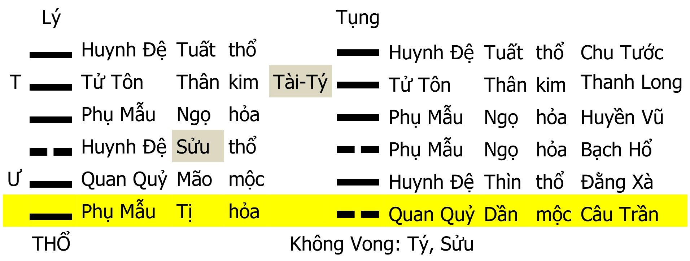
    - **Hình này chứng minh điều gì**
      - Con trai phát bệnh tâm thần hoang tưởng do sửa đổi phong thủy nhà ở và đặt sai vật phẩm phong thủy tượng hổ thủ công.
    - **Từ đâu mà thấy được**
      - Kỵ thần Phụ Mẫu Tị hỏa lâm Câu Trần (sửa nhà) ở hào sơ độc phát hóa Quan Quỷ Dần mộc (hổ mỹ nghệ) khắc hại Tử Tôn Thân kim.
- Diễn biến lập quẻ và phân tích triệu chứng:
  - Bối cảnh gieo quẻ: Trần tiên sinh bảo người phụ nữ báo số lên quẻ; tác giả từ chối cách này và bảo Trần tiên sinh tự tay gieo quẻ lục hào ngay tại chỗ; quẻ thu được là Thiên Trạch Lý biến Thiên Thủy Tụng.
  - Định Dụng thần: Ý niệm ban đầu xuất phát từ người mẹ lo cho con, do đó lấy hào Tử Tôn làm Dụng thần. Tử Tôn Thân kim tại hào 5 đắc Nguyệt Thìn sinh nhưng bị Nhật Ngọ khắc, thế lực giằng co cân bằng.
  - Kỵ thần độc phát gây họa: Kỵ thần Phụ Mẫu Tị hỏa tại hào sơ độc phát khắc Dụng thần, chứng tỏ bệnh trạng của đứa con vô cùng trầm trọng.
  - Tình trạng hai Nguyên thần Huynh Đệ:
    - Hào 3 Huynh Đệ Sửu thổ rơi vào Tuần Không; hào 3 là giường nằm, Không thì không sinh được Dụng thần, đứa con đêm ngủ trằn trọc không yên giấc.
    - Hào 6 Huynh Đệ Tuất thổ bị Nguyệt kiến Thìn xung thành Nguyệt phá; hào 6 là đầu não, lâm Chu Tước chủ nói càn nói bậy, chứng tỏ đầu óc hỗn loạn, lẩm bẩm nói nhảm suốt ngày.
- Bóc tách căn nguyên phong thủy nhà ở và vật phẩm:
  - Hào 2 Quan Quỷ Mão mộc lâm Đằng Xà: Đằng Xà chủ quái dị tà quái, hào 2 là trạch nội, báo hiệu gia trạch bất an.
  - Cải tạo nhà năm 2001: Hào sơ Phụ Mẫu Tị hỏa lâm Câu Trần động hóa Quan Quỷ; Phụ Mẫu là nhà cửa, Câu Trần là tu sửa, địa chi Tị ứng với năm Tân Tị (2001), khẳng định gia đình từng sửa nhà năm 2001 làm biến đổi trường khí phong thủy.
  - Vị trí tầng nhà: Phụ Mẫu lâm Hỏa mang số 2, hai hào Phụ Mẫu (hào sơ và hào 4) cộng lại thành số 4; Phụ Mẫu Ngọ hỏa ngự hào 4, hào Thế ở hào 5, đoán họ không ở tầng 4 mà ở tầng 5.
  - Con hổ thủ công mỹ nghệ: Hào sơ hóa ra Dần mộc tiếp thêm sinh lực cho Kỵ thần Tị hỏa; chi Dần ứng với con hổ, khẳng định trong nhà có đặt một con hổ mỹ nghệ gây họa.
- Đối thoại thực tế và xác minh: Trần tiên sinh kinh ngạc thừa nhận chính ông trong năm nay khi tư vấn phong thủy chuyển việc cho người con đã bảo họ đặt tượng con hổ mỹ nghệ; tác giả yêu cầu ông đến nhà kiểm tra xác minh các điểm về tầng nhà và tu sửa rồi mới cứu giải. Kết quả xác minh hoàn toàn chuẩn xác: gia đình năm 2001 chuyển từ tầng 4 lên tầng 5, tu sửa xong thì đến tháng Mão năm nay đứa con trai phát cuồng, tự xưng là thần tiên hạ phàm.
##### Phương pháp hóa giải phong thủy gia trạch
- Quy trình triển khai giải pháp hóa giải:
  - Lập tức dẹp bỏ con hổ mỹ nghệ vì Dần mộc là nguồn năng lượng sinh trợ Kỵ thần Tị hỏa khắc hại Dụng thần.
  - Khắc chế phương vị Kỵ thần: Kỵ thần Phụ Mẫu Tị hỏa ở phương Đông Nam; ngũ hành Thủy chế ngự được Hỏa, trong 12 địa chi chỉ có Hợi thủy vừa xung khắc Tị hỏa, vừa nhị hợp trói chặt hào biến Quan Quỷ Dần mộc (khiến Dần mộc tham hợp quên sinh). Hợi là con lợn; bảo gia đình dùng giấy màu đen cắt hình 6 con lợn (màu đen là Thủy, 6 là thành số của ngũ hành Thủy).
  - Vị trí chôn yểm huyệt vị: Kỵ thần ngự hào sơ là nền nhà, lâm Câu Trần chủ kiến trúc. Hướng dẫn đem 6 con lợn giấy đen chôn dưới nền gạch ở góc Đông Nam của căn hộ tầng 5, chôn sâu đúng 7 cm (7 là số thành của Hỏa, đóng đinh ngay tại huyệt vị của Kỵ thần để trấn áp hoàn toàn).
- Ứng nghiệm thực tế: Đến tháng Tị (tháng 4 âm lịch), đích thân người con trai gọi điện cho tác giả thông báo bệnh tâm thần hoang tưởng đã bình phục hoàn toàn, chỉ còn hơi ù tai; khi được hỏi cảm giác lúc mắc bệnh, người con chia sẻ trạng thái mê loạn giống hệt như vừa trải qua một cơn mê mộng dài.

#### Ví dụ 8: Bà cụ ở Bắc Kinh đoán bệnh tâm thần của con gái (Quẻ Lôi Sơn Tiểu Quá biến Hỏa Địa Tấn)
- Ngày Ất Dậu tháng Ngọ (Ngọ Mùi không vong), bà cụ ở Bắc Kinh gieo quẻ dự đoán bệnh tình con gái ruột:
  - **Hình 111.** Quẻ Lôi Sơn Tiểu Quá biến Hỏa Địa Tấn
    - 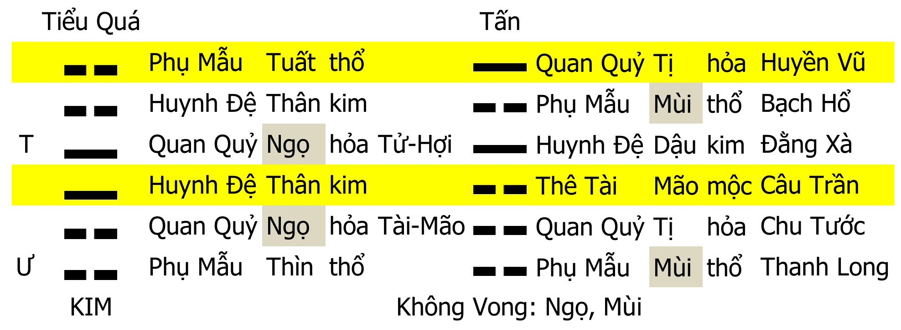
    - **Hình này chứng minh điều gì**
      - Con gái bị rối loạn tâm thần nặng do bị đạo sĩ tại đền chùa lừa tình có thai rồi ruồng bỏ.
    - **Từ đâu mà thấy được**
      - Tử Tôn Hợi thủy lâm Đằng Xà phục tàng (sợ hãi trốn tránh); hào 6 đền chùa lâm Quỷ khố Huyền Vũ (dâm ô) động khắc; tượng Du Hồn hóa Du Hồn.
- Luận đoán bệnh chứng và căn nguyên:
  - Định Dụng thần: Lấy hào Tử Tôn làm Dụng thần. Tử Tôn Hợi thủy lâm Đằng Xà phục tàng dưới hào 4 Quan Quỷ Ngọ hỏa trì Thế. Đằng Xà chủ điên cuồng, hoảng sợ; phục tàng biểu thị tâm lý xấu hổ, sợ hãi trốn tránh không muốn gặp ai, thu mình lẩn tránh xã hội.
  - Căn nguyên dâm ô nơi đền miếu: Hào 6 Phụ Mẫu Tuất thổ phát động đến khắc hại Dụng thần; hào 6 là biểu tượng của đền miếu, chùa chiền, Phật tự; Tuất thổ là Quỷ khố càng củng cố ý nghĩa tự viện tôn giáo; hào 6 lâm Huyền Vũ chủ dâm ô, tà dâm, nhục dục và âm khí. Do đó phán đoán chắc chắn vì chuyện tại đền chùa miếu mạo mà nhiễm bệnh.
  - Trạng thái tinh thần điên loạn: Quẻ Lôi Sơn Tiểu Quá là quẻ Du Hồn biến thành Hỏa Địa Tấn cũng là quẻ Du Hồn; tượng Du Hồn hóa Du Hồn chủ thần trí phiêu bạt, hoang tưởng, tâm thần điên đảo mất kiểm soát.
- Ứng nghiệm thực tế: Con gái bà cụ bị rối loạn tâm thần nặng; nguyên nhân cay đắng là do bị một gã đạo sĩ tại đền chùa lừa gạt dẫn đến thất thân mang thai, sau khi có thai thì bị đạo sĩ phũ phàng ruồng bỏ, khiến cô gái bị kích động tâm lý dữ dội mà phát điên.

#### Ví dụ 9: Nam đoán việc cầu con và bệnh lý tiềm ẩn (Quẻ Lôi Thiên Đại Tráng biến Càn Vi Thiên)
- Ngày Ất Mùi tháng Tý năm Mậu Dần (Thìn Tị không vong), người nam đến gieo quẻ hỏi khi nào có con:
  - **Hình 112.** Sơ đồ quẻ Lôi Thiên Đại Tráng biến Càn Vi Thiên
    - 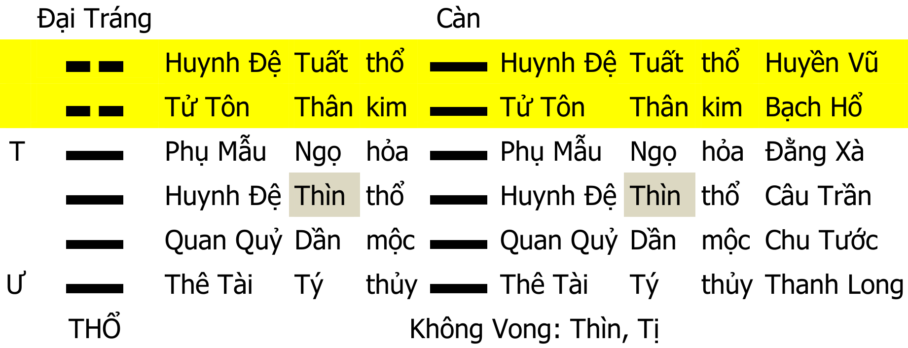
    - **Hình này chứng minh điều gì**
      - Đương số bị hiếm muộn vô sinh do tinh trùng quá ít (túi tinh tuần không), từng phẫu thuật tắc ruột và mắc chứng chóng mặt kinh niên.
    - **Từ đâu mà thấy được**
      - Tử Tôn Thân kim tử ở Nguyệt; Nguyên thần hào 3 Thìn thổ (túi tinh) Tuần Không; Thế nhập Mộ hào 6 lâm Huyền Vũ; hào 2 ruột nhập Mộ bị Bạch Hổ xung khắc.
- Luận đoán đường con cái và khiếm khuyết sinh lý:
  - Tượng quẻ hung hiểm vô tự: Lấy hào Tử Tôn Thân kim ở hào 5 làm Dụng thần. Dụng thần tuy được Nhật Mùi sinh phù nhưng lại rơi vào đất Tử ở Nguyệt kiến Tý thủy; ngoại quái phạm phục ngâm; Kỵ thần Phụ Mẫu Ngọ hỏa trì Thế bị Nguyệt phá; quẻ Lục xung biến Lục xung — toàn bộ quẻ tượng đều là hung triệu, báo trước cả đời khó có con ruột.
  - Tâm bệnh dằn vặt: Tử Tôn Thân kim là Bệnh địa của hào Thế Ngọ hỏa, kết hợp ngoại quái phục ngâm chỉ nỗi niềm con cái luôn là tâm bệnh đau đớn giày vò tâm can suốt nhiều năm trời.
  - Khuyết tật túi tinh và tinh trùng: Hào 3 Huynh Đệ Thìn thổ là Nguyên thần sinh cho Dụng thần, đồng thời là Dưỡng địa của Tử Tôn. Hào 3 là bộ phận sinh dục; chi Thìn là Thủy khố, Thủy trong quẻ là Thê Tài Tý thủy đại diện cho tinh dịch, do đó Thìn thổ chính là túi tinh (tinh nang). Thìn thổ lâm Tuần Không không sinh được Tử Tôn biểu thị lượng tinh trùng quá ít ỏi, tinh dịch loãng không đủ khả năng thụ thai tự nhiên.
- Luận đoán các bệnh tật tiềm ẩn trong quá khứ:
  - Chứng chóng mặt kinh niên: Hào Thế Phụ Mẫu Ngọ hỏa nhập Mộ ở hào 6 Huynh Đệ Tuất thổ; hào 6 là đầu, nhập Mộ chủ hôn trầm ngơ ngác, lâm Huyền Vũ chủ hoa mắt chóng mặt, phán đoán có chứng chóng mặt nghiêm trọng.
  - Phẫu thuật tắc ruột: Hào 2 Quan Quỷ Dần mộc là Nguyên thần sinh Thế; hào 2 là ruột, chi Dần mộc cũng là ruột; Dần mộc nhập Mộ ở Nhật thần Mùi thổ không sinh được Thế, Mộ khố chủ tích tụ nghẽn tắc là chứng tắc ruột. Dụng thần Tử Tôn Thân kim lâm Bạch Hổ xung khắc hào 2 (Tử Tôn là y dược, Bạch Hổ là dao kéo mổ xẻ), kết luận từng phải phẫu thuật cắt mổ tắc ruột.
- Phản hồi và ứng nghiệm thực tế:
  - Đương số xác nhận hai vợ chồng kết hôn nhiều năm không có thai, bệnh viện kiểm tra kết luận nguyên nhân do lượng tinh trùng quá ít.
  - Bản thân từng mắc bệnh chóng mặt dữ dội kéo dài, đến năm 1997 dùng thuốc Đông y mới chữa khỏi.
  - Đã từng trải qua một lần phẫu thuật điều trị tắc ruột.
  - Về sau, đến năm Giáp Thân (2004) người này đành phải xin nhận con nuôi.

## CHƯƠNG 12: ỨNG KỲ VÀ DỰ ĐOÁN BỆNH TẬT

### Nguyên lý định ứng kỳ trong dự trắc bệnh tật
- Ý nghĩa then chốt của việc xác định ứng kỳ:
  - Bệnh tật ở con người luôn trải qua thời kỳ ủ bệnh và thời kỳ bạo phát bùng phát ra ngoài.
  - Việc phán đoán chính xác mầm mống bệnh tật tiềm ẩn và chỉ ra thời điểm nhiễm bệnh có giá trị quyết định đối với công tác phòng ngừa từ sớm.
  - Khi người bệnh đã phát tác triệu chứng, bệnh tình phân biệt rõ rệt hai chiều hướng cát hoặc hung; việc dự đoán chính xác thời điểm hồi phục xuất viện hoặc thời điểm nguy kịch tử vong là yếu tố cực kỳ quan trọng.
  - Độ chuẩn xác của ứng kỳ quyết định trực tiếp đến sự thành bại của một quẻ bói, đồng thời là thước đo kiểm chứng việc truy xét nguyên nhân gây bệnh có đúng đắn hay không.
  - Xác định đúng ứng kỳ giúp tạo dựng sự tin phục tuyệt đối của người bệnh, đồng thời là chỗ dựa tin cậy để đề ra phương án xu cát tị hung kịp thời.
- Quy luật cơ bản để định kỳ hạn ứng nghiệm:
  - Dự trắc thời gian ngắn, cự ly gần thì ứng nghiệm theo ngày và giờ.
  - Dự trắc thời gian dài, cự ly xa thì ứng nghiệm theo năm và tháng.
  - Trục tư duy cốt lõi luôn xoay quanh trạng thái cát hung, sinh khắc chế hóa và suy vượng của Dụng thần để định đoạt thời điểm.
  - Toàn bộ quy luật biến hóa chi tiết của ứng kỳ được kế thừa và vận dụng từ hệ thống phương pháp luận trong "Tế Thuyết Lục Hào Dự Trắc Học".

### Ví dụ 1: Nữ bệnh lâu ngày tự đoán cát hung (Phong Thủy Hoán biến Thủy Trạch Tiết)
- Ngày Giáp Thìn tháng Sửu năm Bính Tuất, một người phụ nữ bị bệnh lâu năm tự gieo quẻ đoán cát hung thọ yểu của bản thân, được quẻ Phong Thủy Hoán biến Thủy Trạch Tiết (Hỏa cung, Tuần Không: Dần, Mão).
  - **Hình 113.** Sơ đồ quẻ Phong Thủy Hoán biến Thủy Trạch Tiết
    - 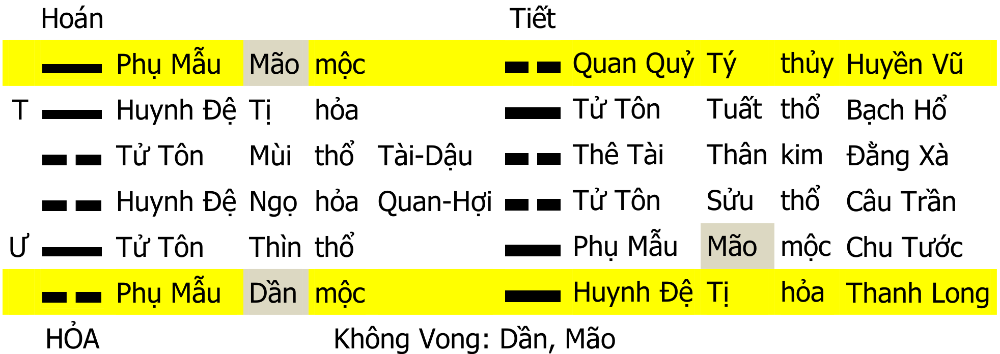
    - **Hình này chứng minh điều gì**
      - Báo trước điềm hung tử vong vào năm Đinh Hợi đối với người bệnh lâu năm do Nguyên thần phát động lâm Không Vong.
    - **Từ đâu mà thấy được**
      - Hào Thế Tị hỏa hưu tù không được sinh phù; Nguyên thần Dần - Mão mộc lưỡng hiện phát động nhưng ngộ Tuần Không, năm Đinh Hợi xung khắc Thế.
- Các bước suy luận và căn cứ dự trắc:
  - Xác định Dụng thần: Đương sự tự đoán cát hung cho bệnh của chính mình nên lấy hào Thế (hào 5 Huynh Đệ Tị hỏa) làm Dụng thần.
  - Đánh giá suy vượng của hào Thế: Hào Thế Tị hỏa ở tháng Sửu là tiết khí Hưu tù, gặp ngày Thìn là Hối hỏa, hoàn toàn không được Nhật Nguyệt sinh phù trợ lực.
  - Tác động của Nguyên thần phát động:
    - Trong quẻ, Nguyên thần Phụ Mẫu mộc lưỡng hiện tại hào sơ Phụ Mẫu Dần mộc và hào 6 Phụ Mẫu Mão mộc đều phát động để sinh Thế.
    - Tuy nhiên, trong tuần Giáp Thìn thì Dần mộc và Mão mộc đều lâm Tuần Không; Nguyên thần động mà ngộ Không thành ra "Không Vong không cát", không thể cứu trợ hào Thế.
  - Quy tắc bệnh lâu đoán thọ yểu:
    - Bệnh mạn tính lâu ngày mà đoán cát hung thực chất tương đương với việc xem thọ mệnh của bản thân.
    - Thông thường bệnh lâu kỵ nhất việc Nguyên thần phát động, bởi vì "động tất hữu kỳ" (Nguyên thần động tức là báo hiệu kỳ hạn sinh mệnh đã được ấn định, sức tàn lực kiệt).
  - Định thời điểm ứng kỳ hung hiểm: Năm tiếp theo là năm Đinh Hợi, địa chi Hợi thủy xung khắc trực tiếp hào Thế Tị hỏa (Tị Hợi tương xung), hào Thế đã suy kiệt gặp xung tất tuyệt mạng, không thể qua khỏi.
- Kết quả ứng nghiệm thực tế:
  - Người phụ nữ này về sau quả nhiên qua đời vào tháng Hợi năm Đinh Hợi.

### Ví dụ 2: Nữ bị sái cổ đoán việc khám chữa (Trạch Thủy Khốn biến Địa Thủy Sư)
- Ngày Tân Sửu tháng Hợi, một người phụ nữ bị sái cổ gieo quẻ hỏi xem có cần đi tìm bác sĩ chữa trị hay không, được quẻ Trạch Thủy Khốn biến Địa Thủy Sư (Kim cung, Tuần Không: Thìn, Tị).
  - **Hình 114.** Quẻ Trạch Thủy Khốn biến Địa Thủy Sư
    - 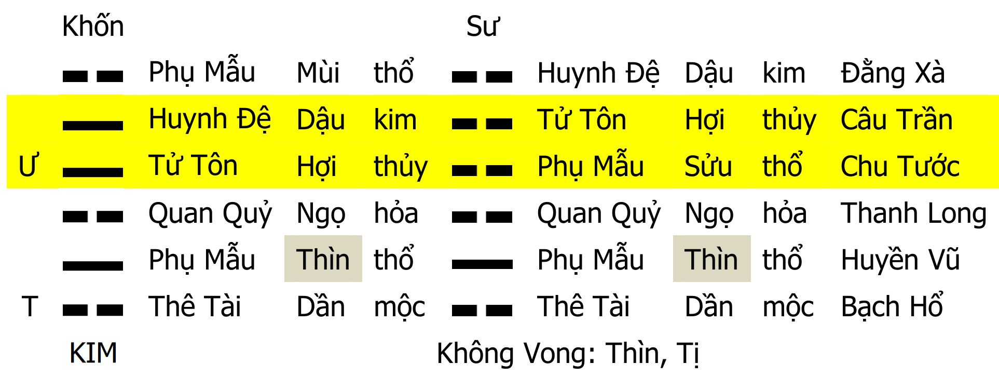
    - **Hình này chứng minh điều gì**
      - Chứng sái cổ tự phục hồi hoàn toàn vào ngày Giáp Thìn mà không cần đến sự can thiệp của bác sĩ y khoa.
    - **Từ đâu mà thấy được**
      - Hào Thế Dần mộc được Nguyệt sinh; Kỵ thần hào 5 Dậu kim động khắc Thế biến Nguyên thần dẫn hóa; chờ ngày Thìn hợp Kỵ thần thì khỏi.
- Các bước suy luận và căn cứ dự trắc:
  - Xác định Dụng thần: Tự xem bệnh của bản thân nên lấy hào Thế (hào sơ Thê Tài Dần mộc) làm Dụng thần.
  - Phân tích triệu chứng và vị trí phát bệnh:
    - Hào 5 Huynh Đệ Dậu kim là Kỵ thần (kim khắc mộc), phát động khắc phạt hào Thế Dần mộc.
    - Hào 5 đại diện cho vị trí cổ và đốt sống cổ; Dậu kim lâm Câu Trần chủ về xương khớp và sưng trướng, phản ánh chứng sái cổ, co cứng đốt sống cổ rất rõ ràng.
  - Đánh giá khả năng bình phục tự nhiên:
    - Hào Thế Dần mộc được Nguyệt kiến Hợi thủy tương sinh (Hợi Dần lục hợp sinh mộc), Nhật thần Sửu thổ không tương khắc nên chân khí của Thế rất vượng.
    - Kỵ thần Dậu kim phát động nhưng hóa ra Nguyên thần Tử Tôn Hợi thủy; đây là cách cục Kỵ thần sinh Nguyên thần, rồi Nguyên thần lại quay về sinh trợ hào Thế (dẫn hóa Kỵ thần chuyển hung thành cát).
    - Cục diện này biểu thị tuy mang bệnh nhưng không đáng lo ngại, hoàn toàn không để lại di chứng.
  - Định ứng kỳ khỏi bệnh:
    - Cần đợi đến ngày Kỵ thần Dậu kim bị hợp trói để mất đi lực khắc hào Thế.
    - Đến ngày Giáp Thìn, địa chi Thìn thổ hợp trú Dậu kim (Thìn Dậu lục hợp), hào Thế không còn bị khắc phạt thì bệnh tật tự động tiêu trừ; tác giả quyết đoán người bệnh không cần đi gặp bác sĩ.
- Kết quả ứng nghiệm thực tế:
  - Về sau đúng vào ngày Giáp Thìn, người phụ nữ này đã khỏi hẳn chứng sái cổ mà không cần chữa trị.

### Ví dụ 3: Khách Nhật Bản đoán vận khí phát hiện viêm tuyến tụy (Thiên Lôi Vô Vọng biến Trạch Hỏa Cách)
- Ngày Nhâm Thìn tháng Mão, một người đàn ông Nhật Bản nhân chuyến công tác đến Thượng Hải đã lặn lội đến tận Thái Nguyên tìm tác giả để dự đoán niên vận, được quẻ Thiên Lôi Vô Vọng biến Trạch Hỏa Cách (Mộc cung, Tuần Không: Ngọ, Mùi).
  - **Hình 115.** Quẻ Thiên Lôi Vô Vọng biến Trạch Hỏa Cách
    - 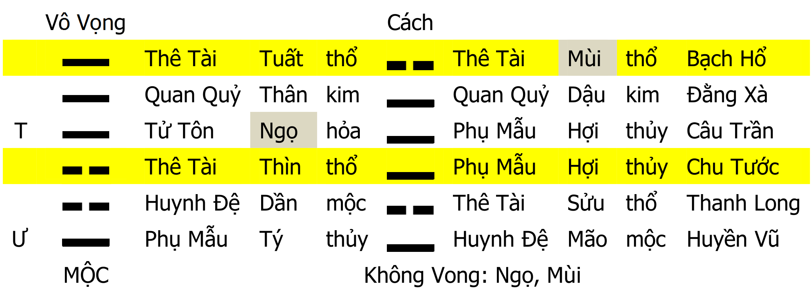
    - **Hình này chứng minh điều gì**
      - Báo trước chứng bệnh viêm tuyến tụy tiềm ẩn phát tác bùng phát vào tháng Hợi thông qua tượng hào nhập Mộ và hóa Kỵ thần.
    - **Từ đâu mà thấy được**
      - Hào Thế Ngọ hỏa nhập Mộ ở hào 6 Tuất thổ lâm Bạch Hổ; hào 3 Thìn thổ động hóa Kỵ thần Hợi thủy lâm Chu Tước chủ viêm nhiễm hệ nội tiết.
- Các bước suy luận và căn cứ dự trắc:
  - Nhận diện dấu hiệu bệnh lý trên hào Thế:
    - Hào Thế Tử Tôn Ngọ hỏa cư tại hào 4, lâm Tuần Không và nhập Mộ tại hào 6 Thê Tài Tuất thổ.
    - Mộ khố ở hào 6 lại lâm Bạch Hổ; Bạch Hổ vốn là hung thần chủ về bệnh hoạn, tai ương và huyết quang, báo hiệu trong cơ thể đang ủ bệnh ngầm nguy hiểm.
  - Phân tích hào động biểu thị cơ chế bệnh tật:
    - Hào 3 Thê Tài Thìn thổ phát động hóa ra Kỵ thần Phụ Mẫu Hợi thủy (thủy khắc hỏa).
    - Hào vị số 3 trong quẻ tượng trưng cho vùng thắt lưng, tạng thận và hệ bài tiết nước tiểu.
    - Thìn thổ động hóa Hợi thủy (ngũ hành thủy) phản ánh hệ thống dịch tiết và tuyến nội tiết trong cơ thể bị rối loạn.
    - Hào 3 lâm Chu Tước (hỏa thần), Chu Tước chủ về nhiệt chứng, hiện tượng sưng tấy và viêm nhiễm cấp.
    - Kết hợp hào vị thắt lưng (hào 3), hệ nội tiết (thủy) và Chu Tước (viêm), tác giả kết luận đương sự đang ủ chứng viêm tuyến tụy nghiêm trọng.
  - Định thời điểm bạo phát: Hào biến xuất hiện Phụ Mẫu Hợi thủy là Kỵ thần khắc thẳng vào hào Thế, do đó ứng kỳ phát tác bệnh tật sẽ rơi đúng vào tháng Hợi.
- Kết quả ứng nghiệm thực tế:
  - Đến tháng Hợi cùng năm, vị khách người Nhật Bản quả nhiên phải nhập viện cấp cứu vì bệnh viêm tuyến tụy phát tác dữ dội.

### Ví dụ 4: Nữ đoán thương tật tai nạn và bệnh lý của cha (Địa Phong Thăng biến Thủy Phong Tỉnh)
- Ngày Giáp Thân tháng Ngọ năm Đinh Sửu, một người phụ nữ đến gieo quẻ hỏi tình trạng thương bệnh của cha mình, được quẻ Địa Phong Thăng biến Thủy Phong Tỉnh (Mộc cung, Tuần Không: Ngọ, Mùi).
  - **Hình 116.** Quẻ Địa Phong Thăng biến Thủy Phong Tỉnh
    - 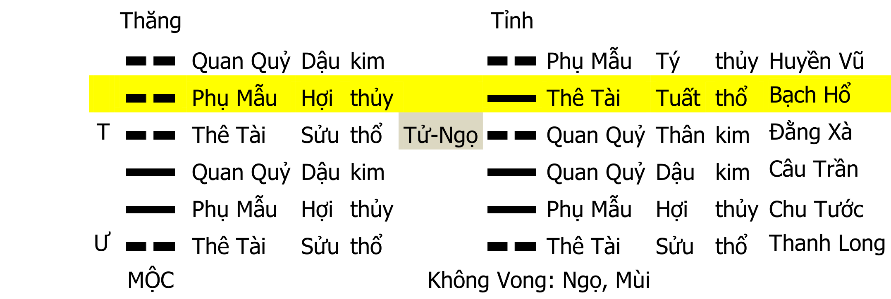
    - **Hình này chứng minh điều gì**
      - Tái hiện chính xác tai nạn giao thông đổ máu, di chứng phẫu thuật ghép xương thất bại và các chứng bệnh gan to, xơ cứng mạch não của người cha.
    - **Từ đâu mà thấy được**
      - Dụng thần Phụ Mẫu Hợi thủy tại hào 5 lâm Bạch Hổ động hóa hồi đầu khắc Tuất thổ; hào 3 và 6 Quan Quỷ Dậu kim bị Nguyệt khắc thương.

#### Luận giải tai nạn giao thông và bệnh lý nội tạng
- Xác định Dụng thần và nhận diện hiểm cảnh:
  - Xem bệnh cho cha lấy hào Phụ Mẫu làm Dụng thần. Quẻ có Phụ Mẫu Hợi thủy xuất hiện hai lần (hào 2 và hào 5), chọn hào 5 Phụ Mẫu Hợi thủy phát động làm Dụng thần chính.
  - Phụ Mẫu Hợi thủy tuy được Nhật thần Thân kim tương sinh, nhưng lại độc phát hóa ra Thê Tài Tuất thổ hồi đầu khắc Dụng thần (thổ khắc thủy); động hóa hồi đầu khắc là điềm hung hiểm cực điểm.
- Xác định phương vị sát khí và thời điểm khởi phát:
  - Hào biến Thê Tài Tuất thổ là tác nhân khắc hại trực tiếp Dụng thần, địa chi Tuất thuộc phương Tây Bắc nên phương hung hiểm đến từ hướng Tây Bắc.
  - Dụng thần thuộc thủy; tháng Thìn là Mộ địa của thủy, tháng Tị là tháng lục xung với Dụng thần (Tị Hợi tương xung). Tác giả nhận định người cha liên tục bị nạn hoặc phát bệnh vào tháng Thìn và tháng Tị (trên thực tế đúng là người cha liên tiếp gặp nạn trong hai tháng này).
- Dự đoán thời điểm tử sinh và đại hạn:
  - Hào 5 Dụng thần lâm Bạch Hổ hóa hồi đầu khắc; Bạch Hổ chủ về tai họa, đổ máu và tử vong. Hiện tại nhờ Nhật thần Thân kim sinh trợ nên tạm thời bảo toàn mạng sống.
  - Đến tháng Tuất (khi Tuất thổ nắm quyền lệnh vượng tướng), Dụng thần bị khắc thương trầm trọng ắt gặp đại hung nguy kịch.
  - Địa chi năm Đinh Sửu thuộc thổ (Kỵ thần) trì Thế cũng đồng bộ phản ánh năm nay người cha gặp đại hạn bất lợi, hoàn toàn ăn khớp với kết quả suy đoán theo bát tự giờ sinh của cô gái.
- Giải đoán nguyên nhân sự cố giao thông và thương tật xương khớp:
  - Hào 5 là hào vị đại diện cho đường sá (đạo lộ), lâm Bạch Hổ chủ về tai nạn xe cộ, thương tích đổ máu; tác giả khẳng định cha cô gặp tai nạn giao thông trên đường và chịu tổn thương đổ máu nghiêm trọng.
  - Nguyên thần Quan Quỷ Dậu kim tại hào 3 và hào 6 đều bị Nguyệt kiến Ngọ hỏa thiêu đốt khắc thương:
    - Hào 6 là hào vị của đầu gáy và cánh tay.
    - Hào 3 là hào vị của thắt lưng; Quan Quỷ tại hào 3 lại lâm Nhật thần Thân kim trợ lực, càng nhấn mạnh thông tin thương tật cột sống thắt lưng.
    - Tác giả kết luận người cha bị chấn thương nặng ở vùng đầu, gãy cánh tay và tổn thương thắt lưng.
- Suy đoán bệnh lý nội tạng mạn tính và tính khí:
  - Quẻ thuộc cung Chấn (hành mộc), mộc chủ về tạng can (gan); hào 3 lại là vị trí của gan trong cơ thể, lâm Câu Trần chủ về sưng trướng, phì đại. Tác giả phán đoán người cha có tiền sử bệnh gan to hoặc xơ gan.
  - Bạch Hổ trì Dụng thần: Bạch Hổ còn đại diện cho sự giận dữ, nóng nảy; biểu thị người cha có tính khí rất gắt gỏng, thường xuyên cáu bẳn.
- Luồng đối thoại thực tế giữa tác giả và người hỏi quẻ:
  - Người phụ nữ kinh ngạc xác nhận tác giả phán đoán hoàn toàn chính xác mọi chi tiết thực tế:
    - "Ông phán đoán rất đúng, một tháng trước, khi cha tôi cưỡi xe đạp xuống dốc, bởi vì phía trước có xe tải chạy tới, để tránh nó, cả người lẫn xe đã đâm vào bức tường bên lề đường, khiến cho xương cánh tay bị gãy nát."
    - "Khi đến bệnh viện huyện, bác sĩ đã lấy một đoạn xương từ thắt lưng để ghép lên cánh tay, ai ngờ phẫu thuật đã làm không tốt, bây giờ ngay cả thắt lưng cũng không đứng thẳng lên được."
    - "Ông ấy vốn có bệnh xơ cứng động mạch não và gan to, tính khí cũng không tốt. Liệu có phương pháp hóa giải hay không?"

#### Phương pháp hóa giải bằng ngũ hành số và sinh vật học
- Cơ chế hóa giải cốt lõi trong quẻ:
  - Nút thắt then chốt trong quẻ là Dụng thần phát động hóa hồi đầu khắc từ biến hào Thê Tài Tuất thổ.
  - Để cứu Dụng thần, bắt buộc phải chế phục hào biến Tuất thổ, làm cho nó mất khả năng khắc hại Phụ Mẫu Hợi thủy.
  - Trong địa chi lục hợp và tương khắc, Mão mộc có khả năng lưỡng toàn: Mão Tuất tương hợp giúp trói chân vướng chân Tuất thổ, đồng thời Mão mộc khắc chế thổ; vì vậy lấy Mão mộc làm then chốt hóa giải là biện pháp tối ưu nhất.
- Biện pháp hóa giải kết hợp phương vị, số lượng và màu sắc:
  - Tương ứng sinh vật và phương vị: Địa chi Mão tương ứng với loài thỏ; Tuất thổ thuộc phương Tây Bắc gây sát khí bất lợi, do đó bố trí nuôi thỏ ở góc Tây Bắc trong sân nhà để ngăn chặn và tiêu trừ năng lượng xấu từ hướng này.
  - Ứng dụng số thành ngũ hành: Do Tuất thổ lâm Nguyệt kiến có sức mạnh rất lớn, tác giả áp dụng "số thành" của mộc (số 8), chỉ định nuôi đúng 8 con thỏ.
  - Ứng dụng màu sắc tương sinh: Mão mộc chỉ đóng vai trò chế phục Kỵ thần Tuất thổ, trong khi Dụng thần Hợi thủy tuy có Nhật sinh nhưng thể trạng còn yếu; vì vậy tác giả căn dặn nuôi thỏ màu trắng (màu trắng thuộc kim). Kim sinh Thủy giúp trợ lực bổ trợ cho Dụng thần, trong khi bản thân con thỏ (Mão mộc) đảm đương việc khắc phạt Tuất thổ. Đây là phép hóa giải kết hợp nhịp nhàng cả quy luật số học và sắc thái ngũ hành.
- Nguyên lý sinh vật gánh họa thế mạng và quy tắc chuyển đổi số sinh - số thành:
  - Theo kinh nghiệm thực tiễn của tác giả, khi sử dụng động vật sống để hóa giải phong thủy, trong phần lớn trường hợp động vật đó sẽ bị chết đi; nguyên nhân là do động vật đã thay thế con người hấp thu và gánh chịu luồng năng lượng sát khí bất lợi từ vũ trụ.
  - Quy tắc chuyển đổi số học: Nếu đang dùng "số thành" mà động vật chết, tuyệt đối không được tiếp tục dùng số thành mà phải chuyển ngay sang "số sinh" của hành đó (số sinh của Mộc là số 3 con thỏ); nếu nuôi 3 con mà thỏ vẫn chết thì lại chuyển ngược về dùng số thành (8 con), luân phiên thay thế nhiều lần để duy trì trường khí che chở cho người bệnh.
- Diễn biến thực tế và ứng nghiệm thần kỳ:
  - Nghe theo hướng dẫn, người phụ nữ đã mua 8 con thỏ trắng nuôi ở phía Tây Bắc sân nhà.
  - Đến tháng Dậu (Dậu kim xung khắc Mão mộc dữ dội), cả 8 con thỏ nuôi đều đồng loạt chết sạch; cô lập tức mua tiếp 3 con thỏ khác về nuôi theo đúng lời dặn về quy tắc số sinh.
  - Kết quả kỳ diệu: Người cha đã vượt qua tháng Tuất (thời điểm hung hiểm nhất) một cách hoàn toàn bình an vô sự.
  - Tái khám vào năm sau:
    - Sang năm thứ hai, người phụ nữ quay lại nhờ tác giả dự đoán công việc cho em trai.
    - Khi tác giả hỏi thăm sức khỏe của người cha, cô vui mừng cho biết mọi bệnh tật của cha đều chuyển biến rất tốt: thắt lưng không những đứng thẳng lại được mà chứng xơ cứng mạch máu não và bệnh gan to cũng đã thuyên giảm rõ rệt.
    - Điểm thú vị duy nhất là người cha trở nên đặc biệt yêu thích nuôi thỏ, luôn tâm niệm rằng loài thỏ đã cứu mạng mình, nên mỗi tháng ông đều dùng trọn vẹn toàn bộ tiền lương hưu để mua rau củ tươi ngon về nuôi nấng đàn thỏ.

### Ví dụ 5: Nữ gọi điện thoại tự đoán sưng họng và khối u (Địa Sơn Khiêm biến Lôi Địa Dự)
- Ngày Canh Thìn tháng Tý, một phụ nữ gọi điện thoại nhờ tác giả dự đoán bệnh tình bản thân, được quẻ Địa Sơn Khiêm biến Lôi Địa Dự (Kim cung, Tuần Không: Thân, Dậu).
  - **Hình 117.** Quẻ Địa Sơn Khiêm biến Lôi Địa Dự
    - 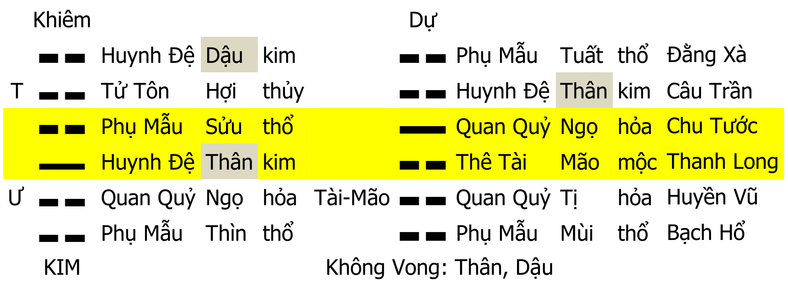
    - **Hình này chứng minh điều gì**
      - Xác định chuẩn xác chứng sưng đau hầu họng không thể ăn uống phải truyền dịch tại nhà, tiền sử u xơ tử cung đã phẫu thuật và hạn khỏi bệnh ngày Thân.
    - **Từ đâu mà thấy được**
      - Hào 5 Tử Tôn Hợi thủy lâm Câu Trần; Phụ Mẫu Sửu thổ động hóa Quan; hào 3 Thân kim hóa Tài sinh Thế; Quan hào 2 Nguyệt phá; Thân kim Tuần Không.
- Các bước suy luận và căn cứ dự trắc:
  - Xác định Dụng thần và thời điểm phát bệnh:
    - Tự xem cho bản thân lấy hào Thế (hào 5 Tử Tôn Hợi thủy) làm Dụng thần.
    - Trong quẻ, hào 4 Phụ Mẫu Sửu thổ phát động hóa Quan Quỷ Ngọ hỏa quay lại khắc Thế; địa chi Sửu đại diện cho ngày Sửu, Quan Quỷ chủ về tật bệnh, suy ra người bệnh bắt đầu phát bệnh vào ngày Sửu.
  - Định vị triệu chứng tại khoang miệng và yết hầu:
    - Quẻ chính thuộc cung Đoài (Đoài Vi Khẩu), tượng trưng cho khoang miệng.
    - Hào 5 Tử Tôn Hợi thủy lâm Câu Trần: hào 5 là vị trí cổ họng, ngũ hành thủy chủ yết hầu, Câu Trần chủ về sưng phù bế tắc; tác giả khẳng định cổ họng người này sưng to nghiêm trọng.
  - Suy đoán phương thức điều trị tại gia và việc ăn uống:
    - Tử Tôn là y dược đóng tại hào Thế, biểu thị người bệnh tự mình khám bệnh và chăm sóc bản thân.
    - Huynh Đệ tượng trưng cho cánh cửa, Huynh Đệ nhập Mộ ở hào động Sửu thổ biểu thị "đóng cửa điều trị" tại nhà riêng chứ không nhập viện.
    - Thê Tài không xuất hiện trên quẻ mà phục dưới hào 2 Quan Quỷ Ngọ hỏa; Thê Tài chủ về ăn uống lương thực, Quỷ chủ về bệnh; chứng tỏ vì bệnh tật mà không thể ăn nuốt được gì.
    - Hào 3 Huynh Đệ Thân kim lâm Thanh Long động hóa Thê Tài tương sinh hào Thế: hào 3 là vị trí giường nằm, Tử Tôn chủ về mạch máu và thuốc nước/dịch truyền, Thanh Long và Thê Tài chủ về ẩm thực dinh dưỡng; tác giả suy đoán người bệnh phải nằm truyền nước biển (dịch truyền) trên giường tại nhà, lấy thuốc nước thay thế cho việc ăn uống.
  - Phát hiện bệnh phụ khoa cũ (u xơ tử cung):
    - Hào 2 Quan Quỷ Ngọ hỏa lâm Huyền Vũ: hào 2 đại diện cho cơ quan sinh dục, Quan Quỷ là bệnh tật, Huyền Vũ chủ về chứng bệnh khó nói, thầm kín.
    - Hào Thế lâm Câu Trần chủ về khối u bướu thịt; tổng hợp lại là dấu hiệu của bệnh u xơ tử cung.
    - Tuy nhiên, hào 2 Quan Quỷ Ngọ hỏa lâm Nguyệt phá (bị Nguyệt kiến Tý thủy xung phá), Nguyệt phá biểu thị bệnh cũ đã bị triệt tiêu, tức khối u xơ tử cung này đã được phẫu thuật cắt bỏ từ trước.
  - Định ứng kỳ khỏi bệnh:
    - Nguyên thần của hào Thế là Huynh Đệ Thân kim ngộ Tuần Không (tuần Giáp Thìn thì Thân, Dậu ngộ Không).
    - Vận dụng định luật dự đoán bệnh tật: "Bệnh mới gặp Không thì khỏi bệnh" (tân bệnh phùng Không tắc dũ); đợi đến ngày Thân xuất Không, Nguyên thần sung mãn sinh trợ hào Thế thì bệnh sưng họng ắt khỏi hoàn toàn.
- Kết quả ứng nghiệm thực tế:
  - Người phụ nữ hoàn toàn công nhận: Yết hầu sưng đau dữ dội không nuốt nổi thức ăn, phải nằm truyền nước biển tại nhà, phát bệnh đúng vào ngày Sửu, đến ngày Thân thì khỏi bệnh hoàn toàn, và bản thân trước đây đã từng phẫu thuật cắt bỏ u xơ tử cung.

### Ví dụ 6: Đoán nguy cơ xuất huyết não cho cha của bạn (Phong Lôi Ích biến Phong Địa Quan)
- Ngày Tân Hợi tháng Mão năm Bính Tuất, một người đến gieo quẻ hỏi cho cha của bạn vừa bị xuất huyết não phải nhập viện cấp cứu, muốn xem tình thế hung hiểm và tính mạng ra sao, được quẻ Phong Lôi Ích biến Phong Địa Quan (Mộc cung, Tuần Không: Dần, Mão).
  - **Hình 118.** Sơ đồ quẻ Phong Lôi Ích biến Phong Địa Quan
    - 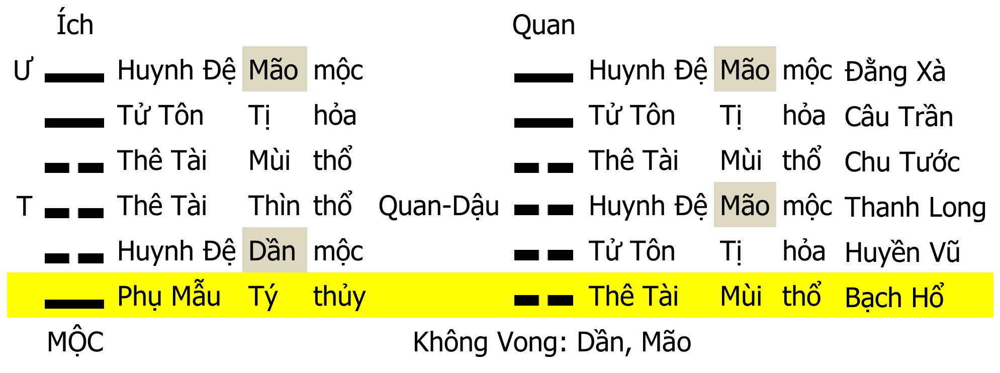
    - **Hình này chứng minh điều gì**
      - Báo trước chuẩn xác điềm tử vong vào ngày Tý giờ Tý đối với bệnh nhân xuất huyết não nguy kịch do Dụng thần độc phát hóa hồi đầu khắc.
    - **Từ đâu mà thấy được**
      - Hào sơ Phụ Mẫu Tý thủy độc phát lâm Bạch Hổ hóa Thê Tài Mùi thổ hồi đầu khắc; hào Mùi dù bị Nguyệt khắc vẫn sát thương Dụng thần.
- Các bước suy luận và căn cứ dự trắc:
  - Xác định Dụng thần và vượng suy bề ngoài:
    - Đoán bệnh cho cha của bạn bè lấy hào Phụ Mẫu làm Dụng thần.
    - Hào sơ Phụ Mẫu Tý thủy tuy không được Nguyệt kiến Mão mộc sinh phù (mộc làm tiết khí của thủy), nhưng có Nhật thần Hợi thủy đồng hành tỉ phù trợ lực, bề ngoài không thể xem là hưu tù suy kiệt.
  - Thấu suốt nguyên lý "Thần triệu cơ ở động":
    - Phụ Mẫu Tý thủy là hào duy nhất phát động trong toàn bộ quẻ (độc phát), động hóa ra Thê Tài Mùi thổ hồi đầu khắc phạt trực tiếp Dụng thần.
    - Hào sơ Phụ Mẫu Tý thủy lại lâm Bạch Hổ; Bạch Hổ là đại biểu của huyết quang tử vong, tai biến mạch máu não và hung hiểm cực điểm.
    - Về lực lượng hào biến: Mặc dù Thê Tài Mùi thổ bị Nguyệt kiến Mão mộc khắc chế, nhưng theo nguyên lý dự trắc Lục hào, "hào biến sinh ra từ hào động thì có toàn quyền quay lại sinh khắc chính hào động đó"; vì vậy Mùi thổ vẫn giữ trọn sát khí hồi đầu khắc hủy diệt Phụ Mẫu Tý thủy.
    - Cát hung của quẻ không thể chỉ nhìn phiến diện vào độ vượng suy tĩnh tại của Dụng thần, mà bộc lộ tinh tế ở sự biến hóa cơ vi của động hào ("Thần triệu cơ ở động").
  - Định thời điểm ứng kỳ tử vong:
    - Dụng thần Phụ Mẫu Tý thủy lâm Bạch Hổ động hóa hồi đầu khắc, báo hiệu khi gặp địa chi Tý là thời điểm phát tác hung họa lớn nhất.
    - Tác giả quyết đoán người bệnh sẽ nguy kịch và qua đời vào ngày Tý, giờ Tý.
- Kết quả ứng nghiệm thực tế:
  - Bệnh nhân đã không qua khỏi và trút hơi thở cuối cùng vào lúc 0 giờ 30 phút rạng sáng hôm sau (thuộc ngày Nhâm Tý, giờ Canh Tý), ứng nghiệm chính xác vào ngày Tý giờ Tý như quẻ đã chỉ rõ.

## CHƯƠNG 13: KHÁM BỆNH

### Nguyên lý y học Lục Hào và vai trò của dự trắc trong khám chữa bệnh

- Cơ sở tự nhiên của sự sinh bệnh và tầm quan trọng của việc cầu y:
  - Sách Bốc Phệ Chính Tông đã đúc kết chân lý thực tiễn: "Bệnh bất cầu y toàn sinh giả quả, dược bất đối chứng uổng tử giả đa" (Bệnh không tìm thầy, có sống được cũng quá ít. Thuốc không đúng bệnh, chết uổng quá nhiều).
  - Bản thể con người tồn tại trong vũ trụ luôn chịu sự tác động không ngừng của quy luật vận động tự nhiên và sự sinh khắc chế hóa của ngũ hành; do đó việc sản sinh bệnh tật là hiện tượng sinh lý tự nhiên khi khí hóa mất cân bằng.
  - Một khi phát sinh bệnh tật, việc tìm thầy điều trị đóng vai trò then chốt; trình độ chuyên môn của người thầy thuốc và phương pháp can thiệp quyết định trực tiếp khả năng hồi phục hay suy vong của người bệnh.
  - Dùng đúng thuốc thì bệnh tình có thể tiêu trừ ngay lập tức; nếu dùng sai thuốc, chẳng những không chữa được bệnh mà còn làm lỡ mất thời gian cứu chữa quý báu, thậm chí dẫn đến cái chết oan uổng.
- Thực trạng y đức xã hội và sứ mệnh định hướng của Lục Hào:
  - Ngạn ngữ phương Tây có câu: "Đôi cánh không làm nên thiên thần", và người khoác áo choàng trắng trong xã hội chưa hẳn đã là thầy thuốc tốt.
  - Nhiều người hành nghề y không đủ năng lực chuyên môn, mở phòng khám chữa bệnh không nhằm mục đích cứu nhân độ thế mà để trục lợi tiền bạc; tồn tại các hiện tượng thăm khám tùy tiện, buôn bán thuốc giả, coi thường mạng sống con người ở cả các cơ sở y tế tư nhân lẫn bệnh viện công lập.
  - Người bệnh khi lâm cảnh ốm đau thường rơi vào thế yếu, như cá thịt trên thớt mặc cho người khác định đoạt số phận.
  - Người xưa đã sớm ứng dụng dự trắc Lục Hào vào việc tìm thầy chọn thuốc và đúc kết thành hệ thống kinh nghiệm quý báu; trong bối cảnh kỹ thuật y tế hiện đại tuy phát triển nhưng sự cố y khoa và tình trạng y bác sĩ thiếu trách nhiệm vẫn xảy ra, dự đoán Lục Hào vẫn giữ trọng trách to lớn và mang lại giá trị thực tiễn thiết thực.

### Quy tắc xác định Dụng thần, Thế hào và Ứng hào khi xem thầy thuốc và thuốc men

- Nguyên tắc định vị Dụng thần theo chủ thể người hỏi:
  - Người bệnh tự mình đến gieo quẻ dự đoán thì lấy hào Thế làm người bệnh.
  - Xem quẻ hộ cho người khác thì căn cứ vào mối quan hệ lục thân để chọn Dụng thần chuẩn xác (cha mẹ lấy Phụ Mẫu, con cái lấy Tử Tôn, vợ hoặc tài sản lấy Thê Tài, anh em bằng hữu lấy Huynh Đệ).
- Tượng nghĩa và vai trò của hào Ứng trong quẻ khám bệnh:
  - Hào Ứng là trung tâm biểu trưng cho y gia và y dược.
  - Căn cứ vào nội dung cụ thể mà đương số muốn hỏi, hào Ứng có thể đại diện cho người thầy thuốc, bệnh viện, phòng khám, thang thuốc, dược liệu hoặc phác đồ trị liệu can thiệp.
- Quy tắc sinh khắc phối hợp giữa Dụng thần, Thế hào và Ứng hào:
  - Khi Dụng thần suy nhược: Hào Ứng cần phải vượng tướng, đồng thời phát động hoặc lâm thế sinh hợp với Dụng thần, biểu thị y dược có năng lực cứu chữa và bồi bổ sức khỏe cho người bệnh.
  - Khi Quan Quỷ trì Thế vượng tướng: Hào Ứng cần lâm Tử Tôn vượng tướng phát động khắc Thế, mang ý nghĩa y thuật và thuốc thang đủ sức khắc chế, tiêu diệt mầm mống bệnh tật bám dính vào thân thể.
  - Các dấu hiệu xấu của hào Ứng tuyệt đối không thể cậy nhờ:
    - Hào Ứng lâm Tuần Không, Nguyệt Phá, nhập Mộ, Tuyệt địa.
    - Hào Ứng phát động hóa hồi đầu khắc.
    - Hào Ứng phát động hóa ra Quan Quỷ hoặc hóa ra Kỵ thần của Dụng thần.
    - Các trường hợp trên chỉ rõ đối phương không phải là lương y, thuốc không phải là vị thuốc đúng chứng; nếu tiếp tục cậy nhờ điều trị chắc chắn sẽ đem lại hậu quả khôn lường cho người bệnh.

### Vai trò và quy luật biến hóa của hào Tử Tôn trong phác đồ điều trị

- Biểu trưng của hào Tử Tôn:
  - Hào Tử Tôn có thể đại diện cho người thầy thuốc tài đức, đồng thời cũng có thể đại diện cho thang thuốc hoặc dược phẩm có công hiệu; việc xác định ý nghĩa phải căn cứ vào sự biến hóa sinh khắc cụ thể trong quẻ.
- Các quy luật biến hóa sinh khắc của hào Tử Tôn:
  - Quẻ không xuất hiện hào Tử Tôn: không gặp được lương y, khó tìm được phương thuốc hay.
  - Hào Phụ Mẫu vượng tướng phát động: việc tìm thầy tìm thuốc không thành (Phụ Mẫu khắc chế Tử Tôn).
  - Hào Tử Tôn lâm Không, Phá, Mộ, Tuyệt: dược lực không phát huy, hiệu quả điều trị không tốt.
  - Hào Phụ Mẫu và Huynh Đệ cùng phát động: việc tìm thầy lại chuyển thành cát lợi (Huynh Đệ sinh trợ Tử Tôn, hóa giải khắc phạt).
  - Quan Quỷ và Phụ Mẫu đều tĩnh, hào Tử Tôn lâm hào Ứng phát động: tất gặp được lương y giỏi cứu chữa khỏi bệnh.
  - Hào Ứng lâm Tử Tôn phát động khắc Thế: thuốc phát huy công hiệu trừ bỏ mầm bệnh.
  - Hào Thế khắc hào Ứng trong khi Ứng lâm Tử Tôn: thầy thuốc tuy có danh tiếng nhưng phương thuốc kê ra không có tác dụng đối với ca bệnh này.
  - Hào Ứng lâm Quan Quỷ phát động làm tổn thương hào Thế hoặc thương tổn Dụng thần: chắc chắn là thầy thuốc lang băm làm hại bệnh nhân.
  - Hào Tử Tôn phát động hóa Phụ Mẫu: có sai sót trong việc dùng thuốc hoặc nhầm lẫn trong phác đồ điều trị.
  - Nhật thần hoặc hào khác phát động xung khắc hào Tử Tôn: dược liệu bào chế không tinh chất, chất lượng thuốc kém, hiệu lực suy giảm.
  - Hào Tử Tôn hóa Tử Tôn hoặc trong quẻ có hai hào Tử Tôn cùng phát động: việc thay đổi thang thuốc hoặc đổi sang thầy thuốc khác sẽ đem lại hiệu quả.
  - Hào Thế phục dưới Quan Quỷ gặp hào Tử Tôn phát động: thuốc điều trị tuy tốt nhưng căn nguyên bệnh tật bám sâu khó lòng trừ dứt điểm tận gốc.
  - Hào Tử Tôn phát động hóa Quan Quỷ: dùng thuốc sai lầm khiến bệnh cũ chưa khỏi đã phát sinh thêm chứng bệnh mới nguy hại.
  - Tử Tôn và Quan Quỷ cùng lâm Tuần Không, hoặc Tử Tôn lâm Nhật vượng tướng hay trì Thế: không cần dùng đến thuốc thang can thiệp mà bệnh tự nhiên thuyên giảm, bình phục.
  - Tử Tôn và Quan Quỷ cùng phát động: cần kết hợp song song cả phương pháp điều trị bằng thuốc (dược vật liệu pháp) lẫn phương pháp can thiệp tâm lý (tâm lý liệu pháp).
  - Tử Tôn và Thê Tài lưỡng động: bệnh tình diễn biến phức tạp, khó khăn trong việc điều trị dứt điểm (Tử sinh Tài, Tài lại dưỡng Quỷ).
  - Tử Tôn suy nhược, hào Phụ Mẫu phát động sinh hợp hào Thế hoặc Phụ Mẫu trì Thế: thích hợp chuyển sang dùng phương pháp khí công dưỡng sinh để điều trị.

### Phương pháp xác định phương hướng và đặc điểm danh tính của thầy thuốc

- Căn cứ chọn Dụng thần xác định y gia: Lấy hào Tử Tôn và Nguyên thần làm Dụng thần để phán đoán phương hướng địa lý và đặc điểm danh tính của người thầy thuốc phù hợp.
- Quy luật phương vị và tự dạng họ tên theo ngũ hành:
  - Tử Tôn hoặc Nguyên thần thuộc hành Kim: Nên tìm thầy thuốc ở phương Tây; người có họ mang chữ Kim (金) bên cạnh (như Tiền, Chung, Trịnh, Thiết, Tôn,...).
  - Tử Tôn hoặc Nguyên thần thuộc hành Mộc: Nên tìm thầy thuốc ở phương Đông; người có họ mang bộ Thảo (草) hoặc bộ Mộc (木) bên cạnh (như Lâm, Dương, Diệp, Tiêu, Mai, Lý, Tùng,...).
  - Tử Tôn hoặc Nguyên thần thuộc hành Thủy: Nên tìm thầy thuốc ở phương Bắc; người có họ mang bộ Chấm Thủy (氵) bên cạnh (như Giang, Uông, Thẩm, Sa, Hồng, Phùng,...).
  - Tử Tôn hoặc Nguyên thần thuộc hành Hỏa: Nên tìm thầy thuốc ở phương Nam; người có họ mang bộ Nhật (日) hoặc bộ Hỏa (火) bên cạnh (như Tiêu, Xa, Hứa, Tiêu, Địch,...).
  - Tử Tôn hoặc Nguyên thần thuộc hành Thổ: Nên tìm thầy thuốc ở trung tâm hoặc các hướng chuyển giao; người có họ mang chữ Thổ (土) bên cạnh (như Trang, Viên, Thôi,...).

### Phân loại phương pháp trị liệu và ngũ vị của thuốc theo Ngũ Hành

- Phân loại phương pháp trị liệu theo ngũ hành của Tử Tôn và Nguyên thần:
  - Thuộc hành Kim: Nên áp dụng phương pháp can thiệp phẫu thuật ngoại khoa, châm cứu, bấm huyệt.
  - Thuộc hành Thủy: Nên dùng thuốc thang sắc dạng nước, truyền dịch nước biển, tiêm thuốc tĩnh mạch hoặc tiêm bắp.
  - Thuộc hành Mộc: Nên dùng thảo dược thiên nhiên, thảo mộc Đông y.
  - Thuộc hành Hỏa: Nên áp dụng các liệu pháp dùng nhiệt như hơ ngải cứu (nướng), giác hơi, chiếu đèn hồng ngoại, xạ trị.
  - Thuộc hành Thổ: Nên dùng thuốc dạng tán, bột mịn, viên nén.
- Phân biệt ngũ vị của dược liệu theo ngũ hành:
  - Hành Kim: Thuốc có vị cay, các dạng thuốc gây tê, thuốc giảm đau ức chế cảm giác.
  - Hành Mộc: Thuốc có vị chua (toan vị), mang tính thu liễm, cố sáp.
  - Hành Thủy: Thuốc có vị mặn (hàm vị), mang tính nhuyễn kiên, thanh nhiệt tả hỏa.
  - Hành Hỏa: Thuốc có vị đắng (khổ vị), mang tính thanh nhiệt giải độc, táo thấp.
  - Hành Thổ: Thuốc có vị ngọt (cam vị), mang tính bổ dưỡng, điều hòa tỳ vị.
- Nguyên tắc vận dụng linh hoạt: Các tiêu chuẩn phân định trên mang tính định hướng quy nạp; khi thực hành dự trắc lâm sàng nhất định phải căn cứ sâu sắc vào sự hỷ kỵ của Dụng thần cùng toàn bộ biến hóa sinh khắc, động tĩnh trong quẻ để suy xét biến thông.

### Phân tích các ca bệnh thực tế về dùng thuốc, phẫu thuật và thỉnh y

#### Ví dụ 1: Học trò đoán cha uống thuốc ngày Nhâm Ngọ tháng Ngọ (Quẻ Phong Trạch Trung Phu biến Phong Lôi Ích)

- Bối cảnh gieo quẻ: Ngày Nhâm Ngọ, tháng Ngọ (tuần Giáp Tuất, Thổ Không Vong tại Thân và Dậu). Một người học trò của tác giả tự gieo quẻ hỏi việc người cha uống thuốc điều trị bệnh sẽ mang lại kết quả ra sao, nhận được quẻ Phong Trạch Trung Phu biến Phong Lôi Ích.
  - **Hình 119.** Sơ đồ quẻ Phong Trạch Trung Phu biến Phong Lôi Ích
    - 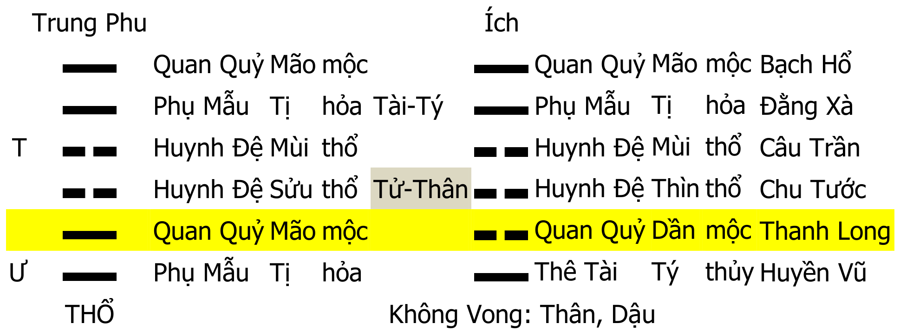
    - **Hình này chứng minh điều gì**
      - Thuốc uống không mang lại hiệu quả điều trị cho người bệnh.
    - **Từ đâu mà thấy được**
      - Hào Ứng lâm Dụng thần Phụ Mẫu Tị hỏa, nhưng Nguyên thần Quan Quỷ Mão mộc động hóa thoái thành Dần mộc.
- Các bước suy luận và căn cứ dự trắc:
  - Xác định Dụng thần: Dự đoán tình trạng của cha nên lấy hào Phụ Mẫu làm Dụng thần. Hào Ứng đại diện cho thuốc uống điều trị.
  - Nhận diện sự việc: Trong quẻ, Dụng thần Phụ Mẫu Tị hỏa ngự tại hào Ứng (hào 1), Dụng thần lâm vào hào Ứng biểu thị người cha đã bắt đầu dùng thuốc.
  - Đánh giá vượng suy và động biến:
    - Hào Dụng thần Phụ Mẫu Tị hỏa được cả Nguyệt kiến và Nhật thần Ngọ hỏa tỉ phù nên thoạt nhìn có vẻ rất vượng tướng.
    - Tuy nhiên, điểm bất lợi cốt tử nằm ở chỗ Nguyên thần sinh trợ Dụng thần là hào 2 Quan Quỷ Mão mộc phát động lại biến hóa thoái thần thành Quan Quỷ Dần mộc.
    - Nguyên thần động thoái khiến nguồn sinh dưỡng cho Dụng thần bị hụt hẫng, suy thoái, chắc chắn bài thuốc này không mang lại hiệu quả điều trị như mong đợi.
- Kết quả và ứng nghiệm thực tế:
  - Diễn biến thực tế đúng như quẻ đã chỉ ra, người cha sau khi uống thuốc không thấy bệnh tình thuyên giảm, thuốc không phát huy hiệu nghiệm.

#### Ví dụ 2: Nữ đoán việc uống thuốc ngày Giáp Tý tháng Tý (Quẻ Thiên Trạch Lý biến Phong Hỏa Gia Nhân)

- Bối cảnh gieo quẻ: Ngày Giáp Tý, tháng Tý (tuần Giáp Dần, Thổ Không Vong tại Tuất và Hợi). Một người phụ nữ gieo quẻ dự đoán bản thân uống thuốc điều trị sẽ ra sao, nhận được quẻ Thiên Trạch Lý biến Phong Hỏa Gia Nhân.
  - **Hình 120.** Sơ đồ quẻ Thiên Trạch Lý biến Phong Hỏa Gia Nhân
    - 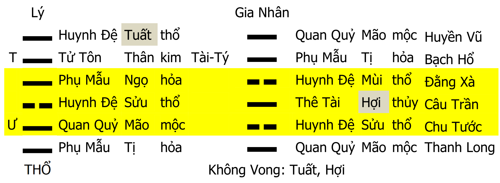
    - **Hình này chứng minh điều gì**
      - Thuốc không có hiệu quả mà còn gây tác dụng phụ nặng nề, làm bệnh tình tăng nặng.
    - **Từ đâu mà thấy được**
      - Hào Thế khắc Ứng, Ứng lâm Quan Quỷ vượng động, hào Thế Thân kim hưu tù động hóa Phụ Mẫu Tị hỏa hồi đầu khắc.
- Các bước suy luận và căn cứ dự trắc:
  - Xác định Dụng thần: Lấy hào Ứng đại diện cho phương thuốc điều trị bệnh.
  - Phân tích tương tác Thế - Ứng:
    - Hào Thế Tử Tôn Thân kim tại hào 5 phát động khắc hào Ứng Quan Quỷ Mão mộc tại hào 2; tượng Thế khắc hào Ứng báo trước phương thuốc này hoàn toàn không có công hiệu chữa bệnh.
    - Hào Ứng lâm Quan Quỷ Mão mộc lại được cả Nguyệt kiến lẫn Nhật thần Tý thủy sinh phù cực vượng và phát động hóa Huynh Đệ Sửu thổ, biểu thị độc tính hoặc tà khí của thuốc đang bộc phát mạnh mẽ.
  - Đánh giá tổn hại của thân thể:
    - Hào Thế Tử Tôn Thân kim ở vào tháng Tý ngày Tý bị tiết khí nặng nề, rơi vào trạng thái hưu tù suy kiệt.
    - Hào Thế phát động lại hóa ra Phụ Mẫu Tị hỏa quay lại khắc ngược hào Thế (hóa hồi đầu khắc).
    - Tổ hợp Thế suy bị khắc, Ứng Quỷ vượng động khắc ngược báo hiệu thuốc này chẳng những không khỏi bệnh mà còn mang lại tác dụng phụ cực kỳ nghiêm trọng, khiến cơ thể suy kiệt và làm bệnh tình trở nên trầm trọng hơn.
- Kết quả và ứng nghiệm thực tế:
  - Sau khi uống thuốc, bệnh nhân không thấy chuyển biến tích cực mà trái lại các triệu chứng trở nên dữ dội, bệnh tình trầm trọng hơn hẳn; nhận thấy tình hình nguy hiểm, đương sự đã lập tức ngừng uống thuốc.

#### Ví dụ 3: Bản thân đoán uống thuốc chống ung thư ngày Đinh Dậu tháng Mão (Quẻ Sơn Địa Bác biến Chấn Vi Lôi)

- Bối cảnh gieo quẻ: Ngày Đinh Dậu, tháng Mão (tuần Giáp Ngọ, Kim Không Vong tại Thìn và Tị). Một người mắc bệnh hiểm nghèo gieo quẻ hỏi việc bản thân uống loại thuốc chống ung thư sẽ mang lại kết quả ra sao, nhận được quẻ Sơn Địa Bác biến Chấn Vi Lôi.
  - **Hình 121.** Sơ đồ quẻ Sơn Địa Bác biến Chấn Vi Lôi
    - 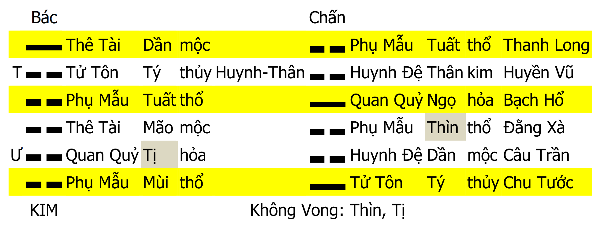
    - **Hình này chứng minh điều gì**
      - Thuốc chống ung thư không đạt hiệu quả và mang lại tác dụng phụ bất lợi cho cơ thể.
    - **Từ đâu mà thấy được**
      - Thế khắc hào Ứng tuần Không, đồng thời hai hào Phụ Mẫu Tuất thổ và Mùi thổ phát động đồng khắc Thế Tý thủy.
- Các bước suy luận và căn cứ dự trắc:
  - Xác định Dụng thần: Bản thân đương số tự gieo quẻ nên lấy hào Thế Tử Tôn Tý thủy tại hào 5 làm đại diện cho bản thân; hào Ứng Quan Quỷ Tị hỏa tại hào 2 làm đại diện cho thuốc chống ung thư.
  - Đánh giá vượng suy và tương tác Thế - Ứng:
    - Hào Thế Tý thủy được Nhật kiến Dậu kim sinh phù nên có khí lực vượng tướng.
    - Tuy nhiên, trong quẻ hào Thế Tý thủy phát sinh quan hệ tương khắc với hào Ứng Tị hỏa (Thế khắc hào Ứng).
    - Hào Ứng Quan Quỷ Tị hỏa lại gặp Tuần Không (tuần Giáp Ngọ Không tại Thìn, Tị); việc Thế khắc Ứng kết hợp với hào Ứng lâm Không Vong là điềm báo rõ ràng rằng phương thuốc này hiệu quả điều trị không tốt.
  - Nhận diện tác dụng phụ nguy hại:
    - Trong quẻ xuất hiện hào 4 Phụ Mẫu Tuất thổ và hào 1 Phụ Mẫu Mùi thổ đồng thời phát động (lưỡng thổ cùng động).
    - Thổ động tất khắc Thủy, hai hào Phụ Mẫu phát động cùng dốc sức khắc chế hào Thế Tử Tôn Tý thủy; tượng Kỵ thần động khắc Thế mang thông tin chuẩn xác rằng loại thuốc chống ung thư này gây ra phản ứng phụ rất mạnh, làm tổn hại nặng nề cho thể trạng.
- Kết quả và ứng nghiệm thực tế:
  - Đúng như dự đoán, người bệnh sau khi dùng thuốc chống ung thư nhận thấy bệnh không thuyên giảm mà cơ thể phải chịu đựng các tác dụng phụ nặng nề gây mệt mỏi suy kiệt.

#### Ví dụ 4: Người mất tri giác đoán phẫu thuật u não ngày Đinh Dậu tháng Thìn (Quẻ Sơn Lôi Di biến Thiên Lôi Vô Vọng)

- Bối cảnh gieo quẻ: Ngày Đinh Dậu, tháng Thìn (tuần Giáp Thìn, Mộc Không Vong tại Thìn và Tị). Một người khi đang làm việc thì đột nhiên ngất xỉu, mất hoàn toàn tri giác; sau khi được đưa khẩn cấp vào bệnh viện cấp cứu, các bác sĩ chẩn đoán bị khối u não và chỉ định phải phẫu thuật gấp. Đương số gieo quẻ hỏi việc phẫu thuật sẽ ra sao, nhận được quẻ Sơn Lôi Di biến Thiên Lôi Vô Vọng.
  - **Hình 122.** Sơ đồ quẻ Sơn Lôi Di biến Thiên Lôi Vô Vọng
    - 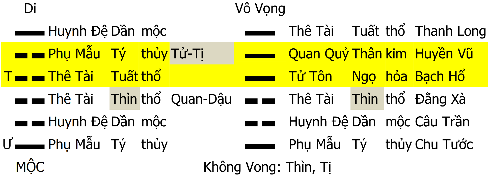
    - **Hình này chứng minh điều gì**
      - Phẫu thuật u não thành công, bệnh nhân có thể hồi phục trạng thái sức khỏe bình thường.
    - **Từ đâu mà thấy được**
      - Hào Thế Thê Tài Tuất thổ lâm Bạch Hổ phát động hóa Tử Tôn Ngọ hỏa hồi đầu sinh.
- Các bước suy luận và căn cứ dự trắc:
  - Xác định Dụng thần: Người bệnh tự gieo quẻ hỏi an nguy bản thân nên lấy hào Thế Thê Tài Tuất thổ tại hào 4 làm Dụng thần.
  - Đánh giá vượng suy của hào Thế:
    - Hào Thế Tuất thổ bị Nguyệt kiến Thìn thổ xung là hào Nguyệt phá; đồng thời Nhật kiến Dậu kim tiết khí không sinh phù, thoạt nhìn hào Thế không được coi là vượng tướng.
    - Tuy nhiên, điểm cốt tử là cả Nhật kiến và Nguyệt kiến đều không mang ngũ hành khắc phạt hào Thế (Thìn là thổ tỉ hòa, Dậu là kim tiết khí chứ không khắc).
  - Phân tích tượng phẫu thuật và biến hóa:
    - Hào Thế Thê Tài Tuất thổ lâm thần sát Bạch Hổ phát động; Bạch Hổ vốn là tượng trưng cho đao kiếm, rạch mổ, giải phẫu ngoại khoa.
    - Hào Thế động hóa ra Tử Tôn Ngọ hỏa quay lại sinh phù cho hào Thế (động hóa hồi đầu sinh).
    - Hào Thế lâm Bạch Hổ động hóa hồi đầu sinh mang thông điệp dứt khoát rằng giải pháp phẫu thuật ngoại khoa sẽ bồi bổ, phục hồi lại sinh lực cho bệnh nhân, hoàn toàn có thể dùng phương pháp mổ để điều trị.
- Kết quả và ứng nghiệm thực tế:
  - Bệnh nhân đã tiếp nhận ca phẫu thuật u não; sau khi mổ sức khỏe phục hồi rất tốt và đã trở lại cuộc sống bình thường.

#### Ví dụ 5: Con trai đoán cha phẫu thuật ung thư dạ dày ngày Bính Dần tháng Dần (Quẻ Thiên Hỏa Đồng Nhân biến Trạch Hỏa Cách)

- Bối cảnh gieo quẻ: Ngày Bính Dần, tháng Dần (tuần Giáp Tý, Hỏa Không Vong tại Tuất và Hợi). Một người con trai gieo quẻ hỏi xem người cha tiến hành phẫu thuật ung thư dạ dày giai đoạn đầu có an toàn và đạt kết quả tốt hay không, nhận được quẻ Thiên Hỏa Đồng Nhân biến Trạch Hỏa Cách.
  - **Hình 123.** Sơ đồ quẻ Thiên Hỏa Đồng Nhân biến Trạch Hỏa Cách
    - 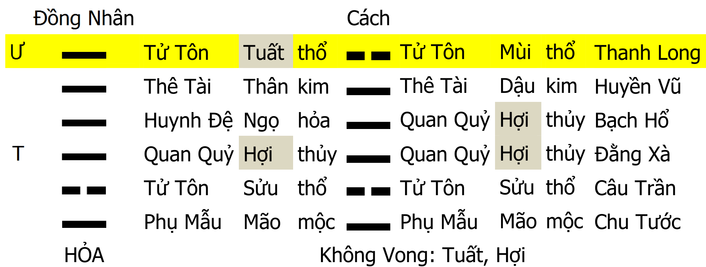
    - **Hình này chứng minh điều gì**
      - Phẫu thuật ung thư dạ dày giai đoạn đầu an toàn, người cha duy trì sự sống khỏe mạnh lâu dài.
    - **Từ đâu mà thấy được**
      - Dụng thần Phụ Mẫu Mão mộc vượng tướng; Tử Tôn Tuất thổ tại hào Ứng độc phát khắc trừ Quan Quỷ Hợi thủy trì Thế.
- Các bước suy luận và căn cứ dự trắc:
  - Xác định Dụng thần: Đoán việc cho cha lấy hào Phụ Mẫu làm Dụng thần. Trong quẻ, Phụ Mẫu Mão mộc cư tại hào 1.
  - Đánh giá căn bản vượng suy của Dụng thần:
    - Hào Dụng thần Phụ Mẫu Mão mộc được cả Nguyệt kiến và Nhật thần Dần mộc đồng thời tỉ hòa bồi đắp khí lực, lâm vào thế vượng tướng cực điểm, biểu thị người cha có nền tảng thể chất tốt và thọ mạng vững vàng.
  - Phân tích tâm lý đương số và tượng phẫu thuật:
    - Hào Thế lâm Quan Quỷ Hợi thủy; Quan Quỷ trì Thế biểu thị tâm trạng người con đang ngập tràn nỗi lo âu, thấp thỏm bất an trước ca mổ của cha.
    - Hào 6 Tử Tôn Tuất thổ cư tại hào Ứng độc phát; hào Tuất thổ tuy rơi vào Tuần Không của tuần Giáp Tý, nhưng theo yếu chỉ dự trắc cổ truyền "động bất vi Không", hào một khi phát động ắt mang lực lượng thực tế.
    - Tử Tôn là thần y dược, lâm hào Ứng động khắc hào Quan Quỷ Hợi thủy tại hào Thế, biểu thị năng lực của bác sĩ và ca mổ sẽ đánh tan mối lo âu của người con, khắc trừ bệnh quỷ bên mình người cha; do đó hoàn toàn có thể tiến hành phẫu thuật.
- Kết quả và ứng nghiệm thực tế:
  - Bệnh nhân sau đó đã được tiến hành phẫu thuật cắt bỏ khối u ung thư dạ dày thuận lợi; phản hồi thực tế hai năm sau người cha vẫn sống hoàn toàn khỏe mạnh.

#### Ví dụ 6: Cháu đoán bà ngoại bị ngã phẫu thuật ngày Kỷ Tị tháng Mùi (Quẻ Trạch Thủy Khốn biến Trạch Địa Tụy)

- Bối cảnh gieo quẻ: Ngày Kỷ Tị, tháng Mùi (tuần Giáp Tý, Kim Không Vong tại Tuất và Hợi). Một người có bà ngoại tuổi cao không may bị vấp ngã chấn thương nặng, xin dự đoán xem việc đưa bà đi phẫu thuật có gặp nguy hiểm tính mạng hay không, nhận được quẻ Trạch Thủy Khốn biến Trạch Địa Tụy.
  - **Hình 124.** Sơ đồ quẻ Trạch Thủy Khốn biến Trạch Địa Tụy
    - 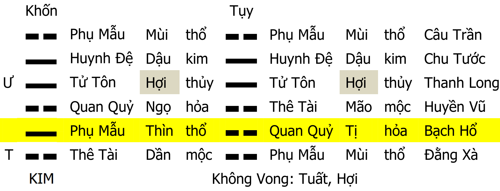
    - **Hình này chứng minh điều gì**
      - Cuộc phẫu thuật cho người bà mang lại hung triệu dẫn đến tử vong.
    - **Từ đâu mà thấy được**
      - Dụng thần Phụ Mẫu Thìn thổ độc phát lâm Bạch Hổ hóa Tị hỏa là hóa Tuyệt và quá vượng.
- Các bước suy luận và căn cứ dự trắc:
  - Xác định Dụng thần: Dự đoán cát hung cho bà ngoại lấy hào Phụ Mẫu làm Dụng thần.
  - Chọn Dụng thần khi xuất hiện lưỡng hiện:
    - Trong quẻ có Phụ Mẫu Mùi thổ tại hào 6 và Phụ Mẫu Thìn thổ tại hào 2 đồng thời xuất hiện (Phụ Mẫu lưỡng hiện).
    - Căn cứ quy tắc "thần triệu cơ ở động", hào Phụ Mẫu Thìn thổ phát động nên được chọn làm Dụng thần đích thực để định đoạt sự việc.
  - Luận đoán độc phát và tượng biến hóa:
    - Dụng thần Thìn thổ là hào độc phát trong quẻ; trường hợp này không đơn thuần dựa vào sinh vượng thông thường để phán đoán mà phải căn cứ sâu sắc vào tượng pháp.
    - Hào Dụng thần Thìn thổ phát động hóa ra Quan Quỷ Tị hỏa; trong phép thập nhị cung tràng sinh ngũ hành, Thổ tuyệt tại Tị, đây là tượng "động hóa Tuyệt" chứ tuyệt đối không được luận là Tị hỏa hồi đầu sinh cho Thìn thổ, do đó quẻ này chắc chắn ứng điềm đại hung.
    - Dụng thần phát động lâm thần sát Bạch Hổ; Bạch Hổ chủ về huyết quang, tai nạn chấn thương và sự giải phẫu rạch mổ, báo trước việc can thiệp dao kéo sẽ dẫn tới thương vong.
    - Mặt khác, nếu xét theo góc độ suy vượng thì Thìn thổ được Nguyệt kiến Mùi thổ tỉ trợ, lại được Nhật thần Tị hỏa sinh, rơi vào trạng thái "quá vượng"; vật cực tất phản, khí quá vượng ắt chuyển thành hung họa khôn lường.
- Kết quả và ứng nghiệm thực tế:
  - Người bà sau khi tiếp nhận ca phẫu thuật đã không thể qua khỏi và qua đời ngay sau đó.

#### Ví dụ 7: Nữ đoán tìm bà đồng chữa bệnh ngày Giáp Thìn tháng Tị (Quẻ Trạch Phong Đại Quá biến Thủy Thiên Nhu)

- Bối cảnh gieo quẻ: Ngày Giáp Thìn, tháng Tị (tuần Giáp Thìn, Mộc Không Vong tại Dần và Mão). Một người phụ nữ mắc bệnh hiểm nghèo định tìm đến một bà đồng cốt để nhờ cúng bái bốc thuốc chữa trị, xin dự đoán hiệu quả ra sao, nhận được quẻ Trạch Phong Đại Quá biến Thủy Thiên Nhu.
  - **Hình 125.** Sơ đồ quẻ Trạch Phong Đại Quá biến Thủy Thiên Nhu
    - 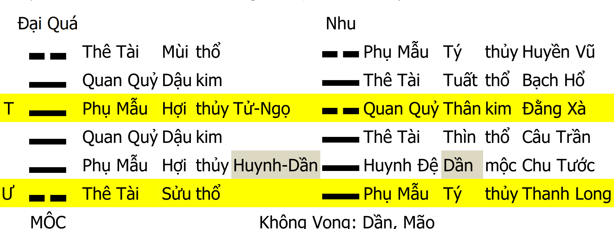
    - **Hình này chứng minh điều gì**
      - Khám bà đồng không có hiệu nghiệm, thuốc uống gây khô rát cổ họng và chảy máu mũi.
    - **Từ đâu mà thấy được**
      - Hào Thế Hợi thủy suy kiệt nhập Mộ động hóa Quỷ, hào Ứng Sửu thổ phát động khắc Thế.
- Các bước suy luận và căn cứ dự trắc:
  - Xác định Dụng thần và quan hệ Thế - Ứng:
    - Hào Thế Phụ Mẫu Hợi thủy tại hào 4 là người đến xin đoán; hào Ứng Thê Tài Sửu thổ tại hào 1 đại diện cho bà đồng cốt.
    - Nguyên lý trị bệnh qua quan hệ Thế - Ứng quy định: Khi hào Thế vượng tướng thì hào Ứng nên khắc Thế (để kìm chế bớt khí thịnh tà); khi hào Thế suy nhược hưu tù thì hào Ứng nhất thiết phải sinh trợ hào Thế để bồi bổ sinh mệnh.
  - Đánh giá thể trạng suy kiệt của hào Thế:
    - Hào Thế Hợi thủy bị Nguyệt kiến Tị hỏa xung là hào Nguyệt phá; lại bị Nhật thần Thìn thổ khắc chế; đồng thời Hợi thủy nhập Mộ ở Nhật Thìn và lâm Tuyệt địa ở Nguyệt Tị, thể trạng rơi vào cảnh suy tàn hưu tù cùng cực.
    - Hào Thế tuy phát động hóa Quan Quỷ Thân kim thoạt nhìn như hóa hồi đầu sinh, nhưng bản chất hào Thế tựa như cây khô trơ trụi không còn rễ, không thể đón nhận sinh phù ("sinh phù bất khởi"); do đó Thân kim không sinh được Thế mà thực chất là hào Thế phát động tự hóa thành Quan Quỷ lâm Đằng Xà (hóa Quỷ chủ hung hiểm).
    - Hào Ứng Thê Tài Sửu thổ lại phát động khắc trực tiếp vào hào Thế đang suy bại, khẳng định việc tìm đến bà đồng xem bệnh hoàn toàn không có hiệu quả.
  - Truy tìm nguồn gốc bệnh lý trong quẻ:
    - Thế hưu tù lâm Tuyệt ở Nguyệt, nhập Mộ ở Nhật.
    - Nguyên thần của hào Thế là Quan Quỷ Dậu kim lâm thần sát Câu Trần (Câu Trần chủ khối u cục, ung thư tích tụ).
    - Nguyên thần Dậu kim xuất hiện ở cả hào 3 và hào 5:
      - Hào 3 là vị trí bụng dưới, cơ quan sinh dục; ở nữ giới chính là tử cung, biểu thị chứng ung thư tử cung.
      - Hào 5 là vị trí lồng ngực, hai lá phổi; ngũ hành Kim của Dậu kim cũng chủ về phế phổi, biểu thị tế bào ung thư phổi.
- Diễn biến đối thoại và kết quả ứng nghiệm:
  - Tác giả truy hỏi thì được biết người phụ nữ này trên thực tế đã từng phẫu thuật cắt bỏ khối u ung thư tử cung, nhưng sau đó bệnh đã di căn lên phổi.
  - Do tâm lý sốt ruột và tuyệt vọng muốn khỏi bệnh, người phụ nữ đã bỏ ngoài tai lời khuyên ngăn của tác giả mà vẫn cố chấp tìm đến bà đồng cốt để chữa trị.
  - Sau khi uống các thang thuốc phù phép của bà đồng đưa cho, cổ họng bệnh nhân lập tức bị khô khát dữ dội, khoang mũi hằng ngày chảy máu liên tục; trước tình cảnh nguy hại đó, đương sự đành phải kinh hãi từ bỏ việc uống thuốc.

#### Ví dụ 8: Nữ đoán bản thân lên bàn mổ ngày Bính Dần tháng Tuất (Quẻ Thủy Trạch Tiết biến Thủy Thiên Nhu)

- Bối cảnh gieo quẻ: Ngày Bính Dần, tháng Tuất (tuần Giáp Tý, Thủy Không Vong tại Tuất và Hợi). Một người phụ nữ chuẩn bị bước vào ca phẫu thuật, tự gieo quẻ hỏi việc bản thân lên bàn mổ sẽ diễn biến ra sao, nhận được quẻ Thủy Trạch Tiết biến Thủy Thiên Nhu.
  - **Hình 126.** Sơ đồ quẻ Thủy Trạch Tiết biến Thủy Thiên Nhu
    - 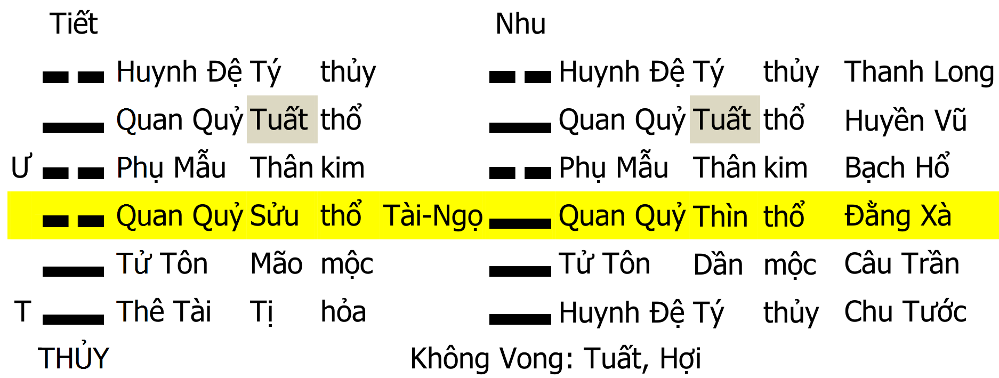
    - **Hình này chứng minh điều gì**
      - Ca phẫu thuật diễn ra thuận lợi, giải trừ được mầm bệnh và sự lo âu.
    - **Từ đâu mà thấy được**
      - Quan Quỷ Sửu thổ lâm Đằng Xà độc phát hóa Thìn thổ Nguyệt phá; hào Thế Tị hỏa vượng tướng được Nhật sinh.
- Các bước suy luận và căn cứ dự trắc:
  - Xác định Dụng thần và đánh giá vượng suy:
    - Đương số tự đoán cho mình nên lấy hào Thế Thê Tài Tị hỏa tại hào 1 làm Dụng thần.
    - Hào Thế Tị hỏa được Nhật kiến Dần mộc trường sinh sinh phù nên có gốc rễ vượng tướng vững vàng.
  - Phân tích tâm trạng và tượng phẫu thuật:
    - Trong quẻ, hào 3 Quan Quỷ Sửu thổ lâm Đằng Xà độc phát; Quan Quỷ tượng trưng cho bệnh tật và sự lo âu, Đằng Xà chủ về sự bất an hoảng hốt, phản ánh tâm lý đương số đang cực kỳ hoang mang, không chắc chắn trước giờ phẫu thuật.
    - Hào Ứng Phụ Mẫu Thân kim cư tại hào 4 đại diện cho y dược và bệnh viện, lâm Bạch Hổ chính là thông tin về việc phẫu thuật dao kéo.
  - Đánh giá kết quả ca mổ:
    - Quan Quỷ Sửu thổ phát động hóa ra Quan Quỷ Thìn thổ; Thìn thổ bị Nguyệt kiến Tuất thổ xung là hào Nguyệt phá. Quỷ động hóa Phá biểu thị toàn bộ mối lo âu được tiêu trừ, gốc rễ bệnh tật bị cắt bỏ triệt để.
    - Hào Ứng Thân kim là Bệnh địa của hỏa (Tị hỏa bệnh tại Thân), lại phát sinh quan hệ lục hợp với hào Thế Tị hỏa (Tị Thân hợp); tượng Bệnh địa hợp Thế báo trước sau ca mổ bệnh nhân sẽ cảm thấy có chút khó chịu mệt mỏi trong người, nhưng nhờ hào Thế vượng tướng nên không có gì nguy hiểm.
- Kết quả và ứng nghiệm thực tế:
  - Ca phẫu thuật đã diễn ra rất thuận lợi, bệnh tật được xử lý an toàn; sau mổ bệnh nhân chỉ gặp triệu chứng phụ nhẹ là thường xuyên cảm thấy khát nước.

#### Ví dụ 9: Con gái đoán cha phẫu thuật đục thủy tinh thể ngày Quý Dậu tháng Tuất (Quẻ Lôi Thiên Đại Tráng biến Đoài Vi Trạch)

- Bối cảnh gieo quẻ: Ngày Quý Dậu, tháng Tuất (tuần Giáp Tý, Thổ Không Vong tại Tuất và Hợi). Một người con gái gieo quẻ hỏi xem người cha tiến hành phẫu thuật điều trị bệnh đục thủy tinh thể ở mắt sẽ ra sao, nhận được quẻ Lôi Thiên Đại Tráng biến Đoài Vi Trạch.
  - **Hình 127.** Sơ đồ quẻ Lôi Thiên Đại Tráng biến Đoài Vi Trạch
    - 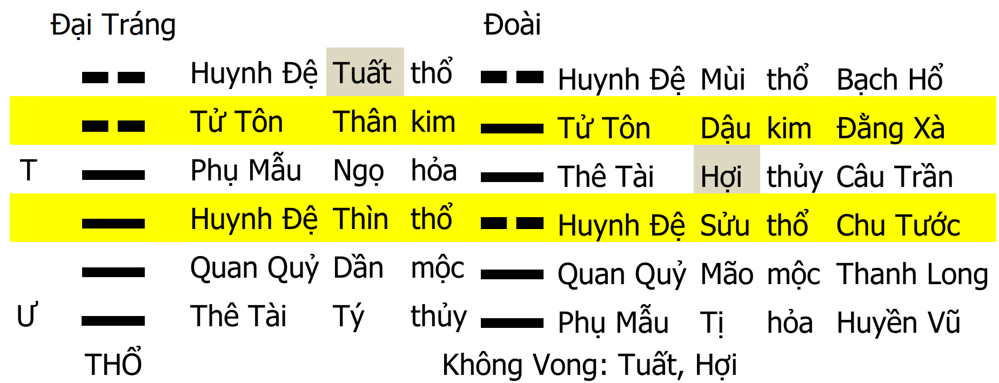
    - **Hình này chứng minh điều gì**
      - Phẫu thuật đục thủy tinh thể thất bại, không mang lại kết quả cải thiện thị lực.
    - **Từ đâu mà thấy được**
      - Hào Ứng Tý thủy nhập Mộ ở hào động Thìn thổ, Nhật Nguyệt cùng hào động đều bất lợi cho Dụng thần Ngọ hỏa.
- Các bước suy luận và căn cứ dự trắc:
  - Xác định Dụng thần: Đoán việc cho cha lấy hào Phụ Mẫu làm Dụng thần (Phụ Mẫu Ngọ hỏa tại hào 4). Hào Ứng Thê Tài Tý thủy tại hào 1 đại diện cho ca phẫu thuật.
  - Định bệnh đục thủy tinh thể qua tổ hợp tượng quẻ:
    - Dụng thần Phụ Mẫu Ngọ hỏa mang hành Hỏa chủ về con mắt; lâm thần sát Câu Trần chủ về vật thể ứ tắc, ngưng đọng cản trở tầm nhìn.
    - Hào 5 Tử Tôn Thân kim là Bệnh địa của Ngọ hỏa (Hỏa trường sinh tại Dần, bệnh tại Thân); Tử Tôn chủ về ngũ quan khuôn mặt, lâm Đằng Xà chủ về màng mỏng quấn quanh; tổ hợp "Tử Tôn + Bệnh địa + Đằng Xà" khắc họa chính xác màng mộng đục thủy tinh thể ở mắt.
    - Hơn nữa, Dụng thần Ngọ hỏa lâm Nguyệt Mộ tại Tuất thổ (tháng Tuất là mộ của Ngọ hỏa), là tín hiệu đôi mắt bị che phủ mờ tối.
  - Phân tích nguyên nhân phẫu thuật thất bại:
    - Hào Ứng Thê Tài Tý thủy phát động hóa Phụ Mẫu Tị hỏa, nhưng trong quẻ hào 3 Huynh Đệ Thìn thổ cũng phát động; Thìn thổ là mộ khố của Thủy khiến hào Ứng Tý thủy bị nhập Mộ vào hào động Thìn thổ.
    - Xét tổng thể: Nhật kiến Dậu kim sinh Ứng nhưng Nguyệt kiến Tuất thổ khắc chế Tý thủy, hào Thìn thổ mộ Tý thủy; mặt khác Nhật Nguyệt và hào động đều không có lợi cho Dụng thần Phụ Mẫu Ngọ hỏa (Ngọ hỏa hưu tù nhập Mộ ở Nguyệt, bị Thìn thổ tiết khí). Vì vậy ca phẫu thuật không thể đem lại hiệu quả cải thiện.
- Kết quả và ứng nghiệm thực tế:
  - Ca phẫu thuật mắt diễn ra thất bại, không đạt được kết quả phục hồi thị lực như mong muốn của gia đình.

#### Ví dụ 10: Học trò đoán hiệu quả máy trợ thính mua cho mẹ ngày Kỷ Sửu tháng Sửu (Quẻ Thiên Hỏa Đồng Nhân biến Trạch Thủy Khốn)

- Bối cảnh gieo quẻ: Ngày Kỷ Sửu, tháng Sửu (tuần Giáp Thân, Hỏa Không Vong tại Ngọ và Mùi). Một người học trò của tác giả gieo quẻ hỏi xem chiếc máy trợ thính dự định mua cho mẹ có phát huy hiệu quả cải thiện thính lực hay không, nhận được quẻ Thiên Hỏa Đồng Nhân biến Trạch Thủy Khốn.
  - **Hình 128.** Sơ đồ quẻ Thiên Hỏa Đồng Nhân biến Trạch Thủy Khốn
    - 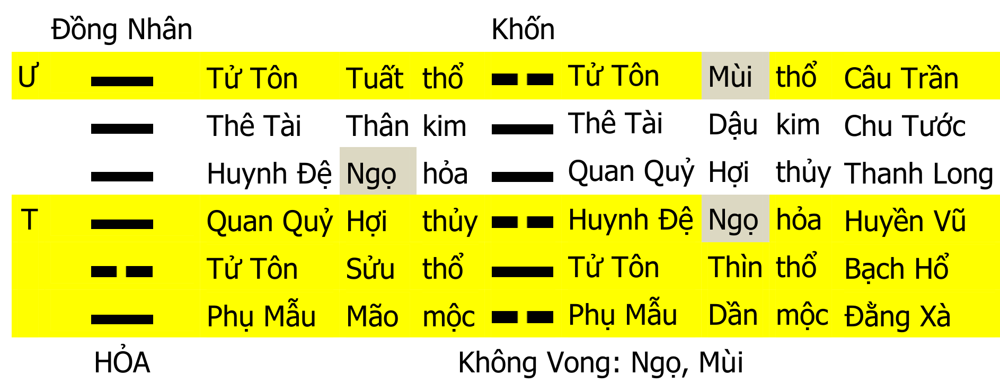
    - **Hình này chứng minh điều gì**
      - Thiết bị máy trợ thính không phát huy tác dụng, người mua tốn tiền uổng phí.
    - **Từ đâu mà thấy được**
      - Dụng thần Phụ Mẫu Mão mộc suy hóa thoái; hào Ứng Tuất thổ hóa thoái Mùi thổ gặp Nguyệt phá, Nhật xung, Không Vong.
- Các bước suy luận và căn cứ dự trắc:
  - Xác định Dụng thần: Dự đoán tình trạng của mẹ lấy hào Phụ Mẫu làm Dụng thần. Phụ Mẫu Mão mộc ngự tại hào 1.
  - Đánh giá tình trạng Dụng thần:
    - Hào Dụng thần Phụ Mẫu Mão mộc ở vào tháng Sửu ngày Sửu hoàn toàn không được Nhật Nguyệt sinh trợ, rơi vào thế suy kiệt.
    - Phụ Mẫu Mão mộc phát động lại hóa thoái thần thành Phụ Mẫu Dần mộc, báo hiệu thể trạng và khả năng tiếp nhận dụng cụ của người mẹ rất kém, hiệu quả không tốt.
  - Đánh giá công năng của thiết bị máy trợ thính:
    - Hào Ứng Tử Tôn Tuất thổ tại hào 6 đại diện cho máy trợ thính.
    - Hào Ứng Tuất thổ phát động tương hợp với Dụng thần Mão mộc (Mão Tuất lục hợp), thoạt nhìn là cát tượng ngỡ như máy trợ thính gắn bó ăn khớp với mẹ.
    - Tuy nhiên, hào Ứng Tuất thổ động hóa ra Tử Tôn Mùi thổ là hóa thoái thần.
    - Biến hào Mùi thổ bị cả Nguyệt kiến và Nhật thần Sửu thổ xung là hào Nguyệt phá, Nhật xung; đồng thời trong tuần Giáp Thân thì Ngọ và Mùi rơi vào Tuần Không (Mùi thổ phùng Không).
    - Hào Ứng lâm vào thế hóa thoái, hóa phá, hóa Không; toàn bộ tổ hợp đều khẳng định thiết bị máy trợ thính này hoàn toàn vô dụng, không mang lại bất kỳ hiệu quả cải thiện thính lực nào.
- Diễn biến tâm lý và kết quả ứng nghiệm:
  - Mặc dù tác giả đã phân tích quẻ tường tận, nhưng vì lòng hiếu thảo đối với mẹ lấn át sự sáng suốt lý trí, người học trò vẫn quyết định bỏ tiền ra mua máy trợ thính cho mẹ.
  - Kết quả đúng như quẻ đã chỉ ra, người mẹ đeo máy nhưng hoàn toàn không có hiệu quả gì, người con đã tiêu tốn tiền bạc một cách vô ích.

## CHƯƠNG 14: ỨNG DỤNG CỦA LỤC HÀO TRONG ĐIỀU TRỊ BỆNH TẬT

### Mục đích điều trị và vai trò bổ trợ y học của Lục Hào

- Mục đích cốt lõi của dự đoán Lục Hào trong lĩnh vực tật bệnh:
  - Dự đoán Lục Hào không đơn thuần dừng lại ở việc xem xét xu thế cát hung hay định lượng mức độ nặng nhẹ của bệnh tật.
  - Mục đích chủ yếu là truy tìm căn nguyên sâu xa làm phát sinh tật bệnh, từ đó thiết lập phương pháp tháo gỡ và giải quyết triệt để vấn đề sức khỏe.
- Vị thế và hệ thống phương pháp điều trị đặc thù:
  - Dự đoán Lục Hào sở hữu một hệ sinh thái lý luận và phương thức điều trị độc lập, khác biệt rõ rệt so với các phác đồ của y học hiện đại.
  - Về mặt cơ chế, phương pháp này ở chừng mực nhất định có thể khó tiếp cận hoặc khó giải thích theo tư duy đại chúng thông thường, nhưng thực tiễn lâm sàng đã chứng minh tính hiệu quả xác thực.
  - Đối với các chứng bệnh kỳ dị, nan y hoặc bệnh lạ mà các phương pháp y khoa thông thường gặp bế tắc, hiệu quả điều trị can thiệp của Lục Hào thể hiện rất rõ rệt.
- Mối quan hệ tương hỗ với y học hiện đại:
  - Lục Hào dự đoán học không bài xích, phủ định hay thay thế y học hiện đại.
  - Lục Hào đóng vai trò là công cụ hỗ trợ đắc lực và bổ sung quan trọng cho y học hiện đại, giúp mở rộng tầm nhìn chẩn đoán và đẩy nhanh quá trình phục hồi của người bệnh.

### Bản chất, nguyên tắc và giới hạn của phương pháp hóa giải ngũ hành

- Khái niệm và cơ chế vận hành của phép hóa giải:
  - Phương pháp sử dụng Lục Hào trong điều trị bệnh tật được gọi là phép hóa giải.
  - Cơ chế cốt lõi là trích xuất hệ thống thông tin tiềm ẩn trong quẻ theo quy luật âm dương ngũ hành sinh khắc chế hóa.
  - Dựa trên cơ sở phân tích cấu trúc quái tượng, tiến hành điều chỉnh phương vị, cấu trúc không gian và tính chất của trường năng lượng ngũ hành đang gây tổn thương hoặc bất lợi cho Dụng thần, qua đó đạt được mục đích trị liệu và phục hồi sức khỏe.
- Giới hạn và tính khách quan của phép hóa giải:
  - Hóa giải ngũ hành không phải là phương thuật vạn năng có thể giải quyết tuyệt đối mọi tình huống.
  - Hiệu quả hóa giải có lúc không biểu hiện rõ ràng do mức độ tích tụ năng lượng bệnh lý bất lợi quá lớn, vượt quá năng lực điều chỉnh tức thời của vật phẩm phong thủy.
  - Có trường hợp phương pháp hóa giải ban đầu chưa thực sự tương thích với thực tế, đòi hỏi người dự đoán phải theo dõi sát sao và tinh chỉnh kịp thời.
  - Người thực hành dự đoán không được phép sùng bái mù quáng hay ngộ nhận phép hóa giải như một loại thần dược chữa bách bệnh.

### Cơ chế tương ứng ngũ hành và sự chuyển di thông tin vào thực tế đời sống

- Quy luật đối ứng đa chiều của ngũ hành trong thế giới vật chất:
  - Ngũ hành có mối quan hệ tương ứng mật thiết và có thể ánh xạ sang âm thanh, màu sắc, con số, phương vị không gian, thời gian cùng vạn vật trong tự nhiên.
  - Phương pháp Lục Hào điều trị bệnh tật vận dụng triệt để mạng lưới quan hệ đối ứng này nhằm cụ thể hóa nguồn thông tin trừu tượng trong quẻ thành các sự vật, hiện tượng cụ thể trong đời sống thực tế.
- Kỹ thuật điều phối và chuyển di năng lượng khí trường:
  - Thông qua việc sắp đặt đồ vật, điều chỉnh tính chất năng lượng ngũ hành, thay đổi trạng thái tĩnh - động và xác định chính xác phương vị địa lý, người dự đoán triệt tiêu nguồn năng lượng tà khí gây hại và bổ sung sinh khí cho Dụng thần.
  - Hiệu quả hóa giải phụ thuộc chặt chẽ vào hiện tượng chuyển di thông tin; chỉ khi vật phẩm hóa giải thỏa mãn trọn vẹn các yêu cầu tượng số và khí trường trong quẻ thì tác dụng mới phát huy mạnh mẽ.
- Yêu cầu về nền tảng chuyên môn của người thực hành:
  - Phép hóa giải không thể lĩnh hội trong ngày một ngày hai mà đòi hỏi người nghiên cứu phải tích lũy một căn cơ dự đoán Lục Hào cực kỳ vững vàng và sâu sắc.
  - Nếu không nắm vững lý luận sinh khắc, suy vượng và hào tượng biến hóa thì không thể trích xuất chính xác vật phẩm tương ứng, dẫn tới việc hóa giải không mang lại kết quả mong muốn.

### Các ca bệnh ứng dụng phương pháp hóa giải thực tế

#### Ví dụ 1: Nữ đoán táo bón mạn tính - Quẻ Thủy Lôi Truân

- Ngày Nhâm Dần tháng Thân, một người phụ nữ tự gieo quẻ dự đoán chứng bệnh táo bón lâu ngày, được quẻ Thủy Lôi Truân (quái cung Khảm thủy, Tuần Không: Thìn, Tị):
  - **Hình 129.** Quẻ Thủy Lôi Truân
    - 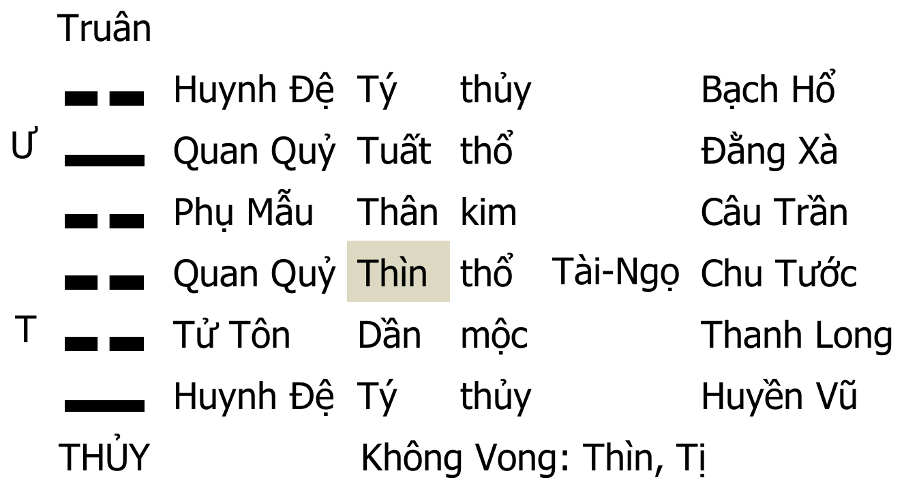
    - **Hình này chứng minh điều gì**
      - Bệnh nhân mắc chứng táo bón do hào Thế đường ruột bị Nguyệt phá; điều trị khỏi bằng nước ép rau hẹ hòa hoàng tửu.
    - **Từ đâu mà thấy được**
      - Hào 2 Thế Tử Tôn Dần mộc là ruột, bị Nguyệt Thân kim xung phá; Thế mộc điền thực lâm Thanh Long (rượu) tượng rau hẹ cắt lại mọc hòa hoàng tửu.
- Xác định Dụng thần và định vị bệnh lý:
  - Người nữ tự xem bệnh cho bản thân nên lấy hào Thế làm Dụng thần.
  - Hào Thế là hào 2 Tử Tôn Dần mộc; hào Thế bị Nguyệt kiến Thân kim xung khắc nên lâm Nguyệt phá, nhưng lại lâm vào Nhật thần Dần mộc nên rơi vào thế Thực Phá (điền thực).
  - Nguyệt kiến đối với Dụng thần vừa khắc vừa xung, là dấu hiệu khí trường bất lợi tác động trực tiếp vào cơ thể.
  - Xét về hào vị và lục thân: Hào 2 trên cơ thể đại diện cho đường ruột; lục thân Tử Tôn cũng mang biểu tượng của ruột; sự kết hợp này chỉ rõ bệnh biến khu trú tại đường ruột, hoàn toàn trùng khớp với chứng táo bón.
- Phân tích cơ chế và thiết lập phương án hóa giải:
  - Hào Nguyên thần là Huynh Đệ Tý thủy không bị tổn thương suy bại, do đó nguyên tắc trị liệu chỉ cần tập trung nâng cao sức mạnh cho hào Thế Dần mộc.
  - Hào Thế thuộc mộc đại diện cho các loài thực vật thảo mộc; mộc bị kim xung phá rồi lại được Nhật thần điền thực, kim ở đây mang hình tượng của công cụ kim loại sắc bén (dao, kéo).
  - Tượng kim loại cắt đứt thực vật rồi sau đó thực vật lại tiếp tục đâm chồi sinh trưởng nhanh chóng gợi liên tưởng trực tiếp đến đặc tính sinh học của cây rau hẹ.
  - Hào Thế đồng thời lâm Thanh Long; Thanh Long chủ về hoan lạc, ẩm thực, tửu sắc, tương ứng với rượu.
  - Tác giả hướng dẫn bệnh nhân lấy nước ép của cây rau hẹ tươi hòa cùng hoàng tửu (黄酒 - rượu cất từ gạo nếp vàng) để uống.
- Ứng nghiệm thực tế:
  - Đến ngày Ất Tị (chi Tị nhị hợp Thân kim giải trừ thế Nguyệt phá), bệnh nhân đã đi tiêu thông suốt và hoàn toàn khỏi hẳn chứng táo bón.

#### Ví dụ 2: Nam đoán bệnh em gái bị ung thư vú - Quẻ Hỏa Sơn Lữ biến Cấn Vi Sơn

- Ngày Nhâm Dần tháng Tuất, người nam dự đoán bệnh tật cho em gái, được quẻ Hỏa Sơn Lữ biến Cấn Vi Sơn (quái cung Ly hỏa, Tuần Không: Thìn, Tị):
  - **Hình 130.** Quẻ Hỏa Sơn Lữ biến Cấn Vi Sơn
    - 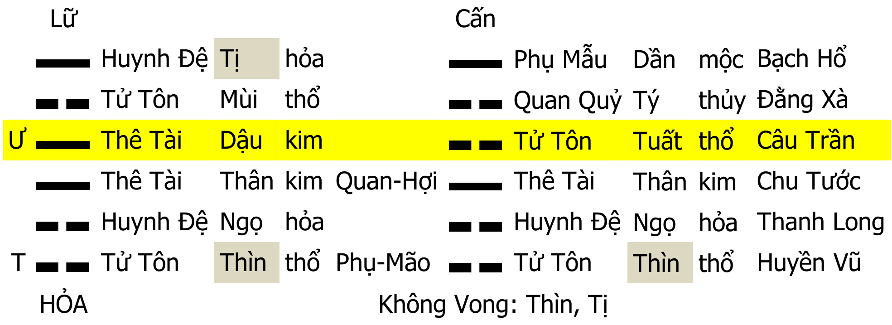
    - **Hình này chứng minh điều gì**
      - Em gái mắc bệnh ung thư vú nghiêm trọng; thoát khỏi hiểm cảnh và tiêu biến tế bào ung thư nhờ bố cục phong thủy dây đỏ quấn thỏ gỗ.
    - **Từ đâu mà thấy được**
      - Dụng thần Huynh Đệ Tị hỏa ngộ Không lâm Bạch Hổ; hào 4 Dậu kim lâm Câu Trần độc phát là Tử địa của Tị hỏa; hào 4 và quẻ Ly chỉ vú.
- Tuyển trạch Dụng thần và chẩn đoán chứng bệnh ung thư:
  - Đoán bệnh của em gái lấy lục thân Huynh Đệ làm Dụng thần.
  - Trong quẻ xuất hiện Huynh Đệ lưỡng hiện: Huynh Đệ Ngọ hỏa tại hào 2 và Huynh Đệ Tị hỏa tại hào 6; chọn Huynh Đệ Tị hỏa lâm Tuần Không để làm Dụng thần chính.
  - Dụng thần Tị hỏa lâm Bạch Hổ phản ánh trong thân thể đang có bệnh tật nghiêm trọng hoành hành.
  - Hào 4 Thê Tài Dậu kim lâm Câu Trần phát động đơn độc (độc phát); quy luật Lục Hào xác định hào độc phát nắm giữ then chốt phản ánh bản chất của chứng bệnh.
  - Theo vòng Trường Sinh của hỏa, Dậu kim chính là đất Tử (Tử địa) của Dụng thần Tị hỏa, báo hiệu người bệnh đã rơi vào tình trạng nguy hiểm tính mạng.
  - Lục thần Câu Trần chủ về các khối u xơ, tổ chức tăng sinh bất thường, bệnh ung thư.
  - Vị trí hào 4 ứng với lồng ngực; lục thân Thê Tài chủ về thực phẩm, ẩm thực nuôi dưỡng cơ thể; quái cung Ly hỏa mang tượng của bầu vú.
  - Tổng hợp hào 4 vùng ngực, Ly cung là vú, Câu Trần là ung thư và Tử địa độc phát, kết luận em gái bị bệnh ung thư vú.
- Kiểm chứng lâm sàng và cơ sở cứu giải:
  - Người hỏi xác nhận em gái trên thực tế đúng là vừa được bệnh viện chẩn đoán mắc bệnh ung thư vú.
  - Đánh giá sinh khắc tổng thể: Dụng thần Tị hỏa không bị Nguyệt kiến Tuất thổ khắc chế, lại được Nhật thần Dần mộc tương sinh, thuộc thế Dụng thần vượng mà có cứu giải, hoàn toàn có cơ hội thoát chết.
  - Hướng xử lý: Nếu Dụng thần xuất Không, được Nguyên thần đến sinh trợ, đồng thời triệt tiêu được nguồn sát khí từ Tử địa thì sẽ dập tắt nguy cơ tử vong.
- Thiết lập bố cục vật tượng hóa giải:
  - Tác giả đề nghị sử dụng 7 sợi dây màu đỏ quấn quanh thân 3 con thỏ mỹ nghệ, sau đó treo lên bức tường ở phương vị Đông Nam của ngôi nhà.
  - Luận giải cơ chế tượng số ngũ hành:
    - Địa chi Tị hỏa tương ứng với loài rắn, mang sắc đỏ; số sinh thành của ngũ hành hỏa là số 7, do đó dùng 7 sợi dây màu đỏ.
    - Con thỏ trong thập nhị địa chi tương ứng với Mão mộc; Mão mộc chính là Nguyên thần sinh phù cho Dụng thần Tị hỏa, vừa tăng sinh lực vừa xung phạt dẹp bỏ Tử địa Dậu kim (Mão Dậu tương xung); số của mộc là số 3, do đó sử dụng 3 con thỏ.
    - Hào 6 là vị trí tường nhà; phương vị của Tị hỏa là hướng Đông Nam; việc treo vật phẩm tại bức tường phía Đông Nam nhằm tạo trường năng lượng tương trợ trực tiếp cho Dụng thần.
- Ứng nghiệm thực tế:
  - Đến tháng Hợi (thời điểm xung khởi giúp Dụng thần Tị hỏa xuất Không), bệnh nhân đến bệnh viện kiểm tra lại thì các tế bào ung thư đã biến mất hoàn toàn, bác sĩ kết luận không cần thực hiện phẫu thuật nữa.

#### Ví dụ 3: Cứu tỉnh người thực vật hôn mê ba tháng - Quẻ Cấn Vi Sơn biến Địa Hỏa Minh Di

- Ngày Ất Sửu tháng Tuất, con gái của một người đàn ông tại Thâm Quyến đột nhiên ngất xỉu trong siêu thị, nhập viện điều trị và rơi vào trạng thái người thực vật suốt ba tháng không có dấu hiệu chuyển biến. Người cha thông qua Đoàn tiên sinh tìm tác giả nhờ hóa giải, gieo được quẻ Cấn Vi Sơn biến Địa Hỏa Minh Di (quái cung Cấn thổ, Tuần Không: Tuất, Hợi):
  - **Hình 131.** Quẻ Cấn Vi Sơn biến Địa Hỏa Minh Di
    - 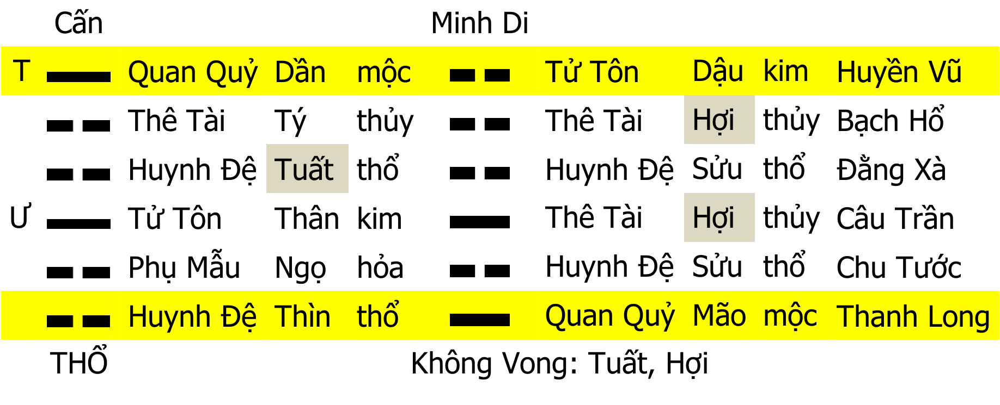
    - **Hình này chứng minh điều gì**
      - Bệnh nhân hôn mê dạng người thực vật suốt ba tháng; hồi tỉnh và đi lại bình thường sau ba ngày hóa giải khai Mộ và nhập Mộ Quan Quỷ.
    - **Từ đâu mà thấy được**
      - Dụng thần Tử Tôn Thân kim vượng tướng nhập Mộ ở Nhật Sửu thổ (hôn mê); hào 6 Dần mộc động xung Thân kim; hào sơ Thìn thổ Nguyệt phá hóa Mão mộc hồi đầu khắc.
- Xác định Dụng thần và phân tích nguyên nhân bất tỉnh:
  - Đoán bệnh của con gái lấy lục thân Tử Tôn làm Dụng thần.
  - Hào 3 Tử Tôn Thân kim được cả Nguyệt kiến Tuất thổ và Nhật thần Sửu thổ sinh trợ nên thuộc hàng vượng tướng, xác định chắc chắn không có nguy hiểm đến tính mạng.
  - Dụng thần Thân kim gặp Nhật thần Sửu thổ là thế Dụng thần nhập Mộ; hiện tượng nhập Mộ biểu thị ý thức bị chôn vùi, tương ứng với trạng thái hôn mê sâu của người thực vật.
  - Hai nhân tố phá hoại nghiêm trọng trong quẻ:
    - Hào 6 Quan Quỷ Dần mộc phát động trực xung khắc phạt Dụng thần Tử Tôn Thân kim (Dần Thân tương xung).
    - Hào sơ Nguyên thần Huynh Đệ Thìn thổ bị Nguyệt kiến xung thành Nguyệt phá, lại phát động hóa Quan Quỷ Mão mộc hồi đầu khắc.
- Lựa chọn địa chi hóa giải:
  - Xét theo hệ thống thập nhị địa chi, chỉ có Dậu kim và Mùi thổ mới đủ công năng hóa giải toàn bộ hung tin:
    - Dậu kim (hào biến của hào 6 Quan Quỷ): Dậu kim khắc chế Quan Quỷ Dần mộc, tương hợp với Thìn thổ giúp Thìn thổ thành Thực Phá, xung khắc Mão mộc để giải cứu hào biến của Thìn thổ, đồng thời là Tiến thần của Dụng thần Thân kim, giúp khuếch đại sinh lực cho Tử Tôn.
    - Mùi thổ: Khiến Quan Quỷ Dần mộc nhập Mộ (Dần nhập Mộ tại Mùi), trực xung khai mở Nhật thần Sửu thổ (Sửu Mùi tương xung) để giải thoát Dụng thần Thân kim khỏi Mộ khố, đồng thời sinh dưỡng cho Tử Tôn Thân kim.
- Chuyển hóa địa chi thành vật phẩm cụ thể:
  - Chuyển hóa tượng Dậu kim: Dậu kim tương ứng với con gà; hào 6 là vị trí đầu não; tác giả đề nghị tìm một chậu hoa mào gà đặt tại phương Đông Nam của giường bệnh. Hướng Đông Nam ứng với Thìn thổ; Dụng thần Tử Tôn ngự tại hào 3 là vị trí giường nằm.
  - Chuyển hóa tượng Mùi thổ: Mùi thổ là Nguyên thần sinh Tử Tôn; theo nguyên lý chuyển đổi lục thân, Mùi thổ là Phụ Mẫu của Tử Tôn; lục thân Phụ Mẫu chủ về áo quần, bản thân chi Mùi cũng mang tượng y phục. Tác giả hướng dẫn đem bộ quần áo mà người con gái mặc lúc bị ngất xỉu treo lên bức tường ở phía Đông Bắc. Hướng Đông Bắc ứng với Sửu thổ; hào 6 là vị trí bức tường.
  - Sự kết hợp này kích hoạt xung mở Mộ khố Sửu thổ và thu nạp Quan Quỷ vào Mộ Mùi thổ, hóa giải triệt để ách tắc.
- Ứng nghiệm thực tế:
  - Ba ngày sau khi hoàn tất bố cục, người con gái đã hồi tỉnh từ trạng thái thực vật và có thể tự đi lại được.
  - Sang ngày thứ tư, cô bắt đầu nói chuyện bình thường và hoàn toàn hồi phục thể trạng như trước khi phát bệnh.

#### Ví dụ 4: Nam đoán bệnh của vợ bị u uất kích động - Quẻ Thủy Thiên Nhu

- Ngày Quý Sửu tháng Mão, một người học trò nhờ tác giả xem bệnh tình kỳ lạ của vợ, được quẻ Thủy Thiên Nhu (quái cung Khôn thổ, Tuần Không: Dần, Mão):
  - **Hình 132.** Quẻ Thủy Thiên Nhu
    - 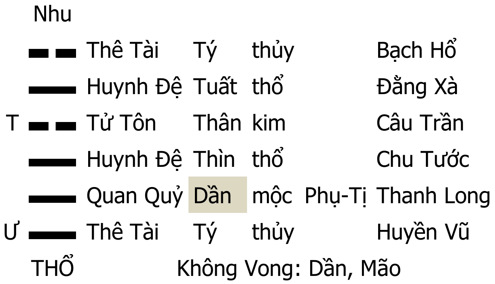
    - **Hình này chứng minh điều gì**
      - Người vợ bị rối loạn tâm thần và ngất xỉu khi chồng lại gần do Dụng thần bị Nhật khắc hợp; bệnh tình khỏi hẳn sau ba ngày hóa giải bằng đũa bọc vải hấp.
    - **Từ đâu mà thấy được**
      - Dụng thần Ứng Thê Tài Tý thủy lâm Huyền Vũ tại quẻ Du hồn, bị Nhật Sửu thổ khắc hợp; Kỵ thần Huynh Đệ lâm Chu Tước, Đằng Xà chủ kích động lời nói.
- Tuyển trạch Dụng thần và chẩn đoán chứng bệnh tâm thần:
  - Đoán bệnh của vợ lấy lục thân Thê Tài làm Dụng thần.
  - Quẻ có Thê Tài lưỡng hiện (hào sơ và hào 6); chọn hào Ứng Thê Tài Tý thủy tại hào sơ làm Dụng thần chính.
  - Dụng thần Tý thủy lâm Huyền Vũ chủ về tâm trạng u buồn, phiền muộn u uất, trầm cảm kéo dài.
  - Thủy Thiên Nhu là quẻ Du hồn, mang đặc tính thần trí hoang mang, đầu óc mê muội mất kiểm soát.
  - Hào Nguyên thần là Tử Tôn Thân kim (đại diện cho tư duy, nhận thức) nhập Mộ tại Nhật thần Sửu thổ, củng cố thêm chẩn đoán đầu óc không tỉnh táo.
  - Dụng thần Tý thủy bị Nhật thần Sửu thổ khắc hợp (Tý Sửu tương hợp thổ khắc thủy); quy tắc "hợp xứ phùng xung" chỉ ra bệnh khởi phát vào năm Nhâm Ngọ (2002) do chi Ngọ xung khai Tý thủy.
  - Kỵ thần Huynh Đệ lâm Chu Tước và Đằng Xà: Chu Tước chủ về ngôn ngữ, lời nói cãi vã; Đằng Xà chủ về hoảng sợ, kinh hãi, biến động kích động. Kết luận bệnh phát sinh do bị kích động hoặc sợ hãi từ lời nói tác động.
- Kiểm chứng thực tế lâm sàng:
  - Người học trò thừa nhận vào năm 2002 (Nhâm Ngọ), anh ta đề nghị ly hôn khiến người vợ bị sang chấn tâm lý dữ dội mà phát bệnh u uất.
  - Triệu chứng thực tế rất kỳ quái: Hai vợ chồng không thể tiếp xúc gần; chỉ có thể nói chuyện ở cự ly ngoài năm mét; nếu người chồng bước lại gần dưới năm mét là người vợ lập tức ngã lăn ra bất tỉnh nhân sự.
- Cơ chế giải hợp và chế định vật phẩm hóa giải:
  - Mấu chốt hung hại nằm ở việc Nhật thần Sửu thổ khắc hợp trói buộc Dụng thần; cần dùng chi Mùi thổ để trực xung Sửu thổ (Sửu Mùi tương xung) nhằm giải phóng Dụng thần khỏi lực khắc hợp.
  - Tạo lập thông tin Mùi thổ trong thực tế:
    - Mùi thổ là Mộ khố của mộc; lấy một vật mang tính chất mộc đem gói bọc lại hoặc bỏ vào đồ vật kín tương đương tượng mộc nhập Mộ, tạo lập nên trường thông tin Mùi thổ.
    - Tìm vật hành mộc trong quẻ: Quan Quỷ Dần mộc tại hào 2 lâm Thanh Long; Thanh Long chủ về ăn uống ẩm thực; hào 2 là vị trí phòng bếp; tổ hợp này phản ánh hình tượng đôi đũa ăn cơm.
    - Con số của ngũ hành mộc là số 3, do đó chọn đúng 3 chiếc đũa.
    - Vật liệu bao gói: Quẻ thuộc cung Khôn, quẻ Khôn tượng trưng cho vải vóc, do đó sử dụng mảnh vải để bọc.
    - Do mộc gắn liền mật thiết với ăn uống, tác giả dặn dùng mảnh vải lồng hấp màn thầu để bọc 3 chiếc đũa lại, sau đó đem đặt ở góc phía Đông Bắc của gian bếp nhằm đối ứng trực tiếp và xung khai Sửu thổ.
- Ứng nghiệm thực tế:
  - Ba ngày sau khi đặt bọc đũa, người học trò gọi điện thông báo bệnh tình của vợ đã khỏi hẳn, vợ chồng có thể tiếp xúc gần gũi bình thường mà không còn bị ngất xỉu.

#### Ví dụ 5: Nữ đoán bản thân bị nhũ tuyến tăng sinh và đau đốt sống cổ - Quẻ Trạch Thủy Khốn biến Sơn Thủy Mông

- Ngày Nhâm Thìn tháng Mão, người nữ tự gieo quẻ xem bệnh tình bản thân, được quẻ Trạch Thủy Khốn biến Sơn Thủy Mông (quái cung Đoài kim, Tuần Không: Ngọ, Mùi):
  - **Hình 133.** Sơ đồ quẻ Trạch Thủy Khốn biến Sơn Thủy Mông
    - 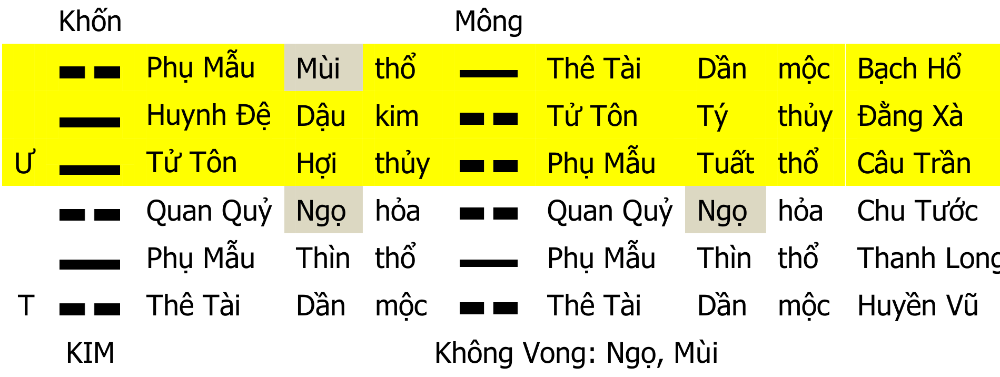
    - **Hình này chứng minh điều gì**
      - Bệnh nhân bị nhũ tuyến tăng sinh và đau đốt sống cổ; bệnh thuyên giảm và biến mất ngay trong ngày nhờ ly nước đá ở phương Tây Bắc.
    - **Từ đâu mà thấy được**
      - Hào Thế Dần mộc lâm Huyền Vũ; hào 5 Dậu kim lâm Đằng Xà khắc Thế; hào 4 Nguyên thần Hợi thủy lâm Câu Trần hóa Tuất thổ hồi đầu khắc.
- Xác định Dụng thần và chẩn đoán tổ hợp bệnh:
  - Người nữ tự đoán lấy hào Thế làm Dụng thần.
  - Hào Thế Thê Tài Dần mộc được Nguyệt kiến Mão mộc tỉ phù nên thuộc hàng vượng tướng.
  - Dấu hiệu bất lợi: Hào 4 Nguyên thần Tử Tôn Hợi thủy hưu tù phát động hóa Phụ Mẫu Tuất thổ hồi đầu khắc.
  - Hào 5 Huynh Đệ Dậu kim phát động khắc phạt hào Thế Dần mộc: Kim kiến Thủy mà hào Thế lâm Huyền Vũ, chủ về chứng bệnh viêm quanh khớp vai.
  - Chi Dậu kim chủ về xương cốt, ngự tại hào 5 (vùng cổ), lâm Đằng Xà mang dáng dấp nhỏ dài uốn lượn, chỉ ra vùng đốt sống cổ có bệnh lý thoái hóa hoặc gai xương.
  - Hào 4 Nguyên thần Tử Tôn Hợi thủy lâm Câu Trần bị khắc chế: Hào 4 là vùng ngực, bầu vú; Tử Tôn cũng mang biểu tượng tuyến vú; Câu Trần chủ về tổ chức tăng sinh xơ hóa; tổng hợp lại là chứng nhũ tuyến tăng sinh (u xơ tuyến vú).
  - Người bệnh xác nhận mọi phán đoán bệnh trạng đều chính xác hoàn toàn.
- Thiết lập phương án hóa giải:
  - Trọng tâm hóa giải nằm ở việc cứu trợ Nguyên thần Hợi thủy: Kỵ thần Dậu kim phát động khắc Thế, lẽ ra nhờ Tử Tôn Hợi thủy dẫn hóa thông quan (kim sinh thủy, thủy sinh mộc), nhưng Hợi thủy bị hóa hồi đầu khắc nên mất tác dụng dẫn hóa.
  - Cần địa chi Thìn thổ: Thìn thổ xung mất hào biến Phụ Mẫu Tuất thổ để dẹp trừ thế hồi đầu khắc, đồng thời Thìn thổ nhị hợp trói buộc Dậu kim (Thìn Dậu hợp kim), bảo vệ Hợi thủy để Hợi thủy quay lại tương sinh hào Thế.
  - Mặt khác, Thìn thổ là Mộ khố của thủy; khi thiết lập phương án hóa giải phải đưa yếu tố thuộc tính thủy vào để vừa trợ lực cho thủy vừa dưỡng mộc hào Thế.
- Cụ thể hóa vật tượng:
  - Tác giả hướng dẫn đặt một ly nước đá tại phương vị Tây Bắc của căn nhà.
  - Phân tích tượng lý:
    - Phương Tây Bắc trong bát quái tương ứng với hai địa chi Tuất và Hợi.
    - Nước chứa trong chiếc ly mang hình tượng "thủy nhập Mộ", tương đương với trường khí Thìn thổ.
    - Bản thân nước đá thuộc hành thủy, đặc tính đóng băng cứng rắn và ngưng kết của đá lạnh tương ứng với thần sát Câu Trần.
- Ứng nghiệm thực tế:
  - Ngay trong ngày đặt ly nước đá, khối u nhũ tuyến tăng sinh ở ngực đã biến mất, chứng đau đốt sống cổ cũng chấm dứt hoàn toàn.

#### Ví dụ 6: Nữ đoán con trai bị chấn thương gãy xương do tai nạn - Quẻ Thiên Trạch Lý biến Phong Trạch Trung Phu

- Ngày Giáp Ngọ tháng Thìn, người mẹ xem quẻ hỏi về tình trạng con trai bị gãy xương lâu ngày chưa liền, được quẻ Thiên Trạch Lý biến Phong Trạch Trung Phu (quái cung Cấn thổ, Tuần Không: Thìn, Tị):
  - **Hình 134.** Sơ đồ quẻ Thiên Trạch Lý biến Phong Trạch Trung Phu
    - 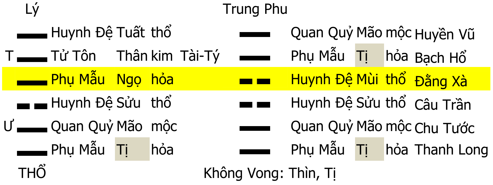
    - **Hình này chứng minh điều gì**
      - Con trai bị tai nạn xe máy gãy xương lâu lành; xương cốt liền nhanh sau vài ngày nhờ uống bột vỏ trứng gà đã nở con.
    - **Từ đâu mà thấy được**
      - Hào 5 Tử Tôn Thân kim lâm Bạch Hổ bị Nhật và hào 4 Ngọ hỏa động khắc; Nguyên thần Tuất thổ Nguyệt phá; dùng Dậu kim hợp Thìn cứu Tuất.
- Xác định Dụng thần và bối cảnh chấn thương:
  - Xem bệnh cho con trai lấy lục thân Tử Tôn làm Dụng thần.
  - Hào 5 Tử Tôn Thân kim lâm Bạch Hổ, bị Nhật thần Ngọ hỏa khắc hại và bị hào 4 Phụ Mẫu Ngọ hỏa phát động khắc chế.
  - Hào 5 là hào vị đường sá; quẻ Thiên Trạch Lý chủ về việc đi lại giao thông; quẻ biến Phong Trạch Trung Phu là quẻ Du hồn chủ việc xuất hành ra ngoài; Bạch Hổ chủ về huyết quang thương tích; suy ra con trai bị thương tật do tai nạn trên đường đi.
  - Người mẹ xác nhận con trai bị tai nạn do xe máy tông phải, dẫn đến chấn thương gãy xương.
- Luận giải cơ chế hóa giải qua Dậu kim:
  - Nguồn thông tin bất lợi: Hào 6 Nguyên thần Huynh Đệ Tuất thổ bị Nguyệt kiến Thìn thổ xung thành Nguyệt phá; hào 4 Ngọ hỏa động khắc Dụng thần Thân kim.
  - Lựa chọn địa chi Dậu kim làm hạt nhân cứu giải:
    - Dậu kim tương hợp với Nguyệt kiến Thìn thổ (Thìn Dậu hợp), trói buộc Thìn thổ không cho xung phạt Tuất thổ, giúp Nguyên thần không còn bị phá.
    - Dậu kim là đất Đế Vượng của Dụng thần Thân kim, đồng thời là Tiến thần của Thân kim, giúp tiếp sức trực tiếp cho Tử Tôn.
    - Dậu kim là Tử địa của hỏa, khiến hào động Ngọ hỏa rơi vào đất Tử mà suy kiệt, mất khả năng khắc kim.
- Chuyển hóa tượng số thành dược liệu dân gian:
  - Chi Dậu tương ứng với loài gà; bệnh gãy xương liên quan trực tiếp đến khung xương và canxi.
  - Vỏ của quả trứng gà sau khi đã ấp nở con là một dạng cấu trúc canxi sinh học mang bản chất xương cốt tự nhiên.
  - Tác giả dặn người mẹ thu thập vỏ trứng gà đã nở, tán nhuyễn thành bột mịn để cho con trai pha nước uống.
- Ứng nghiệm thực tế:
  - Sau vài ngày kiên trì uống bột vỏ trứng gà, vết gãy xương của người con trai đã liền lại nhanh chóng và phục hồi hoàn toàn.

#### Ví dụ 7: Nữ giảng viên đại học đoán bệnh thận và phụ khoa - Quẻ Ly Vi Hỏa

- Ngày Kỷ Hợi tháng Tý, một nữ giảng viên đại học đến xem bệnh tình bản thân, được quẻ Ly Vi Hỏa (quái cung Ly hỏa, Tuần Không: Thìn, Tị):
  - **Hình 135.** Sơ đồ quẻ Ly Vi Hỏa
    - 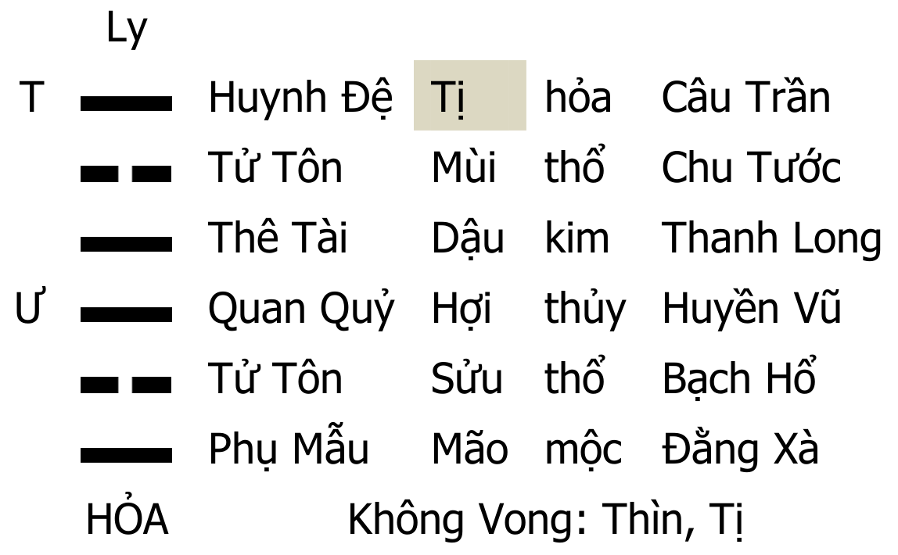
    - **Hình này chứng minh điều gì**
      - Bệnh nhân mắc bệnh thận ba năm kèm lạnh tử cung và đau đầu; thuyên giảm rõ rệt và hết phù thũng sau sáu ngày dùng con hổ vải.
    - **Từ đâu mà thấy được**
      - Hào 6 Thế Tị hỏa Không Vong bị Nhật Nguyệt thủy khắc; Kỵ thần Quan Quỷ Hợi thủy tại hào 3 lâm Huyền Vũ; dùng Dần mộc sinh Thế hợp Kỵ.
- Xác định Dụng thần và chẩn đoán đa diện bệnh lý:
  - Tự đoán bệnh lấy hào Thế Huynh Đệ Tị hỏa tại hào 6 làm Dụng thần.
  - Hào Thế bị cả Nguyệt kiến Tý thủy và Nhật thần Hợi thủy xung khắc dữ dội nên cực kỳ suy nhược; may mắn lâm Tuần Không nên tạm thời ẩn nấp trong đất Không; tuy nhiên vì quá hưu tù nên nếu không cứu chữa kịp thời thì bệnh tình sẽ biến chuyển vô cùng nguy kịch.
  - Kỵ thần Quan Quỷ Hợi thủy ngự tại hào 3: Hào 3 là vị trí của tạng thận, thắt lưng và bàng quang; Kỵ thần thuộc hành thủy khẳng định chắc chắn mắc bệnh thận.
  - Hành thủy là ngũ hành khắc Thế, suy ra bệnh nhân có tâm lý sợ nước, không thích uống nước.
  - Hào 4 là vị trí nhà vệ sinh, có Thê Tài Dậu kim lâm Thanh Long sinh trợ Kỵ thần Quan Quỷ Hợi thủy, cho thấy hiện tượng hễ vừa uống nước vào là phải đi tiểu tiện ngay.
  - Mùa đông là thời điểm ngũ hành thủy cực vượng làm tăng áp lực khắc phá hào Thế hỏa, chỉ ra cứ đến mùa đông hàng năm là bệnh tình lại chuyển biến nặng nề hơn.
  - Hào Thế lâm Câu Trần: Câu Trần chủ về tích nước, sưng phù, phù thũng toàn thân do biến chứng của bệnh thận.
  - Quẻ Ly cung chủ về tim mạch huyết dịch; Kỵ thần thủy cũng chủ máu huyết; hào Thế ngự tại hào 6 (đầu não) bị khắc chỉ ra chứng đau nửa đầu mạn tính do thiếu máu não và tuần hoàn máu kém.
  - Hào 3 là hào vị tử cung, lâm Huyền Vũ chủ sự việc kín đáo khó nói; Quan Quỷ Hợi thủy tại đây biểu thị bệnh phụ khoa; tính hàn lạnh của hành thủy biểu thị chứng lạnh tử cung và khí hư huyết trắng tiết ra nhiều.
- Kiểm chứng thực tế:
  - Bệnh nhân xác nhận phán đoán chính xác: Đã mắc bệnh thận suốt 3 năm chạy chữa nhiều nơi không khỏi, cơ thể hay bị phù thũng, sợ uống nước, đi tiểu nhiều lần, tử cung lạnh buốt, nhiều huyết trắng và thường xuyên đau đầu do thiếu máu.
- Cơ chế xung xứ phùng hợp và bố cục vật phẩm:
  - Điểm khởi phát hóa giải: Kỵ thần ngự tại hào 3 là vị trí chiếc giường ngủ; giường là nơi con người tiếp nhận khí trường hàng ngày, do đó bắt đầu can thiệp từ giường sẽ mang lại hiệu quả cao nhất.
  - Nguyên tắc sinh khắc: Cần làm suy yếu Kỵ thần Hợi thủy và bồi dưỡng hào Thế Tị hỏa. Quẻ Ly Vi Hỏa là quẻ Lục xung; vận dụng nguyên lý "xung xứ phùng hợp", địa chi Dần mộc là giải pháp tối ưu: Dần mộc vừa sinh trợ hào Thế Tị hỏa, vừa nhị hợp trói chặt Kỵ thần Hợi thủy (Dần Hợi hợp mộc).
  - Cụ thể hóa Dần mộc: Địa chi Dần tương ứng với con hổ; mộc chủ về vải vóc thảo mộc, do đó tác giả chỉ định dùng một con hổ bằng vải nhồi bông.
  - Phương thức bố trí động - tĩnh linh hoạt:
    - Ban đầu đặt con hổ vải ở góc Tây Bắc của giường ngủ (hướng Tây Bắc ứng với Hợi thủy) nhằm hợp trói khí trường của Hợi thủy.
    - Hướng dẫn thao tác: Ban ngày đặt hổ vải tại góc Tây Bắc của giường; ban đêm khi đi ngủ thì nhấc con hổ sang đặt sát cạnh gối đầu.
    - Luận giải cơ chế: Biến vật hóa giải từ trạng thái tĩnh sang trạng thái động; hào 6 là đầu (gối đầu), việc dời con hổ sang bên gối tương đương mang Dần mộc tiếp cận trực tiếp hào Thế Tị hỏa để truyền sinh lực cho đầu não và chân hỏa.
- Ứng nghiệm thực tế:
  - Sáu ngày sau, nữ giảng viên đại học gọi điện thông báo mọi chứng bệnh đều thuyên giảm rõ rệt, chứng đau đầu chấm dứt và hiện tượng phù thũng trên người đã biến mất.

#### Ví dụ 8: Nữ đoán u xơ tử cung và đau đầu - Quẻ Hỏa Phong Đỉnh biến Trạch Phong Đại Quá

- Ngày Bính Thân tháng Ngọ năm Mậu Dần, người nữ tự gieo quẻ xem bệnh tình bản thân, được quẻ Hỏa Phong Đỉnh biến Trạch Phong Đại Quá (quái cung Ly hỏa, Tuần Không: Thìn, Tị):
  - **Hình 136.** Sơ đồ quẻ Hỏa Phong Đỉnh biến Trạch Phong Đại Quá
    - 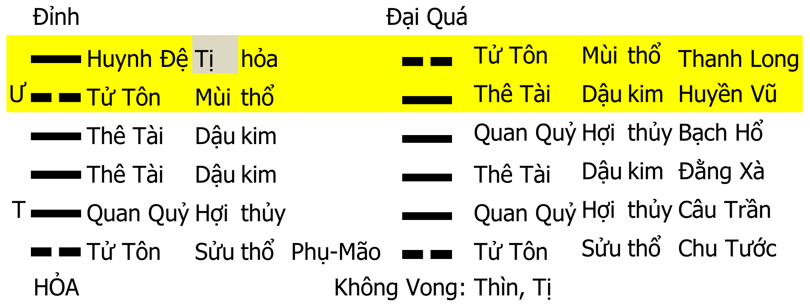
    - **Hình này chứng minh điều gì**
      - Bệnh nhân bị u xơ tử cung, đau đầu và khó thở; tiêu biến u xơ và dứt điểm đau đầu sau nửa tháng nhờ treo chín chiếc chuông đồng ở cửa phòng ngủ.
    - **Từ đâu mà thấy được**
      - Hào 2 Thế Hợi thủy lâm Câu Trần bị hào 5 Mùi thổ động khắc; hào 6 Tị hỏa lâm Thanh Long động sinh Kỵ; hào 3 và 4 Nguyên thần Dậu kim chỉ 2 cách chữa.
- Xác định Dụng thần và chẩn đoán bệnh chứng:
  - Tự đoán bệnh lấy hào Thế Quan Quỷ Hợi thủy tại hào 2 làm Dụng thần.
  - Hào Thế được Nhật thần Thân kim sinh trợ nên không thuộc thế hưu tù, nhưng bị Kỵ thần hào 5 Tử Tôn Mùi thổ phát động khắc phạt nên rơi vào trạng thái suy nhược.
  - Hào Thế tại hào 2 bị khắc: Hào 2 là vị trí cơ quan sinh dục và tử cung; lâm Câu Trần chủ về sưng trướng, bĩ khối u cục; kết luận mắc chứng u xơ tử cung.
  - Kỵ thần Tử Tôn Mùi thổ tại hào 5 phát động: Hào 5 là lồng ngực, chứng tỏ vùng ngực có bệnh (khó thở, tức ngực); tuy nhiên hào biến Mùi thổ hóa xuất Thê Tài Dậu kim là Nguyên thần của Thế, lại tiết bớt khí của Mùi thổ, nên bệnh ở ngực không phát triển nguy hiểm.
  - Hào 6 Huynh Đệ Tị hỏa phát động sinh trợ Kỵ thần Mùi thổ: Hào 6 là đầu não, lâm Thanh Long chủ về đau nhức, chỉ ra chứng đau đầu dữ dội.
- Phân tích các phương án điều trị của y học qua tượng quẻ:
  - Lục thân Nguyên thần (Thê Tài Dậu kim) đại diện cho phương pháp điều trị y khoa.
  - Quẻ có Nguyên thần lưỡng hiện tại hào 3 và hào 4, phản ánh bệnh viện đưa ra hai phương án điều trị:
    - Hào 4 Thê Tài Dậu kim lâm Bạch Hổ: Bạch Hổ chủ về đao kiếm phẫu thuật, tức phương pháp mổ hở.
    - Hào 3 Thê Tài Dậu kim lâm Đằng Xà: Đằng Xà uốn lượn mang tính hỏa, ngự tại nội quái Tốn/Ly, hỏa là quang học ánh sáng, chỉ phương pháp bắn tia laser.
    - Xét về khoảng cách, hào 3 gần hào Thế hơn hào 4, phản ánh tâm lý bệnh nhân muốn chọn phương pháp điều trị bảo tồn bằng tia laser để tránh phẫu thuật.
- Đối thoại thực tế giữa tác giả và người bệnh:
  - Bệnh nhân kinh ngạc chia sẻ: "Đây là lần đầu tiên tôi tiếp xúc với bói toán, trước đây căn bản không tin, không ngờ dự đoán lại chuẩn xác đến mức này. Mấy ngày trước tôi bị đau bụng, đi khám phải chạy suốt cả ngày qua bốn bệnh viện khác nhau. Ba bệnh viện đầu đều không dám khẳng định là bệnh gì, mãi đến bệnh viện ung bướu cuối cùng mới chẩn đoán ra u xơ tử cung. Không ngờ ở bệnh viện chẩn đoán vất vả như vậy, mà ở đây chỉ vài phút ông đã nói ra tất cả rồi. Thật ra tôi còn bị đau đầu và khó thở. Về cách chữa, bác sĩ nói hiện tại chỉ có hai phương án: phẫu thuật hoặc bắn laser. Tôi sợ mổ nên muốn dùng laser, nhờ ông xem giúp hiệu quả ra sao?"
  - Tác giả hồi đáp: "Cô có thể chọn điều trị bằng laser, nhưng ở đây tôi có một phương pháp tốt hơn: vừa đơn giản, không hề đau đớn, lại có thể điều tiết cân bằng toàn bộ cơ thể."
- Cơ chế liên tục tương sinh và thiết lập chuông đồng:
  - Tình thế quẻ: Cừu thần (Tị hỏa hào 6) và Kỵ thần (Mùi thổ hào 5) cùng phát động khắc Dụng thần Hợi thủy. Nếu kích hoạt cho Nguyên thần Dậu kim cũng đồng thời phát động, sẽ tạo thành một chuỗi liên hoàn tương sinh khép kín: Tị hỏa sinh Mùi thổ, Mùi thổ sinh Dậu kim, Dậu kim sinh Hợi thủy; toàn bộ lực sát phạt của Kỵ thần lập tức chuyển hóa thành nguồn năng lượng bồi bổ dồi dào cho Dụng thần.
  - Cụ thể hóa Dậu kim thành vật phẩm:
    - Nguyên thần ngự tại hào 3 và hào 4: Hào 3 là cửa phòng ngủ, hào 4 là cửa chính.
    - Kim tương ứng với chuông đồng; số thành của hành kim là số 9.
    - Tác giả hướng dẫn treo 9 chiếc chuông đồng nhỏ ở mép trên cửa ra vào phòng ngủ, chỉnh độ cao sao cho mỗi khi người bệnh bước qua cửa thì đầu sẽ chạm nhẹ vào chuông.
    - Mỗi lần ra vào phòng ngủ, đầu đụng vào chuông đồng làm chuông phát ra âm thanh và lay động, tương đương với việc kích hoạt Nguyên thần Dậu kim phát động liên tục.
- Ứng nghiệm thực tế:
  - Hơn nửa tháng sau, người phụ nữ đến bệnh viện kiểm tra lại: Khối u xơ tử cung đã tiêu biến gần hết (chỉ còn lại một chấm nhỏ không đáng kể), còn chứng đau đầu mạn tính thì dứt điểm hoàn toàn.

#### Ví dụ 9: Nữ đoán con trai bị gãy xương cổ tay phải do rơi xà kép - Quẻ Lôi Trạch Quy Muội biến Hỏa Trạch Khuê

- Ngày Tân Sửu tháng Tị, người mẹ lo lắng cho con trai bị chấn thương gãy xương do rơi từ trên xà kép xuống khi sắp đến ngày tham gia đại hội thể thao, gieo được quẻ Lôi Trạch Quy Muội biến Hỏa Trạch Khuê (quái cung Đoài kim, Tuần Không: Thìn, Tị):
  - **Hình 137.** Sơ đồ quẻ Lôi Trạch Quy Muội biến Hỏa Trạch Khuê
    - 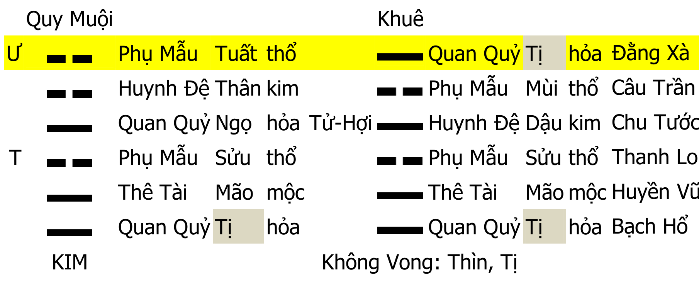
    - **Hình này chứng minh điều gì**
      - Con trai bị gãy xương cổ tay phải do rơi xà kép; xương liền lại nhanh chóng nhờ uống bột vỏ trứng nở kết hợp đắp củ cải trắng hòa rượu.
    - **Từ đâu mà thấy được**
      - Dụng thần Tử Tôn Hợi thủy phục tàng bị Nguyệt Tị hỏa xung phá; Kỵ thần hào 6 Tuất thổ hào âm độc phát khắc Thủy (tay phải); cần Kim trợ Dụng thần.
- Định vị Dụng thần và chẩn đoán vị trí gãy xương:
  - Đoán bệnh cho con trai lấy lục thân Tử Tôn làm Dụng thần.
  - Dụng thần Tử Tôn Hợi thủy phục tàng dưới hào 4 Quan Quỷ Ngọ hỏa, không xuất hiện trên quẻ, lại bị Nguyệt kiến Tị hỏa xung thành Nguyệt phá; đây là biểu hiện đặc trưng của thương tích gãy xương.
  - Kỵ thần Phụ Mẫu Tuất thổ tại hào 6 phát động đơn độc (độc phát) khắc phạt Dụng thần: Hào 6 là vị trí cánh tay và bàn tay, biểu thị thương tật tại vùng cổ tay.
  - Hào động mang tính âm (hào âm độc phát): Quy ước dịch lý xác định bên trái là dương, bên phải là âm; do đó kết luận con trai bị gãy xương ở cổ tay phải.
- Cơ chế hóa giải kết hợp nội ẩm ngoại đồ:
  - Dụng thần Hợi thủy hưu tù bị phá, cần kíp Nguyên thần hành kim đến tương sinh; ngũ hành kim cũng đại diện cho hệ thống xương khớp.
  - Dụng thần phục dưới hào 4 lâm Chu Tước: Chu Tước chủ về chim muông gia cầm, gia cầm thuộc kim là con gà (Dậu kim). Kỵ thần ngự ở ngoại quái chủ bên ngoài; Dậu kim là đất Mộc Dục của Tử Tôn Hợi thủy; Mộc Dục mang hình tượng lớp vỏ bao bọc bên ngoài; do đó chỉ dẫn người mẹ lấy vỏ quả trứng gà đã ấp nở con đem tán thành bột mịn cho con trai uống.
  - Liệu pháp đắp thuốc ngoài da hỗ trợ: Lấy củ cải trắng giã nát hòa cùng bạch tửu (白酒 - rượu trắng) đắp trực tiếp lên vùng cổ tay bị gãy.
  - Luận giải y lý ngũ hành: Củ cải trắng mang sắc trắng thuộc hành kim; bạch tửu cũng thuộc kim lại có công năng hoạt huyết tiêu sưng, tăng cường kim khí giúp xương nhanh chóng liền lại.
- Ứng nghiệm thực tế:
  - Không lâu sau khi áp dụng phương pháp trên, xương cổ tay phải của người con trai đã liền lại hoàn toàn và bình phục kịp thời để tham gia đại hội thể thao.

#### Ví dụ 10: Nam đoán bệnh vợ mắc chứng động kinh kinh niên - Quẻ Thủy Phong Tỉnh biến Địa Phong Thăng

- Ngày Kỷ Mão tháng Thân, người chồng gieo quẻ dự đoán bệnh tình lâu năm của vợ, được quẻ Thủy Phong Tỉnh biến Địa Phong Thăng (quái cung Chấn mộc, Tuần Không: Thân, Dậu):
  - **Hình 138.** Sơ đồ quẻ Thủy Phong Tỉnh biến Địa Phong Thăng
    - 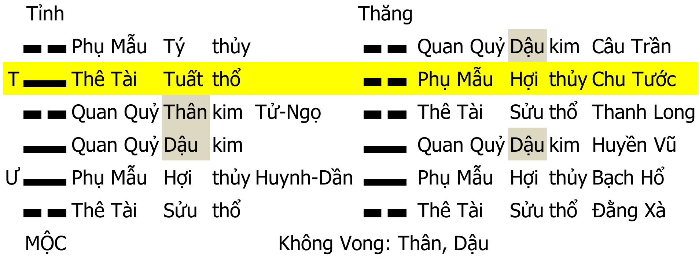
    - **Hình này chứng minh điều gì**
      - Người vợ mắc chứng động kinh kinh niên nhiều năm; khỏi bệnh hoàn toàn nhờ dùng hòn đá nén dưa mua từ vùng ngoại thành đặt ở phía Đông nhà.
    - **Từ đâu mà thấy được**
      - Dụng thần Thê Tài Tuất thổ động bị Nhật Kỵ Mão mộc khắc hợp (bệnh lâu năm từ năm 2000); dùng Dậu kim xung Mão mộc; tượng đá muối dưa.
- Tuyển trạch Dụng thần và chẩn đoán chứng bệnh động kinh:
  - Xem bệnh cho vợ lấy lục thân Thê Tài làm Dụng thần.
  - Quẻ có Thê Tài lưỡng hiện: Hào sơ Thê Tài Sửu thổ và hào 5 Thê Tài Tuất thổ; chọn hào Thê Tài Tuất thổ tại hào 5 phát động làm Dụng thần chính.
  - Nguyệt kiến Thân kim không sinh không khắc Dụng thần Tuất thổ.
  - Nhật thần Mão mộc là Kỵ thần Huynh Đệ, vừa khắc chế vừa nhị hợp trói buộc Dụng thần Tuất thổ (Mão Tuất hợp hóa hỏa/thổ). Tượng Nhật hợp biểu thị sự ngăn trở dây dưa, đau đớn vướng víu kéo dài nhiều năm chứ không phải bệnh mới phát.
  - Vận dụng quy tắc "hợp xứ phùng xung": Người vợ bắt đầu khởi phát bệnh từ năm Canh Thìn (2000) do chi Thìn xung mở Mão Tuất hợp.
  - Hào Nguyên thần mang ý nghĩa tư duy thần trí nhập Mộ, phản ánh các cơn co giật hôn mê bất tỉnh, tương ứng với bệnh động kinh.
- Truy tìm nguồn gốc vật phẩm hóa giải Dậu kim:
  - Để hóa giải thế khắc hợp, cần dùng địa chi Dậu kim trực xung dẹp bỏ Kỵ thần Nhật Mão mộc (Mão Dậu tương xung).
  - Định vị tọa độ tìm kiếm Dậu kim trong quẻ:
    - Trong quẻ có Quan Quỷ Dậu kim tại hào 3.
    - Nội quái là quẻ Tốn, đại diện cho phương Đông Nam.
    - Hào 3 là hào vị vùng ngoại thành, ven đô thị.
    - Suy ra: Người chồng phải đi về vùng ngoại ô ở phía Đông Nam thành phố để tìm vật phẩm hóa giải.
    - Kỵ thần Mão mộc mang lục thân Huynh Đệ chủ về tốn kém hao tài, do đó bắt buộc phải bỏ tiền ra mua chứ không được xin miễn phí của người khác.
  - Giải mã hình tượng vật phẩm Dậu kim:
    - Địa chi Dậu kim mang hình tượng của khối đá tròn cứng nhẵn nhụi.
    - Hào 3 Dậu kim lâm Huyền Vũ: Huyền Vũ chủ về ẩm ướt, mốc meo, thối rữa lên men.
    - Hào độc phát Tuất thổ lâm Chu Tước (chủ ẩm thực thức ăn); hào 4 Thân kim lâm Thanh Long (cũng chủ ăn uống ẩm thực).
    - Khối đá tròn cứng ngâm trong môi trường ẩm ướt lên men thức ăn chỉ rõ hòn đá chuyên dùng để nén vại muối dưa rau.
  - Hướng dẫn bố trí: Tìm mua một hòn đá nén dưa mang về đặt tại phía Đông của ngôi nhà (phương Đông ứng với Mão mộc) để trấn áp và xung tán tà khí Mão mộc.
- Ứng nghiệm thực tế và sự chuyển di thông tin kỳ diệu:
  - Bệnh trạng thực tế: Người vợ mắc chứng động kinh kinh niên rất nặng; nhanh thì một tuần phát tác một lần, chậm thì nửa tháng lên cơn một lần; đã điều trị bằng nhiều phương pháp y học nhưng đều vô hiệu.
  - Ngày 1 tháng 5 năm sau gặp lại: Người chồng vui mừng thông báo đã bỏ ra đúng 10 đồng (10 nguyên) mua lại một hòn đá nén vại dưa ở ngoại thành mang về đặt ở phía Đông căn nhà; từ đó đến nay người vợ hoàn toàn dứt cơn, không còn tái phát lần nào nữa.
  - Hiện tượng chuyển di thông tin kỳ lạ: Tác giả hỏi: "Có phải toàn bộ vại rau muối của gia đình người bán hòn đá đó đều bị thối rữa hay không?" Người chồng vô cùng kinh ngạc xác nhận: Quả đúng như vậy, sau khi bán hòn đá đó thì nguyên cả vại rau dưa muối của nhà người bán đều bị thối rữa hỏng hết.
  - Hiện tượng này chứng minh sự chuyển di thông tin và năng lượng ngũ hành diễn ra rất chân thực; khi mọi yếu tố tượng số được đáp ứng hoàn hảo thì hiệu quả hóa giải của Lục Hào đạt độ chuẩn xác tuyệt đối.

## CHƯƠNG 15: PHÂN LOẠI DỰ ĐOÁN BỆNH TẬT

### Tổng quan về phân loại dự đoán bệnh tật
- Tính đa dạng của bệnh tật và độ phức tạp trong dự trắc lục hào:
  - Bệnh tật ở cơ thể người vô cùng phong phú và biến hóa khôn lường, đòi hỏi người nghiên cứu dự đoán lục hào phải tích lũy kinh nghiệm và nghiệm chứng thực tiễn qua thời gian dài để xác lập quái tượng đối ứng chính xác.
- Nguyên tắc chọn lọc và đúc kết quy luật dự đoán:
  - Thông qua thực tiễn dự trắc số lượng lớn ca bệnh, tác giả đã phát hiện và đúc kết nhiều quy luật phản ánh quái tượng tương ứng với cơ chế sinh bệnh lý.
  - Do giới hạn không thể bao hàm toàn bộ tất cả các chứng bệnh trong một tài liệu, hệ thống phân loại này tập trung trình bày các bệnh lý thường gặp trong đời sống và có tính quy luật đối ứng cao.

### 1. BỆNH TẬT Ở ĐẦU

#### Nguyên lý và quy tắc phân biệt bệnh tật ở vùng đầu
- Bệnh tật vùng đầu trong Lục Hào bao gồm nhiều chứng trạng và bệnh lý: chóng mặt, đau đầu, đầu trướng (nặng đầu), huyết khối não, xuất huyết não, xơ cứng động mạch não, u não, teo não, bại não.
  - Phân biệt các triệu chứng này chủ yếu dựa vào vị trí hào vị và lục thần phối hợp, kết hợp tượng quái cung Càn để phản ánh thông tin bệnh lý.
- Căn cứ theo hào vị và quái cung:
  - Hào 6 là hào vị chủ quản vùng đầu trong nhân thể.
  - Dụng thần hoặc Nguyên thần ngự tại hào 6 bị khắc, bị thương tổn, hoặc bị chế ngự tại hào 6 là biểu hiện đầu có bệnh.
  - Kỵ thần ngự tại hào 6 phát động khắc thương Dụng thần là thông tin vùng đầu phát sinh bệnh.
  - Hào 6 phát động hóa Quan Quỷ hoặc hóa Kỵ thần là điềm báo vùng đầu có mầm bệnh.
  - Hào 6 là Mộ khố của Kỵ thần cũng chủ về bệnh tật phát sinh ở đầu.
  - Quái cung Càn đại diện cho đầu não; quẻ thuộc cung Càn hoặc ngoại quái là Càn tăng cường độ ứng nghiệm bệnh ở đầu.
- Căn cứ theo trạng thái hào và Lục thần để xác định triệu chứng cụ thể:
  - Chứng chóng mặt: Dụng thần hoặc Nguyên thần bị xung; Dụng thần hoặc Nguyên thần nhập Mộ; hào lâm Tuần Không; hào lâm Huyền Vũ; hoặc quẻ biến là quẻ Du hồn.
  - Chứng đau đầu: Dụng thần, Nguyên thần hoặc Kỵ thần mang ngũ hành Mộc (Mộc chủ phong, đau nhức); hoặc hào phát động lâm Thanh Long, Bạch Hổ (Thanh Long, Bạch Hổ chủ đau nhức cấp tính).
  - Viêm màng não: Hào bệnh phát động lâm Chu Tước (Chu Tước chủ viêm nhiễm, nhiệt độc, phát sốt).
  - Khối u não, huyết khối, xơ cứng động mạch não, đầu trướng, ngơ ngẩn, bại não: Hào bệnh lâm Câu Trần (Câu Trần chủ sưng trướng, bế tắc, ứ trệ, trì độn, u cục).
  - Teo não, suy giảm trí nhớ, căng tức đầu: Hào bệnh lâm Đằng Xà (Đằng Xà chủ co rút, teo héo, biến dạng, rối loạn thần kinh).
  - Huyết khối não, xuất huyết não: Hào bệnh lâm Bạch Hổ (Bạch Hổ chủ máu huyết, tổn thương mạch máu).
  - Phong hàn, lở loét, chóng mặt: Hào bệnh lâm Huyền Vũ (Huyền Vũ chủ thấp lạnh, ám muội, u mê).
- Phân biệt hai thể bệnh mạch máu não nguy hiểm (huyết khối não và xuất huyết não):
  - Huyết khối não (nhồi máu não): Nguyên thần bị hợp trói buộc; Kỵ thần khắc hợp; Nguyên thần hoặc Dụng thần nhập Mộ lâm Bạch Hổ; quái tượng xuất hiện cung Khôn hoặc Cấn (chủ ngưng trệ, tắc nghẽn).
  - Xuất huyết não (vỡ mạch máu não): Hào Dụng thần hoặc Nguyên thần gặp Nguyệt phá, Tuần Không; hào 6 phát động hóa Thê Tài hoặc hóa Thủy; quái tượng xuất hiện cung Đoài hoặc Khảm (Đoài chủ hủy hoại, sứt mẻ, vỡ nứt; Khảm chủ máu huyết, xuất huyết).
- Căn cứ theo Lục thân và Ngũ hành:
  - Hào Thê Tài: Đại diện cho máu huyết và sự nuôi dưỡng dịch thể.
  - Hào Tử Tôn: Đại diện cho mạch máu, mao mạch dẫn truyền khí huyết.
  - Hào Phụ Mẫu: Đại diện cho đầu não, hệ thần kinh trung ương và năng lực tư duy, trí lực.
  - Hào Huynh Đệ: Đại diện cho sự ngăn trở, cản trở, ách tắc tuần hoàn khí huyết.
  - Hào Quan Quỷ: Đại diện cho căn nguyên ổ bệnh và bộ phận đang phát tác thương tổn.
  - Bạch Hổ phối hợp Đằng Xà: Thủ tượng là hệ thống mao mạch nhỏ hẹp.
  - Bạch Hổ phối hợp Câu Trần: Thủ tượng là cục máu đông (huyết khối) gây bế tắc dòng máu.
  - Ngũ hành trong dự trắc bệnh đầu: Mộc và Hỏa đại diện cho hệ thần kinh; Thổ đại diện cho mô da thịt; Kim đại diện cho sọ não và xương cốt; Thủy đại diện cho máu huyết và trí lực.
  - Nguyên tắc kết hợp đa diện: Dù hào 6 là đầu nhưng người đoán bắt buộc phải phối hợp linh hoạt cùng lúc các tổ hợp thông tin hào vị, lục thần, lục thân và ngũ hành, không được câu nệ máy móc duy nhất vào một yếu tố hào vị.

#### Các ca bệnh dự trắc thực tế

##### Ví dụ 1: Nam đoán bệnh bản thân (Quẻ Lôi Phong Hằng biến Trạch Phong Đại Quá)
- Ngày Bính Dần tháng Tuất (Tuần không: Tuất, Hợi), người nam xem quẻ dự đoán tình trạng bệnh tật của bản thân, gieo được quẻ Lôi Phong Hằng biến Trạch Phong Đại Quá.
  - **Hình 139.** Sơ đồ quẻ Lôi Phong Hằng biến Trạch Phong Đại Quá
    - 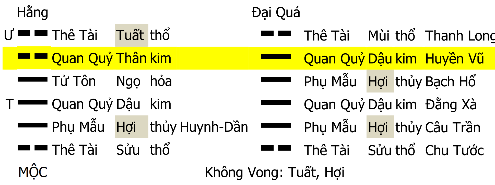
    - **Hình này chứng minh điều gì**
      - Xác nhận đương số mắc triệu chứng chóng mặt do thiếu máu nuôi dưỡng phần đầu.
    - **Từ đâu mà thấy được**
      - Nguyên thần hào 6 lâm Tuần Không bị Nhật khắc; hào 5 Thân kim độc phát lâm Huyền Vũ; biến quẻ Đại Quá du hồn.
- Căn cứ phân tích suy luận:
  - Đoán bệnh của bản thân lấy hào Thế làm Dụng thần. Quẻ có Thế tại hào 3 trì Quan Quỷ Dậu kim.
  - Hào 6 Thê Tài Tuất thổ là Nguyên thần sinh trợ cho hào Thế (Thổ sinh Kim), ngự tại hào 6 lâm Tuần Không nên không thể phát huy tác dụng sinh Dụng thần, lại bị Nhật thần Dần mộc khắc thương.
  - Hào 6 đại diện cho phần đầu; Nguyên thần ở hào 6 bị thương tổn và lâm Không Vong là điềm báo vùng đầu thiếu khí huyết, biểu hiện thành triệu chứng chóng mặt.
  - Quẻ biến Trạch Phong Đại Quá là quẻ du hồn, tượng trưng cho thần trí phiêu bạt, bất an, cũng chủ về chóng mặt.
  - Hào 5 Quan Quỷ Thân kim là hào độc phát trong quẻ (thần triệu cơ ở động, hào độc phát thể hiện tính chất then chốt của bệnh), lâm thần thú Huyền Vũ; Huyền Vũ chủ về u mê, tối sầm, chóng mặt.
  - Tổng hợp toàn bộ tín hiệu: hào 6 lâm Không, quẻ hóa du hồn, hào độc phát lâm Huyền Vũ, kết luận đương số mắc chứng chóng mặt.
- Kết quả ứng nghiệm: Trên thực tế đương số xác nhận bản thân đúng là đang bị triệu chứng chóng mặt quấy rầy.

##### Ví dụ 2: Phụ nữ cao tuổi đoán bệnh bản thân (Quẻ Hỏa Thủy Vị Tế biến Sơn Lôi Di)
- Ngày Canh Tuất tháng Mùi (Tuần không: Dần, Mão), một phụ nữ cao tuổi xem bệnh bản thân, gieo được quẻ Hỏa Thủy Vị Tế biến Sơn Lôi Di.
  - **Hình 140.** Sơ đồ quẻ Hỏa Thủy Vị Tế biến Sơn Lôi Di
    - 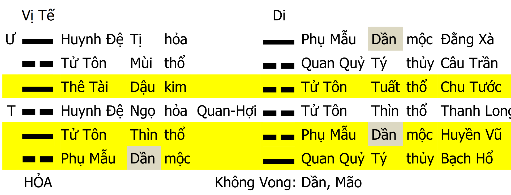
    - **Hình này chứng minh điều gì**
      - Chứng minh đương sự phát sinh chứng bệnh chóng mặt thường xuyên.
    - **Từ đâu mà thấy được**
      - Hào Thế Huynh Đệ Ngọ hỏa nhập Mộ tại Nhật thần Tuất thổ; quẻ biến Sơn Lôi Di là quẻ du hồn.
- Căn cứ phân tích suy luận:
  - Xem bệnh bản thân lấy hào Thế làm Dụng thần; hào Thế ngự tại hào 3 là Huynh Đệ Ngọ hỏa.
  - Hào Thế Ngọ hỏa gặp ngày Canh Tuất là lâm Mộ địa (Tuất là Mộ khố của Hỏa ngũ hành).
  - Quẻ biến Sơn Lôi Di là quẻ du hồn thuộc cung Tốn.
  - Trong phép đoán bệnh Lục Hào, hào Thế hoặc Dụng thần nhập Mộ mang tượng thần trí bị vây hãm, tối tăm, chủ về chóng mặt; quẻ hóa du hồn chủ về phiêu hốt, mất thăng bằng, cũng biểu thị chứng chóng mặt.
- Kết quả ứng nghiệm: Trên thực tế chuẩn xác đương sự thường xuyên bị chứng chóng mặt hành hạ.

##### Ví dụ 3: Nữ đoán bệnh bản thân (Quẻ Cấn Vi Sơn biến Thủy Địa Tỷ)
- Ngày Ất Hợi tháng Ngọ (Tuần không: Thân, Dậu), người phụ nữ tự gieo quẻ dự đoán bệnh tình bản thân, được quẻ Cấn Vi Sơn biến Thủy Địa Tỷ.
  - **Hình 141.** Sơ đồ quẻ Cấn Vi Sơn biến Thủy Địa Tỷ
    - 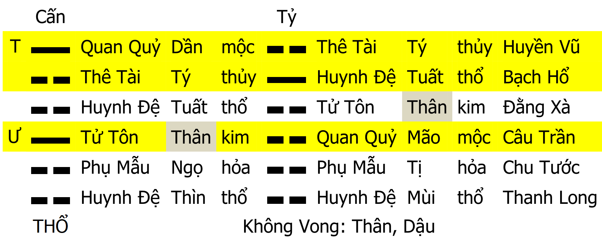
    - **Hình này chứng minh điều gì**
      - Chứng minh đương số có triệu chứng chóng mặt do tổn thương kinh mạch vùng đầu.
    - **Từ đâu mà thấy được**
      - Hào Thế ngự hào 6 động hóa Nguyệt phá lâm Huyền Vũ; hào 3 động đến xung Thế; Nguyên thần bị Nguyệt xung.
- Căn cứ phân tích suy luận:
  - Tự đoán bệnh lấy hào Thế làm Dụng thần. Hào Thế là Quan Quỷ Dần mộc ngự tại hào 6 phát động.
  - Hào Thế tại hào 6 phát động hóa Thê Tài Tý thủy; Tý thủy gặp tháng Ngọ bị xung phá dữ dội thành Nguyệt phá. Hào Thế ngự ngay hào vị đầu não (hào 6) động mà hóa Nguyệt phá, biểu thị rõ ràng vùng đầu có bệnh thương tổn.
  - Hào Thế ngự hào 6 lâm thần thú Huyền Vũ; Huyền Vũ chủ về choáng váng, tối sầm mặt mày, là triệu chứng chóng mặt.
  - Hào 3 Tử Tôn Thân kim trong quẻ cũng phát động, Thân kim đến xung khắc trực tiếp hào Thế Dần mộc, tạo thêm tín hiệu xung động gây choáng váng, chóng mặt.
  - Nguyên thần Thê Tài Tý thủy bị Nguyệt kiến xung phá (tháng Ngọ xung Tý thủy) cũng là căn cứ xác quyết hiện tượng chóng mặt.
- Kết quả ứng nghiệm: Trên thực tế đương số hoàn toàn trùng khớp với triệu chứng chóng mặt dữ dội.

##### Ví dụ 4: Nữ đoán bệnh bản thân (Quẻ Thiên Hỏa Đồng Nhân biến Phong Thiên Tiểu Súc)
- Ngày Giáp Thìn tháng Sửu (Tuần không: Dần, Mão), người phụ nữ xem quẻ đoán bệnh bản thân, gieo được quẻ Thiên Hỏa Đồng Nhân biến Phong Thiên Tiểu Súc.
  - **Hình 142.** Sơ đồ quẻ Thiên Hỏa Đồng Nhân biến Phong Thiên Tiểu Súc
    - 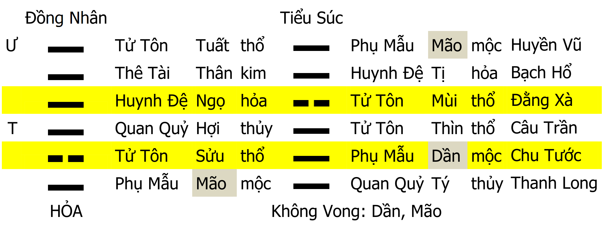
    - **Hình này chứng minh điều gì**
      - Chứng minh đương số phát sinh triệu chứng chóng mặt.
    - **Từ đâu mà thấy được**
      - Hào Thế Quan Quỷ Hợi thủy nhập Mộ tại Nhật thần Thìn; hào 6 Tử Tôn Tuất thổ ám động lâm Huyền Vũ khắc Thế.
- Căn cứ phân tích suy luận:
  - Tự xem bệnh lấy hào Thế làm Dụng thần. Hào Thế ngự tại hào 3 là Quan Quỷ Hợi thủy.
  - Hào Thế Hợi thủy gặp ngày Giáp Thìn là nhập Mộ địa (Thìn là Mộ của Thủy ngũ hành); hào Thế nhập Mộ chủ về thần trí mờ mịt, váng đầu, chóng mặt.
  - Hào 6 Tử Tôn Tuất thổ được tháng Sửu trợ vượng, gặp ngày Thìn xung là ám động; hào 6 ám động mang ngũ hành Thổ khắc ngược lại hào Thế Hợi thủy.
  - Hào 6 là đầu não; hào 6 lâm thần thú Huyền Vũ chủ về tối tăm mặt mày, choáng váng.
  - Tổng hợp tổ hợp hào Thế nhập Mộ cùng hào 6 ám động lâm Huyền Vũ khắc Thế, định bệnh chuẩn xác là chứng chóng mặt.
- Kết quả ứng nghiệm: Trên thực tế xác nhận đúng như dự đoán, người phụ nữ bị chóng mặt kéo dài.

##### Ví dụ 5: Nữ đoán bệnh của cha (Quẻ Lôi Sơn Tiểu Quá biến Hỏa Sơn Lữ)
- Ngày Bính Dần tháng Thìn (Tuần không: Tuất, Hợi), người con gái gieo quẻ dự đoán bệnh tình của cha, được quẻ Lôi Sơn Tiểu Quá biến Hỏa Sơn Lữ.
  - **Hình 143.** Quẻ Lôi Sơn Tiểu Quá biến Hỏa Sơn Lữ
    - 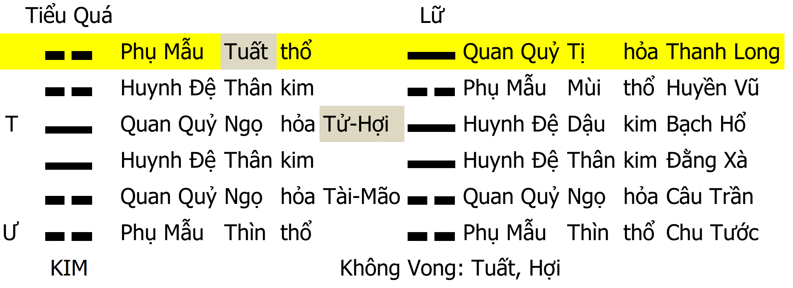
    - **Hình này chứng minh điều gì**
      - Chứng minh người cha đồng thời phát tác hai chứng bệnh đau đầu và chóng mặt.
    - **Từ đâu mà thấy được**
      - Dụng thần Phụ Mẫu Tuất thổ tại hào 6 bị Nguyệt phá, Nhật khắc, lâm Không, lâm Thanh Long; quẻ biến du hồn.
- Căn cứ phân tích suy luận:
  - Đoán bệnh của cha lấy hào Phụ Mẫu làm Dụng thần. Trong quẻ hào Phụ Mẫu lưỡng hiện (Phụ Mẫu Thìn thổ ở hào sơ và Phụ Mẫu Tuất thổ ở hào 6), chọn hào phát động là Phụ Mẫu Tuất thổ tại hào 6 làm Dụng thần.
  - Dụng thần Phụ Mẫu Tuất thổ ngự hào 6 bị Nguyệt kiến Thìn thổ xung phá thành Nguyệt phá, lại bị Nhật kiến Dần mộc khắc thương.
  - Hào 6 là đầu não; Dụng thần tại hào 6 vừa bị xung phá lại vừa lâm Tuần Không (tuần Giáp Tý có Tuất Hợi không vong).
  - Quẻ Lôi Sơn Tiểu Quá là quẻ du hồn; Dụng thần hào 6 bị xung phá, lâm Không, kết hợp tượng quẻ du hồn là chỉ báo chứng chóng mặt.
  - Ngũ hành Dụng thần bị Mộc khắc chế (Mộc chủ phong, đau nhức kinh lạc), bản thân hào 6 lâm thần thú Thanh Long (Thanh Long chủ đau nhức cấp tính ở vùng đầu).
  - Kết hợp hai luồng tín hiệu phân tích: đương số vừa bị đau đầu dữ dội (Mộc khắc, Thanh Long), vừa bị chóng mặt hoa mắt (Nguyệt phá, Không Vong, quẻ du hồn).
- Kết quả ứng nghiệm: Trên thực tế phản hồi chuẩn xác người cha đang bị cơn đau đầu kèm chóng mặt hành hạ.

##### Ví dụ 6: Nữ đoán bệnh bản thân (Quẻ Phong Hỏa Gia Nhân biến Thủy Hỏa Ký Tế)
- Ngày Đinh Sửu tháng Tuất (Tuần không: Thân, Dậu), người phụ nữ tự xem quẻ đoán bệnh bản thân, gieo được quẻ Phong Hỏa Gia Nhân biến Thủy Hỏa Ký Tế.
  - **Hình 144.** Quẻ Phong Hỏa Gia Nhân biến Thủy Hỏa Ký Tế
    - 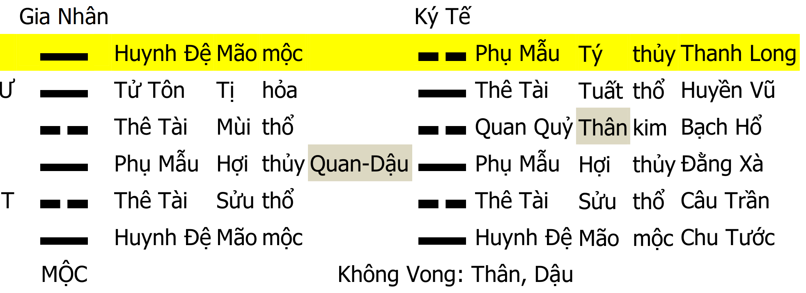
    - **Hình này chứng minh điều gì**
      - Chứng minh đương sự mắc chứng đau nhức đầu dữ dội.
    - **Từ đâu mà thấy được**
      - Kỵ thần Huynh Đệ Mão mộc tại hào 6 độc phát lâm Thanh Long khắc phục hào Thế Thê Tài Sửu thổ.
- Căn cứ phân tích suy luận:
  - Tự xem bệnh lấy hào Thế làm Dụng thần; hào Thế ngự tại hào 2 là Thê Tài Sửu thổ.
  - Kỵ thần Huynh Đệ Mão mộc ngự tại hào 6 là hào duy nhất phát động trong toàn quẻ (độc phát biểu thị trọng tâm phát sinh bệnh lý).
  - Hào 6 độc phát khắc trực tiếp vào hào Thế Thê Tài Sửu thổ.
  - Xét hào vị và thuộc tính ngũ hành: hào 6 là đầu não; Kỵ thần Mão mộc mang ngũ hành Mộc (Mộc chủ phong tà, đau nhức); Kỵ thần lâm thần thú Thanh Long (Thanh Long chủ cảm giác đau nhức cấp bách).
  - Toàn bộ tín hiệu Kỵ thần Mộc lâm Thanh Long tại hào 6 độc phát khắc Dụng thần hội tụ thành chẩn đoán: đương số mắc chứng đau đầu.
- Kết quả ứng nghiệm: Trên thực tế đúng như vậy, đương sự bị những cơn đau đầu dữ dội hành hạ.

##### Ví dụ 7: Nam đoán bệnh của cha (Quẻ Phong Địa Quan)
- Ngày Nhâm Dần tháng Sửu (Tuần không: Thìn, Tị), người con trai xem quẻ dự đoán bệnh tình của cha, gieo được quẻ tĩnh Phong Địa Quan.
  - **Hình 145.** Quẻ Phong Địa Quan
    - 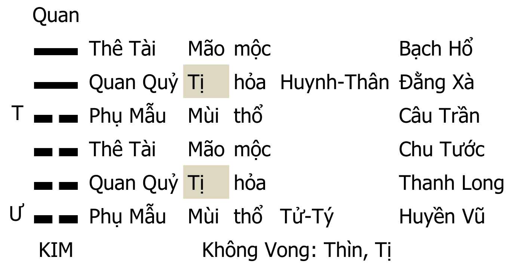
    - **Hình này chứng minh điều gì**
      - Chứng minh người cha mắc bệnh huyết khối não kèm theo bệnh dạ dày.
    - **Từ đâu mà thấy được**
      - Quẻ cung Càn; Kỵ thần hào 6 lâm Bạch Hổ; Dụng thần Phụ Mẫu Mùi thổ lâm Nguyệt phá và Câu Trần; Kỵ thần hào 3 khắc tỳ thổ.
- Căn cứ phân tích suy luận:
  - Xem bệnh của cha lấy hào Phụ Mẫu làm Dụng thần. Trong quẻ Phụ Mẫu lưỡng hiện (Phụ Mẫu Mùi thổ ở hào sơ và hào 4), cả hai đều tĩnh và lâm Nguyệt phá (tháng Sửu xung Mùi thổ), chọn hào Thế Phụ Mẫu Mùi thổ tại hào 4 làm Dụng thần.
  - Dụng thần Phụ Mẫu Mùi thổ lâm Câu Trần, bị Nguyệt phá lại bị Nhật kiến Dần mộc khắc thương, là hình tượng người mang trọng bệnh.
  - Kỵ thần Thê Tài Mão mộc lưỡng hiện tại hào 3 và hào 6:
    - Hào 3 đại diện cho gan mật, tỳ vị, dạ dày.
    - Hào 6 đại diện cho vùng đầu.
    - Quẻ Phong Địa Quan thuộc quái cung Càn; tượng quái Càn chủ về đầu não, củng cố thêm thông tin bệnh biến nằm ở đầu.
  - Phân tích bệnh lý mạch máu não:
    - Hào 6 là đầu não, Kỵ thần Thê Tài Mão mộc lâm thần thú Bạch Hổ (Bạch Hổ chủ về máu huyết).
    - Bản thân Dụng thần Phụ Mẫu Mùi thổ lâm thần thú Câu Trần (Câu Trần chủ về đình trệ, ứ nghẽn, bế tắc, tụ khối).
    - Tổ hợp hào 6 lâm Bạch Hổ phối hợp Dụng thần lâm Câu Trần chỉ ra rõ ràng máu huyết ở đầu não bị ứ nghẽn tạo thành cục máu đông, tức chứng huyết khối não.
  - Phân tích bệnh tỳ vị: Ngũ hành Thổ chủ dạ dày, Kỵ thần Mão mộc ngự hào 3 phát lực khắc Thổ, biểu thị chức năng dạ dày của người cha cũng bị suy thoái, phát sinh đau đớn khó chịu.
- Kết quả ứng nghiệm: Trên thực tế hoàn toàn trùng khớp, người cha mắc chứng huyết khối não và dạ dày cũng có bệnh.

##### Ví dụ 8: Nữ đoán bệnh của mẹ (Quẻ Lôi Trạch Quy Muội biến Thiên Địa Bĩ)
- Ngày Kỷ Dậu tháng Mão (Tuần không: Dần, Mão), người con gái xem quẻ dự đoán bệnh tình của mẹ, được quẻ Lôi Trạch Quy Muội biến Thiên Địa Bĩ.
  - **Hình 146.** Quẻ Lôi Trạch Quy Muội biến Thiên Địa Bĩ
    - 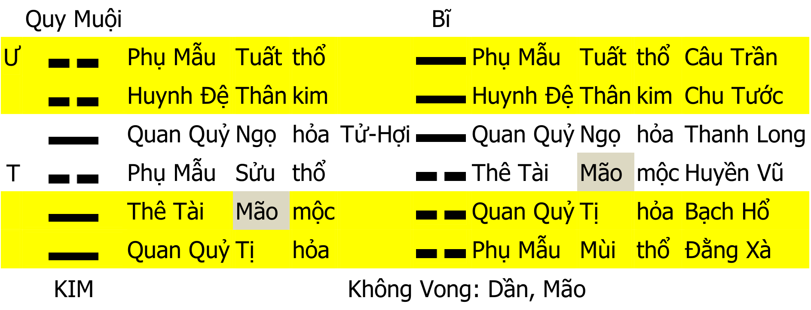
    - **Hình này chứng minh điều gì**
      - Chứng minh người mẹ mắc chứng huyết khối não do máu huyết bị ứ tắc.
    - **Từ đâu mà thấy được**
      - Dụng thần Phụ Mẫu Tuất thổ ở hào 6 bị Nguyệt khắc hợp, phục ngâm lâm Câu Trần; Kỵ thần hào 2 lâm Bạch Hổ khắc hợp.
- Căn cứ phân tích suy luận:
  - Đoán bệnh của mẹ lấy hào Phụ Mẫu làm Dụng thần. Quẻ có Phụ Mẫu lưỡng hiện (Phụ Mẫu Sửu thổ hào 3 và Phụ Mẫu Tuất thổ hào 6), chọn hào phát động Phụ Mẫu Tuất thổ tại hào 6 làm Dụng thần.
  - Dụng thần Phụ Mẫu Tuất thổ ngự hào 6 bị Nguyệt kiến Mão mộc khắc hợp (Mão Tuất lục hợp, Mộc khắc Thổ); hào 6 là đầu não thể hiện vị trí phát sinh bệnh tật nằm ở đầu.
  - Dụng thần phát động biến xuất Phụ Mẫu Tuất thổ, lâm tượng phục ngâm (phục ngâm chủ đau đớn âm ỉ, bế tắc không thông); hào ngự lâm thần thú Câu Trần (Câu Trần chủ về sưng trướng, ách tắc, trì trệ).
  - Kỵ thần Thê Tài Mão mộc ngự tại hào 2 lâm thần thú Bạch Hổ đến khắc hợp Dụng thần: Bạch Hổ đại diện cho máu huyết; quan hệ hợp mang ý nghĩa trói buộc, ngăn trở, tắc nghẽn dòng chảy.
  - Tổ hợp Dụng thần hào 6 phục ngâm lâm Câu Trần kết hợp Kỵ thần Bạch Hổ khắc hợp chỉ ra hiện tượng máu huyết lên não bị ngưng trệ không thông suốt, phán đoán chính xác chứng huyết khối não.
- Kết quả ứng nghiệm: Trên thực tế người mẹ đúng là bị bệnh huyết khối não.

##### Ví dụ 9: Nam đoán bệnh của cha (Quẻ Trạch Lôi Tùy biến Hỏa Lôi Phệ Hạp)
- Ngày Canh Tý tháng Thân (Tuần không: Thìn, Tị), người con trai gieo quẻ dự đoán bệnh tình của cha, được quẻ Trạch Lôi Tùy biến Hỏa Lôi Phệ Hạp.
  - **Hình 147.** Quẻ Trạch Lôi Tùy biến Hỏa Lôi Phệ Hạp
    - 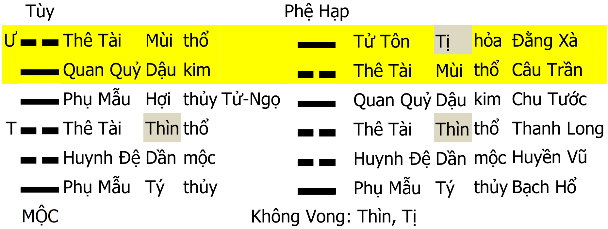
    - **Hình này chứng minh điều gì**
      - Chứng minh người cha bị tai biến xuất huyết não cấp tính.
    - **Từ đâu mà thấy được**
      - Kỵ thần hào 6 lâm Đằng Xà động khắc Dụng thần; Dụng thần lâm Bạch Hổ; ngoại quái Đoài khuyết tổn vỡ nứt.
- Căn cứ phân tích suy luận:
  - Xem bệnh của cha lấy hào Phụ Mẫu làm Dụng thần. Quẻ có Phụ Mẫu lưỡng hiện (Phụ Mẫu Tý thủy hào sơ và Phụ Mẫu Hợi thủy hào 4), chọn Phụ Mẫu Tý thủy lâm Nhật thần (Tý ngày lâm hào) làm Dụng thần.
  - Kỵ thần Thê Tài Mùi thổ ngự tại hào 6 phát động khắc thương Dụng thần; hào 6 là đầu não, báo hiệu đầu não gặp biến cố nguy hiểm.
  - Kỵ thần tại hào 6 lâm thần thú Đằng Xà: Đằng Xà tượng trưng cho vật dài mảnh, tức hệ thống mạch máu hoặc dây thần kinh.
  - Dụng thần Phụ Mẫu Tý thủy lâm thần thú Bạch Hổ: Bạch Hổ chủ về máu huyết; sự kết hợp Đằng Xà và Bạch Hổ cho thấy mạch máu não đã xảy ra sự cố nghiêm trọng.
  - Kỵ thần Mùi thổ phát động hóa Tử Tôn Tị hỏa lâm Tuần Không (tuần Giáp Ngọ có Thìn Tị không vong); ngoại quái của quẻ chính là Đoài kim.
  - Đoài mang tượng sứt mẻ, đổ vỡ, nứt toác, khuyết tổn; hình tượng này ứng vào mạch máu não chính là mạch máu bị căng nứt vỡ ra, dẫn đến máu tràn vào mô não, phán đoán chuẩn xác chứng xuất huyết não.
- Kết quả ứng nghiệm: Trên thực tế người cha đúng là bị tai biến xuất huyết não nghiêm trọng.

##### Ví dụ 10: Nam đoán bệnh bản thân (Quẻ Phong Thủy Hoán biến Thủy Thiên Nhu)
- Ngày Quý Tị tháng Mùi (Tuần không: Ngọ, Mùi), người nam tự xem quẻ đoán bệnh bản thân, gieo được quẻ Phong Thủy Hoán biến Thủy Thiên Nhu.
  - **Hình 148.** Quẻ Phong Thủy Hoán biến Thủy Thiên Nhu
    - 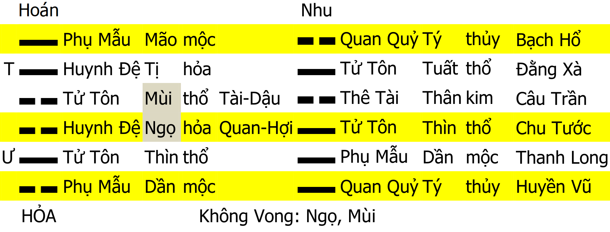
    - **Hình này chứng minh điều gì**
      - Chứng minh đương số mắc chứng teo não, suy giảm trí nhớ và tư duy trì trệ.
    - **Từ đâu mà thấy được**
      - Nguyên thần hào 6 và hào sơ đều động hóa Quan Quỷ lâm Thủy; Mão mộc nhập Mộ tháng Mùi; quẻ biến du hồn; Thế lâm Đằng Xà.
- Căn cứ phân tích suy luận:
  - Đoán bệnh bản thân lấy hào Thế làm Dụng thần. Hào Thế ngự hào 5 là Huynh Đệ Tị hỏa, được Nhật thần Tị hỏa tỉ phù nên rất vượng tướng, trong quẻ không có hào động nào đến khắc Thế; thoạt nhìn Dụng thần và Nguyên thần đều bình an tưởng chừng không có bệnh.
  - Tuy nhiên, quan sát hào Nguyên thần của Thế: Phụ Mẫu Mão mộc tại hào 6 phát động hóa Quan Quỷ Tý thủy, đồng thời Phụ Mẫu Dần mộc tại hào sơ cũng phát động hóa Quan Quỷ Tý thủy; hai hào Nguyên thần cùng phát động hóa ra Quan Quỷ là điểm then chốt chứa đựng thông tin bệnh tật tiềm ẩn.
  - Quan Quỷ là bệnh tà; khi một hào vị phát động biến hóa ra Quỷ thì căn cứ vào hào vị đó để truy nguyên chứng bệnh:
    - Hào 6 đại diện cho đầu não; Nguyên thần Phụ Mẫu đại diện cho tư duy, trí lực; hóa Quỷ lâm ngũ hành Thủy (Thủy cũng chủ trí tuệ, tư duy) chứng tỏ chức năng tư duy của não bộ phát sinh bệnh lý suy thoái.
    - Hào sơ đại diện cho tâm tư kín đáo, nội tâm, cũng chủ về năng lực tư duy và trí nhớ; cả hai đầu hào sơ và hào 6 cùng biến Quan Quỷ biểu thị tư duy và trí nhớ suy giảm nặng nề.
  - Nguyên thần Mão mộc nhập Mộ tại Nguyệt kiến Mùi thổ (Mùi là Mộ khố của Mộc); tượng nhập Mộ biểu thị đầu óc mê muội, hồ đồ, u tối, không còn sáng suốt.
  - Quẻ biến Thủy Thiên Nhu là quẻ du hồn, tượng trưng cho trí nhớ bị phân tán, hay quên, không ghi nhớ được việc gì; hào Thế lâm Đằng Xà cũng chủ về tâm trí bất định, hay quên lãng.
  - Tổng hợp toàn bộ tổ hợp: tư duy trì độn, chức năng nhận thức và trí nhớ bị suy thoái.
- Kết quả ứng nghiệm: Trên thực tế đương số mắc chứng teo não, suy giảm trí nhớ trầm trọng, cử động và phản xạ vận động đều không còn linh hoạt.

##### Ví dụ 11: Mẹ đoán bệnh cho con trai 30 tuổi (Quẻ Sơn Thủy Mông)
- Ngày Kỷ Mão tháng Dần (Tuần không: Thân, Dậu), người mẹ gieo quẻ dự đoán tình trạng bệnh tật của con trai 30 tuổi, được quẻ tĩnh Sơn Thủy Mông.
- Căn cứ phân tích suy luận:
  - Đoán bệnh của con trai lấy hào Tử Tôn làm Dụng thần. Tử Tôn Tuất thổ ngự tại hào 4 lâm trạng thái hưu tù (tháng Dần và ngày Mão thuộc Mộc đều khắc Thổ), lại bị Nhật thần Mão mộc hợp trói chân (Mão Tuất lục hợp, hợp mang ý nghĩa trói buộc, giam giữ bước chân), chủ về khả năng vận động và đi lại bị tê liệt, khó khăn.
  - Kỵ thần Phụ Mẫu Dần mộc lưỡng hiện tại hào sơ và hào 6; cả hào sơ và hào 6 đều đại diện cho hệ thống thần kinh và tư duy não bộ:
    - Kỵ thần ngự hào 6 lâm thần thú Câu Trần: Câu Trần mang đặc tính trì độn, đần độn, phản xạ chậm chạp, ngây ngô.
    - Kỵ thần ngự hào sơ lâm thần thú Đằng Xà: Đằng Xà mang đặc tính co rút, teo tóp, co giật, dị dạng.
    - Tổ hợp Kỵ thần áp chế ở hai cực hào sơ và hào 6 kết hợp Câu Trần (trì độn) và Đằng Xà (teo rút) phản ánh chính xác bệnh lý bại não bẩm sinh.
  - Hào Thế Tử Tôn Tuất thổ lâm thần thú Thanh Long: Thanh Long chủ về ăn uống ẩm thực, ngụ ý sinh hoạt ăn uống không thể tự chủ.
  - Hào Thê Tài Dậu kim (chủ sự nuôi dưỡng, thức ăn) phục tàng dưới hào 4 lại gặp Tuần Không (tuần Giáp Tuất có Thân Dậu không vong) không hiện trên quẻ, càng chứng tỏ người này không có khả năng tự xúc ăn hoặc tự chăm sóc bản thân.
- Kết quả ứng nghiệm: Trên thực tế người con trai mắc bệnh bại não từ nhỏ, hoàn toàn mất khả năng tự chủ sinh hoạt, mọi việc ăn uống và chăm sóc đều phải nhờ người thân gánh vác.

### 2. HUYẾT ÁP CAO VÀ HUYẾT ÁP THẤP

#### Cơ chế sinh lý và định nghĩa huyết áp
- Áp lực của máu tác động lên thành mạch trong quá trình tuần hoàn được định nghĩa là huyết áp:
  - Khi tim co bóp nhanh đẩy máu ra ngoài, áp lực sinh ra đạt cực đại, tạo thành huyết áp cao (huyết áp tâm thu).
  - Khi nhịp tim trở về trạng thái nghỉ ban đầu, huyết áp bắt đầu hạ xuống; về đến tốc độ ban đầu thì áp lực đạt mức cực tiểu, tạo thành huyết áp thấp (huyết áp tâm trương).
- Cơ chế hình thành bệnh lý huyết áp:
  - Tim liên tục vận động quá nhanh và duy trì trạng thái tăng cao kéo dài sẽ dẫn tới huyết áp cao.
  - Tim không thể gia tăng tốc độ, duy trì trạng thái đập chậm chạp trong thời gian dài sẽ dẫn tới huyết áp thấp.
- Đặc thù phân biệt trong dự trắc Lục Hào:
  - Triệu chứng lâm sàng của huyết áp cao và huyết áp thấp rất khó phân biệt trên quẻ do đều biểu hiện qua các dấu hiệu váng đầu, chóng mặt, tức ngực.
  - Dự trắc chuẩn xác đòi hỏi phải nắm vững cơ chế bệnh sinh kết hợp đối chiếu các tổ hợp cung quái, hào vị, ngũ hành và thần sát.

#### Quy tắc phân biệt huyết áp cao và huyết áp thấp trong Lục Hào
- Phương diện quái cung:
  - Huyết áp cao liên quan mật thiết đến ba cung Khảm, Chấn và Càn:
    - Cung Khảm tượng trưng cho máu huyết, chủ về sự sung mãn, tràn đầy.
    - Cung Càn tượng trưng cho đầu não, chủ về vị trí trên cao và huyết áp tăng cao.
    - Cung Chấn tượng trưng cho sự chấn động, kích phát và tăng vọt.
  - Huyết áp thấp liên quan mật thiết đến ba cung Ly, Tốn và Càn:
    - Cung Ly mang hư tượng, chủ về trạng thái trống rỗng, thiếu hụt khí huyết.
    - Cung Càn tượng trưng cho phần đầu não, nơi tập trung đa số biểu hiện triệu chứng thiếu máu não.
    - Cung Tốn chủ về nhập (đi vào trong, hạ xuống), mang nghĩa suy giảm áp lực.
  - Quẻ Sơn Thủy Mông minh họa sự kết hợp giữa quái cung Khảm (huyết dịch) và cấu trúc hào vị phản ánh bệnh lý tuần hoàn:
    - **Hình 149.** Quẻ Sơn Thủy Mông
      - 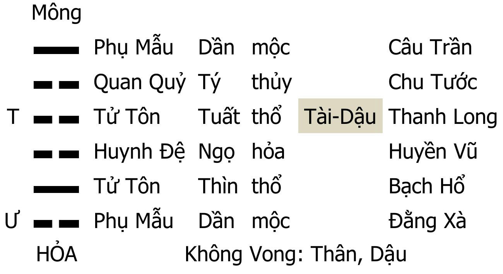
      - **Hình này chứng minh điều gì**
        - Minh họa tổ hợp quái cung, hào vị và phục thần phản ánh bệnh lý huyết dịch, huyết áp.
      - **Từ đâu mà thấy được**
        - Nội quái Khảm chủ huyết; hào 2 Tử Tôn Thìn thổ lâm Bạch Hổ; Thê Tài Dậu kim phục dưới Thế.
- Phương diện hào vị:
  - Huyết áp cao chủ yếu liên quan đến hào 5 và hào 6 (khu vực đỉnh đầu, thượng tiêu, vị trí cao nhất của cơ thể):
    - Nguyên thần ở nội quái bị hào động ở ngoại quái hợp, chủ về khí huyết bị kéo mạnh lên vùng đầu ngoại quái.
    - Nguyên thần ở nội quái phát động đi hợp hào ở ngoại quái, chủ về lực đẩy huyết dịch vọt lên trên.
  - Huyết áp thấp chủ yếu liên quan đến ba hào nội quái (hào sơ, hào 2, hào 3 - hạ tiêu và trung tiêu):
    - Kỵ thần hoặc Nguyên thần hợp với hào ở nội quái phần lớn biểu thị huyết áp thấp, khí huyết ứ đọng ở dưới không lên được đầu.
- Phương diện ngũ hành:
  - Hai hành Thủy và Hỏa nắm giữ huyết mạch và huyết áp (Thủy là chất lỏng máu huyết, Hỏa là tâm hỏa và nhiệt lực thúc đẩy tuần hoàn).
  - Huyết áp cao: Hào Thủy hoặc Hỏa ở trạng thái vượng tướng, quá vượng, được Nguyệt hợp hoặc gặp xung động kích phát.
  - Huyết áp thấp: Hào Thủy hoặc Hỏa lâm hưu tù, rơi vào Tuần Không, bị Nhật kiến cùng hào động hợp giữ, hoặc sa vào Mộ khố.
- Phương diện lục thân:
  - Lục thân Thê Tài là biểu trưng trực tiếp của máu huyết và dịch thể dinh dưỡng:
    - Huyết áp cao: Thê Tài bị xung, lâm ngoại quái, hoặc ở trạng thái vượng tướng phát động.
    - Huyết áp thấp: Thê Tài không xuất hiện trên quẻ, rơi vào Không Vong, Nguyệt phá, hoặc nhập Mộ khố.
- Phương diện lục thần:
  - Bạch Hổ chủ về huyết quang, tuần hoàn máu và huyết áp; Bạch Hổ vượng động lâm hào cao chủ về huyết áp cao.
  - Đằng Xà chủ về sự thiếu hụt, suy giảm, eo hẹp, chủ yếu thiên về huyết áp thấp.
- Phương diện sinh khắc và trạng thái biến hóa:
  - Tác động của Nhật Nguyệt: Hào chủ sự chịu ảnh hưởng sinh vượng hoặc xung kích từ Nhật Nguyệt phần lớn là huyết áp cao.
  - Vị trí Nguyên thần: Nguyên thần xuất hiện trục trặc tại ngoại quái phần lớn chủ về huyết áp cao.
  - Động hợp hào cao: Kỵ thần hoặc Nguyên thần phát động tương hợp với hào 5 hoặc hào 6 là chỉ dấu của huyết áp cao.
  - Khuyết thần: Kỵ thần hoặc Nguyên thần không xuất hiện trên quẻ phần lớn là huyết áp thấp.
  - Tượng quẻ và động biến:
    - Quẻ Du hồn chủ về huyết áp thấp; quẻ Quy hồn chủ về huyết áp cao.
    - Hào động hóa Tiến thần chủ về huyết áp cao; hào động hóa Thoái thần chủ về huyết áp thấp.

#### Các ví dụ thực tế dự trắc huyết áp

##### Ví dụ 1: Ngày Đinh Mùi tháng Tị nam mơ thấy cha ngã (Trạch Lôi Tùy biến Hỏa Lôi Phệ Hạp)
- Bối cảnh dự trắc: Ngày Đinh Mùi tháng Tị (tuần không: Dần, Mão), một người đàn ông nằm mơ thấy cha mình đột nhiên ngã quỵ xuống đất, trong lòng bất an nên đến gieo quẻ xem cát hung của giấc chiêm bao.
- Xác định Dụng thần:
  - Dự trắc cho người cha, lấy lục thân Phụ Mẫu làm Dụng thần.
  - Quẻ xuất hiện Phụ Mẫu lưỡng hiện (Phụ Mẫu Tý thủy ở hào sơ và Phụ Mẫu Hợi thủy ở hào 4).
  - Chọn hào Phụ Mẫu Hợi thủy làm Dụng thần vì hào này lâm Nguyệt phá (tháng Tị xung Hợi).
- Luận giải nguyên nhân bệnh lý:
  - Dụng thần Phụ Mẫu Hợi thủy lâm Bạch Hổ, bị Nguyệt phá lại bị Nhật kiến Mùi thổ khắc phạt, chứng tỏ thân thể suy kiệt, đang mang trọng bệnh trong người.
  - Bạch Hổ chủ về huyết dịch, hành Thủy cũng chủ về máu huyết, xác định bệnh tật liên quan trực tiếp đến hệ tuần hoàn và huyết áp.
  - Kỵ thần Thê Tài Mùi thổ phát động tại hào 6 (vùng đỉnh đầu) khắc chế Dụng thần.
  - Quẻ Tùy thuộc cung Chấn (Chấn chủ động, chủ tốc độ gia tăng nhanh chóng).
  - Dụng thần Hợi thủy bị Nguyệt kiến Tị hỏa xung (xung chủ sự gấp gáp, tăng nhanh; Hỏa là tim chủ tim đập dồn dập).
  - Tổ hợp quái tượng xác nhận người cha mắc chứng huyết áp cao và bệnh tim bộc phát dẫn tới té ngã.
  - Quẻ Trạch Lôi Tùy biến Hỏa Lôi Phệ Hạp thể hiện Dụng thần suy yếu lâm Bạch Hổ và Kỵ thần động khắc:
    - **Hình 150.** Sơ đồ quẻ Trạch Lôi Tùy biến Hỏa Lôi Phệ Hạp
      - 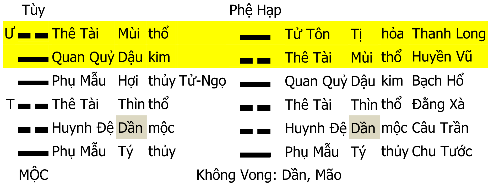
      - **Hình này chứng minh điều gì**
        - Chứng minh người cha mắc bệnh tim đập nhanh và huyết áp cao nghiêm trọng.
      - **Từ đâu mà thấy được**
        - Phụ Mẫu Hợi thủy Nguyệt phá lâm Bạch Hổ bị Nhật khắc, cung Chấn chủ động, Kỵ thần hào 6 động khắc.
- Ứng nghiệm thực tế: Người cha trên thực tế mắc bệnh huyết áp cao và bệnh tim.

##### Ví dụ 2: Ngày Đinh Sửu tháng Tuất đoán bệnh của mẹ (Sơn Hỏa Bí biến Sơn Lôi Di)
- Bối cảnh dự trắc: Ngày Đinh Sửu tháng Tuất (tuần không: Thân, Dậu), một người đến dự trắc tình hình bệnh tật của mẹ.
- Xác định Dụng thần:
  - Xem bệnh cho mẹ, lấy Phụ Mẫu làm Dụng thần.
  - Phụ Mẫu Ngọ hỏa không xuất hiện trên quẻ, phục dưới hào 2 Huynh Đệ Sửu thổ [Phụ Mẫu Ngọ hỏa].
- Luận giải nguyên nhân bệnh lý:
  - Kỵ thần Thê Tài Hợi thủy độc phát tại hào 3 biến Huynh Đệ Thìn thổ quay lại khắc phạt Dụng thần Phụ Mẫu Ngọ hỏa.
  - Hào 3 là hào vị của tim; hào lâm Đằng Xà chủ về phiền muộn, hoảng sợ, tâm thần bất an.
  - Ngũ hành: Hỏa là tim, Thủy chủ về máu huyết.
  - Quẻ Bí thuộc cung Cấn: Cấn chủ yên tĩnh, thông thường biểu thị huyết áp thấp; tuy nhiên hào độc phát nắm quyền định đoạt tính chất của quẻ.
  - Hào độc phát Kỵ thần Thê Tài Hợi thủy lục hợp với hào 6 Quan Quỷ Dần mộc (Dần Hợi hợp); hào 6 là đỉnh đầu.
  - Kỵ thần hợp lên hào đầu thể hiện áp lực huyết dịch xông thẳng lên não, do đó phán đoán là huyết áp cao.
  - Quẻ Sơn Hỏa Bí biến Sơn Lôi Di thể hiện Kỵ thần độc phát tại hào 3 hợp lên hào 6 đỉnh đầu:
    - **Hình 151.** Sơ đồ quẻ Sơn Hỏa Bí biến Sơn Lôi Di
      - 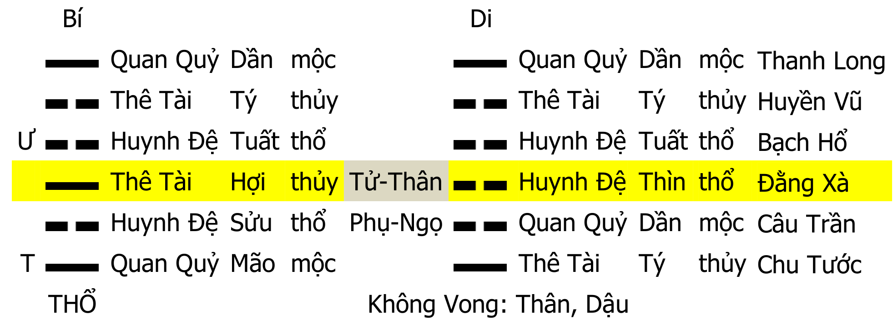
      - **Hình này chứng minh điều gì**
        - Chứng minh người mẹ bị bệnh huyết áp cao do can hỏa và khí huyết thượng nghịch lên đầu.
      - **Từ đâu mà thấy được**
        - Kỵ thần Thê Tài Hợi thủy độc phát lâm Đằng Xà tại hào 3 hợp với hào 6 Dần mộc ở đỉnh đầu.
- Ứng nghiệm thực tế: Người mẹ trên thực tế đúng là mắc chứng huyết áp cao.

##### Ví dụ 3: Ngày Đinh Mão tháng Tuất nữ đoán bệnh của mẹ (Phong Địa Quan)
- Bối cảnh dự trắc: Ngày Đinh Mão tháng Tuất (tuần không: Tuất, Hợi), người con gái đến gieo quẻ dự đoán bệnh tình của mẹ, được quẻ tĩnh Phong Địa Quan.
- Xác định Dụng thần:
  - Xem bệnh cho mẹ, lấy Phụ Mẫu làm Dụng thần.
  - Phụ Mẫu lưỡng hiện: Phụ Mẫu Mùi thổ ở hào sơ và Phụ Mẫu Mùi thổ ở hào 4 Thế. Cả hai hào đều tĩnh và cùng mang chi Mùi thổ.
  - Chọn hào Phụ Mẫu Mùi thổ tại hào Thế làm Dụng thần.
- Luận giải nguyên nhân bệnh lý:
  - Dụng thần Thế Phụ Mẫu Mùi thổ lâm Bạch Hổ, bị Nhật kiến Mão mộc khắc chế; Bạch Hổ chủ về huyết dịch.
  - Kỵ thần Thê Tài Mão mộc lưỡng hiện tại hào 3 nội quái và hào 6 ngoại quái.
  - Quẻ Quan thuộc cung Càn: Càn chủ về đầu, biểu thị tín hiệu bệnh lý vùng đầu não cực kỳ nổi bật; do đó lấy hào 6 Kỵ thần Thê Tài Mão mộc làm chủ thể phán đoán.
  - Hào 6 là đỉnh đầu, lại được Nguyệt kiến Tuất thổ hợp (Mão Tuất hợp).
  - Tượng hợp thành: Cung Càn là cao, ngoại quái là cao, Nguyệt hợp lại chủ về sự tăng cao; vì vậy phán đoán người mẹ bị huyết áp cao.
  - Quẻ Phong Địa Quan thể hiện hào Thế Phụ Mẫu lâm Bạch Hổ và Kỵ thần hào 6 cung Càn được Nguyệt hợp:
    - **Hình 152.** Sơ đồ quẻ Phong Địa Quan
      - 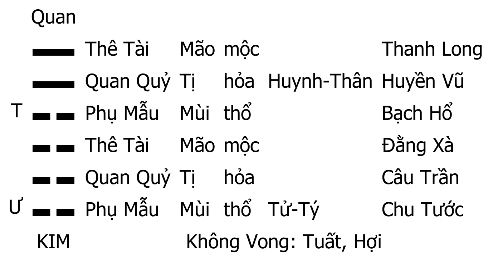
      - **Hình này chứng minh điều gì**
        - Chứng minh người mẹ mắc chứng huyết áp cao thể hiện rõ rệt ở vùng đầu não.
      - **Từ đâu mà thấy được**
        - Dụng thần Thế Phụ Mẫu Mùi thổ lâm Bạch Hổ bị Nhật khắc; Kỵ thần Mão mộc tại hào 6 cung Càn được Nguyệt hợp.
- Ứng nghiệm thực tế: Người mẹ trên thực tế đúng là mắc bệnh huyết áp cao.

##### Ví dụ 4: Ngày Nhâm Tuất tháng Dậu nam đoán bệnh bản thân (Trạch Phong Đại Quá biến Càn Vi Thiên)
- Bối cảnh dự trắc: Ngày Nhâm Tuất tháng Dậu (tuần không: Tý, Sửu), một người nam gieo quẻ dự đoán tình trạng bệnh tật của bản thân, được Trạch Phong Đại Quá biến Càn Vi Thiên.
- Xác định Dụng thần: Tự xem bệnh cho bản thân lấy hào Thế làm Dụng thần. Thế tọa tại hào 4 Phụ Mẫu Hợi thủy.
- Luận giải nguyên nhân bệnh lý:
  - Trong quẻ có Kỵ thần Thê Tài lưỡng động (Thê Tài Sửu thổ ở hào sơ và Thê Tài Mùi thổ ở hào 6).
  - Hào sơ Thê Tài Sửu thổ lâm Tuần Không, lại bị hào biến Phụ Mẫu Tý thủy hồi đầu hợp trú (Tý Sửu hợp), lực xung khắc không đáng kể nên không cần xét đến.
  - Hào 6 Thê Tài Mùi thổ phát động hóa Thê Tài Tuất thổ (hóa Tiến thần), hướng thẳng đến khắc chế hào Thế:
    - Hào 6 là vị trí đỉnh đầu.
    - Thê Tài là máu, lâm Bạch Hổ cũng chủ về huyết dịch.
    - Hóa Tiến thần biểu thị áp lực tăng tiến liên tục.
    - Quẻ Đại Quá thuộc cung Chấn (Chấn chủ kích phát, tăng vọt).
    - Sự hội tụ của các yếu tố đỉnh đầu, huyết dịch lâm Bạch Hổ, Tiến thần và cung Chấn chỉ ra chứng huyết áp cao.
  - Quẻ Trạch Phong Đại Quá biến Càn Vi Thiên thể hiện Kỵ thần hào 6 hóa Tiến thần khắc Thế:
    - **Hình 153.** Quẻ Trạch Phong Đại Quá biến Càn Vi Thiên
      - 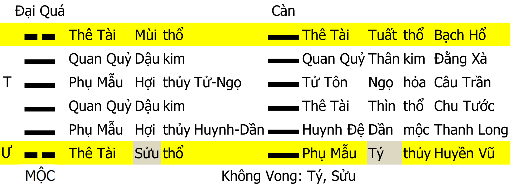
      - **Hình này chứng minh điều gì**
        - Chứng minh đương số mắc bệnh huyết áp cao có xu hướng phát triển tăng tiến mạnh.
      - **Từ đâu mà thấy được**
        - Hào 6 Thê Tài Mùi thổ lâm Bạch Hổ động hóa Tiến thần Tuất thổ khắc Thế, quẻ thuộc cung Chấn.
- Ứng nghiệm thực tế: Bệnh nhân đúng là mắc chứng bệnh huyết áp cao.

##### Ví dụ 5: Ngày Ất Mùi tháng Thìn đoán bệnh cho mẹ học trò (Hỏa Sơn Lữ biến Thiên Sơn Độn)
- Bối cảnh dự trắc: Ngày Ất Mùi tháng Thìn (tuần không: Thìn, Tị), học trò nhờ tác giả xem bệnh cho mẹ; người mẹ đích thân tự tay gieo quẻ được Hỏa Sơn Lữ biến Thiên Sơn Độn.
- Xác định Dụng thần: Do người mẹ đích thân gieo quẻ hỏi bệnh bản thân, lấy hào Thế làm Dụng thần. Thế tọa tại hào sơ Tử Tôn Thìn thổ.
- Luận giải nguyên nhân bệnh lý:
  - Hào Thế Tử Tôn Thìn thổ tọa tại hào sơ lâm Thanh Long: hào sơ là bàn chân, hào Thế lâm Tuần Không biểu thị bàn chân suy yếu, không có sức lực để đứng vững.
  - Hào 6 Huynh Đệ Tị hỏa là Nguyên thần sinh Dụng thần Thìn thổ:
    - Hào 6 lâm Tuần Không, mất lực sinh trợ Dụng thần.
    - Hào 6 là cánh tay, Huynh Đệ cũng chủ về tay; lâm Không Vong phản ánh đôi tay bải hoải, mất hết sức lực; kết hợp lại là tứ chi vô lực.
    - Hào 6 đồng thời là đầu não; hào Không chủ về trống rỗng, lâm Huyền Vũ chủ về choáng váng, nên có triệu chứng chóng mặt hoa mắt.
  - Hào 5 Tử Tôn Mùi thổ lâm Bạch Hổ độc phát, hóa Thê Tài Thân kim:
    - Hào độc phát nắm giữ căn nguyên bệnh tật; Bạch Hổ chủ về huyết dịch và huyết áp.
    - Quẻ Lữ thuộc cung Ly thông thường chủ về huyết áp thấp, nhưng ở đây hào lâm Bạch Hổ độc phát tại ngoại quái, Nguyên thần hào 6 lại Không Vong, do đó khẳng định là huyết áp cao.
    - Hào 5 là đường đi, Bạch Hổ chủ về tổn thương, biểu thị bị ngã ở trên đường.
    - Hào động Mùi thổ không khắc hại Dụng thần Thìn thổ (đồng hành Thổ), do đó người mẹ chỉ bị ngã xây xát nhẹ, không nguy hiểm tính mạng.
  - Quẻ Hỏa Sơn Lữ biến Thiên Sơn Độn phản ánh Thế và Nguyên thần Không Vong cùng Bạch Hổ độc phát hào 5:
    - **Hình 154.** Quẻ Hỏa Sơn Lữ biến Thiên Sơn Độn
      - 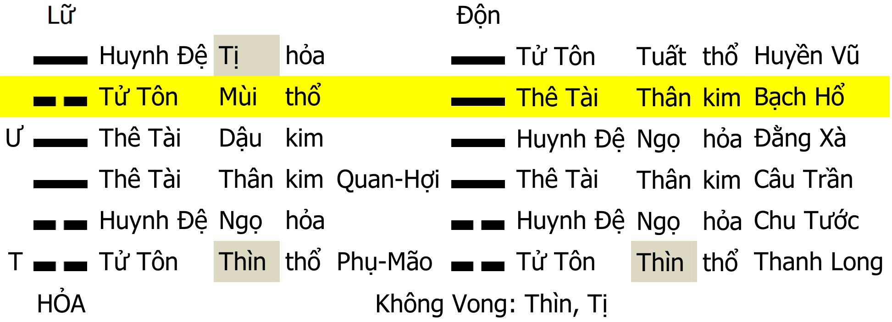
      - **Hình này chứng minh điều gì**
        - Chứng minh mẹ học trò bị huyết áp cao gây chóng mặt, tứ chi vô lực và ngã trên đường.
      - **Từ đâu mà thấy được**
        - Hào Thế hào sơ Tuần Không, Nguyên thần hào 6 Không Vong; hào 5 đường đi lâm Bạch Hổ độc phát.
- Ứng nghiệm thực tế: Thực tế hoàn toàn trùng khớp với phán đoán, người mẹ bị huyết áp cao gây chóng mặt, chân tay rệu rã và bị ngã khi đang đi trên đường.

##### Ví dụ 6: Ngày Mậu Tuất tháng Dậu nữ đoán bệnh bản thân (Hỏa Địa Tấn biến Hỏa Lôi Phệ Hạp)
- Bối cảnh dự trắc: Ngày Mậu Tuất tháng Dậu (tuần không: Thìn, Tị), một người phụ nữ tự gieo quẻ xem bệnh của bản thân, được Hỏa Địa Tấn biến Hỏa Lôi Phệ Hạp.
- Xác định Dụng thần: Tự xem bệnh lấy hào Thế làm Dụng thần. Thế tọa tại hào 4 Huynh Đệ Dậu kim.
- Luận giải nguyên nhân bệnh lý:
  - Hào Thế Huynh Đệ Dậu kim được Nguyệt kiến Dậu kim tỉ phù trợ vượng, lại được Nhật kiến Tuất thổ sinh trợ.
  - Trong quẻ Nguyên thần Phụ Mẫu lưỡng hiện (Mùi thổ ở hào sơ và hào 5); hào sơ Phụ Mẫu Mùi thổ lại phát động hóa Tử Tôn Tý thủy quay lại tiếp tục sinh trợ hào Thế.
  - Dụng thần không có hào nào khắc chế hay tiết khí, chịu sự sinh trợ thái quá; theo quy luật "đa sinh vi bệnh", khí lực quá thịnh dẫn tới "vật cực tất phản".
  - Quẻ Tấn thuộc cung Càn (Càn chủ về đầu não), ắt sinh chứng đau đầu, chóng mặt.
  - Xét hào Nguyên thần Mùi thổ ở hào sơ: Mùi thổ là Thê Tài khố (kho chứa Thê Tài Mộc); Tài là máu, lâm Bạch Hổ lại là máu; Mùi thổ mang tượng mạch máu. Mùi thổ phát động hóa ra Tý thủy (hóa Thủy là chảy đi, hạ thấp); do đó phán đoán áp lực lòng mạch bị suy giảm, chính là huyết áp thấp.
  - Quẻ Hỏa Địa Tấn biến Hỏa Lôi Phệ Hạp thể hiện hào Thế quá vượng và Nguyên thần Tài khố hào sơ hóa Thủy:
    - **Hình 155.** Quẻ Hỏa Địa Tấn biến Hỏa Lôi Phệ Hạp
      - 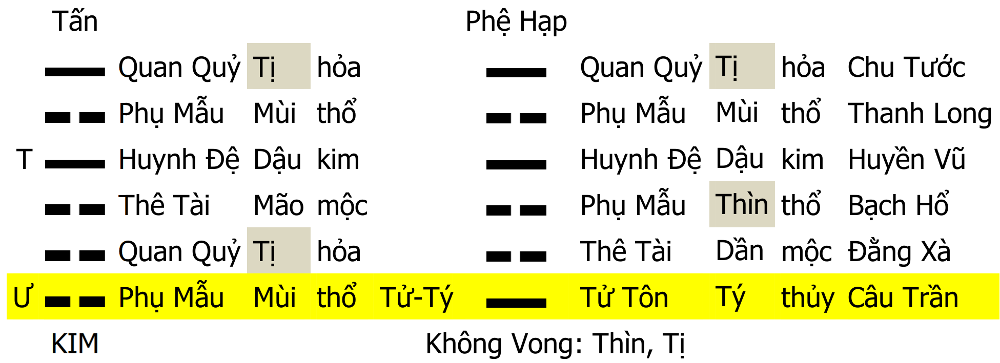
      - **Hình này chứng minh điều gì**
        - Chứng minh người nữ bị huyết áp thấp dẫn đến đau đầu và choáng váng hoa mắt.
      - **Từ đâu mà thấy được**
        - Dụng thần Thế quá vượng (đa sinh vi bệnh); Nguyên thần Mùi thổ (Tài khố) ở hào sơ lâm Bạch Hổ động hóa Tý thủy.
- Ứng nghiệm thực tế: Bệnh nhân trên thực tế bị huyết áp thấp dẫn tới chóng mặt.

##### Ví dụ 7: Ngày Quý Mùi tháng Mùi nam đoán bệnh bản thân (Ly Vi Hỏa biến Trạch Sơn Hàm)
- Bối cảnh dự trắc: Ngày Quý Mùi tháng Mùi (tuần không: Thân, Dậu), một người nam gieo quẻ dự trắc bệnh tật của bản thân, được Ly Vi Hỏa biến Trạch Sơn Hàm.
- Xác định Dụng thần: Tự xem bệnh lấy hào Thế làm Dụng thần. Thế tọa tại hào 6 Huynh Đệ Tị hỏa.
- Luận giải nguyên nhân bệnh lý:
  - Nhật kiến Mùi thổ và Nguyệt kiến Mùi thổ tiết khí hào Thế, không sinh trợ Dụng thần; hào Thế Tị hỏa hưu tù vô lực.
  - Hào Thế tại hào 6 lâm Bạch Hổ: hào 6 là đỉnh đầu, Bạch Hổ chủ về máu huyết, biểu thị phần đầu có bệnh liên quan đến tuần hoàn máu và huyết áp.
  - Nguyên thần Phụ Mẫu Mão mộc nhập Mộ ở Nhật kiến và Nguyệt kiến Mùi thổ (Mão mộc nhập Mộ tại Mùi).
  - Nguyên thần Mão mộc đồng thời nhập Mộ tại hào 5 Tử Tôn Mùi thổ lâm Đằng Xà.
  - Đằng Xà chủ về sự thiếu thốn, hao hụt; nguồn sinh cho đầu não bị thiếu hụt trầm trọng, do đó xác định là huyết áp thấp.
  - Quẻ Ly Vi Hỏa biến Trạch Sơn Hàm phản ánh hào Thế hưu tù lâm Bạch Hổ và Nguyên thần nhập Mộ Đằng Xà:
    - **Hình 156.** Quẻ Ly Vi Hỏa biến Trạch Sơn Hàm
      - 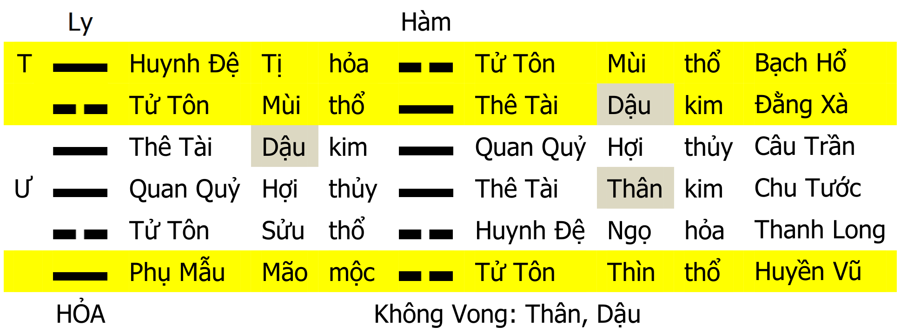
      - **Hình này chứng minh điều gì**
        - Chứng minh đương số bị huyết áp thấp do khí huyết hư suy, thiếu hụt nghiêm trọng.
      - **Từ đâu mà thấy được**
        - Hào Thế Tị hỏa tại hào 6 hưu tù lâm Bạch Hổ; Nguyên thần Mão mộc nhập Mộ Nhật Nguyệt và nhập Mộ Mùi thổ Đằng Xà.
- Ứng nghiệm thực tế: Người này trên thực tế đúng là mắc bệnh huyết áp thấp.

### 3. THIẾU MÁU

#### Nguyên lý và các phương diện nhận định bệnh thiếu máu
- **Cơ chế bệnh sinh theo y học hiện đại và nguyên lý tổng quát**:
  - Thiếu máu phát sinh do cơ thể thiếu sắt, mất máu do xuất huyết, tán huyết hoặc chức năng tạo máu gặp trở ngại khiến tổng lượng hồng cầu sụt giảm xuống dưới mức bình thường.
- **Phương diện lục thần trong dự trắc thiếu máu**:
  - Hai lục thần giữ vai trò then chốt gồm Bạch Hổ và Đằng Xà.
  - Bạch Hổ chủ về máu huyết và hệ thống tuần hoàn máu.
  - Đằng Xà chủ về sự khuyết thiếu, hao hụt, không đầy đủ.
- **Phương diện quan hệ sinh khắc và trạng thái hào**:
  - Nguyên thần là ngọn nguồn sinh dưỡng của Dụng thần; khi Dụng thần ngộ Tuần Không hoặc Nguyên thần ngộ Tuần Không, Nguyên thần nhập Mộ, hoặc Nguyên thần bị hợp trụ thì mất khả năng sinh trợ hoặc Dụng thần không nhận được sinh trợ, cấu thành thông tin thiếu máu.
  - Trạng thái Không Vong biểu thị sự khuyết thiếu về lượng máu; trạng thái nhập Mộ hoặc bị hợp trụ biểu thị sự đình trệ, tắc nghẽn của chức năng sinh huyết.
- **Phương diện ngũ hành**:
  - Bệnh thiếu máu liên quan trực tiếp đến hai ngũ hành Thủy và Hỏa.
  - Ngũ hành Thủy và Hỏa trong lục hào là hai hành đại diện cho máu huyết trong cơ thể.
- **Phương diện quái cung**:
  - Quẻ thuộc cung Ly chủ về hư (bên trong trống rỗng).
  - Quẻ thuộc cung Đoài chủ về khuyết (sứt mẻ, thiếu hụt).
  - Tượng hư của Ly và tượng khuyết của Đoài giúp việc nắm bắt quái tượng thiếu máu trở nên chuẩn xác và thuận lợi.

#### Phân tích các ví dụ thực tế dự đoán bệnh thiếu máu

##### Ví dụ 1: Phụ nữ đoán chung thân vận khí (Quẻ Hỏa Trạch Khuê biến Sơn Hỏa Bí)
- **Bối cảnh quẻ:** Ngày Đinh Tị tháng Hợi (Tuần không: Tý, Sửu), một người phụ nữ đoán chung thân vận khí, gieo được quẻ Hỏa Trạch Khuê biến Sơn Hỏa Bí.
  - **Hình 157.** Sơ đồ quẻ Hỏa Trạch Khuê biến Sơn Hỏa Bí
    - 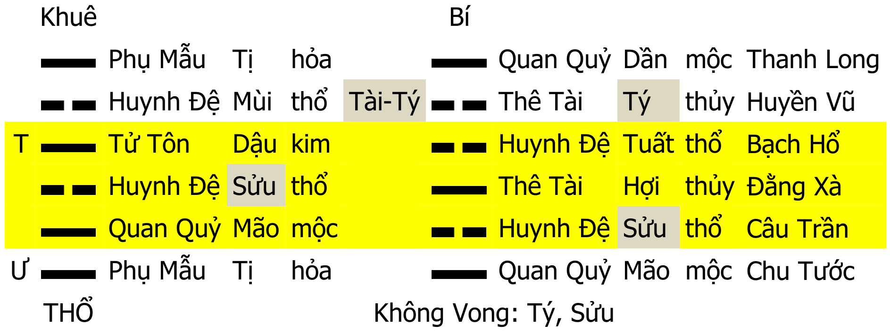
    - **Hình này chứng minh điều gì**
      - Thể trạng của người phụ nữ mang mầm bệnh thiếu máu kinh niên trong vận khí cả đời.
    - **Từ đâu mà thấy được**
      - Hào Thế Tử Tôn Dậu kim lâm Bạch Hổ gặp Nguyệt Hợi thủy là Bệnh địa (Bạch Hổ và Thủy đều chủ máu); Nguyên thần Sửu thổ lâm Đằng Xà Không Vong không thể sinh Thế (Không chủ khuyết, Đằng Xà chủ thiếu).
- **Phán đoán chi tiết:**
  - Xác định Dụng thần và tình trạng cơ thể trong vận khí chung thân:
    - Trong phép đoán chung thân vận khí đã bao hàm đầy đủ tình trạng cơ thể và bệnh tật của đương số.
    - Hào Thế Tử Tôn Dậu kim cư hào 4 đại diện cho người hỏi, lâm Bạch Hổ chủ về máu huyết.
    - Tháng Hợi thủy là Bệnh địa của Dậu kim theo vòng Trường sinh (Kim bệnh tại Hợi); Bệnh đóng tại chi Thủy mà Thủy lại có ý nghĩa là máu huyết, biểu thị máu mang bệnh tật.
  - Phân tích trạng thái Nguyên thần mất khả năng sinh dưỡng:
    - Nguyên thần Huynh Đệ Sửu thổ cư hào 3 là nguồn sinh cho hào Thế Dậu kim, nhưng Sửu thổ ngộ Tuần Không (ngày Đinh Tị thuộc tuần Giáp Dần, Tuần không tại Tý, Sửu).
    - Không Vong biểu thị sự khuyết thiếu, thiếu hụt.
    - Sửu thổ lại lâm Đằng Xà; Đằng Xà chủ về sự thiếu thốn, eo hẹp.
    - Nguyên thần vừa ngộ Không vừa lâm Đằng Xà nên hoàn toàn bất lực không thể sinh hào Thế, phản ánh chức năng tạo máu bị khuyết thiếu, hình thành bệnh thiếu máu.
- **Kết quả ứng nghiệm thực tế:**
  - Trên thực tế, người phụ nữ này mắc bệnh thiếu máu.

##### Ví dụ 2: Nữ đoán bệnh bản thân (Quẻ Trạch Thiên Quải biến Lôi Thiên Đại Tráng)
- **Bối cảnh quẻ:** Ngày Ất Dậu tháng Tuất (Tuần không: Ngọ, Mùi), người phụ nữ tự đoán bệnh bản thân, gieo được quẻ Trạch Thiên Quải biến Lôi Thiên Đại Tráng.
  - **Hình 158.** Sơ đồ quẻ Trạch Thiên Quải biến Lôi Thiên Đại Tráng
    - 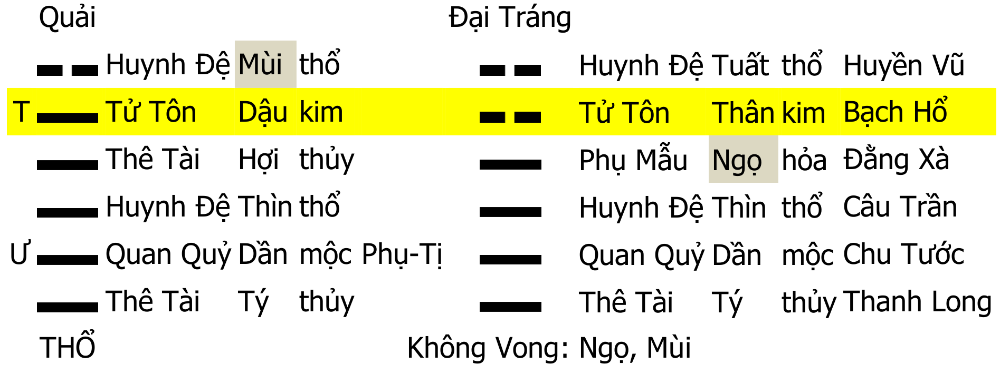
    - **Hình này chứng minh điều gì**
      - Người bệnh bị sụt giảm lượng máu và thiếu sắt trong cơ thể dẫn đến chứng thiếu máu.
    - **Từ đâu mà thấy được**
      - Hào Thế Tử Tôn Dậu kim lâm Bạch Hổ động hóa Thoái thần Thân kim (Bạch Hổ là máu, Kim là sắt, hóa Thoái là suy giảm); Nguyên thần Mùi thổ ngộ Tuần Không không sinh được Dụng thần.
- **Phán đoán chi tiết:**
  - Xác định Dụng thần và động thái biến hóa của hào Thế:
    - Tự đoán bệnh lấy hào Thế làm Dụng thần; trong quẻ Dụng thần là hào 5 Tử Tôn Dậu kim.
    - Hào Thế Dậu kim lâm Bạch Hổ phát động biến hóa thoái thành Tử Tôn Thân kim; Bạch Hổ chủ về máu huyết; ngũ hành Kim đại diện cho nguyên tố sắt; hóa thoái biểu thị sự giảm thiểu, suy giảm số lượng.
  - Phân tích tác động từ Nguyên thần:
    - Nguyên thần của Dụng thần là Huynh Đệ Mùi thổ cư hào 6 lâm Tuần Không (ngày Ất Dậu thuộc tuần Giáp Thân, Tuần không tại Ngọ, Mùi).
    - Mùi thổ ngộ Tuần Không nên mất khả năng sinh phù cho Dụng thần Dậu kim, khiến nguồn sản sinh huyết dịch bị thiếu hụt.
    - Sự kết hợp giữa hào Thế Bạch Hổ kim hóa thoái và Nguyên thần ngộ Không xác lập chẩn đoán bệnh thiếu máu.
- **Kết quả ứng nghiệm thực tế:**
  - Trên thực tế đúng như quẻ dự đoán, người phụ nữ mắc bệnh thiếu máu.

##### Ví dụ 3: Nam đoán bệnh của vợ (Quẻ Ly Vi Hỏa)
- **Bối cảnh quẻ:** Ngày Giáp Thân tháng Mùi (Tuần không: Ngọ, Mùi), người chồng đoán bệnh cho vợ, gieo được quẻ thuần Ly Vi Hỏa.
  - **Hình 159.** Sơ đồ quẻ Ly Vi Hỏa
    - 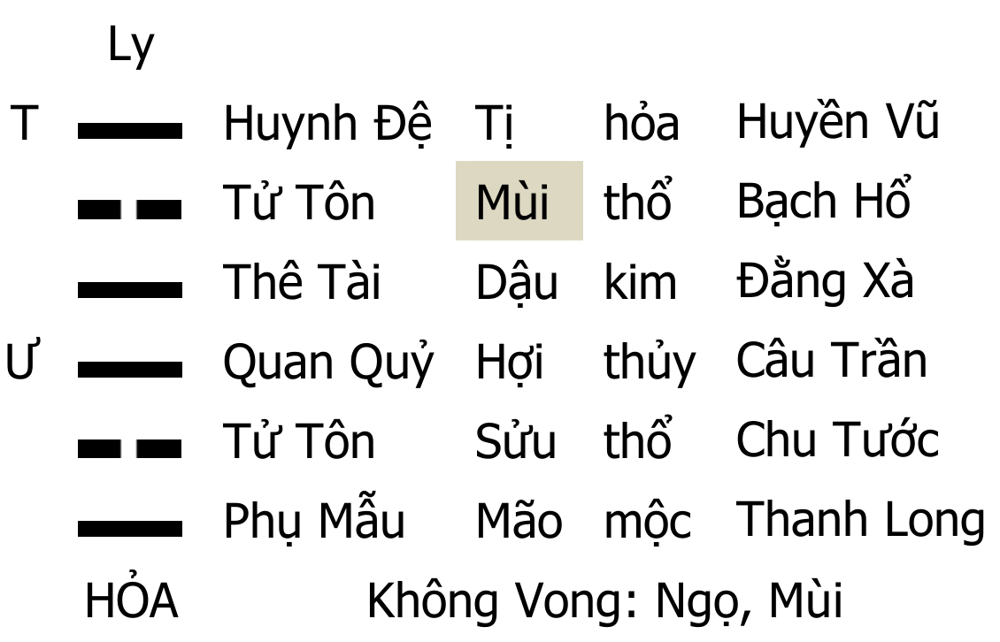
    - **Hình này chứng minh điều gì**
      - Người vợ mắc bệnh thiếu máu do nguồn sinh huyết dịch suy kiệt và khuyết thiếu.
    - **Từ đâu mà thấy được**
      - Dụng thần Thê Tài Dậu kim lâm Đằng Xà (Đằng Xà chủ khuyết thiếu); Nguyên thần Tử Tôn Mùi thổ lâm Bạch Hổ ngộ Tuần Không không đủ lực sinh Dụng thần (Bạch Hổ là máu, Không là thiếu hụt).
- **Phán đoán chi tiết:**
  - Xác định Dụng thần và ý nghĩa lục thần:
    - Đoán bệnh cho vợ lấy hào Thê Tài làm Dụng thần; trong quẻ Dụng thần là Thê Tài Dậu kim cư hào 4.
    - Thê Tài Dậu kim lâm Đằng Xà; Đằng Xà trong tượng lục thần biểu thị trạng thái hư tổn, khuyết thiếu.
  - Phân tích Nguyên thần và quái cung:
    - Nguyên thần sinh Dụng thần là Tử Tôn Mùi thổ cư hào 5, lâm lục thần Bạch Hổ.
    - Ngày Giáp Thân thuộc tuần Giáp Thân, Tuần không tại Ngọ, Mùi; Mùi thổ lâm Nguyệt kiến nhưng ngộ Tuần Không nên không đủ lực sinh dưỡng cho Dụng thần Dậu kim.
    - Bạch Hổ chủ về máu huyết; Nguyên thần mang máu huyết ngộ Không phản ánh nguồn tạo máu trống rỗng, không đủ lực nuôi dưỡng.
    - Quẻ thuần Ly thuộc cung Ly, mang quái tượng hư (trống rỗng bên trong), củng cố kết luận người vợ mắc bệnh thiếu máu.
- **Kết quả ứng nghiệm thực tế:**
  - Trên thực tế, người vợ mắc chứng bệnh thiếu máu.

##### Ví dụ 4: Nữ đoán sức khỏe (Quẻ Thiên Hỏa Đồng Nhân)
- **Bối cảnh quẻ:** Ngày Giáp Tý tháng Thân (Tuần không: Tuất, Hợi), người phụ nữ tự đoán sức khỏe bản thân, gieo được quẻ Thiên Hỏa Đồng Nhân.
  - **Hình 160.** Sơ đồ quẻ Thiên Hỏa Đồng Nhân
    - 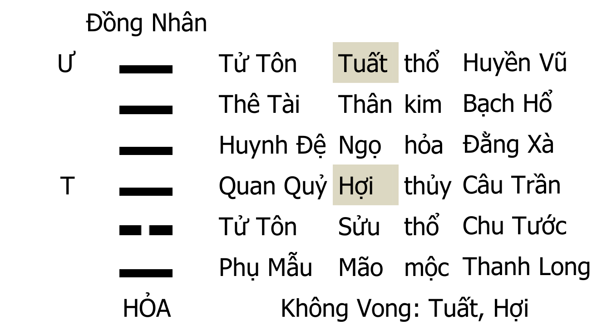
    - **Hình này chứng minh điều gì**
      - Bản thân người phụ nữ mang bệnh lý thiếu máu do Dụng thần lâm Thủy ngộ Không không thể thụ sinh.
    - **Từ đâu mà thấy được**
      - Hào Thế Quan Quỷ Hợi thủy ngộ Tuần Không (Thủy chủ máu, Không chủ thiếu); Nguyên thần Thê Tài Thân kim lâm Bạch Hổ (Thê Tài và Bạch Hổ đều là máu) nhưng Dụng thần ngộ Không nên không nhận được nguồn sinh dưỡng.
- **Phán đoán chi tiết:**
  - Xác định Dụng thần và tượng hào Thế:
    - Tự đoán sức khỏe lấy hào Thế làm Dụng thần; trong quẻ hào Thế là Quan Quỷ Hợi thủy cư hào 3.
    - Hào Thế Hợi thủy ngộ Tuần Không (ngày Giáp Tý thuộc tuần Giáp Tý, Tuần không tại Tuất, Hợi).
    - Ngũ hành Thủy đại diện cho máu huyết; hào Thủy lâm Không Vong biểu thị trạng thái máu huyết bị thiếu hụt.
  - Phân tích cơ chế Dụng thần ngộ Không không thụ sinh:
    - Nguyên thần sinh Dụng thần là Thê Tài Thân kim cư hào 5, lâm Bạch Hổ.
    - Lục thân Thê Tài chủ về máu và dịch thể; lục thần Bạch Hổ cũng chủ về máu huyết; Thân kim được Nguyệt kiến tỉ phù vượng tướng.
    - Tuy nhiên, do hào Thế Hợi thủy ngộ Không nên rơi vào thế "Không không nhận sinh", không thể tiếp nhận nguồn sinh dưỡng dồi dào từ Thê Tài Bạch Hổ Thân kim.
    - Cung Ly chủ về hư rỗng, phối hợp cùng các yếu tố trên tạo thành tín hiệu thiếu máu rõ rệt.
- **Kết quả ứng nghiệm thực tế:**
  - Trên thực tế người phụ nữ xác nhận đúng là mắc bệnh thiếu máu.

##### Ví dụ 5: Nữ đoán bệnh bản thân (Quẻ Thiên Hỏa Đồng Nhân biến Hỏa Sơn Lữ)
- **Bối cảnh quẻ:** Ngày Ất Dậu tháng Tuất (Tuần không: Ngọ, Mùi), một người phụ nữ tự đoán bệnh bản thân, gieo được quẻ Thiên Hỏa Đồng Nhân biến Hỏa Sơn Lữ.
  - **Hình 161.** Sơ đồ quẻ Thiên Hỏa Đồng Nhân biến Hỏa Sơn Lữ
    - 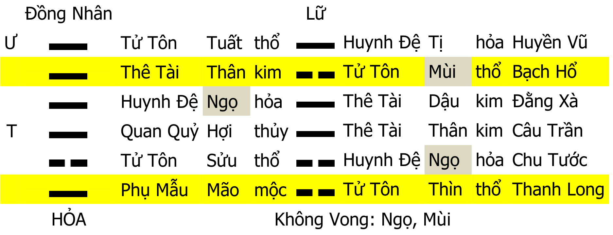
    - **Hình này chứng minh điều gì**
      - Người bệnh mắc bệnh thiếu máu do nguồn sinh huyết động hóa Không Vong, triệt tiêu lực sinh dưỡng.
    - **Từ đâu mà thấy được**
      - Nguyên thần Thê Tài Thân kim lâm Bạch Hổ phát động hóa Tử Tôn Mùi thổ ngộ Tuần Không (Bạch Hổ và Thê Tài đều là máu, hóa Không làm mất lực sinh cho hào Thế Hợi thủy).
- **Phán đoán chi tiết:**
  - Xác định Dụng thần và vai trò của Nguyên thần:
    - Tự đoán bệnh lấy hào Thế làm Dụng thần; trong quẻ hào Thế là Quan Quỷ Hợi thủy cư hào 3.
    - Nguyên thần sinh cho hào Thế là Thê Tài Thân kim cư hào 5, lâm Bạch Hổ.
    - Lục thần Bạch Hổ đại diện cho máu huyết; Lục thân Thê Tài cũng chủ về máu; đây là hào đại diện cho cơ chế tạo máu nuôi dưỡng cơ thể.
  - Phân tích trạng thái động hóa Không Vong:
    - Thê Tài Thân kim phát động biến thành Tử Tôn Mùi thổ; ngày Ất Dậu thuộc tuần Giáp Thân, Tuần không tại Ngọ và Mùi, nên hào biến Mùi thổ lâm Không Vong.
    - Nguyên thần động hóa Không ("hóa Không") khiến năng lực sinh trợ bị gián đoạn, không đủ sức cung cấp lực sinh dưỡng cho hào Thế Hợi thủy.
    - Quẻ gốc thuộc cung Ly mang tượng hư rỗng, kết hợp cùng Nguyên thần hóa Không chỉ rõ máu huyết bị thiếu hụt nghiêm trọng.
- **Kết quả ứng nghiệm thực tế:**
  - Trên thực tế, người phụ nữ này đúng là mắc bệnh thiếu máu.

##### Ví dụ 6: Nam đoán bệnh của mẹ (Quẻ Phong Địa Quan biến Phong Sơn Tiệm)
- **Bối cảnh quẻ:** Ngày Kỷ Hợi tháng Tị (Tuần không: Thìn, Tị), người con trai đoán bệnh cho mẹ, gieo được quẻ Phong Địa Quan biến Phong Sơn Tiệm.
  - **Hình 162.** Sơ đồ quẻ Phong Địa Quan biến Phong Sơn Tiệm
    - 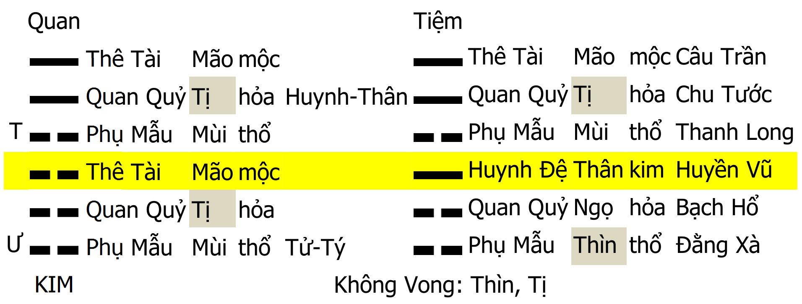
    - **Hình này chứng minh điều gì**
      - Người mẹ vừa mắc bệnh thiếu máu, vừa có khối u ác tính (ung thư) tại vùng môn vị dạ dày.
    - **Từ đâu mà thấy được**
      - Hào Ứng Phụ Mẫu Mùi thổ lâm Đằng Xà chủ thiếu; Nguyên thần Quan Quỷ Tị hỏa lâm Bạch Hổ ngộ Tuần Không (Bạch Hổ là máu, Không là khuyết); hào 3 Mão mộc độc phát khắc Thế Phụ Mẫu Mùi thổ tại hào 4 dạ dày.
- **Phán đoán chi tiết:**
  - Xác định Dụng thần Phụ Mẫu lưỡng hiện:
    - Đoán bệnh của mẹ lấy hào Phụ Mẫu làm Dụng thần.
    - Trong quẻ có Phụ Mẫu Mùi thổ xuất hiện hai lần (hào 4 Phụ Mẫu Mùi thổ trì Thế và hào sơ Phụ Mẫu Mùi thổ trì Ứng); do hai hào hoàn toàn tương đồng về ngũ hành địa chi nên cả hai đều có thể dùng để xem xét bệnh tình.
  - Biện chứng bệnh thiếu máu:
    - Hào sơ Phụ Mẫu Mùi thổ trì Ứng lâm Đằng Xà; Đằng Xà chủ về sự thiếu hụt, hao hụt.
    - Nguyên thần sinh Phụ Mẫu thổ là Quan Quỷ Tị hỏa tại hào 2, lâm lục thần Bạch Hổ; ngày Kỷ Hợi thuộc tuần Giáp Ngọ, Tuần không tại Thìn, Tị, nên Tị hỏa ngộ Tuần Không.
    - Bạch Hổ chủ về máu huyết; Nguyên thần mang máu huyết ngộ Không biểu thị sự khuyết thiếu máu, không sinh được Dụng thần, cấu thành chứng thiếu máu.
  - Biện chứng khối u ác tính ở môn vị dạ dày:
    - Hào 4 Phụ Mẫu Mùi thổ trì Thế bị hào 3 Thê Tài Mão mộc phát động đến khắc; đây là hào độc phát duy nhất trong quẻ.
    - Hào độc phát Mão mộc là đất Tử (Tử địa) của Dụng thần Mùi thổ theo vòng sinh vượng tử tuyệt; hào độc phát lâm Tử địa phần lớn chủ về khối u, bệnh ung thư.
    - Về vị trí phát bệnh: Hào 4 trong cơ thể ứng với vị trí dạ dày; ngũ hành Thổ cũng chủ về tỳ vị dạ dày.
    - Kỵ thần Mão mộc nằm kề sát bên dưới Dụng thần Mùi thổ hào 4 (Kỵ thần ở hào 3 thấp hơn Dụng thần ở hào 4 một bậc); dạ dày có phần trên là tâm vị và phần dưới giáp ruột là môn vị, Kỵ thần ở hào vị thấp hơn tiếp giáp dạ dày chỉ rõ khối u nằm tại môn vị.
- **Kết quả ứng nghiệm thực tế:**
  - Trên thực tế, người mẹ bị thiếu máu và được xác định có khối u ở môn vị.

##### Ví dụ 7: Nam đoán bệnh bản thân (Quẻ Thiên Hỏa Đồng Nhân biến Trạch Lôi Tùy)
- **Bối cảnh quẻ:** Ngày Ất Hợi tháng Ngọ (Tuần không: Thân, Dậu), người nam tự đoán bệnh bản thân, gieo được quẻ Thiên Hỏa Đồng Nhân biến Trạch Lôi Tùy.
  - **Hình 163.** Sơ đồ quẻ Thiên Hỏa Đồng Nhân biến Trạch Lôi Tùy
    - 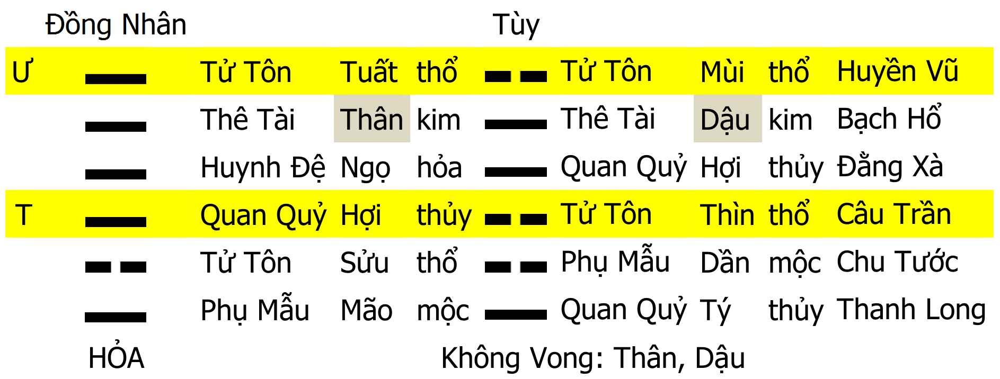
    - **Hình này chứng minh điều gì**
      - Người bệnh mắc chứng thiếu máu dẫn đến tình trạng hoa mắt, chóng mặt.
    - **Từ đâu mà thấy được**
      - Hào Thế Quan Quỷ Hợi thủy bị hào 6 Tuất thổ động khắc; Nguyên thần Thê Tài Thân kim lâm Bạch Hổ ngộ Tuần Không không sinh Thế (Thân kim, Thê Tài và Bạch Hổ đều là máu); hào 6 là đầu lâm Huyền Vũ khắc Thế gây váng đầu.
- **Phán đoán chi tiết:**
  - Xác định Dụng thần và quan hệ khắc thương:
    - Tự đoán bệnh lấy hào Thế làm Dụng thần; trong quẻ hào Thế là Quan Quỷ Hợi thủy cư hào 3.
    - Hào Thế Hợi thủy thuộc hành Thủy chủ về máu huyết.
    - Hào 6 Tử Tôn Tuất thổ phát động quay lại khắc chế hào Thế Hợi thủy (Thổ khắc Thủy).
  - Biện chứng bệnh thiếu máu:
    - Nguyên thần sinh cho hào Thế là Thê Tài Thân kim cư hào 5, lâm Bạch Hổ.
    - Lục thân Thê Tài chủ máu; lục thần Bạch Hổ chủ về máu huyết.
    - Ngày Ất Hợi thuộc tuần Giáp Tuất, Tuần không tại Thân và Dậu; do đó Nguyên thần Thân kim ngộ Tuần Không.
    - Nguyên thần lâm Không Vong không thể sinh trợ cho hào Thế Hợi thủy, nguồn tạo máu bị gián đoạn, xác định mắc bệnh thiếu máu.
  - Biện chứng triệu chứng chóng mặt:
    - Hào 6 Tuất thổ phát động khắc Thế nằm ở vị trí cao nhất trên thân thể, đại diện cho vùng đầu.
    - Hào 6 lâm lục thần Huyền Vũ; Huyền Vũ chủ về tối tăm, mờ mịt, hoa mắt, choáng váng.
    - Hào đầu não lâm Huyền Vũ phát động khắc trực tiếp vào hào Thế biểu thị hiện tượng máu không đủ cung cấp lên đầu, gây ra chứng chóng mặt.
- **Kết quả ứng nghiệm thực tế:**
  - Trên thực tế đúng như dự đoán, người bệnh bị thiếu máu và thường xuyên bị chóng mặt.

### 4. BỆNH VỀ MẮT

#### Quy luật nhận định thông tin bệnh về mắt qua quái tượng

- Đôi mắt là cửa sổ tâm hồn, là cơ quan quan sát duy nhất giúp con người tiếp nhận thế giới xung quanh; khi mắt mắc bệnh hoặc đột ngột mất thị lực sẽ dẫn đến đau khổ lớn.
- Các chứng bệnh về mắt thường gặp trong thực tế bao gồm cận thị, đục thủy tinh thể, tăng nhãn áp, mù lòa, đau mắt đỏ, chứng ruồi bay (muỗi bay), đau mắt hột, quáng gà, nhìn đôi (song thị), viêm bờ mi.
- Căn cứ dự trắc quái tượng bệnh về mắt theo quái cung:
  - Cung Ly đại diện cho mắt nói chung.
  - Cung Tốn đại diện cho mắt trắng (củng mạc/tròng trắng).
- Căn cứ dự trắc theo ngũ hành:
  - Ngũ hành Hỏa đại diện chủ quản cho đôi mắt.
  - Thổ khố Tuất thổ (hỏa khố) đôi khi cũng đại diện cho mắt và màng che mắt.
- Căn cứ dự trắc theo lục thân:
  - Hào Tử Tôn đại diện cho mắt và cơ quan thị giác.
- Căn cứ dự trắc theo hào vị:
  - Hào 5 và hào 6 là hào vị chủ quản vùng đầu mặt và đôi mắt.
- Căn cứ dự trắc theo lục thần:
  - Thanh Long chủ về đau mắt, xót mắt.
  - Chu Tước chủ về nhiệt chứng, viêm nhiễm mắt.
  - Câu Trần chủ về sưng phù, trướng đau, sưng tấy.
  - Đằng Xà chủ về dị dạng, biến đổi bất thường, có màng ngăn che.
  - Bạch Hổ chủ về sung huyết, ứ máu, xuất huyết mắt.
  - Huyền Vũ chủ về mờ tối, u ám, nhìn không rõ ràng.
- Căn cứ dự trắc theo sinh khắc và suy vượng:
  - Ngũ hành Hỏa bị khắc chế nặng nề, hỏa nhập Mộ khố, hỏa ngộ Bệnh địa.
  - Dụng thần hoặc Nguyên thần của cơ quan mắt bị Hỏa tổn thương hoặc Hỏa suy kiệt đều thông báo mắt có bệnh tật.

#### Các ca bệnh thực tế dự trắc bệnh về mắt

##### Ví dụ 1: Dự trắc thi cử phát hiện tật cận thị đeo kính (Quẻ Phong Lôi Ích biến Phong Địa Quan)

- Tình huống chiêm đoán: Ngày Giáp Tuất tháng Thân năm 2006, tác giả đến An Dương, một vị nữ sĩ nhờ xem tình hình thi cử học hành của con trai; từ quẻ tượng tác giả phán đoán ra thông tin bệnh tật ở mắt.
  - **Hình 164.** Quẻ Phong Lôi Ích biến Phong Địa Quan
    - 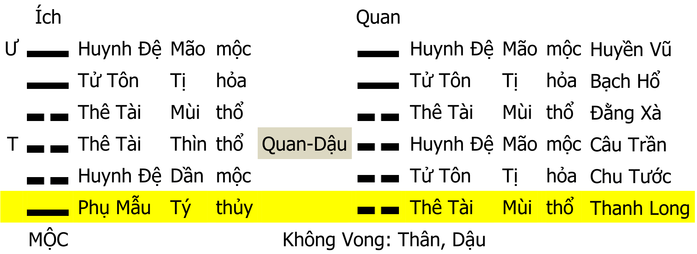
    - **Hình này chứng minh điều gì**
      - Dụng thần mắt bị khắc, ngộ Bệnh địa và nhập Mộ chỉ tật cận thị phải đeo kính.
    - **Từ đâu mà thấy được**
      - Tử Tôn Tị hỏa hào 5 bị Tý thủy khắc, Thân kim là Bệnh địa hợp Tị, nhập Mộ Nhật Tuất.
- Căn cứ định Dụng thần: Xem bệnh tật của con trai lấy hào Tử Tôn làm Dụng thần (tuần Giáp Tuất: Thân, Dậu Không Vong).
- Phân tích tương tác ngũ hành và hào vị:
  - Tử Tôn Tị hỏa lâm hào 5; hào 5 là hào vị ngũ quan, ngũ hành hỏa chủ về mắt.
  - Hào 5 Tị hỏa lâm Bạch Hổ chủ về tai tật, bệnh tích.
  - Hào sơ Phụ Mẫu Tý thủy phát động hóa Thê Tài Mùi thổ, Tý thủy động khắc thương Tử Tôn Tị hỏa tại hào 5, báo hiệu mắt không tốt.
- Phân tích trạng thái Nhật Nguyệt:
  - Nguyệt kiến Thân kim là Bệnh địa của ngũ hành Hỏa (Tử Tôn); Bệnh địa lâm Nguyệt tương hợp với Dụng thần (Tị Thân hợp) thể hiện đôi mắt của người con có tật bệnh kéo dài.
  - Tử Tôn Tị hỏa nhập Mộ tại Nhật kiến Tuất thổ; tượng hào mắt nhập Mộ ở Nhật biểu thị mắt bị che chắn lại bởi vật bên ngoài, là thông tin đeo kính thuốc.
- Ứng nghiệm thực tế: Con trai của người này bị cận thị và đang đeo kính.

##### Ví dụ 2: Dự trắc bệnh cận thị đeo kính của con trai (Quẻ Sơn Lôi Di biến Hỏa Sơn Lữ)

- Tình huống chiêm đoán: Ngày Nhâm Dần tháng Mão (tuần Giáp Ngọ: Thìn, Tị Không Vong), một người mẹ đến bói bệnh cho con trai, gieo được quẻ Sơn Lôi Di biến Hỏa Sơn Lữ.
  - **Hình 165.** Quẻ Sơn Lôi Di biến Hỏa Sơn Lữ
    - 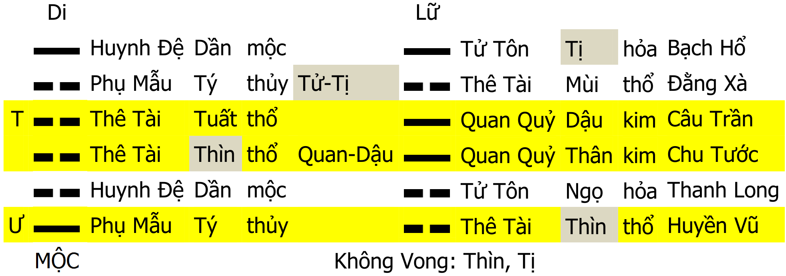
    - **Hình này chứng minh điều gì**
      - Dụng thần mắt phục tàng bị khắc lâm Huyền Vũ và nhập Mộ biểu thị cận thị, đeo kính.
    - **Từ đâu mà thấy được**
      - Tử Tôn Tị hỏa phục hào 5 bị Tý thủy Huyền Vũ khắc, nhập Mộ hào 4 Tuất thổ động.
- Căn cứ định Dụng thần: Đoán bệnh con trai lấy Tử Tôn làm Dụng thần; Tử Tôn Tị hỏa không xuất hiện trên quẻ, phục dưới hào 5 Phụ Mẫu Tý thủy.
- Phân tích quái tượng bệnh tật:
  - Hào 5 là hào vị mắt, Tị hỏa là ngũ hành mắt; Dụng thần phục ngay dưới hào vị mắt.
  - Hào sơ Phụ Mẫu Tý thủy lâm Huyền Vũ phát động, hợp với phi thần Tý thủy cùng khắc thương phục thần Tị hỏa (hỏa bị thủy khắc chủ bệnh về mắt).
  - Huyền Vũ chủ về u ám, mờ tối, nhìn mờ không rõ, là tượng của tật cận thị.
- Phân tích biến hào và hình tượng đeo kính:
  - Hào 4 Thê Tài Tuất thổ phát động hóa Quan Quỷ Dậu kim.
  - Tuất thổ là hỏa khố; Dụng thần Tị hỏa nhập Mộ vào hào động Tuất thổ mang hình tượng mắt có vật che chắn phía trước, chứng tỏ người con có đeo kính.
- Ứng nghiệm thực tế: Hoàn toàn phù hợp với phán đoán, người con trai bị cận thị và đeo kính.

##### Ví dụ 3: Bệnh nhược thị bẩm sinh ở bé gái 3 tuổi (Quẻ Sơn Phong Cổ biến Hỏa Thiên Đại Hữu)

- Tình huống chiêm đoán: Ngày Canh Dần tháng Hợi (tuần Giáp Thân: Ngọ, Mùi Không Vong), người mẹ xem bệnh cho con gái nhỏ 3 tuổi, được quẻ Sơn Phong Cổ biến Hỏa Thiên Đại Hữu.
  - **Hình 166.** Quẻ Sơn Phong Cổ biến Hỏa Thiên Đại Hữu
    - 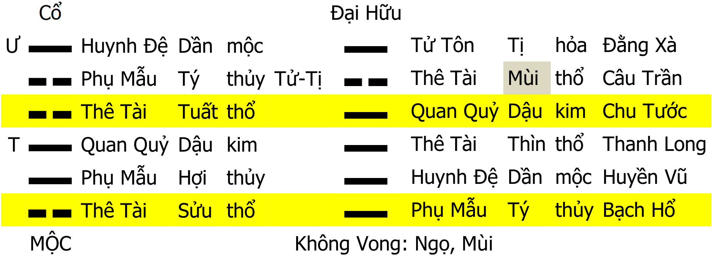
    - **Hình này chứng minh điều gì**
      - Dụng thần tại hào mắt bị Nguyệt phá, Nguyệt nhập hào thai và nhập Mộ biểu thị nhược thị bẩm sinh.
    - **Từ đâu mà thấy được**
      - Tử Tôn Tị hỏa phục hào 5 bị Nguyệt Hợi xung phá, hào 2 Hợi thủy là hào thai, nhập Mộ Tuất.
- Căn cứ định Dụng thần: Đoán bệnh cho con gái lấy hào Tử Tôn làm Dụng thần; Tử Tôn Tị hỏa phục dưới hào 5 Phụ Mẫu Tý thủy.
- Phân tích sinh khắc và mức độ nguy hiểm:
  - Dụng thần Tị hỏa bị Nguyệt kiến Hợi thủy tương xung là Nguyệt phá; song được Nhật kiến Dần mộc trường sinh tương trợ, nên bệnh tật không gây nguy hiểm tính mạng.
  - Hào 5 là hào vị mắt, hỏa chủ về mắt; hào mắt bị Nguyệt kiến xung phá biểu thị mắt có khuyết tật tổn thương.
- Phân tích nguồn gốc bẩm sinh và triệu chứng thị lực:
  - Nguyệt kiến Hợi thủy đồng thời nhập quẻ tại hào 2 (Phụ Mẫu Hợi thủy); hào 2 là hào thai đại diện cho thời kỳ thai ngén, chỉ ra tật ở mắt là bệnh bẩm sinh mắc từ lúc chào đời.
  - Tử Tôn Tị hỏa nhập Mộ tại hào 4 Thê Tài Tuất thổ phát động; hỏa nhập Mộ chủ che phủ, tăm tối, mắt nhìn không rõ ràng.
- Ứng nghiệm thực tế: Bé gái 3 tuổi bị mắc chứng nhược thị bẩm sinh.

##### Ví dụ 4: Bệnh sưng mắt lặp đi lặp lại kéo dài (Quẻ Phong Lôi Ích biến Thủy Thiên Nhu)

- Tình huống chiêm đoán: Ngày Tân Hợi tháng Tý (tuần Giáp Thìn: Dần, Mão Không Vong), một người tự xem bệnh khi đôi mắt bị sưng tấy đau đớn, được quẻ Phong Lôi Ích biến Thủy Thiên Nhu.
  - **Hình 167.** Sơ đồ quẻ Phong Lôi Ích biến Thủy Thiên Nhu
    - 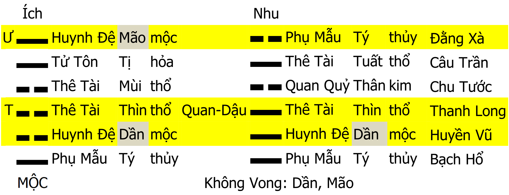
    - **Hình này chứng minh điều gì**
      - Nguyên thần của mắt bị Nhật Nguyệt khắc thương, lâm Câu Trần và phục ngâm chỉ sưng mắt dai dẳng.
    - **Từ đâu mà thấy được**
      - Nguyên thần Tị hỏa hào 5 lâm Câu Trần bị Tý Nguyệt Hợi Nhật khắc, quẻ Tốn, nội quái phục ngâm.
- Căn cứ định Dụng thần: Tự xem bệnh lấy hào Thế làm Dụng thần (Thê Tài Thìn thổ hào 3 lâm Thanh Long); Nguyên thần sinh cho Thế là Tử Tôn Tị hỏa tại hào 5.
- Phân tích thương tổn ở mắt:
  - Nguyên thần Tử Tôn Tị hỏa ngự tại hào 5 bị cả Nguyệt kiến Tý thủy và Nhật kiến Hợi thủy cùng dập tắt, khắc thương nặng nề.
  - Tử Tôn là ngũ quan, hào 5 là mắt, ngũ hành hỏa chủ mắt, lại thuộc quẻ cung Tốn (cung Tốn đại diện cho mắt trắng).
- Phân tích triệu chứng và diễn biến bệnh:
  - Tử Tôn Tị hỏa lâm Câu Trần; Câu Trần chủ về sưng trướng, phù nề, báo hiệu mắt bị sưng phồng tấy đỏ.
  - Nội quái phục ngâm phản ánh diễn biến bệnh tình lặp đi lặp lại nhiều lần, dây dưa trì trệ khó khỏi dứt điểm.
- Ứng nghiệm thực tế: Hoàn toàn phù hợp với phán đoán, mắt người này bị sưng đau tái đi tái lại trong thời gian dài.

##### Ví dụ 5: Bệnh đục thủy tinh thể ở phụ nữ cao tuổi (Quẻ Thủy Phong Tỉnh biến Phong Thiên Tiểu Súc)

- Tình huống chiêm đoán: Ngày Nhâm Ngọ tháng Thìn (tuần Giáp Tuất: Thân, Dậu Không Vong), một phụ nữ lớn tuổi đến xem bệnh bản thân, được quẻ Thủy Phong Tỉnh biến Phong Thiên Tiểu Súc.
  - **Hình 168.** Sơ đồ quẻ Thủy Phong Tỉnh biến Phong Thiên Tiểu Súc
    - 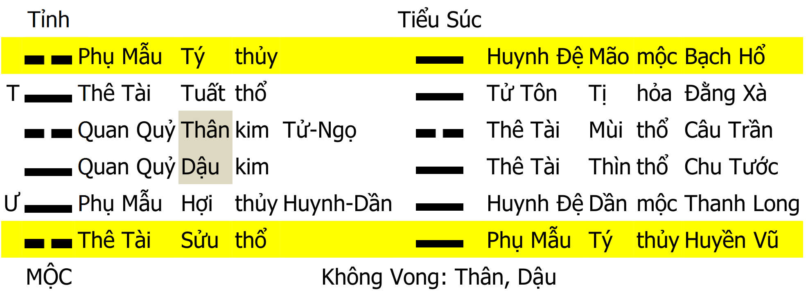
    - **Hình này chứng minh điều gì**
      - Thế tại hào mắt lâm Xà, Tuất thổ hỏa khố Nguyệt phá và Nguyên thần bị khắc tạo tượng đục thủy tinh thể.
    - **Từ đâu mà thấy được**
      - Thế Tuất thổ hào 5 lâm Đằng Xà, Thìn xung Nguyệt phá, hào 6 Tý thủy động khắc Nguyên thần hỏa.
- Căn cứ định Dụng thần: Tự bói bệnh lấy hào Thế làm Dụng thần (Thê Tài Tuất thổ hào 5 lâm Đằng Xà).
- Đánh giá vượng suy Dụng thần: Hào Thế bị Nguyệt kiến Thìn thổ xung là Nguyệt phá, nhưng được Nhật kiến Ngọ hỏa sinh hợp trợ lực nên không thuộc diện suy bại hưu tù.
- Phân tích cơ chế phát sinh bệnh qua Nguyên thần:
  - Nguyên thần sinh Thế là hỏa không xuất hiện trên quẻ (phục dưới hào 4 Quan Quỷ Thân kim là Tử Tôn Ngọ hỏa).
  - Hào 6 Phụ Mẫu Tý thủy phát động khắc Nguyên thần hỏa; Nguyên thần hỏa chủ về mắt bị động hào thủy khắc thương, chỉ ra bệnh phát sinh ở mắt.
- Tổ hợp quái tượng bệnh đục thủy tinh thể:
  - Hào Thế tọa tại hào 5 là vị trí mắt, lâm Đằng Xà chủ biến dị, có màng bao bọc dị thường.
  - Hào Thế Tuất thổ là hỏa khố (kho bao chứa hỏa/ánh sáng), bản thân hào bị Nguyệt phá thể hiện lớp bên ngoài con mắt xuất hiện màng che phủ kín.
  - Sự phối hợp giữa hào 5, Đằng Xà và hỏa khố Tuất thổ tạo thành tổ hợp hình tượng kinh điển của bệnh đục thủy tinh thể.
- Ứng nghiệm thực tế: Người phụ nữ này xác thực mắc bệnh đục thủy tinh thể.

##### Ví dụ 6: Đục thủy tinh thể nghiêm trọng gây mất thị lực (Quẻ Thủy Hỏa Ký Tế biến Địa Trạch Lâm)

- Tình huống chiêm đoán: Ngày Kỷ Dậu tháng Sửu năm 2006 (tuần Giáp Thìn: Dần, Mão Không Vong), một người phụ nữ cao tuổi đoán bệnh bản thân, gieo được quẻ Thủy Hỏa Ký Tế biến Địa Trạch Lâm.
- Căn cứ định Dụng thần: Đoán bệnh cho bản thân lấy hào Thế làm Dụng thần (Huynh Đệ Hợi thủy tại hào 3 lâm Huyền Vũ).
- Đánh giá mức độ hiểm nghèo qua hung thần khắc Thế:
  - Hào Thế tuy được Nhật kiến Dậu kim sinh trợ, nhưng quần thổ khắc thần xuất hiện áp đảo.
  - Nguyệt kiến Sửu thổ, biến hào Sửu thổ, hào 5 Quan Quỷ Tuất thổ và hào 2 Quan Quỷ Sửu thổ cùng hợp lực khắc chế Dụng thần, báo hiệu bệnh tình cực kỳ trầm trọng.
- Phân tích triệu chứng tổn thương thị lực:
  - Hào 5 Quan Quỷ Tuất thổ khắc Thế; hào 5 là vị trí mắt, Tuất thổ là hỏa khố (kho bao bọc giam hãm hỏa quang), biểu thị trong mắt có dị vật che phủ dày đặc.
  - Hào Thế lâm Huyền Vũ; Huyền Vũ chủ u tối, tối tăm không có ánh sáng, phát tín hiệu mắt không còn nhìn thấy gì.
- Ứng nghiệm thực tế: Người phụ nữ bị đục thủy tinh thể rất nặng, bề mặt mắt đục mờ nghiêm trọng; từ năm Quý Mùi (2003, năm Mùi thổ kích hoạt thổ vượng khắc thủy) bà cụ hầu như đã hoàn toàn mất thị lực.

##### Ví dụ 7: Bệnh tăng nhãn áp ở phụ nữ cao tuổi (Quẻ Phong Địa Quan biến Thủy Lôi Truân)

- Tình huống chiêm đoán: Ngày Quý Hợi tháng Tuất (tuần Giáp Dần: Tý, Sửu Không Vong), một phụ nữ lớn tuổi đến xem bệnh của mình, gieo được quẻ Phong Địa Quan biến Thủy Lôi Truân.
- Căn cứ định Dụng thần: Tự đoán bệnh lấy hào Thế làm Dụng thần (Phụ Mẫu Mùi thổ hào 4 lâm Câu Trần).
- Đánh giá khả năng điều trị: Tam hợp cục Mão mộc khắc hào Thế, song trong quẻ có Nguyên thần ám động cứu trợ, chỉ ra rằng bệnh tật vẫn có khả năng chạy chữa và khống chế.
- Phân tích cơ chế bệnh tăng nhãn áp:
  - Nguyên thần Quan Quỷ Tị hỏa tại hào 5 lâm Đằng Xà bị Nhật kiến Hợi thủy xung (trong xung có khắc).
  - Hào 5 là hào vị mắt, Tị hỏa chủ con mắt, lâm Đằng Xà chủ sự biến đổi quái dị, gân mạch căng trướng bất thường.
  - Tị hỏa nhập Mộ tại Nguyệt kiến Tuất thổ mang ý nghĩa bị che phủ và tắc nghẽn lưu thông khí huyết nội nhãn, biểu thị nhãn áp tăng cao che mờ tầm nhìn.
- Ứng nghiệm thực tế: Người phụ nữ này mắc bệnh tăng nhãn áp (glaucoma / thiên đầu thống).

### 5. BỆNH VỀ MŨI

#### Đại cương và quy luật đối ứng quái tượng trong dự trắc bệnh mũi
- Chức năng sinh lý và phạm vi ảnh hưởng bệnh lý của mũi:
  - Mũi đóng vai trò ngửi mùi (khứu giác) và hô hấp; tuy không hiển lộ rõ như mắt nhưng khi phát sinh trục trặc sẽ khiến người bệnh chịu nhiều đau khổ.
  - Khứu giác suy giảm gây ảnh hưởng trực tiếp đến sự thèm ăn (thực dục); chức năng hô hấp chi phối quá trình trao đổi khí trong cơ thể, nếu bế tắc kéo dài sẽ kéo theo bệnh tật ở nhiều cơ quan khác.
  - Sơ đồ chuyển tiếp từ các quẻ khám bệnh đầu mặt mắt trước đó trong tài liệu gốc:
    - **Hình 169.** Sơ đồ quẻ Thủy Hỏa Ký Tế biến Địa Trạch Lâm
      - 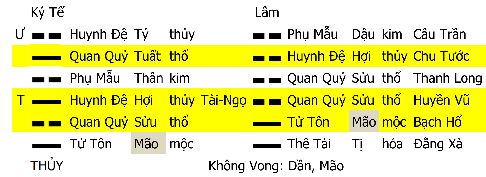
      - **Hình này chứng minh điều gì**
        - Minh họa sự phối hợp hào vị, động biến và lục thần đối với bệnh tật vùng đầu mặt mắt.
      - **Từ đâu mà thấy được**
        - Hào 5 Quan Quỷ Tuất thổ động hóa Huynh Đệ Hợi thủy lâm Chu Tước; hào 3 Huynh Đệ Hợi thủy động hóa Sửu thổ lâm Huyền Vũ; hào 2 Quan Quỷ Sửu thổ động hóa Mão mộc lâm Bạch Hổ.
  - Sơ đồ quẻ dự trắc tăng nhãn áp chuyển tiếp trong tài liệu gốc:
    - **Hình 170.** Sơ đồ quẻ Phong Địa Quan biến Thủy Lôi Truân
      - 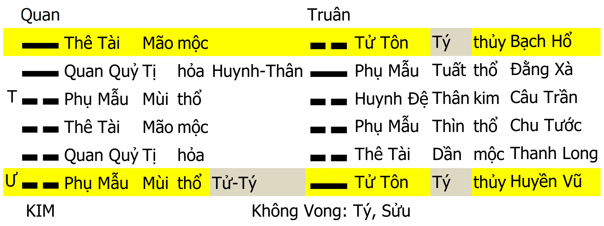
      - **Hình này chứng minh điều gì**
        - Minh họa quái tượng bệnh tăng nhãn áp (glaucoma) ở vùng đầu mặt.
      - **Từ đâu mà thấy được**
        - Hào 6 Thê Tài Mão mộc động hóa Tử Tôn Tý thủy lâm Bạch Hổ; hào 1 Phụ Mẫu Mùi thổ (phục Tử Tý) động hóa Tý thủy lâm Huyền Vũ.
- Phương diện quái cung trong dự trắc bệnh mũi:
  - Cung Cấn chủ quản mũi, do quẻ Cấn tượng trưng cho núi, gồ lên ở trung tâm khuôn mặt tương ứng với sống mũi.
- Phương diện hào vị chủ về bệnh mũi:
  - Biểu hiện chủ yếu tập trung tại hào 5 và hào 6, là hai hào vị đại diện cho phần đầu và ngũ quan trên khuôn mặt.
- Phương diện ngũ hành biểu thị bệnh mũi:
  - Hành Thổ là biểu trưng chủ đạo: Mũi nằm tại vị trí trung tâm khuôn mặt, trung ương thuộc Thổ.
  - Hành Kim mang thông tin bổ trợ cá biệt: Kim chủ về hệ thống hô hấp, mũi là cửa ngõ hô hấp trao đổi khí.
- Phương diện lục thần định tính tính chất bệnh tật vùng mũi:
  - Chu Tước: Chủ về chứng viêm nhiệt, sưng đỏ, viêm mũi.
  - Thanh Long: Chủ về ngứa ngáy, phản ứng dị ứng, hắt hơi liên tục.
  - Câu Trần: Chủ về bế tắc, nghẹt thở, đọng ứ dịch nhầy.
  - Biến chứng ác tính: Khi Dụng thần ở trạng thái hưu tù, hoặc Dụng thần/Nguyên thần gặp đất Tử, Mộ, Tuyệt mà lâm Câu Trần thì mang thông tin khối u ác tính, ung thư mũi hoặc polyp mũi.

#### Các trường hợp thực tế dự trắc bệnh mũi

##### Ví dụ 1: Người nam hỏi sức khỏe – Đoán viêm mũi dị ứng và bệnh đường tiêu hóa
- Tình huống bói quẻ và thiết lập Dụng thần:
  - Ngày Kỷ Mão, tháng Thìn, một người đàn ông hỏi sức khỏe bản thân trên mạng, tác giả gieo quẻ được Thủy Sơn Kiển biến Thủy Phong Tỉnh (tuần không: Thân, Dậu).
  - Tự đoán bệnh bản thân nên lấy hào Thế làm Dụng thần.
  - Dự trắc quẻ Thủy Sơn Kiển biến Thủy Phong Tỉnh:
    - **Hình 171.** Quẻ Thủy Sơn Kiển biến Thủy Phong Tỉnh
      - 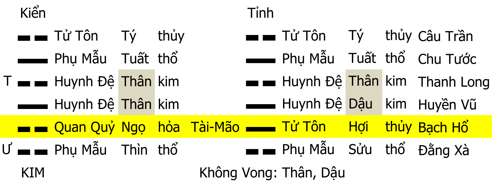
      - **Hình này chứng minh điều gì**
        - Chứng minh người hỏi bị viêm mũi dị ứng kèm bệnh lý ở dạ dày và đường ruột.
      - **Từ đâu mà thấy được**
        - Thế Thân kim lâm Thanh Long gặp Không; hào 5 Tuất thổ Nguyệt phá lâm Chu Tước sinh yếu; hào 2 Quan Quỷ Ngọ hỏa động khắc Thế.
- Diễn tiến đối thoại thực tế giữa tác giả và người hỏi quẻ:
  - Tác giả đưa ra phán đoán ban đầu: Ruột và dạ dày của người này không tốt, đồng thời có bệnh viêm mũi dị ứng.
  - Người hỏi phản hồi: Ruột và dạ dày đúng là không tốt, nhưng bản thân không hề có bệnh viêm mũi dị ứng.
  - Tác giả truy hỏi tiếp: Bản thân có phải thường xuyên bị hắt hơi hay không?
  - Người hỏi thừa nhận: Đúng là thường xuyên hắt hơi.
  - Tác giả giải thích: Đó chính là triệu chứng điển hình của viêm mũi dị ứng; người hỏi thiếu hiểu biết y học thông thường nên không nhận ra việc thường xuyên hắt hơi bắt nguồn từ viêm mũi.
- Các bước suy luận Lục hào chi tiết:
  - Luận bệnh viêm mũi dị ứng:
    - Hào Thế lâm Huynh Đệ Thân kim, ngũ hành Kim chủ về hệ hô hấp. Hào Thế gặp Tuần Không mà không được hào 5 Thổ sinh trợ.
    - Hào 5 Phụ Mẫu Tuất thổ bị Nguyệt phá (tháng Thìn xung Tuất thổ), lại bị Nhật thần Mão mộc khắc chế, lực lượng tương sinh cho Thế rất yếu ớt.
    - Hào vị số 5 là ngũ quan, ngũ hành Thổ chủ mũi, lâm lục thần Chu Tước chủ viêm nhiệt, vì vậy kết luận mắc chứng viêm mũi.
    - Hào Thế lâm Thanh Long chủ về cảm giác ngứa ngáy; ngứa mũi tất dẫn đến hắt hơi. Tượng "Kim Không tắc minh" (Kim rỗng thì phát ra tiếng vang), tiếng hắt hơi bật ra âm thanh chính là ứng với tượng Kim Không.
  - Luận bệnh dạ dày:
    - Thanh Long chủ về ẩm thực, ăn uống; lục thân Huynh Đệ đại diện cho dạ dày; hào 4 lại là hào vị của dạ dày; Thổ cũng chủ dạ dày, do đó tạng phủ dạ dày phát sinh vấn đề.
  - Luận bệnh đường ruột:
    - Hào 2 Quan Quỷ Ngọ hỏa phát động khắc chế hào Thế Thân kim; hào 2 là vị trí của ruột; quẻ thuộc cung Đoài chủ ruột; Hỏa cũng chủ ruột, do đó phán đoán đường ruột có bệnh.

##### Ví dụ 2: Người nam đoán niên vận – Phát hiện bệnh viêm mũi nghiêm trọng
- Tình huống bói quẻ và thiết lập Dụng thần:
  - Ngày Tân Tị, tháng Dần, người nam đoán niên vận cả năm, gieo được quẻ Hỏa Trạch Khuê biến Thiên Trạch Lý (tuần không: Thân, Dậu).
  - Tuy là bói vận hạn niên vận nhưng trong khí vận đã hàm chứa tình trạng bệnh tật; cơ thể xem hào Thế làm Dụng thần.
  - Dự trắc quẻ Hỏa Trạch Khuê biến Thiên Trạch Lý:
    - **Hình 172.** Quẻ Hỏa Trạch Khuê biến Thiên Trạch Lý
      - 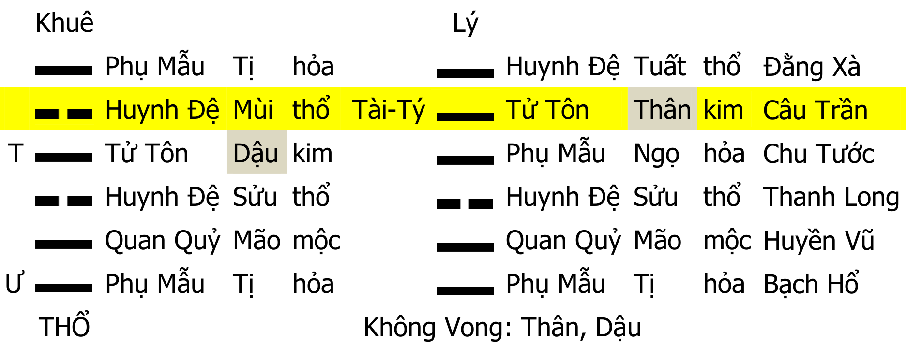
      - **Hình này chứng minh điều gì**
        - Chứng minh đương số mắc bệnh viêm mũi nghiêm trọng gây ngạt tắc kéo dài.
      - **Từ đâu mà thấy được**
        - Thế Tử Tôn Dậu kim lâm Chu Tước gặp Không; Nguyên thần hào 5 Mùi thổ bị Nguyệt khắc, hóa Thân kim Không phá, lâm Câu Trần.
- Các bước suy luận Lục hào chi tiết:
  - Hào Thế lâm Tử Tôn Dậu kim (hào 4), lâm Chu Tước chủ về chứng viêm nhiệt sưng tấy.
  - Hào Thế gặp Tuần Không, không nhận được sự tương sinh của Nguyên thần Huynh Đệ Mùi thổ tại hào 5.
  - Hào 5 Huynh Đệ Mùi thổ bị Nguyệt lệnh Dần mộc khắc chế, phát động hóa ra Tử Tôn Thân kim (vừa nhập Tuần Không, vừa bị Nguyệt phá).
  - Quẻ Hỏa Trạch Khuê thuộc quái cung Cấn, tượng cung Cấn chủ mũi; hào 5 Thổ cũng chủ về mũi.
  - Hào 5 lại lâm Câu Trần, lục thần Câu Trần chủ về ủng tắc, nghẹt khí, kết tụ dịch đờm.
  - Tổng hợp tượng: Tác giả phán đoán đương số mắc bệnh viêm mũi (nghẹt mũi, viêm tắc mạn tính).
- Ứng nghiệm thực tế:
  - Đương số xác nhận bản thân bị bệnh viêm mũi rất nghiêm trọng.

##### Ví dụ 3: Người nam tự đoán bệnh – Phát hiện viêm mũi dị ứng
- Tình huống bói quẻ và thiết lập Dụng thần:
  - Ngày Quý Dậu, tháng Dần, người nam tự đoán bệnh tật bản thân, gieo được quẻ tĩnh Hỏa Trạch Khuê (tuần không: Tuất, Hợi).
  - Tự đoán bệnh lấy hào Thế làm Dụng thần.
  - Dự trắc quẻ tĩnh Hỏa Trạch Khuê:
    - **Hình 173.** Quẻ Hỏa Trạch Khuê
      - 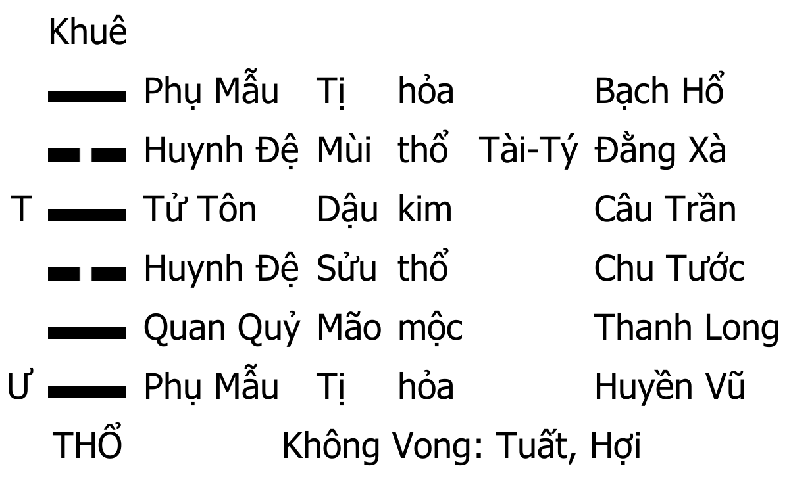
      - **Hình này chứng minh điều gì**
        - Chứng minh người hỏi bị viêm mũi dị ứng do tạng phủ mất cân bằng.
      - **Từ đâu mà thấy được**
        - Quẻ tĩnh thuộc cung Cấn; hào Thế Dậu kim lâm Câu Trần; Nguyên thần hào 5 Mùi thổ bị Nguyệt Dần mộc khắc thương.
- Các bước suy luận Lục hào chi tiết:
  - Hào Thế lâm Tử Tôn Dậu kim ở hào 4, lâm lục thần Câu Trần.
  - Nguyên thần của hào Thế là Thổ tại hào 5 Huynh Đệ Mùi thổ bị Nguyệt lệnh Dần mộc khắc thương tổn hại khí lực.
  - Ngũ hành Thổ chủ về mũi, Nguyên thần Thổ bị thương tổn báo hiệu mũi có bệnh tật.
  - Quẻ Hỏa Trạch Khuê quy về cung Cấn, tượng quẻ Cấn cũng chủ về cơ quan mũi.
- Ứng nghiệm thực tế:
  - Người hỏi xác nhận có bệnh viêm mũi dị ứng.

##### Ví dụ 4: Người phụ nữ cao tuổi tự đoán bệnh – Ung thư mũi, ung thư tử cung và điếc tai
- Tình huống bói quẻ và thiết lập Dụng thần:
  - Ngày Nhâm Thìn, tháng Thân, một người phụ nữ cao tuổi đoán bệnh, gieo được quẻ Trạch Thiên Quải biến Thiên Hỏa Đồng Nhân (tuần không: Ngọ, Mùi).
  - Tự đoán bệnh bản thân, lấy hào Thế làm Dụng thần.
  - Dự trắc quẻ Trạch Thiên Quải biến Thiên Hỏa Đồng Nhân:
    - **Hình 174.** Quẻ Trạch Thiên Quải biến Thiên Hỏa Đồng Nhân
      - 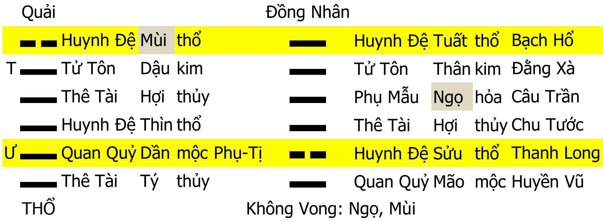
      - **Hình này chứng minh điều gì**
        - Chứng minh bệnh nhân mắc đồng thời ung thư mũi, ung thư tử cung và điếc tai.
      - **Từ đâu mà thấy được**
        - Hào 5 Thế Dậu kim vượng cực vô khắc; hào 6 Thổ Không hóa Tiến thần; hào 2 Quan Quỷ động hợp Câu Trần (ung thư) hóa Nguyên thần.
- Các bước suy luận Lục hào chi tiết:
  - Luận bệnh tật vùng mũi:
    - Hào Thế Tử Tôn Dậu kim ngự tại hào 5; Nguyên thần Thổ ở hào 6 Huynh Đệ Mùi thổ lâm Tuần Không nên không sinh được Dụng thần.
    - Ngũ hành Thổ chủ mũi, tượng Thổ không sinh Kim chủ về vùng mũi xuất hiện bệnh biến.
  - Luận bệnh tật tử cung:
    - Hào vị số 2 chủ về cơ quan tử cung của nữ giới.
    - Lục thân hào Thế là Tử Tôn, Tử Tôn cũng mang biểu tượng tử cung, do đó tử cung đồng thời mắc bệnh tật.
  - Luận chứng bệnh điếc tai:
    - Tượng Thổ Không không sinh Kim (Thổ suy Không không thể dưỡng Kim), Kim chủ về thính giác khí quản, dẫn đến chứng điếc tai.
  - Luận hiểm cảnh sinh mệnh và chứng bệnh ung thư:
    - Hào Thế Dậu kim được Nguyệt lệnh Thân kim tỉ phù, lại được Nhật thần Thìn thổ đến sinh hợp trợ lực; Nguyên thần Thổ xuất hiện hai lần (lưỡng hiện).
    - Hào 6 Huynh Đệ Mùi thổ phát động hóa Huynh Đệ Tuất thổ (Tiến thần); hào 2 Quan Quỷ Dần mộc lại phát động hóa ra Huynh Đệ Sửu thổ (hóa Nguyên thần), tạo thành thế cục Nguyên thần quá vượng.
    - Thế cục rơi vào trạng thái "vật cực tất phản" (phát triển đến cực điểm ắt biến động suy thoái), Dụng thần chỉ có tương sinh mà hoàn toàn không có tương khắc, chủ về mắc chứng bệnh cực kỳ nguy hiểm đến tính mạng.
    - Quan Quỷ tượng trưng cho bệnh tật phát động hợp với hào lâm Câu Trần; lục thần Câu Trần chủ về khối u, xơ cứng, ung thư, kết luận bệnh nhân mắc ung thư ác tính.
- Ứng nghiệm thực tế:
  - Bệnh nhân mắc đồng thời ung thư mũi, ung thư tử cung và bị điếc tai.

##### Ví dụ 5: Người nam đoán bệnh cha vợ – Phẫu thuật ung thư mũi
- Tình huống bói quẻ và thiết lập Dụng thần:
  - Ngày Giáp Tuất, tháng Dần, người nam đoán bệnh cho cha vợ, gieo được quẻ Phong Sơn Tiệm biến Hỏa Địa Tấn (tuần không: Thân, Dậu).
  - Đoán bệnh người bề trên (cha vợ), lấy hào Phụ Mẫu làm Dụng thần.
  - Dự trắc quẻ Phong Sơn Tiệm biến Hỏa Địa Tấn:
    - **Hình 175.** Quẻ Phong Sơn Tiệm biến Hỏa Địa Tấn
      - 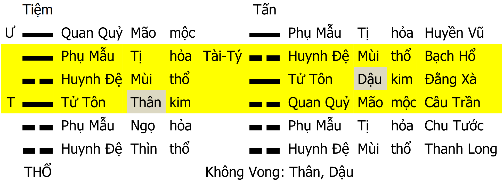
      - **Hình này chứng minh điều gì**
        - Chứng minh cha vợ người hỏi vừa trải qua phẫu thuật ung thư mũi và tạm qua nguy hiểm.
      - **Từ đâu mà thấy được**
        - Quẻ Cấn; Dụng thần hào 5 Phụ Mẫu Tị hỏa động lâm Bạch Hổ (phẫu thuật); Tử Tôn Thân kim Bệnh địa hợp Dụng lâm Câu Trần (u cục).
- Các bước suy luận Lục hào chi tiết:
  - Định hào Dụng thần:
    - Trong quẻ hào Phụ Mẫu lưỡng hiện (hào 2 Ngọ hỏa và hào 5 Tị hỏa); hào 5 Phụ Mẫu Tị hỏa phát động nên chọn làm Dụng thần chính.
  - Xác định vị trí cơ quan tổn thương:
    - Quẻ Phong Sơn Tiệm thuộc quái cung Cấn, tượng cung Cấn chủ quản mũi.
    - Hào vị số 5 trong cơ thể cũng tương ứng với vị trí mũi.
  - Luận hung tin phẫu thuật và khối u ung thư:
    - Hào 5 Dụng thần lâm lục thần Bạch Hổ: Bạch Hổ chủ về tai ách bệnh tật dữ dội, đồng thời đại diện cho đao kéo phẫu thuật.
    - Tử Tôn Thân kim là Bệnh địa của Dụng thần Tị hỏa, lại tương hợp với Dụng thần (Tị Thân lục hợp), biểu thị bệnh tật đã lâm vào thân thể.
    - Thân kim lâm lục thần Câu Trần: Câu Trần chủ về khối u, ung bướu.
  - Tiên lượng an nguy tính mạng:
    - Dụng thần Phụ Mẫu Tị hỏa vượng tướng, được Nguyệt lệnh Dần mộc sinh phù (Dần mộc tương sinh Tị hỏa), động hóa Huynh Đệ Mùi thổ hồi đầu sinh/tiết khí không tuyệt, do đó tạm thời chưa nguy hiểm đến tính mạng.
- Ứng nghiệm thực tế:
  - Người hỏi xác nhận cha vợ đã tiến hành phẫu thuật ung thư mũi cách đó đúng 3 ngày.

### 6. BỆNH TẬT VỀ CỔ HỌNG

#### Khái niệm sinh lý và các phương diện thủ tượng quái hào

- Vai trò sinh lý và các biểu hiện bệnh lý vùng cổ họng:
  - Cổ họng là cửa ngõ tiêu hóa có chức năng tống thức ăn xuống thực quản để đưa vào nuôi dưỡng cơ thể.
  - Khi phát sinh bệnh biến, cổ họng thường xuất hiện các triệu chứng điển hình: khát khô, đau nhức, ngứa ngáy, nóng rát, khàn tiếng, ho khan, khí đoản (hụt hơi, thiếu hơi), đờm đặc tích tụ.
  - Bệnh biến nghiêm trọng có thể phát triển thành các khối u sưng hoặc chuyển hóa thành ung thư vòm họng ác tính.
- Quy luật thủ tượng quái hào trong dự trắc bệnh tật cổ họng:
  - Phương diện quái cung:
    - Cung Càn: Đại diện cho phần đầu của cơ thể.
    - Cung Đoài: Đại diện cho miệng, cơ quan phát âm và khoang tiếp nhận ăn uống.
  - Phương diện hào vị:
    - Hào 5: Vị trí biểu trưng trực tiếp cho vùng cổ họng.
    - Hào 6: Vị trí biểu trưng cho vùng đầu não.
  - Phương diện ngũ hành:
    - Hành Thủy: Đại diện cho chất lỏng tân dịch và cơ quan cổ họng trong cơ thể.
  - Phương diện lục thân:
    - Hào Tử Tôn: Tượng trưng cho đường dẫn khí, hô hấp và hầu họng.
    - Hào Thê Tài: Chủ về ăn uống, tiêu hóa thức ăn và tuần hoàn hơi thở, liên kết mật thiết với vùng họng.
  - Phương diện lục thần:
    - Thanh Long: Chủ về chứng đau nhức cơ năng, hoặc bệnh tật do đam mê tửu sắc, ăn uống quá độ.
    - Chu Tước: Chủ về chứng viêm sưng, nóng sốt, hỏa độc bốc lên gây đau rát.
    - Câu Trần: Chủ về chứng sưng tấy, tắc nghẽn cục bộ, khối u bướu hoặc chứng ung thư.
    - Đằng Xà: Chủ về tiếng nói bị khàn đặc, họng có dị vật, hình thể uốn lượn dài hẹp của đường dẫn thức ăn.

#### Các trường hợp dự trắc bệnh cổ họng thực tế

##### Ví dụ 1: Nam tự đoán bệnh (Quẻ Sơn Địa Bác biến Phong Trạch Trung Phu)

- Ngày Kỷ Sửu tháng Ngọ, người nam tự gieo quẻ đoán bệnh bản thân, được quẻ Sơn Địa Bác biến Phong Trạch Trung Phu, tuần không tại Ngọ và Mùi:
  - **Hình 176.** Quẻ Sơn Địa Bác biến Phong Trạch Trung Phu
    - 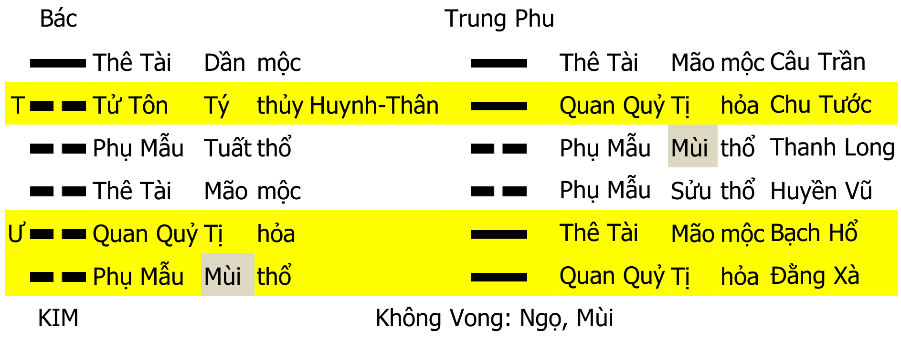
    - **Hình này chứng minh điều gì**
      - Cổ họng người bệnh phát chứng viêm cấp tính, đau nhức và khô rát dữ dội; quẻ định ngày Thân khỏi bệnh.
    - **Từ đâu mà thấy được**
      - Thế Tý thủy tại hào 5 bị Nguyệt phá động hóa Tuyệt (Tị hỏa Quan Quỷ); Tý thủy Tuyệt địa chủ khô kiệt, lâm Chu Tước chủ viêm sưng.
- Phân tích cơ chế suy luận quái hào:
  - Tự đoán bệnh lấy hào Thế làm Dụng thần đại diện cho thể trạng người hỏi.
  - Hào Thế Tý thủy tọa tại hào 5, gặp tháng Ngọ bị Nguyệt phá, lại phát động hóa Tuyệt vào Quan Quỷ Tị hỏa.
  - Hào 5 mang ngũ hành Thủy là vị trí tượng trưng cho hầu họng; hào 5 động hóa Quan Quỷ biểu thị cổ họng phát sinh bệnh tật.
  - Hào Thế Tý thủy bị hỏa của tháng Ngọ xung phá, chứng tỏ bệnh do hỏa khí quá vượng bốc lên làm tổn hại họng.
  - Hào Thế lâm Chu Tước chủ về nhiệt chứng và viêm nhiễm; thủy rơi vào Tuyệt địa không còn nước ("vô thủy") biểu thị vùng họng khô rát mất tân dịch.
- Kết quả và ứng nghiệm thực tế:
  - Người hỏi quẻ bị đau rát cổ họng dữ dội và được bác sĩ chẩn đoán viêm họng cấp.
  - Bệnh tình hoàn toàn tiêu trừ, bình phục vào ngày Thân (khi Thân kim trường sinh và sinh phù hào Thế Tý thủy).

##### Ví dụ 2: Nữ đoán vận khí (Quẻ Sơn Thủy Mông biến Địa Thủy Sư)

- Ngày Mậu Ngọ tháng Hợi, người phụ nữ gieo quẻ đoán vận khí tổng quát, được quẻ Sơn Thủy Mông biến Địa Thủy Sư, tuần không tại Tý và Sửu:
  - **Hình 177.** Sơ đồ quẻ Sơn Thủy Mông biến Địa Thủy Sư
    - 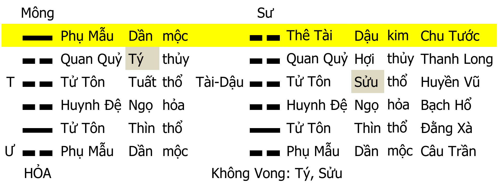
    - **Hình này chứng minh điều gì**
      - Người hỏi quẻ mắc chứng khô rát cổ họng kéo dài đi kèm hiện tượng viêm nhiễm ở hầu họng.
    - **Từ đâu mà thấy được**
      - Hào 5 Quan Quỷ Tý thủy bị Nhật Ngọ xung ám động sinh Kỵ thần; hào 6 Bệnh địa mang Chu Tước khắc; Hỏa xung chủ khô ráo.
- Phân tích cơ chế suy luận quái hào:
  - Quẻ bói vận khí tổng thể bao hàm trọn vẹn tình trạng sức khỏe và cơ thể của đương sự.
  - Hào 6 là Bệnh địa mang thần Chu Tước lâm đến khắc, biểu thị trên cơ thể có ổ viêm nhiễm phát nhiệt.
  - Hào 5 Quan Quỷ Tý thủy (vị trí cổ họng) bị Nhật thần Ngọ hỏa xung kích trở thành ám động sinh trợ Kỵ thần; Quan Quỷ chủ về bệnh hoạn nên xác định cổ họng mắc chứng viêm.
  - Nhật thần mang ngũ hành Hỏa xung khắc Tý thủy; Hỏa vượng chủ về nóng bức và khô ráo, làm hao cạn tân dịch nơi hầu họng.
- Kết quả và ứng nghiệm thực tế:
  - Người hỏi quẻ xác nhận cổ họng luôn trong tình trạng khô rát, nóng họng khó chịu.

##### Ví dụ 3: Đoán bệnh cho con (Quẻ Thủy Sơn Kiển biến Địa Hỏa Minh Di)

- Ngày Kỷ Dậu tháng Ngọ, một Dịch hữu trên mạng xem bói bệnh cho con trai, được quẻ Thủy Sơn Kiển biến Địa Hỏa Minh Di, tuần không tại Dần và Mão:
  - **Hình 178.** Sơ đồ quẻ Thủy Sơn Kiển biến Địa Hỏa Minh Di
    - 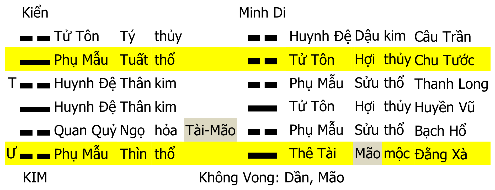
    - **Hình này chứng minh điều gì**
      - Đứa trẻ bị viêm họng cấp kèm theo sốt cao co giật và rơi vào trạng thái hôn mê bất tỉnh.
    - **Từ đâu mà thấy được**
      - Tử Tôn Tý thủy hào 6 bị Nguyệt phá; hào 5 Tuất thổ lâm Chu Tước động khắc; Dụng thần nhập Mộ ở hào sơ Thìn thổ.
- Phân tích cơ chế suy luận quái hào:
  - Xem bệnh cho con cái lấy hào Tử Tôn làm Dụng thần.
  - Dụng thần Tử Tôn Tý thủy ngự tại hào 6, mang hành Thủy bị tháng Ngọ xung phá thành Nguyệt phá, sức sống suy kiệt.
  - Hào 5 Phụ Mẫu Tuất thổ phát động mang theo Chu Tước khắc thẳng vào Dụng thần Tử Tôn.
  - Quẻ Kiển thuộc quái cung Đoài tượng trưng cho miệng; hào 5 định vị tại cổ họng; Chu Tước chủ về nhiệt độ tăng cao, sốt nóng và viêm cấp.
  - Hào Tử Tôn Tý thủy nhập Mộ ở hào sơ Phụ Mẫu Thìn thổ, tượng trưng thần trí bị giam hãm, che lấp, chủ về tình trạng hôn mê sâu.
- Kết quả và ứng nghiệm thực tế:
  - Cháu bé bị viêm họng rất nặng, lên cơn sốt cao li bì và rơi vào trạng thái hôn mê.

##### Ví dụ 4: Nam đoán bệnh cho cha vợ (Quẻ Sơn Hỏa Bí biến Tốn Vi Phong)

- Ngày Mậu Tý tháng Dần, người nam đoán bệnh cho cha vợ bị đau ốm lâu ngày, được quẻ Sơn Hỏa Bí biến Tốn Vi Phong, tuần không tại Ngọ và Mùi:
  - **Hình 179.** Sơ đồ quẻ Sơn Hỏa Bí biến Tốn Vi Phong
    - 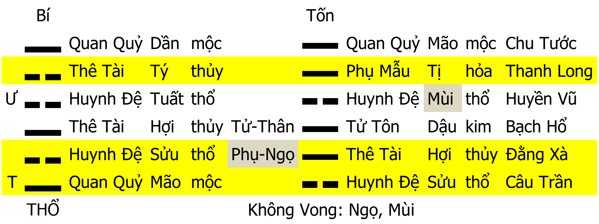
    - **Hình này chứng minh điều gì**
      - Người cha vợ lâm trọng bệnh ác tính, mắc đồng thời ung thư vòm họng và ung thư đại tràng.
    - **Từ đâu mà thấy được**
      - Phụ Mẫu Ngọ hỏa phục hào 2 lâm Không, bị Nhật Tý và hào 5 động khắc; quẻ biến Lục Xung; Nguyên thần lâm Câu Trần.
- Phân tích cơ chế suy luận quái hào:
  - Đoán bệnh của cha vợ lấy hào Phụ Mẫu làm Dụng thần.
  - Dụng thần Phụ Mẫu Ngọ hỏa không hiện trên quẻ, phục dưới hào 2 Huynh Đệ Sửu thổ và lâm Tuần Không.
  - Nhật thần Tý thủy xung khắc Dụng thần; đồng thời Nhật thần nhập quẻ tại hào 5 Thê Tài Tý thủy phát động tiếp tục khắc thương Dụng thần.
  - Hào 5 gặp ngũ hành Thủy đại diện cho vị trí cổ họng.
  - Bệnh lâu ngày mà Dụng thần gặp Không vong thì rất xấu, lại gặp Nhật xung càng không cát; quẻ Bí biến sang Tốn Vi Phong là tượng biến quẻ Lục Xung, bệnh lâu phùng xung chủ đại hung, báo hiệu cổ họng có bệnh hiểm nghèo nghiêm trọng.
  - Dụng thần phục dưới hào 2 bị khắc; hào 2 là vị trí của đường ruột nên hệ tiêu hóa ruột cũng phát sinh tổn thương nặng.
  - Nguyên thần của quẻ lâm Câu Trần; Câu Trần chuyên chủ về các khối u bướu ác tính (ung thư).
- Kết quả và ứng nghiệm thực tế:
  - Bệnh nhân bị chẩn đoán ung thư vòm họng giai đoạn nặng di căn kèm theo ung thư đại tràng.

##### Ví dụ 5: Nam đoán chung thân vận khí (Quẻ Sơn Phong Cổ biến Phong Sơn Tiệm)

- Ngày Mậu Ngọ tháng Hợi, người nam gieo quẻ xem chung thân vận khí, được quẻ Sơn Phong Cổ biến Phong Sơn Tiệm, tuần không tại Tý và Sửu:
  - **Hình 180.** Sơ đồ quẻ Sơn Phong Cổ biến Phong Sơn Tiệm
    - 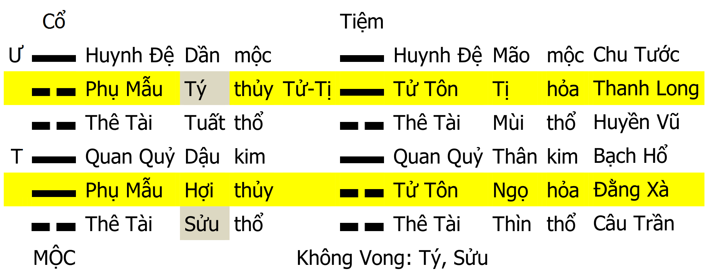
    - **Hình này chứng minh điều gì**
      - Đương sự bị khô họng kinh niên do nghiện rượu nặng, kèm theo đau dạ dày, rối loạn đường ruột và mất ngủ kéo dài.
    - **Từ đâu mà thấy được**
      - Hào 5 Tý thủy lâm Thanh Long động hóa Kỵ thần Tị hỏa khắc Thế; hào 2 Hợi thủy là Bệnh địa lâm Đằng Xà động; Thế tại hào 3.
- Phân tích cơ chế suy luận quái hào:
  - Quẻ vận khí chung thân phản ánh đầy đủ thông tin về tình trạng thể chất; lấy hào Thế Quan Quỷ Dậu kim hào 3 làm Dụng thần định bệnh.
  - Hào 5 Phụ Mẫu Tý thủy lâm thần Thanh Long phát động hóa ra Tử Tôn Tị hỏa (Kỵ thần khắc Dậu kim).
  - Hào 5 mang hành Thủy chủ về cổ họng, hóa ra hỏa tượng trưng nhiệt khí hun đốt làm khô cạn tân dịch; thần Thanh Long chủ về thú vui hưởng lạc rượu chè tửu sắc, chỉ rõ nguyên nhân phát bệnh do uống quá nhiều bia rượu.
  - Hào 2 Phụ Mẫu Hợi thủy lâm Đằng Xà phát động; Hợi thủy chính là Bệnh địa của hào Thế Dậu kim.
  - Đằng Xà chủ về mộng mị lo âu, hào Thế ngự tại hào 3 là vị trí giường nằm, kết hợp lại biểu thị ban đêm trằn trọc ngủ không an giấc, thường xuyên mất ngủ.
  - Hào 2 và hào 3 đại diện cho dạ dày và ruột trong cơ thể; Đằng Xà mang hình tượng uốn lượn thon dài càng củng cố tượng của đường ruột, biểu thị hệ tiêu hóa ruột dạ dày bị suy thoái.
- Kết quả và ứng nghiệm thực tế:
  - Người này xác nhận do thói quen uống nhiều rượu nên họng thường xuyên khô khát; đồng thời mắc các chứng bệnh mãn tính về dạ dày, ruột và mất ngủ trầm trọng.

##### Ví dụ 6: Nữ đoán sức khỏe bản thân (Quẻ Cấn Vi Sơn biến Thủy Địa Tỷ)

- Ngày Ất Hợi tháng Ngọ, người phụ nữ gieo quẻ xem bệnh tình của bản thân, được quẻ Cấn Vi Sơn biến Thủy Địa Tỷ, tuần không tại Thân và Dậu:
  - **Hình 181.** Sơ đồ quẻ Cấn Vi Sơn biến Thủy Địa Tỷ
    - 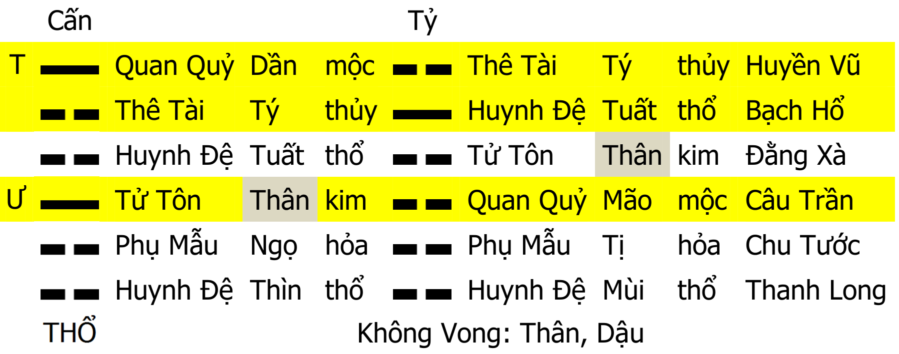
    - **Hình này chứng minh điều gì**
      - Người bệnh gặp bất ổn vùng cổ họng, thường xuyên hoa mắt chóng mặt và có khối u xơ ở tử cung.
    - **Từ đâu mà thấy được**
      - Hào 6 Thế Dần mộc lâm Huyền Vũ bị hào 3 Thân kim động xung; hào 5 Tý thủy Nguyệt phá hóa khắc; hào 3 hóa Quan Quỷ Mão mộc lâm Câu Trần.
- Phân tích cơ chế suy luận quái hào:
  - Tự đoán sức khỏe lấy hào Thế làm Dụng thần.
  - Hào Thế Quan Quỷ Dần mộc tại hào 6 lâm Huyền Vũ bị hào 3 Tử Tôn Thân kim phát động xung khắc (Thân kim lâm Không nhưng động thì không xem là chân Không); hào 6 là đầu não, Huyền Vũ chủ choáng váng hoa mắt, phùng xung chủ chao đảo lay động nên dẫn đến chứng đau đầu chóng mặt.
  - Nguyên thần Thê Tài Tý thủy tại hào 5 bị Nguyệt phá (tháng Ngọ xung), lại động hóa Huynh Đệ Tuất thổ hồi đầu khắc; hào 5 mang hành Thủy chủ cổ họng, bị Nguyệt phá và hóa khắc nặng nề khẳng định vùng họng có tổn thương bệnh lý.
  - Hào 3 Tử Tôn Thân kim phát động khắc hào Thế, bản thân Kỵ thần đóng vai trò ổ bệnh, lại hóa ra Quan Quỷ Mão mộc cũng là bệnh tật.
  - Hào 3 đại diện cho tử cung, hào Tử Tôn cũng mang tượng cơ quan sinh sản tử cung; hào biến Mão mộc là cung vị Thai địa của Tử Tôn Thân kim; lâm thần Câu Trần chủ về khối u sưng, tổng hợp lại xác định có khối u xơ tử cung.
- Kết quả và ứng nghiệm thực tế:
  - Người bệnh xác nhận vùng họng luôn khó chịu, kèm theo chứng chóng mặt thường xuyên và bệnh án có u xơ tử cung.

##### Ví dụ 7: Nữ tự đoán bệnh (Quẻ Hỏa Lôi Phệ Hạp biến Thiên Lôi Vô Vọng)

- Ngày Kỷ Tị tháng Hợi, người phụ nữ gieo quẻ tự đoán bệnh bản thân, được quẻ Hỏa Lôi Phệ Hạp biến Thiên Lôi Vô Vọng, tuần không tại Tuất và Hợi:
  - **Hình 182.** Sơ đồ quẻ Hỏa Lôi Phệ Hạp biến Thiên Lôi Vô Vọng
    - 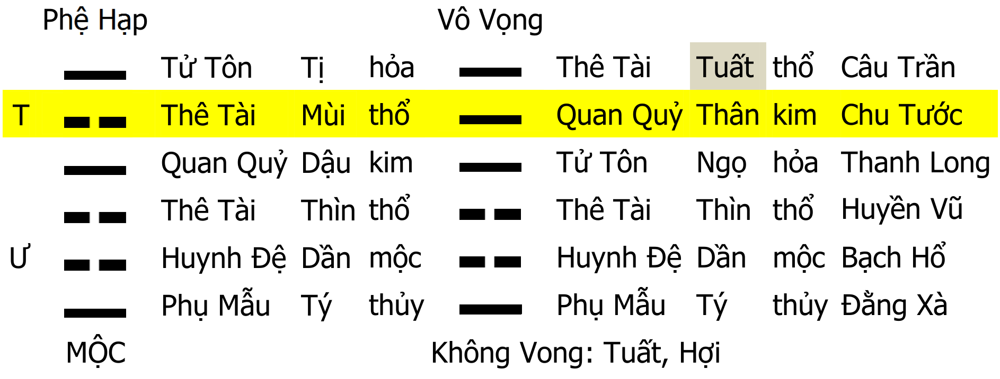
    - **Hình này chứng minh điều gì**
      - Viêm họng và sưng amidan phì đại, dẫn tới ho nhiều, khàn tiếng, đờm đặc và thỉnh thoảng sốt phát hỏa.
    - **Từ đâu mà thấy được**
      - Hào 5 Thế Thê Tài Mùi thổ động hóa Quan Quỷ Thân kim lâm Chu Tước; quẻ Phệ Hạp chủ cắn nuốt ẩm thực; hào 5 là hầu họng.
- Phân tích cơ chế suy luận quái hào:
  - Tự xem bệnh lấy hào Thế làm Dụng thần đại diện cho thể trạng người hỏi.
  - Hào Thế Thê Tài Mùi thổ cư tại hào 5 phát động hóa ra Quan Quỷ Thân kim; Quan Quỷ là tượng trưng trực tiếp của bệnh tật.
  - Tên quẻ Phệ Hạp tượng trưng cho hành động nhai cắn, nuốt thức ăn, liên quan mật thiết đến cửa ngõ hầu họng và đường ăn uống.
  - Hào 5 là hào vị của cổ họng; hào 5 Thế động hóa Quỷ lại mang thần Chu Tước; Chu Tước chủ về nhiệt hỏa, sốt cao và chứng sưng viêm, kết luận hầu họng bị viêm nhiễm nặng.
- Kết quả và ứng nghiệm thực tế:
  - Người bệnh bị phì đại amidan, viêm họng gây ho dữ dội, thỉnh thoảng phát cơn sốt nóng, nhiều đờm ứ tắc và giọng nói khàn đặc.

### 7. BỆNH TẬT VỀ KHOANG MIỆNG

#### Nguyên lý và quy luật thủ tượng bệnh khoang miệng
- Vai trò sinh lý và ý nghĩa bệnh lý của khoang miệng:
  - Cửa ngõ đầu tiên đưa thức ăn và mầm bệnh vào cơ thể theo nguyên lý dân gian "bệnh tòng khẩu nhập".
  - Chức năng đa dạng của khoang miệng gồm nước bọt sát khuẩn, răng nghiền nhỏ thức ăn hỗ trợ hấp thu, lưỡi phân biệt vị giác và thúc đẩy bài tiết dịch vị.
  - Tổn thương khoang miệng trực tiếp cản trở việc ăn uống và gây suy giảm nguồn dinh dưỡng cung ứng cho toàn bộ cơ thể.
  - Tượng quẻ phản ánh bệnh lý khoang miệng có nhiều nét tương đồng với bệnh tật vùng cổ họng; ngũ hành Thủy đôi khi chủ khoang miệng nói chung, nhưng khi phát sinh bệnh lý về răng thì phương pháp thủ tượng sẽ hoàn toàn khác biệt.
- Hệ thống quy luật thủ tượng đa chiều xác định bệnh khoang miệng:
  - Phương diện quái cung:
    - Cung Đoài: Đoài vi khẩu, chủ trực tiếp về miệng và khoang miệng.
    - Cung Càn: Càn vi thủ, chủ về phần đầu.
  - Phương diện quẻ đặc biệt:
    - Quẻ Hỏa Lôi Phệ Hạp và quẻ Sơn Lôi Di mang tượng cắn hợp, nhai nuốt, liên quan trực tiếp đến ăn uống và hoạt động của miệng.
  - Phương diện hào vị:
    - Hào 5 giữ vị trí trung tâm đại diện cho khoang miệng.
    - Hào 4 và hào 6 thỉnh thoảng cũng đối ứng liên đới với khoang miệng.
  - Phương diện ngũ hành:
    - Hành Kim chủ cốt cách, xương cốt; trong khoang miệng đối ứng trực tiếp với răng.
  - Phương diện lục thân:
    - Hào Thê Tài chủ về ẩm thực, thức ăn thức uống dung nạp vào cơ thể.
    - Hào Huynh Đệ khắc Thê Tài, biểu trưng cho lực nhai nghiền thức ăn của răng miệng.
  - Phương diện lục thần và các tổ hợp tượng chuyên biệt:
    - Lục thần không đối ứng cố định mà tùy biến linh hoạt theo hào vị và ngũ hành.
    - Thanh Long chủ đau nhức răng.
    - Chu Tước chủ viêm nhiễm, viêm lợi (nướu).
    - Câu Trần chủ sưng trướng lợi, hình thành khối u cục.
    - Đằng Xà chủ răng sâu, vi khuẩn sâu bọ gặm nhấm mục rỗng.
    - Bạch Hổ chủ xuất huyết, chảy máu chân răng.
    - Huyền Vũ chủ thối rữa, hoại tử, lở loét khoang miệng.
    - Tổ hợp Kim Không lâm Đằng Xà: Phần lớn chủ về răng sâu bị rỗng xốp bên trong.
    - Tổ hợp Kim Không lâm Bạch Hổ: Biểu thị răng bị thương tổn nặng hoặc đã bị nhổ bỏ.
    - Tổ hợp Kim nhập Mộ ở Sửu thổ: Tượng răng bị thịt nướu bao bọc trùm lên, xác lập mối liên hệ mật thiết giữa Sửu thổ và răng lợi.

#### Ví dụ 1: Nữ tự đoán bệnh - Hào Thế lâm Thổ ngộ Câu Trần chủ sưng lợi chảy máu
- Tình huống quẻ: Ngày Tân Tị tháng Tuất (Tuần không: Thân, Dậu), người phụ nữ tự dự trắc bệnh tật của bản thân, gieo được quẻ Hỏa Lôi Phệ Hạp biến Chấn Vi Lôi:
  - **Hình 183.** Quẻ Hỏa Lôi Phệ Hạp biến Chấn Vi Lôi
    - 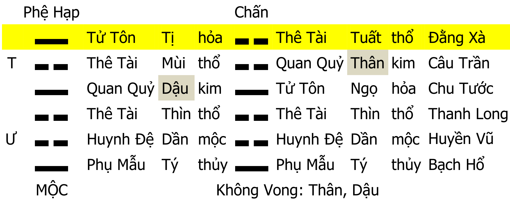
    - **Hình này chứng minh điều gì**
      - Hào Thế Thổ tại hào 5 lâm Câu Trần chủ bệnh lý sưng lợi, ăn uống khó khăn và chảy máu.
    - **Từ đâu mà thấy được**
      - Thế Mùi thổ tại hào 5 lâm Câu Trần, Nguyên thần Tị hỏa tại hào 6 phát động hóa Mộ Tuất thổ không thể sinh Thế.
- Xác định Dụng thần và nhận định ban đầu:
  - Tự đoán bệnh lấy hào Thế làm Dụng thần; trong quẻ hào Thế là Thê Tài Mùi thổ cư tại hào 5.
  - Thế Mùi thổ được Nguyệt kiến Tuất thổ tỉ phù và Nhật thần Tị hỏa tương sinh, bề ngoài thể hiện khí vượng, trông như thể không có bệnh tật gì.
- Phân tích cơ chế bệnh biến qua Nguyên thần và hào vị:
  - Nguyên thần Tử Tôn Tị hỏa tại hào 6 phát động:
    - Đối với Dụng thần thì hào phát động lâm Tuyệt địa, lại động hóa Thê Tài Tuất thổ cấu thành hóa Mộ.
    - Nguyên thần hóa Mộ bị kìm hãm, mất đi năng lực tương sinh trợ vượng cho Dụng thần, đây chính là căn nguyên phát sinh bệnh tật.
  - Hào Thế mang Thê Tài chủ về ẩm thực; hào vị cư tại hào 5 là khoang miệng; bản thân quẻ Hỏa Lôi Phệ Hạp mang ý nghĩa cắn xé, ăn uống.
  - Nguyên thần Tử Tôn không còn sức sinh trợ Thế Tài, biểu thị chức năng ăn uống bị cản trở nghiêm trọng, gặp khó khăn khi dùng bữa.
- Định vị chứng bệnh qua ngũ hành và lục thần:
  - Ngũ hành Thổ chủ về da dẻ cơ nhục; khi đối ứng tại khoang miệng thì Thổ chủ cơ thịt chính là nướu lợi.
  - Hào Thế Mùi thổ lâm lục thần Câu Trần; Câu Trần chủ sưng trướng, phù nề, kết hợp vị trí nướu lợi xác định mắc chứng sưng lợi.
- Kết quả ứng nghiệm thực tế:
  - Người hỏi xác nhận thực tế đang bị sưng lợi và chân răng chảy máu.

#### Ví dụ 2: Nữ đoán sức khỏe - Hào Thế kim tại hào 5 bị Nhật khắc lâm Thanh Long chủ đau răng
- Tình huống quẻ: Ngày Mậu Ngọ tháng Hợi (Tuần không: Tý, Sửu), người phụ nữ dự trắc tình trạng sức khỏe, gieo được quẻ Trạch Thiên Quải (quẻ tĩnh):
  - **Hình 184.** Quẻ Trạch Thiên Quải
    - 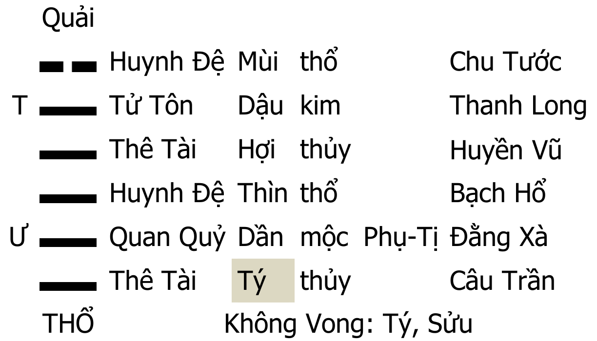
    - **Hình này chứng minh điều gì**
      - Hào Thế lâm Kim tại vị trí hào 5 bị Nhật khắc và lâm Bệnh địa, kết hợp Thanh Long chủ chứng đau răng.
    - **Từ đâu mà thấy được**
      - Dụng thần Thế Dậu kim tại hào 5 lâm Thanh Long, gặp Nguyệt Hợi là Bệnh địa và bị Nhật Ngọ hỏa khắc thương.
- Xác định Dụng thần và phân tích suy vượng:
  - Tự đoán sức khỏe lấy hào Thế làm Dụng thần; trong quẻ hào Thế ngự tại hào 5 mang Tử Tôn Dậu kim.
  - Thế Dậu kim lâm nguyệt lệnh Hợi thủy rơi vào trạng thái Bệnh địa (Kim trường sinh tại Tị, đến Hợi là đất Bệnh).
  - Đồng thời hào Thế bị Nhật thần Ngọ hỏa phát lực khắc thương trực tiếp, thể trạng suy thoái.
- Định vị bệnh tật qua hào vị, ngũ hành và lục thần:
  - Hào vị cư tại hào 5 là khoang miệng.
  - Ngũ hành Kim chủ về cốt cách xương tủy, nằm ở khoang miệng chính là răng.
  - Hào Thế lâm lục thần Thanh Long; trong dự trắc bệnh lý khoang miệng, Thanh Long chủ về đau nhức.
  - Tổng hợp các yếu tố: Khẳng định bệnh trạng là đau răng.
- Kết quả ứng nghiệm thực tế:
  - Đương số xác nhận bản thân đúng là đang bị đau răng khó chịu.

#### Ví dụ 3: Nam đoán niên vận - Quẻ Phệ Hạp hào 5 lâm Chu Tước bị Nguyệt khắc lâm Bạch Hổ chủ chảy máu răng
- Tình huống quẻ: Ngày Kỷ Mùi tháng Dần (Tuần không: Tý, Sửu), một người nam giới dự trắc niên vận (trong đó bao hàm cả thông tin sức khỏe), gieo được quẻ Hỏa Lôi Phệ Hạp biến Chấn Vi Lôi:
  - **Hình 185.** Quẻ Hỏa Lôi Phệ Hạp biến Chấn Vi Lôi
    - 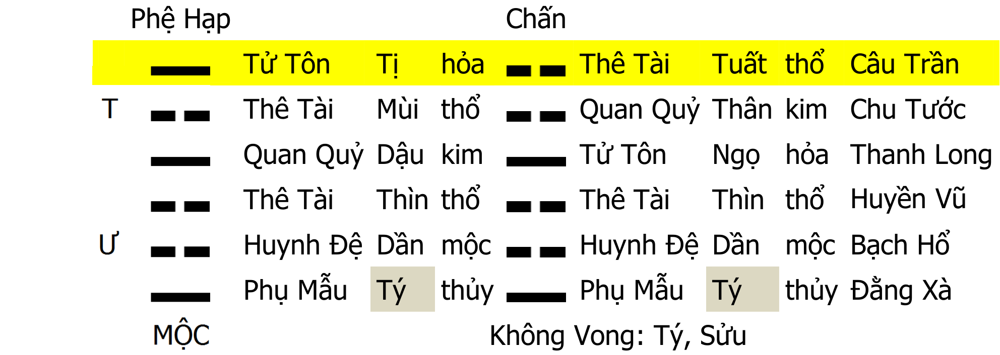
    - **Hình này chứng minh điều gì**
      - Quẻ Phệ Hạp hào 5 lâm Chu Tước bị Nguyệt kiến lâm Bạch Hổ khắc, biểu thị mắc bệnh chảy máu răng.
    - **Từ đâu mà thấy được**
      - Thế Mùi thổ tại hào 5 lâm Chu Tước bị Nguyệt kiến Dần mộc khắc, Dần mộc nhập quẻ lâm Bạch Hổ chủ về huyết.
- Nhận diện tín hiệu bệnh lý trong quẻ niên vận:
  - Dự đoán niên vận bao hàm việc dự trắc sức khỏe, xem xét mọi phương diện cát hung trong năm.
  - Hào Thế Thê Tài Mùi thổ cư tại hào 5, bị Nguyệt kiến Dần mộc tương khắc nặng nề.
  - Nguyệt kiến Dần mộc đồng thời nhập quẻ tại hào Ứng (hào 2 Huynh Đệ Dần mộc) và lâm lục thần Bạch Hổ; Bạch Hổ chủ về huyết quang, thương tổn chảy máu.
- Phân tích quái tượng và hào vị định vị chứng bệnh:
  - Bản thân quẻ chủ là Hỏa Lôi Phệ Hạp, mang hình tượng cắn nghiền thức ăn, hàm chứa thông tin liên quan mật thiết đến ăn uống và răng miệng.
  - Hào Thế ngự tại hào 5 là Thê Tài chủ ẩm thực dung nạp vào cơ thể, lại lâm lục thần Chu Tước chủ về vùng miệng và khoang miệng.
  - Thế tại khoang miệng bị Nguyệt kiến lâm Bạch Hổ khắc chế, báo hiệu trong năm tất sẽ phát sinh bệnh tật tổn thương vùng răng miệng kèm theo xuất huyết.
- Kết quả và thời điểm ứng nghiệm thực tế:
  - Đến tháng Hợi trong năm, người này thực tế đã bị chảy máu răng.

#### Ví dụ 4: Nữ tự đoán bệnh - Hào 5 Thân kim độc phát lâm Bạch Hổ phẫu thuật bệnh nha chu
- Tình huống quẻ: Ngày Ất Dậu tháng Thìn (Tuần không: Ngọ, Mùi), một người phụ nữ tự dự đoán bệnh tật của bản thân, gieo được quẻ Thiên Thủy Tụng biến Hỏa Thủy Vị Tế:
  - **Hình 186.** Quẻ Thiên Thủy Tụng biến Hỏa Thủy Vị Tế
    - 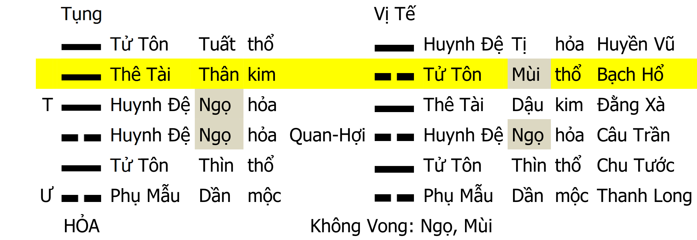
    - **Hình này chứng minh điều gì**
      - Hào 5 Thân kim độc phát lâm Bạch Hổ phản ánh quyết định phẫu thuật nướu lợi điều trị bệnh nha chu.
    - **Từ đâu mà thấy được**
      - Hào 5 Thê Tài Thân kim độc phát lâm Bạch Hổ (phẫu thuật), Thế Ngọ hỏa lâm Đằng Xà ngộ Không biểu thị sợ hãi.
- Đánh giá tổng quan hào Thế và Dụng thần:
  - Tự đoán bệnh lấy hào Thế làm Dụng thần; trong quẻ hào Thế ngự tại hào 4 mang Huynh Đệ Ngọ hỏa.
  - Ngọ hỏa không bị Nhật thần Dậu kim hay Nguyệt kiến Thìn thổ khắc thương, bản thân thể trạng không tiềm ẩn bệnh hiểm nghèo nghiêm trọng.
- Phân tích hào độc phát định vị thông tin phẫu thuật:
  - Toàn quẻ duy nhất có hào 5 Thê Tài Thân kim phát động, cấu thành cách cục hào độc phát; hào độc phát nắm giữ chức năng biểu thị tính chất và nguyên nhân sự việc.
  - Hào 5 Thân kim động mang theo lục thần Bạch Hổ; Bạch Hổ chủ đau đớn, đổ máu, dao kéo mổ xẻ và phẫu thuật ngoại khoa, do đó hào động này mang tín hiệu phẫu thuật rõ rệt.
- Đối chiếu vị trí và tâm lý người bệnh:
  - Vị trí hào 5 là khoang miệng, ngũ hành Kim chủ xương cốt cốt cách trong miệng tức là răng, hào Thê Tài liên đới đến ăn uống dinh dưỡng.
  - Kết hợp tượng quẻ xác định người bệnh phải tiến hành can thiệp phẫu thuật tại vùng răng miệng.
  - Hào Thế Ngọ hỏa lâm Đằng Xà lại rơi vào Tuần không, Đằng Xà chủ lo âu, Không Vong chủ hụt hẫng, bất định, phản ánh trạng thái nội tâm đương số đang vô cùng hoang mang, sợ hãi trước ca mổ.
- Kết quả ứng nghiệm thực tế:
  - Bệnh nhân thực tế mắc bệnh nha chu mạn tính và đang chuẩn bị tiến hành phẫu thuật nướu lợi.

#### Ví dụ 5: Nữ đoán giảm cân - Hào 5 Thân kim lâm Đằng Xà động hóa Không chủ răng sâu nhổ bỏ
- Tình huống quẻ: Ngày Quý Tị tháng Sửu (Tuần không: Ngọ, Mùi), một người phụ nữ dự trắc việc giảm cân, gieo được quẻ Thiên Lôi Vô Vọng biến Hỏa Trạch Khuê:
  - **Hình 187.** Sơ đồ quẻ Thiên Lôi Vô Vọng biến Hỏa Trạch Khuê
    - 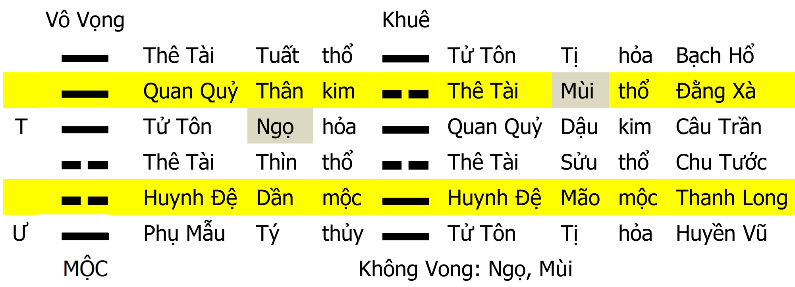
    - **Hình này chứng minh điều gì**
      - Hào 5 Kim ngộ Đằng Xà động hóa Không phản ánh thực trạng răng viêm mủ mục rỗng và đã được nhổ bỏ.
    - **Từ đâu mà thấy được**
      - Quan Quỷ Thân kim tại hào 5 là Bệnh địa của Thế, lâm Đằng Xà (vi khuẩn sâu răng) phát động hóa Mùi thổ Tuần không.
- Xác định Dụng thần và mối liên hệ bệnh lý:
  - Dự trắc bản thân lấy hào Thế làm Dụng thần; trong quẻ hào Thế là Tử Tôn Ngọ hỏa cư tại hào 4 (lâm Tuần không).
  - Hào 5 Quan Quỷ Thân kim phát động: Địa chi Thân kim chính là vị trí Bệnh địa của hào Thế Ngọ hỏa (Hỏa trường sinh tại Dần, tử tại Dậu, bệnh tại Thân).
- Giải mã tượng bệnh sâu răng và nhổ răng qua hào động:
  - Vị trí hào 5 đối ứng với khoang miệng, ngũ hành Kim chủ xương cốt đại diện cho răng.
  - Quan Quỷ Thân kim lâm lục thần Đằng Xà: Đằng Xà chủ biến dị, côn trùng, vi khuẩn sâu bọ gặm nhấm, tượng trưng cho vi khuẩn sâu răng tàn phá.
  - Hào 5 Thân kim phát động hóa ra Thê Tài Mùi thổ; địa chi Mùi thổ rơi vào Tuần không, cấu thành thế động hóa Không.
  - Tượng "hóa Không" biểu thị trạng thái tiêu mất, không còn tồn tại, hư vô, đối ứng với việc chiếc răng hư hại đã được loại bỏ ra khỏi hàm.
- Kết quả ứng nghiệm thực tế:
  - Người phụ nữ xác nhận răng đã bị viêm nhiễm mưng mủ nghiêm trọng nên đã đi nhổ bỏ.

#### Ví dụ 6: Nữ tự đoán bệnh - Hào 5 Quan Quỷ Thân kim độc phát lâm Nguyệt hợp chủ đau răng kinh niên
- Tình huống quẻ: Ngày Giáp Thìn tháng Tị (Tuần không: Dần, Mão), một người phụ nữ tự dự đoán bệnh tật của bản thân, gieo được quẻ Lôi Phong Hằng biến Trạch Phong Đại Quá:
  - **Hình 188.** Sơ đồ quẻ Lôi Phong Hằng biến Trạch Phong Đại Quá
    - 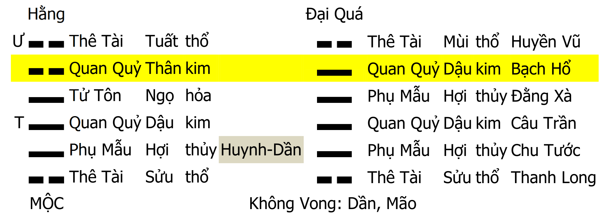
    - **Hình này chứng minh điều gì**
      - Hào 5 Quan Quỷ độc phát được Nguyệt hợp phản ánh bệnh lý đau nhức răng đã kéo dài kinh niên suốt hai năm.
    - **Từ đâu mà thấy được**
      - Hào 5 Quan Quỷ Thân kim độc phát vượng tướng chủ bệnh răng miệng, được Nguyệt kiến Tị hỏa hợp (bệnh lâu năm).
- Xác định Dụng thần và phân tích hào độc phát:
  - Tự đoán bệnh lấy hào Thế làm Dụng thần; trong quẻ hào Thế cư tại hào 3 mang Quan Quỷ Dậu kim.
  - Toàn quẻ duy nhất có hào 5 Quan Quỷ Thân kim phát động, cấu thành cách cục hào độc phát; hào độc phát thể hiện tính chất cốt lõi và nguyên nhân phát sinh bệnh.
- Định vị cơ quan tổn thương và thời gian mang bệnh:
  - Vị trí hào 5 đối ứng với khoang miệng, ngũ hành Kim chủ xương cốt đối ứng trực tiếp với răng.
  - Hào Quan Quỷ vượng tướng phát động chủ về tai họa tật bệnh, kết hợp hào 5 hành Kim khẳng định chắc chắn là bệnh lý về răng.
  - Quan Quỷ Thân kim được Nguyệt kiến Tị hỏa tương hợp (Tị Thân lục hợp); theo nguyên lý dự đoán bệnh tật, hào tật bệnh lâm Nguyệt hợp biểu thị bệnh đã tích tụ lâu ngày, thành bệnh mạn tính kinh niên khó dứt.
- Kết quả ứng nghiệm thực tế:
  - Đương số xác nhận bản thân đã phải chịu đựng những cơn đau nhức răng dai dẳng suốt hai năm qua.

#### Ví dụ 7: Nữ tự đoán bệnh - Quan Quỷ hào 5 độc phát Nguyệt phá chủ đau răng và thưa kẽ răng
- Tình huống quẻ: Ngày Canh Thân tháng Dần (Tuần không: Tý, Sửu), một người phụ nữ tự dự đoán bệnh tật của bản thân, gieo được quẻ Lôi Thủy Giải biến Trạch Thủy Khốn:
- Xác định Dụng thần và vai trò của hào độc phát:
  - Tự đoán bệnh lấy hào Thế làm Dụng thần; trong quẻ hào Thế là Thê Tài Thìn thổ cư tại hào 2.
  - Hào 5 Quan Quỷ Thân kim phát động đơn độc, cấu thành quẻ độc phát phản ánh nguyên nhân và tính chất tật bệnh.
- Định vị chứng bệnh qua hào vị, lục thần và thời gian phát bệnh:
  - Vị trí hào 5 đối ứng với khoang miệng, ngũ hành Kim chủ xương cốt tức là răng.
  - Hào 5 Quan Quỷ Thân kim lâm lục thần Câu Trần; Câu Trần chủ sưng trướng, phù nề, báo hiệu tình trạng sưng tấy trong khoang miệng.
  - Quan Quỷ Thân kim đồng thời lâm Nhật thần Thân kim; theo nguyên lý dự trắc, hào bệnh lâm Nhật biểu thị bệnh mới phát sinh gần đây, triệu chứng vừa mới xuất hiện.
- Luận giải cơ chế tổn thương qua Nguyệt phá và tương khắc:
  - Quan Quỷ Thân kim bị Nguyệt kiến Dần mộc tương xung cấu thành Nguyệt phá; tượng Nguyệt phá biểu thị sự rạn nứt, hở rộng, khi đối ứng với hàm răng biểu thị trên thân răng xuất hiện khe hở hoặc kẽ răng bị thưa rộng.
  - Hào Thế Thê Tài Thìn thổ bị Nguyệt kiến Dần mộc khắc thương trực tiếp; ngũ hành Mộc chủ về phong tà, đau nhức ê ẩm, khắc vào hào Thế báo hiệu đương số đang chịu những cơn đau răng khó chịu.
- Kết quả ứng nghiệm thực tế:
  - Đương số xác nhận bị đau nhức răng, kẽ răng bị thưa rộng và kèm theo tình trạng chảy máu chân răng.

### 8. BỆNH VỀ TAI

#### Căn cứ lý luận và quái tượng dự trắc bệnh về tai
- Tầm quan trọng của thính giác và các chứng bệnh thường gặp ở tai:
  - Thính giác là giác quan tiếp nhận âm thanh, giúp con người kết nối với thế giới xung quanh và giao tiếp bằng ngôn ngữ.
  - Khi tai mắc bệnh, năng lực tiếp nhận âm thanh và khả năng giao tiếp bị ảnh hưởng nghiêm trọng.
  - Các chứng bệnh về tai thường gặp trong thực tế gồm: ù tai, điếc tai, thính lực suy giảm, viêm tai giữa.
- Phương diện quái cung định vị cơ quan tai:
  - Quẻ Khảm giữ vai trò chủ chốt đối với bệnh về tai, do Khảm tượng trưng cho tai trong Bát quái.
- Phương diện hào vị xác định vị trí tai và đầu não:
  - Hào 5 và hào 6 biểu thị cho vùng đầu và ngũ quan; trong đó hào 5 là hào vị trực tiếp của cơ quan tai.
- Phương diện ngũ hành luận đoán âm thanh và bệnh lý thính giác:
  - Ngũ hành kim và thủy liên quan mật thiết đến cấu trúc và cơ năng của tai.
  - Quy tắc "Kim Không tắc minh": hào hành kim lâm Tuần Không phát ra âm thanh bất thường, biểu thị triệu chứng ù tai; kim chủ về âm thanh.
  - Quy tắc "Thổ Không không sinh kim": hào thổ lâm Tuần Không mất lực sinh kim, không thể sản sinh âm thanh bình thường, biểu thị điếc tai.
  - Thực tế nghiệm chứng ngũ hành phân chia tai trái và phải: thuyết xưa cho rằng mộc là tai trái, kim là tai phải qua thực tế kiểm nghiệm không thấy ứng nghiệm.
  - Biến hóa của hào kim: hào kim nhập Mộ hoặc bị hợp giữ chân đều mang thông tin thính lực bế tắc, đóng kín, gây nên ù tai hoặc điếc tai.
- Phương diện lục thần phản ánh âm thanh:
  - Chu Tước là lục thần chủ quản âm thanh và tiếng nói, thường phối hợp cùng hào kim để định tính chứng bệnh về tai.
- Mô hình minh họa quái tượng bệnh về tai:
  - Quái tượng bệnh tai thể hiện qua vị trí quẻ Khảm và hào Quan Quỷ hành kim tại hào ngũ quan:
    - **Hình 189.** Sơ đồ quẻ Lôi Thủy Giải biến Trạch Thủy Khốn
      - 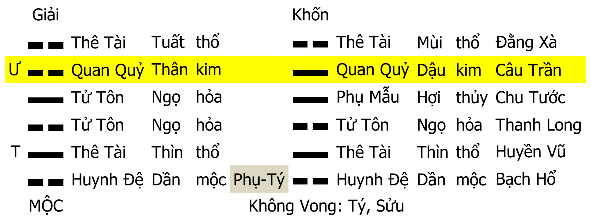
      - **Hình này chứng minh điều gì**
        - Quái tượng bệnh về tai phát triển khi nội quái là Khảm (chủ tai) kết hợp hào 5 Quan Quỷ hành kim hóa Tiến thần.
      - **Từ đâu mà thấy được**
        - Nội quái Khảm chủ tai, hào 5 là vị trí ngũ quan có Quan Quỷ Thân kim động hóa Quan Quỷ Dậu kim lâm Câu Trần biểu thị bệnh ở tai tăng tiến.

#### Phân tích các ví dụ dự trắc thực chứng

##### Ví dụ 1: Quẻ Lôi Phong Hằng biến Địa Thủy Sư - Bệnh suy giảm thính lực và viêm ruột
- Bối cảnh dự trắc:
  - Thời gian: Ngày Bính Dần, tháng Sửu (Tuần Không: Tuất, Hợi).
  - Đối tượng: Người phụ nữ tự gieo quẻ xem bệnh tình của bản thân, thu được quẻ Lôi Phong Hằng biến Địa Thủy Sư.
  - Quẻ Lôi Phong Hằng biến Địa Thủy Sư phản ánh đồng thời bệnh ở tai và bệnh viêm ruột:
    - **Hình 190.** Quẻ Lôi Phong Hằng biến Địa Thủy Sư
      - 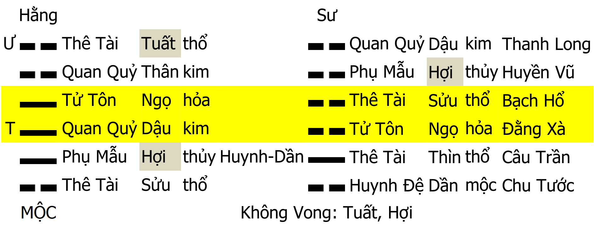
      - **Hình này chứng minh điều gì**
        - Bệnh nhân mắc chứng thính lực kém (tai điếc) kết hợp bệnh lý viêm ruột.
      - **Từ đâu mà thấy được**
        - Hào 3 Dậu kim hóa Ngọ hỏa hồi đầu khắc lâm Đằng Xà chủ ruột; hào 5 Thân kim ám động nhập Mộ ở Nguyệt và hào 6 Tuất thổ Không Vong không sinh kim chủ tai điếc.
- Suy luận dự trắc chi tiết:
  - Xác định Dụng thần: Lấy hào Thế làm Dụng thần đại diện cho người bệnh.
  - Luận đoán bệnh đường ruột:
    - Hào Thế ngự tại hào 3 Quan Quỷ Dậu kim, phát động hóa Tử Tôn Ngọ hỏa hồi đầu khắc.
    - Hào 3 là vị trí của ruột trong cơ thể, hành kim cũng chủ về ruột.
    - Hào Thế lâm Đằng Xà mang hình tượng vật nhỏ và dài, bổ sung thông tin về cấu trúc đường ruột; do đó kết luận ruột có bệnh không tốt.
  - Luận đoán bệnh về tai (tai điếc):
    - Hào 5 Quan Quỷ Thân kim được Nhật Dần xung thành ám động, Quan Quỷ vượng tướng là mầm bệnh; kim cư hào 5 chủ về tai và âm thanh, cho thấy tai có bệnh.
    - Hào Thân kim nhập Mộ tại Nguyệt kiến Sửu thổ, biểu thị âm thanh của tai bị che lấp và đóng kín.
    - Hào 6 Nguyên thần Thê Tài Tuất thổ lâm Tuần Không (Tuất Hợi Không Vong); hào 6 là đầu não, thổ Không không sinh được kim khiến cơ quan thính giác không sản sinh âm thanh.
    - Hai dấu hiệu hào 5 kim nhập Mộ và hào 6 thổ Không kết hợp biểu thị tai bị điếc.
- Kết quả ứng nghiệm thực tế:
  - Bệnh nhân thính lực rất kém và có bệnh viêm ruột.

##### Ví dụ 2: Quẻ Trạch Thiên Quải biến Trạch Phong Đại Quá - Chứng ù tai và suy giảm thính lực
- Bối cảnh dự trắc:
  - Thời gian: Ngày Đinh Sửu, tháng Ngọ (Tuần Không: Thân, Dậu).
  - Đối tượng: Trong thời gian tác giả giảng dạy tại Singapore, một người đàn ông Indonesia nhờ xem sức khỏe, thu được quẻ Trạch Thiên Quải biến Trạch Phong Đại Quá.
  - Quẻ Trạch Thiên Quải biến Trạch Phong Đại Quá phản ánh chứng ù tai:
    - **Hình 191.** Quẻ Trạch Thiên Quải biến Trạch Phong Đại Quá
      - 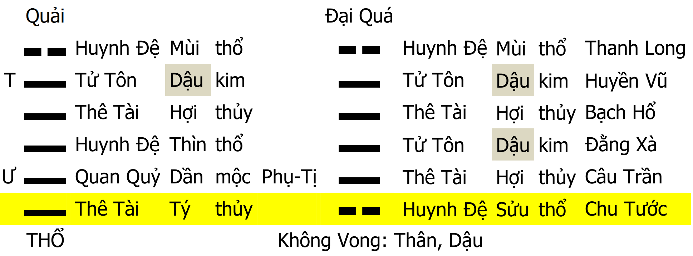
      - **Hình này chứng minh điều gì**
        - Người đàn ông mắc chứng ù tai và thính lực bị suy giảm.
      - **Từ đâu mà thấy được**
        - Hào Thế Tử Tôn Dậu kim tại hào 5 lâm Tuần Không ("kim Không tắc minh") và đồng thời nhập Mộ tại Nhật kiến Sửu thổ.
- Suy luận dự trắc chi tiết:
  - Xác định Dụng thần: Lấy hào Thế làm Dụng thần chủ thể bản thân người hỏi bệnh.
  - Luận đoán triệu chứng ù tai:
    - Hào Thế Tử Tôn Dậu kim ngự tại hào 5 (vị trí ngũ quan), lâm Tuần Không.
    - Căn cứ nguyên lý "Kim Không tắc minh", kim rỗng phát ra âm thanh, đây chính là thông tin tai bị ù phát tiếng vo ve.
  - Luận đoán thính lực suy giảm:
    - Hào Thế Dậu kim lâm Mộ khố ở Nhật kiến Sửu thổ, hào nhập Mộ mang tượng bị bao bọc, che khuất, biểu thị thính lực không tốt.
- Kết quả ứng nghiệm thực tế:
  - Người đàn ông phản hồi bản thân đúng là đang bị chứng ù tai.

##### Ví dụ 3: Quẻ Thủy Thiên Nhu biến Địa Thiên Thái - Ù tai, điếc và hội chứng ám ảnh sợ hãi
- Bối cảnh dự trắc:
  - Thời gian: Ngày Kỷ Mão, tháng Tuất (Tuần Không: Thân, Dậu).
  - Đối tượng: Một người đàn ông đến gieo quẻ hỏi bệnh tật, thu được quẻ Thủy Thiên Nhu biến Địa Thiên Thái.
  - Quẻ Thủy Thiên Nhu biến Địa Thiên Thái phản ánh chứng ù tai, điếc và ám ảnh sợ hãi:
    - **Hình 192.** Quẻ Thủy Thiên Nhu biến Địa Thiên Thái
      - 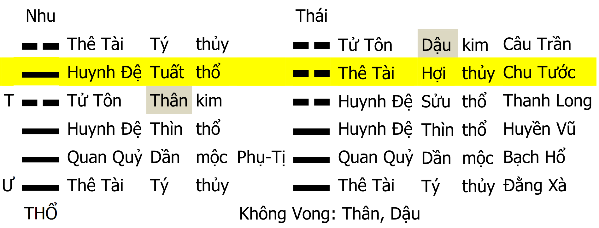
      - **Hình này chứng minh điều gì**
        - Bệnh nhân bị chứng ù tai, điếc kèm theo hội chứng ám ảnh sợ hãi khi phải ra ngoài.
      - **Từ đâu mà thấy được**
        - Hào Thế Thân kim lâm Không Vong; Nguyên thần Tuất thổ ở hào 5 lâm Chu Tước bị Nhật kiến Mão mộc hợp vướng chân không thể sinh kim.
- Suy luận dự trắc chi tiết:
  - Xác định Dụng thần: Lấy hào Thế Tử Tôn Thân kim làm Dụng thần.
  - Luận đoán cơ chế phát sinh bệnh tai:
    - Hào Thế Thân kim lâm Tuần Không, không nhận được sự tương sinh từ Nguyên thần.
    - Hào 5 Huynh Đệ Tuất thổ là Nguyên thần của hào Thế, lâm Chu Tước đại diện cho âm thanh, lại bị Nhật kiến Mão mộc hợp (Mão Tuất hợp) tạo thành thế hợp vướng chân (hợp bạn).
    - Hào Thế kim Không nên "Kim Không tắc minh", gây ra triệu chứng ù tai.
    - Hào 5 Chu Tước Tuất thổ bị hợp giữ chân không thể phát huy tác dụng sinh trợ cho kim, làm cho âm thanh không thể sản sinh bình thường, dẫn tới bị điếc.
- Kết quả ứng nghiệm thực tế:
  - Bệnh nhân bị ù tai, đồng thời mắc hội chứng ám ảnh sợ hãi, rất sợ hãi khi phải ra ngoài đường.

##### Ví dụ 4: Quẻ Thiên Thủy Tụng biến Hỏa Trạch Khuê - Mất hoàn toàn thính lực
- Bối cảnh dự trắc:
  - Thời gian: Ngày Kỷ Mão, tháng Thân (Tuần Không: Thân, Dậu).
  - Đối tượng: Người phụ nữ tự gieo quẻ xem bệnh tình bản thân, thu được quẻ Thiên Thủy Tụng biến Hỏa Trạch Khuê.
  - Quẻ Thiên Thủy Tụng biến Hỏa Trạch Khuê phản ánh tình trạng mất thính lực:
    - **Hình 193.** Quẻ Thiên Thủy Tụng biến Hỏa Trạch Khuê
      - 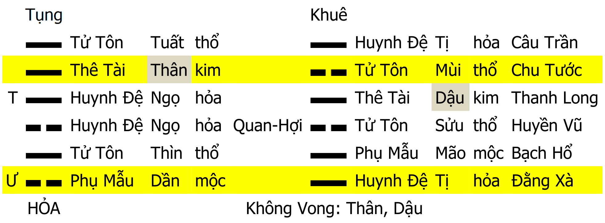
      - **Hình này chứng minh điều gì**
        - Bệnh nhân bị mất hoàn toàn thính lực, tai không thể nghe thấy âm thanh.
      - **Từ đâu mà thấy được**
        - Hào 5 Thân kim lâm Bệnh địa của hào Thế, ngộ Không Vong lại lâm Chu Tước phát động hóa Mùi thổ, biểu thị tai điếc nặng.
- Suy luận dự trắc chi tiết:
  - Xác định Dụng thần: Lấy hào Thế Huynh Đệ Ngọ hỏa làm Dụng thần.
  - Trạng thái căn bản của Thế hào: Hào Thế được Nhật kiến Mão mộc tương sinh, lại có Nguyên thần Phụ Mẫu Dần mộc ở hào 1 phát động sinh trợ nên hào Thế có khí vượng tướng.
  - Định vị ổ bệnh tại hào ngũ quan:
    - Hào 5 Thê Tài Thân kim lâm Bệnh địa trong vòng thập nhị trường sinh của hào Thế Ngọ hỏa.
    - Hào 5 Thân kim lâm Tuần Không, lại lâm Chu Tước phát động hóa Tử Tôn Mùi thổ hồi đầu sinh.
    - Hào 5 là vị trí ngũ quan, hành kim lâm Không Vong là tai không tốt, kết hợp Chu Tước chủ quản âm thanh phát động; do đó nhất định có chứng ù tai và điếc tai nghiêm trọng.
- Kết quả ứng nghiệm thực tế:
  - Bệnh nhân bị điếc, tai hoàn toàn không nghe thấy gì.

##### Ví dụ 5: Quẻ Thiên Lôi Vô Vọng biến Thủy Lôi Truân - Đoán việc nhập ngũ phát hiện con trai bị lãng tai
- Bối cảnh dự trắc:
  - Thời gian: Ngày Đinh Sửu, tháng Thân (Tuần Không: Thân, Dậu).
  - Đối tượng: Người mẹ gieo quẻ hỏi về tiền trình con trai đi bộ đội, thu được quẻ Thiên Lôi Vô Vọng biến Thủy Lôi Truân.
- Suy luận dự trắc chi tiết:
  - Chuyển hóa Dụng thần trong quẻ: Thông thường xem việc nhập ngũ tòng quân lấy hào Quan Quỷ làm Dụng thần sự nghiệp; tuy nhiên trong quẻ này hào 4 Tử Tôn Ngọ hỏa (đại diện cho người con trai) trì Thế phát động hóa ra Quan Quỷ Thân kim.
  - Biện chứng thông tin bệnh tật: Tử Tôn hóa Quan Quỷ là tượng bản thân người con mang bệnh tật hoặc sinh chuyện bất trắc trên cơ thể.
  - Luận đoán tật bệnh thính giác:
    - Quan Quỷ Thân kim lâm hành kim, gặp Tuần Không trong tuần Giáp Tuất.
    - Căn cứ định lý "Kim Không tắc minh", hành kim lâm Không biểu thị âm thanh trong tai bất thường.
    - Quan Quỷ là bệnh lại lâm kim Không ở vị trí ngũ quan, do đó tác giả phán đoán con trai cô ấy bị tật hơi điếc ở tai (lãng tai).
- Kết quả ứng nghiệm thực tế:
  - Người mẹ xác nhận sự thật đúng như lời phán đoán, con trai cô ấy bị hơi điếc.

### 9. BỆNH VIÊM QUANH KHỚP VAI

#### Quy luật và đặc điểm quái tượng dự trắc viêm quanh khớp vai

- Cơ chế bệnh sinh học theo quan điểm Đông y và kinh nghiệm thực tiễn:
  - Khi con người đến một độ tuổi nhất định, lưng vai thường xuất hiện tình trạng đau nhức mỏi mệt.
  - Căn nguyên chủ yếu do ngày thường làm việc mệt nhọc lao lực, dãi nắng dầm mưa lâu ngày.
  - Các khối cơ bắp và gân màng ở vùng lưng bị tổn thương, kết hợp với phong hàn thấp tà xâm thực ứ trệ, hình thành chứng bệnh viêm quanh khớp vai.
- Bốn đặc điểm cốt lõi của quái tượng viêm quanh khớp vai:
  - Phương diện quái cung: Bệnh liên quan mật thiết đến cung Cấn, vì quẻ Cấn tượng trưng cho vai gáy và lưng.
  - Phương diện hào vị: Bệnh tập trung chủ yếu ở hào 5 và hào 6, vì hai hào vị thượng tiêu này biểu thị bộ phận vai gáy và cánh tay.
  - Phương diện lục thần: Bệnh gắn liền với thần Huyền Vũ, vì Huyền Vũ chủ quản phong hàn, hàn tà và thấp khí bế tắc.
  - Phương diện ngũ hành: Bệnh liên quan trực tiếp đến kim và thủy; khi hành kim gặp Huyền Vũ hoặc tương hội với thủy thì thông tin viêm quanh khớp vai hiển lộ rõ rệt.
- Tương quan biện chứng giữa bệnh viêm quanh khớp vai và bệnh phổi:
  - Tổ hợp quái tượng viêm quanh khớp vai rất dễ lẫn lộn với bệnh lý phế quản phổi do cùng phản ánh thuộc tính kim.
  - Căn nguyên xuất phát từ y lý truyền thống: "Tây phong sinh vu thu, bệnh tại phế, du tại kiên bối" (Gió tây sinh vào mùa thu, bệnh phát tại huyệt Phế du và vùng vai lưng), do đó viêm quanh khớp vai lấy ngũ hành kim làm tượng thể hiện.
  - Hành mộc cư tại hào 6 cũng phản ánh thông tin viêm vai gáy, đặc biệt khi lâm Huyền Vũ: hào 6 là hào vị của vai, hành mộc chủ gân cơ đau mỏi tê nhức, Huyền Vũ chủ phong hàn thấp khí ngưng trệ.
- Quái đồ Thiên Lôi Vô Vọng biến Thủy Lôi Truân xuất hiện đầu tiết mục (phối ứng hào vị thượng tiêu):
  - **Hình 194.** Sơ đồ quẻ Thiên Lôi Vô Vọng biến Thủy Lôi Truân
    - 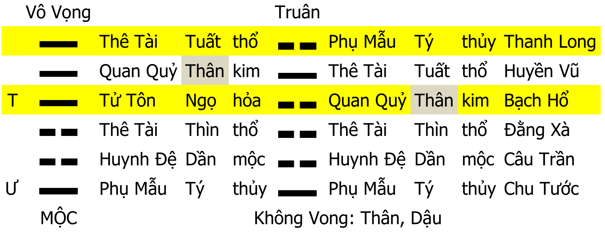
    - **Hình này chứng minh điều gì**
      - Biểu thị hào 5 Quan Quỷ Thân kim ngộ tuần không liên kết với hào 6 phát động phản ánh tật bệnh vùng thượng tiêu (tai và vai cổ).
    - **Từ đâu mà thấy được**
      - Quẻ Vô Vọng có Hào 4 Thế Tử Tôn Ngọ hỏa động hóa Quan Quỷ Thân kim lâm Huyền Vũ tuần không, hào 6 Thê Tài Tuất thổ động hóa Phụ Mẫu Tý thủy.

#### Các ví dụ thực tế dự trắc bệnh viêm quanh khớp vai

##### Ví dụ 1: Nam đoán bệnh bản thân được Thiên Trạch Lý biến Càn Vi Thiên

- Bối cảnh gieo quẻ và thông tin dự trắc:
  - Ngày Bính Tuất tháng Hợi (Tuần không: Ngọ, Mùi), một người nam gieo quẻ tự đoán bệnh tật của bản thân, được quẻ Thiên Trạch Lý biến Càn Vi Thiên:
    - **Hình 195.** Sơ đồ quẻ Thiên Trạch Lý biến Càn Vi Thiên
      - 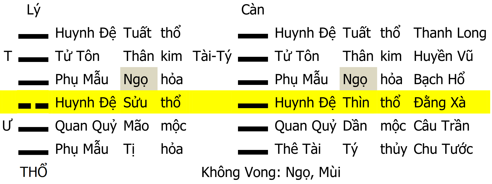
      - **Hình này chứng minh điều gì**
        - Người nam mắc chứng bệnh viêm quanh khớp vai do hàn thấp xâm nhập.
      - **Từ đâu mà thấy được**
        - Hào Thế Tử Tôn Thân kim tại hào 5 lâm Huyền Vũ, ngộ tháng Hợi thủy là Bệnh địa, thuộc quẻ cung Cấn chủ vai gáy.
- Các bước phân tích suy luận theo nguyên lý Lục Hào:
  - Xác định Dụng thần: Đương số tự đoán bệnh cho chính mình, lấy hào Thế làm Dụng thần.
  - Phân tích hào vị và lục thần: Hào Thế mang Tử Tôn Thân kim an ngự tại hào 5, lâm lục thần Huyền Vũ.
  - Phân tích tương tác ngũ hành và trạng thái 12 cung trường sinh: Thân kim gặp Nguyệt kiến Hợi thủy lâm vào Bệnh địa (kim trường sinh tại Tị, Bệnh tại Hợi).
  - Phân tích quái cung: Quẻ gốc Thiên Trạch Lý thuộc cung Cấn, tượng quẻ Cấn chủ về vai và lưng.
  - Kết luận quái tượng: Sự kết hợp hoàn chỉnh giữa hào 5 kim, lâm Bệnh địa ở tháng Hợi thủy, hội cùng Huyền Vũ trong quái cung Cấn là tổ hợp mẫu mực của bệnh viêm quanh khớp vai.
- Ứng nghiệm thực tế:
  - Đương số xác nhận bản thân đang mắc bệnh viêm quanh khớp vai.

##### Ví dụ 2: Nam đoán việc mở công ty được Thiên Trạch Lý biến Phong Trạch Trung Phu

- Bối cảnh gieo quẻ và lời đoán ban đầu:
  - Ngày Bính Tuất tháng Hợi (Tuần không: Ngọ, Mùi), một người nam gieo quẻ hỏi việc mở công ty kinh doanh ra sao, được quẻ Thiên Trạch Lý biến Phong Trạch Trung Phu:
    - **Hình 196.** Sơ đồ quẻ Thiên Trạch Lý biến Phong Trạch Trung Phu
      - 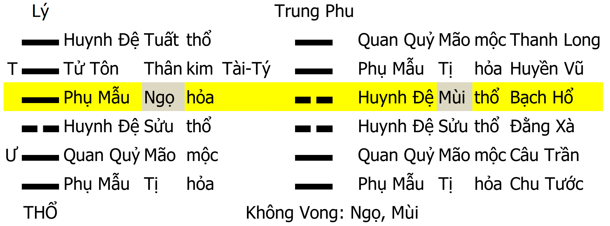
      - **Hình này chứng minh điều gì**
        - Quẻ hỏi về sự nghiệp kinh doanh nhưng bộc lộ dấu hiệu bệnh viêm quanh khớp vai rất rõ.
      - **Từ đâu mà thấy được**
        - Hào Thế Tử Tôn Thân kim ở hào 5 lâm Huyền Vũ, ngộ Nguyệt kiến Hợi thủy là Bệnh địa, quẻ quy về cung Cấn chủ vai lưng.
- Đối thoại thực tế và diễn biến phân tích suy luận:
  - Ngay khi vừa lập quẻ nhìn vào cấu trúc quái tượng, câu phán đầu tiên của tác giả đối với người hỏi là khẳng định anh ta bị mắc chứng viêm quanh khớp vai.
  - Cơ sở suy đoán bệnh lý ẩn trong quẻ sự nghiệp:
    - Hào Thế mang Tử Tôn Thân kim đóng tại hào vị 5, lâm lục thần Huyền Vũ.
    - Tháng gieo quẻ là tháng Hợi thủy, Thân kim nhập Bệnh địa tại nguyệt lệnh.
    - Quẻ Thiên Trạch Lý quy nạp về cung Cấn, tượng trưng cho bờ vai và lưng trên.
    - Quái tượng này cấu thành tổ hợp chuẩn xác của bệnh viêm quanh khớp vai như một thông tin đồng hành cùng vận trình bản thân.
- Ứng nghiệm thực tế:
  - Người hỏi thừa nhận trên thực tế đúng là mình đang bị bệnh viêm quanh khớp vai hành hạ.

##### Ví dụ 3: Nam đoán sức khỏe được Trạch Lôi Tùy biến Lôi Hỏa Phong

- Bối cảnh gieo quẻ và cấu trúc quái tượng:
  - Ngày Đinh Mão tháng Tuất (Tuần không: Tuất, Hợi), một người nam dự trắc tình trạng sức khỏe, gieo được quẻ Trạch Lôi Tùy biến Lôi Hỏa Phong:
    - **Hình 197.** Sơ đồ quẻ Trạch Lôi Tùy biến Lôi Hỏa Phong
      - 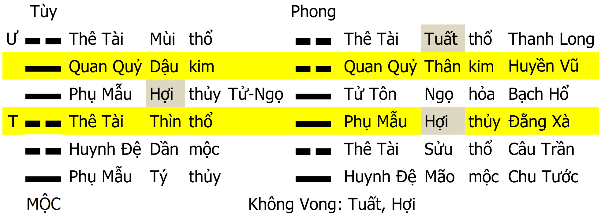
      - **Hình này chứng minh điều gì**
        - Đương số vừa mắc chứng viêm quanh khớp vai dai dẳng vừa bị viêm teo dạ dày.
      - **Từ đâu mà thấy được**
        - Hào 5 Quan Quỷ Dậu kim vượng tướng lâm Huyền Vũ động hợp hào Thế (viêm vai triền miên); hào 3 Thế Thìn thổ bị Nguyệt xung Nhật khắc lâm Đằng Xà (viêm teo dạ dày).
- Phân tích đa tầng bệnh chứng dựa trên sinh khắc hào vị:
  - Đoán chứng bệnh ở hệ tiêu hóa (dạ dày):
    - Đương số tự đoán bệnh nên lấy hào Thế làm Dụng thần; hào Thế mang Thê Tài Thìn thổ đóng tại hào 3.
    - Thìn thổ bị Nguyệt kiến Tuất thổ xung phá thành Nguyệt phá, lại chịu Nhật kiến Mão mộc khắc thương trực tiếp.
    - Hào 3 là hào vị dạ dày, ngũ hành thổ trong cơ thể tượng trưng cho tỳ vị; cả hào vị lẫn ngũ hành đều bị tổn thương nghiêm trọng biểu thị dạ dày có bệnh nặng.
    - Hào Thế lâm lục thần Đằng Xà, tính chất của Đằng Xà là uốn khúc, co rút, thắt chặt và teo nhỏ; tổ hợp này xác định bệnh viêm teo dạ dày.
  - Đoán chứng bệnh viêm quanh khớp vai:
    - Hào 5 Quan Quỷ Dậu kim vượng tướng tại tháng Tuất (được Tuất thổ sinh trợ) đóng vai trò là bệnh thần.
    - Quan Quỷ Dậu kim lâm Huyền Vũ phát động, tạo thế hợp với hào Thế Thìn thổ (Thìn Dậu lục hợp).
    - Ngũ hành kim cư tại hào 5 lâm Huyền Vũ chính là tượng bệnh viêm quanh khớp vai do thấp hàn.
    - Hào bệnh Quan Quỷ phát động hợp thân vào hào Thế biểu thị bệnh tình bám rễ dai dẳng, gắn chặt lấy cơ thể thành chứng bệnh kinh niên triền miên.
- Ứng nghiệm thực tế:
  - Bệnh nhân mắc song song cả hai chứng bệnh: viêm quanh khớp vai mãn tính và viêm teo dạ dày.

##### Ví dụ 4: Nữ đoán niên vận được Phong Sơn Tiệm biến Thủy Sơn Kiển

- Bối cảnh gieo quẻ và quái tượng dự trắc niên vận:
  - Ngày Ất Sửu tháng Dần (Tuần không: Tuất, Hợi), một người nữ gieo quẻ xem vận hạn trong năm (niên vận), được quẻ Phong Sơn Tiệm biến Thủy Sơn Kiển:
    - **Hình 198.** Sơ đồ quẻ Phong Sơn Tiệm biến Thủy Sơn Kiển
      - 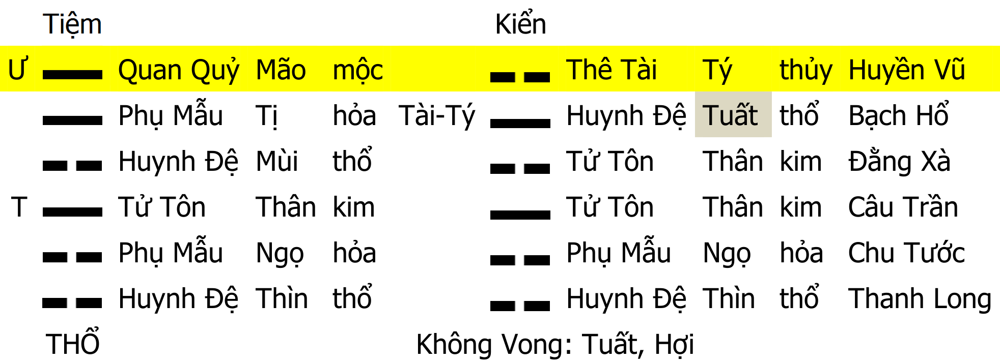
      - **Hình này chứng minh điều gì**
        - Người nữ phát sinh bệnh viêm quanh khớp vai kèm triệu chứng đau cạnh cổ và đau nhức cổ tay.
      - **Từ đâu mà thấy được**
        - Hào 6 Quan Quỷ Mão mộc độc phát vượng tướng lâm Huyền Vũ; hào Thế Thân kim bị Nguyệt Dần mộc xung phá (mộc xung chủ đau mỏi chi trên).
- Quy trình giải đoán kết hợp niên vận và bệnh lý:
  - Nguyên lý trắc niên vận: Quẻ đoán vận hạn một năm luôn phản ánh bao hàm tình trạng biến động của thân thể và sức khỏe bản thân đương số.
  - Phân tích thương tổn ở hào Thế:
    - Lấy hào Thế Tử Tôn Thân kim làm Dụng thần thể hiện bản thân người hỏi.
    - Hào Thế Thân kim bị Nguyệt kiến Dần mộc lâm thế xung phá (Dần Thân tương xung thành Nguyệt phá); hành mộc đối xung chủ về đau nhức mỏi cơ gân.
  - Phân tích hào động chỉ thị căn bệnh độc phát:
    - Hào 6 Quan Quỷ Mão mộc là hào độc phát trong toàn quẻ, lâm tháng Dần vượng tướng, Quỷ vượng động tức là căn nguyên phát sinh bệnh tật.
    - Hào 6 là hào vị tột cùng phía trên cơ thể, biểu thị vùng vai gáy, cổ và cánh tay.
    - Lục thần lâm Huyền Vũ chủ về thấp khí ngưng trệ và phong hàn xâm nhập.
    - Quan Quỷ Mão mộc động tại hào 6 lâm Huyền Vũ quy tụ thành chứng viêm quanh khớp vai và phong thấp chi trên.
- Ứng nghiệm thực tế:
  - Đương số bị đau nhức cạnh cổ gáy dữ dội, đồng thời khớp cổ tay cũng bị đau buốt ảnh hưởng đến vận động.

##### Ví dụ 5: Nữ đoán bệnh bản thân được Thiên Hỏa Đồng Nhân biến Thiên Sơn Độn

- Bối cảnh gieo quẻ và thông tin dự trắc bệnh tật:
  - Ngày Kỷ Tị tháng Dần (Tuần không: Tuất, Hợi), một người nữ tự đoán bệnh tật bản thân, gieo được quẻ Thiên Hỏa Đồng Nhân biến Thiên Sơn Độn:
    - **Hình 199.** Sơ đồ quẻ Thiên Hỏa Đồng Nhân biến Thiên Sơn Độn
      - 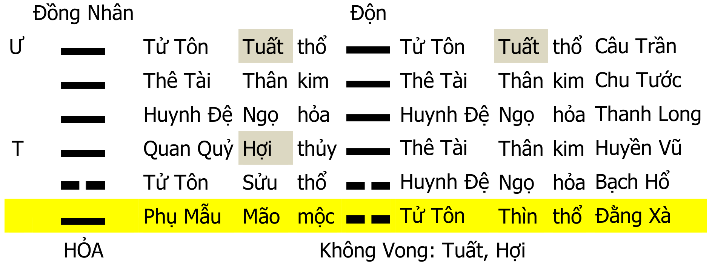
      - **Hình này chứng minh điều gì**
        - Người nữ mắc chứng bệnh viêm quanh khớp vai do phong hàn thấp khí bế tắc.
      - **Từ đâu mà thấy được**
        - Hào 3 Thế Quan Quỷ Hợi thủy lâm Huyền Vũ; Nguyên thần Thê Tài Thân kim tại hào 5 bị Nguyệt kiến Dần mộc xung phá.
- Trình tự phân tích sinh khắc và tương tác hào vị:
  - Xác định Dụng thần và lục thần sở lâm: Đương số tự đoán bệnh nên lấy hào Thế làm Dụng thần; hào Thế Quan Quỷ Hợi thủy đóng tại hào 3 lâm Huyền Vũ, Huyền Vũ chủ về thấp khí và hàn lạnh.
  - Phân tích trạng thái của Nguyên thần:
    - Nguyên thần sinh cho hào Thế là Thê Tài Thân kim ngự tại hào vị 5.
    - Thân kim bị Nguyệt kiến Dần mộc xung phá nặng nề (Dần Thân tương xung khiến Nguyên thần rơi vào cảnh Nguyệt phá), mất đi năng lực hỗ trợ cho hào Thế.
  - Luận suy nguyên nhân đau mỏi: Nguyệt kiến mang hành mộc đại diện cho phong và chứng đau mỏi tê nhức; hào 5 kim bị mộc xung thương kết hợp hào Thế lâm Huyền Vũ thủy tạo thành cấu trúc quái tượng viêm quanh khớp vai điển hình.
- Ứng nghiệm thực tế:
  - Đương số xác thực đang bị chứng viêm quanh khớp vai hành hạ.

##### Ví dụ 6: Nữ đoán sức khỏe được Trạch Thiên Quải

- Bối cảnh gieo quẻ và cấu trúc quái tượng tĩnh:
  - Ngày Mậu Ngọ tháng Hợi (Tuần không: Tý, Sửu), một người nữ đoán tình trạng sức khỏe cá nhân, gieo được quẻ tĩnh Trạch Thiên Quải:
    - **Hình 200.** Sơ đồ quẻ Trạch Thiên Quải
      - 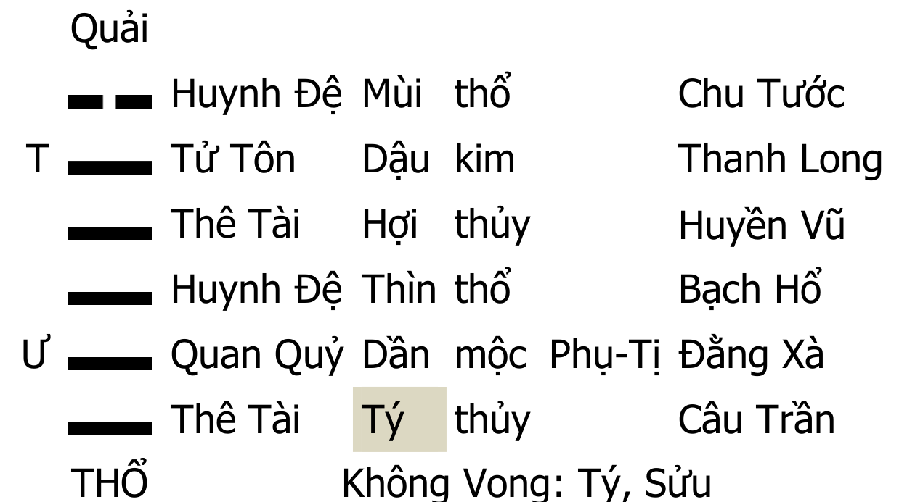
      - **Hình này chứng minh điều gì**
        - Người nữ bị bệnh viêm quanh khớp vai gây đau nhức kéo dài.
      - **Từ đâu mà thấy được**
        - Hào 5 Thế Tử Tôn Dậu kim lâm Thanh Long (chủ đau nhức), lâm Bệnh địa ở tháng Hợi thủy, bị Nhật Ngọ hỏa khắc, quẻ thuộc cung Cấn chủ vai gáy.
- Các bước suy luận tường tận trên quẻ tĩnh:
  - Xác định Dụng thần: Đương số đoán sức khỏe bản thân, lấy hào Thế làm Dụng thần.
  - Phân tích hào Thế: Hào Thế mang Tử Tôn Dậu kim ngự tại hào 5, lâm lục thần Thanh Long; Thanh Long khi luận bệnh chủ về cảm giác đau nhức, buốt nhức.
  - Luận ngũ hành, trường sinh và nhật nguyệt:
    - Ngũ hành kim cư tại hào vị 5, đối diện Nguyệt kiến Hợi thủy là rơi vào Bệnh địa.
    - Hào Thế Dậu kim lại bị Nhật kiến Ngọ hỏa trực tiếp khắc phạt làm tổn thương khí lực.
  - Phân tích quái cung: Quẻ Trạch Thiên Quải quy thuộc về quái cung Cấn, mà tượng cung Cấn chủ quản vùng vai và lưng.
  - Tổng hợp thông tin: Hào 5 kim lâm Bệnh địa, bị Nhật khắc, kết hợp Thanh Long chủ đau nhức trong cung Cấn khẳng định chắc chắn đương số mắc bệnh viêm quanh khớp vai.
- Ứng nghiệm thực tế:
  - Đương số xác nhận bản thân bị viêm quanh khớp vai gây đau nhức khó chịu.

##### Ví dụ 7: Nữ đoán bệnh bản thân được Trạch Thủy Khốn biến Địa Thủy Sư

- Bối cảnh gieo quẻ và cấu trúc quái tượng:
  - Ngày Tân Sửu tháng Hợi (Tuần không: Thìn, Tị), một người nữ tự đoán bệnh tật của mình, gieo được quẻ Trạch Thủy Khốn biến Địa Thủy Sư.
- Các bước phân tích suy luận theo dịch lý:
  - Xác định Dụng thần: Tự đoán bệnh lấy hào Thế làm Dụng thần; hào Thế mang Thê Tài Dần mộc cư hào sơ lâm Bạch Hổ.
  - Phân tích hào động tác động lên Dụng thần:
    - Hào 5 Huynh Đệ Dậu kim phát động hóa Tử Tôn Hợi thủy; ngũ hành Dậu kim phát động mang lực khắc thương hào Thế Dần mộc (kim động khắc mộc).
    - Hào động Dậu kim lại đồng thời nhị hợp với hào 2 Phụ Mẫu Thìn thổ (Thìn Dậu tương hợp), mà hào 2 Thìn thổ lại lâm lục thần Huyền Vũ.
  - Luận tượng viêm quanh khớp vai:
    - Hành kim cư tại hào 5 động hóa thủy, hội tụ tính chất thấp hàn của hành thủy.
    - Hào 5 kim tương hợp chặt chẽ với hào lâm Huyền Vũ (chủ thấp khí và phong hàn), truyền dẫn tác động xâm thực trực tiếp lên vùng khớp vai.
    - Vì vậy, tác giả kết luận bệnh chứng biểu hiện thành viêm quanh khớp vai.
- Ứng nghiệm thực tế:
  - Trên thực tế người nữ đúng là mắc chứng bệnh viêm quanh khớp vai.

##### Ví dụ 8: Nữ đoán bệnh bản thân được Hỏa Trạch Khuê biến Thiên Trạch Lý

- Bối cảnh gieo quẻ và tương tác hào vị:
  - Ngày Đinh Sửu tháng Thìn (Tuần không: Thân, Dậu), một người nữ gieo quẻ tự đoán bệnh của bản thân, được quẻ Hỏa Trạch Khuê biến Thiên Trạch Lý.
- Trình tự suy đoán dựa trên Không Vong và quy nạp quái cung:
  - Xác định Dụng thần: Tự đoán bệnh lấy hào Thế làm Dụng thần; hào Thế mang Tử Tôn Dậu kim đóng tại hào 4.
  - Phân tích thế suy vi của Dụng thần:
    - Ngày Đinh Sửu thuộc tuần giáp Tuất, tuần không tại Thân và Dậu; hào Thế Dậu kim lâm vào Tuần không.
    - Hào Thế Dậu kim lâm Không nhưng lại không được hào vị 5 Nguyên thần (Huynh Đệ Mùi thổ) sinh phù tương trợ.
  - Phân tích biến động ở hào 5:
    - Hào 5 Huynh Đệ Mùi thổ lâm Huyền Vũ phát động, biến xuất Tử Tôn Thân kim; Thân kim cũng rơi vào cảnh ngộ Tuần không nên biến hào thành hư vô, không thể truyền khí trợ sinh.
    - Hào 5 lâm Huyền Vũ phát động hóa kim Không Vong, tượng trưng cho phong hàn thấp khí ngưng tụ tại hào vị vai lưng mà khí huyết không thông.
  - Quy nạp quái cung: Quẻ Hỏa Trạch Khuê quy thuộc cung Cấn, tượng cung Cấn quản lĩnh vùng vai gáy và lưng thân thể.
  - Kết luận bệnh chứng: Dụng thần lâm Không, hào 5 Huyền Vũ hóa Không trong cung Cấn phản ánh người này bị viêm quanh khớp vai kèm đau lưng.
- Ứng nghiệm thực tế:
  - Người nữ thừa nhận mình bị chứng viêm quanh khớp vai và đau nhức dữ dội ở vùng lưng.

### 10. BỆNH VỀ XƯƠNG CỔ

#### Quy tắc quái tượng định vị bệnh xương cổ
- Vai trò sinh lý và triệu chứng lâm sàng vùng xương cổ:
  - Xương cổ là bộ vị trọng yếu của cột sống nối liền với đại não, giữ chức năng nâng đỡ đầu và dẫn truyền mạch máu, thần kinh trung ương.
  - Khi bộ vị xương cổ phát sinh thương tổn hoặc biến dạng sẽ dẫn tới các chứng đau cổ, đau vai, chóng mặt, đau đầu, tê dại hai cánh tay; trường hợp chuyển biến nghiêm trọng chi dưới xuất hiện hiện tượng co giật, đi lại khó khăn, thậm chí bại liệt tứ chi.
- Ba phương diện quái tượng cốt lõi định vị bệnh lý xương cổ:
  - Phương diện hào vị: Bệnh liên quan mật thiết đến hào 5 và hào 6, do hai hào vị này chủ quản vị trí đầu và cổ trên cơ thể.
  - Phương diện ngũ hành: Bệnh liên quan trực tiếp đến hành kim, vì ngũ hành kim đại diện cho hệ thống xương cốt và chất vôi cứng.
  - Phương diện lục thần: Đằng Xà chủ về đặc trưng hình thể dài và nhỏ (tượng tủy sống, đốt sống cổ, mạch máu), Câu Trần chủ về mối nối liền, trạng thái sưng phù, lồi cộm, mang tín hiệu điển hình của chứng bệnh tăng sinh mô xương (gai cột sống).
- Đồ hình quẻ đối chiếu liên hệ vùng vai cổ:
  - **Hình 201.** Quẻ Trạch Thủy Khốn biến Địa Thủy Sư
    - 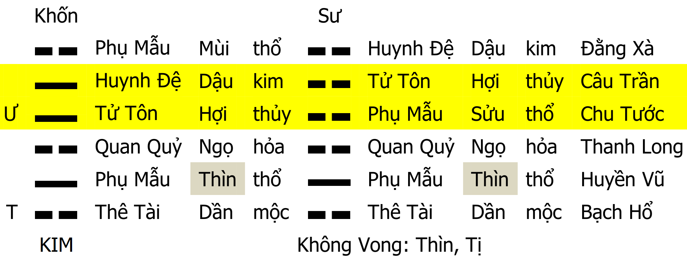
    - **Hình này chứng minh điều gì**
      - Bệnh lý tổn thương vùng vai gáy và liên đới đốt sống cổ.
    - **Từ đâu mà thấy được**
      - Hào 5 Dậu kim phát động hóa thủy tương khắc hào Thế; hào 5 thuộc kim chủ về xương khớp vùng cổ vai.
- Đồ hình quẻ đối chiếu tổn thương xương khớp vai lưng:
  - **Hình 202.** Quẻ Hỏa Trạch Khuê biến Thiên Trạch Lý
    - 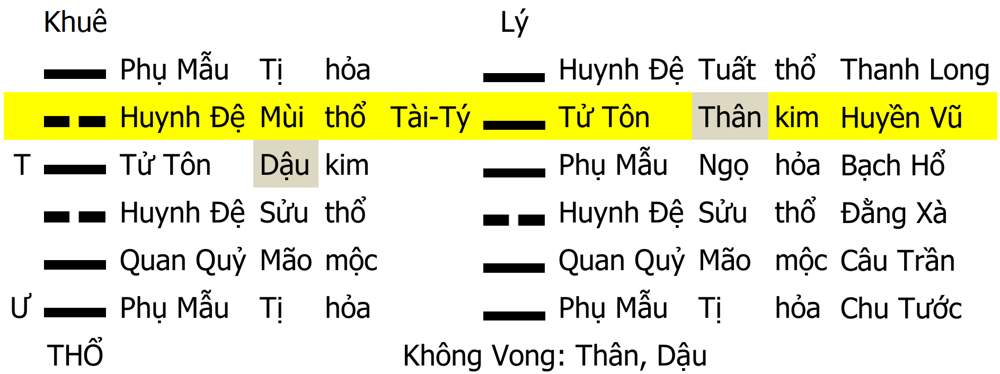
    - **Hình này chứng minh điều gì**
      - Tổn thương đau mỏi khớp vai lan xuống lưng và cột sống cổ.
    - **Từ đâu mà thấy được**
      - Thế Dậu kim lâm Không Vong, hào 5 Mùi thổ biến Thân kim Không Vong không thể sinh Thế; quẻ Cấn chủ về vai lưng.

#### Ví dụ 1: Quẻ Cấn Vi Sơn biến Phong Sơn Tiệm - Xương cổ tăng sinh gây thiếu máu não và chóng mặt
- Ngày Nhâm Ngọ tháng Dần, người phụ nữ gọi điện thoại nhờ dự đoán bệnh tật, tác giả gieo được quẻ Cấn Vi Sơn biến Phong Sơn Tiệm (quái cung Cấn thổ, Không Vong: Thân, Dậu):
  - **Hình 203.** Quẻ Cấn Vi Sơn biến Phong Sơn Tiệm
    - 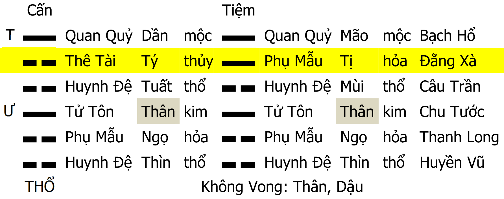
    - **Hình này chứng minh điều gì**
      - Bệnh tăng sinh xương cổ kéo dài gây thiếu máu lên não dẫn tới chóng mặt.
    - **Từ đâu mà thấy được**
      - Thế Quan Quỷ Dần mộc ở hào 6 (đầu); Nguyên thần Tý thủy tại hào 5 (cổ) lâm Đằng Xà động hóa Tuyệt lại bị Nhật xung.
- Xác lập Dụng thần và định vị vùng bệnh:
  - Dù tác giả trực tiếp gieo quẻ, nhưng người nữ nhờ hỏi bệnh cho chính bản thân mình nên lấy hào Thế làm Dụng thần.
  - Hào Thế Quan Quỷ Dần mộc lâm Bạch Hổ cư hào 6; hào 6 đại diện cho vùng đầu não, bản cung quẻ Cấn tượng trưng cho phần lưng.
- Cơ chế phát sinh chứng thiếu máu não và choáng váng:
  - Nguyên thần của Dụng thần là Thê Tài Tý thủy tại hào 5 phát động biến Phụ Mẫu Tị hỏa, lâm Tuyệt địa tại hào biến (Tý thủy tuyệt tại Tị).
  - Hào 5 lâm lục thần Đằng Xà biểu thị vật thể có hình dáng nhỏ và dài, đại diện cho cổ và các mạch quản dẫn huyết dịch.
  - Nguyên thần suy yếu lại động hóa Tuyệt nên không đủ lực lượng để sinh phù cho hào Thế mộc, chứng tỏ khả năng cung cấp máu từ vùng cổ lên não rất kém.
  - Nguyên thần Tý thủy lại bị Nhật kiến Ngọ hỏa xung (Tý Ngọ tương xung), Nguyên thần chủ đầu não bị xung động tất sinh chứng chóng mặt, choáng váng.
- Ứng nghiệm thực tế:
  - Người phụ nữ mắc chứng tăng sinh xương cổ đã hơn 10 năm, dẫn đến hiện tượng cung cấp máu lên não không đủ và gây nên những cơn chóng mặt kinh niên.

#### Ví dụ 2: Quẻ Chấn Vi Lôi biến Lôi Trạch Quy Muội - Xương cổ tăng sinh kết hợp bệnh phụ khoa và tổn thương chân
- Ngày Canh Dần tháng Thân, người nữ tự dự đoán sức khỏe bản thân, gieo được quẻ Chấn Vi Lôi biến Lôi Trạch Quy Muội (quái cung Chấn mộc, Không Vong: Ngọ, Mùi):
  - **Hình 204.** Quẻ Chấn Vi Lôi biến Lôi Trạch Quy Muội
    - 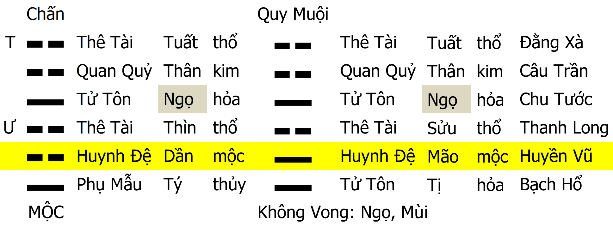
    - **Hình này chứng minh điều gì**
      - Người bệnh đồng thời bị tăng sinh xương cổ, viêm nhiễm phụ khoa và chi dưới đau yếu.
    - **Từ đâu mà thấy được**
      - Hào 5 Thân kim lâm Câu Trần ám động chỉ xương cổ tăng sinh; hào 2 Dần mộc hóa Tiến thần khắc Thế, lâm Huyền Vũ tại Trường Sinh của Tử Tôn.
- Phân tích chứng tăng sinh đốt sống cổ:
  - Người nữ tự đoán bệnh bản thân nên lấy hào Thế làm Dụng thần; Thế cư hào 6 Thê Tài Tuất thổ bị Nhật kiến Dần mộc khắc thương.
  - Hào 6 là vùng đầu, lâm Đằng Xà mang tượng hình thon dài nối liền với đầu não.
  - Hào 5 Quan Quỷ Thân kim được Nguyệt kiến Thân kim tỉ phù vượng tướng, lại bị Nhật kiến Dần mộc xung thành ám động.
  - Quan Quỷ chủ về tật bệnh, ngũ hành kim là xương cốt, lục thần Câu Trần chủ về hiện tượng tăng sinh, lồi cộm, phì đại; hào vị 5 chính là vùng cổ. Tổ hợp hào 5 kim lâm Câu Trần ám động khẳng định mắc chứng tăng sinh xương cổ.
- Phân tích bệnh lý ở chi dưới và bệnh phụ khoa:
  - Hào 2 Huynh Đệ Dần mộc phát động hóa Tiến thần (Dần mộc biến Mão mộc) hồi xung khắc hào Thế Tuất thổ; hào 2 là vị trí cẳng chân, quẻ Chấn lại chủ về chân, báo hiệu đôi chân đau nhức, đi lại bất tiện.
  - Hào 2 Dần mộc là vị trí Trường Sinh của Tử Tôn (Tử Tôn Ngọ hỏa trường sinh tại Dần); hào 2 là cung vị tử cung, nơi đất Trường Sinh của Tử Tôn cũng chính là tử cung.
  - Hào 2 lâm Huyền Vũ chủ về nơi thầm kín, khuất tất; do đó kết luận người bệnh còn mắc chứng bệnh phụ khoa.
- Ứng nghiệm thực tế:
  - Người nữ thừa nhận trên thực tế bị tăng sinh xương cổ, khớp chân đi lại không tốt và đang mắc bệnh phụ khoa.

#### Ví dụ 3: Quẻ Lôi Phong Hằng biến Trạch Phong Đại Quá - Xương cổ tăng sinh xuất hiện khối u sưng cứng
- Ngày Tân Mùi tháng Ngọ, người nam tự dự đoán bệnh tật bản thân, gieo được quẻ Lôi Phong Hằng biến Trạch Phong Đại Quá (quái cung Chấn mộc, Không Vong: Tuất, Hợi):
  - **Hình 205.** Sơ đồ quẻ Lôi Phong Hằng biến Trạch Phong Đại Quá
    - 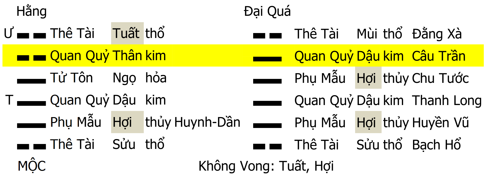
    - **Hình này chứng minh điều gì**
      - Vùng cổ xuất hiện khối u cứng và bị tăng sinh đốt sống cổ.
    - **Từ đâu mà thấy được**
      - Hào 5 Quan Quỷ Thân kim động hóa Tiến thần Dậu kim, lâm Câu Trần chủ vật sưng trướng, u cục cứng tại vùng cổ.
- Luận giải cơ chế bệnh lý qua hào phát động:
  - Người nam tự đoán bệnh nên lấy hào Thế làm Dụng thần (Thế cư hào 3 Quan Quỷ Dậu kim).
  - Hào 5 Quan Quỷ Thân kim phát động hóa Tiến thần thành Quan Quỷ Dậu kim; Quan Quỷ vượng tướng phát động hóa Tiến là biểu hiện của mầm bệnh phát triển mạnh mẽ.
  - Hào 5 đại diện cho cung vị cổ họng và đốt sống cổ.
  - Ngũ hành kim chủ quản chất xương cốt rắn rỏi.
  - Lục thần Câu Trần mang đặc tính chủ về khối sưng trướng, u bướu, xơ cứng, tăng sinh mô.
  - Hào 5 kim lâm Câu Trần động hóa Tiến thần là tín hiệu xác thực đốt sống cổ bị gai xương tăng sinh và nổi lên khối sưng cứng.
- Ứng nghiệm thực tế:
  - Vùng cổ của người bệnh mọc lên một khối cứng rõ rệt và được bệnh viện chẩn đoán bị tăng sinh xương cổ.

#### Ví dụ 4: Quẻ Lôi Thiên Đại Tráng biến Trạch Thiên Quải - Xương cổ tăng sinh chèn ép dây thần kinh làm tê dại cánh tay
- Ngày Tân Dậu tháng Dần, người chồng đoán bệnh cho vợ, gieo được quẻ Lôi Thiên Đại Tráng biến Trạch Thiên Quải (quái cung Khôn thổ, Không Vong: Tý, Sửu):
  - **Hình 206.** Sơ đồ quẻ Lôi Thiên Đại Tráng biến Trạch Thiên Quải
    - 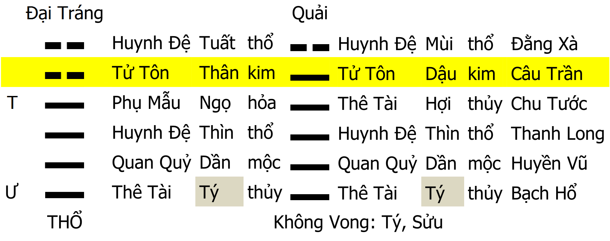
    - **Hình này chứng minh điều gì**
      - Người vợ bị tăng sinh cột sống cổ chèn ép dây thần kinh dẫn tới tê dại hai bàn tay.
    - **Từ đâu mà thấy được**
      - Nguyên thần Tử Tôn Thân kim tại hào 5 bị Nguyệt xung phá, lâm Câu Trần động hóa Dậu kim; hào 5 kim Câu Trần là xương cổ phì đại.
- Xác định Dụng thần và chẩn đoán tổn thương đốt sống cổ:
  - Chồng xem bệnh cho vợ lấy hào Thê Tài làm Dụng thần; Dụng thần là Thê Tài Tý thủy cư hào sơ lâm Bạch Hổ, gặp Không Vong.
  - Nguyên thần sinh trợ Dụng thần là hào 5 Tử Tôn Thân kim phát động hóa Dậu kim, bị Nguyệt kiến Dần mộc xung thành Nguyệt phá (Dần Thân tương xung).
  - Vị trí hào 5 là đốt sống cổ; hành kim chủ về xương cốt.
  - Lục thần Câu Trần biểu thị hiện tượng mô xương tăng sinh, phì đại.
  - Tổ hợp hào vị và lục thần kết luận người bệnh mắc chứng tăng sinh cột sống cổ.
- Biến chứng chèn ép hệ thống thần kinh vận động:
  - Hào 5 là cổ, Nguyên thần kim bị Nguyệt phá động biến làm ách tắc đường dẫn truyền kinh lạc; sự tổn thương tại đốt sống cổ lan tỏa khiến hệ thần kinh vận động chi trên bị chèn ép, sinh ra triệu chứng tê dại hai bàn tay.
- Ứng nghiệm thực tế:
  - Người vợ bị gai đốt sống cổ tăng sinh chèn ép rễ dây thần kinh, khiến hai bàn tay thường xuyên tê dại mất cảm giác.

#### Ví dụ 5: Quẻ Trạch Thủy Khốn biến Sơn Thủy Mông - Lồi xương cổ kết hợp tăng sinh mô tuyến vú
- Ngày Nhâm Thìn tháng Mão, người nữ tự dự đoán bệnh tật bản thân, gieo được quẻ Trạch Thủy Khốn biến Sơn Thủy Mông (quái cung Đoài kim, Không Vong: Ngọ, Mùi):
  - **Hình 207.** Sơ đồ quẻ Trạch Thủy Khốn biến Sơn Thủy Mông
    - 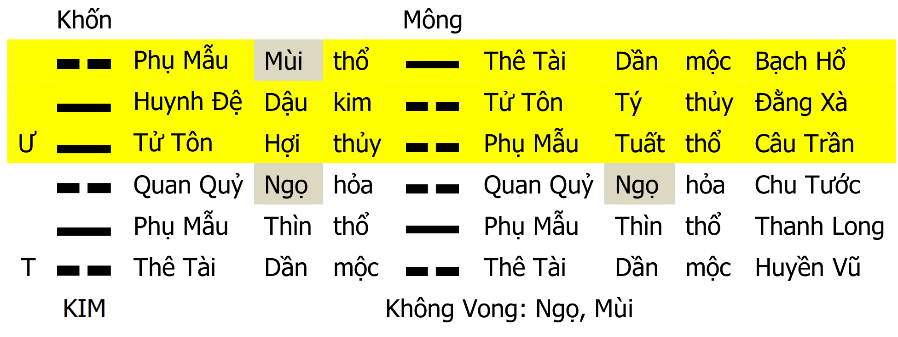
    - **Hình này chứng minh điều gì**
      - Người bệnh vừa bị lồi xương cổ vừa mắc chứng tăng sinh mô tuyến vú (nhũ tuyến tăng sinh).
    - **Từ đâu mà thấy được**
      - Hào 4 Tử Tôn Hợi thủy lâm Câu Trần bị hóa hồi đầu khắc chủ u xơ tuyến vú; hào 5 Dậu kim lâm Đằng Xà động khắc Thế chủ tật bệnh xương cổ.
- Chẩn đoán bệnh tăng sinh mô tuyến vú:
  - Người nữ tự xem bệnh lấy hào Thế Thê Tài Dần mộc tại hào sơ làm Dụng thần.
  - Nguyên thần của Dụng thần là hào 4 Tử Tôn Hợi thủy lâm Câu Trần phát động biến Phụ Mẫu Tuất thổ; hào 4 bị Nhật kiến Thìn thổ khắc, lại bị hào biến Tuất thổ quay lại khắc thương (hóa hồi đầu khắc), hoàn toàn mất lực sinh hào Thế.
  - Hào vị 4 đại diện cho lồng ngực; lục thân Tử Tôn chủ về bầu vú.
  - Lục thần Câu Trần mang tượng sưng phồng, kết hạch, tăng sinh tế bào. Sự kết hợp hào 4 + Tử Tôn + Câu Trần bị khắc thương chỉ rõ bệnh nhũ tuyến tăng sinh (u xơ tuyến vú).
- Chẩn đoán biến dạng lồi xương cổ:
  - Hào 5 Huynh Đệ Dậu kim phát động mang lực mạnh mẽ khắc trực tiếp vào hào Thế Dần mộc (kim khắc mộc).
  - Hào 5 là cung vị cổ; ngũ hành kim là xương cốt; lục thần Đằng Xà có hình thể thon dài biểu thị các đốt sống vùng cổ.
  - Hào 5 kim lâm Đằng Xà phát động khắc Thế là dấu hiệu các đốt xương cổ bị chấn thương, sai lệch hoặc nhô lồi biến dạng ra ngoài.
- Ứng nghiệm thực tế:
  - Đốt sống cổ của người bệnh bị lồi nhô ra ngoài gây đau đớn, đồng thời xác nhận có mắc chứng nhũ tuyến tăng sinh.

#### Ví dụ 6: Quẻ Chấn Vi Lôi biến Lôi Địa Dự - Tăng sinh xương cổ cản trở tuần hoàn máu gây đau đầu dữ dội
- Ngày Canh Dần tháng Hợi, người nữ dự đoán nguyên nhân gây đau đầu của bản thân, gieo được quẻ Chấn Vi Lôi biến Lôi Địa Dự (quái cung Chấn mộc, Không Vong: Ngọ, Mùi):
  - **Hình 208.** Sơ đồ quẻ Chấn Vi Lôi biến Lôi Địa Dự
    - 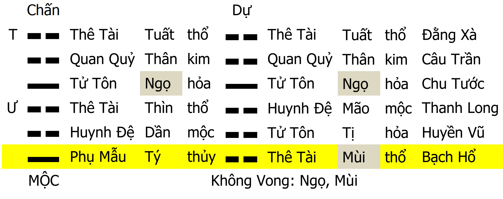
    - **Hình này chứng minh điều gì**
      - Chứng đau đầu bắt nguồn từ gai xương cổ tăng sinh chèn ép mạch máu khiến huyết dịch không lưu thông lên não.
    - **Từ đâu mà thấy được**
      - Hào sơ Phụ Mẫu Tý thủy Bạch Hổ độc phát chủ tuần hoàn máu bị trở ngại; hào 5 Quan Quỷ Thân kim Câu Trần ám động sinh hào sơ chỉ xương cổ phì đại là nguồn cơn.
- Truy tìm nguyên nhân đau đầu qua hào độc phát:
  - Người bệnh tự xem nguyên nhân đau đầu của mình lấy hào Thế Thê Tài Tuất thổ tại hào 6 làm Dụng thần (hào 6 cũng là cung vị đầu não).
  - Quẻ có hào sơ Phụ Mẫu Tý thủy lâm Bạch Hổ phát động duy nhất (độc phát) biến Thê Tài Mùi thổ; cổ ngữ dạy "thần triệu cơ ở động", hào độc phát tiết lộ nguyên nhân căn bản phát sinh bệnh tật.
  - Lục thần Bạch Hổ chủ về huyết dịch và bệnh lý mạch máu; hào độc phát lâm Bạch Hổ khẳng định cơn đau đầu bắt nguồn từ sự tắc nghẽn lưu thông khí huyết.
- Luận giải cơ chế chèn ép mạch máu từ đốt sống cổ:
  - Hào 5 Quan Quỷ Thân kim được Nguyệt kiến Hợi thủy sinh phù, bị Nhật kiến Dần mộc xung thành ám động, sinh trợ hào độc phát sơ hào Tý thủy (kim sinh thủy, Quan Quỷ sinh hào độc phát).
  - Quan Quỷ là đầu mối tật bệnh; hào 5 là cung vị đốt sống cổ; hành kim chủ về xương cốt; thần Câu Trần mang ý nghĩa tăng sinh, lồi cục.
  - Quan Quỷ Thân kim lâm Câu Trần ám động tại hào 5 sinh hào độc phát Bạch Hổ cho thấy: Đốt sống cổ tăng sinh phì đại đã chèn ép hệ mạch, khiến máu không thể bơm thuận lợi lên vùng đầu, từ đó gây nên các cơn đau đầu dữ dội.
- Ứng nghiệm thực tế:
  - Người phụ nữ xác nhận nguyên nhân chính xác dẫn đến chứng đau đầu kinh niên là do tăng sinh xương cổ chèn ép tuần hoàn máu.

### 11. BỆNH PHỔI

- Đặc điểm sinh lý và bệnh lý hệ hô hấp:
  - Phổi giữ chức năng căn bản là hô hấp thông qua cơ chế trao đổi khí oxy và carbon dioxit nhằm duy trì sự sống ("con người chỉ sống trong một hơi thở, một khi ngừng thở là qua đời").
  - Khi cơ quan phổi phát sinh bệnh biến sẽ dẫn tới các triệu chứng lâm sàng đặc trưng gồm ho, khó thở, sốt, đau tức lồng ngực.
  - Phổi kết nối trực tiếp với khí quản và phế quản để trao đổi khí với môi trường bên ngoài; các bệnh lý phổ biến gồm viêm phế quản, hen suyễn, viêm phổi, giãn phế quản, lao phổi và ung thư phổi.

#### Đặc trưng quái tượng trong dự trắc bệnh phổi

- Phân định theo quái cung:
  - Cung Càn và cung Đoài thuộc ngũ hành Kim, tương ứng trực tiếp với phế tạng và hệ thống hô hấp.
- Phân định theo hào vị:
  - Hào 3, hào 4 và hào 5 đại diện cho vùng ngực và hệ hô hấp; trong đó hào 4 và hào 5 là trọng tâm biểu thị lồng ngực, phế nang và đường thở.
- Phân định theo ngũ hành:
  - Ngũ hành Kim chủ về phổi và chức năng trao đổi khí.
- Phân định theo lục thân:
  - Hào Tử Tôn tượng trưng cho đường hô hấp và khí quản.
  - Hào Thê Tài biểu thị hơi thở và động thái hô hấp.
  - Hào Phụ Mẫu đại diện cho cấu trúc lồng ngực.
- Phân định theo lục thần:
  - Thanh Long: Chủ chứng đau nhức vùng ngực, hoặc khởi phát bệnh do phản ứng dị ứng, ẩm thực, nghiện rượu.
  - Chu Tước: Chủ chứng viêm nhiễm phế quản, viêm phổi, sốt cao và ho khan hoặc ho đờm.
  - Câu Trần: Chủ cảm giác tức trướng lồng ngực, khí bế, khối u bướu hoặc tế bào ung thư phổi.
  - Đằng Xà: Chủ co thắt khí quản, đờm nghẽn gây khó thở, cảm giác ngực bị thắt chặt.
  - Bạch Hổ: Chủ thở gấp gáp, phế ung sinh mủ hoặc triệu chứng ho ra máu (thổ huyết).
  - Huyền Vũ: Chủ bệnh lao phổi hư tổn, ổ viêm loét hoặc mạn tính tiêu hao.
- Phân định theo quy tắc sinh khắc và trạng thái hào:
  - Nguyên thần hoặc Dụng thần bị hợp trói, hoặc nhập Mộ là điềm báo hô hấp bế tắc, ngực bí khó thở.
  - Ngũ hành Kim lâm Bệnh địa, hoặc Quan Quỷ hợp cản trở Nguyên thần/Dụng thần, hoặc Bệnh địa ngũ hành kim tương hợp níu chân Nguyên thần/Dụng thần đều biểu thị đường thở suy yếu, hô hấp bất lợi.
  - Dụng thần hưu tù vô khí, hoặc Dụng thần và Nguyên thần gặp phải các trạng thái Tử, Mộ, Tuyệt là dấu hiệu cảnh báo khối u ác tính hoặc bệnh ung thư phổi.

#### Các ví dụ dự trắc bệnh phổi thực tế

##### Ví dụ 1: Nam tự đoán bệnh - Quẻ Phong Lôi Ích biến Chấn Vi Lôi

- Tình huống dự trắc: Ngày Tân Hợi tháng Dậu (Tuần Không: Dần, Mão), nam giới gieo quẻ tự đoán bệnh tật bản thân, thu được quẻ Phong Lôi Ích biến Chấn Vi Lôi.
  - **Hình 209.** Quẻ Phong Lôi Ích biến Chấn Vi Lôi
    - 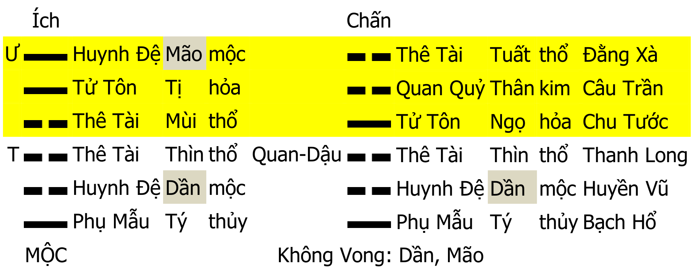
    - **Hình này chứng minh điều gì**
      - Bệnh trạng hen suyễn, khó thở tức trướng do đường hô hấp bị cản trở nhưng tính mạng an toàn.
    - **Từ đâu mà thấy được**
      - Hào 5 Tử Tôn Tị hỏa (đường hô hấp) hóa Quan Quỷ Thân kim (kim là hệ hô hấp) hợp trói cản trở sinh Thế, lâm Câu Trần chủ tức trướng; may Kỵ thần Không Vong và bị hợp níu chân nên giảm lực khắc.
- Các bước suy luận và phân tích triệu chứng:
  - Hào Thế (Thê Tài Thìn thổ) làm Dụng thần đại diện cho người xem; được Nguyệt lệnh Dậu kim tương hợp nên có khí, tuy nhiên không được Nhật thần Hợi thủy sinh phù.
  - Kỵ thần Huynh Đệ Mão mộc tại hào 6 được Nhật thần sinh trợ, phát động phát lực khắc phạt hào Thế.
  - Thế tương sinh cứu giải: May nhờ Nguyên thần Tử Tôn Tị hỏa tại hào 5 đồng thời phát động tạo nên chuỗi liên tục tương sinh (Mão mộc sinh Tị hỏa, Tị hỏa sinh Thìn thổ).
  - Kỵ thần Mão mộc lâm Tuần Không, lại bị hào biến Thê Tài Tuất thổ hợp níu chân (Mão Tuất lục hợp), khiến uy lực khắc chế bị suy giảm đáng kể, vì vậy tuy mắc bệnh nhưng không nguy hiểm tính mạng.
  - Tử Tôn Tị hỏa là Nguyên thần ngự tại hào 5 (vị trí ngực) phát động sinh Thế, nhưng động hóa ra Quan Quỷ Thân kim; Quan Quỷ là biểu tượng bệnh tật.
  - Nguyên thần bị hào biến Thân kim hợp trói (Tị Thân lục hợp), làm tắc nghẽn nguồn sinh trợ cho Dụng thần. Hào 5 là ngực, Tử Tôn là đường thở, ngũ hành Kim chủ hô hấp; bị Kim hợp giữ không thể sinh trợ Thê Tài (Tài là hơi thở), hình thành chứng khó thở.
  - Tử Tôn Tị hỏa lâm Câu Trần chủ tức trướng; tổng hợp quái tượng xác định người này mắc bệnh hen suyễn.
- Kết quả thực tế: Người này xác nhận bản thân đúng là mắc bệnh hen suyễn.

##### Ví dụ 2: Nam tự đoán bệnh - Quẻ Thủy Hỏa Ký Tế biến Thủy Thiên Nhu

- Tình huống dự trắc: Ngày Canh Thìn tháng Tý (Tuần Không: Thân, Dậu), người nam tự gieo quẻ hỏi tình trạng bệnh của mình, được quẻ Thủy Hỏa Ký Tế biến Thủy Thiên Nhu.
  - **Hình 210.** Quẻ Thủy Hỏa Ký Tế biến Thủy Thiên Nhu
    - 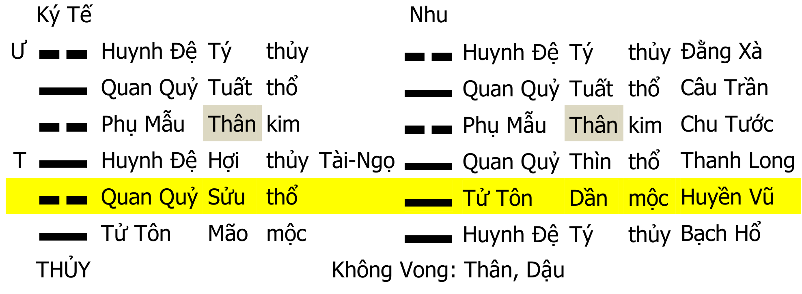
    - **Hình này chứng minh điều gì**
      - Bệnh hen suyễn mạn tính gây thiếu hụt dưỡng khí, lồng ngực thường xuyên ứ trệ tức nghẽn.
    - **Từ đâu mà thấy được**
      - Nguyên thần Phụ Mẫu Thân kim hào 4 (ngực phổi) lâm Không Vong, lại nhập Mộ tại hào 2 Sửu thổ động; Quan Quỷ Tuất thổ hào 5 lâm Câu Trần ám động khắc Thế Hợi thủy.
- Các bước suy luận và phân tích triệu chứng:
  - Lấy hào Thế (Huynh Đệ Hợi thủy) làm Dụng thần bản thân.
  - Nguyên thần Phụ Mẫu Thân kim tại hào 4 lâm Tuần Không; hào 4 là vùng ngực và phổi, lục thân Phụ Mẫu tượng trưng cho lồng ngực, ngũ hành Kim chủ về phổi và chức năng hít thở.
  - Nguyên thần lâm Tuần Không nên không thể phát sinh lực trợ giúp hào Thế, phản ánh hơi thở yếu ớt, không đủ oxy cho cơ thể.
  - Thân kim nhập Mộ tại hào 2 Quan Quỷ Sửu thổ phát động, biểu thị phế khí bị giam hãm gây khó thở trầm trọng.
  - Hào 5 Quan Quỷ Tuất thổ lâm Câu Trần bị Nhật thần Thìn thổ xung thành ám động, trực tiếp khắc phạt hào Thế Hợi thủy; hào 5 là ngực, Câu Trần chủ tức trướng, hợp thành dấu hiệu hen suyễn khó thở.
- Kết quả thực tế: Đúng là người bệnh mắc chứng hen suyễn kéo dài.

##### Ví dụ 3: Nam đoán bệnh cho con trai - Quẻ Lôi Sơn Tiểu Quá biến Địa Thiên Thái

- Tình huống dự trắc: Ngày Quý Sửu tháng Hợi (Tuần Không: Dần, Mão), người cha gieo quẻ xem bệnh tình của con trai, thu được quẻ Lôi Sơn Tiểu Quá biến Địa Thiên Thái.
  - **Hình 211.** Quẻ Lôi Sơn Tiểu Quá biến Địa Thiên Thái
    - 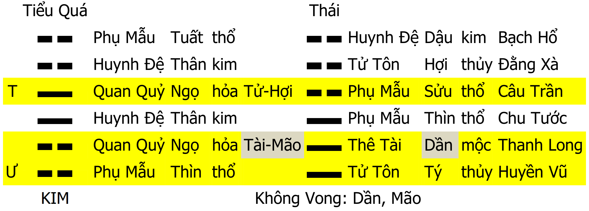
    - **Hình này chứng minh điều gì**
      - Đứa con đồng thời mắc hai chứng bệnh tại hệ hô hấp là hen suyễn mạn tính và viêm phổi cấp tính.
    - **Từ đâu mà thấy được**
      - Dụng thần Tử Tôn Hợi thủy phục dưới Quan Quỷ; cung Đoài thuộc kim; hào 5 Thân kim lâm Đằng Xà bị khắc nhập Mộ gây hen; hào 3 Thân kim lâm Chu Tước bị khắc chỉ viêm phổi.
- Các bước suy luận và phân tích triệu chứng:
  - Đoán bệnh của con trai, lấy hào Tử Tôn làm Dụng thần. Tử Tôn Hợi thủy không xuất hiện trên quẻ, phục tàng dưới hào 4 Trì Thế Quan Quỷ Ngọ hỏa, lâm Câu Trần.
  - Dụng thần được Nguyệt lệnh Hợi thủy tỉ phù nhưng bị Nhật thần Sửu thổ khắc phạt; đồng thời trong quẻ các hào Cừu thần Kỵ thần phát động dày đặc làm Dụng thần suy nhược.
  - Dụng thần phục tàng dưới Quan Quỷ là tượng đứa trẻ bị bệnh tật giam hãm và dày vò trong thời gian dài.
  - Quẻ thuộc cung Đoài (thuộc Kim), chủ về phế nang và đường hô hấp.
  - Phân tích bệnh hen suyễn: Nguyên thần Huynh Đệ Thân kim tại hào 5 lâm Đằng Xà bị hào động Quan Quỷ Ngọ hỏa khắc thương; Đằng Xà chủ sự co thắt, bế tắc; Thân kim bị khắc lại nhập Mộ ở Nhật thần Sửu thổ làm nguồn sinh Tử Tôn bị cắt đứt, tương ứng chuẩn xác với triệu chứng hen suyễn.
  - Phân tích viêm phổi: Hào 3 Huynh Đệ Thân kim là một Nguyên thần khác lâm Chu Tước cũng bị hỏa động khắc phạt; Chu Tước chủ viêm nhiễm phát sốt, Kim là phổi, biểu thị đường thở và nhu mô phổi đang có ổ viêm.
- Kết quả thực tế: Đứa con được chẩn đoán mắc đồng thời cả bệnh hen suyễn lẫn viêm phổi.

##### Ví dụ 4: Đoán bệnh cho bà nội - Quẻ Hỏa Phong Đỉnh biến Cấn Vi Sơn

- Tình huống dự trắc: Ngày Tân Mùi tháng Tý năm Bính Tuất (Tuần Không: Tuất, Hợi), người cháu xem bệnh cho bà nội, được quẻ Hỏa Phong Đỉnh biến Cấn Vi Sơn.
  - **Hình 212.** Quẻ Hỏa Phong Đỉnh biến Cấn Vi Sơn
    - 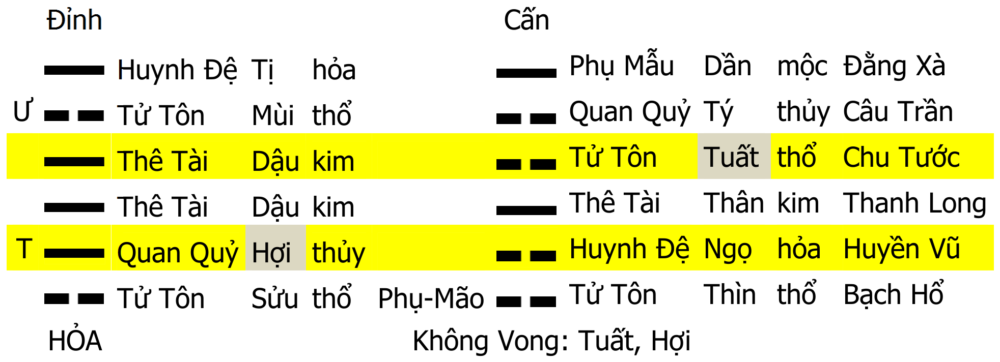
    - **Hình này chứng minh điều gì**
      - Bệnh viêm phổi biến chứng tràn dịch màng phổi (ngực tích nước), dẫn đến tử vong vào tháng Tị năm Đinh Hợi.
    - **Từ đâu mà thấy được**
      - Hào 4 Dậu kim lâm Chu Tước động khắc Dụng Mão mộc là viêm phổi; Nguyên thần Hợi thủy Không Vong gây ngực tích nước; năm Hợi Thực Không, tháng Tị hợp thành Kim cục sát Dụng thần.
- Các bước suy luận và xác định ứng kỳ:
  - Lấy hào Phụ Mẫu làm Dụng thần xem bệnh bà nội; Phụ Mẫu Mão mộc không hiện trên quẻ, phục tàng dưới hào sơ Tử Tôn Sửu thổ.
  - Mão mộc được Nguyệt lệnh Tý thủy sinh dưỡng nên trước mắt chưa nguy kịch; tuy nhiên nhập Mộ ở Nhật thần Mùi thổ là triệu chứng đã phải vào viện điều trị nội trú.
  - Hào 4 Thê Tài Dậu kim phát động khắc thương Dụng thần Mão mộc; hào 4 là vị trí ngực phổi, Kim chủ phế tạng, lâm Chu Tước chủ viêm nhiễm nên xác định mắc bệnh viêm phổi.
  - Nguyên thần Phụ Mẫu là Thủy (Hợi thủy) lâm Tuần Không, không thể phát huy vai trò dẫn hóa Kỵ thần Dậu kim để sinh cho Dụng thần Mão mộc; bệnh tật bị chi phối bởi yếu tố tích nước tại phổi, kết luận chứng viêm phổi dẫn tới tràn dịch màng phổi (ngực tích nước).
  - Dự đoán ứng kỳ nguy hiểm: Do Nguyên thần Hợi thủy Không Vong không thể thông quan, nên bước sang năm Hợi sẽ gặp đại hạn.
- Kết quả thực tế: Người bà bị viêm phổi gây ngực tích nước nặng, đến tháng Tị năm Đinh Hợi thì qua đời; ứng nghiệm vào năm Hợi do Hợi thủy xuất Không (Thực Không), và tháng Tị kích hoạt tam hợp Tị Dậu Sửu hóa Kim cục cực vượng khắc tuyệt Dụng thần Mão mộc.

##### Ví dụ 5: Đoán bệnh cho con - Quẻ Thủy Phong Tỉnh

- Tình huống dự trắc: Ngày Kỷ Tị tháng Tị (Tuần Không: Tuất, Hợi), người nhà gieo quẻ hỏi bệnh cho con nhỏ, thu được quẻ Thủy Phong Tỉnh (quẻ tĩnh).
  - **Hình 213.** Quẻ Thủy Phong Tỉnh
    - 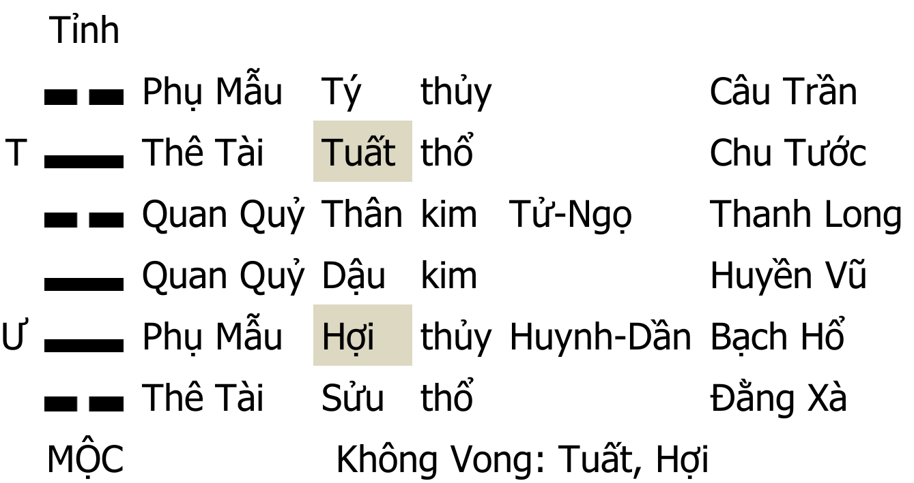
    - **Hình này chứng minh điều gì**
      - Đứa trẻ bị viêm phổi cấp tính dẫn tới sốt cao li bì.
    - **Từ đâu mà thấy được**
      - Tử Tôn Ngọ hỏa phục dưới hào 4 Quan Quỷ Thân kim; Dụng thần lâm hỏa chủ sốt và viêm; Phi thần Thân kim ngự hào 4 là Bệnh địa của Hỏa và tượng trưng cho phế tạng.
- Các bước suy luận và phân tích triệu chứng:
  - Xem bệnh đứa con lấy hào Tử Tôn làm Dụng thần. Tử Tôn Ngọ hỏa không xuất hiện trên quẻ, phục tàng dưới hào 4 Quan Quỷ Thân kim.
  - Dụng thần mang ngũ hành Hỏa chủ chứng viêm nhiệt và phát sốt cao.
  - Phi thần hào 4 là Quan Quỷ áp chế Dụng thần, thể hiện đứa bé đang bị tà khí bệnh tật vây hãm nghiêm trọng.
  - Ngũ hành Hỏa an Trường sinh tại Dần, tuần hành đến Thân là Bệnh địa (Dần sinh, Mão dục, Thìn đới, Tị quan, Ngọ vượng, Mùi suy, Thân bệnh); do đó Phi thần Thân kim chính là Bệnh địa của Dụng thần.
  - Kim chủ phổi, hào 4 cũng là hào vị của phổi; Bệnh địa lâm Kim tại hào 4 đè nén Dụng thần Hỏa chỉ rõ bệnh viêm phổi cấp phát sốt cao.
- Kết quả thực tế: Đứa trẻ bị bệnh viêm phổi gây sốt cao li bì.

##### Ví dụ 6: Nữ đoán bệnh cho mẹ - Quẻ Thủy Hỏa Ký Tế biến Trạch Hỏa Cách

- Tình huống dự trắc: Ngày Quý Dậu tháng Dần (Tuần Không: Tuất, Hợi), người con gái hỏi bệnh tình của mẹ đẻ, được quẻ Thủy Hỏa Ký Tế biến Trạch Hỏa Cách.
  - **Hình 214.** Sơ đồ quẻ Thủy Hỏa Ký Tế biến Trạch Hỏa Cách
    - 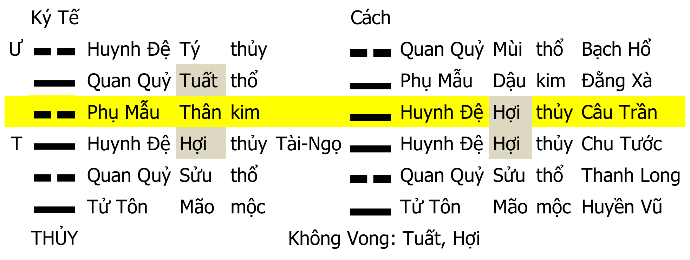
    - **Hình này chứng minh điều gì**
      - Người mẹ mắc chứng giãn phế quản, vùng tổn thương có nguy cơ ứ đọng sinh mủ, phát bệnh vào tháng Thân năm trước.
    - **Từ đâu mà thấy được**
      - Dụng thần Phụ Mẫu Thân kim hào 4 lâm Câu Trần chủ sưng giãn, bị Nguyệt phá ứng tại tháng Thân; động hóa Hợi thủy là Bệnh địa biểu thị phế quản phồng trướng tiết dịch mủ.
- Các bước suy luận và phân tích triệu chứng:
  - Lấy hào Phụ Mẫu làm Dụng thần đại diện cho người mẹ.
  - Dụng thần Phụ Mẫu Thân kim tọa tại hào 4 bị Nguyệt lệnh Dần mộc xung thành Nguyệt phá; lâm Câu Trần phát động hóa ra Huynh Đệ Hợi thủy.
  - Về hào vị và ngũ hành: Hào 4 đối ứng với phổi, ngũ hành Kim chủ phế quản và phổi.
  - Câu Trần chủ chứng sưng trướng, phình giãn cơ quan; Thân kim động hóa Thủy là hóa xuất dịch chất lỏng, biểu thị phế quản bị giãn rộng có xu hướng sinh dịch mủ.
  - Ngũ hành Kim tràng sinh tại Tị, đến Hợi là Bệnh địa; Thân kim hóa Hợi thủy chính là động hóa Bệnh địa.
  - Xác định thời điểm phát bệnh: Thân kim bị Nguyệt phá, quái tượng ứng nghiệm vào tháng Thân.
- Kết quả thực tế: Người mẹ đã phát bệnh giãn phế quản từ tháng Thân năm ngoái.

##### Ví dụ 7: Thanh niên Nhật Bản hỏi quyền kinh doanh từ cha - Quẻ Hỏa Sơn Lữ biến Sơn Phong Cổ

- Tình huống dự trắc: Ngày Mậu Ngọ tháng Hợi (Tuần Không: Tý, Sửu), một thanh niên Nhật Bản đến hỏi khi nào có thể tiếp nhận quyền kinh doanh từ người cha; gieo được quẻ Hỏa Sơn Lữ biến Sơn Phong Cổ.
  - **Hình 215.** Sơ đồ quẻ Hỏa Sơn Lữ biến Sơn Phong Cổ
    - 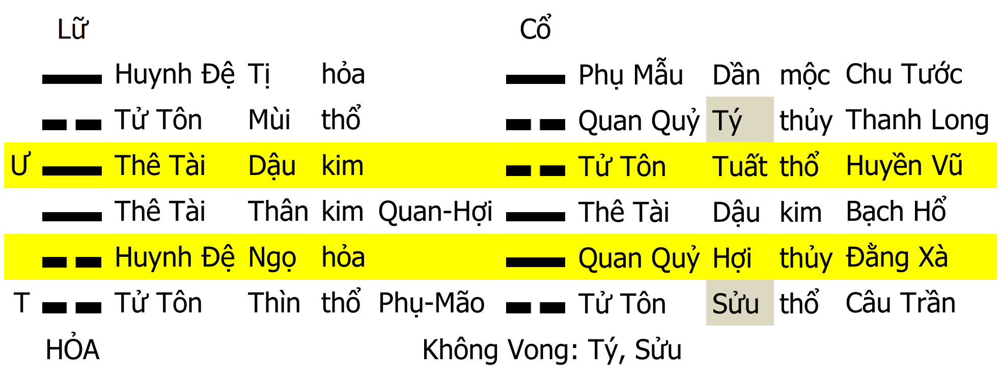
    - **Hình này chứng minh điều gì**
      - Người cha bị tổn thương vùng chân đi lại khó khăn và mắc bệnh lao phổi hư nhược.
    - **Từ đâu mà thấy được**
      - Phụ Mẫu Mão mộc phục hào sơ (chân) lâm Câu Trần chỉ vận động trở ngại; Kỵ thần Dậu kim hào 4 (phổi) động khắc Dụng, lâm Huyền Vũ chủ bệnh lao hư tổn.
- Diễn biến đối thoại và suy luận dự trắc:
  - Quẻ này do tác giả trực tiếp thu thập trong thời gian giảng dạy Dịch học tại Nhật Bản. Thay vì chỉ luận giải mặt sự nghiệp, tác giả quan sát quẻ và chỉ ra ngay tình trạng sức khỏe của người cha: đôi chân đi lại trở ngại và đang mắc bệnh lao phổi. Kết quả đối chiếu chính xác hoàn toàn.
  - Căn cứ luận chứng tật bệnh:
    - Lấy hào Phụ Mẫu làm Dụng thần người cha; Phụ Mẫu Mão mộc không hiện trên quẻ, phục tàng tại hào sơ Tử Tôn Thìn thổ, bị hào 4 Thê Tài Dậu kim phát động xung khắc tổn thương.
    - Hào sơ đại diện cho bàn chân; Dụng thần phục tại hào sơ bị Kỵ thần khắc phá nên xác định phần chân có dị tật hoặc bệnh chứng.
    - Hào sơ lâm Câu Trần; Câu Trần mang tính chất trì trệ, chậm chạp, cản trở bước đi nên kết luận người cha đi lại rất khó khăn.
    - Kỵ thần Dậu kim ngự tại hào 4 là vị trí của lồng ngực và phổi, bản thân ngũ hành Kim cũng đại diện cho hệ hô hấp.
    - Hào 4 Dậu kim lâm Huyền Vũ; Huyền Vũ chủ về bệnh lao, ho hao tổn khí huyết và viêm loét mạn tính, do đó quyết đoán người cha mắc bệnh lao phổi.
- Kết quả thực tế: Người cha quả thực đi lại vô cùng khó khăn và đang điều trị bệnh lao phổi.

##### Ví dụ 8: Đoán bệnh cho anh trai - Quẻ Trạch Hỏa Cách biến Lôi Hỏa Phong

- Tình huống dự trắc: Ngày Nhâm Tý tháng Dần (Tuần Không: Dần, Mão), người em xem bệnh tình của anh trai, được quẻ Trạch Hỏa Cách biến Lôi Hỏa Phong.
  - **Hình 216.** Sơ đồ quẻ Trạch Hỏa Cách biến Lôi Hỏa Phong
    - 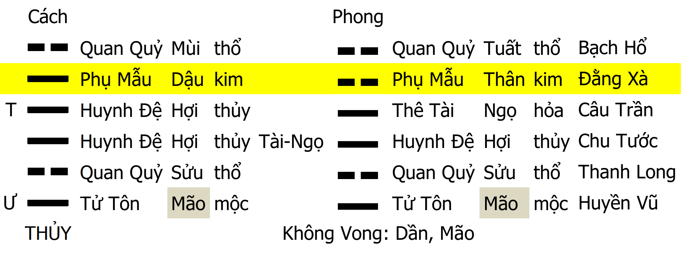
    - **Hình này chứng minh điều gì**
      - Người anh trai bị ung thư phổi ác tính do chức năng phế quản và phế tạng suy thoái nghiêm trọng.
    - **Từ đâu mà thấy được**
      - Dụng thần Thế Huynh Đệ Hợi thủy bị Nguyệt lệnh Bệnh địa Dần mộc hợp trói; Nguyên thần hào 5 Dậu kim hóa thoái hóa phá làm phế suy; Dụng thần lâm Câu Trần chủ khối u ác tính.
- Các bước suy luận và phân tích bệnh lý:
  - Xem bệnh anh trai lấy hào Huynh Đệ làm Dụng thần; trong quẻ Huynh Đệ Hợi thủy xuất hiện hai lần (hào 3 và hào 4), chọn hào Trì Thế Huynh Đệ Hợi thủy tại hào 4 làm Dụng thần.
  - Nguyệt lệnh Dần mộc là Bệnh địa của Thủy (Thủy sinh tại Thân, đến Dần là Bệnh địa); Dần mộc lục hợp với Dụng thần Hợi thủy làm tượng bị Bệnh địa trói chặt, phản ánh bệnh mạn tính kéo dài đã lâu.
  - Dụng thần tuy được Nguyệt hợp là có khí và được Nhật thần Tý thủy tỉ phù, nhưng mấu chốt sinh tử lại nằm ở Nguyên thần:
  - Nguyên thần Phụ Mẫu Dậu kim tại hào 5 phát động hóa thoái thành Phụ Mẫu Thân kim; biến hào Thân kim lại bị Nguyệt lệnh Dần mộc xung phá (hóa phá), triệt tiêu hoàn toàn khả năng sinh dưỡng Dụng thần Hợi thủy.
  - Nguyên thần tại hào 5 đối ứng với phổi, lâm Kim chủ phế tạng; động hóa thoái hóa phá biểu thị chức năng phổi bị suy thoái, tổn hại không thể hồi phục.
  - Dụng thần hào Thế Hợi thủy lâm Câu Trần; Câu Trần chuyên chủ về tích tụ khối u, trướng kết và bệnh ung thư; tổng hợp quái tượng xác định là ung thư phổi.
- Kết quả thực tế: Người anh trai được chẩn đoán mắc bệnh ung thư phổi.

##### Ví dụ 9: Đoán bệnh lâu ngày cho cha - Quẻ Khảm Vi Thủy biến Địa Thủy Sư

- Tình huống dự trắc: Ngày Mậu Ngọ tháng Hợi (Tuần Không: Tý, Sửu), người con trai xem bệnh cho cha bị bệnh mạn tính lâu ngày, được quẻ Khảm Vi Thủy biến Địa Thủy Sư.
  - **Hình 217.** Sơ đồ quẻ Khảm Vi Thủy biến Địa Thủy Sư
    - 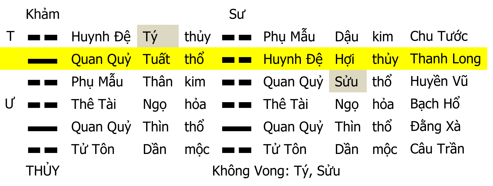
    - **Hình này chứng minh điều gì**
      - Người cha bị ung thư phổi giai đoạn hiểm nghèo, tính mạng rơi vào tình thế suy kiệt nguy kịch.
    - **Từ đâu mà thấy được**
      - Dụng thần Phụ Mẫu Thân kim hào 4 ngực phổi gặp Nguyệt lệnh Bệnh địa và Nhật khắc; quẻ Lục xung chủ bệnh lâu gặp xung tất nguy; hào 6 Tý thủy ám động khiến Dụng thần lâm Tử địa.
- Các bước suy luận và phân tích hiểm cảnh:
  - Lấy hào Phụ Mẫu làm Dụng thần đoán bệnh của cha.
  - Dụng thần Phụ Mẫu Thân kim ngự tại hào 4 gặp Nguyệt lệnh Hợi thủy là Bệnh địa của Kim; đồng thời bị Nhật thần Ngọ hỏa phát lực khắc thương (Hỏa khắc Kim), làm ngũ hành Kim bị tổn hại nặng nề.
  - Ngũ hành Kim chủ phổi, hào vị số 4 cũng là hào vị của phổi, do đó định vị chắc chắn mầm bệnh khu trú tại phế tạng.
  - Cổ pháp dự trắc định vị: "Bệnh lâu ngày gặp quẻ Lục xung tất nguy"; quẻ gốc Khảm Vi Thủy là quẻ Bát Thuần (Lục xung thuần quái), chủ điềm báo nguy vong cho bệnh mạn tính.
  - Hào 6 Huynh Đệ Tý thủy bị Nhật thần Ngọ hỏa xung thành ám động; theo ngũ hành Trường sinh, Kim trường sinh tại Tị và lâm Tử địa tại Tý; Tý thủy ám động làm Dụng thần Thân kim trực tiếp lâm vào Tử địa, tượng trưng cho khối u ác tính phá hủy hoàn toàn tạng phủ.
- Kết quả thực tế: Người cha được xác định mắc bệnh ung thư phổi ác tính.

### 12. BỆNH VỀ TUYẾN VÚ

#### Nguyên lý quái tượng và đặc điểm bệnh về tuyến vú
- Đặc điểm sinh lý và tính chất bệnh lý tuyến vú ở phụ nữ:
  - Tuyến vú là bộ phận nuôi dưỡng trẻ sơ sinh và là nét đặc trưng thể hiện vẻ đẹp của phụ nữ.
  - Cấu trúc tuyến vú của nữ giới mỏng manh, nhạy cảm hơn nam giới nên dễ phát sinh các bệnh lý như viêm tuyến vú, nhũ tuyến tăng sinh (tăng sinh mô tuyến vú), u xơ, ung thư vú.
- Quy luật quái tượng định vị bệnh lý tuyến vú qua bốn phương diện:
  - Phương diện quái cung:
    - Liên quan mật thiết đến cung Cấn và cung Ly.
    - Quẻ cung Cấn chủ về vú (Cấn vi nhũ), quẻ thuộc cung Ly có liên hệ đặc biệt chặt chẽ với các chứng bệnh về tuyến vú.
  - Phương diện hào vị:
    - Trọng tâm phản ánh tại hào 4 và hào 5.
    - Cả hai hào vị này đều đại diện cho vùng ngực, là vị trí phân bố và sinh trưởng của tuyến vú trên cơ thể.
  - Phương diện lục thân:
    - Tử Tôn đại diện cho vú.
    - Thê Tài đại diện cho sữa mẹ (nhũ dịch); do đó Trường Sinh địa của hào Thê Tài, vị trí lâm Hợp của hào Thê Tài và Mộ khố của hào Thê Tài (Tài khố) đều mang thông tin đại diện cho vú.
  - Phương diện lục thần:
    - Thanh Long liên quan chặt chẽ đến ẩm thực, dinh dưỡng, sự tiết dịch.
    - Chu Tước chủ về phản ứng viêm nhiệt (viêm tuyến vú).
    - Câu Trần chủ về tăng sinh tổ chức, mô xơ phì đại, u bướu, khối u.
    - Bạch Hổ biểu thị tổn thương huyết quang hoặc can thiệp phẫu thuật mổ xẻ.

#### Phân tích thực tế: Quẻ Trạch Thủy Khốn biến Sơn Thủy Mông - Nữ đoán bệnh bản thân
- Ngày Nhâm Thìn tháng Mão (Tuần không: Ngọ, Mùi), một phụ nữ tự gieo quẻ đoán bệnh bản thân, được quẻ Trạch Thủy Khốn biến Sơn Thủy Mông:
  - **Hình 218.** Quẻ Trạch Thủy Khốn biến Sơn Thủy Mông
    - 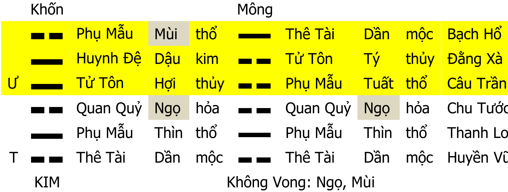
    - **Hình này chứng minh điều gì**
      - Người bệnh mắc chứng nhũ tuyến tăng sinh (tăng sinh tuyến vú).
    - **Từ đâu mà thấy được**
      - Nguyên thần Tử Tôn Hợi thủy ở hào 4 lâm Câu Trần bị Nhật, hào 6 và biến hào hồi đầu khắc; hào 4 và Tử Tôn chủ vú, Câu Trần chủ tăng sinh.
- Xác định Dụng thần và nhận định vượng suy:
  - Người nữ tự đoán bệnh cho bản thân nên lấy hào Thế làm Dụng thần.
  - Hào Thế Thê Tài Dần mộc an tại hào sơ, được Nguyệt kiến Mão mộc tỉ phù, Nhật kiến Thìn thổ không khắc hại nên hào Thế thuộc hàng vượng tướng.
- Nhận định vị trí ổ bệnh qua Nguyên thần bị khắc hại:
  - Mặc dù hào Thế vượng tướng, nhưng Nguyên thần Tử Tôn Hợi thủy tại hào 4 bị Nhật kiến Thìn thổ khắc thương.
  - Hào 6 Phụ Mẫu Mùi thổ phát động đến khắc Hợi thủy, đồng thời Hợi thủy tại hào 4 phát động lại hóa Phụ Mẫu Tuất thổ hồi đầu khắc.
  - Hào 4 Tử Tôn Hợi thủy bị ba bề bốn bên khắc phạt nặng nề, khẳng định đây chính là vị trí phát sinh bệnh tật.
- Luận giải cơ chế bệnh lý tuyến vú:
  - Lục thân Tử Tôn đại diện cho vú, hào vị 4 là vị trí vùng ngực và tuyến vú.
  - Hợi thủy là Trường Sinh địa của hào Thê Tài (mộc trường sinh tại Hợi), mang tín hiệu đặc trưng của tuyến vú.
  - Hào 4 lâm Câu Trần, Câu Trần chủ về dày sừng, phì đại, mô tăng sinh.
  - Tổng hợp các căn cứ suy ra tuyến vú có bệnh và xác định là nhũ tuyến tăng sinh.
- Kết quả và ứng nghiệm thực tế:
  - Trên thực tế, người phụ nữ mắc chứng nhũ tuyến tăng sinh.

#### Phân tích thực tế: Quẻ Trạch Phong Đại Quá biến Thủy Phong Tỉnh - Học trò đoán bệnh bạn gái
- Ngày Quý Hợi tháng Dậu (Tuần không: Tý, Sửu), một học trò của tác giả gieo quẻ đoán sức khỏe của bạn gái, được quẻ Trạch Phong Đại Quá biến Thủy Phong Tỉnh:
  - **Hình 219.** Quẻ Trạch Phong Đại Quá biến Thủy Phong Tỉnh
    - 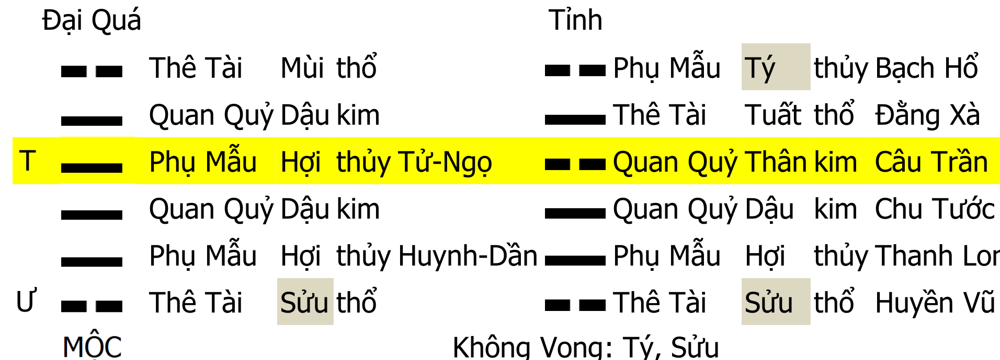
    - **Hình này chứng minh điều gì**
      - Người bạn gái mắc chứng nhũ tuyến tăng sinh.
    - **Từ đâu mà thấy được**
      - Hào 4 Phụ Mẫu Hợi thủy độc phát lâm Câu Trần khắc thương Nguyên thần Tử Tôn Ngọ hỏa phục dưới nó; hào 4 và Tử Tôn chủ vú, Câu Trần chủ tăng sinh.
- Xác định Dụng thần lưỡng hiện:
  - Đoán bệnh cho bạn gái lấy hào Thê Tài làm Dụng thần.
  - Trong quẻ Thê Tài lưỡng hiện: Thê Tài Mùi thổ tại hào 6 và Thê Tài Sửu thổ tại hào sơ.
  - Hào sơ Thê Tài Sửu thổ lâm Tuần không, theo nguyên tắc chọn Dụng thần ưu tiên hào Không Vong, lấy Thê Tài Sửu thổ làm Dụng thần.
- Độc phát báo cơ vi phát bệnh:
  - Quẻ có hào 4 Phụ Mẫu Hợi thủy độc phát, cổ thư chỉ rõ "thần triệu cơ ở động", báo hiệu biến hóa bệnh tật tập trung tại hào động.
  - Hào 4 Phụ Mẫu Hợi thủy lâm Câu Trần động khắc trực tiếp Nguyên thần Tử Tôn.
  - Nguyên thần Tử Tôn Ngọ hỏa không xuất hiện trên quẻ mà phục tàng dưới hào 4 Phụ Mẫu Hợi thủy, bị chính phi thần động khắc đè nén.
- Luận giải định bệnh:
  - Hào 4 là hào vị đại diện cho vú.
  - Tử Tôn là lục thân đại diện cho vú.
  - Hào 4 lâm Câu Trần chủ về sưng phù, xơ hóa, tăng sinh.
  - Kết luận người bạn gái mắc chứng nhũ tuyến tăng sinh.
- Kết quả và ứng nghiệm thực tế:
  - Dự đoán đã ứng nghiệm chính xác trong thực tế.

#### Phân tích thực tế: Quẻ Hỏa Địa Tấn biến Phong Thủy Hoán - Nữ đoán vận khí
- Ngày Canh Ngọ tháng Tuất (Tuần không: Tuất, Hợi), một phụ nữ gieo quẻ đoán vận khí, được quẻ Hỏa Địa Tấn biến Phong Thủy Hoán:
  - **Hình 220.** Quẻ Hỏa Địa Tấn biến Phong Thủy Hoán
    - 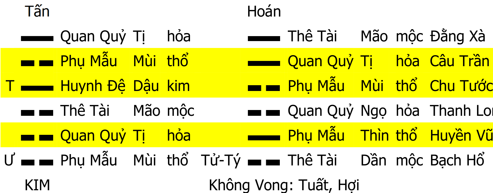
    - **Hình này chứng minh điều gì**
      - Đương số mắc chứng nhũ tuyến tăng sinh kèm đau đầu và bệnh phụ khoa kinh nguyệt không đều.
    - **Từ đâu mà thấy được**
      - Hào Thế ở hào 4 bị khắc, hào 5 Mùi thổ (Tài khố) lâm Câu Trần bị Nhật hợp; hào 6 chủ đầu, hào 2 Quan Quỷ lâm Huyền Vũ động khắc Thế.
- Quy tắc xem thân thể trong quẻ đoán vận khí:
  - Trong quẻ đoán vận khí bao hàm đầy đủ tình trạng thể chất của đương số, khi khảo sát bệnh tật lấy hào Thế làm Dụng thần.
  - Hào Thế Huynh Đệ Dậu kim an tại hào 4, bị Nhật kiến Ngọ hỏa khắc và Quan Quỷ Tỵ hỏa khắc chế.
  - Hào 5 Nguyên thần Phụ Mẫu Mùi thổ lâm Câu Trần bị Nhật kiến Ngọ hỏa hợp (Ngọ Mùi tương hợp), rơi vào trạng thái tham hợp quên sinh, không thể sinh trợ cho hào Thế.
- Định vị bệnh nhũ tuyến tăng sinh:
  - Hào 4 và hào 5 là hào vị của ngực và vú.
  - Hào 5 Mùi thổ là Mộ khố của Thê Tài Mão mộc (Tài khố), mang thông tin đại diện cho vú.
  - Câu Trần chủ về tăng sinh tổ chức tế bào.
  - Tổng hợp hào vị vùng ngực, Tài khố và Câu Trần xác định đương số bị nhũ tuyến tăng sinh.
- Phân tích các bệnh chứng phối hợp khác:
  - Quẻ thuộc cung Càn chủ về đầu; Kỵ thần biến xuất tại hào 6 (hào vị đầu não), dự đoán đương số bị chứng đau đầu thường xuyên.
  - Hào 2 Quan Quỷ Tỵ hỏa lâm Huyền Vũ phát động khắc hào Thế: Hào 2 là hào vị của tử cung, cơ quan sinh dục; Huyền Vũ chủ về bộ phận thầm kín, giấu kín, phản ánh bệnh lý phụ khoa.
- Kết quả và ứng nghiệm thực tế:
  - Trên thực tế, người phụ nữ mắc chứng nhũ tuyến tăng sinh, đau đầu và rối loạn kinh nguyệt.

#### Phân tích thực tế: Quẻ Hỏa Phong Đỉnh biến Sơn Phong Cổ - Nữ đoán bệnh bản thân
- Ngày Kỷ Sửu tháng Tuất (Tuần không: Ngọ, Mùi), một phụ nữ gieo quẻ đoán bệnh bản thân, được quẻ Hỏa Phong Đỉnh biến Sơn Phong Cổ:
  - **Hình 221.** Sơ đồ quẻ Hỏa Phong Đỉnh biến Sơn Phong Cổ
    - 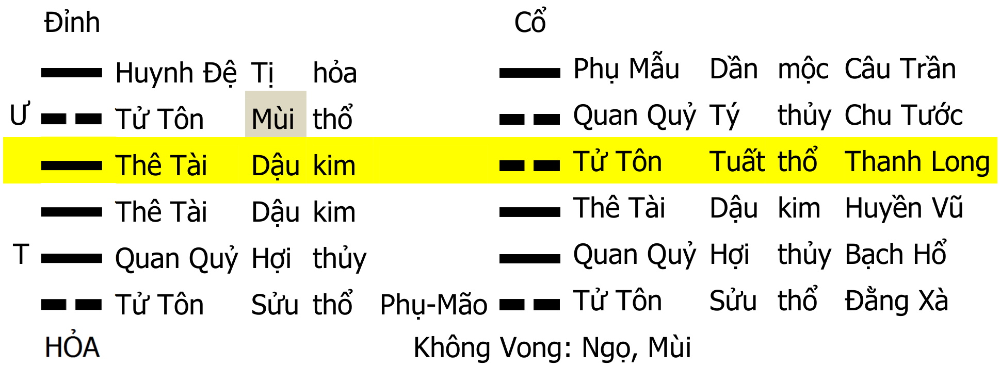
    - **Hình này chứng minh điều gì**
      - Đương số mắc chứng ung thư vú ác tính.
    - **Từ đâu mà thấy được**
      - Thế hào 2 Hợi thủy suy kiệt bị Nhật Nguyệt khắc; hào 5 Tử Tôn Mùi thổ ám động khắc Thế, quẻ cung Ly chủ bệnh vú, Nguyên thần Dậu kim nhập Mộ tại Nhật.
- Xác định Dụng thần và phân tích suy kiệt:
  - Người nữ tự đoán bệnh bản thân lấy hào Thế làm Dụng thần (Quan Quỷ Hợi thủy tại hào 2 trì Thế).
  - Nguyệt kiến Tuất thổ và Nhật kiến Sửu thổ đều là Thổ vượng cùng khắc phạt hào Thế Hợi thủy, khiến hào Thế hưu tù suy vi, hoàn toàn mất gốc rễ.
  - Hào 6 Huynh Đệ Tị hỏa độc phát hóa Phụ Mẫu Dần mộc hồi đầu sinh, nhưng Dần mộc sinh Tị hỏa khắc Kim (Nguyên thần của Thế) chứ không sinh Dụng thần Thủy, tượng quẻ không thuận.
- Tác động của hào ám động và định bệnh ung thư vú:
  - Hào 5 Tử Tôn Mùi thổ lâm Tuần không, gặp ngày Sửu thổ xung là ám động, phát lực khắc thẳng vào hào Thế.
  - Hào 5 là hào vị của vú, Tử Tôn đại diện cho vú.
  - Quẻ Đỉnh thuộc cung Ly, quái cung Ly phản ánh chặt chẽ bệnh tật về tuyến vú.
  - Mặc dù không gặp Câu Trần trực tiếp lâm Dụng thần hay Kỵ thần, nhưng Nguyên thần Thê Tài Dậu kim nhập Mộ tại Nhật kiến Sửu thổ (kim mộ tại Sửu), Dụng thần suy kiệt lại bị ám động khắc hại.
  - Các dấu hiệu suy bại tích tụ báo hiệu khối u ác tính, kết luận người bệnh mắc chứng ung thư vú.
- Kết quả và ứng nghiệm thực tế:
  - Trên thực tế, người bệnh được chẩn đoán mắc bệnh ung thư vú.

#### Phân tích thực tế: Quẻ Hỏa Trạch Khuê biến Thiên Địa Bĩ - Chồng đoán bệnh cho vợ
- Ngày Nhâm Ngọ tháng Mùi (Tuần không: Thân, Dậu), người chồng gieo quẻ đoán bệnh cho vợ, được quẻ Hỏa Trạch Khuê biến Thiên Địa Bĩ:
  - **Hình 222.** Sơ đồ quẻ Hỏa Trạch Khuê biến Thiên Địa Bĩ
    - 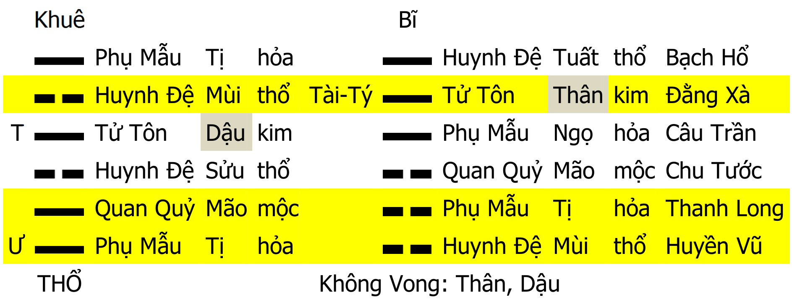
    - **Hình này chứng minh điều gì**
      - Người vợ bị ung thư vú di căn sang hệ thống hạch bạch huyết.
    - **Từ đâu mà thấy được**
      - Dụng thần Tài Tý thủy phục hào 5 bị Nguyệt khắc Nhật phá, Phi thần động khắc; quẻ cung Cấn và hào 5 chủ vú, Thổ lâm Xà chủ hệ bạch huyết, Nguyên thần lâm Câu Trần.
- Xác định Dụng thần phục tàng và nguy cơ suy vong:
  - Chồng đoán bệnh cho vợ lấy hào Thê Tài làm Dụng thần.
  - Hào Thê Tài Tý thủy không xuất hiện trên quẻ mà phục tàng dưới hào 5 Huynh Đệ Mùi thổ.
  - Dụng thần Tý thủy bị Nguyệt kiến Mùi thổ khắc, gặp Nhật kiến Ngọ hỏa xung là Nhật phá (hưu tù gặp xung thành Nhật phá).
  - Phi thần hào 5 Huynh Đệ Mùi thổ phát động quay lại khắc phạt phục thần Tý thủy.
  - Các hào phát động biến thành Tử Tuyệt địa của Dụng thần Thủy (hào sơ Tị hỏa là Tuyệt địa, Mùi thổ là Tử địa), là dấu hiệu rõ ràng của chứng ung thư.
  - Nguyên thần Tử Tôn Thân kim (và Dậu kim) lâm Tuần không, tại hào 4 trì Thế lâm Câu Trần, củng cố thêm thông tin về khối u ác tính.
- Định vị ổ bệnh và nhận diện di căn hạch bạch huyết:
  - Hào Thê Tài Tý thủy phục tàng tại hào 5, hào 5 là hào vị của tuyến vú.
  - Quẻ Khuê thuộc cung Cấn, quẻ cung Cấn chủ về vú (Cấn vi nhũ), xác định vị trí ung thư vú.
  - Phi thần hào 5 là Thổ mang Đằng Xà: Trong tượng lục hào, ngũ hành Thổ kết hợp Đằng Xà tượng trưng cho hệ bạch huyết (lâm ba).
  - Do đó xác định hệ thống hạch bạch huyết cũng phát sinh bệnh biến do khối u xâm lấn, di căn.
- Kết quả và ứng nghiệm thực tế:
  - Trên thực tế, người vợ mắc bệnh ung thư vú di căn sang hạch bạch huyết, sau đó phải phẫu thuật cắt bỏ.

#### Phân tích thực tế: Quẻ Thủy Thiên Nhu biến Lôi Thiên Đại Tráng - Nữ đoán bệnh bản thân
- Ngày Mậu Dần tháng Hợi (Tuần không: Thân, Dậu), một phụ nữ gieo quẻ đoán bệnh bản thân, được quẻ Thủy Thiên Nhu biến Lôi Thiên Đại Tráng:
  - **Hình 223.** Sơ đồ quẻ Thủy Thiên Nhu biến Lôi Thiên Đại Tráng
    - 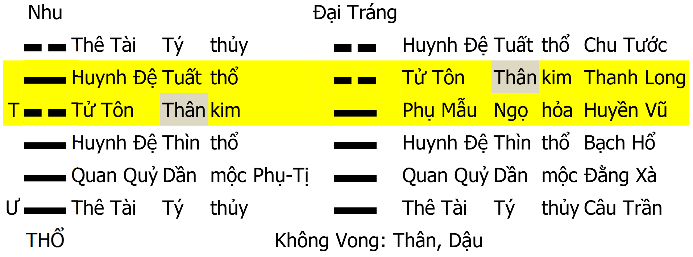
    - **Hình này chứng minh điều gì**
      - Đương số mắc chứng nhũ tuyến tăng sinh.
    - **Từ đâu mà thấy được**
      - Thế hào 4 Tử Tôn Thân kim động hóa Ngọ hỏa hồi đầu khắc, gặp tháng Hợi là Bệnh địa, ngày Dần là Tuyệt địa; hào 4 và Tử Tôn đều chủ về tuyến vú.
- Xác định Dụng thần và quan hệ vòng Trường Sinh:
  - Nữ tự xem bệnh bản thân lấy hào Thế làm Dụng thần.
  - Hào Thế là hào 4 Tử Tôn Thân kim phát động, hóa Phụ Mẫu Ngọ hỏa hồi đầu khắc.
  - Thân kim gặp tháng Hợi là Bệnh địa theo vòng Trường Sinh.
  - Thân kim gặp ngày Dần là Tuyệt địa.
- Định vị bệnh lý tuyến vú:
  - Tử Tôn là lục thân đại diện cho vú.
  - Hào vị 4 đại diện cho ngực và vú.
  - Hào Thế đại diện cho vú lâm Bệnh địa, Tuyệt địa, lại động hóa hồi đầu khắc, biểu thị tại mô tuyến vú hình thành tổ chức tăng sinh, u cục.
- Kết quả và ứng nghiệm thực tế:
  - Trên thực tế, người phụ nữ mắc chứng nhũ tuyến tăng sinh.

#### Phân tích thực tế: Quẻ Hỏa Thiên Đại Hữu biến Thiên Phong Cấu - Nữ đoán bệnh bản thân
- Ngày Quý Dậu tháng Thân (Tuần không: Tuất, Hợi), một phụ nữ gieo quẻ đoán bệnh bản thân, được quẻ Hỏa Thiên Đại Hữu biến Thiên Phong Cấu:
  - **Hình 224.** Sơ đồ quẻ Hỏa Thiên Đại Hữu biến Thiên Phong Cấu
    - 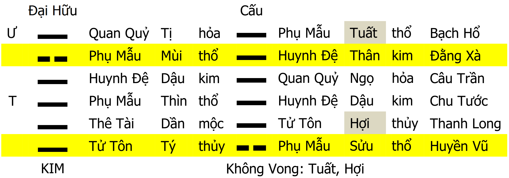
    - **Hình này chứng minh điều gì**
      - Đương số mắc chứng nhũ tuyến tăng sinh.
    - **Từ đâu mà thấy được**
      - Hào 5 Mùi thổ (Tài khố, chủ vú) là Mộ khố của Kỵ thần phát động; Nhật thần nhập quẻ tại hào 4 Dậu kim lâm Câu Trần hợp hào Thế Thìn thổ, Câu Trần chủ tăng sinh.
- Xác định Dụng thần và Mộ khố của Kỵ thần:
  - Người nữ tự đoán bệnh lấy hào Thế làm Dụng thần (Phụ Mẫu Thìn thổ an tại hào 3 trì Thế).
  - Kỵ thần Quan Quỷ Tị hỏa tại hào 6 hưu tù do tháng Thân ngày Dậu thuộc hành Kim vượng làm tiết khí của Hỏa.
  - Tuy nhiên, Mộ khố của Kỵ thần là Phụ Mẫu Mùi thổ tại hào 5 phát động (hóa Huynh Đệ Thân kim), chứng tỏ tại vị trí hào 5 phát sinh ổ bệnh tật.
  - Hào 5 Mùi thổ là Mộ khố của Thê Tài Dần mộc (Tài khố), mang thông tin đặc trưng của vú, chứng minh bệnh tật phát sinh ngay tại tuyến vú.
- Nhật thần nhập quẻ kết hợp Câu Trần tương hợp:
  - Nhật thần Dậu kim nhập quẻ tại hào 4 Huynh Đệ Dậu kim lâm Câu Trần, phát động hóa Quan Quỷ Ngọ hỏa.
  - Hào 4 Dậu kim hợp hào Thế Thìn thổ (Thìn Dậu tương hợp), tức Câu Trần đến hợp vào hào Thế.
  - Câu Trần có đặc tính chủ về xơ cứng, mô sưng lồi, phì đại tăng sinh.
  - Tổng hợp tượng quẻ suy ra đương số bị nhũ tuyến tăng sinh.
- Kết quả và ứng nghiệm thực tế:
  - Trên thực tế, người bệnh đúng là mắc chứng nhũ tuyến tăng sinh.

#### Phân tích thực tế: Quẻ Thủy Thiên Nhu biến Khảm Vi Thủy - Chồng đoán bệnh cho vợ
- Ngày Giáp Tuất tháng Dần (Tuần không: Thân, Dậu), người chồng gieo quẻ đoán bệnh cho vợ, được quẻ Thủy Thiên Nhu biến Khảm Vi Thủy:
- Xác định Dụng thần lưỡng hiện:
  - Chồng đoán bệnh cho vợ lấy hào Thê Tài làm Dụng thần.
  - Trong quẻ Thê Tài lưỡng hiện: Thê Tài Tý thủy tại hào sơ và Thê Tài Tý thủy tại hào 6.
  - Hào sơ Thê Tài Tý thủy phát động, theo quy tắc ưu tiên hào động nên chọn hào sơ Tý thủy làm Dụng thần.
- Phân tích vượng suy và biến động của Dụng thần:
  - Dụng thần Tý thủy gặp tháng Dần không được sinh trợ (hưu tù), bị Nhật kiến Tuất thổ khắc hại.
  - Hào sơ Tý thủy động hóa Quan Quỷ Dần mộc tiết khí, động hóa Quan Quỷ là tượng chẳng lành đối với người bệnh.
- Định vị bệnh ung thư vú qua Tài khố và Nguyên thần suy tổn:
  - Hào 3 Huynh Đệ Thìn thổ phát động lâm Câu Trần đến khắc phạt Dụng thần Tý thủy.
  - Thìn thổ là Thủy khố (Mộ khố của Thê Tài Tý thủy, tức Tài khố), mang thông tin đại diện cho vú; Câu Trần chủ khối u.
  - Nguyên thần Tử Tôn Thân kim tại hào 4 bị Nguyệt kiến Dần mộc xung là Nguyệt phá, lại gặp Tuần không; hào 4 là hào vị của ngực và vú.
  - Dụng thần quá mức suy kiệt, Tài khố lâm Câu Trần động khắc, Nguyên thần hào vị vú vừa Nguyệt phá vừa Không Vong không thể sinh phù trợ lực.
  - Tổng hợp các yếu tố hung hiểm trên, kết luận người vợ bị bệnh ung thư vú ác tính.
- Kết quả và ứng nghiệm thực tế:
  - Trên thực tế, người vợ mắc chứng ung thư vú.

### 13. BỆNH TIM

#### Các phương diện nhận diện quái tượng bệnh tim
- Vai trò sinh lý và tầm quan trọng của tạng tim trong dự trắc:
  - Tim là cơ quan bơm máu, nhờ vào áp lực của tim sinh ra mà máu được vận chuyển tuần hoàn đi khắp toàn bộ cơ thể.
  - Tim gắn bó chặt chẽ với sinh mệnh của con người, nhịp đập của tim là thước đo phân định ranh giới giữa sự sống và cái chết; một khi tim phát sinh sự cố thì tính mệnh lâm vào nguy hiểm.
- Phương diện quái cung nhận diện bệnh tim:
  - Bệnh tim liên quan trực tiếp đến quái cung Ly, do Ly là quẻ thuộc ngũ hành hỏa, đại diện cho tâm tạng (tim).
- Phương diện ngũ hành nhận diện bệnh tim:
  - Tim thuộc ngũ hành Hỏa; mọi biến động thiên lệch (quá vượng, suy kiệt, bị khắc, ngộ Không) của hành Hỏa trong quẻ đều phản ánh thực trạng tạng tim.
- Phương diện hào vị nhận diện bệnh tim:
  - Hào 3, hào 4 và hào 5 đều là các hào vị chủ về ngực và tim; trong đó hào 3 và hào 4 là các vị trí thường xuất hiện dấu hiệu bệnh tim nhất.
- Phương diện địa chi nhận diện màng ngoài tim:
  - Địa chi Tuất thổ đại diện cho màng bọc tim (tâm bào lạc).
- Phương diện lục thân phản ánh hệ tuần hoàn và khí huyết:
  - Không có lục thân cố định đại diện riêng cho tim, nhưng các lục thân phản ánh thành phần liên đới:
    - Hào Tử Tôn đại diện cho hệ thống huyết quản (mạch máu).
    - Hào Thê Tài đại diện cho huyết dịch (máu).
- Phương diện lục thần phản ánh triệu chứng bệnh tim:
  - Bạch Hổ chủ về máu huyết, xuất huyết hoặc thiếu máu.
  - Đằng Xà chủ về chứng tâm hoảng, hồi hộp, bồn chồn, nhịp tim không đều (loạn nhịp tim).
  - Chu Tước chủ về chứng viêm nhiệt tại tim.
  - Dụng thần hoặc Nguyên thần lâm Hỏa ngộ Tuần Không cũng chủ về tâm hoảng, nhịp tim đập không đều.
- Phản ánh quái tượng liên hệ hào vị tim, lục thần Đằng Xà và ngũ hành biến hóa trong chẩn đoán tạng phủ:
  - **Hình 225.** Quẻ Thủy Thiên Nhu biến Khảm Vi Thủy
    - 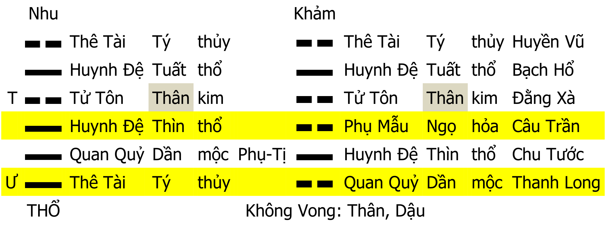
    - **Hình này chứng minh điều gì**
      - Minh họa mối liên hệ giữa lục thần Đằng Xà, ngũ hành Hỏa và vị trí tim trong phản ánh trạng thái bất an của tạng phủ.
    - **Từ đâu mà thấy được**
      - Hào 4 Thân kim lâm Đằng Xà ngộ Không; hào 3 vị trí tim động hóa Ngọ hỏa; hào sơ Tý thủy động hóa Dần mộc.
- Phương diện sinh khắc và chẩn đoán phân loại bệnh lý tim mạch:
  - Cơ sở suy luận cơ bản: Dụng thần hoặc Nguyên thần gặp Không Vong, bị hợp, bị khắc phạt, hoặc nhập Mộ đều là căn cứ để phán đoán bệnh tình.
  - Bệnh tim bẩm sinh: Thường xuất hiện khi Kỵ thần tọa tại Thai địa, hoặc lâm hào sơ (thời thơ ấu), hào 2 (thai vị), hay hào Phụ Mẫu (di truyền từ cha mẹ).
  - Bệnh tâm phế (bệnh tim do phổi dẫn tới): Thường xuất hiện khi quái tượng bệnh tim có mối liên hệ mật thiết với ngũ hành Kim (Kim chủ phế).
  - Nhồi máu cơ tim (tâm cơ ngạnh tắc): Thường ứng nghiệm khi Dụng thần hoặc Nguyên thần nhập Mộ khố, lâm Câu Trần (chủ ách tắc, ứ trệ), hoặc Nguyên thần bị hợp trói (hợp bán) mất tác dụng sinh trợ.

#### Các ví dụ thực tế dự đoán bệnh tim

##### Ví dụ 1: Nữ tự đoán bệnh - Nhịp tim quá chậm do ngũ hành hỏa vượng cực điểm sinh thổ
- Ngày Đinh Mùi tháng Tị, nữ đoán bệnh của bản thân, gieo được quẻ Lôi Trạch Quy Muội biến Lôi Thiên Đại Tráng:
  - **Hình 226.** Quẻ Lôi Trạch Quy Muội biến Lôi Thiên Đại Tráng
    - 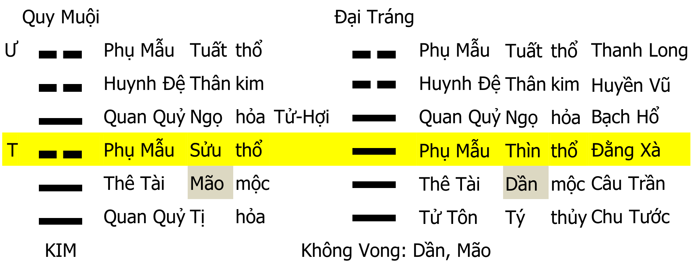
    - **Hình này chứng minh điều gì**
      - Chứng minh chứng nhịp tim quá chậm do ngũ hành hỏa vượng sinh thổ quá mức và Nguyên thần hào tim bị Nhật hợp kìm hãm.
    - **Từ đâu mà thấy được**
      - Hào Thế Sửu thổ hóa Thìn thổ (Tiến thần); quẻ cùng Nhật kết thành 4 Thổ; hào 4 Ngọ hỏa là hào tim hợp Nhật Mùi.
- Xác định Dụng thần và nhận định sơ bộ:
  - Nữ tự đoán bệnh cho bản thân nên lấy hào Thế làm Dụng thần.
  - Hào Thế Phụ Mẫu Sửu thổ lâm hào 3, được Nguyệt kiến Tị hỏa tương sinh, Nhật thần Mùi thổ tương phù (thực chất là xung động), phát động hóa Phụ Mẫu Thìn thổ là Tiến thần.
  - Thoạt nhìn Dụng thần và Nguyên thần đều không bị khắc thương, dường như thể trạng bình thường không có bệnh tật.
- Các bước suy luận và biện chứng bệnh lý:
  - Nhìn vào tổng thể ngũ hành Thổ trong quẻ: Quẻ gốc có hai hào Thổ (Sửu thổ hào 3 và Tuất thổ hào 6), hào Thế lại động hóa ra Thìn thổ, kết hợp với Nhật thần Mùi thổ tổng cộng tạo thành bốn hào Thổ cực vượng.
  - Nhìn vào Nguyên thần hào Hỏa: Trong quẻ Hỏa lưỡng hiện (Quan Quỷ Tị hỏa hào 1 và Quan Quỷ Ngọ hỏa hào 4), thêm Nguyệt kiến cũng là Tị hỏa, tạo thành thế Hỏa quá vượng.
  - Nhật thần Mùi thổ trực xung Dụng thần Sửu thổ làm cho hào biến Tiến thần càng xúc tiến nhanh hơn; theo quy luật "vật cực tất phản", Hỏa nhiều sinh Thổ quá độ bế tắc mà kết thành bệnh; hào Thế lâm Đằng Xà chủ tượng tâm trạng phiền muộn, hoang mang.
  - Xét hào 4 Quan Quỷ Ngọ hỏa: Hào 4 là hào vị tim, ngũ hành Hỏa là tim, Ngọ hỏa lại tương hợp với Nhật thần Mùi thổ (Ngọ Mùi hợp). Lấy hào này làm trọng tâm phán đoán bệnh tim.
  - Biện định nhịp tim: Thông thường Hỏa vượng chủ nhịp tim nhanh, nhưng vì quá vượng nên phải luận đảo ngược thành nhịp tim quá chậm; đồng thời Nguyên thần hào tim Ngọ hỏa bị Nhật hợp níu chân (hợp bán) cũng biểu thị sự ngưng trệ, tim đập chậm.
- Ứng nghiệm thực tế:
  - Người nữ này kiểm tra y tế xác nhận chính xác là mắc chứng nhịp tim quá chậm (chậm nhịp tim).

##### Ví dụ 2: Phụ nữ cao tuổi đoán bệnh - Bệnh tim do Nguyên thần Ngọ hỏa ngộ Không Vong bị khắc
- Ngày Bính Tuất tháng Dậu, một người phụ nữ cao tuổi đoán bệnh của bản thân, gieo được quẻ Địa Hỏa Minh Di biến Lôi Địa Dự:
  - **Hình 227.** Sơ đồ quẻ Địa Hỏa Minh Di biến Lôi Địa Dự
    - 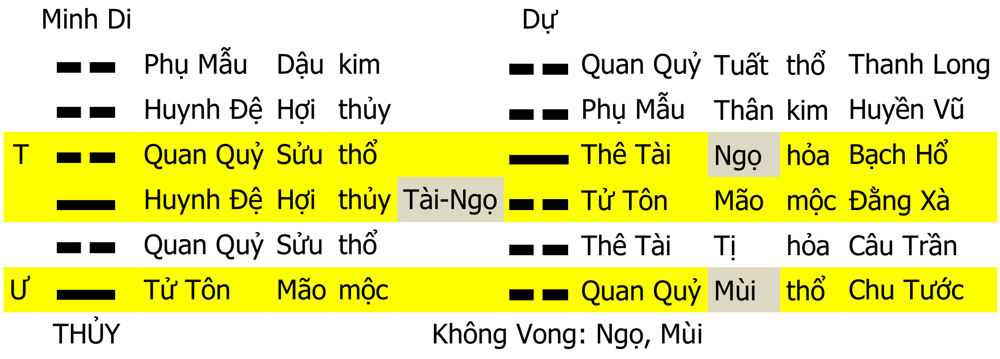
    - **Hình này chứng minh điều gì**
      - Chứng minh bệnh tim xuất phát từ Nguyên thần sinh Thế lâm hỏa tại hào vị tim ngộ Không Vong lại bị động hào khắc phá.
    - **Từ đâu mà thấy được**
      - Thế Sửu thổ hóa Ngọ hỏa hồi đầu sinh nhưng Ngọ hỏa ngộ Tuần Không; phục thần Ngọ hỏa bị hào 3 Hợi thủy phát động khắc tiệt.
- Xác định Dụng thần và phân tích hào Thế:
  - Phụ nữ tự đoán bệnh bản thân lấy hào Thế làm Dụng thần.
  - Hào Thế Quan Quỷ Sửu thổ lâm hào 4 mang Bạch Hổ, phát động hóa xuất Thê Tài Ngọ hỏa là được hồi đầu sinh.
- Các bước suy luận nguồn gốc bệnh tật:
  - Tuy hào biến Ngọ hỏa hồi đầu sinh Thế, nhưng ngày Bính Tuất có Tuần Không tại Ngọ và Mùi; hào biến Thê Tài Ngọ hỏa rơi vào trạng thái Không Vong nên vô lực sinh phù.
  - Ngũ hành Hỏa đại diện cho tim, mà hào 4 lại chính là hào vị của tim ngực, nên biến động của hào hỏa ở đây tập trung phản ánh tạng tim.
  - Trong quẻ gốc, Nguyên thần Thê Tài Ngọ hỏa không xuất hiện trên thân quẻ mà phục tàng dưới hào 3 Huynh Đệ Hợi thủy, lâm Hỏa Không Vong; hào 3 Hợi thủy lại phát động trực khắc Ngọ hỏa phục thần, triệt tiêu nguồn sinh của tim.
  - Kết hợp các yếu tố Nguyên thần lâm Hỏa Không Vong tại hào vị tim và bị thủy động tương khắc, khẳng định người này chắc chắn mắc bệnh tim.
- Ứng nghiệm thực tế:
  - Người phụ nữ cao tuổi này trên thực tế đúng là đang mắc bệnh tim.

##### Ví dụ 3: Nữ đoán bệnh cha chồng - Bệnh tim mãn tính tám năm do Dụng thần lâm Không và Nguyên thần bị khắc
- Ngày Kỷ Hợi tháng Dậu, nữ đoán bệnh tật của cha chồng, gieo được quẻ Trạch Thủy Khốn:
  - **Hình 228.** Sơ đồ quẻ Trạch Thủy Khốn
    - 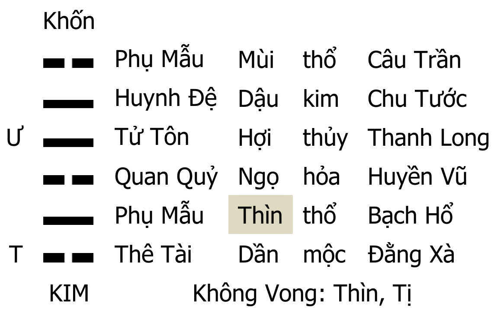
    - **Hình này chứng minh điều gì**
      - Chứng minh bệnh tim mãn tính kéo dài do Dụng thần suy yếu lâm Không và Nguyên thần tại hào vị tim bị Nhật thần khắc thương.
    - **Từ đâu mà thấy được**
      - Dụng thần Phụ Mẫu Thìn thổ lâm Bạch Hổ ngộ Không; Nguyên thần Quan Quỷ Ngọ hỏa cư hào 3 vị trí tim bị Nhật Hợi khắc phá.
- Xác định Dụng thần:
  - Đoán bệnh cha chồng lấy hào Phụ Mẫu làm Dụng thần.
  - Trong quẻ hào Phụ Mẫu lưỡng hiện (Phụ Mẫu Thìn thổ hào 2 và Phụ Mẫu Mùi thổ hào 6); ngày Kỷ Hợi Tuần Không tại Thìn và Tị, theo nguyên tắc chọn Dụng thần ưu tiên chọn hào gặp Không, nên lấy Phụ Mẫu Thìn thổ lâm hào 2 làm Dụng thần.
- Các bước suy luận và đánh giá tình trạng bệnh:
  - Nguyệt kiến Dậu kim tương hợp Dụng thần Thìn thổ (Thìn Dậu hợp), Dụng thần nhờ hợp mà có khí; tuy nhiên cả Nhật thần Hợi thủy lẫn Nguyệt kiến Dậu kim đều không sinh phù Thìn thổ nên thể chất người bệnh vốn dĩ rất suy yếu.
  - Quẻ có sáu hào an tĩnh không phát động, biểu thị bệnh trạng hiện tại tương đối ổn định, không có biến chứng nguy cấp đột ngột.
  - Dụng thần lâm Tuần Không, rất cần Nguyên thần tương sinh; thế nhưng Nguyên thần Quan Quỷ Ngọ hỏa cư tại hào 3 lại bị Nhật thần Hợi thủy trực xung khắc thương.
  - Hào 3 là hào vị tim, ngũ hành Hỏa lại chủ về tim; Nguyên thần của tim bị Nhật thần khắc hại dẫn đến tim mạch suy thoái lâu ngày.
- Ứng nghiệm thực tế:
  - Người hỏi xác nhận cha chồng của cô đã mắc bệnh tim dai dẳng suốt 8 năm qua.

##### Ví dụ 4: Nam tự đoán bệnh - Thiếu máu cơ tim và tim hoảng do hào Thế cư hào tim lâm hỏa ngộ Không Vong Bạch Hổ
- Ngày Mậu Tý tháng Tuất, nam đoán bệnh của bản thân, gieo được quẻ Địa Thủy Sư:
  - **Hình 229.** Sơ đồ quẻ Địa Thủy Sư
    - 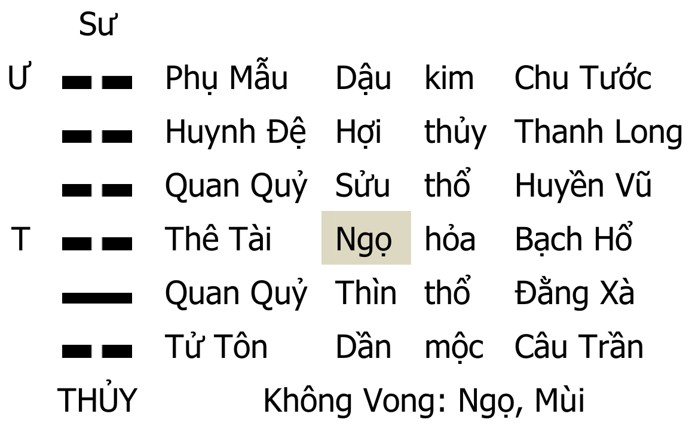
    - **Hình này chứng minh điều gì**
      - Chứng minh bệnh tim thiếu máu cơ tim và tâm hoảng loạn nhịp do hào Thế cư hào tim lâm hỏa ngộ Không Vong mang Bạch Hổ.
    - **Từ đâu mà thấy được**
      - Hào Thế Thê Tài Ngọ hỏa lâm hào 3 ngộ Không Vong, bị Nhật Tý xung khắc; Bạch Hổ và Thê Tài chủ máu huyết bị hưu tù.
- Xác định Dụng thần:
  - Nam tự đoán bệnh của mình nên lấy hào Thế làm Dụng thần.
  - Hào Thế Thê Tài Ngọ hỏa an vị tại hào 3, ngày Mậu Tý Tuần Không tại Ngọ và Mùi nên hào Thế lâm Tuần Không.
- Suy luận bệnh chứng chuyên biệt:
  - Hào Thế cư hào 3 là hào vị của tim, bản thân chi Ngọ lại thuộc Hỏa chủ về tim; Nguyệt kiến Tuất thổ không tương sinh (Hỏa sinh Thổ tiết khí), lại bị Nhật thần Tý thủy trực xung khắc thương, khẳng định bộ vị phát bệnh chắc chắn ở tim.
  - Hào Thế lâm Bạch Hổ lại ngộ Không Vong: Lâm Hỏa chủ tim, ngộ Không Vong chủ tâm hoảng, bồn chồn, nhịp tim không đều.
  - Lục thần Bạch Hổ chủ về huyết dịch, lục thân Thê Tài cũng chủ về huyết dịch; hào Thế Thê Tài lâm Không lại không có Nguyên thần Dần Mão mộc trong quẻ đến sinh trợ, biểu thị lượng máu cung cấp cho tim bị thiếu hụt nghiêm trọng.
  - Tổng hợp các tượng: Tim đập không đều do tình trạng thiểu năng tuần hoàn vành, tim cung cấp máu không đủ (thiếu máu cơ tim).
- Ứng nghiệm thực tế:
  - Kết quả chẩn đoán y tế xác nhận chính xác người này bị chứng tim cung cấp máu không đủ.

##### Ví dụ 5: Nam tự đoán bệnh - Bệnh tim bẩm sinh do Quan Quỷ động khắc hào vị tim tại hào thai
- Ngày Tân Mão tháng Tị, nam đoán bệnh của bản thân, gieo được quẻ Thủy Sơn Kiển biến Thủy Phong Tỉnh:
  - **Hình 230.** Sơ đồ quẻ Thủy Sơn Kiển biến Thủy Phong Tỉnh
    - 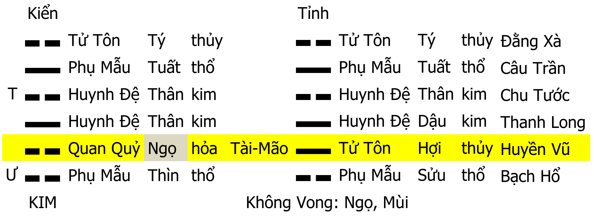
    - **Hình này chứng minh điều gì**
      - Chứng minh bệnh tim bẩm sinh do hỏa khắc kim tại hào vị tim, Nguyệt kiến Trường Sinh mang khắc và Quan Quỷ động khắc tại thai vị.
    - **Từ đâu mà thấy được**
      - Thế Thân kim cư hào 4 bị Nguyệt Tị hợp khắc; hào 2 Ngọ hỏa là thai vị phát động khắc Thế; Dụng thần hưu tù suy nhược.
- Xác định Dụng thần:
  - Nam tự đoán bệnh lấy hào Thế làm Dụng thần; hào Thế Huynh Đệ Thân kim cư tại hào 4 lâm Chu Tước.
- Phân tích tương tác ngũ hành và tình trạng thể chất:
  - Hào Thế cư hào 4 bị Nguyệt kiến Tị hỏa khắc hợp (Tị Thân hợp khắc), Nhật thần Mão mộc không sinh phù.
  - Mặc dù Nguyệt hợp mang lại khí vượng trên danh nghĩa, nhưng bản chất là Hỏa khắc Kim; Quan Quỷ lâm Nguyệt kiến chủ bệnh tật triền miên nhiều năm; Dụng thần hưu tù, cơ thể vô cùng suy nhược.
- Phân tích triệu chứng và nguồn gốc bệnh bẩm sinh:
  - Về chứng bệnh: Hỏa đến khắc Kim, hào Thế tại hào 4 là hào vị tim, lại thêm hào 2 Quan Quỷ Ngọ hỏa phát động khắc Kim; hào 4 là vị trí tim, Hỏa chủ tim, xác định rõ ràng là bệnh tim.
  - Về thời điểm phát bệnh: Nguyệt kiến Tị hỏa là đất Trường Sinh của Thân kim nhưng lại mang tính khắc phạt (Trường Sinh mang khắc), biểu thị căn bệnh này đã đeo bám từ lúc mới lọt lòng, thơ ấu.
  - Về tính chất bẩm sinh: Quan Quỷ Ngọ hỏa phát động tại hào 2; hào 2 vốn là thai vị, đồng thời cũng là vị trí thai của hào Thế Thân kim; Quan Quỷ động tại thai vị khắc phạt Dụng thần là chứng cứ xác thực của bệnh tim bẩm sinh.
- Ứng nghiệm thực tế:
  - Đương số đúng là mắc bệnh tim bẩm sinh từ nhỏ, sức khỏe suy kiệt hoàn toàn không thể làm việc hay lao động nặng.

##### Ví dụ 6: Nữ đoán bệnh cha chồng - Bệnh tim bồn chồn kèm sốt nôn do hào vị tim độc phát xung Dụng thần
- Ngày Bính Thân tháng Sửu, nữ đoán bệnh của cha chồng, gieo được quẻ Lôi Thủy Giải biến Lôi Phong Hằng:
  - **Hình 231.** Sơ đồ quẻ Lôi Thủy Giải biến Lôi Phong Hằng
    - 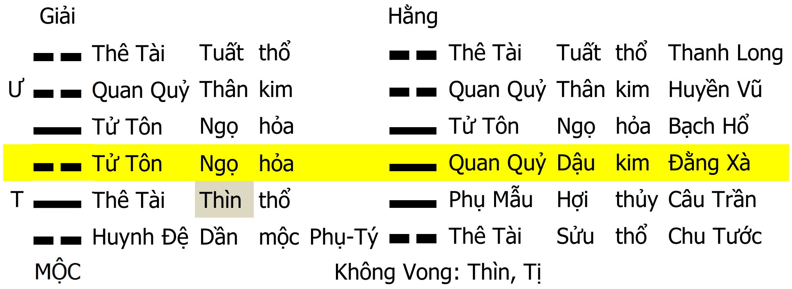
    - **Hình này chứng minh điều gì**
      - Chứng minh bệnh tim bồn chồn khó chịu kèm phát sốt nôn ói do hào vị tim phát động xung Dụng thần phục tàng mang Chu Tước.
    - **Từ đâu mà thấy được**
      - Dụng thần Phụ Mẫu Tý thủy phục hào sơ lâm Chu Tước (chủ sốt); hào 3 Tử Tôn Ngọ hỏa lâm Đằng Xà độc phát xung khắc Dụng.
- Xác định Dụng thần:
  - Đoán bệnh cha chồng lấy hào Phụ Mẫu làm Dụng thần.
  - Hào Phụ Mẫu không xuất hiện trên quẻ gốc, phục tàng dưới hào sơ Huynh Đệ Dần mộc là Phụ Mẫu Tý thủy.
- Phân tích khí số sinh khắc:
  - Dụng thần Phụ Mẫu Tý thủy tuy phục tàng nhưng được Nguyệt kiến Sửu thổ tương hợp hữu khí, lại được Nhật thần Thân kim tương sinh vượng tướng, kết luận bệnh tình tuy khó chịu nhưng không nguy hiểm đến tính mạng.
- Biện chứng triệu chứng bệnh tim và biến chứng hiện tại:
  - Trong quẻ có hào 3 Tử Tôn Ngọ hỏa độc phát trực xung Dụng thần Tý thủy (Tý Ngọ tương xung).
  - Hào 3 là hào vị của tim, ngũ hành Hỏa lại chủ về tim, Ngọ hỏa động lâm Đằng Xà chủ về tâm phiền, ngực bồn chồn, bức bối khó chịu không yên.
  - Dụng thần Tý thủy phục dưới hào sơ mang lục thần Chu Tước: Chu Tước chủ viêm nhiệt, sốt cao.
  - Hào Thê Tài Thìn thổ tại hào 2 lâm Tuần Không (ngày Bính Thân Tuần Không tại Thìn, Tị): Hào Tài chủ về ăn uống dinh dưỡng, Tài lâm Không biểu thị dạ dày khó nạp thức ăn, không muốn ăn và xuất hiện nôn mửa.
- Ứng nghiệm thực tế:
  - Cha chồng người này vốn có bệnh tim, tại thời điểm đoán bệnh đang phát triệu chứng sốt cao và nôn mửa liên tục.

##### Ví dụ 7: Nữ đoán sức khỏe - Bệnh tim gây bất an mất ngủ do hào Thế cư hào tim và Bệnh địa động lâm Đằng Xà
- Ngày Mậu Ngọ tháng Hợi, nữ đoán sức khỏe của bản thân, gieo được quẻ Thủy Địa Tỷ biến Địa Thủy Sư:
  - **Hình 232.** Sơ đồ quẻ Thủy Địa Tỷ biến Địa Thủy Sư
    - 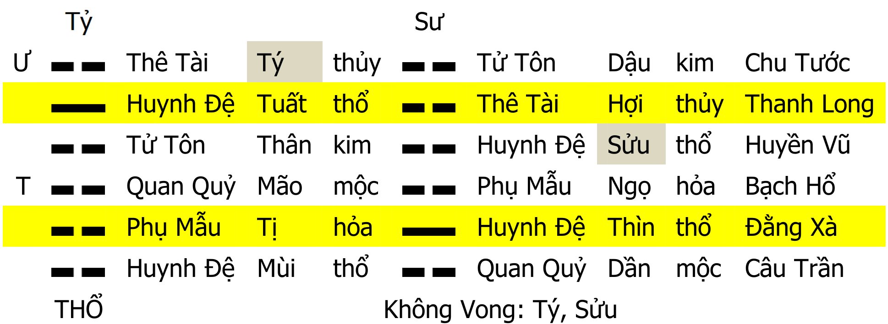
    - **Hình này chứng minh điều gì**
      - Chứng minh bệnh tim gây bất an, rối loạn giấc ngủ nặng do hào Thế cư giường/tim và Bệnh địa lâm Đằng Xà phát động.
    - **Từ đâu mà thấy được**
      - Thế Quan Quỷ Mão mộc cư hào 3 (giường và tim); hào 2 Phụ Mẫu Tị hỏa là Bệnh địa lâm Đằng Xà phát động sinh thổ biến xuất.
- Xác định Dụng thần:
  - Nữ tự xem sức khỏe lấy hào Thế làm Dụng thần; hào Thế Quan Quỷ Mão mộc cư tại hào 3 lâm Bạch Hổ, phát động hóa Phụ Mẫu Ngọ hỏa.
- Phân tích trạng thái hào Thế và động hào:
  - Hào Thế Quan Quỷ Mão mộc được Nguyệt kiến Hợi thủy tương sinh, Nhật thần Ngọ hỏa không khắc chế, thuộc trạng thái vượng tướng.
  - Hào 2 Phụ Mẫu Tị hỏa phát động hóa Huynh Đệ Thìn thổ: Tị hỏa chính là Bệnh địa của Mão mộc (Mộc trường sinh tại Hợi, suy tại Thìn, bệnh tại Tị); Bệnh địa phát động báo hiệu mầm bệnh đang tác oai tác quái.
- Phân tích tương quan hào vị và giấc ngủ:
  - Hào 3 là hào vị của giường chiếu, đồng thời cũng là hào vị của tim.
  - Hào 2 Tị hỏa phát động mang Đằng Xà: Đằng Xà chủ tâm phiền, lo âu, bồn chồn hoảng hốt, đồng thời cũng chủ về mộng mị, giấc ngủ.
  - Quái tượng cho thấy tạng tim bất an, trong ngực bồn chồn khó chịu dẫn đến việc nằm trên giường không thể an giấc, thường xuyên mất ngủ trằn trọc.
- Ứng nghiệm thực tế:
  - Người nữ xác nhận giấc ngủ của cô rất kém, thường xuyên mất ngủ do tim có vấn đề bất an, hồi hộp khó chịu.

##### Ví dụ 8: Nam đoán tuổi thọ - Đột phát bệnh tim do Nguyên thần cư hào tim động hóa Tử địa
- Ngày Bính Thìn tháng Hợi, nam đoán tuổi thọ của bản thân, gieo được quẻ Sơn Thủy Mông biến Sơn Phong Cổ:
- Xác định Dụng thần và nhận định thể trạng ban đầu:
  - Tự đoán tuổi thọ lấy hào Thế làm Dụng thần; hào Thế Tử Tôn Tuất thổ cư tại hào 4 lâm Bạch Hổ, phục Thê Tài Dậu kim.
  - Hào Thế Tuất thổ không bị Nhật Nguyệt khắc phạt; Nhật thần Thìn thổ trực xung hào Thế tạo thành ám động chứ không gây tổn hại, bề ngoài thể chất dường như bình thường không có dấu hiệu bệnh trọng.
- Suy luận nguyên nhân sâu xa từ Nguyên thần:
  - Hào Thế lâm Bạch Hổ vốn là tín hiệu ẩn tàng của bệnh tật.
  - Nguyên thần Huynh Đệ Ngọ hỏa cư tại hào 3 mang Đằng Xà độc phát, hóa xuất Thê Tài Dậu kim là đất Tử địa của Hỏa (Hỏa sinh tại Dần, đế vượng tại Ngọ, tử tại Dậu); đồng thời Ngọ hỏa bị Nguyệt kiến Hợi thủy khắc phá tuyệt khí, chứng tỏ căn nguyên hiểm họa nằm trọn ở Nguyên thần.
- Biện chứng vị trí phát bệnh và giấc ngủ:
  - Nguyên thần Huynh Đệ Ngọ hỏa cư tại hào 3: Hào 3 là vị trí tim, ngũ hành Hỏa chủ về tim, Ngọ hỏa lâm Đằng Xà độc phát chủ tim suy thoái bất an.
  - Hào Thế lâm Bạch Hổ chủ về huyết dịch, tổng hợp lại kết luận tim cung cấp máu không đủ (thiếu máu cơ tim).
  - Hào 3 là giường chiếu, Đằng Xà chủ về ngủ mê mộng mị; Nguyên thần bị Nguyệt khắc thương nặng nề không đủ lực sinh phù hào Thế, phản ánh giấc ngủ suy nhược, thường xuyên mất ngủ.
- Dự đoán tuổi thọ và định kỳ hạn qua đời:
  - Dự đoán tuổi thọ tối kỵ Nguyên thần phát động; Nguyên thần động ắt sinh mệnh đã có kỳ hạn ấn định, không thể trường thọ lâu dài.
  - Nguyên thần lâm Hỏa độc phát hóa Tử địa báo trước sau này đương số sẽ qua đời vì bệnh tim chuyển biến rõ rệtt (đột quỵ tim hoặc nhồi máu cơ tim cấp tính).
  - Thời gian ứng nghiệm: Ứng vào năm xung mất Nguyên thần (năm Tý xung mất Ngọ hỏa), hoặc năm Nguyên thần nhập Mộ khố (năm Tuất).
- Ứng nghiệm thực tế:
  - Tại thời điểm hỏi quẻ, người này xác nhận tim rất yếu, bị thiếu máu cơ tim (cung cấp máu không đủ) và giấc ngủ cực kỳ xấu, đêm thường xuyên trằn trọc mất ngủ.

### 14. BỆNH DẠ DÀY

#### Quy luật quái tượng và các phương diện dự trắc bệnh dạ dày
- Cơ chế sinh lý tỳ vị và phân loại các bệnh dạ dày thường gặp:
  - Sau khi nạp vào cơ thể, thức ăn đi xuống dạ dày; nhu động dạ dày kết hợp cùng dịch vị chuyển hóa thức ăn thành dạng hồ nhão trước khi đưa xuống tá tràng.
  - Các chất dinh dưỡng thiết yếu cần được nhào trộn và tiêu hóa sơ bộ tại dạ dày; nếu dạ dày phát sinh bệnh tật, quá trình tiêu hóa bị đình trệ, ảnh hưởng dây chuyền đến sức khỏe của các cơ quan bộ vị khác.
  - Phổ bệnh lý dạ dày trong thực tế lâm sàng gồm có: chứng tiêu hóa kém, chướng bụng đầy hơi, đau thượng vị, viêm dạ dày, teo niêm mạc dạ dày, loét dạ dày, sa dạ dày, thủng dạ dày, xuất huyết dạ dày, ung thư dạ dày.
- Biểu hiện bệnh lý dạ dày trên phương diện quái cung:
  - Cung Cấn và cung Khôn: mang thuộc tính ngũ hành Thổ, chủ về tỳ vị (lá lách và dạ dày).
  - Cung Đoài: tượng trưng cho miệng và khoang miệng, liên quan mật thiết đến ăn uống và nạp thực.
- Biểu hiện bệnh lý dạ dày trên phương diện lục thân:
  - Hào Thê Tài: đại diện cho ẩm thực, đồ ăn thức uống được nạp vào.
  - Hào Huynh Đệ: chủ về sự vận hóa, chuyển vận và tiêu hóa thức ăn.
- Minh họa đồ hình quẻ liên hệ tạng phủ và lục thân:
  - Đồ hình quẻ Sơn Thủy Mông biến Sơn Phong Cổ biểu thị sự biến hóa tạng phủ và lục thân:
    - **Hình 233.** Sơ đồ quẻ Sơn Thủy Mông biến Sơn Phong Cổ
      - 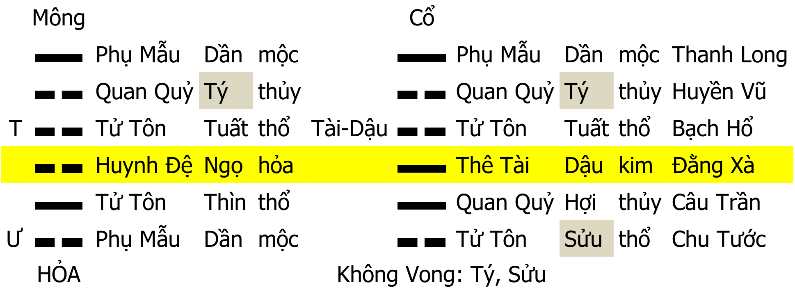
      - **Hình này chứng minh điều gì**
        - Thể hiện sự liên kết giữa lục thân Huynh Đệ, Thê Tài và hào vị đối ứng kinh mạch tạng phủ.
      - **Từ đâu mà thấy được**
        - Căn cứ hào 2 Cửu nhị Dương động biến quẻ Cổ, phản ánh tương tác giữa Thê Tài, Huynh Đệ và tạng phủ.
- Biểu hiện bệnh lý dạ dày trên phương diện hào vị:
  - Hào 3, hào 4 và hào 5 đều có thể đại diện cho bộ vị dạ dày trong cơ thể.
  - Riêng hào 5 có mối liên hệ mật thiết và phản ánh trực tiếp lá lách (tỳ).
  - Thổ cư ở hào vị nơi cao đại diện cho lá lách; Thổ cư ở hào vị nơi thấp đại diện cho dạ dày.
- Biểu hiện và phân biệt tính chất bệnh dạ dày qua lục thần:
  - Chu Tước và Thanh Long: Chu Tước chủ miệng nạp, Thanh Long chủ ẩm thực; cả hai lục thần này đều gắn liền với hoạt động ăn uống.
  - Phân định triệu chứng bệnh qua từng lục thần cụ thể:
    - Thanh Long: chủ về chứng đau vùng thượng vị.
    - Chu Tước: chủ về các chứng viêm nhiễm dạ dày.
    - Câu Trần: chủ về chứng chướng bụng đầy hơi, tích trệ, hoặc ung thư dạ dày (bệnh mạn tính cũ kỹ).
    - Đằng Xà: chủ về teo dạ dày, sa dạ dày (tượng co rút, méo mó).
    - Bạch Hổ: chủ về xuất huyết dạ dày (huyết quang, cấp tính).
    - Huyền Vũ: chủ về viêm loét dạ dày (ẩm mốc, mưng mủ, thối loét).
  - Quy tắc phán đoán: Bắt buộc phải kết hợp đồng thời độ suy vượng của Dụng thần cùng quan hệ sinh khắc xung hợp của các hào để ứng dụng linh hoạt.
- Biểu hiện bệnh lý dạ dày trên phương diện ngũ hành:
  - Ngũ hành Thổ chủ quản tỳ vị.
  - Khi hai Thổ ảnh hưởng, tương tranh tương xung hoặc bị khắc phạt thì chắc chắn cả tỳ lẫn vị đều suy yếu, bất ổn.
  - Thổ ở vị thế trên cao là lá lách; Thổ ở vị thế dưới thấp là dạ dày.
- Biểu hiện bệnh lý dạ dày trên phương diện sinh khắc và trạng thái hào:
  - Hào Thê Tài không hiện trên quẻ (phục tàng) hoặc lâm Tuần Không: chủ về chứng chán ăn, ăn không ngon miệng hoặc không thể ăn nạp được.
  - Hào Thê Tài nhập Mộ: phần lớn biểu thị chứng tích trệ thức ăn, tiêu hóa kém.
  - Hào Thổ hoặc hào vị dạ dày lâm Tuần Không kèm Bạch Hổ: biểu thị tình trạng xuất huyết dạ dày.
  - Lâm Bạch Hổ phát động hóa Không Vong: biểu thị biến chứng thủng dạ dày.
  - Hào Thổ hoặc hào dạ dày lâm Nguyệt phá: biểu thị tình trạng viêm loét dạ dày.
  - Hào vị Kỵ thần nằm ở vị trí thấp hơn Dụng thần mà tương hợp với Dụng thần: biểu thị chứng sa dạ dày (bị kéo xệ xuống dưới).

#### Ví dụ 1: Con gái gieo quẻ Hỏa Thiên Đại Hữu tự đoán sức khỏe (Viêm dạ dày)
- Bối cảnh và quẻ tượng:
  - Ngày Ất Mão tháng Hợi, trong thời gian tác giả lưu lại Nhật Bản, một cụ già đã gọi điện thoại nhờ xem về hôn nhân và sức khỏe của con gái (hơn 40 tuổi).
  - Bản thân người con gái tự tay gieo quẻ, được quẻ Hỏa Thiên Đại Hữu (Kim cung, Tuần Không: Tý, Sửu).
  - Người con gái hơn 40 tuổi tự gieo quẻ Hỏa Thiên Đại Hữu dự trắc sức khỏe:
    - **Hình 234.** Sơ đồ quẻ Hỏa Thiên Đại Hữu
      - 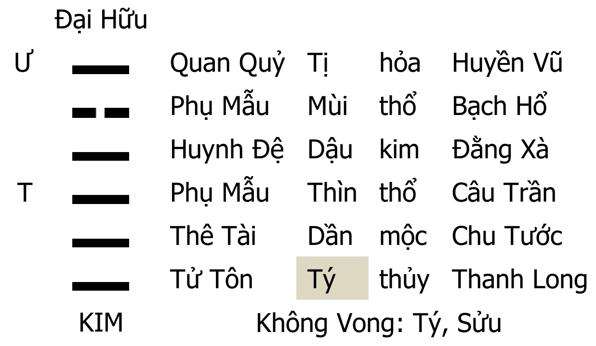
      - **Hình này chứng minh điều gì**
        - Chứng minh người con gái mắc bệnh viêm dạ dày mãn tính (bệnh cũ kéo dài).
      - **Từ đâu mà thấy được**
        - Thế hào 3 Phụ Mẫu Thìn thổ lâm Câu Trần bị Nhật Mão mộc khắc; Kỵ thần hào 2 Dần mộc lâm Chu Tước chủ viêm.
- Các bước suy luận và căn cứ dự trắc:
  - Xác định Dụng thần: Người con gái là đương sự trực tiếp gieo quẻ nên lấy hào Thế làm Dụng thần.
  - Xác định vị trí phát bệnh:
    - Hào Thế ngự tại hào 3, có Phụ Mẫu Thìn thổ trì Thế.
    - Hào vị 3 tượng trưng cho dạ dày; ngũ hành Thìn thổ cũng chủ quản tỳ vị, dạ dày.
    - Hào Thế Thìn thổ bị Nhật thần Mão mộc tương khắc thương tổn (Mão mộc khắc Thìn thổ), do đó khẳng định có bệnh tại bộ vị dạ dày.
  - Phân định tính chất và nguồn gốc bệnh lý:
    - Hào Thế Thìn thổ lâm Câu Trần: Câu Trần mang tính chất cổ cựu, chậm trễ, biểu thị đây là căn bệnh cũ kéo dài lâu ngày.
    - Kỵ thần Thê Tài Dần mộc cư hào 2 lâm Chu Tước: Chu Tước thuộc Hỏa, chủ về nhiệt chứng, sưng đỏ và viêm nhiễm.
    - Tổng hợp các căn cứ hào vị dạ dày bị khắc + Câu Trần (bệnh cũ) + Chu Tước (chứng viêm) đưa ra kết luận: Đương sự bị bệnh viêm dạ dày mãn tính.
- Kết quả ứng nghiệm thực tế:
  - Người hỏi xác nhận trên thực tế người con gái quả nhiên đang mắc chứng viêm dạ dày.

#### Ví dụ 2: Cha đoán bệnh cấp tính của con trai (Địa Sơn Khiêm biến Sơn Địa Bác - Viêm dạ dày cấp do ăn uống)
- Bối cảnh và quẻ tượng:
  - Ngày Tân Hợi tháng Ngọ, người cha đến dự trắc chứng bệnh phát tác cấp tính của con trai, được quẻ Địa Sơn Khiêm biến Sơn Địa Bác (Kim cung, Tuần Không: Dần, Mão).
  - Người cha gieo quẻ Địa Sơn Khiêm biến Sơn Địa Bác đoán bệnh cấp tính của con trai:
    - **Hình 235.** Sơ đồ quẻ Địa Sơn Khiêm biến Sơn Địa Bác
      - 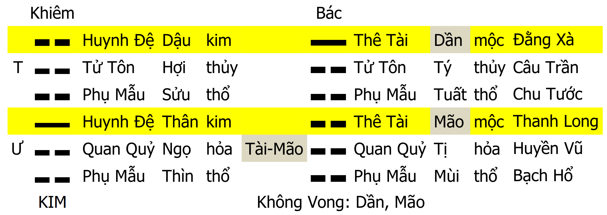
      - **Hình này chứng minh điều gì**
        - Chứng minh con trai bị viêm dạ dày cấp tính do ăn phải thức ăn không hợp, bệnh thuyên giảm ngay trong ngày.
      - **Từ đâu mà thấy được**
        - Dụng thần hào 5 Tử Tôn Hợi thủy lâm Câu Trần được Nhật tỉ phù; Huynh Đệ lưỡng động hóa Tài lâm Tuần Không.
- Các bước suy luận và căn cứ dự trắc:
  - Xác định Dụng thần: Cha xem bệnh cho con trai lấy hào Tử Tôn làm Dụng thần (hào 5 Tử Tôn Hợi thủy trì Thế).
  - Đánh giá tiên lượng cát hung:
    - Dụng thần Tử Tôn Hợi thủy được Nhật thần Hợi thủy đồng hành tỉ phù trợ lực, khí gốc vững vàng.
    - Kỵ thần Quan Quỷ Ngọ hỏa an tĩnh không phát động, vì thế kết luận bệnh tình không chuyển biến nguy kịch, sẽ bình phục nhanh chóng.
  - Xác định chứng trạng và căn nguyên gây bệnh:
    - Dụng thần Tử Tôn Hợi thủy ngự tại hào 5, hào 5 là bộ vị của dạ dày và lá lách.
    - Dụng thần lâm Câu Trần: Câu Trần chủ về tích trệ, sưng trướng, bụng chướng đầy hơi.
    - Quẻ biến hóa liên hệ cung Đoài (khẩu thiệt, ăn uống).
    - Nguyên thần Huynh Đệ lưỡng động (hào 3 Thân kim và hào 6 Dậu kim đều phát động), hóa ra Thê Tài Dần mộc và Mão mộc ngộ Tuần Không. Thê Tài là đồ ăn thức uống, biến hóa ngộ Không phản ánh nguồn thức ăn nạp vào không sạch, có vấn đề hoặc không thích hợp.
    - Kết luận: Do ăn uống thức ăn không phù hợp dẫn đến phát tác viêm dạ dày cấp tính gây trướng bụng.
- Kết quả ứng nghiệm thực tế:
  - Người con trai đúng là bị viêm dạ dày cấp tính do ăn phải thức ăn không hợp; ngay trong ngày Tân Hợi bệnh tình đã thuyên giảm và chuyển biến tốt hẳn lên.

#### Ví dụ 3: Nam đoán sự nghiệp và sức khỏe (Trạch Lôi Tùy biến Lôi Hỏa Phong - Teo dạ dày và viêm quanh khớp vai)
- Bối cảnh và quẻ tượng:
  - Ngày Đinh Mão tháng Tuất, một người nam đến gieo quẻ xem về tiền đồ sự nghiệp kết hợp xem tình hình sức khỏe, được quẻ Trạch Lôi Tùy biến Lôi Hỏa Phong (Mộc cung, Tuần Không: Tuất, Hợi).
  - Đương sự đoán sự nghiệp và sức khỏe được quẻ Trạch Lôi Tùy biến Lôi Hỏa Phong:
    - **Hình 236.** Sơ đồ quẻ Trạch Lôi Tùy biến Lôi Hỏa Phong
      - 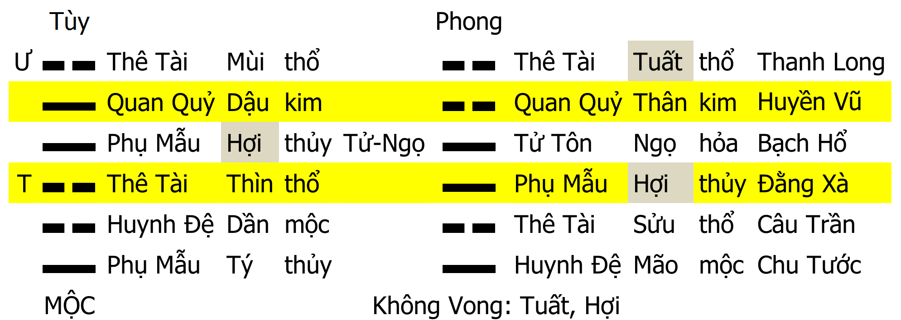
      - **Hình này chứng minh điều gì**
        - Chứng minh đương sự mắc chứng viêm teo niêm mạc dạ dày kết hợp viêm quanh khớp vai.
      - **Từ đâu mà thấy được**
        - Thế hào 3 Thê Tài Thìn thổ Nguyệt phá, Nhật khắc, lâm Đằng Xà động hóa Không; hào 5 Quan Quỷ Dậu kim hợp Thế.
- Các bước suy luận và căn cứ dự trắc:
  - Nguyên tắc kết hợp xem sức khỏe: Khi dự đoán sự nghiệp vẫn có thể bao hàm thông tin sức khỏe, tuy nhiên cách nắm bắt cát hung có điểm phân biệt so với một quẻ chuyên tâm hỏi bệnh.
  - Phán đoán chứng bệnh teo dạ dày:
    - Hào Thế ngự tại hào 3 Thê Tài Thìn thổ, bị Nguyệt kiến Tuất thổ tương xung làm cho Nguyệt phá, đồng thời bị Nhật thần Mão mộc tương khắc.
    - Hào vị 3 là bộ vị dạ dày; ngũ hành Thổ cũng là dạ dày. Nguyệt phá lại bị Nhật khắc là dấu hiệu chắc chắn của bệnh dạ dày.
    - Hào Thế lâm Đằng Xà: Đằng Xà chủ về co quắp, biến dạng, thu nhỏ lại.
    - Hào Thế Thìn thổ phát động hóa ra Phụ Mẫu Hợi thủy lâm Tuần Không: tượng động hóa Không biểu thị sự hao hụt, mất mát một phần cơ chất.
    - Tổ hợp co rút, hao hụt mô cơ tại hào 3 Thổ bị phá khắc khẳng định đương sự bị chứng teo niêm mạc dạ dày (viêm teo dạ dày).
  - Phán đoán chứng bệnh khớp vai đi kèm:
    - Hào 5 Quan Quỷ Dậu kim lâm Huyền Vũ, hình thành thế tương hợp với hào Thế Thìn thổ (Thìn Dậu lục hợp).
    - Hào 5 thuộc bộ vị vai; ngũ hành Kim chủ về khớp xương; Huyền Vũ chủ về tà khí phong thấp, dịch viêm. Hào 5 Kim lâm Huyền Vũ là tượng điển hình của viêm quanh khớp vai.
    - Do Quan Quỷ hợp chặt vào hào Thế nên chứng bệnh này quấy nhiễu, bám rễ trên thân thể đương sự.
- Kết quả ứng nghiệm thực tế:
  - Người này xác nhận trên thực tế bản thân đúng là mắc cả chứng viêm teo dạ dày lẫn chứng viêm quanh khớp vai.

#### Ví dụ 4: Nữ đoán bệnh của đồng nghiệp (Chấn Vi Lôi biến Lôi Hỏa Phong - Loét dạ dày)
- Bối cảnh và quẻ tượng:
  - Ngày Đinh Sửu tháng Tuất, một người nữ gieo quẻ dự đoán bệnh tình cho đồng nghiệp, được quẻ Chấn Vi Lôi biến Lôi Hỏa Phong (Mộc cung, Tuần Không: Thân, Dậu).
  - Người nữ hỏi bệnh cho đồng nghiệp được quẻ Chấn Vi Lôi biến Lôi Hỏa Phong:
    - **Hình 237.** Quẻ Chấn Vi Lôi biến Lôi Hỏa Phong
      - 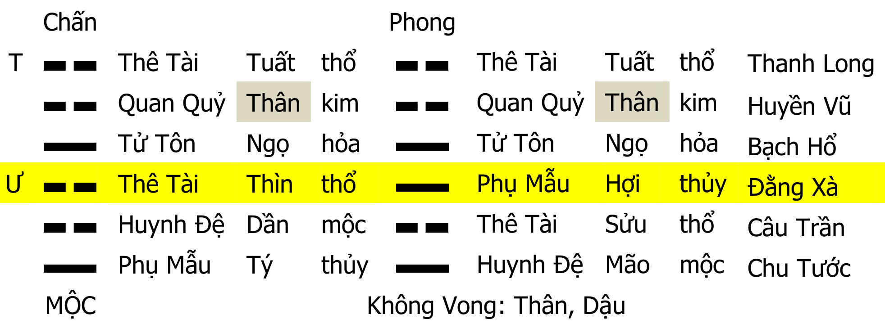
      - **Hình này chứng minh điều gì**
        - Chứng minh người đồng nghiệp mắc chứng bệnh viêm loét dạ dày (niêm mạc dạ dày bị lở loét).
      - **Từ đâu mà thấy được**
        - Ứng hào 3 Thê Tài Thìn thổ bị Nguyệt phá; Thìn thổ phát động hóa Phụ Mẫu Hợi thủy mang tượng loét rò dịch.
- Các bước suy luận và căn cứ dự trắc:
  - Xác định Dụng thần: Hỏi bệnh cho đồng nghiệp (quan hệ ngang vai) lấy hào Ứng làm Dụng thần.
  - Phân tích vị trí và biến động bệnh lý:
    - Hào Ứng ngự tại hào 3 Thê Tài Thìn thổ, bị Nguyệt kiến Tuất thổ tương xung thành Nguyệt phá.
    - Hào 3 là bộ vị dạ dày, ngũ hành Thổ cũng là dạ dày.
    - Tượng Nguyệt phá chủ về rách vỡ, lở loét, tổn thương cấu trúc.
    - Hào Thìn thổ phát động hóa ra Phụ Mẫu Hợi thủy: Thổ động hóa Thủy là tượng dịch mủ rỉ ra, vết thương loét sâu tiết dịch vị.
  - Đối chiếu phương pháp luận so với Ví dụ 3:
    - Quẻ này có cấu trúc biến quái giống Ví dụ 3 (đều biến Lôi Hỏa Phong và có hào 3 Thìn thổ động hóa Hợi thủy).
    - Khác biệt then chốt: Ở Ví dụ 3, Thìn thổ Nguyệt phá nhưng được hào động Quan Quỷ Dậu kim tương hợp (hợp phá giải phá), do đó không luận là lở loét mà luận là teo dạ dày (theo tượng Đằng Xà).
    - Ngược lại ở Ví dụ 4, hào 3 Thìn thổ bị Nguyệt phá hoàn toàn không có lực tương hợp cứu vãn, lại động hóa Thủy nên quyết đoán chắc chắn là bệnh loét dạ dày.
- Kết quả ứng nghiệm thực tế:
  - Người đồng nghiệp đi khám bệnh, kết quả chuẩn đoán xác nhận chính xác bị viêm loét dạ dày.

#### Ví dụ 5: Đoán bệnh của anh họ (Sơn Trạch Tổn - Ung thư dạ dày)
- Bối cảnh và quẻ tượng:
  - Ngày Ất Mão tháng Dậu, một người đến gieo quẻ hỏi về bệnh tật của anh họ, được quẻ Sơn Trạch Tổn (Cấn cung, Tuần Không: Tý, Sửu).
  - Đương sự hỏi bệnh nan y cho người anh họ được quẻ Sơn Trạch Tổn:
    - **Hình 238.** Quẻ Sơn Trạch Tổn
      - 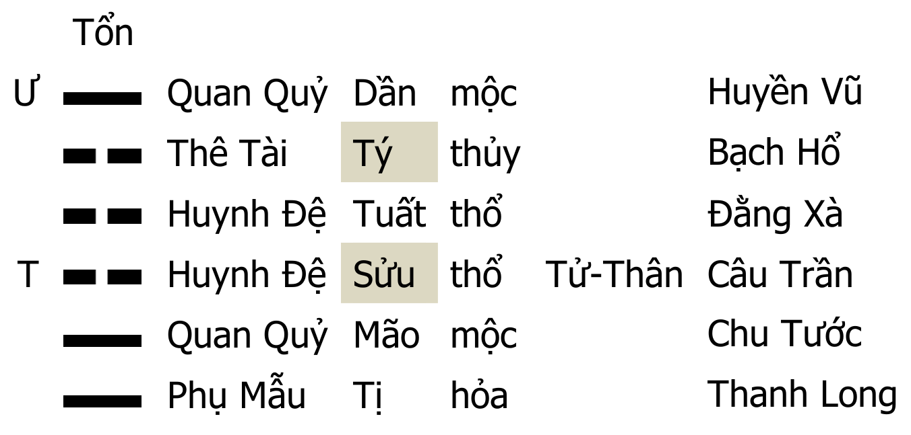
      - **Hình này chứng minh điều gì**
        - Chứng minh người anh họ mắc căn bệnh ác tính ung thư dạ dày.
      - **Từ đâu mà thấy được**
        - Huynh Đệ Sửu thổ hào 3 lâm Tuần Không, hưu tù, bị Nhật Mão mộc khắc; hào 3 Thổ là dạ dày; lâm Câu Trần chủ khối u.
- Các bước suy luận và căn cứ dự trắc:
  - Xác định Dụng thần: Xem bệnh cho anh họ lấy hào Huynh Đệ làm Dụng thần.
  - Xử lý Dụng thần lưỡng hiện: Trong quẻ có hào 4 Huynh Đệ Tuất thổ và hào 3 Huynh Đệ Sửu thổ; chọn hào Huynh Đệ Sửu thổ lâm Tuần Không làm Dụng thần chính vì hào ngộ Không phản ánh rõ nét trạng thái suy vi bệnh hoạn.
  - Phân tích suy vượng và hung sát:
    - Dụng thần Huynh Đệ Sửu thổ ở tháng Dậu là tiết khí hưu tù, ngộ Tuần Không, lại bị Nhật thần Mão mộc tương khắc dữ dội.
    - Hào 3 là bộ vị dạ dày; ngũ hành Sửu thổ cũng chủ quản dạ dày.
    - Hào Sửu thổ lâm Câu Trần: Câu Trần chủ về khối u cục, chai cứng, bệnh ác tính.
    - Dụng thần Thổ tại hào 3 dạ dày suy bại kiệt cùng, ngộ Không bị khắc phạt lại lâm Câu Trần khối u, kết luận bị ung thư dạ dày.
- Kết quả ứng nghiệm thực tế:
  - Người anh họ trên thực tế bị chẩn đoán mắc bệnh ung thư dạ dày.

#### Ví dụ 6: Nam tự đoán bệnh bản thân (Địa Phong Thăng biến Khôn Vi Địa - Viêm dạ dày mãn tính tái phát)
- Bối cảnh và quẻ tượng:
  - Ngày Quý Mùi tháng Hợi, một người nam tự gieo quẻ dự trắc bệnh tật của bản thân, được quẻ Địa Phong Thăng biến Khôn Vi Địa (Mộc cung, Tuần Không: Thân, Dậu).
  - Người nam tự gieo quẻ dự đoán bệnh tật được quẻ Địa Phong Thăng biến Khôn Vi Địa:
    - **Hình 239.** Quẻ Địa Phong Thăng biến Khôn Vi Địa
      - 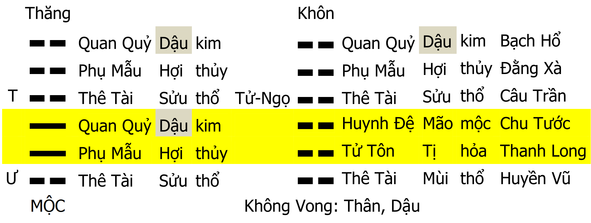
      - **Hình này chứng minh điều gì**
        - Chứng minh đương sự bị viêm dạ dày mãn tính tái phát liên tục; niêm mạc dạ dày sưng tấy đỏ ửng khi nội soi.
      - **Từ đâu mà thấy được**
        - Thế hào 4 Sửu thổ bị Nhật xung, Thế là Quỷ khố; hào 3 Quan Quỷ Dậu kim lâm Chu Tước động; nội quái Phản ngâm.
- Các bước suy luận và căn cứ dự trắc:
  - Xác định Dụng thần: Tự xem bệnh của chính mình lấy hào Thế làm Dụng thần.
  - Phân tích trạng thái hào Thế:
    - Hào Thế Thê Tài Sửu thổ cư tại hào 4, bị Nhật thần Mùi thổ tương xung (Sửu Mùi tương xung), phản ánh tình trạng cơ thể dao động bất an, sức khỏe không ổn định.
    - Sửu thổ là Kim khố, mà ngũ hành Kim trong quẻ chính là Quan Quỷ Dậu kim, do đó hào Thế chính là Quỷ khố (trong bản thân đang dung chứa mầm bệnh tiềm ẩn).
  - Xác định bộ vị và tính chất bệnh:
    - Quan Quỷ Dậu kim cư tại hào 3 phát động hóa ra Huynh Đệ Mão mộc.
    - Hào 3 và hào 4 đều là hào vị dạ dày; Thổ chủ dạ dày; Huynh Đệ cũng chủ về hoạt động tiêu hóa dạ dày.
    - Hào 3 Quan Quỷ lâm Chu Tước: Chu Tước thuộc Hỏa, chủ về sắc đỏ và chứng viêm nhiễm. Vì vậy xác định chắc chắn mắc bệnh viêm dạ dày.
  - Phán đoán quy luật phát tác qua tượng quẻ Phản ngâm:
    - Nội quái Tốn mộc động biến Khôn thổ tạo thành cục diện Phản ngâm (Tốn biến Khôn tương phản).
    - Phản ngâm trong đoán bệnh biểu thị bệnh tình day dẳng, lặp đi lặp lại nhiều lần, không thể chữa trị dứt điểm tận gốc, lúc đau lúc ngớt.
- Kết quả ứng nghiệm thực tế:
  - Người này mắc bệnh viêm dạ dày nhiều năm, lúc đau lúc không; khi tiến hành nội soi dạ dày, bác sĩ phát hiện toàn bộ niêm mạc trong dạ dày bị viêm sưng phát đỏ.

#### Ví dụ 7: Bà cụ tự đoán bệnh (Địa Hỏa Minh Di biến Lôi Địa Dự - Chán ăn, bệnh dạ dày)
- Bối cảnh và quẻ tượng:
  - Ngày Bính Tuất tháng Dậu, một bà cụ đến gieo quẻ xem tình hình bệnh tật của mình, được quẻ Địa Hỏa Minh Di biến Lôi Địa Dự (Thủy cung, Tuần Không: Ngọ, Mùi).
  - Bà cụ gieo quẻ Địa Hỏa Minh Di biến Lôi Địa Dự tự xem bệnh tật:
    - **Hình 240.** Quẻ Địa Hỏa Minh Di biến Lôi Địa Dự
      - 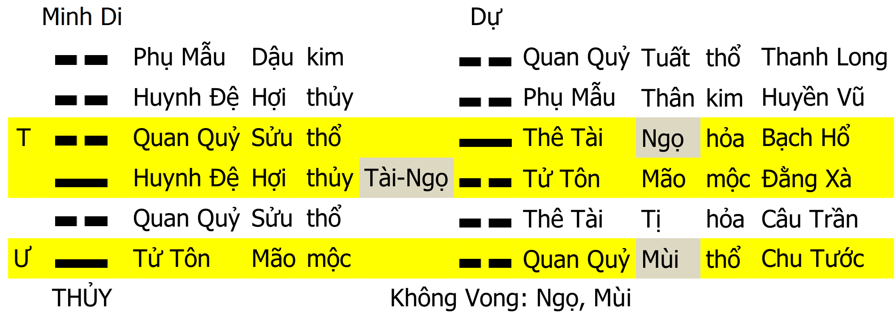
      - **Hình này chứng minh điều gì**
        - Chứng minh bà cụ bị bệnh dạ dày nghiêm trọng kèm tình trạng chán ăn, bỏ ăn do tỳ vị bị mộc cục vây khắc.
      - **Từ đâu mà thấy được**
        - Thế hào 4 Quan Quỷ Sửu thổ lâm Bạch Hổ; Nguyên thần Thê Tài ngộ Không không hiện; Hợi Mão Mùi hợp Mộc cục khắc Thổ.
- Các bước suy luận và căn cứ dự trắc:
  - Xác định Dụng thần: Tự xem bệnh của bản thân lấy hào Thế làm Dụng thần.
  - Nhận diện bệnh chứng trên hào Thế:
    - Hào Thế Quan Quỷ Sửu thổ ngự tại hào 4, lâm Bạch Hổ. Bạch Hổ chủ về đau đớn, tai ương bệnh hoạn.
    - Hào vị 4 là dạ dày; ngũ hành Sửu thổ cũng chủ quản dạ dày. Hào Thế mang Quỷ lâm Bạch Hổ tại vị trí Thổ khẳng định dạ dày có trọng bệnh.
  - Nhận diện chứng chán ăn, không muốn ăn:
    - Nguyên thần sinh trợ hào Thế là Thê Tài (Hỏa sinh Thổ) không xuất hiện trên quẻ (phục tàng dưới hào 3 Huynh Đệ Hợi thủy), đồng thời Thê Tài Ngọ hỏa lại lâm Tuần Không.
    - Thê Tài chủ về thực phẩm, ăn uống. Hào Tài vừa lâm Không vừa phục tàng không hiển lộ là chỉ dấu điển hình của chứng mất cảm giác thèm ăn, chán ghét đồ ăn hoặc không thể nạp thức ăn.
  - Tác động khắc phá ngũ hành:
    - Trong quẻ, hào sơ Tử Tôn Mão mộc phát động hợp cùng hào 3 Huynh Đệ Hợi thủy và hào biến Quan Quỷ Mùi thổ cấu thành bán hợp/tam hợp Mộc cục (hoặc thế Mộc phát động mạnh).
    - Khí Mộc dồn lực tương khắc dữ dội ngũ hành Thổ, làm tỳ vị bị chấn thương nặng nề, từ đó sinh ra bệnh dạ dày cấp tính.
- Kết quả ứng nghiệm thực tế:
  - Bà cụ xác nhận đúng là bản thân đang mắc bệnh dạ dày, người mệt mỏi và hoàn toàn không thể ăn uống được.

#### Ví dụ 8: Con trai đoán bệnh của cha (Địa Phong Thăng biến Lôi Phong Hằng - Loét dạ dày nhập viện)
- Bối cảnh và quẻ tượng:
  - Ngày Mậu Ngọ tháng Hợi, người con trai đến gieo quẻ hỏi về bệnh tình của cha, được quẻ Địa Phong Thăng biến Lôi Phong Hằng (Mộc cung, Tuần Không: Tý, Sửu).
  - Người con trai gieo quẻ Địa Phong Thăng biến Lôi Phong Hằng hỏi bệnh cho cha:
    - **Hình 241.** Sơ đồ quẻ Địa Phong Thăng biến Lôi Phong Hằng
      - 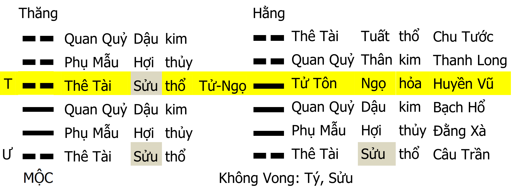
      - **Hình này chứng minh điều gì**
        - Chứng minh người cha bị chứng bệnh loét dạ dày nghiêm trọng phải nhập viện cấp cứu điều trị.
      - **Từ đâu mà thấy được**
        - Dụng thần hào 5 Phụ Mẫu Hợi thủy bị Kỵ thần hào 4 Thê Tài Sửu thổ độc phát khắc; hào 4 Thổ lâm Huyền Vũ chủ lở loét.
- Các bước suy luận và căn cứ dự trắc:
  - Xác định Dụng thần: Đoán bệnh cho cha lấy hào Phụ Mẫu làm Dụng thần.
  - Xử lý Dụng thần lưỡng hiện: Trong quẻ xuất hiện Phụ Mẫu Hợi thủy tại cả hào 2 và hào 5; chọn hào 5 Phụ Mẫu Hợi thủy làm Dụng thần chính vì hào 5 là ngôi vị tôn kính đại diện cho bề trên, phụ thân.
  - Phân tích Kỵ thần độc phát:
    - Kỵ thần Thê Tài Sửu thổ tại hào 4 độc phát (hào động duy nhất trong quẻ), vận chuyển toàn bộ lực khắc phạt nhắm vào Dụng thần Phụ Mẫu Hợi thủy. Hào độc phát chính là tiêu điểm chỉ rõ nguyên nhân và vị trí gây bệnh.
    - Hào 4 đại diện cho vị trí dạ dày; ngũ hành Sửu thổ cũng chủ quản dạ dày, xác định nguyên nhân gây bệnh bắt nguồn từ dạ dày.
    - Hào 4 Sửu thổ lâm Huyền Vũ: Huyền Vũ là biểu tượng của sự ẩm ướt, mưng mủ, lở loét. Do đó kết luận người cha mắc bệnh viêm loét dạ dày.
- Kết quả ứng nghiệm thực tế:
  - Người cha quả nhiên bị viêm loét dạ dày trầm trọng và đã phải nhập viện điều trị.

#### Ví dụ 9: Nam tự đoán bệnh bản thân (Trạch Sơn Hàm biến Trạch Phong Đại Quá - Loét dạ dày và loét tá tràng)
- Bối cảnh và quẻ tượng:
  - Ngày Tân Tị tháng Dần, người đàn ông tự gieo quẻ xem xét tình trạng bệnh tật của mình, được quẻ Trạch Sơn Hàm biến Trạch Phong Đại Quá (Kim cung, Tuần Không: Thân, Dậu).
  - Người nam tự gieo quẻ Trạch Sơn Hàm biến Trạch Phong Đại Quá dự đoán bệnh tật:
    - **Hình 242.** Sơ đồ quẻ Trạch Sơn Hàm biến Trạch Phong Đại Quá
      - 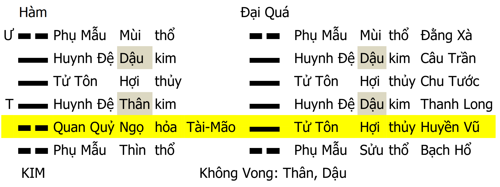
      - **Hình này chứng minh điều gì**
        - Chứng minh đương sự mắc chứng bệnh kép: vừa loét dạ dày vừa viêm loét hành tá tràng.
      - **Từ đâu mà thấy được**
        - Thế hào 3 Thân kim Nguyệt phá; cung Đoài và Huynh Đệ là dạ dày; hào 2 Quan Quỷ Ngọ hỏa lâm Huyền Vũ khắc hào 2 (ruột).
- Các bước suy luận và căn cứ dự trắc:
  - Xác định Dụng thần: Đương sự tự đoán bệnh của bản thân nên lấy hào Thế làm Dụng thần.
  - Phán đoán bệnh loét dạ dày:
    - Hào Thế ngự tại hào 3 Huynh Đệ Thân kim, bị Nguyệt kiến Dần mộc tương xung làm cho Nguyệt phá (Dần Thân tương xung).
    - Hào Thế tuy được Nhật thần Tị hỏa tương hợp (Tị Thân lục hợp để hợp Phá), nhưng bản chất trong hợp có khắc (Tị hỏa hình khắc Thân kim), do đó không thể xem là điềm cát giải thoát được tai ách.
    - Hào 3 là bộ vị dạ dày; quẻ thuộc cung Đoài chủ về miệng và tiêu hóa; hào Huynh Đệ cũng chủ về hoạt động dạ dày. Nguyệt phá mang tượng nứt vỡ, lở loét, khẳng định đương sự bị bệnh viêm loét dạ dày.
  - Phán đoán biến chứng loét tá tràng:
    - Cung Đoài chủ về ruột, ngũ hành Kim cũng chủ về ruột.
    - Hào 2 Quan Quỷ Ngọ hỏa lâm Huyền Vũ phát động khắc ngược lên; hào 2 tượng trưng cho ruột và tá tràng, địa chi Ngọ hỏa tại hào 2 cũng tương ứng với tá tràng.
    - Huyền Vũ chủ về ẩm ướt, lở loét. Tượng Quỷ lâm Huyền Vũ tác động trực tiếp tại hào vị ruột khẳng định đương sự còn bị thêm chứng loét tá tràng.
- Kết quả ứng nghiệm thực tế:
  - Người bệnh đi bệnh viện nội soi tổng quát, kết quả xác nhận đúng là đang bị cả viêm loét dạ dày lẫn viêm loét hành tá tràng.

#### Ví dụ 10: Con đoán bệnh của cha (Phong Hỏa Gia Nhân biến Thiên Lôi Vô Vọng - Ung thư dạ dày)
- Bối cảnh và quẻ tượng:
  - Ngày Kỷ Hợi tháng Sửu, một người đến gieo quẻ hỏi về tình hình bệnh tật của cha mình, được quẻ Phong Hỏa Gia Nhân biến Thiên Lôi Vô Vọng (Tốn cung, Tuần Không: Thìn, Tị).
- Các bước suy luận và căn cứ dự trắc:
  - Xác định Dụng thần: Đoán bệnh cho cha lấy hào Phụ Mẫu làm Dụng thần. Trong quẻ có Phụ Mẫu Hợi thủy ngự tại hào 3 làm Dụng thần chính.
  - Phân tích hung sát bao vây Dụng thần:
    - Phụ Mẫu Hợi thủy tuy được Nhật thần Hợi thủy đồng hành tỉ phù trợ lực, nhưng hào này lại phát động hóa ra Thê Tài Thìn thổ hồi đầu khắc phạt (Thìn thổ khắc Hợi thủy). Đây là tượng "Nhật thần biến hoại", cực kỳ hung hiểm bất tường.
    - Nguyệt kiến Sửu thổ khắc phạt Dụng thần.
    - Hào 4 Thê Tài Mùi thổ lại phát động cùng lao đến khắc Dụng thần.
    - Dụng thần Hợi thủy bị ngũ hành Thổ (Sửu, Mùi, Thìn) bao vây tầng tầng lớp lớp, chứng tỏ bệnh tật nhất định hiển lộ rõ nét ở thuộc tính của ngũ hành Thổ.
  - Xác định bộ vị và tính chất nan y:
    - Dụng thần cư tại hào 3 là bộ vị dạ dày; ngũ hành Thổ vây khắc cũng chủ quản dạ dày.
    - Dụng thần hưu tù phát động hóa Thìn thổ là tượng Thủy nhập Mộ khố; trong dự đoán bệnh tật, Dụng thần suy kiệt mà động hóa Mộ là dấu hiệu điển hình của bệnh ung thư (khối u ác tính giam hãm nguyên khí).
    - Tổng hợp các yếu tố khẳng định người cha mắc bệnh ung thư dạ dày giai đoạn trầm trọng.
- Kết quả ứng nghiệm thực tế:
  - Người cha đi kiểm tra y tế chuyên sâu, kết quả xác nhận chính xác mắc bệnh ung thư dạ dày.

### 15. BỆNH RUỘT

#### Đặc điểm sinh lý và phân loại bệnh đường ruột
- Sinh lý tiêu hóa và tống xuất cặn bã qua đường ruột:
  - Thức ăn sau khi trải qua quá trình nhào trộn và tiêu hóa ban đầu tại dạ dày sẽ được chuyển xuống đường ruột để tiếp tục phân giải, hấp thu chất dinh dưỡng và cuối cùng đào thải cặn bã ra khỏi cơ thể.
  - Cấu trúc giải phẫu đường ruột vận hành tuần tự từ ruột non (gồm tá tràng, hỗng tràng, hồi tràng), đại tràng cho đến trực tràng.
- Phân loại các bệnh lý đường ruột thường gặp trên lâm sàng:
  - Bệnh lý có thể phát sinh tại bất kỳ phân đoạn giải phẫu nào của ống tiêu hóa dưới.
  - Các dạng bệnh lý đường ruột chủ yếu gồm có loét tá tràng, viêm ruột cấp hoặc mạn tính, ung thư đại tràng, ung thư trực tràng, viêm ruột thừa, táo bón, tiêu chảy và kiết lỵ.

#### Quy tắc quái tượng thủ tượng bệnh đường ruột
- Thủ tượng qua phương diện quái cung:
  - Bệnh đường ruột có mối liên hệ mật thiết với cung Càn, cung Đoài và cung Ly.
  - Cung Càn và cung Đoài thuộc hành kim, biểu thị đại tràng; cung Ly thuộc hành hỏa, biểu thị ruột non; cả ba quái cung này đều chứa đựng thông tin đặc trưng của đường ruột.
- Thủ tượng qua phương diện hào vị:
  - Hào 2 và hào 3 trong quẻ là hai hào vị chủ quản vùng bụng dưới và đường ruột.
  - Khi hai hào vị này xuất hiện biến động, gặp khắc thương hoặc lâm phục tàng thì mầm mống bệnh tật tập trung tại ruột.
- Thủ tượng qua phương diện ngũ hành:
  - Hành kim: Đại diện cho đại tràng, liên quan đến chức năng bài tiết và chuyển hóa phân.
  - Hành hỏa: Đại diện cho ruột non, gắn liền với chức năng tiêu hóa tinh chất thức ăn.
  - Hành mộc: Đại diện cho hình thể ống tiêu hóa dài, nhỏ uốn lượn, có cấu trúc giải phẫu tương đồng với đường ruột.
- Thủ tượng qua phương diện lục thần:
  - Lục thần Đằng Xà liên quan trực tiếp nhất đến đường ruột vì Đằng Xà mang tượng hình vật nhỏ và dài uốn khúc.
- Thủ tượng qua phương diện lục thân:
  - Hào Tử Tôn là ruột vì Tử Tôn đại diện cho tạng phủ tiêu hóa, đường tiết thoát và hấp thu thức ăn.
  - Hào Tài khố (kho tàng Thê Tài) cũng đại diện cho ruột, là nơi chứa đựng phân và chất bã sau tiêu hóa.
- Quái lệ minh họa quy tắc thủ tượng đường ruột:
  - **Hình 243.** Sơ đồ quẻ Phong Hỏa Gia Nhân biến Thiên Lôi Vô Vọng
    - 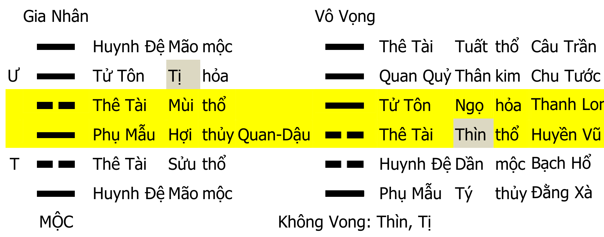
    - **Hình này chứng minh điều gì**
      - Minh họa mối tương quan giữa quái cung Ly hỏa, hào vị đường ruột và lục thân đại diện cho tiêu hóa.
    - **Từ đâu mà thấy được**
      - Nội quái Ly hỏa chủ ruột non, hào vị 2 và 3 chủ ruột, hào Tử Tôn và Tài khố phản ánh chức năng tiêu hóa bài tiết.
  - **Phán đoán chi tiết:**
    - Căn cứ: Quái cung Ly chủ ruột non; hào 2 và hào 3 là hào vị đường ruột; Tử Tôn chủ ruột và sự tiêu hóa, Tài khố là nơi chứa cặn bã tiêu hóa.
    - Nhìn vào: Cấu trúc biến đổi giữa Phong Hỏa Gia Nhân và Thiên Lôi Vô Vọng thể hiện sự phân định tạng phủ và tống xuất thức ăn qua đường tiêu hóa.
  - **Ứng nghiệm thực tế:**
    - Xác lập cơ sở định vị phân đoạn ruột non, đại tràng và trạng thái phân ứ trệ qua hệ thống quái tượng Lục Hào.

#### Triệu chứng bệnh lý qua lục thần và trạng thái hào
- Quy luật phán đoán chi tiết tính chất bệnh lý qua lục thần phối hợp hào vị:
  - Nguyệt phá lâm Huyền Vũ: Phần lớn chủ về lở loét niêm mạc ruột, loét tá tràng hoặc hoại tử xuất tiết.
  - Thanh Long: Chủ về đau thắt bụng, quặn thắt đường ruột do co thắt nhu động.
  - Chu Tước: Chủ về phản ứng viêm sưng, nóng rát, sốt nhiễm khuẩn đường ruột hoặc viêm ruột thừa.
  - Câu Trần: Chủ về trướng bụng đầy hơi, tắc ruột do khối u, ung thư ruột; hào gặp lục hợp hoặc nhập Mộ cũng chủ tắc ruột; nếu Câu Trần lâm hào Thê Tài thì biểu thị ứ đọng phân, táo bón.
  - Đằng Xà: Chủ về dính ruột, xoắn ruột cơ năng, hoặc tổn thương ở đoạn ruột nhỏ hẹp như ruột thừa.
  - Bạch Hổ: Chủ về mưng mủ, áp-xe hoại tử, xuất huyết tiêu hóa, đi ngoài ra máu.
  - Huyền Vũ: Chủ về viêm loét sâu, kiết lỵ, đi ngoài phân nhầy máu mũi hoặc tiêu chảy nhiễm trùng.

#### Các quái lệ thực tế dự đoán bệnh ruột
- **Ví dụ 1:** Ngày Đinh Dậu tháng Mão, nữ đoán bệnh của bản thân, được Lôi Sơn Tiểu Quá biến Hỏa Địa Tấn.
  - **Hình 244.** Sơ đồ quẻ Lôi Sơn Tiểu Quá biến Hỏa Địa Tấn
    - 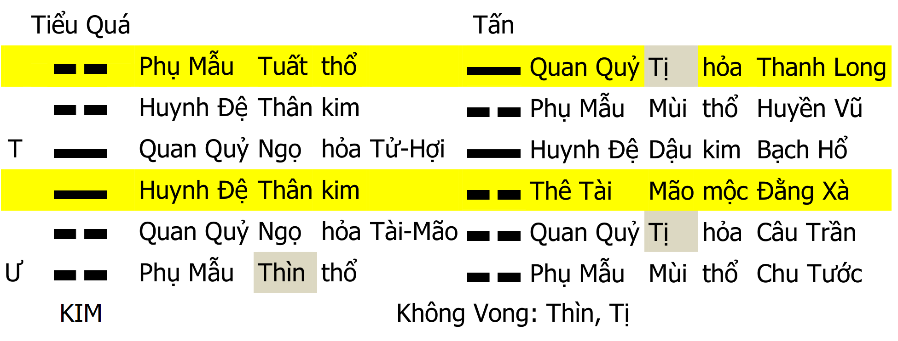
    - **Hình này chứng minh điều gì**
      - Chứng minh người nữ bị mắc chứng viêm ruột.
    - **Từ đâu mà thấy được**
      - Hào Thế làm Dụng thần, Huynh Đệ Thân kim là Bệnh địa lâm Đằng Xà phát động tại hào 3.
  - **Thông tin quẻ tượng và ngũ hành:** Không Vong tại Thìn, Tị.
  - **Phán đoán chi tiết:**
    - Căn cứ: Lấy hào Thế làm Dụng thần; Huynh Đệ Thân kim là Bệnh địa (Bệnh địa chủ bệnh tật); hào 3 là hào vị của ruột; ngũ hành kim đại diện cho đại tràng, ruột; lục thần Đằng Xà có hình dạng dài nhỏ chủ về ruột.
    - Nhìn vào: Hào Thế Quan Quỷ Ngọ hỏa ngự tại hào 4, có Huynh Đệ Thân kim là Bệnh địa ngự tại hào 3 lâm Đằng Xà phát động biến Thê Tài Mão mộc; sự hội tụ giữa Bệnh địa, hào vị 3, ngũ hành kim và Đằng Xà chỉ rõ ổ bệnh phát sinh ở đường ruột, hào động chủ phát tác viêm nhiễm.
  - **Ứng nghiệm thực tế:**
    - Trên thực tế, người bệnh đúng là bị viêm ruột.
- **Ví dụ 2:** Ngày Mậu Tuất tháng Tuất, nữ đoán bệnh của cha, được Địa Lôi Phục biến Sơn Địa Bác.
  - **Hình 245.** Sơ đồ quẻ Địa Lôi Phục biến Sơn Địa Bác
    - 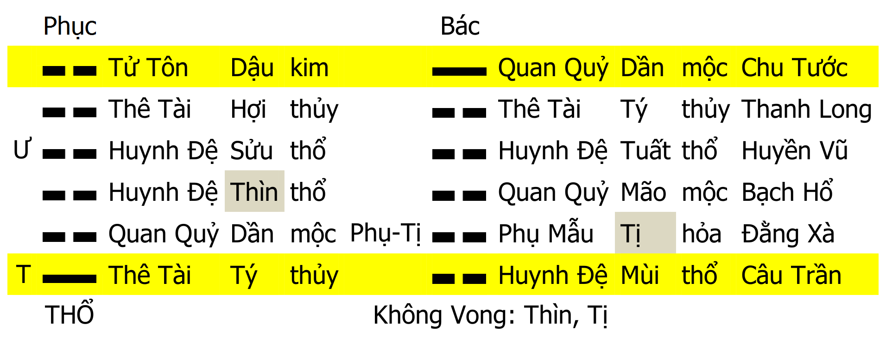
    - **Hình này chứng minh điều gì**
      - Chứng minh người cha bị mắc chứng tắc ruột cấp tính, đường tiêu hóa không thông.
    - **Từ đâu mà thấy được**
      - Dụng thần Phụ Mẫu Tị hỏa phục tại hào 2 lâm Đằng Xà, bị hào sơ động khắc, nhập Mộ ở Nhật Tuất thổ và Kỵ thần lâm Câu Trần.
  - **Thông tin quẻ tượng và ngũ hành:** Không Vong tại Thìn, Tị.
  - **Phán đoán chi tiết:**
    - Căn cứ: Lấy hào Phụ Mẫu làm Dụng thần đoán cho cha; hào 2 là hào vị đường ruột; ngũ hành hỏa là ruột non; Đằng Xà tượng trưng cho ruột; nhập Mộ biểu thị sự giam hãm, tắc nghẽn không thông suốt; Câu Trần chủ trướng khí, ngưng trệ, bít tắc.
    - Nhìn vào: Phụ Mẫu Tị hỏa Tuần Không phục dưới hào 2 Quan Quỷ Dần mộc, lâm Đằng Xà, bị hào sơ Thê Tài Tý thủy lâm Câu Trần động hóa Huynh Đệ Mùi thổ đến khắc; Dụng thần Tị hỏa nhập Mộ tại Nhật kiến Tuất thổ là tượng ruột không thông; Kỵ thần lâm Câu Trần phát động khắc phạt là tượng bế tắc ngưng trệ, kết luận chính xác là bệnh tắc ruột.
  - **Ứng nghiệm thực tế:**
    - Trên thực tế, người cha được chẩn đoán và xác nhận chính xác là bị tắc ruột.
- **Ví dụ 3:** Ngày Ất Hợi tháng Dần, nữ đoán bệnh của mẹ, được Trạch Địa Tụy biến Thủy Địa Tỷ.
  - **Hình 246.** Sơ đồ quẻ Trạch Địa Tụy biến Thủy Địa Tỷ
    - 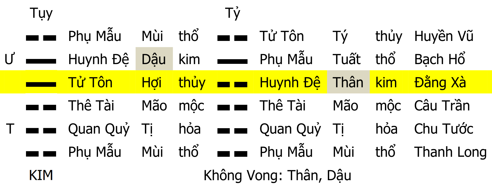
    - **Hình này chứng minh điều gì**
      - Chứng minh người mẹ bị ung thư trực tràng nghiêm trọng.
    - **Từ đâu mà thấy được**
      - Dụng thần Phụ Mẫu hưu tù, quẻ thuộc Đoài kim, hào độc phát Tử Tôn Hợi thủy lâm Đằng Xà, Nguyên thần hào 2 bị khắc lâm Tuyệt, Kỵ thần hào 3 lâm Câu Trần.
  - **Thông tin quẻ tượng và ngũ hành:** Không Vong tại Thân, Dậu.
  - **Phán đoán chi tiết:**
    - Căn cứ: Lấy hào Phụ Mẫu làm Dụng thần đoán cho mẹ; quẻ thuộc cung Đoài (Đoài chủ ruột); hào độc phát biểu thị căn nguyên và tính chất bệnh tật; Tử Tôn là ruột; Đằng Xà là ruột; Câu Trần chủ khối u bướu, xơ cứng, ung thư; Nguyên thần lâm Tuyệt biểu thị sinh lực suy kiệt.
    - Nhìn vào: Dụng thần Phụ Mẫu Mùi thổ bị Nguyệt kiến Dần mộc khắc thương, Nhật thần Hợi thủy không sinh phù nên hưu tù suy kiệt; quẻ có hào 4 Tử Tôn Hợi thủy độc phát lâm Đằng Xà hóa Huynh Đệ Thân kim (Tử Tôn và Đằng Xà đều chủ ruột); Nguyên thần Phụ Mẫu là Quan Quỷ Tị hỏa lâm hào 2 bị Nhật xung phá và tuyệt ở Hợi; Kỵ thần Thê Tài Mão mộc tại hào 3 lâm Câu Trần (khối u tại hào vị ruột) nên kết luận mắc ung thư ruột.
  - **Ứng nghiệm thực tế:**
    - Trên thực tế, người mẹ mắc ung thư trực tràng.
- **Ví dụ 4:** Ngày Kỷ Mùi tháng Tị, nam đoán bệnh của bản thân, được Trạch Địa Tụy biến Lôi Thủy Giải.
  - **Hình 247.** Sơ đồ quẻ Trạch Địa Tụy biến Lôi Thủy Giải
    - 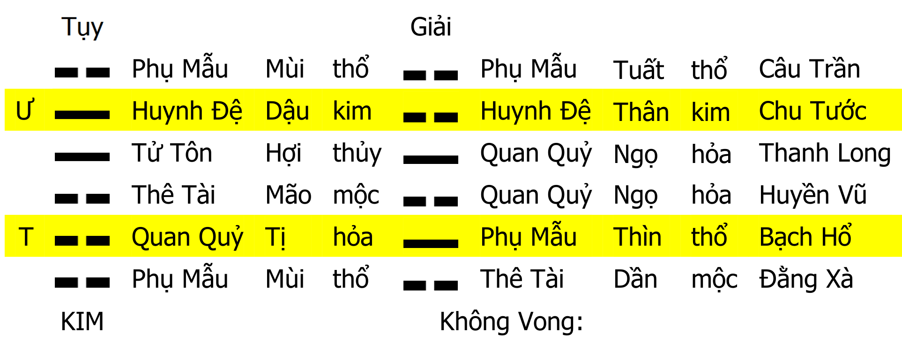
    - **Hình này chứng minh điều gì**
      - Chứng minh người nam bị viêm ruột mãn tính và kiết lỵ kéo dài.
    - **Từ đâu mà thấy được**
      - Hào Thế lâm hào 2 Bạch Hổ, quẻ thuộc Đoài kim, Nguyên thần nhập Mộ bị khắc, lâm Chu Tước chủ viêm và Huyền Vũ chủ kiết lỵ.
  - **Thông tin quẻ tượng và ngũ hành:** Không Vong tại Tý, Sửu.
  - **Phán đoán chi tiết:**
    - Căn cứ: Lấy hào Thế làm Dụng thần; hào 2 là hào vị đường ruột; quẻ Tụy thuộc cung Đoài chủ đại tràng; ngũ hành hỏa chủ ruột non; Bạch Hổ chủ bệnh tật đau đớn; Chu Tước chủ viêm sưng; Huyền Vũ chủ kiết lỵ, phân lẫn chất nhầy mủ.
    - Nhìn vào: Hào Thế Quan Quỷ Tị hỏa đóng tại hào 2 lâm Bạch Hổ phát động, Tị hỏa tại cung Đoài vừa ứng hào vị vừa ứng ngũ hành ruột; Nguyên thần của Thế là Thê Tài Mão mộc tại hào 3 nhập Mộ tại Nhật kiến Mùi thổ không thể sinh trợ Thế; hào Thế lại bị hào biến lâm Chu Tước tương khắc (chủ viêm); mặt khác Nguyên thần lâm Huyền Vũ cũng chủ bệnh kiết lỵ nên phán đoán người này bị viêm ruột kèm kiết lỵ kéo dài.
  - **Ứng nghiệm thực tế:**
    - Trên thực tế, người nam bị viêm ruột mạn tính, đại tiện thường xuyên bị kiết lỵ.
- **Ví dụ 5:** Ngày Ất Mão tháng Dậu, nữ đoán bệnh của chồng, được Hỏa Trạch Khuê biến Sơn Thủy Mông.
  - **Thông tin quẻ tượng và ngũ hành:** Không Vong tại Tý, Sửu.
  - **Phán đoán chi tiết:**
    - Căn cứ: Lấy hào Quan Quỷ làm Dụng thần đoán bệnh cho chồng; hào 2 là hào vị đường ruột; ngũ hành kim đại diện cho ruột; Đằng Xà là tượng vật nhỏ và dài uốn khúc; sự kết hợp giữa kim và Đằng Xà mang ý nghĩa ruột thừa.
    - Nhìn vào: Dụng thần Quan Quỷ Mão mộc ngự tại hào 2 bị Nguyệt kiến Dậu kim xung phá thành Nguyệt phá; đó là điềm bị kim xung khắc làm tổn thương nặng nề; trong quẻ hào 4 Tử Tôn Dậu kim lâm Đằng Xà phát động khắc Dụng thần, Dậu kim là ruột, lâm Đằng Xà là vật nhỏ dài trong ruột (ruột thừa); Nguyệt phá lâm hào 2 chủ viêm sưng cấp hoại tử nên phán đoán mắc bệnh viêm ruột thừa.
  - **Ứng nghiệm thực tế:**
    - Trên thực tế, người chồng bị viêm ruột thừa cấp tính, đã tiến hành phẫu thuật cắt bỏ vào ngày Canh Thìn.
- **Ví dụ 6:** Ngày Đinh Tị tháng Thìn, nam đoán bệnh của bản thân, được Lôi Sơn Tiểu Quá biến Hỏa Địa Tấn.
  - **Thông tin quẻ tượng và ngũ hành:** Không Vong tại Tý, Sửu.
  - **Phán đoán chi tiết:**
    - Căn cứ: Lấy hào Thế làm Dụng thần; Bệnh địa đại diện cho bệnh tật; hào 3 là hào vị đường ruột; ngũ hành kim là ruột; Đằng Xà chủ ruột và chủ sự ít ỏi (thiểu); Huynh Đệ hóa Thê Tài là tượng cưỡng ép đại tiện (Tài là phân và nước tiểu); hợp níu chân là bế tắc; Bạch Hổ chủ huyết dịch.
    - Nhìn vào: Hào Thế Quan Quỷ Ngọ hỏa tại hào 4; hào 3 Huynh Đệ Thân kim là Bệnh địa phát động hóa Thê Tài Mão mộc; Thân kim tại hào 3 lâm Đằng Xà hội tụ tượng ruột và lượng phân ít ỏi; Huynh Đệ hóa Tài chủ cưỡng ép đại tiện tống xuất cặn bã nhưng hào động Thân kim lại bị Nhật kiến Tị hỏa hợp chặt (Tị Thân lục hợp) khiến muốn hóa Tài mà không thể hóa thông suốt, sinh ra chứng táo bón nặng; đồng thời hào Thế lâm Bạch Hổ chủ huyết dịch nên phân khó tống ra ngoài và có kèm theo máu.
  - **Ứng nghiệm thực tế:**
    - Trên thực tế, người này bị táo bón nặng, đại tiện vô cùng khó khăn, sau khi rặn ra được thì đi kèm theo máu.

### 16. BỆNH GAN

#### Đặc điểm giải phẫu, chức năng sinh lý và phân loại bệnh gan
- Vị trí giải phẫu và chức năng sinh lý của tạng can:
  - Gan nằm ở vùng giáp giới giữa ngực và bụng, đảm nhiệm vai trò dự trữ dưỡng chất dư thừa và thanh lọc, đào thải độc tố gây hại ra khỏi cơ thể.
  - Gan tiếp nhận oxy và dưỡng chất từ hệ thống động mạch, thực hiện chức năng tàng trữ huyết dịch (can tàng huyết).
  - Phổ bệnh lý lâm sàng phổ biến ở gan: các dạng viêm gan (viêm gan A, B, C,...), xơ gan, gan nhiễm mỡ, phì đại gan (gan to), ung thư gan.
- Minh họa đồ hình quẻ liên hệ tạng phủ, cơ chế tàng huyết và bài tiết độc tố:
  - Đồ hình quẻ tham chiếu biến đổi khí huyết và tạng phủ:
    - **Hình 248.** Quẻ Hỏa Trạch Khuê biến Sơn Thủy Mông
      - 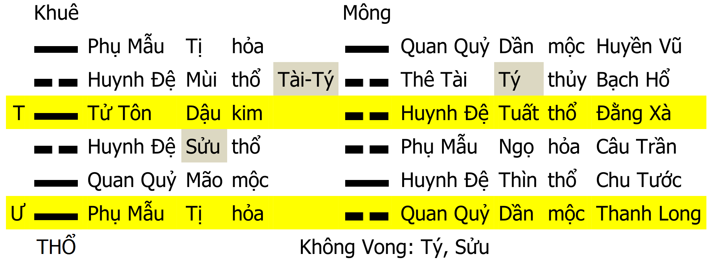
      - **Hình này chứng minh điều gì**
        - Minh họa sự liên hệ biến hóa tạng phủ, cơ chế tàng huyết và bài tiết độc tố của tạng can.
      - **Từ đâu mà thấy được**
        - Căn cứ các hào động trong quẻ Khuê biến Mông thể hiện khí huyết kinh mạch đối ứng tạng can.
  - Đồ hình quẻ tham chiếu biến động chuyển hóa và bài tiết kinh mạch:
    - **Hình 249.** Quẻ Lôi Sơn Tiểu Quá biến Hỏa Địa Tấn
      - 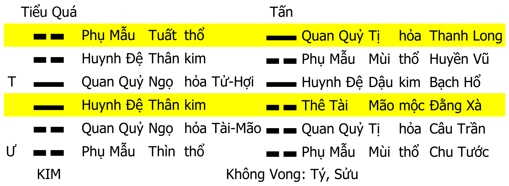
      - **Hình này chứng minh điều gì**
        - Thể hiện sự mất cân bằng chuyển hóa tạng phủ dẫn đến ứ trệ khí huyết và bệnh chứng nội tạng.
      - **Từ đâu mà thấy được**
        - Căn cứ hào động quẻ Tiểu Quá biến Tấn, hào Bệnh địa và lục thân biểu thị trở ngại bài tiết.

#### Quy luật quái tượng và các phương diện dự trắc bệnh gan
- Phương diện quái cung trong dự trắc bệnh gan:
  - Lấy cung Chấn và cung Tốn làm chủ đạo vì cả hai cung đều mang ngũ hành thuộc Mộc, tượng trưng cho tạng can (gan).
- Phương diện ngũ hành và địa chi ứng với bệnh gan:
  - Lấy hành Mộc làm chủ thể: cả Dần mộc và Mão mộc đều đại diện cho gan.
  - Địa chi Sửu thổ cũng đặc thù đại diện cho gan trong hệ thống thủ tượng tạng phủ.
- Phương diện hào vị ứng với vị trí tạng gan:
  - Hào 2 và hào 3 làm chủ quản gan: đây là hai hào vị phản ánh vùng giáp giới ngực và bụng.
  - Phép đoán linh hoạt: một số trường hợp cá biệt không câu nệ cố định vào hào vị mà xem xét biến động tổng thể của quẻ.
- Phương diện lục thân ứng với bệnh gan:
  - Hào Thê Tài và Mộ khố của Tài (Tài khố) là biểu tượng của gan, bởi gan là cơ quan tàng trữ máu (Tài chủ huyết dịch).
  - Tượng gan rõ rệt nhất khi Tài khố lâm Bạch Hổ, hoặc hào Thê Tài lâm Bạch Hổ: Thê Tài chủ máu, Bạch Hổ chủ huyết dịch, Mộ khố mang ý nghĩa tàng trữ.
- Phương diện lục thần định tính chất bệnh lý gan:
  - Thanh Long: chủ về tửu sắc và ẩm thực, báo hiệu bệnh gan phát sinh do lạm dụng rượu bia.
  - Chu Tước: chủ về nhiệt chứng và sưng viêm, báo hiệu bệnh viêm gan.
  - Câu Trần: chủ về ứ trệ, sưng trướng, bướu cục và xơ cứng, báo hiệu bệnh gan to, gan nhiễm mỡ, xơ gan hoặc ung thư gan.
  - Bạch Hổ: chủ về huyết tật và lây nhiễm qua đường máu.
- Phương diện sinh khắc và cơ chế bệnh lý đặc thù:
  - Gan cổ trướng (chướng nước ở bụng do bệnh gan): xuất hiện khi Dụng thần bị Thủy khắc hại hoặc bị Thủy hợp vướng chân gây ứ đọng.
  - Lây nhiễm bệnh viêm gan:
    - Hiện nay việc phân biệt rạch ròi viêm gan A, B, C bằng Lục Hào vẫn còn độ phức tạp nhất định.
    - Dấu hiệu lây nhiễm: Kỵ thần hợp hào Ứng, hoặc xuất hiện quẻ du hồn; nếu được hào Ứng đến sinh là lây nhiễm từ bên ngoài truyền vào; lâm Bạch Hổ là lây truyền qua đường máu.
  - Mối quan hệ giữa Can và Đởm (gan và mật):
    - Gan và mật có quan hệ biểu lý âm dương tương hỗ, đôi khi trên quẻ biểu hiện đan xen khó phân định tuyệt đối.
    - Điểm phân biệt căn bản: gan thuộc âm (tạng), mật thuộc dương (phủ). Hào Mộc lâm Không Vong thường phản ánh thêm bệnh lý ở túi mật.

#### Các quái lệ thực tế dự trắc bệnh gan
- **Ví dụ 1:** Ngày Bính Thìn tháng Hợi, một người đàn ông đoán bệnh của bản thân, được Tốn Vi Phong biến Phong Thủy Hoán.
  - **Hình 250.** Quẻ Tốn Vi Phong biến Phong Thủy Hoán
    - 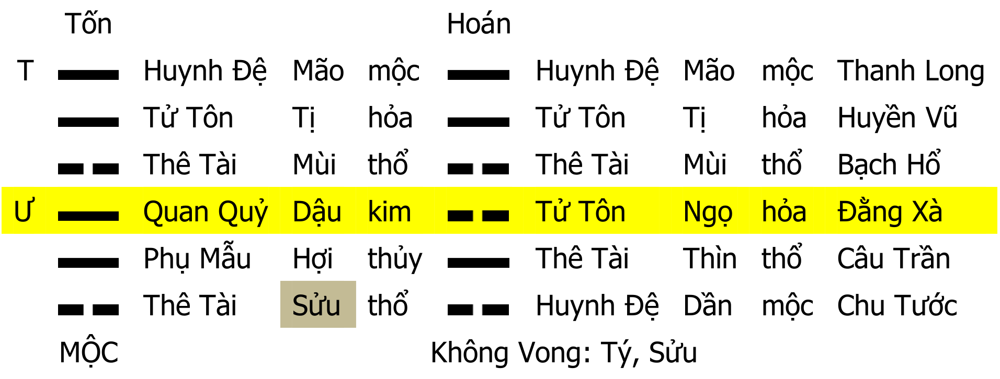
    - **Hình này chứng minh điều gì**
      - Chứng minh hào Thế Mão mộc tại cung Tốn bị hào 3 Quan Quỷ động khắc gây bệnh gan.
    - **Từ đâu mà thấy được**
      - Hào 3 Dậu kim phát động xung khắc hào Thế Mão mộc, hào 3 và mộc đều là gan.
  - **Phán đoán chi tiết:**
    - Căn cứ: Người tự xem bệnh cho bản thân lấy hào Thế làm Dụng thần. Hào Thế mang Mão mộc thuộc hành Mộc, đại diện cho gan mật; quẻ Tốn Vi Phong thuộc cung Tốn thuần Mộc cũng chủ về gan.
    - Nhìn vào: Hào 3 Quan Quỷ Dậu kim phát động biến Tử Tôn Ngọ hỏa hồi đầu khắc, đồng thời Dậu kim phát động trực tiếp xung khắc hào Thế Mão mộc. Hào 3 là hào vị của gan, hào phát động lâm hào vị gan đến khắc Thế khẳng định trên gan có bệnh.
  - **Ứng nghiệm thực tế:**
    - Trên thực tế người đàn ông này bị bệnh viêm gan.
- **Ví dụ 2:** Ngày Ất Dậu tháng Thìn, nữ đoán bệnh của bản thân, được Sơn Trạch Tổn biến Hỏa Địa Tấn.
  - **Hình 251.** Quẻ Sơn Trạch Tổn biến Hỏa Địa Tấn
    - 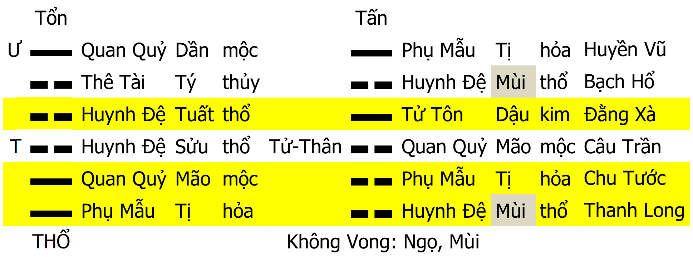
    - **Hình này chứng minh điều gì**
      - Chứng minh Quan Quỷ Mão mộc động khắc hào Thế Sửu thổ tại hào 3 gây bệnh viêm gan.
    - **Từ đâu mà thấy được**
      - Hào 2 Mão mộc phát động khắc Thế Sửu thổ ở hào 3; Mão mộc, Sửu thổ, hào 2, hào 3 đều là gan.
  - **Phán đoán chi tiết:**
    - Căn cứ: Đoán bệnh bản thân lấy hào Thế làm Dụng thần. Hào Thế Huynh Đệ Sửu thổ cư hào 3 được Nguyệt kiến Thìn thổ tỉ phù, Nhật kiến Dậu kim không sinh cũng không khắc nên không rơi vào hưu tù.
    - Nhìn vào: Trong quẻ hào 2 Quan Quỷ Mão mộc phát động trực tiếp khắc hào Thế Sửu thổ. Hào Thế cư hào 3 là hào vị của gan, mang địa chi Sửu thổ tượng trưng cho gan; Quan Quỷ Mão mộc ở hào 2 là hào vị gan lại mang hành Mộc chủ gan phát động khắc hại, tạo thành chuỗi thông tin trùng điệp xác định chắc chắn là bệnh gan.
  - **Ứng nghiệm thực tế:**
    - Người phụ nữ này bị viêm gan B; do người xung quanh lo sợ bị lây nhiễm nên đã xa lánh cô.
- **Ví dụ 3:** Ngày Quý Sửu tháng Dậu, một người đoán bệnh của anh trai, được Thủy Phong Tỉnh biến Khảm Vi Thủy.
  - **Hình 252.** Quẻ Thủy Phong Tỉnh biến Khảm Vi Thủy
    - 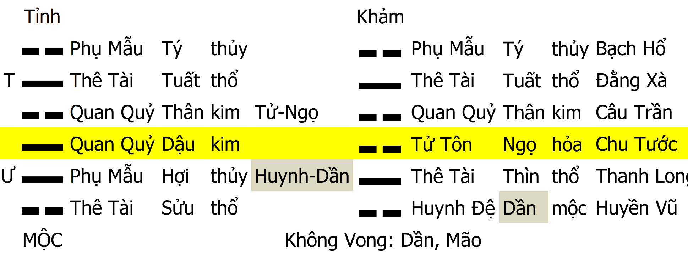
    - **Hình này chứng minh điều gì**
      - Chứng minh Dụng thần Dần mộc phục tàng bị Kỵ thần độc phát khắc hại gây xơ gan nghiêm trọng.
    - **Từ đâu mà thấy được**
      - Dụng thần Dần mộc phục tại hào 2 cung Chấn, Kỵ thần Dậu kim độc phát, Nguyên thần bị Nhật Sửu khắc.
  - **Phán đoán chi tiết:**
    - Căn cứ: Đoán bệnh cho anh trai lấy hào Huynh Đệ làm Dụng thần. Hào Huynh Đệ Dần mộc không xuất hiện trên quẻ, phục tàng dưới hào 2 Phụ Mẫu Hợi thủy; Dụng thần lâm Tuần Không (Không Vong tại Dần, Mão), bị Nguyệt kiến Dậu kim khắc thương, Nhật kiến Sửu thổ không sinh phù.
    - Nhìn vào: Kỵ thần Quan Quỷ Dậu kim tại hào 3 độc phát (động hóa Tử Tôn Ngọ hỏa), khiến Dụng thần lâm cảnh có khắc không sinh, thuộc tượng đại hung. Quẻ thuộc cung Chấn (hành Mộc chủ gan mật), hào 2 là hào vị gan mật, ngũ hành Mộc của Dụng thần cũng là gan mật. Nguyên thần Phụ Mẫu Hợi thủy bị Nhật kiến Sửu thổ khắc hoại (Sửu thổ cũng là gan). Ứng dụng di thần pháp, Kỵ thần Quan Quỷ phối hợp hào 4 Quan Quỷ Thân kim lâm Câu Trần (chủ sưng cứng, xơ hóa, khối u), phán đoán bệnh không phải xơ gan thì chính là ung thư gan.
  - **Ứng nghiệm thực tế:**
    - Trên thực tế người anh trai bị xơ gan.
- **Ví dụ 4:** Ngày Bính Ngọ tháng Sửu, nữ đoán bệnh của bản thân, được Địa Trạch Lâm biến Địa Thiên Thái.
  - **Hình 253.** Quẻ Địa Trạch Lâm biến Địa Thiên Thái
    - 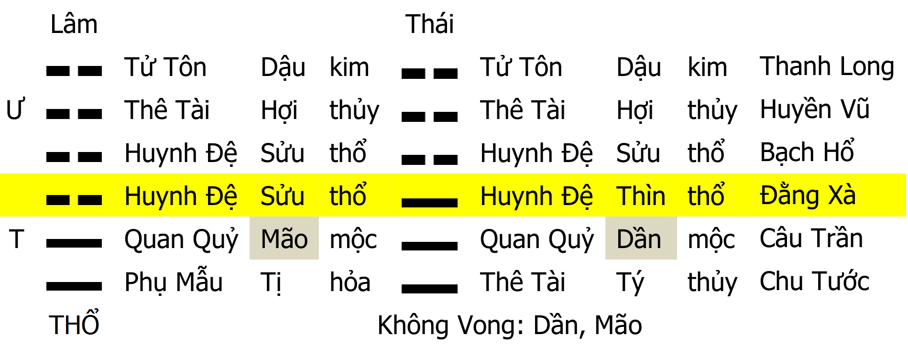
    - **Hình này chứng minh điều gì**
      - Chứng minh hào Thế lâm Câu Trần bị Sửu thổ động khắc Nguyên thần gây ung thư gan và khó thở.
    - **Từ đâu mà thấy được**
      - Hào Thế Mão mộc tại hào 2 lâm Câu Trần, Sửu thổ độc phát khắc Thê Tài Hợi thủy tại hào 5.
  - **Phán đoán chi tiết:**
    - Căn cứ: Đoán bệnh bản thân lấy hào Thế làm Dụng thần. Hào Thế Quan Quỷ Mão mộc cư hào 2; ngũ hành Mộc là gan mật, hào 2 cũng là hào vị gan mật.
    - Nhìn vào: Hào 3 Huynh Đệ Sửu thổ độc phát biến Huynh Đệ Thìn thổ; Sửu thổ đại diện cho gan, phát động khắc thương Nguyên thần Thê Tài Hợi thủy ở hào 5. Hào Thế lâm Câu Trần chủ về ung thư, mang dấu hiệu ung thư gan. Thêm vào đó, Mão mộc lâm Không Vong (Không Vong tại Dần, Mão) biểu thị túi mật rỗng, dự báo cả gan lẫn mật đều suy thoái trầm trọng. Mặt khác, Nguyên thần Thê Tài Hợi thủy cư hào 5 (vùng ngực phổi), Thê Tài chủ về hô hấp bị Sửu thổ động khắc nặng nề, báo hiệu đường thở bị bế tắc, hô hấp khó khăn.
  - **Ứng nghiệm thực tế:**
    - Quẻ đoán năm Giáp Thân (2004); thực tế bệnh nhân từ xơ gan chuyển biến thành ung thư gan dẫn đến khó thở, túi mật cũng phát sinh bệnh biến; đến tháng Thìn năm 2006 (Bính Tuất) thì qua đời.
- **Ví dụ 5:** Ngày Quý Sửu tháng Hợi, nam đoán bệnh của bản thân, được Thủy Địa Tỷ biến Trạch Sơn Hàm.
  - **Hình 254.** Quẻ Thủy Địa Tỷ biến Trạch Sơn Hàm
    - 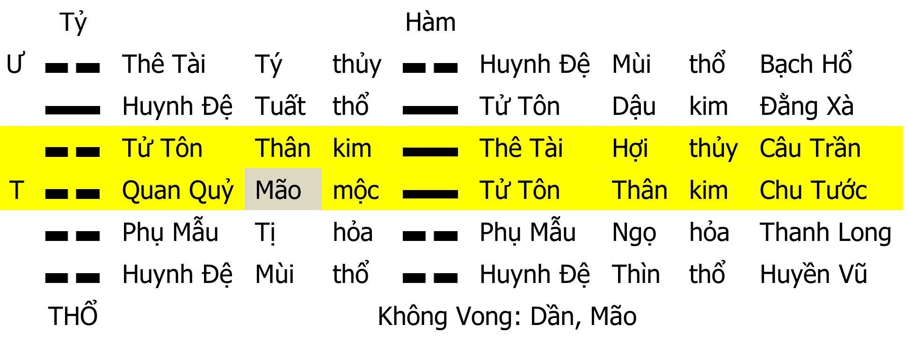
    - **Hình này chứng minh điều gì**
      - Chứng minh hào Thế Mão mộc tại hào 3 bị hai kim vây khắc dẫn đến viêm gan và hen suyễn.
    - **Từ đâu mà thấy được**
      - Thế Quan Quỷ Mão mộc hóa Thân kim hồi đầu khắc, hào 4 Thân kim động khắc, lâm Chu Tước.
  - **Phán đoán chi tiết:**
    - Căn cứ: Đoán bệnh bản thân lấy hào Thế làm Dụng thần. Hào Thế Quan Quỷ Mão mộc cư hào 3 được Nguyệt kiến Hợi thủy sinh trợ, Nhật kiến Sửu thổ không khắc phạt nên vượng tướng.
    - Nhìn vào: Bất lợi xuất hiện do hào Thế Mão mộc phát động hóa hồi đầu khắc (hóa Tử Tôn Thân kim), đồng thời hào 4 Tử Tôn Thân kim cũng phát động đến khắc hào Thế (biến Thê Tài Hợi thủy). Hai hào Kim cùng lúc giáp công vây khắc Mão mộc, cơ thể chắc chắn mang trọng bệnh. Hào Thế tại hào 3 là hào vị gan, Mão mộc là gan bị khắc thương nên bệnh phát tại gan; Nhật kiến Sửu thổ khắc hợp Nguyên thần Hợi thủy, Sửu thổ là gan càng củng cố chẩn đoán bệnh gan. Hào Thế lâm Chu Tước chủ viêm nhiệt nên là bệnh viêm gan; Kim tại hào 4 đại diện cho phổi, lâm Câu Trần chủ tức trướng nghẹt thở, động hóa Thê Tài chủ hô hấp bị tổn hại dẫn đến hô hấp không thông.
  - **Ứng nghiệm thực tế:**
    - Trên thực tế người nam này đồng thời mắc bệnh viêm gan và bệnh hen suyễn.
- **Ví dụ 6:** Ngày Tân Sửu tháng Hợi, nữ đoán bệnh của bản thân, được Thủy Địa Tỷ biến Trạch Sơn Hàm.
  - **Phán đoán chi tiết:**
    - Căn cứ: Người nữ đoán bệnh bản thân lấy hào Thế làm Dụng thần. Hào Thế Quan Quỷ Mão mộc cư hào 3 được Nguyệt kiến Hợi thủy sinh phù, Nhật kiến Sửu thổ không sinh cũng không khắc, hào Thế giữ trạng thái vượng tướng.
    - Nhìn vào: Hào Thế Quan Quỷ Mão mộc tại hào 3 phát động hóa hồi đầu khắc (biến Tử Tôn Thân kim), lại bị hào 4 Tử Tôn Thân kim cùng phát động vây khắc. Hào 3 là hào vị của gan, Mão mộc lại là tạng gan, bị lực Kim kép khắc hại nặng nề nên khẳng định cơ thể mắc bệnh lý tại gan.
  - **Ứng nghiệm thực tế:**
    - Trên thực tế người phụ nữ này mắc bệnh viêm gan C.

### 17. BỆNH TÚI MẬT

#### Cấu trúc sinh lý và các diện bệnh lý của túi mật
- Túi mật là một túi nhỏ có hình quả lê nằm ngay ở vị trí dưới gan, có chức năng lưu trữ và cô đặc dịch mật tiêu hóa do gan bài tiết.
  - Mỗi ngày gan tiết ra trung bình khoảng 800ml dịch mật, ngoại trừ một lượng nhỏ đổ thẳng vào tá tràng, phần lớn được dự trữ trong túi mật.
  - Khi túi mật co bóp, dịch mật được bài xuất qua ống túi mật và ống mật chủ đổ vào tá tràng để tham gia quá trình tiêu hóa và hấp thu thức ăn.
  - Khi cơ chế lưu thông hoặc bài tiết dịch mật phát sinh rối loạn sẽ hình thành bệnh lý: phổ biến là viêm túi mật, sỏi túi mật, polyp túi mật và ung thư đường mật.

#### Tổ hợp thông tin quái tượng dự trắc bệnh túi mật
- Tổ hợp thông tin dự đoán bệnh túi mật trong Lục Hào được cấu thành qua hệ thống quy ước đa tầng:
  - **Phương diện quái cung:** Liên quan chủ yếu đến cung Chấn và cung Tốn do Chấn Tốn thuộc hành Mộc chủ can mật; thông thường Chấn tượng trưng cho gan, Tốn tượng trưng cho mật, nhưng khi luận đoán có thể hoán đổi linh hoạt cho nhau mà không cần phân định quá cứng nhắc.
  - **Phương diện hào vị:** Hào 2 và hào 3 trong quẻ đều là các hào vị chủ quản khu vực túi mật.
  - **Phương diện ngũ hành:** Hành Mộc liên hệ mật thiết nhất với túi mật; thông thường chi Dần mộc biểu thị mật, hào mang tính dương biểu thị mật, và hào Mộc lâm Không Vong biểu thị túi mật rỗng.
  - **Phương diện địa chi:** Địa chi Tý thủy biểu thị dịch mật, Thổ lâm Không Vong là mật (khoang chứa rỗng), và Mùi thổ cũng biểu thị mật.
  - **Phương diện lục thần:** Chu Tước chủ về nhiệt chứng và hiện tượng viêm nhiễm; Câu Trần chủ về ngưng kết, tích tụ như sỏi mật hoặc polyp túi mật.
- **Quái tượng minh họa đặc trưng túi mật:** Quẻ Thủy Địa Tỷ biến Trạch Sơn Hàm phản ánh sự kết hợp giữa hào vị và ngũ hành khi biểu thị bệnh lý túi mật.
  - **Hình 255.** Quẻ Thủy Địa Tỷ biến Trạch Sơn Hàm
    - 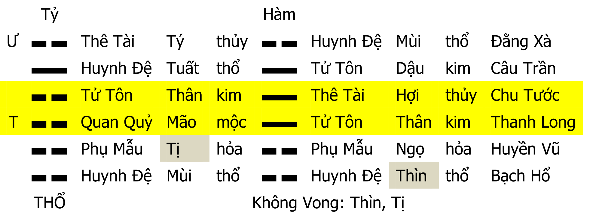
    - **Hình này chứng minh điều gì**
      - Thể hiện tượng bệnh túi mật qua hào vị 3 và hành Mộc mang bệnh phát động.
    - **Từ đâu mà thấy được**
      - Hào 3 là vị trí túi mật, Quan Quỷ Mão mộc trì Thế phát động; hào 4 Thân kim phát động; chi Thìn và Tị Không Vong.
  - **Phán đoán chi tiết:**
    - Căn cứ: Hào 3 biểu thị túi mật, Mão mộc đại diện cho mật, Quan Quỷ trì Thế chủ thân mang bệnh tật.
    - Nhìn vào: Quan Quỷ Mão mộc phát động tại hào 3 lâm Thanh Long hóa Tử Tôn Thân kim; hào 4 Tử Tôn Thân kim động lâm Chu Tước; tuần Không tại chi Thìn và Tị.

#### Các quái lệ dự trắc bệnh túi mật thực tế

##### Bệnh viêm túi mật
- **Ví dụ 1:** Ngày Ất Tị tháng Sửu, người nam đoán bệnh cho mẹ vợ, gieo được quẻ Địa Trạch Lâm.
  - **Hình 256.** Quẻ Địa Trạch Lâm
    - 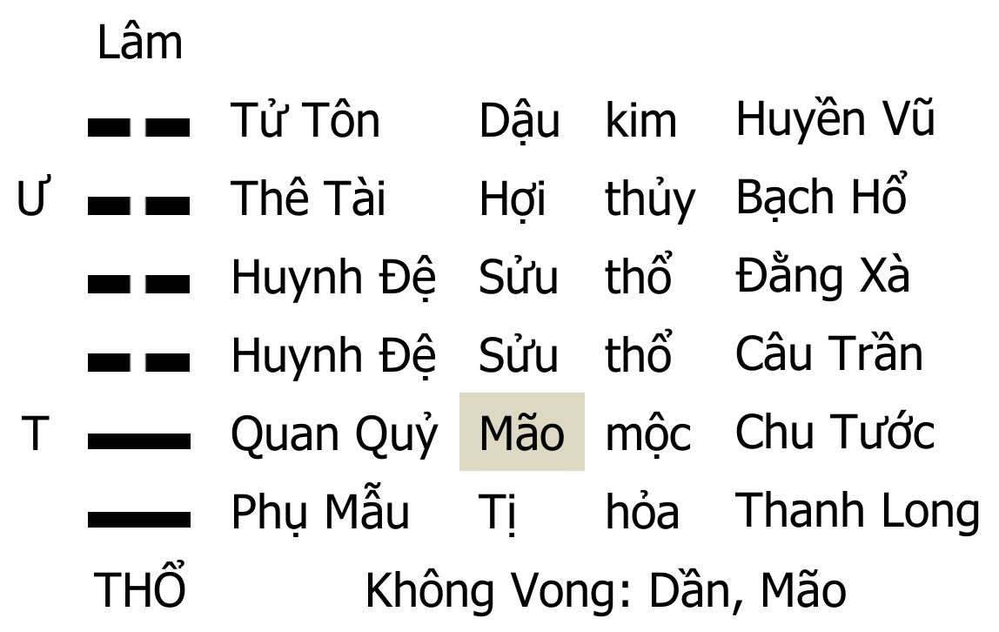
    - **Hình này chứng minh điều gì**
      - Chứng minh mẹ vợ của người hỏi quẻ mắc chứng viêm túi mật.
    - **Từ đâu mà thấy được**
      - Dụng thần Phụ Mẫu Tị hỏa có Nguyên thần hào 2 Mão mộc Không Vong lâm Chu Tước; hào 2 và hành Mộc chủ mật, Không Vong chủ mật, Chu Tước chủ viêm nhiễm.
  - **Phán đoán chi tiết:**
    - Căn cứ: Xem bệnh cho mẹ vợ thuộc hàng cha mẹ nên lấy hào Phụ Mẫu làm Dụng thần; Phụ Mẫu Tị hỏa tại hào 1 được Nhật kiến tỷ hòa, không bị Nhật Nguyệt khắc thương.
    - Nhìn vào: Nguyên thần của Dụng thần là Quan Quỷ Mão mộc tại hào 2 lâm Tuần Không (tuần Giáp Thìn Không Vong tại Dần và Mão); hào 2 là hào vị của mật, Mộc là mật, lâm Không lại càng chủ về túi mật; Mão mộc ngậm Chu Tước chủ viêm nhiệt, kết luận túi mật phát sinh viêm nhiễm.
  - **Ứng nghiệm thực tế:** Kết quả chẩn đoán y tế xác nhận chính xác là bệnh viêm túi mật.

##### Bệnh polyp và sỏi túi mật
- **Ví dụ 2:** Ngày Bính Tý tháng Tuất, người nam đoán bệnh cho vợ, gieo được quẻ Hỏa Lôi Phệ Hạp.
  - **Hình 257.** Quẻ Hỏa Lôi Phệ Hạp
    - 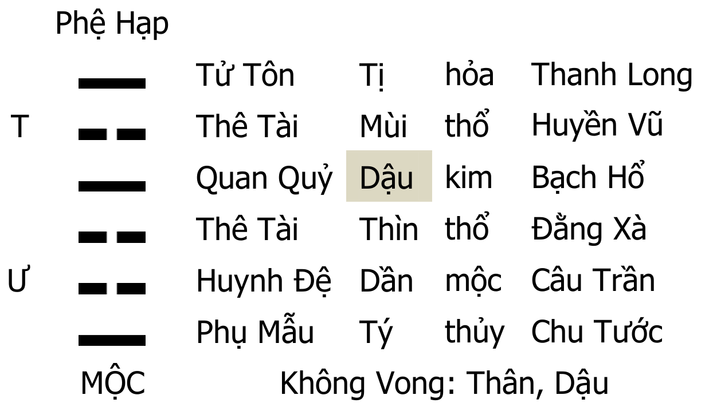
    - **Hình này chứng minh điều gì**
      - Chứng minh người vợ mắc bệnh polyp túi mật.
    - **Từ đâu mà thấy được**
      - Dụng thần Thê Tài Thìn thổ tại hào 3 Nguyệt phá; hào 2 Huynh Đệ Dần mộc vượng khắc Dụng thần lâm Câu Trần; quẻ thuộc cung Tốn (mật), hào 2 và hào 3 là mật, Dần mộc là mật, Thổ chủ thịt kết hợp Câu Trần chủ polyp.
  - **Phán đoán chi tiết:**
    - Căn cứ: Đoán bệnh của vợ lấy hào Thê Tài làm Dụng thần; trong quẻ hào Tài lưỡng hiện (Thê Tài Mùi thổ hào 5 và Thê Tài Thìn thổ hào 3), chọn Thìn thổ bị Nguyệt kiến Tuất xung thành Nguyệt phá làm Dụng thần mang bệnh.
    - Nhìn vào: Dụng thần Thìn thổ tại hào 3 bị Nguyệt phá, hào 3 là hào vị mật, quẻ thuộc cung Tốn cũng chủ về mật; hào 2 Huynh Đệ Dần mộc vượng tướng khắc Dụng thần (hào 2 và chi Dần mộc đều là mật); Dần mộc lâm Câu Trần chủ về kết sỏi hoặc khối u thịt polyp; Dụng thần thuộc Thổ (chủ cơ nhục, phần thịt) nên thiên về chẩn đoán polyp túi mật.
  - **Ứng nghiệm thực tế:** Người vợ đi bệnh viện khám được xác định chính xác là bị polyp túi mật.
- **Ví dụ 3:** Ngày Đinh Dậu tháng Mão, người nam tự đoán tình trạng bệnh tật của bản thân, gieo được quẻ Trạch Địa Tụy biến Thiên Trạch Lý.
  - **Hình 258.** Sơ đồ quẻ Trạch Địa Tụy biến Thiên Trạch Lý
    - 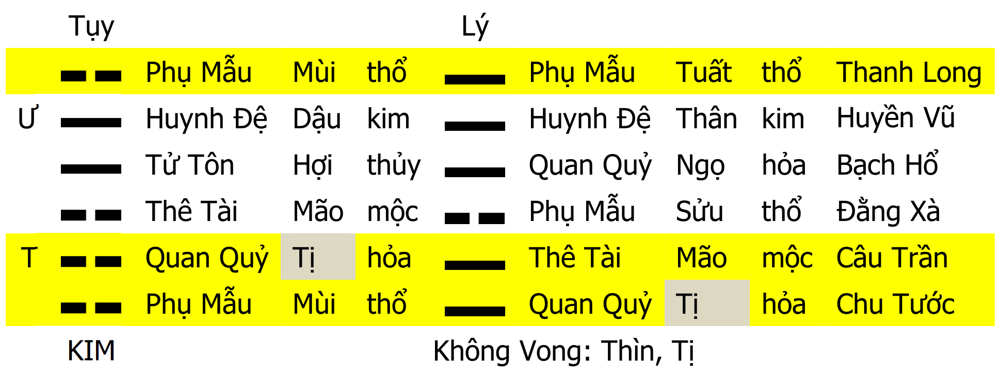
    - **Hình này chứng minh điều gì**
      - Chứng minh đương số mắc bệnh sỏi túi mật.
    - **Từ đâu mà thấy được**
      - Thế trì Quan Quỷ Tị hỏa tại hào 2 lâm Tuần Không; hào 2 là mật, Không không được Mộc sinh (Mộc là mật), ngậm Câu Trần chủ kết sỏi.
  - **Phán đoán chi tiết:**
    - Căn cứ: Tự xem bệnh cho bản thân nên lấy hào Thế làm Dụng thần đại diện cho cơ thể và tình trạng bệnh.
    - Nhìn vào: Hào Thế Quan Quỷ Tị hỏa đóng ở hào 2 là vị trí của túi mật; hào Thế lâm Tuần Không (tuần Giáp Ngọ Không Vong tại Thìn Tị) nên không nhận được lực sinh trợ từ Nguyệt kiến Mão mộc (Mộc là mật); Thế ngậm Câu Trần chủ kết tụ, sỏi đá, kết luận bị sỏi túi mật.
  - **Ứng nghiệm thực tế:** Đương số đi khám bệnh viện xác nhận có sỏi túi mật.
- **Ví dụ 4:** Ngày Ất Hợi tháng Dần, người học trò của tác giả cảm thấy vùng gan đau nhức, đoán tình trạng bệnh tật, gieo được quẻ Thủy Sơn Kiển biến Thủy Địa Tỷ.
  - **Hình 259.** Sơ đồ quẻ Thủy Sơn Kiển biến Thủy Địa Tỷ
    - 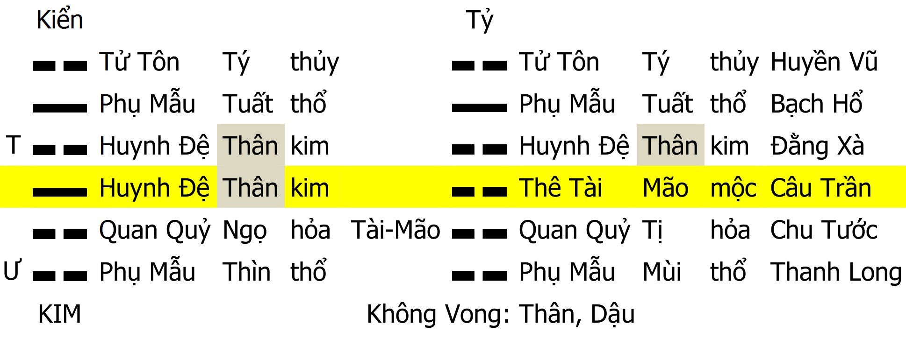
    - **Hình này chứng minh điều gì**
      - Chứng minh người học trò bị polyp túi mật nhưng là bệnh mới phát không gây nguy hiểm tính mạng.
    - **Từ đâu mà thấy được**
      - Hào Thế Thân kim tại hào 4 vừa Không vừa Phá, lâm Đằng Xà; hào 3 Huynh Đệ Thân kim độc phát hóa Mão mộc lâm Câu Trần; hào 3 là mật, hóa Mộc là mật, Không Vong là mật, Câu Trần chủ sỏi hoặc polyp.
  - **Phán đoán chi tiết:**
    - Căn cứ: Tự đoán bệnh lấy hào Thế làm Dụng thần; kết hợp phân tích hào độc phát trong quẻ để nhận diện bản chất ổ bệnh.
    - Nhìn vào dấu hiệu can mật: Hào Thế Huynh Đệ Thân kim tại hào 4 lâm Tuần Không lại bị Nguyệt kiến Dần xung thành Nguyệt phá, lâm Đằng Xà chủ bệnh chứng triền miên khó dứt; Thế bị Nguyệt mộc xung phá (Mộc chủ can mật) khẳng định bệnh ở hệ thống gan mật.
    - Nhìn vào tính chất polyp: Hào 3 Huynh Đệ Thân kim độc phát hóa Thê Tài Mão mộc; hào 3 là hào vị can mật, hóa Mộc là mật, Thân kim lâm Tuần Không tượng trưng cho túi mật rỗng, lại ngậm Câu Trần chủ kết sỏi hoặc polyp túi mật; hào Thế gặp Không Vong là tượng cận bệnh phùng Không (bệnh mới phát gặp Không tắc dũ) nên không nguy hiểm tính mạng.
  - **Ứng nghiệm thực tế:** Người học trò đến bệnh viện kiểm tra y tế phát hiện có polyp túi mật đúng như quẻ dự đoán.

##### Bệnh ung thư đường mật và u bướu hiểm nghèo
- **Ví dụ 5:** Ngày Quý Mão tháng Tị, người nam đoán bệnh tình hiểm nghèo của cha, gieo được quẻ Sơn Lôi Di.
  - **Phán đoán chi tiết:**
    - Căn cứ: Xem bệnh cho cha lấy hào Phụ Mẫu làm Dụng thần; trong quẻ Phụ Mẫu lưỡng hiện (hào 1 và hào 5 đều mang Tý thủy), quy tắc lấy hào 5 làm Dụng thần vì hào 5 là hào vị tôn trưởng, gia trưởng trong nhà.
    - Nhìn vào vị trí ổ bệnh ở túi mật: Dụng thần Phụ Mẫu Tý thủy không được Nhật kiến Mão mộc sinh (Mão mộc tiết khí của Thủy), gặp Nguyệt kiến Tị hỏa là Tuyệt địa, Nhật Nguyệt hoàn toàn không sinh trợ; Thổ tại hào 3 (Thê Tài Thìn thổ) và hào 4 (Thê Tài Tuất thổ) cùng vây khắc Phụ Mẫu; hào 3 Thìn thổ lâm Tuần Không mà đến khắc (Thổ Không là mật), quẻ Di thuộc cung Tốn (Tốn là mật), khẳng định bệnh phát sinh tại túi mật.
    - Nhìn vào u bướu ác tính: Dụng thần Tý thủy gặp ngày Mão là đất Tử, gặp tháng Tị là đất Tuyệt, lâm đất Tử Tuyệt biểu thị bệnh thế cực kỳ nguy kịch; hào 4 Thê Tài Tuất thổ lâm Câu Trần vây khắc (Câu Trần chủ khối u bướu thịt), kết luận ống mật có khối u bướu hoặc mắc chứng ung thư đường mật.
    - Nhìn vào tượng liệt giường và ứng kỳ tử vong: Dụng thần Tý thủy nhập Mộ tại hào 3 Thìn thổ (hào 3 là hào vị giường nằm), tượng nhập Mộ tại giường chủ về nằm liệt giường không thể ngồi dậy; hào 3 Thìn thổ lâm Tuần Không, quy tắc xuất Không sẽ chính thức thu Mộ; tháng Ngọ thì Dụng thần Tý thủy phùng xung (Nguyệt xung Dụng thần), do đó tháng Ngọ ngày Thìn là thời điểm đại hung.
  - **Ứng nghiệm thực tế:** Người cha trên thực tế bị bán thân bất toại (liệt nửa người) và bị ung thư đường mật ác tính, đến ngày Đinh Mão tháng Ngọ thì qua đời.

### 18. BỆNH THẬN

#### Các phương diện nhận diện quái tượng bệnh thận
- Cấu tạo sinh lý và chức năng tạng thận trong cơ thể:
  - Thận có hình hạt đậu, nằm ở hai bên thắt lưng của cơ thể.
  - Chức năng chủ yếu của thận là lọc máu thành nước tiểu đưa xuống bàng quang.
  - Các bệnh lý liên quan đến thận gồm có: viêm thận, ung thư thận, chứng tăng urê máu, sỏi thận, viêm niệu đạo, viêm bàng quang, ung thư bàng quang.
- Các phương diện nhận diện tổ hợp quái tượng bệnh thận:
  - Phương diện quái cung: Liên quan mật thiết đến cung Khảm, bởi vì Khảm là Thủy, Thủy đại diện cho tạng thận.
  - Phương diện hào vị: Liên quan đến hào 2 và hào 3, hai hào này đều có thể biểu thị thận (hào 2 là vùng hạ tiêu, bàng quang; hào 3 là thắt lưng, nơi thận cư ngụ).
  - Phương diện ngũ hành: Liên quan mật thiết với ngũ hành Thủy, bởi vì Thủy chủ thận và hệ thống dịch thể, bài tiết nước tiểu.
  - Phương diện địa chi: Hợi thủy và Thìn thổ là thận (Hợi là ngũ hành Thủy; Thìn là Thủy khố, kho tàng trữ nước dịch).
  - Phương diện lục thần:
    - Chu Tước: Chủ về các chứng viêm nhiễm nhiệt độc.
    - Câu Trần: Chủ về khối u, u xơ, kết sỏi.
    - Bạch Hổ: Chủ về xuất huyết, tiểu ra máu (huyết niệu).
- Quái lệ minh họa tổ hợp hào vị và địa chi định vị bệnh thận (Quẻ Sơn Lôi Di):
  - **Hình 260.** Sơ đồ quẻ Sơn Lôi Di
    - 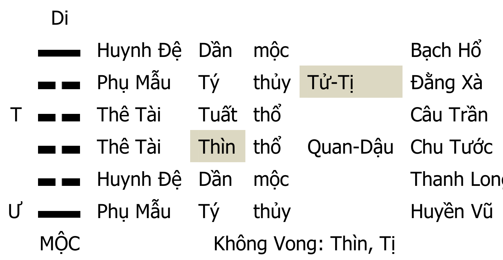
    - **Hình này chứng minh điều gì**
      - Minh họa tổ hợp hào vị 3, địa chi Thìn thổ và lục thần Chu Tước biểu thị bệnh viêm thận.
    - **Từ đâu mà thấy được**
      - Hào 3 Thê Tài Thìn thổ (Thìn thổ là thận) lâm Chu Tước (chủ viêm); hào vị 3 là thắt lưng; hào sơ và hào 5 lâm Tý thủy.
- Phân biệt quái tượng giữa bệnh thận, chứng tăng urê máu và bệnh bàng quang:
  - Chứng tăng urê máu và bệnh bàng quang có quái tượng tương đồng với bệnh thận, khi dự đoán cần căn cứ vào tình huống cụ thể của từng quẻ để phân biệt rõ ràng.
  - Bệnh sỏi thận: Hào vị thận (hào 2 hoặc hào 3) lâm Thủy hoặc Thìn thổ mang Câu Trần, hoặc bị hào Thổ phát động khắc thương.
  - Bệnh sỏi bàng quang: Hào 2 (bàng quang) lâm Hợi thủy mang Câu Trần kết sỏi, gặp Nhật thần Thìn thổ là tượng tích trữ nước tiểu.
  - Chứng tăng urê máu: Ngũ hành Thủy (nước tiểu) độc phát hóa Mộ, bị Nhật hợp kìm hãm không sinh Thế và lâm Thanh Long chủ độc; hoặc hào Thế lâm Tuyệt địa tại Thủy bị hào Thủy phát động khắc phá.

#### Các ví dụ thực tế dự đoán bệnh thận
- **Ví dụ 1:** Ngày Ất Sửu tháng Ngọ, nữ đoán bệnh của bản thân, được Lôi Thủy Giải biến Lôi Hỏa Phong:
  - **Hình 261.** Quẻ Lôi Thủy Giải biến Lôi Hỏa Phong
    - 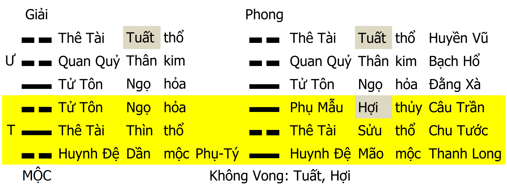
    - **Hình này chứng minh điều gì**
      - Bệnh suy thận nặng phải chạy thận nhân tạo do Thế tại hào thận lâm Thìn thổ và Nguyên thần bị thủy hồi đầu khắc.
    - **Từ đâu mà thấy được**
      - Thế tại hào 2 lâm Thìn thổ; Nguyên thần Tử Tôn Ngọ hỏa hào 3 động hóa Phụ Mẫu Hợi thủy hồi đầu khắc; Thủy là thận.
  - **Phán đoán chi tiết:**
    - Căn cứ: Người nữ tự đoán bệnh của bản thân nên lấy hào Thế làm Dụng thần.
    - Nhìn vào: Hào Thế Thê Tài Thìn thổ cư hào 2, hào 2 là cung vị của thận, lại mang địa chi Thìn thổ chủ về thận (Thìn là Thủy khố).
    - Nhìn vào: Nguyên thần của Dụng thần là Tử Tôn Ngọ hỏa tại hào 3 phát động, biến xuất Phụ Mẫu Hợi thủy quay lại hồi đầu khắc thương Ngọ hỏa (Hợi thủy khắc Ngọ hỏa).
    - Nhìn vào: Ngũ hành Thủy đại diện cho tạng thận; Nguyên thần bị Thủy hồi đầu khắc biểu thị chức năng lọc của tạng thận bị phá hủy, thận phát sinh bệnh biến nghiêm trọng.
  - **Ứng nghiệm thực tế:**
    - Trên thực tế người phụ nữ này bị suy thận nặng, hiện đang phải tiến hành chạy thận nhân tạo để duy trì sự sống.

- **Ví dụ 2:** Ngày Bính Tý tháng Dần, một người đoán bệnh của bản thân, được Hỏa Phong Đỉnh biến Sơn Trạch Tổn:
  - **Hình 262.** Quẻ Hỏa Phong Đỉnh biến Sơn Trạch Tổn
    - 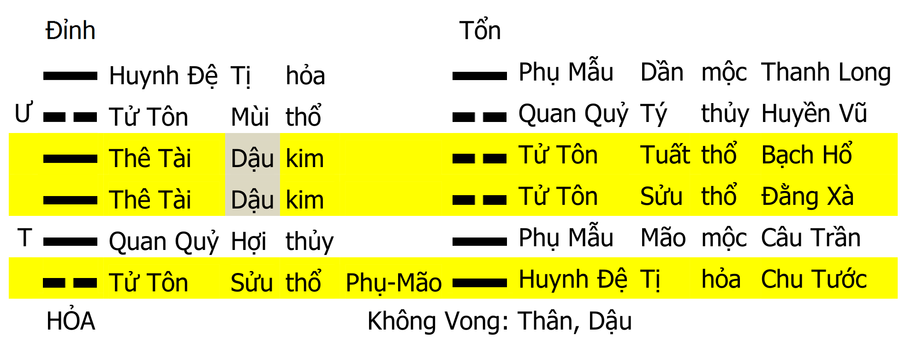
    - **Hình này chứng minh điều gì**
      - Mắc bệnh sỏi thận do hào Thế tại hào thận lâm Hợi thủy Câu Trần và bị hào sơ thổ động tương khắc.
    - **Từ đâu mà thấy được**
      - Thế cư hào 2 Quan Quỷ Hợi thủy lâm Câu Trần; hào sơ Tử Tôn Sửu thổ phát động khắc Thế; Câu Trần chủ kết sỏi.
  - **Phán đoán chi tiết:**
    - Căn cứ: Người bệnh tự đoán bệnh bản thân nên lấy hào Thế làm Dụng thần.
    - Nhìn vào: Hào Thế cư tại hào 2 mang Quan Quỷ Hợi thủy lâm lục thần Câu Trần; hào 2 là cung vị thận, ngũ hành Thủy và địa chi Hợi thủy đều là thận.
    - Nhìn vào: Lục thần Câu Trần chủ về kết sỏi, khối u cứng, ứ trệ.
    - Nhìn vào: Hào sơ Tử Tôn Sửu thổ phát động hóa Huynh Đệ Tị hỏa, Sửu thổ động đến trực tiếp khắc thương hào Thế Hợi thủy (Thổ khắc Thủy). Ngũ hành Thổ tượng trưng cho sỏi cát đất đá chèn ép vào thận thủy.
  - **Đối thoại và khuyến nghị:**
    - Tác giả căn cứ vào tổ hợp quái tượng nhận định thận có sỏi, lập tức đề nghị người này nên đến bệnh viện chuyên khoa kiểm tra.
  - **Ứng nghiệm thực tế:**
    - Người bệnh nghe theo lời khuyên đến bệnh viện kiểm tra, kết quả phát hiện trong thận có sỏi (sỏi thận).

- **Ví dụ 3:** Ngày Canh Dần tháng Ngọ, nữ đoán bệnh của bản thân, được Sơn Hỏa Bí biến Sơn Lôi Di:
  - **Hình 263.** Quẻ Sơn Hỏa Bí biến Sơn Lôi Di
    - 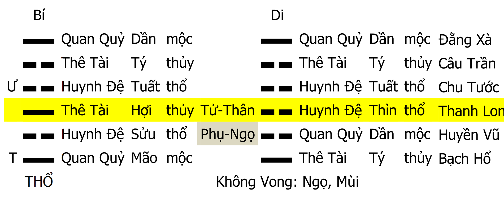
    - **Hình này chứng minh điều gì**
      - Mắc chứng tăng urê máu do Nguyên thần thủy chủ nước tiểu độc phát hóa Mộ, bị Nhật hợp kìm hãm và lâm Thanh Long.
    - **Từ đâu mà thấy được**
      - Thế Quan Quỷ Mão mộc cư hào sơ; Nguyên thần hào 3 Thê Tài Hợi thủy độc phát hóa Thìn thổ bị Nhật Dần hợp; lâm Thanh Long.
  - **Phán đoán chi tiết:**
    - Căn cứ: Người nữ tự đoán bệnh của bản thân nên lấy hào Thế làm Dụng thần (Thế cư hào sơ Quan Quỷ Mão mộc lâm Bạch Hổ).
    - Nhìn vào: Nguyên thần của hào Thế là Thê Tài Hợi thủy tại hào 3 phát động (độc phát). Hợi thủy động biến xuất Huynh Đệ Thìn thổ; Thìn là Mộ khố của Thủy, tức Nguyên thần độc phát hóa Mộ.
    - Nhìn vào: Hào động Hợi thủy đồng thời bị Nhật thần Dần mộc tương hợp kìm giữ (Dần Hợi hợp trú), khiến Nguyên thần hoàn toàn mất tác dụng sinh phù hào Thế.
    - Nhìn vào: Hào 3 mang ngũ hành Thủy chủ về niệu (nước tiểu), Thủy bị hóa Mộ và bị hợp trú là tượng nước tiểu bị bế tắc, ứ đọng; hào 3 lại lâm lục thần Thanh Long chủ về chất độc, biểu thị độc tố nước tiểu ứ đọng ngấm vào cơ thể sinh chứng tăng urê máu.
  - **Ứng nghiệm thực tế:**
    - Trên thực tế người phụ nữ này mắc chứng tăng urê máu.

- **Ví dụ 4:** Ngày Bính Thìn tháng Hợi, một cụ già đoán bệnh của bản thân, được Sơn Phong Cổ biến Cấn Vi Sơn:
  - **Hình 264.** Quẻ Sơn Phong Cổ biến Cấn Vi Sơn
    - 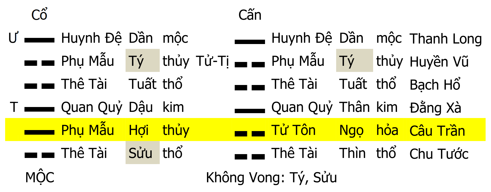
    - **Hình này chứng minh điều gì**
      - Mắc bệnh sỏi bàng quang do hào bàng quang phát động tại Bệnh địa của Thế, gặp Nhật Thìn tích trữ nước và lâm Câu Trần.
    - **Từ đâu mà thấy được**
      - Thế Quan Quỷ Dậu kim hào 3; hào 2 Phụ Mẫu Hợi thủy lâm Câu Trần độc phát là Bệnh địa của Thế, gặp Nhật Thìn thổ.
  - **Phán đoán chi tiết:**
    - Căn cứ: Cụ già tự đoán bệnh nên lấy hào Thế làm Dụng thần (Thế cư hào 3 Quan Quỷ Dậu kim lâm Đằng Xà).
    - Nhìn vào: Hào Thế Dậu kim được Nhật thần Thìn thổ tương sinh nên vượng tướng, chứng tỏ nguyên khí của đương số chưa suy kiệt.
    - Nhìn vào: Trong quẻ có hào 2 Phụ Mẫu Hợi thủy lâm Câu Trần độc phát biến Tử Tôn Ngọ hỏa; theo vòng tràng sinh thì Kim lâm Bệnh tại Hợi, do đó Hợi thủy phát động chính là Bệnh địa của hào Thế Dậu kim.
    - Nhìn vào: Hào 2 là cung vị bàng quang, ngũ hành Hợi thủy cũng đại diện cho bàng quang; gặp Nhật thần Thìn thổ là Thủy khố (kho chứa nước), phản ánh thông tin bàng quang tích trữ nước tiểu.
    - Nhìn vào: Hào độc phát lại lâm lục thần Câu Trần chủ về kết sỏi, u cục rắn rỏi, tích tụ ách tắc; kết hợp các dữ kiện khẳng định là bệnh sỏi bàng quang.
  - **Ứng nghiệm thực tế:**
    - Trên thực tế cụ già mắc bệnh sỏi bàng quang.

- **Ví dụ 5:** Ngày Canh Tuất tháng Hợi, nam đoán bệnh của bản thân, được Trạch Địa Tụy biến Thủy Địa Tỷ:
  - **Phán đoán chi tiết:**
    - Căn cứ: Người nam tự đoán bệnh nên lấy hào Thế làm Dụng thần (Thế cư hào 2 Quan Quỷ Tị hỏa lâm Huyền Vũ, ngộ Tuần Không).
    - Nhìn vào: Hào Thế Tị hỏa bị Nguyệt kiến Hợi thủy trực xung thành Nguyệt phá (Tị Hợi tương xung), lại gặp mùa đông Thủy vượng Hỏa suy nên lâm cảnh hưu tù vô khí.
    - Nhìn vào: Hào 4 Tử Tôn Hợi thủy lâm Chu Tước độc phát biến Huynh Đệ Thân kim; hào Thế Tị hỏa cư hào 2 gặp đất Tuyệt (Tuyệt địa) tại Hợi thủy (Hỏa tuyệt tại Hợi).
    - Nhìn vào: Ngũ hành Thủy chủ về niệu (nước tiểu), chủ về bài tiết của thận; hào Thế bị hào Thủy độc phát và Nguyệt kiến xung tiệt tại Tuyệt địa, phản ánh công năng lọc thải của thận ngừng trệ hoàn toàn, độc tố nước tiểu không thể thoát ra ngoài mà tích tụ thành bệnh tăng urê máu.
  - **Ứng nghiệm thực tế:**
    - Trên thực tế người nam này đúng là mắc chứng tăng urê máu.

### 19. BỆNH TIỂU ĐƯỜNG

#### Cơ chế bệnh sinh và đặc trưng quái tượng dự trắc bệnh tiểu đường
- Cơ sở sinh lý bệnh học và định nghĩa chứng bệnh theo y học:
  - Chức năng nội tiết của tuyến tụy: Tuyến tụy đảm nhiệm vai trò tiết ra hai hormone đối kháng điều hòa là insulin và glucagon.
  - Tác dụng điều hòa đường huyết: Insulin phát huy tác dụng làm hạ nồng độ đường trong máu, ngược lại glucagon có tác dụng làm tăng lượng đường huyết. Sự phối hợp cân bằng và nhịp nhàng giữa hai hormone này duy trì chỉ số đường huyết ở trạng thái ổn định.
  - Cơ chế hình thành bệnh tiểu đường: Khi tuyến tụy suy giảm chức năng dẫn đến thiếu hụt insulin (tương đối hoặc tuyệt đối), quá trình chuyển hóa đường, chất đạm (protein), chất béo (lipid) và nước trong cơ thể bị rối loạn nghiêm trọng, khiến lượng đường huyết tăng cao vượt ngưỡng lọc của thận và bài tiết ra ngoài qua nước tiểu.
  - Tương đương trong y học cổ truyền: Trung y gọi bệnh tiểu đường là chứng tiêu khát (với các biểu hiện điển hình như khát nước uống nhiều, ăn nhiều mau đói, tiểu nhiều và sụt cân).
- Tổ hợp thông tin quái tượng phản ánh bệnh tiểu đường:
  - Phương diện quái cung: Có mối liên hệ mật thiết với cung Khảm; Khảm thuộc Thủy, chủ quản tạng thận, bàng quang, chất dịch và nước tiểu, là quái cung biểu thị bệnh tiểu đường.
  - Phương diện hào vị: Trọng điểm liên quan đến hào 2 và hào 3 trong quẻ; cả hai hào vị này đều nằm ở hạ bàn, đối ứng với vùng bụng dưới, cơ quan tiết niệu sinh dục và đường niệu, là những hào vị chủ bệnh tiểu đường.
  - Phương diện địa chi ngũ hành:
    - Chủ yếu liên quan đến ba địa chi: Hợi thủy, Thìn thổ và Sửu thổ; cả ba chi này đều mang thông tin đặc thù phản ánh bệnh tiểu đường.
    - Hợi thủy: Thủy chủ về nước tiểu và sự bài tiết chất dịch ở hạ tiêu.
    - Thìn thổ: Là thấp thổ ẩm ướt và là Thủy khố (nơi quy tụ của nước), tượng trưng cho sự ứ đọng đường chất trong dịch thể.
    - Sửu thổ: Là thấp thổ mùa đông chứa kim thủy (Kim khố), tượng trưng cho tỳ thổ hư nhược gây biến loạn đường huyết.
    - Quy luật Thổ khắc Thủy: Ngũ hành Thổ mang vị ngọt (đường), ngũ hành Thủy là nước tiểu; khi Thổ khắc phạt Thủy hoặc Thổ Thủy kết hợp bất thường biểu thị vị ngọt hòa lẫn vào nước tiểu, tạo thành chứng đái tháo đường.
  - Phương diện lục thần: Chủ yếu gắn liền với hai thần Câu Trần và Thanh Long.
    - Câu Trần: Thuộc Thổ, chủ sự trì trệ, tích lũy, sưng trướng và bệnh mãn tính lâu năm khó chữa.
    - Thanh Long: Thuộc Mộc, chủ sự sinh sôi hoặc thực phẩm, đồ ngọt; khi phối hợp với Thổ Thủy ở hào vị bài tiết thường chỉ điểm bệnh lý đường huyết.
- Quái lệ minh họa tổ hợp tượng quẻ tiểu đường:
  - **Quái lệ minh họa:** Sơ đồ quẻ Trạch Địa Tụy biến Thủy Địa Tỷ biểu thị tương tác giữa quái cung Khảm thủy, hào vị bài tiết và hào phát động Hợi thủy:
    - **Hình 265.** Sơ đồ quẻ Trạch Địa Tụy biến Thủy Địa Tỷ
      - 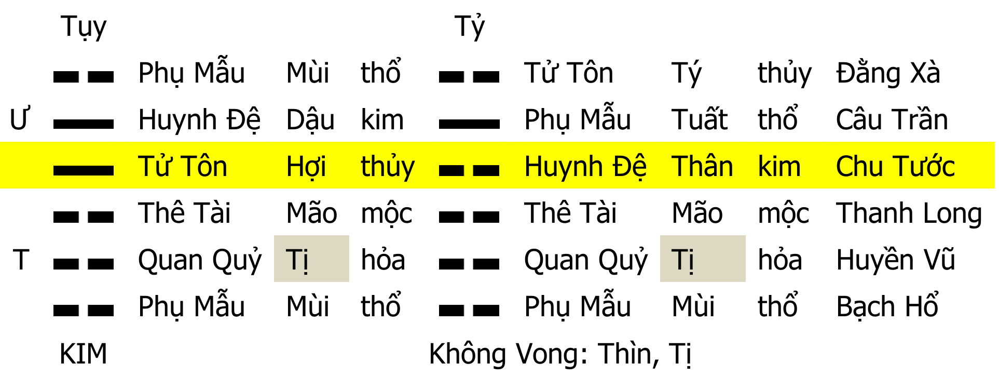
      - **Hình này chứng minh điều gì**
        - Minh họa tổ hợp tượng tiểu đường qua hào Hợi thủy phát động và thượng quái biến Khảm thủy.
      - **Từ đâu mà thấy được**
        - Hào 4 Tử Tôn Hợi thủy động hóa Huynh Đệ Thân kim; ngoại quái biến thành Khảm thủy; hào 2 Quan Quỷ Tị hỏa lâm Không Vong.

#### Ví dụ 1: Người con đoán bệnh cho cha được quẻ Thiên Hỏa Đồng Nhân biến Trạch Lôi Tùy
- Quái lệ dự đoán bệnh cho cha và diễn biến suy thoái của Nguyên thần:
  - **Ví dụ 1:** Ngày Kỷ Hợi tháng Dần, một người đến xin dự trắc tình hình bệnh tật của cha, gieo được quẻ Thiên Hỏa Đồng Nhân biến Trạch Lôi Tùy (quái cung Ly/Hỏa, Tuần Không: Thìn, Tị):
    - **Hình 266.** Sơ đồ quẻ Thiên Hỏa Đồng Nhân biến Trạch Lôi Tùy
      - 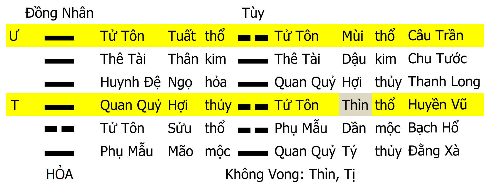
      - **Hình này chứng minh điều gì**
        - Chứng minh người cha mắc bệnh tiểu đường do Nguyên thần Hợi thủy cư hào 3 bị hào 6 Thổ khắc và hóa hồi đầu khắc.
      - **Từ đâu mà thấy được**
        - Hào 3 Quan Quỷ Hợi thủy động hóa Tử Tôn Thìn thổ (hóa Mộ, hóa hồi đầu khắc); hào 6 Tử Tôn Tuất thổ động khắc Hợi thủy.
    - **Phán đoán chi tiết:**
      - Căn cứ xác định Dụng thần và Nguyên thần: Đoán bệnh cho đấng sinh thành lấy hào Phụ Mẫu làm Dụng thần. Trong quẻ, Phụ Mẫu Mão mộc ngự tại hào sơ, lấy hào Thủy (Thủy sinh Mộc) làm Nguyên thần bảo hộ sinh mệnh.
      - Nhìn vào vị trí và thuộc tính của Nguyên thần: Nguyên thần Quan Quỷ Hợi thủy cư ngụ tại hào 3. Hào 3 là hào vị đối ứng với bàng quang và hệ tiết niệu; ngũ hành Hợi thủy chủ về nước tiểu (niệu), mang thông tin đặc thù của bệnh tiểu đường.
      - Nhìn vào tương tác động biến và thế khắc phạt:
        - Hào 6 Tử Tôn Tuất thổ tại ứng phát động vượng tướng, trực tiếp giáng đòn khắc phạt Nguyên thần Hợi thủy.
        - Bản thân hào 3 Quan Quỷ Hợi thủy lại tự phát động hóa ra Tử Tôn Thìn thổ; Thìn thổ là Thủy khố khiến Hợi thủy hóa Mộ, đồng thời Thìn thổ hồi đầu khắc Hợi thủy (vừa hóa Mộ vừa hóa hồi đầu khắc).
      - Luận giải cơ chế bệnh lý: Nước tiểu (Thủy) ở hệ bài tiết (hào 3) bị Thổ (vị ngọt, cặn bã) bao vây khắc phạt nặng nề từ cả hào 6 lẫn hào biến, biểu hiện rõ rệt sự xâm lấn của đường vào nước tiểu sinh bệnh đái tháo đường. Nguyên thần lâm Quan Quỷ hóa Mộ và bị khắc tuyệt diệt, báo hiệu căn bệnh tiểu đường diễn biến cực kỳ xấu.
    - **Ứng nghiệm thực tế:**
      - Người cha trên thực tế mắc chứng bệnh tiểu đường trầm trọng.
      - Đến tháng Mão năm 2005 (năm Ất Dậu, tháng Kỷ Mão), khi Dụng thần xuất hiện nhưng Nguyên thần đã suy kiệt hoàn toàn, người cha không qua khỏi và qua đời.

#### Ví dụ 2: Người con trai đoán bệnh cho mẹ được quẻ Càn Vi Thiên biến Phong Lôi Ích
- Quái lệ dự đoán bệnh cho mẹ với tượng Dụng thần phục ngâm và Nguyên thần tham hợp:
  - **Ví dụ 2:** Ngày Mậu Tý tháng Mùi, một người nam đến nhờ dự trắc bệnh tình của người mẹ, gieo được quẻ Càn Vi Thiên biến Phong Lôi Ích (quái cung Càn/Kim, Tuần Không: Ngọ, Mùi):
    - **Hình 267.** Sơ đồ quẻ Càn Vi Thiên biến Phong Lôi Ích
      - 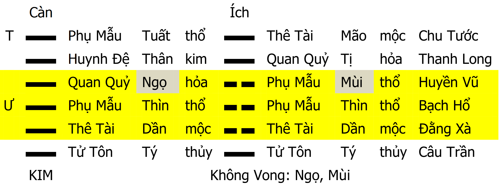
      - **Hình này chứng minh điều gì**
        - Chứng minh người mẹ mắc bệnh tiểu đường do Dụng thần Phụ Mẫu Thìn thổ cư hào 3 phục ngâm, bị khắc và Nguyên thần tham hợp quên sinh.
      - **Từ đâu mà thấy được**
        - Hào 3 Phụ Mẫu Thìn thổ động hóa Thìn thổ phục ngâm; hào 2 Dần mộc động khắc; hào 4 Ngọ hỏa lâm Không động hóa Mùi thổ tham hợp quên sinh.
    - **Phán đoán chi tiết:**
      - Căn cứ nguyên tắc định vị Dụng thần: Con trai xem bệnh cho mẹ lấy hào Phụ Mẫu làm Dụng thần. Trong quẻ xuất hiện Phụ Mẫu lưỡng hiện (hào 6 Phụ Mẫu Tuất thổ và hào 3 Phụ Mẫu Thìn thổ), áp dụng nguyên tắc chọn hào phát động làm Dụng thần, do đó xác định Phụ Mẫu Thìn thổ tại hào 3 là Dụng thần đại diện cho người mẹ.
      - Nhìn vào hào vị và địa chi chủ bệnh: Hào 3 là hào vị đặc trưng của bệnh tiểu đường; địa chi Thìn thổ mang thông tin chủ quản về bệnh đái tháo đường.
      - Nhìn vào trạng thái động biến của Dụng thần: Phụ Mẫu Thìn thổ phát động hóa ra Phụ Mẫu Thìn thổ (tượng phục ngâm), chủ về sự đau đớn, rên rỉ, bệnh tật tái đi tái lại kéo dài dai dẳng.
      - Nhìn vào thế sinh khắc và sự thoái thác của Nguyên thần:
        - Hào 2 Thê Tài Dần mộc phát động trực tiếp khắc phạt Dụng thần Thìn thổ (Mộc khắc Thổ).
        - Nguyên thần sinh cho Dụng thần Thổ là Hỏa (hào 4 Quan Quỷ Ngọ hỏa phát động). Tuy nhiên, Ngọ hỏa lâm Tuần Không, lại động biến ra Phụ Mẫu Mùi thổ tạo thành cục diện Ngọ Mùi tương hợp ("tham hợp vong sinh" - ham kết hợp mà quên mất nhiệm vụ sinh phù Dụng thần).
      - Kết luận bệnh lý: Dụng thần Thìn thổ cư hào 3 bị Kỵ thần khắc hại mà Nguyên thần bỏ mặc không sinh cứu, tổ hợp hoàn toàn ứng khớp với bệnh tiểu đường, xác định người mẹ mắc chứng tiểu đường.
    - **Ứng nghiệm thực tế:**
      - Người mẹ trên thực tế quả nhiên đang mắc bệnh tiểu đường.

#### Ví dụ 3: Người chị đoán bệnh cho em gái được quẻ Thủy Hỏa Ký Tế biến Phong Hỏa Gia Nhân
- Quái lệ dự đoán bệnh cho em gái với biến chứng phức tạp đa tạng phủ:
  - **Ví dụ 3:** Ngày Quý Sửu tháng Tuất, một người phụ nữ đến gieo quẻ hỏi về bệnh tật của em gái, được quẻ Thủy Hỏa Ký Tế biến Phong Hỏa Gia Nhân (quái cung Khảm/Thủy, Tuần Không: Dần, Mão):
    - **Hình 268.** Quẻ Thủy Hỏa Ký Tế biến Phong Hỏa Gia Nhân
      - 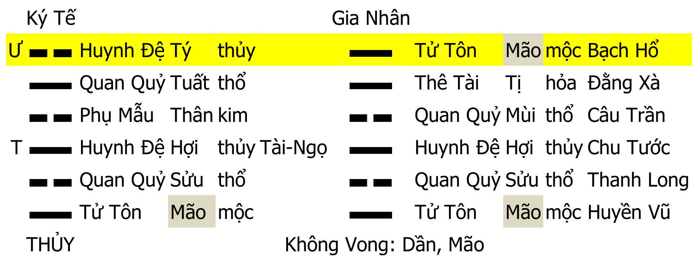
      - **Hình này chứng minh điều gì**
        - Chứng minh em gái bị đa bệnh gồm tiểu đường, xơ gan và tai chảy máu do Tý thủy hóa Tử, Hợi thủy hào 3 bị Thổ khắc.
      - **Từ đâu mà thấy được**
        - Hào 6 Tý thủy động hóa Mão mộc lâm Bạch Hổ; hào 3 Hợi thủy bị Nhật Nguyệt Thổ khắc; hào 2 Sửu thổ hợp Dụng thần.
    - **Phán đoán chi tiết:**
      - Căn cứ chọn Dụng thần và phân định hào chủ chứng trạng: Đoán bệnh cho em gái lấy hào Huynh Đệ làm Dụng thần. Quẻ có Huynh Đệ lưỡng hiện (hào 6 Huynh Đệ Tý thủy và hào 3 Huynh Đệ Hợi thủy); quy tắc dự trắc ưu tiên lấy hào phát động là hào 6 Huynh Đệ Tý thủy làm Dụng thần đại diện sinh mệnh, hào Huynh Đệ còn lại (hào 3 Hợi thủy) đại diện cho ổ bệnh và chứng trạng phát sinh.
      - Nhìn vào mức độ an nguy của Dụng thần: Huynh Đệ Tý thủy ở hào 6 phát động hóa Mão mộc (động hóa Tuyệt/Tử địa); lại bị cả Nguyệt kiến Tuất thổ lẫn Nhật thần Sửu thổ đồng thời khắc thương, thể trạng người bệnh cực kỳ suy vi, báo hiệu bệnh tình diễn biến rất xấu.
      - Nhìn vào chứng trạng chảy máu tai:
        - Quẻ gốc thuộc quái cung Khảm; theo thủ tượng bát quái, Khảm chủ về đôi tai.
        - Hào 6 nằm ở vị trí cao nhất trên đầu, mang hành Thủy cũng biểu thị cho tai.
        - Hào 6 lâm thần Bạch Hổ (Bạch Hổ chủ huyết quang, rách vỡ chảy máu), kết hợp lại phán đoán lỗ tai người bệnh bị xuất huyết (tai chảy máu).
      - Nhìn vào chứng trạng bệnh tiểu đường:
        - Hào 3 Huynh Đệ Hợi thủy bị cả Nhật Sửu lẫn Nguyệt Tuất khắc ép nặng nề.
        - Hào 3 đối ứng với thận, bàng quang và hệ tiết niệu; ngũ hành Hợi thủy là nước tiểu. Thổ khắc Thủy mà Thổ mang vị ngọt, lại ở quẻ cung Khảm (Khảm chủ tiểu đường), tượng trưng đường ứ đọng và bài tiết vào nước tiểu, khẳng định có bệnh tiểu đường.
      - Nhìn vào chứng trạng xơ gan:
        - Dụng thần Tý thủy động hóa Tử tại Mão mộc; ngũ hành Mộc trong ngũ tạng đại diện cho can (gan).
        - Nhật thần Sửu thổ đến khắc hợp Dụng thần (Tý Sửu tương hợp); Sửu thổ nhập quẻ cư ngụ tại hào 2 (hào 2 đối ứng với tạng gan), phản ánh tạng can bị xơ cứng và suy giảm chức năng nghiêm trọng (bệnh xơ gan).
    - **Ứng nghiệm thực tế:**
      - Trên thực tế người em gái mắc phải đồng thời ba chứng bệnh nguy hiểm: bệnh tiểu đường, xơ gan và lỗ tai bị chảy máu liên tục.

#### Ví dụ 4: Người con gái đoán bệnh cho cha được quẻ Phong Lôi Ích
- Quái lệ dự đoán bệnh cho cha với tượng Thìn thổ lâm Thanh Long cư hào 3:
  - **Ví dụ 4:** Ngày Canh Thìn tháng Tý, người con gái đến xem bệnh tình cho cha, gieo được quẻ thuần tĩnh Phong Lôi Ích (quái cung Tốn/Mộc, Tuần Không: Thân, Dậu):
    - **Hình 269.** Quẻ Phong Lôi Ích
      - 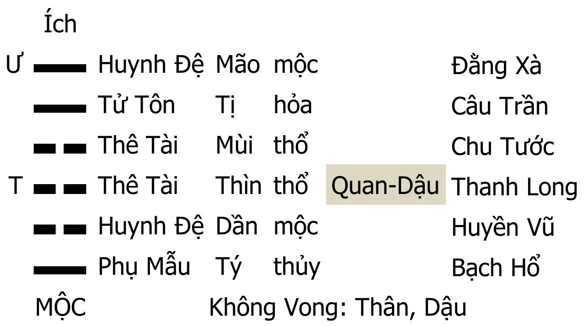
      - **Hình này chứng minh điều gì**
        - Chứng minh người cha mắc tiểu đường, ung thư niệu đạo và tổn thương thận do Dụng thần Tý thủy nhập Mộ tại hào 3 Thìn thổ lâm Thanh Long.
      - **Từ đâu mà thấy được**
        - Hào sơ Phụ Mẫu Tý thủy nhập Mộ ở Nhật Thìn; hào 3 Thê Tài Thìn thổ lâm Thanh Long khắc Tý thủy (phục Quan Quỷ Dậu kim).
    - **Phán đoán chi tiết:**
      - Căn cứ xác định Dụng thần: Con gái xem bệnh cho cha lấy hào Phụ Mẫu làm Dụng thần, tức hào sơ Phụ Mẫu Tý thủy (lâm Bạch Hổ).
      - Nhìn vào tương tác suy vượng và thế bế tắc nhập Mộ:
        - Phụ Mẫu Tý thủy lâm hào sơ được Nguyệt kiến Tý thủy đồng hành tỉ phù trợ khí nên không bị liệt vào dạng hưu tù nhược điểm.
        - Tuy nhiên, Nhật thần Thìn thổ lại trực xung khắc phạt Dụng thần (Thổ khắc Thủy); Thìn thổ là Thủy khố khiến Dụng thần Tý thủy lập tức nhập Mộ tại Nhật.
        - Kỵ thần đóng vai trò là căn bệnh; Kỵ thần Thìn thổ vừa khắc vừa thu Dụng thần vào Mộ địa thể hiện bệnh tình bám rễ sâu, giam hãm trói buộc người bệnh triền miên không thể thoát ra.
      - Nhìn vào hào vị, địa chi và thần sát nhận diện bệnh lý:
        - Nhật thần Thìn thổ nhập quẻ cư ngay tại hào 3 trì Thế (Thê Tài Thìn thổ phục tàng Quan Quỷ Dậu kim), lại lâm thần Thanh Long.
        - Hào 3 đối ứng trực tiếp với bàng quang, niệu đạo và vùng hạ bộ; địa chi Thìn thổ là tượng trưng của thận tạng, bàng quang và chứng đái tháo đường.
        - Thìn thổ tại hào 3 lâm Thanh Long đến khắc hại Dụng thần là tổ hợp thông tin điển hình, chuẩn xác của bệnh tiểu đường và khối u niệu đạo.
      - Kết luận bệnh lý: Khẳng định bệnh nhân mắc các bệnh nặng nề liên quan mật thiết đến thận, ống dẫn niệu và bệnh đái tháo đường.
    - **Ứng nghiệm thực tế:**
      - Trên thực tế người cha mắc chứng tiểu đường nặng biến chứng, bị ung thư niệu đạo và quả thận đã bị can thiệp phẫu thuật cắt bỏ một phần.

#### Ví dụ 5: Người nam tự đoán bệnh được quẻ Sơn Phong Cổ
- Quái lệ tự đoán bệnh với hào Thế gặp Bệnh địa tại Nguyệt và lâm Thanh Long:
  - **Ví dụ 5:** Ngày Canh Tuất tháng Hợi, một người nam đến gieo quẻ dự đoán bệnh tình của bản thân, được quẻ thuần tĩnh Sơn Phong Cổ (quái cung Tốn/Mộc, Tuần Không: Dần, Mão):
    - **Phán đoán chi tiết:**
      - Căn cứ chọn Dụng thần: Đương sự tự gieo quẻ hỏi về sức khỏe của mình nên lấy hào Thế làm Dụng thần đại diện bản thân. Trong quẻ, Thế ngự tại hào 3 mang Quan Quỷ Dậu kim.
      - Nhìn vào mức độ suy vượng: Hào Thế Dậu kim được Nhật thần Tuất thổ tương sinh (Thổ sinh Kim), do đó khí lực không bị hưu tù suy kiệt.
      - Nhìn vào trạng thái bệnh lý qua Nguyệt kiến: Hào Thế Kim đối chiếu với Nguyệt kiến Hợi thủy rơi đúng vào cung vị Bệnh địa theo quy luật Trường Sinh thập nhị cung (Kim sinh tại Tị, mộc dục tại Ngọ, quan đới tại Mùi, lâm quan tại Thân, đế vượng tại Dậu, suy tại Tuất, bệnh tại Hợi). Việc Thế lâm Bệnh địa báo hiệu mầm bệnh đang ủ kín trong người.
      - Nhìn vào hào vị phát bệnh: Nguyệt kiến Hợi thủy nhập quẻ ngự tại hào 2 (Phụ Mẫu Hợi thủy lâm Huyền Vũ). Hào 2 là hào vị của hệ thống sinh dục tiết niệu; hành Thủy ở hào 2 đại diện cho nước tiểu (niệu).
      - Nhìn vào lục thần chỉ bệnh: Hào Thế Dậu kim lâm Thanh Long; Thanh Long phối hợp với tượng Thủy ở hào 2 tiết niệu là chỉ dấu đặc trưng của chứng tiêu khát, đường niệu dư thừa.
      - Kết luận bệnh lý: Tổng hợp các căn cứ hào Thế lâm Bệnh địa, Hợi thủy nhập quẻ tại hào 2 và Thế lâm Thanh Long đưa ra kết luận đương sự mắc bệnh tiểu đường.
    - **Ứng nghiệm thực tế:**
      - Đương sự xác nhận bản thân đúng là đang mang căn bệnh tiểu đường.

#### Ví dụ 6: Người nam đoán vận khí bản thân được quẻ Phong Hỏa Gia Nhân biến Phong Trạch Trung Phu
- Quái lệ đoán vận khí suy ra bệnh tiểu đường từ hào Thế Sửu thổ bị hồi đầu khắc:
  - **Ví dụ 6:** Ngày Ất Hợi tháng Dần, một người nam đến gieo quẻ xem về vận khí bản thân, được quẻ Phong Hỏa Gia Nhân biến Phong Trạch Trung Phu (quái cung Tốn/Mộc, Tuần Không: Thân, Dậu):
    - **Phán đoán chi tiết:**
      - Căn cứ chọn Dụng thần và nguyên lý xét đoán vận khí: Trong việc dự trắc vận trình, tình trạng sức khỏe thể chất luôn là yếu tố nền tảng gắn liền với vận khí. Đương sự tự đoán vận hạn nên lấy hào Thế làm trung tâm phán đoán bản thân; trong quẻ Thế ngự tại hào 2 mang Thê Tài Sửu thổ.
      - Nhìn vào tổn hại đối với hào Thế:
        - Hào Thế Thê Tài Sửu thổ tại hào 2 bị Nguyệt kiến Dần mộc khắc phạt (Mộc khắc Thổ).
        - Bản thân hào Thế Sửu thổ phát động biến ra Huynh Đệ Mão mộc, Mão mộc quay lại khắc thương trực tiếp Sửu thổ (động hóa hồi đầu khắc), khiến hào Thế suy yếu trầm trọng.
      - Nhìn vào hào vị và địa chi chủ bệnh: Hào vị 2 đối ứng với vùng bụng dưới và hệ tiết niệu bài tiết; địa chi Sửu thổ thuộc Thổ, Thổ chủ về chất ngọt (đường). Vị trí bài tiết mang Thổ bị khắc hại biểu hiện rõ rệt sự rối loạn chuyển hóa chất đường.
      - Nhìn vào hào động tiếp sức chỉ điểm bệnh: Hào 3 Phụ Mẫu Hợi thủy phát động hóa Thê Tài Sửu thổ lâm Câu Trần; Hợi thủy là chất dịch bài tiết bị hóa Thổ khắc ngược (lại làm tổn thương Hỏa là Nguyên thần sinh Thế Thổ), càng củng cố và làm sáng tỏ thêm thông tin về bệnh tiểu đường.
      - Kết luận bệnh lý: Khẳng định trong vận khí của đương sự đang bị căn bệnh tiểu đường âm thầm chi phối, làm suy giảm sinh lực.
    - **Ứng nghiệm thực tế:**
      - Trên thực tế người nam này đang mắc bệnh tiểu đường.

### 20. BỆNH TUYẾN TIỀN LIỆT

#### Đặc trưng quái tượng trong dự trắc bệnh tuyến tiền liệt

- Đặc điểm giải phẫu, chức năng sinh lý và các thể bệnh tuyến tiền liệt:
  - Tuyến tiền liệt có cấu trúc hình nón, nằm ở vị trí phía sau niệu đạo của cơ thể nam giới.
  - Vị trí giải phẫu đặc thù nằm bao quanh niệu đạo khiến cho tuyến tiền liệt có mối liên hệ trực tiếp và chặt chẽ với hoạt động tiểu tiện và lưu thông nước tiểu.
  - Các chứng bệnh chủ yếu thường gặp ở tuyến tiền liệt bao gồm: viêm tuyến tiền liệt, phì đại tuyến tiền liệt và ung thư tuyến tiền liệt.
  - Bệnh lý tuyến tiền liệt xảy ra phổ biến nhất ở nam giới độ tuổi trung niên, đồng thời cũng xuất hiện nhiều ở nhóm người cao tuổi (lão niên).
- Quy luật quái tượng nhận diện bệnh tuyến tiền liệt qua bốn phương diện cốt lõi:
  - Phân định theo phương diện ngũ hành:
    - Liên quan trực tiếp và mật thiết đến ngũ hành Thủy.
    - Trong dự trắc bệnh tật của Lục Hào, ngũ hành Thủy đại diện cho nước tiểu (niệu dịch) và hệ thống bài tiết chất lỏng của cơ thể.
  - Phân định theo phương diện hào vị:
    - Liên quan chủ yếu đến hào 2 và hào 3 trong quẻ.
    - Hào 2 và hào 3 là hai hào vị đại diện cho bộ phận sinh dục, bàng quang và cửa ngõ bài tiết nước tiểu vùng hạ bộ.
  - Phân định theo phương diện lục thân:
    - Liên quan đặc biệt chặt chẽ với hào Thê Tài.
    - Lục thân Thê Tài trong tượng bệnh chủ về niệu dịch (nước tiểu); trạng thái suy vượng, động biến của hào Tài phản ánh thông suốt hay bế tắc của đường tiểu.
  - Phân định tính chất bệnh lý theo phương diện lục thần:
    - Chu Tước: Dụng thần vượng tướng lâm Chu Tước phần lớn chủ về chứng viêm nhiễm (viêm tuyến tiền liệt).
    - Câu Trần vượng tướng: Dụng thần vượng tướng lâm Câu Trần phần lớn chủ về chứng sưng trướng, mô tuyến tăng sinh phì đại (phì đại tuyến tiền liệt).
    - Câu Trần suy bại: Dụng thần hưu tù, lâm các trạng thái Tử, Mộ, Tuyệt mà đồng thời lâm Câu Trần thì bệnh biến thành khối u ác tính (ung thư tuyến tiền liệt).
- Mô hình quái tượng đối chiếu phản ánh cơ chế bài tiết đường niệu và hệ sinh dục:
  - **Quái lệ đối chiếu 1 (Tượng bài tiết nước tiểu qua Quẻ Sơn Phong Cổ):** Phân tích liên hệ giữa hào vị hệ tiết niệu và hành Thủy chủ niệu dịch.
    - **Hình 270.** Quẻ Sơn Phong Cổ
      - 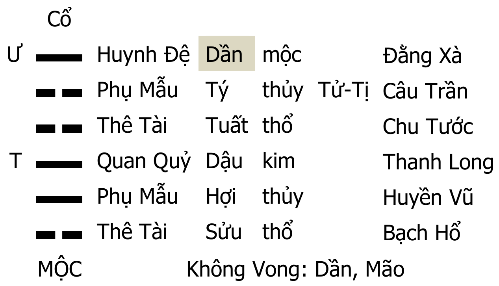
      - **Hình này chứng minh điều gì**
        - Thể hiện tượng hào 2 mang hành Thủy chủ niệu đạo, hệ bài tiết nước tiểu liên quan trực tiếp đến tuyến tiền liệt.
      - **Từ đâu mà thấy được**
        - Hào 2 Phụ Mẫu Hợi thủy là Bệnh địa lâm hào vị tiết niệu, liên hệ chặt chẽ với tình trạng bài tiết nước tiểu.
    - **Phán đoán chi tiết:**
      - Căn cứ: Lấy hào vị 2 và ngũ hành Thủy làm trọng tâm khảo sát cơ quan sinh dục hạ bộ và niệu đạo.
      - Nhìn vào: Vị trí bao quanh cổ bàng quang của tuyến tiền liệt khiến mọi rối loạn của hành Thủy tại hào 2 đều phản ánh trực tiếp sự ách tắc hoặc thông suốt của dòng tiểu.
  - **Quái lệ đối chiếu 2 (Biến động hào vị sinh dục tiết niệu qua Quẻ Phong Hỏa Gia Nhân biến Trung Phu):** Phân tích biến động tại cửa ngõ bài tiết nước tiểu.
    - **Hình 271.** Quẻ Phong Hỏa Gia Nhân biến Phong Trạch Trung Phu
      - 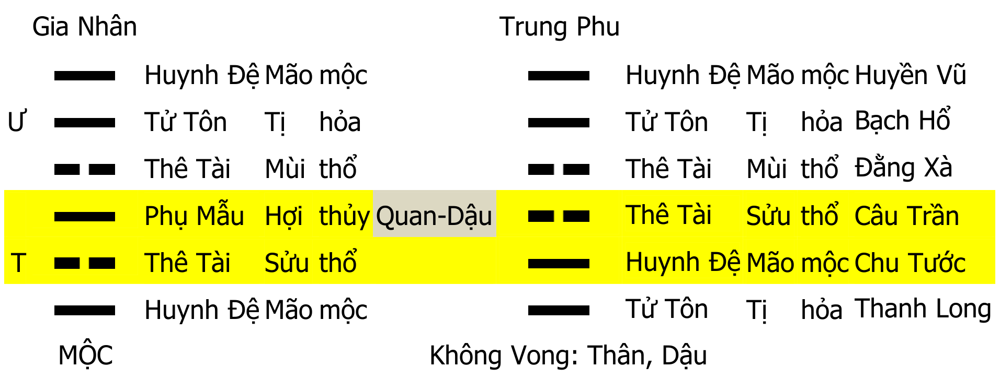
      - **Hình này chứng minh điều gì**
        - Thể hiện hào vị 2 và 3 chủ hệ tiết niệu sinh dục bị biến động, ảnh hưởng đến khả năng bài tiết nước tiểu.
      - **Từ đâu mà thấy được**
        - Hào Thế Sửu thổ tại hào 2 bị Nguyệt khắc hóa thoái, Hợi thủy hào 3 khắc thương Nguyên thần, tạo mối liên hệ bệnh lý niệu đạo.
    - **Phán đoán chi tiết:**
      - Căn cứ: Hào vị 2 và hào vị 3 là vùng sinh dục tiết niệu; hào Thê Tài chủ nước tiểu.
      - Nhìn vào: Hào Thế tọa tại hào 2 bị tổn thương khắc phạt kết hợp Thủy tại hào 3 biến động tạo nên nguy cơ suy giảm chức năng dẫn lưu niệu đạo tại vùng hạ bộ.

#### Các ví dụ dự trắc bệnh tuyến tiền liệt thực tế

##### Ví dụ 1: Bạn học đoán bệnh cho cha - Quẻ Lôi Địa Dự biến Địa Thủy Sư

- **Ví dụ 1:** Ngày Tân Dậu tháng Sửu (Tuần Không: Tý, Sửu), bạn học của tác giả gieo quẻ đoán bệnh cho cha, thu được quẻ Lôi Địa Dự biến Địa Thủy Sư.
  - **Hình 272.** Quẻ Lôi Địa Dự biến Địa Thủy Sư
    - 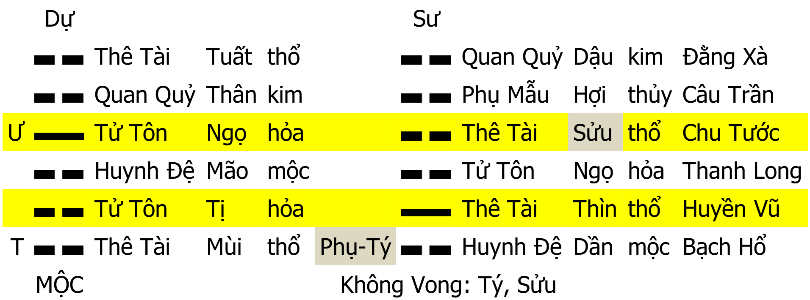
    - **Hình này chứng minh điều gì**
      - Cha của bạn học mắc chứng phì đại tuyến tiền liệt làm bế tắc đường tiểu nhưng không nguy hiểm đến tính mạng.
    - **Từ đâu mà thấy được**
      - Dụng thần Phụ Mẫu Tý thủy Nguyệt hợp Nhật sinh là vượng; Tý thủy Không Vong lại ngộ Tuyệt ở hào 2 Tử Tôn; Nguyên thần Thân kim bị hợp trói và lâm Câu Trần chủ phì đại.
  - **Phán đoán chi tiết:**
    - Căn cứ: Đoán bệnh cho cha, lấy hào Phụ Mẫu làm Dụng thần. Phụ Mẫu Tý thủy phục dưới hào sơ Thê Tài Mùi thổ, lâm Tuần Không; tuy nhiên được Nguyệt kiến Sửu thổ nhị hợp (Tý Sửu tương hợp), lại được Nhật thần Dậu kim tương sinh nên thuộc hàng vượng tướng, nhờ đó khẳng định bệnh này không nguy hiểm đến tính mạng người cha.
    - Nhìn vào: Ngũ hành Thủy đại diện cho nước tiểu. Thủy lâm Tuần Không biểu thị nước tiểu không thể xuất ra ngoài; lại gặp trạng thái Tuyệt địa tại hào 2 Tử Tôn Tị hỏa; trong cơ thể người hào 2 phối hợp Tử Tôn là vị trí bộ phận sinh dục, Thủy Không lại Tuyệt ở hào sinh dục biểu thị triệu chứng nước tiểu bị tắc ứ không thể thoát ra.
    - Phối hợp hào động và thần sát: Hào 3 Huynh Đệ Mão mộc phát động hóa Tử Tôn Ngọ hỏa sinh trợ, nhưng Tử Tôn lại hợp trói giữ chặt Nguyên thần Quan Quỷ Thân kim tại hào 5 (Tị Thân lục hợp), làm Nguyên thần bị trói (hợp bán) không thể phát huy tác dụng sinh Thủy, càng khiến tình trạng tiểu tiện bế tắc nghiêm trọng; mặt khác Nguyên thần Quan Quỷ Thân kim lâm Câu Trần, Câu Trần chủ sưng to, trương phì, kết hợp vị trí sinh dục và bế tắc niệu dịch nên tác giả quyết đoán chính xác là phì đại tuyến tiền liệt.
  - **Ứng nghiệm thực tế:**
    - Trên thực tế, người cha đúng là mắc chứng phì đại tuyến tiền liệt, đi tiểu không thông.

##### Ví dụ 2: Nam đoán bệnh của cha - Quẻ Thủy Thiên Nhu biến Tốn Vi Phong

- **Ví dụ 2:** Ngày Ất Dậu tháng Tý (Tuần Không: Ngọ, Mùi), một người nam gieo quẻ đoán bệnh cho cha, thu được quẻ Thủy Thiên Nhu biến Tốn Vi Phong.
  - **Hình 273.** Quẻ Thủy Thiên Nhu biến Tốn Vi Phong
    - 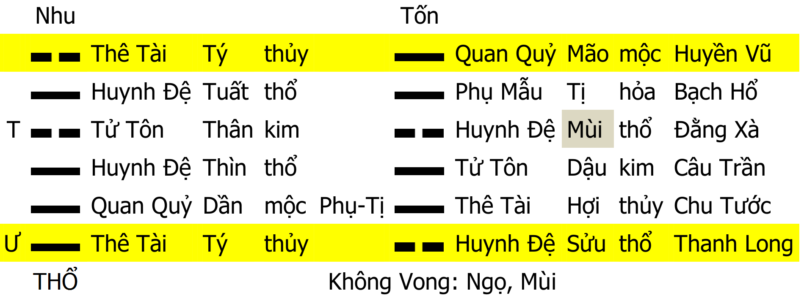
    - **Hình này chứng minh điều gì**
      - Người cha bị mắc chứng ung thư tuyến tiền liệt ác tính do Dụng thần hưu tù ngộ Tử địa và bị Kỵ thần khắc phạt.
    - **Từ đâu mà thấy được**
      - Phụ Mẫu Tị hỏa phục tại hào 2 gặp Nhật Dậu là Tử địa; bị hai hào Thê Tài Tý thủy lâm Thanh Long và Huyền Vũ khắc thương nặng nề.
  - **Phán đoán chi tiết:**
    - Căn cứ: Đoán bệnh người cha, lấy hào Phụ Mẫu làm Dụng thần. Phụ Mẫu Tị hỏa không xuất hiện trên quẻ, phục tàng tại hào 2 Quan Quỷ Dần mộc. Tháng Tý thuộc mùa đông hàn Thủy nắm lệnh, Dụng thần Tị hỏa hưu tù vô khí; trong khi đó Kỵ thần Thê Tài Tý thủy lưỡng hiện tại hào sơ (lâm Thanh Long) và hào 6 (lâm Huyền Vũ) cực vượng đến khắc phạt gay gắt Phụ Mẫu Tị hỏa; Dụng thần hưu tù mà Kỵ thần vượng tướng báo hiệu bệnh tình vô cùng trầm trọng.
    - Nhìn vào: Ngũ hành Thủy đại diện cho nước tiểu; hào vị 2 là vị trí cơ quan sinh dục hạ bộ; đối với nam giới, cơ quan gắn liền giữa dòng tiểu và bộ phận sinh dục chính là tuyến tiền liệt.
    - Dấu hiệu bệnh ác tính (ung thư): Dụng thần Phụ Mẫu Tị hỏa đối chiếu với Nhật thần Dậu kim rơi vào đất Tử (Hỏa tử tại Dậu theo quy luật 12 trạng thái trường sinh); Dụng thần vừa hưu tù, vừa bị khắc thương tầng tầng lớp lớp, lại ngộ Tử địa, hội tụ đầy đủ thông tin của khối u ác tính biến thành ung thư tại tuyến tiền liệt.
  - **Ứng nghiệm thực tế:**
    - Vào năm 2001, người cha được chẩn đoán chính xác mắc bệnh ung thư tuyến tiền liệt.

##### Ví dụ 3: Đồng hương đoán bệnh cấp tính cho con nhỏ - Quẻ Địa Hỏa Minh Di biến Lôi Hỏa Phong

- **Ví dụ 3:** Ngày Ất Hợi tháng Tuất (Tuần Không: Thân, Dậu), một người đồng hương ở quê nhà gieo quẻ hỏi bệnh cấp tính cho con nhỏ, thu được quẻ Địa Hỏa Minh Di biến Lôi Hỏa Phong.
  - **Hình 274.** Quẻ Địa Hỏa Minh Di biến Lôi Hỏa Phong
    - 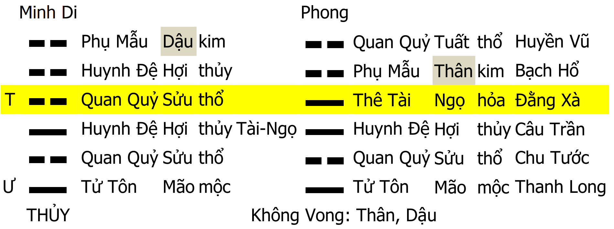
    - **Hình này chứng minh điều gì**
      - Đứa con nhỏ phát bệnh viêm tuyến tiền liệt cấp tính dẫn tới tình trạng bàng quang bí tức không đi tiểu được.
    - **Từ đâu mà thấy được**
      - Hào 4 Quan Quỷ Sửu thổ độc phát khắc thương Nguyên thần Huynh Đệ Hợi thủy tại hào 3; hào 3 Thủy chủ đường niệu đạo không thể sinh Dụng thần Tử Tôn.
  - **Phán đoán chi tiết:**
    - Căn cứ: Đoán bệnh cho con nhỏ, lấy hào Tử Tôn làm Dụng thần. Tử Tôn Mão mộc ngự tại hào sơ lâm Thanh Long, được Nguyệt kiến Tuất thổ tương hợp (Mão Tuất hợp), lại được Nhật thần Hợi thủy tương sinh nên Dụng thần vượng tướng có gốc, chủ về sinh mệnh vững vàng, không nguy hiểm đến tính mạng.
    - Nhìn vào: Trong quẻ có hào 4 Quan Quỷ Sửu thổ độc phát (lâm Đằng Xà, động hóa Thê Tài Ngọ hỏa hồi đầu sinh); Thổ động hung hãn chuyên khắc Thủy, khắc phạt dữ dội Nguyên thần Huynh Đệ Hợi thủy ngự tại hào 3 (lâm Câu Trần). Nguyên thần Hợi thủy bị Thổ khắc thương triệt để nên mất đi công năng sinh dưỡng Dụng thần Tử Tôn Mão mộc.
    - Cơ chế bệnh lý đường niệu đạo: Hào vị 3 kết hợp ngũ hành Thủy đại diện cho hệ thống bài tiết và đường dẫn niệu đạo. Thủy bị khắc chặn đứng nguồn mạch, biểu thị đường tiểu tiện bị bế tắc cấp thời, nước tiểu không thể xuất ra ngoài được; tính chất bệnh cấp tính đột ngột kết hợp dấu hiệu tắc niệu tại hạ bộ tương ứng với phản ứng viêm nhiễm cấp ở tuyến tiền liệt.
  - **Ứng nghiệm thực tế:**
    - Đứa con nhỏ bị chẩn đoán viêm tuyến tiền liệt cấp tính, tiểu tiện bế tắc không ra được.

##### Ví dụ 4: Nam tự đoán bệnh bản thân - Quẻ Thiên Hỏa Đồng Nhân biến Càn Vi Thiên

- **Ví dụ 4:** Ngày Nhâm Dần tháng Dậu (Tuần Không: Thìn, Tị), một người nam gieo quẻ tự đoán bệnh của bản thân, thu được quẻ Thiên Hỏa Đồng Nhân biến Càn Vi Thiên.
  - **Hình 275.** Sơ đồ quẻ Thiên Hỏa Đồng Nhân biến Càn Vi Thiên
    - 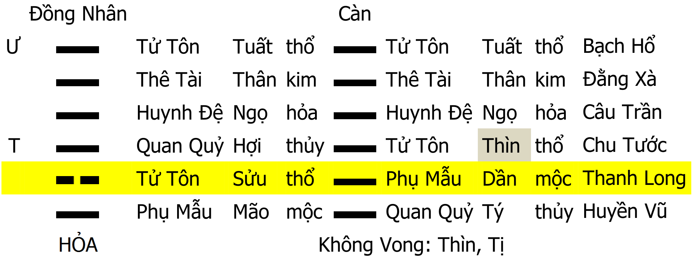
    - **Hình này chứng minh điều gì**
      - Người nam mắc chứng viêm tuyến tiền liệt do hào Thế lâm Chu Tước bị khắc và bị Nhật thần Bệnh địa hợp trói.
    - **Từ đâu mà thấy được**
      - Hào Thế Quan Quỷ Hợi thủy tại hào 3 lâm Chu Tước bị hào 2 Tử Tôn Sửu thổ khắc; lại bị Nhật Dần là Bệnh địa hợp cản trở lưu thông nước tiểu.
  - **Phán đoán chi tiết:**
    - Căn cứ: Người nam tự xem bệnh cho bản thân nên lấy hào Thế làm Dụng thần. Hào Thế Quan Quỷ Hợi thủy ngự tại hào 3, lâm Chu Tước. Lục thần Chu Tước chủ về nhiệt tạng, cảm giác nóng rát, sưng đỏ và phản ứng viêm nhiễm.
    - Nhìn vào: Hào Thế Hợi thủy cư hào 3 bị hào 2 Tử Tôn Sửu thổ phát động đến khắc phạt (Sửu thổ động hóa Phụ Mẫu Dần mộc). Hào 2 và hào 3 trong phép phân chia hào vị thân thể chính là vị trí của bộ phận sinh dục; ngũ hành Thủy chủ quản niệu dịch và lưu lượng nước tiểu.
    - Cơ chế ách tắc do Bệnh địa tương hợp: Hào Thế Hợi thủy tương hợp với Nhật thần Dần mộc (Hợi Dần tương hợp); xét theo 12 trạng thái trường sinh, ngũ hành Thủy ngộ Dần là đất Bệnh (Thủy lâm Dần là Bệnh địa). Thủy bị Bệnh địa hợp trói chặt (hợp bán) khiến dòng chảy bị cầm giữ, nước tiểu không thể chảy thông suốt, phát sinh triệu chứng đi tiểu buốt rắt; kết hợp vị trí hào 2 - 3 sinh dục và Chu Tước chủ viêm suy ra đương sự mắc bệnh viêm tuyến tiền liệt.
  - **Ứng nghiệm thực tế:**
    - Trên thực tế, người nam xác nhận bản thân bị viêm tuyến tiền liệt.

##### Ví dụ 5: Nữ đoán bệnh cho cha - Quẻ Cấn Vi Sơn biến Sơn Phong Cổ

- **Ví dụ 5:** Ngày Đinh Sửu tháng Mùi (Tuần Không: Thân, Dậu), một người phụ nữ gieo quẻ đoán bệnh cho cha, thu được quẻ Cấn Vi Sơn biến Sơn Phong Cổ.
  - **Hình 276.** Sơ đồ quẻ Cấn Vi Sơn biến Sơn Phong Cổ
    - 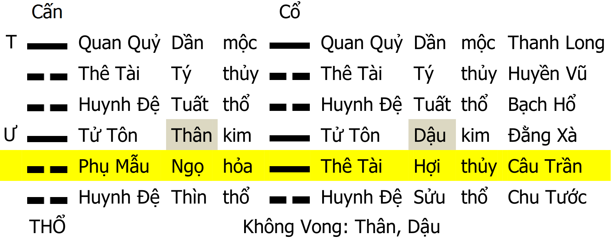
    - **Hình này chứng minh điều gì**
      - Người cha mắc chứng phì đại tuyến tiền liệt do Dụng thần tại hào 2 lâm Câu Trần động hóa Thủy hồi đầu khắc.
    - **Từ đâu mà thấy được**
      - Phụ Mẫu Ngọ hỏa tại hào 2 (bộ phận sinh dục) lâm Câu Trần chủ phì đại, động hóa Thê Tài Hợi thủy (nước tiểu) hồi đầu khắc.
  - **Phán đoán chi tiết:**
    - Căn cứ: Con gái gieo quẻ đoán bệnh cha, lấy hào Phụ Mẫu làm Dụng thần. Phụ Mẫu Ngọ hỏa ngự tại hào 2, lâm lục thần Câu Trần. Hào 2 phát động hóa ra Thê Tài Hợi thủy hồi đầu khắc (Hợi thủy khắc Ngọ hỏa).
    - Nhìn vào: Hào vị 2 là vị trí đại diện cho bộ phận sinh dục; hào biến mang ngũ hành Hợi thủy chủ về nước tiểu và dòng chảy niệu dịch. Việc hào vị sinh dục động biến hóa Thủy khắc ngược trở lại phản ánh cơ chế bài tiết niệu đạo bị chèn ép tổn thương trực tiếp.
    - Thần sát chỉ phì đại: Dụng thần Phụ Mẫu Ngọ hỏa lâm lục thần Câu Trần; Câu Trần mang bản tính Thổ, chủ về sự dồn tụ mô cơ, ách tắc ứ trệ, sưng to và phì đại. Dụng thần tại hào vị sinh dục lâm Câu Trần bị Thủy khắc thương tạo thành tổ hợp quái tượng điển hình của chứng phì đại tuyến tiền liệt ở nam giới lớn tuổi.
  - **Ứng nghiệm thực tế:**
    - Trên thực tế, người cha đúng là mắc chứng phì đại tuyến tiền liệt, gặp khó khăn khi tiểu tiện.

##### Ví dụ 6: Lão tiên sinh tự đoán bệnh bản thân - Quẻ Thiên Hỏa Đồng Nhân biến Trạch Hỏa Cách

- **Ví dụ 6:** Ngày Ất Hợi tháng Tuất (Tuần Không: Thân, Dậu), một lão tiên sinh gieo quẻ tự đoán bệnh của bản thân, thu được quẻ Thiên Hỏa Đồng Nhân biến Trạch Hỏa Cách.
  - **Phán đoán chi tiết:**
    - Căn cứ: Lão tiên sinh tự xem bệnh tật của mình nên lấy hào Thế làm Dụng thần. Hào Thế Quan Quỷ Hợi thủy ngự tại hào 3, lâm lục thần Câu Trần.
    - Nhìn vào: Hào vị 3 là vị trí của vùng hạ bộ và bộ phận sinh dục; ngũ hành Hợi thủy chủ quản niệu dịch và dòng nước tiểu. Hào Thế Hợi thủy bị hào Ứng Tử Tôn Tuất thổ tại hào 6 phát động khắc phạt (Tuất thổ động hóa Tử Tôn Mùi thổ là Thoái thần), đồng thời hào 2 Tử Tôn Sửu thổ trong quẻ nội cũng tạo thế khắc hãm Thủy. Lục thân Tử Tôn đại diện cho bộ phận sinh dục, khắc nhập vào hào Thế Hợi thủy chủ dòng nước tiểu.
    - Thần sát chỉ phì đại: Hào Thế Quan Quỷ Hợi thủy lâm Câu Trần; Câu Trần tượng trưng cho khối phình to, xơ hóa và tăng sinh phì đại; kết hợp hào 3 sinh dục, hành Thủy bài tiết bị khắc và Câu Trần chủ phì đại, luận đoán người cao tuổi này mắc bệnh phì đại tuyến tiền liệt.
  - **Ứng nghiệm thực tế:**
    - Lão tiên sinh đúng là bị bệnh phì đại tuyến tiền liệt, tuổi cao kèm theo chứng tiểu rắt khó đi.

### 21. BỆNH PHỤ KHOA

#### Tổng quan và nguyên lý dự trắc bệnh phụ khoa

##### Đặc trưng đối ứng lục thân và hào vị trong bệnh phụ khoa
- Khái niệm bệnh phụ khoa:
  - Tên gọi chung của các bệnh lý xảy ra tại hệ thống cơ quan sinh dục nữ.
  - Các chứng bệnh thường gặp gồm: kinh nguyệt không đều, mất kinh (bế kinh), đau bụng kinh, xuất huyết tử cung, viêm hố chậu, viêm cổ tử cung, u xơ tử cung, u nang buồng trứng, ung thư tử cung, hội chứng tiền mãn kinh và mãn kinh.
- Quy tắc đối ứng lục thân trong dự trắc bệnh phụ khoa:
  - Hào Tử Tôn: Đại diện trực tiếp cho tử cung, buồng trứng và cơ quan sinh nở (do Tử Tôn là con cái, chủ sự sinh dục).
  - Hào Huynh Đệ: Là hào sinh trợ Tử Tôn, do đó cũng biểu thị tử cung và cơ quan nuôi dưỡng thai nhi.
  - Hào Thê Tài: Đại diện cho kinh nguyệt, máu huyết sinh dục và dịch thể phụ khoa.
  - Các hào vị phối thuộc đặc thù: Trường Sinh địa của Tử Tôn, Thai địa của Tử Tôn, Mộ khố của Tử Tôn, hoặc hào tương hợp với Tử Tôn đều mang thông tin về tử cung và chức năng sinh sản.
- Quy tắc đối ứng hào vị:
  - Hào 2 và hào 3: Hai hào vị chủ chốt đại diện cho tử cung, buồng trứng và khu vực tiểu khung hố chậu.
  - Hào 4: Trường hợp cá biệt biểu thị phần trên của cơ quan sinh dục hoặc đường dẫn truyền nội tiết.

##### Đặc trưng đối ứng lục thần và cơ chế mất kinh
- Quy tắc đối ứng lục thần:
  - Thanh Long: Đại diện cho chức năng sinh dục, cơ quan sinh sản; khi lâm bệnh thường chủ về đau bụng kinh hoặc co thắt.
  - Chu Tước: Chủ về chứng viêm nhiễm, sưng tấy nóng rát ở bộ phận phụ khoa.
  - Câu Trần: Chủ về các khối u, bướu thịt, u xơ, u nang cục bộ hoặc ung thư.
  - Đằng Xà: Thể hiện tình trạng nhiễm virus, dị tật, hoặc tổn thương tại các bộ phận có hình thể dài nhỏ như ống dẫn trứng.
  - Bạch Hổ: Đại diện cho kinh nguyệt, máu huyết, xuất huyết hoặc băng huyết tổn thương.
  - Huyền Vũ: Đại diện cho bệnh kín đáo vùng hạ bộ, các bệnh lý phụ khoa mạn tính hoặc dịch nhờn ẩm thấp.
- Cơ chế quái tượng của chứng bế kinh và mất kinh:
  - Khi trong quẻ hành Thủy hoặc hào Thê Tài bị hợp vướng chân (hợp phược), nhập Mộ khố, hoặc phục tàng: Cản trở lưu chuyển, không thể sinh Dụng thần, dẫn đến kinh huyết không thể thoát ra ngoài theo chu kỳ.
  - Nhập Mộ biểu thị sự ẩn khuất, không xuất hiện; phục tàng biểu thị giấu kín không thấy: Đều là các tổ hợp quái tượng xác nhận tình trạng mất kinh (vô kinh).
  - Quái tượng minh họa cơ chế bế kinh và kinh huyết tắc nghẽn:
    - **Hình 277.** Sơ đồ quẻ Thiên Hỏa Đồng Nhân biến Trạch Hỏa Cách
      - 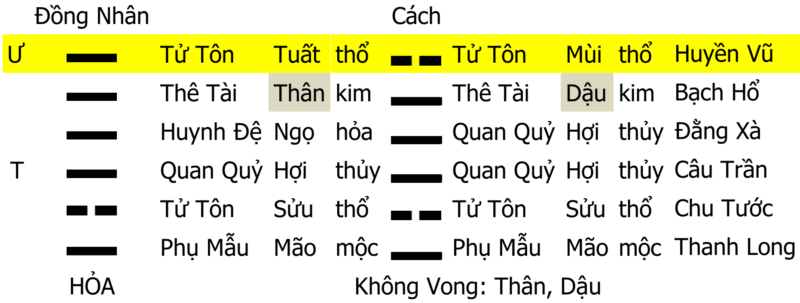
      - **Hình này chứng minh điều gì**
        - Minh họa quái tượng Thê Tài ngộ Không Vong, hào Huynh Đệ biến Quan Quỷ cản trở, thể hiện chứng bế tắc kinh huyết.
      - **Từ đâu mà thấy được**
        - Hào 5 Thê Tài Thân kim ngộ Tuần Không động hóa Dậu kim ngộ Không, hào 4 Huynh Đệ Ngọ hỏa hóa Quan Quỷ Hợi thủy.

#### Các quái lệ thực chứng về bệnh phụ khoa

##### Nhóm bệnh lý u xơ, u nang và viêm sưng cơ quan sinh dục
- **Ví dụ 1:** Ngày Ất Mùi tháng Mão, người nữ dự đoán bệnh của bản thân, được quẻ Thủy Địa Tỷ biến Trạch Địa Tụy.
  - **Hình 278.** Quẻ Thủy Địa Tỷ biến Trạch Địa Tụy
    - 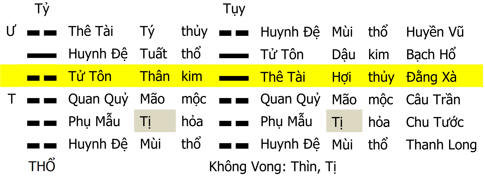
    - **Hình này chứng minh điều gì**
      - Thể hiện bệnh u xơ tử cung do Tử Tôn độc phát khắc hào Thế tại cung vị tử cung.
    - **Từ đâu mà thấy được**
      - Hào Thế Quan Quỷ Mão mộc tại hào 3 lâm Câu Trần, bị hào 4 Tử Tôn Thân kim độc phát đến khắc.
  - **Thông tin quái tượng:**
    - Tuần Không: Thìn, Tị (ngũ hành Thổ).
    - Dụng thần: Lấy hào Thế làm Dụng thần.
  - **Phán đoán chi tiết:**
    - Căn cứ: Thế đóng tại hào 3 lâm Câu Trần, bị Tử Tôn Thân kim tại hào 4 độc phát khắc chế.
    - Nhìn vào: Hào 3 là hào vị tử cung; Mão mộc là Thai địa của Tử Tôn nên mang thông tin tử cung; bản thân lục thân Tử Tôn cũng chủ về tử cung; Câu Trần là tượng khối u; sự kết hợp này tạo thành tổ hợp điển hình của bệnh u xơ tử cung.
  - **Ứng nghiệm thực tế:**
    - Người phụ nữ mắc bệnh u xơ tử cung.

- **Ví dụ 2:** Ngày Bính Thân tháng Sửu, người nữ dự đoán việc chuyển nhà, được quẻ Thiên Sơn Độn biến Thiên Phong Cấu.
  - **Hình 279.** Quẻ Thiên Sơn Độn biến Thiên Phong Cấu
    - 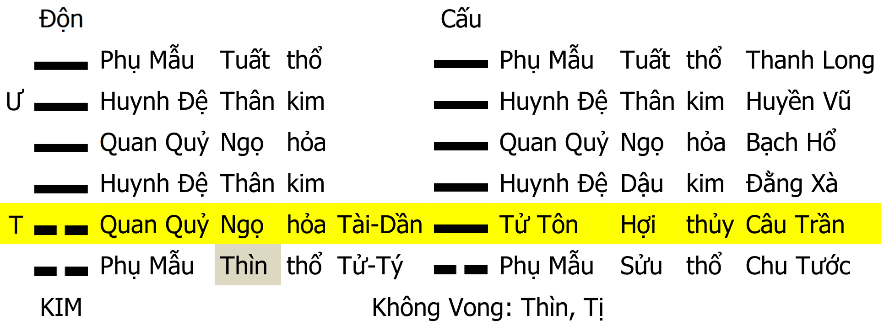
    - **Hình này chứng minh điều gì**
      - Thể hiện dấu hiệu u xơ tử cung xuất hiện trong quẻ dự đoán sự việc khác.
    - **Từ đâu mà thấy được**
      - Hào Thế Quan Quỷ Ngọ hỏa tại hào 2 lâm Câu Trần, động hóa Tử Tôn Hợi thủy hồi đầu khắc.
  - **Thông tin quái tượng:**
    - Tuần Không: Thìn, Tị (ngũ hành Kim).
    - Dụng thần: Lấy hào Thế làm Dụng thần.
  - **Phán đoán chi tiết:**
    - Căn cứ: Khi chiêm đoán việc khác, thông tin bệnh tật vẫn có thể bộc lộ rõ ràng trên hào Thế.
    - Nhìn vào: Thế tại hào 2 lâm Câu Trần phát động, hóa ra Tử Tôn Hợi thủy quay lại hồi đầu khắc; hào 2 là cung vị tử cung; Tử Tôn cũng đại diện cho tử cung; Câu Trần chủ khối u; do đó kết luận người này đang mang u xơ tử cung.
  - **Ứng nghiệm thực tế:**
    - Người hỏi quẻ xác nhận đúng là bản thân đang bị u xơ tử cung.

- **Ví dụ 3:** Ngày Đinh Hợi tháng Thìn, người nữ dự đoán bệnh của bản thân, được quẻ Cấn Vi Sơn biến Sơn Địa Bác.
  - **Hình 280.** Quẻ Cấn Vi Sơn biến Sơn Địa Bác
    - 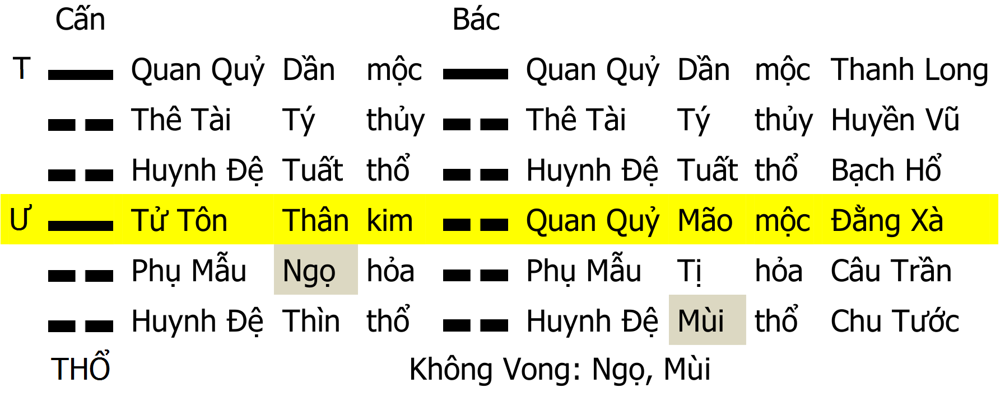
    - **Hình này chứng minh điều gì**
      - Thể hiện bệnh u nang buồng trứng do Tử Tôn tại hào 3 động hóa Quan Quỷ và lâm Thủy.
    - **Từ đâu mà thấy được**
      - Hào 3 Tử Tôn Thân kim động hóa Quan Quỷ Mão mộc, gặp Nhật thần Hợi thủy chủ tích dịch u nang.
  - **Thông tin quái tượng:**
    - Tuần Không: Ngọ, Mùi (ngũ hành Thổ).
    - Dụng thần: Lấy hào Thế làm Dụng thần.
  - **Phán đoán chi tiết:**
    - Căn cứ: Hào 3 Tử Tôn Thân kim (Ứng hào) phát động hóa Quan Quỷ Mão mộc.
    - Nhìn vào: Hào 3 là hào vị tử cung; Tử Tôn đại diện cho tử cung và phần phụ sinh dục; Tử Tôn động hóa Quan Quỷ là tượng cơ quan sinh dục biến sinh bệnh tật; Kỵ thần tại hào 3 lại gặp Nhật thần Hợi thủy, u nang có chứa chất dịch lỏng (thủy), do đó định bệnh là u nang buồng trứng.
  - **Ứng nghiệm thực tế:**
    - Người nữ trên thực tế bị u nang buồng trứng.

- **Ví dụ 4:** Ngày Giáp Thân tháng Sửu, người nữ dự đoán bệnh của bản thân, được quẻ Trạch Sơn Hàm biến Thủy Sơn Kiển.
  - **Hình 281.** Quẻ Trạch Sơn Hàm biến Thủy Sơn Kiển
    - 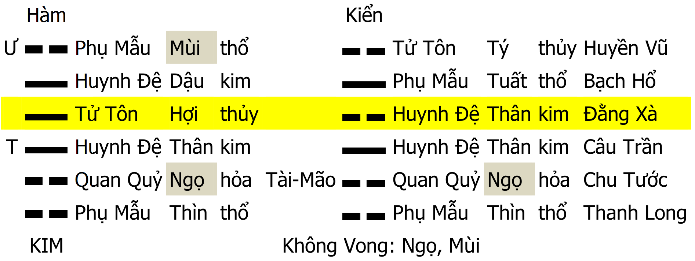
    - **Hình này chứng minh điều gì**
      - Thể hiện chứng bệnh sưng phù ống dẫn trứng dựa vào tượng Bệnh địa độc phát lâm Đằng Xà.
    - **Từ đâu mà thấy được**
      - Thế tại hào 3 lâm Câu Trần là Trường Sinh của Tử Tôn; Bệnh địa Tử Tôn Hợi thủy lâm Đằng Xà độc phát.
  - **Thông tin quái tượng:**
    - Tuần Không: Ngọ, Mùi (ngũ hành Kim).
    - Dụng thần: Lấy hào Thế Huynh Đệ Thân kim làm Dụng thần.
  - **Phán đoán chi tiết:**
    - Căn cứ: Hào Thế Thân kim tại hào 3 lâm Câu Trần; Thân kim là Trường Sinh địa của Tử Tôn Hợi thủy; hào 4 Tử Tôn Hợi thủy độc phát.
    - Nhìn vào: Hào 3 là hào vị tử cung; Trường Sinh địa của Tử Tôn là nơi sinh thành con cái; Thân kim gặp Bệnh địa độc phát (Thân kim bệnh tại Hợi); bệnh phát ra ở hào Tử Tôn là bộ phận sinh dục; Tử Tôn Hợi thủy lâm Đằng Xà mang tượng bộ phận dài và nhỏ; căn cứ tượng đó tác giả phán đoán ống dẫn trứng bị sưng phù hoặc ung thư ống dẫn trứng.
  - **Ứng nghiệm thực tế:**
    - Kết quả kiểm tra y tế xác nhận ống dẫn trứng bị sưng phù.

- **Ví dụ 8:** Ngày Giáp Thìn tháng Sửu, người nữ dự đoán bệnh của bản thân, được quẻ Thiên Hỏa Đồng Nhân biến Phong Thiên Tiểu Súc.
  - **Hình 285.** Quẻ Thiên Hỏa Đồng Nhân biến Phong Thiên Tiểu Súc
    - 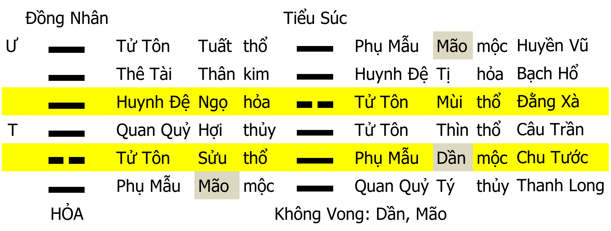
    - **Hình này chứng minh điều gì**
      - Thể hiện u xơ tử cung phát hiện qua hào động hóa hồi đầu khắc ngộ Không Vong.
    - **Từ đâu mà thấy được**
      - Thế tại hào 3 lâm Câu Trần; hào 2 Tử Tôn Sửu thổ động hóa Phụ Mẫu Dần mộc hồi đầu khắc và lâm Không.
  - **Thông tin quái tượng:**
    - Tuần Không: Dần, Mão (ngũ hành Hỏa).
    - Dụng thần: Lấy hào Thế Quan Quỷ Hợi thủy làm Dụng thần.
  - **Phán đoán chi tiết:**
    - Căn cứ: Hào Thế tại hào 3 bị Nhật Nguyệt thổ khắc; hào 6 Tử Tôn Tuất thổ ám động khắc Thế; hào 2 Tử Tôn Sửu thổ động khắc Thế; hào 4 Huynh Đệ Ngọ hỏa động hóa Kỵ thần Tử Tôn Mùi thổ. Kỵ thần trùng trùng xuất hiện nhưng bệnh tật lại không chuyển thành hiểm nghèo.
    - Nhìn vào: Hào 2 Tử Tôn Sửu thổ động hóa Phụ Mẫu Dần mộc hồi đầu khắc, Dần mộc lại ngộ Tuần Không nên Sửu thổ bất lực không khắc được Thế; do đó hào 2 chỉ điểm chính xác vị trí có vấn đề; Thế lâm Câu Trần chủ khối u; hào 2 và hào 3 đều là tử cung; Tử Tôn cũng là tử cung; vì vậy kết luận là u xơ tử cung.
  - **Ứng nghiệm thực tế:**
    - Người bệnh đúng là có khối u xơ tử cung.

- **Ví dụ 9:** Ngày Ất Mùi tháng Mão, người nữ dự đoán bệnh của bản thân, được quẻ Hỏa Địa Tấn biến Sơn Địa Bác.
  - **Hình 286.** Quẻ Hỏa Địa Tấn biến Sơn Địa Bác
    - 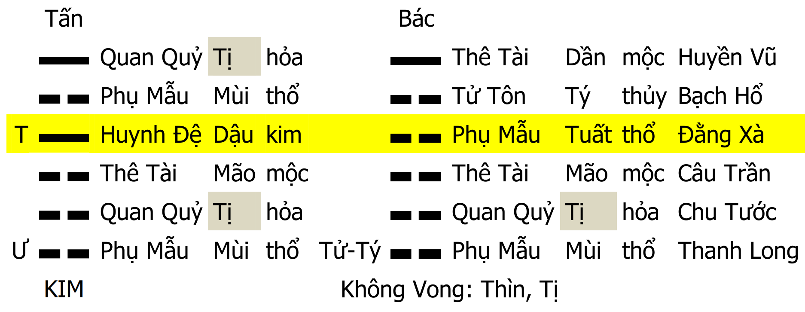
    - **Hình này chứng minh điều gì**
      - Thể hiện bệnh u xơ tử cung phải phẫu thuật cắt bỏ, mất khả năng sinh sản.
    - **Từ đâu mà thấy được**
      - Thế Huynh Đệ Dậu kim bị Nguyệt kiến Mão xung phá; Mão mộc nhập quẻ tại hào 3 lâm Câu Trần.
  - **Thông tin quái tượng:**
    - Tuần Không: Thìn, Tị (ngũ hành Kim).
    - Dụng thần: Lấy hào Thế Huynh Đệ Dậu kim làm Dụng thần.
  - **Phán đoán chi tiết:**
    - Căn cứ: Thế được Nhật Mùi thổ sinh, động hóa Phụ Mẫu Tuất thổ hồi đầu sinh, nhưng bị Nguyệt kiến Mão mộc xung phá (Nguyệt phá), cho thấy cơ thể có tổn thương bệnh lý.
    - Nhìn vào: Hào Thế là Huynh Đệ - lục thân sinh ra Tử Tôn nên đại diện cho tử cung; Nguyệt kiến Mão mộc xung phá Thế đồng thời nhập vào quẻ tại hào 3 Thê Tài Mão mộc; hào 3 là hào vị tử cung lâm Câu Trần chủ khối u; tổng hợp lại là chứng u xơ tử cung.
  - **Ứng nghiệm thực tế:**
    - Người này đã phẫu thuật cắt bỏ u xơ tử cung, dẫn đến mất hoàn toàn khả năng sinh nở.

##### Nhóm bệnh lý ác tính và ung thư tử cung
- **Ví dụ 6:** Ngày Giáp Tý tháng Dần, người nữ dự đoán niên vận, được quẻ Phong Sơn Tiệm biến Thiên Sơn Độn.
  - **Hình 283.** Quẻ Phong Sơn Tiệm biến Thiên Sơn Độn
    - 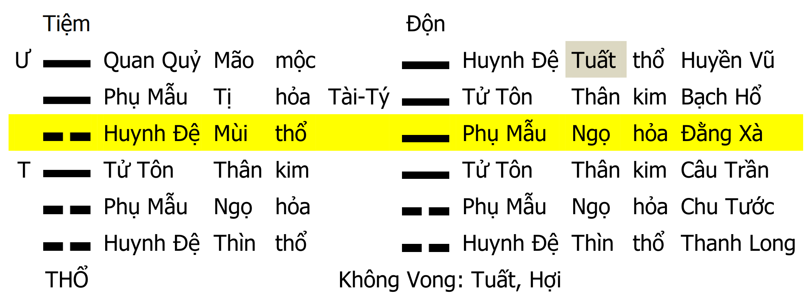
    - **Hình này chứng minh điều gì**
      - Thể hiện bệnh ung thư tử cung do hào Thế lâm Tử Tôn lâm Nguyệt phá, Tử Tuyệt và Câu Trần.
    - **Từ đâu mà thấy được**
      - Thế tại hào 3 Tử Tôn Thân kim lâm Câu Trần bị Nguyệt kiến Dần xung phá, ngộ Tuyệt ở Nguyệt và Tử ở Nhật.
  - **Thông tin quái tượng:**
    - Tuần Không: Tuất, Hợi (ngũ hành Thổ).
    - Dụng thần: Lấy hào Thế làm Dụng thần.
  - **Phán đoán chi tiết:**
    - Căn cứ: Quẻ chiêm niên vận thường phản ánh dấu hiệu bệnh tật trọng đại phát sinh trong năm.
    - Nhìn vào: Hào Thế tại hào 3 Tử Tôn Thân kim bị Nguyệt kiến Dần mộc xung phá (Nguyệt phá), lâm Câu Trần; Thân kim gặp Nguyệt là Tuyệt địa, gặp Nhật Tý thủy là Tử địa; hào 3 là cung vị tử cung; lục thân Tử Tôn cũng là tử cung; Câu Trần biểu thị khối u bướu ác tính; lâm trạng thái Tử, Tuyệt, Phá kết hợp Câu Trần là dấu hiệu của bệnh ung thư tử cung nguy hiểm.
  - **Ứng nghiệm thực tế:**
    - Trên thực tế người nữ này đã mắc bệnh ung thư tử cung.

##### Nhóm bệnh lý rối loạn kinh nguyệt và xuất huyết tử cung
- **Ví dụ 5:** Ngày Canh Dần tháng Tý, người nữ dự đoán niên vận, được quẻ Hỏa Phong Đỉnh biến Tốn Vi Phong.
  - **Hình 282.** Quẻ Hỏa Phong Đỉnh biến Tốn Vi Phong
    - 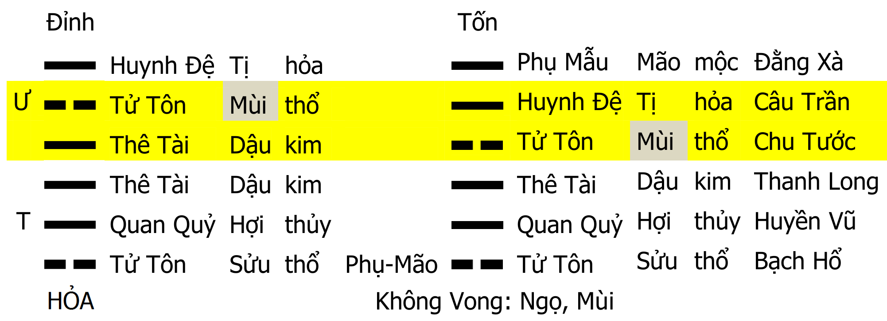
    - **Hình này chứng minh điều gì**
      - Thể hiện bệnh kinh nguyệt không đều trong quẻ chiêm niên vận.
    - **Từ đâu mà thấy được**
      - Hào 2 lâm Huyền Vũ chủ bộ phận sinh dục kín; hào 5 động hóa Không Vong không thể sinh trợ Thế.
  - **Thông tin quái tượng:**
    - Tuần Không: Ngọ, Mùi (ngũ hành Hỏa).
    - Dụng thần: Lấy hào Thế Quan Quỷ Hợi thủy làm Dụng thần.
  - **Phán đoán chi tiết:**
    - Căn cứ: Nhiều quẻ chiêm niên vận hiển lộ các thông tin bệnh tật mạn tính.
    - Nhìn vào: Hào 2 lâm Huyền Vũ đại diện cho bộ phận sinh dục kín đáo; Nguyên thần của hào bệnh là Thê Tài chủ về kinh nguyệt; quẻ thuộc cung Ly chủ về các bệnh phụ khoa; hào 5 Tử Tôn Mùi thổ phát động nhưng hóa ra Không Vong (Ngọ Mùi Không Vong), thiếu hụt lực sinh hào Thế; do đó phán đoán chu kỳ kinh nguyệt bị xáo trộn, kinh nguyệt không đều.
  - **Ứng nghiệm thực tế:**
    - Người nữ xác nhận chu kỳ kinh nguyệt hoàn toàn không đều đặn.

- **Ví dụ 7:** Ngày Quý Sửu tháng Sửu, người nữ dự đoán bệnh của bản thân, được quẻ Sơn Thiên Đại Súc (quẻ tĩnh).
  - **Hình 284.** Quẻ Sơn Thiên Đại Súc
    - 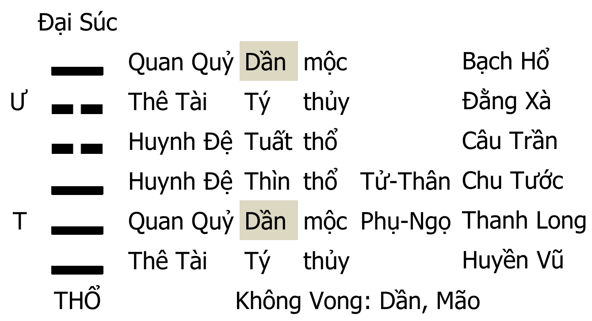
    - **Hình này chứng minh điều gì**
      - Thể hiện chứng mất kinh do Nguyên thần bị Nhật hợp trú và tượng quẻ Đại Súc ngưng trệ.
    - **Từ đâu mà thấy được**
      - Hào Thế Quan Quỷ Dần mộc tại hào 2 lâm Không; Nguyên thần Thê Tài Tý thủy bị Nhật thần Sửu thổ hợp trú.
  - **Thông tin quái tượng:**
    - Tuần Không: Dần, Mão (ngũ hành Thổ).
    - Dụng thần: Lấy hào Thế Quan Quỷ Dần mộc làm Dụng thần.
  - **Phán đoán chi tiết:**
    - Căn cứ: Thế tại hào 2, không được Nhật Nguyệt Sửu thổ sinh phù nên rơi vào trạng thái hưu tù, lại lâm Tuần Không.
    - Nhìn vào: Hào 2 là hào vị tử cung, lâm Thanh Long chủ bệnh phụ khoa; Nguyên thần là Thê Tài Tý thủy (Thủy chủ kinh huyết) bị Nhật thần Sửu thổ hợp trú (Tý Sửu tương hợp) nên bị trói chân, không thể sinh cho hào Thế; hào Thế lại ngộ Không nên không tiếp nhận được sinh khí; tên quẻ "Đại Súc" mang ý nghĩa tích lũy, giữ lại, ngưng đọng bất động; kết hợp các dữ kiện khẳng định là chứng mất kinh (bế kinh).
  - **Ứng nghiệm thực tế:**
    - Đúng là người bệnh bị mất kinh hoàn toàn.

- **Ví dụ 10:** Ngày Quý Mùi tháng Thân, người nữ dự đoán chung thân vận khí, được quẻ Thiên Trạch Lý biến Chấn Vi Lôi.
  - **Hình 287.** Quẻ Thiên Trạch Lý biến Chấn Vi Lôi
    - 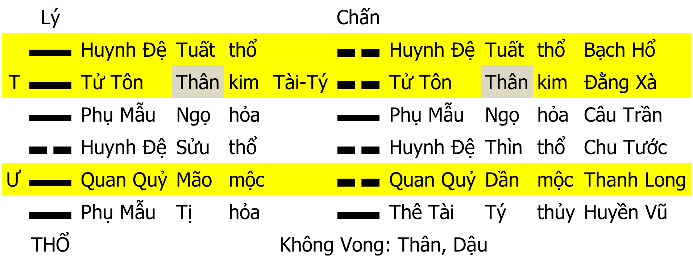
    - **Hình này chứng minh điều gì**
      - Thể hiện chứng đau bụng kinh phản ánh trong quẻ dự đoán chung thân vận khí.
    - **Từ đâu mà thấy được**
      - Thế Tử Tôn Thân kim ngộ Không; Nguyên thần Tuất thổ lâm Bạch Hổ bị hào 2 Mão mộc (Thanh Long) hợp trú.
  - **Thông tin quái tượng:**
    - Tuần Không: Thân, Dậu (ngũ hành Thổ).
    - Dụng thần: Lấy hào Thế Tử Tôn Thân kim làm Dụng thần.
  - **Phán đoán chi tiết:**
    - Căn cứ: Quẻ chung thân vận khí bao hàm toàn bộ thông tin thể trạng và bệnh tật gốc rễ.
    - Nhìn vào: Hào Thế Tử Tôn Thân kim ngộ Tuần Không, không được Nguyên thần sinh trợ; Thế là Tử Tôn chủ tử cung; Nguyên thần Huynh Đệ Tuất thổ tại hào 6 lâm Bạch Hổ đại diện cho máu huyết và kinh nguyệt; Tuất thổ bị hào 2 Quan Quỷ Mão mộc hợp trú (Mão Tuất hợp) khiến kinh huyết bị cản trở không thể sinh hào Thế; hào 2 là tử cung lâm Thanh Long chủ đau đớn co thắt; vì vậy kết luận là chứng đau bụng kinh dữ dội.
  - **Ứng nghiệm thực tế:**
    - Người hỏi quẻ từ trước đến nay thường xuyên bị chứng đau bụng kinh hành hạ.

- **Ví dụ 11:** Ngày Mậu Tuất tháng Mùi, người nữ dự đoán vận khí và sức khỏe, được quẻ Sơn Hỏa Bí biến Địa Lôi Phục.
  - **Hình 288.** Quẻ Sơn Hỏa Bí biến Địa Lôi Phục
    - 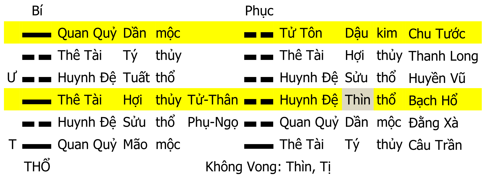
    - **Hình này chứng minh điều gì**
      - Thể hiện chứng kinh nguyệt không đều kèm đau đầu do Nguyên thần nhập Mộ và bị hào 6 hợp.
    - **Từ đâu mà thấy được**
      - Nguyên thần Thê Tài Hợi thủy tại hào 3 lâm Bạch Hổ hóa Mộ; hào 6 Quan Quỷ Dần mộc động hợp Nguyên thần.
  - **Thông tin quái tượng:**
    - Tuần Không: Thìn, Tị (ngũ hành Thổ).
    - Dụng thần: Lấy hào Thế Quan Quỷ Mão mộc làm Dụng thần.
  - **Phán đoán chi tiết:**
    - Căn cứ: Đoán sức khỏe lấy hào Thế làm Dụng thần.
    - Nhìn vào: Nguyên thần của Dụng thần là Thê Tài Hợi thủy đóng tại hào 3 lâm Bạch Hổ, bị Nhật Nguyệt thổ khắc, lại phát động hóa ra Huynh Đệ Thìn thổ là Mộ khố; hào 3 là tử cung, Thê Tài là kinh nguyệt, Bạch Hổ là máu huyết; Tài lâm Bạch Hổ hóa Mộ chủ tình trạng máu kinh ngưng trệ, chu kỳ trễ nải thất thường, dẫn đến kinh nguyệt không đều; mặt khác, hào 6 Quan Quỷ Dần mộc phát động hợp trú Nguyên thần Hợi thủy, hào 6 là đầu não, Quan Quỷ là bệnh tật, Mộc chủ phong đau nhức, do đó còn bị chứng đau đầu kèm theo.
  - **Ứng nghiệm thực tế:**
    - Người này bị kinh nguyệt thất thường và thường xuyên đau đầu.

- **Ví dụ 12:** Ngày Kỷ Mùi tháng Ngọ, người nữ dự đoán bệnh của bản thân, được quẻ Trạch Hỏa Cách (quẻ tĩnh).
  - **Hình 289.** Quẻ Trạch Hỏa Cách
    - 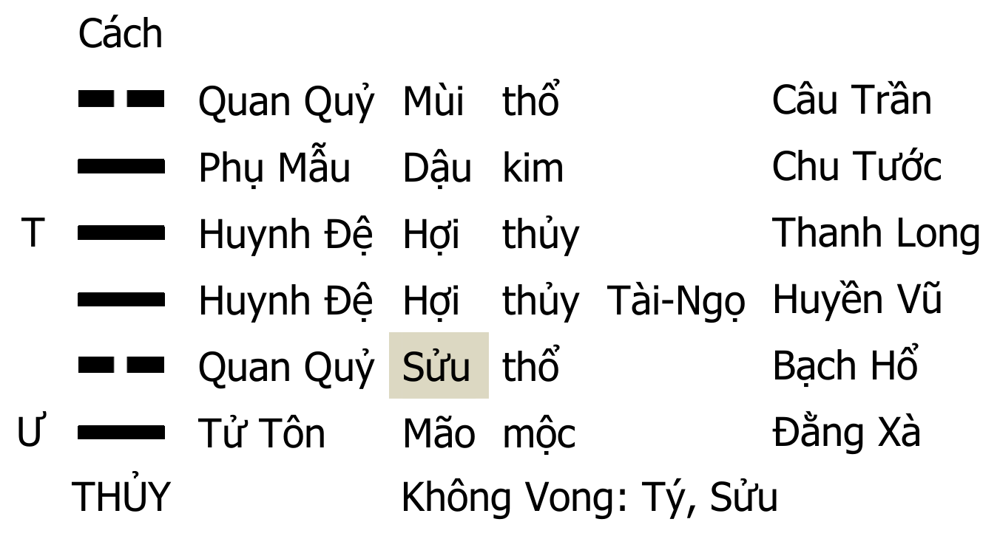
    - **Hình này chứng minh điều gì**
      - Thể hiện kinh nguyệt không đều do Quan Quỷ lâm Bạch Hổ tại hào vị tử cung ám động khắc Thế.
    - **Từ đâu mà thấy được**
      - Thế Huynh Đệ Hợi thủy bị hào 2 Quan Quỷ Sửu thổ lâm Bạch Hổ ám động (bị Nhật Mùi xung) đến khắc.
  - **Thông tin quái tượng:**
    - Tuần Không: Tý, Sửu (ngũ hành Thủy).
    - Dụng thần: Lấy hào Thế Huynh Đệ Hợi thủy làm Dụng thần.
  - **Phán đoán chi tiết:**
    - Căn cứ: Lấy hào Thế làm Dụng thần bệnh tật.
    - Nhìn vào: Hào Thế Huynh Đệ Hợi thủy tại hào 4 bị hào 2 Quan Quỷ Sửu thổ lâm Bạch Hổ ám động đến khắc (Sửu thổ bị Nhật Mùi xung là ám động); hào 2 là hào vị tử cung; Quan Quỷ chủ bệnh tật; Bạch Hổ chủ về huyết dịch; Quỷ đới Bạch Hổ ám động tại cung tử cung khắc thân, phản ánh tình trạng xáo trộn huyết hành phụ khoa, gây ra chứng kinh nguyệt không đều.
  - **Ứng nghiệm thực tế:**
    - Bệnh nhân bị kinh nguyệt không đều.

- **Ví dụ 13:** Ngày Giáp Thân tháng Dần, người nữ dự đoán bệnh tật của bản thân, được quẻ Địa Lôi Phục (quẻ tĩnh).
  - **Thông tin quái tượng:**
    - Tuần Không: Ngọ, Mùi (ngũ hành Thổ).
    - Dụng thần: Lấy hào Thế Thê Tài Tý thủy làm Dụng thần.
  - **Phán đoán chi tiết:**
    - Căn cứ: Hào Thế Thê Tài Tý thủy tại hào 1 gặp Nguyệt kiến Dần mộc là Bệnh địa (Thủy bệnh tại Dần); Thê Tài đại diện cho kinh nguyệt.
    - Nhìn vào: Hào 2 Quan Quỷ Dần mộc lâm Chu Tước ám động (được Thân kim xung khởi) chính là Bệnh địa của hào Thế; hào 2 là hào vị tử cung; Bệnh địa chủ bệnh tật, Quan Quỷ cũng chủ bệnh tật; hào Thế lâm Thanh Long chủ về đau nhức; gốc bệnh đóng tại Mộc, hành Mộc chủ chứng phong co rút đau đớn; tổng hợp các yếu tố khẳng định mắc chứng đau bụng kinh.
  - **Ứng nghiệm thực tế:**
    - Người nữ bị đau bụng kinh nghiêm trọng, đồng thời trong bao tử (dạ dày) thường xuyên tích tụ khí lạnh buốt.

- **Ví dụ 14:** Ngày Bính Thìn tháng Hợi, người nữ dự đoán sức khỏe của bản thân, được quẻ Thủy Lôi Truân biến Trạch Thiên Quải.
  - **Thông tin quái tượng:**
    - Tuần Không: Tý, Sửu (ngũ hành Thủy).
    - Dụng thần: Lấy hào Thế Tử Tôn Dần mộc làm Dụng thần.
  - **Phán đoán chi tiết:**
    - Căn cứ: Nội quái rơi vào phục ngâm, tượng trưng cho nỗi đau đớn, khổ sở dằn vặt trong thân thể.
    - Nhìn vào: Hào Thế đóng tại hào 2 lâm lục thân Tử Tôn; cả hào 2 lẫn Tử Tôn đều là biểu tượng của tử cung; hào 4 Phụ Mẫu Thân kim là Kỵ thần lâm Bạch Hổ phát động xung khắc trực diện vào hào Thế Dần mộc; Bạch Hổ chủ về chảy máu và thương tổn huyết quản; Kỵ thần Bạch Hổ phát động khắc phá tử cung chủ về tình trạng máu chảy tràn không cầm được; do đó phán đoán là bệnh xuất huyết tử cung (băng huyết).
  - **Ứng nghiệm thực tế:**
    - Bệnh nhân bị chứng xuất huyết tử cung cấp tính.

### 22. BỆNH KHỚP

#### Tổng quan và cơ chế phát sinh bệnh khớp
- Bệnh viêm khớp là một dạng bệnh lý mạn tính thường gặp trong lâm sàng dự trắc y học Lục Hào:
  - Hai thể bệnh khớp phổ biến nhất gồm viêm xương khớp (thoái hóa khớp) và viêm khớp dạng thấp (thấp khớp).
  - Vị trí phát bệnh thường xuất hiện tại các khớp trên chi dưới (khớp gối, cổ chân) và chi trên (khớp vai, khuỷu tay, cổ tay), đồng thời có nhiều trường hợp xảy ra tại khớp đốt sống thắt lưng.
- Cơ chế phát sinh liên quan mật thiết đến môi trường sống và tà khí ngoại cảm:
  - Người cư trú dài ngày ở những vùng ẩm thấp, lạnh lẽo, khi bước vào độ tuổi trung niên hoặc lão niên thì cánh tay, thắt lưng và chân dễ phát sinh sưng đau ứ trệ.
  - Mỗi khi thời tiết biến đổi gặp ngày mưa dầm ẩm ướt, tà khí phong hàn thấp thừa cơ xâm nhập làm tình trạng đau nhức gia tăng dữ dội, một số trường hợp mạn tính kéo dài còn dẫn đến biến dạng cấu trúc khớp xương.
- Quái lệ minh họa 1: Quái tượng quẻ Địa Lôi Phục phản ánh tổn thương cấu trúc khớp xương và chi dưới:
  - **Hình 290.** Quẻ Địa Lôi Phục
    - 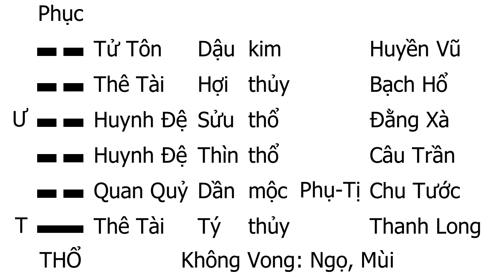
    - **Hình này chứng minh điều gì**
      - Biểu thị phong hàn tích tụ tại chân, chủ bệnh viêm xương khớp và thoái hóa khớp chân.
    - **Từ đâu mà thấy được**
      - Quẻ Phục có nội quái Chấn mộc là chân; hào 2 Dần mộc và hào Thế sơ Tý thủy lâm Thanh Long chủ đau nhức.
  - **Phán đoán chi tiết:**
    - Căn cứ: Nội quái Chấn mộc nằm dưới ngoại quái Khôn thổ, tượng trưng cho phong tà hàn khí tiềm phục tại vùng chi dưới.
    - Nhìn vào:
      - Quẻ Chấn chủ về cẳng chân, ngũ hành Mộc chủ phong hàn và chứng đau nhức.
      - Hào Thế tại hào sơ Tý thủy lâm Thanh Long: Thanh Long chủ cảm giác đau nhức, thủy khí chủ hàn thấp sinh dưỡng cho mộc.
      - Hào 2 Quan Quỷ Dần mộc phục Phụ Mẫu Tị hỏa lâm Chu Tước: hào 2 là chân, Chu Tước chủ viêm sưng nhiệt kết bên trong, Quan Quỷ chủ mầm bệnh tiềm ẩn ở xương khớp.
- Quái lệ minh họa 2: Quái tượng quẻ Thủy Lôi Truân biến Trạch Thiên Quải minh họa bệnh viêm đa khớp biến dạng do phong hàn thấp:
  - **Hình 291.** Quẻ Thủy Lôi Truân biến Trạch Thiên Quải
    - 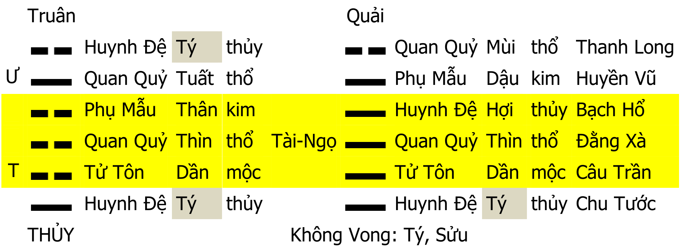
    - **Hình này chứng minh điều gì**
      - Biểu thị thấp khí hàn lạnh gây sưng đau đa khớp ở chân, thắt lưng và cánh tay, dẫn tới biến dạng khớp.
    - **Từ đâu mà thấy được**
      - Khảm thủy chủ lạnh ẩm phối Chấn mộc là chân; liên hoàn ba hào 2 (chân), 3 (thắt lưng) và 4 (tay) đồng động.
  - **Phán đoán chi tiết:**
    - Căn cứ: Ngoại quái Khảm thủy tượng trưng cho nơi lạnh lẽo ẩm thấp phối hợp với nội quái Chấn mộc đại diện cho chân và gân cốt.
    - Nhìn vào:
      - Ba hào liên tiếp ở trung tầng gồm hào 2, hào 3 và hào 4 đồng loạt phát động tạo nên sự biến đổi cấu trúc quẻ, biểu thị chứng bệnh lan tỏa đa vị trí.
      - Hào 2 Tử Tôn Dần mộc phát động: hào 2 là vị trí của chân, lâm Câu Trần chủ đình trệ, sưng phù, gây trở ngại đi lại.
      - Hào 3 Quan Quỷ Thìn thổ phát động: hào 3 đại diện cho thắt lưng, hông và đùi; Quan Quỷ mang Đằng Xà chủ co rút, đau nhức kéo dài.
      - Hào 4 Phụ Mẫu Thân kim phát động biến Huynh Đệ Hợi thủy lâm Bạch Hổ: hào 4 là cánh tay; kim chủ xương gặp Bạch Hổ chủ tổn thương hư nát và biến dạng xương khớp.

#### Quy tắc quái tượng dự trắc bệnh khớp
- Phương diện quái cung định vị cơ quan:
  - Cung Cấn: tượng trưng cho cánh tay, khuỷu tay và khớp bàn tay.
  - Cung Chấn: tượng trưng cho cẳng chân, khớp gối và bàn chân.
  - Cung Tốn: tượng trưng cho phần đùi, khớp háng và các khớp vận động chi dưới.
- Phương diện lục thần định tính triệu chứng:
  - Huyền Vũ: đại diện cho thấp khí ẩm ướt, phong hàn tà khí, các chứng bệnh mạn tính phát sinh do nhiễm lạnh ẩm kéo dài.
  - Thanh Long: đại diện cho cảm giác đau nhức, ngứa ngáy, buốt nhói bên trong khớp xương.
- Phương diện ngũ hành xác định bệnh tà:
  - Hành Mộc: chủ về phong tà, phong hàn, đồng thời quản về hệ gân mạch và gây ra các cơn đau nhức, co rút cơ khớp.
- Phương diện hào vị xác định vị trí khớp trên cơ thể:
  - Hào 6: quản về phần đầu và cánh tay, cổ tay trên cơ thể.
  - Hào 3: quản về khớp hông, thắt lưng, khớp háng và vùng đùi.
  - Hào 2: quản về cẳng chân, khớp đầu gối và bàn chân.
- Tiêu chí phân biệt đặc thù giữa khớp xương và chân:
  - Khớp xương có chức năng bản lề đóng mở, co gập duỗi thẳng, do đó tiêu chí then chốt để xác định bệnh ở khớp là mối quan hệ xung hợp với Nhật Nguyệt hoặc hào động:
    - Nhật Nguyệt hoặc động hào xung khắc hào vị: biểu thị ổ khớp bị xung động, rạn nứt, viêm sưng hoặc mất chức năng gập duỗi tự nhiên.
    - Ngũ hành Kim chủ về xương cốt: khi hào vị chi dưới hoặc cánh tay kết hợp với hành Kim hoặc bị Kim khắc xung thì khẳng định bệnh nằm tại khớp xương chứ không phải phần cơ thịt hay ngoài da.

#### Các quái lệ thực tế dự trắc bệnh khớp
- **Ví dụ 1:** Ngày Quý Mão tháng Tị, một cụ già nhờ đoán niên vận, được quẻ Phong Hỏa Gia Nhân biến Phong Sơn Tiệm.
  - **Hình 292.** Quẻ Phong Hỏa Gia Nhân biến Phong Sơn Tiệm
    - 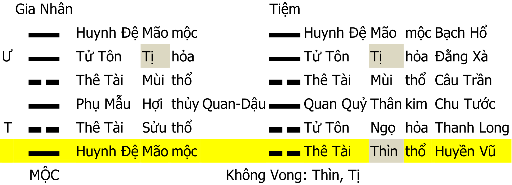
    - **Hình này chứng minh điều gì**
      - Cụ già bị phong thấp dẫn tới viêm khớp chân đau nhức ứng kỳ vào tháng Mão.
    - **Từ đâu mà thấy được**
      - Hào Thế tại hào 2 lâm Thanh Long bị hào sơ Mão mộc lâm Huyền Vũ động khắc; Mão ứng tháng Mão.
  - **Đối thoại và diễn tiến bối cảnh:**
    - Cụ già gieo quẻ xem niên vận cát hung trong một năm, quẻ dự trắc tổng quát đã phản ánh chi tiết dấu hiệu bệnh tật tiềm tàng.
    - Tác giả căn cứ vào tương tác hào vị cảnh báo cụ thời điểm tháng Mão sẽ xuất hiện đau nhức khớp chân do phong thấp.
  - **Phán đoán chi tiết:**
    - Căn cứ: Quẻ niên vận lấy hào Thế làm bản thân người xem, khảo sát sự khắc hợp giữa các hào động và hào Thế.
    - Nhìn vào:
      - Hào Thế Thê Tài Sửu thổ tọa tại hào 2 lâm Thanh Long: hào 2 là vị trí của cẳng chân, cung gốc Tốn quái cũng chủ chân; Thanh Long chủ đau nhức buốt.
      - Hào sơ Huynh Đệ Mão mộc lâm Huyền Vũ phát động khắc Thế: hành Mộc chủ phong hàn đau nhức, Huyền Vũ chủ hàn thấp ẩm khí; địa chi Mão mộc động chỉ định mốc thời gian ứng kỳ vào tháng Mão.
      - Tổ hợp hào Thế ở hào 2 bị mộc Huyền Vũ động khắc cho thấy tà khí phong hàn thấp đánh vào khớp chân gây sưng đau.
  - **Ứng nghiệm thực tế:**
    - Đến tháng Mão, cụ già quả nhiên bị viêm khớp chân tái phát dữ dội, sưng đau buốt nhức đúng như dự đoán.
- **Ví dụ 2:** Ngày Quý Dậu tháng Tị, một người nam gửi thư nhờ đoán bệnh, tác giả gieo quẻ được Phong Thiên Tiểu Súc biến Phong Địa Quan.
  - **Hình 293.** Sơ đồ quẻ Phong Thiên Tiểu Súc biến Phong Địa Quan
    - 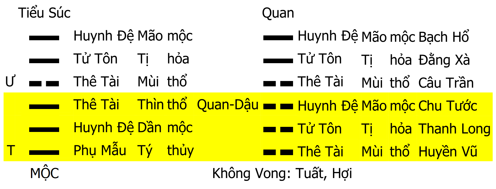
    - **Hình này chứng minh điều gì**
      - Đương số mắc bệnh thấp khớp (viêm khớp dạng thấp) nghiêm trọng tại chi dưới.
    - **Từ đâu mà thấy được**
      - Thế tại hào sơ lâm Huyền Vũ hóa Mùi thổ hồi đầu khắc; Bệnh địa hào 2 Dần mộc phát động; hào 3 Thìn thổ động.
  - **Đối thoại và diễn tiến bối cảnh:**
    - Một người đàn ông viết thư từ xa gửi tới nhờ tác giả gieo quẻ tầm bệnh, hỏi thăm nguyên nhân cơn đau dai dẳng của bản thân.
    - Tác giả tự tay gieo quẻ Phong Thiên Tiểu Súc biến Phong Địa Quan và viết thư hồi đáp phân tích chứng bệnh thấp khớp trầm trọng.
  - **Phán đoán chi tiết:**
    - Căn cứ: Người bệnh nhờ đoán từ xa, lấy hào Thế làm Dụng thần đại diện cho đương số.
    - Nhìn vào:
      - Hào Thế Phụ Mẫu Tý thủy an tại hào sơ lâm Huyền Vũ: Thế động hóa Thê Tài Mùi thổ hồi đầu khắc phạt; Huyền Vũ chủ hàn tà phong thấp.
      - Bệnh địa Huynh Đệ Dần mộc tại hào 2 phát động: hào 2 là chân, lục thân Huynh Đệ cũng là chân; hành Mộc chủ phong hàn; hào Bệnh địa phát động biểu thị bệnh tật đang hoành hành dữ dội ở chi dưới.
      - Hào 3 Thê Tài Thìn thổ phát động hóa Huynh Đệ Mão mộc: hào 3 là thắt lưng đùi, là vị trí đặc trưng cho chứng bệnh thấp khớp (viêm khớp dạng thấp).
      - Thế lâm Huyền Vũ hóa hồi đầu khắc kết hợp với hào 2 Bệnh địa mộc động khắc chế khẳng định đây là chứng viêm khớp dạng thấp mạn tính nghiêm trọng.
  - **Ứng nghiệm thực tế:**
    - Người nam sau đó gửi thư xác nhận bản thân bị bệnh thấp khớp mạn tính rất nặng, khớp chân sưng buốt khó đi lại.
- **Ví dụ 3:** Ngày Nhâm Ngọ tháng Thân, người nam trực tiếp đoán bệnh của bản thân, được Sơn Thiên Đại Súc biến Phong Thiên Tiểu Súc.
  - **Hình 294.** Sơ đồ quẻ Sơn Thiên Đại Súc biến Phong Thiên Tiểu Súc
    - 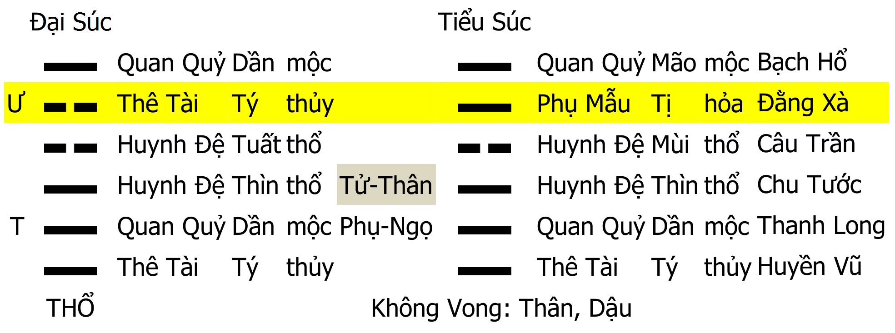
    - **Hình này chứng minh điều gì**
      - Khớp đầu gối của người bệnh bị tổn thương nghiêm trọng, đau nhức không thể gập duỗi được.
    - **Từ đâu mà thấy được**
      - Hào Thế hào 2 Quan Quỷ Dần mộc lâm Thanh Long bị Nguyệt phá; kim chủ xương, xung biểu thị khớp.
  - **Đối thoại và diễn tiến bối cảnh:**
    - Người đàn ông đến gặp tác giả hỏi về chứng bệnh đau buốt chân khiến việc đi lại và gập chân gặp trở ngại lớn.
    - Tác giả tra quẻ chỉ rõ tình trạng tổn thương ổ khớp đầu gối làm tê liệt khả năng co gập.
  - **Phán đoán chi tiết:**
    - Căn cứ: Đương số tự đoán bệnh bản thân, lấy hào Thế làm Dụng thần.
    - Nhìn vào:
      - Hào Thế Quan Quỷ Dần mộc tọa tại hào 2 bị Nguyệt kiến Thân kim xung phá tạo thành Nguyệt phá: hào 2 là khớp gối và cẳng chân.
      - Thanh Long phụ vào hào Thế: Thanh Long chủ cảm giác đau nhức buốt nhói.
      - Nguyệt xung tác động vào hào 2: quan hệ xung phản ánh cơ chế gấp duỗi, đóng mở của ổ khớp; Nguyệt lệnh Thân mang hành Kim đại diện cho hệ thống xương cốt.
      - Kim xung phá Dần mộc tại hào Thế hào 2 chỉ ra các khớp xương ở đầu gối bị hư tổn trầm trọng, mất tính linh hoạt co gập.
  - **Ứng nghiệm thực tế:**
    - Người bệnh thực tế bị đau buốt đầu gối nghiêm trọng, ổ khớp sưng cứng hoàn toàn không thể gập duỗi lại được.
- **Ví dụ 4:** Ngày Canh Dần tháng Thân, người nữ đoán bệnh tật của bản thân, được quẻ Chấn Vi Lôi biến Lôi Trạch Quy Muội.
  - **Đối thoại và diễn tiến bối cảnh:**
    - Người phụ nữ đến thỉnh cầu dự trắc khi nhận thấy cơ thể suy sụp với hàng loạt triệu chứng khó chịu xuất hiện đồng thời.
    - Tác giả gieo được quẻ Chấn Vi Lôi (quẻ Lục xung) biến Lôi Trạch Quy Muội, bóc tách toàn bộ các ổ bệnh từ chi dưới đến nội tạng và đầu não.
  - **Phán đoán chi tiết:**
    - Căn cứ: Lấy hào Thế Thê Tài Tuất thổ tại hào 6 làm Dụng thần đại diện cho người hỏi.
    - Nhìn vào:
      - Khớp gối và bệnh phong hàn chi dưới:
        - Hào 2 Huynh Đệ Dần mộc lâm Huyền Vũ phát động khắc Thế, lại hóa Tiến thần Huynh Đệ Mão mộc: hào 2 là vị trí của chân, quẻ Chấn thuần mộc chủ chân, lục thân Huynh Đệ cũng chủ chân; Huyền Vũ chủ phong thấp hàn tà.
        - Hào 2 Dần mộc bị Nguyệt kiến Thân kim xung: quan hệ xung giữa hào vị chân và Nguyệt lệnh biểu thị bệnh tại ổ khớp gối; Kỵ thần động hóa Tiến thần khắc Thế cho thấy viêm khớp phong thấp đang phát triển tăng nặng.
      - Bệnh đau đầu kinh niên:
        - Hào Thế tại hào 6 bị Nhật thần Canh Dần khắc chế, lại bị hào động Dần mộc hóa Tiến thần liên tiếp khắc phạt: hào 6 là đầu, hành Mộc chủ phong tà và đau nhức, do đó đương số bị chứng đau đầu hành hạ.
      - Bệnh lý phụ khoa:
        - Hào 2 Dần mộc là Kỵ thần khắc Thế, đồng thời là Trường Sinh địa của lục thân Tử Tôn (Dần là trường sinh của Hỏa); hào 2 đại diện cho tử cung.
        - Hào Thế Tuất thổ là Mộ khố của Tử Tôn, cũng đại diện cho tử cung; hào động mang Huyền Vũ chủ bộ vị kín đáo, suy ra người này mắc bệnh phụ khoa.
      - Bệnh tăng sinh xương cổ (thoái hóa gai đốt sống cổ):
        - Hào 5 Quan Quỷ Thân kim lâm Câu Trần ám động: hào 5 là vị trí cổ, hành Kim chủ xương cốt, Câu Trần chủ xơ cứng, phì đại, tăng sinh gồ ghề; Quan Quỷ chủ mầm bệnh; tổ hợp hào 5 Kim Câu Trần ám động là dấu hiệu gai xương cổ tăng sinh chèn ép.
      - Bệnh tăng sinh tuyến vú (nhũ tuyến tăng sinh):
        - Hào 4 Tử Tôn Ngọ hỏa lâm Tuần Không, bất lực không thể sinh phù hào Thế (Thế thổ cần Tử Tôn hỏa làm Nguyên thần sinh trợ).
        - Hào 4 là vùng ngực vú, Tử Tôn cũng tượng trưng cho bầu vú; Bệnh địa của Nguyên thần rơi vào Thân kim lâm Câu Trần; sự suy kiệt của Nguyên thần tại hào 4 kết hợp Câu Trần khẳng định có u xơ, tăng sinh tuyến vú.
  - **Ứng nghiệm thực tế:**
    - Người phụ nữ xác nhận thực tế hai chân bị phong hàn xâm nhập dẫn tới đau nhức khớp gối nghiêm trọng; ngoài ra đúng như chẩn đoán, bà còn đồng thời mắc bệnh đau đầu, bệnh phụ khoa, nhũ tuyến tăng sinh và tăng sinh đốt sống cổ.

### 23. BỆNH NGOÀI DA

#### Đại cương về bệnh ngoài da trong dự trắc Lục Hào
- Chức năng sinh lý và đặc điểm bệnh lý da liễu:
  - Da bao bọc toàn bộ cơ thể, giữ vai trò lá chắn sinh học bảo vệ cơ thể chống lại tác động bất lợi của môi trường bên ngoài như nóng, lạnh, bức xạ mặt trời, vi khuẩn gây bệnh.
  - Bệnh lý ngoài da có diễn biến phức tạp; một số nguyên nhân cơ chế phát sinh bệnh trong y học hiện đại vẫn chưa được làm sáng tỏ triệt để.
  - Các chứng bệnh ngoài da phổ biến trên lâm sàng gồm: nấm da trâu (vảy nến), nổi mề đay, viêm da, mẩn ngứa, mụn trứng cá, lang ben.

#### Nguyên lý dự trắc qua quái cung, ngũ hành và lục thần
- Căn cứ phân định qua phương diện quái cung:
  - Dự trắc bệnh ngoài da chủ yếu quy về hai quái cung Khôn và Cấn.
  - Khôn và Cấn đều mang ngũ hành Thổ; trong hệ thống tượng số Đông y và Dịch học, Thổ chủ quản cơ nhục và biểu bì (da thịt), liên hệ trực tiếp với lớp da bao bọc thân thể.
- Căn cứ phân định qua phương diện ngũ hành:
  - Ngũ hành Thổ chủ về da dẻ; đặc biệt khi Thổ kết hợp lâm Bạch Hổ hoặc Thanh Long thì tín hiệu bệnh lý da càng hiển lộ mạnh mẽ.
  - Thổ lâm Không Vong, hoặc Dụng thần lâm Không Vong không được Thổ tương sinh thì phần lớn phát sinh chứng nổi mề đay.
  - Thổ đóng vai trò hào Bệnh: khi Thổ phát động, hoặc bị xung chấn, hoặc có hào khác động hợp với Thổ, đều là triệu chứng của bệnh mề đay, dị ứng biểu bì.
  - Quái lệ minh họa tương quan ngũ hành Thổ và cơ chế phát tác bệnh mề đay:
    - **Quái lệ minh họa:** Tương quan ngũ hành Thổ trong đồ hình biến dịch (quẻ Chấn Vi Lôi biến Lôi Trạch Quy Muội)
      - **Hình 295.** Sơ đồ quẻ Chấn Vi Lôi biến Lôi Trạch Quy Muội
        - 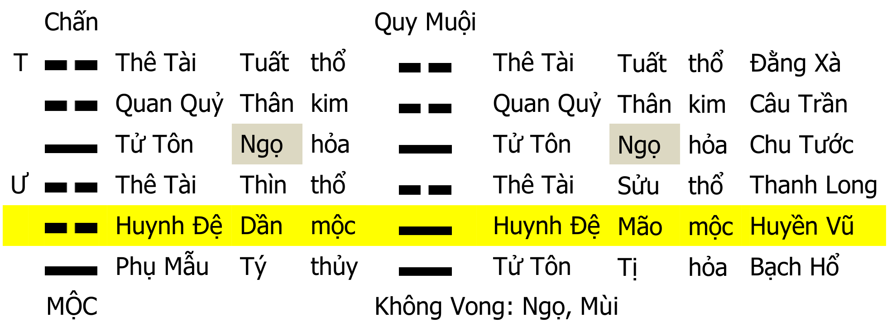
        - **Hình này chứng minh điều gì**
          - Ngũ hành Thổ chủ da thịt; hào Thổ ngộ Không Vong hoặc bị xung động, động hợp dẫn tới phát tác chứng mề đay, mẩn ngứa.
        - **Từ đâu mà thấy được**
          - Đối chiếu quy luật Thổ suy vượng, Không Vong và động hào xung hợp trong sơ đồ quẻ Chấn biến Quy Muội biểu thị cơ chế bệnh ngoài da.
      - **Phán đoán chi tiết:**
        - Căn cứ: Thổ chủ quản biểu bì; khi Thổ lâm thần sát ngứa ngáy (Thanh Long) hay huyết chứng (Bạch Hổ) thì đặc tính da liễu phát tác rõ rệt.
        - Nhìn vào: Hào Thổ gặp Không Vong hoặc Dụng thần ngộ Không không tiếp nhận được Thổ sinh, kết hợp hào Thổ bị động xung hoặc động hợp làm tổn thương phần biểu bì.
- Căn cứ phân định qua phương diện lục thần:
  - Thanh Long: Chủ chứng đau nhức kết hợp ngứa ngáy dữ dội (đau ngứa).
  - Chu Tước: Chủ chứng viêm nhiễm, sưng tấy đỏ, phát nhiệt tại biểu bì.
  - Câu Trần: Chủ phát ban, bệnh sởi, u cục hoặc ứ trệ bì phu.
  - Đằng Xà: Chủ vết sẹo lồi lõm, da sần sùi biến dạng hoặc vảy nấm.
  - Bạch Hổ: Chủ biểu bì trầy xước, nứt nẻ, chảy máu, lột da.
  - Huyền Vũ: Chủ lở loét, mưng mủ, thấp chẩn ẩm ướt rỉ dịch.

#### Các quái lệ thực tế phân tích bệnh ngoài da
- **Ví dụ 1: Quẻ Thủy Trạch Tiết biến Địa Trạch Lâm - Dự trắc bệnh nổi mề đay**
  - Bối cảnh và thông tin quẻ: Ngày Ất Sửu tháng Ngọ, một phụ nữ tự gieo quẻ hỏi về bệnh tật của bản thân, được quẻ Thủy Trạch Tiết biến Địa Trạch Lâm.
  - Xác định Dụng thần và tuần không: Thủy Không Vong tại Tuất, Hợi. Tự đoán bệnh lấy hào Thế Thê Tài Tị hỏa làm Dụng thần.
  - **Hình 296.** Sơ đồ quẻ Thủy Trạch Tiết biến Địa Trạch Lâm
    - 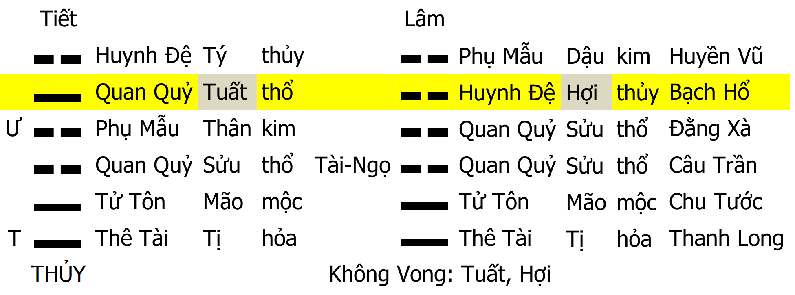
    - **Hình này chứng minh điều gì**
      - Dự trắc chuẩn xác bệnh nổi mề đay do Thế nhập Mộ ở ngoại quái Thổ động Không Vong.
    - **Từ đâu mà thấy được**
      - Hào Thế Tị hỏa lâm Thanh Long chủ ngứa; Quan Quỷ Tuất thổ ở ngoại quái động ngộ Không Vong, Thế nhập Mộ ở Thổ.
  - **Phán đoán chi tiết:**
    - Căn cứ: Hào Thế lâm Thanh Long (chủ ngứa ngáy), hào 5 Quan Quỷ Tuất thổ ở ngoại quái phát động là hào Bệnh.
    - Nhìn vào: Hào Thế Tị hỏa nhập Mộ ở Tuất thổ; ngoại quái thuộc Thổ chủ bệnh ở phần biểu bì ngoài da; hào Tuất thổ lại lâm Không Vong mà phát động. Căn cứ quy tắc: Thổ ở ngoại quái chủ bệnh ngoài da, Thổ lâm Không Vong mà động chủ chứng nổi mề đay.
  - **Ứng nghiệm thực tế:**
    - Người phụ nữ xác nhận thực tế đúng là đang bị phát ban nổi mề đay khắp người.

- **Ví dụ 2: Quẻ Phong Trạch Trung Phu biến Phong Hỏa Gia Nhân - Dự trắc dị ứng da của bé gái 2 tuổi**
  - Bối cảnh và thông tin quẻ: Ngày Mậu Ngọ tháng Hợi, người mẹ đến xem bệnh cho con gái 2 tuổi, gieo được quẻ Phong Trạch Trung Phu biến Phong Hỏa Gia Nhân.
  - Xác định Dụng thần và tuần không: Thổ Không Vong tại Tý, Sửu. Xem bệnh cho con gái lấy hào Tử Tôn làm Dụng thần.
  - **Hình 297.** Sơ đồ quẻ Phong Trạch Trung Phu biến Phong Hỏa Gia Nhân
    - 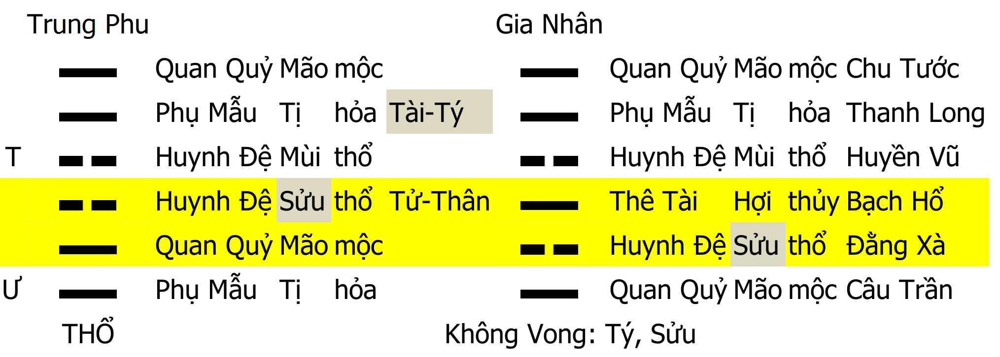
    - **Hình này chứng minh điều gì**
      - Chứng minh đứa trẻ bị dị ứng da do Nguyên thần lâm Bạch Hổ ngộ Không bị Mộc động khắc thương.
    - **Từ đâu mà thấy được**
      - Tử Tôn Thân kim phục tàng dưới hào 3 Huynh Đệ Sửu thổ; Nguyên thần Sửu thổ lâm Bạch Hổ Không Vong bị Quan Quỷ Mão mộc động khắc.
  - **Phán đoán chi tiết:**
    - Căn cứ: Dụng thần Tử Tôn Thân kim phục tàng dưới hào 3 Sửu thổ. Nguyên thần sinh trợ cho Tử Tôn là Huynh Đệ Sửu thổ lâm Bạch Hổ ngộ Tuần Không lại bị khắc hại.
    - Nhìn vào: Tổ hợp Thổ phối cùng Bạch Hổ biểu thị da thịt (bì phu). Hào 2 Quan Quỷ Mão mộc phát động khắc mạnh vào Nguyên thần Sửu thổ; ngũ hành Mộc chủ phong chứng, đau ngứa, khiến cho da bị ngứa ngáy kích ứng.
  - **Ứng nghiệm thực tế:**
    - Người mẹ xác nhận đứa trẻ bị bệnh dị ứng ngoài da.

- **Ví dụ 3: Quẻ Lôi Hỏa Phong biến Ly Vi Hỏa - Dự trắc mẩn ngứa ở cổ và lưng**
  - Bối cảnh và thông tin quẻ: Ngày Quý Sửu tháng Dần, nữ nhân tự gieo quẻ xem bệnh của bản thân, được quẻ Lôi Hỏa Phong biến Ly Vi Hỏa.
  - Xác định Dụng thần và tuần không: Thủy Không Vong tại Dần, Mão. Tự đoán bệnh lấy hào Thế làm Dụng thần.
  - **Hình 298.** Sơ đồ quẻ Lôi Hỏa Phong biến Ly Vi Hỏa
    - 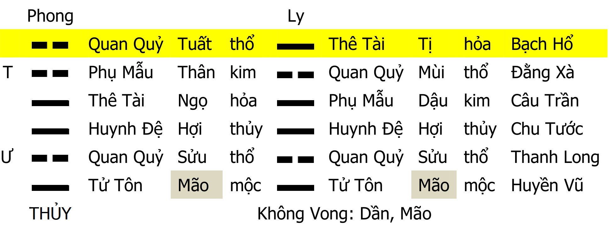
    - **Hình này chứng minh điều gì**
      - Xác định chứng mẩn ngứa ngoài da khu trú tại vùng cổ và lưng do Thế hào Nguyệt phá và Nguyên thần Thổ lâm Bạch Hổ bị thương.
    - **Từ đâu mà thấy được**
      - Quẻ thuộc cung Khảm (hành Thủy chủ mẩn ngứa); Thế Phụ Mẫu Thân kim cư hào 5 Nguyệt phá; Nguyên thần Tuất thổ lâm Bạch Hổ bị Mộc khắc.
  - **Phán đoán chi tiết:**
    - Căn cứ: Hào Thế Phụ Mẫu Thân kim cư tại hào 5 bị Dần mộc nguyệt kiến xung thành Nguyệt phá. Quẻ Phong thuộc cung Khảm mang ngũ hành Thủy, chủ về thủy thấp ứ trệ gây mẩn ngứa.
    - Nhìn vào: Nguyên thần của hào Thế là Quan Quỷ Tuất thổ cư hào 6 lâm Bạch Hổ bị Nguyệt kiến Dần mộc khắc thương; Thổ lâm Bạch Hổ chủ da dẻ tổn thương. Hào 5 trên thân thể tương ứng với vị trí cổ và lưng, Thế lâm hào 5 Nguyệt phá biểu thị bệnh phát tác ngay tại cổ và lưng.
  - **Ứng nghiệm thực tế:**
    - Người nữ xác nhận vùng da trên cổ và lưng bị mọc nhiều nốt mẩn ngứa khó chịu.

- **Ví dụ 4: Quẻ Khôn Vi Địa biến Địa Sơn Khiêm - Dự trắc bệnh lang ben của cháu gái**
  - Bối cảnh và thông tin quẻ: Ngày Quý Mão tháng Tị, người bà đến dự đoán bệnh cho cháu gái, gieo được quẻ Khôn Vi Địa biến Địa Sơn Khiêm.
  - Xác định Dụng thần và tuần không: Thổ Không Vong tại Thìn, Tị. Xem bệnh cho cháu gái lấy hào Tử Tôn làm Dụng thần.
  - **Hình 299.** Sơ đồ quẻ Khôn Vi Địa biến Địa Sơn Khiêm
    - 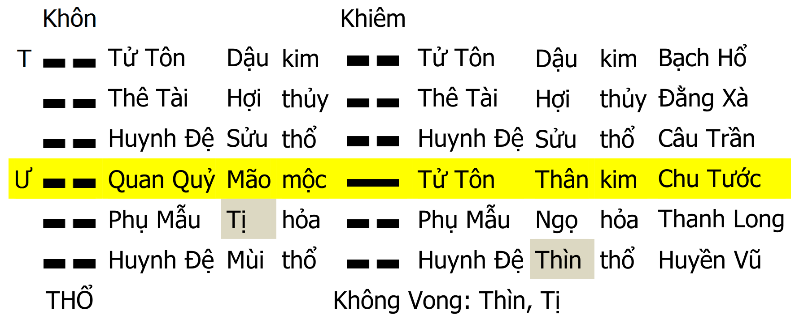
    - **Hình này chứng minh điều gì**
      - Dự trắc chính xác cháu gái bị bệnh lang ben ở lớp biểu bì da.
    - **Từ đâu mà thấy được**
      - Quẻ Khôn chủ về da; Dụng thần Tử Tôn Dậu kim lâm Bạch Hổ ở hào 6 chủ biểu bì; Quan Quỷ Mão mộc độc phát khắc Nguyên thần Thổ.
  - **Phán đoán chi tiết:**
    - Căn cứ: Toàn quẻ Khôn thuần Thổ chủ bì phu da thịt. Dụng thần Tử Tôn Dậu kim lâm Bạch Hổ cư tại hào 6 (hào trên cùng của quẻ, tượng trưng cho lớp ngoài cùng tức lớp biểu bì).
    - Nhìn vào: Hào 3 Quan Quỷ Mão mộc độc phát khắc phạt Nguyên thần Thổ; Mộc động khắc Thổ làm biến đổi sắc tố và cấu trúc bề mặt da, chủ về các đốm đổi màu biểu bì, chính là tượng của bệnh lang ben.
  - **Ứng nghiệm thực tế:**
    - Người cháu gái đúng là đang mắc chứng bệnh lang ben ngoài da.

- **Ví dụ 5: Quẻ Hỏa Trạch Khuê - Gọi điện thoại dự đoán mụn trứng cá trên mặt**
  - Bối cảnh và thông tin quẻ: Ngày Giáp Thân tháng Ngọ, một phụ nữ gọi điện thoại đường dài nhờ đoán bệnh, được quẻ Hỏa Trạch Khuê.
  - Xác định Dụng thần và tuần không: Thổ Không Vong tại Ngọ, Mùi. Tự đoán bệnh lấy hào Thế Tử Tôn Dậu kim làm Dụng thần.
  - **Hình 300.** Quẻ Hỏa Trạch Khuê
    - 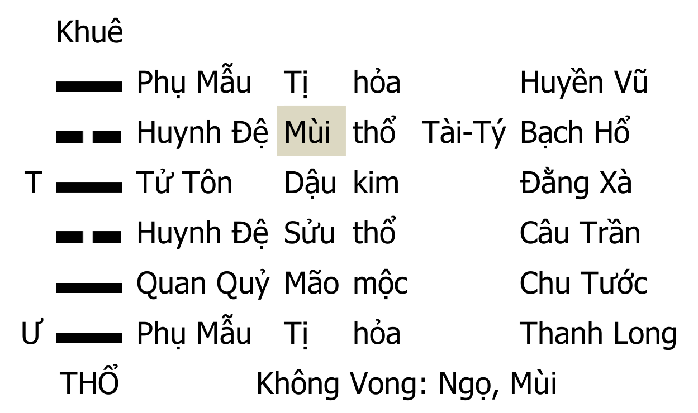
    - **Hình này chứng minh điều gì**
      - Xác định bệnh da nổi mụn trứng cá trên mặt đã hơn mười ngày do Nguyên thần Thổ lâm Bạch Hổ cư hào 5 ngộ Không.
    - **Từ đâu mà thấy được**
      - Hào Thế Tử Tôn Dậu kim lâm Đằng Xà; Nguyên thần Huynh Đệ Mùi thổ ở hào 5 (khuôn mặt) lâm Bạch Hổ ngộ Không Vong không sinh Thế.
  - **Phán đoán chi tiết:**
    - Căn cứ: Hào Thế Dậu kim lâm Đằng Xà phản ánh tâm lý lo lắng, phiền muộn, tinh thần bất an vì dung mạo.
    - Nhìn vào: Nguyên thần của hào Thế là Huynh Đệ Mùi thổ cư hào 5 ở ngoại quái lâm Bạch Hổ ngộ Không Vong không thể sinh trợ cho Thế; hào 5 là vị trí khuôn mặt; Thổ chủ da lâm Bạch Hổ ngộ Không chủ da mặt phát sinh bệnh biến (nổi mụn nhọt). Tháng Ngọ tương hợp với Mùi thổ biểu thị tình trạng ứ trệ kéo dài qua nhiều ngày.
  - **Ứng nghiệm thực tế:**
    - Người phụ nữ xác nhận da mặt bị nổi mụn trứng cá dày đặc đã hơn mười ngày nay.

- **Ví dụ 6: Quẻ Thủy Lôi Truân biến Địa Lôi Phục - Dự trắc mẩn ngứa ngoài da và u xơ tử cung**
  - Bối cảnh và thông tin quẻ: Ngày Giáp Tuất tháng Ngọ, người phụ nữ tự gieo quẻ xem bệnh của bản thân, được quẻ Thủy Lôi Truân biến Địa Lôi Phục.
  - Xác định Dụng thần và tuần không: Thủy Không Vong tại Thân, Dậu. Tự xem bệnh lấy hào Thế làm Dụng thần.
  - **Hình 301.** Quẻ Thủy Lôi Truân biến Địa Lôi Phục
    - 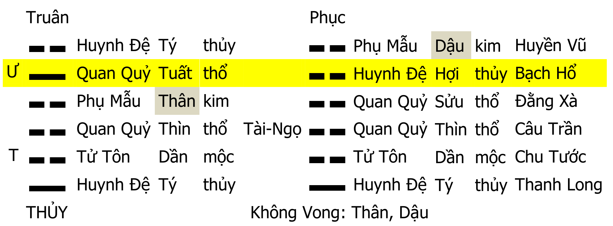
    - **Hình này chứng minh điều gì**
      - Phát hiện đồng thời hai chứng bệnh: phát ban mẩn ngứa ngoài da và khối u xơ tử cung.
    - **Từ đâu mà thấy được**
      - Quan Quỷ Tuất thổ lâm Bạch Hổ độc phát khắc Nguyên thần hóa Thủy (mẩn ngứa); hào 3 Quan Quỷ Thìn thổ lâm Câu Trần ám động (u xơ tử cung).
  - **Phán đoán chi tiết:**
    - Căn cứ chọn hào đoán bệnh: Hào Thế Tử Tôn Dần mộc tuy hưu tù nhưng Nhật Nguyệt không khắc Thế, Kỵ thần Phụ Mẫu Thân kim lại ngộ Tuần Không, nên không lấy hào Thế hay Kỵ thần để phán bệnh mà tập trung vào hào động và Quỷ sát.
    - Nhìn vào bệnh mẩn ngứa ngoài da: Hào 5 Quan Quỷ Tuất thổ lâm Bạch Hổ độc phát khắc Nguyên thần Thủy; tổ hợp Thổ và Bạch Hổ biểu thị bệnh ngoài da; Quan Quỷ động hóa Hợi thủy chủ thấp tà sinh ngứa ngáy phát ban.
    - Nhìn vào bệnh phụ khoa: Hào 3 Quan Quỷ Thìn thổ lâm Câu Trần bị Nhật kiến Tuất xung thành ám động; hào 3 là vị trí tử cung, Thìn thổ là Thủy khố làm Nguyên thần Tý thủy nhập Mộ không thể sinh hào Thế Tử Tôn (Tử Tôn cũng chủ hệ sinh dục/tử cung); Câu Trần chủ khối u cục ứ đọng, nên kết luận có u xơ tử cung.
  - **Ứng nghiệm thực tế:**
    - Người phụ nữ xác nhận bản thân đang bị ngứa ngáy ngoài da, đồng thời kiểm tra y tế xác nhận có u xơ tử cung.

### 24. CƯỚC KHÍ

#### Khái niệm và đặc điểm chung của bệnh cước khí
- Bản chất bệnh lý và vị trí đặc thù:
  - Cước khí thực chất là một dạng bệnh ngoài da (bệnh da liễu); do bệnh có vị trí phát sinh cố định tại bàn chân và cẳng chân nên được cổ nhân tách thành một chuyên mục độc lập để biện chứng và dự trắc.
  - Triệu chứng lâm sàng chủ yếu bao gồm ngứa ngáy dữ dội, lột da, nứt nẻ biểu bì, ẩm ướt lở loét, nổi mụn nước phồng rộp hoặc viêm sưng đau đớn, gây ảnh hưởng trực tiếp đến chức năng vận động và khả năng đi lại của người bệnh.

#### Quy tắc nhận diện quái tượng bệnh cước khí qua các phương diện
- Phương diện hào vị:
  - Hào sơ đại diện cho bàn chân, là vị trí cốt lõi và then chốt nhất phản ánh thông tin bệnh cước khí trong quẻ.
  - Hào 2 đại diện cho cẳng chân và mắt cá chân; trong một số trường hợp, thông tin phát bệnh cước khí hoặc sưng phù chân cũng xuất hiện tại hào 2.
- Phương diện lục thần:
  - Thanh Long chủ về ngứa ngáy dữ dội tại vùng da chân.
  - Chu Tước chủ về phản ứng viêm nhiệt, sưng đỏ, xuất hiện ban đỏ hoặc phát ban.
  - Đằng Xà chủ về vi khuẩn, nấm ký sinh trùng gây bệnh ngoài da.
  - Bạch Hổ chủ về chảy máu do cào gãi rách da, lở loét làm tổn thương mạch máu.
  - Câu Trần chủ về phù thũng, da dẻ tăng dày, chai cứng hoặc sưng trướng.
  - Huyền Vũ chủ về ẩm thấp, chảy dịch nhầy, lở loét mưng mủ.
- Phương diện ngũ hành:
  - Hào sơ mang các hành Thủy, Mộc hoặc Hỏa đều có thể dùng để đoán bệnh cước khí:
    - Hành Thủy tại hào sơ chủ về thấp khí (ẩm thấp, tích dịch, mồ hôi chân ứ đọng).
    - Hành Mộc tại hào sơ chủ về đau ngứa, phong ngứa kinh lạc.
    - Hành Hỏa tại hào sơ chủ về viêm nhiệt, mẩn đỏ, ban đỏ bốc hỏa.
- Phương diện sinh khắc:
  - Hào sơ mang hành Thổ phát động khắc chế Dụng thần hoặc Nguyên thần: Thổ chủ về da thịt, động khắc báo hiệu phát sinh bệnh ngoài da ở bàn chân.
  - Dụng thần hoặc Nguyên thần là Thổ ngự tại hào sơ bị Nhật Nguyệt khắc phạt hoặc bị Nguyệt kiến xung phá: Thổ bị tổn thương chủ về da bàn chân nứt nẻ, lột da, bong tróc.
  - Dụng thần hoặc Nguyên thần bị hào sơ mang hành Mộc phát động đến khắc thương: Mộc khắc Thổ chủ về đau ngứa cào gãi làm tổn thương lớp da ở chân.

#### Các ví dụ thực tế dự đoán bệnh cước khí
- **Ví dụ 1:** Ngày Ất Mùi tháng Sửu năm Bính Tuất (2006), một học viên người Nhật Bản nhờ tác giả đoán niên vận năm 2006, gieo được quẻ Lôi Hỏa Phong biến Lôi Sơn Tiểu Quá (Thủy Không Vong: Thìn, Tị).
  - **Hình 302.** Quẻ Lôi Hỏa Phong biến Lôi Sơn Tiểu Quá
    - 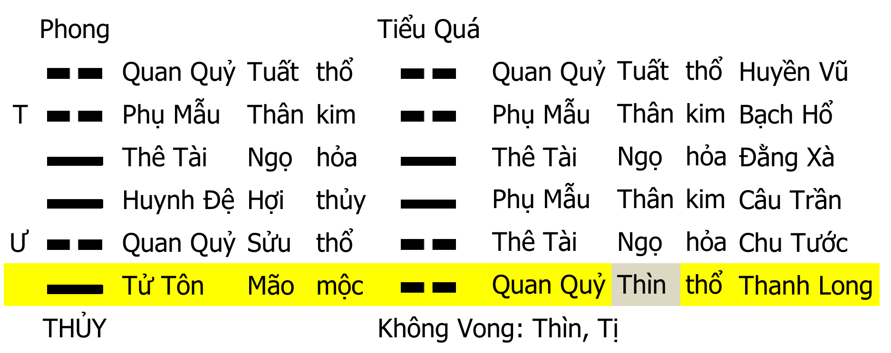
    - **Hình này chứng minh điều gì**
      - Bàn chân phát bệnh cước khí với hiện tượng phồng rộp, nổi bọng nước và ngứa ngáy.
    - **Từ đâu mà thấy được**
      - Hào sơ Tử Tôn Mão mộc độc phát lâm Thanh Long khắc Nguyên thần, hóa Quan Quỷ Thìn thổ ngộ Không.
  - **Phán đoán chi tiết:**
    - Căn cứ: Trong quẻ đoán niên vận bao hàm cả thông tin cát hung họa phúc và bệnh tật của bản thân người hỏi; lấy hào Thế Phụ Mẫu Thân kim tại hào 5 làm Dụng thần phán đoán.
    - Nhìn vào: Hào sơ Tử Tôn Mão mộc độc phát động hóa Quan Quỷ Thìn thổ; hào sơ biểu thị bàn chân, Quan Quỷ biểu thị tật bệnh, tổ hợp hào sơ hóa Quỷ báo trước trên bàn chân sẽ phát bệnh.
    - Căn cứ ngũ hành và lục thần: Hào động Mão mộc khắc Thổ Nguyên thần sinh Thế (Thân kim cần Thổ sinh), mộc chủ về đau ngứa; lại lâm lục thần Thanh Long cũng chủ về ngứa ngáy.
    - Nhìn vào hào biến và Không Vong: Hóa ra thổ Quỷ ngộ Không Vong (ngày Ất Mùi tuần Giáp Ngọ thì Thìn Tị ngộ Không); thổ chủ về da dẻ, Không Vong mang hình tượng rỗng ruột như bong bóng, biểu thị trên bàn chân sẽ nổi lên các nốt phồng rộp chứa bọng nước.
    - Tổng hợp nhận định: Hào sơ, mộc khắc, Thanh Long, thổ Quỷ ngộ Không hoàn toàn phù hợp với mọi đặc điểm của bệnh cước khí, đây là tổ hợp cước khí chuẩn mực; khẳng định trong năm 2006 người này chắc chắn mắc cước khí.
  - **Ứng nghiệm thực tế:**
    - Diễn biến thực tế: Trong năm 2006, người học viên Nhật Bản này bị phát bệnh cước khí hai lần vào thời điểm đầu năm và cuối năm.
    - Phản ứng và đối thoại: Do trước đây chưa từng mắc phải chứng bệnh ngoài da này bao giờ nên anh cảm thấy kết quả dự đoán của tác giả vô cùng kỳ diệu; anh tự than thở rằng mọi chuyện trong vận mệnh đời người đều đã có định số an bài từ trước.
- **Ví dụ 2:** Ngày Ất Mão tháng Sửu, một người phụ nữ kết hôn đã mấy năm mà vẫn chưa mang thai, đến nhờ tác giả dự đoán xem khi nào mới có con, gieo được quẻ Lôi Địa Dự biến Khôn Vi Địa (Mộc Không Vong: Tý, Sửu).
  - **Hình 303.** Quẻ Lôi Địa Dự biến Khôn Vi Địa
    - 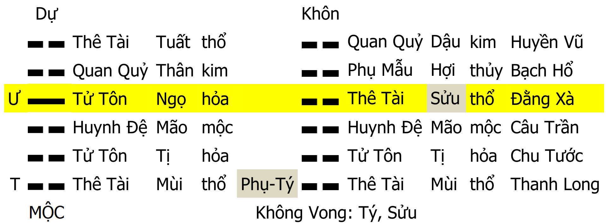
    - **Hình này chứng minh điều gì**
      - Bàn chân bị bệnh cước khí kèm theo hiện tượng ngứa và nứt da, lột da nghiêm trọng.
    - **Từ đâu mà thấy được**
      - Hào Thế Mùi thổ cư hào sơ lâm Thanh Long bị Nguyệt phá, đồng thời bị Nhật kiến Mão mộc khắc thương.
  - **Phán đoán chi tiết:**
    - Căn cứ: Mặc dù mục đích chính của người phụ nữ là gieo quẻ hỏi khi nào có con, nhưng tổ hợp các yếu tố trong quẻ xuất hiện đặc điểm trùng khớp với bệnh cước khí; tác giả liền đoán ngay đương số đang bị cước khí.
    - Nhìn vào hào vị và Dụng thần: Hào Thế Thê Tài Mùi thổ cư tại hào sơ, lâm Thanh Long bị Nguyệt kiến Sửu thổ trực xung thành Nguyệt phá (Sửu Mùi tương xung).
    - Căn cứ hào vị, ngũ hành và thần sát: Hào sơ đại diện cho bàn chân; ngũ hành Thổ chủ về da dẻ; Thanh Long chủ về ngứa ngáy.
    - Nhìn vào Nhật kiến và tác động sinh khắc: Hào Thế Mùi thổ bị Nhật kiến Mão mộc tương khắc, mộc chủ về ngứa rát; đồng thời trạng thái Nguyệt phá biểu thị dấu hiệu nứt nẻ, bong tróc, lột da.
    - Tổng hợp nhận định: Tổ hợp hào sơ thổ ngộ Thanh Long, bị mộc khắc và lâm Nguyệt phá khẳng định chắc chắn người phụ nữ đang mắc bệnh cước khí lột da ở bàn chân.
  - **Ứng nghiệm thực tế:**
    - Phản ứng và kết quả ngay tại chỗ: Lời đoán ứng nghiệm lập tức; người phụ nữ xác nhận bàn chân cô hiện đang bị cước khí rất nặng, lớp da chân bị bong tróc, lột da vô cùng nghiêm trọng.
- **Ví dụ 3:** Ngày Nhâm Thân tháng Tý, một cô gái nhờ dự đoán về kỳ thi tuyển sinh nghiên cứu sinh, gieo được quẻ Phong Hỏa Gia Nhân biến Phong Địa Quan (Mộc Không Vong: Tuất, Hợi).
  - **Hình 304.** Quẻ Phong Hỏa Gia Nhân biến Phong Địa Quan
    - 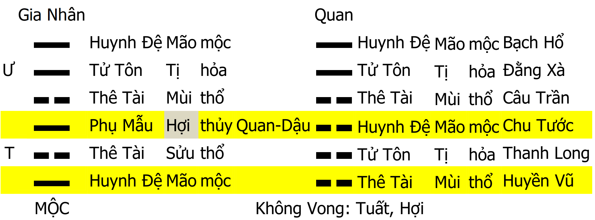
    - **Hình này chứng minh điều gì**
      - Đương số mắc bệnh cước khí ở chân với triệu chứng ngứa ngáy dữ dội kết hợp ẩm thấp lở loét.
    - **Từ đâu mà thấy được**
      - Hào Thế Sửu thổ lâm Thanh Long bị hào sơ Huynh Đệ Mão mộc lâm Huyền Vũ phát động khắc thương.
  - **Phán đoán chi tiết:**
    - Căn cứ: Trong quá trình dự trắc một sự việc khác (thi cử) thường hay xuất hiện đồng thời các tín hiệu về sức khỏe bệnh tật nếu quẻ có tổ hợp đặc thù; lấy hào Thế Thê Tài Sửu thổ tại hào 2 làm Dụng thần khảo sát bản thân đương số.
    - Nhìn vào: Hào Thế Sửu thổ mang ngũ hành Thổ, lâm lục thần Thanh Long; Thổ chủ về da dẻ, Thanh Long chủ về ngứa ngáy.
    - Căn cứ hào phát động và thần sát: Hào sơ Huynh Đệ Mão mộc mang lục thần Huyền Vũ phát động khắc trực tiếp vào hào Thế Thổ; hào sơ đại diện cho bàn chân, hành Mộc chủ về đau ngứa, lục thần Huyền Vũ chủ về ẩm thấp, chảy dịch và lở loét.
    - Tổng hợp nhận định: Hào Thế Thổ lâm Thanh Long bị hào sơ Mộc mang Huyền Vũ động khắc tạo thành tổ hợp điển hình của bệnh cước khí (nhiễm nấm, ẩm ướt lở ngứa ở bàn chân).
  - **Ứng nghiệm thực tế:**
    - Kết quả xác nhận: Trên thực tế cô gái dự thi nghiên cứu sinh thừa nhận bản thân đúng là đang bị bệnh cước khí ở chân.
- **Ví dụ 4:** Ngày Giáp Tý tháng Dần, một người phụ nữ tự gieo quẻ dự đoán bệnh tật của bản thân, được quẻ Phong Thiên Tiểu Súc biến Thủy Phong Tỉnh (Mộc Không Vong: Tuất, Hợi).
  - **Hình 305.** Quẻ Phong Thiên Tiểu Súc biến Thủy Phong Tỉnh
    - 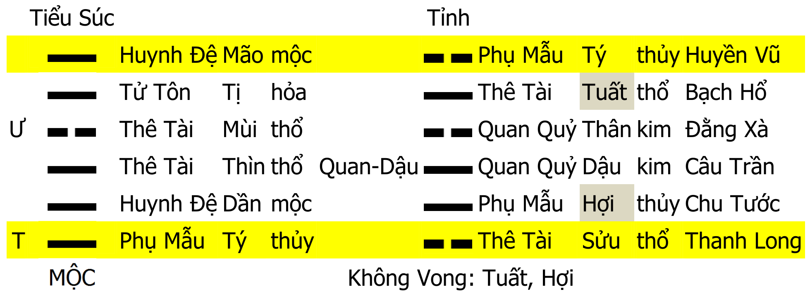
    - **Hình này chứng minh điều gì**
      - Mắc bệnh cước khí chân ẩm ngứa dai dẳng kéo dài, đồng thời kèm theo viêm quanh khớp vai, đau đầu và cảm mạo.
    - **Từ đâu mà thấy được**
      - Thế hào sơ Tý thủy lâm Bệnh địa, Thanh Long động hóa Sửu thổ hồi đầu khắc hợp; hào 6 Mão mộc động tương hình hào Thế.
  - **Phán đoán chi tiết:**
    - Căn cứ: Đương số tự xem bệnh bản thân nên lấy hào Thế Phụ Mẫu Tý thủy tại hào sơ làm Dụng thần phán đoán.
    - Nhìn vào hào Thế và trạng thái trường sinh: Hào Thế Tý thủy cư hào sơ, gặp Nguyệt kiến Dần mộc rơi vào Bệnh địa (Thủy bệnh tại Dần); hào sơ là bàn chân, hành Thủy chủ về thấp khí (ẩm ướt, mồ hôi).
    - Căn cứ lục thần và ngũ hành: Hào Thế lâm Thanh Long chủ về ngứa ngáy; Nguyệt kiến là Mộc cũng chủ về ngứa; Tý thủy phát động hóa Thê Tài Sửu thổ hồi đầu tương khắc tương hợp (Tý Sửu hợp khắc).
    - Luận giải cơ chế bệnh lý da: Thổ chủ về da dẻ nên đây là bệnh về da ở chân; tương hợp chủ về dây dưa triền miên, chứng tỏ bệnh cước khí dai dẳng lâu ngày chưa khỏi.
    - Biện chứng các triệu chứng kèm theo: Hào 6 Huynh Đệ Mão mộc phát động tương hình với hào Thế Tý thủy (Tý Mão tương hình); hào 6 là vị trí đỉnh đầu, vai và lưng; hành Mộc chủ về đau nhức cơ khớp và phong hàn tà khí; do đó phán đoán đương số còn bị viêm quanh khớp vai, đau nhức đầu và cảm mạo phong hàn.
  - **Ứng nghiệm thực tế:**
    - Diễn biến thực tế: Khi đến nhờ gieo quẻ, người phụ nữ đang phải chịu đựng bệnh cước khí ở chân; ngoài ra bà xác nhận đúng là đang bị cảm mạo, viêm đau quanh khớp vai và đau nhức đầu.
- **Ví dụ 5:** Ngày Bính Thìn tháng Hợi, trong thời gian tác giả đang giảng dạy Dịch học tại Nhật Bản, một phụ nữ địa phương nhờ dự đoán phong thủy nhà ở, gieo được quẻ Sơn Trạch Tổn biến Hỏa Trạch Khuê (Thổ Không Vong: Tý, Sửu).
  - **Hình 306.** Quẻ Sơn Trạch Tổn biến Hỏa Trạch Khuê
    - 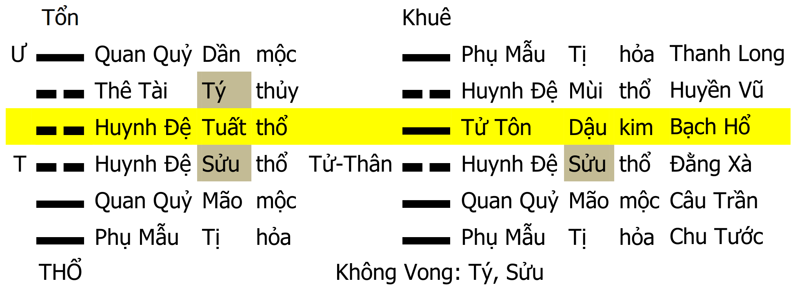
    - **Hình này chứng minh điều gì**
      - Bàn chân bị cước khí nứt da, viêm đỏ do ẩm thấp và đồng thời bị suy nhược thần kinh vùng đầu.
    - **Từ đâu mà thấy được**
      - Hào sơ Tị hỏa là Nguyên thần bị Nguyệt phá nhập Mộ lâm Chu Tước; Kỵ thần hào 6 Quan Quỷ Dần mộc vượng tướng.
  - **Phán đoán chi tiết:**
    - Căn cứ: Mặc dù đương sự nhờ dự đoán phong thủy, nhưng môi trường cư trú tác động trực tiếp lên cơ thể con người nên thông tin bệnh tật vẫn hiển lộ rõ nét trên quẻ; lấy hào Thế Huynh Đệ Sửu thổ tại hào 3 làm Dụng thần.
    - Nhìn vào: Hào Thế Sửu thổ không bị Nhật Nguyệt khắc phạt trực tiếp, nhưng Nguyên thần sinh Thế là Phụ Mẫu Tị hỏa tại hào sơ bị Nguyệt kiến Hợi thủy xung phá thành Nguyệt phá (Tị Hợi tương xung), lại nhập Mộ tại Nhật kiến Thìn thổ (Tị hỏa mộ tại Thìn), khiến Nguyên thần mất khả năng sinh trợ cho hào Thế Thổ (Thổ chủ da dẻ).
    - Căn cứ hào sơ và thần sát: Hào sơ là bàn chân; Nguyệt phá chủ về nứt nẻ, rách da, lột da; lâm lục thần Chu Tước chủ về phản ứng sưng viêm, tấy đỏ; bị Thủy xung phá biểu thị bàn chân bị tà khí ẩm thấp xâm lấn.
    - Nhìn vào hệ thống thần kinh: Hào 6 Quan Quỷ Dần mộc là Kỵ thần ở trạng thái vượng tướng (được tháng Hợi sinh trợ); hào 6 đại diện cho vùng đầu, hành Mộc chủ về hệ thần kinh; vì vậy phán đoán người phụ nữ này còn mắc chứng suy nhược thần kinh.
  - **Ứng nghiệm thực tế:**
    - Kết quả và đối thoại tại chỗ: Toàn bộ các phán đoán về bệnh cước khí nứt da viêm đỏ ở chân và chứng suy nhược thần kinh đều được người phụ nữ xác nhận ứng nghiệm chính xác ngay tại hiện trường.
- **Ví dụ 6:** Ngày Nhâm Thìn tháng Tý, một người đàn ông đến dự đoán tình hình sức khỏe của bản thân, gieo được quẻ Hỏa Địa Tấn biến Hỏa Trạch Khuê (Kim Không Vong: Ngọ, Mùi).
  - **Hình 307.** Quẻ Hỏa Địa Tấn biến Hỏa Trạch Khuê
    - 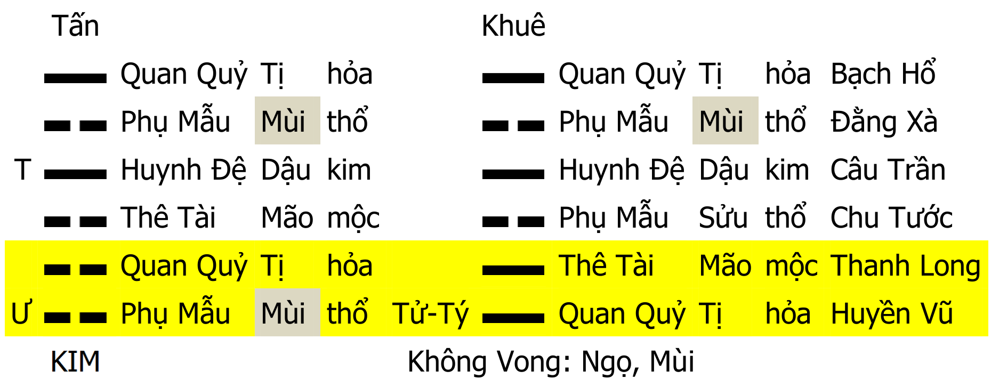
    - **Hình này chứng minh điều gì**
      - Người bệnh mắc bệnh cước khí ở chân do thấp khí sinh phồng rộp và ngứa ngáy.
    - **Từ đâu mà thấy được**
      - Hào sơ Mùi thổ ngộ Không Vong lâm Huyền Vũ động hóa Quan Quỷ; hào 2 Quan Quỷ lâm Thanh Long khắc Thế.
  - **Phán đoán chi tiết:**
    - Căn cứ: Người nam tự xem sức khỏe của mình nên lấy hào Thế Huynh Đệ Dậu kim tại hào 4 làm Dụng thần.
    - Nhìn vào Nhật Nguyệt: Hào Thế Dậu kim được Nhật kiến Thìn thổ sinh hợp (Thìn Dậu hợp), Nguyệt kiến Tý thủy không khắc thương; xét riêng về Nhật Nguyệt thì không thấy biểu hiện bệnh tật nguy cấp.
    - Nhìn vào hào sơ và hào 2 phát động: Hào sơ Phụ Mẫu Mùi thổ là Nguyên thần sinh Thế lâm Tuần Không (ngày Nhâm Thìn tuần Giáp Thân, Ngọ Mùi Không Vong), phát động hóa ra Kỵ thần Quan Quỷ Tị hỏa; hào 2 Quan Quỷ Tị hỏa mang lục thần Thanh Long lại tương khắc hào Thế Kim.
    - Luận giải tổ hợp cước khí: Hào sơ là bàn chân; ngũ hành Thổ chủ về da dẻ; lâm Tuần Không biểu thị tổ chức da rỗng ruột sinh phồng rộp, nổi bóng nước; lâm Huyền Vũ hóa Quan Quỷ chủ về do khí ẩm thấp mà sinh ra mầm bệnh; hào khắc Thế mang Thanh Long chủ về triệu chứng ngứa ngáy dữ dội.
  - **Ứng nghiệm thực tế:**
    - Kết quả: Tổng hợp các tượng quẻ khẳng định người đàn ông mắc bệnh cước khí phồng rộp ngứa rát ở chân, trên thực tế đúng như vậy.
- **Ví dụ 7:** Ngày Tân Sửu tháng Hợi, một người phụ nữ đến nhờ dự đoán về sự nghiệp và sức khỏe bản thân, gieo được quẻ Lôi Trạch Quy Muội biến Lôi Thiên Đại Tráng (Kim Không Vong: Thìn, Tị).
  - **Hình 308.** Quẻ Lôi Trạch Quy Muội biến Lôi Thiên Đại Tráng
    - 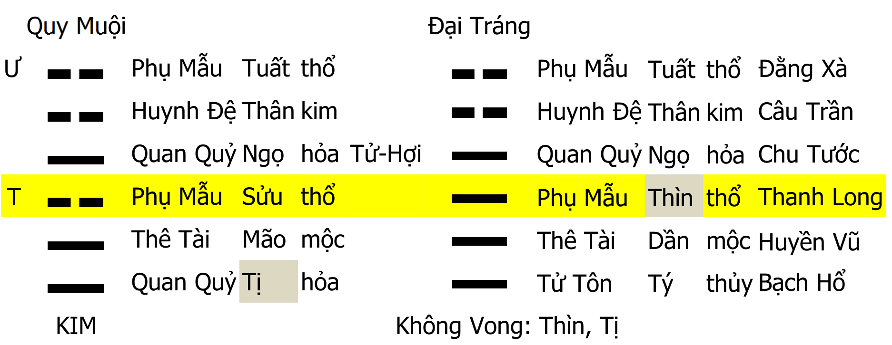
    - **Hình này chứng minh điều gì**
      - Chân bị cước khí lột da, ngứa rát, nổi nốt ban đỏ; đồng thời thắt lưng đau yếu và tạng tim suy giảm.
    - **Từ đâu mà thấy được**
      - Hào sơ Quan Quỷ Tị hỏa lâm Bạch Hổ ngộ Không bị Nguyệt phá; Thế hào 3 Sửu thổ lâm Thanh Long hóa Thìn thổ Không Vong.
  - **Phán đoán chi tiết:**
    - Căn cứ: Xem sức khỏe lấy hào Thế Phụ Mẫu Sửu thổ tại hào 3 làm Dụng thần; hào Thế mang ngũ hành Thổ chủ về da dẻ, lâm lục thần Thanh Long chủ về ngứa ngáy.
    - Nhìn vào hào sơ: Hào sơ là bàn chân, Quan Quỷ Tị hỏa tại hào sơ lâm Tuần Không, lại bị Nguyệt kiến Hợi thủy trực xung thành Nguyệt phá (Tị Hợi tương xung); Nguyệt phá là tượng nứt nẻ, lột da; lâm Bạch Hổ chủ về huyết dịch, rớm máu và ban đỏ nổi lên.
    - Đưa ra chẩn đoán cước khí: Tác giả phán đoán bàn chân cô bị bệnh cước khí khá nặng, biểu hiện cụ thể là da chân bị bong tróc lột da, ngứa rát và xuất hiện các nốt ban đỏ.
    - Luận giải thắt lưng và tim: Hào Thế cư hào 3 là vị trí thắt lưng, lâm Nhật kiến Sửu thổ lại phát động hóa Phụ Mẫu Thìn thổ ngộ Tuần Không; thắt lưng hóa Không biểu thị lưng eo mềm yếu vô lực, lâm Thanh Long chủ về đau mỏi; hào 3 còn là vị trí giường nằm, hóa Không biểu thị giấc ngủ chập chờn, mất ngủ; hào Thế Không Vong không nhận được sinh trợ từ Nguyên thần Hỏa tại hào 4 do hào 4 Quan Quỷ Ngọ hỏa bị Nguyệt kiến Hợi thủy khắc thương; hành Hỏa chủ về tim nên chức năng tim cũng suy yếu.
  - **Ứng nghiệm thực tế:**
    - Luồng đối thoại và xác nhận: Khi nghe tác giả phán đoán về bàn chân bị lột da, ngứa và nổi nốt đỏ, người phụ nữ lập tức xác nhận đúng là hiện trạng như vậy; đồng thời các biểu hiện đau mỏi thắt lưng, mất ngủ và tim yếu trên thực tế đều hoàn toàn trùng khớp.
- **Ví dụ 8:** Ngày Canh Dần tháng Tý, một phụ nữ nhờ dự đoán niên vận của bản thân, gieo được quẻ Thiên Sơn Độn biến Thiên Hỏa Đồng Nhân (Kim Không Vong: Ngọ, Mùi).
  - **Hình 309.** Quẻ Thiên Sơn Độn biến Thiên Hỏa Đồng Nhân
    - 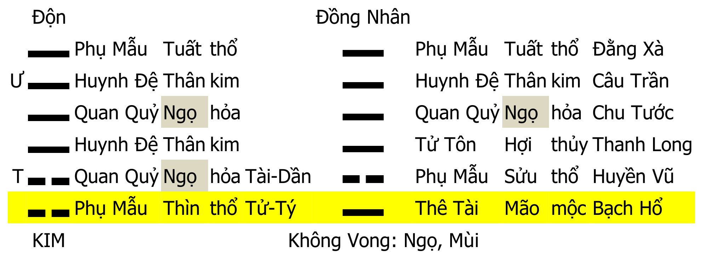
    - **Hình này chứng minh điều gì**
      - Bệnh cước khí ngứa ngáy dữ dội dẫn tới việc người bệnh dùng tay gãi rách da chảy máu.
    - **Từ đâu mà thấy được**
      - Hào Thế Ngọ hỏa lâm Huyền Vũ bị Nguyệt xung phá ngộ Không; hào 3 Huynh Đệ Thân kim ám động; hào sơ Thìn thổ Bạch Hổ độc phát hóa Mão mộc.
  - **Phán đoán chi tiết:**
    - Căn cứ: Quẻ niên vận bao hàm tình trạng thể chất của bản thân người hỏi nên lấy hào Thế Quan Quỷ Ngọ hỏa tại hào 2 làm Dụng thần.
    - Nhìn vào hào Thế và Nhật Nguyệt: Hào Thế Ngọ hỏa lâm Huyền Vũ, ngộ Tuần Không, bị Nguyệt kiến Tý thủy trực xung thành Nguyệt phá (Tý Ngọ tương xung); ngũ hành Thủy chủ về tà khí ẩm thấp.
    - Nhìn vào hào ám động: Hào 3 Huynh Đệ Thân kim bị Nhật kiến Dần mộc xung thành ám động (Dần Thân tương xung); Thân kim là Bệnh địa của hào Thế Ngọ hỏa (Hỏa bệnh tại Thân); Huynh Đệ chủ về chân tay; Nhật kiến Dần mộc chủ về ngứa ngáy.
    - Nhìn vào hào độc phát tại hào sơ: Hào sơ Phụ Mẫu Thìn thổ độc phát, cổ thư dạy "độc phát biểu thị căn nguyên mầm bệnh"; hào sơ là bàn chân, Thìn thổ biến Thê Tài Mão mộc (Thổ hóa Mộc) tạo thành tổ hợp điển hình của bệnh cước khí; hào sơ lâm Bạch Hổ chủ về tổn thương rách da, chảy máu.
    - Kết luận: Tổng hợp các căn cứ phán đoán người này bị bệnh cước khí ẩm ngứa ở bàn chân, do ngứa không chịu nổi nên đã gãi làm rách da rớm máu.
  - **Ứng nghiệm thực tế:**
    - Kết quả: Trên thực tế người phụ nữ bị mắc bệnh cước khí rất ngứa ngáy, đúng là đã dùng tay gãi rách toạc da chân chảy máu.
- **Ví dụ 9:** Ngày Ất Tị tháng Hợi, một người mẹ nhờ dự đoán bệnh tật cho con gái, tác giả trực tiếp gieo quẻ được Thủy Hỏa Ký Tế biến Thủy Sơn Kiển (Thủy Không Vong: Dần, Mão).
  - **Hình 310.** Sơ đồ quẻ Thủy Hỏa Ký Tế biến Thủy Sơn Kiển
    - 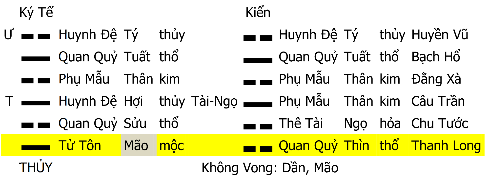
    - **Hình này chứng minh điều gì**
      - Bệnh cước khí đau ngứa sưng trướng rất trầm trọng làm bàn chân không thể chạm đất, hầu như mất khả năng đi lại.
    - **Từ đâu mà thấy được**
      - Dụng thần Tử Tôn Mão mộc tại hào sơ ngộ Tuần Không lâm Thanh Long động hóa Quan Quỷ Thìn thổ.
  - **Phán đoán chi tiết:**
    - Căn cứ: Dự trắc bệnh của con gái lấy hào Tử Tôn làm Dụng thần; trong quẻ Tử Tôn Mão mộc an tại hào sơ.
    - Nhìn vào vượng suy: Tử Tôn Mão mộc không bị Nhật Nguyệt khắc phạt, được Nguyệt kiến Hợi thủy sinh phù, lại có hào Thế Huynh Đệ Hợi thủy phát động tương sinh nên bản thân tương đối vượng tướng.
    - Nhìn vào biến hóa tật bệnh: Dù vượng tướng nhưng Dụng thần Mão mộc lâm Tuần Không (ngày Ất Tị tuần Giáp Thìn, Dần Mão Không Vong), động mà hóa xuất Quan Quỷ Thìn thổ; Dụng thần lâm Không hóa Quỷ chính là biểu hiện mang trọng bệnh trong mình.
    - Luận giải cơ chế bệnh lý tại bàn chân: Hào sơ là bàn chân, hào sơ gặp Không Vong mang tượng "chân không chạm đất", biểu thị không thể dẫm chân xuống mặt đất để đi đứng; hào sơ lâm Mộc và mang lục thần Thanh Long, cả Mộc lẫn Thanh Long đều là biểu trưng của sự đau nhức và ngứa rát; hóa ra thổ Quỷ, Quan Quỷ là bệnh tật, ngũ hành Thổ là sưng trướng, phù nề.
    - Kết luận: Người con gái bị bệnh cước khí rất nghiêm trọng, chân sưng phù đau ngứa đến mức hầu như không thể tự bước đi lại được.
  - **Ứng nghiệm thực tế:**
    - Luồng đối thoại và xác nhận: Người mẹ nghe phán đoán liền xác nhận đúng là tình cảnh như vậy; bà cho biết con gái đã bị mắc chứng cước khí này suốt mấy năm trời, thời gian gần đây bệnh tình lại bùng phát trở nên đặc biệt nghiêm trọng khiến con gái không thể bước đi được.
- **Ví dụ 10:** Ngày Ất Sửu tháng Dần, một người nam đến dự đoán niên vận của bản thân, gieo được quẻ Phong Thiên Tiểu Súc biến Địa Hỏa Minh Di (Mộc Không Vong: Tuất, Hợi).
  - **Hình 311.** Sơ đồ quẻ Phong Thiên Tiểu Súc biến Địa Hỏa Minh Di
    - 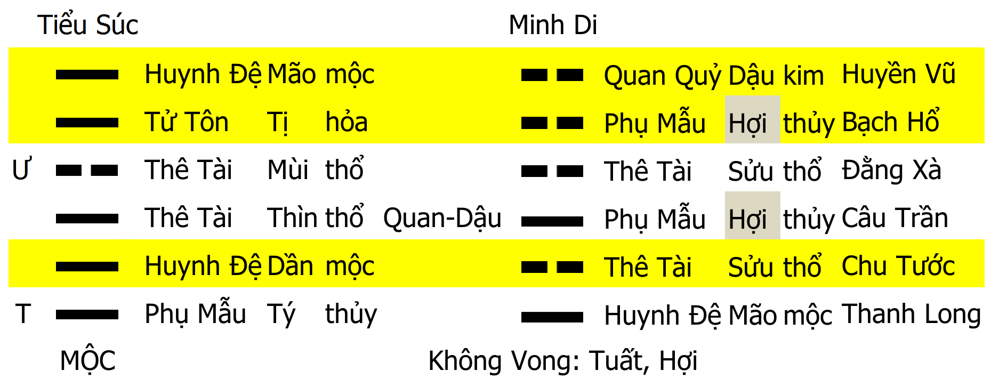
    - **Hình này chứng minh điều gì**
      - Đương số mắc bệnh cước khí ở chân với triệu chứng do thấp khí ứ đọng, ngứa rát và viêm sưng đỏ.
    - **Từ đâu mà thấy được**
      - Thế hào sơ Tý thủy bị Nhật kiến khắc hợp lâm Thanh Long; hào 2 Dần mộc Bệnh địa mang Chu Tước phát động.
  - **Phán đoán chi tiết:**
    - Căn cứ: Quẻ niên vận chứa đựng tín hiệu sức khỏe của đương sự nên lấy hào Thế Phụ Mẫu Tý thủy tại hào sơ làm Dụng thần.
    - Nhìn vào hào sơ: Hào Thế Tý thủy an tại hào sơ, bị Nhật kiến Sửu thổ khắc hợp (Tý Sửu hợp khắc), lâm lục thần Thanh Long; hào sơ là bàn chân, ngũ hành Thủy chủ về thấp khí (ẩm ướt, mồ hôi ứ đọng); Thanh Long chủ về ngứa ngáy.
    - Nhìn vào hào 2 phát động: Hào 2 Huynh Đệ Dần mộc phát động, Dần mộc chính là Bệnh địa của hào Thế Tý thủy (Thủy bệnh tại Dần); Bệnh địa lâm Mộc chủ về đau ngứa; lại mang lục thần Chu Tước chủ về phản ứng sưng viêm, tấy đỏ.
    - Tổng hợp nhận định: Hào sơ Thủy ngộ khắc kết hợp Bệnh địa Mộc lâm Chu Tước phát động mang đầy đủ tín hiệu của bệnh cước khí gây viêm đỏ ngứa rát bàn chân.
  - **Ứng nghiệm thực tế:**
    - Kết quả: Trên thực tế tại thời điểm gieo quẻ hỏi niên vận, người nam này đã đang bị mắc chứng bệnh cước khí ở chân.
- **Ví dụ 11:** Ngày Tân Sửu tháng Sửu, một người mẹ đến dự đoán tình hình bệnh tật của con gái, gieo được quẻ Thủy Địa Tỷ biến Địa Thủy Sư (Thổ Không Vong: Thìn, Tị).
  - **Phán đoán chi tiết:**
    - Căn cứ xác định Dụng thần và tính mệnh: Đoán bệnh cho con gái lấy hào Tử Tôn làm Dụng thần; trong quẻ Tử Tôn Thân kim an tại hào 4, được cả Nhật kiến lẫn Nguyệt kiến Sửu thổ tương sinh nên rất vượng tướng. Tuy trong quẻ có Phụ Mẫu Tị hỏa phát động đến khắc, nhưng Tị hỏa gặp tháng Sửu bị tiết khí hưu tù và ngộ Tuần Không, lại có Huynh Đệ Tuất thổ tại hào 5 phát động dẫn thông quan (Hỏa sinh Thổ, Thổ sinh Kim) tạo thành cách cục tương sinh liên hoàn; do đó kết luận tính mạng hoàn toàn an toàn, không có nguy hiểm chết người.
    - Nhìn vào trạng thái giam hãm: Dụng thần Thân kim nhập Mộ ở cả Nhật kiến và Nguyệt kiến Sửu thổ (Kim mộ tại Sửu); tượng nhập Mộ biểu thị sự giam cầm, mất tự do, người bệnh bị mất khả năng đi lại tự do, phải nằm liệt trên giường.
    - Căn cứ hào sơ và lục thần: Hào sơ Huynh Đệ Mùi thổ bị cả Nguyệt kiến lẫn Nhật kiến Sửu thổ trực xung thành Nguyệt phá và Nhật phá (Sửu Mùi tương xung); hào sơ là bàn chân, ngũ hành Thổ chủ về da dẻ; trạng thái Phá chủ về lột da, bong tróc, lở loét; lâm lục thần Bạch Hổ chủ về chảy máu và mưng mủ.
    - Nhìn vào hào 2 khắc thương: Hào 2 Phụ Mẫu Tị hỏa lâm Tuần Không phát động đến khắc; hành Hỏa chủ về viêm ban đỏ, Tuần Không mang tượng phồng rộp, bóng nước; tổng hợp toàn bộ tín hiệu khẳng định con gái mắc bệnh cước khí vô cùng nặng.
  - **Ứng nghiệm thực tế:**
    - Kết quả thực tế: Người con gái bị cước khí trầm trọng, vùng da bàn chân lở loét mưng mủ rớm máu, đau đớn dữ dội đến mức mất hoàn toàn khả năng bước đi.

### 25. BỆNH TÂM THẦN

#### Khái niệm và phân loại bệnh tâm thần trong y học
- Định nghĩa và các dạng bệnh thường gặp:
  - Bệnh tâm thần được y học phân chia thành nhiều chủng loại phức tạp với vô số triệu chứng lâm sàng khác nhau.
  - Các chứng bệnh thường gặp trên thực tế bao gồm rối loạn tâm thần chức năng, rối loạn tâm thần thực thể, rối loạn tâm thần do bệnh lý cơ thể, chậm phát triển tâm thần, rối loạn nhân cách và rối loạn tâm lý.
- Phân loại theo cấp độ bệnh lý:
  - Nhóm bệnh tâm thần nặng: Chủ yếu bao gồm tâm thần phân liệt, rối loạn tâm thần phản ứng, rối loạn tâm thần hoang tưởng, rối loạn tâm thần mãn kinh, rối loạn tâm thần thời thơ ấu, rối loạn tâm thần lưỡng cực, chứng hưng cảm, chứng trầm cảm, rối loạn tâm thần cảm ứng.
  - Nhóm bệnh tâm thần nhẹ: Bao gồm suy nhược thần kinh, chứng cuồng loạn (hysteria), rối loạn thần kinh lo âu, hội chứng sợ (phobia), rối loạn ám ảnh cưỡng chế (OCD), chứng loạn thần kinh trầm cảm, rối loạn thần kinh nghi ngờ (nghi bệnh).

#### Quy luật nhận diện bệnh tâm thần qua quái tượng Lục Hào
- Phương diện quái cung:
  - Bệnh tâm thần liên quan chủ yếu đến hai cung quái Càn và Chấn.
  - Cung Càn tượng trưng cho đầu não (Càn vi thủ), cơ quan trung ương điều khiển toàn bộ hoạt động nhận thức và ý thức.
  - Cung Chấn chủ về sự chấn động, kích động, cuồng táo (狂躁), mất kiểm soát cảm xúc.
- Phương diện hào vị và Nguyên thần:
  - Liên quan chủ yếu đến hào 6 và hào sơ:
    - Hào 6 là hào vị tối cao đại diện cho phần đầu và hệ thần kinh não bộ.
    - Hào sơ là gốc rễ của tâm tư, đại diện cho thế giới nội tâm sâu kín và tư tưởng tiềm thức.
  - Mối liên hệ mật thiết với Nguyên thần: Nguyên thần là cội nguồn sinh trợ Dụng thần, chủ về năng lực tư duy, trí lực và trạng thái thế giới nội tâm.
- Sơ đồ quẻ chuyển tiếp minh họa quy luật hào vị và thế giới nội tâm:
  - **Quái lệ minh họa:** Sơ đồ quẻ Thủy Địa Tỷ biến Địa Thủy Sư thể hiện mối liên hệ giữa hào vị đầu não (hào 6) và nội tâm (hào sơ) cùng động biến trong chẩn đoán trạng thái tâm thần:
    - **Hình 312.** Sơ đồ quẻ Thủy Địa Tỷ biến Địa Thủy Sư
      - 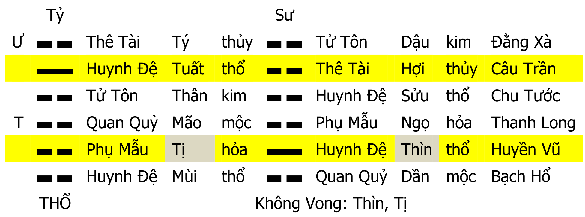
      - **Hình này chứng minh điều gì**
        - Minh họa hào 6 chủ về đầu não và hào sơ chủ về nội tâm cùng trạng thái động biến phản ánh bệnh lý.
      - **Từ đâu mà thấy được**
        - Quẻ Thủy Địa Tỷ biến Địa Thủy Sư có hào 6 lâm Đằng Xà và hào sơ phát động lâm Bạch Hổ.
    - **Phán đoán chi tiết:**
      - Căn cứ: Hào vị trong Lục Hào phản ánh cấu trúc cơ thể và tâm lý, hào 6 quản vùng đầu não, hào sơ quản thế giới nội tâm, Nguyên thần quản tư duy.
      - Nhìn vào: Sự xung đột và vận động tại hào sơ và hào 6 phản ánh trực tiếp những bế tắc nội tâm và biến đổi thần kinh của người bệnh.
    - **Ứng nghiệm thực tế:**
      - Quẻ đồ được đặt tại vị trí chuyển tiếp trong nguyên bản nhằm minh họa cơ chế hào vị đầu não và thế giới nội tâm kết hợp biến hóa ngũ hành trong dự trắc bệnh lý.
- Phương diện lục thần:
  - Thần thú Huyền Vũ: Chủ về ảo giác, ảo tưởng, tâm trạng u uất, suy nghĩ tiêu cực, mê muội, trầm cảm.
  - Thần thú Đằng Xà: Chủ về cuồng vọng, cuồng tưởng, tư duy quái dị khác thường, tâm thần bồn chồn lo âu, đứng ngồi không yên.
- Phương diện địa chi:
  - Liên quan mật thiết với Mộ khố (Thìn, Tuất, Sửu, Mùi).
  - Ý nghĩa bệnh lý của Mộ: Chủ về sự phong bế, giam hãm, đóng kín, tư duy bế tắc không cởi mở, tự cô lập mình khỏi thế giới bên ngoài.

#### Phân tích các ví dụ thực tế dự đoán bệnh tâm thần
- **Ví dụ 1:** Ngày Quý Mão tháng Dậu (Không Vong: Thìn, Tị), người mẹ xem bệnh cho con gái, gieo được quẻ Hỏa Phong Đỉnh.
  - **Hình 313.** Quẻ Hỏa Phong Đỉnh
    - 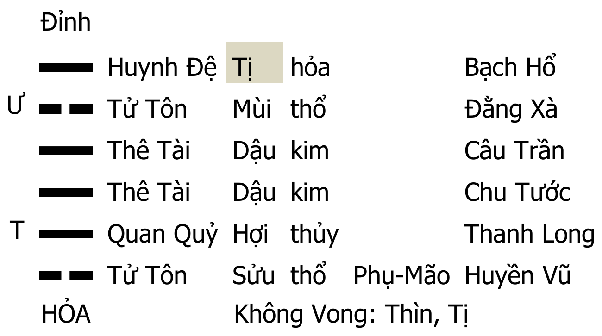
    - **Hình này chứng minh điều gì**
      - Xác định con gái mắc bệnh tâm thần thể cuồng táo bất an do di truyền từ người cha.
    - **Từ đâu mà thấy được**
      - Tử Tôn Mùi thổ lâm Đằng Xà; Nguyên thần Huynh Đệ Tị hỏa tại hào 6 đầu não lâm Tuần Không.
  - **Phán đoán chi tiết:**
    - Căn cứ: Dự đoán bệnh tật cho con gái, lấy hào Tử Tôn làm Dụng thần. Trong quẻ xuất hiện Tử Tôn lưỡng hiện (hào sơ Tử Tôn Sửu thổ và hào 5 Tử Tôn Mùi thổ), lấy hào 5 Tử Tôn Mùi thổ lâm Ứng hào làm Dụng thần chính.
    - Nhìn vào: Dụng thần Tử Tôn Mùi thổ lâm Đằng Xà; Đằng Xà chủ về tâm thần cuồng táo bất an, bồn chồn lo âu, đứng ngồi không yên. Xét về Nguyên thần sinh dưỡng Dụng thần là Huynh Đệ Tị hỏa (Hỏa sinh Thổ), Tị hỏa ngự tại hào 6 lại lâm Tuần Không (ngày Quý Mão thuộc tuần Giáp Ngọ, Tuần Không tại Thìn, Tị). Hào 6 là cung vị của đầu não; hào đầu não lâm Không Vong chủ về tư duy khiếm khuyết, đầu óc phát triển hoặc vận hành không bình thường. Tổ hợp Dụng thần lâm Đằng Xà kết hợp Nguyên thần đầu não lâm Không Vong khẳng định đây là chứng bệnh tâm thần.
  - **Ứng nghiệm thực tế:**
    - Trên thực tế người con gái bị bệnh tâm thần, nguyên nhân phát sinh là do di truyền từ người cha.
- **Ví dụ 2:** Ngày Mậu Thân tháng Sửu (Không Vong: Dần, Mão), người bà xem bệnh cho cháu ngoại, gieo được quẻ Phong Thủy Hoán biến Sơn Thiên Đại Súc.
  - **Hình 314.** Quẻ Phong Thủy Hoán biến Sơn Thiên Đại Súc
    - 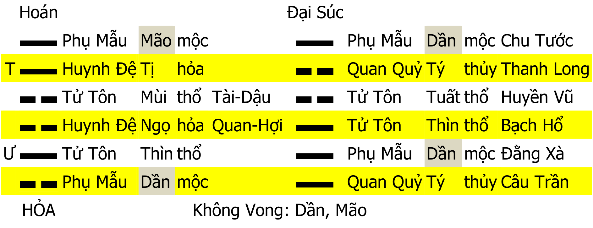
    - **Hình này chứng minh điều gì**
      - Xác định cháu ngoại mắc bệnh tâm thần với tâm trạng u uất nặng nề và tư duy quái dị.
    - **Từ đâu mà thấy được**
      - Dụng thần Tử Tôn Mùi thổ lâm Nguyệt phá và Huyền Vũ; Nguyên thần bị hồi đầu khắc; hào sơ động khắc.
  - **Phán đoán chi tiết:**
    - Căn cứ: Dự đoán bệnh cho thế hệ con cháu (cháu ngoại) lấy hào Tử Tôn làm Dụng thần. Quẻ có Tử Tôn lưỡng hiện (hào 2 Tử Tôn Thìn thổ trì Ứng và hào 4 Tử Tôn Mùi thổ), hào 4 Tử Tôn Mùi thổ bị Nguyệt kiến Sửu thổ xung là Nguyệt phá, theo nguyên lý "chỗ bị phá ắt có bệnh" nên lấy Tử Tôn Mùi thổ Nguyệt phá làm Dụng thần chính.
    - Nhìn vào: Dụng thần Tử Tôn Mùi thổ lâm thần thú Huyền Vũ; Huyền Vũ chủ về u tối, u uất, ảo giác, tâm trạng chán chường trầm mặc. Xét Nguyên thần của Dụng thần là Hỏa (hào 3 Huynh Đệ Ngọ hỏa và hào 5 Huynh Đệ Tị hỏa): hào 5 Huynh Đệ Tị hỏa phát động hóa Quan Quỷ Tý thủy là hóa hồi đầu khắc (Tý thủy khắc Tị hỏa), Nguyên thần bị hồi đầu khắc nên triệt tiêu năng lực sinh phù Dụng thần. Đồng thời, hào sơ Phụ Mẫu Dần mộc phát động hóa Quan Quỷ Tý thủy lại quay sang khắc trực tiếp Dụng thần Tử Tôn Mùi thổ; hào sơ là căn cội thế giới nội tâm, hào sơ phát động khắc Dụng thần biểu thị thế giới nội tâm chấn động, vô cùng bất ổn và hoảng loạn.
  - **Ứng nghiệm thực tế:**
    - Trên thực tế đứa cháu ngoại mắc bệnh tâm thần, tâm trạng thường xuyên rơi vào cảnh u uất, tư duy quái dị khác thường.
- **Ví dụ 3:** Ngày Tân Hợi tháng Tý (Không Vong: Dần, Mão), người vợ xem bệnh cho chồng, gieo được quẻ Khảm Vi Thủy biến Phong Thủy Hoán.
  - **Hình 315.** Quẻ Khảm Vi Thủy biến Phong Thủy Hoán
    - 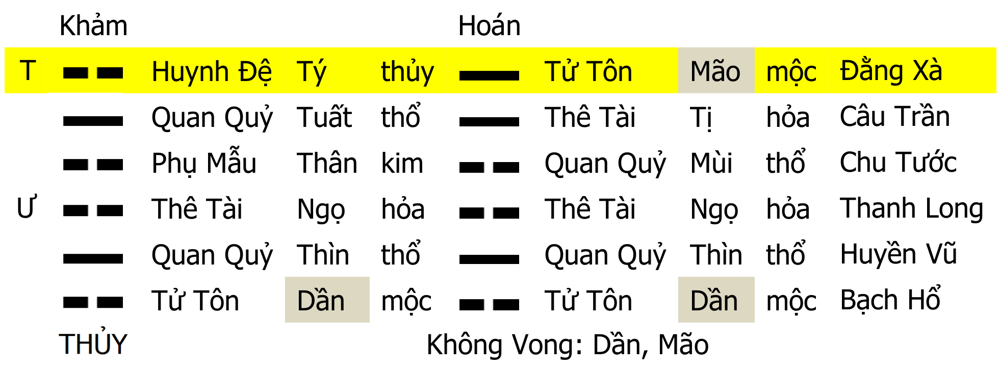
    - **Hình này chứng minh điều gì**
      - Xác định người chồng bị bệnh tâm thần, tư duy hoang tưởng sợ bị đầu độc nên tuyệt thực không ăn.
    - **Từ đâu mà thấy được**
      - Quan Quỷ Thìn thổ hào 2 lâm Huyền Vũ; hào 6 Huynh Đệ Tý thủy độc phát lâm Đằng Xà; Nguyên thần bị khắc phá lâm Long.
  - **Phán đoán chi tiết:**
    - Căn cứ: Xem bệnh cho chồng lấy hào Quan Quỷ làm Dụng thần. Quẻ có Quan Quỷ lưỡng hiện (hào 2 Quan Quỷ Thìn thổ và hào 5 Quan Quỷ Tuất thổ), hào 2 là hào vị phu thê (hào vị vợ chồng, nhà ở), do đó chọn Quan Quỷ Thìn thổ tại hào 2 làm Dụng thần chính.
    - Nhìn vào: Dụng thần Quan Quỷ Thìn thổ lâm Huyền Vũ; Huyền Vũ chủ về tâm trạng bất định, u uất, đa nghi, hoang tưởng. Quẻ xuất hiện hào độc phát tại hào 6 Huynh Đệ Tý thủy biến Tử Tôn Mão mộc; hào độc phát nắm giữ then chốt phản ánh nguyên nhân và tính chất bệnh tật. Hào 6 là cơ quan đầu não, ngự lâm lục thần Đằng Xà; Đằng Xà chủ về quái dị, chứng tỏ tư duy của người chồng vô cùng quái gở, hoang tưởng kỳ dị. Xét Nguyên thần của Dụng thần là Thê Tài Ngọ hỏa tại hào 3: Ngọ hỏa gặp tháng Tý bị xung là Nguyệt phá, gặp ngày Hợi bị Nhật khắc, bị Nhật Nguyệt đồng thời khắc phá nặng nề, lại lâm Thanh Long không thể phát huy tác dụng sinh Dụng thần; Thanh Long chủ về ẩm thực và ăn uống, Nguyên thần lâm Thanh Long bị khắc phá triệt để biểu thị người bệnh cự tuyệt ăn uống, không chịu nuốt thức ăn.
  - **Ứng nghiệm thực tế:**
    - Trên thực tế đầu óc tư duy của người chồng có vấn đề nghiêm trọng, bị tâm thần phân liệt, tuyệt thực không chịu ăn vì luôn nghi ngờ sợ trong thức ăn có bỏ thuốc độc.
- **Ví dụ 4:** Ngày Nhâm Ngọ tháng Mùi (Không Vong: Thân, Dậu), người nam tự dự đoán bệnh tật của bản thân, gieo được quẻ Sơn Địa Bác biến Khôn Vi Địa.
  - **Hình 316.** Quẻ Sơn Địa Bác biến Khôn Vi Địa
    - 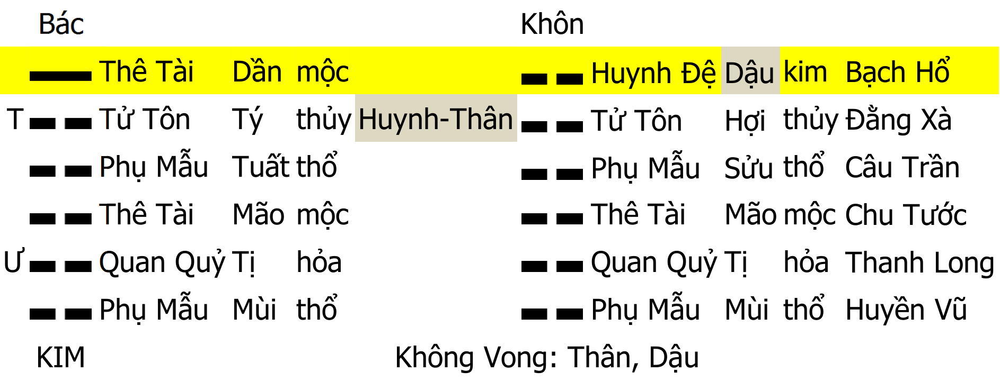
    - **Hình này chứng minh điều gì**
      - Xác định đương số mắc bệnh tâm thần, rối loạn kích động sợ hãi không thể đi xa, bước vào xe là phát điên.
    - **Từ đâu mà thấy được**
      - Thế Tý thủy bị Nguyệt khắc Nhật xung (Nhật phá) lâm Đằng Xà; Thế tại hào 5 gặp Bệnh địa; hào 6 độc phát.
  - **Phán đoán chi tiết:**
    - Căn cứ: Người nam tự đoán bệnh cho bản thân lấy hào Thế làm Dụng thần. Hào Thế ngự tại hào 5 là Tử Tôn Tý thủy.
    - Nhìn vào: Hào Thế Tý thủy lâm thần thú Đằng Xà chủ về tâm trạng bất an, hoảng sợ. Nguyên thần của Thế là Kim (Phụ Mẫu Thân kim phục tàng dưới hào 5) không xuất hiện trên quẻ lại lâm Tuần Không (Thân, Dậu tuần không); Nguyên thần khuyết tuyệt biểu thị người bệnh không thể đạt đến trạng thái "thủ nhất" (thân tâm an tĩnh, đem ý niệm tập trung an định vào một bộ vị cơ thể), tâm trạng cực kỳ tồi tệ. Hào Thế Tý thủy lại bị Nguyệt kiến Mùi thổ khắc thương và bị Nhật thần Ngọ hỏa trực xung (Tý Ngọ tương xung) thành Nhật phá; hào Thế bị Nguyệt khắc Nhật xung phá dữ dội phản ánh tinh thần và cảm xúc vô cùng bất ổn, dễ bị kích động cuồng loạn. Quẻ có hào 6 Thê Tài Dần mộc độc phát hóa Huynh Đệ Dậu kim; Dần mộc đối với Thế Tý thủy chính là Bệnh địa (Thủy bệnh tại Dần), hào 6 đại diện cho vùng đầu não, ngũ hành Mộc đại diện cho hệ thần kinh; hào 6 độc phát là Bệnh địa chứng tỏ hệ thần kinh vùng đầu có bệnh lý nghiêm trọng. Mặt khác, hào Thế ngự tại hào 5 lâm Đằng Xà gặp Bệnh địa; hào 5 là hào vị của đường sá, giao thông, Đằng Xà chủ sợ hãi quái dị, biểu thị người bệnh hoàn toàn không thể đi xa.
  - **Ứng nghiệm thực tế:**
    - Trên thực tế người nam mắc bệnh tâm thần, không thể ngồi xe buýt hay tàu hỏa, hễ cứ bước vào trong xe là thần kinh kích động phát điên, phát cuồng.
- **Ví dụ 5:** Ngày Nhâm Thân tháng Dần (Không Vong: Tuất, Hợi), người mẹ xem bệnh cho con gái, gieo được quẻ Hỏa Thủy Vị Tế biến Hỏa Trạch Khuê.
  - **Hình 317.** Quẻ Hỏa Thủy Vị Tế biến Hỏa Trạch Khuê
    - 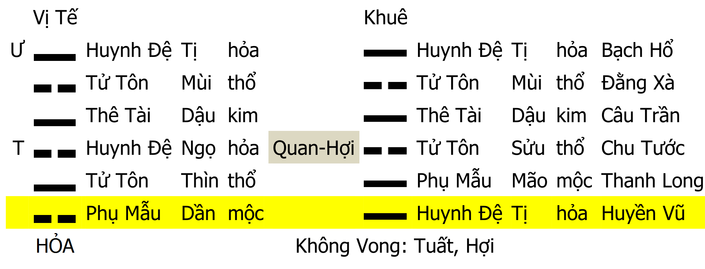
    - **Hình này chứng minh điều gì**
      - Xác định con gái mắc bệnh về tinh thần, tâm lý sợ hãi không thể ra ngoài đi xe hay đến trường đi học.
    - **Từ đâu mà thấy được**
      - Tử Tôn Thìn thổ tại hào 2 bị Nguyệt khắc và hào sơ động khắc; Nguyên thần hào 6 bị Bệnh địa hợp giữ.
  - **Phán đoán chi tiết:**
    - Căn cứ: Đoán bệnh cho con gái lấy hào Tử Tôn làm Dụng thần. Quẻ có Tử Tôn lưỡng hiện (hào 2 Tử Tôn Thìn thổ và hào 5 Tử Tôn Mùi thổ), lấy Tử Tôn Thìn thổ tại hào 2 gần hào Thế làm Dụng thần chính, hào còn lại dùng để tham khảo đối chiếu.
    - Nhìn vào: Dụng thần Tử Tôn Thìn thổ không được Nhật Nguyệt sinh trợ, lại bị Nguyệt kiến Dần mộc khắc thương. Kỵ thần Phụ Mẫu Dần mộc tại hào sơ lại là hào độc phát (biến Huynh Đệ Tị hỏa) đến khắc Dụng thần, chứng tỏ bệnh tình tương đối nghiêm trọng. Dụng thần ngự tại hào 2; hào 2 là trạch vị (nhà ở, nơi cư trú), phản ánh người con gái chỉ có thể thu mình quanh quẩn ở trong nhà. Hào sơ Kỵ thần lâm Huyền Vũ; Huyền Vũ chủ về âm khí, ám muội, tà khí. Xét Nguyên thần của Dụng thần là Hỏa (hào 6 Huynh Đệ Tị hỏa và hào 3 Huynh Đệ Ngọ hỏa): hào 6 Huynh Đệ Tị hỏa gặp Nhật thần Thân kim tương hợp (Tị Thân hợp), mà Thân lại là Bệnh địa của Hỏa (Hỏa bệnh tại Thân), do đó Nguyên thần tại hào 6 bị Bệnh địa hợp giữ (hợp trói), mất năng lực phát sinh sinh phù Dụng thần. Nguyên thần chủ về tư duy, hào sơ phát động cũng chủ về thế giới nội tâm và tư duy; tư duy bị áp chế và trói buộc khẳng định người con gái mắc chứng bệnh về phương diện tinh thần.
  - **Ứng nghiệm thực tế:**
    - Trên thực tế người con gái mắc bệnh tâm thần hoảng sợ, không dám bước chân ra ngoài đường để đi xe, thậm chí sợ hãi không thể đến trường học tập.
- **Ví dụ 6:** Ngày Ất Hợi tháng Tuất (Không Vong: Thân, Dậu), người mẹ xem bệnh cho đứa con, gieo được quẻ Sơn Thủy Mông biến Sơn Phong Cổ.
  - **Hình 318.** Quẻ Sơn Thủy Mông biến Sơn Phong Cổ
    - 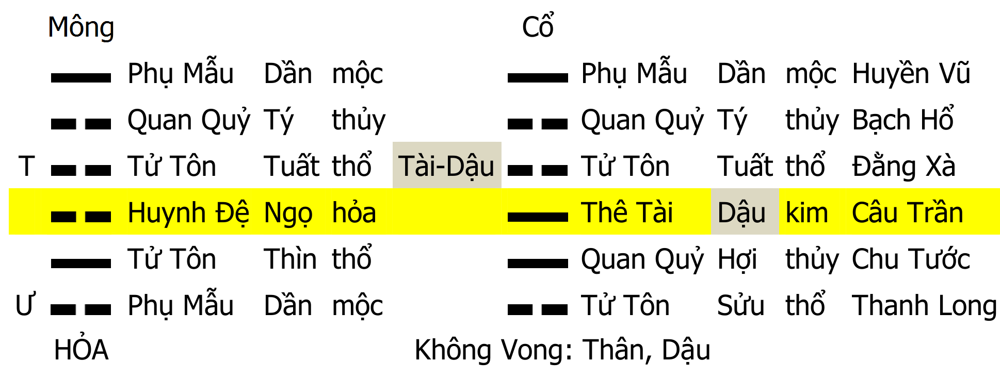
    - **Hình này chứng minh điều gì**
      - Xác định người con mắc bệnh tâm thần phân liệt, thường lẩm bẩm một mình và nói năng lảm nhảm kỳ quặc.
    - **Từ đâu mà thấy được**
      - Tử Tôn Thìn thổ Nguyệt phá lâm Chu Tước; Tử Tôn Tuất thổ lâm Đằng Xà tương xung; Nguyên thần độc phát hóa Tử hóa Không.
  - **Phán đoán chi tiết:**
    - Căn cứ: Đoán bệnh cho con lấy hào Tử Tôn làm Dụng thần. Quẻ có Tử Tôn lưỡng hiện (hào 2 Tử Tôn Thìn thổ và hào 4 Tử Tôn Tuất thổ), hào 2 Tử Tôn Thìn thổ bị Nguyệt kiến Tuất thổ xung là Nguyệt phá, nên chọn Tử Tôn Thìn thổ Nguyệt phá làm Dụng thần chính, hào còn lại dùng để đối chiếu.
    - Nhìn vào: Dụng thần Tử Tôn Thìn thổ lâm Chu Tước, đồng thời quẻ ngoại có hào 4 Tử Tôn Tuất thổ lâm Đằng Xà; Chu Tước chủ về ngôn ngữ, phát ngôn, Đằng Xà chủ về quái dị, bất thường; sự phối hợp giữa Chu Tước và Đằng Xà biểu thị người bệnh thường xuyên nói năng lung tung lảm nhảm, tự lẩm bẩm một mình với những lời nói quái dị. Mặt khác, hào 4 Tử Tôn Tuất thổ trực xung hào 2 Tử Tôn Thìn thổ (đồng loại tương xung, Tử Tôn xung phá Tử Tôn), phản ánh căn nguyên bệnh tật phát sinh từ chính bản thân người bệnh (bệnh lý nội sinh về tâm thần). Xét Nguyên thần của Dụng thần là Huynh Đệ Ngọ hỏa tại hào 3: Ngọ hỏa là hào độc phát, động biến Thê Tài Dậu kim; Dậu kim đối với Ngọ hỏa là Tử địa (Hỏa tử tại Dậu), lại lâm Tuần Không (Thân, Dậu tuần không), đồng thời bị Nhật thần Hợi thủy khắc và nhập Mộ tại Nguyệt kiến Tuất thổ (Hỏa mộ tại Tuất). Nguyên thần đại diện cho tư duy; Nguyên thần nhập Mộ tại Nguyệt chủ về tư duy bị giam hãm phong bế, không cởi mở; Nguyên thần hóa Tử địa và hóa Tuần Không chủ về thần trí hoảng hốt, trống rỗng, mất ý thức kiểm soát.
  - **Ứng nghiệm thực tế:**
    - Trên thực tế người con bị chẩn đoán mắc bệnh tâm thần phân liệt.
- **Ví dụ 7:** Ngày Ất Dậu tháng Ngọ (Không Vong: Ngọ, Mùi), người nữ tự dự đoán bệnh tật của bản thân, gieo được quẻ Lôi Địa Dự biến Địa Sơn Khiêm.
  - **Hình 319.** Quẻ Lôi Địa Dự biến Địa Sơn Khiêm
    - 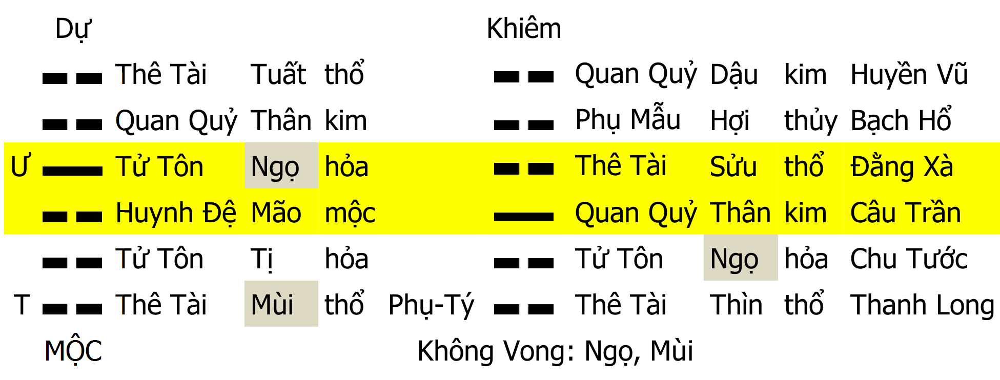
    - **Hình này chứng minh điều gì**
      - Xác định đương số mắc chứng u uất (trầm cảm) nặng nề, đầu óc bế tắc trống rỗng và tâm trạng phiền muộn.
    - **Từ đâu mà thấy được**
      - Hào Thế Thê Tài Mùi thổ tại hào sơ lâm Tuần Không; Nguyên thần Ngọ hỏa lâm Tuần Không và Đằng Xà.
  - **Phán đoán chi tiết:**
    - Căn cứ: Tự xem bệnh cho bản thân lấy hào Thế làm Dụng thần. Hào Thế ngự tại hào sơ là Thê Tài Mùi thổ.
    - Nhìn vào: Hào Thế Thê Tài Mùi thổ lâm Tuần Không (ngày Ất Dậu thuộc tuần Giáp Thân, Tuần Không tại Ngọ, Mùi). Hào sơ là tâm sự, đại diện cho thế giới nội tâm sâu kín; hào Thế ngự tại hào sơ lâm Không Vong biểu thị nội tâm trống rỗng, năng lực tư duy suy nghĩ không thể vận hành bình thường. Xét Nguyên thần của Thế là Hỏa (hào 2 Tử Tôn Tị hỏa và hào 4 Tử Tôn Ngọ hỏa): hào 4 Tử Tôn Ngọ hỏa lâm Nguyệt kiến, cũng lâm Tuần Không, lại lâm thần thú Đằng Xà. Nguyên thần chủ quản năng lực tư duy và tinh thần; Nguyên thần rơi vào Không Vong chủ về đầu óc trống rỗng mông lung, tâm trạng sa sút bế tắc; lại lâm Đằng Xà chủ về tượng phiền muộn, bứt rứt, phiền táo không yên. Tổ hợp này khẳng định đương sự mắc chứng u uất (trầm cảm).
  - **Ứng nghiệm thực tế:**
    - Trên thực tế người nữ mắc chứng trầm cảm (chứng u uất) nghiêm trọng.
- **Ví dụ 8:** Ngày Đinh Sửu tháng Tý (Không Vong: Thân, Dậu), người mẹ xem bệnh cho con trai, gieo được quẻ Càn Vi Thiên biến Trạch Thiên Quải.
  - **Hình 320.** Quẻ Càn Vi Thiên biến Trạch Thiên Quải
    - 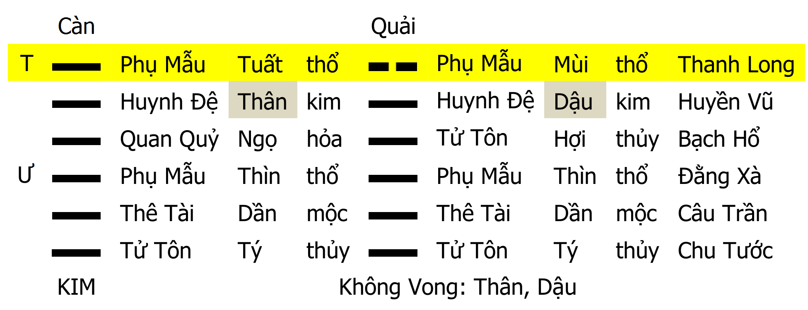
    - **Hình này chứng minh điều gì**
      - Xác định người con trai mắc bệnh tâm thần, đầu óc bị tổn thương và tư duy bị trói buộc bế tắc.
    - **Từ đâu mà thấy được**
      - Tử Tôn Tý thủy ngự tại hào sơ; Nguyên thần Thân kim lâm Huyền Vũ nhập Mộ; hào 6 cung Càn động khắc.
  - **Phán đoán chi tiết:**
    - Căn cứ: Đoán bệnh cho con trai lấy hào Tử Tôn làm Dụng thần. Hào Tử Tôn Tý thủy ngự tại hào sơ của quẻ thuần Càn.
    - Nhìn vào: Hào sơ là gốc rễ của tâm tư, chủ về thế giới nội tâm và năng lực tư duy. Xét Nguyên thần của Dụng thần là Huynh Đệ Thân kim tại hào 5: Thân kim lâm thần thú Huyền Vũ và nhập Mộ tại Nhật thần Sửu thổ (Kim mộ tại Sửu); Nguyên thần nhập Mộ chủ về tư duy bị giam hãm trói buộc, suy nghĩ u tối bế tắc, không thể cởi mở. Mặt khác, hào 6 Phụ Mẫu Tuất thổ phát động hóa Phụ Mẫu Mùi thổ quay xuống khắc phạt Dụng thần Tử Tôn Tý thủy; hào 6 là cơ quan đầu não, lại thuộc bản cung Càn (quẻ Càn vi thủ, tượng trưng tối cao cho đầu não); hào 6 cung Càn phát động khắc Dụng thần biểu thị đầu óc xuất hiện sự bất thường quái dị, thần kinh não bộ bị tổn thương nghiêm trọng dẫn tới rối loạn tâm thần.
  - **Ứng nghiệm thực tế:**
    - Trên thực tế người con trai mắc bệnh tâm thần, tư duy có vấn đề trầm trọng.
- **Ví dụ 9:** Ngày Đinh Hợi tháng Dần (Không Vong: Ngọ, Mùi), người nam tự dự đoán bệnh tật của bản thân, gieo được quẻ Khảm Vi Thủy.
  - **Phán đoán chi tiết:**
    - Căn cứ: Tự xem bệnh cho bản thân lấy hào Thế làm Dụng thần. Hào Thế ngự tại hào 6 là Huynh Đệ Tý thủy trong quẻ lục xung Khảm Vi Thủy.
    - Nhìn vào: Hào Thế ngự tại hào 6, hào 6 là cung vị của đầu não; ngũ hành Thủy chủ về trí tuệ, nhận thức và sự tỉnh táo. Hào Thế Tý thủy gặp Nguyệt kiến Dần mộc chính là lâm Bệnh địa (Thủy bệnh tại Dần); hào đầu não lâm Bệnh địa là dấu hiệu trực tiếp chỉ rõ đầu óc có bệnh tật, trí lực bị suy giảm nghiêm trọng. Xét Nguyên thần của Thế là Phụ Mẫu Thân kim ngự tại hào 4: Thân kim gặp tháng Dần bị Nguyệt kiến trực xung (Dần Thân tương xung) thành Nguyệt phá; Nguyên thần chủ về tư duy bị Nguyệt phá biểu thị đầu óc và chức năng thần kinh từng bị chấn động, tổn thương hoặc đả kích dữ dội, không thể vận hành bình thường.
  - **Ứng nghiệm thực tế:**
    - Trên thực tế người nam được xác nhận mắc bệnh tâm thần.
- **Ví dụ 10:** Ngày Kỷ Sửu tháng Thìn (Không Vong: Ngọ, Mùi), người nam tự dự đoán bệnh tật của bản thân, gieo được quẻ Chấn Vi Lôi biến Hỏa Lôi Phệ Hạp.
  - **Phán đoán chi tiết:**
    - Căn cứ: Tự xem bệnh cho bản thân lấy hào Thế làm Dụng thần. Hào Thế ngự tại hào 6 là Thê Tài Tuất thổ trong quẻ Chấn Vi Lôi.
    - Nhìn vào: Hào Thế tại hào 6 bị Nguyệt kiến Thìn thổ xung phá (Thìn Tuất tương xung) thành Nguyệt phá; hào 6 là cung vị đầu não, hào đầu não bị Nguyệt xung phá biểu thị vùng đầu từng phải hứng chịu đả kích, chấn thương mạnh mẽ. Xét Nguyên thần sinh trợ cho hào Thế là Tử Tôn Ngọ hỏa ngự tại hào 4: Ngọ hỏa lâm Tuần Không (ngày Kỷ Sửu thuộc tuần Giáp Thân, Tuần Không tại Ngọ, Mùi), chủ về đầu óc tư duy bị trống rỗng, ngơ ngẩn đờ đẫn; lại nhập Mộ tại Dụng thần Tuất thổ (Hỏa mộ tại Tuất), chủ về bản thân tự khép kín, u mê bế tắc. Về nguyên nhân gây bệnh: Hào xung phá hào Thế là hào Thê Tài (tháng Thìn là Thê Tài Thìn thổ), chủ về nguồn cơ bệnh tật bắt nguồn từ tiền bạc tài vật; Thê Tài Thìn thổ xung phá hào Thế lại nhập quẻ ngự tại hào 3 lâm Huyền Vũ, Huyền Vũ chủ về hành vi ám muội, đầu cơ, cờ bạc bất minh; do đó xác định đương sự vì ham mê đầu cơ cầu tài hoặc cờ bạc mà phát sinh bệnh tật.
  - **Ứng nghiệm thực tế:**
    - Trên thực tế người nam mắc bệnh tâm thần, trạng thái lúc nào cũng ngơ ngẩn đờ đẫn mất hết thần trí; nguyên nhân bắt nguồn từ việc đánh bạc xảy ra mâu thuẫn xô xát xung đột dữ dội mà phát bệnh.

### 26. NGOẠI THƯƠNG

#### Nguyên lý quái tượng định vị ngoại thương và trật đả tổn thương
- Đặc tính bệnh lý ngoại thương trong dự trắc Lục Hào:
  - Trật đả tổn thương là một dạng bệnh lý đặc biệt phát sinh do các nguyên nhân ngoại cảnh bên ngoài tác động (tai nạn xe cộ, va chạm, té ngã từ trên cao, vật thể va đập đè vướng).
  - Xét về phương diện quái tượng, bệnh ngoại thương mang các tiêu chí và dấu hiệu biểu hiện tương đối rõ ràng, chuẩn xác.
- Quy luật hào vị và quái cung đối với ngoại thương:
  - Do ngoại thương có thể xuất hiện tại bất kỳ bộ vị nào trên cơ thể, nên không có hào vị cố định cụ thể và cũng không quy định quái cung cố định cụ thể.
  - Vị trí chấn thương thực tế được định vị linh hoạt thông qua chính hào vị phát động, hào vị lâm biến hoặc hào vị bị xung khắc:
    - Hào sơ: đại diện cho bàn chân, ngón chân, gót chân.
    - Hào 2: đại diện cho cẳng chân, bắp chân, đầu gối.
    - Hào 3 và hào 4: đại diện cho vùng thắt lưng, hông, sườn, bụng hoặc dạ dày.
    - Hào 5: đại diện cho ngực, vai gáy, cánh tay.
    - Hào 6: đại diện cho vùng đầu não.
- Mối liên hệ mật thiết giữa ngoại thương với hai lục thần then chốt:
  - Bạch Hổ:
    - Chủ về ngoại thương, tai nạn giao thông xe cộ (xa họa), đổ máu (huyết quang), gãy xương (cốt chiết), thương tật rách da thịt.
    - Khi hào vị lâm Bạch Hổ phát động, hoặc lâm Bạch Hổ hóa Phá, ngộ Nguyệt phá đều là tượng gãy xương hoặc thương tích huyết quang nghiêm trọng.
  - Câu Trần:
    - Chủ về trượt ngã, vấp ngã (điệt đảo), vướng mắc vật cản trở, đình trệ.
- Đồ hình quẻ đối chiếu hiểm nạn, huyết quang trong ngoại thương:
  - **Hình 321.** Quẻ Khảm Vi Thủy
    - 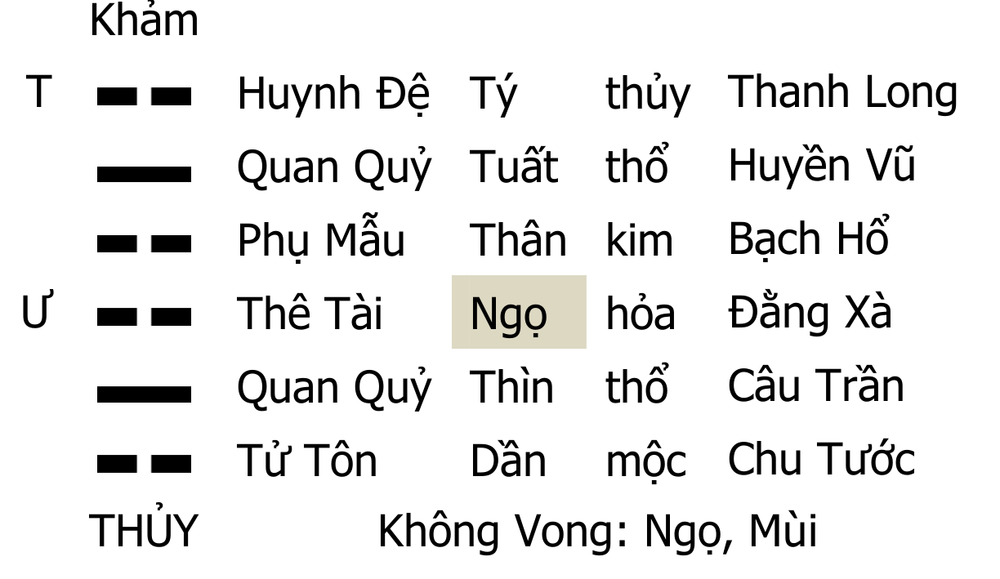
    - **Hình này chứng minh điều gì**
      - Biểu thị hiểm nạn, tổn thương huyết quang và các biến cố tai nạn bất ngờ từ ngoại cảnh.
    - **Từ đâu mà thấy được**
      - Quẻ Khảm là bát thuần Khảm thuộc thủy, mang tượng hãm hiểm, chìm đắm, huyết dịch và thương tích ngoại lai.
- Đồ hình quẻ đối chiếu chấn động va đập và tổn thương cẳng chân:
  - **Hình 322.** Quẻ Chấn Vi Lôi biến Hỏa Lôi Phệ Hạp
    - 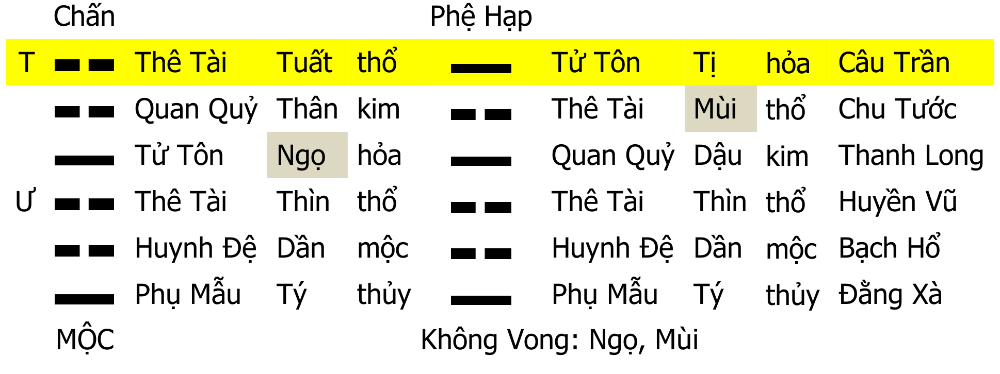
    - **Hình này chứng minh điều gì**
      - Biểu thị ngoại lực chấn động mạnh, va đập làm trật đả, gãy xương hoặc tổn thương chi dưới.
    - **Từ đâu mà thấy được**
      - Quẻ Chấn chủ về chấn động và cẳng chân; biến Phệ Hạp mang tượng cắn dập, hình thương, đứt gãy xương cốt do ngoại lực.

#### Ví dụ 1: Quẻ Hỏa Sơn Lữ biến Hỏa Phong Đỉnh - Hào Thế bị khắc lâm Bạch Hổ hóa hồi đầu khắc đoán gãy chân
- **Ví dụ 1:** Ngày Kỷ Tị tháng Dần (Tuần không: Tuất, Hợi; quái cung Ly hỏa), một người tự đoán bệnh của bản thân, được quẻ Hỏa Sơn Lữ biến Hỏa Phong Đỉnh:
  - **Hình 323.** Quẻ Hỏa Sơn Lữ biến Hỏa Phong Đỉnh
    - 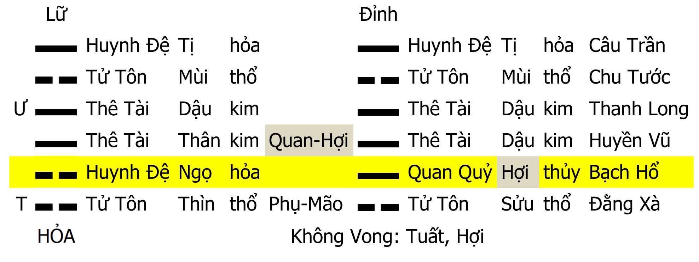
    - **Hình này chứng minh điều gì**
      - Người bệnh bị tai nạn gãy chân do biến cố xảy ra từ năm trước.
    - **Từ đâu mà thấy được**
      - Hào Thế tại hào sơ bị khắc; Nguyên thần hào 2 lâm Bạch Hổ độc phát hóa Hợi thủy hồi đầu khắc; Thái Tuế Bính Tuất năm trước xung Thế.
  - **Phán đoán chi tiết:**
    - Căn cứ:
      - Tự đoán bệnh bản thân lấy hào Thế làm Dụng thần.
      - Hào sơ là bàn chân; hào 2 là cẳng chân.
      - Lục thần Bạch Hổ chủ về tai nạn thương tích, gãy xương.
      - Hào động độc phát nắm quyền biến hóa; Thái Tuế năm trước xung Thế chỉ điểm biến cố phát sinh trong quá khứ.
    - Nhìn vào:
      - Hào Thế Tử Tôn Thìn thổ cư hào sơ bị Nguyệt kiến Dần mộc khắc chế. Hào sơ đại diện cho vị trí bàn chân.
      - Hào 2 Huynh Đệ Ngọ hỏa là Nguyên thần của hào Thế Thìn thổ (Hỏa sinh Thổ), hào này độc phát lâm Bạch Hổ biến Quan Quỷ Hợi thủy quay lại hồi đầu khắc Ngọ hỏa (Thủy khắc Hỏa).
      - Hào 2 là vị trí cẳng chân; Bạch Hổ chủ gãy xương, nay Nguyên thần sinh cho Thế tại hào 2 lại bị hóa hồi đầu khắc diệt, hình thành tượng gãy chân rõ rệt.
      - Năm trước là năm Bính Tuất, Thái Tuế Tuất thổ xung hào Thế Thìn thổ (Thìn Tuất tương xung); quẻ gặp Tuất xung chỉ ra sự việc gãy chân đã xảy ra ở năm trước chứ không phải năm nay.
  - **Ứng nghiệm thực tế:**
    - Trên thực tế, người này xác nhận vào tháng Mão năm Bính Tuất (năm trước) đã bị tai nạn gãy chân.

#### Ví dụ 2: Quẻ Thủy Thiên Nhu biến Thủy Hỏa Ký Tế - Quan Quỷ độc phát Tuyệt Thế xung Thế đoán ngã từ trên cao bị thương tay
- **Ví dụ 2:** Ngày Ất Mùi tháng Hợi (Tuần không: Thìn, Tị; quái cung Khôn thổ), người nam hỏi về chuyến đi ra ngoài ra sao, được quẻ Thủy Thiên Nhu biến Thủy Hỏa Ký Tế:
  - **Hình 324.** Quẻ Thủy Thiên Nhu biến Thủy Hỏa Ký Tế
    - 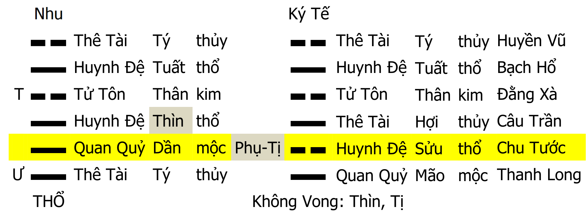
    - **Hình này chứng minh điều gì**
      - Điềm báo chuyến đi ra ngoài gặp tai họa ngã từ trên cao dẫn tới chấn thương tay.
    - **Từ đâu mà thấy được**
      - Hào Thế Tử Tôn Thân kim bị Quan Quỷ Dần mộc độc phát tại hào 2 vừa Tuyệt Thế vừa xung Thế; ứng nghiệm vào ngày Nhâm Dần.
  - **Phán đoán chi tiết:**
    - Căn cứ:
      - Hỏi việc xuất hành và an nguy bản thân, lấy hào Thế làm trung tâm phán đoán.
      - Hào Quan Quỷ phát động mang thông tin tai họa, biến cố hung hiểm.
      - Quan hệ Tuyệt địa và tương xung đối với hào Thế báo hiệu tai nạn bất ngờ xảy ra bên ngoài.
    - Nhìn vào:
      - Hào Thế Tử Tôn Thân kim cư tại hào 4.
      - Hào 2 Quan Quỷ Dần mộc độc phát động. Theo luật thập nhị dưỡng sinh, ngũ hành Kim tuyệt tại Dần, nên Dần mộc chính là đất Tuyệt của hào Thế Thân kim.
      - Đồng thời, địa chi Dần xung trực tiếp Thân kim (Dần Thân tương xung). Hào Quan Quỷ độc phát vừa Tuyệt Thế lại vừa xung Thế, chứng tỏ ra ngoài nhất định gặp tai họa ngoại thương.
  - **Ứng nghiệm thực tế:**
    - Đúng ngày Nhâm Dần (ngày Dần thực xung hào Thế, trùng khớp địa chi hào Quan Quỷ phát động), người này bị té ngã từ trên cao xuống và bị chấn thương ở cánh tay.

#### Ví dụ 3: Quẻ Thiên Thủy Tụng biến Thiên Trạch Lý - Phụ Mẫu lâm Bạch Hổ hóa Phá đoán gãy xương bàn chân dẫn tới liệt
- **Ví dụ 3:** Ngày Tân Tị tháng Hợi (Tuần không: Thân, Dậu; quái cung Ly hỏa), người con trai đoán bệnh cho cha, được quẻ Thiên Thủy Tụng biến Thiên Trạch Lý:
  - **Hình 325.** Sơ đồ quẻ Thiên Thủy Tụng biến Thiên Trạch Lý
    - 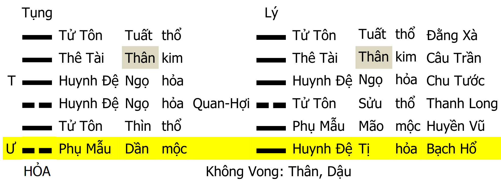
    - **Hình này chứng minh điều gì**
      - Người cha bị tai nạn gãy xương bàn chân dẫn tới di chứng tê liệt nửa người.
    - **Từ đâu mà thấy được**
      - Hào Phụ Mẫu Dần mộc tại hào sơ lâm Bạch Hổ độc phát hóa Huynh Đệ Tị hỏa bị Nguyệt kiến Hợi thủy xung thành Nguyệt phá (hóa Phá).
  - **Phán đoán chi tiết:**
    - Căn cứ:
      - Đoán bệnh của cha, lấy hào Phụ Mẫu làm Dụng thần.
      - Hào sơ đại diện cho bàn chân, ngón chân.
      - Lục thần Bạch Hổ chủ về gãy xương, đổ máu, tai nạn ngoại thương.
      - Hào độc phát hóa ra hào bị Nguyệt phá (hóa Phá) chủ về sự đứt gãy, dập nát xương cốt.
    - Nhìn vào:
      - Hào Dụng thần Phụ Mẫu Dần mộc ngự tại hào sơ, lâm lục thần Bạch Hổ độc phát.
      - Hào Dần mộc động biến ra Huynh Đệ Tị hỏa; tháng Hợi xung trực tiếp hào biến Tị hỏa (Tị Hợi tương xung) khiến Tị hỏa thành Nguyệt phá, tức Dụng thần độc phát hóa Phá.
      - Hào sơ là bàn chân, Bạch Hổ chủ gãy xương, hào biến hóa Phá cũng chủ gãy xương. Hai tiêu chí gãy xương trùng phùng tại hào sơ khẳng định bàn chân bị gãy xương nghiêm trọng.
  - **Ứng nghiệm thực tế:**
    - Người cha bị tai nạn gãy xương bàn chân, vết thương nặng làm tổn hại dây thần kinh vận động dẫn tới di chứng tê liệt nửa người (bán thân bất toại).

#### Ví dụ 4: Quẻ Thủy Sơn Kiển biến Địa Lôi Phục - Quan Quỷ lâm Bạch Hổ Nguyệt phá đoán chồng gãy xương ngón chân
- **Ví dụ 4:** Ngày Kỷ Mão tháng Tý (Tuần không: Thân, Dậu; quái cung Đoài kim), người nữ hỏi về niên vận gia đạo, được quẻ Thủy Sơn Kiển biến Địa Lôi Phục:
  - **Hình 326.** Sơ đồ quẻ Thủy Sơn Kiển biến Địa Lôi Phục
    - 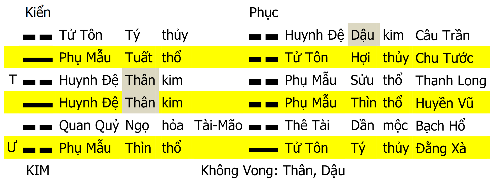
    - **Hình này chứng minh điều gì**
      - Người chồng gặp tai nạn gãy xương ngón chân vào tháng Ngọ.
    - **Từ đâu mà thấy được**
      - Hào 2 Quan Quỷ Ngọ hỏa đại diện cho chồng, bị Nguyệt kiến Tý thủy xung thành Nguyệt phá lại lâm Bạch Hổ; ứng kỳ tháng Ngọ Thực Phá.
  - **Phán đoán chi tiết:**
    - Căn cứ:
      - Phụ nữ xem quẻ niên vận gia đạo, hào Quan Quỷ đại diện cho người chồng.
      - Lục thần Bạch Hổ chủ về tai nạn ngoại thương, đổ máu, gãy xương.
      - Hào lâm Nguyệt phá chủ về thương tổn, đứt gãy; ứng kỳ của hào Nguyệt phá là vào tháng xung hào được bù thực (Thực Phá).
    - Nhìn vào:
      - Hào Quan Quỷ Ngọ hỏa cư hào 2 đại diện cho người chồng.
      - Tháng dự đoán là tháng Tý, Tý thủy xung Ngọ hỏa (Tý Ngọ tương xung), làm cho Quan Quỷ Ngọ hỏa lâm Nguyệt phá.
      - Quan Quỷ tại hào 2 vừa lâm Nguyệt phá lại vừa lâm lục thần Bạch Hổ, mang dấu hiệu rõ ràng của việc bị thương tật, gãy xương.
      - Hào 2 đại diện cho cẳng chân, bàn chân và ngón chân; hào lâm Nguyệt phá sẽ ứng nghiệm tai nạn vào tháng Ngọ khi lâm Thực Phá.
  - **Ứng nghiệm thực tế:**
    - Đến đúng tháng Ngọ cùng năm, người chồng bị tai nạn gãy xương ngón chân.

#### Ví dụ 5: Quẻ Địa Hỏa Minh Di biến Lôi Sơn Tiểu Quá - Thế lâm Bạch Hổ bị hào sơ khắc đoán gãy xương chân và viêm dạ dày
- **Ví dụ 5:** Ngày Đinh Hợi tháng Thìn (Tuần không: Ngọ, Mùi; quái cung Khảm thủy), người phụ nữ tự đoán bệnh tật bản thân, được quẻ Địa Hỏa Minh Di biến Lôi Sơn Tiểu Quá:
  - **Hình 327.** Sơ đồ quẻ Địa Hỏa Minh Di biến Lôi Sơn Tiểu Quá
    - 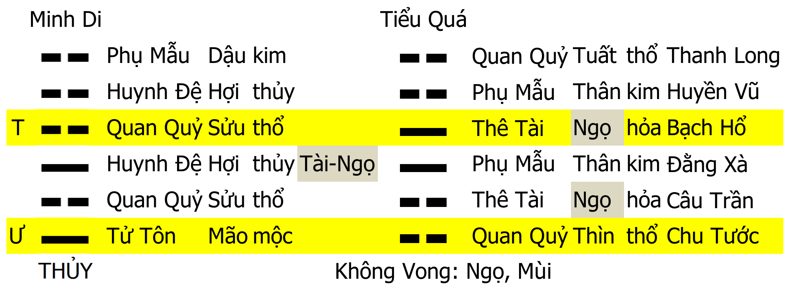
    - **Hình này chứng minh điều gì**
      - Người bệnh bị gãy xương chân từ tháng Mão chưa lành, đồng thời mắc thêm bệnh viêm dạ dày.
    - **Từ đâu mà thấy được**
      - Hào Thế Quan Quỷ Sửu thổ lâm Bạch Hổ bị hào sơ Tử Tôn Mão mộc động khắc; hào 4 thuộc thổ chủ dạ dày bị mộc khắc mạnh.
  - **Phán đoán chi tiết:**
    - Căn cứ:
      - Tự đoán bệnh bản thân lấy hào Thế làm Dụng thần.
      - Hào Thế lâm Bạch Hổ chủ về tai nạn thương tích, gãy xương.
      - Hào sơ đại diện cho bàn chân, ngón chân; địa chi Mão thuộc mộc chủ về chân cẳng và gân cốt.
      - Hào 4 đại diện cho vùng khoang bụng trên (dạ dày), ngũ hành Thổ chủ về tỳ vị (dạ dày).
    - Nhìn vào:
      - Hào Thế Quan Quỷ Sửu thổ cư hào 4 lâm lục thần Bạch Hổ, mang biểu hiện đặc trưng của chứng gãy xương.
      - Hào sơ Tử Tôn Mão mộc phát động bay tới khắc hào Thế Sửu thổ (Mộc khắc Thổ). Hào sơ là bàn chân, Mão mộc chủ chân, nên sự tổn thương phát sinh tại bàn chân và cẳng chân.
      - Địa chi Mão mộc tương ứng với tháng Mão (tháng liền trước tháng Thìn dự đoán), báo hiệu sự việc gãy xương đã xảy ra vào tháng Mão.
      - Xét về bệnh lý nội tạng, hào Thế Sửu thổ ở hào 4; hào 4 là vị trí dạ dày, ngũ hành Thổ cũng là dạ dày. Nay Sửu thổ bị Mão mộc động khắc mạnh mẽ, chứng tỏ dạ dày cũng bị tổn thương, sinh chứng viêm dạ dày.
  - **Ứng nghiệm thực tế:**
    - Người phụ nữ xác nhận đúng là vào tháng Mão đã bị ngã gãy xương chân, tới thời điểm xem quẻ vẫn chưa lành hẳn; đồng thời bản thân cũng đang mắc chứng viêm dạ dày.

#### Ví dụ 6: Quẻ Thủy Thiên Nhu biến Thủy Hỏa Ký Tế - Thế Không lâm Bạch Hổ bị Câu Trần động xung đoán ngã tổn thương đầu gối và u xơ tử cung
- **Ví dụ 6:** Ngày Bính Tý tháng Tuất (Tuần không: Thân, Dậu; quái cung Khôn thổ), người phụ nữ đoán niên vận trong năm, được quẻ Thủy Thiên Nhu biến Thủy Hỏa Ký Tế:
  - **Hình 328.** Sơ đồ quẻ Thủy Thiên Nhu biến Thủy Hỏa Ký Tế
    - 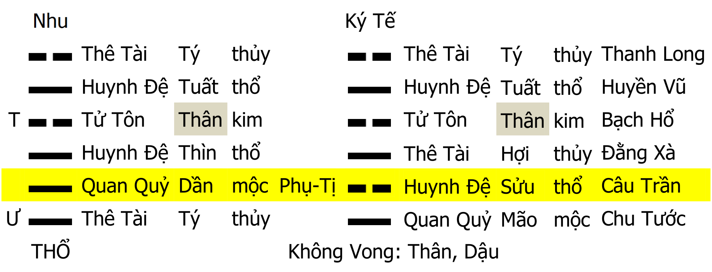
    - **Hình này chứng minh điều gì**
      - Người bệnh bị vấp ngã chấn thương khớp đầu gối trong tháng Giêng; đồng thời mắc các chứng u xơ tử cung, thiếu máu, mãn kinh và chóng mặt kinh niên.
    - **Từ đâu mà thấy được**
      - Thế Tử Tôn Thân kim lâm Bạch Hổ Không Vong bị hào 2 Quan Quỷ Dần mộc lâm Câu Trần động xung; Dần hóa Sửu là Mộ khố Tử Tôn lâm Câu Trần; quẻ Du Hồn Thế bị động xung.
  - **Phán đoán chi tiết:**
    - Căn cứ:
      - Đoán vận hạn bản thân lấy hào Thế làm Dụng thần.
      - Bạch Hổ chủ về huyết dịch, thương tích chảy máu; Câu Trần chủ về vật cản trở, vấp ngã và khối u bướu tích tụ.
      - Hào 2 là vị trí đầu gối, đồng thời là cung vị sinh dục (tử cung) của nữ giới.
      - Trạng thái Tuyệt, Không Vong và quy luật sinh khắc của Nguyên thần định vị chứng mãn kinh và thiếu máu.
      - Quẻ Du Hồn kết hợp hào Thế bị động xung chỉ điểm chứng chóng mặt, choáng váng.
    - Nhìn vào:
      - Phán đoán ngoại thương ở đầu gối: Hào Thế Tử Tôn Thân kim lâm Tuần Không, lâm lục thần Bạch Hổ (chủ thương tích, đổ máu). Hào 2 Quan Quỷ Dần mộc lâm Câu Trần độc phát động xung hào Thế (Dần Thân tương xung) thành xung thực. Câu Trần chủ cản trở, té ngã; Dần mộc tương ứng với tháng Giêng (tháng Dần); hào 2 là bộ vị đầu gối. Do đó khẳng định vào tháng Giêng đã bị vật cản trở ngáng chân làm té ngã chấn thương đầu gối.
      - Phán đoán chứng mãn kinh: Hào Thế lâm Bạch Hổ chủ về huyết dịch. Hào động Dần mộc ở thế Tuyệt đối với Thân kim (Kim tuyệt tại Dần), hào Thế lại ngộ Không nên mất hoàn toàn khả năng sinh trợ cho Thê Tài Tý thủy (Thê Tài chủ về kinh nguyệt). Tượng không sinh được Thê Tài chứng tỏ kinh nguyệt đã dứt, người này đã mãn kinh.
      - Phán đoán chứng thiếu máu: Hào Thế ngộ Không cần Nguyên thần Thìn thổ tương sinh, nhưng Nguyên thần Huynh Đệ Thìn thổ lại bị Nguyệt kiến Tuất thổ xung phá (Nguyệt phá), lại lâm lục thần Đằng Xà chủ về sự thiếu hụt. Nguyên thần bị phá không thể sinh Thế, kết luận cơ thể mắc chứng thiếu máu trầm trọng.
      - Phán đoán chứng hoa mắt chóng mặt: Hào Thế bị hào Quan Quỷ độc phát đến xung, gặp xung chủ về lay động, choáng váng; bản thân quẻ Thủy Thiên Nhu là quẻ Du Hồn, quẻ Du Hồn chủ về tinh thần phiêu hốt, mất thăng bằng, do đó xác định có bệnh chóng mặt.
      - Phán đoán chứng u xơ tử cung: Hào 2 là cung vị tử cung, hào Thế Tử Tôn cũng đại diện cho tử cung; hào 2 Quan Quỷ Dần mộc phát động hóa ra Huynh Đệ Sửu thổ, mà Sửu thổ chính là Mộ khố của hào Thế Tử Tôn Thân kim (Kim nhập Mộ tại Sửu), nên Mộ khố này cũng chính là tử cung. Hào 2 lâm lục thần Câu Trần chủ về tổ chức tăng sinh, khối u, kết luận tử cung có khối u xơ.
  - **Ứng nghiệm thực tế:**
    - Người phụ nữ xác nhận toàn bộ lời đoán đều chuẩn xác: vào tháng Dần bị vấp ngã chấn thương đầu gối; qua kiểm tra bệnh viện phát hiện có u xơ tử cung, cơ thể thiếu máu nặng, kinh nguyệt đã dứt (mãn kinh), và thường xuyên chịu đựng những cơn chóng mặt.

### 27. QUÁI BỆNH

#### Bản chất bệnh lý và cơ chế sóng từ trường của quái bệnh
- Khái niệm và sự nhầm lẫn trong chẩn đoán y học hiện đại:
  - Trong thực tế đời sống tồn tại nhiều chứng bệnh không thể giải thích và điều trị thỏa đáng bằng y học hiện đại.
  - Trung y thường gọi loại bệnh này là ý bệnh (癔病 - chứng cuồng loạn, ám ảnh tinh thần), còn Tây y quy kết vào chứng rối loạn thần kinh chức năng.
  - Cả hai cách định danh trên đều chưa chuẩn xác vì bản chất bệnh lý không đồng nhất với các chứng bệnh tổn thương thần kinh thực thể thông thường.
  - Bản chất thực tế của quái bệnh bắt nguồn từ sự quấy nhiễu, xáo trộn từ trường sinh học của cơ thể, dẫn đến tình trạng hỗn loạn trong vận hành tư duy não bộ.
- Cơ chế phát sinh từ trường và hiện tượng vong nhập (trúng tà):
  - Khi sinh ra và khi qua đời, cơ thể con người phát ra một dạng sóng điện từ đặc thù.
  - Sau khi chết, một số người lưu giữ trường năng lượng điện từ rất mạnh, tồn tại bền bỉ trong thời gian dài mà không bị tiêu tán.
  - Khi từ trường mạnh của người chết gặp gỡ và dung hợp với tần số từ trường của người đang sống sẽ tạo ra hiện tượng vong nhập (dân gian gọi là trúng tà).
  - Do từ trường có đặc tính ghi nhớ và lưu trữ thông tin, những ý nghĩ, ký ức và nguyện vọng lúc sinh thời của người đã khuất sẽ phát lặp lại tựa như máy trả lời tự động, chi phối trực tiếp tư duy, cử chỉ và ngôn ngữ của người bị nhập.
- Đặc điểm tổ hợp quái tượng định vị quái bệnh trong Lục Hào:
  - Quái bệnh không cố định vào một quái cung hay hào vị giải phẫu cụ thể nào.
  - Bệnh liên quan mật thiết với hai lục thần Đằng Xà và Huyền Vũ: Đằng Xà chủ về hiện tượng quái dị, kinh hoảng, ảo giác, mộng mị khác thường; Huyền Vũ chủ về âm khí u ám, tà khí ám muội.
  - Dụng thần hoặc Nguyên thần rơi vào trạng thái nhập Mộ, hoặc bị hào Quan Quỷ hợp trụ: Nguyên thần đại diện cho năng lực tư duy và ý thức; Dụng thần hoặc Nguyên thần nhập Mộ biểu thị đầu óc u mê, thần trí không tỉnh táo; bị Quan Quỷ hợp trụ là biểu hiện bị âm tà câu thúc quấn thân.

#### Ví dụ 1: Quẻ Càn Vi Thiên biến Hỏa Thiên Đại Hữu - Vong nhập quấy nhiễu nghe thấy âm thanh người chết
- **Ví dụ 1:** Ngày Giáp Tuất tháng Tý, nam giới tự dự đoán bệnh tật của bản thân, gieo được quẻ Càn Vi Thiên biến Hỏa Thiên Đại Hữu (quái cung Càn kim, Không Vong: Thân, Dậu):
  - **Hình 329.** Quẻ Càn Vi Thiên biến Hỏa Thiên Đại Hữu
    - 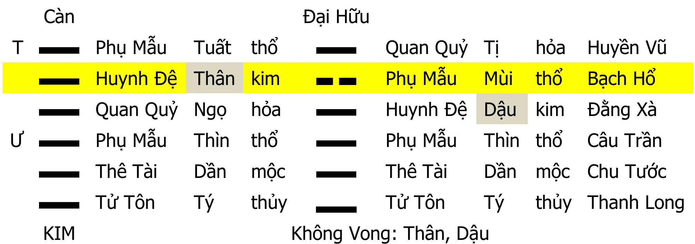
    - **Hình này chứng minh điều gì**
      - Người bệnh bị tà ma quấy nhiễu triền miên, nghe thấy tiếng nói người chết và rơi vào tuyệt vọng muốn tự sát.
    - **Từ đâu mà thấy được**
      - Thế tại hào 6 lâm Huyền Vũ, Nguyên thần nhập Mộ ở Nhật; hào 5 Thân kim lâm Bạch Hổ độc phát ngự Bệnh địa của Nguyên thần, kim Không phát ra âm thanh.
  - **Phán đoán chi tiết:**
    - Căn cứ: Đương sự tự xem bệnh cho bản thân nên lấy hào Thế làm Dụng thần; Nguyên thần đại diện cho tư duy, nhận thức não bộ; Bạch Hổ chủ về sự chết chóc; kim lâm Không Vong có tượng rỗng phát ra tiếng vang (kim Không tắc minh).
    - Nhìn vào: Hào Thế Phụ Mẫu Tuất thổ cư hào 6 lâm Huyền Vũ (chủ về âm tà, mê muội); Nguyên thần Quan Quỷ Ngọ hỏa nhập Mộ tại Nhật thần Tuất thổ, biểu thị tư duy mơ hồ, đầu óc không tỉnh táo.
    - Nhìn vào: Hào 5 Huynh Đệ Thân kim lâm Bạch Hổ phát động duy nhất (độc phát), Thân kim là Bệnh địa của Nguyên thần Ngọ hỏa nên hệ thống tư duy phát sinh chướng ngại nghiêm trọng; Thân kim tuần Không lâm Bạch Hổ phát động là tín hiệu nghe thấy âm thanh của người đã chết.
  - **Ứng nghiệm thực tế:**
    - Người bệnh bị ma quỷ đeo bám quấy nhiễu cả ngày lẫn đêm (bao gồm cả vong nam và vong nữ).
    - Những hình bóng này thường xuyên hiển hiện trên vách tường, trên trần nhà và trên xe điện làm đảo lộn đời sống; đương sự vô cùng đau khổ, bức bối tinh thần đến mức nảy sinh ý định tự sát.

#### Ví dụ 2: Quẻ Phong Thiên Tiểu Súc biến Phong Lôi Ích - Hai ma nữ bám theo hút máu do đốn hạ rừng cây xây nhà
- **Ví dụ 2:** Ngày Quý Sửu tháng Mậu Thìn năm Kỷ Mão, khi tác giả đang giảng dạy lớp Lục Hào dự đoán bệnh tật tại trường Trung y, một phụ nữ ngoài 40 tuổi đến nhờ đoán bệnh cho con trai 16 tuổi; tác giả đưa ví dụ lên bảng phân tích trực tiếp, gieo được quẻ Phong Thiên Tiểu Súc biến Phong Lôi Ích (quái cung Tốn mộc, Không Vong: Dần, Mão):
  - **Hình 330.** Quẻ Phong Thiên Tiểu Súc biến Phong Lôi Ích
    - 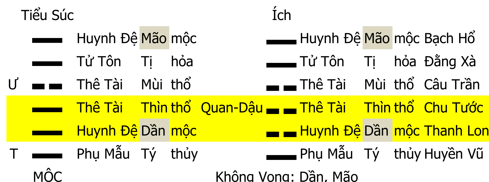
    - **Hình này chứng minh điều gì**
      - Người con mắc quái bệnh vong nhập do chặt phá rừng cây xây nhà, đêm đêm bị hai ma nữ vào phòng hút máu.
    - **Từ đâu mà thấy được**
      - Tử Tôn Tị hỏa lâm Đằng Xà; Nguyên thần Dần Mão mộc ngộ Không nhập Mộ; Thê Tài Mùi thổ ám động lâm Câu Trần ở hào 4 và Thìn thổ động hợp Quan Quỷ Dậu kim phục thần.
  - **Phán đoán chi tiết:**
    - Căn cứ: Mẹ xem bệnh cho con trai lấy hào Tử Tôn làm Dụng thần; Nguyên thần chủ về ý thức tinh thần và tuần hoàn máu; Đằng Xà chủ quái dị, mộng mị; Câu Trần chủ mồ mả, công trình kiến trúc; Bạch Hổ chủ huyết dịch và sự thương tổn đao kiếm.
    - Nhìn vào: Dụng thần Tử Tôn Tị hỏa tại hào 5 không được Nhật Nguyệt sinh phù lại lâm Đằng Xà, báo hiệu căn bệnh kỳ lạ khác thường; Nguyên thần Huynh Đệ Dần mộc và Mão mộc đều rơi vào Không Vong, chỉ rõ ý thức mơ màng, tinh thần sa sút trầm trọng, quy về chứng bệnh vong nhập.
    - Nhìn vào: Nhật thần Sửu thổ xung hào Ứng Thê Tài Mùi thổ làm Mùi thổ ám động, dẫn đến Nguyên thần nhập Mộ tại Mùi; địa chi Sửu tương ứng năm Đinh Sửu (1997) xác định thời điểm khởi phát bệnh; giờ Hợi và Tý khắc Dụng thần Tị hỏa, giờ Sửu xung Mùi thổ khiến Dụng thần nhập Mộ, nên cứ đến đêm tối là bệnh phát tác dữ dội.
    - Nhìn vào: Nội quái phục ngâm chủ rên rỉ, đớn đau; Đằng Xà chủ mộng mị, ngủ không yên giấc, thường gặp ác mộng hoặc ảo giác kêu la thống khổ trong mơ; Nguyên thần Mão mộc lâm Bạch Hổ (máu) lực sinh yếu và nhập Mộ tại Mùi thổ chủ tuần hoàn máu trì trệ, Mộ khố mang nghĩa thu tàng giam hãm nên đứa con luôn có cảm giác bị hút cạn máu.
    - Nhìn vào: Thê Tài Mùi thổ ám động lâm Câu Trần (phần mộ) tại hào 4 (cửa sổ), hào 3 Thê Tài Thìn thổ phát động hợp Quan Quỷ Dậu kim phục thần (thi thể), quẻ tại cung Tốn (trưởng nữ) nên khẳng định có hai ma nữ theo đường cửa sổ lẻn vào ám ảnh; bản cung Tốn và Nguyên thần Dần Mão mộc là rừng cây phía Đông/Đông Nam bị Bạch Hổ (đao kiếm) đốn hạ để Câu Trần (kiến trúc) xây dựng nhà ở, làm thay đổi từ trường gây nên bệnh.
  - **Luồng đối thoại và xác nhận thực tế:**
    - Người phụ nữ vô cùng hoảng hốt và kinh ngạc vì các phán đoán khớp hoàn toàn với thực tế của gia đình.
    - Gia đình chuyển về khu nhà này vào đúng năm 1997; trước đây phía Đông nhà có một cánh rừng liễu xanh tốt, sau đó công ty bất động sản đốn hạ sạch để xây dựng chung cư, từ đó người con bắt đầu phát bệnh.
    - Người mẹ đưa con đi chạy chữa khắp nơi suốt 3 năm, các nơi đều chẩn đoán bệnh tâm thần nhưng điều trị không thuyên giảm; đứa trẻ sợ ánh sáng ban ngày, tinh thần mơ màng sa sút; cháu nhiều lần nói với mẹ bị người ta hút máu mà bất lực không chống cự được; ban đêm ngủ hay rên rỉ than khóc; nhiều đêm người mẹ nghe thấy trong phòng con có tiếng hai người phụ nữ nói chuyện thì thào nhưng mở cửa vào thì phòng trống trơn; đứa con ngủ luôn đòi mở cửa sổ, hễ mẹ lén đóng lại là con lập tức giật mình tỉnh dậy khóc lóc thảm thiết.
  - **Biện pháp hóa giải và diễn biến ứng nghiệm:**
    - Căn cứ hóa giải: Nguyên nhân do rừng cây bị chặt khiến mộc khí suy kiệt, cần bổ sung năng lượng hành mộc trừ tà; ưu tiên dùng gỗ đào có tính năng xua đuổi tà khí; Mão mộc lâm Bạch Hổ (đao thương) nên đẽo gỗ đào thành kiếm; treo tại vách tường phía Đông (hào 6 là vách tường, phương Đông thuộc mộc); dùng số của mộc là 3 và 8 nên dặn treo 3 thanh kiếm gỗ đào lên tường phía Đông phòng ngủ của con.
    - Tinh chỉnh nạp âm: Sau 2 ngày người mẹ phản ánh chưa thấy biến chuyển; tác giả xem xét kỹ hào 6 Kỷ Mão có nạp âm là Tùng Bách Mộc, liền bảo bôi thêm một ít nhựa thông lên kiếm gỗ đào.
    - Kết quả: Ngay trong ngày bôi nhựa thông lên thân kiếm gỗ đào, người con đã khỏi hẳn bệnh.

#### Ví dụ 3: Quẻ Trạch Địa Tụy biến Trạch Thiên Quải - Linh hồn lang thang quấy nhiễu gây chứng ma giao
- **Ví dụ 3:** Ngày Bính Thìn tháng Giáp Thìn năm Nhâm Ngọ, người nữ tự dự đoán bệnh tật bản thân, gieo được quẻ Trạch Địa Tụy biến Trạch Thiên Quải (quái cung Đoài kim, quẻ Du hồn, Không Vong: Tý, Sửu):
  - **Hình 331.** Sơ đồ quẻ Trạch Địa Tụy biến Trạch Thiên Quải
    - 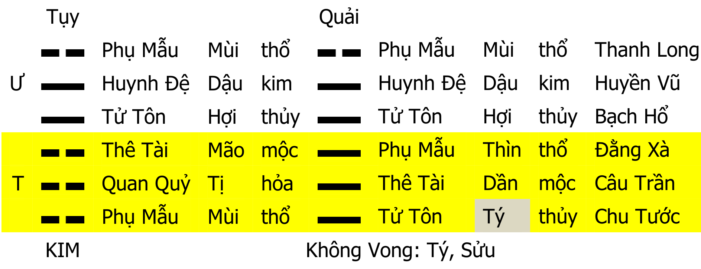
    - **Hình này chứng minh điều gì**
      - Bệnh nhân bị linh hồn phiêu bạt bám quấn gây chứng ma giao (giao hợp với tà ma) và phù thũng hai chân.
    - **Từ đâu mà thấy được**
      - Quan Quỷ Tị hỏa trì Thế tại hào 2 phát động lâm Câu Trần; hào 3 Thê Tài Mão mộc Đằng Xà phát động sinh Thế hóa Phụ Mẫu Thìn thổ.
  - **Phán đoán chi tiết:**
    - Căn cứ: Người nữ tự xem bệnh lấy hào Thế làm Dụng thần; Quan Quỷ trì Thế chủ thân tâm bất an; Đằng Xà chủ quái dị, sợ hãi; Mộc Dục chủ thoát y, sắc dục; Câu Trần chủ phù thũng, nhà cửa; quẻ Du hồn chủ hồn phách phiêu bạt.
    - Nhìn vào: Quan Quỷ Tị hỏa trì Thế phát động tại hào 2 (hào trạch) lâm Câu Trần (kiến trúc), lại được hào 3 Thê Tài Mão mộc lâm Đằng Xà động sinh chỉ rõ âm khí trong nhà quá nặng, có ma tà quấy nhiễu; hào 3 là vị trí giường nằm, Đằng Xà chủ quái dị biểu thị ma quỷ đeo bám ngay tại giường ngủ.
    - Nhìn vào: Hào 3 Mão mộc hóa Phụ Mẫu Thìn thổ sinh Quan Quỷ, Thìn thổ ứng năm Canh Thìn (2000) và phương Đông Nam; quẻ Tụy thuộc Du hồn chỉ linh hồn phiêu bạt bám theo từ chuyến đi về phương Đông Nam năm 2000.
    - Nhìn vào: Hào 2 là cẳng chân lâm Câu Trần chủ sưng trướng, phù nề; Đằng Xà chủ run rẩy, giật mình sinh Thế Quan Quỷ làm tâm lý luôn sợ hãi bất an; hào 3 Mão mộc là đất Mộc Dục của Thế Tị hỏa, hào 3 lại là giường ngủ, Mộc Dục có tượng thoát y động hóa Phụ Mẫu (áo quần) là tín hiệu cởi bỏ y phục; Thê Tài là nước tiểu chỉ nhà vệ sinh, kết hợp Đằng Xà chỉ triệu chứng hễ bước vào nhà vệ sinh liền run rẩy bần bật; Đằng Xà tại hào 3 chủ mộng mị kết hợp Mộc Dục chủ lõa thể hoan lạc nên thường xuyên nằm mơ thấy giao hợp với đàn ông.
  - **Luồng đối thoại và xác nhận thực tế:**
    - Người phụ nữ xác nhận đúng vào năm 2000 cô có chuyến đi về hướng Đông Nam, sau khi trở về bắt đầu phát bệnh lạ.
    - Hai cẳng chân bị sưng phù to; mỗi lần bước chân vào phòng vệ sinh là toàn thân run rẩy bần bật.
    - Mỗi đêm nằm trên giường cô đều cảm nhận rõ rệt có một người đàn ông đến đè cưỡng hiếp mình, hiện tượng xảy ra ngay cả khi cô hoàn toàn tỉnh táo chứ không phải chiêm bao; đã đi khám bác sĩ nhiều lần nhưng không tìm ra nguyên nhân và hoàn toàn vô hiệu.
  - **Biện pháp hóa giải và diễn biến thực tế:**
    - Căn cứ hóa giải: Xác định đây là chứng ma giao do linh hồn lang thang quấy nhiễu; Thế lâm Quan Quỷ Tị hỏa là ma quỷ, phải dùng Hợi thủy để tương xung giải trừ (Tị Hợi tương xung); Hợi ứng với con heo, hướng dẫn dùng giấy màu đen (hành thủy) cắt hình 6 con heo (số của quẻ Khảm thủy) đem ra ngã tư đường đốt đi.
    - Ngăn chặn tà niệm và trục tà: Hào 3 Thê Tài Mão mộc là Nguyên thần sinh Quan Quỷ, hào sơ Mùi thổ là Mộ khố của Thê Tài lại sinh hào 2 trạch chỉ ma quỷ muốn trú ngụ lâu dài trong nhà; Thê Tài là ý nghĩ vô định, tà niệm; hướng dẫn treo gương bát quái trong nhà (thuộc kim khắc chế Mão mộc, trừ tà) và đốt thêm bột chu sa để tăng cường dương khí; sau khi thực hiện các bước hóa giải bệnh tình của cô đã chuyển biến tốt đẹp.

#### Ví dụ 4: Quẻ Địa Thủy Sư biến Khảm Vi Thủy - Tà ma thao túng biến đổi giọng nói và cởi áo quần đốt
- **Ví dụ 4:** Ngày Nhâm Tuất tháng Tị, người nữ dự đoán bệnh tật cho cô ruột, gieo được quẻ Địa Thủy Sư biến Khảm Vi Thủy (quái cung Khảm thủy, quẻ Quy hồn, Không Vong: Tý, Sửu):
  - **Hình 332.** Sơ đồ quẻ Địa Thủy Sư biến Khảm Vi Thủy
    - 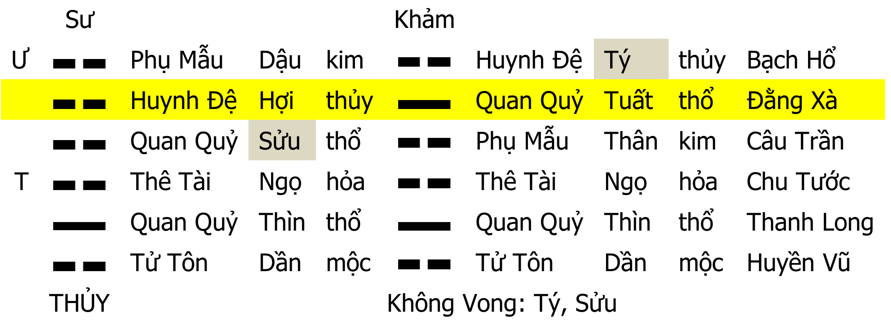
    - **Hình này chứng minh điều gì**
      - Người cô mắc quái bệnh bị tà khí khống chế tâm thần, lảm nhảm khẩu âm vùng khác và phát cuồng cởi áo quần mang đốt.
    - **Từ đâu mà thấy được**
      - Dụng thần Phụ Mẫu Dậu kim lâm Bạch Hổ; Huynh Đệ Hợi thủy lâm Đằng Xà độc phát tại Bệnh địa; Kỵ thần Thê Tài Ngọ hỏa Chu Tước là Mộc Dục địa của Dụng thần.
  - **Phán đoán chi tiết:**
    - Căn cứ: Dự đoán bệnh tật cho cô ruột (hàng bề trên) lấy Phụ Mẫu làm Dụng thần; Bạch Hổ chủ về bệnh tật mạn tính trầm trọng; Đằng Xà chủ quái dị kỳ lạ; Chu Tước chủ ngôn ngữ, lời nói; Mộc Dục chủ thoát y, trút bỏ quần áo.
    - Nhìn vào: Dụng thần Phụ Mẫu Dậu kim cư hào 6 lâm Bạch Hổ biểu thị có bệnh tật nặng nề đeo bám thân thể; trong quẻ hào 5 Huynh Đệ Hợi thủy lâm Đằng Xà phát động duy nhất (độc phát) biến Quan Quỷ Tuất thổ; Hợi thủy chính là Bệnh địa của Dụng thần Dậu kim (kim bệnh tại Hợi), hào Bệnh địa lâm Đằng Xà độc phát khẳng định đây là quái bệnh do tà khí vong nhập.
    - Nhìn vào: Kỵ thần Thê Tài Ngọ hỏa trì Thế tại hào 3 lâm Chu Tước; Ngọ hỏa là đất Mộc Dục của Dụng thần Dậu kim (Dậu kim mộc dục tại Ngọ); Mộc Dục mang nghĩa cởi đồ lõa thể, Chu Tước chủ ngôn ngữ phát ngôn; sự kết hợp Mộc Dục và Chu Tước chỉ rõ khi phát bệnh thần trí bấn loạn, nói năng lảm nhảm lung tung và cởi sạch quần áo trên người.
  - **Ứng nghiệm thực tế:**
    - Người cô luôn có cảm giác cơ thể bị một lực lượng vô hình nào đó điều khiển và chi phối hoàn toàn.
    - Giọng nói của bà đột nhiên biến đổi thành khẩu âm của một địa phương khác lạ, miệng lảm nhảm không ngừng nghỉ; mỗi khi cơn bệnh phát tác, bà thường xuyên cởi sạch hết quần áo trên người mang ra đốt.

## CHƯƠNG 16: ĐOÁN BỆNH ỨNG DỤNG TRONG PHÁN ĐOÁN TỔNG HỢP

### Nguyên lý kết hợp đoán bệnh trong phán đoán tổng hợp

- Cấu trúc phức tạp của cơ thể và tính chất đa dạng của bệnh tật:
  - Cơ thể con người là một chỉnh thể sinh học tinh vi, trạng thái bệnh lý phát sinh muôn hình vạn trạng; có người đơn thuần chỉ mắc một chứng bệnh cục bộ, nhưng có người lại cùng lúc mắc nhiều căn bệnh phức tạp đan xen.
  - Phán đoán cát hung cơ bản của bệnh tật: Người dự đoán chỉ cần tập trung quan sát trạng thái suy vượng, hỷ kỵ và sinh khắc của hào Dụng thần là có thể xác định được chiều hướng sinh tử, nguy nan hay thuyên giảm.
  - Phán đoán đa chứng bệnh và nguyên nhân căn cốt sinh bệnh: Đòi hỏi trình độ phân tích Lục Hào chuyên sâu và công phu biện chứng thấu triệt, bởi vì một quẻ tượng có thể phản ánh đồng thời nhiều ổ bệnh tiềm ẩn tại các cơ quan khác nhau.
- Tầm quan trọng của tri thức phối hợp trong thực tiễn dự trắc:
  - Phân tích cục bộ so với dự đoán tổng hợp: Các nội dung nền tảng cung cấp tri thức cho từng mảng chuyên biệt (hào vị, ngũ hành, lục thân, thần sát, lục thú, độc phát, tuần không, phục thần...); tuy nhiên, thực tiễn lâm sàng đòi hỏi người dự đoán phải phối hợp nhuần nhuyễn tất cả các quy luật trên một bàn quẻ.
  - Nhu cầu thực tế của người hỏi quẻ: Người đến gieo quẻ trong đời sống thường không hỏi đơn độc về bệnh tật, mà thường lồng ghép dự đoán sức khỏe vào quẻ hỏi tài vận, quan vận tiền đồ, niên vận (vận hạn cả năm), phong thủy trạch vận, hoặc tiện thể xem xét tình trạng bệnh tật của người thân trong gia đình (cha mẹ, vợ chồng, con cái).
  - Yêu cầu thành thạo các bí quyết dự đoán đa phương diện: Để trích xuất thông tin chuẩn xác, nhà dự trắc buộc phải nắm vững phương pháp chuyển đổi lục thân, chuyển đổi Dụng thần và phối hợp tượng quẻ để giải mã các tầng thông tin đan xen mà không bị hỗn loạn.

### Phân tích các quái lệ thực tế trong dự đoán tổng hợp kết hợp đoán bệnh

#### Ví dụ 1: Nữ đoán vận khí ngày Kỷ Sửu tháng Dậu (Hỏa Thiên Đại Hữu biến Thiên Lôi Vô Vọng)

- **Ví dụ 1:** Ngày Kỷ Sửu tháng Dậu, một người phụ nữ gieo quẻ dự đoán vận khí cả năm, được quẻ Hỏa Thiên Đại Hữu biến Thiên Lôi Vô Vọng (quẻ cung Càn kim, Tuần Không: Ngọ, Mùi).
  - **Hình 333.** Sơ đồ quẻ Hỏa Thiên Đại Hữu biến Thiên Lôi Vô Vọng
    - 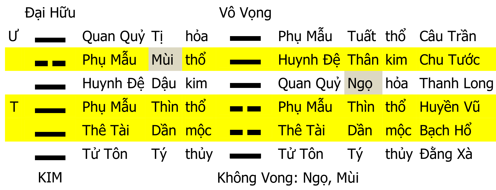
    - **Hình này chứng minh điều gì**
      - Người nữ tài vận kém, hôn nhân bất hòa, mắc bệnh phụ khoa, ruột dạ dày suy nhược và viêm tuyến vú.
    - **Từ đâu mà thấy được**
      - Thê Tài Dần mộc hưu tù; Quan Quỷ Tị hỏa hưu tù nhập Mộ; Thế lâm hào 3 ngộ khắc; hào 5 Tài khố phát động.
  - **Phán đoán chi tiết:**
    - Căn cứ:
      - Về phương diện tài vận: Lấy hào Thê Tài làm Dụng thần. Trong quẻ, Thê Tài Dần mộc an tại nội quái (hào 2) bị Nguyệt kiến Dậu kim khắc thương nặng nề, sinh vào mùa thu tháng Dậu ở trạng thái hưu tù vô khí; do đó tài vận của đương số rất kém, tiền bạc eo hẹp khó khăn.
      - Về phương diện hôn nhân: Khảo sát hào Quan Quỷ đại diện cho người chồng. Quan Quỷ Tị hỏa hưu tù ở tháng Dậu, lại lâm Câu Trần (chủ sự chậm trễ, đình trệ), biểu thị người chồng tính tình lười biếng, thụ động. Nguyên thần sinh trợ Quan Quỷ là Dần mộc nhập Mộ ở hào động Phụ Mẫu Mùi thổ (hào 5), không thể sinh trợ cho Quan Quỷ; kết hợp nội quái lâm phục ngâm (chủ sự u uất, đau khổ dai dẳng), khẳng định hôn nhân trục trặc, vợ chồng bất hòa sâu sắc.
      - Về phương diện sức khỏe: Khảo sát hào Thế Phụ Mẫu Thìn thổ tại hào 3 làm trung tâm biện chứng thể chất.
        - Chứng bệnh phụ khoa: Hào Thế cư hào vị 3, hào 3 là Mộ khố của Tử Tôn (Thìn thổ là Mộ của Thủy/Tử Tôn Tý thủy), đồng thời hào 3 là hào vị tương ứng với tử cung, vùng bụng dưới. Hào Thế bị hào 2 Thê Tài Dần mộc phát động khắc thương, lại lâm Huyền Vũ (chủ về nơi kín đáo, âm hộ, bệnh phụ khoa); do đó khẳng định đương số mắc các chứng bệnh phụ khoa.
        - Chứng bệnh đường ruột và dạ dày: Hào 2 Thê Tài Dần mộc là Kỵ thần khắc hại hào Thế thổ; ngũ hành mộc chủ về đường ruột, hào 3 Thìn thổ bị mộc khắc chủ về tỳ vị/dạ dày bị thương tổn; do đó đường ruột và dạ dày tiêu hóa rất kém.
        - Chứng bệnh viêm tuyến vú: Hào 5 Phụ Mẫu Mùi thổ phát động; Mùi thổ là Mộ khố của Thê Tài (mộc nhập Mộ tại Mùi), bộ vị cơ thể tương ứng với Mùi thổ tất có mầm bệnh. Thê Tài chủ về đồ ăn thức uống, dinh dưỡng; ngự tại hào 5 (vùng ngực, vú) thì Thê Tài suy rộng ra là sữa mẹ (nhũ dịch), và Mộ khố của Thê Tài (Tài khố) chính là bầu vú. Hào 5 Mùi thổ lâm Chu Tước (chủ về viêm nhiệt); vì vậy kết luận đương số mắc chứng viêm tuyến vú.
    - Nhìn vào:
      - Thê Tài Dần mộc hưu tù bị Nguyệt khắc để định đoạt tài chính bế tắc.
      - Quan Quỷ Tị hỏa hưu tù lâm Câu Trần, Nguyên thần nhập Mộ và nội quái phục ngâm để định đoạt gia đạo lục đục.
      - Hào 3 Thìn thổ tử cung lâm Huyền Vũ ngộ khắc để định đoạt bệnh phụ khoa và tỳ vị.
      - Hào 5 Mùi thổ Tài khố phát động lâm Chu Tước để định đoạt chứng viêm tuyến vú.
  - **Ứng nghiệm thực tế:**
    - Toàn bộ tình hình thực tế từ việc tài vận kiệt quệ, vợ chồng xung khắc bất hòa, tính cách người chồng lười biếng đến các chứng bệnh phụ khoa, đường ruột dạ dày suy nhược và viêm tuyến vú đều ứng nghiệm hoàn toàn chuẩn xác.

#### Ví dụ 2: Nữ học viên hỏi công việc và sức khỏe gia đình ngày Ất Hợi tháng Sửu (Thiên Lôi Vô Vọng biến Trạch Địa Tụy)

- **Ví dụ 2:** Ngày Ất Hợi tháng Sửu, tại buổi tọa đàm Lục Hào, một nữ học viên hơn 50 tuổi hỏi về công việc, được quẻ Thiên Lôi Vô Vọng biến Trạch Địa Tụy (quẻ cung Tốn mộc, Tuần Không: Thân, Dậu).
  - **Hình 334.** Quẻ Thiên Lôi Vô Vọng biến Trạch Địa Tụy
    - 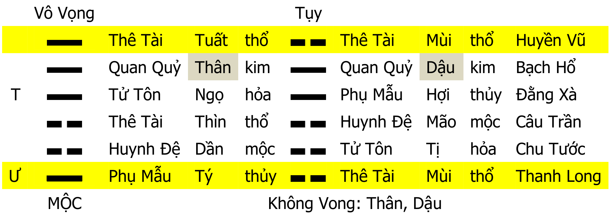
    - **Hình này chứng minh điều gì**
      - Đương số nghỉ hưu, mất tiền, chóng mặt, tim hoảng; mẹ bị bệnh tim nặng, chân biến dạng, năm 1994 nhập viện.
    - **Từ đâu mà thấy được**
      - Tử Tôn trì Thế, Quỷ Không nhập Mộ; Thế nhập Mộ Tuất thổ; chuyển đổi Dụng thần lấy Ngọ hỏa làm mẹ, Dần mộc bị hợp.
  - **Phán đoán chi tiết:**
    - Căn cứ:
      - Tâm sự thực chất và vấn đề tiền bạc:
        - Trong quẻ hào 6 Thê Tài Tuất thổ phát động hóa thoái thành Thê Tài Mùi thổ. Hào sơ đại diện cho tâm sự thầm kín, động mà biến hóa ra hào Tài (Phụ Mẫu Tý thủy động hóa Thê Tài Mùi thổ); do đó miệng tuy nói hỏi công việc nhưng thâm tâm thực chất đang lo lắng, phiền muộn vì chuyện tiền tài.
        - Tác giả vạch rõ nỗi niềm này, người phụ nữ xác nhận: Cô vốn là nhân viên bán hàng, do bán chịu cho khách hàng nhưng khách quỵt nợ không trả, nên đơn vị đã khấu trừ lương hàng tháng của cô để bù vào khoản nợ đó.
      - Tình trạng công tác và chế độ hưu trí:
        - Tử Tôn trì Thế (Tử Tôn khắc Quan Quỷ, chủ sự nhàn rỗi, thoái quan); Quan Quỷ Thân kim lâm Tuần Không lại nhập Mộ tại Nguyệt kiến Sửu thổ; đây là tượng chấm dứt công danh, cách ly chức vụ. Tác giả phán đoán cô đã nghỉ hưu. Người phụ nữ xác nhận đã nghỉ hưu.
      - Khả năng thu hồi số tiền lương bị trừ:
        - Hào Thế Tử Tôn Ngọ hỏa lâm Tuyệt địa ở Nhật thần Hợi thủy, lại bị hào sơ Phụ Mẫu Tý thủy phát động xung khắc, Thế hào suy nhược hoàn toàn vô lực sinh hào Tài; tác giả đoán khoản tiền lương bị trừ rất khó được hoàn trả.
      - Khảo sát sinh tử của người cha:
        - Phụ Mẫu Tý thủy ở hào sơ là dương hào, dương chủ về cha. Hào Tý thủy này động hóa Thê Tài Mùi thổ hồi đầu khắc, lại bị Nguyệt kiến Sửu thổ khắc phạt, hào 6 Thê Tài Tuất thổ cũng phát động đến khắc; rơi vào cảnh khắc nhiều sinh ít, cùng đường sinh lộ. Tác giả đoán cha của cô đã qua đời.
        - Người phụ nữ xác nhận cha mất năm 1989. Tác giả chỉ rõ thêm: Năm 1989 là Kỷ Tị, Tị hỏa chính là Tuyệt địa của Phụ Mẫu Tý thủy (thủy tuyệt tại Tị), đúng kỳ cha tạ thế.
      - Khảo sát bệnh tật bản thân cô học viên:
        - Hào 6 Thê Tài Tuất thổ phát động khiến hào Thế Tử Tôn Ngọ hỏa nhập Mộ (Ngọ hỏa mộ tại Tuất); hào 6 là đầu, đầu nhập Mộ là tượng choáng váng, u mê, chóng mặt.
        - Hào Thế lâm Ngọ hỏa tại hào 4 bị Nhật thần Hợi thủy khắc thương; hào 4 là vùng ngực, hỏa là tim, Thế lại lâm Đằng Xà (chủ kinh hoảng, hồi hộp, tim đập loạn nhịp).
        - Hào 2 Huynh Đệ Dần mộc là Nguyên thần sinh Thế bị Nhật thần Hợi thủy hợp trú (Dần Hợi hợp), rơi vào trạng thái tham hợp quên sinh, không trợ lực cho Dụng; mộc chủ phong khí, hào 2 là cẳng chân; đoán ở chân có luồng phong tán loạn chạy qua chạy lại.
        - Người phụ nữ xác nhận: Bản thân mắc chứng chóng mặt, huyết áp cao, tim đập hoảng sợ, và hai chân có luồng phong chạy tán loạn.
      - Luận giải nguyên lý chuyển đổi lục thân và bệnh tình của người mẹ:
        - Tranh luận học thuật tại chỗ: Khi người hỏi nhờ xem tiếp bệnh của mẹ, trong quẻ chỉ có duy nhất một hào Phụ Mẫu Tý thủy đã lấy xem cho cha nên không thể dùng lại xem cho mẹ. Áp dụng quy tắc chuyển đổi lục thân "cái ta khắc là Thê Tài", đối với cha (Phụ Mẫu Tý thủy hành Thủy) thì vợ của cha chính là Thê Tài (thủy khắc hỏa là Tài), do đó hào Tử Tôn Ngọ hỏa (ngũ hành Hỏa) đại diện cho người mẹ.
        - Có người phản đối: "Hào Thế và mẹ cùng là một hào, đây không phải là loạn luân sao? Chẳng lẽ cô này cũng là vợ của cha mình?".
        - Tác giả giải thích sắc bén: "Hào Thế và hào vị chuyển đổi tương đồng, trước hết chỉ rõ cô này nhìn rất giống mẹ. Đây là đoán bệnh, không phải là đoán hôn nhân; đoán hôn nhân thì không thể xem như vậy". Sau khi hỏi, quả nhiên cô học viên xác nhận diện mạo mình giống hệt mẹ.
        - Biện chứng bệnh của mẹ: Tử Tôn Ngọ hỏa (mẹ) bị khắc hại nặng nề, đoán mẹ có bệnh tim rất nghiêm trọng. Dụng thần Ngọ hỏa nhập Mộ ở Tuất thổ, đoán năm 1994 (Giáp Tuất - Tuất thổ thái tuế làm Dụng thần nhập Mộ vào viện) mẹ từng phải nhập viện cấp cứu. Hào 2 Huynh Đệ Dần mộc là Nguyên thần bị Nhật hợp kẹp chặt, mộc là gân cốt, hào 2 là chân; đoán đôi chân của mẹ đã bị biến dạng teo rút, không thể tự đi lại.
        - Khảo sát vận hạn suy thoái: Các năm 1992 (Nhâm Thân), 1993 (Quý Dậu), 1994 (Giáp Tuất), 1995 (Ất Hợi), 1996 (Bính Tý) liên tục bất lợi cho Dụng thần Ngọ hỏa; do đó đoán sức khỏe của người mẹ năm sau đều kém hơn năm trước.
    - Nhìn vào:
      - Hào sơ tâm sự hóa Tài và hào 6 Tài hóa thoái để lột tả khúc mắc tiền bạc.
      - Tử Tôn trì Thế, Quan Quỷ Không Vong nhập Mộ để xác định việc nghỉ hưu.
      - Phụ Mẫu Tý thủy động ngộ tam trùng khắc phạt để xác định cha mất vào năm Kỷ Tị (Tuyệt địa).
      - Thế hỏa ở hào 4 nhập Mộ hào 6 lâm Xà, Nguyên thần mộc hào 2 bị hợp để chẩn đoán huyết áp cao, tim hoảng và phong chạy ở chân.
      - Phép chuyển đổi lục thân lấy Ngọ hỏa làm mẹ, xét quan hệ Dần mộc bị trói và chuỗi năm xung khắc để định đoán bệnh tim, chân biến dạng và sức khỏe suy sụp của mẹ.
  - **Ứng nghiệm thực tế:**
    - Toàn bộ các phán đoán từ nguyên nhân gieo quẻ, tình trạng nghỉ hưu, số tiền bị khấu trừ, năm cha qua đời đến diện mạo giống mẹ, bệnh tim của mẹ, chân mẹ biến dạng và sự suy giảm sức khỏe qua từng năm đều ứng nghiệm chuẩn xác.

#### Ví dụ 3: Lãnh đạo công ty đoán quan vận và sức khỏe ngày Quý Sửu tháng Mùi năm Đinh Hợi (Thiên Thủy Tụng biến Trạch Phong Đại Quá)

- **Ví dụ 3:** Ngày Quý Sửu tháng Mùi năm Đinh Hợi, một lãnh đạo công ty nhờ dự đoán tiền đồ quan vận và tiện thể hỏi về sức khỏe bản thân, được quẻ Thiên Thủy Tụng biến Trạch Phong Đại Quá (quẻ cung Ly hỏa, Tuần Không: Dần, Mão).
  - **Hình 335.** Quẻ Thiên Thủy Tụng biến Trạch Phong Đại Quá
    - 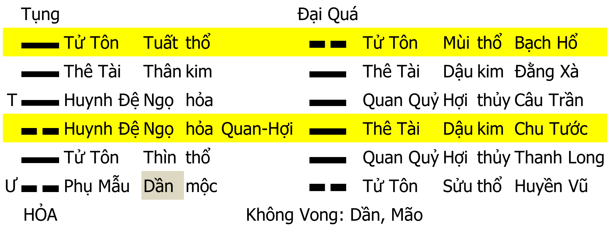
    - **Hình này chứng minh điều gì**
      - Đương số lên chức tháng Mão, muốn chuyển đi xa; mắc gan nhiễm mỡ, mỡ máu cao, mắt mờ, tức ngực và trĩ.
    - **Từ đâu mà thấy được**
      - Quan phục tàng, Kỵ thần cực vượng; quẻ du hồn hóa du hồn; Thế hỏa nhập Mộ Câu Trần Bạch Hổ; hào 3 tự hình hóa Tài.
  - **Phán đoán chi tiết:**
    - Căn cứ:
      - Về phương diện quan vận và kỳ thăng chức:
        - Lấy Quan Quỷ làm Dụng thần. Trong quẻ Quan Quỷ không hiện, phục tàng dưới hào 3 (Quan Quỷ Hợi thủy phục dưới Huynh Đệ Ngọ hỏa). Nguyệt kiến Mùi thổ khắc Quan, Nhật kiến Sửu thổ cũng khắc Quan; Quan Quỷ bị Nhật Nguyệt khắc phạt nặng nề, không có căn khí.
        - Trong quẻ Kỵ thần Tử Tôn lưỡng hiện, hào 6 Tử Tôn Tuất thổ phát động hóa thoái thành Tử Tôn Mùi thổ; hào 3 Huynh Đệ Ngọ hỏa động sinh Tử Tôn. Kỵ thần quá vượng dẫn tới quy luật vật cực tất phản, trái lại không khắc hại Quan Quỷ. Hào 6 Tử Tôn hóa thoái, chỉ khi gặp tháng Mão hợp trú Tuất thổ thì Tử Tôn mới bị trói buộc không thể thoái để khắc Quan. Lại có Quan Quỷ Hợi thủy trùng với Thái Tuế năm Đinh Hợi; do đó tác giả đoán tháng Mão năm nay anh ta đã đắc ý thăng chức.
        - Đương số xác nhận đúng là vừa được thăng chức vào tháng Mão.
      - Về tâm lý biến động và ý định chuyển công tác:
        - Quẻ Tụng là quẻ Du Hồn, biến sang quẻ Đại Quá cũng là quẻ Du Hồn. "Du hồn hóa du hồn" biểu thị tâm lý không thể an định làm việc, luôn nảy sinh ý định thay đổi, không muốn gắn bó với nơi hiện tại; biến tiếp du hồn mang ý nghĩa muốn chuyển đi thật xa chứ không phải điều động cục bộ nội bộ thông thường. Tác giả đoán anh ta đang muốn chuyển công tác rời khỏi tỉnh này.
      - Về thân phận người nâng đỡ:
        - Hào 3 Huynh Đệ Ngọ hỏa phát động sinh Kỵ thần nhưng đồng thời trợ giúp hào Thế (cùng là Huynh Đệ Ngọ hỏa). Đương số là cán bộ nhà nước, hào 3 đồng ngũ hành can chi với Thế biểu thị người giúp đỡ cũng thuộc biên chế nhà nước. Hào 3 hợp Nguyệt kiến Mùi thổ biểu thị người này có chỗ dựa vững chắc từ cấp trên (Nguyệt kiến là lãnh đạo cấp cao). Tuy nhiên hào 3 ở vị trí thấp hơn hào Thế (hào 4); chứng tỏ người ra tay hỗ trợ có chức vụ nhỏ hơn anh ta, thực tế là cấp dưới của anh ta.
      - Về phương diện sức khỏe và biện chứng bệnh lý:
        - Tác giả phán đoán đương số mắc các chứng: gan nhiễm mỡ, mỡ máu cao, mắt nhìn không rõ, đầu óc lơ mơ, tức ngực và bệnh trĩ.
        - Vị lãnh đạo thừa nhận toàn bộ các bệnh chứng này bản thân đều đang mắc phải. Hiện tượng mắt mờ mới xuất hiện cách đây một tháng, còn bệnh trĩ mới phát tác hơn 10 ngày gần đây.
        - Biện chứng mỡ máu cao và thiếu máu cơ tim: Khảo sát hào Thế Huynh Đệ Ngọ hỏa ở hào 4. Tuy được Nguyệt kiến Mùi thổ hợp nhưng rốt cuộc không được Nhật Nguyệt sinh phù nên thực chất không quá vượng; Nguyên thần Phụ Mẫu Dần mộc lâm Tuần Không không thể sinh Thế. Thế ở hào 4 lâm hỏa là hào vị tim, Nguyên thần Không khiến lượng máu cung cấp cho tim suy giảm. Hào Thế lâm Câu Trần (chủ độ nhớt đặc, đình trệ), lại nhập Mộ ở hào 6 Tuất thổ lâm Bạch Hổ (Bạch Hổ chủ huyết dịch). Máu huyết đặc sệt, lưu thông tắc nghẽn, không thể bơm lên đầu; tổ hợp quái tượng này biểu thị chứng mỡ máu cao.
        - Biện chứng gan nhiễm mỡ: Nguyên thần Mộc Không không thể sinh Thế; Mộc chủ can mật. Câu Trần chủ phì nị, sưng phù, chất béo; Mộc suy ngộ Câu Trần biểu thị mỡ tích tụ trong gan tạo thành bệnh gan nhiễm mỡ.
        - Biện chứng đầu óc lơ mơ và tức ngực: Thế hào nhập Mộ tại hào 6 (vùng đầu não), chủ về bế tắc u ám, đầu óc kém minh mẫn. Câu Trần chủ trướng tức, hào 4 là vùng ngực; Thế hào ở hào 4 nhập Mộ tạo cảm giác lồng ngực bị áp bức, hô hấp khó khăn, tức ngực ngột ngạt.
        - Biện chứng mắt nhìn không rõ: Quẻ thuộc cung Ly (Ly vi mục, chủ về mắt), Thế hào là Hỏa (hỏa chủ thị giác, đôi mắt); Thế hỏa nhập Mộ tượng trưng cho mắt bị che phủ, tầm nhìn mờ tối. Đương số phản hồi vào tháng Ngọ khi đang tham gia kỳ sát hạch thì đột ngột hai mắt mờ đi không nhìn rõ.
        - Biện chứng bệnh trĩ đường ruột: Hào 3 Huynh Đệ Ngọ hỏa và hào Thế Ngọ hỏa tương hình (ngọ ngọ tự hình). Quẻ cung Ly có thông tin đường ruột; hào 3 là đường ruột; hỏa chủ ruột; lâm Chu Tước chủ viêm nhiệt. Huynh Đệ động hóa Thê Tài Dậu kim (Thê Tài chủ phân tiện, bài tiết), biểu thị hiện tượng cưỡng ép đại tiện (rặn đại tiện) do có vật cản trở. Hào 2, hào 3 tương hình kết hợp thông tin đường ruột là tổ hợp điển hình của bệnh trĩ.
    - Nhìn vào:
      - Quan phục tàng lâm Thái Tuế, Kỵ thần cực vượng hóa thoái để định đoán kỳ lên chức ở tháng Mão.
      - Du hồn hóa du hồn để giải mã động cơ muốn chuyển công tác ra ngoài tỉnh.
      - Hào 3 Huynh Đệ hợp Nguyệt nhưng hào vị thấp hơn Thế để xác định thân phận cấp dưới giúp đỡ.
      - Thế hỏa hào 4 lâm Câu Trần nhập Mộ Bạch Hổ, Nguyên thần mộc lâm Không để chẩn đoán đồng thời mỡ máu cao, gan nhiễm mỡ, tức ngực và mắt mờ.
      - Quan hệ tương hình hào 3 và hào Thế lâm Chu Tước hóa Tài để chẩn đoán bệnh trĩ đường ruột.
  - **Ứng nghiệm thực tế:**
    - Toàn bộ các phán đoán về thời điểm thăng chức, ý định chuyển vùng công tác, thân phận người giúp đỡ cùng danh mục bệnh tật (mỡ máu cao, gan nhiễm mỡ, mắt mờ khi sát hạch tháng Ngọ, tức ngực và bệnh trĩ mới phát) đều ứng nghiệm chính xác.

#### Ví dụ 4: Hoàng tiên sinh đoán niên vận và sức khỏe ngày Bính Thân tháng Dần năm Kỷ Mão (Trạch Sơn Hàm biến Hỏa Sơn Lữ)

- **Ví dụ 4:** Ngày Bính Thân tháng Dần năm Kỷ Mão, Hoàng tiên sinh đến gieo quẻ dự đoán niên vận, được quẻ Trạch Sơn Hàm biến Hỏa Sơn Lữ (quẻ cung Đoài kim, Tuần Không: Thìn, Tị).
  - **Hình 336.** Quẻ Trạch Sơn Hàm biến Hỏa Sơn Lữ
    - 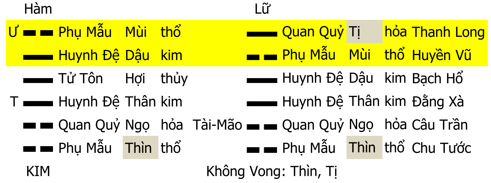
    - **Hình này chứng minh điều gì**
      - Đương số bị bạn bè quỵt nợ; mắc chứng táo bón, suy nhược thần kinh, ác mộng và đau đầu mất ngủ.
    - **Từ đâu mà thấy được**
      - Thế Huynh Đệ Nguyệt phá, Tài phục nhập Ứng Mộ; Thế lâm Đằng Xà cư hào 3; hào 6 Mùi thổ ngộ khắc hóa Quỷ.
  - **Phán đoán chi tiết:**
    - Căn cứ:
      - Về phương diện tài vận và sự nghiệp:
        - Lấy hào Thế Huynh Đệ Thân kim làm trung tâm khảo sát. Hào Thế bị Nguyệt kiến Thê Tài Dần mộc xung phá (Dần Thân tương xung, thành Nguyệt phá). Thê Tài không xuất hiện trên quẻ (phục tàng dưới hào 2 Quan Quỷ Ngọ hỏa), trong quẻ lại có hào Huynh Đệ phát động (hào 5 Huynh Đệ Dậu kim phát động). Thế phá, Tài phục, Huynh động là dấu hiệu tài vận bế tắc, hao tài tốn của, sự nghiệp trắc trở, đương số luôn rơi vào cảnh khốn đốn vì tiền bạc.
      - Về quan hệ bạn bè và các khoản nợ khó đòi:
        - Hào 5 Huynh Đệ lâm Huyền Vũ phát động hóa xuất Phụ Mẫu Mùi thổ: Huynh Đệ đại diện cho bạn bè, đồng nghiệp trợ giúp hào Thế; Phụ Mẫu Mùi thổ là Tài khố (kho chứa tiền bạc); Huyền Vũ chủ về sự lén lút, gian xảo, lừa lọc. Do đó phán đoán đương số tuy nhận được sự giúp đỡ của bạn bè trong làm ăn nhưng cũng chính bạn bè làm liên lụy, lừa gạt chiếm đoạt tiền của.
        - Thê Tài lại nhập Mộ tại hào 6 Phụ Mẫu Mùi thổ lâm hào Ứng; hào Ứng đại diện cho người khác. Tài nhập Ứng Mộ khố biểu thị tiền bạc của mình bị người khác chiếm giữ khư khư trong tay không chịu trả; đoán có nhiều người vay mượn tiền của ông ta rồi chây lỳ quỵt nợ.
      - Về phương diện sức khỏe và biện chứng bệnh lý:
        - Chứng bệnh táo bón: Hào Thế bị Thê Tài xung phá, Thê Tài không hiện trên quẻ lại nhập Mộ tại hào 6 Mùi thổ. Thê Tài trong nhân thể chủ về phân và nước tiểu, chất bài tiết đại tiểu tiện. Tài phục tàng lại nhập Mộ biểu thị sự ứ trệ, tắc nghẽn của phân dịch; do đó phán đoán ông ta mắc bệnh táo bón mạn tính.
        - Chứng tâm phiền, ác mộng và giấc ngủ bất an: Hào Thế lâm Đằng Xà; Đằng Xà chủ về tâm lý bồn chồn, hoảng sợ, ác mộng triền miên. Thế lại an tại hào vị 3; trong trạch quẻ hào 3 là hào vị của giường ngủ (sàng vị). Đằng Xà đóng ở giường ngủ biểu thị nằm trên giường ngủ không yên, hay mơ thấy ác mộng, đêm giật mình sợ hãi.
        - Chứng suy nhược thần kinh và đau đầu mất ngủ: Hào 6 Phụ Mẫu Mùi thổ là Nguyên thần sinh cho hào Thế Kim, bị Nguyệt kiến Dần mộc khắc thương, lại phát động hóa ra Quan Quỷ Tị hỏa. Trong nguyên lý Lục Hào: bị khắc là mầm mống của bệnh, động hóa Quỷ cũng là nguồn gốc sinh bệnh. Hào 6 là hào vị chí cao đại diện cho vùng đầu não; Mùi thổ là Quan Đới địa của hào Thế Thân kim (kim quan đới tại Mùi), ngự tại hào 6 lâm Thanh Long; tượng Quan Đới giống như chiếc mũ đội hoặc dải đai thắt chặt, lâm Thanh Long chủ chứng đau nhức đầu buốt nhói, cảm giác trên đầu như bị siết chặt bởi một chiếc vòng kim cô. Do đó phán đoán Hoàng tiên sinh bị suy nhược thần kinh, đau đầu kinh niên, mất ngủ trầm trọng, đêm trằn trọc không thể ngủ ngon.
    - Nhìn vào:
      - Thế Huynh Đệ bị Nguyệt phá, Tài phục, Huynh hào 5 lâm Huyền Vũ hóa Tài khố để xác định bị bạn bè lừa tiền.
      - Tài nhập Mộ hào Ứng để định đoạt hiện tượng bị người khác quỵt nợ.
      - Tài phục nhập Mộ để chẩn đoán chứng táo bón ứ tắc.
      - Thế lâm Đằng Xà cư hào 3 sàng vị để chẩn đoán ác mộng hoảng sợ khi ngủ.
      - Hào 6 Nguyên thần Mùi thổ bị Nguyệt khắc hóa Quỷ lâm Quan Đới và Thanh Long để chẩn đoán suy nhược thần kinh, đau đầu như thắt vòng kim cô và mất ngủ kéo dài.
  - **Ứng nghiệm thực tế:**
    - Hoàng tiên sinh xác nhận mọi sự việc đúng như thần đoán: Những năm gần đây nhờ bạn bè hỗ trợ ông kiếm được hơn 20 vạn nguyên; tuy nhiên sau đó một số bạn bè thấy ông có tiền đã hỏi vay mượn rồi chỉ mượn mà không chịu trả. Bản thân ông mắc bệnh suy nhược thần kinh nặng, thường xuyên đau đầu mất ngủ, giấc ngủ rất kém, và thường kỳ bị chứng táo bón hành hạ.

## CHƯƠNG 17: DỰ ĐOÁN BỆNH TẬT CHO ĐỘNG VẬT

### Nguyên lý và phương pháp dự trắc bệnh tật cho động vật

- Cơ chế xác định Dụng thần trong dự đoán bệnh tật động vật:
  - Trong dự đoán Lục Hào, bất kể động vật nuôi trong nhà là gia súc, gia cầm, thú cưng như chó, mèo hay chim muông nhặt được ngoài tự nhiên, đều thống nhất chọn hào Tử Tôn làm Dụng thần.
  - Sức sống và thọ mệnh của động vật phụ thuộc trực tiếp vào trạng thái suy vượng, sinh khắc chế hóa của Dụng thần Tử Tôn:
    - Tử Tôn được Nhật Nguyệt sinh phù tỉ trợ, hào động trong quẻ sinh trợ thì khí mạch dồi dào, động vật có sinh lực, gặp nạn hay mắc bệnh đều có thể hồi phục và qua khỏi nguy hiểm.
    - Tử Tôn hưu tù vô khí, bị Nhật Nguyệt hình xung khắc hại, hoặc phục tàng, nhập Mộ, nhập Tuyệt thì con vật đang mắc trọng bệnh, sinh mệnh rơi vào cảnh hiểm nghèo.
- Tượng quẻ và trạng thái bệnh lý tương ứng của Dụng thần Tử Tôn:
  - Dụng thần phục tàng: Biểu thị động vật nằm bẹp một chỗ, liệt giường, tứ chi vô lực không thể cất bước hay bay lượn.
  - Dụng thần nhập Mộ: Tương tự như con người mắc bệnh nặng phải nhập viện điều trị; động vật rơi vào trạng thái đờ đẫn, mơ màng, mất đi sức sống vốn có.
    - Tử Tôn nhập Mộ tại hào 6: Hào 6 là phần đầu trên cơ thể, chủ về hôn mê, bất tỉnh, đầu óc mê man u tối.
    - Tử Tôn động hóa Mộ khố: Biểu thị đang khỏe bỗng rơi vào cơn mê man, bệnh chuyển nặng đột ngột; nếu được Nhật thần xung khai Mộ khố thì thoát khỏi giam hãm, nhanh chóng hồi tỉnh.
  - Dụng thần Tuyệt tại Quỷ hoặc hưu tù ngộ Tuyệt địa: Mạng sống nguy ngập trong sớm tối, khó lòng cứu vãn.
- Nhận định chứng trạng ăn uống và chức năng tiêu hóa qua hào Thê Tài:
  - Trong Lục Hào, hào Thê Tài đại diện cho ẩm thực, đồ ăn thức uống nạp vào tỳ vị.
  - Thê Tài không hiện trên quẻ (phục tàng): Con vật bỏ ăn, không chịu ăn uống bất cứ thứ gì.
  - Dụng thần Tử Tôn nhập Mộ tại hào Thê Tài: Con vật chán ăn, ăn không tiêu, sợ thức ăn.
  - Dụng thần Tử Tôn bị hào Thê Tài hợp trú: Tuân thủ quy tắc "bệnh mới không nên gặp hợp"; việc Dụng thần gặp Thê Tài hợp trói biểu thị thức ăn nạp vào bị tích trệ không tiêu hóa, gây chướng bụng đầy hơi mà sinh bệnh.
  - Tượng lục thần kết hợp với ẩm thực:
    - Thanh Long: Chủ về đồ ăn thức uống thanh đạm, đồ tươi mới.
    - Câu Trần: Chủ về chất béo, mỡ, đồ ăn ngấy ngậy khó tiêu (như ăn quá nhiều mỡ động vật hoặc nội tạng, gan béo).
- Biện chứng vai trò của Quan Quỷ, Kỵ thần và tượng lục thần độc phát:
  - Hào độc phát (hào duy nhất phát động trong quẻ) giữ vai trò chủ đạo chi phối toàn cục, thường trực tiếp vạch trần bản chất và căn nguyên gây ra bệnh tật:
    - Quan Quỷ độc phát ngự tại Tử địa của Dụng thần: Khí tuyệt mệnh phát tác dữ dội, báo trước động vật tất phải chết.
    - Quan Quỷ độc phát hóa Tử Tôn (Quỷ hóa Tử Tôn): Tượng tai họa và bệnh tật chuyển hóa diệt vong, tính mạng khó giữ.
    - Quan Quỷ lâm Đằng Xà độc phát: Đằng Xà chủ về co giật, kinh phong, động kinh, điên dại, thân thể vặn vẹo biến dạng.
    - Phụ Mẫu độc phát: Phụ Mẫu là Kỵ thần khắc phạt Tử Tôn, nếu không có hào cứu giải thì sinh cơ bị dập tắt.
- Quy luật hào vị bộ vị thân thể và biểu hiện tuổi thọ động vật:
  - Hào sơ (hào 1): Tượng trưng cho bàn chân, móng vuốt của động vật. Nếu Nguyên thần hoặc Dụng thần ngự tại hào sơ bị hợp trói (như Nhật hợp) thì chân bị cản trở, bại liệt, co quắp không thể đi lại.
  - Hào 6: Tượng trưng cho phần đầu của con vật; liên hệ trực tiếp đến các triệu chứng hôn mê, tổn thương thần kinh não bộ.
  - Hào 2 và hào 3: Đại diện cho tỳ vị, khoang bụng, đường ruột; liên quan đến tiêu chảy ra máu, xuất huyết nội tạng.
  - Dấu hiệu động vật già yếu: Khi Nguyệt kiến lâm Bệnh địa của Nguyên thần, đồng thời Nguyên thần hưu tù khô kiệt, quẻ chỉ rõ con vật mắc bệnh do đã quá già, sức tàn lực kiệt.
- Biện chứng động biến, hợp hóa và ứng kỳ sinh tử ở động vật:
  - Quy tắc "Động vi thủy, biến vi chung" trong dự đoán bệnh tật động vật cần được xem xét linh hoạt:
    - Dụng thần động hóa hồi đầu khắc nhưng hào biến hưu tù lại bị Nhật thần hợp trú thì lực khắc bị triệt tiêu, con vật tạm thời thoát chết.
    - Khi hào biến hồi đầu khắc bị xung chế (như ngày xung mất hào biến) thì Dụng thần được giải phóng, bệnh tình lập tức có chuyển biến tốt.
  - Ứng kỳ hung tử: Rơi vào ngày giờ Kỵ thần nắm lệnh, ngày xung khắc Dụng thần, ngày Dụng thần nhập Mộ, hoặc ngày Dụng thần lâm Tuyệt địa.
  - Ứng kỳ bình phục: Rơi vào ngày Dụng thần trị Nhật (điền thực), ngày xung khai Mộ khố, hoặc ngày xung giải thế hợp trói gây tắc nghẽn.
- Phương pháp điều trị và cứu chữa động vật thông qua tượng quẻ Lục Hào:
  - Dự đoán Lục Hào không chỉ đoán biết sống chết mà còn mở ra phương án trị liệu hữu hiệu dựa trên lý luận ngũ hành tượng số:
    - Trường hợp chó bị bội thực mỡ gan động vật: Nhận diện tượng quẻ để dùng nước ép quả chua (như kiwi giàu enzym phân giải) hòa sữa bò thanh nhiệt, giúp tỳ vị lưu thông và phục hồi khả năng ăn uống.
    - Trường hợp chó bị xuất huyết vùng bụng: Trích xuất tượng Nguyên thần Kim (xương cốt), hào 6 thoái hưu lâm Huyền Vũ (đồ cổ xưa) và Nhật thần Thìn thổ (Long) để chỉ dẫn dùng "bột Long Cốt" rắc bôi cầm máu ngoài da, mang lại kết quả thần hiệu.

### Các quái lệ thực nghiệm dự đoán bệnh tật động vật

#### Ví dụ 1: Nhặt chim nhỏ bên đường đoán khả năng nuôi sống (Sơn Phong Cổ biến Sơn Thủy Mông)
- **Ví dụ 1:** Ngày Giáp Tuất tháng Ngọ, nhặt được một con chim nhỏ không biết bay bên lề đường, trông rất tội nghiệp nên muốn đem nó về nuôi, nhưng cho đồ lại không ăn, bèn đoán xem có thể nuôi con chim này được không? Được Sơn Phong Cổ biến Sơn Thủy Mông (Mộc cung, Tuần Không: Thân, Dậu).
  - **Hình 337.** Sơ đồ quẻ Sơn Phong Cổ biến Sơn Thủy Mông
    - 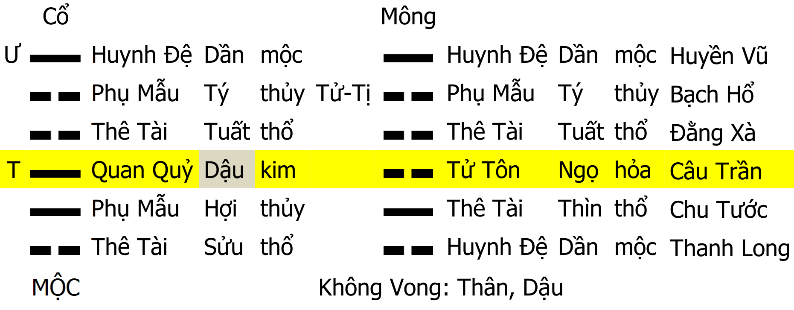
    - **Hình này chứng minh điều gì**
      - Chim nhỏ không thể nuôi sống được, chết ngay trong ngày do Dụng thần phục tàng nhập Mộ và Quan Quỷ độc phát cư Tử địa.
    - **Từ đâu mà thấy được**
      - Tử Tôn Tị hỏa phục dưới hào 5 Phụ Mẫu Tý thủy nhập Mộ ở Nhật Tuất; hào 3 Quan Quỷ Dậu kim độc phát là Tử địa của Tị hỏa.
  - **Phán đoán chi tiết:**
    - Căn cứ: Lấy hào Tử Tôn làm Dụng thần. Tử Tôn Tị hỏa phục tàng dưới hào 5 Phụ Mẫu Tý thủy. Mặc dù được Nguyệt kiến Ngọ hỏa tỉ phù trợ lực, nhưng Dụng thần phục tàng lại nhập Mộ tại Nhật thần Tuất thổ (Tị hỏa nhập Mộ tại Tuất). Phục tàng biểu thị nằm liệt một chỗ; nhập Mộ giống như người bị bệnh nặng phải nằm viện. Tượng quẻ này hoàn toàn trùng khớp với trạng thái thực tế của con chim nhỏ: rơi rớt bên đường, không thể cất cánh bay lượn, bỏ ăn bỏ uống và bị đem về nuôi nhốt trong nhà.
    - Nhìn vào: Hào 3 Quan Quỷ Dậu kim phát động đơn độc (độc phát). Theo vòng Trường Sinh ngũ hành Hỏa, địa chi Dậu kim chính là Tử địa của Dụng thần Tử Tôn Tị hỏa. Quy luật Lục Hào xác định hào độc phát nắm quyền chủ đạo chi phối kết quả sự việc; nay Quỷ độc phát lâm đất Tử, lại phát động hóa ra Tử Tôn Ngọ hỏa (tượng Quỷ hóa Tử Tôn), báo hiệu sinh mệnh bị dập tắt, không thể nuôi sống được.
  - **Ứng nghiệm thực tế:**
    - Quả nhiên đến giờ Ngọ cùng ngày hôm đó, con chim nhỏ đã chết.

#### Ví dụ 2: Đoán mèo cưng mắc bệnh hiểm nghèo (Lôi Trạch Quy Muội biến Lôi Thủy Giải)
- **Ví dụ 2:** Ngày Bính Ngọ tháng Thìn, một cô gái có con mèo bị bệnh rất nặng, hỏi cát hung thế nào? Được Lôi Trạch Quy Muội biến Lôi Thủy Giải (Kim cung, Tuần Không: Dần, Mão).
  - **Hình 338.** Sơ đồ quẻ Lôi Trạch Quy Muội biến Lôi Thủy Giải
    - 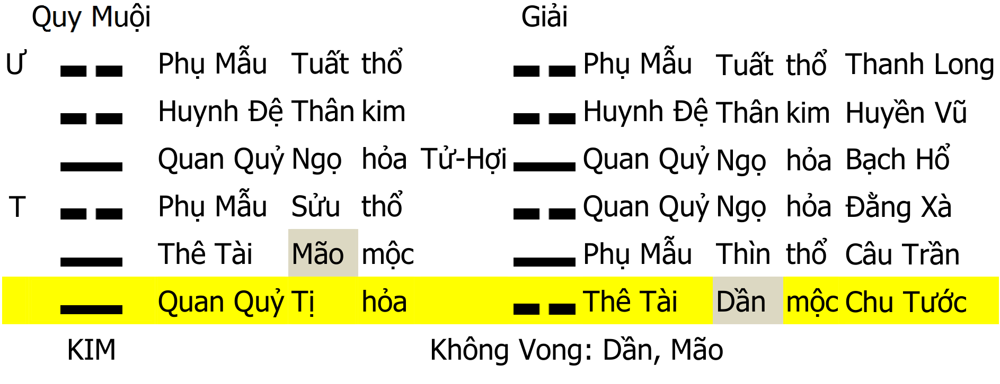
    - **Hình này chứng minh điều gì**
      - Con mèo bệnh nặng không thể qua khỏi, chết vào giờ Sửu ngày Đinh Mùi do Dụng thần Tuyệt tại Quỷ và nhập Mộ ở Nguyệt.
    - **Từ đâu mà thấy được**
      - Tử Tôn Hợi thủy phục dưới hào 4 Quan Quỷ Ngọ hỏa nhập Mộ ở Nguyệt Thìn; hào 1 Quan Quỷ Tị hỏa độc phát là Tuyệt địa của Thủy.
  - **Phán đoán chi tiết:**
    - Căn cứ: Lấy hào Tử Tôn làm Dụng thần. Tử Tôn Hợi thủy không xuất hiện trên quẻ, phục tàng dưới hào 4 Quan Quỷ Ngọ hỏa. Tử Tôn nhập Mộ tại Nguyệt kiến Thìn thổ (tháng Thìn là Mộ của Thủy), chứng tỏ con mèo đã kiệt quệ hoàn toàn, nằm bẹp không còn chút sức lực nào.
    - Nhìn vào: Xét về nhật nguyệt, Nguyệt kiến Thìn thổ tương khắc thương Dụng thần, Nhật thần Bính Ngọ hao tiết không hề trợ giúp. Hơn nữa, hào 1 Quan Quỷ Tị hỏa độc phát; theo vòng Trường Sinh của Thủy, Tị hỏa chính là Tuyệt địa của Hợi thủy (Thủy tuyệt tại Tị). Dụng thần vừa nhập Mộ vừa lâm Tuyệt tại Quan Quỷ độc phát, mạng sống con mèo nguy ngập trong sớm tối. Ngày tiếp theo là ngày Đinh Mùi, chi Mùi thổ nắm lệnh ngày khắc phạt tận diệt Dụng thần Hợi thủy, nhất định là kỳ hạn đại hung.
  - **Ứng nghiệm thực tế:**
    - Về sau con mèo đã chết vào giờ Sửu ngày Đinh Mùi.

#### Ví dụ 3: Chó nhà bị bệnh tiêu ra máu (Thủy Địa Tỷ biến Lôi Địa Dự)
- **Ví dụ 3:** Ngày Giáp Thìn tháng Tị, con chó nhà tôi bị bệnh không chịu ăn uống thứ gì, phân ra rất nhiều máu, tôi đoán cát hung của nó, được Thủy Địa Tỷ biến Lôi Địa Dự (Thổ cung, Tuần Không: Dần, Mão).
  - **Hình 339.** Sơ đồ quẻ Thủy Địa Tỷ biến Lôi Địa Dự
    - 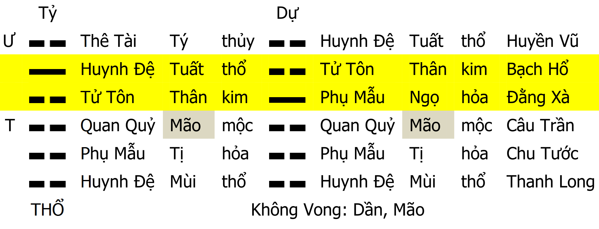
    - **Hình này chứng minh điều gì**
      - Chó bị tiêu ra máu nhưng được cứu sống, bình phục vào ngày Nhâm Tý nhờ Nguyệt hợp che chở và giải trừ hào biến hồi đầu khắc.
    - **Từ đâu mà thấy được**
      - Dụng thần hào 4 Tử Tôn Thân kim được Nguyệt Tị lục hợp, Nhật Thìn sinh, hào 5 Tuất thổ sinh; chờ ngày Tý xung mất biến hào Ngọ hỏa.
  - **Phán đoán chi tiết:**
    - Căn cứ: Lấy Tử Tôn làm Dụng thần. Hào 4 Tử Tôn Thân kim phát động, được Nguyệt kiến Tị hỏa lục hợp (Tị Thân tương hợp) nên khí mạch cực vượng; lại được Nhật thần Thìn thổ sinh trợ và hào 5 Huynh Đệ Tuất thổ phát động tương sinh. Dụng thần được sinh trợ tầng tầng lớp lớp là điềm lành lớn. Tuy nhiên, Tử Tôn Thân kim phát động hóa ra Phụ Mẫu Ngọ hỏa là hóa hồi đầu khắc, do đó bệnh chưa thể dứt ngay, phải đợi đến ngày Tý xung khắc triệt tiêu hào biến Ngọ hỏa thì mới chuyển biến tốt.
    - Nhìn vào: Tác giả nhấn mạnh vai trò cốt lõi của Nguyệt hợp trong quẻ này. Nếu chỉ nhìn máy móc theo góc độ sinh khắc thuần túy (Nguyệt khắc, Nhật sinh, hào động sinh, hào biến khắc) thì hai bên dường như giằng co không phân thắng bại; và nếu câu nệ quy tắc cổ nhân "động vi thủy biến vi chung" thì động hóa hồi đầu khắc hẳn phải nguy kịch. Nhưng thực tế nhờ có Nguyệt hợp giữ cho Dụng thần không bị thương tổn, nên khi gặp ngày Tý khắc chế Ngọ hỏa là lập tức khỏi bệnh.
  - **Ứng nghiệm thực tế:**
    - Sau khi được tiêm thuốc và cho uống thuốc điều trị, đến đúng ngày Nhâm Tý con chó đã hồi phục sinh lực, bắt đầu ăn uống trở lại và cơ bản khỏi hẳn bệnh.

#### Ví dụ 4: Chó của học trò bị bệnh hôn mê bất tỉnh (Hỏa Lôi Phệ Hạp biến Chấn Vi Lôi)
- **Ví dụ 4:** Ngày Canh Thìn tháng Dần, nhà học trò tôi có con chó bị bệnh, nhờ tôi đoán xem cát hung thế nào? Tôi gieo được Hỏa Lôi Phệ Hạp biến Chấn Vi Lôi (Mộc cung, Tuần Không: Thân, Dậu).
  - **Hình 340.** Sơ đồ quẻ Hỏa Lôi Phệ Hạp biến Chấn Vi Lôi
    - 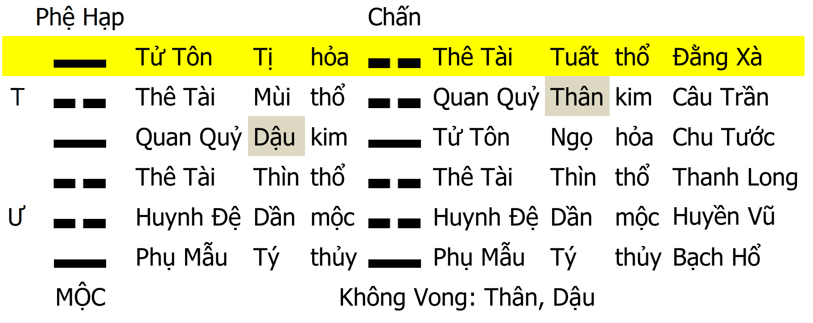
    - **Hình này chứng minh điều gì**
      - Chó hôn mê đờ đẫn thoát chết và khỏe lại vào ngày Tân Tị nhờ Mộ khố bị Nhật xung khai và Dụng thần được Nguyệt sinh vượng tướng.
    - **Từ đâu mà thấy được**
      - Dụng thần hào 6 Tử Tôn Tị hỏa được Nguyệt Dần sinh, động hóa Thê Tài Tuất thổ (Mộ khố); Tuất thổ bị Nhật Thìn xung khai khố.
  - **Phán đoán chi tiết:**
    - Căn cứ: Lấy Tử Tôn làm Dụng thần. Hào 6 Tử Tôn Tị hỏa phát động hóa ra Thê Tài Tuất thổ là hóa Mộ khố. Dụng thần nhập Mộ tại hào 6 (hào vị tượng trưng cho phần đầu), chủ về đầu óc mơ màng, mê man bất tỉnh, không còn sức sống. Lại nhập Mộ tại hào Thê Tài (ẩm thực), chủ về chán ăn, tuyệt thực không muốn ăn uống.
    - Nhìn vào: Tử Tôn Tị hỏa được Nguyệt kiến Dần mộc tương sinh nên căn khí rất vượng tướng. Dụng thần động tuy hóa Mộ nhưng Mộ khố Tuất thổ lại bị Nhật thần Thìn thổ tương xung (Thìn Tuất tương xung xung khai Mộ khố). Nhập Mộ gặp xung khai thì giam cầm được giải trừ, sinh cơ lập tức phục hồi. Tác giả phán đoán ngay trong ngày Canh Thìn bệnh sẽ đỡ dần; sang ngày tiếp theo là ngày Tân Tị (Dụng thần trị Nhật), con chó nhất định sẽ khỏe mạnh trở lại.
  - **Ứng nghiệm thực tế:**
    - Ban đầu con chó nằm bất động, không ăn không uống, cơ thể suy kiệt như sắp chết. Nhưng đúng sang ngày thứ hai (ngày Tân Tị), nó đã lấy lại sinh lực, bắt đầu ăn uống và đi lại bình thường.

#### Ví dụ 5: Chó ăn gan động vật khó tiêu sinh bệnh (Hỏa Thủy Vị Tế biến Địa Thủy Sư)
- **Ví dụ 5:** Ngày Quý Hợi tháng Dậu, một học trò của tôi đoán bệnh con chó nhà anh ta, cát hung thế nào? Được Hỏa Thủy Vị Tế biến Địa Thủy Sư (Hỏa cung, Tuần Không: Tý, Sửu).
  - **Hình 341.** Sơ đồ quẻ Hỏa Thủy Vị Tế biến Địa Thủy Sư
    - 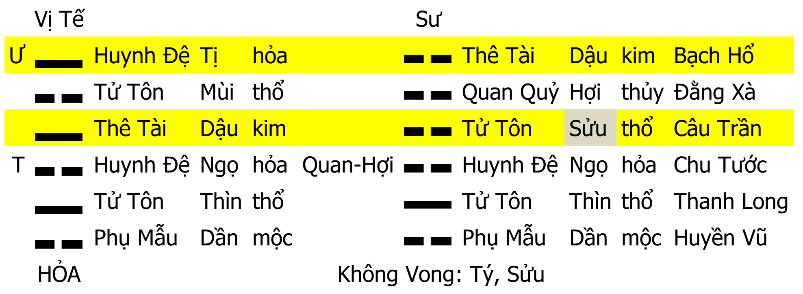
    - **Hình này chứng minh điều gì**
      - Chó bị bội thực mỡ gan động vật được chữa khỏi bằng nước ép kiwi hòa sữa bò nhờ định vị bệnh chứng Thê Tài hợp trú Dụng thần.
    - **Từ đâu mà thấy được**
      - Dụng thần hào 2 Tử Tôn Thìn thổ được Nguyệt Dậu hợp vượng, Nguyên thần Tị hỏa sinh; hào 4 Thê Tài Dậu kim lâm Câu Trần hợp trú Thìn thổ.
  - **Phán đoán chi tiết:**
    - Căn cứ: Lấy Tử Tôn làm Dụng thần. Quẻ có Tử Tôn lưỡng hiện tại hào 2 (Thìn thổ) và hào 5 (Mùi thổ); chọn hào 2 Tử Tôn Thìn thổ gặp hợp với Nguyệt kiến Dậu kim làm Dụng thần chính. Dụng thần tuy không được Nhật phù nhưng được Nguyệt hợp là vượng tướng, lại được Nguyên thần hào 6 Huynh Đệ Tị hỏa phát động tương sinh nên chắc chắn sẽ chuyển biến tốt.
    - Nhìn vào: Tử Tôn Thìn thổ bị hào 4 Thê Tài Dậu kim phát động hợp trú. Quy luật xem bệnh Lục Hào chỉ rõ "bệnh mới không nên gặp hợp". Thê Tài chủ về thức ăn; Dụng thần lâm Thanh Long cũng chủ ẩm thực. Việc Dụng thần bị Thê Tài hợp trói phản ánh thức ăn nạp vào không tiêu hóa được, tích trệ trong ruột gây nên bệnh. Lại thấy hào 4 Dậu kim lâm Câu Trần, Câu Trần chủ về chất béo ngậy; tác giả khẳng định con chó đã ăn phải thứ nhiều dầu mỡ dẫn tới rối loạn tiêu hóa nghiêm trọng.
  - **Đối thoại thực tế và phương thuốc hóa giải:**
    - Người học trò kinh ngạc xác nhận: Quả đúng như vậy, người vợ ở nhà vừa qua đã cho con chó ăn rất nhiều gan động vật béo ngậy.
    - Tác giả chỉ dẫn phương pháp điều trị đặc biệt: Hướng dẫn người học trò dùng nước ép quả kiwi hòa thêm sữa bò cho con chó uống để nhuận tràng, phân giải chất béo tiêu thực.
  - **Ứng nghiệm thực tế:**
    - Đến chiều ngày Giáp Tý, con chó đã tiêu hóa thông suốt và bắt đầu ăn uống trở lại bình thường.

#### Ví dụ 6: Cún con rơi từ trên cao nằm bất động (Thủy Thiên Nhu biến Lôi Phong Hằng)
- **Ví dụ 6:** Ngày Đinh Mùi tháng Dậu, cún con bị rơi từ trên cao xuống nằm bất động, liệu có chết hay không? Được Thủy Thiên Nhu biến Lôi Phong Hằng (Thổ cung, Tuần Không: Dần, Mão).
  - **Hình 342.** Sơ đồ quẻ Thủy Thiên Nhu biến Lôi Phong Hằng
    - 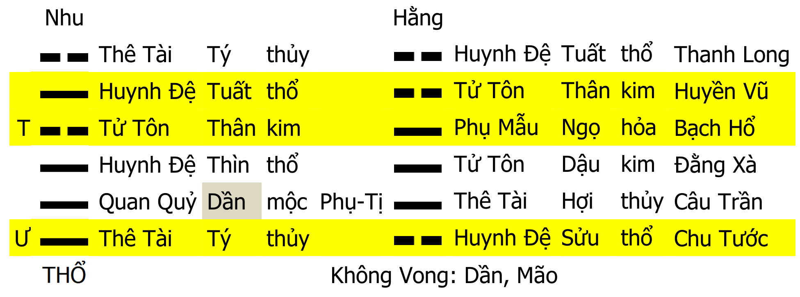
    - **Hình này chứng minh điều gì**
      - Cún con rơi từ trên cao bị choáng ngất đã sống lại an toàn nhờ Dụng thần cực vượng và hào biến hồi đầu khắc bị Nhật thần hợp trú.
    - **Từ đâu mà thấy được**
      - Hào 4 Thế Tử Tôn Thân kim được Nguyệt Dậu tỉ phù, Nhật Mùi sinh, hào 5 Tuất thổ sinh; biến hào Ngọ hỏa hưu tù bị Nhật Mùi hợp trú.
  - **Phán đoán chi tiết:**
    - Căn cứ: Lấy Tử Tôn làm Dụng thần. Hào 4 Tử Tôn Thân kim trì Thế phát động, được Nguyệt kiến Dậu kim tỉ trợ, Nhật thần Mùi thổ tương sinh, lại được hào 5 Huynh Đệ Tuất thổ phát động tương sinh nên khí lực vô cùng vượng tướng.
    - Nhìn vào: Tử Tôn Thân kim phát động tuy hóa ra Phụ Mẫu Ngọ hỏa là thế hóa hồi đầu khắc, nhưng xét về độ suy vượng thì hào biến Ngọ hỏa ở tháng Dậu ngày Mùi hoàn toàn hưu tù suy kiệt. Mặt khác, hào biến Ngọ hỏa lại bị Nhật thần Mùi thổ lục hợp trói chân (Ngọ Mùi tương hợp), khiến lực khắc bị triệt tiêu hoàn toàn. Vì hào biến không thể gây thương tổn cho Dụng thần nên tác giả khẳng định cún con không chết.
  - **Ứng nghiệm thực tế:**
    - Sau một khoảng thời gian nằm bất động do chấn thương ngã từ trên cao, cún con đã dần dần hồi tỉnh và sống lại bình thường.

#### Ví dụ 7: Chó già 10 tuổi ngộ độc co giật (Thủy Lôi Truân biến Thủy Hỏa Ký Tế)
- **Ví dụ 7:** Ngày Đinh Sửu tháng Dần, một người đoán chó cưng bị bệnh ra sao? Được Thủy Lôi Truân biến Thủy Hỏa Ký Tế (Thủy cung, Tuần Không: Thân, Dậu).
  - **Hình 343.** Sơ đồ quẻ Thủy Lôi Truân biến Thủy Hỏa Ký Tế
    - 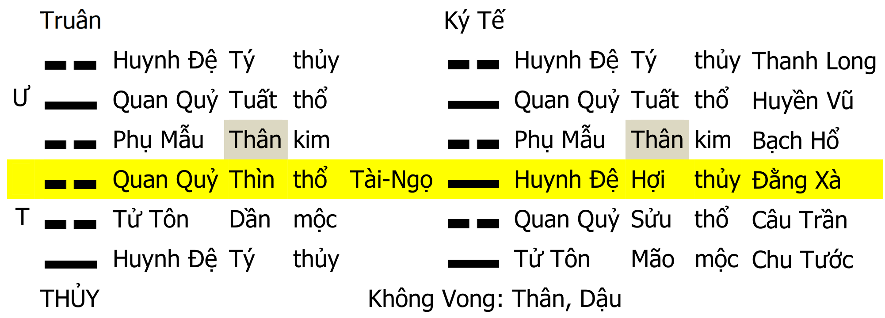
    - **Hình này chứng minh điều gì**
      - Chó già 10 tuổi bị ngộ độc co giật biến dạng chân và chết vào ngày Ất Dậu do Quỷ độc phát lâm Đằng Xà và Nguyên thần nhập Mộ bị hợp trói.
    - **Từ đâu mà thấy được**
      - Hào 3 Quan Quỷ Thìn thổ lâm Đằng Xà độc phát là Thủy khố; Nguyên thần hào sơ Tý thủy hưu tù bị Nhật Sửu hợp và nhập Mộ ở Thìn.
  - **Phán đoán chi tiết:**
    - Căn cứ: Lấy Tử Tôn làm Dụng thần. Hào 2 Tử Tôn Dần mộc trì Thế lâm Nguyệt kiến nên vượng tướng. Tuy nhiên, quẻ xuất hiện hào 3 Quan Quỷ Thìn thổ lâm Đằng Xà độc phát. Hào độc phát nắm quyền định đoạt chứng bệnh: Đằng Xà chủ về co giật, điên dại, động kinh, vặn vẹo thân thể.
    - Nhìn vào: Nguyên thần của Dụng thần là Huynh Đệ Tý thủy; ở tháng Dần là hưu tù tiết khí, lại bị Nhật thần Sửu thổ hợp trói (Tý Sửu lục hợp), đồng thời nhập Mộ tại hào động Thìn thổ. Tháng Dần chính là Bệnh địa của Nguyên thần Tý thủy (Thủy bệnh tại Dần), mà Bệnh địa lại trùng hợp đúng vào Dụng thần Tử Tôn Dần mộc. Nguyên thần hưu tù kiệt quệ phản ánh con chó mắc bệnh do tuổi tác đã quá già nua. Hào Thê Tài phục tàng không hiện, chủ về bỏ ăn. Nguyên thần ngự hào sơ (bàn chân) bị hợp cản trở, chủ về chân bị co rút bại liệt không thể đi lại. Động mà gặp Trị gặp Hợp, ngày Thân ngày Dậu là kỳ hạn hung tử.
  - **Ứng nghiệm thực tế:**
    - Trên thực tế người hỏi cho biết con chó đã 10 năm tuổi, do ăn nhầm phải dị vật gây khó thở, sau đó bỏ ăn bỏ uống, phát tác co giật động kinh và chân bị biến dạng co quắp. Về sau con chó đã chết vào ngày Ất Dậu.

#### Ví dụ 8: Chó bị xuất huyết bụng điều trị bằng bột Long Cốt (Lôi Trạch Quy Muội biến Hỏa Trạch Khuê)
- **Ví dụ 8:** Ngày Giáp Thìn tháng Mão, nữ đoán con chó bị chảy máu bụng sẽ ra sao, được Lôi Trạch Quy Muội biến Hỏa Trạch Khuê (Kim cung, Tuần Không: Dần, Mão).
  - **Hình 344.** Sơ đồ quẻ Lôi Trạch Quy Muội biến Hỏa Trạch Khuê
    - 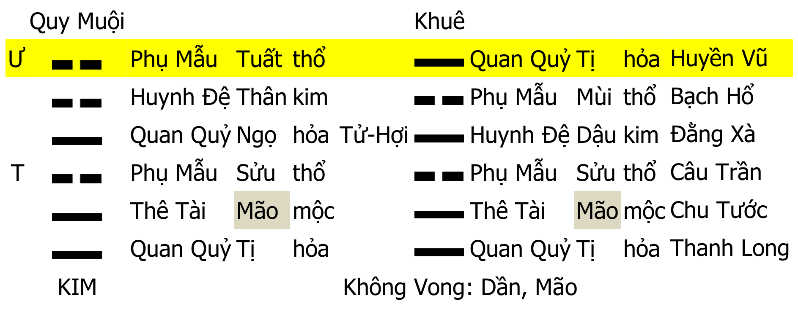
    - **Hình này chứng minh điều gì**
      - Vết thương xuất huyết ở bụng của chó được cầm máu tức thì nhờ rắc bột Long Cốt theo chỉ dẫn tượng số ngũ hành từ quẻ.
    - **Từ đâu mà thấy được**
      - Dụng thần Hợi thủy suy kiệt bị hào 6 Kỵ thần Tuất thổ lâm Huyền Vũ phát động khắc; Thìn (Long) xung Tuất, Nguyên thần Kim (Cốt).
  - **Phán đoán chi tiết:**
    - Căn cứ: Lấy Tử Tôn làm Dụng thần. Tử Tôn Hợi thủy phục tàng dưới hào 4 Quan Quỷ Ngọ hỏa, không được Nhật Nguyệt sinh phù (tháng Mão tiết khí, ngày Thìn khắc), lại bị Kỵ thần Phụ Mẫu Tuất thổ tại hào 6 phát động khắc hại nên ở thế hưu tù nguy hiểm.
    - Nhìn vào: Dụng thần hưu tù cần dùng Nguyên thần Kim đến sinh phù cứu trợ; ngũ hành Kim tượng trưng cho xương cốt (cốt). Hào 6 Phụ Mẫu Tuất thổ lâm Huyền Vũ phát động khắc Dụng thần: Huyền Vũ chủ về ẩm ướt, thối rữa hoại tử rỉ dịch; hào 6 là hào thoái hưu trên cùng, chủ về vật cổ xưa ngàn năm. Nhật thần Thìn thổ có khả năng xung tán Kỵ thần Tuất thổ (Thìn Tuất tương xung); địa chi Thìn là con Rồng (Long). Kết hợp các tượng: Rồng ("Long"), xương cốt ("Cốt") và vật hóa thạch cổ xưa, tác giả xác định phương thuốc đặc trị là "bột Long Cốt" (Long Cốt phấn - xương động vật cổ đại hóa thạch).
  - **Chỉ dẫn trị liệu và ứng nghiệm thực tế:**
    - Tác giả lập tức khuyên người phụ nữ ra hiệu thuốc mua bột Long Cốt về rắc bôi trực tiếp lên vùng bụng đang bị chảy máu của con chó để cầm máu.
    - Người phụ nữ làm đúng theo chỉ dẫn; hiệu quả phát huy tức thì, vết thương lập tức khô miệng, máu ngừng chảy hoàn toàn và con chó đã bình phục nhanh chóng.
