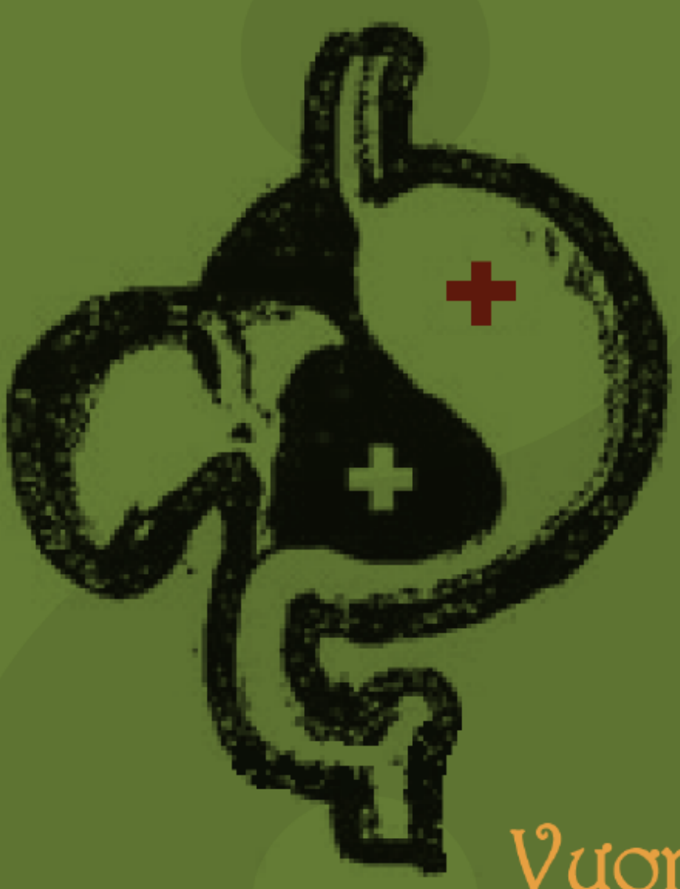

# LỤC HÀO TẬT BỆNH DỰ TRẮC HỌC

Vương Hổ Ứng

TRẦN PHƯƠNG

# LỤC HÀO TẬT BỆNH DỰ TRẮC HỌC

**Nguyên tác:** Vương Hổ Ứng lão sư

**Người dịch:** Trần Phương

# MỤC LỤC

LỜI TỰA .................................................................................................... 4

CHƯƠNG 1: Ý NGHĨA CỦA LỤC HÀO ĐOÁN BỆNH................................... 5

CHƯƠNG 2: QUY LUẬT CỦA LỤC HÀO ĐOÁN BỆNH ............................... 8

CHƯƠNG 3: QUAN HỆ ĐỐI ỨNG GIỮA BÁT QUÁI VÀ BỆNH TẬT............. 23

CHƯƠNG 4: QUAN HỆ ĐỐI ỨNG GIỮA NGŨ HÀNH  VÀ BỆNH TẬT........... 27

CHƯƠNG 5: QUAN HỆ GIỮA LỤC THÂN VÀ BỆNH TẬT ........................... 31

1. THỦ (LẤY) TƯỢNG LỤC THÂN ĐOÁN BỆNH ........................................ 31

2. THỦ TƯỢNG LỤC THÂN HỖ HÓA (BIẾN HÓA LẪN NHAU)................. 37

CHƯƠNG 6: HÀO VỊ VÀ BỆNH TẬT.......................................................... 43

CHƯƠNG 7: THỦ TƯỢNG LỤC THẦN ĐOÁN BỆNH ................................. 47

CHƯƠNG 8: THỦ TƯỢNG ĐỊA CHI ĐOÁN BỆNH ..................................... 51

CHƯƠNG 9: KIẾN THỨC CĂN BẢN ỨNG DỤNG  TRONG ĐOÁN BỆNH LÝ ........... 55

1. TÁC DỤNG CỦA DỤNG THẦN LƯỠNG HIỆN ....................................... 55

2. THỦ TƯỢNG DỤNG THẦN PHỤC TÀNG............................................... 58

3. THỦ TƯỢNG TIẾN THẦN VÀ THOÁI THẦN......................................... 61

4. THỦ TƯỢNG NGUYỆT PHÁ ĐOÁN BỆNH ............................................ 63

5. TÁC DỤNG CỦA KHÔNG VONG KHI ĐOÁN BỆNH............................... 66

6. TÁC DỤNG CỦA ĐỘC PHÁT KHI ĐOÁN BỆNH.................................... 68

7. TÁC DỤNG CỦA LỤC HỢP ................................................................... 70

8. TÁC DỤNG CỦA LỤC XUNG ................................................................. 73

9. THỦ TƯỢNG PHẢN NGÂM PHỤC NGÂM ........................................... 76

10. THỦ TƯỢNG DU HỒN QUY HỒN......................................................... 78

CHƯƠNG 10: ỨNG DỤNG CỦA 12 TRẠNG THÁI NGŨ HÀNH SINH DIỆT TRONG ĐOÁN BỆNH............................................................................................... 82

CHƯƠNG 11: CÁCH ĐOÁN NGUYÊN NHÂN PHÁT BỆNH........................... 87

1. QUAN ĐIỂM MẮC BỆNH TRONG LỤC HÀO ....................................... 87

2. PHƯƠNG PHÁP PHÁN ĐOÁN NGUYÊN NHÂN PHÁT BỆNH................... 90

CHƯƠNG 12: ỨNG KỲ VÀ DỰ ĐOÁN BỆNH TẬT ..................................... 99

CHƯƠNG 13: KHÁM BỆNH ............................................................................ 105

CHƯƠNG 14: ỨNG DỤNG CỦA LỤC HÀO  TRONG ĐIỀU TRỊ BỆNH TẬT........... 112

CHƯƠNG 15: PHÂN LOẠI DỰ ĐOÁN BỆNH TẬT ............................................ 123

1. BỆNH TẬT Ở ĐẦU .................................................................................... 123

2. HUYẾT ÁP CAO VÀ HUYẾT ÁP THẤP ........................................................ 129

3. THIẾU MÁU .............................................................................................. 134

4. BỆNH VỀ MẮT........................................................................................... 138

5. BỆNH VỀ MŨI ........................................................................................... 141

6. BỆNH TẬT VỀ CỔ HỌNG .......................................................................... 145

7. BỆNH TẬT VỀ KHOANG MIỆNG................................................................ 149

8. BỆNH VỀ TAI ............................................................................................ 153

9. BỆNH VIÊM QUANH KHỚP VAI ................................................................ 156

10. BỆNH VỀ XƯƠNG CỔ ............................................................................. 160

11. BỆNH PHỔI............................................................................................. 164

12. BỆNH VỀ TUYẾN VÚ............................................................................... 170

13. BỆNH TIM .............................................................................................. 174

14. BỆNH DẠ DÀY......................................................................................... 179

15. BỆNH RUỘT............................................................................................ 185

16. BỆNH GAN .............................................................................................. 188

17. BỆNH TÚI MẬT ....................................................................................... 192

18. BỆNH THẬN ............................................................................................ 195

19. BỆNH TIỂU ĐƯỜNG ................................................................................ 198

20. BỆNH TUYẾN TIỀN LIỆT.......................................................................... 201

21. BỆNH PHỤ KHOA ................................................................................... 205

22. BỆNH KHỚP............................................................................................ 212

23. BỆNH NGOÀI DA..................................................................................... 215

24. CƯỚC KHÍ .............................................................................................. 219

25. BỆNH TÂM THẦN ................................................................................... 225

26. NGOẠI THƯƠNG .................................................................................... 230

27. QUÁI BỆNH ............................................................................................ 234

CHƯƠNG 16: ĐOÁN BỆNH ỨNG DỤNG  TRONG PHÁN ĐOÁN TỔNG HỢP........ 239

CHƯƠNG 17: DỰ ĐOÁN BỆNH TẬT CHO ĐỘNG VẬT ....................................... 244

# LỜI TỰA

Năm 1998 tôi đã xuất bản cuốn sách đầu tiên chuyên về dự đoán lục hào là Lục Hào Dự Trắc Tật Bệnh Tân Thám, năm 2007 lại xuất bản Lục Hào Trắc Bệnh Phân Khoa Tường Giải gồm ba tập thượng trung hạ, trong hai cuốn sách đó tôi đã ghi ra một số tâm đắc, trải nghiệm thu được khi nghiên cứu về phương diện lục hào dự đoán bệnh tật. Vốn không còn dự định xuất bản loại sách về lục hào dự đoán bệnh tật, thế nhưng bởi vì lần này nhà xuất bản nhiều lần thỉnh cầu hy vọng có thể viết một quyển nữa, thế là tôi quyết định viết một quyển có hệ thống hơn, từ nông đến sâu, thích hợp cho người mới học cũng như người muốn nâng cao trình độ.

Trong rất nhiều chuyên đề dự đoán liên quan đến lục hào dự đoán học, sở dĩ tôi viết nhiều về dự đoán bệnh tật là bởi vì khoa học tính mệnh luôn có một vị trí quan trọng nhất. "Còn da lông mọc, còn chồi nảy cây", sinh mệnh của con người là thứ quý giá nhất, của cải, địa vị, hạnh phúc gia đình... tất cả đều phải kiến lập trên cơ sở một cơ thể khỏe mạnh, bằng không đều là "lấy giỏ tre đựng nước".

Qua nhiều năm thực hành và nghiên cứu, tôi nhận thấy dự đoán và điều trị bệnh tật bằng lục hào dự đoán học có ảnh hưởng không thể thay thế bởi y học hiện đại, Trung y cổ đại đã đề xuất "thượng công trị vị bệnh", thầy thuốc giỏi là trước khi bệnh tật chưa phát tác đã loại bỏ gốc rễ của nó. Trung y bắt nguồn từ lý luận triết học của Chu Dịch, lục hào dự đoán học cũng bắt nguồn từ đó nên có thể dự đoán bệnh tật và hướng dẫn phương án điều trị một cách chính xác. Y học hiện đại chẩn đoán bệnh dựa vào máy móc thiết bị, cho dù tiên tiến như thế nào thì cũng chỉ có thể tìm ra bệnh tật đã tồn tại, nhưng lục hào dự đoán học thì lại có thể vượt qua thời-không, đoán ra thời điểm và bộ vị sẽ có thể phát bệnh trong tương lai. Điểm này cực kỳ quan trọng, đối với trị bệnh hay phòng bệnh đều có ý nghĩa sâu sắc.

Vì vậy, tôi mới dành rất nhiều thời gian và công sức để nghiên cứu phương pháp dự đoán bệnh tật bằng lục hào, cũng may thời gian không phụ người có lòng, cuối cùng cũng đạt được một chút thành tích, tôi đã tìm ra một số quy luật và phương pháp mà người xưa chưa phát hiện, làm cho lục hào tật bệnh dự trắc học càng có hệ thống và hoàn thiện hơn. Tuy nhiên dùng lục hào dự đoán bệnh tật không phải là vạn năng, cũng không phải mỗi quẻ đều có thể phản ánh hoàn chỉnh thông tin cụ thể của bệnh tật, những nghiên cứu của tôi cho đến nay cũng không thể bao gồm tất cả các bệnh, bởi vì có một số bệnh tôi cũng chưa từng gặp. Hơn nữa bệnh tật cũng đang biến dị không ngừng, vì vậy chúng ta cần phải liên tục tìm tòi, nghiên cứu. Cuốn sách này coi như "phao chuyên dẫn ngọc" (ném gạch nhử ngọc), hy vọng có nhiều hơn nữa người học có chí hướng gia nhập vào đội ngũ nghiên cứu dự đoán bệnh tật.

Vương Hổ Ứng

# CHƯƠNG 1: Ý NGHĨA CỦA LỤC HÀO ĐOÁN BỆNH

Bất kể y học hiện đại phát triển ra sao, cái gọi là "đạo cao một thước, ma cao một trượng", trong khi các nhà y học đang không ngừng tìm kiếm phương pháp điều trị bệnh tật, thì bệnh tật cũng đang biến đổi, cũng đang mở rộng, luôn luôn có những bệnh tật mới chờ đợi người ta nhận thức, giải mã và tiêu diệt. Nhưng thực sự muốn khám phá ra một phương pháp điều trị bệnh tật đâu phải dễ? Vì một căn bệnh, có thầy thuốc dùng hết tinh lực cả đời, có thể giải mã đôi chút về nó thì đã tốt lắm rồi.

Ngay từ khi dự đoán học và Trung y bắt đầu ra đời, người xưa cũng đã ràng buộc hai cái lại với nhau. Điều này là bởi vì cả dự đoán học và Trung y đều được kiến lập dựa trên lý luận âm dương ngũ hành. Trong sự hình thành của các loại toa thuốc trị bệnh trong Trung y, mặc dù có sự tích lũy kinh nghiệm của thầy thuốc, nhưng trong đó sự phối hợp và tỷ lệ của các của vị thuốc không dựa vào kết quả của thử nghiệm lặp đi lặp lại nhiều lần, mà là có lý luận âm dương ngũ hành sinh khắc mạnh mẽ tới làm hậu thuẫn, chỉ đạo mới có thể phát hiện, phát minh ra nhiều tổ hợp như vậy. Nhìn chung, các bậc thầy Trung y qua các thời kỳ đều là những cao thủ tinh thông Dịch học, dự đoán học. Tôn Tư Mạc, còn được gọi là Dược Vương, là một nhà y học trứ danh thời Đường. Ông rất coi trọng mối quan hệ giữa y học và Dịch học, "bất tri dịch, bất túc dĩ ngôn thái y" (không hiểu Dịch, không xứng đáng làm thầy thuốc), câu danh ngôn chí lý này luôn luôn được các học giả Trung y chân chính suy tôn là nguyên tắc của thầy thuốc.

Trong Y Môn Bổng Hát viết: "Thị dĩ Dịch chi thư, nhất ngôn nhất tự giai tàng y học chi chỉ nam" (trong sách Dịch, mỗi lời mỗi chữ đều là kim chỉ nam cho y học). Rõ ràng đã chỉ ra vai trò chỉ đạo của Chu Dịch đối với y học. Trong Thiên Kim Yếu Phương, Tôn Tư Mạc đã đưa ra những điều kiện mà người học y nhất định phải có: "Phàm muốn làm thầy thuốc, phải am hiểu Tố Vấn, Giáp Ất, Hoàng Đế Châm Kinh... Lại thêm Diệu Giải Âm Dương Lộc Mệnh, Chư Gia Tương Pháp, cùng Chước Quy Ngũ Triệu, Chu Dịch, Lục Nhâm, tất cả đều phải tinh thục, như vậy mới là đại y. Nếu không, giống như người không có mắt lại đi chơi đêm, rối loạn đến mức ngã chết". Rõ ràng Tôn Tư Mạc có thể trở thành nhà y học vĩ đại lưu truyền thiên cổ, chủ yếu là bởi vì ông ta tinh thông dự đoán học. Nếu muốn có đột phá quan trọng trong y học và bệnh tật học, phải là cao thủ dự đoán bệnh tật thì mới có thể làm được.

Lúc mới khởi đầu, dự đoán học cũng đã xem dự đoán bệnh tật là một chuyên đề không thể thiếu. Qua việc nghiên cứu các loại thuật dự đoán cổ đại, tôi nhận thấy trong mỗi hệ thống dự đoán đều có đề cập tới dự đoán bệnh tật, đối với sự phát triển của dự đoán bệnh tật đều có những cống hiến nhất định, tuy nhiên thực sự có thể phán đoán thì rất nhỏ, phương pháp dự đoán cụ thể nhất vẫn là lục hào dự đoán học.

Dự đoán lục hào không những có thể giúp chúng ta hiểu rõ chiều hướng phát triển của bệnh tật, mà còn có thể dự đoán được thầy thuốc có hợp với người bệnh hay không, thuốc có hiệu quả hay không. Đáng quý hơn là đôi khi sử dụng dự đoán lục hào có thể tìm ra phương pháp trị liệu, phối hợp với điều trị hiện đại để tăng tốc độ chữa lành bệnh tật. Dự đoán lục hào cũng có thể xem như là một phương pháp điều trị độc lập, giải quyết một số bệnh nan y mà y học hiện đại đã bó tay.

Dưới đây xin nêu ra một vài ví dụ.

**Ví dụ 1:** Một ngày vào tháng 5 năm 2007, bạn học của tôi ở quê nhắn tin nói rằng em trai anh ta bị đau chân không thể cử động, bảo tôi xem coi bị làm sao? Tại ngày Giáp Thìn tháng Tị được quẻ Thiên Địa Bĩ biến Sơn Địa Bác.

Sau khi phân tích quái tượng, tôi đã phán đoán trước một số chi tiết nhỏ để đối chiếu thông tin. Nhất định là em trai anh ta đã vài lần đi ngoài đường vào ban đêm, hơn nữa là tại phía Nam của nơi ở. Đêm khuya âm khí nặng nề, vì vậy đã bị đau chân. Trên thực tế, buổi tối em trai anh ta thường chơi mạt chược đến khuya, từ phía Nam trở về.

Theo kiến thức y học thông thường, đi đường ban đêm và đau chân chẳng liên quan gì nhau, vì vậy phải chụp CT để kiểm tra xem là vấn đề thần kinh hay là xương cốt,... cho dù có kiểm tra thì bác sĩ cũng không thể biết là đã đi đường ban đêm ở phía Nam.

Sau khi phán đoán được khẳng định, tôi liền bảo anh ta vào giờ Tý ngày hôm đó mang năm tờ giấy hoàng chỉ đến ngã tư đường ở phía Nam đốt đi. Kết quả là buổi tối hôm đó em trai anh ta đã ra rất nhiều mồ hôi, khiến cho chăn mền ướt đẫm, đây là lần đầu tiên trong đời ra mồ hôi như vậy. Sáng hôm sau, chân không còn đau một tí nào, hơn nữa còn có thể đi đến vùng khác du ngoạn. Người không hiểu rất dễ bị hiện tượng và phương pháp trị liệu như vậy dẫn vào phạm vi mê tín, nhưng trên thực tế dùng nguyên lý ngũ hành sinh khắc hoàn toàn có thể làm rõ. Dùng phong, hàn, thử, thấp, táo, hỏa trong Trung y thì có thể nói rõ nguyên nhân phát bệnh, bệnh lý và cơ chế trị liệu.

**Ví dụ 2:** Tháng 3 năm 2005, một học trò người Nhật Bản đã bị cảm mạo hơn một tháng, kèm theo ho, đã truyền dịch nhưng không thấy có chuyển biến tốt, về sau lại bắt đầu đau nhức xương sườn. Khi đến bệnh viện kiểm tra thì bác sĩ nói là gãy xương, cần phải phẫu thuật, nhưng anh ta lại sợ phẫu thuật, vì vậy nhờ đoán xem rốt cuộc là chuyện gì đang xảy ra? Tại ngày Bính Thân tháng Mão, gieo được quẻ Sơn Phong Cổ.

Phân tích từ quái tượng, anh ta căn bản không bị gãy xương, mà là phong hàn nhập thể dẫn tới bị ho, sau đó ho gây đau xương sườn. Vì vậy, tôi bảo anh ta dùng 1 củ cà rốt vàng, 6 rễ hành trắng, 5 miếng gừng tươi, nấu canh uống.

Sau ba ngày uống liên tục, cảm mạo và ho biến mất, xương sườn cũng hết đau. Anh ta còn nói canh này dễ uống, sau khi uống cơ thể tỏa nhiệt, vị cũng ngon. Y học Nhật Bản đã đủ phát triển, nhưng cũng sẽ phán đoán sai lầm, nếu không có dự đoán giúp đỡ thì đoán chừng người này đã phải chịu đựng một đao vô ích, hơn nữa còn không thể giải quyết được vấn đề.

**Ví dụ 3:** Một ngày vào tháng 3 năm 1996, tôi nhớ hôm đó là thứ bảy, vốn là không đi làm, nhưng bởi vì tôi có việc đến đơn vị công tác lấy tài liệu, tôi đã gặp được một vị đồng nghiệp. Khuôn mặt anh ta sưng phù rất đáng sợ, vừa thấy tôi giống như gặp được cứu tinh, anh ta nói rằng bản thân bị liệt cơ mặt, bác sĩ đã hẹn thứ hai làm phẫu thuật. Anh ta bảo tôi đoán thử xem tình hình cát hung thế nào. Tại ngày Mậu Tuất tháng Dần, được quẻ Thiên Lôi Vô Vọng.

Tôi tiến hành phân tích quái tượng rồi nói với anh ta: "Anh không phải bị liệt cơ mặt, chẳng qua là hỏa vượng nên có chứng viêm dẫn tới sưng phù mà thôi, bác sĩ chẩn đoán sai rồi."

Anh ta có phần bán tín bán nghi, thế là tôi hỏi anh ta: "Khuôn mặt của anh có phải là chỉ sưng và tê, không có cảm giác đau đúng không?". Anh ta gật đầu tán thành. Tôi nói: "Anh sờ vào gốc cánh mũi nhất định rất đau." Anh ta sờ thử, quả nhiên rất đau.

Anh ta đã tin vào phán đoán của tôi, hỏi tôi xử lý như thế nào? Tôi bảo anh ta uống thuốc kháng sinh, cũng nói cho anh ta biết rằng đến thứ hai sưng phù trên mặt nhất định sẽ được tiêu trừ.

Trong cuộc sống tôi thường gặp phải những ví dụ dự đoán có tượng giống như vậy, đáng tiếc một phần bác sĩ bây giờ không học, không ít người nhầm lẫn, hại người rất nặng. Nhưng cũng cho tôi nhận thức sâu sắc về tầm quan trọng và giá trị của dự đoán bệnh tật, mặc dù lục hào dự đoán bệnh tật không thể thay thế y học hiện đại, nhưng đủ để làm phương tiện phụ trợ cho y học hiện đại, giúp chúng ta giải trừ bệnh tật và đau khổ, phục vụ cho xã hội.

---

# CHƯƠNG 2: QUY LUẬT CỦA LỤC HÀO ĐOÁN BỆNH

Người xưa thường dùng ngũ hành của Quan Quỷ để phán đoán chứng bệnh, "hỏa thuộc tâm kinh, phát nhiệt, khô cổ họng, khô miệng; thủy thuộc thận, ớn lạnh, đổ mồ hôi trộm, di tinh; kim phổi, mộc gan, thổ là bệnh xâm nhập tỳ vị". Nhưng khi ứng dụng trong thực tế, tỷ lệ ứng nghiệm tương đối thấp, hoàn toàn không thể làm khuôn mẫu để đoán bệnh, càng không thể thực sự mang lại tác dụng chỉ đạo dự đoán. Thực tiễn chứng minh dự đoán chứng bệnh nên lấy Dụng thần hỉ kỵ, sinh khắc xung hợp... để phân tích phán đoán.

Qua kinh nghiệm tổng kết, tôi đã quy nạp các quy luật thường gặp biểu thị thông tin bệnh tật như sau.

## 1. Dụng thần bị thương, lấy Dụng thần làm bệnh.

**Ví dụ:** Ngày Canh Ngọ tháng Dần, một phụ nữ lớn tuổi đoán niên vận, được Thiên Phong Cấu.

| | Cấu | | | | | |
| :---: | :---: | :--- | :--- | :--- | :--- | :--- |
| | ▅▅▅▅▅ | Phụ Mẫu | Tuất | thổ | | Đằng Xà |
| | ▅▅▅▅▅ | Huynh Đệ | Thân | kim | | Câu Trần |
| Ư | ▅▅▅▅▅ | Quan Quỷ | Ngọ | hỏa | | Chu Tước |
| | ▅▅▅▅▅ | Huynh Đệ | Dậu | kim | | Thanh Long |
| | ▅▅▅▅▅ | Tử Tôn | Hợi | thủy | Tài-Dần | Huyền Vũ |
| T | ▅▅　▅▅ | Phụ Mẫu | Sửu | thổ | | Bạch Hổ |

**KIM**　　**Không Vong:** Tuất, Hợi

Trong quẻ niên vận đã bao hàm thông tin thân thể. Hào Thế tại hào sơ lâm Bạch Hổ bị Nguyệt khắc thương, Bạch Hổ là bệnh, hào sơ là bàn chân, chính là trên bàn chân có bệnh.

**Trên thực tế:** Bàn chân tê dại không có sức lực.

## 2. Kỵ thần động đến khắc Dụng, lấy Kỵ thần làm bệnh.

**Ví dụ:** Ngày Nhâm Thìn tháng Tý, một người đoán bệnh của cha, được Thủy Thiên Nhu biến Tốn Vi Phong.

| | Nhu | | | | | Tốn | | | | |
| :---: | :---: | :--- | :--- | :--- | :--- | :---: | :--- | :--- | :--- | :--- |
| | ▅▅　▅▅ | Thê Tài | Tý | thủy | | ▅▅▅▅▅ | Quan Quỷ | Mão | mộc | Bạch Hổ |
| | ▅▅▅▅▅ | Huynh Đệ | Tuất | thổ | | ▅▅▅▅▅ | Phụ Mẫu | Tị | hỏa | Đằng Xà |
| T | ▅▅　▅▅ | Tử Tôn | Thân | kim | | ▅▅　▅▅ | Huynh Đệ | Mùi | thổ | Câu Trần |
| | ▅▅▅▅▅ | Huynh Đệ | Thìn | thổ | | ▅▅▅▅▅ | Tử Tôn | Dậu | kim | Chu Tước |
| | ▅▅▅▅▅ | Quan Quỷ | Dần | mộc | Phụ-Tị | ▅▅▅▅▅ | Thê Tài | Hợi | thủy | Thanh Long |
| Ư | ▅▅▅▅▅ | Thê Tài | Tý | thủy | | ▅▅　▅▅ | Huynh Đệ | Sửu | thổ | Huyền Vũ |

**THỔ**　　**Không Vong:** Ngọ, Mùi

Lấy Phụ Mẫu làm Dụng thần. Phụ Mẫu Tị hỏa phục tại hào 2 lâm Thanh Long, hào 2 là bộ phận sinh dục, Thanh Long là sắc, chủ bệnh về bộ phận sinh dục. Kỵ thần lâm Nguyệt đến khắc, trong quẻ Kỵ thần lưỡng động lại đến khắc, Kỵ thần là thủy chủ nước tiểu, thủy bị hợp mà khắc Dụng thần, là bệnh tiểu không ra, vì vậy là bệnh về tiền liệt tuyến. Kỵ thần vượng tướng, Dụng thần hưu tù, là ung thư.

**Trên thực tế:** Bị ung thư tuyến tiền liệt.

## 3. Cừu thần động đến khắc Nguyên thần, lấy Cừu thần làm bệnh.

**Ví dụ:** Ngày Giáp Tuất tháng Hợi, nữ đoán bệnh của chồng, được Hỏa Lôi Phệ Hạp biến Sơn Trạch Tổn.

| | Phệ Hạp | | | | Tổn | | | | |
| :---: | :---: | :--- | :--- | :--- | :---: | :--- | :--- | :--- | :--- |
| | ▅▅▅▅▅ | Tử Tôn | Tị | hỏa | ▅▅▅▅▅ | Huynh Đệ | Dần | mộc | Huyền Vũ |
| T | ▅▅　▅▅ | Thê Tài | Mùi | thổ | ▅▅　▅▅ | Phụ Mẫu | Tý | thủy | Bạch Hổ |
| | ▅▅▅▅▅ | Quan Quỷ | Dậu | kim | ▅▅　▅▅ | Thê Tài | Tuất | thổ | Đằng Xà |
| | ▅▅　▅▅ | Thê Tài | Thìn | thổ | ▅▅　▅▅ | Thê Tài | Sửu | thổ | Câu Trần |
| Ư | ▅▅　▅▅ | Huynh Đệ | Dần | mộc | ▅▅▅▅▅ | Huynh Đệ | Mão | mộc | Chu Tước |
| | ▅▅▅▅▅ | Phụ Mẫu | Tý | thủy | ▅▅▅▅▅ | Tử Tôn | Tị | hỏa | Thanh Long |

**MỘC**　　**Không Vong:** Thân, Dậu

Lấy Quan Quỷ làm Dụng thần. Quẻ tại cung Tốn là đùi, hào 2 Huynh Đệ Dần mộc là Cừu thần phát động hóa Tiến thần khắc Nguyên thần, hào 2 là chân, mộc chủ đau nhức, vì vậy là chân có bệnh.

**Trên thực tế:** Là đau chân.

## 4. Nguyên thần bị thương, lấy Nguyên thần làm bệnh.

**Ví dụ:** Ngày Canh Dần tháng Tuất, nữ đoán bệnh con trai, được Thủy Lôi Truân.

| Thế/Ứng | Truân | Phục thần | Lục thú |
| :---: | :--- | :---: | :--- |
| | ╍ ╍ Huynh Đệ Tý thủy | | Đằng Xà |
| Ứ | ━━━ Quan Quỷ Tuất thổ | | Câu Trần |
| | ╍ ╍ Phụ Mẫu Thân kim | | Chu Tước |
| | ╍ ╍ Quan Quỷ Thìn thổ | Tài-Ngọ | Thanh Long |
| T | ╍ ╍ Tử Tôn Dần mộc | | Huyền Vũ |
| | ━━━ Huynh Đệ Tý thủy | | Bạch Hổ |

THỦY Không Vong: Ngọ, Mùi

Lấy Tử Tôn làm Dụng thần. Dụng thần Dần mộc được Nhật tỉ phù là vượng tướng, Nguyệt không sinh không khắc, nhưng Nguyên thần bị Nguyệt khắc thương. Trong quẻ Nguyên thần lưỡng hiện, một tại hào 6, một tại hào sơ, Nguyên thần là thủy chủ trí tuệ, hào sơ là tâm sự chủ tư duy, hào 6 là đầu cũng chủ tư duy, vì vậy là gặp trở ngại về trí lực. Phụ Mẫu Thân kim lâm Chu Tước ám động khắc Dụng thần, kim là âm thanh, Chu Tước chủ năng lực nói, khả năng nói chuyện cũng có vấn đề.

**Trên thực tế:** Năng lực thấp kém, không nói được.

### 5. Dụng thần Không mà không được Nguyên thần đến sinh, lấy Dụng thần làm bệnh.

**Ví dụ:** Ngày Quý Mùi tháng Dần, nữ đoán bệnh con trai, được Địa Lôi Phục.

| Thế/Ứng | Phục | Phục thần | Lục thú |
| :---: | :--- | :---: | :--- |
| | ╍ ╍ Tử Tôn Dậu kim | | Bạch Hổ |
| | ╍ ╍ Thê Tài Hợi thủy | | Đằng Xà |
| Ứ | ╍ ╍ Huynh Đệ Sửu thổ | | Câu Trần |
| | ╍ ╍ Huynh Đệ Thìn thổ | | Chu Tước |
| | ╍ ╍ Quan Quỷ Dần mộc | Phụ-Tị | Thanh Long |
| T | ━━━ Thê Tài Tý thủy | | Huyền Vũ |

THỔ Không Vong: Thân, Dậu

Lấy Tử Tôn làm Dụng thần. Tử Tôn Dậu kim tại hào 6 Không Vong, Không mà không được Nguyên thần đến sinh, hào 6 là đầu, Không Vong chủ đầu óc trống rỗng, Bạch Hổ chủ đa động (tăng động, hội chứng ADHD), điên cuồng.

**Trên thực tế:** Là chứng bệnh điên dại.

### 6. Nguyên thần Không mà không thể sinh Dụng thần, lấy Nguyên thần làm bệnh.

**Ví dụ:** Ngày Giáp Thân tháng Tuất, nữ đoán bệnh bản thân, được Trạch Thiên Quải biến Hỏa Thiên Đại Hữu.

| Thế/Ứng | Quải | Phục thần | Đại Hữu | Lục thú |
| :---: | :--- | :---: | :--- | :--- |
| | ╍ ╍ Huynh Đệ Mùi thổ | | ━━━ Phụ Mẫu Tị hỏa | Huyền Vũ |
| T | ━━━ Tử Tôn Dậu kim | | ╍ ╍ Huynh Đệ Mùi thổ | Bạch Hổ |
| | ━━━ Thê Tài Hợi thủy | | ━━━ Tử Tôn Dậu kim | Đằng Xà |
| | ━━━ Huynh Đệ Thìn thổ | | ━━━ Huynh Đệ Thìn thổ | Câu Trần |
| Ứ | ━━━ Quan Quỷ Dần mộc | Phụ-Tị | ━━━ Quan Quỷ Dần mộc | Chu Tước |
| | ━━━ Thê Tài Tý thủy | | ━━━ Thê Tài Tý thủy | Thanh Long |

THỔ Không Vong: Ngọ, Mùi

Lấy hào Thế làm Dụng thần. Hào Thế được Nguyệt sinh Nhật phù là vượng tướng, nhưng không nên hóa ra Nguyên thần Không Vong, hào 6 Nguyên thần cũng Không không thể sinh Dụng thần. Thổ tại hào 5, hào 6 là mũi, hào Thế kim là hệ hô hấp, vì vậy là mũi có vấn đề.

**Trên thực tế:** Là mũi không ngửi thấy mùi, rất phiền não.

### 7. Nguyên thần bị hợp trú, bởi vì tham hợp quên sinh mà không thể sinh Dụng, lấy Nguyên thần làm bệnh.

**Ví dụ 1:** Ngày Đinh Mùi tháng Tị, nữ đoán bệnh bản thân, được Lôi Trạch Quy Muội biến Lôi Thiên Đại Tráng.

| Thế/Ứng | Quy Muội | Phục thần | Đại Tráng | Lục thú |
| :---: | :--- | :---: | :--- | :--- |
| Ứ | ╍ ╍ Phụ Mẫu Tuất thổ | | ╍ ╍ Phụ Mẫu Tuất thổ | Thanh Long |
| | ╍ ╍ Huynh Đệ Thân kim | | ╍ ╍ Huynh Đệ Thân kim | Huyền Vũ |
| | ━━━ Quan Quỷ Ngọ hỏa | Tử-Hợi | ━━━ Quan Quỷ Ngọ hỏa | Bạch Hổ |
| T | ╍ ╍ Phụ Mẫu Sửu thổ | | ━━━ Phụ Mẫu Thìn thổ | Đằng Xà |
| | ━━━ Thê Tài Mão mộc | | ━━━ Thê Tài Dần mộc | Câu Trần |
| | ━━━ Quan Quỷ Tị hỏa | | ━━━ Tử Tôn Tý thủy | Chu Tước |

KIM Không Vong: Dần, Mão

Lấy Thế làm Dụng thần. Hào Thế được Nguyệt sinh Nhật phù, động hóa Tiến thần. Dụng thần và Nguyên thần đều không bị khắc, dường như không có bệnh tật.

Xem kỹ thì phát hiện trong quẻ hai thổ, lại hóa ra một thổ, kết hợp với Nhật thần tổng cộng là bốn thổ. Mà Nguyên thần hào hỏa trong quẻ lưỡng hiện, Nguyệt cũng hỏa, đây là quá vượng, Nhật xung Dụng thần, hóa Tiến thần càng nhanh hơn, vật cực tất phản, là hỏa nhiều sinh thổ mà thành bệnh. Thế lâm Xà, tượng phiền muộn.

Lại hào 4 Ngọ hỏa hợp Nhật, lấy hào này phán đoán bệnh tật. Hào 4 là hào vị tim, hỏa lại là tim, vì vậy là bệnh tim.

Quá vượng thì xem ngược lại, là nhịp tim quá chậm, Nguyên thần bị hợp vướng chân cũng biểu thị tim đập chậm.

**Trên thực tế:** Đúng là nhịp tim quá chậm.

**Ví dụ 2:** Ngày Bính Thân tháng Thìn, một người đàn ông ở Sơn Đông gửi thư đoán bệnh, tôi gieo được Lôi Địa Dự biến Chấn Vi Lôi.

| | Dự | | Chấn | |
| :---: | :--- | :---: | :--- | :--- |
| | - - Thê Tài Tuất thổ | - - | Thê Tài Tuất thổ | Thanh Long |
| | - - Quan Quỷ Thân kim | - - | Quan Quỷ Thân kim | Huyền Vũ |
| Ư | — Tử Tôn Ngọ hỏa | — | Tử Tôn Ngọ hỏa | Bạch Hổ |
| | - - Huynh Đệ Mão mộc | - - | Thê Tài Thìn thổ | Đằng Xà |
| | - - Tử Tôn Tị hỏa | - - | Huynh Đệ Dần mộc | Câu Trần |
| T | - - Thê Tài Mùi thổ Phụ-Tý | — | Phụ Mẫu Tý thủy | Chu Tước |

MỘC Không Vong: Thìn, Tị

Lấy hào Thế làm Dụng thần. Hào Thế được Nguyệt phù là vượng, nhưng Nguyên thần Tị hỏa tại hào 2 Không mà bị Nhật hợp vướng chân không thể sinh Thế, thì lấy Nguyên thần làm bệnh. Nguyên thần là Tử Tôn, chủ bộ phận sinh dục, hào 2 lại là hào vị bộ phận sinh dục, lâm Câu Trần là sưng to lên, trái là dương, phải là âm, là phía bên phải không tốt.

**Trên thực tế:** Là sa tinh hoàn, tinh hoàn bên phải lớn, viêm tinh hoàn mãn tính.

### 8. Dụng thần Nguyệt phá, lấy Dụng thần làm bệnh, hoặc lấy Nguyệt kiến làm bệnh.

**Ví dụ:** Ngày Tân Dậu tháng Tuất, nam đoán bệnh của vợ, được Sơn Lôi Di.

| | Di | |
| :---: | :--- | :--- |
| | — Huynh Đệ Dần mộc | Đằng Xà |
| | - - Phụ Mẫu Tý thủy Tử-Tị | Câu Trần |
| T | - - Thê Tài Tuất thổ | Chu Tước |
| | - - Thê Tài Thìn thổ Quan-Dậu | Thanh Long |
| | - - Huynh Đệ Dần mộc | Huyền Vũ |
| Ư | — Phụ Mẫu Tý thủy | Bạch Hổ |

MỘC Không Vong: Tý, Sửu

Lấy hào Thê Tài làm Dụng thần. Thê Tài lưỡng hiện, lấy hào Nguyệt phá làm Dụng. Thê Tài Thìn thổ bị Nguyệt là Mộ khố của Tử Tôn xung phá, lại tại hào 3, Mộ khố của Tử Tôn là tử cung, hào 3 cũng là tử cung, Thìn thổ lại là Mộ khố của hào thai Tử Tôn, vì vậy là vấn đề tử cung.

Nguyên thần lâm Câu Trần là ung thư. Dụng thần Nguyệt phá sợ Thực Phá, Nhật mặc dù hợp mà giải phá, nhưng Nhật là Quan Quỷ, biểu thị bệnh tật triền thân không thể rời.

**Trên thực tế:** Đã bị ung thư tử cung, tháng Thìn qua đời.

### 9. Nguyên thần Nguyệt phá, lấy Nguyên thần làm bệnh, hoặc lấy Nguyệt kiến làm bệnh.

**Ví dụ:** Ngày Ất Mão tháng Hợi, nữ đoán bệnh bản thân, được Hỏa Thiên Đại Hữu.

| | Đại Hữu | |
| :---: | :--- | :--- |
| Ư | — Quan Quỷ Tị hỏa | Huyền Vũ |
| | - - Phụ Mẫu Mùi thổ | Bạch Hổ |
| | — Huynh Đệ Dậu kim | Đằng Xà |
| T | — Phụ Mẫu Thìn thổ | Câu Trần |
| | — Thê Tài Dần mộc | Chu Tước |
| | — Tử Tôn Tý thủy | Thanh Long |

KIM Không Vong: Tý, Sửu

Lấy hào Thế làm Dụng thần. Nguyên thần Nguyệt phá tại hào 6, là bị thủy xung phá, thủy đại diện máu, phá mà không thể sinh hào Thế, lại ngoại quái là Ly, vì vậy phán đoán là thiếu máu. Lại hào Thế là thổ, tại hào 3 bị Nhật khắc, thổ tại hào 3 là dạ dày, dạ dày cũng không tốt.

**Trên thực tế:** Thiếu máu, có viêm dạ dày.

### 10. Dụng thần gặp Bệnh địa, hoặc lấy Dụng thần làm bệnh, hoặc lấy Bệnh địa làm bệnh.

**Ví dụ:** Ngày Canh Thân tháng Sửu, một nữ đoán bệnh, được Thiên Lôi Vô Vọng biến Hỏa Lôi Phệ Hạp.

| | Vô Vọng | Phệ Hạp | |
| :---: | :--- | :--- | :--- |
| | — Thê Tài Tuất thổ | — Tử Tôn Tị hỏa | Đằng Xà |
| | — Quan Quỷ Thân kim | - - Thê Tài Mùi thổ | Câu Trần |
| T | — Tử Tôn Ngọ hỏa | — Quan Quỷ Dậu kim | Chu Tước |
| | - - Thê Tài Thìn thổ | - - Thê Tài Thìn thổ | Thanh Long |
| | - - Huynh Đệ Dần mộc | - - Huynh Đệ Dần mộc | Huyền Vũ |
| Ứ | — Phụ Mẫu Tý thủy | — Phụ Mẫu Tý thủy | Bạch Hổ |

MỘC Không Vong: Tý, Sửu

Lấy hào Thế làm Dụng thần. Hào 5 Quan Quỷ Thân kim độc phát, là Bệnh địa của Dụng thần, độc phát có thể biểu thị nguyên nhân, Bệnh địa cũng là bệnh, hào 5 kim lâm Câu Trần là xương cổ tăng sinh.

**Quả nhiên:** Có xương cổ tăng sinh.

### 11. Nguyên thần gặp Bệnh địa, hoặc lấy Nguyên thần làm bệnh, hoặc lấy Bệnh địa làm bệnh.

**Ví dụ:** Ngày Kỷ Hợi tháng Sửu, một người đoán bệnh con trai, được Thiên Thủy Tụng biến Hỏa Địa Tấn.

| | Tụng | Tấn | |
| :---: | :--- | :--- | :--- |
| | — Tử Tôn Tuất thổ | — Huynh Đệ Tị hỏa | Câu Trần |
| | — Thê Tài Thân kim | - - Tử Tôn Mùi thổ | Chu Tước |
| T | — Huynh Đệ Ngọ hỏa | — Thê Tài Dậu kim | Thanh Long |
| | - - Huynh Đệ Ngọ hỏa Quan-Hợi | - - Phụ Mẫu Mão mộc | Huyền Vũ |
| | — Tử Tôn Thìn thổ | - - Huynh Đệ Tị hỏa | Bạch Hổ |
| Ứ | - - Phụ Mẫu Dần mộc | - - Tử Tôn Mùi thổ | Đằng Xà |

HỎA Không Vong: Thìn, Tị

Lấy Tử Tôn làm Dụng thần, Tử Tôn lưỡng hiện, lấy hào Tử Tôn Thìn thổ phát động làm Dụng thần. Dụng thần Không Vong, không được Nguyên thần đến sinh, Nguyên thần tại hào 3, hào 4 bị Nhật khắc thương, lại Thân kim phát động, Nguyên thần ở Bệnh địa, vì vậy tất nhiên lấy Nguyên thần làm bệnh.

Hào 3, hào 4 là tim, hỏa lại là tim, vì vậy là tim không tốt. Hào 2 là thai vị, Nguyên thần lại là Thai địa, hào thai, thai vị chủ tính chất bẩm sinh, vì vậy là bệnh

 tim bẩm sinh, hóa ra Nguyên thần Không Vong, Không Vong là trống rỗng, khuyết thiếu, vì vậy là khiếm khuyết tâm nhĩ bẩm sinh.

### 12. Có hào động hóa ra Quan Quỷ, hoặc lấy hào động làm bệnh, hoặc lấy hào Quan Quỷ hóa ra làm bệnh.

**Ví dụ:** Ngày Nhâm Ngọ tháng Tý năm Ất Hợi, nam đoán bệnh của cha, được Thủy Hỏa Ký Tế biến Phong Lôi Ích.

| | Ký Tế | Ích | |
| :---: | :--- | :--- | :--- |
| Ứ | - - Huynh Đệ Tý thủy | — Tử Tôn Mão mộc | Bạch Hổ |
| | — Quan Quỷ Tuất thổ | — Thê Tài Tị hỏa | Đằng Xà |
| | - - Phụ Mẫu Thân kim | - - Quan Quỷ Mùi thổ | Câu Trần |
| T | — Huynh Đệ Hợi thủy Tài-Ngọ | - - Quan Quỷ Thìn thổ | Chu Tước |
| | - - Quan Quỷ Sửu thổ | - - Tử Tôn Dần mộc | Thanh Long |
| | — Tử Tôn Mão mộc | — Huynh Đệ Tý thủy | Huyền Vũ |

THỦY Không Vong: Thân, Dậu

Lấy hào Phụ Mẫu làm Dụng thần. Dụng thần Phụ Mẫu Thân kim hưu tù, Tử ở Nguyệt kiến, bị Nhật thần Ngọ hỏa khắc thương, lại trị Tuần Không, bệnh lâu gặp Không thì chết.

Quẻ thuộc cung Khảm, Khảm chủ thận, bàng quang. Hào 3 Huynh Đệ Hợi thủy động mà hóa ra Quan Quỷ Thìn thổ, thủy chủ nước tiểu, hóa ra Quan Quỷ, tất nhiên là bệnh, Thìn thổ là thủy khố, là bộ phận tích trữ nước tiểu, bệnh tại bàng quang. Dụng thần lâm Câu Trần chủ khối u, vì vậy là ung thư bàng quang.

Hào 5 Quan Quỷ Tuất thổ là Nguyên thần không lấy để đoán bệnh, hào 2 Quan Quỷ Sửu thổ là Mộ khố của Dụng thần, lâm Thanh Long, hào 2 chủ bộ phận sinh dục, Thanh Long chủ đau nhức, khi tiểu tiện không dễ chịu. Thê Tài Nguyệt phá không hiện trên quẻ, Tài là ẩm thực, người bệnh ăn uống giảm nhiều.

Hào 6 Huynh Đệ Tý thủy lâm Nguyệt kiến hóa Tử Tôn Mão mộc, Huynh Đệ chủ tốn kém tiền thuốc, Tử Tôn chủ y dược, chứng tỏ đã tốn không ít tiền điều trị. Trong quẻ hào Huynh Đệ lưỡng động, Huynh động bệnh khó khỏi, hào 6 Huynh Đệ Tý thủy lâm Bạch Hổ phát động, Tý thủy là Tử địa của Dụng thần, Bạch Hổ chủ tang, Huynh chủ hiếu (孝: hiếu thảo, chịu tang, tang phục), đề phòng năm Tý bất lợi.

**Trên thực tế:** Tháng Tị năm Bính Tý, cha qua đời vì ung thư bàng quang. Ứng tháng Tị vì gặp hình khắc.

### 13. Có hào động hóa ra Kỵ thần, lấy hào động làm bệnh, hoặc lấy hào biến làm bệnh.

**Ví dụ:** Ngày Canh Thân tháng Mão, nữ đoán bệnh bản thân, được Sơn Địa Bác biến Phong Thủy Hoán.

| Bác | Phục thần | Hoán | Lục thú |
| :--- | :--- | :--- | :--- |
| ━ Thê Tài Dần mộc | | ━ Thê Tài Mão mộc | Đằng Xà |
| T ━ ━ Tử Tôn Tý thủy | Huynh-Thân | ━ Quan Quỷ Tị hỏa | Câu Trần |
| ━ ━ Phụ Mẫu Tuất thổ | | ━ ━ Phụ Mẫu Mùi thổ | Chu Tước |
| ━ ━ Thê Tài Mão mộc | | ━ ━ Quan Quỷ Ngọ hỏa | Thanh Long |
| Ư ━ ━ Quan Quỷ Tị hỏa | | ━ Phụ Mẫu Thìn thổ | Huyền Vũ |
| ━ ━ Phụ Mẫu Mùi thổ | | ━ ━ Thê Tài Dần mộc | Bạch Hổ |

KIM Không Vong: Tý, Sửu

Lấy hào Thế làm Dụng thần. Thế lâm Câu Trần Tử Tôn hóa Quan Quỷ. Tử Tôn là ngũ quan (tai, mắt, mũi, lưỡi và da), hào 5 thủy có thể là cổ họng, động hóa Tuyệt, Tuyệt tại hỏa, thủy Tuyệt là khô họng, hỏa chủ viêm, vì vậy có viêm họng, miệng khát khô.

Hào 2 Quan Quỷ Tị hỏa động mà Tuyệt hào Thế, lại hóa ra Kỵ thần, vì vậy hào 2 có thể dùng để phán đoán bệnh tật. Thế Tử Tôn là tử cung, Câu Trần là khối u. Hào 2 là tử cung, Tuyệt địa hóa Mộ khố của Tử Tôn, lại là tử cung, vì vậy có u xơ tử cung.

Hào 6 Dần mộc ám động là Bệnh địa của hào Thế, hào 6 là đầu, Bệnh địa là bệnh, gặp xung là choáng váng, vì vậy có vấn đề chóng mặt.

Tị hỏa động, phán đoán năm 2001 bị u xơ tử cung. Hào 2 là phu vị, Quan Quỷ cũng biểu thị chồng, hào Ứng lại là phu vị, hợp Nhật biểu thị chồng có ngoại tình, thủy hỏa gặp nhau chủ tức giận, vì vậy phán đoán là năm 2001 chồng có ngoại tình, tức giận mà bị u xơ tử cung.

**Trên thực tế:** Đúng là năm 2001 bởi vì chồng ngoại tình, tức giận mà bị u xơ tử cung, những phán đoán bệnh tật khác cũng ứng nghiệm.

## 14. Quan Quỷ là thần rảnh rỗi, vượng là bệnh.

**Ví dụ:** Ngày Mậu Dần tháng Tý, một phụ nữ đoán thân thể, được quẻ Sơn Hỏa Bí biến Cấn Vi Sơn.

| Bí | Phục thần | Cấn | Lục thú |
| :--- | :--- | :--- | :--- |
| ━ Quan Quỷ Dần mộc | | ━ Quan Quỷ Dần mộc | Chu Tước |
| ━ ━ Thê Tài Tý thủy | | ━ ━ Thê Tài Tý thủy | Thanh Long |
| Ư ━ ━ Huynh Đệ Tuất thổ | | ━ ━ Huynh Đệ Tuất thổ | Huyền Vũ |
| ━ Thê Tài Hợi thủy | Tử-Thân | ━ Tử Tôn Thân kim | Bạch Hổ |
| ━ ━ Huynh Đệ Sửu thổ | Phụ-Ngọ | ━ ━ Phụ Mẫu Ngọ hỏa | Đằng Xà |
| T ━ Quan Quỷ Mão mộc | | ━ ━ Huynh Đệ Thìn thổ | Câu Trần |

THỔ Không Vong: Thân, Dậu

Lấy hào Thế làm Dụng thần. Hào Thế được Nguyệt sinh Nhật phù là vượng tướng, không có Không Phá, cũng không bị khắc hay tiết khí. Quan Quỷ trong quẻ lưỡng hiện, Quỷ vượng là bệnh. Trì Thế chính là có bệnh lâm thân, tại hào sơ là đi đứng, tại hào 6 là đầu. Mộc chủ đau nhức, vì vậy nhất định có chứng đau đầu và đau chân.

**Trên thực tế:** Đúng là có chứng đau đầu và đau chân.

## 15. Nhật Nguyệt khắc Dụng, hào có ngũ hành tương đồng nhập quẻ là bệnh.

**Ví dụ:** Ngày Ất Hợi tháng Dần, một người già đoán niên vận, được Phong Hỏa Gia Nhân biến Ly Vi Hỏa.

| Gia Nhân | Phục thần | Ly | Lục thú |
| :--- | :--- | :--- | :--- |
| ━ Huynh Đệ Mão mộc | | ━ Tử Tôn Tị hỏa | Huyền Vũ |
| Ư ━ Tử Tôn Tị hỏa | | ━ ━ Thê Tài Mùi thổ | Bạch Hổ |
| ━ ━ Thê Tài Mùi thổ | | ━ Quan Quỷ Dậu kim | Đằng Xà |
| ━ Phụ Mẫu Hợi thủy | Quan-Dậu | ━ Phụ Mẫu Hợi thủy | Câu Trần |
| T ━ ━ Thê Tài Sửu thổ | | ━ ━ Thê Tài Sửu thổ | Chu Tước |
| ━ Huynh Đệ Mão mộc | | ━ Huynh Đệ Mão mộc | Thanh Long |

MỘC Không Vong: Thân, Dậu

Trong quẻ niên vận đã bao hàm thông tin thân thể. Hào Thế bị Nguyệt khắc thương, ngũ hành của Nguyệt là mộc, Mão mộc nhập quẻ, lâm hào sơ và hào 6. Hào sơ là bàn chân, hào 6 là vai, cánh tay, hào Thế tại hào 2 bị khắc, hào 2 là chân, quẻ tại cung Tốn cũng có thông tin chân, mộc chủ phong hàn, Thanh Long chủ đau nhức, Huyền Vũ chủ phong hàn, phong thấp, vì vậy đi đứng nhất định không thuận tiện, có viêm quanh khớp vai.

**Trên thực tế:** Đúng là như vậy.

## 16. Dụng thần nhập Mộ, lấy hào Mộ khố đó làm bệnh, hoặc lấy Dụng thần làm bệnh.

**Ví dụ:** Ngày Giáp Ngọ tháng Thìn, nữ đoán bệnh của chồng, được Thiên Sơn Độn biến Trạch Sơn Hàm.

| | Độn | Phục thần | Hàm | Lục thú |
| :---: | :--- | :---: | :--- | :--- |
| | — Phụ Mẫu Tuất thổ | | - - Phụ Mẫu Mùi thổ | Huyền Vũ |
| Ư | — Huynh Đệ Thân kim | | — Huynh Đệ Dậu kim | Bạch Hổ |
| | — Quan Quỷ Ngọ hỏa | | — Tử Tôn Hợi thủy | Đằng Xà |
| | — Huynh Đệ Thân kim | | — Huynh Đệ Thân kim | Câu Trần |
| T | - - Quan Quỷ Ngọ hỏa | Tài-Dần | - - Quan Quỷ Ngọ hỏa | Chu Tước |
| | - - Phụ Mẫu Thìn thổ | Tử-Tý | - - Phụ Mẫu Thìn thổ | Thanh Long |

KIM Không Vong: Thìn, Tị

Lấy Quan Quỷ làm Dụng thần. Mộ khố Tuất thổ độc phát, Dụng thần nhập Mộ, Tuất thổ tại ngoại quái phát động, thổ ở ngoại quái chủ da, là bệnh ngoài da.

**Trên thực tế:** Đúng là bệnh ngoài da.

## 17. Mộ khố của Quan Quỷ là bệnh.

**Ví dụ:** Ngày Bính Tý tháng Ngọ, một người nam đoán bệnh bản thân, được Phong Thủy Hoán biến Thủy Địa Tỷ.

| | Hoán | Phục thần | Tỷ | Lục thú |
| :---: | :--- | :---: | :--- | :--- |
| | — Phụ Mẫu Mão mộc | | - - Quan Quỷ Tý thủy | Thanh Long |
| T | — Huynh Đệ Tị hỏa | | — Tử Tôn Tuất thổ | Huyền Vũ |
| | - - Tử Tôn Mùi thổ | Tài-Dậu | - - Thê Tài Thân kim | Bạch Hổ |
| | - - Huynh Đệ Ngọ hỏa | Quan-Hợi | - - Phụ Mẫu Mão mộc | Đằng Xà |
| Ư | — Tử Tôn Thìn thổ | | - - Huynh Đệ Tị hỏa | Câu Trần |
| | - - Phụ Mẫu Dần mộc | | - - Tử Tôn Mùi thổ | Chu Tước |

HỎA Không Vong: Thân, Dậu

Lấy hào Thế làm Dụng thần. Hào Thế Tị hỏa tại hào 5 bị Nhật khắc, hào 5 hỏa là tim, tim không tốt. Hào 2 Thìn thổ là Mộ khố của Quan Quỷ lâm Câu Trần phát động, hào 2 là chân, Câu Trần chủ sưng trướng, chân sưng phù.

**Trên thực tế:** Đúng là như vậy.

## 18. Mộ khố của Kỵ thần là bệnh.

**Ví dụ:** Ngày Ất Hợi tháng Dần, nữ đoán niên vận, được Hỏa Thiên Đại Hữu biến Thiên Phong Cấu.

| | Đại Hữu | Cấu | Lục thú |
| :---: | :--- | :--- | :--- |
| Ư | — Quan Quỷ Tị hỏa | — Phụ Mẫu Tuất thổ | Huyền Vũ |
| | - - Phụ Mẫu Mùi thổ | — Huynh Đệ Thân kim | Bạch Hổ |
| | — Huynh Đệ Dậu kim | — Quan Quỷ Ngọ hỏa | Đằng Xà |
| T | — Phụ Mẫu Thìn thổ | — Huynh Đệ Dậu kim | Câu Trần |
| | — Thê Tài Dần mộc | — Tử Tôn Hợi thủy | Chu Tước |
| | — Tử Tôn Tý thủy | - - Phụ Mẫu Sửu thổ | Thanh Long |

KIM Không Vong: Thân, Dậu

Trong quẻ niên vận đã bao hàm thông tin thân thể. Hào Thế Thìn thổ tại hào 3 bị Nguyệt khắc thương, hào 3 là tử cung, Thìn thổ là Mộ khố của Tử Tôn cũng chủ tử cung, Câu Trần là tắc nghẽn, vì vậy có thông tin ống dẫn trứng không thông. Hào 5 Mùi thổ là Mộ khố của Kỵ thần, hào 5 là ngực, Tài khố là thực quản, đường hô hấp, tại cung Càn lại chủ hệ hô hấp, vì vậy đường hô hấp, thực quản cũng không tốt.

**Trên thực tế:** Có viêm thực quản, hô hấp không tốt, chức năng buồng trứng gặp trở ngại.

## 19. Quẻ độc phát, hào độc phát có thể biểu thị chứng bệnh.

**Ví dụ:** Ngày Kỷ Mão tháng Tý, một phụ nữ đoán bệnh bản thân, được Sơn Địa Bác biến Cấn Vi Sơn.

| | Bác | Phục thần | Cấn | Lục thú |
| :---: | :--- | :---: | :--- | :--- |
| | — Thê Tài Dần mộc | | — Thê Tài Dần mộc | Câu Trần |
| T | - - Tử Tôn Tý thủy | Huynh-Thân | - - Tử Tôn Tý thủy | Chu Tước |
| | - - Phụ Mẫu Tuất thổ | | - - Phụ Mẫu Tuất thổ | Thanh Long |
| | - - Thê Tài Mão mộc | | — Huynh Đệ Thân kim | Huyền Vũ |
| Ư | - - Quan Quỷ Tị hỏa | | - - Quan Quỷ Ngọ hỏa | Bạch Hổ |
| | - - Phụ Mẫu Mùi thổ | | - - Phụ Mẫu Thìn thổ | Đằng Xà |

KIM Không Vong: Thân, Dậu

Hào 3 Mão mộc độc phát, không sinh Dụng thần, cũng không khắc Dụng thần và Nguyên thần, cũng không phải là Bệnh địa của Dụng thần,... Hào độc phát này biểu thị chứng bệnh. Mộc chủ đau ngứa, lâm Huyền Vũ chủ màu đen, hào 3 là thắt lưng, ngoại quái Cấn là lưng, chứng tỏ lưng ngứa ngáy và có vết đen.

**Trên thực tế:** Đúng là như vậy.

## 20. Nguyên thần hóa Không, hóa Phá, hóa Thoái, lấy Nguyên thần làm bệnh.

**Ví dụ:** Ngày Giáp Thân tháng Dần, một phụ nữ đoán bệnh, được Trạch Thiên Quải biến Đoài Vi Trạch.

| | Quải | | | Đoài | | |
| :---: | :---: | :--- | :---: | :---: | :--- | :--- |
| | ▅▅ ▅▅ | Huynh Đệ Mùi thổ | | ▅▅ ▅▅ | Huynh Đệ Mùi thổ | Huyền Vũ |
| T | ▅▅▅▅▅ | Tử Tôn Dậu kim | | ▅▅▅▅▅ | Tử Tôn Dậu kim | Bạch Hổ |
| | ▅▅▅▅▅ | Thê Tài Hợi thủy | | ▅▅▅▅▅ | Thê Tài Hợi thủy | Đằng Xà |
| | ▅▅▅▅▅ | Huynh Đệ Thìn thổ | | ▅▅ ▅▅ | Huynh Đệ Sửu thổ | Câu Trần |
| Ư | ▅▅▅▅▅ | Quan Quỷ Dần mộc | Phụ-Tị | ▅▅ ▅▅ | Quan Quỷ Mão mộc | Chu Tước |
| | ▅▅▅▅▅ | Thê Tài Tý thủy | | ▅▅▅▅▅ | Phụ Mẫu Tị hỏa | Thanh Long |

THỔ Không Vong: Ngọ, Mùi

Lấy hào Thế làm Dụng thần. Hào Thế Nguyệt không khắc, Nhật tỉ phù là vượng tướng. Nguyên thần Thìn thổ tại hào 3 phát động đến sinh, nhưng động mà hóa thoái, đồng thời lại bị Nguyệt khắc thương, vì vậy lấy Nguyên thần làm chứng bệnh.

Hào 3 là đùi, Quỷ tại hào 2 là chân, thổ chủ da, lâm Câu Trần chủ sưng trướng, là chi dưới sưng phù. Thìn thổ là thủy khố, là không thể loại bỏ nước trong cơ thể mà sưng phù.

**Thực tế:** Đúng là như vậy.

## 21. Dụng thần phục tàng, bị áp chế, có thể lấy hào Phi làm bệnh. Hoặc lấy Phục thần làm bệnh.

**Ví dụ:** Ngày Bính Thìn tháng Dậu, nam đoán bệnh con gái, được Sơn Phong Cổ biến Cấn Vi Sơn.

| | Cổ | | | Cấn | | |
| :---: | :---: | :--- | :---: | :---: | :--- | :--- |
| Ư | ▅▅▅▅▅ | Huynh Đệ Dần mộc | | ▅▅▅▅▅ | Huynh Đệ Dần mộc | Thanh Long |
| | ▅▅ ▅▅ | Phụ Mẫu Tý thủy | Tử-Tị | ▅▅ ▅▅ | Phụ Mẫu Tý thủy | Huyền Vũ |
| | ▅▅ ▅▅ | Thê Tài Tuất thổ | | ▅▅ ▅▅ | Thê Tài Tuất thổ | Bạch Hổ |
| T | ▅▅▅▅▅ | Quan Quỷ Dậu kim | | ▅▅▅▅▅ | Quan Quỷ Thân kim | Đằng Xà |
| | ▅▅▅▅▅ | Phụ Mẫu Hợi thủy | | ▅▅ ▅▅ | Tử Tôn Ngọ hỏa | Câu Trần |
| | ▅▅ ▅▅ | Thê Tài Sửu thổ | | ▅▅ ▅▅ | Thê Tài Thìn thổ | Chu Tước |

MỘC Không Vong: Tý, Sửu

Lấy hào Tử Tôn làm Dụng thần. Tử Tôn lâm Huyền Vũ, chủ tâm trạng rầu rĩ, Dụng thần phục dưới hào 5 bị Phi thần khắc, bị hào động khắc, hào 5 là đường đi,

 chủ sợ ra ngoài. Phụ Mẫu Hợi thủy khắc, thủy chủ ban đêm, là đêm trọng ngày khinh.

**Trên thực tế:** Năm 2004 đoán, cuối năm 2003 bị bệnh tinh thần. Nghiêm trọng vào giờ Hợi giờ Tý ban đêm, không thể ngồi xe, cảm thấy sợ hãi.

## 22. Quan Quỷ không hiện trên quẻ, Phi thần của nó có thể làm căn cứ phán đoán bệnh tật.

**Ví dụ:** Ngày Mậu Tuất tháng Tý, nữ đoán niên vận, được Sơn Lôi Di biến Hỏa Lôi Phệ Hạp.

| | Di | | | Phệ Hạp | | |
| :---: | :---: | :--- | :---: | :---: | :--- | :--- |
| | ▅▅▅▅▅ | Huynh Đệ Dần mộc | | ▅▅▅▅▅ | Tử Tôn Tị hỏa | Chu Tước |
| | ▅▅ ▅▅ | Phụ Mẫu Tý thủy | Tử-Tị | ▅▅ ▅▅ | Thê Tài Mùi thổ | Thanh Long |
| T | ▅▅ ▅▅ | Thê Tài Tuất thổ | | ▅▅▅▅▅ | Quan Quỷ Dậu kim | Huyền Vũ |
| | ▅▅ ▅▅ | Thê Tài Thìn thổ | Quan-Dậu | ▅▅ ▅▅ | Thê Tài Thìn thổ | Bạch Hổ |
| | ▅▅ ▅▅ | Huynh Đệ Dần mộc | | ▅▅ ▅▅ | Huynh Đệ Dần mộc | Đằng Xà |
| Ư | ▅▅▅▅▅ | Phụ Mẫu Tý thủy | | ▅▅▅▅▅ | Phụ Mẫu Tý thủy | Câu Trần |

MỘC Không Vong: Thìn, Tị

Trong quẻ niên vận đã bao hàm thông tin thân thể. Hào Thế phát động hóa ra Quan Quỷ, hào Thế là Mộ khố của Tử Tôn có thể hiểu là tử cung, nhưng hào vị hơi cao. Quan Quỷ không hiện trên quẻ phục dưới hào 3, Quan Quỷ là bệnh, lâm Bạch Hổ lại chủ bệnh, Phi thần là Thai khố của Tử Tôn, hào 3 là tử cung, Thai khố cũng là tử cung, vì vậy là tử cung có vấn đề. Nguyên thần bị khắc, Cừu thần Nguyệt kiến nhập quẻ, lâm Câu Trần, tổng hợp lại là u xơ tử cung.

**Trên thực tế:** Đúng là u xơ tử cung.

## 23. Quẻ cá biệt, lấy thuộc tính quái cung của quẻ chính làm bệnh.

**Ví dụ:** Ngày Nhâm Thân tháng Sửu, nữ đoán bệnh của cha, được Càn Vi Thiên biến Trạch Thiên Quải.

| | Càn | Quải | |
| :--- | :--- | :--- | :--- |
| T | ━━ Phụ Mẫu Tuất thổ | ━ ━ Phụ Mẫu Mùi thổ | Bạch Hổ |
| | ━━ Huynh Đệ Thân kim | ━━ Huynh Đệ Dậu kim | Đằng Xà |
| | ━━ Quan Quỷ Ngọ hỏa | ━ ━ Tử Tôn Hợi thủy | Câu Trần |
| Ứ | ━━ Phụ Mẫu Thìn thổ | ━━ Phụ Mẫu Thìn thổ | Chu Tước |
| | ━━ Thê Tài Dần mộc | ━━ Thê Tài Dần mộc | Thanh Long |
| | ━━ Tử Tôn Tý thủy | ━━ Tử Tôn Tý thủy | Huyền Vũ |

KIM Không Vong: Tuất, Hợi

Lấy hào Phụ Mẫu làm Dụng thần. Phụ Mẫu Không Vong hóa Nguyệt phá, tại hào 6 lâm Bạch Hổ, dễ xem là xuất huyết não.

**Trên thực tế:** Là ung thư phổi, chính là ứng vào quái cung.

### 24. Dụng thần hoặc Nguyên thần quá vượng, không có khắc tiết cũng là bệnh.

**Ví dụ:** Ngày Bính Thìn tháng Sửu, nữ đoán bệnh bản thân (bị bệnh đã lâu), được Hỏa Trạch Khuê biến Sơn Thiên Đại Súc.

| | Khuê | Đại Súc | |
| :--- | :--- | :--- | :--- |
| | ━━ Phụ Mẫu Tị hỏa | ━━ Quan Quỷ Dần mộc | Thanh Long |
| | ━ ━ Huynh Đệ Mùi thổ Tài-Tý | ━ ━ Thê Tài Tý thủy | Huyền Vũ |
| T | ━━ Tử Tôn Dậu kim | ━ ━ Huynh Đệ Tuất thổ | Bạch Hổ |
| | ━ ━ Huynh Đệ Sửu thổ | ━━ Huynh Đệ Thìn thổ | Đằng Xà |
| | ━━ Quan Quỷ Mão mộc | ━━ Quan Quỷ Dần mộc | Câu Trần |
| Ứ | ━━ Phụ Mẫu Tị hỏa | ━━ Thê Tài Tý thủy | Chu Tước |

THỔ Không Vong: Tý, Sửu

Lấy hào Thế làm Dụng thần. Hào Thế được Nhật Nguyệt sinh phù là vượng tướng, hào Thế lại động hóa hồi đầu sinh, Nguyên thần Sửu thổ động hóa Tiến thần đến sinh, hào 5 lại có một Nguyên thần, Dụng thần quá vượng cho nên không cát.

Hào Thế Tử Tôn Dậu kim tại hào 4, hào 4 là ngực, lâm Bạch Hổ chủ bệnh, lâm kim là phổi, Tử Tôn là vú, hai chỗ này không tốt. Bệnh do quá vượng, nhất định là bệnh nguy hiểm, chắc chắn là ung thư.

**Trên thực tế:** Năm Bính Tuất bị ung thư vú, sau khi phẫu thuật đã chuyển đến phổi.

---

# CHƯƠNG 3: QUAN HỆ ĐỐI ỨNG GIỮA BÁT QUÁI VÀ BỆNH TẬT

Tượng của bát quái là ở vạn vật, bệnh tật chỉ là một phần tử trong vạn vật mà thôi, vì vậy hiển nhiên là trong bát quái đã bao gồm thông tin bệnh tật. Dự đoán lục hào thường lấy quái cung để thể hiện thông tin chứng bệnh, cũng có cá biệt chỉ lấy một mình nội quái hoặc ngoại quái để biểu thị thông tin. Lấy tượng để phán đoán bệnh tật, trước tiên phải xem quan hệ đối ứng giữa quái cung và bệnh tật, sau đó mới xem xem hào vị, ngũ hành,... Quan hệ đối ứng giữa bát quái và bệnh tật chủ yếu có một vài phương diện dưới đây.

**Quẻ Càn thuộc kim:** Tương ứng với bệnh phổi, đại tràng, bệnh tật phần đầu, bệnh tật nam khoa, gân cốt, xương cốt, ngực, thượng tiêu, đoạn ruột, táo bón, thương hàn, bệnh người cao tuổi,...

**Quẻ Khôn thuộc thổ:** Là tỳ vị, bệnh phần bụng, thường chủ ăn uống không vào, rối loạn tiêu hóa. Đôi khi là u bướu, sưng phù, bệnh phụ khoa, bệnh tật thời kỳ mãn kinh, sinh dục, bệnh ngoài da, chứng chóng mặt,...

**Quẻ Chấn thuộc mộc:** Tương ứng với gan mật, bệnh phần chân, bệnh tinh thần, chứng cuồng táo (dễ cáu), ho, chứng động kinh, viêm họng, khí trệ, gãy xương, hoảng sợ, suy nhược thần kinh, thần kinh quá nhạy cảm, phụ khoa, can hỏa vượng, bệnh chân, chứng đa động (tăng động), ung thư,...

**Quẻ Tốn thuộc mộc:** Tương ứng với gan mật, đùi, hậu môn, bệnh mạch máu, trúng gió, bệnh phong, ung thư, liệt nửa người, bệnh ruột, phong hàn, cảm lạnh, bệnh truyền nhiễm, thần kinh tọa, bệnh máu trắng, thở gấp, bệnh hen suyễn, mắt trắng,...

**Quẻ Khảm thuộc thủy:** Tương ứng với thận, bàng quang, bệnh máu, nước tiểu, hệ thống tiết niệu, thắt lưng, lưng, tai, chứng hàn, tiêu chảy, chứng tiêu khát, bệnh tiểu đường, mất cân bằng nội tiết, bệnh lây qua đường sinh dục, di tinh, trúng độc, bệnh bộ phận sinh dục,...

**Quẻ Ly thuộc hỏa:** Tương ứng với tim, ruột non, bệnh mắt, bệnh về máu, huyết áp thấp, kinh nguyệt không đều, phì đại, thượng tiêu mất cân đối, sốt rét, bệnh ảo giác ảo thị, bỏng, say nắng, bệnh tật ở vú, phát sốt, bệnh phụ khoa,...

**Quẻ Cấn thuộc thổ:** Tương ứng với tỳ (lá lách), vị (dạ dày), lưng, mũi, u bướu, cánh tay, vú, khớp, da, thủy đậu, chứng kết sỏi, mạch máu, khí huyết không thông,...

**Quẻ Đoài thuộc kim:** Tương ứng với phổi, đại tràng, miệng, lưỡi, cổ họng, bệnh khí trệ, khí nghịch thở gấp, ăn uống không vào, nhiều đờm, bệnh tật ở khoang miệng, ho, đau răng, phần ngực, bàng quang, hệ tiết niệu, hậu môn, huyết áp thấp, thiếu máu, khuyết tật, ngoại thương, phẫu thuật, bệnh ngoài da, khí quản, thực quản,...

## Ví dụ 1: Ngày Quý Mão tháng Sửu, nam đoán bệnh con trai, được Tốn Vi Phong biến Phong Sơn Tiệm.

| | Tốn | Tiệm | |
| :--- | :--- | :--- | :--- |
| T | —— Huynh Đệ Mão mộc | —— Huynh Đệ Mão mộc | Bạch Hổ |
| | —— Tử Tôn Tị hỏa | —— Tử Tôn Tị hỏa | Đằng Xà |
| | — — Thê Tài Mùi thổ | — — Thê Tài Mùi thổ | Câu Trần |
| Ư | —— Quan Quỷ Dậu kim | —— Quan Quỷ Thân kim | Chu Tước |
| | —— Phụ Mẫu Hợi thủy | — — Tử Tôn Ngọ hỏa | Thanh Long |
| | — — Thê Tài Sửu thổ | — — Thê Tài Thìn thổ | Huyền Vũ |

MỘC Không Vong: Thìn, Tị

Đoán bệnh con cái, lấy hào Tử Tôn làm Dụng thần. Tử Tôn Tị hỏa được Nhật sinh, Nguyệt không khắc, không coi là hưu tù, có bệnh cũng không sao. Tại hào 5, Không Vong, không được mộc sinh, ngược lại bị Phụ Mẫu Hợi thủy đến khắc. Thủy chủ hàn (lạnh), cung Tốn chủ phong hàn, là tượng cảm mạo.

Lại Quan Quỷ Chu Tước tại hào 3 ám động sinh trợ Kỵ thần, hào 3 là ruột, kim cũng là ruột, là viêm ruột thêm cảm mạo, Chu Tước cũng chủ sốt, chứng tỏ còn có hiện tượng sốt cao.

**Trên thực tế:** Cảm mạo, sốt cao, hơn nữa còn có viêm ruột.

## Ví dụ 2: Ngày Kỷ Sửu tháng Ngọ, một lão tiên sinh đoán bệnh, được Trạch Hỏa Cách biến Thiên Hỏa Đồng Nhân.

| | Cách | Đồng Nhân | |
| :--- | :--- | :--- | :--- |
| | — — Quan Quỷ Mùi thổ | —— Quan Quỷ Tuất thổ | Câu Trần |
| | —— Phụ Mẫu Dậu kim | —— Phụ Mẫu Thân kim | Chu Tước |
| T | —— Huynh Đệ Hợi thủy | —— Thê Tài Ngọ hỏa | Thanh Long |
| | —— Huynh Đệ Hợi thủy Tài-Ngọ | —— Huynh Đệ Hợi thủy | Huyền Vũ |
| | — — Quan Quỷ Sửu thổ | — — Quan Quỷ Sửu thổ | Bạch Hổ |
| Ư | —— Tử Tôn Mão mộc | —— Tử Tôn Mão mộc | Đằng Xà |

THỦY Không Vong: Ngọ, Mùi

Lấy hào Thế làm Dụng thần. Hào Thế Hợi thủy không được Nguyệt sinh, Nhật thần đến khắc là hưu tù. Nhật thần xuất hiện tại trong quẻ ở hào 2, hào 2 là ruột, tại cung Khảm chủ kiết lị, tiêu chảy.

Lại cung Khảm chủ cao huyết áp, Kỵ thần tại hào 6 phát động đến khắc, Dụng thần là thủy chủ máu, thổ chủ đặc, lâm Câu Trần cũng chủ đặc, phì nị (nhiều mỡ), vì vậy là mỡ trong máu, tổng hợp lại phán đoán là huyết áp cao, mỡ trong máu cao.

**Trên thực tế:** Có bệnh kiết lị, ngoài ra còn có cao huyết áp, mỡ trong máu cao.

## Ví dụ 3: Ngày Canh Tý tháng Mão, một người nam gọi điện thoại đoán bệnh, được Phong Thủy Hoán biến Phong Trạch Trung Phu.

| | Hoán | Trung Phu | |
| :--- | :--- | :--- | :--- |
| | —— Phụ Mẫu Mão mộc | —— Phụ Mẫu Mão mộc | Đằng Xà |
| T | —— Huynh Đệ Tị hỏa | —— Huynh Đệ Tị hỏa | Câu Trần |
| | — — Tử Tôn Mùi thổ Tài-Dậu | — — Tử Tôn Mùi thổ | Chu Tước |
| | — — Huynh Đệ Ngọ hỏa Quan-Hợi | — — Tử Tôn Sửu thổ | Thanh Long |
| Ư | —— Tử Tôn Thìn thổ | —— Phụ Mẫu Mão mộc | Huyền Vũ |
| | — — Phụ Mẫu Dần mộc | —— Huynh Đệ Tị hỏa | Bạch Hổ |

HỎA Không Vong: Thìn, Tị

Lấy hào Thế làm Dụng thần. Thế bị Nhật khắc, khắc thần trong quẻ phục dưới hào 3, cung Ly quẻ là ruột, Nguyên thần Dần mộc độc phát hợp Kỵ thần hào Quỷ, lâm Bạch Hổ là bệnh, giờ Dần hóa Không không sinh hào Thế, biểu thị giờ Dần bất lợi cho bệnh.

**Trên thực tế:** Bị ngũ canh tả đã hơn 20 ngày.

## Ví dụ 4: Ngày Ất Mùi tháng Thân, một học trò của tôi đoán bệnh bà nội, được Càn Vi Thiên biến Hỏa Trạch Khuê.

| | Càn | Khuê | |
| :--- | :--- | :--- | :--- |
| T | —— Phụ Mẫu Tuất thổ | —— Quan Quỷ Tị hỏa | Huyền Vũ |
| | —— Huynh Đệ Thân kim | — — Phụ Mẫu Mùi thổ | Bạch Hổ |
| | —— Quan Quỷ Ngọ hỏa | —— Huynh Đệ Dậu kim | Đằng Xà |
| Ư | —— Phụ Mẫu Thìn thổ | — — Phụ Mẫu Sửu thổ | Câu Trần |
| | —— Thê Tài Dần mộc | —— Thê Tài Mão mộc | Chu Tước |
| | —— Tử Tôn Tý thủy | —— Quan Quỷ Tị hỏa | Thanh Long |

KIM Không Vong: Thìn, Tị

Lấy Phụ Mẫu làm Dụng thần. Trong quẻ Phụ Mẫu lưỡng hiện, lấy hào Phụ Mẫu Thìn thổ phát động làm Dụng thần. Dụng thần Nguyệt không sinh, nhưng được Nhật tỉ phù không coi là hưu tù, không cát là Dụng thần lâm hào 3 động mà hóa thoái, hào 3 là giường, Câu Trần chủ bất động, hành động chậm chạp, vì vậy chính là bại liệt tại giường, cơ thể dần dần không đi được.

Tình huống Dụng thần lưỡng hiện, Dụng thần ở ngoại quái có thể làm căn cứ phán đoán chứng bệnh. Phụ Mẫu Tuất thổ tại hào 6, hào 6 là đầu, quẻ này lại là Càn Vi Thiên, quái cung cũng biểu thị đầu, vì vậy là vấn đề trên đầu, hào 5 là Bệnh

 địa của Nguyên thần phát động, Bạch Hổ chủ máu, cũng chủ gãy xương, hóa ra Mùi thổ, có thể biểu thị năm tháng tương ứng với Thân và Mùi, chứng bệnh có liên quan đến ngày tháng này. Kết hợp với thông tin Dụng thần lâm Câu Trần, Câu Trần là tắc nghẽn, vì vậy là tắc máu não.

**Trên thực tế:** Năm Giáp Thân bị tắc máu não liệt giường, tháng Mùi năm nay (Bính Tuất) gãy xương.

**Ví dụ 5:** Ngày Đinh Sửu tháng Tuất, nam đoán bệnh bản thân, được Hỏa Trạch Khuê biến Phong Trạch Trung Phu.

| | Khuê | Trung Phu | |
| :--- | :--- | :--- | :--- |
| | — Phụ Mẫu Tị hỏa | — Quan Quỷ Mão mộc | Thanh Long |
| | - - Huynh Đệ Mùi thổ Tài-Tý | — Phụ Mẫu Tị hỏa | Huyền Vũ |
| T | — Tử Tôn Dậu kim | - - Huynh Đệ Mùi thổ | Bạch Hổ |
| | - - Huynh Đệ Sửu thổ | - - Huynh Đệ Sửu thổ | Đằng Xà |
| | — Quan Quỷ Mão mộc | — Quan Quỷ Mão mộc | Câu Trần |
| Ư | — Phụ Mẫu Tị hỏa | — Phụ Mẫu Tị hỏa | Chu Tước |

THỔ Không Vong: Thân, Dậu

Lấy hào Thế làm Dụng thần. Hào Thế lâm Bạch Hổ được Nhật Nguyệt đến sinh, lại được hào 5 Mùi thổ Nguyên thần đến sinh, bản thân động hóa hồi đầu sinh, hào 3 lại là Nguyên thần, Nguyên thần thái quá, quá vượng, Nguyên thần là thổ chủ da, quẻ cung Cấn cũng chủ da, vì vậy là bệnh ngoài da. Quẻ biến du hồn, bệnh tật đang lan rộng. Nguyên thần lâm Huyền Vũ chủ thủy, chủ thấp khí, là da thủy thũng (phù nề).

**Trên thực tế:** Đúng là như vậy.

---

# CHƯƠNG 4: QUAN HỆ ĐỐI ỨNG GIỮA NGŨ HÀNH VÀ BỆNH TẬT

Ngũ hành là chỉ ngũ hành địa chi, lấy kim, mộc, thủy, hỏa, thổ mà biện chứng bệnh. Ngũ hành là căn cứ cơ bản để phán đoán bệnh tật và phán đoán chi tiết, nếu phối hợp ngũ hành với lục thân, hào vị, lục thần,... thì uy lực càng lớn hơn.

Kim chủ phổi, đại tràng, xương cốt; mộc chủ gan, túi mật, trực tràng, bệnh phong, thần kinh; thủy chủ thận, bàng quang, nước tiểu, bệnh máu; hỏa chủ tim, bệnh mắt, ruột non, bệnh về máu; thổ chủ tỳ, vị, da,...

Ngũ hành tương ứng với ngũ vị, ngũ sắc, ngũ chí, ngũ cốc trong đoán bệnh đôi khi cũng được sử dụng.

| Ngũ hành | Mộc | Hỏa | Thổ | Kim | Thủy |
| :--- | :--- | :--- | :--- | :--- | :--- |
| Ngũ vị | Chua | Đắng | Ngọt | Cay | Mặn |
| Ngũ chí | Tức giận | Vui vẻ | Tư lự | Ưu sầu | Sợ hãi |
| Ngũ cốc | Lúa mạch | Kê | Ngô | Lúa nước | Đậu |
| Ngũ sắc | Xanh | Đỏ | Vàng | Trắng | Đen |

**Ví dụ 1:** Ngày Mậu Dần tháng Tý, nữ đoán nguyên nhân đau đầu, được Thiên Lôi Vô Vọng biến Phong Địa Quan.

| | Vô Vọng | Quan | |
| :--- | :--- | :--- | :--- |
| | — Thê Tài Tuất thổ | — Huynh Đệ Mão mộc | Chu Tước |
| | — Quan Quỷ Thân kim | — Tử Tôn Tị hỏa | Thanh Long |
| T | — Tử Tôn Ngọ hỏa | - - Thê Tài Mùi thổ | Huyền Vũ |
| | - - Thê Tài Thìn thổ | - - Huynh Đệ Mão mộc | Bạch Hổ |
| | - - Huynh Đệ Dần mộc | - - Tử Tôn Tị hỏa | Đằng Xà |
| Ư | — Phụ Mẫu Tý thủy | - - Thê Tài Mùi thổ | Câu Trần |

MỘC Không Vong: Thân, Dậu

Hào Thế là bản thân, Kỵ thần chính là nguyên nhân sinh bệnh. Hào Thế động hóa Thê Tài gặp hợp, hợp là ham mê, Tài chủ ẩm thực, thổ chủ thức ăn ngọt, vì vậy nhất định là cô ấy thích đồ ngọt.

Kỵ thần Phụ Mẫu Tý thủy động hóa Thê Tài Mùi thổ, lâm Câu Trần khắc hào Thế. Đây chính là nguyên nhân sinh bệnh. Hào sơ là lúc nhỏ, thủy là đồ lạnh, hóa Thê Tài chủ ẩm thực, thủy thêm Câu Trần là băng (nước đá), thổ là ngọt, vì vậy tôi đoán nguyên nhân là do lúc nhỏ cô ấy ăn kem quá nhiều.

**Trên thực tế:** Cô ấy phản hồi rằng bản thân lúc nhỏ rất thích ăn kem, mỗi ngày phải ăn bốn năm cái. Sau khi ăn xong cảm thấy khó chịu, dần dần đã ăn ít lại.

**Ví dụ 2:** Ngày Giáp Ngọ tháng Thìn, nữ đoán phẫu thuật sẽ ra sao? Được Khảm Vi Thủy.

| Thế/Ứ | Khảm | Lục Thân | Lục Thần |
| :---: | :---: | :--- | :--- |
| T | ⚋ | Huynh Đệ Tý thủy | Huyền Vũ |
| | ⚊ | Quan Quỷ Tuất thổ | Bạch Hổ |
| | ⚋ | Phụ Mẫu Thân kim | Đằng Xà |
| Ứ | ⚋ | Thê Tài Ngọ hỏa | Câu Trần |
| | ⚊ | Quan Quỷ Thìn thổ | Chu Tước |
| | ⚋ | Tử Tôn Dần mộc | Thanh Long |

THỦY Không Vong: Thìn, Tị

Hào Thế là Dụng thần. Quẻ lục xung, tượng bất an. Hào Thế là thủy chủ sợ hãi, sợ phẫu thuật, lâm Huyền Vũ, Huyền Vũ chủ u uất, cũng là phát sầu, lo lắng. Kỵ thần Quan Quỷ là bệnh, lâm Bạch Hổ Nguyệt phá, Bạch Hổ là phẫu thuật, Nguyệt phá chủ bị cắt bỏ, một Quan Quỷ khác Không Vong, Không Vong chủ mất đi, vì vậy phẫu thuật an toàn, bệnh tật sẽ tốt lành.

Hào 5 Tuất thổ Nguyệt phá không có lực khắc hào Thế, Thìn thổ là Nguyệt kiến nhập quẻ tại hào 2, là Mộ khố của Nguyên thần Tử Tôn, hào 2 là tử cung, vì vậy là u xơ tử cung.

**Trên thực tế:** Năm tháng trước phát hiện u xơ tử cung, bác sĩ đề nghị phẫu thuật nhưng vì lo sợ nên đã trì hoãn đến bây giờ. Sau khi được tôi khích lệ, cô ấy đã tiến hành phẫu thuật, phẫu thuật rất thành công.

**Ví dụ 3:** Ngày Kỷ Tị tháng Hợi, nữ đoán thân thể, được Thiên Thủy Tụng biến Lôi Sơn Tiểu Quá.

| Thế/Ứ | Tụng | Phục thần | Biến | Tiểu Quá | Lục Thần |
| :---: | :---: | :---: | :---: | :---: | :--- |
| | ⚊ Tử Tôn Tuất thổ | | ⚋ | Tử Tôn Tuất thổ | Câu Trần |
| | ⚊ Thê Tài Thân kim | | ⚋ | Thê Tài Thân kim | Chu Tước |
| T | ⚊ Huynh Đệ Ngọ hỏa | | ⚊ | Huynh Đệ Ngọ hỏa | Thanh Long |
| | ⚋ Huynh Đệ Ngọ hỏa | Quan-Hợi | ⚊ | Thê Tài Thân kim | Huyền Vũ |
| | ⚊ Tử Tôn Thìn thổ | | ⚋ | Huynh Đệ Ngọ hỏa | Bạch Hổ |
| Ứ | ⚋ Phụ Mẫu Dần mộc | | ⚋ | Tử Tôn Thìn thổ | Đằng Xà |

HỎA Không Vong: Tuất, Hợi

Lấy hào Thế làm Dụng thần. Hào Thế Ngọ hỏa tại hào 4, bị Nguyệt khắc thương, hào 4 là tim, hỏa lại là tim, vì vậy tim không tốt, du hồn hóa du hồn, tượng bất an, là rối loạn nhịp tim.

Ngoại quái phục ngâm, hào Thế nhập Mộ tại hào 6, hào 6 là đầu, nhập Mộ chủ tắc nghẽn, lâm Câu Trần chủ bế tắc, phục ngâm biểu thị phải chịu gánh nặng. Bệnh địa là Thê Tài Thân kim, Tài là máu, vì vậy tổng hợp lại phân tích là mỡ trong máu cao, suy nghĩ nặng nề.

**Trên thực tế:** Quả nhiên là như vậy.

**Ví dụ 4:** Ngày Canh Dần tháng Hợi, một người đoán con gái (3 tuổi), được Sơn Phong Cổ biến Hỏa Thiên Đại Hữu.

| Thế/Ứ | Cổ | Phục thần | Biến | Đại Hữu | Lục Thần |
| :---: | :---: | :---: | :---: | :---: | :--- |
| Ứ | ⚊ Huynh Đệ Dần mộc | | ⚊ | Tử Tôn Tị hỏa | Đằng Xà |
| | ⚋ Phụ Mẫu Tý thủy | Tử-Tị | ⚋ | Thê Tài Mùi thổ | Câu Trần |
| | ⚋ Thê Tài Tuất thổ | | ⚊ | Quan Quỷ Dậu kim | Chu Tước |
| T | ⚊ Quan Quỷ Dậu kim | | ⚊ | Thê Tài Thìn thổ | Thanh Long |
| | ⚊ Phụ Mẫu Hợi thủy | | ⚊ | Huynh Đệ Dần mộc | Huyền Vũ |
| | ⚋ Thê Tài Sửu thổ | | ⚊ | Phụ Mẫu Tý thủy | Bạch Hổ |

MỘC Không Vong: Ngọ, Mùi

Lấy Tử Tôn làm Dụng thần. Tử Tôn Tị hỏa không hiện trên quẻ, phục dưới hào 5 Phụ Mẫu Tý thủy, bị Nguyệt xung phá, lại nhập Mộ ở hào động Tuất Thổ. Hào 5 là ngũ quan, hỏa là mắt, nhập Mộ là tượng che đậy, vì vậy là vấn đề trên mắt.

**Trên thực tế:** Là nhược thị bẩm sinh.

**Ví dụ 5:** Ngày Bính Thìn tháng Hợi, một lão tiên sinh đoán bệnh bản thân, được Sơn Phong Cổ biến Cấn Vi Sơn.

| Cổ | | | Cấn | | Lục thú |
| :--- | :---: | :--- | :---: | :--- | :--- |
| Ư | — | Huynh Đệ Dần mộc | — | Huynh Đệ Dần mộc | Thanh Long |
| | - - | Phụ Mẫu Tý thủy Tử-Tị | - - | Phụ Mẫu Tý thủy | Huyền Vũ |
| | - - | Thê Tài Tuất thổ | - - | Thê Tài Tuất thổ | Bạch Hổ |
| T | — | Quan Quỷ Dậu kim | — | Quan Quỷ Thân kim | Đằng Xà |
| | — | Phụ Mẫu Hợi thủy | - - | Tử Tôn Ngọ hỏa | Câu Trần |
| | - - | Thê Tài Sửu thổ | - - | Thê Tài Thìn thổ | Chu Tước |

MỘC Không Vong: Tý, Sửu

Lấy hào Thế làm Dụng thần. Hào Thế Quan Quỷ Dậu kim được Nhật sinh phù là vượng tướng, trong quẻ không có hào động đến khắc, nhưng gặp Nguyệt Hợi thủy là Bệnh địa, Bệnh địa Hợi thủy tại hào 2 phát động. Kim lâm Đằng Xà là hen suyễn, bị nhật hợp vướng chân, biểu thị khó thở.

Hợi thủy độc phát, có thể biểu thị tính chất, Bệnh địa cũng là bệnh, thủy tại hào 2 là thận, bàng quang, lâm Câu Trần là kết sỏi. Quẻ Cung Tốn lại là đùi, hào 2 là chân, vì vậy những phương diện đó không tốt.

**Trên thực tế:** Có bệnh hen suyễn bệnh, đau chân, sỏi thận, sỏi bàng quang,...

---

# CHƯƠNG 5: QUAN HỆ GIỮA LỤC THÂN VÀ BỆNH TẬT

## 1. THỦ (LẤY) TƯỢNG LỤC THÂN ĐOÁN BỆNH

Lục thân có tác dụng nhất định trong việc cụ thể hóa chứng bệnh. Người xưa đa số lấy Quan Quỷ phối hợp với ngũ hành để phán đoán, nhưng thực tiễn chứng minh là không chính xác, cần phải căn cứ vào sinh khắc xung hợp của Dụng thần, biến hóa của Nguyên thần, Kỵ thần... để phân tích và phán đoán.

### Quan Quỷ

Quan Quỷ là Dụng thần, không nên hưu tù Không phá; nếu như hưu tù Không Phá, thì lấy hào Quan Quỷ làm bệnh, hào Quan Quỷ là thần nhàn rỗi, không sinh khắc Dụng thần, vượng tướng có thể đoán chứng bệnh; hưu tù Không Phá hoặc có lợi cho Dụng thần, thông thường có thể bỏ qua mà không xem.

Quan Quỷ là Kỵ thần, nên hưu tù Không Phá bị khắc. Vượng tướng thì lấy hào Quan Quỷ làm bệnh, hưu tù Không Phá thì không lấy Quan Quỷ làm bệnh. Tất cả lấy Dụng thần hỉ kỵ để phán đoán.

Trong quẻ Quan Quỷ hiện nhiều, hoặc Quỷ hóa Quỷ chủ chứng bệnh không chỉ có một, Kỵ thần động mà hóa ra Quan Quỷ, Nguyên thần hóa Quan Quỷ hồi đầu khắc, đều có thể coi là bộ phận phát sinh bệnh để phân tích phán đoán. Quan Quỷ không hiện trên quẻ, hào lâm Phi thần cũng có thể làm bộ vị tiềm tàng bệnh tật. Mộ khố của Quan Quỷ cũng có thể dùng để đoán bệnh.

Dụng phục dưới Quỷ, chủ bệnh nhân bị bệnh tật giày vò trong thời gian dài hoặc bệnh khó khỏi.

Quan Quỷ là kim: chủ bệnh phổi, bệnh hệ hô hấp, bệnh xương, bệnh đại tràng,...

Quan Quỷ là thủy: chủ thận, bàng quang, bệnh tinh huyết. Nam chủ suy thận, teo thận, đổ mồ hôi trộm, di tinh; nữ chủ huyết khô, tắc kinh, kinh nguyệt có bệnh.

Quan Quỷ là mộc: là bệnh gan, mật hoặc can kinh đảm kinh có bệnh, đôi khi chủ viêm ruột, đau ngứa, bệnh phong,...

Quan Quỷ là thổ: chủ tỳ vị, bệnh ngoài da.

Quan Quỷ là hỏa: chủ chứng nhiệt, bệnh tim, bệnh về máu, bệnh hệ tuần hoàn,...

Quan Quỷ tại hào sơ: chủ cước khí, đau chân, đi đứng khó khăn, bệnh phong thấp.

Quan Quỷ tại hào 2: chủ bệnh chân, đầu gối, bộ phận sinh dục, đại tràng, trực tràng, gan mật,...

Quan Quỷ tại hào 3: chủ bệnh tỳ vị, bụng, thắt lưng, thận, bộ phận sinh dục.

Quan Quỷ tại hào 4: chủ bệnh ngực, gan mật, tim, lưng, vú,...

Quan Quỷ tại hào 5: chủ bệnh ngực, tim, phổi, ngũ quan, mặt, cổ, cánh tay,...

Quan Quỷ tại hào 6: chủ bệnh đầu, đau đầu, chóng mặt, suy giảm trí nhớ, xuất huyết não, tắc máu não, cao huyết áp, suy nhược thần kinh,...

### Phụ Mẫu

Phụ Mẫu thể hiện bệnh đầu, ngực, bụng, ngoài da,... hoặc chủ thương tổn phát sinh do xe thuyền, công trường xây dựng, hoặc chủ bệnh do khí trường hoàn cảnh mất cân đối, lo âu, tâm thần bất an, u sầu buồn bã, tức giận, khó nhọc, dầm mưa mà bị bệnh.

Phụ Mẫu tại hào sơ: chủ tổn thương vì tai nạn xe cộ, hoặc vì cực khổ, bôn ba, ngủ bị nhiễm lạnh dẫn tới bệnh, hoặc chủ do vật phóng xạ trong lòng đất, mộ cổ, xương khô, âm khí dẫn tới bệnh.

Phụ Mẫu tại hào 2: chủ do thiếu ngủ, hoặc vì việc nhà vất vả, hoặc phong thủy phòng ốc mất cân đối, hoặc vì trưởng bối, hoặc vì ăn uống không điều độ, thiếu hụt dinh dưỡng mà gây nên bệnh.

Phụ Mẫu tại hào 3: chủ ngủ bị nhiễm lạnh, ác mộng kinh hoàng, bụng trướng, tiêu chảy, cửa sổ không thông gió, không khí không lưu thông mà bị bệnh.

Phụ Mẫu tại hào 4: chủ do trưởng bối, hoặc mặc quần áo bị nhiễm lạnh, hoặc chủ ngực có bệnh, hoặc chủ táo bón, tiểu tiện không thông,...

Phụ Mẫu tại hào 5: chủ bị bệnh ở bên ngoài, hoặc do tai nạn xe cộ, mắc bệnh trên đường, hoặc chủ ngực phổi có bệnh.

Phụ Mẫu tại hào 6: phần lớn chủ bệnh đầu, suy nghĩ hao tổn tinh thần, lo lắng quá độ, bệnh nhân hôn mê bất tỉnh,...

### Huynh Đệ

Huynh Đệ thể hiện bệnh về tay, bàn chân, chân, cánh tay, vai, tiêu hóa.

Huynh Đệ tại hào sơ: chủ bàn chân có bệnh, đi lại khó khăn, không nên Không Phá, gặp Không bàn chân không chạm đất, gặp Phá bàn chân có thương tật.

Huynh Đệ tại hào 2: chủ bàn chân, đầu gối có bệnh, hoặc vì ăn uống không đúng cách dẫn tới rối loạn tiêu hóa, tiêu chảy, hoặc vì phòng sự quá độ mà bị bệnh, hoặc vì đại tiểu tiện có vấn đề.

Huynh Đệ tại hào 3: chủ đùi, xương chậu, thắt lưng có bệnh, hoặc vì tiêu hóa không tốt mà bị bệnh.

Huynh Đệ tại hào 4: chủ xương sườn, cánh tay, dạ dày có bệnh.

Huynh Đệ tại hào 5: chủ tay, vai, cánh tay, họng, ngũ quan,... có bệnh.

Huynh Đệ tại hào 6: chủ bị đả thương, hoặc cánh tay, tay,... có bệnh.

### Tử Tôn

Tử Tôn thể hiện vú, họng, mắt, tai, khoang miệng, mũi, thực quản, đường hô hấp, khí quản, mạch máu, bộ phận sinh dục nam nữ,...

Tử Tôn tại hào sơ, chủ bị động vật cắn, hoặc bị trẻ nhỏ gây thương tích.

Tử Tôn tại hào 2: chủ bộ phận sinh dục gặp trở ngại, đại tiểu tiện có tật, ruột, liệt dương, xuất tinh sớm, vô sinh, sảy thai, kinh nguyệt không điều hòa, tiểu ra máu, bệnh lậu, bệnh sa tinh hoàn, bệnh lây qua đường sinh dục,...

Tử Tôn tại hào 3: chủ vô sinh, phòng sự quá độ bị bệnh, hoặc bệnh bộ phận sinh dục.

Tử Tôn tại hào 4: chủ bệnh vú, thực quản,...

Tử Tôn tại hào 5: chủ ngũ quan, thực quản, đường hô hấp,... có bệnh.

Tử Tôn tại hào 6: chủ cung cấp máu không đủ, thiếu máu, huyết áp không ổn định,...

### Thê Tài

Thê Tài thể hiện ẩm thực, máu, hô hấp, phân và nước tiểu, tủy, nước mắt, nước mũi, ráy tai, tinh dịch, kinh nguyệt, trứng, nước bọt, rắm, mồ hôi,...

Thê Tài tại hào sơ: chủ vì cấp dưới, bảo mẫu, hoặc bị thực vật thương hại gây nên bệnh.

Thê Tài tại hào 2: chủ hậu môn, đại tiểu tiện có bệnh.

Thê Tài tại hào 3: chủ hậu môn, thắt lưng, bụng có bệnh, tỳ vị bất hòa.

Thê Tài tại hào 4: chủ bệnh dạ dày, bệnh thận, vú có bệnh, hoặc chủ hô hấp không thông.

Thê Tài tại hào 5: chủ không nghĩ đến ăn uống, rối loạn tiêu hóa, sữa không xuống, nhiễm trùng đường hô hấp, hen suyễn,...

Thê Tài tại hào 6: chủ tổn thương tóc, rụng tóc, máu đầu, huyết áp,...

**Ví dụ 1:** Ngày Tân Hợi tháng Dậu, nam đoán bệnh bản thân, được Phong Sơn Tiệm biến Phong Hỏa Gia Nhân.

| | Tiệm | Phục thần | Gia Nhân | Lục thú |
| :---: | :--- | :---: | :--- | :--- |
| Ư | ━━ Quan Quỷ Mão mộc | | ━━ Quan Quỷ Mão mộc | Đằng Xà |
| | ━━ Phụ Mẫu Tị hỏa | Tài-Tý | ━━ Phụ Mẫu Tị hỏa | Câu Trần |
| | ━ ━ Huynh Đệ Mùi thổ | | ━ ━ Huynh Đệ Mùi thổ | Chu Tước |
| T | ━━ Tử Tôn Thân kim | | ━━ Thê Tài Hợi thủy | Thanh Long |
| | ━ ━ Phụ Mẫu Ngọ hỏa | | ━ ━ Huynh Đệ Sửu thổ | Huyền Vũ |
| | ━ ━ Huynh Đệ Thìn thổ | | ━━ Quan Quỷ Mão mộc | Bạch Hổ |

**THỔ** &emsp;&emsp; **Không Vong: Dần, Mão**

Đoán bệnh bản thân, lấy hào Thế làm Dụng thần. Hào Thế được Nguyệt tỉ phù vượng tướng, gặp Nhật thần Hợi thủy là Bệnh địa, chứng tỏ hào Thế có bệnh. Lâm Thanh Long, Thanh Long chủ đau nhức, vì vậy có thể phán đoán bản thân bởi vì bệnh tật mà đau nhức.

Hào sơ Huynh Đệ Thìn thổ là Nguyên thần, động mà bị hào biến hồi đầu khắc, Nguyên thần bị thương có thể dùng làm căn cứ để luận bệnh, hào này hóa ra Quan Quỷ cũng có thể dùng để luận bệnh, Nguyên thần hóa Không hóa Phá, cũng có thể dùng luận bệnh, hào độc phát cũng có thể dùng luận bệnh, cho nên đây là hào chủ chốt.

Hào sơ là chân, Huynh Đệ là đi lại, lại Huynh Đệ động hóa Quan, phù hợp với tổ hợp thương tật ở chân tay, mà hào Thế ở tại hào 3, hào 3 là đùi. Tổng hợp phán đoán là có bệnh trên chân ảnh hưởng đến khả năng đi lại.

Huynh Đệ Thìn thổ lâm Bạch Hổ, Bạch Hổ chủ bệnh tật cũng chủ máu, Thìn thổ là Tài khố, Tài là thủy, Tài chủ máu, thủy cũng có thể chủ máu, Thìn thổ thủy Khố có thể hiểu là huyết quản (mạch máu) bao bọc máu, vì vậy có thể phán đoán mạch máu trên chân có vấn đề. Kỵ thần Phụ Mẫu Tị hỏa lâm Câu Trần ám động khắc hợp hào Thế, Kỵ thần có thể thể hiện bệnh tật, hợp biểu thị bệnh tật triền thân. Câu Trần là sưng trướng, tổng hợp những nội dung đã phân tích ở trên có thể phán đoán là trong mạch máu ở chân có khối u. Trên thực tế người này có khối u trên mạch máu ở đùi, muốn làm phẫu thuật.

Có lẽ có người sẽ hỏi, Quan Quỷ Mão mộc Nguyệt phá Không Vong, có thể khắc Thìn thổ sao? Ở đây Quan Quỷ Mão mộc được Nhật sinh vượng, năm 1999 Thực Không Thực Phá, lâm Bạch Hổ chủ phẫu thuật, cho nên người này vào năm 1999 đã từng một lần phẫu thuật vì không thể đi lại.

Cũng có người hỏi, Phụ Mẫu Tị hỏa Tị hỏa ám động khắc Thế tại sao không dùng làm tiêu chí luận đoán bệnh tật? Đây là bởi vì Nguyên thần độc phát, cho nên đây chính là trung tâm quẻ. Mà Phụ Mẫu Tị hỏa mặc dù có thể coi là ám động, nhưng Nhật Nguyệt không phù trợ, lực lượng tương đối nhỏ, tuy có bệnh nhưng không phải là chủ yếu. Bất quá là luận thông tin thì vẫn có giá trị. Quẻ này ở cung

Cấn, Cấn là mũi, hào 5 cũng là mũi, Câu Trần chủ sưng trướng, Tị hỏa Tuyệt địa của thủy, Tài là nước mũi, thủy cũng có thể chủ chất nhầy, Tị hỏa Tuyệt ở Tài là không có nước mũi, Câu Trần chủ sưng trướng, câu bán (vướng vấp, cản trở), có thể suy ra là tắc nghẽn. Trên thực tế người này mũi bị sưng không thông.

**Ví dụ 2:** Ngày Giáp Dần tháng Sửu, nữ đoán bệnh của mình, được Sơn Lôi Di biến Trạch Lôi Tùy.

| | Di | Phục thần | Tùy | Lục thú |
| :---: | :--- | :---: | :--- | :--- |
| | ━━ Huynh Đệ Dần mộc | | ━ ━ Thê Tài Mùi thổ | Huyền Vũ |
| | ━ ━ Phụ Mẫu Tý thủy | Tử-Tị | ━━ Quan Quỷ Dậu kim | Bạch Hổ |
| T | ━ ━ Thê Tài Tuất thổ | | ━━ Phụ Mẫu Hợi thủy | Đằng Xà |
| | ━ ━ Thê Tài Thìn thổ | Quan-Dậu | ━ ━ Thê Tài Thìn thổ | Câu Trần |
| | ━ ━ Huynh Đệ Dần mộc | | ━ ━ Huynh Đệ Dần mộc | Chu Tước |
| Ư | ━━ Phụ Mẫu Tý thủy | | ━━ Phụ Mẫu Tý thủy | Thanh Long |

**MỘC** &emsp;&emsp; **Không Vong: Tý, Sửu**

Lấy hào Thế làm Dụng thần. Hào Thế bị Nhật khắc, hào động đến khắc, lấy nơi bị khắc làm bệnh. Thế tại hào 4 lâm Thê Tài, hào 4 là hào vị dạ dày, Tài chủ ẩm thực, lại thổ chủ tỳ vị, nhất định là tỳ vị bất hòa, bệnh rối loạn tiêu hóa.

**Trên thực tế:** Dạ dày khó chịu, tiêu hóa không tốt.

**Ví dụ 3:** Ngày Đinh Dậu tháng Tuất, nữ đoán bệnh của chồng, được Hỏa Sơn Lữ biến Ly Vi Hỏa.

| | Lữ | Phục thần | Ly | Lục thú |
| :---: | :--- | :---: | :--- | :--- |
| | ━━ Huynh Đệ Tị hỏa | | ━━ Huynh Đệ Tị hỏa | Thanh Long |
| | ━ ━ Tử Tôn Mùi thổ | | ━ ━ Tử Tôn Mùi thổ | Huyền Vũ |
| Ư | ━━ Thê Tài Dậu kim | | ━━ Thê Tài Dậu kim | Bạch Hổ |
| | ━━ Thê Tài Thân kim | Quan-Hợi | ━━ Quan Quỷ Hợi thủy | Đằng Xà |
| | ━ ━ Huynh Đệ Ngọ hỏa | | ━ ━ Tử Tôn Sửu thổ | Câu Trần |
| T | ━ ━ Tử Tôn Thìn thổ | Phụ-Mão | ━━ Phụ Mẫu Mão mộc | Chu Tước |

**HỎA** &emsp;&emsp; **Không Vong: Thìn, Tị**

Lấy Quan Quỷ làm Dụng thần. Quan Quỷ Hợi thủy không hiện trên quẻ, phục dưới hào 3 Thê Tài Thân kim. Dụng thần là Quan Quỷ bị khắc thì là bệnh tật. Dụng thần bị Nguyệt khắc, hào động Tử Tôn Thìn thổ đến khắc, bởi vì Thìn thổ Không Vong, lại hóa hồi đầu khắc, vì vậy trọng điểm của chứng bệnh tại Dụng thần.

Hào 3 là hào vị ruột, lâm Đằng Xà, Đằng Xà là vật nhỏ và dài, cung Ly là ruột, vì vậy ruột không tốt. Dụng thần lâm thủy nhập Mộ phục mà không ra được, thủy là nước tiểu, Đằng Xà chủ thiếu, chính là tiểu không ra.

Kỵ thần Không Phá, Dụng thần được Nhật sinh, Phi thần đến sinh, vì vậy có bệnh cũng không sao, phục tàng gặp xuất hiện, tháng Hợi sẽ có chuyển biến tốt.

**Trên thực tế:** Ruột non không tốt, tiểu không ra, tháng Hợi đã khỏi.

**Ví dụ 4:** Ngày Ất Dậu tháng Tuất, nữ đoán bệnh bản thân, được Trạch Thiên Quải biến Lôi Thiên Đại Tráng.

| | | Quải | | Đại Tráng | |
| :---: | :---: | :--- | :---: | :--- | :--- |
| | - - | Huynh Đệ Mùi thổ | - - | Huynh Đệ Tuất thổ | Huyền Vũ |
| T | — | Tử Tôn Dậu kim | - - | Tử Tôn Thân kim | Bạch Hổ |
| | — | Thê Tài Hợi thủy | — | Phụ Mẫu Ngọ hỏa | Đằng Xà |
| | — | Huynh Đệ Thìn thổ | — | Huynh Đệ Thìn thổ | Câu Trần |
| Ứ | — | Quan Quỷ Dần mộc Phụ-Tị | — | Quan Quỷ Dần mộc | Chu Tước |
| | — | Thê Tài Tý thủy | — | Thê Tài Tý thủy | Thanh Long |

THỔ  
Không Vong: Ngọ, Mùi

Lấy hào Thế làm Dụng thần. Hào Thế Dậu kim tại hào 5 động mà hóa thoái, hào 6 Nguyên thần lâm Huyền Vũ Không Vong. Huyền Vũ chủ thấp khí, hào 5, hào 6 là vai, tổ hợp kim và Huyền Vũ là viêm quanh khớp vai, vì vậy vai không tốt. Hào 6 là đầu, Không không sinh hào Thế, hào Thế lâm Bạch Hổ chủ máu, đây là thiếu máu.

Hào 3 Thìn thổ cũng là Nguyên thần, bị Nguyệt xung phá là bệnh. Hào 3 là tử cung, Thìn thổ là Tài khố, Tài chủ trứng, Thìn thổ chính là buồng trứng, lâm Câu Trần, Câu Trần chủ sưng trướng, chính là u nang buồng trứng.

**Trên thực tế:** Toàn bộ phán đoán đều phù hợp với tình hình thực tế.

**Ví dụ 5:** Ngày Quý Mùi tháng Thìn, nam đoán bệnh bản thân (mới bị bệnh), được Thủy Địa Tỷ biến Khôn Vi Địa.

| | | Tỷ | | Khôn | |
| :---: | :---: | :--- | :---: | :--- | :--- |
| Ứ | - - | Thê Tài Tý thủy | - - | Tử Tôn Dậu kim | Bạch Hổ |
| | — | Huynh Đệ Tuất thổ | - - | Thê Tài Hợi thủy | Đằng Xà |
| | - - | Tử Tôn Thân kim | - - | Huynh Đệ Sửu thổ | Câu Trần |
| T | - - | Quan Quỷ Mão mộc | - - | Quan Quỷ Mão mộc | Chu Tước |
| | - - | Phụ Mẫu Tị hỏa | - - | Phụ Mẫu Tị hỏa | Thanh Long |
| | - - | Huynh Đệ Mùi thổ | - - | Huynh Đệ Mùi thổ | Huyền Vũ |

THỔ  
Không Vong: Thân, Dậu

Lấy hào Thế làm Dụng thần. Hào Thế mặc dù không được Nhật Nguyệt sinh phù, nhưng cũng không bị khắc nên không sao. Hào Thế Mão mộc tại hào 3 lâm Chu Tước, thông thường có thể phán đoán là bệnh viêm gan. Tuy nhiên quẻ này

Huynh Đệ Tuất thổ độc phát hợp hào Thế, hào 5 là dạ dày, thổ chủ dạ dày, Huynh Đệ lại là dạ dày, vì vậy là bệnh dạ dày.

**Trên thực tế:** Là dạ dày khó chịu.

## 2. THỦ TƯỢNG LỤC THÂN HỖ HÓA (BIẾN HÓA LẪN NHAU)

Lục thân phát động tất nhiên có biến hóa, lục thân biến hóa có liên quan đến cát hung của bệnh tật, đôi khi là phản ánh thông tin nhất định. Khi phân tích phán đoán cát hung cần phải xoay quanh Dụng thần, thông tin biểu thị có thể căn cứ vào ý nghĩa của bản thân lục thân, lại thêm lấy tượng để phán đoán. Cát hung và thông tin cùng tồn tại trong một hào, khi phán đoán không thể cứng nhắc, phải kết hợp với hào vị, lục thần, ngũ hành tổng hợp phân tích.

### Quan Quỷ

Quan Quỷ thường thể hiện ý nghĩa bệnh tật, lo âu, vì vậy khi nó phát động biến hóa, có thể căn cứ vào mỗi quan hệ giữa hào biến và Quan Quỷ để tiến hành phán đoán.

Quan Quỷ hóa Tử Tôn: là hóa hồi đầu khắc, nếu như Quan Quỷ là Kỵ thần, Cừu thần, thần nhàn rỗi chủ bệnh chuyển biến tốt, thuốc hiệu nghiệm, lo âu tan biến, y thuật cao.

Quan Quỷ hóa tiến: chủ bệnh nặng thêm, hoặc lại thêm bệnh mới, lo âu chồng chất, bệnh tật chuyển biến xấu,...

Quan Quỷ hóa thoái: chủ bệnh nhẹ dần, tâm trạng từ từ yên ổn.

Quan Quỷ hóa Thê Tài: chủ bị bệnh do ăn uống, hoặc bệnh tình nặng thêm, bệnh gặp hung nguy, tính mạng khó bảo toàn, hoặc vì phụ nữ mà bị bệnh.

Quan Quỷ hóa Huynh Đệ: đề phòng tổn thương tay chân, hoặc chủ tay chân không linh hoạt, hoặc vì bệnh không ăn được, hoặc bệnh nghe thấy âm thanh đau buồn, hoặc chủ chi phí điều trị.

Quan Quỷ hóa Phụ Mẫu: chủ đầy bụng khó chịu, bởi vì trị bệnh mà bôn ba, bởi vì bệnh mà tính cách thay đổi hay nổi giận, hoặc là bởi vì trưởng bối, xe thuyền, tin tức văn thư mà bị bệnh,...

### Tử Tôn

Tử Tôn thường thể hiện y dược, vui vẻ,...

Tử Tôn hóa Quan Quỷ: chủ vui quá hóa buồn, hoặc chủ bệnh do thuốc gây nên, hoặc chủ dinh dưỡng mất cân đối, hoặc chủ trẻ nhỏ bị nguy hiểm đến tính mạng, hoặc chủ thuốc có vấn đề, mất bệnh cũ lại thêm bệnh mới, hoặc chủ thuốc không thể dùng, hoặc là chủ bệnh do uống rượu, vui chơi,...

Tử Tôn hóa Phụ Mẫu: y dược không có hiệu quả, hoặc chủ không muốn uống thuốc, hoặc bệnh nhân trở nên xấu tính, hoặc chủ bệnh nhân không thể hưng phấn quá độ, hoặc là chủ trẻ nhỏ bệnh tình nguy kịch, hoặc là không thể uống rượu,...

Tử Tôn hóa Thê Tài: chủ sau khi uống thuốc tính khí rộng mở, sau khi uống thuốc ăn uống tăng lên, hoặc là thực liệu,...

Tử Tôn hóa Huynh Đệ: chủ thuốc hiệu nghiệm, thuốc có tác dụng chậm, sau khi uống thuốc sức lực tăng lên,...

Tử Tôn hóa Tử Tôn: thay đổi phương thuốc, uống thuốc lẫn lộn, hoặc là sử dụng đồng thời nhiều loại thuốc,...

Tử Tôn hóa tiến: thuốc dần hiệu nghiệm, hóa thoái: thuốc dần vô hiệu, hoặc đã có tính kháng thuốc.

### Huynh Đệ

Huynh Đệ là thần cách trở, cũng chủ đi đứng, phí tổn.

Huynh Đệ hóa Tử Tôn: dùng tiền mua thuốc, hoặc chủ tứ chi vô lực.

Huynh Đệ hóa Quan Quỷ: tay chân có tổn thương, đi lại khó khăn.

Huynh Đệ hóa Thê Tài: ép buộc ăn uống, hoặc mượn tiền khám bệnh.

Huynh Đệ hóa Phụ Mẫu: cước lực dần tăng, hoặc chủ tay chân sợ lạnh.

Huynh Đệ hóa tiến thần: phí điều trị cao, hoặc chủ ăn không vào, bệnh tật khó lành, tay chân dần có lực.

Huynh Đệ hóa thoái thần: Tay chân teo rút, yếu đuối mà vô lực.

### Thê Tài

Thê Tài thể hiện ẩm thực, máu, hô hấp,...

Thê Tài hóa Tử Tôn: ăn uống không ngừng, hoặc lấy ăn thay thuốc.

Thê Tài động hóa Quan Quỷ: vì ăn gây nên bệnh, nhiễm trùng máu, nhiễm trùng đường hô hấp, hoặc bệnh vì tiền thuốc.

Thê Tài động hóa Huynh Đệ: ăn uống không vào, xài rất nhiều tiền.

Thê Tài động hóa Phụ Mẫu: ăn uống ảnh hưởng đến hiệu lực của thuốc.

Thê Tài động hóa tiến: ăn uống ngày càng tăng lên, tuần hoàn máu tốt, hô hấp thông suốt.

Thê Tài động hóa thoái: ăn uống ít dần, chủ nghịch kinh, nôn mửa.

### Phụ Mẫu

Phụ Mẫu chủ khó nhọc, mạch đập,...

Phụ Mẫu hóa Quan Quỷ: bệnh vì vất vả lo âu, hoặc chủ bệnh nhỏ không trị trở thành bệnh lớn, hoặc bệnh vì xe thuyền, tức giận, hoặc chủ tinh lực không đủ.

Phụ Mẫu động hóa Tử Tôn: chủ thuốc không dễ có được, hoặc chủ ngừng thuốc và thay thuốc khác.

Phụ Mẫu động hóa Thê Tài: chủ cha mẹ bệnh tình nguy kịch, hoặc chủ mượn tiền khắp nơi, hoặc người bệnh không muốn nằm viện.

Phụ Mẫu động hóa Huynh Đệ: khẩu thiệt tương xâm, mạch đập yếu đi.

Phụ Mẫu động hóa tiến: có thuốc khó vào, hoặc chủ bệnh viện nhiệt tình chủ động, mạch đập tăng nhanh.

Phụ Mẫu động hóa thoái: tâm trạng dần thoải mái, hoặc chủ bệnh viện không muốn tiếp tục trị liệu.

**Ví dụ 1:** Ngày Mậu Thân tháng Mão, nam đoán bệnh bản thân (mới bị bệnh), được Cấn Vi Sơn biến Chấn Vi Lôi.

| | Cấn | | | Chấn | Lục thú |
| :---: | :---: | :--- | :---: | :--- | :--- |
| T | — | Quan Quỷ Dần mộc | - - | Huynh Đệ Tuất thổ | Chu Tước |
| | - - | Thê Tài Tý thủy | - - | Tử Tôn Thân kim | Thanh Long |
| | - - | Huynh Đệ Tuất thổ | — | Phụ Mẫu Ngọ hỏa | Huyền Vũ |
| Ư | — | Tử Tôn Thân kim | - - | Huynh Đệ Thìn thổ | Bạch Hổ |
| | - - | Phụ Mẫu Ngọ hỏa | - - | Quan Quỷ Dần mộc | Đằng Xà |
| | - - | Huynh Đệ Thìn thổ | — | Thê Tài Tý thủy | Câu Trần |

THỔ  
Không Vong: Dần, Mão

Lấy hào Thế làm Dụng thần. Quẻ này Chấn khắc Cấn, đại tượng biến hồi đầu khắc, nhưng lục xung biến lục xung, hào Thế lại Không, bệnh mới thì không sao. Quan Quỷ Dần mộc trì Thế phát động, mộc phát động trên Thế chẳng phải đau nhức thì là ngứa ngáy. Quẻ tại cung Cấn, Cấn là tay, là lưng. Hào 6 Quan Quỷ hóa Huynh Đệ là cánh tay có thương tật.

Hào 4 Huynh động hóa Phụ, là dùng tiền đến bệnh viện khám bệnh. Hào 3 Tử Tôn lâm Bạch Hổ phát động, Tử Tôn chủ y dược, Bạch Hổ là phẫu thuật, có dự tính làm phẫu thuật. Tử Tôn khắc mất Quỷ bên mình, chủ không có lo âu, phẫu thuật khả thi.

**Trên thực tế:** Người này bị chèn ép dây thần kinh ở cổ nên đã ảnh hưởng đến hoạt động của cánh tay, anh ta định làm phẫu thuật, bởi vì lo lắng hiệu quả phẫu thuật mà đoán.

### Ví dụ 2: Ngày Đinh Hợi tháng Ngọ, nam đoán bệnh của vợ, được Thiên Địa Bĩ biến Sơn Thủy Mông.

| | Bĩ | Mông | |
| :---: | :--- | :--- | :--- |
| Ứ | ━ Phụ Mẫu Tuất thổ | ━ Thê Tài Dần mộc | Thanh Long |
| | ━ Huynh Đệ Thân kim | ━ ━ Tử Tôn Tý thủy | Huyền Vũ |
| | ━ Quan Quỷ Ngọ hỏa | ━ ━ Phụ Mẫu Tuất thổ | Bạch Hổ |
| T | ━ ━ Thê Tài Mão mộc | ━ ━ Quan Quỷ Ngọ hỏa | Đằng Xà |
| | ━ ━ Quan Quỷ Tị hỏa | ━ Phụ Mẫu Thìn thổ | Câu Trần |
| | ━ ━ Phụ Mẫu Mùi thổ Tử-Tý | ━ ━ Thê Tài Dần mộc | Chu Tước |

KIM Không Vong: Ngọ, Mùi

Lấy hào Tài làm Dụng thần. Dụng thần Thê Tài Mão mộc được Nhật thần sinh phù là vượng tướng, trong quẻ Kỵ thần Huynh Đệ Thân kim lâm hào 5 phát động khắc Dụng không cát, nhưng Kỵ thần hưu tù, động mà hóa Nguyệt phá, lại bị hai Quan phát động khắc chế, hiện nay không sao. Song hai Quỷ kẹp Dụng, bệnh mới không nên được quẻ lục hợp, tất thành bệnh lâu mà chết.

Quan Quỷ Ngọ hỏa ở hào 4, lâm Bạch Hổ Tuần Không, Ngọ hỏa là tim, hào 4 cũng chủ tim, Bạch Hổ chủ máu, là tim có vấn đề, cung cấp máu không tốt.

Dụng thần Thê Tài Mão mộc lâm Đằng Xà ở hào 3, gặp Tị hỏa là Bệnh địa, hào 3 là gan, mộc cũng là gan, Xà chủ tâm phiền (bồn chồn, không yên), khuyết thiếu, là gan hư, cung cấp máu không đủ, tâm hoảng.

Hào 6 Phụ Mẫu Tuất thổ lâm Thanh Long, là Mộ khố của Quan Quỷ có thể dùng để luận bệnh. Hào 6 là đầu, Thanh Long chủ đau nhức, tất thường đau đầu.

Hào 2 Quan Quỷ Tị hỏa lâm Câu Trần động mà hợp trú hào 5 Kỵ thần Huynh Đệ Thân kim, khiến cho Huynh Đệ Thân kim không khắc Dụng thần, không thể lấy luận bệnh. Nhưng cổ quyết nói rằng, hỏa Quỷ gặp hợp tất có sẹo, Câu Trần chủ câu bán (vướng vấp, cản trở), hào 2 là chân, hào âm phát động, âm chủ bên phải, nhất định là trước đây vợ anh ta đã từng té ngã, trên đùi phải có lưu lại vết sẹo.

Hào 5 Huynh Đệ Thân kim động hóa ra Tử Tôn Tý thủy Nguyệt phá, Huynh Đệ chủ tốn kém tiền bạc, Tử Tôn chủ thuốc, lâm thủy chỉ Trung dược, Nguyệt phá vô hiệu, vì vậy nhất định là vợ anh ta đang uống Trung dược, nhưng hiệu quả không tốt. Hào 4 Quan động nhập Mộ, Tử Tôn Tý thủy lại không hiện trên quẻ, Nguyệt phá, bệnh tất ẩn sâu khó trị.

**Trên thực tế:** Phù hợp với dự đoán, vợ người này bởi vì cung máu không đủ nên tâm hoảng, đau đầu, mặc dù thỉnh Trung y xem bệnh, nhưng hiệu quả điều trị rất thấp.

### Ví dụ 3: Ngày Canh Dần tháng Tý, nam đoán tay của bảo mẫu bị thương ra sao? Được Ly Vi Hỏa biến Lôi Trạch Quy Muội.

| | Ly | Quy Muội | |
| :---: | :--- | :--- | :--- |
| T | ━ Huynh Đệ Tị hỏa | ━ ━ Tử Tôn Tuất thổ | Đằng Xà |
| | ━ ━ Tử Tôn Mùi thổ | ━ ━ Thê Tài Thân kim | Câu Trần |
| | ━ Thê Tài Dậu kim | ━ Huynh Đệ Ngọ hỏa | Chu Tước |
| Ứ | ━ Quan Quỷ Hợi thủy | ━ ━ Tử Tôn Sửu thổ | Thanh Long |
| | ━ ━ Tử Tôn Sửu thổ | ━ Phụ Mẫu Mão mộc | Huyền Vũ |
| | ━ Phụ Mẫu Mão mộc | ━ Huynh Đệ Tị hỏa | Bạch Hổ |

HỎA Không Vong: Ngọ, Mùi

Đoán bảo mẫu lấy hào Thê Tài làm Dụng thần. Thê Tài Dậu kim hưu tù bị Huynh Đệ trì Thế phát động khắc thương, tay bị thương không nhẹ. Quẻ chính là Ly, Ly có nghĩa phân ly, nhất định có ngón tay bị đứt gãy.

Hào 2 Tử Tôn Sửu thổ phát động, Dụng thần nhập Mộ, bảo mẫu đã vào viện. Hào 6 Huynh Đệ Tị hỏa lâm Đằng Xà động mà hóa Mộ khắc Dụng thần, hào 6 là tay, Đằng Xà chủ quấn quanh, Huynh Đệ chủ tay, nhập Mộ chủ băng bó, chứng tỏ đã phẫu thuật ngón tay và đã băng bó lại.

Nhưng Thê Tài Dậu kim hưu tù tĩnh mà không động, hào 2 Tử Tôn động hóa hồi đầu khắc, hào 5 Tử Tôn Mùi thổ gặp Không, là y dược không đắc lực, phẫu thuật khó có thể thành công.

Quan lâm Thanh Long, động hóa Mộ khố của Dụng thần, Mộ khố của hào Tài có thể là nhà bếp, Thanh Long chủ ẩm thực, là nấu ăn không cẩn thận làm đứt ngón tay. Quẻ biến Quy Muội, Thê Tài nhập Mộ ở hào 2, hào 2 là trạch (nơi ở), là nhà, bảo mẫu sau này sẽ không thể tiếp tục làm việc mà trở về nhà.

**Trên thực tế:** Người bảo mẫu đang băm thịt làm nhân sủi cảo thì không cẩn thận làm đứt hai ngón tay, mặc dù đã được đưa đến bệnh viện tiến hành phẫu thuật , nhưng phẫu thuật không được thành công, cuối cùng đã trở về quê.

**Ví dụ 4:** Ngày Giáp Dần tháng Mão, nữ đoán bệnh của cha, được Thiên Phong Cấu biến Càn Vi Thiên.

| Cấu | | | Phục | Càn | | | Lục Thần |
| :---: | :---: | :--- | :---: | :---: | :--- | :--- | :--- |
| | — | Phụ Mẫu Tuất thổ | | — | Phụ Mẫu Tuất thổ | Huyền Vũ |
| | — | Huynh Đệ Thân kim | | — | Huynh Đệ Thân kim | Bạch Hổ |
| Ư | — | Quan Quỷ Ngọ hỏa | | — | Quan Quỷ Ngọ hỏa | Đằng Xà |
| | — | Huynh Đệ Dậu kim | | — | Phụ Mẫu Thìn thổ | Câu Trần |
| | — | Tử Tôn Hợi thủy | Tài-Dần | — | Thê Tài Dần mộc | Chu Tước |
| T | - - | Phụ Mẫu Sửu thổ | | — | Tử Tôn Tý thủy | Thanh Long |

KIM  
Không Vong: Tý, Sửu

Lấy Phụ Mẫu làm Dụng thần. Phụ Mẫu lưỡng hiện, lấy hào Phụ Mẫu Sửu thổ phát động làm Dụng thần. Dụng thần bị Nhật Nguyệt khắc thương, hào sơ là chân và bàn chân, là đi lại khó khăn.

Độc phát lâm Thanh Long, Thanh Long là rượu, động hóa Tử Tôn, Tử Tôn chủ uống rượu, Kỵ thần là mộc chủ phong, vì vậy là chân bị phong do rượu (tửu phong thối).

**Trên thực tế:** Cha cô ấy thường uống rượu quá nhiều, phát sinh đau chân.

---

# CHƯƠNG 6: HÀO VỊ VÀ BỆNH TẬT

Trong quá trình sử dụng lục hào đoán bệnh, ngoài việc dựa vào quái tượng, ngũ hành, lục thân, lục thần,... để suy đoán, hào vị cũng là một khâu rất quan trọng. Hào vị là hạt nhân của dự đoán lục hào, nếu không tham khảo hào vị thì rất nhiều bệnh tật khó mà đoán định cụ thể. Bản thân quái tượng giống như bức tranh cơ thể một người, tương ứng với quan hệ cao thấp, trên dưới của cơ thể. Khi đoán bệnh phải phân tích cặn kẽ từ trên xuống dưới, kết hợp quái cung, ngũ hành, lục thân, lục thần, căn cứ vào hào vị để chọn lựa ý nghĩa. Ngoài ra, khi phán đoán nguyên nhân phát bệnh, hào vị cũng có vai trò quan trọng.

## Vị trí sắp xếp của bệnh tật cơ thể trong lục hào:

Hào 6: đầu, tóc, mặt, má, thái dương, tay, vai, cổ, đại não, thần kinh não, xương đầu,...

Hào 5: mắt, mũi, tai, khoang miệng, mặt, cổ, cánh tay, ngực, lưng, tay, phổi, yết hầu, tim, khí quản, thực quản, lá lách, khoang ngực,...

Hào 4: ngực, xương sườn, lưng, vú, trung tâm của ngực (tâm khẩu), tim, tỳ vị, phổi, thận.

Hào 3: thắt lưng, rốn, bụng, thận, bộ phận sinh dục, tỳ vị, gan mật, mông, bàng quang, tim, hậu môn, ruột, đùi.

Hào 2: chân, đầu gối, hậu môn, bàng quang, đại tràng, trực tràng, thận, tử cung, bộ phận sinh dục.

Hào sơ: bàn chân, chân.

**Ví dụ 1:** Ngày Quý Hợi tháng Sửu, nam đoán bệnh của mẹ, được Lôi Địa Dự biến Thủy Địa Tỷ.

| Dự | | | Phục | Tỷ | | | Lục Thần |
| :---: | :---: | :--- | :---: | :---: | :--- | :--- | :--- |
| | - - | Thê Tài Tuất thổ | | - - | Phụ Mẫu Tý thủy | Bạch Hổ |
| | - - | Quan Quỷ Thân kim | | — | Thê Tài Tuất thổ | Đằng Xà |
| Ư | — | Tử Tôn Ngọ hỏa | | - - | Quan Quỷ Thân kim | Câu Trần |
| | - - | Huynh Đệ Mão mộc | | - - | Huynh Đệ Mão mộc | Chu Tước |
| | - - | Tử Tôn Tị hỏa | | - - | Tử Tôn Tị hỏa | Thanh Long |
| T | - - | Thê Tài Mùi thổ | Phụ-Tý | - - | Thê Tài Mùi thổ | Huyền Vũ |

MỘC  
Không Vong: Tý, Sửu

Lấy Phụ Mẫu làm Dụng thần. Phụ Mẫu Tý thủy không hiện trên quẻ, phục dưới hào sơ Mùi thổ. Nguyệt kiến khắc hợp Dụng thần, hào sơ là chân và bàn chân, nhất định khả năng đi lại có vấn đề.

Nguyên thần Thân kim tại hào 5 gặp Nhật Hợi thủy là Bệnh địa, bị hào 4 Ngọ hỏa động mà khắc thương, lại bị hào 2 Tị hỏa ám động khắc hợp, kim bị hỏa

 thương, kim tại hào 5, hào 5 là phổi, hệ hô hấp, lâm Đằng Xà là tượng nhỏ và dài, hẳn là khí quản.

**Trên thực tế:** Đi lại khó khăn, khí quản không tốt, lúc nào cũng ho.

**Ví dụ 2:** Ngày Mậu Tý tháng Dần, nam đoán bệnh bố vợ, được Sơn Hỏa Bí biến Tốn Vi Phong.

| Bí | | | | Tốn | | |
| :---: | :---: | :--- | :--- | :---: | :--- | :--- |
| | ━━ | Quan Quỷ Dần mộc | | ━━ | Quan Quỷ Mão mộc | Chu Tước |
| | ━ ━ | Thê Tài Tý thủy | | ━━ | Phụ Mẫu Tị hỏa | Thanh Long |
| Ư | ━ ━ | Huynh Đệ Tuất thổ | | ━ ━ | Huynh Đệ Mùi thổ | Huyền Vũ |
| | ━━ | Thê Tài Hợi thủy | Tử-Thân | ━━ | Tử Tôn Dậu kim | Bạch Hổ |
| | ━ ━ | Huynh Đệ Sửu thổ | Phụ-Ngọ | ━━ | Thê Tài Hợi thủy | Đằng Xà |
| T | ━━ | Quan Quỷ Mão mộc | | ━ ━ | Huynh Đệ Sửu thổ | Câu Trần |

THỔ Không Vong: Ngọ, Mùi

Lấy Phụ Mẫu làm Dụng thần. Phụ Mẫu Ngọ hỏa không hiện trên quẻ, phục dưới hào 2, phục tàng là bị bệnh liệt giường, Dụng thần tại hào 2 bị Nhật khắc, hào 5 động đến khắc, lại hào 2 động hóa Kỵ thần, hào 2 là ruột, lâm Đằng Xà là vật nhỏ và dài, cũng là thông tin ruột, hỏa cũng có thể chủ ruột, vì vậy là bệnh đường ruột.

Hào 5 Kỵ thần phát động, thủy tại hào 5 là cổ họng, Thanh Long chủ ẩm thực, lại có liên quan đến khoang miệng. Nguyên thần lâm Câu Trần, Câu Trần là u bướu, ung thư.

**Trên thực tế:** Bị ung thư họng và ung thư đại tràng.

**Ví dụ 3:** Ngày Mậu Thân tháng Thân, nam đoán bệnh bản thân, được Địa Trạch Lâm biến Địa Thủy Sư.

| Lâm | | | Sư | | |
| :---: | :---: | :--- | :---: | :--- | :--- |
| | ━ ━ | Tử Tôn Dậu kim | ━ ━ | Tử Tôn Dậu kim | Chu Tước |
| Ư | ━ ━ | Thê Tài Hợi thủy | ━ ━ | Thê Tài Hợi thủy | Thanh Long |
| | ━ ━ | Huynh Đệ Sửu thổ | ━ ━ | Huynh Đệ Sửu thổ | Huyền Vũ |
| | ━ ━ | Huynh Đệ Sửu thổ | ━ ━ | Phụ Mẫu Ngọ hỏa | Bạch Hổ |
| T | ━━ | Quan Quỷ Mão mộc | ━━ | Huynh Đệ Thìn thổ | Đằng Xà |
| | ━━ | Phụ Mẫu Tị hỏa | ━ ━ | Quan Quỷ Dần mộc | Câu Trần |

Lấy hào Thế làm Dụng thần. Thế tại hào 2 bị Nhật Nguyệt khắc thương là hưu tù, bệnh tật khá là nghiêm trọng. Thế tại hào 2, hào 2 là ruột, mộc lâm Đằng Xà, Đằng Xà chủ vật nhỏ và dài, cũng là ruột. Độc phát là Bệnh địa, lâm Câu Trần chủ ung thư. Vì vậy là ung thư ruột.

**Trên thực tế:** Là ung thư trực tràng.

**Ví dụ 4:** Ngày Quý Hợi tháng Sửu, nam đoán bệnh của mẹ, được Lôi Địa Dự biến Thủy Địa Tỷ.

| Dự | | | | Tỷ | | |
| :---: | :---: | :--- | :--- | :---: | :--- | :--- |
| | ━ ━ | Thê Tài Tuất thổ | | ━ ━ | Phụ Mẫu Tý thủy | Bạch Hổ |
| | ━ ━ | Quan Quỷ Thân kim | | ━━ | Thê Tài Tuất thổ | Đằng Xà |
| Ư | ━━ | Tử Tôn Ngọ hỏa | | ━ ━ | Quan Quỷ Thân kim | Câu Trần |
| | ━ ━ | Huynh Đệ Mão mộc | | ━ ━ | Huynh Đệ Mão mộc | Chu Tước |
| | ━ ━ | Tử Tôn Tị hỏa | | ━ ━ | Tử Tôn Tị hỏa | Thanh Long |
| T | ━ ━ | Thê Tài Mùi thổ | Phụ-Tý | ━ ━ | Thê Tài Mùi thổ | Huyền Vũ |

MỘC Không Vong: Tý, Sửu

Lấy hào Phụ Mẫu làm Dụng thần. Dụng thần không hiện trên quẻ, phục dưới hào sơ Mùi thổ. Nguyệt khắc Dụng thần, Dụng thần bị thương, tại hào sơ thể hiện chân và bàn chân, nơi này tất có bệnh.

Nguyên thần tại hào 5 động đến sinh Dụng thần, nhưng bị hào 4 Tử Tôn khắc chế, hỏa khắc kim thương, hào 5 kim là phổi, phổi nhất định gặp vấn đề. Phổi bị tổn thương sẽ xuất hiện ho.

**Trên thực tế:** Mẹ anh ta lúc nào cũng ho, hơn nữa đi lại cũng khó khăn.

**Ví dụ 5:** Ngày Kỷ Tị tháng Mùi năm Mậu Dần, tại lớp đào tạo Chu Dịch dự đoán cổ phiếu, một học viên họ Mã muốn nhân cơ hội này đoán bệnh cho mẹ anh ta, gieo được quẻ Trạch Hỏa Cách biến Trạch Thiên Quải.

| Cách | | | | Quải | | |
| :---: | :---: | :--- | :--- | :---: | :--- | :--- |
| | ━ ━ | Quan Quỷ Mùi thổ | | ━ ━ | Quan Quỷ Mùi thổ | Câu Trần |
| | ━━ | Phụ Mẫu Dậu kim | | ━━ | Phụ Mẫu Dậu kim | Chu Tước |
| T | ━━ | Huynh Đệ Hợi thủy | | ━━ | Huynh Đệ Hợi thủy | Thanh Long |
| | ━━ | Huynh Đệ Hợi thủy | Tài-Ngọ | ━━ | Quan Quỷ Thìn thổ | Huyền Vũ |
| | ━ ━ | Quan Quỷ Sửu thổ | | ━━ | Tử Tôn Dần mộc | Bạch Hổ |
| Ư | ━━ | Tử Tôn Mão mộc | | ━ ━ | Huynh Đệ Tý thủy | Đằng Xà |

THỦY Không Vong: Tuất, Hợi

Tôi đoán: "Đoán bệnh của mẹ lấy hào Phụ Mẫu làm Dụng thần. Phụ Mẫu Dậu kim ở hào 5, được Nguyệt kiến sinh phù, lại Trường Sinh ở Nhật thần, Dụng thần vượng tướng, bệnh không có gì đáng ngại.

Quẻ này thuộc cung Khảm, Khảm là thủy, chủ bệnh về thận, bàng quang, máu, nước tiểu,... cụ thể là bệnh gì cần phân tích từ quan hệ sinh khắc trong quẻ.

Đầu tiên xem Quan Quỷ Mùi thổ ở hào 6, là Nguyên thần của Dụng thần, Nhật Nguyệt hào động đều không tổn thương Mùi thổ, mặc dù Quan Quỷ trú bệnh,

 nhưng ở đây không thể lấy Quan Quỷ Mùi thổ làm bệnh. Người xưa nói thần triệu cơ ở động, quẻ này chỉ có một hào động, hào 2 Quan Quỷ Sửu thổ Nguyệt phá, động hóa hồi đầu khắc. Đây chính là then chốt trong quẻ. Quan Quỷ Sửu thổ là Nguyên thần, động mà hóa ra Tử Tôn Dần mộc hồi đầu khắc, hào 2 chủ bộ phận sinh dục, Tử Tôn cũng chủ bộ phận sinh dục, tất vì bệnh tật phương diện này mà đau đớn, kết hợp với ý nghĩa của quái cung, chỉ có nước tiểu có thể liên hệ tới bộ vị này, chứng tỏ mẹ anh ta bị mất cân đối nội tiết, nước tiểu có vấn đề. Rốt cuộc là bệnh gì?" Tôi hỏi.

"Là bệnh tiểu đường." Anh ta đáp.

Tôi tiếp tục phân tích: "Hào 2 này cũng có thể chủ chân, lâm Bạch Hổ, Bạch Hổ chủ bị thương, Quan Quỷ lâm Nguyệt phá, chứng tỏ xương chân đã bị nứt, gãy. Đồng thời bị thương vào tháng này, có chuyện này hay không?"

"Đúng, tháng này mẹ tôi đã bị gãy xương".

Tôi lại tiếp tục phân tích: "Quan Quỷ tại hào 2 lâm Bạch Hổ, Bạch Hổ chủ đường đi, bị hào biến Tử Tôn Dần mộc khắc thương, Tử Tôn cũng chủ đường đi, nhưng hào 2 là trạch (nơi ở), chính là đường trong phòng trong nhà, quẻ thuộc cung Khảm, Khảm là hãm (陷), có tượng cao thấp không bằng phẳng, chứng tỏ là ngã cầu thang bị thương, có đúng hay không?"

"Đúng!" Anh ta kinh ngạc trả lời.

"Hào Thế là Hợi thủy, có thể định tọa hướng của tòa nhà, Tuần Không bị xung, lấy hướng ngược lại mà đoán, chính là tọa Nam hướng Bắc, nói cách khác, cửa mở ngoảnh mặt về hướng Bắc".

"Hoàn toàn chính xác!"

"Xem căn hộ có thể lấy hào Phụ Mẫu làm Dụng thần. Phụ Mẫu là Dậu kim, số ngũ hành là số 4, ở hào 5, có thể đoán gia đình anh không ở tầng 4 thì là tầng 5. Rốt cuộc là tầng thứ mấy?" Tôi hỏi.

"Tầng thứ tư". Anh ta cười.

"Hào 2 Quan Quỷ Sửu thổ bị hào biến Tử Tôn Dần mộc khắc thương, Dần Mão tam bát chân, chứng tỏ mẹ anh ngã bị thương ở cầu thang tầng thứ ba, chuyện này có đúng không?"

"Vâng, vâng." Anh ta gật đầu lia lịa.

"Sửu thổ Nguyệt phá, tháng Tý hợp, chân mẹ anh tháng Tý sẽ khỏi hẳn, nhưng hào này động hóa hồi đầu khắc, bệnh tiểu đường sẽ rất khó nói". Phân tích tới đây, tôi dừng lại giảng bài.

---

# CHƯƠNG 7: THỦ TƯỢNG LỤC THẦN ĐOÁN BỆNH

Trong dự đoán, lục thần dùng để biểu thị tính chất, trạng thái và nguyên nhân của sự vật. Vì vậy, khi phán đoán tính chất và nguyên nhân của bệnh tật, lục thần là một căn cứ nhất định phải dùng. Việc hiểu rõ ý nghĩa của lục thần có vai trò quan trọng trong việc cụ thể hóa các phán đoán.

**Thanh Long:** chủ đau nhức, đau mỏi, ngứa, bệnh do vui mừng, vui quá hóa buồn, ngộ độc thức ăn, uống rượu gây nên, hưng phấn quá độ, sản hậu phong, sắc dục thái quá, bệnh lây qua đường sinh dục, bệnh AIDS, dị ứng,...

**Chu Tước:** chủ bệnh khí trệ, bệnh khí ứ, cuồng ngôn loạn ngữ, thần kinh thất thường, nội nhiệt, mặt đỏ, ảo thính, nói mê sảng, nước tiểu màu đỏ vàng, chứng nhiệt, khoang miệng, bệnh mắt, chứng viêm, phát nhiệt, bỏng, chửi rủa, nhục mạ, cãi nhau, quan ti khẩu thiệt mà bị bệnh.

**Câu Trần:** đầy ngực, sưng trướng, u bướu, bị thương, môi trường gây nên bệnh, tỳ vị bất hòa, kết sỏi, da, suy giảm trí nhớ, năng lực kém, si ngốc, đi lại khó khăn, bệnh bội nhiễm, thịt thừa, tăng sinh, ung thư.

**Đằng Xà:** bệnh ruột, bệnh kỳ quái, bệnh hiếm gặp, bệnh nan y, chuột rút, teo rút, vết sẹo, virus, hoảng sợ, ác mộng, mất ngủ, tà bệnh, đứng ngồi không yên, tâm thần không yên, thiếu máu, dinh dưỡng mất cân đối, tạng phủ có vấn đề.

**Bạch Hổ:** bệnh hậu sản, bệnh máu, tai nạn xe cộ, phụ khoa, kinh nguyệt không đều, sản hậu hư nhược, băng huyết, có thai, gãy xương, lòng dạ không thoải mái, tính khí không tốt, phẫu thuật, vết thương do súng đạn, chứng dễ nổi điên.

**Huyền Vũ:** nam khoa, phụ khoa, bệnh khó phát hiện, bệnh bộ phận sinh dục, hàn chứng, chứng u uất, bệnh âm hư, bệnh lao phổi, lở loét, bệnh chóng mặt, thối rữa, phong thấp, bệnh khó nói.

**Ví dụ 1:** Ngày Đinh Tị tháng Dậu, một học viên đoán bệnh của vợ, được Thiên Sơn Độn biến Trạch Địa Tụy.

| | | Độn | | Tụy | Lục thần |
| :---: | :---: | :--- | :---: | :--- | :--- |
| | ━ | Phụ Mẫu Tuất thổ | ╍ | Phụ Mẫu Mùi thổ | Thanh Long |
| Ư | ━ | Huynh Đệ Thân kim | ━ | Huynh Đệ Dậu kim | Huyền Vũ |
| | ━ | Quan Quỷ Ngọ hỏa | ━ | Tử Tôn Hợi thủy | Bạch Hổ |
| | ━ | Huynh Đệ Thân kim | ╍ | Thê Tài Mão mộc | Đằng Xà |
| T | ╍ | Quan Quỷ Ngọ hỏa Tài-Dần | ╍ | Quan Quỷ Tị hỏa | Câu Trần |
| | ╍ | Phụ Mẫu Thìn thổ Tử-Tý | ╍ | Phụ Mẫu Mùi thổ | Chu Tước |

KIM &emsp;&emsp;&emsp;&emsp;&emsp;&emsp;&emsp;&emsp;&emsp;&emsp; Không Vong: Tý, Sửu

Hỏi sức khỏe vợ, lấy Thê Tài làm Dụng thần. Dụng thần Thê Tài Dần mộc không hiện trên quẻ, phục dưới hào 2 Quan Quỷ Ngọ, Nguyệt khắc Nhật không sinh, Dụng thần tương đối nhược.

Phi thần áp chế Dụng thần, hơn nữa còn là Quan Quỷ, có thể lấy Phi thần luận bệnh, Quan Quỷ Nhật tỉ phù, vượng tướng là có thể luận bệnh, hơn nữa Nhật là Bệnh địa của Dụng thần, vì vậy Quan Quỷ này nhất định là bệnh. Nhưng Dụng thần bị Nguyệt khắc thương, phục dưới hào 2, có thể lấy Dụng thần để phán đoán bệnh tật. Hào 2 là hào vị tử cung, Câu Trần là sưng trướng, u bướu, vì vậy phán đoán có u xơ tử cung.

**Trên thực tế:** Khi phán đoán quẻ này anh ta vẫn nói không có, nhưng đến bệnh viện kiểm tra thì phát hiện thực sự có u xơ tử cung.

Hào 3 Huynh Đệ nhập quẻ, ngũ hành tương đồng với Nguyệt kiến, nhập quẻ có thể xem là bệnh, lại là Kỵ thần phát động đến khắc Dụng thần, cũng có thể lấy Kỵ thần luận bệnh. Hào 3 là hào vị thắt lưng, kim tại hào 3 cũng có thể chủ thắt lưng, vì vậy thắt lưng có vấn đề. Tại sao kim có thể chủ thắt lưng nhỉ? Bởi vì kim thì sinh thủy, mà thận chủ thủy, cũng là sinh thủy, thận thông với thắt lưng, thận có bệnh thông thường đều sẽ xuất hiện đau thắt lưng.

**Trên thực tế:** Đau thắt lưng.

Trong dự đoán bệnh tật, hào Tài có thể luận là kinh nguyệt. Kỵ thần tại hào 3 động khắc Dụng thần đồng thời hóa Thê Tài Mão mộc. Huynh hóa Tài là một tổ hợp đặc thù, trong dự đoán cầu tài là lẽ ra không được tài mà đắc tài, chính là tài ngoài ý muốn. Luận về ẩm thực là ăn uống mạnh mẽ, ăn không được thứ gì vẫn muốn ăn. Nếu như luận về kinh nguyệt là chảy ra không ngừng, lúc không nên ra lại chảy ra, điều này nói rõ kinh nguyệt không bình thường. Lâm Đằng Xà, Đằng Xà là triền miên, chính là thời gian kinh nguyệt quá dài, cần kết thúc lại không kết thúc được.

**Trên thực tế:** Đúng là kinh nguyệt không bình thường, chu kỳ quá dài.

Hào 6 Phụ Mẫu Tuất thổ phát động, mặc dù hóa thoái nhưng có Nhật sinh là vượng, Phụ Mẫu phát động sinh Huynh Đệ là Cừu thần, Cừu thần có thể xem là bệnh, đồng thời cũng là Mộ khố của Quan Quỷ, Quỷ Khố cũng có thể xem là bệnh, vì vậy Tuất thổ này cũng có thể dùng để phán đoán bệnh tật. Hào 6 là đầu, nhất định là trên đầu có bệnh. Lâm Thanh Long, Thanh Long chủ đau nhức, vì vậy có bệnh nhức đầu.

**Trên thực tế:** Đúng như vậy.

**Ví dụ 2:** Ngày Bính Thìn tháng Hợi, một lão tiên sinh đoán bệnh, được Sơn Phong Cổ biến Cấn Vi Sơn.

| | Cổ | | Cấn | | |
| :---: | :---: | :--- | :---: | :--- | :--- |
| Ư | — | Huynh Đệ Dần mộc | — | Huynh Đệ Dần mộc | Thanh Long |
| | - - | Phụ Mẫu Tý thủy Tử-Tị | - - | Phụ Mẫu Tý thủy | Huyền Vũ |
| | - - | Thê Tài Tuất thổ | - - | Thê Tài Tuất thổ | Bạch Hổ |
| T | — | Quan Quỷ Dậu kim | — | Quan Quỷ Thân kim | Đằng Xà |
| | — | Phụ Mẫu Hợi thủy | - - | Tử Tôn Ngọ hỏa | Câu Trần |
| | - - | Thê Tài Sửu thổ | - - | Thê Tài Thìn thổ | Chu Tước |

MỘC Không Vong: Tý, Sửu

Lấy hào Thế làm Dụng thần, Nguyệt không sinh, Nhật sinh, lại có Tuất thổ ám động đến sinh, có bệnh cũng không sao. Hào Thế là kim lâm Đằng Xà, Nguyệt là Bệnh địa, hào độc phát cũng là Bệnh địa. Độc phát lâm Câu Trần biểu thị tức trướng, kết hợp với Đằng Xà và kim là thông tin hen suyễn.

Hào 2 thủy là bàng quang, tại cung Tốn lại là chân, Câu Trần chủ kết sỏi, cũng chủ đi lại khó khăn.

**Trên thực tế:** Đúng là có bệnh hen suyễn, bàng quang kết sỏi, đi lại khó khăn.

**Ví dụ 3:** Ngày Ất Sửu tháng Ngọ, nữ có bệnh đã điều trị tại ngày Ất Tị, xem có lành hay không? Được Khôn Vi Địa.

| | Khôn | | |
| :---: | :---: | :--- | :--- |
| T | - - | Tử Tôn Dậu kim | Huyền Vũ |
| | - - | Thê Tài Hợi thủy | Bạch Hổ |
| | - - | Huynh Đệ Sửu thổ | Đằng Xà |
| Ư | - - | Quan Quỷ Mão mộc | Câu Trần |
| | - - | Phụ Mẫu Tị hỏa | Chu Tước |
| | - - | Huynh Đệ Mùi thổ | Thanh Long |

THỔ Không Vong: Tuất, Hợi

Thông thường lấy hào Thế làm Dụng thần, nhưng ở đây có phần lo lắng. Quẻ này Tử Tôn trì Thế, lại là lục xung, lo lắng là dư thừa. Quỷ là lo âu, cũng là bệnh tật. Lâm hào 3 hưu tù, nhập Mộ ở Mùi thổ ám động, chứng tỏ bệnh tật đã biến mất.

Hào 3 là tử cung, Mão mộc lại là Thai địa của Tử Tôn, Câu Trần là khối u, vì vậy phán đoán là u xơ tử cung. Thanh Long chủ vật mới, vì vậy đoán là dùng kỹ thuật mới để điều trị.

**Trên thực tế:** Đúng là u xơ tử cung, không phẫu thuật mà điều trị bằng laser.

**Ví dụ 4:** Ngày Nhâm Dần tháng Mùi năm Giáp Thân, nữ đoán bệnh cho mẹ, bệnh đã lâu. Được Thủy Lôi Truân biến Càn Vi Thiên.

| | Truân | Càn | |
| :---: | :--- | :--- | :--- |
| | ▅▅ ▅▅ Huynh Đệ Tý thủy | ▅▅▅▅▅ Phụ Mẫu Tuất thổ | Bạch Hổ |
| Ứ | ▅▅▅▅▅ Quan Quỷ Tuất thổ | ▅▅▅▅▅ Huynh Đệ Thân kim | Đằng Xà |
| | ▅▅ ▅▅ Phụ Mẫu Thân kim | ▅▅▅▅▅ Quan Quỷ Ngọ hỏa | Câu Trần |
| | ▅▅ ▅▅ Quan Quỷ Thìn thổ Tài-Ngọ | ▅▅▅▅▅ Phụ Mẫu Thìn thổ | Chu Tước |
| T | ▅▅ ▅▅ Tử Tôn Dần mộc | ▅▅▅▅▅ Thê Tài Dần mộc | Thanh Long |
| | ▅▅▅▅▅ Huynh Đệ Tý thủy | ▅▅▅▅▅ Tử Tôn Tý thủy | Huyền Vũ |

THỦY Không Vong: Thìn, Tị

Lấy Phụ Mẫu làm Dụng thần. Phụ Mẫu Thân kim tại hào 4 lâm Câu Trần động hóa hồi đầu khắc, hào 4 là hào vị phổi, kim lại là phổi, là vấn đề trên phổi. Lâm Câu Trần, Câu Trần chủ sưng trướng, tức trướng, phổi sưng lên, khó thở. Hào 6 Tý thủy là Tử địa của Dụng thần, thủy là chất lỏng, phổi có nước.

Hào 3 Thìn thổ là Nguyên thần, hào 3 là giường, Không không sinh Dụng thần, giấc ngủ không tốt, nội quái phục ngâm, nằm trên giường rất đau đớn. Hào 3 Thìn thổ là thận, Không Vong biểu thị khuyết tổn.

Phụ Mẫu bị Nhật xung, lại hóa quẻ lục xung, bệnh lâu không cát. Dụng thần lâm Thái Tuế hóa hồi đầu khắc, trong năm không cát, tháng sau sẽ gặp nguy hiểm.

**Trên thực tế:** Bệnh tật đúng như biểu hiện trong quẻ, bị viêm phổi dẫn tới phổi có nước, khó thở, suy thận, ngủ không được. Cuối cùng qua đời ở giờ Ngọ, ngày Mậu Dần, tháng Thân.

---

# CHƯƠNG 8: THỦ TƯỢNG ĐỊA CHI ĐOÁN BỆNH

Mặc dù địa chi không có tỉ suất ứng nghiệm cao như lục thân, hào vị, lục thần,... nhưng đôi khi vẫn có thể phản ánh một số thông tin. Thông thường địa chi không thể hiện ý nghĩa bệnh tật một cách đơn độc, đa số là phối hợp với hào vị và ngũ hành khác mà phán đoán.

**Tý:** chủ bàn chân, bao tử, lưng, tai, họng, thận, máu, bàng quang, mật, thắt lưng, hàn chứng.

**Sửu:** chủ bụng, tỳ, vị, thắt lưng, gan, chân, cẳng chân.

**Dần:** chủ phổi, mật, thần kinh, ruột, chân, lông tóc, râu.

**Mão:** chủ chân, thắt lưng, mắt, đại tràng, trực tràng, răng, gan.

**Thìn:** chủ bàng quang, bụng, thắt lưng, đầu gối, vai, lưng, họng, cổ, dạ dày, da, đỉnh trán.

**Tị:** chủ răng, khoang miệng, tam tiêu, ruột non, tim, mặt, lòng bàn tay, đùi, tỳ.

**Ngọ:** chủ tim, mắt, bao tử, bụng, lưỡi, mặt, ngực, chứng nhiệt, máu.

**Mùi:** chủ tỳ vị, ruột non, tay, dạ dày, bụng, cánh tay, lưng, khoang miệng, ho lao, ế cách (nghẹn).

**Thân:** chủ đầu, phổi, thực quản, niệu đạo, khí quản, đại tràng, bàng quang, gân cốt, tai trái, tứ chi, răng, tiểu tiện, thắt lưng, xương cột sống, hệ hô hấp, hệ tiêu hoá, mạch máu.

**Dậu:** chủ xương mác, xương sườn, lưng, phổi, xương, đại tràng, thận, thắt lưng, hệ hô hấp, tai, răng, khoang miệng.

**Tuất:** chủ vai, lưng, đầu, mặt, bụng, đỉnh trán, dạ dày, xuất huyết dạ dày, mũi, màng ngoài tim, tim, mắt.

**Hợi:** chủ bàng quang, bệnh tiểu đường, thận, bệnh tật đại tiểu tiện, đầu, cổ họng, máu, khoang miệng, nôn mửa, ho ra máu, ho, hàn chứng, di tinh, đổ mồ hôi trộm, kinh nguyệt không đều, mất kinh, băng huyết, đại não, ngực, thực quản, hậu môn.

**Ví dụ 1:** Ngày Ất Dậu tháng Tuất, nam đoán sức khỏe, được Khảm Vi Thủy.

| Thế/Ứng | Khảm | | Lục thú |
| :---: | :---: | :--- | :--- |
| T | - - | Huynh Đệ Tý thủy | Huyền Vũ |
| | — | Quan Quỷ Tuất thổ | Bạch Hổ |
| | - - | Phụ Mẫu Thân kim | Đằng Xà |
| Ứ | - - | Thê Tài Ngọ hỏa | Câu Trần |
| | — | Quan Quỷ Thìn thổ | Chu Tước |
| | - - | Tử Tôn Dần mộc | Thanh Long |

THỦY Không Vong: Ngọ, Mùi

Lấy hào Thế làm Dụng thần. Hào Thế được Nhật sinh là vượng tướng, nhưng bị Nguyệt khắc, hiển nhiên có bệnh. Nguyệt kiến nhập quẻ tại hào 5 lâm Bạch Hổ khắc hào Thế, Quan Quỷ này chính là bệnh tật. Quan Quỷ lâm Tuất thổ có rất nhiều ý nghĩa, khó mà chọn lựa, hào Thế bị khắc, tham khảo hào Thế lâm Huyền vũ, Huyền Vũ chủ ảm đạm, hôn ám, Tuất thổ có ý nghĩa mắt, vì vậy đoán là mắt bị mờ nhìn không rõ.

**Trên thực tế:** Đúng là mắt bị mờ.

**Ví dụ 2:** Ngày Canh Thìn tháng Tý, nam đoán bệnh bản thân, được Thủy Hỏa Ký Tế biến Thủy Thiên Nhu.

| Thế/Ứng | Ký Tế | | | Nhu | Lục thú |
| :---: | :---: | :--- | :---: | :--- | :--- |
| Ứ | - - | Huynh Đệ Tý thủy | - - | Huynh Đệ Tý thủy | Đằng Xà |
| | — | Quan Quỷ Tuất thổ | — | Quan Quỷ Tuất thổ | Câu Trần |
| | - - | Phụ Mẫu Thân kim | - - | Phụ Mẫu Thân kim | Chu Tước |
| T | — | Huynh Đệ Hợi thủy Tài-Ngọ | — | Quan Quỷ Thìn thổ | Thanh Long |
| | - - | Quan Quỷ Sửu thổ | — | Tử Tôn Dần mộc | Huyền Vũ |
| | — | Tử Tôn Mão mộc | — | Huynh Đệ Tý thủy | Bạch Hổ |

THỦY Không Vong: Thân, Dậu

Lấy hào Thế làm Dụng thần. Thế được Nguyệt tỉ phù, nhưng nhập mộ ở Nhật, lại bị Nhật khắc, suy vượng khó phân. Trong quẻ Quan Quỷ Sửu thổ lâm hào 2 đến khắc, hào 5 Quan Quỷ Tuất thổ lại ám động đến khắc, khắc nhiều sinh ít, chứng tỏ sức khỏe rất xấu.

Hào 2 và hào 3 đều là hào vị gan, Sửu thổ đến khắc, Sửu là gan, hóa mộc cũng là một gợi ý. Tuất là Tài khố, cũng có thể chủ gan, vì vậy phải có bệnh gan. Hóa quẻ du hồn, bệnh tật đang lan rộng, phát triển.

Huyền Vũ lâm Quan Quỷ đến khắc chủ phong thấp, lạnh giá, hào 5 Tuất thổ là vai, cũng chủ dạ dày, cũng có thể phán đoán viêm quanh khớp vai. Thế tại hào 3 lâm Hợi thủy bị khắc, Hợi thủy chủ thận, di tinh,...

**Trên thực tế:** Bị viêm gan đã một năm. Ngoài ra còn có bệnh thận hư liệt dương, viêm quanh khớp vai, đau thắt lưng, phát lạnh, mất ngủ, bệnh dạ dày,...

**Ví dụ 3:** Ngày Mậu Ngọ tháng Hợi, nữ đoán vận khí, được Sơn Thủy Mông biến Địa Thủy Sư.

| Thế/Ứng | Mông | | | Sư | Lục thú |
| :---: | :---: | :--- | :---: | :--- | :--- |
| | — | Phụ Mẫu Dần mộc | - - | Thê Tài Dậu kim | Chu Tước |
| | - - | Quan Quỷ Tý thủy | - - | Quan Quỷ Hợi thủy | Thanh Long |
| T | - - | Tử Tôn Tuất thổ Tài-Dậu | - - | Tử Tôn Sửu thổ | Huyền Vũ |
| | - - | Huynh Đệ Ngọ hỏa | - - | Huynh Đệ Ngọ hỏa | Bạch Hổ |
| | — | Tử Tôn Thìn thổ | — | Tử Tôn Thìn thổ | Đằng Xà |
| Ứ | - - | Phụ Mẫu Dần mộc | - - | Phụ Mẫu Dần mộc | Câu Trần |

HỎA Không Vong: Tý, Sửu

Trong quẻ vận khí có bao hàm thông tin cơ thể. Lấy hào Thế làm Dụng thần. Hào 6 Bệnh địa lâm Chu Tước đến khắc, biểu thị có chứng viêm. Hào 5 Tý thủy Quỷ ám động, Tý thủy biểu thị cổ họng, hào 5 thủy cũng biểu thị cổ họng, Quan Quỷ là bệnh tật, vì vậy cổ họng có chứng viêm. Hỏa xung, hỏa chủ khô ráo, vì vậy khô họng.

Hào Thế Tuất thổ bị khắc, Tuất thổ chủ tim, tại hào 4 cũng là tim, lại Nguyên thần Ngọ hỏa bị Nhật Nguyệt khắc, vì vậy thông tin tim càng thêm rõ ràng, nhất định là tim có vấn đề, Bạch Hổ chủ máu, lâm Nguyên thần, tim cung cấp máu không tốt.

**Trên thực tế:** Khô cổ họng, tim cung cấp máu không tốt.

**Ví dụ 4:** Ngày Đinh Hợi tháng Thìn, nữ đoán bệnh bản thân, được Thiên Lôi Vô Vọng biến Trạch Lôi Tùy.

| Thế/Ứng | Vô Vọng | | | Tùy | Lục thú |
| :---: | :---: | :--- | :---: | :--- | :--- |
| | — | Thê Tài Tuất thổ | - - | Thê Tài Mùi thổ | Thanh Long |
| | — | Quan Quỷ Thân kim | — | Quan Quỷ Dậu kim | Huyền Vũ |
| T | — | Tử Tôn Ngọ hỏa | — | Phụ Mẫu Hợi thủy | Bạch Hổ |
| | - - | Thê Tài Thìn thổ | - - | Thê Tài Thìn thổ | Đằng Xà |
| | - - | Huynh Đệ Dần mộc | - - | Huynh Đệ Dần mộc | Câu Trần |
| Ứ | — | Phụ Mẫu Tý thủy | — | Phụ Mẫu Tý thủy | Chu Tước |

Lấy hào Thế làm Dụng thần. Hào Thế Tử Tôn Ngọ hỏa tại hào 4 lâm Bạch Hổ bị Nhật khắc thương, hào 4 là hào vị tim, Ngọ hỏa là tim, Không Vong biểu thị rối loạn nhịp tim.

Hào 6 Tuất thổ phát động, hào 6 là đầu, Tuất thổ cũng là đầu, là trên đầu có bệnh, lâm Thanh Long chủ đau nhức, là bệnh nhức đầu. Nguyên thần Dần mộc tại hào 2 bị Nhật hợp trú, hào 2 là tử cung, là Trường Sinh địa của Tử Tôn cũng là tử cung, buồng trứng, bị thủy hợp chủ u nang, vì vậy phán đoán có u xơ tử cung hoặc là u nang buồng trứng.

**Trên thực tế:** Rối loạn nhịp tim, đau đầu, có khối u tử cung và u nang buồng trứng.

**Ví dụ 5:** Ngày Kỷ Hợi tháng Tị, nam đoán bệnh bản thân, được Thủy Sơn Kiển biến Lôi Sơn Tiểu Quá.

| | Kiển | | | Tiểu Quá | | |
|---|---|---|---|---|---|---|
| | ▅▅  ▅▅ | Tử Tôn Tý Thủy | | ▅▅  ▅▅ | Phụ Mẫu Tuất thổ | Câu Trần |
| | ▅▅▅▅▅ | Phụ Mẫu Tuất Thổ | | ▅▅  ▅▅ | Huynh Đệ Thân kim | Chu Tước |
| T | ▅▅  ▅▅ | Huynh Đệ Thân Kim | | ▅▅▅▅▅ | Quan Quỷ Ngọ hỏa | Thanh Long |
| | ▅▅▅▅▅ | Huynh Đệ Thân Kim | | ▅▅▅▅▅ | Huynh Đệ Thân kim | Huyền Vũ |
| | ▅▅  ▅▅ | Quan Quỷ Ngọ Hỏa | Tài-Mão | ▅▅  ▅▅ | Quan Quỷ Ngọ hỏa | Bạch Hổ |
| Ư | ▅▅  ▅▅ | Phụ Mẫu Thìn Thổ | | ▅▅  ▅▅ | Phụ Mẫu Thìn thổ | Đằng Xà |

KIM Không Vong: Thìn, Tị

Lấy hào Thế làm Dụng thần. Hào Thế Huynh Đệ Thân kim tại hào 4, Nguyệt kiến Kỵ thần Tị hỏa khắc hợp hào Thế, biểu thị bị bệnh đã lâu. Gặp Nhật Hợi thủy là Bệnh địa, động hóa hồi đầu khắc, vì vậy là bệnh. Hào 4 là phổi, đường hô hấp, Thân kim lại là phổi, khí quản, quẻ cung Đoài lại là phổi, vì vậy là vấn đề hệ hô hấp.

**Trên thực tế:** Là viêm khí quản dẫn tới hen suyễn.

---

# CHƯƠNG 9: KIẾN THỨC CĂN BẢN ỨNG DỤNG TRONG ĐOÁN BỆNH LÝ

## 1. TÁC DỤNG CỦA DỤNG THẦN LƯỠNG HIỆN

Khi trong quẻ Dụng thần lưỡng hiện, thông thường bỏ một hào và lấy một hào làm Dụng thần. Trong dự đoán bệnh tật thường chọn Dụng thần theo quy luật này. Tuy nhiên, hào được bỏ qua đôi khi cũng có tác dụng phụ trợ cho việc trích xuất thông tin, đôi khi một hào biểu thị ứng kỳ của cát hung, hào còn lại biểu thị tình trạng bệnh tật.

**Ví dụ 1:** Ngày Canh Tý tháng Dậu năm Tân Tị, nam đoán bệnh của mẹ, được Phong Trạch Trung Phu biến Phong Thủy Hoán.

| | Trung Phu | | | Hoán | | |
|---|---|---|---|---|---|---|
| | ▅▅▅▅▅ | Quan Quỷ Mão mộc | | ▅▅▅▅▅ | Quan Quỷ Mão mộc | Đằng Xà |
| | ▅▅▅▅▅ | Phụ Mẫu Tị hỏa | Tài-Tý | ▅▅▅▅▅ | Phụ Mẫu Tị hỏa | Câu Trần |
| T | ▅▅  ▅▅ | Huynh Đệ Mùi thổ | | ▅▅  ▅▅ | Huynh Đệ Mùi thổ | Chu Tước |
| | ▅▅  ▅▅ | Huynh Đệ Sửu thổ | Tử-Thân | ▅▅  ▅▅ | Phụ Mẫu Ngọ hỏa | Thanh Long |
| | ▅▅▅▅▅ | Quan Quỷ Mão mộc | | ▅▅▅▅▅ | Huynh Đệ Thìn thổ | Huyền Vũ |
| Ư | ▅▅▅▅▅ | Phụ Mẫu Tị hỏa | | ▅▅  ▅▅ | Quan Quỷ Dần mộc | Bạch Hổ |

THỔ Không Vong: Thìn, Tị

Lấy Phụ Mẫu là Dụng thần. Phụ Mẫu Tị hỏa lưỡng hiện, lấy hào động Phụ Mẫu làm Dụng thần. Dụng thần mặc dù động hóa hồi đầu sinh, nhưng Dụng thần Không không được sinh, Nhật thần tới khắc, Nguyệt kiến lại là Tử địa của Dụng thần, hơn nữa Bạch Hổ chủ tử vong lâm Dụng thần, bệnh tất hung. Dụng thần Tị hỏa là Thái Tuế năm nay, động mà hóa Quan Quỷ, chính là thông tin năm nay biến Quỷ, trong năm tất hung. Tháng Hợi hợp trú Nguyên thần không sinh Dụng thần, Dụng thần gặp xung không cát.

Phán đoán chứng bệnh, tham khảo cả hai Dụng thần. Hào sơ Phụ Mẫu Tị hỏa biểu thị cát hung và ứng kỳ, ngoài ra có thể biểu thị chứng bệnh. Hào 5 Phụ Mẫu Tị hỏa lâm Câu Trần, Nguyệt kiến là Tử địa của Dụng thần, là thông tin ung thư.

Dụng thần Tử ở Dậu kim, kim là Tử Tôn, tất vì bệnh tật liên quan đến Tử Tôn mà hung. Tử Tôn là ruột, đường hô hấp, thực quản, vú,... kết hợp với thông tin Dụng thần lâm hào 5 là ngực, đoán là bị ung thư thực quản.

**Trên thực tế:** Quả nhiên là mẹ anh ta bị ung thư thực quản, năm 2004 mới nhận được kết quả ứng kỳ của quẻ này, tất cả giống như phán đoán.

**Ví dụ 2:** Ngày Tân Hợi tháng Tuất, nữ đoán cha bị bệnh hiểm nghèo đã lâu, được Phong Sơn Tiệm biến Phong Thiên Tiểu Súc.

| | Tiệm | | | Phục thần | Tiểu Súc | | | Lục thú |
| :---: | :---: | :---: | :---: | :---: | :---: | :---: | :---: | :---: |
| Ứ | ▅▅▅▅▅ | Quan Quỷ | Mão mộc | | ▅▅▅▅▅ | Quan Quỷ | Mão mộc | Đằng Xà |
| | ▅▅▅▅▅ | Phụ Mẫu | Tị hỏa | Tài-Tý | ▅▅▅▅▅ | Phụ Mẫu | Tị hỏa | Câu Trần |
| | ▅▅ ▅▅ | Huynh Đệ | Mùi thổ | | ▅▅ ▅▅ | Huynh Đệ | Mùi thổ | Chu Tước |
| T | ▅▅▅▅▅ | Tử Tôn | Thân kim | | ▅▅▅▅▅ | Huynh Đệ | Thìn thổ | Thanh Long |
| | ▅▅ ▅▅ | Phụ Mẫu | Ngọ hỏa | | ▅▅▅▅▅ | Quan Quỷ | Dần mộc | Huyền Vũ |
| | ▅▅ ▅▅ | Huynh Đệ | Thìn thổ | | ▅▅▅▅▅ | Thê Tài | Tý thủy | Bạch Hổ |

THỔ &emsp;&emsp;&emsp;&emsp; Không Vong: Dần, Mão

Lấy hào Phụ Mẫu làm Dụng thần. Dụng thần lưỡng hiện, hào 2 Phụ Mẫu Ngọ hỏa phát động, hào 5 Phụ Mẫu tị hỏa ám động, có thể xem cả hai.

Nhật Nguyệt không sinh phù Dụng thần, ngược lại bị Nhật thần đến khắc, không cát. Mặc dù hào 2 Phụ Mẫu phát động hóa hồi đầu sinh, nhưng hào biến Không Vong, lại bị hợp trú, không thể sinh Dụng thần, vì vậy rất nguy hiểm. Quẻ Quy hồn phối hợp với tổ hợp như vậy, hung lại càng hung. Bệnh lâu không nên hóa Không, xuất Không tất gặp hung.

Hỏa trì hào 5 bị xung khắc là bệnh tim, lâm Câu Trần, Câu Trần là tắc nghẽn, lại có khả năng nhồi máu cơ tim (cơ tim tắc nghẽn). Hơn nữa hào 2 Nguyên thần Không mà bị hợp, thông tin nhồi máu cơ tim càng rõ ràng. Phụ Mẫu Ngọ hỏa trì hào 2 hóa Không, Không trì mộc, hào 2 là gan, mộc cũng chủ gan, gan cũng không tốt.

**Trên thực tế:** Là nhồi máu cơ tim và bệnh viêm gan, tử vong ở ngày Ất Mão tháng đó.

**Ví dụ 3:** Ngày Bính Thìn tháng Hợi, nữ đoán bệnh của mẹ, được Hỏa Địa Tấn biến Hỏa Lôi Phệ Hạp.

| | Tấn | | | Phục thần | Phệ Hạp | | | Lục thú |
| :---: | :---: | :---: | :---: | :---: | :---: | :---: | :---: | :---: |
| | ▅▅▅▅▅ | Quan Quỷ | Tị hỏa | | ▅▅▅▅▅ | Quan Quỷ | Tị hỏa | Thanh Long |
| | ▅▅ ▅▅ | Phụ Mẫu | Mùi thổ | | ▅▅ ▅▅ | Phụ Mẫu | Mùi thổ | Huyền Vũ |
| T | ▅▅▅▅▅ | Huynh Đệ | Dậu kim | | ▅▅▅▅▅ | Huynh Đệ | Dậu kim | Bạch Hổ |
| | ▅▅ ▅▅ | Thê Tài | Mão mộc | | ▅▅ ▅▅ | Phụ Mẫu | Thìn thổ | Đằng Xà |
| | ▅▅ ▅▅ | Quan Quỷ | Tị hỏa | | ▅▅ ▅▅ | Thê Tài | Dần mộc | Câu Trần |
| Ứ | ▅▅ ▅▅ | Phụ Mẫu | Mùi thổ | Tử-Tý | ▅▅▅▅▅ | Tử Tôn | Tý thủy | Chu Tước |

KIM &emsp;&emsp;&emsp;&emsp; Không Vong: Tý, Sửu

Lấy hào Phụ Mẫu làm Dụng thần. Trong quẻ Phụ Mẫu lưỡng hiện, lấy hào Phụ Mẫu Mùi thổ phát động làm Dụng. Phụ Mẫu nhập Mộ ở Nhật, lại lâm hào Ứng, Ứng

 là nơi khác, chứng tỏ mẹ cô ấy đã nhập viện. Động hóa Không, hào sơ là bàn chân, biểu thị không thể đi lại, lâm Chu Tước chủ viêm.

Quẻ tại cung Càn chủ phổi, một hào Phụ Mẫu khác tại hào 5, hào 5 là phổi, vì vậy là viêm phổi.

**Trên thực tế:** Bị viêm phổi, đã phát tác 23 lần, đang điều trị ở bệnh viện.

**Ví dụ 4:** Ngày Giáp Thìn tháng Tị, nữ đoán bệnh của cha, được Đoài Vi Trạch biến Thiên Thủy Tụng.

| | Đoài | | | Tụng | | | Lục thú |
| :---: | :---: | :---: | :---: | :---: | :---: | :---: | :---: |
| T | ▅▅ ▅▅ | Phụ Mẫu | Mùi thổ | ▅▅▅▅▅ | Phụ Mẫu | Tuất thổ | Huyền Vũ |
| | ▅▅▅▅▅ | Huynh Đệ | Dậu kim | ▅▅▅▅▅ | Huynh Đệ | Thân kim | Bạch Hổ |
| | ▅▅▅▅▅ | Tử Tôn | Hợi thủy | ▅▅▅▅▅ | Quan Quỷ | Ngọ hỏa | Đằng Xà |
| Ứ | ▅▅ ▅▅ | Phụ Mẫu | Sửu thổ | ▅▅ ▅▅ | Quan Quỷ | Ngọ hỏa | Câu Trần |
| | ▅▅▅▅▅ | Thê Tài | Mão mộc | ▅▅▅▅▅ | Phụ Mẫu | Thìn thổ | Chu Tước |
| | ▅▅▅▅▅ | Quan Quỷ | Tị hỏa | ▅▅ ▅▅ | Thê Tài | Dần mộc | Thanh Long |

KIM &emsp;&emsp;&emsp;&emsp; Không Vong: Dần, Mão

Lấy hào Phụ Mẫu làm Dụng thần. Phụ Mẫu lưỡng hiện, lấy hào Phụ Mẫu Mùi thổ phát động làm Dụng. Phụ Mẫu Mùi thổ được Nguyệt sinh Nhật phù, động hóa tiến thần, lại được hào sơ động đến sinh. Có sinh không khắc, đây là thái quá, tốt quá hoá dở, vì vậy chắc chắn là hung triệu (điềm xấu).

Quẻ Thuần Đoài, Đoài là phổi, Mùi thổ lại là Tài khố, Tài chủ hô hấp, Tài khố chính là đường hô hấp, phổi, là bệnh trên phổi. Mặt khác Phụ Mẫu Sửu thổ tại hào 3 lâm Câu Trần, chủ ung thư, hào 3 là dạ dày, thổ cũng là dạ dày, hào 3 có ung thư phổi và ung thư dạ dày.

**Trên thực tế:** Là bị ung thư phổi, trước đây đã từng cắt bỏ ung thư dạ dày.

### Ví dụ 5: Ngày Giáp Tuất tháng Tuất, nữ đoán bệnh của cha, được Thủy Sơn Kiển biến Thủy Địa Tỷ.

| | Kiển | | | Tỷ | |
| :---: | :---: | :--- | :---: | :--- | :--- |
| | - - | Tử Tôn Tý thủy | - - | Tử Tôn Tý thủy | Huyền Vũ |
| | — | Phụ Mẫu Tuất thổ | — | Phụ Mẫu Tuất thổ | Bạch Hổ |
| T | - - | Huynh Đệ Thân kim | - - | Huynh Đệ Thân kim | Đằng Xà |
| | — | Huynh Đệ Thân kim | - - | Thê Tài Mão mộc | Câu Trần |
| | - - | Quan Quỷ Ngọ hỏa Tài-Mão | - - | Quan Quỷ Tị hỏa | Chu Tước |
| Ư | - - | Phụ Mẫu Thìn thổ | - - | Phụ Mẫu Mùi thổ | Thanh Long |

KIM  Không Vong: Thân, Dậu

Lấy hào Phụ Mẫu làm Dụng, Phụ Mẫu lưỡng hiện, lấy hào Phụ Mẫu Thìn thổ Nguyệt phá làm Dụng. Phụ Mẫu bị Nhật Nguyệt xung phá, Nguyệt phá Nhật phá không cát. Hào xung phá Dụng thần nhập quẻ lâm hào 5, một hào Phụ Mẫu khác tại hào 5, có thể coi là chứng bệnh, hào 5 là phổi, quẻ tại cung Đoài, Đoài là phổi, vì vậy là bệnh trên phổi.

Dụng thần Nhật phá Phá Nguyệt, Nguyên thần hưu tù nhập Mộ ở Nhật Nguyệt, Dụng thần không có sinh khí, vì vậy là hung. Câu Trần lâm kim độc phát, độc phát có thể biểu thị tính chất, nguyên nhân, kim là phổi, Câu Trần là ung thư, vì vậy là ung thư phổi.

**Trên thực tế:** Đúng là bị ung thư phổi.

## 2. THỦ TƯỢNG DỤNG THẦN PHỤC TÀNG

Nếu như xuất hiện Dụng thần phục tàng, đa số tình huống chủ người bệnh nhập viện, hoặc là bệnh liệt giường. Quan hệ giữa Phi thần và Phục thần tương đối quan trọng, liên quan đến cát hung, tính chất bệnh tật, ứng kỳ,... vì vậy khi dự đoán phải lưu tâm.

### Ví dụ 1: Ngày Giáp Dần tháng Dậu, nữ đoán bệnh của mẹ, được Sơn Hỏa Bí biến Hỏa Lôi Phệ Hạp.

| | Bí | | | Phệ Hạp | |
| :---: | :---: | :--- | :---: | :--- | :--- |
| | — | Quan Quỷ Dần mộc | — | Phụ Mẫu Tị hỏa | Huyền Vũ |
| | - - | Thê Tài Tý thủy | - - | Huynh Đệ Mùi thổ | Bạch Hổ |
| Ư | - - | Huynh Đệ Tuất thổ | — | Tử Tôn Dậu kim | Đằng Xà |
| | — | Thê Tài Hợi thủy Tử-Thân | - - | Huynh Đệ Thìn thổ | Câu Trần |
| | - - | Huynh Đệ Sửu thổ Phụ-Ngọ | - - | Quan Quỷ Dần mộc | Chu Tước |
| T | — | Quan Quỷ Mão mộc | — | Tử Tôn Tý thủy | Thanh Long |

THỔ  Không Vong: Tý, Sửu

Lấy Phụ Mẫu làm Dụng thần. Phụ Mẫu Ngọ hỏa phục tàng tại hào 2, chủ mẹ bị bệnh nằm trên giường. Nhập Mộ tại hào 4 Tuất thổ, chứng tỏ đã nhập viện. Dụng thần được Nhật sinh là vượng tướng, Nguyệt không đến khắc, Phi thần Không Vong, Phục thần dưới hào Không thì dễ kéo ra, vì vậy có bệnh cũng không sao.

Kỵ thần lâm Câu Trần đến khắc, Câu Trần chủ tắc nghẽn, u bướu, nhập Mộ tại hào 4, hào 4 là ngực, ngực có khối u tắc nghẽn. Lâm Đằng Xà là vật nhỏ và dài, lại Dụng thần lâm Chu Tước chủ miệng, ẩm thực, vì vậy hẳn là khối u thực quản.

**Trên thực tế:** Quả nhiên là như vậy, sau khi điều trị đã có chuyển biến tốt.

### Ví dụ 2: Ngày Kỷ Hợi tháng Hợi, nữ đoán bệnh của cha, được Thủy Thiên Nhu biến Thủy Lôi Truân.

| | Nhu | | | Truân | |
| :---: | :---: | :--- | :---: | :--- | :--- |
| | - - | Thê Tài Tý thủy | - - | Thê Tài Tý thủy | Câu Trần |
| | — | Huynh Đệ Tuất thổ | — | Huynh Đệ Tuất thổ | Chu Tước |
| T | - - | Tử Tôn Thân kim | - - | Tử Tôn Thân kim | Thanh Long |
| | — | Huynh Đệ Thìn thổ | - - | Huynh Đệ Thìn thổ | Huyền Vũ |
| | — | Quan Quỷ Dần mộc Phụ-Tị | - - | Quan Quỷ Dần mộc | Bạch Hổ |
| Ư | — | Thê Tài Tý thủy | — | Thê Tài Tý thủy | Đằng Xà |

THỔ  Không Vong: Thìn, Tị

Lấy hào Phụ Mẫu làm Dụng thần. Phụ Mẫu Tị hỏa không hiện trên quẻ, phục dưới hào 2, Nhật Nguyệt xung khắc, là Nhật Phá Nguyệt phá, lại Không Vong. Bệnh lâu gặp xung gặp Không, rất khó chữa khỏi.

Hào 2 là ruột, hỏa cũng là ruột, phục tàng biểu thị có thứ gì đó không ra được. Mặc dù hào 2 Nguyên thần phát động đến sinh Dụng thần, nhưng Dụng thần Không không được sinh, lại nội quái phục ngâm, tượng đình trệ bất tiến. Nguyên thần bị nhật hợp vướng chân không thể sinh Dụng, Tài khố và Nguyên thần cùng cấu thành phục ngâm. Hào 2 là hậu môn, tổng hợp phân tích, có thông tin táo bón.

**Trên thực tế:** Đúng là táo bón.

**Ví dụ 3:** Ngày Tân Dậu tháng Dần, nữ đoán bệnh bố chồng, được Hỏa Phong Đỉnh biến Địa Phong Thăng.

| Thế/Ứng | Đỉnh | Phục thần | Thăng | Lục thú |
| :---: | :--- | :---: | :--- | :--- |
| | — Huynh Đệ Tị hỏa | | - - Thê Tài Dậu kim | Đằng Xà |
| Ứ | - - Tử Tôn Mùi thổ | | - - Quan Quỷ Hợi thủy | Câu Trần |
| | — Thê Tài Dậu kim | | - - Tử Tôn Sửu thổ | Chu Tước |
| | — Thê Tài Dậu kim | | — Thê Tài Dậu kim | Thanh Long |
| T | — Quan Quỷ Hợi thủy | | — Quan Quỷ Hợi thủy | Huyền Vũ |
| | - - Tử Tôn Sửu thổ | Phụ-Mão | - - Tử Tôn Sửu thổ | Bạch Hổ |

HỎA Không Vong: Tý, Sửu

Lấy Phụ Mẫu làm Dụng thần. Phụ Mẫu Mão mộc không hiện trên quẻ, phục dưới hào sơ Sửu thổ. Dụng lâm Bạch Hổ chủ bệnh tật triền thân, phục tàng biểu thị đã không thể rời khỏi giường. Nguyệt phù Nhật khắc, suy vượng cân bằng, nhưng không nên ngoại quái tam hợp Kỵ thần cục đến khắc Dụng thần, nhất định không tốt. Phục tàng sợ xuất hiện, đến tiết lệnh Kinh Trập sẽ rất nguy hiểm.

**Kết quả:** Chết tại giờ Tý một ngày thuộc Kinh Trập.

**Ví dụ 4:** Ngày Quý Mùi tháng Thìn năm Ất Dậu, nam đoán bệnh bố vợ, được Địa Lôi Phục biến Phong Thủy Hoán.

| Thế/Ứng | Phục | Phục thần | Hoán | Lục thú |
| :---: | :--- | :---: | :--- | :--- |
| | - - Tử Tôn Dậu kim | | — Quan Quỷ Mão mộc | Bạch Hổ |
| | - - Thê Tài Hợi thủy | | — Phụ Mẫu Tị hỏa | Đằng Xà |
| Ứ | - - Huynh Đệ Sửu thổ | | - - Huynh Đệ Mùi thổ | Câu Trần |
| | - - Huynh Đệ Thìn thổ | | - - Phụ Mẫu Ngọ hỏa | Chu Tước |
| | - - Quan Quỷ Dần mộc | Phụ-Tị | — Huynh Đệ Thìn thổ | Thanh Long |
| T | — Thê Tài Tý thủy | | - - Quan Quỷ Dần mộc | Huyền Vũ |

THỔ Không Vong: Thân, Dậu

Lấy Phụ Mẫu làm Dụng thần. Phụ Mẫu Tị hỏa không hiện trên quẻ, phục dưới hào 2 Quan Quỷ Dần mộc. Dụng thần không được Nhật Nguyệt sinh phù là hưu tù, phục tàng là bị bệnh liệt giường, không thể ngồi dậy, hưu tù mà phục, sợ khó có ngày khỏi bệnh.

Ngoại quái phản ngâm chủ bệnh tật thay đổi thất thường, lúc khỏe lúc yếu. Kỵ thần Hợi thủy Tý thủy phát động nhưng bị Nhật Nguyệt khắc chế nên không có lực khắc Dụng thần, đề phòng năm Đinh Hợi Kỵ thần được vượng xung khắc Dụng thần sẽ không cát.

**Kết quả:** Qua đời ở tháng Tý năm Đinh Hợi.

**Ví dụ 5:** Ngày Quý Sửu tháng Hợi, nam đoán bệnh con trai, được Lôi Sơn Tiểu Quá biến Địa Thiên Thái.

| Thế/Ứng | Tiểu Quá | Phục thần | Thái | Lục thú |
| :---: | :--- | :---: | :--- | :--- |
| | - - Phụ Mẫu Tuất thổ | | - - Huynh Đệ Dậu kim | Bạch Hổ |
| | - - Huynh Đệ Thân kim | | - - Tử Tôn Hợi thủy | Đằng Xà |
| T | — Quan Quỷ Ngọ hỏa | Tử-Hợi | - - Phụ Mẫu Sửu thổ | Câu Trần |
| | — Huynh Đệ Thân kim | | — Phụ Mẫu Thìn thổ | Chu Tước |
| | - - Quan Quỷ Ngọ hỏa | Tài-Mão | — Thê Tài Dần mộc | Thanh Long |
| Ứ | - - Phụ Mẫu Thìn thổ | | — Tử Tôn Tý thủy | Huyền Vũ |

KIM Không Vong: Dần, Mão

Lấy Tử Tôn làm Dụng thần. Tử Tôn Hợi thủy không hiện trên quẻ, phục dưới hào 4 Quan Quỷ Ngọ hỏa. Mặc dù Tử Tôn Hợi thủy được Nguyệt tỉ phù, nhưng Nhật khắc Dụng thần, lại có hào động đến khắc, bệnh tật tương đối nghiêm trọng.

Dụng thần phục dưới Quan Quỷ, Quan Quỷ là bệnh, áp chế Dụng thần, chứng tỏ đứa trẻ bị bệnh tật giày vò đã lâu. Nguyên thần Huynh Đệ Thân kim tại hào 5 và hào 3 bị hỏa khắc thương, hào 5 là ngực, phổi, tổ hợp kim và Đằng Xà là bệnh hen suyễn. Hào 3 kim là ruột, lâm Chu Tước là viêm.

**Trên thực tế:** Đứa trẻ bị bệnh hen suyễn đã nhiều năm, ngoài ra thường xuyên bị tiêu chảy.

## 3. THỦ TƯỢNG TIẾN THẦN VÀ THOÁI THẦN

Tiến thần có tác dụng tăng cường sức mạnh, Thoái thần có tác dụng làm suy yếu sức mạnh, vì vậy Dụng thần và Nguyên thần hợp hóa Tiến thần, Kỵ thần và Cừu thần hợp hóa Thoái thần.

Tuy nhiên đây cũng không phải là một phương pháp cố định, có người bệnh đã chết hoặc hôn mê bất tỉnh, người nhà đến đoán, nếu gặp Dụng thần hóa thoái, thì có khả năng sống lại, tỉnh lại. Nếu như người bệnh từ cõi chết sống lại, gặp Dụng thần hóa tiến, cũng sợ là tượng còn sống tạm thời, không lâu sau sẽ tạ thế mà đi.

Nếu xem bệnh mới bị, Dụng thần vượng tướng, gặp hóa Thoái thần đương lệnh không thoái, có thể đoán là cát, Kỵ thần động mà hóa thoái, nếu lâm Nhật Nguyệt thì sẽ gặp hung. Tiến thần Thoái thần ngoài biểu thị cát hung còn có thể dùng để phân rõ chứng bệnh...

Tiến thần có ý nghĩa bành trướng, phát triển, biến lớn, phù thũng, hưng phấn, đi xa, liên tục,... Thoái thần có ý nghĩa co lại, sợ hãi, suy thoái, suy nhược, mềm yếu, ngả ra sau, lùi lại, đào thải, teo rút, phản hồi, yếu đi, nhút nhát, mất công hiệu,... cần dựa vào lục thân hoặc nội dung dự đoán khác nhau mà linh hoạt đa biến.

**Ví dụ 1:** Ngày Quý Sửu tháng Tị, nam đoán bệnh bản thân, được Lôi Trạch Quy Muội biến Sơn Thiên Đại Súc.

| Quy Muội | | | Đại Súc | | Lục thú |
| :--- | :--- | :--- | :--- | :--- | :--- |
| Ư | ▅▅  ▅▅ | Phụ Mẫu Tuất thổ | ▅▅▅▅▅ | Thê Tài Dần mộc | Bạch Hổ |
| | ▅▅  ▅▅ | Huynh Đệ Thân kim | ▅▅  ▅▅ | Tử Tôn Tý thủy | Đằng Xà |
| | ▅▅▅▅▅ | Quan Quỷ Ngọ hỏa (Tử-Hợi) | ▅▅  ▅▅ | Phụ Mẫu Tuất thổ | Câu Trần |
| T | ▅▅  ▅▅ | Phụ Mẫu Sửu thổ | ▅▅▅▅▅ | Phụ Mẫu Thìn thổ | Chu Tước |
| | ▅▅▅▅▅ | Thê Tài Mão mộc | ▅▅▅▅▅ | Thê Tài Dần mộc | Thanh Long |
| | ▅▅▅▅▅ | Quan Quỷ Tị hỏa | ▅▅▅▅▅ | Tử Tôn Tý thủy | Huyền Vũ |

**KIM** **Không Vong: Dần, Mão**

Lấy hào Thế làm Dụng thần. Thế được Nguyệt sinh Nhật phù là vượng tướng, hào 6 động đến tỉ phù, hào 4 động hóa thổ, tam hợp cục Nguyên thần đến sinh, hào Thế lại phát động hóa Tiến thần, hào Thế có sinh không khắc, sinh quá nhiều là thái quá, vật cực tất phản, là hung triệu (điềm xấu). Hào Thế hóa Tiến thần, chứng tỏ bệnh tình càng ngày càng nghiêm trọng.

Quẻ tại cung Đoài, Đoài là phổi, Nguyên thần lâm Câu Trần động đến sinh hào Thế đã quá vượng, Câu Trần là ung thư, hào 4 là phổi, vì vậy là ung thư phổi.

**Trên thực tế:** Bị ung thư phổi, di căn thành ung thư xương.

**Ví dụ 2:** Ngày Mậu Tuất tháng Hợi, nữ đoán bệnh con trai, được Trạch Thiên Quải biến Lôi Trạch Quy Muội.

| Quải | | | Quy Muội | | Lục thú |
| :--- | :--- | :--- | :--- | :--- | :--- |
| | ▅▅  ▅▅ | Huynh Đệ Mùi thổ | ▅▅  ▅▅ | Huynh Đệ Tuất thổ | Chu Tước |
| T | ▅▅▅▅▅ | Tử Tôn Dậu kim | ▅▅  ▅▅ | Tử Tôn Thân kim | Thanh Long |
| | ▅▅▅▅▅ | Thê Tài Hợi thủy | ▅▅▅▅▅ | Phụ Mẫu Ngọ hỏa | Huyền Vũ |
| | ▅▅▅▅▅ | Huynh Đệ Thìn thổ | ▅▅  ▅▅ | Huynh Đệ Sửu thổ | Bạch Hổ |
| Ư | ▅▅▅▅▅ | Quan Quỷ Dần mộc (Phụ-Tị) | ▅▅▅▅▅ | Quan Quỷ Mão mộc | Đằng Xà |
| | ▅▅▅▅▅ | Thê Tài Tý thủy | ▅▅  ▅▅ | Phụ Mẫu Tị hỏa | Câu Trần |

**THỔ** **Không Vong: Thìn, Tị**

Lấy hào Tử Tôn làm Dụng thần. Tử Tôn lâm Thanh Long động mà hóa thoái, chủ cơ thể xuất hiện vấn đề không tốt, Thanh Long chủ ngứa, kim gặp Thanh Long chủ da, lại Nguyên thần là Thìn thổ lâm Bạch Hổ Không mà hóa thoái, thổ là da, phồng rộp, hóa thoái, da thoái hóa, chủ da có vấn đề. Tử Tôn bệnh tại thủy, gặp hợp, chủ bệnh mẩn ngứa.

**Trên thực tế:** Bị bệnh mẩn ngứa, ngứa toàn thân.

**Ví dụ 3:** Ngày Bính Ngọ tháng Tuất, nam đoán bệnh bản thân, được Trạch Phong Đại Quá biến Lôi Phong Hằng.

| Đại Quá | | | Hằng | | Lục thú |
| :--- | :--- | :--- | :--- | :--- | :--- |
| | ▅▅  ▅▅ | Thê Tài Mùi thổ | ▅▅  ▅▅ | Thê Tài Tuất thổ | Thanh Long |
| | ▅▅▅▅▅ | Quan Quỷ Dậu kim | ▅▅  ▅▅ | Quan Quỷ Thân kim | Huyền Vũ |
| T | ▅▅▅▅▅ | Phụ Mẫu Hợi thủy (Tử-Ngọ) | ▅▅▅▅▅ | Tử Tôn Ngọ hỏa | Bạch Hổ |
| | ▅▅▅▅▅ | Quan Quỷ Dậu kim | ▅▅▅▅▅ | Quan Quỷ Dậu kim | Đằng Xà |
| | ▅▅▅▅▅ | Phụ Mẫu Hợi thủy (Huynh-Dần) | ▅▅▅▅▅ | Phụ Mẫu Hợi thủy | Câu Trần |
| Ư | ▅▅  ▅▅ | Thê Tài Sửu thổ | ▅▅  ▅▅ | Thê Tài Sửu thổ | Chu Tước |

**MỘC** **Không Vong: Dần, Mão**

Lấy hào Thế làm Dụng thần. Quẻ này hào Thế Nguyệt khắc hưu tù, nhưng Nguyên thần độc phát, thông tin điểm tại Nguyên thần. Quan Quỷ Dậu kim tại hào 5 động mà hóa thoái là bệnh. Kim chủ xương cốt, hào Thế ở ngoại quái là Đoài, Đoài là miệng, vì vậy là thông tin răng, hóa thoái chính là đã lão hóa.

Một Nguyên thần khác tại hào 3 bị Nhật khắc, hào 3 là thắt lưng, thắt lưng cũng không tốt.

**Trên thực tế:** Răng bị sưng, đau thắt lưng.

## 4. THỦ TƯỢNG NGUYỆT PHÁ ĐOÁN BỆNH

Hào Nguyệt phá hưu tù bất động, hoặc Không mà gặp Tuyệt, nhập Mộ thì vô dụng, Dụng thần gặp Nguyệt phá thì hung, Kỵ thần gặp Nguyệt phá thì cát. Nếu hào Nguyệt phá vượng tướng phát động, hoặc gặp sinh phù thì có sức mạnh, Dụng thần gặp Nguyệt phá không thể là hung, Kỵ thần gặp Nguyệt phá có thể là hung. Hào Nguyệt phá, trước mắt mặc dù Phá, gặp ngày tháng Thực Phá Hợp Phá thì bất phá, sang tháng cũng bất phá, gần thì ứng ngày, xa thì ứng năm tháng, khi dự đoán cần phải phối hợp với vượng tướng hưu tù để suy tính sức lực của hào mạnh hay yếu.

Ngoài biểu thị cát hung, Nguyệt phá còn có thể dùng để thủ tượng, phán đoán chi tiết bệnh tật. Nguyệt phá chủ yếu có ý nghĩa phân ly, rạn nứt, khe hở, thương tích, thối rữa, lở loét, gãy, vỡ, lột da,...

**Ví dụ 1:** Ngày Kỷ Mão tháng Tý, nữ đoán niên vận, được Thủy Sơn Kiển biến Địa Lôi Phục.

| | Kiển | Phục | Lục thú |
| :---: | :--- | :--- | :--- |
| | ╍╍ Tử Tôn Tý thủy | ╍╍ Huynh Đệ Dậu kim | Câu Trần |
| | ━━ Phụ Mẫu Tuất thổ | ╍╍ Tử Tôn Hợi thủy | Chu Tước |
| T | ╍╍ Huynh Đệ Thân kim | ╍╍ Phụ Mẫu Sửu thổ | Thanh Long |
| | ━━ Huynh Đệ Thân kim | ╍╍ Phụ Mẫu Thìn thổ | Huyền Vũ |
| | ╍╍ Quan Quỷ Ngọ hỏa Tài-Mão | ╍╍ Thê Tài Dần mộc | Bạch Hổ |
| Ư | ╍╍ Phụ Mẫu Thìn thổ | ━━ Tử Tôn Tý thủy | Đằng Xà |

KIM &emsp;&emsp;&emsp;&emsp; Không Vong: Thân, Dậu

Quan Quỷ tại hào 2 lâm Bạch Hổ Nguyệt phá, Quan Quỷ là chồng, Bạch Hổ chủ gãy xương, bị thương, Nguyệt phá, ứng tại tháng Ngọ thực Phá.

**Trên thực tế:** Tháng Ngọ chồng bị gãy ngón chân phải.

**Ví dụ 2:** Ngày Ất Mão tháng Tị, nam đoán bệnh của vợ, được Trạch Thiên Quải biến Thủy Thiên Nhu.

| | Quải | Nhu | Lục thú |
| :---: | :--- | :--- | :--- |
| | ╍╍ Huynh Đệ Mùi thổ | ╍╍ Thê Tài Tý thủy | Huyền Vũ |
| T | ━━ Tử Tôn Dậu kim | ━━ Huynh Đệ Tuất thổ | Bạch Hổ |
| | ━━ Thê Tài Hợi thủy | ╍╍ Tử Tôn Thân kim | Đằng Xà |
| | ━━ Huynh Đệ Thìn thổ | ━━ Huynh Đệ Thìn thổ | Câu Trần |
| Ư | ━━ Quan Quỷ Dần mộc Phụ-Tị | ━━ Quan Quỷ Dần mộc | Chu Tước |
| | ━━ Thê Tài Tý thủy | ━━ Thê Tài Tý thủy | Thanh Long |

THỔ &emsp;&emsp;&emsp;&emsp; Không Vong: Tý, Sửu

Lấy hào Thê Tài làm Dụng thần. Trong quẻ Thê Tài lưỡng hiện, lấy hào Thê Tài Hợi thủy phát động làm Dụng, hào còn lại dùng để tham khảo.

Thê Tài Hợi thủy Nguyệt phá, Nhật không sinh phù, nhưng độc phát động hóa hồi đầu sinh, độc phát gặp sinh được sinh, trong quẻ lại có Tử Tôn Dậu kim trì Thế ám động sinh trợ, có bệnh cũng không sao.

Quẻ thuộc cung Khôn, Khôn chủ dạ dày, hào 4 Thê Tài Hợi thủy Nguyệt phá, hào 4 chủ dạ dày, nhất định là bệnh dạ dày. Nguyệt phá là lở loét, chính là loét dạ dày. Trong quẻ Tử Tôn trì Thế ám động, là cầu thầy hỏi thuốc. Tuy nhiên Dụng thần Nguyệt phá, trong tương lai gần sẽ không có hiệu nghiệm. Dụng thần Nguyệt phá, sang tháng bất phá mới có thể khỏi bệnh.

**Trên thực tế:** Bị đau dạ dày, đến bệnh viện kiểm tra thì phát hiện loét dạ dày. Sau vài ngày uống thuốc tây không có hiệu quả, lại gặp tác dụng phụ nên đã ngừng uống, mãi đến tiết Mang Chủng mới khỏi bệnh.

**Ví dụ 3:** Ngày Nhâm Tuất tháng Sửu, một người phụ nữ đoán con trai thi đại học thế nào? Được Hỏa Địa Tấn biến Hỏa Lôi Phệ Hạp.

| | Tấn | Phệ Hạp | Lục thú |
| :---: | :--- | :--- | :--- |
| | ━━ Quan Quỷ Tị hỏa | ━━ Quan Quỷ Tị hỏa | Bạch Hổ |
| | ╍╍ Phụ Mẫu Mùi thổ | ╍╍ Phụ Mẫu Mùi thổ | Đằng Xà |
| T | ━━ Huynh Đệ Dậu kim | ━━ Huynh Đệ Dậu kim | Câu Trần |
| | ╍╍ Thê Tài Mão mộc | ╍╍ Phụ Mẫu Thìn thổ | Chu Tước |
| | ╍╍ Quan Quỷ Tị hỏa | ╍╍ Thê Tài Dần mộc | Thanh Long |
| Ư | ╍╍ Phụ Mẫu Mùi thổ Tử-Tý | ━━ Tử Tôn Tý thủy | Huyền Vũ |

KIM &emsp;&emsp;&emsp;&emsp; Không Vong: Tý, Sửu

Khi tôi về quê thăm cha mẹ, một người phụ nữ nghe tin đã tranh thủ đến nhờ tôi đoán. Từ trong quẻ này, tôi đoán rằng chân cô ấy và con trai bị lột da nghiêm trọng, đã gặp phải cước khí, ứng nghiệm ngay tại chỗ.

Quẻ này hào Thế là người xin đoán, Tử Tôn là đứa con. Hào sơ Phụ Mẫu Mùi thổ động hóa Tý thủy, Phụ Mẫu Mùi thổ là Nguyên thần của hào Thế, thổ chủ da, hào sơ là bàn chân, Nguyệt phá chủ da rạn nứt, lột da, hóa ra thủy có thấp khí. Lâm Huyền Vũ cũng chủ trên chân thấp khí nghiêm trọng. Phụ Mẫu là Kỵ thần của hào Tử Tôn, nếu đoán theo hình thức hào sơ thổ phá mà khắc Tử Tôn, Phi tới khắc Phục, là phán đoán theo góc độ tượng.

**Trên thực tế:** Hai mẹ con đều bị cước khí, hơn nữa khá là nghiêm trọng, da bị lột nhìn rất đáng sợ.

**Ví dụ 4:** Ngày Bính Dần tháng Tý, nam đoán bệnh bản thân, được Địa Thủy Sư.

| | Sư | | | | |
| :--- | :---: | :--- | :--- | :--- | :--- |
| Ứ | ╍ ╍ | Phụ Mẫu | Dậu | kim | Thanh Long |
| | ╍ ╍ | Huynh Đệ | Hợi | thủy | Huyền Vũ |
| | ╍ ╍ | Quan Quỷ | Sửu | thổ | Bạch Hổ |
| T | ╍ ╍ | Thê Tài | Ngọ | hỏa | Đằng Xà |
| | ━━━ | Quan Quỷ | Thìn | thổ | Câu Trần |
| | ╍ ╍ | Tử Tôn | Dần | mộc | Chu Tước |

THỦY Không Vong: Tuất, Hợi

Lấy hào Thế làm Dụng thần. Thế tại hào 3 tự mang hình, hào 3 là hậu môn, lâm Đằng Xà là ruột, bị Nguyệt xung phá, biểu thị vỡ, nứt, quẻ quy hồn chủ bên trong, là trĩ nội.

**Trên thực tế:** Trĩ nội xuất huyết.

## 5. TÁC DỤNG CỦA KHÔNG VONG KHI ĐOÁN BỆNH

Trong dự đoán bệnh tật, Không Vong liên quan đến cát hung của người bệnh. Khi Dụng thần gặp Không, nếu là bệnh mới, đến ngày tháng Thực Không, Xung Không thì khỏi bệnh. Nếu là bệnh lâu gặp Không, đến ngày tháng Thực Không, Xung Không thì chết. Trong quẻ gặp Nguyên thần Tuần Không phát động, đến ngày tháng Xung Không, Thực Không thì khỏi bệnh; Kỵ thần Tuần Không phát động, đến ngày tháng Kỵ thần Thực Không, Xung Không thì gặp tổn thương.

Ngoài biểu thị cát hung, Không Vong còn có thể dùng để thủ tượng, phán đoán chi tiết và tính chất của bệnh tật. Không Vong chủ yếu có ý nghĩa bất an, hoảng hốt, khuyết thiếu, khe hở, lỗ hổng, trống rỗng, thủng, khuyết tổn, chóng mặt, không đủ, hố lõm, không ra được,...

**Ví dụ 1:** Ngày Đinh Tị tháng Ngọ, nữ đoán bệnh con trai, được Hỏa Phong Đỉnh.

| | Đỉnh | | | | | |
| :--- | :---: | :--- | :--- | :--- | :--- | :--- |
| | ━━━ | Huynh Đệ | Tị | hỏa | | Thanh Long |
| Ứ | ╍ ╍ | Tử Tôn | Mùi | thổ | | Huyền Vũ |
| | ━━━ | Thê Tài | Dậu | kim | | Bạch Hổ |
| | ━━━ | Thê Tài | Dậu | kim | | Đằng Xà |
| T | ━━━ | Quan Quỷ | Hợi | thủy | | Câu Trần |
| | ╍ ╍ | Tử Tôn | Sửu | thổ | Phụ-Mão | Chu Tước |

HỎA Không Vong: Tý, Sửu

Lấy Tử Tôn làm Dụng thần. Trong quẻ Tử Tôn lưỡng hiện, lấy Tử Tôn Sửu thổ Không Vong làm Dụng thần. Dụng thần tại hào sơ Không Vong, hào sơ là bàn chân, là mặt đất, Không Vong biểu thị bàn chân không chạm đất, đứa con hoạt bát hiếu động. Lâm Chu Tước được Nhật Nguyệt sinh mà vượng tướng, Chu Tước biểu thị năng lực nói, vượng tướng biểu thị nói nhiều.

**Trên thực tế:** Là chứng đa động ở trẻ em (rối loạn tăng động giảm chú ý).

**Ví dụ 2:** Ngày Mậu Dần tháng Tuất, nữ đoán bệnh cậu, được Thủy Thiên Nhu biến Trạch Thiên Quải.

| | Nhu | | | | | Quải | | | | |
| :--- | :---: | :--- | :--- | :--- | :--- | :---: | :--- | :--- | :--- | :--- |
| | ╍ ╍ | Thê Tài | Tý | thủy | | ╍ ╍ | Huynh Đệ | Mùi | thổ | Chu Tước |
| | ━━━ | Huynh Đệ | Tuất | thổ | | ━━━ | Tử Tôn | Dậu | kim | Thanh Long |
| T | ╍ ╍ | Tử Tôn | Thân | kim | | ━━━ | Thê Tài | Hợi | thủy | Huyền Vũ |
| | ━━━ | Huynh Đệ | Thìn | thổ | | ━━━ | Huynh Đệ | Thìn | thổ | Bạch Hổ |
| | ━━━ | Quan Quỷ | Dần | mộc | Phụ-Tị | ━━━ | Quan Quỷ | Dần | mộc | Đằng Xà |
| Ứ | ━━━ | Thê Tài | Tý | thủy | | ━━━ | Thê Tài | Tý | thủy | Câu Trần |

THỔ Không Vong: Thân, Dậu

Đoán bệnh cậu, lấy hào Phụ Mẫu làm Dụng thần. Phụ Mẫu Tị hỏa không hiện trên quẻ, phục dưới hào 2, phục tàng là bị bệnh liệt giường, hào 2 là trạch (nơi ở), biểu thị ở trong phòng không thể ra ngoài. Nguyệt là Mộ khố, là thông tin nằm viện, Nhật sinh Dụng thần biểu thị tạm thời không có nguy hiểm.

Trong quẻ Tử Tôn Thân kim độc phát, là Bệnh địa của Dụng thần, hợp mà níu chân Dụng thần, biểu thị bệnh tật triền thân, cơ thể đi lại khó khăn. Thân kim là mạch máu, Không Vong biểu thị trên mạch máu có lỗ, đây chính là thông tin vỡ, nứt. Động mà hóa Tài, lại là thủy Tài, Tài chủ máu, thủy cũng là máu, bởi vì mạch máu xuất huyết mà không thể đi lại. Kim Không tắc minh (kim Không thì phát ra âm thanh), biểu thị nói năng, nhưng lại bị Nhật xung thực, thì không thể phát âm, hợp chủ Dụng thần, chính là thông tin không thể nói chuyện.

Tổ hợp thông tin trên đây chính là đặc trưng của xuất huyết não.

**Trên thực tế:** Cậu của cô gái này bị xuất huyết não phải nằm viện. Người bệnh nói chuyện không lưu loát, nửa người tê dại điều khiển bất động.

**Ví dụ 3:** Ngày Quý Tị tháng Tý, một người đàn ông hơn 50 tuổi đoán bệnh bản thân, được Phong Địa Quan biến Trạch Phong Đại Quá.

| | Quan | | Đại Quá | |
| :---: | :--- | :---: | :--- | :--- |
| | — Thê Tài Mão mộc | | - - Phụ Mẫu Mùi thổ | Bạch Hổ |
| | — Quan Quỷ Tị hỏa | Huynh-Thân | — Huynh Đệ Dậu kim | Đằng Xà |
| T | - - Phụ Mẫu Mùi thổ | | — Tử Tôn Hợi thủy | Câu Trần |
| | - - Thê Tài Mão mộc | | — Huynh Đệ Dậu kim | Chu Tước |
| | - - Quan Quỷ Tị hỏa | | — Tử Tôn Hợi thủy | Thanh Long |
| Ứ | - - Phụ Mẫu Mùi thổ | Tử-Tý | - - Phụ Mẫu Sửu thổ | Huyền Vũ |

KIM Không Vong: Ngọ, Mùi

Lấy hào Thế làm Dụng thần, quẻ tại cung Càn, bệnh tật có liên quan đến đầu. Kỵ thần Mão mộc tại hào 6 đến khắc, hào 6 là đầu, cũng biểu thị bệnh tật liên quan đến đầu.

Mặc dù hào Thế Mùi thổ được Nhật sinh phù, nhưng hào Thế lâm thổ Không Vong, không được Nguyên thần đến sinh, Nguyên thần chủ tư duy, thổ chủ chậm chạp, hào Thế lâm Câu Trần, Câu Trần cũng chủ chậm chạp, quẻ lại biến nhập du hồn, chứng tỏ suy giảm trí nhớ, đầu óc chậm chạp. Có chứng hay quên. Nội quái phản ngâm, sự việc lúc nhớ lúc quên, là tổ hợp tương đối điển hình của chứng si ngốc.

**Trên thực tế:** Là chứng si ngốc giai đoạn đầu.

## 6. TÁC DỤNG CỦA ĐỘC PHÁT KHI ĐOÁN BỆNH

Độc phát có bốn tác dụng, một là biểu thị ứng kỳ, hai là biểu thị nguyên nhân và tính chất, ba là biểu thị xem việc này ứng việc khác, bốn là biểu thị cát hung. Ngoại trừ tác dụng "xem việc này ứng việc khác", ba tác dụng còn lại đều tương đối quan trọng trong dự đoán bệnh tật. Vì vậy, khi gặp quẻ độc phát cần phải xem xét cẩn thận để phán đoán thông tin một cách chính xác.

**Ví dụ 1:** Ngày Kỷ Sửu tháng Thân năm Giáp Thân, nữ đoán bệnh của con chó, được Đoài Vi Trạch biến Lôi Trạch Quy Muội.

| | Đoài | Quy Muội | |
| :---: | :--- | :--- | :--- |
| T | - - Phụ Mẫu Mùi thổ | - - Phụ Mẫu Tuất thổ | Câu Trần |
| | — Huynh Đệ Dậu kim | - - Huynh Đệ Thân kim | Chu Tước |
| | — Tử Tôn Hợi thủy | — Quan Quỷ Ngọ hỏa | Thanh Long |
| Ứ | - - Phụ Mẫu Sửu thổ | - - Phụ Mẫu Sửu thổ | Huyền Vũ |
| | — Thê Tài Mão mộc | — Thê Tài Mão mộc | Bạch Hổ |
| | — Quan Quỷ Tị hỏa | — Quan Quỷ Tị hỏa | Đằng Xà |

KIM Không Vong: Ngọ, Mùi

Lấy hào Tử Tôn làm Dụng thần, Nguyệt sinh Nhật khắc suy vượng tương đương, Nguyên thần phát động đến sinh, vốn là có thể trợ vượng Dụng thần, nhưng Nguyên thần động mà hóa thoái, đây là hào độc phát, biểu thị cơ thể chú chó sẽ từ từ suy nhược, càng ngày càng yếu.

**Trên thực tế:** Sau đó, chú chó này chết tại tháng Dậu năm Ất Dậu. Thoái thần thường ứng hào biến hoặc xung hào biến, nhưng bởi vì là độc phát, vì vậy đã ứng tại tháng Dậu năm Dậu.

**Ví dụ 2:** Ngày Đinh Sửu tháng Tị, nữ đoán bệnh của cha, được Thiên Địa Bĩ biến Thiên Thủy Tụng.

| | Bĩ | | Tụng | |
| :---: | :--- | :---: | :--- | :--- |
| Ứ | — Phụ Mẫu Tuất thổ | | — Phụ Mẫu Tuất thổ | Thanh Long |
| | — Huynh Đệ Thân kim | | — Huynh Đệ Thân kim | Huyền Vũ |
| | — Quan Quỷ Ngọ hỏa | | — Quan Quỷ Ngọ hỏa | Bạch Hổ |
| T | - - Thê Tài Mão mộc | | - - Quan Quỷ Ngọ hỏa | Đằng Xà |
| | - - Quan Quỷ Tị hỏa | | — Phụ Mẫu Thìn thổ | Câu Trần |
| | - - Phụ Mẫu Mùi thổ | Tử-Tý | - - Thê Tài Dần mộc | Chu Tước |

KIM Không Vong: Thân, Dậu

Lấy hào Phụ Mẫu làm Dụng thần, trong quẻ Phụ Mẫu lưỡng hiện, lấy hào Phụ Mẫu Mùi thổ ám động làm Dụng. Quan Quỷ Tị hỏa độc phát, luận tuyệt không luận sinh, bệnh này rất hung, Tuyệt địa lâm Câu Trần, độc phát cũng không biểu thị tính chất, Câu Trần chủ ung thư, vì vậy người này bị ung thư, hơn nữa là rất hung, mệnh sẽ không lâu dài.

Dụng thần lâm hào sơ ám động, hào sơ là bàn chân, người này thích chạy ngược chạy xuôi, lâm Chu Tước, Chu Tước chủ nói chuyện, chứng tỏ bị bệnh mà vẫn còn đi lại khắp nơi tìm người tán gẫu. Kỵ thần là mộc tại hào 3 chủ gan, ung

 thư là bệnh lâu, bệnh lâu sợ xung, Nhật xung Dụng thần, gây bất lợi cho Dụng thần, Nhật Sửu thổ cũng là gan, vì vậy là ung thư gan.

Tôi đoán người này tháng Mùi chưa chết, tháng Thân tất chết. Về sau người này chết ở ngày Canh Thân tháng Mùi. Là đã ứng Dụng thần gặp trị Nguyệt, hào độc phát gặp Nhật hợp.

**Ví dụ 3:** Ngày Nhâm Dần tháng Mùi, nam đoán bệnh bản thân, được Phong Hỏa Gia Nhân biến Phong Lôi Ích.

| Gia Nhân | | Ích | |
| :--- | :---: | :--- | :--- |
| ▅▅▅▅▅ Huynh Đệ Mão mộc | | ▅▅▅▅▅ Huynh Đệ Mão mộc | Bạch Hổ |
| Ư ▅▅▅▅▅ Tử Tôn Tị hỏa | | ▅▅▅▅▅ Tử Tôn Tị hỏa | Đằng Xà |
| ▅▅ ▅▅ Thê Tài Mùi thổ | | ▅▅ ▅▅ Thê Tài Mùi thổ | Câu Trần |
| ▅▅▅▅▅ Phụ Mẫu Hợi thủy Quan-Dậu | O | ▅▅ ▅▅ Thê Tài Thìn thổ | Chu Tước |
| T ▅▅ ▅▅ Thê Tài Sửu thổ | | ▅▅ ▅▅ Huynh Đệ Dần mộc | Thanh Long |
| ▅▅▅▅▅ Huynh Đệ Mão mộc | | ▅▅▅▅▅ Phụ Mẫu Tý thủy | Huyền Vũ |

MỘC Không Vong: Thìn, Tị

Lấy hào Thế làm Dụng thần, hào Thế Nguyệt phá Nhật khắc là hưu tù, từ ngũ hành suy vượng mà nói, bệnh này tất hung, nhưng đây là quẻ một hào độc phát, lấy tượng làm chủ, hào 3 Hợi thủy phát động, là đất Lâm Quan của hào Thế, có bệnh cũng không sao.

Hào độc phát biểu thị tính chất, lâm Chu Tước chủ viêm, hào 2 và hào 3 đều là bộ vị bộ phận sinh dục, thủy tại nội quái là nước tiểu, tổng hợp phán đoán, tôi đoán anh ta bị viêm niệu đạo, tháng Thân có thể chuyển biến tốt, đây là hào Thế Nguyệt phá, sang tháng bất phá.

**Trên thực tế:** Anh ta xác thực là viêm niệu đạo.

## 7. TÁC DỤNG CỦA LỤC HỢP

Lục hợp chia thành Nguyệt hợp, Nhật hợp, hào hợp, quẻ lục hợp,... Bệnh lâu gặp hợp có thể kéo dài tuổi thọ, chữa lành bệnh; bệnh mới thì không nên gặp hợp, nếu Dụng thần lại hưu tù thì tất chết, nếu Dụng thần vượng tướng thì trở thành bệnh mãn tính, khó chữa trị và không thể trị khỏi hoàn toàn.

Ngoài biểu thị cát hung, lục hợp còn có thể dùng để thủ tượng phán đoán, giúp cụ thể hóa bệnh trạng. Lục hợp chủ yếu có ý nghĩa dính liền, triền miên, không thông suốt, che đậy, đè nén, ứ tích, tắc nghẽn, cấy ghép, khâu vết thương, khỏi bệnh, kéo dài,... Cần kết hợp với cát hung của Dụng thần để phân tích và phán đoán một cách linh hoạt.

**Ví dụ 1:** Ngày Kỷ Mùi tháng Hợi, đoán con trẻ bị cảm mạo ra sao? Được Thiên Hỏa Đồng Nhân biến Thủy Hỏa Ký Tế.

| Đồng Nhân | | Ký Tế | |
| :--- | :---: | :--- | :--- |
| Ư ▅▅▅▅▅ Tử Tôn Tuất thổ | O | ▅▅ ▅▅ Quan Quỷ Tý thủy | Câu Trần |
| ▅▅▅▅▅ Thê Tài Thân kim | | ▅▅▅▅▅ Tử Tôn Tuất thổ | Chu Tước |
| ▅▅▅▅▅ Huynh Đệ Ngọ hỏa | O | ▅▅ ▅▅ Thê Tài Thân kim | Thanh Long |
| T ▅▅▅▅▅ Quan Quỷ Hợi thủy | | ▅▅▅▅▅ Quan Quỷ Hợi thủy | Huyền Vũ |
| ▅▅ ▅▅ Tử Tôn Sửu thổ | | ▅▅ ▅▅ Tử Tôn Sửu thổ | Bạch Hổ |
| ▅▅▅▅▅ Phụ Mẫu Mão mộc | | ▅▅▅▅▅ Phụ Mẫu Mão mộc | Đằng Xà |

HỎA Không Vong: Tý, Sửu

Lấy Tử Tôn làm Dụng thần. Trong quẻ Tử Tôn lưỡng hiện, lấy hào Tử Tôn Tuất thổ phát động làm Dụng thần. Dụng thần được Nhật tỉ phù là vượng tướng, Nguyên thần lại phát động đến sinh nên không sao cả.

Nguyên thần lâm Thanh Long phát động hóa Thê Tài, Tài là ẩm thực, Thanh Long cũng chủ ẩm thực, bị Nhật hợp ngăn trở không thể sinh Dụng thần, chứng tỏ đứa trẻ không muốn ăn. Cần đợi Nguyên thần bị xung khai, ngày Giáp Tý sẽ khỏe lại.

**Trên thực tế:** Sau ở ngày Ất Sửu khỏi bệnh, ứng tại ngày xung Mùi thổ hợp cản trở Nguyên thần.

**Ví dụ 2:** Ngày Bính Tuất tháng Sửu, nữ đoán bệnh của cha, được Phong Sơn Tiệm biến Phong Địa Quan.

| Tiệm | | Quan | |
| :--- | :---: | :--- | :--- |
| Ư ▅▅▅▅▅ Quan Quỷ Mão mộc | | ▅▅▅▅▅ Quan Quỷ Mão mộc | Thanh Long |
| ▅▅▅▅▅ Phụ Mẫu Tị hỏa Tài-Tý | | ▅▅▅▅▅ Phụ Mẫu Tị hỏa | Huyền Vũ |
| ▅▅ ▅▅ Huynh Đệ Mùi thổ | | ▅▅ ▅▅ Huynh Đệ Mùi thổ | Bạch Hổ |
| T ▅▅▅▅▅ Tử Tôn Thân kim | O | ▅▅ ▅▅ Quan Quỷ Mão mộc | Đằng Xà |
| ▅▅ ▅▅ Phụ Mẫu Ngọ hỏa | | ▅▅ ▅▅ Phụ Mẫu Tị hỏa | Câu Trần |
| ▅▅ ▅▅ Huynh Đệ Thìn thổ | | ▅▅ ▅▅ Huynh Đệ Mùi thổ | Chu Tước |

THỔ Không Vong: Ngọ, Mùi

Lấy hào Phụ Mẫu làm Dụng thần. Phụ Mẫu lưỡng hiện, lấy hào 5 tôn vị Phụ Mẫu Tị hỏa làm Dụng. Dụng thần nhập Mộ ở Nhật, Bệnh địa Thân kim lâm Đằng Xà hợp trú Dụng thần, chủ bệnh tật cuốn lấy người. Nguyên thần tại hào 6 bị Nhật hợp nên không thể sinh Dụng thần, hào 6 là đầu, chủ cung cấp máu trên đầu không tốt, máu không thể lưu thông.

Hợp là ngăn trở, Dụng thần bị Bệnh địa hợp tại hào 3, hào 3 là giường, tượng nằm trên giường vì bệnh. Tổng hợp lại là tắc máu não nằm liệt giường.

**Trên thực tế:** Đúng là tắc máu não dẫn tới bại liệt.

**Ví dụ 3:** Ngày Tân Dậu tháng Thìn, nữ đoán bệnh bản thân, được Hỏa Sơn Lữ biến Thiên Phong Cấu.

| Lữ | Cấu |
| :--- | :--- |
| — Huynh Đệ Tị hỏa | — Tử Tôn Tuất thổ Đằng Xà |
| - - Tử Tôn Mùi thổ | — Thê Tài Thân kim Câu Trần |
| Ư — Thê Tài Dậu kim | — Huynh Đệ Ngọ hỏa Chu Tước |
| — Thê Tài Thân kim Quan-Hợi | — Thê Tài Dậu kim Thanh Long |
| - - Huynh Đệ Ngọ hỏa | — Quan Quỷ Hợi thủy Huyền Vũ |
| T - - Tử Tôn Thìn thổ Phụ-Mão | - - Tử Tôn Sửu thổ Bạch Hổ |

HỎA Không Vong: Tý, Sửu

Lấy hào Thế làm Dụng thần. Hào Thế Thìn thổ nhập Mộ tại Nguyệt kiến biểu thị đầu óc hôn mê, bởi vì Mộ khố có thông tin chóng mặt, hôn mê, bất tỉnh. Nguyên thần lâm Huyền Vũ tại hào 2 hóa Tuyệt, Nguyên thần biểu thị duy, đầu óc, Huyền Vũ biểu thị chóng mặt, Nguyên thần bị hào 5 hợp trú không thể sinh Dụng thần, hào 5 lâm Câu Trần, hào 5 là ngực, Câu Trần là tức trướng, biểu thị ngực tức trướng. Động hóa Tài, biểu thị có thông tin đồ ăn thức uống đi ra, tửu sắc nôn mửa, vì vậy tổng hợp phân tích, có đặc trưng của hội chứng Ménière.

Hào 2 là bụng, Nguyên thần bị thủy khắc, lâm Huyền Vũ cũng chủ thấp khí, hào Thế Thìn thổ chủ da, vì vậy da bụng có mẩn ngứa.

**Trên thực tế:** Có hội chứng Ménière và bệnh Zona.

**Ví dụ 4:** Ngày Tân Hợi tháng Dậu, nam đoán bệnh bản thân, được Phong Lôi Ích biến Chấn Vi Lôi.

| Ích | Chấn |
| :--- | :--- |
| Ư — Huynh Đệ Mão mộc | - - Thê Tài Tuất thổ Đằng Xà |
| — Tử Tôn Tị hỏa | - - Quan Quỷ Thân kim Câu Trần |
| - - Thê Tài Mùi thổ | — Tử Tôn Ngọ hỏa Chu Tước |
| T - - Thê Tài Thìn thổ Quan-Dậu | - - Thê Tài Thìn thổ Thanh Long |
| - - Huynh Đệ Dần mộc | - - Huynh Đệ Dần mộc Huyền Vũ |
| — Phụ Mẫu Tý thủy | — Phụ Mẫu Tý thủy Bạch Hổ |

MỘC Không Vong: Dần, Mão

Lấy hào Thế làm Dụng thần. Nguyệt hợp là có khí, nhưng Nhật không sinh phù. Kỵ thần được Nhật sinh, động mà đến khắc hào Thế, may mà Nguyên thần

 phát động nên có thể tạo thành thế liên tục tương sinh, lại Kỵ thần Không Vong, bị hào biến hợp níu chân, lực khắc giảm đi rất nhiều, vì vậy có bệnh cũng không sao.

Tử Tôn Tị hỏa là Nguyên thần, lâm hào 5 phát động đến sinh hào Thế, tuy nhiên hóa ra Quan Quỷ Thân kim, Quan Quỷ là bệnh, Nguyên thần bị hào biến hợp trú, lực sinh Dụng thần bị cản trở, hào 5 là ngực, Tử Tôn là đường hô hấp, kim lại chủ hệ hô hấp, bị kim hợp cản trở không thể sinh Thế Tài, Tài là hô hấp, chính là khó thở. Lâm Câu Trần chủ tức trướng, tổng hợp lại phán đoán là có bệnh hen suyễn.

**Trên thực tế:** Đúng là bản thân anh ta có bệnh hen suyễn.

## 8. TÁC DỤNG CỦA LỤC XUNG

Lục hào có Nguyệt xung, Nhật xung, hào động xung và quẻ lục xung. Bệnh mới gặp xung thì khỏi bệnh, bệnh lâu gặp xung thì hung. Tuy nhiên, bệnh mới không bao gồm Nguyệt xung, Nguyệt xung là phá cũng không tốt. Ngoài việc có liên quan nhất định đến cát hung, lục xung còn dùng trong thủ tượng, biểu thị triệu chứng và nguyên nhân của bệnh tật,...

Lục xung có ý nghĩa hoa mắt chóng mặt, lắc lư, di căn, đập, phân ly, bất an, va chạm, sáp nhập, đả kích, xung đột, thủng, tinh thần không ổn định, hưng phấn,...

**Ví dụ 1:** Ngày Bính Ngọ tháng Mão, một người đoán con bị sốt cao, được Sơn Hỏa Bí biến Cấn Vi Sơn.

| Bí | Cấn |
| :--- | :--- |
| — Quan Quỷ Dần mộc | — Quan Quỷ Dần mộc Thanh Long |
| - - Thê Tài Tý thủy | - - Thê Tài Tý thủy Huyền Vũ |
| Ư - - Huynh Đệ Tuất thổ | - - Huynh Đệ Tuất thổ Bạch Hổ |
| — Thê Tài Hợi thủy Tử-Thân | — Tử Tôn Thân kim Đằng Xà |
| - - Huynh Đệ Sửu thổ Phụ-Ngọ | - - Phụ Mẫu Ngọ hỏa Câu Trần |
| T — Quan Quỷ Mão mộc | - - Huynh Đệ Thìn thổ Chu Tước |

THỔ Không Vong: Dần, Mão

Lấy hào Tử Tôn làm Dụng thần. Tử Tôn Thân kim không hiện trên quẻ, phục dưới hào 3. Dụng thần phục tàng, là tượng nằm bệnh.

Quan Quỷ Mão mộc lâm Chu Tước độc phát, độc phát có thể biểu thị nguyên nhân, Chu Tước chủ bị sốt, phù hợp với tình hình thực tế. Mộc chủ phong hàn, là cảm mạo dẫn tới sốt cao. Quẻ chính lục hợp, mặc dù bệnh tật khó đối phó, nhưng quẻ biến lục xung, bệnh mới mừng gặp được lục xung.

**Trên thực tế:** Quả nhiên là cảm mạo dẫn tới sốt cao, sau khi truyền nước biển khá lên.

**Ví dụ 2:** Ngày Bính Thân tháng Tị, nam đoán bệnh bản thân, được Tốn Vi Phong biến Khảm Vi Thủy.

| | Tốn | Khảm | |
| :---: | :--- | :--- | :--- |
| T | — Huynh Đệ Mão mộc | - - Phụ Mẫu Tý thủy | Thanh Long |
| | — Tử Tôn Tị hỏa | — Thê Tài Tuất thổ | Huyền Vũ |
| | - - Thê Tài Mùi thổ | - - Quan Quỷ Thân kim | Bạch Hổ |
| Ứ | — Quan Quỷ Dậu kim | - - Tử Tôn Ngọ hỏa | Đằng Xà |
| | — Phụ Mẫu Hợi thủy | — Thê Tài Thìn thổ | Câu Trần |
| | - - Thê Tài Sửu thổ | - - Huynh Đệ Dần mộc | Chu Tước |

MỘC Không Vong: Thìn, Tị

Lấy hào Thế làm Dụng thần. Hào Thế không được Nhật Nguyệt sinh phù, lại bị Nhật khắc là hưu tù. Tuy nhiên lục xung hóa lục xung đại tượng Khảm sinh Tốn, không sao cả.

Lục xung hóa lục xung tượng bất an, hào 3 lâm Đằng Xà xung khắc hào Thế, hào 3 là giường, Đằng Xà chủ giấc ngủ, vì vậy giấc ngủ nhất định không tốt, trằn trọc không ngủ được.

Kim lâm Đằng Xà xung khắc hào Thế, kim là phổi, hệ hô hấp, Đằng Xà chủ thắt chặt, tổng hợp lại là khó thở, hen suyễn.

Mộc tại hào Thế phát động lâm Thanh Long, người xưa nói: "Mộc hưng Thế thượng, phi dương tức đông" (mộc động ở Thế, không ngứa thì đau). Thanh Long lại chủ ngứa, ngoại quái chủ ngoài da. Vì vậy có viêm da.

**Trên thực tế:** Mất ngủ, hen suyễn, viêm da dị ứng.

**Ví dụ 3:** Ngày Quý Sửu tháng Hợi, nam đoán bệnh bản thân, được Tốn Vi Phong.

| | Tốn | |
| :---: | :--- | :--- |
| T | — Huynh Đệ Mão mộc | Bạch Hổ |
| | — Tử Tôn Tị hỏa | Đằng Xà |
| | - - Thê Tài Mùi thổ | Câu Trần |
| Ứ | — Quan Quỷ Dậu kim | Chu Tước |
| | — Phụ Mẫu Hợi thủy | Thanh Long |
| | - - Thê Tài Sửu thổ | Huyền Vũ |

MỘC Không Vong: Dần, Mão

Lấy hào Thế làm Dụng thần. Hào Thế Mão mộc tại hào 6 Không Vong, hào 6 là đầu, mộc chủ thần kinh, Kỵ thần tại hào 3 chủ giường, quẻ lục xung tượng bất an, là suy nhược thần kinh không ngủ được.

**Trên thực tế:** Đúng như vậy.

**Ví dụ 4:** Ngày Bính Tý tháng Thìn, nam đoán bệnh bản thân, được Lôi Thủy Giải biến Hỏa Thủy Vị Tế.

| | Giải | Vị Tế | |
| :---: | :--- | :--- | :--- |
| | - - Thê Tài Tuất thổ | — Tử Tôn Tị hỏa | Thanh Long |
| Ứ | - - Quan Quỷ Thân kim | - - Thê Tài Mùi thổ | Huyền Vũ |
| | — Tử Tôn Ngọ hỏa | — Quan Quỷ Dậu kim | Bạch Hổ |
| | - - Tử Tôn Ngọ hỏa | - - Tử Tôn Ngọ hỏa | Đằng Xà |
| T | — Thê Tài Thìn thổ | — Thê Tài Thìn thổ | Câu Trần |
| | - - Huynh Đệ Dần mộc Phụ-Tý | - - Huynh Đệ Dần mộc | Chu Tước |

MỘC Không Vong: Thân, Dậu

Lấy hào Thế làm Dụng thần. Tài tại ngoại quái lâm Thanh Long động, hơn nữa là thổ Tài, Thanh Long chủ ẩm thực, thổ Tài động chủ thổ (nôn mửa), có thông tin nôn mửa. Tuất thổ tại hào 6 xung Thế, hào 6 là đầu, Thế gặp xung chủ chóng mặt. Thế lâm Câu Trần, chủ có u bướu.

**Trên thực tế:** Bắt đầu chóng mặt, nôn mửa, sau phát hiện trong đầu có khối u.

**Ví dụ 5:** Ngày Đinh Sửu tháng Mão, nữ đoán bệnh em họ, được Địa Thủy Sư biến Lôi Thủy Giải.

| | Sư | Giải | |
| :---: | :--- | :--- | :--- |
| Ứ | - - Phụ Mẫu Dậu kim | - - Quan Quỷ Tuất thổ | Thanh Long |
| | - - Huynh Đệ Hợi thủy | - - Phụ Mẫu Thân kim | Huyền Vũ |
| | - - Quan Quỷ Sửu thổ | — Thê Tài Ngọ hỏa | Bạch Hổ |
| T | - - Thê Tài Ngọ hỏa | - - Thê Tài Ngọ hỏa | Đằng Xà |
| | — Quan Quỷ Thìn thổ | — Quan Quỷ Thìn thổ | Câu Trần |
| | - - Tử Tôn Dần mộc | - - Tử Tôn Dần mộc | Chu Tước |

THỦY Không Vong: Thân, Dậu

Lấy hào Huynh Đệ làm Dụng thần. Huynh Đệ Hợi thủy không được Nhật Nguyệt đến sinh, Nguyên thần Phụ Mẫu Dậu kim trì hào 6 bị Nguyệt xung phá, hào 6 là đầu, Không không sinh hào Dụng thần thủy. Thủy là trí, chủ suy nghĩ, suy xét. Chứng tỏ đã không thể suy nghĩ vấn đề gì.

Nguyên thần Không, biểu thị trong đầu trống rỗng, không có tư duy, nhập Mộ tại hào động và Nhật, biểu thị hôn mê. Nhất định trên đầu đã xảy ra vấn đề, hôn mê không thể thức dậy.

**Trên thực tế:** Đột quỵ não, đã trở thành người thực vật.

## 9. THỦ TƯỢNG PHẢN NGÂM PHỤC NGÂM

Phản ngâm dùng trong đoán bệnh, chủ bệnh tình thay đổi thất thường, sự thể bất an, bệnh mà khỏi bệnh, khỏi bệnh mà lại bệnh, bệnh khó loại trừ gốc rễ, tái phát tái phạm, bệnh tình không ổn định, tâm thần người bệnh không yên, đau đớn vô cùng, trằn trọc trên giường, chủ bệnh tật một lần khó mà trị khỏi, chạy ngược chạy xuôi, đi khắp nơi cầu thầy trị bệnh, nhiều lần chuyển viện, thay đổi phòng bệnh, xoắn vặn, biến dạng, sai vị trí, bệnh cũ tái phát, bệnh tật gián đoạn, thay đổi bác sĩ và phương pháp điều trị,...

Phục ngâm dùng trong đoán bệnh, phần lớn chủ người bệnh nằm trên giường đau đớn, trong bụng khó chịu, rên rỉ không ngừng, di căn, bên trong biến đổi, tắc nghẽn, ứ tích, dính, lưu lại, ngăn trở, có bệnh tại nhà, đau đớn chỗ sâu kín, có nỗi khổ không thể nói ra, trong lòng nặng nề, u sầu buồn bã,...

**Ví dụ 1:** Ngày Ất Mão tháng Dậu, nữ đoán sức khỏe, được Địa Phong Thăng biến Trạch Địa Tụy.

| | Thăng | | | | Tụy | |
| :---: | :---: | :--- | :---: | :---: | :--- | :--- |
| | - - | Quan Quỷ Dậu kim | | - - | Thê Tài Mùi thổ | Huyền Vũ |
| | - - | Phụ Mẫu Hợi thủy | | — | Quan Quỷ Dậu kim | Bạch Hổ |
| T | - - | Thê Tài Sửu thổ | Tử-Ngọ | — | Phụ Mẫu Hợi thủy | Đằng Xà |
| | — | Quan Quỷ Dậu kim | | - - | Huynh Đệ Mão mộc | Câu Trần |
| | — | Phụ Mẫu Hợi thủy | | - - | Tử Tôn Tị hỏa | Chu Tước |
| Ứ | - - | Thê Tài Sửu thổ | | - - | Thê Tài Mùi thổ | Thanh Long |

MỘC

Không Vong: Tý, Sửu

Lấy hào Thế làm Dụng thần. Hào Thế không được Nhật Nguyệt sinh phù, Nhật khắc là hưu tù, tố chất cơ chất rất kém. Nội quái phản ngâm, cơ thể lúc khỏe lúc yếu.

Nguyên thần không hiện trên quẻ, phục dưới hào 4, hào Thế Không Vong lâm Đằng Xà, Thế Không là tượng bất an, hoảng sợ, Đằng Xà lại chủ hoảng sợ, phiền muộn. Không mà không được Nguyên thần đến sinh, Nguyên thần là hỏa chủ tim, chứng tỏ tim có vấn đề, nhịp tim không đều. Hào Thế là thổ, thổ chủ dạ dày, dạ dày cũng không tốt.

**Trên thực tế:** Tim không tốt, nhịp tim không đều, có viêm dạ dày.

**Ví dụ 2:** Ngày Nhâm Tuất tháng Hợi, nam đoán bệnh của vợ, được Sơn Thiên Đại Súc biến Sơn Lôi Di.

| | Đại Súc | | | | Di | |
| :---: | :---: | :--- | :---: | :---: | :--- | :--- |
| | — | Quan Quỷ Dần mộc | | — | Quan Quỷ Dần mộc | Bạch Hổ |
| Ứ | - - | Thê Tài Tý thủy | | - - | Thê Tài Tý thủy | Đằng Xà |
| | - - | Huynh Đệ Tuất thổ | | - - | Huynh Đệ Tuất thổ | Câu Trần |
| | — | Huynh Đệ Thìn thổ | Tử-Thân | - - | Huynh Đệ Thìn thổ | Chu Tước |
| T | — | Quan Quỷ Dần mộc | Phụ-Ngọ | - - | Quan Quỷ Dần mộc | Thanh Long |
| | — | Thê Tài Tý thủy | | — | Thê Tài Tý thủy | Huyền Vũ |

THỔ

Không Vong: Tý, Sửu

Đoán bệnh của vợ, lấy hào Thê Tài làm Dụng thần. Hào Tài Tý thủy được Nguyệt phù Nhật khắc suy vượng tương đương. Tài là thủy mà Không Vong, thủy chủ chất lỏng, Bệnh địa tại hào 2, nhập Mộ tại hào 3, hào 2 hào 3 là hào vị tử cung, vì vậy là thông tin mất kinh (bế kinh). Nội quái phục ngâm, biểu thị trì trệ không thấy xuất hiện.

**Trên thực tế:** Vợ mất kinh đã hai tháng.

**Ví dụ 3:** Ngày Đinh Sửu tháng Tuất, nam đoán bệnh con trai, được Thiên Hỏa Đồng Nhân biến Lôi Thiên Đại Tráng.

| | Đồng Nhân | | | Đại Tráng | |
| :---: | :---: | :--- | :---: | :--- | :--- |
| Ứ | — | Tử Tôn Tuất thổ | - - | Tử Tôn Tuất thổ | Thanh Long |
| | — | Thê Tài Thân kim | - - | Thê Tài Thân kim | Huyền Vũ |
| | — | Huynh Đệ Ngọ hỏa | — | Huynh Đệ Ngọ hỏa | Bạch Hổ |
| T | — | Quan Quỷ Hợi thủy | — | Tử Tôn Thìn thổ | Đằng Xà |
| | - - | Tử Tôn Sửu thổ | — | Phụ Mẫu Dần mộc | Câu Trần |
| | — | Phụ Mẫu Mão mộc | — | Quan Quỷ Tý thủy | Chu Tước |

HỎA

Không Vong: Thân, Dậu

Lấy hào Tử Tôn làm Dụng thần. Tử Tôn lưỡng hiện, lấy Ứng Tử Tôn Tuất thổ làm Dụng. Tử Tôn vượng tướng, nhưng ngoại quái phục ngâm, biểu thị con quấy mình. Nguyên thần chủ tư duy, nhập Mộ ở Dụng thần, bản thân chôn dấu tất cả ý nghĩ trong lòng, không chia sẻ với người khác.

Hào 5 Thân kim là Bệnh địa của Nguyên thần, kim tại hào 5 là hệ hô hấp, Tài lại chủ hô hấp, phục ngâm, biểu thị cản trở khiến hô hấp không thông suốt.

**Trên thực tế:** Bị chứng u uất, chứng tự kỷ và bệnh hen suyễn.

**Ví dụ 4:** Ngày Ất Mùi tháng Hợi, nam đoán bệnh con trai, được Hỏa Địa Tấn biến Hỏa Phong Đỉnh.

| | Tấn | Đỉnh | |
| :--- | :--- | :--- | :--- |
| | ━ Quan Quỷ Tị hỏa | ━ Quan Quỷ Tị hỏa | Huyền Vũ |
| | ━ ━ Phụ Mẫu Mùi thổ | ━ ━ Phụ Mẫu Mùi thổ | Bạch Hổ |
| T | ━ Huynh Đệ Dậu kim | ━ Huynh Đệ Dậu kim | Đằng Xà |
| | ━ ━ Thê Tài Mão mộc | ━ Huynh Đệ Dậu kim | Câu Trần |
| | ━ ━ Quan Quỷ Tị hỏa | ━ Tử Tôn Hợi thủy | Chu Tước |
| Ứ | ━ ━ Phụ Mẫu Mùi thổ Tử-Tý | ━ ━ Phụ Mẫu Sửu thổ | Thanh Long |

KIM Không Vong: Thìn, Tị

Lấy hào Tử Tôn làm Dụng thần. Tử Tôn Tý thủy không hiện trên quẻ, phục dưới hào sơ Phụ Mẫu Mùi thổ. Nguyên thần gặp Nguyệt Hợi thủy là Bệnh địa, bị hào 2 hào 3 xung khắc, nội quái phản ngâm, tượng thay đổi thất thường. Quẻ tại cung Càn là phổi, hào 4 lại là phổi, bị hỏa khắc chủ viêm, lâm Đằng Xà chủ hô hấp khó khăn.

**Trên thực tế:** Nhiều lần bị viêm phổi, cuối cùng đã trở thành hen suyễn.

## 10. THỦ TƯỢNG DU HỒN QUY HỒN

Trong dự đoán bệnh tật, quẻ du hồn và quẻ quy hồn không thể dùng đơn độc để phán đoán cát hung người bệnh, vai trò chủ yếu là phụ họa Dụng thần phân biệt ý nghĩa khi thủ tượng. Nhận định mức độ nặng nhẹ, nhất định phải căn cứ vào bệnh tình và cát hung của quái tượng mà linh hoạt trích xuất ý nghĩa.

Quẻ du hồn là chỉ quẻ thứ 7 của mỗi cung. Trong 64 quẻ có tổng cộng 8 quẻ du hồn là Hỏa Địa Tấn, Thủy Thiên Nhu, Trạch Phong Đại Quá, Sơn Lôi Di, Địa Hỏa Minh Di, Thiên Thủy Tụng, Phong Trạch Trung Phu, Lôi Sơn Tiểu Quá. Quẻ quy hồn là chỉ quẻ thứ 8 của mỗi cung, tức là quẻ cuối cùng. Trong 64 quẻ có tổng cộng 8 quẻ quy hồn là Hỏa Thiên Đại Hữu, Thủy Địa Tỷ, Trạch Lôi Tùy, Sơn Phong Cổ, Địa Thủy Sư, Thiên Hỏa Đồng Nhân, Phong Sơn Tiệm, Lôi Trạch Quy Muội.

Quẻ du hồn dùng trong đoán bệnh, phần lớn chủ bệnh tình không ổn định, người bệnh tâm thần không yên, buồn bực, trạng thái tinh thần không tỉnh táo, đờ đẫn, hồn vía lên mây, tính mạng nguy kịch, hơi thở thoi thóp, hôn mê bất tỉnh, trí nhớ giảm sút, lơ mơ, chóng mặt, lan tràn, khuếch tán, di căn, bệnh tật thay đổi thất thường, truyền nhiễm cho người khác, ra ngoài điều trị, ngoài da, thời gian ngắn,...

Đoán bệnh gặp quẻ quy hồn, thường chủ trị bệnh ở nhà, bệnh khỏi chậm, người bệnh tỉnh lại, khôi phục tinh thần, khôi phục ký ức, thần sắc chuyển biến tốt, có thể nhận ra người khác, tâm trạng ổn định, hồi quang phản chiếu (hiện tượng minh mẫn cuối đời), hết thuốc chữa, hồn lìa khỏi xác, bệnh tật tái phát, bệnh bên trong cơ thể, hồi phục, điều trị bảo tồn, người thân truyền nhiễm, người bệnh như cái xác không hồn, người thực vật, chết không rời cố hương,...

**Ví dụ 1:** Ngày Quý Sửu tháng Hợi, nam đoán bệnh bản thân, được Thủy Thiên Nhu biến Thủy Hỏa Ký Tế.

| | Nhu | Ký Tế | |
| :--- | :--- | :--- | :--- |
| | ━ ━ Thê Tài Tý thủy | ━ ━ Thê Tài Tý thủy | Bạch Hổ |
| | ━ Huynh Đệ Tuất thổ | ━ Huynh Đệ Tuất thổ | Đằng Xà |
| T | ━ ━ Tử Tôn Thân kim | ━ ━ Tử Tôn Thân kim | Câu Trần |
| | ━ Huynh Đệ Thìn thổ | ━ Thê Tài Hợi thủy | Chu Tước |
| | ━ Quan Quỷ Dần mộc Phụ-Tị | ━ ━ Huynh Đệ Sửu thổ | Thanh Long |
| Ứ | ━ Thê Tài Tý thủy | ━ Quan Quỷ Mão mộc | Huyền Vũ |

THỔ Không Vong: Dần, Mão

Thế lâm Câu Trần, biểu thị trên người có khối u. Quẻ du hồn, Thế nhập Mộ ở Nhật, biểu thị hay quên, tâm trạng không ổn định, có nguy cơ lây nhiễm cho người khác.

Quan Quỷ Dần mộc Thanh Long độc phát, hào Thế lâm Tuyệt, biểu thị đã mắc phải bệnh nan y, mà Quan Quỷ tại hào 2 lâm Thanh Long, có bệnh lây qua đường sinh dục, thông tin bệnh AIDS.

**Trên thực tế:** Người này năm 2004 đã mắc bệnh AIDS.

**Ví dụ 2:** Ngày Canh Tuất tháng Mùi, một người phụ nữ cao tuổi đoán bệnh, được Hỏa Thủy Vị Tế biến Sơn Lôi Di.

| | Vị Tế | Di | |
| :--- | :--- | :--- | :--- |
| Ứ | ━ Huynh Đệ Tị hỏa | ━ Phụ Mẫu Dần mộc | Đằng Xà |
| | ━ ━ Tử Tôn Mùi thổ | ━ ━ Quan Quỷ Tý thủy | Câu Trần |
| | ━ Thê Tài Dậu kim | ━ ━ Tử Tôn Tuất thổ | Chu Tước |
| T | ━ ━ Huynh Đệ Ngọ hỏa Quan-Hợi | ━ ━ Tử Tôn Thìn thổ | Thanh Long |
| | ━ Tử Tôn Thìn thổ | ━ ━ Phụ Mẫu Dần mộc | Huyền Vũ |
| | ━ ━ Phụ Mẫu Dần mộc | ━ Quan Quỷ Tý thủy | Bạch Hổ |

HỎA Không Vong: Dần, Mão

Lấy hào Thế làm Dụng thần. Thế nhập Mộ ở Nhật, lại là hóa quẻ du hồn, Nguyên thần Không Vong, chủ chóng mặt. Nguyên thần lâm Bạch Hổ chủ máu, nhập Mộ tại Nguyệt, Nguyệt kiến nhập quẻ tại hào 5, lại ngoại quái đến khắc Nguyên thần, vì vậy có cao huyết áp. Hào Thế là Ngọ hỏa tại hào 3, hào 3 là tim, hỏa cũng là tim, vì vậy tim không tốt.

**Trên thực tế:** Đúng là cao huyết áp, chóng mặt, tim không tốt.

**Ví dụ 3:** Ngày Tân Hợi tháng Tuất, nữ đoán cha bị bệnh hiểm nghèo đã lâu, được Phong Sơn Tiệm biến Phong Thiên Tiểu Súc.

| | Tiệm | | Tiểu Súc | Lục Thú |
| :---: | :--- | :---: | :--- | :--- |
| Ư | ▰▰▰ Quan Quỷ Mão mộc | ▰▰▰ | Quan Quỷ Mão mộc | Đằng Xà |
| | ▰▰▰ Phụ Mẫu Tị hỏa Tài-Tý | ▰▰▰ | Phụ Mẫu Tị hỏa | Câu Trần |
| | ▰ ▰ Huynh Đệ Mùi thổ | ▰ ▰ | Huynh Đệ Mùi thổ | Chu Tước |
| T | ▰▰▰ Tử Tôn Thân kim | ▰▰▰ | Huynh Đệ Thìn thổ | Thanh Long |
| | ▰ ▰ Phụ Mẫu Ngọ hỏa | ▰▰▰ | Quan Quỷ Dần mộc | Huyền Vũ |
| | ▰ ▰ Huynh Đệ Thìn thổ | ▰▰▰ | Thê Tài Tý thủy | Bạch Hổ |

THỔ &emsp;&emsp;&emsp;&emsp;&emsp;&emsp;&emsp;&emsp; Không Vong: Dần, Mão

Lấy hào Phụ Mẫu làm Dụng thần. Dụng thần lưỡng hiện, hào 2 Phụ Mẫu Ngọ hỏa phát động, hào 5 Phụ Mẫu Tị hỏa ám động, có thể xem cả hai.

Nhật Nguyệt không sinh phù Dụng thần, trái lại bị Nhật thần đến khắc, không cát. Mặc dù hào 2 Phụ Mẫu phát động hóa hồi đầu sinh, nhưng hào biến Không Vong, lại bị hợp trú, không thể sinh Dụng thần. Vì vậy rất nguy hiểm. Quẻ quy hồn phối hợp với tổ hợp như vậy, hung lại thêm hung. Bởi vì người bệnh bị bệnh đã lâu, vì vậy hóa Không không cát, xuất Không tất hung.

Hỏa tại hào 5 bị xung khắc là bệnh tim, lâm Câu Trần, Câu Trần là tắc nghẽn, thì có khả năng nhồi máu cơ tim. Thêm hào 2 Nguyên thần Không mà bị hợp, thông tin tim bị tắc nghẽn càng rõ ràng hơn. Phụ Mẫu Ngọ hỏa tại hào 2 hóa Không, Không tại mộc, hào 2 là gan, mộc cũng chủ gan, gan cũng không tốt.

**Trên thực tế:** Là nhồi máu cơ tim và viêm gan, tử vong ở ngày Ất Mão tháng đó.

**Ví dụ 4:** Ngày Tân Sửu tháng Sửu, nữ đoán bệnh con trai, được Trạch Thủy Khốn biến Trạch Lôi Tùy.

| | Khốn | | Tùy | Lục Thú |
| :---: | :--- | :---: | :--- | :--- |
| | ▰ ▰ Phụ Mẫu Mùi thổ | ▰ ▰ | Phụ Mẫu Mùi thổ | Đằng Xà |
| | ▰▰▰ Huynh Đệ Dậu kim | ▰▰▰ | Huynh Đệ Dậu kim | Câu Trần |
| Ư | ▰▰▰ Tử Tôn Hợi thủy | ▰▰▰ | Tử Tôn Hợi thủy | Chu Tước |
| | ▰ ▰ Quan Quỷ Ngọ hỏa | ▰ ▰ | Phụ Mẫu Thìn thổ | Thanh Long |
| | ▰▰▰ Phụ Mẫu Thìn thổ | ▰ ▰ | Thê Tài Dần mộc | Huyền Vũ |
| T | ▰ ▰ Thê Tài Dần mộc | ▰▰▰ | Tử Tôn Tý thủy | Bạch Hổ |

KIM &emsp;&emsp;&emsp;&emsp;&emsp;&emsp;&emsp;&emsp; Không Vong: Thìn, Tị

Lấy hào Tử Tôn làm Dụng thần. Tử Tôn lâm Chu Tước, nhập Mộ ở hào 2 Thìn thổ, Chu Tước chủ ngôn ngữ, nhập Mộ chủ phong bế (đóng kín, khép kín), bề ngoài không thích nói nhiều.

Nhập Mộ tại hào 2, hào 2 là trạch (nơi ở), hóa quy hồn, quy hồn không ra khỏi nhà, thường ở nhà đóng cửa không ra ngoài. Mộ lâm Huyền Vũ, chủ bản thân khép kín, tính cách hướng nội.

Nguyên thần Dậu kim lâm Câu Trần, nhập Mộ ở Nhật Nguyệt, Nguyên thần chủ tư duy, Câu Trần là chậm chạp, Mộ chủ phong bế, biểu thị không muốn động não. Nguyên thần và Thìn thổ hợp, biểu thị tư duy khép kín, không giao lưu với người khác.

**Trên thực tế:** Bị chứng tự kỷ, tư tưởng không tập trung, không giao lưu với bên ngoài.

---

# CHƯƠNG 10: ỨNG DỤNG CỦA 12 TRẠNG THÁI NGŨ HÀNH SINH DIỆT TRONG ĐOÁN BỆNH

12 trạng thái ngũ hành sinh diệt cũng gọi là 12 cung trường sinh. Trong dự đoán lục hào, 12 cung trường sinh là một bộ phận không thể thiếu, không những có thể dùng để nắm bắt những thông tin tế nhị mà còn có liên quan nhất định đến cát hung của Dụng thần. Vì vậy, khi dự đoán bệnh tật không được bỏ qua công cụ này.

Dưới đây là ý nghĩa của 12 cung trường sinh trong dự đoán bệnh tật:

**Trường Sinh:** sinh ra, sinh trưởng, khởi nguồn, gốc rễ, tỉnh lại, được cứu sống, cứu trợ, sản sinh, tìm kiếm, đạt được, phát sinh, ăn cơm,...

**Mộc Dục:** tắm rửa, xuống nước, lõa thể, dâm loạn, dâm ô, cởi quần áo, lộ ra, trọc lóc, nhẵn bóng, trơn trượt, đại tiểu tiện, ngủ, rách nát, vô liêm sỉ, dễ chịu, bề ngoài, chăm sóc,...

**Quan Đới:** mặc quần áo, không cởi quần áo, y phục, che đậy, bề ngoài, hình ống,...

**Lâm Quan:** có bệnh, tai họa, sắp chết, nguy hiểm,...

**Đế Vượng:** tinh thần, hưng phấn, mạnh mẽ, hùng tráng, lớn mạnh, cực hạn, cao trào, đỉnh điểm,...

**Suy:** không có sức, mềm yếu, suy nhược, nhược tiểu, nhược trí, sức yếu, xui xẻo, co lại, nhút nhát, hư nhược, còi cọc, teo rút,...

**Bệnh:** bệnh tật, bộ phận phát sinh bệnh trên cơ thể, ôn thần, chỗ hiểm, tâm bệnh, vấn đề,...

**Tử:** tử vong, không linh hoạt, đọng lại, không sức sống, cứng đờ, ngốc đần, nghĩ không thoáng, lòng dạ hẹp hòi, không có đường lui, yên lặng, an tĩnh, đáng sợ,...

**Mộ:** ẩn náu, chóng mặt, lơ mơ, hôn mê, hồ đồ, tối tăm, không thông suốt, kết thúc, trở lực, tắc nghẽn,...

**Tuyệt:** nguy hiểm, bệnh nan y, bệnh hiểm nghèo, không thể cứu chữa, đình chỉ, tan biến, không thông, tắc nghẽn, mất đi, cắt bỏ,...

**Thai:** mang thai, hình thành, tiên thiên (có sẵn từ phôi thai), khi mới sinh ra đã có, bẩm sinh, tử cung, thai nhi,...

**Dưỡng:** sinh ra, sinh trưởng, nghỉ dưỡng, dưỡng bệnh, nghỉ ngơi, chất dinh dưỡng, tẩm bổ, bất an,...

**Ví dụ 1:** Ngày Bính Dần tháng Tuất, nữ đoán bệnh tật bản thân, được Địa Sơn Khiêm biến Địa Phong Thăng.

| | Khiêm | | Thăng | |
| :--- | :--- | :--- | :--- | :--- |
| | ▅▅ ▅▅ Huynh Đệ Dậu kim | | ▅▅ ▅▅ Huynh Đệ Dậu kim | Thanh Long |
| T | ▅▅ ▅▅ Tử Tôn Hợi thủy | | ▅▅ ▅▅ Tử Tôn Hợi thủy | Huyền Vũ |
| | ▅▅ ▅▅ Phụ Mẫu Sửu thổ | | ▅▅ ▅▅ Phụ Mẫu Sửu thổ | Bạch Hổ |
| | ▅▅▅▅▅ Huynh Đệ Thân kim | | ▅▅▅▅▅ Huynh Đệ Dậu kim | Đằng Xà |
| Ư | ▅▅ ▅▅ Quan Quỷ Ngọ hỏa Tài-Mão | | ▅▅▅▅▅ Tử Tôn Hợi thủy | Câu Trần |
| | ▅▅ ▅▅ Phụ Mẫu Thìn thổ | | ▅▅ ▅▅ Phụ Mẫu Sửu thổ | Chu Tước |

KIM Không Vong: Tuất, Hợi

Lấy hào Thế làm Dụng thần. Quẻ này Thế bị Nguyệt khắc, Nhật là Bệnh địa hợp thân, có bệnh triền thân đã lâu.

Quan Quỷ Ngọ hỏa độc phát, tại hào 2 khắc Nguyên thần. Nguyên thần tại hào 3, là Trường Sinh địa của Tử Tôn, hào 3 là tử cung, Trường Sinh địa của Tử Tôn là tử cung. Hào 2 là tử cung, hào Quan Quỷ Ngọ hỏa là Thai địa của Tử Tôn, mà Thế Tử Tôn bị khắc, Tử Tôn lại là tử cung. Vì vậy chắc chắn là u xơ tử cung.

**Trên thực tế:** Bị u xơ tử cung đã 10 năm.

**Ví dụ 2:** Ngày Canh Thân tháng Mão, nữ đoán bệnh bản thân, được Sơn Địa Bác biến Phong Thủy Hoán.

| | Bác | | Hoán | |
| :--- | :--- | :--- | :--- | :--- |
| | ▅▅▅▅▅ Thê Tài Dần mộc | | ▅▅▅▅▅ Thê Tài Mão mộc | Đằng Xà |
| T | ▅▅ ▅▅ Tử Tôn Tý thủy Huynh-Thân | | ▅▅▅▅▅ Quan Quỷ Tị hỏa | Câu Trần |
| | ▅▅ ▅▅ Phụ Mẫu Tuất thổ | | ▅▅ ▅▅ Phụ Mẫu Mùi thổ | Chu Tước |
| | ▅▅ ▅▅ Thê Tài Mão mộc | | ▅▅ ▅▅ Quan Quỷ Ngọ hỏa | Thanh Long |
| Ư | ▅▅ ▅▅ Quan Quỷ Tị hỏa | | ▅▅▅▅▅ Phụ Mẫu Thìn thổ | Huyền Vũ |
| | ▅▅ ▅▅ Phụ Mẫu Mùi thổ | | ▅▅ ▅▅ Thê Tài Dần mộc | Bạch Hổ |

KIM Không Vong: Tý, Sửu

Lấy hào Thế làm Dụng thần. Thế lâm Câu Trần Tử Tôn hóa Quan Quỷ. Tử Tôn là ngũ quan (tai, mắt, mũi, lưỡi và da), hào 5 thủy có thể là cổ họng, động hóa Tuyệt, Tuyệt tại hỏa, thủy Tuyệt là khô họng, hỏa chủ viêm, vì vậy có viêm họng, miệng khát khô.

Hào 2 Quan Quỷ Tị hỏa động mà Tuyệt hào Thế, lại hóa ra Kỵ thần, vì vậy hào 2 có thể dùng để phán đoán bệnh tật. Thế Tử Tôn là tử cung, Câu Trần là khối u. Hào 2 là tử cung, Tuyệt địa hóa Mộ khố của Tử Tôn, lại là tử cung, vì vậy có u xơ tử cung.

Hào 6 Dần mộc ám động là Bệnh địa của hào Thế, hào 6 là đầu, Bệnh địa là bệnh, gặp xung là choáng váng, vì vậy có vấn đề chóng mặt.

Tị hỏa động, phán đoán năm 2001 bị u xơ tử cung. Hào 2 là phu vị, Quan Quỷ cũng biểu thị chồng, hào Ứng lại là phu vị, hợp Nhật biểu thị chồng có ngoại tình, thủy hỏa gặp nhau chủ tức giận, vì vậy phán đoán là năm 2001 chồng có ngoại tình, tức giận mà bị u xơ tử cung.

**Trên thực tế:** Đúng là năm 2001 bởi vì chồng ngoại tình, tức giận mà bị u xơ tử cung, những phán đoán bệnh tật khác cũng ứng nghiệm.

**Ví dụ 3:** Ngày Bính Thìn tháng Ngọ, nam đoán bệnh của vợ, được Càn Vi Thiên biến Hỏa Phong Đỉnh.

| | Càn | | | Đỉnh | | | |
| :---: | :---: | :--- | :--- | :---: | :--- | :--- | :--- |
| T | ━━ | Phụ Mẫu | Tuất thổ | ━━ | Quan Quỷ | Tị hỏa | Thanh Long |
| | ━━ | Huynh Đệ | Thân kim | ━ ━ | Phụ Mẫu | Mùi thổ | Huyền Vũ |
| | ━━ | Quan Quỷ | Ngọ hỏa | ━━ | Huynh Đệ | Dậu kim | Bạch Hổ |
| Ư | ━━ | Phụ Mẫu | Thìn thổ | ━━ | Huynh Đệ | Dậu kim | Đằng Xà |
| | ━━ | Thê Tài | Dần mộc | ━━ | Tử Tôn | Hợi thủy | Câu Trần |
| | ━━ | Tử Tôn | Tý thủy | ━ ━ | Phụ Mẫu | Sửu thổ | Chu Tước |

KIM &emsp;&emsp;&emsp;&emsp; Không Vong: Tý, Sửu

Lấy hào Thê Tài làm Dụng thần. Tài tại hào 2 lâm Câu Trần, Câu Trần chủ tức trướng, hào sơ thủy động hoá hợp, lại nhập Mộ ở Nhật, không thể sinh hào 2 Dụng thần, hào 2 là hậu môn, vì vậy có thông tin táo bón.

Nguyên thần nhập Mộ tại Nhật, Nguyên thần chủ tư duy, Mộ khố nhập quẻ tại hào 3, hào 3 là giường, là buồn ngủ.

**Trên thực tế:** Bị táo bón hai năm, không có tinh thần, thường xuyên buồn ngủ.

**Ví dụ 4:** Ngày Ất Mão tháng Mão, một người phụ nữ nhận được cuộc gọi từ người nhà nói rằng cha bị bệnh nguy kịch, bảo cô ấy nhanh chóng trở về, trước khi về đoán được quẻ Thủy Thiên Nhu biến Địa Lôi Phục.

| | Nhu | | | Phục | | | |
| :---: | :---: | :--- | :--- | :---: | :--- | :--- | :--- |
| | ━ ━ | Thê Tài | Tý thủy | ━ ━ | Tử Tôn | Dậu kim | Huyền Vũ |
| | ━━ | Huynh Đệ | Tuất thổ | ━ ━ | Thê Tài | Hợi thủy | Bạch Hổ |
| T | ━ ━ | Tử Tôn | Thân kim | ━ ━ | Huynh Đệ | Sửu thổ | Đằng Xà |
| | ━━ | Huynh Đệ | Thìn thổ | ━ ━ | Huynh Đệ | Thìn thổ | Câu Trần |
| | ━━ | Quan Quỷ | Dần mộc Phụ-Tị | ━ ━ | Quan Quỷ | Dần mộc | Chu Tước |
| Ư | ━━ | Thê Tài | Tý thủy | ━━ | Thê Tài | Tý thủy | Thanh Long |

THỔ &emsp;&emsp;&emsp;&emsp; Không Vong: Tý, Sửu

Lấy hào Phụ Mẫu làm Dụng thần. Dụng thần Phụ Mẫu Tị hỏa không hiện trên quẻ, phục dưới hào 2 Quan Quỷ Dần mộc, hào 2 là trạch (nơi ở), Dụng phục dưới hào 2 là cha nằm bệnh ở nhà. Dụng thần được Nhật Nguyệt sinh phù, lại có hào Phi động tới sinh, có sinh không khắc là thái quá. Nội quái phục ngâm, người bệnh phục ở trên giường rất đau đớn. Quẻ gặp du hồn, ý thức người bệnh như có như không, tính mạng nguy kịch.

Dụng lâm Tị hỏa, vượng mộc sinh trợ, lại gặp Chu Tước là chứng nhiệt. Trong quẻ Dần mộc động mà sinh Dụng, khởi bệnh ở Lập Xuân (Lập Xuân là bắt đầu tháng Dần). Hào 5 Huynh Đệ Tuất thổ là Mộ khố của Dụng thần, Dụng thần quá vượng cần Mộ khố thu tàng, hỏa khí phải ra khỏi đây mới có thể hoãn giảm bệnh tình. Thổ là mũi, lâm Bạch Hổ động mà hóa ra Thê Tài Hợi thủy, Tài chủ máu, Bạch Hổ cũng chủ máu, nhất định chảy máu mũi. Nhật Nguyệt hợp trú Mộ khố, thì hỏa không thể hạ xuống, trong quẻ hào 3 Huynh Đệ Thìn thổ động mà xung khai hỏa khố Tuất thổ, Thìn thổ chính là hỉ thần. Thìn thổ hưu tù, bị Nhật Nguyệt hào động ba tầng Quan Quỷ khắc chế, hào 3 là bụng, quẻ tại cung Khôn cũng chủ bụng, lâm Câu Trần bụng tất sưng trướng.

Mặc dù hào 2 Quan Quỷ là Nguyên thần, nhưng Dụng thần quá vượng, không hợp sinh trợ, Nguyên thần cũng trở thành kẻ thù. Hào 2 là bộ phận sinh dục, lâm Chu Tước, tiểu tiện đỏ vàng. Trong quẻ hào Huynh lưỡng động, Thê Tài Tý thủy Tuần Không, ăn uống khó xuống. Quẻ gặp du hồn, phần lớn chủ quên, đầu óc mơ hồ không nhớ được gì.

Tử Tôn Thân kim trì Thế, bản thân là y dược, tất điều trị ở nhà, nhưng hưu tù vô lực, hiệu quả không tốt. Quẻ biến lục hợp bệnh mới không nên, bệnh mới gặp hợp tất chết. Hôm nay mặc dù có hung cũng không sao, đến giờ Dậu xung khai Mão mộc hợp khố liền giải nguy. Nhưng trong tuần tiếp theo, Tuất thổ Tuần Không, lực hỏa giáng xuống giảm nhiều, nếu như lại gặp ngày Đinh Mão hợp trú Tuất thổ sinh trợ Dụng thần, tất nguy.

Nội quái phục ngâm, người bệnh không nên thay đổi chỗ ở, trong quẻ mộc động sinh hỏa, không nên dùng thủy chế. Tử Tôn là kim có thể khắc Nguyên thần, nếu như trên người đeo tượng đồng, hoặc đeo đồ trang sức vàng bạc, hoặc uống

 hoàng kim thang (黄金汤) thì có thể có cứu. Hào Tài là ẩm thực Tuần Không, phải tránh uống thuốc bổ vì trợ mộc sinh hỏa.

**Trên thực tế:** Bệnh tật đúng như phán đoán, cha cô bị chảy máu mũi, trong bụng khó chịu như lửa đốt, người nhà gọi điện thoại tới nói người bệnh đã bất tỉnh nhân sự, quan tài và áo liệm đều đã chuẩn bị xong, bảo cô tức tốc trở về.

Sau khi cô gái này trở về, buổi tối cha lại tỉnh lại, cô ấy lấy ra một tượng phật nhỏ bằng đồng để cha mang theo bên mình, nhưng cha cô lại không chịu mang. Để chăm sóc người bệnh thuận tiện, anh trai cô đã đem cha về nhà mình. Sau đó bởi vì không thể chịu nổi sự giày vò của bệnh tật, cha cô đã nuốt nhẫn vàng tự sát, nhẫn bị mắc kẹt ở cổ họng không xuống được, có người phát hiện đã lấy ra.

Đến ngày Đinh Mão (12 ngày sau), chị dâu của cô muốn cho người bệnh uống đường glucose, cô ngăn cản không cho uống, nhưng chị dâu nói rằng người bệnh ăn uống không điều độ đã lâu, nên bồi bổ một chút, hơn nữa còn nói bệnh nhân ở bệnh viện cũng dùng đường glucose, sẽ không sao đâu. Thế là để cho người bệnh uống. Sau khi uống xong, cha cô cảm thấy trong bụng nóng ran không thể chịu nổi, toàn thân phát sốt, liền cởi sạch quần áo nhảy xuống nước cũng chẳng ăn thua gì, cùng ngày qua đời. Ứng cởi sạch quần áo chết trong nước, là bởi vì nguyên cớ Mộc Dục đến sinh khiến cho Dụng thần quá vượng.

---

# CHƯƠNG 11: CÁCH ĐOÁN NGUYÊN NHÂN PHÁT BỆNH

Nguyên nhân phát sinh bệnh tật có thể được nhận ra thông qua chẩn đoán của y học hiện đại, nhưng cơ thể con người rất phức tạp, sự xuất hiện của mỗi bệnh tật cũng không phải là ngẫu nhiên mà đều có nhân trước quả sau. Nếu như tìm được chính xác nguyên nhân của bệnh, thì sẽ có thể tìm được phương án trị liệu hợp lý, cắt đứt bệnh tật từ gốc rễ. Vì vậy, phán đoán nguyên nhân phát bệnh cũng là một trong những giá trị của dự đoán bệnh tật.

## 1. QUAN ĐIỂM MẮC BỆNH TRONG LỤC HÀO

Đối với vấn đề sản sinh bệnh tật, quan niệm của dự đoán lục hào có một số khác biệt so với y học hiện đại, vì vậy, khi phán đoán nguyên nhân bệnh tật không thể dựa vào tư duy phân tích thông thường, nếu không thì không đạt được mục đích dự đoán.

Trong "Hệ từ" nói rằng: "Dịch dữ thiên địa chuẩn, cố năng di luân thiên địa chi đạo. Ngưỡng dĩ quan ư thiên văn, phủ dĩ sát ư địa lý, thị cố tri u minh chi cố." (Dịch lấy trời đất làm chuẩn, cố nhiên thâu tóm được đạo của đất trời. Ngửa mặt trông thiên văn, cúi xuống nhìn địa lý, vì thế biết nguyên nhân của sáng tối). Dự đoán lục hào được kiến lập trên cơ sở mô thức vận động của vũ trụ, đó là một hệ thống dự đoán hoàn toàn phỏng theo quy luật phát triển của sự vật.

Con người là kết quả của sự phát triển đến một giai đoạn nhất định của vũ trụ. Con người hoàn toàn chịu sự chi phối và ước thúc của tự nhiên, sự sinh diệt và biến hóa của tất cả sự vật trong vũ trụ đều có ảnh hưởng chế ước lẫn nhau, cho nên khi xem xét bệnh tật thì không thể bỏ qua ảnh hưởng của vũ trụ tự nhiên đối với con người, không thể xem cơ thể con người là một vật thể độc lập. Con người và vũ trụ có mối quan hệ cộng hưởng, chỉ có vượt qua thời gian và không gian mới có thể nắm bắt được một cách chính xác nguyên nhân và gốc rễ của bệnh tật.

Các nhà hiền triết Trung Quốc cổ đại, bất kể là nhận thức về vũ trụ, hay là nhận thức về cơ thể con người, vừa xét đến mặt vĩ mô của vũ trụ, lại xét đến mặt vi mô của vũ trụ, đều là thông qua sự thống nhất giữa trực quan và cảm quan để nhận thức và mô tả vũ trụ và cơ thể con người.

Con người là tinh hoa của vũ trụ, là hình ảnh thu nhỏ của vũ trụ, mỗi một con người chính là một tiểu vũ trụ. Muốn hiểu rõ cơ thể con người thì không thể rời khỏi mối quan hệ giữa cơ thể con người và vũ trụ. Con người là linh hồn của vạn vật, sự phát triển của vũ trụ, cũng chính là sự phát triển của con người. Nói chung, cơ thể con người càng phức tạp thì độ nhạy cảm càng cao, lượng thông tin chứa đựng càng lớn, càng dễ bị nhiều thứ quấy nhiễu, bệnh mắc phải càng phức tạp.

Sở dĩ chúng ta bị bệnh là bởi vì chịu ảnh hưởng của các dạng năng lượng trong vũ trụ, cơ thể không dung hòa được với những nguồn năng lượng này. Vũ trụ là một tổ hợp của thời gian và không gian, sự biến hóa của nó là kết quả tương sinh tương khắc của năm yếu tố căn bản nhất cấu thành nên vũ trụ là kim, mộc, thủy, hỏa, thổ. Nắm chắc ngũ hành sinh khắc thì có thể phân biệt rõ nguyên nhân bệnh tật.

Nguyên nhân gây bệnh cho cơ thể, về cơ bản có thể quy nạp ra một số tình huống dưới đây.

### 1. Bởi vì sự biến đổi thời gian vũ trụ mà bị bệnh

Khi một người được sinh ra, thời không lúc đó đã đóng dấu ngũ hành, quyết định quỹ đạo sinh mệnh và những ảnh hưởng về sau của vũ trụ đối với người này. Thời gian là một loại năng lượng đặc thù, mặc dù không thể dùng máy móc để xác định và đo lường, nhưng nó thực sự có thể ảnh hưởng đến vạn sự vạn vật. Cùng với dòng chảy của thời gian, mỗi phân tử trong vũ trụ cũng đang vận động liên tục, từ sản sinh đến phát triển, từ phát triển đến diệt vong. Sự vĩ đại của người xưa chính là đã phát hiện và chứng thực sự tồn tại của năng lượng thời gian, hơn nữa cũng đã phát minh ra một phương pháp giúp đoán định quy luật biến hóa và nhận biết ảnh hưởng của loại năng lượng này đến mỗi con người, phương pháp này chính là Chu Dịch Bát Quái.

Bởi vì sự biến hóa của năng lượng thời gian có tính quy luật, vì vậy sử dụng lục hào có thể sớm dự đoán ra kết quả biến đổi cơ thể, phán đoán ra được thời gian nhiễm bệnh, điều này đã được chứng thực rất nhiều trong thực tiễn. Ảnh hưởng của năng lượng thời gian là đường hướng chính của quỹ đạo sinh mệnh cơ thể con người, khi năng lượng này gây bất lợi thì cơ thể sẽ bị bệnh, bị thương, tinh thần suy sụp, hiệu suất làm việc kém. Khi năng lượng này có ích thì cơ thể sẽ khỏe mạnh, tinh thần sung mãn. Nhưng khi năng lượng này gây bất lợi vượt quá sức chịu đựng thì cơ thể sẽ tử vong. Tuy nhiên, loại năng lượng này cũng không phải là hoàn toàn không thể thay đổi, đôi khi thông qua một phương pháp nào đó có thể điều tiết được ảnh hưởng của nó đối với cơ thể con người.

### 2. Bởi vì từ trường không gian của vũ trụ mà bị bệnh

Mặc dù ảnh hưởng của thời gian rất quan trọng, nhưng cũng không thể xem nhẹ ảnh hưởng của từ trường không gian. Ảnh hưởng của trường năng lượng này đối với con người chia làm hậu thiên và tiên thiên. Trường năng lượng tiên thiên bao gồm hoàn cảnh khi thai nghén sinh mệnh, và hoàn cảnh xung quanh tại thời khắc sinh ra; trường năng lượng hậu thiên là chỉ hoàn cảnh sinh sống của con người trong quá trình trưởng thành. Ảnh hưởng của loại trường năng lượng này khác với ô nhiễm môi trường thông thường. Đối với ô nhiễm môi trường, người bình thường dùng mắt thường có thể nhìn thấy, dùng máy móc có thể đo lường được, nhưng đối với trường năng lượng thì chỉ có số ít người đặc biệt mới có thể nhìn thấy hoặc cảm ứng được, rất khó sử dụng máy móc đo định tốt xấu của nó, hơn nữa ảnh hưởng của loại trường năng lượng này là tùy theo từng người, tùy theo sự thay đổi của thời gian mà biến hóa.

Có người ở một nơi nào đó lâu dài thì sinh bệnh, hoặc là lúc đầu cơ thể rất khỏe mạnh nhưng sau khi thay đổi chỗ ở liền bị bệnh. Có người ban đầu có bệnh, sau khi thay đổi chỗ ở lại không có bệnh. Cũng có người ngủ quay đầu sai hướng mà bị bệnh, sau khi thay đổi hướng ngủ liền khỏi bệnh. Những biểu hiện trên chủ yếu là do loại trường năng lượng này gây ra. Phương pháp điều trị của y học hiện đại không có hiệu quả đối với loại bệnh này, nhất định phải thông qua trắc định cải tạo môi trường sống thì bệnh mới có thể tốt lên.

### 3. Bởi vì ảnh hưởng của các thiên thể mà bị bệnh

Ảnh hưởng của các thiên thể đối với con người cũng rất lớn, đưa ra một ví dụ tương đối đơn giản là có thể nói rõ. Người ta nói rằng, vạn vật sinh trưởng nhờ vào mặt trời, nếu như trong thái dương hệ không có mặt trời thì trái đất sẽ không có sự sống, cơ thể con người sẽ không có sự trao đổi chất. Năng lượng mặt trời ảnh hưởng đến con người, những hành tinh khác cũng có thể ảnh hưởng đến con người, chỉ là mức độ ảnh hưởng khác nhau mà thôi. Ảnh hưởng của mặt trời có mặt tốt, cũng có mặt bất lợi, như vết đen mặt trời, tia tử ngoại,... thì có hại cho con người. Mặt trời, mặt trăng, nhị thập bát tú,... đều có ảnh hưởng khá lớn đến con người trên trái đất. Do ảnh hưởng của thiên thể mà mắc bệnh, vì vậy việc xác định và cải biến loại nguyên nhân phát bệnh này tương đối khó khăn.

### 4. Bởi vì biến đổi khí hậu mà bị bệnh

Sự sản sinh của một số bệnh tật có liên quan rất lớn đến sự biến đổi của mùa và khí hậu, chẳng hạn như bệnh gan, tỉ lệ phát bệnh cao nhất là vào mùa xuân. Trong những ngày mưa và ngày âm u, những người bị bệnh phong thấp và viêm khớp sẽ có trải nghiệm rất rõ ràng. Trung y nói rằng hàn (lạnh), noãn (ấm), thử (nóng, nắng), thấp (ẩm ướt), táo (khô),... đều có thể gây nên bệnh; những bệnh cảm mạo thông thường, trúng gió, cảm nắng,... đều thuộc về loại hình này.

### 5. Bởi vì ảnh hưởng qua lại với người khác mà bị bệnh

Vạn sự vạn vật trong vũ trụ không lúc nào không ảnh hưởng lẫn nhau, tác dụng lẫn nhau, giữa người với người cũng có tồn tại yếu tố như vậy. Có người do tiếp xúc với bệnh nhân trong thời gian dài mà sinh bệnh, có người vì phát sinh khẩu thiệt với người khác mà bị bệnh, cũng có người bởi vì bị người khác thù hận mà sinh bệnh, cũng có người thù hận người khác mà chính mình mắc bệnh. Đây đều là những biểu tượng bề ngoài, trên thực tế là do một loại trường năng lượng của cơ thể phát ra gây nên. Thí dụ, khi chúng ta xem TV, có lúc đi tới đi lui trước TV, hình ảnh và âm thanh của TV sẽ bị nhiễu, đây chính là ảnh hưởng của từ trường cơ thể. Có người rất nhạy cảm với loại trường năng lượng này, đôi khi bởi vì sự xuất hiện của một người nào đó, mà từ phương diện tâm lý, sinh lý, tâm trạng sản sinh ra các loại cảm giác và biến đổi. Có người sống chung với một người nào đó trong thời gian dài bất giác sinh bệnh, cũng có người lại từ ốm yếu trở nên khỏe mạnh. Tóm lại, giữa người với người xác thực tồn tại một loại ảnh hưởng mà dùng mắt thường không thể nhìn thấy được.

### 6. Bởi vì ảnh hưởng của vật thể bên ngoài mà bị bệnh

Loại tình huống này có hai phương diện. Một là trực quan, ảnh hưởng bên ngoài, như tai nạn giao thông, bị bỏng, bị thương, sự cố sinh sản,... Hai là cảm quan, ảnh hưởng nội tại, như trong nhà cất giữ khí vật (dụng cụ), bày biện đồ trang trí,... đều có thể ảnh hưởng lên cơ thể. Có người có thể cảm ứng được loại ảnh hưởng nội tại này, ảnh hưởng của nó đối với cơ thể là lâu dài. Có người thích thờ tượng phật, tượng thần tài ở trong nhà, nếu như đặt ở vị trí không đúng thì sẽ hình thành trường năng lượng xấu, trái lại có hại cho cơ thể. Điều này không phải là mê tín, không phải là có ma quỷ quấy phá, mà là do bức xạ của trường năng lượng gây nên. Vật thể càng được tiếp xúc thường xuyên, càng liên kết chặt chẽ với con người thì ảnh hưởng của nó đối với con người càng lớn.

### 7. Bởi vì sự biến đổi tích cách, tinh thần mà bị bệnh

Một số bệnh tật là do sự biến đổi tính cách, tinh thần trong nhất thời hoặc trong thời gian dài gây nên. Như chứng u uất, bệnh tương tư, một số chứng cuồng loạn, bệnh tâm thần,... Một người tính khí không tốt, thường xuyên tức giận thì dễ bị bệnh gan, đau đầu, khó thở; nếu như bi thương quá độ, hưng phấn quá độ, hoặc bị kinh động, hoặc thường xuyên lo lắng vớ vẩn cũng dễ sinh bệnh. Đối với loại nguyên nhân gây bệnh này, nếu chỉ nhờ vào tiêm và uống thuốc thì hoàn toàn không thể bình phục, nhất định phải tìm ra căn nguyên của bệnh, áp dụng phương pháp đặc thù thì mới có thể chữa khỏi.

### 8. Bởi vì ăn uống mà bị bệnh

Có người bởi vì thiếu dinh dưỡng, hoặc bởi vì ăn đồ biến chất, hoặc thức ăn khi ăn vào ảnh hưởng lẫn nhau sinh ra độc tố, hoặc ăn uống thất thường, quá no, quá đói, quá nóng, quá lạnh,... mà sản sinh bệnh tật. Phần lớn người có bệnh dạ dày, ruột đều là do những nguyên nhân này gây nên. Ngoài ra, một số bệnh gan, bệnh phổi cũng là bắt nguồn từ ăn uống.

### 9. Bởi vì vật chất âm tính mà bị bệnh

Vật chất âm tính chính là vật chất âm tồn tại trong vũ trụ. Người ta thường gọi loại nguyên nhân gây bệnh này là tà bệnh. Sau khi mắc bệnh, có người thần trí không tỉnh táo, cuồng ngôn loạn ngữ, tính cách biến đổi khác hẳn với người khác, thậm chí ngôn ngữ, cử chỉ, giọng nói, ký ức,... đều xảy ra biến đổi rất lớn. Loại bệnh này thường bị ngộ nhận là rối loạn thần kinh, nếu dùng phương pháp điều trị thông thường thì rất khó đạt được hiệu quả lý tưởng. Một số người có thể tự động hồi phục sau một thời gian, nhưng cũng có một số người không thể hồi phục nếu không được điều trị. Trên thực tế, nguyên nhân của loại bệnh này là do từ trường cơ thể bị sự quấy nhiễu của từ trường vật thể thế giới âm tính gây nên. Người mắc phải loại bệnh này thường khá yếu, từ trường cơ thể không ổn định, có nhiều đường chỉ tay lộn xộn, dễ thay đổi cảm xúc và rất nhạy cảm với bên ngoài. Biện pháp tốt nhất để điều trị loại bệnh này chính là tiến hành điều hòa từ trường cơ thể, dùng phương pháp khử từ loại bỏ đi từ trường âm tính.

## 2. PHƯƠNG PHÁP PHÁN ĐOÁN NGUYÊN NHÂN PHÁT BỆNH

Sử dụng lục hào dự đoán nguyên nhân phát bệnh, lấy Quan Quỷ làm đầu mối chính, xem hào vị và lục thần lâm Quan Quỷ, tiếp theo xem Kỵ thần, Cừu thần, Nguyên thần,... đôi khi cũng có thể kết hợp với quái cung để phán đoán.

Quan Quỷ, Kỵ thần lâm Thanh Long, bởi vì uống rượu, phòng sự quá độ, ham mê nữ sắc, trúng độc, hưng phấn quá độ, dự tiệc, thăm người thân và bạn bè, gặp quý nhân, bởi vì tiền bạc, việc vui mừng, thai sản, ở cữ, phá thai mà bị bệnh.

Quan Quỷ, Kỵ thần lâm Chu Tước, bởi vì tức giận, phát sốt, khẩu thiệt thị phi, kiện tụng, thư tín, tin tức, hoặc bị chửi rủa, hoặc bị bỏng do hỏa hoạn. Tại hào sơ, bởi vì hạ nhân, trẻ nhỏ chửi rủa, hoặc bị gia cầm cắn bị thương; tại hào 2, bị người trong nhà hoặc đầu bếp chửi rủa, hoặc bởi vì ăn uống mà mắc bệnh; tại hào 3, chửi rủa, nhục mạ ngay trước cửa; tại hào 4, hàng xóm chửi rủa; tại hào 5, nhiễm bệnh ở trên đường; tại hào 6, nhiễm bệnh ở đền chùa, Phật đường, mộ tổ,...

Quan Quỷ, Kỵ thần lâm Câu Trần, bởi vì tu tạo mà nhiễm bệnh, hoặc bởi vì bị thương, ăn uống thất thường, hoặc bởi vì khí trường phòng ốc mất cân đối mà bị bệnh.

Quan Quỷ, Kỵ thần lâm Đằng Xà, đau buồn sợ hãi, suy nghĩ hao tổn tinh thần, hoặc bởi vì ác mộng, chuyện quái lạ, chuyện tà ma, hoặc say mê một vật hay việc nào đó mà bị bệnh.

Quan Quỷ, Kỵ thần lâm Bạch Hổ, bởi vì ẩu đả, hoặc bi thương quá độ, bị đao kiếm gây thương tích, hoặc bởi vì tai nạn giao thông, tang sự,... mà bị bệnh.

Quỷ lâm Huyền Vũ, bởi vì sắc dục quá độ, nhịn đói đội mưa, hoặc là phong hàn ẩm thấp, hoặc mất đồ bị trộm mà bị bệnh.

Quan Quỷ, Kỵ thần phục dưới Phụ Mẫu, hoặc Phụ Mẫu động hóa Quan Quỷ, Kỵ thần, bởi vì lo lắng, vất vả, hoặc bởi vì xe thuyền, kiến trúc, hoặc bởi vì cha mẹ trưởng bối, hoặc bởi vì quần áo lạnh ấm không điều hòa, hoặc bởi vì chậm trễ khám bệnh, hoặc bởi vì nhà ở không thoải mái mà bị bệnh.

Quan Quỷ, Kỵ thần phục dưới Huynh Đệ và Huynh Đệ động hóa ra Quan Quỷ, Kỵ thần, bởi vì bài bạc, tranh giành tiền của, ăn uống không đúng cách, bởi vì phụ nữ, bởi vì anh em bạn bè mà bị bệnh.

Quan Quỷ, Kỵ thần phục dưới Thê Tài và Thê Tài động hóa Quan Quỷ, Kỵ thần, bởi vì ăn uống không điều độ, bởi vì phụ nữ, tiền tài, bởi vì máu huyết, truyền máu, hoa cỏ cây cối mà bị bệnh.

Quan Quỷ, Kỵ thần phục dưới Tử Tôn và Tử Tôn động hóa Quan Quỷ, Kỵ thần, bởi vì uống rượu, du lịch, phòng sự quá độ, hoặc bởi vì trẻ nhỏ, động vật, người xuất gia, hoặc uống thuốc, dinh dưỡng mất cân đối mà bị bệnh.

Quan Quỷ, Kỵ thần trì Thế chính là bệnh cũ tái phát, lâm hào Ứng là nhiễm bệnh ở nơi khác. Dụng Mộ lâm Quỷ, lại lâm Đằng Xà, nhất định là tà bệnh. Tài tại cung dương động, hoặc lâm hào thổ, tại ngoại quái chủ thổ (nôn mửa), tại cung âm, nội quái gặp hào thủy chủ tả (tiêu chảy). Quan Quỷ, Kỵ thần lâm Nhật là bệnh cấp tính, bạo bệnh, lâm Nguyệt phần lớn là bệnh lâu. Tử Tôn Không Tuyệt, dinh dưỡng mất cân đối.

Mộc Quỷ khắc Thế, bởi vì bệnh phong, té ngã, hình tượng mà bị bệnh, hoặc treo cổ tự tử. Hỏa Quỷ khắc Thế, bị thương vì bỏng. Thủy Quỷ khắc Thế, dầm mưa, chết đuối, trúng độc bị bệnh. Kim Quỷ khắc Thế, công cụ sắc bén gây thương tích. Thổ Quỷ khắc Thế, bởi vì đất đá gây thương tích.

### Ví dụ 1: Ngày Kỷ Tị tháng Dậu, nam đoán bệnh của vợ, được Sơn Thiên Đại Súc biến Càn Vi Thiên.

| | Đại Súc | Phục thần | Càn | Lục thú |
| :---: | :--- | :---: | :--- | :--- |
| | — Quan Quỷ Dần mộc | | — Huynh Đệ Tuất thổ | Câu Trần |
| Ứ | - - Thê Tài Tý thủy | | — Tử Tôn Thân kim | Chu Tước |
| | - - Huynh Đệ Tuất thổ | | — Phụ Mẫu Ngọ hỏa | Thanh Long |
| | — Huynh Đệ Thìn thổ | Tử-Thân | — Huynh Đệ Thìn thổ | Huyền Vũ |
| T | — Quan Quỷ Dần mộc | Phụ-Ngọ | — Quan Quỷ Dần mộc | Bạch Hổ |
| | — Thê Tài Tý thủy | | — Thê Tài Tý thủy | Đằng Xà |

THỔ

Không Vong: Tuất, Hợi

Lấy hào Thê Tài làm Dụng thần. Trong quẻ Thê Tài lưỡng hiện, lấy hào Thê Tài Tý thủy phát động làm Dụng thần. Quẻ này hào 2 Quan Quỷ trì Thế lâm Bạch Hổ, hào 2 chủ thai, Bạch Hổ chủ huyết thần, đọa thai, Kỵ thần Huynh Đệ Tuất thổ lâm Thanh Long khắc Dụng, Thanh Long chủ sinh dục, bởi vì ở cử hoặc đọa thai mà bị bệnh.

**Trên thực tế:** Quả nhiên vợ người này bị sảy thai dẫn tới bệnh tiểu đường.

### Ví dụ 2: Ngày Ất Sửu tháng Tuất, nam đoán bệnh của bản thân, được Hỏa Lôi Phệ Hạp biến Hỏa Trạch Khuê.

| | Phệ Hạp | Khuê | Lục thú |
| :---: | :--- | :--- | :--- |
| | — Tử Tôn Tị hỏa | — Tử Tôn Tị hỏa | Huyền Vũ |
| T | - - Thê Tài Mùi thổ | - - Thê Tài Mùi thổ | Bạch Hổ |
| | — Quan Quỷ Dậu kim | — Quan Quỷ Dậu kim | Đằng Xà |
| | - - Thê Tài Thìn thổ | - - Thê Tài Sửu thổ | Câu Trần |
| Ứ | - - Huynh Đệ Dần mộc | — Huynh Đệ Mão mộc | Chu Tước |
| | — Phụ Mẫu Tý thủy | — Tử Tôn Tị hỏa | Thanh Long |

MỘC

Không Vong: Tuất, Hợi

Lấy hào Thế làm Dụng thần, Thế tại hào 5, được Nhật Nguyệt tỉ phù là vượng. Huynh Đệ lâm Chu Tước ở hào 2 phát động đến khắc, Chu Tước là khẩu thiệt, hào 2 là nhà, là thê vị, chính là bởi vì cãi nhau với vợ mà bị bệnh.

Hào 5 là dạ dày, thổ cũng là dạ dày, vì vậy là bệnh dạ dày.

**Trên thực tế:** Bởi vì cãi nhau với vợ, vị khí thượng nghịch mà đau dạ dày.

### Ví dụ 3: Ngày Canh Ngọ tháng Tị, nam đoán bệnh bản thân, được Thủy Địa Tỷ biến Phong Địa Quan.

| | Tỷ | Quan | Lục thú |
| :---: | :--- | :--- | :--- |
| Ứ | - - Thê Tài Tý thủy | — Quan Quỷ Mão mộc | Đằng Xà |
| | — Huynh Đệ Tuất thổ | — Phụ Mẫu Tị hỏa | Câu Trần |
| | - - Tử Tôn Thân kim | - - Huynh Đệ Mùi thổ | Chu Tước |
| T | - - Quan Quỷ Mão mộc | - - Quan Quỷ Mão mộc | Thanh Long |
| | - - Phụ Mẫu Tị hỏa | - - Phụ Mẫu Tị hỏa | Huyền Vũ |
| | - - Huynh Đệ Mùi thổ | - - Huynh Đệ Mùi thổ | Bạch Hổ |

THỔ

Không Vong: Tuất, Hợi

Lấy hào Thế làm Dụng thần. Hào 3 Quan Quỷ lâm Thanh Long, Thanh Long là rượu, hào 6 Tài động hóa Quan Quỷ, Tài là ẩm thực, ăn uống, nhất định là bởi vì uống rượu mà bị bệnh.

**Trên thực tế:** Người này ở năm Quý Dậu bởi vì uống rượu mà nhiễm trùng phổi hóa mủ, có bệnh hen suyễn.

### Ví dụ 4: Ngày Mậu Tý tháng Thìn, một học trò của tôi đoán con trai đột nhiên nôn mửa là vì nguyên nhân gì? Được Sơn Thiên Đại Súc biến Thủy Thiên Nhu.

| | Đại Súc | Phục thần | Nhu | Lục thú |
| :---: | :--- | :---: | :--- | :--- |
| | — Quan Quỷ Dần mộc | | - - Thê Tài Tý thủy | Chu Tước |
| Ứ | - - Thê Tài Tý thủy | | — Huynh Đệ Tuất thổ | Thanh Long |
| | - - Huynh Đệ Tuất thổ | | - - Tử Tôn Thân kim | Huyền Vũ |
| | — Huynh Đệ Thìn thổ | Tử-Thân | — Huynh Đệ Thìn thổ | Bạch Hổ |
| T | — Quan Quỷ Dần mộc | Phụ-Ngọ | — Quan Quỷ Dần mộc | Đằng Xà |
| | — Thê Tài Tý thủy | | — Thê Tài Tý thủy | Câu Trần |

THỔ

Không Vong: Ngọ, Mùi

Sau khi xem quẻ, tôi đoán là đứa trẻ đã ăn cơm thừa dẫn tới nôn mửa. Phản hồi đúng như vậy.

Quẻ này Tử Tôn làm Dụng thần. Tử Tôn phục tàng, được Nguyệt sinh, Phi thần đến sinh vượng tướng. Tài tại ngoại quái lâm Thanh Long phát động, Thanh Long chủ ẩm thực, Tài cũng là ẩm thực, Tài tại ngoại quái động chủ thổ (nôn mửa). Quan Quỷ phát động hóa Thê Tài biểu thị nguyên nhân, Chu Tước chủ đồ ăn, hóa Tài cũng biểu thị liên quan đến ăn uống, hào 6 là hào vị thoái hưu, kết hợp lại là đồ ăn thức uống bị loại bỏ, đó chính là cơm thừa.

### Ví dụ 5: Ngày Bính Thìn tháng Hợi, nam đoán bệnh bản thân, được Tốn Vi Phong biến Phong Thủy Hoán.

| | Tốn | | | | Hoán | | | | |
| :--- | :---: | :--- | :--- | :--- | :---: | :--- | :--- | :--- | :--- |
| T | — | Huynh Đệ | Mão | mộc | — | Huynh Đệ | Mão | mộc | Thanh Long |
| | — | Tử Tôn | Tị | hỏa | — | Tử Tôn | Tị | hỏa | Huyền Vũ |
| | - - | Thê Tài | Mùi | thổ | - - | Thê Tài | Mùi | thổ | Bạch Hổ |
| Ứ | — | Quan Quỷ | Dậu | kim | - - | Tử Tôn | Ngọ | hỏa | Đằng Xà |
| | — | Phụ Mẫu | Hợi | thủy | — | Thê Tài | Thìn | thổ | Câu Trần |
| | - - | Thê Tài | Sửu | thổ | - - | Huynh Đệ | Dần | mộc | Chu Tước |

MỘC &emsp;&emsp;&emsp;&emsp;&emsp;&emsp; Không Vong: Tý, Sửu

Lấy hào Thế làm Dụng thần. Hào Thế mộc là gan mật, Mão mộc phần lớn là gan, tại cung Tốn chủ gan, hào 3 động đến khắc hào Thế, hào 3 là gan, trên gan có bệnh.

Hào 3 là giường, lâm Đằng Xà chủ giấc ngủ, khắc hào Thế, giấc ngủ không tốt. Đằng Xà lại chủ tâm hoảng, Kỵ thần hóa ra hỏa, vì vậy tim cũng không tốt.

Hào Thế lâm Thanh Long chủ rượu, ẩm thực, Quan Quỷ là Kỵ thần lâm kim chủ vật cay, lâm Đằng Xà là vật nhỏ và dài, hóa ra hỏa biểu thị màu đỏ, vì vậy phán đoán anh ta thích ăn ớt, ảnh hưởng đến cơ thể. Hào Thế lâm Thanh Long là rượu, thủy đến sinh hào Thế, thủy là chất lỏng, là thông tin uống rượu. Nhật Thìn thổ là thủy khố, có thể xem là bình rượu, sinh trợ Kỵ thần Quan Quỷ, chính là uống rượu quá nhiều ảnh hưởng đến lá gan.

### Ví dụ 6: Ngày Giáp Tuất tháng Tý, nam đoán bệnh bản thân, được Càn Vi Thiên biến Hỏa Thiên Đại Hữu.

| | Càn | | | | Đại Hữu | | | | |
| :--- | :---: | :--- | :--- | :--- | :---: | :--- | :--- | :--- | :--- |
| T | — | Phụ Mẫu | Tuất | thổ | — | Quan Quỷ | Tị | hỏa | Huyền Vũ |
| | — | Huynh Đệ | Thân | kim | - - | Phụ Mẫu | Mùi | thổ | Bạch Hổ |
| | — | Quan Quỷ | Ngọ | hỏa | — | Huynh Đệ | Dậu | kim | Đằng Xà |
| Ứ | — | Phụ Mẫu | Thìn | thổ | — | Phụ Mẫu | Thìn | thổ | Câu Trần |
| | — | Thê Tài | Dần | mộc | — | Thê Tài | Dần | mộc | Chu Tước |
| | — | Tử Tôn | Tý | thủy | — | Tử Tôn | Tý | thủy | Thanh Long |

KIM &emsp;&emsp;&emsp;&emsp;&emsp;&emsp; Không Vong: Thân, Dậu

Lấy hào Thế làm Dụng thần. Hào Thế lâm Huyền Vũ lại là Quỷ khố, Huyền Vũ chủ âm khí, Nguyên thần là tư duy, lâm Đằng Xà Nguyệt phá, dấu hiệu tâm trạng không yên. Hào 6 là đầu, quẻ Càn lại là đầu, chủ tư duy, Nguyên thần nhập Mộ ở Nhật, thần trí lơ mơ. Huyền Vũ chủ ảo giác, vì vậy có xuất hiện ảo giác.

Hào 6 là phần mộ tổ tiên, Quỷ khố là nghĩa địa, hào độc phát biểu thị nguyên nhân tính chất, Bạch Hổ chủ tử vong, cũng biểu thị có liên quan nhất định đến vong linh. Vì vậy bệnh tật có liên quan đến phong thủy của phần mộ tổ tiên.

Kim tại hào 5 Không Vong lâm Bạch Hổ, hào 5 là ngũ quan, kim là răng, Bạch Hổ chủ phẫu thuật, Không Vong biểu thị đã không còn, chính là thông tin nhổ răng. Vì vậy phán đoán trước đây đã từng nhổ răng, ảnh hưởng đến bệnh tật hiện tại.

Hào 5 là đường đi, Không Vong biểu thị cầu, vì vậy gần mộ tổ tiên có cây cầu. Quan Quỷ là thần phật, Quỷ khố là đền chùa, hào 6 lại là đền chùa, cũng có liên quan nhất định đến đền chùa. Hào 3 Thìn thổ Phụ Mẫu ám động, Phụ Mẫu là kiến trúc, Ứng là lân cư, phụ cận, Thìn thổ là Mộ khố của Tử Tôn, Tử Tôn là người xuất gia, Mộ khố chính là đền chùa, quẻ Càn cũng có nghĩa là chùa chiền thần phật, Câu Trần chủ tu tạo, ám động chính là thay đổi bên trong, vì vậy phán đoán gần mộ tổ tiên có đền chùa đã sửa chữa.

**Trên thực tế:** Người này mỗi ngày nhìn thấy trước giường, trên trần nhà, trong xe buýt có bóng ma và rất nhiều con mắt đang nhìn mình, thống khổ vô cùng, mấy lần tự sát nhưng được cứu.

**Phương pháp hóa giải:** Dùng một tờ giấy đen bọc hai cây nến, đốt tại một nơi vắng vẻ, đồng thời dùng đoạn dây đỏ buộc vào một cái túi nhỏ, bên trong chứa chu sa, đeo lên cổ. Kết quả bệnh của người này đã giảm, tất cả hiện tượng kinh khủng đều không còn, người này phản hồi là khi đeo dây đỏ trên cổ cảm thấy trên sợi dây có luồng nhiệt chạy qua.

Quẻ này chủ yếu là Nguyên thần Nguyệt phá nhập Mộ. Nguyên thần đại diện tư duy của con người, lâm Đằng Xà biểu thị tư duy bất thường. Nhập Mộ là thần trí không tỉnh táo. Cho nên cần giải quyết việc bị Phá, nhập Mộ. Nguyên thần là hỏa, chủ vật màu đỏ, lâm Đằng Xà là vật nhỏ và dài, vì vậy dùng sợi dây đỏ. Buộc với túi bọc chu sa, chu sa là khoáng vật, bọc lại chính là tượng Sửu thổ, có thể hợp Nguyệt Tý thủy khiến không còn xung khắc Nguyên thần. Đồng thời có thể trợ vượng hào Thế. Hơn nữa chu sa còn có tác dụng an thần và trừ tà.

Cây nến thuộc hỏa, hai cây là số của hỏa, giấy bọc lại là tượng Tuất thổ, dùng màu đen là tượng thủy, đốt đi chính là đem ngũ hành thủy bất lợi hóa mất. Mộ khố không tạo tác dụng, Nguyên thần không bị khống chế, thần trí liền thanh tỉnh.

**Ví dụ 7:** Ngày Mậu Ngọ tháng Giáp Thìn năm Nhâm Ngọ, vị Dịch hữu Trần Lỗ Tây tiên sinh ở Triệu Khánh nói rằng có một người phụ nữ đoán bệnh tật cho đứa con trai, ông ấy đã bảo người này báo số để lên quẻ, muốn mời tôi đoán đoán thử xem sao. Tôi nói rằng tôi chưa bao giờ lên quẻ bằng cách này. Ông ấy hỏi vậy thì bảo người này gieo quẻ như thế nào? Tôi nói không cần, bây giờ ông gieo một quẻ là được. Trần tiên sinh liền gieo quẻ, được Thiên Trạch Lý biến Thiên Thủy Tụng.

| | Lý | Phục thần | Tụng | Lục thú |
| :--- | :--- | :--- | :--- | :--- |
| | — Huynh Đệ Tuất thổ | | — Huynh Đệ Tuất thổ | Chu Tước |
| T | — Tử Tôn Thân kim | Tài-Tý | — Tử Tôn Thân kim | Thanh Long |
| | — Phụ Mẫu Ngọ hỏa | | — Phụ Mẫu Ngọ hỏa | Huyền Vũ |
| | - - Huynh Đệ Sửu thổ | | - - Phụ Mẫu Ngọ hỏa | Bạch Hổ |
| Ứ | — Quan Quỷ Mão mộc | | — Huynh Đệ Thìn thổ | Đằng Xà |
| | — Phụ Mẫu Tị hỏa | | - - Quan Quỷ Dần mộc | Câu Trần |

THỔ Không Vong: Tý, Sửu

Bất kể là ai gieo quẻ, ý niệm ban đầu là do người phụ nữ kia phát ra, vì vậy lấy Tử Tôn làm Dụng thần. Tử Tôn Thân kim Nguyệt sinh Nhật khắc, sức mạnh tương đương. Trong quẻ Kỵ thần Phụ Mẫu Tị hỏa độc phát, bệnh của đứa con không nhẹ. Quẻ này có hai Nguyên thần, một là Huynh Đệ Sửu thổ tại hào 3 Không Vong, hào 3 là giường, Không không sinh Dụng thần, đứa con ngủ không yên. Một Nguyên thần khác là Huynh Đệ Tuất thổ tại hào 6 Nguyệt phá, hào 6 là đầu, lâm Chu Tước, chủ nói năng linh tinh, chứng tỏ đầu óc đứa con không tỉnh táo, hay nói nhảm.

Xét nguyên nhân phát bệnh, hào 2 Quan Quỷ lâm Đằng Xà, Đằng Xà chủ quái dị, hào 2 là trạch (nơi ở), tượng gia trạch bất an. Hào sơ Phụ Mẫu Tị hỏa là Kỵ thần, lâm Câu Trần động mà hóa Quan Quỷ, Phụ Mẫu chủ kiến trúc, Câu Trần chủ tu sửa, Tị hỏa tương ứng với năm 2001 Tân Tị, nhất định là năm này đã từng cải tạo nhà cửa. Chính là do phong thủy thay đổi mà dẫn tới bệnh tật. Phụ Mẫu là nhà cửa, lâm hỏa, hỏa chủ số 2, lưỡng hiện hợp lại là số 4, lại Phụ Mẫu Ngọ hỏa tại hào 4, Thế tại hào 5, cho nên đoán cô ấy không ở tầng 4 mà ở tầng 5. Hào động hóa ra Dần mộc tăng cường sức mạnh Kỵ thần, trong nhà còn có con hổ hàng thủ công mỹ nghệ.

Trần tiên sinh cũng không rõ tình hình thực tế của người phụ nữ này, nhưng có một điều có thể khẳng định, năm nay, khi điều chỉnh phong thủy để con trai cô ấy được điều động công tác, ông đã bảo họ để một con hổ hàng mỹ nghệ, thế là thỉnh cầu hóa giải. Tôi nói ông ấy đi xác minh xem kết quả tôi đoán có phù hợp với gia đình cô ấy hay không? Sau đó sẽ hóa giải.

**Tình hình thực tế:** Ban đầu gia đình cô ấy ở tại tầng 4, năm 2001 chuyển tới tầng 5, sau đó đã tiến hành tu sửa nhà, tháng Mão năm nay con trai lại đột nhiên phát rồ, hay lẩm bẩm một mình, nói rằng bản thân là thần tiên hạ phàm.

### Phương pháp hóa giải:

Bởi vì Dần mộc là hào biến trợ vượng Kỵ thần mà khắc Dụng thần, Dần mộc tương ứng với con hổ hàng mỹ nghệ, vì vậy trước tiên phải bỏ con hổ đó đi.

Kỵ thần là Phụ Mẫu Tị hỏa, Tị hỏa tương ứng với Đông Nam, năng lượng ngũ hành bất lợi đến từ hướng Đông Nam. Trong 12 địa chi, Hợi thủy vừa có thể xung khắc mất Tị hỏa, lại có thể hợp trú hào biến Quan Quỷ Dần mộc, khiến cho Quan Quỷ Dần mộc tham hợp quên sinh, vì vậy nếu dùng Hợi thủy để làm địa chi chế tác vật hóa giải thì sẽ có hiệu quả. Hợi thủy tương ứng với con lợn, để tăng cường sức mạnh Hợi thủy, bảo họ dùng giấy màu đen cắt làm 6 con lợn. Bởi vì màu đen tương ứng với thủy, 6 là số thành ngũ hành thủy.

Kỵ thần tại hào sơ, hào sơ là nền nhà, lâm Câu Trần, Câu Trần là kiến trúc, chứng tỏ khí trường bất lợi cho đứa con cũng có liên quan đến nền nhà. Tôi bảo họ đem 6 con heo giấy đen đã làm chôn dưới nền ở phía Đông Nam tầng lầu, độ sâu là 7 cm, tương ứng với số ngũ hành hỏa, đúng lúc an tại vị trí Kỵ thần để khắc chế Kỵ thần.

Tháng Tị bản thân người bệnh gọi điện thoại tới, nói rằng bệnh đã khỏi rồi, chỉ còn hơi ù tai. Tôi hỏi cảm giác khi bị bệnh, nó nói giống như trải qua một cơn mê.

**Ví dụ 8:** Ngày Ất Dậu tháng Ngọ, một bà cụ ở Bắc Kinh đoán bệnh con gái ra sao? Được Lôi Sơn Tiểu Quá biến Hỏa Địa Tấn.

| | Tiểu Quá | Phục thần | Tấn | Lục thú |
| :--- | :--- | :--- | :--- | :--- |
| | - - Phụ Mẫu Tuất thổ | | — Quan Quỷ Tị hỏa | Huyền Vũ |
| | - - Huynh Đệ Thân kim | | - - Phụ Mẫu Mùi thổ | Bạch Hổ |
| T | — Quan Quỷ Ngọ hỏa | Tử-Hợi | — Huynh Đệ Dậu kim | Đằng Xà |
| | — Huynh Đệ Thân kim | | - - Thê Tài Mão mộc | Câu Trần |
| | - - Quan Quỷ Ngọ hỏa | Tài-Mão | - - Quan Quỷ Tị hỏa | Chu Tước |
| Ứ | - - Phụ Mẫu Thìn thổ | | - - Phụ Mẫu Mùi thổ | Thanh Long |

KIM Không Vong: Ngọ, Mùi

Lấy hào Tử Tôn làm Dụng thần. Tử Tôn lâm Đằng Xà phục tàng, Đằng Xà chủ điên cuồng, sợ hãi. Phục tàng biểu thị không muốn gặp người khác, sợ gặp người khác. Hào 6 lâm Huyền Vũ đến khắc, Huyền Vũ chủ dâm ô, cũng chủ âm khí. Hào 6 là đền chùa, lâm Quỷ khố càng là đền chùa. Vì vậy phán đoán là bởi vì đền chùa mà nhiễm bệnh. Du hồn hóa du hồn, thần trí không minh mẫn.

**Trên thực tế:** Rối loạn thần kinh, bởi vì bị một đạo sĩ lừa gạt mà thất thân mang thai, sau đó lại vứt bỏ cô gái này khiến cô ta bị kích động mà lâm bệnh.

**Ví dụ 9:** Ngày Ất Mùi tháng Tý năm Mậu Dần, một người nam đoán khi nào có con, được Lôi Thiên Đại Tráng biến Càn Vi Thiên.

| | Đại Tráng | | Càn | | |
|---|---|---|---|---|---|
| | - - | Huynh Đệ Tuất thổ | — | Huynh Đệ Tuất thổ | Huyền Vũ |
| | - - | Tử Tôn Thân kim | — | Tử Tôn Thân kim | Bạch Hổ |
| T | — | Phụ Mẫu Ngọ hỏa | — | Phụ Mẫu Ngọ hỏa | Đằng Xà |
| | — | Huynh Đệ Thìn thổ | — | Huynh Đệ Thìn thổ | Câu Trần |
| | — | Quan Quỷ Dần mộc | — | Quan Quỷ Dần mộc | Chu Tước |
| Ứ | — | Thê Tài Tý thủy | — | Thê Tài Tý thủy | Thanh Long |

THỔ  
Không Vong: Thìn, Tị

Lấy hào Tử Tôn làm Dụng thần. Tử Tôn mặc dù được Nhật sinh phù, nhưng Tử ở Nguyệt kiến, ngoại quái phục ngâm, Kỵ thần Phụ Mẫu trì Thế, hào Thế Nguyệt phá, quẻ lục xung biến lục xung, tất cả đều là tượng hung, là điềm không có con. Tử Tôn Thân kim là Bệnh địa của hào Thế, lại ngoại quái phục ngâm, vấn đề con cái luôn là một cái tâm bệnh, vì vậy rất đau khổ.

Hào 3 Huynh Đệ Thìn thổ là Nguyên thần của Tử Tôn, lại là Dưỡng địa của Tử Tôn. Hào 3 chủ bộ phận sinh dục, Không Vong không sinh Dụng thần, là sinh lý có vấn đề. Thìn là thủy Khố, thủy là Tài, Tài là tinh dịch, vì vậy Thìn thổ chính là tinh nang. Không Vong là số lượng tinh trùng ít, khó có thể làm cho vợ mang thai, cả đời khó có con cái.

Mặt khác hào Thế nhập Mộ ở hào 6, hào 6 là đầu, nhập Mộ chủ tượng hôn trầm, lâm Huyền Vũ chủ chóng mặt, đoán là có chứng chóng mặt. Hào 2 Quan Quỷ là Nguyên thần, hào 2 là ruột, lâm Dần mộc cũng chủ ruột, nhập Mộ ở Nhật thần không thể sinh hào Thế, Mộ khố là tắc nghẽn, là tắc ruột. Tử Tôn lâm Bạch Hổ xung khắc, Tử Tôn là y dược, Bạch Hổ là phẫu thuật, vì thế đoán là đã từng phẫu thuật vì tắc ruột.

**Kết quả:** Người này cho biết, anh ta kết hôn đã nhiều năm nhưng vợ vẫn không mang thai. Hai người đến bệnh viện kiểm tra thì được biết là do tinh trùng quá ít. Trước đây từng có chứng chóng mặt nghiêm trọng, năm 1997 uống thuốc Trung y mới chữa khỏi. Đã từng làm phẫu thuật tắc ruột. Về sau ở năm Giáp Thân nhận con nuôi.

---

# CHƯƠNG 12: ỨNG KỲ VÀ DỰ ĐOÁN BỆNH TẬT

Người bị bệnh có thời kỳ ủ bệnh và thời kỳ bạo phát. Việc có thể phán đoán chính xác bệnh tật tiềm ẩn và chỉ ra thời điểm nhiễm bệnh có tác dụng rất lớn trong việc phòng bệnh. Nhưng nếu đã bị bệnh, bệnh tật có cát có hung, việc phán đoán thời điểm khỏi bệnh hoặc thời điểm tử vong cũng rất quan trọng.

Ứng kỳ liên quan đến thành bại của dự đoán, cũng liên quan đến việc truy xét nguyên nhân gây bệnh có chính xác hay không. Ứng kỳ chuẩn xác thì có thể tạo dựng lòng tin với người khác, cũng là sự bảo đảm tin cậy để xu cát tị hung.

Nói chung, gần thì ứng ngày giờ, xa thì ứng năm tháng, xoay quanh cát hung của Dụng thần mà định ứng kỳ. Quy luật của ứng kỳ có thể tham khảo chương ứng kỳ trong cuốn "Tế Thuyết Lục Hào Dự Trắc Học".

**Ví dụ 1:** Ngày Giáp Thìn tháng Sửu năm Bính Tuất, một người phụ nữ đoán cát hung bệnh bản thân, bị bệnh đã lâu, được Phong Thủy Hoán biến Thủy Trạch Tiết.

| | Hoán | | Tiết | | |
|---|---|---|---|---|---|
| | — | Phụ Mẫu Mão mộc | - - | Quan Quỷ Tý thủy | Huyền Vũ |
| T | — | Huynh Đệ Tị hỏa | — | Tử Tôn Tuất thổ | Bạch Hổ |
| | - - | Tử Tôn Mùi thổ Tài-Dậu | - - | Thê Tài Thân kim | Đằng Xà |
| | - - | Huynh Đệ Ngọ hỏa Quan-Hợi | - - | Tử Tôn Sửu thổ | Câu Trần |
| Ứ | — | Tử Tôn Thìn thổ | — | Phụ Mẫu Mão mộc | Chu Tước |
| | - - | Phụ Mẫu Dần mộc | — | Huynh Đệ Tị hỏa | Thanh Long |

HỎA
Không Vong: Dần, Mão

Lấy hào Thế làm Dụng thần. Hào Thế không được Nhật nguyệt sinh phù, mặc dù Nguyên thần lưỡng hiện phát động, nhưng Không Vong không cát. Bệnh lâu đoán cát hung, tương đương với đoán tuổi thọ của bản thân, thông thường không nên Nguyên thần phát động, động tất là đã có kỳ hạn.

Năm sau là Đinh Hợi xung khắc hào Thế, nhất định không cát.

**Trên thực tế:** Về sau qua đời ở tháng Hợi năm Đinh Hợi.

**Ví dụ 2:** Ngày Tân Sửu tháng Hợi, một người nữ bị sái cổ, đoán xem có cần tìm bác sĩ chữa trị hay không? Được Trạch Thủy Khốn biến Địa Thủy Sư.

| | Khốn | | Sư | | Lục thú |
| :---: | :---: | :---: | :---: | :---: | :---: |
| | - - | Phụ Mẫu Mùi thổ | - - | Huynh Đệ Dậu kim | Đằng Xà |
| | — | Huynh Đệ Dậu kim | - - | Tử Tôn Hợi thủy | Câu Trần |
| Ư | — | Tử Tôn Hợi thủy | - - | Phụ Mẫu Sửu thổ | Chu Tước |
| | - - | Quan Quỷ Ngọ hỏa | - - | Quan Quỷ Ngọ hỏa | Thanh Long |
| | — | Phụ Mẫu Thìn thổ | — | Phụ Mẫu Thìn thổ | Huyền Vũ |
| T | - - | Thê Tài Dần mộc | - - | Thê Tài Dần mộc | Bạch Hổ |

KIM Không Vong: Thìn, Tị

Lấy hào Thế làm Dụng thần. Hào 5 Huynh Đệ Dậu kim là Kỵ thần, phát động khắc hào Thế, hào 5 Dậu kim lâm Câu Trần là cổ, xương cổ, bệnh tật dễ nhận thấy. Hào Thế được Nguyệt sinh, Nhật không khắc, lại được Nguyên thần phát động dẫn hóa Kỵ thần, có bệnh cũng không sao. Chờ ngày Giáp Thìn hợp trú Kỵ thần, hào Thế không còn bị khắc thì có thể khỏi, không cần đi gặp bác sĩ.

**Trên thực tế:** Về sau quả nhiên tại ngày Giáp Thìn đã khỏi.

**Ví dụ 3:** Ngày Nhâm Thìn tháng Mão, nhân cơ hội đến Thượng Hải công tác, một vị người Nhật Bản đã đến Thái Nguyên tìm tôi dự đoán vận khí, được Thiên Lôi Vô Vọng biến Trạch Hỏa Cách.

| | Vô Vọng | | Cách | | Lục thú |
| :---: | :---: | :---: | :---: | :---: | :---: |
| | — | Thê Tài Tuất thổ | - - | Thê Tài Mùi thổ | Bạch Hổ |
| | — | Quan Quỷ Thân kim | — | Quan Quỷ Dậu kim | Đằng Xà |
| T | — | Tử Tôn Ngọ hỏa | — | Phụ Mẫu Hợi thủy | Câu Trần |
| | - - | Thê Tài Thìn thổ | — | Phụ Mẫu Hợi thủy | Chu Tước |
| | - - | Huynh Đệ Dần mộc | - - | Thê Tài Sửu thổ | Thanh Long |
| Ư | — | Phụ Mẫu Tý thủy | — | Huynh Đệ Mão mộc | Huyền Vũ |

MỘC Không Vong: Ngọ, Mùi

Quẻ này hào Thế nhập Mộ ở hào 6, Mộ khố lâm Bạch Hổ chủ bệnh, hào 3 động hóa Kỵ thần Hợi thủy, hào 3 là thắt lưng, thận, cũng chủ hệ tiết niệu, động hóa thủy, chủ nội tiết, lâm Chu Tước là viêm, vì vậy phán đoán anh ta sẽ bị viêm tuyến tụy, hóa ra Hợi thủy chủ tháng Hợi.

**Trên thực tế:** Quả nhiên tại tháng Hợi bị viêm tuyến tụy.

**Ví dụ 4:** Ngày Giáp Thân tháng Ngọ năm Đinh Sửu, nữ đoán bệnh của cha, được Địa Phong Thăng biến Thủy Phong Tỉnh.

| | Thăng | | Tỉnh | | Lục thú |
| :---: | :---: | :---: | :---: | :---: | :---: |
| | - - | Quan Quỷ Dậu kim | - - | Phụ Mẫu Tý thủy | Huyền Vũ |
| | - - | Phụ Mẫu Hợi thủy | — | Thê Tài Tuất thổ | Bạch Hổ |
| T | - - | Thê Tài Sửu thổ [Tử-Ngọ] | - - | Quan Quỷ Thân kim | Đằng Xà |
| | — | Quan Quỷ Dậu kim | — | Quan Quỷ Dậu kim | Câu Trần |
| | — | Phụ Mẫu Hợi thủy | — | Phụ Mẫu Hợi thủy | Chu Tước |
| Ư | - - | Thê Tài Sửu thổ | - - | Thê Tài Sửu thổ | Thanh Long |

MỘC Không Vong: Ngọ, Mùi

Lấy hào Phụ Mẫu làm Dụng thần. Trong quẻ Phụ Mẫu Hợi thủy lưỡng hiện, lấy hào 5 Phụ Mẫu Hợi thủy phát động làm Dụng thần. Dụng thần tuy được Nhật thần sinh, nhưng động hóa hồi đầu khắc, là không cát.

Quẻ này Dụng thần Phụ Mẫu động hóa hồi đầu khắc, Thê Tài Tuất thổ là hào ảnh hưởng trực tiếp đến Dụng thần, có thể đoán là hướng Tây Bắc. Dụng thần là thủy, bây giờ là tháng Ngọ, tháng Thìn là Mộ địa của Dụng thần, tháng Tị là tháng Dụng thần gặp xung, có thể đoán tháng Thìn hoặc tháng Tị bị bệnh. Đúng là cha cô liên tiếp bị bệnh tại tháng Thìn và tháng Tị.

Dụng lâm Bạch Hổ hóa hồi đầu khắc, Bạch Hổ chủ bệnh cũng chủ tử vong, nay Dụng thần có Nhật thần sinh phù không sao, nhưng đến tháng Tuất, Dụng thần bị khắc tất có đại hung. Mà địa chi năm nay làm Kỵ thần trì Thế cũng ám chỉ năm nay bất lợi. Hiện tại thông tin trên quẻ phù hợp với kết quả suy đoán theo thời gian cô ấy sinh ra.

Dụng thần tại hào 5 động hóa hồi đầu khắc, hào 5 là đường đi, lâm Bạch Hổ cũng chủ đường đi, tai nạn xe cộ, lại chủ đổ máu, bị thương, nhất định là cha cô ấy đã gặp chuyện ở trên đường, đã xảy ra sự cố đổ máu.

Nguyên thần tại hào 3 và hào 6 bị Nguyệt kiến khắc thương, hào 6 là hào vị đầu và tay, hào 3 là hào vị thắt lưng, Quan Quỷ tại hào 3 lâm Nhật, càng là thông tin thắt lưng. Chứng tỏ cha cô bị tổn thương hoặc có bệnh ở đầu, tay, cánh tay, thắt lưng,... Nói đến bệnh tật, quẻ tại cung Chấn, Chấn là mộc, mộc chủ gan, hào 3 lại là hào vị gan, lâm Câu Trần là sưng trướng, vì vậy tôi đoán cha cô có bệnh gan to hoặc xơ gan. Bạch Hổ đồng thời còn có ý nghĩa tức giận, lâm Dụng thần, chứng tỏ cha cô tính khí không tốt, thường hay nổi cáu.

Cô ấy trả lời: "Ông phán đoán rất đúng, một tháng trước, khi cha tôi cưỡi xe đạp xuống dốc, bởi vì phía trước có xe tải chạy tới, để tránh nó, cả người lẫn xe đã đâm vào bức tường bên lề đường, khiến cho xương cánh tay bị gãy nát. Khi đến bệnh viện huyện, bác sĩ đã lấy một đoạn xương từ thắt lưng để ghép lên cánh tay, ai ngờ phẫu thuật đã làm không tốt, bây giờ ngay cả thắt lưng cũng không đứng

 thẳng lên được. Ông ấy vốn có bệnh xơ cứng động mạch não và gan to, tính khí cũng không tốt. Liệu có phương pháp hóa giải hay không?"

### Phương pháp hóa giải:

Dụng thần phát động hóa hồi đầu khắc, đây là mấu chốt trong quẻ. Nếu như hào biến Tuất thổ có thể bị chế phục, thì vô lực đến khắc Dụng thần, Dụng thần được cứu. Trong 12 địa chi Mão và Tuất là quan hệ tương hợp, Mão mộc vừa có thể hợp vướng chân Tuất thổ lại có thể khắc chế Tuất thổ, từ Mão mộc bắt đầu tìm phương pháp hóa giải tương đối hợp lý.

Mão tương ứng với con thỏ, Tuất thổ tương ứng với Tây Bắc gây bất lợi cho Dụng thần, nếu như nuôi thỏ ở phương Tây Bắc của sân, thì sẽ khắc chế năng lượng bất lợi đến từ hướng Tây Bắc, mang lại tác dụng bảo hộ Dụng thần. Bởi vì Tuất thổ lâm Nguyệt, sức lực của nó không yếu, vì vậy tôi áp dụng số thành, mộc tương ứng với 8, nuôi 8 con thỏ. Mão mộc chỉ là khởi tác dụng chế phục Kỵ thần Tuất thổ, Dụng thần tuy được Nhật đến sinh phù, nhưng suy cho cùng thì vẫn hơi yếu, vì vậy, tôi bảo cô ấy nuôi thỏ trắng, bởi vì màu trắng tương ứng với kim, Dụng thần là thủy, Mão mộc khắc chế Tuất thổ đồng thời còn có thể mang lại tác dụng sinh trợ Dụng thần. Đây là phương pháp hóa giải đồng thời sử dụng con số và màu sắc.

Theo kinh nghiệm cá nhân của tôi, khi sử dụng động vật để tiến hành hóa giải, trong phần lớn các trường hợp, động vật được dùng sẽ chết đi, điều này có thể là do động vật đã thay con người chịu đựng năng lượng bất lợi đến từ vũ trụ mà dẫn đến. Vì vậy tôi cho biết, nếu như sau đó nuôi thỏ bị chết, thì lại tiếp tục nuôi 3 con. Khi đang sử dụng số thành mà xảy ra hiện tượng này thì không được tiếp tục sử dụng số thành, phải chuyển sang dùng số sinh, khi đang sử dụng số sinh lại xuất hiện động vật tử vong thì lại chuyển về số thành, sử dụng nhiều lần như vậy để hóa giải.

Nghe theo lời căn dặn của tôi, cô ấy đã nuôi 8 con thỏ ở phía Tây Bắc sân, đến tháng Dậu, 8 con thỏ được nuôi đều đã chết hết (có thể là do tác dụng Dậu kim xung khắc Mão mộc), lại nuôi thêm 3 con nữa, cha cô đã vượt qua tháng Tuất một cách bình an vô sự.

Năm thứ hai cô ấy lại đến để dự đoán công việc cho em trai, tôi hỏi tình trạng của cha cô, cô ấy nói rằng các bệnh của cha đều tốt, không những thắt lưng có thể đứng thẳng, mà ngay cả chứng xơ cứng động mạch não và gan to cũng đỡ, một điểm không tốt chính là cha cô đã thích nuôi thỏ, nói rằng con thỏ đã cứu mạng ông ấy, nên đã lấy toàn bộ tiền lương mỗi tháng để mua rau cho thỏ ăn.

### Ví dụ 5: Ngày Canh Thìn tháng Tý, nữ gọi điện thoại đoán bệnh bản thân, được Địa Sơn Khiêm biến Lôi Địa Dự.

| | Khiêm | | Dự | |
| :--- | :--- | :--- | :--- | :--- |
| | ▅▅ ▅▅ Huynh Đệ Dậu kim | | ▅▅ ▅▅ Phụ Mẫu Tuất thổ | Đằng Xà |
| T | ▅▅ ▅▅ Tử Tôn Hợi thủy | | ▅▅ ▅▅ Huynh Đệ Thân kim | Câu Trần |
| | ▅▅ ▅▅ Phụ Mẫu Sửu thổ | | ▅▅▅▅▅ Quan Quỷ Ngọ hỏa | Chu Tước |
| | ▅▅▅▅▅ Huynh Đệ Thân kim | | ▅▅ ▅▅ Thê Tài Mão mộc | Thanh Long |
| Ư | ▅▅ ▅▅ Quan Quỷ Ngọ hỏa | Tài-Mão | ▅▅ ▅▅ Quan Quỷ Tị hỏa | Huyền Vũ |
| | ▅▅ ▅▅ Phụ Mẫu Thìn thổ | | ▅▅ ▅▅ Phụ Mẫu Mùi thổ | Bạch Hổ |

**KIM** **Không Vong: Thân, Dậu**

Lấy hào Thế làm Dụng thần. Trong quẻ Phụ Mẫu Sửu thổ phát động hóa Quan khắc Thế, Sửu thể hiện ngày Sửu, Quan Quỷ thể hiện bệnh tật, là bị bệnh ở ngày Sửu. Quẻ tại cung Đoài chủ khoang miệng, Tử Tôn Hợi thủy tại hào 5 lâm Câu Trần, thủy chủ họng, Câu Trần là sưng trướng, nhất định là cổ họng sưng lên.

Tử Tôn là y dược, trì Thế là tự mình khám bệnh, Huynh Đệ chủ cửa, nhập Mộ ở Sửu thổ là đóng cửa điều trị. Tài không hiện trên quẻ, phục dưới hào 2 Quỷ, Tài chủ ẩm thực, Quỷ chủ bệnh tật, là bởi vì bị bệnh mà không thể ăn. Tử Tôn là thủy, chủ truyền nước biển, hào 3 Huynh Đệ Thân kim, lâm Thanh Long hóa Thê Tài sinh hào Thế, hào 3 chủ giường, Tử Tôn chủ mạch máu, thuốc nước, Thanh Long chủ ẩm thực, Thê Tài cũng chủ ẩm thực, là truyền nước biển trên giường, không thể ăn nên phải dùng thuốc nước để thay thế.

Hào 2 Quan lâm Huyền Vũ, hào 2 chủ bộ phận sinh dục, Quan chủ bệnh, Huyền Vũ chủ chuyện khó nói, Thế lâm Câu Trần chủ khối u, là có u xơ tử cung. Quan lâm Nguyệt phá, đã cắt bỏ. Nguyên thần Thân kim Tuần Không, bệnh mới gặp Không thì khỏi bệnh, ngày Thân nhất định lành.

**Trên thực tế:** Yết hầu sưng đau nên không thể nuốt, truyền nước biển tại nhà, bị bệnh ở ngày Sửu, ngày Thân khỏi bệnh, đã từng phẫu thuật u xơ tử cung.

**Ví dụ 6:** Ngày Tân Hợi tháng Mão năm Bính Tuất, một người đoán cho cha của bạn bị xuất huyết não nhập viện, xem tình hình nguy hiểm, cát hung ra sao? Được Phong Lôi Ích biến Phong Địa Quan.

| Ích | | | | Quan | | |
| :--- | :---: | :--- | :--- | :---: | :--- | :--- |
| Ứ | — | Huynh Đệ Mão mộc | | — | Huynh Đệ Mão mộc | Đằng Xà |
| | — | Tử Tôn Tị hỏa | | — | Tử Tôn Tị hỏa | Câu Trần |
| | - - | Thê Tài Mùi thổ | | - - | Thê Tài Mùi thổ | Chu Tước |
| T | - - | Thê Tài Thìn thổ | Quan-Dậu | - - | Huynh Đệ Mão mộc | Thanh Long |
| | - - | Huynh Đệ Dần mộc | | - - | Tử Tôn Tị hỏa | Huyền Vũ |
| | — | Phụ Mẫu Tý thủy | | - - | Thê Tài Mùi thổ | Bạch Hổ |

MỘC Không Vong: Dần, Mão

Quẻ này mặc dù Phụ Mẫu không được Nguyệt sinh phù, nhưng có Nhật tỉ phù, không thể xem là hưu tù. Tuy nhiên, Phụ Mẫu độc phát hóa hồi đầu khắc, lại lâm Bạch Hổ, mặc dù Mùi thổ bị Nguyệt khắc chế nhưng vẫn có thể khắc Dụng thần.

Thần triệu cơ ở động. Đôi khi cát hung không hoàn toàn thể hiện ở suy vượng của Dụng thần, mà thể hiện ở biến hóa vi diệu của quẻ. Quẻ này Dụng thần Tý thủy lâm Bạch Hổ hóa hồi đầu khắc, biểu thị gặp Tý là hung. Ngày Tý giờ Tý nhất định có nguy hiểm.

**Kết quả:** Người bệnh qua đời vào lúc 0h30' rạng sáng hôm sau, chính là ứng với ngày Tý giờ Tý.

---

# CHƯƠNG 13: KHÁM BỆNH

Bốc Phệ Chính Tông nói: "Bệnh bất cầu y toàn sinh giả quả, dược bất đối chứng uổng tử giả đa" (Bệnh không tìm thầy, có sống được cũng quá ít. Thuốc không đúng bệnh, chết uổng quá nhiều). Bởi vì chịu ảnh hưởng của sự vận động vũ trụ và ngũ hành sinh khắc, cho nên việc sản sinh bệnh tật ở con người là điều rất tự nhiên. Một khi mắc bệnh thì cần phải tìm thầy điều trị, trình độ của thầy thuốc và phương pháp điều trị có vai trò quyết định đối với sự hồi phục của người bệnh. Nếu đúng thuốc thì bệnh có thể khỏi ngay, nếu không đúng thuốc thì không những không khỏi mà còn làm chậm trễ thời gian điều trị, thậm chí có thể làm uổng phí mạng sống.

Người ta nói rằng: "Đôi cánh không làm nên thiên thần". Mà mặc áo choàng trắng cũng chưa hẳn đã là thầy thuốc tốt. Rất nhiều thầy thuốc không có năng lực, mở cửa khám bệnh không phải để cứu người, mà là để lừa gạt tiền bạc của người khác, có người khám chữa tùy tiện, có người bán thuốc giả, xem mạng người như cỏ rác, có thể nói là vô đạo đức. Những hiện tượng như vậy ở phòng khám tư nhân hay bệnh viện lớn đều có, người bệnh quả thực rất đáng thương, giống như cá thịt trên thớt mặc cho người chia cắt.

Người xưa đã sớm dùng dự đoán lục hào để tìm thầy trị bệnh, họ cũng đã tích lũy được một số kinh nghiệm nhất định, có thể làm tư liệu tham khảo cho chúng ta. Mặc dù hiện nay kỹ thuật y tế đã phát triển, nhưng sự cố y khoa vẫn không thể tránh khỏi, thầy thuốc dối trá và thầy thuốc vô trách nhiệm thì luôn luôn tồn tại. Vì vậy, trong việc chọn thầy thuốc để khám bệnh, nhiệm vụ của dự đoán vẫn còn nặng nề, tác dụng vẫn rất lớn.

Khám bệnh thì lấy hào Ứng làm y. Tùy vào nội dung được hỏi khác nhau, hào Ứng có thể là thầy thuốc, cũng có thể là bệnh viện, cũng có thể là thuốc, cũng có thể là phương pháp điều trị,... Tự mình đến đoán thì hào Thế là người bệnh; đoán hộ người khác thì Dụng thần là người bệnh.

Dụng thần suy thì hào Ứng nên vượng tướng sinh hợp Dụng thần. Quan Quỷ trì Thế vượng tướng thì hào Ứng nên lâm Tử Tôn khắc Thế. Hào Ứng Không Phá Mộ Tuyệt, hoặc động hóa hồi đầu khắc, động mà hóa ra Quan Quỷ, hóa Kỵ thần thì tất chẳng phải lương y, không thể nhờ họ điều trị. Nếu nhờ họ điều trị thì chắc chắn bất lợi cho người bệnh.

Hào Tử Tôn có thể đại diện thầy thuốc, cũng có thể đại diện thuốc, coi tình hình biến hóa trong quẻ mà định. Quẻ không có Tử Tôn thì không gặp được lương y; Phụ vượng phát động thì tìm thầy không thành; Tử Tôn lâm Không Phá Mộ Tuyệt thì hiệu quả không tốt. Phụ Huynh cùng động thì tìm thầy lại cát. Quan Phụ đều tĩnh, Tử lâm hào Ứng phát động thì có thể nhờ lương y. Ứng lâm Tử động khắc Thế thì thuốc có hiệu nghiệm. Thế khắc hào Ứng, Ứng lâm Tử Tôn thì thầy thuốc có tiếng tăm nhưng thuốc không có công hiệu. Ứng lâm Quỷ động thương Thế thương Dụng thì nhất định là lang băm. Tử động hóa Phụ thì dùng thuốc có sai lầm. Nhật thần hào động xung khắc Tử Tôn thì thuốc không tinh, hiệu quả kém. Tử hóa Tử, lưỡng Tử phát động thì thay đổi thuốc, thầy thuốc sẽ có hiệu quả.

Thế phục dưới Quan gặp Tử động thì thuốc tuy tốt nhưng bệnh khó trừ gốc rễ. Tử động hóa Quan Quỷ thì bởi vì dùng thuốc mà thêm bệnh tật. Tử Quỷ đều Không, Tử Tôn lâm Nhật vượng tướng hoặc trì Thế thì không thuốc mà khỏi bệnh. Tử Quỷ đều động thì dùng cả dược vật liệu pháp (dùng thuốc) và tâm lý liệu pháp. Tử Tài lưỡng động thì bệnh khó điều trị. Tử suy Phụ động sinh hợp Thế trì Thế thì nên dùng khí công điều trị.

Đoán thầy thuốc là ai thì lấy Tử Tôn, Nguyên thần làm Dụng. Tử Tôn, Nguyên thần thuộc kim, hoặc Nguyên thần là kim thì nên tìm ở phía Tây, người có họ mang chữ kim (金) bên cạnh. Thuộc mộc thì nên tìm ở phía Đông, người có họ mang thảo (草) mộc (木) bên cạnh. Thuộc thủy thì nên tìm ở phía Bắc, người có họ mang chấm thủy (氵) bên cạnh. Thuộc hỏa thì nên tìm ở phía Nam, người có họ mang nhật (日) hỏa (火) bên cạnh. Thuộc thổ thì nên tìm người có họ mang chữ thổ (土) bên cạnh.

Tử Tôn, Nguyên thần thuộc kim thì nên phẫu thuật, châm cứu. Thuộc thủy thì nên dùng thuốc thang, truyền nước biển, tiêm. Thuộc mộc thì nên dùng thảo dược. Thuộc hỏa thì nên nướng, giác hơi, xạ trị. Thuộc thổ thì nên dùng thuốc tán, thuốc bột. Lại có lấy ngũ hành mà phân biệt ngũ vị của thuốc. Kim là thuốc có vị cay, thuốc tê; Mộc là thuốc có vị chua; Thủy là thuốc có vị mặn; Hỏa là thuốc có vị đắng; Thổ là thuốc có vị ngọt.

Trên đây chỉ là phán đoán đại khái, khi dự đoán nhất định phải xem Dụng thần hỉ kỵ và biến hóa trong quẻ mà phán đoán một cách linh hoạt.

**Ví dụ 1:** Ngày Nhâm Ngọ tháng Ngọ, một học trò của tôi đoán cha uống thuốc sẽ ra sao? Được Phong Trạch Trung Phu biến Phong Lôi Ích.

| | Trung Phu | Phục thần | Ích | Lục thú |
| :---: | :--- | :---: | :--- | :--- |
| | Quan Quỷ Mão mộc | | Quan Quỷ Mão mộc | Bạch Hổ |
| | Phụ Mẫu Tị hỏa | Tài-Tý | Phụ Mẫu Tị hỏa | Đằng Xà |
| T | Huynh Đệ Mùi thổ | | Huynh Đệ Mùi thổ | Câu Trần |
| | Huynh Đệ Sửu thổ | Tử-Thân | Huynh Đệ Thìn thổ | Chu Tước |
| | Quan Quỷ Mão mộc | | Quan Quỷ Dần mộc | Thanh Long |
| Ứ | Phụ Mẫu Tị hỏa | | Thê Tài Tý thủy | Huyền Vũ |

THỔ Không Vong: Thân, Dậu

Lấy hào Phụ Mẫu làm Dụng thần, hào Ứng là thuốc, Dụng thần lâm hào Ứng, chứng tỏ đã bắt đầu uống thuốc. Dụng thần có vẻ vượng tướng, nhưng không nên Nguyên thần động mà hóa thoái, chắc chắn là hiệu quả không tốt.

**Trên thực tế:** Quả nhiên là như vậy.

**Ví dụ 2:** Ngày Giáp Tý tháng Tý, nữ đoán uống thuốc sẽ ra sao? Được Thiên Trạch Lý biến Phong Hỏa Gia Nhân.

| | Lý | Phục thần | Gia Nhân | Lục thú |
| :---: | :--- | :---: | :--- | :--- |
| | Huynh Đệ Tuất thổ | | Quan Quỷ Mão mộc | Huyền Vũ |
| T | Tử Tôn Thân kim | Tài-Tý | Phụ Mẫu Tị hỏa | Bạch Hổ |
| | Phụ Mẫu Ngọ hỏa | | Huynh Đệ Mùi thổ | Đằng Xà |
| | Huynh Đệ Sửu thổ | | Thê Tài Hợi thủy | Câu Trần |
| Ứ | Quan Quỷ Mão mộc | | Huynh Đệ Sửu thổ | Chu Tước |
| | Phụ Mẫu Tị hỏa | | Quan Quỷ Mão mộc | Thanh Long |

THỔ Không Vong: Tuất, Hợi

Lấy hào Ứng làm Dụng thần, Thế khắc hào Ứng, thuốc này không công hiệu, Ứng lâm Quan Quỷ vượng tướng phát động. Hào Thế hưu tù bị khắc, thuốc không những không công hiệu mà còn có tác dụng phụ rất lớn, sẽ khiến cho bệnh tình nặng thêm.

**Trên thực tế:** Quả nhiên sau khi uống thuốc không những không có hiệu quả, mà trái lại bệnh tình nặng thêm, thế là ngừng uống.

**Ví dụ 3:** Ngày Đinh Dậu tháng Mão, một người đoán bản thân uống thuốc chống ung thư sẽ ra sao? Được Sơn Địa Bác biến Chấn Vi Lôi.

| | Bác | Phục thần | Chấn | Lục thú |
| :---: | :--- | :---: | :--- | :--- |
| | Thê Tài Dần mộc | | Phụ Mẫu Tuất thổ | Thanh Long |
| T | Tử Tôn Tý thủy | Huynh-Thân | Huynh Đệ Thân kim | Huyền Vũ |
| | Phụ Mẫu Tuất thổ | | Quan Quỷ Ngọ hỏa | Bạch Hổ |
| | Thê Tài Mão mộc | | Phụ Mẫu Thìn thổ | Đằng Xà |
| Ứ | Quan Quỷ Tị hỏa | | Huynh Đệ Dần mộc | Câu Trần |
| | Phụ Mẫu Mùi thổ | | Tử Tôn Tý thủy | Chu Tước |

KIM Không Vong: Thìn, Tị

Hào Thế là bản thân, hào Ứng là thuốc, hào Thế được Nhật sinh phù là vượng. Tuy nhiên, quẻ này Thế khắc hào Ứng, hào Ứng gặp Không, biểu thị thuốc này hiệu quả không tốt. Trong quẻ Tuất thổ Mùi thổ phát động đến khắc hào Thế, là thông tin có tác dụng phụ.

**Trên thực tế:** Quả nhiên là như vậy.

**Ví dụ 4:** Ngày Đinh Dậu tháng Thìn, một người đột nhiên mất tri giác khi đang đi làm, sau khi được đưa đến bệnh viện thì được chẩn đoán là u não, cần phải phẫu thuật, đoán phẫu thuật sẽ ra sao? Được Sơn Lôi Di biến Thiên Lôi Vô Vọng.

| | Di | | | Vô Vọng | |
| :---: | :---: | :--- | :---: | :--- | :--- |
| | — | Huynh Đệ Dần mộc | — | Thê Tài Tuất thổ | Thanh Long |
| | - - | Phụ Mẫu Tý thủy Tử-Tị | — | Quan Quỷ Thân kim | Huyền Vũ |
| T | - - | Thê Tài Tuất thổ | — | Tử Tôn Ngọ hỏa | Bạch Hổ |
| | - - | Thê Tài Thìn thổ Quan-Dậu | - - | Thê Tài Thìn thổ | Đằng Xà |
| | - - | Huynh Đệ Dần mộc | - - | Huynh Đệ Dần mộc | Câu Trần |
| Ư | — | Phụ Mẫu Tý thủy | — | Phụ Mẫu Tý thủy | Chu Tước |

MỘC Không Vong: Thìn, Tị

Hào Thế Nguyệt phá, Nhật không sinh, không coi là vượng tướng, nhưng Nhật Nguyệt không khắc hào Thế, hào Thế lâm Bạch Hổ động hồi đầu sinh, Bạch Hổ là phẫu thuật, có thể điều trị bằng phẫu thuật.

**Kết quả:** Sau khi phẫu thuật đã hồi phục bình thường.

**Ví dụ 5:** Ngày Bính Dần tháng Dần, nam đoán cha phẫu thuật ung thư dạ dày giai đoạn đầu sẽ ra sao? Được Thiên Hỏa Đồng Nhân biến Trạch Hỏa Cách.

| | Đồng Nhân | | | Cách | |
| :---: | :---: | :--- | :---: | :--- | :--- |
| Ư | — | Tử Tôn Tuất thổ | - - | Tử Tôn Mùi thổ | Thanh Long |
| | — | Thê Tài Thân kim | — | Thê Tài Dậu kim | Huyền Vũ |
| | — | Huynh Đệ Ngọ hỏa | — | Quan Quỷ Hợi thủy | Bạch Hổ |
| T | — | Quan Quỷ Hợi thủy | — | Quan Quỷ Hợi thủy | Đằng Xà |
| | - - | Tử Tôn Sửu thổ | - - | Tử Tôn Sửu thổ | Câu Trần |
| | — | Phụ Mẫu Mão mộc | — | Phụ Mẫu Mão mộc | Chu Tước |

HỎA Không Vong: Tuất, Hợi

Phụ Mẫu Mão mộc Nhật Nguyệt tỉ phù là vượng tướng. Quan Quỷ trì Thế là tượng lo âu, Tử Tôn lâm hào Ứng độc phát, mặc dù Không Vong nhưng phát động nên vẫn có thể khắc mất Quỷ bên mình, vì vậy có thể phẫu thuật.

**Kết quả:** Sau đó đã phẫu thuật, hai năm sau phản hồi vẫn sống khỏe mạnh.

**Ví dụ 6:** Ngày Kỷ Tị tháng Mùi, một người có bà ngoại bị ngã, đoán phẫu thuật có nguy hiểm hay không? Được Trạch Thủy Khốn biến Trạch Địa Tụy.

| | Khốn | | | Tụy | |
| :---: | :---: | :--- | :---: | :--- | :--- |
| | - - | Phụ Mẫu Mùi thổ | - - | Phụ Mẫu Mùi thổ | Câu Trần |
| | — | Huynh Đệ Dậu kim | — | Huynh Đệ Dậu kim | Chu Tước |
| Ư | — | Tử Tôn Hợi thủy | — | Tử Tôn Hợi thủy | Thanh Long |
| | - - | Quan Quỷ Ngọ hỏa | - - | Thê Tài Mão mộc | Huyền Vũ |
| | — | Phụ Mẫu Thìn thổ | - - | Quan Quỷ Tị hỏa | Bạch Hổ |
| T | - - | Thê Tài Dần mộc | - - | Phụ Mẫu Mùi thổ | Đằng Xà |

KIM Không Vong: Tuất, Hợi

Dự đoán cát hung của bà ngoại thì lấy hào Phụ Mẫu làm Dụng thần. Trong quẻ Phụ Mẫu lưỡng hiện, lấy hào Phụ Mẫu Thìn thổ phát động làm Dụng. Dụng thần độc phát, không lấy suy vượng định cát hung mà lấy tượng để phán đoán. Dụng thần động mà hóa ra Tị hỏa, luận là hóa Tuyệt chứ không luận là hóa hồi đầu sinh, vì vậy quẻ này chắc chắn ứng hung. Lâm Bạch Hổ, Bạch Hổ có ý nghĩa là bị thương và phẫu thuật. Dùng suy vượng để phán đoán cũng thuộc về quá vượng.

**Tình hình thực tế:** Qua đời sau khi phẫu thuật

**Ví dụ 7:** Ngày Giáp Thìn tháng Tị, một người phụ nữ tìm bà đồng xem bệnh, hiệu quả ra sao? Được Trạch Phong Đại Quá biến Thủy Thiên Nhu.

| | Đại Quá | | | | Nhu | |
| :---: | :---: | :--- | :---: | :---: | :--- | :--- |
| | - - | Thê Tài Mùi thổ | | - - | Phụ Mẫu Tý thủy | Huyền Vũ |
| | — | Quan Quỷ Dậu kim | | — | Thê Tài Tuất thổ | Bạch Hổ |
| T | — | Phụ Mẫu Hợi thủy | Tử-Ngọ | - - | Quan Quỷ Thân kim | Đằng Xà |
| | — | Quan Quỷ Dậu kim | | — | Thê Tài Thìn thổ | Câu Trần |
| | — | Phụ Mẫu Hợi thủy | Huynh-Dần | — | Huynh Đệ Dần mộc | Chu Tước |
| Ư | - - | Thê Tài Sửu thổ | | — | Phụ Mẫu Tý thủy | Thanh Long |

MỘC Không Vong: Dần, Mão

Hào Thế là người xin đoán, hào Ứng là bà đồng. Hào Thế vượng tướng, Ứng nên khắc Thế; hào Thế hưu tù, Ứng nên sinh Thế.

Quẻ này hào Thế Nguyệt phá, lại bị Nhật khắc, nhập Mộ ở Nhật, rất hưu tù. Tuy rằng động mà hóa hồi đầu sinh, nhưng Thế giống như cây không rễ, sinh phù bất khởi, không phải là hóa hồi đầu sinh mà là hóa Quỷ. Hào Ứng phát động khắc Thế, tìm bà đồng xem bệnh không có hiệu quả.

Hào Thế hưu tù, Tuyệt ở Nguyệt, nhập Mộ ở Nhật, Nguyên thần Quan Quỷ Dậu kim lâm Câu Trần, là thông tin ung thư. Nguyên thần tại hào 3 và hào 5, hào 3

 là bộ phận sinh dục, ở phụ nữ là tử cung, là ung thư tử cung. Hào 5 là ngực, phổi, kim cũng là phổi, là ung thư phổi.

Thực tế cô này đã phẫu thuật ung thư tử cung, nhưng lại di căn sang phổi. Cô sốt ruột chữa bệnh nên không nghe lời khuyên, vẫn tìm đến bà đồng xem bệnh. Sau khi uống thuốc của bà ta, cổ họng khô khát, hằng ngày chảy máu mũi nên đành phải từ bỏ uống thuốc.

**Ví dụ 8:** Ngày Bính Dần tháng Tuất, nữ đoán bản thân lên bàn mổ sẽ ra sao? Được Thủy Trạch Tiết biến Thủy Thiên Nhu.

| | Tiết | | Nhu | | |
| :---: | :---: | :--- | :---: | :--- | :--- |
| | ▅▅ ▅▅ | Huynh Đệ Tý thủy | ▅▅ ▅▅ | Huynh Đệ Tý thủy | Thanh Long |
| | ▅▅▅▅▅ | Quan Quỷ Tuất thổ | ▅▅▅▅▅ | Quan Quỷ Tuất thổ | Huyền Vũ |
| Ư | ▅▅ ▅▅ | Phụ Mẫu Thân kim | ▅▅ ▅▅ | Phụ Mẫu Thân kim | Bạch Hổ |
| | ▅▅ ▅▅ | Quan Quỷ Sửu thổ Tài-Ngọ | ▅▅▅▅▅ | Quan Quỷ Thìn thổ | Đằng Xà |
| | ▅▅▅▅▅ | Tử Tôn Mão mộc | ▅▅▅▅▅ | Tử Tôn Dần mộc | Câu Trần |
| T | ▅▅▅▅▅ | Thê Tài Tị hỏa | ▅▅▅▅▅ | Huynh Đệ Tý thủy | Chu Tước |

THỦY Không Vong: Tuất, Hợi

Hào Thế được Nhật sinh phù là vượng tướng. Quan Quỷ lâm Đằng Xà độc phát, Quan Quỷ là lo âu, Đằng Xà chủ bất an, đều là thông tin trong lòng không chắc chắn. Ứng là y dược, lâm Bạch Hổ là thông tin phẫu thuật.

Quan Quỷ động hóa Phá, biểu thị lo âu được tiêu trừ, bệnh tật được loại bỏ. Ứng là bệnh địa hợp hào Thế, sau khi phẫu thuật có hơi khó chịu, nhưng hào Thế vượng tướng nên không sao.

**Trên thực tế:** Quả nhiên phẫu thuật thuận lợi, chỉ là thường xuyên khát nước.

**Ví dụ 9:** Ngày Quý Dậu tháng Tuất, nữ đoán cha phẫu thuật bệnh đục thủy tinh thể sẽ ra sao? Được Lôi Thiên Đại Tráng biến Đoài Vi Trạch.

| | Đại Tráng | | Đoài | | |
| :---: | :---: | :--- | :---: | :--- | :--- |
| | ▅▅ ▅▅ | Huynh Đệ Tuất thổ | ▅▅ ▅▅ | Huynh Đệ Mùi thổ | Bạch Hổ |
| | ▅▅ ▅▅ | Tử Tôn Thân kim | ▅▅▅▅▅ | Tử Tôn Dậu kim | Đằng Xà |
| T | ▅▅▅▅▅ | Phụ Mẫu Ngọ hỏa | ▅▅▅▅▅ | Thê Tài Hợi thủy | Câu Trần |
| | ▅▅▅▅▅ | Huynh Đệ Thìn thổ | ▅▅ ▅▅ | Huynh Đệ Sửu thổ | Chu Tước |
| | ▅▅▅▅▅ | Quan Quỷ Dần mộc | ▅▅▅▅▅ | Quan Quỷ Mão mộc | Thanh Long |
| Ư | ▅▅▅▅▅ | Thê Tài Tý thủy | ▅▅▅▅▅ | Phụ Mẫu Tị hỏa | Huyền Vũ |

THỔ Không Vong: Tuất, Hợi

Lấy Phụ Mẫu làm Dụng thần, Ứng là phẫu thuật. Phụ Mẫu lâm hỏa chủ mắt, lâm Câu Trần chủ có vật ứ tắc (đọng lấp). Hào 5 Tử Tôn Thân kim là bệnh địa, Tử

Tôn là ngũ quan, Bệnh địa là bệnh, lâm Đằng Xà, tổ hợp này chính là đục thủy tinh thể. Lại Dụng thần nhập Mộ ở Nguyệt, cũng là thông tin mắt bị che phủ.

Tuy nhiên, hào Ứng nhập Mộ tại hào động Thìn thổ, Nhật Nguyệt hào động đều không có lợi cho Dụng thần, vì vậy phẫu thuật sẽ không có hiệu quả.

**Kết quả:** Phẫu thuật thất bại, không đạt được kết quả như mong muốn.

**Ví dụ 10:** Ngày Kỷ Sửu tháng Sửu, một học trò của tôi đoán máy trợ thính mua cho mẹ có hiệu quả hay không? Được Thiên Hỏa Đồng Nhân biến Trạch Thủy Khốn.

| | Đồng Nhân | | Khốn | | |
| :---: | :---: | :--- | :---: | :--- | :--- |
| Ư | ▅▅▅▅▅ | Tử Tôn Tuất thổ | ▅▅ ▅▅ | Tử Tôn Mùi thổ | Câu Trần |
| | ▅▅▅▅▅ | Thê Tài Thân kim | ▅▅▅▅▅ | Thê Tài Dậu kim | Chu Tước |
| | ▅▅▅▅▅ | Huynh Đệ Ngọ hỏa | ▅▅▅▅▅ | Quan Quỷ Hợi thủy | Thanh Long |
| T | ▅▅▅▅▅ | Quan Quỷ Hợi thủy | ▅▅ ▅▅ | Huynh Đệ Ngọ hỏa | Huyền Vũ |
| | ▅▅ ▅▅ | Tử Tôn Sửu thổ | ▅▅▅▅▅ | Tử Tôn Thìn thổ | Bạch Hổ |
| | ▅▅▅▅▅ | Phụ Mẫu Mão mộc | ▅▅ ▅▅ | Phụ Mẫu Dần mộc | Đằng Xà |

HỎA Không Vong: Ngọ, Mùi

Lấy Phụ Mẫu làm Dụng thần. Phụ Mẫu Mão mộc không được Nhật Nguyệt sinh phù, động mà hóa thoái, hiệu quả không tốt. Hào Ứng là máy trợ thính, động đến hợp Dụng thần vốn là cát. Tuy nhiên Ứng động hóa thoái, hóa phá, vì vậy cũng biểu thị không có hiệu quả.

Nhưng hiếu tâm vượt qua dự đoán, anh ta vẫn mua máy cho mẹ.

**Kết quả:** Không có hiệu quả, đã xài tiền uổng phí.

---

# CHƯƠNG 14: ỨNG DỤNG CỦA LỤC HÀO TRONG ĐIỀU TRỊ BỆNH TẬT

Mục đích của dự đoán lục hào không chỉ là nắm bắt cát hung của bệnh tật, mà chủ yếu là tìm ra nguyên nhân sinh bệnh, tìm được phương pháp giải quyết vấn đề. Dự đoán lục hào có một hệ thống và phương pháp điều trị riêng biệt, khác với điều trị của y học hiện đại, có điều là ở một mức độ nào đó khó mà khiến đại chúng hiểu được, nhưng thực tiễn đã chứng minh là nó có hiệu quả. Nhất là đối với một số bệnh tật quái lạ, việc sử dụng phương pháp điều trị của lục hào có hiệu quả rất nổi bật. Dự đoán lục hào cũng không chối bỏ hay phủ định y học hiện đại mà có tác dụng hỗ trợ và bổ sung cho y học hiện đại.

Phương pháp dùng lục hào điều trị bệnh tật gọi là hóa giải, chính là trích xuất thông tin trong quẻ theo nguyên lý ngũ hành sinh khắc, trên cơ sở đó thay đổi ngũ hành phương hướng và cấu trúc gây bất lợi cho Dụng thần, từ đó đạt được mục đích điều trị bệnh tật. Tuy nhiên chúng ta phải nhớ rằng, hóa giải cũng không phải là vạn năng, có khi hiệu quả hóa giải là không rõ ràng, có khi năng lượng bất lợi quá lớn nên hóa giải không hết, cũng có khi phương pháp hóa giải tìm được là không thích hợp cần phải điều chỉnh. Vì vậy, chúng ta không thể xem hóa giải là thần dược và sùng bái nó một cách mù quáng.

Ngũ hành có thể đối ứng với âm thanh, màu sắc, con số, phương vị, thời gian,... Phương pháp lục hào điều trị bệnh tật chính là nhờ vào những quan hệ đối ứng này để triển khai thông tin trừu tượng thành sự vật cụ thể trong thực tế, trải qua việc bố trí, điều chỉnh tính chất năng lượng ngũ hành, thay đổi trạng thái ban đầu, xác định tính chất, xác định phương hướng để loại bỏ năng lượng bất lợi. Tuy nhiên, không phải một sớm một chiều là có thể học hóa giải được, cần phải có một căn cơ dự đoán rất vững vàng, nếu không thì hiệu quả sẽ không cao.

**Ví dụ 1:** Ngày Nhâm Dần tháng Thân, nữ đoán táo bón, được Thủy Lôi Truân.

| | Truân | | | |
|---|---|---|---|---|
| | Huynh Đệ Tý | thủy | | Bạch Hổ |
| Ứ | Quan Quỷ Tuất | thổ | | Đằng Xà |
| | Phụ Mẫu Thân | kim | | Câu Trần |
| | Quan Quỷ Thìn | thổ | Tài-Ngọ | Chu Tước |
| T | Tử Tôn Dần | mộc | | Thanh Long |
| | Huynh Đệ Tý | thủy | | Huyền Vũ |

THỦY Không Vong: Thìn, Tị

Lấy hào Thế làm Dụng thần. Hào Thế Tử Tôn Dần mộc Nguyệt phá, nhưng lâm Nhật lại bị Thực Phá. Nguyệt trong khắc có xung bất lợi cho Dụng thần. Thế tại hào 2, hào 2 là ruột, Tử Tôn cũng là ruột, quái tượng phù hợp với chứng bệnh.

Quẻ này Nguyên thần không có vấn đề, vì vậy chỉ cần tăng cường sức mạnh hào Thế là được. Hào Thế là mộc, chủ thực vật, bị kim xung phá lại điền thực, kim có thể luận là công cụ sắc bén, nói rõ thực vật này bị đồ kim loại cắt đi, sau đó lại mọc ra, khiến cho chúng ta rất dễ nghĩ tới tính chất của rau hẹ. Hào Thế lại lâm Thanh Long, Thanh Long chủ tửu sắc, vì vậy tôi bảo cô ấy lấy nước ép rau hẹ hòa với hoàng tửu (黄酒) rồi uống.

**Kết quả:** Tại ngày Ất Tị đã hết táo bón.

**Ví dụ 2:** Ngày Nhâm Dần tháng Tuất, nam đoán bệnh em gái, được Hỏa Sơn Lữ biến Cấn Vi Sơn.

| | Lữ | | | Cấn | | |
|---|---|---|---|---|---|---|
| | Huynh Đệ Tị | hỏa | | Phụ Mẫu Dần | mộc | Bạch Hổ |
| | Tử Tôn Mùi | thổ | | Quan Quỷ Tý | thủy | Đằng Xà |
| Ứ | Thê Tài Dậu | kim | | Tử Tôn Tuất | thổ | Câu Trần |
| | Thê Tài Thân | kim | Quan-Hợi | Thê Tài Thân | kim | Chu Tước |
| | Huynh Đệ Ngọ | hỏa | | Huynh Đệ Ngọ | hỏa | Thanh Long |
| T | Tử Tôn Thìn | thổ | Phụ-Mão | Tử Tôn Thìn | thổ | Huyền Vũ |

HỎA Không Vong: Thìn, Tị

Lấy Huynh Đệ làm Dụng thần. Trong quẻ Huynh Đệ lưỡng hiện, lấy Huynh Đệ Tị hỏa Không Vong làm Dụng thần. Dụng thần lâm Bạch Hổ là có bệnh trong người, Dậu kim lâm Câu Trần độc phát, hào độc phát có thể biểu thị tính chất bệnh tật. Độc phát là Tử địa của Dụng thần, nhất định là đã bị bệnh nghiêm trọng, lâm Câu Trần là ung thư, hào 4 là ngực, Tài là ẩm thực, quẻ cung Ly là vú, vì vậy là ung thư vú.

Thực tế đúng là bị ung thư vú. Dụng thần Nguyệt không khắc, được Nhật sinh, vượng mà có cứu. Nếu Dụng thần xuất Không, được Nguyên thần đến sinh, lại loại bỏ Tử địa thì không còn nguy cơ tử vong. Vì vậy tôi đề nghị dùng 7 sợi dây đỏ quấn quanh người 3 con thỏ hàng mỹ nghệ, sau đó treo ở trên tường phía Đông Nam.

Bởi vì Tị hỏa là rắn, là màu đỏ, dùng 7 sợi dây bởi vì số ngũ hành hỏa là 7. Con thỏ tương ứng với Mão mộc, là Nguyên thần của Dụng thần, vừa sinh hào Thế lại có thể xung mất Dậu kim, dùng 3 con bởi vì số mộc là 3. Hào 6 là tường, Tị hỏa là Đông Nam, vì vậy treo ở trên tường phía Đông Nam để có lợi cho Dụng thần.

**Kết quả:** Đến tháng Hợi kiểm tra lại thì tế bào ung thư đã không còn, không cần phẫu thuật nữa.

**Ví dụ 3:** Ngày Ất Sửu tháng Tuất, con gái của một người đàn ông ở Thâm Quyến đột nhiên ngất xỉu trong siêu thị, sau khi nhập viện đã trở thành người thực vật, đã ba tháng trôi qua nhưng vẫn không có chuyển biến tốt, cha cô gái đã thông qua Đoàn tiên sinh tìm tôi hóa giải, được Cấn Vi Sơn biến Địa Hỏa Minh Di.

| | | Cấn | | Minh Di | |
| :---: | :---: | :--- | :---: | :--- | :--- |
| T | ▅▅▅▅▅ | Quan Quỷ Dần mộc | ▅▅ ▅▅ | Tử Tôn Dậu kim | Huyền Vũ |
| | ▅▅ ▅▅ | Thê Tài Tý thủy | ▅▅ ▅▅ | Thê Tài Hợi thủy | Bạch Hổ |
| | ▅▅ ▅▅ | Huynh Đệ Tuất thổ | ▅▅ ▅▅ | Huynh Đệ Sửu thổ | Đằng Xà |
| Ứ | ▅▅▅▅▅ | Tử Tôn Thân kim | ▅▅▅▅▅ | Thê Tài Hợi thủy | Câu Trần |
| | ▅▅ ▅▅ | Phụ Mẫu Ngọ hỏa | ▅▅ ▅▅ | Huynh Đệ Sửu thổ | Chu Tước |
| | ▅▅ ▅▅ | Huynh Đệ Thìn thổ | ▅▅▅▅▅ | Quan Quỷ Mão mộc | Thanh Long |

THỔ Không Vong: Tuất, Hợi

Lấy Tử Tôn làm Dụng thần. Tử Tôn Thân kim được Nhật Nguyệt đến sinh là vượng tướng, sẽ không có nguy hiểm đến tính mạng. Tử Tôn nhập Mộ ở Nhật là tượng hôn mê. Trong quẻ có hai chỗ bất lợi cho Dụng thần, một là hào 6 Quan Quỷ động đến xung Tử Tôn, hai là hào sơ Nguyên thần Thìn thổ Nguyệt phá động hóa hồi đầu khắc, còn nữa là Tử Tôn nhập Mộ ở Nhật.

Từ góc độ địa chi mà nói thì chỉ có Dậu kim và Mùi thổ mới có thể giải quyết được những thông tin bất lợi này. Dậu kim là hào biến của hào 6, Dậu kim có thể khắc chế Quan Quỷ Dần mộc, có thể hợp Thìn thổ làm cho Thìn thổ Thực Phá, lại có thể xung mất hào biến Mão mộc của Thìn thổ, đồng thời cũng là Tiến thần của Dụng thần Tử Tôn, có thể tăng cường sức mạnh Tử Tôn. Mùi thổ có thể khiến cho Quan Quỷ nhập Mộ, xung khai Sửu thổ, giải cứu Tử Tôn ra khỏi Mộ khố, đồng thời sinh Dụng thần Tử Tôn. Như vậy là đã tìm ra địa chi phù hợp để hóa giải, điều quan trọng là làm sao chuyển địa chi thành vật thực tế để sản sinh năng lượng giúp biến đổi thông tin bất lợi.

Dậu kim có thể tương ứng với gà, hào 6 là đầu, vì vậy đề nghị tìm một chậu hoa mào gà để ở phía Đông Nam của giường bệnh. Đông Nam tương ứng Thìn thổ, Tử Tôn tại hào 3, hào 3 là giường. Mùi thổ là Nguyên thần của Tử Tôn, là cái sinh Tử Tôn, có thể dùng nguyên lý chuyển đổi lục thân lấy Mùi thổ làm Phụ Mẫu của Tử Tôn, Phụ Mẫu có ý nghĩa quần áo, bản thân Mùi thổ cũng có ý nghĩa quần áo, vì vậy bảo ông ta đem quần áo của con gái khi bị bệnh treo ở trên tường phía Đông Bắc. Sửu thổ tương ứng Đông Bắc, hào 6 là tường. Như vậy xung khai Mộ khố, Quan Quỷ nhập Mộ thì thông tin không tốt đã được hóa giải.

**Kết quả:** Ba ngày sau, con gái ông ta hồi tỉnh và đã đi lại được, ngày thứ tư bắt đầu nói chuyện và trở lại bình thường.

**Ví dụ 4:** Ngày Quý Sửu tháng Mão, một học trò của tôi đoán bệnh của vợ, được Thủy Thiên Nhu.

| | | Nhu | |
| :---: | :---: | :--- | :--- |
| | ▅▅ ▅▅ | Thê Tài Tý thủy | Bạch Hổ |
| | ▅▅▅▅▅ | Huynh Đệ Tuất thổ | Đằng Xà |
| T | ▅▅ ▅▅ | Tử Tôn Thân kim | Câu Trần |
| | ▅▅▅▅▅ | Huynh Đệ Thìn thổ | Chu Tước |
| | ▅▅▅▅▅ | Quan Quỷ Dần mộc Phụ-Tị | Thanh Long |
| Ứ | ▅▅▅▅▅ | Thê Tài Tý thủy | Huyền Vũ |

THỔ Không Vong: Dần, Mão

Lấy Thê Tài làm Dụng thần. Trong quẻ Thê Tài lưỡng hiện, lấy Ứng Thê Tài Tý thủy làm Dụng thần. Dụng thần lâm Huyền Vũ, chủ tâm trạng phiền muộn, là chứng u uất, quẻ du hồn, thần trí không tỉnh táo. Nguyên thần là tư duy, nhập Mộ tại Nhật, cũng chủ đầu óc không tỉnh táo. Dụng thần bị Nhật khắc hợp, hợp xứ phùng xung, phán đoán vợ anh ta mắc bệnh ở năm 2002 Nhâm Ngọ. Kỵ thần lâm Chu Tước và Đằng Xà, Chu Tước chủ ngôn ngữ, Đằng Xà là sợ hãi, kích động. Vì vậy phán đoán bệnh tật là do bị kích động hoặc sợ hãi dẫn tới.

**Trên thực tế:** Năm 2002 anh ta muốn ly hôn với vợ, vợ bị kích động đến nỗi bị bệnh. Hai người không thể gần nhau mà chỉ có thể nói chuyện trong phạm vi ngoài năm mét, gần hơn phạm vi năm mét là vợ liền ngã bất tỉnh nhân sự.

Muốn sử dụng lục hào hóa giải thì cần phải tìm được thông tin chính yếu gây bất lợi cho Dụng thần. Quẻ này chủ yếu là Nhật khắc hợp Dụng thần, nếu dùng Mùi thổ xung khai Sửu thổ thì Nhật không còn khắc hợp Dụng thần nữa. Mùi thổ là Mộ khố của mộc, lấy vật có tính chất mộc gói lại hoặc bỏ vào trong một đồ dùng nào đó, chính là tương đương với mộc nhập Mộ, như vậy là đã tạo thành thông tin Mùi thổ. Mộc trong quẻ ở tại hào 2, hào 2 lâm Thanh Long, Thanh Long chủ ẩm thực, hào 2 lại là hào vị phòng bếp, tổ hợp này khiến chúng ta nghĩ đến chiếc đũa. Mộc là số 3, là 3 chiếc đũa. Lấy 3 chiếc đũa gói lại chính là Mùi thổ. Vậy dùng cái gì để gói? Quẻ này thuộc cung Khôn, Khôn là vải, chính là dùng vải.

Bởi vì mộc liên quan mật thiết đến ẩm thực, cho nên tôi bảo anh ta dùng vải lồng hấp màn thầu để gói đũa. Sau khi gói xong để ở hướng Đông Bắc của phòng bếp, mục đích chính là đối ứng Sửu thổ, dẫn đến xung khai Sửu thổ.

**Kết quả:** Ba ngày sau, anh ta cho biết bệnh của vợ đã khỏi hẳn.

**Ví dụ 5:** Ngày Nhâm Thìn tháng Mão, nữ đoán bệnh bản thân, được Trạch Thủy Khốn biến Sơn Thủy Mông.

| | Khốn | | Mông | | |
| :--- | :--- | :--- | :--- | :--- | :--- |
| | ▅▅  ▅▅ | Phụ Mẫu Mùi thổ | ▅▅▅▅▅ | Thê Tài Dần mộc | Bạch Hổ |
| | ▅▅▅▅▅ | Huynh Đệ Dậu kim | ▅▅  ▅▅ | Tử Tôn Tý thủy | Đằng Xà |
| Ứ | ▅▅▅▅▅ | Tử Tôn Hợi thủy | ▅▅  ▅▅ | Phụ Mẫu Tuất thổ | Câu Trần |
| | ▅▅  ▅▅ | Quan Quỷ Ngọ hỏa | ▅▅  ▅▅ | Quan Quỷ Ngọ hỏa | Chu Tước |
| | ▅▅▅▅▅ | Phụ Mẫu Thìn thổ | ▅▅▅▅▅ | Phụ Mẫu Thìn thổ | Thanh Long |
| T | ▅▅  ▅▅ | Thê Tài Dần mộc | ▅▅  ▅▅ | Thê Tài Dần mộc | Huyền Vũ |

KIM Không Vong: Ngọ, Mùi

Lấy hào Thế làm Dụng thần. Hào Thế Dần mộc được Nguyệt tỉ phù là vượng tướng, nhưng không nên Nguyên thần hưu tù động hóa hồi đầu khắc. Hào 5 kim đến khắc hào Thế, kim kiến thủy, hào Thế lại lâm Huyền Vũ là viêm quanh khớp vai. Kim lại chủ xương cốt, lâm Đằng Xà, tượng nhỏ và dài, chính là xương cổ không tốt. Nguyên thần là Tử Tôn tại hào 4, hào 4 là vú, Tử Tôn cũng là vú, lâm Câu Trần bị khắc, Câu Trần là tăng sinh, vì vậy là nhũ tuyến tăng sinh.

Phán đoán bệnh tật hoàn toàn chính xác, tiếp theo là hóa giải.

Yếu tố quan trọng nhất trong quẻ này chính là Nguyên thần. Kỵ thần phát động đến khắc hào Thế, có Tử Tôn dẫn hóa. Nhưng Tử Tôn hóa hồi đầu khắc nên không có lực để hóa mất lực Dậu kim, vì vậy cần Thìn thổ xung mất hào biến Tuất thổ lại hợp trú Dậu kim, như vậy thì có thể bảo vệ Hợi thủy đến sinh hào Thế. Tuy nhiên, Thìn thổ cũng là Mộ khố của thủy, vì vậy khi suy xét phương án hóa giải thì phải cố gắng có tính chất thủy, như vậy thì có thể trợ giúp thủy mà sinh hào Thế.

Thế là tôi bảo cô ấy để một ly nước đá ở phương vị Tây Bắc của căn nhà. Tây Bắc tương ứng với Hợi thủy, cũng tương ứng với Tuất thổ, nước ở trong ly tương đương với thủy nhập Mộ, chính là tượng Thìn thổ, nhưng nước cũng có tính chất ngũ hành thủy, lâm Câu Trần chính là nước đá.

**Kết quả:** Ngay hôm đó nhũ tuyến tăng sinh đã biến mất, xương cổ cũng không đau nữa.

**Ví dụ 6:** Ngày Giáp Ngọ tháng Thìn, nữ đoán con trai bị gãy xương chưa lành, xem hóa giải như thế nào? Được Thiên Trạch Lý biến Phong Trạch Trung Phu.

| | Lý | | Trung Phu | | |
| :--- | :--- | :--- | :--- | :--- | :--- |
| | ▅▅▅▅▅ | Huynh Đệ Tuất thổ | ▅▅▅▅▅ | Quan Quỷ Mão mộc | Huyền Vũ |
| T | ▅▅▅▅▅ | Tử Tôn Thân kim Tài-Tý | ▅▅▅▅▅ | Phụ Mẫu Tị hỏa | Bạch Hổ |
| | ▅▅▅▅▅ | Phụ Mẫu Ngọ hỏa | ▅▅  ▅▅ | Huynh Đệ Mùi thổ | Đằng Xà |
| | ▅▅  ▅▅ | Huynh Đệ Sửu thổ | ▅▅  ▅▅ | Huynh Đệ Sửu thổ | Câu Trần |
| Ứ | ▅▅▅▅▅ | Quan Quỷ Mão mộc | ▅▅▅▅▅ | Quan Quỷ Mão mộc | Chu Tước |
| | ▅▅▅▅▅ | Phụ Mẫu Tị hỏa | ▅▅▅▅▅ | Phụ Mẫu Tị hỏa | Thanh Long |

THỔ Không Vong: Thìn, Tị

Lấy Tử Tôn làm Dụng thần. Tử Tôn Thân kim tại hào 5 lâm Bạch Hổ bị Nhật khắc hào động khắc, hào 5 là đường, quẻ Lý là thông tin đi đường, hóa du hồn chính là ra ngoài, Bạch Hổ là bị thương, vì vậy là bị thương ở trên đường.

**Trên thực tế:** Là bị xe máy đụng.

Muốn hóa giải thì trước tiên phải tìm ra thông tin bất lợi. Nguyên thần Tuất thổ Nguyệt phá, Ngọ hỏa động đến khắc. Để giải quyết vấn đề này có thể dùng Dậu kim. Dậu kim có thể hợp trú Nguyệt Thìn thổ, cản trở Thìn thổ không xung Tuất thổ, như vậy thì bất phá. Đồng thời Dậu kim còn là Đế Vượng địa của Dụng thần, cũng là Tiến thần, có thể trợ giúp hào Tử Tôn. Hơn nữa, Dậu kim là Tử địa của Ngọ hỏa, gặp Tử địa thì vô dụng.

Dậu kim tương ứng với gà, gãy xương có liên quan đến xương, vỏ trứng là vật có tính chất xương, vì vậy tôi bảo cô ấy lấy vỏ trứng đã nở xay thành bột để uống.

**Kết quả:** Sau vài ngày đã lành.

**Ví dụ 7:** Ngày Kỷ Hợi tháng Tý, một nữ giảng viên đại học đoán bệnh, được Ly Vi Hỏa.

| | Ly | | |
| :---: | :---: | :--- | :--- |
| T | — | Huynh Đệ Tị hỏa | Câu Trần |
| | - - | Tử Tôn Mùi thổ | Chu Tước |
| | — | Thê Tài Dậu kim | Thanh Long |
| Ứ | — | Quan Quỷ Hợi thủy | Huyền Vũ |
| | - - | Tử Tôn Sửu thổ | Bạch Hổ |
| | — | Phụ Mẫu Mão mộc | Đằng Xà |

HỎA Không Vong: Thìn, Tị

Lấy hào Thế làm Dụng thần. Hào Thế bị Nhật Nguyệt khắc thương, rất suy, may mà hào Thế Không Vong, là đang núp ở Không địa, nhưng bởi vì Dụng thần quá hưu tù, nếu không tăng cường điều trị, tất sẽ phát triển ngày càng nghiêm trọng hơn.

Kỵ thần tại hào 3, hào 3 là hào vị thận, thắt lưng, bàng quang,... Kỵ thần là thủy, thông tin về phương diện này càng mạnh hơn, tôi đoán là bệnh thận. Thủy là ngũ hành kỵ hào Thế, bởi vậy phán đoán bà ấy không thích uống nước. Hào 4 là hào vị nhà vệ sinh, lâm Thê Tài, Thê Tài chủ phân và nước tiểu, sinh trợ Kỵ thần Quan Quỷ Hợi thủy, vì vậy phán đoán vừa uống nước xong đã phải đi nhà vệ sinh. Mùa đông là mùa ngũ hành thủy vượng, mùa này hào Thế bị khắc, bởi vậy phán đoán hằng năm vừa đến mùa đông là bệnh tình sẽ nặng thêm. Hào Thế là người xin đoán, lâm Câu Trần, Câu Trần là vật sưng trướng, vì vậy phán đoán bệnh thận làm cho cơ thể phù thũng.

Quẻ cung Ly chủ máu, Kỵ thần là thủy, thủy cũng có thể chủ máu. Hào Thế tại hào 6 bị khắc, hào 6 là đầu, phán đoán bởi vì tuần hoàn máu kém nên có bệnh nhức đầu.

Hào 3 là hào vị tử cung, lâm Huyền Vũ, Huyền Vũ chủ ám muội, khó nói, vì vậy lấy Quan Quỷ Hợi thủy có thể hiểu là tử cung, phán đoán có bệnh phụ khoa. Thủy là chất lỏng, lại chủ lạnh lẽo, phán đoán bị lạnh tử cung, huyết trắng ra nhiều.

Bà ấy nói phán đoán chứng bệnh rất đúng, bản thân bị bệnh thận đã 3 năm, đã chữa nhiều nơi mà chưa khỏi. Cơ thể thường bị phù thũng, không thích uống nước, vừa uống nước đã muốn đi nhà cầu. Hơn nữa xác thực có bệnh phụ khoa, lạnh tử cung, huyết trắng nhiều. Đồng thời còn bị đau đầu do thiếu máu.

**Phương pháp hóa giải:** Phán đoán chứng bệnh chính xác chứng tỏ thông tin phản ánh nơi quẻ là đúng, vì vậy hẳn là có thể sử dụng quẻ này để rút ra phương pháp hóa giải.

Kỵ thần tại hào 3, hào 3 là hào vị giường, giường là nơi con người thường xuyên ngủ nghỉ, vì vậy theo góc độ phong thủy và khí trường thì bắt đầu hóa giải từ giường sẽ càng có hiệu quả hơn.

Mấu chốt của hóa giải là ở chỗ khiến Kỵ thần yếu đi, làm cho hào Thế mạnh lên. Quẻ này là quẻ lục xung, Kỵ thần xung khắc hào Thế, sử dụng nguyên lý xung xứ phùng hợp, Dần mộc là địa chi tốt nhất dùng để hóa giải. Bởi vì Dần mộc vừa có thể sinh phù hào Thế, lại có thể hợp trú Kỵ thần Hợi thủy. Dần mộc tương ứng với con hổ, mộc là thực vật, đồ vải vóc, tôi quyết định dùng con hổ vải để tiến hành hóa giải.

Bởi vì ngũ hành bất lợi cho hào Thế đến từ hào 3 là hào vị giường, vì vậy tôi dặn để một con hổ vải ở trên giường. Kỵ thần là Hợi thủy, Hợi thủy tương ứng với Tây Bắc, phải đặt con hổ vải tại phía Tây Bắc của giường thì việc hợp trú khí ở Hợi thủy Tây Bắc mới có tác dụng. Giường là nơi để ngủ mỗi ngày, nên khi đặt con hổ vải trên giường, buổi tối đi ngủ thế nào cũng có chút vướng chân vướng tay, tôi dặn buổi tối khi đi ngủ thì dời con hổ sang một bên gối, ban ngày đặt nó trở lại góc Tây Bắc. Như vậy là đã lấy một vật hóa giải ở trạng thái tĩnh biến thành một vật ở trạng thái động, hào 6 là đầu, dời con hổ sang bên gối tương đương với Dần mộc tới gần hào Thế, đến sinh phù hào Thế.

**Kết quả:** Sáu ngày sau, bà ấy gọi điện thoại tới vui vẻ nói rằng tất cả các chứng bệnh đã giảm, đầu không đau nữa, phù thũng trên người cũng đã biến mất.

**Ví dụ 8:** Ngày Bính Thân tháng Ngọ năm Mậu Dần, nữ đoán bệnh bản thân, được Hỏa Phong Đỉnh biến Trạch Phong Đại Quá.

| | Đỉnh | | Đại Quá | | |
| :---: | :---: | :--- | :---: | :--- | :--- |
| | — | Huynh Đệ Tị hỏa | - - | Tử Tôn Mùi thổ | Thanh Long |
| Ứ | - - | Tử Tôn Mùi thổ | — | Thê Tài Dậu kim | Huyền Vũ |
| | — | Thê Tài Dậu kim | — | Quan Quỷ Hợi thủy | Bạch Hổ |
| | — | Thê Tài Dậu kim | — | Thê Tài Dậu kim | Đằng Xà |
| T | — | Quan Quỷ Hợi thủy | — | Quan Quỷ Hợi thủy | Câu Trần |
| | - - | Tử Tôn Sửu thổ Phụ-Mão | - - | Tử Tôn Sửu thổ | Chu Tước |

HỎA Không Vong: Thìn, Tị

Lấy hào Thế làm Dụng thần. Hào Thế được Nhật sinh phù, không coi là hưu tù, nhưng bị hào động Tử Tôn Mùi thổ khắc chế, đã trở nên hơi nhược.

Hào Thế tại hào 2 bị khắc, hào 2 là hào vị bộ phận sinh dục, lâm Câu Trần, Câu Trần là sưng trướng, tổng hợp lại phán đoán là u xơ tử cung. Kỵ thần tại hào 5, phát động khắc thương Dụng thần, hào 5 là hào vị ngực, chứng tỏ ngực có bệnh. Nhưng hào biến hóa ra Nguyên thần hào Thế, lại bị hào biến tiết khí, vì vậy bệnh ở ngực sẽ không phát triển quá nghiêm trọng. Huynh Đệ Tị hỏa tại hào 6 phát động, sinh trợ Kỵ thần, tăng cường sức mạnh Kỵ thần, cũng có thể xem như vị trí có

 bệnh. Hào 6 là đầu, lâm Thanh Long, Thanh Long chủ đau nhức, chứng tỏ cô ấy có bệnh nhức đầu.

Nguyên thần có lợi cho Dụng thần, có thể hiểu là phương pháp điều trị. Quẻ này Nguyên thần lưỡng hiện, chứng tỏ là có hai phương pháp điều trị. Hào 4 Thê Tài Dậu kim lâm Bạch Hổ, Bạch Hổ là phẫu thuật. Hào 3 Thê Tài Dậu kim lâm Đằng Xà, Đằng Xà là uốn lượn, vật tính hỏa, lại ở cung Ly, Ly là hỏa, hỏa là ánh sáng, tôi đoán là cô ấy điều trị bằng laser. Nhưng hào 3 gần hào Thế, xét Nguyên thần sinh Thế thì hào 3 gần hơn hào 4, vì vậy tôi đoán cô ấy không muốn làm phẫu thuật, muốn dùng phương pháp bảo tồn, dùng laser để chữa trị.

Cô ấy nói: "Đây là lần đầu tiên tôi tiếp xúc với bói toán, trước đây căn bản cũng không tin, không nghĩ dự đoán lại chuẩn xác như vậy. Mấy ngày trước tôi bị đau bụng, khi đi kiểm tra thì cả ngày phải chạy đến bốn bệnh viện, ba bệnh viện đầu đều không dám khẳng định là bệnh gì, sau cùng tại bệnh viện ung thư mới chuẩn đoán là u xơ tử cung. Không ngờ ở bệnh viện lại chuẩn đoán vất vả như vậy, còn ở đây thì chỉ mất có vài phút là ông đã đoán ra kết quả rồi. Thật ra tôi còn có bệnh đau đầu và khó thở. Đối với phương pháp điều trị, bác sĩ nói là hiện tại chỉ có hai loại, một là phẫu thuật, hai là điều trị bằng laser. Tôi sợ làm phẫu thuật, vì vậy muốn điều trị bằng laser, ông xem hiệu quả ra sao?"

Tôi nói: "Cô có thể chọn điều trị bằng laser, nhưng ở đây tôi còn có phương pháp tốt hơn, vừa đơn giản, lại không đau đớn, đồng thời có thể điều tiết toàn bộ cơ thể".

**Hóa giải:**

Quẻ này Cừu thần và Kỵ thần phát động đến khắc chế Dụng thần, nếu như Nguyên thần cũng đồng thời phát động, thì sẽ hình thành thế liên tục tương sinh, khắc của Kỵ thần được giải trừ.

Nguyên thần tại hào 3, hào 4, hào 3 là cửa, hào 4 là cửa chính, kim tương ứng với chuông đồng, số thành của kim là 9, tôi bảo cô ấy treo chín cái chuông đồng ở trên cửa ra vào của phòng ngủ, về độ cao thì đầu cô ấy có thể đụng tới là vừa, bởi vì khi ra vào phòng ngủ, đầu đụng chuông đồng, chuông đồng sẽ lay động, tương đương với Nguyên thần Dậu kim phát động.

**Kết quả:** Sau hơn nửa tháng, cô ấy đã đến bệnh viện kiểm tra thử xem sao, kết quả là khối u tử cung còn lại một ít, đầu cũng không còn đau một chút nào nữa.

**Ví dụ 9:** Ngày Tân Sửu tháng Tị, một người phụ nữ có con trai bị gãy xương do rơi từ trên xà kép xuống, không lâu sau con trai cô ấy lại muốn tham gia đại hội thi đấu thể thao, cô ấy lo đến lúc đó con vẫn chưa lành, gieo được quẻ Lôi Trạch Quy Muội biến Hỏa Trạch Khuê.

| Quy Muội | | | | Khuê | | |
| :---: | :---: | :--- | :---: | :---: | :--- | :--- |
| Ứ | - - | Phụ Mẫu Tuất thổ | | — | Quan Quỷ Tị hỏa | Đằng Xà |
| | - - | Huynh Đệ Thân kim | | - - | Phụ Mẫu Mùi thổ | Câu Trần |
| | — | Quan Quỷ Ngọ hỏa | Tử-Hợi | — | Huynh Đệ Dậu kim | Chu Tước |
| T | - - | Phụ Mẫu Sửu thổ | | - - | Phụ Mẫu Sửu thổ | Thanh Long |
| | — | Thê Tài Mão mộc | | — | Thê Tài Mão mộc | Huyền Vũ |
| | — | Quan Quỷ Tị hỏa | | — | Quan Quỷ Tị hỏa | Bạch Hổ |

KIM &emsp;&emsp;&emsp;&emsp; Không Vong: Thìn, Tị

Tử Tôn Hợi thủy không hiện trên quẻ, bị Nguyệt xung phá, đây chính là thông tin gãy xương. Kỵ thần tại hào 6 độc phát, hào 6 là tay, là gãy xương cổ tay. Hào âm phát động đến khắc, trái là dương, phải là âm, vì vậy là gãy xương cổ tay phải.

Dụng thần hưu tù cần Nguyên thần đến sinh. Nguyên thần là kim, đúng lúc xương cốt cũng là kim. Dụng thần lâm Chu Tước chủ chim, gia cầm, gà là Dậu kim, Kỵ thần tại ngoại quái chủ bên ngoài, Dậu kim là Mộc Dục địa của Tử Tôn, Mộc Dục là vỏ ngoài, vì vậy tôi bảo cô ấy cho con trai uống bột vỏ trứng đã nở. Ngoài ra, lấy củ cải trắng giã nát rồi hòa với bạch tửu (白酒) bôi lên chỗ gãy xương. Bởi vì củ cải trắng là kim, bạch tửu cũng là kim lại có thể tiêu sưng.

**Kết quả:** Không lâu sau xương đã lành lại.

**Ví dụ 10:** Ngày Kỷ Mão tháng Thân, nam đoán bệnh của vợ, được Thủy Phong Tỉnh biến Địa Phong Thăng.

| | Tỉnh | | Thăng | |
| :--- | :--- | :--- | :--- | :--- |
| | - - Phụ Mẫu Tý thủy | | - - Quan Quỷ Dậu kim | Câu Trần |
| T | —— Thê Tài Tuất thổ | | - - Phụ Mẫu Hợi thủy | Chu Tước |
| | - - Quan Quỷ Thân kim | Tử-Ngọ | - - Thê Tài Sửu thổ | Thanh Long |
| | —— Quan Quỷ Dậu kim | | —— Quan Quỷ Dậu kim | Huyền Vũ |
| Ứ | —— Phụ Mẫu Hợi thủy | Huynh-Dần | —— Phụ Mẫu Hợi thủy | Bạch Hổ |
| | - - Thê Tài Sửu thổ | | - - Thê Tài Sửu thổ | Đằng Xà |

MỘC Không Vong: Thân, Dậu

Lấy Thê Tài làm Dụng thần. Trong quẻ Thê Tài lưỡng hiện, lấy hào Thê Tài Tuất thổ phát động làm Dụng thần. Nguyệt không khắc không sinh Dụng thần, nhưng Nhật là Kỵ thần khắc hợp Dụng thần, Nhật hợp là ngăn trở, chứng tỏ bị bệnh tật vướng víu rất đau khổ, không phải là vấn đề một hai ngày.

Hợp xứ phùng xung, hẳn là mắc bệnh ở năm 2000 Canh Thìn. Nguyên thần chủ tư duy, nhập Mộ chủ hôn mê, có thông tin hôn mê.

Để hóa giải cần dùng Dậu kim xung mất Mão mộc. Trong quẻ có Dậu kim, từ đó có thể thủ tượng. Nội quái là Tốn, thể hiện Đông Nam, Dậu kim tại hào 3 thể hiện vùng ngoại thành, vì vậy cần phải đến phía Đông Nam vùng ngoại thành tìm vật hóa giải. Kỵ thần là Huynh Đệ, chủ tốn kém, vì vậy nhất định phải tốn tiền mua, không thể nhận miễn phí từ người khác.

Dậu kim là đá tròn, lâm Huyền Vũ chủ thối rữa, bởi vì hào độc phát lâm Chu Tước, chủ ẩm thực, ngoài ra Thân kim lâm Thanh Long, Thanh Long cũng chủ ẩm thực, vì vậy tôi bảo anh ta tìm viên đá được dùng để muối rau. Mục đích là để xung mất Mão mộc, Mão mộc tương ứng với phía Đông, vì vậy sau khi lấy về để ở phía Đông trong nhà.

**Kết quả:** Vốn dĩ vợ anh ta có chứng động kinh, nhanh thì một tuần phát tác một lần, chậm thì nửa tháng phát tác một lần, đã điều trị bằng nhiều phương pháp nhưng vẫn không có hiệu quả. Ngày 1/5 năm sau tôi lại gặp người này, hỏi tình hình hóa giải, anh ta nói đã bỏ ra 10 nguyên mua một hòn đá được dùng để muối rau, đặt tại phía Đông căn nhà, hiện nay vợ đã không còn phát bệnh nữa. Tôi hỏi có phải là rau của nhà bán viên đá đó bị thối rữa phải không? Quả nhiên là một vại rau đều đã bị thối rữa. Điều này là do sự chuyển di thông tin, có thỏa mãn được yêu cầu này mới có hiệu quả nổi bật.

---

# CHƯƠNG 15: PHÂN LOẠI DỰ ĐOÁN BỆNH TẬT

Có rất nhiều loại bệnh tật ở người, mà học dự đoán lục hào cũng rất khó, việc tìm ra quái tượng đối ứng với tất cả bệnh tật cũng cần thời gian dài nghiên cứu và nghiệm chứng. Thông qua rất nhiều dự đoán, tôi đã phát hiện ra không ít quy luật, nhưng cũng không thể bao hàm tất cả các bệnh, vì vậy cuốn sách này chỉ có thể trình bày những bệnh tật thường gặp, có tính quy luật cao.

## 1. BỆNH TẬT Ở ĐÂU

Bệnh tật ở đâu bao gồm: chóng mặt, đau đầu, đầu trướng (nặng đầu), huyết khối não, xuất huyết não, xơ cứng động mạch não, u não, bại não,... Việc phân biệt những triệu chứng này chủ yếu là dựa vào hào vị và lục thần, đôi khi cũng dùng quẻ thuộc cung Càn để phản ánh thông tin.

Xét về hào vị, thông tin chủ yếu thể hiện ở hào 6, bởi vì hào 6 là đầu. Phàm Dụng thần, Nguyên thần tại hào 6 bị khắc, bị thương, hoặc bị chế ở hào 6, hoặc Kỵ thần tại hào 6 đi khắc Dụng thần, hoặc hào 6 động hóa Quan Quỷ, Kỵ thần, hoặc hào 6 là Mộ khố Kỵ thần... đều là thông tin đầu có bệnh.

Dụng thần, Nguyên thần bị xung là thông tin chóng mặt, nhập Mộ là thông tin chóng mặt, Không Vong là thông tin chóng mặt, lâm Huyền Vũ là thông tin chóng mặt. Dụng thần, Nguyên thần, Kỵ thần là mộc là thông tin đau đầu, lâm Thanh Long, Bạch Hổ là thông tin đau đầu. Chu Tước có thể là viêm màng não, Câu Trần là thông tin u não, huyết khối, xơ cứng động mạch não, đầu trướng, ngơ ngẩn, bại não. Đằng Xà là teo não, giảm trí nhớ, căng đầu,... Bạch Hổ là huyết khối não, xuất huyết não, Huyền Vũ chủ chóng mặt, lở loét, phong hàn,...

Nguyên thần bị hợp, Kỵ thần khắc hợp, Nguyên thần, Dụng thần nhập Mộ lâm Bạch Hổ là thông tin huyết khối não, Nguyệt phá, Không Vong là thông tin xuất huyết não.

Xét về lục thân, hào Tài đại diện máu, Tử Tôn đại diện mạch máu, Phụ Mẫu đại diện trí lực, Huynh Đệ đại diện ngăn trở, Quan Quỷ đại diện bộ phận phát sinh bệnh. Hào 6 động hóa Tài hóa thủy, chủ xuất huyết não. Bạch Hổ thêm Đằng Xà là mao mạch, Bạch Hổ thêm Câu Trần là huyết khối, Đằng Xà cũng đại diện mạch máu, thần kinh. Mộc hỏa là thần kinh, thổ là da thịt, kim là xương cốt, thủy là máu, trí lực. Du hồn chủ giảm trí nhớ, lại chủ chóng mặt,... Khôn Cấn là huyết khối, Đoài Khảm là xuất huyết não. Mặc dù hào 6 là đầu nhưng cũng cần phải kết hợp với những tổ hợp thông tin khác, vì vậy không thể cố chấp vào hào vị, hào vị chỉ là một trong những điểm thông tin chủ yếu mà thôi.

**Ví dụ 1:** Ngày Bính Dần tháng Tuất, nam đoán bệnh, được Lôi Phong Hằng biến Trạch Phong Đại Quá.

| | Hằng | | | Đại Quá | |
| :---: | :---: | :--- | :---: | :--- | :--- |
| Ư | ▅▅ ▅▅ | Thê Tài Tuất thổ | ▅▅ ▅▅ | Thê Tài Mùi thổ | Thanh Long |
| | ▅▅ ▅▅ | Quan Quỷ Thân kim | ▅▅▅▅▅ | Quan Quỷ Dậu kim | Huyền Vũ |
| | ▅▅▅▅▅ | Tử Tôn Ngọ hỏa | ▅▅▅▅▅ | Phụ Mẫu Hợi thủy | Bạch Hổ |
| T | ▅▅▅▅▅ | Quan Quỷ Dậu kim | ▅▅▅▅▅ | Quan Quỷ Dậu kim | Đằng Xà |
| | ▅▅▅▅▅ | Phụ Mẫu Hợi thủy Huynh-Dần | ▅▅▅▅▅ | Phụ Mẫu Hợi thủy | Câu Trần |
| | ▅▅ ▅▅ | Thê Tài Sửu thổ | ▅▅ ▅▅ | Thê Tài Sửu thổ | Chu Tước |

MỘC Không Vong: Tuất, Hợi

Đoán bệnh bản thân, lấy hào Thế làm Dụng thần. Nguyên thần tại hào 6 Không Vong không thể sinh Dụng, lại bị Nhật khắc thương, hào 6 là đầu, đầu có bệnh. Không Vong thể hiện chóng mặt, lại hóa quẻ du hồn, độc phát lâm Huyền Vũ, độc phát biểu thị tính chất, Huyền Vũ chủ chóng mặt, vì vậy là chóng mặt.

**Trên thực tế:** Đúng là có hiện tượng chóng mặt.

**Ví dụ 2:** Ngày Canh Tuất tháng Mùi, một phụ nữ cao tuổi đoán bệnh, được Hỏa Thủy Vị Tế biến Sơn Lôi Di.

| | Vị Tế | | | Di | |
| :---: | :---: | :--- | :---: | :--- | :--- |
| Ư | ▅▅▅▅▅ | Huynh Đệ Tị hỏa | ▅▅▅▅▅ | Phụ Mẫu Dần mộc | Đằng Xà |
| | ▅▅ ▅▅ | Tử Tôn Mùi thổ | ▅▅ ▅▅ | Quan Quỷ Tý thủy | Câu Trần |
| | ▅▅▅▅▅ | Thê Tài Dậu kim | ▅▅ ▅▅ | Tử Tôn Tuất thổ | Chu Tước |
| T | ▅▅ ▅▅ | Huynh Đệ Ngọ hỏa Quan-Hợi | ▅▅ ▅▅ | Tử Tôn Thìn thổ | Thanh Long |
| | ▅▅▅▅▅ | Tử Tôn Thìn thổ | ▅▅ ▅▅ | Phụ Mẫu Dần mộc | Huyền Vũ |
| | ▅▅ ▅▅ | Phụ Mẫu Dần mộc | ▅▅▅▅▅ | Quan Quỷ Tý thủy | Bạch Hổ |

HỎA Không Vong: Dần, Mão

Lấy hào Thế làm Dụng thần. Hào Thế nhập Mộ tại Nhật, hóa quẻ du hồn có thông tin chóng mặt.

**Trên thực tế:** Đúng là như vậy.

**Ví dụ 3:** Ngày Ất Hợi tháng Ngọ, nữ đoán bệnh bản thân, được Cấn Vi Sơn biến Thủy Địa Tỷ.

| | Cấn | | | Tỷ | |
| :---: | :---: | :--- | :---: | :--- | :--- |
| T | ▅▅▅▅▅ | Quan Quỷ Dần mộc | ▅▅ ▅▅ | Thê Tài Tý thủy | Huyền Vũ |
| | ▅▅ ▅▅ | Thê Tài Tý thủy | ▅▅▅▅▅ | Huynh Đệ Tuất thổ | Bạch Hổ |
| | ▅▅ ▅▅ | Huynh Đệ Tuất thổ | ▅▅ ▅▅ | Tử Tôn Thân kim | Đằng Xà |
| Ư | ▅▅▅▅▅ | Tử Tôn Thân kim | ▅▅ ▅▅ | Quan Quỷ Mão mộc | Câu Trần |
| | ▅▅ ▅▅ | Phụ Mẫu Ngọ hỏa | ▅▅ ▅▅ | Phụ Mẫu Tị hỏa | Chu Tước |
| | ▅▅ ▅▅ | Huynh Đệ Thìn thổ | ▅▅ ▅▅ | Huynh Đệ Mùi thổ | Thanh Long |

THỔ Không Vong: Thân, Dậu

Lấy hào Thế làm Dụng thần. Hào Thế tại hào 6 động mà hóa phá, biểu thị đầu có bệnh. Lâm Huyền Vũ chủ chóng mặt, bị hào 3 động đến xung, lại là thông tin chóng mặt. Nguyên thần bị Nguyệt xung cũng là thông tin chóng mặt.

**Trên thực tế:** Đúng là có triệu chứng chóng mặt.

**Ví dụ 4:** Ngày Giáp Thìn tháng Sửu, nữ đoán bệnh, được Thiên Hỏa Đồng Nhân biến Phong Thiên Tiểu Súc.

| | Đồng Nhân | | | Tiểu Súc | |
| :---: | :---: | :--- | :---: | :--- | :--- |
| Ư | ▅▅▅▅▅ | Tử Tôn Tuất thổ | ▅▅▅▅▅ | Phụ Mẫu Mão mộc | Huyền Vũ |
| | ▅▅▅▅▅ | Thê Tài Thân kim | ▅▅▅▅▅ | Huynh Đệ Tị hỏa | Bạch Hổ |
| | ▅▅▅▅▅ | Huynh Đệ Ngọ hỏa | ▅▅ ▅▅ | Tử Tôn Mùi thổ | Đằng Xà |
| T | ▅▅▅▅▅ | Quan Quỷ Hợi thủy | ▅▅▅▅▅ | Tử Tôn Thìn thổ | Câu Trần |
| | ▅▅ ▅▅ | Tử Tôn Sửu thổ | ▅▅▅▅▅ | Phụ Mẫu Dần mộc | Chu Tước |
| | ▅▅▅▅▅ | Phụ Mẫu Mão mộc | ▅▅▅▅▅ | Quan Quỷ Tý thủy | Thanh Long |

HỎA Không Vong: Dần, Mão

Lấy hào Thế làm Dụng thần. Hào Thế nhập Mộ tại Nhật, hào 6 ám động đến khắc hào Thế, nhập Mộ chủ chóng mặt, hào 6 chủ đầu, lâm Huyền Vũ chủ chóng mặt, vì vậy có triệu chứng chóng mặt.

**Trên thực tế:** Đúng như vậy.

**Ví dụ 5:** Ngày Bính Dần tháng Thìn, nữ đoán bệnh của cha, được Lôi Sơn Tiểu Quá biến Hỏa Sơn Lữ.

| | Tiểu Quá | | Lữ | |
| :---: | :--- | :---: | :--- | :--- |
| | -- -- Phụ Mẫu Tuất thổ | | —— Quan Quỷ Tị hỏa | Thanh Long |
| | -- -- Huynh Đệ Thân kim | | -- -- Phụ Mẫu Mùi thổ | Huyền Vũ |
| T | —— Quan Quỷ Ngọ hỏa | Tử-Hợi | —— Huynh Đệ Dậu kim | Bạch Hổ |
| | —— Huynh Đệ Thân kim | | —— Huynh Đệ Thân kim | Đằng Xà |
| | -- -- Quan Quỷ Ngọ hỏa | Tài-Mão | -- -- Quan Quỷ Ngọ hỏa | Câu Trần |
| Ứ | -- -- Phụ Mẫu Thìn thổ | | -- -- Phụ Mẫu Thìn thổ | Chu Tước |

KIM Không Vong: Tuất, Hợi

Lấy Phụ Mẫu làm Dụng thần. Phụ Mẫu lưỡng hiện, lấy hào Phụ Mẫu Tuất thổ phát động làm Dụng thần. Dụng thần tại hào 6 bị Nguyệt xung phá, bị Nhật khắc thương, hào 6 là đầu, bị xung thêm Không Vong, lại là du hồn là chóng mặt, bị mộc khắc, mộc chủ đau nhức, lâm Thanh Long chủ đau đầu, vì vậy có triệu chứng đau đầu chóng mặt.

**Trên thực tế:** Đúng như vậy.

**Ví dụ 6:** Ngày Đinh Sửu tháng Tuất, nữ đoán bệnh, được Phong Hỏa Gia Nhân biến Thủy Hỏa Ký Tế.

| | Gia Nhân | | Ký Tế | |
| :---: | :--- | :---: | :--- | :--- |
| | —— Huynh Đệ Mão mộc | | -- -- Phụ Mẫu Tý thủy | Thanh Long |
| Ứ | —— Tử Tôn Tị hỏa | | —— Thê Tài Tuất thổ | Huyền Vũ |
| | -- -- Thê Tài Mùi thổ | | -- -- Quan Quỷ Thân kim | Bạch Hổ |
| | —— Phụ Mẫu Hợi thủy | Quan-Dậu | —— Phụ Mẫu Hợi thủy | Đằng Xà |
| T | -- -- Thê Tài Sửu thổ | | -- -- Thê Tài Sửu thổ | Câu Trần |
| | —— Huynh Đệ Mão mộc | | —— Huynh Đệ Mão mộc | Chu Tước |

MỘC Không Vong: Thân, Dậu

Lấy hào Thế làm Dụng thần. Kỵ thần tại hào 6 độc phát, lâm mộc lâm Thanh Long đến khắc hào Thế, hào 6 là đầu, mộc chủ đau nhức, Thanh Long lại chủ đau nhức, vì vậy là đau đầu.

**Trên thực tế:** Đúng như vậy.

**Ví dụ 7:** Ngày Nhâm Dần tháng Sửu, nam đoán bệnh của cha, được Phong Địa Quan.

| | Quan | | |
| :---: | :--- | :---: | :--- |
| | —— Thê Tài Mão mộc | | Bạch Hổ |
| | —— Quan Quỷ Tị hỏa | Huynh-Thân | Đằng Xà |
| T | -- -- Phụ Mẫu Mùi thổ | | Câu Trần |
| | -- -- Thê Tài Mão mộc | | Chu Tước |
| | -- -- Quan Quỷ Tị hỏa | | Thanh Long |
| Ứ | -- -- Phụ Mẫu Mùi thổ | Tử-Tý | Huyền Vũ |

KIM Không Vong: Thìn, Tị

Lấy Phụ Mẫu làm Dụng thần. Phụ Mẫu lưỡng hiện, đều không phát động, lại lâm Nguyệt phá, lấy hào Thế Phụ Mẫu Mùi thổ làm Dụng thần. Phụ Mẫu lâm Câu Trần, Nguyệt phá bị Nhật khắc, là tượng có bệnh.

Kỵ thần cũng lưỡng hiện, một tại hào 3, một tại hào 6, hào 3 là gan mật, dạ dày, hào 6 là đầu, lại xem quái cung, là cung Càn, Càn là đầu, vì vậy thông tin đầu có bệnh càng rõ ràng. Hào 6 là đầu, lâm Bạch Hổ là máu, Dụng thần lâm Câu Trần chủ tắc nghẽn, tổ hợp này chính là huyết khối não. Thổ chủ dạ dày, hào 3 đến khắc, dạ dày cũng không tốt.

**Trên thực tế:** Đúng như vậy.

**Ví dụ 8:** Ngày Kỷ Dậu tháng Mão, nữ đoán bệnh của mẹ, được Lôi Trạch Quy Muội biến Thiên Địa Bĩ.

| | Quy Muội | | Bĩ | |
| :---: | :--- | :---: | :--- | :--- |
| Ứ | -- -- Phụ Mẫu Tuất thổ | | —— Phụ Mẫu Tuất thổ | Câu Trần |
| | -- -- Huynh Đệ Thân kim | | —— Huynh Đệ Thân kim | Chu Tước |
| | —— Quan Quỷ Ngọ hỏa | Tử-Hợi | —— Quan Quỷ Ngọ hỏa | Thanh Long |
| T | -- -- Phụ Mẫu Sửu thổ | | -- -- Thê Tài Mão mộc | Huyền Vũ |
| | —— Thê Tài Mão mộc | | -- -- Quan Quỷ Tị hỏa | Bạch Hổ |
| | —— Quan Quỷ Tị hỏa | | -- -- Phụ Mẫu Mùi thổ | Đằng Xà |

KIM Không Vong: Dần, Mão

Lấy Phụ Mẫu làm Dụng thần. Phụ Mẫu lưỡng hiện, lấy hào Phụ Mẫu Tuất thổ phát động làm Dụng thần. Dụng thần tại hào 6 bị Nguyệt khắc, hào 6 là đầu, là bệnh trên đầu. Lâm Câu Trần, lại gặp phục ngâm, Câu Trần chủ tắc nghẽn, Kỵ thần lại lâm Bạch Hổ đến khắc hợp, Bạch Hổ chủ máu, hợp là ngăn trở, biểu thị máu không thông, tổ hợp này chính là thông tin huyết khối não.

**Trên thực tế:** Đúng như vậy.

**Ví dụ 9:** Ngày Canh Tý tháng Thân, nam đoán bệnh của cha, được Trạch Lôi Tùy biến Hỏa Lôi Phệ Hạp.

| | Tùy | Phệ Hạp | |
| :---: | :--- | :--- | :--- |
| Ư | ╍╍ Thê Tài Mùi thổ | ━ Tử Tôn Tị hỏa | Đằng Xà |
| | ━ Quan Quỷ Dậu kim | ╍╍ Thê Tài Mùi thổ | Câu Trần |
| | ━ Phụ Mẫu Hợi thủy Tử-Ngọ | ━ Quan Quỷ Dậu kim | Chu Tước |
| T | ╍╍ Thê Tài Thìn thổ | ╍╍ Thê Tài Thìn thổ | Thanh Long |
| | ╍╍ Huynh Đệ Dần mộc | ╍╍ Huynh Đệ Dần mộc | Huyền Vũ |
| | ━ Phụ Mẫu Tý thủy | ━ Phụ Mẫu Tý thủy | Bạch Hổ |

MỘC Không Vong: Thìn, Tị

Lấy Phụ Mẫu làm Dụng thần. Phụ Mẫu lưỡng hiện, lấy hào Phụ Mẫu Tý thủy lâm Nhật làm Dụng thần. Kỵ thần Thê Tài Mùi thổ tại hào 6 phát động đến khắc, hào 6 là đầu, Đằng Xà là vật nhỏ và dài, Dụng thần lâm Bạch Hổ chủ máu, vì vậy có thông tin mạch máu, chính là mạch máu đầu đã xảy ra vấn đề.

Kỵ thần động hóa Không đến khắc, ngoại quái là Đoài, Đoài là khuyết, là vỡ, nứt, chính là mạch máu bị vỡ, vì vậy là xuất huyết não.

**Trên thực tế:** Đúng là bị xuất huyết não.

**Ví dụ 10:** Ngày Quý Tị tháng Mùi, nam đoán bệnh bản thân, được Phong Thủy Hoán biến Thủy Thiên Nhu.

| | Hoán | Nhu | |
| :---: | :--- | :--- | :--- |
| | ━ Phụ Mẫu Mão mộc | ╍╍ Quan Quỷ Tý thủy | Bạch Hổ |
| T | ━ Huynh Đệ Tị hỏa | ━ Tử Tôn Tuất thổ | Đằng Xà |
| | ╍╍ Tử Tôn Mùi thổ Tài-Dậu | ╍╍ Thê Tài Thân kim | Câu Trần |
| | ╍╍ Huynh Đệ Ngọ hỏa Quan-Hợi | ━ Tử Tôn Thìn thổ | Chu Tước |
| Ư | ━ Tử Tôn Thìn thổ | ━ Phụ Mẫu Dần mộc | Thanh Long |
| | ╍╍ Phụ Mẫu Dần mộc | ━ Quan Quỷ Tý thủy | Huyền Vũ |

HỎA Không Vong: Ngọ, Mùi

Lấy hào Thế làm Dụng thần. Thế được Nhật phù là vượng, trong quẻ cũng không có hào động đến khắc, Dụng thần và Nguyên thần đều không có vấn đề gì lớn, dường như không có bệnh tật, nhưng Nguyên thần tại hào sơ và hào 6 hóa ra Quan Quỷ, cái này chính là thông tin quan trọng.

Quan Quỷ là bệnh, khi có một hào vị nào đó phát động hóa ra Quỷ thì có thể lấy hào vị này làm căn cứ phán đoán bệnh tật. Hào 6 là đầu, Nguyên thần chủ tư duy, hóa ra Quỷ lâm thủy, thủy cũng chủ tư duy, chứng tỏ tư duy có vấn đề. Hào sơ là tâm sự, cũng chủ tư duy, cũng là phương diện tư duy ký ức có vấn đề.

Nguyên thần nhập Mộ tại Nguyệt, có thể dùng để thủ tượng, biểu thị đầu óc hồ đồ, mơ hồ. Hóa du hồn, lại chủ không nhớ được gì, Thế lâm Xà, cũng là biểu thị đầu óc không nhớ được gì, vì vậy là đầu óc tư duy trì độn.

**Trên thực tế:** Là teo não, giảm trí nhớ, hành động không linh hoạt.

**Ví dụ 11:** Ngày Kỷ Mão tháng Dần, nữ đoán bệnh con trai 30 tuổi, được Sơn Thủy Mông.

| | Mông | |
| :---: | :--- | :--- |
| | ━ Phụ Mẫu Dần mộc | Câu Trần |
| | ╍╍ Quan Quỷ Tý thủy | Chu Tước |
| T | ╍╍ Tử Tôn Tuất thổ Tài-Dậu | Thanh Long |
| | ╍╍ Huynh Đệ Ngọ hỏa | Huyền Vũ |
| | ━ Tử Tôn Thìn thổ | Bạch Hổ |
| Ư | ╍╍ Phụ Mẫu Dần mộc | Đằng Xà |

HỎA Không Vong: Thân, Dậu

Lấy hào Tử Tôn làm Dụng thần, Tử Tôn Tuất thổ hưu tù bị Nhật hợp vướng chân, chủ đi lại khó khăn. Kỵ thần tại hào 6 hào sơ, hào 6 và hào sơ đều chủ tư duy, phân biệt lâm Câu Trần Đằng Xà, Câu Trần là trì độn, Đằng Xà chủ teo rút, tổ hợp này chính là bại não.

Lâm Thanh Long chủ ẩm thực, ăn uống không thể tự lo. Tài Không không hiện trên quẻ, cũng biểu thị không thể ăn.

**Trên thực tế:** Bại não, không thể tự lo liệu.

## 2. HUYẾT ÁP CAO VÀ HUYẾT ÁP THẤP

Khi máu chảy trong mạch máu, áp lực của máu lên thành mạch gọi là huyết áp. Huyết áp có phân biệt cao thấp, khi tim co bóp nhanh tống máu ra ngoài thì áp lực sinh ra là lớn nhất, tạo thành áp cao. Sau đó, tốc độ của tim trở về trạng thái ban đầu, lúc này huyết áp bắt đầu hạ xuống, về đến tốc độ ban đầu thì áp lực là nhỏ nhất, tạo thành áp thấp.

Nếu tim liên tục vận động nhanh và duy trì trạng thái tăng cao thì tạo thành huyết áp cao, nếu tim không thể nâng cao tốc độ và ở trạng thái chậm chạp trong thời gian dài thì tạo thành huyết áp thấp. Ở phương diện lục hào dự đoán bệnh tật, huyết áp cao và huyết áp thấp rất khó phân biệt, cần phải hiểu rõ nguyên nhân tạo thành huyết áp và tổ hợp trong quẻ thì mới có thể phân biệt được.

**Phương diện quái cung:** Huyết áp cao chủ yếu liên quan đến cung Khảm, cung Chấn và cung Càn. Bởi vì Khảm là máu, chủ mãn (đầy), Càn là đầu, chủ cao, Chấn là động, là tăng lên. Huyết áp thấp chủ yếu liên quan đến cung Ly, cung Tốn và cung Càn. Bởi vì Ly là hư tượng (tượng trống rỗng), Càn là đầu, chứng bệnh biểu hiện đa số ở đầu, Tốn là nhập, chủ hạ xuống.

**Phương diện hào vị:** Huyết áp cao chủ yếu liên quan đến hào 6 và hào 5. Huyết áp thấp thì phần lớn liên quan đến ba hào nội quái, Kỵ thần hoặc Nguyên thần hợp hào ở nội quái, phần lớn là huyết áp thấp. Nguyên thần ở nội quái bị hào động ở ngoại quái hợp, hoặc Nguyên thần ở nội quái phát động đi hợp hào ở ngoại quái, thông thường là huyết áp cao.

**Phương diện ngũ hành:** Liên quan đến hỏa thủy, bởi vì hỏa thủy đại diện máu, huyết áp. Vượng tướng, quá vượng, Nguyệt hợp, gặp xung: phần lớn là huyết áp cao; hưu tù Không Vong, bị Nhật và hào động hợp, nhập Mộ: phần lớn là huyết áp thấp.

**Phương diện lục thân:** Chủ yếu liên quan đến Thê Tài, bởi vì Tài là máu. Tài không hiện trên quẻ Không Phá nhập Mộ: phần lớn là huyết áp thấp; bị xung, lâm ngoại quái, vượng tướng phát động: phần lớn là huyết áp cao.

**Phương diện lục thần:** Chủ yếu liên quan đến Bạch Hổ, bởi vì Bạch Hổ chủ máu, huyết áp. Đằng Xà là thiếu (ít), thiên về huyết áp thấp.

**Phương diện sinh khắc:** Nhật Nguyệt ảnh hưởng, phần lớn là huyết áp cao; Nguyên thần tại ngoại quái xuất hiện vấn đề, phần lớn là huyết áp cao. Kỵ thần hoặc Nguyên thần động hợp hào 5 hào 6, là huyết áp cao. Nếu Kỵ thần không hiện trên quẻ, hoặc Nguyên thần không hiện trên quẻ, phần lớn là huyết áp thấp. Du hồn là huyết áp thấp, quy hồn là huyết áp cao, Tiến thần là huyết áp cao, Thoái thần là huyết áp thấp.

**Ví dụ 1:** Ngày Đinh Mùi tháng Tị, một người đàn ông mơ thấy cha đột nhiên ngã xuống, đoán cát hung của giấc mơ, được Trạch Lôi Tùy biến Hỏa Lôi Phệ Hạp.

| | Tùy | | | Phệ Hạp | |
| :--- | :---: | :--- | :---: | :--- | :--- |
| Ư | ▅▅ ▅▅ | Thê Tài Mùi thổ | ▅▅▅▅ | Tử Tôn Tị hỏa | Thanh Long |
| | ▅▅▅▅ | Quan Quỷ Dậu kim | ▅▅ ▅▅ | Thê Tài Mùi thổ | Huyền Vũ |
| | ▅▅▅▅ | Phụ Mẫu Hợi thủy Tử-Ngọ | ▅▅▅▅ | Quan Quỷ Dậu kim | Bạch Hổ |
| T | ▅▅ ▅▅ | Thê Tài Thìn thổ | ▅▅ ▅▅ | Thê Tài Thìn thổ | Đằng Xà |
| | ▅▅ ▅▅ | Huynh Đệ Dần mộc | ▅▅ ▅▅ | Huynh Đệ Dần mộc | Câu Trần |
| | ▅▅▅▅ | Phụ Mẫu Tý thủy | ▅▅▅▅ | Phụ Mẫu Tý thủy | Chu Tước |

MỘC Không Vong: Dần, Mão

Lấy Phụ Mẫu làm Dụng thần. Trong quẻ Phụ Mẫu lưỡng hiện, lấy hào Phụ Mẫu Hợi thủy Nguyệt phá làm Dụng thần.

Dụng thần lâm Bạch Hổ Nguyệt phá, Nhật lại khắc, chứng tỏ cơ thể không khỏe, có bệnh nghiêm trọng trong người.

Bạch Hổ chủ máu, thủy cũng chủ máu, bệnh tật nhất định có liên quan đến phương diện máu, huyết áp. Kỵ thần tại hào 6 phát động đến khắc, quẻ tại cung Chấn, chủ động, chủ nhanh, Dụng thần bị hỏa xung, xung là nhanh, hỏa là tim, chủ tim đập nhanh, vì vậy có huyết áp cao và bệnh tim.

**Trên thực tế:** Đúng là có huyết áp cao và bệnh tim.

**Ví dụ 2:** Ngày Đinh Sửu tháng Tuất, một người đoán bệnh của mẹ, được Sơn Hỏa Bí biến Sơn Lôi Di.

| | Bí | | | Di | |
| :--- | :---: | :--- | :---: | :--- | :--- |
| | ▅▅▅▅ | Quan Quỷ Dần mộc | ▅▅▅▅ | Quan Quỷ Dần mộc | Thanh Long |
| | ▅▅ ▅▅ | Thê Tài Tý thủy | ▅▅ ▅▅ | Thê Tài Tý thủy | Huyền Vũ |
| Ư | ▅▅ ▅▅ | Huynh Đệ Tuất thổ | ▅▅ ▅▅ | Huynh Đệ Tuất thổ | Bạch Hổ |
| | ▅▅▅▅ | Thê Tài Hợi thủy Tử-Thân | ▅▅ ▅▅ | Huynh Đệ Thìn thổ | Đằng Xà |
| | ▅▅ ▅▅ | Huynh Đệ Sửu thổ Phụ-Ngọ | ▅▅ ▅▅ | Quan Quỷ Dần mộc | Câu Trần |
| T | ▅▅▅▅ | Quan Quỷ Mão mộc | ▅▅▅▅ | Thê Tài Tý thủy | Chu Tước |

THỔ Không Vong: Thân, Dậu

Lấy Phụ Mẫu làm Dụng thần. Phụ Mẫu Ngọ hỏa không hiện trên quẻ, phục dưới hào 2. Kỵ thần độc phát đến khắc, hào 3 là tim, Đằng Xà chủ phiền muộn, tâm động bất an, hỏa là tim, thủy chủ máu, quẻ cung Cấn vốn có thể phán đoán là huyết áp thấp, nhưng độc phát có thể biểu thị tính chất, Kỵ thần hợp đến hào 6, hào 6 là đầu, vì vậy là huyết áp cao.

**Trên thực tế:** Đúng là huyết áp cao.

**Ví dụ 3:** Ngày Đinh Mão tháng Tuất, nữ đoán bệnh của mẹ, được Phong Địa Quan.

| | Quan | | |
| :--- | :---: | :--- | :--- |
| | ▅▅▅▅ | Thê Tài Mão mộc | Thanh Long |
| | ▅▅▅▅ | Quan Quỷ Tị hỏa Huynh-Thân | Huyền Vũ |
| T | ▅▅ ▅▅ | Phụ Mẫu Mùi thổ | Bạch Hổ |
| | ▅▅ ▅▅ | Thê Tài Mão mộc | Đằng Xà |
| | ▅▅ ▅▅ | Quan Quỷ Tị hỏa | Câu Trần |
| Ư | ▅▅ ▅▅ | Phụ Mẫu Mùi thổ Tử-Tý | Chu Tước |

KIM Không Vong: Tuất, Hợi

Lấy Phụ Mẫu làm Dụng thần. Phụ Mẫu lưỡng hiện, đều không phát động, địa chi lại giống nhau, lấy hào Thế Phụ Mẫu Mùi thổ làm Dụng thần. Dụng thần lâm Bạch Hổ bị Nhật khắc, Bạch Hổ chủ máu, Kỵ thần lưỡng hiện, bởi vì là cung Càn, thông tin về đầu khá rõ ràng, vì vậy lấy hào 6 Kỵ thần làm chủ phán đoán. Hào 6 là đầu, được Nguyệt hợp, Càn là cao, ngoại quái là cao, Nguyệt hợp là cao, vì vậy có huyết áp cao.

**Trên thực tế:** Đúng là có huyết áp cao.

**Ví dụ 4:** Ngày Nhâm Tuất tháng Dậu, nam đoán bệnh bản thân, được Trạch Phong Đại Quá biến Càn Vi Thiên.

| | Đại Quá | | | Càn | | |
| :---: | :---: | :--- | :--- | :---: | :--- | :--- |
| | - - | Thê Tài Mùi thổ | | — | Thê Tài Tuất thổ | Bạch Hổ |
| | — | Quan Quỷ Dậu kim | | — | Quan Quỷ Thân kim | Đằng Xà |
| T | — | Phụ Mẫu Hợi thủy | Tử-Ngọ | — | Tử Tôn Ngọ hỏa | Câu Trần |
| | — | Quan Quỷ Dậu kim | | — | Thê Tài Thìn thổ | Chu Tước |
| | — | Phụ Mẫu Hợi thủy | Huynh-Dần | — | Huynh Đệ Dần mộc | Thanh Long |
| Ư | - - | Thê Tài Sửu thổ | | — | Phụ Mẫu Tý thủy | Huyền Vũ |

MỘC Không Vong: Tý, Sửu

Lấy hào Thế làm Dụng thần. Trong quẻ Kỵ thần lưỡng động, hào sơ Không mà bị hào biến hợp trú nên lực không lớn, có thể không xem. Hào 6 Thê Tài Mùi thổ động mà đến khắc Thế, hào 6 là đầu, Tài là máu, lâm Bạch Hổ chủ máu, động hóa Tiến thần, lại tại cung Chấn, là huyết áp cao.

**Ví dụ 5:** Ngày Ất Mùi tháng Thìn, một học trò của tôi nhờ đoán bệnh cho mẹ, bản thân mẹ anh ta gieo được quẻ Hỏa Sơn Lữ biến Thiên Sơn Độn.

| | Lữ | | | Độn | | |
| :---: | :---: | :--- | :--- | :---: | :--- | :--- |
| | — | Huynh Đệ Tị hỏa | | — | Tử Tôn Tuất thổ | Huyền Vũ |
| | - - | Tử Tôn Mùi thổ | | — | Thê Tài Thân kim | Bạch Hổ |
| Ư | — | Thê Tài Dậu kim | | — | Huynh Đệ Ngọ hỏa | Đằng Xà |
| | — | Thê Tài Thân kim | Quan-Hợi | — | Thê Tài Thân kim | Câu Trần |
| | - - | Huynh Đệ Ngọ hỏa | | - - | Huynh Đệ Ngọ hỏa | Chu Tước |
| T | - - | Tử Tôn Thìn thổ | Phụ-Mão | - - | Tử Tôn Thìn thổ | Thanh Long |

HỎA Không Vong: Thìn, Tị

Lấy hào Thế làm Dụng thần. Thế tại hào sơ, hào sơ là chân, bàn chân, Không Vong biểu thị bàn chân không có sức đứng vững. Hào 6 Nguyên thần Không Vong, không thể sinh Dụng thần, hào 6 là tay, lâm Huynh Đệ, Huynh Đệ chủ tay, Không Vong biểu thị thiếu sức lực, vì vậy phán đoán tứ chi vô lực.

Hào 6 lại là đầu, Không biểu thị chóng mặt, lâm Huyền Vũ chủ chóng mặt, vì vậy có chóng mặt.

Hào lâm Bạch Hổ độc phát, độc phát có thể biểu thị nguyên nhân, Bạch Hổ là máu, biểu thị vấn đề do máu, huyết áp gây ra. Quẻ cung Ly thông thường biểu thị huyết áp thấp, nhưng lâm Bạch Hổ độc phát tại ngoại quái, Nguyên thần tại hào 6 Không Vong, vì vậy là huyết áp cao. Hào 5 lại là đường đi, Bạch Hổ chủ bị thương, vì vậy bị ngã ở trên đường. Bởi vì hào động không khắc thương Dụng thần, vì vậy chỉ là bị ngã mà thôi.

Thực tế đúng như phán đoán.

**Ví dụ 6:** Ngày Mậu Tuất tháng Dậu, nữ đoán bệnh bản thân, được Hỏa Địa Tấn biến Hỏa Lôi Phệ Hạp.

| | Tấn | | | Phệ Hạp | | |
| :---: | :---: | :--- | :--- | :---: | :--- | :--- |
| | — | Quan Quỷ Tị hỏa | | — | Quan Quỷ Tị hỏa | Chu Tước |
| | - - | Phụ Mẫu Mùi thổ | | - - | Phụ Mẫu Mùi thổ | Thanh Long |
| T | — | Huynh Đệ Dậu kim | | — | Huynh Đệ Dậu kim | Huyền Vũ |
| | - - | Thê Tài Mão mộc | | - - | Phụ Mẫu Thìn thổ | Bạch Hổ |
| | - - | Quan Quỷ Tị hỏa | | - - | Thê Tài Dần mộc | Đằng Xà |
| Ư | - - | Phụ Mẫu Mùi thổ | Tử-Tý | — | Tử Tôn Tý thủy | Câu Trần |

KIM Không Vong: Thìn, Tị

Lấy hào Thế làm Dụng thần. Hào Thế có Nguyệt tỉ phù, Nhật đến sinh, trong quẻ Nguyên thần lưỡng hiện, hào sơ Nguyên thần lại động mà đến sinh, Dụng thần không có khắc tiết, lấy sinh nhiều làm bệnh. Dụng thần thái quá, vật cực tất phản. Quẻ cung Càn chủ đầu, tất đau đầu chóng mặt. Nguyên thần tại hào sơ trợ Dụng thần quá vượng, Nguyên thần Mùi thổ là Tài khố, Tài là máu, lâm Bạch Hổ lại là máu, Mùi thổ có thể là mạch máu, lại động hóa ra thủy, vì vậy là huyết áp thấp.

**Trên thực tế:** Là huyết áp thấp dẫn tới chóng mặt.

**Ví dụ 7:** Ngày Quý Mùi tháng Mùi, nam đoán bệnh bản thân, được Ly Vi Hỏa biến Trạch Sơn Hàm.

| | Ly | | | Hàm | | 
| :---: | :---: | :--- | :---: | :--- | :--- |
| T | — | Huynh Đệ Tị hỏa | - - | Tử Tôn Mùi thổ | Bạch Hổ |
| | - - | Tử Tôn Mùi thổ | — | Thê Tài Dậu kim | Đằng Xà |
| | — | Thê Tài Dậu kim | — | Quan Quỷ Hợi thủy | Câu Trần |
| Ư | — | Quan Quỷ Hợi thủy | — | Thê Tài Thân kim | Chu Tước |
| | - - | Tử Tôn Sửu thổ | - - | Huynh Đệ Ngọ hỏa | Thanh Long |
| | — | Phụ Mẫu Mão mộc | - - | Tử Tôn Thìn thổ | Huyền Vũ |

HỎA Không Vong: Thân, Dậu

Lấy hào Thế làm Dụng thần. Nhật Nguyệt không sinh Dụng thần, hào Thế không vượng, tại hào 6 lâm Bạch Hổ, chủ đầu có bệnh liên quan đến máu, huyết áp. Nguyên thần nhập Mộ ở Nhật Nguyệt, lại nhập Mộ ở hào lâm Đằng Xà, Đằng Xà chủ thiếu, vì vậy có huyết áp thấp.

**Trên thực tế:** Có huyết áp thấp.

### 3. THIẾU MÁU

Bởi vì cơ thể thiếu sắt, chảy máu, tán huyết, chức năng tạo máu gặp trở ngại... khiến cho tổng lượng hồng cầu giảm xuống dưới giá trị bình thường, từ đó dẫn tới tình trạng thiếu máu.

**Phương diện lục thần:** Chủ yếu liên quan đến Bạch Hổ và Đằng Xà. Bởi vì Bạch Hổ chủ máu, Đằng Xà là thiếu.

**Phương diện sinh khắc:** Nguyên thần là ngọn nguồn, vì vậy Dụng thần Không Vong và Nguyên thần Không Vong, Nguyên thần nhập Mộ, bị hợp, thì không thể sinh, hoặc không được sinh, thì tạo thành thông tin thiếu máu. Bởi vì Không biểu thị khuyết thiếu, bị hợp nhập Mộ biểu thị trở ngại.

**Phương diện ngũ hành:** Chủ yếu liên quan đến thủy và hỏa. Bởi vì hai ngũ hành này đại diện máu.

**Phương diện quái cung:** Ly là hư (trống rỗng), Đoài là khuyết (thiếu), quái tượng thiếu máu thì tương đối dễ nắm bắt.

**Ví dụ 1:** Ngày Đinh Tị tháng Hợi, một người phụ nữ đoán chung thân vận khí, được Hỏa Trạch Khuê biến Sơn Hỏa Bí.

| Thế/Ứng | Hào | Khuê | Phục thần | Hào | Bí | Lục thần |
| :---: | :---: | :--- | :---: | :---: | :--- | :--- |
| | ▅▅▅▅▅ | Phụ Mẫu Tị hỏa | | ▅▅▅▅▅ | Quan Quỷ Dần mộc | Thanh Long |
| | ▅▅  ▅▅ | Huynh Đệ Mùi thổ | Tài-Tý | ▅▅  ▅▅ | Thê Tài Tý thủy | Huyền Vũ |
| T | ▅▅▅▅▅ | Tử Tôn Dậu kim | | ▅▅  ▅▅ | Huynh Đệ Tuất thổ | Bạch Hổ |
| | ▅▅  ▅▅ | Huynh Đệ Sửu thổ | | ▅▅▅▅▅ | Thê Tài Hợi thủy | Đằng Xà |
| | ▅▅▅▅▅ | Quan Quỷ Mão mộc | | ▅▅  ▅▅ | Huynh Đệ Sửu thổ | Câu Trần |
| Ư | ▅▅▅▅▅ | Phụ Mẫu Tị hỏa | | ▅▅▅▅▅ | Quan Quỷ Mão mộc | Chu Tước |

THỔ &emsp;&emsp;&emsp;&emsp; Không Vong: Tý, Sửu

Trong chung thân vận khí đã bao gồm tình trạng cơ thể. Hào Thế lâm Bạch Hổ, Bạch Hổ chủ máu, gặp Nguyệt Hợi thủy là Bệnh địa, Bệnh tại thủy, thủy cũng có ý nghĩa máu. Nguyên thần Sửu thổ lâm Đằng Xà Không Vong không thể sinh hào Thế, Không biểu thị khuyết thiếu, Đằng Xà lại chủ thiếu, vì vậy có thiếu máu.

**Trên thực tế:** Là thiếu máu.

**Ví dụ 2:** Ngày Ất Dậu tháng Tuất, nữ đoán bệnh bản thân, được Trạch Thiên Quải biến Lôi Thiên Đại Tráng.

| Thế/Ứng | Hào | Quải | Phục thần | Hào | Đại Tráng | Lục thần |
| :---: | :---: | :--- | :---: | :---: | :--- | :--- |
| | ▅▅  ▅▅ | Huynh Đệ Mùi thổ | | ▅▅  ▅▅ | Huynh Đệ Tuất thổ | Huyền Vũ |
| T | ▅▅▅▅▅ | Tử Tôn Dậu kim | | ▅▅  ▅▅ | Tử Tôn Thân kim | Bạch Hổ |
| | ▅▅▅▅▅ | Thê Tài Hợi thủy | | ▅▅▅▅▅ | Phụ Mẫu Ngọ hỏa | Đằng Xà |
| | ▅▅▅▅▅ | Huynh Đệ Thìn thổ | | ▅▅▅▅▅ | Huynh Đệ Thìn thổ | Câu Trần |
| Ư | ▅▅▅▅▅ | Quan Quỷ Dần mộc | Phụ-Tị | ▅▅▅▅▅ | Quan Quỷ Dần mộc | Chu Tước |
| | ▅▅▅▅▅ | Thê Tài Tý thủy | | ▅▅▅▅▅ | Thê Tài Tý thủy | Thanh Long |

THỔ &emsp;&emsp;&emsp;&emsp; Không Vong: Ngọ, Mùi

Lấy hào Thế làm Dụng thần. Hào Thế lâm Bạch Hổ động mà hóa thoái, Bạch Hổ là máu, lâm kim là sắt, hóa thoái biểu thị giảm thiểu. Nguyên thần Mùi thổ Không Vong lại không thể sinh Dụng thần, vì vậy có bệnh thiếu máu.

**Trên thực tế:** Đúng như vậy.

**Ví dụ 3:** Ngày Giáp Thân tháng Mùi, nam đoán bệnh của vợ, được Ly Vi Hỏa.

| Thế/Ứng | Hào | Ly | Lục thần |
| :---: | :---: | :--- | :--- |
| T | ▅▅▅▅▅ | Huynh Đệ Tị hỏa | Huyền Vũ |
| | ▅▅  ▅▅ | Tử Tôn Mùi thổ | Bạch Hổ |
| | ▅▅▅▅▅ | Thê Tài Dậu kim | Đằng Xà |
| Ư | ▅▅▅▅▅ | Quan Quỷ Hợi thủy | Câu Trần |
| | ▅▅  ▅▅ | Tử Tôn Sửu thổ | Chu Tước |
| | ▅▅▅▅▅ | Phụ Mẫu Mão mộc | Thanh Long |

HỎA &emsp;&emsp;&emsp;&emsp; Không Vong: Ngọ, Mùi

Lấy Thê Tài làm Dụng thần. Thê Tài Dậu kim lâm Đằng Xà, Đằng Xà biểu thị khuyết thiếu, Nguyên thần Mùi thổ lâm Bạch Hổ Không Vong nên không đủ lực sinh Dụng thần, Bạch Hổ là máu, vì vậy là thông tin thiếu máu.

**Trên thực tế:** Đúng là có thiếu máu.

### Ví dụ 4: Ngày Giáp Tý tháng Thân, nữ đoán sức khỏe, được Thiên Hỏa Đồng Nhân.

| | | Đồng Nhân | Lục thú |
| :---: | :---: | :--- | :--- |
| Ư | — | Tử Tôn Tuất thổ | Huyền Vũ |
| | — | Thê Tài Thân kim | Bạch Hổ |
| | — | Huynh Đệ Ngọ hỏa | Đằng Xà |
| T | — | Quan Quỷ Hợi thủy | Câu Trần |
| | - - | Tử Tôn Sửu thổ | Chu Tước |
| | — | Phụ Mẫu Mão mộc | Thanh Long |

HỎA Không Vong: Tuất, Hợi

Lấy hào Thế làm Dụng thần. Hào Thế là thủy Không Vong, thủy chủ máu, không biểu thị thiếu, Nguyên thần Thê Tài lâm Thân kim Bạch Hổ, Thê Tài là máu, Bạch Hổ lại là máu, bởi vì Dụng thần Không không được sinh, vì vậy là thông tin thiếu máu.

**Trên thực tế:** Đúng là có bệnh thiếu máu.

### Ví dụ 5: Ngày Ất Dậu tháng Tuất, một người phụ nữ đoán bệnh bản thân, được Thiên Hỏa Đồng Nhân biến Hỏa Sơn Lữ.

| | | Đồng Nhân | | Lữ | Lục thú |
| :---: | :---: | :--- | :---: | :--- | :--- |
| Ư | — | Tử Tôn Tuất thổ | — | Huynh Đệ Tị hỏa | Huyền Vũ |
| | — | Thê Tài Thân kim | - - | Tử Tôn Mùi thổ | Bạch Hổ |
| | — | Huynh Đệ Ngọ hỏa | — | Thê Tài Dậu kim | Đằng Xà |
| T | — | Quan Quỷ Hợi thủy | — | Thê Tài Thân kim | Câu Trần |
| | - - | Tử Tôn Sửu thổ | - - | Huynh Đệ Ngọ hỏa | Chu Tước |
| | — | Phụ Mẫu Mão mộc | - - | Tử Tôn Thìn thổ | Thanh Long |

HỎA Không Vong: Ngọ, Mùi

Lấy hào Thế làm Dụng thần. Nguyên thần là Thê Tài lâm Bạch Hổ động hóa Không Vong, Bạch Hổ là máu, Thê Tài chủ máu, hóa Không không đủ lực sinh hào Thế, vì vậy là thông tin thiếu máu.

**Trên thực tế:** Đúng là có thiếu máu.

### Ví dụ 6: Ngày Kỷ Hợi tháng Tị, nam đoán bệnh của mẹ, được Phong Địa Quan biến Phong Sơn Tiệm.

| | | Quan | | Tiệm | Lục thú |
| :---: | :---: | :--- | :---: | :--- | :--- |
| | — | Thê Tài Mão mộc | — | Thê Tài Mão mộc | Câu Trần |
| | — | Quan Quỷ Tị hỏa Huynh-Thân | — | Quan Quỷ Tị hỏa | Chu Tước |
| T | - - | Phụ Mẫu Mùi thổ | - - | Phụ Mẫu Mùi thổ | Thanh Long |
| | - - | Thê Tài Mão mộc | — | Huynh Đệ Thân kim | Huyền Vũ |
| | - - | Quan Quỷ Tị hỏa | - - | Quan Quỷ Ngọ hỏa | Bạch Hổ |
| Ư | - - | Phụ Mẫu Mùi thổ Tử-Tý | - - | Phụ Mẫu Thìn thổ | Đằng Xà |

KIM Không Vong: Thìn, Tị

Lấy hào Phụ Mẫu làm Dụng thần. Trong quẻ Phụ Mẫu lưỡng hiện, hoàn toàn tương đồng, cả hai đều có thể làm Dụng thần. Ứng Phụ Mẫu Mùi thổ lâm Đằng Xà chủ thiếu, Nguyên thần lâm Bạch Hổ Không Vong, Bạch Hổ chủ máu, Không Vong biểu thị khuyết thiếu, vì vậy là thiếu máu.

Hào Thế Phụ Mẫu Mùi thổ tại hào 4 bị hào 3 Mão mộc phát động đến khắc, độc phát là Tử địa của Dụng thần, phần lớn chủ khối u, ung thư. Hào 4 là dạ dày, thổ cũng chủ dạ dày, Kỵ thần gần sát Dụng thần, hào vị của Kỵ thần hơi thấp hơn Dụng thần, vì vậy là môn vị.

**Trên thực tế:** Thiếu máu, có khối u môn vị.

### Ví dụ 7: Ngày Ất Hợi tháng Ngọ, nam đoán bệnh bản thân, được Thiên Hỏa Đồng Nhân biến Trạch Lôi Tùy.

| | | Đồng Nhân | | Tùy | Lục thú |
| :---: | :---: | :--- | :---: | :--- | :--- |
| Ư | — | Tử Tôn Tuất thổ | - - | Tử Tôn Mùi thổ | Huyền Vũ |
| | — | Thê Tài Thân kim | — | Thê Tài Dậu kim | Bạch Hổ |
| | — | Huynh Đệ Ngọ hỏa | — | Quan Quỷ Hợi thủy | Đằng Xà |
| T | — | Quan Quỷ Hợi thủy | - - | Tử Tôn Thìn thổ | Câu Trần |
| | - - | Tử Tôn Sửu thổ | - - | Phụ Mẫu Dần mộc | Chu Tước |
| | — | Phụ Mẫu Mão mộc | — | Quan Quỷ Tý thủy | Thanh Long |

HỎA Không Vong: Thân, Dậu

Lấy hào Thế làm Dụng thần. Hào Thế Quan Quỷ Hợi thủy bị hào 6 Tử Tôn Tuất thổ phát động đến khắc, thủy chủ máu, Nguyên thần Thê Tài Thân kim lâm Bạch Hổ Không Vong, Thê Tài là máu, Bạch Hổ chủ máu, Không mà không sinh hào Thế, vì vậy là thiếu máu. Hào 6 là đầu, khắc hào Thế, lâm Huyền Vũ chủ chóng mặt, vì vậy là chóng mặt.

**Trên thực tế:** Đúng là như vậy.

# 4. BỆNH VỀ MẮT

Đôi mắt là cửa sổ tâm hồn, cũng là cách duy nhất để chúng ta có thể quan sát được một thế giới đầy màu sắc. Bình thường bụi vào mắt đã khiến con người khó chịu, nếu một người có mắt bị bệnh, thậm chí đột nhiên không thể nhìn thấy mọi thứ thì sẽ đau khổ vô cùng.

Có rất nhiều bệnh tật về mắt như cận thị, đục thủy tinh thể, tăng nhãn áp, mù, đau mắt đỏ, chứng muỗi bay, đau mắt hột, quáng gà, nhìn đôi, viêm bờ mi,... Đối với phân tích quái tượng, thông tin bệnh tật về mắt chủ yếu có một số phương diện sau đây.

**Phương diện quái cung:** Liên quan đến cung Ly và cung Tốn. Bởi vì Ly là mắt, Tốn là mắt trắng.

**Phương diện ngũ hành:** Hỏa đại diện cho mắt. Đôi khi hỏa khố Tuất thổ cũng đại diện cho mắt.

**Phương diện lục thân:** Tử Tôn đại diện cho mắt.

**Phương diện hào vị:** Hào 5 và hào 6 là hào vị mắt.

**Phương diện lục thần:** Thanh Long là đau mắt, Chu Tước là viêm, Câu Trần là sưng trướng, Đằng Xà là dị dạng, ngăn che, Bạch Hổ là sung huyết (ứ máu), Huyền Vũ là mờ tối không rõ ràng.

**Phương diện sinh khắc:** Hỏa bị khắc, nhập Mộ, hỏa gặp Bệnh địa, hoặc Dụng thần Nguyên thần bị hỏa tổn thương,... đều thông tin mắt không tốt.

**Ví dụ 1:** Ngày Giáp Tuất tháng Thân năm 2006, khi tôi đến An Dương, một vị nữ sĩ nhờ xem tình hình thi học của con trai, từ trong quẻ đã phán đoán ra thông tin bệnh tật, lúc đó gieo được quẻ Phong Lôi Ích biến Phong Địa Quan.

| | Ích | | | Quan | |
| :---: | :---: | :---: | :---: | :---: | :---: |
| Ứ | — | Huynh Đệ Mão mộc | — | Huynh Đệ Mão mộc | Huyền Vũ |
| | — | Tử Tôn Tị hỏa | — | Tử Tôn Tị hỏa | Bạch Hổ |
| | - - | Thê Tài Mùi thổ | - - | Thê Tài Mùi thổ | Đằng Xà |
| T | - - | Thê Tài Thìn thổ [Quan-Dậu] | - - | Huynh Đệ Mão mộc | Câu Trần |
| | - - | Huynh Đệ Dần mộc | - - | Tử Tôn Tị hỏa | Chu Tước |
| | — | Phụ Mẫu Tý thủy | - - | Thê Tài Mùi thổ | Thanh Long |

MỘC Không Vong: Thân, Dậu

Nếu muốn phán đoán bệnh tật của con trai cô ấy thì hào Tử Tôn làm Dụng thần. Tử Tôn Tị hỏa tại hào 5 bị hào sơ Tý thủy khắc thương, hào 5 là ngũ quan, hỏa chủ mắt, lâm Bạch Hổ biểu thị bệnh tật, chứng tỏ mắt không tốt.

Nguyệt kiến Thân kim là Bệnh địa của Tử Tôn, Bệnh địa hợp Tử Tôn cũng biểu thị mắt của đứa trẻ có vấn đề, nhập Mộ tại Nhật biểu thị mắt bị che lại, đây chính là thông tin đeo kính.

**Trên thực tế:** Con trai cô ấy bị cận thị, có đeo kính.

**Ví dụ 2:** Ngày Nhâm Dần tháng Mão, nữ đoán bệnh con trai, được Sơn Lôi Di biến Hỏa Sơn Lữ.

| | Di | | | Lữ | |
| :---: | :---: | :---: | :---: | :---: | :---: |
| | — | Huynh Đệ Dần mộc | — | Tử Tôn Tị hỏa | Bạch Hổ |
| | - - | Phụ Mẫu Tý thủy [Tử-Tị] | - - | Thê Tài Mùi thổ | Đằng Xà |
| T | - - | Thê Tài Tuất thổ | — | Quan Quỷ Dậu kim | Câu Trần |
| | - - | Thê Tài Thìn thổ [Quan-Dậu] | — | Quan Quỷ Thân kim | Chu Tước |
| | - - | Huynh Đệ Dần mộc | - - | Tử Tôn Ngọ hỏa | Thanh Long |
| Ứ | — | Phụ Mẫu Tý thủy | - - | Thê Tài Thìn thổ | Huyền Vũ |

MỘC Không Vong: Thìn, Tị

Lấy Tử Tôn làm Dụng thần. Tử Tôn Tị hỏa không hiện trên quẻ, phục dưới hào 5, hỏa tại hào 5 là mắt, bị hào sơ Tý thủy lâm Huyền Vũ đến khắc, hỏa bị thủy khắc là mắt có bệnh, Huyền Vũ chủ mờ tối, không rõ ràng, là mắt bị cận thị. Nhập Mộ ở hào động Tuất thổ lại là thông tin mắt bị che lại, chứng tỏ có đeo kính.

**Trên thực tế:** Phù hợp với phán đoán.

**Ví dụ 3:** Ngày Canh Dần tháng Hợi, nữ đoán bệnh con gái 3 tuổi, được Sơn Phong Cổ biến Hỏa Thiên Đại Hữu.

| | Cổ | | | Đại Hữu | |
| :---: | :---: | :---: | :---: | :---: | :---: |
| Ứ | — | Huynh Đệ Dần mộc | — | Tử Tôn Tị hỏa | Đằng Xà |
| | - - | Phụ Mẫu Tý thủy [Tử-Tị] | - - | Thê Tài Mùi thổ | Câu Trần |
| | - - | Thê Tài Tuất thổ | — | Quan Quỷ Dậu kim | Chu Tước |
| T | — | Quan Quỷ Dậu kim | — | Thê Tài Thìn thổ | Thanh Long |
| | — | Phụ Mẫu Hợi thủy | — | Huynh Đệ Dần mộc | Huyền Vũ |
| | - - | Thê Tài Sửu thổ | — | Phụ Mẫu Tý thủy | Bạch Hổ |

MỘC Không Vong: Ngọ, Mùi

Lấy hào Tử Tôn làm Dụng thần, Tử Tôn Tị hỏa phục dưới hào 5, Nguyệt phá Nhật sinh, bệnh không nguy hiểm. Hào 5 là mắt, hỏa lại chủ mắt, bị Nguyệt xung phá, chứng tỏ mắt có vấn đề. Nguyệt kiến nhập quẻ tại hào 2, hào 2 là hào thai, là bệnh bẩm sinh. Tử Tôn nhập Mộ tại Tuất thổ biểu thị bị che phủ, chứng tỏ mắt nhìn không rõ.

**Trên thực tế:** Là nhược thị bẩm sinh.

**Ví dụ 4:** Ngày Tân Hợi tháng Tý, một người đoán mắt bị sưng lên, được Phong Lôi Ích biến Thủy Thiên Nhu.

| | Ích | | Nhu | |
| :--- | :--- | :---: | :--- | :--- |
| Ứ | ▅▅▅▅▅ Huynh Đệ Mão mộc | | ▅▅  ▅▅ Phụ Mẫu Tý thủy | Đằng Xà |
| | ▅▅▅▅▅ Tử Tôn Tị hỏa | | ▅▅▅▅▅ Thê Tài Tuất thổ | Câu Trần |
| | ▅▅  ▅▅ Thê Tài Mùi thổ | | ▅▅  ▅▅ Quan Quỷ Thân kim | Chu Tước |
| T | ▅▅  ▅▅ Thê Tài Thìn thổ | Quan-Dậu | ▅▅▅▅▅ Thê Tài Thìn thổ | Thanh Long |
| | ▅▅  ▅▅ Huynh Đệ Dần mộc | | ▅▅▅▅▅ Huynh Đệ Dần mộc | Huyền Vũ |
| | ▅▅▅▅▅ Phụ Mẫu Tý thủy | | ▅▅▅▅▅ Phụ Mẫu Tý thủy | Bạch Hổ |

MỘC Không Vong: Dần, Mão

Lấy hào Thế làm Dụng thần. Nguyên thần Tử Tôn Tị hỏa tại hào 5 bị Nhật Nguyệt khắc thương, Tử Tôn là ngũ quan, hào 5 hỏa là mắt, quẻ cung Tốn cũng biểu thị mắt. Nội quái phục ngâm biểu thị bệnh tình lặp đi lặp lại, trì trệ không khỏi.

**Trên thực tế:** Phù hợp với phán đoán.

**Ví dụ 5:** Ngày Nhâm Ngọ tháng Thìn, một người phụ nữ cao tuổi đoán bệnh, được Thủy Phong Tỉnh biến Phong Thiên Tiểu Súc.

| | Tỉnh | | Tiểu Súc | |
| :--- | :--- | :---: | :--- | :--- |
| | ▅▅  ▅▅ Phụ Mẫu Tý thủy | | ▅▅▅▅▅ Huynh Đệ Mão mộc | Bạch Hổ |
| T | ▅▅▅▅▅ Thê Tài Tuất thổ | | ▅▅▅▅▅ Tử Tôn Tị hỏa | Đằng Xà |
| | ▅▅  ▅▅ Quan Quỷ Thân kim | Tử-Ngọ | ▅▅  ▅▅ Thê Tài Mùi thổ | Câu Trần |
| | ▅▅▅▅▅ Quan Quỷ Dậu kim | | ▅▅▅▅▅ Thê Tài Thìn thổ | Chu Tước |
| Ứ | ▅▅▅▅▅ Phụ Mẫu Hợi thủy | Huynh-Dần | ▅▅▅▅▅ Huynh Đệ Dần mộc | Thanh Long |
| | ▅▅  ▅▅ Thê Tài Sửu thổ | | ▅▅▅▅▅ Phụ Mẫu Tý thủy | Huyền Vũ |

MỘC Không Vong: Thân, Dậu

Đoán bệnh bản thân, lấy hào Thế làm Dụng thần. Hào Thế Nguyệt phá, nhưng có Nhật sinh, từ góc độ ảnh hưởng của Nhật Nguyệt thì Dụng thần không coi là hưu tù. Trong quẻ Nguyên thần không hiện trên quẻ, có Tý thủy phát động khắc Nguyên thần, Nguyên thần là hỏa, chủ mắt, chứng tỏ mắt có vấn đề.

Thế tại hào 5 lâm Đằng Xà, chủ mắt phát sinh biến đổi khác thường, hào Thế Nguyệt phá, Tuất thổ là hỏa khố, biểu thị bên ngoài mắt bị một lớp che lại. Đây chính là tổ hợp đục thủy tinh thể điển hình.

**Trên thực tế:** Đúng là bị đục thủy tinh thể.

**Ví dụ 6:** Ngày Kỷ Dậu tháng Sửu năm 2006, một người phụ nữ cao tuổi đoán bệnh, được Thủy Hỏa Ký Tế biến Địa Trạch Lâm.

| | Ký Tế | | Lâm | |
| :--- | :--- | :---: | :--- | :--- |
| Ứ | ▅▅  ▅▅ Huynh Đệ Tý thủy | | ▅▅  ▅▅ Phụ Mẫu Dậu kim | Câu Trần |
| | ▅▅▅▅▅ Quan Quỷ Tuất thổ | | ▅▅  ▅▅ Huynh Đệ Hợi thủy | Chu Tước |
| | ▅▅  ▅▅ Phụ Mẫu Thân kim | | ▅▅  ▅▅ Quan Quỷ Sửu thổ | Thanh Long |
| T | ▅▅▅▅▅ Huynh Đệ Hợi thủy | Tài-Ngọ | ▅▅  ▅▅ Quan Quỷ Sửu thổ | Huyền Vũ |
| | ▅▅  ▅▅ Quan Quỷ Sửu thổ | | ▅▅▅▅▅ Tử Tôn Mão mộc | Bạch Hổ |
| | ▅▅▅▅▅ Tử Tôn Mão mộc | | ▅▅▅▅▅ Thê Tài Tị hỏa | Đằng Xà |

THỦY Không Vong: Dần, Mão

Lấy hào Thế làm Dụng thần. Mặc dù hào Thế có Nhật đến sinh, nhưng khắc thần quá nhiều. Nguyệt, hào biến, hào 5, hào 2 đều khắc, biểu thị bệnh tình tương đối nghiêm trọng.

Hào 5 Tuất thổ đến khắc, Tuất tại hào 5 biểu thị trong mắt có vật che lại, Thế lâm Huyền Vũ, chủ mờ tối, là thông tin mắt không nhìn thấy.

**Trên thực tế:** Bị đục thủy tinh thể, nhìn khá đáng sợ. Từ năm Quý Mùi hầu như không thể nhìn thấy.

**Ví dụ 7:** Ngày Quý Hợi tháng Tuất, một người phụ nữ cao tuổi đoán bệnh, được Phong Địa Quan biến Thủy Lôi Truân.

| | Quan | | Truân | |
| :--- | :--- | :---: | :--- | :--- |
| | ▅▅▅▅▅ Thê Tài Mão mộc | | ▅▅  ▅▅ Tử Tôn Tý thủy | Bạch Hổ |
| | ▅▅▅▅▅ Quan Quỷ Tị hỏa | Huynh-Thân | ▅▅▅▅▅ Phụ Mẫu Tuất thổ | Đằng Xà |
| T | ▅▅  ▅▅ Phụ Mẫu Mùi thổ | | ▅▅  ▅▅ Huynh Đệ Thân kim | Câu Trần |
| | ▅▅  ▅▅ Thê Tài Mão mộc | | ▅▅  ▅▅ Phụ Mẫu Thìn thổ | Chu Tước |
| | ▅▅  ▅▅ Quan Quỷ Tị hỏa | | ▅▅  ▅▅ Thê Tài Dần mộc | Thanh Long |
| Ứ | ▅▅  ▅▅ Phụ Mẫu Mùi thổ | Tử-Tý | ▅▅▅▅▅ Tử Tôn Tý thủy | Huyền Vũ |

KIM Không Vong: Tý, Sửu

Lấy hào Thế làm Dụng thần. Tam hợp cục Mão mộc đến khắc hào Thế, nhưng có Nguyên thần ám động, bệnh có thể điều trị. Nguyên thần tại hào 5 lâm Đằng Xà bị Nhật xung, trong xung có khắc, hào 5 hỏa thêm Đằng Xà, mắt có vấn đề, nhập Mộ tại Nguyệt có ý nghĩa bị che phủ.

**Trên thực tế:** Là bệnh tăng nhãn áp.

## 5. BỆNH VỀ MŨI

Vai trò của mũi là ngửi mùi và hô hấp, mặc dù không quan trọng giống như mắt, nhưng một khi mũi xảy ra vấn đề thì vẫn khiến cho rất nhiều người đau khổ.

Khứu giác có ảnh hưởng đến sự thèm ăn, hô hấp thì ảnh hưởng đến sự trao đổi không khí của cơ thể, trong thời gian dài, hô hấp cũng liên quan đến sự xuất hiện bệnh tật ở nơi khác của cơ thể. Quái tượng bệnh tật về mũi chủ yếu thể hiện ở một số phương diện sau đây.

**Phương diện quái cung:** Là cung Cấn, bởi vì Cấn chủ mũi.

**Phương diện hào vị:** Chủ yếu thể hiện tại hào 5 và hào 6.

**Phương diện ngũ hành:** Chủ yếu là ngũ hành thổ, bởi vì mũi ở trung tâm của mặt, trung tâm thuộc thổ. Trong trường hợp cá biệt, kim cũng có thông tin mũi, bởi vì kim chủ hô hấp, mũi là hệ hô hấp.

**Phương diện lục thần:** Chủ yếu liên quan đến Chu Tước, Thanh Long, Câu Trần. Chu Tước chủ viêm, Thanh Long chủ ngứa ngáy, dị ứng, Câu Trần chủ tắc nghẽn. Khi Dụng thần hưu tù, Dụng thần hoặc Nguyên thần gặp Tử, Mộ, Tuyệt thì Câu Trần có ý nghĩa ung thư, polyp mũi,...

**Ví dụ 1:** Ngày Kỷ Mão tháng Thìn, một người đàn ông trên mạng hỏi sức khỏe bản thân, tôi gieo quẻ được Thủy Sơn Kiển biến Thủy Phong Tỉnh.

| Kiển | | Tỉnh | |
| :--- | :--- | :--- | :--- |
| - - Tử Tôn Tý thủy | | - - Tử Tôn Tý thủy | Câu Trần |
| — Phụ Mẫu Tuất thổ | | — Phụ Mẫu Tuất thổ | Chu Tước |
| T - - Huynh Đệ Thân kim | | - - Huynh Đệ Thân kim | Thanh Long |
| — Huynh Đệ Thân kim | | — Huynh Đệ Dậu kim | Huyền Vũ |
| - - Quan Quỷ Ngọ hỏa | Tài-Mão | — Tử Tôn Hợi thủy | Bạch Hổ |
| Ư - - Phụ Mẫu Thìn thổ | | - - Phụ Mẫu Sửu thổ | Đằng Xà |

KIM Không Vong: Thân, Dậu

Nhờ đoán bệnh tật bản thân, lấy hào Thế làm Dụng thần. Tôi phán đoán ruột và dạ dày của anh ta không tốt, có viêm mũi dị ứng. Anh ta nói ruột và dạ dày đích thực không tốt, nhưng không có viêm mũi dị ứng.

Tôi hỏi anh ta có phải thường xuyên bị hắt hơi hay không? Anh ta nói có. Tôi nói đây chính là triệu chứng của viêm mũi dị ứng, xem ra anh ta không có kiến thức y học, không biết rằng thường xuyên hắt hơi là do viêm mũi gây ra.

Quẻ này luận như sau:

Hào Thế là kim, chủ hệ hô hấp, hào Thế Không mà không được hào 5 thổ đến sinh, hào 5 Tuất thổ Nguyệt phá, bị Nhật khắc chế, lực sinh hào Thế cũng yếu, hào 5 là ngũ quan, thổ chủ mũi, Chu Tước chủ viêm, vì vậy có viêm mũi. Mà Thế lâm Thanh Long chủ ngứa, ngứa mũi đương nhiên hắt hơi, kim Không tắc minh (kim Không thì phát ra âm thanh), chính là hắt hơi phát ra âm thanh.

Thanh Long cũng chủ ẩm thực, Huynh Đệ là dạ dày, hào 4 lại là dạ dày, thổ cũng chủ dạ dày, là dạ dày có vấn đề. Hào 2 Quan Quỷ phát động đến khắc hào Thế, hào 2 là ruột, quẻ cung Đoài chủ ruột, hỏa cũng chủ ruột, vì vậy ruột có bệnh.

**Ví dụ 2:** Ngày Tân Tị tháng Dần, nam đoán niên vận, được Hỏa Trạch Khuê biến Thiên Trạch Lý.

| Khuê | | Lý | |
| :--- | :--- | :--- | :--- |
| — Phụ Mẫu Tị hỏa | | — Huynh Đệ Tuất thổ | Đằng Xà |
| - - Huynh Đệ Mùi thổ | Tài-Tý | — Tử Tôn Thân kim | Câu Trần |
| T — Tử Tôn Dậu kim | | - - Phụ Mẫu Ngọ hỏa | Chu Tước |
| - - Huynh Đệ Sửu thổ | | - - Huynh Đệ Sửu thổ | Thanh Long |
| — Quan Quỷ Mão mộc | | — Quan Quỷ Mão mộc | Huyền Vũ |
| Ư — Phụ Mẫu Tị hỏa | | — Phụ Mẫu Tị hỏa | Bạch Hổ |

THỔ Không Vong: Thân, Dậu

Mặc dù là dự đoán niên vận, nhưng trong vận khí đã bao gồm bệnh tật. Cơ thể xem hào Thế.

Hào Thế là Tử Tôn Dậu kim, lâm Chu Tước chủ viêm, Không không được hào 5 Nguyên thần Mùi thổ đến sinh, Mùi thổ lại bị Nguyệt khắc hóa Không phá, quẻ cung Cấn chủ mũi, hào 5 thổ lại chủ mũi, lâm Câu Trần chủ tắc nghẽn, vì vậy tôi phán đoán có viêm mũi.

**Trên thực tế:** Anh ta bị viêm mũi rất nghiêm trọng.

**Ví dụ 3:** Ngày Quý Dậu tháng Dần, nam đoán bệnh bản thân, được Hỏa Trạch Khuê.

| Khuê | | |
| :--- | :--- | :--- |
| — Phụ Mẫu Tị hỏa | | Bạch Hổ |
| - - Huynh Đệ Mùi thổ | Tài-Tý | Đằng Xà |
| T — Tử Tôn Dậu kim | | Câu Trần |
| - - Huynh Đệ Sửu thổ | | Chu Tước |
| — Quan Quỷ Mão mộc | | Thanh Long |
| Ư — Phụ Mẫu Tị hỏa | | Huyền Vũ |

THỔ Không Vong: Tuất, Hợi

Đoán bản thân bệnh, lấy hào Thế làm Dụng thần. Hào Thế là Tử Tôn Dậu kim, Nguyên thần thổ tại hào 5 bị khắc, thổ chủ mũi, chứng tỏ mũi có bệnh. Tại cung Cấn cũng chủ mũi.

**Trên thực tế:** Có viêm mũi dị ứng.

**Ví dụ 4:** Ngày Nhâm Thìn tháng Thân, một phụ nữ cao tuổi đoán bệnh, được Trạch Thiên Quải biến Thiên Hỏa Đồng Nhân.

| Quải | Đồng Nhân | |
| :--- | :--- | :--- |
| -- Huynh Đệ Mùi thổ | — Huynh Đệ Tuất thổ | Bạch Hổ |
| T — Tử Tôn Dậu kim | — Tử Tôn Thân kim | Đằng Xà |
| — Thê Tài Hợi thủy | — Phụ Mẫu Ngọ hỏa | Câu Trần |
| — Huynh Đệ Thìn thổ | — Thê Tài Hợi thủy | Chu Tước |
| Ư — Quan Quỷ Dần mộc Phụ-Tị | -- Huynh Đệ Sửu thổ | Thanh Long |
| — Thê Tài Tý thủy | — Quan Quỷ Mão mộc | Huyền Vũ |

THỔ Không Vong: Ngọ, Mùi

Đoán bệnh bản thân, lấy hào Thế làm Dụng thần. Hào Thế Dậu kim tại hào 5, Nguyên thần tại hào 6 Không mà không sinh Dụng thần, thổ chủ mũi, là mũi có vấn đề. Hào 2 là tử cung, hào Thế là Tử Tôn, cũng thể hiện tử cung, tử cung cũng có bệnh. Lại thổ Không không sinh kim, chủ điếc.

Hào Thế được Nguyệt tỉ phù, Nhật đến sinh, Nguyên thần lưỡng hiện, hào 6 Nguyên thần động hóa Tiến thần, hào 2 Quan Quỷ Dần mộc lại hóa ra Nguyên thần là quá vượng, vật cực tất phản, Dụng thần có sinh không khắc, chủ có bệnh nguy hiểm. Quan Quỷ là bệnh, động hợp hào lâm Câu Trần, Câu Trần là ung thư, chủ có ung thư.

**Trên thực tế:** Bị ung thư mũi, ung thư tử cung, điếc.

**Ví dụ 5:** Ngày Giáp Tuất tháng Dần, nam đoán bệnh của cha vợ, được Phong Sơn Tiệm biến Hỏa Địa Tấn.

| Tiệm | Tấn | |
| :--- | :--- | :--- |
| Ư — Quan Quỷ Mão mộc | — Phụ Mẫu Tị hỏa | Huyền Vũ |
| — Phụ Mẫu Tị hỏa Tài-Tý | -- Huynh Đệ Mùi thổ | Bạch Hổ |
| -- Huynh Đệ Mùi thổ | — Tử Tôn Dậu kim | Đằng Xà |
| T — Tử Tôn Thân kim | -- Quan Quỷ Mão mộc | Câu Trần |
| -- Phụ Mẫu Ngọ hỏa | -- Phụ Mẫu Tị hỏa | Chu Tước |
| -- Huynh Đệ Thìn thổ | -- Huynh Đệ Mùi thổ | Thanh Long |

THỔ Không Vong: Thân, Dậu

Lấy hào Phụ Mẫu làm Dụng thần. Phụ Mẫu lưỡng hiện, lấy hào 5 Phụ Mẫu Tị hỏa phát động làm Dụng, quẻ tại cung Cấn chủ mũi. Hào 5 cũng là mũi. Lâm Bạch Hổ chủ bệnh, cũng chủ phẫu thuật. Tử Tôn Thân kim là Bệnh địa hợp Dụng, là bệnh tật lâm thân, lâm Câu Trần là u bướu. Dụng thần vượng, tạm thời không có nguy hiểm.

**Trên thực tế:** Ba ngày trước đã phẫu thuật ung thư mũi.

## 6. BỆNH TẬT VỀ CỔ HỌNG

Cổ họng là bộ vị tống thức ăn xuống thực quản để đưa vào cơ thể. Một khi nơi này phát sinh bệnh biến thì sẽ xuất hiện các triệu chứng như khát khô, đau, ngứa, nóng rát, khàn tiếng, ho khan, khí đoản (thiếu hơi), đờm đặc,... Trường hợp nghiêm trọng có thể sinh ra khối u, thậm chí xuất hiện ung thư họng. Quái tượng bệnh tật về cổ họng chủ yếu thể hiện ở một số phương diện sau đây.

**Phương diện quái cung:** Liên quan đến cung Càn và cung Đoài. Bởi vì Càn là đầu, Đoài là miệng.

**Phương diện hào vị:** Chủ yếu liên quan đến hào 5 và hào 6. Bởi vì hào 5 là cổ họng, hào 6 là đầu.

**Phương diện ngũ hành:** Liên quan đến thủy. Bởi vì thủy là cổ họng.

**Phương diện lục thân:** Liên quan đến Tử Tôn và hào Tài. Bởi vì Tử Tôn là cổ họng, Tài chủ ẩm thực, hô hấp, liên quan mật thiết với họng.

**Phương diện lục thần:** Thanh Long chủ đau nhức, Chu Tước chủ viêm, Câu Trần chủ sưng, Đằng Xà chủ khàn giọng.

**Ví dụ 1:** Ngày Kỷ Sửu tháng Ngọ, nam đoán bệnh của bản thân, được Sơn Địa Bác biến Phong Trạch Trung Phu.

| Bác | Trung Phu | |
| :--- | :--- | :--- |
| — Thê Tài Dần mộc | — Thê Tài Mão mộc | Câu Trần |
| T -- Tử Tôn Tý thủy Huynh-Thân | — Quan Quỷ Tị hỏa | Chu Tước |
| -- Phụ Mẫu Tuất thổ | -- Phụ Mẫu Mùi thổ | Thanh Long |
| -- Thê Tài Mão mộc | -- Phụ Mẫu Sửu thổ | Huyền Vũ |
| Ư -- Quan Quỷ Tị hỏa | — Thê Tài Mão mộc | Bạch Hổ |
| -- Phụ Mẫu Mùi thổ | — Quan Quỷ Tị hỏa | Đằng Xà |

KIM Không Vong: Ngọ, Mùi

Lấy hào Thế làm Dụng thần. Hào Thế Tý thủy tại hào 5, Nguyệt phá động mà hóa Tuyệt. Hào 5 thủy chủ cổ họng, hóa Quan Quỷ biểu thị cổ họng bị bệnh, bị hỏa xung phá, biểu thị do hỏa vượng gây nên. Lâm Chu Tước chủ viêm, thủy Tuyệt vô thủy, biểu thị phát khô.

**Trên thực tế:** Bị đau họng, có viêm họng. Ngày Thân đã khỏi.

**Ví dụ 2:** Ngày Mậu Ngọ tháng Hợi, nữ đoán vận khí, được Sơn Thủy Mông biến Địa Thủy Sư.

| | Mông | | | Sư | |
|---|:---:|---|:---:|---|---|
| | — | Phụ Mẫu Dần mộc | - - | Thê Tài Dậu kim | Chu Tước |
| | - - | Quan Quỷ Tý thủy | - - | Quan Quỷ Hợi thủy | Thanh Long |
| T | - - | Tử Tôn Tuất thổ Tài-Dậu | - - | Tử Tôn Sửu thổ | Huyền Vũ |
| | - - | Huynh Đệ Ngọ hỏa | - - | Huynh Đệ Ngọ hỏa | Bạch Hổ |
| | — | Tử Tôn Thìn thổ | — | Tử Tôn Thìn thổ | Đằng Xà |
| Ứ | - - | Phụ Mẫu Dần mộc | - - | Phụ Mẫu Dần mộc | Câu Trần |

HỎA Không Vong: Tý, Sửu

Trong vận khí đã bao gồm tình trạng cơ thể. Hào 6 Bệnh địa mang Chu Tước đến khắc biểu thị có viêm. Hào 5 thủy Quỷ ám động sinh Kỵ thần, hào 5 biểu thị cổ họng, Quan Quỷ là bệnh tật, vì vậy cổ họng có chứng viêm. Nhật hỏa xung, hỏa chủ khô ráo.

**Trên thực tế:** Cổ họng phát khô.

**Ví dụ 3:** Ngày Kỷ Dậu tháng Ngọ, một vị Dịch hữu trên mạng đoán bệnh của đứa con, được Thủy Sơn Kiển biến Địa Hỏa Minh Di.

| | Kiển | | | Minh Di | |
|---|:---:|---|:---:|---|---|
| | - - | Tử Tôn Tý thủy | - - | Huynh Đệ Dậu kim | Câu Trần |
| | — | Phụ Mẫu Tuất thổ | - - | Tử Tôn Hợi thủy | Chu Tước |
| T | - - | Huynh Đệ Thân kim | - - | Phụ Mẫu Sửu thổ | Thanh Long |
| | — | Huynh Đệ Thân kim | — | Tử Tôn Hợi thủy | Huyền Vũ |
| | - - | Quan Quỷ Ngọ hỏa Tài-Mão | - - | Phụ Mẫu Sửu thổ | Bạch Hổ |
| Ứ | - - | Phụ Mẫu Thìn thổ | — | Thê Tài Mão mộc | Đằng Xà |

KIM Không Vong: Dần, Mão

Lấy hào Tử Tôn làm Dụng thần. Tử Tôn tại hào 6 lâm thủy Nguyệt phá, hào 5 Tuất thổ lâm Chu Tước đến khắc, quẻ cung Đoài là miệng, hào 5 là cổ họng, Chu Tước chủ sốt, viêm. Lại Tử Tôn nhập Mộ ở hào sơ Thìn thổ chủ hôn mê.

**Trên thực tế:** Bị viêm họng, sốt và rơi vào hôn mê.

**Ví dụ 4:** Ngày Mậu Tý tháng Dần, nam đoán bệnh của cha vợ, bị bệnh đã lâu, được Sơn Hỏa Bí biến Tốn Vi Phong.

| | Bí | | | Tốn | |
|---|:---:|---|:---:|---|---|
| | — | Quan Quỷ Dần mộc | — | Quan Quỷ Mão mộc | Chu Tước |
| | - - | Thê Tài Tý thủy | — | Phụ Mẫu Tị hỏa | Thanh Long |
| Ứ | - - | Huynh Đệ Tuất thổ | - - | Huynh Đệ Mùi thổ | Huyền Vũ |
| | — | Thê Tài Hợi thủy Tử-Thân | — | Tử Tôn Dậu kim | Bạch Hổ |
| | - - | Huynh Đệ Sửu thổ Phụ-Ngọ | — | Thê Tài Hợi thủy | Đằng Xà |
| T | — | Quan Quỷ Mão mộc | - - | Huynh Đệ Sửu thổ | Câu Trần |

THỔ Không Vong: Ngọ, Mùi

Lấy hào Phụ Mẫu làm Dụng thần. Nhật khắc Dụng thần, Nhật thần nhập quẻ lâm hào 5 phát động lại khắc, hào 5 gặp thủy là cổ họng, bệnh lâu mà Dụng thần gặp Không thì không cát, gặp Nhật xung cũng không cát. Hóa lục xung, càng không cát. Nhất định là cổ họng đã bị bệnh khá nghiêm trọng. Dụng tại hào 2 bị khắc, hào 2 là ruột, ruột cũng có bệnh. Nguyên thần lâm Câu Trần, chủ ung thư.

**Trên thực tế:** Bị ung thư họng và ung thư đại tràng.

**Ví dụ 5:** Ngày Mậu Ngọ tháng Hợi, nam đoán chung thân vận khí, được Sơn Phong Cổ biến Phong Sơn Tiệm.

| | Cổ | | | Tiệm | |
|---|:---:|---|:---:|---|---|
| Ứ | — | Huynh Đệ Dần mộc | — | Huynh Đệ Mão mộc | Chu Tước |
| | - - | Phụ Mẫu Tý thủy Tử-Tị | — | Tử Tôn Tị hỏa | Thanh Long |
| | - - | Thê Tài Tuất thổ | - - | Thê Tài Mùi thổ | Huyền Vũ |
| T | — | Quan Quỷ Dậu kim | — | Quan Quỷ Thân kim | Bạch Hổ |
| | — | Phụ Mẫu Hợi thủy | - - | Tử Tôn Ngọ hỏa | Đằng Xà |
| | - - | Thê Tài Sửu thổ | - - | Thê Tài Thìn thổ | Câu Trần |

MỘC Không Vong: Tý, Sửu

Trong quẻ vận khí đã bao hàm thông tin cơ thể. Lấy hào Thế làm Dụng thần phán đoán. Hào 5 Phụ Mẫu Tý thủy lâm Thanh Long động hóa Kỵ thần của hào Thế, thủy tại hào 5 chủ cổ họng, hóa ra hỏa biểu thị khô họng, lâm Thanh Long, Thanh Long là tửu sắc, biểu thị do uống rượu dẫn tới.

Hào 2 Phụ Mẫu Hợi thủy lâm Đằng Xà phát động, Hợi thủy là Bệnh địa của hào Thế, Đằng Xà chủ mộng, Thế tại hào 3 là giường, chứng tỏ ngủ cũng không ngon. Hào 2 hào 3 lại là ruột, lâm Đằng Xà tượng nhỏ và dài, càng là ruột, vì vậy ruột cũng không tốt.

**Trên thực tế:** Đúng là bởi vì uống nhiều rượu dẫn tới khô họng. Đồng thời còn có bệnh về dạ dày, ruột, mất ngủ.

**Ví dụ 6:** Ngày Ất Hợi tháng Ngọ, nữ đoán sức khỏe bản thân, được Cấn Vi Sơn biến Thủy Địa Tỷ.

| Cấn | | | | | Tỷ | | | | |
| :---: | :---: | :--- | :--- | :--- | :---: | :--- | :--- | :--- | :--- |
| T | — | Quan Quỷ | Dần | mộc | - - | Thê Tài | Tý | thủy | Huyền Vũ |
| | - - | Thê Tài | Tý | thủy | — | Huynh Đệ | Tuất | thổ | Bạch Hổ |
| | - - | Huynh Đệ | Tuất | thổ | - - | Tử Tôn | Thân | kim | Đằng Xà |
| Ứ | — | Tử Tôn | Thân | kim | - - | Quan Quỷ | Mão | mộc | Câu Trần |
| | - - | Phụ Mẫu | Ngọ | hỏa | - - | Phụ Mẫu | Tị | hỏa | Chu Tước |
| | - - | Huynh Đệ | Thìn | thổ | - - | Huynh Đệ | Mùi | thổ | Thanh Long |

THỔ Không Vong: Thân, Dậu

Lấy hào Thế làm Dụng thần, hào Thế Quan Quỷ Dần mộc tại hào 6 lâm Huyền Vũ bị hào động Thân kim đến xung khắc, hào 6 là đầu, Huyền Vũ chủ chóng mặt, gặp xung là chóng mặt, vì vậy có vấn đề chóng mặt.

Nguyên thần Thê Tài Tý thủy tại hào 5 hóa hồi đầu khắc, lại là Nguyệt phá, hào 5 thủy chủ cổ họng, nhất định cổ họng có vấn đề. Hào 3 Tử Tôn Thân kim đến khắc hào Thế, Kỵ thần là bệnh, lại hóa ra Quan Quỷ cũng là bệnh, hào 3 là tử cung, Tử Tôn cũng là tử cung, hóa ra Mão mộc là Thai địa của Tử Tôn, cũng là tử cung, lâm Câu Trần chủ khối u, vì vậy có u xơ tử cung.

**Trên thực tế:** Cổ họng không tốt, đồng thời còn có chóng mặt, u xơ tử cung,...

**Ví dụ 7:** Ngày Kỷ Tị tháng Hợi, nữ đoán bệnh của bản thân, được Hỏa Lôi Phệ Hạp biến Thiên Lôi Vô Vọng.

| Phệ Hạp | | | | | Vô Vọng | | | | |
| :---: | :---: | :--- | :--- | :--- | :---: | :--- | :--- | :--- | :--- |
| | — | Tử Tôn | Tị | hỏa | — | Thê Tài | Tuất | thổ | Câu Trần |
| T | - - | Thê Tài | Mùi | thổ | — | Quan Quỷ | Thân | kim | Chu Tước |
| | — | Quan Quỷ | Dậu | kim | — | Tử Tôn | Ngọ | hỏa | Thanh Long |
| | - - | Thê Tài | Thìn | thổ | - - | Thê Tài | Thìn | thổ | Huyền Vũ |
| Ứ | - - | Huynh Đệ | Dần | mộc | - - | Huynh Đệ | Dần | mộc | Bạch Hổ |
| | — | Phụ Mẫu | Tý | thủy | — | Phụ Mẫu | Tý | thủy | Đằng Xà |

MỘC Không Vong: Tuất, Hợi

Lấy hào Thế làm Dụng thần. Hào Thế Thê Tài Mùi thổ tại hào 5 động mà hóa Quan Quỷ, Quan Quỷ là bệnh tật, Phệ Hạp có liên quan đến ăn uống, hào 5 là cổ họng, Chu Tước chủ viêm, vì vậy có viêm họng.

**Trên thực tế:** Amiđan phì đại, viêm ho, thỉnh thoảng lên cơn sốt, nhiều đờm, khàn giọng.

### 7. BỆNH TẬT VỀ KHOANG MIỆNG

Tục ngữ nói: "Bệnh tòng khẩu nhập". Khoang miệng là cửa ải đầu tiên mang bệnh vào trong cơ thể. Nước bọt có thể dùng để sát khuẩn, răng có thể nhai nhỏ thức ăn, làm cho thức ăn vào trong cơ thể dễ dàng hấp thu hơn, lưỡi thì có thể phân biệt được các vị thức ăn, thúc đẩy sự sản sinh các chất tiết ra,... Nếu như khoang miệng có bệnh thì sẽ ảnh hưởng đến việc ăn uống, ảnh hưởng đến việc cung ứng các chất dinh dưỡng cho cơ thể. Quái tượng thể hiện bệnh tật về khoang miệng hơi giống với bệnh tật về cổ họng.

Thủy đôi khi cũng chủ khoang miệng, nhưng đây chỉ là cách xem chung chung. Nếu như răng có vấn đề thì cách xem khoang miệng sẽ khác.

**Phương diện quái cung:** Liên quan đến cung Đoài, cung Càn. Bởi vì Đoài là miệng, chủ khoang miệng, Càn là đầu.

**Phương diện quẻ đặc biệt:** Liên quan đến quẻ Hỏa Lôi Phệ Hạp, Sơn Lôi Di. Bởi vì hai quẻ này đều nói về ăn uống.

**Phương diện hào vị:** Liên quan đến hào 5, bởi vì hào 5 là khoang miệng, thỉnh thoảng cũng ứng vào hào 6 và hào 4.

**Phương diện ngũ hành:** Liên quan đến kim, kim chủ xương cốt.

**Phương diện lục thân:** Liên quan đến hào Tài và hào Huynh Đệ. Bởi vì Tài là ẩm thực, Huynh Đệ là khắc Tài, là nhai thức ăn.

**Phương diện lục thần:** Không có đối ứng cụ thể, tùy theo hào vị mà dùng. Thanh Long chủ đau răng, Chu Tước là viêm lợi, Câu Trần là sưng lợi, khối u, Đằng Xà là răng sâu, Bạch Hổ là chảy máu răng, Huyền Vũ là răng thối rữa, lở loét. Kim Không thêm Đằng Xà phần lớn là răng sâu, kim Không lâm Bạch Hổ có thể biểu thị răng bị nhổ, kim nhập Mộ ở Sửu thổ là răng bị bao trong thịt, chứng tỏ Sửu thổ có liên quan mật thiết với răng.

**Ví dụ 1:** Ngày Tân Tị tháng Tuất, nữ đoán bệnh của bản thân, được Hỏa Lôi Phệ Hạp biến Chấn Vi Lôi.

| | Phệ Hạp | | Chấn | | |
| :---: | :---: | :--- | :---: | :--- | :--- |
| | ▅▅▅▅▅ | Tử Tôn Tị hỏa | ▅▅ ▅▅ | Thê Tài Tuất thổ | Đằng Xà |
| T | ▅▅ ▅▅ | Thê Tài Mùi thổ | ▅▅ ▅▅ | Quan Quỷ Thân kim | Câu Trần |
| | ▅▅▅▅▅ | Quan Quỷ Dậu kim | ▅▅▅▅▅ | Tử Tôn Ngọ hỏa | Chu Tước |
| | ▅▅ ▅▅ | Thê Tài Thìn thổ | ▅▅ ▅▅ | Thê Tài Thìn thổ | Thanh Long |
| Ứ | ▅▅ ▅▅ | Huynh Đệ Dần mộc | ▅▅ ▅▅ | Huynh Đệ Dần mộc | Huyền Vũ |
| | ▅▅▅▅▅ | Phụ Mẫu Tý thủy | ▅▅▅▅▅ | Phụ Mẫu Tý thủy | Bạch Hổ |

MỘC Không Vong: Thân, Dậu

Lấy hào Thế làm Dụng thần. Thế Mùi thổ tại hào 5, Nguyệt kiến tỉ phù Nhật đến sinh, trông có vẻ không có bệnh tật gì. Nguyên thần tại hào 6 phát động là Tuyệt địa của Dụng thần, lại bởi vì hóa Mộ mà ảnh hưởng đến việc sinh Dụng thần. Đây chính là vấn đề.

Hào Thế là Tài, chủ ẩm thực, hào 5 là khoang miệng, bản thân quẻ Phệ Hạp có ý nghĩa ăn uống. Vì vậy bệnh tật có liên quan đến ăn uống. Tử Tôn không có lực sinh Thế Tài, ăn uống gặp khó khăn. Thổ chủ da, tại khoang miệng thì chủ cơ thịt, đó chính là lợi. Câu Trần là sưng trướng, vì vậy là sưng lợi.

**Trên thực tế:** Sưng lợi chảy máu.

**Ví dụ 2:** Ngày Mậu Ngọ tháng Hợi, nữ đoán sức khỏe, được Trạch Thiên Quải.

| | Quải | | | |
| :---: | :---: | :--- | :--- | :--- |
| | ▅▅ ▅▅ | Huynh Đệ Mùi thổ | | Chu Tước |
| T | ▅▅▅▅▅ | Tử Tôn Dậu kim | | Thanh Long |
| | ▅▅▅▅▅ | Thê Tài Hợi thủy | | Huyền Vũ |
| | ▅▅▅▅▅ | Huynh Đệ Thìn thổ | | Bạch Hổ |
| Ứ | ▅▅▅▅▅ | Quan Quỷ Dần mộc | Phụ-Tị | Đằng Xà |
| | ▅▅▅▅▅ | Thê Tài Tý thủy | | Câu Trần |

THỔ Không Vong: Tý, Sửu

Lấy hào Thế làm Dụng thần. Thế tại hào 5 là Tử Tôn Dậu kim. Nguyệt là Bệnh địa, Nhật khắc, hào 5 là khoang miệng, kim là xương cốt, Thanh Long là đau, vì vậy là đau răng.

**Trên thực tế:** Có tình trạng đau răng.

**Ví dụ 3:** Ngày Kỷ Mùi tháng Dần, nam đoán niên vận, được Hỏa Lôi Phệ Hạp biến Chấn Vi Lôi.

| | Phệ Hạp | | Chấn | | |
| :---: | :---: | :--- | :---: | :--- | :--- |
| | ▅▅▅▅▅ | Tử Tôn Tị hỏa | ▅▅ ▅▅ | Thê Tài Tuất thổ | Câu Trần |
| T | ▅▅ ▅▅ | Thê Tài Mùi thổ | ▅▅ ▅▅ | Quan Quỷ Thân kim | Chu Tước |
| | ▅▅▅▅▅ | Quan Quỷ Dậu kim | ▅▅▅▅▅ | Tử Tôn Ngọ hỏa | Thanh Long |
| | ▅▅ ▅▅ | Thê Tài Thìn thổ | ▅▅ ▅▅ | Thê Tài Thìn thổ | Huyền Vũ |
| Ứ | ▅▅ ▅▅ | Huynh Đệ Dần mộc | ▅▅ ▅▅ | Huynh Đệ Dần mộc | Bạch Hổ |
| | ▅▅▅▅▅ | Phụ Mẫu Tý thủy | ▅▅▅▅▅ | Phụ Mẫu Tý thủy | Đằng Xà |

MỘC Không Vong: Tý, Sửu

Trong niên vận bao gồm dự đoán sức khỏe. Thế bị Nguyệt khắc, Nguyệt kiến nhập quẻ lâm Bạch Hổ chủ máu. Quẻ là Phệ Hạp có ý nghĩa ăn uống, hào 5 là Tài chủ ẩm thực, lâm Chu Tước chủ miệng, vì vậy sẽ có bệnh tật về khoang miệng.

**Trên thực tế:** Tháng Hợi chảy máu răng.

**Ví dụ 4:** Ngày Ất Dậu tháng Thìn, nữ đoán bệnh của bản thân, được Thiên Thủy Tụng biến Hỏa Thủy Vị Tế.

| | Tụng | | | Vị Tế | | |
| :---: | :---: | :--- | :--- | :---: | :--- | :--- |
| | ▅▅▅▅▅ | Tử Tôn Tuất thổ | | ▅▅▅▅▅ | Huynh Đệ Tị hỏa | Huyền Vũ |
| | ▅▅▅▅▅ | Thê Tài Thân kim | | ▅▅ ▅▅ | Tử Tôn Mùi thổ | Bạch Hổ |
| T | ▅▅▅▅▅ | Huynh Đệ Ngọ hỏa | | ▅▅▅▅▅ | Thê Tài Dậu kim | Đằng Xà |
| | ▅▅ ▅▅ | Huynh Đệ Ngọ hỏa | Quan-Hợi | ▅▅ ▅▅ | Huynh Đệ Ngọ hỏa | Câu Trần |
| | ▅▅▅▅▅ | Tử Tôn Thìn thổ | | ▅▅▅▅▅ | Tử Tôn Thìn thổ | Chu Tước |
| Ứ | ▅▅ ▅▅ | Phụ Mẫu Dần mộc | | ▅▅ ▅▅ | Phụ Mẫu Dần mộc | Thanh Long |

HỎA Không Vong: Ngọ, Mùi

Lấy hào Thế làm Dụng thần. Hào Thế Ngọ hỏa tại hào 4, Nhật Nguyệt không khắc, không có bệnh tật gì lớn. Hào 5 Thê Tài Thân kim độc phát, độc phát có thể biểu thị nguyên nhân. Lâm Bạch Hổ động, Bạch Hổ là phẫu thuật. Vì vậy hào động này nhất định là thông tin phẫu thuật.

Hào 5 là khoang miệng, kim chủ xương cốt chính là răng, Tài lại có liên quan đến ẩm thực. Vì vậy là làm phẫu thuật răng. Thế lâm Đằng Xà Không Vong, trong lòng có phần lo lắng sợ hãi.

**Trên thực tế:** Là bệnh nha chu, muốn làm phẫu thuật lợi.

**Ví dụ 5:** Ngày Quý Tị tháng Sửu, nữ đoán giảm cân, được Thiên Lôi Vô Vọng biến Hỏa Trạch Khuê.

| | Vô Vọng | | | Khuê | | | |
| :---: | :---: | :--- | :--- | :---: | :--- | :--- | :--- |
| | — | Thê Tài | Tuất thổ | — | Tử Tôn | Tị hỏa | Bạch Hổ |
| | — | Quan Quỷ | Thân kim | - - | Thê Tài | Mùi thổ | Đằng Xà |
| T | — | Tử Tôn | Ngọ hỏa | — | Quan Quỷ | Dậu kim | Câu Trần |
| | - - | Thê Tài | Thìn thổ | - - | Thê Tài | Sửu thổ | Chu Tước |
| | - - | Huynh Đệ | Dần mộc | — | Huynh Đệ | Mão mộc | Thanh Long |
| Ư | — | Phụ Mẫu | Tý thủy | — | Tử Tôn | Tị hỏa | Huyền Vũ |

MỘC

Không Vong: Ngọ, Mùi

Lấy hào Thế làm Dụng thần. Hào 5 Quan Quỷ Thân kim phát động là Bệnh địa của hào Thế, lâm Đằng Xà hóa Không, Đằng Xà là vi khuẩn, côn trùng, hào 5 là khoang miệng, kim là xương cốt chủ răng, hóa Không biểu thị không có.

**Trên thực tế:** Răng sinh mủ nên đã nhổ đi.

**Ví dụ 6:** Ngày Giáp Thìn tháng Tị, nữ đoán bệnh của bản thân, được Lôi Phong Hằng biến Trạch Phong Đại Quá.

| | Hằng | | | Đại Quá | | | |
| :---: | :---: | :--- | :--- | :---: | :--- | :--- | :--- |
| Ư | - - | Thê Tài | Tuất thổ | - - | Thê Tài | Mùi thổ | Huyền Vũ |
| | - - | Quan Quỷ | Thân kim | — | Quan Quỷ | Dậu kim | Bạch Hổ |
| | — | Tử Tôn | Ngọ hỏa | — | Phụ Mẫu | Hợi thủy | Đằng Xà |
| T | — | Quan Quỷ | Dậu kim | — | Quan Quỷ | Dậu kim | Câu Trần |
| | — | Phụ Mẫu | Hợi thủy Huynh-Dần | — | Phụ Mẫu | Hợi thủy | Chu Tước |
| | - - | Thê Tài | Sửu thổ | - - | Thê Tài | Sửu thổ | Thanh Long |

MỘC

Không Vong: Dần, Mão

Hào Thế làm Dụng thần. Hào 5 Quan Quỷ Thân kim độc phát, độc phát có thể biểu thị tính chất và nguyên nhân, hào 5 là khoang miệng, kim chủ xương cốt là răng, Quan Quỷ vượng là bệnh, vì vậy là bệnh răng. Nguyệt hợp Quan Quỷ là bị bệnh đã lâu.

**Trên thực tế:** Bị đau răng đã hai năm.

**Ví dụ 7:** Ngày Canh Thân tháng Dần, một người phụ nữ đoán bệnh của bản thân, được Lôi Thủy Giải biến Trạch Thủy Khốn.

| | Giải | | | Khốn | | | |
| :---: | :---: | :--- | :--- | :---: | :--- | :--- | :--- |
| | - - | Thê Tài | Tuất thổ | - - | Thê Tài | Mùi thổ | Đằng Xà |
| Ư | - - | Quan Quỷ | Thân kim | — | Quan Quỷ | Dậu kim | Câu Trần |
| | — | Tử Tôn | Ngọ hỏa | — | Phụ Mẫu | Hợi thủy | Chu Tước |
| | - - | Tử Tôn | Ngọ hỏa | - - | Tử Tôn | Ngọ hỏa | Thanh Long |
| T | — | Thê Tài | Thìn thổ | — | Thê Tài | Thìn thổ | Huyền Vũ |
| | - - | Huynh Đệ | Dần mộc Phụ-Tý | - - | Huynh Đệ | Dần mộc | Bạch Hổ |

MỘC

Không Vong: Tý, Sửu

Lấy hào Thế làm Dụng thần. Hào 5 Quan Quỷ Thân kim lâm Câu Trần độc phát, độc phát có thể biểu thị nguyên nhân. Hào 5 là khoang miệng, kim là xương cốt chủ răng, Câu Trần là sưng trướng, lâm Nhật là bệnh mới, vừa mới xuất hiện. Nguyệt phá biểu thị trên răng có khe hở, kẽ răng rộng. Thế bị Nguyệt mộc khắc, mộc chủ đau nhức, là đau răng.

**Trên thực tế:** Đau răng. Kẽ răng rộng, chảy máu.

## 8. BỆNH VỀ TAI

Thế giới không chỉ rực rỡ sắc màu mà còn có những âm thanh êm ái tuyệt vời. Ngôn ngữ là một công cụ được nhân loại dùng để giao tiếp với nhau, nếu như bị điếc hay ù tai thì việc giao tiếp cũng sẽ bị ảnh hưởng. Các chứng bệnh về tai thường gặp là ù tai, điếc, viêm tai giữa,... Quái tượng bệnh tật về tai chủ yếu thể hiện ở một số phương diện sau đây.

**Phương diện quái cung:** Liên quan đến cung Khảm, bởi vì Khảm là tai.

**Phương diện hào vị:** Liên quan đến hào 5 và hào 6, bởi vì hai hào vị này đều biểu thị đầu và ngũ quan.

**Phương diện ngũ hành:** Liên quan đến kim và thủy. Đặc biệt là khi kim Không, hoặc là khi thổ Không không thể sinh kim, thì thông tin ù tai, điếc rất rõ ràng. Kim Không tắc minh (kim Không thì phát ra âm thanh), kim chủ âm thanh. Thổ Không không thể sinh kim, không thể sản sinh âm thanh. Mặc dù trong dự đoán có nói mộc là tai trái, kim là tai phải, nhưng thực tế không ứng nghiệm. Ngoài ra, biến hóa của hào cũng có thể biểu hiện thông tin bệnh tật về tai. Kim nhập Mộ, gặp hợp cũng là thông tin ù tai, điếc.

**Phương diện lục thần:** Chủ yếu liên quan đến Chu Tước, bởi vì Chu Tước chủ âm thanh.

**Ví dụ 1:** Ngày Bính Dần tháng Sửu, nữ đoán bệnh của bản thân, được Lôi Phong Hằng biến Địa Thủy Sư.

| | Hằng | | | Sư | |
| :--- | :---: | :--- | :---: | :--- | :--- |
| Ư | - - | Thê Tài Tuất thổ | - - | Quan Quỷ Dậu kim | Thanh Long |
| | - - | Quan Quỷ Thân kim | - - | Phụ Mẫu Hợi thủy | Huyền Vũ |
| | — | Tử Tôn Ngọ hỏa | - - | Thê Tài Sửu thổ | Bạch Hổ |
| T | — | Quan Quỷ Dậu kim | - - | Tử Tôn Ngọ hỏa | Đằng Xà |
| | — | Phụ Mẫu Hợi thủy Huynh-Dần | — | Thê Tài Thìn thổ | Câu Trần |
| | - - | Thê Tài Sửu thổ | - - | Huynh Đệ Dần mộc | Chu Tước |

MỘC Không Vong: Tuất, Hợi

Lấy hào Thế làm Dụng thần. Thế tại hào 3 động hóa hồi đầu khắc, hào 3 là ruột, kim cũng chủ ruột, lâm Đằng Xà là tượng nhỏ và dài, cũng là thông tin ruột, vì vậy ruột không tốt.

Hào 5 Thân kim Quan Quỷ ám động, Quan Quỷ vượng tướng là bệnh, kim tại hào 5 chủ tai, chủ âm thanh, chính là tai có bệnh. Nhập Mộ tại Nguyệt, biểu thị âm thanh của tai bị đóng kín. Lại hào 6 Nguyên thần Tuất thổ Không Vong, hào 6 là đầu, thổ Không không sinh kim, cũng là không sản sinh âm thanh. Hai nơi này thể hiện tai bị điếc.

**Trên thực tế:** Thính lực kém, có bệnh viêm ruột,...

**Ví dụ 2:** Ngày Đinh Sửu tháng Ngọ, trong thời gian tôi giảng dạy ở Singapore, một người đàn ông Indonesia nhờ đoán sức khỏe, được Trạch Thiên Quải biến Trạch Phong Đại Quá.

| | Quải | | | Đại Quá | |
| :--- | :---: | :--- | :---: | :--- | :--- |
| | - - | Huynh Đệ Mùi thổ | - - | Huynh Đệ Mùi thổ | Thanh Long |
| T | — | Tử Tôn Dậu kim | — | Tử Tôn Dậu kim | Huyền Vũ |
| | — | Thê Tài Hợi thủy | — | Thê Tài Hợi thủy | Bạch Hổ |
| | — | Huynh Đệ Thìn thổ | — | Tử Tôn Dậu kim | Đằng Xà |
| Ư | — | Quan Quỷ Dần mộc Phụ-Tị | — | Thê Tài Hợi thủy | Câu Trần |
| | — | Thê Tài Tý thủy | - - | Huynh Đệ Sửu thổ | Chu Tước |

THỔ Không Vong: Thân, Dậu

Lấy hào Thế làm Dụng thần, hào Thế Tử Tôn Dậu kim tại hào 5 Không Vong, lại nhập Mộ ở Nhật, kim Không tắc minh, chính là thông tin ù tai, nhập Mộ chủ thính lực không tốt.

**Trên thực tế:** Đúng là có ù tai.

**Ví dụ 3:** Ngày Kỷ Mão tháng Tuất, một người đàn ông đoán bệnh, được Thủy Thiên Nhu biến Địa Thiên Thái.

| | Nhu | | | Thái | |
| :--- | :---: | :--- | :---: | :--- | :--- |
| | - - | Thê Tài Tý thủy | - - | Tử Tôn Dậu kim | Câu Trần |
| | — | Huynh Đệ Tuất thổ | - - | Thê Tài Hợi thủy | Chu Tước |
| T | - - | Tử Tôn Thân kim | - - | Huynh Đệ Sửu thổ | Thanh Long |
| | — | Huynh Đệ Thìn thổ | — | Huynh Đệ Thìn thổ | Huyền Vũ |
| | — | Quan Quỷ Dần mộc Phụ-Tị | — | Quan Quỷ Dần mộc | Bạch Hổ |
| Ư | — | Thê Tài Tý thủy | — | Thê Tài Tý thủy | Đằng Xà |

THỔ Không Vong: Thân, Dậu

Lấy hào Thế làm Dụng thần, hào Thế Tử Tôn Thân kim Không Vong, không được Nguyên thần đến sinh, hào 5 Nguyên thần lại lâm Chu Tước bị Nhật hợp vướng chân không thể sinh kim, Chu Tước biểu thị âm thanh, kim Không tắc minh, hợp vướng chân thì không thể sản sinh âm thanh, bị điếc.

**Trên thực tế:** Bị ù tai, có chứng ám ảnh sợ hãi, sợ ra ngoài.

**Ví dụ 4:** Ngày Kỷ Mão tháng Thân, nữ đoán bệnh của bản thân, được Thiên Thủy Tụng biến Hỏa Trạch Khuê.

| | Tụng | | | Khuê | |
| :--- | :---: | :--- | :---: | :--- | :--- |
| | — | Tử Tôn Tuất thổ | — | Huynh Đệ Tị hỏa | Câu Trần |
| | — | Thê Tài Thân kim | - - | Tử Tôn Mùi thổ | Chu Tước |
| T | — | Huynh Đệ Ngọ hỏa | — | Thê Tài Dậu kim | Thanh Long |
| | - - | Huynh Đệ Ngọ hỏa Quan-Hợi | - - | Tử Tôn Sửu thổ | Huyền Vũ |
| | — | Tử Tôn Thìn thổ | — | Phụ Mẫu Mão mộc | Bạch Hổ |
| Ư | - - | Phụ Mẫu Dần mộc | — | Huynh Đệ Tị hỏa | Đằng Xà |

HỎA Không Vong: Thân, Dậu

Lấy hào Thế làm Dụng thần, Thế được Nhật sinh, Nguyên thần lại động đến sinh là vượng tướng. Hào 5 thân kim Không mà lâm Chu Tước phát động, Thân kim là Bệnh địa của hào Thế, kim Không là tai không tốt, Chu Tước chủ âm thanh, vì vậy nhất định có ù tai, điếc.

**Trên thực tế:** Tai không nghe thấy.

**Ví dụ 5:** Ngày Đinh Sửu tháng Thân, nữ đoán con trai đi lính ra sao? Được Thiên Lôi Vô Vọng biến Thủy Lôi Truân.

| | Vô Vọng | | Truân | |
| :---: | :--- | :---: | :--- | :--- |
| | ▅▅▅▅▅ Thê Tài Tuất thổ | ▅▅  ▅▅ | Phụ Mẫu Tý thủy | Thanh Long |
| | ▅▅▅▅▅ Quan Quỷ Thân kim | ▅▅▅▅▅ | Thê Tài Tuất thổ | Huyền Vũ |
| T | ▅▅▅▅▅ Tử Tôn Ngọ hỏa | ▅▅  ▅▅ | Quan Quỷ Thân kim | Bạch Hổ |
| | ▅▅  ▅▅ Thê Tài Thìn thổ | ▅▅  ▅▅ | Thê Tài Thìn thổ | Đằng Xà |
| | ▅▅  ▅▅ Huynh Đệ Dần mộc | ▅▅  ▅▅ | Huynh Đệ Dần mộc | Câu Trần |
| Ư | ▅▅▅▅▅ Phụ Mẫu Tý thủy | ▅▅▅▅▅ | Phụ Mẫu Tý thủy | Chu Tước |

MỘC Không Vong: Thân, Dậu

Mặc dù lấy hào Quan Quỷ làm Dụng, nhưng quẻ này Tử Tôn hóa Quan Quỷ Thân kim, Quan Quỷ là bệnh, lâm kim không, kim Không tắc minh, vì vậy phán đoán con trai cô ấy hơi điếc.

**Trên thực tế:** Đúng là như vậy.

## 9. BỆNH VIÊM QUANH KHỚP VAI

Đến một độ tuổi nhất định, con người sẽ bị đau lưng nhức mỏi, điều này chủ yếu là bởi vì ngày thường làm việc mệt nhọc, dãi nắng dầm mưa, khiến cho các bắp thịt ở lưng bị tổn thương và phong hàn xâm thực, đây chính là viêm quanh khớp vai. Quái tượng viêm quanh khớp vai có một số đặc điểm như sau:

**Phương diện quái cung:** Chủ yếu liên quan đến cung Cấn, bởi vì Cấn là vai, là lưng.

**Phương diện hào vị:** Chủ yếu liên quan đến hào 5 và hào 6, bởi vì hai hào này biểu thị vai.

**Phương diện lục thần:** Liên quan đến Huyền Vũ, bởi vì Huyền Vũ chủ phong hàn, thấp khí.

**Phương diện ngũ hành:** Liên quan đến kim thủy, kim gặp Huyền Vũ hoặc thủy thì thông tin viêm quanh khớp vai hiện ra rất rõ ràng.

Tổ hợp của quái tượng này rất dễ lẫn lộn với bệnh phổi. Điều này chủ yếu là bởi vì nguyên nhân "tây phong sinh vu thu, bệnh tại phế, du tại kiên bối" (Tây phong sinh về mùa thu, bệnh phát tại Phế du và vai, lưng), vì vậy viêm quanh khớp vai lấy tượng của kim để thể hiện. Ngoài ra, mộc tại hào 6 cũng có thông tin này, nhất là khi lâm Huyền Vũ. Bởi vì hào 6 là vai, mộc chủ đau mỏi, Huyền Vũ chủ phong hàn.

**Ví dụ 1:** Ngày Bính Tuất tháng Hợi, nam đoán bệnh của bản thân, được Thiên Trạch Lý biến Càn Vi Thiên.

| | Lý | | Càn | |
| :---: | :--- | :---: | :--- | :--- |
| | ▅▅▅▅▅ Huynh Đệ Tuất thổ | ▅▅▅▅▅ | Huynh Đệ Tuất thổ | Thanh Long |
| T | ▅▅▅▅▅ Tử Tôn Thân kim Tài-Tý | ▅▅▅▅▅ | Tử Tôn Thân kim | Huyền Vũ |
| | ▅▅▅▅▅ Phụ Mẫu Ngọ hỏa | ▅▅▅▅▅ | Phụ Mẫu Ngọ hỏa | Bạch Hổ |
| | ▅▅  ▅▅ Huynh Đệ Sửu thổ | ▅▅▅▅▅ | Huynh Đệ Thìn thổ | Đằng Xà |
| Ư | ▅▅▅▅▅ Quan Quỷ Mão mộc | ▅▅▅▅▅ | Quan Quỷ Dần mộc | Câu Trần |
| | ▅▅▅▅▅ Phụ Mẫu Tị hỏa | ▅▅▅▅▅ | Thê Tài Tý thủy | Chu Tước |

THỔ Không Vong: Ngọ, Mùi

Lấy hào Thế làm Dụng thần, hào Thế Tử Tôn Thân kim tại hào 5, lâm Huyền Vũ, Nguyệt Nguyệt thủy là Bệnh địa, lại tại cung Cấn chủ vai, đây là tổ hợp viêm quanh khớp vai chuẩn mực.

**Trên thực tế:** Có viêm quanh khớp vai.

**Ví dụ 2:** Ngày Bính Tuất tháng Hợi, nam đoán mở công ty ra sao? Được Thiên Trạch Lý biến Phong Trạch Trung Phu.

| | Lý | | Trung Phu | |
| :---: | :--- | :---: | :--- | :--- |
| | ▅▅▅▅▅ Huynh Đệ Tuất thổ | ▅▅  ▅▅ | Quan Quỷ Mão mộc | Thanh Long |
| T | ▅▅▅▅▅ Tử Tôn Thân kim Tài-Tý | ▅▅  ▅▅ | Phụ Mẫu Tị hỏa | Huyền Vũ |
| | ▅▅▅▅▅ Phụ Mẫu Ngọ hỏa | ▅▅  ▅▅ | Huynh Đệ Mùi thổ | Bạch Hổ |
| | ▅▅  ▅▅ Huynh Đệ Sửu thổ | ▅▅  ▅▅ | Huynh Đệ Sửu thổ | Đằng Xà |
| Ư | ▅▅▅▅▅ Quan Quỷ Mão mộc | ▅▅▅▅▅ | Quan Quỷ Mão mộc | Câu Trần |
| | ▅▅▅▅▅ Phụ Mẫu Tị hỏa | ▅▅▅▅▅ | Phụ Mẫu Tị hỏa | Chu Tước |

THỔ Không Vong: Ngọ, Mùi

Nhìn thấy quẻ này, câu đầu tiên tôi đoán là anh ta có viêm quanh khớp vai. Bởi vì hào Thế Tử Tôn thân kim tại hào 5 lâm Huyền Vũ, gặp Nguyệt Hợi thủy là Bệnh địa, lại tại cung Cấn chủ vai, cũng là tổ hợp quái tượng viêm quanh khớp vai chuẩn mực.

**Trên thực tế:** Đúng là có viêm quanh khớp vai.

**Ví dụ 3:** Ngày Đinh Mão tháng Tuất, nam đoán sức khỏe, được Trạch Lôi Tùy biến Lôi Hỏa Phong.

| | Tùy | | Phong | |
| :---: | :--- | :---: | :--- | :--- |
| Ư | ▅▅  ▅▅ Thê Tài Mùi thổ | ▅▅  ▅▅ | Thê Tài Tuất thổ | Thanh Long |
| | ▅▅▅▅▅ Quan Quỷ Dậu kim | ▅▅  ▅▅ | Quan Quỷ Thân kim | Huyền Vũ |
| | ▅▅▅▅▅ Phụ Mẫu Hợi thủy Tử-Ngọ | ▅▅▅▅▅ | Tử Tôn Ngọ hỏa | Bạch Hổ |
| T | ▅▅  ▅▅ Thê Tài Thìn thổ | ▅▅▅▅▅ | Phụ Mẫu Hợi thủy | Đằng Xà |
| | ▅▅  ▅▅ Huynh Đệ Dần mộc | ▅▅  ▅▅ | Thê Tài Sửu thổ | Câu Trần |
| | ▅▅▅▅▅ Phụ Mẫu Tý thủy | ▅▅▅▅▅ | Huynh Đệ Mão mộc | Chu Tước |

MỘC Không Vong: Tuất, Hợi

Lấy hào Thế làm Dụng thần, hào Thế Thìn thổ tại hào 3 bị Nguyệt xung phá, Nhật lại đến khắc, hào 3 là dạ dày, thổ lại là dạ dày, dạ dày không tốt. Lâm Đằng Xà, chủ thắt chặt, vì vậy là teo dạ dày.

Hào 5 Quan Quỷ Dậu kim vượng tướng là bệnh, lâm Huyền Vũ động đến hợp Thế, kim tại hào 5 lâm Huyền Vũ là viêm quanh khớp vai, hợp đến hào Thế, chính là có bệnh triền thân.

**Trên thực tế:** Có viêm quanh khớp vai và viêm teo dạ dày.

**Ví dụ 4:** Ngày Ất Sửu tháng Dần, nữ đoán niên vận, được Phong Sơn Tiệm biến Thủy Sơn Kiển.

| | Tiệm | | Kiển | |
| :---: | :--- | :---: | :--- | :--- |
| Ư | ▅▅▅▅▅ Quan Quỷ Mão mộc | ▅▅  ▅▅ | Thê Tài Tý thủy | Huyền Vũ |
| | ▅▅▅▅▅ Phụ Mẫu Tị hỏa Tài-Tý | ▅▅▅▅▅ | Huynh Đệ Tuất thổ | Bạch Hổ |
| | ▅▅  ▅▅ Huynh Đệ Mùi thổ | ▅▅  ▅▅ | Tử Tôn Thân kim | Đằng Xà |
| T | ▅▅▅▅▅ Tử Tôn Thân kim | ▅▅▅▅▅ | Tử Tôn Thân kim | Câu Trần |
| | ▅▅  ▅▅ Phụ Mẫu Ngọ hỏa | ▅▅  ▅▅ | Phụ Mẫu Ngọ hỏa | Chu Tước |
| | ▅▅  ▅▅ Huynh Đệ Thìn thổ | ▅▅  ▅▅ | Huynh Đệ Thìn thổ | Thanh Long |

THỔ Không Vong: Tuất, Hợi

Trong niên vận đã bao gồm tình trạng cơ thể. Lấy hào Thế làm Dụng thần. Thế bị Nguyệt Dần mộc xung phá, mộc chủ đau mỏi. Hào 6 Quan Quỷ Mão mộc độc phát lâm Huyền Vũ, Quỷ vượng động chính là bệnh. Hào 6 là vai, cánh tay, Huyền Vũ chủ thấp khí, vì vậy là viêm quanh khớp vai.

**Trên thực tế:** Đau cạnh cổ, cổ tay cũng đau.

**Ví dụ 5:** Ngày Kỷ Tị tháng Dần, nữ đoán bệnh của bản thân, được Thiên Hỏa Đồng Nhân biến Thiên Sơn Độn.

| | Đồng Nhân | | Độn | |
| :---: | :--- | :---: | :--- | :--- |
| Ư | ▅▅▅▅▅ Tử Tôn Tuất thổ | ▅▅▅▅▅ | Tử Tôn Tuất thổ | Câu Trần |
| | ▅▅▅▅▅ Thê Tài Thân kim | ▅▅▅▅▅ | Thê Tài Thân kim | Chu Tước |
| | ▅▅▅▅▅ Huynh Đệ Ngọ hỏa | ▅▅▅▅▅ | Huynh Đệ Ngọ hỏa | Thanh Long |
| T | ▅▅▅▅▅ Quan Quỷ Hợi thủy | ▅▅▅▅▅ | Thê Tài Thân kim | Huyền Vũ |
| | ▅▅  ▅▅ Tử Tôn Sửu thổ | ▅▅  ▅▅ | Huynh Đệ Ngọ hỏa | Bạch Hổ |
| | ▅▅▅▅▅ Phụ Mẫu Mão mộc | ▅▅  ▅▅ | Tử Tôn Thìn thổ | Đằng Xà |

HỎA Không Vong: Tuất, Hợi

Lấy hào Thế làm Dụng thần. Hào Thế Quan Quỷ Hợi thủy lâm Huyền Vũ, Huyền Vũ chủ thấp khí. Hào 5 Nguyên thần là Thân kim bị Nguyệt xung phá bất lợi, Nguyệt là mộc, mộc chủ đau mỏi, tổ hợp này cũng là tượng có viêm quanh khớp vai.

**Trên thực tế:** Có viêm quanh khớp vai.

**Ví dụ 6:** Ngày Mậu Ngọ tháng Hợi, nữ đoán sức khỏe, được Trạch Thiên Quải.

| | Quải | |
| :---: | :--- | :--- |
| | ▅▅  ▅▅ Huynh Đệ Mùi thổ | Chu Tước |
| T | ▅▅▅▅▅ Tử Tôn Dậu kim | Thanh Long |
| | ▅▅▅▅▅ Thê Tài Hợi thủy | Huyền Vũ |
| | ▅▅▅▅▅ Huynh Đệ Thìn thổ | Bạch Hổ |
| Ư | ▅▅▅▅▅ Quan Quỷ Dần mộc Phụ-Tị | Đằng Xà |
| | ▅▅▅▅▅ Thê Tài Tý thủy | Câu Trần |

THỔ Không Vong: Tý, Sửu

Lấy hào Thế làm Dụng thần. Hào Thế Tử Tôn Dậu kim tại hào 5 lâm Thanh Long, Thanh Long chủ đau nhức, kim tại hào 5 gặp Nguyệt thủy là Bệnh địa, lại bị Nhật khắc, cung Cấn chủ vai, tổ hợp này chính là viêm quanh khớp vai.

**Trên thực tế:** Có viêm quanh khớp vai.

**Ví dụ 7:** Ngày Tân Sửu tháng Hợi, nữ đoán bệnh của bản thân, được Trạch Thủy Khốn biến Địa Thủy Sư.

| | Khốn | Sư | Lục thú |
| :---: | :--- | :--- | :--- |
| | ▅▅  ▅▅ Phụ Mẫu Mùi thổ | ▅▅  ▅▅ Huynh Đệ Dậu kim | Đằng Xà |
| | ▅▅▅▅▅ Huynh Đệ Dậu kim | ▅▅  ▅▅ Tử Tôn Hợi thủy | Câu Trần |
| Ứ | ▅▅▅▅▅ Tử Tôn Hợi thủy | ▅▅  ▅▅ Phụ Mẫu Sửu thổ | Chu Tước |
| | ▅▅  ▅▅ Quan Quỷ Ngọ hỏa | ▅▅  ▅▅ Quan Quỷ Ngọ hỏa | Thanh Long |
| | ▅▅▅▅▅ Phụ Mẫu Thìn thổ | ▅▅▅▅▅ Phụ Mẫu Thìn thổ | Huyền Vũ |
| T | ▅▅  ▅▅ Thê Tài Dần mộc | ▅▅  ▅▅ Thê Tài Dần mộc | Bạch Hổ |

KIM Không Vong: Thìn, Tị

Lấy hào Thế làm Dụng thần. Hào 5 Huynh Đệ Dậu kim động hóa thủy đến khắc hào Thế, đồng thời lại tương hợp với hào lâm Huyền Vũ, vì vậy là viêm quanh khớp vai.

**Trên thực tế:** Đúng là viêm quanh khớp vai.

**Ví dụ 8:** Ngày Đinh Sửu tháng Thìn, nữ đoán bệnh của bản thân, được Hỏa Trạch Khuê biến Thiên Trạch Lý.

| | Khuê | Lý | Lục thú |
| :---: | :--- | :--- | :--- |
| | ▅▅▅▅▅ Phụ Mẫu Tị hỏa | ▅▅▅▅▅ Huynh Đệ Tuất thổ | Thanh Long |
| | ▅▅  ▅▅ Huynh Đệ Mùi thổ Tài-Tý | ▅▅▅▅▅ Tử Tôn Thân kim | Huyền Vũ |
| T | ▅▅▅▅▅ Tử Tôn Dậu kim | ▅▅▅▅▅ Phụ Mẫu Ngọ hỏa | Bạch Hổ |
| | ▅▅  ▅▅ Huynh Đệ Sửu thổ | ▅▅  ▅▅ Huynh Đệ Sửu thổ | Đằng Xà |
| | ▅▅▅▅▅ Quan Quỷ Mão mộc | ▅▅▅▅▅ Quan Quỷ Mão mộc | Câu Trần |
| Ứ | ▅▅▅▅▅ Phụ Mẫu Tị hỏa | ▅▅▅▅▅ Phụ Mẫu Tị hỏa | Chu Tước |

THỔ Không Vong: Thân, Dậu

Lấy hào Thế làm Dụng thần. Thế lâm Tử Tôn Dậu kim, Không mà không được hào 5 Nguyên thần đến sinh, 5 lâm Huyền Vũ hóa kim Không Vong, quẻ tại cung Cấn chủ vai. vì vậy có viêm quanh khớp vai.

**Trên thực tế:** Có viêm quanh khớp vai, đau lưng.

## 10. BỆNH VỀ XƯƠNG CỔ

Xương cổ là bộ vị quan trọng của cột sống nối liền với đại não, một khi bộ vị này xuất hiện vấn đề thì sẽ dẫn tới đau cổ, đau vai, chóng mặt, đau đầu, hai tay tê dại, nghiêm trọng hơn là chi dưới xuất hiện co giật, đi lại khó khăn, thậm chí dẫn đến bại liệt tứ chi,... Quái tượng bệnh tật ở bộ vị này chủ yếu thể hiện qua một số phương diện sau đây.

**Phương diện hào vị:** Liên quan đến hào 5, hào 6, bởi vì hai hào vị này là đầu, cổ.

**Phương diện ngũ hành:** Liên quan đến kim, bởi vì kim là xương cốt.

**Phương diện lục thần:** Đằng Xà thể hiện đặc trưng nhỏ và dài, Câu Trần biểu thị nối liền, cũng biểu thị lồi lên, u lên, là thông tin tăng sinh.

**Ví dụ 1:** Ngày Nhâm Ngọ tháng Dần, một người phụ nữ gọi điện thoại đoán bệnh, tôi gieo được Cấn Vi Sơn biến Phong Sơn Tiệm.

| | Cấn | Tiệm | Lục thú |
| :---: | :--- | :--- | :--- |
| T | ▅▅▅▅▅ Quan Quỷ Dần mộc | ▅▅▅▅▅ Quan Quỷ Mão mộc | Bạch Hổ |
| | ▅▅  ▅▅ Thê Tài Tý thủy | ▅▅▅▅▅ Phụ Mẫu Tị hỏa | Đằng Xà |
| | ▅▅  ▅▅ Huynh Đệ Tuất thổ | ▅▅  ▅▅ Huynh Đệ Mùi thổ | Câu Trần |
| Ứ | ▅▅▅▅▅ Tử Tôn Thân kim | ▅▅▅▅▅ Tử Tôn Thân kim | Chu Tước |
| | ▅▅  ▅▅ Phụ Mẫu Ngọ hỏa | ▅▅  ▅▅ Phụ Mẫu Ngọ hỏa | Thanh Long |
| | ▅▅  ▅▅ Huynh Đệ Thìn thổ | ▅▅  ▅▅ Huynh Đệ Thìn thổ | Huyền Vũ |

THỔ Không Vong: Thân, Dậu

Mặc dù tôi gieo quẻ, nhưng là cô ấy hỏi bệnh của bản thân, lấy hào Thế làm Dụng thần. Hào Thế Quan Quỷ Dần mộc tại hào 6, hào 6 là đầu, quẻ Cấn, Cấn là lưng. Nguyên thần tại hào 5 động mà hóa Tuyệt, lâm Đằng Xà là vật nhỏ và dài, là cổ, suy mà hóa Tuyệt nên không đủ lực sinh hào Thế, chứng tỏ cổ cung cấp máu không tốt. Nguyên thần bị Nhật xung là chóng mặt.

**Trên thực tế:** Xương cổ tăng sinh đã hơn 10 năm, gây nên chóng mặt.

**Ví dụ 2:** Ngày Canh Dần tháng Thân, nữ đoán sức khỏe của bản thân, được Chấn Vi Lôi biến Lôi Trạch Quy Muội.

| | Chấn | Quy Muội | Lục thú |
| :---: | :--- | :--- | :--- |
| T | ▅▅  ▅▅ Thê Tài Tuất thổ | ▅▅  ▅▅ Thê Tài Tuất thổ | Đằng Xà |
| | ▅▅  ▅▅ Quan Quỷ Thân kim | ▅▅  ▅▅ Quan Quỷ Thân kim | Câu Trần |
| | ▅▅▅▅▅ Tử Tôn Ngọ hỏa | ▅▅▅▅▅ Tử Tôn Ngọ hỏa | Chu Tước |
| Ứ | ▅▅  ▅▅ Thê Tài Thìn thổ | ▅▅  ▅▅ Thê Tài Sửu thổ | Thanh Long |
| | ▅▅  ▅▅ Huynh Đệ Dần mộc | ▅▅▅▅▅ Huynh Đệ Mão mộc | Huyền Vũ |
| | ▅▅▅▅▅ Phụ Mẫu Tý thủy | ▅▅▅▅▅ Tử Tôn Tị hỏa | Bạch Hổ |

MỘC Không Vong: Ngọ, Mùi

Lấy hào Thế làm Dụng thần. Thế tại hào 6 bị Nhật khắc, hào 6 là đầu, lâm Đằng Xà, tượng nhỏ và dài, hào 5 Quan Quỷ Thân kim lâm Câu Trần ám động, Quan Quỷ là bệnh, kim là xương cốt, Câu Trần là tăng sinh, vì vậy có xương cổ tăng sinh.

Hào 2 Huynh Đệ Dần mộc động hóa Tiến thần đến khắc hào Thế, hào 2 là chân, quẻ cung Chấn, Chấn là lại là chân, vì vậy chân cũng không tốt. Hào 2 Dần mộc là Trường Sinh địa của Tử Tôn, hào 2 là tử cung, Trường Sinh địa của Tử Tôn cũng là tử cung, lâm Huyền Vũ, chủ nơi che kín, vì vậy có bệnh phụ khoa.

**Trên thực tế:** Có xương cổ tăng sinh, bệnh phụ khoa, chân không tốt,...

### Ví dụ 3: Ngày Tân Mùi tháng Ngọ, nam đoán bệnh của bản thân, được Lôi Phong Hằng biến Trạch Phong Đại Quá.

| Thế/Ứng | Hằng | Biến | Đại Quá | Lục thú |
| :---: | :--- | :---: | :--- | :--- |
| Ư | ⚏ Thê Tài Tuất thổ | ⚏ | Thê Tài Mùi thổ | Đằng Xà |
| | ⚏ Quan Quỷ Thân kim | ━ | Quan Quỷ Dậu kim | Câu Trần |
| | ━ Tử Tôn Ngọ hỏa | ━ | Phụ Mẫu Hợi thủy | Chu Tước |
| T | ━ Quan Quỷ Dậu kim | ━ | Quan Quỷ Dậu kim | Thanh Long |
| | ━ Phụ Mẫu Hợi thủy Huynh-Dần | ━ | Phụ Mẫu Hợi thủy | Huyền Vũ |
| | ⚏ Thê Tài Sửu thổ | ⚏ | Thê Tài Sửu thổ | Bạch Hổ |

MỘC &nbsp;&nbsp;&nbsp;&nbsp;&nbsp;&nbsp;&nbsp;&nbsp; Không Vong: Tuất, Hợi

Lấy hào Thế làm Dụng thần. Hào 5 Quan Quỷ Thân kim động hóa Tiến thần. Quan Quỷ vượng tướng là bệnh, hào 5 là cổ, kim chủ xương cốt, lâm Câu Trần là vật sưng trướng, vì vậy có xương cổ tăng sinh.

**Trên thực tế:** Cổ có khối cứng và xương cổ tăng sinh.

### Ví dụ 4: Ngày Tân Dậu tháng Dần, nam đoán bệnh của vợ, được Lôi Thiên Đại Tráng biến Trạch Thiên Quải.

| Thế/Ứng | Đại Tráng | Biến | Quải | Lục thú |
| :---: | :--- | :---: | :--- | :--- |
| | ⚏ Huynh Đệ Tuất thổ | ⚏ | Huynh Đệ Mùi thổ | Đằng Xà |
| | ⚏ Tử Tôn Thân kim | ━ | Tử Tôn Dậu kim | Câu Trần |
| T | ━ Phụ Mẫu Ngọ hỏa | ━ | Thê Tài Hợi thủy | Chu Tước |
| | ━ Huynh Đệ Thìn thổ | ━ | Huynh Đệ Thìn thổ | Thanh Long |
| | ━ Quan Quỷ Dần mộc | ━ | Quan Quỷ Dần mộc | Huyền Vũ |
| Ư | ━ Thê Tài Tý thủy | ━ | Thê Tài Tý thủy | Bạch Hổ |

THỔ &nbsp;&nbsp;&nbsp;&nbsp;&nbsp;&nbsp;&nbsp;&nbsp; Không Vong: Tý, Sửu

Lấy hào Thê Tài làm Dụng thần. Nguyên thần Thân kim tại hào 5 bị Nguyệt xung phá, hào 5 là cổ, lâm kim là xương cốt, lâm Câu Trần là tăng sinh, vì vậy là xương sống tăng sinh.

**Trên thực tế:** Xương cổ tăng sinh, dây thần kinh bị chèn ép, tay tê dại.

### Ví dụ 5: Ngày Nhâm Thìn tháng Mão, nữ đoán bệnh của bản thân, được Trạch Thủy Khốn biến Sơn Thủy Mông.

| Thế/Ứng | Khốn | Biến | Mông | Lục thú |
| :---: | :--- | :---: | :--- | :--- |
| | ⚏ Phụ Mẫu Mùi thổ | ━ | Thê Tài Dần mộc | Bạch Hổ |
| | ━ Huynh Đệ Dậu kim | ⚏ | Tử Tôn Tý thủy | Đằng Xà |
| Ư | ━ Tử Tôn Hợi thủy | ⚏ | Phụ Mẫu Tuất thổ | Câu Trần |
| | ⚏ Quan Quỷ Ngọ hỏa | ⚏ | Quan Quỷ Ngọ hỏa | Chu Tước |
| | ━ Phụ Mẫu Thìn thổ | ━ | Phụ Mẫu Thìn thổ | Thanh Long |
| T | ⚏ Thê Tài Dần mộc | ⚏ | Thê Tài Dần mộc | Huyền Vũ |

KIM &nbsp;&nbsp;&nbsp;&nbsp;&nbsp;&nbsp;&nbsp;&nbsp; Không Vong: Ngọ, Mùi

Lấy hào Thế làm Dụng thần. Nguyên thần lâm Câu Trần bị Nhật khắc hóa hồi đầu khắc, không có lực sinh Thế, hào 4 là ngực, Tử Tôn là vú, Câu Trần là tăng sinh, đây là thông tin nhũ tuyến tăng sinh.

Hào 5 lâm Dậu kim động mà khắc Thế, hào 5 kim lâm Đằng Xà, kim là xương cốt, Đằng Xà là tượng nhỏ và dài, có thể là cổ, là cổ có vấn đề.

**Trên thực tế:** Xương cổ nhô ra, có nhũ tuyến tăng sinh,...

### Ví dụ 6: Ngày Canh Dần tháng Hợi, nữ đoán nguyên nhân mình bị đau đầu, được Chấn Vi Lôi biến Lôi Địa Dự.

| Thế/Ứng | Chấn | Biến | Dự | Lục thú |
| :---: | :--- | :---: | :--- | :--- |
| T | ⚏ Thê Tài Tuất thổ | ⚏ | Thê Tài Tuất thổ | Đằng Xà |
| | ⚏ Quan Quỷ Thân kim | ⚏ | Quan Quỷ Thân kim | Câu Trần |
| | ━ Tử Tôn Ngọ hỏa | ━ | Tử Tôn Ngọ hỏa | Chu Tước |
| Ư | ⚏ Thê Tài Thìn thổ | ⚏ | Huynh Đệ Mão mộc | Thanh Long |
| | ⚏ Huynh Đệ Dần mộc | ━ | Tử Tôn Tị hỏa | Huyền Vũ |
| | ━ Phụ Mẫu Tý thủy | ⚏ | Thê Tài Mùi thổ | Bạch Hổ |

MỘC &nbsp;&nbsp;&nbsp;&nbsp;&nbsp;&nbsp;&nbsp;&nbsp; Không Vong: Ngọ, Mùi

Lấy hào Thế làm Dụng thần. Hào sơ Phụ Mẫu Tý thủy Bạch Hổ độc phát, độc phát biểu thị nguyên nhân, Bạch Hổ chủ máu, là do bị ảnh hưởng bởi vấn đề về máu.

Hào 5 Quan Quỷ Thân kim ám động lâm Câu Trần, sinh hào độc phát, Quan Quỷ là bệnh, hào 5 kim lâm Câu Trần là cổ, là xương cổ tăng sinh khiến cho máu không đi lên được.

**Trên thực tế:** Đúng là bởi vì xương cổ tăng sinh dẫn tới đau đầu.

# 11. BỆNH PHỔI

Chức năng cơ bản của phổi là hô hấp, đó là quá trình trao đổi khí oxy và carbon dioxit. Người ta nói rằng: "Con người chỉ sống trong một hơi thở, một khi ngừng thở là qua đời". Vì vậy, có thể thấy vai trò của phổi là vô cùng quan trọng, là một bộ phận không thể thiếu của cơ thể con người. Nếu như trên phổi xảy ra vấn đề thì sẽ xuất hiện các triệu chứng như ho, khó thở, phát sốt, đau ngực,... Phổi liên kết với phế quản và khí quản, thông qua hai cơ quan này để thực hiện việc trao đổi khí với môi trường bên ngoài. Các bệnh phổi chủ yếu là viêm phế quản, hen suyễn, viêm phổi, giãn phế quản, lao phổi, ung thư phổi,...

Quái tượng bệnh phổi chủ yếu thể hiện qua một số phương diện sau đây.

**Phương diện quái cung:** Liên quan đến cung Càn và cung Đoài, bởi vì hai quái cung này đều thuộc kim, kim là phổi.

**Phương diện hào vị:** Chủ yếu liên quan đến hào 3, hào 4, hào 5. Ba hào vị này đều có thể đối ứng với phổi, nhất là hào 4 và hào 5.

**Phương diện ngũ hành:** Liên quan đến kim, bởi vì kim là phổi.

**Phương diện lục thân:** Thông thường Tử Tôn thể hiện đường hô hấp, Thê Tài thể hiện hô hấp, Phụ Mẫu thể hiện lồng ngực.

**Phương diện lục thần:** Thanh Long chủ đau nhức, cũng chủ bởi vì uống rượu dị ứng... dẫn tới bệnh tật. Chu Tước chủ viêm, sốt, ho. Câu Trần chủ tức trướng, khối u, ung thư. Đằng Xà chủ hô hấp khó khăn. Bạch Hổ chủ thở gấp, thổ huyết, phổi sinh mủ. Huyền Vũ chủ bệnh lao, lở loét.

**Phương diện sinh khắc:** Nguyên thần, Dụng thần bị hợp, nhập Mộ chủ hô hấp khó khăn. Kim lâm Bệnh địa, Quan Quỷ hợp vướng chân Nguyên thần, Dụng thần, hoặc Bệnh địa là kim hợp Nguyên thần, Dụng thần... đều là thông tin hô hấp không tốt. Dụng thần hưu tù, Dụng thần hoặc Nguyên thần gặp một trong Tử Mộ Tuyệt thì có thể là ung thư.

**Ví dụ 1:** Ngày Tân Hợi tháng Dậu, nam đoán bệnh của bản thân, được Phong Lôi Ích biến Chấn Vi Lôi.

| | Ích | Chấn | |
| :---: | :--- | :--- | :--- |
| Ư | — Huynh Đệ Mão mộc | - - Thê Tài Tuất thổ | Đằng Xà |
| | — Tử Tôn Tị hỏa | - - Quan Quỷ Thân kim | Câu Trần |
| | - - Thê Tài Mùi thổ | — Tử Tôn Ngọ hỏa | Chu Tước |
| T | - - Thê Tài Thìn thổ Quan-Dậu | - - Thê Tài Thìn thổ | Thanh Long |
| | - - Huynh Đệ Dần mộc | - - Huynh Đệ Dần mộc | Huyền Vũ |
| | — Phụ Mẫu Tý thủy | — Phụ Mẫu Tý thủy | Bạch Hổ |

MỘC

Không Vong: Dần, Mão

Lấy hào Thế làm Dụng thần. Nguyệt hợp là có khí, nhưng Nhật không sinh phù. Kỵ thần được Nhật sinh, động mà đến khắc hào Thế, may mà Nguyên thần phát động nên có thể tạo thành thế liên tục tương sinh, lại Kỵ thần Không Vong, bị hào biến hợp níu chân, lực khắc giảm đi rất nhiều, vì vậy có bệnh cũng không sao.

Tử Tôn Tị hỏa là Nguyên thần, lâm hào 5 phát động đến sinh hào Thế, tuy nhiên hóa ra Quan Quỷ Thân kim, Quan Quỷ là bệnh, Nguyên thần bị hào biến hợp trú, lực sinh Dụng thần bị cản trở, hào 5 là ngực, Tử Tôn là đường hô hấp, kim lại chủ hệ hô hấp, bị kim hợp cản trở không thể sinh Thế Tài, Tài là hô hấp, chính là khó thở. Lâm Câu Trần chủ tức trướng, tổng hợp lại phán đoán là có bệnh hen suyễn.

**Trên thực tế:** Đúng là có bệnh này.

**Ví dụ 2:** Ngày Canh Thìn tháng Tý, nam đoán bệnh của bản thân, được Thủy Hỏa Ký Tế biến Thủy Thiên Nhu.

| | Ký Tế | Nhu | |
| :---: | :--- | :--- | :--- |
| Ư | - - Huynh Đệ Tý thủy | - - Huynh Đệ Tý thủy | Đằng Xà |
| | — Quan Quỷ Tuất thổ | — Quan Quỷ Tuất thổ | Câu Trần |
| | - - Phụ Mẫu Thân kim | - - Phụ Mẫu Thân kim | Chu Tước |
| T | — Huynh Đệ Hợi thủy Tài-Ngọ | — Quan Quỷ Thìn thổ | Thanh Long |
| | - - Quan Quỷ Sửu thổ | — Tử Tôn Dần mộc | Huyền Vũ |
| | — Tử Tôn Mão mộc | — Huynh Đệ Tý thủy | Bạch Hổ |

THỦY

Không Vong: Thân, Dậu

Lấy hào Thế làm Dụng thần. Nguyên thần Phụ Mẫu Thân kim tại hào 4 Không Vong, hào 4 là ngực, phổi, Phụ Mẫu là ngực. Kim chủ phổi, chủ hô hấp, Không không thể sinh hào Thế, biểu thị hô hấp không đủ dùng. Nhập Mộ tại hào động Sửu thổ, lại chủ hô hấp khó khăn. Hào 5 Quan Quỷ lâm Câu Trần ám động khắc hào Thế, hào 5 là ngực, Câu Trần chủ tức trướng, cũng là thông tin hô hấp khó khăn, vậy là bệnh hen suyễn.

**Trên thực tế:** Đúng là có bệnh hen suyễn.

**Ví dụ 3:** Ngày Quý Sửu tháng Hợi, nam đoán bệnh của đứa con, được Lôi Sơn Tiểu Quá biến Địa Thiên Thái.

| | Tiểu Quá | Phục thần | Thái | Lục thú |
| :--- | :--- | :--- | :--- | :--- |
| | - - Phụ Mẫu Tuất thổ | | - - Huynh Đệ Dậu kim | Bạch Hổ |
| | - - Huynh Đệ Thân kim | | - - Tử Tôn Hợi thủy | Đằng Xà |
| T | — Quan Quỷ Ngọ hỏa | Tử-Hợi | - - Phụ Mẫu Sửu thổ | Câu Trần |
| | — Huynh Đệ Thân kim | | — Phụ Mẫu Thìn thổ | Chu Tước |
| | - - Quan Quỷ Ngọ hỏa | Tài-Mão | — Thê Tài Dần mộc | Thanh Long |
| Ứ | - - Phụ Mẫu Thìn thổ | | — Tử Tôn Tý thủy | Huyền Vũ |

KIM Không Vong: Dần, Mão

Đoán bệnh của đứa con, lấy hào Tử Tôn làm Dụng thần. Tử Tôn Hợi thủy không hiện trên quẻ, lâm Câu Trần phục dưới Quan Quỷ Ngọ hỏa . Nguyệt phù Nhật khắc, suy vượng khó phân biệt. Nhưng trong quẻ Cừu thần Kỵ thần phát động, Dụng thần tương đối suy.

Dụng thần phục dưới Quan Quỷ, chứng tỏ bị bệnh tật giày vò đã lâu. Nguyên thần tại hào 5 lâm Đằng Xà bị khắc, Đằng Xà chủ thắt chặt, kim chủ phổi và hệ hô hấp, bị khắc nhập Mộ, lực sinh Tử Tôn bị ảnh hưởng, lại quẻ cung Đoài, chủ hô hấp và phổi. Vì vậy phổi và hệ hô hấp nhất định có bệnh. Tổ hợp của quẻ này phù hợp với đặc trưng của bệnh hen suyễn.

Ngoài ra, một Nguyên thần tại hào 3 lâm Chu Tước bị khắc, Chu Tước chủ viêm, kim là phổi, vì vậy cũng có thông tin viêm phổi.

**Trên thực tế:** Đứa con có bệnh hen suyễn và viêm phổi.

**Ví dụ 4:** Ngày Tân Mùi tháng Tý năm Bính Tuất, một người đoán bệnh của bà nội, được Hỏa Phong Đỉnh biến Cấn Vi Sơn.

| | Đỉnh | Phục thần | Cấn | Lục thú |
| :--- | :--- | :--- | :--- | :--- |
| | — Huynh Đệ Tị hỏa | | — Phụ Mẫu Dần mộc | Đằng Xà |
| Ứ | - - Tử Tôn Mùi thổ | | - - Quan Quỷ Tý thủy | Câu Trần |
| | — Thê Tài Dậu kim | | - - Tử Tôn Tuất thổ | Chu Tước |
| | — Thê Tài Dậu kim | | — Thê Tài Thân kim | Thanh Long |
| T | — Quan Quỷ Hợi thủy | | - - Huynh Đệ Ngọ hỏa | Huyền Vũ |
| | - - Tử Tôn Sửu thổ | Phụ-Mão | - - Tử Tôn Thìn thổ | Bạch Hổ |

HỎA Không Vong: Tuất, Hợi

Lấy hào Phụ Mẫu làm Dụng thần. Phụ Mẫu Mão mộc không hiện trên quẻ, phục dưới hào sơ. Nguyệt sinh nên tạm thời không có vấn đề, nhập Mộ ở Nhật, biểu thị đã nhập viện.

Hào 4 Dậu kim động đến khắc Dụng thần, hào 4 là phổi, kim cũng chủ phổi, là vấn đề trên phổi. Lâm Chu Tước, chủ viêm, là viêm phổi. Nguyên thần Hợi thủy Không Vong không thể dẫn hóa Kỵ thần sinh Dụng thần, nhất định là bởi vì vấn đề nước trên phổi mà ảnh hưởng bệnh tật. Về bệnh phổi, chính là viêm phổi dẫn tới ngực tích nước. Hợi thủy Không mà không thể dẫn hóa Kỵ thần, năm Hợi thủy nhất định không tốt.

**Trên thực tế:** Viêm phổi dẫn tới ngực tích nước, tại tháng Tị năm Hợi qua đời. Chính là ứng Hợi thủy Thực Không, Tị Dậu Sửu tam hợp thành cục Kỵ thần khắc Dụng thần.

**Ví dụ 5:** Ngày Kỷ Tị tháng Tị, một người đoán bệnh của đứa con, được Thủy Phong Tỉnh.

| | Tỉnh | Phục thần | Lục thú |
| :--- | :--- | :--- | :--- |
| | - - Phụ Mẫu Tý thủy | | Câu Trần |
| T | — Thê Tài Tuất thổ | | Chu Tước |
| | - - Quan Quỷ Thân kim | Tử-Ngọ | Thanh Long |
| | — Quan Quỷ Dậu kim | | Huyền Vũ |
| Ứ | — Phụ Mẫu Hợi thủy | Huynh-Dần | Bạch Hổ |
| | - - Thê Tài Sửu thổ | | Đằng Xà |

MỘC Không Vong: Tuất, Hợi

Lấy hào Tử Tôn làm Dụng thần. Tử Tôn Ngọ hỏa không hiện trên quẻ, phục dưới hào 4 Quan Quỷ Thân kim. Dụng thần lâm hỏa là viêm, cũng chủ sốt. Phi thần là Quan Quỷ áp chế Dụng thần, biểu thị bệnh tật. Hào Quan Quỷ Thân kim là Bệnh địa, kim chủ phổi, tại hào 4 cũng là phổi, vì vậy có viêm phổi.

**Trên thực tế:** Viêm phổi dẫn tới sốt cao.

**Ví dụ 6:** Ngày Quý Dậu tháng Dần, nữ đoán bệnh của mẹ, được Thủy Hỏa Ký Tế biến Trạch Hỏa Cách.

| | | Ký Tế | | Cách | Lục Thần |
| :---: | :---: | :--- | :---: | :--- | :--- |
| Ứ | ╸╸ | Huynh Đệ Tý thủy | ╸╸ | Quan Quỷ Mùi thổ | Bạch Hổ |
| | ━ | Quan Quỷ Tuất thổ | ━ | Phụ Mẫu Dậu kim | Đằng Xà |
| | ╸╸ | Phụ Mẫu Thân kim | ━ | Huynh Đệ Hợi thủy | Câu Trần |
| T | ━ | Huynh Đệ Hợi thủy Tài-Ngọ | ━ | Huynh Đệ Hợi thủy | Chu Tước |
| | ╸╸ | Quan Quỷ Sửu thổ | ╸╸ | Quan Quỷ Sửu thổ | Thanh Long |
| | ━ | Tử Tôn Mão mộc | ━ | Tử Tôn Mão mộc | Huyền Vũ |

THỦY  
Không Vong: Tuất, Hợi

Lấy hào Phụ Mẫu làm Dụng thần. Phụ Mẫu Thân kim tại hào 4 bị Nguyệt xung phá, lâm Câu Trần động hóa Bệnh địa Hợi thủy. Hào 4 là phổi, kim cũng chủ phổi, Câu Trần chủ sưng trướng, hóa thủy biểu thị có khuynh hướng sinh mủ. Thân kim Nguyệt phá ứng tại tháng Thân.

**Trên thực tế:** Tháng Thân năm ngoái bị giãn phế quản.

**Ví dụ 7:** Ngày Mậu Ngọ tháng Hợi, một thanh niên người Nhật Bản đoán khi nào có thể nhận được quyền kinh doanh từ cha mình. Được Hỏa Sơn Lữ biến Sơn Phong Cổ.

| | | Lữ | | Cổ | Lục Thần |
| :---: | :---: | :--- | :---: | :--- | :--- |
| | ━ | Huynh Đệ Tị hỏa | ━ | Phụ Mẫu Dần mộc | Chu Tước |
| | ╸╸ | Tử Tôn Mùi thổ | ╸╸ | Quan Quỷ Tý thủy | Thanh Long |
| Ứ | ━ | Thê Tài Dậu kim | ╸╸ | Tử Tôn Tuất thổ | Huyền Vũ |
| | ━ | Thê Tài Thân kim Quan-Hợi | ━ | Thê Tài Dậu kim | Bạch Hổ |
| | ╸╸ | Huynh Đệ Ngọ hỏa | ━ | Quan Quỷ Hợi thủy | Đằng Xà |
| T | ╸╸ | Tử Tôn Thìn thổ Phụ-Mão | ╸╸ | Tử Tôn Sửu thổ | Câu Trần |

HỎA  
Không Vong: Tý, Sửu

Quẻ này tôi thu được trong thời gian giảng dạy tại Nhật Bản. Tôi đoán cha anh ta đi lại khó khăn, có bệnh lao phổi. Kết quả ứng nghiệm.

Lúc đó tôi đoán như thế này: Phụ Mẫu Mão mộc phục tại hào sơ, bị hào 4 Dậu kim động đến khắc thương, hào sơ là bàn chân, vì vậy phán đoán trên bàn chân có vấn đề. Lâm Câu Trần, Câu Trần chủ chậm chạp, cản trở, vì vậy đoán đi lại khó khăn. Kỵ thần tại hào 4 là phổi, kim là phổi, lâm Huyền Vũ chủ bệnh lao, vì vậy đoán có bệnh lao.

**Ví dụ 8:** Ngày Nhâm Tý tháng Dần, một người đoán bệnh của anh trai, được Trạch Hỏa Cách biến Lôi Hỏa Phong.

| | | Cách | | Phong | Lục Thần |
| :---: | :---: | :--- | :---: | :--- | :--- |
| | ╸╸ | Quan Quỷ Mùi thổ | ╸╸ | Quan Quỷ Tuất thổ | Bạch Hổ |
| | ━ | Phụ Mẫu Dậu kim | ╸╸ | Phụ Mẫu Thân kim | Đằng Xà |
| T | ━ | Huynh Đệ Hợi thủy | ━ | Thê Tài Ngọ hỏa | Câu Trần |
| | ━ | Huynh Đệ Hợi thủy Tài-Ngọ | ━ | Huynh Đệ Hợi thủy | Chu Tước |
| | ╸╸ | Quan Quỷ Sửu thổ | ╸╸ | Quan Quỷ Sửu thổ | Thanh Long |
| Ứ | ━ | Tử Tôn Mão mộc | ━ | Tử Tôn Mão mộc | Huyền Vũ |

THỦY  
Không Vong: Dần, Mão

Lấy hào Huynh Đệ làm Dụng thần. Huynh Đệ Hợi thủy lưỡng hiện, lấy Thế Huynh Đệ Hợi thủy làm Dụng. Nguyệt là Bệnh địa hợp đến Dụng thần, biểu thị bị bệnh đã lâu. Mặc dù Dụng thần được Nguyệt hợp là vượng, lại được Nhật phù, nhưng Nguyên thần động mà hóa thoái, hóa phá, không có lực sinh Dụng thần, vì vậy bệnh tại Nguyên thần. Nguyên thần tại hào 5 là phổi, lâm kim là phổi, biểu thị chức năng phổi bị thoái hoá. Dụng thần lâm Câu Trần, biểu thị ung thư, vì vậy là ung thư phổi.

**Trên thực tế:** Bị ung thư phổi.

**Ví dụ 9:** Ngày Mậu Ngọ tháng Hợi, nam đoán bệnh của cha, bị bệnh đã lâu, được Khảm Vi Thủy biến Địa Thủy Sư.

| | | Khảm | | Sư | Lục Thần |
| :---: | :---: | :--- | :---: | :--- | :--- |
| T | ╸╸ | Huynh Đệ Tý thủy | ╸╸ | Phụ Mẫu Dậu kim | Chu Tước |
| | ━ | Quan Quỷ Tuất thổ | ╸╸ | Huynh Đệ Hợi thủy | Thanh Long |
| | ╸╸ | Phụ Mẫu Thân kim | ╸╸ | Quan Quỷ Sửu thổ | Huyền Vũ |
| Ứ | ╸╸ | Thê Tài Ngọ hỏa | ╸╸ | Thê Tài Ngọ hỏa | Bạch Hổ |
| | ━ | Quan Quỷ Thìn thổ | ━ | Quan Quỷ Thìn thổ | Đằng Xà |
| | ╸╸ | Tử Tôn Dần mộc | ╸╸ | Tử Tôn Dần mộc | Câu Trần |

THỦY  
Không Vong: Tý, Sửu

Lấy hào Phụ Mẫu làm Dụng thần. Phụ Mẫu Thân kim tại hào 4, gặp Nguyệt Hợi thủy là Bệnh địa, Nhật lại đến khắc, chủ ngũ hành kim có vấn đề. Kim là phổi, tại hào 4 là phổi, vì vậy là bệnh trên phổi.

Bệnh lâu gặp xung, tất là bệnh nguy hiểm, hào 6 Tý thủy ám động, Dụng thần gặp Tử địa, vì vậy là ung thư.

**Trên thực tế:** Bị ung thư phổi.

## 12. BỆNH VỀ TUYẾN VÚ

Đối với phụ nữ mà nói, vú là phương tiện để nuôi dưỡng trẻ sơ sinh, cũng là một trong những bộ vị thể hiện vẻ đẹp của người phụ nữ. Mặc dù nam giới cũng có vú, nhưng vú của phụ nữ mỏng manh hơn, dễ sản sinh bệnh tật hơn. Các bệnh về vú chủ yếu gồm có viêm tuyến vú, nhũ tuyến tăng sinh, ung thư vú,...

Quái tượng bệnh tật về vú chủ yếu thể hiện qua một số phương diện sau đây.

**Phương diện quái cung:** Liên quan đến cung Cấn và cung Ly. Bởi vì Cấn là vú, quẻ cung Ly liên quan khá chặt chẽ với bệnh về vú.

**Phương diện hào vị:** Chủ yếu liên quan đến hào 4, hào 5. Bởi vì hai hào này đều biểu thị ngực, là bộ vị sinh trưởng của vú.

**Phương diện lục thân:** Liên quan đến Tử Tôn, Tử Tôn thể hiện vú. Tài thể hiện sữa, vì vậy Trường Sinh địa của hào Tài, chỗ gặp hợp và Mộ khố của hào Tài đều là vú.

**Phương diện lục thần:** Liên quan mật thiết với Thanh Long, bởi vì Thanh Long thể hiện ẩm thực. Chu Tước thường biểu thị viêm. Câu Trần biểu thị tăng sinh, khối u. Bạch Hổ biểu thị phẫu thuật,...

**Ví dụ 1:** Ngày Nhâm Thìn tháng Mão, nữ đoán bệnh của bản thân, được Trạch Thủy Khốn biến Sơn Thủy Mông.

| | Khốn | | Mông | | |
| :---: | :---: | :--- | :---: | :--- | :--- |
| | - - | Phụ Mẫu Mùi thổ | — | Thê Tài Dần mộc | Bạch Hổ |
| | — | Huynh Đệ Dậu kim | - - | Tử Tôn Tý thủy | Đằng Xà |
| Ư | — | Tử Tôn Hợi thủy | - - | Phụ Mẫu Tuất thổ | Câu Trần |
| | - - | Quan Quỷ Ngọ hỏa | - - | Quan Quỷ Ngọ hỏa | Chu Tước |
| | — | Phụ Mẫu Thìn thổ | — | Phụ Mẫu Thìn thổ | Thanh Long |
| T | - - | Thê Tài Dần mộc | - - | Thê Tài Dần mộc | Huyền Vũ |

KIM Không Vong: Ngọ, Mùi

Lấy hào Thế làm Dụng thần. Hào Thế được Nguyệt tỉ phù, Nhật không đến khắc là vượng tướng. Tuy nhiên Nguyên thần Tử Tôn Hợi thủy tại hào 4 bị Nhật khắc, hào 6 đến khắc, lại hóa hồi đầu khắc, chỗ này nhất định là bộ phận phát sinh bệnh.

Tử Tôn là vú, hào 4 là hào vị vú, lại là Trường Sinh địa của hào Tài, vì vậy là vú có bệnh, lâm Câu Trần là nhũ tuyến tăng sinh.

**Trên thực tế:** Đúng là nhũ tuyến tăng sinh.

**Ví dụ 2:** Ngày Quý Hợi tháng Dậu, một học trò của tôi đoán sức khỏe của bạn gái, được Trạch Phong Đại Quá biến Thủy Phong Tỉnh.

| | Đại Quá | | Tỉnh | | |
| :---: | :---: | :--- | :---: | :--- | :--- |
| | - - | Thê Tài Mùi thổ | - - | Phụ Mẫu Tý thủy | Bạch Hổ |
| | — | Quan Quỷ Dậu kim | — | Thê Tài Tuất thổ | Đằng Xà |
| T | — | Phụ Mẫu Hợi thủy Tử-Ngọ | - - | Quan Quỷ Thân kim | Câu Trần |
| | — | Quan Quỷ Dậu kim | — | Quan Quỷ Dậu kim | Chu Tước |
| | — | Phụ Mẫu Hợi thủy Huynh-Dần | — | Phụ Mẫu Hợi thủy | Thanh Long |
| Ư | - - | Thê Tài Sửu thổ | - - | Thê Tài Sửu thổ | Huyền Vũ |

MỘC Không Vong: Tý, Sửu

Lấy hào Thê Tài làm Dụng thần, trong quẻ Thê Tài lưỡng hiện, lấy Sửu thổ Không Vong làm Dụng thần. Phụ Mẫu Hợi thủy độc phát, thần triệu cơ ở động, tại hào 4 lâm Câu Trần khắc Nguyên thần Tử Tôn, Nguyên thần Tử Tôn phục dưới hào động bị khắc, hào 4 là vú, đoán có nhũ tuyến tăng sinh.

**Kết quả:** Ứng nghiệm.

**Ví dụ 3:** Ngày Canh Ngọ tháng Tuất, nữ đoán vận khí, được Hỏa Địa Tấn biến Phong Thủy Hoán.

| | Tấn | | Hoán | | |
| :---: | :---: | :--- | :---: | :--- | :--- |
| | — | Quan Quỷ Tỵ hỏa | — | Thê Tài Mão mộc | Đằng Xà |
| | - - | Phụ Mẫu Mùi thổ | — | Quan Quỷ Tỵ hỏa | Câu Trần |
| T | — | Huynh Đệ Dậu kim | - - | Phụ Mẫu Mùi thổ | Chu Tước |
| | - - | Thê Tài Mão mộc | - - | Quan Quỷ Ngọ hỏa | Thanh Long |
| | - - | Quan Quỷ Tỵ hỏa | — | Phụ Mẫu Thìn thổ | Huyền Vũ |
| Ư | - - | Phụ Mẫu Mùi thổ Tử-Tý | - - | Thê Tài Dần mộc | Bạch Hổ |

KIM Không Vong: Tuất, Hợi

Trong vận khí đã bao hàm tình trạng cơ thể, cơ thể lấy hào Thế làm Dụng thần phán đoán. Thế tại hào 4 bị Nhật khắc và Quan Quỷ Tỵ hỏa khắc, hào 5 Nguyên thần Phụ Mẫu Mùi thổ lâm Câu Trần bị Nhật hợp không thể sinh Thế. Hào 4 hào 5 là vú, Mùi thổ là Tài khố có thông tin vú, Câu Trần chủ tăng sinh. Vì vậy phán đoán có nhũ tuyến tăng sinh.

Quẻ cung Càn chủ đầu, Kỵ thần tại hào 6, hào 6 là đầu, phải có đau đầu. Hào 2 Quan Quỷ Tỵ hỏa lâm Huyền Vũ phát động khắc hào Thế, hào 2 là tử cung, Huyền Vũ chủ bộ vị giấu kín, có bệnh phụ khoa.

**Trên thực tế:** Có nhũ tuyến tăng sinh, đau đầu, kinh nguyệt không đều.

### Ví dụ 4: Ngày Kỷ Sửu tháng Tuất, nữ đoán bệnh của bản thân, được Hỏa Phong Đỉnh biến Sơn Phong Cổ.

| Trực | Đỉnh | Phục thần | Cổ | Lục thú |
| :---: | :--- | :--- | :--- | :--- |
| | — Huynh Đệ Tị hỏa | | — Phụ Mẫu Dần mộc | Câu Trần |
| Ứ | - - Tử Tôn Mùi thổ | | - - Quan Quỷ Tý thủy | Chu Tước |
| | — Thê Tài Dậu kim | | - - Tử Tôn Tuất thổ | Thanh Long |
| | — Thê Tài Dậu kim | | — Thê Tài Dậu kim | Huyền Vũ |
| T | — Quan Quỷ Hợi thủy | | — Quan Quỷ Hợi thủy | Bạch Hổ |
| | - - Tử Tôn Sửu thổ | Phụ-Mão | - - Tử Tôn Sửu thổ | Đằng Xà |

**HỎA**
**Không Vong: Ngọ, Mùi**

Lấy hào Thế làm Dụng thần, Nhật Nguyệt khắc Thế, hào Thế hưu tù không có gốc rễ. Mặc dù hào độc phát cũng sinh Dụng thần, nhưng vẫn không tốt. Tử Tôn Mùi thổ tại hào 5 ám động đến khắc, hào 5 là vú, Tử Tôn thể hiện vú, quẻ cung Ly lại thể hiện bệnh về vú. Mặc dù không gặp Câu Trần lâm Dụng thần, Kỵ thần, nhưng Nguyên thần nhập Mộ tại Nhật. Vì vậy là ung thư vú.

**Trên thực tế:** Đúng là ung thư vú.

### Ví dụ 5: Ngày Nhâm Ngọ tháng Mùi, nam đoán bệnh của vợ, được Hỏa Trạch Khuê biến Thiên Địa Bĩ.

| Trực | Khuê | Phục thần | Bĩ | Lục thú |
| :---: | :--- | :--- | :--- | :--- |
| | — Phụ Mẫu Tị hỏa | | — Huynh Đệ Tuất thổ | Bạch Hổ |
| | - - Huynh Đệ Mùi thổ | Tài-Tý | — Tử Tôn Thân kim | Đằng Xà |
| T | — Tử Tôn Dậu kim | | — Phụ Mẫu Ngọ hỏa | Câu Trần |
| | - - Huynh Đệ Sửu thổ | | - - Quan Quỷ Mão mộc | Chu Tước |
| | — Quan Quỷ Mão mộc | | - - Phụ Mẫu Tị hỏa | Thanh Long |
| Ứ | — Phụ Mẫu Tị hỏa | | - - Huynh Đệ Mùi thổ | Huyền Vũ |

**THỔ**
**Không Vong: Thân, Dậu**

Lấy hào Thê Tài làm Dụng thần. Hào Tài Tý thủy không hiện trên quẻ, Nguyệt khắc Nhật xung là Nhật phá, Phi thần phát động lại đến khắc, ngoài ra hai hào động là Tử Tuyệt địa của Dụng thần, rõ ràng là thông tin ung thư. Thêm Nguyên thần lâm Câu Trần, thông tin ung thư càng rõ ràng.

Tài tại hào 5, quẻ tại cung Cấn, đều có thông tin vú, vì vậy là ung thư vú. Thổ thêm Xà là bạch huyết (lâm ba), bạch huyết cũng có vấn đề.

**Trên thực tế:** Bị ung thư vú, di căn đến hạch bạch huyết (hạch lâm ba), về sau đã phẫu thuật.

### Ví dụ 6: Ngày Mậu Dần tháng Hợi, nữ đoán bệnh của bản thân, được Thủy Thiên Nhu biến Lôi Thiên Đại Tráng.

| Trực | Nhu | Phục thần | Đại Tráng | Lục thú |
| :---: | :--- | :--- | :--- | :--- |
| | - - Thê Tài Tý thủy | | - - Huynh Đệ Tuất thổ | Chu Tước |
| | — Huynh Đệ Tuất thổ | | - - Tử Tôn Thân kim | Thanh Long |
| T | - - Tử Tôn Thân kim | | — Phụ Mẫu Ngọ hỏa | Huyền Vũ |
| | — Huynh Đệ Thìn thổ | | — Huynh Đệ Thìn thổ | Bạch Hổ |
| | — Quan Quỷ Dần mộc | Phụ-Tị | — Quan Quỷ Dần mộc | Đằng Xà |
| Ứ | — Thê Tài Tý thủy | | — Thê Tài Tý thủy | Câu Trần |

**THỔ**
**Không Vong: Thân, Dậu**

Lấy hào Thế làm Dụng thần. Tử Tôn trì Thế hóa hồi đầu khắc, gặp Nguyệt là Bệnh địa, Tử Tôn tại hào 4 là vú, gặp Nhật là Tuyệt địa, có thông tin tăng sinh, khối u.

**Trên thực tế:** Có nhũ tuyến tăng sinh.

### Ví dụ 7: Ngày Quý Dậu tháng Thân, nữ đoán bệnh của bản thân, được Hỏa Thiên Đại Hữu biến Thiên Phong Cấu.

| Trực | Đại Hữu | Phục thần | Cấu | Lục thú |
| :---: | :--- | :--- | :--- | :--- |
| Ứ | — Quan Quỷ Tị hỏa | | — Phụ Mẫu Tuất thổ | Bạch Hổ |
| | - - Phụ Mẫu Mùi thổ | | — Huynh Đệ Thân kim | Đằng Xà |
| | — Huynh Đệ Dậu kim | | — Quan Quỷ Ngọ hỏa | Câu Trần |
| T | — Phụ Mẫu Thìn thổ | | — Huynh Đệ Dậu kim | Chu Tước |
| | — Thê Tài Dần mộc | | — Tử Tôn Hợi thủy | Thanh Long |
| | — Tử Tôn Tý thủy | | - - Phụ Mẫu Sửu thổ | Huyền Vũ |

**KIM**
**Không Vong: Tuất, Hợi**

Lấy hào Thế làm Dụng thần. Kỵ thần hưu tù, nhưng Mộ khố của Kỵ thần tại hào 5 phát động, chứng tỏ chỗ này có bệnh tật. Hào này là Tài khố, là thông tin vú, chứng tỏ vú có bệnh. Nhật thần nhập quẻ, Dậu kim hợp đến Thế, Câu Trần đến hợp, vì vậy là nhũ tuyến tăng sinh.

**Trên thực tế:** Là nhũ tuyến tăng sinh.

**Ví dụ 8:** Ngày Giáp Tuất tháng Dần, nam đoán bệnh của vợ, được Thủy Thiên Nhu biến Khảm Vi Thủy.

| | Nhu | | | Khảm | | |
|---|---|---|---|---|---|---|
| | ▅▅ ▅▅ | Thê Tài Tý thủy | | ▅▅ ▅▅ | Thê Tài Tý thủy | Huyền Vũ |
| | ▅▅▅▅▅ | Huynh Đệ Tuất thổ | | ▅▅▅▅▅ | Huynh Đệ Tuất thổ | Bạch Hổ |
| T | ▅▅ ▅▅ | Tử Tôn Thân kim | | ▅▅ ▅▅ | Tử Tôn Thân kim | Đằng Xà |
| | ▅▅▅▅▅ | Huynh Đệ Thìn thổ | | ▅▅ ▅▅ | Phụ Mẫu Ngọ hỏa | Câu Trần |
| | ▅▅▅▅▅ | Quan Quỷ Dần mộc | Phụ-Tị | ▅▅▅▅▅ | Huynh Đệ Thìn thổ | Chu Tước |
| Ứ | ▅▅▅▅▅ | Thê Tài Tý thủy | | ▅▅ ▅▅ | Quan Quỷ Dần mộc | Thanh Long |

THỔ Không Vong: Thân, Dậu

Lấy hào Thê Tài làm Dụng thần. Trong quẻ Thê Tài lưỡng hiện, lấy hào phát động làm Dụng thần. Hào Tài Tý thủy Nguyệt không sinh Nhật khắc, động mà hóa Quan Quỷ không cát.

Tài khố Huynh Đệ Thìn thổ lâm Câu Trần đến khắc, Tài khố là vú, Nguyên thần Tử Tôn tại hào 4 Nguyệt phá, hào 4 lại là vú, Câu Trần là khối u, Dụng thần quá hưu tù, vì vậy phán đoán là ung thư vú.

**Trên thực tế:** Bị ung thư vú.

## 13. BỆNH TIM

Tim là cơ quan bơm máu, nhờ vào áp lực của tim sinh ra mà máu được vận chuyển đến toàn bộ cơ thể. Tim gắn bó chặt chẽ với sinh mệnh của con người, tim đập hay không là thước đo ranh giới sinh tử. Một khi tim xảy ra vấn đề thì sinh mệnh sẽ có nguy hiểm.

Quái tượng bệnh tim chủ yếu thể hiện qua một số phương diện sau đây.

**Phương diện quái cung:** Liên quan đến cung Ly, bởi vì Ly là hỏa, là tim.

**Phương diện ngũ hành:** Liên quan đến ngũ hành hỏa, bởi vì hỏa thể hiện tim.

**Phương diện hào vị:** Liên quan đến hào 5, hào 4, hào 3. Bởi vì ba hào này đều có thể là hào vị tim.

**Phương diện địa chi:** Liên quan đến Tuất thổ, Tuất thổ thể hiện màng bọc tim.

**Phương diện lục thân:** Không có lục thân cụ thể đại diện cho tim, nhưng Tử Tôn có thể thể hiện mạch máu, hào Tài có thể thể hiện máu.

**Phương diện lục thần:** Không có lục thần cụ thể đại diện cho tim. Bạch Hổ có thể thể hiện máu. Đằng Xà thể hiện tâm hoảng, nhịp tim không đều. Chu Tước thể hiện viêm. Dụng thần Nguyên thần lâm hỏa Không Vong cũng chủ tâm hoảng, nhịp tim không đều.

**Phương diện sinh khắc:** Dụng thần hoặc Nguyên thần Không Vong, bị hợp, bị khắc, nhập Mộ,... đều có thể dùng để phán đoán bệnh tật. Thông thường khi Kỵ thần tại Thai địa, hào sơ, hào 2, hào Phụ Mẫu thì phần lớn là bệnh tim bẩm sinh. Bởi vì hào sơ là lúc nhỏ, hào 2 là thai, Phụ Mẫu là di truyền. Nếu liên quan mật thiết với kim thì phần lớn là bệnh tâm phế (bệnh tim do phổi). Nhập Mộ, Dụng thần hoặc Nguyên thần lâm Câu Trần, Nguyên thần bị hợp, phần lớn là nhồi máu cơ tim.

**Ví dụ 1:** Ngày Đinh Mùi tháng Tị, nữ đoán bệnh của bản thân, được Lôi Trạch Quy Muội biến Lôi Thiên Đại Tráng.

| | Quy Muội | | | Đại Tráng | | |
|---|---|---|---|---|---|---|
| Ứ | ▅▅ ▅▅ | Phụ Mẫu Tuất thổ | | ▅▅ ▅▅ | Phụ Mẫu Tuất thổ | Thanh Long |
| | ▅▅ ▅▅ | Huynh Đệ Thân kim | | ▅▅ ▅▅ | Huynh Đệ Thân kim | Huyền Vũ |
| | ▅▅▅▅▅ | Quan Quỷ Ngọ hỏa | Tử-Hợi | ▅▅▅▅▅ | Quan Quỷ Ngọ hỏa | Bạch Hổ |
| T | ▅▅ ▅▅ | Phụ Mẫu Sửu thổ | | ▅▅▅▅▅ | Phụ Mẫu Thìn thổ | Đằng Xà |
| | ▅▅▅▅▅ | Thê Tài Mão mộc | | ▅▅▅▅▅ | Thê Tài Dần mộc | Câu Trần |
| | ▅▅▅▅▅ | Quan Quỷ Tị hỏa | | ▅▅▅▅▅ | Tử Tôn Tý thủy | Chu Tước |

KIM Không Vong: Dần, Mão

Lấy Thế làm Dụng thần. Hào Thế được Nguyệt sinh Nhật phù, động hóa Tiến thần. Dụng thần và Nguyên thần đều không bị khắc, dường như không có bệnh tật.

Xem kỹ thì phát hiện trong quẻ hai thổ, lại hóa ra một thổ, kết hợp với Nhật thần tổng cộng là bốn thổ. Mà Nguyên thần hào hỏa trong quẻ lưỡng hiện, Nguyệt cũng hỏa, đây là quá vượng, Nhật xung Dụng thần, hóa Tiến thần càng nhanh hơn, vật cực tất phản, là hỏa nhiều sinh thổ mà thành bệnh. Thế lâm Xà, tượng phiền muộn.

Lại hào 4 Ngọ hỏa hợp Nhật, lấy hào này phán đoán bệnh tật. Hào 4 là hào vị tim, hỏa lại là tim, vì vậy là bệnh tim.

Quá vượng thì xem ngược lại, là nhịp tim quá chậm, Nguyên thần bị hợp vướng chân cũng biểu thị tim đập chậm.

**Trên thực tế:** Đúng là nhịp tim quá chậm.

**Ví dụ 2:** Ngày Bính Tuất tháng Dậu, một người phụ nữ cao tuổi đoán bệnh của bản thân, được Địa Hỏa Minh Di biến Lôi Địa Dự.

| | Minh Di | | | | Dự | |
| :---: | :---: | :--- | :---: | :---: | :--- | :--- |
| | ▅▅  ▅▅ | Phụ Mẫu Dậu kim | | ▅▅  ▅▅ | Quan Quỷ Tuất thổ | Thanh Long |
| | ▅▅  ▅▅ | Huynh Đệ Hợi thủy | | ▅▅  ▅▅ | Phụ Mẫu Thân kim | Huyền Vũ |
| T | ▅▅  ▅▅ | Quan Quỷ Sửu thổ | | ▅▅▅▅▅ | Thê Tài Ngọ hỏa | Bạch Hổ |
| | ▅▅▅▅▅ | Huynh Đệ Hợi thủy | Tài-Ngọ | ▅▅  ▅▅ | Tử Tôn Mão mộc | Đằng Xà |
| | ▅▅  ▅▅ | Quan Quỷ Sửu thổ | | ▅▅  ▅▅ | Thê Tài Tị hỏa | Câu Trần |
| Ư | ▅▅▅▅▅ | Tử Tôn Mão mộc | | ▅▅  ▅▅ | Quan Quỷ Mùi thổ | Chu Tước |

THỦY Không Vong: Ngọ, Mùi

Lấy hào Thế làm Dụng thần. Mặc dù hào Thế Sửu thổ hóa ra Ngọ hỏa hồi đầu sinh, nhưng Nguyên thần Ngọ hỏa Không Vong, hỏa là tim, tại hào 4 càng là tim. Lại Nguyên thần không hiện trên quẻ lâm hỏa Không Vong, bị Hợi thủy phát động đến khắc, thế nào cũng có bệnh tim.

**Trên thực tế:** Đúng là có bệnh tim.

**Ví dụ 3:** Ngày Kỷ Hợi tháng Dậu, nữ đoán bệnh tật của cha chồng, được Trạch Thủy Khốn.

| | Khốn | | |
| :---: | :---: | :--- | :--- |
| | ▅▅  ▅▅ | Phụ Mẫu Mùi thổ | Câu Trần |
| | ▅▅▅▅▅ | Huynh Đệ Dậu kim | Chu Tước |
| Ư | ▅▅▅▅▅ | Tử Tôn Hợi thủy | Thanh Long |
| | ▅▅  ▅▅ | Quan Quỷ Ngọ hỏa | Huyền Vũ |
| | ▅▅▅▅▅ | Phụ Mẫu Thìn thổ | Bạch Hổ |
| T | ▅▅  ▅▅ | Thê Tài Dần mộc | Đằng Xà |

KIM Không Vong: Thìn, Tị

Lấy hào Phụ Mẫu làm Dụng thần. Trong quẻ Phụ Mẫu lưỡng hiện, lấy hào Phụ Mẫu Thìn thổ Không Vong làm Dụng.

Nguyệt hợp Dụng thần, Dụng thần được vượng, nhưng Nhật Nguyệt không sinh, cơ thể vẫn khá yếu. Sáu hào an tĩnh, bệnh tình tương đối ổn định.

Dụng thần gặp Không, không được Nguyên thần đến sinh, Nguyên thần Ngọ hỏa lâm hào 3 bị Nhật khắc thương. Hào 3 là hào vị tim, hỏa lại chủ tim, vì vậy là tim không tốt.

**Trên thực tế:** Cha chồng của cô bị bệnh tim đã 8 năm.

**Ví dụ 4:** Ngày Mậu Tý tháng Tuất, nam đoán bệnh của bản thân, được Địa Thủy Sư.

| | Sư | | |
| :---: | :---: | :--- | :--- |
| Ư | ▅▅  ▅▅ | Phụ Mẫu Dậu kim | Chu Tước |
| | ▅▅  ▅▅ | Huynh Đệ Hợi thủy | Thanh Long |
| | ▅▅  ▅▅ | Quan Quỷ Sửu thổ | Huyền Vũ |
| T | ▅▅  ▅▅ | Thê Tài Ngọ hỏa | Bạch Hổ |
| | ▅▅▅▅▅ | Quan Quỷ Thìn thổ | Đằng Xà |
| | ▅▅  ▅▅ | Tử Tôn Dần mộc | Câu Trần |

THỦY Không Vong: Ngọ, Mùi

Lấy hào Thế làm Dụng thần. Hào Thế Thê Tài Ngọ hỏa lâm hào 3, Nguyệt không đến sinh, bị Nhật khắc thương, hào 3 là hào vị tim, hỏa lại là tim, vì vậy nhất định là tim có vấn đề.

Thế lâm Bạch Hổ Không Vong, lâm hỏa là tim, Không Vong là tâm hoảng, nhịp tim không đều. Bạch Hổ chủ máu, Tài cũng chủ máu, Không mà không được Nguyên thần tới sinh, là do tim cung cấp máu không đủ dẫn tới.

**Trên thực tế:** Đúng là tim cung cấp máu không đủ.

**Ví dụ 5:** Ngày Tân Mão tháng Tị, nam đoán bệnh của bản thân, được Thủy Sơn Kiển biến Thủy Phong Tỉnh.

| | Kiển | | | | Tỉnh | |
| :---: | :---: | :--- | :---: | :---: | :--- | :--- |
| | ▅▅  ▅▅ | Tử Tôn Tý thủy | | ▅▅  ▅▅ | Tử Tôn Tý thủy | Đằng Xà |
| | ▅▅▅▅▅ | Phụ Mẫu Tuất thổ | | ▅▅▅▅▅ | Phụ Mẫu Tuất thổ | Câu Trần |
| T | ▅▅  ▅▅ | Huynh Đệ Thân kim | | ▅▅  ▅▅ | Huynh Đệ Thân kim | Chu Tước |
| | ▅▅▅▅▅ | Huynh Đệ Thân kim | | ▅▅▅▅▅ | Huynh Đệ Dậu kim | Thanh Long |
| | ▅▅  ▅▅ | Quan Quỷ Ngọ hỏa | Tài-Mão | ▅▅▅▅▅ | Tử Tôn Hợi thủy | Huyền Vũ |
| Ư | ▅▅  ▅▅ | Phụ Mẫu Thìn thổ | | ▅▅  ▅▅ | Phụ Mẫu Sửu thổ | Bạch Hổ |

KIM Không Vong: Ngọ, Mùi

Lấy hào Thế làm Dụng thần. Thế tại hào 4, Nguyệt kiến Tị hỏa khắc hợp hào Thế, Nhật không sinh phù. Mặc dù Nguyệt hợp là vượng, nhưng hỏa vẫn khắc kim. Quan Quỷ lâm Nguyệt, chứng tỏ bị bệnh triền thân đã lâu. Dụng thần hưu tù, cơ thể rất nhược.

Phân tích chứng bệnh, hỏa đến khắc kim, Thế tại hào 4, lại hào 2 hỏa động khắc kim, hào 4 là hào vị tim, hỏa chủ tim, nói rõ là bệnh tim. Nguyệt kiến Trường Sinh mang khắc, chứng tỏ bị bệnh từ lúc nhỏ. Quan Quỷ tại hào 2 động đến khắc, hào 2 là thai vị, lại là hào thai của Tử Tôn. Vì vậy là bệnh tim bẩm sinh.

**Trên thực tế:** Đúng là bệnh tim bẩm sinh, không thể làm việc.

**Ví dụ 6:** Ngày Bính Thân tháng Sửu, nữ đoán bệnh của cha chồng, được Lôi Thủy Giải biến Lôi Phong Hằng.

| | Giải | | | Hằng | | |
| :---: | :---: | :--- | :---: | :---: | :--- | :--- |
| | ▅▅ ▅▅ | Thê Tài Tuất thổ | | ▅▅ ▅▅ | Thê Tài Tuất thổ | Thanh Long |
| Ư | ▅▅ ▅▅ | Quan Quỷ Thân kim | | ▅▅ ▅▅ | Quan Quỷ Thân kim | Huyền Vũ |
| | ▅▅▅▅▅ | Tử Tôn Ngọ hỏa | | ▅▅▅▅▅ | Tử Tôn Ngọ hỏa | Bạch Hổ |
| | ▅▅ ▅▅ | Tử Tôn Ngọ hỏa | | ▅▅▅▅▅ | Quan Quỷ Dậu kim | Đằng Xà |
| T | ▅▅▅▅▅ | Thê Tài Thìn thổ | | ▅▅▅▅▅ | Phụ Mẫu Hợi thủy | Câu Trần |
| | ▅▅ ▅▅ | Huynh Đệ Dần mộc | Phụ-Tý | ▅▅ ▅▅ | Thê Tài Sửu thổ | Chu Tước |

MỘC Không Vong: Thìn, Tị

Lấy hào Phụ Mẫu làm Dụng thần. Mặc dù Dụng thần không hiện trên quẻ, nhưng được Nguyệt hợp mà có khí, Nhật sinh là vượng, bệnh mà không sao. Hào 3 Tử Tôn Ngọ hỏa độc phát xung Dụng, hào 3 là hào vị tim, hỏa lại là tim, lâm Đằng Xà, tâm phiền (bồn chồn, không yên) khó chịu. Dụng thần lâm Chu Tước, có thông tin sốt, hào Tài gặp không, không muốn ăn.

**Trên thực tế:** Có bệnh tim, hiện nay chủ yếu là sốt, nôn mửa.

**Ví dụ 7:** Ngày Mậu Ngọ tháng Hợi, nữ đoán sức khỏe của bản thân, được Thủy Địa Tỷ biến Địa Thủy Sư.

| | Tỷ | | Sư | | |
| :---: | :---: | :--- | :---: | :--- | :--- |
| Ư | ▅▅ ▅▅ | Thê Tài Tý thủy | ▅▅ ▅▅ | Tử Tôn Dậu kim | Chu Tước |
| | ▅▅▅▅▅ | Huynh Đệ Tuất thổ | ▅▅ ▅▅ | Thê Tài Hợi thủy | Thanh Long |
| | ▅▅ ▅▅ | Tử Tôn Thân kim | ▅▅ ▅▅ | Huynh Đệ Sửu thổ | Huyền Vũ |
| T | ▅▅ ▅▅ | Quan Quỷ Mão mộc | ▅▅▅▅▅ | Phụ Mẫu Ngọ hỏa | Bạch Hổ |
| | ▅▅ ▅▅ | Phụ Mẫu Tị hỏa | ▅▅▅▅▅ | Huynh Đệ Thìn thổ | Đằng Xà |
| | ▅▅ ▅▅ | Huynh Đệ Mùi thổ | ▅▅ ▅▅ | Quan Quỷ Dần mộc | Câu Trần |

THỔ Không Vong: Tý, Sửu

Lấy hào Thế làm Dụng thần. Hào Thế Quan Quỷ Mão mộc lâm hào 3, Nguyệt sinh, Nhật không sinh nhưng cũng không khắc, là vượng tướng. Hào 2 Tị hỏa phát động là Bệnh địa. Hào 3 là giường, cũng là hào vị tim. Đằng Xà chủ tâm phiền (bồn chồn, không yên), cũng chủ mơ, ngủ,... Chứng tỏ tim không thoải mái, ngủ không yên.

**Trên thực tế:** Đúng là giấc ngủ không tốt. Tim có vấn đề.

**Ví dụ 8:** Ngày Bính Thìn tháng Hợi, nam đoán tuổi thọ của bản thân, được Sơn Thủy Mông biến Sơn Phong Cổ.

| | Mông | | | Cổ | | |
| :---: | :---: | :--- | :---: | :---: | :--- | :--- |
| | ▅▅▅▅▅ | Phụ Mẫu Dần mộc | | ▅▅▅▅▅ | Phụ Mẫu Dần mộc | Thanh Long |
| | ▅▅ ▅▅ | Quan Quỷ Tý thủy | | ▅▅ ▅▅ | Quan Quỷ Tý thủy | Huyền Vũ |
| T | ▅▅ ▅▅ | Tử Tôn Tuất thổ | Tài-Dậu | ▅▅ ▅▅ | Tử Tôn Tuất thổ | Bạch Hổ |
| | ▅▅ ▅▅ | Huynh Đệ Ngọ hỏa | | ▅▅▅▅▅ | Thê Tài Dậu kim | Đằng Xà |
| | ▅▅▅▅▅ | Tử Tôn Thìn thổ | | ▅▅▅▅▅ | Quan Quỷ Hợi thủy | Câu Trần |
| Ư | ▅▅ ▅▅ | Phụ Mẫu Dần mộc | | ▅▅ ▅▅ | Tử Tôn Sửu thổ | Chu Tước |

HỎA Không Vong: Tý, Sửu

Lấy hào Thế làm Dụng thần. Hào Thế Tuất thổ tại hào 4, Nhật Nguyệt không khắc, Nhật xung ám động cũng không tạo ra bất lợi, có vẻ như không có bệnh, nhưng lâm Bạch Hổ, Bạch Hổ chủ bệnh, Nguyên thần độc phát hóa Tử địa, lại bị Nguyệt khắc thương, chứng tỏ vấn đề xảy ra ở Nguyên thần.

Nguyên thần Huynh Đệ Ngọ hỏa tại hào 3 lâm Đằng Xà, hào 3 là hào vị tim, hỏa lại chủ tim, vì vậy là tim không tốt. Thế Bạch Hổ lại chủ máu, tổng hợp lại phán đoán là tim cung cấp máu không tốt. Lại hào 3 là giường, Đằng Xà chủ ngủ, mơ,... bị khắc nên không có lực sinh hào Thế, chứng tỏ giấc ngủ không tốt.

Dự đoán tuổi thọ thì Nguyên thần không nên phát động, phát động tất không lâu dài mà có kỳ hạn. Nguyên thần lâm hỏa phát động hóa Tử địa, sau này chết vì bệnh tim đột phát. Thời gian là vào năm xung mất Nguyên thần, hoặc năm Nguyên thần nhập Mộ.

**Trên thực tế:** Tim không tốt, cung cấp máu không đủ, giấc ngủ không tốt.

## 14. BỆNH DẠ DÀY

Sau khi chúng ta ăn vào, thức ăn sẽ được đưa xuống dạ dày, lúc này nhu động của dạ dày và dịch vị sẽ chuyển hóa thức ăn thành dạng hồ nhão, sau đó đưa xuống tá tràng. Các chất dinh dưỡng trong thức ăn cần phải được tiêu hóa ở dạ dày, nếu như dạ dày xuất hiện bệnh tật thì có thể chúng sẽ bị bỏ qua, ảnh hưởng đến sức khỏe của các bộ vị khác. Các bệnh tật dạ dày chủ yếu là tiêu hóa kém, chướng bụng đầy hơi, đau thượng vị, viêm dạ dày, teo dạ dày, loét dạ dày, sa dạ dày, thủng dạ dày, xuất huyết dạ dày, ung thư dạ dày,...

Quái tượng bệnh dạ dày chủ yếu thể hiện qua một số phương diện sau đây.

**Phương diện quái cung:** Liên quan đến cung Cấn, cung Khôn và cung Đoài. Bởi vì Cấn Khôn là thổ, chủ tỳ vị, Đoài là miệng, liên quan đến ăn uống.

**Phương diện lục thân:** Liên quan đến hào Thê Tài và Huynh Đệ, bởi vì Tài là ẩm thực, Huynh Đệ chủ tiêu hóa.

**Phương diện hào vị:** Liên quan đến hào 5, hào 4, hào 3. Những hào vị này đều có thể là bộ vị dạ dày, tuy nhiên hào 5 liên quan chặt chẽ với lá lách hơn.

**Phương diện lục thần:** Liên quan đến Chu Tước và Thanh Long, bởi vì Chu Tước chủ miệng, Thanh Long là ẩm thực, cả hai đều liên quan đến ăn uống. Ngoài ra lục thần còn có thể dùng để phân biệt tính chất của bệnh dạ dày. Thanh Long chủ đau thượng vị. Chu Tước chủ viêm. Câu Trần chủ chướng bụng đầy hơi, ung thư dạ dày. Đằng Xà chủ teo dạ dày, sa dạ dày. Bạch Hổ chủ xuất huyết dạ dày. Huyền Vũ chủ loét dạ dày,... Khi phán đoán cần phải phối hợp với với suy vượng của Dụng thần và sinh khắc xung hợp mà ứng dụng một cách linh hoạt.

**Phương diện ngũ hành:** Liên quan đến thổ, bởi vì thổ chủ tỳ vị. Hai thổ ảnh hưởng, tất là tỳ vị đều không tốt, thổ ở nơi cao là lá lách, ở nơi thấp là dạ dày.

**Phương diện sinh khắc:** Tài không hiện trên quẻ hoặc Không Vong, chủ không muốn ăn hoặc không thể ăn. Tài nhập Mộ, phần lớn là tiêu hóa không tốt. Ngoài ra, Không Vong lâm Bạch Hổ có thể biểu thị xuất huyết dạ dày. Lâm Bạch Hổ động hóa Không Vong biểu thị thủng dạ dày. Nguyệt phá có thể biểu thị loét dạ dày. Hào vị Kỵ thần thấp hơn Dụng thần mà tương hợp với Dụng thần thì biểu thị sa dạ dày.

**Ví dụ 1:** Ngày Ất Mão tháng Hợi, trong thời gian tôi ở Nhật Bản, một cụ già gọi điện hỏi hôn nhân và sức khỏe của con gái (hơn 40 tuổi). Bản thân con gái ông cụ gieo được quẻ Hỏa Thiên Đại Hữu.

**Đại Hữu**

| Thế/Ứng | Hào | Lục thân | Can chi | Ngũ hành | Lục thần |
| :---: | :---: | :--- | :--- | :--- | :--- |
| Ư | ━ | Quan Quỷ | Tị | hỏa | Huyền Vũ |
| | ⚋ | Phụ Mẫu | Mùi | thổ | Bạch Hổ |
| | ━ | Huynh Đệ | Dậu | kim | Đằng Xà |
| T | ━ | Phụ Mẫu | Thìn | thổ | Câu Trần |
| | ━ | Thê Tài | Dần | mộc | Chu Tước |
| | ━ | Tử Tôn | Tý | thủy | Thanh Long |

KIM  
Không Vong: Tý, Sửu

Nói về phán đoán bệnh tật, bởi vì con gái ông cụ là người gieo quẻ nên lấy hào Thế làm Dụng thần. Thế tại hào 3, Phụ Mẫu Thìn thổ trì Thế. Hào 3 là dạ dày, thổ cũng là dạ dày, bị Nhật khắc thương, vì vậy có bệnh dạ dày. Lâm Câu Trần, Câu Trần là cũ kỹ, là bệnh cũ. Kỵ thần lâm Chu Tước là viêm, tổng hợp lại là viêm dạ dày.

**Trên thực tế:** Đúng là viêm dạ dày.

**Ví dụ 2:** Ngày Tân Hợi tháng Ngọ, nam đoán bệnh cấp tính của con trai, được Địa Sơn Khiêm biến Sơn Địa Bác.

| Thế/Ứng | Khiêm | Phục thần | Bác | Lục thần |
| :---: | :--- | :---: | :--- | :--- |
| | ⚋ Huynh Đệ Dậu kim | | ━ Thê Tài Dần mộc | Đằng Xà |
| T | ⚋ Tử Tôn Hợi thủy | | ⚋ Tử Tôn Tý thủy | Câu Trần |
| | ⚋ Phụ Mẫu Sửu thổ | | ⚋ Phụ Mẫu Tuất thổ | Chu Tước |
| | ━ Huynh Đệ Thân kim | | ⚋ Thê Tài Mão mộc | Thanh Long |
| Ư | ⚋ Quan Quỷ Ngọ hỏa | Tài-Mão | ⚋ Quan Quỷ Tị hỏa | Huyền Vũ |
| | ⚋ Phụ Mẫu Thìn thổ | | ⚋ Phụ Mẫu Mùi thổ | Bạch Hổ |

KIM  
Không Vong: Dần, Mão

Lấy hào Tử Tôn làm Dụng thần. Tử Tôn được Nhật tỉ phù, Kỵ thần an tĩnh, vì vậy bệnh không nghiêm trọng.

Tử Tôn lâm Câu Trần tại hào 5, hào 5 là dạ dày, Câu Trần chủ đầy bụng, sưng trướng, tại cung Đoài là có liên quan đến ăn uống. Nguyên thần Huynh Đệ lưỡng động hóa Tài, hóa Không, Tài là ẩm thực, vì vậy là do ăn uống không đảm bảo dẫn tới.

**Trên thực tế:** Là ăn đồ không hợp dẫn tới viêm dạ dày cấp tính. Hôm đó bệnh đã tốt lên.

**Ví dụ 3:** Ngày Đinh Mão tháng Tuất, nam đoán sự nghiệp và sức khỏe, được Trạch Lôi Tùy biến Lôi Hỏa Phong.

| Thế/Ứng | Tùy | Phục thần | Phong | Lục thần |
| :---: | :--- | :---: | :--- | :--- |
| Ư | ⚋ Thê Tài Mùi thổ | | ⚋ Thê Tài Tuất thổ | Thanh Long |
| | ━ Quan Quỷ Dậu kim | | ⚋ Quan Quỷ Thân kim | Huyền Vũ |
| | ━ Phụ Mẫu Hợi thủy | Tử-Ngọ | ━ Tử Tôn Ngọ hỏa | Bạch Hổ |
| T | ⚋ Thê Tài Thìn thổ | | ━ Phụ Mẫu Hợi thủy | Đằng Xà |
| | ⚋ Huynh Đệ Dần mộc | | ⚋ Thê Tài Sửu thổ | Câu Trần |
| | ━ Phụ Mẫu Tý thủy | | ━ Huynh Đệ Mão mộc | Chu Tước |

MỘC  
Không Vong: Tuất, Hợi

Mặc dù khi dự đoán sự nghiệp cũng có thể xem được sức khỏe, nhưng việc nắm bắt cát hung có sự khác biệt nhất định so với chỉ dự đoán bệnh tật một cách riêng lẻ.

Thế lâm Thê Tài Thìn thổ tại hào 3 Nguyệt phá, hào 3 là dạ dày, thổ lại chủ dạ dày, Nguyệt phá Nhật khắc, nhất định là bệnh dạ dày. Lâm Đằng Xà, chủ thu nhỏ, động hóa Không cũng biểu thị mất một cái gì đó, vì vậy là teo dạ dày.

Quan Quỷ Dậu kim lâm Huyền Vũ hợp hào Thế, hào 5 kim lâm Huyền Vũ là viêm quanh khớp vai. Hợp hào Thế chính là có bệnh này.

**Trên thực tế:** Đúng là viêm teo dạ dày và viêm quanh khớp vai.

**Ví dụ 4:** Ngày Đinh Sửu tháng Tuất, nữ đoán bệnh của đồng nghiệp, được Chấn Vi Lôi biến Lôi Hỏa Phong.

| | Chấn | | | Phong | |
| :---: | :---: | :--- | :---: | :--- | :--- |
| T | - - | Thê Tài Tuất thổ | - - | Thê Tài Tuất thổ | Thanh Long |
| | - - | Quan Quỷ Thân kim | - - | Quan Quỷ Thân kim | Huyền Vũ |
| | — | Tử Tôn Ngọ hỏa | — | Tử Tôn Ngọ hỏa | Bạch Hổ |
| Ư | - - | Thê Tài Thìn thổ | — | Phụ Mẫu Hợi thủy | Đằng Xà |
| | - - | Huynh Đệ Dần mộc | - - | Thê Tài Sửu thổ | Câu Trần |
| | — | Phụ Mẫu Tý thủy | — | Huynh Đệ Mão mộc | Chu Tước |

MỘC Không Vong: Thân, Dậu

Lấy hào Ứng làm Dụng thần. Ứng lâm hào 3 Nguyệt phá, hào 3 là dạ dày, thổ lại chủ dạ dày, Nguyệt phá chủ lở loét, động mà hóa thủy, càng là lở loét.

Quẻ này giống với ví dụ 3, nhưng ở ví dụ 3 Nguyệt phá được hào động hợp mà bất phá, vì vậy không đoán lở loét.

**Trên thực tế:** Đúng là loét dạ dày.

**Ví dụ 5:** Ngày Ất Mão tháng Dậu, một người đoán bệnh tật của anh họ, được Sơn Trạch Tổn.

| | Tổn | | | |
| :---: | :---: | :--- | :--- | :--- |
| Ư | — | Quan Quỷ Dần mộc | | Huyền Vũ |
| | - - | Thê Tài Tý thủy | | Bạch Hổ |
| | - - | Huynh Đệ Tuất thổ | | Đằng Xà |
| T | - - | Huynh Đệ Sửu thổ | Tử-Thân | Câu Trần |
| | — | Quan Quỷ Mão mộc | | Chu Tước |
| | — | Phụ Mẫu Tị hỏa | | Thanh Long |

Lấy hào Huynh Đệ làm Dụng thần. Trong quẻ Huynh Đệ lưỡng hiện, lấy hào Huynh Đệ Sửu thổ Không Vong làm Dụng. Dụng thần hưu tù, Không mà bị Nhật khắc, tại hào 3 là dạ dày, thổ lại chủ dạ dày, lâm Câu Trần là ung thư.

**Trên thực tế:** Bị ung thư dạ dày.

**Ví dụ 6:** Ngày Quý Mùi tháng Hợi, nam đoán bệnh của bản thân, được Địa Phong Thăng biến Khôn Vi Địa.

| | Thăng | | | | Khôn | |
| :---: | :---: | :--- | :---: | :---: | :--- | :--- |
| | - - | Quan Quỷ Dậu kim | | - - | Quan Quỷ Dậu kim | Bạch Hổ |
| | - - | Phụ Mẫu Hợi thủy | | - - | Phụ Mẫu Hợi thủy | Đằng Xà |
| T | - - | Thê Tài Sửu thổ | Tử-Ngọ | - - | Thê Tài Sửu thổ | Câu Trần |
| | — | Quan Quỷ Dậu kim | | - - | Huynh Đệ Mão mộc | Chu Tước |
| | — | Phụ Mẫu Hợi thủy | | - - | Tử Tôn Tị hỏa | Thanh Long |
| Ư | - - | Thê Tài Sửu thổ | | - - | Thê Tài Mùi thổ | Huyền Vũ |

MỘC Không Vong: Thân, Dậu

Đoán bệnh của bản thân, lấy hào Thế làm Dụng thần. Hào Thế Sửu thổ tại hào 4, lâm Thê Tài bị Nhật xung, biểu thị sức khỏe không ổn định. Thế là Quỷ khố, trong cơ thể có bệnh. Quỷ tại hào 3, động hóa Huynh Đệ, hào 3 hào 4 là dạ dày, thổ là dạ dày, Huynh Đệ là dạ dày, Chu Tước chủ viêm, có viêm dạ dày. Nội quái phản ngâm, không thể trừ tận gốc, phát tác nhiều lần.

**Trên thực tế:** Có viêm dạ dày, lúc đau lúc không. Nội soi thì phát hiện trong dạ dày phát đỏ.

**Ví dụ 7:** Ngày Bính Tuất tháng Dậu, một bà cụ đoán bệnh của bản thân, được Địa Hỏa Minh Di biến Lôi Địa Dự.

| | Minh Di | | | | Dự | |
| :---: | :---: | :--- | :---: | :---: | :--- | :--- |
| | - - | Phụ Mẫu Dậu kim | | - - | Quan Quỷ Tuất thổ | Thanh Long |
| | - - | Huynh Đệ Hợi thủy | | - - | Phụ Mẫu Thân kim | Huyền Vũ |
| T | - - | Quan Quỷ Sửu thổ | | — | Thê Tài Ngọ hỏa | Bạch Hổ |
| | — | Huynh Đệ Hợi thủy | Tài-Ngọ | - - | Tử Tôn Mão mộc | Đằng Xà |
| | - - | Quan Quỷ Sửu thổ | | - - | Thê Tài Tị hỏa | Câu Trần |
| Ư | — | Tử Tôn Mão mộc | | - - | Quan Quỷ Mùi thổ | Chu Tước |

THỦY Không Vong: Ngọ, Mùi

Lấy hào Thế làm Dụng thần. Hào Thế Sửu thổ lâm Bạch Hổ tại hào 4, Bạch Hổ chủ bệnh, hào 4 là dạ dày, thổ cũng chủ dạ dày, Nguyên thần Không mà không hiện trên quẻ, Nguyên thần là Tài chủ ẩm thực, Không không hiện trên quẻ chủ không muốn ăn.

Mộc tạo thành tam hợp cục đến khắc, thổ bị tổn thương, vì vậy có bệnh dạ dày.

**Trên thực tế:** Đúng là có bệnh dạ dày.

**Ví dụ 8:** Ngày Mậu Ngọ tháng Hợi, nam đoán bệnh của cha, được Địa Phong Thăng biến Lôi Phong Hằng.

| | Thăng | | Hằng | |
| :--- | :--- | :--- | :--- | :--- |
| | ▅▅ ▅▅ Quan Quỷ Dậu kim | | ▅▅ ▅▅ Thê Tài Tuất thổ | Chu Tước |
| | ▅▅ ▅▅ Phụ Mẫu Hợi thủy | | ▅▅ ▅▅ Quan Quỷ Thân kim | Thanh Long |
| T | ▅▅ ▅▅ Thê Tài Sửu thổ | Tử-Ngọ | ▅▅▅▅▅ Tử Tôn Ngọ hỏa | Huyền Vũ |
| | ▅▅▅▅▅ Quan Quỷ Dậu kim | | ▅▅▅▅▅ Quan Quỷ Dậu kim | Bạch Hổ |
| | ▅▅▅▅▅ Phụ Mẫu Hợi thủy | | ▅▅▅▅▅ Phụ Mẫu Hợi thủy | Đằng Xà |
| Ư | ▅▅ ▅▅ Thê Tài Sửu thổ | | ▅▅ ▅▅ Thê Tài Sửu thổ | Câu Trần |

MỘC Không Vong: Tý, Sửu

Lấy hào Phụ Mẫu làm Dụng thần. Phụ Mẫu lưỡng hiện, lấy hào 5 tôn vị Phụ Mẫu Hợi thủy làm Dụng. Kỵ thần Sửu thổ tại hào 4 độc phát đến khắc, hào 4 là dạ dày, thổ lại chủ dạ dày, là bệnh trên dạ dày, lâm Huyền Vũ chủ lở loét, vì vậy là loét dạ dày.

**Trên thực tế:** Là loét dạ dày nhập viện.

**Ví dụ 9:** Ngày Tân Tị tháng Dần, nam đoán bệnh của bản thân, được Trạch Sơn Hàm biến Trạch Phong Đại Quá.

| | Hàm | | Đại Quá | |
| :--- | :--- | :--- | :--- | :--- |
| Ư | ▅▅ ▅▅ Phụ Mẫu Mùi thổ | | ▅▅ ▅▅ Phụ Mẫu Mùi thổ | Đằng Xà |
| | ▅▅▅▅▅ Huynh Đệ Dậu kim | | ▅▅▅▅▅ Huynh Đệ Dậu kim | Câu Trần |
| | ▅▅▅▅▅ Tử Tôn Hợi thủy | | ▅▅▅▅▅ Tử Tôn Hợi thủy | Chu Tước |
| T | ▅▅▅▅▅ Huynh Đệ Thân kim | | ▅▅▅▅▅ Huynh Đệ Dậu kim | Thanh Long |
| | ▅▅ ▅▅ Quan Quỷ Ngọ hỏa | Tài-Mão | ▅▅▅▅▅ Tử Tôn Hợi thủy | Huyền Vũ |
| | ▅▅ ▅▅ Phụ Mẫu Thìn thổ | | ▅▅ ▅▅ Phụ Mẫu Sửu thổ | Bạch Hổ |

KIM Không Vong: Thân, Dậu

Lấy hào Thế làm Dụng thần. Thế tại hào 3 Nguyệt phá, mặc dù Nhật hợp Phá nhưng trong hợp có khắc, không thể xem là cát. Hào 3 là dạ dày, quẻ cung Đoài cũng chủ dạ dày, Huynh Đệ lại là dạ dày, vì vậy là bệnh dạ dày, Nguyệt phá là lở loét.

Lại cung Đoài chủ ruột, kim lại là ruột, Quan Quỷ Ngọ hỏa tại hào 2 lâm Huyền Vũ đến khắc, hào 2 là ruột, Ngọ hỏa cũng là ruột, Huyền Vũ chủ lở loét, chứng tỏ còn có loét tá tràng.

**Trên thực tế:** Đúng là có loét dạ dày và loét tá tràng.

**Ví dụ 10:** Ngày Kỷ Hợi tháng Sửu, một người đoán bệnh của cha, được Phong Hỏa Gia Nhân biến Thiên Lôi Vô Vọng.

| | Gia Nhân | | Vô Vọng | |
| :--- | :--- | :--- | :--- | :--- |
| | ▅▅▅▅▅ Huynh Đệ Mão mộc | | ▅▅▅▅▅ Thê Tài Tuất thổ | Câu Trần |
| Ư | ▅▅▅▅▅ Tử Tôn Tị hỏa | | ▅▅▅▅▅ Quan Quỷ Thân kim | Chu Tước |
| | ▅▅ ▅▅ Thê Tài Mùi thổ | | ▅▅▅▅▅ Tử Tôn Ngọ hỏa | Thanh Long |
| | ▅▅▅▅▅ Phụ Mẫu Hợi thủy | Quan-Dậu | ▅▅ ▅▅ Thê Tài Thìn thổ | Huyền Vũ |
| T | ▅▅ ▅▅ Thê Tài Sửu thổ | | ▅▅ ▅▅ Huynh Đệ Dần mộc | Bạch Hổ |
| | ▅▅▅▅▅ Huynh Đệ Mão mộc | | ▅▅▅▅▅ Phụ Mẫu Tý thủy | Đằng Xà |

MỘC Không Vong: Thìn, Tị

Lấy hào Phụ Mẫu làm Dụng thần. Mặc dù Phụ Mẫu Hợi thủy tại hào 3 có Nhật tỉ phù, nhưng động hóa hồi đầu khắc, đây là Nhật thần biến hoại không cát. Nguyệt khắc Dụng thần, hào 4 Mùi thổ lại động đến khắc, Dụng thần bị thổ bao vây trùng điệp, bệnh tất hiện rõ ở ngũ hành thổ.

Dụng tại hào 3 là dạ dày, thổ lại chủ dạ dày. Dụng thần hưu tù hóa Mộ, chủ ung thư, vì vậy là ung thư dạ dày.

**Trên thực tế:** Đúng là ung thư dạ dày.

## 15. BỆNH RUỘT

Sau khi được tiêu hóa trong dạ dày, thức ăn sẽ được đưa xuống ruột để tiếp tục tiêu hóa và hấp thụ, cuối cùng sẽ được loại bỏ ra ngoài cơ thể. Thứ tự của nó là ruột non (tá tràng, hỗng tràng, hồi tràng), đại tràng, trực tràng. Mỗi phân đoạn đều có thể xuất hiện bệnh tật. Các bệnh chủ yếu thường gặp là loét tá tràng, viêm ruột, ung thư đại tràng, ung thư trực tràng, viêm ruột thừa, táo bón, tiêu chảy,...

Quái tượng những bệnh này chủ yếu thể hiện qua một số phương diện sau đây.

**Phương diện quái cung:** Liên quan đến cung Càn, cung Đoài, cung Ly. Bởi vì ba quái cung này đều có thông tin ruột.

**Phương diện hào vị:** Liên quan đến hào 2 và hào 3. Hai hào này đều là hào vị ruột.

**Phương diện ngũ hành:** Liên quan đến kim, mộc, hỏa. Kim là đại tràng. Hỏa là ruột non. Mộc là vật nhỏ và dài, có hình dạng giống với ruột.

**Phương diện lục thần:** Liên quan mật thiết với Đằng Xà, bởi vì Đằng Xà là vật nhỏ và dài.

**Phương diện lục thân:** Liên quan đến Tử Tôn, bởi vì Tử Tôn là ruột. Ngoài ra Tài khố cũng là ruột.

Nếu như muốn cụ thể và chi tiết hơn thì vẫn có độ khó nhất định. Nguyệt phá Huyền Vũ phần lớn là lở loét. Thanh Long chủ ruột đau thắt. Chu Tước chủ viêm. Câu Trần chủ trướng bụng, ung thư, tắc ruột, gặp hợp, nhập Mộ cũng là tắc ruột, nếu là hào Tài thì cũng có thể là táo bón. Đằng Xà là dính ruột, xoắn ruột. Bạch Hổ là sinh mủ, chảy máu. Huyền Vũ là lở loét và kiết lỵ.

### Ví dụ 1: Ngày Đinh Dậu tháng Mão, nữ đoán bệnh của bản thân, được Lôi Sơn Tiểu Quá biến Hỏa Địa Tấn.

| | Tiểu Quá | | | Tấn | |
| :---: | :---: | :--- | :---: | :--- | :--- |
| | ▅▅ ▅▅ | Phụ Mẫu Tuất thổ | ▅▅▅▅▅ | Quan Quỷ Tị hỏa | Thanh Long |
| | ▅▅ ▅▅ | Huynh Đệ Thân kim | ▅▅ ▅▅ | Phụ Mẫu Mùi thổ | Huyền Vũ |
| T | ▅▅▅▅▅ | Quan Quỷ Ngọ hỏa Tử-Hợi | ▅▅▅▅▅ | Huynh Đệ Dậu kim | Bạch Hổ |
| | ▅▅▅▅▅ | Huynh Đệ Thân kim | ▅▅ ▅▅ | Thê Tài Mão mộc | Đằng Xà |
| | ▅▅ ▅▅ | Quan Quỷ Ngọ hỏa Tài-Mão | ▅▅ ▅▅ | Quan Quỷ Tị hỏa | Câu Trần |
| Ứ | ▅▅ ▅▅ | Phụ Mẫu Thìn thổ | ▅▅ ▅▅ | Phụ Mẫu Mùi thổ | Chu Tước |

KIM Không Vong: Thìn, Tị

Lấy hào Thế làm Dụng thần. Huynh Đệ Thân kim là Bệnh địa, lâm Đằng Xà phát động, Bệnh địa là bệnh, hào 3 là ruột, kim là ruột, Đằng Xà lại là ruột, vì vậy có viêm ruột.

**Trên thực tế:** Đúng là có viêm ruột.

### Ví dụ 2: Ngày Mậu Tuất tháng Tuất, nữ đoán bệnh của cha, được Địa Lôi Phục biến Sơn Địa Bác.

| | Phục | | | Bác | |
| :---: | :---: | :--- | :---: | :--- | :--- |
| | ▅▅ ▅▅ | Tử Tôn Dậu kim | ▅▅▅▅▅ | Quan Quỷ Dần mộc | Chu Tước |
| | ▅▅ ▅▅ | Thê Tài Hợi thủy | ▅▅ ▅▅ | Thê Tài Tý thủy | Thanh Long |
| Ứ | ▅▅ ▅▅ | Huynh Đệ Sửu thổ | ▅▅ ▅▅ | Huynh Đệ Tuất thổ | Huyền Vũ |
| | ▅▅ ▅▅ | Huynh Đệ Thìn thổ | ▅▅ ▅▅ | Quan Quỷ Mão mộc | Bạch Hổ |
| | ▅▅ ▅▅ | Quan Quỷ Dần mộc Phụ-Tị | ▅▅ ▅▅ | Phụ Mẫu Tị hỏa | Đằng Xà |
| T | ▅▅▅▅▅ | Thê Tài Tý thủy | ▅▅ ▅▅ | Huynh Đệ Mùi thổ | Câu Trần |

THỔ Không Vong: Thìn, Tị

Lấy hào Phụ Mẫu làm Dụng thần. Phụ Mẫu Tị hỏa phục dưới hào 2, lâm Đằng Xà bị hào sơ đến khắc, hào 2 là ruột, hỏa là ruột, Đằng Xà là ruột, vì vậy là bệnh ở ruột. Dụng thần nhập Mộ ở Nhật, biểu thị không thông, Kỵ thần lâm Câu Trần đến khắc, Câu Trần là tắc nghẽn, chính là tắc ruột.

**Trên thực tế:** Đúng là tắc ruột.

### Ví dụ 3: Ngày Ất Hợi tháng Dần, nữ đoán bệnh của mẹ, được Trạch Địa Tụy biến Thủy Địa Tỷ.

| | Tụy | | | Tỷ | |
| :---: | :---: | :--- | :---: | :--- | :--- |
| | ▅▅ ▅▅ | Phụ Mẫu Mùi thổ | ▅▅ ▅▅ | Tử Tôn Tý thủy | Huyền Vũ |
| Ứ | ▅▅▅▅▅ | Huynh Đệ Dậu kim | ▅▅▅▅▅ | Phụ Mẫu Tuất thổ | Bạch Hổ |
| | ▅▅▅▅▅ | Tử Tôn Hợi thủy | ▅▅ ▅▅ | Huynh Đệ Thân kim | Đằng Xà |
| | ▅▅ ▅▅ | Thê Tài Mão mộc | ▅▅ ▅▅ | Thê Tài Mão mộc | Câu Trần |
| T | ▅▅ ▅▅ | Quan Quỷ Tị hỏa | ▅▅ ▅▅ | Quan Quỷ Tị hỏa | Chu Tước |
| | ▅▅ ▅▅ | Phụ Mẫu Mùi thổ | ▅▅ ▅▅ | Phụ Mẫu Mùi thổ | Thanh Long |

KIM Không Vong: Thân, Dậu

Lấy hào Phụ Mẫu làm Dụng thần. Quẻ tại cung Đoài là ruột, Dụng thần bị Nguyệt khắc thương, Nhật lại không phù là hưu tù, hào độc phát lâm Tử Tôn Đằng Xà, độc phát biểu thị nguyên nhân tính chất, Tử Tôn là ruột, Đằng Xà là ruột, Nguyên thần lâm hào 2 bị khắc, lâm Tuyệt, Kỵ thần tại hào 3 lâm Câu Trần, vì vậy là ung thư ruột.

**Trên thực tế:** Là ung thư trực tràng.

### Ví dụ 4: Ngày Kỷ Mùi tháng Tị, nam đoán bệnh của bản thân, được Trạch Địa Tụy biến Lôi Thủy Giải.

| | Tụy | | | Giải | |
| :---: | :---: | :--- | :---: | :--- | :--- |
| | ▅▅ ▅▅ | Phụ Mẫu Mùi thổ | ▅▅ ▅▅ | Phụ Mẫu Tuất thổ | Câu Trần |
| Ứ | ▅▅▅▅▅ | Huynh Đệ Dậu kim | ▅▅ ▅▅ | Huynh Đệ Thân kim | Chu Tước |
| | ▅▅▅▅▅ | Tử Tôn Hợi thủy | ▅▅▅▅▅ | Quan Quỷ Ngọ hỏa | Thanh Long |
| | ▅▅ ▅▅ | Thê Tài Mão mộc | ▅▅ ▅▅ | Quan Quỷ Ngọ hỏa | Huyền Vũ |
| T | ▅▅ ▅▅ | Quan Quỷ Tị hỏa | ▅▅▅▅▅ | Phụ Mẫu Thìn thổ | Bạch Hổ |
| | ▅▅ ▅▅ | Phụ Mẫu Mùi thổ | ▅▅ ▅▅ | Thê Tài Dần mộc | Đằng Xà |

KIM Không Vong:

Lấy hào Thế làm Dụng thần. Thế tại hào 2 lâm Bạch Hổ, Bạch Hổ chủ bệnh, hào 2 là ruột, lâm hỏa cũng là ruột, tại cung Đoài lại chủ ruột, Nguyên thần nhập Mộ không thể sinh hào Thế, đồng thời lại bị hào lâm Chu Tước đến khắc, Chu Tước chủ viêm, vì vậy có viêm ruột. Nguyên thần lâm Huyền Vũ cũng chủ kiết lỵ.

**Trên thực tế:** Có viêm ruột, luôn bị kiết lỵ.

**Ví dụ 5:** Ngày Ất Mão tháng Dậu, nữ đoán bệnh của chồng, được Hỏa Trạch Khuê biến Sơn Thủy Mông.

| | Khuê | | | Mông | |
| :---: | :---: | :--- | :---: | :--- | :--- |
| | — | Phụ Mẫu Tị hỏa | - - | Quan Quỷ Dần mộc | Huyền Vũ |
| | - - | Huynh Đệ Mùi thổ Tài-Tý | - - | Thê Tài Tý thủy | Bạch Hổ |
| T | — | Tử Tôn Dậu kim | - - | Huynh Đệ Tuất thổ | Đằng Xà |
| | - - | Huynh Đệ Sửu thổ | - - | Phụ Mẫu Ngọ hỏa | Câu Trần |
| | — | Quan Quỷ Mão mộc | — | Huynh Đệ Thìn thổ | Chu Tước |
| Ứ | — | Phụ Mẫu Tị hỏa | - - | Quan Quỷ Dần mộc | Thanh Long |

THỔ Không Vong: Tý, Sửu

Lấy hào Quan Quỷ làm Dụng thần. Dụng thần tại hào 2 Nguyệt phá, là bị kim đến xung phá, kim là ruột, kim lại lâm Đằng Xà đến khắc, Đằng Xà là vật nhỏ và dài, vì vậy hơi có ý nghĩa ruột thừa.

**Trên thực tế:** Bị viêm ruột thừa, đã phẫu thuật ở ngày Canh Thìn.

**Ví dụ 6:** Ngày Đinh Tị tháng Thìn, nam đoán bệnh của bản thân, được Lôi Sơn Tiểu Quá biến Hỏa Địa Tấn.

| | Tiểu Quá | | | Tấn | |
| :---: | :---: | :--- | :---: | :--- | :--- |
| | - - | Phụ Mẫu Tuất thổ | — | Quan Quỷ Tị hỏa | Thanh Long |
| | - - | Huynh Đệ Thân kim | - - | Phụ Mẫu Mùi thổ | Huyền Vũ |
| T | — | Quan Quỷ Ngọ hỏa Tử-Hợi | — | Huynh Đệ Dậu kim | Bạch Hổ |
| | — | Huynh Đệ Thân kim | - - | Thê Tài Mão mộc | Đằng Xà |
| | - - | Quan Quỷ Ngọ hỏa Tài-Mão | - - | Quan Quỷ Tị hỏa | Câu Trần |
| Ứ | - - | Phụ Mẫu Thìn thổ | - - | Phụ Mẫu Mùi thổ | Chu Tước |

KIM Không Vong: Tý, Sửu

Lấy hào Thế làm Dụng thần. Hào Thế lâm Ngọ hỏa, hào 3 Bệnh địa phát động, Bệnh địa là kim tại hào 3 là ruột, lâm Đằng Xà chủ ruột, lại chủ thiểu (ít), Huynh Đệ hóa Tài, Tài là phân và nước tiểu, là cưỡng ép đại tiện, lại Huynh Đệ bị Nhật hợp, muốn hóa Tài mà không thể hóa, vì vậy là thông tin táo bón. Thế lâm Bạch Hổ chủ máu, đại tiện có máu.

**Trên thực tế:** Táo bón. Đại tiện khó xuống, sau khi xuống có máu.

## 16. BỆNH GAN

Gan nằm ở nơi giáp giới giữa ngực và bụng, chủ yếu dùng để dự trữ các chất dinh dưỡng thừa và giúp loại bỏ các độc tố có hại ra ngoài cơ thể. Bởi vì gan nhận khí oxy và các chất dinh dưỡng từ động mạch, vì vậy gan còn có chức năng tàng trữ máu.

Các bệnh gan chủ yếu là viêm gan (A, B, C,...), xơ gan, gan nhiễm mỡ, gan to, gan, ung thư gan,...

Quái tượng bệnh gan chủ yếu thể hiện qua một số phương diện sau đây.

**Phương diện quái cung:** Lấy cung Chấn và cung Tốn làm chủ. Bởi vì hai cung này đều thuộc mộc, mộc là gan.

**Phương diện ngũ hành:** Lấy mộc làm chủ. Mão mộc, Dần mộc đều có thể chủ gan. Ngoài ra địa chi Sửu thổ cũng là gan.

**Phương diện hào vị:** Lấy hào 2, hào 3 làm chủ. Hai hào vị này đều có thể là hào vị gan. Trường hợp cá biệt không câu nệ ở hào vị.

**Phương diện lục thân:** Tài khố là gan, nhất là khi Tài khố lâm Bạch Hổ, hoặc là Tài lâm Bạch Hổ. Bởi vì gan là cơ quan nội tạng tàng trữ máu. Tài là máu, Bạch Hổ chủ máu, Mộ khố có ý nghĩa tàng trữ.

**Phương diện lục thần:** Phải phối hợp với sự suy vượng của Dụng thần mà linh hoạt thủ tượng. Thanh Long là tửu sắc, vì vậy chủ bệnh gan do rượu. Chu Tước là viêm, vì vậy là viêm gan. Câu Trần là sưng trướng, khối u, vì vậy là bệnh gan to, xơ gan, ung thư gan, gan nhiễm mỡ,...

**Phương diện sinh khắc:** Khi Dụng thần bị thủy hại, hoặc bị thủy hợp vướng chân thì sẽ xuất hiện gan cổ trướng. Hiện nay trong dự đoán lục hào vẫn rất khó phân biệt các loại hình viêm gan A, B, C,... Kỵ thần hợp hào Ứng, hoặc quẻ du hồn, thì có khả năng là lây nhiễm viêm gan, được hào Ứng đến sinh là lây nhiễm từ nơi khác, lâm Bạch Hổ là lây qua đường máu,... Đôi khi rất khó phân biệt gan và mật. Hai tạng phủ này có mối quan hệ âm dương tương hỗ. Gan và mật chủ yếu khác nhau ở chỗ gan là âm, mật là dương.

**Ví dụ 1:** Ngày Bính Thìn tháng Hợi, một người đàn ông đoán bệnh của bản thân, được Tốn Vi Phong biến Phong Thủy Hoán.

| | Tốn | | | Hoán | |
| :---: | :---: | :--- | :---: | :--- | :--- |
| T | — | Huynh Đệ Mão mộc | — | Huynh Đệ Mão mộc | Thanh Long |
| | — | Tử Tôn Tị hỏa | — | Tử Tôn Tị hỏa | Huyền Vũ |
| | - - | Thê Tài Mùi thổ | - - | Thê Tài Mùi thổ | Bạch Hổ |
| Ứ | — | Quan Quỷ Dậu kim | - - | Tử Tôn Ngọ hỏa | Đằng Xà |
| | — | Phụ Mẫu Hợi thủy | — | Thê Tài Thìn thổ | Câu Trần |
| | - - | Thê Tài Sửu thổ | - - | Huynh Đệ Dần mộc | Chu Tước |

MỘC Không Vong: Tý, Sửu

Lấy hào Thế làm Dụng thần. Hào Thế là mộc là gan mật, Mão mộc phần lớn là gan, tại cung Tốn chủ gan, hào 3 động đến khắc hào Thế, hào 3 là gan, trên gan có bệnh.

**Trên thực tế:** Có viêm gan.

**Ví dụ 2:** Ngày Ất Dậu tháng Thìn, nữ đoán bệnh của bản thân, được Sơn Trạch Tổn biến Hỏa Địa Tấn.

| | Tổn | | | Tấn | |
| :---: | :---: | :--- | :---: | :--- | :--- |
| Ư | ▅▅▅▅▅ | Quan Quỷ Dần mộc | ▅▅▅▅▅ | Phụ Mẫu Tị hỏa | Huyền Vũ |
| | ▅▅ ▅▅ | Thê Tài Tý thủy | ▅▅ ▅▅ | Huynh Đệ Mùi thổ | Bạch Hổ |
| | ▅▅ ▅▅ | Huynh Đệ Tuất thổ | ▅▅▅▅▅ | Tử Tôn Dậu kim | Đằng Xà |
| T | ▅▅ ▅▅ | Huynh Đệ Sửu thổ Tử-Thân | ▅▅ ▅▅ | Quan Quỷ Mão mộc | Câu Trần |
| | ▅▅▅▅▅ | Quan Quỷ Mão mộc | ▅▅ ▅▅ | Phụ Mẫu Tị hỏa | Chu Tước |
| | ▅▅▅▅▅ | Phụ Mẫu Tị hỏa | ▅▅ ▅▅ | Huynh Đệ Mùi thổ | Thanh Long |

THỔ Không Vong: Ngọ, Mùi

Lấy hào Thế làm Dụng thần. Thế Nguyệt phù, Nhật không sinh cũng không khắc. Không coi là hưu tù.

Trong quẻ Quan Quỷ Mão mộc động đến khắc Thế, Thế tại hào 3 là hào vị gan. Lâm Sửu thổ, Sửu là gan, mộc tại hào 2 đến khắc, hào 2 là gan, mộc lại là gan, vì vậy là bệnh gan.

**Trên thực tế:** Bị viêm gan B. Vì sợ lây nhiễm nên nhiều người đã xa lánh cô ấy.

**Ví dụ 3:** Ngày Quý Sửu tháng Dậu, một người đoán bệnh của anh trai, được Thủy Phong Tỉnh biến Khảm Vi Thủy.

| | Tỉnh | | | Khảm | |
| :---: | :---: | :--- | :---: | :--- | :--- |
| | ▅▅ ▅▅ | Phụ Mẫu Tý thủy | ▅▅ ▅▅ | Phụ Mẫu Tý thủy | Bạch Hổ |
| T | ▅▅▅▅▅ | Thê Tài Tuất thổ | ▅▅▅▅▅ | Thê Tài Tuất thổ | Đằng Xà |
| | ▅▅ ▅▅ | Quan Quỷ Thân kim Tử-Ngọ | ▅▅ ▅▅ | Quan Quỷ Thân kim | Câu Trần |
| | ▅▅▅▅▅ | Quan Quỷ Dậu kim | ▅▅ ▅▅ | Tử Tôn Ngọ hỏa | Chu Tước |
| Ư | ▅▅▅▅▅ | Phụ Mẫu Hợi thủy Huynh-Dần | ▅▅▅▅▅ | Thê Tài Thìn thổ | Thanh Long |
| | ▅▅ ▅▅ | Thê Tài Sửu thổ | ▅▅ ▅▅ | Huynh Đệ Dần mộc | Huyền Vũ |

MỘC Không Vong: Dần, Mão

Lấy hào Huynh Đệ làm Dụng thần. Huynh Đệ Dần mộc không hiện trên quẻ, phục dưới hào 2. Nguyệt khắc, Nhật không sinh phù, Kỵ thần độc phát, Dụng thần có khắc không sinh, là đại hung.

Quẻ tại cung Chấn, Chấn là gan mật, hào 2 là gan mật, mộc lại chủ gan mật, Nguyên thần bị Nhật Sửu khắc hoại, Sửu là gan, vì vậy là gan. Căn cứ di thần pháp, Kỵ thần lại lâm Câu Trần, Câu Trần là xơ cứng, ung thư. Vì vậy không phải xơ gan thì là ung thư gan.

**Trên thực tế:** Là xơ gan.

**Ví dụ 4:** Ngày Bính Ngọ tháng Sửu, nữ đoán bệnh của bản thân, được Địa Trạch Lâm biến Địa Thiên Thái.

| | Lâm | | | Thái | |
| :---: | :---: | :--- | :---: | :--- | :--- |
| | ▅▅ ▅▅ | Tử Tôn Dậu kim | ▅▅ ▅▅ | Tử Tôn Dậu kim | Thanh Long |
| Ư | ▅▅ ▅▅ | Thê Tài Hợi thủy | ▅▅ ▅▅ | Thê Tài Hợi thủy | Huyền Vũ |
| | ▅▅ ▅▅ | Huynh Đệ Sửu thổ | ▅▅ ▅▅ | Huynh Đệ Sửu thổ | Bạch Hổ |
| | ▅▅ ▅▅ | Huynh Đệ Sửu thổ | ▅▅▅▅▅ | Huynh Đệ Thìn thổ | Đằng Xà |
| T | ▅▅▅▅▅ | Quan Quỷ Mão mộc | ▅▅▅▅▅ | Quan Quỷ Dần mộc | Câu Trần |
| | ▅▅▅▅▅ | Phụ Mẫu Tị hỏa | ▅▅▅▅▅ | Thê Tài Tý thủy | Chu Tước |

THỔ Không Vong: Dần, Mão

Lấy hào Thế làm Dụng thần. Hào Thế là mộc tại hào 2, mộc là gan mật, hào 2 lại là hào vị gan mật. Sửu thổ độc phát, Sửu là gan, khắc thương Nguyên thần. Thế lâm Câu Trần là ung thư, vì vậy có thông tin ung thư gan.

Ngoài ra, mộc Không lại có thông tin túi mật, vì vậy gan mật đều không tốt. Bởi vì Nguyên thần tại hào 5, hào 5 là Tài, Tài chủ hô hấp, bị khắc, chủ hô hấp không thông suốt, khó khăn.

**Trên thực tế:** Quẻ này đoán vào năm Giáp Thân, xơ gan chuyển thành ung thư gan dẫn tới khó thở. Mật cũng có vấn đề. Tháng Thìn năm 2006 qua đời.

**Ví dụ 5:** Ngày Quý Sửu tháng Hợi, nam đoán bệnh của bản thân, được Thủy Địa Tỷ biến Trạch Sơn Hàm.

| | Tỷ | | | Hàm | |
| :---: | :---: | :--- | :---: | :--- | :--- |
| Ư | ▅▅ ▅▅ | Thê Tài Tý thủy | ▅▅ ▅▅ | Huynh Đệ Mùi thổ | Bạch Hổ |
| | ▅▅▅▅▅ | Huynh Đệ Tuất thổ | ▅▅▅▅▅ | Tử Tôn Dậu kim | Đằng Xà |
| | ▅▅ ▅▅ | Tử Tôn Thân kim | ▅▅▅▅▅ | Thê Tài Hợi thủy | Câu Trần |
| T | ▅▅ ▅▅ | Quan Quỷ Mão mộc | ▅▅▅▅▅ | Tử Tôn Thân kim | Chu Tước |
| | ▅▅ ▅▅ | Phụ Mẫu Tị hỏa | ▅▅▅▅▅ | Phụ Mẫu Ngọ hỏa | Thanh Long |
| | ▅▅ ▅▅ | Huynh Đệ Mùi thổ | ▅▅ ▅▅ | Huynh Đệ Thìn thổ | Huyền Vũ |

THỔ Không Vong: Dần, Mão

Lấy hào Thế làm Dụng thần. Hào Thế Quan Quỷ Mão mộc lâm hào 3 được Nguyệt sinh, Nhật không khắc là vượng. Nhưng không nên hào Thế động hóa hồi đầu khắc, hào 4 Tử Tôn Thân kim lại động đến khắc, hai kim vây khắc, chắc chắn cơ thể có bệnh.

Thế tại hào 3, hào 3 là hào vị gan, mộc lại là gan, bị khắc, trên gan tất có bệnh. Nhật Sửu thổ khắc hợp Nguyên thần, Sửu là gan, cũng biểu thị có bệnh gan.

Hào Thế lâm Chu Tước chủ viêm, vì vậy là viêm gan. Kim tại hào 4 là phổi, lâm Câu Trần chủ tức trướng, hóa ra Tài chủ hô hấp, nhất định là hô hấp không thông.

**Trên thực tế:** Có viêm gan và hen suyễn.

**Ví dụ 6:** Ngày Tân Sửu tháng Hợi, nữ đoán bệnh của bản thân, được Thủy Địa Tỷ biến Trạch Sơn Hàm.

| | Tỷ | | | Hàm | | |
| :---: | :---: | :---: | :---: | :---: | :---: | :---: |
| Ứ | - - | Thê Tài Tý thủy | - - | Huynh Đệ Mùi thổ | Đằng Xà |
| | — — | Huynh Đệ Tuất thổ | — — | Tử Tôn Dậu kim | Câu Trần |
| | - - | Tử Tôn Thân kim | — — | Thê Tài Hợi thủy | Chu Tước |
| T | - - | Quan Quỷ Mão mộc | — — | Tử Tôn Thân kim | Thanh Long |
| | - - | Phụ Mẫu Tị hỏa | - - | Phụ Mẫu Ngọ hỏa | Huyền Vũ |
| | - - | Huynh Đệ Mùi thổ | - - | Huynh Đệ Thìn thổ | Bạch Hổ |

THỔ Không Vong: Thìn, Tị

Lấy hào Thế làm Dụng thần. Thế được Nguyệt sinh, Nhật không sinh nhưng cũng không khắc là vượng tướng.

Hào Thế Quan Quỷ Mão mộc tại hào 3 hóa hồi đầu khắc, lại bị hào 4 động đến khắc, hào 3 là hào vị gan, mộc lại chủ gan, bị khắc, chắc chắn có bệnh gan.

**Trên thực tế:** Bị viêm gan C.

## 17. BỆNH TÚI MẬT

Túi mật là một túi nhỏ hình quả lê nằm ở ngay dưới gan, trong túi mật có chứa dịch mật, là dịch tiêu hóa được sản xuất bởi gan. Trung bình mỗi ngày gan sẽ tiết ra một lượng dịch mật khoảng 800ml, ngoại trừ một lượng nhỏ được đổ trực tiếp vào tá tràng, phần lớn dịch mật được dự trữ và cô đặc ở túi mật. Khi túi mật co bóp, dịch mật được đẩy qua ống túi mật và ống mật chủ vào tá tràng giúp tiêu hóa và hấp thu thức ăn. Một khi túi mật xuất hiện vấn đề thì sẽ tạo thành bệnh. Các bệnh tật chủ yếu là viêm túi mật, sỏi mật, polyp túi mật, ung thư đường mật,...

Tổ hợp thông tin của quái tượng chủ yếu có một số đặc điểm sau đây:

**Phương diện quái cung:** Liên quan đến cung Chấn và cung Tốn, bởi vì Chấn Tốn là mộc, chủ gan mật. Thông thường Chấn là gan, Tốn là mật, nhưng lúc dự đoán thông tin không cần phải phân biệt quá rõ ràng, có trường hợp thay thế lẫn nhau.

**Phương diện hào vị:** Liên quan đến hào 2 và hào 3, hai hào này đều có thể biểu thị mật.

**Phương diện ngũ hành:** Liên quan khá mật thiết với mộc. Thông thường Dần mộc là mật, hào dương là mật, mộc Không là mật.

**Phương diện lục thần:** Chu Tước chủ viêm. Câu Trần chủ kết sỏi hoặc là polyp.

**Phương diện địa chi:** Tý thủy là mật, thổ Không là mật, Mùi thổ là mật.

**Ví dụ 1:** Ngày Ất Tị tháng Sửu, nam đoán bệnh của mẹ vợ, được Địa Trạch Lâm.

| | Lâm | | |
| :---: | :---: | :---: |
| | - - | Tử Tôn Dậu kim | Huyền Vũ |
| Ứ | - - | Thê Tài Hợi thủy | Bạch Hổ |
| | - - | Huynh Đệ Sửu thổ | Đằng Xà |
| | - - | Huynh Đệ Sửu thổ | Câu Trần |
| T | — — | Quan Quỷ Mão mộc | Chu Tước |
| | — — | Phụ Mẫu Tị hỏa | Thanh Long |

THỔ Không Vong: Dần, Mão

Lấy hào Phụ Mẫu làm Dụng thần. Phụ Mẫu Tị hỏa không bị Nhật Nguyệt khắc, nhưng Nguyên thần tại hào 2 Không Vong, hào 2 là mật, mộc lại là mật, Không càng là mật, vì vậy túi mật có vấn đề, lâm Chu Tước chủ viêm, là viêm túi mật.

**Trên thực tế:** Đúng là viêm túi mật.

**Ví dụ 2:** Ngày Bính Tý tháng Tuất, nam đoán bệnh của vợ, được Hỏa Lôi Phệ Hạp.

| | Phệ Hạp | | |
| :---: | :---: | :---: |
| | — — | Tử Tôn Tị hỏa | Thanh Long |
| T | - - | Thê Tài Mùi thổ | Huyền Vũ |
| | — — | Quan Quỷ Dậu kim | Bạch Hổ |
| | - - | Thê Tài Thìn thổ | Đằng Xà |
| Ứ | - - | Huynh Đệ Dần mộc | Câu Trần |
| | — — | Phụ Mẫu Tý thủy | Chu Tước |

MỘC Không Vong: Thân, Dậu

Lấy hào Thê Tài làm Dụng thần. Trong quẻ hào Tài lưỡng hiện, lấy hào Thìn thổ Nguyệt phá làm Dụng thần. Tại hào 3 Nguyệt phá, hào 3 là mật, quẻ cung Tốn cũng là mật. Hào 2 Huynh Đệ Dần mộc vượng khắc Dụng thần, hào 2 là mật, Dần mộc là mật. Câu Trần là polyp, kết sỏi. Vì vậy là sỏi mật, hoặc polyp túi mật. Hào Dụng là thổ, thổ là thịt, phần lớn là polyp.

**Trên thực tế:** Là polyp túi mật.

**Ví dụ 3:** Ngày Đinh Dậu tháng Mão, nam đoán bệnh, được Trạch Địa Tụy biến Thiên Trạch Lý.

| | Tụy | Lý | |
| :---: | :--- | :--- | :--- |
| | ━ ━ Phụ Mẫu Mùi thổ | ━ Phụ Mẫu Tuất thổ | Thanh Long |
| Ư | ━ Huynh Đệ Dậu kim | ━ Huynh Đệ Thân kim | Huyền Vũ |
| | ━ Tử Tôn Hợi thủy | ━ Quan Quỷ Ngọ hỏa | Bạch Hổ |
| | ━ ━ Thê Tài Mão mộc | ━ ━ Phụ Mẫu Sửu thổ | Đằng Xà |
| T | ━ ━ Quan Quỷ Tị hỏa | ━ Thê Tài Mão mộc | Câu Trần |
| | ━ ━ Phụ Mẫu Mùi thổ | ━ Quan Quỷ Tị hỏa | Chu Tước |

KIM  
Không Vong: Thìn, Tị

Lấy hào Thế làm Dụng thần. Thế tại hào 2 là mật, Không không được mộc đến sinh, mộc là mật, Câu Trần chủ kết sỏi, vì vậy có sỏi mật.

**Trên thực tế:** Có sỏi mật.

**Ví dụ 4:** Ngày Ất Hợi tháng Dần, một học trò của tôi cảm thấy đau ở vùng gan, đoán tình trạng bệnh tật, được Thủy Sơn Kiển biến Thủy Địa Tỷ.

| | Kiển | Tỷ | |
| :---: | :--- | :--- | :--- |
| | ━ ━ Tử Tôn Tý thủy | ━ ━ Tử Tôn Tý thủy | Huyền Vũ |
| | ━ Phụ Mẫu Tuất thổ | ━ Phụ Mẫu Tuất thổ | Bạch Hổ |
| T | ━ ━ Huynh Đệ Thân kim | ━ ━ Huynh Đệ Thân kim | Đằng Xà |
| | ━ Huynh Đệ Thân kim | ━ ━ Thê Tài Mão mộc | Câu Trần |
| | ━ ━ Quan Quỷ Ngọ hỏa Tài-Mão | ━ ━ Quan Quỷ Tị hỏa | Chu Tước |
| Ư | ━ ━ Phụ Mẫu Thìn thổ | ━ ━ Phụ Mẫu Mùi thổ | Thanh Long |

KIM  
Không Vong: Thân, Dậu

Lấy hào Thế làm Dụng thần. Hào Thế Thân kim tại hào 4, Không mà lại Phá, lâm Đằng Xà, tượng bệnh tật triền thân. Hào Thế bị Nguyệt mộc đến xung phá, mộc chủ gan mật, nhất định có bệnh về gan mật.

Hào 3 Huynh Đệ Thân kim độc phát hóa Mão mộc, độc phát có thể biểu thị tính chất bệnh tật. Hào 3 là gan mật, hóa mộc là gan mật, Không Vong là mật, lâm Câu Trần, không phải sỏi mật thì là polyp túi mật. Hào Thế Không, bệnh mới không sao.

**Trên thực tế:** Anh ta đến bệnh viện kiểm tra thì phát hiện có polyp túi mật.

**Ví dụ 5:** Ngày Quý Mão tháng Tị, nam đoán cha bị bệnh hiểm nghèo, được Sơn Lôi Di.

| | Di | |
| :---: | :--- | :--- |
| | ━ Huynh Đệ Dần mộc | Bạch Hổ |
| | ━ ━ Phụ Mẫu Tý thủy Tử-Tị | Đằng Xà |
| T | ━ ━ Thê Tài Tuất thổ | Câu Trần |
| | ━ ━ Thê Tài Thìn thổ Quan-Dậu | Chu Tước |
| | ━ ━ Huynh Đệ Dần mộc | Thanh Long |
| Ư | ━ Phụ Mẫu Tý thủy | Huyền Vũ |

MỘC  
Không Vong: Thìn, Tị

Lấy hào Phụ Mẫu làm Dụng thần. Phụ Mẫu lưỡng hiện đều là Tý thủy, có thể lấy hào 5 làm Dụng, bởi vì hào 5 là gia trưởng. Nhật Nguyệt không sinh Phụ Mẫu, thổ lâm hào 3 hào 4 khắc Phụ Mẫu, hào 3 Không mà đến khắc, thổ Không là mật, quẻ cung Tốn cũng là mật, vì vậy là bệnh ở mật.

Phụ Mẫu Tý thủy gặp Nhật Nguyệt là Tử Tuyệt địa, chứng tỏ bệnh tình nghiêm trọng, khá nguy hiểm. Hào 4 lâm Câu Trần đến khắc. Câu Trần là khối u, hoặc polyp, vì vậy là ống mật có khối u, hoặc là ung thư đường mật.

Phụ Mẫu nhập Mộ tại hào 3, hào 3 là giường, đã không thể rời giường. Thìn thổ Không, xuất Không là chết, tháng Ngọ Dụng thần gặp xung, tháng Ngọ ngày Thìn là hung.

**Trên thực tế:** Bị liệt nửa người và ung thư đường mật, ngày Đinh Mão tháng Ngọ qua đời.

## 18. BỆNH THẬN

Thận có hình hạt đậu, nằm ở hai bên thắt lưng của cơ thể. Chức năng chủ yếu của thận là lọc máu thành nước tiểu đưa xuống bàng quang. Bệnh tật liên quan đến thận gồm có viêm thận, ung thư thận, chứng tăng urê máu, sỏi thận, viêm niệu đạo, viêm bàng quang, ung thư bàng quang,...

Tổ hợp thông tin của quái tượng chủ yếu có một số đặc điểm sau đây:

**Phương diện quái cung:** Liên quan đến cung Khảm, bởi vì Khảm là thủy, là thận.

**Phương diện hào vị:** Liên quan đến hào 3 và hào 2, hai hào này đều có thể biểu thị thận.

**Phương diện ngũ hành:** Liên quan mật thiết với thủy, bởi vì thủy chủ thận.

**Phương diện địa chi:** Hợi thủy, Thìn thổ là thận.

**Phương diện lục thần:** Chu Tước chủ viêm. Câu Trần chủ khối u, kết sỏi. Bạch Hổ chủ tiểu ra máu.

Chứng tăng urê máu và bệnh bàng quang có quái tượng giống với bệnh thận, khi dự đoán có thể căn cứ vào tình huống cụ thể mà phân biệt.

**Ví dụ 1:** Ngày Ất Sửu tháng Ngọ, nữ đoán bệnh của bản thân, được Lôi Thủy Giải biến Lôi Hỏa Phong.

| | Giải | | | | Phong | |
| :---: | :---: | :--- | :---: | :---: | :--- | :--- |
| | ▅▅ ▅▅ | Thê Tài Tuất thổ | | ▅▅ ▅▅ | Thê Tài Tuất thổ | Huyền Vũ |
| Ứ | ▅▅ ▅▅ | Quan Quỷ Thân kim | | ▅▅ ▅▅ | Quan Quỷ Thân kim | Bạch Hổ |
| | ▅▅▅▅▅ | Tử Tôn Ngọ hỏa | | ▅▅▅▅▅ | Tử Tôn Ngọ hỏa | Đằng Xà |
| | ▅▅ ▅▅ | Tử Tôn Ngọ hỏa | | ▅▅▅▅▅ | Phụ Mẫu Hợi thủy | Câu Trần |
| T | ▅▅▅▅▅ | Thê Tài Thìn thổ | | ▅▅ ▅▅ | Thê Tài Sửu thổ | Chu Tước |
| | ▅▅ ▅▅ | Huynh Đệ Dần mộc | Phụ-Tý | ▅▅▅▅▅ | Huynh Đệ Mão mộc | Thanh Long |

MỘC Không Vong: Tuất, Hợi

Lấy hào Thế làm Dụng thần. Thế tại hào 2 là thận, lâm Thìn thổ chủ thận, Nguyên thần tại hào 3 bị thủy hồi đầu khắc, thủy là thận, là thận có vấn đề.

**Trên thực tế:** Suy thận, đang tiến hành chạy thận nhân tạo.

**Ví dụ 2:** Ngày Bính Tý tháng Dần, một người đoán bệnh của bản thân, được Hỏa Phong Đỉnh biến Sơn Trạch Tổn.

| | Đỉnh | | | | Tổn | |
| :---: | :---: | :--- | :---: | :---: | :--- | :--- |
| | ▅▅▅▅▅ | Huynh Đệ Tị hỏa | | ▅▅▅▅▅ | Phụ Mẫu Dần mộc | Thanh Long |
| Ứ | ▅▅ ▅▅ | Tử Tôn Mùi thổ | | ▅▅ ▅▅ | Quan Quỷ Tý thủy | Huyền Vũ |
| | ▅▅▅▅▅ | Thê Tài Dậu kim | | ▅▅ ▅▅ | Tử Tôn Tuất thổ | Bạch Hổ |
| | ▅▅▅▅▅ | Thê Tài Dậu kim | | ▅▅ ▅▅ | Tử Tôn Sửu thổ | Đằng Xà |
| T | ▅▅▅▅▅ | Quan Quỷ Hợi thủy | | ▅▅▅▅▅ | Phụ Mẫu Mão mộc | Câu Trần |
| | ▅▅ ▅▅ | Tử Tôn Sửu thổ | Phụ-Mão | ▅▅▅▅▅ | Huynh Đệ Tị hỏa | Chu Tước |

HỎA Không Vong: Thân, Dậu

Lấy hào Thế làm Dụng thần. Thế tại hào 2 lâm Hợi thủy Câu Trần, hào sơ động đến khắc, hào 2 là thận, thủy cũng là thận, Câu Trần chủ kết sỏi, vì vậy phán đoán là sỏi thận.

Tôi đề nghị anh ta đến bệnh viện kiểm tra, kết quả là phát hiện sỏi thận.

**Ví dụ 3:** Ngày Canh Dần tháng Ngọ, nữ đoán bệnh của bản thân, được Sơn Hỏa Bí biến Sơn Lôi Di.

| | Bí | | | | Di | |
| :---: | :---: | :--- | :---: | :---: | :--- | :--- |
| | ▅▅▅▅▅ | Quan Quỷ Dần mộc | | ▅▅▅▅▅ | Quan Quỷ Dần mộc | Đằng Xà |
| | ▅▅ ▅▅ | Thê Tài Tý thủy | | ▅▅ ▅▅ | Thê Tài Tý thủy | Câu Trần |
| Ứ | ▅▅ ▅▅ | Huynh Đệ Tuất thổ | | ▅▅ ▅▅ | Huynh Đệ Tuất thổ | Chu Tước |
| | ▅▅▅▅▅ | Thê Tài Hợi thủy | Tử-Thân | ▅▅ ▅▅ | Huynh Đệ Thìn thổ | Thanh Long |
| | ▅▅ ▅▅ | Huynh Đệ Sửu thổ | Phụ-Ngọ | ▅▅▅▅▅ | Quan Quỷ Dần mộc | Huyền Vũ |
| T | ▅▅▅▅▅ | Quan Quỷ Mão mộc | | ▅▅▅▅▅ | Thê Tài Tý thủy | Bạch Hổ |

THỔ Không Vong: Ngọ, Mùi

Lấy hào Thế làm Dụng thần. Nguyên thần tại hào 3 độc phát hóa Mộ, lại bị Nhật hợp trú không thể sinh hào Thế. Hào 3 thủy là niệu (nước tiểu), lâm Thanh Long chủ độc (chất độc), là chứng tăng urê máu.

**Trên thực tế:** Có chứng tăng urê máu.

**Ví dụ 4:** Ngày Bính Thìn tháng Hợi, một cụ già đoán bệnh, được Sơn Phong Cổ biến Cấn Vi Sơn.

| | Cổ | | | | Cấn | |
| :---: | :---: | :--- | :---: | :---: | :--- | :--- |
| Ứ | ▅▅▅▅▅ | Huynh Đệ Dần mộc | | ▅▅▅▅▅ | Huynh Đệ Dần mộc | Thanh Long |
| | ▅▅ ▅▅ | Phụ Mẫu Tý thủy | Tử-Tị | ▅▅ ▅▅ | Phụ Mẫu Tý thủy | Huyền Vũ |
| | ▅▅ ▅▅ | Thê Tài Tuất thổ | | ▅▅ ▅▅ | Thê Tài Tuất thổ | Bạch Hổ |
| T | ▅▅▅▅▅ | Quan Quỷ Dậu kim | | ▅▅▅▅▅ | Quan Quỷ Thân kim | Đằng Xà |
| | ▅▅▅▅▅ | Phụ Mẫu Hợi thủy | | ▅▅ ▅▅ | Tử Tôn Ngọ hỏa | Câu Trần |
| | ▅▅ ▅▅ | Thê Tài Sửu thổ | | ▅▅ ▅▅ | Thê Tài Thìn thổ | Chu Tước |

MỘC Không Vong: Tý, Sửu

Lấy hào Thế làm Dụng thần. Thế Dậu kim được Nhật sinh là vượng, nhưng Hợi thủy độc phát tại hào 2 là bệnh địa, hào 2 là bàng quang, Hợi thủy cũng là bàng quang, gặp Nhật Thìn thổ là thông tin tích trữ nước tiểu, là bàng quang, lâm Câu Trần chủ kết sỏi, vì vậy là sỏi bàng quang.

**Trên thực tế:** Là sỏi bàng quang.

**Ví dụ 5:** Ngày Canh Tuất tháng Hợi, nam đoán bệnh của bản thân, được Trạch Địa Tụy biến Thủy Địa Tỷ.

| | Tụy | | | Tỷ | |
|---|---|---|---|---|---|
| | - - | Phụ Mẫu Mùi thổ | - - | Tử Tôn Tý thủy | Đằng Xà |
| Ứ | — | Huynh Đệ Dậu kim | — | Phụ Mẫu Tuất thổ | Câu Trần |
| | — | Tử Tôn Hợi thủy | - - | Huynh Đệ Thân kim | Chu Tước |
| | - - | Thê Tài Mão mộc | - - | Thê Tài Mão mộc | Thanh Long |
| T | - - | Quan Quỷ Tị hỏa | - - | Quan Quỷ Tị hỏa | Huyền Vũ |
| | - - | Phụ Mẫu Mùi thổ | - - | Phụ Mẫu Mùi thổ | Bạch Hổ |

KIM Không Vong: Thìn, Tị

Lấy hào Thế làm Dụng thần. Hào Thế Tị hỏa Nguyệt phá hưu tù, Hợi thủy độc phát, Thế tại hào 2 gặp Tuyệt địa, Tuyệt tại Hợi thủy, thủy chủ niệu (nước tiểu), chủ thận, là chứng tăng urê máu.

**Trên thực tế:** Đúng là chứng tăng urê máu.

## 19. BỆNH TIỂU ĐƯỜNG

Tuyến tụy có chức năng tiết ra insulin và glucagon. Insulin có tác dụng làm giảm đường huyết, glucagon thì có tác dụng ngược lại, sự kết hợp hài hòa giữa insulin và glucagon giúp duy trì lượng đường huyết ở mức ổn định. Một khi thiếu hụt insulin thì sẽ dẫn tới rối loạn chuyển hóa đường, protein, chất béo, nước..., khiến cho đường huyết quá cao mà sinh ra tiểu đường. Trung y gọi là chứng tiêu khát.

Tổ hợp thông tin của quái tượng chủ yếu có một số đặc điểm sau đây:

**Phương diện quái cung:** Liên quan đến cung Khảm, Khảm là thủy, chủ tiểu đường.

**Phương diện hào vị:** Liên quan đến hào 2, hào 3. Hai hào vị này đều là hào vị tiểu đường.

**Phương diện địa chi:** Chủ yếu liên quan đến Hợi thủy, Thìn thổ, Sửu thổ. Những địa chi này đều biểu thị tiểu đường.

**Phương diện lục thần:** Chủ yếu liên quan đến Câu Trần và Thanh Long.

**Ví dụ 1:** Ngày Kỷ Hợi tháng Dần, một người đoán bệnh của cha, được Thiên Hỏa Đồng Nhân biến Trạch Lôi Tùy.

| | Đồng Nhân | | | Tùy | |
|---|---|---|---|---|---|
| Ứ | — | Tử Tôn Tuất thổ | - - | Tử Tôn Mùi thổ | Câu Trần |
| | — | Thê Tài Thân kim | — | Thê Tài Dậu kim | Chu Tước |
| | — | Huynh Đệ Ngọ hỏa | — | Quan Quỷ Hợi thủy | Thanh Long |
| T | — | Quan Quỷ Hợi thủy | - - | Tử Tôn Thìn thổ | Huyền Vũ |
| | - - | Tử Tôn Sửu thổ | - - | Phụ Mẫu Dần mộc | Bạch Hổ |
| | — | Phụ Mẫu Mão mộc | — | Quan Quỷ Tý thủy | Đằng Xà |

HỎA Không Vong: Thìn, Tị

Lấy hào Phụ Mẫu làm Dụng thần, Nguyên thần Hợi thủy tại hào 3, hào 6 thổ động đến khắc, bản thân lại hóa Mộ, hóa hồi đầu khắc. Hào 3 thủy là niệu (nước tiểu), có thông tin tiểu đường.

**Trên thực tế:** Bị tiểu đường, tháng Mão năm 2005 qua đời.

**Ví dụ 2:** Ngày Mậu Tý tháng Mùi, nam đoán bệnh của mẹ, được Càn Vi Thiên biến Phong Lôi Ích.

| | Càn | | | Ích | |
|---|---|---|---|---|---|
| T | — | Phụ Mẫu Tuất thổ | — | Thê Tài Mão mộc | Chu Tước |
| | — | Huynh Đệ Thân kim | — | Quan Quỷ Tị hỏa | Thanh Long |
| | — | Quan Quỷ Ngọ hỏa | - - | Phụ Mẫu Mùi thổ | Huyền Vũ |
| Ứ | — | Phụ Mẫu Thìn thổ | - - | Phụ Mẫu Thìn thổ | Bạch Hổ |
| | — | Thê Tài Dần mộc | - - | Thê Tài Dần mộc | Đằng Xà |
| | — | Tử Tôn Tý thủy | — | Tử Tôn Tý thủy | Câu Trần |

KIM Không Vong: Ngọ, Mùi

Lấy hào Phụ Mẫu làm Dụng thần. Trong quẻ Phụ Mẫu lưỡng hiện, lấy hào phát động làm Dụng thần. Phụ Mẫu Thìn thổ tại hào 3 phục ngâm, Thìn thổ chủ tiểu đường, bị khắc, Nguyên thần tham hợp không đến sinh, nhất định là bệnh tiểu đường.

**Trên thực tế:** Bị tiểu đường.

**Ví dụ 3:** Ngày Quý Sửu tháng Tuất, nữ đoán bệnh của em gái, được Thủy Hỏa Ký Tế biến Phong Hỏa Gia Nhân.

| | Ký Tế | | Gia Nhân | |
| :--- | :--- | :--- | :--- | :--- |
| Ư | - - Huynh Đệ Tý thủy | — | Tử Tôn Mão mộc | Bạch Hổ |
| | — Quan Quỷ Tuất thổ | — | Thê Tài Tị hỏa | Đằng Xà |
| | - - Phụ Mẫu Thân kim | - - | Quan Quỷ Mùi thổ | Câu Trận |
| T | — Huynh Đệ Hợi thủy Tài-Ngọ | — | Huynh Đệ Hợi thủy | Chu Tước |
| | - - Quan Quỷ Sửu thổ | - - | Quan Quỷ Sửu thổ | Thanh Long |
| | — Tử Tôn Mão mộc | — | Tử Tôn Mão mộc | Huyền Vũ |

THỦY Không Vong: Dần, Mão

Lấy hào Huynh Đệ làm Dụng thần. Huynh Đệ lưỡng hiện, lấy hào Huynh Đệ Tý thủy phát động làm Dụng thần, hào còn lại có thể biểu thị chứng bệnh.

Huynh Đệ Tý thủy tại hào 6 động hóa Tử địa, lại bị Nhật Nguyệt khắc thương, bệnh tình không tốt. Quẻ cung Khảm, Khảm là tai, hào 6 thủy cũng có thể biểu thị tai, lâm Bạch Hổ chủ máu, là tai chảy máu.

Hào 3 Huynh Đệ Hợi thủy bị Nhật Nguyệt khắc, hào 3 thủy là thận, niệu, bàng quang..., bị thổ khắc, thổ chủ ngọt, cung Khảm chủ tiểu đường, vì vậy là tiểu đường.

Dụng thần Tử tại mộc, mộc chủ gan, Sửu thổ khắc hợp Dụng thần, Sửu thổ là gan, nhập quẻ tại hào 2, hào 2 là gan, là bệnh gan.

**Trên thực tế:** Bị tiểu đường, xơ gan, tai chảy máu.

**Ví dụ 4:** Ngày Canh Thìn tháng Tý, nữ đoán bệnh của cha, được Phong Lôi Ích.

| | Ích | |
| :--- | :--- | :--- |
| Ư | — Huynh Đệ Mão mộc | Đằng Xà |
| | — Tử Tôn Tị hỏa | Câu Trần |
| | - - Thê Tài Mùi thổ | Chu Tước |
| T | - - Thê Tài Thìn thổ Quan-Dậu | Thanh Long |
| | - - Huynh Đệ Dần mộc | Huyền Vũ |
| | — Phụ Mẫu Tý thủy | Bạch Hổ |

MỘC Không Vong: Thân, Dậu

Lấy hào Phụ Mẫu làm Dụng thần. Phụ Mẫu Tý thủy được Nguyệt tỉ phù không thể xem là hưu tù, nhưng Nhật Thìn thổ khắc Dụng thần, khiến Dụng thần nhập Mộ, Kỵ thần là bệnh, bệnh tật quấn lấy người bệnh, không thể thoát khỏi.

Thìn thổ nhập quẻ lâm Thanh Long tại hào 3 đến khắc, đây là thông tin khá điển hình về bệnh tiểu đường. Thìn thổ là thận, bàng quang, tiểu đường..., nhất định là bệnh về những phương diện này.

**Trên thực tế:** Bị tiểu đường, ung thư niệu đạo, thận đã bị cắt bỏ một phần.

**Ví dụ 5:** Ngày Canh Tuất tháng Hợi, nam đoán bệnh, được Sơn Phong Cổ.

| | Cổ | |
| :--- | :--- | :--- |
| Ư | — Huynh Đệ Dần mộc | Đằng Xà |
| | - - Phụ Mẫu Tý thủy Tử-Tị | Câu Trần |
| | - - Thê Tài Tuất thổ | Chu Tước |
| T | — Quan Quỷ Dậu kim | Thanh Long |
| | — Phụ Mẫu Hợi thủy | Huyền Vũ |
| | - - Thê Tài Sửu thổ | Bạch Hổ |

MỘC Không Vong: Dần, Mão

Lấy hào Thế làm Dụng thần. Thế được Nhật sinh không coi là hưu tù. Gặp Nguyệt Hợi thủy là Bệnh địa, nhập quẻ tại hào 2, hào 2 thủy là niệu, hào Thế lâm Thanh Long chủ tiểu đường.

**Trên thực tế:** Có bệnh tiểu đường.

**Ví dụ 6:** Ngày Ất Hợi tháng Dần, nam đoán vận khí của bản thân, được Phong Hỏa Gia Nhân biến Phong Trạch Trung Phu.

| | Gia Nhân | | Trung Phu | |
| :--- | :--- | :--- | :--- | :--- |
| | — Huynh Đệ Mão mộc | — | Huynh Đệ Mão mộc | Huyền Vũ |
| Ư | — Tử Tôn Tị hỏa | — | Tử Tôn Tị hỏa | Bạch Hổ |
| | - - Thê Tài Mùi thổ | - - | Thê Tài Mùi thổ | Đằng Xà |
| | — Phụ Mẫu Hợi thủy Quan-Dậu | - - | Thê Tài Sửu thổ | Câu Trần |
| T | - - Thê Tài Sửu thổ | — | Huynh Đệ Mão mộc | Chu Tước |
| | — Huynh Đệ Mão mộc | — | Tử Tôn Tị hỏa | Thanh Long |

MỘC Không Vong: Thân, Dậu

Trong vận khí đã bao hàm sức khỏe cơ thể. Hào Thế Sửu thổ tại hào 2 bị Nguyệt khắc, động hóa hồi đầu khắc, hào 2 là hệ tiết niệu, thổ chủ tiểu đường, Hợi thủy tại hào 3 khắc thương Nguyên thần hóa Sửu thổ, càng là tiểu đường.

**Trên thực tế:** Có bệnh tiểu đường.

## 20. BỆNH TUYẾN TIỀN LIỆT

Tuyến tiền liệt có hình nón, nằm ở phía sau niệu đạo của cơ thể. Bởi vì có vị trí nằm bao quanh niệu đạo nên tuyến tiền liệt có liên quan chặt chẽ tới tiểu tiện. Các

 bệnh chủ yếu về tuyến tiền liệt là viêm tuyến tiền liệt và ung thư tuyến tiền liệt. Viêm tuyến tiền liệt là bệnh thường gặp ở nam giới, đa số xảy ra ở độ tuổi trung niên, cũng có trường hợp xảy ra ở độ tuổi lão niên.

Tổ hợp thông tin của quái tượng chủ yếu có một số đặc điểm sau đây:

**Phương diện ngũ hành:** Liên quan đến ngũ hành thủy, bởi vì trong bệnh tật thủy đại diện nước tiểu.

**Phương diện hào vị:** Liên quan đến hào 2 và hào 3, bởi vì hai hào này là hào vị bộ phận sinh dục.

**Phương diện lục thân:** Liên quan khá mật thiết với hào Tài, bởi vì hào Tài chủ niệu (nước tiểu).

**Phương diện lục thần:** Dụng thần vượng tướng lâm Chu Tước thì phần lớn là viêm. Dụng thần vượng tướng lâm Câu Trần thì phần lớn là phì đại. Dụng thần hưu tù gặp Tử Mộ Tuyệt lâm Câu Trần thì biến thành ung thư.

**Ví dụ 1:** Ngày Tân Dậu tháng Sửu, bạn học của tôi đoán bệnh cho cha, được Lôi Địa Dự biến Địa Thủy Sư.

| Dự | | | Phục | Sư | | |
| :---: | :---: | :--- | :---: | :---: | :--- | :--- |
| | ▅▅  ▅▅ | Thê Tài Tuất thổ | | ▅▅  ▅▅ | Quan Quỷ Dậu kim | Đằng Xà |
| | ▅▅  ▅▅ | Quan Quỷ Thân kim | | ▅▅  ▅▅ | Phụ Mẫu Hợi thủy | Câu Trần |
| Ư | ▅▅▅▅▅ | Tử Tôn Ngọ hỏa | | ▅▅  ▅▅ | Thê Tài Sửu thổ | Chu Tước |
| | ▅▅  ▅▅ | Huynh Đệ Mão mộc | | ▅▅  ▅▅ | Tử Tôn Ngọ hỏa | Thanh Long |
| | ▅▅  ▅▅ | Tử Tôn Tị hỏa | | ▅▅▅▅▅ | Thê Tài Thìn thổ | Huyền Vũ |
| T | ▅▅  ▅▅ | Thê Tài Mùi thổ | Phụ-Tý | ▅▅  ▅▅ | Huynh Đệ Dần mộc | Bạch Hổ |

MỘC Không Vong: Tý, Sửu

Lấy hào Phụ Mẫu làm Dụng thần. Phụ Mẫu Tý thủy Không, Nguyệt hợp Nhật sinh là vượng, không phải là bệnh chết người. Thủy Không mà không được xuất, lại Tuyệt tại hào 2 Tử Tôn, Tử Tôn tại hào 2 là bộ phận sinh dục, biểu thị thủy không xuất ra được.

Lại Tử Tôn hợp trú Nguyên thần không thể sinh thủy, biểu thị tiểu không ra, Nguyên thần lâm Câu Trần biểu thị phì đại, vì vậy tôi đoán là phì đại tuyến tiền liệt.

**Trên thực tế:** Đúng là phì đại tuyến tiền liệt.

**Ví dụ 2:** Ngày Ất Dậu tháng Tý, nam đoán bệnh của cha, được Thủy Thiên Nhu biến Tốn Vi Phong.

| Nhu | | | Phục | Tốn | | |
| :---: | :---: | :--- | :---: | :---: | :--- | :--- |
| | ▅▅  ▅▅ | Thê Tài Tý thủy | | ▅▅▅▅▅ | Quan Quỷ Mão mộc | Huyền Vũ |
| | ▅▅▅▅▅ | Huynh Đệ Tuất thổ | | ▅▅▅▅▅ | Phụ Mẫu Tị hỏa | Bạch Hổ |
| T | ▅▅  ▅▅ | Tử Tôn Thân kim | | ▅▅  ▅▅ | Huynh Đệ Mùi thổ | Đằng Xà |
| | ▅▅▅▅▅ | Huynh Đệ Thìn thổ | | ▅▅▅▅▅ | Tử Tôn Dậu kim | Câu Trần |
| | ▅▅▅▅▅ | Quan Quỷ Dần mộc | Phụ-Tị | ▅▅▅▅▅ | Thê Tài Hợi thủy | Chu Tước |
| Ư | ▅▅▅▅▅ | Thê Tài Tý thủy | | ▅▅  ▅▅ | Huynh Đệ Sửu thổ | Thanh Long |

THỔ Không Vong: Ngọ, Mùi

Lấy hào Phụ Mẫu làm Dụng thần. Phụ Mẫu Tị hỏa phục tại hào 2, bị thủy lâm Huyền Vũ Thanh Long đến khắc, Dụng thần hưu tù, Kỵ thần vượng tướng, bệnh tình tương đối nghiêm trọng. Thủy là nước tiểu, hào 2 là bộ phận sinh dục, đối với đàn ông chính là vấn đề ở tuyến tiền liệt. Dụng thần gặp Nhật là Tử địa, vì vậy phán đoán là ung thư tuyến tiền liệt.

**Trên thực tế:** Năm 2001 bị ung thư tuyến tiền liệt.

**Ví dụ 3:** Ngày Ất Hợi tháng Tuất, một người ở quê nhà đoán con nhỏ bị bệnh cấp tính, được Địa Hỏa Minh Di biến Lôi Hỏa Phong.

| Minh Di | | | Phục | Phong | | |
| :---: | :---: | :--- | :---: | :---: | :--- | :--- |
| | ▅▅  ▅▅ | Phụ Mẫu Dậu kim | | ▅▅  ▅▅ | Quan Quỷ Tuất thổ | Huyền Vũ |
| | ▅▅  ▅▅ | Huynh Đệ Hợi thủy | | ▅▅  ▅▅ | Phụ Mẫu Thân kim | Bạch Hổ |
| T | ▅▅  ▅▅ | Quan Quỷ Sửu thổ | | ▅▅▅▅▅ | Thê Tài Ngọ hỏa | Đằng Xà |
| | ▅▅▅▅▅ | Huynh Đệ Hợi thủy | Tài-Ngọ | ▅▅▅▅▅ | Huynh Đệ Hợi thủy | Câu Trần |
| | ▅▅  ▅▅ | Quan Quỷ Sửu thổ | | ▅▅  ▅▅ | Quan Quỷ Sửu thổ | Chu Tước |
| Ư | ▅▅▅▅▅ | Tử Tôn Mão mộc | | ▅▅▅▅▅ | Tử Tôn Mão mộc | Thanh Long |

THỦY Không Vong: Thân, Dậu

Lấy hào Tử Tôn làm Dụng thần, Tử Tôn Nguyệt hợp Nhật sinh là vượng, trong quẻ Quan Quỷ độc phát khắc Nguyên thần. Nguyên thần tại hào 3 lâm thủy không thể sinh Tử Tôn, hào 3 thủy có thể chủ đường tiết niệu, phán đoán là tiểu không được.

**Trên thực tế:** Bị viêm tuyến tiền liệt cấp tính, tiểu không được.

**Ví dụ 4:** Ngày Nhâm Dần tháng Dậu, nam đoán bệnh của bản thân, được Thiên Hỏa Đồng Nhân biến Càn Vi Thiên.

| | Đồng Nhân | | | Càn | |
| :--- | :---: | :--- | :---: | :--- | :--- |
| Ứ | ▅▅▅▅▅ | Tử Tôn Tuất thổ | ▅▅▅▅▅ | Tử Tôn Tuất thổ | Bạch Hổ |
| | ▅▅▅▅▅ | Thê Tài Thân kim | ▅▅▅▅▅ | Thê Tài Thân kim | Đằng Xà |
| | ▅▅▅▅▅ | Huynh Đệ Ngọ hỏa | ▅▅▅▅▅ | Huynh Đệ Ngọ hỏa | Câu Trần |
| T | ▅▅▅▅▅ | Quan Quỷ Hợi thủy | ▅▅▅▅▅ | Tử Tôn Thìn thổ | Chu Tước |
| | ▅▅  ▅▅ | Tử Tôn Sửu thổ | ▅▅▅▅▅ | Phụ Mẫu Dần mộc | Thanh Long |
| | ▅▅▅▅▅ | Phụ Mẫu Mão mộc | ▅▅▅▅▅ | Quan Quỷ Tý thủy | Huyền Vũ |

HỎA Không Vong: Thìn, Tị

Lấy hào Thế làm Dụng thần. Hào Thế Quan Quỷ Hợi thủy tại hào 3 bị hào 2 Tử Tôn đến khắc, hào 2, hào 3 là bộ phận sinh dục, thủy là nước tiểu, bị Nhật Bệnh địa hợp, nước tiểu không thể chảy, có thông tin tuyến tiền liệt.

**Trên thực tế:** Bị viêm tuyến tiền liệt.

**Ví dụ 5:** Ngày Đinh Sửu tháng Mùi, nữ đoán bệnh của cha, được Cấn Vi Sơn biến Sơn Phong Cổ.

| | Cấn | | | Cổ | |
| :--- | :---: | :--- | :---: | :--- | :--- |
| T | ▅▅▅▅▅ | Quan Quỷ Dần mộc | ▅▅▅▅▅ | Quan Quỷ Dần mộc | Thanh Long |
| | ▅▅  ▅▅ | Thê Tài Tý thủy | ▅▅  ▅▅ | Thê Tài Tý thủy | Huyền Vũ |
| | ▅▅  ▅▅ | Huynh Đệ Tuất thổ | ▅▅  ▅▅ | Huynh Đệ Tuất thổ | Bạch Hổ |
| Ứ | ▅▅▅▅▅ | Tử Tôn Thân kim | ▅▅▅▅▅ | Tử Tôn Dậu kim | Đằng Xà |
| | ▅▅  ▅▅ | Phụ Mẫu Ngọ hỏa | ▅▅▅▅▅ | Thê Tài Hợi thủy | Câu Trần |
| | ▅▅  ▅▅ | Huynh Đệ Thìn thổ | ▅▅  ▅▅ | Huynh Đệ Sửu thổ | Chu Tước |

THỔ Không Vong: Thân, Dậu

Lấy hào Phụ Mẫu làm Dụng thần. Phụ Mẫu Ngọ hỏa tại hào 2 lâm Câu Trần hóa thủy hồi đầu khắc, hào 2 là bộ phận sinh dục, thủy chủ nước tiểu, Câu Trần chủ phì đại, vì vậy phán đoán là phì đại tuyến tiền liệt.

**Trên thực tế:** Đúng là phì đại tuyến tiền liệt.

**Ví dụ 6:** Ngày Ất Hợi tháng Tuất, một lão tiên sinh đoán bệnh của bản thân, được Thiên Hỏa Đồng Nhân biến Trạch Hỏa Cách.

| | Đồng Nhân | | | Cách | |
| :--- | :---: | :--- | :---: | :--- | :--- |
| Ứ | ▅▅▅▅▅ | Tử Tôn Tuất thổ | ▅▅  ▅▅ | Tử Tôn Mùi thổ | Huyền Vũ |
| | ▅▅▅▅▅ | Thê Tài Thân kim | ▅▅▅▅▅ | Thê Tài Dậu kim | Bạch Hổ |
| | ▅▅▅▅▅ | Huynh Đệ Ngọ hỏa | ▅▅▅▅▅ | Quan Quỷ Hợi thủy | Đằng Xà |
| T | ▅▅▅▅▅ | Quan Quỷ Hợi thủy | ▅▅▅▅▅ | Quan Quỷ Hợi thủy | Câu Trần |
| | ▅▅  ▅▅ | Tử Tôn Sửu thổ | ▅▅  ▅▅ | Tử Tôn Sửu thổ | Chu Tước |
| | ▅▅▅▅▅ | Phụ Mẫu Mão mộc | ▅▅▅▅▅ | Phụ Mẫu Mão mộc | Thanh Long |

HỎA Không Vong: Thân, Dậu

Lấy hào Thế làm Dụng thần. Hào Thế Hợi thủy tại hào 3 lâm Câu Trần bị khắc, hào 3 là bộ phận sinh dục, thủy là nước tiểu, Câu Trần là phì đại. Tử Tôn đến khắc chủ bộ phận sinh dục, vì vậy là phì đại tuyến tiền liệt.

**Trên thực tế:** Bị phì đại tuyến tiền liệt.

## 21. BỆNH PHỤ KHOA

Bệnh phụ khoa là tên gọi chung về các loại bệnh ở cơ quan sinh dục nữ, bao gồm các bệnh như kinh nguyệt không đều, mất kinh, đau bụng kinh, xuất huyết tử cung, viêm hố chậu, viêm cổ tử cung, u xơ tử cung, ung thư tử cung, hội chứng thời kỳ mãn kinh,...

Tổ hợp thông tin của quái tượng chủ yếu có một số đặc điểm sau đây:

**Phương diện lục thân:** Liên quan đến hào Tử Tôn và hào Huynh Đệ. Bởi vì Tử Tôn là tử cung. Tử Tôn đại diện con cái. Huynh Đệ sinh Tử Tôn, hiển nhiên là tử cung. Thê Tài thể hiện kinh nguyệt. Trường Sinh địa của Tử Tôn, Thai địa của Tử Tôn, Mộ khố của Tử Tôn, hào tương hợp với Tử Tôn... đều biểu thị rõ ràng thông tin tử cung.

**Phương diện hào vị:** Chủ yếu liên quan đến hào 2 và hào 3, hai hào này đều là hào vị tử cung. Có trường hợp cá biệt ở hào 4.

**Phương diện lục thần:** Thanh Long đại diện sinh dục, liên quan khá mật thiết với bộ phận sinh dục, Thanh Long cũng biểu thị đau bụng kinh. Chu Tước chủ viêm. Câu Trần thể hiện khối u, ung thư. Đằng Xà thể hiện nhiễm virus. Bạch Hổ thể hiện chảy máu, kinh nguyệt. Huyền Vũ thể hiện phụ khoa.

Khi trong quẻ xuất hiện thủy hoặc Tài bị hợp vướng chân, nhập Mộ, phục tàng..., cản trở không thể sinh Dụng thần, chính là kinh nguyệt không thể chảy ra. Nhập Mộ biểu thị không thấy, phục tàng cũng biểu thị không thấy, là thông tin mất kinh.

### Ví dụ 1: Ngày Ất Mùi tháng Mão, nữ đoán bệnh của bản thân, được Thủy Địa Tỷ biến Trạch Địa Tụy.

| | Tỷ | | | | Tụy | | | |
| :---: | :---: | :---: | :---: | :---: | :---: | :---: | :---: | :---: |
| Ứ | - - | Thê Tài | Tý | thủy | - - | Huynh Đệ | Mùi | thổ | Huyền Vũ |
| | — | Huynh Đệ | Tuất | thổ | — | Tử Tôn | Dậu | kim | Bạch Hổ |
| | - - | Tử Tôn | Thân | kim | — | Thê Tài | Hợi | thủy | Đằng Xà |
| T | - - | Quan Quỷ | Mão | mộc | - - | Quan Quỷ | Mão | mộc | Câu Trần |
| | - - | Phụ Mẫu | Tị | hỏa | - - | Phụ Mẫu | Tị | hỏa | Chu Tước |
| | - - | Huynh Đệ | Mùi | thổ | - - | Huynh Đệ | Mùi | thổ | Thanh Long |

THỔ Không Vong: Thìn, Tị

Lấy hào Thế làm Dụng thần. Thế tại hào 3 lâm Câu Trần, bị Tử Tôn Thân kim độc phát đến khắc, hào 3 là tử cung, Mão mộc là Thai địa của Tử Tôn là tử cung, Tử Tôn chủ tử cung, Câu Trần chủ khối u, đây là tổ hợp u xơ tử cung chuẩn mực.

**Trên thực tế:** Bị u xơ tử cung.

### Ví dụ 2: Ngày Bính Thân tháng Sửu, nữ đoán chuyển nhà, được Thiên Sơn Độn biến Thiên Phong Cấu.

| | Độn | | | | | Cấu | | | | |
| :---: | :---: | :---: | :---: | :---: | :---: | :---: | :---: | :---: | :---: | :---: |
| | — | Phụ Mẫu | Tuất | thổ | | — | Phụ Mẫu | Tuất | thổ | Thanh Long |
| Ứ | — | Huynh Đệ | Thân | kim | | — | Huynh Đệ | Thân | kim | Huyền Vũ |
| | — | Quan Quỷ | Ngọ | hỏa | | — | Quan Quỷ | Ngọ | hỏa | Bạch Hổ |
| | — | Huynh Đệ | Thân | kim | | — | Huynh Đệ | Dậu | kim | Đằng Xà |
| T | - - | Quan Quỷ | Ngọ | hỏa | Tài-Dần | — | Tử Tôn | Hợi | thủy | Câu Trần |
| | - - | Phụ Mẫu | Thìn | thổ | Tử-Tý | - - | Phụ Mẫu | Sửu | thổ | Chu Tước |

KIM Không Vong: Thìn, Tị

Đôi khi trong quẻ dự đoán việc khác cũng xuất hiện thông tin bệnh tật. Quẻ này Thế tại hào 2, lâm Câu Trần hóa Tử Tôn hồi đầu khắc, hào 2 là tử cung, Tử Tôn cũng là tử cung, Câu Trần là khối u, vì vậy có u xơ tử cung.

**Trên thực tế:** Đúng là có u xơ tử cung.

### Ví dụ 3: Ngày Đinh Hợi tháng Thìn, nữ đoán bệnh của bản thân, được Cấn Vi Sơn biến Sơn Địa Bác.

| | Cấn | | | | Bác | | | |
| :---: | :---: | :---: | :---: | :---: | :---: | :---: | :---: | :---: |
| T | — | Quan Quỷ | Dần | mộc | — | Quan Quỷ | Dần | mộc | Thanh Long |
| | - - | Thê Tài | Tý | thủy | - - | Thê Tài | Tý | thủy | Huyền Vũ |
| | - - | Huynh Đệ | Tuất | thổ | - - | Huynh Đệ | Tuất | thổ | Bạch Hổ |
| Ứ | — | Tử Tôn | Thân | kim | - - | Quan Quỷ | Mão | mộc | Đằng Xà |
| | - - | Phụ Mẫu | Ngọ | hỏa | - - | Phụ Mẫu | Tị | hỏa | Câu Trần |
| | - - | Huynh Đệ | Thìn | thổ | - - | Huynh Đệ | Mùi | thổ | Chu Tước |

THỔ Không Vong: Ngọ, Mùi

Lấy hào Thế làm Dụng thần, Tử Tôn tại hào 3 động hóa Quỷ, hào 3 là tử cung, Tử Tôn cũng là tử cung, hóa ra Quỷ là bệnh, vì vậy là bệnh phụ khoa. Kỵ thần tại hào 3 gặp Nhật thủy, u nang mới có thủy, vì vậy có thể hiểu là u nang buồng trứng.

**Trên thực tế:** Là bị u nang buồng trứng.

### Ví dụ 4: Ngày Giáp Thân tháng Sửu, nữ đoán bệnh của bản thân, được Trạch Sơn Hàm biến Thủy Sơn Kiển.

| | Hàm | | | | | Kiển | | | | |
| :---: | :---: | :---: | :---: | :---: | :---: | :---: | :---: | :---: | :---: | :---: |
| Ứ | - - | Phụ Mẫu | Mùi | thổ | | - - | Tử Tôn | Tý | thủy | Huyền Vũ |
| | — | Huynh Đệ | Dậu | kim | | — | Phụ Mẫu | Tuất | thổ | Bạch Hổ |
| | — | Tử Tôn | Hợi | thủy | | - - | Huynh Đệ | Thân | kim | Đằng Xà |
| T | — | Huynh Đệ | Thân | kim | | — | Huynh Đệ | Thân | kim | Câu Trần |
| | - - | Quan Quỷ | Ngọ | hỏa | Tài-Mão | - - | Quan Quỷ | Ngọ | hỏa | Chu Tước |
| | - - | Phụ Mẫu | Thìn | thổ | | - - | Phụ Mẫu | Thìn | thổ | Thanh Long |

KIM Không Vong: Ngọ, Mùi

Hào Thế làm Dụng thần. Thế tại hào 3 lâm Câu Trần, Thế là Trường Sinh địa của Tử Tôn, hào 3 là tử cung, Trường Sinh địa của Tử Tôn là nơi sinh con, Bệnh địa độc phát, bệnh tại Tử Tôn, Tử Tôn là bộ phận sinh dục, lâm Đằng Xà chủ tượng nhỏ và dài, căn cứ vào tượng này tôi phán đoán là ống dẫn trứng bị sưng phù hoặc ung thư ống dẫn trứng.

**Trên thực tế:** Ống dẫn trứng bị sưng phù ,

### Ví dụ 5: Ngày Canh Dần tháng Tý, nữ đoán niên vận, được Hỏa Phong Đỉnh biến Tốn Vi Phong.

| | Đỉnh | Tốn | |
| :---: | :--- | :--- | :--- |
| | — Huynh Đệ Tị hỏa | — Phụ Mẫu Mão mộc | Đằng Xà |
| Ứ | - - Tử Tôn Mùi thổ | — Huynh Đệ Tị hỏa | Câu Trần |
| | — Thê Tài Dậu kim | - - Tử Tôn Mùi thổ | Chu Tước |
| | — Thê Tài Dậu kim | — Thê Tài Dậu kim | Thanh Long |
| T | — Quan Quỷ Hợi thủy | — Quan Quỷ Hợi thủy | Huyền Vũ |
| | - - Tử Tôn Sửu thổ Phụ-Mão | - - Tử Tôn Sửu thổ | Bạch Hổ |

HỎA Không Vong: Ngọ, Mùi

Trong rất nhiều quẻ niên vận thường hay hiển thị thông tin bệnh tật. Quẻ này hào 2 lâm Huyền Vũ chủ bộ bị kín đáo, Nguyên thần là Tài chủ kinh nguyệt, tại cung Ly chủ bệnh phụ khoa. Động mà hóa Không, thiếu lực sinh hào Thế, vì vậy hẳn là kinh nguyệt không đều.

**Trên thực tế:** Kinh nguyệt không đều.

### Ví dụ 6: Ngày Giáp Tý tháng Dần, nữ đoán niên vận, được Phong Sơn Tiệm biến Thiên Sơn Độn.

| | Tiệm | Độn | |
| :---: | :--- | :--- | :--- |
| Ứ | — Quan Quỷ Mão mộc | — Huynh Đệ Tuất thổ | Huyền Vũ |
| | — Phụ Mẫu Tị hỏa Tài-Tý | — Tử Tôn Thân kim | Bạch Hổ |
| | - - Huynh Đệ Mùi thổ | — Phụ Mẫu Ngọ hỏa | Đằng Xà |
| T | — Tử Tôn Thân kim | — Tử Tôn Thân kim | Câu Trần |
| | - - Phụ Mẫu Ngọ hỏa | - - Phụ Mẫu Ngọ hỏa | Chu Tước |
| | - - Huynh Đệ Thìn thổ | - - Huynh Đệ Thìn thổ | Thanh Long |

THỔ Không Vong: Tuất, Hợi

Trong quẻ niên vận thường hay phản ánh thông tin bệnh tật. Hào Thế tại hào 3 lâm Tử Tôn Nguyệt phá, lâm Câu Trần, Nguyệt là Tuyệt địa, Nhật là Tử địa, hào 3 là tử cung, Tử Tôn là tử cung, Câu Trần là ung thư, vì vậy là ung thư tử cung.

**Trên thực tế:** Là ung thư tử cung.

### Ví dụ 7: Ngày Quý Sửu tháng Sửu, nữ đoán bệnh của bản thân, được Sơn Thiên Đại Súc.

| | Đại Súc | |
| :---: | :--- | :--- |
| | — Quan Quỷ Dần mộc | Bạch Hổ |
| Ứ | - - Thê Tài Tý thủy | Đằng Xà |
| | - - Huynh Đệ Tuất thổ | Câu Trần |
| | — Huynh Đệ Thìn thổ Tử-Thân | Chu Tước |
| T | — Quan Quỷ Dần mộc Phụ-Ngọ | Thanh Long |
| | — Thê Tài Tý thủy | Huyền Vũ |

THỔ Không Vong: Dần, Mão

Lấy hào Thế làm Dụng thần. Thế tại hào 2, Nhật Nguyệt không sinh phù là hưu tù. Hào 2 là tử cung, lâm Thanh Long chủ phụ khoa. Nguyên thần là thủy, bị Nhật hợp trú không thể sinh Thế, lại hào Thế Không không được sinh, quẻ là Đại Súc có ý nghĩa lưu (giữ lại), bất động. Tổng hợp lại phán đoán là mất kinh.

**Trên thực tế:** Đúng là mất kinh.

### Ví dụ 8: Ngày Giáp Thìn tháng Sửu, nữ đoán bệnh của bản thân, được Thiên Hỏa Đồng Nhân biến Phong Thiên Tiểu Súc.

| | Đồng Nhân | Tiểu Súc | |
| :---: | :--- | :--- | :--- |
| Ứ | — Tử Tôn Tuất thổ | — Phụ Mẫu Mão mộc | Huyền Vũ |
| | — Thê Tài Thân kim | — Huynh Đệ Tị hỏa | Bạch Hổ |
| | — Huynh Đệ Ngọ hỏa | - - Tử Tôn Mùi thổ | Đằng Xà |
| T | — Quan Quỷ Hợi thủy | — Tử Tôn Thìn thổ | Câu Trần |
| | - - Tử Tôn Sửu thổ | — Phụ Mẫu Dần mộc | Chu Tước |
| | — Phụ Mẫu Mão mộc | — Quan Quỷ Tý thủy | Thanh Long |

HỎA Không Vong: Dần, Mão

Lấy hào Thế làm Dụng thần. Thế tại hào 3 bị Nhật Nguyệt khắc, hào 6 Tử Tôn Tuất thổ ám động đến khắc, hào 2 Tử Tôn Sửu thổ lại động đến khắc, hào 4 phát động lại hóa ra Kỵ thần, Kỵ thần chồng chất, trái lại bệnh tình không quá nghiêm trọng.

Tuy nhiên hào 2 Tử Tôn hóa ra Dần mộc hồi đầu khắc, hóa Không, bất lực khắc hào Thế. Hào 2 chính là nơi có vấn đề, Thế lâm Câu Trần chủ khối u, hào 2 hào 3 đều là tử cung, Tử Tôn lại là tử cung, vì vậy là u xơ tử cung.

**Trên thực tế:** Đúng là có u xơ tử cung.

### Ví dụ 9: Ngày Ất Mùi tháng Mão, nữ đoán bệnh của bản thân, được Hỏa Địa Tấn biến Sơn Địa Bác.

| | Tấn | Bác | |
| :---: | :--- | :--- | :--- |
| | ▅▅▅▅▅ Quan Quỷ Tị hỏa | ▅▅▅▅▅ Thê Tài Dần mộc | Huyền Vũ |
| | ▅▅　▅▅ Phụ Mẫu Mùi thổ | ▅▅　▅▅ Tử Tôn Tý thủy | Bạch Hổ |
| T | ▅▅▅▅▅ Huynh Đệ Dậu kim | ▅▅　▅▅ Phụ Mẫu Tuất thổ | Đằng Xà |
| | ▅▅　▅▅ Thê Tài Mão mộc | ▅▅　▅▅ Thê Tài Mão mộc | Câu Trần |
| | ▅▅　▅▅ Quan Quỷ Tị hỏa | ▅▅　▅▅ Quan Quỷ Tị hỏa | Chu Tước |
| Ư | ▅▅　▅▅ Phụ Mẫu Mùi thổ Tử-Tý | ▅▅　▅▅ Phụ Mẫu Mùi thổ | Thanh Long |

**KIM**　　　　**Không Vong: Thìn, Tị**

Lấy hào Thế làm Dụng thần. Thế được Nhật sinh, lại động hóa hồi đầu sinh, nhưng bị Nguyệt xung phá, vì vậy có bệnh.

Hào Thế là Huynh Đệ, là hào sinh Tử Tôn, có thể hiểu là tử cung. Mão mộc xung phá hào Thế, nhập quẻ tại hào 3, hào 3 lại là tử cung, lâm Câu Trần chủ khối u, vì vậy là u xơ tử cung.

**Trên thực tế:** Cắt bỏ u xơ tử cung, không còn khả năng sinh con.

### Ví dụ 10: Ngày Quý Mùi tháng Thân, nữ đoán chung thân vận khí, được Thiên Trạch Lý biến Chấn Vi Lôi.

| | Lý | Chấn | |
| :---: | :--- | :--- | :--- |
| | ▅▅▅▅▅ Huynh Đệ Tuất thổ | ▅▅　▅▅ Huynh Đệ Tuất thổ | Bạch Hổ |
| T | ▅▅▅▅▅ Tử Tôn Thân kim Tài-Tý | ▅▅　▅▅ Tử Tôn Thân kim | Đằng Xà |
| | ▅▅▅▅▅ Phụ Mẫu Ngọ hỏa | ▅▅▅▅▅ Phụ Mẫu Ngọ hỏa | Câu Trần |
| | ▅▅　▅▅ Huynh Đệ Sửu thổ | ▅▅　▅▅ Huynh Đệ Thìn thổ | Chu Tước |
| Ư | ▅▅▅▅▅ Quan Quỷ Mão mộc | ▅▅　▅▅ Quan Quỷ Dần mộc | Thanh Long |
| | ▅▅▅▅▅ Phụ Mẫu Tị hỏa | ▅▅▅▅▅ Thê Tài Tý thủy | Huyền Vũ |

**THỔ**　　　　**Không Vong: Thân, Dậu**

Trong chung thân vận khí đã bao hàm thông tin sức khỏe. Hào Thế Tử Tôn Thân kim Không không được Nguyên thần đến sinh, Thế là Tôn chủ tử cung, Nguyên thần Tuất thổ lâm Bạch Hổ chủ máu, kinh nguyệt. Bị hào 2 hợp trú không sinh hào Thế, hào 2 là tử cung, lâm Thanh Long chủ đau nhức, vì vậy là đau bụng kinh.

**Trên thực tế:** Bị đau bụng kinh.

### Ví dụ 11: Ngày Mậu Tuất tháng Mùi, nữ đoán vận khí và sức khỏe, được Sơn Hỏa Bí biến Địa Lôi Phục.

| | Bí | Phục | |
| :---: | :--- | :--- | :--- |
| | ▅▅▅▅▅ Quan Quỷ Dần mộc | ▅▅　▅▅ Tử Tôn Dậu kim | Chu Tước |
| | ▅▅　▅▅ Thê Tài Tý thủy | ▅▅　▅▅ Thê Tài Hợi thủy | Thanh Long |
| Ư | ▅▅　▅▅ Huynh Đệ Tuất thổ | ▅▅　▅▅ Huynh Đệ Sửu thổ | Huyền Vũ |
| | ▅▅▅▅▅ Thê Tài Hợi thủy Tử-Thân | ▅▅　▅▅ Huynh Đệ Thìn thổ | Bạch Hổ |
| | ▅▅　▅▅ Huynh Đệ Sửu thổ Phụ-Ngọ | ▅▅　▅▅ Quan Quỷ Dần mộc | Đằng Xà |
| T | ▅▅▅▅▅ Quan Quỷ Mão mộc | ▅▅▅▅▅ Thê Tài Tý thủy | Câu Trần |

**THỔ**　　　　**Không Vong: Thìn, Tị**

Đoán sức khỏe lấy hào Thế làm Dụng thần. Nguyên thần Thê Tài Hợi thủy tại hào 3, lâm Bạch Hổ bị Nhật Nguyệt khắc, lại hóa Mộ khố, hào 3 là tử cung, Thê Tài là kinh nguyệt, Bạch Hổ là máu, nhập Mộ chủ trì trệ không đến, không có quy luật, vì vậy là kinh nguyệt không đều.

Hào 6 Quan Quỷ Dần mộc động hợp trú Nguyên thần, hào 6 là đầu, Quan Quỷ là bệnh, mộc chủ đau nhức, vì vậy có bệnh đau đầu.

**Trên thực tế:** Kinh nguyệt không đều, đau đầu.

### Ví dụ 12: Ngày Kỷ Mùi tháng Ngọ, nữ đoán bệnh của bản thân, được Trạch Hỏa Cách.

| | Cách | |
| :---: | :--- | :--- |
| | ▅▅　▅▅ Quan Quỷ Mùi thổ | Câu Trần |
| | ▅▅▅▅▅ Phụ Mẫu Dậu kim | Chu Tước |
| T | ▅▅▅▅▅ Huynh Đệ Hợi thủy | Thanh Long |
| | ▅▅▅▅▅ Huynh Đệ Hợi thủy Tài-Ngọ | Huyền Vũ |
| | ▅▅　▅▅ Quan Quỷ Sửu thổ | Bạch Hổ |
| Ư | ▅▅▅▅▅ Tử Tôn Mão mộc | Đằng Xà |

**THỦY**　　　　**Không Vong: Tý, Sửu**

Lấy hào Thế làm Dụng thần. Thế Huynh Đệ Hợi thủy bị hào 2 Quan Quỷ Sửu thổ lâm Bạch Hổ ám động đến khắc, hào 2 là tử cung, Quan Quỷ là bệnh, Bạch Hổ là máu, vì vậy kinh nguyệt không đều.

**Trên thực tế:** Là kinh nguyệt không đều.

**Ví dụ 13:** Ngày Giáp Thân tháng Dần, nữ đoán bệnh tật của bản thân, được Địa Lôi Phục.

| | Phục | | | |
| :---: | :---: | :--- | :---: | :--- |
| | ▅▅ ▅▅ | Tử Tôn Dậu kim | | Huyền Vũ |
| | ▅▅ ▅▅ | Thê Tài Hợi thủy | | Bạch Hổ |
| Ứ | ▅▅ ▅▅ | Huynh Đệ Sửu thổ | | Đằng Xà |
| | ▅▅ ▅▅ | Huynh Đệ Thìn thổ | | Câu Trần |
| | ▅▅ ▅▅ | Quan Quỷ Dần mộc | Phụ-Tị | Chu Tước |
| T | ▅▅▅▅▅ | Thê Tài Tý thủy | | Thanh Long |

**THỔ** **Không Vong: Ngọ, Mùi**

Lấy hào Thế làm Dụng thần. Hào Thế Thê Tài Tý thủy gặp Nguyệt Dần mộc là Bệnh địa, Tài chủ kinh nguyệt, hào 2 Quan Quỷ Dần mộc lại ám động là Bệnh địa của hào Thế, hào 2 là tử cung, Bệnh địa là bệnh, Quan Quỷ là bệnh, Thế lâm Thanh Long chủ đau nhức, Bệnh tại mộc, mộc lại là đau nhức, vì vậy là đau bụng kinh.

**Trên thực tế:** Đau bụng kinh, trong bao tử có khí lạnh.

**Ví dụ 14:** Ngày Bính Thìn tháng Hợi, nữ đoán sức khỏe của bản thân, được Thủy Lôi Truân biến Trạch Thiên Quải.

| | Truân | | | Quải | | |
| :---: | :---: | :--- | :---: | :---: | :--- | :--- |
| Ứ | ▅▅ ▅▅ | Huynh Đệ Tý thủy | | ▅▅ ▅▅ | Quan Quỷ Mùi thổ | Thanh Long |
| | ▅▅▅▅▅ | Quan Quỷ Tuất thổ | | ▅▅▅▅▅ | Phụ Mẫu Dậu kim | Huyền Vũ |
| | ▅▅ ▅▅ | Phụ Mẫu Thân kim | | ▅▅▅▅▅ | Huynh Đệ Hợi thủy | Bạch Hổ |
| | ▅▅ ▅▅ | Quan Quỷ Thìn thổ | Tài-Ngọ | ▅▅▅▅▅ | Quan Quỷ Thìn thổ | Đằng Xà |
| T | ▅▅ ▅▅ | Tử Tôn Dần mộc | | ▅▅▅▅▅ | Tử Tôn Dần mộc | Câu Trần |
| | ▅▅▅▅▅ | Huynh Đệ Tý thủy | | ▅▅▅▅▅ | Huynh Đệ Tý thủy | Chu Tước |

**THỦY** **Không Vong: Tý, Sửu**

Lấy hào Thế làm Dụng thần. Nội quái phục ngâm, chủ có nỗi khổ sở. Thế tại hào 2 lâm Tử Tôn, hào 2 và Tử Tôn đều là tử cung, Bạch Hổ lâm Kỵ thần đến khắc, Bạch Hổ là máu, vì vậy là xuất huyết tử cung.

**Trên thực tế:** Là xuất huyết tử cung.

## 22. BỆNH KHỚP

Viêm khớp là một bệnh mãn tính thường gặp, hai loại phổ biến nhất là viêm xương khớp (thoái hóa khớp) và viêm khớp dạng thấp. Viêm khớp thường xảy ra ở các khớp trên chân và trên cánh tay, cũng có trường hợp xảy ra ở trên thắt lưng.

Một số người sinh sống lâu dài ở những nơi lạnh lẽo ẩm thấp, khi đến một độ tuổi nhất định thì cánh tay, thắt lưng và chân của họ sẽ bị sưng đau, gặp ngày mưa dầm thì đau nhức khó chịu, có người còn bị biến dạng khớp xương.

Quái tượng về bệnh khớp chủ yếu thể hiện ở một số phương diện sau đây.

**Phương diện quái cung:** Liên quan đến cung Cấn, cung Chấn và cung Tốn. Bởi vì Cấn là cánh tay, Chấn là chân, Tốn là đùi.

**Phương diện lục thần:** Liên quan đến Thanh Long và Huyền Vũ. Bởi vì Huyền Vũ chủ thấp khí, phong hàn; Thanh Long chủ đau ngứa.

**Phương diện ngũ hành:** Liên quan đến mộc, bởi vì mộc chủ phong hàn, đau nhức.

**Phương diện hào vị:** Liên quan đến hào 6, hào 3 và hào 2. Bởi vì hào 6 là cánh tay, tay; hào 3 là khớp hông, thắt lưng, đùi; hào 2 là chân.

Sự khác biệt giữa khớp và chân chủ yếu là khớp có quan hệ xung hợp với Nhật Nguyệt.

**Ví dụ 1:** Ngày Quý Mão tháng Tị, một cụ già đoán niên vận, được Phong Hỏa Gia Nhân biến Phong Sơn Tiệm.

| | Gia Nhân | | | Tiệm | | |
| :---: | :---: | :--- | :---: | :---: | :--- | :--- |
| | ▅▅▅▅▅ | Huynh Đệ Mão mộc | | ▅▅▅▅▅ | Huynh Đệ Mão mộc | Bạch Hổ |
| Ứ | ▅▅▅▅▅ | Tử Tôn Tị hỏa | | ▅▅▅▅▅ | Tử Tôn Tị hỏa | Đằng Xà |
| | ▅▅ ▅▅ | Thê Tài Mùi thổ | | ▅▅ ▅▅ | Thê Tài Mùi thổ | Câu Trần |
| | ▅▅▅▅▅ | Phụ Mẫu Hợi thủy | Quan-Dậu | ▅▅▅▅▅ | Quan Quỷ Thân kim | Chu Tước |
| T | ▅▅ ▅▅ | Thê Tài Sửu thổ | | ▅▅ ▅▅ | Tử Tôn Ngọ hỏa | Thanh Long |
| | ▅▅▅▅▅ | Huynh Đệ Mão mộc | | ▅▅ ▅▅ | Thê Tài Thìn thổ | Huyền Vũ |

**MỘC** **Không Vong: Thìn, Tị**

Trong quẻ niên vận đã bao hàm thông tin sức khỏe. Thế tại hào 2 lâm Thanh Long, bị hào sơ mộc lâm Huyền Vũ động đến khắc, hào 2 là chân, cung Tốn là chân, Thanh Long chủ đau nhức, mộc và Huyền Vũ chủ phong hàn, Mão ứng tháng Mão, vì vậy phán đoán tháng Mão bị phong thấp dẫn tới đau khớp chân.

**Trên thực tế:** Tháng Mão bị viêm khớp dẫn tới đau nhức.

**Ví dụ 2:** Ngày Quý Dậu tháng Tị, một người nam gửi thư nhờ đoán bệnh, tôi gieo quẻ được Phong Thiên Tiểu Súc biến Phong Địa Quan.

| Tiểu Súc | Quan |
| :--- | :--- |
| — Huynh Đệ Mão mộc | — Huynh Đệ Mão mộc Bạch Hổ |
| — Tử Tôn Tị hỏa | — Tử Tôn Tị hỏa Đằng Xà |
| Ư - - Thê Tài Mùi thổ | - - Thê Tài Mùi thổ Câu Trần |
| — Thê Tài Thìn thổ Quan-Dậu | - - Huynh Đệ Mão mộc Chu Tước |
| — Huynh Đệ Dần mộc | - - Tử Tôn Tị hỏa Thanh Long |
| T — Phụ Mẫu Tý thủy | - - Thê Tài Mùi thổ Huyền Vũ |

MỘC Không Vong: Tuất, Hợi

Lấy hào Thế làm Dụng thần. Thế lâm Huyền Vũ hóa hồi đầu khắc, Bệnh địa Huynh Đệ Dần mộc tại hào 2 phát động, hào 2 là chân, Huynh Đệ là chân, mộc chủ phong hàn, Huyền Vũ chủ phong thấp, hào 3 là thấp khớp (viêm khớp dạng thấp).

**Trên thực tế:** Bị thấp khớp nghiêm trọng.

**Ví dụ 3:** Ngày Nhâm Ngọ tháng Thân, nam đoán bệnh của bản thân, được Sơn Thiên Đại Súc biến Phong Thiên Tiểu Súc.

| Đại Súc | Tiểu Súc |
| :--- | :--- |
| — Quan Quỷ Dần mộc | — Quan Quỷ Mão mộc Bạch Hổ |
| Ư - - Thê Tài Tý thủy | — Phụ Mẫu Tị hỏa Đằng Xà |
| - - Huynh Đệ Tuất thổ | - - Huynh Đệ Mùi thổ Câu Trần |
| — Huynh Đệ Thìn thổ Tử-Thân | — Huynh Đệ Thìn thổ Chu Tước |
| T — Quan Quỷ Dần mộc Phụ-Ngọ | — Quan Quỷ Dần mộc Thanh Long |
| — Thê Tài Tý thủy | — Thê Tài Tý thủy Huyền Vũ |

THỔ Không Vong: Thân, Dậu

Lấy hào Thế làm Dụng thần. Thế tại hào 2 Nguyệt phá, hào 2 là chân, Thanh Long chủ đau nhức, Nguyệt xung là khớp, kim chủ xương cốt, vì vậy là khớp không khỏe.

**Trên thực tế:** Đau đầu gối, khớp không thể gập lại được.

**Ví dụ 4:** Ngày Canh Dần tháng Thân, nữ đoán bệnh của bản thân, được Chấn Vi Lôi biến Lôi Trạch Quy Muội.

| Chấn | Quy Muội |
| :--- | :--- |
| T - - Thê Tài Tuất thổ | - - Thê Tài Tuất thổ Đằng Xà |
| - - Quan Quỷ Thân kim | - - Quan Quỷ Thân kim Câu Trần |
| — Tử Tôn Ngọ hỏa | — Tử Tôn Ngọ hỏa Chu Tước |
| Ư - - Thê Tài Thìn thổ | - - Thê Tài Sửu thổ Thanh Long |
| - - Huynh Đệ Dần mộc | — Huynh Đệ Mão mộc Huyền Vũ |
| — Phụ Mẫu Tý thủy | — Tử Tôn Tị hỏa Bạch Hổ |

MỘC Không Vong: Ngọ, Mùi

Lấy hào Thế làm Dụng thần. Hào 2 Huynh Đệ lâm Huyền Vũ phát động khắc Thế, hào 2 là chân, Nguyệt xung là khớp, Huyền Vũ chủ phong thấp, Huynh Đệ cũng là chân, cung Chấn cũng là chân, vì vậy khớp gối có vấn đề.

Hào Thế tại hào 6 bị Nhật khắc, hào động Dần mộc hóa Tiến thần khắc, hào 6 là đầu, mộc chủ đau nhức, vì vậy có bệnh đau đầu.

Hào 2 Dần mộc là Kỵ thần, là Trường Sinh địa của Tử Tôn, là tử cung, hào 2 cũng là tử cung. Hào Thế là Mộ khố của Tử Tôn, cũng có thể đại diện tử cung, Huyền Vũ chủ bộ vị kín đáo, vì vậy có bệnh phụ khoa.

Hào 5 Quan Quỷ Thân kim lâm Câu Trần ám động, tổ hợp hào 5 kim và Câu Trần là xương cổ tăng sinh, Quan Quỷ là bệnh, vì vậy có bệnh xương cổ tăng sinh.

Tử Tôn tại hào 4 Không Vong, bất lực sinh Dụng thần. Hào 4 là vú, Tử Tôn cũng là vú, Bệnh địa của Nguyên thần là Thân kim, lâm Câu Trần, vì vậy cũng có bệnh nhũ tuyến tăng sinh.

**Trên thực tế:** Chân bị phong hàn dẫn tới đau nhức, ngoài ra còn có bệnh đau đầu, bệnh phụ khoa, nhũ tuyến tăng sinh, xương cổ tăng sinh,...

## 23. BỆNH NGOÀI DA

Da bao bọc toàn bộ cơ thể, có chức năng bảo vệ cơ thể chống lại những tác động của môi trường bên ngoài như nóng, lạnh, ánh sáng mặt trời, vi khuẩn gây bệnh, v.v...

Bệnh ngoài da cũng tương đối phức tạp, có một số nguyên nhân sinh bệnh đến nay vẫn chưa thể giải mã. Các bệnh chủ yếu thường gặp là nấm da trâu (vảy nến), nổi mề đay, viêm da, mẫn ngứa, mụn trứng cá, lang ben,...

**Phương diện quái cung:** Chủ yếu liên quan đến hai cung Khôn Cấn, bởi vì ngũ hành của hai cung này là thổ, liên quan mật thiết với da.

**Phương diện ngũ hành:** Thổ chủ da, nhất là khi thổ lâm Bạch Hổ, Thanh Long thì thông tin da rất mạnh. Thổ gặp Không Vong, hoặc Dụng thần Không không

 được thổ sinh... thì phần lớn là nổi mề đay. Khi thổ là hào Bệnh, phát động, hoặc bị xung, hoặc động hợp hào đó thì cũng là nổi mề đay.

**Phương diện lục thần:** Thanh Long chủ đau ngứa, Chu Tước chủ viêm, Câu Trần chủ sởi, Đằng Xà chủ vết sẹo, Bạch Hổ chủ chảy máu, Huyền Vũ chủ lở loét,...

**Ví dụ 1:** Ngày Ất Sửu tháng Ngọ, nữ đoán bệnh của bản thân, được Thủy Trạch Tiết biến Địa Trạch Lâm.

| | Tiết | Phục | Lâm | Lục thần |
| :---: | :--- | :---: | :--- | :--- |
| | ▅▅ ▅▅ Huynh Đệ Tý thủy | | ▅▅ ▅▅ Phụ Mẫu Dậu kim | Huyền Vũ |
| | ▅▅▅▅▅ Quan Quỷ Tuất thổ | | ▅▅ ▅▅ Huynh Đệ Hợi thủy | Bạch Hổ |
| Ứ | ▅▅ ▅▅ Phụ Mẫu Thân kim | | ▅▅ ▅▅ Quan Quỷ Sửu thổ | Đằng Xà |
| | ▅▅ ▅▅ Quan Quỷ Sửu thổ | Tài-Ngọ | ▅▅ ▅▅ Quan Quỷ Sửu thổ | Câu Trần |
| | ▅▅▅▅▅ Tử Tôn Mão mộc | | ▅▅▅▅▅ Tử Tôn Mão mộc | Chu Tước |
| T | ▅▅▅▅▅ Thê Tài Tị hỏa | | ▅▅▅▅▅ Thê Tài Tị hỏa | Thanh Long |

THỦY Không Vong: Tuất, Hợi

Lấy hào Thế làm Dụng thần. Thế lâm Thanh Long, Thanh Long chủ ngứa, Quan Quỷ Tuất thổ ở ngoại quái phát động, hào Thế nhập Mộ ở thổ, thổ ở ngoại quái chủ bệnh ngoài da, Không Vong mà động chủ nổi mề đay.

**Trên thực tế:** Đúng là nổi mề đay.

**Ví dụ 2:** Ngày Mậu Ngọ tháng Hợi, nữ đoán bệnh của con gái 2 tuổi, được Phong Trạch Trung Phu biến Phong Hỏa Gia Nhân.

| | Trung Phu | Phục | Gia Nhân | Lục thần |
| :---: | :--- | :---: | :--- | :--- |
| | ▅▅▅▅▅ Quan Quỷ Mão mộc | | ▅▅▅▅▅ Quan Quỷ Mão mộc | Chu Tước |
| | ▅▅▅▅▅ Phụ Mẫu Tị hỏa | Tài-Tý | ▅▅▅▅▅ Phụ Mẫu Tị hỏa | Thanh Long |
| T | ▅▅ ▅▅ Huynh Đệ Mùi thổ | | ▅▅ ▅▅ Huynh Đệ Mùi thổ | Huyền Vũ |
| | ▅▅ ▅▅ Huynh Đệ Sửu thổ | Tử-Thân | ▅▅▅▅▅ Thê Tài Hợi thủy | Bạch Hổ |
| | ▅▅▅▅▅ Quan Quỷ Mão mộc | | ▅▅ ▅▅ Huynh Đệ Sửu thổ | Đằng Xà |
| Ứ | ▅▅▅▅▅ Phụ Mẫu Tị hỏa | | ▅▅▅▅▅ Quan Quỷ Mão mộc | Câu Trần |

THỔ Không Vong: Tý, Sửu

Lấy hào Tử Tôn làm Dụng thần. Tử Tôn phục tàng, Nguyên thần lâm Bạch Hổ Không mà bị khắc, Bạch Hổ thêm thổ là da, vì vậy có bệnh ngoài da. Mộc động đến khắc, mộc chủ đau ngứa, da bị ngứa.

**Trên thực tế:** Là da bị dị ứng.

**Ví dụ 3:** Ngày Quý Sửu tháng Dần, nữ đoán bệnh của bản thân, được Lôi Hỏa Phong biến Ly Vi Hỏa.

| | Phong | Ly | Lục thần |
| :---: | :--- | :--- | :--- |
| | ▅▅ ▅▅ Quan Quỷ Tuất thổ | ▅▅▅▅▅ Thê Tài Tị hỏa | Bạch Hổ |
| T | ▅▅ ▅▅ Phụ Mẫu Thân kim | ▅▅ ▅▅ Quan Quỷ Mùi thổ | Đằng Xà |
| | ▅▅▅▅▅ Thê Tài Ngọ hỏa | ▅▅▅▅▅ Phụ Mẫu Dậu kim | Câu Trần |
| | ▅▅▅▅▅ Huynh Đệ Hợi thủy | ▅▅▅▅▅ Huynh Đệ Hợi thủy | Chu Tước |
| Ứ | ▅▅ ▅▅ Quan Quỷ Sửu thổ | ▅▅ ▅▅ Quan Quỷ Sửu thổ | Thanh Long |
| | ▅▅▅▅▅ Tử Tôn Mão mộc | ▅▅▅▅▅ Tử Tôn Mão mộc | Huyền Vũ |

THỦY Không Vong: Dần, Mão

Lấy hào Thế làm Dụng thần. Nguyên thần thổ lâm Bạch Hổ bị khắc, chủ có bệnh ngoài da. Quẻ tại cung Khảm chủ thủy, có thông tin mẩn ngứa. Thế tại hào 5 Nguyệt phá, chủ yếu là ở trên lưng, trên cổ.

**Trên thực tế:** Trên cổ và lưng có mẫn ngứa.

**Ví dụ 4:** Ngày Quý Mão tháng Tị, nữ đoán bệnh của cháu gái, được Khôn Vi Địa biến Địa Sơn Khiêm.

| | Khôn | Khiêm | Lục thần |
| :---: | :--- | :--- | :--- |
| T | ▅▅ ▅▅ Tử Tôn Dậu kim | ▅▅ ▅▅ Tử Tôn Dậu kim | Bạch Hổ |
| | ▅▅ ▅▅ Thê Tài Hợi thủy | ▅▅ ▅▅ Thê Tài Hợi thủy | Đằng Xà |
| | ▅▅ ▅▅ Huynh Đệ Sửu thổ | ▅▅ ▅▅ Huynh Đệ Sửu thổ | Câu Trần |
| Ứ | ▅▅ ▅▅ Quan Quỷ Mão mộc | ▅▅▅▅▅ Tử Tôn Thân kim | Chu Tước |
| | ▅▅ ▅▅ Phụ Mẫu Tị hỏa | ▅▅ ▅▅ Phụ Mẫu Ngọ hỏa | Thanh Long |
| | ▅▅ ▅▅ Huynh Đệ Mùi thổ | ▅▅ ▅▅ Huynh Đệ Thìn thổ | Huyền Vũ |

THỔ Không Vong: Thìn, Tị

Lấy hào Tử Tôn làm Dụng thần. Dụng lâm Bạch Hổ tại hào 6, chủ biểu bì (da), quẻ Khôn chủ da, hào mộc độc phát khắc Nguyên thần thổ, chủ bệnh ngoài da.

**Trên thực tế:** Bị lang ben.

**Ví dụ 5:** Ngày Giáp Thân tháng Ngọ, nữ gọi điện thoại đoán bệnh, được Hỏa Trạch Khuê.

| Thế/Ứng | Khuê | Phục thần | Lục thú |
| :---: | :--- | :---: | :--- |
| | ▅▅▅▅▅ Phụ Mẫu Tị hỏa | | Huyền Vũ |
| | ▅▅　▅▅ Huynh Đệ Mùi thổ | Tài-Tý | Bạch Hổ |
| T | ▅▅▅▅▅ Tử Tôn Dậu kim | | Đằng Xà |
| | ▅▅　▅▅ Huynh Đệ Sửu thổ | | Câu Trần |
| | ▅▅▅▅▅ Quan Quỷ Mão mộc | | Chu Tước |
| Ư | ▅▅▅▅▅ Phụ Mẫu Tị hỏa | | Thanh Long |

THỔ Không Vong: Ngọ, Mùi

Lấy hào Thế làm Dụng thần. Thế lâm Đằng Xà, biểu thị tâm trạng không tốt. Nguyên thần thổ lâm Bạch Hổ ở ngoại quái Không không sinh Thế, chủ da có vấn đề. Hào 5 là mặt, vì vậy là da trên mặt có vấn đề.

**Trên thực tế:** Mặt nổi mụn đã hơn mười ngày.

**Ví dụ 6:** Ngày Giáp Tuất tháng Ngọ, nữ đoán bệnh của bản thân, được Thủy Lôi Truân biến Địa Lôi Phục.

| Thế/Ứng | Truân | Phục thần | Phục | Lục thú |
| :---: | :--- | :---: | :--- | :--- |
| | ▅▅　▅▅ Huynh Đệ Tý thủy | | ▅▅　▅▅ Phụ Mẫu Dậu kim | Huyền Vũ |
| Ư | ▅▅▅▅▅ Quan Quỷ Tuất thổ | | ▅▅　▅▅ Huynh Đệ Hợi thủy | Bạch Hổ |
| | ▅▅　▅▅ Phụ Mẫu Thân kim | | ▅▅　▅▅ Quan Quỷ Sửu thổ | Đằng Xà |
| | ▅▅　▅▅ Quan Quỷ Thìn thổ | Tài-Ngọ | ▅▅　▅▅ Quan Quỷ Thìn thổ | Câu Trần |
| T | ▅▅　▅▅ Tử Tôn Dần mộc | | ▅▅　▅▅ Tử Tôn Dần mộc | Chu Tước |
| | ▅▅▅▅▅ Huynh Đệ Tý thủy | | ▅▅▅▅▅ Huynh Đệ Tý thủy | Thanh Long |

THỦY Không Vong: Thân, Dậu

Lấy hào Thế làm Dụng thần. Hào Thế Tử Tôn Dần mộc mặc dù hưu tù, nhưng Nhật Nguyệt không khắc hào Thế, Kỵ thần lại Không Vong, vì vậy không lấy hào Thế, Kỵ thần để phán đoán bệnh.

Trong quẻ Quan Quỷ Tuất thổ lâm Bạch Hổ độc phát khắc Nguyên thần, tổ hợp thổ và Bạch Hổ là bệnh ngoài da, Quan Quỷ động hóa thủy chủ mẩn ngứa. Hào 3 Quan Quỷ Thìn thổ lâm Câu Trần ám động, hào 3 là tử cung, Nguyên thần nhập Mộ không thể sinh hào Thế Tử Tôn, Tử Tôn là tử cung, hào 3 lâm Câu Trần chủ khối u, vì vậy có u xơ tử cung.

**Trên thực tế:** Bị mẫn ngứa, ngoài ra còn có u xơ tử cung.

## 24. CƯỚC KHÍ

Thực ra cước khí cũng là một loại bệnh ngoài da, bởi vì nó có bộ vị cố định nên được trình bày riêng ở đây.

Quái tượng về cước khí chủ yếu thể hiện ở một số phương diện sau đây.

**Phương diện hào vị:** Hào sơ là bàn chân, vì vậy thông tin cước khí chủ yếu thể hiện ở hào sơ, tuy nhiên cũng có trường hợp thể hiện ở hào 2.

**Phương diện lục thần:** Thanh Long chủ ngứa; Chu Tước chủ viêm, ban đỏ; Đằng Xà chủ vi khuẩn; Bạch Hổ chủ chảy máu; Câu Trần chủ phù thũng, tăng dày; Huyền Vũ chủ ẩm thấp.

**Phương diện ngũ hành:** Hào sơ là thủy, mộc, hỏa đều có thể đoán là cước khí. Bởi vì thủy chủ thấp khí, mộc chủ đau ngứa, hỏa chủ ban đỏ.

**Phương diện sinh khắc:** Hào sơ thổ động khắc Dụng thần Nguyên thần, hoặc Dụng thần Nguyên thần là thổ tại hào sơ bị Nhật Nguyệt khắc, bị Nguyệt xung phá, hoặc Dụng thần Nguyên thần bị hào sơ mộc động đến khắc thương thì đều có thể đoán là cước khí.

**Ví dụ 1:** Ngày Ất Mùi tháng Sửu năm Bính Tuất, một học viên người Nhật Bản nhờ đoán niên vận năm 2006, được Lôi Hỏa Phong biến Lôi Sơn Tiểu Quá.

| Thế/Ứng | Phong | Tiểu Quá | Lục thú |
| :---: | :--- | :--- | :--- |
| | ▅▅　▅▅ Quan Quỷ Tuất thổ | ▅▅　▅▅ Quan Quỷ Tuất thổ | Huyền Vũ |
| T | ▅▅　▅▅ Phụ Mẫu Thân kim | ▅▅　▅▅ Phụ Mẫu Thân kim | Bạch Hổ |
| | ▅▅▅▅▅ Thê Tài Ngọ hỏa | ▅▅▅▅▅ Thê Tài Ngọ hỏa | Đằng Xà |
| | ▅▅▅▅▅ Huynh Đệ Hợi thủy | ▅▅▅▅▅ Phụ Mẫu Thân kim | Câu Trần |
| Ư | ▅▅　▅▅ Quan Quỷ Sửu thổ | ▅▅　▅▅ Thê Tài Ngọ hỏa | Chu Tước |
| | ▅▅▅▅▅ Tử Tôn Mão mộc | ▅▅　▅▅ Quan Quỷ Thìn thổ | Thanh Long |

THỦY Không Vong: Thìn, Tị

Trong niên vận cũng bao hàm bệnh tật. Lấy hào Thế làm Dụng thần phán đoán. Quẻ này hào sơ Tử Tôn Mão mộc độc phát, động mà hóa Quan Quỷ Thìn thổ, hào sơ thể hiện bàn chân, Quan Quỷ thể hiện bệnh tật, tổ hợp này cho thấy trên bàn chân sẽ phát bệnh. Đồng thời hào động khắc Nguyên thần, mộc chủ ngứa, lâm Thanh Long, Thanh Long cũng chủ ngứa, hóa ra thổ Quỷ là Không, thổ là da, Không là hình dạng bong bóng, chứng tỏ trên bàn chân sẽ xuất hiện phồng rộp. Hoàn toàn phù hợp với đặc điểm của cước khí, đây là tổ hợp cước khí chuẩn mực.

Vì vậy tôi phán đoán trong năm anh ta sẽ bị cước khí.

**Kết quả:** Anh ta bị cước khí hai lần vào đầu năm và cuối năm. Bởi vì chưa từng bị chứng bệnh này nên anh ta cảm thấy phán đoán rất thần kỳ, tự than rằng tất cả vận mệnh đều đã có định số.

**Ví dụ 2:** Ngày Ất Mão tháng Sửu, một người phụ nữ kết hôn mấy năm vẫn chưa có thai, đoán khi nào có con? được Lôi Địa Dự biến Khôn Vi Địa.

| | Dự | | Phục thần | Khôn | | Lục thú |
| :---: | :---: | :--- | :---: | :---: | :--- | :--- |
| | ╍╍ | Thê Tài Tuất thổ | | ╍╍ | Quan Quỷ Dậu kim | Huyền Vũ |
| | ╍╍ | Quan Quỷ Thân kim | | ╍╍ | Phụ Mẫu Hợi thủy | Bạch Hổ |
| Ư | ━ | Tử Tôn Ngọ hỏa | | ╍╍ | Thê Tài Sửu thổ | Đằng Xà |
| | ╍╍ | Huynh Đệ Mão mộc | | ╍╍ | Huynh Đệ Mão mộc | Câu Trần |
| | ╍╍ | Tử Tôn Tị hỏa | | ╍╍ | Tử Tôn Tị hỏa | Chu Tước |
| T | ╍╍ | Thê Tài Mùi thổ | Phụ-Tý | ╍╍ | Thê Tài Mùi thổ | Thanh Long |

MỘC Không Vong: Tý, Sửu

Mặc dù quẻ này là hỏi khi nào có con, nhưng tổ hợp trong quẻ phù hợp với đặc điểm của cước khí. Vì vậy tôi đã đoán là có cước khí, ứng nghiệm ngay tại chỗ.

Bởi vì quẻ này hào Thế Mùi thổ lâm hào sơ Thanh Long Nguyệt phá, hào sơ là bàn chân, thổ chủ da, Thanh Long chủ ngứa, bị Nhật mộc khắc, mộc cũng chủ ngứa, Nguyệt phá chủ nứt da, lột da, vì vậy phán đoán là cước khí.

**Trên thực tế:** Bàn chân bị cước khí, lột da rất nghiêm trọng.

**Ví dụ 3:** Ngày Nhâm Thân tháng Tý, nữ đoán thi nghiên cứu sinh, được Phong Hỏa Gia Nhân biến Phong Địa Quan.

| | Gia Nhân | | Phục thần | Quan | | Lục thú |
| :---: | :---: | :--- | :---: | :---: | :--- | :--- |
| | ━ | Huynh Đệ Mão mộc | | ━ | Huynh Đệ Mão mộc | Bạch Hổ |
| Ư | ━ | Tử Tôn Tị hỏa | | ━ | Tử Tôn Tị hỏa | Đằng Xà |
| | ╍╍ | Thê Tài Mùi thổ | | ╍╍ | Thê Tài Mùi thổ | Câu Trần |
| | ━ | Phụ Mẫu Hợi thủy | Quan-Dậu | ╍╍ | Huynh Đệ Mão mộc | Chu Tước |
| T | ╍╍ | Thê Tài Sửu thổ | | ╍╍ | Tử Tôn Tị hỏa | Thanh Long |
| | ━ | Huynh Đệ Mão mộc | | ╍╍ | Thê Tài Mùi thổ | Huyền Vũ |

MỘC Không Vong: Tuất, Hợi

Khi dự đoán sự việc khác thường hay xuất hiện thông tin bệnh tật. Quẻ này Thế lâm Thanh Long là thổ, bị hào sơ Huynh Đệ lâm Huyền Vũ động đến khắc, thổ chủ da, Thanh Long chủ ngứa, mộc cũng chủ ngứa, hào sơ là bàn chân, Huyền Vũ chủ lở loét, vì vậy là tổ hợp cước khí.

**Trên thực tế:** Đúng là có cước khí.

**Ví dụ 4:** Ngày Giáp Tý tháng Dần, nữ đoán bệnh của bản thân, được Phong Thiên Tiểu Súc biến Thủy Phong Tỉnh.

| | Tiểu Súc | | Phục thần | Tỉnh | | Lục thú |
| :---: | :---: | :--- | :---: | :---: | :--- | :--- |
| | ━ | Huynh Đệ Mão mộc | | ╍╍ | Phụ Mẫu Tý thủy | Huyền Vũ |
| | ━ | Tử Tôn Tị hỏa | | ━ | Thê Tài Tuất thổ | Bạch Hổ |
| Ư | ╍╍ | Thê Tài Mùi thổ | | ╍╍ | Quan Quỷ Thân kim | Đằng Xà |
| | ━ | Thê Tài Thìn thổ | Quan-Dậu | ━ | Quan Quỷ Dậu kim | Câu Trần |
| | ━ | Huynh Đệ Dần mộc | | ━ | Phụ Mẫu Hợi thủy | Chu Tước |
| T | ━ | Phụ Mẫu Tý thủy | | ╍╍ | Thê Tài Sửu thổ | Thanh Long |

MỘC Không Vong: Tuất, Hợi

Lấy hào Thế làm Dụng thần. Quẻ này Thế tại hào sơ, lâm thủy gặp Nguyệt Dần mộc là Bệnh địa, mộc chủ ngứa, hào sơ là bàn chân, thủy là thấp khí, lâm Thanh Long, Thanh Long cũng chủ ngứa, động mà hóa ra Sửu thổ hồi đầu khắc hợp, thổ chủ da, bị bệnh về da. Hợp là triền miên, bệnh tật kéo dài.

Mộc tại hào 6 phát động tương hình với hào Thế, hào 6 là đầu, vai lưng, mộc chủ đau nhức, mộc cũng chủ phong hàn, vì vậy còn có các bệnh như viêm quanh khớp vai, đau đầu, cảm mạo.

**Trên thực tế:** Khi gieo quẻ đang bị cước khí. Ngoài ra cũng có bệnh cảm mạo, viêm quanh khớp vai, đau đầu,...

**Ví dụ 5:** Ngày Bính Thìn tháng Hợi, trong thời gian tôi giảng dạy ở Nhật Bản, một người phụ nữ nhờ đoán phong thủy, được Sơn Trạch Tổn biến Hỏa Trạch Khuê.

| | Tổn | | Phục thần | Khuê | | Lục thú |
| :---: | :---: | :--- | :---: | :---: | :--- | :--- |
| Ư | ━ | Quan Quỷ Dần mộc | | ━ | Phụ Mẫu Tị hỏa | Thanh Long |
| | ╍╍ | Thê Tài Tý thủy | | ╍╍ | Huynh Đệ Mùi thổ | Huyền Vũ |
| | ╍╍ | Huynh Đệ Tuất thổ | | ━ | Tử Tôn Dậu kim | Bạch Hổ |
| T | ╍╍ | Huynh Đệ Sửu thổ | Tử-Thân | ╍╍ | Huynh Đệ Sửu thổ | Đằng Xà |
| | ━ | Quan Quỷ Mão mộc | | ━ | Quan Quỷ Mão mộc | Câu Trần |
| | ━ | Phụ Mẫu Tị hỏa | | ━ | Phụ Mẫu Tị hỏa | Chu Tước |

THỔ Không Vong: Tý, Sửu

Mặc dù là phán đoán phong thủy, nhưng bởi vì môi trường sống có ảnh hưởng đến cơ thể con người, vì vậy quẻ này cũng có liên quan đến bệnh tật.

Hào Thế Sửu thổ tại hào 3, Nhật Nguyệt không khắc, nhưng hào sơ Nguyên thần Nguyệt phá nhập Mộ, ảnh hưởng đến việc sinh hào Thế. Hào sơ là bàn chân, Phá chủ nứt da, lâm Chu Tước chủ viêm, bị thủy xung phá là bị thấp khí ảnh

 hưởng, Nguyên thần không thể sinh Dụng thần thổ, thổ chủ da, vì vậy đây cũng là tổ hợp cước khí. Ngoài ra Quan Quỷ tại hào 6 là Kỵ thần vượng tướng, hào 6 là đầu, mộc chủ thần kinh, vì vậy phán đoán cô ấy có bệnh suy nhược thần kinh.

**Trên thực tế:** Những phán đoán trên ứng nghiệm ngay tại chỗ.

**Ví dụ 6:** Ngày Nhâm Thìn tháng Tý, nam đoán sức khỏe, được Hỏa Địa Tấn biến Hỏa Trạch Khuê.

| | Tấn | | Khuê | |
| :---: | :--- | :---: | :--- | :--- |
| | ━ Quan Quỷ Tị hỏa | | ━ Quan Quỷ Tị hỏa | Bạch Hổ |
| | ━ ━ Phụ Mẫu Mùi thổ | | ━ ━ Phụ Mẫu Mùi thổ | Đằng Xà |
| T | ━ Huynh Đệ Dậu kim | | ━ Huynh Đệ Dậu kim | Câu Trần |
| | ━ ━ Thê Tài Mão mộc | | ━ ━ Phụ Mẫu Sửu thổ | Chu Tước |
| | ━ ━ Quan Quỷ Tị hỏa | | ━ Thê Tài Mão mộc | Thanh Long |
| Ư | ━ ━ Phụ Mẫu Mùi thổ | Tử-Tý | ━ Quan Quỷ Tị hỏa | Huyền Vũ |

KIM Không Vong: Ngọ, Mùi

Lấy hào Thế làm Dụng thần. Thế được Nhật sinh hợp, Nguyệt không khắc, từ Nhật Nguyệt thì không có thông tin bệnh tật. Tuy nhiên, hào sơ Nguyên thần Không, lại động mà hóa ra Kỵ thần Quan Quỷ, hào 2 Quan Quỷ lâm Thanh Long khắc hào Thế, những tổ hợp này chính là thông tin cước khí.

Hào sơ là bàn chân, thổ chủ da, Không biểu thị có phồng rộp, lâm Huyền Vũ hóa Quan Quỷ biểu thị bởi vì thấp khí mà mắc bệnh, Thế bị hào lâm Thanh Long đến khắc, Thanh Long chủ ngứa, vì vậy là cước khí.

**Ví dụ 7:** Ngày Tân Sửu tháng Hợi, một người phụ nữ nhờ đoán sự nghiệp và sức khỏe, được Lôi Trạch Quy Muội biến Lôi Thiên Đại Tráng.

| | Quy Muội | | Đại Tráng | |
| :---: | :--- | :---: | :--- | :--- |
| Ư | ━ ━ Phụ Mẫu Tuất thổ | | ━ ━ Phụ Mẫu Tuất thổ | Đằng Xà |
| | ━ ━ Huynh Đệ Thân kim | | ━ ━ Huynh Đệ Thân kim | Câu Trần |
| | ━ Quan Quỷ Ngọ hỏa | Tử-Hợi | ━ Quan Quỷ Ngọ hỏa | Chu Tước |
| T | ━ ━ Phụ Mẫu Sửu thổ | | ━ Phụ Mẫu Thìn thổ | Thanh Long |
| | ━ Thê Tài Mão mộc | | ━ Thê Tài Dần mộc | Huyền Vũ |
| | ━ Quan Quỷ Tị hỏa | | ━ Tử Tôn Tý thủy | Bạch Hổ |

KIM Không Vong: Thìn, Tị

Xem sức khỏe thì lấy Thế làm Dụng thần. Hào Thế là thổ, lâm Thanh Long, Nguyên thần tại hào sơ Nguyệt phá lâm Bạch Hổ, thổ chủ da, Thanh Long chủ ngứa, hào sơ là bàn chân, Nguyệt phá là lột da, Bạch Hổ chủ máu chủ ban đỏ, cước

 khí khá nghiêm trọng. Vì vậy tôi phán đoán là bàn chân cô ấy bị lột da, ngứa, lại có nốt đỏ xuất hiện. Cô ấy nói đúng là như vậy.

Thế tại hào 3 lâm Nhật chủ thắt lưng, động hóa Không, thắt lưng yếu đuối vô lực, lâm Thanh Long chủ đau nhức. Hào 3 là giường, hóa Không biểu thị giấc ngủ không tốt, Không mà không được được Nguyên thần hỏa đến sinh, Nguyên thần hỏa tại hào 4 bị Nguyệt khắc, hỏa là tim, vì vậy tim cũng không tốt.

**Trên thực tế:** Toàn bộ đúng như phán đoán.

**Ví dụ 8:** Ngày Canh Dần tháng Tý, nữ đoán niên vận, được Thiên Sơn Độn biến Thiên Hỏa Đồng Nhân.

| | Độn | | Đồng Nhân | |
| :---: | :--- | :---: | :--- | :--- |
| | ━ Phụ Mẫu Tuất thổ | | ━ Phụ Mẫu Tuất thổ | Đằng Xà |
| Ư | ━ Huynh Đệ Thân kim | | ━ Huynh Đệ Thân kim | Câu Trần |
| | ━ Quan Quỷ Ngọ hỏa | | ━ Quan Quỷ Ngọ hỏa | Chu Tước |
| | ━ Huynh Đệ Thân kim | | ━ Tử Tôn Hợi thủy | Thanh Long |
| T | ━ ━ Quan Quỷ Ngọ hỏa | Tài-Dần | ━ ━ Phụ Mẫu Sửu thổ | Huyền Vũ |
| | ━ ━ Phụ Mẫu Thìn thổ | Tử-Tý | ━ Thê Tài Mão mộc | Bạch Hổ |

KIM Không Vong: Ngọ, Mùi

Trong quẻ niên vận cũng có bao hàm thông tin sức khỏe. Quẻ này Thế Ngọ hỏa tại hào 2 bị Nguyệt Tý thủy xung phá, thủy chủ thấp khí, Nhật Dần mộc xung Huynh Đệ Thân kim dẫn tới ám động, mộc chủ ngứa, Thân là Bệnh địa của hào Thế, Huynh Đệ chủ tay chân, lại hào sơ độc phát, độc phát thể biểu thị nguyên nhân. Thổ hóa mộc, cũng là tổ hợp cước khí. Lâm Bạch Hổ chủ phá tổn, bệnh tật. Vì vậy tổng hợp lại phán đoán là bị cước khí.

**Trên thực tế:** Bị cước khí, đã gãi rách da.

**Ví dụ 9:** Ngày Ất Tị tháng Hợi, một người phụ nữ đoán bệnh con gái, tôi gieo được Thủy Hỏa Ký Tế biến Thủy Sơn Kiển.

| | Ký Tế | | | Kiển | | |
| :--- | :--- | :--- | :--- | :--- | :--- | :--- |
| Ứ | ╍╍ Huynh Đệ Tý | thủy | | ╍╍ Huynh Đệ Tý | thủy | Huyền Vũ |
| | ━━ Quan Quỷ Tuất | thổ | | ━━ Quan Quỷ Tuất | thổ | Bạch Hổ |
| | ╍╍ Phụ Mẫu Thân | kim | | ╍╍ Phụ Mẫu Thân | kim | Đằng Xà |
| T | ━━ Huynh Đệ Hợi | thủy | Tài-Ngọ | ━━ Phụ Mẫu Thân | kim | Câu Trần |
| | ╍╍ Quan Quỷ Sửu | thổ | | ╍╍ Thê Tài Ngọ | hỏa | Chu Tước |
| | ━━ Tử Tôn Mão | mộc | | ╍╍ Quan Quỷ Thìn | thổ | Thanh Long |

THỦY  
Không Vong: Dần, Mão

Lấy hào Tử Tôn làm Dụng thần. Tử Tôn không bị Nhật Nguyệt tới khắc, cũng không có hào động đến khắc, Nguyệt sinh, hào ám động đến sinh là vượng tướng, tuy nhiên Dụng thần Không Vong hóa Quan Quỷ, đây chính là bệnh.

Hào sơ gặp Không là chân không chạm đất, lâm mộc Thanh Long, mộc và Thanh Long đều là tượng đau ngứa, hóa thổ Quỷ, Quan Quỷ là bệnh, thổ là sưng trướng, vì vậy hẳn là bị cước khí, hơn nữa khá là nghiêm trọng, hầu như không thể đi lại.

**Trên thực tế:** Đúng là như vậy. Nói là đã bị hơn mấy năm, gần đây lại trở nên nghiêm trọng.

**Ví dụ 10:** Ngày Ất Sửu tháng Dần, nam đoán niên vận, Phong Thiên Tiểu Súc biến Địa Hỏa Minh Di.

| | Tiểu Súc | | | Minh Di | | |
| :--- | :--- | :--- | :--- | :--- | :--- | :--- |
| | ━━ Huynh Đệ Mão | mộc | | ╍╍ Quan Quỷ Dậu | kim | Huyền Vũ |
| | ━━ Tử Tôn Tị | hỏa | | ╍╍ Phụ Mẫu Hợi | thủy | Bạch Hổ |
| Ứ | ╍╍ Thê Tài Mùi | thổ | | ╍╍ Thê Tài Sửu | thổ | Đằng Xà |
| | ━━ Thê Tài Thìn | thổ | Quan-Dậu | ━━ Phụ Mẫu Hợi | thủy | Câu Trần |
| | ━━ Huynh Đệ Dần | mộc | | ╍╍ Thê Tài Sửu | thổ | Chu Tước |
| T | ━━ Phụ Mẫu Tý | thủy | | ━━ Huynh Đệ Mão | mộc | Thanh Long |

MỘC  
Không Vong: Tuất, Hợi

Trong quẻ niên vận đã bao hàm thông tin bệnh tật. Quẻ này hào Thế Tý thủy tại hào sơ bị Nhật khắc, lâm Thanh Long, hào 2 Dần mộc phát động là Bệnh địa của hào Thế, hào sơ là bàn chân, thủy chủ thấp khí, Thanh Long chủ ngứa, Bệnh địa lâm mộc cũng chủ ngứa, lâm Chu Tước lại chủ viêm, vì vậy là thông tin cước khí.

**Trên thực tế:** Khi gieo quẻ đã có cước khí.

**Ví dụ 11:** Ngày Tân Sửu tháng Sửu, nữ đoán bệnh con gái, được Thủy Địa Tỷ biến Địa Thủy Sư.

| | Tỷ | | Sư | | |
| :--- | :--- | :--- | :--- | :--- | :--- |
| Ứ | ╍╍ Thê Tài Tý | thủy | ╍╍ Tử Tôn Dậu | kim | Đằng Xà |
| | ━━ Huynh Đệ Tuất | thổ | ╍╍ Thê Tài Hợi | thủy | Câu Trần |
| | ╍╍ Tử Tôn Thân | kim | ╍╍ Huynh Đệ Sửu | thổ | Chu Tước |
| T | ╍╍ Quan Quỷ Mão | mộc | ╍╍ Phụ Mẫu Ngọ | hỏa | Thanh Long |
| | ╍╍ Phụ Mẫu Tị | hỏa | ━━ Huynh Đệ Thìn | thổ | Huyền Vũ |
| | ╍╍ Huynh Đệ Mùi | thổ | ╍╍ Quan Quỷ Dần | mộc | Bạch Hổ |

THỔ  
Không Vong: Thìn, Tị

Lấy hào Tử Tôn làm Dụng thần. Tử Tôn được Nhật Nguyệt đến sinh vượng tướng, mặc dù có Phụ Mẫu Tị hỏa động đến khắc, nhưng Phụ Mẫu Tị hỏa hưu tù, lại có Nguyên thần Tuất thổ động đến dẫn hóa, tạo thành liên tục tương sinh, vì vậy có bệnh cũng không sao.

Dụng thần nhập Mộ ở Nhật Nguyệt, tượng mất tự do. Hào sơ Nguyên thần Nguyệt phá Nhật phá, hào sơ là bàn chân, thổ chủ da, Phá chủ lở loét, lột da, lâm Bạch Hổ chủ chảy máu. Lại hào 2 Tị hỏa Không Vong đến khắc, hỏa chủ ban đỏ, Không chủ phồng rộp, tổng hợp lại chính là thông tin cước khí.

**Trên thực tế:** Bị cước khí, da lở loét mưng mủ, không thể đi lại.

## 25. BỆNH TÂM THẦN

Bệnh tâm thần được chia thành rất nhiều loại và rất nhiều triệu chứng. Các bệnh tâm thần thường gặp bao gồm rối loạn tâm thần chức năng, rối loạn tâm thần thực thể, rối loạn tâm thần do bệnh lý cơ thể, chậm phát triển tâm thần, rối loạn nhân cách và rối loạn tâm lý,...

Bệnh tâm thần được chia thành bệnh tâm thần nặng và bệnh tâm thần nhẹ. Các bệnh tâm thần nặng chủ yếu gồm: tâm thần phân liệt, rối loạn tâm thần phản ứng, rối loạn tâm thần hoang tưởng, rối loạn tâm thần mãn kinh, rối loạn tâm thần thời thơ ấu, rối loạn tâm thần lưỡng cực, hưng cảm, trầm cảm, rối loạn tâm thần cảm ứng,... Các bệnh tâm thần nhẹ thì bao gồm suy nhược thần kinh, chứng cuồng loạn, rối loạn thần kinh lo âu, hội chứng sợ, rối loạn ám ảnh cưỡng chế, chứng loạn thần kinh trầm cảm, rối loạn thần kinh nghi ngờ,...

Quái tượng về loại bệnh này chủ yếu thể hiện ở một số phương diện sau đây.

**Phương diện quái cung:** Chủ yếu liên quan đến cung Càn và cung Chấn, bởi vì Càn là đầu, Chấn là cuồng táo (狂躁).

**Phương diện hào vị:** Chủ yếu liên quan đến hào 6 và hào sơ, bởi vì hào 6 là đầu, hào sơ là thế giới nội tâm. Ngoài ra cũng liên quan khá mật thiết với Nguyên thần, bởi vì Nguyên thần là tư duy, chủ thế giới nội tâm.

**Phương diện lục thần:** Liên quan đến Huyền Vũ và Đằng Xà, bởi vì Huyền Vũ chủ ảo giác, ảo tưởng, Đằng Xà chủ cuồng vọng, cuồng tưởng, tư duy khác thường, đứng ngồi không yên.

**Phương diện địa chi:** Liên quan khá mật thiết với Mộ, bởi vì Mộ chủ phong bế, tư duy không cởi mở, bế tắc.

**Ví dụ 1:** Ngày Quý Mão tháng Dậu, nữ đoán bệnh con gái, được Hỏa Phong Đỉnh.

| | Đỉnh | Phục thần | |
| :---: | :--- | :---: | :--- |
| | ━ Huynh Đệ Tị hỏa | | Bạch Hổ |
| Ư | ━ ━ Tử Tôn Mùi thổ | | Đằng Xà |
| | ━ Thê Tài Dậu kim | | Câu Trần |
| | ━ Thê Tài Dậu kim | | Chu Tước |
| T | ━ Quan Quỷ Hợi thủy | | Thanh Long |
| | ━ ━ Tử Tôn Sửu thổ | Phụ-Mão | Huyền Vũ |

HỎA Không Vong: Thìn, Tị

Lấy hào Tử Tôn làm Dụng thần. Tử Tôn lưỡng hiện, lấy hào lâm Ứng làm Dụng thần. Tử Tôn lâm Đằng Xà, chủ cuồng táo bất an, Nguyên thần tại hào 6 Không Vong, hào 6 là đầu, Không chủ đầu óc tư duy không bình thường, vì vậy là bệnh tâm thần.

**Trên thực tế:** Là bệnh tâm thần di truyền từ cha.

**Ví dụ 2:** Ngày Mậu Thân tháng Sửu, nữ đoán bệnh cháu ngoại, được Phong Thủy Hoán biến Sơn Thiên Đại Súc.

| | Hoán | | Đại Súc | |
| :---: | :--- | :---: | :--- | :--- |
| | ━ Phụ Mẫu Mão mộc | | ━ Phụ Mẫu Dần mộc | Chu Tước |
| T | ━ Huynh Đệ Tị hỏa | | ━ ━ Quan Quỷ Tý thủy | Thanh Long |
| | ━ ━ Tử Tôn Mùi thổ | Tài-Dậu | ━ ━ Tử Tôn Tuất thổ | Huyền Vũ |
| | ━ ━ Huynh Đệ Ngọ hỏa | Quan-Hợi | ━ Tử Tôn Thìn thổ | Bạch Hổ |
| Ư | ━ Tử Tôn Thìn thổ | | ━ Phụ Mẫu Dần mộc | Đằng Xà |
| | ━ ━ Phụ Mẫu Dần mộc | | ━ Quan Quỷ Tý thủy | Câu Trần |

HỎA Không Vong: Dần, Mão

Lấy hào Tử Tôn làm Dụng thần. Tử Tôn lưỡng hiện, lấy Tử Tôn Nguyệt phá làm Dụng, Dụng thần lâm Huyền Vũ, Huyền Vũ chủ u uất, Nguyên thần hóa hồi đầu khắc, hào sơ động đến khắc, thế giới nội tâm vô cùng bất ổn.

**Trên thực tế:** Có bệnh tâm thần, tâm trạng u uất, tư duy quái dị.

**Ví dụ 3:** Ngày Tân Hợi tháng Tý, nữ đoán bệnh của chồng, được Khảm Vi Thủy biến Phong Thủy Hoán.

| | Khảm | Hoán | |
| :---: | :--- | :--- | :--- |
| T | ━ ━ Huynh Đệ Tý thủy | ━ Tử Tôn Mão mộc | Đằng Xà |
| | ━ Quan Quỷ Tuất thổ | ━ Thê Tài Tị hỏa | Câu Trần |
| | ━ ━ Phụ Mẫu Thân kim | ━ ━ Quan Quỷ Mùi thổ | Chu Tước |
| Ư | ━ ━ Thê Tài Ngọ hỏa | ━ ━ Thê Tài Ngọ hỏa | Thanh Long |
| | ━ Quan Quỷ Thìn thổ | ━ Quan Quỷ Thìn thổ | Huyền Vũ |
| | ━ ━ Tử Tôn Dần mộc | ━ ━ Tử Tôn Dần mộc | Bạch Hổ |

THỦY Không Vong: Dần, Mão

Lấy hào Quan Quỷ làm Dụng thần. Quan Quỷ lưỡng hiện, hào 2 là hào vị phu thê, lấy hào 2 Quan Quỷ làm Dụng. Dụng lâm Huyền Vũ, chủ tâm trạng không tốt, u uất. Nguyên thần Nguyệt phá, hào độc phát tại hào 6 lâm Đằng Xà, độc phát có thể biểu thị nguyên nhân tính chất. Hào 6 là đầu, Đằng Xà chủ quái dị, chứng tỏ tư duy quái dị. Nguyên thần chủ tư duy, Nhật Nguyệt khắc, Nguyệt phá, lâm Thanh Long không thể sinh Dụng thần, Thanh Long chủ ẩm thực, chủ không muốn ăn uống.

**Trên thực tế:** Đầu óc tư duy có vấn đề, bị tâm thần, không muốn ăn vì sợ trong thức ăn có độc.

**Ví dụ 4:** Ngày Nhâm Ngọ tháng Mùi, nam đoán bệnh của bản thân, được Sơn Địa Bác biến Khôn Vi Địa.

| | Bác | | Khôn | |
| :---: | :--- | :---: | :--- | :--- |
| | ━ Thê Tài Dần mộc | | ━ ━ Huynh Đệ Dậu kim | Bạch Hổ |
| T | ━ ━ Tử Tôn Tý thủy | Huynh-Thân | ━ ━ Tử Tôn Hợi thủy | Đằng Xà |
| | ━ ━ Phụ Mẫu Tuất thổ | | ━ ━ Phụ Mẫu Sửu thổ | Câu Trần |
| | ━ ━ Thê Tài Mão mộc | | ━ ━ Thê Tài Mão mộc | Chu Tước |
| Ư | ━ ━ Quan Quỷ Tị hỏa | | ━ ━ Quan Quỷ Tị hỏa | Thanh Long |
| | ━ ━ Phụ Mẫu Mùi thổ | | ━ ━ Phụ Mẫu Mùi thổ | Huyền Vũ |

KIM Không Vong: Thân, Dậu

Lấy hào Thế làm Dụng thần. Thế lâm Đằng Xà chủ bất an. Nguyên thần Không Vong không hiện trên quẻ, tâm không thể thủ nhất¹, tâm trạng không tốt. Hào Thế Nguyệt khắc Nhật xung là Nhật phá, bị xung phá, chủ tinh thần cảm xúc rất bất ổn. Độc phát là Bệnh địa, Bệnh địa là bệnh, hào 6 là đầu, mộc chủ thần kinh, thần kinh

---

¹ Thủ nhất (守一) chỉ tình trạng thân tâm an tĩnh, đem ý niệm tập trung đến một bộ vị nào đó của cơ thể.

 có vấn đề. Thế tại hào 5 gặp Bệnh địa, lâm Đằng Xà, hào 5 là đường, chủ không thể đi xa.

**Trên thực tế:** Có bệnh tâm thần, không thể đi xe buýt, xe lửa, vào trong xe là phát điên.

**Ví dụ 5:** Ngày Nhâm Thân tháng Dần, nữ đoán bệnh con gái, được Hỏa Thủy Vị Tế biến Hỏa Trạch Khuê.

| | Vị Tế | Phục thần | Khuê | |
| :---: | :--- | :---: | :--- | :--- |
| Ứ | ━━━ Huynh Đệ Tị hỏa | | ━━━ Huynh Đệ Tị hỏa | Bạch Hổ |
| | ━ ━ Tử Tôn Mùi thổ | | ━ ━ Tử Tôn Mùi thổ | Đằng Xà |
| | ━━━ Thê Tài Dậu kim | | ━━━ Thê Tài Dậu kim | Câu Trần |
| T | ━ ━ Huynh Đệ Ngọ hỏa | Quan-Hợi | ━ ━ Tử Tôn Sửu thổ | Chu Tước |
| | ━━━ Tử Tôn Thìn thổ | | ━━━ Phụ Mẫu Mão mộc | Thanh Long |
| | ━ ━ Phụ Mẫu Dần mộc | | ━━━ Huynh Đệ Tị hỏa | Huyền Vũ |

HỎA Không Vong: Tuất, Hợi

Lấy Tử Tôn làm Dụng thần. Trong quẻ Tử Tôn lưỡng hiện, lấy Tử Tôn Thìn thổ gần hào Thế làm Dụng thần, hào còn lại dùng để tham khảo. Dụng thần không được Nhật Nguyệt đến sinh, Nguyệt kiến khắc Dụng thần, Kỵ thần tại hào sơ lại độc phát đến khắc, bệnh tật tương đối nghiêm trọng.

Dụng thần tại hào 2, hào 2 là trạch (nơi ở), con gái ở nhà. Kỵ thần lâm Huyền Vũ, Huyền Vũ là âm khí, tà khí, Nguyên thần tại hào 6 bị Bệnh địa hợp trú, không thể sinh Dụng thần. Nguyên thần chủ tư duy, hào sơ cũng chủ tư duy, tư duy có vấn đề, là bệnh tật về phương diện tinh thần.

**Trên thực tế:** Con gái sợ ra ngoài đi xe, thậm chí cũng không thể đi học.

**Ví dụ 6:** Ngày Ất Hợi tháng Tuất, nữ đoán bệnh của đứa con, được Sơn Thủy Mông biến Sơn Phong Cổ.

| | Mông | Phục thần | Cổ | |
| :---: | :--- | :---: | :--- | :--- |
| | ━━━ Phụ Mẫu Dần mộc | | ━━━ Phụ Mẫu Dần mộc | Huyền Vũ |
| | ━ ━ Quan Quỷ Tý thủy | | ━ ━ Quan Quỷ Tý thủy | Bạch Hổ |
| T | ━ ━ Tử Tôn Tuất thổ | Tài-Dậu | ━ ━ Tử Tôn Tuất thổ | Đằng Xà |
| | ━ ━ Huynh Đệ Ngọ hỏa | | ━━━ Thê Tài Dậu kim | Câu Trần |
| | ━━━ Tử Tôn Thìn thổ | | ━━━ Quan Quỷ Hợi thủy | Chu Tước |
| Ứ | ━ ━ Phụ Mẫu Dần mộc | | ━ ━ Tử Tôn Sửu thổ | Thanh Long |

HỎA Không Vong: Thân, Dậu

Lấy hào Tử Tôn làm Dụng thần. Tử Tôn lưỡng hiện, lấy hào Tử Tôn Thìn thổ Nguyệt phá làm Dụng, hào còn lại dùng để tham khảo. Tử Tôn lâm Chu Tước thêm

Đằng Xà, Chu Tước chủ ngôn ngữ, Đằng Xà chủ quái dị, chứng tỏ thường nói lung tung, lẩm bẩm một mình.

Tử Tôn xung phá Tử Tôn, bệnh tật đến từ bản thân. Nguyên thần là tư duy, độc phát hóa Tử địa, hóa Không, bị Nhật khắc, nhập Mộ tại Nguyệt, chủ tư duy không cởi mở. Nguyên thần hóa Không, thần chí hoảng hốt.

**Trên thực tế:** Bị tâm thần phân liệt.

**Ví dụ 7:** Ngày Ất Dậu tháng Ngọ, nữ đoán bệnh của bản thân, được Lôi Địa Dự biến Địa Sơn Khiêm.

| | Dự | Phục thần | Khiêm | |
| :---: | :--- | :---: | :--- | :--- |
| | ━ ━ Thê Tài Tuất thổ | | ━ ━ Quan Quỷ Dậu kim | Huyền Vũ |
| | ━ ━ Quan Quỷ Thân kim | | ━ ━ Phụ Mẫu Hợi thủy | Bạch Hổ |
| Ứ | ━━━ Tử Tôn Ngọ hỏa | | ━ ━ Thê Tài Sửu thổ | Đằng Xà |
| | ━ ━ Huynh Đệ Mão mộc | | ━━━ Quan Quỷ Thân kim | Câu Trần |
| | ━ ━ Tử Tôn Tị hỏa | | ━ ━ Tử Tôn Ngọ hỏa | Chu Tước |
| T | ━ ━ Thê Tài Mùi thổ | Phụ-Tý | ━ ━ Thê Tài Thìn thổ | Thanh Long |

MỘC Không Vong: Ngọ, Mùi

Lấy hào Thế làm Dụng thần. Hào Thế Mùi thổ tại hào sơ Không Vong, hào sơ là tâm sự, Không biểu thị không thể suy nghĩ bình thường. Nguyên thần chủ tư duy, Không mà lâm Đằng Xà, Không chủ đầu óc trống rỗng, tâm trạng không tốt, Đằng Xà chủ tượng phiền táo, chủ chứng u uất.

**Trên thực tế:** Có chứng u uất.

**Ví dụ 8:** Ngày Đinh Sửu tháng Tý, nữ đoán bệnh con trai, được Càn Vi Thiên biến Trạch Thiên Quải.

| | Càn | Phục thần | Quải | |
| :---: | :--- | :---: | :--- | :--- |
| T | ━━━ Phụ Mẫu Tuất thổ | | ━ ━ Phụ Mẫu Mùi thổ | Thanh Long |
| | ━━━ Huynh Đệ Thân kim | | ━━━ Huynh Đệ Dậu kim | Huyền Vũ |
| | ━━━ Quan Quỷ Ngọ hỏa | | ━━━ Tử Tôn Hợi thủy | Bạch Hổ |
| Ứ | ━━━ Phụ Mẫu Thìn thổ | | ━━━ Phụ Mẫu Thìn thổ | Đằng Xà |
| | ━━━ Thê Tài Dần mộc | | ━━━ Thê Tài Dần mộc | Câu Trần |
| | ━━━ Tử Tôn Tý thủy | | ━━━ Tử Tôn Tý thủy | Chu Tước |

KIM Không Vong: Thân, Dậu

Lấy hào Tử Tôn làm Dụng thần. Tử Tôn lâm hào sơ, chủ nội tâm, chủ tư duy. Nguyên thần lâm Huyền Vũ nhập Mộ, chủ tư duy bị trói buộc, tư duy không cởi mở. Hào 6 động đến khắc, hào 6 là đầu, quái dị, lại là cung Càn càng chủ đầu, vậy đầu óc có vấn đề.

**Trên thực tế:** Bị bệnh tâm thần, tư duy có vấn đề.

**Ví dụ 9:** Ngày Đinh Hợi tháng Dần, nam đoán bệnh của bản thân, được Khảm Vi Thủy.

| Thế/Ứ | Khảm | | Lục thú |
| :---: | :---: | :--- | :--- |
| T | ▅▅ ▅▅ | Huynh Đệ Tý thủy | Thanh Long |
| | ▅▅▅▅▅ | Quan Quỷ Tuất thổ | Huyền Vũ |
| | ▅▅ ▅▅ | Phụ Mẫu Thân kim | Bạch Hổ |
| Ứ | ▅▅ ▅▅ | Thê Tài Ngọ hỏa | Đằng Xà |
| | ▅▅▅▅▅ | Quan Quỷ Thìn thổ | Câu Trần |
| | ▅▅ ▅▅ | Tử Tôn Dần mộc | Chu Tước |

**THỦY** Không Vong: Ngọ, Mùi

Lấy hào Thế làm Dụng thần. Thế tại hào 6, lâm thủy chủ trí tuệ, gặp Nguyệt Dần mộc là Bệnh địa, là đầu óc có vấn đề. Nguyên thần là tư duy, Phụ Mẫu Thân kim Nguyệt phá, cũng biểu thị đầu óc bị ảnh hưởng, bị chấn động.

**Trên thực tế:** Có bệnh tâm thần.

**Ví dụ 10:** Ngày Kỷ Sửu tháng Thìn, nam đoán bệnh của bản thân, được Chấn Vi Lôi biến Hỏa Lôi Phệ Hạp.

| Thế/Ứ | Chấn | | Phệ Hạp | | Lục thú |
| :---: | :---: | :--- | :---: | :--- | :--- |
| T | ▅▅ ▅▅ | Thê Tài Tuất thổ | ▅▅▅▅▅ | Tử Tôn Tị hỏa | Câu Trần |
| | ▅▅ ▅▅ | Quan Quỷ Thân kim | ▅▅ ▅▅ | Thê Tài Mùi thổ | Chu Tước |
| | ▅▅▅▅▅ | Tử Tôn Ngọ hỏa | ▅▅▅▅▅ | Quan Quỷ Dậu kim | Thanh Long |
| Ứ | ▅▅ ▅▅ | Thê Tài Thìn thổ | ▅▅ ▅▅ | Thê Tài Thìn thổ | Huyền Vũ |
| | ▅▅ ▅▅ | Huynh Đệ Dần mộc | ▅▅ ▅▅ | Huynh Đệ Dần mộc | Bạch Hổ |
| | ▅▅▅▅▅ | Phụ Mẫu Tý thủy | ▅▅▅▅▅ | Phụ Mẫu Tý thủy | Đằng Xà |

**MỘC** Không Vong: Ngọ, Mùi

Lấy hào Thế làm Dụng thần. Thế tại hào 6, bị Nguyệt xung phá, hào 6 là đầu, chủ đầu não từng bị đả kích. Nguyên thần Không Vong, chủ đầu óc tư duy trống rỗng, nhập Mộ tại Dụng thần, chủ bản thân khép kín. Tài xung phá Thế, chủ mắc bệnh có liên quan đến tiền bạc, Thê Tài Thìn thổ xung phá hào Thế nhập quẻ lâm Huyền Vũ, chủ đầu cơ cầu tài mà mắc bệnh.

**Trên thực tế:** Có bệnh tâm thần, lúc nào cũng ngây người ra, bởi vì đánh bạc xảy ra xung đột mà bị như vậy.

## 26. NGOẠI THƯƠNG

Mặc dù là do nguyên nhân bên ngoài gây nên, nhưng trật đả tổn thương cũng là một loại bệnh đặc biệt. Xét về quái tượng thì cũng có những tiêu chí khá rõ ràng.

Bởi vì bị thương có thể xảy ra ở những nơi khác nhau, vì vậy không có hào vị cụ thể, cũng không có quái cung cụ thể, tuy nhiên bị thương lại có quan hệ mật thiết với Bạch Hổ và Câu Trần. Bởi vì Bạch Hổ chủ ngoại thương, tai nạn xe cộ, đổ máu, gãy xương,...; Câu Trần chủ ngã, vấp ngã,...

**Ví dụ 1:** Ngày Kỷ Tị tháng Dần, một người đoán bệnh của bản thân, được Hỏa Sơn Lữ biến Hỏa Phong Đỉnh.

| Thế/Ứ | Lữ | | Phục thần | Đỉnh | | Lục thú |
| :---: | :---: | :--- | :--- | :---: | :--- | :--- |
| | ▅▅▅▅▅ | Huynh Đệ Tị hỏa | | ▅▅▅▅▅ | Huynh Đệ Tị hỏa | Câu Trần |
| | ▅▅ ▅▅ | Tử Tôn Mùi thổ | | ▅▅ ▅▅ | Tử Tôn Mùi thổ | Chu Tước |
| Ứ | ▅▅▅▅▅ | Thê Tài Dậu kim | | ▅▅▅▅▅ | Thê Tài Dậu kim | Thanh Long |
| | ▅▅▅▅▅ | Thê Tài Thân kim | Quan-Hợi | ▅▅▅▅▅ | Thê Tài Dậu kim | Huyền Vũ |
| | ▅▅ ▅▅ | Huynh Đệ Ngọ hỏa | | ▅▅▅▅▅ | Quan Quỷ Hợi thủy | Bạch Hổ |
| T | ▅▅ ▅▅ | Tử Tôn Thìn thổ | Phụ-Mão | ▅▅ ▅▅ | Tử Tôn Sửu thổ | Đằng Xà |

**HỎA** Không Vong: Tuất, Hợi

Lấy hào Thế làm Dụng thần. Thế tại hào sơ bị khắc, hào sơ là bàn chân, Nguyên thần tại hào 2 độc phát lâm Bạch Hổ hóa hồi đầu khắc, hào 2 là chân, Bạch Hổ chủ gãy xương, có tượng gãy xương. Năm ngoái Thái Tuế là Bính Tuất, xung hào Thế, chứng tỏ sự việc đã xảy ra ở năm trước.

**Trên thực tế:** Tháng Mão năm Bính Tuất bị gãy chân.

**Ví dụ 2:** Ngày Ất Mùi tháng Hợi, nam đoán ra ngoài ra sao? Được Thủy Thiên Nhu biến Thủy Hỏa Ký Tế.

| Thế/Ứ | Nhu | | Phục thần | Ký Tế | | Lục thú |
| :---: | :---: | :--- | :--- | :---: | :--- | :--- |
| | ▅▅ ▅▅ | Thê Tài Tý thủy | | ▅▅ ▅▅ | Thê Tài Tý thủy | Huyền Vũ |
| | ▅▅▅▅▅ | Huynh Đệ Tuất thổ | | ▅▅▅▅▅ | Huynh Đệ Tuất thổ | Bạch Hổ |
| T | ▅▅ ▅▅ | Tử Tôn Thân kim | | ▅▅ ▅▅ | Tử Tôn Thân kim | Đằng Xà |
| | ▅▅▅▅▅ | Huynh Đệ Thìn thổ | | ▅▅▅▅▅ | Thê Tài Hợi thủy | Câu Trần |
| | ▅▅▅▅▅ | Quan Quỷ Dần mộc | Phụ-Tị | ▅▅ ▅▅ | Huynh Đệ Sửu thổ | Chu Tước |
| Ứ | ▅▅▅▅▅ | Thê Tài Tý thủy | | ▅▅▅▅▅ | Quan Quỷ Mão mộc | Thanh Long |

**THỔ** Không Vong: Thìn, Tị

Hào Quan Quỷ độc phát Tuyệt Thế, xung hào Thế, ra ngoài nhất định có tai họa.

**Trên thực tế:** Ngày Nhâm Dần té từ trên cao xuống, tay bị thương.

**Ví dụ 3:** Ngày Tân Tị tháng Hợi, nam đoán bệnh của cha, được Thiên Thủy Tụng biến Thiên Trạch Lý.

| Thế/Ứng | Tụng | | Phục Thần | Lý | | Lục Thú |
| :---: | :---: | :--- | :---: | :---: | :--- | :--- |
| | ━━━ | Tử Tôn Tuất thổ | | ━━━ | Tử Tôn Tuất thổ | Đằng Xà |
| | ━━━ | Thê Tài Thân kim | | ━━━ | Thê Tài Thân kim | Câu Trần |
| T | ━━━ | Huynh Đệ Ngọ hỏa | | ━━━ | Huynh Đệ Ngọ hỏa | Chu Tước |
| | ━ ━ | Huynh Đệ Ngọ hỏa | Quan-Hợi | ━ ━ | Tử Tôn Sửu thổ | Thanh Long |
| | ━━━ | Tử Tôn Thìn thổ | | ━━━ | Phụ Mẫu Mão mộc | Huyền Vũ |
| Ư | ━ ━ | Phụ Mẫu Dần mộc | | ━━━ | Huynh Đệ Tị hỏa | Bạch Hổ |

**HỎA** &nbsp;&nbsp;&nbsp;&nbsp;&nbsp;&nbsp;&nbsp;&nbsp; **Không Vong: Thân, Dậu**

Hào Phụ Mẫu lâm Bạch Hổ tại hào sơ độc phát hóa Phá, hào sơ là bàn chân, Bạch Hổ chủ gãy xương, hóa Phá cũng chủ gãy xương.

**Trên thực tế:** Bàn chân bị gãy xương dẫn tới tê liệt nửa người.

**Ví dụ 4:** Ngày Kỷ Mão tháng Tý, nữ đoán niên vận, được Thủy Sơn Kiển biến Địa Lôi Phục.

| Thế/Ứng | Kiển | | Phục Thần | Phục | | Lục Thú |
| :---: | :---: | :--- | :---: | :---: | :--- | :--- |
| | ━ ━ | Tử Tôn Tý thủy | | ━ ━ | Huynh Đệ Dậu kim | Câu Trần |
| | ━━━ | Phụ Mẫu Tuất thổ | | ━ ━ | Tử Tôn Hợi thủy | Chu Tước |
| T | ━ ━ | Huynh Đệ Thân kim | | ━ ━ | Phụ Mẫu Sửu thổ | Thanh Long |
| | ━━━ | Huynh Đệ Thân kim | | ━ ━ | Phụ Mẫu Thìn thổ | Huyền Vũ |
| | ━ ━ | Quan Quỷ Ngọ hỏa | Tài-Mão | ━ ━ | Thê Tài Dần mộc | Bạch Hổ |
| Ư | ━ ━ | Phụ Mẫu Thìn thổ | | ━━━ | Tử Tôn Tý thủy | Đằng Xà |

**KIM** &nbsp;&nbsp;&nbsp;&nbsp;&nbsp;&nbsp;&nbsp;&nbsp; **Không Vong: Thân, Dậu**

Hào Quan Quỷ tại hào 2 lâm Bạch Hổ Nguyệt phá, Quan Quỷ là chồng, Bạch Hổ chủ gãy xương, bị thương, Nguyệt phá, ứng vào tháng Ngọ Thực Phá.

**Trên thực tế:** Tháng Ngọ chồng bị gãy xương ngón chân.

**Ví dụ 5:** Ngày Đinh Hợi tháng Thìn, nữ đoán bệnh tật bản thân, được Địa Hỏa Minh Di biến Lôi Sơn Tiểu Quá.

| Thế/Ứng | Minh Di | | Phục Thần | Tiểu Quá | | Lục Thú |
| :---: | :---: | :--- | :---: | :---: | :--- | :--- |
| | ━ ━ | Phụ Mẫu Dậu kim | | ━ ━ | Quan Quỷ Tuất thổ | Thanh Long |
| | ━ ━ | Huynh Đệ Hợi thủy | | ━ ━ | Phụ Mẫu Thân kim | Huyền Vũ |
| T | ━ ━ | Quan Quỷ Sửu thổ | | ━━━ | Thê Tài Ngọ hỏa | Bạch Hổ |
| | ━━━ | Huynh Đệ Hợi thủy | Tài-Ngọ | ━━━ | Phụ Mẫu Thân kim | Đằng Xà |
| | ━ ━ | Quan Quỷ Sửu thổ | | ━ ━ | Thê Tài Ngọ hỏa | Câu Trần |
| Ư | ━━━ | Tử Tôn Mão mộc | | ━ ━ | Quan Quỷ Thìn thổ | Chu Tước |

**THỦY** &nbsp;&nbsp;&nbsp;&nbsp;&nbsp;&nbsp;&nbsp;&nbsp; **Không Vong: Ngọ, Mùi**

Lấy hào Thế làm Dụng thần. Thế lâm Bạch Hổ chủ gãy xương, hào sơ Mão mộc động đến khắc, chủ chân và bàn chân, Mão tương ứng với tháng Mão, chủ chuyện này xảy ra tại tháng Mão. Hào Thế Sửu thổ tại hào 4 bị mộc động đến khắc, hào 4 là dạ dày, thổ lại chủ dạ dày, dạ dày cũng không tốt.

**Trên thực tế:** Đúng là tháng Mão bị gãy xương, tới giờ vẫn chưa lành, đồng thời còn có viêm dạ dày.

**Ví dụ 6:** Ngày Bính Tý tháng Tuất, một người phụ nữ đoán niên vận, được Thủy Thiên Nhu biến Thủy Hỏa Ký Tế.

| Thế/Ứng | Nhu | | Phục Thần | Ký Tế | | Lục Thú |
| :---: | :---: | :--- | :---: | :---: | :--- | :--- |
| | ━ ━ | Thê Tài Tý thủy | | ━ ━ | Thê Tài Tý thủy | Thanh Long |
| | ━━━ | Huynh Đệ Tuất thổ | | ━━━ | Huynh Đệ Tuất thổ | Huyền Vũ |
| T | ━ ━ | Tử Tôn Thân kim | | ━ ━ | Tử Tôn Thân kim | Bạch Hổ |
| | ━━━ | Huynh Đệ Thìn thổ | | ━━━ | Thê Tài Hợi thủy | Đằng Xà |
| | ━━━ | Quan Quỷ Dần mộc | Phụ-Tị | ━ ━ | Huynh Đệ Sửu thổ | Câu Trần |
| Ư | ━━━ | Thê Tài Tý thủy | | ━━━ | Quan Quỷ Mão mộc | Chu Tước |

**THỔ** &nbsp;&nbsp;&nbsp;&nbsp;&nbsp;&nbsp;&nbsp;&nbsp; **Không Vong: Thân, Dậu**

Lấy hào Thế làm Dụng. Thế Tử Tôn Thân kim lâm Bạch Hổ Không Vong, hào 2 Quan Quỷ Dần mộc Câu Trần động xung thực hào Thế, Bạch Hổ chủ bị thương, Câu Trần chủ cản trở, té ngã, Dần mộc tương ứng với tháng giêng, phán đoán tháng giêng bị vật cản trở mà ngã bị thương. Hào 2 là đầu gối, chủ bị thương ở đầu gối.

Hào Thế lâm Bạch Hổ chủ máu, Dần mộc độc phát gặp Tuyệt, hơn nữa Không Vong không thể sinh Thê Tài, Thê Tài là kinh nguyệt, vì vậy phán đoán cô ấy đã mãn kinh. Hào Thế Không không được Nguyên thần đến sinh, Nguyên thần Thìn thổ Nguyệt phá lâm Đằng Xà chủ thiếu, phán đoán bị thiếu máu.

Hào Thế bị hào độc phát đến xung, gặp xung chủ chóng mặt, quẻ du hồn lại chủ chóng mặt, vì vậy có bệnh chóng mặt. Hào 2 là tử cung, hào Thế Tử Tôn cũng là tử cung, hào 2 Quan Quỷ hóa ra Mộ khố của Tử Tôn Sửu thổ, Mộ khố của Tử Tôn cũng là tử cung, lâm Câu Trần chủ khối u, vì vậy phán đoán còn có u xơ tử cung.

**Trên thực tế:** Tháng Dần bị vấp ngã chấn thương đầu gối. Đồng thời còn có u xơ tử cung, thiếu máu, mãn kinh, chóng mặt.

## 27. QUÁI BỆNH

Trong cuộc sống thường ngày, có không ít bệnh tật không thể giải thích và điều trị bằng y học hiện đại. Loại bệnh này trong Trung y gọi là ý bệnh (癔病), trong Tây y gọi là rối loạn thần kinh chức năng. Thực ra hai cách gọi này đều sai lầm, bởi vì những bệnh này hoàn toàn không giống với các chứng bệnh thần kinh, trên thực tế là bởi vì từ trường cơ thể bị quấy nhiễu mà dẫn tới sự rối loạn trong tư duy não bộ.

Khi sinh ra và tử vong, cơ thể con người sẽ phát ra một loại sóng điện từ đặc biệt, có người sau khi chết từ trường rất mạnh, trong thời gian dài cũng không mất đi, đúng lúc kết hợp được với từ trường của người sống thì sẽ xảy ra hiện tượng vong nhập. Bởi vì từ trường có chức năng ghi lại thông tin, vì vậy những suy nghĩ và nguyện vọng của người chết lúc còn sống sẽ được phát lại giống như một cái máy trả lời tự động, ảnh hưởng đến tư duy và ngôn hành của người bị vong nhập. Hiện tượng này cũng được gọi là trúng tà.

Tổ hợp quái tượng của loại bệnh này có một số đặc điểm:

Không có quái cung và hào vị cụ thể.

Liên quan mật thiết với hai lục thần Đằng Xà và Huyền Vũ, bởi vì Đằng Xà chủ quái dị, Huyền Vũ chủ âm khí,...

Dụng thần hoặc Nguyên thần xuất hiện nhập Mộ, bị hào Quan Quỷ hợp. Bởi vì Nguyên thần chủ tư duy, nhập Mộ chủ đầu óc không tỉnh táo.

**Ví dụ 1:** Ngày Giáp Tuất tháng Tý, nam đoán bệnh của bản thân, được Càn Vi Thiên biến Hỏa Thiên Đại Hữu.

| | Càn | | Đại Hữu | Lục thần |
| :--- | :--- | :--- | :--- | :--- |
| T | —— Phụ Mẫu Tuất thổ | —— | Quan Quỷ Tị hỏa | Huyền Vũ |
| | —— Huynh Đệ Thân kim | - - | Phụ Mẫu Mùi thổ | Bạch Hổ |
| | —— Quan Quỷ Ngọ hỏa | —— | Huynh Đệ Dậu kim | Đằng Xà |
| Ứ | —— Phụ Mẫu Thìn thổ | —— | Phụ Mẫu Thìn thổ | Câu Trần |
| | —— Thê Tài Dần mộc | —— | Thê Tài Dần mộc | Chu Tước |
| | —— Tử Tôn Tý thủy | —— | Tử Tôn Tý thủy | Thanh Long |

KIM
Không Vong: Thân, Dậu

---

# bài giảng, thế là tôi bảo cô ấy gieo quẻ, được Phong Thiên Tiểu Súc biến Phong Lôi

Lấy hào Thế làm Dụng thần. Thế tại hào 6 lâm Huyền Vũ, Nguyên thần nhập Mộ ở Nhật, chủ tư duy mơ hồ, đầu óc không tỉnh táo. Huynh Đệ Thân kim lâm Bạch Hổ độc phát, Thân là Bệnh địa của Nguyên thần, chủ tư duy có vấn đề. Bạch Hổ là tử vong, kim Không chủ âm thanh, có thể nghe được âm thanh của người chết.

**Trên thực tế:** Có ma quỷ triền thân, nam nữ đều có. Thường xuyên xuất hiện ở trên tường, trên trần nhà, trên xe điện, ảnh hưởng đến cuộc sống thường ngày, bản thân rất đau khổ, muốn tự sát.

**Ví dụ 2:** Ngày Quý Sửu tháng Mậu Thìn năm Kỷ Mão, khi tôi đang ở trường Trung y giảng bài sử dụng lục hào dự đoán bệnh tật, đột nhiên có một người phụ nữ hơn 40 tuổi đến nhờ đoán, người này muốn hỏi về tình trạng bệnh tật của đứa con trai 16 tuổi. Đang trong lúc giảng bài, vốn muốn từ chối, nhưng thấy khuôn mặt cô ấy đầy vẻ đau buồn, với lại nội dung muốn hỏi cũng nhất trí với nội dung bài giảng, thế là tôi bảo cô ấy gieo quẻ, được Phong Thiên Tiểu Súc biến Phong Lôi Ích. Coi đây là ví dụ thực tế, tôi trình bày quẻ lên bảng, tiến hành đoán quẻ và giảng giải ngay tại lớp.

| | Tiểu Súc | | Ích | Lục thần |
| :--- | :--- | :--- | :--- | :--- |
| | —— Huynh Đệ Mão mộc | —— | Huynh Đệ Mão mộc | Bạch Hổ |
| | —— Tử Tôn Tị hỏa | —— | Tử Tôn Tị hỏa | Đằng Xà |
| Ứ | - - Thê Tài Mùi thổ | - - | Thê Tài Mùi thổ | Câu Trần |
| | —— Thê Tài Thìn thổ Quan-Dậu | - - | Thê Tài Thìn thổ | Chu Tước |
| | —— Huynh Đệ Dần mộc | - - | Huynh Đệ Dần mộc | Thanh Long |
| T | —— Phụ Mẫu Tý thủy | —— | Phụ Mẫu Tý thủy | Huyền Vũ |

MỘC
Không Vong: Dần, Mão

Lấy hào Tử Tôn làm Dụng thần. Dụng thần không được Nhật Nguyệt sinh phù, Dụng thần lâm Đằng Xà, Đằng Xà là tượng quái dị, chứng tỏ bệnh của con trai cô ấy không phải là bệnh thông thường, là một loại bệnh rất quái lạ. Nguyên thần là tâm tư, tư duy của con người, Nguyên thần Không Vong, chính là ý thức mơ hồ, trạng thái tinh thần không tốt. Tổng hợp lại phán đoán là bệnh vong nhập.

Nhật thần Sửu thổ xung động hào Ứng Mùi thổ, Thê Tài Mùi thổ ám động, khiến cho Nguyên thần nhập Mộ. Sửu thổ có thể tương ứng với năm Đinh Sửu, chứng tỏ đứa con mắc bệnh vào năm 1997. Mỗi ngày vào giờ Hợi và giờ Tý là lúc Dụng thần bị khắc, giờ Sửu xung động Mùi thổ khiến cho Dụng thần nhập Mộ, ba canh giờ này bất lợi cho Dụng thần, nghĩa là vừa đến buổi đêm thì bệnh tình của đứa con sẽ nặng thêm.

Nội quái phục ngâm, chính là tượng đau đớn rên rỉ, Dụng thần lâm Đằng Xà, Đằng Xà chủ mộng (mơ), chứng tỏ chứng bệnh chủ yếu là ngủ không yên, hoặc thấy ác mộng, hoặc có ảo giác..., đau đớn kêu la trong giấc mơ.

Nguyên thần Huynh Đệ Mão mộc lâm Bạch Hổ, Bạch Hổ là máu, lực sinh Dụng thần của Mão mộc khá yếu, là thông tin cung cấp máu không đủ và tuần hoàn máu

 không tốt. Nhập Mộ ở Thê Tài Mùi thổ, tuần hoàn máu càng chậm hơn, càng nghiêm trọng hơn. Mộ khố có ý nghĩa là thu tàng, hấp thu, khống chế..., đứa con sẽ có cảm giác bị người khác hút máu.

Thê Tài Mùi thổ ám động, Thê Tài Thìn thổ phát động, động mà tiết khí Dụng thần, Thê Tài là nữ tính, tại cung Tốn, Tốn là con gái, thông tin nữ tính càng mạnh hơn. Thê Tài Mùi thổ lâm Câu Trần, Câu Trần là phần mộ, Thê Tài Thìn thổ và Quan Quỷ Dậu kim tương hợp, Quan Quỷ là thi thể, Thê Tài có thể hiểu là ma nữ, là có hai ma nữ bám theo người. Thê Tài Mùi thổ tại hào 4, hào 4 là cửa sổ, ma nữ từ cửa sổ đi vào.

Quẻ chính tại cung Tốn, Tốn là rừng cây, tương ứng với Đông Nam, Nguyên thần là Mão mộc và Dần mộc, mộc là cây cối, mộc tương ứng với phía Đông, phía Đông hoặc Đông Nam của căn nhà có rừng cây, mộc Không Vong, chính là thông tin đã không còn rừng cây, Mão mộc lâm Bạch Hổ, Bạch Hổ chủ đao thương, rừng cây đã bị chặt. Mộc nhập Mộ ở Thê Tài Mùi thổ. Mùi thổ lâm Câu Trần, Câu Trần là kiến trúc, tổng hợp lại phán đoán là bởi vì muốn xây cất nhà cửa mà khu rừng đó đã bị chặt. Do rừng cây bị chặt dẫn tới từ trường thay đổi, vì vậy mà đứa con đã phát bệnh.

Sau khi nghe xong phán đoán của tôi người phụ nữ này vô cùng hoảng hốt, kết quả phán đoán hoàn toàn ăn khớp với bệnh của đứa con. Cô ấy mới chuyển đến đây sống vào năm 1997, hồi tưởng lại, ban đầu ở phía Đông căn nhà có một mảnh rừng liễu, do nhu cầu xây dựng các tòa nhà khác nên công ty phát triển bất động sản đã chặt rừng cây đó đi. Từ đó về sau đứa con đã bị bệnh.

Cô từng đưa con đi khắp nơi cầu thầy trị bệnh, người ta đều nói là bệnh tâm thần, mặc dù đã chữa trị hết lần này đến lần khác, nhưng hiệu quả là rất thấp. Mỗi ngày đứa con luôn ở trong trạng thái tinh thần không tốt, mơ mơ màng màng, rất ghét ban ngày và ánh sáng, ngay cả việc đi học cũng bị ảnh hưởng, cứ như vậy mà trải qua ba năm. Nhiều lần đứa con phát giác có người hút máu nó, song bản thân nó lại không hề có một chút năng lực phản kháng. Mỗi tối không ngủ ngon được, thường xuyên hừ hừ a a. Nhiều đêm cô nghe trong phòng của con có hai người phụ nữ đang nói chuyện, nhưng nghe không rõ họ đang nói cái gì. Khi cô nhẹ nhàng bước vào phòng thì trong đó lại chẳng có cái gì cả. Đứa con thích mở cửa sổ trong khi ngủ, cô sợ con bị cảm lạnh nên nhẹ nhàng đóng lại, thế nhưng vừa mới đóng cửa sổ thì đứa con liền tỉnh lại, biểu hiện ra một bộ dạng thống khổ, không hiểu vì sao lại bật khóc.

**Hóa giải:** Phán đoán phù hợp với tình hình thực tế, tiếp theo có thể tìm kiếm phương pháp hóa giải từ trong quẻ.

Ngũ hành của Nguyên thần nhất trí với ngũ hành biểu thị rừng cây, nguyên nhân phát bệnh ban đầu là bởi vì sau khi rừng cây bị chặt gây nên, vì vậy chỉ cần tăng cường sức mạnh của mộc thì đứa trẻ sẽ khôi phục nguyên khí. Ngoài ra, bệnh của đứa con có liên quan đến ma nhập, nếu như chọn mộc để hóa giải thì ưu tiên dùng gỗ đào, bởi vì gỗ đào có tác dụng trừ tà. Mão mộc lâm Bạch Hổ, Bạch Hổ là đao thương, kết hợp với thông tin này lấy gỗ đào chế tạo thành thanh kiếm để hóa giải thì hiệu quả tốt nhất. Mộc tương ứng với phía Đông, hào 6 là hào vị vách tường, Mão mộc lại Không ở hào này, vì vậy treo thanh kiếm gỗ đào ở trên bức tường phía Đông sẽ bổ sung khí ngũ hành mộc, từ đó có được sức mạnh sinh trợ Dụng thần. Để hiệu quả hơn, dùng mộc chủ 3, 8, tôi bảo cô ấy treo ba thanh kiếm gỗ đào trên bức tường phía Đông trong căn phòng đứa con đang ở.

Hai ngày sau, cô ấy nói rằng vẫn không có hiệu quả, bảo tôi xem lại xem là chuyện gì đang xảy ra. Tôi thấy hào 6 Mão mộc nạp âm là Tùng Bách Mộc, liền bảo cô ấy bôi một ít nhựa thông lên kiếm gỗ, kết quả là đứa con đã khỏi bệnh ngay hôm đó.

**Ví dụ 3:** Ngày Bính Thìn tháng Giáp Thìn năm Nhâm Ngọ, nữ đoán bệnh của bản thân, được Trạch Địa Tụy biến Trạch Thiên Quải.

| | Tụy | | | Quải | |
| :--- | :---: | :--- | :---: | :--- | :--- |
| | ▅▅  ▅▅ | Phụ Mẫu Mùi thổ | ▅▅  ▅▅ | Phụ Mẫu Mùi thổ | Thanh Long |
| Ứ | ▅▅▅▅▅ | Huynh Đệ Dậu kim | ▅▅▅▅▅ | Huynh Đệ Dậu kim | Huyền Vũ |
| | ▅▅▅▅▅ | Tử Tôn Hợi thủy | ▅▅▅▅▅ | Tử Tôn Hợi thủy | Bạch Hổ |
| | ▅▅  ▅▅ | Thê Tài Mão mộc | ▅▅▅▅▅ | Phụ Mẫu Thìn thổ | Đằng Xà |
| T | ▅▅  ▅▅ | Quan Quỷ Tị hỏa | ▅▅▅▅▅ | Thê Tài Dần mộc | Câu Trần |
| | ▅▅  ▅▅ | Phụ Mẫu Mùi thổ | ▅▅▅▅▅ | Tử Tôn Tý thủy | Chu Tước |

KIM Không Vong: Tý, Sửu

Lấy hào Thế làm Dụng thần. Quan Quỷ trì Thế phát động, Quan Quỷ lâm Thế thân bất an, được hào lâm Đằng Xà sinh, chính là phát sinh bệnh tật. Đằng Xà tại hào 3, hào 3 là giường, Đằng Xà chủ quái dị, chính là bị vong nhập, có ma quỷ triền thân.

Thế tại hào 2, lâm Câu Trần, hào 2 là nhà, Câu Trần là kiến trúc, Quan Quỷ tại hào trạch phát động, trong nhà âm khí quá nặng, vì vậy mà bị bệnh. Thê Tài Mão mộc hóa Phụ Mẫu Thìn thổ sinh Quan Quỷ, Thìn thổ tương ứng với năm 2000 và hướng Đông Nam, chính là năm 2000 đến phương Đông Nam, sau khi trở về thì bị bệnh. Du hồn, từ khi đó đã bị vong nhập.

Hào 2 là chân, lâm Câu Trần, Câu Trần là sưng trướng, đoán chân có phù thủng. Đằng Xà có ý nghĩa là giật mình, sinh Quan Quỷ, Quan Quỷ trì Thế, bản thân đang rơi ở trạng thái bất an. Hào 3 Mão mộc là đất Mộc Dục của hào Thế, hào 3 lại là giường, Mộc Dục có tượng thoát y, động mà hóa Phụ Mẫu, Phụ Mẫu lại là quần áo, đó là thông tin cởi quần áo. Thê Tài là nước tiểu, có thể hiểu rộng ra là nhà vệ sinh. Kết hợp với ý nghĩa Đằng Xà, tôi đoán vừa đi vào phòng vệ sinh liền run rẩy, bởi vì Đằng Xà cũng chủ run rẩy. Đằng Xà tại hào 3 chủ mộng, Mộc Dục là lõa thể, tình dục, chính là nằm mơ thấy quan hệ với đàn ông.

Cô nói năm 2000 đến hướng Đông Nam, sau khi trở về thì mắc bệnh. Hai chân sưng lên, vừa lên phòng vệ sinh liền run rẩy, mỗi đêm ngủ trên giường cảm thấy có

 một người đàn ông cưỡng hiếp cô, cũng không phải mộng, bởi vì cô vẫn còn thức. Mấy lần bác sĩ khám cũng không có hiệu quả.

**Hóa giải:** Đây là chứng giao hợp với ma quỷ, là một loại linh hồn lang thang. Thế lâm Quan Quỷ Tị hỏa là ma quỷ, nhất định phải lấy Hợi thủy xung nó. Hợi thủy đối ứng với con heo, dùng giấy đen cắt thành 6 con heo và đem đến ngã tư đường đốt đi. Ngoài ra, Thê Tài Mão mộc là Nguyên thần Quan Quỷ, hào sơ là Mộ khố của Thê Tài, lại sinh hào 2, hào 2 là nhà, Phụ Mẫu là nhà, là thông tin ma quỷ muốn trú lâu dài trong nhà này. Nguyên thần là tư duy và tư tưởng của một người, Thê Tài chính là ý nghĩ vô định. Để cắt đứt ý nghĩ này, kiến nghị để gương bát quái trong nhà. Gương bát quái chữa trị chứng giao hợp với ma quỷ, lại có thể khắc chế Thê Tài Mão mộc, để trừ tà hiệu quả hơn đốt thêm một ít chu sa. Về sau bệnh của cô ấy đã được cải thiện.

**Ví dụ 4:** Ngày Nhâm Tuất tháng Tị, nữ đoán bệnh của cô ruột, được Địa Thủy Sư biến Khảm Vi Thủy.

| | Sư | | | Khảm | | |
| :--- | :---: | :--- | :---: | :--- | :--- |
| Ư | - - | Phụ Mẫu Dậu kim | - - | Huynh Đệ Tý thủy | Bạch Hổ |
| | - - | Huynh Đệ Hợi thủy | — | Quan Quỷ Tuất thổ | Đằng Xà |
| | - - | Quan Quỷ Sửu thổ | - - | Phụ Mẫu Thân kim | Câu Trần |
| T | - - | Thê Tài Ngọ hỏa | - - | Thê Tài Ngọ hỏa | Chu Tước |
| | — | Quan Quỷ Thìn thổ | — | Quan Quỷ Thìn thổ | Thanh Long |
| | - - | Tử Tôn Dần mộc | - - | Tử Tôn Dần mộc | Huyền Vũ |

THỦY Không Vong: Tý, Sửu

Lấy Phụ Mẫu làm Dụng thần. Phụ Mẫu Dậu kim lâm Bạch Hổ, Bạch Hổ chủ bệnh, cô có bệnh triền thân. Trong quẻ Huynh Đệ Hợi thủy lâm Đằng Xà độc phát, Hợi thủy là Bệnh địa, Đằng Xà là quái dị, đây là quái bệnh.

Kỵ thần Ngọ hỏa lâm Chu Tước là Mộc Dục địa của Dụng thần, Mộc Dục có ý nghĩa thoát y, Chu Tước là ngôn ngữ lời nói, chứng tỏ khi mắc bệnh nói năng lung tung, cởi hết quần áo ra.

**Trên thực tế:** Người cô cảm thấy như có ai đó đang điều khiển mình, giọng nói đột nhiên biến thành khẩu âm vùng khác, lảm nhảm không ngừng, thường xuyên cởi quần áo ra đốt.

---

# CHƯƠNG 16: ĐOÁN BỆNH ỨNG DỤNG TRONG PHÁN ĐOÁN TỔNG HỢP

Cơ thể con người rất phức tạp, bệnh tật cũng đủ loại đủ kiểu. Có người chỉ bị một loại bệnh, có người lại mắc nhiều loại bệnh khác nhau. Nếu muốn phán đoán cát hung của bệnh tật thì chỉ cần nhìn vào suy vượng của Dụng thần là được, nhưng nếu muốn phán đoán ra nhiều loại bệnh tật và nguyên nhân sinh bệnh thì cần phải có một trình độ dự đoán hết sức vững vàng.

Những nội dung được trình bày trong các chương phía trước đều là để cho chúng ta nắm bắt từng mảng kiến thức cụ thể. Nhưng khi dự đoán thực tế thì cần phải sử dụng nhiều kiến thức tổng hợp để phân tích phán đoán thông tin trong quẻ. Có người không chỉ xin đoán bệnh tật mà đồng thời còn muốn dự đoán tài vận, quan vận, niên vận, phong thủy và bệnh tật của những người khác trong gia đình. Vì vậy nhất định phải thành thạo bí quyết dự đoán của từng phương diện thì mới có thể đưa ra phán đoán một cách chính xác.

**Ví dụ 1:** Ngày Kỷ Sửu tháng Dậu, nữ đoán vận khí, được Hỏa Thiên Đại Hữu biến Thiên Lôi Vô Vọng.

| | Đại Hữu | | | Vô Vọng | | |
| :--- | :---: | :--- | :---: | :--- | :--- |
| Ư | — | Quan Quỷ Tị hỏa | — | Phụ Mẫu Tuất thổ | Câu Trần |
| | - - | Phụ Mẫu Mùi thổ | — | Huynh Đệ Thân kim | Chu Tước |
| | — | Huynh Đệ Dậu kim | — | Quan Quỷ Ngọ hỏa | Thanh Long |
| T | — | Phụ Mẫu Thìn thổ | - - | Phụ Mẫu Thìn thổ | Huyền Vũ |
| | — | Thê Tài Dần mộc | - - | Thê Tài Dần mộc | Bạch Hổ |
| | — | Tử Tôn Tý thủy | — | Tử Tôn Tý thủy | Đằng Xà |

KIM Không Vong: Ngọ, Mùi

Trước tiên xem tài vận, nội quái Thê Tài Dần mộc bị Nguyệt kiến khắc thương, hưu tù vô khí, tài vận không tốt.

Hôn nhân xem Quan Quỷ, Quan Quỷ Tị hỏa hưu tù lâm Câu Trần, chồng lười biếng. Nguyên thần nhập Mộ ở hào động Mùi thổ, không sinh Quan Quỷ, lại nội quái phục ngâm, hôn nhân cũng không tốt, vợ chồng bất hòa.

Sức khỏe xem hào Thế. Hào Thế lâm hào 3, hào 3 là Mộ khố của Tử Tôn, hào 3 lại là hào vị tử cung, bị hào 2 Dần mộc khắc thương, có bệnh phụ khoa, lâm Huyền Vũ cũng chủ bệnh phụ khoa. Kỵ thần tại hào 2, là mộc chủ ruột, hào 3 là thổ bị khắc, là ruột và dạ dày không tốt. Hào 5 phát động, Kỵ thần nhập Mộ ở Mùi thổ, bộ vị tương ứng với Mùi thổ có bệnh. Tài là ẩm thực, tại hào 5 có thể suy ra là sữa, Tài khố chính là vú. Vì vậy có viêm tuyến vú.

**Tình hình ứng nghiệm:** Toàn bộ đúng như phán đoán.

**Ví dụ 2:** Ngày Ất Hợi tháng Sửu, tại buổi tọa đàm lục hào, một nữ học viên hơn 50 tuổi hỏi công việc, được Thiên Lôi Vô Vọng biến Trạch Địa Tụy.

| | Vô Vọng | | | | Tụy | | | |
| :---: | :---: | :---: | :---: | :---: | :---: | :---: | :---: | :---: | :---: |
| | ▅▅▅▅▅ | Thê Tài | Tuất | thổ | ▅▅　▅▅ | Thê Tài | Mùi | thổ | Huyền Vũ |
| | ▅▅▅▅▅ | Quan Quỷ | Thân | kim | ▅▅▅▅▅ | Quan Quỷ | Dậu | kim | Bạch Hổ |
| T | ▅▅▅▅▅ | Tử Tôn | Ngọ | hỏa | ▅▅▅▅▅ | Phụ Mẫu | Hợi | thủy | Đằng Xà |
| | ▅▅　▅▅ | Thê Tài | Thìn | thổ | ▅▅　▅▅ | Huynh Đệ | Mão | mộc | Câu Trần |
| | ▅▅　▅▅ | Huynh Đệ | Dần | mộc | ▅▅　▅▅ | Tử Tôn | Tị | hỏa | Chu Tước |
| Ứ | ▅▅▅▅▅ | Phụ Mẫu | Tý | thủy | ▅▅　▅▅ | Thê Tài | Mùi | thổ | Thanh Long |

MỘC Không Vong: Thân, Dậu

Trong quẻ Tài động hóa thoái, hào sơ là tâm sự, động mà hóa ra hào Tài, tất là hỏi chuyện tiền tài.

Đáp: Cô này vốn là nhân viên bán hàng, bởi vì bán chịu cho khách hàng, khách hàng không trả tiền, thế là đơn vị khấu trừ tiền lương của cô ấy để thu hồi nợ.

Tử Tôn trì Thế, Quan Quỷ Không Vong nhập Mộ, chính là tượng nghỉ hưu, đoán cô ấy đã nghỉ hưu.

Đáp: Đã nghỉ hưu.

Hào Thế Tử Tôn Tuyệt ở Nhật, lại bị Phụ Mẫu Tý thủy động mà khắc thương, vô lực sinh hào Tài, đoán tiền lương bị đơn vị khấu trừ rất khó được trả lại. Phụ Mẫu Tý thủy động hóa hồi đầu khắc, Nguyệt kiến lại khắc, hào 6 Thê Tài Tuất thổ cũng động mà đến khắc, khắc nhiều sinh ít, dương chủ cha, đoán cha cô ấy đã tạ thế.

Đáp: Đã qua đời ở năm 1989. Tôi nói thêm năm 1989 là Kỷ Tị, là Tuyệt địa của Phụ Mẫu.

Hào 6 Tuất thổ động mà khiến cho hào Thế nhập Mộ, hào 6 là đầu, nhập Mộ là tượng chóng mặt, lâm Ngọ hỏa bị Nhật khắc thương, hỏa tại hào 4 là tim, lâm Xà là tâm hoảng. Hào 2 là Nguyên thần, bị Nhật hợp trú, không thể sinh Dụng, Huynh Đệ là mộc chủ phong, hào 2 là chân, đoán là chân bị phong tán loạn.

Đáp: Bản thân có chứng chóng mặt, huyết áp cao, tâm hoảng, trên chân có phong chạy đi chạy lại.

Lại hỏi về bệnh của mẹ. Bởi vì vừa lấy hào Phụ Mẫu Tý thủy là cha, trong quẻ chỉ có một hào Phụ Mẫu nên không thể lại dùng hào Phụ Mẫu để xem cho mẹ. Dùng nguyên lý chuyển đổi lục thân, cái ta khắc là Tài, Tử Tôn Ngọ hỏa có thể coi là mẹ. Lúc này có người phản đối rằng: "Hào Thế và mẹ cùng là một hào, đây không phải là loạn luân sao? Chẳng lẽ cô này cũng là vợ của cha mình?" Tôi nói: "Hào Thế và hào vị chuyển đổi tương đồng, chính là nói rõ cô này nhìn rất giống

 mẹ. Đây là đoán bệnh, không phải là đoán hôn nhân, đoán hôn nhân thì không thể xem như vậy".

Sau khi hỏi, quả nhiên cô này nhìn rất giống mẹ.

Tử Tôn Ngọ hỏa bị khắc, đoán mẹ có bệnh tim khá nghiêm trọng. Dụng Thần nhập Mộ ở Tuất thổ, đoán năm 1994 mẹ từng nhập viện. Hào 2 Huynh Đệ Dần mộc là Nguyên thần, bị Nhật hợp trú không thể sinh Dụng, đoán là chân của mẹ đã bị biến dạng, không thể đi lại. Năm 1992 là Nhâm Thân, 1993 là Quý Dậu, 1994 là Giáp Tuất, 1995 là Ất Hợi, 1996 là Bính Tý, các năm này đều bất lợi cho Dụng Thần, vì vậy đoán sức khỏe mẹ năm sau đều không bằng năm trước.

Đáp: Tất cả phán đoán đều nghiệm.

**Ví dụ 3:** Ngày Quý Sửu tháng Mùi năm Đinh Hợi, một lãnh đạo công ty nhờ đoán quan vận phát triển ra sao? Tiện thể cũng xem sức khỏe thế nào? Được Thiên Thủy Tụng biến Trạch Phong Đại Quá.

| | Tụng | | | | Đại Quá | | | |
| :---: | :---: | :---: | :---: | :---: | :---: | :---: | :---: | :---: | :---: |
| | ▅▅▅▅▅ | Tử Tôn | Tuất | thổ | ▅▅　▅▅ | Tử Tôn | Mùi | thổ | Bạch Hổ |
| | ▅▅▅▅▅ | Thê Tài | Thân | kim | ▅▅▅▅▅ | Thê Tài | Dậu | kim | Đằng Xà |
| T | ▅▅▅▅▅ | Huynh Đệ | Ngọ | hỏa | ▅▅▅▅▅ | Quan Quỷ | Hợi | thủy | Câu Trần |
| | ▅▅　▅▅ | Huynh Đệ | Ngọ | hỏa Quan-Hợi | ▅▅▅▅▅ | Thê Tài | Dậu | kim | Chu Tước |
| | ▅▅▅▅▅ | Tử Tôn | Thìn | thổ | ▅▅▅▅▅ | Quan Quỷ | Hợi | thủy | Thanh Long |
| Ứ | ▅▅　▅▅ | Phụ Mẫu | Dần | mộc | ▅▅　▅▅ | Tử Tôn | Sửu | thổ | Huyền Vũ |

HỎA Không Vong: Dần, Mão

Dự đoán quan vận tiền đồ, lấy Quan Quỷ làm Dụng. Quẻ này Dụng thần không hiện trên quẻ, phục tại hào 3. Nguyệt kiến là Mùi thổ khắc Quan, Nhật là Sửu thổ cũng khắc Quan, bị Nhật Nguyệt khắc, Quan Quỷ không có gốc rễ, lại nhìn trong quẻ, Tử Tôn lưỡng hiện, hơn nữa Tử Tôn Tuất thổ tại hào 6 phát động, lại hóa ra một Tử Tôn, Huynh Đệ Ngọ hỏa động đến sinh Tử Tôn, quẻ này Kỵ thần quá vượng, vật cực tất phản, trái lại không khắc Quan.

Tuy nhiên hào 6 Tử Tôn hóa thoái, chỉ khi Tử Tôn bị hợp trú thì mới có thể không thoái mà khắc Quan được Quan. Vì vậy tôi phán đoán tháng Mão năm nay anh ta đắc ý lên chức, bởi vì Quan lâm Hợi thủy bị khắc, chính là Thái Tuế năm nay.

Anh ta nói đã được thăng chức ở tháng Mão.

Vừa mới được thăng chức, tại sao lại hỏi về vấn đề này? Chúng ta xem biến hóa trong quẻ. Quẻ này là quẻ du hồn lại hóa quẻ du hồn. Du hồn là cái gì? Chính là không thể yên tâm làm việc, muốn thay đổi, không muốn ở nơi này, muốn rời khỏi nơi này, lại hóa du hồn, lại có ý nghĩa gì? Đó chính là muốn đi thật xa, không phải là điều động thông thường. Vì vậy tôi phán đoán anh ta muốn rời khỏi tỉnh này.

Quẻ này mừng được Tử Tôn vượng tướng, hào 3 Huynh Đệ động chính là người giúp đỡ. Hào 3 và hào Thế có quan hệ gì? Đều là Huynh Đệ Ngọ hỏa, ở đây cần phải linh cảm một chút. Bản thân anh ta là người nhà nước, hào 3 và anh ta giống nhau, chứng tỏ người giúp đỡ anh ta cũng là người nhà nước, Huynh Đệ này hợp Nguyệt chứng tỏ có chỗ dựa, bởi vì Nguyệt là lãnh đạo cấp trên, nhưng hào 3 có hào vị thấp hơn hào Thế, vì vậy người giúp đỡ có chức vụ nhỏ hơn anh ta.

Trên thực tế là cấp dưới của anh ta.

Anh ta lại hỏi sức khỏe. Tôi phán đoán anh ta có gan nhiễm mỡ, mỡ máu cao, mắt nhìn không rõ, đầu óc lơ mơ, có bệnh trĩ, nặng ngực.

Những bệnh tật này anh ta đều có. Mắt nhìn không rõ mới xuất hiện cách đây một tháng, bệnh trĩ mới xuất hiện hơn 10 ngày, nếu nửa tháng trước phán đoán thì không ứng nghiệm, nhưng đúng lúc này thì có thông tin như vậy.

Phán đoán bệnh tật nhìn hào Thế, mặc dù hào Thế Nguyệt hợp vượng, nhưng rốt cuộc không được Nhật Nguyệt sinh phù, vì vậy không phải là rất vượng, hơn nữa Nguyên thần Không. Thế tại hào 4 lâm hỏa là hào vị tim, Nguyên thần Không không thể sinh hỏa, chứng tỏ tim cung cấp máu không tốt. Thế lâm Câu Trần chủ đặc, cũng chủ cản trở, nhập Mộ tại Bạch Hổ. Bạch Hổ chủ máu, là máu đặc, không thể chảy, máu không lên được. Những tổ hợp này chính là mỡ máu cao.

Mộc Không không thể sinh hào Thế, mộc là gan mật, lại căn cứ vào phân tích phía trên, thêm thông tin Câu Trần là sưng phù, chính là gan nhiễm mỡ, bởi vì Câu Trần là chất béo. Mộ tại hào 6, hào 6 là đầu, đương nhiên là lơ mơ, đầu óc không minh mẫn. Câu Trần cũng là tức trướng, hào 4 là ngực, nhập Mộ chính là giống như bị áp bức, hô hấp khó khăn, tức ngực.

Quẻ này thuộc cung Ly, Ly là mắt, Thế là hỏa, hỏa cũng là mắt, nhập Mộ chính là tượng mắt bị che phủ, đương nhiên là nhìn không rõ ràng.

Anh ta nói tháng Ngọ khi đang sát hạch thì đột nhiên mắt nhìn không rõ.

Hào 3 Huynh Đệ và hào Thế là quan hệ tương hình, Ly có thông tin ruột, hào 3 cũng là ruột, hỏa cũng là ruột, Chu Tước là viêm. Huynh Đệ hóa Tài, Tài là phân, chính là cưỡng ép đại tiện. Chứng tỏ có thứ cản trở, mà hào 3, hào 2 hình Dụng thần, thông thường là tổ hợp bệnh trĩ. Bệnh trĩ thuộc về bệnh đường ruột.

**Ví dụ 4:** Ngày Bính Thân tháng Dần năm Kỷ Mão, Hoàng tiên sinh đoán niên vận, được Trạch Sơn Hàm biến Hỏa Sơn Lữ.

| | Hàm | | | Lữ | | |
| :--- | :---: | :--- | :---: | :---: | :--- | :--- |
| Ư | ▅▅  ▅▅ | Phụ Mẫu Mùi thổ | | ▅▅▅▅▅ | Quan Quỷ Tị hỏa | Thanh Long |
| | ▅▅▅▅▅ | Huynh Đệ Dậu kim | | ▅▅  ▅▅ | Phụ Mẫu Mùi thổ | Huyền Vũ |
| | ▅▅▅▅▅ | Tử Tôn Hợi thủy | | ▅▅▅▅▅ | Huynh Đệ Dậu kim | Bạch Hổ |
| T | ▅▅▅▅▅ | Huynh Đệ Thân kim | | ▅▅▅▅▅ | Huynh Đệ Thân kim | Đằng Xà |
| | ▅▅  ▅▅ | Quan Quỷ Ngọ hỏa | Tài-Mão | ▅▅  ▅▅ | Quan Quỷ Ngọ hỏa | Câu Trần |
| | ▅▅  ▅▅ | Phụ Mẫu Thìn thổ | | ▅▅  ▅▅ | Phụ Mẫu Thìn thổ | Chu Tước |

KIM

Không Vong: Thìn, Tị

Xoay quanh hào Thế, phân tích động tĩnh trong quẻ. Hào Thế bị Nguyệt kiến Thê Tài xung phá, Tài lại không hiện, Huynh động trong quẻ, tài không như ý, khốn đốn vì tiền bạc, sự nghiệp không thuận tâm.

Hào 5 Huynh Đệ lâm Huyền Vũ động hóa Phụ Mẫu Mùi thổ, Huynh là lục thân trợ giúp hào Thế, Phụ Mẫu là Tài khố, Huyền Vũ là lừa gạt, lén lút, vì vậy đoán là mặc dù được nhiều bạn bè giúp đỡ nhưng cũng bị bạn bè liên lụy, bị mất tiền hoặc lừa gạt. Tài nhập hào Ứng Mộ khố, Ứng là người khác, vì vậy đoán là có vài người cầm tiền mà không trả.

Hào Thế bị Tài xung phá, Tài không hiện trên quẻ, lại nhập Mộ hào 6, Tài chủ phân và nước tiểu, đoán là có bệnh táo bón. Thế lâm Đằng Xà, Đằng Xà chủ tâm phiền ý loạn, ác mộng, hoảng sợ, lâm hào 3, hào 3 là giường thì thông tin càng rõ ràng. Hào 6 Nguyên thần Phụ Mẫu Mùi thổ bị Nguyệt kiến khắc thương, lại động mà hóa ra Quan Quỷ, bị khắc là bệnh, hóa Quỷ cũng là bệnh, hào 6 chủ đầu, đầu tất có bệnh. Mùi thổ là Quan Đới địa của hào Thế, lâm Thanh Long chủ đau đầu, trên đầu dường như mang cái vòng kim cô, vì vậy đoán là bị suy nhược thần kinh, đau đầu mất ngủ, ngủ không ngon giấc.

Hoàng tiên sinh cho tôi biết, mấy năm gần đây nhờ bạn bè giúp đỡ kiếm được hơn 20 vạn nguyên, một số bạn bè thấy ông ta có tiền liền hỏi mượn, chỉ mượn mà không trả. Bản thân lại có bệnh suy nhược thần kinh, giấc ngủ không tốt, thường xuyên bị táo bón.

---

# CHƯƠNG 17: DỰ ĐOÁN BỆNH TẬT CHO ĐỘNG VẬT

**Ví dụ 1:** Ngày Giáp Tuất tháng Ngọ, nhặt được một con chim nhỏ không biết bay bên lề đường, trông rất tội nghiệp nên muốn đem nó về nuôi, nhưng cho đồ lại không ăn, bèn đoán xem có thể nuôi con chim này được không? Được Sơn Phong Cổ biến Sơn Thủy Mông.

| | | Cổ | | Mông | |
| :---: | :---: | :--- | :---: | :--- | :--- |
| Ư | — | Huynh Đệ Dần mộc | — | Huynh Đệ Dần mộc | Huyền Vũ |
| | - - | Phụ Mẫu Tý thủy Tử-Tị | - - | Phụ Mẫu Tý thủy | Bạch Hổ |
| | - - | Thê Tài Tuất thổ | - - | Thê Tài Tuất thổ | Đằng Xà |
| T | — | Quan Quỷ Dậu kim | - - | Tử Tôn Ngọ hỏa | Câu Trần |
| | — | Phụ Mẫu Hợi thủy | — | Thê Tài Thìn thổ | Chu Tước |
| | - - | Thê Tài Sửu thổ | - - | Huynh Đệ Dần mộc | Thanh Long |

MỘC Không Vong: Thân, Dậu

Lấy Tử Tôn làm Dụng thần. Tử Tôn Tị hỏa mặc dù được Nguyệt phù, nhưng phục tàng nhập Mộ, tượng giống như người bị bệnh. Phục tàng biểu thị nằm giường, nhập Mộ giống như nhập viện. Vừa vặn phù hợp với tình trạng hiện tại không thể ăn uống bay lượn, bị nuôi dưỡng trong nhà.

Quẻ này Quan Quỷ Dậu kim độc phát, là Tử địa của Dụng thần. Tượng độc phát làm chủ, lại Quỷ hóa Tử Tôn, rất khó sống sót.

**Kết quả:** Giờ Ngọ hôm đó đã chết.

**Ví dụ 2:** Ngày Bính Ngọ tháng Thìn, một cô gái có con mèo bị bệnh rất nặng, hỏi cát hung thế nào? Được Lôi Trạch Quy Muội biến Lôi Thủy Giải.

| | | Quy Muội | | Giải | |
| :---: | :---: | :--- | :---: | :--- | :--- |
| Ư | - - | Phụ Mẫu Tuất thổ | - - | Phụ Mẫu Tuất thổ | Thanh Long |
| | - - | Huynh Đệ Thân kim | - - | Huynh Đệ Thân kim | Huyền Vũ |
| | — | Quan Quỷ Ngọ hỏa Tử-Hợi | — | Quan Quỷ Ngọ hỏa | Bạch Hổ |
| T | - - | Phụ Mẫu Sửu thổ | - - | Quan Quỷ Ngọ hỏa | Đằng Xà |
| | — | Thê Tài Mão mộc | — | Phụ Mẫu Thìn thổ | Câu Trần |
| | — | Quan Quỷ Tị hỏa | - - | Thê Tài Dần mộc | Chu Tước |

KIM Không Vong: Dần, Mão

Lấy Tử Tôn làm Dụng thần. Tử Tôn phục tàng không hiện trên quẻ nhập Mộ ở Nguyệt, chứng tỏ con mèo đã không còn sức lực. Nguyệt khắc Nhật không trợ giúp, Hào Quỷ Tị hỏa độc phát, Dụng thần Tuyệt tại Quỷ, mạng sống nguy trong sớm tối.

Ngày thứ hai là ngày Mùi khắc Dụng thần, nhất định rất hung hiểm.

**Kết quả:** Về sau con mèo chết ở giờ Sửu ngày Đinh Mùi.

**Ví dụ 3:** Ngày Giáp Thìn tháng Tị, con chó nhà tôi bị bệnh không chịu ăn uống thứ gì, phân ra rất nhiều máu, tôi đoán cát hung của nó, được Thủy Địa Tỷ biến Lôi Địa Dự.

| | | Tỷ | | Dự | |
| :---: | :---: | :--- | :---: | :--- | :--- |
| Ư | - - | Thê Tài Tý thủy | - - | Huynh Đệ Tuất thổ | Huyền Vũ |
| | — | Huynh Đệ Tuất thổ | - - | Tử Tôn Thân kim | Bạch Hổ |
| | - - | Tử Tôn Thân kim | — | Phụ Mẫu Ngọ hỏa | Đằng Xà |
| T | - - | Quan Quỷ Mão mộc | - - | Quan Quỷ Mão mộc | Câu Trần |
| | - - | Phụ Mẫu Tị hỏa | - - | Phụ Mẫu Tị hỏa | Chu Tước |
| | - - | Huynh Đệ Mùi thổ | - - | Huynh Đệ Mùi thổ | Thanh Long |

THỔ Không Vong: Dần, Mão

Lấy Tử Tôn làm Dụng thần, Tử Tôn Nguyệt hợp là vượng, Nhật sinh, hào động lại đến sinh là cát. Nhưng động hóa hồi đầu khắc, cần đến ngày Tý xung mất Ngọ hỏa thì mới có thể có chuyển biến tốt.

Trong quẻ này có thể nói Nguyệt hợp có vai trò nhất định, nếu như chỉ nhìn từ sinh khắc, Nguyệt khắc Nhật sinh, hào động sinh, hào biến khắc, không phân thắng bại, mà người xưa nói động vi thủy biến vi chung (động là đầu, biến là cuối), hẳn là đã không tốt, thực tế thì không phải như vậy.

**Kết quả:** Sau khi được tiêm và uống thuốc, đến ngày Nhâm Tý mới có sinh lực, bắt đầu có thể ăn uống, cơ bản đã khỏi bệnh.

**Ví dụ 4:** Ngày Canh Thìn tháng Dần, nhà học trò tôi có con chó bị bệnh, nhờ tôi đoán xem cát hung thế nào? Tôi gieo được Hỏa Lôi Phệ Hạp biến Chấn Vi Lôi.

| | | Phệ Hạp | | Chấn | |
| :---: | :---: | :--- | :---: | :--- | :--- |
| | — | Tử Tôn Tị hỏa | - - | Thê Tài Tuất thổ | Đằng Xà |
| T | - - | Thê Tài Mùi thổ | - - | Quan Quỷ Thân kim | Câu Trần |
| | — | Quan Quỷ Dậu kim | — | Tử Tôn Ngọ hỏa | Chu Tước |
| | - - | Thê Tài Thìn thổ | - - | Thê Tài Thìn thổ | Thanh Long |
| Ư | - - | Huynh Đệ Dần mộc | - - | Huynh Đệ Dần mộc | Huyền Vũ |
| | — | Phụ Mẫu Tý thủy | — | Phụ Mẫu Tý thủy | Bạch Hổ |

MỘC Không Vong: Thân, Dậu

Lấy Tử Tôn làm Dụng thần. Tử Tôn Tị hỏa động hóa Mộ khố. Nhập Mộ tại hào 6, hào 6 là đầu, chủ mơ màng, không có sức sống. Nhập Mộ tại Tài, Tài là ẩm thực, không muốn ăn uống.

Tử Tôn được Nguyệt sinh là vượng tướng, động mà hóa Mộ, nhưng bị Nhật xung khai, vì vậy tôi phán đoán ngày hôm đó sẽ đỡ bệnh, ngày hôm sau là ngày Tị, Dụng thần trị Nhật, nhất định có thể khoẻ lại.

**Kết quả:** Con chó không ăn uống không cử động, dường như sắp chết, nhưng đến ngày thứ hai đã có sinh lực, có thể ăn uống và đi lại được.

**Ví dụ 5:** Ngày Quý Hợi tháng Dậu, một học trò của tôi đoán bệnh con chó nhà anh ta, cát hung thế nào? Được Hỏa Thủy Vị Tế biến Địa Thủy Sư.

| | Vị Tế | | Phục thần | | Sư | Lục thú |
| :---: | :---: | :--- | :---: | :---: | :--- | :--- |
| Ứ | — | Huynh Đệ Tị hỏa | | - - | Thê Tài Dậu kim | Bạch Hổ |
| | - - | Tử Tôn Mùi thổ | | - - | Quan Quỷ Hợi thủy | Đằng Xà |
| | — | Thê Tài Dậu kim | | - - | Tử Tôn Sửu thổ | Câu Trần |
| T | - - | Huynh Đệ Ngọ hỏa | Quan-Hợi | - - | Huynh Đệ Ngọ hỏa | Chu Tước |
| | — | Tử Tôn Thìn thổ | | — | Tử Tôn Thìn thổ | Thanh Long |
| | - - | Phụ Mẫu Dần mộc | | - - | Phụ Mẫu Dần mộc | Huyền Vũ |

HỎA Không Vong: Tý, Sửu

Lấy Tử Tôn làm Dụng thần. Trong quẻ Tử Tôn lưỡng hiện, lấy hào Tử Tôn Thìn thổ gặp hợp làm Dụng thần. Dụng thần không được Nhật Nguyệt sinh phù, nhưng được Nguyệt hợp là vượng, lại được Nguyên thần Tị hỏa phát động đến sinh, sẽ có chuyển biến tốt.

Tử Tôn bị hào động Thê Tài Dậu kim hợp trú, bệnh mới không nên gặp hợp. Tài là ẩm thực, Dụng thần lâm Thanh Long cũng chủ ẩm thực, hợp trú chính là đồ ăn vào không tiêu hóa dẫn tới bệnh tật. Lâm Câu Trần, chủ chất béo. Tôi đoán là con chó đã ăn một thứ giống như thịt mỡ dẫn tới tiêu hóa kém mà bị bệnh.

Anh ta nói rằng vợ đã cho nó ăn nhiều gan động vật.

Tôi bảo anh ta dùng nước ép kiwi hòa thêm sữa bò cho nó uống.

**Kết quả:** Chiều ngày Giáp Tý, con chó của anh ta đã có thể ăn trở lại.

**Ví dụ 6:** Ngày Đinh Mùi tháng Dậu, cún con bị rơi từ trên cao xuống nằm bất động, liệu có chết hay không? Được Thủy Thiên Nhu biến Lôi Phong Hằng.

| | Nhu | | Phục thần | | Hằng | Lục thú |
| :---: | :---: | :--- | :---: | :---: | :--- | :--- |
| | - - | Thê Tài Tý thủy | | - - | Huynh Đệ Tuất thổ | Thanh Long |
| | — | Huynh Đệ Tuất thổ | | - - | Tử Tôn Thân kim | Huyền Vũ |
| T | - - | Tử Tôn Thân kim | | — | Phụ Mẫu Ngọ hỏa | Bạch Hổ |
| | — | Huynh Đệ Thìn thổ | | - - | Tử Tôn Dậu kim | Đằng Xà |
| | — | Quan Quỷ Dần mộc | Phụ-Tị | - - | Thê Tài Hợi thủy | Câu Trần |
| Ứ | — | Thê Tài Tý thủy | | - - | Huynh Đệ Sửu thổ | Chu Tước |

THỔ Không Vong: Dần, Mão

Lấy Tử Tôn làm Dụng thần. Tử Tôn Thân kim được Nguyệt phù, Nhật sinh lại có hào động Tuất thổ đến sinh là vượng tướng. Mặc dù động hóa hồi đầu khắc, nhưng hào biến hưu tù lại bị Nhật hợp trú, vì vậy sẽ không chết.

**Kết quả:** Sau đó đã sống lại.

**Ví dụ 7:** Ngày Đinh Sửu tháng Dần, một người đoán chó cưng bị bệnh ra sao? Được Thủy Lôi Truân biến Thủy Hỏa Ký Tế.

| | Truân | | Phục thần | | Ký Tế | Lục thú |
| :---: | :---: | :--- | :---: | :---: | :--- | :--- |
| | - - | Huynh Đệ Tý thủy | | - - | Huynh Đệ Tý thủy | Thanh Long |
| Ứ | — | Quan Quỷ Tuất thổ | | — | Quan Quỷ Tuất thổ | Huyền Vũ |
| | - - | Phụ Mẫu Thân kim | | - - | Phụ Mẫu Thân kim | Bạch Hổ |
| | - - | Quan Quỷ Thìn thổ | Tài-Ngọ | — | Huynh Đệ Hợi thủy | Đằng Xà |
| T | - - | Tử Tôn Dần mộc | | - - | Quan Quỷ Sửu thổ | Câu Trần |
| | — | Huynh Đệ Tý thủy | | — | Tử Tôn Mão mộc | Chu Tước |

THỦY Không Vong: Thân, Dậu

Lấy Tử Tôn làm Dụng thần. Tử Tôn lâm Nguyệt là vượng tướng, nhưng Quan Quỷ Thìn thổ lâm Đằng Xà độc phát, Nguyên thần hưu tù bị hợp trú, lại nhập Mộ ở hào động không cát.

Hào độc phát có thể biểu thị nguyên nhân, Đằng Xà chủ co giật, điên dại, Nguyệt kiến là Bệnh địa của Nguyên thần, Bệnh địa chính là Dụng thần, Nguyên thần hưu tù khô kiệt, xem ra là bởi vì bản thân con chó đã già.

Tài không hiện trên quẻ, không chịu ăn uống. Nguyên thần tại hào sơ bị Nhật hợp không thể sinh Dụng thần, hào sơ là bàn chân, hợp là cản trở, biểu thị không thể đi lại. Động mà gặp Trị gặp Hợp, ngày Thân ngày Dậu không cát.

**Kết quả:** Con chó đã 10 tuổi, bởi vì ăn nhầm thứ gây nên khó thở, không ăn không uống, bị động kinh, chân biến dạng, về sau chết ở ngày Ất Dậu.

**Ví dụ 8:** Ngày Giáp Thìn tháng Mão, nữ đoán con chó bị chảy máu bụng sẽ ra sao, được Lôi Trạch Quy Muội biến Hỏa Trạch Khuê.

| | Quy Muội | | | Khuê | |
| :---: | :---: | :--- | :---: | :--- | :--- |
| Ứ | ▅▅ ▅▅ | Phụ Mẫu Tuất thổ | ▅▅▅▅▅ | Quan Quỷ Tỵ hỏa | Huyền Vũ |
| | ▅▅ ▅▅ | Huynh Đệ Thân kim | ▅▅ ▅▅ | Phụ Mẫu Mùi thổ | Bạch Hổ |
| | ▅▅▅▅▅ | Quan Quỷ Ngọ hỏa Tử-Hợi | ▅▅▅▅▅ | Huynh Đệ Dậu kim | Đằng Xà |
| T | ▅▅ ▅▅ | Phụ Mẫu Sửu thổ | ▅▅ ▅▅ | Phụ Mẫu Sửu thổ | Câu Trần |
| | ▅▅▅▅▅ | Thê Tài Mão mộc | ▅▅▅▅▅ | Thê Tài Mão mộc | Chu Tước |
| | ▅▅▅▅▅ | Quan Quỷ Tỵ hỏa | ▅▅▅▅▅ | Quan Quỷ Tỵ hỏa | Thanh Long |

KIM &nbsp;&nbsp;&nbsp;&nbsp;&nbsp;&nbsp;&nbsp;&nbsp;&nbsp;&nbsp;&nbsp;&nbsp;&nbsp;&nbsp;&nbsp;&nbsp;&nbsp;&nbsp;&nbsp;&nbsp; Không Vong: Dần, Mão

Tử Tôn không được Nhật Nguyệt sinh phù, Nhật đến khắc, lại bị Kỵ thần phát động đến khắc là hưu tù không cát. Dụng thần hưu tù, cần dùng Nguyên thần đến sinh, Nguyên thần là kim, kim là xương cốt. Hào 6 lâm Huyền Vũ, Huyền Vũ chủ thối rữa, hào 6 là hào vị thoái hưu, chủ vật cổ xưa. Thìn thổ có thể xung mất Tuất thổ, Thìn là long, long cốt lại có chức năng cầm máu, vì vậy đề nghị dùng bột long cốt bôi lên.

**Kết quả:** Hiệu quả rất tốt, đã không còn chảy máu nữa.

