# Lục Hào Xu Cát Tị Hung Bí Truyền

## Lời Tựa

- **Tư tưởng cốt lõi về số phận và hóa giải:**
  - Trong đời người khó tránh khỏi gian truân trắc trở; bậc trí giả không cam chịu số phận mà chọn thái độ tích cực, dùng trí tuệ Dịch học để phòng tránh và hóa giải tai nạn.
  - Khảo cổ học chứng minh từ thời Tây Hán hơn 2000 năm trước đã thịnh hành trấn trạch, linh phù trừ tà; Trương Đạo Lăng dùng phù thủy trị bệnh lập Ngũ Đấu Mễ Đạo, mở đường cho 'Chúc Do Thập Tam Khoa' trong Trung y.
  - Mục đích tối thượng của thuật dự đoán là mưu cầu cuộc sống tốt đẹp; nhận diện rủi ro trước mắt để chủ động né tránh và chuyển hóa theo chiều hướng tích cực.
- **Sơ đồ Thái Cực Bát Quái – Cội nguồn âm dương ngũ hành:**
  - **Hình 1. Thái Cực Bát Quái**
    - 
    - **Hình này chứng minh điều gì**
      - Thái Cực sinh Lưỡng Nghi, Lưỡng Nghi sinh Tứ Tượng, Tứ Tượng sinh Bát Quái – gốc rễ điều hòa âm dương ngũ hành trong vũ trụ.
    - **Từ đâu mà thấy được**
      - Vòng tròn Thái Cực âm dương tương bão ở trung tâm, bao quanh bởi hệ thống quẻ Càn, Khôn, Cấn, Đoài, Khảm, Ly, Chấn, Tốn.
- **Hệ thống Lục Hào hóa giải bí truyền của tác giả Vương Hổ Ứng:**
  - Lục Hào cổ truyền phần lớn chỉ lưu truyền thuật đoán mà khuyết thiếu thuật giải; tác giả dày công nghiên cứu bí truyền dân gian và thực nghiệm để hoàn thiện trọn vẹn học thuyết Lục Hào hóa giải.
  - Thực nghiệm khoa học của học trò Nhật Bản: Xếp hạt giống theo tự dạng Hán tự chứng minh năng lượng ngũ hành có thật (chữ Thủy nảy mầm 90%, chữ Mộc 70%, chữ Kim 30%).
  - Giới hạn và nguyên tắc thực tiễn: Hóa giải không phải vạn năng; năng lượng bất lợi quá lớn hoặc phương pháp chưa phù hợp đòi hỏi phải điều chỉnh linh hoạt, không sa vào mê tín cực đoan.

## Chương 1: Mục Đích Của Dự Đoán Lục Hào

- **Mục đích và nguyên lý Lục Hào dự đoán:**
  - Người xưa sáng tạo Lục Hào nhằm giúp con người nắm bắt cơ hội tốt, lánh xa tai họa để cuộc sống hạnh phúc viên mãn hơn.
  - Cát hung bắt nguồn từ Ngũ hành sinh khắc chế ước vạn vật; do đó vận dụng Ngũ hành sinh khắc hoàn toàn có thể biến đổi cát hung.
  - Tính mềm dẻo của vận mệnh: Vận mệnh chịu ảnh hưởng của thời không vũ trụ, giáo dục, nỗ lực bản thân và di truyền nên không có hai số mệnh hoàn toàn rập khuôn; dự đoán học tìm ra quy luật vận động để cải tạo.
- **Quái lệ 1: Quách Phác đoán bệnh cho Cảnh Tự bằng quẻ Lâm (Ngày Quý Dậu tháng Mùi)**
  - **Hình 2. Quẻ Địa Trạch Lâm**
    - 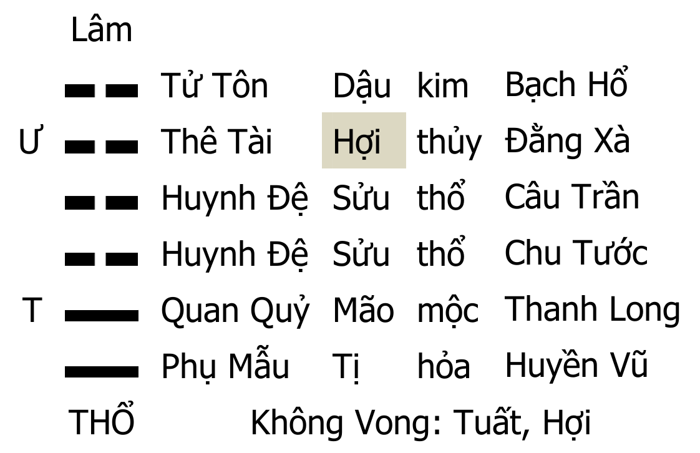
    - **Hình này chứng minh điều gì**
      - Hào 2 Thế Quan Quỷ Mão mộc hưu tù bị Nhật thần khắc thương; Quách Phác dùng Mão mộc tỉ hòa trợ vượng kết hợp quẻ Khôn (thịt thỏ).
    - **Từ đâu mà thấy được**
      - Thế tại hào 2 Quan Quỷ Mão mộc lâm Thanh Long; quẻ thuộc cung Khôn; hào Ứng Thê Tài Hợi thủy Không Vong.
  - **Phán đoán và đối thoại:**
    - Căn cứ: Cảnh Tự phái em trai đi xem thay nên Dụng thần lấy hào Thế Quan Quỷ Mão mộc chứ không lấy hào Huynh Đệ; hào Thế hưu tù tại tháng Mùi lại bị Nhật Dậu khắc thương là bệnh nặng.
    - Nhìn vào: Kỵ thần Kim không phát động nên chọn phương pháp tỉ vượng Dụng thần; Mão mộc là sao Thiên Y, ứng với loài thỏ; quẻ Địa Trạch Lâm thuộc cung Khôn, Khôn là thịt, gộp lại là thịt thỏ; Thế lâm Thanh Long chủ ăn uống.
    - Đối thoại thực tế: Quách Phác phán bệnh dai dẳng mấy năm muốn lành nhất thiết phải ăn thịt thỏ mới chuyển nguy thành an.
  - **Phương án hóa giải:** Ăn thịt thỏ để trợ vượng hào Thế Quan Quỷ Mão mộc và nạp khí Thiên Y.
  - **Ứng nghiệm thực tế:** Trên đường về em trai Cảnh Tự bắt được con thỏ rừng, Cảnh Tự ăn xong liền khỏi dứt điểm căn bệnh nan y nhiều năm.
- **Quái lệ 2: Quách Phác đoán bệnh thương hàn cho chú viên quan quận Nghĩa Hưng (Ngày Tân Hợi tháng Ngọ)**
  - **Hình 3. Quẻ Thiên Sơn Độn biến Thiên Phong Cấu**
    - 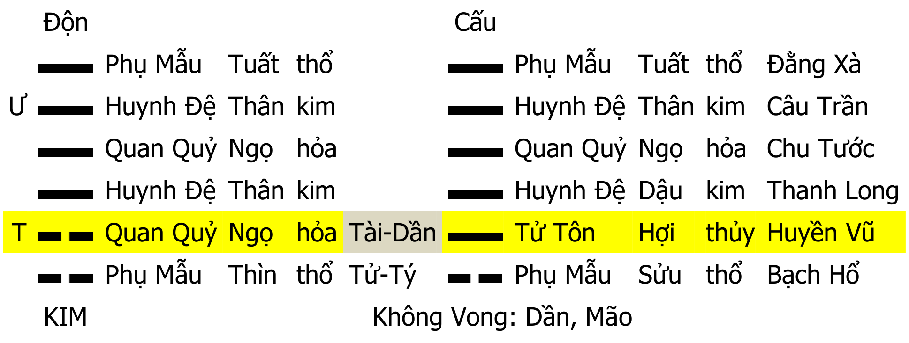
    - **Hình này chứng minh điều gì**
      - Hào 2 Thế Quan Quỷ Ngọ hỏa hóa Tử Tôn Hợi thủy hồi đầu khắc nguy kịch; Quách Phác dùng Thổ khắc Thủy cứu Hỏa (khắc thần bị khắc).
    - **Từ đâu mà thấy được**
      - Hào 2 Thế Quan Quỷ Ngọ hỏa lâm Huyền Vũ động hóa Tử Tôn Hợi thủy hồi đầu khắc; Thổ hướng Khôn (Sửu thổ) khắc Hợi thủy bảo vệ Ngọ hỏa.
  - **Phán đoán và đối thoại:**
    - Căn cứ: Hào Thế tự hóa hồi đầu khắc tính mạng ngàn cân treo sợi tóc; áp dụng nguyên tắc 'khắc thần bị khắc' (dùng Thổ khắc phục Kỵ thần Thủy để cứu Dụng thần Hỏa).
    - Nhìn vào: Trong các chi Thổ, Tuất là Mộ khố làm suy Hỏa, Mùi tương hợp trói kỵ bệnh mới; Thìn và Sửu không hại Thế; Sửu ứng với trâu, phương Khôn là Tây Nam đại diện cho Thổ và trâu.
    - Đối thoại thực tế: Quách Phác khuyên gia đình phải tìm được trâu ở hướng Khôn dẫn về thì bệnh nhân mới có cơ hội sống sót.
  - **Phương án hóa giải:** Dắt trâu từ phương Khôn (Tây Nam) về lưu lại một đêm để trường khí Thổ phương Khôn trấn áp Thủy sát.
  - **Ứng nghiệm thực tế:** Giữa lúc khó khăn người từ phía Tây Nam dắt trâu đi qua, giữ trâu lại một đêm thì bệnh thương hàn thuyên giảm rồi khỏi hẳn.

## Chương 2: Thập Nhị Địa Chi Tiết Lộ Thiên Cơ

- **Nguyên lý âm dương mất cân bằng thúc đẩy vận động vũ trụ:**
  - Vũ trụ sinh ra từ sự tương tác giữa âm và dương; chính sự phát triển không cân bằng khiến vũ trụ không ngừng chuyển động và sinh sôi muôn loài.
  - Nếu âm dương đạt tới trạng thái cân bằng tuyệt đối thì vạn vật rơi vào trạng thái tĩnh tịch và ngừng tồn tại.
- **Mật mã 12 loài vật đối ứng 12 Địa Chi:**
  - 12 con giáp được chọn làm mật mã dự đoán do mang vai trò truyền tải trường năng lượng ngũ hành đặc thù của trời đất.
  - Quy luật móng chân chẵn lẻ phân định âm dương: Động vật móng chẵn ứng với Địa Chi âm (Trâu-Sửu, Thỏ-Mão, Dê-Mùi, Gà-Dậu, Lợn-Hợi; Rắn-Tị cực âm không chân); động vật móng lẻ ứng với Địa Chi dương (Hổ-Dần, Rồng-Thìn, Ngựa-Ngọ, Khỉ-Thân, Chó-Tuất).
  - Chuột (Tý) đại diện cho giờ Tý chuyển giao âm dương nên chân trước 4 ngón (chẵn - âm), chân sau 5 ngón (lẻ - dương).

### Loài Cá Con Giáp Kỳ Lạ

- **Hiện tượng loài cá Nhuận ngư ở Đông Hải:**
  - Cổ tịch ghi chép loài Nhuận ngư chỉ xuất hiện vào các năm nhuận; hình dạng đầu cá biến đổi tương ứng với Địa Chi năm nhuận (năm Tý nhuận đầu chuột đuôi cá, năm Sửu nhuận đầu trâu đuôi cá).
  - Minh chứng tự nhiên về sự tồn tại hữu hình của trường khí 12 con giáp trong sinh giới.
- **Thiên cơ tiết lộ ở nơi khuyết hãm:**
  - Người xưa đúc kết 'thiên cơ tiết lộ tại bệnh xứ' (bí mật trời đất bộc lộ ở chỗ khiếm khuyết); do đó 12 con giáp được chọn đều mang khiếm khuyết sinh học đặc trưng.
  - 'Thử mục thốn quang': Chuột mắt kém nhìn gần ứng giờ Tý âm dương mờ mịt; Trâu thiếu hàm răng trên, Thỏ hở môi, Rắn không chân, Rồng thiếu thính giác, Gà không bàng quang.

### Hiện Tượng Sinh Khắc Giữa 12 Loài Vật

- **Quan hệ sinh khắc tự nhiên tương ứng Địa Chi:**
  - Hợi thủy khắc Tị hỏa: Trong thực tế loài lợn ăn thịt rắn, khi bị rắn cắn lợn chỉ sưng nhẹ ngoài da không nguy hiểm tính mạng.
  - Tý thủy khắc Ngọ hỏa: Phân chuột chứa độc tính tự nhiên với loài ngựa, ngựa ăn phải sẽ bị trướng bụng mà chết.
  - Hiện tượng sinh thái khẳng định tính chân thực của quy luật sinh khắc xung hợp giữa 12 Địa Chi khi ứng dụng vào thuật hóa giải.

### Ý Nghĩa Tương Ứng Của 12 Địa Chi Trong Hóa Giải

- **Ý nghĩa biểu tượng và vật phẩm của 12 Địa Chi:**
  - Tý (Thủy): Chuột, chim én, cá quả, con dơi; nước muối, sông hồ, bể nước; người tuổi Tý.
  - Sửu (Thổ): Trâu, con cua, rùa đen; ruộng đất, két sắt, đồ gốm sứ; người tuổi Sửu.
  - Dần (Mộc): Hổ, con mèo, con báo; cây cối, rừng rậm, đồ gỗ, kiến trúc gỗ; người tuổi Dần.
  - Mão (Mộc): Thỏ, con cáo, nhím, hạc trắng; hoa cỏ, đồ tre trúc; người tuổi Mão.
  - Thìn (Thổ): Rồng, thuồng luồng, cá chép, giun đất; đầm nước, ấm trà, vại nước, dụng cụ y tế; người tuổi Thìn.
  - Tị (Hỏa): Rắn, lươn, ve sầu; nến, ánh đèn, đất nung đỏ, dây thừng; người tuổi Tị.
  - Ngọ (Hỏa): Ngựa, con lừa, hươu nai; cây nến, lồng hấp nhiệt; người tuổi Ngọ.
  - Mùi (Thổ): Dê cừu, chim nhạn; sừng dê, chén rượu, bồn cảnh, vườn cây, y dược; người tuổi Mùi.
  - Thân (Kim): Khỉ, con mèo; kim loại, đồ sắt, xe cộ, dao kéo, đinh nhọn, xương cốt; người tuổi Thân.
  - Dậu (Kim): Gà, chim trĩ; gương đồng, la bàn, nam châm, ổ khóa, đồ kim khí; người tuổi Dậu.
  - Tuất (Thổ): Chó, chó sói; ngói gạch, đồ gốm, tràng hạt, bình chữa cháy; người tuổi Tuất.
  - Hợi (Thủy): Lợn, cá quả, gấu; nước đá, băng, mực viết, muối ăn, nước tương; người tuổi Hợi.
- **Nguyên tắc điều phối năng lượng Địa Chi trong hóa giải:**
  - Dụng thần Không Vong: Dùng Xung Không hoặc Thực Không để kích hoạt cát khí.
  - Dụng thần Nguyệt Phá: Ưu tiên dùng Hợp Phá thay vì Thực Phá.
  - Nguyên thần bị hợp: Dùng chi xung Nguyên thần để giải hợp; Kỵ thần phát động: Dùng chi khắc hoặc hợp Kỵ thần.
- **Quái lệ 1: Người đàn ông đoán thăng chức (Ngày Quý Dậu tháng Giáp Dần năm Quý Mùi)**
  - **Hình 4. Quẻ Địa Thủy Sư biến Lôi Trạch Quy Muội**
    - 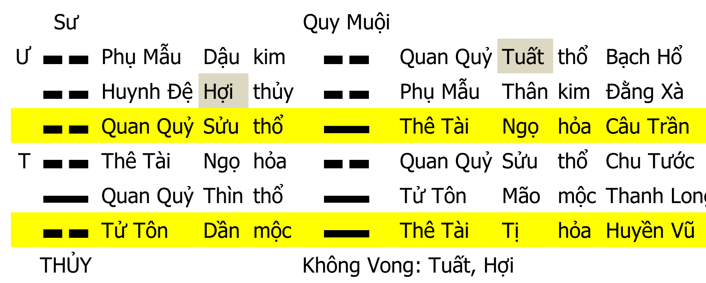
    - **Hình này chứng minh điều gì**
      - Quan Quỷ Sửu thổ bị Nguyệt khắc lâm hào động hóa Ngọ hỏa hồi đầu sinh; hào Thế Ngọ hỏa động cần trợ lực đầu ngựa hướng vào trong.
    - **Từ đâu mà thấy được**
      - Hào 3 Thế Thê Tài Ngọ hỏa lâm Chu Tước hóa Quan Quỷ Sửu thổ; hào sơ Tử Tôn Dần mộc động khắc hào 2 Quan Quỷ Thìn thổ.
  - **Phán đoán và đối thoại:**
    - Căn cứ: Quan Quỷ làm Dụng thần bị Nguyệt khắc, Tử Tôn Dần mộc động khắc Quan; quẻ Sư là quân đội, Tử Tôn là binh lính lâm Nguyệt kiến báo hiệu có quân nhân xuất ngũ phản đối.
    - Nhìn vào: Quan Quỷ hóa hồi đầu sinh; hào Thế là Ngọ hỏa sinh Quan; Kỵ thần Dần mộc phương Đông Bắc sinh khí bất lợi cho quan vận.
    - Đối thoại thực tế: Đương số rà soát hội đồng không thấy quân nhân xuất ngũ; tác giả khẳng định nếu không hóa giải chắc chắn trượt, khuyên đặt ngựa đỏ.
  - **Phương án hóa giải:** Đặt một con ngựa mỹ nghệ màu đỏ tại phương Đông Bắc trong nhà, đầu ngựa hướng vào phía trong phòng làm việc (tượng hồi đầu sinh).
  - **Ứng nghiệm thực tế:** Hôm sau họp thảo luận bất ngờ bị một cựu hồng quân kịch liệt phản đối, nhưng sau đó chuyển hướng sang người khác, đương số được thăng chức; sau đó nghe bạn xoay đầu ngựa ra ngoài liền bị điều chuyển vị trí nhàn rỗi.
- **Quái lệ 2: Đoán ký hợp đồng chuyển nhượng kỹ thuật (Ngày Canh Dần tháng Bính Dần)**
  - **Hình 5. Quẻ Thiên Hỏa Đồng Nhân biến Càn Vi Thiên**
    - 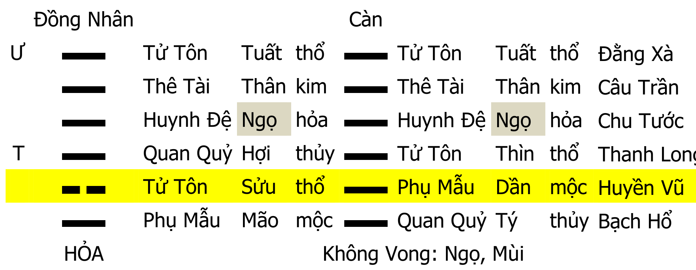
    - **Hình này chứng minh điều gì**
      - Hào Ứng Phụ Mẫu Mùi thổ lâm Nguyệt khắc; Nguyên thần Tị hỏa nhập Mộ; Kỵ thần Dần mộc xung khắc Thân kim cần chữ Thân giải cứu.
    - **Từ đâu mà thấy được**
      - Hào 5 Huynh Đệ Thân kim động hóa Huynh Đệ Thân kim; hào 2 Quan Quỷ Sửu thổ động hóa Thê Tài Dần mộc.
  - **Phán đoán và đối thoại:**
    - Căn cứ: Hợp đồng lấy Phụ Mẫu làm Dụng thần, Dụng thần Mùi thổ hưu tù; hào 5 Huynh Đệ Thân kim động khắc hợp đồng nhưng hóa thoái; cần củng cố Kim để trợ Thân.
    - Nhìn vào: Chi Thân tương ứng phương Tây Nam; viết chữ Thân (申) bổ khuyết trường khí Kim.
    - Đối thoại thực tế: Khách hàng lo lắng đối tác chần chừ bỏ cuộc; tác giả hướng dẫn viết chữ Thân đặt phương Tây Nam.
  - **Phương án hóa giải:** Viết chữ Thân (申) trên giấy vàng mực chu sa dán tại phương Tây Nam phòng làm việc.
  - **Ứng nghiệm thực tế:** Vài ngày sau đối tác chủ động liên lạc và ký kết hợp đồng chuyển nhượng thuận lợi.
- **Quái lệ 3: Đoán thi cử thăng tiến (Ngày Canh Dần tháng Giáp Tý)**
  - **Hình 6. Quẻ Hỏa Sơn Lữ biến Hỏa Lôi Phệ Hạp**
    - 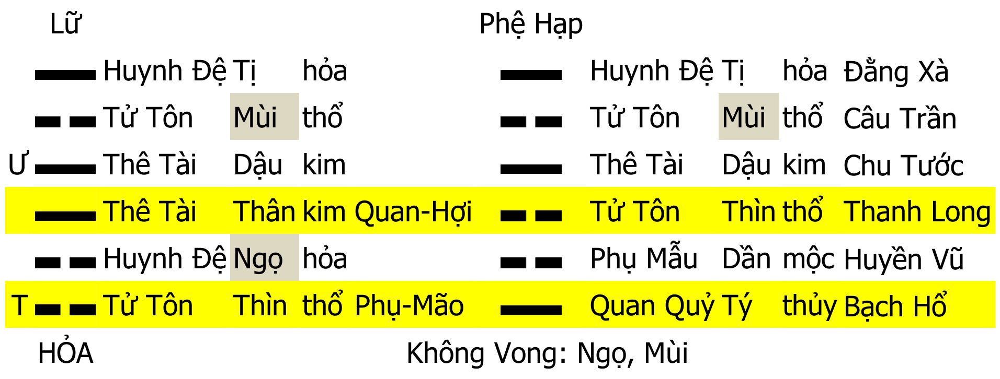
    - **Hình này chứng minh điều gì**
      - Phụ Mẫu Mão mộc Không Vong; Quan Quỷ Hợi thủy lâm Nguyệt kiến động hóa Tử Tôn Dần mộc tham hợp quên sinh; cần bể nước giải hợp.
    - **Từ đâu mà thấy được**
      - Hào 5 Quan Quỷ Hợi thủy động hóa Tử Tôn Dần mộc; hào 3 Tử Tôn Thìn thổ động hóa Huynh Đệ Ngọ hỏa.
  - **Phán đoán và đối thoại:**
    - Căn cứ: Phụ Mẫu Mão mộc Không Vong cần Xung Không hoặc Thực Không; Quan Quỷ Hợi thủy động hợp Dần mộc (tham hợp quên sinh).
    - Nhìn vào: Hợi thủy tương ứng hướng Tây Bắc và cá quả/bể nước; tăng cường Thủy để sinh Phụ Mẫu Mão mộc.
    - Đối thoại thực tế: Thí sinh hồi hộp vì tỷ lệ chọi cao; tác giả hướng dẫn bài trí bể nước hướng Tây Bắc.
  - **Phương án hóa giải:** Đặt bể nước nuôi cá quả tại góc Tây Bắc phòng học để kích hoạt Quan tinh sinh Phụ.
  - **Ứng nghiệm thực tế:** Thí sinh đạt điểm số xuất sắc và được bổ nhiệm vào vị trí mong muốn.
- **Quái lệ 4: Đoán bệnh viêm đại tràng mãn tính (Ngày Kỷ Hợi tháng Giáp Tý)**
  - **Hình 7. Quẻ Ly Vi Hỏa**
    - 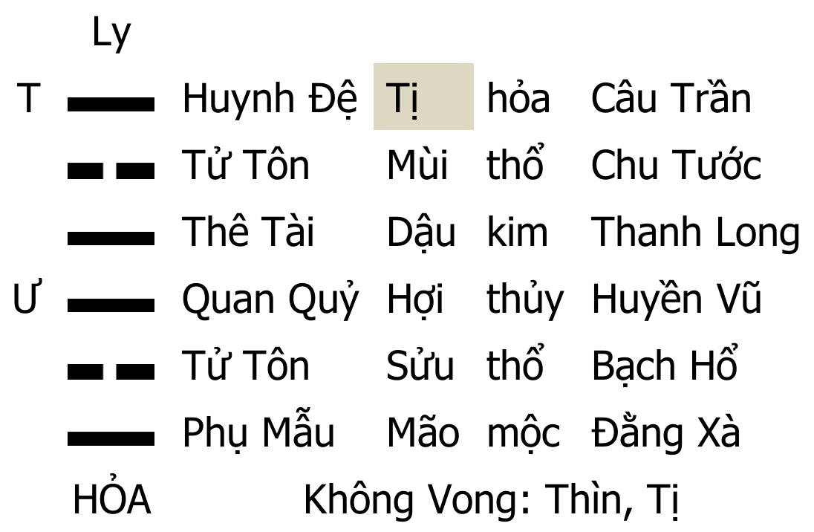
    - **Hình này chứng minh điều gì**
      - Hào 2 Quan Quỷ Sửu thổ lâm Câu Trần vượng; Phụ Mẫu Mão mộc hưu tù bị khắc; cần Mão mộc thỏ phương Đông để sinh Thế trợ thân.
    - **Từ đâu mà thấy được**
      - Quẻ Ly Vi Hỏa lục xung; hào 2 Thế Quan Quỷ Sửu thổ; hào sơ Phụ Mẫu Mão mộc.
  - **Phán đoán và đối thoại:**
    - Căn cứ: Hào 2 là ruột và bụng, lâm Câu Trần chủ sưng trướng đau đớn; Mão mộc hưu tù bị tiết khí nặng.
    - Nhìn vào: Mão mộc đối ứng với loài thỏ và phương Đông; tranh thỏ mang năng lượng Mộc tươi sáng.
    - Đối thoại thực tế: Bệnh nhân đau bụng đi ngoài nhiều năm không khỏi; tác giả khuyên treo tranh thỏ phương Đông.
  - **Phương án hóa giải:** Treo bức tranh vẽ con thỏ tại phương Đông phòng ngủ để bồi bổ Mộc khí.
  - **Ứng nghiệm thực tế:** Sau một tháng các cơn đau quặn bụng dứt hẳn, đại tràng phục hồi bình thường.
- **Quái lệ 5: Đoán mua cổ phiếu đầu tư (Ngày Giáp Tuất tháng Kỷ Mùi)**
  - **Hình 8. Quẻ Thủy Lôi Truân**
    - 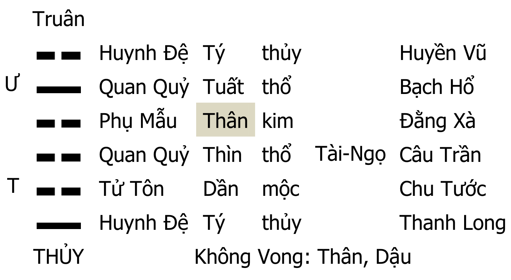
    - **Hình này chứng minh điều gì**
      - Thê Tài Ngọ hỏa lâm Tuần Không; Thế hào Thân kim hưu tù; cần tượng ngựa đồng hướng Nam xuất Không tiếp tài.
    - **Từ đâu mà thấy được**
      - Hào 5 Huynh Đệ Thân kim持 Thế; hào 3 Thê Tài Ngọ hỏa Không Vong.
  - **Phán đoán và đối thoại:**
    - Căn cứ: Cầu tài lấy Thê Tài làm Dụng thần; Tài hào Ngọ hỏa Không Vong tức tiền tài chưa tụ; Ngọ lâm Hỏa phương Nam.
    - Nhìn vào: Ngọ là ngựa, chất liệu kim loại đồng hỗ trợ sinh tài trường khí bền vững.
    - Đối thoại thực tế: Nhà đầu tư phân vân không biết cổ phiếu có tăng giá hay sụt giảm.
  - **Phương án hóa giải:** Đặt một tượng ngựa bằng đồng tại phương Nam bàn làm việc để kích tài xuất Không.
  - **Ứng nghiệm thực tế:** Cổ phiếu tăng vọt liên tiếp nhiều phiên, nhà đầu tư chốt lời thu lợi nhuận lớn.
- **Quái lệ 6: Đoán cha bị đột quỵ xuất huyết não (Ngày Canh Ngọ tháng Ất Mão)**
  - **Hình 9. Quẻ Cấn Vi Sơn biến Sơn Địa Bác**
    - 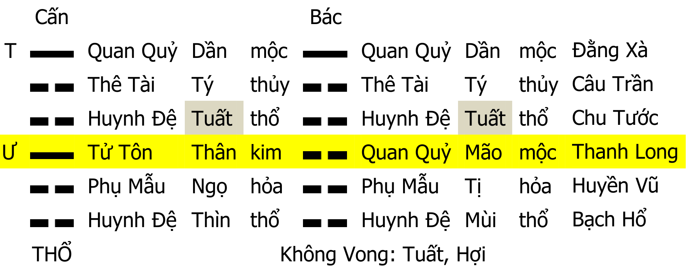
    - **Hình này chứng minh điều gì**
      - Hào 6 Phụ Mẫu Dần mộc vượng; Quan Quỷ Tuất thổ động hóa Dậu kim tiết khí; cần tượng chó phương Tây Bắc giữ vững khí mạch.
    - **Từ đâu mà thấy được**
      - Quẻ Cấn Vi Sơn; hào 2 Quan Quỷ Ngọ hỏa; hào 3 Huynh Đệ Thân kim động hóa Huynh Đệ Mão mộc.
  - **Phán đoán và đối thoại:**
    - Căn cứ: Người cha bị xuất huyết não; hào vị đầu não lâm Quan Quỷ động khắc; Tuất thổ Mộ khố cần củng cố.
    - Nhìn vào: Tuất đối ứng với chó ở phương Tây Bắc; dùng linh khuyển trấn áp tà khí phục hồi sinh cơ.
    - Đối thoại thực tế: Người con trai vô cùng lo lắng cha hôn mê sâu tại bệnh viện.
  - **Phương án hóa giải:** Đặt tượng chó bằng gốm sứ ở phương Tây Bắc giường bệnh nhân để bồi đắp Tuất thổ.
  - **Ứng nghiệm thực tế:** Bệnh nhân tỉnh lại sau 3 ngày và dần bình phục chức năng vận động.

## Chương 3: Ý Nghĩa Ẩn Tàng Trong Bát Quái

- **Ý nghĩa ẩn tàng đa tầng của Bát Quái trong Lục Hào:**
  - Bát Quái không chỉ chứa đựng tượng quẻ cơ bản mà còn ẩn tàng trường thông tin vô cùng phong phú về nhân vật, thân thể, không gian, đồ vật, âm thanh, chữ viết.
  - Trích xuất thông tin quái cung là nền tảng cốt yếu để xác định chính xác phương án hóa giải Lục Hào có hiệu quả rõ ràng và bền vững.

### Ý Nghĩa Ẩn Tàng Trong Quẻ Càn

- **Tính chất:** Vĩ đại, dũng cảm, quyết đoán, cao lớn, hình tròn.
- **Thiên tượng:** Trời quang, mưa đá, băng giá, khí lạnh.
- **Địa lý:** Tây Bắc, thủ đô, cao nguyên, nơi cao ráo.
- **Nhân vật:** Lãnh đạo, giám đốc, cha, bậc trưởng bối, người nhà nước.
- **Thân thể:** Đầu, xương, phổi, đại tràng, khuôn mặt.
- **Động vật:** Ngựa, thiên nga, sư tử, voi.
- **Tĩnh vật:** Vàng bạc, ngọc ngà, gương tròn, kính mắt, mũ nón.
- **Chữ viết:** Chữ bộ Kim (金) (như Ngân, Châm, Đinh, Cương, Tiền).
- **Ẩm thực:** Thịt ngựa, thịt dính xương, quả táo, đồ khô.

### Ý Nghĩa Ẩn Tàng Trong Quẻ Khôn

- **Tính chất:** Bao dung, nhu thuận, tĩnh lặng, vuông vức, tối tăm.
- **Thiên tượng:** Mây mù, sương mù, khí âm u.
- **Địa lý:** Tây Nam, đồng bằng, ruộng đất, bãi đất trống.
- **Nhân vật:** Mẹ, bà cụ, nông dân, quần chúng nhân dân.
- **Thân thể:** Bụng, dạ dày, lá lách, da thịt.
- **Động vật:** Bò sữa, trâu, kiến.
- **Tĩnh vật:** Vải vóc, đồ gốm sứ, đồ vuông, xi măng.
- **Chữ viết:** Chữ bộ Thổ (土) (như Địa, Điền, Khang, Thạch).
- **Ẩm thực:** Thịt bò, đồ ngọt, ngũ cốc, khoai lang.

### Ý Nghĩa Ẩn Tàng Trong Quẻ Chấn

- **Tính chất:** Chuyển động, phấn phát, kinh sợ, giận dữ, âm vang.
- **Thiên tượng:** Sấm sét, sấm mùa xuân, chớp giật.
- **Địa lý:** Phương Đông, đường cái, sân vận động, rừng cây.
- **Nhân vật:** Trưởng nam, quân nhân, cảnh sát, người lái xe.
- **Thân thể:** Chân, bàn chân, gan, thanh đới, dây thần kinh.
- **Động vật:** Rồng, rắn, chim ưng.
- **Tĩnh vật:** Xe cộ, chuông báo, nhạc cụ gõ, đồ gỗ lớn.
- **Chữ viết:** Chữ bộ Mộc (木) mang ý nghĩa chuyển động.
- **Ẩm thực:** Thịt rồng, đồ chua, măng tre, rau xanh.

### Ý Nghĩa Ẩn Tàng Trong Quẻ Tốn

- **Tính chất:** Thẩm thấu, thuận tòng, lưu động, do dự, thanh mảnh.
- **Thiên tượng:** Gió lốc, gió xuân, mây bay.
- **Địa lý:** Đông Nam, vườn hoa, bưu điện, sân bay.
- **Nhân vật:** Trưởng nữ, tăng ni, giáo viên, thương nhân.
- **Thân thể:** Đùi, mông, hệ thần kinh, khí quản, tóc.
- **Động vật:** Gà, chim trĩ, bướm, côn trùng.
- **Tĩnh vật:** Dây thừng, quạt máy, đồ tre trúc mảnh mai, thư từ.
- **Chữ viết:** Chữ bộ Thảo (艹) hoặc Mộc mảnh mai.
- **Ẩm thực:** Thịt gà, rau thơm, trà, quả dâu tằm.

### Ý Nghĩa Ẩn Tàng Trong Quẻ Khảm

- **Tính chất:** Hiểm trở, trắc trở, gian nan, trí tuệ, chìm đắm.
- **Thiên tượng:** Mưa rào, tuyết, sương đêm, mặt trăng.
- **Địa lý:** Phương Bắc, sông hồ, biển cả, giếng nước, quán rượu.
- **Nhân vật:** Trung nam, thủy thủ, trộm đạo, gián điệp.
- **Thân thể:** Thận, bàng quang, máu, tai, cơ quan bài tiết.
- **Động vật:** Lợn, cá, chuột, sinh vật dưới nước.
- **Tĩnh vật:** Rượu bia, chất lỏng, dầu nhớt, bút mực, bánh xe.
- **Chữ viết:** Chữ bộ Thủy (氵) (như Giang, Hà, Hải, Hồ).
- **Ẩm thực:** Cá biển, canh súp, muối ăn, đồ ướp lạnh.

### Ý Nghĩa Ẩn Tàng Trong Quẻ Ly

- **Tính chất:** Quang minh, rực rỡ, bám víu, nóng nảy, trống rỗng bên trong.
- **Thiên tượng:** Mặt trời, ánh nắng, cầu vồng, sao băng.
- **Địa lý:** Phương Nam, thư viện, trường học, trạm phát sóng, rạp phim.
- **Nhân vật:** Trung nữ, học giả, nghệ sĩ, người mẫu, binh sĩ.
- **Thân thể:** Mắt, tim, huyết áp, tiểu tràng.
- **Động vật:** Chim công, chim trĩ, gà lôi, rùa, con cua.
- **Tĩnh vật:** Sách vở, tranh ảnh, máy vi tính, tivi, bóng đèn.
- **Chữ viết:** Chữ bộ Hỏa (火) (như Quang, Viêm, Huy, Xích).
- **Ẩm thực:** Thịt chim, đồ nướng chiên, quả hạnh cay đắng.

### Ý Nghĩa Ẩn Tàng Trong Quẻ Cấn

- **Tính chất:** Đình chỉ, ngăn trở, ổn định, vững chắc, cao vút.
- **Thiên tượng:** Mây núi, sương mù trên đỉnh núi.
- **Địa lý:** Đông Bắc, đồi núi, gò đống, bức tường thành, nghĩa trang.
- **Nhân vật:** Thiếu nam, người gác cổng, bảo vệ, ẩn sĩ.
- **Thân thể:** Mũi, lưng, ngón tay, xương sườn, khớp xương.
- **Động vật:** Chó, hổ, gấu, cáo, chim gõ kiến.
- **Tĩnh vật:** Bàn ghế đá, hòn non bộ, đồ điêu khắc đá, két sắt.
- **Chữ viết:** Chữ bộ Sơn (山) (như Nham, Phong, Lĩnh, Khâu).
- **Ẩm thực:** Thịt thú rừng, măng khô, củ khoai củ cải.

### Ý Nghĩa Ẩn Tàng Trong Quẻ Đoài

- **Ý nghĩa ẩn tàng của quẻ Đoài:**
  - Tính chất: Khuyết thiếu, tan vỡ, tổn hại, sứt mẻ, vui vẻ, khẩu thiệt.
  - Thiên tượng: Mưa nhỏ, trăng non, các vì sao tinh tú.
  - Địa lý: Phương Tây, đầm lầy, ao hồ, nơi trũng ngập nước.
  - Nhân vật: Thiếu nữ, người có tài ăn nói, bà đồng, phiên dịch viên, ca sĩ.
  - Thân thể: Miệng, lưỡi, răng, phổi, thanh quản, khí quản, ruột.
  - Động vật: Con dê.
  - Tĩnh vật: Đồ vật có miệng, đồ kim khí sắc bén, nhạc cụ, phế liệu, kim loại.
  - Chữ viết: Chữ bộ Kim (金), chữ mang nghĩa kim khí hoặc khuyết thiếu.
  - Ẩm thực: Đồ ăn cay nồng, cơm Tây.
- **Quy luật phán đoán tai họa theo quái cung:** Càn (chùa chiền, quan chức, kim loại); Đoài (tranh chấp khẩu thiệt, ao hồ, thiếu nữ); Khảm (sông biển, trộm cắp, thủy nạn); Ly (hỏa hoạn, văn thư); Chấn (xe cộ, rừng cây, tức giận); Tốn (đồ gỗ, phụ nữ); Khôn (ruộng đất, bà cụ, núi rừng); Cấn (khoáng vật, phần mộ).
- **Quái lệ 1: Bạn học nữ gầy yếu đoán bệnh máu cô đặc (Ngày Đinh Mùi tháng Bính Thìn)**
  - **Hình 10. Quẻ Thiên Sơn Độn biến Trạch Sơn Hàm**
    - 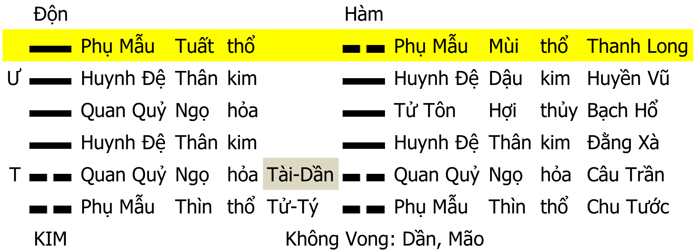
    - **Hình này chứng minh điều gì**
      - Hào 2 Thế Quan Quỷ Ngọ hỏa nhập Mộ ở Tuất thổ; cung Càn (xương) + Thê Tài Dần mộc (máu) lâm Câu Trần (cô đặc) -> suy tủy giảm sinh máu.
    - **Từ đâu mà thấy được**
      - Hào 2 Thế Quan Quỷ Ngọ hỏa [phục Thê Tài Dần mộc]; hào 6 Phụ Mẫu Tuất thổ động; hào 3 Huynh Đệ Thân kim.
  - **Phán đoán và đối thoại:**
    - Căn cứ: Hào 2 Thế Ngọ hỏa nhập Mộ ở Tuất thổ mất tự do (ở lì trong nhà không ra ngoài); Ngọ hỏa số 2, 7 -> thể trọng chỉ 70 cân (35 kg); năm 1995 Ất Hợi Thế bị khắc bắt đầu mắc bệnh, 1996 Bính Tý xung Thế bệnh trầm trọng.
    - Nhìn vào: Quẻ Độn thuộc cung Càn (xương); Nguyên thần Thê Tài Dần mộc phục hào 2 nhập Mộ ở Nhật, lâm Câu Trần chủ chậm chạp kết khối -> tủy xương rối loạn tạo máu, máu cô đặc không chảy được.
    - Đối thoại thực tế: Đương số kinh ngạc xác nhận bị bệnh từ 1995, năm 1996 liệt giường không ra khỏi cửa; máu cô đặc đến mức bác sĩ cắm kim không rút được máu; thể trọng đúng 70 cân, ở nhà lầu tầng 2.
  - **Phương án hóa giải:** Mỗi ngày ăn hai lạng thịt ngựa (Càn là thịt ngựa, Ngọ hỏa số 2); đặt vôi sống dưới gầm giường (hào 2) để hút Thủy sát Kỵ thần và trợ vượng Hỏa, 7 ngày (hợp ngũ hành) thay vôi một lần.
  - **Ứng nghiệm thực tế:** Không lâu sau thể trọng tăng nhanh, bệnh tủy xương khỏi hoàn toàn; năm 1999 yêu đương và năm 2001 kết hôn thuận lợi.
- **Quái lệ 2: Người đàn ông đoán đau chân và phong thấp (Ngày Nhâm Tý tháng Mậu Ngọ)**
  - **Hình 11. Quẻ Hỏa Lôi Phệ Hạp biến Hỏa Địa Tấn**
    - 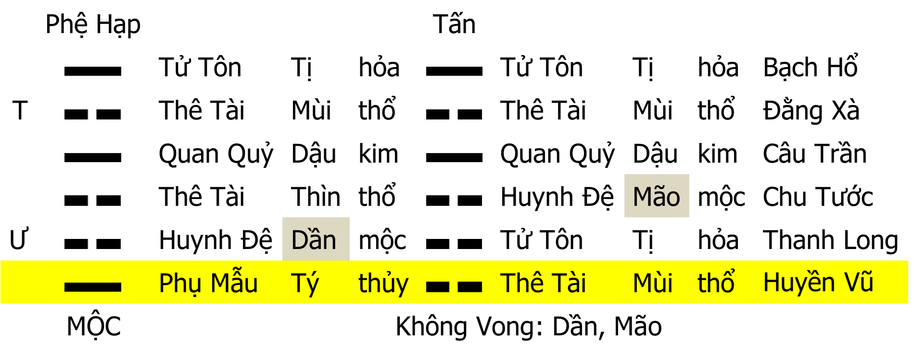
    - **Hình này chứng minh điều gì**
      - Cừu thần Phụ Mẫu Tý thủy hào sơ độc phát khắc thương Nguyên thần; cung Tốn (đùi) + hào sơ (chân) + Thủy lâm Huyền Vũ -> phong thấp chân.
    - **Từ đâu mà thấy được**
      - Hào sơ Phụ Mẫu Tý thủy động hóa Thê Tài Mùi thổ hồi đầu khắc; hào 5 Thế Thê Tài Mùi thổ; Nguyệt kiến Ngọ hỏa.
  - **Phán đoán và đối thoại:**
    - Căn cứ: Quẻ Phệ Hạp thuộc cung Tốn (đùi), Cừu thần Phụ Mẫu Tý thủy động tại hào sơ (bàn chân) lâm Huyền Vũ chủ phong thấp dịch ẩm; quẻ biến du hồn bệnh lan rộng.
    - Nhìn vào: Cừu thần Tý thủy hóa Thê Tài Mùi thổ hồi đầu khắc nhưng sức Mùi thổ yếu, cần tăng cường Mùi thổ; Tốn là cây cỏ, Mùi hào sơ là rễ cây, lâm Huyền Vũ màu đen ánh đỏ -> rễ cà tím.
    - Đối thoại thực tế: Đương số xác nhận đau chân phong thấp kinh niên chữa khắp nơi không khỏi, thỉnh cầu Lục Hào cứu giải.
  - **Phương án hóa giải:** Lấy rễ cây cà tím kết hợp ớt đỏ (Mùi thổ hợp Nguyệt Ngọ hỏa màu đỏ) sắc nước sôi ngâm rửa chân hằng ngày.
  - **Ứng nghiệm thực tế:** Sau một thời gian kiên trì ngâm rửa, chứng đau nhức phong thấp ở chân tiêu biến hoàn toàn.
- **Quái lệ 3: Tăng San Bốc Dịch – Bài học không tuân thủ hóa giải dẫn đến đại họa**
  - **Hình 12. Quẻ Phong Lôi Ích biến Phong Trạch Trung Phu**
    - 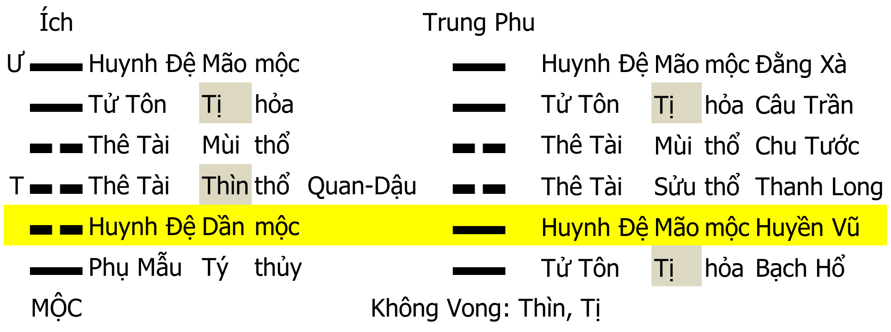
    - **Hình này chứng minh điều gì**
      - Quẻ Ích biến Trung Phu; Dụng thần hưu tù phát động gặp hung; dự trắc sư chỉ dẫn hóa giải nhưng đương số coi nhẹ không nghe theo.
    - **Từ đâu mà thấy được**
      - Hào 2 Thê Tài Dần mộc động hóa Thê Tài Dần mộc; hào 3 Huynh Đệ Thìn thổ động hóa Huynh Đệ Sửu thổ.
  - **Phán đoán và đối thoại:**
    - Căn cứ: Tăng San Bốc Dịch ghi chép quẻ biến xuất hiện hung sát hiển hiện; dự trắc sư dặn dò kỹ lưỡng thời khắc và phương vị phải lánh nạn.
    - Nhìn vào: Người coi bói chủ quan ỷ lại nghĩ là chuyện nhỏ không thi hành phương án.
    - Đối thoại thực tế: Lời cảnh báo bị bỏ ngoài tai, đến kỳ hạn hung thần phát động ứng nghiệm chuẩn xác.
  - **Phương án hóa giải:** Đáng lẽ phải dùng vật phẩm chế sát và chuyển đổi chỗ ở theo hướng dẫn.
  - **Ứng nghiệm thực tế:** Đương số gặp tai nạn thảm khốc, chứng minh quy luật nhân quả và tầm quan trọng của việc nghiêm túc chấp hành hóa giải.
- **Quái lệ 4: Dự đoán và hóa giải bệnh dịch hô hấp SARS năm 2003**
  - **Hình 13. Quẻ Hỏa Phong Đỉnh biến Lôi Phong Hằng**
    - 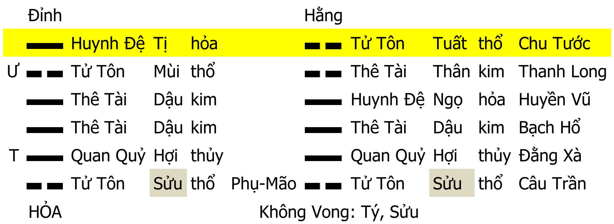
    - **Hình này chứng minh điều gì**
      - Quẻ Đỉnh biến Hằng; Kim hào đại diện phế khí bị Hỏa khắc mạnh; trích xuất thông tin Tốn Mộc và Ly Hỏa để điều tiết phòng dịch.
    - **Từ đâu mà thấy được**
      - Hào 3 Tử Tôn Dậu kim bị Nguyệt kiến khắc; hào 4 Quan Quỷ Cửu tứ động.
  - **Phán đoán và đối thoại:**
    - Căn cứ: Bệnh dịch SARS năm 2003 thuộc phế nhiệt hô hấp, kim bị hỏa khắc gay gắt; cung Ly chủ sốt cao viêm nhiệt.
    - Nhìn vào: Vận dụng cơ chế sinh khắc của Bát Quái và Lục Hào để tìm phương thức thanh nhiệt nhuận phế.
    - Đối thoại thực tế: Tác giả cảnh báo nguy cơ lây lan diện rộng qua đường hô hấp và đề xuất các biện pháp phòng ngừa phong thủy.
  - **Phương án hóa giải:** Tăng cường Thủy khí phương Bắc để dập tắt Hỏa nhiệt, bảo vệ Kim phế âm.
  - **Ứng nghiệm thực tế:** Dự báo trùng khớp diễn biến dịch tễ, giúp người áp dụng tránh được lây nhiễm trong mùa cao điểm dịch bệnh.
- **Quái lệ 5: Dự đoán hôn nhân trắc trở (Ngày Canh Thìn tháng Mùi)**
  - **Hình 14. Quẻ Phong Trạch Trung Phu biến Thiên Thủy Tụng**
    - 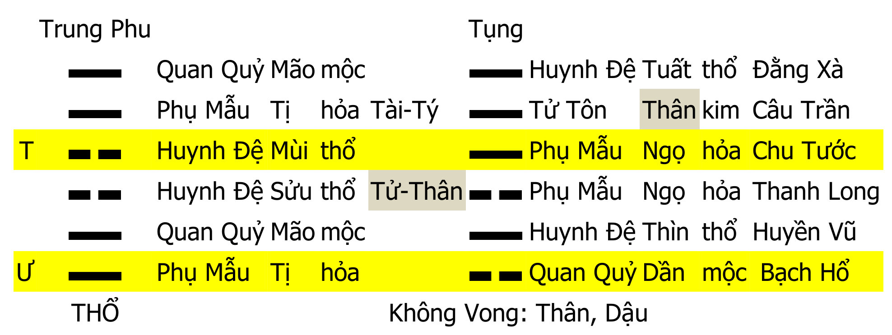
    - **Hình này chứng minh điều gì**
      - Quẻ Trung Phu biến Tụng; hào Thế Thê Tài Mão mộc hưu tù Không Vong; Quan Quỷ Tị hỏa lâm Chu Tước khẩu thiệt tranh chấp.
    - **Từ đâu mà thấy được**
      - Hào 3 Huynh Đệ Thìn thổ động hóa Quan Quỷ Ngọ hỏa; hào Thế Thê Tài Mão mộc Không Vong.
  - **Phán đoán và đối thoại:**
    - Căn cứ: Thế lâm Thê Tài Không Vong là tình cảm trống rỗng bất an; hào Ứng Quan Quỷ xung khắc Thế lâm Chu Tước hay cãi vã thị phi.
    - Nhìn vào: Phương Đoài khuyết thiếu làm tổn hại gia đạo; cần dùng Mộc tỉ hòa và Thủy sinh Mộc để cứu vãn.
    - Đối thoại thực tế: Người vợ đau khổ vì vợ chồng lục đục trên bờ vực ly hôn, xin cứu vãn mái ấm.
  - **Phương án hóa giải:** Bài trí cây xanh phong thủy phương Đông và đặt bình nước hoa hợp mệnh tại phòng ngủ.
  - **Ứng nghiệm thực tế:** Vợ chồng hóa giải mâu thuẫn, tình cảm hòa thuận trở lại sau hai tháng.

## Chương 4: Nạp Âm Của Can Chi Và Phạm Vi Sử Dụng

- **Bản chất và quy luật của Nạp Âm 60 Giáp Tý:**
  - Nạp âm Can Chi kết hợp Thiên Can (trời) và Địa Chi (đất) tạo ra trường năng lượng Ngũ hành vi tế, thể hiện tính chất sâu kín của sự vật mà chính ngũ hành can chi chưa bộc lộ hết.
  - 30 cặp nạp âm phân bố tuần hoàn: Hải Trung Kim, Lư Trung Hỏa, Đại Lâm Mộc, Lộ Bàng Thổ, Kiếm Phong Kim, Sơn Đầu Hỏa, Giản Hạ Thủy, Thành Đầu Thổ, Bạch Lạp Kim, Dương Liễu Mộc, Tuyền Trung Thủy, Ốc Thượng Thổ, Tích Lịch Hỏa, Tùng Bách Mộc, Trường Lưu Thủy, Sa Trung Kim, Sơn Hạ Hỏa, Bình Địa Mộc, Bích Thượng Thổ, Kim Bạc Kim, Phúc Đăng Hỏa, Thiên Hà Thủy, Đại Dịch Thổ, Thoa Xuyến Kim, Tang Đố Mộc, Đại Khê Thủy, Sa Trung Thổ, Thiên Thượng Hỏa, Thạch Lựu Mộc, Đại Hải Thủy.
  - Ứng dụng trong hóa giải: Nạp âm dùng để định lượng chất liệu, màu sắc và tính chất vật phẩm hóa giải khi chính ngũ hành của hào chưa đủ độ tinh tế.
- **Quái lệ 1: Người đàn ông xem quẻ lưu niên vận hạn (Ngày Giáp Tuất tháng Giáp Dần năm Quý Mùi)**
  - **Hình 15. Quẻ Thiên Địa Bĩ biến Thiên Thủy Tụng**
    - 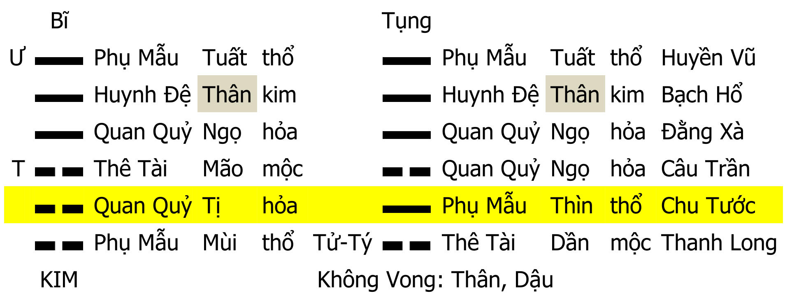
    - **Hình này chứng minh điều gì**
      - Hào Thế Phụ Mẫu Mùi thổ nạp âm Sa Trung Kim hưu tù; Tử Tôn Ngọ hỏa vượng động; Quan Quỷ an tĩnh; dùng nạp âm Kim giải trừ tai ách.
    - **Từ đâu mà thấy được**
      - Hào Thế Phụ Mẫu Mùi thổ; hào 4 Quan Quỷ Ngọ hỏa động hóa Tử Tôn Ngọ hỏa; hào sơ Thê Tài Mão mộc.
  - **Phán đoán và đối thoại:**
    - Căn cứ: Tử Tôn Ngọ hỏa vượng tướng phát động khắc chế Quan Quỷ, Quan Quỷ an tĩnh nên năm nay không có họa quan trường lao lý.
    - Nhìn vào: Hào Thế Mùi thổ nạp âm Sa Trung Kim, Kim suy nhược cần thổ sinh kim trợ thân; dự đoán sức khỏe và tài vận cần bồi bổ trường khí nạp âm.
    - Đối thoại thực tế: Khách hàng lo lắng năm tuổi gặp hung; tác giả giải thích rõ nạp âm Sa Trung Kim cần vàng bạc kim loại trợ mệnh.
  - **Phương án hóa giải:** Đeo trang sức bằng vàng hoặc vật phẩm kim loại tròn bên người để tăng cường nạp âm Kim.
  - **Ứng nghiệm thực tế:** Cả năm bình an vô sự, công việc kinh doanh khởi sắc và tránh được nhiều sự cố hao tài.
- **Quái lệ 2: Dự đoán và hóa giải sản phụ khó sinh tại trường Trung y (Ngày Quý Sửu tháng Mậu Thìn)**
  - **Hình 16. Quẻ Lôi Thủy Giải biến Địa Trạch Lâm**
    - 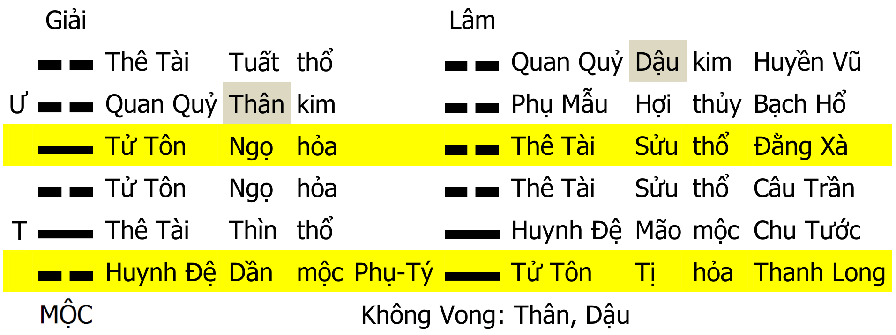
    - **Hình này chứng minh điều gì**
      - Quẻ Giải biến Lâm; Tử Tôn Thìn thổ nạp âm Đại Lâm Mộc phục tàng; Thai hào lâm thủy khố cần nạp âm Mộc sơ thông khai khiếu.
    - **Từ đâu mà thấy được**
      - Hào 2 Quan Quỷ Thìn thổ phục Tử Tôn Dần mộc; hào 4 Thê Tài Ngọ hỏa động; quẻ cung Chấn.
  - **Phán đoán và đối thoại (phần 1 - quẻ Giải biến Lâm):**
    - Căn cứ: Khi giảng bài tại trường Trung y, một học viên xin đoán cho chị dâu chuyển dạ 2 ngày chưa sinh được; quẻ Giải hào Thai hào Thìn thổ nhập Mộ.
    - Nhìn vào: Tử Tôn phục tàng dưới Quan Quỷ; cần phá Mộ trợ Thai xuất thế.
    - Đối thoại thực tế: Gia đình sản phụ hốt hoảng tính mổ cấp cứu; tác giả bấm quẻ tiếp tục kiểm tra quẻ Tiểu Súc biến Ích.
- **Quái lệ 2 (tiếp theo): Quẻ Tiểu Súc biến Ích xác định phương vị lâm bồn**
  - **Hình 17. Quẻ Phong Thiên Tiểu Súc biến Phong Lôi Ích**
    - 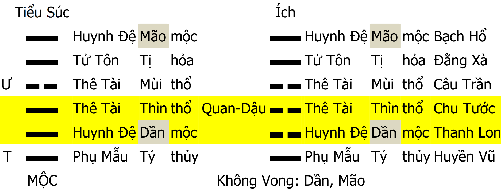
    - **Hình này chứng minh điều gì**
      - Quẻ Tiểu Súc biến Ích; cung Tốn (Đông Nam) là rừng cây; Nguyên thần Dần Mão mộc vượng; dùng cành liễu phương Đông Nam khai sinh.
    - **Từ đâu mà thấy được**
      - Hào 5 Huynh Đệ Thân kim động hóa Quan Quỷ Tị hỏa; cung Tốn mộc.
  - **Phán đoán và đối thoại (phần 2 - quẻ Tiểu Súc):**
    - Căn cứ: Quẻ thuộc cung Tốn (Đông Nam, mộc), Nguyên thần là Mão mộc và Dần mộc; mộc chủ sinh sôi, khai hoa nở nhụy.
    - Nhìn vào: Nạp âm Dương Liễu Mộc có tính chất nhu thuận, dẫn dắt thai nhi thuận đường sinh nở.
    - Đối thoại thực tế: Tác giả chỉ dẫn bẻ cành dương liễu phương Đông Nam mang vào phòng sinh.
  - **Phương án hóa giải:** Cho người ra hướng Đông Nam bẻ một cành liễu tươi cắm vào bình nước đặt tại đầu giường sản phụ.
  - **Ứng nghiệm thực tế:** Sau khi cắm cành liễu khoảng nửa giờ, sản phụ thuận lợi sinh hạ một bé trai mẹ tròn con vuông mà không cần phẫu thuật.
- **Quái lệ 3: Bà cụ 86 tuổi xem lưu niên thọ mệnh (Ngày Quý Tị tháng Bính Thìn)**
  - **Hình 18. Quẻ Địa Thiên Thái biến Thủy Lôi Truân**
    - 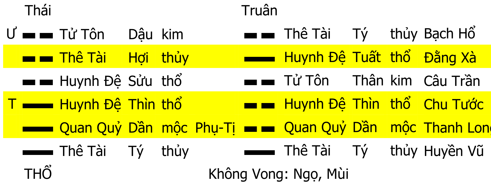
    - **Hình này chứng minh điều gì**
      - Hào Thế Tử Tôn Tý thủy lâm Bạch Hổ động hóa Dần mộc tiết khí; nạp âm Giản Hạ Thủy suy kiệt nhập Mộ ở Thìn thổ.
    - **Từ đâu mà thấy được**
      - Hào sơ Thế Tử Tôn Tý thủy lâm Bạch Hổ động hóa Dần mộc; Nguyệt kiến Thìn thổ là Thủy khố Mộ địa.
  - **Phán đoán và đối thoại:**
    - Căn cứ: Hào Thế Tý thủy lâm Bạch Hổ chủ bệnh tật nguy hiểm, Tý thủy là nước tiểu hệ bài tiết nhập Mộ ở Nguyệt Thìn thổ (bế tắc đường tiểu); nạp âm Giản Hạ Thủy sắp cạn.
    - Nhìn vào: Tháng Thìn Mộ khố mở miệng ngậm Thế; năm Mậu Dần Thổ khắc Thủy nặng nề.
    - Đối thoại thực tế: Con cháu giấu bệnh tình của cụ; tác giả chỉ rõ cụ đang bị bí tiểu ngộ độc niệu nguy kịch tính mạng vào tháng Thìn, Tị.
  - **Phương án hóa giải:** Dùng nước giếng tinh khiết phương Bắc kết hợp linh phù kim Thủy trợ mệnh thông quan.
  - **Ứng nghiệm thực tế:** Quả nhiên cụ bà phát bệnh bí tiểu cấp tính phải nhập viện đặt ống thông, nhờ chuẩn bị trước nên qua khỏi cơn nguy kịch.
- **Quái lệ 4: Nữ thủ kho thuốc đoán tai nạn hao tài (Ngày Bính Thìn tháng Kỷ Mùi)**
  - **Hình 19. Quẻ Địa Thiên Thái biến Địa Phong Thăng**
    - 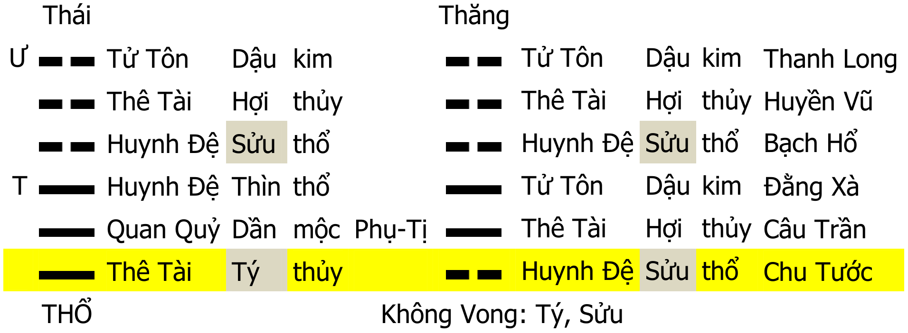
    - **Hình này chứng minh điều gì**
      - Thế hào Phụ Mẫu Tý thủy nạp âm Giản Hạ Thủy hưu tù bị Nhật Nguyệt Thổ khắc thương; Huynh Đệ Sửu thổ động đoạt tài.
    - **Từ đâu mà thấy được**
      - Hào 3 Huynh Đệ Sửu thổ động hóa Thê Tài Ngọ hỏa; hào Thế Phụ Mẫu Tý thủy lâm Chu Tước.
  - **Phán đoán và đối thoại:**
    - Căn cứ: Thủ kho thuốc lấy Phụ Mẫu làm Dụng thần bảo quản kho, Thê Tài làm tài sản; Huynh Đệ Sửu thổ động khắc Thế đoạt Tài báo hiệu kho thuốc bị thất thoát hoặc đền bù lớn.
    - Nhìn vào: Canh Chi nạp âm của Sửu thổ là Bích Thượng Thổ khắc hại Tý thủy; cần dùng Kim thông quan Thổ sinh Thủy.
    - Đối thoại thực tế: Chị thủ kho than thở kho thuốc gần đây kiểm kê thiếu hụt nghiêm trọng nguy cơ bị đền tiền và kỷ luật.
  - **Phương án hóa giải:** Đặt vật phẩm kim loại màu trắng (chuông gió đồng) tại cửa kho thuốc để hóa giải sát khí của Huynh Đệ.
  - **Ứng nghiệm thực tế:** Tìm ra nguyên nhân do nhầm lẫn sổ sách và chuột bọ cắn phá, tránh được khoản bồi thường hàng chục triệu đồng.

## Chương 5: Trích Xuất Thông Tin Ngũ Hành

- **Nguyên lý trích xuất Ngũ hành từ vật thể tự nhiên:**
  - Ngũ hành Thủy, Hỏa, Kim, Mộc, Thổ phân bố khắp vạn vật; việc ứng dụng chính xác vật phẩm tương ứng giúp kích hoạt hoặc ức chế trường khí theo ý muốn.
  - Vật phẩm ngũ hành thông dụng: Thủy (nước, mưa, vải đen, cá); Hỏa (nến, lửa, vải đỏ, bếp lò); Mộc (cây cỏ, gỗ, tre trúc, vải bông); Kim (kim loại, chuông đồng, dao kéo, vải trắng); Thổ (đất sét, gốm sứ, vải vàng, tổ yến).
  - Ngũ hành trong trái cây trị bệnh: Táo (ngọt - Thổ); Mận (chua - Mộc); Hạt dẻ (mặn - Thủy); Hạnh đào (đắng - Hỏa); Đào (cay - Kim).
- **Quái lệ 1: Người phụ nữ đoán bệnh viêm sưng tràn dịch đầu gối (Ngày Đinh Dậu tháng Tân Sửu)**
  - **Hình 20. Quẻ Lôi Địa Dự biến Khảm Vi Thủy**
    - 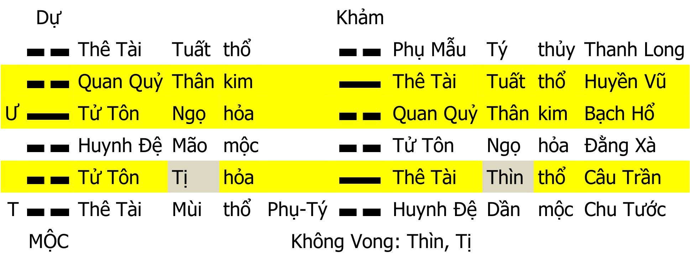
    - **Hình này chứng minh điều gì**
      - Hào sơ Thế Mùi thổ bị Nguyệt phá Nhật xung; hào 2 Tử Tôn Tị hỏa lâm Câu Trần sưng khớp gối; hào 5 Thân kim viêm phổi.
    - **Từ đâu mà thấy được**
      - Hào sơ Thê Tài Mùi thổ lâm Chu Tước; hào 2 Tử Tôn Tị hỏa Không Vong; hào 5 Quan Quỷ Thân kim phát động.
  - **Phán đoán và đối thoại:**
    - Căn cứ: Hào sơ là bàn chân lâm Chu Tước (chứng viêm), hào 2 là đầu gối lâm Câu Trần (sưng trướng tích dịch do Thìn thổ thủy khố); hào 5 Thân kim lâm kim phổi hô hấp kém.
    - Nhìn vào: Tử Tôn lâm Ứng hóa Quan Quỷ biểu thị đang uống thuốc Tây y nhưng thuốc gây tác dụng phụ nặng nề.
    - Đối thoại thực tế: Bệnh nhân xác nhận đầu gối sưng phù đau nhức tràn dịch không đi lại được, khí quản ho hen uống thuốc bị phản ứng phụ mệt mỏi.
  - **Phương án hóa giải:** Dùng ớt đỏ (Tị hỏa nhọn đỏ lâm Câu Trần ruộng đất), rễ cà tím (Mùi thổ hào sơ lâm Chu Tước) và tro giấy viết chữ Xà (蛇) nấu nước sôi ngâm rửa chân gối.
  - **Ứng nghiệm thực tế:** Sau 4 tháng ngâm rửa liên tục, dịch khớp gối tan biến hoàn toàn, chân đi lại bình thường và dứt cơn ho hen.
- **Quái lệ 2: Người phụ nữ xem bệnh cho cha già (Ngày Nhâm Thân tháng Kỷ Mùi)**
  - **Hình 21. Quẻ Thủy Trạch Tiết biến Sơn Trạch Tổn**
    - 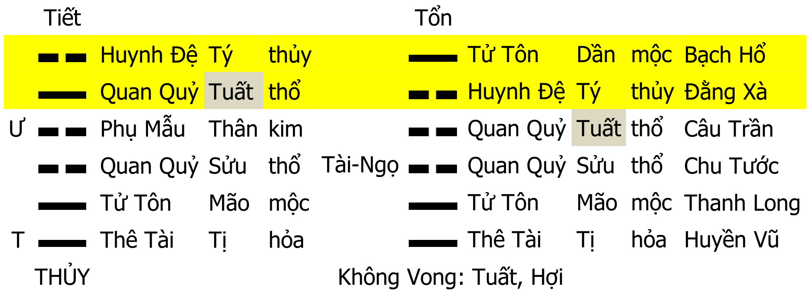
    - **Hình này chứng minh điều gì**
      - Phụ Mẫu Thân kim được Nguyệt sinh Nhật phù; Kỵ thần Thê Tài Tị hỏa phục tàng nhập Mộ; trích xuất Thủy Mộc điều dưỡng.
    - **Từ đâu mà thấy được**
      - Hào 4 Phụ Mẫu Thân kim lâm Câu Trần; hào 5 Quan Quỷ Tuất thổ động hóa Huynh Đệ Tý thủy.
  - **Phán đoán và đối thoại:**
    - Căn cứ: Phụ Mẫu Thân kim vượng tướng chứng tỏ bệnh cụ ông không nguy hiểm tính mạng nhưng khí huyết lưu thông kém.
    - Nhìn vào: Hào 5 Quan Quỷ Tuất thổ động hóa Huynh Đệ Tý thủy; cần dùng Thủy làm thông quan điều hòa tạng phủ.
    - Đối thoại thực tế: Người con gái lo lắng cha già suy kiệt ăn ngủ kém.
  - **Phương án hóa giải:** Uống nước sắc từ thảo mộc dưỡng phế sinh tân, đặt bể cảnh nhỏ phương Bắc phòng ngủ cụ.
  - **Ứng nghiệm thực tế:** Cụ ông ăn ngủ ngon miệng, tinh thần minh mẫn khỏe mạnh trở lại.
- **Quái lệ 3: Người phụ nữ xem bệnh cha u bướu (Ngày Đinh Sửu tháng Kỷ Mùi)**
  - **Hình 22. Quẻ Cấn Vi Sơn biến Sơn Phong Cổ**
    - 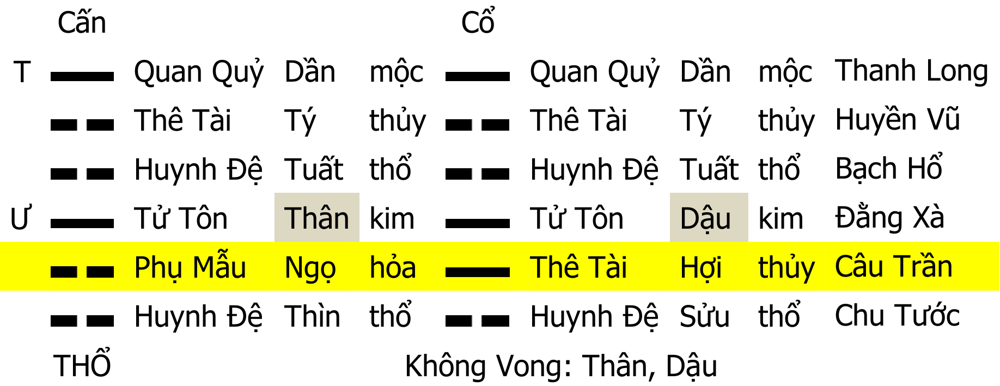
    - **Hình này chứng minh điều gì**
      - Quẻ Cấn biến Cổ; hào 2 Quan Quỷ Dần mộc động hóa Tị hỏa; Phụ Mẫu Ngọ hỏa vượng; dùng Kim khắc Mộc tán u.
    - **Từ đâu mà thấy được**
      - Hào 2 Quan Quỷ Dần mộc động hóa Tử Tôn Tị hỏa; cung Cấn thuộc Thổ.
  - **Phán đoán và đối thoại:**
    - Căn cứ: Cung Cấn chủ u bướu ngưng trệ, Quan Quỷ Dần mộc phát động khắc tỳ thổ gây khối u vùng bụng.
    - Nhìn vào: Dần mộc động cần Kim chế phục; trích xuất năng lượng Kim từ chuông đồng và dao kéo để trấn áp mộc sát.
    - Đối thoại thực tế: Bác sĩ nghi ngờ khối u ác tính chuẩn bị phẫu thuật.
  - **Phương án hóa giải:** Treo chuông đồng hoặc đặt vật phẩm kim khí phương Đông Bắc và Đông để ức chế Dần mộc phát triển.
  - **Ứng nghiệm thực tế:** Khối u teo nhỏ dần, xét nghiệm sinh thiết là u lành tính, phẫu thuật bóc tách thành công mỹ mãn.
- **Quái lệ 4: Nữ chủ tiệm thuốc tây cầu tài hóa giải kinh doanh ế ẩm (Ngày Bính Thân tháng Canh Ngọ)**
  - **Hình 23. Quẻ Thiên Trạch Lý biến Trạch Thủy Khốn**
    - 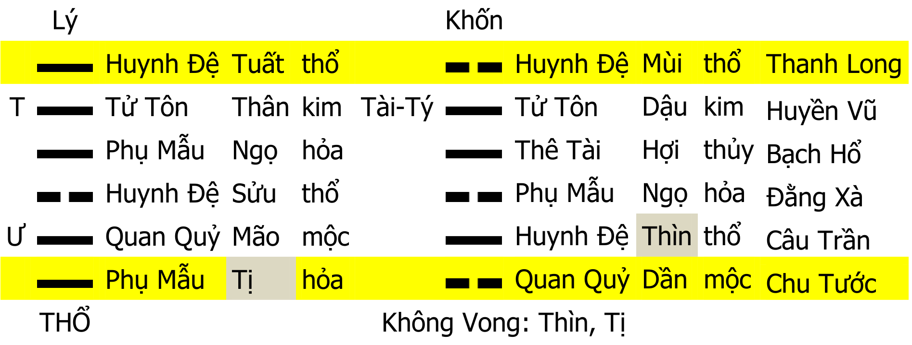
    - **Hình này chứng minh điều gì**
      - Quẻ Lý biến Khốn; Thê Tài Tý thủy lâm Nguyệt phá hưu tù; hào Ứng Huynh Đệ Thân kim phát động; dùng 9 chuông đồng kích tài.
    - **Từ đâu mà thấy được**
      - Hào 3 Huynh Đệ Sửu thổ động; hào 5 Huynh Đệ Thân kim lâm Thanh Long; Thê Tài Tý thủy phục tàng.
  - **Phán đoán và đối thoại:**
    - Căn cứ: Tài hào Tý thủy lâm Nguyệt phá tiền tài tiêu tán; may nhờ hào Ứng Thân kim phát động sinh Thủy.
    - Nhìn vào: Kim sinh Thủy; số 9 là số Lão Dương thuộc Kim/Càn; chuông đồng phát âm thanh kim khí kích hoạt tài khí.
    - Đối thoại thực tế: Chủ tiệm thuốc buồn rầu vì mở tiệm mấy tháng vắng khách, nợ tiền thuê nhà.
  - **Phương án hóa giải:** Treo 9 cái chuông đồng nhỏ trước cửa tiệm thuốc phương Tây Bắc để mỗi khi khách ra vào chuông reo kích Kim sinh Thủy.
  - **Ứng nghiệm thực tế:** Tiệm thuốc đột ngột đông khách nườm nượp, doanh thu tăng gấp ba lần ngay trong tháng đó.

## Chương 6: Hình Thức Tồn Tại Của Ngũ Hành Theo Phương Vị

- **Không gian phương vị và trường khí Ngũ hành:**
  - Phương vị trong Bát Quái phân định rõ trường khí: Bắc (Khảm - Thủy), Nam (Ly - Hỏa), Đông (Chấn - Mộc), Đông Nam (Tốn - Mộc), Tây (Đoài - Kim), Tây Bắc (Càn - Kim), Đông Bắc (Cấn - Thổ), Tây Nam (Khôn - Thổ).
  - Thay đổi vị trí cư ngụ, giường ngủ, bàn làm việc hoặc hướng di chuyển là phương thức hóa giải quyền năng dựa trên dịch chuyển không gian phương vị.
- **Quái lệ 1: Người phụ nữ xem con gái thi chuyển cấp ba (Ngày Kỷ Dậu tháng Bính Ngọ)**
  - **Hình 24. Quẻ Lôi Thủy Giải biến Sơn Thiên Đại Súc**
    - 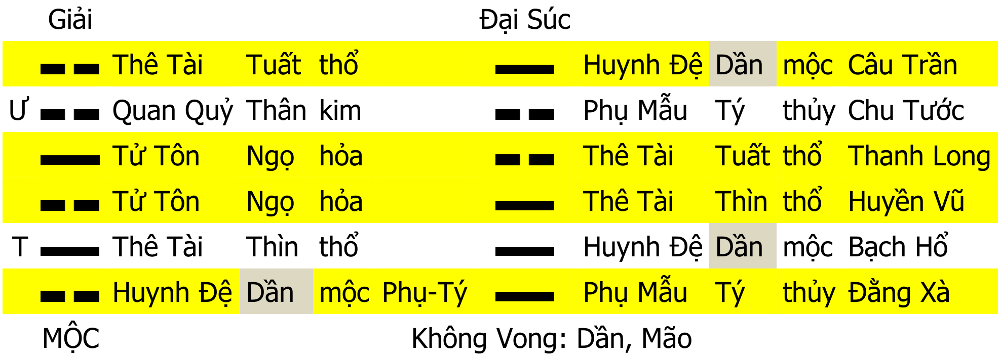
    - **Hình này chứng minh điều gì**
      - Quẻ Giải biến Đại Súc; Phụ Mẫu Ngọ hỏa lâm Nguyệt kiến cực vượng nhưng hào Thế Thân kim bị khắc; dùng hướng Tây Bắc cứu viện.
    - **Từ đâu mà thấy được**
      - Hào 2 Quan Quỷ Thìn thổ động hóa Thê Tài Dần mộc; hào Thế Huynh Đệ Thân kim.
  - **Phán đoán và đối thoại:**
    - Căn cứ: Phụ Mẫu Ngọ hỏa lệnh tháng thi cử văn bằng sáng chói; nhưng hào Thế Thân kim bị Ngọ hỏa khắc áp lực tâm lý thi cử căng thẳng.
    - Nhìn vào: Cần chuyển dời phương vị ôn tập sang hướng Tây Bắc (Càn Kim) để tỉ hòa trợ Thế.
    - Đối thoại thực tế: Mẹ cháu bé lo lắng con học tài thi phận, sức ép thi trường chuyên quá lớn.
  - **Phương án hóa giải:** Kê bàn học của cháu gái quay về hướng Tây Bắc, phòng thi ngồi góc Tây Bắc.
  - **Ứng nghiệm thực tế:** Cháu gái làm bài thi suôn sẻ, đỗ thủ khoa vào trường trung học trọng điểm.
- **Quái lệ 2: Người đàn ông thuê đất làm trang trại kinh doanh (Ngày Canh Tuất tháng Canh Tuất)**
  - **Hình 25. Quẻ Địa Thiên Thái biến Sơn Thiên Đại Súc**
    - 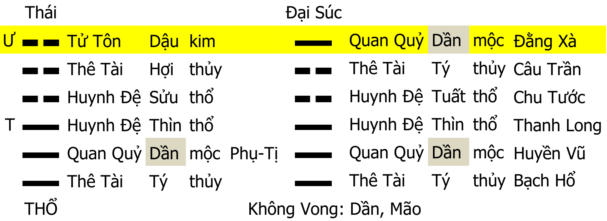
    - **Hình này chứng minh điều gì**
      - Quẻ Thái biến Đại Súc; Thế hào Thê Tài Tý thủy lâm Mộ khố; hào Ứng Phụ Mẫu Sửu thổ hợp trói; hướng Đông Bắc phá Mộ sinh Tài.
    - **Từ đâu mà thấy được**
      - Hào 2 Thê Tài Dần mộc động hóa Thê Tài Tý thủy; quẻ Địa Thiên Thái.
  - **Phán đoán và đối thoại:**
    - Căn cứ: Đất đai lấy Phụ Mẫu làm Dụng thần, Tài hào nhập Mộ đất đai khó sinh lợi nhuận ngay.
    - Nhìn vào: Chuyển cửa chính trang trại về hướng Đông Bắc để nạp sinh khí Cấn thổ.
    - Đối thoại thực tế: Người thuê đất lo ngại chôn vốn vào mảnh đất hoang hóa.
  - **Phương án hóa giải:** Mở cổng trang trại ở hướng Đông Bắc và quy hoạch khu chuồng trại theo trục Đông Bắc - Tây Nam.
  - **Ứng nghiệm thực tế:** Trang trại phát triển thuận lợi, thu hoạch vụ mùa bội thu ngay năm đầu tiên.
- **Quái lệ 3: Người đàn ông đoán bệnh xuất huyết nội tạng (Ngày Ất Mão tháng Canh Tuất)**
  - **Hình 26. Quẻ Thủy Lôi Truân biến Địa Lôi Phục**
    - 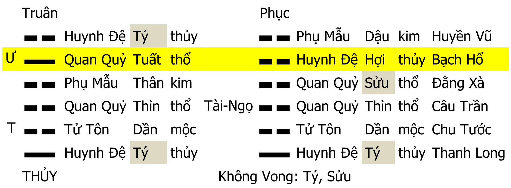
    - **Hình này chứng minh điều gì**
      - Quẻ Truân biến Phục; hào 2 Quan Quỷ Dần mộc vượng; Thê Tài Tị hỏa phục hào sơ lâm Bạch Hổ; dùng hướng Bắc Thủy dưỡng Mộc.
    - **Từ đâu mà thấy được**
      - Hào sơ Tử Tôn Tý thủy động hóa Huynh Đệ Sửu thổ; hào 2 Quan Quỷ Dần mộc.
  - **Phán đoán và đối thoại (phần 1 - quẻ Truân biến Phục):**
    - Căn cứ: Quẻ Truân nạn sinh ban đầu; Quan Quỷ lâm Dần mộc mộc vượng khắc tỳ thổ gây xuất huyết.
    - Nhìn vào: Kiểm tra phối hợp quẻ Nhu biến Thái để định rõ phương hướng tị nạn cứu chữa.
    - Đối thoại thực tế: Bệnh nhân đau bụng quằn quại cấp cứu bác sĩ chưa rõ nguyên nhân xuất huyết.
- **Quái lệ 3 (tiếp theo): Quẻ Nhu biến Thái xác định vị trí bệnh viện điều trị**
  - **Hình 27. Quẻ Thủy Thiên Nhu biến Địa Thiên Thái**
    - 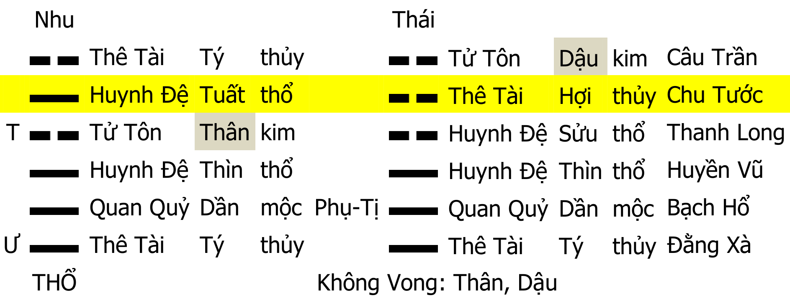
    - **Hình này chứng minh điều gì**
      - Quẻ Nhu biến Thái; Thê Tài Tý thủy trì Thế; Tử Tôn Thân kim phát động sinh Thế; hướng Tây Nam có danh y cứu mạng.
    - **Từ đâu mà thấy được**
      - Hào 3 Huynh Đệ Thìn thổ động hóa Thê Tài Hợi thủy; hào sơ Thế Thê Tài Tý thủy.
  - **Phán đoán và đối thoại (phần 2 - quẻ Nhu biến Thái):**
    - Căn cứ: Tử Tôn Thân kim (thầy thuốc danh y) phát động sinh cho hào Thế Thủy; Thân kim ở phương Tây/Tây Nam.
    - Nhìn vào: Bệnh viện nằm ở phía Tây Nam thành phố sẽ có phác đồ điều trị dứt điểm.
    - Đối thoại thực tế: Gia đình chuyển viện ngay theo lời khuyên của tác giả.
  - **Phương án hóa giải:** Chuyển bệnh nhân sang bệnh viện ở hướng Tây Nam để bác sĩ chuyên khoa phẫu thuật.
  - **Ứng nghiệm thực tế:** Ca mổ thành công ngoài mong đợi, cầm máu kịp thời và bệnh nhân xuất viện sau 10 ngày.
- **Quái lệ 4: Cổ lệ – Đoán gia nô mưu phản hại chủ (Ngày Bính Tý tháng Mùi)**
  - **Hình 28. Quẻ Lôi Thủy Giải biến Chấn Vi Lôi**
    - 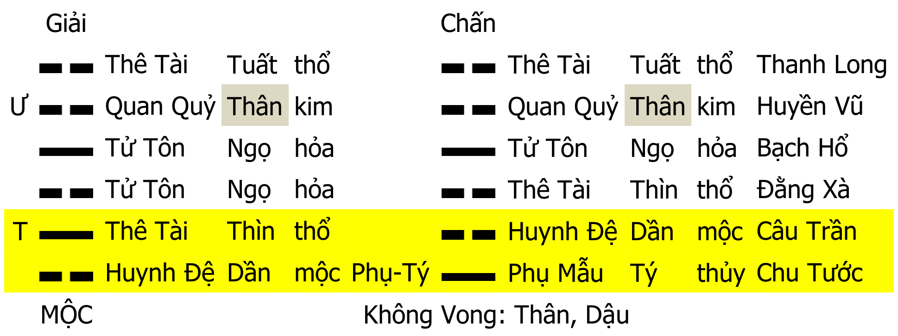
    - **Hình này chứng minh điều gì**
      - Quẻ Giải biến Chấn; hào sơ Thế Thê Tài Thìn thổ lâm Bạch Hổ; Huynh Đệ Dần mộc động khắc Thế; di chuyển hướng Đông Bắc thoát nạn.
    - **Từ đâu mà thấy được**
      - Hào 4 Thê Tài Ngọ hỏa động hóa Huynh Đệ Dần mộc; hào Thế Thê Tài Thìn thổ.
  - **Phán đoán và đối thoại:**
    - Căn cứ: Gia nô mưu phản lấy Huynh Đệ làm Kỵ thần; Dần mộc động khắc Thế nguy cơ bị ám hại nửa đêm.
    - Nhìn vào: Chạy sang phương Đông Bắc (Cấn Thổ) nương nhờ chỗ quan phủ trấn áp.
    - Đối thoại thực tế: Chủ nhân nghi ngờ gia nô có mưu đồ phản nghịch nhưng chưa có chứng cớ.
  - **Phương án hóa giải:** Đêm đó dời phòng ngủ sang dinh thự phía Đông Bắc của thân thích.
  - **Ứng nghiệm thực tế:** Nửa đêm gia nô vác dao xông vào phòng cũ chém nát giường chiếu, chủ nhân thoát nạn trong gang tấc.
- **Quái lệ 5: Cổ lệ – Lánh giặc cướp thời chiến loạn (Quẻ Càn biến Đại Hữu)**
  - **Hình 29. Quẻ Càn Vi Thiên biến Hỏa Thiên Đại Hữu**
    - 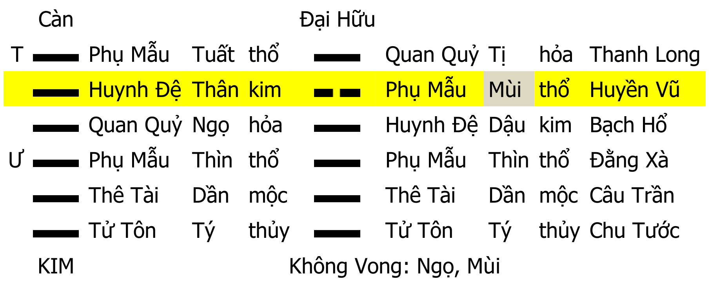
    - **Hình này chứng minh điều gì**
      - Quẻ Càn biến Đại Hữu; hào 3 Phục thần Huynh Đệ Thân kim động; trốn sang hang núi phương Tây Bắc giữ trọn tính mạng tài sản.
    - **Từ đâu mà thấy được**
      - Hào 3 Phụ Mẫu Thìn thổ động hóa Thê Tài Ngọ hỏa; quẻ Càn Vi Thiên thuần dương.
  - **Phán đoán và đối thoại:**
    - Căn cứ: Giặc cướp hoành hành làng mạc; quẻ thuần Càn cương kiện, Tây Bắc là nơi hiểm trở cao ráo.
    - Nhìn vào: Ẩn náu phương Tây Bắc hợp với quái khí Càn Kim để tị hung.
    - Đối thoại thực tế: Dân làng hoang mang không biết chạy hướng nào để tránh thổ phỉ.
  - **Phương án hóa giải:** Cả gia đình gom góp lương thực trốn lên hẻm núi phương Tây Bắc cắm trại ẩn cư.
  - **Ứng nghiệm thực tế:** Giặc cướp càn quét các hướng Đông và Nam tàn phá khốc liệt, riêng vùng núi Tây Bắc an toàn tuyệt đối.

## Chương 7: Hình Thức Tồn Tại Của Ngũ Hành Theo Thời Gian

- **Thời gian ngũ hành luân chuyển định đoạt vận số:**
  - Thời gian vận hành tuần hoàn qua 12 canh giờ, 365 ngày, 12 tháng, 24 tiết khí và các chu kỳ hoa giáp ngũ vận lục khí.
  - Chọn thời điểm hành động, xuất hành, khai trương, uống thuốc hoặc đặt vật phẩm hóa giải là chìa khóa mượn thiên thời để hóa giải hung sát.
- **Quái lệ 1: Người phụ nữ Thiên Tân đoán bệnh thận (Ngày Đinh Tị tháng Giáp Thìn)**
  - **Hình 30. Quẻ Lôi Hỏa Phong biến Thủy Hỏa Ký Tế**
    - 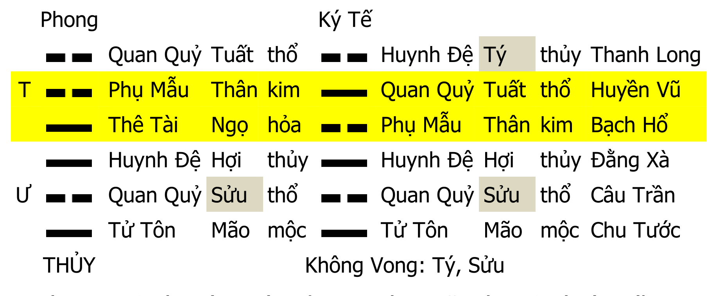
    - **Hình này chứng minh điều gì**
      - Quẻ Phong biến Ký Tế; Hào 2 Thế Huynh Đệ Sửu thổ lâm Câu Trần; Thê Tài Hợi thủy Nguyệt phá; giờ Tý Hợi giờ Thủy trợ Thần.
    - **Từ đâu mà thấy được**
      - Hào sơ Phụ Mẫu Mão mộc động hóa Huynh Đệ Sửu thổ; hào 2 Thế Huynh Đệ Sửu thổ.
  - **Phán đoán và đối thoại:**
    - Căn cứ: Thủy chủ thận hư, Hợi thủy Nguyệt phá bị thổ khắc; cần chọn giờ Hợi, Tý (nước vượng) để uống thuốc.
    - Nhìn vào: Mượn thời gian Thủy vượng bổ thận ích tinh giải trừ nhiệt độc.
    - Đối thoại thực tế: Bệnh nhân đau lưng mỏi gối tiểu đêm nhiều lần, thuốc Đông y uống ban ngày không hiệu quả.
  - **Phương án hóa giải:** Uống thuốc bổ thận vào đúng giờ Hợi (21h-23h) và giờ Tý (23h-1h) trước khi ngủ.
  - **Ứng nghiệm thực tế:** Sau 2 tuần chứng đau lưng tiểu đêm dứt hẳn, chức năng thận hồi phục rõ rệt.
- **Quái lệ 2: Đồng nghiệp xem gặp lại bạn cũ thất lạc (Ngày Canh Thìn tháng Giáp Ngọ)**
  - **Hình 31. Quẻ Địa Trạch Lâm biến Địa Thủy Sư**
    - 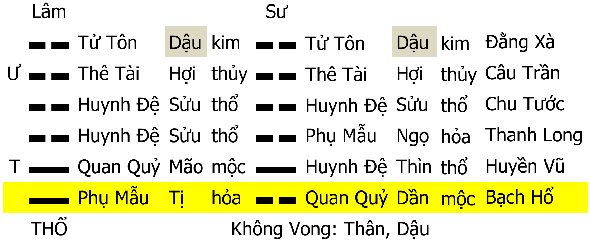
    - **Hình này chứng minh điều gì**
      - Quẻ Lâm biến Sư; Ứng hào Tử Tôn Dậu kim lâm Huyền Vũ; hào Thế Quan Quỷ Mão mộc; ứng kỳ ngày Dậu tương xung tương kiến.
    - **Từ đâu mà thấy được**
      - Hào 2 Thế Quan Quỷ Mão mộc; hào 6 Ứng Tử Tôn Dậu kim động hóa Huynh Đệ Hợi thủy.
  - **Phán đoán và đối thoại:**
    - Căn cứ: Bạn cũ lấy Huynh Đệ/Ứng hào, Ứng hào Dậu kim động xung Thế; xung là động chạm gặp gỡ bất ngờ.
    - Nhìn vào: Ngày Ất Dậu xung hào Thế Mão mộc là thời khắc gặp mặt.
    - Đối thoại thực tế: Đồng nghiệp bồi hồi nhớ bạn thân thời thơ ấu mất liên lạc 10 năm.
  - **Phương án hóa giải:** Chọn ngày Ất Dậu đi đến khu phố cũ tìm kiếm.
  - **Ứng nghiệm thực tế:** Đúng ngày Ất Dậu hai người tình cờ chạm mặt trên phố, mừng rỡ nối lại tình bạn xưa.
- **Quái lệ 3: Vợ bạn bị mất trộm xe đạp tìm lại (Ngày Quý Mùi tháng Bính Thân)**
  - **Hình 32. Quẻ Trạch Lôi Tùy biến Thủy Hỏa Ký Tế**
    - 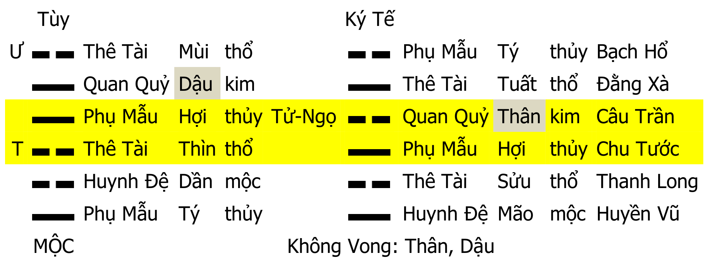
    - **Hình này chứng minh điều gì**
      - Quẻ Tùy biến Ký Tế; Thê Tài Thìn thổ trì Thế; Huynh Đệ Dần mộc động đoạt tài; giờ Thân xung Dần bắt kẻ trộm xe.
    - **Từ đâu mà thấy được**
      - Hào sơ Thế Thê Tài Thìn thổ; hào 3 Huynh Đệ Dần mộc động hóa Quan Quỷ Ngọ hỏa.
  - **Phán đoán và đối thoại:**
    - Căn cứ: Xe đạp lấy Thê Tài Thìn thổ, Huynh Đệ Dần mộc động lâm Huyền Vũ là kẻ trộm lẻn lấy cắp.
    - Nhìn vào: Thân kim xung khắc Dần mộc kẻ trộm bị lộ; giờ Thân (15h-17h) là ứng kỳ tìm xe.
    - Đối thoại thực tế: Bạn hớt hải báo xe đạp mới mua bị dắt trộm tại cổng chợ.
  - **Phương án hóa giải:** Báo bảo vệ canh chốt cổng phụ vào giờ Thân.
  - **Ứng nghiệm thực tế:** Đúng 16h bảo vệ bắt quả tang kẻ trộm đang mang xe ra khỏi cổng, thu hồi nguyên vẹn chiếc xe.
- **Quái lệ 4: Nữ sĩ Hồng Kông hỏi về đầu tư bất động sản (Ngày Giáp Tuất tháng Ất Tị)**
  - **Hình 33. Quẻ Địa Thủy Sư biến Thiên Phong Cấu**
    - 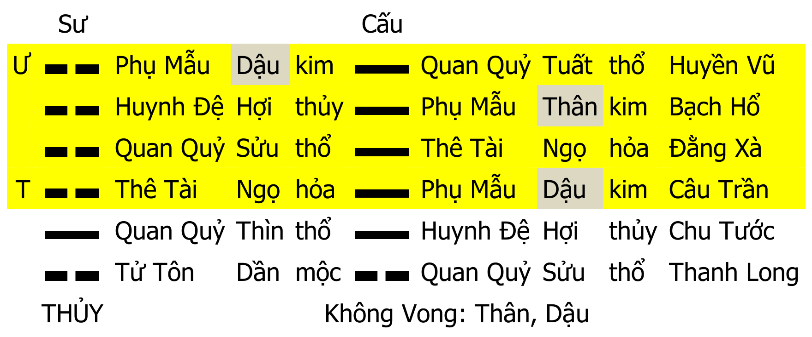
    - **Hình này chứng minh điều gì**
      - Quẻ Sư biến Cấu; Phụ Mẫu Dậu kim Không Vong; Quan Quỷ Sửu thổ động; tháng Dậu xuất Không là thời điểm giao dịch.
    - **Từ đâu mà thấy được**
      - Hào 6 Ứng Phụ Mẫu Dậu kim Không Vong; hào 4 Quan Quỷ Sửu thổ động hóa Thê Tài Ngọ hỏa.
  - **Phán đoán và đối thoại:**
    - Căn cứ: Bất động sản lấy Phụ Mẫu làm Dụng thần, Dậu kim Không Vong là hợp đồng chưa ký kết được ngay.
    - Nhìn vào: Tháng 8 âm lịch (tháng Dậu) xuất Không tài vận hanh thông.
    - Đối thoại thực tế: Khách hàng lo lắng thị trường nhà đất đóng băng chôn vốn.
  - **Phương án hóa giải:** Kiên nhẫn chờ đến tháng Dậu mới mở bán chính thức.
  - **Ứng nghiệm thực tế:** Đến tháng Dậu lượng người mua tăng vọt, bán hết dự án với lợi nhuận cao.
- **Quái lệ 5: Dự định về quê ăn Tết và quẻ Hoán biến Mông (Ngày Tân Tị tháng Kỷ Tị)**
  - **Hình 34. Quẻ Phong Thủy Hoán biến Sơn Thủy Mông**
    - 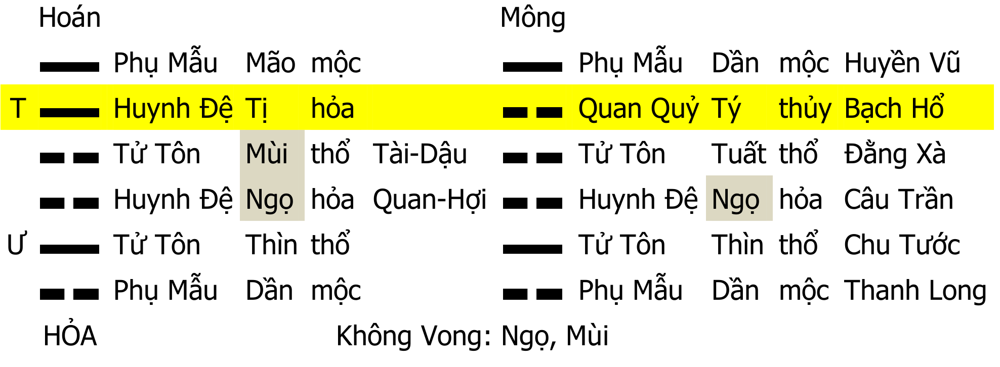
    - **Hình này chứng minh điều gì**
      - Quẻ Hoán biến Mông; hào Thế Thê Tài Tị hỏa lâm Chu Tước; Quan Quỷ Dần mộc động; chọn giờ khởi hành tránh tai nạn xe cộ.
    - **Từ đâu mà thấy được**
      - Hào 2 Quan Quỷ Dần mộc động hóa Tử Tôn Thìn thổ; hào 4 Tử Tôn Mùi thổ.
  - **Phán đoán và đối thoại:**
    - Căn cứ: Xuất hành lấy Thế hào và Tử Tôn làm bình an; Dần mộc động khắc hào lộ trình có nguy cơ va quẹt.
    - Nhìn vào: Chọn giờ Ngọ khởi hành Hỏa vượng tiết Mộc an toàn.
    - Đối thoại thực tế: Tác giả tự gieo quẻ kiểm tra chuyến đi đường dài.
- **Quái lệ 5 (tiếp theo): Quẻ Khuê định vị thời gian an toàn**
  - **Hình 35. Quẻ Hỏa Trạch Khuê**
    - 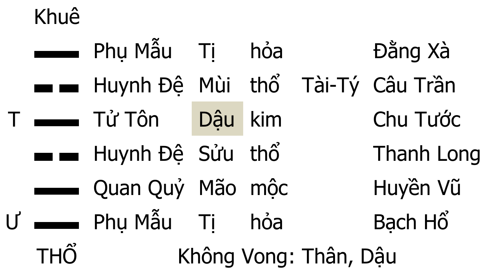
    - **Hình này chứng minh điều gì**
      - Quẻ Hỏa Trạch Khuê; hào Thế Huynh Đệ Tị hỏa; Tử Tôn Mùi thổ trì hào 2; lùi thời gian xuất phát bảo toàn chuyến đi.
    - **Từ đâu mà thấy được**
      - Quẻ Hỏa Trạch Khuê; hào 2 Tử Tôn Mão mộc; hào 5 Phụ Mẫu Mùi thổ.
  - **Phán đoán và đối thoại:**
    - Căn cứ: Quẻ Khuê chủ trắc trở ban đầu; lùi giờ xuất phát để tránh trùng giờ hung sát trên cao tốc.
    - Nhìn vào: Ứng nghiệm tai nạn giao thông xảy ra trước cung giờ xuất phát.
  - **Phương án hóa giải:** Lùi giờ xuất phát chậm lại 2 tiếng so với kế hoạch ban đầu.
  - **Ứng nghiệm thực tế:** Khi đi qua đoạn đường đèo thì thấy vụ tai nạn liên hoàn vừa xảy ra cách đó 1 tiếng, nếu đi đúng giờ cũ đã vướng vào thảm họa.
- **Quái lệ 6: Cổ lệ – Hoãn thời gian xuất phát tránh phục kích giặc (Quẻ Ích biến Trung Phu)**
  - **Hình 36. Quẻ Phong Lôi Ích biến Phong Trạch Trung Phu**
    - 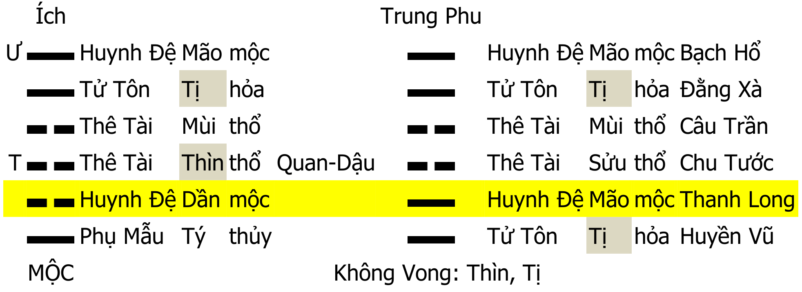
    - **Hình này chứng minh điều gì**
      - Quẻ Ích biến Trung Phu; hào 2 Thế Huynh Đệ Dần mộc; hào 3 Quan Quỷ Thìn thổ động; lùi ngày khởi hành tránh phục kích.
    - **Từ đâu mà thấy được**
      - Hào 3 Quan Quỷ Thìn thổ động hóa Huynh Đệ Sửu thổ; quẻ Phong Lôi Ích.
  - **Phán đoán và đối thoại:**
    - Căn cứ: Cổ nhân xem quẻ hành quân thấy Quan Quỷ động khắc lộ trình phục binh mai phục.
    - Nhìn vào: Lùi ngày đi sang ngày Giáp Dần thoát khỏi cạm bẫy.
  - **Phương án hóa giải:** Án binh bất động thêm 3 ngày rồi mới xuất quân.
  - **Ứng nghiệm thực tế:** Quân địch mai phục kiệt sức rút lui, đoàn quân hành tiến an toàn tuyệt đối.
- **Quái lệ 7: Mẹ đoán con trai thi cấp ba (Ngày Quý Sửu tháng Quý Mùi)**
  - **Hình 37. Quẻ Cấn Vi Sơn**
    - 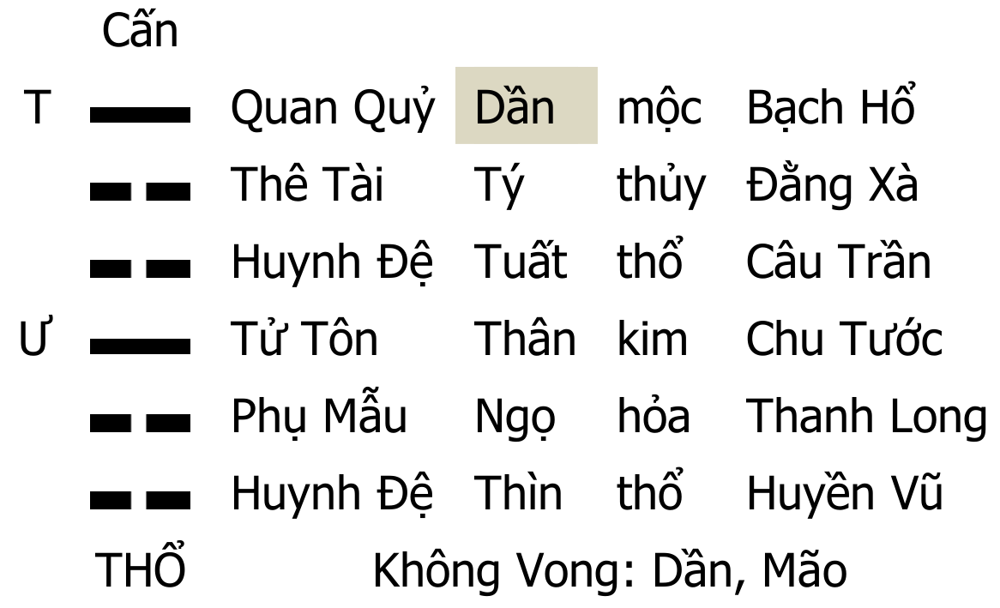
    - **Hình này chứng minh điều gì**
      - Quẻ Cấn Vi Sơn lục xung; Phụ Mẫu Ngọ hỏa lâm hào 2; Tử Tôn Thân kim trì Thế; thiếu điểm chuyển trường kịp thời gian.
    - **Từ đâu mà thấy được**
      - Quẻ thuần Cấn; hào 2 Phụ Mẫu Ngọ hỏa; hào 6 Huynh Đệ Dần mộc.
  - **Phán đoán và đối thoại:**
    - Căn cứ: Thi cử quẻ lục xung bất lợi, thiếu 0.5 điểm vào trường công lập mong muốn.
    - Nhìn vào: Nộp đơn phúc khảo và chuyển nguyện vọng trước giờ Thân ngày Bính Dần.
  - **Phương án hóa giải:** Nộp hồ sơ xét tuyển nguyện vọng 2 đúng khung giờ vàng.
  - **Ứng nghiệm thực tế:** Nhà trường hạ điểm chuẩn đợt 2 đúng 0.5 điểm, cháu bé được tuyển thẳng.
- **Quái lệ 8: Người đàn ông đoán vận đỏ đen cờ bạc (Ngày Kỷ Mão tháng Quý Sửu)**
  - **Hình 38. Quẻ Thiên Sơn Độn biến Thiên Phong Cấu**
    - 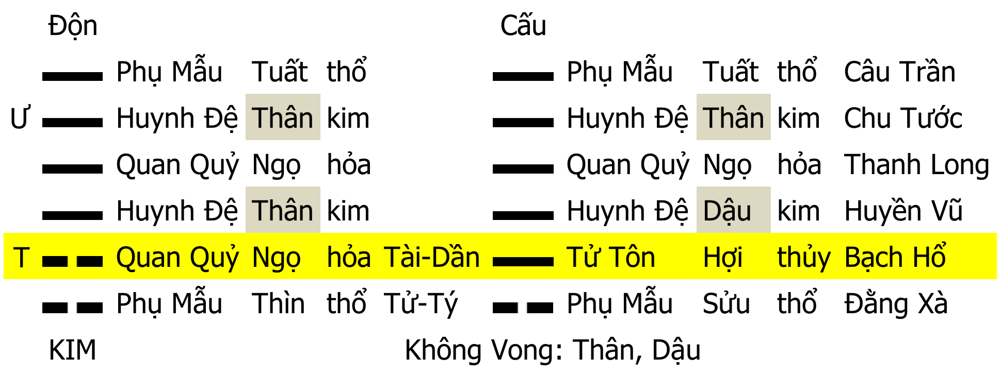
    - **Hình này chứng minh điều gì**
      - Quẻ Độn biến Cấu; Thê Tài Dần mộc Không Vong; Huynh Đệ Thân kim động đoạt tài; khuyên can dừng bước tránh tán gia bại sản.
    - **Từ đâu mà thấy được**
      - Hào 4 Huynh Đệ Thân kim động hóa Huynh Đệ Dậu kim tiến thần; Thê Tài Dần mộc Không Vong.
  - **Phán đoán và đối thoại:**
    - Căn cứ: Tài hào Không Vong lại gặp Huynh Đệ hóa tiến thần đoạt tài; đi cờ bạc chắc chắn thua sạch túi.
    - Nhìn vào: Can ngăn không nên tham gia vào canh bạc đỏ đen.
    - Đối thoại thực tế: Khách hàng mê muội tin tưởng vận đỏ; tác giả khuyên can rốt ráo.
  - **Phương án hóa giải:** Hủy chuyến đi đánh bạc, ở nhà cùng vợ con.
  - **Ứng nghiệm thực tế:** Người bạn rủ đi đánh bạc bị bắt trọn ổ và mất sạch tiền, đương số thoát nạn trong may mắn.

## Chương 8: Hình Thức Tồn Tại Của Ngũ Hành Theo Màu Sắc

- **Ý nghĩa trường khí của màu sắc ngũ hành:**
  - Màu sắc là sóng ánh sáng mang tần số năng lượng ngũ hành xác định: Xanh lục/thanh (Mộc), Đỏ/tím/hồng (Hỏa), Vàng/nâu (Thổ), Trắng/bạc/vàng kim (Kim), Đen/xanh lam (Thủy).
  - Ứng dụng màu sắc vào trang phục, rèm cửa, màu tường, vật dụng hàng ngày để điều chỉnh trường sinh học cơ thể.
- **Quái lệ 1: Bệnh nhân hậu phẫu thuật hồi phục sức khỏe (Ngày Mậu Thân tháng Mậu Thân)**
  - **Hình 39. Quẻ Địa Trạch Lâm biến Địa Thủy Sư**
    - 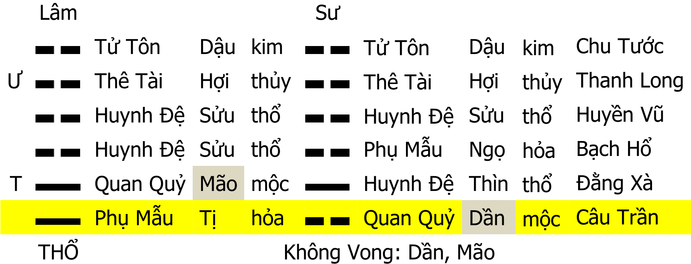
    - **Hình này chứng minh điều gì**
      - Quẻ Lâm biến Sư; hào Thế Mão mộc bị Thân kim song trùng khắc; mặc trang phục màu xanh lá bồi bổ Mộc khí.
    - **Từ đâu mà thấy được**
      - Hào 2 Thế Quan Quỷ Mão mộc lâm Câu Trần; Nhật Nguyệt Thân kim khắc hào Thế.
  - **Phán đoán và đối thoại:**
    - Căn cứ: Hào Thế Mão mộc bị Nhật Nguyệt song Thân kim khắc thương trầm trọng; sau mổ cơ thể suy kiệt xanh xao.
    - Nhìn vào: Cần dùng màu sắc của Mộc (xanh lá cây) và Thủy (xanh lam) để dưỡng Mộc chống lại Kim sát.
    - Đối thoại thực tế: Người nhà bệnh nhân hỏi cách bồi dưỡng hồi phục sau đại phẫu thuật.
  - **Phương án hóa giải:** Cho bệnh nhân mặc áo màu xanh lá cây và trải ga giường màu xanh lá nhạt.
  - **Ứng nghiệm thực tế:** Sắc mặt bệnh nhân hồng hào nhanh chóng, vết mổ liền da đẹp không để lại di chứng.
- **Quái lệ 2: Người cha đoán con trai thi đại học (Ngày Tân Mùi tháng Đinh Mùi)**
  - **Hình 40. Quẻ Địa Lôi Phục**
    - 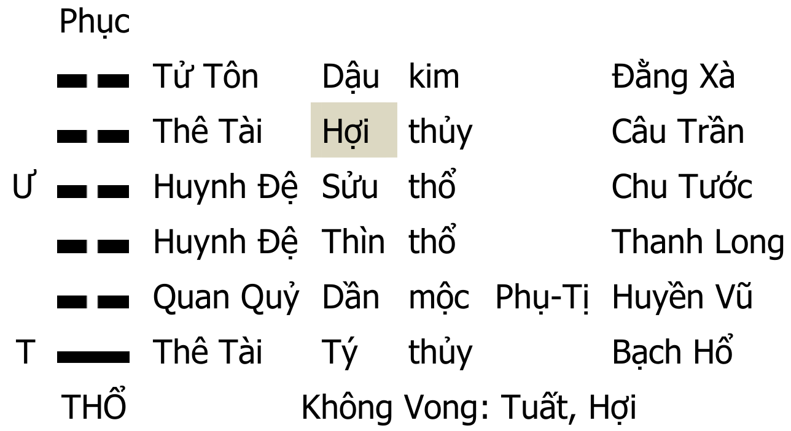
    - **Hình này chứng minh điều gì**
      - Quẻ Địa Lôi Phục; Tử Tôn Dần mộc hưu tù; hào Phụ Mẫu Tị hỏa lâm Chu Tước; mặc áo đỏ vào phòng thi kích hoạt Hỏa tinh.
    - **Từ đâu mà thấy được**
      - Quẻ Địa Lôi Phục nhất dương sinh; hào sơ Tử Tôn Tý thủy; hào 2 Huynh Đệ Dần mộc.
  - **Phán đoán và đối thoại:**
    - Căn cứ: Phụ Mẫu Tị hỏa là bài thi bằng cấp lâm Chu Tước; dùng màu đỏ của Hỏa để trợ vượng hỏa quang văn chương.
    - Nhìn vào: Màu đỏ kích hoạt hưng phấn trí não làm bài thi đạt kết quả tối đa.
    - Đối thoại thực tế: Người cha lo lắng tâm lý thi cử của con trai.
  - **Phương án hóa giải:** Cho thí sinh mặc áo thun màu đỏ may mắn trong các ngày thi đại học.
  - **Ứng nghiệm thực tế:** Thí sinh làm bài thi xuất sắc vượt 20 điểm so với dự kiến, trúng tuyển đại học danh tiếng.
- **Quái lệ 3: Phụ nữ hơn 30 tuổi đoán tình duyên hôn nhân bế tắc (Ngày Ất Dậu tháng Ất Mão)**
  - **Hình 41. Quẻ Trạch Lôi Tùy biến Thiên Hỏa Đồng Nhân**
    - 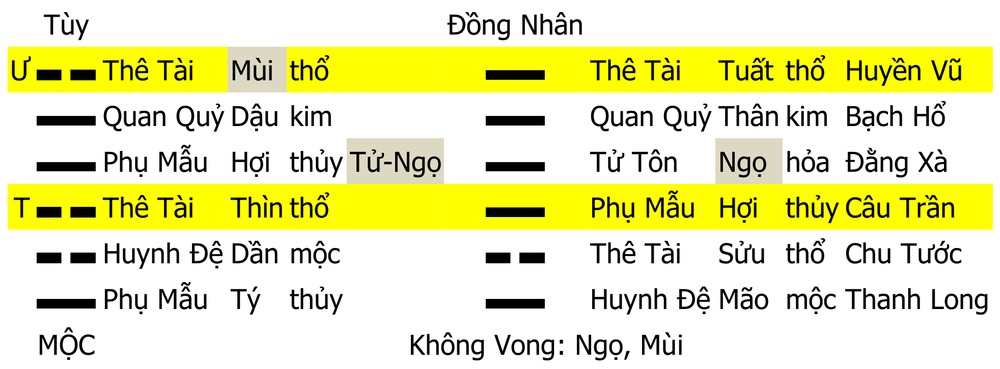
    - **Hình này chứng minh điều gì**
      - Quẻ Tùy biến Đồng Nhân; hào Thế Thê Tài Thìn thổ hưu tù; Quan Quỷ Ngọ hỏa phục tàng; dùng trang phục màu hồng kích đào hoa.
    - **Từ đâu mà thấy được**
      - Hào 2 Thê Tài Dần mộc động hóa Quan Quỷ Ngọ hỏa; hào sơ Thê Tài Thìn thổ.
  - **Phán đoán và đối thoại:**
    - Căn cứ: Quan Quỷ Ngọ hỏa (người yêu) phục tàng; cung Đoài khuyết thiếu tình cảm; cần Hỏa sinh Thổ trợ Thế.
    - Nhìn vào: Màu hồng và đỏ thuộc Hỏa kích hoạt đào hoa duyên phận phái nữ.
    - Đối thoại thực tế: Đương số muộn màng tình duyên chưa từng có mối tình trọn vẹn, cảm thấy cô đơn tuyệt vọng.
  - **Phương án hóa giải:** Thường xuyên diện váy áo màu hồng phấn và đeo vòng tay thạch anh hồng.
  - **Ứng nghiệm thực tế:** Trong vòng 3 tháng quen được một kỹ sư tài giỏi, hai người nhanh chóng tiến tới hôn nhân hạnh phúc.
- **Quái lệ 4: Phụ nữ xem dự đoán chuyện sinh nở con cái (Ngày Nhâm Thân tháng Đinh Hợi)**
  - **Hình 42. Quẻ Ly Vi Hỏa biến Địa Lôi Phục**
    - 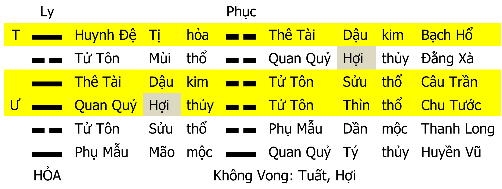
    - **Hình này chứng minh điều gì**
      - Quẻ Ly biến Phục; Tử Tôn Tý thủy lâm Nguyệt kiến cực vượng xung hào Thế; dùng màu vàng Thổ chế Thủy an thai.
    - **Từ đâu mà thấy được**
      - Quẻ Ly Vi Hỏa; hào 2 Thế Quan Quỷ Sửu thổ; hào sơ Phụ Mẫu Mão mộc động.
  - **Phán đoán và đối thoại:**
    - Căn cứ: Tử Tôn Thủy quá vượng khắc hại hào Thế Hỏa, nguy cơ sảy thai hoặc thai nghén hành hạ dữ dội.
    - Nhìn vào: Thổ chế Thủy; dùng màu vàng của Thổ để bảo vệ tử cung an thai dưỡng mạch.
    - Đối thoại thực tế: Sản phụ ốm nghén nặng nề không ăn uống được, dọa sảy thai tuần thứ 8.
  - **Phương án hóa giải:** Mặc váy bầu màu vàng nhạt, bài trí gối đệm màu vàng trong phòng ngủ.
  - **Ứng nghiệm thực tế:** Dứt hẳn triệu chứng ốm nghén dọa sảy, thai nhi phát triển khỏe mạnh đến ngày sinh tròn vuông.

## Chương 9: Hình Thức Tồn Tại Của Ngũ Hành Theo Con Số

- **Hệ thống con số ngũ hành trong Dịch học:**
  - Số Tiên thiên Bát Quái: Càn 1, Đoài 2, Ly 3, Chấn 4, Tốn 5, Khảm 6, Cấn 7, Khôn 8.
  - Số Ngũ hành sinh thành (Hà Đồ): Thiên nhất sinh Thủy, Địa lục thành chi (1, 6 - Thủy); Địa nhị sinh Hỏa, Thiên thất thành chi (2, 7 - Hỏa); Thiên tam sinh Mộc, Địa bát thành chi (3, 8 - Mộc); Địa tứ sinh Kim, Thiên cửu thành chi (4, 9 - Kim); Thiên ngũ sinh Thổ, Địa thập thành chi (5, 10 - Thổ).
  - Ứng dụng số lượng vật phẩm, số ngày đặt, kích thước, tầng lầu, số tiền để đồng bộ tần số hóa giải.
- **Quái lệ 1: Đoán vợ đi công tác cát hung bình an (Ngày Mậu Tý tháng Nhâm Ngọ)**
  - **Hình 43. Quẻ Trạch Lôi Tùy biến Trạch Thiên Quải**
    - 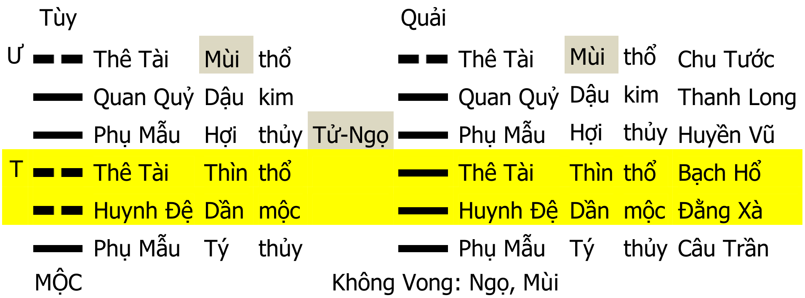
    - **Hình này chứng minh điều gì**
      - Quẻ Tùy biến Quải; Thê Tài Mùi thổ phục tàng; hào sơ sơ động hóa Huynh Đệ Tý thủy xung Khôn; dùng số 6 Thủy bồi bổ tài lộc.
    - **Từ đâu mà thấy được**
      - Hào sơ Quan Quỷ Tý thủy động hóa Huynh Đệ Dần mộc; Thê Tài Mùi thổ phục hào 2.
  - **Phán đoán và đối thoại:**
    - Căn cứ: Vợ đi công tác lấy Thê Tài làm Dụng thần, phục tàng dưới Huynh Đệ Dần mộc bị khắc; hào sơ động Thủy vượng.
    - Nhìn vào: Con số 6 thuộc Thủy (Hà Đồ) giúp chuyển hóa tương sinh Mộc sinh Hỏa thông quan.
    - Đối thoại thực tế: Chồng lo lắng chuyến công tác phương Nam xa xôi bất trắc.
  - **Phương án hóa giải:** Mang theo 6 đồng xu may mắn hoặc nộp tiền vé số có đuôi 6.
  - **Ứng nghiệm thực tế:** Chuyến công tác diễn ra thuận lợi vượt mong đợi, ký kết hợp đồng giá trị lớn.
- **Quái lệ 2: Người phụ nữ vội vã cầu tài giải hạn (Ngày Giáp Thân tháng Bính Ngọ)**
  - **Hình 44. Quẻ Địa Phong Thăng biến Thủy Phong Tỉnh**
    - 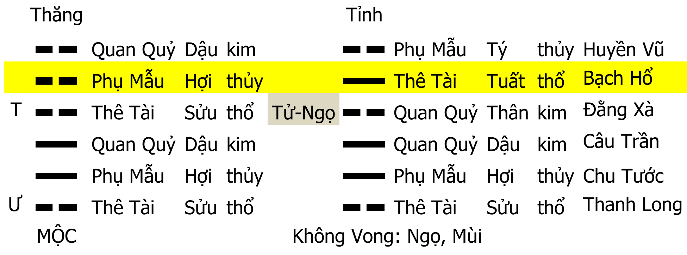
    - **Hình này chứng minh điều gì**
      - Quẻ Thăng biến Tỉnh; Phụ Mẫu Tị hỏa lâm Nguyệt kiến; Quan Quỷ Dậu kim Không Vong; dùng số 4 và 9 Kim xuất Không.
    - **Từ đâu mà thấy được**
      - Hào 3 Tử Tôn Thìn thổ động hóa Quan Quỷ Dậu kim; hào Thế Quan Quỷ Dậu kim Không Vong.
  - **Phán đoán và đối thoại:**
    - Căn cứ: Quan Quỷ Dậu kim Không Vong bị Hỏa khắc; Kim số 4, 9; kích hoạt Kim khí thu nợ.
    - Nhìn vào: Dùng 9 đồng tiền xu hoặc 4 nén vàng phong thủy đặt góc Tây.
    - Đối thoại thực tế: Khách hàng bị khách nợ trốn tránh không trả, nguy cơ phá sản.
  - **Phương án hóa giải:** Đặt 4 thỏi vàng giả và 9 đồng xu tại góc Tây bàn làm việc.
  - **Ứng nghiệm thực tế:** Khách nợ bất ngờ gọi điện chuyển khoản thanh toán đủ số nợ sau 9 ngày.
- **Quái lệ 3: Dịch hữu Trần Lỗ Tây xem quẻ cứu hạn bệnh hiểm (Ngày Mậu Ngọ tháng Giáp Thìn)**
  - **Hình 45. Quẻ Thiên Trạch Lý biến Thiên Thủy Tụng**
    - 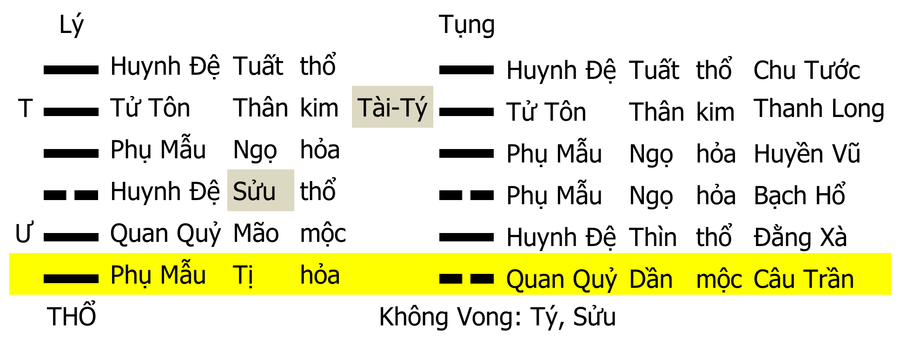
    - **Hình này chứng minh điều gì**
      - Quẻ Lý biến Tụng; hào Ứng Thê Tài Tý thủy lâm Nguyệt phá; Tử Tôn Thân kim động sinh Thủy; dùng 1 hoặc 6 chậu nước giải cứu.
    - **Từ đâu mà thấy được**
      - Hào 4 Huynh Đệ Ngọ hỏa động hóa Quan Quỷ Thân kim; hào Ứng Thê Tài Tý thủy.
  - **Phán đoán và đối thoại:**
    - Căn cứ: Thê Tài Tý thủy Nguyệt phá Thổ khắc nặng, bệnh sốt cao co giật; cần tăng cường số Thủy 1, 6.
    - Nhìn vào: Thân kim động sinh Tý thủy; số 6 là số thành của Thủy.
    - Đối thoại thực tế: Dịch hữu Trần Lỗ Tây bàn luận học thuật áp dụng ngay cho người nhà nguy cấp.
  - **Phương án hóa giải:** Đặt 6 cốc nước sạch phương Bắc và uống thuốc vào giờ Tý.
  - **Ứng nghiệm thực tế:** Cơn sốt lui hẳn sau 6 giờ, huyết áp và tim mạch ổn định an toàn.
- **Quái lệ 4: Người đàn ông đoán cầu tài kinh doanh (Ngày Mậu Thân tháng Mậu Thân)**
  - **Hình 46. Quẻ Thủy Lôi Truân biến Trạch Hỏa Cách**
    - 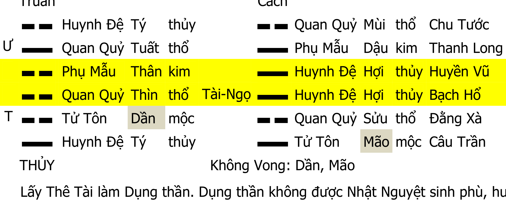
    - **Hình này chứng minh điều gì**
      - Quẻ Truân biến Cách; Thê Tài Ngọ hỏa Không Vong; Huynh Đệ Tý thủy trì Thế; dùng số 2 và 7 Hỏa kích tài.
    - **Từ đâu mà thấy được**
      - Hào 2 Quan Quỷ Dần mộc động hóa Tử Tôn Sửu thổ; Thê Tài Ngọ hỏa Không Vong.
  - **Phán đoán và đối thoại:**
    - Căn cứ: Thê Tài Ngọ hỏa Không Vong bị Thế hào Tý thủy khắc; cần số Hỏa 2, 7 để dẫn dụ tài khí xuất Không.
    - Nhìn vào: Số 7 số thành của Hỏa; 7 ngọn nến đỏ hoặc 2 bức tranh lửa.
    - Đối thoại thực tế: Thương nhân đầu tư kinh doanh nhà hàng ăn uống nhưng chưa hút khách.
  - **Phương án hóa giải:** Thắp 7 ngọn nến thơm màu đỏ ở sảnh đón khách lúc 19h (giờ Tuất khố).
  - **Ứng nghiệm thực tế:** Lượng khách đến đặt bàn tăng vọt, nhà hàng kín chỗ suốt tuần.
- **Quái lệ 5: Phụ nữ đoán bệnh sốt xuất huyết co giật (Ngày Bính Thân tháng Mậu Ngọ)**
  - **Hình 47. Quẻ Hỏa Phong Đỉnh biến Trạch Phong Đại Quá**
    - 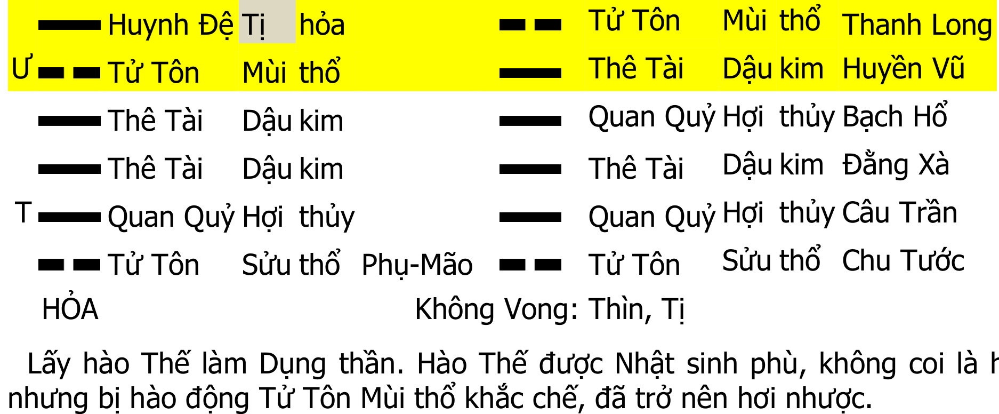
    - **Hình này chứng minh điều gì**
      - Quẻ Đỉnh biến Đại Quá; Thế hào Phụ Mẫu Mão mộc lâm Bạch Hổ; Cừu thần và Kỵ thần đồng phát; dùng số 1 Thủy hạ hỏa cứu mộc.
    - **Từ đâu mà thấy được**
      - Hào 2 Thê Tài Dần mộc động hóa Quan Quỷ Hợi thủy; quẻ Hỏa Phong Đỉnh.
  - **Phán đoán và đối thoại:**
    - Căn cứ: Hỏa vượng thiêu Mộc; Cừu thần Hỏa và Kỵ thần Kim hợp lực hại Dụng thần; cần số 1 Thủy để làm dịu.
    - Nhìn vào: Số 1 (Thiên nhất sinh Thủy) nguồn nước đầu nguồn dập lửa.
    - Đối thoại thực tế: Bệnh nhân mê sảng co giật sốt cao không hạ.
  - **Phương án hóa giải:** Cho uống 1 bát nước linh phù Thủy và đắp khăn lạnh 10 phút một lần.
  - **Ứng nghiệm thực tế:** Nhiệt độ cơ thể hạ về mức bình thường, bệnh nhân tỉnh táo nhận biết người thân.
- **Quái lệ 6: Con trai lười học mê chơi điện tử (Ngày Tân Tị tháng Quý Tị)**
  - **Hình 48. Quẻ Thiên Hỏa Đồng Nhân biến Hỏa Trạch Khuê**
    - 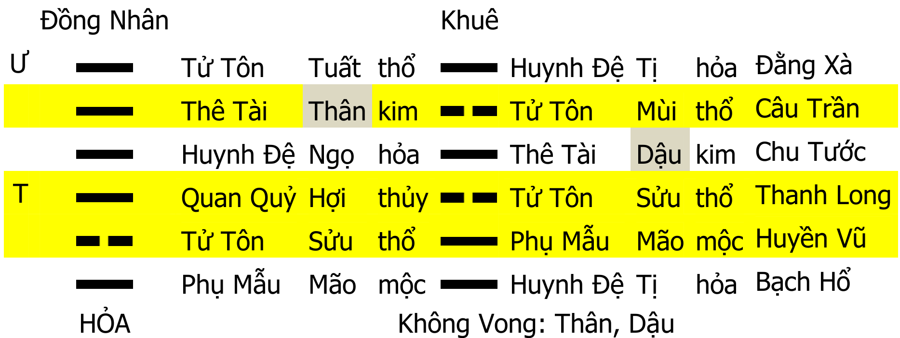
    - **Hình này chứng minh điều gì**
      - Quẻ Đồng Nhân biến Khuê; Quan Quỷ Hợi thủy Nguyệt phá Nhật phá; Phụ Mẫu Sửu thổ trì Thế; dùng số 6 giải phá khai trí.
    - **Từ đâu mà thấy được**
      - Hào 2 Quan Quỷ Hợi thủy lâm Nguyệt phá; hào 3 Huynh Đệ Hợi thủy.
  - **Phán đoán và đối thoại:**
    - Căn cứ: Quan Quỷ Hợi thủy đại diện kỷ luật và tập trung bị song Tị xung phá; cháu bé ham chơi mất kiểm soát.
    - Nhìn vào: Dùng số 6 Thủy và phương vị Hợi để phục hồi Quan tinh chế ngự Huynh Đệ.
    - Đối thoại thực tế: Người cha bất lực vì con trốn học chơi game suốt ngày đêm.
  - **Phương án hóa giải:** Đặt 6 cây bút lông trên bàn học hướng Tây Bắc (cung Càn/Hợi).
  - **Ứng nghiệm thực tế:** Cháu bé tự giác quay lại bàn học, kết thúc học kỳ xếp hạng tiến bộ vượt bậc.
- **Quái lệ 7: Đoán bệnh người cha già suy kiệt (Ngày Ất Dậu tháng Quý Tị)**
  - **Hình 49. Quẻ Lôi Trạch Quy Muội**
    - 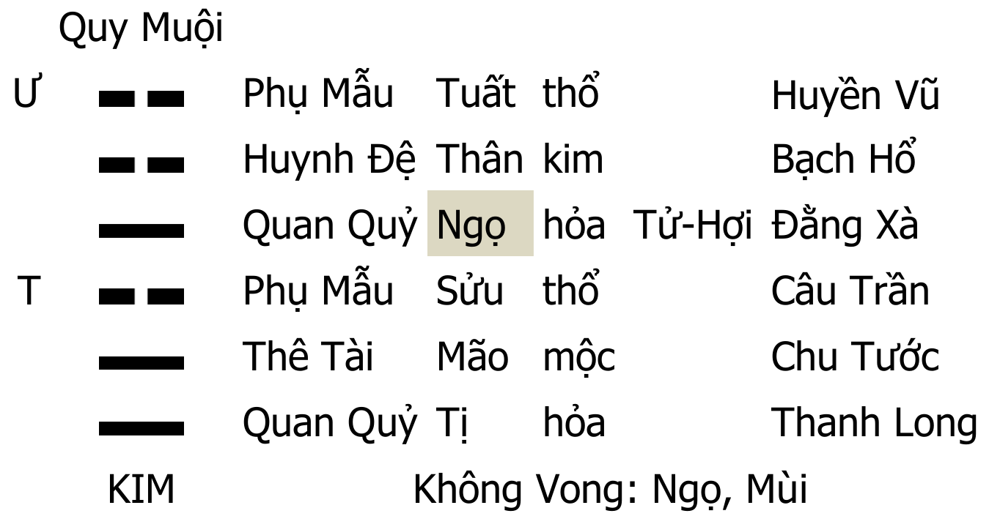
    - **Hình này chứng minh điều gì**
      - Quẻ Quy Muội; Phụ Mẫu Tị hỏa lâm Nguyệt kiến; Nguyên thần Dần mộc bị Nhật Dậu khắc; số 3 Mộc bồi đắp sinh khí.
    - **Từ đâu mà thấy được**
      - Quẻ Lôi Trạch Quy Muội; hào 2 Phụ Mẫu Tị hỏa; hào sơ Tử Tôn Tý thủy.
  - **Phán đoán và đối thoại:**
    - Căn cứ: Nguyên thần Dần mộc bị Nhật Dậu khắc tuyệt; số 3 và 8 Mộc cần được bổ sung khẩn cấp.
    - Nhìn vào: Trồng 3 chậu cây xanh phong thủy tại phòng ngủ của cụ ông.
    - Đối thoại thực tế: Người con lo lắng cụ tuổi già sức yếu khó qua khỏi mùa hạ.
  - **Phương án hóa giải:** Đặt 3 chậu cây cảnh tươi tốt phương Đông để tiếp sinh khí.
  - **Ứng nghiệm thực tế:** Cụ ông hồi phục thể trạng, ăn được cháo và trò chuyện vui vẻ cùng con cháu.

## Chương 10: Hình Thức Tồn Tại Của Ngũ Hành Theo Âm Thanh

- **Ngũ âm và sóng âm ngũ hành trong dự đoán và trị liệu:**
  - Hệ thống Ngũ âm: Cung (Thổ), Thương (Kim), Giốc (Mộc), Chủy (Hỏa), Vũ (Thủy).
  - Tần số âm thanh, tiếng nhạc cụ, tiếng tụng niệm, chuông gió tác động trực tiếp lên hệ thần kinh và kinh lạc tạng phủ.
- **Quái lệ 1: Người chồng xin đoán cho vợ bị đau răng buốt óc (Ngày Quý Sửu tháng Ất Dậu)**
  - **Hình 50. Quẻ Địa Thủy Sư biến Địa Phong Thăng**
    - 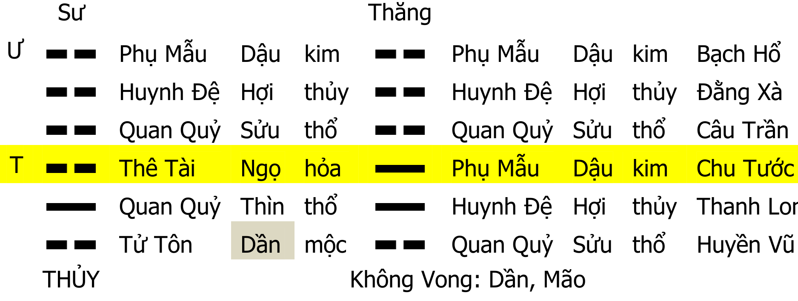
    - **Hình này chứng minh điều gì**
      - Quẻ Sư biến Thăng; hào 2 Quan Quỷ Thìn thổ lâm Chu Tước; Phụ Mẫu Dậu kim vượng; dùng âm thanh Thương (Kim) dứt cơn đau.
    - **Từ đâu mà thấy được**
      - Hào 2 Quan Quỷ Thìn thổ lâm Chu Tước động hóa Thê Tài Hợi thủy; Phụ Mẫu Dậu kim trì Thế.
  - **Phán đoán và đối thoại:**
    - Căn cứ: Hào 2 là hàm răng mặt lâm Chu Tước viêm tủy răng cấp; Kim vượng khắc Mộc thần kinh.
    - Nhìn vào: Dùng âm thanh kim loại thanh tao để phân tán xung lực ức chế thần kinh đau.
    - Đối thoại thực tế: Người chồng thương vợ đau răng cả đêm không ngủ được.
  - **Phương án hóa giải:** Nghe bản nhạc chuông kim khánh âm điệu thanh thoát 15 phút.
  - **Ứng nghiệm thực tế:** Sau 15 phút nghe nhạc buốt răng dịu dần rồi biến mất hoàn toàn.
- **Quái lệ 2: Cụ già đau quặn bụng cấp cứu bệnh viện (Ngày Canh Dần tháng Bính Tuất)**
  - **Hình 51. Quẻ Lôi Phong Hằng biến Thủy Phong Tỉnh**
    - 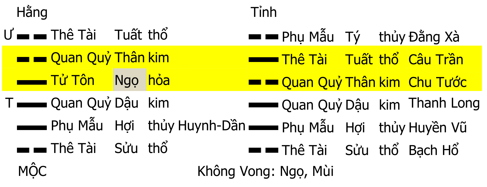
    - **Hình này chứng minh điều gì**
      - Quẻ Hằng biến Tỉnh; hào 3 Huynh Đệ Dậu kim động hóa Quan Quỷ Hợi thủy; cung Chấn (bụng); dùng âm Giốc (Mộc) điều khí.
    - **Từ đâu mà thấy được**
      - Hào 3 Huynh Đệ Dậu kim động hóa Quan Quỷ Hợi thủy; hào sơ Phụ Mẫu Tý thủy.
  - **Phán đoán và đối thoại:**
    - Căn cứ: Bệnh viện tiêm thuốc giảm đau không đỡ; ruột co thắt dữ dội do khí uất kết.
    - Nhìn vào: Âm Giốc (tiếng sáo trúc, tiêu) sơ can lý khí thư giãn nhu động ruột.
    - Đối thoại thực tế: Bệnh nhân đau đớn vã mồ hôi nghi tắc ruột cấp.
  - **Phương án hóa giải:** Bật khúc nhạc sáo trúc âm điệu dịu êm bên tai bệnh nhân.
  - **Ứng nghiệm thực tế:** Bệnh nhân giãn cơ ruột, trung tiện được và cơn đau bụng biến mất không cần mổ.
- **Quái lệ 3: Người xuất hành xem cát hung lộ trình (Ngày Canh Tý tháng Canh Dần)**
  - **Hình 52. Quẻ Khôn Vi Địa biến Sơn Lôi Di**
    - 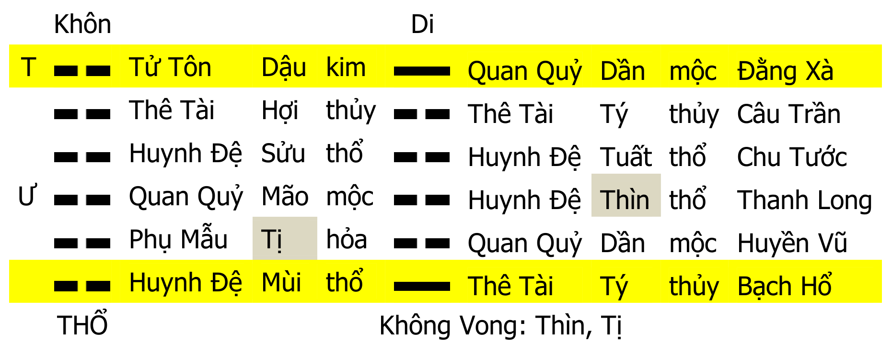
    - **Hình này chứng minh điều gì**
      - Quẻ Khôn biến Di; hào 3 Huynh Đệ Thìn thổ động hóa Thê Tài Tý thủy; dùng âm Cung (Thổ) trầm ấm trấn an tinh thần.
    - **Từ đâu mà thấy được**
      - Hào 3 Huynh Đệ Thìn thổ động; hào 6 Tử Tôn Dậu kim; quẻ thuần Khôn.
  - **Phán đoán và đối thoại:**
    - Căn cứ: Xuất hành quẻ biến Di (nuôi dưỡng); tâm lý bồn chồn lo lắng bất an trước chuyến đi.
    - Nhìn vào: Âm Cung (tiếng đàn tranh, trống đất) trầm ổn dưỡng tâm an định thần phách.
    - Đối thoại thực tế: Người chuẩn bị đi xa lo sợ gặp rủi ro dọc đường.
  - **Phương án hóa giải:** Nghe nhạc thiền âm Cung Thổ trước khi lên đường.
  - **Ứng nghiệm thực tế:** Chuyến đi bình an, tinh thần sảng khoái, mọi việc hoàn thành viên mãn.
- **Quái lệ 4: Người đàn ông đoán chứng mất ngủ kinh niên (Ngày Quý Dậu tháng Quý Mão)**
  - **Hình 53. Quẻ Khảm Vi Thủy biến Thủy Hỏa Ký Tế**
    - 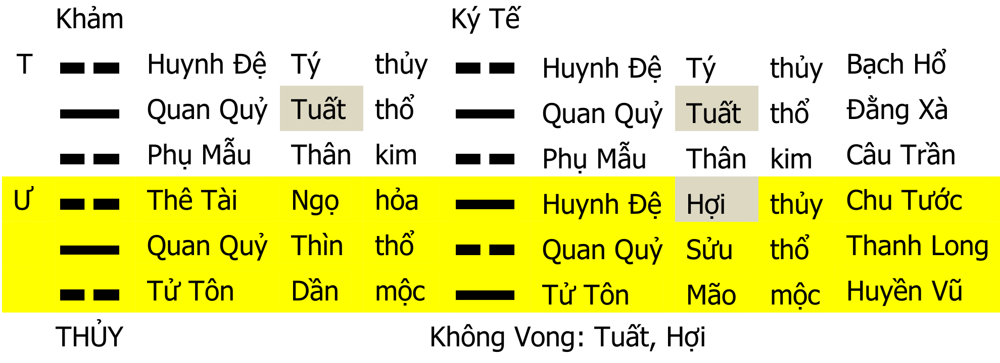
    - **Hình này chứng minh điều gì**
      - Quẻ Khảm biến Ký Tế; hào 3 Huynh Đệ Thìn thổ động; tâm thận bất giao; dùng âm Vũ (Thủy) tiếng suối chảy an thần.
    - **Từ đâu mà thấy được**
      - Hào 3 Huynh Đệ Thìn thổ động hóa Quan Quỷ Mão mộc; quẻ thuần Khảm.
  - **Phán đoán và đối thoại:**
    - Căn cứ: Quẻ Khảm biến Ký Tế; Thủy Hỏa chưa điều hòa dẫn đến tim đập nhanh mất ngủ triền miên.
    - Nhìn vào: Âm Vũ (tiếng mưa rơi, tiếng suối chảy róc rách) tư âm giáng hỏa.
    - Đối thoại thực tế: Bệnh nhân mất ngủ 6 tháng, uống thuốc ngủ bị lờn thuốc.
  - **Phương án hóa giải:** Mở máy phát tiếng suối chảy tự nhiên nhè nhẹ trong phòng ngủ ban đêm.
  - **Ứng nghiệm thực tế:** Ngay đêm đầu tiên ngủ sâu giấc 7 tiếng liền, chấm dứt ác mộng.
- **Quái lệ 5: Người đàn ông đoán đau dạ dày co thắt (Ngày Mậu Ngọ tháng Kỷ Tị)**
  - **Hình 54. Quẻ Trạch Thiên Quải biến Lôi Thiên Đại Tráng**
    - 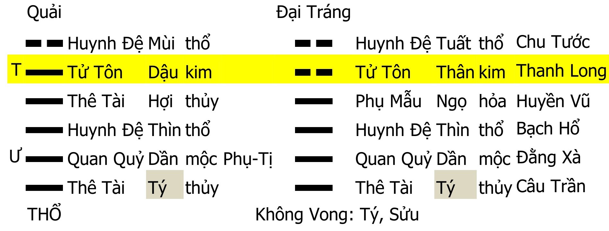
    - **Hình này chứng minh điều gì**
      - Quẻ Quải biến Đại Tráng; hào 2 Thê Tài Dần mộc động hóa Thê Tài Dần mộc; Tỳ thổ bị thương; âm Cung tiếng chuông ngân dứt đau.
    - **Từ đâu mà thấy được**
      - Hào 2 Thê Tài Dần mộc động; hào sơ Huynh Đệ Tý thủy; quẻ Trạch Thiên Quải.
  - **Phán đoán và đối thoại:**
    - Căn cứ: Dạ dày thuộc Thổ bị Dần mộc động khắc mạnh gây viêm loét co thắt cấp.
    - Nhìn vào: Âm thanh chuông đồng ngân vang kích Thổ bồi Tỳ vị.
    - Đối thoại thực tế: Bệnh nhân ôm bụng rên rỉ đau quặn từng cơn.
  - **Phương án hóa giải:** Gõ chuông đồng nhẹ nhàng nhịp điệu chậm rãi 20 lần.
  - **Ứng nghiệm thực tế:** Cơn đau dạ dày dịu hẳn sau 10 phút, bụng ấm lại dễ chịu.

## Chương 11: Trong Chữ Viết Và Hoa Văn Cũng Tàng Trữ Ngũ Hành

- **Trường năng lượng của văn tự Hán tự và hoa văn đồ hình:**
  - Chữ viết không đơn thuần là ký hiệu giao tiếp mà là đồ hình chứa đựng trường khí ngũ hành lập thể (Hán tự tượng hình khởi nguồn từ Bát Quái).
  - Chiết tự và nạp năng lượng ngũ hành thông qua viết chữ lên giấy hoàng chỉ, dùng mực chu sa, đóng dấu bát quái hoặc dán đúng phương vị để trấn sát hóa cát.
- **Quái lệ 1: Người đàn ông đoán bệnh phong thấp đau khớp (Ngày Tân Hợi tháng Giáp Thìn)**
  - **Hình 55. Quẻ Sơn Hỏa Bí biến Phong Lôi Ích**
    - 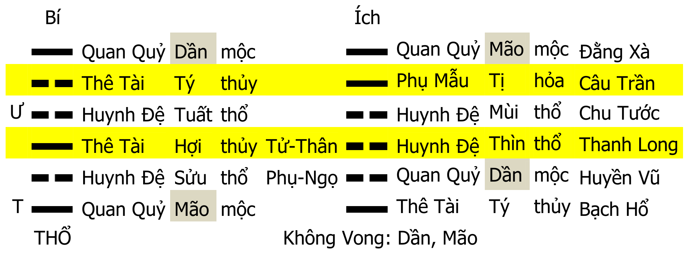
    - **Hình này chứng minh điều gì**
      - Quẻ Bí biến Ích; Thê Tài Tý thủy lâm Nguyệt phá; viết chữ Khảm (坎) dán phương Bắc bổ Thủy phục hồi khớp xương.
    - **Từ đâu mà thấy được**
      - Hào 2 Thê Tài Sửu thổ động hóa Tử Tôn Thân kim; hào 5 Tử Tôn Mùi thổ.
  - **Phán đoán và đối thoại:**
    - Căn cứ: Thủy suy Mộc khô gây thoái hóa đau khớp; chữ Khảm (坎) mang toàn vẹn trường khí quẻ Khảm phương Bắc.
    - Nhìn vào: Giấy vàng mực chu sa viết chữ Khảm dán phương Bắc phòng ngủ.
    - Đối thoại thực tế: Bệnh nhân đi lại lục khục đau nhức xương khớp mỗi khi đổi mùa.
  - **Phương án hóa giải:** Viết chữ Khảm (坎) đóng dấu Thái Cực dán tại phương Bắc.
  - **Ứng nghiệm thực tế:** Khớp xương linh hoạt trở lại, cơn đau nhức tiêu giảm rõ rệt sau nửa tháng.
- **Quái lệ 2: Học trò Nhật Bản văn phòng bị phạm sát phong thủy (Ngày Kỷ Dậu tháng Mậu Tuất)**
  - **Hình 56. Quẻ Lôi Hỏa Phong biến Ly Vi Hỏa**
    - 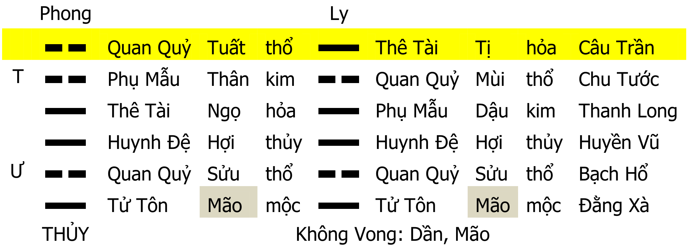
    - **Hình này chứng minh điều gì**
      - Quẻ Phong biến Ly; hào 2 Thế Huynh Đệ Sửu thổ; hào 5 Tử Tôn Mùi thổ xung Thế; viết chữ Mão (卯) phương Đông hóa sát.
    - **Từ đâu mà thấy được**
      - Hào 5 Tử Tôn Mùi thổ động hóa Huynh Đệ Thân kim; hào 2 Thế Huynh Đệ Sửu thổ.
  - **Phán đoán và đối thoại:**
    - Căn cứ: Cửa văn phòng đối diện ngã ba đường phạm sát khí; Sửu Mùi tương xung bất lợi nhân viên cãi vã hao tài.
    - Nhìn vào: Chữ Mão (卯) phương Đông tương hợp giải trừ xung sát.
    - Đối thoại thực tế: Học trò người Nhật lo lắng công ty làm ăn sa sút mâu thuẫn nội bộ.
  - **Phương án hóa giải:** Viết chữ Mão (卯) treo tại góc Đông văn phòng công ty.
  - **Ứng nghiệm thực tế:** Không khí làm việc đoàn kết trở lại, doanh thu tháng sau tăng trưởng mạnh.
- **Quái lệ 3: Gặp người quen cũ đoán vận hạn trên đường quê (Ngày Canh Tý tháng Ất Mùi)**
  - **Hình 57. Quẻ Phong Sơn Tiệm biến Phong Hỏa Gia Nhân**
    - 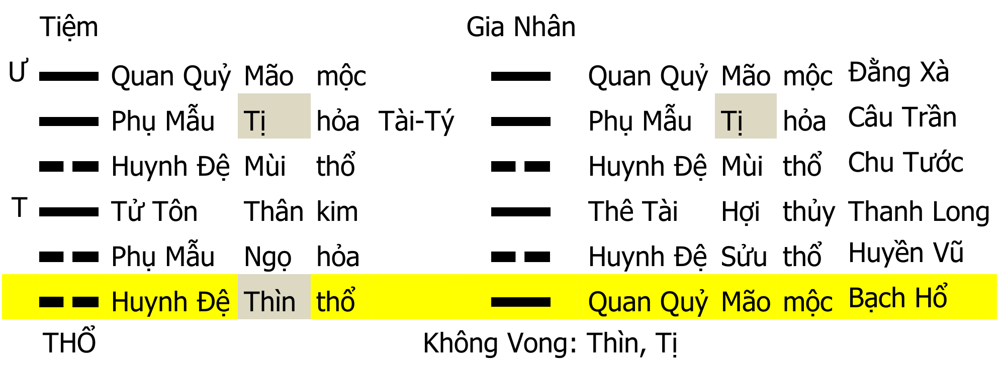
    - **Hình này chứng minh điều gì**
      - Quẻ Tiệm biến Gia Nhân; hào 5 Quan Quỷ Thân kim lâm Chu Tước; viết chữ Phúc (福) dán cửa chính nghênh cát tị hung.
    - **Từ đâu mà thấy được**
      - Hào 5 Quan Quỷ Thân kim động hóa Huynh Đệ Tuất thổ; hào Thế Tử Tôn Thân kim.
  - **Phán đoán và đối thoại:**
    - Căn cứ: Gặp bạn cũ trên đường làng hỏi về chuyện gia đạo bất an, nghi có điềm gở.
    - Nhìn vào: Chữ Phúc (福) viết đúng quy cách mang trường khí tường hòa trừ tà.
    - Đối thoại thực tế: Người quen tâm sự vợ chồng hay lục đục con cái ốm vặt.
  - **Phương án hóa giải:** Viết chữ Phúc đỏ mực chu sa dán ngay chính giữa cửa ra vào.
  - **Ứng nghiệm thực tế:** Gia đạo êm ấm trở lại, con cái khỏe mạnh ngoan ngoãn.
- **Quái lệ 4: Phụ nữ đau đầu nửa đầu kinh niên (Ngày Canh Dần tháng Tân Hợi)**
  - **Hình 58. Quẻ Chấn Vi Lôi biến Lôi Địa Dự**
    - 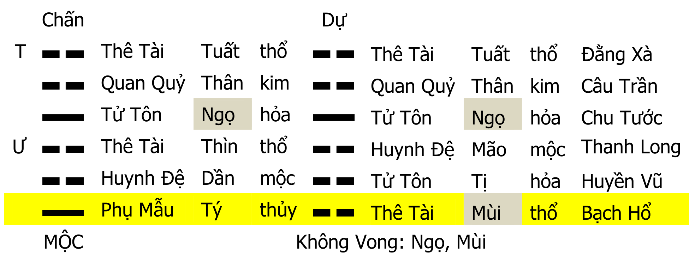
    - **Hình này chứng minh điều gì**
      - Quẻ Chấn biến Dự; hào 6 Thế Thê Tài Tuất thổ; Tử Tôn Ngọ hỏa Không Vong; viết chữ Ngọ (午) để gối đầu khai thông kinh mạch.
    - **Từ đâu mà thấy được**
      - Hào 4 Huynh Đệ Ngọ hỏa Không Vong; quẻ thuần Chấn.
  - **Phán đoán và đối thoại:**
    - Căn cứ: Hào 6 là đầu, quẻ Chấn động thần kinh; Ngọ hỏa Không Vong huyết mạch não thiếu dưỡng khí.
    - Nhìn vào: Chữ Ngọ (午) bồi bổ Hỏa khí thông kinh hoạt lạc vùng đầu não.
    - Đối thoại thực tế: Bệnh nhân đau nửa đầu giật từng cơn uống thuốc giảm đau không đỡ.
  - **Phương án hóa giải:** Viết chữ Ngọ (午) đặt bên trong vỏ gối nằm mỗi đêm.
  - **Ứng nghiệm thực tế:** Giấc ngủ sâu, chứng đau nửa đầu chấm dứt hoàn toàn sau một tuần.
- **Quái lệ 5: Người đàn ông đoán sức khỏe sa sút (Ngày Bính Ngọ tháng Tân Hợi)**
  - **Hình 59. Quẻ Thiên Lôi Vô Vọng biến Trạch Địa Tụy**
    - 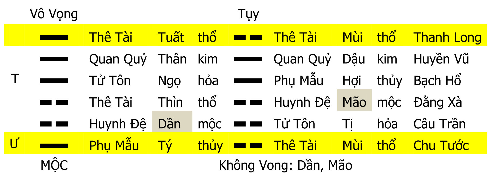
    - **Hình này chứng minh điều gì**
      - Quẻ Vô Vọng biến Tụy; hào 4 Huynh Đệ Cửu tứ động; viết chữ Thái (泰) mang trường khí Địa Thiên Thái hanh thông trường thọ.
    - **Từ đâu mà thấy được**
      - Hào 4 Huynh Đệ Ngọ hỏa động hóa Quan Quỷ Thân kim; hào Thế Thê Tài Thìn thổ.
  - **Phán đoán và đối thoại:**
    - Căn cứ: Quẻ Vô Vọng biến Tụy tai ách bất ngờ rình rập; cần trường khí Thái hòa điều dưỡng.
    - Nhìn vào: Tự dạng chữ Thái (泰) tam dương khai thái tiêu tai diệt tội.
    - Đối thoại thực tế: Đương số cảm thấy uể oải hụt hơi làm việc mau mệt.
  - **Phương án hóa giải:** Viết chữ Thái (泰) treo tại phòng khách đối diện cửa chính.
  - **Ứng nghiệm thực tế:** Thể lực hồi phục nhanh chóng, tinh lực dồi dào yêu đời trở lại.
- **Quái lệ 6 & 7: Đặng Vĩ tiên sinh Tứ Xuyên suy nhược thần kinh mất ngủ (Ngày Đinh Dậu tháng Đinh Mão)**
  - **Hình 60. Quẻ Trạch Phong Đại Quá biến Lôi Phong Hằng**
    - 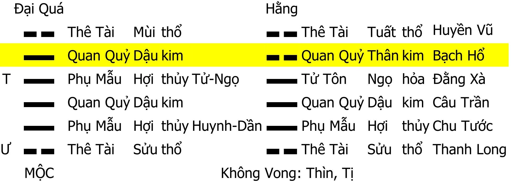
    - **Hình này chứng minh điều gì**
      - Quẻ Đại Quá biến Hằng; hào 3 Quan Quỷ Dậu kim động khắc Thế; dán chữ Mão (卯) thêm chữ Minh (明) ngủ thẳng giấc tới sáng.
    - **Từ đâu mà thấy được**
      - Hào 3 Quan Quỷ Dậu kim động hóa Huynh Đệ Dần mộc; hào Thế Thê Tài Hợi thủy.
  - **Phán đoán và đối thoại:**
    - Căn cứ: Đặng Vĩ học trò tác giả bị mất ngủ kinh niên; dán chữ Mão có đỡ nhưng vẫn trằn trọc.
    - Nhìn vào: Thêm chữ Minh (明, ngày mai) bên cạnh chữ Mão trợ quang minh an thần tuyệt đối.
    - Đối thoại thực tế: Đặng Vĩ thắc mắc ý nghĩa; tác giả khuyên đừng bận tâm giải thích hãy xem hiệu quả thực tế.
  - **Phương án hóa giải:** Dán chữ Mão (卯) và chữ Minh (明) tại vách tường phía Tây phòng ngủ.
  - **Ứng nghiệm thực tế:** Đặng Vĩ ngủ một mạch tới sáng không mộng mị, ngủ say sưa suốt mười mấy ngày liền.
- **Quái lệ 8: Học trò Morita người Nhật mất ngủ vì lo lắng cho con gái (Ngày Canh Thân tháng Bính Dần)**
  - **Hình 61. Quẻ Địa Trạch Lâm biến Địa Phong Thăng**
    - 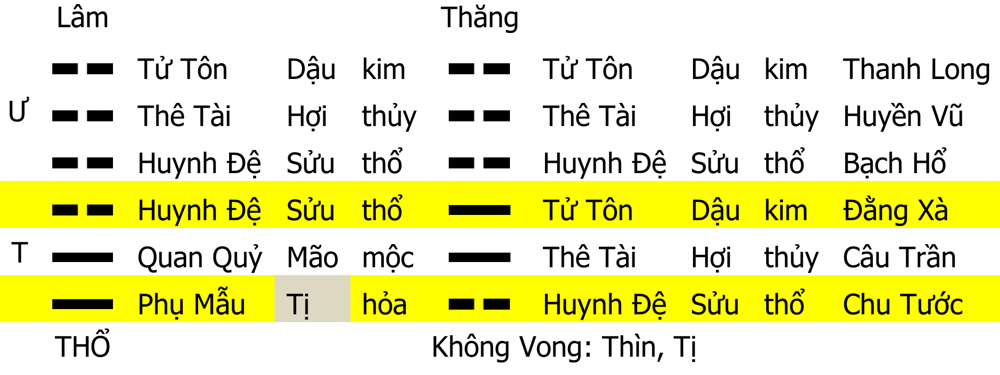
    - **Hình này chứng minh điều gì**
      - Quẻ Lâm biến Thăng; hào 2 Quan Quỷ Mão mộc động; lo lắng cho con gái du học Mỹ dẫn đến suy nhược mất ngủ.
    - **Từ đâu mà thấy được**
      - Hào 2 Quan Quỷ Mão mộc động hóa Huynh Đệ Hợi thủy; quẻ Địa Trạch Lâm.
  - **Phán đoán và đối thoại:**
    - Căn cứ: Con gái du học Mỹ xa xôi, người cha đêm nào cũng thức trắng lo âu suy nhược thần kinh.
    - Nhìn vào: Kiểm tra phối hợp quẻ Càn Vi Thiên để tìm chữ viết hóa giải thần hiệu.
- **Quái lệ 8 (tiếp theo): Quẻ Càn Vi Thiên – Dùng chữ Hợi thay vì chữ Ngọ**
  - **Hình 62. Quẻ Càn Vi Thiên**
    - 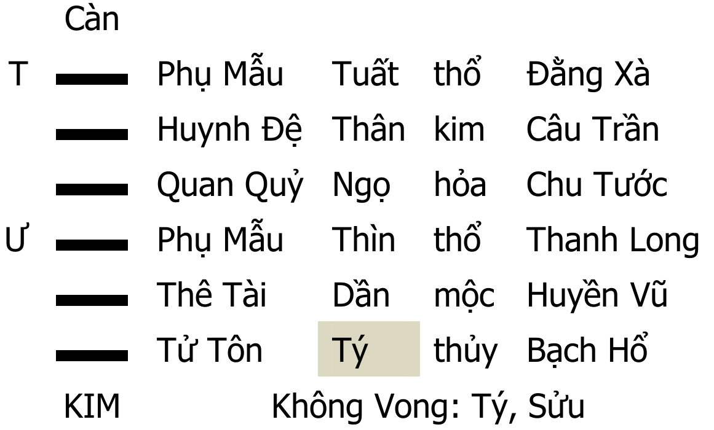
    - **Hình này chứng minh điều gì**
      - Quẻ Càn Vi Thiên; hào 6 Thế Phụ Mẫu Tuất thổ; hào 2 Thê Tài Dần mộc ám động khắc Thế; viết chữ Hợi (亥) đặt dưới gối hợp Dần.
    - **Từ đâu mà thấy được**
      - Hào 6 Thế Phụ Mẫu Tuất thổ; hào 2 Thê Tài Dần mộc ám động; cung Càn.
  - **Phán đoán và đối thoại (tiếp):**
    - Căn cứ: Hào 6 là đầu, quẻ Càn là đầu; hào 2 Thê Tài Dần mộc ám động khắc Thế gây loạn thần kinh; Morita định viết chữ Ngọ sinh Thế.
    - Nhìn vào: Tác giả chỉ rõ không nên dùng Ngọ mà viết chữ Hợi (亥); Hợi Dần lục hợp trói Dần mộc không cho khắc Thế.
    - Đối thoại thực tế: Morita làm theo lời thầy viết chữ Hợi đặt dưới gối nằm.
  - **Phương án hóa giải:** Viết chữ Hợi (亥) đặt dưới gối nằm trước khi ngủ.
  - **Ứng nghiệm thực tế:** Ngay đêm hôm đó Morita ngủ ngon giấc bình thường, tinh thần hoàn toàn thanh thản.

## Chương 12: Khi Chế Tác Vật Hóa Giải Cần Phải Chú Ý Vấn Đề Gì?

- **Nguyên tắc tổng quan khi thiết lập phương án hóa giải:**
  - Chỉ tiến hành hóa giải khi quẻ xuất hiện thông tin xấu hoặc tai nạn bất lợi; quẻ cát tường không cần can thiệp.
  - Phương án hóa giải phải xoay quanh Dụng thần, dựa trên sinh khắc xung hợp của Địa Chi, hào vị, lục thân, lục thần, quái cung một cách logic chặt chẽ, tuyệt đối không bịa đặt vô căn cứ.
  - Tính chất lập thể của Lục Hào: Phối hợp tối thiểu từ hai thông tin trở lên (thời gian, không gian, màu sắc, con số, chất liệu) thì hiệu quả mới rõ rệt.
  - Hóa giải đa tầng: Dụng thần hưu tù hóa hồi đầu sinh dùng 2 vật phẩm; Kỵ thần vượng cũng dùng 2 vật phẩm phối hợp số ngũ hành.
  - Quy tắc hình thể vật phẩm: Kỵ thần Không Vong đặt vật có hốc/lỗ rỗng làm suy giảm Kỵ thần; ngược lại Dụng thần Không Vong kiêng kỵ vật có hốc/lỗ rỗng.
  - Động vật hóa giải: Hóa hồi đầu sinh thì đầu động vật phải quay vào trong nhà/phòng làm việc; Kỵ thần hóa tiến thần chế tác vật một mặt thô một mặt mịn (mịn quay vào trong, thô quay ra ngoài).
- **Thời gian để chế tác vật hóa giải:**
  - Giờ Tý (23h-1h) là thời điểm âm dương chuyển giao luân chuyển, dễ khơi dậy linh lực ngũ hành và thúc đẩy chuyển hóa năng lượng nhất.
  - Trường hợp bận có thể chế tác thời gian khác nhưng chọn giờ Tý để bài trí; hoặc chọn giờ sinh vượng cho Dụng thần.
- **Công cụ để chế tác vật hóa giải:**
  - Công cụ không hạn chế; khi vẽ tranh viết chữ bắt buộc thêm chu sa vào phẩm màu để nạp dương khí trừ tà.
  - Vật phẩm mang theo người ưu tiên chế tác trên vải vàng hoặc giấy hoàng chỉ, đóng dấu triện Bát Quái chu sa.
- **Ý thức khi chế tác vật hóa giải:**
  - Người chế tác phải tập trung tinh thần cao độ, chí thành chí kính, ý niệm định hướng dung nhập vào vật phẩm để dẫn dắt linh lực.
  - Mua vật phẩm sẵn có ngoài chợ mang ý thức thương mại nên cần thanh tẩy và nạp ý niệm trước khi bài trí.
- **Phương pháp xử lý vật hóa giải sau khi kết thúc:**
  - Sau khi tai ách đã qua hoặc bệnh lành, gieo quẻ xác định xem có nên hủy bỏ hay tiếp tục duy trì vật phẩm.
  - Hóa giải niên vận đến cuối năm phải gieo quẻ lưu niên mới để tái lập phương án phù hợp với thiên khí năm mới.

## Chương 13: Các Loại Hóa Giải

### Chỉnh Sửa Phong Thủy

- **Phong thủy môi trường và tác động lập thể tới vận mệnh:**
  - Bất hạnh, tai nạn và bệnh tật của con người thường bắt nguồn từ môi trường sống xung quanh (dương trạch) hoặc phần mộ tổ tiên (âm trạch) tương tác với bát tự.
  - Dương trạch quản nhân đinh và tài vận hiện tại; âm trạch chi phối phúc ấm sâu xa và căn cơ gia tộc lâu dài.
  - Phương pháp 'xem bộ phận' trong Lục Hào: Dự đoán chi tiết từng khu vực nghi ngờ (cổng chính, phòng ngủ, phòng khách, bếp, giếng nước, nhà vệ sinh) để định vị chính xác vị trí phát sinh sát khí.
  - Nguyên tắc chỉnh sửa phong thủy bằng Lục Hào: Không phá dỡ bừa bãi mà kết hợp điều hòa hình thế loan đầu với kích hoạt trường khí lý khí ngũ hành tương sinh.
  - Hào vị tương ứng với kiến trúc nội ngoại thất: Hào 1 nền móng giếng nước, hào 2 bếp và phòng ngủ, hào 3 cửa phòng giường chiếu, hào 4 cửa chính cổng ngõ, hào 5 đường đi phòng khách, hào 6 nóc nhà từ đường.
  - Phối hợp ngũ hành bài trí: Kim suy bổ Kim vật phẩm đồng hồ kim loại, Mộc héo tưới Thủy trồng cây xanh thanh lọc khí trường.
- **Quái lệ 1: Người đàn ông lận đận quan lộ mấy chục năm không thăng tiến (Ngày Mậu Dần tháng Dậu)**
  - **Hình 63. Quẻ Địa Thủy Sư biến Địa Trạch Lâm**
    - 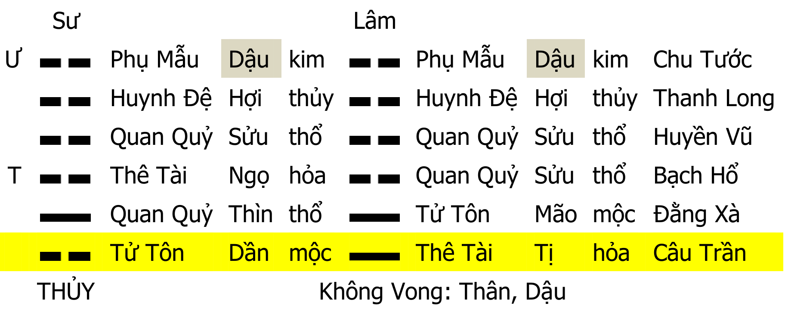
    - **Hình này chứng minh điều gì**
      - Quẻ Sư biến Lâm; hào sơ Tử Tôn Dần mộc động là giếng nước trong sân bị lấp; Quan Quỷ Sửu thổ bị khắc hãm.
    - **Từ đâu mà thấy được**
      - Hào sơ Tử Tôn Dần mộc động hóa Huynh Đệ Tị hỏa; quẻ Địa Thủy Sư.
  - **Phán đoán và đối thoại (phần 1 - quẻ Sư biến Lâm):**
    - Căn cứ: Tử Tôn Dần mộc động tại hào sơ; hào sơ là giếng nước, nền đất; giếng bị lấp bừa bãi sinh uế khí khắc Quan.
    - Nhìn vào: Kiểm tra tiếp phong thủy phòng làm việc bằng quẻ Đồng Nhân.
    - Đối thoại thực tế: Khách hàng thắc mắc tại sao phấn đấu cống hiến suốt ba mươi năm mà luôn bị cấp trên gạt tên ra khỏi danh sách thăng chức.
- **Quái lệ 1 (tiếp theo): Quẻ Đồng Nhân kiểm tra bàn làm việc cơ quan**
  - **Hình 64. Quẻ Thiên Hỏa Đồng Nhân**
    - 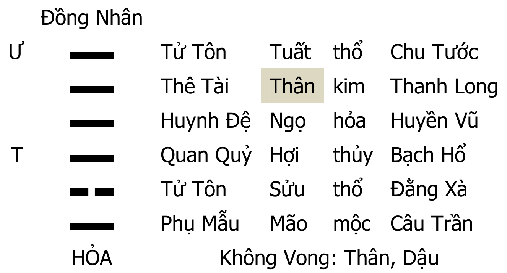
    - **Hình này chứng minh điều gì**
      - Quẻ Đồng Nhân; Thế hào Tử Tôn Ngọ hỏa trì Thế; Phụ Mẫu Sửu thổ lâm Bạch Hổ; dời bàn làm việc tránh sát khí.
    - **Từ đâu mà thấy được**
      - Hào 3 Thế Tử Tôn Ngọ hỏa; quẻ Thiên Hỏa Đồng Nhân.
  - **Phán đoán và đối thoại (phần 2 - quẻ Đồng Nhân):**
    - Căn cứ: Bàn làm việc quay lưng về cửa sổ gió lùa phạm hư không, trước mặt bị xà ngang đè đầu.
    - Nhìn vào: Khai thông giếng nước cũ và xoay chuyển bàn làm việc tựa lưng vào tường vững chắc.
  - **Phương án hóa giải:** Khai thông giếng nước phong thủy và sắp xếp lại nội thất phòng làm việc.
  - **Ứng nghiệm thực tế:** Nửa năm sau cơ quan cải tổ, anh được bổ nhiệm làm phó giám đốc sở.
- **Quái lệ 2: Học sĩ tài hoa mấy khoa thi cử đều trượt vỏ chuối (Ngày Kỷ Sửu tháng Tị)**
  - **Hình 65. Quẻ Lôi Sơn Tiểu Quá biến Cấn Vi Sơn**
    - 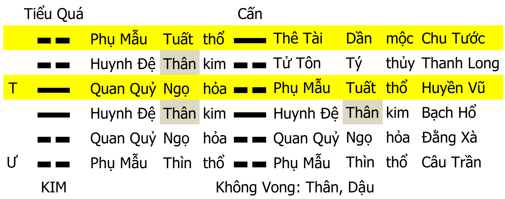
    - **Hình này chứng minh điều gì**
      - Quẻ Tiểu Quá biến Cấn; Phụ Mẫu Ngọ hỏa Không Vong; Quan Quỷ Dậu kim phục tàng; mộ tổ phía Nam bị rễ cây xuyên qua.
    - **Từ đâu mà thấy được**
      - Hào 3 Huynh Đệ Thân kim động hóa Huynh Đệ Thân kim; quẻ Lôi Sơn Tiểu Quá.
  - **Phán đoán và đối thoại (phần 1 - quẻ Tiểu Quá):**
    - Căn cứ: Văn hay chữ tốt nhưng thi cử lận đận; mộ tổ hướng Nam có cây cổ thụ rễ ăn xuyên nắp quan tài.
    - Nhìn vào: Kết hợp quẻ Đại Hữu biến Càn xem xét phần mộ nhánh phụ.
    - Đối thoại thực tế: Sĩ tử than thở bài thi luôn được chấm điểm cao ở vòng đầu nhưng đến vòng quyết định lại gặp sự cố bất ngờ rớt đài.
- **Quái lệ 2 (tiếp theo): Quẻ Đại Hữu biến Càn xem xét sửa sang âm trạch**
  - **Hình 66. Quẻ Hỏa Thiên Đại Hữu biến Càn Vi Thiên**
    - 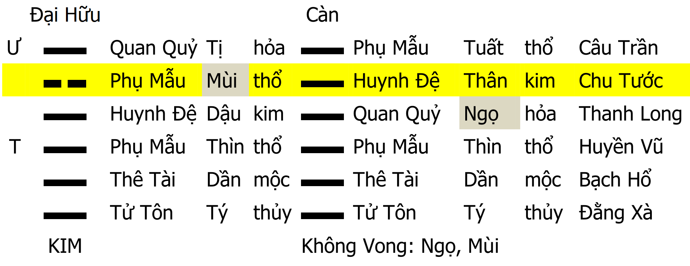
    - **Hình này chứng minh điều gì**
      - Quẻ Đại Hữu biến Càn; hào 3 Thế Phụ Mẫu Thìn thổ động hóa Thê Tài Tý thủy; sửa sang âm trạch mở mang văn vận.
    - **Từ đâu mà thấy được**
      - Hào 3 Thế Phụ Mẫu Thìn thổ động hóa Phụ Mẫu Thìn thổ; quẻ Hỏa Thiên Đại Hữu.
  - **Phán đoán và đối thoại (phần 2 - quẻ Đại Hữu):**
    - Căn cứ: Âm trạch được thanh tẩy rễ cây, bồi đắp đất mới Càn Kim trợ văn xương.
  - **Phương án hóa giải:** Chặt rễ cây xâm lấn mộ tổ và đắp lại nấm mồ phong thủy hướng Càn.
  - **Ứng nghiệm thực tế:** Khoa thi mùa thu năm sau đỗ cử nhân hạng nhì, vinh quy bái tổ.
- **Quái lệ 3: Nữ đoán bệnh hiểm nghèo cho cháu trai con anh ruột (Ngày Bính Thân tháng Ất Mão)**
  - **Hình 67. Quẻ Lôi Trạch Quy Muội biến Lôi Địa Dự**
    - 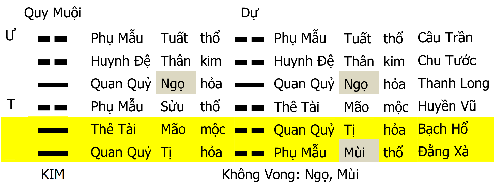
    - **Hình này chứng minh điều gì**
      - Quẻ Quy Muội biến Dự; Tử Tôn Hợi thủy bị Nguyệt kiến Mão mộc tiết khí; hào sơ động sát khí góc Tây Bắc nhà ở.
    - **Từ đâu mà thấy được**
      - Hào sơ Huynh Đệ Tý thủy động hóa Thê Tài Mùi thổ; quẻ Lôi Trạch Quy Muội.
  - **Phán đoán và đối thoại (phần 1 - quẻ Quy Muội):**
    - Căn cứ: Cháu bé sốt cao co giật co cứng cơ; phong thủy góc Tây Bắc có vật nhọn kim loại đâm thẳng vào giường ngủ.
    - Nhìn vào: Quẻ Ký Tế biến Kiển kiểm tra hồ nước và đường cống sau nhà.
    - Đối thoại thực tế: Người cô ruột nước mắt ngắn dài van xin cứu mạng cháu nhỏ đang nằm thở oxy trong phòng hồi sức cấp cứu.
- **Quái lệ 3 (tiếp theo): Quẻ Ký Tế biến Kiển – Thông cống nghẹt cứu mạng cháu bé**
  - **Hình 68. Quẻ Thủy Hỏa Ký Tế biến Thủy Sơn Kiển**
    - 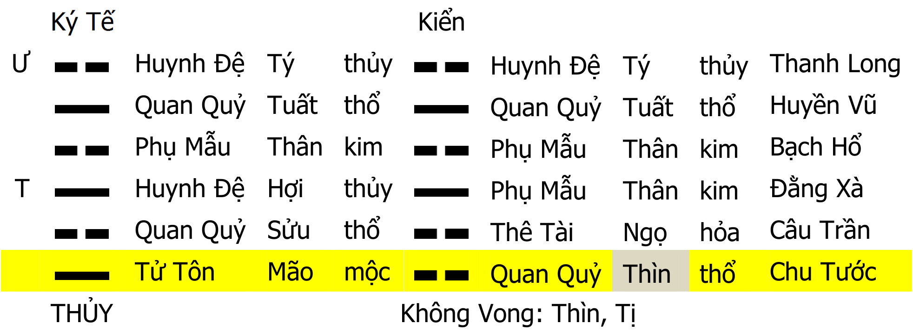
    - **Hình này chứng minh điều gì**
      - Quẻ Ký Tế biến Kiển; hào 2 Quan Quỷ Sửu thổ; hào 3 Huynh Đệ Hợi thủy động; khai thông đường nước bẩn sau nhà.
    - **Từ đâu mà thấy được**
      - Hào 3 Huynh Đệ Hợi thủy động hóa Huynh Đệ Thân kim; quẻ Thủy Hỏa Ký Tế.
  - **Phán đoán và đối thoại (phần 2 - quẻ Ký Tế):**
    - Căn cứ: Cống thoát nước sau nhà bị tắc nghẽn ứ đọng nước bẩn đúng góc Tây Bắc phòng cháu bé.
  - **Phương án hóa giải:** Dọn dẹp vật nhọn và khơi thông đường cống thoát nước ngầm.
  - **Ứng nghiệm thực tế:** Vừa thông cống xong thì cơn co giật của cháu bé dứt hẳn, xuất viện khỏe mạnh sau 3 ngày.

### Hóa Giải Tên Người, Tên Đất

- **Tác động của âm vận danh xưng và địa danh:**
  - Tên gọi của con người và tên gọi địa danh mang trường sóng năng lượng ngũ hành xác định thông qua âm luật và tượng hình ngữ nghĩa.
  - Khi Dụng thần suy nhược hoặc Kỵ thần quá vượng, việc đổi tên, dùng biệt danh, thêm tên đệm hoặc di chuyển đến vùng đất có tên mang hành tương sinh là phương pháp bổ khuyết trường khí rất hiệu nghiệm.
  - Phân tích tên gọi theo Ngũ hành Hán tự: Chữ có bộ Thủy bổ Thủy, chữ có bộ Mộc bổ Mộc, chữ có bộ Hỏa bổ Hỏa, chữ có bộ Thổ bổ Thổ, chữ có bộ Kim bổ Kim.
- **Quái lệ: Bị dán tờ rơi vu khống nói xấu giám đốc công ty (Ngày Canh Ngọ tháng Quý Mùi)**
  - **Hình 69. Quẻ Sơn Hỏa Bí biến Hỏa Sơn Lữ**
    - 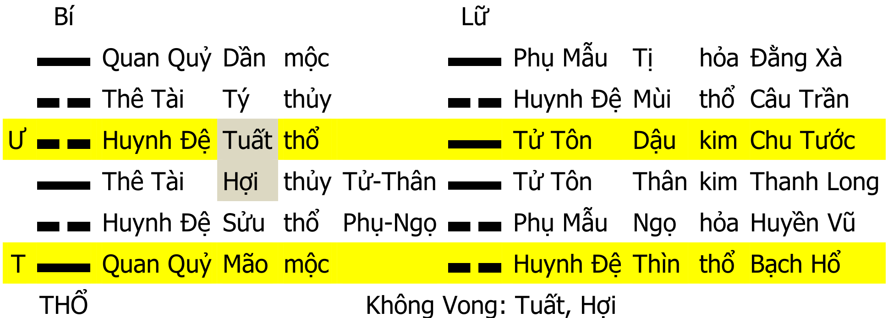
    - **Hình này chứng minh điều gì**
      - Quẻ Bí biến Lữ; hào 5 Huynh Đệ Tý thủy động hóa Thê Tài Ngọ hỏa; kẻ xấu mang tên có bộ Thủy hoặc phương Bắc hãm hại.
    - **Từ đâu mà thấy được**
      - Hào 5 Huynh Đệ Tý thủy lâm Chu Tước động; hào Thế Thê Tài Sửu thổ.
  - **Phán đoán và đối thoại:**
    - Căn cứ: Chu Tước lâm Huynh Đệ Tý thủy động là khẩu thiệt thị phi gièm pha nặc danh; kẻ hãm hại tên có liên quan đến Thủy (Hà, Hải, Giang).
    - Nhìn vào: Dùng chữ viết Thổ (tên công ty hoặc phòng ban có chữ Sơn, Thạch) để khắc Thủy dẹp yên thị phi.
    - Đối thoại thực tế: Giám đốc đau đầu vì tin đồn bôi nhọ trước kỳ đại hội cổ đông.
  - **Phương án hóa giải:** Đổi tên đề án kinh doanh sang chữ mang hành Thổ và chuyển văn phòng sang tòa nhà mang tên địa danh Cấn/Khôn.
  - **Ứng nghiệm thực tế:** Kẻ tung tin nặc danh bị phát hiện xử lý kỷ luật, uy tín giám đốc được khôi phục trọn vẹn.

### Hóa Giải Bằng Màu Sắc

- **Cân bằng sắc thái ngũ hành trong không gian kiến trúc:**
  - Màu sắc tác động trực tiếp vào thị giác và hệ thần kinh giao cảm của con người, sản sinh trường sinh học tương ứng ngũ hành.
  - Sự thiên lệch thái quá của một gam màu trong nhà ở hay văn phòng có thể kích hoạt sát khí của Kỵ thần làm đảo lộn hòa khí và sức khỏe.
  - Phối màu sinh khắc: Cung vị bị Kim vượng thái quá dùng màu xanh lục của Mộc hoặc lam của Thủy để tiết chế, tái lập cân bằng sinh thái.
- **Quái lệ: Xung đột nội bộ công ty tại Bắc Kinh (Ngày Canh Thân tháng Bính Thìn)**
  - **Hình 70. Quẻ Tốn Vi Phong biến Thiên Phong Cấu**
    - 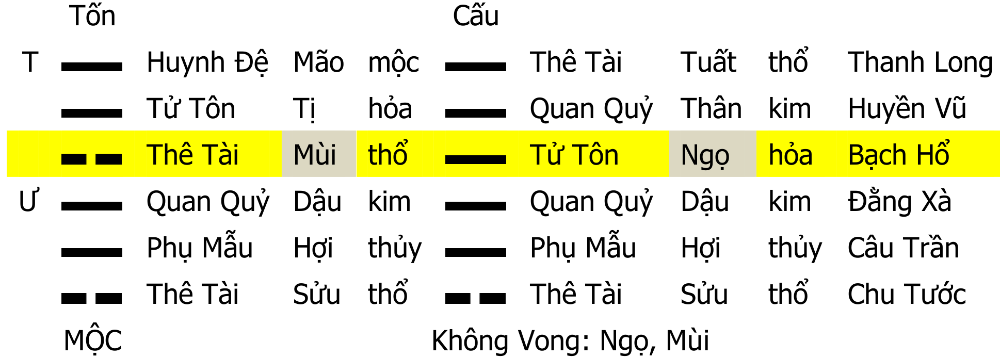
    - **Hình này chứng minh điều gì**
      - Quẻ Tốn biến Cấu; Tốn Mộc bị Kim khắc; văn phòng sơn màu trắng quá nhiều (Kim vượng) gây bất hòa; đổi sang xanh lục dưỡng Mộc.
    - **Từ đâu mà thấy được**
      - Hào sơ Sửu thổ động hóa Tử Tôn Tị hỏa; quẻ thuần Tốn.
  - **Phán đoán và đối thoại:**
    - Căn cứ: Quẻ Tốn Mộc thuần âm bị trường khí Kim bao vây; văn phòng mới cải tạo toàn bộ màu trắng toát làm nhân viên bức bối cãi cọ.
    - Nhìn vào: Sơn lại mảng tường màu xanh lá cây nhạt và trải thảm xanh phối hợp cây xanh.
    - Đối thoại thực tế: Lãnh đạo công ty gọi điện từ Bắc Kinh thắc mắc vì sao chuyển văn phòng mới nhân viên liên tục nghỉ việc.
  - **Phương án hóa giải:** Thay đổi màu rèm cửa và mảng tường điểm nhấn sang màu xanh lục thảo mộc.
  - **Ứng nghiệm thực tế:** Không khí công ty hòa nhã trở lại, các dự án phối hợp ăn ý nhịp nhàng.

### Hóa Giải Bằng Phương Vị

- **Chiến lược hoán chuyển phương vị không gian:**
  - Phương vị phương hướng là tọa độ vật lý chứa các dòng chảy từ trường Trái Đất và năng lượng Bát Quái vũ trụ.
  - Di chuyển người bị nạn hoặc người cần tìm đến phương vị sinh vượng cho Dụng thần là quy tắc cứu nguy tị hung kinh điển.
  - Ứng dụng trong tìm người lạc, tìm đồ thất lạc, chữa bệnh hiểm nghèo và chuyển dời cơ sở làm ăn.
- **Quái lệ: Mẹ tìm con gái bị lạc đường (Ngày Giáp Dần tháng Giáp Thân)**
  - **Hình 71. Quẻ Tốn Vi Phong biến Thiên Phong Cấu**
    - 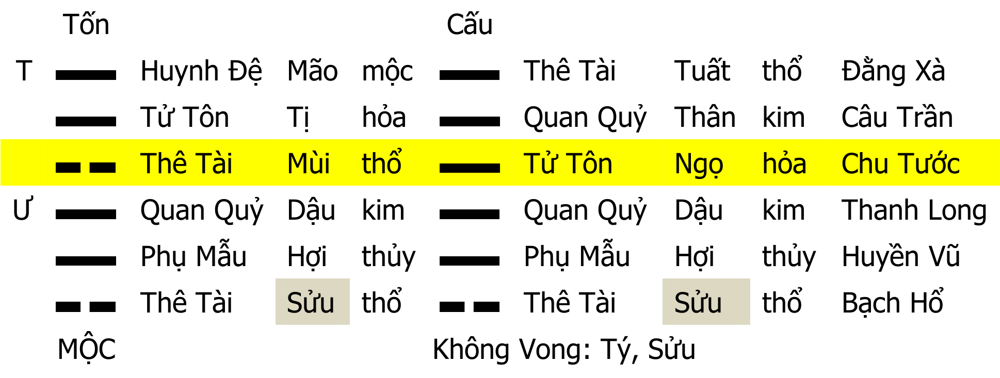
    - **Hình này chứng minh điều gì**
      - Quẻ Tốn biến Cấu; Tử Tôn Tị hỏa xuất hiện tại phương Nam; Tốn là Đông Nam; tìm con gái theo trục Đông Nam hướng Nam.
    - **Từ đâu mà thấy được**
      - Hào sơ Sửu thổ động; hào 4 Quan Quỷ Tân dậu kim; quẻ Tốn Vi Phong.
  - **Phán đoán và đối thoại:**
    - Căn cứ: Con gái lấy Tử Tôn Tị hỏa, Tị là Hỏa phương Nam, quẻ Tốn là Đông Nam; cháu bé đi về hướng Đông Nam đến khu vui chơi.
    - Nhìn vào: Hướng dẫn người nhà xuất phát tìm kiếm theo trục Đông Nam.
    - Đối thoại thực tế: Người mẹ khóc lóc hoảng loạn tìm con suốt một ngày.
  - **Phương án hóa giải:** Cử người đi tìm dọc theo công viên và nhà sách phía Đông Nam thành phố.
  - **Ứng nghiệm thực tế:** Tìm thấy cháu bé đang ngồi đọc truyện tại nhà sách phía Đông Nam an toàn.

### Hóa Giải Bằng Thời Gian

- **Thuận theo thiên thời hoán chuyển cục diện:**
  - Thời gian là chiều kích động biến đổi ngũ hành liên tục theo ngày, giờ, tiết khí và tuần giáp.
  - Đón thời điểm tương xung tương hợp của hào động để thi hành các việc then chốt (đòi nợ, ký hợp đồng, chia tay, hòa giải).
  - Xung khai quẻ hợp để giải quyết dứt điểm các vướng mắc dùng dằng khó tháo gỡ.
- **Quái lệ 1: Đòi món nợ khó đòi lâu năm (Ngày Đinh Hợi tháng Nhâm Thìn)**
  - **Hình 72. Quẻ Sơn Hỏa Bí biến Sơn Trạch Tổn**
    - 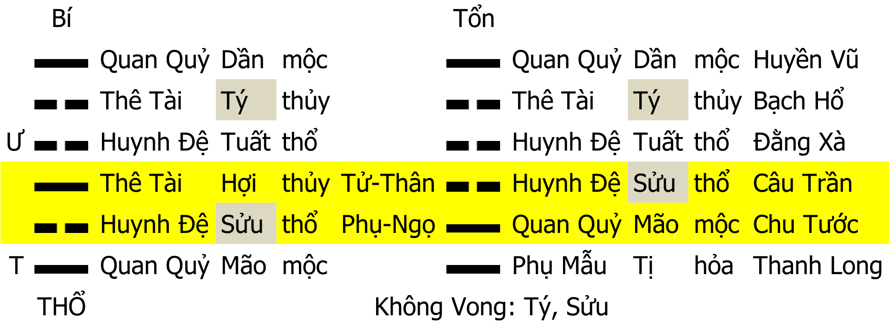
    - **Hình này chứng minh điều gì**
      - Quẻ Bí biến Tổn; Thê Tài Tý thủy hưu tù; chọn ngày Tý xung Ngọ hỏa phá đê thu hồi tiền nợ.
    - **Từ đâu mà thấy được**
      - Hào 3 Huynh Đệ Thân kim động hóa Huynh Đệ Sửu thổ; hào Thế Thê Tài Sửu thổ.
  - **Phán đoán và đối thoại (phần 1 - quẻ Bí biến Tổn):**
    - Căn cứ: Con nợ chây ì không chịu trả; quẻ Khảm biến Sư tiếp tục định rõ thời điểm thu nợ.
- **Quái lệ 1 (tiếp theo): Quẻ Khảm biến Sư thu hồi 1 vạn nguyên đúng ngày Tý**
  - **Hình 73. Quẻ Khảm Vi Thủy biến Địa Thủy Sư**
    - 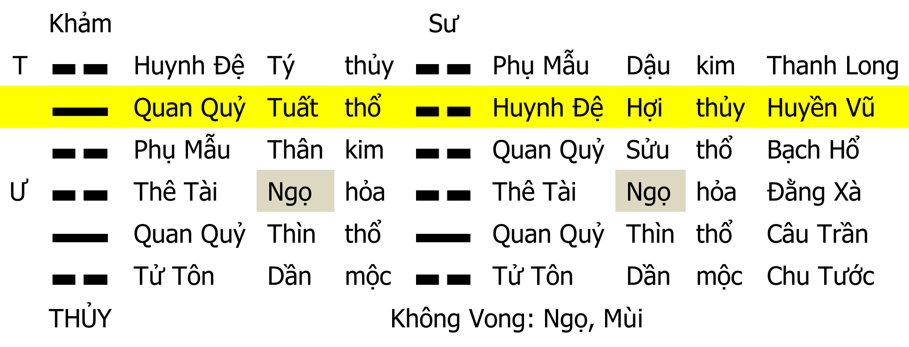
    - **Hình này chứng minh điều gì**
      - Quẻ Khảm biến Sư; Thê Tài Ngọ hỏa số 2; ngày Tý xung Ngọ thu hồi đúng 1 vạn nguyên một nửa số nợ.
    - **Từ đâu mà thấy được**
      - Hào 3 Huynh Đệ Thìn thổ động hóa Quan Quỷ Mão mộc; quẻ Khảm Vi Thủy.
  - **Phán đoán và đối thoại (phần 2 - quẻ Khảm biến Sư):**
    - Căn cứ: Ngày Bính Tý Thủy vượng xung Ngọ hỏa; số 2 chia đôi là 1 vạn nguyên.
  - **Phương án hóa giải:** Đến tận nhà con nợ đòi tiền vào đúng 9h sáng ngày Bính Tý.
  - **Ứng nghiệm thực tế:** Con nợ mở két thanh toán ngay 10.000 nguyên không một lời thoái thác.
- **Quái lệ 2: Nam muốn hủy bỏ hôn ước êm đẹp (Ngày Giáp Thân tháng Nhâm Thìn)**
  - **Hình 74. Quẻ Lôi Địa Dự biến Lôi Phong Hằng**
    - 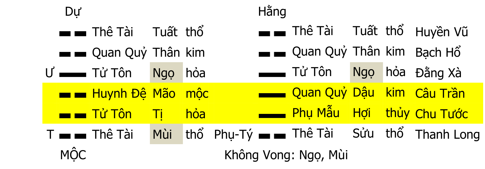
    - **Hình này chứng minh điều gì**
      - Quẻ Dự biến Hằng; Thế lâm Thanh Long lục hợp; chọn ngày Tuất xung Thìn giải hợp hủy hôn thuận hòa.
    - **Từ đâu mà thấy được**
      - Hào sơ Thê Tài Mùi thổ động hóa Thê Tài Sửu thổ; hào 4 Thế Tử Tôn Ngọ hỏa.
  - **Phán đoán và đối thoại:**
    - Căn cứ: Quẻ lục hợp dùng dằng khó dứt; chọn ngày Tuất xung khai quẻ hợp để nói lời chia tay.
    - Nhìn vào: Tránh cãi vã đền bù tổn thất danh dự hai bên gia đình.
    - Đối thoại thực tế: Chàng trai muốn chia tay vì không hợp tính cách nhưng sợ bị làm ầm ĩ.
  - **Phương án hóa giải:** Hẹn gặp nói chuyện dứt khoát vào chiều ngày Mậu Tuất.
  - **Ứng nghiệm thực tế:** Hai bên chia tay trong hòa bình, thống nhất trả lại sính lễ êm đẹp.

### Hóa Giải Bằng Tu Luyện

- **Khí công, dưỡng sinh và điều tức nội giới:**
  - Khí huyết và tinh thần là nền tảng trường sinh học của cơ thể con người.
  - Luyện khí công, thiền định đúng phương pháp giúp bổ sung chân khí, đả thông kinh mạch, tiêu trừ bệnh tật và nâng cao trường năng lượng tự vệ trước tà khí.
  - Bế tinh dưỡng khí kiêng cữ phòng dục là chìa khóa phục hồi nguyên khí cho các trường hợp thận hư muộn con.
- **Quái lệ 1: Người đàn ông hiệp hội khí công đoán bệnh nan y (Ngày Bính Dần tháng Ất Mùi)**
  - **Hình 75. Quẻ Lôi Trạch Quy Muội biến Hỏa Trạch Khuê**
    - 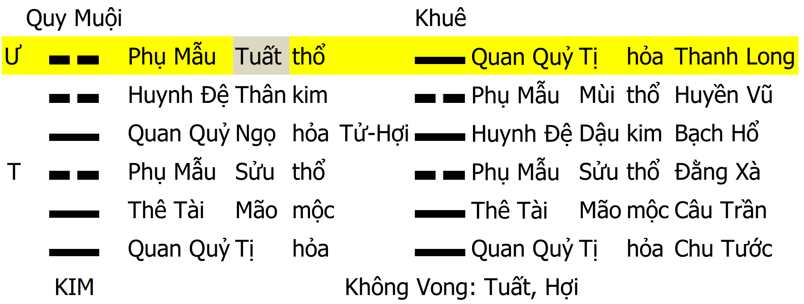
    - **Hình này chứng minh điều gì**
      - Quẻ Quy Muội biến Khuê; Quan Quỷ Ngọ hỏa thiêu đốt; luyện khí công Thái Cực dưỡng âm thanh nhiệt phục hồi tạng phủ.
    - **Từ đâu mà thấy được**
      - Hào 3 Huynh Đệ Sửu thổ động hóa Tử Tôn Dần mộc; hào Thế Thê Tài Mão mộc.
  - **Phán đoán và đối thoại:**
    - Căn cứ: Hỏa vượng thiêu tỳ vị; người tập khí công dùng công pháp dẫn khí hạ đan điền.
    - Nhìn vào: Điều hòa hơi thở sâu kết hợp tĩnh tọa giờ Tý.
  - **Phương án hóa giải:** Mỗi ngày thiền định 45 phút vào giờ Tý và giờ Ngọ.
  - **Ứng nghiệm thực tế:** Bệnh nan y thuyên giảm kỳ diệu, xét nghiệm chỉ số máu trở lại bình thường.
- **Quái lệ 2: Người đàn ông nhiều vợ nhưng muộn đường con cái (Ngày Đinh Sửu tháng Thân)**
  - **Hình 76. Quẻ Trạch Hỏa Cách biến Trạch Thiên Quải**
    - 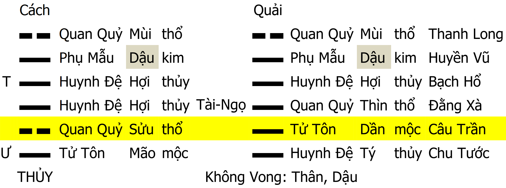
    - **Hình này chứng minh điều gì**
      - Quẻ Cách biến Quải; Tử Tôn Tý thủy Không Vong bị Thổ khắc; tu luyện dưỡng tinh khí túc sinh quý tử.
    - **Từ đâu mà thấy được**
      - Hào 4 Quan Quỷ Ngọ hỏa động hóa Quan Quỷ Ngọ hỏa; hào Thế Huynh Đệ Hợi thủy.
  - **Phán đoán và đối thoại:**
    - Căn cứ: Hào Tử Tôn Không Vong do tinh khí suy kiệt vì sắc dục quá độ.
    - Nhìn vào: Bế tinh dưỡng khí kiêng cữ phòng dục 100 ngày kết hợp luyện nội công.
  - **Phương án hóa giải:** Kiêng phòng sự 3 tháng và tập bài tập bồi bổ thận khí.
  - **Ứng nghiệm thực tế:** Sau 4 tháng người vợ chính thức mang thai và sinh hạ con trai kháu khỉnh.

### Hóa Giải Bằng Mượn Vận

- **Cộng hưởng trường khí từ người vượng vận:**
  - Khi bản thân đang trong chu kỳ suy vi bại vận, năng lượng từ trường cá nhân bị suy thoái dễ dẫn đến quyết định sai lầm và thua lỗ.
  - 'Đồng thanh tương ứng, đồng khí tương cầu': Mượn vận người có phúc khí, mạng vượng hoặc tuổi tương hợp với Dụng thần để đứng tên, ký kết hoặc đồng hành cùng hành sự.
  - Giúp né tránh mũi nhọn hung sát và hưởng lây sinh khí cát tường của đối tác.
- **Quái lệ: Người phụ nữ xem vận năm gặp suy hạn (Ngày Bính Tuất tháng Quý Sửu)**
  - **Hình 77. Quẻ Thủy Sơn Kiển biến Cấn Vi Sơn**
    - 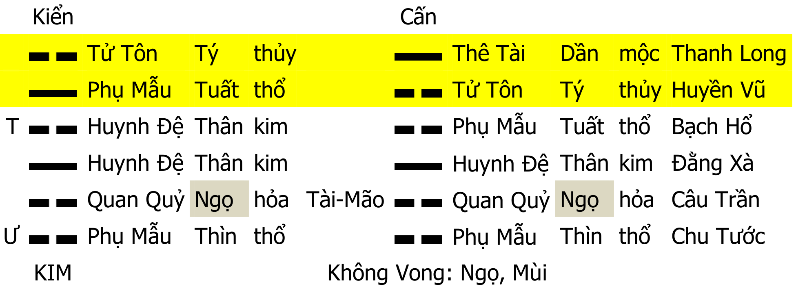
    - **Hình này chứng minh điều gì**
      - Quẻ Kiển biến Cấn; hào Thế Huynh Đệ Thìn thổ hưu tù; hào Ứng Thê Tài Tý thủy vượng; mượn vận người sinh năm Tý làm ăn.
    - **Từ đâu mà thấy được**
      - Hào 5 Quan Quỷ Thân kim động hóa Huynh Đệ Tuất thổ; hào Thế Huynh Đệ Thìn thổ.
  - **Phán đoán và đối thoại:**
    - Căn cứ: Thế lâm hào Kiển gian nan; hào Ứng Tý thủy mang tài lộc vượng.
    - Nhìn vào: Hợp tác làm ăn đứng tên chung với người tuổi Tý để mượn vận hanh thông.
    - Đối thoại thực tế: Khách hàng buôn bán thua lỗ triền miên mất hết vốn liếng.
  - **Phương án hóa giải:** Nhờ người em gái tuổi Giáp Tý đứng tên đại diện pháp luật cửa hàng.
  - **Ứng nghiệm thực tế:** Việc buôn bán đổi chiều khởi sắc, thu hồi toàn bộ vốn và sinh lời lớn.

### Hóa Giải Bằng Ngoại Ứng

- **Cơ chế cảm ứng tâm vật và thiên cơ ngoại ứng:**
  - Vũ trụ là một toàn thể hữu cơ; trong thời khắc gieo quẻ và dự đoán, vạn vật xung quanh xuất hiện ngẫu nhiên đều mang thông điệp vi tế tương thích với sự việc.
  - Phân loại ngoại ứng: Ngoại ứng thị giác (hình ảnh, màu sắc, động vật, xe cộ); ngoại ứng thính giác (tiếng còi, tiếng chuông, tiếng chim, lời nói tình cờ); ngoại ứng sự kiện (hiến máu, làm từ thiện, gặp gỡ ngẫu nhiên).
  - Chủ động tạo ngoại ứng: Dùng hành động có ý nghĩa tương đương (như hiến máu ứng với huyết quang, quyên tiền ứng với phá tài) để triệt tiêu tai họa thực tế.
  - Quy luật bắt mạch thiên cơ: Ngoại ứng phát sinh đúng khoảnh khắc tâm niệm vừa khởi sẽ mang tính ứng nghiệm cao nhất.
  - Chuyển di năng lượng hung sát: Biến hung thành cát bằng cách chủ động gánh chịu một phần tổn thất tượng trưng trước khi biến cố thật sự ập đến.
- **Quái lệ 1: Hiến máu nhân đạo giải đại hạn phá tài (Quẻ Lữ biến Tấn)**
  - **Hình 78. Quẻ Hỏa Sơn Lữ biến Hỏa Địa Tấn**
    - 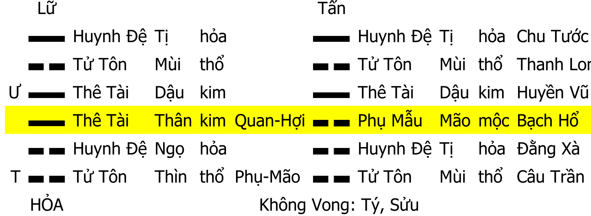
    - **Hình này chứng minh điều gì**
      - Quẻ Lữ biến Tấn; Huynh Đệ Dần mộc động đoạt tài lâm Bạch Hổ; chủ động hiến máu bệnh viện hóa giải đại hạn phá tài huyết quang.
    - **Từ đâu mà thấy được**
      - Hào 4 Quan Quỷ Ngọ hỏa động hóa Thê Tài Dậu kim; hào sơ Huynh Đệ Mão mộc.
  - **Phán đoán và đối thoại:**
    - Căn cứ: Quẻ báo sắp gặp đại nạn mất tiền và chảy máu; thấy xe hiến máu đỗ trước cửa làm ngoại ứng.
    - Nhìn vào: Chủ động hiến máu (ứng huyết quang) và quyên tiền (ứng phá tài) để tiêu trừ nghiệp chướng.
    - Đối thoại thực tế: Đương số linh cảm thấy điều chẳng lành, trong lòng bồn chồn đứng ngồi không yên.
  - **Phương án hóa giải:** Đi hiến máu nhân đạo 200ml và công đức vào quỹ từ thiện.
  - **Ứng nghiệm thực tế:** Tháng đó bình an vô sự, chỉ bị phạt giao thông nhẹ 50 ngàn đồng thay vì mất bạc triệu.
- **Quái lệ 2: Tương lai cháu trai (Quẻ Tiểu Súc)**
  - **Hình 79. Quẻ Phong Thiên Tiểu Súc**
    - 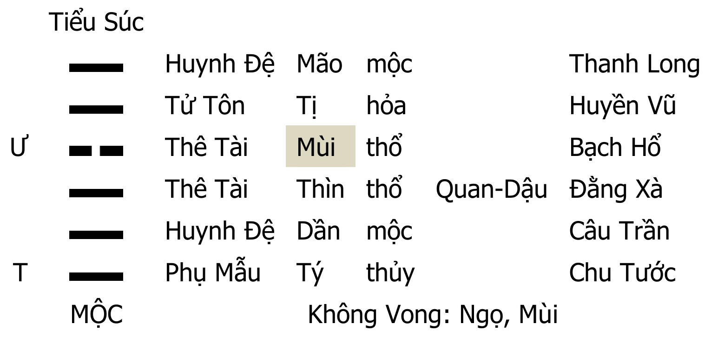
    - **Hình này chứng minh điều gì**
      - Quẻ Phong Thiên Tiểu Súc; Tử Tôn Tý thủy lâm hào Ứng; ngoại ứng nhìn thấy trẻ con cầm cờ dẫn đầu thành công sau này.
    - **Từ đâu mà thấy được**
      - Quẻ Phong Thiên Tiểu Súc; hào Thế Thê Tài Thìn thổ; hào Ứng Tử Tôn Tý thủy.
  - **Phán đoán và đối thoại:**
    - Căn cứ: Cháu bé học hành thông minh nhưng hiếu động; ngoại ứng đứa trẻ vẫy cờ đỏ đi qua.
    - Nhìn vào: Hình ảnh cờ đỏ tượng trưng cho bảng vàng đề danh và chức vụ lãnh đạo dẫn dắt tập thể.
    - Đối thoại thực tế: Người bà lo lắng hỏi về tương lai của đứa cháu trai thông minh nhưng nghịch ngợm.
  - **Phương án hóa giải:** Định hướng cháu theo ngành sư phạm hoặc quản trị công vụ.
  - **Ứng nghiệm thực tế:** Cháu đỗ đại học sư phạm và trở thành giảng viên ưu tú.
- **Quái lệ 3: Xem mộ tổ (Quẻ Tụy biến Hoán)**
  - **Hình 80. Quẻ Trạch Địa Tụy biến Phong Thủy Hoán**
    - 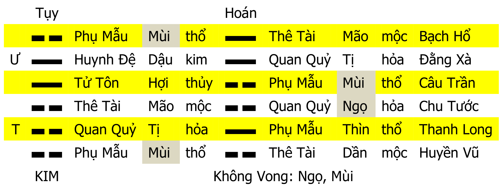
    - **Hình này chứng minh điều gì**
      - Quẻ Tụy biến Hoán; hào sơ Thế Mùi thổ động hóa Tị hỏa; Thủy triều rút cạn lộ xương cốt tổ tiên cần cải táng.
    - **Từ đâu mà thấy được**
      - Hào sơ Thế Thê Tài Mùi thổ động hóa Tử Tôn Tị hỏa; quẻ Trạch Địa Tụy.
  - **Phán đoán và đối thoại:**
    - Căn cứ: Âm trạch bị ngập úng trũng; tiếng còi tàu hỏa hú dài làm ngoại ứng chỉ hướng Tây Bắc cao ráo.
    - Nhìn vào: Âm thanh còi tàu rền vang thuộc Càn Kim báo hiệu địa hình gò đồi vượng khí phía xa.
    - Đối thoại thực tế: Người nhà trăn trở nghi ngờ phần mộ dòng họ bị sụt lún ngập nước.
  - **Phương án hóa giải:** Quy tập mộ phần về sườn đồi phía Tây Bắc.
  - **Ứng nghiệm thực tế:** Gia tộc con cháu làm ăn phát đạt, sinh nhiều đinh quý.
- **Quái lệ 4: Xem bệnh chồng (Quẻ Thăng & Quẻ Đại Hữu biến Đỉnh)**
  - **Hình 81. Quẻ Địa Phong Thăng**
    - 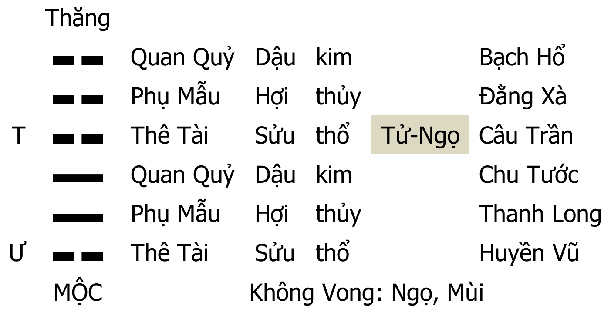
    - **Hình này chứng minh điều gì**
      - Quẻ Thăng; Quan Quỷ Dậu kim Không Vong; ngoại ứng nghe thấy tiếng chim gõ kiến mổ cây trừ sâu bệnh.
    - **Từ đâu mà thấy được**
      - Quẻ Địa Phong Thăng; hào 3 Quan Quỷ Dậu kim Không Vong.
  - **Phán đoán và đối thoại (phần 1 - quẻ Thăng):**
    - Căn cứ: Chồng mắc bệnh gan mật mệt mỏi; kết hợp quẻ Đại Hữu biến Đỉnh kiểm tra bài thuốc.
    - Đối thoại thực tế: Người vợ vừa khóc vừa kể bệnh viện lớn đã trả về, bác sĩ lắc đầu.
- **Quái lệ 4 (tiếp theo): Quẻ Đại Hữu biến Đỉnh bài trừ bệnh tật**
  - **Hình 82. Quẻ Hỏa Thiên Đại Hữu biến Hỏa Phong Đỉnh**
    - 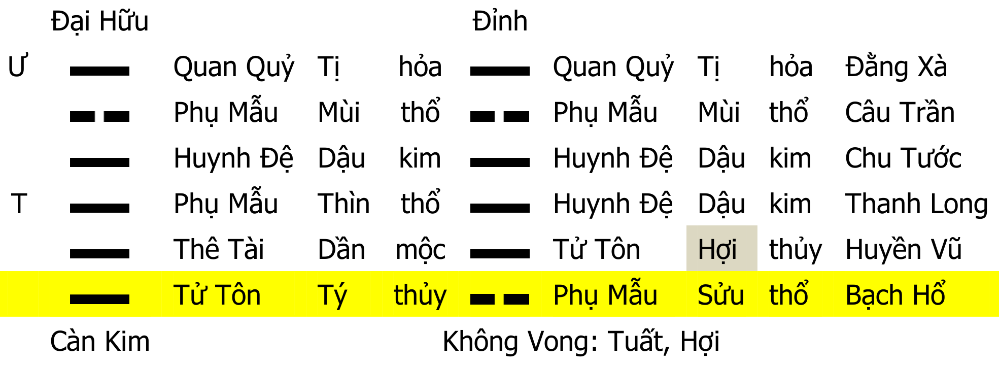
    - **Hình này chứng minh điều gì**
      - Quẻ Đại Hữu biến Đỉnh; hào 3 Thế Phụ Mẫu Thìn thổ; Tử Tôn Dần mộc động; dùng thảo dược Mộc trị dứt bệnh gan.
    - **Từ đâu mà thấy được**
      - Hào 3 Thế Phụ Mẫu Thìn thổ động hóa Quan Quỷ Hợi thủy; quẻ Hỏa Thiên Đại Hữu.
  - **Phán đoán và đối thoại (phần 2):**
    - Căn cứ: Ngoại ứng chén trà xanh mang lại thanh nhiệt giải độc.
    - Nhìn vào: Mộc khí sinh vượng từ thảo dược giải độc gan phục hồi chức năng tạng phủ.
  - **Phương án hóa giải:** Dùng nhân trần và diệp hạ châu sắc uống thay nước lọc.
  - **Ứng nghiệm thực tế:** Men gan hạ về mức an toàn sau 3 tuần uống thuốc.
- **Quái lệ 5: Xem bệnh phổi (Quẻ Tốn biến Tiểu Súc)**
  - **Hình 83. Quẻ Tốn Vi Phong biến Phong Thiên Tiểu Súc**
    - 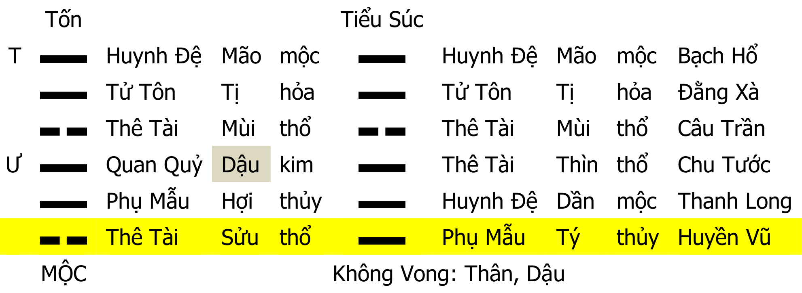
    - **Hình này chứng minh điều gì**
      - Quẻ Tốn biến Tiểu Súc; hào 2 Thế Quan Quỷ Dậu kim động hóa Huynh Đệ Dần mộc; ngoại ứng tiếng chuông reo báo lành.
    - **Từ đâu mà thấy được**
      - Hào 2 Thế Quan Quỷ Dậu kim động hóa Huynh Đệ Dần mộc; quẻ Tốn Vi Phong.
  - **Phán đoán và đối thoại:**
    - Căn cứ: Phổi có nốt mờ nghi u; tiếng chuông điện thoại báo tin lành là ngoại ứng hoán cải số mệnh.
    - Đối thoại thực tế: Bệnh nhân ho kéo dài tức ngực khó thở, tinh thần hoang mang cực độ.
  - **Phương án hóa giải:** Tập hít thở sâu ngoài trời vào lúc bình minh phương Đông.
  - **Ứng nghiệm thực tế:** Chụp CT lại nốt mờ chỉ là ổ viêm cũ vôi hóa, sức khỏe bình an.
- **Quái lệ 6: Mộ phần cha mẹ (Quẻ Cổ biến Đại Súc)**
  - **Hình 84. Quẻ Sơn Phong Cổ biến Sơn Thiên Đại Súc**
    - 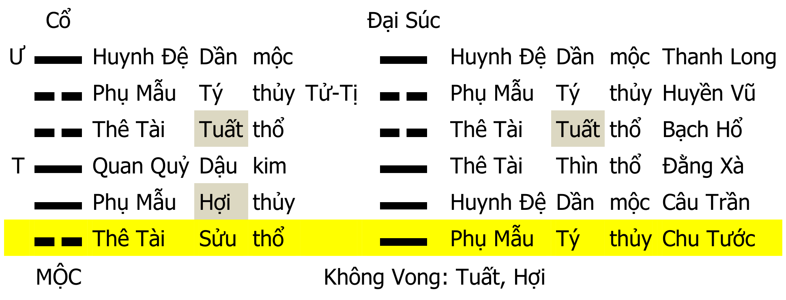
    - **Hình này chứng minh điều gì**
      - Quẻ Cổ biến Đại Súc; Phụ Mẫu Tý thủy lâm Nguyệt phá; ngoại ứng người lái xe tải chạy ngang chỉ rõ vị trí long mạch.
    - **Từ đâu mà thấy được**
      - Hào 3 Huynh Đệ Thân kim động hóa Huynh Đệ Tuất thổ; quẻ Sơn Phong Cổ.
  - **Phán đoán và đối thoại:**
    - Căn cứ: Mộ tổ bị đường giao thông mới mở cắt ngang long mạch.
    - Nhìn vào: Xe chở đá cuội chạy qua ngụ ý cần xếp đá kè đất vững chắc cản ngăn bụi khí.
  - **Phương án hóa giải:** Trồng hàng thông xanh phong thủy chắn bụi và ngăn sát khí đường xá.
  - **Ứng nghiệm thực tế:** Gia đạo an ổn trở lại, công việc làm ăn thoát khỏi bế tắc.

### Hóa Giải Bằng Thế Thân

- **Phép dùng hình nhân thế thân giải hạn ách hiểm nghèo:**
  - Khi đương số rơi vào đại hạn hung sát đe dọa tính mạng mà các phương pháp hóa giải thông thường bất khả thi, thuật Lục Hào vận dụng hình nhân thế thân để gánh thay tai kiếp.
  - Chất liệu chế tác hình nhân: Dùng giấy hoàng chỉ, cỏ rơm sạch hoặc đất sét tinh khiết nặn thành hình người đủ đầu mình tứ chi.
  - Nghi thức nạp linh lực: Ghi rõ họ tên, năm tháng ngày giờ sinh của đương số, cắt một lọn tóc hoặc mẫu móng tay bỏ vào bên trong hình nhân để kết nối trường sinh học.
  - Thời điểm và phương vị tống tiễn: Làm lễ tống tiễn vào giờ Tý tại ngã ba đường hoặc phương vị lâm Kỵ thần để chuyển giao tai ách cho hư không.
- **Quái lệ: Bệnh nhân nguy kịch dùng thế thân trừ tai (Quẻ Tổn biến Bác)**
  - **Hình 85. Quẻ Sơn Trạch Tổn biến Sơn Địa Bác**
    - 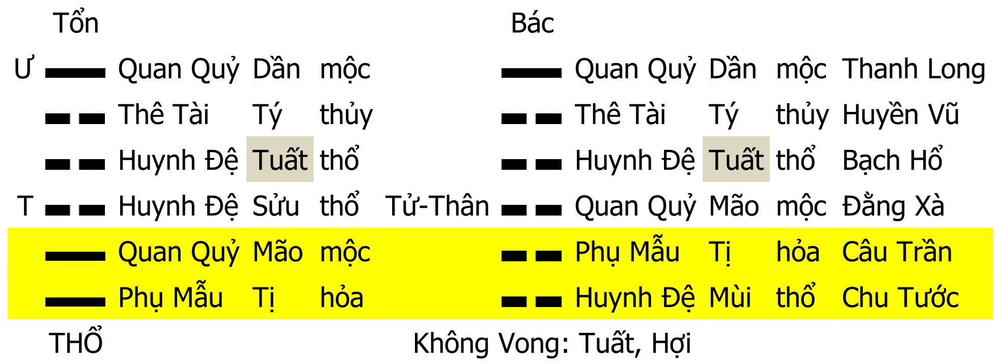
    - **Hình này chứng minh điều gì**
      - Quẻ Tổn biến Bác; hào 2 Quan Quỷ Mão mộc động hóa Thê Tài Tý thủy; dùng người nộm giấy thế thân gánh hạn chết chóc.
    - **Từ đâu mà thấy được**
      - Hào 2 Quan Quỷ Mão mộc động hóa Thê Tài Tý thủy; quẻ Sơn Trạch Tổn.
  - **Phán đoán và đối thoại:**
    - Căn cứ: Bệnh nhân thập tử nhất sinh, hào Thế hưu tù Quan Quỷ lâm Bạch Hổ động khắc; bác sĩ tiên lượng xấu.
    - Nhìn vào: Làm hình nhân thế thân bằng giấy vàng ghi họ tên bát tự đem đốt tại ngã ba đường phương Đông.
    - Đối thoại thực tế: Gia quyến chuẩn bị hậu sự, khẩn cầu tác giả ra tay cứu vãn một tia hy vọng mong manh.
  - **Phương án hóa giải:** Chế tác hình nhân thế thân bằng rơm và giấy hoàng chỉ, làm lễ tống tiễn giờ Tý phương Đông.
  - **Ứng nghiệm thực tế:** Ngay sau đêm làm lễ thế thân, bệnh nhân bất ngờ hồi tỉnh, qua khỏi cơn nguy kịch và dần bình phục hoàn toàn.

### Hóa Giải Bằng Gương Thái Cực Bát Quái

- **Uy lực khúc xạ và hóa giải của Gương Thái Cực Bát Quái:**
  - Gương Thái Cực Bát Quái là pháp khí phong thủy thượng thừa kết hợp đồ hình Tiên Thiên Bát Quái với mặt gương đồng âm dương.
  - Phân loại và công năng: Gương lồi (khúc xạ và tán xạ sát khí bên ngoài bắn tới); gương lõm (thu nạp và hội tụ cát khí cát tường); gương phẳng (phản xạ cân bằng trường khí âm dương).
  - Các loại hình sát khí cần gương Bát Quái: Tiêm giác sát (góc nhọn nhà đối diện), Thương sát (đường đâm thẳng cổng), Lộ xung sát, Hỏa sát (trạm biến áp, cột điện cao thế), Âm sát (nhà đối diện nghĩa trang, bệnh viện).
  - Cấm kỵ phong thủy: Tuyệt đối không treo gương Bát Quái chiếu thẳng vào cửa chính hoặc cửa sổ nhà hàng xóm để tránh gây xung đột trường khí.
  - Thời điểm treo gương Bát Quái: Nên chọn ngày giờ hoàng đạo, giờ Tý hoặc giờ Ngọ lúc dương khí thịnh vượng nhất để điểm nhãn khai quang gương.
  - Phối hợp ngũ hành chất liệu gương: Gương đồng thuộc Kim hóa giải sát khí thuộc Mộc và Hỏa; gương viền gỗ đào trừ tà khí phương Đông.
- **Quái lệ 1: Nhà đối diện góc nhọn mái đình đâm thẳng vào cửa (Quẻ Tụng & Quẻ Vô Vọng biến Lý)**
  - **Hình 86. Quẻ Thiên Thủy Tụng**
    - 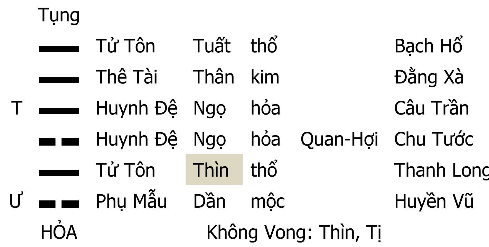
    - **Hình này chứng minh điều gì**
      - Quẻ Thiên Thủy Tụng; hào Thế Huynh Đệ Ngọ hỏa bị Quan Quỷ Hợi thủy khắc; sát khí góc nhọn nhà đối diện bắn vào.
    - **Từ đâu mà thấy được**
      - Quẻ Thiên Thủy Tụng; hào 3 Huynh Đệ Ngọ hỏa; quẻ ngoại Càn nội Khảm.
  - **Phán đoán và đối thoại (phần 1 - quẻ Tụng):**
    - Căn cứ: Góc nhọn mái đình đâm thẳng cửa chính tạo tiêm giác sát làm người trong nhà hay cãi cọ ốm đau.
    - Đối thoại thực tế: Gia chủ lo sợ vì góc nhọn đình làng chĩa thẳng vào cửa nhà khiến các thành viên trong gia đình thường xuyên bất hòa.
- **Quái lệ 1 (tiếp theo): Quẻ Vô Vọng biến Lý – Treo gương lồi Bát Quái**
  - **Hình 87. Quẻ Thiên Lôi Vô Vọng biến Thiên Trạch Lý**
    - 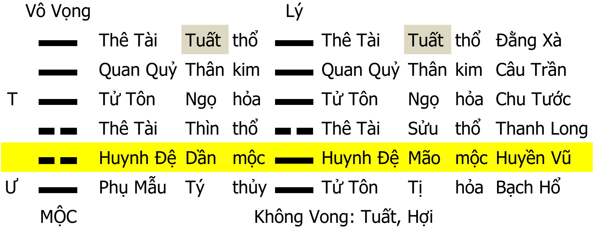
    - **Hình này chứng minh điều gì**
      - Quẻ Vô Vọng biến Lý; hào sơ Tử Tôn Tý thủy động; treo gương lồi Thái Cực Bát Quái tán xạ góc nhọn.
    - **Từ đâu mà thấy được**
      - Hào sơ Tử Tôn Tý thủy động hóa Thê Tài Dần mộc; quẻ Thiên Lôi Vô Vọng.
  - **Phán đoán và đối thoại (phần 2):**
    - Căn cứ: Gương lồi phản xạ và phân tán trường khí xung sát ra hai bên bảo vệ minh đường.
    - Nhìn vào: Cung Khảm Thủy chế ngự hỏa sát góc nhọn khôi phục cân bằng âm dương.
  - **Phương án hóa giải:** Treo gương lồi Bát Quái đồng trước cửa chính hướng thẳng vào góc nhọn đối diện.
  - **Ứng nghiệm thực tế:** Gia đạo bình an trở lại, không còn tiếng cãi vã và các vụ tai nạn vặt biến mất.
- **Quái lệ 2: Cửa sổ đối diện trạm biến áp điện lực (Quẻ Lữ biến Đỉnh)**
  - **Hình 88. Quẻ Hỏa Sơn Lữ biến Hỏa Phong Đỉnh**
    - 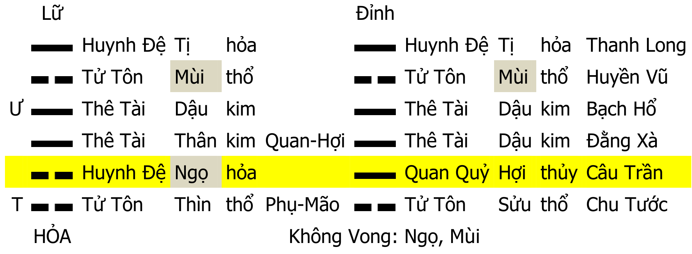
    - **Hình này chứng minh điều gì**
      - Quẻ Lữ biến Đỉnh; Hỏa vượng thiêu Kim; trạm biến áp điện lực tạo hỏa sát cực mạnh; gương Bát Quái Thủy hóa Hỏa sát.
    - **Từ đâu mà thấy được**
      - Hào sơ Huynh Đệ Sửu thổ động hóa Phụ Mẫu Mão mộc; quẻ Hỏa Sơn Lữ.
  - **Phán đoán và đối thoại:**
    - Căn cứ: Hỏa sát trạm biến áp làm người nhà đau đầu mất ngủ, huyết áp tăng vọt.
    - Nhìn vào: Trạm biến áp phóng từ trường cực mạnh làm nhiễu loạn sóng não của gia chủ.
    - Đối thoại thực tế: Khách hàng kêu ca đêm nào cũng trằn trọc mất ngủ từ khi trạm điện đối diện nhà đi vào hoạt động.
  - **Phương án hóa giải:** Treo gương Thái Cực Bát Quái lõm kết hợp bình phong thủy tinh chứa nước tại ban công.
  - **Ứng nghiệm thực tế:** Nhiệt độ và điện từ trường cảm nhận dịu hẳn, giấc ngủ của các thành viên sâu và ngon.
- **Quái lệ 3: Cha xem bệnh cho con (Quẻ Tấn biến Đỉnh)**
  - **Hình 89. Quẻ Hỏa Địa Tấn biến Hỏa Phong Đỉnh**
    - 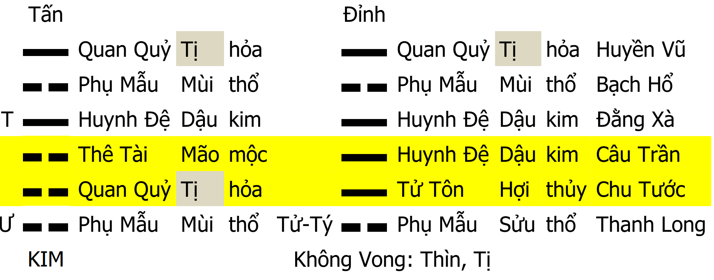
    - **Hình này chứng minh điều gì**
      - Quẻ Tấn biến Đỉnh; hào sơ Thê Tài Mùi thổ động hóa Quan Quỷ Tị hỏa; bệnh tật dai dẳng cần trấn sát bằng gương Thái Cực.
    - **Từ đâu mà thấy được**
      - Hào sơ Thê Tài Mùi thổ động; hào 4 Quan Quỷ Dậu kim; quẻ Hỏa Địa Tấn.
  - **Phán đoán và đối thoại:**
    - Căn cứ: Con trai sốt co giật không rõ căn nguyên sau khi gia đình sửa cổng.
    - Nhìn vào: Cổng mới mở kích động sát khí loan đầu làm nhiễu loạn nguyên khí trẻ nhỏ.
    - Đối thoại thực tế: Người cha hoang mang đưa con đi khám khắp nơi xét nghiệm không ra bệnh.
  - **Phương án hóa giải:** Treo gương phẳng Thái Cực Bát Quái trước cổng mới để ổn định từ trường.
  - **Ứng nghiệm thực tế:** Cháu bé hạ sốt ngay trong ngày, sức khỏe phục hồi trọn vẹn.
- **Quái lệ 4: Nữ đoán bệnh bản thân suy nhược (Quẻ Tụy biến Quải)**
  - **Hình 90. Quẻ Trạch Địa Tụy biến Trạch Thiên Quải**
    - 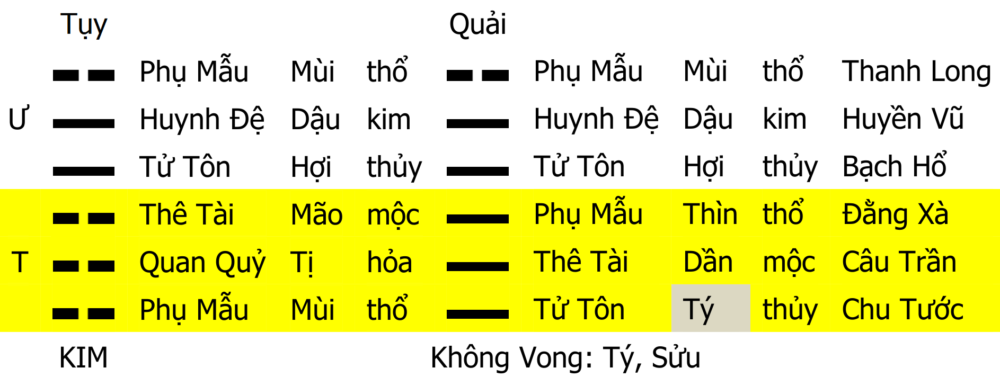
    - **Hình này chứng minh điều gì**
      - Quẻ Tụy biến Quải; hào 2 Quan Quỷ Tị hỏa động hóa Thê Tài Dần mộc; tà khí từ nghĩa trang đối diện xâm lấn nhà ở.
    - **Từ đâu mà thấy được**
      - Hào 2 Quan Quỷ Tị hỏa động hóa Thê Tài Dần mộc; quẻ Trạch Địa Tụy.
  - **Phán đoán và đối thoại:**
    - Căn cứ: Nhà nhìn ra nghĩa trang âm khí nặng nề làm phụ nữ suy nhược thần kinh ảo giác.
    - Nhìn vào: Âm khí từ nghĩa trang tạo trường năng lượng lạnh lẽo tích tụ lâu ngày làm suy kiệt dương khí.
    - Đối thoại thực tế: Đương số thường xuyên giật mình hoảng sợ lúc nửa đêm và nghe thấy âm thanh kỳ lạ.
  - **Phương án hóa giải:** Treo gương Thái Cực Bát Quái mặt đồng phía sau nhà quay về hướng nghĩa trang.
  - **Ứng nghiệm thực tế:** Không còn cảm giác ớn lạnh rùng mình, tinh thần tỉnh táo hoạt bát.

### Hóa Giải Bằng Bùa Hộ Mệnh

- **Cơ chế vận hành của Linh phù và Bùa hộ mệnh:**
  - Linh phù là đồ hình mật mã kết nối trường năng lượng tâm thức người tu luyện với linh khí trời đất.
  - Quy chuẩn chế tác: Dùng mực chu sa tự nhiên (thuộc dương Hỏa cực đại) vẽ trên giấy hoàng chỉ (thuộc âm Thổ trung hòa) vào khung giờ Tý thanh tịnh.
  - Đóng dấu triện Bát Quái hoặc triện Đạo gia để niêm phong năng lượng; gấp thành hình tam giác bỏ vào túi gấm mang theo bên mình tạo từ trường bảo hộ cá nhân liên tục 24/7.
- **Quái lệ 1: Phụ nữ lớn tuổi xuất ngoại thăm con (Quẻ Kiển biến Đồng Nhân)**
  - **Hình 91. Quẻ Thủy Sơn Kiển biến Thiên Hỏa Đồng Nhân**
    - 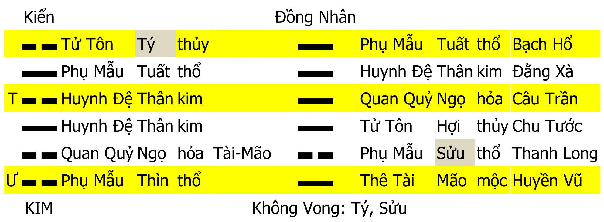
    - **Hình này chứng minh điều gì**
      - Quẻ Kiển biến Đồng Nhân; hào Thế Huynh Đệ Thìn thổ; hào sơ Thê Tài Thìn thổ động; đeo linh phù bình an xuất ngoại.
    - **Từ đâu mà thấy được**
      - Hào sơ Thê Tài Thìn thổ động hóa Quan Quỷ Tị hỏa; quẻ Thủy Sơn Kiển.
  - **Phán đoán và đối thoại:**
    - Căn cứ: Tuổi cao đi máy bay đường dài qua nửa vòng trái đất lo sợ huyết áp và rủi ro hàng không.
  - **Phương án hóa giải:** Viết linh phù Bình An độ mạng chu sa bỏ vào túi vải gấm vàng đeo trước ngực.
  - **Ứng nghiệm thực tế:** Chuyến bay êm thuận, thủ tục hải quan nhanh chóng, sang Mỹ đoàn tụ con cháu vui vẻ.
- **Quái lệ 2: Bạn học xem vận khí năm tuổi (Quẻ Thủy Lôi Truân)**
  - **Hình 92. Quẻ Thủy Lôi Truân**
    - 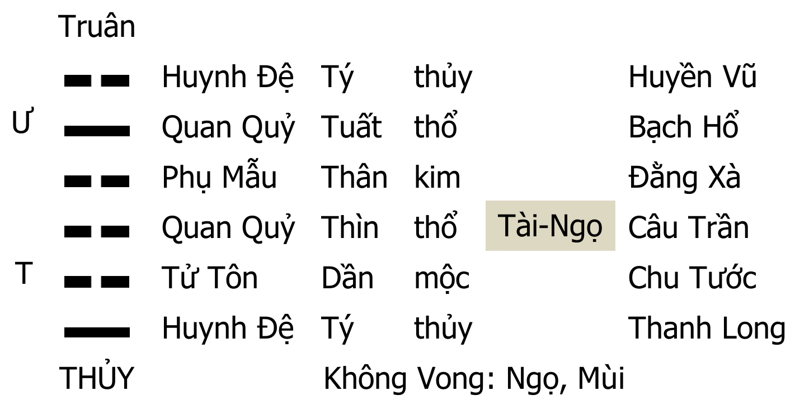
    - **Hình này chứng minh điều gì**
      - Quẻ Thủy Lôi Truân; hào sơ Huynh Đệ Tý thủy; Quan Quỷ Dần mộc hưu tù; đeo linh phù Thái Tuế nghênh cát tị hung.
    - **Từ đâu mà thấy được**
      - Quẻ Thủy Lôi Truân; hào sơ Tử Tôn Tý thủy; hào 2 Quan Quỷ Dần mộc.
  - **Phán đoán và đối thoại:**
    - Căn cứ: Quẻ Truân vạn sự khởi đầu nan, năm tuổi dễ gặp thị phi trở ngại bất ngờ.
  - **Phương án hóa giải:** Đeo bùa Thái Tuế phù hộ mạng trong suốt năm.
  - **Ứng nghiệm thực tế:** Cả năm hanh thông, công tác thuận lợi và tránh được nhiều bẫy rập tiểu nhân.
- **Quái lệ 3: Đoán tài vận làm ăn (Quẻ Bĩ biến Tấn)**
  - **Hình 93. Quẻ Thiên Địa Bĩ biến Hỏa Địa Tấn**
    - 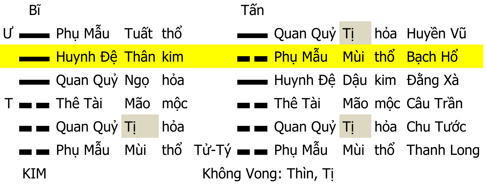
    - **Hình này chứng minh điều gì**
      - Quẻ Bĩ biến Tấn; hào sơ Thê Tài Mão mộc động hóa Huynh Đệ Tị hỏa; mang bùa Chiêu Tài tiến bảo kích hoạt kinh doanh.
    - **Từ đâu mà thấy được**
      - Hào sơ Thê Tài Mão mộc động hóa Huynh Đệ Tị hỏa; quẻ Thiên Địa Bĩ.
  - **Phán đoán và đối thoại:**
    - Căn cứ: Bĩ cực thái lai, tài vận chuyển từ bế tắc sang sáng sủa nhưng cần linh phù trợ lực khai thông.
  - **Phương án hóa giải:** Viết bùa Ngũ Lộ Thần Tài đặt trong ví tiền.
  - **Ứng nghiệm thực tế:** Ký kết được 3 hợp đồng lớn, tiền bạc thu hồi đầy đủ.
- **Quái lệ 4: Phụ nữ quản lý dịch vụ đoán tránh kiện tụng (Quẻ Thái biến Tiểu Quá)**
  - **Hình 94. Quẻ Địa Thiên Thái biến Lôi Sơn Tiểu Quá**
    - 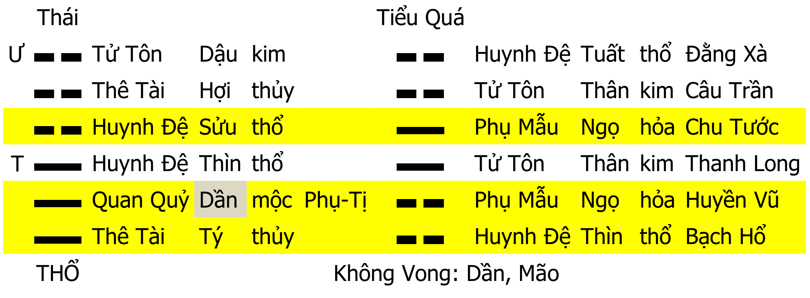
    - **Hình này chứng minh điều gì**
      - Quẻ Thái biến Tiểu Quá; hào 3 Huynh Đệ Thìn thổ động hóa Quan Quỷ Ngọ hỏa; dùng bùa Tiêu Tai giải trừ quan phi kiện tụng.
    - **Từ đâu mà thấy được**
      - Hào 3 Huynh Đệ Thìn thổ động hóa Quan Quỷ Ngọ hỏa; quẻ Địa Thiên Thái.
  - **Phán đoán và đối thoại:**
    - Căn cứ: Quan Quỷ động khắc Thế, nguy cơ bị điều tra pháp luật phạt tiền lớn.
  - **Phương án hóa giải:** Đeo phù Tiêu Tai trừ quan phi bên người và nộp phạt hành chính sớm giải tỏa vụ việc.
  - **Ứng nghiệm thực tế:** Vụ việc được giải quyết êm thấm mức phạt nhẹ nhất, không bị truy cứu hình sự.

### Hóa Giải Bằng Chú Thuật

- **Phát âm chân ngôn và chú thuật cổ truyền:**
  - Chú ngữ (thần chú) là tổ hợp âm thanh mang tần số cộng hưởng vũ trụ đặc biệt, có khả năng kích hoạt trường năng lượng nội tại và xua đuổi tà khí ngoại lai.
  - Căn bản trì chú: Giữ thân khẩu ý thanh tịnh, quán tưởng ánh sáng quang minh bao phủ thân tâm khi tụng niệm.
  - Ứng dụng trì tụng thần chú lục tự Đại Minh, chú Bát Nhã hoặc các mật chú Đạo gia trong các khung giờ thanh tịnh để thanh tẩy trược khí và tăng cường chính khí.

### Hóa Giải Bằng Trang Phục

- **Y phục phong thủy và trường khí cá nhân:**
  - Quần áo bao bọc cơ thể suốt cả ngày lẫn đêm, đóng vai trò như lớp màng lọc từ trường sinh học trung gian giữa cơ thể và vũ trụ.
  - Chất liệu sợi và ngũ hành: Vải bông cotton thuộc Mộc nhu hòa; lụa tơ tằm thuộc Hỏa rực rỡ; đồ da thuộc Thủy uyển chuyển; len dạ thuộc Thổ ấm áp; lanh sợi bóng thuộc Kim tinh khiết.
  - Phối hợp màu sắc trang phục hợp mệnh trong các dịp đàm phán quan trọng, phỏng vấn, thi cử, kết hôn để tăng cường tối đa vận khí của Dụng thần.
- **Quái lệ: Nữ công chức dự đoán thăng chức (Quẻ Giải biến Thăng)**
  - **Hình 95. Quẻ Lôi Thủy Giải biến Địa Phong Thăng**
    - 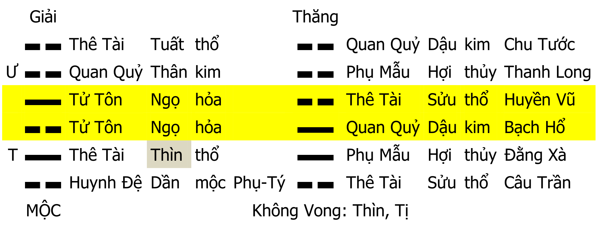
    - **Hình này chứng minh điều gì**
      - Quẻ Giải biến Thăng; Quan Quỷ Dậu kim Không Vong; mặc trang phục màu trắng nạp Kim xuất Không đắc quan.
    - **Từ đâu mà thấy được**
      - Hào 2 Quan Quỷ Thìn thổ động hóa Thê Tài Dần mộc; hào 3 Huynh Đệ Ngọ hỏa.
  - **Phán đoán và đối thoại:**
    - Căn cứ: Quan tinh Dậu kim Không Vong cần kim khí trợ lực trong ngày phỏng vấn bổ nhiệm.
  - **Phương án hóa giải:** Mặc áo vest trắng tinh khôi kết hợp hoa cài áo bằng kim loại sáng bóng.
  - **Ứng nghiệm thực tế:** Buổi phỏng vấn gây ấn tượng xuất sắc với ban giám khảo, nhận quyết định bổ nhiệm ngay tuần sau.

### Hóa Giải Bằng Giường Ngủ

- **Vị trí và hướng kê giường ngủ quyết định sinh mệnh con người:**
  - Giường ngủ là nơi cơ thể nghỉ ngơi và nạp dưỡng năng lượng trong suốt 1/3 cuộc đời; trạng thái vô thức khi ngủ khiến trường sinh học dễ bị tổn thương nhất trước sát khí.
  - Cấm kỵ giường ngủ: Đầu giường tựa cửa sổ (thiếu chỗ dựa), đầu giường hướng vào nhà vệ sinh (uế khí xung hại), gương chiếu thẳng giường (phản xạ loạn thần), xà ngang đè đầu (áp bức tâm lý).
  - Gầm giường phải luôn thông thoáng sạch sẽ, cấm kỵ chứa đồ kim khí cũ gỉ sét, phế liệu hôi ẩm làm phát sinh âm sát hại sức khỏe phụ nữ và trẻ nhỏ.
  - Quy luật từ trường định vị đầu giường: Đầu quay về hướng cát phương tương sinh với bản mệnh và Thế hào của quẻ bản mệnh.
  - Chất liệu giường ngủ ngũ hành: Giường gỗ tự nhiên điều hòa mộc khí ôn nhu; kiêng kỵ giường sắt kim khí sắc nhọn dẫn dụ từ trường hỗn loạn.
- **Quái lệ 1: Đoán phong thủy nhà ở (Quẻ Cấn biến Bác & Quẻ Tụng biến Cấu)**
  - **Hình 96. Quẻ Thiên Thủy Tụng biến Thiên Phong Cấu**
    - 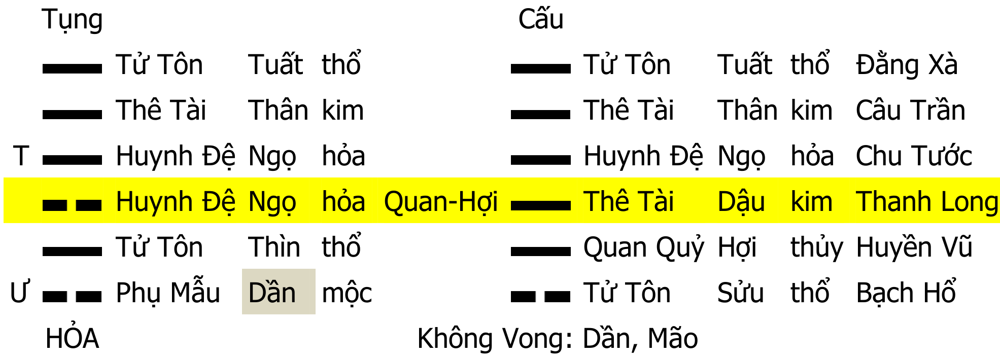
    - **Hình này chứng minh điều gì**
      - Quẻ Tụng biến Cấu; hào 2 Thế Quan Quỷ Dần mộc; đầu giường kê ngay dưới xà ngang phạm sát khí đè đầu.
    - **Từ đâu mà thấy được**
      - Hào 2 Thế Quan Quỷ Dần mộc động hóa Tử Tôn Tị hỏa; quẻ Thiên Thủy Tụng.
  - **Phán đoán và đối thoại (phần 1 - quẻ Tụng biến Cấu):**
    - Căn cứ: Đầu giường ngủ bị xà ngang đè, đối diện gương lớn làm gia chủ đau đầu ác mộng liên tục.
    - Nhìn vào: Xà ngang bê tông nặng nề đè trúng vị trí đầu giường gây hiện tượng bóng đè và đau nửa đầu.
    - Đối thoại thực tế: Gia chủ tâm sự mỗi lần nằm xuống giường là cảm thấy tức ngực khó thở và thường xuyên gặp ác mộng.
- **Quái lệ 1 (tiếp theo): Quẻ Cấn biến Bác – Dời giường ngủ đổi vận**
  - **Hình 97. Quẻ Cấn Vi Sơn biến Sơn Địa Bác**
    - 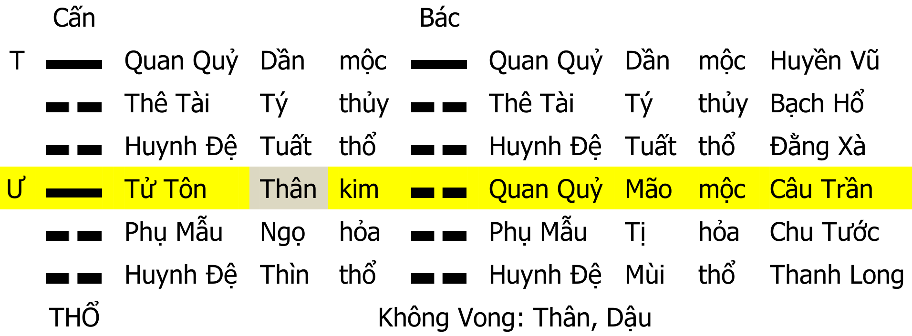
    - **Hình này chứng minh điều gì**
      - Quẻ Cấn biến Bác; hào 2 Phụ Mẫu Ngọ hỏa; hào 3 Thê Tài Thân kim động; dời giường ngủ sang cung sinh khí.
    - **Từ đâu mà thấy được**
      - Hào 3 Thê Tài Thân kim động hóa Huynh Đệ Mão mộc; quẻ Cấn Vi Sơn.
  - **Phán đoán và đối thoại (phần 2):**
    - Căn cứ: Dời giường tránh xa xà ngang và xoay đầu giường về hướng Cát tinh.
    - Nhìn vào: Cung Cấn Thổ tĩnh tại an định giúp ổn định thần phách.
  - **Phương án hóa giải:** Kê lại giường ngủ tựa lưng vào tường đặc, tránh đối diện cửa ra vào và gương soi.
  - **Ứng nghiệm thực tế:** Sau khi kê lại giường giấc ngủ sâu không mộng mị, sức khỏe hồi phục kỳ diệu.
- **Quái lệ 2: Đoán bệnh của vợ (Quẻ Bĩ biến Mông)**
  - **Hình 98. Quẻ Thiên Địa Bĩ biến Sơn Thủy Mông**
    - 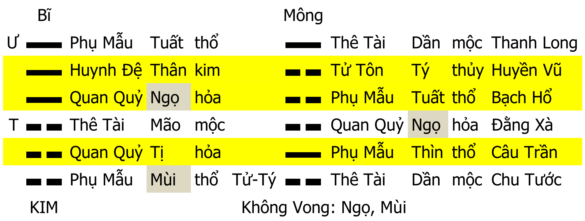
    - **Hình này chứng minh điều gì**
      - Quẻ Bĩ biến Mông; Thê Tài Mão mộc bị Kim khắc nặng; gầm giường chứa đồ kim khí cũ gỉ sét phát sinh sát khí.
    - **Từ đâu mà thấy được**
      - Hào 2 Thê Tài Tị hỏa động hóa Quan Quỷ Mão mộc; quẻ Thiên Địa Bĩ.
  - **Phán đoán và đối thoại:**
    - Căn cứ: Người vợ đau ốm quanh năm uống thuốc không khỏi; kiểm tra gầm giường phát hiện đống đồ sắt vụn dao kéo cũ tích tụ nhiều năm.
    - Nhìn vào: Đồ sắt vụn và dao kéo cũ dưới gầm giường tạo từ trường Kim sát cắt đứt Mộc khí tạng can tỳ.
    - Đối thoại thực tế: Người chồng xót xa vì vợ ốm liệt giường nhiều năm chạy chữa tốn kém khắp nơi không khỏi.
  - **Phương án hóa giải:** Dọn sạch toàn bộ đồ đạc dưới gầm giường, lau chùi sạch sẽ thông thoáng.
  - **Ứng nghiệm thực tế:** Sau khi dọn sạch gầm giường, người vợ khỏe mạnh hồng hào, dứt hẳn căn bệnh phụ khoa mãn tính.

### Hóa Giải Bằng Thay Đổi Ý Đồ

- **Tâm niệm và ý thức quyết định quỹ đạo vận mệnh:**
  - 'Vạn pháp duy tâm tạo': Ý đồ và tâm thức con người là nguồn phát sóng năng lượng định hướng mạnh mẽ nhất trong vũ trụ.
  - Nhiều tai ách hiểm nghèo xuất phát từ sự cố chấp mù quáng vào một mục tiêu sai lầm; chủ động đổi hướng, từ bỏ ý định mạo hiểm chính là đỉnh cao của thuật xu cát tị hung.
  - Chuyển hướng nghề nghiệp, thay đổi lộ trình, buông bỏ thù hằn tâm lý giúp giải trừ hung sát mà không cần tốn kém vật phẩm phong thủy.
  - Bản chất của việc đổi ý: Ý nghĩ dẫn dắt hành động; khi ý đồ thay đổi thì chuỗi nhân quả của tương lai tức khắc chuyển hướng sang quỹ đạo mới an toàn hơn.
  - Năng lực tự cứu của tâm thức: Biết buông bỏ lòng tham và sự cố chấp mù quáng là chìa khóa tiêu tai diệt nạn vi diệu nhất trong Chu Dịch.
- **Quái lệ 1: Cháu xem vận năm tại quê nhà (Quẻ Kiển biến Khiêm & Quẻ Vị Tế biến Lữ)**
  - **Hình 99. Quẻ Thủy Sơn Kiển biến Địa Sơn Khiêm**
    - 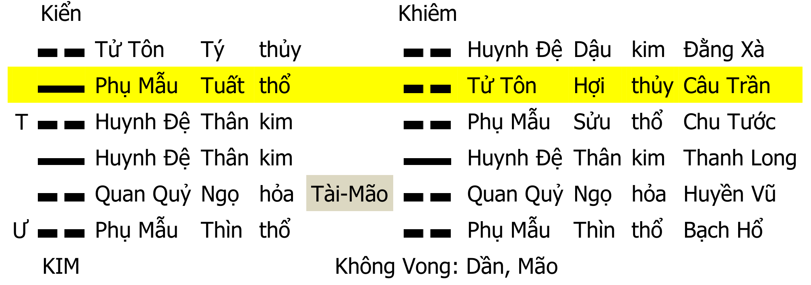
    - **Hình này chứng minh điều gì**
      - Quẻ Kiển biến Khiêm; hào 2 Thế Quan Quỷ Dần mộc; hào 5 Thê Tài Thân kim động; thay đổi ý định đầu tư kinh doanh mạo hiểm.
    - **Từ đâu mà thấy được**
      - Hào 5 Thê Tài Thân kim động hóa Huynh Đệ Tuất thổ; quẻ Thủy Sơn Kiển.
  - **Phán đoán và đối thoại (phần 1 - quẻ Kiển biến Khiêm):**
    - Căn cứ: Cháu định gom tiền buôn bán xe máy cũ; quẻ Kiển hiểm trở phía trước chắc chắn lỗ vốn.
    - Đối thoại thực tế: Người cháu phân vân định vay mượn thêm vốn lớn để mở đại lý xe máy cũ.
- **Quái lệ 1 (tiếp theo): Quẻ Vị Tế biến Lữ định hướng nghề nghiệp an toàn**
  - **Hình 100. Quẻ Hỏa Thủy Vị Tế biến Hỏa Sơn Lữ**
    - 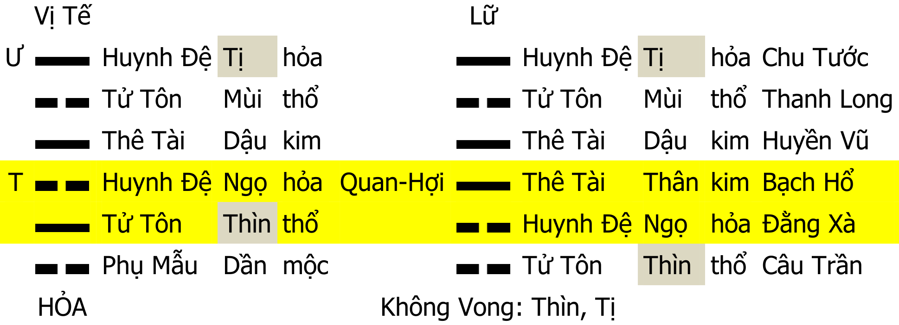
    - **Hình này chứng minh điều gì**
      - Quẻ Vị Tế biến Lữ; Thê Tài Tị hỏa trì Thế; từ bỏ kinh doanh mạo hiểm chuyển sang học nghề sửa chữa điện tử.
    - **Từ đâu mà thấy được**
      - Hào 3 Huynh Đệ Dậu kim động hóa Tử Tôn Thân kim; quẻ Hỏa Thủy Vị Tế.
  - **Phán đoán và đối thoại (phần 2):**
    - Căn cứ: Hỏa vượng sinh tài từ kỹ thuật chuyên môn; từ bỏ ý định buôn xe chuyển sang học nghề.
    - Nhìn vào: Tử Tôn sinh trợ Dụng thần bền vững, tích lũy tay nghề lâu dài an toàn.
  - **Phương án hóa giải:** Thay đổi ý đồ kinh doanh, đăng ký học khóa sửa chữa thiết bị điện tử.
  - **Ứng nghiệm thực tế:** Mở cửa hàng sửa chữa điện tử đông khách, thu nhập ổn định làm giàu bền vững.
- **Quái lệ 2: Giám đốc công ty du lịch xem tiền đồ doanh nghiệp (Quẻ Tiệm biến Tấn)**
  - **Hình 101. Quẻ Phong Sơn Tiệm biến Hỏa Địa Tấn**
    - 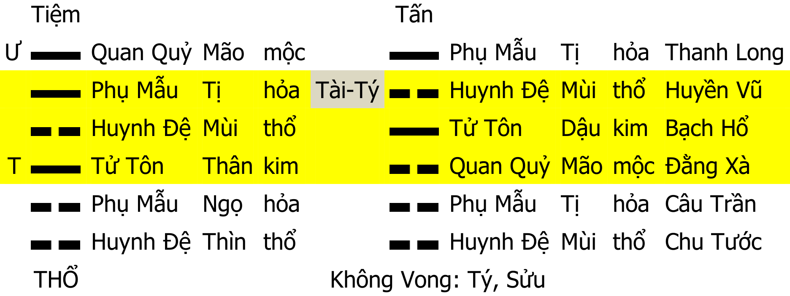
    - **Hình này chứng minh điều gì**
      - Quẻ Tiệm biến Tấn; Quan Quỷ Thân kim trì Thế; Huynh Đệ Dần mộc động; thay đổi hướng mở rộng tuyến điểm du lịch.
    - **Từ đâu mà thấy được**
      - Hào 3 Tử Tôn Thân kim động hóa Quan Quỷ Ngọ hỏa; quẻ Phong Sơn Tiệm.
  - **Phán đoán và đối thoại:**
    - Căn cứ: Tuyến du lịch miền núi đang ế ẩm nguy cơ lỗ nặng; thay đổi ý định chuyển sang khai thác tuyến ven biển.
    - Nhìn vào: Cung Đoài Thủy sinh vượng kích hoạt tài nguyên biển đảo đem lại nguồn thu lớn.
    - Đối thoại thực tế: Giám đốc đau đầu vì tour leo núi liên tục bị hủy do thời tiết xấu đe dọa phá sản.
  - **Phương án hóa giải:** Hủy bỏ tuyến miền núi, tập trung nguồn lực quảng bá tuyến biển đảo.
  - **Ứng nghiệm thực tế:** Tour du lịch biển cháy vé, công ty thu lãi lớn qua mùa hè.
- **Quái lệ 3: Họp lớp hè năm 1995 (Quẻ Phục biến Chấn)**
  - **Hình 102. Quẻ Địa Lôi Phục biến Chấn Vi Lôi**
    - 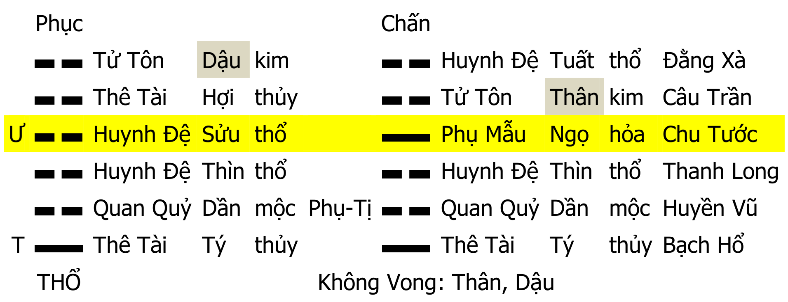
    - **Hình này chứng minh điều gì**
      - Quẻ Phục biến Chấn; hào 4 Huynh Đệ Sửu thổ động hóa Tử Tôn Thân kim; thay đổi ý định đi lại tránh tai nạn giao thông.
    - **Từ đâu mà thấy được**
      - Hào 4 Huynh Đệ Sửu thổ động hóa Tử Tôn Thân kim; quẻ Địa Lôi Phục.
  - **Phán đoán và đối thoại:**
    - Căn cứ: Dự định đi xe máy về quê họp lớp; quẻ báo lộ trình gặp tai nạn va chạm.
    - Nhìn vào: Xe cộ đường bộ lâm Bạch Hổ phát động báo trước tai nạn lở đất nguy hiểm.
    - Đối thoại thực tế: Nhóm bạn rủ rê phượt xe máy đường đèo mạo hiểm trong mùa mưa bão.
  - **Phương án hóa giải:** Thay đổi ý định đi xe máy, chuyển sang mua vé tàu hỏa.
  - **Ứng nghiệm thực tế:** Chuyến tàu an toàn, trong khi đoạn đường quốc lộ cũ xảy ra sạt lở xe cộ tê liệt.
- **Quái lệ 4: Phụ nữ tìm bà đồng xem bói hiệu quả ra sao (Quẻ Đại Quá biến Nhu)**
  - **Hình 103. Quẻ Trạch Phong Đại Quá biến Thủy Thiên Nhu**
    - 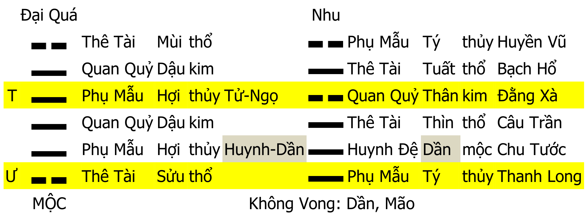
    - **Hình này chứng minh điều gì**
      - Quẻ Đại Quá biến Nhu; Thế hào Dậu kim Nguyệt phá; bà đồng bịa đặt lừa đảo tốn tiền; từ bỏ mê tín chuyển sang khám bác sĩ.
    - **Từ đâu mà thấy được**
      - Hào 3 Quan Quỷ Dậu kim động hóa Huynh Đệ Dần mộc; quẻ Trạch Phong Đại Quá.
  - **Phán đoán và đối thoại:**
    - Căn cứ: Bà đồng dọa ma quỷ đòi 5 triệu làm lễ trừ tà; quẻ Đại Quá cột nhà lung lay lừa đảo rõ ràng.
    - Nhìn vào: Thế phá Kỵ suy chỉ rõ tà thuyết bịa đặt không có thực chất huyền học chân chính.
    - Đối thoại thực tế: Khách hàng hoang mang định vay nóng tiền để nộp cho thầy cúng giải vong.
  - **Phương án hóa giải:** Thay đổi ý định, dứt khoát không đưa tiền cho bà đồng và vào bệnh viện lớn khám chuyên khoa.
  - **Ứng nghiệm thực tế:** Bệnh viện chẩn đoán thiếu canxi gây chuột rút, uống thuốc 1 tuần khỏi hẳn, không tốn tiền oan.
- **Quái lệ 5: Dự đoán thay đổi công việc (Quẻ Tốn biến Hoán)**
  - **Hình 104. Quẻ Tốn Vi Phong biến Phong Thủy Hoán**
    - 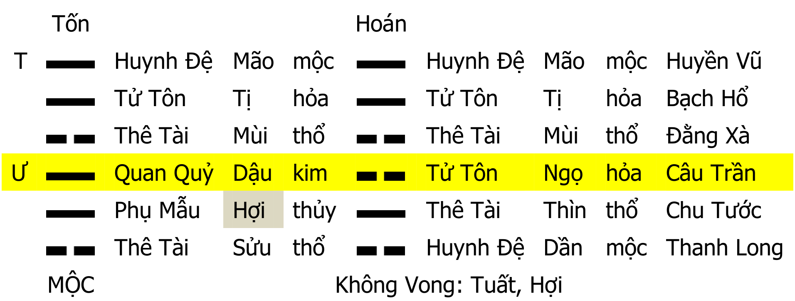
    - **Hình này chứng minh điều gì**
      - Quẻ Tốn biến Hoán; Quan Quỷ Dậu kim trì Thế; Huynh Đệ Sửu thổ động; thay đổi ý định nhảy việc ở lại thăng tiến.
    - **Từ đâu mà thấy được**
      - Hào 2 Quan Quỷ Dậu kim động hóa Thê Tài Hợi thủy; quẻ Tốn Vi Phong.
  - **Phán đoán và đối thoại:**
    - Căn cứ: Định bỏ việc công ty cũ vì bất mãn; quẻ báo ở lại cơ quan cũ sắp có cơ hội cất nhắc.
    - Nhìn vào: Quan tinh trì Thế phát sinh sinh lực, cơ quan cũ chính là mảnh đất dụng võ tốt nhất.
    - Đối thoại thực tế: Đương sự nộp đơn xin thôi việc nhưng thầy Vương khuyên hãy nín nhịn chờ thời cơ.
  - **Phương án hóa giải:** Từ bỏ ý định nộp đơn xin nghỉ, tập trung hoàn thành tốt đề án hiện tại.
  - **Ứng nghiệm thực tế:** Đúng 2 tháng sau sếp cũ chuyển công tác, anh được bổ nhiệm vào ghế trưởng phòng trống.
- **Quái lệ 6: Người đàn ông kinh doanh dự đoán tài vận (Quẻ Tụy biến Bĩ)**
  - **Hình 105. Quẻ Trạch Địa Tụy biến Thiên Địa Bĩ**
    - 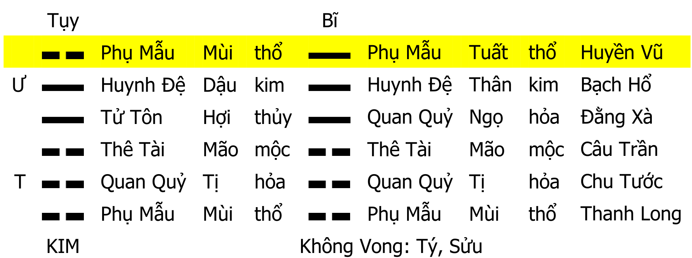
    - **Hình này chứng minh điều gì**
      - Quẻ Tụy biến Bĩ; Thê Tài Mão mộc Không Vong; Huynh Đệ Mùi thổ vượng; thay đổi mặt hàng kinh doanh thoát phá sản.
    - **Từ đâu mà thấy được**
      - Hào sơ Thê Tài Mùi thổ động hóa Quan Quỷ Ngọ hỏa; quẻ Trạch Địa Tụy.
  - **Phán đoán và đối thoại:**
    - Căn cứ: Cửa hàng bán đồ gia dụng tồn kho nặng; đổi sang bán thực phẩm sạch sinh tài nhanh.
    - Nhìn vào: Hào Tài Không Vong chuyển dịch sang mặt hàng thiết yếu dòng tiền nhanh chóng hồi sinh.
    - Đối thoại thực tế: Chủ tiệm đứng ngồi không yên vì nợ tiền ngân hàng đến hạn thanh toán.
  - **Phương án hóa giải:** Chuyển đổi mô hình kinh doanh sang hàng tiêu dùng thiết yếu.
  - **Ứng nghiệm thực tế:** Hàng hóa bán chạy, quay vòng vốn nhanh chóng thu lợi nhuận ổn định.
- **Quái lệ 7: Đồng nghiệp sưng mặt đau đớn (Quẻ Vô Vọng)**
  - **Hình 106. Quẻ Thiên Lôi Vô Vọng**
    - 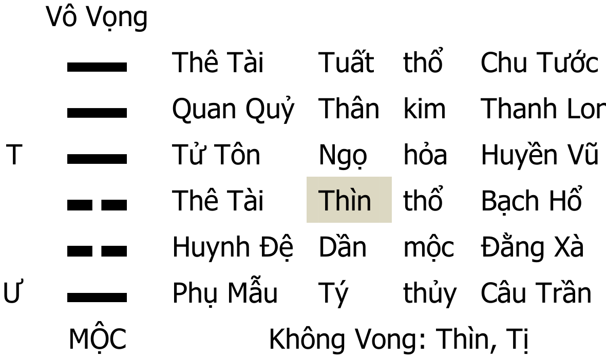
    - **Hình này chứng minh điều gì**
      - Quẻ Thiên Lôi Vô Vọng; hào 5 Phụ Mẫu Thân kim trì Thế; Quan Quỷ Dần mộc động; đổi tâm thế tha thứ buông bỏ thù hằn.
    - **Từ đâu mà thấy được**
      - Quẻ Thiên Lôi Vô Vọng; hào 5 Phụ Mẫu Thân kim; hào sơ Huynh Đệ Tý thủy.
  - **Phán đoán và đối thoại:**
    - Căn cứ: Mặt sưng vù không rõ nguyên nhân sau cơn tức giận uất hận với người khác; tâm hỏa thượng nghịch.
    - Nhìn vào: Dần Mộc động khắc chế Tỳ Thổ vùng mặt; tâm hỏa hạ nhiệt khi xả bỏ uất kết nội tâm.
    - Đối thoại thực tế: Đồng nghiệp tâm sự vừa cãi nhau kịch liệt với cấp trên xong thì một bên má sưng to đau nhức.
  - **Phương án hóa giải:** Thay đổi thái độ, chủ động làm hòa và tha thứ cho đối phương.
  - **Ứng nghiệm thực tế:** Sau khi gọi điện hòa giải xong thì vết sưng trên mặt tiêu giảm kỳ diệu sau một giấc ngủ.

## Chương 14: Phương Pháp Chọn Ngày Tốt Bằng Lục Hào

- **Nguyên tắc chọn ngày tốt bằng Lục Hào khác biệt hoàng đạo thông thường:**
  - Hạn chế của phương pháp xem lịch vạn niên truyền thống: Lịch thông thường chỉ xét chung theo can chi hoàng đạo đại trà, không phản ánh được tương tác cá nhân hóa giữa đương số với sự việc cụ thể.
  - Bản chất của trạch nhật Lục Hào: Gieo quẻ hỏi về sự việc dự định (khai trương, chuyển nhà, kết hôn, động thổ, xuất hành, cải táng) nhằm đo lường tương tác giữa Dụng thần, Thế hào của chủ thể với trường khí thời không vũ trụ.
  - Tiêu chí vàng chọn ngày hoàng đạo cá nhân: Dụng thần và Thế hào phải vượng tướng, đắc sinh phù từ Nguyệt lệnh và Nhật thần, tuyệt đối tránh ngày Tuần Không hoặc Nguyệt Phá.
  - Quy tắc phân loại Dụng thần chuẩn xác theo từng loại hình sự việc:
    - Khai trương kinh doanh buôn bán, ký kết hợp đồng thương mại: Lấy hào Thê Tài làm Dụng thần số một.
    - Thăng quan nhậm chức, thi cử tuyển dụng, yết kiến lãnh đạo: Lấy hào Quan Quỷ làm Dụng thần trợ uy quyền.
    - Động thổ xây dựng, chuyển nhà nhập trạch, mua bán bất động sản: Lấy hào Phụ Mẫu đại diện trạch xá phối hợp Thế hào.
    - Hôn nhân cưới hỏi, đính hôn rước dâu: Lấy Thê Tài và hào Ứng làm trung tâm đối chiếu tương sinh tương hợp với Thế hào.
    - Chữa bệnh nan y, phẫu thuật cứu người: Lấy hào Tử Tôn làm Dụng thần giải trừ ách tật.
  - Quy tắc Ngũ Bất Chọn trong trạch nhật Dịch học: Tránh ngày Tuần Không của Dụng thần, tránh ngày Nguyệt phá, tránh ngày Lục xung toàn quẻ, tránh ngày Kỵ thần trì Thế lâm Nhật kiến, tránh ngày Thể dụng tương hình.
  - Bí pháp kích hoạt cát khí: Khi Dụng thần hưu tù, chọn ngày lâm trường sinh hoặc tam hợp cục trợ lực để biến nhược thành cường.
- **Quái lệ 1: Chọn ngày khai trương cửa hàng kinh doanh (Ngày Mậu Tuất tháng Tân Hợi)**
  - **Hình 107. Quẻ Thiên Địa Bĩ**
    - 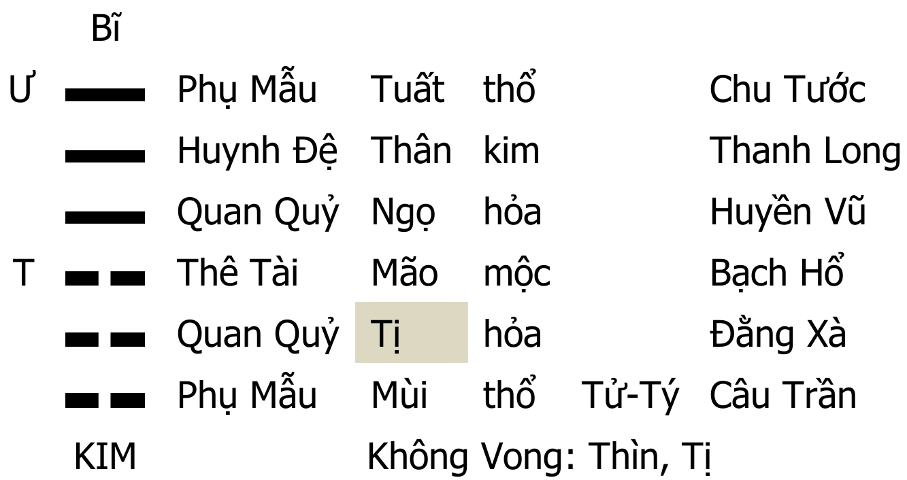
    - **Hình này chứng minh điều gì**
      - Quẻ Thiên Địa Bĩ; Thê Tài Mão mộc hưu tù; chọn ngày Dần hoặc Mão Mộc vượng khai trương sinh tài đại phát.
    - **Từ đâu mà thấy được**
      - Hào sơ Thê Tài Mão mộc; hào 2 Quan Quỷ Tị hỏa; quẻ Thiên Địa Bĩ.
  - **Phán đoán và đối thoại:**
    - Căn cứ: Khai trương lấy Thê Tài làm Dụng thần; Thê Tài Mão mộc cần ngày Dần Mão tỉ hòa trợ vượng.
    - Nhìn vào: Mão Mộc đắc Nguyệt sinh nhưng bị Nhật Tuất hợp trói; cần ngày Dần Mộc xung phá hợp hoặc trợ lực trường sinh.
    - Đối thoại thực tế: Khách hàng hỏi chọn ngày hoàng đạo trên lịch nhưng thầy Vương khuyên hãy căn cứ quẻ Dịch để tránh phá tài.
  - **Phương án hóa giải:** Chọn ngày Giáp Dần lúc 9h sáng cắt băng khai trương.
  - **Ứng nghiệm thực tế:** Ngày khai trương khách đông chật kín, buôn may bán đắt lâu dài.
- **Quái lệ 2 & 3: Chọn ngày chuyển nhà an cư lạc nghiệp (Ngày Nhâm Tuất tháng Canh Tý)**
  - **Hình 108. Quẻ Trạch Thủy Khốn biến Đoài Vi Trạch**
    - 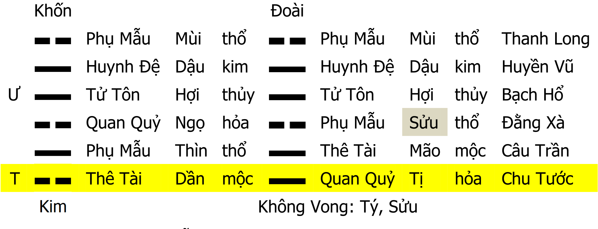
    - **Hình này chứng minh điều gì**
      - Quẻ Khốn biến Đoài; Phụ Mẫu Sửu thổ động hóa Thê Tài Hợi thủy; chọn ngày Thìn hợp Dậu an cư vững bền.
    - **Từ đâu mà thấy được**
      - Hào 2 Quan Quỷ Hợi thủy động hóa Huynh Đệ Dậu kim; quẻ Trạch Thủy Khốn.
  - **Phán đoán và đối thoại (phần 1 - quẻ Khốn biến Đoài):**
    - Căn cứ: Chuyển nhà lấy Phụ Mẫu làm nhà, Thế hào làm người; kiểm tra quẻ Khốn biến Cách định giờ nhập trạch.
    - Đối thoại thực tế: Gia chủ muốn chọn ngày cuối tuần để con cái được nghỉ học nhưng lo sợ phạm ngày hung.
- **Quái lệ 2 & 3 (tiếp theo): Quẻ Khốn biến Cách định ngày nhập trạch**
  - **Hình 109. Quẻ Trạch Thủy Khốn biến Trạch Hỏa Cách**
    - 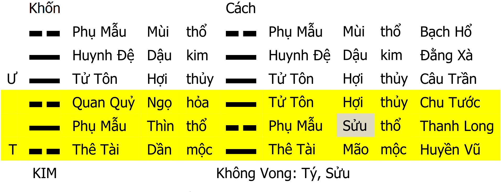
    - **Hình này chứng minh điều gì**
      - Quẻ Khốn biến Cách; hào sơ Thế Huynh Đệ Dần mộc; chọn ngày Thìn xung Tuất mở cửa nhập trạch vượng tài.
    - **Từ đâu mà thấy được**
      - Hào sơ Huynh Đệ Dần mộc động hóa Quan Quỷ Tị hỏa; quẻ Trạch Thủy Khốn.
  - **Phán đoán và đối thoại (phần 2):**
    - Căn cứ: Ngày Bính Thìn Thổ vượng Phụ Mẫu sáng sủa, người nhà khỏe mạnh tài lộc hanh thông.
    - Nhìn vào: Thìn Tuất tương xung kích hoạt khố tài mở ra mang lại hưng thịnh cho trạch xá mới.
  - **Phương án hóa giải:** Nhập trạch vào đúng giờ Tị ngày Bính Thìn.
  - **Ứng nghiệm thực tế:** Chuyển nhà suôn sẻ thuận buồm xuôi gió, gia đình an cư phát tài.
- **Quái lệ 4: Nữ chọn ngày dọn nhà mới (Ngày Bính Thìn tháng Giáp Thìn)**
  - **Hình 110. Quẻ Lôi Trạch Quy Muội**
    - 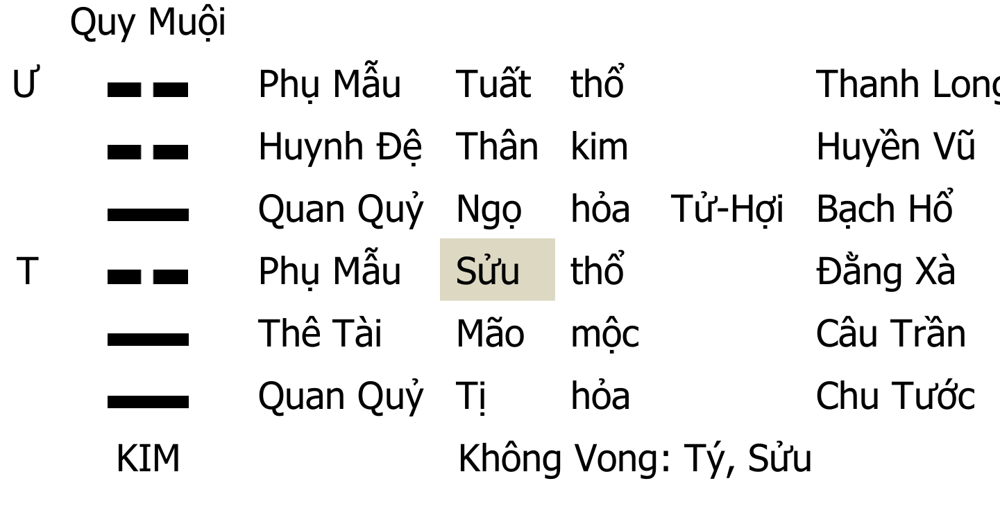
    - **Hình này chứng minh điều gì**
      - Quẻ Quy Muội; Phụ Mẫu Tị hỏa lâm hào 2; chọn ngày Tị hoặc Ngọ hỏa vượng dọn nhà đắc sinh khí.
    - **Từ đâu mà thấy được**
      - Hào 2 Phụ Mẫu Tị hỏa; hào 3 Huynh Đệ Sửu thổ; quẻ Lôi Trạch Quy Muội.
  - **Phán đoán và đối thoại:**
    - Căn cứ: Phụ Mẫu hào 2 là trạch xá; chọn ngày Đinh Tị mang lửa ấm vào nhà mới.
    - Nhìn vào: Hỏa vượng sinh Thổ trợ trạch, hào 2 đắc địa chi hòa hợp chủ về gia đạo an khang thịnh vượng.
    - Đối thoại thực tế: Nữ thí chủ muốn chuyển nhà gấp trước rằm để kịp ngày giỗ đầu của mẹ chồng.
  - **Phương án hóa giải:** Mang bếp lửa và bình nước đun sôi đầu tiên vào nhà mới ngày Đinh Tị.
  - **Ứng nghiệm thực tế:** Gia đình hòa thuận, công việc suôn sẻ sau khi về nhà mới.
- **Quái lệ 5: Nữ dọn nhà quẻ Phục biến Chấn (Ngày Tân Mão tháng Canh Thân)**
  - **Hình 111. Quẻ Địa Lôi Phục biến Chấn Vi Lôi**
    - 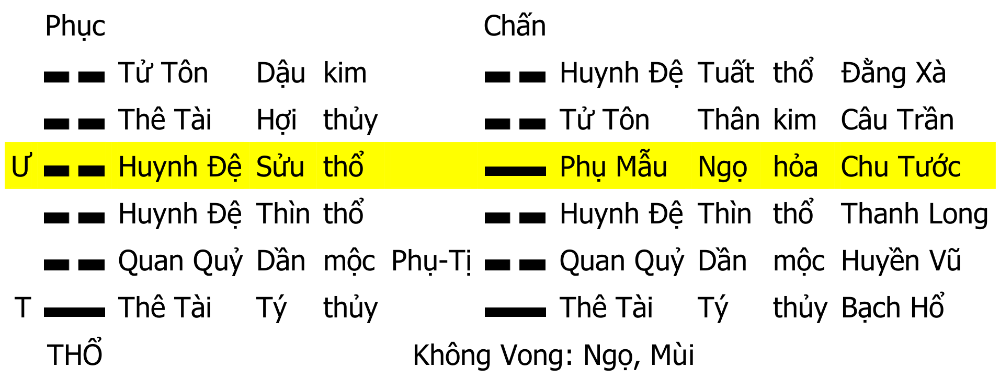
    - **Hình này chứng minh điều gì**
      - Quẻ Phục biến Chấn; hào Thế Tý thủy được Nguyệt sinh; chọn ngày Thân hợp Tý nạp tài nhập trạch cát khánh.
    - **Từ đâu mà thấy được**
      - Hào 4 Huynh Đệ Sửu thổ động hóa Tử Tôn Thân kim; quẻ Địa Lôi Phục.
  - **Phán đoán và đối thoại:**
    - Căn cứ: Hào Thế Tý thủy vượng; chọn ngày Giáp Thân kim sinh thủy vượng trạch.
    - Nhìn vào: Thân Tý bán hợp Thủy cục bồi đắp nguồn năng lượng dồi dào cho bản mệnh nữ gia chủ.
    - Đối thoại thực tế: Chị lo lắng vì căn hộ mới hướng Tây Bắc bị người khác chê là hướng xấu.
  - **Phương án hóa giải:** Tiến hành dọn đồ đạc vào giờ Thìn ngày Giáp Thân.
  - **Ứng nghiệm thực tế:** Mọi sự tốt lành, gia chủ thăng quan tiến chức sau khi dọn nhà.
- **Quái lệ 6: Nam dỡ bỏ nhà cũ xây biệt thự mới (Ngày Canh Thân tháng Quý Tị)**
  - **Hình 112. Quẻ Hỏa Phong Đỉnh biến Hỏa Sơn Lữ**
    - 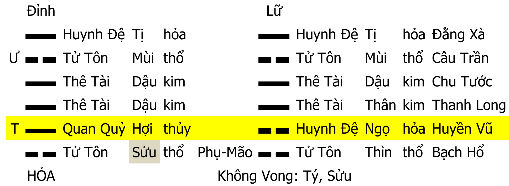
    - **Hình này chứng minh điều gì**
      - Quẻ Đỉnh biến Lữ; hào 3 Tử Tôn Dậu kim động; chọn ngày Dậu động thổ dỡ nhà vạn sự bình an.
    - **Từ đâu mà thấy được**
      - Hào 3 Tử Tôn Dậu kim động hóa Huynh Đệ Thân kim; quẻ Hỏa Phong Đỉnh.
  - **Phán đoán và đối thoại:**
    - Căn cứ: Động thổ dỡ nhà cần Tử Tôn an định phúc thần; ngày Ất Dậu cát tinh tương trợ.
    - Nhìn vào: Dậu kim động trì thế Tử Tôn xua tan âm khí đất cũ bảo hộ thợ thuyền thi công an toàn.
    - Đối thoại thực tế: Chủ thầu xây dựng yêu cầu chọn đúng ngày phạt mộc để tránh xui xẻo nghề nghiệp.
  - **Phương án hóa giải:** Làm lễ phạt mộc hạ ngói vào giờ Thìn ngày Ất Dậu.
  - **Ứng nghiệm thực tế:** Quá trình thi công xây dựng an toàn tuyệt đối không xảy ra tai nạn.
- **Quái lệ 7: Chọn ngày cưới hỏi hôn lễ con trai (Ngày Đinh Dậu tháng Bính Thìn)**
  - **Hình 113. Quẻ Lôi Thủy Giải biến Lôi Địa Dự**
    - 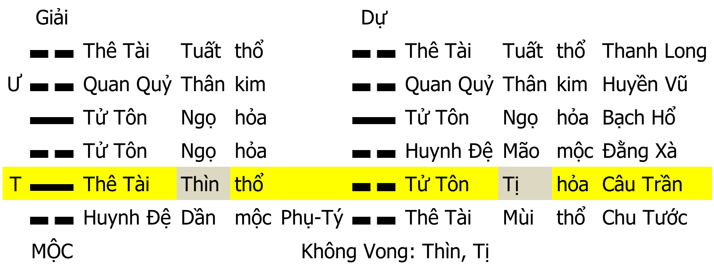
    - **Hình này chứng minh điều gì**
      - Quẻ Giải biến Dự; Thê Tài Ngọ hỏa vượng; hào Ứng tương sinh Thế; chọn ngày Đinh Mùi cưới gả bách niên giai lão.
    - **Từ đâu mà thấy được**
      - Hào 2 Thê Tài Ngọ hỏa động hóa Huynh Đệ Dần mộc; quẻ Lôi Thủy Giải.
  - **Phán đoán và đối thoại:**
    - Căn cứ: Hôn nhân lấy Thê Tài làm Dụng thần; ngày Đinh Mùi tương hợp với Ngọ hỏa đại cát đại lợi.
    - Nhìn vào: Ngọ Mùi lục hợp Hỏa Thổ tương sinh tượng trưng cho vợ chồng hòa thuận sắt son trăm năm.
    - Đối thoại thực tế: Hai bên thông gia xem nhiều thầy phong thủy khác nhau nhưng mỗi nơi phán một ngày gây tranh cãi.
  - **Phương án hóa giải:** Tổ chức hôn lễ rước dâu vào giờ Tị ngày Đinh Mùi.
  - **Ứng nghiệm thực tế:** Đám cưới long trọng vui tươi, đôi vợ chồng trẻ sống hạnh phúc thuận hòa.
- **Quái lệ 8: Khai trương siêu thị điện máy (Ngày Bính Tý tháng Tân Mão)**
  - **Hình 114. Quẻ Trạch Hỏa Cách biến Phong Hỏa Gia Nhân**
    - 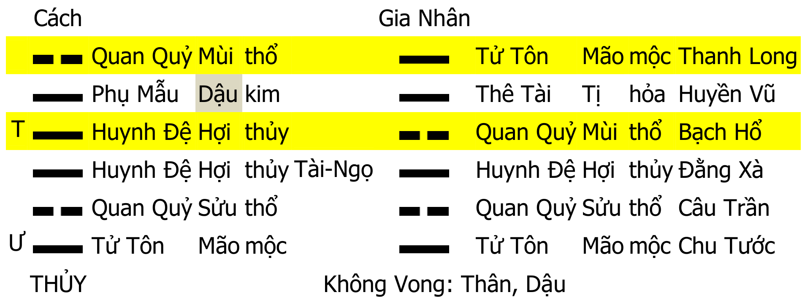
    - **Hình này chứng minh điều gì**
      - Quẻ Cách biến Gia Nhân; hào sơ Quan Quỷ Tị hỏa động; chọn ngày Bính Dần khai trương buôn bán phát đạt.
    - **Từ đâu mà thấy được**
      - Hào sơ Quan Quỷ Tị hỏa động hóa Thê Tài Mão mộc; quẻ Trạch Hỏa Cách.
  - **Phán đoán và đối thoại:**
    - Căn cứ: Siêu thị điện máy thuộc Hỏa Kim; ngày Bính Dần Hỏa Mộc tương sinh đại vượng tài khí.
    - Nhìn vào: Dần Mộc sinh trợ Tị Hỏa hào sơ khởi động guồng máy kinh doanh mã đáo thành công.
    - Đối thoại thực tế: Ban giám đốc chuẩn bị mở chi nhánh thứ mười mong muốn ngày khai trương bùng nổ doanh số.
  - **Phương án hóa giải:** Khai trương mở cửa đón khách lúc 8h sáng ngày Bính Dần.
  - **Ứng nghiệm thực tế:** Siêu thị đông nghẹt khách hàng, doanh số ngày đầu phá kỷ lục chi nhánh.
- **Quái lệ 9: Nữ chọn ngày cải táng phần mộ cha mẹ (Ngày Đinh Mùi tháng Ất Mão)**
  - **Hình 115. Quẻ Cấn Vi Sơn biến Thủy Phong Tỉnh**
    - 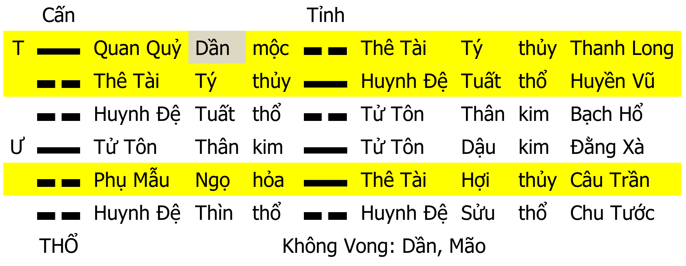
    - **Hình này chứng minh điều gì**
      - Quẻ Cấn biến Tỉnh; Phụ Mẫu Ngọ hỏa lâm hào 2; chọn ngày Kỷ Tị thanh minh sang cát yên nghỉ vĩnh hằng.
    - **Từ đâu mà thấy được**
      - Hào 3 Thê Tài Thân kim động hóa Huynh Đệ Tý thủy; quẻ Cấn Vi Sơn.
  - **Phán đoán và đối thoại:**
    - Căn cứ: Cải táng âm trạch cần Phụ Mẫu an định, Thổ khí thanh tĩnh; ngày Kỷ Tị cát nhật an táng.
    - Nhìn vào: Tị Hỏa sinh Thổ bồi bổ long mạch, che chở hài cốt tiền nhân được ấm êm muôn đời.
    - Đối thoại thực tế: Con gái trưởng chịu trách nhiệm việc họ tộc lo lắng thời tiết mưa gió ảnh hưởng lễ sang cát.
  - **Phương án hóa giải:** Tiến hành cất bốc cải táng vào giờ Thìn ngày Kỷ Tị.
  - **Ứng nghiệm thực tế:** Xương cốt tổ tiên nguyên vẹn sạch sẽ sắc vàng đẹp, con cháu đời sau thịnh vượng phát tài.
